<!-- Generated from Growth CMS. Update content in CMS; run npm run sync. -->

# Awesome Astra Prompts

[](https://github.com/sindresorhus/awesome) [](https://github.com/TripoGrowthLab/awesome-astra-prompts/stargazers) [](LICENSE) [](https://github.com/TripoGrowthLab/awesome-astra-prompts/actions/workflows/sync-prompts.yml) [](CONTRIBUTING.md)

<p>
  <a href="README.md"></a>
  <a href="README.zh-CN.md"></a>
  <a href="docs/catalog.zh-Hant.md"></a>
  <a href="docs/catalog.ja.md"></a>
  <a href="docs/catalog.ko.md"></a>
  <a href="docs/catalog.es.md"></a>
  <a href="docs/catalog.pt.md"></a>
  <a href="docs/catalog.de.md"></a>
  <a href="docs/catalog.fr.md"></a>
  <a href="docs/catalog.it.md"></a>
  <a href="docs/catalog.ru.md"></a>
  <a href="docs/catalog.tr.md"></a>
  <a href="docs/catalog.uk.md"></a>
  <a href="docs/catalog.vi.md"></a>
</p>

> 也在用 Claude Opus 5.5？前往 [Awesome Opus 5.5 Prompts](https://github.com/TripoGrowthLab/awesome-opus-5-5-prompts)，从有来源的 3D 场景、游戏和模拟案例开始创作。

<a href="https://www.tripo3d.ai/zh/3d-prompts/models/gpt-6-astra?utm_source=github&amp;utm_medium=referral&amp;utm_campaign=awesome_astra_prompts&amp;utm_content=readme_hero"></a>

**为你的下一个游戏、场景或交互世界找到灵感。**

探索 GPT-6 Astra 在 Blender、Three.js、Unreal Engine、Unity 和浏览器中的提示词与 3D 作品。

**291 条案例 · 14 种语言 · 12 条附项目源码**

## 精选作品

<table>
<tr>
<td width="50%" valign="top"><a href="https://www.tripo3d.ai/zh/3d-prompts/wright-flyer-through-a-japanese-forest-2096467585785286808"></a><br><strong><a href="https://www.tripo3d.ai/zh/3d-prompts/wright-flyer-through-a-japanese-forest-2096467585785286808">莱特飞行器穿越日本森林</a></strong><br><sub><a href="https://x.com/jaredliu_bravo">Jared</a></sub><br><a href="https://www.tripo3d.ai/zh/3d-prompts/wright-flyer-through-a-japanese-forest-2096467585785286808">提示词 →</a></td>
<td width="50%" valign="top"><a href="https://www.tripo3d.ai/zh/3d-prompts/jelly-jungle-3d-browser-game-2081024333120733188"></a><br><strong><a href="https://www.tripo3d.ai/zh/3d-prompts/jelly-jungle-3d-browser-game-2081024333120733188">果冻丛林：3D 平台跳跃游戏</a></strong><br><sub><a href="https://x.com/jaredliu_bravo">Jared</a></sub><br><a href="https://www.tripo3d.ai/zh/3d-prompts/jelly-jungle-3d-browser-game-2081024333120733188">提示词 →</a></td>
</tr>
<tr>
<td width="50%" valign="top"><a href="https://www.tripo3d.ai/zh/3d-prompts/akari-nagoya-rooftop-flame-relay"></a><br><strong><a href="#akari-nagoya-rooftop-flame-relay">AKARI：名古屋屋顶火炬接力</a></strong><br><sub><a href="https://growthengineer.space/">Jared</a></sub><br><a href="#akari-nagoya-rooftop-flame-relay">提示词 →</a></td>
<td width="50%" valign="top"><a href="https://www.tripo3d.ai/zh/3d-prompts/cyclops-island-threejs-game"></a><br><strong><a href="#cyclops-island-threejs-game">独眼巨人之岛</a></strong><br><sub><a href="https://x.com/jaredliu_bravo">Jared</a></sub><br><a href="#cyclops-island-threejs-game">提示词 →</a></td>
</tr>
</table>

<a id="all-prompts"></a>

## 最新 Astra 提示词

<details>
<summary>浏览案例</summary>

- [交互式 3D 粒子对撞机](#2097781208596029936) · GitHub
- [人类头部与大脑交互式 3D 图谱](#2098105648106078541) · GitHub
- [切尔诺贝利图谱](#2098841316591346006) · GitHub
- [交互式 3D 解剖探索器](#2099206962344800541) · GitHub
- [等距视角奇幻图形演示](#2100271998618177864) · GitHub
- [Mosswing：移动端 3D 点击振翅游戏](#mosswing-mobile-3d-tap-to-flap-game) · GitHub
- [构建 THE LAST GATE：带算术门的人群跑酷](#2097678911882809407)
- [实时 3D 工厂发射台模拟](#2097730920224534868)
- [支持多人游戏的 Minecraft 克隆版](#2097797479488246071)
- [互动奇幻画面演示](#2097821164093480999)
- [无对白 3D 猫咪短片](#2097900087901106244)
- [让 18 洞高尔夫球场更具挑战性](#2098038909514944562)
- [交互式鱿鱼群](#2098043033446912315)
- [GTA 风格卡通汽车追逐工作流](#2098049032195293190)
- [城市脉动](#2098063352832610473)
- [浮空魔法学院动画](#2098071577309122854)
- [白模穿梭机飞越城市峡谷](#2098079379297608050)
- [剑士摧毁城门的奇幻动画](#2098094339759149067)
- [交互式 3D 机械手弹钢琴演示](#2098109252720078891)
- [Sol Horizon 初始民用快递飞船](#2098225609558335846)
- [角色模型头发与面部纹理自动生成及 UV 转移](#2098367087475577273)
- [寺庙微缩立体模型场景](#2098403061463224543)
- [玩机器人的小女孩手办](#2098406473273663992)
- [互动 3D 锦鲤池](#2098492771170722032)
- [建模布鲁克林大桥，测试双向坦克通行](#2098650336521064759)
- [禅境·古寺3D建造演示视频](#2098697876155076820)
- [DEVICE：利用手机本体的写实 3D 解谜游戏](#2098715488369152087)
- [Skybound：浏览器飞行游戏](#2098739181510164652)
- [带接头的分体式3D打印相框](#2098774359926297011)
- [1893年芝加哥世界博览会三维重建](#2098795017955418202)
- [动力沙桌模拟](#2098831830002851846)
- [自折叠 3D 折纸动画](#2098909584996057283)
- [无头服装模型的 UV 展开与 4K 重新烘焙](#2098980384260456813)
- [可玩的 3D 浏览器海岸城区片段](#2099172061092381027)
- [以 3D 形式重新构想桃花公主的城堡](#2099359786865402019)
- [具备防碰撞功能的自动运行模型铁路](#2099362575339372780)
- [可玩 3D 障碍赛道](#2099419671481249851)
- [可交互的 3D 武士森林场景](#2099450933067612421)
- [200 个面以内的针叶树模型](#2099472264270102705)
- [充满超高层摩天大楼的 3D 世界](#2099487024256589970)
- [战士攀上巨人，重击其下颌](#2099519801139908951)
- [创建酒店走廊场景](#2099588840419651890)
- [会逃离的船只与交互式火山岛](#2099643231659012553)
- [交互式 3D 生物神经系统面板](#2099719427990134984)
- [苹果风格爱心与笑脸 3D 表情](#2099750376530657300)
- [可抵达的程序化太空探索游戏](#2099785223827259515)
- [根据参考图片制作可动的 3D 空间和游戏角色](#2099850719839109597)
- [带可动家具的交互式 3D 房间场景](#2100139076816916977)
- [PC 版《喷射战士》的开发与画面还原](#2100193512373592313)
- [交互式公寓漫游与瓷砖方案选择](#2100222426705453318)
- [地下车站中的AAA CGI超自然格斗短片](#2100233407108137349)
- [可交互的体素骑士篝火场景](#2100350159540596760)
- [为护栏添加维护链条](#2100519026720231698)
- [制作 3D 赛车游戏](#2100526922770026874)
- [逃离封闭研究设施的浏览器 3D 游戏](#2100595652703199281)
- [用 CAD 设计身体](#2100614534423540102)
- [怪兽街区——45 秒摧毁城市](#2100636075039629796)
- [使用 Sharpa 灵巧手训练转笔策略](#2100751369619820923)
- [漂浮群岛间的 3D 空中电车游戏](#2100838090210431302)
- [构建照片级真实感的 3D 世界](#2100844566718926949)
- [IWC 沙夫豪森互动腕表模型](#2100956517633761447)
- [基于真实轨道物理的星系](#2101055500599054437)
- [完整的照片级写实 3D 环境](#2101224659861590399)
- [交互式 3D 航空发动机展示](#2101271938706685991)
- [功夫猫 3D 动画与视频工作流](#2101310374033428642)
- [Waymo Jaguar I-Pace 3D 模型](#2101325346427842909)
- [开阔水域上的帆船](#2101616345720787130)
- [在 Three.js 中创建 WALL-E 3D 模型](#2101687900723106104)
- [Verdant——互动式 3D 恐龙岛](#2101730386711634251)
- [交互式 3D 太阳模型网站](#2102038136725377200)
- [Spline Rush 程序化浏览器赛车游戏](#2102150615635816866)
- [交互式 3D 直升机设计展示](#2102215638311694336)
- [东京塔昼夜 3D 场景与视频](#2102276620124062065)
- [泡泡小镇：3D 水球大战](#2102300855387205871)
- [类似《Sir, We Have Orc Problems》的塔防游戏](#2102411087002112256)
- [带室内空间的两层郊区住宅](#2102473710724919614)
- [单个 HTML 文件中的 3D 卡丁车竞速游戏](#2102652927177617564)
- [中世纪城堡浏览器动画](#2102672926285713456)
- [Orbit Lab：太阳、地球与月球 3D 模拟](#2102752217375899659)
- [可在浏览器中操作的中世纪欧洲风格 3D 城堡](#2102780850706567390)
- [用于学习国际象棋弃兵的互动式 3D 棋盘](#2102788013902213508)
- [无限太阳朋克城市着色器](#2102826333550133520)
- [第一人称汉堡制作模拟器](#2102897258983313712)
- [超写实动态沙漠篝火 HTML 场景](#2102915300295369208)
- [使用 Three.js 制作体素版 Codex](#2102956340482289944)
- [可交互的 3D 软糖柑橘切片](#2103062348168618280)
- [北行：互动维京长船之旅](#2103187935759655167)
- [雾霭秋日可探索 Three.js 体验](#2103211135214256350)
- [STILLWATER — 月夜沼泽浏览器体验](#2103308083242082314)
- [黄金时刻的罗马战场场景](#2103351755971207251)
- [火龙果果冻](#2103432732386664591)
- [VRChat 服装 3D 建模](#2103456264785424530)
- [在 Blender 中制作豚鼠](#2103482826519986544)
- [Three.js 体素风日式庭园](#2103486103831339269)
- [Battle City 3D：无尽坦克防御](#battle-city-3d)
- [疯狂坦克——3D 岛屿炮战](#crazy-tanks-3d-island-artillery)
- [ODD ARMS——奇趣武器生存游戏](#odd-arms)
- [泰坦尼克号——最后的光芒](#titanic-the-last-light)
- [AKARI：名古屋屋顶火炬接力](#akari-nagoya-rooftop-flame-relay)
- [独眼巨人之岛](#cyclops-island-threejs-game)

</details>

<a id="2097781208596029936"></a>

### 交互式 3D 粒子对撞机

[BuBBliK](https://x.com/k1rallik) · 2026-09-09

<a href="https://www.tripo3d.ai/zh/3d-prompts/gpt-6-astra-2097781208596029936"></a>

作者为构建交互式 3D 粒子对撞机提供的起始提示词，灵感来自 CERN 的 LHC 和 ATLAS 探测器，并要求使用单个自包含 HTML 文件实现。该提示词用于构建类似作品，并非明确展示案例所使用的确切输入。

**提示词**

```text
使用 Three.js 构建一个细节丰富的交互式 3D 粒子对撞机，灵感来自 CERN 的 LHC 和 ATLAS 探测器。

创建三种视图：包含数千个独立动画部件的探测器、带有反向旋转束流的加速器环，以及模拟碰撞显示。

让探测器分六个阶段展开，从大型端盖轮和磁体逐步细化到独立的传感器模块。加入由滚动控制的拆解动画、30/60/90 秒播放、暂停和反向组装功能。

为各系统添加可见性开关、部件数量、科普说明，以及环形轨道环绕飞行镜头。

采用高级感深色界面、金属材质、低调的金色点缀和电影感灯光。确保部件清晰可辨，避免过度重叠。

参考 CERN 官方资料。明确标注简化几何体和模拟事件。

交付一个可离线运行的单个自包含 HTML 文件，以及可移植的源代码和 README。
```

[查看详情 ↗](https://www.tripo3d.ai/zh/3d-prompts/gpt-6-astra-2097781208596029936) · [查看原帖](https://x.com/k1rallik/status/2097781208596029936) · [项目源码](https://github.com/bubblik525/collider) · [返回案例导航](#all-prompts)

---

<a id="2098105648106078541"></a>

### 人类头部与大脑交互式 3D 图谱

[BuBBliK](https://x.com/k1rallik) · 2026-09-10

<a href="https://www.tripo3d.ai/zh/3d-prompts/gpt-6-astra-2098105648106078541"></a>

作者推荐的可复用重建提示词，用于构建交互式头部与大脑解剖图谱。提示词要求使用经过授权的解剖网格，支持分层探索、检查工具、裁剪平面、爆炸视图，以及可离线运行的独立 HTML 应用。

**提示词**

```text
构建一套完整的人类头部与大脑交互式 3D 图谱。交付可运行的应用，而不是演示模型。请独立做出合理决策，完成实现、测试并通过视觉检查验证结果。

使用 Three.js 以及经过适当授权的真实 Z-Anatomy / BodyParts3D 网格。包含颅骨、牙齿、面部肌肉、大脑、眼睛、脑神经、动脉、静脉，以及可用的相关支持性膜结构。保留它们原有的解剖关系。目标是支持数百个可单独选择的结构，报告实际导入数量，并保留来源署名。

创建简洁明亮的界面，采用浅灰色背景、白色圆角面板、克制的蓝灰色强调色和易读的字体。保持模型足够大：左侧放置结构面板，右侧放置相机工具，顶部放置搜索框，下方放置爆炸滑块。全程使用英文。

让解剖结构支持逐级探索：
头部 → 系统 → 区域 → 单个命名结构。
例如：大脑 → 大脑半球 → 左半球 → 额叶 → 单个结构。

为组装和拆解过程添加动画。组装时保留来源位置；爆炸显示时，将各组排列成清晰分离的布局，并配以易读标签。显示归一化比例，并对大型结构集合进行分页。

包括：
- 自由旋转、滚轮/双指缩放，以及相机预设。
- 拆解滑块和 Shift + 滚轮控制。
- 为组和单个部件提供独立的可见性开关。
- 组透明度、撤销、全部恢复和重置。
- 解剖结构搜索、点击检查、聚焦、隔离和父级导航。
- 解剖配色、瓷质、线框和透明模式。
- 可调节的矢状面、轴位面和冠状面裁剪平面，并支持反向裁剪方向。
- 标签、自动探索、全屏和 PNG 导出。
- 从完整头部逐步探索大脑及其网络的引导式旅程。

在布局和材质发生变化时，保持隐藏结构继续隐藏。说明裁剪平面产生的是开放式展示剖切效果，而不是医学扫描图像。不得虚构解剖结构，也不得声称经过临床验证。

交付一个包含应用和处理后几何体的独立 HTML 文件，可在没有服务器的情况下离线运行。同时提供整洁的源文件、固定版本的依赖、锁定文件、可移植的构建脚本、英文 README，以及所需的许可证和署名信息。排除凭据、本地机器路径、依赖包和无关文件。

测试几何体完整性、层级归属、可见性、撤销功能和布局间距。在浏览器中检查运行中的应用，逐一操作各项控件，检查控制台错误，并在交付前修复视觉重叠问题。
```

[查看详情 ↗](https://www.tripo3d.ai/zh/3d-prompts/gpt-6-astra-2098105648106078541) · [查看原帖](https://x.com/k1rallik/status/2098105648106078541) · [项目源码](https://github.com/bubblik525/head) · [返回案例导航](#all-prompts)

---

<a id="2098841316591346006"></a>

### 切尔诺贝利图谱

[BuBBliK](https://x.com/k1rallik) · 2026-09-12

<a href="https://www.tripo3d.ai/zh/3d-prompts/gpt-6-astra-2098841316591346006"></a>

发帖作者提供的一则可复用建议，用于使用 Three.js 构建切尔诺贝利核电站厂房和 RBMK 反应堆的交互式展览。建议制作可爆炸拆解的三维厂房模型、带动画的蒸汽回路视图，以及支持运动和检查控制的三维反应堆剖切模型。作者将其作为构建类似作品的提示词，而不是所链接展览原始输入的确切内容。

**提示词**

```text
使用 Three.js 构建高品质交互式三维展览“切尔诺贝利图谱”。

参考公开资料，研究完整的切尔诺贝利核电站和 RBMK 反应堆。制作建筑物、格构烟囱、汽轮机大厅、石墨堆、燃料通道、屏蔽结构、汽水分离器、泵和管道的模型。

创建三个选项卡：
— 厂房：制作详细模型，支持通过滚动和滑块逐层拆解。
— 蒸汽回路：制作连接反应堆、汽轮机、冷凝器和泵的动画示意图。
— 运动中的反应堆：制作三维剖切模型，展示流动的水和蒸汽、旋转的机械部件，并提供播放控制。

添加独立的系统显示切换、可调部件间距、线框、透明度、剖切和简短标签功能。确保每一层都便于检查，即使完全拆解后，摄像机仍可自由旋转。

交付源代码和独立 HTML 文件。测试所有控制功能。将其定位为教育性演绎，而非精确的工程复刻。
```

[查看详情 ↗](https://www.tripo3d.ai/zh/3d-prompts/gpt-6-astra-2098841316591346006) · [查看原帖](https://x.com/k1rallik/status/2098841316591346006) · [项目源码](https://github.com/bubblik525/Chernobyl_Atlas) · [返回案例导航](#all-prompts)

---

<a id="2099206962344800541"></a>

### 交互式 3D 解剖探索器

[BuBBliK](https://x.com/k1rallik) · 2026-09-13

<a href="https://www.tripo3d.ai/zh/3d-prompts/gpt-6-astra-2099206962344800541"></a>

作者将此内容分享为一个推荐起始提示词，用于构建类似其 Interactive Brain Cat 网站的版本。它要求创建一个响应式 3D 解剖探索器，支持透明显示、旋转、结构分离、区域标注、图层控制、教育信号动画，以及科学来源引用。

**提示词**

```text
使用公开可用的科学数据集，构建一个精美的交互式 3D 解剖探索器。从外部视图开始，随着我放大，模型逐渐变为透明，显示下方的解剖结构。

支持旋转模型、分离结构、选择带标签的区域，并通过侧边面板切换图层。为解剖结构、连接和单个细胞分别设置选项卡，并加入信号动画和可调节控件。

采用现代、简洁的界面，配合柔和光照、平滑过渡、低饱和色彩和极少的文字。加入箭头和简短的可视化教程。确保在桌面端和移动端都能运行。

尽可能使用真实的解剖几何数据，注明数据来源，并清晰区分科学数据与示意动画。构建一个可正常运行的网站。
```

[查看详情 ↗](https://www.tripo3d.ai/zh/3d-prompts/gpt-6-astra-2099206962344800541) · [查看原帖](https://x.com/k1rallik/status/2099206962344800541) · [项目源码](https://github.com/bubblik525/cat_brain_anatomy) · [返回案例导航](#all-prompts)

---

<a id="2100271998618177864"></a>

### 等距视角奇幻图形演示

[Anshu Chimala](https://x.com/anshuc) · 2026-09-16

<a href="https://www.tripo3d.ai/zh/3d-prompts/gpt-6-astra-2100271998618177864"></a>

一个基于浏览器的可交互奇幻 3D 场景，采用等距视角、受体素启发的美术风格、湿润反光地面，以及可移动的角色。链接中的 Dream Loop 仓库将此内容作为示例提示词，并注明已在 Codex 中使用 GPT-6 Astra 进行测试。该示例不包含玩法循环。

**提示词**

```text
为我制作一个图形演示：使用等距视角、带有写实着色和湿润反光地面的体素风美术风格，并在有趣的场景中放置一个角色。背景设定为奇幻世界（可以参考《Elden Ring》和《Diablo》）。使用浏览器中的 Three.js，帧率需达到 >60fps。不要下载资源。时间限制为 1 小时。操作方式：点击移动角色，摄像机进行延迟跟随；拖动旋转摄像机；滚动缩放视图。暂时不要加入玩法。世界应当充满生气：包含动态效果、动画和细微的环境行为。玩家周围的区域应显得开阔，但只允许在有限空间内移动。不需要向我确认美术方向，也不要提问，直接开始！
```

[查看详情 ↗](https://www.tripo3d.ai/zh/3d-prompts/gpt-6-astra-2100271998618177864) · [查看原帖](https://github.com/achimala/dream-loop) · [项目源码](https://github.com/achimala/dream-loop) · [返回案例导航](#all-prompts)

---

<a id="mosswing-mobile-3d-tap-to-flap-game"></a>

### Mosswing：移动端 3D 点击振翅游戏

[Ayi1337](https://github.com/Ayi1337) · 2026-09-10

<a href="https://www.tripo3d.ai/zh/3d-prompts/mosswing-mobile-3d-tap-to-flap-game"></a>

打造一款精致的移动端浏览器 3D 飞行游戏：单击操控、不断滚动的间隙、即时计分，以及原创的生物与世界。

**提示词**

```text
重新演绎经典的“点击振翅”游戏——玩家通过点击让一只小生物保持飞行，在无尽延伸的间隙之间滑翔——将其制作成一款可在移动端浏览器中游玩的 3D 游戏。只需一个 index.html，打开即可立即运行和游玩；不要使用外部资源（可以使用 CDN 库，由你决定）。保留所有人记忆中的核心玩法：单击操控、重力、不断向你滚动的间隙，碰撞一次即结束，得分取决于通过的间隙数量。其他一切由你决定：生物是什么、障碍物是什么、世界设定、镜头、振翅手感，以及视觉表现可以做到什么程度。设计原创的角色与风格，不要照搬原作美术。我不会回答澄清问题。我评判的是一件完整、优雅、手感出色的作品，而不是功能清单。小而完整，胜过大而粗糙。
```

[查看详情 ↗](https://www.tripo3d.ai/zh/3d-prompts/mosswing-mobile-3d-tap-to-flap-game) · [查看原帖](https://github.com/Ayi1337/gpt6-astra-one-shot-games#02--mosswing) · [项目源码](https://github.com/Ayi1337/gpt6-astra-one-shot-games) · [在线演示](https://mosswing-quiet-flight.jack-514.chatgpt.site/) · [返回案例导航](#all-prompts)

---

<a id="2097678911882809407"></a>

### 构建 THE LAST GATE：带算术门的人群跑酷

[MSB](https://x.com/KeWai386772) · 2026-09-09

<a href="https://www.tripo3d.ai/zh/3d-prompts/gpt-6-astra-2097678911882809407"></a>

创建一款可玩的竖屏人群跑酷游戏，包含算术门、真实的队伍人数变化、障碍损失、由幸存人数决定的终点遭遇、三条短路线、即时重试和带种子的输入回放。

**提示词**

```text
构建 THE LAST GATE 构建 THE LAST GATE：一款带算术门的可玩竖屏人群跑酷。可见队伍规模必须与实际人数一致，实现有实际后果的障碍损失，以及由人数决定的终点遭遇。交付三条短路线、即时重试与带种子的输入回放，不得编造胜利。
```

[查看详情 ↗](https://www.tripo3d.ai/zh/3d-prompts/gpt-6-astra-2097678911882809407) · [查看原帖](https://x.com/KeWai386772/status/2097678911882809407) · [返回案例导航](#all-prompts)

---

<a id="2097730920224534868"></a>

### 实时 3D 工厂发射台模拟

[Konstantin Saifoulline](https://x.com/konstantinsaifo) · 2026-09-09

<a href="https://www.tripo3d.ai/zh/3d-prompts/gpt-6-astra-2097730920224534868"></a>

研究 @AirsupHQ 的精益生产书籍，设计一座拥有 10 个发射台的工厂方案，并构建一个实时 3D 模拟：展示物料到达、火箭驶向发射台并升空的过程。

**提示词**

```text
研究 @AirsupHQ 的精益生产书籍，设计一座拥有 10 个发射台的工厂方案，并构建一个实时 3D 模拟。
```

[查看详情 ↗](https://www.tripo3d.ai/zh/3d-prompts/gpt-6-astra-2097730920224534868) · [查看原帖](https://x.com/konstantinsaifo/status/2097730920224534868) · [返回案例导航](#all-prompts)

---

<a id="2097797479488246071"></a>

### 支持多人游戏的 Minecraft 克隆版

[Armaan Jain](https://x.com/Armaan_Jain123) · 2026-09-09

<a href="https://www.tripo3d.ai/zh/3d-prompts/gpt-6-astra-2097797479488246071"></a>

创建一款基于浏览器的 Minecraft 克隆版，包含使用种子程序化生成的世界、生存模式、生物群系、维度、生物、结构、成就、局域网多人游戏、游戏内原生 UI、定向音频、准确的方块与流体行为，以及性能优化。

**提示词**

```text
创建一款完整且完美还原的 Minecraft 克隆版；如果需要我提供任何信息，请告诉我。我附上了一份关于 Minecraft 的深度研究文档，会对你有所帮助。务必精准还原游戏机制、动画和画面效果。每个新世界都应使用种子进行程序化随机生成。加入玩家对 Minecraft 期待的所有生物，并确保它们出现在正确的生物群系中。单人模式完成后，加入允许玩家将自己的世界开放到局域网、彼此加入服务器的功能。游戏默认应使用生存模式。纹理要看起来与 Minecraft 完全一致；如果能在网上找到完全相同的纹理，也可以使用。我要的是与 Minecraft 完全一致的效果，字面意义上的完全一致：任何人都不应看出你创建的网站与真正的 Minecraft 之间存在差别。这一切仅用于教育目的，因此无需担心版权问题。游戏 UI 不要简单地使用 HTML 实现，而要在游戏引擎中原生构建。角色和生物模型应使用真实的模型，并在外观、功能和动画上都与原版游戏完全一致。加入定向音频和各种音效。逐页、逐项交互、逐个游戏机制地检查并还原，做到尽善尽美。全部完成并创建出完美的 Minecraft 克隆版后，再使用遮挡剔除、渲染距离、模拟距离、基于距离的 LOD、FPS 优化等技术以及其他方法优化性能。确保游戏逻辑准确无误。例如，如果下方还有其他沙子或沙砾方块支撑的沙子或沙砾方块被破坏，上面的方块就应落下；如果支撑方块被破坏，其上方的花朵或草也应随之破坏。背包 UI 应与原版完全一致，交互体验也要相同，包括快捷操作、动画，以及剑和其他武器、工具的命中效果。准确还原水中移动、生物在水中的行为、自动跳跃以及其他所有细节。重点是把这些细节做好，做到完美。游戏不应有卡顿或故障感，而应运行流畅，与真正的 Minecraft 完全一致。注意云朵、昼夜循环、天气、Minecraft 背景音乐等细节。确保水和熔岩按预期流动，并完美实现它们的渲染。生物不应生成在彼此重叠的位置、树木顶部或方块内部。加入 Minecraft 的结构、村民、战利品以及所有相关内容。完善生物生成逻辑，确保生物动画流畅，并让每种生物和玩家角色的尺寸都与真正的 Minecraft 准确一致。重点还原 Minecraft 玩家经常执行的操作，例如放置方块时跳跃以快速搭桥或爬得更高、跳跃时使用 Ctrl + W 等。确保物品拿在玩家手中时外观良好，并让手部位置与真正的 Minecraft 完全一致。为生物加入命中效果，并让背包中的每个物品图标都与真正的 Minecraft 完全一致。
```

[查看详情 ↗](https://www.tripo3d.ai/zh/3d-prompts/gpt-6-astra-2097797479488246071) · [查看原帖](https://x.com/Armaan_Jain123/status/2097797479488246071) · [返回案例导航](#all-prompts)

---

<a id="2097821164093480999"></a>

### 互动奇幻画面演示

[Anshu](https://x.com/anshuc) · 2026-09-09

<a href="https://www.tripo3d.ai/zh/3d-prompts/gpt-6-astra-2097821164093480999"></a>

一个 Dream Loop Plus 提示词，用于在浏览器中创建基于 Three.js 的奇幻场景，包含等距视角、可控制角色、湿润反光地面和环境氛围动态。作者将其标记为使用 GPT-5.6 Luna xhigh 的演示提示词；帖子称 Astra 在优化后的流程中负责视觉呈现。

**提示词**

```text
使用 Dream Loop Plus 为我制作一个画面演示：采用等距视角、真实感着色和湿润反光地面，并在有趣的场景中加入一个角色。设定为奇幻世界（参考《Elden Ring》和《Diablo》）。使用浏览器中的 Three.js，帧率 >60fps。操作方式：点击移动角色，相机进行延迟跟随；拖动旋转相机；滚动缩放镜头。暂时不要加入游戏玩法。世界应当充满生机：包含动态、动画以及细微的环境行为。
```

[查看详情 ↗](https://www.tripo3d.ai/zh/3d-prompts/gpt-6-astra-2097821164093480999) · [查看原帖](https://x.com/anshuc/status/2097821164093480999) · [返回案例导航](#all-prompts)

---

<a id="2097900087901106244"></a>

### 无对白 3D 猫咪短片

[AI実践ラボ](https://x.com/boboga777) · 2026-09-10

<a href="https://www.tripo3d.ai/zh/3d-prompts/gpt-6-astra-2097900087901106244"></a>

制作一部无对白的 3D 猫咪动画：围绕一个零食按钮展开，混乱不断升级，最后带来一个小小的惊喜。

**提示词**

```text
制作一部无对白的 3D 猫咪短片：一个零食按钮，彻底失控的混乱，以及一个小小的惊喜。加入夸张生动的表演、镜头运动、配乐，并做成可循环播放的动画。
```

[查看详情 ↗](https://www.tripo3d.ai/zh/3d-prompts/gpt-6-astra-2097900087901106244) · [查看原帖](https://x.com/boboga777/status/2097900087901106244) · [返回案例导航](#all-prompts)

---

<a id="2098038909514944562"></a>

### 让 18 洞高尔夫球场更具挑战性

[Rory Flynn](https://x.com/Ror_Fly) · 2026-09-10

<a href="https://www.tripo3d.ai/zh/3d-prompts/gpt-6-astra-2098038909514944562"></a>

作者提出的连夜修改目标：重新调整浏览器端的 18 洞高尔夫球场模型，打造更具挑战性的球洞、更加错落的球道、更大胆的沙坑与障碍区，以及更有策略意义的击球选择。

**提示词**

```text
让每个球洞更具挑战性
>打破笔直的球道布局
>加入更大胆的沙坑和障碍区
>设计更有策略意义的击球选择
```

[查看详情 ↗](https://www.tripo3d.ai/zh/3d-prompts/gpt-6-astra-2098038909514944562) · [查看原帖](https://x.com/Ror_Fly/status/2098038909514944562) · [返回案例导航](#all-prompts)

---

<a id="2098043033446912315"></a>

### 交互式鱿鱼群

[Vib3Coded](https://x.com/vib3coded) · 2026-09-10

<a href="https://www.tripo3d.ai/zh/3d-prompts/gpt-6-astra-2098043033446912315"></a>

一个交互式 WebGL 鱿鱼群，其身体形态基于数学点计算生成，支持实时运动、交互控制、颜色变化和惯性效果，并会在水面受到触碰时产生惊慌反应。

**提示词**

```text
创建一个交互式鱿鱼群
```

[查看详情 ↗](https://www.tripo3d.ai/zh/3d-prompts/gpt-6-astra-2098043033446912315) · [查看原帖](https://x.com/vib3coded/status/2098043033446912315) · [返回案例导航](#all-prompts)

---

<a id="2098049032195293190"></a>

### GTA 风格卡通汽车追逐工作流

[PixVerse](https://x.com/PixVerse) · 2026-09-10

<a href="https://www.tripo3d.ai/zh/3d-prompts/gpt-6-astra-2098049032195293190"></a>

一套可复用的工作流提示词：在 Blender 中制作并动画化一段 12 秒的 GTA 风格卡通汽车追逐，然后使用 PixVerse Seedance 2.5 处理各个镜头。

**提示词**

```text
使用这套工作流创建原创的 GTA 风格卡通汽车追逐：
设计：确定一名主驾驶员、一辆逃逸车、一辆追逐车和一套城市环境，并保持它们的设计一致。规划三个 4 秒镜头：后方跟拍追逐、急转弯时的侧面跟拍，以及驶离场景的远景镜头。
在 Blender 中制作：创建干净的灰模，并完成可用的角色和车辆骨骼绑定。不需要制作纹理或展开 UV。
动画与测试：为驾驶员、转向动作、车轮旋转、车辆和摄像机制作动画。保持行进方向和车辆前后顺序一致。修复穿插、车轮悬空、轮胎打滑、姿势异常，以及双手脱离方向盘等问题。
在 Blender 中渲染：以 1280×720、24 fps 渲染第 1—288 帧。将实际由 Blender 渲染的帧组装成完整的 12 秒灰模母版。分别导出每个镜头，并渲染对应的灰模静帧，作为造型和构图参考。
使用 [@PixVerse](plugin://pixverse@openai-curated-remote) 插件完成后期：使用 Seedance 2.5，以 720p 分别处理每个镜头。将 Blender 片段用作运动参考，将灰模静帧用作造型参考。在生成提示词中定义统一的卡通配色方案。保留摄像机运动、动作节奏、角色和车辆设计，以及车辆数量。
检查与交付：检查两套完整视频中的画面缺陷和连续性。修复 Blender 问题；对于 Seedance 中失败的镜头，仅重新生成这些镜头，每个镜头最多重试两次。交付可编辑的 .blend 文件、Blender 原生 720p 灰模视频、单独标注的 720p Seedance 版本，以及一份简要的剩余限制评估。
```

[查看详情 ↗](https://www.tripo3d.ai/zh/3d-prompts/gpt-6-astra-2098049032195293190) · [查看原帖](https://x.com/PixVerse/status/2098049032195293190) · [返回案例导航](#all-prompts)

---

<a id="2098063352832610473"></a>

### 城市脉动

[Seoyeon Jun 📊](https://x.com/tableau_viz) · 2026-09-10

<a href="https://www.tripo3d.ai/zh/3d-prompts/gpt-6-astra-2098063352832610473"></a>

一份交互式 3D 出行图谱，展示 2025 年 1 月纽约市黄色出租车的活动情况，包含 3D 地图、可回放的逐小时移动、分区查看，以及与工作日或周末平均值的对比。

**提示词**

```text
# 构建“城市脉动”：纽约市出租车活动（2025 年 1 月）交互式 3D 出行图谱

## 目标
制作一个单页英文网页可视化，展示纽约在一个月中的运行状态：
31 天、24 小时、263 个出租车分区。用户应能够观看城市的日常节奏，
将任意一天与典型工作日或周末进行对比，并详细查看任意分区。
这是一个描述性分析工具，不是实时或 GPS 产品。每个可视元素都必须说明一个标记代表什么。

## 数据
公开数据源：
- NYC TLC 行程记录数据，Yellow Taxi，2025 年 1 月（Parquet）
- NYC TLC 出租车分区（263 个分区，包含形状数据和行政区查询表）
- NYC Open Data 建筑轮廓（仅限曼哈顿，用作视觉背景）

预处理（Python + DuckDB 或 pandas），输出小型静态 JSON 文件：
- 过滤无效行程：上车时间不在 2025 年 1 月内、行程时长不为正或超过 3 小时、未知分区（264/265）。
- 按天、按分区、按小时统计：上车次数、行程时长中位数。
- 按天、按小时统计：起点 → 终点分区对的主要流向（聚合后的流量，每小时取前 N 项）。
- 按分区和小时计算参考平均值：工作日平均值（23 天）和周末平均值（8 天），按天求均值，节假日保留在工作日组中。
- 全月固定比例尺：取分区-小时上车次数的最大值，所有日期都使用该比例尺，以便比较柱体高度。
- 分区元数据：id、名称、行政区、质心、标签锚点。简化分区几何形状。
文件：month.json（每日总量、比例尺、主要分区）、weekday.json、weekend.json、days/2025-01-DD.json、分区 GeoJSON。
延迟加载当天数据；确保首次渲染保持快速。

## 技术栈
- 使用一个自包含 HTML 文件（或小型 Vite 应用），搭配 Three.js 0.160（通过 importmap 使用 ES 模块）、OrbitControls、EffectComposer + bloom。
- D3 仅用于比例尺、格式化和小型 SVG 图表。
- 不要求使用框架。运行时不调用外部 API；所有内容均读取静态 JSON。

## 布局（桌面端 1920×1080 必须在一屏内完整显示，无需滚动）
1. 页头：“CITY PULSE / MOBILITY ATLAS”、“Recorded replay”状态、“Data & methods”链接。
2. 状态栏：“一座正在流动的城市。” + 三项 KPI：全市上车次数（所选小时）、相对比较平均值、行程时长中位数。
3. 月度条：31 个日期按钮，以迷你柱形显示（柱高 = 每日上车次数，并标记周末）、前一天/后一天、日期选择器、“Compare with”选择器（工作日平均值 · 23 天 / 周末平均值 · 8 天）。
4. 故事栏：“每一次移动都会留下规律。”包含 4 个章节（01 观看、02 展开、03 对比、04 分享）和“开始探索”。
5. 视图标签：01 连接、02 城市流量、03 展开 24 小时、04 幽灵城市，以及“分享发现”和“创建简报”。
6. 工作区：3D 地图舞台（左侧）+ 位置洞察检查器（右侧，约 330px，内部滚动）。
7. 时间轴：播放当天、速度（0.25×–4×）、小时拖动条，叠加在所选日期与平均值的 24 小时柱状图上。
地图舞台高度必须根据视口自适应（约在 470px 至 780px 之间限制），确保在 100% 缩放下包括时间轴在内的整个控制台都能显示。

## 3D 场景
- 深色地面，使用细线绘制分区轮廓，叠加淡化的曼哈顿建筑轮廓作为真实世界背景。
- 摄像机：透视视角，支持环绕和缩放，并提供重新居中按钮。切换视图时保留用户的摄像机状态，但“展开 24 小时”除外，该视图始终重新调整取景以展示完整矩阵。
- 悬停在分区上：显示包含名称和上车次数的工具提示。点击分区：选中该分区（更新检查器和流向）。

视图（每次切换都要有动画，避免突然跳变）：
- 01 连接：使用带发光弧线和移动光粒子显示聚合后的分区间行程；粒子密度 ∝ 行程数；为重点流向添加标签（“起点 / Midtown Center → 终点 / Upper East Side North，71 次行程 / 18:00”）。说明文字：“已记录的分区间行程 · 示意性运动。并非 GPS。”
- 02 城市流量：将每个分区挤出为立体柱；高度 = 按全月固定比例尺计算的上车次数；高亮所选分区。
```

[查看详情 ↗](https://www.tripo3d.ai/zh/3d-prompts/gpt-6-astra-2098063352832610473) · [查看原帖](https://x.com/tableau_viz/status/2098063352832610473) · [返回案例导航](#all-prompts)

---

<a id="2098071577309122854"></a>

### 浮空魔法学院动画

[PixVerse](https://x.com/PixVerse) · 2026-09-10

<a href="https://www.tripo3d.ai/zh/3d-prompts/gpt-6-astra-2098071577309122854"></a>

在 Blender 中制作一段 12 秒的宏伟入口、钥匙孔穿越、天文仪器与浮空学院白模动画，再使用 PixVerse 将其渲染为电影感奇幻片段。交付内容包括两个 MP4 文件和一个可编辑的 Blender 项目文件。

**提示词**

```text
在 Blender 中制作一段 12 秒、单镜头完成的白模动画，然后使用 @PixVerse 将导出的动画转换为壮观的实拍感奇幻电影片段。

在 Blender 中搭建宏伟的入口、旋转的天文仪器和规模庞大的浮空魔法学院。使用简洁的白色或浅灰色几何体，确保轮廓清晰，并采用基础灯光。开场时展示完整的入口大门，周围由实体墙体包围，将门后的世界完全遮挡。为大门设置一个比例真实的小型钥匙孔。穿过入口后，布置一座大型中央城堡、塔楼、较小的浮空岛和连接桥梁。营造令人震撼的建筑尺度，并在各个结构之间留出充足距离。

先缓慢靠近大门，随后突然加速，持续穿过钥匙孔。让一把浮空钥匙旋转并移到一旁，再让镜头通过。继续穿越高速旋转的天文环，展现浮空学院，然后平滑过渡到围绕建筑群的环绕镜头。让附近的岛屿快速升起，桥梁段旋转到位。保持物体运动充满活力且果断。环绕镜头应连续流畅，速度变化自然，不要反复停顿。在正常播放速度下检查钥匙孔通行、镜头净空、空间连续性和运动效果。

导出干净的 12 秒白模 MP4。然后使用 @PixVerse 生成一段 12 秒的 AI 渲染视频，将 Blender 动画作为宽松的结构和运动参考。保留从接近大门、穿过钥匙孔、经过天文仪器、展现学院到环绕镜头的清晰发展顺序，同时自由丰富世界细节和电影化调度。

将学院塑造成一座宏大而古老的浮空城市：中央城堡四周环绕着城区、图书馆、天文台、庭院、层叠屋顶、巨大的石桥，以及飞泻入云的瀑布。将周边环境延伸至森林覆盖的山谷、湖泊、远山和更多浮空岛。加入微小的行人、飞行船、飘动的旗帜、鸟群和环境活动，以传达宏大的尺度。在后段环绕镜头中，让一条巨龙从学院后方的云层中出现，掠过塔楼，并在城市上投下移动的阴影。

以实拍感奇幻故事片的丰富质感为目标，呈现风化材质、穿透冷色云层的柔和金色阳光、自然的大气纵深和轻柔的摄影高光。加入原创管弦乐，以及与画面同步的环境音效和动作音效。

交付白模 MP4、PixVerse AI 渲染 MP4，以及可编辑的 Blender 项目文件。
```

[查看详情 ↗](https://www.tripo3d.ai/zh/3d-prompts/gpt-6-astra-2098071577309122854) · [查看原帖](https://x.com/PixVerse/status/2098071577309122854) · [返回案例导航](#all-prompts)

---

<a id="2098079379297608050"></a>

### 白模穿梭机飞越城市峡谷

[PixVerseCreators](https://x.com/PixVerseCreator) · 2026-09-10

<a href="https://www.tripo3d.ai/zh/3d-prompts/gpt-6-astra-2098079379297608050"></a>

使用 Blender 制作的 10 秒一镜到底动画：原创穿梭机以极高速度飞越密集的城市峡谷，并基于 Blender 参考由 PixVerse 完成渲染。

**提示词**

```text
在 Blender 中制作一段 10 秒、一镜到底的白模穿梭机飞行动画。设计一架原创穿梭机，以及一条绵延数公里、建筑密集的城市峡谷。让穿梭机沿着延伸航线持续高速向前飞行，全程覆盖超过两公里，且不得减速。穿过狭窄间隙和桥下，改变飞行高度，并向相反方向各完成一次流畅的滚筒式翻滚。明确表现高速感：近处建筑向后拉出 streak，桥梁从头顶飞掠而过，前景结构快速从画面边缘扫过。为环境添加强烈的定向运动模糊，同时保持穿梭机清晰可辨。密集障碍、近距离掠过，以及强烈的前后景视差应传达持续全速飞行的感觉。使用平滑的广角追逐镜头，贴近穿梭机后方并略高于机体，以匹配的速度向前追拍。保持机头朝向城市内部，发动机朝向镜头。不得剪辑、抖动镜头、镜头滚转、慢动作或在结尾减速。以正常播放速度测试净空、运动连续性和速度感。使用 PixVerse 基于 Blender 参考渲染最终白模动画，同时保留极高速度、飞行路线和镜头运动。交付最终 MP4、可编辑的 Blender 工程文件，以及一份简要的局限性说明。
```

[查看详情 ↗](https://www.tripo3d.ai/zh/3d-prompts/gpt-6-astra-2098079379297608050) · [查看原帖](https://x.com/PixVerseCreator/status/2098079379297608050) · [返回案例导航](#all-prompts)

---

<a id="2098094339759149067"></a>

### 剑士摧毁城门的奇幻动画

[PixVerse](https://x.com/PixVerse) · 2026-09-10

<a href="https://www.tripo3d.ai/zh/3d-prompts/gpt-6-astra-2098094339759149067"></a>

在 Blender 中制作一段 12 秒的剑士摧毁宏伟城门的白模动作动画，再将其转化为绘画风格的奇幻电影动画片段：加入山地堡垒、建筑坍塌、空中镜头揭示、音乐和同步音效。

**提示词**

```text
在 Blender 中制作一段 12 秒的白模动作动画，然后使用 @PixVerse 将导出的动画转化为壮观、成熟的绘画风格奇幻动画电影片段。

在 Blender 中搭建一个结构简单且带关节的剑士、一把剑和剑鞘、一座高耸的巨大石台，以及一座周围环绕柱子的巨型城门。使用干净的白色或浅灰色几何体和基础灯光。优先保证动作清晰易读、比例可信，并突出渺小角色与宏伟建筑之间的强烈对比。用一个简单的动画曲线形状表现剑气波，并将城门拆分成能够明显分离和坠落的部件。

镜头从靠近剑士的位置开始：他拔出武器，短暂蓄力。在第 2 秒左右，完成一次由脚部、髋部、躯干和手臂共同驱动的极快而果断的斩击。释放一道清晰可见的月牙形剑气波，使其穿过空间并击中城门。让城门上部沿切口滑动、失去支撑，并在明显的加速度和落地碰撞中坍塌。斩击结束后，让剑士自然收势、收剑入鞘、挺直身体并放松双臂。

随着攻击展开，持续平滑地将镜头向后上方拉远。镜头不断大幅升高，直到结尾变成极高、近乎垂直的全景俯视，展现整座石台及周围地形。角色可以小到难以辨认。保持快速的动作节奏和不断扩张的宏大尺度感，不要长时间停留在攻击姿势上。以正常播放速度检查身体运动、武器动作的连贯性、剑气波的移动、城门坍塌和镜头运动。

导出干净的 12 秒白模 MP4。然后使用 @PixVerse 生成一段 12 秒的 AI 渲染视频，将 Blender 动画作为构图、动作推进和镜头上升的宽松参考。保留蓄力、斩击、剑气波飞行、城门摧毁、收剑和极高空全景揭示这一核心流程，同时允许进行大幅度的电影化扩展。

打造成熟的绘画风格动画电影美学，结合富有表现力的造型、手绘表面、可信的三维体积感和柔和的电影级灯光。为成年剑士设计鲜明的剪影、酒红色外套、克制的护甲和沉着坚定的神情。将场景扩展为一座无边延展的山地堡垒，加入层叠城墙、高塔、桥梁、深邃峡谷，以及远处绵延的城市。

让月牙形剑气波成为重要的视觉事件。它应劈开城门并继续穿过远处的防御工事，形成清晰可辨的连锁坍塌，同时卷起尘土、火花、火焰和冲击波。当镜头升至极高空时，展现攻击横跨战场的完整路径，并让剑士安静地站在起点。使用冷色氛围阴影，与温暖的琥珀色能量和零散火光形成对比。加入原创电影配乐，以及同步的挥剑、撞击、坍塌、风声和远处城市声。

交付白模 MP4、PixVerse AI 渲染 MP4，以及可编辑的 Blender 项目文件。
```

[查看详情 ↗](https://www.tripo3d.ai/zh/3d-prompts/gpt-6-astra-2098094339759149067) · [查看原帖](https://x.com/PixVerse/status/2098094339759149067) · [返回案例导航](#all-prompts)

---

<a id="2098109252720078891"></a>

### 交互式 3D 机械手弹钢琴演示

[MSB](https://x.com/KeWai386772) · 2026-09-10

<a href="https://www.tripo3d.ai/zh/3d-prompts/gpt-6-astra-2098109252720078891"></a>

一款基于浏览器的交互式 3D 演示：五指机械手弹奏一架 25 键迷你钢琴，包含因果关联的手指接触、琴键运动、MIDI 驱动的规划、音频、摄像机视角和演奏诊断功能。

**提示词**

```text
构建一个完整的基于浏览器的演示应用，展示一只精细建模的五指机械手弹奏迷你钢琴。可见的手指运动、琴键的实际行程、生成的音符和音乐时序必须具备因果关联。在评测器的时间预算内，交付一款视觉效果精致且可交互的应用。

1. 体验：使用全屏 3D 场景，包含精确建模的机械手、可活动的手指、清晰可见的腕部机构，以及覆盖 MIDI 音符 60 至 84 的 25 键键盘。呈现逼真的黑键和白键几何结构、可独立运动的琴键、指尖垫和精细材质。提供俯视、演奏者侧面和指尖特写摄像机视角。用户激活播放后，提供同步音频。

2. 通用音乐输入：以 MIDI 音符编号作为唯一事实来源。在 96 BPM 下播放以下事件，格式为（起始拍、音符、持续拍数）：（0,60,0.4）、（0.5,64,0.4）、（1,67,0.4）、（1.5,64,0.4）、（2,62,0.4）、（2.5,65,0.4）、（3,69,0.4）、（3.5,65,0.4）、（4,60,0.4）、（4.5,60,0.4）、（5,60,1）、（5,64,1）、（5,67,1）。最后三个事件组成同时演奏的和弦。还应支持使用成熟解析器导入标准 MIDI 文件。

3. 手部控制：分别建模具有独立关节的手指和可移动的手腕。规划可触及的手指分配、接近运动、按下、保持、释放、重复音符的触键，以及和弦演奏。手指必须接触正确的琴键，不得穿过相邻琴键，也不得出现不合理的跳跃。使用逆向运动学和关节限位。显示规划中的手指分配，并允许逐个检查单独的运动。

4. 声音因果关系：只有当对应琴键因手指接触而越过有文档记录的下压阈值时，才生成音符开启事件。释放时生成音符关闭事件，并使用滞回机制防止抖动。MIDI 事件是规划目标，不得作为独立的音频播放轨道。可以使用明确标识的基于几何接触驱动的琴键机构，也可以使用完整的接触动力学。琴键不得仅因排定了 MIDI 事件就发生运动。

5. 时序：使用一致的音乐时钟，并将实际琴键触发事件与目标事件进行时间戳对比。考虑音频调度和渲染时序。提供速度、移调、播放、暂停、重新开始、循环和慢动作检查功能。暂停或重新开始时，必须适当释放活动音符。降低播放速度时，必须保持手指、琴键和音频之间的同步。

6. 诊断：在对齐的时间线上显示目标音符、规划手指、实际触发的音符和起音时间误差。报告漏音、额外音符、错误音高、重复音符失败和卡住的音符。提供接触检查叠加层，显示正在按下每个琴键的指尖。记录足够的证据，以区分成功的演奏规划和近似的手部动画。

7. 验证：分别评估旋律、重复音符和最后的和弦。目标是没有错误或漏掉的音符，第 95 百分位起音时间误差低于 50 毫秒，最后和弦的起音时间跨度低于 50 毫秒。即使未达到目标，也要报告实际测量结果。提供一项禁用手指驱动的测试：播放进度可以继续推进，但未被按下的琴键不得生成音符。

8. 交付：使用 Three.js、TypeScript、适当的音频 API，以及成熟的解析或数值计算库。交付可运行的应用、源代码、可复现的音乐测试数据、资源或生成脚本，以及启动说明。验证浏览器音频、控件、摄像机视角、桌面端和移动端布局，以及重复播放功能。所有显示的性能声明都必须来自实测行为。
```

[查看详情 ↗](https://www.tripo3d.ai/zh/3d-prompts/gpt-6-astra-2098109252720078891) · [查看原帖](https://x.com/KeWai386772/status/2098109252720078891) · [返回案例导航](#all-prompts)

---

<a id="2098225609558335846"></a>

### Sol Horizon 初始民用快递飞船

[Jonathan Plumb — Spokane Valley](https://x.com/jonathanplumb) · 2026-09-11

<a href="https://www.tripo3d.ai/zh/3d-prompts/gpt-6-astra-2098225609558335846"></a>

<a href="https://www.tripo3d.ai/zh/3d-prompts/gpt-6-astra-2098225609558335846"></a>

创建一艘可直接用于游戏的 Sol Horizon 初始民用快递飞船 Blender 模型，采用便于维修的模块化硬表面设计，包含命名规范的对象和碰撞几何体，设置符合 Unity 的朝向，并导出 FBX。

**提示词**

```text
在 Blender 中创建 Sol Horizon 的初始民用快递飞船。整体应呈现出使用痕迹，便于维修，价格亲民且安全可靠，而不是军用风格。制作驾驶舱、货舱舱门、清晰可见的姿态调整推进器、主引擎组件和四个起落架支柱。采用适合后续制作变体的模块化硬表面风格。主渲染网格的面数应控制在 15,000 个三角形以内。清晰命名对象，设置符合 Unity 的前进方向，创建简单的碰撞几何体，应用变换，保存 .blend 文件，并导出可直接用于游戏的 FBX。导出前展示视口截图以供确认。
```

[查看详情 ↗](https://www.tripo3d.ai/zh/3d-prompts/gpt-6-astra-2098225609558335846) · [查看原帖](https://x.com/jonathanplumb/status/2098225609558335846) · [返回案例导航](#all-prompts)

---

<a id="2098367087475577273"></a>

### 角色模型头发与面部纹理自动生成及 UV 转移

[さ🥺](https://x.com/_sagyoai) · 2026-09-11

<a href="https://www.tripo3d.ai/zh/3d-prompts/gpt-6-astra-2098367087475577273"></a>

使用 Blender MCP，以无头发的正面脸部渲染图为参考生成纹理图像，并通过平行投影将其转移到输出 UV 的提示词。

**提示词**

```text
请利用图像生成，尽可能高质量地完成纹理制作
将无头发的正面脸部以平面着色、无阴影的方式进行渲染，以此作为参考生成完成纹理的图像，再通过平行投影进行映射并转移到输出 UV
如果 Astra 能想到更好的方法，也可以采用那个方法
```

[查看详情 ↗](https://www.tripo3d.ai/zh/3d-prompts/gpt-6-astra-2098367087475577273) · [查看原帖](https://x.com/_sagyoai/status/2098367087475577273) · [返回案例导航](#all-prompts)

---

<a id="2098403061463224543"></a>

### 寺庙微缩立体模型场景

[Rion Wu](https://x.com/rionaifantasy) · 2026-09-11

<a href="https://www.tripo3d.ai/zh/3d-prompts/gpt-6-astra-2098403061463224543"></a>

作者在跟帖中提供的参考图提示词，用于呈现包含寺庙标志性元素的45°俯视等轴侧微型立体模型场景。根帖称该寺庙微缩场景通过 Astra 拆件、V2Fun 制作细节后组合微调。

**提示词**

```text
呈现一个清晰的、45°俯视等轴侧微型2.5D卡通立体模型场景，采用柔和精致的纹理、逼真的PBR材质以及温和逼真的光照效果。创建一个小型凸起的立体模型式底座，其中包含了寺庙最具辨识度的元素。使用纯色背景。构图：完美居中的布局，方形1080x1080，超干净、高清晰度的立体模型美学 换加粗、提亮的字体即可
```

[查看详情 ↗](https://www.tripo3d.ai/zh/3d-prompts/gpt-6-astra-2098403061463224543) · [查看原帖](https://x.com/rionaifantasy/status/2098403061463224543) · [返回案例导航](#all-prompts)

---

<a id="2098406473273663992"></a>

### 玩机器人的小女孩手办

[𝟡𝟜 ᴾᴸᴬʸᶠᴼᴿᴳᴱ](https://x.com/94vanAI) · 2026-09-11

<a href="https://www.tripo3d.ai/zh/3d-prompts/gpt-6-astra-2098406473273663992"></a>

创建一尊完整组合、站姿展示的高精3D动漫风格小女孩手办，包含工人帽、铁皮机器人、遥控器和腰间维修箱。

**提示词**

```text
一尊完全组合的玩机器人的小女孩手办，头带工人用的小帽子，一手持一个铁皮做的机器人，一手持一个遥控器，腰间系着一个维修箱子。所有配件完整合体呈站姿，纯白色背景，工作室专业灯光，高精 3D 动漫手办展示风格。ar3:4
```

[查看详情 ↗](https://www.tripo3d.ai/zh/3d-prompts/gpt-6-astra-2098406473273663992) · [查看原帖](https://x.com/94vanAI/status/2098406473273663992) · [返回案例导航](#all-prompts)

---

<a id="2098492771170722032"></a>

### 互动 3D 锦鲤池

[Vib3Coded](https://x.com/vib3coded) · 2026-09-11

<a href="https://www.tripo3d.ai/zh/3d-prompts/gpt-6-astra-2098492771170722032"></a>

创建一个全屏互动的 Three.js 和 WebGL 锦鲤池，支持拖放投放锦鲤、水波纹、降雨、会影响鱼群的漩涡、响应式控制，以及 Web Audio 水声效果。

**提示词**

```text
使用 Three.js + WebGL 构建一个精美的全屏互动锦鲤池。采用俯视视角，呈现清澈的青绿色水面、阳光、池底动态焦散，并营造真实可信的景深感。

在底部放置一个优雅的半透明选择面板，提供四种锦鲤：红白（Kohaku）、昭和（Showa）、黄金（Golden Ogon）和白金（Platinum）。点击卡片即可将对应的锦鲤投放到池中。从卡片上拖动锦鲤时，用户可以准确选择投放位置。

让每次落水都具有令人愉悦的反馈：水花和飞溅的水滴、短暂下陷的水面，以及向外扩散的水波纹。随后锦鲤应潜入水下。使用折射效果和景深线索，清晰表现锦鲤处于水下。

创建带有眼睛、鳞片、鱼鳍和飘逸鱼尾的精细 3D 锦鲤。让鱼身、鱼尾和鱼鳍协同动画。每条鱼都应独立改变方向和速度，在接近边界时平滑转向，并避开其他鱼。

允许用户在水面上触摸并拖动以制造水波纹。加入降雨和可移动的漩涡，其水流会影响鱼群。加入 Calm、Clear pond，以及一个可隐藏界面、便于录制屏幕的控件。

使用 Web Audio 制作落水水花、轻柔的音乐水滴声、柔和的游水声、雨声和漩涡声。通过 Sound 按钮启用音频，静音时平滑淡出，并在浏览器标签页隐藏时暂停。

所有标签和按钮均使用英文。让布局适配移动设备。优化渲染和动画，确保同时显示几十条鱼时仍能流畅运行。

交付一个完整、可运行、视觉精致且交互功能完善的网站。
```

[查看详情 ↗](https://www.tripo3d.ai/zh/3d-prompts/gpt-6-astra-2098492771170722032) · [查看原帖](https://x.com/vib3coded/status/2098492771170722032) · [返回案例导航](#all-prompts)

---

<a id="2098650336521064759"></a>

### 建模布鲁克林大桥，测试双向坦克通行

[Higgsfield](https://x.com/higgsfield_ai) · 2026-09-12

<a href="https://www.tripo3d.ai/zh/3d-prompts/gpt-6-astra-2098650336521064759"></a>

higgsfield\_ai 链接帖子中逐字引用的一则 CAD 与结构荷载请求。该请求要求 GPT-6 Astra 在 AutoCAD 中重建布鲁克林大桥，并评估坦克从桥梁两端同时通行的场景。

**提示词**

```text
建模布鲁克林大桥，测试双向坦克通行。
```

[查看详情 ↗](https://www.tripo3d.ai/zh/3d-prompts/gpt-6-astra-2098650336521064759) · [查看原帖](https://x.com/higgsfield_ai/status/2098244976027312474) · [返回案例导航](#all-prompts)

---

<a id="2098697876155076820"></a>

### 禅境·古寺3D建造演示视频

[火山哥🕊️](https://x.com/huoshan007) · 2026-09-12

<a href="https://www.tripo3d.ai/zh/3d-prompts/gpt-6-astra-2098697876155076820"></a>

帖子分享了一段用于制作“禅境·古寺”三维场景建造过程视频的提示词；发帖者称该提示词来自一个网站。

**提示词**

```text
请直接制作一支“禅境·古寺”从设计到成品全过程的3D演示视频，并交付完整MP4。

画面要求：
1080×1080方形，45°俯视正交视角，微型2.5D卡通立体模型，完美居中。采用凸起的浅色石质底座、纯青绿色背景、柔和精致纹理、PBR材质和温和真实光照。

场景包含：
中式重檐寺庙、翘角琉璃瓦、青绿色屋顶、金色屋脊、朱红立柱、格栅门窗、山门、钟亭、香炉、石灯、石板庭院、松树、粉色花树与荷花池。

顶部标题为“禅境·古寺”，使用加粗、提亮的暖白色中文字体。

视频流程，共64秒：
0–8秒：逐笔绘制平面布局。
8–15秒：底座与建筑基础体块升起。
15–24秒：生成立柱、墙体、门窗等细节。
24–32秒：制作重檐、瓦片与翘角。
32–41秒：加入山门、庭院、树木和配景。
41–49秒：白模逐步赋予颜色与PBR材质。
49–54秒：调整光照、反射与柔和阴影。
54–64秒：完整成品缓慢环绕，伴随轻微落花、香烟与水波。

使用真实三维几何，在同一画面中连续展示构建过程。只显示简短阶段名，不做PPT式讲解页，不加旁白。

请用Three.js生成场景与动画，逐帧渲染后用FFmpeg导出30fps的H.264 MP4，并检查完整播放、阶段顺序、模型完整性和黑帧。
```

[查看详情 ↗](https://www.tripo3d.ai/zh/3d-prompts/gpt-6-astra-2098697876155076820) · [查看原帖](https://x.com/huoshan007/status/2098697876155076820) · [返回案例导航](#all-prompts)

---

<a id="2098715488369152087"></a>

### DEVICE：利用手机本体的写实 3D 解谜游戏

[ひまねこ](https://x.com/00Nekonet) · 2026-09-12

<a href="https://www.tripo3d.ai/zh/3d-prompts/gpt-6-astra-2098715488369152087"></a>

使用 Unity 制作一款面向竖屏 Android 的写实 3D 解谜冒险游戏，调查黑色立方体装置“DEVICE”。除了触摸操作，还要将设备倾斜、旋转、翻面、加速度、摄像头、麦克风、振动、扬声器、亮度、指南针、充电状态等，整合为同一游戏世界中的解谜输入。链接文章公开了将这份制作指令完整输入 ChatGPT Work 的结果，并介绍了包含 25 个关卡的测试版《DEVICE》及 Android APK。

**提示词**

```text
请兼任本项目的游戏总监、游戏设计师、Unity 工程师、3D 美术、UI/UX 设计师、技术美术、音频设计师和 QA。

请根据以下规格，不仅完成企划，还要制作出一款实际可玩的高完成度手机 3D 解谜游戏。

不要中途只给出创意方案就结束。
不要只制作规格说明就结束。
请尽可能实际创建项目、代码、场景、UI、材质、游戏逻辑、音频控制、传感器处理、存档和测试。

对于不明确的部分，只要不存在重大矛盾，就不要提问；请自行做出最有趣、最高质量的游戏设计决策，并直接继续制作。

项目概览

暂定标题：

DEVICE

类型：

写实 3D、手机体感解谜冒险

平台：

优先支持 Android。
在可行范围内采用也能支持 iOS 的架构。

画面：

竖屏 9:16

操作：

原则上单手即可操作。
但部分谜题会要求玩家拿起手机、倾斜、旋转、翻面、摇晃或保持静止等，对手机本体进行实体操作。

游戏的最大特色

这不是一款“用手机玩的游戏”。

要把手机本体直接作为解谜装置使用。

仅靠屏幕触摸无法通关。

将手机搭载的传感器、摄像头、麦克风、振动、扬声器、设备方向、充电状态等，作为游戏世界中的物理法则使用。

但不要做成单纯的传感器功能演示合集。

要让所有功能都在同一世界观和同一套游戏系统中自然衔接。

世界观

玩家在一座身份不明的研究设施中发现了神秘的黑色立方体装置“DEVICE”。

立方体与手机相连，并能感知现实世界中手机的状态。

当玩家倾斜手机时，DEVICE 内部的重力会发生变化。

旋转设备时，整个空间也会随之旋转。

现实中的光线、颜色、声音、方向和动作等，都会流入 DEVICE 内部。

序章看起来它只是一台实验装置，但随着游戏推进，DEVICE 也会逐渐意识到玩家的存在。

后半段加入利用

“玩家正在操作手机”

这一关系本身的元解谜。

不要做成恐怖作品。
可以有诡异感、未知技术和神秘感，但核心应是求知欲与发现的乐趣。

视觉品质

这是最重要的项目。

在手机性能允许的范围内，尽可能采用写实 3D 表现。

禁止廉价手机游戏风格的 CG。

禁止卡通风格。

禁止低多边形质感。

除 UI 外，尽量不要保留平面的临时素材。

如果使用 Unity，以兼顾移动端性能的 URP 为基础，同时结合

・PBR 材质
・Metallic / Roughness 表现
・法线贴图
・环境光遮蔽
・反射探针
・光照探针
・高质量阴影
・软阴影
・Bloom
・色彩分级
・屏幕空间效果
・具有体积感的光照
・仅在需要的位置使用景深
・基于物理的玻璃
・金属
・湿润地面
・划痕
・指纹
・灰尘
・细微表面凹凸
・自发光材质
・反射
・环境音

等效果。

场景设定为昏暗且富有高级感的未来研究设施。

以黑色金属、玻璃、混凝土、白色发光线条、精密机械和液压部件为主。

不要做成完全漆黑，要让重要物体能在自然光照下清晰辨认。

DEVICE 是游戏的标志性装置，必须以极高品质制作。

DEVICE 本体：

由黑色金属和玻璃构成，尺寸约为 20～30 厘米的立方体。

每个面拥有不同的机械结构。

接缝要极其精密。

内部透出微弱的白光或冷白光。

根据玩家操作，内部结构会发生实体变形、旋转和展开。

加入具有机械段落感的动画。

基本游戏画面

DEVICE 位于竖屏中央。

玩家拖动 DEVICE 使其旋转，调查各个面。

周围是研究设施。

镜头要有电影感，但不能影响操作性。

基础 UI 保持极简。

不要一直显示大量按钮。

优先营造亲手触碰并操作 DEVICE 本体的感觉。

核心系统

以下功能不要做成彼此独立的小游戏，而要整合为同一游戏世界中的输入系统。

1. 触摸

点击
双击
长按
拖动
滑动
双指缩放
双指
三指
多点同时按压

等操作都应可用。

直接触摸操作 DEVICE 的按钮、操纵杆、旋转环和旋钮等部件。

2. 陀螺仪

让手机倾斜与 DEVICE 内部的重力联动。

例如：

只靠倾斜手机，将内部的金属球运到终点。

倾斜液体，使其接触电极。

调整光线角度。

3. 加速度传感器

摇晃设备。

突然停下。

检测轻敲般的动作。

但不要要求玩家过于剧烈地摇晃设备。

要考虑安全性。

4. 设备方向

Portrait
Landscape
Face Up
Face Down

等状态都要反映到游戏中。

设计只有将手机正面朝下放在桌上才会触发的事件。

5. 摄像头

将现实世界的颜色带入游戏。

当玩家用摄像头拍摄红色、蓝色、绿色等物体时，分析画面中央附近的主色，并将其作为能量传入 DEVICE。

不要将图像本身上传到服务器。

尽可能在设备本地处理。

还要为无法使用摄像头的情况准备替代操作。

6. 麦克风

使用音量
持续时间
简单的频率特征

等信息。

例如：

吹气
发声
拍手
保持安静一段时间

等。

不要强制要求语音识别。

不要保存录音数据。

7. 触觉反馈 / 振动

这是非常重要的部分。

设计仅靠振动传达屏幕上不会显示的信息的关卡。

例如：

越接近目标，振动间隔越短。

左右两侧使用不同的振动模式。

使用短、长振动组成密码。

为关闭振动的设备提供替代显示。

8. 扬声器

利用立体声音效的方向感。

不要强制要求使用耳机。

将音高、周期和左右声道定位等作为解谜信息。

9. 亮度

在可能的情况下使用环境光传感器。

对于不支持该功能的设备，考虑使用摄像头亮度等替代方案。

设计在暗处才会出现的机关。

设计在亮处才会充能的机关。

10. 指南针

在支持的设备上获取方位。

设计需要将手机朝向北方、南方或特定方向的谜题。

没有传感器时切换为替代谜题。

11. 充电状态

如果能够获取设备开始充电的状态，

加入插入真实充电线后，电力传入 DEVICE 的演出。

但必须为无法进行这一操作的用户提供替代通关方式。

12. 电池

如果可以获取电量，将其用于特殊事件。

禁止设计成会因电量不同而无法通关。

13. 时间

可以将当前时间用于特殊谜题或演出。

禁止设计成只有特定时间才能通关。

不要强制玩家等待。

谜题设计

不要一开始就批量制作 100 个单薄的谜题，

先制作约 20～30 个完成度极高的关卡。

每一关都要带来不同的发现。

禁止只改变数字、重复相同操作的关卡。

章节 1：TOUCH

以触摸操作为核心，让玩家理解游戏规则。

触碰 DEVICE。
旋转。
按下。
拉动。
打开。

章节 2：GRAVITY

引入陀螺仪和加速度。

DEVICE 内部的物理世界与现实手机的姿态同步。

章节 3：SENSE

引入摄像头
麦克风
光线
声音
振动

等输入。

章节 4：OUTSIDE

设计让玩家将注意力移到屏幕之外的谜题。

将手机翻面。
保持静止。
对准方向。
获取周围颜色。

章节 5：DEVICE

组合此前学过的规则。

屏幕上显示的指令不再一定正确。

例如：

屏幕上显示

SHAKE

。

但摇晃设备会失败。

正确答案是让设备完全静止。

另一个谜题显示

MORE LIGHT

。

调高屏幕亮度没有反应。

只有让现实世界的光进入摄像头才能通关。

最终关卡要

触摸
设备方向
陀螺仪
振动
声音
现实世界输入

等多个要素组合成大型谜题。

必须实现的代表性关卡

“黑暗迷宫”

画面几乎完全变暗。

玩家看不到自己的位置。

倾斜手机，移动看不见的球体。

越接近出口，振动越强、频率越快。

最终仅凭振动感知抵达终点。

在无障碍设置中也可以启用声音辅助。

“DON'T LOOK”

DEVICE 在屏幕上显示

DON'T LOOK

。

玩家将手机翻面。

检测到 Face Down 后，在不可见期间从 DEVICE 内部传出机械声。

几秒后翻回来，DEVICE 已经发生变形。

“STEAL COLOR”

DEVICE 内部存在一个无色能量核心。

用摄像头读取现实中的红色、蓝色、绿色等颜色。

读取到的颜色实时转化为液态能量，流入 DEVICE 内部。

“STAY STILL”

DEVICE 正在剧烈振动。

玩家一开始会想摇晃手机。

但正确做法是让设备完全静止。

当加速度在一定时间内低于阈值时，装置会稳定下来并打开。

“POWER”

DEVICE 完全停止。

在支持的设备上，开始为手机充电后，电力会流入 DEVICE。

金属线路依次亮起，内部机构重新启动。

同时准备替代操作。

DEVICE 内部的物理表现

积极使用物理模拟。

金属球
液体
重力
磁铁
齿轮
轨道
反射板
激光
旋转环
圆柱体
活塞
锁定机构
玻璃
电极
线缆

等元素。

但不要让游戏变成“完全依赖物理模拟、运行不稳定”。

关键谜题使用受控的物理处理，确保结果可复现。

演出

解谜成功时，不要只显示简单的“CLEAR”文字。

让 DEVICE 本体发生变形，以此回应玩家。

组合锁解除
齿轮转动
内部发光
金属面板分离
玻璃内部的液体流动
机械臂展开

等效果。

在答对的瞬间，营造

“亲手启动了巨型精密装置”

的满足感。

音频

这是非常重要的部分。

不要只是让 BGM 一直播放。

研究设施的空调声
远处的机械声
DEVICE 内部的伺服声
金属卡扣声
玻璃
电流
磁力
低频
振动

等声音进行分层。

根据触碰 DEVICE 的位置改变声音。

使用耳机时增强声源定位感。

UI

尽可能整合进游戏世界。

不要排列廉价手机游戏风格的按钮。

菜单：

CONTINUE
CHAPTERS
SETTINGS
ACCESSIBILITY
CREDITS

左右。

解谜过程中的提示，以 DEVICE 内部的显示装置或投影文字呈现。

提示系统

即使玩家卡关，也不要立刻显示答案。

提示 1：
应关注的位置。

提示 2：
要使用的手机功能。

提示 3：
接近完整的解法。

分为这三个阶段。

无障碍

由于游戏大量使用传感器功能，这一点尤其重要。

实现以下功能。

可将振动转换为声音或屏幕显示。

为声音谜题提供视觉辅助。

为颜色谜题提供色觉辅助。

不要要求剧烈的设备操作。

取消必须剧烈摇晃手机的操作。

为无法使用摄像头、麦克风或指南针的情况提供替代谜题。

即使用户拒绝部分传感器权限，也不能导致游戏无法继续。

隐私

不要将摄像头图像、麦克风音频、位置信息等发送到外部服务器。

游戏流程不要强制要求 GPS。

在即将使用权限前说明使用原因，再请求权限。

不要请求不必要的权限。

技术架构

如果条件允许，使用 Unity 6 系列 + C#。

采用面向移动端的 URP。

将项目模块化。

至少具备以下结构。

SensorManager
PuzzleManager
GameStateManager
AudioManager
HapticsManager
PermissionManager
SaveManager
AccessibilityManager
DeviceCapabilityManager

不要在 Puzzle 代码中反复直接调用各项手机功能。

通过 SensorManager 等进行抽象，

以便在真实设备传感器
编辑器模拟输入
不支持设备的回退方案

之间切换。

传感器调试

为了也能在 Unity Editor 中开发，

实现 Developer Sensor Panel

。通过滑块和按钮


模拟设备倾斜
加速度
Face Up / Face Down
麦克风音量
环境光
指南针
充电开/关
电池电量
振动事件
摄像头主色

等模拟输入。

即使不连接实体设备，也能测试主要谜题。

存档

保存章节进度
已通关关卡
提示使用情况
设置
无障碍
收集要素

等内容。

即使在关卡中途，也要能够安全中断。

性能

不要以写实画面为理由让游戏无法运行。

目标是在主流中端 Android 设备上也能游玩。

LOD
使用遮挡剔除
GPU Instancing
纹理压缩
烘焙光照
反射探针
仅在必要范围内使用实时光照
对象池
减少 Draw Call

等技术。

将 Quality 设置分为

LOW
MEDIUM
HIGH
ULTRA

几个等级。

在高性能设备上呈现非常高品质的画面。

完成条件

不要只做原型，

而要达到能够完整体验标题画面
开场
教程
多个章节
多个关卡
传感器输入
3D 演出
音频
设置
无障碍
存档
关卡选择
结局

等完整游戏内容的状态。

如果可能，生成实际的 Android 构建。

即使受构建环境限制，无法生成 APK/AAB，

也要完成可直接用 Unity 打开并构建的完整项目。

制作过程中的决策方针

不要因为“简单”就改成 2D 或简易 UI。

不要为了“节省时间”删减游戏的核心机制。

无法获得外部素材的部分，尽可能自行制作或程序化生成。

即使需要临时素材，也不要让整个游戏充斥着临时素材。

尤其是

DEVICE
研究设施
核心解谜装置
灯光
材质
成功演出

必须以高品质完成。

工作流程

首先在短时间内确定整体设计。

然后不要继续解释，而是转入制作。

1. 创建项目
2. 基础 3D 场景
3. 制作 DEVICE
4. 基础操作
5. 传感器抽象化
6. 解谜框架
7. 实现代表性谜题
8. 构建章节
9. UI
10. 音频
11. 演出
12. 存档
13. 无障碍
14. 优化
15. 测试
16. 修正
17. 构建

按此顺序推进。

即使部分环节失败，也不要停止整个工作，要通过替代方案最大限度提高完成度。

最终成果

最终应保留以下内容。

・完整游戏项目
・主要源代码
・游戏场景
・3D 模型及材质
・UI
・音频设置
・传感器系统
・解谜系统
・存档系统
・构建设置
・README
・Android 实机测试步骤
・所使用的手机功能列表
・不支持设备的回退方案
・已知问题列表

禁止不制作成果物、只解释说明后结束。

最高优先级依次为：

1. 有趣
2. 体现手机特性
3. 3D 世界的真实感
4. 亲手操作 DEVICE 的感觉
5. 作为谜题的合理性
6. 实际运行

。

不要做成“给现有手机游戏添加传感器功能”，

而要完成一款让人感觉手机这一硬件仿佛就是为这款游戏而存在的作品。

从这里开始，不要停留在企划说明，立即开始实际制作。

另外，请充分加入上述内容中可以进一步打磨、能够让游戏更有趣的要素，并将 3D 做得足够写实
```

[查看详情 ↗](https://www.tripo3d.ai/zh/3d-prompts/gpt-6-astra-2098715488369152087) · [查看原帖](https://x.com/00Nekonet/status/2098715488369152087) · [返回案例导航](#all-prompts)

---

<a id="2098739181510164652"></a>

### Skybound：浏览器飞行游戏

[Aakash Kanojiya](https://x.com/Kanojiyaaakash1) · 2026-09-12

<a href="https://www.tripo3d.ai/zh/3d-prompts/gpt-6-astra-2098739181510164652"></a>

一款可在浏览器中运行的 3D 飞行游戏，玩家驾驶巨龙穿越浮空群岛，收集环形目标来获得分数。该提示词要求使用 Hyper3D Rodin MCP 生成巨龙模型。

**提示词**

```text
使用 Three.js 构建一款名为 Skybound 的浏览器飞行游戏。玩家驾驶巨龙穿越浮空群岛，收集环形目标来获得分数。你需要一个 3D 巨龙模型，请使用 Hyper3D Rodin MCP 生成。
```

[查看详情 ↗](https://www.tripo3d.ai/zh/3d-prompts/gpt-6-astra-2098739181510164652) · [查看原帖](https://x.com/Kanojiyaaakash1/status/2098739181510164652) · [返回案例导航](#all-prompts)

---

<a id="2098774359926297011"></a>

### 带接头的分体式3D打印相框

[wada](https://x.com/wada) · 2026-09-12

<a href="https://www.tripo3d.ai/zh/3d-prompts/gpt-6-astra-2098774359926297011"></a>

设计一款适合小型3D打印机打印的相框，通过接头连接各个部件后组装完成。帖子中提到，已输出带有ID的接头部件STL文件，用于调整打印机和耗材的误差。

**提示词**

```text
想用3D打印机打印一个相框，但打印机太小了，所以希望设计成由多个部件连接组装完成的款式。普通连接方式有点无聊，改用接头连接吧。
```

[查看详情 ↗](https://www.tripo3d.ai/zh/3d-prompts/gpt-6-astra-2098774359926297011) · [查看原帖](https://x.com/wada/status/2098774359926297011) · [返回案例导航](#all-prompts)

---

<a id="2098795017955418202"></a>

### 1893年芝加哥世界博览会三维重建

[Dan Elton](https://x.com/moreisdifferent) · 2026-09-12

<a href="https://www.tripo3d.ai/zh/3d-prompts/gpt-6-astra-2098795017955418202"></a>

使用历史照片和博览会相关参考资料，在 Blender 中重建 1893 年世界哥伦布博览会的三维场景。

**提示词**

```text
下载 2,000 张历史照片和博览会相关参考资料，利用获取的全部信息在 Blender 中创建三维重建模型。
```

[查看详情 ↗](https://www.tripo3d.ai/zh/3d-prompts/gpt-6-astra-2098795017955418202) · [查看原帖](https://x.com/moreisdifferent/status/2098795017955418202) · [返回案例导航](#all-prompts)

---

<a id="2098831830002851846"></a>

### 动力沙桌模拟

[AI Guides](https://x.com/free_ai_guides) · 2026-09-12

<a href="https://www.tripo3d.ai/zh/3d-prompts/gpt-6-astra-2098831830002851846"></a>

发帖作者提供的一条可复用提示词，原样呈现给 GPT-6 Astra 和 Fable 5.1。它要求在单个 HTML 文件中制作一个自动运行的动力沙桌模拟：小球在沙面上绘制不重复的几何图案，然后抚平沙面，再开始绘制下一个图案。

**提示词**

```text
制作一个动力沙桌模拟。小球必须在沙床中移动，留下清晰可见的轨迹，绘制完整的几何图案，然后自动抚平沙面并开始绘制一个不同的新图案。它必须循环展示许多不同的图案，且不能重复。外观和图案由你自行决定。

设计方面的一切都由你决定：风格、色彩、氛围、环境、镜头、细节程度以及任何额外效果。不要向我提问，自行做出所有选择，并在一次生成中制作出尽可能精彩的版本。

技术要求：必须是一个完全自包含的单个 HTML 文件，不得使用任何外部模型、图片、声音或资源 URL（可以使用来自 CDN 的 JavaScript 库）。页面加载后必须立即自动运行，无需点击，并且运行流畅、控制台不能出现错误。
```

[查看详情 ↗](https://www.tripo3d.ai/zh/3d-prompts/gpt-6-astra-2098831830002851846) · [查看原帖](https://x.com/free_ai_guides/status/2098831830002851846) · [返回案例导航](#all-prompts)

---

<a id="2098909584996057283"></a>

### 自折叠 3D 折纸动画

[AI Guides](https://x.com/free_ai_guides) · 2026-09-12

<a href="https://www.tripo3d.ai/zh/3d-prompts/gpt-6-astra-2098909584996057283"></a>

作者称，这段完整的开放式提示词曾原样提供给 GPT-6 Astra 和 Fable 5.1。它要求制作一个自动运行的 3D 折纸动画：一张方形纸张以清晰可见的折痕和旋转动作，完成一套易于辨认的折纸步骤，随后展开并循环播放。

**提示词**

```text
制作一个 3D 折纸动画。一张平整的方形纸张必须逐步自行折叠成一个易于辨认的折纸造型，每次折叠都要通过真实可见的折痕和纸张旋转来呈现，然后展开恢复平整并重复播放。最终造型以及整体呈现方式由你决定。

设计中的所有内容都由你决定：风格、颜色、氛围、环境、镜头、细节程度以及任何额外效果。不要向我提问，所有选择都由你自行完成，并在一次生成中制作出尽可能令人印象深刻的版本。

技术要求：只能使用一个自包含的 HTML 文件，不得使用任何外部模型、图像、声音或资源 URL（使用 CDN 中的 JavaScript 库没有问题）。文件加载后必须立即自行开始运行，无需点击，并且运行流畅、控制台无报错。
```

[查看详情 ↗](https://www.tripo3d.ai/zh/3d-prompts/gpt-6-astra-2098909584996057283) · [查看原帖](https://x.com/free_ai_guides/status/2098909584996057283) · [返回案例导航](#all-prompts)

---

<a id="2098980384260456813"></a>

### 无头服装模型的 UV 展开与 4K 重新烘焙

[さ🥺](https://x.com/_sagyoai) · 2026-09-13

<a href="https://www.tripo3d.ai/zh/3d-prompts/gpt-6-astra-2098980384260456813"></a>

针对包含所选服装和四肢的无头 3D 模型，重新展开 UV，使结构更易读、便于后续绘制，并将现有纹理以 4K 分辨率重新烘焙。在保留旧数据的同时，完成接缝设计、拉伸检查、排布和前后对比确认。

**提示词**

```text
请使用 Blender MCP，对当前选中的“包含服装和四肢的无头模型”执行 UV 展开，并将现有纹理以 4K 重新烘焙。

目标是在保留原有外观的基础上，创建类似服装纸样、结构清晰且便于后续重新绘制的 UV。请像人类艺术家一样，按照观察→接缝设计→按部位展开→修正拉伸→排布→烘焙的顺序进行。

1．保留原始数据
开始前请另存文件，保留旧 UV、图像和材质，并创建新的 UV 集“UV\_Final”。
不要修改形状、拓扑、顶点顺序、权重、形态键或骨骼绑定。

2．观察模型并设计接缝
结合原始纹理显示和线框显示，从各个方向检查模型，了解服装的部件构成和实际缝线位置。
服装应按照衣身、袖子、领口等纸样结构展开，利用侧缝、袖子内侧等位置切开。皮肤和四肢的接缝应放在内侧、侧面等不显眼的位置，并确保可以自然地展开到指缝。
不要将褶皱或印花误认为缝线，也不要创建不必要的碎片化小岛。

3．按部位展开并修正拉伸
不要一次性处理整个模型，请按部位分别执行 Unwrap。
使用引用UV\_Final的带文字棋盘格纹理和 Stretch 显示，检查拉伸、压缩、扭曲、翻转和重叠。
根据问题原因添加或取消接缝，并使用 Pin、Relax 等工具进行调整后重新检查。不要只是反复执行相同的自动展开，应保留已经改进的部位。
不要将 Smart UV Project 的全模型自动切分结果直接作为成品。

4．调整布纹方向、密度和排布
服装应以各部件的布纹方向为基准，将基本的纵向对齐到 UV 的 V 方向。对于带曲线的纸样，不要强行变形成矩形。
统一相对于实际尺寸的纹素密度，并调整为便于识别左右对应关系的朝向。
然后在保持朝向和相对比例的前提下，将其排布到 0～1 区域内。禁止左右重叠或随意旋转。
4K 烘焙的初始基准为：边缘留白 16px、UV 岛之间至少间隔 32px、距离图像外边缘至少 16px。

5．从旧 UV 向新 UV 进行 4K 烘焙
明确将原始纹理引用固定到旧 UV，并以 UV\_Final 作为烘焙目标，将内容转移到新建的 4096×4096 图像中。
在每个材质中激活烘焙目标图像节点，先进行测试烘焙，再执行正式烘焙。
基础色仅使用 Diffuse 的 Color，或使用 Emit；不要烘入新的光照、阴影或 AO。保留原图中绘制的明暗。
根据需要转移透明度等现有贴图；切线空间法线贴图不能仅进行颜色转移，而应以新 UV 为基准重新烘焙。

6．通过新旧对比确认完成度
应用新 UV 和烘焙图像，在与原始数据相同的显示条件下，对比检查整体和细节。
检查图案位置、颜色、透明度和接缝连续性，并修正 UV 压扁、重叠、展开遗漏，以及烘焙中的黑点、缺失和溢色。
不要以“展开了多少次”为标准，而应根据检查结果判断是否完成。

请保存完成.blend、4K 图像、UV 布局，以及接缝、棋盘格检查和最终外观的确认图像，并简要报告主要修改内容。
不要只停留在说明计划；请在实际检查图像的同时完成整个工作。
```

[查看详情 ↗](https://www.tripo3d.ai/zh/3d-prompts/gpt-6-astra-2098980384260456813) · [查看原帖](https://x.com/_sagyoai/status/2098980384260456813) · [返回案例导航](#all-prompts)

---

<a id="2099172061092381027"></a>

### 可玩的 3D 浏览器海岸城区片段

[Lummox](https://x.com/Lummox_eth) · 2026-09-13

<a href="https://www.tripo3d.ai/zh/3d-prompts/gpt-6-astra-2099172061092381027"></a>

Lummox 发布的六步提示词序列，用于制作一个可玩的 3D 浏览器片段。技术栈固定为 Vite、原生 TypeScript、Three.js、cannon-es 和 Web Audio；场景设定为日落时分的海岸城区，安排三个人上车，并明确片段节奏与音频设计。

**提示词**

```text
> 锁定规格（TZ-gta-slice.md）

prompt: "制作一个可玩的 3D 浏览器片段。规格锁定后不得更改。先做城区和片段，再处理控制。"

> 技术栈（Vite、原生 TypeScript、Three.js、cannon-es、Web Audio）

prompt: "技术栈固定：Vite、原生 TypeScript、Three.js、cannon-es、Web Audio。使用一个浏览器 URL。"

> 画面（日落映照水面、湿润沥青路面、棕榈树）

prompt: "只做一个海岸城区。水面上方是日落。路面湿润。加入棕榈树。重点呈现光照和镜头，而不是多边形数量。不要使用默认的灰色光照。不要放光秃秃的方块。"

> 三个人（一个场景、一辆车、约 20 秒）

prompt: "让三个人处于同一个场景中。他们先交谈，然后一起坐进一辆车。时长约 20 秒。优先保证质量，不要增加多余的切换。"

> 剪辑（15 到 20 秒，保持流畅）

prompt: "如果出现卡顿，就将片段剪到 15 到 20 秒。保持流畅。如果帧率下降，删减行人，不要削弱光照。"

> 声音（人声、台词下方的铺底音、汽车低沉轰鸣）

prompt: "人声必须听起来像真人，不能像机器人。台词下方使用安静的铺底音，绝不能盖过台词。他们坐下后加入低沉的汽车轰鸣，不要做成电锯声。不要有收音机嘶嘶声。"
```

[查看详情 ↗](https://www.tripo3d.ai/zh/3d-prompts/gpt-6-astra-2099172061092381027) · [查看原帖](https://x.com/Lummox_eth/status/2099172061092381027) · [返回案例导航](#all-prompts)

---

<a id="2099359786865402019"></a>

### 以 3D 形式重新构想桃花公主的城堡

[Romain Huet](https://x.com/romainhuet) · 2026-09-14

<a href="https://www.tripo3d.ai/zh/3d-prompts/gpt-6-astra-2099359786865402019"></a>

作者表示，他们让 Codex 中的 Astra 以 3D 形式重新构想桃花公主的城堡，并制作一段飞越视频。在后续评论中，作者补充说，这项工作包括一个 Blender 模型、分别在白天和黄昏检查环绕视角、桃花公主窗户中的 88 块玻璃，以及一层内部空间。

**提示词**

```text
以 3D 形式重新构想桃花公主的城堡，并制作一段飞越视频。
```

[查看详情 ↗](https://www.tripo3d.ai/zh/3d-prompts/gpt-6-astra-2099359786865402019) · [查看原帖](https://x.com/romainhuet/status/2099359786865402019) · [返回案例导航](#all-prompts)

---

<a id="2099362575339372780"></a>

### 具备防碰撞功能的自动运行模型铁路

[AI Guides](https://x.com/free_ai_guides) · 2026-09-14

<a href="https://www.tripo3d.ai/zh/3d-prompts/gpt-6-astra-2099362575339372780"></a>

一个自动运行的模型铁路模拟，至少包含三列在共用轨道上运行的火车。火车会自主控制道岔和信号，避免发生碰撞，所有视觉设计决策均交由模型自行决定。作者表示，Fable 5.1 和 GPT-6 Astra 都使用了这条完全相同的提示词。

**提示词**

```text
构建一个模型铁路，至少包含三列同时在共用轨道布局上运行的火车，轨道布局中应包括道岔和信号。火车必须能够自主切换轨道，并在信号处自动停车，确保永远不会发生碰撞，且整个过程无需用户输入。轨道布局、场景设定以及所有元素的视觉效果都由你决定。设计中的一切都由你做主：风格、色彩、氛围、环境、摄像机、细节程度，以及任何额外的润色元素。不要向我提问，自行做出所有选择，并在一次生成中尽可能打造最出色的版本。技术要求：使用一个单独的自包含 HTML 文件，不得使用任何外部模型、图片、声音或资源 URL（通过 CDN 加载 JavaScript 库可以接受）。页面加载后必须立即自动开始运行，无需点击，并且运行流畅、控制台不能出现错误。
```

[查看详情 ↗](https://www.tripo3d.ai/zh/3d-prompts/gpt-6-astra-2099362575339372780) · [查看原帖](https://x.com/free_ai_guides/status/2099362575339372780) · [返回案例导航](#all-prompts)

---

<a id="2099419671481249851"></a>

### 可玩 3D 障碍赛道

[Dhaval Makwana](https://x.com/heyDhavall) · 2026-09-14

<a href="https://www.tripo3d.ai/zh/3d-prompts/gpt-6-astra-2099419671481249851"></a>

作者称，他们已在 Codex 中将这一想法交给 GPT-6 Astra。该想法要求制作一个小型可玩 3D 障碍赛道，其中包含角色、移动障碍物、可收集物品和目标区域。

**提示词**

```text
一个包含角色、移动障碍物、可收集物品和简单目标区域的小型 3D 障碍赛道。
```

[查看详情 ↗](https://www.tripo3d.ai/zh/3d-prompts/gpt-6-astra-2099419671481249851) · [查看原帖](https://x.com/heyDhavall/status/2099419671481249851) · [返回案例导航](#all-prompts)

---

<a id="2099450933067612421"></a>

### 可交互的 3D 武士森林场景

[Jaynit Makwana](https://x.com/JaynitMakwana) · 2026-09-14

<a href="https://www.tripo3d.ai/zh/3d-prompts/gpt-6-astra-2099450933067612421"></a>

Jaynit Makwana 表示，他们在 Codex 中将这个创意交给了 GPT-6 Astra。预期成果是一个包含武士、镜头控制、电影感灯光和丰富环境细节，并采用简洁呈现方式的可交互 3D 森林场景。作者称，最终体验中的武士模型由 Hyper3D Rodin MCP 生成。

**提示词**

```text
构建一个以森林中的武士为主题的可交互 3D 场景，加入镜头控制、电影感灯光和环境细节，并采用简洁的呈现方式。
```

[查看详情 ↗](https://www.tripo3d.ai/zh/3d-prompts/gpt-6-astra-2099450933067612421) · [查看原帖](https://x.com/JaynitMakwana/status/2099450933067612421) · [返回案例导航](#all-prompts)

---

<a id="2099472264270102705"></a>

### 200 个面以内的针叶树模型

[わたもす / ゲーム制作](https://x.com/Watamos827) · 2026-09-14

<a href="https://www.tripo3d.ai/zh/3d-prompts/gpt-6-astra-2099472264270102705"></a>

这是一个要求 Astra 创建 200 个面以内针叶树的提示词。投稿者表示，他们一直在努力解决生成结果看起来像“便便”的问题。

**提示词**

```text
可以尝试制作一个 200 个面以内的针叶树吗？
```

[查看详情 ↗](https://www.tripo3d.ai/zh/3d-prompts/gpt-6-astra-2099472264270102705) · [查看原帖](https://x.com/Watamos827/status/2099472264270102705) · [返回案例导航](#all-prompts)

---

<a id="2099487024256589970"></a>

### 充满超高层摩天大楼的 3D 世界

[Bilal Arshad](https://x.com/MohdBilalArshad) · 2026-09-14

<a href="https://www.tripo3d.ai/zh/3d-prompts/gpt-6-astra-2099487024256589970"></a>

Bilal Arshad 表示，他让 Astra 构建了一个充满超高层摩天大楼的 3D 世界，并分享了生成结果。

**提示词**

```text
构建一个充满超高层摩天大楼的 3D 世界
```

[查看详情 ↗](https://www.tripo3d.ai/zh/3d-prompts/gpt-6-astra-2099487024256589970) · [查看原帖](https://x.com/MohdBilalArshad/status/2099487024256589970) · [返回案例导航](#all-prompts)

---

<a id="2099519801139908951"></a>

### 战士攀上巨人，重击其下颌

[MadMax](https://x.com/MadMax_Series) · 2026-09-14

<a href="https://www.tripo3d.ai/zh/3d-prompts/gpt-6-astra-2099519801139908951"></a>

一段 20 秒的电影感 3D 动作序列：身披铠甲的山地战士冲过暴风雨中的高地战场，跃上有机巨人的手掌，攀至其肩部，用战锤击中巨人的下颌，随后坠落并恢复站姿，迎来最终对峙。根作者将其标记为文生视频提示词，并注明使用 GPT-6 Astra + Seedance 2.5 和 Higgsfield。

**提示词**

```text
角色设定：
仅有一名成年男性山地战士。
他身材紧凑、肩宽体壮，力量极强。他穿着原创的深枪灰色中世纪奇幻板甲：封闭式尖顶头盔、层叠肩甲、关节式臂甲、厚重护手、加固胸甲、皮革腰甲片、深色长裤、钢制胫甲和厚重装甲靴。铠甲因暴风雨而陈旧、布满划痕并被雨水打湿。
他只携带一把巨大的双手战锤。战锤由一根加固的深色金属长柄和一个沉重、对称的矩形锤头组成。整个过程中，武器的长度、形状和重量保持不变。在跳跃、攀爬和攻击时，他都用双手操控战锤。
仅有一名巨大的有机类人巨人，其身高超过战士的三十倍。它拥有极其宽阔、肌肉发达的肩膀，异常修长的手臂，巨大的类人手掌，粗糙的炭灰色皮肤，可见的毛孔和伤疤，厚重的眉骨，宽鼻，强壮的下颌，以及纠结垂落的黑色长发。它是有机的活体巨人，不是雕像、机器人、机器或石头魔像。
不得出现其他战士、巨人或背景军队。
环境：
狂风席卷的高地战场，位于猛烈的蓝灰色雷暴之下。崎岖不平的地面覆盖着深色湿土、被压倒的草和数千朵浅色小花。强风以不规则的波浪状吹弯草叶和花朵。
远处左侧画面的一座山丘上矗立着一座残破的中世纪堡垒。残存的塔楼穿过低空飘移的雾气依稀可见。闪电间歇性地照亮堡垒和雷云。
巨人位于战场画面右侧。战士从前景中央开始，朝巨人奔跑。每次剪辑都必须保持这一地理关系和画面方向。
按时间顺序的动作与镜头：
0.00–3.30——冲向巨人
立即从低机位后方跟拍开始，镜头紧贴在铠甲战士身后，拍摄他有力地穿过湿润的原野，朝巨大的巨人奔去。
他双手将战锤横置在身前。沉重的锤头始终朝向画面右侧，较低的锤柄延伸向画面左侧。他的战靴每一步都压实湿润地面，只有发生实际接触后，才将泥土、被踩碎的花朵和水滴向后溅起。
巨人的双腿和巨大的右手从画面右上方进入。巨人弯下身，将张开的手掌伸向迎面冲来的战士，意图将他从地面铲起。
手指应独立运动，关节和重量感真实可信。巨人不能瞬间抓住战士，也不能让战士瞬移。
镜头保持低位、快速且平滑的运动，突出双方极端的尺度差异。远处画面左侧的堡垒始终清晰可见。
3.30–5.80——跃上巨人的手掌
当巨人张开的手掌低低扫过战士的行进路线时，战士用右脚稳稳蹬地。他屈膝压低身体，髋部下沉，后腿向上蹬出。
他完成一次有力的向前跳跃。
战士在巨人分开的手指前方上升时，使用受控的电影感慢动作。双腿在身下略微收起，同时双手将同一把战锤举过肩部，以保持平衡。
战士双脚落在巨人中指和无名指的手背上。明确表现实际接触：战靴触碰皮肤，膝盖吸收冲击，巨人的肉体略微凹陷，战士的铠甲对着陆产生相应反应。
巨人开始将手掌抬向自己的脸。战士不能漂浮或悬挂在空中。
使用戏剧性的低角度升降镜头，从战士下方向上移动，巨大的手掌充满背景。
5.80–9.00——沿手臂向上奔跑
恢复快速、自然的动作速度。
巨人抬起手臂时，战士从手指沿手背跑到手腕。他的脚步应正确交替，并清晰地抓住不断移动且凹凸不平的表面。
巨人旋转手腕，试图将他甩下。战士降低重心、扩大站距，并让战锤贴近躯干，直到手臂稳定下来。
随后他沿巨人的前臂加速跑向肘部。每一步都跟随手臂不断变化的角度；战靴不能在皮肤表面滑动穿行。
镜头从战士侧面略低的位置跟拍，沿巨人手臂的长度向上升起。手臂的近处部分快速掠过前景，而巨人的头部和远处堡垒移动得更慢，形成强烈的视差和尺度感。
9.00–12.00——攀上肩部
战士抵达上臂，此处手臂陡峭地向上延伸至巨人的肩部。
他将一只前臂和战锤长柄抵住肌肉的天然凸脊借力，稳稳踩下右脚，发力蹬腿并拉起身体，以一个连贯的攀爬动作登上肩部。
巨人转头看向他。它的眼睛追踪战士，眉头收紧，下颌张开，发出深沉的非语言咆哮。头部转动带动头发和皮肤运动。
战士通过真实的手部和战靴接触保持在肩上。他沿上肩部斜向攀爬，朝巨人颈部根部前进。
使用近距离侧向跟拍镜头，在同一画面中清晰呈现完整的战士、战锤以及巨人的面部侧影。
12.00–15.00——全力挥锤击中下颌
战士抵达巨人颈部附近倾斜肩部上的稳定位置。
他将左脚向前踏稳，右脚支在后方。双脚都要清晰地压住巨人的皮肤。他将髋部转离目标，并用双手向后收起战锤。
完整展示击打前的准备动作：
双脚站稳 → 膝盖压缩 → 髋部蓄力 → 躯干旋转 → 肩膀向后带动战锤 → 双臂将沉重的锤头引导至起始位置。
在 13.00 秒时，战士用双手完成一次朝巨人下颌的完整水平挥击。
力量应连续地从双腿传递至髋部、躯干、肩膀和双臂。锤头沿一条清晰且不中断的弧线运动。挥击完成前，锤头不能跳变位置，也不能提前接触面部。
在 14.00 秒时，进入明确的超慢动作，表现决定性接触。
矩形锤头以宽大的击打面击中巨人下颌侧面，而不是用锤柄或握柄接触。表现撞击周围的皮肤和面颊组织受压，巨人下颌向侧面偏移，散乱的头发向外甩动，并产生雨水、尘土和皮肤碎屑的放射状爆散。
战士的双臂抵抗突然减速。肩膀向后回弹，同时身体以受控的收势动作继续完成挥击。
不得出现鲜血、裸露组织、血腥画面或肢解。
15.00–17.30——巨人后仰，战士坠落
立即恢复自然速度。
巨人的头部因撞击猛地向侧面甩去。其上半身向后仰，受击一侧的肩膀骤然下沉。突如其来的向下运动使战士失去立足点，将他从巨人身边甩出。
战士双手仍握着同一把战锤，朝战场坠落。他不能漂浮，也不能进行额外跳跃。
切换至贴地侧面视角。他的战靴先着地，膝盖在惯性作用下塌下，随后向一侧肩膀翻滚一周。锤头击中身旁的泥土，挖出一道浅沟，将湿土和浅色花朵向外溅开。
巨人的巨大面孔从画面右上方下探，它努力恢复平衡。它不能碾压战士，也不能与战士发生穿插。
17.30–20.00——恢复姿态，最终对峙
战士以低跪姿停下翻滚。
他将战锤头插入泥土，双手握住锤柄，以其为支撑稳定地起身至单膝跪地。随后他拔出战锤，将锤柄横置在肩膀前方，摆出准备防御的姿态。
巨人将巨大的头部低低俯向他，下颌因受击明显肿胀，但仍保持清醒并充满威胁。它的呼吸吹动草、花、雾气和战士铠甲上松动的皮革甲片。
战士只在短暂而坚定的停顿中保持静止，同时呼吸和铠甲仍保留细微自然的运动。
一道闪电照亮画面左侧的残破堡垒，勾勒出两人的轮廓，并进一步确认双方巨大的尺度差异。
在恰好 20.00 秒时结束于低机位宽幅构图：战士跪在铺满花朵的前景中，战锤处于待击状态；巨人的面孔在他上方俯视，远处堡垒穿过暴风雨清晰可见。
不得淡出至黑屏。不得使用定格画面、标题或片尾卡。
动作物理锁定：
所有动作都必须遵循清晰可读的物理因果关系：
奔跑：脚部接触 → 重心转移 → 后腿蹬地 → 下一步。
跳跃：脚部站稳 → 膝盖压缩 → 腿部伸展 → 腾空轨迹 → 着地接触 → 膝盖吸收冲击。
攀爬：手部或武器支撑 → 战靴踩稳 → 体重转移 → 向上拉起。
战锤击打：双脚稳定 → 髋部蓄力 → 躯干旋转 → 肩部驱动 → 战锤连续运动 → 锤头宽面接触 → 抵抗冲击 → 收势。
坠落：巨人后仰导致失去立足点 → 重力驱动下落 → 战靴接触地面 → 膝盖塌下 → 肩部翻滚 → 恢复姿态。
战士绝不能在地面、手掌、手臂和肩部之间瞬移。除非有直接的物理接触或可见的外力，否则巨人不能移动战士。
动作速度规则：
0.00–3.30：快速自然的奔跑速度。
3.30–5.80：跳跃和着陆使用受控的电影感慢动作。
5.80–13.90：自然的快速动作。
13.90–15.00：仅在战锤最后的接近、接触和即时形变过程中使用明确的超慢动作。
15.00–20.00：清晰恢复自然速度。
不得全局应用慢动作。慢动作中的角色不得悬浮。
灯光与色彩：
保持冷钢蓝、炭灰和低饱和银色的暴风雨色调。闪电提供短暂的冷白色方向光。湿润铠甲呈现窄幅银色高光，同时保持巨人深色皮肤的细节和可读性。
浅色花朵提供克制的暖象牙色对比，不要让场景变得色彩鲜艳。远处堡垒周围保持浓重的氛围雾。闪电曝光变化必须短暂，不能抹去角色解剖结构或遮蔽缺失的动作。
音频：
仅使用同步的场景内环境音和动作音效。绝对不要背景音乐或配乐。
加入暴风雨中的风声、远处雷声、铠甲摩擦声、沉重的奔跑脚步声、受扰动的泥土声、弯折草叶声、巨人的非语言呼吸声和咆哮声、巨手挥动时的破风声、战士的跳跃声、战靴接触皮肤的声音、攀爬撞击声、战锤运动声、一次深沉的金属战锤撞击声、巨人后仰声、坠落时的风声、铠甲撞击泥土的声音、锤头击中地面的声音，以及最后近距离的闪电炸裂声。
不得出现对白、旁白、口语、吟唱、歌词或任何可辨识的语言。
连续性与失败预防：
全程只出现一名战士、一名巨人和一把战锤。
战士只攀爬巨人一次，并且只完成一次决定性的战锤攻击。
战锤不得复制、改变尺寸、漂浮、弯曲、穿过任一身体，也不得在没有可见动作的情况下切换握持的手。
每个镜头中的巨人都必须是同一个有机类人生物。不得出现机器人特征、石化变形、重复手掌、多余手指或不断变化的面部。
始终保持战士的铠甲、头盔、比例和受损状态一致。
保持巨人右手—右臂—肩部的攀爬路线，使攀爬地理关系在物理上成立。
不得出现手部融合、多余肢体、关节反转、战靴滑动、身体穿插、瞬移或无支撑悬浮。
完成整套挥击后，必须清晰呈现战锤宽大的锤头，而非锤柄，与巨人的下颌接触。
不得出现鲜血、血腥画面、裸露组织、人体被压碎或肢解。
不得出现真人实拍质感、可识别的影视或游戏系列角色、字幕、说明文字、标志、UI、播放控件叠加层、永久黑边或水印。
任何背景音乐或配乐都会导致生成失败。
music=0; no_music=1; strict_no_music=1; audio=diegetic_only.
```

[查看详情 ↗](https://www.tripo3d.ai/zh/3d-prompts/gpt-6-astra-2099519801139908951) · [查看原帖](https://x.com/MadMax_Series/status/2099519801139908951) · [返回案例导航](#all-prompts)

---

<a id="2099588840419651890"></a>

### 创建酒店走廊场景

[West Lord](https://x.com/MyWestLord) · 2026-09-14

<a href="https://www.tripo3d.ai/zh/3d-prompts/gpt-6-astra-2099588840419651890"></a>

帖子作者称，该提示词由 GPT-6 Astra 提供，用于通过 MCP 在 Blender 中创建可编辑的酒店走廊场景。

**提示词**

```text
创建酒店走廊场景
```

[查看详情 ↗](https://www.tripo3d.ai/zh/3d-prompts/gpt-6-astra-2099588840419651890) · [查看原帖](https://x.com/MyWestLord/status/2099588840419651890) · [返回案例导航](#all-prompts)

---

<a id="2099643231659012553"></a>

### 会逃离的船只与交互式火山岛

[Wësche](https://x.com/WescheNex1q) · 2026-09-14

<a href="https://www.tripo3d.ai/zh/3d-prompts/gpt-6-astra-2099643231659012553"></a>

一个可复用的请求，用于生成带有流动熔岩和在火山喷发时逃离船只的交互式 3D 火山岛。原始作者表示，他们将此请求发送给了包括 Astra-6 在内的多个模型，以进行对比。

**提示词**

```text
构建一个带有流动熔岩和逃离船只的交互式火山岛。
```

[查看详情 ↗](https://www.tripo3d.ai/zh/3d-prompts/gpt-6-astra-2099643231659012553) · [查看原帖](https://x.com/WescheNex1q/status/2099643231659012553) · [返回案例导航](#all-prompts)

---

<a id="2099719427990134984"></a>

### 交互式 3D 生物神经系统面板

[AiMind](https://x.com/AIMind_Ai) · 2026-09-15

<a href="https://www.tripo3d.ai/zh/3d-prompts/gpt-6-astra-2099719427990134984"></a>

AiMind 分享的“偷走这个提示词”推荐：一个带有可点击神经系统区域和程序化骨骼绑定 3D 生物的交互式面板。帖子展示的是苍蝇示例，但引用的提示词使用了 \[organism\] 占位符，并未明确说明它就是该片段所使用的确切输入。

**提示词**

```text
交互式面板。左侧显示 [organism] 的神经系统示意图，并设有可点击区域。右侧显示经过程序化骨骼绑定的 3D [organism]。点击某个区域后，触发持续 2.5 秒的运动响应。深色 UI，显示速度和航向遥测数据。
```

[查看详情 ↗](https://www.tripo3d.ai/zh/3d-prompts/gpt-6-astra-2099719427990134984) · [查看原帖](https://x.com/AIMind_Ai/status/2099719427990134984) · [返回案例导航](#all-prompts)

---

<a id="2099750376530657300"></a>

### 苹果风格爱心与笑脸 3D 表情

[Sharon Riley](https://x.com/Just_sharon7) · 2026-09-15

<a href="https://www.tripo3d.ai/zh/3d-prompts/gpt-6-astra-2099750376530657300"></a>

作者表示，他输入了这段纯文本提示词，先生成图像，随后生成了可旋转的 3D .glb 模型。未使用参考图像。

**提示词**

```text
苹果风格爱心表情和笑脸表情 3D 模型
```

[查看详情 ↗](https://www.tripo3d.ai/zh/3d-prompts/gpt-6-astra-2099750376530657300) · [查看原帖](https://x.com/Just_sharon7/status/2099751278234767673) · [返回案例导航](#all-prompts)

---

<a id="2099785223827259515"></a>

### 可抵达的程序化太空探索游戏

[developers.openai.com](https://developers.openai.com/) · 2026-09-15

<a href="https://www.tripo3d.ai/zh/3d-prompts/gpt-6-astra-2099785223827259515"></a>

OpenAI 开发者为 Void Explorer 撰写的初始构想：这是一款基于浏览器的 3D 太空探索游戏。构想要求玩家从太空出发，连续穿过行星大气层抵达地面，并支持真实尺度的距离、地球大小的行星、程序化地形和分块渲染。

**提示词**

```text
我能看到的一切都应该可以抵达。保持真实的距离尺度，再通过尺度和速度让旅行变得可行。我希望能够从太空飞入行星大气层，一路抵达地面。行星可以大到地球的规模，因此我们需要程序化地形和分块渲染器。
```

[查看详情 ↗](https://www.tripo3d.ai/zh/3d-prompts/gpt-6-astra-2099785223827259515) · [查看原帖](https://developers.openai.com/blog/how-to-build-games-with-astra) · [返回案例导航](#all-prompts)

---

<a id="2099850719839109597"></a>

### 根据参考图片制作可动的 3D 空间和游戏角色

[妖精アーヤ](https://x.com/aiehon_aya) · 2026-09-15

<a href="https://www.tripo3d.ai/zh/3d-prompts/gpt-6-astra-2099850719839109597"></a>

这是一份带操作步骤的提示词：以作者评论中提供的世界观参考图片和角色正典图片为输入，确认并制作房屋和角色的 3D 模型，再在 Blender 中进行调整，设置自动骨骼绑定并添加动作。提示词未指定游戏玩法目标或规则，主要产物是包含可动角色的 3D 空间。

**提示词**

```text
【提前准备】
・想要制作的世界观参考图片（外观、房间等）
・角色正典图片（三视图等）
　※没有图片就无法还原，请附上图片哦。

【提示词】
根据你附上的图片，以专业品质设计出真正可以活动的、体现我的世界观和角色的 3D 空间与游戏角色。

① 查看附上的图片，确认房屋和角色的形状、颜色与设计细节
　↓
② 使用 Tripo 根据图片生成 3D 模型（正面、背面、侧面三张全身图，且保持相同的宽高比）
　↓
③ 导入 Blender，调整各部件的位置和尺寸
　↓
④ 设置自动骨骼绑定，为角色添加符合其个性的动作，例如行走、摇摆等
　↓
⑤ 如果遇到需要判断的分支（例如使用付费资产），请在继续之前向我确认
　↓
⑥ 详细记录工作内容、遇到的问题以及素材位置，确保其他 AI 阅读后也能复现整个流程
```

[查看详情 ↗](https://www.tripo3d.ai/zh/3d-prompts/gpt-6-astra-2099850719839109597) · [查看原帖](https://x.com/aiehon_aya/status/2099850721646784894) · [返回案例导航](#all-prompts)

---

<a id="2100139076816916977"></a>

### 带可动家具的交互式 3D 房间场景

[Wentao Zhu](https://x.com/walterzhu8) · 2026-09-16

<a href="https://www.tripo3d.ai/zh/3d-prompts/gpt-6-astra-2100139076816916977"></a>

这是 GPT-6 Astra 的测试项目，由 Wentao Zhu 将成果归功于学生 Minchao Jiang。提示词要求根据提供的房间照片构建交互式 3D 场景，加入铰链、门和抽屉等可动部件，并通过镜头运动制作演示视频。

**提示词**

```text
根据我提供的房间照片，使用 Blender MCP 构建交互式 3D 场景，并将其渲染为演示视频。加入可动部件的运动效果（铰链、门和抽屉），并使用合理的镜头运动来展示这些效果。
```

[查看详情 ↗](https://www.tripo3d.ai/zh/3d-prompts/gpt-6-astra-2100139076816916977) · [查看原帖](https://x.com/walterzhu8/status/2100139076816916977) · [返回案例导航](#all-prompts)

---

<a id="2100193512373592313"></a>

### PC 版《喷射战士》的开发与画面还原

[basio](https://x.com/basio39) · 2026-09-16

<a href="https://www.tripo3d.ai/zh/3d-prompts/gpt-6-astra-2100193512373592313"></a>

用于开发 PC 版《喷射战士》并完整还原其画面的提示词。发布者说明，他仅使用这条提示词并以 Ultra 执行。

**提示词**

```text
/goal 请开发 PC 版《喷射战士》。请完整还原游戏画面。
```

[查看详情 ↗](https://www.tripo3d.ai/zh/3d-prompts/gpt-6-astra-2100193512373592313) · [查看原帖](https://x.com/basio39/status/2100194321987461503) · [返回案例导航](#all-prompts)

---

<a id="2100222426705453318"></a>

### 交互式公寓漫游与瓷砖方案选择

[Shimecki](https://x.com/scheemunai) · 2026-09-16

<a href="https://www.tripo3d.ai/zh/3d-prompts/gpt-6-astra-2100222426705453318"></a>

用于生成逼真的高清 Blender 公寓模型，以及支持室内漫游和瓷砖方案选择的交互式网页体验的创作者提示词。

**提示词**

```text
我希望你先在 Blender 中构建一个完全逼真的高清 3D 渲染模型，然后打造一个交互式网页体验，让我可以在公寓内漫游并选择瓷砖方案。
```

[查看详情 ↗](https://www.tripo3d.ai/zh/3d-prompts/gpt-6-astra-2100222426705453318) · [查看原帖](https://x.com/scheemunai/status/2100222426705453318) · [返回案例导航](#all-prompts)

---

<a id="2100233407108137349"></a>

### 地下车站中的AAA CGI超自然格斗短片

[MadMax](https://x.com/MadMax_Series) · 2026-09-16

<a href="https://www.tripo3d.ai/zh/3d-prompts/gpt-6-astra-2100233407108137349"></a>

作者称其使用无附件的中文文本提示词，通过 GPT-6 Astra 与 Seedance 2.5 制作了一支30秒AAA奇幻游戏CG风格视频。提示词要求在现代地下铁路站中呈现护目武者与鳞脊异兽的连续近身格斗，并严格规定角色一致性、镜头、动作物理、环境破坏与仅画内声音效。

**提示词**

```text
全部角色、背景群众与车站环境统一使用明显经过数字雕刻的高级AAA奇幻游戏CG外观，人物近景必须保持精修游戏角色脸、清楚的编辫发束与风格化写实皮肤，不变成真人演员、cosplay、普通gameplay、2D动画或赛璐璐。保留现代地下车站中的超自然格斗场景，不改成中世纪城堡、雪山或拳击擂台。色彩为低饱和冷青灰、深炭黑、青灰鳞皮与冷白灯带，少量黄色护栏、红色信号灯、青铜护目框、铜锈绿肩甲和赭红腰带形成局部色彩；眼睛的蜂蜜金光与击柱时的短紫光只出现在对应瞬间，不全片染成紫色。环境：宽阔而昏暗的地下铁路站，中央下沉轨道区、钢轨与碎石，两侧高出轨道的站台；站台边缘是玻璃金属屏蔽栏与黄色竖向边框，地面有黄色安全带、灰色砖面、排水格栅，粗大白色圆柱支撑低天花板，顶部连续冷白长灯带与圆形灯、远处小红信号灯延伸至深处。站台有数十名穿普通深浅外套的成年乘客，分散在柱旁或栏后，受战斗惊动后退、缩身和抬臂保护，始终为背景群众，不参与格斗、不变成主角、不复制相同面孔。没有列车驶入，标牌只保留模糊几何色块，无可读文字。两名主战者固定：A护目武者为高挑精瘦运动体型成年男性，暖深棕肤色、清楚的颧骨与下颌，黑色贴头短辫在脑后束成短辫结；前额固定一副窄青铜框烟灰色可掀护目罩，平时遮住双眼，鼻梁下方与嘴部露出。穿灰蓝色无袖交叠领战斗上衣、深褐束腰带、炭黑长裤和深棕低帮靴；双前臂缠灰色布带，双手手指外露，始终空手，无披风、手持武器或可读徽章。表情从容，动作敏捷而果断；仅在指定镜头用右手短暂抬起护目罩边缘，露出一只明亮蜂蜜金色眼睛，随后护目罩放回遮眼位置；这是同一件固定在前额的实体护目装备，不变成布条，不消失。B鳞脊斗兽为比A更高、更宽厚的肌肉型双足人形异兽，深青灰色粗鳞覆盖宽厚胸背与四肢，腹部为较细密的灰青鳞片；宽扁的蜥蜴状头部、短钝吻、厚颌、两只深琥珀眼睛和短粗牙齿，头部没有人类头发、面具或树枝状突起。B自身左肩至左前臂生长厚实的铜锈绿色天然甲片，左肩上缘固定一排短而钝的骨鳍；右臂保留较浅灰青色粗鳞，左右绝不互换，骨鳍与甲片属于身体，肩上没有花朵。穿暗棕色宽松阔腿战裤、赭红色织物腰带与两条垂下的窄带尾，脚踝缠深褐布，脚掌宽大有鳞，保持适合抵墙的清楚脚底；没有尾巴、翅膀、额外手臂、长角、剑、枪、盾牌或手持道具。B是能进入正常车站的高大异兽，保持与A及乘客的稳定比例，不膨胀成高楼巨人。0.00–3.70秒：第一帧便进入交锋。贴近轨道的低机位短镜头看见B快速踏步逼近，随即切A背后中景，B从前方冲来，抬腿转髋，横扫一记头部高度的旋踢；A屈膝低头并侧倾上身，踢腿从黑色短辫上方掠过，B落脚转回，A随即起身。切明显Dutch angle的轨道低位双人宽景，A提膝接一记高位横踢，B降低头肩避过，A收腿落回支撑脚。镜头回到A肩后近距离跟拍，B追上一组连续摆臂拳击，A以短距离偏头、沉肩和转身让拳从脸旁擦过，不原地反复摆拳等对方出招；天花板灯带随镜头甩动形成方向性拖影，身体关系保持清楚。3.70–6.40秒：B的浅灰青色右拳再次伸到A面前，A张掌截住其手腕与前臂，接触位置可见；摄影机贴近A从容的侧脸，然后随他转脚、旋髋和转肩迅速绕至低位全身视角。A保持抓住同一条右臂，将B拉离支撑、沿身体侧上方甩起，B双脚离地，赭红腰带和宽裤随惯性滞后。甩起最高处只有极短ultra slow motion，随即恢复高速；A完成转体后松手，B沿原弧线头下脚上翻落，肩背接触轨道地面，碎石与灰尘从接触处迸出。低机位摄影机追随翻落并短促震动，B顺势滚动、撑起上身，保持四肢完整；不是断臂、无接触念力投掷或凭空重新站起。6.40–9.20秒：B仍在低位恢复，A已经蹬地跃近，镜头从B身后仰拍A在半空转髋展腿，跳跃最高点短暂放慢，然后下落时以横向飞踢压向B头肩；B抬起双臂迎挡并被压得偏转，A落脚后立刻跟进，不落地站着等待。摄影机随A下落和绕侧迅速拉近，形成略倾斜的肩上与面部交替近景；A闪过B回扫的手臂，用短拳击向躯干，再以一记张掌接触脸侧把B的头推偏，接触后头颈才顺方向转动。手掌、脸与前臂不能融合，B左肩骨鳍随同一侧肩甲和躯干转动。9.20–11.20秒：A借脸侧推压后的空间转体收腿，随即向前送出有力侧踹，鞋底接触B腹部至下胸；B躯干先折起、双脚随后离地，沿侧上方飞向站台。镜头跟着他掠过站台边缘，B上背和肩撞上白色圆柱，柱面由接触点向外开裂，浅色碎片和粉尘落下，B沿柱面回落到站台地面。A收腿后从轨道区跃上同一站台追近，切镜后出现在该柱旁的连续位置，不瞬移到另一个车站；乘客向两侧躲开，柱子受损但不整体倒塌。11.20–12.80秒：切B受撞后的脸部近景，它抬头、转脸寻找A，左肩铜锈绿甲片与短骨鳍仍在；迅速转为同柱两侧的近景构图，B占右前景，A在柱旁左后景，轻微冷笑但不说话。A用右手抬起青铜框护目罩边缘，露出一只明亮蜂蜜金色眼睛，直视B，停留很短；他用右手放下护目罩使其重新遮住双眼，身体同时准备避让，不留下原本对白的停顿或说话口型。12.80–13.80秒：B转肩挥出浅灰青色右拳打向A所在位置，A在拳头到达前迅速侧移绕出柱后；拳头击中实体白柱，接触瞬间爆出紧凑紫色能量闪光，裂缝延伸，碎屑向下掉，短紫光立刻消散。近景先看拳面压入柱面，再快速拉宽显露B打空而A已经绕到侧方，柱子仍是先前那根受损柱，不把A变成紫色烟雾，也不让拳穿过人体。13.80–16.00秒：低位倾斜宽景，A在柱子侧前方压低身体、抬手作一个短促招引手势，B转身扑来。A蹬地腾空完成一次连续后空翻，先仰身、双脚向上越过头顶，再收腹转过倒置阶段，躲过B横扫的手臂；镜头随身体向上倾转，在倒置阶段短暂放慢，灯带沿背景倾斜掠过。A继续同一次翻转，双脚回到身体下方，落在B侧后的站台空地，屈膝吸收落地力量，衣角与脑后短辫随惯性回落；背景乘客惊惧闪避，不被当成额外攻击者，A没有被打飞，也不在半空反复翻跟头拖时。16.00–18.50秒：A刚站起，B便转身追上，一记宽幅摆臂打向A头侧；A先后仰再下潜，让B的浅灰青色右臂从头顶横过，双手顺势控制那条前臂，踏入对方身体前侧并转背降低重心。A把B的手臂带过自己肩上，利用B仍向前的动量完成一次过肩摔；B的髋部翻过支点，双脚离地，背侧落在站台砖面，碎砖和粉尘沿地面散开。镜头从贴肩近景退到低位中广景，完整交代翻转与落地，A保持站立，松手让B落下。B立即翻身支撑并屈腿起身，A转向它继续施压，把起身与追近接起来，不保留站着说台词的长停顿。18.50–20.65秒：B冲回贴身距离，A抢先用短直拳击向脸侧，回手护住胸前，随后压低身体打向腹肋；B抬臂挡住其中一击并以粗重手臂横扫反击，A贴近其胸肩内侧低头避开，抬前臂拨开回收的拳，再以紧凑短拳接触下颌与上胸。镜头绕两人肩侧高速小幅移动，头部与身体在实际接触后才出现回弹；以一组连续进攻、挡拨和回击完成这一段，不拍成轮流挥空拳、互不反应或双拳持续贴在一起。20.65–21.85秒：直接切正上方俯拍，清楚看见两人围绕同一小片地砖转动，A的黑色短辫与青铜护目框、B左肩铜锈绿甲片与赭红腰带是固定辨识点；B宽幅手臂从A身侧扫过，A缩肩钻入手臂内侧，左右脚依次换位，一手拨开对方前臂，另一只拳打入胸腹，再收手随B的转体调整位置。地面的落砖与排水格栅保持原位，俯拍展示近身攻防路线，不增加一个替身或第三名格斗者。21.85–24.00秒：切回越过B肩部的紧近景，A继续一组短促上、下段交替拳击并侧头闪开B从上方绕来的手臂，缠布前臂与灰青粗鳞拳臂交错但边界清楚。镜头追随A的拳头急推，在两处强接触点加入仅数帧的黑白高反差曝光闪变与立体冲击轮廓，立即回到原来的冷青灰AAA CGI，不切成漫画、文字或2D插画。最后一记直拳明确压中B腹部，腹部向内压缩、上身折起，B上方挥来的手臂随躯干失去前进方向；A脚底稳住，力量由腿、髋、肩传到拳面，拳头不穿透身体。24.00–28.00秒：紧接同一记腹部重击的后果，B双脚离地向后飞出，镜头低贴站台边缘沿车站长轴高速追踪，连续掠过白柱、黄色边框、玻璃栏板和惊愕的人群；背景线条因速度拖长，B的青灰鳞躯、暗棕裤、赭红腰带与左肩铜锈绿甲片始终能辨认。通过长轴宽景、柱子擦过前景的快速切镜和从下方仰看的近景，展示B在惯性中翻转、伸臂试图恢复平衡，带起的碎片沿同一飞行方向掠过轨道。B随后撞破站台边缘一段玻璃金属屏蔽栏，玻璃在身体接触后碎开、金属框弯折，他越过破口继续进入轨道区，切至轨道侧壁方向的宽景；这仍是上一记腹部重击引起的连续飞行，不新增画外踢击、第二次发射或击飞乘客，A不会复制到每根柱子后方。28.00–30.00秒：固定侧向中广景，深灰垂直轨道墙在画面左侧，对面站台和栏后乘客在右后方，长灯带指向车站深处。B在空中转到脚先朝墙，双脚脚掌明确接触垂直墙面，屈膝收腹形成紧凑蜷曲，脚下擦出少量墙灰，随后在ultra slow motion中缓缓伸膝、躯干向外转开，身体逐渐接近水平；脚掌仍抵住墙面，赭红腰带、宽裤与小碎片持续运动，体现接触、压缩和蓄力的连续过程，不是背部撞墙、悬空冻结或站在横倒的地面。30.00秒结束在B仍以双脚抵墙、身体向外展开的活画面，不添加完整蹬墙反扑、落地、死亡或胜负结局，无黑屏、无淡出、无片尾卡。节奏与连续性：保留快速追击、贴身闪避、投摔、空翻、飞踢、击柱、俯拍短打和跨站台位移的动作顺序，缩短观察与原对白停顿；只有甩起最高处、空中闪避和最终抵墙阶段使用局部慢动作，最终明确ultra slow motion，正常攻防必须高速流畅，不全局慢放，不用定格补足时长。A的黑色短辫、深棕肤色、青铜框护目罩、灰蓝无袖上衣与缠布前臂保持，露眼动作前后护目罩状态明确；B的左侧铜锈绿甲片与短骨鳍、右侧灰青粗鳞臂、蜥蜴状宽头、暗棕裤与赭红带保持，骨鳍不掉落、不换边、不变武器。被击倒者先接触地面再恢复支撑，主动跳跃先蹬地，受击飞行先有接触，墙面制动先脚掌接触再屈膝，所有运动保留重量、惯性与方向。背景群众持续作不同的自然避让动作，和主战者保持清楚空间，不融合、不突然穿进拳脚路径；受损柱面、落砖和破碎栏板在后续镜头保持破坏状态。无额外兵器、无多肢、无喷血、无肢解。严格禁止背景音乐：全片任何时段均不得生成背景音乐、电影配乐、音乐音轨、旋律、节奏性打击乐、合唱、歌曲、音乐性持续音或音调性氛围铺底。仅允许与画面同步且物理上属于场景的画内声（diegetic audio）：地下站内通风与空间回响、鞋底踩踏和擦地、衣料与赭红腰带甩动、拳脚破风、实际接触的闷击、非语言呼吸和短促痛哼、碎石翻滚、混凝土开裂、玻璃碎裂、金属栏框弯折、乘客后退脚步、短暂紫光接触的非旋律电裂声，以及最后脚掌抵墙摩擦和墙灰落下。无对白、无旁白、无可懂喊词、无歌曲、无字幕；不得用脉冲声、管弦乐重击、旋律化音效设计或节奏性音效填补没有音乐的空缺，不把连拳、脚步或碎玻璃声编排成鼓点，不把通风声延伸成音乐性持续音。出现任何背景音乐或配乐即判定为不合格。music=0; no_music=1; strict_no_music=1; audio=diegetic_only; 无标题、可读站名、logo、interface、播放器控件或watermark。
```

[查看详情 ↗](https://www.tripo3d.ai/zh/3d-prompts/gpt-6-astra-2100233407108137349) · [查看原帖](https://x.com/MadMax_Series/status/2100233407108137349) · [返回案例导航](#all-prompts)

---

<a id="2100350159540596760"></a>

### 可交互的体素骑士篝火场景

[Vib3Coded](https://x.com/vib3coded) · 2026-09-16

<a href="https://www.tripo3d.ai/zh/3d-prompts/gpt-6-astra-2100350159540596760"></a>

一个可交互的 Three.js 体素风夜间森林营地场景，包含程序化构建的骑士、篝火、可选择的骑士动作、预设镜头、复古 HUD 和合成环境音效。发布者称，他们向 GPT-6 Astra 提供了这段提示词和一张图片。

**提示词**

```text
你是一名资深创意 WebGL 与 Three.js 开发者。你的任务是使用 Three.js + webgl

，构建一个完整、可用于生产环境的交互式 3D 场景，并将其完全包含在单个独立 HTML 文件（index.html）中。### 1. 视觉主题与艺术指导

- 氛围：深邃的夜间森林、温暖发光的篝火，以及独自疲惫地休息在营地中的骑士（《黑暗之魂》篝火／经典复古 RPG 美学）。
- 美术风格：3D 像素艺术／体素／低多边形风格。
- 着色与后期处理：集成 Three.js 后期处理（RenderPixelatedPass 或同等的低分辨率像素化／抖动效果），呈现真实的 16 位／32 位复古视觉效果。

### 2. 场景几何体与资产（100% 程序化生成——不使用外部 .gltf/.obj 文件）

所有资产都必须使用 Three.js 几何体基元（BoxGeometry、CylinderGeometry 等）和基础材质程序化构建，使文件能够在本地运行且不会产生 CORS 跨域问题。

1. 森林环境：

   - 地面：深色风格化地形，包含程序化生成的体素石块、蘑菇和低多边形植被。
   - 树木：在空地周围布置程序化生成的松树／云杉或块状树冠树木，营造纵深感和幽闭感。
   - 天空与光照：深午夜色天空，点缀闪烁的体素星星，并使用投射柔和阴影的冷色月光 DirectionalLight。
   - 景深：使用带深色氛围色的 THREE.FogExp2 融合地平线。

2. 篝火：

   - 用石头围成圆圈，围住闷烧的木柴和程序化生成的余烬。
   - 火焰系统：向上升起的动画像素粒子（Points 或脉动的体素网格）。
   - 动态光照：使用暖橙红色 PointLight，并通过连续、自然的闪烁逻辑（使用 Math.sin、噪声或伪随机变化）实现动态效果。

3. 骑士：

   - 使用体素化几何体基元构建层级场景图（为头部、躯干、上臂／前臂、腿部、披风和剑分别设置组）。
   - 视觉细节：带面甲缝隙的头盔、胸甲、肩甲、护手，以及剑鞘／长剑。
   - 枢轴点必须在关节处正确对齐（肩部、肘部、髋部、膝部），以实现平滑的程序化旋转动画。

### 3. 骑士交互状态机

在渲染循环中使用线性插值（lerp）或三角函数曲线，实现以下可选择状态的平滑程序化动画：

- 坐在篝火旁（默认待机）：盘腿或蹲坐，配合细微的呼吸循环，在火焰旁暖手。
- 添柴：骑士起身，取来一根木柴并将其扔进火中。火焰明显蹿高，光照半径暂时扩大，并迸发出一阵火星。
- 练剑：骑士起身、拔剑，完成一套干净利落的三段式攻击／格挡动作，最后回到战斗戒备姿态。
- 遥望远方：走到空地边缘，将剑插入地面，披风随风摆动，凝视黑暗中的远方。
- 睡觉：躺在篝火旁的铺盖卷上，头盔上方升起漂浮的动画像素“Z z z”粒子。
- 烤肉：手持一根插着食物的木棍，将食物置于火焰上方，并产生细微的程序化烟雾／蒸汽粒子。

### 4. 摄像机系统

提供带平滑过渡插值的预设镜头切换（对位置和目标点进行插值）：

- 温馨特写：中景，聚焦骑士和篝火的光芒。
- 等距 RPG：经典的高位 45 度战术俯视镜头，展示整片空地。
- 电影感低机位：低角度戏剧性镜头，向上仰拍星空和松树树冠前的骑士。
- 自由环绕：无缝切换到标准 OrbitControls，以便交互式查看场景。

### 5. UI 与音频

- UI 风格：复古 8 位／16 位 RPG HUD 布局，使用带半透明深色边框的面板、像素化边框，并嵌入 Google 字体（例如“Press Start 2P”）。
- 底部面板：可交互的动作按钮，用于触发骑士的各个状态。
- 右上角面板：用于切换镜头角度的按钮。
- 木柴计数器：记录已添加的木柴数量和当前火焰强度。
- 音效（Web Audio API）：程序化合成篝火噼啪声和夜间微风／蟋蟀环境音，并提供静音／取消静音切换按钮。

### 6. 技术规格

- 单个、自包含的 index.html 文件。
- 使用通过 CDN（https://t.co/W8o3SZwkCj 或 unpkg）加载的 ES Modules。
- 采用模块化、注释完善的代码结构（initScene、buildEnvironment、buildKnight、buildCampfire、setupUI、setupAudio、animate）。
- 完整支持窗口大小变化处理，更新摄像机宽高比和像素化后期处理通道的分辨率。
```

[查看详情 ↗](https://www.tripo3d.ai/zh/3d-prompts/gpt-6-astra-2100350159540596760) · [查看原帖](https://x.com/vib3coded/status/2100350602316558428) · [返回案例导航](#all-prompts)

---

<a id="2100519026720231698"></a>

### 为护栏添加维护链条

[きのした](https://x.com/ujiden_type0) · 2026-09-17

<a href="https://www.tripo3d.ai/zh/3d-prompts/gpt-6-astra-2100519026720231698"></a>

编辑 CAD 模型，为护栏添加维护用链条。

**提示词**

```text
给护栏加上维护用链条！
```

[查看详情 ↗](https://www.tripo3d.ai/zh/3d-prompts/gpt-6-astra-2100519026720231698) · [查看原帖](https://x.com/ujiden_type0/status/2100519026720231698) · [返回案例导航](#all-prompts)

---

<a id="2100526922770026874"></a>

### 制作 3D 赛车游戏

[たい焼き｜Claude Codeの人](https://x.com/taiyaki_ai3) · 2026-09-17

<a href="https://www.tripo3d.ai/zh/3d-prompts/gpt-6-astra-2100526922770026874"></a>

这是一个创建 3D 赛车游戏的请求，投稿者称自己只需向 GPT-6 Astra 输入一句话，就能生成一款可实际操作和驾驶的游戏。帖子将其介绍为一种无需使用 Blender 或编写代码即可生成可玩游戏的方式。

**提示词**

```text
制作赛车游戏
```

[查看详情 ↗](https://www.tripo3d.ai/zh/3d-prompts/gpt-6-astra-2100526922770026874) · [查看原帖](https://x.com/taiyaki_ai3/status/2100526934082105683) · [返回案例导航](#all-prompts)

---

<a id="2100595652703199281"></a>

### 逃离封闭研究设施的浏览器 3D 游戏

[forest.watch.impress.co.jp](https://forest.watch.impress.co.jp/) · 2026-09-17

<a href="https://www.tripo3d.ai/zh/3d-prompts/gpt-6-astra-2100595652703199281"></a>

一段用于创建浏览器 3D 逃脱游戏的提示词。游戏以一座封闭的研究设施为舞台，据链接文章作者柳谷智宣所述，该提示词是他委托 GPT-6 Astra 编写的。游戏时长约 5～10 分钟，包含钥匙和开关等机关，操作方式清晰易懂，并确保玩家能够通关；最终以单个 HTML 文件发布。

**提示词**

```text
请制作一款可在浏览器中游玩的 3D 逃脱游戏。游戏内容是从一座封闭的研究设施中逃脱，游玩时长控制在 5～10 分钟左右。请加入钥匙、开关等机关，确保玩家能理解玩法并顺利通关。请将游戏整合为一个 HTML 文件，让玩家只需在浏览器中打开文件即可游玩。
```

[查看详情 ↗](https://www.tripo3d.ai/zh/3d-prompts/gpt-6-astra-2100595652703199281) · [查看原帖](https://forest.watch.impress.co.jp/docs/serial/yaaiwatch/2141084.html) · [返回案例导航](#all-prompts)

---

<a id="2100614534423540102"></a>

### 用 CAD 设计身体

[vitalduval](https://x.com/vitalduval) · 2026-09-17

<a href="https://www.tripo3d.ai/zh/3d-prompts/gpt-6-astra-2100614534423540102"></a>

vitalduval 发布的一条推文提出了让 Astra 设计一个 CAD 身体的请求。AI Highlight 转发了生成后的展示内容，并将其归功于 GPT-6 Astra。

**提示词**

```text
我让 Astra 用 CAD 为自己设计一个身体。
```

[查看详情 ↗](https://www.tripo3d.ai/zh/3d-prompts/gpt-6-astra-2100614534423540102) · [查看原帖](https://x.com/vitalduval/status/2100343136077877251) · [返回案例导航](#all-prompts)

---

<a id="2100636075039629796"></a>

### 怪兽街区——45 秒摧毁城市

[Tony](https://x.com/abc30037274) · 2026-09-18

<a href="https://www.tripo3d.ai/zh/3d-prompts/monster-block"></a>

<a href="https://www.tripo3d.ai/zh/3d-prompts/monster-block"></a>

<a href="https://www.tripo3d.ai/zh/3d-prompts/monster-block"></a>

<a href="https://www.tripo3d.ai/zh/3d-prompts/monster-block"></a>

选择小怪兽阿猛、猩猩橘拳或机器人蓝电。在 45 秒的 3D 城市破坏战中摧毁建筑、投掷汽车并连续触发连击。三名动画角色均使用 Tripo 创建。

**提示词**

```text
# 怪兽街区——重建规格

## 1. 项目目标

构建一款名为 Monster Block 的可玩浏览器游戏。让玩家选择一只玩具怪兽，进入微缩城市，在 45 秒内尽可能摧毁更多建筑。移动、挥爪攻击建筑、投掷汽车和连续拆除都必须提供即时反馈。结束时显示分数、称号、重试操作，以及让好友在同一街区游玩的挑战链接。提供英文和简体中文界面，以及键盘和触控操作。

## 2. 视觉风格

在奶油色背景前的厚实方形平台上，打造温暖的桌游场景微缩模型。使用低细节的粉彩建筑、深青色小窗、浅色屋顶边框、宽阔的低饱和绿灰色道路、斑马线、圆润的树木、小汽车和温暖柔和的阴影。建筑配色包括陶土色、芥末黄、灰调青色、玫瑰色、蓝灰色、奶油色和鼠尾草绿。材质应呈现哑光彩绘玩具的质感，而不是金属般的光泽。

使用高位三分之四视角摄像机，不要使用平直的俯视摄像机。参考摄像机从 (35, 37, 41) 开始，朝向 (0, 0.4, 0)，宽屏使用 38 度视野，中等屏幕使用 44 度视野，窄屏使用 51 度视野。游戏过程中平滑跟随怪兽，同时确保附近目标可见。使用温暖的半球光、会投射柔和阴影的方向光，以及冷色补光照亮场景。

大号英文标题使用紧凑厚重的展示字体，说明文字使用易读的无衬线字体。搭配深绿色文字、奶油色表面、橙色游玩操作和黄色 Tripo 创建操作。在首页上，让“开始游戏”和“使用 Tripo 创建”具有同等的视觉突出度。在暂停对话框中，将带有三个角色缩略图和黄色创建按钮的深绿色 Tripo 卡片放在描边样式的“继续游戏”按钮上方。确保手机上的帮助文字易于阅读。

使用由输入触发的短时效果：挥爪划痕、建筑短暂回弹、清晰可辨的命中和拆除冲击、扩散的跺地环、小型碎片爆发、分数弹出、连击变化，以及克制的定向摄像机抖动。将抓起的汽车在约 220 毫秒内抬到手中。遵循减少动态效果偏好：移除抖动、碎片爆发和 UI 缩放，但保留分数、目标提示和破坏结果。

## 3. 世界与场景

将 16 栋可破坏建筑排列成 4×4 网格。街区间距为 10.4，街区中心位于该间距的 -1.5、-0.5、0.5 和 1.5 倍位置，沿每条轴线设置五条大道。平台宽度为 52.6 个单位。建筑包含两到五层，采用不同的占地形状，配有屋顶细节、少量雨棚，以及小型 HOTEL 或 NOODS 标牌。根据种子以确定性方式生成布局。

沿道路放置 12 辆汽车，并在初始游玩位置附近确保有一辆可投掷的黄色汽车。建筑地块和平台边缘周围放置树木、四盏角落路灯、车道标线和中央人行横道。让怪兽从 (0, 0.2, 10.4) 的开阔大道开始；首页使用 z=20.8 作为前景待机位置。

相同的街区参数必须复现相同的建筑布局。缺少街区种子时，根据 UTC 日期推导。beat 参数用于提供好友的目标分数。重试时保留所选街区。随机碎片无需保持确定性。

## 4. 资产清单

保持稳定的资产 ID，并将视觉模型与游戏碰撞代理分开。

- munch：Munch / 阿猛，默认的绿色恐龙。保留原有的圆润口鼻、奶油色腹部和角、橙色背刺、短手、大脚和长尾巴。加载 /assets/monster-animated.glb，并将其高度归一化为 5.6 个单位。保留 /assets/monster.glb 作为静态备用模型。
- bongo：Bongo / 橘拳，一只拥有超大拳头和宽阔身形的橙色玩具猩猩。加载 /assets/bongo-animated.glb，并将其高度归一化为 4.5 个单位。
- bolt：Bolt / 蓝电，一台四肢敦实、轮廓亲切的蓝色玩具机器人。加载 /assets/bolt-animated.glb，并将其高度归一化为 4.9 个单位。
- 每个角色都有对应的预览 PNG，以及待机、奔跑和挥砍动画片段。保留实际的三个可选角色；切换角色时，必须同时更新预览和下一回合使用的模型。
- city_building：可程序化复用的建筑组，分别追踪生命值、碰撞器边界、命中回弹和拆除状态。屋顶边框、底座和雨棚都属于碰撞包围范围。
- city_car：可程序化复用的可投掷汽车。分别维护手持、空中和摧毁状态。三辆汽车带有黄色 Tripo 品牌标识。
- city_decor：程序化生成的树木、路灯、人行道、标牌和道路涂装。保持轻量，并复用几何体和材质。
- tripo_scenery：一个屋顶 Logo 雕塑、两个屋顶标牌、一个工作室店面和三辆品牌汽车。使用提供的 Tripo Logo 和程序化网格构建。这些是场景装饰，不是额外的 API 生成模型，也不是游戏强化道具。

三个角色模型是优先使用的 Tripo 资产。可用时复用提供的生成式和已绑定骨骼的 GLB 文件。创建新角色时，生成匹配的玩具风格模型，检查其骨骼适配性，为其绑定骨骼并制作待机、奔跑和挥砍动画，然后在加入角色阵容前验证其比例。玩家开始回合时不要调用生成 API。角色上传和自动导入玩家自行创建的作品不属于此版本。

## 5. 游戏玩法与反馈

支持使用 WASD 或方向键移动，按住 Space 连续挥爪攻击，按 E 抓取附近汽车，再按一次 E 投掷，按 R 跺地，按 Escape 暂停。在触摸屏上提供虚拟摇杆，以及分开的攻击、抓取/投掷和跺地按钮。暂停或失去焦点时清除持续按下的输入。

使用以下规则：

- 每回合持续 45 秒。建筑的生命值等于楼层数加一，即 3–6 点生命值。
- 一次挥爪命中造成 1 点伤害，攻击间隔为 0.42 秒。
- 跺地对范围内每栋建筑造成 3 点伤害，冷却时间为 7 秒。
- 投掷汽车对冲击范围内的建筑造成 4 点伤害，并为投掷冲击奖励 75 点基础分。
- 命中建筑奖励当前倍率的 20 倍分数。拆除建筑时，先增加拆除连击，再奖励 round(180 + building height × 50) 乘以当前倍率的分数。
- 在 3.5 秒内再次拆除建筑即可延续连击。普通命中不会延长这段时间。倍率为 min(5, 1 + floor(combo / 2))。
- 摧毁全部 16 栋建筑后结束回合，并奖励 ceil(剩余秒数) × 100 分。否则在时间归零时结束，并阻止之后继续得分。

游戏中没有敌人、Boss 战、玩家生命值或死亡惩罚。挑战在于规划路线、高效使用汽车和跺地，并维持拆除连击。显示剩余时间、分数、已摧毁建筑数、倍率和跺地冷却时间。让不可用的操作易于理解，但不要阻挡移动。通过声音和视觉反馈区分挥空与成功命中。

根据每个角色采样后的动画占地范围（包括手臂和尾巴）处理移动和旋转碰撞。使用完整的建筑边界，并保留少量间隙。怪兽必须能够从合法站立位置发动攻击。建筑拆除后，允许玩家穿过原建筑地块。避免玩家被困在角落，也不要让转身时扫动的尾巴穿过未拆除的建筑。

在按下 Escape、暂停按钮、窗口失焦或标签页隐藏时暂停计时器和输入。提供“继续游戏”“重试”和“返回首页”流程。结束时显示分数、拆除数量、最高连击、趣味称号和同地图挑战链接。提供可下载的 1080×1350 分数卡；在 MediaRecorder 支持的情况下，以受支持的 MP4 或 WebM 格式录制本回合。可用时使用原生分享功能，挑战链接则提供剪贴板备用方案。绝不要将浏览器计算出的分数呈现为安全可靠的竞技排行榜。

## 6. 技术实现

使用 Three.js、TypeScript 和 Vite，并生成静态 dist 构建。将世界生成、规则、碰撞、角色、渲染、音频、录制、分析和 UI 放在独立模块中。将字体和所需解码器资源打包到本地。对重复的窗户和道路标线使用实例化，并复用材质和几何体。将渲染像素比上限设为 1.65。限制临时效果的数量，并在效果完成或重置时释放其资源。

使用 GLTFLoader、骨骼动画混合器和提供的 GLB 动画片段。将每个模型围绕居中的地面枢轴归一化。参考导出模型朝向 +X；将视觉枢轴绕 Y 轴旋转 -90 度，使其与游戏的 +Z 前进方向一致。显示加载完成的模型前先评估待机动画，并让动画脚部保持接近地面。加载失败时使用可见的程序化备用模型；如实呈现加载失败状态。保护异步角色选择流程，避免较早的加载结果覆盖最新选择。

保持角色碰撞数据独立于渲染网格，并在切换角色或动画时重新烘焙采样占地范围。测试靠近墙壁时的平移和旋转。保持稳定的键盘/触控输入、响应式对话框、本地化文案、焦点行为、静音音频控件、减少动态效果和 WebGL 恢复行为。

将 Tripo 创建操作链接到 https://www.tripo3d.ai/，并附加 utm_source=monster_block、utm_medium=referral、utm_campaign=monster_block_game，以及与位置对应的 utm_content：header_logo、hero_create、pause_create、result_create 或 footer_logo。在新标签页中打开这些操作，并先暂停正在进行的游戏。说明 Tripo 用于创建 3D 资产；不要承诺会自动导入本游戏。

在托管策略允许的情况下，保留现有的 Pageview 和 PostHog 事件集成。静态构建中仅使用公开的浏览器数据采集配置。将生成、CMS、部署和个人分析凭据置于源代码和构建产物之外。记录页面进入、角色选择、开始游戏、首次操作、回合结果、重试、分享/导出和 Tripo 外链点击，但不要将点击视为已验证的注册或付款。

## 7. 完成标准

交付可运行的源代码、本地资产、生产环境静态构建，以及清晰的安装/启动/构建说明。验证三个角色的选择、完整的限时回合、建筑摧毁、抓取和投掷、跺地冷却、连击过期、暂停/继续、重试和回合结束计分。验证原始恐龙仍可选择，并确保三个角色都能在建筑附近移动和转身，不出现明显穿模或卡住。

在桌面端和窄屏移动端检查英文和中文布局，包括易读的帮助文案、触控操作、暂停操作和结果分享。验证 Tripo CTA 目标地址和 UTM 位置参数、分数卡导出及录制备用行为。在实际 CMS iframe 环境中测试已部署页面的模型加载、输入、外部链接和下载功能。报告浏览器或设备限制；没有证据时，不要声称普遍支持或经过测量的稳定帧率。

```

[查看详情 ↗](https://www.tripo3d.ai/zh/3d-prompts/monster-block) · [查看原帖](https://x.com/abc30037274/status/2100636075039629796) · [在线演示](https://monster-block.tripo.page/) · [返回案例导航](#all-prompts)

---

<a id="2100751369619820923"></a>

### 使用 Sharpa 灵巧手训练转笔策略

[AI Will](https://x.com/FinanceYF5) · 2026-09-18

<a href="https://www.tripo3d.ai/zh/3d-prompts/gpt-6-astra-2100751369619820923"></a>

该作者称这段中文提示词被提供给 GPT-6 Astra，用 Isaac Lab 对 Sharpa 灵巧手进行强化学习，自行创建笔的 3D 网格，并交付训练好的策略和可视化视频。

**提示词**

```text
让灵巧手完成转笔。使用 Isaac Lab 进行强化学习，采用 Sharpa hand，并自行创建笔的 3D 网格。最终交付训练好的策略和可视化视频。可以自由联网搜索、下载论文及所需资料。
```

[查看详情 ↗](https://www.tripo3d.ai/zh/3d-prompts/gpt-6-astra-2100751369619820923) · [查看原帖](https://x.com/FinanceYF5/status/2100751369619820923) · [返回案例导航](#all-prompts)

---

<a id="2100838090210431302"></a>

### 漂浮群岛间的 3D 空中电车游戏

[YouWare](https://x.com/YouWareAI) · 2026-09-18

<a href="https://www.tripo3d.ai/zh/3d-prompts/gpt-6-astra-2100838090210431302"></a>

一条经过认证的作者评论分享了完整提示词。根帖称该提示词曾用于 GPT-6 和 Gemini 4，要求制作一款可在浏览器中运行的 Three.js 空中电车游戏：游戏设定在地中海风格的漂浮群岛之间，支持驾驶操作、乘客舒适度评分、车站、升级和移动端适配。

**提示词**

```text
创建一个单文件 HTML/JS 3D 游戏（Three.js），打开浏览器即可直接游玩。整体采用温暖、低多边形但精致的独立游戏风格，营造类似吉卜力海滨小镇的氛围，并结合《塞尔达传说》矿车轨道般的顺滑感。
【核心玩法】玩家驾驶一辆复古空中电车，在漂浮于云海和海面上方的群岛之间行驶。  - 轨道是一条连续的 3D 铁路，包含直线路段、上坡、下坡、高架弯道，以及横跨海面的长桥  - 操作：W 加速（动力），S 刹车（制动），左右方向键用于微调或切换视角  - 实时显示：速度（km/h）、车上乘客人数（例如 12/16 人）、路况（平稳 / 侧风）  - 乘客舒适度系统：突然加速、急刹车、过快转弯和侧风都会降低“乘坐舒适度”；平稳抵达目的地可获得额外分数（例如抵达时 +75）  - 连胜：驾驶过于颠簸时显示消息“连胜中断。找到平衡，重新赚取小费。”  - 抵达车站后打开车门，让乘客上下车。站台上有排队等候的居民，并显示“车门开启——Mango Tide”“请稍候……”等字幕     【世界与车站】至少包含两条线路/两座岛屿：  1. Saltlight Terminus  2. Mango Tide  岛屿是一座漂浮在云层上方的岩石岛，岛上有带红瓦屋顶的地中海/南欧风格小屋、灯塔、码头、绿树、路灯，以及夜晚亮着温暖黄色灯光的窗户。远处还有更多漂浮岛屿和环绕运行的轨道。天空从黄昏到夜晚呈蓝紫渐变，有星星和厚重的云层，下方是湛蓝的海水。     【电车外观】复古电车：深绿色车身、木色底盘、弧形玻璃车窗、车顶行李、绿色遮篷/藤蔓装饰，以及坐在车内的各式乘客。行驶时加入轻微摇摆动作，并表现出轨道行驶的声音感（可通过简单音效或视觉提示传达）。     【场景 2：工坊改装】切换到工坊“Cloudworks / Oliver Cloudworks / Oliver 的家乡岛”的俯视等距视角。玩家可以为电车更换部件，界面类似升级弹窗：  - 炉火叶片——拆下旧部件  - 小小伙伴——准备电车  进度条 +“坐好，看工坊完成改装。”  改装后改变电车外观（例如绿色车顶、加装行李架、灯笼和藤蔓），随后电车驶出工坊，并显示字幕“全员上车。”/“下一站：海岸线。”     【UI】简洁现代的休闲游戏 UI：左上角显示目的地和货币/连胜，底部显示速度条以及动力/制动按钮，中间用乘客舒适度进度条连接两个车站名称。避免界面杂乱，不要做成恐怖或赛博朋克风格。     【技术要求】  - 单文件或尽量少量文件，使用 Three.js  - 使用曲线（CatmullRom 等）制作轨道，使电车沿铁轨行驶；摄像机跟随电车，并带有轻微的轨道行驶感  - 具备简单的物理感：加速惯性、刹车减速、转弯时车身侧倾  - 移动端也尽量支持点击加速/刹车  - 代码易读并附带注释，打开后即可游玩。
```

[查看详情 ↗](https://www.tripo3d.ai/zh/3d-prompts/gpt-6-astra-2100838090210431302) · [查看原帖](https://x.com/YouWareAI/status/2100838828433179037) · [返回案例导航](#all-prompts)

---

<a id="2100844566718926949"></a>

### 构建照片级真实感的 3D 世界

[Julian Goldie SEO](https://x.com/JulianGoldieSEO) · 2026-09-18

<a href="https://www.tripo3d.ai/zh/3d-prompts/gpt-6-astra-2100844566718926949"></a>

根帖中为构建照片级真实感、可漫游 3D 世界提供的一条建议提示词。帖子将其作为 Blender MCP 工作流的一部分，但并未说明这条确切提示词就是配套展示内容的输入。

**提示词**

```text
构建一个照片级真实感的 3D 世界。给我一个惊喜。
```

[查看详情 ↗](https://www.tripo3d.ai/zh/3d-prompts/gpt-6-astra-2100844566718926949) · [查看原帖](https://x.com/JulianGoldieSEO/status/2100844566718926949) · [返回案例导航](#all-prompts)

---

<a id="2100956517633761447"></a>

### IWC 沙夫豪森互动腕表模型

[YouWare](https://x.com/YouWareAI) · 2026-09-18

<a href="https://www.tripo3d.ai/zh/3d-prompts/gpt-6-astra-2100956517633761447"></a>

经认证的作者评论提供了一个用于创建高精度 Three.js 互动式 IWC 沙夫豪森腕表 3D 模型的提示词。该提示词要求机械组件逐一呈现且清晰可辨，配备逼真的蓝宝石玻璃，实现指针实时走动，并支持拆解与重新组装互动。主帖将其作为 GPT-6 Astra 与其他模型对比测试中使用的共同提示词。

**提示词**

```text
使用 Three.js 开发一款高度还原的 IWC 沙夫豪森腕表 3D 互动模型。要求：1）表盘结构必须高度精确，每个机械组件都应单独建模并清晰可辨；2）表镜采用蓝宝石玻璃材质，并呈现逼真的透明、折射和反射效果；3）分针和秒针必须为真实指针，遵循实际计时逻辑，并自动连续扫动；4）支持腕表的拆解与重新组装，每个部件都能够单独分离和查看；5）整体细节等级必须极高，尽可能贴近真实腕表的结构与比例，并为螺丝、金属部件及其他组件制作逼真的材质纹理，体现精细做工。请确保模型能在浏览器中流畅运行，并支持自然的交互。
```

[查看详情 ↗](https://www.tripo3d.ai/zh/3d-prompts/gpt-6-astra-2100956517633761447) · [查看原帖](https://x.com/YouWareAI/status/2100958838350643553) · [返回案例导航](#all-prompts)

---

<a id="2101055500599054437"></a>

### 基于真实轨道物理的星系

[Argona](https://x.com/Argona0x) · 2026-09-18

<a href="https://www.tripo3d.ai/zh/3d-prompts/gpt-6-astra-2101055500599054437"></a>

作者将这段一句话 GPT-6 Astra 提示词作为确定性星系模拟的输入，并在其中进行 30 秒飞行。提示词要求采用真实轨道物理，模拟 320,000 颗恒星。

**提示词**

```text
一个基于真实轨道物理的星系，包含 320,000 颗恒星，在其中完成一次飞行，持续 30 秒
```

[查看详情 ↗](https://www.tripo3d.ai/zh/3d-prompts/gpt-6-astra-2101055500599054437) · [查看原帖](https://x.com/Argona0x/status/2101055500599054437) · [返回案例导航](#all-prompts)

---

<a id="2101224659861590399"></a>

### 完整的照片级写实 3D 环境

[Julian Goldie SEO](https://x.com/JulianGoldieSEO) · 2026-09-19

<a href="https://www.tripo3d.ai/zh/3d-prompts/gpt-6-astra-2101224659861590399"></a>

以开放式概念创作一个完整的照片级写实 3D 环境。

**提示词**

```text
构建一个完整的照片级写实 3D 环境。自由发挥，给我一个惊喜。
```

[查看详情 ↗](https://www.tripo3d.ai/zh/3d-prompts/gpt-6-astra-2101224659861590399) · [查看原帖](https://x.com/JulianGoldieSEO/status/2101224659861590399) · [返回案例导航](#all-prompts)

---

<a id="2101271938706685991"></a>

### 交互式 3D 航空发动机展示

[YouWare](https://x.com/YouWareAI) · 2026-09-19

<a href="https://www.tripo3d.ai/zh/3d-prompts/gpt-6-astra-2101271938706685991"></a>

YouWare 发布的可复用提示词，用于创建交互式高保真 3D 航空发动机网页展示。它要求制作详细的发动机模型，支持拆解和爆炸视图交互，并提供可点击或悬停查看的部件信息以及流畅的镜头控制。原帖称，该提示词曾分别在 GPT-6 Astra 和 Gemini 4 Pro 上运行。

**提示词**

```text
使用 three.js 在网页上构建航空发动机的 3D 交互式展示。
请参考 Jigspace 的交互设计理念，实现接近 1:1 的高保真模型还原，完整保留金属、管路和叶片等材质与纹理细节。交互功能必须包括：分步骤拆解动画、组件爆炸视图，以及通过点击或悬停触发的部件说明和工作原理讲解。
整体上必须支持流畅的镜头控制和友好的人机交互，确保网页端体验顺畅，充分展示发动机的结构和工作原理。
```

[查看详情 ↗](https://www.tripo3d.ai/zh/3d-prompts/gpt-6-astra-2101271938706685991) · [查看原帖](https://x.com/YouWareAI/status/2101272224435253432) · [返回案例导航](#all-prompts)

---

<a id="2101310374033428642"></a>

### 功夫猫 3D 动画与视频工作流

[PixVerse](https://x.com/PixVerse) · 2026-09-19

<a href="https://www.tripo3d.ai/zh/3d-prompts/gpt-6-astra-2101310374033428642"></a>

PixVerse 的认证评论说明，这是一个用于 Hermes Agent 的提示词。原帖注明，猫功夫展示由 PixVerse 创作者 @woleswoosh 发布，使用 GPT-6 Astra + Blender 制作。该提示词指示智能体为一只在日本寺庙庭院中格挡来袭手掌、姿态僵硬冷峻的虎斑猫，通过 Blender 构建轻量级网格和动画，渲染一段 10 秒动作参考 MP4，然后使用 PixVerse CLI 和 Seedance 2.5 生成一段 1080p 照片级真实感视频。

**提示词**

```text
照片级真实感电影画面，单镜头，10 秒，16:9，24fps，固定机位，无剪辑。
一只橘白相间的虎斑猫（白色口鼻、胸口和爪子，橘色虎斑纹，额头上有一个“M”字纹）端坐在画面正中央，面朝镜头，保持僵硬的武术姿势——目光平淡、冷峻、毫不在意，双眼半睁，嘴巴闭合，头部始终不动。它戴着一条黑色缠头带，低低系在眉毛上方，结在后脑，耳朵从头带上方竖起。
场景：传统日本寺庙庭院——温暖的木柱、屋檐和栏杆——融入奶油般柔和的黄金时刻散景中。85mm 镜头，f/1.8，极浅景深，焦点锁定在猫的眼睛上。温暖的 3500K 色调，右前方柔和主光，阴影轻微补光，细腻的胶片颗粒。
动作：一条裸露的人类手臂从画面左侧快速伸入，张开的手掌带着强烈运动模糊直冲猫的脸；猫从容抬起右前爪格挡，拦住手掌并消解冲击——是挡，不是拍。手臂带着模糊效果水平扫过猫脸，随后第二只手从右侧劈下；猫用短促、极简的爪挡逐一化解，身体和头部完全不动，视线始终不离镜头。主动进攻的是双手——猫始终只是被动应对，毫不在意。双手从左右两侧不断虚晃进出；猫滑入胸口高度的双爪拳击架势，爪子弯曲，手肘内收，并保持姿势等待。它以功夫风格快速打出带模糊效果的单爪反击，在半空截住袭来的双手，头部仍锁定正前方。最后，它将右爪直推向镜头，粉色肉垫朝向镜头，直到爪子充满画面，成为前景中柔和的失焦形状——后方的脸部保持极致清晰，冷峻的目光不变。
运动：自然速度，飞来的双手和快速爪挡带有真实运动模糊。防御性、极简且经济的猫式动作——猫几乎不动，所有动作都由双手完成，且全部失败。无镜头移动，无变焦，无文字。
负面提示：多余肢体，融合或变异的爪子，多余手指，脸部变形，头带与毛发融合，塑料质感皮肤，颜色过度饱和，文字，字幕，标志，水印，剪辑，镜头抖动，嬉戏或庆祝式肢体语言，击掌动作。
简短版本：
一只戴着黑色缠头带的橘白虎斑猫坐在阳光照耀的日本寺庙庭院中，面无表情地注视镜头，85mm f/1.8 浅景深，黄金时刻，胶片颗粒。人类双手从左右两侧快速劈向并推向它的脸，带有运动模糊——猫从容地用极简爪挡化解每次攻击，头部始终不动。它摆出双爪功夫架势，快速打出带模糊效果的反击，随后将爪子推向镜头，直到肉垫充满画面。固定机位单镜头，10 秒，16:9，24fps，照片级真实感，无文字。
画面小提示：双手主要从左侧进入（下劈 + 水平横扫），接触点位于手腕/手掌——不是爪对爪。双爪防守架势出现在约 4.0-5.6 秒，5.6-8 秒为模糊反击，8-10 秒以爪子推向镜头收尾。你的任务是使用 Blender MCP 制作 3D 网格和动画，输出 10 秒、24fps 的视频，并使用 PixVerse CLI，以 Seedance 2.5 作为视频生成模型，将其渲染为超高真实感场景
智能体步骤：检查 Blender MCP、PixVerse CLI 身份验证、模型能力和可用额度。在付费生成前披露预估费用并获得消费批准。将提示词整理为带时间点的节拍表，通过官方 Blender MCP 构建轻量级 3D 网格和动画，渲染动作参考 MP4，并检查构图、运动、接触点、时长和帧率。在提交视频前，单独生成并检查外观参考图。使用该图片引导角色身份、风格和灯光，使用 Blender 视频引导运动和时序。生成后下载结果，核验技术规格，检查关键帧，如实报告偏差，并计算实际额度消耗。保留原始文件；绝不静默切换模型或重新生成。
PIXVERSE 调用：使用 pixverse create image 和 gpt-image-2.0，在已确认的画幅比例下创建 1080p、高细节外观参考图。然后使用已确认的视频模型调用 pixverse create reference，同时传入 --images and --videos to将外观图片与 Blender 动作参考合并。对于 Seedance 2.5，使用 --model seedance-2.5 --task-type auto、已确认的时长/画幅比例，以及 --quality 1080p --count 1.提交前核验当前能力，使用唯一幂等键，并通过 pixverse task status / pixverse task wait 跟踪完成状态。
最终输出：返回符合已确认画幅比例和时长的完整视频，目标规格为 1080p、24fps，另外提供外观参考图、Blender .blend 项目和动作参考 MP4。提供本地绝对路径或可下载 URL。最终报告保持以下格式：视频、参考图、Blender 网格 + 动画、检查、外观、已用额度。报告实际分辨率、帧率、帧数、时长、画面偏差、图片/视频额度费用、总支出、剩余额度，以及是否发生过重新生成。
```

[查看详情 ↗](https://www.tripo3d.ai/zh/3d-prompts/gpt-6-astra-2101310374033428642) · [查看原帖](https://x.com/PixVerse/status/2101310387081908606) · [返回案例导航](#all-prompts)

---

<a id="2101325346427842909"></a>

### Waymo Jaguar I-Pace 3D 模型

[Harshith](https://x.com/HarshithLucky3) · 2026-09-19

<a href="https://www.tripo3d.ai/zh/3d-prompts/gpt-6-astra-2101325346427842909"></a>

<a href="https://www.tripo3d.ai/zh/3d-prompts/gpt-6-astra-2101325346427842909"></a>

作者表示，这条提示词由 GPT-6 Astra Max 在 Codex 中用于使用 Three.js 制作 Waymo Jaguar I-Pace 3D 模型。他们称未使用任何参考资料，最终生成的车辆与真实车型并不相似。

**提示词**

```text
使用 Three.js 制作 Waymo Jaguar I-Pace 的 3D 模型
```

[查看详情 ↗](https://www.tripo3d.ai/zh/3d-prompts/gpt-6-astra-2101325346427842909) · [查看原帖](https://x.com/HarshithLucky3/status/2101325346427842909) · [返回案例导航](#all-prompts)

---

<a id="2101616345720787130"></a>

### 开阔水域上的帆船

[www.aicontenders.dev](https://www.aicontenders.dev/) · 2026-09-20

<a href="https://www.tripo3d.ai/zh/3d-prompts/gpt-6-astra-2101616345720787130"></a>

发布于链接中的 AIContenders 对比页面，并与其他模型一同使用 GPT-6-astra 进行测试。任务要求制作一个单文件交互式 3D 帆船场景，包含程序化动画水面、两座岛屿、响应波浪的船体运动、避开陆地的导航，以及平滑的跟随镜头。

**提示词**

```text
创建一个单独的 HTML 文件，制作一个 3D 场景，展示一艘小帆船在开阔水域上航行，支持原生转向控制，并规划一条绕过两座可见岛屿的航线，类似近期模型测试中常见的对比“船只游戏”演示。

功能要求：

水面必须使用动画波浪网格渲染（程序化水体着色器、动态波浪、会随观察角度变化的光线反射，以及船后的尾流），不能是平面静态纹理。
帆船模型由简单形状构成（船体、桅杆和受风鼓起的帆），船只应在波浪上明显上下起伏并轻微倾斜，与下方水面的运动保持同步。
场景中应在不同位置放置两座具有明显区别的岛屿，每座岛屿都应进行简单的地形塑造（隆起、沙滩，可选择添加植被），并在周围水面上投下阴影。
船只应沿一条真正避开两座岛屿的航线行驶（不能穿过岛屿轮廓或陆地），转向要平滑，不能在不同角度之间瞬间跳变。
镜头应带有轻微延迟地跟随船只（平滑镜头跟随），营造动态追逐感，而不是僵硬绑定的俯视视角。
天空应使用渐变效果（例如日落或日间蓝天，由模型自行选择），并在水面上呈现太阳光或光线反射，其方向应与岛屿上的阴影保持一致。

技术要求：

使用单个 .html 文件，允许从 cdnjs 加载 three.js；不得使用其他外部资源或纹理，所有水面和地形都必须通过代码或着色器程序化生成。
绕岛航线可以是预先规划的路径（例如穿行于两座岛屿之间的贝塞尔曲线），也可以是根据位置做出反应的简单转向逻辑，由模型自行选择，但不得与陆地发生碰撞。
动画必须至少连续流畅运行 20 秒，可循环或持续播放；在普通笔记本电脑上最低达到 30fps，并将画布分辨率限制在窗口大小以内，同时将 devicePixelRatio 限制为不高于 1.5，以避免高 DPI 屏幕负载过高。

评判重点是：水面是否具有令人信服的流体运动效果（不能只是通过动画 UV 偏移实现的纹理），船只是否真正对波浪做出响应，以及绕岛航线是否体现出明确的主动导航意图，而不是随机擦边而过。
```

[查看详情 ↗](https://www.tripo3d.ai/zh/3d-prompts/gpt-6-astra-2101616345720787130) · [查看原帖](https://www.aicontenders.dev/c/a_TRQpq3LoNVd-M7Xy2DHg) · [返回案例导航](#all-prompts)

---

<a id="2101687900723106104"></a>

### 在 Three.js 中创建 WALL-E 3D 模型

[Marcel](https://x.com/marcthecreatorr) · 2026-09-20

<a href="https://www.tripo3d.ai/zh/3d-prompts/gpt-6-astra-2101687900723106104"></a>

Marcel 分享的提示词，与其提供给 Astra 的内容完全相同，用于请求在 Three.js 中构建 WALL-E 3D 模型。

**提示词**

```text
在 Three.js 中创建 WALL-E 3D 模型。
```

[查看详情 ↗](https://www.tripo3d.ai/zh/3d-prompts/gpt-6-astra-2101687900723106104) · [查看原帖](https://x.com/marcthecreatorr/status/2101687900723106104) · [返回案例导航](#all-prompts)

---

<a id="2101730386711634251"></a>

### Verdant——互动式 3D 恐龙岛

[vib3coded](https://x.com/vib3coded) · 2026-09-20

<a href="https://www.tripo3d.ai/zh/3d-prompts/gpt-6-astra-2101730386711634251">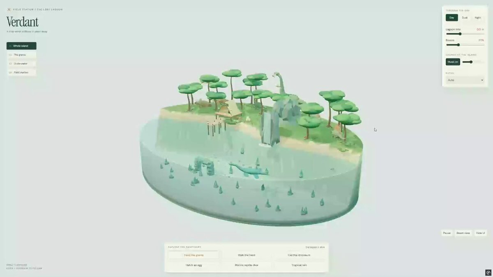</a>

这是 @vib3coded 为 Verdant 提出的原文请求：打造一个使用 Three.js 和 WebGL 构建的互动式 3D 恐龙岛微缩场景。内容包括自由漫游的恐龙、瀑布和带剖切面的泻湖，支持水下镜头移动、喂食动物和孵化恐龙蛋等互动，以及环境控制、降雨、音乐，并以单个可直接在浏览器运行的 HTML 文件交付。

**提示词**

```text
创建 Verdant——一个使用 Three.js + WebGL 构建的互动式 3D 微缩场景

打造一座郁郁葱葱的岛屿，其中有自由漫游的恐龙、瀑布，以及带剖切面的泻湖，泻湖中还有一只游动的海生爬行动物。喂食恐龙群，孵化一只幼年恐龙，并将镜头带入水下

调整潮汐、风力和时间，或开启热带降雨，同时播放舒缓的音乐

所有内容都直接在浏览器中运行，并封装在单个 HTML 文件内
```

[查看详情 ↗](https://www.tripo3d.ai/zh/3d-prompts/gpt-6-astra-2101730386711634251) · [查看原帖](https://x.com/vib3coded/status/2101570806702559235) · [返回案例导航](#all-prompts)

---

<a id="2102038136725377200"></a>

### 交互式 3D 太阳模型网站

[HIX.AI](https://x.com/HIX_AI_) · 2026-09-21

<a href="https://www.tripo3d.ai/zh/3d-prompts/gpt-6-astra-2102038136725377200">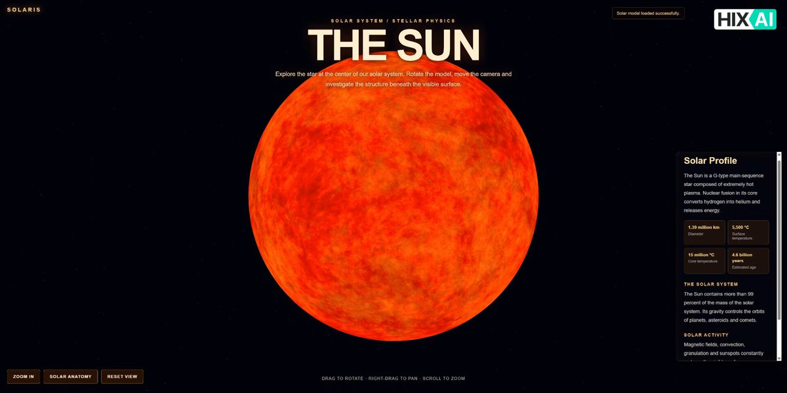</a>

创建一个以逼真 3D 太阳为核心的交互式 Three.js 网站，该太阳模型通过 Blender Python 脚本制作。网站支持旋转太阳、调整视角和缩放查看；包含宇宙背景与太阳系科普信息；并提供带有太阳分层标注和说明的交互式内部结构视图。

**提示词**

```text
我想使用 Three.js 构建一个交互式 3D 太阳模型网站。

首先，请编写一个可直接在 Blender 中运行的 Python 脚本，用于创建高度逼真的 3D 太阳模型。模型应基于太阳真实的物理和视觉特征，包括球形外观、表面纹理、色彩、类似等离子体的外观、太阳米粒组织以及发光大气层。模型不应看起来只是一个简单的橙色球体。请使用合适的材质、着色器、纹理和灯光效果，打造逼真的太阳外观。

然后，使用 Three.js 编写完整的网站代码。太阳应占据主视觉区域约 80% 的空间。用户应能够旋转太阳、移动视角，并进行放大和缩小。场景应包含逼真的灯光和发光效果，让太阳呈现出动态且立体的视觉效果。

添加一个放大按钮，让用户能够靠近太阳，观察其表面细节。

网站还应包含有关太阳及其在太阳系中作用的科普信息。整体背景应为逼真的宇宙星系/太空环境。

此外，添加一个按钮，用于打开太阳的交互式内部结构视图。该视图应展示太阳的主要层次，例如核心、辐射区、对流区、光球层、色球层和日冕。每个层次都应配有对应的标签和简短的文字说明。理想情况下，用户应能够与示意图交互，选择不同层次来查看相关信息。

请将网站打造得具有视觉冲击力、兼具科学信息价值，并通过现代化的太空主题 UI 实现完整交互。
```

[查看详情 ↗](https://www.tripo3d.ai/zh/3d-prompts/gpt-6-astra-2102038136725377200) · [查看原帖](https://x.com/HIX_AI_/status/2102038474752766239) · [返回案例导航](#all-prompts)

---

<a id="2102150615635816866"></a>

### Spline Rush 程序化浏览器赛车游戏

[Maharajahu🪢](https://x.com/ToolBraidComp) · 2026-09-21

<a href="https://www.tripo3d.ai/zh/3d-prompts/gpt-6-astra-2102150615635816866">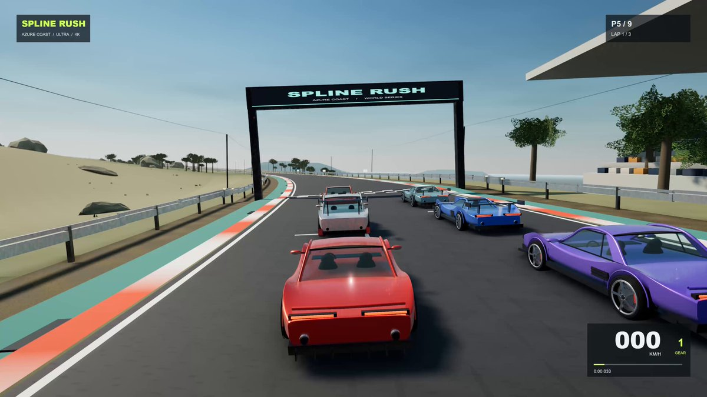</a>

根作者已验证评论中提供的、用于创建 Spline Rush 的原文提示词。Spline Rush 是一款基于 Three.js 的程序化浏览器赛车游戏，包含赛道、AI 对手、物理系统、图形预设和合成音频。

**提示词**

```text
使用最新版本的 Three.js（尽可能采用 WebGPURenderer + TSL），构建一款完整、达到商用品质的浏览器赛车游戏，名为 Spline Rush。100% 程序化生成：不使用外部模型、纹理、音频文件或字体，所有内容都在运行时通过代码生成。

核心玩法
- 6 条独特赛道，包含高低起伏、倾斜弯道、隧道、回头弯、命名弯道，以及风格各异的生物群系（海岸白天、山地黄昏、沙漠日落、森林雨景、霓虹都市夜景、高速椭圆赛道）。
- 冠军赛模式（排位赛 + 3 场正赛）、带幽灵车的计时赛、快速比赛。
- 8 名具有不同性格的 AI 对手，具备赛车线、刹车点、超车和防守能力。
- 最佳单圈纪录、分段用时、实时赛事播报、回放镜头。
- 车库：5 辆参数化赛车，配备清漆层 + 金属闪光漆、车身接缝、可工作的车灯、动画悬挂和损伤状态。

图形目标（Ultra，达到 4K 分辨率下 RTX 5090 的表现水平）
渲染器：THREE.WebGPURenderer。基于物理的渲染管线。
光照：
- 基于物理的 Rayleigh/Mie 天空 + 星空 + 月亮 + 驱动完整昼夜循环的动态太阳。
- 级联阴影贴图（4 级级联、稳定的纹素对齐、高分辨率）。
- 使用 PMREM 实现 IBL，并随时间变化更新。
- 体积雾 + 丁达尔光 + 热浪扭曲。
材质：
- MeshPhysicalMaterial / TSL 节点：清漆层、各向异性、玻璃透射、金属闪光漆，以及能对雨水产生反应的湿路面着色器。
后处理链（RenderPipeline / TSL 或 postprocessing 库）：
GTAO 或高质量 SSAO → SSR → 泛光（Karis）→ 运动模糊（速度）→ 景深 → 丁达尔光 → 自动曝光 → 色彩分级 + 胶片颗粒 + 暗角 → SMAA 或 TAA。
特效：
- GPU 粒子池：轮胎烟雾、火花、尘土、雨水飞溅、草屑/碎石扬尘、热浪扭曲。
- 会持续存在并逐渐消退的刹车痕。
- 下雨时动态生成湿润效果和积水倒影。

物理与驾驶感受
- 固定步长 120 Hz 模拟。
- 光线投射或支柱式悬挂、载荷转移、组合滑移轮胎、ABS/TC，以及不同路面类型（沥青、路缘、草地、碎石、湿地）。
- 镜头：电影感追逐镜头 + 引擎盖视角 + 车内视角，并带有运动和碰撞抖动。

AUDIO
- 完全通过 Web Audio 合成：根据转速/负载变化的多层引擎声、风声、轮胎尖啸、路缘震动声、观众欢呼声、动态音乐。

质量系统
- 预设：Low / Medium / High / Ultra。
- Ultra 以 RTX 5090 级别 GPU 为目标：4K、高分辨率阴影贴图、最大粒子数量、开启全部后处理效果，不使用激进的 LOD。
- 自适应画质：当帧耗时超过目标值时，可以降低特效质量。

先完成一个可玩的初始版本（1 条赛道、1 辆车、基础光照），然后严格按照要求逐项迭代功能。将所有内容放在一个简洁的 HTML/JS（或 Vite）项目中，确保可在本地运行。为主要系统添加注释。整体观感要有高级感，不要做得可爱。
```

[查看详情 ↗](https://www.tripo3d.ai/zh/3d-prompts/gpt-6-astra-2102150615635816866) · [查看原帖](https://x.com/ToolBraidComp/status/2102150671340327384) · [返回案例导航](#all-prompts)

---

<a id="2102215638311694336"></a>

### 交互式 3D 直升机设计展示

[Vib3Coded](https://x.com/vib3coded) · 2026-09-22

<a href="https://www.tripo3d.ai/zh/3d-prompts/gpt-6-astra-2102215638311694336">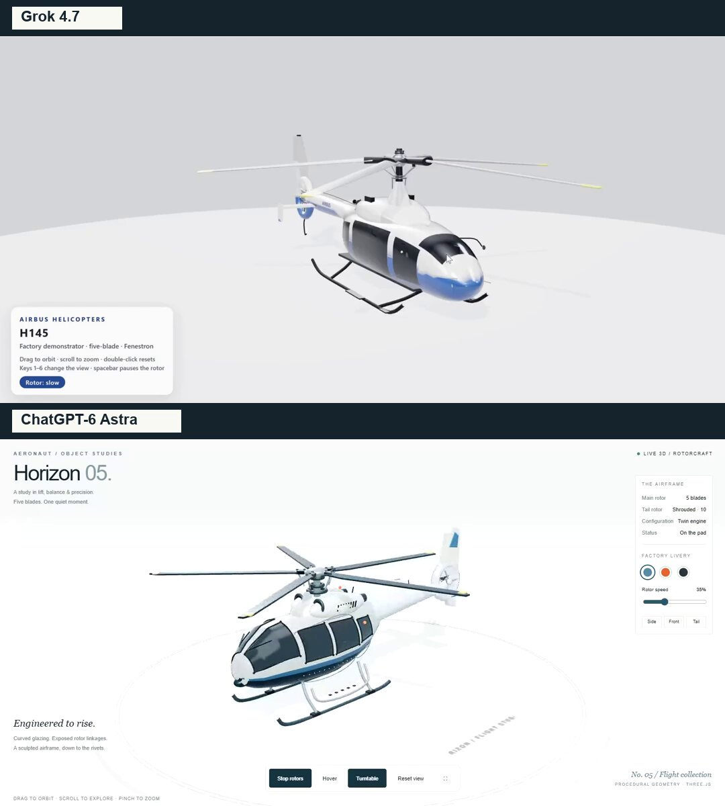</a>

作者在比较 Grok 4.7 与 ChatGPT-6 Astra 的文章评论中分享了这条提示词。它要求创建一个基于浏览器的交互式 3D 直升机展示，包含程序化几何、详细的航空特征、可选择的涂装、旋翼控制、悬停效果、摄像机控制，以及响应式 Three.js/WebGL 界面。

**提示词**

```text
使用 Three.js 和 WebGL，在单个 HTML 文件中创建一个细节丰富的现代直升机交互式 3D 场景。构建可从各个角度查看的真实 3D 几何体，而不是图片。

视觉风格：
高级航空设计展示，采用浅灰色摄影棚背景、圆形展示台、柔和阴影和逼真反射。
直升机：

流畅、线条简洁的机身，设计灵感来自 H145 等轻型双发直升机。
白色机身，深海军蓝色底部搭配蓝色装饰条。
弧形有色座舱玻璃，带有反射效果和严丝合缝的窗框密封条。
侧舱门、把手、面板接缝、铆钉、登机踏板和天线。
两个发动机舱，配备进气口、通风格栅和排气口。
五叶主旋翼，包含细节丰富的桨毂、连接硬件和桨距控制连杆。
渐缩式尾梁、安定面，以及带整流罩的尾旋翼；整流罩内部必须有真实贯通的开口。
通过结构支撑件连接到机身的弧形滑橇式起落架。
导航灯和闪烁信标灯。
所有组件都必须实现物理连接。避免出现悬空部件、分段之间的缝隙、旋翼桨叶穿入机身，或悬浮在机身上方的舷窗。

交互：

拖动鼠标旋转视角，滚动缩放，并支持触控操作。
启动和停止两组旋翼，并实现平滑加速和减速。
可调节旋翼速度。
悬停模式：平稳升离展示台，在空中轻柔摆动；关闭模式后缓慢降落并柔和着陆。
摄像机自动环绕。
前视、侧视和尾部视角预设。
重置摄像机和全屏控制。
三种涂装：冰川蓝白、救援橙和石墨色。
界面：

左上角：小号的“AERONAUT / OBJECT STUDIES”标签，以及大号“Horizon 05.”标题。
右侧：紧凑面板，显示规格、直升机状态、涂装选择和旋翼速度。
底部：控制项和交互提示。
采用克制的字体设计、细边框和充足留白。不要遮挡直升机。
所有界面文本使用英文。
技术要求：

程序化生成几何体，不要下载预制直升机模型。
使用 PBR 材质、摄影棚反射环境和柔和阴影。
让动画不受帧率影响。
在适当情况下复用几何体和材质，并限制像素比以提升性能。
支持桌面端和移动端布局，确保初始视图中完整显示旋翼跨度。
如果可行，将依赖项嵌入 HTML，使文件能够离线运行。
如果 WebGL 不可用，显示有帮助的备用提示信息。
完成前，从各个侧面检查模型，测试每项控制，并检查控制台错误。特别注意轮廓、结构连接、玻璃和旋翼机构。

交付可运行的 HTML 文件，而不只是说明。
```

[查看详情 ↗](https://www.tripo3d.ai/zh/3d-prompts/gpt-6-astra-2102215638311694336) · [查看原帖](https://x.com/vib3coded/status/2102217028052377910) · [返回案例导航](#all-prompts)

---

<a id="2102276620124062065"></a>

### 东京塔昼夜 3D 场景与视频

[Wafffle](https://x.com/wafffle_dev) · 2026-09-22

<a href="https://www.tripo3d.ai/zh/3d-prompts/gpt-6-astra-2102276620124062065">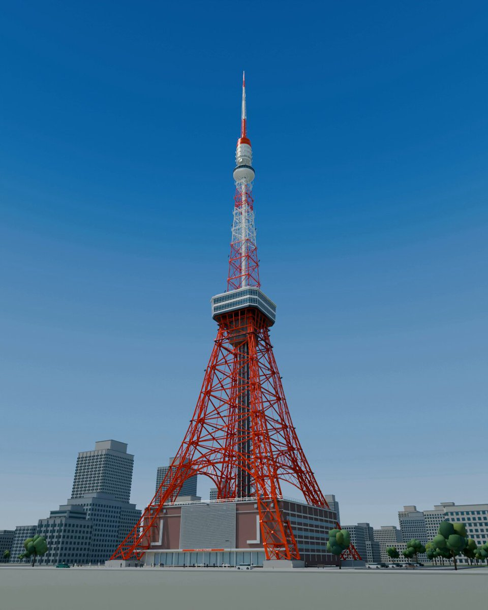</a>

调研并还原东京塔的结构特征与周边氛围，制作一个由真实 3D 几何构成、呈现昼夜不同观感的场景。交付可编辑的 Blender 数据、约 30 秒的 X 发布用 MP4 视频、确认用图片和 README。发布者将其作为提供给 Astra 的指令提示词分享。

**提示词**

```text
请制作一件以东京塔为主角、具有观赏性的 3D 作品，以及一段用于发布到 X 的约 30 秒视频。

你是制作总监。请创建必要的子任务并安排调研与制作。由你负责细化需求、管理进度、检查成果、提出修改意见并最终汇总交付。

【制作内容】
制作一座东京塔，既要呈现从地面仰望时的高度，也要让人感受到近距离观察时钢结构的细节。
同时制作白天和夜晚两个版本：白天展现结构与涂装，夜晚展现灯光亮化的美感。

希望作品能让人感到“确实认真观察并制作了东京塔”。除了塔身轮廓，还请调研并还原塔脚的张开方式、钢结构的组装方式、展望台、塔底建筑等具有代表性的细节。周边街区只需做到能够传达塔的规模和所在地点氛围即可。

【制作流程】
・调研官方资料和照片，确定需要还原的特征及其优先级。
・根据调研结果，为各个子任务下达具体的制作指示。
・尽早检查实际的 3D 预览，调整形体、构图和亮度。
・由主负责人亲自查看完成的图片和视频，发现违和或不足之处后提出修改要求。
・自主判断具体的技术方案和镜头编排，持续推进直至完成。

不要只用贴有照片或生成图的背景来替代，应通过真实的 3D 几何和摄像机运动来表现。请记录已确认的事实，以及因资料不足而做出的推测部分。

【视频】
时长约 30 秒。请结合从地面仰拍、钢结构和展望台的近距离镜头，以及能够看清整座塔的远景镜头，同时展现昼夜变化。
具体的秒数分配请根据完成的模型，判断最能展现其魅力的镜头编排。

【交付内容】
・可编辑的 Blender 数据
・用于发布到 X 的 MP4 视频
・昼夜全景及细节确认图片
・简短的发布文案
・README，记录素材来源、还原范围和验证结果
```

[查看详情 ↗](https://www.tripo3d.ai/zh/3d-prompts/gpt-6-astra-2102276620124062065) · [查看原帖](https://x.com/wafffle_dev/status/2102276620124062065) · [返回案例导航](#all-prompts)

---

<a id="2102300855387205871"></a>

### 泡泡小镇：3D 水球大战

[jared](https://x.com/jaredliu_bravo) · 2026-09-22

<a href="https://www.tripo3d.ai/zh/3d-prompts/bubble-bay">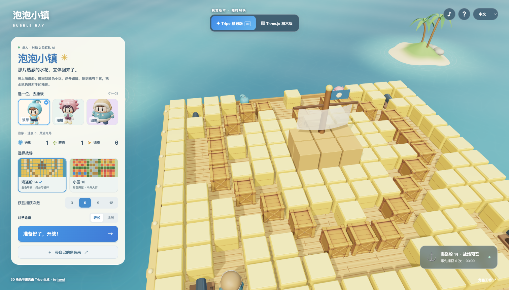</a>

<a href="https://www.tripo3d.ai/zh/3d-prompts/bubble-bay">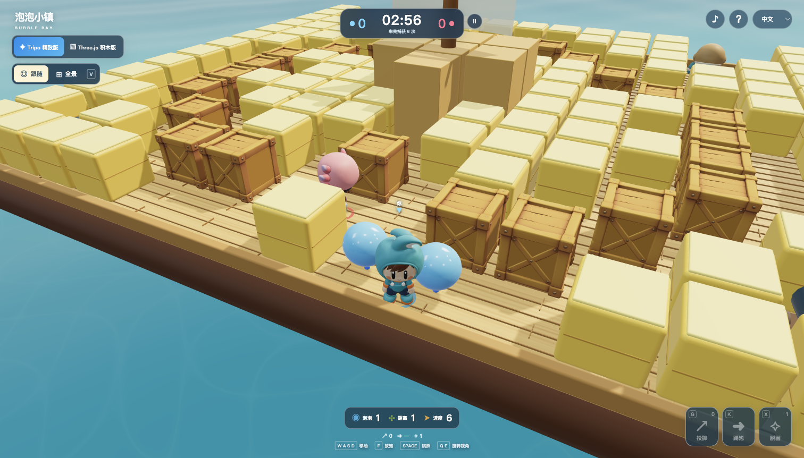</a>

<a href="https://www.tripo3d.ai/zh/3d-prompts/bubble-bay">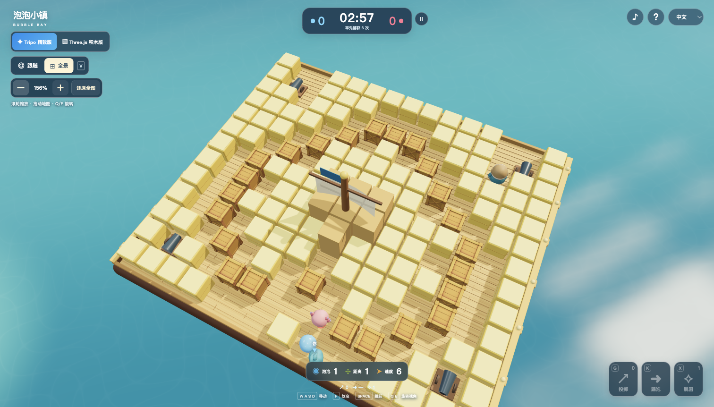</a>

制作一场 3D 水球大战：使用原创服装角色浪芽、珊桃和团栗、带动画的 P2 模型、Pirate14 和 Village10 竞技场、近距离跟随与可缩放全景镜头、AI 对手、六次捕获制比赛、自定义角色导入，以及原创 ElevenLabs 音乐。

**提示词**

```text
制作 Bubble Bay：这是一个可玩的 Three.js 水球竞技场，采用经典泡泡游戏中常见的大头短身、露出面部的服装角色风格。默认使用精细的 Tripo 模型，并提供明显的 Three.js 几何体对比开关，切换时保留当前对局。使用三个新角色：浪芽、珊桃和团栗。遵循提供的新角色概念图和模型参考，保留他们的轮廓、面部、配色和服装。

浪芽是一个活泼的人类男孩，戴着绿松石色兜帽，连接成一体的侧向波浪形冠饰，橙色衣领和袖口，藏青色短裤，以及带橙色鞋底的绿松石色鞋子。珊桃是一个娇小的人类女孩，留深梅色波波头，戴桃粉色软帽，两侧各有三个短花瓣装饰，穿薄荷色夹克、梅色短款背带裤和淡黄色靴子。团栗是一个胖乎乎的人类男孩，身体宽阔、呈梨形，戴焦糖色圆形软垫帽，帽子带奶油色面部包边，穿青绿色短夹克、奶油色下腹部服装和藏青色靴子。三人的儿童面部都使用温暖的肤色，搭配简洁的深色椭圆眼睛和小小的微笑。他们是穿着全新设计服装的儿童；不要把他们变成字面意义上的水生生物，也不要复用之前那些容易辨认的角色服装。通过 Tripo CLI 分别生成每个角色，明确使用 tripo-p2，并分别提供正面/背面图片，然后绑定有效的双足骨骼和蒙皮。待机、跑步和跳跃必须驱动实际关节；检查动作，修正头饰、鞋子和身体的权重，并准确保留来源信息。如果动作是在本地制作的，要明确标注为本地制作。

本地化名称：浪芽 / 랑야 / Langya，珊桃 / 산타오 / Shantao，团栗 / 퇀리 / Tuanli。初始容量/范围/速度等级：1/1/6、1/2/5、2/1/4；上限：6/7/9、6/7/8、9/8/8。将速度换算为每秒 0.25 + 等级*0.8 个世界单位；每个地块为 2 个单位。选择一个角色后，将另外两个角色设为具有不同身份、属性匹配的对手。无论角色外观多么圆胖，都要保持相同的实际命中半径。

默认提供 15×13 的 Pirate/Patrit14 和 Village10 地图。保留易于辨认的金色甲板、黄色货物、木箱、四门大炮和中央桅杆；村庄地图包含四个不同颜色的住宅区、中央道路、树篱和玩具积木。以发布方地图为参考，自行构建运行时美术资源，并记录连续 3D 移动和 AI 逃生所需的小型路线开口。提供明亮的材质、阴影、海洋场景、清晰的镜头跟随和全景视图。

一名玩家对战两个协作型 AI 对手。使用 WASD/方向键移动，F 放置一个持续 2.5 秒的水泡，空格键跳上真实平台，Shift 冲刺，Q/E 环绕，V 切换视角，Escape 暂停。十字形水流遵循障碍物，会破坏第一个软方块，并串联引爆水泡。实现困住、逃脱、捕获敌人、重生，以及可选的 3、6、9 或 12 次捕获目标（默认 6 次），或 180 秒计分模式，并提供结果和重试功能。触摸摇杆和动作按钮必须支持同时操作。

使用六种通过 Tripo 生成的道具：气球、范围药水、旱冰鞋、投掷手套、踢球靴和救援针。木箱有 85% 的概率掉落道具。条件道具权重：30/30/30/2.5/3.5/4%。手套增加三次投掷次数，上限为六次。G 键可将附近的水泡向上投掷，越过障碍最多四个地块，同时保留水泡的归属者和原有引线时间，预留落点并显示投掷弧线。飞行中的水泡若引线结束，会落地并爆炸。K 键可让水泡滑行，直到被阻挡，但不会重置引线时间。X 键使用救援针，初始数量为 1，上限为 3。清晰显示道具栏和可用操作。

提供中文、英文和韩文界面：来自中国大陆的 IANA 时区选择中文，韩国/朝鲜选择韩文，其他所有地区（包括中国香港、中国澳门和中国台湾）选择英文。手动选择始终优先。仅允许上传包含嵌入式纹理、标准未压缩、真正完成蒙皮的 GLB，大小不超过 40 MB、三角形不超过 15 万。验证骨骼、关节和权重，拒绝静态模型；有内嵌动画时使用这些动画；没有动画片段时，为可识别的人形模型提供基础关节动作。无法识别的骨架必须提供动画。清楚解释骨骼绑定和动画的区别，提供 90 度方向调整，在浏览器本地处理，并根据文件哈希分配稳定且平衡的属性。

创建 CTA 时必须完全使用 https://studio.tripo3d.ai/?utm_source=satellite_invite&utm_medium=bubble-bay&utm_campaign=create-character。将 jared 署名链接到 https://x.com/jaredliu_bravo 。

集成 13 种 ElevenLabs 音效，并支持标准化、短衰减、距离/声像、复音数限制、音量和静音：放置、爆裂、木箱、拾取、稀有道具、投掷、落地、困住、救援、跳跃、胜利、失败、踢击。使用 ElevenLabs music_v2_5 制作两首原创器乐曲，每首 90 秒，分别匹配海盗主题地图和阳光明媚的社区场景。将它们标准化至克制的 -20 LUFS 目标值，并对循环边界进行交叉淡化。为音乐设置独立音量控制，按地图切换曲目，暂停时淡出，并遵循主静音设置。不要复刻原游戏配乐。

将独立源码、依赖、测试和资源来源信息保存在 CMS 平台应用之外。将同源静态资源和 MIT 许可声明打包在一起。在 Ego Lite 中验证实际的桌面端和触摸操作、上传变体、语言和视觉切换。创建一个附加到现有 CMS Web Page 12 的不可变审查版本；审查期间保留现有线上版本。只有在源码真实有效且资产权利获得许可后才能发布，然后验证公开 URL、模型哈希和实际行为。保留历史记录，并区分已保存的 CMS 记录、预览版本和公开发布版本。

加载模型资源时显示进度，最多同时下载三个资源，空闲超时为 30 秒，最多尝试两次。重试时保留已成功下载的资源。在所有模型准备就绪前，隐藏整个 Tripo / Three.js 标签切换；准备完成后再显示。不要把程序化加载占位模型标记为已加载的 Tripo 模型。


使用近距离透视跟随镜头，初始位置在出生点外侧并朝向竞技场中心。保留 Q/E 环绕、鼠标拖拽俯仰和 V 键全景视图。顶部放置紧凑的计分板，左上角放置模式切换，底部附近显示简短提示。在鼠标桌面端隐藏摇杆和大型触摸操作按钮，但保留小型稀有道具控件；在窄屏上支持紧凑的同时触摸操作。添加带青绿色深度变化的动态海浪着色器、带弧形棕榈树和岩石的自然沙质小岛、细微木纹和草地纹理。每个被困角色都放入与其体型匹配的半透明气泡中，气泡带彩虹色菲涅耳边缘、轻柔漂浮效果、小气泡和地面涟漪。验证姿态下的蒙皮顶点贴合度，救援时重置抬升状态，并检查反复切换后的资源释放。避免为水膜使用昂贵的全场景透射渲染；将窄屏像素比上限设为 1.5。


提供清晰可见的 Follow / Overview 镜头控件和 V 键切换。在 Overview 视图中，支持使用 +/− 按钮、鼠标滚轮和双指捏合，将缩放范围设为 100% 至 300%；支持有边界的地图拖动，以及 Fit map 重置。切换镜头或渲染版本时保留缩放比例和正在进行的对局。在中文、英文和韩文界面中，保持稀有道具控件紧凑且互不重叠。

```

[查看详情 ↗](https://www.tripo3d.ai/zh/3d-prompts/bubble-bay) · [查看原帖](https://x.com/jaredliu_bravo/status/2102300855387205871) · [在线演示](https://bubble-bay.tripo.page/) · [返回案例导航](#all-prompts)

---

<a id="2102411087002112256"></a>

### 类似《Sir, We Have Orc Problems》的塔防游戏

[nkz/ぴたすぽ](https://x.com/nikzu_) · 2026-09-22

<a href="https://www.tripo3d.ai/zh/3d-prompts/gpt-6-astra-2102411087002112256">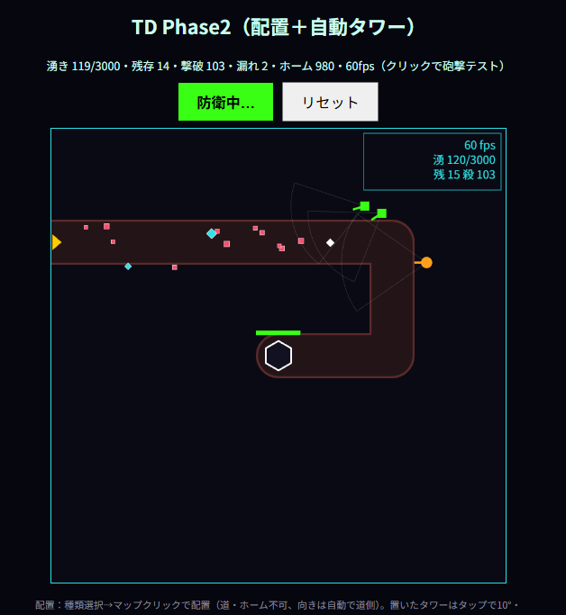</a>

<a href="https://www.tripo3d.ai/zh/3d-prompts/gpt-6-astra-2102411087002112256">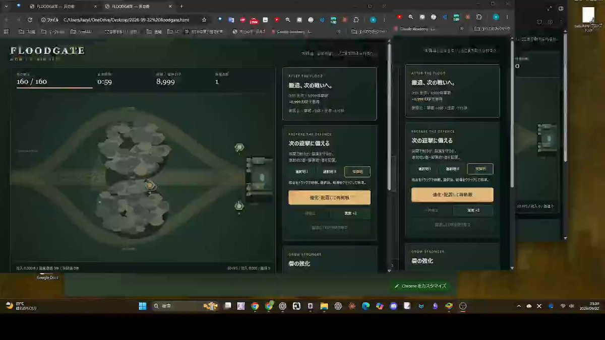</a>

投稿者请求 Astra 制作一款类似《Sir, We Have Orc Problems》的塔防游戏。

**提示词**

```text
做一个类似《Sir, We Have Orc Problems》的塔防游戏
```

[查看详情 ↗](https://www.tripo3d.ai/zh/3d-prompts/gpt-6-astra-2102411087002112256) · [查看原帖](https://x.com/nikzu_/status/2102411087002112256) · [返回案例导航](#all-prompts)

---

<a id="2102473710724919614"></a>

### 带室内空间的两层郊区住宅

[Azer](https://x.com/azer0lxm) · 2026-09-22

<a href="https://www.tripo3d.ai/zh/3d-prompts/gpt-6-astra-2102473710724919614">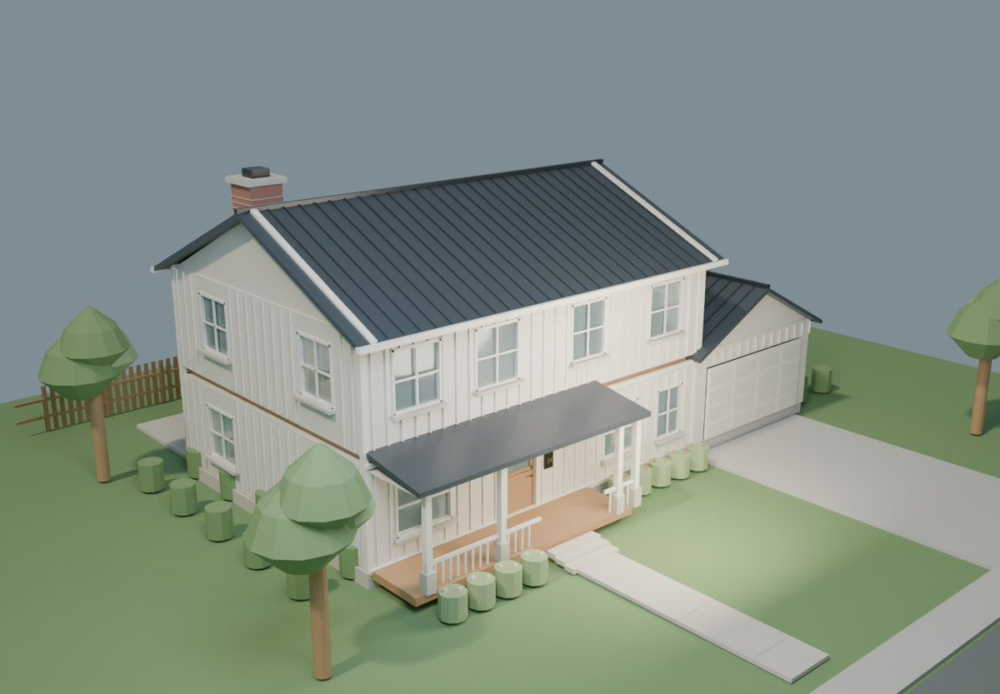</a>

<a href="https://www.tripo3d.ai/zh/3d-prompts/gpt-6-astra-2102473710724919614">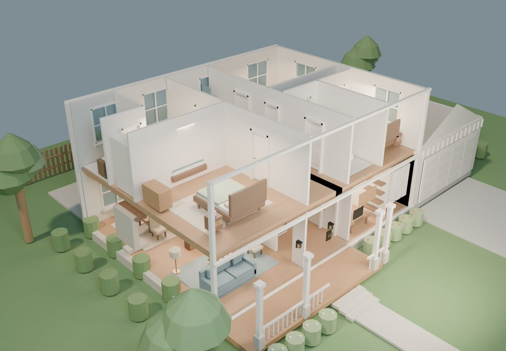</a>

Azer 提出的提示词要求使用 Blender 制作一个包含完整室内空间的两层郊区住宅 3D 模型。

**提示词**

```text
你好。请使用 Blender 设计一个尽可能完善的两层郊区住宅 3D 模型，并包含完整的室内空间。
```

[查看详情 ↗](https://www.tripo3d.ai/zh/3d-prompts/gpt-6-astra-2102473710724919614) · [查看原帖](https://x.com/azer0lxm/status/2102473781830909995) · [返回案例导航](#all-prompts)

---

<a id="2102652927177617564"></a>

### 单个 HTML 文件中的 3D 卡丁车竞速游戏

[Anshul](https://x.com/realanshull) · 2026-09-23

<a href="https://www.tripo3d.ai/zh/3d-prompts/gpt-6-astra-2102652927177617564">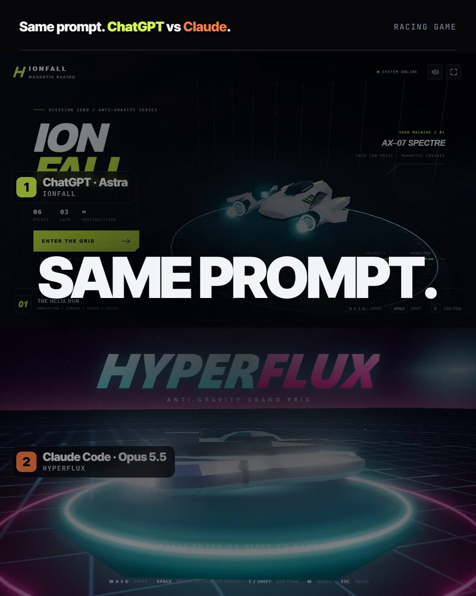</a>

作者称，这是一条分别原样提供给 GPT Astra 6 和 Claude Opus 5.5 的可复用提示词，用于比较它们实现 3D 卡丁车竞速游戏的效果。

**提示词**

```text
在单个 HTML 文件中制作一款 3D 卡丁车竞速游戏。
```

[查看详情 ↗](https://www.tripo3d.ai/zh/3d-prompts/gpt-6-astra-2102652927177617564) · [查看原帖](https://x.com/realanshull/status/2102652927177617564) · [返回案例导航](#all-prompts)

---

<a id="2102672926285713456"></a>

### 中世纪城堡浏览器动画

[juhapalomaki.fi](https://juhapalomaki.fi/) · 2026-09-23

<a href="https://www.tripo3d.ai/zh/3d-prompts/gpt-6-astra-2102672926285713456">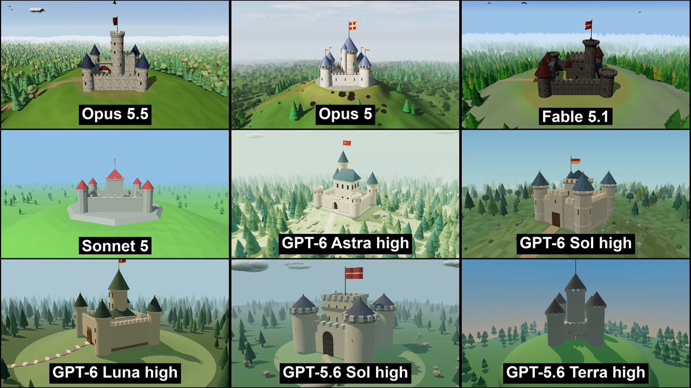</a>

一个基于浏览器的 3D 场景：森林覆盖的山丘上坐落着一座中世纪城堡。镜头持续环绕城堡旋转，塔楼上的旗帜随风飘动。作者在关联帖子中说明，这是 GPT-6 Astra high 及其他受测模型使用的共享一次完成任务。

**提示词**

```text
创建一个完全在浏览器中运行的 3D 动画。动画场景为一座中世纪城堡，城堡坐落在一片广袤森林中的山顶上。不要添加任何键盘控制，只需让镜头围绕城堡旋转，使我们能够从各个角度看到城堡。城堡塔楼顶部应有一面随风飘动的旗帜。

输出应包含一个 index.html 文件，执行该文件后显示城堡并开始循环播放动画。
```

[查看详情 ↗](https://www.tripo3d.ai/zh/3d-prompts/gpt-6-astra-2102672926285713456) · [查看原帖](https://juhapalomaki.fi/blog/castle-model-comparison/) · [返回案例导航](#all-prompts)

---

<a id="2102752217375899659"></a>

### Orbit Lab：太阳、地球与月球 3D 模拟

[technewsradio.tokyo](https://technewsradio.tokyo/) · 2026-09-23

<a href="https://www.tripo3d.ai/zh/3d-prompts/gpt-6-astra-2102752217375899659">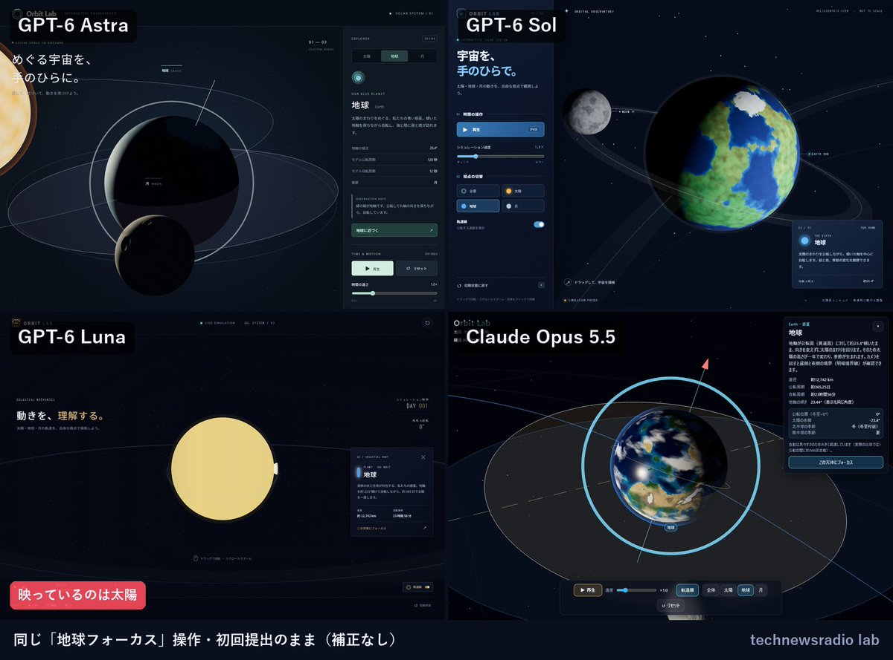</a>

这是用于对比的任务说明，相关文章明确指出，该任务已统一提交给包括 GPT-6 Astra、Sol、Luna 在内的 4 个模型。使用 Three.js 实现一个教育用途的 3D 模拟 Web 应用：以程序化方式生成太阳、地球和月球，并提供轨道与自转、点击选择、镜头操作、播放、速度调节和聚焦等功能。

**提示词**

```text
这是一次对比实验。请在你的工作目录中实现并完成以下规格完全相同的 Web 应用。名称为“Orbit Lab”。使用 Three.js 0.186.0，并加载相同版本的核心库和 OrbitControls（可以使用 CDN import map，也可以使用 npm）。无需发布或部署。

要求：
1. 使用程序化几何体和材质表现太阳、地球和月球的 3D 模型。不要使用外部图片或 3D 资源。将太阳设置为点光源，确保通过镜头操作可以看出地球和月球的明暗变化。
2. 使用 delta time 驱动地球公转与自转、地轴倾斜以及月球公转。将轨道面的倾角可视化，并显示地球和月球的轨道线。比例和速度可以为了教学效果进行夸张处理。
3. 使用可复现的随机数生成恒星背景。使用 OrbitControls 实现旋转和缩放。点击天体后，切换其选中状态和说明面板。
4. 提供播放/暂停、速度滑块、轨道线显示切换、聚焦太阳/地球/月球的镜头功能，以及恢复初始状态的按钮。也应支持使用键盘播放/暂停和重置。
5. 确保在手机屏幕宽度下也能操作，加入 WebGL 不受支持时的提示、窗口大小变化适配，以及限制像素比以避免过高的渲染负载。
6. 在 README 中写明启动步骤和操作方法。如有可能，请实际启动并确认运行情况；如果无法启动，请明确说明原因。在完成报告中简要列出创建的文件、已实现的功能和确认结果。

无需中途提问，请合理判断并完成全部实现。
```

[查看详情 ↗](https://www.tripo3d.ai/zh/3d-prompts/gpt-6-astra-2102752217375899659) · [查看原帖](https://technewsradio.tokyo/lab/gpt6-vs-opus55) · [返回案例导航](#all-prompts)

---

<a id="2102780850706567390"></a>

### 可在浏览器中操作的中世纪欧洲风格 3D 城堡

[もぎ＠ボードゲーム](https://x.com/luxurytax150) · 2026-09-23

<a href="https://www.tripo3d.ai/zh/3d-prompts/gpt-6-astra-2102780850706567390">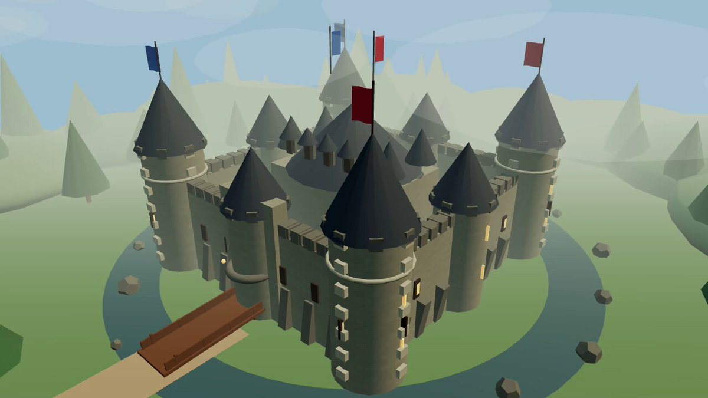</a>

<a href="https://www.tripo3d.ai/zh/3d-prompts/gpt-6-astra-2102780850706567390">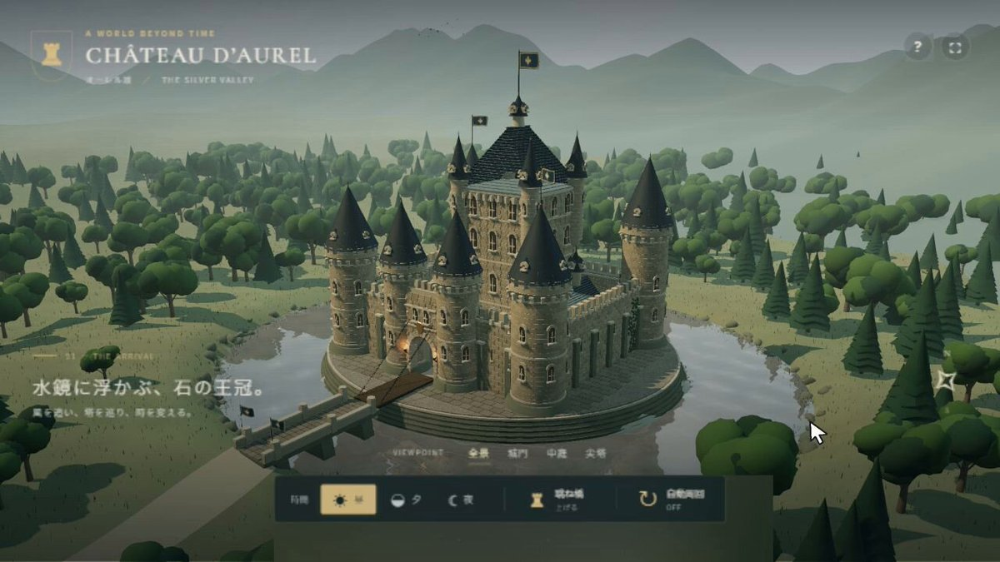</a>

制作一座可在浏览器中操作的中世纪欧洲风格 3D 城堡。配备护城河、吊桥、塔楼、石墙、旗帜和森林，并支持昼夜切换。优先确保 3D 模型的视觉效果和品质。

**提示词**

```text
制作一座可在浏览器中操作的中世纪欧洲风格 3D 城堡。加入护城河、吊桥、塔楼、石墙、旗帜、森林和昼夜切换。
这是一个基准测试，因此请尽可能丰富视觉效果，最大限度优先保证 3D 模型的品质。
```

[查看详情 ↗](https://www.tripo3d.ai/zh/3d-prompts/gpt-6-astra-2102780850706567390) · [查看原帖](https://x.com/luxurytax150/status/2102780850706567390) · [返回案例导航](#all-prompts)

---

<a id="2102788013902213508"></a>

### 用于学习国际象棋弃兵的互动式 3D 棋盘

[Diogo Santos](https://x.com/diogosantosbr) · 2026-09-23

<a href="https://www.tripo3d.ai/zh/3d-prompts/gpt-6-astra-2102788013902213508">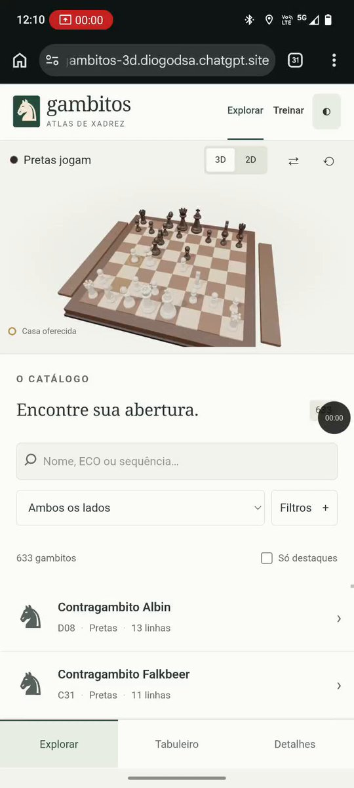</a>

作者将其分享为适用于互动式 3D 棋盘弃兵学习 Web 应用的“入门提示词”。作者表示自己创建了一个 3D 环境，并在视频中展示了对本科弃兵的探索，但未明确说明这就是生成视频所示结果时使用的确切提示词。

**提示词**

```text
创建一个带有互动式 3D 棋盘的 Web 应用，用于学习国际象棋中的主要弃兵开局。加入走法动画、前进和后退控制、变化分支，以及对每种开局背后思路的讲解。
```

[查看详情 ↗](https://www.tripo3d.ai/zh/3d-prompts/gpt-6-astra-2102788013902213508) · [查看原帖](https://x.com/diogosantosbr/status/2102788013902213508) · [返回案例导航](#all-prompts)

---

<a id="2102826333550133520"></a>

### 无限太阳朋克城市着色器

[Jonas Fröller](https://x.com/jonasfroeller) · 2026-09-23

<a href="https://www.tripo3d.ai/zh/3d-prompts/gpt-6-astra-2102826333550133520">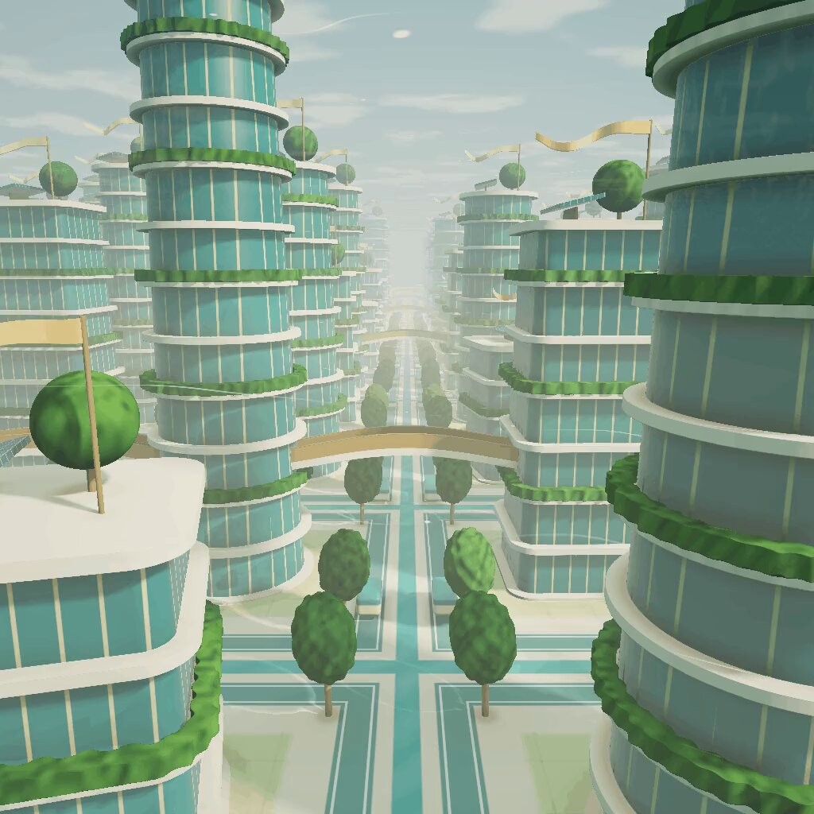</a>

用于生成着色器的提示词：描绘一座由太阳朋克风格道路与高塔构成的无限城市，并持续呈现可见的微风效果，适用于在 twigl.app 中运行。

**提示词**

```text
创建一个可在 twigl.app 中运行、视觉效果富有趣味的着色器：将场景设计为由太阳朋克风格道路与高塔构成的无限城市，并持续呈现清晰可见的微风效果
```

[查看详情 ↗](https://www.tripo3d.ai/zh/3d-prompts/gpt-6-astra-2102826333550133520) · [查看原帖](https://x.com/jonasfroeller/status/2102826333550133520) · [返回案例导航](#all-prompts)

---

<a id="2102897258983313712"></a>

### 第一人称汉堡制作模拟器

[noclipepe](https://x.com/noclipepe) · 2026-09-23

<a href="https://www.tripo3d.ai/zh/3d-prompts/gpt-6-astra-2102897258983313712">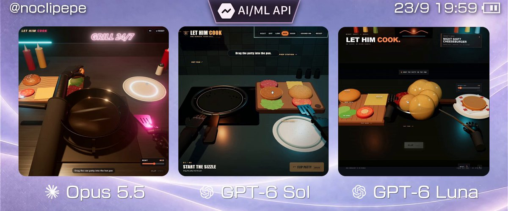</a>

发布者称，这是他们提供给包括 GPT-6 Sol 和 GPT-6 Luna 在内的三个模型的提示词，用于制作一款第一人称汉堡模拟游戏。

**提示词**

```text
制作一款第一人称汉堡制作模拟器。
```

[查看详情 ↗](https://www.tripo3d.ai/zh/3d-prompts/gpt-6-astra-2102897258983313712) · [查看原帖](https://x.com/noclipepe/status/2102897258983313712) · [返回案例导航](#all-prompts)

---

<a id="2102915300295369208"></a>

### 超写实动态沙漠篝火 HTML 场景

[Nick Gwood](https://x.com/Nixtrodamis) · 2026-09-24

<a href="https://www.tripo3d.ai/zh/3d-prompts/gpt-6-astra-2102915300295369208">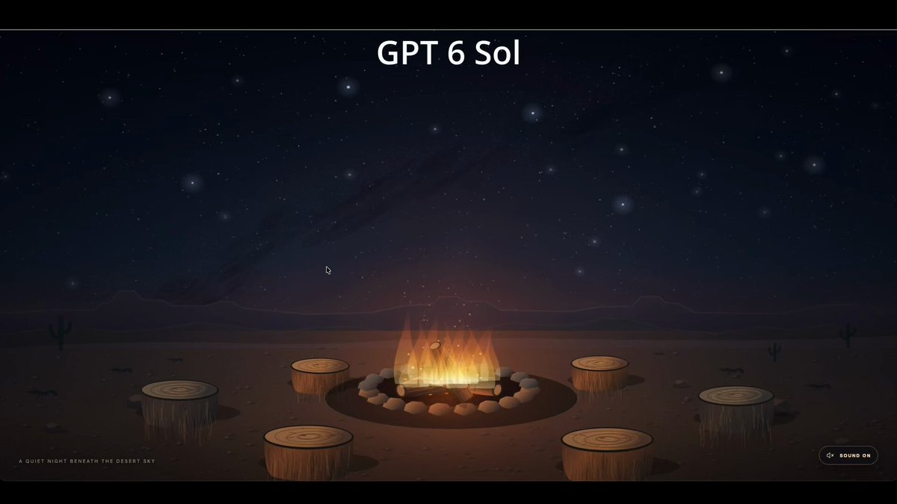</a>

作者发布的提示词，用于比较 GPT 6 Sol 和 Opus 5.5 测试框架。提示词要求创建一个交互式 HTML 场景：呈现超写实的夜间沙漠篝火、篝火周围的原木树桩座椅、清晰可见的星空、偶尔出现的野生动物，以及与场景匹配的高品质声音。

**提示词**

```text
不要引用任何其他文件或之前的作品。此任务必须完全原创，不得借鉴此处的任何其他作品来投机取巧。

创建一个单独的 HTML 文件，呈现沙漠中的动态篝火。现在是夜晚，星星清晰可见。篝火周围摆放着用原木树桩制成的座椅。画面中不得出现人物。不同的野生动物可能会不时进入或离开画面。

声音也应与场景相匹配，并具备高品质。
让所有内容都达到超写实效果

根据模型命名文件
```

[查看详情 ↗](https://www.tripo3d.ai/zh/3d-prompts/gpt-6-astra-2102915300295369208) · [查看原帖](https://x.com/Nixtrodamis/status/2102915567845794029) · [返回案例导航](#all-prompts)

---

<a id="2102956340482289944"></a>

### 使用 Three.js 制作体素版 Codex

[Arsh - 16 y/o builder](https://x.com/be_arsh) · 2026-09-24

<a href="https://www.tripo3d.ai/zh/3d-prompts/gpt-6-astra-2102956340482289944">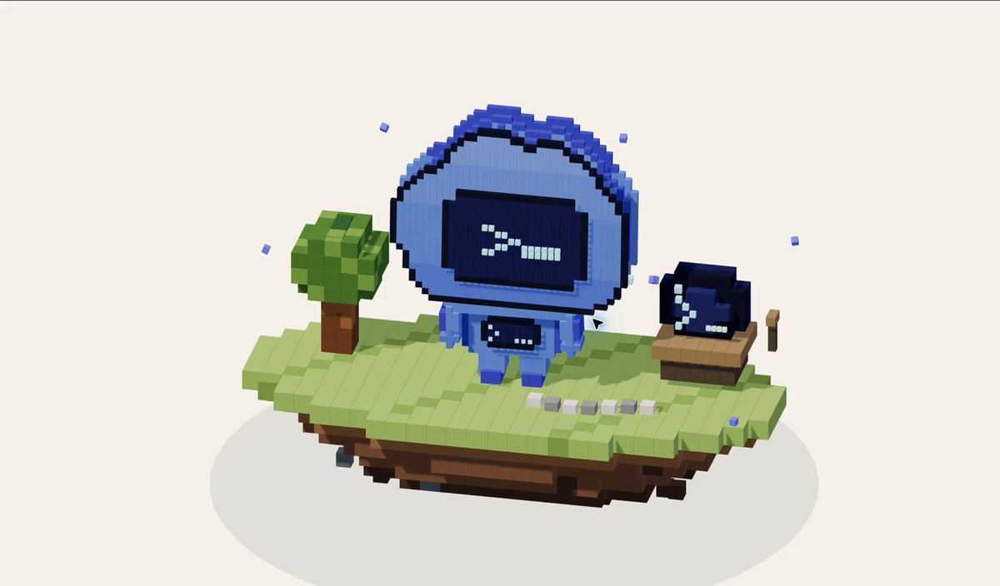</a>

可复用的作者评论提示词，用于请求使用 Three.js 以体素方式呈现 Codex，并从零开始制作，不使用任何技能。

**提示词**

```text
使用体素在 Three.js 中制作 Codex，全部从零开始，不使用任何技能
```

[查看详情 ↗](https://www.tripo3d.ai/zh/3d-prompts/gpt-6-astra-2102956340482289944) · [查看原帖](https://x.com/be_arsh/status/2102956424120979838) · [返回案例导航](#all-prompts)

---

<a id="2103062348168618280"></a>

### 可交互的 3D 软糖柑橘切片

[Vib3Coded](https://x.com/vib3coded) · 2026-09-24

<a href="https://www.tripo3d.ai/zh/3d-prompts/gpt-6-astra-2103062348168618280">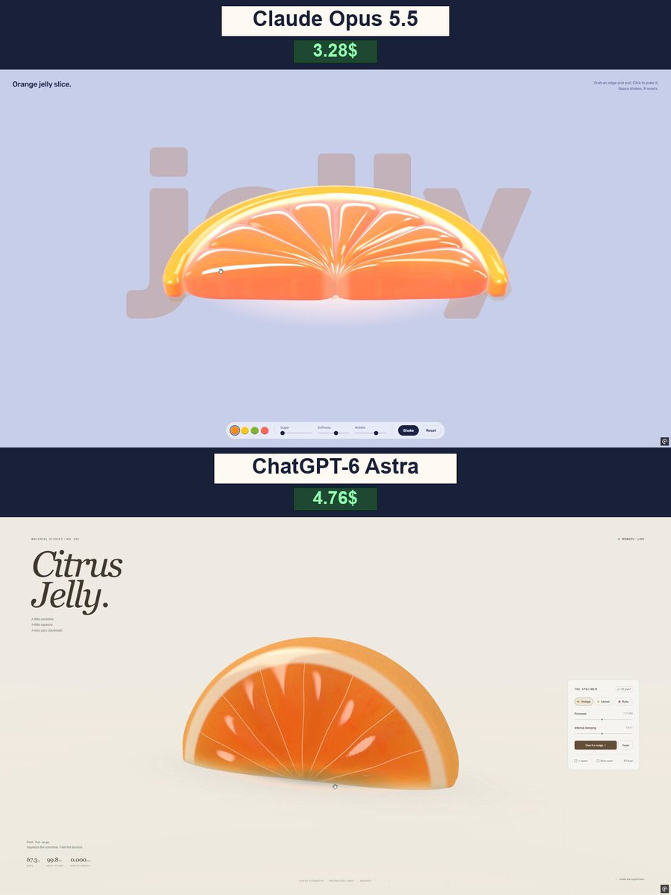</a>

发帖作者在对比 Claude Opus 5.5 和 ChatGPT-6 Astra 时分享了这段提示词。它要求制作一个独立运行的 WebGPU 软体模拟：模拟可变形的软糖柑橘切片，支持触控和鼠标交互，并包含程序化几何体、基于着色器的渲染和模拟控制功能。

**提示词**

```text
使用 WebGPU 创建一个精美、可交互的 3D 软糖柑橘切片。将完整体验交付为一个独立的 HTML 文件，其中嵌入 JavaScript 和 WGSL 着色器。

这必须是真正的实时 3D 模拟，不能是视频、图片或循环动画。

APPEARANCE

创建一片厚实的半圆形橙子切片，包含半透明多汁的果肉、八个清晰可辨的瓣状分区、精细的内部薄膜、微小气泡、浅色果瓤层和柔软的橙色果皮。

让它呈现高级软糖的质感：色彩饱和、带有光泽高光，光线能够穿过果肉，并具有可信的折射效果和柔和的接触阴影。避免过度泛光、颜色发白或呈现坚硬的塑料质感。

使用温暖明亮的工作室背景，以及留白充足、整洁的编辑风格界面。添加大号斜体衬线字体标题“Citrus Jelly”。控制项要紧凑，同时确保切片清晰可见。

软体物理

果冻般的触感是最重要的部分。

- 用鼠标或手指抓住切片的任意部位。
- 拖拽、提起、拉伸、扭转，然后松开。
- 让形变具有局部性：拉动一侧边缘时，附近的果肉应被拉伸，其余部分自然跟随。
- 松开后，切片应发生晃动和过冲，并逐渐恢复原始形状。
- 加入重力、惯性、阻尼、与地面的碰撞以及柔和的弹跳效果。
- 近似保持体积，防止网格塌陷或翻转到内部。
- 让果皮比果肉略硬一些。
- 内部瓣状分区、薄膜和气泡必须跟随形变，不能漂浮到主体外部。

使用稳定的体积软体求解器，例如采用四面体网格和 XPBD 约束。不要通过缩放或旋转整个物体来伪造柔软效果。

CONTROLS

加入三种配色预设：橙子、柠檬和红宝石。

添加：
- 硬度滑块。
- 内部阻尼滑块。
- “轻推一下”按钮。
- 重置按钮。
- 四分之一速度复选框。
- 显示网格复选框。
- 暂停/继续按钮。

显示质量、静止体积百分比和动能的小型实时读数。

技术要求

使用真正的 WebGPU 进行渲染，并使用 WGSL 着色器。所有几何体和视觉细节都必须通过程序化方式生成，不得导入模型或图片文件。

让模拟更新独立于渲染帧率。支持桌面设备和触控设备。如果 WebGPU 不可用，请显示清晰的回退提示。

测试强力拖拽、反复松开、所有控制项以及窄屏显示。交付最终 HTML 前，修复不稳定的物理效果、损坏的几何体和视觉瑕疵。

最终效果应像一个小巧、可触摸操作的糖果实验，真正让人爱不释手。
```

[查看详情 ↗](https://www.tripo3d.ai/zh/3d-prompts/gpt-6-astra-2103062348168618280) · [查看原帖](https://x.com/vib3coded/status/2103062415533371646) · [返回案例导航](#all-prompts)

---

<a id="2103187935759655167"></a>

### 北行：互动维京长船之旅

[Vib3Coded](https://x.com/vib3coded) · 2026-09-24

<a href="https://www.tripo3d.ai/zh/3d-prompts/gpt-6-astra-2103187935759655167">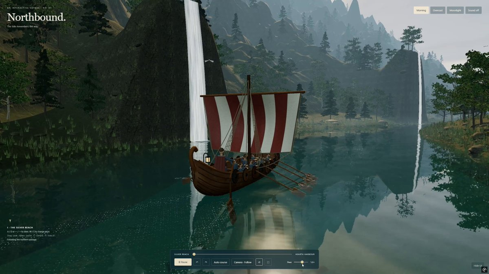</a>

作者提供的提示词，用于制作一场基于 Three.js 和 WebGL 的独立互动式 3D 峡湾航行体验：乘坐一艘细节丰富的维京长船，穿越壮丽的北欧峡湾。提示词涵盖电影感北欧环境、船体各部件的实体连接、划桨与接触水面的动画效果、转向与镜头控制、移动端支持、光照模式、音频行为以及内嵌交付资源。

**提示词**

```text
创建“北行”——乘坐一艘细节丰富的维京长船，开启穿越北欧峡湾的精美互动 3D 旅程。

使用 Three.js 和 WebGL 构建真正的实时场景，并以单个独立 HTML 文件交付。这必须是可在浏览器中探索的体验，而不是预渲染视频或平面插画。

视觉方向

打造精致、具有电影感的环境，使用逼真的材质、自然的比例和克制的配色。避免卡通风格或低多边形外观。

一艘木制长船穿行于深绿与蓝色交织的水面，在高耸的悬崖、茂密的森林、瀑布和小型北欧聚落之间航行。使用大气透视、细微薄雾、柔和阴影和可信的景深效果。在整个旅程中持续构图出优美景观，而不只是设计初始镜头位置的画面。

长船

制作细节丰富且不漏水的船体，包含相互搭接的木板、清晰可见的木纹、肋骨、长凳和连续的内部结构。
添加雕刻龙首、条纹布帆、桅杆、绳索、盾牌、补给品和温暖的灯笼。
加入比例合理的维京乘客和桨手，为他们设计层次丰富的服装、可信的坐姿，以及靠近船桨的手部位置。
确保每个部件都与船体实体连接。不得出现悬浮的乘客、相互穿插的配件，或能从船体看见的缝隙。
制作细微的浮力、俯仰和横摇动画。船帆应随风轻柔摆动。

水面与划桨

让水面成为核心视觉元素。

使用自定义着色器，实现平面反射、折射、菲涅耳高光、随深度变化的吸收效果、清晰可见的浅水区域和分层表面波纹。反射必须正确响应移动中的摄像机和不断变化的光照。

在船后制作可信的航迹。

制作完整的划桨循环动画：桨叶入水、向后划动、抬出水面，再回到水面上方。让这一过程与桨手的动作保持协调。

在桨叶实际接触水面的位置生成波纹、泡沫和细小水滴。水痕必须保留在世界空间中，并逐渐消散。避免桨叶悬空时出现这些效果。

环境与材质

使用细节丰富的地形、不规则岩层、自然的树木轮廓、分叉树干，以及独立的叶簇或针叶簇。

为木材、石头和地面使用带法线贴图与粗糙度贴图的 PBR 材质。可以嵌入许可适当的纹理；如有要求，请注明来源。

确保水下地形在水面下方连续延伸。不得出现明亮接缝、岸线缺口、悬浮植被，或阻挡可航行路线的树木。

CONTROLS

A/D 或方向键：向左、向右转向。
W/S：调节速度。
鼠标拖拽：环顾四周。
提供跟随、环绕和电影感镜头模式。
加入可选的自动航行模式。
添加暂停、重置、全屏和隐藏界面控件。
在移动设备上支持触控转向和速度控制。
防止船只穿过陆地和岩石。

氛围与界面

提供三种可平滑过渡的光照预设：清晨、阴天和月光。

加入可选的环境水声、风声、鸟鸣和划桨声。音频只能在用户交互后开始播放。

设计简约的编辑风格界面：使用优雅的衬线字体显示“Northbound.”，搭配低调的章节标签和紧凑的半透明控制栏。避免遮挡景色。

性能与交付

使用实例化、合理的几何体预算、基于距离的细节层级，以及尺寸适当的反射目标。根据设备调整渲染质量，而不是承诺固定帧率。

交付一个包含内嵌脚本和所需资源的 HTML 文件，使其能够直接在现代浏览器中打开。

测试转向、镜头模式、光照过渡和划桨效果。从多个角度检查船只，并从较低视角检查岸线。在认为场景完成前，修复几何体穿插、反射瑕疵、过度眩光和控制台错误。

优先确保水面效果可信、长船构造精美、环境协调统一，而不是一味增加更多物体。
```

[查看详情 ↗](https://www.tripo3d.ai/zh/3d-prompts/gpt-6-astra-2103187935759655167) · [查看原帖](https://x.com/vib3coded/status/2103189762672611675) · [返回案例导航](#all-prompts)

---

<a id="2103211135214256350"></a>

### 雾霭秋日可探索 Three.js 体验

[Simonas](https://x.com/SimonasLTU1) · 2026-09-24

<a href="https://www.tripo3d.ai/zh/3d-prompts/gpt-6-astra-2103211135214256350">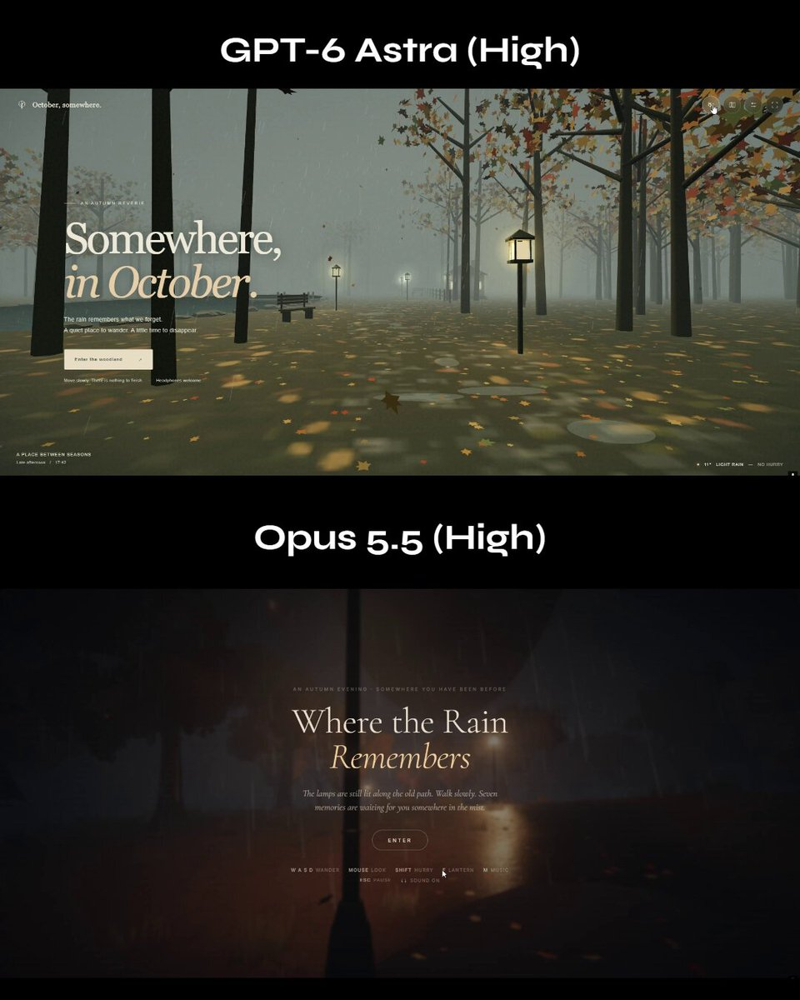</a>

创建一个可探索的 Three.js 体验：营造雾霭、雨天、秋日般神秘而怀旧的氛围，并以单个 HTML/CSS/JS 文件交付。

**提示词**

```text
请创建一个雾霭、雨天、秋日般的神秘怀旧体验，使用 Three.js 构建为可探索场景，并整合在单个 HTML/CSS/JS 文件中。
```

[查看详情 ↗](https://www.tripo3d.ai/zh/3d-prompts/gpt-6-astra-2103211135214256350) · [查看原帖](https://x.com/SimonasLTU1/status/2103211135214256350) · [返回案例导航](#all-prompts)

---

<a id="2103308083242082314"></a>

### STILLWATER — 月夜沼泽浏览器体验

[YouWare](https://x.com/YouWareAI) · 2026-09-25

<a href="https://www.tripo3d.ai/zh/3d-prompts/gpt-6-astra-2103308083242082314">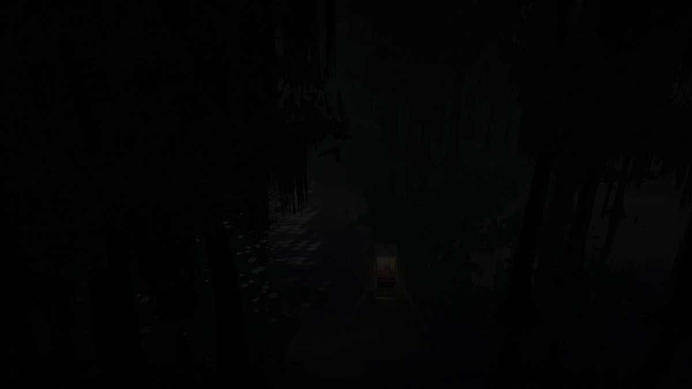</a>

发帖作者在回复中提供的一份详细提示词，用于制作交互式 Three.js 沼泽世界。内容要求玩家乘坐带舱小艇，在被洪水淹没的柏树沼泽中缓慢漂流；采用电影感的反射水面、氛围灯光与雾效、拖拽视角控制，以及具有编辑感的 HUD 界面。最终体验明确不包含战斗或其他游戏玩法系统。

**提示词**

```text
使用 Three.js 构建一个名为 STILLWATER 的浏览器体验。基调：一片让人迷失其中的月夜沼泽。不要做成有敌人的游戏，也不要做成虚幻引擎式的照片级写实作品。打造一个安静、精致而昂贵感十足的网页世界，让水面倒影成为绝对主角。让人盯着水面看上很久，甚至久到有些不太健康。  场景设置 - 地点标题：深沼泽 - HUD 时间：19:26 - 第一个地点名称：苍鹭湾 - 地名下方的标语：“给荒野留一点余地。” - 抵达时显示的发现提示：“已发现：苍鹭湾”  世界：月升时分／暮色将尽的洪水柏树沼泽。 - 高大、膝状根节突出的树木伫立在黑绿色水面中 - 西班牙苔藓成缕垂挂 - 睡莲叶沿岸成簇分布 - 狭窄蜿蜒的水道汇入更宽的弯道 - 浓厚的体积雾，远处呈青绿色，天空是紫粉色的云层 - 明亮的月亮在水面投下绵延、断续的倒影 - 几只飞鸟掠过天空 - 小艇温暖的舱内灯光穿透幽暗  水面（不要敷衍）这是整个体验的核心。 - 实时反射树木、月亮、雾气和船灯 - 轻柔的涌动，不要做成海浪 - 睡莲叶贴在水面上并随波轻轻摇摆 - 岸线泡沫／树根附近的深色单宁水 - 使用屏幕空间反射或平面反射，确保月光倒影具有电影感 - 保持 60fps。对树木使用 LOD，对植被使用实例化。  小艇：一艘小型、饱经风霜的带舱小艇／工作船。 - 船尾编号 86 - 白色船舱、深蓝色船身、温暖的内部灯光 - 沿水道闲适漂流，可选缓慢引导游览 - HUD 速度约为 15.9 节 - 模式标签：引导漂流 玩家可以环顾四周。小艇可以采用电影感的追逐视角或侧方环绕视角进行跟拍。  摄像机 - 从树丛中以四分之三视角开始，看到小艇 - 漂到船尾后方，沿着月光照亮的水道前进 - 偶尔从前景树干旁侧滑经过 - 拖拽查看 - 可选摄影模式 要有自然纪录片的感觉，而不是第一人称射击游戏。  UI——有编辑感，不要像游戏界面 左上：小型标记 + STILLWATER 顶部居中：深沼泽／19:26，以及罗盘朝向（例如 314°） 右上：低调的功能图标 左下：   探索 STILLWATER   苍鹭湾   给荒野留一点余地。   15.9 节    引导漂流 右下：摄影模式、fps、暂停 底部居中：小型提示“已发现：苍鹭湾” 小型提示栏：着色器／水面／拖拽查看／照片／野生动物  画面风格：深沉的电影感调色，低饱和绿色，品红色云层，以及一处月光高光。重视审美，不必追求写实。不要堆满调试 GUI。  技术：在浏览器中使用 Three.js。程序化／实例化自然环境。自定义水面着色器。雾效。柔和阴影或仿佛烘焙出的暮色光照。如果可以自行制作，就不要使用资源商店里的沼泽素材包。  不要加入战斗、物品栏、惊吓桥段或寻宝任务。之后可以让某种东西潜伏在水下——但现在不要。
```

[查看详情 ↗](https://www.tripo3d.ai/zh/3d-prompts/gpt-6-astra-2103308083242082314) · [查看原帖](https://x.com/YouWareAI/status/2103310302993621090) · [返回案例导航](#all-prompts)

---

<a id="2103351755971207251"></a>

### 黄金时刻的罗马战场场景

[tonysuri](https://x.com/tonysurix) · 2026-09-25

<a href="https://www.tripo3d.ai/zh/3d-prompts/gpt-6-astra-2103351755971207251">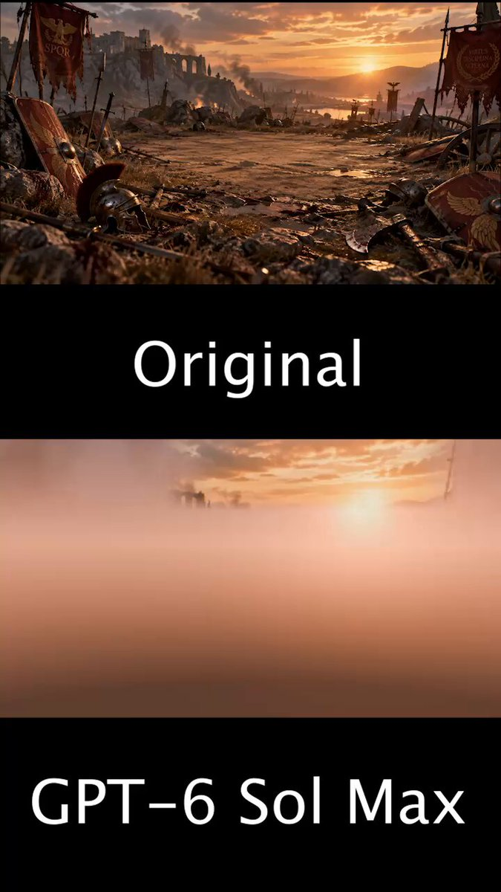</a>

一项详细的 Blender 任务：根据提供的概念图，制作写实的黄金时刻罗马战场场景。场景需包含由巨石环绕的 1v1 竞技场、使用凹凸贴图且细节丰富的地面、尽可能采用程序化制作的资产、黄金时刻天空盒和强烈阴影，并交付可复用的 GLB 资产、.blend 文件及制作过程延时视频。

**提示词**

```text
任务
在 Blender 中根据提供的概念图，制作一个黄金时刻的罗马战场场景。允许使用生成工具。你可以使用可用的生成工具为环境及其组成部分生成 3D 模型（Tripo，位于 https://t.co/JV0K8OtuWC)），然后进行组装。最终所有内容必须构成一个统一的场景：比例匹配、材质一致、灯光统一。要求：为地面使用凹凸贴图，并确保地面细节丰富。
在地面上创建一片圆形空地，并在周围摆放大型巨石，形成 1v1 竞技场。
以写实效果渲染全部内容。
尽可能使用程序化方式创建资产。
创建黄金时刻天空的天空盒。
使用强烈阴影。
复用物体（旗帜、横幅、头盔、岩石等）。为每个物体导出一个 GLB，并复用这些资产。
尽可能准确、贴近地匹配提供的图像。
延时视频要求
制作过程中，每完成一项有意义的新增内容（按顺序记录每个新物体、修改器处理、材质步骤和灯光步骤），就将视口截图保存到编号的 timelapse/ 文件夹中。完成全部工作后，以 2 fps（每帧 0.5 秒）将这些帧合成为延时视频，以便从头到尾观看完整的制作过程。将延时视频与主要文件一同交付。
DELIVERABLES
交付 .blend 文件，并设置好相机和视口，使画面与原始图像完全一致。
制作过程延时视频。
```

[查看详情 ↗](https://www.tripo3d.ai/zh/3d-prompts/gpt-6-astra-2103351755971207251) · [查看原帖](https://x.com/tonysurix/status/2103352274269675532) · [返回案例导航](#all-prompts)

---

<a id="2103432732386664591"></a>

### 火龙果果冻

[Vib3Coded](https://x.com/vib3coded) · 2026-09-25

<a href="https://www.tripo3d.ai/zh/3d-prompts/gpt-6-astra-2103432732386664591">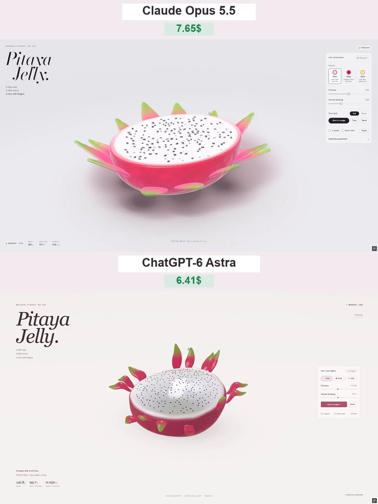</a>

作者分享的提示词，用于让 GPT-6 Astra 创建一款基于浏览器的交互式 3D 火龙果果冻材质实验。提示词涵盖程序化 WebGPU 几何体、半透明软糖材质、软体形变、可拖拽的果皮花瓣、触控支持、预设、模拟数据读数，以及明亮的工作室风格界面。

**提示词**

```text
创建一个名为“火龙果果冻”的交互式 3D 场景：一个由柔软半透明果冻制成的半个火龙果。使用真实的 WebGPU 渲染和 WGSL 着色器，在单个 HTML 文件中完成整个项目。不要使用预制模型或图像素材。

APPEARANCE

将一个切面朝上放置在明亮工作室台面上的大型半个火龙果。
果皮呈浓郁的覆盆子粉色，带有一圈薄薄的浅色内果皮，以及珍珠般的白色果肉。
果肉上自然分布约 250 颗微小黑色种子。
果实周围有 12–14 片肉质果皮花瓣，从粉色根部渐变为绿色尖端。
表面光泽湿润，带有光线折射、细小内部气泡和柔和的接触阴影。
材质应呈现柔软软糖般的质感，而不是坚硬塑料。保留高饱和色彩，避免高光过曝。

物理与交互

使用带有弹性连接和保持体积约束的体积网格，实现真实的软体形变，例如 XPBD。
用户可以用鼠标或手指抓住果肉，拉伸后松开。
形变应集中在抓取点附近，而不是简单地平移整个物体。
松开后，果实应摇摆、抖动，并逐渐恢复原始形状。
让果皮花瓣可以单独拖拽。它们应比果肉更柔软，在保持与果实连接的同时弯曲并弹回。
种子必须跟随形变表面移动，不能飘离或陷入果肉。
在强力拉拽时保持模拟稳定，并处理与地面的接触，防止元素翻转。

视觉设计

使用简约明亮的工作室风格界面，并采用编辑设计美学：留白充足、边框纤细、控件克制，不添加多余装饰。

左上角：
“材质研究 / 编号 019”
使用大号斜体衬线字体，分两行显示标题：
“火龙果果冻。”

下方显示：
“有一点野。”
“有一点甜。”
“一条非常柔软的龙。”
右侧添加一个名为“标本”的浮动面板，其中包含：

密度标签：ρ 1.04 g/cm³。
三个预设：
珍珠——白色果肉和粉色果皮。
红宝石——覆盆子色果肉和粉色果皮。
黄金——浅色果肉和金色果皮。
“硬度”和“内部阻尼”滑块，并显示当前数值。
“轻轻推一下”和“重置”按钮。

“¼ 倍速”和“显示网格”复选框。

“暂停”按钮。
同时包括：
带退出全屏选项的全屏按钮。
“WEBGPU · 实时”状态指示器。
实时显示质量、静止体积百分比和动能。
简短的交互提示：“拉一拉果肉。拽一下花瓣。松手。”
可折叠的“实验内部”部分，准确说明实现方式。
技术要求
交付一个名为 pitaya-jelly-webgpu.html 的自包含文件。

使用真实的 WebGPU 渲染，而不是模拟 Canvas 2D。

所有几何体都必须程序化生成。
使用考虑厚度的折射、菲涅耳反射和柔和的工作室光照。
使用固定的模拟时间步长，确保行为一致。
支持桌面端和触控交互，并采用响应式布局。
拖拽过程中避免昂贵的几何体重建或着色器编译。

WebGPU 不可用时显示清晰的回退提示。

验证拖拽、松开、形状恢复、预设、重置、暂停、全屏和移动端布局。
首要目标是呈现令人信服的果冻般行为、精美的材质和令人满足的交互。最终效果应像一款经过精心打磨、可玩的材质实验。
```

[查看详情 ↗](https://www.tripo3d.ai/zh/3d-prompts/gpt-6-astra-2103432732386664591) · [查看原帖](https://x.com/vib3coded/status/2103433535604265052) · [返回案例导航](#all-prompts)

---

<a id="2103456264785424530"></a>

### VRChat 服装 3D 建模

[のわ〜る👼🍆🐄](https://x.com/Noir4247) · 2026-09-25

<a href="https://www.tripo3d.ai/zh/3d-prompts/gpt-6-astra-2103456264785424530">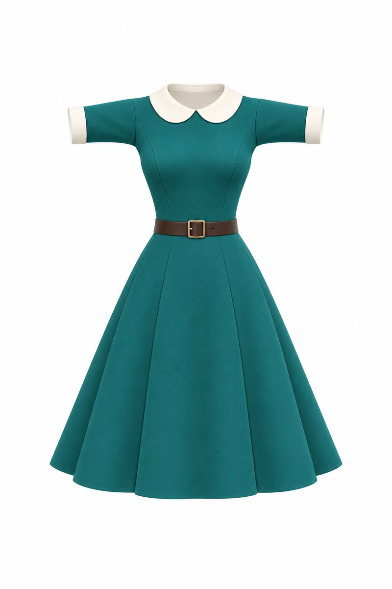</a>

<a href="https://www.tripo3d.ai/zh/3d-prompts/gpt-6-astra-2103456264785424530">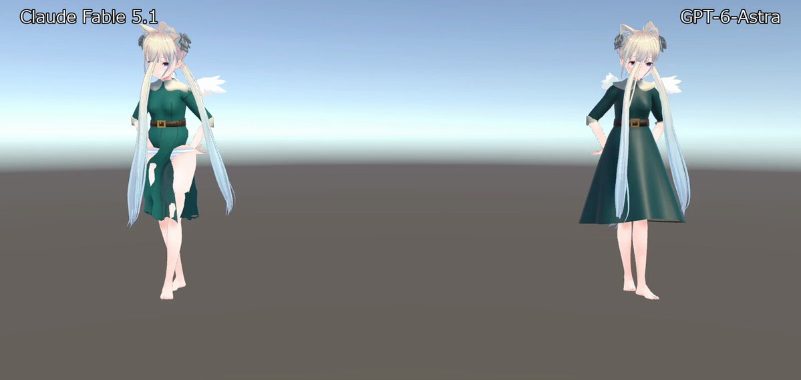</a>

投稿者表示，他以 ChatGPT 生成的设计图为基础，指示 Astra“制作 VRChat 服装”，并让 Astra 使用 Blender 完成了服装建模。

**提示词**

```text
制作 VRChat 服装
```

[查看详情 ↗](https://www.tripo3d.ai/zh/3d-prompts/gpt-6-astra-2103456264785424530) · [查看原帖](https://x.com/Noir4247/status/2103456264785424530) · [返回案例导航](#all-prompts)

---

<a id="2103482826519986544"></a>

### 在 Blender 中制作豚鼠

[かよこ](https://x.com/kayokojoe) · 2026-09-25

<a href="https://www.tripo3d.ai/zh/3d-prompts/gpt-6-astra-2103482826519986544">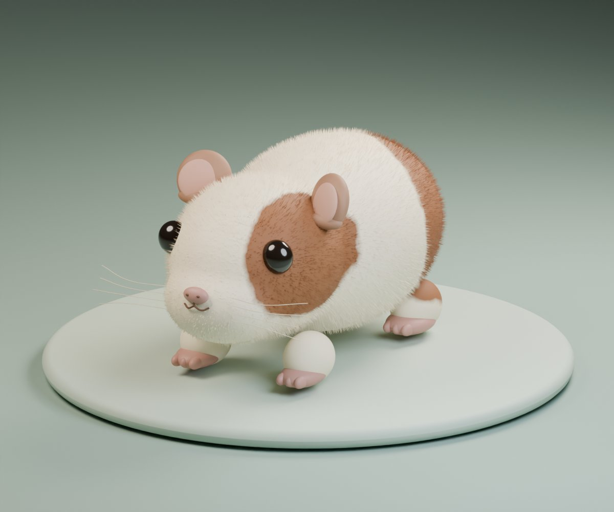</a>

投稿者请求 Codex（GPT-6 Astra High）在未提供照片的情况下制作豚鼠的提示词。

**提示词**

```text
在 Blender 中制作一只豚鼠
```

[查看详情 ↗](https://www.tripo3d.ai/zh/3d-prompts/gpt-6-astra-2103482826519986544) · [查看原帖](https://x.com/kayokojoe/status/2103482826519986544) · [返回案例导航](#all-prompts)

---

<a id="2103486103831339269"></a>

### Three.js 体素风日式庭园

[Marcel](https://x.com/marcthecreatorr) · 2026-09-25

<a href="https://www.tripo3d.ai/zh/3d-prompts/gpt-6-astra-2103486103831339269">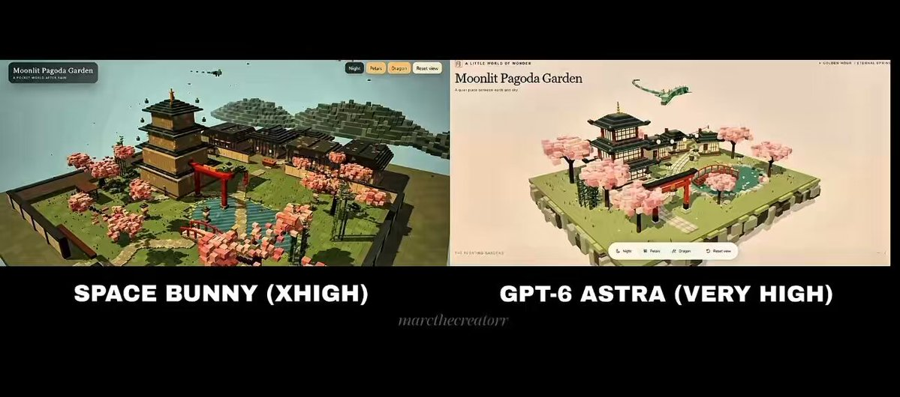</a>

一个用于创建可交互体素风日式庭园的提示词，场景中包含宝塔、微型村民和飞行中的巨龙。发帖作者表示，已将这条完全相同的提示词分别提供给 Astra 和 Space Bunny，用于一次生成对比。

**提示词**

```text
使用 Three.js 构建一个细节丰富的体素风日式庭园，包含一座宝塔、微型村民、一条飞行中的巨龙，以及可交互的细节。
```

[查看详情 ↗](https://www.tripo3d.ai/zh/3d-prompts/gpt-6-astra-2103486103831339269) · [查看原帖](https://x.com/marcthecreatorr/status/2103486103831339269) · [返回案例导航](#all-prompts)

---

<a id="battle-city-3d"></a>

### Battle City 3D：无尽坦克防御

[jared](https://x.com/jaredliu_bravo) · 2026-09-22

<a href="https://www.tripo3d.ai/zh/3d-prompts/battle-city-3d">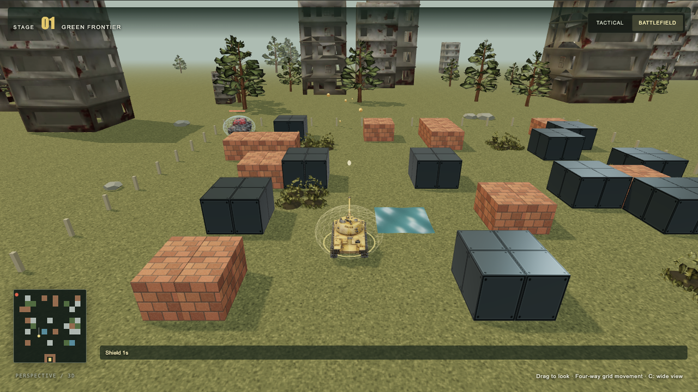</a>

在无尽的草地、雪地与工业战场中守护鹰形基地，也可挑战 35 张经典地图。收集 10 种道具，对抗需命中 4 次才能击毁的敌方重型坦克。

**提示词**

```text
1. 项目目标
构建 Battle City 3D：一款受 1985 年红白机经典作品启发的浏览器坦克防守游戏。玩家驾驶坦克，消灭一波 20 个敌人，收集补给并保护鹰总部。重现参考媒体中展示的当前透视 3D 版本，包括可无限游玩的种子战役和 35 张可选经典布局。在保留易读街机规则的同时，让坦克、墙体和场景真正具备空间深度。

2. 视觉风格
使用 Three.js PerspectiveCamera，视野角度为 60 度。默认战场视角位于玩家后上方，距离约 13 个世界单位，高度为 0.43 弧度。平滑跟随坦克位置及其前方一点；坦克转向时，摄像机不得自动旋转。提供更高的战术视角、手动拖拽环绕和滚轮缩放。移动和开火使用地图的四个正交轴。环绕视角后，将方向键映射到相对于摄像机最近的正交方向；键盘输入不得转换为斜向移动。让车体朝向立即匹配射击方向，并根据每个模型的实际炮管校准炮弹和炮口闪光的高度。
使用贴地的履带坦克、金属炮塔、赤陶砖、深色钢块、蓝色水面、低矮植被和反光冰面。将地面延伸到可玩区域之外，连接树木、废墟建筑和雾气。使用暖色方向光、柔和阴影、环境补光和 ACES 色调映射，并克制地表现炮口闪光、后坐力、火花和弹跳碎屑。雪地改变地面与树木的色彩；工业关卡突出钢材和废墟建筑。
使用深橄榄色指挥界面框住游戏，突出暖黄色主操作按钮、分数、共享生命数、剩余敌人图标、关卡名称和雷达。将大型 Tripo 3D / Three.js 模型切换控件置于战场上方，显示当前模式和旋转中的坦克预览。使用本地化的插画式补给指南和限时效果指示器。在窄屏上保持游戏区域和必要的触控操作可见。

3. 世界与场景
将战场表示为 26×26 的瓦片网格，坦克碰撞半宽为 0.72。将鹰放置在 (13,25)，周围环绕可破坏的 U 形砖墙防御。玩家出生点为 (9,25) 和 (17,25)；敌方闸门位于 (1,1)、(13,1) 和 (25,1)。
提供两种战役：包含全部 35 张经典布局及其 20 敌人波次表的经典战役，以及在草地、雪地和工业生物群系之间循环的无限种子生成器。生成足够容纳完整车体的连通通道，并确保玩家出生点、敌方闸门和拾取物位置之间存在可通行连接。以交错方式布置中央钢制掩体，阻止从出生点直线射向鹰的火力通道，同时保留横向街道的通行。允许选择起始生物群系或经典关卡，并重新生成随机地图。将本局种子、分数、生命数和存活玩家的升级带入下一关。
砖墙可破坏；钢块可抵挡普通炮弹和坦克；水会阻挡坦克但允许炮弹通过；植被会遮挡敌方模型；冰面会降低抓地力。将远景环境作为装饰，与游戏碰撞分离。

4. 资产清单
使用以下稳定且可独立替换的 3D 模型插槽。优先制作玩家、敌人、重型坦克和鹰，然后制作全部十种补给模型。让每个资产以最低点贴地，并统一朝向、中心点和缩放。使用模板复用，不要为每个敌人单独加载模型。
- player：芥末黄色履带坦克，炮塔清晰可辨，配有前置炮管；用于玩家坦克，第二名玩家使用独立的环形颜色。
- enemy：紧凑型履带敌方坦克，通过不同色调复用于普通、快速和强力变体。
- heavy：明显更厚重的装甲坦克，使用独立于标准敌人的网格，其上方有四个可见的装甲段。
- eagle：置于总部底座上的金色金属鹰雕像。
- pickup-star：金色五角升级星。
- pickup-helmet：用于临时护盾的防护军用头盔。
- pickup-clock：用于冻结敌人移动的易读时钟。
- pickup-shovel：用于加固总部的铲子。
- pickup-life：代表一条额外生命的迷你坦克。
- pickup-grenade：用于消灭当前敌人的手榴弹。
- pickup-ammo：用于快速射击的弹药箱。
- pickup-repair：用于恢复装甲的维修工具箱。
- pickup-magnet：用于远距离收集补给的马蹄磁铁。
- pickup-boost：用于临时加速的能量电池。
- environment-building：风化的废弃公寓楼，Tripo P2.0，目标预算 1,800 个三角面。
- environment-tree：带明显树干的不规则松树，Tripo P2.0，目标预算 1,100 个三角面。
- environment-bush：低矮多叶灌木和草丛，Tripo P2.0，目标预算 650 个三角面。
将补给显示为旋转、悬浮的可收集模型，配以彩色环和匹配的指南缩略图。使用共享几何体和材质实例渲染重复出现的建筑、树木和灌木。让建筑和树木根部贴地；将灌木底部略微埋入，以融入地形。在雪地关卡中为朝上的表面添加积雪。瓦片墙、水面、冰面、炮弹网格、UI、灯光、粒子和碰撞代理均保持程序化生成。使用世界空间流动波浪制作水面动画，改变法线并产生轻微表面位移，且在相邻瓦片之间连续衔接。Tripo 版本使用 17 个生成模型；对比版本按照相同规则和碰撞逻辑，将坦克与环境都切换为代码构建的几何体。两者均使用 Three.js 渲染。

5. 游戏玩法与反馈
支持单人和本地双人合作，共享三条生命。单人模式使用 WASD 或方向键移动，使用 Space/J 开火。合作模式中，玩家一使用 WASD 和 Space/J；玩家二使用方向键和 Enter/数字键盘 0。P/Escape 暂停；C 切换摄像机；1/2 选择模型模式。在触屏设备上，允许同时按住方向键盘和开火按钮；指针取消时释放输入；无需滚动即可使用暂停、继续、下一关和重试操作。
玩家速度为每秒 4.2 个单位，使用加速时为 6.3。敌人包括普通、快速、强力和重型类型；重型坦克有四点生命值，未受护盾保护时可承受前三次命中。单人模式同时存在四名敌人，合作模式为六名，并采用错峰生成。消灭普通、快速、强力或重型敌人分别获得 100、200、300 或 400 分；收集任意补给获得 500 分。消灭 20 个敌人后完成关卡。鹰被摧毁，或共享生命耗尽且没有存活玩家时失败。提供立即重试、明确的下一关流程，以及本地保存的最高分。
实现全部十种补给：星星可升级三次，依次获得更快炮弹、同时发射两枚炮弹，以及可击穿钢块的炮弹；头盔提供 12 秒护盾；时钟冻结敌人 9 秒；铲子加固基地 16 秒；迷你坦克增加一条生命；手榴弹消灭当前敌人；弹药提供 14 秒快速射击，最多同时存在四枚炮弹；维修补给增加两点生命值，上限为三点；磁铁在 20 秒内收集五个单位范围内可见的补给；加速效果持续 12 秒。补给模型持续 25 秒，并出现在可到达的位置；使用洗牌牌组改变补给类型。磁铁收集必须遵守实体障碍物限制。
使用收集的 NES 风格音频样本，用于时长 4.333 秒的关卡开场、开火、行驶和待机、砖墙/钢块碰撞、敌人/玩家爆炸、补给出现与收集、额外生命、装甲受击、冰面、暂停和游戏结束。当前项目使用 JustoSenka/BattleCity 的 15 个 OGG 音频片段，提交版本为 3a07004ba8e53baea74ff70d2ecc22b017eb9b20。保留其署名和仓库许可证声明；将其描述为收集的重制版音频，不得声称是逐位准确的硬件录音。通过用户手势解锁音频，校准样本音量，提供音量/静音控制，并将声音与事件同步。不要添加无关的持续战斗音乐。

6. 技术实现
使用 TypeScript、Three.js 0.180.0 和 Vite 7，并配备独立的 package.json 与锁文件。让模拟逻辑独立于渲染，以 120 Hz 步进。使用实体车体 AABB、轴向分离移动、边界与坦克分离，以及连续的最近接触炮弹扫掠检测，包括敌我炮弹之间基于相对运动的碰撞。炮弹从车体位置生成并向前扫掠，以防止近距离穿过墙体。这是街机式地面物理，不是悬挂系统模拟器。
通过 GLTFLoader 加载同源 GLB 资产。让碰撞代理独立于资产几何体。当前运行时使用量化属性和 WebP 纹理（载具/基地 1024 像素；补给和环境 512 像素），不进行几何简化，也不使用 WASM 解码器。将加载限制为四个 worker，使用带哈希版本的 URL，并以 256 KiB 分段加载；每个分段超时 20 秒，最多尝试三次。四个核心模型和音频就绪后解锁游戏；在后台加载补给和环境资产，并且只生成模型已就绪的补给类型。切换模型模式时保留游戏状态。
提供英语、简体中文、日语和韩语 UI。根据设备语言选择默认语言，但 zh-TW、zh-HK、zh-MO 和 zh-Hant 默认使用英语；显式选择的语言需要持久化。支持键盘、桌面指针和多点触控，并在失去焦点时暂停。将所有资产、致谢信息和可复现脚本保留在源项目本地，并发布不含私密凭据且不依赖运行时后端的静态 dist 目录。

7. 完成标准
交付可编辑源代码、资产来源和许可证声明、npm 开发/构建工作流，以及可玩的静态预览。验证默认 Tripo 场景、模型对比、所有生物群系、重型坦克承受四次命中、每种补给效果、暂停/继续、失败/重试和关卡推进。测试 1,000 张带种子的地图，验证车体宽度的连通性和安全出生点；同时测试所有经典地图、穿墙、斜向射击、坦克分离、冰面惯性、多个偏航角下相对于摄像机的输入，以及保留状态的模式切换。在仅使用模拟测试而非实体设备测试时，验证本地化 UI 和窄屏双指操作，但不得声称进行了实体设备测试。将实际开场和战斗画面与参考图片/视频进行对比；确认全部 17 个模型和 15 个音频片段均能加载。通过现有 CMS Web Page 工作流发布，并验证最终公开页面，而不是将已保存的 CMS 记录视为部署完成。

```

[查看详情 ↗](https://www.tripo3d.ai/zh/3d-prompts/battle-city-3d) · [在线演示](https://battle-city-3d.tripo.page/) · [返回案例导航](#all-prompts)

---

<a id="crazy-tanks-3d-island-artillery"></a>

### 疯狂坦克——3D 岛屿炮战

[jared](https://x.com/jaredliu_bravo) · 2026-09-24

<a href="https://www.tripo3d.ai/zh/3d-prompts/crazy-tanks-3d-island-artillery">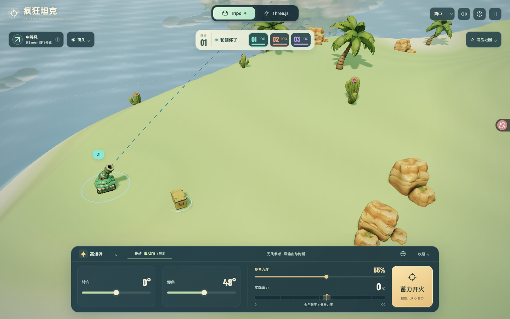</a>

瞄准、判断风向，在完整的 3D 岛屿炮战中从零开始蓄力。选择六种炮弹，轰出深坑，在不断升级的混乱中生存下来。

**提示词**

```text
1. 项目目标
构建《疯狂坦克——狂野潮汐》：一款可玩的、真正立体的热带岛屿回合制炮战游戏。玩家操控一辆小型坦克，瞄准、判断风向，从零开始控制蓄力，并用炮弹重塑战场。支持单人对战 AI 和本地轮流游玩，默认提供三辆坦克混战，并可选两辆坦克决斗。最后存活的坦克获胜。以当前参考玩法和截图作为视觉目标。

2. 视觉风格
使用透视相机和可自由环绕的 3D 几何体，不要使用扁平精灵或固定侧视角。打造阳光明媚的微缩景观：圆润的玉绿色、珊瑚橙和蓝紫色坦克，奶油色沙地，浅绿色草地，具有反射效果的青绿色水面，柔和阴影，以及淡淡的远景大气雾。保留三辆坦克各自鲜明的轮廓和匹配的炮管。在战场上方放置紧凑的奶油色圆形/装甲状态面板，下方放置深青绿色圆角控制面板。金色表示参考威力和开火操作；薄荷绿表示实际蓄力值和友方状态。将 Tripo / Three.js 外观切换开关醒目地置于顶部，默认使用 Tripo 资产。切换外观时必须保留对局和物理状态。使用细窄、间距均匀的青绿色屏幕空间短划线，以及克制的落点圆圈；瞄准图形不得映射到水面上。

3. 世界与场景
使用一座约 260 × 184 米、可破坏高度场岛屿，四周环绕固定海平面的海洋。将初始坦克分散放置在相距较远的稳定地面上，并布置岩石、棕榈树、仙人掌和可收集的补给箱。较小的装饰岛屿用于增强背景纵深，不得替代可破坏的主地形。爆炸会使地表变形，并可挖掘至海平面以下。将岸线颜色和泡沫放在同一水面上，避免平面重叠和闪烁。每个渲染帧都根据世界坐标投射坦克编号。提供完整弹道、坦克、环绕和战术俯视视角。弹道视角必须将开火坦克、弹道弧线和预计落点完整放入 HUD 与控制面板之间的空间。每次射击前，显示开火坦克约 0.8 秒，在炮口处短暂停留，然后跟随炮弹。手动操作相机会取消电影式跟随。

4. 资产清单
使用稳定的模型槽位，并确保替换模型可单独寻址：
- jade-body：圆润的绿色盾牌形履带式车体；玩家默认车体。jade-cannon：匹配的玉绿色炮管，带深色炮膛和金色装饰，可独立进行骨骼/部件旋转。
- ember-body：珊瑚橙色尖头装甲车体，机械结构低矮。ember-cannon：与之匹配的较长橙色炮管和深色炮口。
- bolt-body：蓝紫色工业风履带式车体，带棱角分明的装甲板。bolt-cannon：匹配的粗壮蓝色炮管。
- shell：黄铜色炮弹，带深色锥形弹头和青色装饰。根据武器类型复用，并调整颜色和尺寸。
- crate：黄色装甲补给箱，带青色标记和加固边角；收集后恢复 20 点装甲，最高不超过 100。
- rock：暖色圆润砂岩簇；以不同尺寸重复使用，并使用独立的碰撞代理。
- palm：弯曲树干和层叠的绿色棕榈叶；作为岛屿植被重复使用。
- cactus：带小型花朵细节的紧凑型绿色仙人掌；在干燥地形上重复使用。
- islet：圆润的背景草地小岛，边缘为浅色岩石/沙地；在竞技场之外重复布置。
优先制作三组匹配的车体/炮管，其次是炮弹/补给箱和环境道具。地形变形、海洋、泡沫、火焰、烟雾、冲击波、碎片、瞄准图形、光照、UI 和碰撞代理均使用程序化方案。匹配的车体和炮管部件共享同一设计参考和比例。将炮管枢轴放在机械连接处，使其前向轴对齐 +X，并将可见炮口作为实际发射点。坦克车体使用四元数贴合坡面；炮塔瞄准保持为世界空间方向。保留源 PBR 纹理和 UV 接缝。将全分辨率可下载模型与优化后的游戏运行时副本分开；参考资料和文件来源信息必须标明实际生成来源。

5. 玩法与反馈
每辆存活的坦克在回合开始时获得 18 米移动距离。WASD 和移动方向键盘相对于屏幕方向移动；方向键和瞄准方向键盘调整方位角与俯仰角。滑块用于设置方位角、10–80 度的俯仰角以及 0–100 的参考威力。选择对手只会让炮塔朝向对方，不得替玩家计算射击方案。
青绿色弧线在无风条件下估算所选参考威力。蓄力期间保持该参考值及其金色标记固定不变。按住 Fire、空格键或聚焦后的 Fire 按钮上的 Enter 键，每次都从 0 开始进行实际蓄力；每秒增加 18 个百分点，达到 100 后保持不变，并在松开时严格按照当刻的实际威力开火一次。快速轻触会发射低威力炮弹。参考值上下 3 个百分点以内的金色区域仅用于视觉反馈，不得吸附或进行隐藏修正。指针取消、窗口失焦或页面不可见时取消蓄力。蓄力期间锁定移动、目标和瞄准变更。范围输入控件的键盘操作不得同时转动炮塔。零威力代表最低发射速度，而不是静止的炮弹。
箭头和可见的漂移风线表示风推动炮弹的方向。标注风力和米/秒数值；点击风力卡片可查看说明。向左吹的风意味着玩家应略微向右瞄准。风力越强、滞空时间越长，漂移越明显。一次射击过程中风向和风力保持不变，每回合更换。绝不得自动修正玩家预览。大致预测炮弹落在地形上的位置；预览中不要承诺坦克/岩石碰撞、子弹簇分裂或反弹结果。
提供六种弹药：无限高爆弹；分裂为五枚下坠子弹的集束弹；地震弹，可造成最大直径 28 米、深度 13 米的弹坑；可反弹两次的反弹弹；每辆坦克每局一枚的灾变弹，可造成最大直径 46 米、深度 22 米的弹坑；以及留下半径 12 米火焰区域的燃烧弹。火焰区域在六个行动结束时各造成 8 点伤害；离开区域即可避免伤害，重叠区域不会叠加。海水会熄灭火焰。整辆坦克（包括抬起的炮管）完全没入水下时立即被淘汰。显示实际伤害、装甲损失、地形塌陷、水花和淘汰结果。
使用分层火球、扩张的冲击环、发光火花、弹道碎片、尘土和烟雾，并搭配克制的镜头震动。使用提供的 ElevenLabs 原创音乐，以及炮声、撞击声、反弹声、重爆炸声、火焰声和水花声。包含声音开关、暂停/继续、说明、重玩和返回菜单功能。在炮弹飞行或 AI 回合期间，提供“回到我的回合”：快速运行相同的定步长模拟，并保留所有伤害、地形和危险区域结果。绝不得跳过本地好友的输入回合。

6. 技术实现
使用 Three.js、ES modules 和 Vite，使用本地打包字体、Web Audio 处理音效，并使用 HTML audio 元素循环播放音乐。资源保持同源，并支持静态构建。使用带抗锯齿的透视渲染器，合理控制阴影和后处理开销，并正确释放临时几何体/材质。区分模型装饰与游戏碰撞体。
保持物理模拟独立于渲染，并使用米/秒单位、9.81 m/s² 重力和 1/120 秒固定步长。针对高速炮弹与地面、水面、坦克和岩石的碰撞，使用连续扫掠碰撞；对被冲击波推动的坦克施加爆炸冲量和重力。根据实际坦克专属炮管变换计算发射位置。正常播放和快进必须调用相同的模拟更新。伤害和风力响应属于风格化游戏规则，而非工程级爆炸模拟器。
支持中文、英文、日文和韩文 UI。首次启动时根据设备语言选择；香港、澳门、台湾及使用繁体中文的设备默认使用英文。记住用户的明确选择，并提供可见的语言选择器。适配桌面端、竖屏手机和短横屏布局；短屏菜单可滚动，触控目标尺寸舒适，面板可折叠，控件不得重叠。触控设备不得要求键盘输入。开发专用的状态修改和瞄准辅助代码不得进入生产环境。

7. 完成标准
交付可编辑的独立源项目、lockfile、npm 开发/构建说明和可运行的静态预览。匹配当前截图和游戏视频，包括奶油色状态面板、固定的金色参考标记、从零开始的实时蓄力，以及完整的 3D 坦克/岛屿呈现。验证首次启动、模型加载、完整回合循环、每种弹药的行为、暂停、重玩和真实的胜负结果。确认切换外观会保留状态，键盘/触控取消操作不会误触发开火。在明确的无风测试射击中，以参考威力松开后，炮弹应落在参考圆圈附近；相反方向的侧风必须明显改变实际炮弹的位置，同时保持该圆圈不变。检查 30/60/144 Hz 下的表现、高速碰撞、深弹坑、火焰消退、完全浸没淘汰，以及正常/快进回合结果是否一致。检查四种语言下的桌面端和窄屏布局；将浏览器模拟与实体设备测试分别记录。验证托管页面和关联媒体，而不仅是本地构建。

```

[查看详情 ↗](https://www.tripo3d.ai/zh/3d-prompts/crazy-tanks-3d-island-artillery) · [在线演示](https://super-tanks-aftershock.tripo.page/) · [返回案例导航](#all-prompts)

---

<a id="odd-arms"></a>

### ODD ARMS——奇趣武器生存游戏

[Deniffer](https://x.com/lumina__team) · 2026-09-18

<a href="https://www.tripo3d.ai/zh/3d-prompts/odd-arms"></a>

<a href="https://www.tripo3d.ai/zh/3d-prompts/odd-arms"></a>

<a href="https://www.tripo3d.ai/zh/3d-prompts/odd-arms"></a>

<a href="https://www.tripo3d.ai/zh/3d-prompts/odd-arms"></a>

制作一款时长三分钟的 Three.js 生存游戏：在工作台上，手持香蕉刀、烤面包机和马桶吸的玩具英雄，与发条怪物展开战斗。玩家可以在 Tripo Studio 中创建自己的英雄或武器，导出 GLB 后导入游戏进行游玩。

**提示词**

```text
# ODD ARMS——你的创意，你的英雄。

## 1. 目标
所有游戏界面均使用英文（添加日语作为可选语言）。
制作一款完整的三分钟浏览器生存游戏，类型为“自动攻击割草”：玩家选择一个玩具大小的英雄和两件充满奇趣的武器，在工匠工作台上从怪物群的围攻中存活 180 秒。武器会自动攻击；玩家只需移动、冲刺、收集水晶、选择升级，并释放蓄力新星。游戏的核心乐趣在于个性化：玩家可以在 Tripo 中创建自己的英雄或武器，下载 GLB 文件并将其放入游戏。使用 https://odd-arms.tripo.page/ 和提供的参考素材完成最终效果。鸣谢 Deniffer：https://x.com/lumina__team.

## 2. 视觉方向
将游戏呈现为微缩玩具立体场景，使用固定的四分之三俯视摄像机跟随英雄。游戏区域是一张深海军蓝裁切垫，带有淡淡的网格和印刷的“ODD ARMS”角标，铺在温暖色调的木质桌面上。桌边摆满超大的手工道具（线轴、华丽黄铜玫瑰饰盒、皮革工具卷、黄铜台灯、木制玩具火车和玩具零件），让竞技场看起来确实位于真实桌面上。使用来自台灯一侧的暖色主光、柔和的环境补光、接触阴影和轻微泛光；角色采用光泽感强、造型厚实的收藏玩偶风格，并使用高饱和度色彩。

界面：奶油白色圆角卡片搭配海军蓝文字和珊瑚橙强调色；标题使用厚重、窄体的展示字体（“LET'S MAKE SOME TROUBLE.”），正文使用简洁的窄体无衬线字体。战斗中：左上角显示生命值卡片，其下方显示连杀计数；顶部中央显示“SURVIVE THE WEIRD”倒计时；右上角显示波次标签、声音、设置和暂停；右侧显示击败数；底部中央显示等级/经验值胶囊；左下角显示三个武器标签（环绕型 / 返回型 / 射击型及其等级）；右下角显示操作提示和冲刺冷却；其上方显示“Q NOVA READY!”胶囊。战斗反馈：伤害数字、暴击、敌人的挤压与拉伸、击退、弹出式粒子和轻微镜头抖动（启用 prefers-reduced-motion 时禁用抖动）。

## 3. 世界
设置一个方形竞技场，将英雄限制在两个轴向 ±23 个单位的范围内。裁切垫铺满游戏区域；桌面和道具位于限制范围之外，仅作为场景装饰（不参与碰撞）。竞技场开始时为空，敌人从边缘涌入：敌人在距离英雄 12–16 个单位的环形区域生成（第一秒内为 8–11 个单位），并直线向英雄移动。每 22 秒会出现一次突袭，在半径 13 个单位的位置生成一整圈敌人。红色预警圈显示在英雄当前位置下方（第一次在 28 秒时出现，之后每隔 max(4.4, 9 − t/50) 秒出现一次），并在 2 秒后爆炸。

## 4. 资产清单
准备稳定的模型槽位；每个槽位都必须加载单个 GLB，将其居中，自动缩放至目标高度，并在加载失败时回退到简单占位模型。

英雄（10 个，`hero:<id>`），每个都是轮廓鲜明、造型厚实的玩具人偶：
- `cat`太空猫——穿白色太空服、戴玻璃头盔的橙色虎斑猫。生命值 100，速度 6.8，磁吸范围 ×1.35，冲刺冷却 2.4 秒。
- `frog`青蛙斗士——戴红色拳击手套的绿色青蛙。生命值 130，速度 6.8，冲刺伤害 135。
- `shroom`蘑菇英雄——戴红色帽子的蘑菇，披着一件小斗篷。生命值 90，速度 7.6，冲刺冷却 1.8 秒。
- `capybara`悠闲水豚——泡温泉的悠闲水豚。生命值 160，速度 5.8，磁吸范围 ×1.15，冲刺冷却 3 秒，冲刺伤害 110。
- `ramen`拉面浪人——手捧一碗热气腾腾拉面的武士。生命值 105，速度 7.2，冲刺冷却 2.2 秒，冲刺伤害 120。
- `penguin`办公室企鹅——穿衬衫打领带的企鹅。生命值 80，速度 7.1，冲刺冷却 1.5 秒，冲刺伤害 75。
- `axolotl`蝾螈——粉色的蝾螈探险家。生命值 85，速度 7.3，磁吸范围 ×1.6，冲刺伤害 75。
- `avocado`牛油果拳手——以果核为核心的牛油果拳击手。生命值 120，速度 6.4，冲刺冷却 2.1 秒，冲刺伤害 130。
- `robot`发条机器人——带钥匙的发条锡制机器人。生命值 115，速度 6.2，冲刺冷却 2.8 秒，冲刺伤害 165。
- `snail`蜗牛骑士——背着房屋大小外壳的骑士蜗牛。生命值 190，速度 5.2，磁吸范围 ×1.2，冲刺冷却 3.2 秒，冲刺伤害 120。
未列出时，默认冲刺伤害为 90。

武器（12 件，`weapon:<id>`），按攻击槽位分组：
- 环绕型：`sardine`沙丁鱼链锯（3 条鱼，半径 2.9，伤害 1，速度 1.2）；`cactus`仙人掌棍（2 根棍，半径 3.3，伤害 1.65，速度 0.78，命中半径 1.25，击退 1.5）；`plunger`马桶吸巡逻队（4 个马桶吸，半径 2.25，伤害 0.85，速度 1.5）。
- 返回型：`banana`香蕉刀（2 把，伤害 1，速度 1.25）；`pizza`披萨切割轮（1 个大型圆盘，伤害 1.5，速度 0.82，命中半径 1.65）；`croissant`羊角面包刀（3 把，伤害 0.75，速度 1.45）；`boomerang`回旋镖（1 个，伤害 1.15，速度 1.6）；`donut-disc`甜甜圈圆盘（1 个，伤害 1.5，速度 0.9，命中半径 1.3）。
- 射击型：`duck`鸭子火箭（追踪，范围伤害 2，间隔 0.42 秒）；`toaster`愤怒烤面包机（三发穿透扇形弹，伤害 0.7）；`teapot`暴走茶壶（2 发慢速子弹，范围伤害 2.8，间隔 0.8 秒）；`bubble-gun`泡泡枪（2 个穿透泡泡，伤害 0.45，间隔 0.3 秒）。
默认配置：太空猫、香蕉刀、愤怒烤面包机；环绕型武器在第一次升级时解锁。

敌人（3 种，`enemy:<id>`），发条玩具怪物：`red-chomper`（红色圆滚滚的啃咬玩具，基础型，基础生命值 30，速度 2.35）；`spring-rabbit`（黄色弹簧腿兔子，快速型，基础生命值 23，速度 3.5）；`crown-bear`（戴王冠的大型拼布熊，坦克型，基础生命值 130，速度 1.7，在 60 秒后以 17% 的概率出现，掉落 3 点经验值）。

场景道具（`prop:<id>`）：工作台桌面、裁切垫边框和角板、台灯、玩具火车、线轴、华丽玫瑰饰盒、工具卷、玩具零件托盘。裁切垫、网格、水晶、投射物、预警圈、粒子、灯光和界面均使用程序化生成。

## 5. 游戏玩法与反馈
流程：角色 → 配置（一个返回型 + 一个射击型）→ 准备（展示装备所选武器的英雄 3D 转台预览，可拖动旋转）→“开始游戏”。每个引导步骤只显示对应类别，并提供描述、玩法风格和弱点文本。记住上次使用的配置。

操作：使用 WASD/方向键移动；空格键沿移动方向冲刺（速度 ×3.7，短暂无敌，每次冲刺对 2 个单位范围内的敌人造成一次伤害）；能量达到 100 时按 Q 释放新星（半径 11，伤害 200，强力击退，并吸入水晶）；按 1/2/3 或点击选择升级；按 Esc 暂停；窗口失去焦点时自动暂停。移动端：左侧使用虚拟摇杆（模拟输入），右侧使用带冷却/蓄力环的冲刺和新星按钮；支持多点触控，使摇杆和按钮可以同时操作；竖屏时升级选项位于摇杆上方，横屏时位于双手拇指之间。

规则：敌人生命值 = 基础值 × (1 + t/260) × 1.3。生成间隔为 max(0.18, 0.52 − 0.0016·t) 秒，敌人数量上限为 180。接触伤害为 9（熊为 18），受击后获得 0.85 秒无敌时间。每击败一个敌人增加 2 点能量并掉落一枚水晶；每件武器每命中第 9 次时触发 ×1.7 暴击。连杀达到 25 时触发持续 5 秒的狂热状态（攻击速度 ×1.65，冷却 13 秒）；受到伤害会重置连杀。升级所需经验：首次为 20，之后为 round(need × 1.4 + 10)。升级不会暂停游戏：升级选项会以非阻塞选择卡片的形式排队显示。第一次升级提供三种环绕型武器；之后从以下三项中提供三种选择：环绕过载（环绕物 +1，最多 7 个，伤害 +22%）、再来一轮（返回速度更快、距离更远、威力更强）、火力全开（射击更快，伤害 +20%，投射物更多）、及时行乐（速度 +10%，生命值 +30）。每次选择都会恢复 8 点生命值。

结局：存活 180 秒 →“奇异得漂亮。都是你创造的。”；生命值降至 0 →“这真是一场壮丽的混乱。”两种结局都显示击败敌人数、最佳连杀数和存活时间，并提供“再来一次 / 更改配置”以及创建自定义内容的提示。

打造专属内容：在配置、暂停和结果界面中，点击“在 Tripo 中创建我的英雄 / 武器”会在新标签页打开 https://studio.tripo3d.ai/；“导入 GLB”可加载本地 .glb 文件（≤15 MB，仅支持内嵌纹理，在浏览器中解析，绝不上传），并将其居中、缩放，只替换所选英雄或武器的外观，同时保留原有属性。针对无效文件显示明确的错误提示，并保留原始模型。

模型对比：顶部切换按钮“Tripo3D ⇄ Simple3D (Blender)”可将所有英雄、武器、敌人和道具切换为对应的简单基础几何体集合，且不会重置当前游戏。切换前先加载完整的替代模型集合；若任意文件加载失败，则保留当前模型集合。

## 6. 技术实现
使用 Vite + 原生 JavaScript + Three.js，并配合 GLTFLoader、RoomEnvironment 光照和 ACES 色调映射。将模拟逻辑放在纯粹的固定时间步模块中，并注入可替换的随机源，以便在测试中模拟完整流程；渲染器只读取状态。每个 GLB 只缓存一次，并为实例创建克隆；重复装饰物使用实例化或 LOD。限制像素比（移动端为 1.5，在密集波次时降至 1），阴影刷新频率最高为每秒 30 次，并仅在数值变化时更新 HUD 文本。将碰撞（简单圆形）与视觉网格分离。字体、模型和纹理均从同源打包，使构建结果为静态文件夹。目标平台为桌面和手机浏览器，支持宽度 320 像素及以上的设备，包括横屏手机和安全区域。模型复杂度应根据屏幕显示尺寸调整，不设固定面数上限。

## 7. 完成标准
- 完整流程可正常运行：引导、战斗胜利与失败、暂停/继续、使用相同配置重新开始、更改配置。
- 全部 10 个英雄和 12 件武器均能加载，并按照上述数值正常运行；使用任意配置完成 180 秒游戏时不会出现错误。
- 键盘和触控操作均可用，包括同时使用摇杆和冲刺。
- GLB 导入可以替换所选英雄或武器的外观，并能优雅地拒绝无效文件。
- Tripo3D / Simple3D 切换可以在游戏进行中替换全部模型。
- 开始界面、战斗中界面和结果界面均与参考素材一致；提供可运行的源代码、启动命令和静态生产构建。

```

[查看详情 ↗](https://www.tripo3d.ai/zh/3d-prompts/odd-arms) · [查看原帖](https://odd-arms.tripo.page/) · [在线演示](https://odd-arms.tripo.page/) · [返回案例导航](#all-prompts)

---

<a id="titanic-the-last-light"></a>

### 泰坦尼克号——最后的光芒

[jared](https://x.com/jaredliu_bravo) · 2026-09-20

<a href="https://www.tripo3d.ai/zh/3d-prompts/titanic-the-last-light"></a>

一段长达 4 分 24 秒的电影感泰坦尼克号之旅：穿越深蓝色的大西洋，呈现人物肖像、带跟踪效果的救生艇下放，以及一个可以探索的动态世界。

**提示词**

```text
1. 项目目标
创作《TITANIC — THE LAST LIGHT》：一段时长 264 秒的互动电影之旅，从船只最后的日落开始，经历碰撞、撤离与沉没，直至黎明纪念场景。访客可以观看导演剪辑的影片，探索不断运动的 3D 世界，跳转到指定章节，保存静帧或下载完整电影。将其呈现为艺术化诠释，不宣称具备法证级准确性，也不暗示与官方机构存在关联。

2. 视觉方向
采用克制的电影感调色：以温暖的奶油色和琥珀色船灯映衬深邃的大西洋蓝，随后过渡到繁星点缀的暗夜和清冷的黎明。使用透视场景和 2.39:1 电影构图，加入柔和泛光、细微颗粒和暗角。为人物肖像和黎明场景使用景深，同时保持遇险信号火箭的粒子清晰。海洋主体使用深蓝色，加入世界空间波浪、较小且使用 mipmap 的涟漪法线，以及菲涅耳反射；温暖的日落色彩主要来自反射光。使用附着于船体、跟随相同海洋位移的尾流带，边缘柔和并带有断续泡沫。水平平铺全景纹理时避免出现 fract 不连续，以防止天空产生垂直接缝和反射条纹。避免橙色的浅水着色、细小且均匀的涟漪，以及发光的圆形泡沫贴花。移除隐藏的相互重叠的屋顶顶面，防止深度冲突；根据镜头距离设置合适的相机近裁剪面。沉没过程中让窗光单调变暗，不要加入高频闪烁。使用安静的衬线标题、英中双语控件，以及沿底部排列的窄时间线。

3. 世界、地理与镜头剪辑
使用统一且连续的坐标系：船体长 269 米，船首朝向 +X，冰山固定在 (275, 0, 57)。船只前进，在 96.727 秒时接触冰山，滑行至停止，然后分为船首和船尾两段下沉。冰山必须一直保留到结尾，并在黎明构图中清晰可见。保留六个章节，起始时间分别为 0、63、110、163、211 和 241 秒。

设计 23 个经过规划的镜头。船首相拥段落持续 29–61 秒：先是建立镜头中的接近过程，然后是双人近景肖像、从身后望向海面的视角，以及一个斜角肖像。让 Rose 站在前方、Jack 站在她身后，两人都面向船首外侧。整个段落保持日落光照。从 127–158 秒使用三个绑定到救生艇实际世界变换的镜头：从船艇甲板出发、近距离拍摄乘客和悬挂绳索，以及接近水面的过程。随后安排广角撤离、船体倾斜、断裂和沉没镜头。黎明时展示幸存的救生艇与远处的冰山，最后呈现克制的纪念标题。

4. 资产清单
- titanic-vessel：在 Blender 中制作长 269 米的主体结构，包括连续的井甲板、封闭式艏楼、分层的 прогулenade 甲板、四个中空的后掠式浅黄色烟囱、黑色上部船体和红色下部船体。为 864 个舷窗使用真实圆形窗沿，并为 360 个窗户制作窗框。仅允许实际玻璃材质使用自发光。对材质进行批处理，并在 x=-32 处分割，以支持沉没过程。添加桅杆、索具、吊艇架、吊索、青铜螺旋桨和舵。生成一个带柚木门和黄铜细节的 P2 甲板楼梯间，将其标准化后在制作好的甲板上复用两次。组装 GLB 时保留节点变换。
- atlantic-iceberg：一座不规则、经过侵蚀的蓝白色冰山，带有分层霜层、粗糙度变化、克制的法线贴图和可信的水线。它是固定的地理对象。
- lifeboat：一艘白星航运划艇，配有白色木质船壳、深色舷缘、长凳和桨，并实例化为 16 艘可独立移动的救生艇。
- bow-embrace：一个独立的双人物资产，人物服装和姿势参考所要求的 1997 年电影：Rose 为红棕色头发，身穿海军蓝与象牙白服装，披着带图案的披肩，双臂展开；Jack 紧贴其后，穿深色外套和象牙白衬衫。在转换到 H v3.1 之前，先生成干净的全身参考图，确保每个人物的头部、颈部、肩部和服装保持连贯。使用单独的特写参考图和 H 面部细节供体来优化 Rose：对齐眼睛、鼻子、嘴唇和下巴，将局部形状与颜色转移到连续的全身网格上，并对 UV 过渡进行融合和修饰。为 Jack 生成肤色自然、眼睛和嘴唇轮廓清晰的干净肖像。保留完整头部和上颈部，将视线和比例匹配到 H 身体，贴合下颈部并焊接两条边界环。烘焙并修饰狭窄的颈部过渡，同时不要抹平面部细节。在 Blender 中校正站姿和手部接触。检查正面、侧面和背面视图，排查黑色污痕、纹理接缝、孔洞、切边和服装穿插。为皮肤和布料使用独立的着色。保留自然的基础表情，仅加入克制的身体和布料运动；除非确实实现了面部动画骨骼，否则不要暗示存在面部动画绑定。
- seated-woman 和 seated-man：两个独立的成年乘客模型，穿 1912 年服装和浅色软木救生衣，屈膝坐姿，双手放在膝上。在不同救生艇之间共享几何体和材质；略微改变摆放位置与朝向。使用可按每艘船切换的实例数量控制登艇人数。

主体船只使用 Blender，甲板楼梯间、冰山、救生艇和坐姿乘客使用 Tripo P2.0，两个完整的主角人物及其特写肖像优化使用 H v3.1。海洋、天空渐变、星空、灯光、烟雾、遇险信号火箭、泡沫、飞溅和碎片均作为场景效果保留。提供带压缩纹理的轻量网页模型变体，同时保留详细源资产以便编辑。网站和离线电影导出使用同一对经批准并优化的主角模型。

5. 播放与反馈
显示船只、救生艇、天空和海面法线等必要资产的真实加载进度。第一场景准备就绪后启用开始按钮；其他模型和音乐延后加载。如果所需人物或冰山模型加载较晚，应在其场景边界处暂停，待资源就绪后继续，而不是悄无声息地跳过该镜头。音频在用户交互后开始播放。

时间线必须支持前后搜索和快速拖拽，且不能因此重置到零点。搜索时保留播放/暂停和静音状态；不要让旧的音频时钟覆盖请求的位置。为 MP3 和 MP4 提供字节范围请求。章节导航应包含 29 秒船首相拥和 127 秒救生艇下放的直接入口；这些入口要恢复导演镜头，同时保留播放状态。

探索模式支持环绕、拖拽和缩放，同时世界、船只和配乐继续运行。跟随船只平移，但不要突然改变观察方向。暂停状态保持独立；返回影片时保留当前时间。空格键播放/暂停，方向键跳转十秒，M 键切换声音，E 键切换探索模式，F 键打开全屏。支持触摸环绕/双指缩放和点击时间线。

救生艇开始时为空。112 秒后乘客分批登艇，并在每艘船下放前完成登艇。绳索连接移动中的吊艇架与救生艇实际连接点，释放后消失。向后搜索时恢复较早的乘客占用状态和绳索状态。碰撞必须协调船体/相机震动、冰屑、刮擦飞溅，以及钢铁与冰接触时的瞬态音效。遇险信号火箭使用白色燃烧星体、短促的独立轨迹、重力、阻力和逐渐消散的烟雾。沉没扰动应是不规则、跟随波浪且逐渐衰减的斑块；沿船尾真实水线分布飞溅，绝不能从远处的点状喷泉发射。

6. 技术实现与交付物
使用 Vite、JavaScript 模块和 Three.js，实现基于确定性时间的动画。将相机/时间线、船只资产、人物、环境、效果和场景就绪状态分离。网页播放、搜索和离线捕捉使用相同的时间模型。将网页渲染控制在明确的像素、反射和阴影预算内；更高开销的环境光遮蔽延后到离线配置。编译并解码资产时不要进行长时间阻塞式启动预热。脚本、模型、图像、字体和音频部署在同一源下，并将密钥排除在静态构建之外。

使用原创配乐和付费 ElevenLabs Foley：一段完整、自然的口哨烟花音效，在实际空爆处切分为上升飞行声，以及带有噼啪余音的尖锐爆炸声；另包含钢铁/冰接触与刮擦声、救生艇绳索与入水声、船体应力/断裂声，以及船尾排水声。导出源 WAV 文件，保留提示词/历史记录 ID，并将其剪辑为带时间点的音频提示。将发射时间对齐到 119、151 和 183 秒，空爆分别延后 3.15 秒发生。保留原始爆炸起始冲击，并让管弦配乐短暂压低音量。混音中保持安静的海面、风声和引擎环境音。未经授权，不得在公开网站和可下载电影中使用参考电影的配乐。记录实际的资产和声音来源，不要把备用方案描述成服务生成的资产。

提供确定性的导出结果：共 6,336 帧，分辨率 3840×2160，帧率 24 fps，使用三个时间采样，烧录英文标题，并输出 2.39:1 信箱式画面。编码一份 4K H.264/AAC 母版和一份小于 100 MiB 的 1080p 网页版，两者时长均为 264 秒，并使用 48 kHz 立体声音频。保留可选的中英字幕、音频母版和可编辑源文件。通过现有 CMS Web Pages 托管发布静态构建，不新增平台应用或逐页 Worker。

7. 验收
检查开场、两个人物肖像、碰撞、遇险信号火箭、全部三个下放镜头、断裂、船尾消失和黎明场景。确认冰山在 244 秒时不会消失，海水呈现深蓝色，沉没过程没有规律的白色圆环，人物在其制作好的镜头中始终存在，救生艇绳索和乘客在整个下放过程中保持对齐。测试模型延迟加载、前后搜索、快速拖动、暂停/静音、动态探索、直接进入特写镜头，以及触摸模拟。核验每一帧导出画面，完整解码两部影片，将浏览器实际下载内容与交付文件进行对比，并验证公开构建和 CMS 关联。区分浏览器移动端模拟与在实体手机上的测试。

```

[查看详情 ↗](https://www.tripo3d.ai/zh/3d-prompts/titanic-the-last-light) · [在线演示](https://titanic-the-last-light.tripo.page/) · [返回案例导航](#all-prompts)

---

<a id="akari-nagoya-rooftop-flame-relay"></a>

### AKARI：名古屋屋顶火炬接力

[Jared](https://growthengineer.space/) · 2026-09-16

<a href="https://www.tripo3d.ai/zh/3d-prompts/akari-nagoya-rooftop-flame-relay"></a>

创建一款完整的日语优先 Three.js 游戏：在屋顶之间跃进，点亮名古屋，并保存一张节庆海报。先使用程序化资产，再通过 Tripo Studio 升级，无需 API 密钥。

**提示词**

```text
# AKARI — 名古屋光之图

## 1. 目标
制作一款完整的日语优先浏览器游戏：抽象火焰进行七次计时跳跃，在 2026 年 9 月 19 日至 10 月 4 日爱知·名古屋亚运会前点亮一座微缩名古屋。匹配https://akari-nagoya-rooftop-relay.tripo.page/中的当前双地图开场版本及提供的视觉参考。此前的通用屋顶场景不是目标。

## 2. 视觉方向
采用抬高的四分之三地图视角、午夜藏青色背景、暖象牙色日文衬线标题、精细金线和克制的颗粒质感。桌面端左侧三分之一用于开场邀请，右侧放置两块凸起的地图图块；手机端则将地图调整到控件上方。开场使用昏暗、低饱和的建筑和青绿色水道。成功后恢复绿色植被、青绿色铜屋顶、温暖窗光和金色路线灯。确保火焰和下一个目标清晰可读。使用柔和阴影、空间氛围感和受控泛光；避免白色眩光。匹配参考图中可见的日文开场标题、地标标签以及纤细的编辑风格页眉和页脚。

## 3. 世界
较大的西北图块覆盖名城公园、名古屋城、爱知国际竞技场、久屋大通公园、MIRAI TOWER 和 Oasis 21。东南图块覆盖市博物馆、瑞穗通、瑞穗公园及其田径场，山崎川位于田径场东侧。添加低矮的现代街区、公园树木、道路标线、河岸和暖色灯具；城堡建筑仅用于城堡。

第 1 章：名城公园 → 外堀／久屋大通 → 久屋大通公园 → Oasis 21，共三次跳跃。设置清晰标识的不可玩章节转场前往市博物馆。第 2 章：市博物馆 → 瑞穗通 → 瑞穗运动场西 → 朝向瑞穗公园 → 南广场，共四次跳跃。绝不要把转场绘制成连续街道，也不要将其计为一次跳跃。在第二章保存进度。两张地图使用不同的比例尺，并为游戏体验压缩距离。在 About 中简要说明这一点，同时注明历史接力日期 2026 年 8 月 22 日和 9 月 16 日；这些日期不是即将举行的活动邀请。引用https://www.aichi-nagoya2026.org/ja/torch-relay/和https://www.nagoyajo.city.nagoya.jp/guide/kinshachi/.。使用原创装饰和抽象火焰，不要使用官方吉祥物或徽章。

## 4. 资源清单
按优先级顺序使用以下稳定替换槽位；两种视觉模式都必须保留相同的布局和碰撞代理：
- `shachi`：古董质感的抛光金色屋顶装饰，带有虎状头部、弯曲的鳞片鲤鱼身体和向上卷曲的尾巴；城堡上重复使用。
- `castle`：象牙色、受名古屋启发的城郭建筑，深色木结构，层叠的青绿色歇山屋顶和石质地基。
- `mizuho`：宽阔的椭圆形田径场，浅色敞心屋顶和节奏分布的支撑结构；确保能透过中心看到跑道和绿色场地。
- `arena`：低矮的现代竞技场，宽阔屋顶配暖色垂直立面鳍片，位于公园轴线以北。
- `tower`：纤细的银色格构观景塔，带盒状观景台和天线。
- `oasis`：细长的椭圆形青绿色玻璃／水面顶棚，架设在纤细的浅色支柱上。
- `midrise`：简洁克制的现代日式街区建筑；通过改变高度和朝向重复使用，包括简单的博物馆体块。
- `tree`：紧凑的成熟公园树木，棕色树干和分层绿色树冠；在两块地图中实例化使用。
地形、道路、水体、跑道标线、跳跃标记、抽象火焰、光轨、烟花和 UI 均使用程序化生成。每个模型都必须是完整且相互独立的对象；保留开放通道和田径场中心。必须跟踪清单中的每个槽位，包括重复使用的背景资源。

## 5. 游戏玩法与奖励
按住指针／触摸或 Space 进行蓄力；松开后自动朝下一个标记跳跃。使用确定性的 delta-time 物理：距离 = 1.8 + 7 × 蓄力值，蓄力值在 0 到 1 之间往返变化，弧线在插值高度上额外增加 4 × t × (1 − t) × 3.6。蓄力周期从每个方向约 1.42 秒加速至 0.92 秒。轨迹、绿色安全区和金色完美区必须由同一套计算得出：误差 ≤0.36 判定为完美；≤1.15 判定为安全，前两次跳跃额外放宽 0.28。

安全落地得 100 分；完美落地得 200 × 连续倍率，最高 ×4。在 2.35 秒内接着起跳可加 50 分；安全落地、章节转场或等待 3.4 秒后重置连击。每次成功都会向街区传递一道光波，点亮窗户并增加灯笼。显示七步进度、分数、连击和最高分。失误后快速重新开始；转场后恢复章节检查点。提供暂停、重新开始、隐藏标签页恢复，以及交互后可选的声音。

最后一次跳跃结束后，用 4.6 秒的拉远镜头展示两张已点亮的地图，并播放受边界限制的烟花。七次跳跃全部完美时显示 S 级，四次或以上完美时显示 A 级，否则显示 B 级。加入重玩、同机位的城市点亮前后对比视图，以及一张真正的 1800×1200 PNG 海报，包含标题、日期、分数和独立项目署名。

## 6. 实现
使用 Vite、TypeScript 和 Three.js；将地理数据、纯物理／计分逻辑、场景、特效、模型注册表、日语／英语本地化和 UI 分离。无论提示使用何种语言，日语始终为默认语言；语言切换状态需要持久化。将字体和资源本地打包。使用 GLTFLoader，并按槽位进行归一化；导入无效模型时保留上一个可用模型。在对比简易视觉和导入视觉时，保留分数、检查点、摄像机和灯光状态。对树木和建筑使用实例化，合并兼容的静态几何体，限制 DPR 并控制粒子数量。应评估实际帧耗时和模型复杂度，不要仅因模型超过三角面数目标就拒绝它。只有在返回的资源需要网格清理、枢轴修复或打开体育场中心时才使用 Blender；保留其原始文件。

## 7. 验收
交付可运行的源代码、锁文件、开发／构建命令和静态构建版本。验证两章中的七次跳跃、转场／检查点恢复、失误／重试、计分、触摸输入、暂停、日语／英语设置持久化、所有槽位回退，以及实际海报导出。将稳定后的开场和结尾截图与当前双地图参考进行对比。报告实测性能以及实际执行过的测试。以下共享工作流规定模型生成和返回流程。
```

[查看详情 ↗](https://www.tripo3d.ai/zh/3d-prompts/akari-nagoya-rooftop-flame-relay) · [返回案例导航](#all-prompts)

---

<a id="cyclops-island-threejs-game"></a>

### 独眼巨人之岛

[Jared](https://x.com/jaredliu_bravo) · 2026-09-16

<a href="https://www.tripo3d.ai/zh/3d-prompts/cyclops-island-threejs-game"></a>

先用简单的动画模型制作一个完整的 Three.js 海岛逃生游戏。然后通过 Tripo Studio，使用宿主智能体提供的参考图或文本提示词，逐一升级英雄角色、独眼巨人、船只、树木和洞穴。无需 Tripo API 权限。

**提示词**

```text
# 奥德赛——独眼巨人的岛

## 1. 目标
构建一款完整的等距视角逃脱游戏，灵感来自《奥德赛》第九卷。玩家扮演奥德修斯，带领三名船员偷取洞穴补给，在波吕斐摩斯的追击和攻击下生存，并登上希腊船只逃离。游戏 UI 全部使用英文。使用 https://cyclops-island.tripo.page/ 和所提供的参考资料；保留 Jared 的署名，以及对 Jason Chew“奥德赛岛屿”概念的致敬。

## 2. 视觉方向
制作一座纹理丰富的地中海桌游风格岛屿，约 25 个世界单位宽，坐落于深青色的爱琴海中。使用接近 (19,31,34) 的正交三分之四视角摄像机，搭配暖色石灰岩、鼠尾草绿橄榄树、赤陶色布料、青铜铠甲和奶油色羊皮纸。应用 ACES 色调映射、暖色定向阴影、景深雾效、克制的泛光、暗角和颗粒。确保危险标记在这些效果下仍清晰可读。

使用 Cormorant Garamond 风格的本地衬线标题字体和 DM Sans 风格的 UI 字体。左上角显示 Ω 印章、ODYSSEY / AN INTERACTIVE MYTH、BOOK IX 和 The Cyclops’ Island。右上方放置醒目的奶油色对比卡片，显示“One island. Two worlds.”，并提供 Tripo World 和 Original 控件。左下角显示任务阶段、三颗心、体力和船员人数。上方显示首领状态，下方显示小型指南针/小地图，同时提供可见的摄像机控制和简洁的操作提示。在手机上使用紧凑的装饰性文案，并分开展示任务、首领、对比和 Dodge 控件。

## 3. 世界
一条蜿蜒的浅色沙路从南侧登陆海滩向北延伸，穿过橄榄树林，通往一座石灰岩洞穴。巨人睡在洞穴附近；奥德修斯和船员从南侧道路出发。在码头西南侧放置一艘挂着红帆的木船。海岸周围布置形状不规则的巨石、草地、柏树和碧 turquoise 色浅滩。为海面波纹、岸边泡沫、树木、火光、鸟群和船只摇摆添加动画。摄像机旋转时，海洋运动必须保持正确。

## 4. 资产清单
按以下顺序准备替换槽位：
- `odysseus`：留着胡子的希腊冒险者，佩戴带深红色马鬃饰的青铜科林斯头盔，穿旧式胸甲、象牙色束腰外衣和赤陶色披风，脚穿凉鞋，配备小盾牌和带鞘长剑。供三名船员复用，但每人使用独立骨架和动画阶段。
- `polyphemus`：魁梧的巨人，正中只有一只眼睛，棕褐色橄榄色皮肤，卷曲的深色头发和胡须，穿毛皮/皮革缠腰布，双脚粗壮且赤裸，手持木棒；以中立、便于绑定的姿势呈现完整身体。
- `ship`：狭长的深胡桃木船体、高耸的船首、青铜撞角、桅杆、赤陶红色船帆、绳索装具和侧舷桨；不要水面或展示底座。
- `olive`：盘曲的灰棕色树干、向外伸展的根系和不规则的鼠尾草色树冠；复用约 25 次。
- `cave`：宽阔、独立放置的风化石灰岩拱门，通道真正贯通，带有厚重岩石和稀疏苔藓；单独制作深色内部空间。
- `cypress`：纤细、尖顶的地中海树木，拥有浓密的深绿色枝叶。
- `boulder`：形状不规则的暖色石灰岩海岸岩石；通过改变比例和旋转角度复用。
地形、道路、水面、草地、补给标记、战斗预警、粒子和 UI 均保持程序化生成。替换外观时，跟踪每个槽位，并保留游戏地图布局。

## 5. 逃脱遭遇战
使用相对于摄像机方向的 WASD/方向键，以及带移动半径感知的 A* 导航，支持点击/轻触移动。船员进行松散跟随；玩家和巨人需根据各自不同的体型，遵守地形、边界和障碍物限制。按住 Shift 冲刺，按 Space 或大型触控按钮闪避，按 E 拾取附近补给，按 P 暂停，按 Q/R 旋转摄像机，按 F 跟随英雄。支持拖拽/平移、右键拖拽/旋转、滚轮/缩放和触控双指捏合。追击期间，点击移动会在体力允许时触发冲刺。

阶段 1：接近洞穴；距离过近和高噪音冲刺会提高警觉度，并可能惊醒巨人。阶段 2：只能在近距离拾取补给，且每次都会惊醒巨人。阶段 3：船员登船期间，在位于 (-0.8,8.7) 附近、半径约 2.7 个单位的标记码头范围内累计存活 11 秒；离开范围会暂停进度。

生命值设为三点，体力设为 100。初始速度：行走 2.35、冲刺 4.15、巨人奔跑 3.4 个单位/秒。巨人必须追至 3.6 个单位范围内才能攻击。使用睡眠、苏醒、追击、蓄力、命中、恢复和终止状态。Ground Breaker 在 1.12 秒蓄力开始时锁定玩家位置，显示半径为 2.45 的圆圈并攻击一次；目标不得跟随玩家移动。巨人每第三次猛击都会释放一个清晰标记的蓄力扩张冲击波；伤害沿移动中的环形边缘判定。

闪避持续约 0.34 秒，消耗 24 点体力，冷却时间为 1.25 秒，并提供短暂无敌和有效地面限制。冲刺会消耗体力；休息可恢复体力。受到攻击时产生击退、受伤反馈和临时免疫。失败时重置所有角色、计时器、效果和任务状态。逃脱成功后停止受到伤害，并打开重玩总结。暂停时冻结模拟、动画和效果。调整登船流程，要求玩家进行多次闪避，其中包括一次蓄力攻击。

## 6. 实现与动画
使用 Vite、Three.js 和 JavaScript ES 模块，将世界、导航、遭遇战、角色、效果、音频和 UI 分开组织。将所有运行时资产本地打包到静态构建中。初始绑定模型必须能够行走/奔跑、睡眠/苏醒、闪避，并清晰表现蓄力和攻击动作。对于蒙皮替换模型，使用 AnimationMixer、实际动画片段名称、短时交叉淡化，以及 SkeletonUtils.clone 来创建独立的船员骨架。避免根运动重复和脚底滑动。将巨人的下砸攻击与游戏中的命中时刻同步；静态导入不得被报告为动画。必要时保留可正常工作的绑定模型备用方案。仅在确有需要修复绑定、枢轴、动画片段或网格时使用 Blender。

同步橙色/金色战斗预警、命中闪光、地面裂纹、尘土、火花、坠落的碎石、扩张环、短暂灯光和摄像机震动。添加闪避拖尾，并支持可选的手势触发合成音频。复用效果对象，实例化场景装饰，并测量帧时间。规范化导入模型，确保脚和根节点落地，同时保持碰撞代理不变。对比功能需保留位置、任务、生命值、体力、摄像机和动画状态；导入失败时保留可用模型。加入低调的 Change hero 控件和本地模型导入功能，并显示每个槽位的状态。

## 7. 验收
交付源代码、锁文件、npm 开发/构建命令和静态输出。验证障碍物导航、提前惊醒、近距离拾取、攻击前的追击、目标锁定、定时攻击、闪避无敌、冲击波边缘伤害、失败/重置以及成功逃脱。检查船员独立动画、所有槽位的备用方案、保留状态的对比功能、桌面端/移动端布局和加载错误。将稳定后的截图与参考资料进行对比，并报告实际性能。使用下方的共享工作流生成模型并返回。
```

[查看详情 ↗](https://www.tripo3d.ai/zh/3d-prompts/cyclops-island-threejs-game) · [查看原帖](https://x.com/jaredliu_bravo) · [在线演示](https://cyclops-island.tripo.page/) · [返回案例导航](#all-prompts)

---

<table align="center">
<tr><td align="center">
<br>
<p><strong><a href="https://www.tripo3d.ai/zh/3d-prompts/models/gpt-6-astra?utm_source=github&amp;utm_medium=referral&amp;utm_campaign=awesome_astra_prompts&amp;utm_content=catalog_bottom">前往官网查看全部 291 条案例 →</a></strong></p>
<p><sub>为保持 GitHub README 渲染流畅，这里仅展示最新 100 条案例。</sub></p>
<br>
</td></tr>
</table>

## 分享好作品

发现了值得尝试的作品？[推荐案例](https://github.com/TripoGrowthLab/awesome-astra-prompts/issues/new)，附上原帖、预览和可获取的提示词或项目源码。参见[贡献指南](CONTRIBUTING.md)。

## 致谢

由 [TripoGrowthLab](https://github.com/TripoGrowthLab) 整理。感谢分享作品的创作者。

顶部封面为概念插画，案例图片属于已标注的创作者。[MIT 许可](LICENSE)适用于本仓库工具和原创文档，第三方内容保留其原有权利。[署名与移除请求](RIGHTS.md)。
