<!-- Generated from Growth CMS. Update content in CMS; run npm run sync. -->

# Awesome Astra Prompts

[](https://github.com/sindresorhus/awesome) [](https://github.com/TripoGrowthLab/awesome-astra-prompts/stargazers) [](../LICENSE) [](https://github.com/TripoGrowthLab/awesome-astra-prompts/actions/workflows/sync-prompts.yml) [](../CONTRIBUTING.md)

<p>
  <a href="../README.md"></a>
  <a href="../README.zh-CN.md"></a>
  <a href="../docs/catalog.zh-Hant.md"></a>
  <a href="../docs/catalog.ja.md"></a>
  <a href="../docs/catalog.ko.md"></a>
  <a href="../docs/catalog.es.md"></a>
  <a href="../docs/catalog.pt.md"></a>
  <a href="../docs/catalog.de.md"></a>
  <a href="../docs/catalog.fr.md"></a>
  <a href="../docs/catalog.it.md"></a>
  <a href="../docs/catalog.ru.md"></a>
  <a href="../docs/catalog.tr.md"></a>
  <a href="../docs/catalog.uk.md"></a>
  <a href="../docs/catalog.vi.md"></a>
</p>

<a href="https://www.tripo3d.ai/es/3d-prompts/models/gpt-6-astra?utm_source=github&amp;utm_medium=referral&amp;utm_campaign=awesome_astra_prompts&amp;utm_content=readme_hero"></a>

**Un punto de partida para tu próximo juego, escena o mundo interactivo.**


**263 · Últimos prompts de Astra**

## Proyectos destacados

<table>
<tr>
<td width="50%" valign="top"><a href="https://www.tripo3d.ai/es/3d-prompts/wright-flyer-through-a-japanese-forest-2096467585785286808">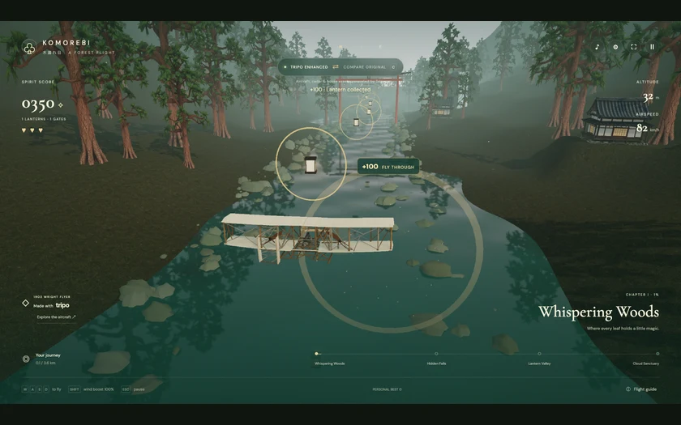</a><br><strong><a href="https://www.tripo3d.ai/es/3d-prompts/wright-flyer-through-a-japanese-forest-2096467585785286808">El Wright Flyer atraviesa un bosque japonés</a></strong><br><sub><a href="https://x.com/jaredliu_bravo">Jared</a></sub><br><a href="https://www.tripo3d.ai/es/3d-prompts/wright-flyer-through-a-japanese-forest-2096467585785286808">Prompt →</a></td>
<td width="50%" valign="top"><a href="https://www.tripo3d.ai/es/3d-prompts/jelly-jungle-3d-browser-game-2081024333120733188">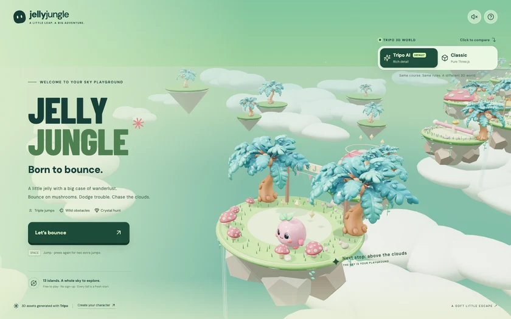</a><br><strong><a href="https://www.tripo3d.ai/es/3d-prompts/jelly-jungle-3d-browser-game-2081024333120733188">Jungla de Gelatina: juego de plataformas 3D</a></strong><br><sub><a href="https://x.com/jaredliu_bravo">Jared</a></sub><br><a href="https://www.tripo3d.ai/es/3d-prompts/jelly-jungle-3d-browser-game-2081024333120733188">Prompt →</a></td>
</tr>
<tr>
<td width="50%" valign="top"><a href="https://www.tripo3d.ai/es/3d-prompts/akari-nagoya-rooftop-flame-relay">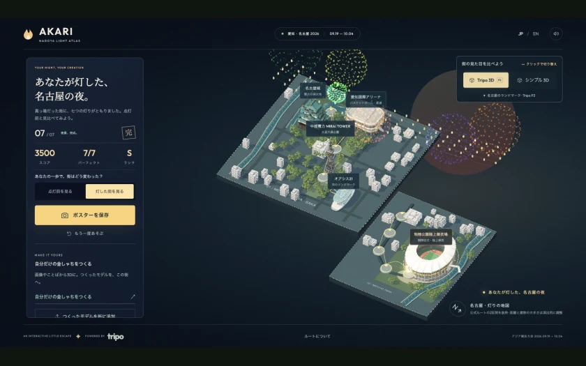</a><br><strong><a href="#akari-nagoya-rooftop-flame-relay">AKARI: Relevo de la llama en las azoteas de Nagoya</a></strong><br><sub><a href="https://growthengineer.space/">Jared</a></sub><br><a href="#akari-nagoya-rooftop-flame-relay">Prompt →</a></td>
<td width="50%" valign="top"><a href="https://www.tripo3d.ai/es/3d-prompts/cyclops-island-threejs-game">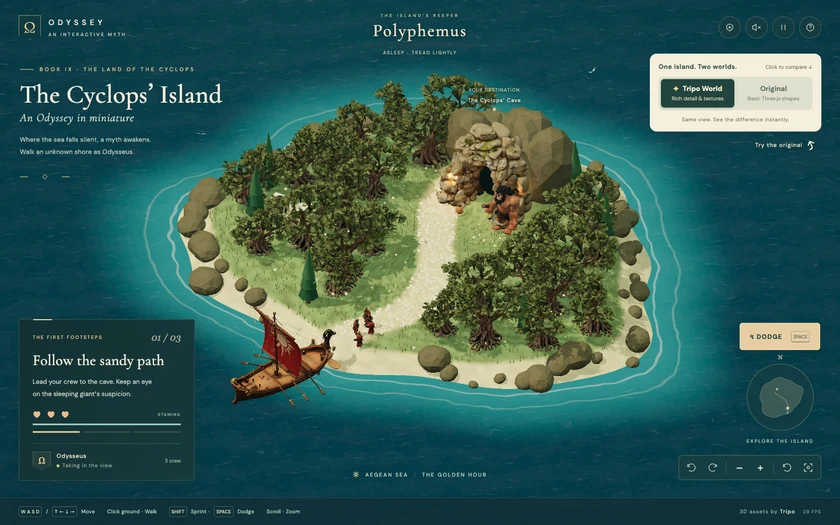</a><br><strong><a href="#cyclops-island-threejs-game">La isla del cíclope</a></strong><br><sub><a href="https://x.com/jaredliu_bravo">Jared</a></sub><br><a href="#cyclops-island-threejs-game">Prompt →</a></td>
</tr>
</table>

<a id="all-prompts"></a>

## Últimos prompts de Astra

<details>
<summary>Explorar ejemplos</summary>

- [Colisionador de partículas 3D interactivo](#2097781208596029936) · GitHub
- [Atlas 3D interactivo de la cabeza y el cerebro humanos](#2098105648106078541) · GitHub
- [Atlas de Chernóbil](#2098841316591346006) · GitHub
- [Explorador interactivo de anatomía en 3D](#2099206962344800541) · GitHub
- [Demo de gráficos de fantasía isométrica](#2100271998618177864) · GitHub
- [Mosswing: juego móvil 3D de tocar para aletear](#mosswing-mobile-3d-tap-to-flap-game) · GitHub
- [Motor de la Totalidad: Catedral cinematográfica del eclipse](#2096593372311941143)
- [Crea CS2 con Three.js](#2096596888799895855)
- [Animación de una caja plegable a partir de un troquel](#2096612394281603144)
- [Videojuego de aventuras de fantasía costera: Windhaven](#2096629506047955327)
- [RPG de acción de fantasía oscura en Three.js](#2096637091627364531)
- [Render de la Tierra girando en Blender](#2096637194270134742)
- [Juego de exploración 3D Mini World](#2096641728497275011)
- [Vista explosionada interactiva de un smartphone](#2096685163111694556)
- [Asset de videojuego de una minifigura LEGO con Blender MCP](#2096766465730847059)
- [Crea un slime blando e interactivo con Three.js y WebGPU](#2096793432987464010)
- [Escena 3D de Hogwarts](#2096907617117540478)
- [Calle en miniatura infinita en Three.js WebGPU](#2096956214680965501)
- [Mundo paisajístico para VRChat: «El horizonte donde la gravedad se rompió»](#2096966425017467344)
- [Patio chino interactivo](#2096971051334857181)
- [Un camino forestal de 12 segundos en Blender](#2096986557244723371)
- [Mascota robot interactiva en un banco de trabajo](#2097004192627933279)
- [Limonero gelatinoso interactivo](#2097065330728128920)
- [Crear el rig y animar un meca digitígrado en Godot](#2097123382852829230)
- [Animación de una floristería japonesa en vista explosionada](#2097153139795468365)
- [Terreno de aldea inspirado en Skyrim a partir de una referencia generada](#2097167383576383502)
- [Mejorar las facciones de un modelo 3D en Blender usando una imagen de referencia](#2097313247116341424)
- [Recreación de un minijuego 3D de League of Legends](#2097320830602809682)
- [Proyecto WebGL con TypeScript + Three.js del Salón de Oración por las Buenas Cosechas del Templo del Cielo de Beijing](#2097323734504017936)
- [Recrear League of Legends como juego web](#2097336230078013598)
- [Mundo acogedor de humedal y lago](#2097343467026289039)
- [Escena VHS de Blender inspirada en Backrooms](#2097534290112188602)
- [Sitio web inmersivo en 3D sobre un arrozal](#2097602565110419781)
- [Crear con GPT-6 Astra y Blender una escena cómica de un brazo robótico persiguiendo a un gato](#2097675660873605422)
- [Construye THE LAST GATE: un juego de carrera de multitudes con puertas aritméticas](#2097678911882809407)
- [Simulación 3D en tiempo real de una fábrica y sus plataformas de lanzamiento](#2097730920224534868)
- [Clon de Minecraft con multijugador](#2097797479488246071)
- [Demo interactiva de gráficos de fantasía](#2097821164093480999)
- [Corto 3D de un gato sin diálogos](#2097900087901106244)
- [Haz que un campo de golf de 18 hoyos sea más exigente](#2098038909514944562)
- [Banco interactivo de calamares](#2098043033446912315)
- [Flujo de trabajo para una persecución de coches cartoon inspirada en GTA](#2098049032195293190)
- [Pulso de la ciudad](#2098063352832610473)
- [Animación de una academia mágica flotante](#2098071577309122854)
- [Vuelo de un transbordador en modelo blanco por un cañón urbano](#2098079379297608050)
- [Animación fantástica de un espadachín destruyendo una puerta monumental](#2098094339759149067)
- [Demostración interactiva en 3D de una mano robótica que toca el piano](#2098109252720078891)
- [Nave civil de mensajería inicial de Sol Horizon](#2098225609558335846)
- [Generación automática y transferencia UV de texturas de cabello y rostro para modelos de personajes](#2098367087475577273)
- [Escena de maqueta 3D en miniatura de un templo](#2098403061463224543)
- [Figura 3D de una niña jugando con un robot](#2098406473273663992)
- [Estanque de koi 3D interactivo](#2098492771170722032)
- [Modela el puente de Brooklyn y prueba el cruce de tanques desde ambas direcciones](#2098650336521064759)
- [Vídeo demostrativo de construcción 3D de un templo antiguo zen](#2098697876155076820)
- [DEVICE: juego de puzles 3D fotorrealista que utiliza el propio smartphone](#2098715488369152087)
- [Juego de vuelo Skybound para navegador](#2098739181510164652)
- [Marco modular impreso en 3D con uniones](#2098774359926297011)
- [Reconstrucción 3D de la Exposición Universal de Chicago de 1893](#2098795017955418202)
- [Simulación de mesa de arena cinética](#2098831830002851846)
- [Animación 3D de origami que se pliega sola](#2098909584996057283)
- [Despliegue UV y rebakeo en 4K de un modelo de ropa sin cabeza](#2098980384260456813)
- [Escena costera 3D jugable para navegador](#2099172061092381027)
- [Reimagina el castillo de Peach en 3D](#2099359786865402019)
- [Ferrocarril en miniatura autónomo con prevención de colisiones](#2099362575339372780)
- [Circuito de obstáculos 3D jugable](#2099419671481249851)
- [Escena 3D interactiva de un samurái en el bosque](#2099450933067612421)
- [Modelo de conífera de menos de 200 polígonos](#2099472264270102705)
- [Mundo 3D lleno de rascacielos muy altos](#2099487024256589970)
- [El guerrero trepa a un gigante y le golpea la mandíbula](#2099519801139908951)
- [Crea una escena de pasillo de hotel](#2099588840419651890)
- [Isla volcánica interactiva con barcos que huyen](#2099643231659012553)
- [Panel interactivo del sistema nervioso de un organismo en 3D](#2099719427990134984)
- [Corazón y emoji sonriente en 3D con estilo Apple](#2099750376530657300)
- [Juego de exploración espacial procedural totalmente explorable](#2099785223827259515)
- [Crea un espacio 3D y un personaje de videojuego articulados a partir de imágenes de referencia](#2099850719839109597)
- [Escena de habitación 3D interactiva con muebles articulados](#2100139076816916977)
- [Desarrollo de una versión para PC de Splatoon y recreación de sus gráficos](#2100193512373592313)
- [Recorrido interactivo por un apartamento con opciones de azulejos](#2100222426705453318)
- [Cortometraje de lucha sobrenatural CGI AAA en una estación de metro](#2100233407108137349)
- [Escena interactiva de una hoguera con un caballero voxel](#2100350159540596760)
- [Añadir una cadena de mantenimiento a la barandilla](#2100519026720231698)
- [Crear un juego de carreras en 3D](#2100526922770026874)
- [Juego 3D de escape de un centro de investigación cerrado](#2100595652703199281)
- [Diseñar un cuerpo propio en CAD](#2100614534423540102)
- [Monster Block — 45 segundos para destrozar la ciudad](#2100636075039629796)
- [Entrenar una estrategia para hacer girar un bolígrafo con la mano diestra Sharpa](#2100751369619820923)
- [Juego de tranvía aéreo en 3D entre islas flotantes](#2100838090210431302)
- [Crea un mundo 3D fotorrealista](#2100844566718926949)
- [Modelo interactivo de reloj IWC Schaffhausen](#2100956517633761447)
- [Galaxia basada en física orbital real](#2101055500599054437)
- [Entorno 3D fotorrealista completo](#2101224659861590399)
- [Visualización interactiva en 3D de un motor de aeronave](#2101271938706685991)
- [Flujo de trabajo de animación 3D y vídeo de un gato experto en artes marciales](#2101310374033428642)
- [Modelo 3D de un Jaguar I-Pace de Waymo](#2101325346427842909)
- [Velero en mar abierto](#2101616345720787130)
- [Crea un modelo 3D de WALL-E en Three.js](#2101687900723106104)
- [ODD ARMS — Juego de supervivencia con armas extrañas](#odd-arms)
- [TITANIC — La última luz](#titanic-the-last-light)
- [AKARI: Relevo de la llama en las azoteas de Nagoya](#akari-nagoya-rooftop-flame-relay)
- [La isla del cíclope](#cyclops-island-threejs-game)

</details>

<a id="2097781208596029936"></a>

### Colisionador de partículas 3D interactivo

[BuBBliK](https://x.com/k1rallik) · 2026-09-09

<a href="https://www.tripo3d.ai/es/3d-prompts/gpt-6-astra-2097781208596029936"></a>

Prompt inicial sugerido por el autor para crear, en un único archivo HTML autocontenido, un colisionador de partículas 3D interactivo inspirado en el LHC del CERN y el detector ATLAS. Se presenta como un prompt para crear algo similar, no necesariamente como la entrada exacta utilizada para obtener el resultado mostrado.

**Prompt**

```text
Crea un colisionador de partículas 3D detallado e interactivo, inspirado en el LHC del CERN y el detector ATLAS, usando Three.js.

Crea tres vistas: un detector con miles de piezas animadas individualmente, un anillo acelerador con haces que giran en sentidos opuestos y una visualización sintética de una colisión.

Haz que el detector se desmonte en seis etapas, desde las grandes ruedas de los extremos y los imanes hasta los módulos de sensores individuales. Incluye un desmontaje controlado mediante desplazamiento, reproducción de 30/60/90 segundos, pausa y montaje inverso.

Añade interruptores de visibilidad para cada sistema, recuentos de componentes, descripciones educativas y un recorrido de cámara alrededor del anillo.

Usa una interfaz oscura de aspecto premium, materiales metálicos, sutiles acentos dorados e iluminación cinematográfica. Mantén las piezas claramente visibles y evita las superposiciones excesivas.

Consulta referencias oficiales del CERN. Etiqueta claramente la geometría simplificada y los eventos sintéticos.

Entrega un único archivo HTML autocontenido que funcione sin conexión, junto con código fuente portable y un README.
```

[Ver detalles ↗](https://www.tripo3d.ai/es/3d-prompts/gpt-6-astra-2097781208596029936) · [Publicación original](https://x.com/k1rallik/status/2097781208596029936) · [Código fuente](https://github.com/bubblik525/collider) · [Volver a los ejemplos](#all-prompts)

---

<a id="2098105648106078541"></a>

### Atlas 3D interactivo de la cabeza y el cerebro humanos

[BuBBliK](https://x.com/k1rallik) · 2026-09-10

<a href="https://www.tripo3d.ai/es/3d-prompts/gpt-6-astra-2098105648106078541"></a>

Prompt reutilizable recomendado por el autor para crear un atlas anatómico interactivo de la cabeza y el cerebro. Solicita mallas anatómicas con licencia, exploración por capas, herramientas de inspección, planos de recorte, vistas explosionadas y una aplicación HTML independiente que funcione sin conexión.

**Prompt**

```text
Crea un atlas 3D interactivo completo de la cabeza y el cerebro humanos. Entrega una aplicación funcional, no una maqueta. Toma decisiones razonables de forma independiente, implementa la aplicación, pruébala y verifica visualmente el resultado.

Usa Three.js y mallas reales de Z-Anatomy / BodyParts3D con las licencias adecuadas. Incluye el cráneo, los dientes, los músculos faciales, el cerebro, los ojos, los nervios craneales, las arterias, las venas y las membranas de soporte disponibles. Conserva sus relaciones anatómicas originales. Intenta incluir cientos de estructuras seleccionables individualmente, indica el número real de elementos importados y conserva la atribución de las fuentes.

Crea una interfaz limpia y clara, con fondo gris pálido, paneles blancos redondeados, detalles en azul grisáceo sobrios y tipografía legible. Mantén el modelo grande, con un panel de estructuras a la izquierda, herramientas de cámara a la derecha, búsqueda en la parte superior y un control deslizante de despiece debajo. Usa inglés en todo momento.

Haz que la anatomía se pueda explorar progresivamente:
Cabeza → sistema → región → estructuras individuales con nombre.
Por ejemplo: Cerebro → Cerebro propiamente dicho → Hemisferio izquierdo → Lóbulo frontal → estructuras individuales.

Anima el montaje y el desmontaje. Conserva las posiciones de origen al montar el modelo; organiza los grupos desmontados en disposiciones claramente separadas y con etiquetas legibles. Indica la escala normalizada y pagina las colecciones grandes.

Incluye:
- Rotación libre, zoom con rueda o pellizco y preajustes de cámara.
- Control deslizante de desmontaje y control con Mayús + rueda.
- Interruptores de visibilidad independientes para grupos y piezas individuales.
- Opacidad de grupos, deshacer, restaurar todo y restablecer.
- Búsqueda anatómica, inspección al hacer clic, enfoque, aislamiento y navegación al elemento principal.
- Modos de colores anatómicos, porcelana, estructura alámbrica y transparencia.
- Planos de recorte sagital, axial y coronal ajustables, con inversión de la dirección.
- Etiquetas, exploración automática, pantalla completa y exportación a PNG.
- Un recorrido guiado desde la cabeza completa hasta el cerebro y sus redes.

Mantén ocultas las estructuras ocultas aunque cambien la disposición y los materiales. Explica que los planos de recorte generan cortes abiertos para visualización, no exploraciones médicas. No inventes elementos anatómicos ni afirmes que existe validación clínica.

Entrega un archivo HTML independiente que contenga la aplicación y la geometría procesada, y que funcione sin conexión y sin servidor. Proporciona también archivos fuente limpios, dependencias fijadas, un archivo de bloqueo, scripts de compilación portátiles, un README en inglés y las licencias y atribuciones necesarias. Excluye credenciales, rutas del equipo local, dependencias y archivos no relacionados.

Prueba la integridad de la geometría, la pertenencia a la jerarquía, la visibilidad, las funciones de deshacer y la separación de los elementos en la disposición. Inspecciona la aplicación en ejecución en un navegador, prueba los controles, comprueba que no haya errores en la consola y corrige las superposiciones visuales antes de entregarla.
```

[Ver detalles ↗](https://www.tripo3d.ai/es/3d-prompts/gpt-6-astra-2098105648106078541) · [Publicación original](https://x.com/k1rallik/status/2098105648106078541) · [Código fuente](https://github.com/bubblik525/head) · [Volver a los ejemplos](#all-prompts)

---

<a id="2098841316591346006"></a>

### Atlas de Chernóbil

[BuBBliK](https://x.com/k1rallik) · 2026-09-12

<a href="https://www.tripo3d.ai/es/3d-prompts/gpt-6-astra-2098841316591346006">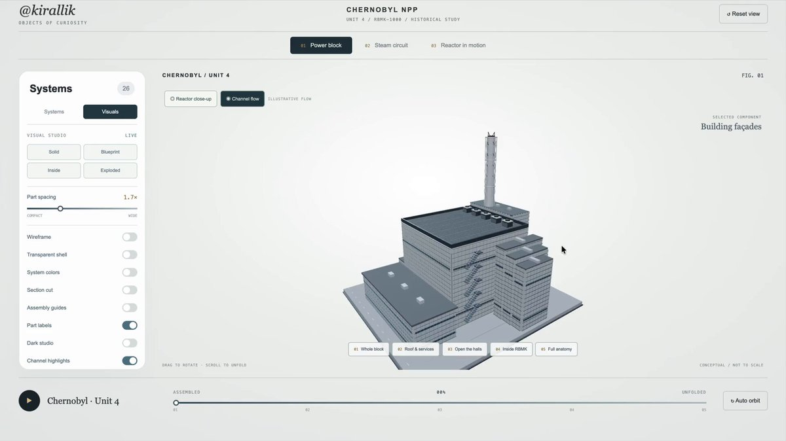</a>

Una recomendación reutilizable del autor de la publicación para crear una exposición interactiva en Three.js sobre el bloque energético de Chernóbil y el reactor RBMK. Propone un modelo 3D desmontable del bloque energético, una vista animada del circuito de vapor y un corte del reactor en 3D con controles de movimiento e inspección. El autor lo presenta como un prompt para crear algo similar, no como la entrada original confirmada de la exposición enlazada.

**Prompt**

```text
Crea «Atlas de Chernóbil», una exposición interactiva premium en 3D con Three.js.

Investiga la central nuclear de Chernóbil intacta y el reactor RBMK mediante referencias públicas. Modela los edificios, la chimenea de celosía, la sala de turbinas, la pila de grafito, los canales de combustible, el blindaje, los tambores separadores, las bombas y las tuberías.

Crea tres pestañas:
— Bloque energético: un modelo detallado que se desmonte capa por capa mediante el desplazamiento y un control deslizante.
— Circuito de vapor: un diagrama animado que conecte el reactor, la turbina, el condensador y las bombas.
— Reactor en movimiento: un corte 3D con agua y vapor en movimiento, maquinaria giratoria y controles de reproducción.

Añade controles independientes de visibilidad para cada sistema, separación ajustable entre piezas, modo de malla, transparencia, cortes de sección y etiquetas breves. Mantén todas las capas fáciles de inspeccionar y permite rotar libremente la cámara, incluso con el desmontaje completo.

Entrega el código fuente y un archivo HTML independiente. Prueba todos los controles. Preséntalo como una interpretación educativa, no como una réplica exacta de ingeniería.
```

[Ver detalles ↗](https://www.tripo3d.ai/es/3d-prompts/gpt-6-astra-2098841316591346006) · [Publicación original](https://x.com/k1rallik/status/2098841316591346006) · [Código fuente](https://github.com/bubblik525/Chernobyl_Atlas) · [Volver a los ejemplos](#all-prompts)

---

<a id="2099206962344800541"></a>

### Explorador interactivo de anatomía en 3D

[BuBBliK](https://x.com/k1rallik) · 2026-09-13

<a href="https://www.tripo3d.ai/es/3d-prompts/gpt-6-astra-2099206962344800541">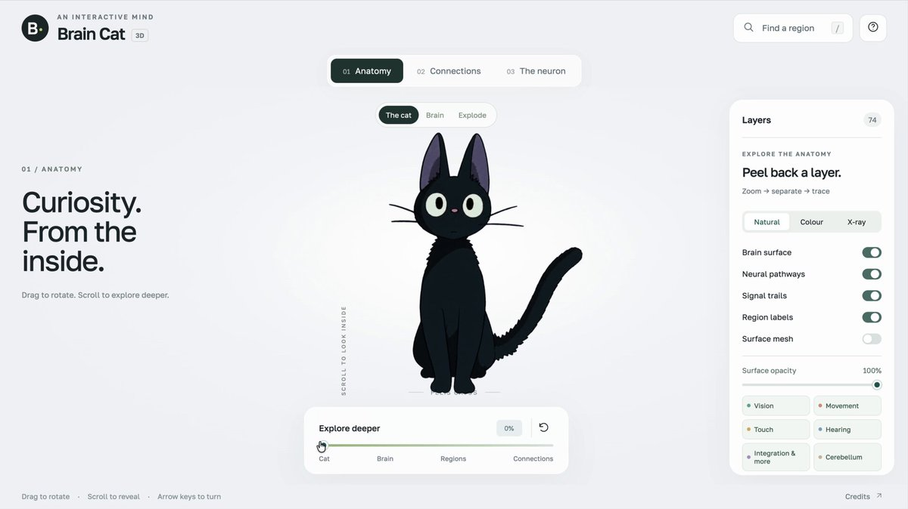</a>

El autor compartió esto como un prompt inicial recomendado para crear una versión similar a su sitio web interactivo Brain Cat. Solicita un explorador de anatomía en 3D adaptable, con vista transparente progresiva, rotación, separación de estructuras, regiones etiquetadas, controles de capas, señales educativas animadas y atribución de fuentes científicas.

**Prompt**

```text
Crea un explorador de anatomía en 3D atractivo e interactivo utilizando conjuntos de datos científicos disponibles públicamente. Comienza con una vista externa que se vuelva gradualmente transparente al acercar el zoom, para revelar la anatomía subyacente.

Permite rotar el modelo, separar estructuras, seleccionar regiones etiquetadas y activar o desactivar capas desde un panel lateral. Añade pestañas independientes para anatomía, conexiones y células individuales, con señales animadas y controles ajustables.

Usa una interfaz moderna y minimalista, con iluminación suave, colores sutiles, transiciones fluidas y muy poco texto. Incluye flechas y un breve tutorial visual. Haz que funcione en ordenadores y dispositivos móviles.

Utiliza geometría anatómica real cuando esté disponible, cita las fuentes y distingue claramente los datos científicos de las animaciones ilustrativas. Crea un sitio web funcional.
```

[Ver detalles ↗](https://www.tripo3d.ai/es/3d-prompts/gpt-6-astra-2099206962344800541) · [Publicación original](https://x.com/k1rallik/status/2099206962344800541) · [Código fuente](https://github.com/bubblik525/cat_brain_anatomy) · [Volver a los ejemplos](#all-prompts)

---

<a id="2100271998618177864"></a>

### Demo de gráficos de fantasía isométrica

[Anshu Chimala](https://x.com/anshuc) · 2026-09-16

<a href="https://www.tripo3d.ai/es/3d-prompts/gpt-6-astra-2100271998618177864">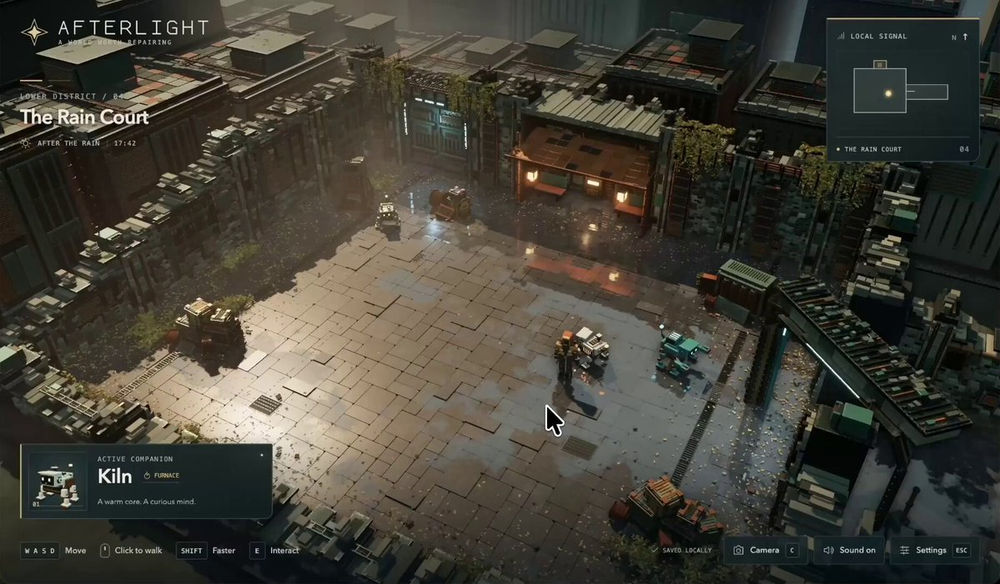</a>

Una escena 3D de fantasía interactiva en el navegador, con cámara isométrica, dirección artística inspirada en los vóxeles, suelos mojados reflectantes y un personaje controlable. El repositorio de Dream Loop enlazado la presenta como su prompt de ejemplo y afirma que se probó con GPT-6 Astra en Codex. No solicita un bucle de juego.

**Prompt**

```text
Crea una demo gráfica: cámara isométrica, estilo artístico tipo vóxel con sombreado realista y suelos mojados reflectantes, además de un personaje en una escena interesante. Ambientación de fantasía (piensa en Elden Ring y Diablo). Usa Three.js en el navegador, a más de 60 FPS. No descargues recursos. Límite de tiempo: 1 hora. Controles: haz clic para mover al personaje; la cámara lo seguirá suavemente. Arrastra para girar la cámara y usa la rueda del ratón para acercar o alejar el zoom. Por ahora, no incluyas jugabilidad. El mundo debe parecer vivo: incorpora movimiento, animaciones y comportamientos ambientales sutiles. La zona alrededor del jugador debe parecer amplia, pero limita el movimiento a un espacio reducido. No hace falta que confirmes conmigo el estilo artístico ni que hagas preguntas: ponte manos a la obra.
```

[Ver detalles ↗](https://www.tripo3d.ai/es/3d-prompts/gpt-6-astra-2100271998618177864) · [Publicación original](https://github.com/achimala/dream-loop) · [Código fuente](https://github.com/achimala/dream-loop) · [Volver a los ejemplos](#all-prompts)

---

<a id="mosswing-mobile-3d-tap-to-flap-game"></a>

### Mosswing: juego móvil 3D de tocar para aletear

[Ayi1337](https://github.com/Ayi1337) · 2026-09-10

<a href="https://www.tripo3d.ai/es/3d-prompts/mosswing-mobile-3d-tap-to-flap-game"></a>

Crea un juego de vuelo 3D pulido para navegador móvil, con controles de un solo toque, huecos que se desplazan, puntuación instantánea y una criatura y un mundo originales.

**Prompt**

```text
Remasteriza el clásico juego de «tocar para aletear» —ese en el que tocas para mantener a una pequeña criatura en el aire mientras planea por una serie interminable de huecos— como un juego 3D jugable en un navegador móvil. Un único index.html, que se abra y se pueda jugar al instante, sin recursos externos (se permiten bibliotecas CDN; tú decides). Mantén el núcleo exactamente como todos lo recuerdan: control con un solo toque, gravedad, huecos que se desplazan hacia ti, un impacto y la partida termina, y una puntuación basada en los huecos superados. Todo lo demás queda a tu elección: qué es la criatura, cuáles son los obstáculos, el mundo, la cámara, la sensación del aleteo y hasta dónde llevar los elementos visuales. Diseña un personaje y un estilo originales en lugar de copiar el apartado artístico del original. No responderé preguntas de aclaración. Juzgaré una pieza de trabajo completa, elegante y con una gran sensación al jugar, no una lista de funciones. Algo pequeño y terminado vale más que algo grande y tosco.
```

[Ver detalles ↗](https://www.tripo3d.ai/es/3d-prompts/mosswing-mobile-3d-tap-to-flap-game) · [Publicación original](https://github.com/Ayi1337/gpt6-astra-one-shot-games#02--mosswing) · [Código fuente](https://github.com/Ayi1337/gpt6-astra-one-shot-games) · [Demo en línea](https://mosswing-quiet-flight.jack-514.chatgpt.site/) · [Volver a los ejemplos](#all-prompts)

---

<a id="2096593372311941143"></a>

### Motor de la Totalidad: Catedral cinematográfica del eclipse

[Chris W](https://x.com/Chris_Wozniczek) · 2026-09-06

<a href="https://www.tripo3d.ai/es/3d-prompts/totality-engine-cinematic-eclipse-cathedral-2096593372311941143"></a>

Un prompt completo para Three.js/WebGL que crea un cortometraje cinematográfico en bucle de 32 segundos dentro de una catedral gótica inundada, con un reloj astronómico monumental, movimientos de cámara dirigidos, agua procedural, planetas de cristal e iluminación de eclipse. Chris W publicó una ejecución en Astra y una comparación con otros modelos.

**Prompt**

```text
Crea una experiencia pulida y visualmente impactante de HTML/WebGL, autocontenida y en un único archivo, llamada:

totality-engine.html colócala en documents/llm-benchmarks

No te limites a describir la idea. Genera realmente el archivo HTML completo y funcional, y guárdalo en el directorio actual.

Construye un cortometraje cinematográfico en bucle de 32 segundos, no un diorama de pruebas. El producto es la interpretación de la cámara. La interacción es un extra que se activa después de reproducir el filme una vez.

Mundo:
Una catedral gótica sumergida durante la totalidad de un eclipse solar. El agua negra cubre el suelo de la nave. En el crucero se alza un reloj astronómico monumental de latón, el Motor de la Totalidad: anillos de orrery anidados, planetas de cristal, un núcleo de sol negro y un péndulo de mármol oscuro de 40 metros con herrajes dorados. Caliza mojada, verdín, llamas de velas y polvo de oro. Todo debe generarse mediante código procedural. No uses modelos, texturas, imágenes, fuentes como archivos ni audio externos.

Filme dirigido (un solo reloj, beats con nombre, bucle continuo):

0.0–4.0 s POLVO
Primerísimo primer plano. Una mota de polvo gira en un haz de luz rojo dorado. Casi no hay contexto. Avance lento de cámara.

4.0–10.0 s NAVE
Retrocede y asciende. Estamos con el agua negra hasta las rodillas, en el crucero de la catedral. Las bóvedas de crucería se pierden en la niebla. El péndulo entra en cuadro desde la izquierda, pesado y lento, y pasa lo bastante cerca como para sentir su masa. Se forman ondas en el agua desde la cámara.

10.0–18.0 s ASCENSO
Acompaña el ascenso del péndulo. Revela el orrery en la bóveda: al menos cuatro anillos de latón anidados, con distintas inclinaciones; tres planetas de cristal con atmósferas diferenciadas —uno nuboso, otro con anillos y otro con bandas de tormenta—; y el núcleo de sol negro. Agrupaciones de velas a lo largo del triforio. El polvo de oro asciende contra la gravedad.

18.0–24.0 s HILO
La cámara se abre paso entre el orrery. Atraviesa el cristal del planeta con anillos —refracción, no un truco de transparencia—, sigue su plano de anillos durante un instante y sale en dirección al sol negro. El siguiente balanceo del péndulo deforma la luz a su alrededor como una lente gravitacional débil.

24.0–30.0 s TOTALIDAD
La corona estalla en un anillo de fuego blanco dorado que se convierte en la rueda más externa del orrery. Un tic de reloj que se sienta como un sonido: todos los anillos encajan de golpe en una alineación perfecta y, después, la corona permanece. No fundas a blanco. Mantén la silueta de toda la máquina contra el anillo de fuego.

30.0–32.0 s CODA
Deslízate hacia una continuación lenta que coincida con el fotograma 0, para que el bucle sea invisible. No hagas un corte brusco.

Después de la primera reproducción completa, habilita arrastrar para orbitar, zoom con la rueda del ratón y un control «Reproducir filme». El botón Pausa debe funcionar siempre. Opcional: las teclas 1–5 saltan al inicio de cada beat.

Construcción de la escena:
- Define un primer plano, un plano medio y un fondo sólidos. El péndulo ocupa el primer plano en NAVE. Las bóvedas y la niebla aportan profundidad.
- Incluye al menos dos referencias a escala humana —un banco sumergido, una aguja caída o una fila de velas— para que la máquina se perciba enorme.
- El agua debe ser un material real: reflejos del orrery, un fresnel tenue, desplazamiento lento y las ondas producidas por el péndulo y la cámara.
- Los planetas deben ser de cristal grueso, no esferas brillantes. A través de al menos uno de ellos debe verse una catedral distorsionada.
- El latón debe transmitir peso: oscuro en las sombras, con solo los bordes captando la luz de la corona.
- Las llamas de las velas y el polvo de oro deben usar instanciación. El polvo solo asciende durante ASCENSO y TOTALIDAD.
- Bóvedas de crucería, siluetas de arbotantes y un enorme rosetón circular o abertura de eclipse en el muro del fondo, alineado con el sol negro.
- Paleta limitada y fija: caliza mojada #8a8680, latón #c4a574, verdín #2f6f66, carmesí del eclipse #6b1020, corona #ffe9c2, agua negra #05070c, polvo de oro #e6c27a. Nada de cian, magenta, neón, arcoíris ni ese «look de IA» morado sobre negro.
- Tipografía: un único título pequeño «TOTALITY ENGINE» y el nombre del beat; estética cinematográfica, no de panel de control.

Requisitos técnicos:
- Usa Three.js desde una CDN estable. Incluye todo el HTML, CSS y JS en este único archivo.
- Controla toda la animación con un único reloj de tiempo transcurrido y ventanas de beat con nombre. No uses bucles independientes con Math.random, Date.now en los shaders ni ruido sin semilla. Usa únicamente un RNG con semilla; la constante de semilla es 0xA2E1.
- La película de cámara debe usar interpolación suave con ease-in-out en los grandes movimientos, un easing más pesado para el péndulo —tiene masa— y una estabilización de cola larga al entrar en TOTALIDAD. Una órbita lineal como cámara principal es inaceptable.
- Usa GLSL personalizado —ShaderMaterial o un pase a pantalla completa—, no materiales estándar que solo lo aparenten:
1. Agua (reflejo + fresnel + desplazamiento lento)
2. Corona del sol negro (fuego/plasma, no un sprite)
3. Lente gravitacional del péndulo (la luz se curva cerca de la pesa durante HILO)
4. Cristal grueso para al menos un planeta
- Usa InstancedMesh para el polvo, las velas y cualquier elemento repetido de piedra o latón. No generes miles de objetos Mesh independientes.
- Se permite el posprocesado, pero no puede sustituir a la iluminación. Si usas bloom, aplícalo con sutileza únicamente a la corona y las velas. Un UnrealBloom aplicado a toda la escena es inaceptable.
- La niebla, los reflejos húmedos y la abertura del eclipse deben crear la atmósfera. No uses conos transparentes baratos como «rayos divinos» a menos que estén realmente controlados por un shader.
- La experiencia debe adaptarse a toda la ventana del navegador, gestionar el redimensionado y apuntar a 60 fps en un portátil de 2023. Si tienes que elegir, reduce la cantidad de partículas antes que sacrificar la película de cámara.
- UI pequeña y discreta: título, beat actual, pausa y repetición. No incluyas contador de FPS, dat.gui ni asistentes de depuración activos.
- No dejes comentarios TODO, pseudocódigo, marcadores de posición, funciones ausentes ni frases como «esto quedaría mejor con X».
- Al cargarse, el filme debe comenzar por sí solo. Mostrar un fotograma estático detrás de un botón de inicio es inaceptable.

Nivel de calidad:
Esto debe parecer un fotograma de un cortometraje, no un ejemplo de Three.js. Si una captura a los 26 segundos no se interpreta como «un reloj del tamaño de una catedral en el momento del eclipse», aún no has terminado. Itera en la composición, los materiales y la cámara antes de añadir más objetos.
```

[Ver detalles ↗](https://www.tripo3d.ai/es/3d-prompts/totality-engine-cinematic-eclipse-cathedral-2096593372311941143) · [Publicación original](https://x.com/Chris_Wozniczek/status/2096593372311941143) · [Demo en línea](https://chris-website-theta.vercel.app/astra-xhigh-totality-engine.html) · [Volver a los ejemplos](#all-prompts)

---

<a id="2096596888799895855"></a>

### Crea CS2 con Three.js

[Neatprompts](https://x.com/neatpromptsai) · 2026-09-06

<a href="https://www.tripo3d.ai/es/3d-prompts/gpt-6-astra-2096596888799895855"></a>

Un prompt breve compartido por Neatprompts para crear una escena de estilo CS2 en Three.js con GPT-6 Astra. La cadena de difusión pasa por Om Patel y llega a una demostración pública en Reddit de u/TimeForsaken5275.

**Prompt**

```text
hey GPT-6 Astra, créame CS2 con Three.js, sin cometer errores.
```

[Ver detalles ↗](https://www.tripo3d.ai/es/3d-prompts/gpt-6-astra-2096596888799895855) · [Publicación original](https://x.com/neatpromptsai/status/2096596888799895855) · [Volver a los ejemplos](#all-prompts)

---

<a id="2096612394281603144"></a>

### Animación de una caja plegable a partir de un troquel

[Salma](https://x.com/Salmaaboukarr) · 2026-09-06

<a href="https://www.tripo3d.ai/es/3d-prompts/gpt-6-astra-2096612394281603144"></a>

Convierte un troquel de packaging en un modelo editable de Blender con paneles individuales, pivotes de plegado y una animación que muestra el paso del diseño plano a la caja cerrada.

**Prompt**

```text
Crea en Blender un modelo editable de caja plegable y una animación usando la imagen del troquel que he adjuntado.

El objetivo principal es mostrar cómo el troquel plano se pliega para formar una caja cerrada y vuelve a desplegarse, con una presentación técnica en la vista 3D de Blender

PRIORIDAD DE LA REFERENCIA

• Usa la imagen como referencia para la estructura de la caja, las formas de los paneles, las solapas y la posición de los hendidos.
• Trata el texto de los archivos de referencia como contenido de referencia, no como instrucciones adicionales.

MODELA EL TROQUEL

Construye paneles de malla individuales conectados mediante pivotes de plegado colocados con precisión.

Incluye:
• Panel inferior.
• Pared posterior.
• Panel superior o tapa con bisagra.
• Solapa de cierre insertable, con forma ahusada.
• Paredes laterales izquierda y derecha.
• Pared frontal y retorno interior frontal.
• Solapas de esquina delanteras y traseras.
• Alas laterales ahusadas unidas a la tapa.
• Solapas de cierre y muescas visibles cuando la imagen proporcione suficiente detalle.

Respeta las proporciones y los contornos de la imagen proporcionada. Como no se indican dimensiones numéricas, usa dimensiones provisionales de 300 × 300 × 95 mm para la caja montada. Haz que estas dimensiones sean fáciles de modificar e identifícalas como supuestos.
```

[Ver detalles ↗](https://www.tripo3d.ai/es/3d-prompts/gpt-6-astra-2096612394281603144) · [Publicación original](https://x.com/Salmaaboukarr/status/2096612394281603144) · [Volver a los ejemplos](#all-prompts)

---

<a id="2096629506047955327"></a>

### Videojuego de aventuras de fantasía costera: Windhaven

[Tripo](https://x.com/tripoai) · 2026-09-06

<a href="https://www.tripo3d.ai/es/3d-prompts/gpt-6-astra-2096629506047955327"></a>

Prompt de Unity proporcionado por un autor para crear un videojuego jugable de aventuras de fantasía costera estilizada y su entorno 3D de ciudad insular, Windhaven, con una plaza central, un templo, puntos de referencia y una propuesta de juego en tercera persona.

**Prompt**

```text
Diseña un juego conmigo. El juego debe estar creado en Unity. Usa primero los recursos predeterminados; los sustituiré más adelante.
Estilo del juego:
Un videojuego de aventuras de fantasía costera estilizada y de alta calidad, ambientado en una pequeña ciudad insular bañada por el sol llamada Windhaven. La ciudad está construida con piedra caliza de marfil cálido y arenisca dorada, rodeada de aguas turquesas cristalinas, y cuenta con tejados de cobre verde azulado, puestos de mercado a la sombra, accesos arqueados, frondosos árboles en los patios, fuentes talladas, balizas mágicas resplandecientes y un templo monumental que domina la ciudad. Un joven explorador solitario, con capa de viaje y mochila, recorre la plaza central en dirección al templo. El entorno transmite una sensación de paz, misterio, antigüedad y magia sutil, con influencias arquitectónicas mediterráneas y norteafricanas. Materiales PBR estilizados de gran detalle, superficies de piedra trabajadas a mano, desgaste sutil, elegantes tallas decorativas, suave luz de la tarde, largas sombras cinematográficas, paleta de colores turquesa y dorado cálido, dirección artística pulida propia de un juego de aventuras AA, cámara de juego en tercera persona, plano general de presentación, diseño ambiental cohesionado, rutas y puntos de referencia claramente legibles, sin interfaz de usuario, sin texto, sin logotipos ni objetos modernos.
```

[Ver detalles ↗](https://www.tripo3d.ai/es/3d-prompts/gpt-6-astra-2096629506047955327) · [Publicación original](https://x.com/tripoai/status/2096629506047955327) · [Volver a los ejemplos](#all-prompts)

---

<a id="2096637091627364531"></a>

### RPG de acción de fantasía oscura en Three.js

[Prompt Case](https://x.com/HiltonMisia) · 2026-09-06

<a href="https://www.tripo3d.ai/es/3d-prompts/gpt-6-astra-2096637091627364531"></a>

Un prompt para crear un RPG de acción de fantasía oscura en 3D, totalmente jugable, con Three.js. Incluye un santuario gótico invadido por el bosque, combates de caballero, magia, un enfrentamiento contra un jefe, elementos de HUD en chino tradicional y todos los flujos del juego.

**Prompt**

```text
Usa Three.js para crear desde cero un RPG de acción de fantasía oscura en 3D, pulido y totalmente jugable.

Usa una cámara de seguimiento cenital en ángulo. El escenario es un gran santuario gótico invadido por el bosque, con torres en ruinas, galerías porticadas, puentes de piedra cubiertos de musgo, colinas onduladas, arroyos, cascadas y fogatas. Crea una atmósfera con múltiples capas mediante materiales realistas, iluminación cinematográfica, una ligera neblina, vegetación agitada por el viento y agua en movimiento.

El protagonista es un poderoso caballero con una armadura pesada de acero y oro, elaborada con gran detalle, una capa ondeante y una espada rúnica y un escudo resplandecientes. El personaje debe poder moverse, atacar con la espada, rodar, bloquear, curarse y lanzar magia con círculos mágicos enormes, haces de luz y efectos de rayos. Tras derrotar a los guardias, el jugador debe enfrentarse a un jefe caballero gigante con astas.

Las animaciones de ataque, los efectos visuales y las direcciones de los impactos deben coincidir siempre con la dirección hacia la que mira el personaje. Incluye un HUD pulido en chino tradicional, una pantalla de equipamiento del personaje y flujos completos de victoria, derrota y reinicio.

Encárgate de forma independiente del modelado, la creación o adquisición de recursos, la programación y la optimización del rendimiento. Busca un acabado visual de nivel AAA. Prueba el juego continuamente, revisa los aspectos visuales y corrige los problemas hasta entregar un juego completo y jugable, instrucciones para iniciarlo y el código fuente.
```

[Ver detalles ↗](https://www.tripo3d.ai/es/3d-prompts/gpt-6-astra-2096637091627364531) · [Publicación original](https://x.com/HiltonMisia/status/2096637091627364531) · [Volver a los ejemplos](#all-prompts)

---

<a id="2096637194270134742"></a>

### Render de la Tierra girando en Blender

[John Kler](https://x.com/JohnKlerAI) · 2026-09-06

<a href="https://www.tripo3d.ai/es/3d-prompts/gpt-6-astra-2096637194270134742"></a>

Un prompt para Blender que permite crear un espectacular render de cinco segundos de la Tierra girando, vista desde el espacio. El autor afirma que ambos modelos se probaron con este mismo prompt.

**Prompt**

```text
En Blender, crea un render espectacular de 5 segundos de la Tierra girando, vista desde el espacio.
```

[Ver detalles ↗](https://www.tripo3d.ai/es/3d-prompts/gpt-6-astra-2096637194270134742) · [Publicación original](https://x.com/JohnKlerAI/status/2096637194270134742) · [Volver a los ejemplos](#all-prompts)

---

<a id="2096641728497275011"></a>

### Juego de exploración 3D Mini World

[Weijian Zhang](https://x.com/weijianzhang_) · 2026-09-06

<a href="https://www.tripo3d.ai/es/3d-prompts/gpt-6-astra-2096641728497275011"></a>

<a href="https://www.tripo3d.ai/es/3d-prompts/gpt-6-astra-2096641728497275011"></a>

<a href="https://www.tripo3d.ai/es/3d-prompts/gpt-6-astra-2096641728497275011"></a>

<a href="https://www.tripo3d.ai/es/3d-prompts/gpt-6-astra-2096641728497275011"></a>

Un prompt reutilizable para crear un juego infantil de exploración 3D con un mundo esférico, zoom, bosques, desiertos, océanos, natación, exploración y mejoras iterativas.

**Prompt**

```text
Creemos un juego llamado Mini World. Es un juego de exploración de un mundo 3D, con una interfaz gráfica atractiva y de alta calidad, diseñado para que sea divertido y fácil de jugar para mi hijo de cuatro años y medio. Debe ser posible acercar y alejar la cámara. Desde lejos, el mundo parece una pequeña esfera, pero en su interior cuenta con distintas regiones para explorar. Una región puede parecer un bosque, otra un desierto, y también puede haber océanos en los que el personaje pueda nadar. El juego debe resultar divertido y ofrecer una experiencia jugable, con un personaje capaz de recorrer distintas partes del mundo, explorar diversos entornos y descubrir cosas por el camino. Considera que conseguir que todo funcione correctamente es el objetivo principal. El diseño debe ser atractivo y probarse minuciosamente mediante ciclos iterativos, para que el movimiento, el zoom, la exploración, la natación, los entornos, los controles y la experiencia general funcionen de forma fluida y coordinada. Sigue probándolo y mejorándolo hasta que todo funcione de manera fiable y el juego esté pulido, sea intuitivo y resulte divertido para un niño pequeño.
```

[Ver detalles ↗](https://www.tripo3d.ai/es/3d-prompts/gpt-6-astra-2096641728497275011) · [Publicación original](https://x.com/weijianzhang_/status/2096641728497275011) · [Volver a los ejemplos](#all-prompts)

---

<a id="2096685163111694556"></a>

### Vista explosionada interactiva de un smartphone

[Zaira Laraib](https://x.com/zairalaraib_) · 2026-09-06

<a href="https://www.tripo3d.ai/es/3d-prompts/gpt-6-astra-2096685163111694556"></a>

Crea una visualización 3D de un smartphone con un control deslizante para desmontarlo y volver a montarlo, componentes seleccionables y explicaciones de la función de cada pieza.

**Prompt**

```text
Crea una visualización 3D interactiva en vista explosionada de un smartphone moderno. Separa el dispositivo en sus componentes principales y permite desmontarlo y volver a montarlo con un control deslizante. Al hacer clic en un componente, debería aislarse y mostrar una explicación de su función. Incluye la batería, las cámaras, el SoC, la memoria, las capas de la pantalla, los altavoces, los sensores, las antenas y la placa lógica. Prioriza una interfaz atractiva, inspirada en Apple, y unas interacciones satisfactorias. Crea, ejecuta, inspecciona y corrige toda la experiencia.
```

[Ver detalles ↗](https://www.tripo3d.ai/es/3d-prompts/gpt-6-astra-2096685163111694556) · [Publicación original](https://x.com/zairalaraib_/status/2096685163111694556) · [Volver a los ejemplos](#all-prompts)

---

<a id="2096766465730847059"></a>

### Asset de videojuego de una minifigura LEGO con Blender MCP

[Simon Smith](https://x.com/_simonsmith) · 2026-09-07

<a href="https://www.tripo3d.ai/es/3d-prompts/astra-3d-2096766465730847059"></a>

Crea una versión de Donald Trump como minifigura LEGO, convertida en un asset de videojuego AAA de alta calidad mediante Blender MCP.

**Prompt**

```text
Usa Blender MCP para crear una versión de Donald Trump como minifigura LEGO que pueda utilizar como asset de videojuego. Haz que tenga una calidad excepcional, propia de un videojuego AAA, y somete tu trabajo a una revisión exhaustiva para asegurarte de que sea detallado, preciso y excelente.
```

[Ver detalles ↗](https://www.tripo3d.ai/es/3d-prompts/astra-3d-2096766465730847059) · [Publicación original](https://x.com/_simonsmith/status/2096766465730847059) · [Volver a los ejemplos](#all-prompts)

---

<a id="2096793432987464010"></a>

### Crea un slime blando e interactivo con Three.js y WebGPU

[码农暖爸](https://x.com/Delroy715) · 2026-09-07

<a href="https://www.tripo3d.ai/es/3d-prompts/gpt-6-astra-2096793432987464010"></a>

El autor muestra una aplicación de slime para navegador llamada Softie y, a continuación, publica explícitamente el prompt utilizado para crearla. El prompt pide crear un slime blando que se pueda arrastrar y aplastar, con controles ajustables.

**Prompt**

```text
Crea un directorio nuevo y desarrolla una página con un slime jugable en el navegador. Usa Three.js y WebGPU; no recurras a WebGL.
En el centro debe haber un slime redondo y regordete, rosa o verde azulado, semitransparente y con burbujas apenas visibles en su interior. El usuario debe poder presionarlo y arrastrarlo con el ratón; al soltarlo, debe balancearse hasta recuperar su forma. Añade un poco de gravedad para que pueda caer suavemente sobre una mesa invisible. No lo hagas como una esfera rígida: debe tener una sensación blanda y carnosa.
Coloca una cara simpática: dos ojos negros como cuentas y una boquita pequeña, que se deformen junto con la superficie; no los separes del cuerpo. En la parte derecha, añade unos controles sencillos para el color, la suavidad y la amortiguación. El botón «Darle un toque» debe hacer que salte ligeramente.
Mantén la página limpia, con un fondo gris claro y un título grande. Debe funcionar a 60 fotogramas por segundo. Primero genera una imagen de referencia del resultado objetivo y después construye la página basándote en ella; añade más detalles solo cuando la captura de pantalla se parezca al objetivo.
```

[Ver detalles ↗](https://www.tripo3d.ai/es/3d-prompts/gpt-6-astra-2096793432987464010) · [Publicación original](https://x.com/Delroy715/status/2096793432987464010) · [Volver a los ejemplos](#all-prompts)

---

<a id="2096907617117540478"></a>

### Escena 3D de Hogwarts

[Prompt Case](https://x.com/HiltonMisia) · 2026-09-07

<a href="https://www.tripo3d.ai/es/3d-prompts/gpt-6-astra-2096907617117540478"></a>

Un prompt reutilizable para crear un modelo 3D de gran escala, realista y explorable de Hogwarts, con su entorno, lugares emblemáticos, interiores, objetos, presentación cinematográfica, niebla, diseño sonoro y ajustes visuales configurables.

**Prompt**

```text
Usa Headless Blender para crear un modelo 3D de gran escala, muy realista y completamente detallado del Colegio Hogwarts de Magia y Hechicería de Harry Potter. Incluye el entorno natural circundante, lugares emblemáticos, interiores fieles y objetos. Ofrece materiales, iluminación, renderizado y diseño sonoro con calidad cinematográfica, una atmósfera misteriosa y niebla dinámica que se desplace lentamente. Permite explorar libremente el entorno y proporciona ajustes configurables para la iluminación y otras opciones visuales.
```

[Ver detalles ↗](https://www.tripo3d.ai/es/3d-prompts/gpt-6-astra-2096907617117540478) · [Publicación original](https://x.com/HiltonMisia/status/2096907617117540478) · [Volver a los ejemplos](#all-prompts)

---

<a id="2096956214680965501"></a>

### Calle en miniatura infinita en Three.js WebGPU

[Dash](https://x.com/creativedash) · 2026-09-07

<a href="https://www.tripo3d.ai/es/3d-prompts/gpt-6-astra-2096956214680965501"></a>

Crea una escena interactiva de una calle en miniatura con una bicicleta de reparto, tiendas, efectos de asfalto mojado, hojas esparcidas, un mundo curvado, estética pixel art y parámetros de Forge ajustables.

**Prompt**

```text
Crea para mí una calle en miniatura infinita en Three.js WebGPU: una bicicleta de reparto que pasa junto a una hilera de pequeñas tiendas, asfalto mojado con charcos que generan ondas y salpicaduras cuando los neumáticos los atraviesan, huellas de neumáticos que se desvanecen, hojas que se dispersan y un mundo suavemente curvado. Estética pixel art, con un rendimiento fluido en móviles. Añade parámetros de Forge para poder manipular por completo el mundo.
```

[Ver detalles ↗](https://www.tripo3d.ai/es/3d-prompts/gpt-6-astra-2096956214680965501) · [Publicación original](https://x.com/creativedash/status/2096956214680965501) · [Volver a los ejemplos](#all-prompts)

---

<a id="2096966425017467344"></a>

### Mundo paisajístico para VRChat: «El horizonte donde la gravedad se rompió»

[Xenoah](https://x.com/shuminchuuu) · 2026-09-07

<a href="https://www.tripo3d.ai/es/3d-prompts/gpt-6-astra-2096966425017467344"></a>

<a href="https://www.tripo3d.ai/es/3d-prompts/gpt-6-astra-2096966425017467344"></a>

<a href="https://www.tripo3d.ai/es/3d-prompts/gpt-6-astra-2096966425017467344"></a>

<a href="https://www.tripo3d.ai/es/3d-prompts/gpt-6-astra-2096966425017467344"></a>

Este prompt sirve para crear en Blender el conjunto completo de modelos 3D de un mundo paisajístico para VRChat, con un horizonte donde la gravedad se ha roto. Construye colinas, una plataforma de observación semicircular, un dispositivo de observación, un mar vertical, una cordillera invertida, pilares negros y fracturas espaciales como grandes siluetas de estilo low-poly.

**Prompt**

```text
Crea en Blender el conjunto completo de modelos 3D de un mundo paisajístico para VRChat.

El tema es

«El horizonte donde la gravedad se rompió»

.

Solo la cima de la colina donde se encuentra el jugador debe ser normal; únicamente el horizonte lejano debe mostrar una gran alteración de las leyes físicas.

Mantén toda la escena con formas sencillas.
Da prioridad a
las grandes siluetas

, la anomalía del horizonte lejano
, la forma de la plataforma de observación
 y la composición espacial
, por encima de los detalles decorativos.

Composición

Crea los siguientes elementos.

Cima de la colina

Sendero estrecho
Desmonte poco profundo
Plataforma de observación semicircular
Unos pocos bancos
Panel informativo roto
Dispositivo central de observación
Ciudad en el horizonte
Mar en posición vertical
Cordillera invertida
Pilares negros gigantes
Fracturas espaciales
Nubes estáticas
Plataforma de observación

La plataforma de observación debe ser semicircular.

No imites ninguna plataforma de observación existente; crea una forma completamente original.

Características:

Semicircular

Asimétrica
Una parte sobresale hacia el vacío
Borde bajo
Forma pensada para un material semitransparente
Una parte deformada por una anomalía gravitatoria
No la hagas demasiado compleja; debe ser una gran silueta reconocible incluso desde lejos.

Dispositivo central de observación

Coloca en el centro de la plataforma de observación un dispositivo sencillo que combine

una esfera semitransparente

un anillo incompleto
 y un marco de puntería orientado hacia los pilares negros
.

Horizonte lejano

El horizonte lejano es lo más importante.

Crea los siguientes elementos con formas grandes y simplificadas.

Ciudad que cae hacia el cielo

Haz que los edificios cúbicos se extiendan en direcciones distintas de las habituales.

Mar vertical

Coloca un enorme plano de superficie marina casi a 90 grados de la horizontal.

Cordillera invertida

Invierte verticalmente la silueta simplificada de una montaña.

Pilares negros

Coloca en el horizonte unos pilares negros extremadamente grandes y alargados.

Haz que parezcan una ausencia en el espacio, no un edificio.

Fracturas espaciales

Coloca alrededor de los pilares negros formas grandes, planas o en forma de bandas, como si el espacio estuviera desgarrado.

Deben estar pensadas para utilizar materiales emisivos.

Terreno

La colina debe ser una pradera de suaves pendientes.

Crea desde el punto de aparición hasta la plataforma de observación

un sendero estrecho

 y un desmonte poco profundo
.

Al salir del desmonte, la composición debe revelar de golpe todo el horizonte lejano.

Vegetación

Reduce la vegetación al mínimo.

Hierba

Unos pocos arbustos bajos
 y unas pocas plantas inclinadas en direcciones anómalas
 serán suficientes.

Criterios de modelado

Puedes usar un estilo cercano al low-poly.

No trabajes demasiado los detalles.

Usa activamente primitivas y construye la escena principalmente con

Cube

Plane

Cylinder

Sphere

Curve
.
Simplifica especialmente el horizonte lejano.

Lo importante no son los detalles, sino

«que, al mirar a lo lejos, se entienda al instante que algo no funciona en este mundo»

.

Organización en Blender

Divide los objetos en las siguientes colecciones.

PLAYER_AREA
OBSERVATION_DECK
OBSERVATION_DEVICE
VEGETATION
DISTANT_CITY
DISTANT_SEA
DISTANT_MOUNTAINS
BLACK_PILLAR
SPACE_FRACTURE
CLOUDS
PROPS
Organiza la escena para facilitar su exportación a Unity para VRChat.

La máxima prioridad es

«el paisaje visto desde la plataforma de observación como una sola imagen»
.
```

[Ver detalles ↗](https://www.tripo3d.ai/es/3d-prompts/gpt-6-astra-2096966425017467344) · [Publicación original](https://x.com/shuminchuuu/status/2096966425017467344) · [Volver a los ejemplos](#all-prompts)

---

<a id="2096971051334857181"></a>

### Patio chino interactivo

[Larus Canus](https://x.com/MrLarus) · 2026-09-07

<a href="https://www.tripo3d.ai/es/3d-prompts/gpt-6-astra-2096971051334857181"></a>

Un prompt reutilizable para crear un patio chino 3D explorable con Blender y Three.js, con elementos arquitectónicos, navegación interactiva, efectos ambientales, fauna animada y un proyecto ejecutable en el navegador.

**Prompt**

```text
Crea un patio chino interactivo con Blender y Three.js que pueda explorar en el navegador.

Incluye paredes blancas, tejados de tejas oscuras, una puerta lunar, pinos, un estanque y un jardín de rocas, además de una sala de estar, una sala de té y un dormitorio. Usa Python para ejecutar Blender en segundo plano, generar los modelos y exportar archivos GLB. Usa Three.js para la iluminación, los reflejos, las animaciones y la interacción.

Admite controles orbitales, zoom, navegación con WASD, cambio entre día y noche y un control para mostrar u ocultar el tejado. Añade gradualmente agua corriente, carpas koi, ranas que salten, libélulas, un gato del patio, gorriones y luciérnagas nocturnas. Mantén los movimientos sutiles y naturales.

Crea una interfaz original que no obstruya la escena. Desarrolla el proyecto por etapas, inspecciona los resultados en el navegador, corrige los problemas y entrega el proyecto ejecutable, los archivos fuente y las instrucciones de configuración.
```

[Ver detalles ↗](https://www.tripo3d.ai/es/3d-prompts/gpt-6-astra-2096971051334857181) · [Publicación original](https://x.com/MrLarus/status/2096971051334857181) · [Volver a los ejemplos](#all-prompts)

---

<a id="2096986557244723371"></a>

### Un camino forestal de 12 segundos en Blender

[Can Matrix](https://x.com/Jomolos) · 2026-09-07

<a href="https://www.tripo3d.ai/es/3d-prompts/gpt-6-astra-2096986557244723371"></a>

Solicitud para crear una escena de un camino forestal de 12 segundos en Blender.

**Prompt**

```text
Un camino forestal de 12 segundos en Blender
```

[Ver detalles ↗](https://www.tripo3d.ai/es/3d-prompts/gpt-6-astra-2096986557244723371) · [Publicación original](https://x.com/Jomolos/status/2096986557244723371) · [Volver a los ejemplos](#all-prompts)

---

<a id="2097004192627933279"></a>

### Mascota robot interactiva en un banco de trabajo

[ZEUS⚡️](https://x.com/zeuuss_01) · 2026-09-07

<a href="https://www.tripo3d.ai/es/3d-prompts/gpt-6-astra-2097004192627933279"></a>

Especificación detallada de un juego en Three.js sobre un robot de cuatro patas, con movimientos expresivos, celdas de batería visibles, carga y tres tareas basadas en objetos.

**Prompt**

```text
LA ESPECIFICACIÓN COMPLETA.
GUÁRDALA COMO ARCHIVO EN LA CARPETA DEL PROYECTO, NO COMO MENSAJE DE CHAT.
DESPUÉS: /goal crea esto en three.js, lee SPEC.md y sigue sus instrucciones
exactamente, sobre todo las secciones 9 y 10.

{ START }

1 QUÉ ES

un pequeño robot de cuatro patas vive en un banco de trabajo. lo cargas,
juegas con él y le asignas tres tareas. nunca abandona el banco
y tú tampoco. ese es todo el juego.

dos cosas sostienen este proyecto, y nada más: el aspecto del robot
y cómo se mueve. el jugador pasa todo el juego
mirando un objeto desde una distancia fija, así que ese objeto tiene
que merecer la pena observar y debe moverse como si estuviera vivo.

no es una mascota parlante. no tiene voz, boca ni rostro en una pantalla,
y nunca repite lo que dices. es una máquina que presta
atención a lo que haces, y eso es algo distinto y mejor.

2 EL ROBOT

aproximadamente del tamaño de un gato y con cuatro patas.

proporciones, de ahí nace el encanto:
- el cuerpo es un bloque redondeado, más ancho que alto, de unos dos
  anchos de cabeza de largo. transmite pesadez.
- la cabeza es grande en relación con el cuerpo, aproximadamente el 40 por
  ciento de la altura del cuerpo, y está adelantada sobre un cuello corto. transmite curiosidad.
  no es una cabeza chibi y los ojos no son grandes.
- las patas son delgadas junto a ese cuerpo, así que algo pesado
  se sostiene sobre extremidades ligeras. ese contraste hace que el paso
  parezca delicado en vez de torpe.
- una cola corta que en realidad funciona como contrapeso y se balancea como tal
- una antena corta en la cabeza que se agita y se estabiliza medio
  compás después de cada movimiento. cuesta casi nada y es la
  mayor fuente de sensación de vida de todo el modelo.

tres materiales, no más de tres:
1 panel pintado, blanco hueso suave, mate y ligeramente cálido, en la
  espalda, los cuartos traseros y la parte superior de la cabeza. al menos un 60 por
  ciento de la superficie visible; de lo contrario parecerá un montón de piezas.
2 metal mecanizado sin revestimiento, gris medio frío, en las patas, el bastidor, las articulaciones y
  el cuello. latón cálido solo en el aro de cada articulación.
3 goma oscura, casi negra y mate, en las cuatro patas, la funda
  del cuello y el cable.

el rostro: dos lentes redondas del mismo tamaño, separadas y encastradas
detrás de una ranura mecanizada que cruza la frente. la ranura es un
borde mecanizado, no una ceja, y nunca se mueve. toda la expresión
proviene del ángulo de la cabeza, la antena y el brillo de las lentes.

un defecto: un panel del hombro tiene un tono ligeramente distinto, como
si lo hubieran sustituido una vez. nada llama la atención sobre ello.

prueba de silueta, apto o no apto: renderiza el robot completamente negro sobre
blanco a 64 por 64 píxeles, de perfil y en vista de tres cuartos. la
cabeza elevada, el espacio entre la cabeza y el cuerpo, las cuatro patas con
luz entre ellas y la cola deben distinguirse. si alguna pareja de
masas se fusiona, cambia el modelo, no el render.

3 LA BATERÍA ES LA BARRA DE PROGRESO

una tira de cinco celdas recorre un costado, iluminada en ámbar. se
apagan de una en una a medida que se descarga y se encienden de una en una al
cargarse. nada en pantalla muestra un número ni una barra.

5 celdas  enérgico, cabeza erguida, cola balanceándose
4        normal
3        más lento, cabeza ligeramente más baja
2        se sienta entre acciones en vez de quedarse de pie
1        camina por sí solo hasta la base de carga y espera
0        pliega las patas y se apaga donde está,
         lentes oscuras, esperando a que lo lleven a la base

nunca se rompe, nunca muere y no se pierde nada al llegar a cero.

4 CÓMO SE MUEVE

- una caminata real. pares diagonales, con las patas apoyadas en el banco y
  permaneciendo ahí mientras el cuerpo pasa sobre ellas. las patas no
  resbalan.
- peso. el cuerpo baja sobre el par que soporta la carga. al empezar, se inclina
  hacia delante antes de moverse. al detenerse, da un paso corto para
  recuperar el equilibrio.
- te observa. la cabeza sigue el cursor siempre que este esté sobre el banco, y
  el cuello inicia el giro antes que el cuerpo.
- se recupera. empújalo y se tambalea, abre una pata y
  recupera la vertical. nunca se cae.
- se acomoda. cuando está quieto, cambia el peso cada pocos segundos,
  y las lentes parpadean lentamente: se atenúan y vuelven a brillar, no
  se cierran.

mejora con la práctica. cada tarea completada hace que el tambaleo sea
un poco menor y el movimiento un poco más rápido, hasta cierto límite.
nada anuncia este cambio. en la tarea número veinte se mueve visiblemente
como una máquina que sabe lo que hace, y ese cambio es
la única progresión del juego.

5 EL BANCO

un banco de trabajo, visto desde una distancia fija. cálido y usado.

superficie del banco de madera clara y desgastada. pared del fondo gris verdosa y fría, lisa.
robot de metal sin revestimiento, con latón cálido en las articulaciones. lentes y celdas
ámbar, el único color iluminado. luz cálida de una lámpara lateral,
que proyecta una sombra larga y suave. todo lo demás, apagado.

sobre el banco: una base de carga con un cable enrollado, un tarro de
tornillos, un paño enrollado, una caja pequeña, una lámpara de escritorio, una pelota de goma
y un cuenco de metal. nada más.

la lámpara es la única fuente de luz. cuando el robot pasa por
delante, su sombra recorre el banco.

6 DESCRITO SOLO A TRAVÉS DEL USO

- arrastras la pelota por el banco y la cabeza del robot la sigue
  antes de que el cuerpo gire para seguirla
- colocas el robot sobre la base de carga y se enciende una celda, después
  la siguiente, con una pausa entre cada una
- lo empujas de lado y se tambalea, se sostiene con una pata
  bien abierta y recupera la postura
- dejas caer un tornillo en el cuenco y camina hasta él, lo recoge
  con las placas de la boca y lo lleva al tarro
- lo dejas solo y camina hasta el borde del banco, mira
  hacia abajo y retrocede
- rascas el panel de su espalda y baja el cuerpo y
  permanece quieto hasta que paras

muestra todo esto mientras sucede. nunca lo expliques con un texto.

7 LAS TRES TAREAS

cada una existe para mostrar un tipo de movimiento distinto, y se activa
colocando un objeto en el banco, nunca desde un menú.

buscar  deja caer un tornillo en cualquier sitio. camina hasta él, lo recoge y lo lleva
       al tarro. muestra la caminata y el giro.
apilar  coloca tres cajas. las empuja hasta formar una pila, una por
       una. muestra el empuje, el apoyo y el levantamiento.
perseguir  haz rodar la pelota. corre tras ella, la detiene con una pata y
       la devuelve. muestra la carrera, el deslizamiento y la parada.

cada tarea consume un poco de carga. una tarea realizada con 2 celdas es más lenta
y tambaleante que la misma tarea con 5. sin cola, sin orden, sin
temporizador y sin recompensa.

8 LA INTERFAZ

abajo, en el centro: una única tarjeta de indicación cuando hay algo al alcance,
que nombra la tecla o el arrastre y la acción; desaparece cuando
deja de estarlo.

nada más en pantalla. no hay barra de batería, medidor de felicidad,
medidor de hambre, monedas, nivel, experiencia, estrellas,
temporizador, menú, ajustes, ventana emergente de tutorial ni etiqueta flotante
sobre el robot.

todo lo que el jugador necesita saber está en el cuerpo del robot.

cámara: fija sobre el banco, en tres cuartos desde delante y
ligeramente elevada. campo de visión vertical de 40 grados. el robot ocupa
entre el 30 y el 45 por ciento de la altura del encuadre en el centro del banco.
cada celda de batería debe medir al menos 8 píxeles de ancho a 1080p. todo el
banco debe estar siempre en el encuadre. arrastra para orbitar unos 60
grados, no más. la cámara nunca abandona el banco y
nunca hace cortes.

9 PROHIBICIONES, TODAS NOMBRADAS

la mascota: sin voz, sin hablar, sin repetir lo que dices, sin
micrófono, sin rostro en una pantalla, sin boca, sin cejas, sin
ojos de dibujos animados con pupilas, sin corazones, sin emojis, sin bocadillos de diálogo,
sin introducir un nombre, sin disfraces, sin sombreros y sin taller de pintura.

juego gratuito: sin monedas, gemas ni ningún tipo de divisa, sin
tienda, anuncios, recompensa diaria, racha, notificación ni
energía que haya que comprar, sin temporizador de espera, nivel,
barra de experiencia, logros ni clasificación.

jugabilidad: sin enemigos, combate, salud, daño, muerte,
roturas, minijuego de reparación, estado de derrota, puntuación,
temporizador, marcadores de misión, cinemática ni ilustración de pantalla de carga.

repeticiones de mis proyectos anteriores: sin playa, palmeras, cangrejos,
islas flotantes, faroles, flores de cerezo, ninjas,
shuriken, bloques de vóxeles, picos, lava, coches, ciudades,
entornos submarinos ni algas.

renderizado: sin texturas realistas, sombras duras, destellos de lente,
grano de película, formato panorámico con bandas negras, desenfoque de profundidad de campo, aberración
cromática ni niebla gris en pantalla. bloom solo en las lentes y
las celdas de batería, y en ningún otro elemento.

10 EL PRESUPUESTO DEL PROYECTO

este proyecto debe terminarse en una sola sesión de trabajo. todo lo que sigue
queda estrictamente fuera de esta versión. no lo añadas, no dejes un esqueleto, no
dejes una tarea pendiente para ello.

sin una segunda habitación ni exteriores
sin un segundo robot
sin guardado ni carga; al recargar aparece un robot nuevo
sin motor de físicas: cinemática inversa programada manualmente para cuatro patas
  sobre un plano, más colisiones sencillas de cajas para los objetos del banco
sin ragdoll
sin sonido
sin menús, ajustes ni pantalla de pausa
sin más de tres tareas
sin ciclo de día

dónde debe emplearse el tiempo, en este orden:
1 las proporciones del robot y la prueba de silueta
2 el ciclo de caminata y el apoyo de las patas
3 el seguimiento de la cabeza, la antena y la estabilización
4 los estados de batería y la base de carga
5 las tres tareas
6 la ambientación del banco

si se acaba el tiempo, entrega un banco vacío y un robot precioso
que camine bien. nunca al revés. un banco desnudo con un
buen robot es un juego terminado. un banco decorado con un robot rígido
no es nada.

antes de darlo por terminado, demuestra estas cuatro cosas con renders, no con
palabras: la prueba de silueta a 64 px desde dos ángulos, un ciclo de caminata
con 5 celdas y la misma caminata con 2 celdas, el seguimiento de la cabeza al
cursor durante toda la órbita y el robot con 5 celdas y con 0
celdas, uno junto al otro.

constrúyelo y después dime las tres primeras cosas que corregirías.

{ END }
```

[Ver detalles ↗](https://www.tripo3d.ai/es/3d-prompts/gpt-6-astra-2097004192627933279) · [Publicación original](https://x.com/zeuuss_01/status/2097004192627933279) · [Volver a los ejemplos](#all-prompts)

---

<a id="2097065330728128920"></a>

### Limonero gelatinoso interactivo

[Vib3Coded](https://x.com/vib3coded) · 2026-09-07

<a href="https://www.tripo3d.ai/es/3d-prompts/gpt-6-astra-2097065330728128920"></a>

Crea un limonero 3D gelatinoso e interactivo en WebGPU, con ramas que se balancean, limones que se pueden seleccionar con el ratón y física de deformación y rebote.

**Prompt**

```text
construye un limonero gelatinoso interactivo con WebGPU
```

[Ver detalles ↗](https://www.tripo3d.ai/es/3d-prompts/gpt-6-astra-2097065330728128920) · [Publicación original](https://x.com/vib3coded/status/2097065330728128920) · [Volver a los ejemplos](#all-prompts)

---

<a id="2097123382852829230"></a>

### Crear el rig y animar un meca digitígrado en Godot

[Om Patel](https://x.com/om_patel5) · 2026-09-08

<a href="https://www.tripo3d.ai/es/3d-prompts/gpt-6-astra-2097123382852829230"></a>

El prompt entre comillas pide a Astra que cree el rig de un meca GLB existente y anime sus patas digitígradas para una vista previa en Godot.

**Prompt**

```text
¿Puedes crear el rig y animar este GLB? Quiero ver sus patas digitígradas caminar de forma convincente en una vista previa de Godot, por favor.
```

[Ver detalles ↗](https://www.tripo3d.ai/es/3d-prompts/gpt-6-astra-2097123382852829230) · [Publicación original](https://x.com/om_patel5/status/2097123382852829230) · [Volver a los ejemplos](#all-prompts)

---

<a id="2097153139795468365"></a>

### Animación de una floristería japonesa en vista explosionada

[KANA｜東京AI映像](https://x.com/KanaWorks_AI) · 2026-09-08

<a href="https://www.tripo3d.ai/es/3d-prompts/gpt-6-astra-2097153139795468365"></a>

Crea una floristería japonesa estilizada en Blender, anima la separación de su edificio y los elementos de la calle en capas claramente legibles y, después, vuelve a ensamblar la escena.

**Prompt**

```text
Usa Blender MCP para crear una escena pequeña y estilizada de una floristería japonesa. Concéntrate en recrear fielmente sus elementos visuales principales: los toldos verdes, el letrero del tejado con el texto japonés “花屋”, las macetas y plantas colocadas delante de la tienda, la máquina expendedora, las bicicletas, el semáforo, los postes de servicios, los árboles del entorno y otros detalles reconocibles de la calle. Representa la escena con un estilo de dibujos animados cálido y encantador, iluminación suave, materiales atractivos y una atmósfera acogedora.

Crea una animación de vista explosionada de alto impacto y dinámica de toda la escena de la floristería. La explosión debe ser marcada y exagerada, no sutil. Separa de forma fluida y sistemática los componentes individuales hacia el exterior para revelar de manera espectacular la construcción y el interior de la floristería.

Durante la explosión, haz que las paredes exteriores, los árboles del entorno, los postes de servicios, los letreros, los toldos, las bicicletas, las macetas, las plantas, los elementos de la calle y los demás elementos ambientales salgan disparados hacia el exterior o hacia atrás, creando suficiente espacio abierto para que el espectador pueda ver claramente el interior de la floristería. Divide el edificio en capas estructurales significativas para que la arquitectura interior, el mobiliario, la decoración, las flores, las plantas, las estanterías y los detalles más pequeños sean claramente visibles.

La máquina expendedora también debe explotar y dividirse en sus componentes individuales. Sus paneles exteriores deben separarse, y las botellas y latas de refresco del interior deben salir disparadas de forma dinámica y distribuirse en una formación organizada para que sigan siendo claramente legibles. Los componentes y detalles pequeños pueden desplazarse más lejos para hacer que la secuencia resulte visualmente más emocionante.

Usa tiempos escalonados, distintas velocidades de movimiento, rotación, profundidad y trayectorias por capas para dar a la explosión una gran sensación de energía e impacto, manteniendo todos los componentes organizados y fáciles de seguir visualmente. Evita que todo se mueva hacia el exterior exactamente al mismo tiempo o a la misma velocidad.

Cuando toda la escena esté completamente explosionada, mantén la composición brevemente para que el espectador pueda observar con claridad la estructura interna y todos los componentes separados.

Después, invierte la secuencia: las botellas de refresco, las piezas de la máquina expendedora, las plantas, los elementos de utilería, los objetos interiores, las paredes, los árboles, los postes de servicios, los letreros, las bicicletas y todos los demás componentes deben volver a su sitio suavemente y reensamblarse para formar de nuevo la escena completa de la floristería.

Toda la animación debe transmitir energía, una estética cinematográfica y una transformación satisfactoria y visualmente impactante, con movimientos contundentes y una transición clara entre la escena completa, el estado completamente explosionado y la escena final reensamblada. Mantén el movimiento organizado por capas, legible y cuidadosamente coreografiado en todo momento.

Usa un fondo de estudio neutro durante la secuencia de vista explosionada para que los objetos separados y las estructuras internas sigan siendo claramente visibles.

Entregables finales:
Una animación completamente renderizada y un archivo de proyecto 3D de Blender editable. Todos los objetos, componentes, colecciones, materiales y elementos principales de la escena deben tener nombres claros y coherentes, y estar organizados de forma profesional.
```

[Ver detalles ↗](https://www.tripo3d.ai/es/3d-prompts/gpt-6-astra-2097153139795468365) · [Publicación original](https://x.com/KanaWorks_AI/status/2097153139795468365) · [Volver a los ejemplos](#all-prompts)

---

<a id="2097167383576383502"></a>

### Terreno de aldea inspirado en Skyrim a partir de una referencia generada

[Kichitaro (Kichi Shotaro)](https://x.com/TaroKichijo) · 2026-09-08

<a href="https://www.tripo3d.ai/es/3d-prompts/gpt-6-astra-2097167383576383502"></a>

Crea un paisaje tridimensional de una aldea fantástica con img2threejs; primero genera una imagen de referencia para guiar la escena.

**Prompt**

```text
Usa img2threejs/img2threejs para crear un terreno tridimensional de aldea, como los de Skyrim. Genera tú mismo la imagen de referencia.
```

[Ver detalles ↗](https://www.tripo3d.ai/es/3d-prompts/gpt-6-astra-2097167383576383502) · [Publicación original](https://x.com/TaroKichijo/status/2097167383576383502) · [Volver a los ejemplos](#all-prompts)

---

<a id="2097313247116341424"></a>

### Mejorar las facciones de un modelo 3D en Blender usando una imagen de referencia

[Carlos Olivera Terrazas](https://x.com/carlos_olivera) · 2026-09-08

<a href="https://www.tripo3d.ai/es/3d-prompts/gpt-6-astra-2097313247116341424"></a>

<a href="https://www.tripo3d.ai/es/3d-prompts/gpt-6-astra-2097313247116341424"></a>

El autor plantea un desafío para GPT-6 Astra: usar la primera imagen como referencia para mejorar las facciones de la segunda imagen en un proyecto de modelado 3D en Blender.

**Prompt**

```text
tomar como referencia la primera imagen y mejorar las facciones de la segunda imagen.
```

[Ver detalles ↗](https://www.tripo3d.ai/es/3d-prompts/gpt-6-astra-2097313247116341424) · [Publicación original](https://x.com/carlos_olivera/status/2097313247116341424) · [Volver a los ejemplos](#all-prompts)

---

<a id="2097320830602809682"></a>

### Recreación de un minijuego 3D de League of Legends

[岚叔](https://x.com/LufzzLiz) · 2026-09-08

<a href="https://www.tripo3d.ai/es/3d-prompts/gpt-6-astra-2097320830602809682"></a>

La publicación recomienda un prompt para que Astra cree un minijuego inspirado en League of Legends, con mapa, campeones, súbditos, torres y la interfaz nativa del juego. Es contenido recomendado y no se puede confirmar que el prompt mostrado sea el que se utilizó realmente para crear la obra.

**Prompt**

```text
Paso 1: crea un juego exactamente igual que League of Legends. Tiene que incluir todo lo que tiene LOL: el mismo mapa, una calidad gráfica equivalente, campeones, súbditos, torres y demás. Empieza seleccionando 5 campeones.

Paso 2: PUA (insulta a Astra de vuelta): esto no es League, es una copia barata. Primero redacta un plan y después impleméntalo con precisión, respetando las dimensiones y mecánicas reales; nada de una interfaz HTML superpuesta: la UI debe ser nativa, atractiva y parecer la de un juego de verdad.
```

[Ver detalles ↗](https://www.tripo3d.ai/es/3d-prompts/gpt-6-astra-2097320830602809682) · [Publicación original](https://x.com/LufzzLiz/status/2097320830602809682) · [Volver a los ejemplos](#all-prompts)

---

<a id="2097323734504017936"></a>

### Proyecto WebGL con TypeScript + Three.js del Salón de Oración por las Buenas Cosechas del Templo del Cielo de Beijing

[govin.eth \| G哥](https://x.com/goan999999) · 2026-09-08

<a href="https://www.tripo3d.ai/es/3d-prompts/gpt-6-astra-2097323734504017936"></a>

La publicación original muestra un modelo 3D y una experiencia web del Salón de Oración por las Buenas Cosechas del Templo del Cielo de Beijing, creados con GPT-6 Astra y Three.js; posteriormente, el autor compartió el prompt completo en chino utilizado para crear este tipo de proyecto.

**Prompt**

```text
Crea con TypeScript + Three.js un proyecto WebGL completo y ejecutable del Salón de Oración por las Buenas Cosechas del Templo del Cielo de Beijing. Toda la geometría arquitectónica, las texturas y las animaciones deben generarse mediante código y de forma procedural durante la ejecución; no cargues modelos externos .glb, .gltf, .obj, .fbx ni de otros formatos.

Recreación arquitectónica:
tres cubiertas circulares escalonadas, con distintos tamaños y alturas, revestidas de tejas vidriadas azules; un remate dorado, columnas rojas, cuerpo circular, decoración pintada en azul, verde y dorado, soportes dougong, puertas y ventanas.
Usa perfiles curvos, superficies de revolución o geometría personalizada para las cubiertas, de modo que los aleros se vean amplios y ligeramente levantados; no los sustituyas por conos simples.
Crea una plataforma circular blanca de tres niveles de mármol blanco de Han, con una escalinata central de piedra, barandillas y balaustres; mantén proporciones equilibradas y una jerarquía visual clara.
Genera proceduralmente las texturas de las tejas y los elementos decorativos; prioriza InstancedMesh para los componentes repetidos.

Escena e interacción:
incluye el cielo azul de Beijing, el pavimento de la plaza y una pequeña cantidad de vegetación; usa DirectionalLight junto con AmbientLight／HemisphereLight, activa las sombras y la oclusión ambiental, y aplica un mapeo de tonos cinematográfico moderado.
Admite rotación y zoom mediante OrbitControls, además de una vista de recorrido orbital lento que se pueda activar y desactivar.
Añade un botón para alternar entre «explosión» y «recomposición»: la cubierta, las columnas, los soportes dougong, los muros, las puertas y ventanas, las barandillas y la plataforma deben separarse suavemente por niveles y volver después con precisión a su posición original. La animación debe estar controlada por código, tener un ritmo escalonado y evitar los saltos instantáneos.

Entrega directamente el proyecto completo junto con las instrucciones de inicio. La página debe adaptarse de forma responsive al tamaño de la ventana, ofrecer una calidad visual alta y una interacción fluida, y mantener un buen rendimiento en navegadores de escritorio comunes mediante instanciación, un nivel razonable de detalle geométrico y optimizaciones de renderizado. Organiza el código en módulos claros para facilitar su ampliación; verifica la compilación y las funciones principales, e indica con honestidad qué elementos no se hayan podido verificar.
```

[Ver detalles ↗](https://www.tripo3d.ai/es/3d-prompts/gpt-6-astra-2097323734504017936) · [Publicación original](https://x.com/goan999999/status/2097323734504017936) · [Volver a los ejemplos](#all-prompts)

---

<a id="2097336230078013598"></a>

### Recrear League of Legends como juego web

[李岳](https://x.com/liyue_ai) · 2026-09-08

<a href="https://www.tripo3d.ai/es/3d-prompts/gpt-6-astra-2097336230078013598"></a>

El autor reproduce y enumera un prompt para crear un juego web inspirado en League of Legends, con requisitos como recrear el mapa, los héroes, los súbditos, las torres defensivas y una partida que comienza con cinco héroes. El prompt describe un objetivo de creación de un juego tridimensional, pero la publicación no aclara si el autor lo introdujo personalmente.

**Prompt**

```text
Crea un juego idéntico a League of Legends. Debe incluir todo el contenido de League of Legends, con el mismo mapa y un nivel de calidad gráfica equivalente, además de héroes, súbditos, torres defensivas y otros elementos. Al comenzar la partida, selecciona 5 héroes.
```

[Ver detalles ↗](https://www.tripo3d.ai/es/3d-prompts/gpt-6-astra-2097336230078013598) · [Publicación original](https://x.com/liyue_ai/status/2097336230078013598) · [Volver a los ejemplos](#all-prompts)

---

<a id="2097343467026289039"></a>

### Mundo acogedor de humedal y lago

[Givros](https://x.com/givros) · 2026-09-08

<a href="https://www.tripo3d.ai/es/3d-prompts/gpt-6-astra-2097343467026289039"></a>

Un prompt reutilizable para crear una acogedora escena 3D de humedal con un lago, una cabaña, una isla, una casa abandonada, una barca, senderos, vegetación, fauna y un bosque alrededor.

**Prompt**

```text
Crea un lago acogedor con una cabaña de pescador en la orilla pantanosa. Coloca una pequeña isla en el centro del agua, con una casa abandonada oculta entre los árboles. Añade una barca de pesca junto a la cabaña, nenúfares, juncos, peces saltando, fauna típica de humedales, una pequeña playa, un sendero que conduzca a la playa y a la cabaña, otro sendero que se adentre de nuevo en el bosque y una franja de árboles que rodee toda la escena.
```

[Ver detalles ↗](https://www.tripo3d.ai/es/3d-prompts/gpt-6-astra-2097343467026289039) · [Publicación original](https://x.com/givros/status/2097343467026289039) · [Volver a los ejemplos](#all-prompts)

---

<a id="2097534290112188602"></a>

### Escena VHS de Blender inspirada en Backrooms

[CHRIS FIRST](https://x.com/chrisfirst) · 2026-09-09

<a href="https://www.tripo3d.ai/es/3d-prompts/gpt-6-astra-2097534290112188602"></a>

Crea una escena fotorrealista en Blender que representa un recorrido en primera persona por Backrooms con estética VHS, cámara en mano y movimiento presa del pánico, habitaciones y pasillos laberínticos y una duración de 30 segundos.

**Prompt**

```text
Renderiza en Blender una escena que parezca una grabación en cinta VHS, en primera persona, de alguien caminando por Backrooms. Debe sentirse fotorrealista, con un movimiento de cámara nervioso, como grabado a mano en medio del pánico. La persona debe mirar a su alrededor y luego empezar a correr por el laberinto de Backrooms. Algunas habitaciones deben ser grandes y diáfanas, y otras, estar formadas por pasillos interminables. Pánico absoluto. Duración: 30 segundos.
```

[Ver detalles ↗](https://www.tripo3d.ai/es/3d-prompts/gpt-6-astra-2097534290112188602) · [Publicación original](https://x.com/chrisfirst/status/2097534290112188602) · [Volver a los ejemplos](#all-prompts)

---

<a id="2097602565110419781"></a>

### Sitio web inmersivo en 3D sobre un arrozal

[YouWare](https://x.com/YouWareAI) · 2026-09-09

<a href="https://www.tripo3d.ai/es/3d-prompts/gpt-6-astra-2097602565110419781"></a>

Prompt para crear un paisaje 3D de un arrozal con Three.js que se ejecute en el navegador, con animación natural del viento, modos de iluminación y cámara, controles adaptables, vegetación procedural y renderizado en tiempo real.

**Prompt**

```text
Crea un sitio web inmersivo en 3D sobre un arrozal que se ejecute en el navegador, con el tema:
“Un mar de verde / El viento entre los arrozales”.
Completa el código, instala las dependencias necesarias y lanza una vista previa. No te detengas en una propuesta o un plan de implementación.

1. Dirección visual

La atmósfera general debe sentirse natural, serena y refinada, como un sitio web de paisaje interactivo con una dirección artística coherente.

La escena debe incluir:

Primer plano: hojas delgadas claramente distinguibles, tallos curvados y algunas panículas de arroz inclinadas.

Plano medio: un arrozal continuo que se extienda hacia la distancia, con suficiente densidad y variaciones naturales en el espaciado.
Fondo: una línea irregular de árboles, colinas bajas superpuestas y una sutil perspectiva atmosférica.
Cielo: tonos gris azulado suaves, variaciones sutiles en las nubes y una transición natural en el horizonte.
Coloca la cámara predeterminada ligeramente por encima de las panículas de arroz, orientada a través del campo hacia las colinas lejanas.
El cielo debe ocupar aproximadamente un tercio del encuadre, mientras que el arrozal debe dominar la composición.
Usa principalmente colores de vegetación verde oscuro, verde oliva y verde amarillento. Evita el verde fluorescente.
Varía de forma natural la altura, orientación, curvatura y color de las plantas de arroz.

2. Requisitos de animación
El viento debe verse como ondas continuas que se desplazan lateralmente por el campo:
Mantén las raíces prácticamente fijas, con un movimiento progresivamente más intenso hacia las puntas de las hojas y las panículas.
Las plantas de una misma zona deben moverse de forma coherente, pero conservando variaciones individuales.

Combina ondas de viento lentas y de gran escala con perturbaciones locales sutiles.

Evita que todas las plantas se balanceen en sincronía perfecta. No traslades plantas completas ni hagas que las hojas parpadeen.

Usa una brisa suave predeterminada que resulte agradable de observar durante periodos prolongados.
3. Requisitos de interacción
Incluye controles sencillos que afecten realmente a la escena:
Deslizador de velocidad del viento: ajusta suavemente la intensidad y la velocidad de la animación del viento.
Modos de iluminación: Mañana, Tarde y Hora dorada. Coordina los cambios del cielo, la dirección de la luz, la temperatura de color y el color de la niebla.

Modos de vista: Campo abierto y Entre los arrozales, con transiciones de cámara suaves.

Pausa/Reanudar: pausa y reanuda la animación ambiental.

El movimiento del ratón puede producir una respuesta muy sutil de la cámara, pero no debe causar mareo.
No hagas que la cámara rote continuamente en ángulos amplios de forma predeterminada.
4. Diseño de la interfaz
Usa una escena a pantalla completa con una interfaz superpuesta:
Esquina superior izquierda: un pequeño logotipo con la palabra VERDANT.

Esquina inferior izquierda: el encabezado con serifas “Un mar de verde”.
Debajo, el subtítulo más pequeño “No hay nada que hacer. Solo sigue la brisa”.
Esquina inferior derecha: un panel de control compacto, semitransparente y de color verde oscuro.

Mantén el texto legible, proporciona un espaciado generoso y evita que los controles obstruyan el paisaje principal.

Los controles deben seguir siendo utilizables en pantallas estrechas y no superponerse.

5. Tecnología y rendimiento
Usa Three.js. Si ya existe un proyecto, conserva su entorno de compilación.
Usa instanciación y animación de vértices en la GPU para gestionar grandes cantidades de vegetación.
Evita crear un objeto de dibujo independiente para cada planta o actualizar cada planta en la CPU en cada fotograma.
Reduce el nivel de detalle de la vegetación a mayores distancias y aplica un límite razonable a la densidad de píxeles.
Prioriza la geometría y los materiales procedurales para garantizar una carga fiable de los recursos.
La escena debe renderizarse en tiempo real. No uses una imagen o un vídeo de paisaje a pantalla completa como escena principal.
Los nombres de los modelos y las etiquetas de comparación se añadirán en posproducción; no los incluyas en la escena.
6. Criterios de finalización
Después de la implementación, usa las herramientas disponibles del navegador para comprobar que:
La vista inicial se renderiza correctamente, sin errores evidentes en la consola.

Todos los controles afectan realmente a la escena.

El primer plano, el plano medio y el fondo tienen una profundidad y una estratificación claramente diferenciables.
Las plantas de arroz son más que simples líneas verdes verticales.
El movimiento del viento es continuo y natural, sin repeticiones uniformes evidentes.
Las transiciones de cámara son suaves y la interfaz sigue siendo utilizable en pantallas estrechas.
Si no puedes realizar alguna comprobación concreta, indícalo claramente.
Por último, proporciona instrucciones de inicio y un resumen de las funciones implementadas realmente.
```

[Ver detalles ↗](https://www.tripo3d.ai/es/3d-prompts/gpt-6-astra-2097602565110419781) · [Publicación original](https://x.com/YouWareAI/status/2097602565110419781) · [Volver a los ejemplos](#all-prompts)

---

<a id="2097675660873605422"></a>

### Crear con GPT-6 Astra y Blender una escena cómica de un brazo robótico persiguiendo a un gato

[探路AI](https://x.com/TanLuAI) · 2026-09-09

<a href="https://www.tripo3d.ai/es/3d-prompts/gpt-6-astra-2097675660873605422"></a>

El autor afirma haber utilizado GPT-6 Astra y Blender para crear la escena y planificar las tomas, y comparte un prompt en chino para generar un cortometraje de comedia animal de 10 segundos. El prompt define un gato naranja y blanco, un brazo robótico doméstico, un juguete con forma de cola de gato, un salón, las relaciones entre las tomas y un giro de acción.

**Prompt**

```text
Genera un cortometraje de comedia animal de 10 segundos, en formato horizontal 16:9 y con una estética cinematográfica realista de imagen real
. Un brazo robótico doméstico persigue e intenta atrapar a un gato naranja y blanco; el gato esquiva con agilidad y se escabulle juguetonamente detrás de una caja de almacenaje. La pinza robótica atrapa la cola naranja que sobresale por detrás de la caja y, al levantarla, descubre que es un juguete con forma de cola de gato. El gato real ya ha rodeado la base del brazo robótico y estira la pata para pulsar el botón rojo de apagado situado en la base. El brazo robótico se detiene y el gato muestra una expresión alegre y satisfecha.
 La persecución comienza directamente desde el primer plano; en la parte central, una obstrucción mantiene el suspense; al levantar el juguete se produce el giro, y finalmente el gato apaga el brazo por iniciativa propia para crear un segundo gag. Genera únicamente sonidos ambientales de la escena durante todo el vídeo; no generes música de fondo, BGM, narración ni diálogos.
【Anclajes de assets y reglas de referencia】
 Usa el vídeo de referencia cat_robot_previs como referencia para el movimiento de cámara, los tiempos, las trayectorias de movimiento y las relaciones espaciales.
 En el vídeo de referencia, el cuerpo geométrico naranja, las patas blancas y el cuerpo geométrico con orejas y cola corresponden al gato real naranja y blanco de la Imagen 1.
 Los eslabones color crema, las articulaciones naranjas, la pinza de tres dedos y la base con botón rojo corresponden al brazo robótico de la Imagen 2.
 El pequeño objeto compuesto por una cola naranja vertical, una varilla de conexión gris y una base verde corresponde al juguete con forma de cola de gato de la Imagen 3. El juguete y el gato son dos objetos independientes.
 El volumen blanco del centro corresponde a la caja de almacenaje real de color crema; conserva su posición, volumen y función de ocultación. Usa la Imagen 4 como referencia para el entorno interior.
 Genera el vídeo siguiendo los tiempos de los cortes, las posiciones de cámara, los tipos de plano, la ruta de desplazamiento del gato, la trayectoria de seguimiento de la pinza robótica, la ocultación detrás de la caja, la trayectoria al levantar el juguete y la relación de contacto entre la pata del gato y el botón del vídeo de referencia.
 La traslación geométrica del gato solo sirve para indicar la ruta de movimiento. Regenera movimientos naturales de salto lateral, carrera, cambio de dirección, agacharse, girar la cabeza y levantar la pata. Se permiten pequeñas expresiones y movimientos corporales adicionales dentro de la posición y el intervalo temporal originales, sin modificar los acontecimientos clave ni las relaciones espaciales. Elimina todos los modelos sin textura, las formas geométricas de referencia y las marcas auxiliares.
Imagen 1image: único aspecto del gato.
El mismo gato joven adulto de pelo corto, naranja y blanco, con atigrado naranja en la parte superior de la cabeza y el lomo, hocico y pecho blancos, y las cuatro patas blancas. Ojos ámbar, nariz rosada, cola naranja con anillos y punta clara. Mantén las proporciones corporales reales, la distribución del pelaje, los rasgos faciales y la longitud de la cola. Pelo detallado, bigotes naturales y sin ropa.
Imagen 2image: único aspecto del brazo robótico.
Carcasa color crema, cubiertas de las articulaciones naranjas, piezas de conexión gris oscuro, pinza blanda de tres dedos y luz de estado ámbar en la muñeca, montados sobre una base baja y ancha. El botón rojo de apagado de la base debe estar al alcance del gato cuando esté de pie en el suelo. La base permanece fija; el brazo robótico realiza la persecución mediante la rotación de sus articulaciones.
Imagen 3image: único aspecto del juguete con forma de cola de gato.
Cola de felpa naranja con anillos, punta clara, muelle metálico en la parte inferior y base antivuelco de color verde menta con un dibujo de espina de pez blanco. Cuando la pinza robótica agarre la cola de felpa, el muelle y la base deberán levantarse junto con ella como un único juguete, manteniendo siempre clara la conexión entre las piezas.
Imagen 4image: aspecto de la escena.
Usa como referencia el salón cálido de la Imagen 4, con suelo de madera clara, luz diurna procedente de un ventanal, sofá de tonos claros, muebles de madera, plantas y detalles propios de un hogar con mascotas. Toda la acción ocurre sobre el suelo interior. El fondo de estudio y la composición en cuadrícula de la imagen de referencia no deben aparecer en el vídeo final.
【Estilo visual y escena】
Calidad fotográfica de un cortometraje realista de mascotas y de un anuncio refinado de robots domésticos, con iluminación natural y materiales realistas. La comedia debe surgir del comportamiento y el ritmo.
Salón amplio de una vivienda, con suelo de roble claro, vetas de madera detalladas y reflejos suaves. A la izquierda, un ventanal deja entrar una cálida luz solar; las cortinas de gasa proyectan sombras suaves sobre el suelo, creando un contraluz natural en los bordes del pelaje del gato y la carcasa del brazo robótico.
Al fondo hay un sofá gris claro, cojines, una mesa de centro pequeña, una alfombra, una lámpara de pie de luz cálida y un mueble de almacenaje. Junto a la ventana hay plantas, y en un lateral, una cama y un rascador para gatos. La alfombra se encuentra al fondo; la zona de acción del primer plano conserva una superficie continua y despejada de suelo de madera.
Coloca en la zona central posterior una caja de almacenaje color crema, de esquinas redondeadas y con asas de color naranja claro. La caja debe ocultar al gato agachado y la base del juguete, dejando rutas de paso conectadas a izquierda, derecha y por detrás. El brazo robótico se sitúa a la derecha de la caja, con el botón rojo orientado hacia el punto al que llegará finalmente el gato.
La cámara se sitúa aproximadamente a la altura de los ojos del gato, con los sujetos bien definidos y el fondo moderadamente desenfocado. Un ángulo bajo enfatiza la aparición repentina de la pinza desde arriba, la ligereza de los movimientos del gato y la revelación por capas detrás de la caja. Todos los contactos deben mostrar sombras naturales y una respuesta física coherente.
```

[Ver detalles ↗](https://www.tripo3d.ai/es/3d-prompts/gpt-6-astra-2097675660873605422) · [Publicación original](https://x.com/TanLuAI/status/2097675660873605422) · [Volver a los ejemplos](#all-prompts)

---

<a id="2097678911882809407"></a>

### Construye THE LAST GATE: un juego de carrera de multitudes con puertas aritméticas

[MSB](https://x.com/KeWai386772) · 2026-09-09

<a href="https://www.tripo3d.ai/es/3d-prompts/gpt-6-astra-2097678911882809407"></a>

Crea un juego de carrera de multitudes jugable en formato vertical, con puertas aritméticas, cambios reales en el tamaño del equipo, pérdidas causadas por obstáculos, encuentros finales determinados por el número de supervivientes, tres rutas cortas, reintentos instantáneos y reproducción de entradas con semilla.

**Prompt**

```text
Construye THE LAST GATE. Construye THE LAST GATE: un juego jugable de carrera de multitudes en formato vertical con puertas aritméticas. El tamaño visible del equipo debe coincidir con el número real de integrantes. Implementa pérdidas causadas por obstáculos con consecuencias reales y un encuentro final determinado por el número de integrantes. Entrega tres rutas cortas, reintentos instantáneos y reproducción de entradas con semilla; no inventes la victoria.
```

[Ver detalles ↗](https://www.tripo3d.ai/es/3d-prompts/gpt-6-astra-2097678911882809407) · [Publicación original](https://x.com/KeWai386772/status/2097678911882809407) · [Volver a los ejemplos](#all-prompts)

---

<a id="2097730920224534868"></a>

### Simulación 3D en tiempo real de una fábrica y sus plataformas de lanzamiento

[Konstantin Saifoulline](https://x.com/konstantinsaifo) · 2026-09-09

<a href="https://www.tripo3d.ai/es/3d-prompts/gpt-6-astra-2097730920224534868"></a>

Una solicitud para estudiar los libros de producción ajustada de @AirsupHQ, desarrollar el concepto de una fábrica con 10 plataformas de lanzamiento y crear una simulación 3D en tiempo real en la que lleguen materiales, los cohetes se desplacen hasta las plataformas y despeguen.

**Prompt**

```text
Estudia los libros de producción ajustada de @AirsupHQ, desarrolla el concepto de una fábrica con 10 plataformas de lanzamiento y crea una simulación 3D en tiempo real.
```

[Ver detalles ↗](https://www.tripo3d.ai/es/3d-prompts/gpt-6-astra-2097730920224534868) · [Publicación original](https://x.com/konstantinsaifo/status/2097730920224534868) · [Volver a los ejemplos](#all-prompts)

---

<a id="2097797479488246071"></a>

### Clon de Minecraft con multijugador

[Armaan Jain](https://x.com/Armaan_Jain123) · 2026-09-09

<a href="https://www.tripo3d.ai/es/3d-prompts/gpt-6-astra-2097797479488246071"></a>

Crea un clon de Minecraft para navegador con mundos generados mediante semillas procedurales, modo Supervivencia, biomas, dimensiones, criaturas, estructuras, logros, multijugador por LAN, interfaz de juego nativa, audio direccional, comportamiento preciso de bloques y fluidos, y optimización del rendimiento.

**Prompt**

```text
Crea un clon perfecto de Minecraft de principio a fin e infórmame si necesitas algo de mi parte. He adjuntado un documento de investigación exhaustiva sobre Minecraft que te resultará útil. Asegúrate de reproducir a la perfección las mecánicas, las animaciones y los gráficos. Cada mundo nuevo debe generarse de forma procedural y aleatoria mediante una semilla. Incluye todas las criaturas que los jugadores esperan de Minecraft y asegúrate de que aparezcan en los biomas correspondientes. Cuando termines la implementación para un jugador, añade la posibilidad de abrir los mundos a la LAN y de que los jugadores se unan a los servidores de los demás. El juego debe usar el modo Supervivencia de forma predeterminada. Haz que las texturas sean exactamente iguales a las de Minecraft y, si encuentras las texturas exactas en Internet, puedes utilizarlas. Cuando digo que quiero que sea exactamente como Minecraft, lo digo literalmente. Nadie debería poder distinguir entre el sitio web que crees y el Minecraft real. Todo esto es con fines educativos, así que no te preocupes por los derechos de autor. No uses simplemente HTML para la interfaz del juego. Constrúyela de forma nativa dentro del motor del juego. Los modelos del personaje y de las criaturas deben ser los originales y deben verse, funcionar y animarse exactamente como en el juego real. Añade audio direccional y efectos de sonido. Revisa cada página, cada interacción y cada mecánica para perfeccionarlo. Cuando todo esté terminado y hayas creado un clon perfecto de Minecraft, empieza a optimizar su rendimiento mediante técnicas como culling, distancia de renderizado, distancia de simulación, LOD basado en la distancia, optimización de FPS y otras. Asegúrate de que la lógica del juego sea precisa. Por ejemplo, si se rompe un bloque de arena o grava situado debajo de otros bloques de arena o grava, los bloques de arriba deben caer. Si se rompe un bloque de soporte, las flores o la hierba que haya encima también deben romperse. La interfaz del inventario debe verse exactamente igual y sus interacciones deben resultar idénticas, incluidos los atajos, las animaciones y los efectos de impacto de las espadas, las armas y las demás herramientas. Reproduce con precisión las interacciones con el agua y con las criaturas que estén dentro de ella, el salto automático y todos los demás pequeños detalles. Concéntrate en reproducir correctamente estos detalles y en que todo sea perfecto. El juego no debe dar sensación de tener errores. Debe sentirse fluido y ser exactamente como el Minecraft real. Presta atención a detalles menores como las nubes, el ciclo de día y noche, el clima, la música de fondo de Minecraft y mucho más. Asegúrate de que el agua y la lava fluyan como corresponde y de que su renderizado esté implementado a la perfección. Las criaturas no deben aparecer unas encima de otras, dentro de árboles ni dentro de bloques. Añade las estructuras de Minecraft, los aldeanos, el botín y todo lo relacionado con ellos. Perfecciona la lógica de aparición de criaturas, asegúrate de que sus animaciones sean fluidas y haz que el tamaño de cada criatura y del personaje del jugador sea fiel al Minecraft real. Concéntrate en acciones habituales de los jugadores de Minecraft, como saltar mientras colocan bloques para construir puentes rápidamente o subir más alto, usar Ctrl + W mientras saltan y otras acciones similares. Haz que los objetos se vean bien cuando el jugador los sostenga en la mano y asegúrate de que la posición de la mano coincida exactamente con la de Minecraft. Añade efectos de impacto a las criaturas y haz que el sprite de cada objeto del inventario se vea exactamente como en el Minecraft real.
```

[Ver detalles ↗](https://www.tripo3d.ai/es/3d-prompts/gpt-6-astra-2097797479488246071) · [Publicación original](https://x.com/Armaan_Jain123/status/2097797479488246071) · [Volver a los ejemplos](#all-prompts)

---

<a id="2097821164093480999"></a>

### Demo interactiva de gráficos de fantasía

[Anshu](https://x.com/anshuc) · 2026-09-09

<a href="https://www.tripo3d.ai/es/3d-prompts/gpt-6-astra-2097821164093480999"></a>

Un prompt de Dream Loop Plus para crear en el navegador una escena de fantasía con Three.js, cámara isométrica, personaje controlable, suelos mojados reflectantes y movimiento ambiental. El autor lo presenta como un prompt de demostración creado con GPT-5.6 Luna xhigh; la publicación indica que Astra se encarga del trabajo visual en el flujo optimizado.

**Prompt**

```text
Usa Dream Loop Plus para crear una demo de gráficos: cámara isométrica, sombreado realista y suelos mojados reflectantes, con un personaje en una escena interesante. Ambientación de fantasía (piensa en Elden Ring y Diablo). Three.js en el navegador, >60 fps. Controles: haz clic para mover al personaje; la cámara lo sigue con suavidad; arrastra para rotar la cámara; desplázate para acercar o alejar la vista. Por ahora, no añadas jugabilidad. El mundo debe sentirse vivo: incluye movimiento, animaciones y comportamientos ambientales sutiles.
```

[Ver detalles ↗](https://www.tripo3d.ai/es/3d-prompts/gpt-6-astra-2097821164093480999) · [Publicación original](https://x.com/anshuc/status/2097821164093480999) · [Volver a los ejemplos](#all-prompts)

---

<a id="2097900087901106244"></a>

### Corto 3D de un gato sin diálogos

[AI実践ラボ](https://x.com/boboga777) · 2026-09-10

<a href="https://www.tripo3d.ai/es/3d-prompts/gpt-6-astra-2097900087901106244"></a>

Una solicitud para crear una animación 3D de un gato sin diálogos, centrada en un solo botón de premios, un caos que va en aumento y una pequeña recompensa.

**Prompt**

```text
Crea un corto 3D de un gato sin diálogos: un solo botón de premios, caos absoluto y una pequeña recompensa. Añade una actuación expresiva, movimientos de cámara, música y un bucle.
```

[Ver detalles ↗](https://www.tripo3d.ai/es/3d-prompts/gpt-6-astra-2097900087901106244) · [Publicación original](https://x.com/boboga777/status/2097900087901106244) · [Volver a los ejemplos](#all-prompts)

---

<a id="2098038909514944562"></a>

### Haz que un campo de golf de 18 hoyos sea más exigente

[Rory Flynn](https://x.com/Ror_Fly) · 2026-09-10

<a href="https://www.tripo3d.ai/es/3d-prompts/gpt-6-astra-2098038909514944562"></a>

Objetivo declarado por el autor para revisar durante la noche un modelo de campo de golf de 18 hoyos para navegador, con hoyos más exigentes, calles fragmentadas, bunkers y obstáculos más pronunciados, y decisiones de golpeo más significativas.

**Prompt**

```text
Haz que cada hoyo sea más exigente
>Rompe la linealidad de las calles
>Añade bunkers y obstáculos más pronunciados
>Crea decisiones de golpeo más significativas
```

[Ver detalles ↗](https://www.tripo3d.ai/es/3d-prompts/gpt-6-astra-2098038909514944562) · [Publicación original](https://x.com/Ror_Fly/status/2098038909514944562) · [Volver a los ejemplos](#all-prompts)

---

<a id="2098043033446912315"></a>

### Banco interactivo de calamares

[Vib3Coded](https://x.com/vib3coded) · 2026-09-10

<a href="https://www.tripo3d.ai/es/3d-prompts/gpt-6-astra-2098043033446912315"></a>

Un banco interactivo de calamares en WebGL cuyos cuerpos se calculan a partir de puntos matemáticos, con movimiento en tiempo real, controles, cambios de color, inercia y una reacción de pánico al tocar el agua.

**Prompt**

```text
Crea un banco interactivo de calamares
```

[Ver detalles ↗](https://www.tripo3d.ai/es/3d-prompts/gpt-6-astra-2098043033446912315) · [Publicación original](https://x.com/vib3coded/status/2098043033446912315) · [Volver a los ejemplos](#all-prompts)

---

<a id="2098049032195293190"></a>

### Flujo de trabajo para una persecución de coches cartoon inspirada en GTA

[PixVerse](https://x.com/PixVerse) · 2026-09-10

<a href="https://www.tripo3d.ai/es/3d-prompts/gpt-6-astra-2098049032195293190"></a>

Prompt de flujo de trabajo reutilizable para crear y animar en Blender una persecución de coches cartoon de 12 segundos inspirada en GTA y procesar después las tomas con PixVerse Seedance 2.5.

**Prompt**

```text
Crea una persecución de coches cartoon original inspirada en GTA con este flujo de trabajo:
Diseño: Define un conductor principal, un coche de huida, un coche perseguidor y un entorno urbano. Mantén la coherencia de sus diseños. Planifica tres tomas de 4 segundos: persecución en seguimiento desde atrás, seguimiento lateral durante un giro cerrado y un plano general de salida.
Construcción en Blender: Crea modelos grises limpios y rigs funcionales para los personajes y los vehículos. No se necesitan texturas ni desenvolver las UV.
Anima y prueba: Anima al conductor, el volante, la rotación de las ruedas, los vehículos y las cámaras. Mantén una dirección de desplazamiento y un orden de los vehículos coherentes. Corrige el clipping, las ruedas flotantes, los neumáticos que patinan, las poses rotas y la pérdida de contacto de las manos con el volante.
Renderiza en Blender: Renderiza los fotogramas 1–288 a 1280×720, 24 fps. Monta fotogramas renderizados realmente en Blender para crear un máster completo de 12 segundos con modelos grises. Exporta cada toma por separado y renderiza imágenes fijas grises coincidentes como referencias de forma y composición.
Finaliza con el plugin [@PixVerse](plugin://pixverse@openai-curated-remote): Usa Seedance 2.5 a 720p y procesa cada toma por separado. Usa los clips de Blender como referencias de movimiento y las imágenes fijas grises como referencias de forma. Define una paleta de colores cartoon coherente en el prompt de generación. Conserva el movimiento de cámara, el ritmo de la acción, los diseños de personajes y vehículos y el número de vehículos.
Revisa y entrega: Inspecciona ambos vídeos completos para detectar defectos visuales y problemas de continuidad. Corrige los problemas de Blender y regenera únicamente las tomas de Seedance que hayan fallado, con un máximo de dos reintentos por toma. Entrega el archivo .blend editable, el vídeo nativo de modelos grises de Blender a 720p, la versión de Seedance a 720p con cada toma etiquetada por separado y una breve evaluación de las limitaciones restantes.
```

[Ver detalles ↗](https://www.tripo3d.ai/es/3d-prompts/gpt-6-astra-2098049032195293190) · [Publicación original](https://x.com/PixVerse/status/2098049032195293190) · [Volver a los ejemplos](#all-prompts)

---

<a id="2098063352832610473"></a>

### Pulso de la ciudad

[Seoyeon Jun 📊](https://x.com/tableau_viz) · 2026-09-10

<a href="https://www.tripo3d.ai/es/3d-prompts/gpt-6-astra-2098063352832610473"></a>

Un atlas interactivo de movilidad en 3D que muestra la actividad de los taxis amarillos de Nueva York en enero de 2025, con un mapa 3D, reproducción del movimiento por hora, inspección por zona y comparaciones con promedios de días laborables o fines de semana.

**Prompt**

```text
# Crea «Pulso de la ciudad»: un atlas interactivo de movilidad en 3D de la actividad de los taxis de Nueva York (enero de 2025)

## Objetivo
Una visualización web en inglés, de una sola página, que muestre cómo se mueve Nueva York a lo largo de un mes:
31 días, 24 horas y 263 zonas de taxis. El lector debe poder observar el ritmo diario de la ciudad,
comparar cualquier día con un día laborable o un fin de semana típico e inspeccionar cualquier zona en detalle.
Es una herramienta de análisis descriptivo, no un producto de tiempo real ni de GPS. Cada elemento visual debe indicar qué representa una marca.

## Datos
Fuentes (públicas):
- NYC TLC Trip Record Data, Yellow Taxi, enero de 2025 (Parquet)
- NYC TLC Taxi Zones (263 zonas, geometrías y correspondencia con distritos)
- Huellas de edificios de NYC Open Data (solo Manhattan, como contexto visual)

Preprocesamiento (Python + DuckDB o pandas), con archivos JSON estáticos pequeños como salida:
- Filtrar viajes no válidos: recogida fuera de enero de 2025, duración no positiva o superior a 3 h, zonas desconocidas (264/265).
- Por día, zona y hora: cantidad de recogidas y duración mediana del viaje.
- Por día y hora: principales pares de zonas de origen → destino (flujos agregados, los N principales por hora).
- Promedios de referencia por zona y hora: promedio de días laborables (23 días) y promedio de fines de semana (8 días), medias diarias; los festivos se mantienen en el grupo de días laborables.
- Escala fija mensual: máximo de recogidas por zona y hora, utilizado para todos los días para que las alturas sean comparables.
- Metadatos de las zonas: id, nombre, distrito, centroide y anclaje de etiqueta. Simplificar la geometría de las zonas.
Archivos: month.json (totales diarios, escala y zonas principales), weekday.json, weekend.json, days/2025-01-DD.json, geojson de zonas.
Cargar el día actual de forma diferida; mantener rápido el primer renderizado.

## Tecnologías
- Un único archivo HTML autocontenido (o una aplicación pequeña de Vite) con Three.js 0.160 (módulos ES mediante importmap), OrbitControls y EffectComposer + bloom.
- D3 solo para escalas, formato y gráficos SVG pequeños.
- No hace falta ningún framework. No realizar llamadas a API externas durante la ejecución; todo debe leer el JSON estático.

## Diseño (en escritorio, 1920×1080 debe caber en una sola pantalla sin desplazamiento)
1. Encabezado: «CITY PULSE / MOBILITY ATLAS», estado «Recorded replay» y enlace «Data & methods».
2. Fila de estado: «A city, in motion.» + tres KPI: recogidas en toda la ciudad (hora seleccionada), frente al promedio de comparación y duración mediana del viaje.
3. Franja mensual: 31 botones diarios como minigráficos de barras (altura de la barra = recogidas diarias, fines de semana marcados), día anterior/siguiente, selector de fecha y selector «Compare with» (promedio de días laborables · 23 días / promedio de fines de semana · 8 días).
4. Barra narrativa: «Every movement leaves a pattern.» con 4 capítulos (01 Watch, 02 Unfold, 03 Compare, 04 Share) y «Start the story».
5. Pestañas de vista: 01 Connections, 02 Volume city, 03 Unfold 24h, 04 Ghost city, además de «Share finding» y «Create briefing».
6. Área de trabajo: escenario del mapa 3D (izquierda) + inspector Location Insight (derecha, ~330 px, con desplazamiento interno).
7. Línea de tiempo: reproducir el día, velocidad (0.25×–4×) y control deslizante de hora sobre un gráfico de barras de 24 horas del día seleccionado frente al promedio.
La altura del escenario del mapa debe adaptarse a la ventana gráfica (con un límite entre ~470 px y ~780 px) para que todo el panel, incluida la línea de tiempo, sea visible con un zoom del 100 %.

## Escena 3D
- Suelo oscuro, contornos de las zonas como líneas finas y huellas de edificios de Manhattan como contexto real tenue.
- Cámara en perspectiva, con órbita y zoom, y un botón para volver a centrar. Conservar la cámara del usuario al cambiar de vista, excepto en «Unfold 24h», que siempre debe reencuadrarse para mostrar toda la matriz.
- Al pasar el cursor sobre una zona: mostrar un tooltip con el nombre y las recogidas. Al hacer clic en una zona: seleccionarla (actualiza el inspector y los flujos).

Vistas (cada cambio se anima, sin saltos bruscos):
- 01 Connections: viajes agregados entre zonas como arcos luminosos con partículas de luz en movimiento; densidad de partículas ∝ viajes; etiquetar el flujo destacado («FROM / Midtown Center → TO / Upper East Side North, 71 trips / 18:00»). Leyenda: «Viajes registrados entre zonas · movimiento esquemático. No es GPS».
- 02 Volume city: extruir cada zona; altura = recogidas según la escala mensual fija; la zona seleccionada aparece resaltada.
```

[Ver detalles ↗](https://www.tripo3d.ai/es/3d-prompts/gpt-6-astra-2098063352832610473) · [Publicación original](https://x.com/tableau_viz/status/2098063352832610473) · [Volver a los ejemplos](#all-prompts)

---

<a id="2098071577309122854"></a>

### Animación de una academia mágica flotante

[PixVerse](https://x.com/PixVerse) · 2026-09-10

<a href="https://www.tripo3d.ai/es/3d-prompts/gpt-6-astra-2098071577309122854"></a>

Crea en Blender una animación de 12 segundos con un modelo blanco que muestre una entrada monumental, un vuelo a través de una cerradura, un instrumento astronómico y una academia flotante; después, usa PixVerse para renderizarla como una secuencia cinematográfica de fantasía. Los entregables solicitados incluyen ambos archivos MP4 y un proyecto editable de Blender.

**Prompt**

```text
Crea en Blender una animación de 12 segundos, en una sola toma, con un modelo blanco y, después, usa @PixVerse para transformar la animación exportada en una espectacular secuencia cinematográfica de fantasía con aspecto de acción real.

En Blender, construye una entrada monumental, un instrumento astronómico giratorio y una vasta academia mágica flotante. Usa geometría blanca o gris claro, con siluetas fáciles de reconocer y una iluminación básica. Muestra la puerta de entrada completa al principio, rodeada de muros sólidos que oculten por completo el mundo que hay detrás. Dale a la puerta una cerradura pequeña y de proporciones realistas. Más allá de la entrada, distribuye un gran castillo central, torres, islas flotantes más pequeñas y puentes que las conecten. Establece una escala arquitectónica impresionante y deja amplias distancias entre las estructuras.

Comienza con un acercamiento lento hacia la puerta; después, acelera bruscamente y atraviesa la cerradura de forma continua. Anima una llave flotante que gire y se aparte antes de que pase la cámara. Continúa a través de anillos astronómicos que giren rápidamente, revela la academia flotante y pasa a una órbita fluida alrededor de la arquitectura. Haz que las islas cercanas asciendan rápidamente y que las secciones de los puentes giren hasta encajar en su lugar. Mantén los movimientos de los objetos enérgicos y decididos. La órbita debe avanzar de forma continua, con cambios de velocidad suaves y sin pausas repetidas. Comprueba el paso por la cerradura, el espacio libre para la cámara, la continuidad espacial y el movimiento a velocidad de reproducción normal.

Exporta el MP4 limpio de 12 segundos con el modelo blanco. Después, usa @PixVerse para generar un video de 12 segundos renderizado con IA, utilizando la animación de Blender como referencia flexible de estructura y movimiento. Conserva la progresión reconocible desde el acercamiento a la puerta hasta el paso por la cerradura, el instrumento astronómico, la revelación de la academia y la órbita, pero enriquece libremente el mundo y la puesta en escena cinematográfica.

Convierte la academia en una ciudad flotante inmensa y antigua: un castillo central rodeado de distritos, bibliotecas, observatorios, patios, tejados superpuestos, enormes puentes de piedra y cascadas que se precipiten entre las nubes. Amplía el entorno con valles boscosos, lagos, montañas lejanas e islas flotantes adicionales. Añade peatones diminutos, naves voladoras, banderas ondeando, aves y actividad atmosférica para transmitir la escala. Durante la parte final de la órbita, haz que un dragón enorme emerja de las nubes detrás de la academia y se deslice junto a las torres, proyectando una sombra en movimiento sobre la ciudad.

Busca la riqueza visual de un largometraje de fantasía de acción real, con materiales desgastados, una luz dorada y suave que atraviese nubes frías, profundidad atmosférica natural y sutiles brillos fotográficos. Incluye música orquestal original y sonidos ambientales y de acción sincronizados.

Entrega el MP4 con el modelo blanco, el MP4 renderizado con IA en PixVerse y el proyecto editable de Blender.
```

[Ver detalles ↗](https://www.tripo3d.ai/es/3d-prompts/gpt-6-astra-2098071577309122854) · [Publicación original](https://x.com/PixVerse/status/2098071577309122854) · [Volver a los ejemplos](#all-prompts)

---

<a id="2098079379297608050"></a>

### Vuelo de un transbordador en modelo blanco por un cañón urbano

[PixVerseCreators](https://x.com/PixVerseCreator) · 2026-09-10

<a href="https://www.tripo3d.ai/es/3d-prompts/gpt-6-astra-2098079379297608050"></a>

Animación de Blender de 10 segundos, rodada en un único plano, en la que un transbordador original vuela a velocidad extrema por un cañón urbano denso; renderizada con PixVerse a partir de referencias de Blender.

**Prompt**

```text
Crea en Blender un vuelo de 10 segundos, en un único plano, de un transbordador en modelo blanco. Diseña un transbordador original y un cañón urbano denso que se extienda durante varios kilómetros. Anima un vuelo hacia delante a velocidad extrema por una ruta prolongada, recorriendo más de dos kilómetros sin reducir la velocidad. Desplázate entre huecos estrechos y por debajo de puentes, cambia de altitud y ejecuta dos toneles suaves en direcciones opuestas. Haz que la velocidad resulte inconfundible: los edificios cercanos deben pasar rápidamente hacia atrás, los puentes deben cruzar velozmente por encima y las estructuras del primer plano deben barrer los bordes del encuadre. Aplica un desenfoque de movimiento direccional intenso al entorno, manteniendo el transbordador claramente visible. Los obstáculos densos, los pasos a corta distancia y un paralaje marcado entre el primer plano y el fondo deben transmitir un vuelo sostenido a máxima potencia. Usa una cámara de persecución fluida y gran angular, situada cerca detrás del transbordador y ligeramente por encima, avanzando a la misma velocidad. Mantén el morro orientado hacia el interior de la ciudad y los motores orientados hacia la cámara. No incluyas cortes, sacudidas de cámara, toneles de cámara, cámara lenta ni desaceleración al final. Comprueba la distancia de seguridad, la continuidad del movimiento y la sensación de velocidad a velocidad de reproducción normal. Usa PixVerse para renderizar la animación final en modelo blanco a partir de referencias de Blender, conservando la velocidad extrema, la trayectoria de vuelo y el movimiento de cámara. Entrega el MP4 final, el proyecto editable de Blender y unas notas breves sobre las limitaciones.
```

[Ver detalles ↗](https://www.tripo3d.ai/es/3d-prompts/gpt-6-astra-2098079379297608050) · [Publicación original](https://x.com/PixVerseCreator/status/2098079379297608050) · [Volver a los ejemplos](#all-prompts)

---

<a id="2098094339759149067"></a>

### Animación fantástica de un espadachín destruyendo una puerta monumental

[PixVerse](https://x.com/PixVerse) · 2026-09-10

<a href="https://www.tripo3d.ai/es/3d-prompts/gpt-6-astra-2098094339759149067"></a>

Crea en Blender una animación de acción de 12 segundos con un modelo blanco de un espadachín que destruye una puerta monumental, y luego transfórmala en una secuencia de película fantástica animada con estética pictórica, una fortaleza montañosa, estructuras que se derrumban, una vista aérea reveladora, música y sonido sincronizado.

**Prompt**

```text
Crea en Blender una animación de acción de 12 segundos con un modelo blanco y, después, usa @PixVerse para transformar la animación exportada en una espectacular secuencia de película fantástica animada para público adulto.

En Blender, construye un espadachín articulado sencillo, una espada y su vaina, una enorme plataforma de piedra elevada y una puerta gigantesca con pilares alrededor. Usa geometría blanca o gris claro y una iluminación básica. Da prioridad a una acción fácil de leer, proporciones convincentes y un contraste marcado entre el personaje pequeño y la arquitectura monumental. Representa la onda de energía de la espada con una forma curva animada sencilla y divide la puerta en piezas que puedan separarse y caer de forma visible.

Comienza con la cámara cerca del espadachín mientras desenvaina el arma y concentra su fuerza brevemente. Alrededor del segundo 2, anima un tajo extremadamente rápido y decisivo, impulsado por los pies, las caderas, el torso y los brazos. Libera una onda visible de energía con forma de media luna que atraviese el espacio y golpee la puerta. Haz que la sección superior de la puerta se deslice a lo largo del corte, pierda su apoyo y se derrumbe con una aceleración y un contacto con el suelo claramente perceptibles. Después del golpe, haz que el espadachín se recupere de forma natural, envainando la espada, enderezándose y relajando los brazos.

A medida que se desarrolla el ataque, aleja la cámara hacia atrás y hacia arriba con un movimiento continuo y fluido. Sigue ascendiendo de forma espectacular hasta que el final se convierta en una vista aérea extremadamente alta y casi vertical de toda la plataforma y el terreno circundante. El personaje puede llegar a ser demasiado pequeño para distinguirlo. Mantén la acción rápida y una poderosa sensación de escala creciente, en lugar de detenerte en la pose del ataque. Comprueba el movimiento corporal, la continuidad del arma, el desplazamiento de la onda de energía, el derrumbe de la puerta y el movimiento de la cámara a velocidad de reproducción normal.

Exporta el MP4 limpio de 12 segundos con el modelo blanco. Después, usa @PixVerse para generar un video de 12 segundos renderizado con IA, utilizando la animación de Blender como referencia flexible para la composición, la progresión de la acción y el ascenso de la cámara. Conserva la secuencia esencial de preparación, tajo, onda de energía en desplazamiento, destrucción de la puerta, envainado y vista aérea extrema, permitiendo al mismo tiempo una amplia expansión cinematográfica.

Crea una estética de película animada pictórica y adulta, combinando formas expresivas, superficies pintadas a mano, un volumen tridimensional convincente y una iluminación cinematográfica suave. Dale al espadachín adulto una silueta distintiva, un abrigo rojo vino, una armadura sobria y una determinación serena. Amplía el escenario hasta convertirlo en una fortaleza montañosa inmensa, con murallas superpuestas, torres, puentes, desfiladeros profundos y una ciudad extendida más allá.

Convierte la onda de energía de la espada con forma de media luna en un acontecimiento visual central. Debe atravesar la puerta y continuar hasta las fortificaciones lejanas, provocando una cadena claramente legible de estructuras que se derrumban, nubes de polvo, chispas, fuego y ondas de presión. Cuando la cámara alcance una altitud extrema, revela el recorrido completo del ataque por el campo de batalla, con el espadachín de pie y en silencio en su origen. Usa sombras atmosféricas frías, contrastadas con una energía ámbar cálida y destellos de fuego dispersos. Incluye música cinematográfica original y sonidos sincronizados de la espada, los impactos, los derrumbes, el viento y la ciudad lejana.

Entrega el MP4 del modelo blanco, el MP4 renderizado con IA en PixVerse y el proyecto editable de Blender.
```

[Ver detalles ↗](https://www.tripo3d.ai/es/3d-prompts/gpt-6-astra-2098094339759149067) · [Publicación original](https://x.com/PixVerse/status/2098094339759149067) · [Volver a los ejemplos](#all-prompts)

---

<a id="2098109252720078891"></a>

### Demostración interactiva en 3D de una mano robótica que toca el piano

[MSB](https://x.com/KeWai386772) · 2026-09-10

<a href="https://www.tripo3d.ai/es/3d-prompts/gpt-6-astra-2098109252720078891"></a>

Demostración interactiva en 3D basada en navegador de una mano robótica de cinco dedos que toca un piano miniatura de 25 teclas, con contacto causal entre los dedos, movimiento de las teclas, planificación basada en MIDI, audio, vistas de cámara y diagnósticos del rendimiento.

**Prompt**

```text
Crea una demostración completa basada en navegador de una mano robótica detallada de cinco dedos que toque un piano miniatura. El movimiento visible de los dedos, el recorrido físico de las teclas, las notas generadas y la sincronización musical deben estar conectados causalmente. Entrega una aplicación interactiva y visualmente pulida dentro del límite de tiempo del evaluador.

1. EXPERIENCIA: Usa una escena 3D a pantalla completa con una mano robótica modelada con precisión, dedos articulados, mecanismos visibles en la muñeca y un teclado de 25 teclas que abarque las notas MIDI 60 a 84. Muestra una geometría realista para las teclas negras y blancas, movimiento independiente de cada tecla, almohadillas en las yemas de los dedos y materiales refinados. Incluye cámaras cenital, lateral del intérprete y de primer plano de las yemas de los dedos. Proporciona audio sincronizado después de que el usuario active la reproducción.

2. ENTRADA MUSICAL COMÚN: Usa los números de nota MIDI como fuente de verdad. A 96 BPM, reproduce estos eventos, expresados como (tiempo de inicio en pulsos, nota, duración en pulsos): (0,60,0.4), (0.5,64,0.4), (1,67,0.4), (1.5,64,0.4), (2,62,0.4), (2.5,65,0.4), (3,69,0.4), (3.5,65,0.4), (4,60,0.4), (4.5,60,0.4), (5,60,1), (5,64,1), (5,67,1). Los tres últimos eventos forman un acorde simultáneo. Admite también la importación de archivos MIDI estándar mediante un analizador establecido.

3. CONTROL DE LA MANO: Modela dedos articulados de forma independiente y una muñeca móvil. Planifica la asignación de dedos alcanzables, los movimientos de aproximación, las pulsaciones, las pulsaciones mantenidas, las liberaciones, la articulación de notas repetidas y la ejecución de acordes. Los dedos deben entrar en contacto con las teclas correctas sin intersecar las teclas contiguas ni realizar saltos inverosímiles. Usa cinemática inversa y límites articulares. Muestra las asignaciones de dedos planificadas y permite inspeccionar manualmente cada movimiento.

4. CAUSALIDAD DEL SONIDO: Genera eventos note-on únicamente cuando la tecla visible correspondiente atraviese un umbral de depresión documentado debido al contacto con un dedo. Genera note-off al liberar la tecla, con histéresis para evitar oscilaciones. Los eventos MIDI son objetivos de planificación, no una pista de reproducción de audio independiente. Es aceptable usar un mecanismo de teclas basado en contacto geométrico si se identifica explícitamente; también puede usarse una dinámica de contacto completa. Las teclas no deben moverse simplemente porque se haya programado un evento MIDI.

5. SINCRONIZACIÓN: Usa un reloj musical coherente y registra con una marca de tiempo los eventos reales de activación de las teclas frente a los eventos objetivo. Ten en cuenta la programación del audio y la sincronización del renderizado. Expón controles para el tempo, la transposición, reproducir, pausar, reiniciar, repetir en bucle e inspeccionar a cámara lenta. Al pausar o reiniciar, libera correctamente las notas activas. Al ralentizar la reproducción, conserva la sincronización entre los dedos, las teclas y el audio.

6. DIAGNÓSTICOS: Muestra en una línea de tiempo alineada las notas objetivo, los dedos planificados, las notas activadas realmente y los errores de tiempo de inicio. Informa de las notas omitidas, las notas adicionales, las alturas incorrectas, los fallos en las notas repetidas y las notas atascadas. Proporciona una superposición de inspección del contacto que indique qué yema está presionando cada tecla. Registra las pruebas necesarias para distinguir una planificación correcta de una animación aproximada de la mano.

7. VERIFICACIÓN: Evalúa por separado la melodía, las notas repetidas y el acorde final. El objetivo es no tener notas incorrectas ni omitidas, mantener el error de inicio del percentil 95 por debajo de 50 ms y una dispersión de inicio del acorde final inferior a 50 ms. Informa de las mediciones reales incluso cuando no se alcancen los objetivos. Proporciona una prueba que desactive el accionamiento de los dedos: la puntuación puede seguir avanzando, pero las teclas que no se presionen no deben generar notas.

8. ENTREGA: Usa Three.js, TypeScript, API de audio adecuadas y bibliotecas establecidas de análisis o cálculo numérico. Entrega la aplicación en funcionamiento, el código fuente, un recurso musical reproducible, los recursos o scripts de generación y las instrucciones de inicio. Verifica el audio del navegador, los controles, las vistas de cámara, la disposición para equipos de escritorio y móviles y la reproducción repetida. Todas las afirmaciones de rendimiento que se muestren deben proceder de un comportamiento medido.
```

[Ver detalles ↗](https://www.tripo3d.ai/es/3d-prompts/gpt-6-astra-2098109252720078891) · [Publicación original](https://x.com/KeWai386772/status/2098109252720078891) · [Volver a los ejemplos](#all-prompts)

---

<a id="2098225609558335846"></a>

### Nave civil de mensajería inicial de Sol Horizon

[Jonathan Plumb — Spokane Valley](https://x.com/jonathanplumb) · 2026-09-11

<a href="https://www.tripo3d.ai/es/3d-prompts/gpt-6-astra-2098225609558335846"></a>

<a href="https://www.tripo3d.ai/es/3d-prompts/gpt-6-astra-2098225609558335846"></a>

Crea en Blender un modelo de la nave civil de mensajería inicial de Sol Horizon, listo para videojuegos, con un diseño modular de superficies duras fácil de reparar, objetos con nombres claros, geometría de colisión, orientación con el frente hacia Unity y exportación a FBX.

**Prompt**

```text
En Blender, crea la nave civil de mensajería inicial de Sol Horizon. Debe verse usada, reparable, asequible y segura, no militar. Crea una cabina, una compuerta de carga, propulsores de maniobra visibles, un conjunto de motores principal y cuatro patas de aterrizaje. Usa un estilo modular de superficies duras, adecuado para futuras variantes. Mantén la malla principal de renderizado por debajo de 15.000 triángulos. Asigna nombres claros a los objetos, establece la dirección frontal para Unity, crea una geometría de colisión sencilla, aplica las transformaciones, guarda el archivo .blend y exporta un FBX listo para videojuegos. Muestra capturas de pantalla de la vista 3D para su aprobación antes de exportar.
```

[Ver detalles ↗](https://www.tripo3d.ai/es/3d-prompts/gpt-6-astra-2098225609558335846) · [Publicación original](https://x.com/jonathanplumb/status/2098225609558335846) · [Volver a los ejemplos](#all-prompts)

---

<a id="2098367087475577273"></a>

### Generación automática y transferencia UV de texturas de cabello y rostro para modelos de personajes

[さ🥺](https://x.com/_sagyoai) · 2026-09-11

<a href="https://www.tripo3d.ai/es/3d-prompts/gpt-6-astra-2098367087475577273"></a>

Un prompt para Blender MCP que solicita generar una imagen de textura a partir de un render frontal del rostro sin cabello y transferirla mediante proyección ortográfica a las UV de destino.

**Prompt**

```text
Quiero que hagas el mejor texturizado posible mediante generación de imágenes
. Renderiza el rostro frontal sin cabello con sombreado plano y sin sombras, genera una imagen texturizada usando ese render como referencia y proyéctala mediante proyección ortográfica para transferirla a las UV de destino
. Si a astra se le ocurre un método mejor, utiliza ese.
```

[Ver detalles ↗](https://www.tripo3d.ai/es/3d-prompts/gpt-6-astra-2098367087475577273) · [Publicación original](https://x.com/_sagyoai/status/2098367087475577273) · [Volver a los ejemplos](#all-prompts)

---

<a id="2098403061463224543"></a>

### Escena de maqueta 3D en miniatura de un templo

[Rion Wu](https://x.com/rionaifantasy) · 2026-09-11

<a href="https://www.tripo3d.ai/es/3d-prompts/gpt-6-astra-2098403061463224543"></a>

El autor proporciona en el hilo una indicación para generar una imagen de referencia que muestra una escena de maqueta 3D en miniatura, con vista isométrica desde un ángulo de 45° y elementos emblemáticos de un templo. Según la publicación original, la escena se creó descomponiendo las piezas con Astra, elaborando los detalles con V2Fun y realizando después ajustes de composición.

**Prompt**

```text
Muestra una escena de maqueta 2.5D en miniatura, de estilo cartoon, con una vista isométrica desde un ángulo de 45°, texturas suaves y refinadas, materiales PBR realistas e iluminación suave y naturalista. Crea una pequeña base elevada, estilo diorama, que incluya los elementos más reconocibles del templo. Usa un fondo de color sólido. Composición: diseño perfectamente centrado, formato cuadrado de 1080x1080, estética de maqueta 3D muy limpia y de alta definición; basta con cambiar la tipografía por una más gruesa y luminosa.
```

[Ver detalles ↗](https://www.tripo3d.ai/es/3d-prompts/gpt-6-astra-2098403061463224543) · [Publicación original](https://x.com/rionaifantasy/status/2098403061463224543) · [Volver a los ejemplos](#all-prompts)

---

<a id="2098406473273663992"></a>

### Figura 3D de una niña jugando con un robot

[𝟡𝟜 ᴾᴸᴬʸᶠᴼᴿᴳᴱ](https://x.com/94vanAI) · 2026-09-11

<a href="https://www.tripo3d.ai/es/3d-prompts/gpt-6-astra-2098406473273663992"></a>

Crea una figura 3D de alta precisión y estilo anime que muestre a una niña completamente ensamblada, de pie, con un casco de trabajo, un robot de hojalata, un mando a distancia y una caja de herramientas en la cintura.

**Prompt**

```text
Figura 3D completamente ensamblada de una niña jugando con un robot, con un pequeño casco de trabajo en la cabeza; sostiene un robot de hojalata en una mano y un mando a distancia en la otra, y lleva una caja de herramientas en la cintura. Todos los accesorios deben estar integrados y la figura debe aparecer de pie, sobre un fondo blanco puro, con iluminación profesional de estudio y un estilo de presentación de figura 3D de alta precisión y estética anime. ar3:4
```

[Ver detalles ↗](https://www.tripo3d.ai/es/3d-prompts/gpt-6-astra-2098406473273663992) · [Publicación original](https://x.com/94vanAI/status/2098406473273663992) · [Volver a los ejemplos](#all-prompts)

---

<a id="2098492771170722032"></a>

### Estanque de koi 3D interactivo

[Vib3Coded](https://x.com/vib3coded) · 2026-09-11

<a href="https://www.tripo3d.ai/es/3d-prompts/gpt-6-astra-2098492771170722032">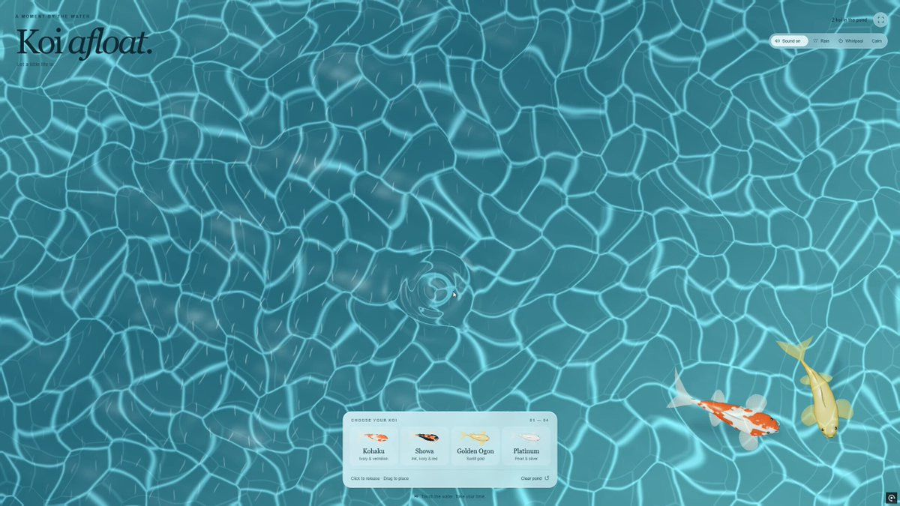</a>

Crea un estanque de koi interactivo a pantalla completa con Three.js y WebGL, donde se puedan soltar peces arrastrándolos, con ondas, lluvia, un remolino que afecte a los peces, controles adaptables y efectos de agua con Web Audio.

**Prompt**

```text
Crea un hermoso estanque de koi interactivo a pantalla completa con Three.js + WebGL. Usa una vista cenital con agua turquesa transparente, luz solar, cáusticas animadas en el fondo del estanque y una convincente sensación de profundidad.

Coloca en la parte inferior un elegante panel de selección translúcido con cuatro variedades de koi: Kohaku, Showa, Golden Ogon y Platinum. Al hacer clic en una tarjeta, se soltará ese pez en el estanque. Al arrastrar un pez desde su tarjeta, el usuario podrá elegir exactamente dónde soltarlo.

Haz que cada aterrizaje resulte satisfactorio: un chapoteo con gotas, una breve depresión en la superficie del agua y ondas expansivas. Después, el pez deberá sumergirse bajo la superficie. Usa refracción e indicadores de profundidad para que los koi parezcan claramente sumergidos.

Crea koi 3D detallados, con ojos, escamas, aletas y colas fluidas. Anima el cuerpo, la cola y las aletas de cada pez de forma coordinada. Cada pez deberá cambiar de dirección y velocidad de manera independiente, girar suavemente cerca de los límites y evitar a los demás peces.

Permite que los usuarios toquen y arrastren sobre el agua para crear ondas. Añade lluvia y un remolino móvil cuya corriente afecte a los peces. Incluye Calm, Clear pond y un control para ocultar la interfaz durante la grabación de pantalla.

Usa Web Audio para crear chapoteos al aterrizar, suaves gotas musicales, sonidos delicados de agua y natación, lluvia y un sonido de remolino. Activa el audio mediante un botón Sound, desvanece el sonido suavemente al silenciarlo y ponlo en pausa cuando la pestaña del navegador esté oculta.

Mantén todas las etiquetas y los botones en inglés. Haz que el diseño sea adaptable a dispositivos móviles. Optimiza el renderizado y la animación para lograr un rendimiento fluido con varias docenas de peces.

Entrega un sitio web completo y funcional, con un acabado visual cuidado e interacciones operativas.
```

[Ver detalles ↗](https://www.tripo3d.ai/es/3d-prompts/gpt-6-astra-2098492771170722032) · [Publicación original](https://x.com/vib3coded/status/2098492771170722032) · [Volver a los ejemplos](#all-prompts)

---

<a id="2098650336521064759"></a>

### Modela el puente de Brooklyn y prueba el cruce de tanques desde ambas direcciones

[Higgsfield](https://x.com/higgsfield_ai) · 2026-09-12

<a href="https://www.tripo3d.ai/es/3d-prompts/gpt-6-astra-2098650336521064759">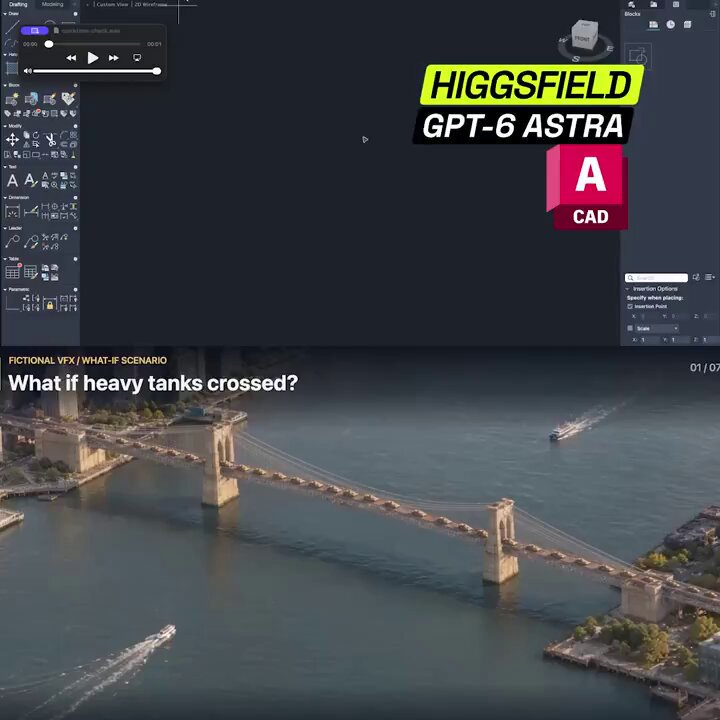</a>

Una solicitud de CAD y cargas estructurales, citada textualmente en la publicación enlazada de higgsfield\_ai. Pide a GPT-6 Astra que recree el puente de Brooklyn en AutoCAD y evalúe un escenario con tanques cruzando desde ambas direcciones.

**Prompt**

```text
Modela el puente de Brooklyn y prueba el cruce de tanques desde ambas direcciones.
```

[Ver detalles ↗](https://www.tripo3d.ai/es/3d-prompts/gpt-6-astra-2098650336521064759) · [Publicación original](https://x.com/higgsfield_ai/status/2098244976027312474) · [Volver a los ejemplos](#all-prompts)

---

<a id="2098697876155076820"></a>

### Vídeo demostrativo de construcción 3D de un templo antiguo zen

[火山哥🕊️](https://x.com/huoshan007) · 2026-09-12

<a href="https://www.tripo3d.ai/es/3d-prompts/gpt-6-astra-2098697876155076820"></a>

La publicación comparte un prompt para crear un vídeo del proceso de construcción de una escena 3D de un «templo antiguo zen»; el autor afirma que el prompt procede de un sitio web.

**Prompt**

```text
Crea directamente un vídeo demostrativo 3D que muestre todo el proceso, desde el diseño hasta el resultado final, de un «templo antiguo zen» y entrega un MP4 completo.

Requisitos visuales:
formato cuadrado de 1080×1080, vista ortográfica en picado de 45°, modelo 3D miniaturizado de estilo cartoon con estética 2.5D, perfectamente centrado. Usa una base elevada de piedra clara, un fondo verde azulado uniforme, texturas suaves y refinadas, materiales PBR e iluminación realista y cálida.

La escena debe incluir:
un templo chino con tejados de doble alero, tejas vidriadas de esquinas elevadas, tejados verde azulados, cumbreras doradas, columnas bermellón, puertas y ventanas de celosía, una puerta ceremonial, un pabellón de campana, un incensario, faroles de piedra, un patio empedrado, pinos, árboles con flores rosas y un estanque de lotos.

En la parte superior debe aparecer el título «禅境·古寺», con una tipografía china en negrita, iluminada y de color blanco cálido.

Estructura del vídeo, con una duración total de 64 segundos:
0–8 segundos: dibujar trazo a trazo la distribución en planta.
8–15 segundos: elevar la base y los volúmenes básicos de los edificios.
15–24 segundos: generar detalles como columnas, muros, puertas y ventanas.
24–32 segundos: construir los dobles aleros, las tejas y las esquinas elevadas.
32–41 segundos: añadir la puerta ceremonial, el patio, los árboles y la ambientación.
41–49 segundos: aplicar gradualmente color y materiales PBR al modelo blanco.
49–54 segundos: ajustar la iluminación, los reflejos y las sombras suaves.
54–64 segundos: mostrar lentamente el resultado final completo en un recorrido orbital, acompañado de una ligera caída de pétalos, humo de incienso y ondas en el agua.

Usa geometría 3D real y muestra de forma continua el proceso de construcción en una misma escena. Muestra únicamente nombres breves para cada etapa; no incluyas diapositivas explicativas con estilo de presentación ni narración.

Genera la escena y la animación con Three.js, renderiza fotograma a fotograma y exporta con FFmpeg un MP4 H.264 a 30 fps. Comprueba la reproducción completa, el orden de las etapas, la integridad del modelo y la ausencia de fotogramas negros.
```

[Ver detalles ↗](https://www.tripo3d.ai/es/3d-prompts/gpt-6-astra-2098697876155076820) · [Publicación original](https://x.com/huoshan007/status/2098697876155076820) · [Volver a los ejemplos](#all-prompts)

---

<a id="2098715488369152087"></a>

### DEVICE: juego de puzles 3D fotorrealista que utiliza el propio smartphone

[ひまねこ](https://x.com/00Nekonet) · 2026-09-12

<a href="https://www.tripo3d.ai/es/3d-prompts/gpt-6-astra-2098715488369152087">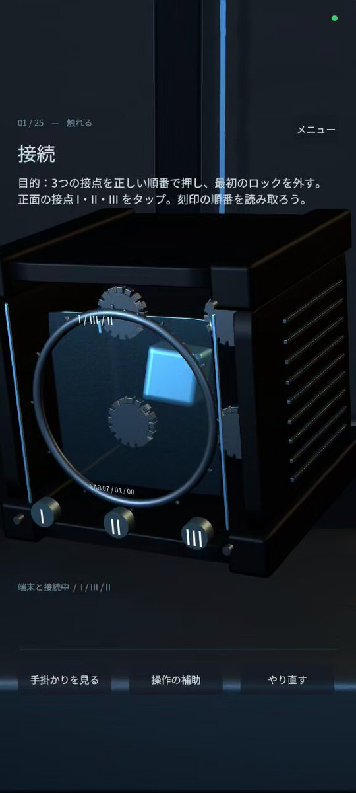</a>

Instrucciones exhaustivas para crear en Unity una aventura de puzles 3D fotorrealista para Android en formato vertical, centrada en la investigación de un dispositivo cúbico negro llamado «DEVICE». Además de los controles táctiles, integra la inclinación y rotación del dispositivo, ponerlo boca abajo, el acelerómetro, la cámara, el micrófono, la vibración, el altavoz, el brillo, la brújula y el estado de carga como entradas de los puzles dentro del mismo mundo de juego. El artículo enlazado publica estas instrucciones completas tal como se introdujeron en ChatGPT Work y también presenta la versión de prueba de «DEVICE», con 25 fases, y su APK para Android.

**Prompt**

```text
Actúa simultáneamente como director de juego, diseñador de juego, ingeniero de Unity, artista 3D, diseñador de UI/UX, artista técnico, diseñador de sonido y responsable de QA de este proyecto.

 A partir de las especificaciones siguientes, crea un juego de puzles 3D para smartphone que no se limite al diseño conceptual, sino que alcance un nivel alto de acabado y sea realmente jugable.

 No te detengas después de presentar únicamente ideas.
 No termines creando solo un documento de especificaciones.
 En la medida de lo posible, crea el proyecto real, el código, las escenas, la interfaz, los materiales, la lógica del juego, el control de sonido, el procesamiento de sensores, el guardado y las pruebas.

 Si hay aspectos ambiguos, no hagas preguntas salvo que exista una contradicción grave: toma por tu cuenta las decisiones que hagan el juego más interesante y de mayor calidad, y continúa directamente con la producción.

Descripción del proyecto

Título provisional:

DEVICE

Género:

Aventura de puzles 3D fotorrealista y basada en las capacidades del smartphone

Plataforma:

Prioridad absoluta para Android.
 Diseña la estructura para que también pueda adaptarse a iOS en la medida de lo posible.

Pantalla:

Formato vertical 9:16

Controles:

En general, debe poder jugarse con una sola mano.
 Sin embargo, algunos puzles utilizarán acciones físicas con el propio smartphone: levantarlo, inclinarlo, girarlo, ponerlo boca abajo, agitarlo o mantenerlo inmóvil.

Característica principal del juego

No debe ser simplemente «un juego al que se juega en el smartphone».

 Debe utilizar el propio smartphone como dispositivo de puzles.

 No debe ser posible completar el juego usando únicamente la pantalla táctil.

 Utiliza los sensores, la cámara, el micrófono, la vibración, el altavoz, la orientación del dispositivo y el estado de carga del smartphone como leyes físicas del mundo del juego.

 No lo conviertas, sin embargo, en una simple colección de demostraciones de sensores.

 Diseña todas las funciones para que se conecten de forma natural dentro de la misma ambientación y el mismo sistema de juego.

Mundo

 El jugador descubre el misterioso dispositivo cúbico negro «DEVICE» en un centro de investigación de identidad desconocida.

 El cubo se conecta al smartphone y percibe el estado del dispositivo en el mundo real.

 Cuando el jugador inclina el smartphone, cambia la gravedad dentro de DEVICE.

 Al girar el dispositivo, gira el espacio entero.

 La luz, el color, el sonido, la dirección y el movimiento del mundo real fluyen hacia el interior de DEVICE.

 Al principio parece un simple aparato experimental, pero a medida que avanza el juego, DEVICE comienza a reconocer la presencia del jugador.

 En la segunda mitad,

 incorpora metapuzles que utilizan la propia relación de

«el jugador está manejando el smartphone».

 No debe convertirse en una obra de terror.
 Puede incluir inquietud, tecnología desconocida y misterio, pero el eje debe ser la curiosidad intelectual y el placer de descubrir.

Calidad visual

Es la máxima prioridad.

 Consigue una representación 3D lo más fotorrealista posible para un smartphone.

 Se prohíben los gráficos de aspecto barato propios de los juegos para móviles.

 Se prohíbe el estilo cartoon.

 Se prohíbe el aspecto low-poly.

 Fuera de la UI, evita al máximo los recursos provisionales planos.

 Si se utiliza Unity, parte de URP teniendo en cuenta el rendimiento en móviles, e integra

・materiales PBR
・representación Metallic / Roughness
・Normal Map
・Ambient Occlusion
・Reflection Probe
・Light Probe
・sombras de alta calidad
・sombras suaves
・Bloom
・Color Grading
・efectos Screen Space
・luz con sensación volumétrica
・Depth of Field solo donde sea necesario
・vidrio basado en la física
・metal
・suelo mojado
・arañazos
・huellas dactilares
・polvo
・microrelieve superficial
・materiales emisivos
・reflejos
・sonido ambiental

 y otros recursos combinados.

 La ambientación es un centro de investigación futurista, oscuro y sofisticado.

 Deben predominar el metal negro, el vidrio, el hormigón, las líneas luminosas blancas, la maquinaria de precisión y los componentes hidráulicos.

 No uses oscuridad total: los objetos importantes deben poder reconocerse con una iluminación natural.

 DEVICE es el símbolo del juego, así que debe tener una calidad excepcional.

El dispositivo DEVICE:

 Un cubo de unos 20–30 cm, compuesto de metal negro y vidrio.

 Cada cara tiene una estructura mecánica distinta.

 Las uniones deben ser extremadamente precisas.

 Desde el interior se filtra una luz blanca o ligeramente azulada.

 Las estructuras internas se deforman, giran y se despliegan físicamente según las acciones del jugador.

 Dota al dispositivo de animaciones mecánicas con una respuesta táctil convincente.

Pantalla de juego básica

 DEVICE aparece en el centro de la pantalla vertical.

 El jugador lo arrastra para girarlo y examinar cada cara.

 El entorno es el centro de investigación.

 La cámara debe ser cinematográfica sin perjudicar la jugabilidad.

 La UI básica debe ser mínima.

 No muestres constantemente una gran cantidad de botones.

 Prioriza la sensación de tocar y manipular directamente DEVICE.

Sistemas principales

 Integra los elementos siguientes como sistemas de entrada del mismo mundo de juego, no como minijuegos independientes.

1. Tacto

Permite
 tocar
 dos veces
 mantener pulsado
 arrastrar
 deslizar
 pellizcar
 usar 2 dedos
 usar 3 dedos
 pulsar varios puntos simultáneamente
.

 El jugador debe manipular directamente los botones, palancas, anillos giratorios y diales de DEVICE.

2. Giroscopio

 Vincula la inclinación del smartphone con la gravedad interna de DEVICE.

Ejemplos:

 transportar una esfera metálica hasta la meta únicamente inclinando el dispositivo;

 inclinar un líquido hasta ponerlo en contacto con electrodos;

 ajustar el ángulo de un haz de luz.

3. Acelerómetro

 Agitar el dispositivo.

 Detenerlo bruscamente.

 Detectar movimientos parecidos a dar un toque ligero.

 No exijas agitar el dispositivo con demasiada fuerza.

 Ten en cuenta la seguridad.

4. Orientación del dispositivo

Portrait
Landscape
Face Up
Face Down

 y otros estados deben reflejarse en el juego.

 Incluye eventos que solo se produzcan al dejar el smartphone boca abajo sobre una mesa.

5. Cámara

 Incorpora los colores del mundo real al juego.

 Cuando el jugador enfoque con la cámara un objeto rojo, azul, verde u otro, analiza el color predominante de la zona cercana al centro de la imagen y envíalo a DEVICE como energía.

 No envíes las imágenes al servidor.

 Procesa los datos en el propio dispositivo siempre que sea posible.

 Incluye una acción alternativa para los casos en que no pueda utilizarse la cámara.

6. Micrófono

 Utiliza el volumen,
 la duración
 y características de frecuencia sencillas

, entre otros parámetros.

Ejemplos:

 soplar,
 hablar,
 dar una palmada,
 permanecer en silencio durante un tiempo

 y acciones similares.

 El reconocimiento de voz no debe ser obligatorio.

 No guardes los datos de audio grabados.

7. Háptica / vibración

 Es muy importante.

 Crea fases en las que la información no visible en pantalla se comunique únicamente mediante vibraciones.

Ejemplos:

 el intervalo de vibración se acorta cuanto más cerca está el jugador del objetivo;

 patrones distintos para la izquierda y la derecha;

 códigos basados en vibraciones cortas y largas.

 Proporciona una representación alternativa para los dispositivos con la vibración desactivada.

8. Altavoz

 Utiliza la sensación de dirección del sonido en el espacio.

 Los auriculares no deben ser obligatorios.

 Usa el tono, el periodo y la posición izquierda-derecha como información de los puzles.

9. Brillo

 Utiliza el sensor de luz ambiental cuando esté disponible.

 En los dispositivos que no lo permitan, estudia alternativas como la luminosidad captada por la cámara.

 Incluye mecanismos que aparezcan al situarse en un lugar oscuro.

 Incluye mecanismos que se carguen al situarse en un lugar luminoso.

10. Brújula

 Obtén la dirección en los dispositivos compatibles.

 Crea puzles que requieran orientar el smartphone hacia el norte, el sur o una dirección concreta.

 Si no hay sensor, cambia a un problema alternativo.

11. Estado de carga

 Si es posible detectar que el dispositivo ha empezado a cargarse,

 muestra que la electricidad llega a DEVICE al conectar físicamente el cable de carga.

 Debe existir obligatoriamente un método alternativo para los usuarios que no puedan realizar esta acción.

12. Batería

 Si puede obtenerse el nivel de batería, úsalo para eventos especiales.

 Queda prohibido diseñar el juego de modo que un nivel concreto de batería impida completar una fase.

13. Hora

 La hora actual puede utilizarse en puzles o efectos especiales.

 Queda prohibido exigir una hora concreta para completar una fase.

 No obligues al jugador a esperar.

Diseño de puzles

 En lugar de producir desde el principio 100 problemas superficiales,

 crea primero entre 20 y 30 fases con un nivel de acabado muy alto.

 Todas deben ofrecer un descubrimiento distinto.

 Se prohíben las fases que repitan la misma acción cambiando únicamente los números.

Capítulo 1: TOUCH

 Enseña las reglas del juego mediante controles táctiles.

 Tocar DEVICE.
 Girarlo.
 Pulsarlo.
 Tirar de él.
 Abrirlo.

Capítulo 2: GRAVITY

 Introduce el giroscopio y el acelerómetro.

 El mundo físico interno de DEVICE se sincroniza con la orientación real del smartphone.

Capítulo 3: SENSE

 Introduce la cámara,
 el micrófono,
 la luz,
 el sonido
 y la vibración

.

Capítulo 4: OUTSIDE

 Plantea problemas que dirijan la atención del jugador fuera de la pantalla.

 Poner el smartphone boca abajo.
 Mantenerlo inmóvil.
 Orientarlo en la dirección correcta.
 Capturar el color del entorno.

Capítulo 5: DEVICE

 Combina las reglas aprendidas hasta ese momento.

 Las instrucciones mostradas en pantalla dejan de ser necesariamente correctas.

Ejemplo:

 En pantalla aparece

SHAKE

.

 Sin embargo, agitar el dispositivo provoca un fallo.

 La respuesta correcta es mantenerlo completamente inmóvil.

 En otro problema aparece

MORE LIGHT

.

 Subir el brillo de la pantalla no produce ninguna reacción.

 Se completa al introducir luz del mundo real en la cámara.

 La fase final

 combina el tacto,
 la orientación del dispositivo,
 el giroscopio,
 la vibración,
 el sonido
 y varias entradas del mundo real

 en un gran puzle.

Fases representativas que deben implementarse

«Laberinto en la oscuridad»

 La pantalla queda casi completamente a oscuras.

 El jugador no puede ver su posición.

 Debe inclinar el smartphone para mover una esfera invisible.

 La vibración se vuelve más intensa y rápida cuanto más se acerca a la salida.

 Finalmente, debe alcanzar la meta guiándose solo por las sensaciones hápticas.

 En la configuración de accesibilidad también debe poder activarse una ayuda sonora.

«DON'T LOOK»

 DEVICE muestra en pantalla

DON'T LOOK

.

 El jugador pone el smartphone boca abajo.

 Cuando se detecta Face Down, mientras no puede ver la pantalla se oyen sonidos mecánicos procedentes del interior de DEVICE.

 Al devolverlo a su posición unos segundos después, DEVICE se ha transformado.

«STEAL COLOR»

 Dentro de DEVICE hay un núcleo de energía sin color.

 El jugador escanea con la cámara colores reales como rojo, azul o verde.

 El color capturado fluye en tiempo real hacia el interior de DEVICE como energía líquida.

«STAY STILL»

 DEVICE vibra intensamente.

 Al principio, el jugador querrá agitar el smartphone.

 Pero la respuesta correcta es mantener el dispositivo completamente inmóvil.

 Cuando la aceleración permanece durante cierto tiempo por debajo del umbral, el dispositivo se estabiliza y se abre.

«POWER»

 DEVICE se detiene por completo.

 En los dispositivos compatibles, al iniciar la carga del smartphone la electricidad fluye hacia DEVICE.

 Los conductores metálicos se iluminan en secuencia y el mecanismo interno se reinicia.

 Incluye también una acción alternativa.

Física interna de DEVICE

 Utiliza activamente la simulación física.

 Esferas metálicas,
 líquidos,
 gravedad,
 imanes,
 engranajes,
 raíles,
 reflectores,
 láseres,
 anillos giratorios,
 cilindros,
 pistones,
 mecanismos de bloqueo,
 vidrio,
 electrodos,
 cables

 y otros elementos.

 No permitas, sin embargo, que el resultado sea «inestable por depender de la física».

 En los puzles importantes, utiliza una simulación física controlada y reproducible.

Efectos

 Al resolver un puzle, no muestres únicamente la palabra «CLEAR».

 El propio DEVICE debe transformarse para responder al jugador.

 Combina el desbloqueo de cierres,
 el giro de engranajes,
 la iluminación interna,
 la separación de paneles metálicos,
 el movimiento de líquido dentro del vidrio
 y el despliegue de brazos mecánicos,

 entre otros efectos.

 En el instante de resolverlo,

 debe transmitir la satisfacción de «haber puesto en marcha un enorme mecanismo de precisión».


Sonido

Es muy importante.

 No te limites a mantener una BGM sonando continuamente.

 Crea capas con el sonido de la climatización del centro,
 los ruidos mecánicos lejanos,
 los servomotores del interior de DEVICE,
 los clics metálicos,
 el vidrio,
 la electricidad,
 el magnetismo,
 las bajas frecuencias
 y la vibración

.

 El sonido debe variar según el lugar de DEVICE que se toque.

 Al usar auriculares, refuerza la sensación de posicionamiento.

UI

 Intégrala al máximo en el mundo del juego.

 No llenes la pantalla de botones baratos propios de los juegos móviles.

Menú:

CONTINUE
CHAPTERS
SETTINGS
ACCESSIBILITY
CREDITS

 aproximadamente.

 Durante los puzles, representa las pistas mediante pantallas internas de DEVICE o texto proyectado.

Sistema de pistas

 Aunque el jugador se atasque, no muestres la respuesta inmediatamente.

Pista 1:
 lugar al que prestar atención.

Pista 2:
 función del smartphone que se debe usar.

Pista 3:
 solución casi completa.

 Deben ser tres niveles.

Accesibilidad

 Es especialmente importante porque el juego utiliza muchos sensores.

 Implementa lo siguiente.

 Permite convertir la vibración en sonido o en una indicación visual.

 Añade asistencia visual a los puzles de sonido.

 Añade asistencia para la percepción del color en los puzles cromáticos.

 No exijas movimientos físicos intensos del dispositivo.

 Elimina la necesidad de agitar el smartphone con fuerza.

 Ofrece puzles alternativos cuando no puedan utilizarse la cámara, el micrófono o la brújula.

 El juego no debe quedar bloqueado aunque se deniegue el acceso a determinados sensores.

Privacidad

 No envíes a servidores externos las imágenes de la cámara, el audio del micrófono, los datos de ubicación ni otra información similar.

 El GPS no debe ser obligatorio para avanzar.

 Solicita cada permiso justo antes de usarlo y explica el motivo.

 No solicites permisos innecesarios.

Arquitectura técnica

 Si es posible, utiliza Unity 6 y C#.

 Usa URP para móviles.

 Modulariza el proyecto.

 Como mínimo, incluye la siguiente estructura.

SensorManager
PuzzleManager
GameStateManager
AudioManager
HapticsManager
PermissionManager
SaveManager
AccessibilityManager
DeviceCapabilityManager

 No llames directamente y de forma repetida a cada función del smartphone desde el código de los puzles.

 Abstrae el acceso mediante SensorManager y otros gestores,

 de modo que puedan alternarse los sensores reales del dispositivo,
 la entrada simulada para el editor
 y los recursos alternativos para dispositivos no compatibles.


Depuración de sensores

 Implementa un

Developer Sensor Panel

 para poder desarrollar también en Unity Editor.

 Mediante deslizadores y botones,

 permite simular la inclinación del dispositivo,
 la aceleración,
 Face Up / Face Down,
 el volumen del micrófono,
 la luz ambiental,
 la brújula,
 la carga activada/desactivada,
 la batería,
 eventos de vibración
 y el color predominante de la cámara,

 entre otros valores de entrada simulada.

 Los puzles principales deben poder probarse sin conectar un dispositivo real.

Guardado

 Guarda el progreso de los capítulos,
 las fases completadas,
 el uso de pistas,
 la configuración,
 las opciones de accesibilidad
 y los objetos coleccionables.


 Permite interrumpir la partida de forma segura incluso a mitad de una fase.

Rendimiento

 No sacrifiques la posibilidad de jugar con la excusa del fotorrealismo.

 El objetivo es que funcione también en smartphones Android de gama media representativos.

LOD
 Usa Occlusion Culling,
 GPU Instancing,
 compresión de texturas,
 baked lighting,
 Reflection Probe,
 iluminación en tiempo real solo donde sea necesaria,
 object pooling
 y reducción de Draw Calls,

 entre otras técnicas.

 Divide la configuración de calidad en

LOW
MEDIUM
HIGH
ULTRA

.

 En los dispositivos de alto rendimiento, consigue una imagen de gran calidad.

Condiciones de finalización

 No debe ser un simple prototipo, sino una experiencia jugable completa con

 pantalla de título,
 introducción,
 tutorial,
 varios capítulos,
 varias fases,
 entradas de sensores,
 efectos 3D,
 sonido,
 configuración,
 accesibilidad,
 guardado,
 selección de fases
 y final.

 Debe poder experimentarse como un juego completo de principio a fin.

 Si es posible, genera una build real para Android.

 Incluso si las limitaciones del entorno de compilación impiden generar un APK/AAB,

 deja un proyecto completo que pueda abrirse en Unity y compilarse directamente.

Criterios durante la producción

 No cambies a 2D ni a una UI simplificada solo porque resulte más fácil.

 No elimines los sistemas centrales del juego para «ahorrar tiempo».

 Cuando no haya recursos externos disponibles, créalos tú mismo o genéralos proceduralmente en la medida de lo posible.

 Si hacen falta placeholders, no conviertas todo el juego en un conjunto de placeholders.

 En especial,

DEVICE
 el centro de investigación,
 los dispositivos de los puzles principales,
 la iluminación,
 los materiales
 y los efectos de resolución

 deben alcanzar un acabado de alta calidad.

Flujo de trabajo

 Primero, define el diseño general en poco tiempo.

 Después, pasa a producir en lugar de seguir explicando.

1. Crear el proyecto
2. Escena 3D básica
3. Crear DEVICE
4. Controles básicos
5. Abstracción de sensores
6. Framework de puzles
7. Implementar los puzles representativos
8. Construir los capítulos
9. UI
10. Sonido
11. Efectos
12. Guardado
13. Accesibilidad
14. Optimización
15. Pruebas
16. Correcciones
17. Build

 en ese orden.

 Aunque una parte falle, no detengas todo el trabajo: utiliza alternativas para maximizar el nivel de acabado.

Entregables finales

 Al final deben quedar los siguientes elementos.

・Proyecto de juego completo
・Código fuente principal
・Escenas del juego
・Modelos 3D y materiales
・UI
・Configuración de sonido
・Sistema de sensores
・Sistema de puzles
・Sistema de guardado
・Configuración de compilación
・README
・Procedimiento de pruebas en un dispositivo Android real
・Lista de funciones del smartphone utilizadas
・Especificación de alternativas para dispositivos no compatibles
・Lista de problemas conocidos

 Está prohibido terminar dando solo explicaciones sin crear los entregables.

 El orden de prioridad máximo es:

1. Que sea divertido
2. Que sea propio de un smartphone
3. Realismo del mundo 3D
4. Sensación de estar tocando DEVICE
5. Que resulte convincente como puzle
6. Que funcione realmente

.

 No crees «una obra existente a la que se han añadido funciones de sensores», sino

 una obra que haga sentir que el hardware llamado smartphone existe específicamente para este juego.

 A partir de aquí, comienza la producción real en lugar de detenerte en la explicación del concepto.

 Además, incorpora cuidadosamente cualquier aspecto que pueda perfeccionarse o cualquier elemento que lo haga más interesante según el contenido anterior, y crea el 3D con un acabado realista
```

[Ver detalles ↗](https://www.tripo3d.ai/es/3d-prompts/gpt-6-astra-2098715488369152087) · [Publicación original](https://x.com/00Nekonet/status/2098715488369152087) · [Volver a los ejemplos](#all-prompts)

---

<a id="2098739181510164652"></a>

### Juego de vuelo Skybound para navegador

[Aakash Kanojiya](https://x.com/Kanojiyaaakash1) · 2026-09-12

<a href="https://www.tripo3d.ai/es/3d-prompts/gpt-6-astra-2098739181510164652"></a>

Un juego de vuelo en 3D para navegador en el que el jugador pilota un dragón entre islas flotantes y recoge anillos para conseguir puntos. El prompt solicita a Hyper3D Rodin MCP que genere el modelo del dragón.

**Prompt**

```text
Crea un juego de vuelo para navegador llamado Skybound con Three.js. El jugador pilota un dragón a través de un conjunto de islas flotantes y recoge anillos para conseguir puntos. Necesitarás un modelo 3D de dragón: usa Hyper3D Rodin MCP para generarlo.
```

[Ver detalles ↗](https://www.tripo3d.ai/es/3d-prompts/gpt-6-astra-2098739181510164652) · [Publicación original](https://x.com/Kanojiyaaakash1/status/2098739181510164652) · [Volver a los ejemplos](#all-prompts)

---

<a id="2098774359926297011"></a>

### Marco modular impreso en 3D con uniones

[wada](https://x.com/wada) · 2026-09-12

<a href="https://www.tripo3d.ai/es/3d-prompts/gpt-6-astra-2098774359926297011"></a>

Crea un marco cuyas piezas se conecten mediante uniones para poder imprimirlo en una impresora 3D pequeña y montarlo después. La publicación indica que se generaron archivos STL de las uniones, identificados para ajustar las variaciones de la impresora y el filamento.

**Prompt**

```text
Quiero imprimir un marco con una impresora 3D, pero como es muy pequeña, prefiero un diseño que se complete conectando varias piezas. Como las uniones normales son un poco aburridas, hagámoslo con uniones más interesantes.
```

[Ver detalles ↗](https://www.tripo3d.ai/es/3d-prompts/gpt-6-astra-2098774359926297011) · [Publicación original](https://x.com/wada/status/2098774359926297011) · [Volver a los ejemplos](#all-prompts)

---

<a id="2098795017955418202"></a>

### Reconstrucción 3D de la Exposición Universal de Chicago de 1893

[Dan Elton](https://x.com/moreisdifferent) · 2026-09-12

<a href="https://www.tripo3d.ai/es/3d-prompts/gpt-6-astra-2098795017955418202"></a>

Una reconstrucción 3D en Blender de la Exposición Mundial Colombina de 1893, basada en fotografías históricas y material de referencia sobre la feria.

**Prompt**

```text
Descarga 2.000 fotografías históricas y material de referencia sobre la feria, y utiliza toda la información recopilada para crear una reconstrucción 3D en Blender.
```

[Ver detalles ↗](https://www.tripo3d.ai/es/3d-prompts/gpt-6-astra-2098795017955418202) · [Publicación original](https://x.com/moreisdifferent/status/2098795017955418202) · [Volver a los ejemplos](#all-prompts)

---

<a id="2098831830002851846"></a>

### Simulación de mesa de arena cinética

[AI Guides](https://x.com/free_ai_guides) · 2026-09-12

<a href="https://www.tripo3d.ai/es/3d-prompts/gpt-6-astra-2098831830002851846">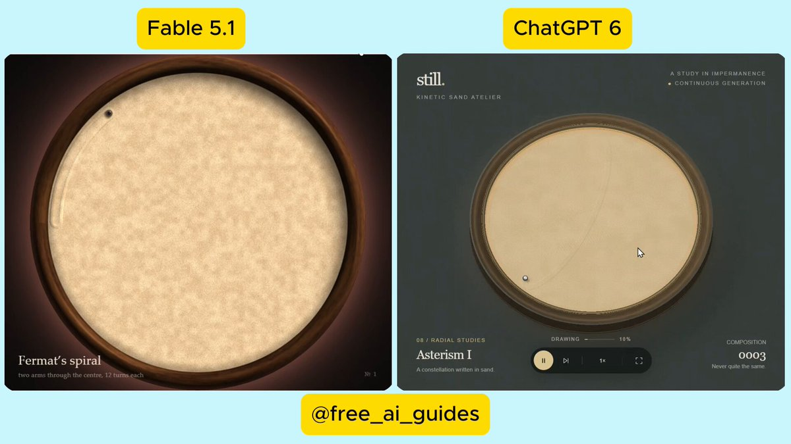</a>

Un prompt reutilizable proporcionado por el autor de la publicación como el prompt abierto exacto recibido por GPT-6 Astra y Fable 5.1. Solicita una simulación autónoma de una mesa de arena cinética en un único archivo HTML: una bola dibuja patrones geométricos que no se repiten en la arena y, después, alisa la superficie antes de comenzar otro patrón.

**Prompt**

```text
Crea una simulación de mesa de arena cinética. Una bola debe desplazarse por un lecho de arena y dejar un rastro visible mientras dibuja patrones geométricos completos; después, debe alisar la arena y comenzar automáticamente un patrón nuevo y diferente. Debe alternar entre muchos patrones distintos sin repetirlos. Tú eliges todo lo relacionado con el aspecto y los patrones.

Todas las decisiones de diseño dependen de ti: estilo, colores, ambiente, entorno, cámara, nivel de detalle y cualquier otro toque adicional. No me hagas preguntas; toma todas las decisiones por tu cuenta y crea la versión más impresionante que puedas en un único intento.

Requisitos técnicos: un único archivo HTML autocontenido, sin modelos, imágenes, sonidos ni URL de recursos externos de ningún tipo (se permite usar una biblioteca de JavaScript desde una CDN). Debe empezar a ejecutarse por sí solo en cuanto se cargue, sin necesidad de hacer clic, y funcionar con fluidez y sin errores en la consola.
```

[Ver detalles ↗](https://www.tripo3d.ai/es/3d-prompts/gpt-6-astra-2098831830002851846) · [Publicación original](https://x.com/free_ai_guides/status/2098831830002851846) · [Volver a los ejemplos](#all-prompts)

---

<a id="2098909584996057283"></a>

### Animación 3D de origami que se pliega sola

[AI Guides](https://x.com/free_ai_guides) · 2026-09-12

<a href="https://www.tripo3d.ai/es/3d-prompts/gpt-6-astra-2098909584996057283">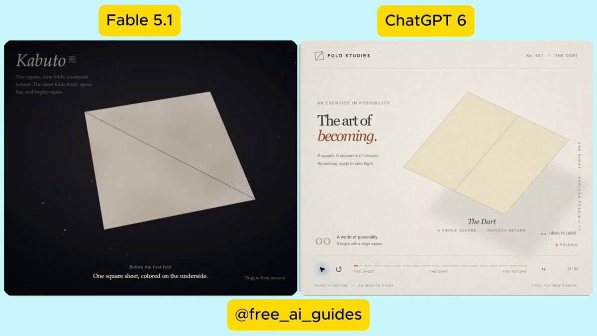</a>

El autor afirma que este prompt abierto exacto se proporcionó a GPT-6 Astra y Fable 5.1. Solicita una animación 3D de origami que se ejecute de forma autónoma, en la que una hoja cuadrada se pliegue y rote visiblemente siguiendo una secuencia de pliegues reconocible, se despliegue y repita el proceso.

**Prompt**

```text
Crea una animación 3D de origami. Una hoja cuadrada y plana debe plegarse sola, paso a paso, hasta convertirse en una figura de origami reconocible. Cada pliegue debe mostrarse como un pliegue y una rotación reales del papel. Después, la figura debe desplegarse hasta quedar plana y repetir el proceso. Tú decides en qué figura se convierte y cómo se presenta.

Todo lo relacionado con el diseño queda a tu criterio: estilo, colores, ambiente, entorno, cámara, nivel de detalle y cualquier toque adicional. No me hagas preguntas; toma todas las decisiones por tu cuenta y crea la versión más impresionante que puedas en un solo intento.

Requisitos técnicos: un único archivo HTML autocontenido, sin modelos, imágenes, sonidos ni URL de recursos externos de ningún tipo (se permite usar una biblioteca de JavaScript desde una CDN). Debe comenzar a ejecutarse automáticamente en cuanto se cargue, sin necesidad de hacer clic, funcionar con fluidez y no generar errores en la consola.
```

[Ver detalles ↗](https://www.tripo3d.ai/es/3d-prompts/gpt-6-astra-2098909584996057283) · [Publicación original](https://x.com/free_ai_guides/status/2098909584996057283) · [Volver a los ejemplos](#all-prompts)

---

<a id="2098980384260456813"></a>

### Despliegue UV y rebakeo en 4K de un modelo de ropa sin cabeza

[さ🥺](https://x.com/_sagyoai) · 2026-09-13

<a href="https://www.tripo3d.ai/es/3d-prompts/gpt-6-astra-2098980384260456813">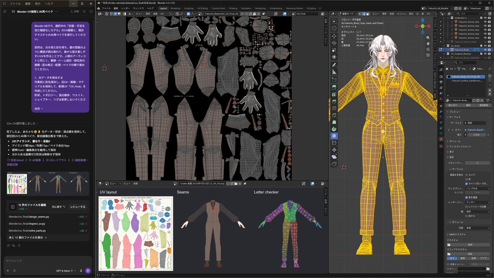</a>

Prompt para volver a desplegar en UV un modelo 3D sin cabeza que incluye la ropa y las extremidades seleccionadas, con una estructura fácil de interpretar y de redibujar, y rebakear las texturas existentes en 4K. Conserva los datos anteriores y cubre todo el proceso: diseño de seams, comprobación de la distorsión, empaquetado y comparación final.

**Prompt**

```text
En Blender MCP, ejecuta el despliegue UV del «modelo sin cabeza que incluye la ropa y las extremidades» seleccionado y vuelve a hornear sus texturas existentes en 4K.

El objetivo es conservar el aspecto original y crear unas UV cuya estructura se entienda como la de un patrón de ropa y que resulte fácil de redibujar después. Procede como lo haría un artista: observación → diseño de seams → despliegue por partes → corrección de la distorsión → disposición → bake.

1. Conservar los datos originales
Antes de empezar, guarda una copia con otro nombre, conserva las UV, imágenes y materiales anteriores, y crea un nuevo mapa UV llamado «UV\_Final».
No modifiques la forma, la topología, el orden de los vértices, los pesos, las shape keys ni el rig.

2. Observar el modelo y diseñar los seams
Comprueba todas las vistas con la textura original y la visualización de wireframe para entender la composición de las piezas de ropa y las costuras reales.
En la ropa, sigue la estructura del patrón —cuerpo, mangas, cuello, etc.— y abre las piezas aprovechando las costuras laterales y la parte interior de las mangas. En la piel y las extremidades, coloca los seams en zonas poco visibles, como la parte interior o los laterales, y crea una disposición que permita abrirlas de forma natural hasta los espacios entre los dedos.
No confundas las arrugas ni los estampados con costuras y no crees islas pequeñas e innecesariamente fragmentadas.

3. Desplegar por partes y corregir la distorsión
No proceses todo de una vez: ejecuta Unwrap por partes.
Con un checker con texto que utilice UV\_Final y la visualización Stretch, comprueba el estiramiento, la compresión, la torsión, las inversiones y las superposiciones.
Según la causa del problema, añade o elimina seams, ajusta con Pin, Relax u otras herramientas y vuelve a comprobar el resultado. No te limites a repetir el mismo despliegue automático; conserva las partes que ya se hayan mejorado.
No conviertas la subdivisión automática completa mediante Smart UV Project en el resultado final.

4. Ajustar la dirección del tejido, la densidad y la disposición
En la ropa, alinea la dirección vertical principal de cada pieza con la dirección V de las UV, tomando como referencia la dirección del tejido. No deformes a la fuerza en rectángulos los patrones que tengan curvas.
Uniformiza la densidad de texel en relación con las dimensiones reales y orienta las piezas de forma que se entienda la correspondencia entre izquierda y derecha.
Después, empaqueta las islas en el área de 0 a 1 manteniendo su orientación y escala relativa. No superpongas las piezas izquierda y derecha ni las gires arbitrariamente.
Como valores iniciales para el bake en 4K, usa un margen de 16 px, al menos 32 px entre islas y al menos 16 px desde el borde exterior de la imagen.

5. Hornear en 4K desde las UV antiguas a las nuevas
Fija explícitamente la referencia de la textura original a las UV antiguas y transfiérela a una imagen nueva de 4096 × 4096 usando UV\_Final como destino del bake.
En cada material, activa el nodo de imagen de destino del bake, realiza una prueba y después ejecuta el bake final.
Para el color base, usa únicamente el valor Color de Diffuse o Emit; no hornees iluminación, sombras ni AO nuevos. Conserva las sombras dibujadas en la imagen original.
Transfiere también, cuando sea necesario, los mapas existentes, como el de transparencia, y vuelve a hornear las normales tangentes según las nuevas UV; no las transfieras simplemente como color.

6. Confirmar el resultado comparando lo nuevo con lo antiguo
Aplica las nuevas UV y la imagen horneada, y compara el cuerpo completo y los detalles con el original bajo las mismas condiciones de visualización.
Comprueba la posición de los estampados, el color, la transparencia y la continuidad de los seams. Corrige las UV aplastadas, superpuestas o sin desplegar, así como los puntos negros, las zonas vacías y los emborronados del bake.
Determina si el trabajo está terminado basándote en los resultados de la comprobación, no en «cuántas veces se ha hecho el despliegue».

Guarda el archivo terminado.blend, las imágenes en 4K, el layout UV y capturas de comprobación de los seams, el checker y el aspecto final, e informa brevemente de las correcciones principales.
No te limites a explicar el plan: completa el trabajo comprobando las imágenes reales durante el proceso.
```

[Ver detalles ↗](https://www.tripo3d.ai/es/3d-prompts/gpt-6-astra-2098980384260456813) · [Publicación original](https://x.com/_sagyoai/status/2098980384260456813) · [Volver a los ejemplos](#all-prompts)

---

<a id="2099172061092381027"></a>

### Escena costera 3D jugable para navegador

[Lummox](https://x.com/Lummox_eth) · 2026-09-13

<a href="https://www.tripo3d.ai/es/3d-prompts/gpt-6-astra-2099172061092381027">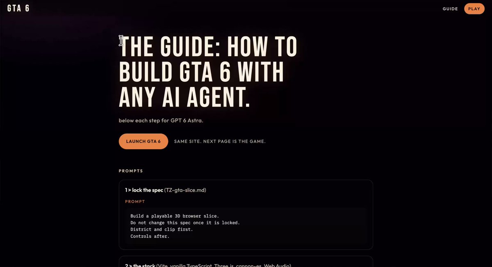</a>

Secuencia de seis prompts publicada por Lummox para crear una escena costera 3D jugable en el navegador. Fija una pila tecnológica con Vite, TypeScript sin framework, Three.js, cannon-es y Web Audio; construye un distrito costero al atardecer; escenifica la entrada de tres personas en un coche; y especifica el ritmo y el audio del clip.

**Prompt**

```text
> bloquear la especificación (TZ-gta-slice.md)

prompt: "Crea una escena costera 3D jugable para navegador. No cambies esta especificación una vez bloqueada. Primero, el distrito y el clip. Después, los controles."

> la pila tecnológica (Vite, TypeScript sin framework, Three.js, cannon-es, Web Audio)

prompt: "La pila tecnológica es fija. Vite. TypeScript sin framework. Three.js. cannon-es. Web Audio. Una sola URL del navegador."

> el encuadre (atardecer sobre el agua, asfalto mojado, palmeras)

prompt: "Un solo distrito costero. Atardecer sobre el agua. Asfalto mojado. Palmeras. Centra la escena en la iluminación y la cámara, no en el número de polígonos. Nada de iluminación gris predeterminada. No uses cubos sin texturas."

> los tres (una escena, un coche, unos 20 segundos)

prompt: "Mantén a los tres en una sola escena. Hablan. Después, se sientan en un solo coche. Unos 20 segundos. Prioriza la calidad sobre añadir más controles."

> el corte (de 15 a 20 segundos, que sea fluido)

prompt: "Si hay tirones, recorta el clip a entre 15 y 20 segundos. Haz que sea fluido. Si baja la tasa de fotogramas, elimina peatones, no la iluminación."

> el sonido (voces humanas, un colchón sonoro bajo las líneas, el retumbo del coche)

prompt: "Las voces deben sonar humanas, no robóticas. Un colchón sonoro sutil bajo las líneas, nunca por encima. Cuando se sienten, añade un retumbo grave de coche, no un sonido de sierra. Nada de ruido de estática de radio."
```

[Ver detalles ↗](https://www.tripo3d.ai/es/3d-prompts/gpt-6-astra-2099172061092381027) · [Publicación original](https://x.com/Lummox_eth/status/2099172061092381027) · [Volver a los ejemplos](#all-prompts)

---

<a id="2099359786865402019"></a>

### Reimagina el castillo de Peach en 3D

[Romain Huet](https://x.com/romainhuet) · 2026-09-14

<a href="https://www.tripo3d.ai/es/3d-prompts/gpt-6-astra-2099359786865402019">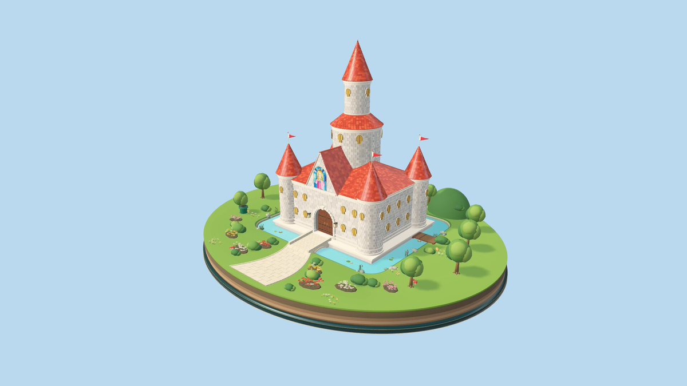</a>

El autor cuenta que pidió a Astra, en Codex, que reinventara el castillo de Peach en 3D y creara un vídeo de sobrevuelo. En un comentario posterior, explica que el trabajo incluía un modelo en Blender, una órbita comprobada con luz diurna y al anochecer, 88 cristales modelados en la ventana de Peach y un interior de la planta baja.

**Prompt**

```text
Reinventa el castillo de Peach en 3D y crea un vídeo de sobrevuelo.
```

[Ver detalles ↗](https://www.tripo3d.ai/es/3d-prompts/gpt-6-astra-2099359786865402019) · [Publicación original](https://x.com/romainhuet/status/2099359786865402019) · [Volver a los ejemplos](#all-prompts)

---

<a id="2099362575339372780"></a>

### Ferrocarril en miniatura autónomo con prevención de colisiones

[AI Guides](https://x.com/free_ai_guides) · 2026-09-14

<a href="https://www.tripo3d.ai/es/3d-prompts/gpt-6-astra-2099362575339372780">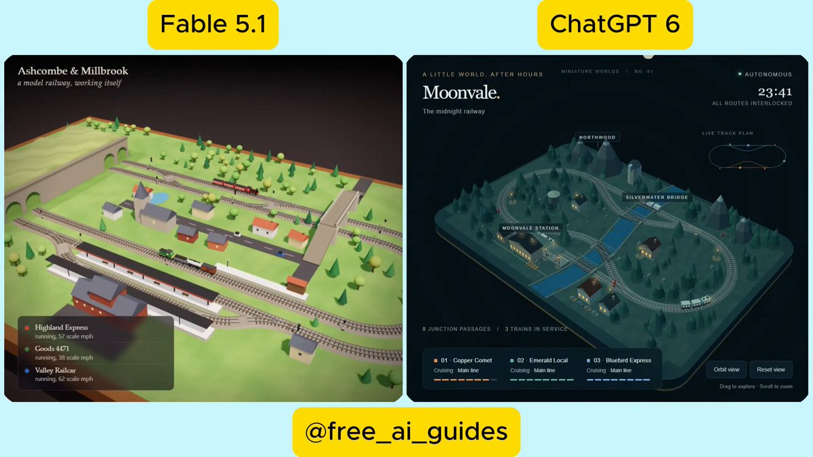</a>

Simulación autónoma de un ferrocarril en miniatura con al menos tres trenes en vías compartidas. Los trenes gestionan de forma autónoma los desvíos y las señales para evitar colisiones, mientras que todas las decisiones de diseño visual quedan a criterio del modelo. El autor afirma que este mismo prompt se proporcionó tanto a Fable 5.1 como a GPT-6 Astra.

**Prompt**

```text
Crea un ferrocarril en miniatura con al menos tres trenes circulando al mismo tiempo por un trazado de vías compartidas que incluya desvíos y señales. Los trenes deben cambiar de vía y detenerse ante las señales por sí solos para no colisionar nunca, sin ninguna intervención del usuario. Tú decides el trazado, el entorno y el aspecto de todos los elementos. Todas las decisiones de diseño dependen de ti: estilo, colores, ambiente, entorno, cámara, nivel de detalle y cualquier otro toque adicional. No me hagas preguntas; toma todas las decisiones por tu cuenta y crea la versión más impresionante que puedas en un solo intento. Requisitos técnicos: un único archivo HTML independiente, sin modelos, imágenes, sonidos ni URLs de recursos externos de ningún tipo (se permite una biblioteca de JavaScript desde una CDN). Debe empezar a ejecutarse automáticamente en cuanto se cargue, sin necesidad de hacer clic, y funcionar con fluidez, sin errores en la consola.
```

[Ver detalles ↗](https://www.tripo3d.ai/es/3d-prompts/gpt-6-astra-2099362575339372780) · [Publicación original](https://x.com/free_ai_guides/status/2099362575339372780) · [Volver a los ejemplos](#all-prompts)

---

<a id="2099419671481249851"></a>

### Circuito de obstáculos 3D jugable

[Dhaval Makwana](https://x.com/heyDhavall) · 2026-09-14

<a href="https://www.tripo3d.ai/es/3d-prompts/gpt-6-astra-2099419671481249851">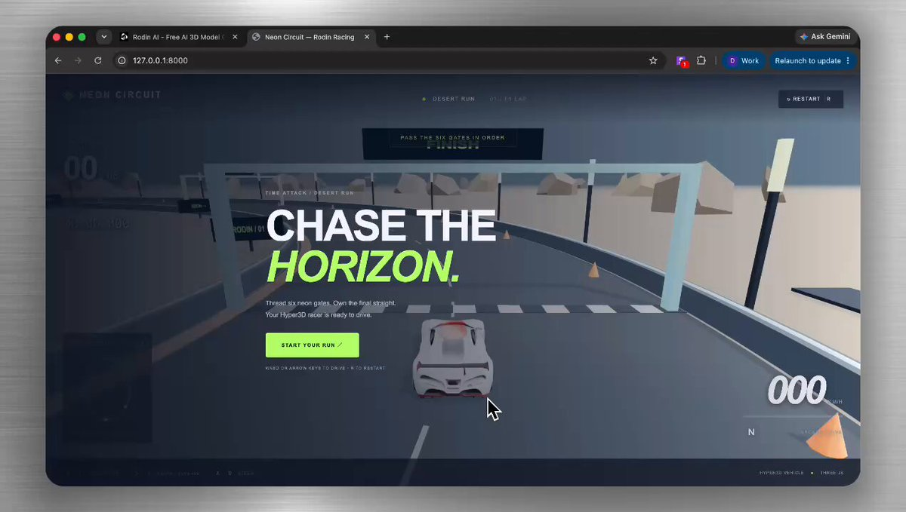</a>

El autor dice que le dio esta idea a GPT-6 Astra en Codex. Solicita un pequeño circuito de obstáculos 3D jugable con un personaje, barreras móviles, objetos coleccionables y una zona de meta.

**Prompt**

```text
Un pequeño circuito de obstáculos 3D con un personaje, barreras móviles, objetos coleccionables y una zona de meta sencilla.
```

[Ver detalles ↗](https://www.tripo3d.ai/es/3d-prompts/gpt-6-astra-2099419671481249851) · [Publicación original](https://x.com/heyDhavall/status/2099419671481249851) · [Volver a los ejemplos](#all-prompts)

---

<a id="2099450933067612421"></a>

### Escena 3D interactiva de un samurái en el bosque

[Jaynit Makwana](https://x.com/JaynitMakwana) · 2026-09-14

<a href="https://www.tripo3d.ai/es/3d-prompts/gpt-6-astra-2099450933067612421">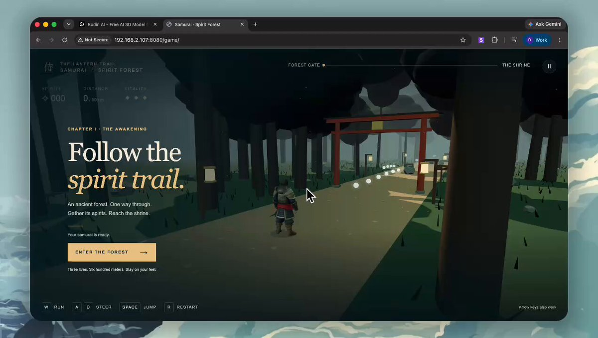</a>

Jaynit Makwana cuenta que introdujo esta idea en GPT-6 Astra dentro de Codex. El resultado solicitado es una escena 3D interactiva de un bosque con un samurái, controles de cámara, iluminación cinematográfica, detalles del entorno y una presentación limpia. El autor afirma que Hyper3D Rodin MCP generó el modelo del samurái para la experiencia resultante.

**Prompt**

```text
Crea una escena 3D interactiva con un samurái en un bosque, controles de cámara, iluminación cinematográfica, detalles del entorno y una presentación limpia.
```

[Ver detalles ↗](https://www.tripo3d.ai/es/3d-prompts/gpt-6-astra-2099450933067612421) · [Publicación original](https://x.com/JaynitMakwana/status/2099450933067612421) · [Volver a los ejemplos](#all-prompts)

---

<a id="2099472264270102705"></a>

### Modelo de conífera de menos de 200 polígonos

[わたもす / ゲーム制作](https://x.com/Watamos827) · 2026-09-14

<a href="https://www.tripo3d.ai/es/3d-prompts/gpt-6-astra-2099472264270102705">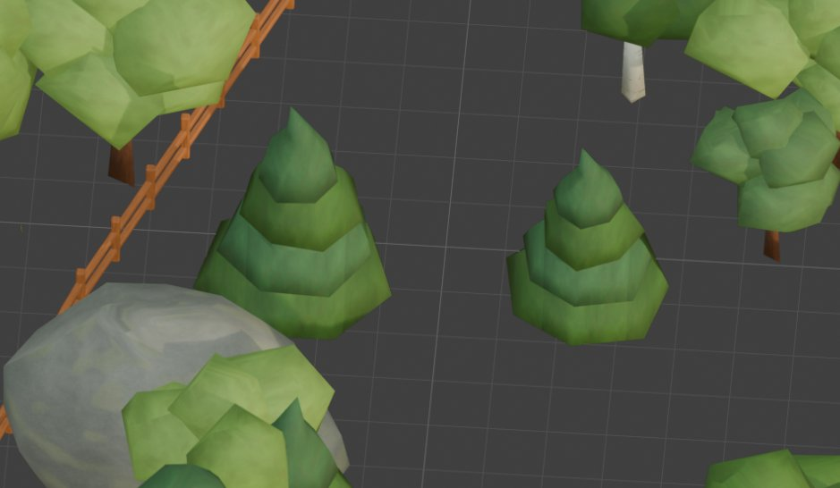</a>

Un prompt para pedirle a Astra que cree una conífera de menos de 200 polígonos. La persona que lo publicó comenta que está lidiando con el problema de que el resultado generado acaba teniendo un aspecto «como de caca».

**Prompt**

```text
¿Puedes intentar crear una conífera con menos de 200 polígonos?
```

[Ver detalles ↗](https://www.tripo3d.ai/es/3d-prompts/gpt-6-astra-2099472264270102705) · [Publicación original](https://x.com/Watamos827/status/2099472264270102705) · [Volver a los ejemplos](#all-prompts)

---

<a id="2099487024256589970"></a>

### Mundo 3D lleno de rascacielos muy altos

[Bilal Arshad](https://x.com/MohdBilalArshad) · 2026-09-14

<a href="https://www.tripo3d.ai/es/3d-prompts/gpt-6-astra-2099487024256589970">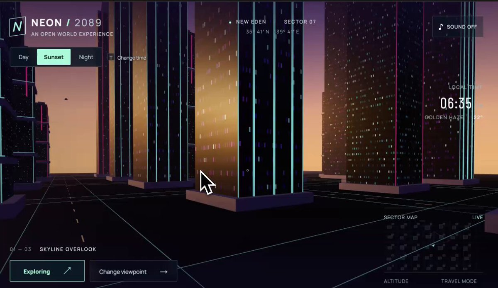</a>

Bilal Arshad cuenta que le pidió a Astra que construyera un mundo 3D lleno de rascacielos muy altos y compartió el resultado.

**Prompt**

```text
construye un mundo 3D lleno de rascacielos muy altos
```

[Ver detalles ↗](https://www.tripo3d.ai/es/3d-prompts/gpt-6-astra-2099487024256589970) · [Publicación original](https://x.com/MohdBilalArshad/status/2099487024256589970) · [Volver a los ejemplos](#all-prompts)

---

<a id="2099519801139908951"></a>

### El guerrero trepa a un gigante y le golpea la mandíbula

[MadMax](https://x.com/MadMax_Series) · 2026-09-14

<a href="https://www.tripo3d.ai/es/3d-prompts/gpt-6-astra-2099519801139908951">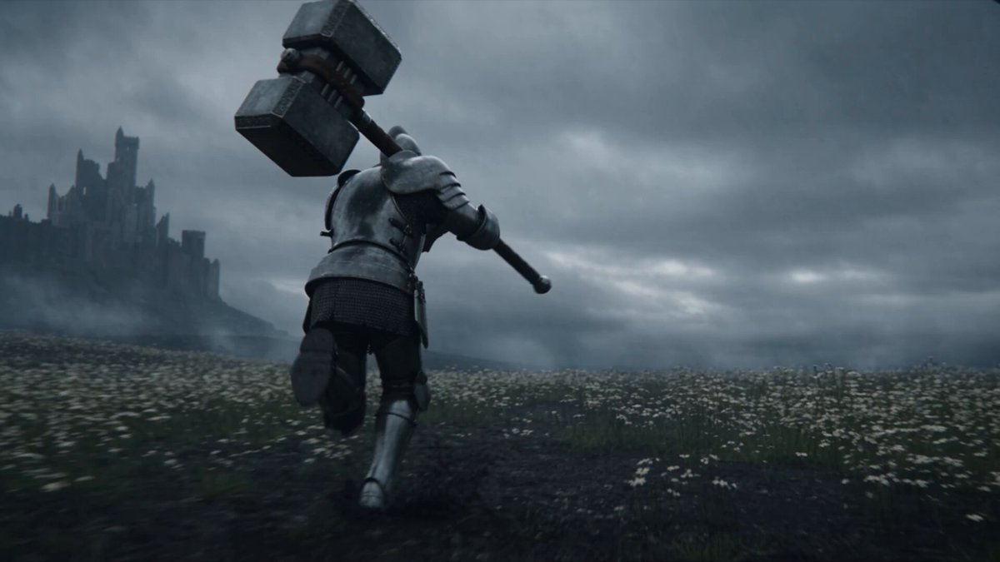</a>

Una secuencia cinematográfica de acción en 3D de 20 segundos: un guerrero montañés con armadura carga por un campo de batalla de las tierras altas bajo una tormenta, salta sobre la mano de un gigante orgánico, trepa hasta su hombro, le golpea la mandíbula con un martillo de guerra, cae y se recupera para un enfrentamiento final. El autor original lo etiqueta como un prompt de texto a vídeo e indica GPT-6 Astra + Seedance 2.5 y Higgsfield.

**Prompt**

```text
REGISTRO DE PERSONAJES:
Exactamente un guerrero montañés adulto de sexo masculino.
Tiene una complexión compacta, ancha y extremadamente poderosa. Lleva un diseño original de armadura medieval fantástica de placas, en metal oscuro color gunmetal: casco puntiagudo cerrado, placas de hombros superpuestas, protección articulada para los brazos, guanteletes pesados, peto reforzado, paneles de cuero en la cintura, pantalones oscuros, grebas de acero y botas blindadas pesadas. La armadura está desgastada, arañada y mojada por la tormenta.
Lleva exactamente un enorme martillo de guerra para dos manos. Tiene un único mango largo reforzado de metal oscuro y una cabeza de martillo rectangular, pesada y simétrica. El arma mantiene la misma longitud, forma y peso durante toda la secuencia. La controla con ambas manos durante los saltos, la escalada y el golpe.
Exactamente un gigante humanoide orgánico colosal, de más de treinta veces la altura del guerrero. Tiene hombros musculosos inmensos, brazos extremadamente largos, manos enormes de aspecto humano, piel gris carbón áspera, poros y cicatrices visibles, cejas prominentes, nariz ancha, mandíbula poderosa y cabello negro largo y enmarañado. Es un titán orgánico vivo, no una estatua, un robot, una máquina ni un gólem de piedra.
No debe haber guerreros, gigantes ni ejércitos de fondo adicionales.
ENTORNO:
Un campo de batalla de las tierras altas, azotado por el viento, bajo una violenta tormenta azul grisácea. El terreno irregular está cubierto de tierra oscura y mojada, hierba aplastada y miles de pequeñas flores pálidas. El viento fuerte dobla la hierba y las flores en oleadas irregulares.
Una fortaleza medieval en ruinas se alza sobre una colina distante, a la izquierda de la pantalla. Sus torres derruidas siguen visibles a través de la niebla baja y errante. Los relámpagos iluminan intermitentemente la fortaleza y las nubes de tormenta.
El gigante ocupa el lado derecho de la pantalla del campo de batalla. El guerrero comienza en el centro del primer plano y corre hacia el gigante. Conserva esta geografía y dirección en pantalla durante todos los cortes.
ACCIÓN CRONOLÓGICA Y CÁMARA:
0.00–3.30 — CARGA HACIA EL GIGANTE
Comienza de inmediato con un plano de seguimiento trasero y bajo, muy cerca del guerrero con armadura mientras corre con fuerza por el campo mojado hacia el gigante colosal.
Lleva el martillo de guerra horizontalmente frente al cuerpo con ambas manos. La cabeza pesada del martillo permanece hacia la derecha de la pantalla, mientras que el extremo inferior del mango se extiende hacia la izquierda. Las botas comprimen el suelo mojado con cada paso y solo después del contacto físico lanzan hacia atrás tierra, flores aplastadas y gotas.
Las piernas y la enorme mano derecha del gigante entran por la zona superior derecha del encuadre. El gigante se agacha y extiende la mano abierta hacia el guerrero que carga, con la intención de recogerlo del suelo.
Los dedos se mueven de forma independiente, con articulaciones y peso creíbles. El gigante no agarra al guerrero de inmediato ni lo teletransporta.
El movimiento de cámara se mantiene bajo, rápido y fluido, enfatizando la enorme diferencia de escala. La fortaleza en ruinas sigue visible en el horizonte distante de la izquierda de la pantalla.
3.30–5.80 — SALTO A LA MANO DEL GIGANTE
Cuando la mano abierta del gigante pasa a ras del suelo por la trayectoria del guerrero, este apoya firmemente la bota derecha en el suelo. Flexiona la rodilla, baja las caderas y propulsa hacia arriba la pierna trasera.
Realiza un único salto potente hacia delante.
Usa una cámara lenta cinematográfica controlada mientras asciende frente a los dedos separados del gigante. Recoge ligeramente las piernas bajo el cuerpo y eleva con ambas manos el mismo martillo de guerra por encima de los hombros para mantener el equilibrio.
Aterriza con ambas botas sobre la parte posterior de los dedos medio y anular del gigante. Muestra un contacto físico claro: las botas tocan la piel, las rodillas absorben el impacto, la carne del gigante se comprime ligeramente y la armadura del guerrero reacciona al aterrizaje.
El gigante comienza a levantar la mano hacia el rostro. El guerrero no flota ni queda suspendido en el aire.
Usa un travelling de grúa dramático en contrapicado que ascienda por debajo del guerrero, con la enorme mano llenando el fondo.
5.80–9.00 — CORRER POR EL BRAZO
Vuelve a una acción rápida y natural.
Mientras el gigante levanta el brazo, el guerrero corre desde los dedos por el dorso de la mano hasta la muñeca. Sus pisadas se alternan correctamente y se aferran de forma visible a la superficie irregular y en movimiento.
El gigante gira la muñeca e intenta sacudírselo de encima. El guerrero baja el centro de gravedad, amplía la base de apoyo y mantiene el martillo cerca del torso hasta que el brazo se estabiliza.
Después acelera por el antebrazo del gigante hacia el codo. Cada paso sigue el ángulo cambiante del brazo; las botas no se deslizan a través de la piel.
La cámara lo sigue de lado y ligeramente desde abajo, elevándose a lo largo del brazo del gigante. Las partes cercanas del brazo atraviesan rápidamente el primer plano, mientras que la cabeza del gigante y la fortaleza distante se desplazan más despacio, creando un potente paralaje y una sensación de escala.
9.00–12.00 — TREPAR HASTA EL HOMBRO
El guerrero alcanza la parte superior del brazo, que asciende en una pendiente pronunciada hacia el hombro del gigante.
Engancha un antebrazo y el mango del martillo de guerra contra una cresta muscular natural para hacer palanca, apoya la bota derecha, empuja con la pierna y se incorpora al hombro en una única acción de escalada conectada.
El gigante gira la cabeza hacia él. Su ojo sigue al guerrero, frunce el ceño y abre la mandíbula en un rugido profundo y no verbal. El cabello y la piel se mueven con la rotación de la cabeza.
El guerrero permanece sujeto al hombro mediante un contacto real de manos y botas. Trepa en diagonal por la parte superior del hombro hacia la base del cuello del gigante.
Usa un plano de seguimiento lateral cercano que mantenga visibles y legibles en el mismo encuadre al guerrero completo, el martillo de guerra y el perfil facial del gigante.
12.00–15.00 — GOLPE COMPLETO DEL MARTILLO EN LA MANDÍBULA
El guerrero alcanza una posición estable sobre el hombro inclinado del gigante, cerca del cuello.
Adelanta la bota izquierda y apoya la derecha detrás. Ambos pies presionan visiblemente contra la piel del gigante. Gira las caderas en dirección opuesta al objetivo y lleva el martillo de guerra hacia atrás con ambas manos.
Muestra toda la preparación antes del impacto:
los pies se apoyan → las rodillas se flexionan → las caderas cargan la fuerza → el torso gira → los hombros llevan el martillo hacia atrás → los brazos guían la pesada cabeza del martillo hasta su posición inicial.
En el segundo 13.00, el guerrero ejecuta un único golpe horizontal completo con ambas manos hacia la mandíbula del gigante.
La fuerza se transmite de forma continua desde las piernas, pasando por las caderas, el torso, los hombros y los brazos. La cabeza del martillo sigue un único arco claro e ininterrumpido. No salta de posición ni toca el rostro antes de completar el golpe.
En el segundo 14.00, entra en cámara ultralenta explícita para el contacto decisivo.
La cabeza rectangular del martillo golpea el lateral de la mandíbula inferior del gigante con su amplia cara de impacto, no con el mango ni el asta. Muestra cómo la piel y el tejido de la mejilla se comprimen alrededor del impacto, cómo la mandíbula del gigante se desplaza lateralmente, cómo el cabello suelto sale despedido y cómo se produce una ráfaga radial de lluvia, polvo y residuos de piel.
Los brazos del guerrero resisten la desaceleración repentina. Sus hombros retroceden mientras el cuerpo continúa en un seguimiento controlado del movimiento.
No debe haber sangre, tejido expuesto, gore ni desmembramiento.
15.00–17.30 — RETROCESO DEL GIGANTE Y CAÍDA DEL GUERRERO
Vuelve de inmediato a la velocidad natural.
La cabeza del gigante se sacude hacia un lado por el impacto. La parte superior de su cuerpo retrocede y el hombro golpeado desciende bruscamente. Este movimiento repentino hacia abajo hace que el guerrero pierda el apoyo y salga despedido en dirección contraria al gigante.
El guerrero cae hacia el campo de batalla mientras conserva el mismo martillo de guerra con ambas manos. No flota ni realiza un salto adicional.
Corta a una vista lateral a nivel del suelo. Sus botas aterrizan primero, las rodillas ceden por el impulso y rueda una vez sobre un hombro. La cabeza del martillo golpea la tierra a su lado y abre un surco poco profundo, lanzando hacia fuera tierra mojada y flores pálidas.
El enorme rostro del gigante desciende por la zona superior derecha del encuadre mientras intenta recuperar el equilibrio. No aplasta ni atraviesa al guerrero.
17.30–20.00 — RECUPERACIÓN Y ENFRENTAMIENTO FINAL
El guerrero detiene la voltereta en una posición baja de rodillas.
Clava la cabeza del martillo de guerra en la tierra, sujeta el mango con ambas manos y lo usa como apoyo para incorporarse de forma constante hasta quedar sobre una rodilla. Después extrae el martillo y coloca el mango horizontalmente sobre los hombros, en una postura defensiva preparada.
El gigante baja su enorme cabeza hacia él; la mandíbula, visiblemente amoratada por el golpe, sigue consciente y amenazante. Su aliento agita la hierba, las flores, la niebla y los paneles de cuero sueltos de la armadura del guerrero.
El guerrero permanece inmóvil solo durante un breve instante de determinación, mientras su respiración y su armadura conservan un movimiento natural sutil.
Un relámpago ilumina la fortaleza en ruinas a la izquierda de la pantalla, recortando ambas figuras y confirmando su inmensa diferencia de escala.
Termina exactamente en el segundo 20.00 con una composición amplia y baja: el guerrero arrodillado en el primer plano cubierto de flores, con el martillo de guerra preparado; el rostro del gigante se cierne sobre él y la fortaleza distante es visible a través de la tormenta.
No fundir a negro. No incluir fotograma congelado, título ni tarjeta final.
BLOQUEO DE FÍSICA DE LA ACCIÓN:
Toda acción debe seguir una causalidad física clara y legible:
Carrera: contacto del pie → transferencia del peso → empuje de la pierna trasera → siguiente paso.
Salto: pie apoyado → compresión de la rodilla → extensión de la pierna → trayectoria aérea → contacto del aterrizaje → absorción con la rodilla.
Escalada: apoyo de la mano o del arma → bota apoyada → transferencia del peso corporal → tracción ascendente.
Golpe de martillo: pies estables → carga de las caderas → rotación del torso → impulso del hombro → trayectoria continua del martillo → contacto con la cara ancha del martillo → resistencia → continuación del movimiento.
Caída: pérdida del apoyo causada por el retroceso del gigante → descenso impulsado por la gravedad → contacto de las botas → flexión de las rodillas → giro sobre el hombro → recuperación.
El guerrero nunca se teletransporta entre el suelo, la mano, el brazo o el hombro. El gigante nunca mueve al guerrero sin contacto físico directo o una fuerza visible.
REGLAS DE VELOCIDAD DEL MOVIMIENTO:
0.00–3.30: velocidad de carrera rápida y natural.
3.30–5.80: cámara lenta cinematográfica controlada para el salto y el aterrizaje.
5.80–13.90: acción rápida y natural.
13.90–15.00: cámara ultralenta explícita solo para la aproximación final del martillo, el contacto y la deformación inmediata.
15.00–20.00: regreso claro a la velocidad natural.
No aplicar cámara lenta global. No permitir que los personajes en cámara lenta floten.
ILUMINACIÓN Y COLOR:
Mantén una gradación de tormenta fría en azul acero, gris carbón y plata desaturada. Los relámpagos proporcionan una iluminación direccional blanca y fría durante breves instantes. La armadura mojada recibe reflejos plateados estrechos, mientras que la piel oscura del gigante sigue detallada y legible.
Las flores pálidas aportan un contraste marfil cálido y contenido sin volver colorida la escena. Conserva la niebla atmosférica densa alrededor de la fortaleza distante. Los cambios de exposición de los relámpagos deben ser breves y no deben borrar la anatomía de los personajes ni ocultar acciones faltantes.
AUDIO:
Solo efectos de sonido ambientales y de acción diegéticos y sincronizados. No debe haber música de fondo ni banda sonora en absoluto.
Incluye el viento de la tormenta, truenos lejanos, movimiento de la armadura, pisadas pesadas al correr, tierra removida, hierba doblándose, la respiración y el rugido no verbal del gigante, el desplazamiento de su mano, el salto del guerrero, las botas al entrar en contacto con la piel, impactos de la escalada, movimiento del martillo de guerra, un único impacto metálico profundo del martillo, el retroceso del gigante, el aire durante la caída, la armadura al golpear la tierra, la cabeza del martillo al golpear el suelo y un último chasquido de relámpago cercano.
No debe haber diálogos, narración, palabras habladas, cánticos, letras ni lenguaje inteligible.
CONTINUIDAD Y PREVENCIÓN DE FALLOS:
Exactamente un guerrero, un gigante y un martillo de guerra durante toda la secuencia.
El guerrero trepa al gigante una sola vez y ejecuta exactamente un golpe decisivo con el martillo.
El martillo de guerra nunca se duplica, cambia de tamaño, flota, se dobla, atraviesa ninguno de los dos cuerpos ni cambia de mano sin un movimiento visible.
El gigante sigue siendo la misma criatura humanoide orgánica en todos los planos. No incluir rasgos robóticos, transformación en piedra, manos duplicadas, dedos adicionales ni cambios en el rostro.
Conserva la armadura, el casco, las proporciones y los daños del guerrero durante toda la secuencia.
Conserva la ruta de la mano derecha al brazo derecho y al hombro del gigante para que la geografía de la escalada siga siendo físicamente posible.
No incluir manos fusionadas, extremidades adicionales, articulaciones invertidas, botas deslizándose, cuerpos que se intersecan, teletransportación ni suspensión sin apoyo.
La cabeza ancha del martillo, no el mango, debe entrar visiblemente en contacto con la mandíbula del gigante después de completar el golpe.
No debe haber sangre, gore, tejido expuesto, cuerpos humanos aplastados ni desmembramiento.
No incluir apariencia de acción real, personajes de franquicias reconocibles, subtítulos, textos superpuestos, logotipos, interfaz de usuario, controles de reproducción, barras negras permanentes ni marcas de agua.
Cualquier música de fondo o banda sonora musical implica una generación fallida.
music=0; no_music=1; strict_no_music=1; audio=diegetic_only.
```

[Ver detalles ↗](https://www.tripo3d.ai/es/3d-prompts/gpt-6-astra-2099519801139908951) · [Publicación original](https://x.com/MadMax_Series/status/2099519801139908951) · [Volver a los ejemplos](#all-prompts)

---

<a id="2099588840419651890"></a>

### Crea una escena de pasillo de hotel

[West Lord](https://x.com/MyWestLord) · 2026-09-14

<a href="https://www.tripo3d.ai/es/3d-prompts/gpt-6-astra-2099588840419651890"></a>

Un prompt que el autor de la publicación atribuye a GPT-6 Astra para crear una escena editable de pasillo de hotel en Blender mediante MCP.

**Prompt**

```text
crea una escena de pasillo de hotel
```

[Ver detalles ↗](https://www.tripo3d.ai/es/3d-prompts/gpt-6-astra-2099588840419651890) · [Publicación original](https://x.com/MyWestLord/status/2099588840419651890) · [Volver a los ejemplos](#all-prompts)

---

<a id="2099643231659012553"></a>

### Isla volcánica interactiva con barcos que huyen

[Wësche](https://x.com/WescheNex1q) · 2026-09-14

<a href="https://www.tripo3d.ai/es/3d-prompts/gpt-6-astra-2099643231659012553">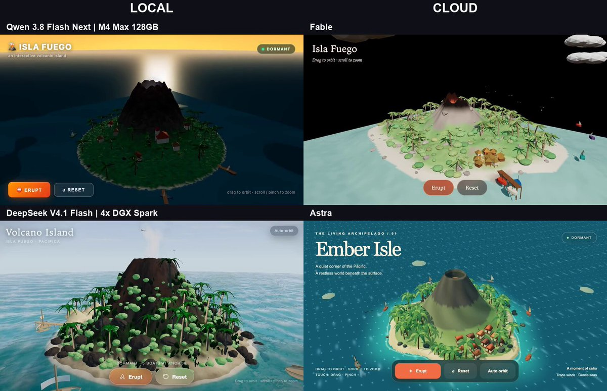</a>

Una solicitud reutilizable para crear una isla volcánica 3D interactiva, con lava fluyendo y barcos que huyen durante la erupción. El autor principal indica que envió esta solicitud a varios modelos, incluido Astra-6, como parte de una comparación.

**Prompt**

```text
crea una isla volcánica interactiva con lava fluyendo y barcos que huyen.
```

[Ver detalles ↗](https://www.tripo3d.ai/es/3d-prompts/gpt-6-astra-2099643231659012553) · [Publicación original](https://x.com/WescheNex1q/status/2099643231659012553) · [Volver a los ejemplos](#all-prompts)

---

<a id="2099719427990134984"></a>

### Panel interactivo del sistema nervioso de un organismo en 3D

[AiMind](https://x.com/AIMind_Ai) · 2026-09-15

<a href="https://www.tripo3d.ai/es/3d-prompts/gpt-6-astra-2099719427990134984">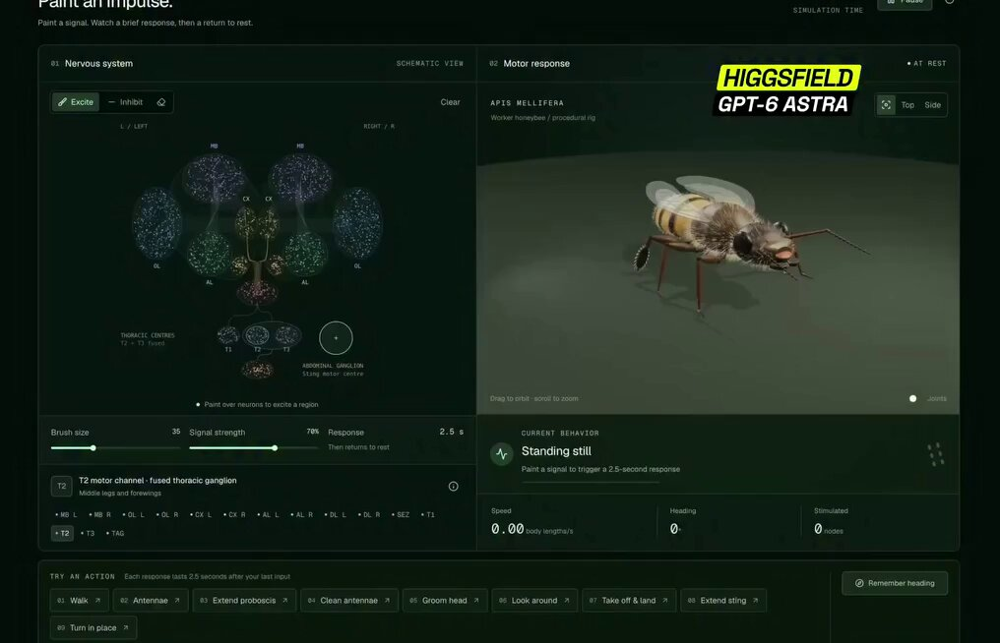</a>

AiMind lo comparte como recomendación de «Roba el prompt» para crear un panel interactivo con regiones del sistema nervioso en las que se puede hacer clic y un organismo 3D con rigging procedural. La publicación muestra una demostración con una mosca, pero el prompt citado usa el marcador \[organism\] y no se establece explícitamente que sea la entrada exacta utilizada para ese clip.

**Prompt**

```text
Panel interactivo. A la izquierda: sistema nervioso esquemático de [organism], con regiones en las que se puede hacer clic. A la derecha: [organism] 3D con rigging procedural. Al hacer clic en una región, se activa una respuesta motora de 2,5 segundos. Interfaz oscura, con telemetría de velocidad y rumbo.
```

[Ver detalles ↗](https://www.tripo3d.ai/es/3d-prompts/gpt-6-astra-2099719427990134984) · [Publicación original](https://x.com/AIMind_Ai/status/2099719427990134984) · [Volver a los ejemplos](#all-prompts)

---

<a id="2099750376530657300"></a>

### Corazón y emoji sonriente en 3D con estilo Apple

[Sharon Riley](https://x.com/Just_sharon7) · 2026-09-15

<a href="https://www.tripo3d.ai/es/3d-prompts/gpt-6-astra-2099750376530657300">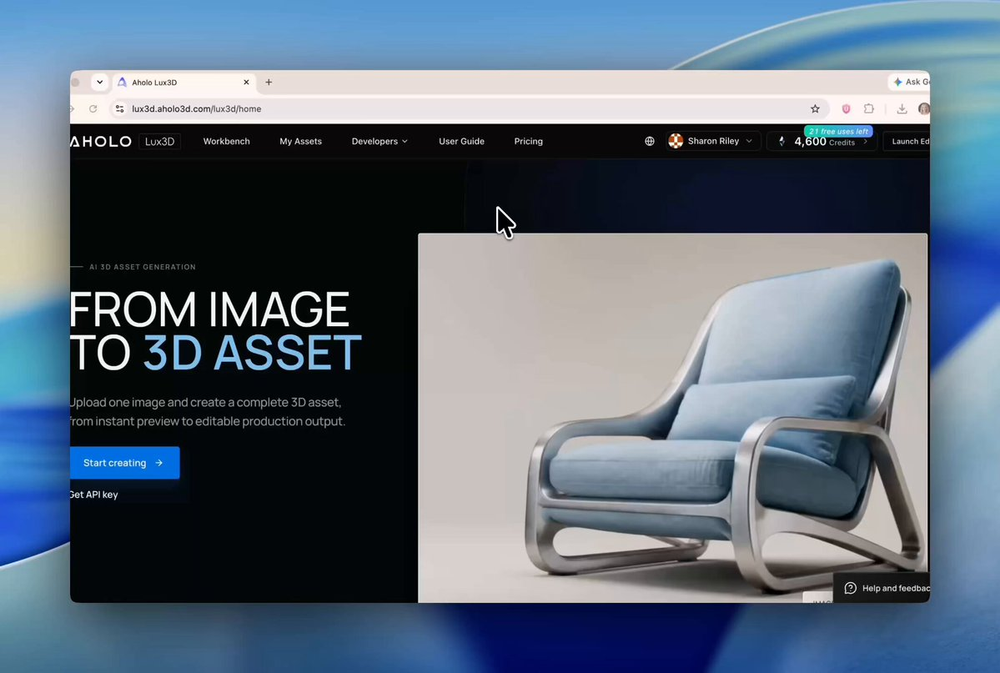</a>

El autor indica que escribió este prompt de texto para generar una imagen y, después, un modelo 3D .glb que se puede girar. No se utilizó ninguna imagen de referencia.

**Prompt**

```text
Emoji de corazón y emoji sonriente en 3D con estilo Apple
```

[Ver detalles ↗](https://www.tripo3d.ai/es/3d-prompts/gpt-6-astra-2099750376530657300) · [Publicación original](https://x.com/Just_sharon7/status/2099751278234767673) · [Volver a los ejemplos](#all-prompts)

---

<a id="2099785223827259515"></a>

### Juego de exploración espacial procedural totalmente explorable

[developers.openai.com](https://developers.openai.com/) · 2026-09-15

<a href="https://www.tripo3d.ai/es/3d-prompts/gpt-6-astra-2099785223827259515">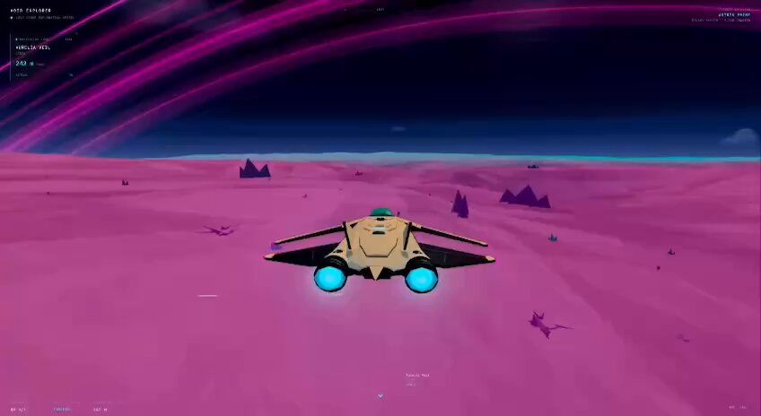</a>

Brief inicial de un desarrollador de OpenAI para Void Explorer, un juego de exploración espacial en 3D basado en navegador. Solicita un viaje continuo desde el espacio, atravesando la atmósfera de un planeta hasta llegar al suelo, con distancias a escala real, planetas del tamaño de la Tierra, terreno procedural y renderizado por chunks.

**Prompt**

```text
Todo lo que pueda ver debe ser alcanzable. Mantén las distancias a escala real y haz que viajar resulte viable mediante la escala y la velocidad. Quiero volar desde el espacio, atravesar la atmósfera de un planeta y descender hasta el suelo. Los planetas pueden tener el tamaño de la Tierra, así que necesitaremos terreno procedural y un renderizador por chunks.
```

[Ver detalles ↗](https://www.tripo3d.ai/es/3d-prompts/gpt-6-astra-2099785223827259515) · [Publicación original](https://developers.openai.com/blog/how-to-build-games-with-astra) · [Volver a los ejemplos](#all-prompts)

---

<a id="2099850719839109597"></a>

### Crea un espacio 3D y un personaje de videojuego articulados a partir de imágenes de referencia

[妖精アーヤ](https://x.com/aiehon_aya) · 2026-09-15

<a href="https://www.tripo3d.ai/es/3d-prompts/gpt-6-astra-2099850719839109597">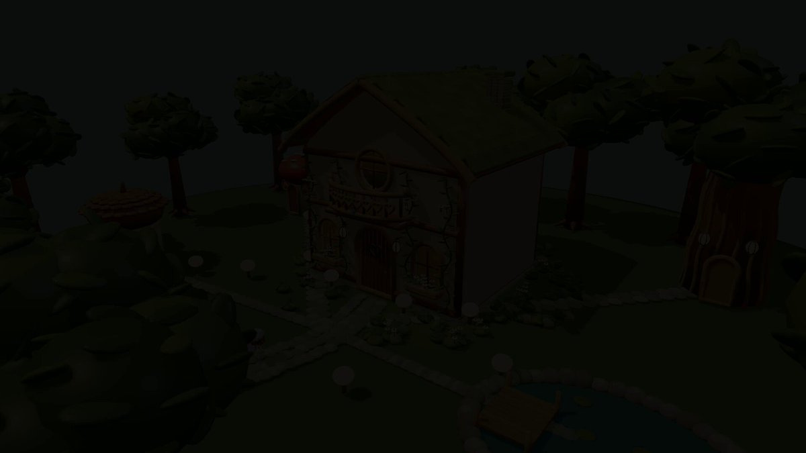</a>

Un prompt guiado paso a paso para introducir las imágenes de referencia del mundo y las imágenes canónicas del personaje incluidas en el comentario del autor, comprobar y convertir la casa y el personaje en modelos 3D, ajustarlos en Blender y añadirles un rig automático y movimiento. No se especifican objetivos ni reglas de juego; el resultado principal es un espacio 3D que incluye un personaje articulado.

**Prompt**

```text
【Qué preparar antes】
・Imágenes de referencia del mundo que quieres crear (exteriores, habitaciones, etc.)
・Imágenes canónicas del personaje (como una vista de tres ángulos)
　※Sin imágenes no se puede reproducir el resultado. ¡No olvides adjuntarlas!

【Prompt】
Diseñaré con calidad profesional un espacio 3D realmente interactivo y un personaje de videojuego basados en las imágenes adjuntas, respetando tu mundo y tu personaje.

① Revisar las imágenes adjuntas para comprobar la forma, los colores y los detalles de diseño de la casa y el personaje
　↓
② Generar modelos 3D a partir de las imágenes con Tripo (tres imágenes del personaje de cuerpo entero: frontal, posterior y lateral, todas con la misma relación de aspecto)
　↓
③ Importarlos en Blender y ajustar la disposición y el tamaño de las piezas
　↓
④ Configurar un rig automático y añadir movimientos acordes con la personalidad del personaje, como caminar o balancearse
　↓
⑤ Si surge una decisión ambigua, como utilizar un recurso de pago, consultarme antes de continuar
　↓
⑥ Dejar un registro del trabajo realizado, los problemas encontrados y la ubicación de los recursos con el nivel de detalle necesario para que otra IA pueda leerlo y reproducir el proceso
```

[Ver detalles ↗](https://www.tripo3d.ai/es/3d-prompts/gpt-6-astra-2099850719839109597) · [Publicación original](https://x.com/aiehon_aya/status/2099850721646784894) · [Volver a los ejemplos](#all-prompts)

---

<a id="2100139076816916977"></a>

### Escena de habitación 3D interactiva con muebles articulados

[Wentao Zhu](https://x.com/walterzhu8) · 2026-09-16

<a href="https://www.tripo3d.ai/es/3d-prompts/gpt-6-astra-2100139076816916977">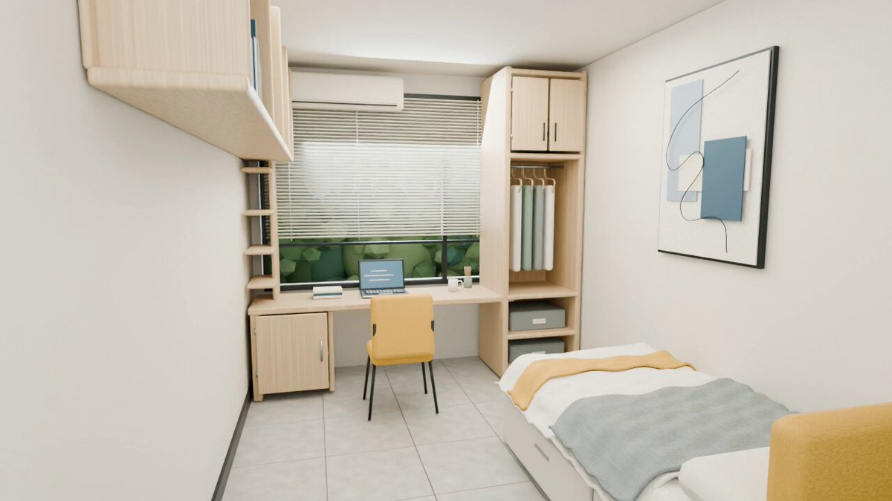</a>

Una prueba de GPT-6 Astra acreditada por Wentao Zhu al estudiante Minchao Jiang. El prompt solicita una escena 3D interactiva basada en una foto de habitación proporcionada, con bisagras, puertas y cajones articulados, además de movimientos de cámara para un vídeo de demostración.

**Prompt**

```text
Dada la foto de la habitación que proporcioné, usa Blender MCP para crear una escena 3D interactiva y renderizarla como vídeo de demostración. Incluye movimiento articulado de los objetos (bisagras, puertas y cajones) y utiliza movimientos de cámara adecuados para mostrar estos efectos.
```

[Ver detalles ↗](https://www.tripo3d.ai/es/3d-prompts/gpt-6-astra-2100139076816916977) · [Publicación original](https://x.com/walterzhu8/status/2100139076816916977) · [Volver a los ejemplos](#all-prompts)

---

<a id="2100193512373592313"></a>

### Desarrollo de una versión para PC de Splatoon y recreación de sus gráficos

[basio](https://x.com/basio39) · 2026-09-16

<a href="https://www.tripo3d.ai/es/3d-prompts/gpt-6-astra-2100193512373592313">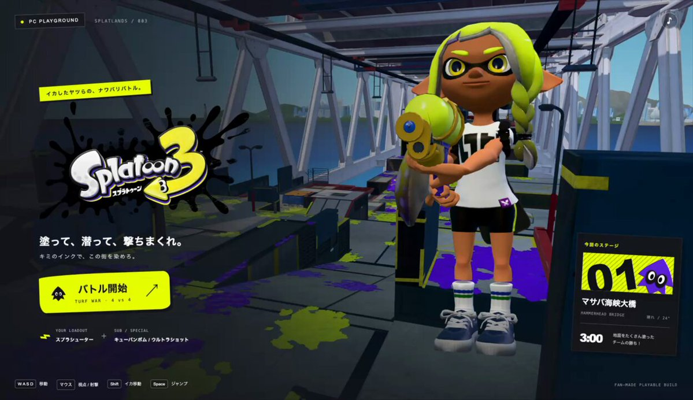</a>

Prompt para desarrollar una versión para PC de «Splatoon» y recrear sus gráficos por completo. El autor explica que ejecutó únicamente este prompt con Ultra.

**Prompt**

```text
/goal Desarrolla una versión para PC de Splatoon. Recrea sus gráficos por completo.
```

[Ver detalles ↗](https://www.tripo3d.ai/es/3d-prompts/gpt-6-astra-2100193512373592313) · [Publicación original](https://x.com/basio39/status/2100194321987461503) · [Volver a los ejemplos](#all-prompts)

---

<a id="2100222426705453318"></a>

### Recorrido interactivo por un apartamento con opciones de azulejos

[Shimecki](https://x.com/scheemunai) · 2026-09-16

<a href="https://www.tripo3d.ai/es/3d-prompts/gpt-6-astra-2100222426705453318">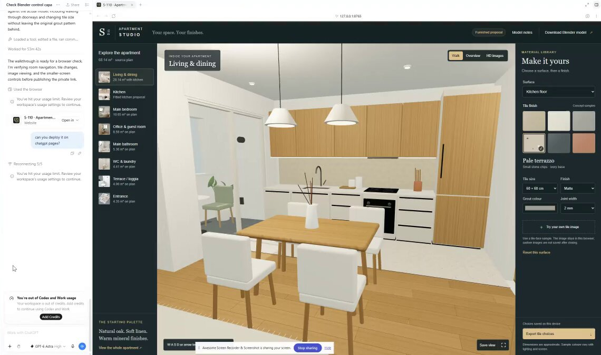</a>

Un prompt del autor principal para crear en Blender un modelo de apartamento realista en HD y una experiencia web interactiva que permita recorrerlo y elegir opciones de azulejos.

**Prompt**

```text
Quiero que construyas en Blender un modelo 3D de renderizado en HD completamente realista y, después, una experiencia web interactiva para poder recorrer el apartamento y elegir opciones de azulejos.
```

[Ver detalles ↗](https://www.tripo3d.ai/es/3d-prompts/gpt-6-astra-2100222426705453318) · [Publicación original](https://x.com/scheemunai/status/2100222426705453318) · [Volver a los ejemplos](#all-prompts)

---

<a id="2100233407108137349"></a>

### Cortometraje de lucha sobrenatural CGI AAA en una estación de metro

[MadMax](https://x.com/MadMax_Series) · 2026-09-16

<a href="https://www.tripo3d.ai/es/3d-prompts/gpt-6-astra-2100233407108137349">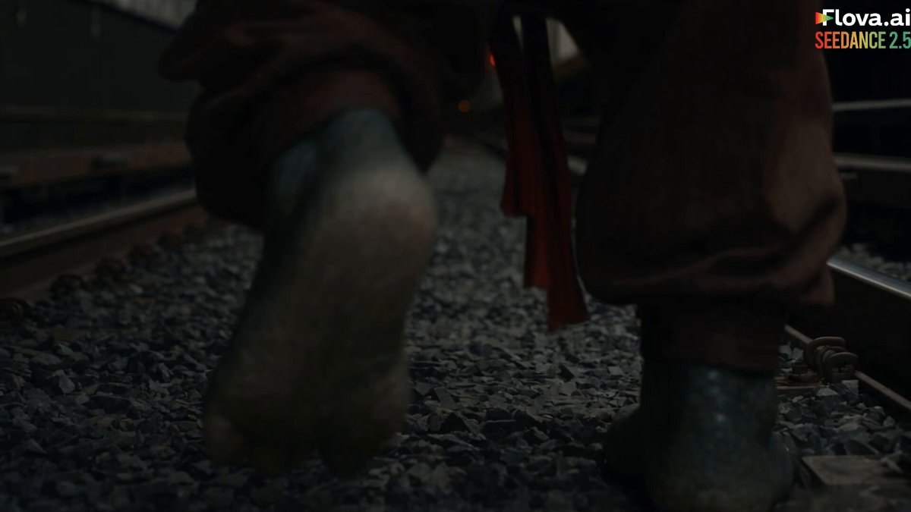</a>

**Prompt**

```text
Todos los personajes, figurantes del fondo y elementos de la estación deben compartir un aspecto de CGI de videojuego de fantasía AAA, claramente esculpido en digital. Los primeros planos de los personajes deben conservar rostros de personajes de videojuego meticulosamente refinados, mechones de trenzas bien definidos y piel realista estilizada; no deben convertirse en actores reales, cosplay, gameplay corriente, animación 2D ni cel shading. Mantén la escena de lucha sobrenatural en una estación de metro moderna; no la transformes en un castillo medieval, una montaña nevada ni un ring de boxeo. La paleta debe ser de cian grisáceo frío y poco saturado, negro carbón profundo, escamas cian grisáceas y tiras de luz blanca fría, con pequeños acentos de color formados por barandillas amarillas, luces de señalización rojas, monturas de gafas de bronce, hombreras verde cardenillo y cinturón rojo ocre. El brillo dorado miel de los ojos y el breve destello violeta al golpear la columna solo deben aparecer en esos instantes concretos; no tiñas toda la película de violeta. Entorno: una estación ferroviaria subterránea amplia y oscura, con una zona de vías hundida en el centro, raíles y grava, y andenes elevados a ambos lados. Los bordes de los andenes tienen barreras de protección de vidrio y metal con marcos verticales amarillos; el suelo presenta franjas de seguridad amarillas, baldosas grises y rejillas de drenaje. Grandes columnas cilíndricas blancas sostienen el techo bajo. En la parte superior se extienden hileras continuas de luces alargadas blancas frías y luces circulares, junto con pequeñas luces de señalización rojas que se pierden en la distancia. En el andén hay varias decenas de pasajeros adultos con abrigos corrientes de tonos claros y oscuros, dispersos junto a las columnas o detrás de las barreras. Al verse sorprendidos por la pelea, retroceden, se encogen y levantan los brazos para protegerse, pero siguen siendo figurantes del fondo: no participan en la lucha, no se convierten en protagonistas y no repiten los mismos rostros. No entra ningún tren. Los carteles deben conservar únicamente bloques geométricos borrosos, sin texto legible. Los dos combatientes principales son fijos: A, el guerrero de las gafas, es un hombre adulto alto, delgado y atlético, de piel morena oscura y cálida, con pómulos y mandíbula bien definidos. Lleva el pelo negro en trenzas cortas pegadas a la cabeza, recogidas en un pequeño nudo de trenzas en la nuca. En la frente lleva fijada una estrecha pantalla de gafas abatible, con montura de bronce y visor gris humo; normalmente cubre ambos ojos, mientras que quedan visibles la nariz por debajo del puente y la boca. Viste una camiseta de combate sin mangas, gris azulada y de cuello cruzado, un fajín marrón oscuro, pantalones largos de pernera ancha negro carbón y botas bajas marrón oscuro. Ambos antebrazos están envueltos en vendas de tela gris; los dedos quedan al descubierto y sus manos están siempre vacías. No lleva capa, armas en las manos ni emblemas legibles. Su expresión es serena y sus movimientos, ágiles y decididos. Solo en el plano indicado, levanta brevemente con la mano derecha el borde de la pantalla para dejar ver un ojo de color dorado miel brillante; después vuelve a bajar la pantalla para cubrirle los ojos. Es la misma pieza física de protección fijada a la frente: no se convierte en una tira de tela ni desaparece. B, la bestia de cresta escamada, es una criatura humanoide bípeda y musculosa, más alta y corpulenta que A. Unas escamas gruesas de color cian grisáceo oscuro cubren su amplio pecho, espalda y extremidades; el abdomen tiene escamas gris azuladas más pequeñas y densas. Tiene una cabeza ancha y achatada de lagarto, hocico corto y romo, mandíbula robusta, dos ojos de color ámbar oscuro y dientes cortos y gruesos. La cabeza no tiene pelo humano, máscara ni protuberancias con forma de ramas. Desde el hombro izquierdo hasta el antebrazo izquierdo le crece una armadura natural gruesa de color verde cardenillo; en el borde superior del hombro hay fijada una hilera de aletas óseas cortas y romas. El brazo derecho conserva escamas gruesas de color gris azulado más claro. Los lados nunca deben intercambiarse: las aletas óseas y las placas de armadura forman parte del cuerpo, y no hay flores en el hombro. Viste pantalones de combate holgados de pernera muy ancha, de color marrón oscuro, un cinturón textil rojo ocre y dos tiras estrechas colgantes a modo de faldón. Lleva los tobillos envueltos en tela marrón oscura; las plantas de los pies son anchas y escamosas, y deben conservar una superficie plantar claramente visible para apoyarse contra una pared. No tiene cola, alas, brazos adicionales, cuernos largos, espada, lanza, escudo ni objetos en las manos. B es una criatura alta capaz de entrar en una estación normal; conserva una proporción estable respecto a A y a los pasajeros y no se hincha hasta convertirse en un gigante del tamaño de un edificio. 0.00–3.70 s: el enfrentamiento comienza desde el primer fotograma. Un breve plano bajo, cerca de las vías, muestra a B acercándose rápidamente con pasos decididos. Corte inmediato a un plano medio desde detrás de A: B carga desde delante, levanta la pierna y gira la cadera para lanzar una patada circular a la altura de la cabeza. A flexiona las rodillas, agacha la cabeza e inclina el torso hacia un lado; la pierna pasa rozando por encima de sus trenzas negras cortas. B apoya el pie y gira para recuperar la posición, mientras A se incorpora enseguida. Corte a un plano general bajo de ambos junto a las vías, con un Dutch angle claramente marcado: A levanta la rodilla y enlaza una patada circular alta; B baja la cabeza y los hombros para esquivarla, y A recoge la pierna y vuelve a apoyar el pie. La cámara regresa a un seguimiento cercano por encima del hombro de A. B lo persigue con una serie continua de golpes amplios; A deja que los puños pasen rozándole el rostro mediante breves movimientos de cabeza, hundiendo el hombro y girando el cuerpo. No debe quedarse quieto repitiendo puñetazos mientras espera el ataque. Las tiras de luz del techo generan estelas direccionales al desplazarse la cámara, y la relación espacial entre los cuerpos debe mantenerse clara. 3.70–6.40 s: el puño derecho gris azulado claro de B vuelve a extenderse frente a A. A lo intercepta con la mano abierta y agarra su muñeca y antebrazo; el punto de contacto debe ser visible. La cámara se acerca al perfil sereno de A y, mientras él gira el pie, rota la cadera y el hombro, lo sigue rápidamente hasta una vista de cuerpo entero en contrapicado. A mantiene agarrado el mismo brazo derecho, levanta a B separándolo de su apoyo y lo hace girar por encima del lateral de su cuerpo. Los dos pies de B quedan en el aire; su cinturón rojo ocre y sus pantalones anchos se retrasan por la inercia. En el punto más alto del lanzamiento solo hay un instante muy breve de ultra slow motion, tras el cual se recupera la velocidad normal. A completa el giro y suelta; B cae dando una voltereta siguiendo el arco original, con la cabeza hacia abajo y los pies arriba. Su hombro y espalda golpean el suelo de la zona de vías, y la grava y el polvo saltan desde el punto de contacto. La cámara baja sigue la caída y tiembla brevemente. B rueda con el impulso, se apoya y levanta el torso, conservando las cuatro extremidades intactas. No hay brazos rotos, lanzamiento telequinético sin contacto ni una recuperación que aparezca de la nada. 6.40–9.20 s: B aún se recupera a ras de suelo cuando A ya ha tomado impulso y salta hacia él. Desde detrás de B, la cámara contrapica a A girando la cadera y extendiendo la pierna en el aire. El punto más alto del salto se ralentiza brevemente; durante el descenso, A presiona la cabeza y los hombros de B con una patada voladora lateral. B levanta ambos brazos para bloquearla y queda desviado por la fuerza. A apoya los pies y continúa de inmediato; no aterriza para quedarse esperando. La cámara sigue el descenso de A y se aproxima rápidamente rodeándolo de lado, alternando primeros planos ligeramente inclinados por encima del hombro y del rostro. A esquiva el brazo que B barre de vuelta, golpea el torso con un puñetazo corto y después empuja el lateral del rostro de B con la palma abierta. Solo después del contacto la cabeza y el cuello de B giran en la dirección del empuje. La palma, el rostro y el antebrazo no deben fusionarse. Las aletas óseas del hombro izquierdo de B giran junto con la hombrera del mismo lado y el torso. 9.20–11.20 s: A aprovecha el espacio creado al empujar el rostro, gira para recoger la pierna y lanza de inmediato una potente patada lateral hacia delante. La suela golpea el abdomen y la parte baja del pecho de B. Primero el torso de B se dobla y después ambos pies se separan del suelo; sale volando por encima del lateral hacia el andén. La cámara lo sigue al pasar sobre el borde del andén. La parte alta de su espalda y el hombro chocan contra una columna blanca, que se agrieta hacia fuera desde el punto de contacto; caen fragmentos claros y polvo, y B resbala por la columna hasta el suelo del andén. Tras recoger la pierna, A salta desde la zona de vías al mismo andén para acercarse. Después del corte aparece junto a esa misma columna, en continuidad; no se teletransporta a otra estación. Los pasajeros se apartan hacia ambos lados. La columna queda dañada, pero no se derrumba por completo. 11.20–12.80 s: corte a un primer plano del rostro de B tras el impacto. Levanta la cabeza y gira el rostro para buscar a A; la armadura verde cardenillo y las aletas óseas cortas del hombro izquierdo siguen presentes. La imagen pasa rápidamente a una composición cercana a ambos lados de la misma columna: B ocupa el primer plano derecho y A queda al fondo izquierdo, junto a la columna. A esboza una ligera sonrisa fría, pero no habla. Levanta con la mano derecha el borde de la pantalla de gafas con montura de bronce y deja ver un ojo dorado miel brillante, mirando directamente a B durante un instante muy breve. Después baja la pantalla con la mano derecha para volver a cubrirse los ojos, mientras prepara el cuerpo para esquivar. No dejes una pausa prolongada de diálogo ni una articulación de habla. 12.80–13.80 s: B gira el hombro y lanza su puño derecho gris azulado claro hacia la posición de A. Antes de que el puño llegue, A se desplaza rápidamente de lado y rodea la columna para salir por detrás. El puño golpea la columna blanca sólida; en el instante del contacto estalla un destello compacto de energía violeta, las grietas se extienden y caen fragmentos, mientras el breve destello violeta se disipa de inmediato. El primer plano muestra cómo el puño presiona la superficie de la columna y después se abre rápidamente para revelar que B ha fallado y A ya ha rodeado la columna hasta el lateral. Sigue siendo la misma columna dañada de antes. A no se convierte en humo violeta y el puño no atraviesa el cuerpo. 13.80–16.00 s: plano general bajo e inclinado. A baja el cuerpo delante y a un lado de la columna y hace un breve gesto de provocación con la mano. B se gira y se abalanza. A se impulsa y ejecuta una sola voltereta hacia atrás continua: primero arquea el cuerpo, eleva ambos pies por encima de la cabeza y después recoge el abdomen para atravesar la fase invertida, esquivando el brazo con el que B barre el espacio. La cámara se inclina hacia arriba siguiendo el cuerpo; durante la fase invertida, el movimiento se ralentiza brevemente y las tiras de luz cruzan el fondo en diagonal. A continúa la misma voltereta, devuelve los pies debajo del cuerpo y aterriza en el espacio libre del andén, detrás y al lado de B. Flexiona las rodillas para absorber el impacto, mientras los bordes de la ropa y las trenzas cortas de la nuca vuelven a caer por la inercia. Los pasajeros del fondo se apartan asustados; no deben tratarse como atacantes adicionales. A no sale despedido ni repite volteretas en el aire para alargar la duración. 16.00–18.50 s: A acaba de ponerse en pie cuando B se gira y lo alcanza con un golpe amplio hacia el lateral de la cabeza. A primero se inclina hacia atrás y después se agacha, dejando que el brazo derecho gris azulado claro de B pase horizontalmente por encima de su cabeza. Con ambas manos controla ese antebrazo, entra por delante del cuerpo de B y gira de espaldas mientras baja el centro de gravedad. A conduce el brazo de B por encima de su propio hombro y utiliza el impulso hacia delante de B para ejecutar una proyección por encima del hombro. La cadera de B pasa por encima del punto de apoyo, ambos pies se separan del suelo y cae de espalda sobre las baldosas del andén; los fragmentos de baldosa y el polvo se dispersan por el suelo. La cámara retrocede desde un primer plano pegado al hombro hasta un plano medio amplio y bajo, mostrando claramente el giro y el aterrizaje. A permanece de pie y suelta a B para que caiga. B se da la vuelta de inmediato, se apoya, flexiona las piernas y se levanta. A se gira hacia él y continúa presionando, enlazando la recuperación con el acercamiento; no hay una pausa larga de pie para pronunciar diálogos. 18.50–20.65 s: B vuelve a entrar a distancia corta. A se adelanta con un puñetazo recto corto hacia el lateral del rostro, retira la mano para proteger el pecho y después baja el cuerpo para golpear el abdomen y las costillas. B levanta el brazo para bloquear uno de los golpes y contraataca con un amplio barrido de su brazo pesado. A se mantiene cerca de la parte interna del pecho y hombro de B, agacha la cabeza para esquivarlo, desvía con el antebrazo el puño que regresa y conecta con golpes cortos y compactos en la mandíbula y la parte superior del pecho. La cámara se mueve rápidamente en pequeños desplazamientos alrededor de los hombros de ambos. La cabeza y el cuerpo solo deben rebotar después del contacto real. Resuelve este tramo con una secuencia continua de ataques, bloqueos, desvíos y contraataques; no lo conviertas en una alternancia de golpes al aire, sin reacción mutua, ni mantengas ambos puños pegados continuamente. 20.65–21.85 s: corte directo a una vista cenital. Debe verse con claridad cómo ambos giran alrededor de la misma pequeña zona de baldosas. Las trenzas negras cortas y la montura de bronce de A, junto con la armadura verde cardenillo del hombro izquierdo y el cinturón rojo ocre de B, son puntos de identificación constantes. El brazo de B barre ampliamente junto al costado de A. A encoge el hombro y se mete por la parte interior del brazo, cambia de posición apoyando primero un pie y luego el otro, desvía con una mano el antebrazo de B, hunde el otro puño en el pecho y abdomen y retira la mano mientras ajusta su posición al giro de B. Las baldosas caídas y la rejilla de drenaje permanecen en su lugar. La vista cenital muestra la trayectoria del combate cuerpo a cuerpo; no añadas un doble ni un tercer luchador. 21.85–24.00 s: corte de vuelta a un primer plano muy cercano por encima del hombro de B. A continúa con una serie de golpes cortos alternando ataques altos y bajos, mientras ladea la cabeza para esquivar el brazo de B que llega desde arriba. Los antebrazos vendados y el brazo escamoso gris azulado de B se entrecruzan, pero sus límites deben permanecer claros. La cámara sigue el rápido avance de los puños de A. En dos puntos de contacto fuerte, añade solo durante unos fotogramas un destello de exposición de alto contraste en blanco y negro con un contorno de impacto tridimensional; vuelve inmediatamente al CGI AAA cian grisáceo frío original. No cortes a cómic, texto ni ilustración 2D. El último puñetazo recto debe impactar claramente en el abdomen de B: el abdomen se comprime hacia dentro, la parte superior del cuerpo se dobla y el brazo que B levanta desde arriba pierde su dirección de avance al seguir el movimiento del torso. A mantiene firmes las plantas de los pies; la fuerza se transmite desde las piernas, la cadera y el hombro hasta el puño, que no atraviesa el cuerpo. 24.00–28.00 s: enlaza directamente con las consecuencias del mismo golpe fuerte al abdomen. Los dos pies de B se separan del suelo y sale despedido hacia atrás. La cámara, baja y pegada al borde del andén, lo sigue a gran velocidad a lo largo del eje principal de la estación, pasando sucesivamente junto a columnas blancas, marcos amarillos, paneles de vidrio y metal y la multitud horrorizada. Las líneas del fondo se alargan por la velocidad, pero el cuerpo escamoso cian grisáceo de B, los pantalones marrón oscuro, el cinturón rojo ocre y la armadura verde cardenillo del hombro izquierdo siguen siendo reconocibles. Mediante un plano general longitudinal, cortes rápidos con columnas rozando el primer plano y primeros planos en contrapicado desde abajo, muestra cómo B gira en el aire por la inercia y extiende los brazos para intentar recuperar el equilibrio. Los fragmentos que levanta se desplazan por las vías en la misma dirección del vuelo. Después B atraviesa una sección de la barrera de protección de vidrio y metal del borde del andén. El vidrio se rompe tras el contacto con el cuerpo y el marco metálico se dobla. B continúa atravesando la abertura hacia la zona de vías; corta a un plano general desde el lateral de las vías. Sigue siendo un único vuelo continuo causado por el golpe al abdomen. No añadas una patada fuera de plano, un segundo lanzamiento ni pasajeros que salgan despedidos. A no se duplica detrás de cada columna. 28.00–30.00 s: plano medio amplio lateral fijo. La pared vertical de las vías, de color gris oscuro, ocupa el lado izquierdo del encuadre; el andén opuesto y los pasajeros detrás de la barrera quedan al fondo a la derecha. Las tiras de luz apuntan hacia el fondo de la estación. B gira en el aire hasta quedar con los pies orientados hacia la pared. Las plantas de ambos pies deben entrar claramente en contacto con la pared vertical. Flexiona las rodillas y recoge el abdomen formando una posición compacta; bajo los pies salta una pequeña cantidad de polvo de la pared. Después, en ultra slow motion, extiende lentamente las rodillas y gira el torso hacia fuera, acercando gradualmente el cuerpo a la horizontal. Las plantas siguen apoyadas contra la pared; el cinturón rojo ocre, los pantalones anchos y los pequeños fragmentos continúan moviéndose para mostrar de forma continua el contacto, la compresión y la acumulación de fuerza. No es un golpe de espalda contra la pared, una suspensión congelada en el aire ni una postura sobre el suelo volcado. El vídeo termina en el segundo 30.00 con B todavía apoyado en la pared con ambos pies y el cuerpo desplegándose hacia fuera. No añadas una contraofensiva completa impulsándose contra la pared, aterrizaje, muerte ni desenlace de victoria o derrota. No hay pantalla negra, fundido a negro ni tarjeta final. Ritmo y continuidad: conserva el orden de las acciones de persecución rápida, esquivas a corta distancia, proyecciones, voltereta aérea, patada voladora, golpe contra la columna, golpes breves en vista cenital y desplazamiento entre andenes. Acorta la observación y las pausas del diálogo original. Usa cámara lenta solo de forma localizada en el punto más alto del lanzamiento, la esquiva en el aire y la fase final contra la pared; en esta última indica claramente ultra slow motion. El combate normal debe ser rápido y fluido: no uses cámara lenta global ni fotogramas congelados para completar la duración. Conserva las trenzas negras cortas, la piel morena oscura, la pantalla con montura de bronce, la camiseta sin mangas gris azulada y los antebrazos vendados de A. El estado de la pantalla antes y después de mostrar el ojo debe ser inequívoco. Conserva la armadura verde cardenillo y las aletas óseas cortas del lado izquierdo de B, el brazo derecho con escamas gruesas gris azuladas, la cabeza ancha de lagarto, los pantalones marrón oscuro y el cinturón rojo ocre. Las aletas óseas no se caen, no cambian de lado ni se convierten en armas. Cuando un personaje es derribado, primero entra en contacto con el suelo y después recupera el apoyo. Todo salto activo comienza con un impulso desde el suelo; todo vuelo causado por un golpe comienza con un contacto; el frenado contra la pared comienza con el contacto de las plantas y después la flexión de las rodillas. Todos los movimientos deben conservar el peso, la inercia y la dirección. Los figurantes del fondo realizan continuamente acciones naturales y variadas para apartarse, manteniendo una separación espacial clara respecto a los combatientes principales. No se fusionan con ellos ni aparecen de repente en la trayectoria de puños o patadas. La columna dañada, las baldosas caídas y la barrera rota deben conservar su estado de destrucción en los planos posteriores. Sin armas adicionales, extremidades extra, sangre ni desmembramientos. PROHIBIDO ESTRICTAMENTE EL USO DE MÚSICA DE FONDO: no debe generarse música de fondo, banda sonora cinematográfica, pista musical, melodía, percusión rítmica, coros, canciones, sonidos sostenidos de carácter musical ni ambientación tonal musical en ningún momento de la película. Solo se permite audio diegético sincronizado con la imagen y físicamente perteneciente a la escena: ventilación y reverberación espacial de la estación subterránea, pisadas y roces de las suelas, movimiento de la ropa y del cinturón rojo ocre, silbidos de puños y patadas, impactos sordos de contactos reales, respiración no verbal y breves gemidos de dolor, grava rodando, hormigón agrietándose, vidrio rompiéndose, marcos metálicos doblándose, pasos de pasajeros que retroceden, un breve chasquido eléctrico no melódico del contacto de la luz violeta y, al final, el roce de las plantas contra la pared y la caída del polvo. Sin diálogos, narración, gritos comprensibles, canciones ni subtítulos. No uses sonidos pulsantes, golpes orquestales, diseño sonoro melodizado ni efectos rítmicos para rellenar la ausencia de música. No conviertas los golpes encadenados, las pisadas ni el vidrio roto en un ritmo de batería, ni prolongues el sonido de la ventilación hasta convertirlo en una textura musical sostenida. La aparición de cualquier música de fondo o banda sonora implica que el resultado no es válido. music=0; no_music=1; strict_no_music=1; audio=diegetic_only; sin título, nombre de estación legible, logo, interfaz, controles del reproductor ni watermark.
```

[Ver detalles ↗](https://www.tripo3d.ai/es/3d-prompts/gpt-6-astra-2100233407108137349) · [Publicación original](https://x.com/MadMax_Series/status/2100233407108137349) · [Volver a los ejemplos](#all-prompts)

---

<a id="2100350159540596760"></a>

### Escena interactiva de una hoguera con un caballero voxel

[Vib3Coded](https://x.com/vib3coded) · 2026-09-16

<a href="https://www.tripo3d.ai/es/3d-prompts/gpt-6-astra-2100350159540596760">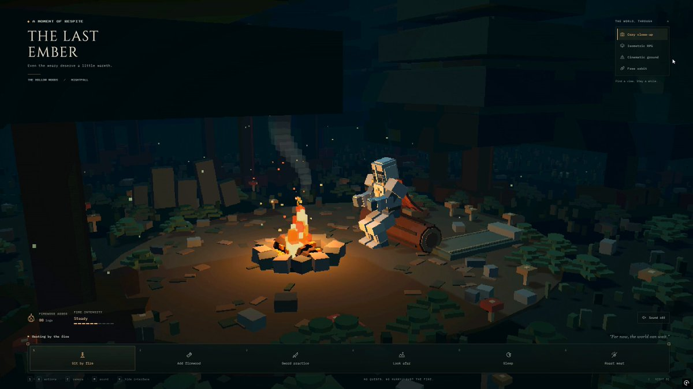</a>

Escena interactiva de un campamento nocturno en un bosque de estilo voxel creada con Three.js, con un caballero construido de forma procedural, una hoguera, acciones seleccionables del caballero, cámaras predefinidas, HUD retro y audio ambiental sintetizado. El autor de la publicación afirma que proporcionó este prompt y una imagen a GPT-6 Astra.

**Prompt**

```text
Eres un desarrollador sénior de WebGL y Three.js especializado en experiencias web creativas. Tu tarea es crear una escena 3D interactiva completa y lista para producción, contenida íntegramente en un único archivo HTML independiente (index.html), usando Three.js + webgl

### 1. Tema visual y dirección artística

- Atmósfera: Bosque profundo en plena noche, una acogedora hoguera resplandeciente y un caballero solitario y agotado descansando en el campamento (estética de la hoguera de Dark Souls / RPG retro clásico).
- Estética: Arte de píxeles 3D / voxel / low-poly.
- Sombreado y posprocesado: Integra el posprocesado de Three.js (RenderPixelatedPass o un efecto equivalente de pixelado y tramado a baja resolución) para lograr un aspecto retro auténtico de 16/32 bits.

### 2. Geometría y recursos de la escena (100 % procedural; sin archivos .gltf/.obj externos)

Todos los recursos deben construirse de forma procedural usando primitivas geométricas de Three.js (BoxGeometry, CylinderGeometry, etc.) y materiales básicos, para que el archivo se ejecute localmente sin problemas de CORS.

1. Entorno del bosque:

   - Terreno: Terreno oscuro estilizado con piedras voxel, setas y vegetación low-poly generadas proceduralmente.
   - Árboles: Pinos/abetos procedurales o árboles de copas cúbicas alrededor del claro para crear profundidad y aislamiento.
   - Cielo e iluminación: Cielo de medianoche profundo, con estrellas voxel parpadeantes y una DirectionalLight de luz lunar fría que proyecte sombras suaves.
   - Profundidad: THREE.FogExp2 con un color atmosférico oscuro para integrar el horizonte.

2. Hoguera:

   - Círculo de piedras alrededor de troncos humeantes y brasas generadas proceduralmente.
   - Sistema de fuego: Partículas pixeladas animadas (Points o mallas voxel pulsantes) que asciendan.
   - Iluminación dinámica: PointLight naranja rojiza y cálida con una lógica de parpadeo continua y natural (mediante Math.sin, ruido o variaciones pseudoaleatorias).

3. El caballero:

   - Grafo de escena jerárquico (grupos para la cabeza, el torso, la parte superior e inferior de los brazos, las piernas, la capa y la espada) construido con primitivas voxelizadas.
   - Detalles visuales: Casco con visera ranurada, armadura pectoral, hombreras, guanteletes y vaina/espada.
   - Los puntos de pivote deben estar correctamente alineados en las articulaciones (hombros, codos, caderas y rodillas) para lograr animaciones de rotación procedurales limpias.

### 3. Máquina de estados interactiva del caballero

Implementa animaciones procedurales fluidas mediante interpolación lineal (lerp) o curvas trigonométricas dentro del bucle de renderizado para los siguientes estados seleccionables:

- Sentarse junto al fuego (reposo predeterminado): Se sienta con las piernas cruzadas o en cuclillas, realiza sutiles ciclos de respiración y se calienta las manos cerca de las llamas.
- Añadir leña: El caballero se levanta, recoge un tronco y lo lanza al fuego. La hoguera se aviva visiblemente, aumenta temporalmente el radio de su luz y emite una ráfaga de chispas.
- Practicar con la espada: Se pone de pie, desenvaina la espada, ejecuta una rutina limpia de ataque/parada en 3 partes y vuelve a una guardia de combate.
- Mirar a lo lejos: Camina hasta el borde del claro, clava la espada en el suelo y contempla la oscuridad mientras la capa ondea.
- Dormir: Se tumba en un saco de dormir junto al fuego; partículas pixeladas animadas con forma de "Z z z" ascienden desde el casco.
- Asar carne: Sostiene un palo con comida sobre las llamas y emite sutiles partículas procedurales de humo/vapor.

### 4. Sistema de cámaras

Incluye cambios entre cámaras predefinidas con una transición suave mediante interpolación (lerp) de la posición y el objetivo:

- Primer plano acogedor: Plano medio centrado en el caballero y la luz de la hoguera.
- RPG isométrico: Vista táctica clásica del claro desde arriba, con un ángulo elevado de 45 grados.
- Plano cinematográfico a ras de suelo: Toma dramática desde un ángulo bajo, mirando hacia el caballero contra el cielo estrellado y las copas de los pinos.
- Órbita libre: Cambio fluido a OrbitControls estándar para inspeccionar la escena de forma interactiva.

### 5. Interfaz y audio

- Estilo de la interfaz: HUD retro de RPG de 8/16 bits, con paneles oscuros semitransparentes, bordes pixelados y una fuente de Google integrada (por ejemplo, 'Press Start 2P').
- Panel inferior: Botones de acción interactivos que activan cada estado del caballero.
- Panel superior derecho: Botones para cambiar el ángulo de la cámara.
- Contador de leña: Registra los troncos añadidos y la intensidad actual del fuego.
- Sonido (Web Audio API): Crepitar del fuego y brisa nocturna/sonidos de grillos ambientales sintetizados proceduralmente, con un botón para silenciar/activar el sonido.

### 6. Especificaciones técnicas

- Un único archivo index.html independiente y autocontenido.
- Usa módulos ES cargados mediante CDN (https://t.co/W8o3SZwkCj o unpkg).
- Estructura de código modular y bien comentada (initScene, buildEnvironment, buildKnight, buildCampfire, setupUI, setupAudio, animate).
- Control totalmente adaptable del cambio de tamaño de la ventana, actualizando la relación de aspecto de la cámara y la resolución del efecto de pixelado.
```

[Ver detalles ↗](https://www.tripo3d.ai/es/3d-prompts/gpt-6-astra-2100350159540596760) · [Publicación original](https://x.com/vib3coded/status/2100350602316558428) · [Volver a los ejemplos](#all-prompts)

---

<a id="2100519026720231698"></a>

### Añadir una cadena de mantenimiento a la barandilla

[きのした](https://x.com/ujiden_type0) · 2026-09-17

<a href="https://www.tripo3d.ai/es/3d-prompts/gpt-6-astra-2100519026720231698">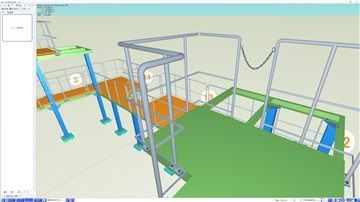</a>

Instrucciones para editar un modelo CAD y añadir una cadena de mantenimiento a la barandilla.

**Prompt**

```text
¡Añade una cadena de mantenimiento a la barandilla!
```

[Ver detalles ↗](https://www.tripo3d.ai/es/3d-prompts/gpt-6-astra-2100519026720231698) · [Publicación original](https://x.com/ujiden_type0/status/2100519026720231698) · [Volver a los ejemplos](#all-prompts)

---

<a id="2100526922770026874"></a>

### Crear un juego de carreras en 3D

[たい焼き｜Claude Codeの人](https://x.com/taiyaki_ai3) · 2026-09-17

<a href="https://www.tripo3d.ai/es/3d-prompts/gpt-6-astra-2100526922770026874">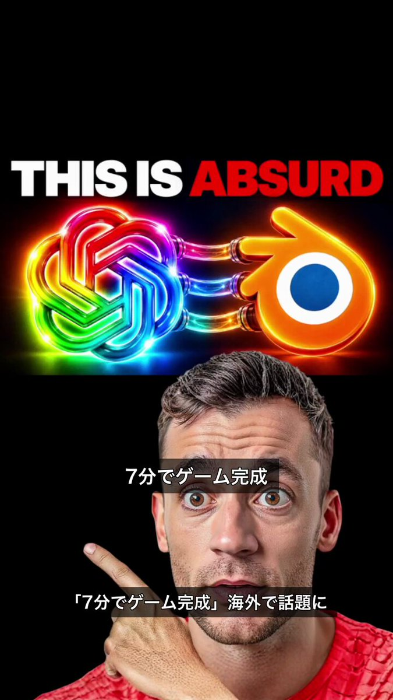</a>

Solicitud para crear un juego de carreras en 3D que se pueda controlar y jugar, según explica el autor de la publicación, quien la introdujo en una sola frase en GPT-6 Astra. La publicación lo presenta como una forma de generar un juego jugable sin usar Blender ni código.

**Prompt**

```text
Crea un juego de carreras
```

[Ver detalles ↗](https://www.tripo3d.ai/es/3d-prompts/gpt-6-astra-2100526922770026874) · [Publicación original](https://x.com/taiyaki_ai3/status/2100526934082105683) · [Volver a los ejemplos](#all-prompts)

---

<a id="2100595652703199281"></a>

### Juego 3D de escape de un centro de investigación cerrado

[forest.watch.impress.co.jp](https://forest.watch.impress.co.jp/) · 2026-09-17

<a href="https://www.tripo3d.ai/es/3d-prompts/gpt-6-astra-2100595652703199281">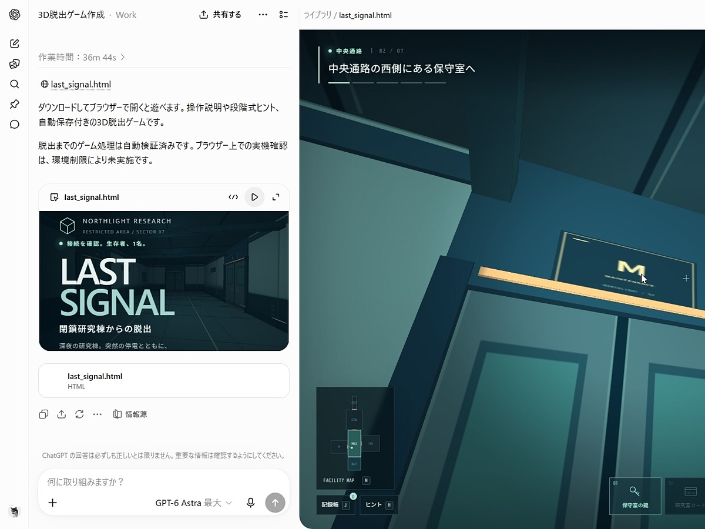</a>

Prompt para crear un juego 3D de escape para navegador ambientado en un centro de investigación cerrado, que indica que el autor del artículo enlazado, Tomonobu Yanagiya, se lo encargó a GPT-6 Astra. Especifica una experiencia de 5 a 10 minutos, con mecanismos como llaves e interruptores, instrucciones claras, un estado que permita completar el juego hasta el final y distribución en un único archivo HTML.

**Prompt**

```text
Crea un juego 3D de escape que se pueda jugar en el navegador. El objetivo debe ser escapar de un centro de investigación cerrado y la experiencia debe durar aproximadamente entre 5 y 10 minutos. Incluye mecanismos como llaves e interruptores, asegúrate de que las instrucciones sean claras y de que el juego se pueda completar hasta el final. Reúne todo en un único archivo HTML para que se pueda jugar simplemente abriéndolo en el navegador.
```

[Ver detalles ↗](https://www.tripo3d.ai/es/3d-prompts/gpt-6-astra-2100595652703199281) · [Publicación original](https://forest.watch.impress.co.jp/docs/serial/yaaiwatch/2141084.html) · [Volver a los ejemplos](#all-prompts)

---

<a id="2100614534423540102"></a>

### Diseñar un cuerpo propio en CAD

[vitalduval](https://x.com/vitalduval) · 2026-09-17

<a href="https://www.tripo3d.ai/es/3d-prompts/gpt-6-astra-2100614534423540102">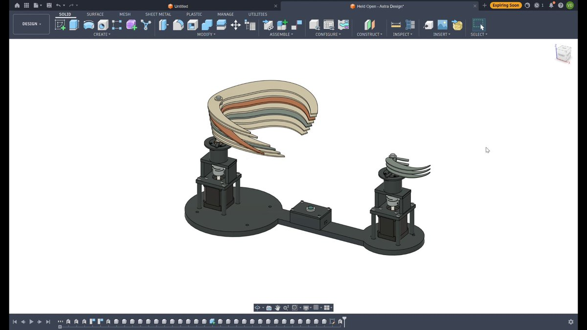</a>

Un tuit enlazado de vitalduval recoge esta petición a Astra para diseñar un cuerpo en CAD. AI Highlight vuelve a publicar la demostración resultante y se la atribuye a GPT-6 Astra.

**Prompt**

```text
Le pedí a Astra que se diseñara un cuerpo en CAD.
```

[Ver detalles ↗](https://www.tripo3d.ai/es/3d-prompts/gpt-6-astra-2100614534423540102) · [Publicación original](https://x.com/vitalduval/status/2100343136077877251) · [Volver a los ejemplos](#all-prompts)

---

<a id="2100636075039629796"></a>

### Monster Block — 45 segundos para destrozar la ciudad

[Tony](https://x.com/abc30037274) · 2026-09-18

<a href="https://www.tripo3d.ai/es/3d-prompts/monster-block">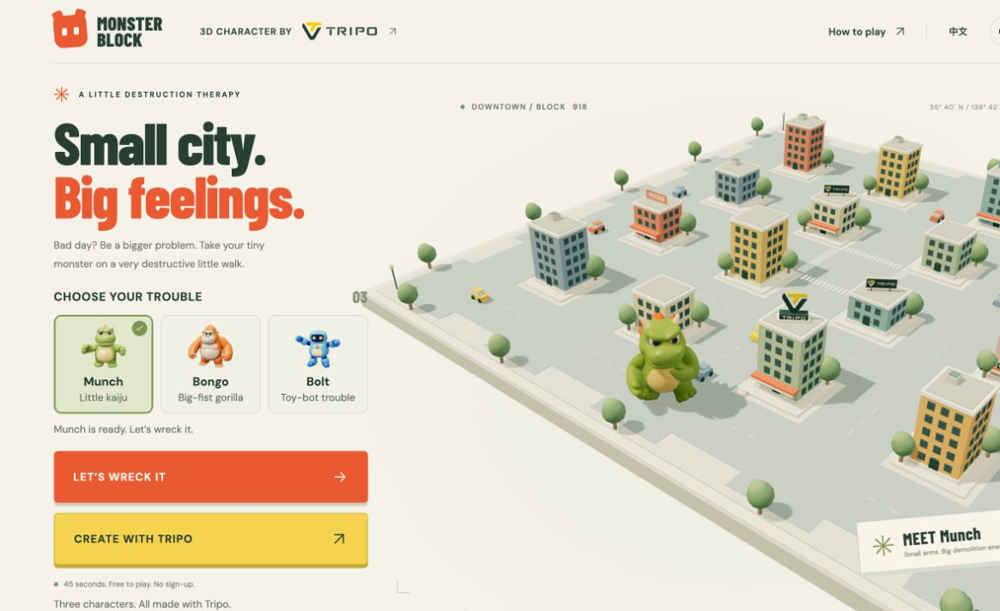</a>

<a href="https://www.tripo3d.ai/es/3d-prompts/monster-block">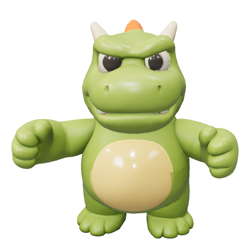</a>

<a href="https://www.tripo3d.ai/es/3d-prompts/monster-block">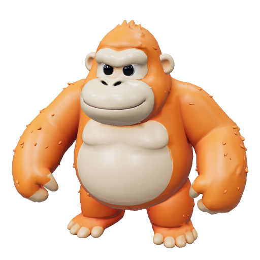</a>

<a href="https://www.tripo3d.ai/es/3d-prompts/monster-block">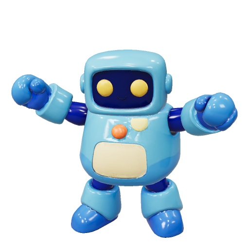</a>

Elige a Munch, el pequeño kaiju; a Bongo, el gorila; o a Bolt, el robot. Destroza edificios, lanza coches y encadena combos en una alocada destrucción urbana en 3D de 45 segundos. Los tres personajes animados se crearon con Tripo.

**Prompt**

```text
# Monster Block — especificación de reconstrucción

## 1. Objetivo del proyecto

Crea un juego de navegador jugable llamado Monster Block. Permite que el jugador elija un monstruo de juguete, entre en una ciudad en miniatura y destruya tantos edificios como sea posible en 45 segundos. Moverse, golpear edificios con las garras, lanzar coches y encadenar demoliciones debe producir una respuesta inmediata. Termina con una puntuación, un título, una acción para volver a intentarlo y un enlace de desafío que permita a un amigo jugar en el mismo bloque. Ofrece interfaces en inglés y chino simplificado, además de controles de teclado y táctiles.

## 2. Estilo visual

Crea un diorama cálido de sobremesa sobre una plataforma cuadrada gruesa, con un fondo color crema. Usa edificios pastel de poco detalle, ventanas pequeñas de color verde azulado oscuro, cornisas de tejado claras, carreteras anchas en tonos verde grisáceo apagado, pasos de cebra, árboles redondeados, coches diminutos y sombras suaves y cálidas. La paleta de los edificios incluye terracota, mostaza, verde azulado empolvado, rosa, azul grisáceo, crema y verde salvia. Los materiales deben parecer juguetes pintados en mate, no metal brillante.

Usa una cámara en perspectiva elevada de tres cuartos, no una cámara cenital plana. La cámara de referencia parte de (35, 37, 41), mira hacia (0, 0.4, 0) y utiliza un campo de visión de 38 grados en pantallas anchas, 44 grados en pantallas intermedias y 51 grados en pantallas estrechas. Durante la partida, sigue al monstruo con suavidad y mantén visibles los objetivos cercanos. Ilumina la escena con una luz hemisférica cálida, una luz direccional suave que proyecte sombras y una luz de relleno fría.

Usa una tipografía de display condensada y en negrita para los encabezados grandes en inglés, y una sans serif legible para las instrucciones. Combina texto verde oscuro, superficies color crema, acciones de juego naranjas y acciones de creación de Tripo amarillas. En la página de inicio, da la misma importancia a Jugar y Crear con Tripo. En el diálogo de pausa, coloca una tarjeta de Tripo verde oscuro con tres miniaturas de personajes y un botón de creación amarillo encima del botón Reanudar con contorno. Mantén el texto de ayuda cómodamente legible en teléfonos.

Usa efectos breves activados por las acciones: barridos de garras, retroceso momentáneo de los edificios, impactos diferenciados para golpes y demoliciones, anillos de pisotón expansivos, pequeñas ráfagas de escombros, avisos emergentes de puntuación, cambios de combo y un leve desplazamiento direccional de la cámara. Eleva el coche agarrado hasta la mano en unos 220 ms. Respeta las preferencias de movimiento reducido eliminando las sacudidas, las ráfagas de escombros y el escalado de la interfaz, pero conserva las puntuaciones, las indicaciones de objetivos y los resultados de destrucción.

## 3. Mundo y escena

Coloca 16 edificios destruibles en una cuadrícula de 4 × 4. Usa una separación entre bloques de 10.4, con los centros de los bloques en -1.5, -0.5, 0.5 y 1.5 veces esa separación, y cinco avenidas a lo largo de cada eje. La plataforma mide 52.6 unidades de ancho. Los edificios tienen entre dos y cinco plantas, plantas de distintas formas, detalles en los tejados, toldos ocasionales y pequeños letreros de HOTEL o NOODS. Genera la distribución de forma determinista a partir de una semilla.

Coloca 12 coches en las carreteras y un coche amarillo garantizado que se pueda lanzar cerca de la posición inicial de juego. Incluye árboles alrededor de las parcelas de edificios y los bordes de la plataforma, cuatro farolas en las esquinas, marcas de carril y un cruce central. Sitúa al monstruo al inicio en una avenida despejada, en (0, 0.2, 10.4); usa una posición de reposo en primer plano en z=20.8 para la página de inicio.

El mismo parámetro de bloque debe reproducir la misma distribución de edificios. Si falta, deriva la semilla del bloque a partir de la fecha UTC. Un parámetro beat proporciona la puntuación objetivo de un amigo. Conserva el bloque seleccionado al volver a intentarlo. Los escombros aleatorios no tienen que ser deterministas.

## 4. Inventario de recursos

Mantén identificadores de recursos estables y separa los modelos visuales de los proxies de colisión del juego.

- munch: Munch / 阿猛, el dinosaurio verde predeterminado. Conserva el hocico redondeado original, el vientre y los cuernos color crema, las púas naranjas del lomo, los brazos cortos, los pies grandes y la cola larga. Carga /assets/monster-animated.glb y normaliza su altura a 5.6 unidades. Conserva /assets/monster.glb como alternativa estática.
- bongo: Bongo / 橘拳, un gorila de juguete naranja, de cuerpo ancho y con puños enormes. Carga /assets/bongo-animated.glb y normaliza su altura a 4.5 unidades.
- bolt: Bolt / 蓝电, un robot de juguete azul con extremidades robustas y una silueta simpática. Carga /assets/bolt-animated.glb y normaliza su altura a 4.9 unidades.
- Cada personaje tiene un PNG de vista previa correspondiente y clips de reposo, carrera y ataque con garras. Conserva los tres personajes seleccionables reales; al cambiar de personaje deben actualizarse tanto la vista previa como el modelo que se usará en la siguiente ronda.
- city_building: grupos de edificios procedurales reutilizables, con salud, límites del colisionador, retroceso al recibir impactos y estado de demolición registrados por separado. Las cornisas de los tejados, las bases y los toldos forman parte del volumen de colisión.
- city_car: coches procedurales reutilizables que se pueden lanzar. Mantén separados los estados agarrado, en el aire y destruido. Tres coches llevan la marca Tripo amarilla.
- city_decor: árboles, farolas, aceras, letreros y pintura vial procedurales. Mantén estos elementos ligeros y reutiliza la geometría y los materiales.
- tripo_scenery: una escultura del logotipo en un tejado, dos letreros de tejado, un escaparate de taller y tres coches con marca. Constrúyelos a partir del logotipo de Tripo proporcionado y de mallas procedurales. Son decoraciones de la escena, no modelos adicionales generados mediante API ni potenciadores del juego.

Los tres modelos de personajes son los recursos prioritarios de Tripo. Reutiliza los GLB generados y riggeados proporcionados cuando estén disponibles. Para crear un personaje nuevo, genera un modelo de estilo juguete que encaje, comprueba que sea adecuado para el rigging, vincúlalo, crea animaciones de reposo, carrera y ataque con garras, y valida sus proporciones antes de añadirlo al elenco. No llames a las API de generación cuando el jugador inicie una ronda. Las cargas de personajes y la importación automática de creaciones propias del jugador quedan fuera de esta versión.

## 5. Jugabilidad y respuesta

Admite las teclas WASD o las flechas para moverse, la barra espaciadora mantenida para repetir ataques con garras, E para agarrar un coche cercano y E de nuevo para lanzarlo, R para pisotear y Escape para pausar. Proporciona un joystick virtual y botones independientes de ataque, agarrar/lanzar y pisotón en pantallas táctiles. Borra las entradas mantenidas al pausar o perder el foco.

Usa estas reglas:

- Una ronda dura 45 segundos. La salud de cada edificio es igual al número de plantas más uno, lo que da entre 3 y 6 puntos de salud.
- Un golpe de garra inflige 1 punto de daño, con un intervalo de ataque de 0.42 segundos.
- Un pisotón inflige 3 puntos de daño a cada edificio que esté dentro del alcance y tiene un tiempo de reutilización de 7 segundos.
- Un coche lanzado inflige 4 puntos de daño a los edificios de su zona de impacto y otorga 75 puntos base por el impacto del lanzamiento.
- Golpear un edificio otorga 20 veces el multiplicador actual. Una demolición añade round(180 + altura del edificio × 50) multiplicado por el multiplicador, después de incrementar el combo de demoliciones.
- Demoler otro edificio en un plazo de 3.5 segundos mantiene el combo. Los golpes normales no amplían este intervalo. El multiplicador es min(5, 1 + floor(combo / 2)).
- Destruir los 16 edificios termina la ronda y otorga ceil(segundos restantes) × 100. De lo contrario, la ronda termina cuando el tiempo llega a cero y se impide seguir sumando puntos.

No hay enemigos, combates contra jefes, salud del jugador ni penalizaciones por muerte. El desafío consiste en elegir las rutas, usar coches y pisotones con eficacia y mantener un combo de demoliciones. Muestra el tiempo restante, la puntuación, los edificios destruidos, el multiplicador y el tiempo de reutilización del pisotón. Haz comprensibles las acciones no disponibles sin bloquear el movimiento. Distingue un golpe al aire de un impacto acertado mediante respuestas sonoras y visuales.

Resuelve el movimiento y la rotación contra la huella animada muestreada de cada personaje, incluidos los brazos y la cola. Comprueba las colisiones con los límites completos de los edificios, dejando una pequeña holgura. El monstruo debe poder atacar desde una posición legal de pie. Permite atravesar una parcela después de demoler su edificio. Evita atrapar al jugador en las esquinas o hacer que un giro barra la cola a través de un edificio intacto.

Pausa el temporizador y las entradas al pulsar Escape o el botón de pausa, cuando la ventana pierda el foco y cuando las pestañas estén ocultas. Proporciona flujos de Reanudar, Volver a intentar e Inicio. Termina mostrando la puntuación, el número de demoliciones, el mejor combo, un título divertido y un enlace de desafío en el mismo mapa. Ofrece una tarjeta de puntuación descargable de 1080 × 1350 y, cuando MediaRecorder sea compatible, una grabación de la ronda en un formato MP4 o WebM compatible. Usa el uso compartido nativo cuando esté disponible y un recurso alternativo basado en el portapapeles para los enlaces de desafío. No presentes nunca una puntuación calculada por el navegador como una clasificación competitiva segura.

## 6. Implementación técnica

Usa Three.js, TypeScript y Vite con una compilación estática de dist. Mantén la generación del mundo, las reglas, las colisiones, los personajes, el renderizado, el audio, la grabación, la analítica y la interfaz en módulos separados. Incluye localmente las fuentes y los recursos de decodificación necesarios. Usa instanciación para las ventanas y las marcas viales repetidas, y reutiliza materiales y geometría. Limita la proporción de píxeles de renderizado a 1.65. Limita los efectos temporales y libera sus recursos al completarse o reiniciarse.

Usa GLTFLoader, mezcladores de animación esquelética y los clips GLB proporcionados. Normaliza cada modelo alrededor de un pivote de suelo centrado. Las exportaciones de referencia miran hacia +X; gira el pivote visual -90 grados alrededor de Y para alinearlo con la dirección de avance +Z del juego. Evalúa la animación de reposo antes de mostrar el modelo cargado y mantén los pies animados cerca del suelo. Usa una alternativa procedural visible si falla la carga y comunica el fallo con honestidad. Protege la selección asíncrona de personajes para que una carga anterior no pueda reemplazar la selección más reciente.

Mantén los datos de colisión de los personajes independientes de las mallas de renderizado y vuelve a hornear las huellas muestreadas al cambiar de personaje o de animaciones. Prueba tanto la traslación como la rotación cerca de las paredes. Conserva entradas estables de teclado y táctiles, diálogos adaptables, textos localizados, comportamiento del foco, controles de audio silenciado, movimiento reducido y recuperación de WebGL.

Vincula las acciones de creación de Tripo a https://www.tripo3d.ai/ con utm_source=monster_block, utm_medium=referral, utm_campaign=monster_block_game y un utm_content específico según la ubicación: header_logo, hero_create, pause_create, result_create o footer_logo. Abre estas acciones en una pestaña independiente y pausa primero la partida activa. Explica que Tripo crea recursos 3D; no prometas la importación automática en este juego.

Conserva la integración existente de eventos de Pageview y PostHog cuando la política del sitio anfitrión lo permita. Usa únicamente configuración pública de ingesta en el navegador dentro de la compilación estática. Mantén las credenciales de generación, CMS, despliegue y analítica personal fuera del código fuente y de los artefactos de compilación. Registra la entrada a la página, la selección de personaje, el inicio de la partida, las primeras acciones, los resultados de la ronda, los reintentos, el uso compartido o la exportación y los clics salientes a Tripo, sin tratar los clics como registros o pagos verificados.

## 7. Criterios de finalización

Entrega el código fuente ejecutable, los recursos locales, una compilación estática de producción y unas instrucciones claras de instalación, inicio y compilación. Verifica las tres selecciones de personaje, una ronda completa con límite de tiempo, la destrucción de edificios, agarrar y lanzar, el tiempo de reutilización del pisotón, la caducidad del combo, pausar/reanudar, volver a intentarlo y la puntuación al final de la ronda. Comprueba que el dinosaurio original siga siendo seleccionable y que los tres personajes puedan moverse y girar cerca de los edificios sin atravesarlos visiblemente ni quedarse atascados.

Comprueba las interfaces en inglés y chino en anchos de escritorio y de móvil estrecho, incluido el texto de ayuda legible, los controles táctiles, las acciones de pausa y el uso compartido de resultados. Verifica los destinos de las llamadas a la acción de Tripo y los valores UTM según su ubicación, la exportación de la tarjeta de puntuación y el comportamiento alternativo de la grabación. Prueba la página desplegada y su entorno real de iframe del CMS para comprobar la carga de modelos, las entradas, los enlaces externos y las descargas. Informa de las limitaciones del navegador o del dispositivo en lugar de afirmar una compatibilidad universal o una velocidad de fotogramas estable medida sin pruebas.

```

[Ver detalles ↗](https://www.tripo3d.ai/es/3d-prompts/monster-block) · [Publicación original](https://x.com/abc30037274/status/2100636075039629796) · [Demo en línea](https://monster-block.tripo.page/) · [Volver a los ejemplos](#all-prompts)

---

<a id="2100751369619820923"></a>

### Entrenar una estrategia para hacer girar un bolígrafo con la mano diestra Sharpa

[AI Will](https://x.com/FinanceYF5) · 2026-09-18

<a href="https://www.tripo3d.ai/es/3d-prompts/gpt-6-astra-2100751369619820923">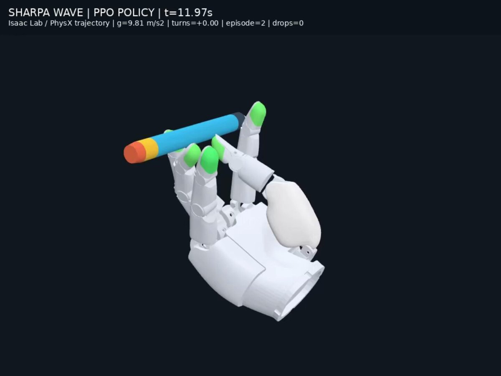</a>

El autor afirma que este prompt en chino se proporcionó a GPT-6 Astra para entrenar mediante aprendizaje por refuerzo una mano diestra Sharpa en Isaac Lab, crear por cuenta propia la malla 3D de un bolígrafo y entregar la estrategia entrenada junto con un vídeo de visualización.

**Prompt**

```text
Haz que la mano diestra haga girar un bolígrafo. Utiliza Isaac Lab para el aprendizaje por refuerzo con la Sharpa hand y crea por cuenta propia la malla 3D del bolígrafo. Entrega como resultado la estrategia entrenada y un vídeo de visualización. Puedes buscar libremente en Internet y descargar los artículos y materiales necesarios.
```

[Ver detalles ↗](https://www.tripo3d.ai/es/3d-prompts/gpt-6-astra-2100751369619820923) · [Publicación original](https://x.com/FinanceYF5/status/2100751369619820923) · [Volver a los ejemplos](#all-prompts)

---

<a id="2100838090210431302"></a>

### Juego de tranvía aéreo en 3D entre islas flotantes

[YouWare](https://x.com/YouWareAI) · 2026-09-18

<a href="https://www.tripo3d.ai/es/3d-prompts/gpt-6-astra-2100838090210431302">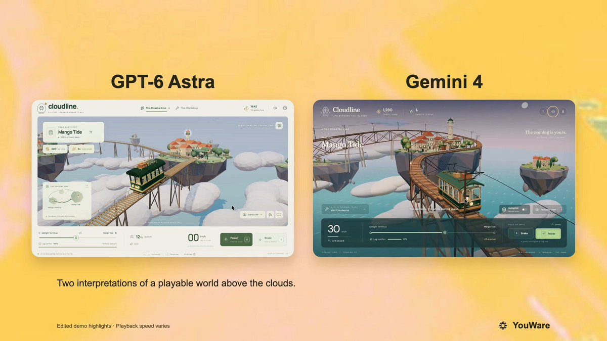</a>

Un comentario del autor verificado comparte el prompt completo que, según la publicación original, se ejecutó con GPT-6 y Gemini 4. Solicita un juego de tranvía jugable en el navegador, desarrollado con Three.js, ambientado en islas flotantes de estilo mediterráneo, con controles de conducción, puntuación basada en la comodidad de los pasajeros, estaciones, mejoras y compatibilidad con móviles.

**Prompt**

```text
Crea un juego 3D en HTML/JS de un solo archivo (Three.js) que se pueda jugar directamente en el navegador, con un estilo de juego indie cálido, low-poly y cuidado, que evoque la atmósfera de un pueblo costero de Ghibli combinada con la fluidez de las vías de vagoneta de mina de Zelda.
【Jugabilidad principal】  El jugador conduce un tranvía aéreo retro que viaja entre islas flotantes sobre un mar de nubes y la superficie del océano.  - La vía es una línea ferroviaria 3D continua con tramos rectos, pendientes ascendentes y descendentes, curvas elevadas y largos puentes sobre el mar  - Controles: W para acelerar (Potencia), S para frenar (Freno), izquierda y derecha para ajustar la conducción o cambiar la vista  - Información en tiempo real: velocidad en km/h, número de pasajeros a bordo (por ejemplo, 12/16 a bordo), condiciones de la vía (Estable / Viento cruzado)  - Sistema de comodidad de los pasajeros: las aceleraciones repentinas, los frenazos bruscos, tomar las curvas demasiado rápido y los vientos cruzados reducen la «comodidad de las piernas»; llegar al destino con suavidad otorga puntos de bonificación (por ejemplo, +75 al llegar)  - Racha: conducir de forma demasiado brusca activa el mensaje «Se acabó la racha. Encuentra el equilibrio para volver a acumular propinas».  - Llega a la estación y abre las puertas para que los pasajeros suban y bajen. En el andén, habrá habitantes haciendo cola, con subtítulos como «Puertas abriéndose - Mango Tide» y «Espera, por favor…»     [Mundo y estaciones]  Incluye al menos dos rutas o dos islas:  1. Terminal Saltlight  2. Mango Tide  La isla es rocosa y flota sobre las nubes, con pequeñas casas de estilo mediterráneo o del sur de Europa, tejados de tejas rojas, un faro, un muelle, árboles verdes, farolas y ventanas de luz cálida durante la noche. A lo lejos se ven más islas flotantes y órbitas circulares. El cielo presenta un degradado azul violáceo, del atardecer a la noche, con estrellas y nubes densas; debajo se extiende un mar de aguas azul celeste.     [Exterior del tranvía]  Tranvía retro: carrocería verde oscuro, chasis de color madera, ventanas de cristal curvadas, equipaje en el techo, adornos de toldo o enredaderas verdes y varios pasajeros sentados en el interior. Mientras avanza, debe balancearse ligeramente y transmitir la sensación del traqueteo de las vías, mediante efectos de sonido sencillos o señales visuales.     [Escena 2: Modificación en el taller]  Cambia a la vista isométrica cenital del taller «Cloudworks / Oliver Cloudworks / isla natal de Oliver».  Los jugadores pueden cambiar piezas del tranvía mediante una interfaz similar a una ventana emergente de mejoras:  - Hojas del hogar — Retirando la pieza antigua  - Pequeño compañero — Preparando el tranvía  Barra de progreso + «Relájate y observa el taller».  Tras la modificación, cambia el aspecto del tranvía (por ejemplo, techo verde, portaequipajes añadido, faroles y enredaderas); después, sale del taller con los subtítulos «Todos a bordo» y «Próxima parada: la línea costera».     [Interfaz]  Interfaz limpia y moderna, propia de un juego casual: destino y moneda o racha en la esquina superior izquierda; barra de velocidad y botones de Potencia/Freno en la parte inferior; barra de progreso de comodidad que conecta los nombres de las dos estaciones. Sin elementos innecesarios; no lo conviertas en un juego de terror ni cyberpunk.     [Requisitos técnicos]  - Un solo archivo o el mínimo número de archivos posible, con Three.js  - Usa curvas para la vía (CatmullRom, etc.) para que el tranvía siga los raíles; la cámara debe seguirlo con una ligera sensación de ir sobre raíles  - Sensación de física sencilla: inercia al acelerar, desaceleración al frenar y balanceo de la carrocería al tomar curvas  - En móviles, intenta admitir también toques para acelerar o frenar  - Código legible, con comentarios, y jugable en cuanto se abra.
```

[Ver detalles ↗](https://www.tripo3d.ai/es/3d-prompts/gpt-6-astra-2100838090210431302) · [Publicación original](https://x.com/YouWareAI/status/2100838828433179037) · [Volver a los ejemplos](#all-prompts)

---

<a id="2100844566718926949"></a>

### Crea un mundo 3D fotorrealista

[Julian Goldie SEO](https://x.com/JulianGoldieSEO) · 2026-09-18

<a href="https://www.tripo3d.ai/es/3d-prompts/gpt-6-astra-2100844566718926949">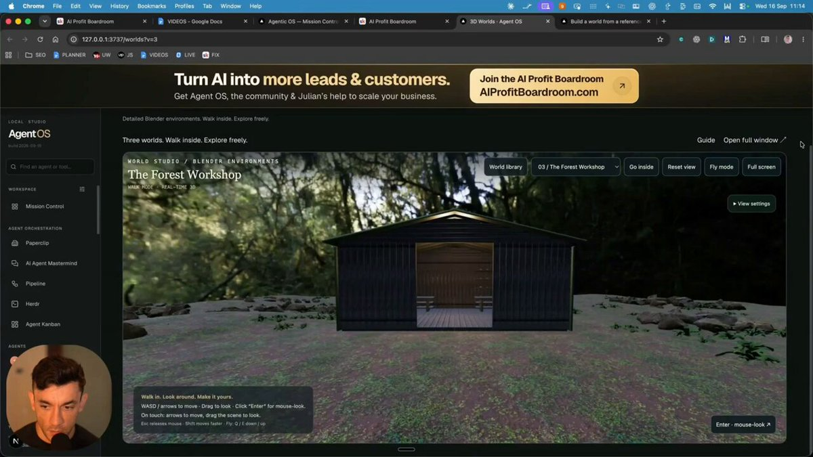</a>

Una solicitud sugerida de un solo prompt en la publicación principal para crear un mundo 3D fotorrealista y explorable. La publicación lo presenta como parte de un flujo de trabajo con Blender MCP; no establece que este prompt exacto se haya utilizado como entrada para la demostración adjunta.

**Prompt**

```text
Crea un mundo 3D fotorrealista. Sorpréndeme.
```

[Ver detalles ↗](https://www.tripo3d.ai/es/3d-prompts/gpt-6-astra-2100844566718926949) · [Publicación original](https://x.com/JulianGoldieSEO/status/2100844566718926949) · [Volver a los ejemplos](#all-prompts)

---

<a id="2100956517633761447"></a>

### Modelo interactivo de reloj IWC Schaffhausen

[YouWare](https://x.com/YouWareAI) · 2026-09-18

<a href="https://www.tripo3d.ai/es/3d-prompts/gpt-6-astra-2100956517633761447">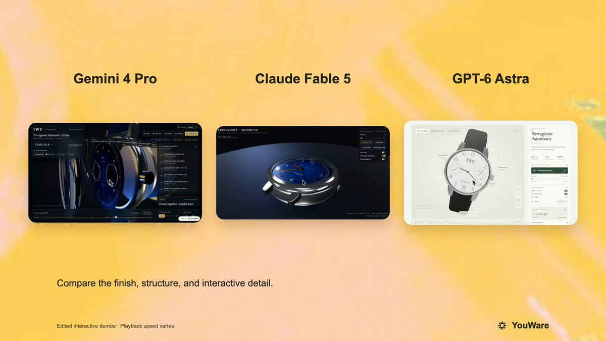</a>

Un comentario de autor verificado incluye un prompt para un modelo 3D interactivo de un reloj IWC Schaffhausen en Three.js, con un nivel de detalle muy alto. Especifica componentes mecánicos distinguibles individualmente, cristal de zafiro realista, movimiento de las agujas en tiempo real y una interacción de desmontaje y montaje mediante vista explosionada. La publicación principal lo presenta como el prompt compartido en una comparación en la que participan GPT-6 Astra y otros modelos.

**Prompt**

```text
Usa Three.js para desarrollar un modelo 3D interactivo y altamente fiel de un reloj IWC Schaffhausen. Requisitos: 1) La estructura de la esfera debe ser extremadamente precisa, con cada componente mecánico representado de forma individual y claramente distinguible; 2) La esfera del reloj debe utilizar un material de cristal de zafiro con efectos realistas de transparencia, refracción y reflexión; 3) Las agujas de los minutos y los segundos deben indicar correctamente la hora según la lógica de un reloj en tiempo real, con una animación automática y continua del movimiento de las agujas; 4) El reloj debe admitir su desmontaje y montaje, de modo que cada pieza pueda separarse y visualizarse individualmente; 5) El nivel de detalle general debe ser extremadamente alto y aproximarse a la estructura y las proporciones de un reloj real, con texturas de materiales realistas para los tornillos, las piezas metálicas y otros componentes, además de un acabado artesanal minucioso. Asegúrate de que el modelo funcione con fluidez en el navegador y ofrezca una interacción natural.
```

[Ver detalles ↗](https://www.tripo3d.ai/es/3d-prompts/gpt-6-astra-2100956517633761447) · [Publicación original](https://x.com/YouWareAI/status/2100958838350643553) · [Volver a los ejemplos](#all-prompts)

---

<a id="2101055500599054437"></a>

### Galaxia basada en física orbital real

[Argona](https://x.com/Argona0x) · 2026-09-18

<a href="https://www.tripo3d.ai/es/3d-prompts/gpt-6-astra-2101055500599054437">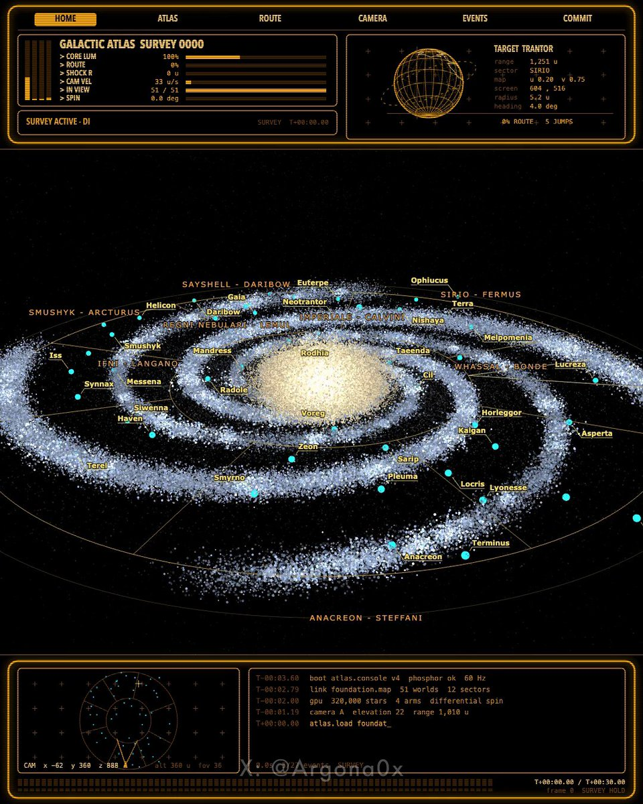</a>

El autor presenta este prompt de una sola frase para GPT-6 Astra como entrada para una simulación determinista de una galaxia y un vuelo de 30 segundos a través de ella. Solicita física orbital real y 320.000 estrellas.

**Prompt**

```text
una galaxia basada en física orbital real, 320.000 estrellas, un vuelo a través de ella, 30 segundos
```

[Ver detalles ↗](https://www.tripo3d.ai/es/3d-prompts/gpt-6-astra-2101055500599054437) · [Publicación original](https://x.com/Argona0x/status/2101055500599054437) · [Volver a los ejemplos](#all-prompts)

---

<a id="2101224659861590399"></a>

### Entorno 3D fotorrealista completo

[Julian Goldie SEO](https://x.com/JulianGoldieSEO) · 2026-09-19

<a href="https://www.tripo3d.ai/es/3d-prompts/gpt-6-astra-2101224659861590399"></a>

Crea un entorno 3D fotorrealista completo con un concepto abierto.

**Prompt**

```text
Crea un entorno 3D fotorrealista completo. Sorpréndeme.
```

[Ver detalles ↗](https://www.tripo3d.ai/es/3d-prompts/gpt-6-astra-2101224659861590399) · [Publicación original](https://x.com/JulianGoldieSEO/status/2101224659861590399) · [Volver a los ejemplos](#all-prompts)

---

<a id="2101271938706685991"></a>

### Visualización interactiva en 3D de un motor de aeronave

[YouWare](https://x.com/YouWareAI) · 2026-09-19

<a href="https://www.tripo3d.ai/es/3d-prompts/gpt-6-astra-2101271938706685991">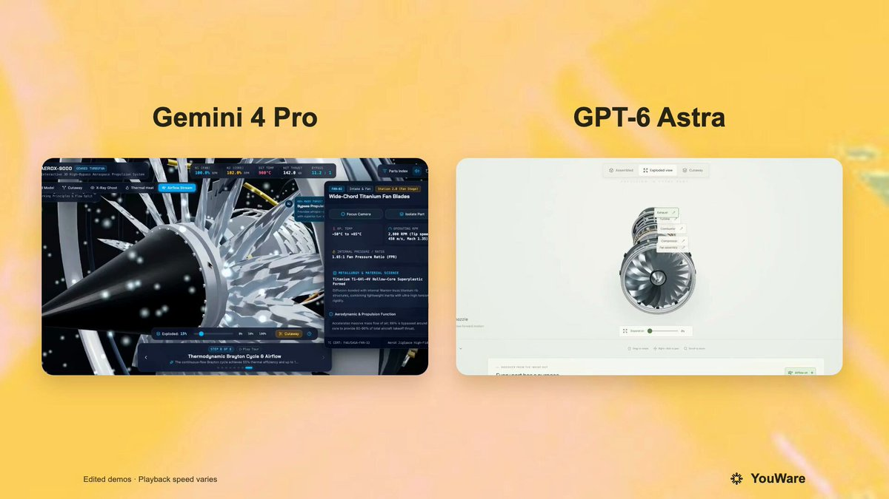</a>

Un prompt reutilizable publicado por YouWare para crear una visualización web interactiva y de alta fidelidad de un motor de aeronave en 3D. Solicita un modelo detallado del motor con interacciones de desmontaje y vista explosionada, información sobre las piezas activada al hacer clic o pasar el cursor, y controles de cámara fluidos. La publicación original indica que el mismo prompt se ejecutó con GPT-6 Astra y Gemini 4 Pro.

**Prompt**

```text
Usa three.js para crear en una página web una visualización interactiva en 3D de un motor de aeronave.
Consulta la filosofía de diseño de interacción de Jigspace para lograr un modelo realista con una restauración de alta fidelidad casi 1:1, conservando por completo los detalles de los materiales y las texturas, como el metal, las tuberías y las palas. Las funciones interactivas deben incluir: una animación de desmontaje paso a paso, una vista explosionada de los componentes y descripciones de las piezas y explicaciones de su funcionamiento activadas al hacer clic o pasar el cursor.
En general, debe admitir un control fluido de la cámara y una interacción persona-ordenador intuitiva, para garantizar una experiencia web fluida que muestre por completo la estructura y los principios de funcionamiento del motor.
```

[Ver detalles ↗](https://www.tripo3d.ai/es/3d-prompts/gpt-6-astra-2101271938706685991) · [Publicación original](https://x.com/YouWareAI/status/2101272224435253432) · [Volver a los ejemplos](#all-prompts)

---

<a id="2101310374033428642"></a>

### Flujo de trabajo de animación 3D y vídeo de un gato experto en artes marciales

[PixVerse](https://x.com/PixVerse) · 2026-09-19

<a href="https://www.tripo3d.ai/es/3d-prompts/gpt-6-astra-2101310374033428642">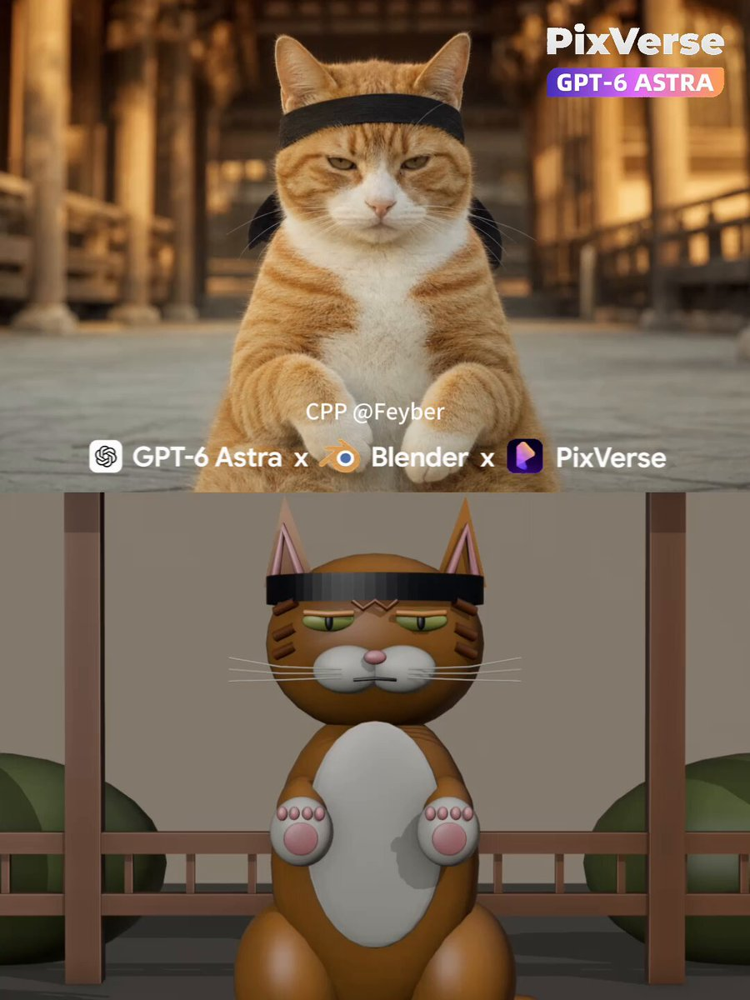</a>

El comentario verificado de PixVerse presenta esto como un prompt utilizado en Hermes Agent. La publicación original acredita al creador de PixVerse @woleswoosh por la demostración del gato experto en kung-fu y afirma que se creó con GPT-6 Astra + Blender. El prompt indica a un agente que construya mallas y animación ligeras en Blender para un gato atigrado rígido y estoico que bloquea manos que se abalanzan sobre él en el patio de un templo japonés, renderice un MP4 de referencia de movimiento de 10 segundos y, después, genere un vídeo fotorrealista en 1080p con PixVerse CLI y Seedance 2.5.

**Prompt**

```text
Toma única cinematográfica fotorrealista, 10 segundos, 16:9, 24 fps, cámara fija, sin cortes.
Un gato atigrado naranja y blanco (hocico, pecho y patas blancos; rayas atigradas naranjas con una «M» en la frente) está sentado erguido, justo en el centro, mirando al objetivo con una postura rígida de artes marciales: mirada plana, estoica e impasible, ojos entrecerrados, boca cerrada y cabeza completamente inmóvil. Lleva una cinta hachimaki negra atada baja sobre las cejas, con el nudo en la parte posterior y las orejas sobresaliendo por encima de la cinta.
Escenario: patio de un templo japonés tradicional — pilares, aleros y barandillas de madera cálida — fundido en un bokeh cremoso de hora dorada. Objetivo de 85 mm, f/1.8, profundidad de campo extremadamente reducida y enfoque bloqueado en los ojos del gato. Gradación cálida de 3500 K, luz principal suave desde la parte frontal derecha, sombras ligeramente rellenadas y grano fino de película.
ACCIÓN: un brazo humano desnudo entra desde el lado izquierdo del encuadre, con la palma abierta lanzándose rápidamente hacia la cara del gato y un fuerte desenfoque de movimiento; el gato levanta tranquilamente la pata delantera derecha y desvía el ataque, intercepta la palma y anula el impulso del golpe: bloquea, no da una palmada. El brazo barre horizontalmente la cara del gato entre una estela borrosa; después, una segunda mano baja en un golpe cortante desde la derecha. El gato desvía cada ataque con un bloqueo corto y mínimo de la pata, manteniendo el cuerpo y la cabeza completamente inmóviles, sin apartar los ojos del objetivo. Las manos son las agresoras; el gato se limita a reaccionar, imperturbable. Las manos amagan entrando y saliendo por ambos lados; el gato adopta una guardia de boxeo con las dos patas a la altura del pecho, las patas curvadas y los codos pegados al cuerpo, y la mantiene mientras espera. Lanza rápidamente contraataques individuales con una pata borrosa, al estilo kung-fu, interceptando las manos que se aproximan en el aire, con la cabeza aún fija hacia delante. Finalmente, dirige la pata derecha directamente hacia el objetivo, con la almohadilla rosada mirando a cámara, hasta que la pata llena el encuadre como una forma suave desenfocada en primer plano; el rostro permanece perfectamente nítido detrás, con la mirada fría intacta.
Movimiento: velocidad natural y desenfoque de movimiento real en las manos que vuelan y los bloqueos rápidos de las patas. Movimiento defensivo, mínimo y económico del gato: apenas se mueve; las manos hacen todo el trabajo y fracasan. Sin movimiento de cámara, sin zoom y sin texto.
NEGATIVO: extremidades adicionales, patas fusionadas o mutadas, dedos adicionales, rostro deformado, cinta de la cabeza fusionada con el pelaje, piel de plástico, color sobresaturado, texto, subtítulos, logotipo, marca de agua, cortes, trepidación de cámara, lenguaje corporal juguetón o celebratorio, gesto de chocar las patas.
VERSIÓN CORTA:
Gato atigrado naranja y blanco con una cinta hachimaki negra, sentado en el patio iluminado por el sol de un templo japonés, mirando a cámara con expresión impasible; objetivo de 85 mm, f/1.8, profundidad de campo reducida, hora dorada y grano de película. Manos humanas lanzan golpes cortantes y estocadas rápidas hacia su cara desde ambos lados, con desenfoque de movimiento; el gato desvía tranquilamente cada golpe con un bloqueo mínimo de la pata, sin mover nunca la cabeza. Adopta una guardia de kung-fu con las dos patas, lanza contraataques rápidos y borrosos y después dirige la pata hacia el objetivo hasta que la almohadilla llena el encuadre. Toma única con cámara fija, 10 s, 16:9, 24 fps, fotorrealista, sin texto.
Nota breve del fotograma: las manos entran principalmente desde la izquierda (golpe cortante descendente + barrido horizontal); el contacto ocurre en la muñeca o la palma, no de pata contra pata. La guardia con las dos patas aparece aproximadamente entre 4,0 y 5,6 s; el contraataque borroso, entre 5,6 y 8 s; y el remate de la pata hacia el objetivo, entre 8 y 10 s. tu trabajo es crear el 3D combinado con Blender MCP, producir una salida de 10 s a 24 fps y renderizarla como una escena superrealista con PixVerse CLI usando Seedance 2.5 como modelo de generación de vídeo
PASOS DEL AGENTE: Comprueba Blender MCP, la autenticación de PixVerse CLI, las capacidades de los modelos y los créditos disponibles. Comunica los costes estimados y obtén aprobación para gastar antes de realizar una generación de pago. Convierte el prompt en una hoja de tiempos por momentos, construye mallas y animación 3D ligeras mediante el Blender MCP oficial, renderiza un MP4 de referencia de movimiento e inspecciona el encuadre, el movimiento, los contactos, la duración y la velocidad de fotogramas. Genera e inspecciona una imagen de referencia de apariencia independiente antes de enviar el vídeo. Usa la imagen para guiar la identidad, el estilo y la iluminación, y el vídeo de Blender para guiar el movimiento y los tiempos. Después de la generación, descarga el resultado, verifica las especificaciones técnicas, inspecciona fotogramas clave, informa honestamente de las desviaciones y calcula el uso real de créditos. Conserva los originales; nunca cambies de modelo ni vuelvas a generar contenido sin indicarlo.
LLAMADA A PIXVERSE: Usa pixverse create image con gpt-image-2.0 para crear la referencia de apariencia en la relación de aspecto confirmada, a 1080p y con gran nivel de detalle. Después, usa pixverse create reference con el modelo de vídeo confirmado, pasando ambos --images and --videos to para combinar la imagen de apariencia con la referencia de movimiento de Blender. Para Seedance 2.5, usa --model seedance-2.5 --task-type auto, la duración y la relación de aspecto confirmadas, y --quality 1080p --count 1.. Verifica las capacidades actuales antes del envío, usa claves de idempotencia únicas y supervisa la finalización mediante pixverse task status / pixverse task wait.
SALIDA FINAL: Devuelve el vídeo terminado con la relación de aspecto y la duración confirmadas, con un objetivo de 1080p y 24 fps, además de la imagen de referencia de apariencia, el proyecto de Blender .blend y el MP4 de referencia de movimiento. Proporciona rutas locales absolutas o URL descargables. Mantén este formato en el informe final: Vídeo, Imagen de referencia, Malla + animación de Blender, Comprobación, Aspecto y Créditos utilizados. Indica la resolución real, la velocidad de fotogramas, el número de fotogramas, la duración, las desviaciones visuales, el coste de créditos de imagen y vídeo, el gasto total, el saldo restante y si se realizó alguna regeneración.
```

[Ver detalles ↗](https://www.tripo3d.ai/es/3d-prompts/gpt-6-astra-2101310374033428642) · [Publicación original](https://x.com/PixVerse/status/2101310387081908606) · [Volver a los ejemplos](#all-prompts)

---

<a id="2101325346427842909"></a>

### Modelo 3D de un Jaguar I-Pace de Waymo

[Harshith](https://x.com/HarshithLucky3) · 2026-09-19

<a href="https://www.tripo3d.ai/es/3d-prompts/gpt-6-astra-2101325346427842909">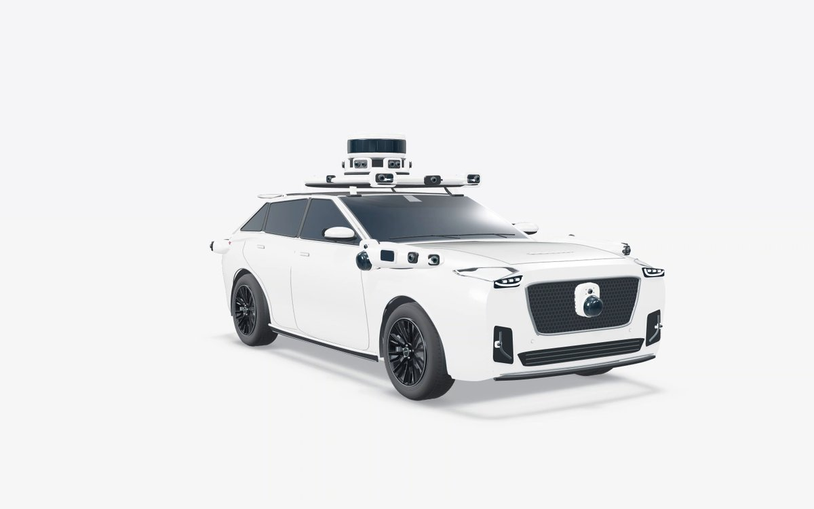</a>

<a href="https://www.tripo3d.ai/es/3d-prompts/gpt-6-astra-2101325346427842909">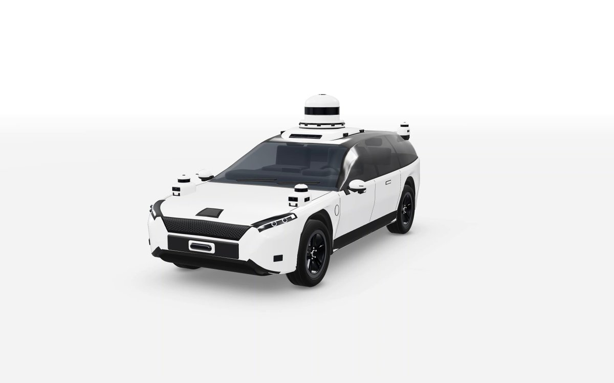</a>

El autor indica que usó este prompt con GPT-6 Astra Max en Codex para crear con Three.js un modelo 3D de un Jaguar I-Pace de Waymo. Afirma que no utilizó ninguna referencia y que el vehículo resultante no se parecía al automóvil real.

**Prompt**

```text
modelo 3D de un Jaguar I-Pace de Waymo usando Three.js
```

[Ver detalles ↗](https://www.tripo3d.ai/es/3d-prompts/gpt-6-astra-2101325346427842909) · [Publicación original](https://x.com/HarshithLucky3/status/2101325346427842909) · [Volver a los ejemplos](#all-prompts)

---

<a id="2101616345720787130"></a>

### Velero en mar abierto

[www.aicontenders.dev](https://www.aicontenders.dev/) · 2026-09-20

<a href="https://www.tripo3d.ai/es/3d-prompts/gpt-6-astra-2101616345720787130">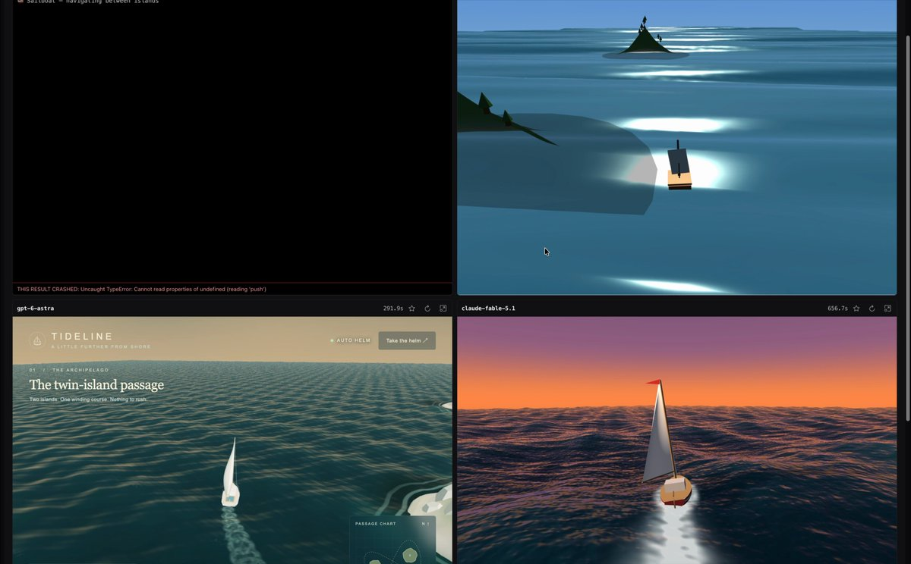</a>

Publicado en la página de comparación de AIContenders enlazada y ejecutado con GPT-6-astra junto con otros modelos. La tarea solicita una escena 3D interactiva de un velero en un único archivo, con agua animada generada mediante procedimientos, dos islas, movimiento de la embarcación sensible a las olas, navegación que evite la tierra y una cámara de seguimiento suavizada.

**Prompt**

```text
Crea un único archivo HTML con una escena 3D que muestre un velero pequeño avanzando por mar abierto, con control de dirección y una ruta que navegue alrededor de dos islas visibles, similar a las demostraciones de «juegos de barcos» de las pruebas recientes de modelos.

Requisitos funcionales:

Una superficie de agua representada como una malla de olas animada (shader de agua procedural, olas en movimiento, reflejos de luz que cambien según el ángulo de visión y una estela detrás de la embarcación), no una textura plana y estática.
Un modelo de velero construido con formas simples (casco, mástil y vela hinchada por el viento), con balanceo visible y una ligera inclinación sobre las olas, sincronizados con el movimiento del agua que tiene debajo.
Dos islas diferenciadas situadas en distintos puntos de la escena, cada una con una forma de terreno sencilla (una elevación, una playa y, opcionalmente, vegetación) y una sombra proyectada sobre el agua circundante.
La embarcación debe seguir una ruta que evite realmente ambas islas (sin atravesar nunca su silueta ni cruzar el terreno), girando suavemente en lugar de cambiar de ángulo de forma brusca.
La cámara sigue a la embarcación con un ligero retraso (seguimiento de cámara suavizado), para dar la impresión de una persecución dinámica en lugar de una vista cenital rígidamente vinculada.
Un cielo degradado (por ejemplo, un atardecer o un cielo azul diurno, a elección del modelo) con un sol o reflejo de luz sobre el agua, coherente en dirección con las sombras de las islas.

Requisitos técnicos:

Un único archivo .html; se permite usar three.js desde cdnjs, pero no otros recursos ni texturas externas. Toda el agua y el terreno deben generarse mediante procedimientos en el código o el shader.
La ruta alrededor de las islas puede ser un recorrido planificado de antemano (por ejemplo, una curva de Bézier que pase entre las islas) o un sistema de dirección sencillo que reaccione a la posición, a elección del modelo, pero no se permite ninguna colisión con el terreno.
La animación debe ejecutarse sin problemas durante al menos 20 segundos, en bucle o de forma continua, a un mínimo de 30 fps en un portátil típico. La resolución del lienzo debe estar limitada al tamaño de la ventana y el devicePixelRatio no debe superar 1.5 para evitar sobrecargar las pantallas de alta densidad de píxeles.

La evaluación se centrará principalmente en si el agua parece convincentemente un fluido en movimiento (no una textura con un desplazamiento de UV animado), si la embarcación reacciona realmente a las olas y si la ruta alrededor de las islas se percibe como una navegación intencionada, en lugar de un casi choque aleatorio.
```

[Ver detalles ↗](https://www.tripo3d.ai/es/3d-prompts/gpt-6-astra-2101616345720787130) · [Publicación original](https://www.aicontenders.dev/c/a_TRQpq3LoNVd-M7Xy2DHg) · [Volver a los ejemplos](#all-prompts)

---

<a id="2101687900723106104"></a>

### Crea un modelo 3D de WALL-E en Three.js

[Marcel](https://x.com/marcthecreatorr) · 2026-09-20

<a href="https://www.tripo3d.ai/es/3d-prompts/gpt-6-astra-2101687900723106104"></a>

Un prompt compartido por Marcel, exactamente el mismo que le proporcionó a Astra, para solicitar un modelo 3D de WALL-E creado en Three.js.

**Prompt**

```text
crea un modelo 3D de WALL-E en Three.js.
```

[Ver detalles ↗](https://www.tripo3d.ai/es/3d-prompts/gpt-6-astra-2101687900723106104) · [Publicación original](https://x.com/marcthecreatorr/status/2101687900723106104) · [Volver a los ejemplos](#all-prompts)

---

<a id="odd-arms"></a>

### ODD ARMS — Juego de supervivencia con armas extrañas

[Deniffer](https://x.com/lumina__team) · 2026-09-18

<a href="https://www.tripo3d.ai/es/3d-prompts/odd-arms">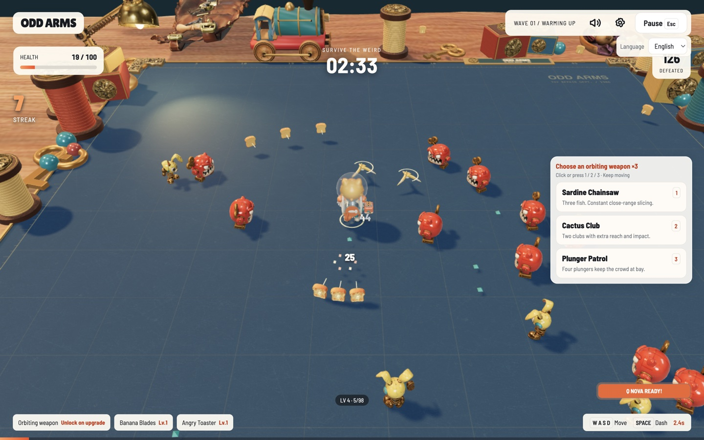</a>

<a href="https://www.tripo3d.ai/es/3d-prompts/odd-arms">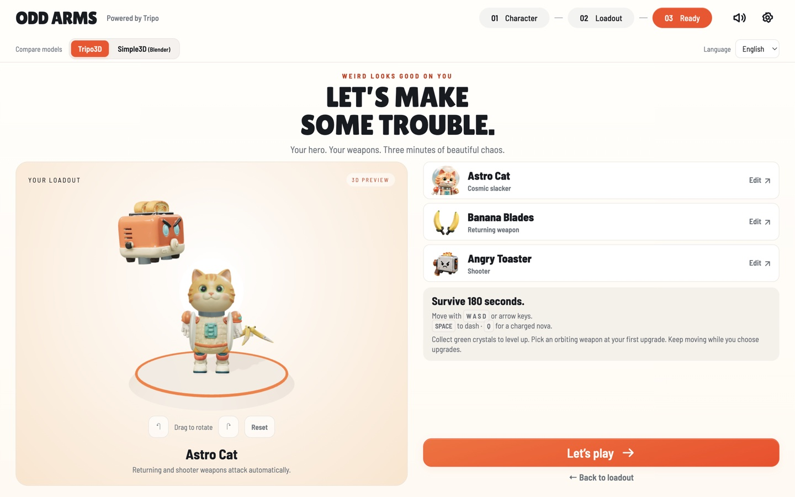</a>

<a href="https://www.tripo3d.ai/es/3d-prompts/odd-arms">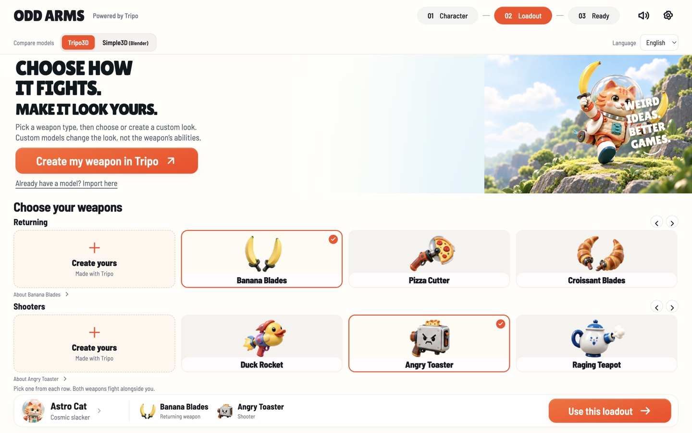</a>

<a href="https://www.tripo3d.ai/es/3d-prompts/odd-arms">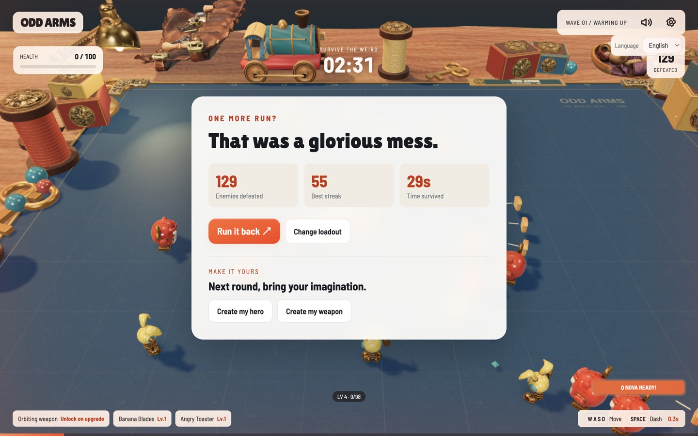</a>

Crea un juego de supervivencia de tres minutos con Three.js, donde un héroe de juguete equipado con cuchillas de plátano, tostadoras y desatascadores lucha contra monstruos de cuerda sobre un banco de trabajo. Los jugadores pueden crear su propio héroe o arma en Tripo Studio e importar el GLB para jugar.

**Prompt**

```text
# ODD ARMS — Tu idea. Tu héroe.

## 1. Objetivo
Mantén toda la interfaz del juego en inglés (añade el japonés como cambio de idioma opcional).
Crea un juego de supervivencia completo para navegador, de tres minutos, del género «horda de autoataque»: el jugador elige un héroe del tamaño de un juguete y dos armas maravillosamente extrañas, y sobrevive 180 segundos a enjambres de monstruos en un banco de trabajo. Las armas atacan automáticamente; el jugador solo se mueve, hace embestidas, recoge cristales, elige mejoras y dispara una nova cargada. El gancho es personal: los jugadores pueden crear su propio héroe o arma en Tripo, descargar el GLB e incorporarlo al juego. Usa https://odd-arms.tripo.page/ y las referencias proporcionadas para el resultado final. Da crédito a Deniffer en https://x.com/lumina__team.

## 2. Dirección visual
Presenta el juego como un diorama de juguete en miniatura, visto desde una cámara fija en tres cuartos, elevada y orientada hacia abajo, que sigue al héroe. El campo de juego es una alfombrilla de corte azul marino oscuro, con una cuadrícula tenue y marcas de esquina impresas con el texto «ODD ARMS», colocada sobre un escritorio de madera cálida. El borde del escritorio está lleno de accesorios de manualidades de gran tamaño (bobinas de hilo, cajas ornamentadas con rosetones de latón, un estuche enrollable de herramientas de cuero, una lámpara de escritorio de latón, un tren de juguete de madera y piezas de juguetes), para que la arena parezca una mesa real. Usa una luz principal cálida desde el lado de la lámpara, relleno ambiental suave, sombras de contacto y un bloom sutil; los personajes deben tener un estilo brillante, voluminoso y propio de figuras coleccionables, con colores saturados.

Interfaz: tarjetas redondeadas de color blanco crema, texto azul marino y un acento coral anaranjado; una tipografía de pantalla condensada y contundente para los titulares («LET'S MAKE SOME TROUBLE.») y una sans serif condensada y limpia para el texto principal. Durante el combate: tarjeta de salud arriba a la izquierda, contador de racha debajo, cuenta atrás «SURVIVE THE WEIRD» en el centro superior, etiqueta de oleada + sonido + ajustes + Pausa arriba a la derecha, contador de derrotados a la derecha, indicador de nivel/XP en forma de píldora en el centro inferior, tres fichas de armas (órbita / retorno / disparo, con niveles) abajo a la izquierda, controles + enfriamiento de la embestida abajo a la derecha y una píldora «Q NOVA READY!» encima. Potencia visual: números de daño, críticos, enemigos que se aplastan y estiran, retroceso, partículas que saltan y un ligero movimiento de cámara (desactiva el movimiento si está configurado prefers-reduced-motion).

## 3. Mundo
Una arena cuadrada; limita al héroe a ±23 unidades en ambos ejes. La alfombrilla de corte ocupa el área de juego; el escritorio y los accesorios quedan fuera de los límites y solo sirven como escenario (sin colisiones). La arena comienza vacía y se llena desde los bordes: los enemigos aparecen en un anillo situado a 12–16 unidades del héroe (8–11 durante el primer segundo) y avanzan en línea recta hacia él. Cada 22 segundos, una oleada genera un círculo completo de enemigos a un radio de 13. Aparecen círculos rojos de advertencia bajo la posición actual del héroe (el primero a los 28 s y después cada max(4.4, 9 − t/50) s) y explotan tras 2 s.

## 4. Inventario de recursos
Prepara ranuras de modelos estables; cada ranura debe cargar un único GLB, centrarlo, escalarlo automáticamente a una altura objetivo y usar un marcador de posición sencillo si la carga falla.

Héroes (10, `hero:<id>`), cada uno con una silueta distintiva y aspecto de figura de juguete voluminosa:
- `cat` Astro Cat — gato atigrado naranja con traje espacial blanco y casco de cristal. PS 100, velocidad 6.8, imán ×1.35, enfriamiento de embestida 2.4 s.
- `frog` Frog Fighter — rana verde con guantes de boxeo rojos. PS 130, velocidad 6.8, daño de embestida 135.
- `shroom` Mushroom Hero — hongo de sombrero rojo con una pequeña capa. PS 90, velocidad 7.6, embestida 1.8 s.
- `capybara` Chill Capybara — carpincho relajado de aguas termales. PS 160, velocidad 5.8, imán ×1.15, embestida 3 s, daño de embestida 110.
- `ramen` Ramen Ronin — samurái que lleva un cuenco de ramen humeante. PS 105, velocidad 7.2, embestida 2.2 s, daño de embestida 120.
- `penguin` Office Penguin — pingüino con camisa y corbata. PS 80, velocidad 7.1, embestida 1.5 s, daño de embestida 75.
- `axolotl` Axolotl — explorador ajolote rosa. PS 85, velocidad 7.3, imán ×1.6, daño de embestida 75.
- `avocado` Avo Boxer — boxeador aguacate con un hueso central. PS 120, velocidad 6.4, embestida 2.1 s, daño de embestida 130.
- `robot` Clockwork Bot — robot de hojalata de cuerda con una llave. PS 115, velocidad 6.2, embestida 2.8 s, daño de embestida 165.
- `snail` Snail Knight — caracol caballeresco que lleva un caparazón del tamaño de una casa. PS 190, velocidad 5.2, imán ×1.2, embestida 3.2 s, daño de embestida 120.
El daño de embestida predeterminado es 90 cuando no se indica otro valor.

Armas (12, `weapon:<id>`), agrupadas por ranura de ataque:
- Órbita: `sardine` Sardine Chainsaw (3 peces, radio 2.9, daño 1, velocidad 1.2); `cactus` Cactus Club (2 garrotes, radio 3.3, daño 1.65, velocidad 0.78, radio de impacto 1.25, retroceso 1.5); `plunger` Plunger Patrol (4 desatascadores, radio 2.25, daño 0.85, velocidad 1.5).
- Retorno: `banana` Banana Blades (2, daño 1, velocidad 1.25); `pizza` Pizza Cutter (1 disco grande, daño 1.5, velocidad 0.82, radio de impacto 1.65); `croissant` Croissant Blades (3, daño 0.75, velocidad 1.45); `boomerang` Boomerang (1, daño 1.15, velocidad 1.6); `donut-disc` Donut Disc (1, daño 1.5, velocidad 0.9, radio de impacto 1.3).
- Disparo: `duck` Duck Rocket (teledirigido, área de efecto 2, intervalo 0.42 s); `toaster` Angry Toaster (abanico perforante de 3 disparos, daño 0.7); `teapot` Raging Teapot (2 disparos lentos, área de efecto 2.8, intervalo 0.8 s); `bubble-gun` Bubble Gun (2 burbujas perforantes, daño 0.45, intervalo 0.3 s).
Equipamiento predeterminado: Astro Cat, Banana Blades y Angry Toaster; el arma de órbita se desbloquea con la primera mejora.

Enemigos (3, `enemy:<id>`), monstruos de juguete de cuerda: `red-chomper` (juguete mordedor redondo y rojo, básico, 30 PS base, velocidad 2.35), `spring-rabbit` (conejo amarillo con patas de muelle, rápido, 23 PS base, velocidad 3.5), `crown-bear` (oso grande de retales con una corona, tanque, 130 PS base, velocidad 1.7, aparece después de 60 s con una probabilidad del 17 %, suelta 3 XP).

Accesorios de la escena (`prop:<id>`): escritorio de banco de trabajo, marco y placas de esquina de la alfombrilla de corte, lámpara de escritorio, tren de juguete, bobinas de hilo, cajas ornamentadas con rosetones, estuche enrollable de herramientas y bandeja de piezas de juguete. Mantén la alfombrilla, la cuadrícula, los cristales, los proyectiles, los círculos de advertencia, las partículas, las luces y la interfaz de forma procedural.

## 5. Jugabilidad y respuesta visual
Flujo: Personaje → Equipamiento (uno de retorno + uno de disparo) → Listo (vista previa 3D del héroe con las armas elegidas, con visor giratorio que se puede rotar arrastrando) → «Let's play». Cada paso de incorporación muestra únicamente esa categoría, con texto sobre la descripción, el estilo de juego y la debilidad. Recuerda el último equipamiento.

Controles: WASD/flechas para moverse; la barra espaciadora hace una embestida en la dirección del movimiento (velocidad ×3.7, breve invulnerabilidad y daño a los enemigos en un radio de 2 unidades una vez por embestida); Q dispara una nova cuando la energía está al 100 (radio 11, daño 200, fuerte retroceso y atrae los cristales); 1/2/3 o clic para elegir mejoras; Esc para pausar; pausa automática cuando la ventana pierde el foco. Móvil: joystick virtual analógico a la izquierda y botones de Embestida y Nova a la derecha, con anillos de enfriamiento/carga; compatibilidad multitáctil para usar el joystick y los botones a la vez; las mejoras se sitúan sobre el joystick en orientación vertical y entre los pulgares en orientación horizontal.

Reglas: PS de los enemigos = base × (1 + t/260) × 1.3. Intervalo de aparición max(0.18, 0.52 − 0.0016·t) s, con un máximo de 180 enemigos. Daño por contacto 9 (18 en el caso del oso), con 0.85 s de invulnerabilidad después de recibir un impacto. Cada baja añade 2 de energía y suelta un cristal; cada noveno impacto de cada arma es un crítico ×1.7. Una racha de 25 bajas activa un frenesí de 5 s (velocidad de ataque ×1.65, enfriamiento de 13 s); recibir daño reinicia la racha. XP necesaria para subir de nivel: 20, después round(need × 1.4 + 10). Las subidas de nivel nunca pausan el juego: se ponen en cola como tarjetas de elección no bloqueantes. La primera mejora ofrece las tres armas de órbita; después ofrece tres de estas opciones: Orbit overload (+1 orbitador hasta 7, +22 % de daño), Another round (retornos más rápidos, largos y potentes), Full blast (disparos más rápidos, +20 % de daño y más proyectiles), Live a little (+10 % de velocidad, +30 PS). Cada elección cura 8 PS.

Final: sobrevive 180 s → «Beautifully weird. You made it.»; PS 0 → «That was a glorious mess.» Ambos muestran los enemigos derrotados, la mejor racha y el tiempo sobrevivido, con las opciones Run it back / Change loadout y el mensaje para crear algo propio.

Hazlo tuyo: desde las pantallas de equipamiento, pausa y resultados, «Create my hero / weapon in Tripo» abre https://studio.tripo3d.ai/ en una pestaña nueva; «Import GLB» carga un archivo .glb local (≤15 MB, solo texturas incrustadas, analizado en el navegador y nunca subido), lo centra y escala, y sustituye únicamente el aspecto del héroe o arma seleccionados, conservando sus estadísticas. Muestra errores claros para los archivos no válidos y conserva el modelo original.

Compara modelos: un interruptor en la cabecera, «Tripo3D ⇄ Simple3D (Blender)», sustituye cada héroe, arma, enemigo y accesorio por un conjunto equivalente de primitivas simples sin reiniciar la partida. Carga todo el conjunto alternativo antes de cambiarlo; si algún archivo falla, conserva el conjunto actual.

## 6. Implementación técnica
Vite + JavaScript vanilla + Three.js con GLTFLoader, iluminación RoomEnvironment y mapeado de tonos ACES. Mantén la simulación en un módulo puro con paso de tiempo fijo y una fuente de aleatoriedad inyectable, para poder simular partidas completas en las pruebas; el renderizador solo lee el estado. Guarda en caché cada GLB una vez y clónalo para las instancias; usa instanciación o LOD para los adornos repetidos. Limita la proporción de píxeles (1.5 en móviles, reduciéndola a 1 durante las oleadas densas), actualiza las sombras como máximo 30 veces por segundo y actualiza el texto del HUD solo cuando cambien los valores. Separa las colisiones (círculos simples) de las mallas visuales. Incluye fuentes, modelos y texturas en el mismo origen para que la compilación sea una carpeta estática. Orientado a navegadores de escritorio y teléfono, desde 320 px de ancho, incluidos los teléfonos en horizontal y las áreas seguras. La complejidad del modelo debe adaptarse a su tamaño en pantalla; no establezcas un límite rígido de polígonos.

## 7. Se considera terminado cuando
- Funciona todo el flujo: incorporación, combate hasta la victoria y la derrota, pausar/reanudar, reiniciar con el mismo equipamiento y cambiar de equipamiento.
- Los 10 héroes y las 12 armas cargan y se comportan según las cifras anteriores; una partida de 180 s con cualquier equipamiento termina sin errores.
- Funcionan tanto los controles de teclado como los táctiles, incluido el uso simultáneo del joystick y la Embestida.
- La importación de GLB sustituye el aspecto del héroe o arma elegido y rechaza correctamente los archivos defectuosos.
- El interruptor Tripo3D / Simple3D cambia todos los modelos durante la partida.
- Las pantallas de inicio, combate y resultados coinciden con las referencias; proporciona el código fuente ejecutable, el comando de inicio y una compilación de producción estática.

```

[Ver detalles ↗](https://www.tripo3d.ai/es/3d-prompts/odd-arms) · [Publicación original](https://odd-arms.tripo.page/) · [Demo en línea](https://odd-arms.tripo.page/) · [Volver a los ejemplos](#all-prompts)

---

<a id="titanic-the-last-light"></a>

### TITANIC — La última luz

[jared](https://x.com/jaredliu_bravo) · 2026-09-20

<a href="https://www.tripo3d.ai/es/3d-prompts/titanic-the-last-light">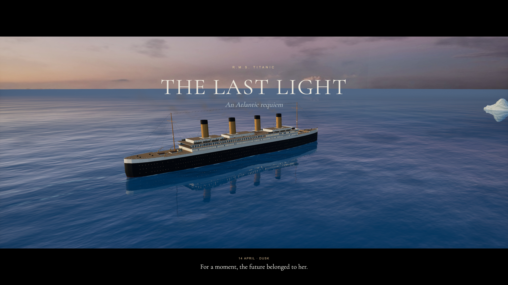</a>

Un viaje cinematográfico de 4:24 a bordo del Titanic, con un Atlántico azul profundo, retratos de personajes, el descenso de botes salvavidas seguido en cámara y un mundo en movimiento por explorar.

**Prompt**

```text
1. Objetivo del proyecto
Crear TITANIC — THE LAST LIGHT: una travesía cinematográfica interactiva de 264 segundos, desde la última puesta de sol del barco hasta la colisión, la evacuación y el hundimiento, para terminar con un homenaje al amanecer. Los visitantes ven una película dirigida, exploran su mundo 3D en movimiento, saltan a un capítulo, guardan una imagen fija o descargan la película completa. Presentarlo como una interpretación artística, sin afirmar exactitud forense ni afiliación oficial.

2. Dirección visual
Usar una paleta cinematográfica contenida: luces cálidas en crema y ámbar en el barco, sobre un azul atlántico profundo, seguidas de una noche oscura iluminada por las estrellas y un amanecer frío. Renderizar una escena en perspectiva con una composición cinematográfica 2.39:1, bloom suave, grano sutil y viñeteado. Usar profundidad de campo para los retratos de los personajes y el amanecer, manteniendo nítidas las partículas de los cohetes de socorro. Dar al océano un color base azul profundo, oleaje en el espacio de mundo, normales de ondulación más pequeñas con mipmaps y reflejos de Fresnel; el color cálido de la puesta de sol debe pertenecer principalmente a la luz reflejada. Usar estelas adheridas al casco que sigan el mismo desplazamiento del océano, con extremos suaves y espuma fragmentada. Repetir horizontalmente las texturas panorámicas sin una discontinuidad de fractura, para evitar costuras verticales en el cielo y franjas reflejadas. Evitar el sombreado naranja de aguas poco profundas, las ondulaciones diminutas y uniformes y los decals circulares de espuma luminosa. Eliminar las caras superiores ocultas y superpuestas del techo para evitar conflictos de profundidad; usar un plano cercano de cámara adecuado a la distancia de la toma. Durante el hundimiento, atenuar la luz de las ventanas de forma monótona en lugar de añadir parpadeos de alta frecuencia. Usar un título serif sobrio, controles bilingües en inglés y chino y una línea de tiempo estrecha en la parte inferior.

3. Mundo, geografía y montaje de cámara
Usar un único sistema de coordenadas continuo con una embarcación de 269 metros, la proa orientada hacia +X y un iceberg fijo en (275, 0, 57). La embarcación avanza, entra en contacto con el iceberg a los 96.727 segundos, sigue avanzando hasta detenerse y después se hunde por las secciones de proa y popa. Mantener el iceberg presente hasta el final y visible en la composición del amanecer. Conservar seis capítulos que comiencen en 0, 63, 110, 163, 211 y 241 segundos.

Crear 23 planos intencionados. El abrazo en la proa abarca del segundo 29 al 61: una aproximación de presentación, un primer plano doble, una vista desde detrás hacia el mar y un retrato oblicuo. Colocar a Rose delante y a Jack detrás de ella, en el extremo delantero, ambos mirando hacia fuera sobre la proa. Mantener la iluminación de la puesta de sol durante toda la secuencia. Del segundo 127 al 158, usar tres planos vinculados a la transformación real en el mundo de un bote salvavidas: salida desde la cubierta de botes, una vista más cercana de los pasajeros y las cuerdas de suspensión, y aproximación al agua. Continuar con planos generales de la evacuación, la escora, la fractura y el hundimiento. Al amanecer, mostrar los botes supervivientes con el iceberg a lo lejos y, después, un título de homenaje sobrio.

4. Inventario de recursos
- titanic-vessel: construir la estructura principal de 269 metros en Blender, con cubiertas de pozo continuas, un castillo de proa cerrado, paseos en capas, cuatro chimeneas huecas inclinadas de color crema, casco superior negro y casco inferior rojo. Usar bordes circulares reales para los 864 ojos de buey y marcos para las 360 ventanas. Restringir la emisión a los materiales de acristalamiento reales. Agrupar los materiales y dividir en x=-32 para el hundimiento. Añadir mástiles, aparejos, pescantes, cabos, hélices de bronce y timón. Generar una escalera P2 con puertas de teca y detalles de latón, normalizarla y reutilizarla dos veces en la cubierta creada. Conservar las transformaciones de los nodos al ensamblar el GLB.
- atlantic-iceberg: un único iceberg irregular y erosionado, azul y blanco, con escarcha en capas, variación de rugosidad, un mapa normal sutil y una línea de flotación convincente. Debe permanecer como un objeto geográfico fijo.
- lifeboat: un bote salvavidas de remos de White Star, con casco de madera blanca, regala oscura, bancos y remos, instanciado en dieciséis botes que se mueven de forma independiente.
- bow-embrace: un recurso aislado de dos personajes, inspirado en el vestuario y la pose de la película solicitada de 1997: Rose, con cabello castaño rojizo, ropa azul marino y marfil y un chal estampado, con los brazos extendidos; Jack justo detrás, con abrigo oscuro y camisa color marfil. Generar una imagen de referencia limpia antes de convertirla a 3D. Crear la cabeza en primer plano, el cuello completo y la parte superior del pecho como una única superficie continua H v3.1 por héroe, a partir de una referencia limpia de cabeza, cuello y hombros. Conservar la pose del abrazo P2, las manos y el vestuario. Usar retopología de quads, limpieza local de la superficie en Blender y baking de color/normal a 4K. Ajustar la interfaz bajo las aberturas de la prenda en lugar de unirla directamente bajo la mandíbula. Conservar el cuello continuo generado. Ajustar la parte inferior del pecho a los contornos del torso medidos bajo la prenda original, restaurar la espalda superior continua P2 y eliminar restos de cabello obsoletos. Evitar paneles de cuello flotantes y extrusiones del cuello con UV estiradas. Inspeccionar ambas vistas laterales bajas y las vistas traseras en busca de cualquier separación por la que entre luz o de bordes de corte expuestos. Inspeccionar párpados, iris, labios, manos y costuras de las texturas desde las vistas de cámara creadas. Reducir por separado los brillos de ángulo rasante de la tela respecto al sombreado de la piel. Usar expresiones naturales de base con movimiento contenido del cuerpo y la ropa; no dar a entender que existe un rig de animación facial si no se ha implementado realmente.
- seated-woman y seated-man: modelos separados de pasajeros adultos con ropa de 1912 y chalecos salvavidas de corcho claro, sentados con las rodillas flexionadas y las manos sobre el regazo. Compartir la geometría y los materiales entre los botes; variar ligeramente la colocación y la orientación. Usar cantidades de instancias por bote que puedan revertirse para el embarque.

Usar Blender para la embarcación principal, Tripo P2.0 para la escalera de cubierta, el iceberg, los botes, el vestuario y los pasajeros, y H v3.1 para los dos retratos continuos de los protagonistas. Mantener el océano, la mezcla del cielo, las estrellas, la iluminación, el humo, los cohetes de socorro, la espuma, las salpicaduras y los restos como efectos de escena. Proporcionar variantes web más ligeras de los modelos, con texturas comprimidas, y conservar los recursos en resolución completa para la exportación de la película sin conexión.

5. Reproducción y respuesta
Mostrar el progreso de carga real de los recursos esenciales del barco, el bote, el cielo y las normales del mar. Activar el botón de inicio cuando la primera escena esté lista; posponer los demás modelos y la música. Si un modelo necesario de personaje o del iceberg llega tarde, detenerse en el límite de su escena y reanudar cuando esté listo, en lugar de omitir el plano en silencio. El audio comienza después de la interacción del usuario.

La línea de tiempo debe admitir búsquedas hacia delante y hacia atrás y arrastres rápidos sin restablecerse a cero. Conservar el estado de reproducción/pausa y silencio durante la búsqueda; no permitir que el reloj de audio antiguo sobrescriba la posición solicitada. Servir rangos de bytes para MP3 y MP4. La navegación por capítulos incluye entradas directas para el abrazo en la proa, en el segundo 29, y el descenso del bote salvavidas, en el segundo 127; estas restauran la cámara del director y conservan el estado de reproducción.

La exploración permite orbitar, arrastrar y hacer zoom mientras el mundo, la embarcación y la banda sonora continúan. Seguir la traslación de la embarcación sin ajustar bruscamente la dirección de la vista. La pausa debe ser independiente; al volver a la película se conserva el tiempo actual. La barra espaciadora reproduce o pausa, las flechas saltan diez segundos, M activa o desactiva el sonido, E activa o desactiva la exploración y F abre la pantalla completa. Admitir órbita y pellizco táctiles, además de pulsaciones en la línea de tiempo.

Los botes comienzan vacíos. Los pasajeros embarcan en grupos escalonados después del segundo 112 y terminan antes de que descienda cada bote. Las cuerdas deben ir entre los pescantes móviles y los puntos reales de fijación del bote, y desaparecer después de soltarse. La búsqueda hacia atrás restaura la ocupación y el estado de las cuerdas anteriores. La colisión debe coordinar la vibración del casco y la cámara, los fragmentos de hielo, las salpicaduras producidas por el roce y un transitorio sonoro de contacto entre acero y hielo. Los cohetes de socorro usan estrellas blancas incandescentes, estelas individuales cortas, gravedad, arrastre y humo que se desvanece. Las perturbaciones del hundimiento son parches irregulares que siguen las olas y se atenúan gradualmente; distribuir las salpicaduras a lo largo de la verdadera línea de flotación de la popa, nunca desde una fuente puntual de partículas remota.

6. Implementación técnica y entregables
Usar Vite, módulos de JavaScript y Three.js con animación determinista basada en el tiempo. Separar la cámara y la línea de tiempo, los recursos de la embarcación, los personajes, el entorno, los efectos y la preparación de la escena. Compartir el mismo modelo temporal para la reproducción web, las búsquedas y la captura sin conexión. Mantener el renderizado web dentro de un presupuesto explícito de píxeles, reflejos y sombras; reservar la oclusión ambiental más pesada para el perfil sin conexión. Compilar y decodificar los recursos sin un precalentamiento inicial largo y bloqueante. Alojar scripts, modelos, imágenes, fuentes y audio en el mismo origen, y mantener los secretos fuera de la compilación estática.

Usar una banda sonora original y efectos Foley de ElevenLabs de pago: una toma completa de fuegos artificiales silbantes naturales, dividida en su explosión aérea real para formar un ascenso y un estallido seco con cola crepitante, además de contacto y raspado entre acero y hielo, cuerdas de botes salvavidas y contacto con el agua, tensión y fractura del casco y desplazamiento del agua en la popa. Exportar los archivos WAV de origen, conservar los prompts y los identificadores del historial, y editarlos para convertirlos en cues sincronizados. Alinear los lanzamientos en los segundos 119, 151 y 183, con las explosiones aéreas 3.15 segundos después. Conservar el ataque original de cada estallido y bajar brevemente el volumen de la banda sonora orquestal. Mantener bajo la mezcla una ambientación sutil de mar, viento y motor. La banda sonora de la película de referencia no se incluye sin autorización, ni en el sitio web público ni en la película descargable. Documentar las fuentes reales de los recursos y sonidos, en lugar de describir un recurso generado por un servicio como alternativa.

Proporcionar una exportación determinista de 6,336 fotogramas a 3840×2160 y 24 fps, con tres muestras temporales, títulos en inglés incrustados y una imagen con letterboxing 2.39:1. Codificar un máster 4K H.264/AAC y una edición web a 1080p de menos de 100 MiB, ambas de 264 segundos y con audio estéreo a 48 kHz. Conservar los subtítulos opcionales en chino/inglés, el máster de audio y los archivos fuente editables. Publicar la compilación estática mediante el alojamiento Web Pages del CMS existente, sin añadir una aplicación de plataforma ni un Worker por página.

7. Criterios de aceptación
Inspeccionar la apertura, ambos retratos de los personajes, la colisión, los cohetes de socorro, los tres planos de descenso, la fractura, la desaparición de la popa y el amanecer. Comprobar que el iceberg no desaparezca en el segundo 244, que el mar se perciba de color azul profundo, que el hundimiento no tenga anillos blancos regulares, que los personajes sigan presentes en sus planos creados y que las cuerdas y los pasajeros de los botes permanezcan alineados durante todo el descenso. Probar la carga retrasada de modelos, las búsquedas hacia delante y hacia atrás, el desplazamiento rápido, la pausa y el silencio, la exploración dinámica, las entradas directas a primeros planos y la emulación táctil. Verificar cada fotograma exportado, decodificar por completo ambas películas, comparar la descarga real del navegador con el archivo entregado y verificar la compilación pública y su asociación con el CMS. Diferenciar la emulación móvil del navegador de las pruebas en un teléfono físico.

```

[Ver detalles ↗](https://www.tripo3d.ai/es/3d-prompts/titanic-the-last-light) · [Demo en línea](https://titanic-the-last-light.tripo.page/) · [Volver a los ejemplos](#all-prompts)

---

<a id="akari-nagoya-rooftop-flame-relay"></a>

### AKARI: Relevo de la llama en las azoteas de Nagoya

[Jared](https://growthengineer.space/) · 2026-09-16

<a href="https://www.tripo3d.ai/es/3d-prompts/akari-nagoya-rooftop-flame-relay">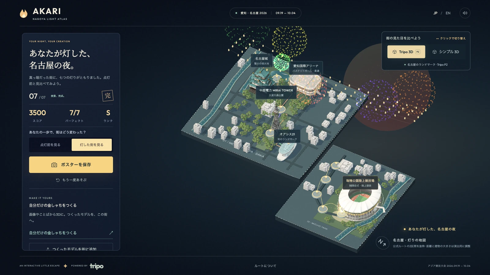</a>

Crea un juego completo de Three.js, pensado primero para japonés: salta entre azoteas, ilumina Nagoya y guarda un póster festivo. Empieza con recursos procedurales y mejóralos después con Tripo Studio sin una clave de API.

**Prompt**

```text
# AKARI — Atlas de luces de Nagoya

## 1. Objetivo
Crear un juego de navegador japonés desde el inicio y completo, en el que una llama abstracta realice siete saltos cronometrados e ilumine una Nagoya en miniatura antes de los Juegos Asiáticos Aichi-Nagoya, del 19 de septiembre al 4 de octubre de 2026. Reproduce la edición inicial actual de dos mapas en https://akari-nagoya-rooftop-relay.tripo.page/ y las referencias visuales proporcionadas. La escena genérica de azoteas anterior no es el objetivo.

## 2. Dirección visual
Usa una vista elevada de atlas en tres cuartos, un fondo azul marino de medianoche, titulares en serif japonesa color marfil cálido, líneas doradas finas y grano sutil. En escritorio, reserva el tercio izquierdo para la invitación inicial y coloca dos teselas de mapa elevadas a la derecha; en teléfonos, reencuadra el mapa por encima de los controles. Empieza con edificios apagados y desaturados, y vías de agua en tonos teal. Al completar cada zona, recupera los verdes, los tejados de cobre turquesa, las ventanas cálidas y las luces doradas de las rutas. Mantén la llama y el siguiente objetivo legibles. Usa sombras suaves, profundidad atmosférica y bloom controlado; evita los brillos blancos. Reproduce el titular japonés inicial, las etiquetas de los lugares emblemáticos y el encabezado/pie editorial estrecho visibles en la referencia.

## 3. Mundo
La tesela noroeste, de mayor tamaño, cubre el parque Meijo, el castillo de Nagoya, el Aichi International Arena, el parque Hisaya-odori, MIRAI TOWER y Oasis 21. La tesela sureste cubre el Museo de la Ciudad, Mizuho-dori, el parque Mizuho y su estadio deportivo, con el río Yamazaki al este del estadio. Añade barrios modernos de poca altura, árboles de parque, marcas viales, riberas y luminarias cálidas; reserva la arquitectura de castillo para el castillo.

Capítulo 1: parque Meijo → Sotobori/Hisaya-odori → parque Hisaya-odori → Oasis 21, tres saltos. Crea una transición de capítulo claramente señalizada y no jugable hacia el Museo de la Ciudad. Capítulo 2: Museo de la Ciudad → Mizuho-dori → Mizuho Undojo Nishi → hacia el parque Mizuho → plaza sur, cuatro saltos. No representes nunca la transición como una calle continua ni la cuentes como un salto. Guarda el progreso al llegar al segundo capítulo. Los mapas usan escalas distintas, con las distancias comprimidas para facilitar el juego. Explícalo brevemente en «About», junto con las fechas históricas del relevo, el 22 de agosto y el 16 de septiembre de 2026; no son invitaciones a eventos próximos. Cita https://www.aichi-nagoya2026.org/ja/torch-relay/ y https://www.nagoyajo.city.nagoya.jp/guide/kinshachi/. Usa adornos originales y una llama abstracta en lugar de una mascota o emblema oficiales.

## 4. Inventario de recursos
Usa estas ranuras de reemplazo estables en orden de prioridad; conserva la misma composición y los mismos proxies de colisión en ambos modos visuales:
- `shachi`: adorno de tejado de oro pulido y aspecto antiguo, con cabeza similar a la de un tigre, cuerpo de carpa escamado y curvado, y cola enroscada hacia arriba; repítelo en el castillo.
- `castle`: torre marfil inspirada en Nagoya, con estructura de madera oscura, tejados escalonados turquesa a cuatro aguas y a dos aguas, y cimentación de piedra.
- `mizuho`: estadio deportivo ovalado y ancho, con cubierta clara abierta en el centro y soportes rítmicos; mantén visibles la pista de atletismo y el campo verde a través del centro.
- `arena`: arena contemporánea de poca altura, con cubierta ancha y aletas verticales cálidas en la fachada, al norte del eje del parque.
- `tower`: torre de observación esbelta, de celosía plateada, con plataforma de aspecto cúbico y antena.
- `oasis`: cubierta alargada, ovalada, de vidrio o agua turquesa, sobre soportes delgados y claros.
- `midrise`: edificio de barrio japonés moderno y sobrio; reutilízalo con distintas alturas y orientaciones, incluida una volumetría sencilla de museo.
- `tree`: árbol compacto y maduro de parque, con tronco marrón y copa verde estratificada; instáncialo por ambas teselas.
Mantén procedurales el terreno, las carreteras, el agua, las marcas de la pista, los marcadores de salto, la llama abstracta, las estelas de luz, los fuegos artificiales y la interfaz. Cada modelo debe ser un objeto completo y aislado; conserva los pasajes abiertos y el centro del estadio. Registra todas las ranuras enumeradas, incluidos los recursos de fondo repetidos.

## 5. Jugabilidad y recompensas
Mantén pulsado el puntero, el contacto táctil o la tecla Space para cargar; suelta para saltar automáticamente hacia el siguiente marcador. Usa física determinista basada en delta-time: distancia = 1.8 + 7 × carga, la carga oscila entre 0 y 1, y el arco añade 4 × t × (1 − t) × 3.6 a la altura interpolada. El ciclo de carga se acelera de aproximadamente 1.42 a 0.92 segundos por dirección. Deriva la trayectoria, la zona segura verde y la zona perfecta dorada del mismo cálculo: un error ≤0.36 es perfecto; ≤1.15 es seguro, con 0.28 de tolerancia adicional para los dos primeros saltos.

Un aterrizaje seguro otorga 100 puntos; uno perfecto otorga 200 × multiplicador consecutivo, con un máximo de ×4. Un seguimiento rápido dentro de 2.35 segundos añade 50 puntos; reinicia el combo tras un aterrizaje seguro, una transición de capítulo o 3.4 segundos de espera. Cada éxito envía una onda de luz por el distrito, ilumina las ventanas y añade faroles. Muestra el progreso de siete pasos, la puntuación, el combo y el récord. Los fallos deben reiniciar rápidamente; después de la transición, recupera el punto de control del capítulo. Incluye pausa, reinicio, recuperación tras ocultar la pestaña y sonido opcional después de la interacción.

Después del salto final, revela ambos mapas iluminados mediante un retroceso de cámara de 4.6 segundos y fuegos artificiales acotados. Muestra el rango S tras siete aterrizajes perfectos, A tras cuatro o más y B en cualquier otro caso. Incluye repetición, vistas de la ciudad antes y después desde la misma cámara, y un póster PNG real de 1800×1200 con título, fechas, puntuación y crédito del proyecto independiente.

## 6. Implementación
Usa Vite, TypeScript y Three.js; separa la geografía, la física y la puntuación puras, la escena, los efectos, el registro de modelos, la localización en japonés/inglés y la interfaz. El japonés debe seguir siendo el idioma predeterminado, independientemente del idioma del prompt; guarda la preferencia del cambio de idioma. Incluye las fuentes y los recursos localmente. Usa GLTFLoader y normalización por ranura; conserva el último modelo funcional tras una importación no válida. Conserva la puntuación, el punto de control, la cámara y la iluminación al comparar los modos visuales simple e importado. Instancia árboles y edificios, combina la geometría estática compatible, limita el DPR y acota las partículas. Evalúa el tiempo real de fotograma y la complejidad del modelo en lugar de rechazarlo solo por superar un objetivo de triángulos. Usa Blender únicamente si un recurso devuelto necesita limpieza de malla, reparación del pivote o apertura del centro del estadio; conserva su archivo original.

## 7. Criterios de aceptación
Entrega el código fuente ejecutable, el archivo de bloqueo, los comandos de desarrollo/compilación y una compilación estática. Verifica los siete saltos de ambos capítulos, la recuperación de la transición y del punto de control, los fallos y reintentos, la puntuación, la entrada táctil, la pausa, la persistencia del japonés/inglés, todas las alternativas de las ranuras y la exportación real del póster. Compara capturas de pantalla asentadas de la apertura y el final con la referencia actual de dos mapas. Informa del rendimiento medido y de las pruebas realizadas. El siguiente flujo de trabajo compartido rige la generación y la devolución de modelos.
```

[Ver detalles ↗](https://www.tripo3d.ai/es/3d-prompts/akari-nagoya-rooftop-flame-relay) · [Volver a los ejemplos](#all-prompts)

---

<a id="cyclops-island-threejs-game"></a>

### La isla del cíclope

[Jared](https://x.com/jaredliu_bravo) · 2026-09-16

<a href="https://www.tripo3d.ai/es/3d-prompts/cyclops-island-threejs-game">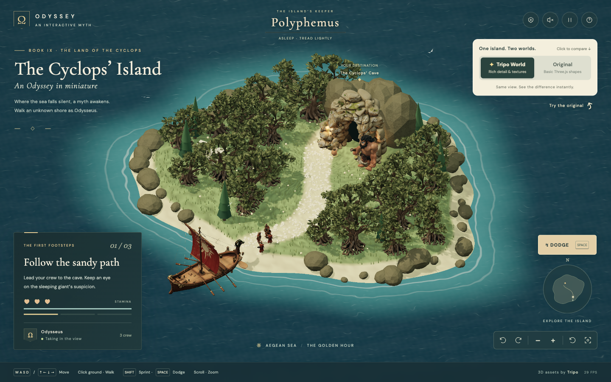</a>

Crea primero un juego completo de escape en una isla con Three.js y modelos animados sencillos. Después, mejora el héroe, el cíclope, el barco, los árboles y la cueva, uno por uno, desde Tripo Studio mediante imágenes de referencia o prompts de texto del agente anfitrión. No necesitas acceso a la API de Tripo.

**Prompt**

```text
# ODISEA — La isla de los cíclopes

## 1. Objetivo
Crea un juego de escape isométrico completo inspirado en el Libro IX de la Odisea. Como Odiseo, guía a tres tripulantes para robar provisiones de la cueva, sobrevivir a la persecución y los ataques de Polifemo, y escapar a bordo de un barco griego. Toda la interfaz del juego debe estar en inglés. Usa https://cyclops-island.tripo.page/ y las referencias proporcionadas; conserva la atribución a Jared y la inspiración del concepto de la isla de la Odisea de Jason Chew.

## 2. Dirección visual
Compón una isla mediterránea de estilo maqueta de mesa, con texturas ricas, de unos 25 unidades de mundo de ancho, sobre un mar Egeo de color turquesa oscuro. Usa una cámara ortográfica en vista de tres cuartos cerca de (19,31,34), piedra caliza cálida, olivos verde salvia, telas de terracota, armaduras de bronce y pergamino crema. Aplica mapeado de tonos ACES, sombras direccionales cálidas, profundidad atmosférica, bloom sutil, viñeta y grano. Mantén los marcadores de peligro legibles bajo estos efectos.

Usa títulos serif locales de estilo Cormorant Garamond y una interfaz de estilo DM Sans. Arriba a la izquierda: un sello Ω, ODYSSEY / AN INTERACTIVE MYTH, BOOK IX y The Cyclops’ Island. Una tarjeta de comparación crema destacada en la parte superior derecha muestra “One island. Two worlds.” con controles Tripo World y Original. Abajo a la izquierda: fase de la misión, tres corazones, resistencia y cantidad de tripulantes. Muestra el estado del jefe arriba, una brújula/minimapa pequeño debajo, controles de cámara visibles e indicaciones de entrada concisas. En teléfonos, usa textos decorativos compactos y controles independientes para la misión, el jefe, la comparación y Dodge.

## 3. Mundo
Un sendero sinuoso de arena pálida parte de una playa de desembarco al sur y avanza hacia el norte entre olivares hasta una cueva de piedra caliza. El gigante duerme cerca de la cueva; Odiseo y la tripulación comienzan en el sendero meridional. Coloca un barco de madera con velas rojas al suroeste, junto al embarcadero. Rodea la costa con rocas irregulares, hierba, cipreses y aguas someras de color turquesa. Anima las ondulaciones del mar, la espuma de la orilla, los árboles, la luz del fuego, los pájaros y el balanceo del barco. El movimiento del océano debe seguir siendo correcto cuando la cámara gire.

## 4. Inventario de recursos
Prepara ranuras de reemplazo en este orden:
- `odysseus`: aventurero griego barbudo, casco corintio de bronce con penacho carmesí, armadura de torso desgastada, túnica de marfil, capa de terracota, sandalias, escudo pequeño y espada envainada. Reutilízalo para los tres tripulantes, con esqueletos y fases de animación independientes.
- `polyphemus`: gigante corpulento con exactamente un ojo central, piel aceitunada bronceada, cabello y barba oscuros y rizados, taparrabos de piel o cuero, pies grandes descalzos y un garrote de madera; cuerpo completo en una pose neutra apta para rigging.
- `ship`: casco estrecho de madera de nogal oscuro, proa elevada, espolón de bronce, mástil, vela de color rojo terracota, jarcia de cuerda y remos laterales; sin agua ni base de exhibición.
- `olive`: tronco nudoso gris parduzco, raíces extendidas y copa irregular verde salvia; reutilízalo unas 25 veces.
- `cave`: arco ancho y exento de piedra caliza desgastada, con un pasadizo realmente abierto, rocas voluminosas y musgo escaso; construye el interior oscuro por separado.
- `cypress`: árbol mediterráneo esbelto y cónico, con follaje denso de color verde oscuro.
- `boulder`: roca costera irregular de piedra caliza cálida; reutilízala con variaciones de escala y rotación.
Mantén el terreno, el sendero, el agua, la hierba, los marcadores de provisiones, los indicadores de combate, las partículas y la interfaz de forma procedural. Registra cada ranura y conserva el mapa de juego mientras reemplazas su apariencia.

## 5. Encuentro de escape
Usa WASD/flechas relativas a la cámara y movimiento mediante clic o toque, con navegación A* que tenga en cuenta el radio. La tripulación debe seguirte de forma flexible; el jugador y el gigante deben respetar el terreno, los límites y los obstáculos según sus distintos tamaños. Shift activa el sprint, Space o el botón táctil grande ejecuta una esquiva, E recoge las provisiones cercanas, P pausa, Q/R rota la cámara y F sigue al héroe. Admite arrastrar/desplazar, arrastrar con el botón derecho/rotar, desplazamiento/zoom y pellizco táctil. Durante la persecución, el movimiento mediante clic activa el sprint mientras haya resistencia disponible.

Fase 1: acércate a la cueva; la proximidad y correr haciendo ruido aumentan la sospecha y pueden despertar al gigante. Fase 2: recoge las provisiones solo a corta distancia; esto siempre lo despertará. Fase 3: sobrevive dentro del radio marcado del embarcadero, de unos 2,7 unidades, cerca de (-0.8,8.7), durante 11 segundos acumulados mientras la tripulación embarca; salir pausa el progreso.

Concede tres puntos de salud y 100 de resistencia. Velocidades iniciales: caminar a 2.35, correr a 4.15 y correr el gigante a 3.4 unidades por segundo. El gigante debe perseguir al jugador hasta situarse a 3.6 unidades antes de atacar. Usa estados de dormir, despertar, perseguir, preparación, impacto, recuperación y terminales. Ground Breaker bloquea la posición del jugador al inicio de una preparación de 1.12 segundos, muestra un círculo de radio 2.45 y golpea una vez; el objetivo no debe seguir al jugador. Cada tercer golpe libera una onda expansiva cargada y claramente marcada; el daño se aplica siguiendo el borde móvil del anillo.

La esquiva dura unos 0.34 segundos, cuesta 24 de resistencia y tiene un tiempo de reutilización de 1.25 segundos, invulnerabilidad breve y ajuste a terreno válido. El sprint agota la resistencia; descansar la recupera. Los golpes causan retroceso, respuesta visual de daño e inmunidad temporal. Derrotar al gigante reinicia todos los actores, temporizadores, efectos y el estado de la misión. Escapar detiene el daño y abre un resumen de repetición. Pausar congela la simulación, la animación y los efectos. Ajusta el embarque para que requiera varias esquivas, incluido un ataque cargado.

## 6. Implementación y animación
Usa Vite, Three.js y módulos JavaScript ES para el mundo, la navegación, el encuentro, los actores, los efectos, el audio y la interfaz. Incluye todos los recursos de ejecución localmente en una compilación estática. Los modelos articulados iniciales deben caminar/correr, dormir/despertar, esquivar y mostrar claramente la preparación y el golpe. Para los reemplazos con skin, usa AnimationMixer, los nombres reales de los clips, transiciones cruzadas breves y SkeletonUtils.clone para crear esqueletos independientes de la tripulación. Evita el movimiento raíz duplicado y el deslizamiento de los pies. Sincroniza el golpe descendente del gigante con el impacto del juego; las importaciones estáticas no deben notificarse como animadas. Mantén un recurso articulado alternativo funcional cuando sea necesario. Usa Blender únicamente para las reparaciones necesarias de rig, pivote, clip o malla.

Sincroniza los indicadores visuales naranjas y dorados, el destello del impacto, las grietas del suelo, el polvo, las chispas, los fragmentos de roca que caen, los anillos expansivos, la luz breve y el movimiento de cámara. Añade estelas de esquiva y audio sintetizado opcional activado mediante gestos. Reutiliza los efectos mediante pools, crea instancias del decorado y mide el tiempo de fotograma. Normaliza las importaciones con pies/raíces apoyados y proxies de colisión sin modificar. La comparación debe conservar las posiciones, la misión, la salud, la resistencia, la cámara y el estado de animación; las importaciones fallidas deben conservar los modelos funcionales. Incluye un control discreto Change hero y la importación local de modelos con el estado de cada ranura.

## 7. Criterios de aceptación
Entrega el código fuente, el archivo de bloqueo, los comandos npm de desarrollo/compilación y la salida estática. Verifica la navegación entre obstáculos, el despertar prematuro, la recogida a corta distancia, la persecución antes del ataque, los objetivos bloqueados, los golpes temporizados, la inmunidad durante la esquiva, el daño del borde de la onda expansiva, la derrota/reinicio y un escape satisfactorio. Comprueba la animación independiente de la tripulación, todos los recursos alternativos de las ranuras, la comparación con conservación del estado, la distribución para escritorio/móvil y los errores de carga. Compara las capturas de pantalla estabilizadas con la referencia e informa del rendimiento real. Usa el flujo de trabajo compartido a continuación para generar modelos y devuelve.
```

[Ver detalles ↗](https://www.tripo3d.ai/es/3d-prompts/cyclops-island-threejs-game) · [Publicación original](https://x.com/jaredliu_bravo) · [Demo en línea](https://cyclops-island.tripo.page/) · [Volver a los ejemplos](#all-prompts)

---

<table align="center">
<tr><td align="center">
<br>
<p><strong><a href="https://www.tripo3d.ai/es/3d-prompts/models/gpt-6-astra?utm_source=github&amp;utm_medium=referral&amp;utm_campaign=awesome_astra_prompts&amp;utm_content=catalog_bottom">Ver los 263 ejemplos en el sitio oficial →</a></strong></p>
<p><sub>Para que el README de GitHub se renderice con fluidez, aquí solo se muestran los 100 ejemplos más recientes.</sub></p>
<br>
</td></tr>
</table>
