<!-- Generated from Growth CMS. Update content in CMS; run npm run sync. -->

# Awesome Astra Prompts

[](https://github.com/sindresorhus/awesome) [](https://github.com/TripoGrowthLab/awesome-astra-prompts/stargazers) [](../LICENSE) [](https://github.com/TripoGrowthLab/awesome-astra-prompts/actions/workflows/sync-prompts.yml) [](../CONTRIBUTING.md)

<p>
  <a href="../README.md"></a>
  <a href="../README.zh-CN.md"></a>
  <a href="../docs/catalog.zh-Hant.md"></a>
  <a href="../docs/catalog.ja.md"></a>
  <a href="../docs/catalog.ko.md"></a>
  <a href="../docs/catalog.es.md"></a>
  <a href="../docs/catalog.pt.md"></a>
  <a href="../docs/catalog.de.md"></a>
  <a href="../docs/catalog.fr.md"></a>
  <a href="../docs/catalog.it.md"></a>
  <a href="../docs/catalog.ru.md"></a>
  <a href="../docs/catalog.tr.md"></a>
  <a href="../docs/catalog.uk.md"></a>
  <a href="../docs/catalog.vi.md"></a>
</p>

<a href="https://www.tripo3d.ai/es/3d-prompts/models/gpt-6-astra?utm_source=github&amp;utm_medium=referral&amp;utm_campaign=awesome_astra_prompts&amp;utm_content=readme_hero"></a>

**Un punto de partida para tu próximo juego, escena o mundo interactivo.**


**100 · Últimos prompts de Astra**

> Aquí encontrarás los 100 ejemplos más recientes. Descubre más en el sitio oficial.
>
> **[Ver los 184 ejemplos en el sitio oficial →](https://www.tripo3d.ai/es/3d-prompts/models/gpt-6-astra?utm_source=github&utm_medium=referral&utm_campaign=awesome_astra_prompts&utm_content=catalog_top)**

## Proyectos destacados

<table>
<tr>
<td width="50%" valign="top"><a href="https://www.tripo3d.ai/es/3d-prompts/kaiju-city-battle-2096251574918013135"></a><br><strong><a href="#2096251574918013135">Una batalla de kaijus en la ciudad</a></strong><br><sub><a href="https://x.com/majidmanzarpour/status/2096251574918013135">Majid Manzarpour</a></sub><br><a href="#2096251574918013135">Prompt →</a></td>
<td width="50%" valign="top"><a href="https://www.tripo3d.ai/es/3d-prompts/switchable-character-expressions-in-blender-2096525100518453342"></a><br><strong><a href="#2096525100518453342">Expresiones de personaje intercambiables en Blender</a></strong><br><sub><a href="https://x.com/Dstudio_ai/status/2096525100518453342">Nano(ナノ)</a></sub><br><a href="#2096525100518453342">Prompt →</a></td>
</tr>
</table>

<a id="all-prompts"></a>

## Últimos prompts de Astra

<details>
<summary>Explorar ejemplos</summary>

- [Núcleo de energía interactivo con dos anillos](#2096551010089263181) · GitHub
- [La plaza de la Unión de Cluj-Napoca en vóxeles](#2096262733259837681) · GitHub
- [Reconstrucción fotorrealista y editable de un dragón en Blender](#2096335588727349434)
- [Render 3D de una imagen de X](#2096338836854804782)
- [Ensamble 3D jugable con animación sincronizada con el audio](#2096354461652488562)
- [Crea y renderiza un agujero negro en Blender](#2096391653669953761)
- [Reconstrucción de Lego 1999 Racers](#2096438110095585753)
- [La visión del templo de Ezequiel en 3D](#2096547658164834788)
- [Simulación 3D de una explosión nuclear en una ciudad](#2096562462674079868)
- [Añadir una vista 3D al sitio web](#2096567422253662372)
- [Motor de la Totalidad: Catedral cinematográfica del eclipse](#2096593372311941143)
- [Crea CS2 con Three.js](#2096596888799895855)
- [Videojuego de aventuras de fantasía costera: Windhaven](#2096629506047955327)
- [RPG de acción de fantasía oscura en Three.js](#2096637091627364531)
- [Render de la Tierra girando en Blender](#2096637194270134742)
- [Juego de exploración 3D Mini World](#2096641728497275011)
- [Juego de Grand Theft Auto con personajes y ciudades de San Andreas](#2096739993217577219)
- [Asset de videojuego de una minifigura LEGO con Blender MCP](#2096766465730847059)
- [Crea un slime blando e interactivo con Three.js y WebGPU](#2096793432987464010)
- [Bosque 3D en tiempo real, extremadamente detallado, en el navegador](#2096814981509775616)
- [Escena 3D de Hogwarts](#2096907617117540478)
- [Convierte una imagen en un modelo 3D y gíralo 360°](#2096950715277004976)
- [Calle en miniatura infinita en Three.js WebGPU](#2096956214680965501)
- [Mundo paisajístico para VRChat: «El horizonte donde la gravedad se rompió»](#2096966425017467344)
- [Patio chino interactivo](#2096971051334857181)
- [Un camino forestal de 12 segundos en Blender](#2096986557244723371)
- [Editar una escena de Blender para ajustar separadores moleteados y una PCB](#2096990373813858591)
- [Mejorar las facciones de un modelo 3D en Blender usando una imagen de referencia](#2097313247116341424)
- [Proyecto WebGL con TypeScript + Three.js del Salón de Oración por las Buenas Cosechas del Templo del Cielo de Beijing](#2097323734504017936)
- [Recrear League of Legends como juego web](#2097336230078013598)
- [Playroom: Arcade 3D retro para navegador](#2097339176094195899)
- [Mundo acogedor de humedal y lago](#2097343467026289039)
- [Una batalla de kaijus en la ciudad](#2096251574918013135)
- [Expresiones de personaje intercambiables en Blender](#2096525100518453342)
- [Un simulador de encuentro orbital](#2096225621303042258)
- [Un remolcador construido a partir de imágenes de referencia](#2096180220839760375)
- [Un juego de vuelo en el navegador](#2096149823216898445)
- [Una web de estudio 3D guiada por el desplazamiento](#2096245759121277132)
- [Komorebi: kayak por el río](#2096244208533455049)
- [Una historia de producto con una botella refractante](#2096243989439713677)
- [Un mundo de juguetes para un niño pequeño](#2096201415051911597)
- [Una fábrica de reactores en funcionamiento](#2096122429319852319)
- [Una tormenta atrapada en un cubo](#2096220264413409648)
- [Un T. rex articulado y animado](#2096133339329536249)
- [Vida marina en una taza de café](#2096174858837074198)
- [Una demostración interactiva de Hyperloop](#2096250748099068377)
- [Un busto procedural de Napoleón](#2096234355395903672)
- [El vestíbulo de una estación de tren](#2096226711222546461)
- [Un diorama animado de bienvenida](#2096222790894661841)
- [OX Vice Drive: carreras en una ciudad abierta](#2096206082712768897)
- [La versión jugable de un anuncio de juego móvil](#2096111709496680842)
- [Físicas de carreras en el navegador con C# y WASM](#2096258619574513880)
- [Articulación automática de un personaje y movimientos de kung-fu](#2096141728487178503)
- [Un personaje vikingo en Blender](#2096140378777010278)
- [Dropzone: una arena de battle royale](#2096155883122413946)
- [Una aventura de plataformas inspirada en Odyssey](#2096135808243876152)
- [Anatomía humana interactiva en vista explosionada](#2096221988763173186)
- [Una máquina de cápsulas de recuerdos](#2096241295949975602)
- [Un Fórmula 1 en Blender](#2096125193580113957)
- [Escena de personajes inspirada en Warcraft en Unity](#2096308567863079420)
- [Tablero de shogi 3D giratorio](#2096579856133947507)
- [Atlas interactivo de un ordenador de sobremesa por piezas](#2096578761877860502)
- [Planificador de habitación infantil y zona de trabajo](#2096578684010508736)
- [Miniatura interactiva de Seúl](#2096557555086725159)
- [Insecto procedural que trepa por superficies](#2096460081982304546)
- [El Wright Flyer sobre un bosque japonés](#2096467585785286808)
- [Una casa modelada desde cero en Blender](#2096576154337734865)
- [De la foto de una cafetería a un recorrido vertical](#2096143359505269079)
- [Del plano de la última planta a una vista previa en Blender](#2096501340889374883)
- [El Terreiro do Paço de Lisboa en Blender](#2096298425914450021)
- [Aventura de exploración The Quiet Crossing](#2096574297703637111)
- [Bosque procedural denso en Three.js](#2096263046918197609)
- [Locomotora de vapor por el campo](#2096577430274429157)
- [Escena de un tocadiscos sobre una mesa](#2096561346766877106)
- [Ciclo de juego de batallas con cartas coleccionables](#2096555856204644550)
- [Juego de simulación de una red ferroviaria](#2096362653480562751)
- [Pueblo low poly de Gwacheon para recorrer a pie](#2096490395614019793)
- [Nivel completo de puzles en Three.js](#2096505740643246231)
- [Búsqueda del tesoro en una playa low poly](#2096570815714414844)
- [Modelos de Blender con efectos visuales en Unity](#2096560142871658589)
- [Juego de rally en Unity para móviles](#2096556692842348826)
- [Mango de la India en SpeedTree](#2096572429066006845)
- [Texturas y rig de un personaje de Tripo](#2096566598689783878)
- [Del boceto de un apartamento a interiores renderizados](#2096566686266597754)
- [Vuelo al atardecer por una escena de Adiyogi](#2096128774203171021)
- [Agua en bucle con Geometry Nodes](#2096521798150242631)
- [Mundo de navegación inspirado en One Piece](#2096518775042707700)
- [Atractor de Lorenz interactivo](#2096572156453028193)
- [Taberna con personal y clientes activos](#2096358854275543457)
- [Una habitación personal como portfolio interactivo](#2096506357868642342)
- [Barco YF-24 en un mar 3D tranquilo](#2096503275910832461)
- [Apartamento jugable inspirado en D4](#2096413869841473930)
- [Juego urbano en el navegador con un personaje proporcionado](#2096398839830008292)
- [Explorador orbital del sistema solar](#2096339041679442428)
- [De un logotipo 2D a un personaje animado](#2096559197999501724)
- [Juego de un cangrejo con mecánicas basadas en acciones](#2096337879173591171)
- [Pueblo de La noche estrellada con ciclo de día y noche](#2096555183790575682)
- [Interfaz de Three.js ajustada a una referencia](#2096510126244999366)
- [Montaje y animación de recursos 3D generados](#2096481425050743048)
- [Landing page abisal bioluminiscente](#2096269057544831175)

</details>

<a id="2096551010089263181"></a>

### Núcleo de energía interactivo con dos anillos

[ruofeng](https://x.com/oneruofeng) · 2026-09-06

<a href="https://www.tripo3d.ai/es/3d-prompts/interactive-dual-ring-energy-core-2096551010089263181"></a>

**Prompt**

```text
Modela un núcleo de energía, dos anillos y una base metálica en Blender. Exporta los materiales a un visor de Three.js con controles de rotación, zoom, órbita automática y pulsación.
```

[Ver detalles ↗](https://www.tripo3d.ai/es/3d-prompts/interactive-dual-ring-energy-core-2096551010089263181) · [Ver vídeo ↗](https://media.tripogrowth.space/media/ec698960-001f-4034-b885-237c8d313d5a.mp4) · [Publicación original](https://x.com/oneruofeng/status/2096551010089263181) · [Código fuente](https://github.com/wangruofeng/orbital-core-showcase) · [Demo en línea](https://orbital-core-showcase.wangruofeng007.workers.dev/) · [Volver a los ejemplos](#all-prompts)

---

<a id="2096262733259837681"></a>

### La plaza de la Unión de Cluj-Napoca en vóxeles

[Dan Manastireanu](https://x.com/danmana) · 2026-09-05

<a href="https://www.tripo3d.ai/es/3d-prompts/cluj-napoca-union-square-in-voxels-2096262733259837681"></a>

**Prompt**

```text
Crea un mundo interactivo de vóxeles de Piața Unirii en Cluj-Napoca. Adapta la distribución y los monumentos reconocibles de la plaza a una miniatura que se pueda explorar.
```

[Ver detalles ↗](https://www.tripo3d.ai/es/3d-prompts/cluj-napoca-union-square-in-voxels-2096262733259837681) · [Ver vídeo ↗](https://media.tripogrowth.space/media/7cda5111-797c-4b65-8731-27f1dcc66533.mp4) · [Publicación original](https://x.com/danmana/status/2096262733259837681) · [Código fuente](https://github.com/danmana/piata-unirii) · [Demo en línea](https://piata-unirii.vercel.app/runs/gpt-astra-xhigh-01/) · [Volver a los ejemplos](#all-prompts)

---

<a id="2096335588727349434"></a>

### Reconstrucción fotorrealista y editable de un dragón en Blender

[Sarang Borude](https://x.com/doomdave) · 2026-09-05

<a href="https://x.com/doomdave/status/2096335588727349434">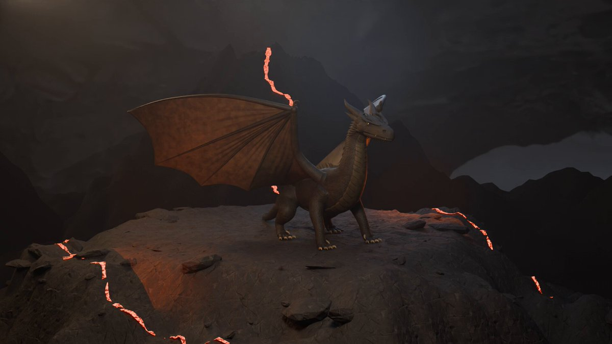</a>

Prompt literal para Blender que permite reconstruir un dragón 3D fotorrealista y totalmente editable a partir de una lámina de referencias proporcionada, con anatomía modelada, materiales, iluminación cinematográfica, renders de validación y un vuelo de cámara de 10 segundos.

**Prompt**

```text
Crea dentro de Blender una reconstrucción 3D fotorrealista y totalmente editable del dragón mostrado en la lámina de referencias adjunta.

Usa todas las vistas proporcionadas —incluidas las vistas lateral, frontal, superior y posterior, los ángulos de la cabeza, los primeros planos de la cabeza, el ojo, las escamas y el ala— para reconstruir un único dragón coherente y anatómicamente creíble.

Reproduce la referencia con la mayor fidelidad posible, especialmente:

- Las proporciones generales del cuerpo y la silueta
- El cuello largo y musculoso y la cola afilada
- Cuatro patas y dos grandes alas de tipo murciélago
- La forma de la cabeza y la mandíbula
- El número, la forma y la disposición de los cuernos
- Las espinas dorsales a lo largo del cuello, el lomo y la cola
- Los patrones de escamas en carbón oscuro y marrón terroso
- Las escamas superpuestas con aspecto de armadura
- Los ojos de color ámbar dorado con pupilas verticales
- Las garras, los dientes y las membranas alares
- El aspecto antiguo, realista y amenazador

Los paneles de referencia pueden contener pequeñas inconsistencias. Intégralas en una criatura base físicamente coherente y simétrica, conservando la identidad visual del dragón. Usa la vista lateral para las proporciones generales, la vista frontal para la anchura y la postura, las vistas superior y posterior para las alas y la cola, y los primeros planos para la cabeza, los ojos, las escamas y los materiales de las alas.

Construye el dragón desde cero como geometría real y editable de Blender. No descargues ni importes un modelo de dragón existente. No uses carteles, proyecciones 2D, ilusiones creadas con mapas de profundidad ni vídeo generado en lugar de geometría.

Usa scripts modulares de Python para Blender (`bpy`) y el ejecutable de Blender en modo de fondo/sin interfaz como método principal de construcción. Mantén los scripts reproducibles y conserva las versiones correctas del archivo `.blend`. Usa el control del equipo para abrir e inspeccionar la escena de Blender siempre que resulte útil realizar una inspección visual. No instales ni dependas de un servidor MCP de Blender.

ENFOQUE DE MODELADO

Empieza con un bloqueo anatómico antes de añadir detalles. Establece:

- El cráneo, la mandíbula y las órbitas oculares
- El cuello, el pecho, la caja torácica y la pelvis
- Cuatro patas anatómicamente convincentes
- Dedos separados y garras curvas
- Los hombros de las alas integrados en el torso
- Brazos articulados de las alas y huesos de los dedos
- Membranas alares conectadas correctamente
- Una cola larga que continúe de forma natural desde la pelvis
- Los cuernos principales y las espinas dorsales

Evita extremidades adicionales, cuernos duplicados, membranas desconectadas, articulaciones rotas, escamas flotantes, intersecciones, formas excesivamente finas, asimetrías accidentales y proporciones propias de un juguete.

Después de validar el bloqueo, añade detalles secundarios y terciarios:

- Placas superpuestas del pecho y el cuello
- Escamas direccionales que sigan la anatomía
- Arcos superciliares y párpados
- Aberturas nasales reales
- Interior de la boca, encías y dientes individuales
- Relieves, mellas y puntas desgastadas en los cuernos
- Armadura de las patas y placas de los nudillos
- Tendones, pliegues, venas y cicatrices discretas en las alas
- Espinas dorsales que continúen por la cola
- Una asimetría natural sutil

Usa geometría para todo lo que afecte a la silueta, incluidos cuernos, garras, dientes, escamas principales, espinas dorsales, dedos de las alas y pliegues importantes de las membranas. Usa mapas de normales, bump o desplazamiento moderado únicamente para los microdetalles.

MATERIALES

Crea materiales fotorrealistas basados físicamente.

Las escamas deben ser predominantemente negras, de color carbón, con variaciones sutiles de grafito y marrón terroso. Añade variaciones moderadas de color, rugosidad y microdetalles en las normales. Las escamas elevadas, la piel hundida y las placas de armadura deben reflejar la luz de forma diferente. Evita el brillo plástico uniforme y el ruido procedural indiscriminado.

Las membranas de las alas deben parecer cuero de reptil desgastado por la intemperie. Deben verse más finas entre los huesos de soporte y más gruesas cerca de las articulaciones y los bordes de ataque. Incluye venas, pliegues, tensión, cicatrices, translucidez y variaciones de color sutiles, sin hacer que parezcan tela, goma o papel.

Crea cuernos y garras similares a la queratina, con bases oscuras, puntas desgastadas más claras, relieves longitudinales y daños sutiles.

Los ojos deben tener:

- Iris de color ámbar dorado
- Pupilas negras verticales
- Estructuras detalladas en el iris
- Regiones limbares oscuras
- Globos oculares tridimensionales reales
- Párpados realistas
- Brillos húmedos en la córnea
- Humedad sutil a lo largo de los bordes de los párpados

No hagas que los ojos sean emisivos ni que brillen de forma artificial.

ILUMINACIÓN Y ENTORNO

Crea un entorno cinematográfico sobrio, similar al de la referencia:

- Pedestal rocoso oscuro o saliente montañoso
- Montañas atmosféricas lejanas
- Cielo cubierto y dramático
- Iluminación ambiental fría
- Luz direccional ligeramente más cálida que revele el rostro y las escamas
- Niebla atmosférica ligera
- Ninguna estructura ni criatura adicional que distraiga

Coloca al dragón en una postura estable y dominante:

- Cabeza elevada y alerta
- Cuello ligeramente curvado
- Alas completamente o casi completamente extendidas
- Peso distribuido de forma creíble entre las cuatro patas
- Cola apoyada o curvada de forma natural detrás del cuerpo
- Boca cerrada o ligeramente entreabierta
- Ojos dirigidos hacia la cámara o justo más allá de ella

VERIFICACIÓN VISUAL

Crea cámaras de validación emparejadas para:

- Vista lateral
- Vista frontal
- Vista superior
- Vista posterior
- Perfiles izquierdo y derecho de la cabeza
- Vista principal de tres cuartos
- Primer plano de la cabeza
- Primer plano del ojo
- Primer plano de las escamas
- Primer plano del ala

Realiza al menos tres ciclos de evaluación y corrección.

En cada ciclo:

1. Renderiza todas las cámaras de validación.
2. Compara cada render con el panel de referencia correspondiente.
3. Evalúa la silueta, la anatomía, las proporciones, la identidad de la cabeza, los cuernos, las alas, las patas, los pies, la cola, la dirección de las escamas, los materiales, la simetría, las intersecciones, el sombreado y las normales.
4. Elabora una lista de discrepancias ordenada por prioridad.
5. Corrige los problemas visualmente más importantes.
6. Vuelve a renderizar con las mismas cámaras.
7. Conserva las comparaciones del antes y el después.

No afirmes que el trabajo está terminado solo porque se hayan creado los objetos. La finalización requiere inspeccionar los renders reales y corregir los problemas visibles.

VUELO DE CÁMARA DE 10 SEGUNDOS

Crea un vuelo de cámara cinematográfico alrededor del dragón terminado con estos requisitos:

- Exactamente 10 segundos
- Resolución de 1920 × 1080
- 30 fotogramas por segundo
- Exactamente 300 fotogramas
- Movimiento de cámara continuo y fluido
- Sin cortes
- Aproximadamente una órbita completa de 360 grados
- Comienza con una composición frontal sólida de tres cuartos
- Recorre el lateral, la parte posterior y el lateral opuesto
- Termina con una composición que conecte suavemente con el fotograma inicial
- Añade un cambio de elevación moderado para mostrar la construcción del lomo y las alas
- Mantén al dragón completo dentro del encuadre
- Mantén la cabeza y el torso como foco visual principal
- Usa interpolación Bézier suave
- Evita aceleraciones repentinas y el giro de la cámara sobre su eje
- Evita atravesar las alas, la cola, el terreno o el cuerpo
- Usa un objetivo de perspectiva natural, sin una distorsión gran angular marcada
- Mantén la profundidad de campo lo bastante sutil para que el dragón siga siendo legible
- Usa desenfoque de movimiento moderado

Antes del render final, genera una previsualización rápida de toda la animación a 1080p y con pocas muestras. Inspecciona la previsualización completa y corrige el encuadre incorrecto, las colisiones de la cámara, las siluetas extrañas, las vistas obstruidas, los movimientos bruscos, los defectos de sombreado y las intersecciones de geometría visibles.

RENDER FINAL

Después de completar los ciclos de evaluación y aprobar la previsualización de la animación:

- Renderiza la animación final a 1920 × 1080.
- Usa Cycles con aceleración por GPU cuando esté disponible.
- Renderiza a 30 fps durante exactamente 300 fotogramas.
- Usa muestreo adaptativo y eliminación de ruido.
- Renderiza primero fotogramas de imagen individuales para poder reanudar un render interrumpido.
- Usa PNG de 16 bits o OpenEXR para los fotogramas maestros.
- Ensambla los fotogramas renderizados en un MP4 H.264 de alta calidad.
- No uses interpolación de fotogramas mediante IA.
- Conserva los fotogramas individuales después de ensamblar el vídeo.

ENTREGABLES

Proporciona:

1. Archivo `.blend` editable final
2. Todos los scripts `bpy` reproducibles
3. README con instrucciones para reconstruir y renderizar
4. Informe del análisis de referencias y las suposiciones
5. Comparaciones de referencias con vistas emparejadas
6. Comparaciones de los ciclos de evaluación, antes y después
7. Renders fijos de alta calidad del dragón completo y de los detalles importantes
8. Secuencia de imágenes completa de 300 fotogramas
9. Vídeo H.264 final de 10 segundos a 1080p
10. Informe de validación de la geometría y los materiales
11. Un manifiesto que identifique todos los recursos externos permitidos del entorno y sus licencias

CRITERIOS DE ÉXITO

El resultado será satisfactorio si:

- El resultado se reconoce claramente como el mismo dragón de la referencia.
- Su anatomía sigue siendo coherente desde cualquier ángulo.
- La cabeza, los cuernos, los ojos ámbar, las alas, las espinas dorsales y las escamas oscuras superpuestas coinciden estrechamente con la referencia.
- El dragón es completamente tridimensional y editable.
- Los detalles principales y medianos están modelados, no simulados.
- Los materiales reaccionan de forma natural mientras se mueve la cámara.
- No hay intersecciones evidentes, escamas flotantes, anatomía duplicada ni normales defectuosas.
- Se parece a una criatura física fotografiada, no a un juguete, una escultura, un modelo procedural genérico o un recurso de juego convencional.
- El movimiento de la cámara es fluido y cinematográfico, y dura exactamente 10 segundos.

Trabaja de forma autónoma durante estas etapas. Empieza con el análisis de referencias y el bloqueo anatómico. Si encuentras una ambigüedad importante que no pueda resolverse a partir de la referencia, toma la decisión anatómicamente más plausible, documenta la suposición y continúa.
```

[Ver vídeo ↗](https://media.tripogrowth.space/media/37abdf440442e643f2cd1704bd9fc7b850a2e7c4111b10d25d2a46a5b1c96b25.mp4) · [Publicación original](https://x.com/doomdave/status/2096335588727349434) · [Volver a los ejemplos](#all-prompts)

---

<a id="2096338836854804782"></a>

### Render 3D de una imagen de X

[Matt Boyle](https://x.com/MattJamesBoyle) · 2026-09-05

<a href="https://x.com/MattJamesBoyle/status/2096338836854804782"></a>

<a href="https://x.com/MattJamesBoyle/status/2096338836854804782">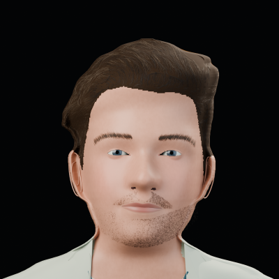</a>

El autor afirma que indicó a Astra que descargara Blender y creara un render 3D a partir de su imagen de X, dando como resultado una nueva foto de perfil.

**Prompt**

```text
Descarga Blender y crea un render 3D de mi imagen de X.
```

[Publicación original](https://x.com/MattJamesBoyle/status/2096338836854804782) · [Volver a los ejemplos](#all-prompts)

---

<a id="2096354461652488562"></a>

### Ensamble 3D jugable con animación sincronizada con el audio

[Generator](https://x.com/groovestreetgen) · 2026-09-05

<a href="https://x.com/groovestreetgen/status/2096354461652488562">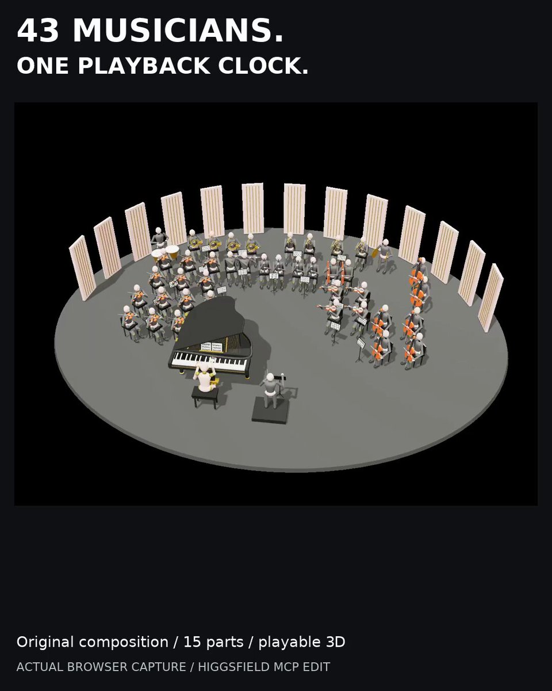</a>

Se pidió a Astra que creara una pieza corta original y un ensamble 3D jugable, con animación controlada por el audio, navegación por la línea de tiempo, cámara lenta, controles de cámara, MIDI y código fuente.

**Prompt**

```text
Compón una pieza corta original y crea un ensamble 3D jugable. Controla la animación según el tiempo del audio. Incluye navegación por la línea de tiempo, cámara lenta, controles de cámara, MIDI y código fuente.
```

[Ver vídeo ↗](https://media.tripogrowth.space/media/31a8ef5fdf9df19e171eb6e9959eef420812fbd00696f5bc87062af319a667e1.mp4) · [Publicación original](https://x.com/groovestreetgen/status/2096354461652488562) · [Volver a los ejemplos](#all-prompts)

---

<a id="2096391653669953761"></a>

### Crea y renderiza un agujero negro en Blender

[John Kler](https://x.com/JohnKlerAI) · 2026-09-06

<a href="https://x.com/JohnKlerAI/status/2096391653669953761">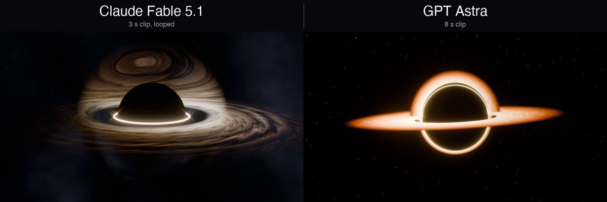</a>

El autor afirma que dio el mismo prompt a GPT Astra y Fable 5.1 para crear y renderizar en Blender un agujero negro inspirado en Interstellar.

**Prompt**

```text
Crea y renderiza en Blender un hermoso agujero negro, como el de Interstellar.
```

[Ver vídeo ↗](https://media.tripogrowth.space/media/1b73598434da7ad65d81ad44ae9f64256b96030f284a8cec325a1caff5f56b56.mp4) · [Publicación original](https://x.com/JohnKlerAI/status/2096391653669953761) · [Volver a los ejemplos](#all-prompts)

---

<a id="2096438110095585753"></a>

### Reconstrucción de Lego 1999 Racers

[Mo Elgaraihy](https://x.com/EngMoElgaraihy) · 2026-09-06

<a href="https://x.com/EngMoElgaraihy/status/2096438110095585753">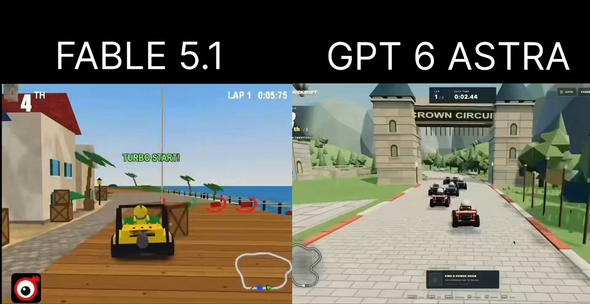</a>

Solicitud para reconstruir por completo el juego de carreras Lego 1999 Racers con GPT-6 Astra.

**Prompt**

```text
Reconstruye por completo el popular juego de carreras Lego 1999 Racers.
```

[Ver vídeo ↗](https://media.tripogrowth.space/media/2d031e51276cbf6c7d559143e251455c3e81db292e333d5db7e8200dda691528.mp4) · [Publicación original](https://x.com/EngMoElgaraihy/status/2096438110095585753) · [Volver a los ejemplos](#all-prompts)

---

<a id="2096547658164834788"></a>

### La visión del templo de Ezequiel en 3D

[KrixAi](https://x.com/KrixOnok) · 2026-09-06

<a href="https://x.com/KrixOnok/status/2096547658164834788">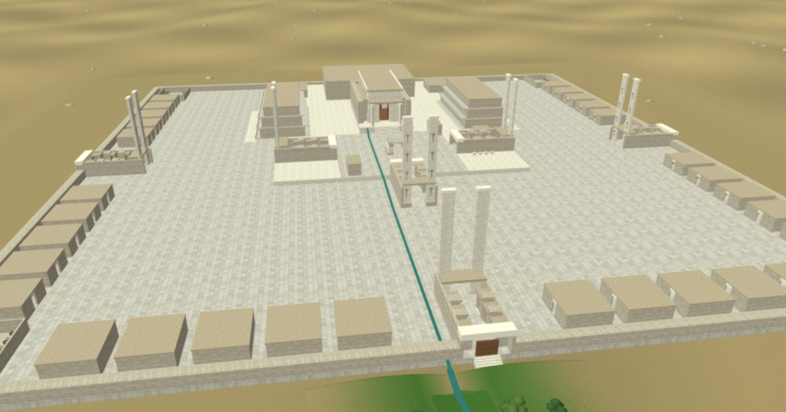</a>

Un prompt para recrear en 3D la visión del templo de Ezequiel y el paisaje que lo rodea, incluidos los patios y un río que da vida.

**Prompt**

```text
¿Cómo se vería en 3D la visión del templo de Ezequiel?
```

[Publicación original](https://x.com/KrixOnok/status/2096547658164834788) · [Volver a los ejemplos](#all-prompts)

---

<a id="2096562462674079868"></a>

### Simulación 3D de una explosión nuclear en una ciudad

[Ashish Thakur](https://x.com/ashishthakur___) · 2026-09-06

<a href="https://x.com/ashishthakur___/status/2096562462674079868">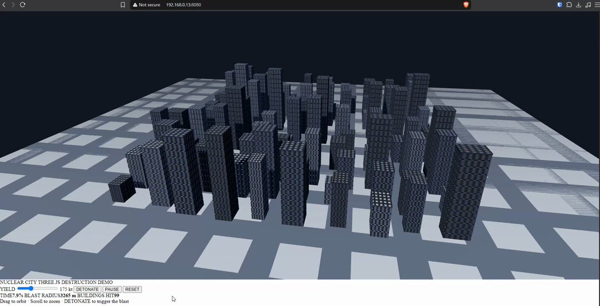</a>

Demostración 3D de una explosión nuclear en una ciudad, con destello nuclear, onda expansiva, bola de fuego, humo y edificios que se fracturan y colapsan a medida que los alcanza la explosión.

**Prompt**

```text
Crea una demostración de una explosión nuclear con una ciudad en 3D, un destello nuclear, una onda expansiva creciente, una bola de fuego, humo y edificios que se fracturen y colapsen progresivamente cuando la explosión los alcance.
```

[Ver vídeo ↗](https://media.tripogrowth.space/media/b4430be0a5e8ccad3b4bd26ce397300c536ce53d32c6031cc92acc0e89519dd6.mp4) · [Publicación original](https://x.com/ashishthakur___/status/2096562462674079868) · [Volver a los ejemplos](#all-prompts)

---

<a id="2096567422253662372"></a>

### Añadir una vista 3D al sitio web

[Maxence](https://x.com/Dgamax) · 2026-09-06

El autor indica que utilizó GPT-6 Astra para recrear un MMORPG en Three.js y después le pidió que añadiera la vista 3D resultante al sitio web, incluidas vistas de las zonas de aparición con audio.

**Prompt**

```text
Esto está genial. ¡Añadamos también esta vista 3D al sitio web!
```

[Publicación original](https://x.com/Dgamax/status/2096567422253662372) · [Volver a los ejemplos](#all-prompts)

---

<a id="2096593372311941143"></a>

### Motor de la Totalidad: Catedral cinematográfica del eclipse

[Chris W](https://x.com/Chris_Wozniczek) · 2026-09-06

<a href="https://x.com/Chris_Wozniczek/status/2096593372311941143">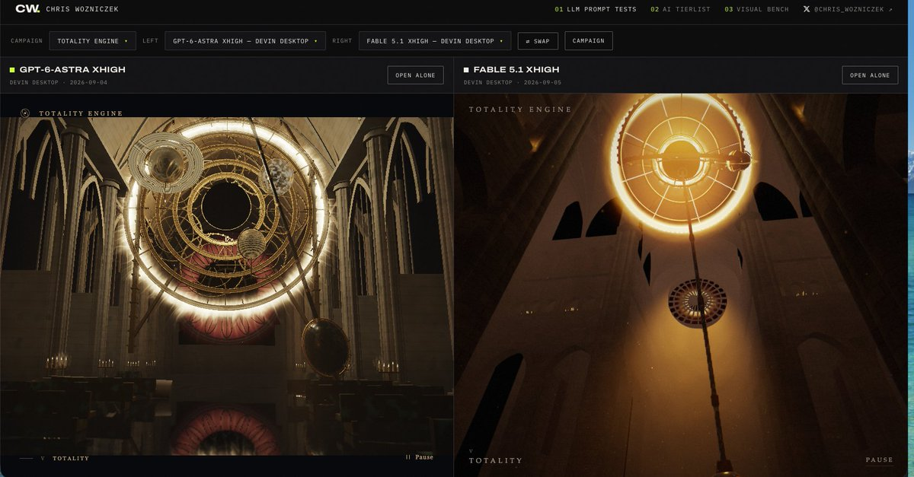</a>

<a href="https://x.com/Chris_Wozniczek/status/2096593372311941143">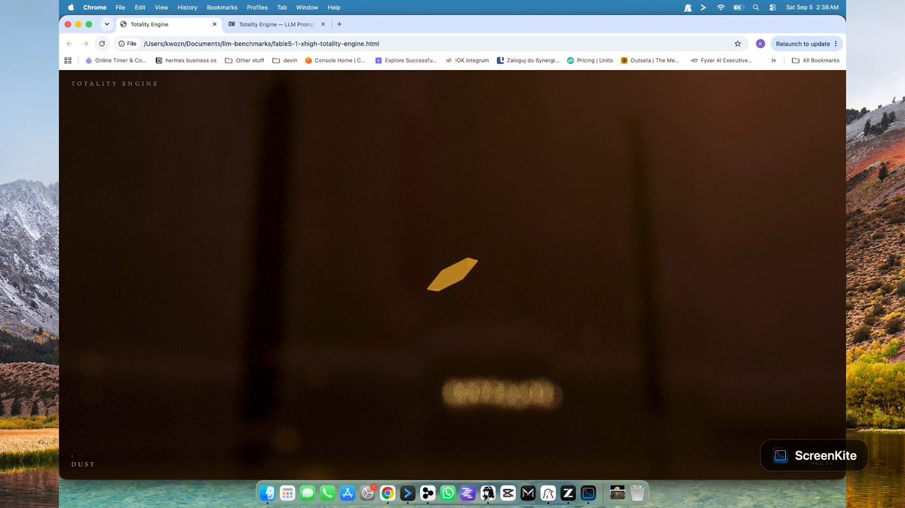</a>

Un prompt completo para Three.js/WebGL que crea un cortometraje cinematográfico en bucle de 32 segundos dentro de una catedral gótica inundada, con un reloj astronómico monumental, movimientos de cámara dirigidos, agua procedural, planetas de cristal e iluminación de eclipse. Chris W publicó una ejecución en Astra y una comparación con otros modelos.

**Prompt**

```text
Crea una experiencia pulida y visualmente impactante de HTML/WebGL, autocontenida y en un único archivo, llamada:

totality-engine.html colócala en documents/llm-benchmarks

No te limites a describir la idea. Genera realmente el archivo HTML completo y funcional, y guárdalo en el directorio actual.

Construye un cortometraje cinematográfico en bucle de 32 segundos, no un diorama de pruebas. El producto es la interpretación de la cámara. La interacción es un extra que se activa después de reproducir el filme una vez.

Mundo:
Una catedral gótica sumergida durante la totalidad de un eclipse solar. El agua negra cubre el suelo de la nave. En el crucero se alza un reloj astronómico monumental de latón, el Motor de la Totalidad: anillos de orrery anidados, planetas de cristal, un núcleo de sol negro y un péndulo de mármol oscuro de 40 metros con herrajes dorados. Caliza mojada, verdín, llamas de velas y polvo de oro. Todo debe generarse mediante código procedural. No uses modelos, texturas, imágenes, fuentes como archivos ni audio externos.

Filme dirigido (un solo reloj, beats con nombre, bucle continuo):

0.0–4.0 s POLVO
Primerísimo primer plano. Una mota de polvo gira en un haz de luz rojo dorado. Casi no hay contexto. Avance lento de cámara.

4.0–10.0 s NAVE
Retrocede y asciende. Estamos con el agua negra hasta las rodillas, en el crucero de la catedral. Las bóvedas de crucería se pierden en la niebla. El péndulo entra en cuadro desde la izquierda, pesado y lento, y pasa lo bastante cerca como para sentir su masa. Se forman ondas en el agua desde la cámara.

10.0–18.0 s ASCENSO
Acompaña el ascenso del péndulo. Revela el orrery en la bóveda: al menos cuatro anillos de latón anidados, con distintas inclinaciones; tres planetas de cristal con atmósferas diferenciadas —uno nuboso, otro con anillos y otro con bandas de tormenta—; y el núcleo de sol negro. Agrupaciones de velas a lo largo del triforio. El polvo de oro asciende contra la gravedad.

18.0–24.0 s HILO
La cámara se abre paso entre el orrery. Atraviesa el cristal del planeta con anillos —refracción, no un truco de transparencia—, sigue su plano de anillos durante un instante y sale en dirección al sol negro. El siguiente balanceo del péndulo deforma la luz a su alrededor como una lente gravitacional débil.

24.0–30.0 s TOTALIDAD
La corona estalla en un anillo de fuego blanco dorado que se convierte en la rueda más externa del orrery. Un tic de reloj que se sienta como un sonido: todos los anillos encajan de golpe en una alineación perfecta y, después, la corona permanece. No fundas a blanco. Mantén la silueta de toda la máquina contra el anillo de fuego.

30.0–32.0 s CODA
Deslízate hacia una continuación lenta que coincida con el fotograma 0, para que el bucle sea invisible. No hagas un corte brusco.

Después de la primera reproducción completa, habilita arrastrar para orbitar, zoom con la rueda del ratón y un control «Reproducir filme». El botón Pausa debe funcionar siempre. Opcional: las teclas 1–5 saltan al inicio de cada beat.

Construcción de la escena:
- Define un primer plano, un plano medio y un fondo sólidos. El péndulo ocupa el primer plano en NAVE. Las bóvedas y la niebla aportan profundidad.
- Incluye al menos dos referencias a escala humana —un banco sumergido, una aguja caída o una fila de velas— para que la máquina se perciba enorme.
- El agua debe ser un material real: reflejos del orrery, un fresnel tenue, desplazamiento lento y las ondas producidas por el péndulo y la cámara.
- Los planetas deben ser de cristal grueso, no esferas brillantes. A través de al menos uno de ellos debe verse una catedral distorsionada.
- El latón debe transmitir peso: oscuro en las sombras, con solo los bordes captando la luz de la corona.
- Las llamas de las velas y el polvo de oro deben usar instanciación. El polvo solo asciende durante ASCENSO y TOTALIDAD.
- Bóvedas de crucería, siluetas de arbotantes y un enorme rosetón circular o abertura de eclipse en el muro del fondo, alineado con el sol negro.
- Paleta limitada y fija: caliza mojada #8a8680, latón #c4a574, verdín #2f6f66, carmesí del eclipse #6b1020, corona #ffe9c2, agua negra #05070c, polvo de oro #e6c27a. Nada de cian, magenta, neón, arcoíris ni ese «look de IA» morado sobre negro.
- Tipografía: un único título pequeño «TOTALITY ENGINE» y el nombre del beat; estética cinematográfica, no de panel de control.

Requisitos técnicos:
- Usa Three.js desde una CDN estable. Incluye todo el HTML, CSS y JS en este único archivo.
- Controla toda la animación con un único reloj de tiempo transcurrido y ventanas de beat con nombre. No uses bucles independientes con Math.random, Date.now en los shaders ni ruido sin semilla. Usa únicamente un RNG con semilla; la constante de semilla es 0xA2E1.
- La película de cámara debe usar interpolación suave con ease-in-out en los grandes movimientos, un easing más pesado para el péndulo —tiene masa— y una estabilización de cola larga al entrar en TOTALIDAD. Una órbita lineal como cámara principal es inaceptable.
- Usa GLSL personalizado —ShaderMaterial o un pase a pantalla completa—, no materiales estándar que solo lo aparenten:
1. Agua (reflejo + fresnel + desplazamiento lento)
2. Corona del sol negro (fuego/plasma, no un sprite)
3. Lente gravitacional del péndulo (la luz se curva cerca de la pesa durante HILO)
4. Cristal grueso para al menos un planeta
- Usa InstancedMesh para el polvo, las velas y cualquier elemento repetido de piedra o latón. No generes miles de objetos Mesh independientes.
- Se permite el posprocesado, pero no puede sustituir a la iluminación. Si usas bloom, aplícalo con sutileza únicamente a la corona y las velas. Un UnrealBloom aplicado a toda la escena es inaceptable.
- La niebla, los reflejos húmedos y la abertura del eclipse deben crear la atmósfera. No uses conos transparentes baratos como «rayos divinos» a menos que estén realmente controlados por un shader.
- La experiencia debe adaptarse a toda la ventana del navegador, gestionar el redimensionado y apuntar a 60 fps en un portátil de 2023. Si tienes que elegir, reduce la cantidad de partículas antes que sacrificar la película de cámara.
- UI pequeña y discreta: título, beat actual, pausa y repetición. No incluyas contador de FPS, dat.gui ni asistentes de depuración activos.
- No dejes comentarios TODO, pseudocódigo, marcadores de posición, funciones ausentes ni frases como «esto quedaría mejor con X».
- Al cargarse, el filme debe comenzar por sí solo. Mostrar un fotograma estático detrás de un botón de inicio es inaceptable.

Nivel de calidad:
Esto debe parecer un fotograma de un cortometraje, no un ejemplo de Three.js. Si una captura a los 26 segundos no se interpreta como «un reloj del tamaño de una catedral en el momento del eclipse», aún no has terminado. Itera en la composición, los materiales y la cámara antes de añadir más objetos.
```

[Ver vídeo ↗](https://media.tripogrowth.space/media/58e4abad-e682-4de8-b90b-e41667474cf7.mp4) · [Publicación original](https://x.com/Chris_Wozniczek/status/2096593372311941143) · [Demo en línea](https://chris-website-theta.vercel.app/astra-xhigh-totality-engine.html) · [Volver a los ejemplos](#all-prompts)

---

<a id="2096596888799895855"></a>

### Crea CS2 con Three.js

[Neatprompts](https://x.com/neatpromptsai) · 2026-09-06

<a href="https://x.com/neatpromptsai/status/2096596888799895855">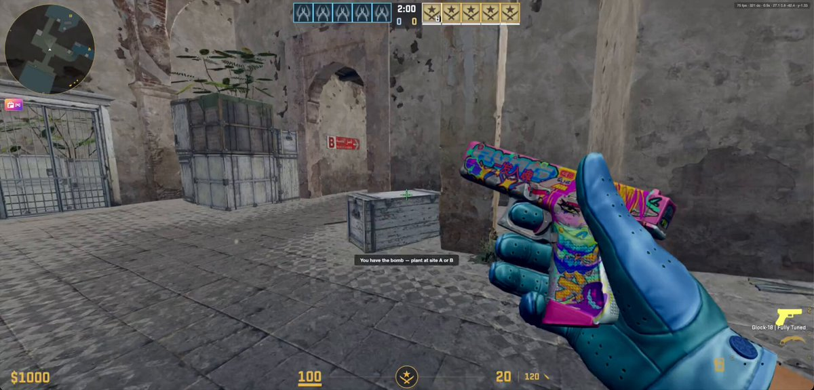</a>

Un prompt breve compartido por Neatprompts para crear una escena de estilo CS2 en Three.js con GPT-6 Astra. La cadena de difusión pasa por Om Patel y llega a una demostración pública en Reddit de u/TimeForsaken5275.

**Prompt**

```text
hey GPT-6 Astra, créame CS2 con Three.js, sin cometer errores.
```

[Ver vídeo ↗](https://media.tripogrowth.space/media/e271d98fca4347c75b9c4f81b29b4224b38a394ae837c6a946f6ecdf227d783c.mp4) · [Publicación original](https://x.com/neatpromptsai/status/2096596888799895855) · [Volver a los ejemplos](#all-prompts)

---

<a id="2096629506047955327"></a>

### Videojuego de aventuras de fantasía costera: Windhaven

[Tripo](https://x.com/tripoai) · 2026-09-06

<a href="https://x.com/tripoai/status/2096629506047955327">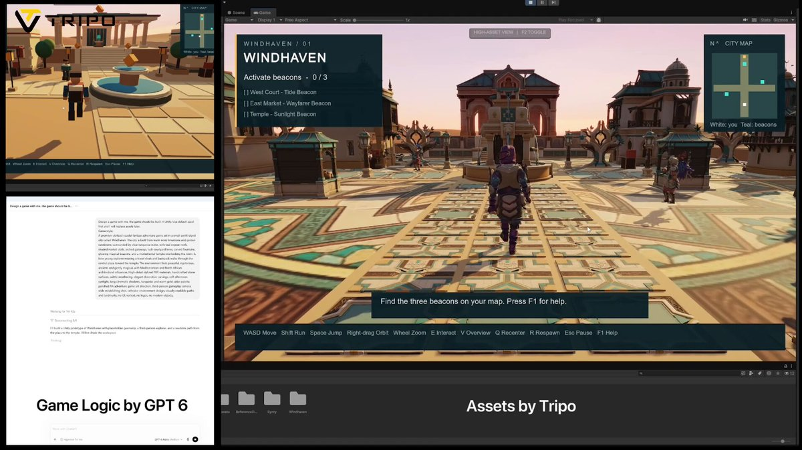</a>

Prompt de Unity proporcionado por un autor para crear un videojuego jugable de aventuras de fantasía costera estilizada y su entorno 3D de ciudad insular, Windhaven, con una plaza central, un templo, puntos de referencia y una propuesta de juego en tercera persona.

**Prompt**

```text
Diseña un juego conmigo. El juego debe estar creado en Unity. Usa primero los recursos predeterminados; los sustituiré más adelante.
Estilo del juego:
Un videojuego de aventuras de fantasía costera estilizada y de alta calidad, ambientado en una pequeña ciudad insular bañada por el sol llamada Windhaven. La ciudad está construida con piedra caliza de marfil cálido y arenisca dorada, rodeada de aguas turquesas cristalinas, y cuenta con tejados de cobre verde azulado, puestos de mercado a la sombra, accesos arqueados, frondosos árboles en los patios, fuentes talladas, balizas mágicas resplandecientes y un templo monumental que domina la ciudad. Un joven explorador solitario, con capa de viaje y mochila, recorre la plaza central en dirección al templo. El entorno transmite una sensación de paz, misterio, antigüedad y magia sutil, con influencias arquitectónicas mediterráneas y norteafricanas. Materiales PBR estilizados de gran detalle, superficies de piedra trabajadas a mano, desgaste sutil, elegantes tallas decorativas, suave luz de la tarde, largas sombras cinematográficas, paleta de colores turquesa y dorado cálido, dirección artística pulida propia de un juego de aventuras AA, cámara de juego en tercera persona, plano general de presentación, diseño ambiental cohesionado, rutas y puntos de referencia claramente legibles, sin interfaz de usuario, sin texto, sin logotipos ni objetos modernos.
```

[Ver vídeo ↗](https://media.tripogrowth.space/media/7a9c804e3db0b128f569756d890729450ae9852b5b420c507f381d6a80ec40ac.mp4) · [Publicación original](https://x.com/tripoai/status/2096629506047955327) · [Volver a los ejemplos](#all-prompts)

---

<a id="2096637091627364531"></a>

### RPG de acción de fantasía oscura en Three.js

[Prompt Case](https://x.com/HiltonMisia) · 2026-09-06

<a href="https://x.com/HiltonMisia/status/2096637091627364531">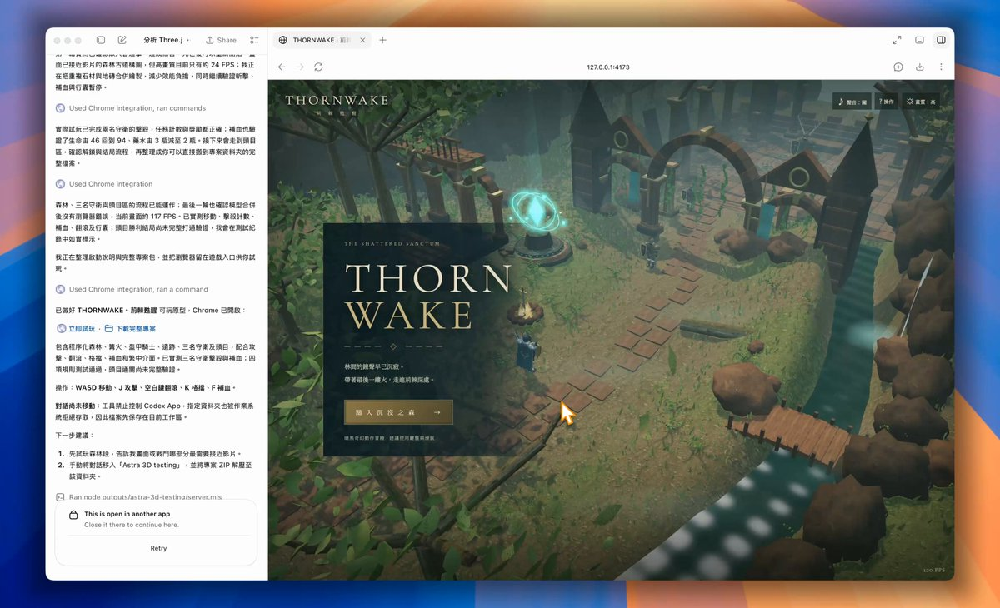</a>

Un prompt para crear un RPG de acción de fantasía oscura en 3D, totalmente jugable, con Three.js. Incluye un santuario gótico invadido por el bosque, combates de caballero, magia, un enfrentamiento contra un jefe, elementos de HUD en chino tradicional y todos los flujos del juego.

**Prompt**

```text
Usa Three.js para crear desde cero un RPG de acción de fantasía oscura en 3D, pulido y totalmente jugable.

Usa una cámara de seguimiento cenital en ángulo. El escenario es un gran santuario gótico invadido por el bosque, con torres en ruinas, galerías porticadas, puentes de piedra cubiertos de musgo, colinas onduladas, arroyos, cascadas y fogatas. Crea una atmósfera con múltiples capas mediante materiales realistas, iluminación cinematográfica, una ligera neblina, vegetación agitada por el viento y agua en movimiento.

El protagonista es un poderoso caballero con una armadura pesada de acero y oro, elaborada con gran detalle, una capa ondeante y una espada rúnica y un escudo resplandecientes. El personaje debe poder moverse, atacar con la espada, rodar, bloquear, curarse y lanzar magia con círculos mágicos enormes, haces de luz y efectos de rayos. Tras derrotar a los guardias, el jugador debe enfrentarse a un jefe caballero gigante con astas.

Las animaciones de ataque, los efectos visuales y las direcciones de los impactos deben coincidir siempre con la dirección hacia la que mira el personaje. Incluye un HUD pulido en chino tradicional, una pantalla de equipamiento del personaje y flujos completos de victoria, derrota y reinicio.

Encárgate de forma independiente del modelado, la creación o adquisición de recursos, la programación y la optimización del rendimiento. Busca un acabado visual de nivel AAA. Prueba el juego continuamente, revisa los aspectos visuales y corrige los problemas hasta entregar un juego completo y jugable, instrucciones para iniciarlo y el código fuente.
```

[Ver vídeo ↗](https://media.tripogrowth.space/media/b13845b05ef5436efebf143b9312aceae495d96246bb0eb6475eadd48f5fbcd5.mp4) · [Publicación original](https://x.com/HiltonMisia/status/2096637091627364531) · [Volver a los ejemplos](#all-prompts)

---

<a id="2096637194270134742"></a>

### Render de la Tierra girando en Blender

[John Kler](https://x.com/JohnKlerAI) · 2026-09-06

<a href="https://x.com/JohnKlerAI/status/2096637194270134742">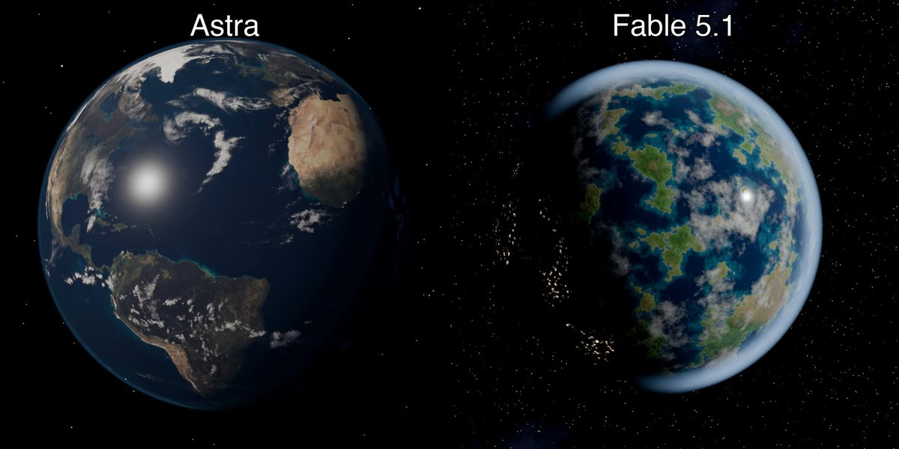</a>

Un prompt para Blender que permite crear un espectacular render de cinco segundos de la Tierra girando, vista desde el espacio. El autor afirma que ambos modelos se probaron con este mismo prompt.

**Prompt**

```text
En Blender, crea un render espectacular de 5 segundos de la Tierra girando, vista desde el espacio.
```

[Ver vídeo ↗](https://media.tripogrowth.space/media/48daeb6040d6e4c973074c202242b728d1b401e8e26be5ae0b511936af504299.mp4) · [Publicación original](https://x.com/JohnKlerAI/status/2096637194270134742) · [Volver a los ejemplos](#all-prompts)

---

<a id="2096641728497275011"></a>

### Juego de exploración 3D Mini World

[Weijian Zhang](https://x.com/weijianzhang_) · 2026-09-06

<a href="https://x.com/weijianzhang_/status/2096641728497275011">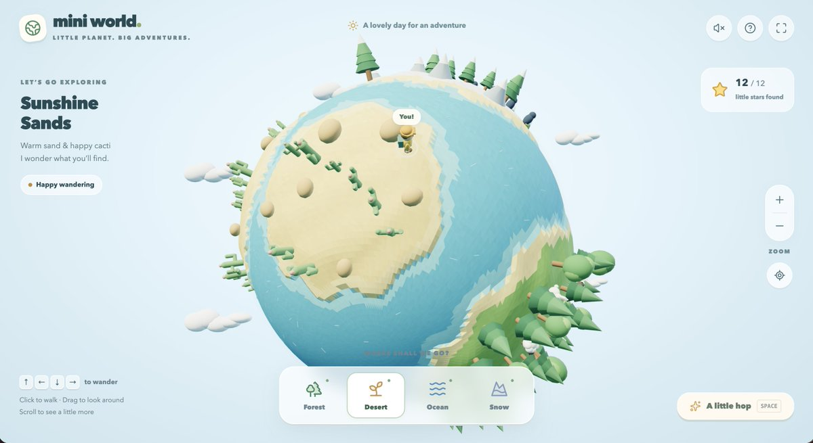</a>

<a href="https://x.com/weijianzhang_/status/2096641728497275011">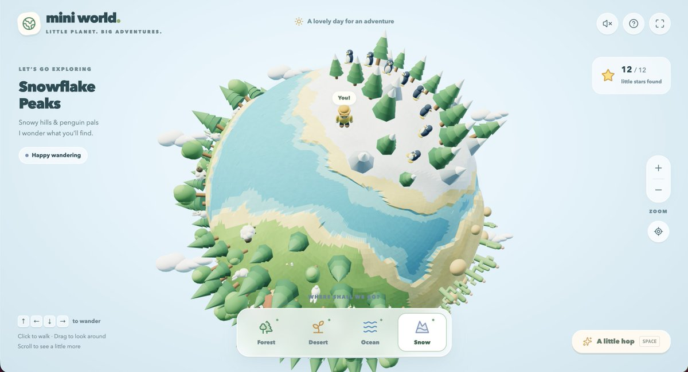</a>

<a href="https://x.com/weijianzhang_/status/2096641728497275011">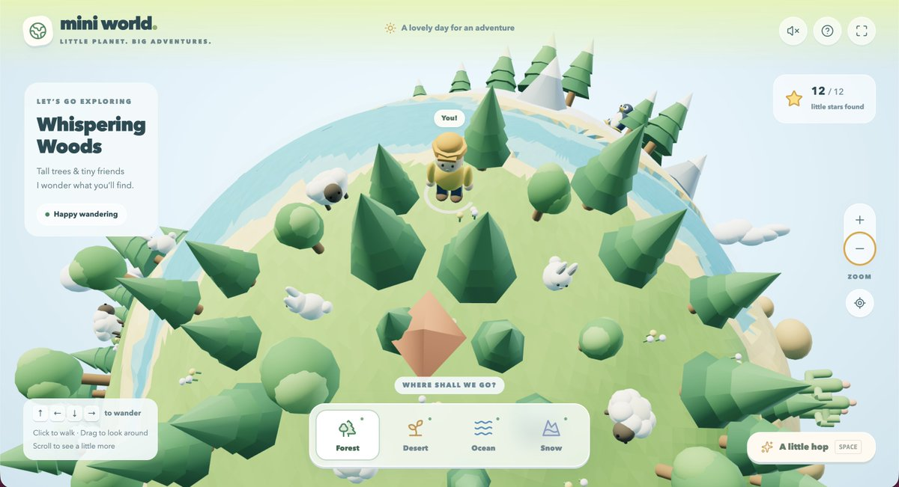</a>

<a href="https://x.com/weijianzhang_/status/2096641728497275011">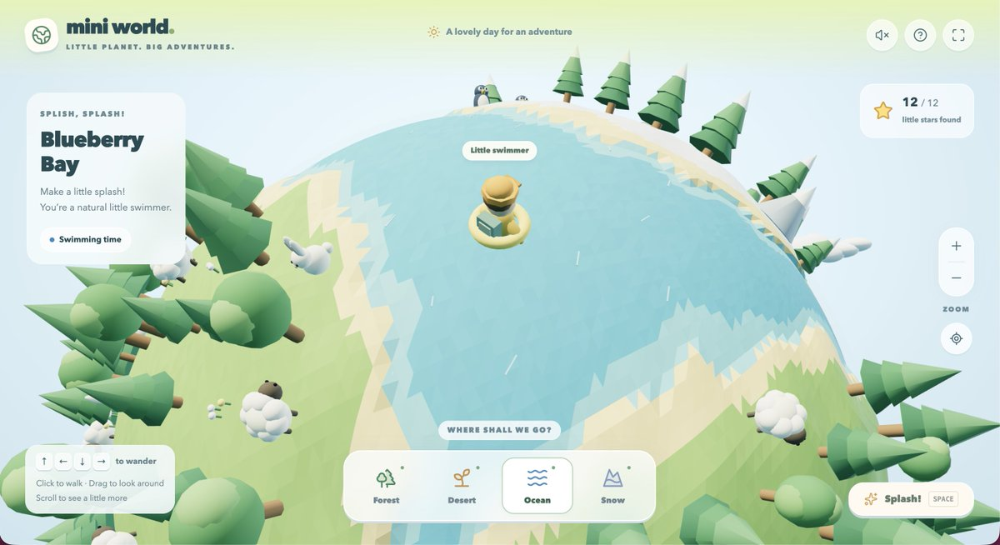</a>

Un prompt reutilizable para crear un juego infantil de exploración 3D con un mundo esférico, zoom, bosques, desiertos, océanos, natación, exploración y mejoras iterativas.

**Prompt**

```text
Creemos un juego llamado Mini World. Es un juego de exploración de un mundo 3D, con una interfaz gráfica atractiva y de alta calidad, diseñado para que sea divertido y fácil de jugar para mi hijo de cuatro años y medio. Debe ser posible acercar y alejar la cámara. Desde lejos, el mundo parece una pequeña esfera, pero en su interior cuenta con distintas regiones para explorar. Una región puede parecer un bosque, otra un desierto, y también puede haber océanos en los que el personaje pueda nadar. El juego debe resultar divertido y ofrecer una experiencia jugable, con un personaje capaz de recorrer distintas partes del mundo, explorar diversos entornos y descubrir cosas por el camino. Considera que conseguir que todo funcione correctamente es el objetivo principal. El diseño debe ser atractivo y probarse minuciosamente mediante ciclos iterativos, para que el movimiento, el zoom, la exploración, la natación, los entornos, los controles y la experiencia general funcionen de forma fluida y coordinada. Sigue probándolo y mejorándolo hasta que todo funcione de manera fiable y el juego esté pulido, sea intuitivo y resulte divertido para un niño pequeño.
```

[Publicación original](https://x.com/weijianzhang_/status/2096641728497275011) · [Volver a los ejemplos](#all-prompts)

---

<a id="2096739993217577219"></a>

### Juego de Grand Theft Auto con personajes y ciudades de San Andreas

[ElIngeRRC](https://x.com/ElIngeRRC) · 2026-09-06

Solicita crear un juego de Grand Theft Auto en el que CJ, Michael, Trevor, Lucia y Jason tengan los roles indicados en distintas ciudades.

**Prompt**

```text
Haz un juego de Grand Theft Auto donde CJ sea un magnate de la ciudad de las Venturas, Michael sea un accionista de San Fierro. 
Trevor sea un traficante de Los Santos y Lucia y Jason sean sus compañeros.
```

[Publicación original](https://x.com/ElIngeRRC/status/2096739993217577219) · [Volver a los ejemplos](#all-prompts)

---

<a id="2096766465730847059"></a>

### Asset de videojuego de una minifigura LEGO con Blender MCP

[Simon Smith](https://x.com/_simonsmith) · 2026-09-07

<a href="https://x.com/_simonsmith/status/2096766465730847059"></a>

Crea una versión de Donald Trump como minifigura LEGO, convertida en un asset de videojuego AAA de alta calidad mediante Blender MCP.

**Prompt**

```text
Usa Blender MCP para crear una versión de Donald Trump como minifigura LEGO que pueda utilizar como asset de videojuego. Haz que tenga una calidad excepcional, propia de un videojuego AAA, y somete tu trabajo a una revisión exhaustiva para asegurarte de que sea detallado, preciso y excelente.
```

[Ver vídeo ↗](https://media.tripogrowth.space/media/92169546-6768-4c0b-a8ae-f92fead653ad.mp4) · [Publicación original](https://x.com/_simonsmith/status/2096766465730847059) · [Volver a los ejemplos](#all-prompts)

---

<a id="2096793432987464010"></a>

### Crea un slime blando e interactivo con Three.js y WebGPU

[码农暖爸](https://x.com/Delroy715) · 2026-09-07

<a href="https://x.com/Delroy715/status/2096793432987464010">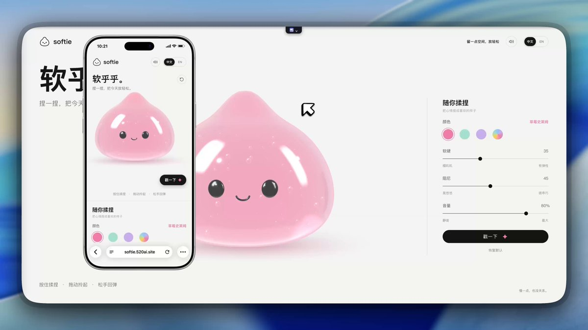</a>

El autor muestra una aplicación de slime para navegador llamada Softie y, a continuación, publica explícitamente el prompt utilizado para crearla. El prompt pide crear un slime blando que se pueda arrastrar y aplastar, con controles ajustables.

**Prompt**

```text
Crea un directorio nuevo y desarrolla una página con un slime jugable en el navegador. Usa Three.js y WebGPU; no recurras a WebGL.
En el centro debe haber un slime redondo y regordete, rosa o verde azulado, semitransparente y con burbujas apenas visibles en su interior. El usuario debe poder presionarlo y arrastrarlo con el ratón; al soltarlo, debe balancearse hasta recuperar su forma. Añade un poco de gravedad para que pueda caer suavemente sobre una mesa invisible. No lo hagas como una esfera rígida: debe tener una sensación blanda y carnosa.
Coloca una cara simpática: dos ojos negros como cuentas y una boquita pequeña, que se deformen junto con la superficie; no los separes del cuerpo. En la parte derecha, añade unos controles sencillos para el color, la suavidad y la amortiguación. El botón «Darle un toque» debe hacer que salte ligeramente.
Mantén la página limpia, con un fondo gris claro y un título grande. Debe funcionar a 60 fotogramas por segundo. Primero genera una imagen de referencia del resultado objetivo y después construye la página basándote en ella; añade más detalles solo cuando la captura de pantalla se parezca al objetivo.
```

[Ver vídeo ↗](https://media.tripogrowth.space/media/ff1a75d50fccfb32eeea78b2dae5f667ed84673761cffbae90f01c501bbd3be9.mp4) · [Publicación original](https://x.com/Delroy715/status/2096793432987464010) · [Volver a los ejemplos](#all-prompts)

---

<a id="2096814981509775616"></a>

### Bosque 3D en tiempo real, extremadamente detallado, en el navegador

[Rakib Hossen](https://x.com/rakib_hossen_ai) · 2026-09-07

<a href="https://x.com/rakib_hossen_ai/status/2096814981509775616">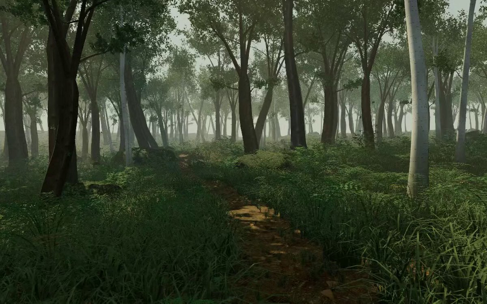</a>

Un prompt exacto para crear y publicar públicamente un bosque 3D en tiempo real, muy detallado y basado en navegador, con vegetación densa, variación del terreno, efectos atmosféricos, exploración con cámara libre e inspección visual iterativa.

**Prompt**

```text
Primero busca la habilidad «/unlazy», léela completa y utilízala durante toda la tarea.

Considera esto una construcción visual importante que debe durar al menos 5 horas. Si el entorno lo permite, dedica entre 8 y 24 horas a una implementación e iteración significativas. No te detengas después de producir una escena que simplemente se vea bien.

Crea un bosque 3D en tiempo real, extremadamente detallado, en el navegador. Nada más. No incluyas una página de inicio, tarjetas, historia, interfaz de marketing, panel de control ni texto innecesario. El bosque en sí debe ser toda la experiencia.

Lleva la densidad y la calidad visual al límite.

Construye cantidades enormes de hierba detallada, árboles variados, ramas, hojas, arbustos, helechos, musgo, flores, malas hierbas, raíces, madera caída, piedras, tierra, hojarasca, plantas pequeñas, variación del terreno y diminutos detalles ambientales.

El bosque debe sentirse casi excesivamente denso. El terreno vacío debe ser poco frecuente.

Concéntrate obsesivamente en:
siluetas de árboles realistas,
hierba densa,
variación natural de los elementos,
colores intensos,
iluminación,
sombras de contacto,
viento,
movimiento del follaje,
profundidad atmosférica,
niebla,
haces de luz solar,
partículas,
terreno,
materiales,
escala,
composición
y detalle tanto en las distancias cortas como en las lejanas.

Evita elementos que se repitan de forma evidente, follaje con aspecto de cartel, terrenos en mosaico, plantas flotantes, materiales plásticos, árboles idénticos, colocación procedural poco densa, exceso de bloom o una apariencia genérica de demostración de Three.js.

Incluye una exploración fluida con cámara libre.

Captura e inspecciona la escena repetidamente desde muchas posiciones. Identifica la vegetación débil, las zonas vacías, los colores inadecuados, la repetición, los materiales deficientes, la iluminación poco realista, las formas de árbol poco atractivas, los cuellos de botella de rendimiento y cualquier elemento que rompa la inmersión. Corrige estos problemas y sigue aumentando la calidad durante toda la ejecución.

El objetivo no es contar funciones. El objetivo es conseguir que un solo bosque en el navegador resulte completamente desmesurado por su nivel de detalle y su atmósfera.

Construye la experiencia completa, publícala PÚBLICAMENTE en ChatGPT Sites, verifica el despliegue y devuelve la URL pública.
```

[Ver vídeo ↗](https://media.tripogrowth.space/media/bc3c2a55-feba-4ceb-9c93-a36192f4be6a.mp4) · [Publicación original](https://x.com/rakib_hossen_ai/status/2096814981509775616) · [Volver a los ejemplos](#all-prompts)

---

<a id="2096907617117540478"></a>

### Escena 3D de Hogwarts

[Prompt Case](https://x.com/HiltonMisia) · 2026-09-07

<a href="https://x.com/HiltonMisia/status/2096907617117540478"></a>

Un prompt reutilizable para crear un modelo 3D de gran escala, realista y explorable de Hogwarts, con su entorno, lugares emblemáticos, interiores, objetos, presentación cinematográfica, niebla, diseño sonoro y ajustes visuales configurables.

**Prompt**

```text
Usa Headless Blender para crear un modelo 3D de gran escala, muy realista y completamente detallado del Colegio Hogwarts de Magia y Hechicería de Harry Potter. Incluye el entorno natural circundante, lugares emblemáticos, interiores fieles y objetos. Ofrece materiales, iluminación, renderizado y diseño sonoro con calidad cinematográfica, una atmósfera misteriosa y niebla dinámica que se desplace lentamente. Permite explorar libremente el entorno y proporciona ajustes configurables para la iluminación y otras opciones visuales.
```

[Ver vídeo ↗](https://media.tripogrowth.space/media/8f12f26d-be03-4930-bb04-1c3635ab0d57.mp4) · [Publicación original](https://x.com/HiltonMisia/status/2096907617117540478) · [Volver a los ejemplos](#all-prompts)

---

<a id="2096950715277004976"></a>

### Convierte una imagen en un modelo 3D y gíralo 360°

[Zentrix⌚️](https://x.com/ZentrixHQ) · 2026-09-07

<a href="https://x.com/ZentrixHQ/status/2096950715277004976"></a>

Prompt creado específicamente para usar una sola imagen, generar un modelo 3D y girarlo 360 grados; la demostración resultante se presenta como una escena de terror en 3D.

**Prompt**

```text
Convierte esto en un modelo 3D y gíralo 360°.
```

[Ver vídeo ↗](https://media.tripogrowth.space/media/ee7409031030817c7e237eaaef039147e07f72c0cce1a5068e5be562cdca1a04.mp4) · [Publicación original](https://x.com/ZentrixHQ/status/2096950715277004976) · [Volver a los ejemplos](#all-prompts)

---

<a id="2096956214680965501"></a>

### Calle en miniatura infinita en Three.js WebGPU

[Dash](https://x.com/creativedash) · 2026-09-07

<a href="https://x.com/creativedash/status/2096956214680965501">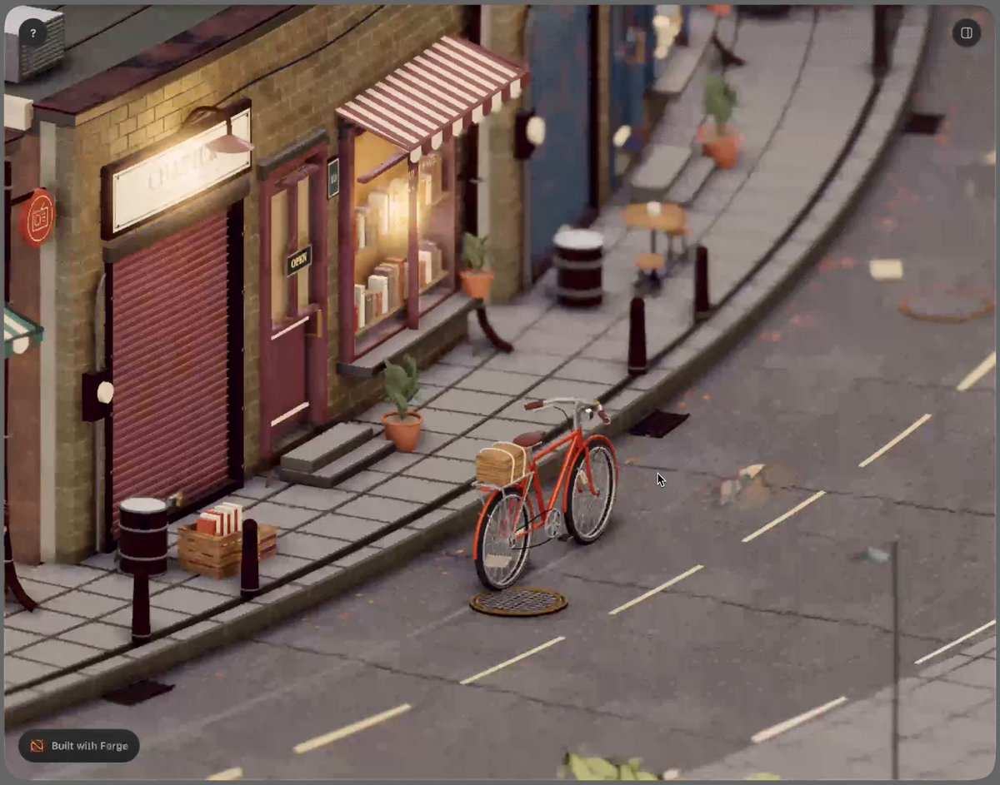</a>

Crea una escena interactiva de una calle en miniatura con una bicicleta de reparto, tiendas, efectos de asfalto mojado, hojas esparcidas, un mundo curvado, estética pixel art y parámetros de Forge ajustables.

**Prompt**

```text
Crea para mí una calle en miniatura infinita en Three.js WebGPU: una bicicleta de reparto que pasa junto a una hilera de pequeñas tiendas, asfalto mojado con charcos que generan ondas y salpicaduras cuando los neumáticos los atraviesan, huellas de neumáticos que se desvanecen, hojas que se dispersan y un mundo suavemente curvado. Estética pixel art, con un rendimiento fluido en móviles. Añade parámetros de Forge para poder manipular por completo el mundo.
```

[Ver vídeo ↗](https://media.tripogrowth.space/media/d8eee1e2-597e-4e14-b48f-c1a33b6ca10e.mp4) · [Publicación original](https://x.com/creativedash/status/2096956214680965501) · [Volver a los ejemplos](#all-prompts)

---

<a id="2096966425017467344"></a>

### Mundo paisajístico para VRChat: «El horizonte donde la gravedad se rompió»

[Xenoah](https://x.com/shuminchuuu) · 2026-09-07

<a href="https://x.com/shuminchuuu/status/2096966425017467344">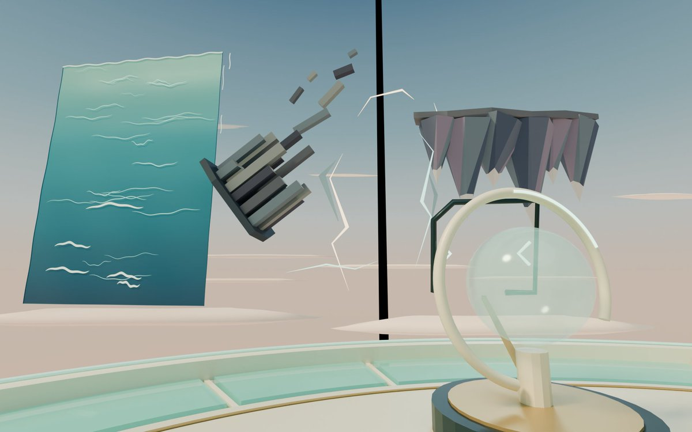</a>

<a href="https://x.com/shuminchuuu/status/2096966425017467344">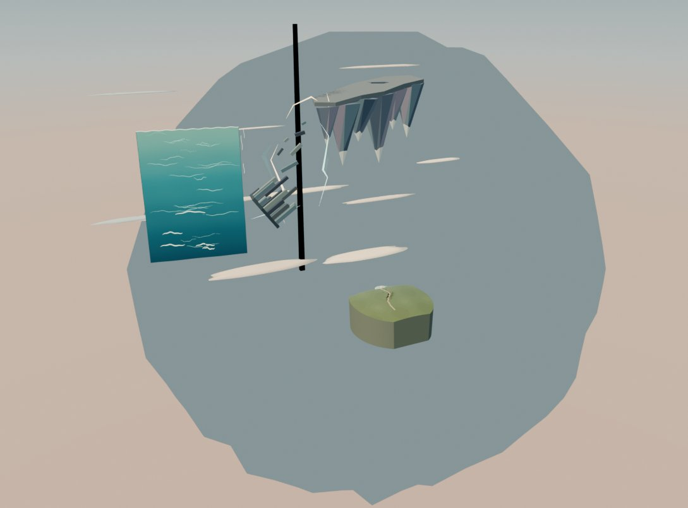</a>

<a href="https://x.com/shuminchuuu/status/2096966425017467344">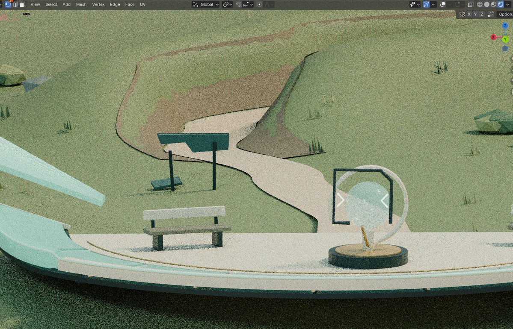</a>

<a href="https://x.com/shuminchuuu/status/2096966425017467344">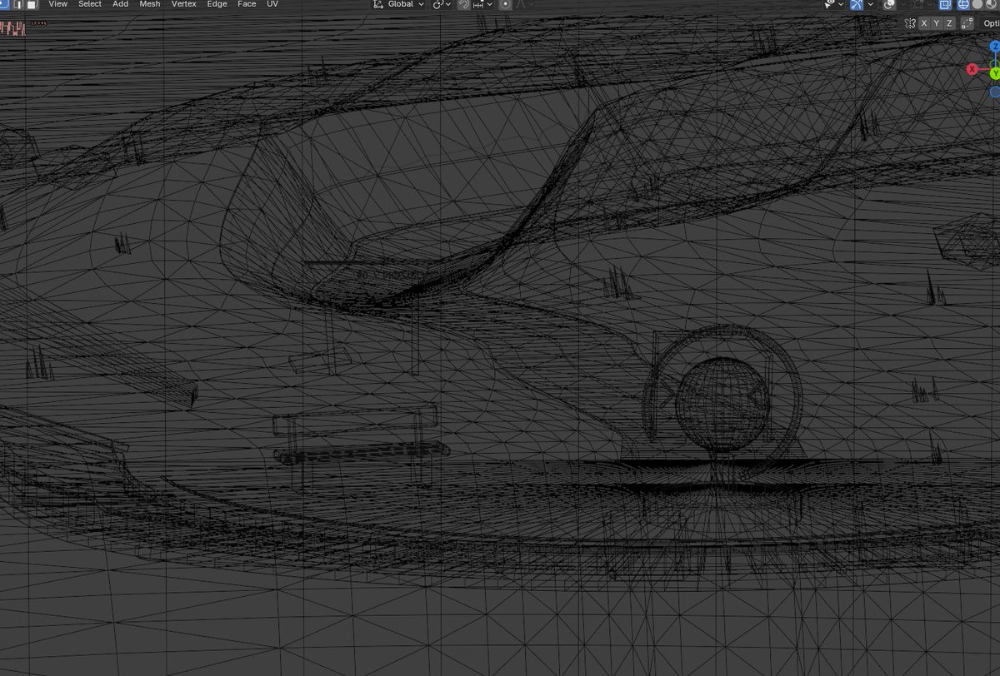</a>

Este prompt sirve para crear en Blender el conjunto completo de modelos 3D de un mundo paisajístico para VRChat, con un horizonte donde la gravedad se ha roto. Construye colinas, una plataforma de observación semicircular, un dispositivo de observación, un mar vertical, una cordillera invertida, pilares negros y fracturas espaciales como grandes siluetas de estilo low-poly.

**Prompt**

```text
Crea en Blender el conjunto completo de modelos 3D de un mundo paisajístico para VRChat.

El tema es 

«El horizonte donde la gravedad se rompió»

.

Solo la cima de la colina donde se encuentra el jugador debe ser normal; únicamente el horizonte lejano debe mostrar una gran alteración de las leyes físicas.

Mantén toda la escena con formas sencillas.
Da prioridad a 
las grandes siluetas

, la anomalía del horizonte lejano
, la forma de la plataforma de observación
 y la composición espacial
, por encima de los detalles decorativos.

Composición

Crea los siguientes elementos.

Cima de la colina

Sendero estrecho
Desmonte poco profundo
Plataforma de observación semicircular
Unos pocos bancos
Panel informativo roto
Dispositivo central de observación
Ciudad en el horizonte
Mar en posición vertical
Cordillera invertida
Pilares negros gigantes
Fracturas espaciales
Nubes estáticas
Plataforma de observación

La plataforma de observación debe ser semicircular.

No imites ninguna plataforma de observación existente; crea una forma completamente original.

Características:

Semicircular

Asimétrica
Una parte sobresale hacia el vacío
Borde bajo
Forma pensada para un material semitransparente
Una parte deformada por una anomalía gravitatoria
No la hagas demasiado compleja; debe ser una gran silueta reconocible incluso desde lejos.

Dispositivo central de observación

Coloca en el centro de la plataforma de observación un dispositivo sencillo que combine 

una esfera semitransparente

un anillo incompleto
 y un marco de puntería orientado hacia los pilares negros
.

Horizonte lejano

El horizonte lejano es lo más importante.

Crea los siguientes elementos con formas grandes y simplificadas.

Ciudad que cae hacia el cielo

Haz que los edificios cúbicos se extiendan en direcciones distintas de las habituales.

Mar vertical

Coloca un enorme plano de superficie marina casi a 90 grados de la horizontal.

Cordillera invertida

Invierte verticalmente la silueta simplificada de una montaña.

Pilares negros

Coloca en el horizonte unos pilares negros extremadamente grandes y alargados.

Haz que parezcan una ausencia en el espacio, no un edificio.

Fracturas espaciales

Coloca alrededor de los pilares negros formas grandes, planas o en forma de bandas, como si el espacio estuviera desgarrado.

Deben estar pensadas para utilizar materiales emisivos.

Terreno

La colina debe ser una pradera de suaves pendientes.

Crea desde el punto de aparición hasta la plataforma de observación 

un sendero estrecho

 y un desmonte poco profundo
.

Al salir del desmonte, la composición debe revelar de golpe todo el horizonte lejano.

Vegetación

Reduce la vegetación al mínimo.

Hierba

Unos pocos arbustos bajos
 y unas pocas plantas inclinadas en direcciones anómalas
 serán suficientes.

Criterios de modelado

Puedes usar un estilo cercano al low-poly.

No trabajes demasiado los detalles.

Usa activamente primitivas y construye la escena principalmente con 

Cube

Plane

Cylinder

Sphere

Curve
.
Simplifica especialmente el horizonte lejano.

Lo importante no son los detalles, sino 

«que, al mirar a lo lejos, se entienda al instante que algo no funciona en este mundo»

.

Organización en Blender

Divide los objetos en las siguientes colecciones.

PLAYER_AREA
OBSERVATION_DECK
OBSERVATION_DEVICE
VEGETATION
DISTANT_CITY
DISTANT_SEA
DISTANT_MOUNTAINS
BLACK_PILLAR
SPACE_FRACTURE
CLOUDS
PROPS
Organiza la escena para facilitar su exportación a Unity para VRChat.

La máxima prioridad es 

«el paisaje visto desde la plataforma de observación como una sola imagen»
.
```

[Publicación original](https://x.com/shuminchuuu/status/2096966425017467344) · [Volver a los ejemplos](#all-prompts)

---

<a id="2096971051334857181"></a>

### Patio chino interactivo

[Larus Canus](https://x.com/MrLarus) · 2026-09-07

<a href="https://x.com/MrLarus/status/2096971051334857181"></a>

Un prompt reutilizable para crear un patio chino 3D explorable con Blender y Three.js, con elementos arquitectónicos, navegación interactiva, efectos ambientales, fauna animada y un proyecto ejecutable en el navegador.

**Prompt**

```text
Crea un patio chino interactivo con Blender y Three.js que pueda explorar en el navegador.

Incluye paredes blancas, tejados de tejas oscuras, una puerta lunar, pinos, un estanque y un jardín de rocas, además de una sala de estar, una sala de té y un dormitorio. Usa Python para ejecutar Blender en segundo plano, generar los modelos y exportar archivos GLB. Usa Three.js para la iluminación, los reflejos, las animaciones y la interacción.

Admite controles orbitales, zoom, navegación con WASD, cambio entre día y noche y un control para mostrar u ocultar el tejado. Añade gradualmente agua corriente, carpas koi, ranas que salten, libélulas, un gato del patio, gorriones y luciérnagas nocturnas. Mantén los movimientos sutiles y naturales.

Crea una interfaz original que no obstruya la escena. Desarrolla el proyecto por etapas, inspecciona los resultados en el navegador, corrige los problemas y entrega el proyecto ejecutable, los archivos fuente y las instrucciones de configuración.
```

[Ver vídeo ↗](https://media.tripogrowth.space/media/02dc67e53653c583671e53ea9e08103aa8c3a91da1a4fb31c9d6441aab3d3aef.mp4) · [Publicación original](https://x.com/MrLarus/status/2096971051334857181) · [Volver a los ejemplos](#all-prompts)

---

<a id="2096986557244723371"></a>

### Un camino forestal de 12 segundos en Blender

[Can Matrix](https://x.com/Jomolos) · 2026-09-07

<a href="https://x.com/Jomolos/status/2096986557244723371">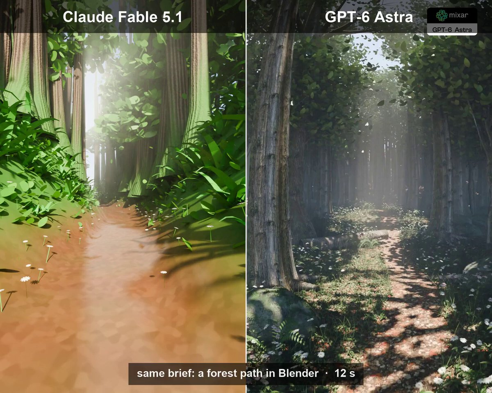</a>

Solicitud para crear una escena de un camino forestal de 12 segundos en Blender.

**Prompt**

```text
Un camino forestal de 12 segundos en Blender
```

[Ver vídeo ↗](https://media.tripogrowth.space/media/48260d191ecc20aefc450814edc110dbfcf4ecf50b6057d8eefcc5e6ebf4cf4e.mp4) · [Publicación original](https://x.com/Jomolos/status/2096986557244723371) · [Volver a los ejemplos](#all-prompts)

---

<a id="2096990373813858591"></a>

### Editar una escena de Blender para ajustar separadores moleteados y una PCB

[Robert Boyd](https://x.com/rboyd) · 2026-09-07

<a href="https://x.com/rboyd/status/2096990373813858591">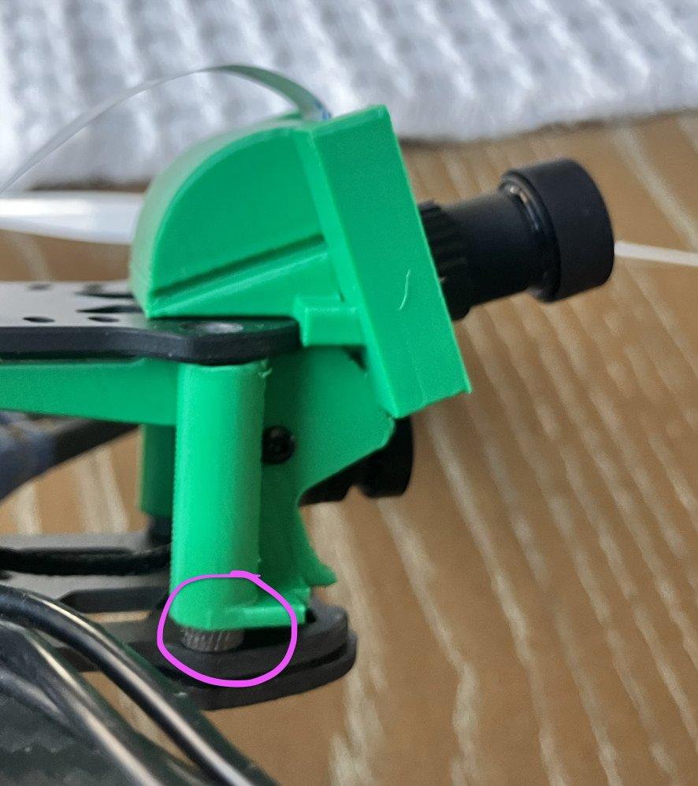</a>

<a href="https://x.com/rboyd/status/2096990373813858591">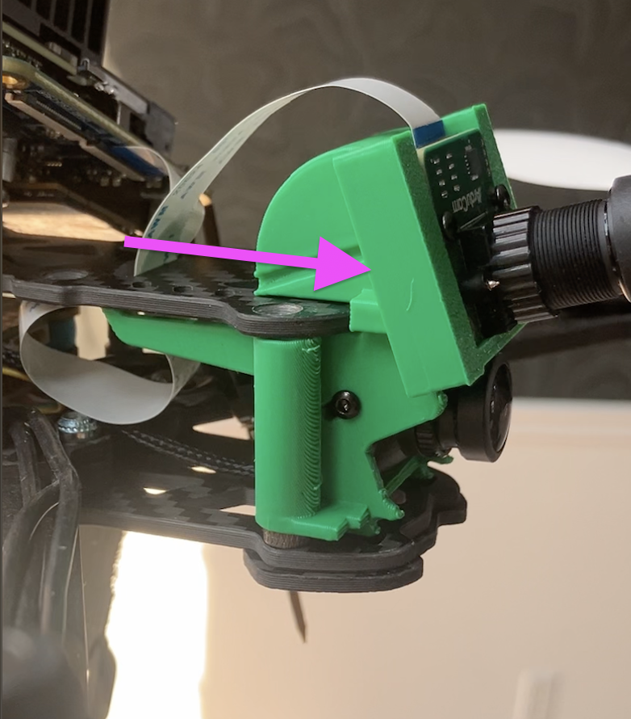</a>

Un prompt entre comillas pide a Astra que edite una escena de Blender retirando material para los separadores M3 hembra-hembra con extremos moleteados y profundizando una ranura para la PCB, de modo que los orificios de los tornillos queden alineados, además de incorporar a la escena un modelo adecuado del separador.

**Prompt**

```text
Casi perfecto. 1) Mira la imagen en ~/Desktop/remove_material_for_knurled_ends.png: tenemos que retirar aquí el material suficiente para los extremos moleteados de los separadores M3 hembra-hembra, de modo que queden al ras. Intenta encontrar un modelo / STL o STEP de estos separadores con los extremos moleteados e incorpóralo a la escena de Blender. 2) Mira ~/Desktop/deepen_pcb_slot.png: la ranura para la PCB tiene aproximadamente 1 mm menos de profundidad (es decir, necesito introducir la PCB aproximadamente 1 mm más en nuestra pieza, así que hay que retirar material) para que los orificios de los tornillos queden alineados.
```

[Publicación original](https://x.com/rboyd/status/2096990373813858591) · [Volver a los ejemplos](#all-prompts)

---

<a id="2097313247116341424"></a>

### Mejorar las facciones de un modelo 3D en Blender usando una imagen de referencia

[Carlos Olivera Terrazas](https://x.com/carlos_olivera) · 2026-09-08

<a href="https://x.com/carlos_olivera/status/2097313247116341424">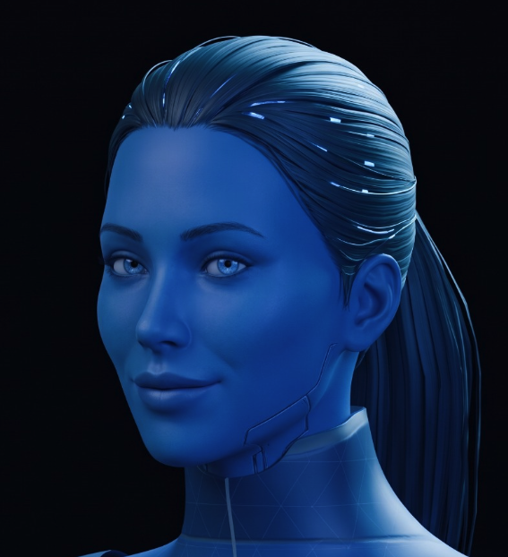</a>

<a href="https://x.com/carlos_olivera/status/2097313247116341424">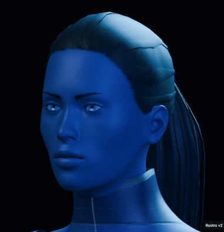</a>

El autor plantea un desafío para GPT-6 Astra: usar la primera imagen como referencia para mejorar las facciones de la segunda imagen en un proyecto de modelado 3D en Blender.

**Prompt**

```text
tomar como referencia la primera imagen y mejorar las facciones de la segunda imagen.
```

[Publicación original](https://x.com/carlos_olivera/status/2097313247116341424) · [Volver a los ejemplos](#all-prompts)

---

<a id="2097323734504017936"></a>

### Proyecto WebGL con TypeScript + Three.js del Salón de Oración por las Buenas Cosechas del Templo del Cielo de Beijing

[govin.eth \| G哥](https://x.com/goan999999) · 2026-09-08

<a href="https://x.com/goan999999/status/2097323734504017936">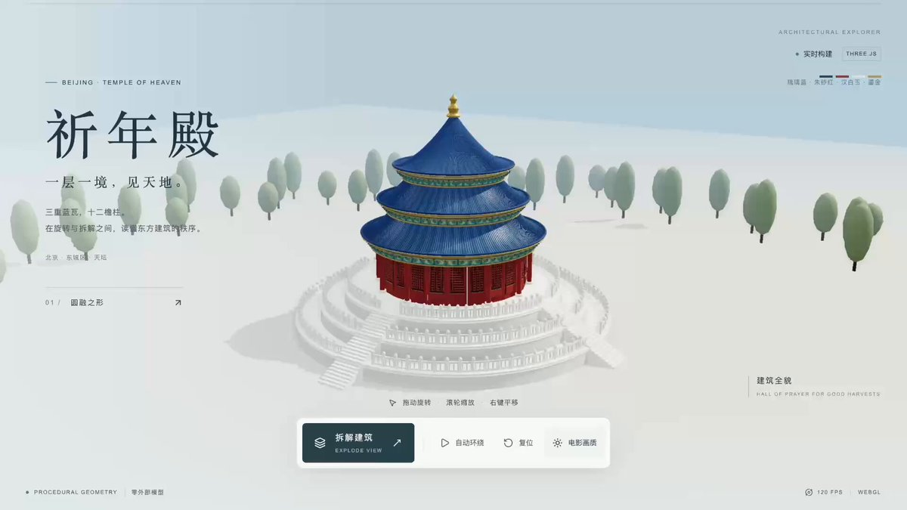</a>

La publicación original muestra un modelo 3D y una experiencia web del Salón de Oración por las Buenas Cosechas del Templo del Cielo de Beijing, creados con GPT-6 Astra y Three.js; posteriormente, el autor compartió el prompt completo en chino utilizado para crear este tipo de proyecto.

**Prompt**

```text
Crea con TypeScript + Three.js un proyecto WebGL completo y ejecutable del Salón de Oración por las Buenas Cosechas del Templo del Cielo de Beijing. Toda la geometría arquitectónica, las texturas y las animaciones deben generarse mediante código y de forma procedural durante la ejecución; no cargues modelos externos .glb, .gltf, .obj, .fbx ni de otros formatos.

Recreación arquitectónica:
tres cubiertas circulares escalonadas, con distintos tamaños y alturas, revestidas de tejas vidriadas azules; un remate dorado, columnas rojas, cuerpo circular, decoración pintada en azul, verde y dorado, soportes dougong, puertas y ventanas.
Usa perfiles curvos, superficies de revolución o geometría personalizada para las cubiertas, de modo que los aleros se vean amplios y ligeramente levantados; no los sustituyas por conos simples.
Crea una plataforma circular blanca de tres niveles de mármol blanco de Han, con una escalinata central de piedra, barandillas y balaustres; mantén proporciones equilibradas y una jerarquía visual clara.
Genera proceduralmente las texturas de las tejas y los elementos decorativos; prioriza InstancedMesh para los componentes repetidos.

Escena e interacción:
incluye el cielo azul de Beijing, el pavimento de la plaza y una pequeña cantidad de vegetación; usa DirectionalLight junto con AmbientLight／HemisphereLight, activa las sombras y la oclusión ambiental, y aplica un mapeo de tonos cinematográfico moderado.
Admite rotación y zoom mediante OrbitControls, además de una vista de recorrido orbital lento que se pueda activar y desactivar.
Añade un botón para alternar entre «explosión» y «recomposición»: la cubierta, las columnas, los soportes dougong, los muros, las puertas y ventanas, las barandillas y la plataforma deben separarse suavemente por niveles y volver después con precisión a su posición original. La animación debe estar controlada por código, tener un ritmo escalonado y evitar los saltos instantáneos.

Entrega directamente el proyecto completo junto con las instrucciones de inicio. La página debe adaptarse de forma responsive al tamaño de la ventana, ofrecer una calidad visual alta y una interacción fluida, y mantener un buen rendimiento en navegadores de escritorio comunes mediante instanciación, un nivel razonable de detalle geométrico y optimizaciones de renderizado. Organiza el código en módulos claros para facilitar su ampliación; verifica la compilación y las funciones principales, e indica con honestidad qué elementos no se hayan podido verificar.
```

[Ver vídeo ↗](https://media.tripogrowth.space/media/01eda954-4f59-4a02-ba94-7d5470fe7de8.mp4) · [Publicación original](https://x.com/goan999999/status/2097323734504017936) · [Volver a los ejemplos](#all-prompts)

---

<a id="2097336230078013598"></a>

### Recrear League of Legends como juego web

[李岳](https://x.com/liyue_ai) · 2026-09-08

<a href="https://x.com/liyue_ai/status/2097336230078013598">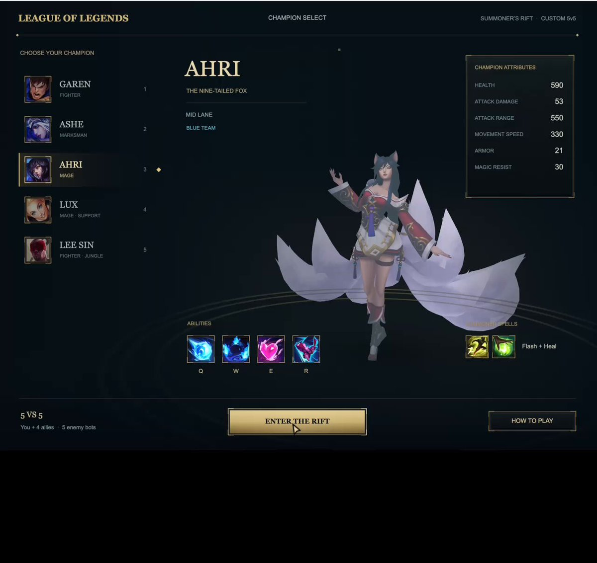</a>

El autor reproduce y enumera un prompt para crear un juego web inspirado en League of Legends, con requisitos como recrear el mapa, los héroes, los súbditos, las torres defensivas y una partida que comienza con cinco héroes. El prompt describe un objetivo de creación de un juego tridimensional, pero la publicación no aclara si el autor lo introdujo personalmente.

**Prompt**

```text
Crea un juego idéntico a League of Legends. Debe incluir todo el contenido de League of Legends, con el mismo mapa y un nivel de calidad gráfica equivalente, además de héroes, súbditos, torres defensivas y otros elementos. Al comenzar la partida, selecciona 5 héroes.
```

[Ver vídeo ↗](https://media.tripogrowth.space/media/f7618e1a-2e80-4350-a11a-f2f168a67562.mp4) · [Publicación original](https://x.com/liyue_ai/status/2097336230078013598) · [Volver a los ejemplos](#all-prompts)

---

<a id="2097339176094195899"></a>

### Playroom: Arcade 3D retro para navegador

[Tripo](https://x.com/tripoai) · 2026-09-08

<a href="https://x.com/tripoai/status/2097339176094195899">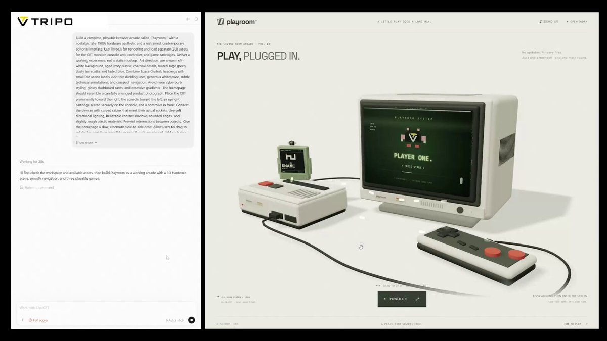</a>

Prompt publicado literalmente por su autor para crear un arcade de navegador completo y jugable con Three.js, con recursos de hardware GLB independientes, transiciones 3D interactivas, tres juegos basados en cartuchos, controles adaptables y un comportamiento alternativo accesible.

**Prompt**

```text
Crea un arcade de navegador completo y jugable llamado “Playroom”, con una estética nostálgica del hardware de finales de los años 80 y una interfaz editorial contemporánea y sobria. Usa Three.js para el renderizado y carga recursos GLB independientes para el monitor CRT, la consola, el mando y los cartuchos de juegos. Entrega una experiencia funcional, no una maqueta estática. 

Dirección artística: usa un fondo blanco roto cálido, plástico marfil envejecido, detalles en carbón, verde salvia apagado, terracota empolvada y azul desvaído. Combina títulos en Space Grotesk con etiquetas pequeñas en DM Mono. Añade líneas divisorias finas, abundante espacio en blanco, anotaciones técnicas sutiles y una navegación compacta. Evita el estilo ciberpunk de neón, las tarjetas de panel brillantes y los degradados excesivos.

La página de inicio debe parecer una fotografía de producto cuidadosamente compuesta. Coloca el CRT de forma destacada hacia la derecha, la consola hacia la izquierda, un cartucho en posición vertical y bien asentado sobre la consola, y un mando delante. Conecta los dispositivos con cables curvos que lleguen a sus conectores reales. Usa iluminación direccional suave, sombras de contacto creíbles, bordes redondeados y materiales de plástico ligeramente rugosos. Evita que los objetos se intersequen. 

Dota a la página de inicio de una órbita lateral lenta y cinematográfica. Permite que los usuarios arrastren para rotar la vista y reanuda después suavemente el movimiento en reposo. Añade pulsos de datos sobrios que recorran lentamente algunos detalles del hardware. El CRT debe mostrar una escena de espera en pixel art que se repita en bucle, con una mascota pequeña, líneas de escaneo sutiles y el texto “PLAYER ONE”. Usa con precisión el logotipo formado por una T amarilla y una V blanca en los rostros de las mascotas. 

Un botón destacado “ENCENDER”, o hacer clic en la escena de la consola, debe iniciar una única transición continua. Acerca suavemente la cámara a la pantalla del CRT, introduce un flujo de datos animado y amplía gradualmente la escena hasta cubrir toda la ventana gráfica. Mantén cubiertos los bordes superior e inferior durante todo el proceso. Muestra la colección de cartuchos mediante una transición fluida de oscuro a claro, sin una superposición que aparezca de repente ni un salto brusco de cámara.

La colección contiene tres cartuchos verticales distintos: Snake en verde salvia, Breakout en terracota y Blocks en azul. Cada uno tiene una tipografía nítida en la portada y una pequeña mascota animada encaramada encima. Usa un balanceo sutil, elevación al pasar el cursor y una inclinación suave. Permite tanto hacer clic en los cartuchos 3D como usar botones de texto accesibles debajo de ellos. 

Cada selección abre una interfaz de juego jugable. Snake incluye cadenas de comida y frutas de bonificación con tiempo limitado. Breakout incluye varias configuraciones de ladrillos y mejoras para la pala o multibola. Blocks incluye una vista previa de la siguiente pieza, una silueta de aterrizaje y puntuación por completar líneas. Proporciona instrucciones claras, puntuación, pausa, reinicio y navegación para volver. Admite controles de teclado y botones táctiles, con persistencia local de las mejores puntuaciones. 

Mantén el contenido de la pantalla y las etiquetas de los cartuchos como texturas independientes en tiempo de ejecución para que el texto conserve su nitidez. Conserva las partes con nombre de los modelos para la interacción y la animación de las mascotas. Incluye indicadores de carga, una alternativa utilizable si fallan los recursos 3D, diseños adaptables, foco de teclado visible y compatibilidad con la reducción de movimiento. Organiza el proyecto de forma limpia, verifica los tres juegos y las transiciones, y déjalo listo para desplegarlo en GitHub y Vercel.
```

[Ver vídeo ↗](https://media.tripogrowth.space/media/92687847-5ef9-4103-85bc-0231f0a84219.mp4) · [Publicación original](https://x.com/tripoai/status/2097339176094195899) · [Volver a los ejemplos](#all-prompts)

---

<a id="2097343467026289039"></a>

### Mundo acogedor de humedal y lago

[Givros](https://x.com/givros) · 2026-09-08

<a href="https://x.com/givros/status/2097343467026289039">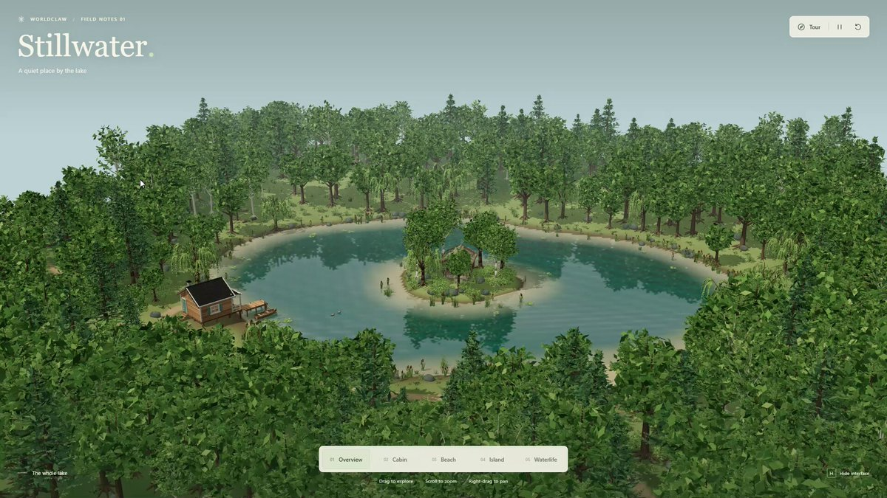</a>

Un prompt reutilizable para crear una acogedora escena 3D de humedal con un lago, una cabaña, una isla, una casa abandonada, una barca, senderos, vegetación, fauna y un bosque alrededor.

**Prompt**

```text
Crea un lago acogedor con una cabaña de pescador en la orilla pantanosa. Coloca una pequeña isla en el centro del agua, con una casa abandonada oculta entre los árboles. Añade una barca de pesca junto a la cabaña, nenúfares, juncos, peces saltando, fauna típica de humedales, una pequeña playa, un sendero que conduzca a la playa y a la cabaña, otro sendero que se adentre de nuevo en el bosque y una franja de árboles que rodee toda la escena.
```

[Ver vídeo ↗](https://media.tripogrowth.space/media/29297bf0-5dc5-4ba4-81c9-7683e9b7b4ed.mp4) · [Publicación original](https://x.com/givros/status/2097343467026289039) · [Volver a los ejemplos](#all-prompts)

---

<a id="2096251574918013135"></a>

### Una batalla de kaijus en la ciudad

[Majid Manzarpour](https://x.com/majidmanzarpour) · 2026-09-05

<a href="https://www.tripo3d.ai/es/3d-prompts/kaiju-city-battle-2096251574918013135"></a>

**Prompt**

```text
Construye un juego inspirado en los kaijus con Three.js, usando modelos de criaturas y efectos sonoros generados. Crea combates a escala gigante fáciles de seguir y un entorno que transmita el tamaño de las criaturas.
```

[Ver detalles ↗](https://www.tripo3d.ai/es/3d-prompts/kaiju-city-battle-2096251574918013135) · [Ver vídeo ↗](https://media.tripogrowth.space/media/a11e4581-9641-40f4-8d8e-424fcf0c4932.mp4) · [Publicación original](https://x.com/majidmanzarpour/status/2096251574918013135) · [Demo en línea](https://stormcolossus.netlify.app/) · [Volver a los ejemplos](#all-prompts)

---

<a id="2096525100518453342"></a>

### Expresiones de personaje intercambiables en Blender

[Nano(ナノ)](https://x.com/Dstudio_ai) · 2026-09-06

<a href="https://www.tripo3d.ai/es/3d-prompts/switchable-character-expressions-in-blender-2096525100518453342"></a>

**Prompt**

```text
Prepara variantes de expresión de un personaje de Tripo en Blender antes de crear el esqueleto. Alinea las mallas y alterna entre ellas sin interpolación, reduciendo las variantes inactivas dentro de la cabeza. No presentes el resultado como una mezcla suave de expresiones ni como compatible con VRM.
```

[Ver detalles ↗](https://www.tripo3d.ai/es/3d-prompts/switchable-character-expressions-in-blender-2096525100518453342) · [Ver vídeo ↗](https://media.tripogrowth.space/media/be890da4-1580-4ed6-b221-aff7ce09ea09.mp4) · [Publicación original](https://x.com/Dstudio_ai/status/2096525100518453342) · [Volver a los ejemplos](#all-prompts)

---

<a id="2096225621303042258"></a>

### Un simulador de encuentro orbital

[Alican Kiraz](https://x.com/AlicanKiraz0) · 2026-09-05

<a href="https://www.tripo3d.ai/es/3d-prompts/orbital-rendezvous-simulator-2096225621303042258"></a>

**Prompt**

```text
Construye una simulación de encuentro orbital en tiempo real con propagación de dos cuerpos en coordenadas ECI y guiado HCW. Incluye orientación de seis grados de libertad, consumo de combustible, límites de fuerza y un objetivo de acoplamiento.
```

[Ver detalles ↗](https://www.tripo3d.ai/es/3d-prompts/orbital-rendezvous-simulator-2096225621303042258) · [Ver vídeo ↗](https://media.tripogrowth.space/media/de95a497-4613-4840-8a19-0cabb30ab3c4.mp4) · [Publicación original](https://x.com/AlicanKiraz0/status/2096225621303042258) · [Volver a los ejemplos](#all-prompts)

---

<a id="2096180220839760375"></a>

### Un remolcador construido a partir de imágenes de referencia

[Alex](https://x.com/NarvisAlex) · 2026-09-05

<a href="https://www.tripo3d.ai/es/3d-prompts/reference-image-tugboat-assembly-2096180220839760375"></a>

**Prompt**

```text
Reconstruye un remolcador en Blender a partir de imágenes de referencia. Modela el casco, la timonera inclinada, los accesorios de cubierta y el equipo de remolque. Resuelve las incoherencias entre vistas para obtener una embarcación coherente.
```

[Ver detalles ↗](https://www.tripo3d.ai/es/3d-prompts/reference-image-tugboat-assembly-2096180220839760375) · [Publicación original](https://x.com/NarvisAlex/status/2096180220839760375) · [Volver a los ejemplos](#all-prompts)

---

<a id="2096149823216898445"></a>

### Un juego de vuelo en el navegador

[Givros](https://x.com/givros) · 2026-09-05

<a href="https://www.tripo3d.ai/es/3d-prompts/browser-flight-game-2096149823216898445"></a>

**Prompt**

```text
Crea un juego 3D de vuelo completo en el navegador desde un proyecto vacío. Incluye vuelo controlable, un entorno navegable, un objetivo claro y una presentación coherente.
```

[Ver detalles ↗](https://www.tripo3d.ai/es/3d-prompts/browser-flight-game-2096149823216898445) · [Ver vídeo ↗](https://media.tripogrowth.space/media/07f03d8a-fcce-4d77-a744-2fd3b8a2cccc.mp4) · [Publicación original](https://x.com/givros/status/2096149823216898445) · [Volver a los ejemplos](#all-prompts)

---

<a id="2096245759121277132"></a>

### Una web de estudio 3D guiada por el desplazamiento

[ui.debbie](https://x.com/mx_debbiee) · 2026-09-05

<a href="https://www.tripo3d.ai/es/3d-prompts/scroll-driven-3d-studio-website-2096245759121277132"></a>

**Prompt**

```text
Convierte la imagen de referencia proporcionada en una escena de Three.js dentro de una web de estudio con desplazamiento fluido. Coordina el movimiento de cámara, la tipografía y las transiciones entre secciones.
```

[Ver detalles ↗](https://www.tripo3d.ai/es/3d-prompts/scroll-driven-3d-studio-website-2096245759121277132) · [Ver vídeo ↗](https://media.tripogrowth.space/media/eb879819-4641-46d1-9f57-d76246f72e1f.mp4) · [Publicación original](https://x.com/mx_debbiee/status/2096245759121277132) · [Volver a los ejemplos](#all-prompts)

---

<a id="2096244208533455049"></a>

### Komorebi: kayak por el río

[AJ](https://x.com/ItsmeAjayKV) · 2026-09-05

<a href="https://www.tripo3d.ai/es/3d-prompts/komorebi-river-kayaking-2096244208533455049"></a>

**Prompt**

```text
Construye un juego 3D de kayak por un río con estética inspirada en el anime. Permite remar a izquierda y derecha para evitar obstáculos, con agua que fluya, paisaje, música y efectos sonoros generados mediante código.
```

[Ver detalles ↗](https://www.tripo3d.ai/es/3d-prompts/komorebi-river-kayaking-2096244208533455049) · [Ver vídeo ↗](https://media.tripogrowth.space/media/3d070a0f-c280-42f4-8aec-3c367187c1f0.mp4) · [Publicación original](https://x.com/ItsmeAjayKV/status/2096244208533455049) · [Volver a los ejemplos](#all-prompts)

---

<a id="2096243989439713677"></a>

### Una historia de producto con una botella refractante

[Himanshu Hingorani](https://x.com/himanshubuildss) · 2026-09-05

<a href="https://www.tripo3d.ai/es/3d-prompts/refractive-bottle-product-story-2096243989439713677"></a>

**Prompt**

```text
Construye una web interactiva de producto alrededor de una botella de cristal WebGL fotorrealista. Usa líquido refractante, rotación guiada por el desplazamiento y tipografía contundente sin comprometer el rendimiento del navegador.
```

[Ver detalles ↗](https://www.tripo3d.ai/es/3d-prompts/refractive-bottle-product-story-2096243989439713677) · [Ver vídeo ↗](https://media.tripogrowth.space/media/410ec6df-40c5-464a-8b75-0ab12c165d2e.mp4) · [Publicación original](https://x.com/himanshubuildss/status/2096243989439713677) · [Volver a los ejemplos](#all-prompts)

---

<a id="2096201415051911597"></a>

### Un mundo de juguetes para un niño pequeño

[AI少年](https://x.com/aehyok) · 2026-09-05

<a href="https://www.tripo3d.ai/es/3d-prompts/a-playful-toddler-toy-world-2096201415051911597"></a>

**Prompt**

```text
Construye una sala de juegos acogedora en Three.js donde un niño pequeño pase de un juguete a otro y use cada uno con una animación distinta. Incluye alfombra de juegos, libros, estanterías y estructuras para trepar, con controles de órbita y zoom.
```

[Ver detalles ↗](https://www.tripo3d.ai/es/3d-prompts/a-playful-toddler-toy-world-2096201415051911597) · [Ver vídeo ↗](https://media.tripogrowth.space/media/2913f4b6-d955-4726-91d0-e0fcebab07ec.mp4) · [Publicación original](https://x.com/aehyok/status/2096201415051911597) · [Volver a los ejemplos](#all-prompts)

---

<a id="2096122429319852319"></a>

### Una fábrica de reactores en funcionamiento

[Konstantin Saifoulline](https://x.com/konstantinsaifo) · 2026-09-05

<a href="https://www.tripo3d.ai/es/3d-prompts/live-jet-manufacturing-plant-2096122429319852319"></a>

**Prompt**

```text
Investiga la fabricación de aeronaves y construye una simulación activa de una fábrica de reactores en Three.js. Modela ciclos de máquinas, puestos de producción, transporte y cuellos de botella; después prueba el flujo de trabajo.
```

[Ver detalles ↗](https://www.tripo3d.ai/es/3d-prompts/live-jet-manufacturing-plant-2096122429319852319) · [Ver vídeo ↗](https://media.tripogrowth.space/media/b86fa701-c7e0-443e-a38d-72d56a21abc4.mp4) · [Publicación original](https://x.com/konstantinsaifo/status/2096122429319852319) · [Volver a los ejemplos](#all-prompts)

---

<a id="2096220264413409648"></a>

### Una tormenta atrapada en un cubo

[zcw](https://x.com/zwb44) · 2026-09-05

<a href="https://www.tripo3d.ai/es/3d-prompts/a-storm-trapped-in-a-cube-2096220264413409648"></a>

**Prompt**

```text
Genera en Three.js una tormenta atrapada en un cubo con un clima que puedas controlar.
```

[Ver detalles ↗](https://www.tripo3d.ai/es/3d-prompts/a-storm-trapped-in-a-cube-2096220264413409648) · [Ver vídeo ↗](https://media.tripogrowth.space/media/e8f23aa9-80c1-43da-a974-26d7928effcf.mp4) · [Publicación original](https://x.com/zwb44/status/2096220264413409648) · [Volver a los ejemplos](#all-prompts)

---

<a id="2096133339329536249"></a>

### Un T. rex articulado y animado

[Majid Manzarpour](https://x.com/majidmanzarpour) · 2026-09-05

<a href="https://www.tripo3d.ai/es/3d-prompts/rigged-and-animated-t-rex-2096133339329536249"></a>

**Prompt**

```text
Toma un modelo generado de T. rex, crea su esqueleto de animación y dale movimientos creíbles. Renderiza el personaje en Three.js y comprueba que la animación deforme el modelo de manera coherente.
```

[Ver detalles ↗](https://www.tripo3d.ai/es/3d-prompts/rigged-and-animated-t-rex-2096133339329536249) · [Ver vídeo ↗](https://media.tripogrowth.space/media/e97790e1-c6e6-4c82-8bc8-9b206079a54e.mp4) · [Publicación original](https://x.com/majidmanzarpour/status/2096133339329536249) · [Volver a los ejemplos](#all-prompts)

---

<a id="2096174858837074198"></a>

### Vida marina en una taza de café

[Sagi Polaczek 🦜](https://x.com/PolaczekSagi) · 2026-09-05

<a href="https://www.tripo3d.ai/es/3d-prompts/marine-life-in-a-coffee-cup-2096174858837074198"></a>

**Prompt**

```text
Crea un ecosistema marino en miniatura dentro de una taza de café con Three.js. Usa una cámara dirigida para descubrir la vida acuática sin perder de vista la taza ni la escala reducida del entorno.
```

[Ver detalles ↗](https://www.tripo3d.ai/es/3d-prompts/marine-life-in-a-coffee-cup-2096174858837074198) · [Ver vídeo ↗](https://media.tripogrowth.space/media/1ccc3b57-ea95-4ba8-9c76-7cc25f3f36d5.mp4) · [Publicación original](https://x.com/PolaczekSagi/status/2096174858837074198) · [Volver a los ejemplos](#all-prompts)

---

<a id="2096250748099068377"></a>

### Una demostración interactiva de Hyperloop

[Amir](https://x.com/hbanay98) · 2026-09-05

<a href="https://www.tripo3d.ai/es/3d-prompts/interactive-hyperloop-demo-2096250748099068377"></a>

**Prompt**

```text
Construye una demostración interactiva de Hyperloop en Three.js que muestre una cápsula de transporte, la infraestructura tubular y su movimiento por el sistema.
```

[Ver detalles ↗](https://www.tripo3d.ai/es/3d-prompts/interactive-hyperloop-demo-2096250748099068377) · [Ver vídeo ↗](https://media.tripogrowth.space/media/2042ea4e-7a04-4340-8ab1-e7ff38443e3b.mp4) · [Publicación original](https://x.com/hbanay98/status/2096250748099068377) · [Volver a los ejemplos](#all-prompts)

---

<a id="2096234355395903672"></a>

### Un busto procedural de Napoleón

[Le PLOUTOS](https://x.com/leploutos) · 2026-09-05

<a href="https://www.tripo3d.ai/es/3d-prompts/procedural-napoleon-bust-2096234355395903672"></a>

**Prompt**

```text
Programa un busto 3D de Napoleón en Three.js. Constrúyelo por etapas, examínalo desde distintos ángulos y perfecciona las proporciones faciales y los detalles de la ropa.
```

[Ver detalles ↗](https://www.tripo3d.ai/es/3d-prompts/procedural-napoleon-bust-2096234355395903672) · [Ver vídeo ↗](https://media.tripogrowth.space/media/ad6593e8-dc09-482c-95a3-f11c1ab83c11.mp4) · [Publicación original](https://x.com/leploutos/status/2096234355395903672) · [Volver a los ejemplos](#all-prompts)

---

<a id="2096226711222546461"></a>

### El vestíbulo de una estación de tren

[Wormhole404](https://x.com/0xWormhole404) · 2026-09-05

<a href="https://www.tripo3d.ai/es/3d-prompts/railway-station-concourse-2096226711222546461"></a>

**Prompt**

```text
Crea el vestíbulo de una estación ferroviaria con un ritmo arquitectónico marcado, escala creíble y materiales convincentes. Produce una escena 3D que se pueda examinar con vistas de la estación cuidadosamente encuadradas.
```

[Ver detalles ↗](https://www.tripo3d.ai/es/3d-prompts/railway-station-concourse-2096226711222546461) · [Ver vídeo ↗](https://media.tripogrowth.space/media/41cdf424-4904-472e-aa92-cfacc3dbbe3d.mp4) · [Publicación original](https://x.com/0xWormhole404/status/2096226711222546461) · [Volver a los ejemplos](#all-prompts)

---

<a id="2096222790894661841"></a>

### Un diorama animado de bienvenida

[Emil](https://x.com/EmilHovv) · 2026-09-05

<a href="https://www.tripo3d.ai/es/3d-prompts/animated-onboarding-diorama-2096222790894661841"></a>

**Prompt**

```text
Construye un pequeño diorama de introducción en Blender y dale vida en Three.js. Usa objetos protagonistas claros y secuencias breves de animación para explicar las primeras acciones del usuario.
```

[Ver detalles ↗](https://www.tripo3d.ai/es/3d-prompts/animated-onboarding-diorama-2096222790894661841) · [Ver vídeo ↗](https://media.tripogrowth.space/media/79fd590e-19a2-4406-816e-99573442986c.mp4) · [Publicación original](https://x.com/EmilHovv/status/2096222790894661841) · [Volver a los ejemplos](#all-prompts)

---

<a id="2096206082712768897"></a>

### OX Vice Drive: carreras en una ciudad abierta

[DomX](https://x.com/qok_ai) · 2026-09-05

<a href="https://www.tripo3d.ai/es/3d-prompts/ox-vice-drive-open-city-racer-2096206082712768897"></a>

**Prompt**

```text
Construye un juego de conducción de navegador en una ciudad abierta, con tráfico, derrapes y carreras de reparto. Diseña una ciudad costera agradable de recorrer que permita un ciclo completo de conducción.
```

[Ver detalles ↗](https://www.tripo3d.ai/es/3d-prompts/ox-vice-drive-open-city-racer-2096206082712768897) · [Publicación original](https://x.com/qok_ai/status/2096206082712768897) · [Volver a los ejemplos](#all-prompts)

---

<a id="2096111709496680842"></a>

### La versión jugable de un anuncio de juego móvil

[daniel](https://x.com/buildingadlicio) · 2026-09-05

<a href="https://www.tripo3d.ai/es/3d-prompts/playable-remake-of-a-mobile-game-ad-2096111709496680842"></a>

**Prompt**

```text
Usa un anuncio de un juego móvil como referencia para construir un juego de navegador jugable. Recrea su interacción principal y utiliza recursos de Blender para reproducir su propuesta visual.
```

[Ver detalles ↗](https://www.tripo3d.ai/es/3d-prompts/playable-remake-of-a-mobile-game-ad-2096111709496680842) · [Ver vídeo ↗](https://media.tripogrowth.space/media/7be01ec4-77e9-4270-aaf4-18119252736f.mp4) · [Publicación original](https://x.com/buildingadlicio/status/2096111709496680842) · [Volver a los ejemplos](#all-prompts)

---

<a id="2096258619574513880"></a>

### Físicas de carreras en el navegador con C# y WASM

[achepta](https://x.com/achepta_tm) · 2026-09-05

<a href="https://www.tripo3d.ai/es/3d-prompts/browser-racing-physics-in-c-and-wasm-2096258619574513880"></a>

**Prompt**

```text
Recrea un sistema de físicas de carreras al estilo Trackmania en C#, ejecútalo mediante WASM y renderiza el circuito en Three.js. Usa mallas de pista con colisiones y prueba el comportamiento del vehículo.
```

[Ver detalles ↗](https://www.tripo3d.ai/es/3d-prompts/browser-racing-physics-in-c-and-wasm-2096258619574513880) · [Ver vídeo ↗](https://media.tripogrowth.space/media/f4081f64-16b6-41ad-b121-d0afb211da12.mp4) · [Publicación original](https://x.com/achepta_tm/status/2096258619574513880) · [Volver a los ejemplos](#all-prompts)

---

<a id="2096141728487178503"></a>

### Articulación automática de un personaje y movimientos de kung-fu

[The Bugged Dev](https://x.com/thebuggeddev) · 2026-09-05

<a href="https://www.tripo3d.ai/es/3d-prompts/automatic-character-rig-and-kung-fu-moves-2096141728487178503"></a>

**Prompt**

```text
Toma el personaje 3D proporcionado, crea su esqueleto de animación y añade caminar, correr y varios movimientos de kung-fu. Examina las animaciones para detectar articulaciones defectuosas y poses inestables.
```

[Ver detalles ↗](https://www.tripo3d.ai/es/3d-prompts/automatic-character-rig-and-kung-fu-moves-2096141728487178503) · [Ver vídeo ↗](https://media.tripogrowth.space/media/d6af998c-563b-40fa-b6d2-bdb014cd8cf4.mp4) · [Publicación original](https://x.com/thebuggeddev/status/2096141728487178503) · [Volver a los ejemplos](#all-prompts)

---

<a id="2096140378777010278"></a>

### Un personaje vikingo en Blender

[Emil](https://x.com/fre4kspace) · 2026-09-05

<a href="https://www.tripo3d.ai/es/3d-prompts/viking-character-in-blender-2096140378777010278"></a>

**Prompt**

```text
Crea un personaje vikingo 3D editable en Blender. Céntrate en una indumentaria reconocible, la estructura facial, las proporciones corporales y una pose de presentación clara.
```

[Ver detalles ↗](https://www.tripo3d.ai/es/3d-prompts/viking-character-in-blender-2096140378777010278) · [Publicación original](https://x.com/fre4kspace/status/2096140378777010278) · [Volver a los ejemplos](#all-prompts)

---

<a id="2096155883122413946"></a>

### Dropzone: una arena de battle royale

[MotionViz](https://x.com/Motion_Viz) · 2026-09-05

<a href="https://www.tripo3d.ai/es/3d-prompts/dropzone-battle-royale-arena-2096155883122413946"></a>

**Prompt**

```text
Construye un battle royale de navegador en tercera persona con un círculo de tormenta, nueve enemigos controlados por IA, un rifle de pulsos, salud y recarga. Incluye muros de cobertura que se puedan colocar y un ciclo completo de eliminación.
```

[Ver detalles ↗](https://www.tripo3d.ai/es/3d-prompts/dropzone-battle-royale-arena-2096155883122413946) · [Ver vídeo ↗](https://media.tripogrowth.space/media/aa58e48b-d28d-41a8-9189-50898d68ed64.mp4) · [Publicación original](https://x.com/Motion_Viz/status/2096155883122413946) · [Volver a los ejemplos](#all-prompts)

---

<a id="2096135808243876152"></a>

### Una aventura de plataformas inspirada en Odyssey

[AIHubmix](https://x.com/AiHubMix) · 2026-09-05

<a href="https://www.tripo3d.ai/es/3d-prompts/odyssey-inspired-platform-adventure-2096135808243876152"></a>

**Prompt**

```text
Construye un nivel en Three.js inspirado en Odyssey con ocho plataformas, tres lunas coleccionables, ataques con gorra que regresa, enemigos y puntos de control. Añade controles táctiles y prueba una partida completa.
```

[Ver detalles ↗](https://www.tripo3d.ai/es/3d-prompts/odyssey-inspired-platform-adventure-2096135808243876152) · [Ver vídeo ↗](https://media.tripogrowth.space/media/be331224-d958-4c92-ab5d-ed31b931958c.mp4) · [Publicación original](https://x.com/AiHubMix/status/2096135808243876152) · [Volver a los ejemplos](#all-prompts)

---

<a id="2096221988763173186"></a>

### Anatomía humana interactiva en vista explosionada

[ashe](https://x.com/ashebytes) · 2026-09-05

<a href="https://www.tripo3d.ai/es/3d-prompts/exploded-interactive-human-anatomy-2096221988763173186"></a>

**Prompt**

```text
Construye una web de anatomía 3D donde el cuerpo humano se separe en estructuras que puedan examinarse individualmente. Permite navegar por la vista explosionada y organiza las partes en sistemas con sentido.
```

[Ver detalles ↗](https://www.tripo3d.ai/es/3d-prompts/exploded-interactive-human-anatomy-2096221988763173186) · [Ver vídeo ↗](https://media.tripogrowth.space/media/de5d4c26-e29d-4e1b-8b10-5b4e4ce57403.mp4) · [Publicación original](https://x.com/ashebytes/status/2096221988763173186) · [Volver a los ejemplos](#all-prompts)

---

<a id="2096241295949975602"></a>

### Una máquina de cápsulas de recuerdos

[Gloria Zhang](https://x.com/gloria_zwq) · 2026-09-05

<a href="https://www.tripo3d.ai/es/3d-prompts/memory-capsule-machine-2096241295949975602"></a>

**Prompt**

```text
Construye una máquina 3D de cápsulas de recuerdos. Gira un mando para liberar un recuerdo, modela el mecanismo en Blender y da a las cápsulas que caen un movimiento y sonido creíbles.
```

[Ver detalles ↗](https://www.tripo3d.ai/es/3d-prompts/memory-capsule-machine-2096241295949975602) · [Ver vídeo ↗](https://media.tripogrowth.space/media/57f89e78-6351-4742-9fe4-753e50897e5b.mp4) · [Publicación original](https://x.com/gloria_zwq/status/2096241295949975602) · [Volver a los ejemplos](#all-prompts)

---

<a id="2096125193580113957"></a>

### Un Fórmula 1 en Blender

[Conor Dart](https://x.com/Conor_D_Dart) · 2026-09-05

<a href="https://www.tripo3d.ai/es/3d-prompts/formula-one-car-in-blender-2096125193580113957"></a>

**Prompt**

```text
Crea un modelo 3D de Fórmula 1 en Blender mediante el control del ordenador.
```

[Ver detalles ↗](https://www.tripo3d.ai/es/3d-prompts/formula-one-car-in-blender-2096125193580113957) · [Ver vídeo ↗](https://media.tripogrowth.space/media/d19f8409-133b-4d5e-bba7-41a9cfa7b7b4.mp4) · [Publicación original](https://x.com/Conor_D_Dart/status/2096125193580113957) · [Volver a los ejemplos](#all-prompts)

---

<a id="2096308567863079420"></a>

### Escena de personajes inspirada en Warcraft en Unity

[Lucca Cerf ➔ Pluma Finance](https://x.com/luccacerf) · 2026-09-05

<a href="https://www.tripo3d.ai/es/3d-prompts/warcraft-inspired-character-scene-in-unity-2096308567863079420"></a>

**Prompt**

```text
Crea una escena de personajes inspirada en Warcraft con Astra, Tripo P2, Blender y Unity. Genera el personaje, prepáralo en Blender y monta una escena jugable en Unity.
```

[Ver detalles ↗](https://www.tripo3d.ai/es/3d-prompts/warcraft-inspired-character-scene-in-unity-2096308567863079420) · [Ver vídeo ↗](https://media.tripogrowth.space/media/2f33ef11-989e-42d8-9576-ca5fd51a3f03.mp4) · [Publicación original](https://x.com/luccacerf/status/2096308567863079420) · [Volver a los ejemplos](#all-prompts)

---

<a id="2096579856133947507"></a>

### Tablero de shogi 3D giratorio

[薄幸柄 / LAB](https://x.com/hatukougara) · 2026-09-06

<a href="https://www.tripo3d.ai/es/3d-prompts/rotatable-3d-shogi-board-2096579856133947507"></a>

**Prompt**

```text
Crea una aplicación de shogi 3D jugable con un tablero que se pueda girar libremente. Mejora el tablero, las piezas y las interacciones mediante revisiones sucesivas.
```

[Ver detalles ↗](https://www.tripo3d.ai/es/3d-prompts/rotatable-3d-shogi-board-2096579856133947507) · [Publicación original](https://x.com/hatukougara/status/2096579856133947507) · [Volver a los ejemplos](#all-prompts)

---

<a id="2096578761877860502"></a>

### Atlas interactivo de un ordenador de sobremesa por piezas

[cooper](https://x.com/icooperhero) · 2026-09-06

<a href="https://www.tripo3d.ai/es/3d-prompts/exploded-desktop-computer-atlas-2096578761877860502"></a>

**Prompt**

```text
Crea una web 3D interactiva que descomponga un ordenador de sobremesa en 29 componentes principales. Añade una animación de desmontaje y explicaciones de cada pieza.
```

[Ver detalles ↗](https://www.tripo3d.ai/es/3d-prompts/exploded-desktop-computer-atlas-2096578761877860502) · [Ver vídeo ↗](https://media.tripogrowth.space/media/f43e1580-941e-4bb7-8515-99ff62112c90.mp4) · [Publicación original](https://x.com/icooperhero/status/2096578761877860502) · [Volver a los ejemplos](#all-prompts)

---

<a id="2096578684010508736"></a>

### Planificador de habitación infantil y zona de trabajo

[かのこ🌼AI×子育て×探究](https://x.com/dqlh47m) · 2026-09-06

<a href="https://www.tripo3d.ai/es/3d-prompts/children-s-room-and-workspace-planner-2096578684010508736"></a>

**Prompt**

```text
Reconstruye una habitación infantil que también sirva como zona de trabajo a partir de cuatro fotos tomadas desde las esquinas y las medidas de la estancia. Muestra las perspectivas de un adulto y un niño, una vista general y distintas distribuciones de muebles.
```

[Ver detalles ↗](https://www.tripo3d.ai/es/3d-prompts/children-s-room-and-workspace-planner-2096578684010508736) · [Ver vídeo ↗](https://media.tripogrowth.space/media/31de0409-36ec-4532-80cf-67e50b02fb67.mp4) · [Publicación original](https://x.com/dqlh47m/status/2096578684010508736) · [Volver a los ejemplos](#all-prompts)

---

<a id="2096557555086725159"></a>

### Miniatura interactiva de Seúl

[synabreu](https://x.com/synabreu) · 2026-09-06

<a href="https://www.tripo3d.ai/es/3d-prompts/interactive-miniature-of-seoul-2096557555086725159"></a>

**Prompt**

```text
Crea una miniatura de Seúl en Three.js con datos cartográficos abiertos. Añade navegación por distritos, vuelos entre lugares emblemáticos, modos diurno y nocturno y controles táctiles. Indica qué edificios se han simplificado, qué alturas se han estimado y las licencias de los datos.
```

[Ver detalles ↗](https://www.tripo3d.ai/es/3d-prompts/interactive-miniature-of-seoul-2096557555086725159) · [Ver vídeo ↗](https://media.tripogrowth.space/media/f582b0f8-5d53-4701-bb3d-dbb5bde50b0c.mp4) · [Publicación original](https://x.com/synabreu/status/2096557555086725159) · [Demo en línea](https://seoul-3d-atlas.synabreu.chatgpt.site/) · [Volver a los ejemplos](#all-prompts)

---

<a id="2096460081982304546"></a>

### Insecto procedural que trepa por superficies

[XiaoLei Liu](https://x.com/leo_xiaolei) · 2026-09-06

<a href="https://www.tripo3d.ai/es/3d-prompts/surface-climbing-procedural-insect-2096460081982304546"></a>

**Prompt**

```text
Crea un insecto 3D de varias patas que camine adherido a distintas superficies. Coordina las patas y el cuerpo al superar cambios de altura.
```

[Ver detalles ↗](https://www.tripo3d.ai/es/3d-prompts/surface-climbing-procedural-insect-2096460081982304546) · [Ver vídeo ↗](https://media.tripogrowth.space/media/f739ec22-2888-4cbe-aff8-7b7a81fd85b4.mp4) · [Publicación original](https://x.com/leo_xiaolei/status/2096460081982304546) · [Demo en línea](https://threerocks.github.io/web-3d-pages/) · [Volver a los ejemplos](#all-prompts)

---

<a id="2096467585785286808"></a>

### El Wright Flyer sobre un bosque japonés

[The Bugged Dev](https://x.com/thebuggeddev) · 2026-09-06

<a href="https://www.tripo3d.ai/es/3d-prompts/wright-flyer-through-a-japanese-forest-2096467585785286808"></a>

**Prompt**

```text
Crea un juego de vuelo en Three.js con el Wright Flyer de 1903 en un bosque japonés. Investiga el avión y genera de forma procedural el aparato, los árboles, los torii, las casas y las montañas, sin recursos externos.
```

[Ver detalles ↗](https://www.tripo3d.ai/es/3d-prompts/wright-flyer-through-a-japanese-forest-2096467585785286808) · [Ver vídeo ↗](https://media.tripogrowth.space/media/b3ce0b9f-67bf-4c19-850b-fe1ed4490ba8.mp4) · [Publicación original](https://x.com/thebuggeddev/status/2096467585785286808) · [Volver a los ejemplos](#all-prompts)

---

<a id="2096576154337734865"></a>

### Una casa modelada desde cero en Blender

[みずくん](https://x.com/mizkun) · 2026-09-06

<a href="https://www.tripo3d.ai/es/3d-prompts/a-house-modeled-from-scratch-in-blender-2096576154337734865"></a>

**Prompt**

```text
Modela una casa desde cero en Blender. Mantén la escena editable para poder inspeccionar y mejorar el edificio en iteraciones posteriores.
```

[Ver detalles ↗](https://www.tripo3d.ai/es/3d-prompts/a-house-modeled-from-scratch-in-blender-2096576154337734865) · [Ver vídeo ↗](https://media.tripogrowth.space/media/4b9bda22-09cb-45d7-9ed1-afe8d4c4020d.mp4) · [Publicación original](https://x.com/mizkun/status/2096576154337734865) · [Volver a los ejemplos](#all-prompts)

---

<a id="2096143359505269079"></a>

### De la foto de una cafetería a un recorrido vertical

[森叔](https://x.com/harrisonitsme) · 2026-09-05

<a href="https://www.tripo3d.ai/es/3d-prompts/coffee-shop-photo-to-vertical-walkthrough-2096143359505269079"></a>

**Prompt**

```text
Reconstruye una cafetería en Blender a partir de su foto, con el techo de madera, las tiras de luz, la tostadora de café, las estanterías y las plantas. Entrega una escena editable y un recorrido de cámara de 15 segundos en formato vertical.
```

[Ver detalles ↗](https://www.tripo3d.ai/es/3d-prompts/coffee-shop-photo-to-vertical-walkthrough-2096143359505269079) · [Ver vídeo ↗](https://media.tripogrowth.space/media/342fda31-e582-426d-8bec-0930807cd4b4.mp4) · [Publicación original](https://x.com/harrisonitsme/status/2096143359505269079) · [Volver a los ejemplos](#all-prompts)

---

<a id="2096501340889374883"></a>

### Del plano de la última planta a una vista previa en Blender

[indigo](https://x.com/indigox) · 2026-09-06

<a href="https://www.tripo3d.ai/es/3d-prompts/top-floor-plan-to-blender-preview-2096501340889374883"></a>

**Prompt**

```text
Usa el plano de la última planta de una vivienda para crear una escena en Blender y renderiza una vista previa de 10 segundos con pocas muestras. Prioriza una distribución espacial clara antes de perfeccionar los materiales.
```

[Ver detalles ↗](https://www.tripo3d.ai/es/3d-prompts/top-floor-plan-to-blender-preview-2096501340889374883) · [Ver vídeo ↗](https://media.tripogrowth.space/media/3eff58e4-c164-4aab-b1ce-bd8a76ab6a01.mp4) · [Publicación original](https://x.com/indigox/status/2096501340889374883) · [Volver a los ejemplos](#all-prompts)

---

<a id="2096298425914450021"></a>

### El Terreiro do Paço de Lisboa en Blender

[Gonçalo Canhoto 🇵🇹](https://x.com/goncalo_canhoto) · 2026-09-05

<a href="https://www.tripo3d.ai/es/3d-prompts/lisbon-s-terreiro-do-paco-in-blender-2096298425914450021"></a>

**Prompt**

```text
Recrea el Terreiro do Paço de Lisboa como una escena editable en Blender. Investiga referencias para definir la arquitectura, los materiales y la iluminación de la plaza.
```

[Ver detalles ↗](https://www.tripo3d.ai/es/3d-prompts/lisbon-s-terreiro-do-paco-in-blender-2096298425914450021) · [Ver vídeo ↗](https://media.tripogrowth.space/media/00f360b4-1443-4bc1-9b44-33433e332ef6.mp4) · [Publicación original](https://x.com/goncalo_canhoto/status/2096298425914450021) · [Volver a los ejemplos](#all-prompts)

---

<a id="2096574297703637111"></a>

### Aventura de exploración The Quiet Crossing

[MotionViz](https://x.com/Motion_Viz) · 2026-09-06

<a href="https://www.tripo3d.ai/es/3d-prompts/the-quiet-crossing-exploration-quest-2096574297703637111"></a>

**Prompt**

```text
Crea un juego de exploración en la nieve con Three.js, un personaje de Blender, pinos de vóxeles y un portal de piedra. Permite recoger seis fragmentos luminosos, haz que la cámara siga al personaje y muestra la distancia al portal.
```

[Ver detalles ↗](https://www.tripo3d.ai/es/3d-prompts/the-quiet-crossing-exploration-quest-2096574297703637111) · [Ver vídeo ↗](https://media.tripogrowth.space/media/63e2f655-b71e-4aa9-872d-7443d05ae7ee.mp4) · [Publicación original](https://x.com/Motion_Viz/status/2096574297703637111) · [Volver a los ejemplos](#all-prompts)

---

<a id="2096263046918197609"></a>

### Bosque procedural denso en Three.js

[Leon Lin](https://x.com/LexnLin) · 2026-09-05

<a href="https://www.tripo3d.ai/es/3d-prompts/dense-procedural-forest-in-three-js-2096263046918197609"></a>

**Prompt**

```text
Crea un bosque detallado en Three.js con miles de árboles, hierba espesa y helechos. Usa shaders propios y geometría repetida de forma eficiente para mantener el detalle en toda la escena.
```

[Ver detalles ↗](https://www.tripo3d.ai/es/3d-prompts/dense-procedural-forest-in-three-js-2096263046918197609) · [Ver vídeo ↗](https://media.tripogrowth.space/media/493db261-27ae-4f56-8b77-dd409f3b2408.mp4) · [Publicación original](https://x.com/LexnLin/status/2096263046918197609) · [Volver a los ejemplos](#all-prompts)

---

<a id="2096577430274429157"></a>

### Locomotora de vapor por el campo

[ダンさんブル@d三b](https://x.com/dansanburu) · 2026-09-06

<a href="https://www.tripo3d.ai/es/3d-prompts/steam-locomotive-across-the-countryside-2096577430274429157"></a>

**Prompt**

```text
Modela una locomotora de vapor en Three.js y anímala recorriendo una escena rural. Sincroniza el movimiento de las ruedas con el desplazamiento del tren.
```

[Ver detalles ↗](https://www.tripo3d.ai/es/3d-prompts/steam-locomotive-across-the-countryside-2096577430274429157) · [Ver vídeo ↗](https://media.tripogrowth.space/media/4f10352c-5d1c-4059-ad9b-b9ad05348622.mp4) · [Publicación original](https://x.com/dansanburu/status/2096577430274429157) · [Volver a los ejemplos](#all-prompts)

---

<a id="2096561346766877106"></a>

### Escena de un tocadiscos sobre una mesa

[Nitesh Seram](https://x.com/niteshseram) · 2026-09-06

<a href="https://www.tripo3d.ai/es/3d-prompts/vinyl-player-tabletop-scene-2096561346766877106"></a>

**Prompt**

```text
Crea una escena en Three.js con un tocadiscos sobre una mesa. Prepara una presentación de producto en la que se enciendan las lámparas y la cámara muestre el tocadiscos y los muebles cercanos.
```

[Ver detalles ↗](https://www.tripo3d.ai/es/3d-prompts/vinyl-player-tabletop-scene-2096561346766877106) · [Ver vídeo ↗](https://media.tripogrowth.space/media/1d0d5e22-4f13-4324-9c0d-23a285dd8a28.mp4) · [Publicación original](https://x.com/niteshseram/status/2096561346766877106) · [Volver a los ejemplos](#all-prompts)

---

<a id="2096555856204644550"></a>

### Ciclo de juego de batallas con cartas coleccionables

[FaryaBlender3D](https://x.com/FaryaBlender3D) · 2026-09-06

<a href="https://www.tripo3d.ai/es/3d-prompts/trading-card-battle-game-loop-2096555856204644550"></a>

**Prompt**

```text
Crea un prototipo de cartas coleccionables en Three.js: comprar mazos y sobres, construir un mazo, entrar en una arena de combate y conseguir recompensas. Deja las mallas provisionales listas para sustituirlas por recursos terminados.
```

[Ver detalles ↗](https://www.tripo3d.ai/es/3d-prompts/trading-card-battle-game-loop-2096555856204644550) · [Ver vídeo ↗](https://media.tripogrowth.space/media/1bb8a72a-c62a-4d08-ba46-a414bdf699b5.mp4) · [Publicación original](https://x.com/FaryaBlender3D/status/2096555856204644550) · [Volver a los ejemplos](#all-prompts)

---

<a id="2096362653480562751"></a>

### Juego de simulación de una red ferroviaria

[Tom Krcha](https://x.com/tomkrcha) · 2026-09-05

<a href="https://www.tripo3d.ai/es/3d-prompts/railway-network-simulation-game-2096362653480562751"></a>

**Prompt**

```text
Amplía un modelo de tren en Three.js hasta convertirlo en una simulación ferroviaria con ciudades, cruces, ríos y puentes. Añade cámaras de seguimiento del tren, 3D libre e isométrica, además de efectos de humo.
```

[Ver detalles ↗](https://www.tripo3d.ai/es/3d-prompts/railway-network-simulation-game-2096362653480562751) · [Ver vídeo ↗](https://media.tripogrowth.space/media/47286b65-319f-44a6-9d6b-17c5c50095b9.mp4) · [Publicación original](https://x.com/tomkrcha/status/2096362653480562751) · [Volver a los ejemplos](#all-prompts)

---

<a id="2096490395614019793"></a>

### Pueblo low poly de Gwacheon para recorrer a pie

[Manas Joshi](https://x.com/ManasJoshi76254) · 2026-09-06

<a href="https://www.tripo3d.ai/es/3d-prompts/walkable-low-poly-gwacheon-village-2096490395614019793"></a>

**Prompt**

```text
Crea en un único archivo HTML un pueblo low poly acogedor y explorable inspirado en Gwacheon. Combina escenario 3D procedural, ambientación, interfaz e interacciones.
```

[Ver detalles ↗](https://www.tripo3d.ai/es/3d-prompts/walkable-low-poly-gwacheon-village-2096490395614019793) · [Ver vídeo ↗](https://media.tripogrowth.space/media/00daa262-0338-44dd-8cc7-0a53723a83ed.mp4) · [Publicación original](https://x.com/ManasJoshi76254/status/2096490395614019793) · [Volver a los ejemplos](#all-prompts)

---

<a id="2096505740643246231"></a>

### Nivel completo de puzles en Three.js

[Steve的花园儿](https://x.com/TvWoo) · 2026-09-06

<a href="https://www.tripo3d.ai/es/3d-prompts/complete-three-js-puzzle-level-2096505740643246231"></a>

**Prompt**

```text
Crea un nivel completo de un juego de puzles 3D en Three.js, incluidas sus mecánicas jugables. Integra el audio proporcionado cuando el nivel y las interacciones ya funcionen.
```

[Ver detalles ↗](https://www.tripo3d.ai/es/3d-prompts/complete-three-js-puzzle-level-2096505740643246231) · [Ver vídeo ↗](https://media.tripogrowth.space/media/886b702e-ea8b-41d0-8321-fbd82a104bc0.mp4) · [Publicación original](https://x.com/TvWoo/status/2096505740643246231) · [Volver a los ejemplos](#all-prompts)

---

<a id="2096570815714414844"></a>

### Búsqueda del tesoro en una playa low poly

[空野こんこん＠個人ゲーム開発者](https://x.com/sorano_concon_g) · 2026-09-06

<a href="https://www.tripo3d.ai/es/3d-prompts/low-poly-beach-treasure-hunt-2096570815714414844"></a>

**Prompt**

```text
Crea en Unity una búsqueda del tesoro 3D jugable en una playa. Modela palmeras y plataformas de madera low poly y establece el ciclo principal de exploración y hallazgo de tesoros.
```

[Ver detalles ↗](https://www.tripo3d.ai/es/3d-prompts/low-poly-beach-treasure-hunt-2096570815714414844) · [Publicación original](https://x.com/sorano_concon_g/status/2096570815714414844) · [Volver a los ejemplos](#all-prompts)

---

<a id="2096560142871658589"></a>

### Modelos de Blender con efectos visuales en Unity

[ねぎぽよし](https://x.com/CST_negi) · 2026-09-06

<a href="https://www.tripo3d.ai/es/3d-prompts/blender-models-with-unity-vfx-2096560142871658589"></a>

**Prompt**

```text
Crea los modelos de la escena en Blender e impórtalos en Unity. Añade efectos con VFX Graph e ilumina la escena para que los modelos y los efectos se distingan bien al mostrarse juntos.
```

[Ver detalles ↗](https://www.tripo3d.ai/es/3d-prompts/blender-models-with-unity-vfx-2096560142871658589) · [Ver vídeo ↗](https://media.tripogrowth.space/media/5bdb15cd-d837-4a5b-91d2-2a9f7873432e.mp4) · [Publicación original](https://x.com/CST_negi/status/2096560142871658589) · [Volver a los ejemplos](#all-prompts)

---

<a id="2096556692842348826"></a>

### Juego de rally en Unity para móviles

[Kevin Kern](https://x.com/kevinkern) · 2026-09-06

<a href="https://www.tripo3d.ai/es/3d-prompts/mobile-playable-unity-rally-game-2096556692842348826"></a>

**Prompt**

```text
Crea un prototipo de conducción de rally con Codex, Blender y Unity. Prepara sus recursos 3D y sus controles para probarlo en un teléfono.
```

[Ver detalles ↗](https://www.tripo3d.ai/es/3d-prompts/mobile-playable-unity-rally-game-2096556692842348826) · [Ver vídeo ↗](https://media.tripogrowth.space/media/db736240-b575-43e4-98b4-a7f94f65b3ea.mp4) · [Publicación original](https://x.com/kevinkern/status/2096556692842348826) · [Volver a los ejemplos](#all-prompts)

---

<a id="2096572429066006845"></a>

### Mango de la India en SpeedTree

[Varun Mayya](https://x.com/waitin4agi_) · 2026-09-06

<a href="https://www.tripo3d.ai/es/3d-prompts/indian-mango-tree-in-speedtree-2096572429066006845"></a>

**Prompt**

```text
Crea un mango de la India en SpeedTree para una escena de Unreal con un objetivo de 60 FPS. Genera los materiales de hojas y corteza y revisa su aspecto antes de dar el recurso por terminado.
```

[Ver detalles ↗](https://www.tripo3d.ai/es/3d-prompts/indian-mango-tree-in-speedtree-2096572429066006845) · [Publicación original](https://x.com/waitin4agi_/status/2096572429066006845) · [Volver a los ejemplos](#all-prompts)

---

<a id="2096566598689783878"></a>

### Texturas y rig de un personaje de Tripo

[たけうちさんは縮退しました🌀](https://x.com/chimerast) · 2026-09-06

<a href="https://www.tripo3d.ai/es/3d-prompts/texture-and-rig-a-tripo-character-2096566598689783878"></a>

**Prompt**

```text
Lleva un personaje de Tripo Smart Mesh a Blender. Aplica sus texturas y crea un rig corporal utilizable antes de pasar a las expresiones faciales.
```

[Ver detalles ↗](https://www.tripo3d.ai/es/3d-prompts/texture-and-rig-a-tripo-character-2096566598689783878) · [Ver vídeo ↗](https://media.tripogrowth.space/media/0aa18c31-8a4c-4c19-acb3-b92a3ec712e8.mp4) · [Publicación original](https://x.com/chimerast/status/2096566598689783878) · [Volver a los ejemplos](#all-prompts)

---

<a id="2096566686266597754"></a>

### Del boceto de un apartamento a interiores renderizados

[Everett World](https://x.com/WorldEverett) · 2026-09-06

<a href="https://www.tripo3d.ai/es/3d-prompts/apartment-sketch-to-rendered-interiors-2096566686266597754"></a>

**Prompt**

```text
Combina imágenes de referencia de un apartamento con un plano sencillo dibujado a mano para reconstruir el interior en Blender. Entrega una escena editable, renders de las habitaciones y un breve recorrido de vídeo editado.
```

[Ver detalles ↗](https://www.tripo3d.ai/es/3d-prompts/apartment-sketch-to-rendered-interiors-2096566686266597754) · [Ver vídeo ↗](https://media.tripogrowth.space/media/7ae582fd-cfb0-46de-8db8-f25d3387bf80.mp4) · [Publicación original](https://x.com/WorldEverett/status/2096566686266597754) · [Volver a los ejemplos](#all-prompts)

---

<a id="2096128774203171021"></a>

### Vuelo al atardecer por una escena de Adiyogi

[Adi](https://x.com/thejothiram) · 2026-09-05

<a href="https://www.tripo3d.ai/es/3d-prompts/adiyogi-evening-fly-through-2096128774203171021"></a>

**Prompt**

```text
Crea una escena de Adiyogi en Blender con un entorno amplio, primeros planos detallados y luz cálida de atardecer. Renderiza un vuelo de cámara de 30 segundos y conserva la escena editable.
```

[Ver detalles ↗](https://www.tripo3d.ai/es/3d-prompts/adiyogi-evening-fly-through-2096128774203171021) · [Ver vídeo ↗](https://media.tripogrowth.space/media/86a4d9a8-80cf-49cb-bf45-ce1ca012df61.mp4) · [Publicación original](https://x.com/thejothiram/status/2096128774203171021) · [Volver a los ejemplos](#all-prompts)

---

<a id="2096521798150242631"></a>

### Agua en bucle con Geometry Nodes

[黒曜陣](https://x.com/uB95A7tobA17057) · 2026-09-06

<a href="https://www.tripo3d.ai/es/3d-prompts/looping-water-with-geometry-nodes-2096521798150242631"></a>

**Prompt**

```text
Crea un efecto periódico de superficie de agua con Geometry Nodes de Blender, sin horneado. Mantén editable la configuración de nodos y descríbela como un modelo de superficie, no como una simulación completa de fluidos.
```

[Ver detalles ↗](https://www.tripo3d.ai/es/3d-prompts/looping-water-with-geometry-nodes-2096521798150242631) · [Ver vídeo ↗](https://media.tripogrowth.space/media/75383b5d-d5c0-4ba4-be48-e46d4fe85340.mp4) · [Publicación original](https://x.com/uB95A7tobA17057/status/2096521798150242631) · [Volver a los ejemplos](#all-prompts)

---

<a id="2096518775042707700"></a>

### Mundo de navegación inspirado en One Piece

[Yash](https://x.com/yash_yk45) · 2026-09-06

<a href="https://www.tripo3d.ai/es/3d-prompts/one-piece-inspired-sailing-world-2096518775042707700"></a>

**Prompt**

```text
Crea un mundo de navegación jugable con un barco de Blender y un océano de Three.js. Añade tiempo cambiante, exploración submarina, estela, espuma, salpicaduras y velas en movimiento.
```

[Ver detalles ↗](https://www.tripo3d.ai/es/3d-prompts/one-piece-inspired-sailing-world-2096518775042707700) · [Ver vídeo ↗](https://media.tripogrowth.space/media/956c8a5b-2ec9-4f32-b173-d5daa040a387.mp4) · [Publicación original](https://x.com/yash_yk45/status/2096518775042707700) · [Demo en línea](https://one-piece-sea-world.vercel.app/) · [Volver a los ejemplos](#all-prompts)

---

<a id="2096572156453028193"></a>

### Atractor de Lorenz interactivo

[Juy \| AI experiments](https://x.com/juyeam) · 2026-09-06

<a href="https://www.tripo3d.ai/es/3d-prompts/interactive-lorenz-attractor-2096572156453028193"></a>

**Prompt**

```text
Visualiza dos trayectorias del sistema de Lorenz con una diferencia mínima en la posición inicial. Permite modificar esa diferencia y recorrer el tiempo, distinguiendo las comprobaciones numéricas de las predicciones exactas a largo plazo.
```

[Ver detalles ↗](https://www.tripo3d.ai/es/3d-prompts/interactive-lorenz-attractor-2096572156453028193) · [Ver vídeo ↗](https://media.tripogrowth.space/media/c1a06bf3-0776-470d-8abb-0aca7c1b0968.mp4) · [Publicación original](https://x.com/juyeam/status/2096572156453028193) · [Demo en línea](https://tiny-worlds-juyeam.juyeam.chatgpt.site/chaos) · [Volver a los ejemplos](#all-prompts)

---

<a id="2096358854275543457"></a>

### Taberna con personal y clientes activos

[Rogue](https://x.com/Rogue0114) · 2026-09-05

<a href="https://www.tripo3d.ai/es/3d-prompts/tavern-with-working-staff-and-guests-2096358854275543457"></a>

**Prompt**

```text
Recrea una taberna a partir de una imagen de referencia y llénala de clientes y trabajadores. Haz que los clientes pidan comida y bebida y que el personal las prepare, con gestión de colisiones y búsqueda de rutas.
```

[Ver detalles ↗](https://www.tripo3d.ai/es/3d-prompts/tavern-with-working-staff-and-guests-2096358854275543457) · [Ver vídeo ↗](https://media.tripogrowth.space/media/8921e021-b5b5-415a-9f6e-a285e66b70c5.mp4) · [Publicación original](https://x.com/Rogue0114/status/2096358854275543457) · [Volver a los ejemplos](#all-prompts)

---

<a id="2096506357868642342"></a>

### Una habitación personal como portfolio interactivo

[Kalan ◂Ⓘ▸](https://x.com/kalanyei) · 2026-09-06

<a href="https://www.tripo3d.ai/es/3d-prompts/personal-room-as-an-interactive-portfolio-2096506357868642342"></a>

**Prompt**

```text
Convierte una habitación personal en una web interactiva de presentación. Construye y hornea la escena en Blender; después añade vapor de café, animación al estilo de Matrix y efectos sutiles de shaders.
```

[Ver detalles ↗](https://www.tripo3d.ai/es/3d-prompts/personal-room-as-an-interactive-portfolio-2096506357868642342) · [Ver vídeo ↗](https://media.tripogrowth.space/media/e62d6828-9737-4346-9241-9e89c54f0b6f.mp4) · [Publicación original](https://x.com/kalanyei/status/2096506357868642342) · [Demo en línea](https://room.kalan.dev/) · [Volver a los ejemplos](#all-prompts)

---

<a id="2096503275910832461"></a>

### Barco YF-24 en un mar 3D tranquilo

[yhmtmt](https://x.com/yhmtmt1) · 2026-09-06

<a href="https://www.tripo3d.ai/es/3d-prompts/yf-24-boat-on-a-gentle-3d-sea-2096503275910832461"></a>

**Prompt**

```text
Modela un barco YF-24 en Blender y anímalo navegando por un mar tridimensional con fuerza 2 en la escala de Beaufort. Usa referencias del barco para mejorar su forma.
```

[Ver detalles ↗](https://www.tripo3d.ai/es/3d-prompts/yf-24-boat-on-a-gentle-3d-sea-2096503275910832461) · [Ver vídeo ↗](https://media.tripogrowth.space/media/d3cdf313-4aad-4ec0-8255-b13b94007479.mp4) · [Publicación original](https://x.com/yhmtmt1/status/2096503275910832461) · [Volver a los ejemplos](#all-prompts)

---

<a id="2096413869841473930"></a>

### Apartamento jugable inspirado en D4

[Hidetaka SWERY SueHERO](https://x.com/Swery65) · 2026-09-06

<a href="https://www.tripo3d.ai/es/3d-prompts/playable-d4-inspired-apartment-2096413869841473930"></a>

**Prompt**

```text
Investiga el apartamento del protagonista de D4 y recréalo como un prototipo 3D jugable. Contrasta la distribución y las interacciones con las referencias, sin dar por hecho que la recreación sea exacta.
```

[Ver detalles ↗](https://www.tripo3d.ai/es/3d-prompts/playable-d4-inspired-apartment-2096413869841473930) · [Ver vídeo ↗](https://media.tripogrowth.space/media/3c3387ff-f03d-4329-b0df-c0839abbfcf4.mp4) · [Publicación original](https://x.com/Swery65/status/2096413869841473930) · [Volver a los ejemplos](#all-prompts)

---

<a id="2096398839830008292"></a>

### Juego urbano en el navegador con un personaje proporcionado

[DJ RIO \| REALITY](https://x.com/djrio_vr) · 2026-09-06

<a href="https://www.tripo3d.ai/es/3d-prompts/browser-city-game-with-a-supplied-character-2096398839830008292"></a>

**Prompt**

```text
Crea un juego urbano WebGL con RIO_MA002.fbx como personaje del jugador. Modela los vehículos y las calles de referencia en Blender y mejora después los PNJ, la física de conducción, los objetos destruibles y las zonas suburbanas.
```

[Ver detalles ↗](https://www.tripo3d.ai/es/3d-prompts/browser-city-game-with-a-supplied-character-2096398839830008292) · [Ver vídeo ↗](https://media.tripogrowth.space/media/cff83f4e-937c-4178-aabc-643e6f415a9a.mp4) · [Publicación original](https://x.com/djrio_vr/status/2096398839830008292) · [Volver a los ejemplos](#all-prompts)

---

<a id="2096339041679442428"></a>

### Explorador orbital del sistema solar

[Andromedus](https://x.com/dzhohola) · 2026-09-05

<a href="https://www.tripo3d.ai/es/3d-prompts/orbital-solar-system-explorer-2096339041679442428"></a>

**Prompt**

```text
Crea en Three.js un explorador del sistema solar para el navegador con ocho planetas y veinte lunas. Permite mover la cámara y planificar vuelos espaciales de forma simplificada.
```

[Ver detalles ↗](https://www.tripo3d.ai/es/3d-prompts/orbital-solar-system-explorer-2096339041679442428) · [Ver vídeo ↗](https://media.tripogrowth.space/media/32fb54fb-83df-467a-8f8d-5e52e48e8812.mp4) · [Publicación original](https://x.com/dzhohola/status/2096339041679442428) · [Volver a los ejemplos](#all-prompts)

---

<a id="2096559197999501724"></a>

### De un logotipo 2D a un personaje animado

[Anthony Riera](https://x.com/anthonyriera) · 2026-09-06

<a href="https://www.tripo3d.ai/es/3d-prompts/a-2d-logo-becomes-an-animated-character-2096559197999501724"></a>

**Prompt**

```text
Convierte el logotipo 2D de un personaje proporcionado en una versión 3D animada. Conserva su identidad reconocible al darle volumen y movimiento.
```

[Ver detalles ↗](https://www.tripo3d.ai/es/3d-prompts/a-2d-logo-becomes-an-animated-character-2096559197999501724) · [Ver vídeo ↗](https://media.tripogrowth.space/media/3def50d2-e12a-4031-9c2a-7d84f598a5d2.mp4) · [Publicación original](https://x.com/anthonyriera/status/2096559197999501724) · [Volver a los ejemplos](#all-prompts)

---

<a id="2096337879173591171"></a>

### Juego de un cangrejo con mecánicas basadas en acciones

[ZEUS⚡️](https://x.com/zeuuss_01) · 2026-09-05

<a href="https://www.tripo3d.ai/es/3d-prompts/a-crab-game-with-action-driven-mechanics-2096337879173591171"></a>

**Prompt**

```text
Crea un juego de un cangrejo en Three.js a partir de un documento estructurado que abarque aspecto, personaje, mundo, acciones, objetivos, interfaz y cámara. Haz que las monedas se eleven y vuelen hacia el cangrejo cuando pase; señala cualquier requisito contradictorio.
```

[Ver detalles ↗](https://www.tripo3d.ai/es/3d-prompts/a-crab-game-with-action-driven-mechanics-2096337879173591171) · [Ver vídeo ↗](https://media.tripogrowth.space/media/521a94bc-d2ac-4586-9f3e-669779fae56d.mp4) · [Publicación original](https://x.com/zeuuss_01/status/2096337879173591171) · [Demo en línea](https://beach-crab-game.netlify.app/) · [Volver a los ejemplos](#all-prompts)

---

<a id="2096555183790575682"></a>

### Pueblo de La noche estrellada con ciclo de día y noche

[Firisis](https://x.com/Firisis_) · 2026-09-06

<a href="https://www.tripo3d.ai/es/3d-prompts/starry-night-village-with-a-day-night-cycle-2096555183790575682"></a>

**Prompt**

```text
Transforma La noche estrellada de Van Gogh en un pueblo 3D explorable con habitantes, iluminación y ciclo de día y noche. Renderiza un cortometraje que recorra el mundo terminado.
```

[Ver detalles ↗](https://www.tripo3d.ai/es/3d-prompts/starry-night-village-with-a-day-night-cycle-2096555183790575682) · [Ver vídeo ↗](https://media.tripogrowth.space/media/615501f9-2bc2-428a-99e0-14047bfacc7c.mp4) · [Publicación original](https://x.com/Firisis_/status/2096555183790575682) · [Volver a los ejemplos](#all-prompts)

---

<a id="2096510126244999366"></a>

### Interfaz de Three.js ajustada a una referencia

[Meng To](https://x.com/MengTo) · 2026-09-06

<a href="https://www.tripo3d.ai/es/3d-prompts/reference-matched-three-js-interface-2096510126244999366"></a>

**Prompt**

```text
Recrea una referencia en un único archivo HTML con Three.js. Compara el resultado repetidamente y corrige las diferencias; perfecciona la iluminación, la profundidad de los modelos y los controles de aspecto vítreo con efectos sutiles que respondan al puntero.
```

[Ver detalles ↗](https://www.tripo3d.ai/es/3d-prompts/reference-matched-three-js-interface-2096510126244999366) · [Ver vídeo ↗](https://media.tripogrowth.space/media/f7755cc7-fb8d-4889-b378-76ff414bac62.mp4) · [Publicación original](https://x.com/MengTo/status/2096510126244999366) · [Volver a los ejemplos](#all-prompts)

---

<a id="2096481425050743048"></a>

### Montaje y animación de recursos 3D generados

[Stefan 3D AI](https://x.com/Stefan_3D_AI) · 2026-09-06

<a href="https://www.tripo3d.ai/es/3d-prompts/assemble-and-animate-generated-3d-assets-2096481425050743048"></a>

**Prompt**

```text
Genera recursos 3D optimizados con Tripo P2, móntalos en Blender y crea el rig y la animación de los personajes. Revisa cómo encajan espacialmente los personajes y la escena.
```

[Ver detalles ↗](https://www.tripo3d.ai/es/3d-prompts/assemble-and-animate-generated-3d-assets-2096481425050743048) · [Ver vídeo ↗](https://media.tripogrowth.space/media/d9606a81-22b9-4fe5-9da4-4e86593ae549.mp4) · [Publicación original](https://x.com/Stefan_3D_AI/status/2096481425050743048) · [Volver a los ejemplos](#all-prompts)

---

<a id="2096269057544831175"></a>

### Landing page abisal bioluminiscente

[Himanshu Hingorani](https://x.com/himanshubuildss) · 2026-09-05

<a href="https://www.tripo3d.ai/es/3d-prompts/bioluminescent-deep-sea-landing-page-2096269057544831175"></a>

**Prompt**

```text
Crea una landing page de las profundidades marinas con efectos de agua de Three.js, una interfaz oscura de aspecto vítreo y movimiento ligado al desplazamiento. Combina la ambientación 3D con interacciones web claras y adaptables a distintos tamaños de pantalla.
```

[Ver detalles ↗](https://www.tripo3d.ai/es/3d-prompts/bioluminescent-deep-sea-landing-page-2096269057544831175) · [Ver vídeo ↗](https://media.tripogrowth.space/media/683057c6-6991-4b76-846d-8f6d990c3e91.mp4) · [Publicación original](https://x.com/himanshubuildss/status/2096269057544831175) · [Volver a los ejemplos](#all-prompts)

---

> Aquí encontrarás los 100 ejemplos más recientes. Descubre más en el sitio oficial.
>
> **[Ver los 184 ejemplos en el sitio oficial →](https://www.tripo3d.ai/es/3d-prompts/models/gpt-6-astra?utm_source=github&utm_medium=referral&utm_campaign=awesome_astra_prompts&utm_content=catalog_bottom)**
