<!-- Generated from Growth CMS. Update content in CMS; run npm run sync. -->

# Awesome Astra Prompts

[](https://github.com/sindresorhus/awesome) [](https://github.com/TripoGrowthLab/awesome-astra-prompts/stargazers) [](../LICENSE) [](https://github.com/TripoGrowthLab/awesome-astra-prompts/actions/workflows/sync-prompts.yml) [](../CONTRIBUTING.md)

<p>
  <a href="../README.md"></a>
  <a href="../README.zh-CN.md"></a>
  <a href="../docs/catalog.zh-Hant.md"></a>
  <a href="../docs/catalog.ja.md"></a>
  <a href="../docs/catalog.ko.md"></a>
  <a href="../docs/catalog.es.md"></a>
  <a href="../docs/catalog.pt.md"></a>
  <a href="../docs/catalog.de.md"></a>
  <a href="../docs/catalog.fr.md"></a>
  <a href="../docs/catalog.it.md"></a>
  <a href="../docs/catalog.ru.md"></a>
  <a href="../docs/catalog.tr.md"></a>
  <a href="../docs/catalog.uk.md"></a>
  <a href="../docs/catalog.vi.md"></a>
</p>

<a href="https://www.tripo3d.ai/fr/3d-prompts/models/gpt-6-astra?utm_source=github&amp;utm_medium=referral&amp;utm_campaign=awesome_astra_prompts&amp;utm_content=readme_hero">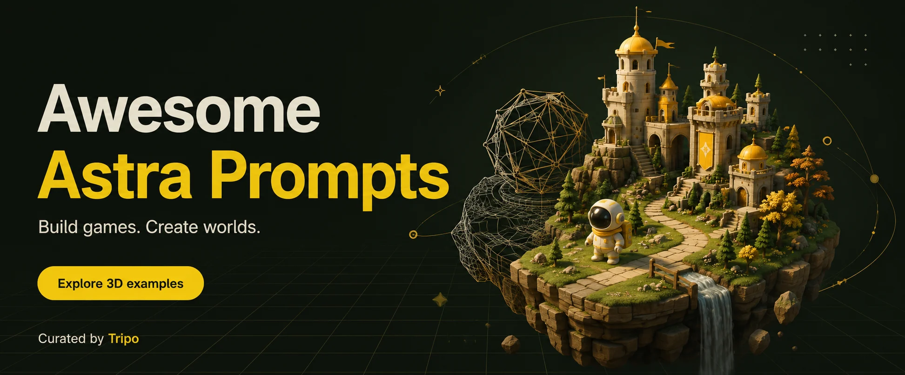</a>

**Un point de départ pour votre prochain jeu, scène ou monde interactif.**


**153 · Tous les prompts Astra**

## Projets à découvrir

<table>
<tr>
<td width="50%" valign="top"><a href="https://www.tripo3d.ai/fr/3d-prompts/surviving-society-of-autonomous-unreal-humans-2095596175705399482">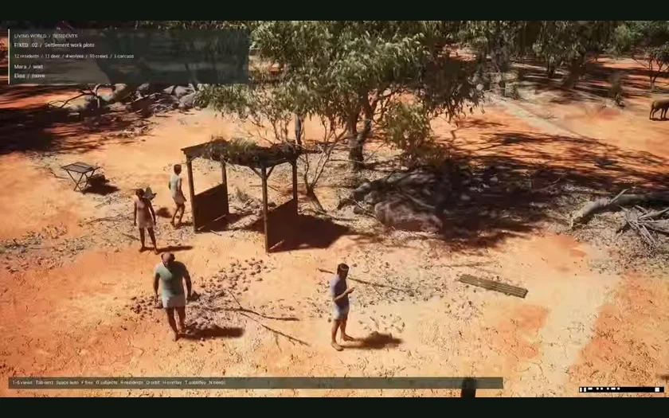</a><br><strong><a href="#2095596175705399482">Une société d'humains autonomes qui survit dans Unreal</a></strong><br><sub><a href="https://x.com/mattshumer_/status/2095596175705399482">Matt Shumer</a></sub><br><a href="#2095596175705399482">Prompt →</a></td>
<td width="50%" valign="top"><a href="https://www.tripo3d.ai/fr/3d-prompts/kaiju-city-battle-2096251574918013135">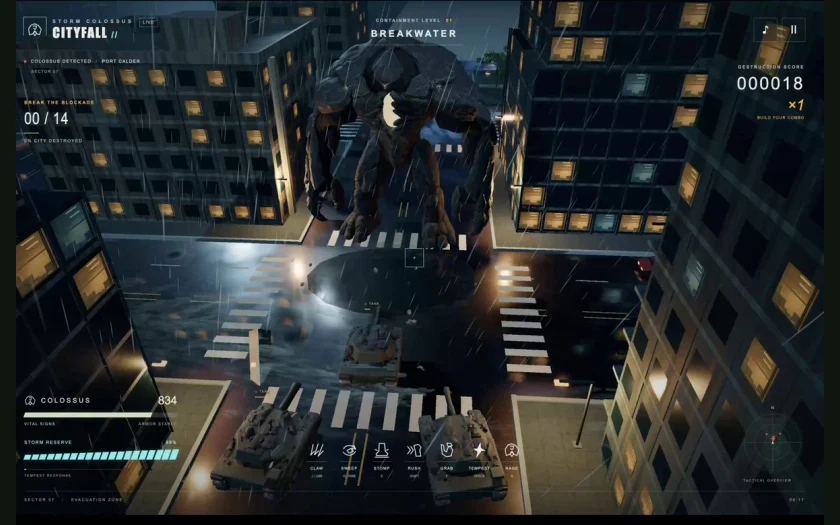</a><br><strong><a href="#2096251574918013135">Une bataille de kaijus en ville</a></strong><br><sub><a href="https://x.com/majidmanzarpour/status/2096251574918013135">Majid Manzarpour</a></sub><br><a href="#2096251574918013135">Prompt →</a></td>
</tr>
<tr>
<td width="50%" valign="top"><a href="https://www.tripo3d.ai/fr/3d-prompts/switchable-character-expressions-in-blender-2096525100518453342">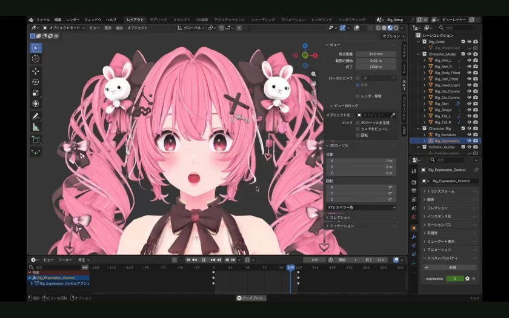</a><br><strong><a href="#2096525100518453342">Expressions de personnage interchangeables dans Blender</a></strong><br><sub><a href="https://x.com/Dstudio_ai/status/2096525100518453342">Nano(ナノ)</a></sub><br><a href="#2096525100518453342">Prompt →</a></td>
<td width="50%" valign="top"><a href="https://www.tripo3d.ai/fr/3d-prompts/one-shot-minecraft-style-world-2095597137849446688">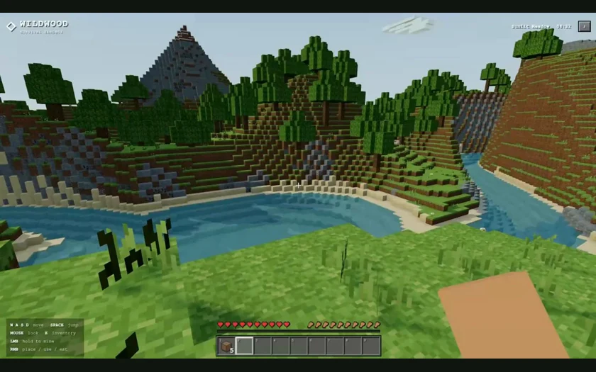</a><br><strong><a href="#2095597137849446688">Un monde façon Minecraft en une seule génération</a></strong><br><sub><a href="https://x.com/flavioAd/status/2095597137849446688">Flavio Adamo</a></sub><br><a href="#2095597137849446688">Prompt →</a></td>
</tr>
</table>

<a id="all-prompts"></a>

## Tous les prompts Astra

<details>
<summary>Parcourir les exemples</summary>

- [Un océan procédural vivant et une simulation de tempête](#2095673885605630429) · GitHub
- [Gogh Strike : un FPS multijoueur](#2096013280519016608) · GitHub
- [Une arène de combat dans une cathédrale](#2095988972879335792) · GitHub
- [Une course de combat antigravité](#2095967568825582044) · GitHub
- [Noyau d’énergie interactif à deux anneaux](#2096551010089263181) · GitHub
- [La place de l’Union de Cluj-Napoca en voxels](#2096262733259837681) · GitHub
- [Une société d'humains autonomes qui survit dans Unreal](#2095596175705399482)
- [Manhattan rue par rue dans Unreal Engine](#2095609734845927525)
- [Une bataille de kaijus en ville](#2096251574918013135)
- [Une villa contemporaine dans Blender](#2095636679264780481)
- [Expressions de personnage interchangeables dans Blender](#2096525100518453342)
- [Un monde façon Minecraft en une seule génération](#2095597137849446688)
- [Un jeu 3D pour navigateur en une seule génération](#2095599934766764338)
- [D'une photo de maison à un monde Blender modifiable](#2095598645190291775)
- [D'une annonce Zillow à un film immobilier 3D](#2095612137582526615)
- [D'un dessin de train à vapeur à un assemblage Blender modifiable](#2095756085890310311)
- [Un décor procédural du Bureau ovale pour Cycles](#2095630197257367857)
- [Le Palace of Fine Arts recréé dans Blender](#2095653641164329143)
- [Une ville à parcourir issue de six tableaux de Van Gogh](#2095776685807346105)
- [Un jeu 3D piloté à la voix pour débuter](#2095608358086840647)
- [Trois jeux de kart thématiques à partir d'une seule maquette](#2095580402505400369)
- [Une aventure en monde ouvert dans le navigateur](#2095596341422440714)
- [Un studio de maquettes produit 3D photoréalistes](#2095619319690400253)
- [Un jeu d'aquarium 3D à partir d'une image de référence](#2095611134992945385)
- [Un jeu 3D temps réel jouable avec un seul prompt](#2095647685210669541)
- [Une bataille navale Three.js en un seul échange](#2095840435319001278)
- [Un FPS multijoueur 10 contre 10 inspiré de Halo](#2095598026916049024)
- [Une table de trains voxel interactive](#2095719731860750613)
- [Un navire voxel vivant dans une bouteille](#2095699049722581065)
- [Un assemblage CAO de l'USS Enterprise prêt à imprimer](#2095641163441254676)
- [Une course spatiale dans une tranchée sous Unity](#2095630044102279312)
- [Un château voxel procédural à découvrir](#2093690427849191855)
- [Une ville Unity explorable assemblée à partir d'assets](#2095597640587374887)
- [Une locomotive Blender mécaniquement complète](#2095868420327710840)
- [Tidal Rush : huit pilotes dans le navigateur](#2095819786651374023)
- [Une galaxie WebGL temps réel en tête de page de lancement](#2095805694603673631)
- [Un jeu d'arcade culturel qui se joue tout seul](#2095898198413922791)
- [Un prototype interactif haut de gamme en une seule passe](#2095597560253862065)
- [Un turbocompresseur 3D interactif en vue éclatée](#2095776712579571725)
- [Un jeu Three.js surprenant en une seule génération](#2095663498101662198)
- [Un prototype de jeu rapidement jouable](#2095907526566990013)
- [Du prompt au jeu en monde ouvert](#2095872986477908108)
- [Une page d'accueil galactique interactive en Three.js](#2095806515579879457)
- [Une chambre cyberpunk en boucle dans Blender](#2095898303019856230)
- [Une ville de Van Gogh en Three.js](#2095871735824339279)
- [Se promener dans les rues de La Nuit étoilée](#2095805115580199372)
- [Une table de trains d'enfance à piloter](#2095742344293454148)
- [D'un texte à une ville Unity explorable](#2095623452678144366)
- [Un aquarium pour comparer les modèles avec un seul prompt](#2095650251902239139)
- [D'un plan à une visite 3D complète](#2095725404883476661)
- [Une vraie maison dans une scène Blender modifiable à 60 images/s](#2095777502681825541)
- [Street Heat : dérapages urbains dans le navigateur](#2095916820431827408)
- [Prévisualisation cinématographique d'un musée 3D](#2095616529572503593)
- [Une publicité produit jouable de 15 secondes](#2095695603808309497)
- [Du plan à Blender puis à Unreal pour une visite architecturale](#2095624712244072551)
- [Solace : de la villa forestière à la visite UE5](#2095752726886105375)
- [Le défi d'une scène Blender en trente secondes](#2095844872171421771)
- [Une machine à réactions en chaîne de Rube Goldberg](#2095980885732704629)
- [Un Taj Mahal explorable](#2096035962824335798)
- [Un simulateur de rendez-vous orbital](#2096225621303042258)
- [Un remorqueur assemblé à partir d'images de référence](#2096180220839760375)
- [Une perceuse reconstituée à partir d'une seule vue](#2096059736693305794)
- [Un jeu d'oiseaux au lance-pierre en 3D](#2095981655370666076)
- [Un jeu de tir à la troisième personne en bullet time](#2095962376344309843)
- [Une gelée WebGPU rebondissante](#2096008241104711698)
- [Une manette PS5 interactive](#2095967131573649552)
- [Astral War : un jeu de tir dans le navigateur](#2096079660605997264)
- [D'un schéma PDF à un circuit imprimé et sa vue 3D](#2096079976433082502)
- [Un jeu de vol dans le navigateur](#2096149823216898445)
- [Un tableau de bord avec globe interactif](#2096082432197837065)
- [La tour Azadi dans Blender](#2096107322536051057)
- [Un site de studio 3D animé par le défilement](#2096245759121277132)
- [Komorebi : du kayak en rivière](#2096244208533455049)
- [Une bouteille réfractive au cœur d'un récit produit](#2096243989439713677)
- [Des trains procéduraux en vue éclatée](#2096082580554777041)
- [Un univers de jouets pour tout-petit](#2096201415051911597)
- [Une usine d'avions à réaction en activité](#2096122429319852319)
- [Une tempête enfermée dans un cube](#2096220264413409648)
- [Zork devient un jeu d'action-aventure 3D](#2096047660662722620)
- [Un T. rex riggé et animé](#2096133339329536249)
- [La vie marine dans une tasse de café](#2096174858837074198)
- [Une démo Hyperloop interactive](#2096250748099068377)
- [Un buste procédural de Napoléon](#2096234355395903672)
- [Un hall de gare](#2096226711222546461)
- [Un diorama animé pour les premiers pas](#2096222790894661841)
- [OX Vice Drive : conduire dans une ville ouverte](#2096206082712768897)
- [Une publicité de jeu mobile rendue jouable](#2096111709496680842)
- [Un jeu de combat d'arène anime dans Roblox](#2095999578419929412)
- [Une physique de course pour navigateur en C# et WASM](#2096258619574513880)
- [Un rig automatique et des mouvements de kung-fu](#2096141728487178503)
- [D'une illustration à un personnage jouable](#2096107343268257953)
- [Un portfolio 3D personnel avec un globe des conférences](#2096023793772998704)
- [Une tranche jouable Godot inspirée de Sonic](#2096056285896536086)
- [Un personnage viking dans Blender](#2096140378777010278)
- [Dropzone : une arène de battle royale](#2096155883122413946)
- [Une visite du jardin du musée de Suzhou](#2096096998092841449)
- [Une exposition scientifique interactive sur Titan](#2095986941753712841)
- [Un écosystème WebGL qui évolue](#2096040448477515874)
- [Un réseau de livraison avec fermeture de ponts](#2096042360513904742)
- [Un simulateur Sinclair ZX Spectrum](#2096062355692048605)
- [D'un scan photogrammétrique à un salon modifiable](#2096092080397246707)
- [Une aventure de plateformes inspirée d'Odyssey](#2096135808243876152)
- [L'anatomie humaine en vue éclatée interactive](#2096221988763173186)
- [Une Tesla Model X en vue éclatée](#2096009146248122416)
- [Une machine à capsules de souvenirs](#2096241295949975602)
- [Une Formule 1 dans Blender](#2096125193580113957)
- [Scène de personnage inspirée de Warcraft dans Unity](#2096308567863079420)
- [Arène de combat Three.js avec des assets Tripo](#2096015772334047319)
- [Plateau de shogi 3D pivotant](#2096579856133947507)
- [Atlas éclaté d’un ordinateur de bureau](#2096578761877860502)
- [Aménagement d’une chambre d’enfant avec espace de travail](#2096578684010508736)
- [Plan et visite 3D synchronisés](#2095999282088378520)
- [Miniature interactive de Séoul](#2096557555086725159)
- [Insecte procédural capable de grimper sur les surfaces](#2096460081982304546)
- [Le Wright Flyer au-dessus d’une forêt japonaise](#2096467585785286808)
- [Une maison modélisée de zéro dans Blender](#2096576154337734865)
- [D’une photo de café à une visite au format vertical](#2096143359505269079)
- [Du plan du dernier étage à un aperçu Blender](#2096501340889374883)
- [Le Terreiro do Paço de Lisbonne dans Blender](#2096298425914450021)
- [Quête d’exploration The Quiet Crossing](#2096574297703637111)
- [Forêt procédurale dense dans Three.js](#2096263046918197609)
- [Modèle de l’enregistreur TP-7 d’après références](#2096013228090245181)
- [Locomotive à vapeur à travers la campagne](#2096577430274429157)
- [Platine vinyle sur une table](#2096561346766877106)
- [Boucle de jeu de combats de cartes à collectionner](#2096555856204644550)
- [Jeu de simulation de réseau ferroviaire](#2096362653480562751)
- [Village low poly inspiré de Gwacheon à parcourir à pied](#2096490395614019793)
- [Niveau complet de jeu de réflexion dans Three.js](#2096505740643246231)
- [Chasse au trésor sur une plage low poly](#2096570815714414844)
- [Modèles Blender et effets visuels Unity](#2096560142871658589)
- [Jeu de rallye Unity jouable sur mobile](#2096556692842348826)
- [Manguier indien dans SpeedTree](#2096572429066006845)
- [Texturer et rigger un personnage Tripo](#2096566598689783878)
- [Prototype de jeu The Legend of Astra](#2096064140510970318)
- [Du croquis d’un appartement aux rendus intérieurs](#2096566686266597754)
- [Scène de rivière interactive dans le navigateur](#2095993826569502785)
- [Survol d’Adiyogi au crépuscule](#2096128774203171021)
- [Eau en boucle avec Geometry Nodes](#2096521798150242631)
- [Monde de navigation inspiré de One Piece](#2096518775042707700)
- [Attracteur de Lorenz interactif](#2096572156453028193)
- [Taverne avec clients et personnel en activité](#2096358854275543457)
- [Une chambre personnelle comme portfolio interactif](#2096506357868642342)
- [Bateau YF-24 sur une mer 3D peu agitée](#2096503275910832461)
- [Appartement jouable inspiré de D4](#2096413869841473930)
- [Jeu urbain dans le navigateur avec un personnage fourni](#2096398839830008292)
- [Explorateur orbital du système solaire](#2096339041679442428)
- [Formation des trous noirs en WebGL](#2096093614397170104)
- [Un logo 2D devient un personnage animé](#2096559197999501724)
- [Jeu de crabe aux mécaniques fondées sur l’action](#2096337879173591171)
- [Village de La Nuit étoilée avec cycle jour-nuit](#2096555183790575682)
- [Interface Three.js fidèle à une référence](#2096510126244999366)
- [Assembler et animer des assets 3D générés](#2096481425050743048)
- [Landing page abyssale bioluminescente](#2096269057544831175)

</details>

<a id="2095673885605630429"></a>

### Un océan procédural vivant et une simulation de tempête

[Ethan Mollick](https://x.com/emollick) · 2026-09-04

<a href="https://www.tripo3d.ai/fr/3d-prompts/procedural-living-ocean-and-storm-simulation-2095673885605630429"></a>

**Prompt**

```text
Transforme le générateur de surface océanique en tempête fourni dans un seul fichier en océan procédural complet. Ajoute des récifs, des profondeurs, une météo crédible, des populations animales aux comportements émergents, des interactions d'écosystème et une caméra capable de passer de la surface au monde sous-marin.
```

[Voir les détails ↗](https://www.tripo3d.ai/fr/3d-prompts/procedural-living-ocean-and-storm-simulation-2095673885605630429) · [Voir la vidéo ↗](https://cdn-blog.holymolly.ai/media/production/3d-prompt-2095673008803241987-video-48e1e14348a0.mp4) · [Publication originale](https://x.com/emollick/status/2095673885605630429) · [Code source](https://github.com/emollick/abyssal-living-deep) · [Démo](https://abyssal-living-deep.netlify.app/?site=reef&seed=713&light=day&surface=1) · [Retour aux exemples](#all-prompts)

---

<a id="2096013280519016608"></a>

### Gogh Strike : un FPS multijoueur

[Peter Gostev](https://x.com/petergostev) · 2026-09-04

<a href="https://www.tripo3d.ai/fr/3d-prompts/gogh-strike-multiplayer-fps-2096013280519016608">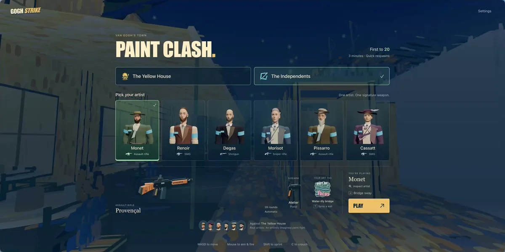</a>

Construis un FPS postimpressionniste à 5 contre 5 avec des personnages artistes rendus dans Blender, des équipes faciles à distinguer et un match multijoueur complet dans le navigateur.

**Prompt**

```text
Construis un FPS postimpressionniste à 5 contre 5 avec des personnages artistes rendus dans Blender, des équipes faciles à distinguer et un match multijoueur complet dans le navigateur.
```

[Voir les détails ↗](https://www.tripo3d.ai/fr/3d-prompts/gogh-strike-multiplayer-fps-2096013280519016608) · [Voir la vidéo ↗](https://cdn-blog.holymolly.ai/media/production/3d-prompt-2096012866734501888-video-972adb2fb60f.mp4) · [Publication originale](https://x.com/petergostev/status/2096013280519016608) · [Code source](https://github.com/petergpt/gogh-strike) · [Démo](https://gogh-strike.surge.sh/) · [Retour aux exemples](#all-prompts)

---

<a id="2095988972879335792"></a>

### Une arène de combat dans une cathédrale

[Alexey Fateev](https://x.com/superalesha) · 2026-09-04

<a href="https://www.tripo3d.ai/fr/3d-prompts/cathedral-hack-and-slash-arena-2095988972879335792">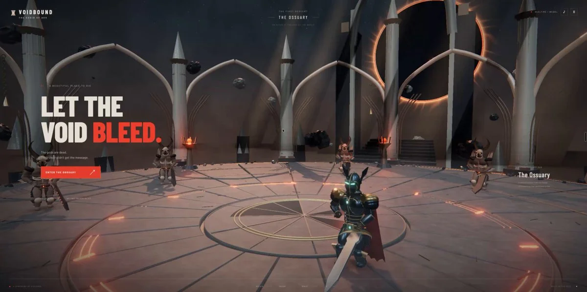</a>

Construis un jeu Three.js de hack-and-slash à la troisième personne dans une cathédrale au-dessus d'une étoile morte. Prévois des combos légers à l'épée, des attaques lourdes, de la magie de zone, des esquives et des animations à deux mains bien ancrées.

**Prompt**

```text
Construis un jeu Three.js de hack-and-slash à la troisième personne dans une cathédrale au-dessus d'une étoile morte. Prévois des combos légers à l'épée, des attaques lourdes, de la magie de zone, des esquives et des animations à deux mains bien ancrées.
```

[Voir les détails ↗](https://www.tripo3d.ai/fr/3d-prompts/cathedral-hack-and-slash-arena-2095988972879335792) · [Voir la vidéo ↗](https://cdn-blog.holymolly.ai/media/production/3d-prompt-2095988588534272001-video-af1e5c9a142b.mp4) · [Publication originale](https://x.com/superalesha/status/2095988972879335792) · [Code source](https://github.com/alesha-pro/bench-portal) · [Démo](https://alesha-pro.github.io/bench-portal/games/voidbound-choir-of-ash/) · [Retour aux exemples](#all-prompts)

---

<a id="2095967568825582044"></a>

### Une course de combat antigravité

[Alexey Fateev](https://x.com/superalesha) · 2026-09-04

<a href="https://www.tripo3d.ai/fr/3d-prompts/anti-gravity-combat-racer-2095967568825582044">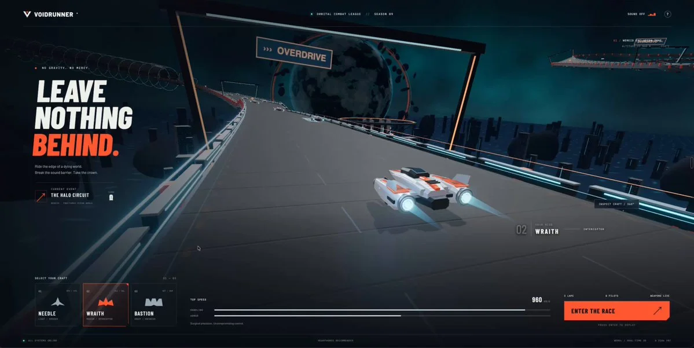</a>

Construis dans Three.js un jeu de course de combat antigravité à grande vitesse avec dérapages, accélérations, caméras inclinées, aérofreins et boucliers à ramasser. Prévois des engins légers, équilibrés et lourds sur un circuit extraterrestre surélevé.

**Prompt**

```text
Construis dans Three.js un jeu de course de combat antigravité à grande vitesse avec dérapages, accélérations, caméras inclinées, aérofreins et boucliers à ramasser. Prévois des engins légers, équilibrés et lourds sur un circuit extraterrestre surélevé.
```

[Voir les détails ↗](https://www.tripo3d.ai/fr/3d-prompts/anti-gravity-combat-racer-2095967568825582044) · [Voir la vidéo ↗](https://cdn-blog.holymolly.ai/media/production/3d-prompt-2095966450385289216-video-44433db9ca50.mp4) · [Publication originale](https://x.com/superalesha/status/2095967568825582044) · [Code source](https://github.com/alesha-pro/bench-portal) · [Retour aux exemples](#all-prompts)

---

<a id="2096551010089263181"></a>

### Noyau d’énergie interactif à deux anneaux

[ruofeng](https://x.com/oneruofeng) · 2026-09-06

<a href="https://www.tripo3d.ai/fr/3d-prompts/interactive-dual-ring-energy-core-2096551010089263181"></a>

Modélise un noyau d’énergie, deux anneaux et un socle métallique dans Blender. Exporte les matériaux vers une visionneuse Three.js avec des commandes de rotation, de zoom, d’orbite automatique et de pulsation.

**Prompt**

```text
Modélise un noyau d’énergie, deux anneaux et un socle métallique dans Blender. Exporte les matériaux vers une visionneuse Three.js avec des commandes de rotation, de zoom, d’orbite automatique et de pulsation.
```

[Voir les détails ↗](https://www.tripo3d.ai/fr/3d-prompts/interactive-dual-ring-energy-core-2096551010089263181) · [Voir la vidéo ↗](https://cdn-blog.holymolly.ai/media/production/3d-prompt-2096549512995368961-video-3eacc87e8c74.mp4) · [Publication originale](https://x.com/oneruofeng/status/2096551010089263181) · [Code source](https://github.com/wangruofeng/orbital-core-showcase) · [Démo](https://orbital-core-showcase.wangruofeng007.workers.dev/) · [Retour aux exemples](#all-prompts)

---

<a id="2096262733259837681"></a>

### La place de l’Union de Cluj-Napoca en voxels

[Dan Manastireanu](https://x.com/danmana) · 2026-09-05

<a href="https://www.tripo3d.ai/fr/3d-prompts/cluj-napoca-union-square-in-voxels-2096262733259837681"></a>

Crée un monde interactif en voxels de la Piața Unirii à Cluj-Napoca. Adapte le plan et les monuments reconnaissables de la place en une miniature explorable.

**Prompt**

```text
Crée un monde interactif en voxels de la Piața Unirii à Cluj-Napoca. Adapte le plan et les monuments reconnaissables de la place en une miniature explorable.
```

[Voir les détails ↗](https://www.tripo3d.ai/fr/3d-prompts/cluj-napoca-union-square-in-voxels-2096262733259837681) · [Voir la vidéo ↗](https://cdn-blog.holymolly.ai/media/production/3d-prompt-2096248939876126720-video-9e98c19a900a.mp4) · [Publication originale](https://x.com/danmana/status/2096262733259837681) · [Code source](https://github.com/danmana/piata-unirii) · [Démo](https://piata-unirii.vercel.app/runs/gpt-astra-xhigh-01/) · [Retour aux exemples](#all-prompts)

---

<a id="2095596175705399482"></a>

### Une société d'humains autonomes qui survit dans Unreal

[Matt Shumer](https://x.com/mattshumer_) · 2026-09-03

<a href="https://www.tripo3d.ai/fr/3d-prompts/surviving-society-of-autonomous-unreal-humans-2095596175705399482"></a>

**Prompt**

```text
Crée un monde Unreal Engine peuplé d'agents humains autonomes. Donne-leur des besoins individuels et un objectif commun de survie pour qu'ils doivent communiquer, répartir le travail, construire des abris et maintenir leur société en vie lorsque le joueur s'en va.
```

[Voir les détails ↗](https://www.tripo3d.ai/fr/3d-prompts/surviving-society-of-autonomous-unreal-humans-2095596175705399482) · [Voir la vidéo ↗](https://cdn-blog.holymolly.ai/media/production/3d-prompt-2095589100539531264-video-a133b7a6d1c6.mp4) · [Publication originale](https://x.com/mattshumer_/status/2095596175705399482) · [Retour aux exemples](#all-prompts)

---

<a id="2095609734845927525"></a>

### Manhattan rue par rue dans Unreal Engine

[Matt Shumer](https://x.com/mattshumer_) · 2026-09-03

<a href="https://www.tripo3d.ai/fr/3d-prompts/street-by-street-manhattan-in-unreal-engine-2095609734845927525"></a>

**Prompt**

```text
Construis un Manhattan explorable dans Unreal Engine. Avance quartier par quartier et rue par rue, en conservant une échelle reconnaissable, le tracé des rues, les monuments, la circulation et l'identité de chaque quartier ; tiens une liste de vérification et améliore chaque zone avant de poursuivre.
```

[Voir les détails ↗](https://www.tripo3d.ai/fr/3d-prompts/street-by-street-manhattan-in-unreal-engine-2095609734845927525) · [Voir la vidéo ↗](https://cdn-blog.holymolly.ai/media/production/3d-prompt-2095609426770010113-video-05968f9d59fb.mp4) · [Publication originale](https://x.com/mattshumer_/status/2095609734845927525) · [Retour aux exemples](#all-prompts)

---

<a id="2096251574918013135"></a>

### Une bataille de kaijus en ville

[Majid Manzarpour](https://x.com/majidmanzarpour) · 2026-09-05

<a href="https://www.tripo3d.ai/fr/3d-prompts/kaiju-city-battle-2096251574918013135"></a>

Construis un jeu Three.js inspiré des kaijus en utilisant des modèles de créatures et des effets sonores générés. Crée des combats de géants lisibles et un environnement qui fait ressentir leur taille.

**Prompt**

```text
Construis un jeu Three.js inspiré des kaijus en utilisant des modèles de créatures et des effets sonores générés. Crée des combats de géants lisibles et un environnement qui fait ressentir leur taille.
```

[Voir les détails ↗](https://www.tripo3d.ai/fr/3d-prompts/kaiju-city-battle-2096251574918013135) · [Voir la vidéo ↗](https://cdn-blog.holymolly.ai/media/production/3d-prompt-2096251295594135556-video-cc717933e256.mp4) · [Publication originale](https://x.com/majidmanzarpour/status/2096251574918013135) · [Démo](https://stormcolossus.netlify.app/) · [Retour aux exemples](#all-prompts)

---

<a id="2095636679264780481"></a>

### Une villa contemporaine dans Blender

[Karan](https://x.com/karankendre) · 2026-09-03

<a href="https://www.tripo3d.ai/fr/3d-prompts/modern-villa-scene-in-blender-2095636679264780481"></a>

**Prompt**

```text
Construis une scène complète de villa contemporaine dans Blender : architecture cohérente, intérieurs meublés, piscine à débordement, aménagement paysager, matériaux réalistes et parcours de caméra cinématographique à l'heure dorée.
```

[Voir les détails ↗](https://www.tripo3d.ai/fr/3d-prompts/modern-villa-scene-in-blender-2095636679264780481) · [Voir la vidéo ↗](https://cdn-blog.holymolly.ai/media/production/3d-prompt-2095636565192241152-video-97d4ec4c239f.mp4) · [Publication originale](https://x.com/karankendre/status/2095636679264780481) · [Retour aux exemples](#all-prompts)

---

<a id="2096525100518453342"></a>

### Expressions de personnage interchangeables dans Blender

[Nano(ナノ)](https://x.com/Dstudio_ai) · 2026-09-06

<a href="https://www.tripo3d.ai/fr/3d-prompts/switchable-character-expressions-in-blender-2096525100518453342">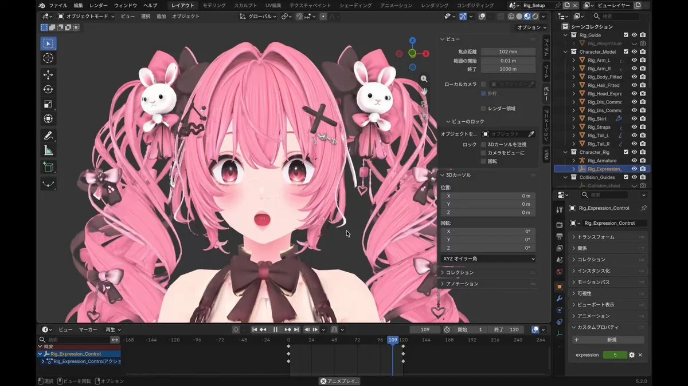</a>

Prépare des variantes d’expression d’un personnage Tripo dans Blender avant de créer le rig. Aligne les maillages et passe de l’un à l’autre sans interpolation, en réduisant les variantes inactives à l’intérieur de la tête. Ne présente pas cette méthode comme un mélange progressif des expressions ni comme compatible avec VRM.

**Prompt**

```text
Prépare des variantes d’expression d’un personnage Tripo dans Blender avant de créer le rig. Aligne les maillages et passe de l’un à l’autre sans interpolation, en réduisant les variantes inactives à l’intérieur de la tête. Ne présente pas cette méthode comme un mélange progressif des expressions ni comme compatible avec VRM.
```

[Voir les détails ↗](https://www.tripo3d.ai/fr/3d-prompts/switchable-character-expressions-in-blender-2096525100518453342) · [Voir la vidéo ↗](https://cdn-blog.holymolly.ai/media/production/3d-prompt-2096524256012316672-video-4b1e211ec04c.mp4) · [Publication originale](https://x.com/Dstudio_ai/status/2096525100518453342) · [Retour aux exemples](#all-prompts)

---

<a id="2095597137849446688"></a>

### Un monde façon Minecraft en une seule génération

[Flavio Adamo](https://x.com/flavioAd) · 2026-09-03

<a href="https://www.tripo3d.ai/fr/3d-prompts/one-shot-minecraft-style-world-2095597137849446688"></a>

**Prompt**

```text
Construis en une seule passe un monde voxel jouable inspiré de Minecraft, avec génération du terrain, pose et destruction de blocs, commandes à la première personne, inventaire, éclairage, eau et boucle de survie compacte.
```

[Voir les détails ↗](https://www.tripo3d.ai/fr/3d-prompts/one-shot-minecraft-style-world-2095597137849446688) · [Voir la vidéo ↗](https://cdn-blog.holymolly.ai/media/production/3d-prompt-2095576150743400453-video-af32f40d4a39.mp4) · [Publication originale](https://x.com/flavioAd/status/2095597137849446688) · [Retour aux exemples](#all-prompts)

---

<a id="2095599934766764338"></a>

### Un jeu 3D pour navigateur en une seule génération

[Theo - t3.gg](https://x.com/theo) · 2026-09-03

<a href="https://www.tripo3d.ai/fr/3d-prompts/one-shot-browser-3d-game-2095599934766764338">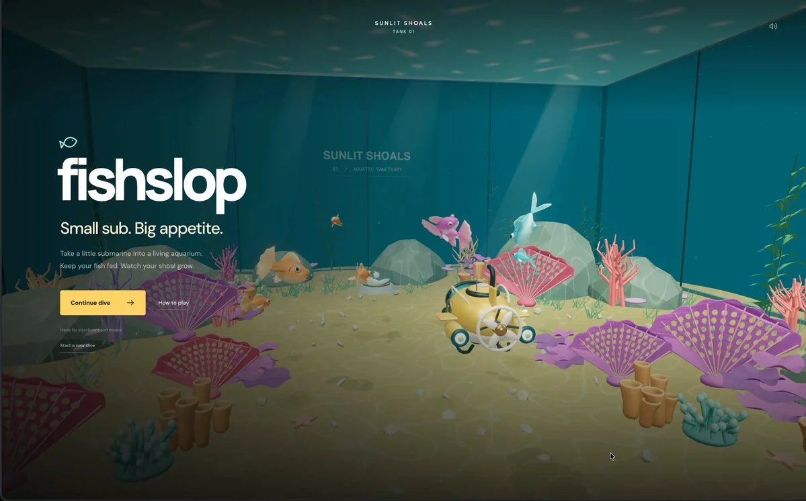</a>

**Prompt**

```text
Crée un jeu 3D complet qui fonctionne dans le navigateur au sein d'un projet autonome. Prévois un objectif clair, des commandes réactives, des niveaux cohérents dans l'espace, des ennemis ou des dangers, des retours visuels, un score, un redémarrage et des garde-fous pour les performances.
```

[Voir les détails ↗](https://www.tripo3d.ai/fr/3d-prompts/one-shot-browser-3d-game-2095599934766764338) · [Voir la vidéo ↗](https://cdn-blog.holymolly.ai/media/production/3d-prompt-2095599652796272640-video-19ead087387b.mp4) · [Publication originale](https://x.com/theo/status/2095599934766764338) · [Retour aux exemples](#all-prompts)

---

<a id="2095598645190291775"></a>

### D'une photo de maison à un monde Blender modifiable

[Tom Krcha](https://x.com/tomkrcha) · 2026-09-03

<a href="https://www.tripo3d.ai/fr/3d-prompts/house-photo-to-editable-blender-world-2095598645190291775"></a>

**Prompt**

```text
Reconstitue l'image de maison fournie sous forme de scène Blender entièrement modifiable. Modélise séparément l'architecture, les meubles, les appareils électroménagers et les jouets, conserve des proportions plausibles et fais fonctionner le résultat localement avec une visite fluide à 60 images par seconde.
```

[Voir les détails ↗](https://www.tripo3d.ai/fr/3d-prompts/house-photo-to-editable-blender-world-2095598645190291775) · [Voir la vidéo ↗](https://cdn-blog.holymolly.ai/media/production/3d-prompt-2095596412650283008-video-ba69ffc1845f.mp4) · [Publication originale](https://x.com/tomkrcha/status/2095598645190291775) · [Retour aux exemples](#all-prompts)

---

<a id="2095612137582526615"></a>

### D'une annonce Zillow à un film immobilier 3D

[Yunfan Ye](https://x.com/realYunfanYe) · 2026-09-03

<a href="https://www.tripo3d.ai/fr/3d-prompts/zillow-listing-to-3d-property-film-2095612137582526615">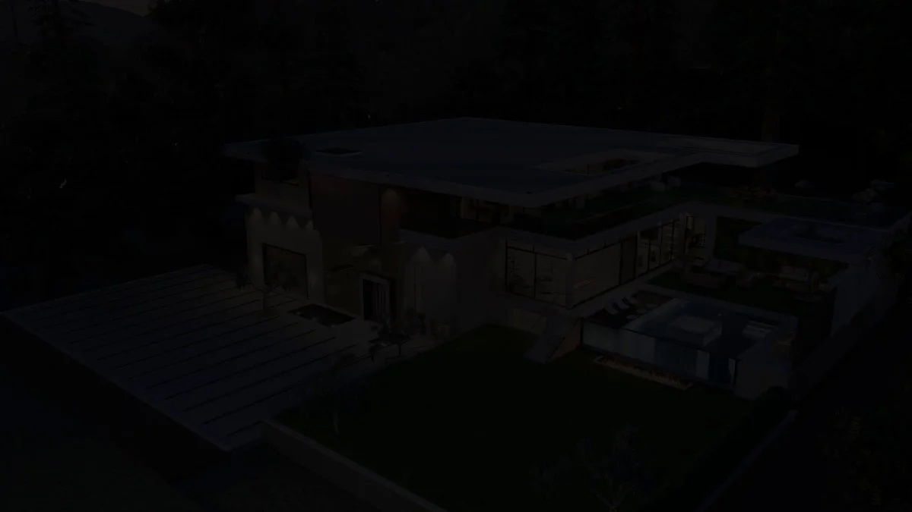</a>

**Prompt**

```text
À partir de l'annonce immobilière fournie et de toutes ses photos, reconstitue la maison en 3D, déduis un plan cohérent puis crée une vidéo de visite promotionnelle soignée. Signale les incertitudes géométriques et corrige les écarts après une première version.
```

[Voir les détails ↗](https://www.tripo3d.ai/fr/3d-prompts/zillow-listing-to-3d-property-film-2095612137582526615) · [Voir la vidéo ↗](https://cdn-blog.holymolly.ai/media/production/3d-prompt-2095611898968547328-video-ac32ebda7148.mp4) · [Publication originale](https://x.com/realYunfanYe/status/2095612137582526615) · [Retour aux exemples](#all-prompts)

---

<a id="2095756085890310311"></a>

### D'un dessin de train à vapeur à un assemblage Blender modifiable

[Tom Krcha](https://x.com/tomkrcha) · 2026-09-04

<a href="https://www.tripo3d.ai/fr/3d-prompts/steam-train-drawing-to-editable-blender-assembly-2095756085890310311">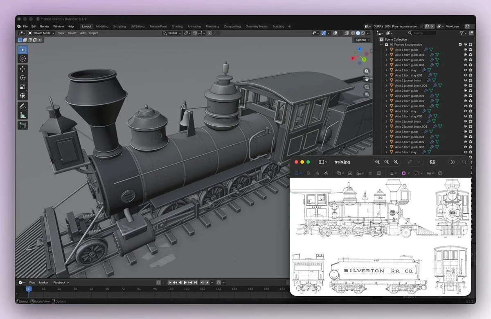</a>

**Prompt**

```text
Reconstitue le dessin de train à vapeur ancien fourni dans Blender sous forme d'assemblage mécanique détaillé. Garde les roues, essieux, suspensions, bielles, équipements de chaudière et panneaux de carrosserie comme objets nommés et modifiables, avec un niveau de détail maîtrisable.
```

[Voir les détails ↗](https://www.tripo3d.ai/fr/3d-prompts/steam-train-drawing-to-editable-blender-assembly-2095756085890310311) · [Voir la vidéo ↗](https://cdn-blog.holymolly.ai/media/production/3d-prompt-2095754646069354497-video-61d8e4756cf0.mp4) · [Publication originale](https://x.com/tomkrcha/status/2095756085890310311) · [Retour aux exemples](#all-prompts)

---

<a id="2095630197257367857"></a>

### Un décor procédural du Bureau ovale pour Cycles

[Higgsfield AI 🧩](https://x.com/higgsfield_ai) · 2026-09-03

<a href="https://www.tripo3d.ai/fr/3d-prompts/procedural-oval-office-set-for-cycles-2095630197257367857"></a>

**Prompt**

```text
Traduis une description de décor du Bureau ovale en code de scène exécutable. Construis le lieu dans Blender avec mobilier, murs, éclairages et placements de caméra modifiables, puis réalise un rendu cinématographique avec Cycles.
```

[Voir les détails ↗](https://www.tripo3d.ai/fr/3d-prompts/procedural-oval-office-set-for-cycles-2095630197257367857) · [Voir la vidéo ↗](https://cdn-blog.holymolly.ai/media/production/3d-prompt-2095629993678344192-video-4ddc3c553b82.mp4) · [Publication originale](https://x.com/higgsfield_ai/status/2095630197257367857) · [Retour aux exemples](#all-prompts)

---

<a id="2095653641164329143"></a>

### Le Palace of Fine Arts recréé dans Blender

[Sharif Shameem](https://x.com/sharifshameem) · 2026-09-03

<a href="https://www.tripo3d.ai/fr/3d-prompts/palace-of-fine-arts-blender-recreation-2095653641164329143">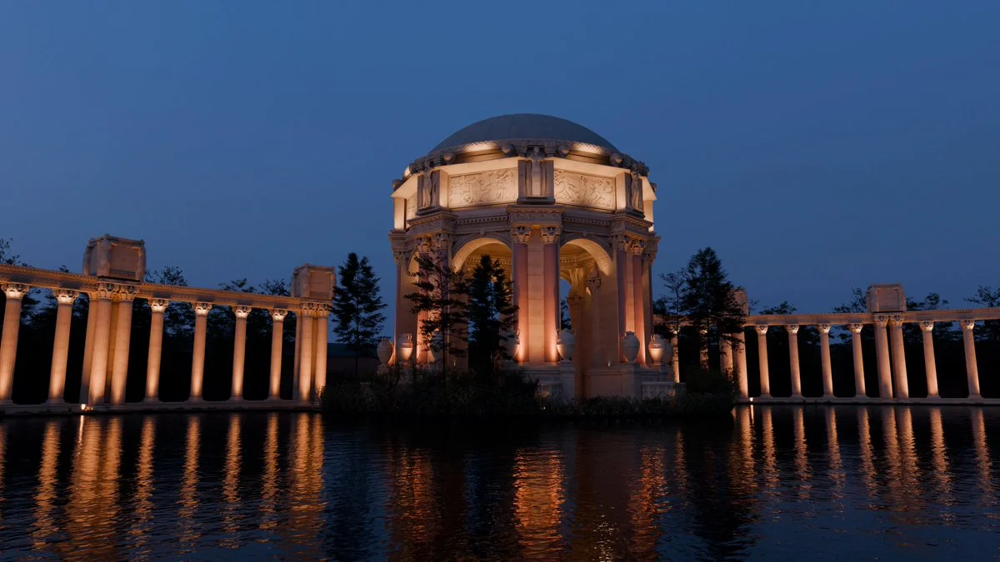</a>

**Prompt**

```text
Recrée le Palace of Fine Arts de San Francisco dans Blender : proportions reconnaissables de la rotonde, colonnades, lagune, végétation, matériaux patinés et éclairage cinématographique empreint de l'optimisme des expositions universelles.
```

[Voir les détails ↗](https://www.tripo3d.ai/fr/3d-prompts/palace-of-fine-arts-blender-recreation-2095653641164329143) · [Voir la vidéo ↗](https://cdn-blog.holymolly.ai/media/production/3d-prompt-2095652923917361152-video-39313e3745d0.mp4) · [Publication originale](https://x.com/sharifshameem/status/2095653641164329143) · [Retour aux exemples](#all-prompts)

---

<a id="2095776685807346105"></a>

### Une ville à parcourir issue de six tableaux de Van Gogh

[Peter Gostev](https://x.com/petergostev) · 2026-09-04

<a href="https://www.tripo3d.ai/fr/3d-prompts/walkable-town-made-from-six-van-gogh-paintings-2095776685807346105">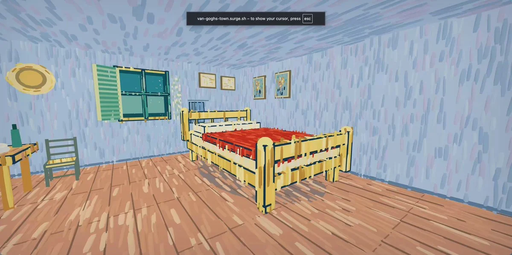</a>

**Prompt**

```text
Transforme les six tableaux de Van Gogh fournis en une ville Three.js cohérente où l'on peut se promener. Conserve la palette et le caractère des coups de pinceau de chaque tableau tout en reliant rues, lieux emblématiques et transitions dans un monde explorable.
```

[Voir les détails ↗](https://www.tripo3d.ai/fr/3d-prompts/walkable-town-made-from-six-van-gogh-paintings-2095776685807346105) · [Voir la vidéo ↗](https://cdn-blog.holymolly.ai/media/production/3d-prompt-2095776416302280708-video-abded525de38.mp4) · [Publication originale](https://x.com/petergostev/status/2095776685807346105) · [Démo](https://van-goghs-town.surge.sh/) · [Retour aux exemples](#all-prompts)

---

<a id="2095608358086840647"></a>

### Un jeu 3D piloté à la voix pour débuter

[el.cine](https://x.com/EHuanglu) · 2026-09-03

<a href="https://www.tripo3d.ai/fr/3d-prompts/voice-directed-3d-game-for-beginners-2095608358086840647"></a>

**Prompt**

```text
Agis comme mon créateur de jeux 3D. Demande uniquement les éléments manquants concernant l'objectif du joueur, la direction artistique et les commandes, puis crée un jeu pour navigateur immédiatement jouable et continue de le modifier à partir de brèves instructions vocales.
```

[Voir les détails ↗](https://www.tripo3d.ai/fr/3d-prompts/voice-directed-3d-game-for-beginners-2095608358086840647) · [Voir la vidéo ↗](https://cdn-blog.holymolly.ai/media/production/3d-prompt-2095608290923425792-video-163f53a6c23f.mp4) · [Publication originale](https://x.com/EHuanglu/status/2095608358086840647) · [Retour aux exemples](#all-prompts)

---

<a id="2095580402505400369"></a>

### Trois jeux de kart thématiques à partir d'une seule maquette

[Chetaslua](https://x.com/chetaslua) · 2026-09-03

<a href="https://www.tripo3d.ai/fr/3d-prompts/three-themed-kart-games-from-one-greybox-2095580402505400369"></a>

**Prompt**

```text
À partir de la maquette en volumes gris du jeu de kart Unity fourni, produis trois variantes jouables : pirate, confiserie et cyberpunk. Réutilise la boucle de conduite, remplace les environnements et les effets de retour, teste chaque version en jouant et corrige les bugs les plus visibles.
```

[Voir les détails ↗](https://www.tripo3d.ai/fr/3d-prompts/three-themed-kart-games-from-one-greybox-2095580402505400369) · [Voir la vidéo ↗](https://cdn-blog.holymolly.ai/media/production/3d-prompt-2095580316710879232-video-b3f497eb07bb.mp4) · [Publication originale](https://x.com/chetaslua/status/2095580402505400369) · [Retour aux exemples](#all-prompts)

---

<a id="2095596341422440714"></a>

### Une aventure en monde ouvert dans le navigateur

[Peter Gostev](https://x.com/petergostev) · 2026-09-03

<a href="https://www.tripo3d.ai/fr/3d-prompts/open-world-browser-adventure-2095596341422440714"></a>

**Prompt**

```text
Construis une aventure 3D en monde ouvert avec plusieurs biomes reliés, des déplacements, des découvertes, des combats légers, des quêtes, des repères, une ambiance jour-nuit et assez d'indications pour que l'exploration ait un sens.
```

[Voir les détails ↗](https://www.tripo3d.ai/fr/3d-prompts/open-world-browser-adventure-2095596341422440714) · [Voir la vidéo ↗](https://cdn-blog.holymolly.ai/media/production/3d-prompt-2095590957890797568-video-da104fbe8619.mp4) · [Publication originale](https://x.com/petergostev/status/2095596341422440714) · [Retour aux exemples](#all-prompts)

---

<a id="2095619319690400253"></a>

### Un studio de maquettes produit 3D photoréalistes

[Josh Millgate](https://x.com/joshmillgate) · 2026-09-03

<a href="https://www.tripo3d.ai/fr/3d-prompts/photoreal-3d-product-mockup-studio-2095619319690400253">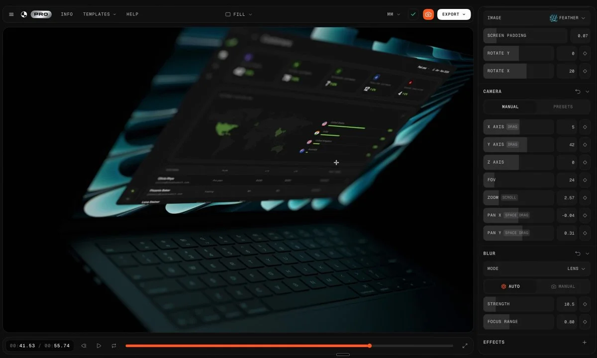</a>

**Prompt**

```text
Crée un outil pour navigateur qui applique les visuels importés à des maquettes de produits 3D photoréalistes. Prévois une caméra orbitale, des réglages de matériaux et de couleurs, un éclairage d'environnement, plusieurs produits et un export haute résolution.
```

[Voir les détails ↗](https://www.tripo3d.ai/fr/3d-prompts/photoreal-3d-product-mockup-studio-2095619319690400253) · [Voir la vidéo ↗](https://cdn-blog.holymolly.ai/media/production/3d-prompt-2095619198437240836-video-0980b9ee2b65.mp4) · [Publication originale](https://x.com/joshmillgate/status/2095619319690400253) · [Retour aux exemples](#all-prompts)

---

<a id="2095611134992945385"></a>

### Un jeu d'aquarium 3D à partir d'une image de référence

[Tim Jayas](https://x.com/TimJayas) · 2026-09-03

<a href="https://www.tripo3d.ai/fr/3d-prompts/reference-image-3d-aquarium-game-2095611134992945385">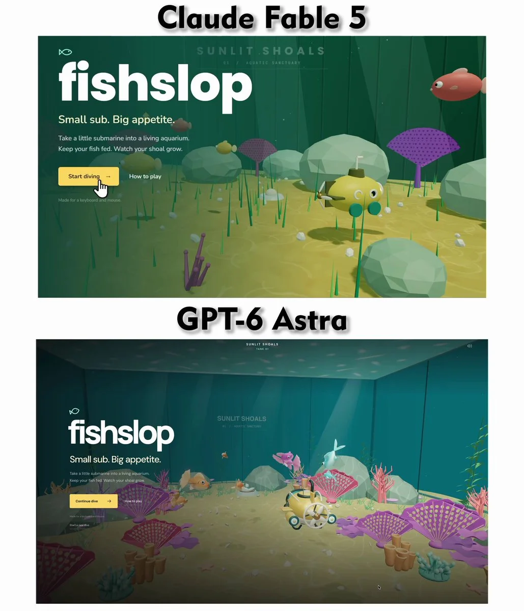</a>

**Prompt**

```text
À partir de l'image de référence fournie, construis en une seule passe un jeu d'aquarium 3D complet. Reconstitue la composition du bac, anime les poissons, ajoute des interactions de nourrissage et de collection, des effets d'eau, des commandes de caméra et un objectif clair.
```

[Voir les détails ↗](https://www.tripo3d.ai/fr/3d-prompts/reference-image-3d-aquarium-game-2095611134992945385) · [Voir la vidéo ↗](https://cdn-blog.holymolly.ai/media/production/3d-prompt-2095610918570958848-video-154a5abed1ba.mp4) · [Publication originale](https://x.com/TimJayas/status/2095611134992945385) · [Retour aux exemples](#all-prompts)

---

<a id="2095647685210669541"></a>

### Un jeu 3D temps réel jouable avec un seul prompt

[Higgsfield AI 🧩](https://x.com/higgsfield) · 2026-09-03

<a href="https://www.tripo3d.ai/fr/3d-prompts/single-playable-real-time-3d-game-2095647685210669541"></a>

**Prompt**

```text
Construis un jeu 3D temps réel jouable à partir d'un seul prompt. Définis une mécanique centrale compacte, un objectif clair et une courte histoire, puis génère la scène, les personnages, les accessoires, les retours d'action et l'état de redémarrage pour que le résultat soit immédiatement jouable.
```

[Voir les détails ↗](https://www.tripo3d.ai/fr/3d-prompts/single-playable-real-time-3d-game-2095647685210669541) · [Voir la vidéo ↗](https://cdn-blog.holymolly.ai/media/production/3d-prompt-2095639396385198080-video-2439075a6fef.mp4) · [Publication originale](https://x.com/higgsfield/status/2095647685210669541) · [Retour aux exemples](#all-prompts)

---

<a id="2095840435319001278"></a>

### Une bataille navale Three.js en un seul échange

[leo 🐾](https://x.com/synthwavedd) · 2026-09-04

<a href="https://www.tripo3d.ai/fr/3d-prompts/single-turn-three-js-naval-war-scene-2095840435319001278">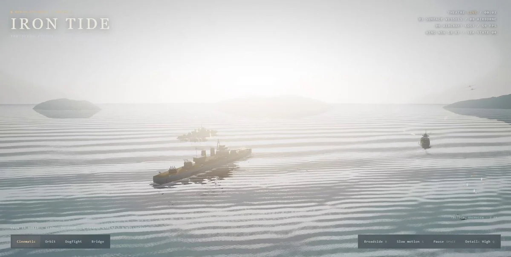</a>

**Prompt**

```text
Crée une bataille navale détaillée dans Three.js en un seul échange. Inclus plusieurs navires distincts, des interactions avec l'eau physiquement convaincantes, des sillages et embruns, de l'action aérienne, des explosions, un éclairage cinématographique, des mouvements de caméra et un rendu attentif aux performances.
```

[Voir les détails ↗](https://www.tripo3d.ai/fr/3d-prompts/single-turn-three-js-naval-war-scene-2095840435319001278) · [Voir la vidéo ↗](https://cdn-blog.holymolly.ai/media/production/3d-prompt-2095839735818412033-video-7ded403f2fb9.mp4) · [Publication originale](https://x.com/synthwavedd/status/2095840435319001278) · [Retour aux exemples](#all-prompts)

---

<a id="2095598026916049024"></a>

### Un FPS multijoueur 10 contre 10 inspiré de Halo

[Halfdan](https://x.com/VikiingAI) · 2026-09-03

<a href="https://www.tripo3d.ai/fr/3d-prompts/10v10-halo-inspired-multiplayer-fps-2095598026916049024">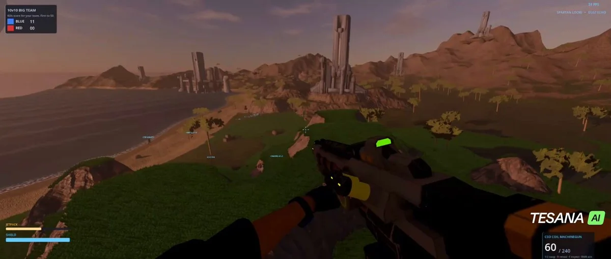</a>

**Prompt**

```text
Construis un jeu de tir d'arène multijoueur à 10 contre 10 inspiré des FPS de science-fiction classiques. Prévois des équipes, des réapparitions, des armes faciles à identifier, des boucliers, des objets à ramasser, des cartes compactes, un score, le déroulement des matchs et un jeu sur navigateur à faible latence.
```

[Voir les détails ↗](https://www.tripo3d.ai/fr/3d-prompts/10v10-halo-inspired-multiplayer-fps-2095598026916049024) · [Voir la vidéo ↗](https://cdn-blog.holymolly.ai/media/production/3d-prompt-2095597293734895622-video-abe5a7cfbbd9.mp4) · [Publication originale](https://x.com/VikiingAI/status/2095598026916049024) · [Retour aux exemples](#all-prompts)

---

<a id="2095719731860750613"></a>

### Une table de trains voxel interactive

[Derya Unutmaz, MD](https://x.com/DeryaTR_) · 2026-09-04

<a href="https://www.tripo3d.ai/fr/3d-prompts/interactive-voxel-railway-table-2095719731860750613"></a>

**Prompt**

```text
Construis une table de trains voxel détaillée dans Three.js. Permets de démarrer et d'arrêter plusieurs trains, d'actionner les aiguillages, de tourner autour de la table et de zoomer, d'observer les villes miniatures et de déclencher de petites animations du décor.
```

[Voir les détails ↗](https://www.tripo3d.ai/fr/3d-prompts/interactive-voxel-railway-table-2095719731860750613) · [Voir la vidéo ↗](https://cdn-blog.holymolly.ai/media/production/3d-prompt-2095719136571629573-video-a0540558f73b.mp4) · [Publication originale](https://x.com/DeryaTR_/status/2095719731860750613) · [Démo](https://lindenhafen-railway.vercel.app/) · [Retour aux exemples](#all-prompts)

---

<a id="2095699049722581065"></a>

### Un navire voxel vivant dans une bouteille

[Derya Unutmaz, MD](https://x.com/DeryaTR_) · 2026-09-04

<a href="https://www.tripo3d.ai/fr/3d-prompts/living-voxel-ship-in-a-bottle-2095699049722581065"></a>

**Prompt**

```text
Crée un navire voxel détaillé du XVIIe siècle naviguant à l'intérieur d'une bouteille en verre. Simule la houle et le mouvement du navire, ajoute des mouettes qui tournent, un port miniature et des récifs coralliens, puis produis une séquence de caméra cinématographique avec une bande-son paisible.
```

[Voir les détails ↗](https://www.tripo3d.ai/fr/3d-prompts/living-voxel-ship-in-a-bottle-2095699049722581065) · [Voir la vidéo ↗](https://cdn-blog.holymolly.ai/media/production/3d-prompt-2095698775075622912-video-e275aa332ebb.mp4) · [Publication originale](https://x.com/DeryaTR_/status/2095699049722581065) · [Retour aux exemples](#all-prompts)

---

<a id="2095641163441254676"></a>

### Un assemblage CAO de l'USS Enterprise prêt à imprimer

[Derya Unutmaz, MD](https://x.com/DeryaTR_) · 2026-09-03

<a href="https://www.tripo3d.ai/fr/3d-prompts/printable-uss-enterprise-cad-assembly-2095641163441254676"></a>

**Prompt**

```text
Conçois en CAO un hommage original à l'USS Enterprise NCC-1701 prêt pour l'impression. Prévois des proportions reconnaissables, une passerelle et certains intérieurs, au moins 28 pièces mobiles fonctionnelles, des assemblages séparés et des fichiers de fabrication exportables.
```

[Voir les détails ↗](https://www.tripo3d.ai/fr/3d-prompts/printable-uss-enterprise-cad-assembly-2095641163441254676) · [Voir la vidéo ↗](https://cdn-blog.holymolly.ai/media/production/3d-prompt-2095640960680243200-video-272db069f601.mp4) · [Publication originale](https://x.com/DeryaTR_/status/2095641163441254676) · [Retour aux exemples](#all-prompts)

---

<a id="2095630044102279312"></a>

### Une course spatiale dans une tranchée sous Unity

[Ronald Mannak](https://x.com/ronaldmannak) · 2026-09-03

<a href="https://www.tripo3d.ai/fr/3d-prompts/unity-space-trench-run-game-2095630044102279312"></a>

**Prompt**

```text
Recrée dans Unity les sensations d'une course spatiale classique en tranchée : vol rapide à basse altitude, tirs de tourelles, obstacles, ciblage, pression croissante, objectif final et séquence cinématographique de réussite ou d'échec.
```

[Voir les détails ↗](https://www.tripo3d.ai/fr/3d-prompts/unity-space-trench-run-game-2095630044102279312) · [Voir la vidéo ↗](https://cdn-blog.holymolly.ai/media/production/3d-prompt-2067003685574483968-video-f9b57b7e0d54.mp4) · [Publication originale](https://x.com/ronaldmannak/status/2095630044102279312) · [Retour aux exemples](#all-prompts)

---

<a id="2093690427849191855"></a>

### Un château voxel procédural à découvrir

[Hakm](https://x.com/hakmgpt) · 2026-08-29

<a href="https://www.tripo3d.ai/fr/3d-prompts/procedural-voxel-castle-showcase-2093690427849191855">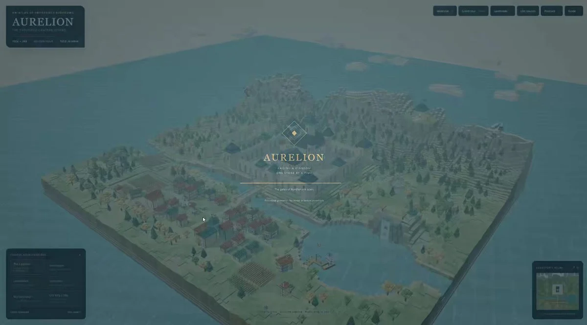</a>

**Prompt**

```text
Génère un grand château voxel avec des lignes de défense lisibles, des tours, des remparts, des portes, des cours et le terrain alentour. Utilise l'instanciation, une caméra orbitale, un éclairage changeant et une génération déterministe pour obtenir un résultat stable et inspectable.
```

[Voir les détails ↗](https://www.tripo3d.ai/fr/3d-prompts/procedural-voxel-castle-showcase-2093690427849191855) · [Voir la vidéo ↗](https://cdn-blog.holymolly.ai/media/production/3d-prompt-2093690174018330624-video-184f0db40faf.mp4) · [Publication originale](https://x.com/hakmgpt/status/2093690427849191855) · [Retour aux exemples](#all-prompts)

---

<a id="2095597640587374887"></a>

### Une ville Unity explorable assemblée à partir d'assets

[Chetaslua](https://x.com/chetaslua) · 2026-09-03

<a href="https://www.tripo3d.ai/fr/3d-prompts/asset-driven-explorable-unity-city-2095597640587374887"></a>

**Prompt**

```text
Assemble une ville Unity explorable à partir de la bibliothèque d'assets fournie. Crée un réseau routier cohérent, des tours, des véhicules, des palmiers, un éclairage et une navigation, puis optimise la scène et produis une visite stable à la première personne.
```

[Voir les détails ↗](https://www.tripo3d.ai/fr/3d-prompts/asset-driven-explorable-unity-city-2095597640587374887) · [Voir la vidéo ↗](https://cdn-blog.holymolly.ai/media/production/3d-prompt-2095597547717029888-video-fda40533e887.mp4) · [Publication originale](https://x.com/chetaslua/status/2095597640587374887) · [Retour aux exemples](#all-prompts)

---

<a id="2095868420327710840"></a>

### Une locomotive Blender mécaniquement complète

[sheemamoto](https://x.com/sheemamoto) · 2026-09-04

<a href="https://www.tripo3d.ai/fr/3d-prompts/mechanically-complete-blender-locomotive-2095868420327710840">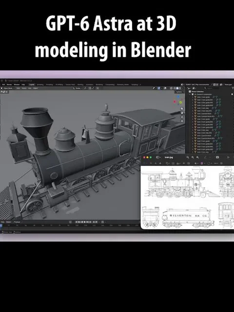</a>

**Prompt**

```text
Modélise une locomotive à vapeur dans Blender comme un véritable ensemble mécanique démontable plutôt que comme une coque texturée. Nomme et sépare les essieux, glissières de boîtes d'essieux, coussinets, entretoises, biellettes de suspension, dôme de vapeur et chaque assemblage majeur.
```

[Voir les détails ↗](https://www.tripo3d.ai/fr/3d-prompts/mechanically-complete-blender-locomotive-2095868420327710840) · [Voir la vidéo ↗](https://cdn-blog.holymolly.ai/media/production/3d-prompt-2095868324701700098-video-0cc691c80738.mp4) · [Publication originale](https://x.com/sheemamoto/status/2095868420327710840) · [Retour aux exemples](#all-prompts)

---

<a id="2095819786651374023"></a>

### Tidal Rush : huit pilotes dans le navigateur

[RESONANCE SCIENCE 🧬🔬](https://x.com/amazing13_13) · 2026-09-04

<a href="https://www.tripo3d.ai/fr/3d-prompts/tidal-rush-eight-racer-browser-game-2095819786651374023"></a>

**Prompt**

```text
Construis un jeu de kart complet pour navigateur avec huit pilotes, trois tours, du dérapage, des objets à ramasser, une physique réactive, un HUD clair, de beaux graphismes et un écran de résultats à l'arrivée.
```

[Voir les détails ↗](https://www.tripo3d.ai/fr/3d-prompts/tidal-rush-eight-racer-browser-game-2095819786651374023) · [Voir la vidéo ↗](https://cdn-blog.holymolly.ai/media/production/3d-prompt-2095817928524599296-video-68a8b3595841.mp4) · [Publication originale](https://x.com/amazing13_13/status/2095819786651374023) · [Retour aux exemples](#all-prompts)

---

<a id="2095805694603673631"></a>

### Une galaxie WebGL temps réel en tête de page de lancement

[Fluxora](https://x.com/Fluxora_Studios) · 2026-09-04

<a href="https://www.tripo3d.ai/fr/3d-prompts/real-time-webgl-galaxy-launch-hero-2095805694603673631"></a>

**Prompt**

```text
Analyse le langage visuel de la section d'accueil galactique fournie et reconstruis-le en WebGL temps réel plutôt qu'en vidéo. Utilise des particules avec profondeur, de la poussière lumineuse, une réaction fluide au pointeur, un espace typographique sobre et des performances adaptatives.
```

[Voir les détails ↗](https://www.tripo3d.ai/fr/3d-prompts/real-time-webgl-galaxy-launch-hero-2095805694603673631) · [Voir la vidéo ↗](https://cdn-blog.holymolly.ai/media/production/3d-prompt-2095804250420879360-video-dc96ce63180f.mp4) · [Publication originale](https://x.com/Fluxora_Studios/status/2095805694603673631) · [Retour aux exemples](#all-prompts)

---

<a id="2095898198413922791"></a>

### Un jeu d'arcade culturel qui se joue tout seul

[Good Morning](https://x.com/say_gm_) · 2026-09-04

<a href="https://www.tripo3d.ai/fr/3d-prompts/self-playing-cultural-arcade-game-2095898198413922791">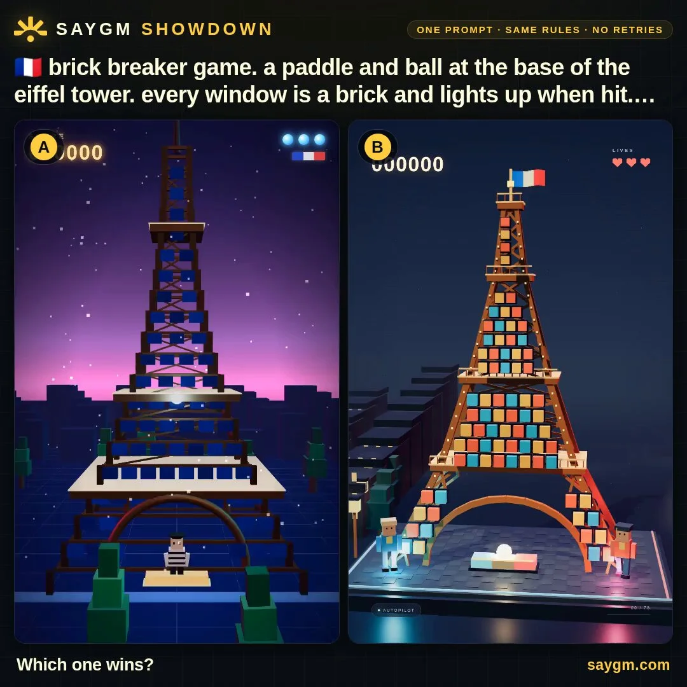</a>

**Prompt**

```text
Construis un jeu d'arcade qui se joue tout seul pour un pays du G7. Transforme un monument culturel reconnaissable en mécanique centrale, rends l'action compréhensible sans intervention et ajoute un score, une difficulté croissante et une révélation mémorable.
```

[Voir les détails ↗](https://www.tripo3d.ai/fr/3d-prompts/self-playing-cultural-arcade-game-2095898198413922791) · [Voir la vidéo ↗](https://cdn-blog.holymolly.ai/media/production/3d-prompt-2095897987142791169-video-f889a9dbf887.mp4) · [Publication originale](https://x.com/say_gm_/status/2095898198413922791) · [Retour aux exemples](#all-prompts)

---

<a id="2095597560253862065"></a>

### Un prototype interactif haut de gamme en une seule passe

[AJ Orbach 🐳](https://x.com/AY_Orbach) · 2026-09-03

<a href="https://www.tripo3d.ai/fr/3d-prompts/one-shot-premium-interactive-prototype-2095597560253862065">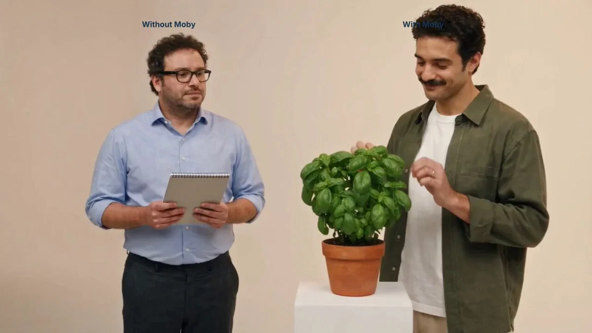</a>

**Prompt**

```text
Conçois et réalise en une seule passe un prototype interactif haut de gamme à partir du concept produit fourni. Choisis un système visuel affirmé, donne la priorité à l'action principale, ajoute des transitions soignées et livre une version adaptative hébergée.
```

[Voir les détails ↗](https://www.tripo3d.ai/fr/3d-prompts/one-shot-premium-interactive-prototype-2095597560253862065) · [Voir la vidéo ↗](https://cdn-blog.holymolly.ai/media/production/3d-prompt-2095596408040468483-video-09e9e1639c30.mp4) · [Publication originale](https://x.com/AY_Orbach/status/2095597560253862065) · [Retour aux exemples](#all-prompts)

---

<a id="2095776712579571725"></a>

### Un turbocompresseur 3D interactif en vue éclatée

[Feraser](https://x.com/Feraser8) · 2026-09-04

<a href="https://www.tripo3d.ai/fr/3d-prompts/exploded-interactive-3d-turbocharger-2095776712579571725">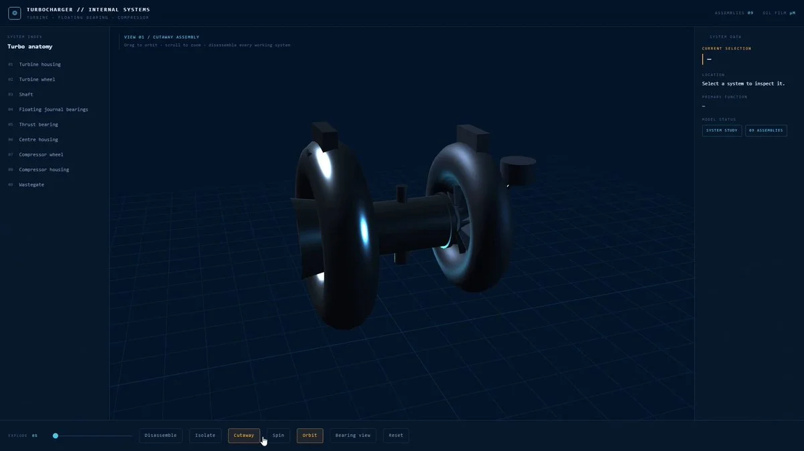</a>

**Prompt**

```text
Construis un turbocompresseur 3D interactif. Sépare chaque système fonctionnel. Laisse-moi le faire tourner, isoler les pièces et voir ce que fait réellement la machine.
```

[Voir les détails ↗](https://www.tripo3d.ai/fr/3d-prompts/exploded-interactive-3d-turbocharger-2095776712579571725) · [Voir la vidéo ↗](https://cdn-blog.holymolly.ai/media/production/3d-prompt-2095769948190801920-video-b6c916167d68.mp4) · [Publication originale](https://x.com/Feraser8/status/2095776712579571725) · [Retour aux exemples](#all-prompts)

---

<a id="2095663498101662198"></a>

### Un jeu Three.js surprenant en une seule génération

[Prathamesh](https://x.com/pratt_builds) · 2026-09-04

<a href="https://www.tripo3d.ai/fr/3d-prompts/one-shot-three-js-surprise-game-2095663498101662198">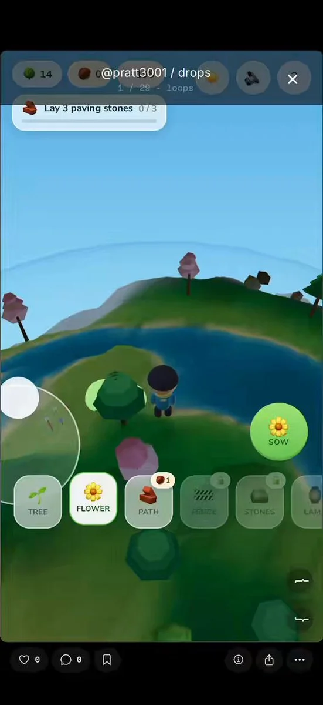</a>

**Prompt**

```text
Crée en une seule génération un jeu Three.js original qui mérite le titre « Amaze ». Choisis une mécanique visuelle surprenante, fais-la comprendre en quelques secondes, construis une courte progression et termine par un spectacle gratifiant.
```

[Voir les détails ↗](https://www.tripo3d.ai/fr/3d-prompts/one-shot-three-js-surprise-game-2095663498101662198) · [Voir la vidéo ↗](https://cdn-blog.holymolly.ai/media/production/3d-prompt-2095663390886912001-video-84fe550dddf8.mp4) · [Publication originale](https://x.com/pratt_builds/status/2095663498101662198) · [Retour aux exemples](#all-prompts)

---

<a id="2095907526566990013"></a>

### Un prototype de jeu rapidement jouable

[GLUNIVERSE™](https://x.com/gibglue) · 2026-09-04

<a href="https://www.tripo3d.ai/fr/3d-prompts/rapid-playable-game-prototype-2095907526566990013">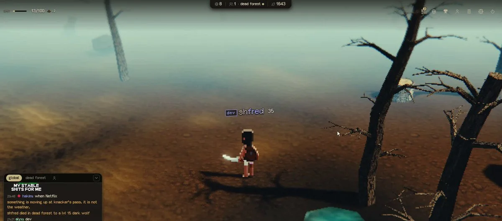</a>

**Prompt**

```text
Crée un prototype de jeu jouable et visuellement cohérent avec un budget de temps et de tokens strict. Privilégie une boucle complète, des commandes réactives, des retours clairs, des performances stables et une version navigateur livrable plutôt que le nombre de fonctionnalités.
```

[Voir les détails ↗](https://www.tripo3d.ai/fr/3d-prompts/rapid-playable-game-prototype-2095907526566990013) · [Voir la vidéo ↗](https://cdn-blog.holymolly.ai/media/production/3d-prompt-2095907053655248897-video-e9b0bdbb4b6c.mp4) · [Publication originale](https://x.com/gibglue/status/2095907526566990013) · [Retour aux exemples](#all-prompts)

---

<a id="2095872986477908108"></a>

### Du prompt au jeu en monde ouvert

[Ejaj AHmed 🦅](https://x.com/aeejazkhan) · 2026-09-04

<a href="https://www.tripo3d.ai/fr/3d-prompts/open-world-game-from-a-prompt-2095872986477908108"></a>

**Prompt**

```text
Construis un jeu en monde ouvert à partir de ce concept : [prémisse du monde]. Prévois trois régions distinctes, des déplacements, des rencontres dynamiques, une chaîne de quêtes simple, des repères, la sauvegarde et le redémarrage, ainsi qu'une optimisation suffisante pour fonctionner dans le navigateur.
```

[Voir les détails ↗](https://www.tripo3d.ai/fr/3d-prompts/open-world-game-from-a-prompt-2095872986477908108) · [Voir la vidéo ↗](https://cdn-blog.holymolly.ai/media/production/3d-prompt-2095872181087670272-video-b49ed9994d6c.mp4) · [Publication originale](https://x.com/aeejazkhan/status/2095872986477908108) · [Retour aux exemples](#all-prompts)

---

<a id="2095806515579879457"></a>

### Une page d'accueil galactique interactive en Three.js

[Three.js Resources](https://x.com/threejsresource) · 2026-09-04

<a href="https://www.tripo3d.ai/fr/3d-prompts/interactive-three-js-galaxy-homepage-2095806515579879457">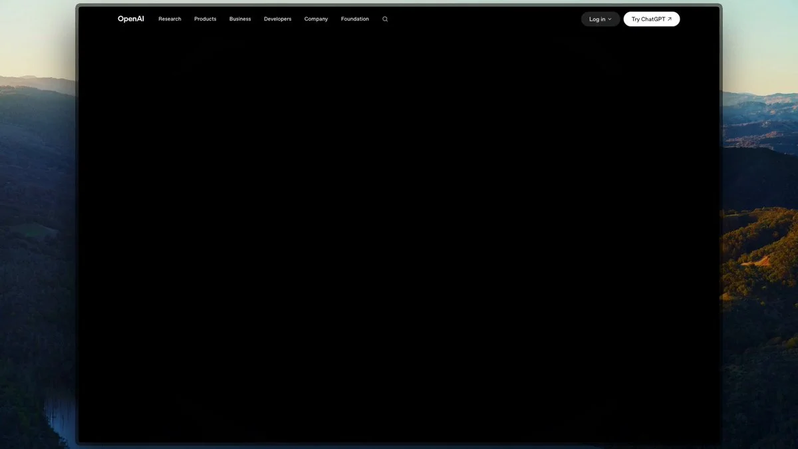</a>

**Prompt**

```text
Crée une section d'accueil haut de gamme pour une page de lancement autour d'une galaxie Three.js temps réel. Fais former aux particules une subtile silhouette du chiffre six, réagir au défilement et au pointeur, préserve la lisibilité du texte et réduis progressivement les effets sur les appareils moins puissants.
```

[Voir les détails ↗](https://www.tripo3d.ai/fr/3d-prompts/interactive-three-js-galaxy-homepage-2095806515579879457) · [Voir la vidéo ↗](https://cdn-blog.holymolly.ai/media/production/3d-prompt-2095802938845470720-video-2b838b3fe64c.mp4) · [Publication originale](https://x.com/threejsresource/status/2095806515579879457) · [Retour aux exemples](#all-prompts)

---

<a id="2095898303019856230"></a>

### Une chambre cyberpunk en boucle dans Blender

[Coin Shot ☁️](https://x.com/CoinSh0t) · 2026-09-04

<a href="https://www.tripo3d.ai/fr/3d-prompts/looping-cyberpunk-bedroom-in-blender-2095898303019856230">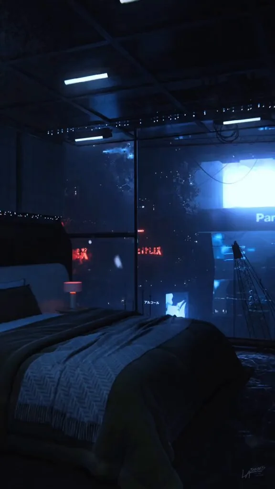</a>

**Prompt**

```text
Crée dans Blender une chambre cyberpunk cinématographique donnant sur une ville nocturne pluvieuse et éclairée au néon. Ajoute des panneaux publicitaires animés et rends le tout photoréaliste, avec une boucle parfaitement fluide.
```

[Voir les détails ↗](https://www.tripo3d.ai/fr/3d-prompts/looping-cyberpunk-bedroom-in-blender-2095898303019856230) · [Voir la vidéo ↗](https://cdn-blog.holymolly.ai/media/production/3d-prompt-2095898263429775360-video-bfa98177286e.mp4) · [Publication originale](https://x.com/CoinSh0t/status/2095898303019856230) · [Retour aux exemples](#all-prompts)

---

<a id="2095871735824339279"></a>

### Une ville de Van Gogh en Three.js

[Fede(URU) 🇺🇾](https://x.com/RealFedeURU) · 2026-09-04

<a href="https://www.tripo3d.ai/fr/3d-prompts/van-gogh-town-in-three-js-2095871735824339279"></a>

**Prompt**

```text
Crée une ville Three.js où se promener, inspirée de Van Gogh. Transforme rues peintes, étoiles, cafés et champs en espaces 3D superposés tout en gardant la touche picturale vivante grâce aux shaders, aux textures et à l'éclairage animé.
```

[Voir les détails ↗](https://www.tripo3d.ai/fr/3d-prompts/van-gogh-town-in-three-js-2095871735824339279) · [Voir la vidéo ↗](https://cdn-blog.holymolly.ai/media/production/3d-prompt-2095776416302280708-video-abded525de38.mp4) · [Publication originale](https://x.com/RealFedeURU/status/2095871735824339279) · [Retour aux exemples](#all-prompts)

---

<a id="2095805115580199372"></a>

### Se promener dans les rues de La Nuit étoilée

[₿IGRYAN](https://x.com/BigRyan) · 2026-09-04

<a href="https://www.tripo3d.ai/fr/3d-prompts/starry-night-streets-you-can-stroll-2095805115580199372"></a>

**Prompt**

```text
Réunis six tableaux de Van Gogh en une ville explorable où les visiteurs peuvent se promener dans les rues de La Nuit étoilée. Conçois des passages naturels entre les tableaux, conserve une échelle cohérente et ajoute de légères interactions d'ambiance.
```

[Voir les détails ↗](https://www.tripo3d.ai/fr/3d-prompts/starry-night-streets-you-can-stroll-2095805115580199372) · [Voir la vidéo ↗](https://cdn-blog.holymolly.ai/media/production/3d-prompt-2095804813997182976-video-4db160ec3b48.mp4) · [Publication originale](https://x.com/BigRyan/status/2095805115580199372) · [Retour aux exemples](#all-prompts)

---

<a id="2095742344293454148"></a>

### Une table de trains d'enfance à piloter

[₿IGRYAN](https://x.com/BigRyan) · 2026-09-04

<a href="https://www.tripo3d.ai/fr/3d-prompts/driveable-childhood-train-table-2095742344293454148"></a>

**Prompt**

```text
Recrée une table de trains d'enfance sous forme de jouet Three.js tactile avec voies et matériel roulant voxel. Permets au joueur de conduire les trains, d'actionner les aiguillages, de tourner autour de la table et de découvrir des scènes miniatures animées.
```

[Voir les détails ↗](https://www.tripo3d.ai/fr/3d-prompts/driveable-childhood-train-table-2095742344293454148) · [Voir la vidéo ↗](https://cdn-blog.holymolly.ai/media/production/3d-prompt-2095742030609846272-video-0732b341a55a.mp4) · [Publication originale](https://x.com/BigRyan/status/2095742344293454148) · [Retour aux exemples](#all-prompts)

---

<a id="2095623452678144366"></a>

### D'un texte à une ville Unity explorable

[Md Ismail Šojal 🕷️](https://x.com/0x0SojalSec) · 2026-09-03

<a href="https://www.tripo3d.ai/fr/3d-prompts/text-to-explorable-unity-city-2095623452678144366"></a>

**Prompt**

```text
Transforme la vision de ville fournie en environnement Unity explorable avec tours, routes, véhicules, palmiers et éclairage d'ambiance. Établis une échelle crédible, la navigation, le mouvement de la circulation et une caméra à la première personne fluide.
```

[Voir les détails ↗](https://www.tripo3d.ai/fr/3d-prompts/text-to-explorable-unity-city-2095623452678144366) · [Voir la vidéo ↗](https://cdn-blog.holymolly.ai/media/production/3d-prompt-2095597547717029888-video-fda40533e887.mp4) · [Publication originale](https://x.com/0x0SojalSec/status/2095623452678144366) · [Retour aux exemples](#all-prompts)

---

<a id="2095650251902239139"></a>

### Un aquarium pour comparer les modèles avec un seul prompt

[Tony出海](https://x.com/iamtonyzhu) · 2026-09-03

<a href="https://www.tripo3d.ai/fr/3d-prompts/single-aquarium-benchmark-2095650251902239139"></a>

**Prompt**

```text
À partir de l'image de référence fournie, construis un jeu d'aquarium 3D avec un seul prompt. Reproduis la disposition et l'ambiance, ajoute des poissons vivants, des caustiques d'eau, des commandes orbitales et une petite boucle d'interaction adaptée à la comparaison des résultats des modèles.
```

[Voir les détails ↗](https://www.tripo3d.ai/fr/3d-prompts/single-aquarium-benchmark-2095650251902239139) · [Voir la vidéo ↗](https://cdn-blog.holymolly.ai/media/production/3d-prompt-2095610918570958848-video-154a5abed1ba.mp4) · [Publication originale](https://x.com/iamtonyzhu/status/2095650251902239139) · [Retour aux exemples](#all-prompts)

---

<a id="2095725404883476661"></a>

### D'un plan à une visite 3D complète

[AidarosGo](https://x.com/aidarosgo3) · 2026-09-04

<a href="https://www.tripo3d.ai/fr/3d-prompts/floor-plan-to-complete-3d-walkthrough-2095725404883476661"></a>

**Prompt**

```text
Convertis le plan fourni en visite architecturale 3D complète. Respecte les dimensions des pièces et les circulations, ajoute portes, fenêtres, mobilier, matériaux et éclairage, puis crée un parcours de caméra qui explique l'agencement.
```

[Voir les détails ↗](https://www.tripo3d.ai/fr/3d-prompts/floor-plan-to-complete-3d-walkthrough-2095725404883476661) · [Voir la vidéo ↗](https://cdn-blog.holymolly.ai/media/production/3d-prompt-2095628000180232192-video-d8d0e43283da.mp4) · [Publication originale](https://x.com/aidarosgo3/status/2095725404883476661) · [Retour aux exemples](#all-prompts)

---

<a id="2095777502681825541"></a>

### Une vraie maison dans une scène Blender modifiable à 60 images/s

[Alvin Foo](https://x.com/alvinfoo) · 2026-09-04

<a href="https://www.tripo3d.ai/fr/3d-prompts/real-house-to-editable-60-fps-blender-scene-2095777502681825541"></a>

**Prompt**

```text
Reconstitue la maison réelle fournie sous forme de scène Blender entièrement modifiable. Sépare les éléments architecturaux et le mobilier, optimise la géométrie et les matériaux, et livre une visite rendue localement qui maintient 60 images par seconde.
```

[Voir les détails ↗](https://www.tripo3d.ai/fr/3d-prompts/real-house-to-editable-60-fps-blender-scene-2095777502681825541) · [Voir la vidéo ↗](https://cdn-blog.holymolly.ai/media/production/3d-prompt-2095730824343879680-video-dca4aaab2d86.mp4) · [Publication originale](https://x.com/alvinfoo/status/2095777502681825541) · [Retour aux exemples](#all-prompts)

---

<a id="2095916820431827408"></a>

### Street Heat : dérapages urbains dans le navigateur

[Higgsfield AI 🧩](https://x.com/higgsfield_ai) · 2026-09-04

<a href="https://www.tripo3d.ai/fr/3d-prompts/street-heat-browser-drift-racer-2095916820431827408"></a>

**Prompt**

```text
Construis un jeu de course urbaine arcade complet pour navigateur à partir d'une seule phrase. Réalise une physique de dérapage satisfaisante, un score par combos, des bonus pour les frôlements, des radars, du nitro, de la circulation, un HUD lisible et un parcours court que l'on a envie de rejouer.
```

[Voir les détails ↗](https://www.tripo3d.ai/fr/3d-prompts/street-heat-browser-drift-racer-2095916820431827408) · [Voir la vidéo ↗](https://cdn-blog.holymolly.ai/media/production/3d-prompt-2095915630633603074-video-ba5f5143a657.mp4) · [Publication originale](https://x.com/higgsfield_ai/status/2095916820431827408) · [Retour aux exemples](#all-prompts)

---

<a id="2095616529572503593"></a>

### Prévisualisation cinématographique d'un musée 3D

[Higgsfield AI 🧩](https://x.com/higgsfield_ai) · 2026-09-03

<a href="https://www.tripo3d.ai/fr/3d-prompts/3d-museum-cinematography-previsualization-2095616529572503593"></a>

**Prompt**

```text
Construis une prévisualisation 3D de musée qui représente le lieu, les positions des acteurs, les placements de caméra et le découpage des plans. Garde chaque configuration dans la fenêtre de visualisation physique, puis exporte des guides cohérents pour la génération vidéo en aval.
```

[Voir les détails ↗](https://www.tripo3d.ai/fr/3d-prompts/3d-museum-cinematography-previsualization-2095616529572503593) · [Voir la vidéo ↗](https://cdn-blog.holymolly.ai/media/production/3d-prompt-2095616375641583617-video-3ba498f1c2cf.mp4) · [Publication originale](https://x.com/higgsfield_ai/status/2095616529572503593) · [Retour aux exemples](#all-prompts)

---

<a id="2095695603808309497"></a>

### Une publicité produit jouable de 15 secondes

[Zack (Paid Ads Specialist)](https://x.com/zackpaid) · 2026-09-04

<a href="https://www.tripo3d.ai/fr/3d-prompts/playable-15-second-product-demo-ad-2095695603808309497"></a>

**Prompt**

```text
Construis une démo interactive de 15 secondes de [produit], pensée d'abord pour le mobile. Permets à l'utilisateur d'essayer la fonction principale d'un geste, fournis un retour 3D immédiat et termine par un appel à l'action clair « Accéder à la version complète ». Utilise un format vertical 9:16 et conserve les couleurs de la marque.
```

[Voir les détails ↗](https://www.tripo3d.ai/fr/3d-prompts/playable-15-second-product-demo-ad-2095695603808309497) · [Voir la vidéo ↗](https://cdn-blog.holymolly.ai/media/production/3d-prompt-2095639396385198080-video-9cb15dd700f3.mp4) · [Publication originale](https://x.com/zackpaid/status/2095695603808309497) · [Retour aux exemples](#all-prompts)

---

<a id="2095624712244072551"></a>

### Du plan à Blender puis à Unreal pour une visite architecturale

[Linus ✦ Ekenstam](https://x.com/LinusEkenstam) · 2026-09-03

<a href="https://www.tripo3d.ai/fr/3d-prompts/blueprint-to-blender-to-unreal-archviz-2095624712244072551">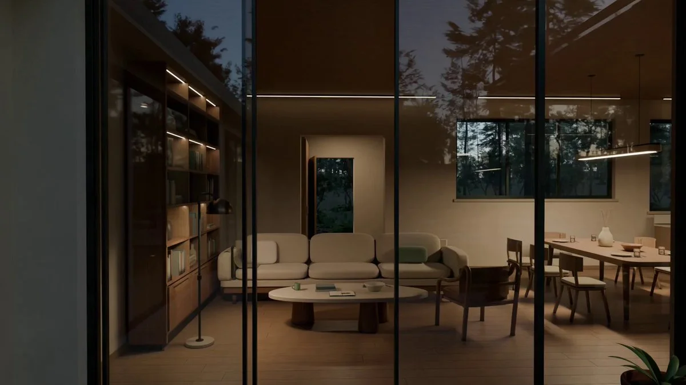</a>

**Prompt**

```text
À partir du plan architectural fourni, crée un modèle précis et modifiable dans Blender, puis transfère-le dans Unreal Engine sous forme de visite architecturale éclairée, avec une échelle et des collisions correctes.
```

[Voir les détails ↗](https://www.tripo3d.ai/fr/3d-prompts/blueprint-to-blender-to-unreal-archviz-2095624712244072551) · [Voir la vidéo ↗](https://cdn-blog.holymolly.ai/media/production/3d-prompt-2095596669320810496-video-039b2a1b1ef0.mp4) · [Publication originale](https://x.com/LinusEkenstam/status/2095624712244072551) · [Retour aux exemples](#all-prompts)

---

<a id="2095752726886105375"></a>

### Solace : de la villa forestière à la visite UE5

[SuSu\_酥酥👅](https://x.com/NFT_Chen) · 2026-09-04

<a href="https://www.tripo3d.ai/fr/3d-prompts/solace-forest-villa-from-brief-to-ue5-2095752726886105375"></a>

**Prompt**

```text
Crée une villa contemporaine en forêt, nommée Solace, que l'on peut visiter, avec trois chambres, un bureau, une cour centrale, une piscine et les bois alentour. Construis-la de manière procédurale dans Blender, rends des images fixes à l'heure dorée, puis exporte une visite UE5 à 60 images par seconde.
```

[Voir les détails ↗](https://www.tripo3d.ai/fr/3d-prompts/solace-forest-villa-from-brief-to-ue5-2095752726886105375) · [Voir la vidéo ↗](https://cdn-blog.holymolly.ai/media/production/3d-prompt-2095596669320810496-video-039b2a1b1ef0.mp4) · [Publication originale](https://x.com/NFT_Chen/status/2095752726886105375) · [Retour aux exemples](#all-prompts)

---

<a id="2095844872171421771"></a>

### Le défi d'une scène Blender en trente secondes

[Satyam Kumar](https://x.com/_satyam_ai) · 2026-09-04

<a href="https://www.tripo3d.ai/fr/3d-prompts/thirty-second-blender-scene-challenge-2095844872171421771"></a>

**Prompt**

```text
Construis une scène Blender cohérente dans un délai extrêmement court. Privilégie une silhouette forte, trois plans de profondeur, un matériau vedette, un éclairage cinématographique et une composition prête à filmer ; garde chaque objet modifiable.
```

[Voir les détails ↗](https://www.tripo3d.ai/fr/3d-prompts/thirty-second-blender-scene-challenge-2095844872171421771) · [Voir la vidéo ↗](https://cdn-blog.holymolly.ai/media/production/3d-prompt-2095844222733893632-video-60938d617c9c.mp4) · [Publication originale](https://x.com/_satyam_ai/status/2095844872171421771) · [Retour aux exemples](#all-prompts)

---

<a id="2095980885732704629"></a>

### Une machine à réactions en chaîne de Rube Goldberg

[thehype.](https://x.com/thehypedotnews) · 2026-09-04

<a href="https://www.tripo3d.ai/fr/3d-prompts/rube-goldberg-chain-reaction-machine-2095980885732704629"></a>

Crée une machine de Rube Goldberg dans un fichier HTML Three.js autonome. Utilise une suite d'interactions mécaniques qui finit par appuyer sur un bouton et déclencher une explosion théâtrale.

**Prompt**

```text
Crée une machine de Rube Goldberg dans un fichier HTML Three.js autonome. Utilise une suite d'interactions mécaniques qui finit par appuyer sur un bouton et déclencher une explosion théâtrale.
```

[Voir les détails ↗](https://www.tripo3d.ai/fr/3d-prompts/rube-goldberg-chain-reaction-machine-2095980885732704629) · [Voir la vidéo ↗](https://cdn-blog.holymolly.ai/media/production/3d-prompt-2095980472887308288-video-adeb46729f34.mp4) · [Publication originale](https://x.com/thehypedotnews/status/2095980885732704629) · [Retour aux exemples](#all-prompts)

---

<a id="2096035962824335798"></a>

### Un Taj Mahal explorable

[vikas sabbi](https://x.com/vikassabbi) · 2026-09-05

<a href="https://www.tripo3d.ai/fr/3d-prompts/explorable-taj-mahal-2096035962824335798">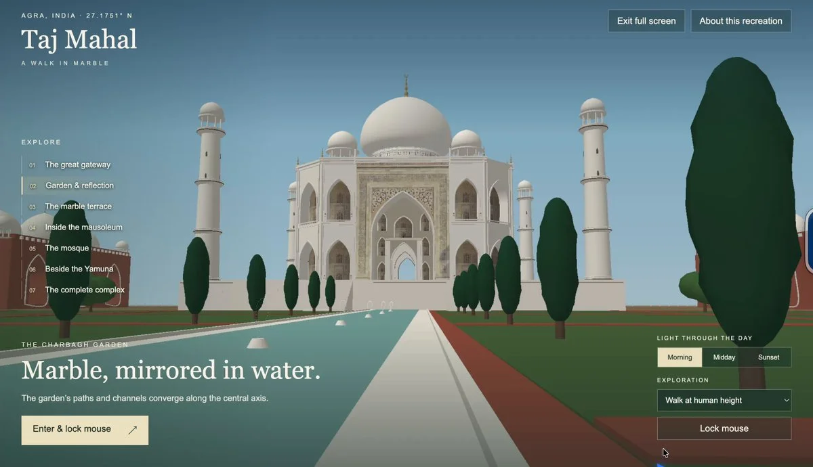</a>

Recrée le Taj Mahal sous forme de scène 3D explorable. Privilégie ses proportions reconnaissables, ses jardins symétriques, son dôme central, ses minarets et les relations entre les bâtiments.

**Prompt**

```text
Recrée le Taj Mahal sous forme de scène 3D explorable. Privilégie ses proportions reconnaissables, ses jardins symétriques, son dôme central, ses minarets et les relations entre les bâtiments.
```

[Voir les détails ↗](https://www.tripo3d.ai/fr/3d-prompts/explorable-taj-mahal-2096035962824335798) · [Voir la vidéo ↗](https://cdn-blog.holymolly.ai/media/production/3d-prompt-2096030438963970048-video-bec575b41c1e.mp4) · [Publication originale](https://x.com/vikassabbi/status/2096035962824335798) · [Retour aux exemples](#all-prompts)

---

<a id="2096225621303042258"></a>

### Un simulateur de rendez-vous orbital

[Alican Kiraz](https://x.com/AlicanKiraz0) · 2026-09-05

<a href="https://www.tripo3d.ai/fr/3d-prompts/orbital-rendezvous-simulator-2096225621303042258"></a>

Construis une simulation de rendez-vous orbital temps réel avec propagation à deux corps dans le repère ECI et guidage HCW. Inclus l'orientation à six degrés de liberté, la consommation de carburant, les limites de force et un objectif d'amarrage.

**Prompt**

```text
Construis une simulation de rendez-vous orbital temps réel avec propagation à deux corps dans le repère ECI et guidage HCW. Inclus l'orientation à six degrés de liberté, la consommation de carburant, les limites de force et un objectif d'amarrage.
```

[Voir les détails ↗](https://www.tripo3d.ai/fr/3d-prompts/orbital-rendezvous-simulator-2096225621303042258) · [Voir la vidéo ↗](https://cdn-blog.holymolly.ai/media/production/3d-prompt-2096224812020690944-video-9e1b5e9a36f6.mp4) · [Publication originale](https://x.com/AlicanKiraz0/status/2096225621303042258) · [Retour aux exemples](#all-prompts)

---

<a id="2096180220839760375"></a>

### Un remorqueur assemblé à partir d'images de référence

[Alex](https://x.com/NarvisAlex) · 2026-09-05

<a href="https://www.tripo3d.ai/fr/3d-prompts/reference-image-tugboat-assembly-2096180220839760375">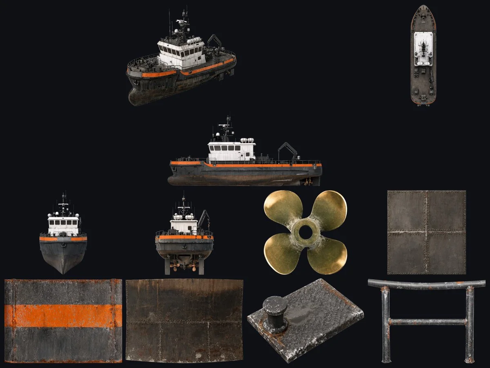</a>

Reconstitue un remorqueur dans Blender à partir d'images de référence. Modélise la coque, la timonerie inclinée, les équipements de pont et de remorquage, en résolvant les incohérences entre vues pour obtenir un navire cohérent.

**Prompt**

```text
Reconstitue un remorqueur dans Blender à partir d'images de référence. Modélise la coque, la timonerie inclinée, les équipements de pont et de remorquage, en résolvant les incohérences entre vues pour obtenir un navire cohérent.
```

[Voir les détails ↗](https://www.tripo3d.ai/fr/3d-prompts/reference-image-tugboat-assembly-2096180220839760375) · [Publication originale](https://x.com/NarvisAlex/status/2096180220839760375) · [Retour aux exemples](#all-prompts)

---

<a id="2096059736693305794"></a>

### Une perceuse reconstituée à partir d'une seule vue

[Utah teapot 🫖](https://x.com/SkyeSharkie) · 2026-09-05

<a href="https://www.tripo3d.ai/fr/3d-prompts/single-view-power-drill-reconstruction-2096059736693305794">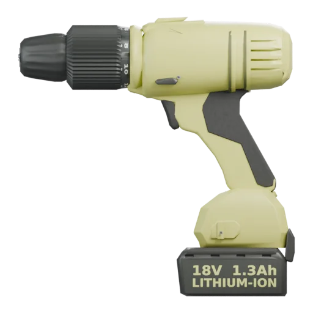</a>

Reconstitue une perceuse électrique dans Blender à partir d'une seule vue de référence. Modélise le boîtier, la poignée, le mandrin et les commandes en géométrie modifiable, puis inspecte le résultat sous plusieurs angles.

**Prompt**

```text
Reconstitue une perceuse électrique dans Blender à partir d'une seule vue de référence. Modélise le boîtier, la poignée, le mandrin et les commandes en géométrie modifiable, puis inspecte le résultat sous plusieurs angles.
```

[Voir les détails ↗](https://www.tripo3d.ai/fr/3d-prompts/single-view-power-drill-reconstruction-2096059736693305794) · [Publication originale](https://x.com/SkyeSharkie/status/2096059736693305794) · [Retour aux exemples](#all-prompts)

---

<a id="2095981655370666076"></a>

### Un jeu d'oiseaux au lance-pierre en 3D

[Max](https://x.com/MozeTech) · 2026-09-04

<a href="https://www.tripo3d.ai/fr/3d-prompts/3d-slingshot-bird-game-2095981655370666076"></a>

Construis un jeu de lance-pierre 3D avec quatre oiseaux aux pouvoirs distincts. Prévois des commandes de visée et de lâcher, des structures destructibles et une boucle de score rejouable.

**Prompt**

```text
Construis un jeu de lance-pierre 3D avec quatre oiseaux aux pouvoirs distincts. Prévois des commandes de visée et de lâcher, des structures destructibles et une boucle de score rejouable.
```

[Voir les détails ↗](https://www.tripo3d.ai/fr/3d-prompts/3d-slingshot-bird-game-2095981655370666076) · [Voir la vidéo ↗](https://cdn-blog.holymolly.ai/media/production/3d-prompt-2095981423538958336-video-fc54301bee6a.mp4) · [Publication originale](https://x.com/MozeTech/status/2095981655370666076) · [Retour aux exemples](#all-prompts)

---

<a id="2095962376344309843"></a>

### Un jeu de tir à la troisième personne en bullet time

[Andrei](https://x.com/HangoutWHAndrei) · 2026-09-04

<a href="https://www.tripo3d.ai/fr/3d-prompts/bullet-time-third-person-shooter-2095962376344309843"></a>

Construis un jeu de tir Three.js à la troisième personne inspiré de Max Payne. Concentre-toi sur l'action au ralenti, les sensations réactives des armes et une scène jouable avec une caméra de poursuite efficace.

**Prompt**

```text
Construis un jeu de tir Three.js à la troisième personne inspiré de Max Payne. Concentre-toi sur l'action au ralenti, les sensations réactives des armes et une scène jouable avec une caméra de poursuite efficace.
```

[Voir les détails ↗](https://www.tripo3d.ai/fr/3d-prompts/bullet-time-third-person-shooter-2095962376344309843) · [Voir la vidéo ↗](https://cdn-blog.holymolly.ai/media/production/3d-prompt-2095962176804753408-video-ab7d330a7c99.mp4) · [Publication originale](https://x.com/HangoutWHAndrei/status/2095962376344309843) · [Retour aux exemples](#all-prompts)

---

<a id="2096008241104711698"></a>

### Une gelée WebGPU rebondissante

[Scott](https://x.com/scottstts) · 2026-09-04

<a href="https://www.tripo3d.ai/fr/3d-prompts/bouncy-webgpu-jelly-2096008241104711698"></a>

Crée une gelée rebondissante appétissante avec Three.js et WebGPU. Fais-la se déformer puis se stabiliser naturellement après une interaction, avec un matériau translucide et un éclairage lisible.

**Prompt**

```text
Crée une gelée rebondissante appétissante avec Three.js et WebGPU. Fais-la se déformer puis se stabiliser naturellement après une interaction, avec un matériau translucide et un éclairage lisible.
```

[Voir les détails ↗](https://www.tripo3d.ai/fr/3d-prompts/bouncy-webgpu-jelly-2096008241104711698) · [Voir la vidéo ↗](https://cdn-blog.holymolly.ai/media/production/3d-prompt-2096007734642552835-video-7ebd768021af.mp4) · [Publication originale](https://x.com/scottstts/status/2096008241104711698) · [Retour aux exemples](#all-prompts)

---

<a id="2095967131573649552"></a>

### Une manette PS5 interactive

[bluedev](https://x.com/blueemi99) · 2026-09-04

<a href="https://www.tripo3d.ai/fr/3d-prompts/interactive-ps5-controller-2095967131573649552"></a>

Construis une manette PlayStation 5 inspectable dans Three.js avec silhouette reconnaissable, boutons, gâchettes, sticks analogiques et matériaux de surface distincts.

**Prompt**

```text
Construis une manette PlayStation 5 inspectable dans Three.js avec silhouette reconnaissable, boutons, gâchettes, sticks analogiques et matériaux de surface distincts.
```

[Voir les détails ↗](https://www.tripo3d.ai/fr/3d-prompts/interactive-ps5-controller-2095967131573649552) · [Voir la vidéo ↗](https://cdn-blog.holymolly.ai/media/production/3d-prompt-2095967014825160710-video-4ca1b8f7fd8a.mp4) · [Publication originale](https://x.com/blueemi99/status/2095967131573649552) · [Retour aux exemples](#all-prompts)

---

<a id="2096079660605997264"></a>

### Astral War : un jeu de tir dans le navigateur

[Rishi](https://x.com/0xRishi) · 2026-09-05

<a href="https://www.tripo3d.ai/fr/3d-prompts/astral-war-browser-shooter-2096079660605997264">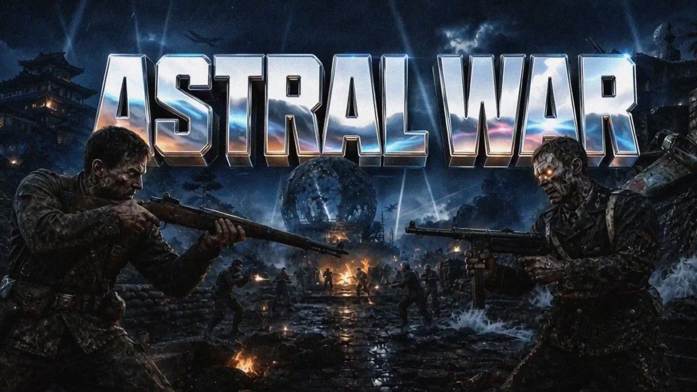</a>

Construis un jeu de tir pour navigateur inspiré de World at War dans Three.js. Crée un champ de bataille complet et jouable avec combats réactifs, audio spatial, assets de personnages et déroulement des matchs.

**Prompt**

```text
Construis un jeu de tir pour navigateur inspiré de World at War dans Three.js. Crée un champ de bataille complet et jouable avec combats réactifs, audio spatial, assets de personnages et déroulement des matchs.
```

[Voir les détails ↗](https://www.tripo3d.ai/fr/3d-prompts/astral-war-browser-shooter-2096079660605997264) · [Voir la vidéo ↗](https://cdn-blog.holymolly.ai/media/production/3d-prompt-2096062838892814336-video-8f7d4c8188bb.mp4) · [Publication originale](https://x.com/0xRishi/status/2096079660605997264) · [Retour aux exemples](#all-prompts)

---

<a id="2096079976433082502"></a>

### D'un schéma PDF à un circuit imprimé et sa vue 3D

[Titlist400](https://x.com/swjtutl) · 2026-09-05

<a href="https://www.tripo3d.ai/fr/3d-prompts/schematic-pdf-to-pcb-and-3d-view-2096079976433082502"></a>

Utilise un schéma PDF pour réviser un circuit dans KiCad, router un PCB double couche de 50 sur 20 mm et réaliser le rendu de son assemblage 3D. Consulte les fiches techniques des composants et corrige les violations des règles de conception.

**Prompt**

```text
Utilise un schéma PDF pour réviser un circuit dans KiCad, router un PCB double couche de 50 sur 20 mm et réaliser le rendu de son assemblage 3D. Consulte les fiches techniques des composants et corrige les violations des règles de conception.
```

[Voir les détails ↗](https://www.tripo3d.ai/fr/3d-prompts/schematic-pdf-to-pcb-and-3d-view-2096079976433082502) · [Publication originale](https://x.com/swjtutl/status/2096079976433082502) · [Retour aux exemples](#all-prompts)

---

<a id="2096149823216898445"></a>

### Un jeu de vol dans le navigateur

[Givros](https://x.com/givros) · 2026-09-05

<a href="https://www.tripo3d.ai/fr/3d-prompts/browser-flight-game-2096149823216898445"></a>

Crée un jeu de vol 3D complet dans le navigateur. À partir d'un projet vide, prévois un vol pilotable, un environnement navigable, un objectif clair et une présentation cohérente.

**Prompt**

```text
Crée un jeu de vol 3D complet dans le navigateur. À partir d'un projet vide, prévois un vol pilotable, un environnement navigable, un objectif clair et une présentation cohérente.
```

[Voir les détails ↗](https://www.tripo3d.ai/fr/3d-prompts/browser-flight-game-2096149823216898445) · [Voir la vidéo ↗](https://cdn-blog.holymolly.ai/media/production/3d-prompt-2096149593037889536-video-7d3f77669fb5.mp4) · [Publication originale](https://x.com/givros/status/2096149823216898445) · [Retour aux exemples](#all-prompts)

---

<a id="2096082432197837065"></a>

### Un tableau de bord avec globe interactif

[Kai](https://x.com/hqmank) · 2026-09-05

<a href="https://www.tripo3d.ai/fr/3d-prompts/interactive-globe-dashboard-2096082432197837065"></a>

Recrée un tableau de bord à globe 3D Three.js à partir d'une image de référence. Inclus des modes jour et nuit, des données géographiques lisibles et des commandes fonctionnelles conformes à la référence.

**Prompt**

```text
Recrée un tableau de bord à globe 3D Three.js à partir d'une image de référence. Inclus des modes jour et nuit, des données géographiques lisibles et des commandes fonctionnelles conformes à la référence.
```

[Voir les détails ↗](https://www.tripo3d.ai/fr/3d-prompts/interactive-globe-dashboard-2096082432197837065) · [Voir la vidéo ↗](https://cdn-blog.holymolly.ai/media/production/3d-prompt-2096082301176164361-video-1f5957451d5a.mp4) · [Publication originale](https://x.com/hqmank/status/2096082432197837065) · [Retour aux exemples](#all-prompts)

---

<a id="2096107322536051057"></a>

### La tour Azadi dans Blender

[taesiri](https://x.com/taesiri) · 2026-09-05

<a href="https://www.tripo3d.ai/fr/3d-prompts/azadi-tower-in-blender-2096107322536051057"></a>

Crée un modèle Blender modifiable de la tour Azadi en soignant sa base évasée, son arc croisé, ses surfaces à motifs et ses proportions reconnaissables.

**Prompt**

```text
Crée un modèle Blender modifiable de la tour Azadi en soignant sa base évasée, son arc croisé, ses surfaces à motifs et ses proportions reconnaissables.
```

[Voir les détails ↗](https://www.tripo3d.ai/fr/3d-prompts/azadi-tower-in-blender-2096107322536051057) · [Voir la vidéo ↗](https://cdn-blog.holymolly.ai/media/production/3d-prompt-2096107229338636288-video-bfeb987de96b.mp4) · [Publication originale](https://x.com/taesiri/status/2096107322536051057) · [Retour aux exemples](#all-prompts)

---

<a id="2096245759121277132"></a>

### Un site de studio 3D animé par le défilement

[ui.debbie](https://x.com/mx_debbiee) · 2026-09-05

<a href="https://www.tripo3d.ai/fr/3d-prompts/scroll-driven-3d-studio-website-2096245759121277132">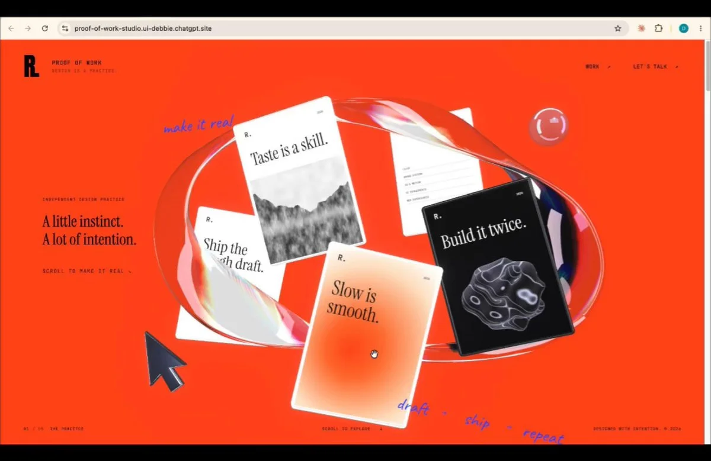</a>

Transforme l'image de référence fournie en scène Three.js au sein d'un site de studio au défilement fluide. Coordonne les mouvements de caméra, la typographie et les transitions entre sections.

**Prompt**

```text
Transforme l'image de référence fournie en scène Three.js au sein d'un site de studio au défilement fluide. Coordonne les mouvements de caméra, la typographie et les transitions entre sections.
```

[Voir les détails ↗](https://www.tripo3d.ai/fr/3d-prompts/scroll-driven-3d-studio-website-2096245759121277132) · [Voir la vidéo ↗](https://cdn-blog.holymolly.ai/media/production/3d-prompt-2096245656314589184-video-1bb14795b8f2.mp4) · [Publication originale](https://x.com/mx_debbiee/status/2096245759121277132) · [Retour aux exemples](#all-prompts)

---

<a id="2096244208533455049"></a>

### Komorebi : du kayak en rivière

[AJ](https://x.com/ItsmeAjayKV) · 2026-09-05

<a href="https://www.tripo3d.ai/fr/3d-prompts/komorebi-river-kayaking-2096244208533455049">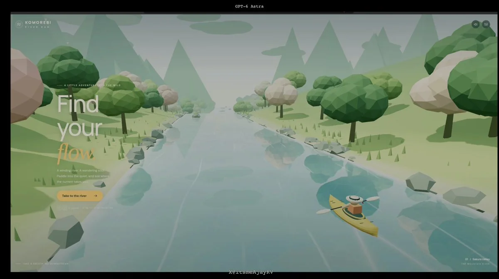</a>

Construis un jeu de kayak 3D en rivière à l'esthétique inspirée de l'anime. Permets au joueur de pagayer à gauche et à droite pour éviter les obstacles, avec eau courante, paysages, musique et effets sonores générés par le code.

**Prompt**

```text
Construis un jeu de kayak 3D en rivière à l'esthétique inspirée de l'anime. Permets au joueur de pagayer à gauche et à droite pour éviter les obstacles, avec eau courante, paysages, musique et effets sonores générés par le code.
```

[Voir les détails ↗](https://www.tripo3d.ai/fr/3d-prompts/komorebi-river-kayaking-2096244208533455049) · [Voir la vidéo ↗](https://cdn-blog.holymolly.ai/media/production/3d-prompt-2096235513309229056-video-0e12d9df3ce8.mp4) · [Publication originale](https://x.com/ItsmeAjayKV/status/2096244208533455049) · [Retour aux exemples](#all-prompts)

---

<a id="2096243989439713677"></a>

### Une bouteille réfractive au cœur d'un récit produit

[Himanshu Hingorani](https://x.com/himanshubuildss) · 2026-09-05

<a href="https://www.tripo3d.ai/fr/3d-prompts/refractive-bottle-product-story-2096243989439713677">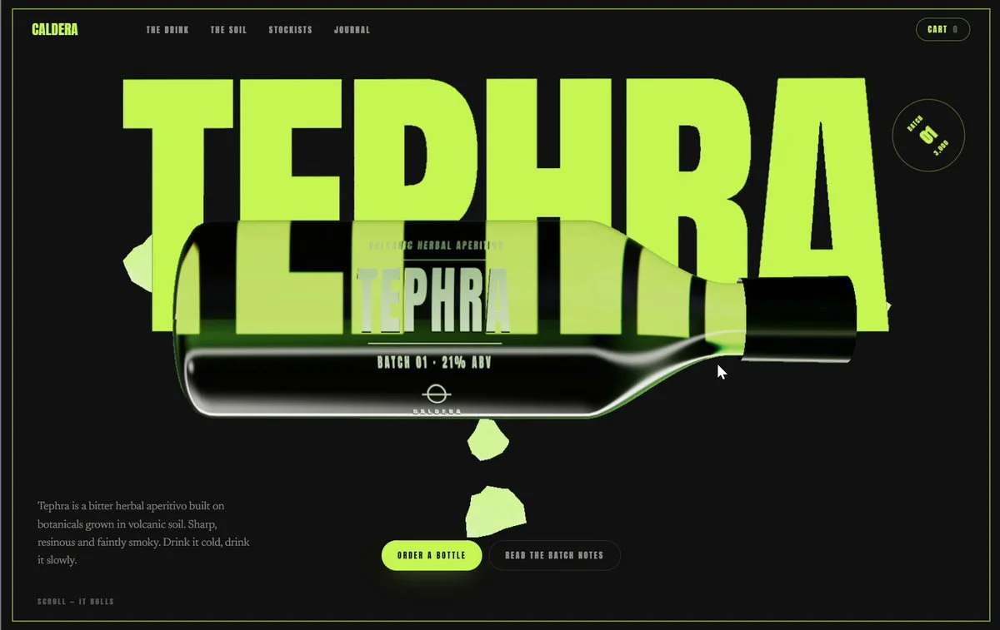</a>

Construis un site produit interactif autour d'une bouteille en verre WebGL photoréaliste. Utilise un liquide réfractif, une rotation pilotée par le défilement et une typographie affirmée tout en préservant les performances du navigateur.

**Prompt**

```text
Construis un site produit interactif autour d'une bouteille en verre WebGL photoréaliste. Utilise un liquide réfractif, une rotation pilotée par le défilement et une typographie affirmée tout en préservant les performances du navigateur.
```

[Voir les détails ↗](https://www.tripo3d.ai/fr/3d-prompts/refractive-bottle-product-story-2096243989439713677) · [Voir la vidéo ↗](https://cdn-blog.holymolly.ai/media/production/3d-prompt-2096243753367592960-video-2ccb4eb4135b.mp4) · [Publication originale](https://x.com/himanshubuildss/status/2096243989439713677) · [Retour aux exemples](#all-prompts)

---

<a id="2096082580554777041"></a>

### Des trains procéduraux en vue éclatée

[Tom Krcha](https://x.com/tomkrcha) · 2026-09-05

<a href="https://www.tripo3d.ai/fr/3d-prompts/exploding-procedural-train-assemblies-2096082580554777041"></a>

Génère deux trains directement dans Three.js à partir de dimensions, de profils et de fonctions géométriques. Anime les roues et prévois une séquence de vue éclatée puis de réassemblage.

**Prompt**

```text
Génère deux trains directement dans Three.js à partir de dimensions, de profils et de fonctions géométriques. Anime les roues et prévois une séquence de vue éclatée puis de réassemblage.
```

[Voir les détails ↗](https://www.tripo3d.ai/fr/3d-prompts/exploding-procedural-train-assemblies-2096082580554777041) · [Voir la vidéo ↗](https://cdn-blog.holymolly.ai/media/production/3d-prompt-2096080925239185408-video-effe135e70ba.mp4) · [Publication originale](https://x.com/tomkrcha/status/2096082580554777041) · [Retour aux exemples](#all-prompts)

---

<a id="2096201415051911597"></a>

### Un univers de jouets pour tout-petit

[AI少年](https://x.com/aehyok) · 2026-09-05

<a href="https://www.tripo3d.ai/fr/3d-prompts/a-playful-toddler-toy-world-2096201415051911597">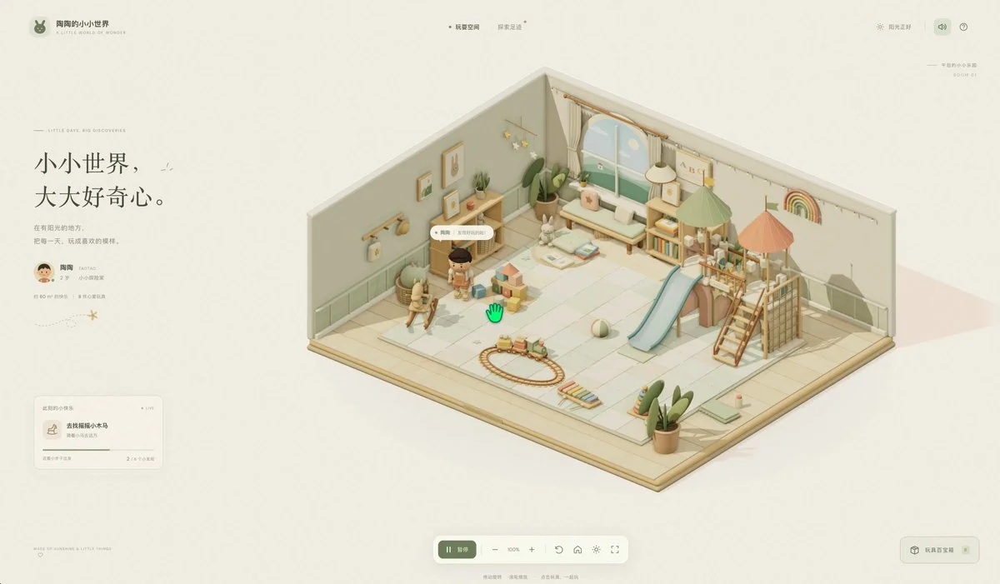</a>

Construis une salle de jeux Three.js chaleureuse où un tout-petit passe d'un jouet à l'autre et utilise chacun avec une animation différente. Ajoute tapis de jeu, livres, étagères et structures à grimper, avec commandes orbitales et zoom.

**Prompt**

```text
Construis une salle de jeux Three.js chaleureuse où un tout-petit passe d'un jouet à l'autre et utilise chacun avec une animation différente. Ajoute tapis de jeu, livres, étagères et structures à grimper, avec commandes orbitales et zoom.
```

[Voir les détails ↗](https://www.tripo3d.ai/fr/3d-prompts/a-playful-toddler-toy-world-2096201415051911597) · [Voir la vidéo ↗](https://cdn-blog.holymolly.ai/media/production/3d-prompt-2096046840546549761-video-d523bff80007.mp4) · [Publication originale](https://x.com/aehyok/status/2096201415051911597) · [Retour aux exemples](#all-prompts)

---

<a id="2096122429319852319"></a>

### Une usine d'avions à réaction en activité

[Konstantin Saifoulline](https://x.com/konstantinsaifo) · 2026-09-05

<a href="https://www.tripo3d.ai/fr/3d-prompts/live-jet-manufacturing-plant-2096122429319852319">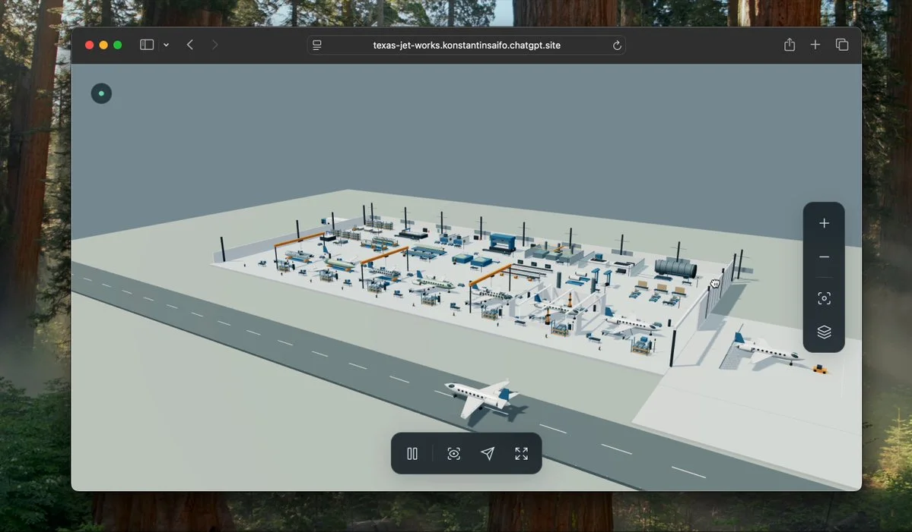</a>

Renseigne-toi sur la fabrication aéronautique et construis une simulation Three.js d'usine d'avions à réaction en activité. Modélise les cycles des machines, postes de production, transports et goulots d'étranglement, puis teste le flux.

**Prompt**

```text
Renseigne-toi sur la fabrication aéronautique et construis une simulation Three.js d'usine d'avions à réaction en activité. Modélise les cycles des machines, postes de production, transports et goulots d'étranglement, puis teste le flux.
```

[Voir les détails ↗](https://www.tripo3d.ai/fr/3d-prompts/live-jet-manufacturing-plant-2096122429319852319) · [Voir la vidéo ↗](https://cdn-blog.holymolly.ai/media/production/3d-prompt-2096121674982727684-video-16fa7681ed82.mp4) · [Publication originale](https://x.com/konstantinsaifo/status/2096122429319852319) · [Retour aux exemples](#all-prompts)

---

<a id="2096220264413409648"></a>

### Une tempête enfermée dans un cube

[zcw](https://x.com/zwb44) · 2026-09-05

<a href="https://www.tripo3d.ai/fr/3d-prompts/a-storm-trapped-in-a-cube-2096220264413409648"></a>

Génère une tempête enfermée dans un cube avec une météo contrôlable dans Three.js.

**Prompt**

```text
Génère une tempête enfermée dans un cube avec une météo contrôlable dans Three.js.
```

[Voir les détails ↗](https://www.tripo3d.ai/fr/3d-prompts/a-storm-trapped-in-a-cube-2096220264413409648) · [Voir la vidéo ↗](https://cdn-blog.holymolly.ai/media/production/3d-prompt-2096215832367878145-video-0150533ce275.mp4) · [Publication originale](https://x.com/zwb44/status/2096220264413409648) · [Retour aux exemples](#all-prompts)

---

<a id="2096047660662722620"></a>

### Zork devient un jeu d'action-aventure 3D

[Ethan Mollick](https://x.com/emollick) · 2026-09-05

<a href="https://www.tripo3d.ai/fr/3d-prompts/zork-as-a-3d-action-adventure-2096047660662722620"></a>

Transforme l'aventure textuelle classique Zork en jeu d'action-aventure 3D. Conserve son intrigue et ses énigmes, ajoute des scènes de combat et construis les personnages et environnements dans Three.js.

**Prompt**

```text
Transforme l'aventure textuelle classique Zork en jeu d'action-aventure 3D. Conserve son intrigue et ses énigmes, ajoute des scènes de combat et construis les personnages et environnements dans Three.js.
```

[Voir les détails ↗](https://www.tripo3d.ai/fr/3d-prompts/zork-as-a-3d-action-adventure-2096047660662722620) · [Voir la vidéo ↗](https://cdn-blog.holymolly.ai/media/production/3d-prompt-2096032513387110400-video-81b6d2734d03.mp4) · [Publication originale](https://x.com/emollick/status/2096047660662722620) · [Retour aux exemples](#all-prompts)

---

<a id="2096133339329536249"></a>

### Un T. rex riggé et animé

[Majid Manzarpour](https://x.com/majidmanzarpour) · 2026-09-05

<a href="https://www.tripo3d.ai/fr/3d-prompts/rigged-and-animated-t-rex-2096133339329536249"></a>

Prends un modèle de T. rex généré, ajoute un rig et crée des mouvements crédibles. Affiche le personnage dans Three.js et vérifie que l'animation déforme le modèle de manière cohérente.

**Prompt**

```text
Prends un modèle de T. rex généré, ajoute un rig et crée des mouvements crédibles. Affiche le personnage dans Three.js et vérifie que l'animation déforme le modèle de manière cohérente.
```

[Voir les détails ↗](https://www.tripo3d.ai/fr/3d-prompts/rigged-and-animated-t-rex-2096133339329536249) · [Voir la vidéo ↗](https://cdn-blog.holymolly.ai/media/production/3d-prompt-2096132586565226502-video-da225779ad98.mp4) · [Publication originale](https://x.com/majidmanzarpour/status/2096133339329536249) · [Retour aux exemples](#all-prompts)

---

<a id="2096174858837074198"></a>

### La vie marine dans une tasse de café

[Sagi Polaczek 🦜](https://x.com/PolaczekSagi) · 2026-09-05

<a href="https://www.tripo3d.ai/fr/3d-prompts/marine-life-in-a-coffee-cup-2096174858837074198"></a>

Crée un écosystème marin miniature dans une tasse de café dans Three.js. Utilise une caméra dirigée pour révéler la vie aquatique tout en gardant la tasse et l'échelle miniature bien lisibles.

**Prompt**

```text
Crée un écosystème marin miniature dans une tasse de café dans Three.js. Utilise une caméra dirigée pour révéler la vie aquatique tout en gardant la tasse et l'échelle miniature bien lisibles.
```

[Voir les détails ↗](https://www.tripo3d.ai/fr/3d-prompts/marine-life-in-a-coffee-cup-2096174858837074198) · [Voir la vidéo ↗](https://cdn-blog.holymolly.ai/media/production/3d-prompt-2096173747736883201-video-3555dca2231c.mp4) · [Publication originale](https://x.com/PolaczekSagi/status/2096174858837074198) · [Retour aux exemples](#all-prompts)

---

<a id="2096250748099068377"></a>

### Une démo Hyperloop interactive

[Amir](https://x.com/hbanay98) · 2026-09-05

<a href="https://www.tripo3d.ai/fr/3d-prompts/interactive-hyperloop-demo-2096250748099068377"></a>

Construis une démonstration Three.js interactive d'Hyperloop montrant une capsule de transport, les tubes de l'infrastructure et les déplacements dans le système.

**Prompt**

```text
Construis une démonstration Three.js interactive d'Hyperloop montrant une capsule de transport, les tubes de l'infrastructure et les déplacements dans le système.
```

[Voir les détails ↗](https://www.tripo3d.ai/fr/3d-prompts/interactive-hyperloop-demo-2096250748099068377) · [Voir la vidéo ↗](https://cdn-blog.holymolly.ai/media/production/3d-prompt-2096250641752711168-video-604ad7feb30f.mp4) · [Publication originale](https://x.com/hbanay98/status/2096250748099068377) · [Retour aux exemples](#all-prompts)

---

<a id="2096234355395903672"></a>

### Un buste procédural de Napoléon

[Le PLOUTOS](https://x.com/leploutos) · 2026-09-05

<a href="https://www.tripo3d.ai/fr/3d-prompts/procedural-napoleon-bust-2096234355395903672"></a>

Code un buste 3D de Napoléon dans Three.js. Construis-le par étapes, inspecte-le sous différents angles et affine les proportions du visage et les détails des vêtements.

**Prompt**

```text
Code un buste 3D de Napoléon dans Three.js. Construis-le par étapes, inspecte-le sous différents angles et affine les proportions du visage et les détails des vêtements.
```

[Voir les détails ↗](https://www.tripo3d.ai/fr/3d-prompts/procedural-napoleon-bust-2096234355395903672) · [Voir la vidéo ↗](https://cdn-blog.holymolly.ai/media/production/3d-prompt-2096234130044297216-video-f3d91bcdcb16.mp4) · [Publication originale](https://x.com/leploutos/status/2096234355395903672) · [Retour aux exemples](#all-prompts)

---

<a id="2096226711222546461"></a>

### Un hall de gare

[Wormhole404](https://x.com/0xWormhole404) · 2026-09-05

<a href="https://www.tripo3d.ai/fr/3d-prompts/railway-station-concourse-2096226711222546461">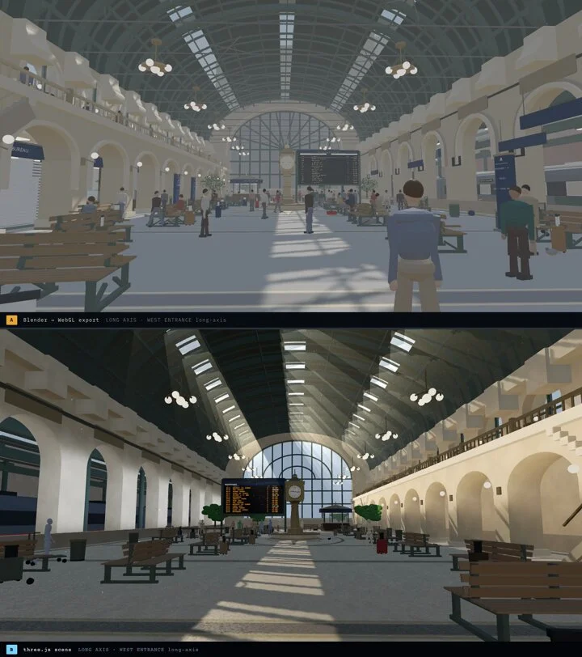</a>

Crée un hall de gare avec un rythme architectural marqué, une échelle crédible et des matériaux convaincants. Produis une scène 3D inspectable avec des vues de la gare soigneusement cadrées.

**Prompt**

```text
Crée un hall de gare avec un rythme architectural marqué, une échelle crédible et des matériaux convaincants. Produis une scène 3D inspectable avec des vues de la gare soigneusement cadrées.
```

[Voir les détails ↗](https://www.tripo3d.ai/fr/3d-prompts/railway-station-concourse-2096226711222546461) · [Voir la vidéo ↗](https://cdn-blog.holymolly.ai/media/production/3d-prompt-2096226451297300480-video-76b0ad295189.mp4) · [Publication originale](https://x.com/0xWormhole404/status/2096226711222546461) · [Retour aux exemples](#all-prompts)

---

<a id="2096222790894661841"></a>

### Un diorama animé pour les premiers pas

[Emil](https://x.com/EmilHovv) · 2026-09-05

<a href="https://www.tripo3d.ai/fr/3d-prompts/animated-onboarding-diorama-2096222790894661841"></a>

Construis un petit diorama d'accueil dans Blender et anime-le dans Three.js. Utilise des objets focaux clairs et de courtes séquences animées pour expliquer les premières actions de l'utilisateur.

**Prompt**

```text
Construis un petit diorama d'accueil dans Blender et anime-le dans Three.js. Utilise des objets focaux clairs et de courtes séquences animées pour expliquer les premières actions de l'utilisateur.
```

[Voir les détails ↗](https://www.tripo3d.ai/fr/3d-prompts/animated-onboarding-diorama-2096222790894661841) · [Voir la vidéo ↗](https://cdn-blog.holymolly.ai/media/production/3d-prompt-2096222762989928448-video-4d9def8e3682.mp4) · [Publication originale](https://x.com/EmilHovv/status/2096222790894661841) · [Retour aux exemples](#all-prompts)

---

<a id="2096206082712768897"></a>

### OX Vice Drive : conduire dans une ville ouverte

[DomX](https://x.com/qok_ai) · 2026-09-05

<a href="https://www.tripo3d.ai/fr/3d-prompts/ox-vice-drive-open-city-racer-2096206082712768897"></a>

Construis un jeu de conduite pour navigateur dans une ville ouverte, avec circulation, dérapages et courses de livraison. Conçois une ville côtière agréable à parcourir et offrant une boucle de conduite complète.

**Prompt**

```text
Construis un jeu de conduite pour navigateur dans une ville ouverte, avec circulation, dérapages et courses de livraison. Conçois une ville côtière agréable à parcourir et offrant une boucle de conduite complète.
```

[Voir les détails ↗](https://www.tripo3d.ai/fr/3d-prompts/ox-vice-drive-open-city-racer-2096206082712768897) · [Publication originale](https://x.com/qok_ai/status/2096206082712768897) · [Retour aux exemples](#all-prompts)

---

<a id="2096111709496680842"></a>

### Une publicité de jeu mobile rendue jouable

[daniel](https://x.com/buildingadlicio) · 2026-09-05

<a href="https://www.tripo3d.ai/fr/3d-prompts/playable-remake-of-a-mobile-game-ad-2096111709496680842"></a>

Utilise une publicité de jeu mobile comme référence pour construire un jeu pour navigateur jouable. Recrée son interaction centrale et utilise des assets Blender pour retrouver sa proposition visuelle.

**Prompt**

```text
Utilise une publicité de jeu mobile comme référence pour construire un jeu pour navigateur jouable. Recrée son interaction centrale et utilise des assets Blender pour retrouver sa proposition visuelle.
```

[Voir les détails ↗](https://www.tripo3d.ai/fr/3d-prompts/playable-remake-of-a-mobile-game-ad-2096111709496680842) · [Voir la vidéo ↗](https://cdn-blog.holymolly.ai/media/production/3d-prompt-2096111511337107456-video-551f5e0446d2.mp4) · [Publication originale](https://x.com/buildingadlicio/status/2096111709496680842) · [Retour aux exemples](#all-prompts)

---

<a id="2095999578419929412"></a>

### Un jeu de combat d'arène anime dans Roblox

[hiraeth](https://x.com/WoahWurdz) · 2026-09-04

<a href="https://www.tripo3d.ai/fr/3d-prompts/anime-arena-fighter-in-roblox-2095999578419929412">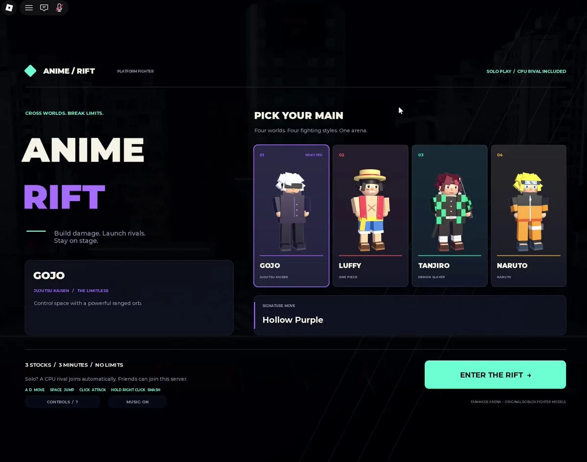</a>

Crée un jeu de combat d'arène Roblox inspiré des affrontements entre univers d'anime. Construis l'arène et les personnages avec Blender et les assets disponibles, puis réalise une boucle de combat jouable.

**Prompt**

```text
Crée un jeu de combat d'arène Roblox inspiré des affrontements entre univers d'anime. Construis l'arène et les personnages avec Blender et les assets disponibles, puis réalise une boucle de combat jouable.
```

[Voir les détails ↗](https://www.tripo3d.ai/fr/3d-prompts/anime-arena-fighter-in-roblox-2095999578419929412) · [Voir la vidéo ↗](https://cdn-blog.holymolly.ai/media/production/3d-prompt-2095999519968333824-video-e6d1a18772e0.mp4) · [Publication originale](https://x.com/WoahWurdz/status/2095999578419929412) · [Retour aux exemples](#all-prompts)

---

<a id="2096258619574513880"></a>

### Une physique de course pour navigateur en C# et WASM

[achepta](https://x.com/achepta_tm) · 2026-09-05

<a href="https://www.tripo3d.ai/fr/3d-prompts/browser-racing-physics-in-c-and-wasm-2096258619574513880"></a>

Recrée un système de physique de course façon Trackmania en C#, exécute-le via WASM et affiche le circuit dans Three.js. Utilise des maillages de piste avec collisions et teste le comportement du véhicule.

**Prompt**

```text
Recrée un système de physique de course façon Trackmania en C#, exécute-le via WASM et affiche le circuit dans Three.js. Utilise des maillages de piste avec collisions et teste le comportement du véhicule.
```

[Voir les détails ↗](https://www.tripo3d.ai/fr/3d-prompts/browser-racing-physics-in-c-and-wasm-2096258619574513880) · [Voir la vidéo ↗](https://cdn-blog.holymolly.ai/media/production/3d-prompt-2096257642486431744-video-4c1bece302f4.mp4) · [Publication originale](https://x.com/achepta_tm/status/2096258619574513880) · [Retour aux exemples](#all-prompts)

---

<a id="2096141728487178503"></a>

### Un rig automatique et des mouvements de kung-fu

[The Bugged Dev](https://x.com/thebuggeddev) · 2026-09-05

<a href="https://www.tripo3d.ai/fr/3d-prompts/automatic-character-rig-and-kung-fu-moves-2096141728487178503"></a>

Prends le personnage 3D fourni, crée un rig et ajoute la marche, la course et plusieurs mouvements de kung-fu. Inspecte les animations pour repérer les articulations cassées et les poses instables.

**Prompt**

```text
Prends le personnage 3D fourni, crée un rig et ajoute la marche, la course et plusieurs mouvements de kung-fu. Inspecte les animations pour repérer les articulations cassées et les poses instables.
```

[Voir les détails ↗](https://www.tripo3d.ai/fr/3d-prompts/automatic-character-rig-and-kung-fu-moves-2096141728487178503) · [Voir la vidéo ↗](https://cdn-blog.holymolly.ai/media/production/3d-prompt-2096139240476454913-video-a0fd30c3ba8a.mp4) · [Publication originale](https://x.com/thebuggeddev/status/2096141728487178503) · [Retour aux exemples](#all-prompts)

---

<a id="2096107343268257953"></a>

### D'une illustration à un personnage jouable

[NOCTAVIA™](https://x.com/noctav1a) · 2026-09-05

<a href="https://www.tripo3d.ai/fr/3d-prompts/artwork-to-a-playable-character-2096107343268257953"></a>

Recrée une illustration de personnage Noctavia sous forme de personnage 3D jouable. Conserve son langage graphique et construis un modèle complet adapté à une présentation interactive.

**Prompt**

```text
Recrée une illustration de personnage Noctavia sous forme de personnage 3D jouable. Conserve son langage graphique et construis un modèle complet adapté à une présentation interactive.
```

[Voir les détails ↗](https://www.tripo3d.ai/fr/3d-prompts/artwork-to-a-playable-character-2096107343268257953) · [Publication originale](https://x.com/noctav1a/status/2096107343268257953) · [Retour aux exemples](#all-prompts)

---

<a id="2096023793772998704"></a>

### Un portfolio 3D personnel avec un globe des conférences

[Shivay Lamba](https://x.com/HowDevelop) · 2026-09-04

<a href="https://www.tripo3d.ai/fr/3d-prompts/personal-3d-portfolio-with-a-speaking-globe-2096023793772998704">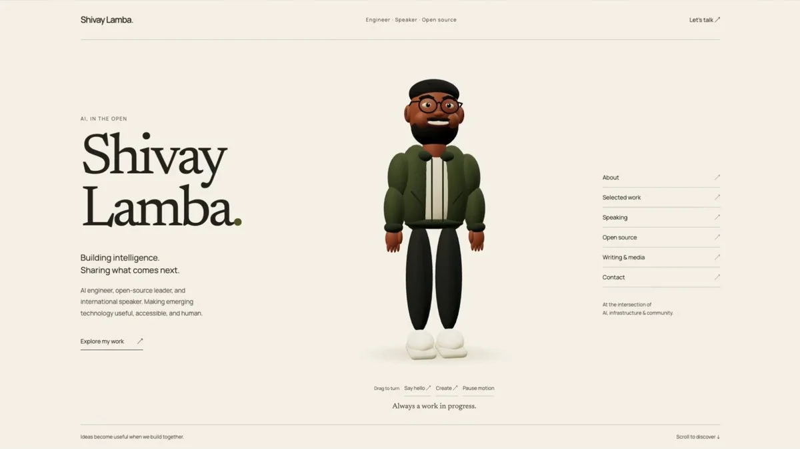</a>

Transforme un portrait en personnage Blender au sein d'un portfolio WebGL éditorial. Ajoute un globe tournant qui situe les prises de parole et intègre les assets au site.

**Prompt**

```text
Transforme un portrait en personnage Blender au sein d'un portfolio WebGL éditorial. Ajoute un globe tournant qui situe les prises de parole et intègre les assets au site.
```

[Voir les détails ↗](https://www.tripo3d.ai/fr/3d-prompts/personal-3d-portfolio-with-a-speaking-globe-2096023793772998704) · [Voir la vidéo ↗](https://cdn-blog.holymolly.ai/media/production/3d-prompt-2096022456750542848-video-f8aa000c9ee6.mp4) · [Publication originale](https://x.com/HowDevelop/status/2096023793772998704) · [Retour aux exemples](#all-prompts)

---

<a id="2096056285896536086"></a>

### Une tranche jouable Godot inspirée de Sonic

[AiBattle](https://x.com/AiBattle_) · 2026-09-05

<a href="https://www.tripo3d.ai/fr/3d-prompts/sonic-inspired-godot-vertical-slice-2096056285896536086">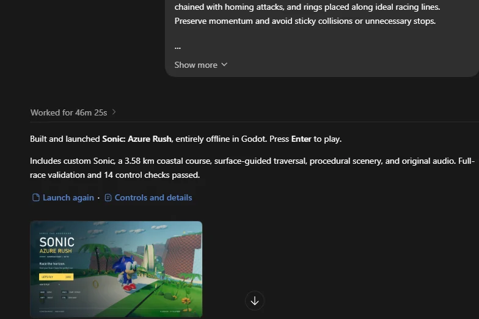</a>

Construis un niveau 3D soigné inspiré de Sonic dans Godot avec des assets locaux et procéduraux. Privilégie l'élan, des déplacements réactifs, les anneaux, les loopings, les rails de glisse et un littoral tropical continu.

**Prompt**

```text
Construis un niveau 3D soigné inspiré de Sonic dans Godot avec des assets locaux et procéduraux. Privilégie l'élan, des déplacements réactifs, les anneaux, les loopings, les rails de glisse et un littoral tropical continu.
```

[Voir les détails ↗](https://www.tripo3d.ai/fr/3d-prompts/sonic-inspired-godot-vertical-slice-2096056285896536086) · [Voir la vidéo ↗](https://cdn-blog.holymolly.ai/media/production/3d-prompt-2096055803866193925-video-1f6a9bf97b27.mp4) · [Publication originale](https://x.com/AiBattle_/status/2096056285896536086) · [Retour aux exemples](#all-prompts)

---

<a id="2096140378777010278"></a>

### Un personnage viking dans Blender

[Emil](https://x.com/fre4kspace) · 2026-09-05

<a href="https://www.tripo3d.ai/fr/3d-prompts/viking-character-in-blender-2096140378777010278"></a>

Crée un personnage viking 3D modifiable dans Blender. Soigne la tenue reconnaissable, la structure du visage, les proportions du corps et une pose de présentation lisible.

**Prompt**

```text
Crée un personnage viking 3D modifiable dans Blender. Soigne la tenue reconnaissable, la structure du visage, les proportions du corps et une pose de présentation lisible.
```

[Voir les détails ↗](https://www.tripo3d.ai/fr/3d-prompts/viking-character-in-blender-2096140378777010278) · [Publication originale](https://x.com/fre4kspace/status/2096140378777010278) · [Retour aux exemples](#all-prompts)

---

<a id="2096155883122413946"></a>

### Dropzone : une arène de battle royale

[MotionViz](https://x.com/Motion_Viz) · 2026-09-05

<a href="https://www.tripo3d.ai/fr/3d-prompts/dropzone-battle-royale-arena-2096155883122413946">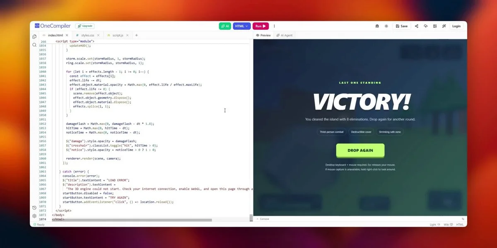</a>

Construis un battle royale pour navigateur à la troisième personne avec cercle de tempête, neuf ennemis IA, fusil à impulsion, santé et rechargement. Inclus des murs de couverture à placer et une boucle d'élimination complète.

**Prompt**

```text
Construis un battle royale pour navigateur à la troisième personne avec cercle de tempête, neuf ennemis IA, fusil à impulsion, santé et rechargement. Inclus des murs de couverture à placer et une boucle d'élimination complète.
```

[Voir les détails ↗](https://www.tripo3d.ai/fr/3d-prompts/dropzone-battle-royale-arena-2096155883122413946) · [Voir la vidéo ↗](https://cdn-blog.holymolly.ai/media/production/3d-prompt-2096155779850190848-video-812518247b63.mp4) · [Publication originale](https://x.com/Motion_Viz/status/2096155883122413946) · [Retour aux exemples](#all-prompts)

---

<a id="2096096998092841449"></a>

### Une visite du jardin du musée de Suzhou

[amber shen](https://x.com/whosamberella) · 2026-09-05

<a href="https://www.tripo3d.ai/fr/3d-prompts/suzhou-museum-garden-walkthrough-2096096998092841449">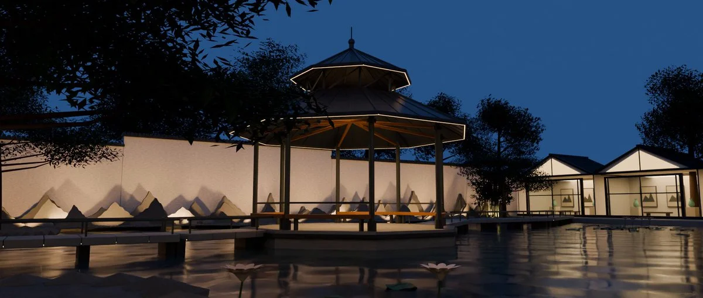</a>

Utilise une page web sur le musée de Suzhou comme référence pour recréer son jardin dans Blender. Produis une visite continue qui préserve les relations entre architecture contemporaine et jardin paysager chinois traditionnel.

**Prompt**

```text
Utilise une page web sur le musée de Suzhou comme référence pour recréer son jardin dans Blender. Produis une visite continue qui préserve les relations entre architecture contemporaine et jardin paysager chinois traditionnel.
```

[Voir les détails ↗](https://www.tripo3d.ai/fr/3d-prompts/suzhou-museum-garden-walkthrough-2096096998092841449) · [Voir la vidéo ↗](https://cdn-blog.holymolly.ai/media/production/3d-prompt-2096096301616381952-video-4a739bdf3183.mp4) · [Publication originale](https://x.com/whosamberella/status/2096096998092841449) · [Retour aux exemples](#all-prompts)

---

<a id="2095986941753712841"></a>

### Une exposition scientifique interactive sur Titan

[Arda Tuğsat](https://x.com/ArdaTugsat) · 2026-09-04

<a href="https://www.tripo3d.ai/fr/3d-prompts/interactive-titan-science-exhibit-2095986941753712841">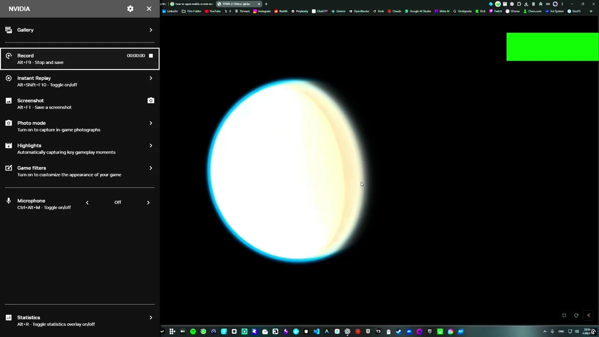</a>

Construis une simulation pédagogique 3D de Titan, la plus grande lune de Saturne, avec environnement explorable et couche d'informations expliquant ses particularités physiques.

**Prompt**

```text
Construis une simulation pédagogique 3D de Titan, la plus grande lune de Saturne, avec environnement explorable et couche d'informations expliquant ses particularités physiques.
```

[Voir les détails ↗](https://www.tripo3d.ai/fr/3d-prompts/interactive-titan-science-exhibit-2095986941753712841) · [Voir la vidéo ↗](https://cdn-blog.holymolly.ai/media/production/3d-prompt-2095986724040290305-video-47d62d124cfd.mp4) · [Publication originale](https://x.com/ArdaTugsat/status/2095986941753712841) · [Retour aux exemples](#all-prompts)

---

<a id="2096040448477515874"></a>

### Un écosystème WebGL qui évolue

[Yume\_X](https://x.com/yume_arasaki) · 2026-09-05

<a href="https://www.tripo3d.ai/fr/3d-prompts/evolving-webgl-ecosystem-2096040448477515874">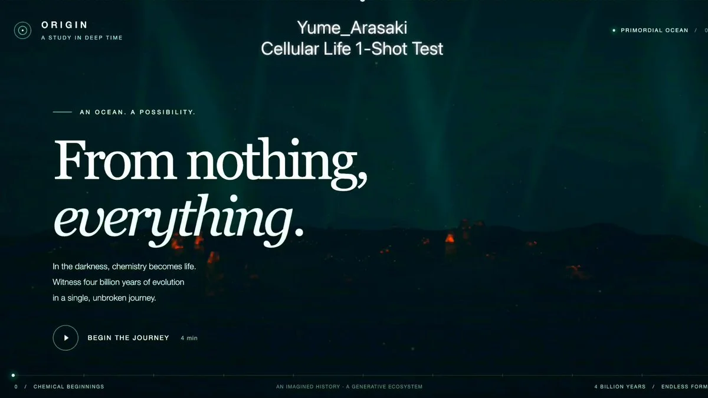</a>

Construis un écosystème évolutif 3D dans un seul fichier HTML en WebGL brut et GLSL. Fais interagir mutation, sélection naturelle, prédation, consommation d'énergie et liaisons multicellulaires.

**Prompt**

```text
Construis un écosystème évolutif 3D dans un seul fichier HTML en WebGL brut et GLSL. Fais interagir mutation, sélection naturelle, prédation, consommation d'énergie et liaisons multicellulaires.
```

[Voir les détails ↗](https://www.tripo3d.ai/fr/3d-prompts/evolving-webgl-ecosystem-2096040448477515874) · [Voir la vidéo ↗](https://cdn-blog.holymolly.ai/media/production/3d-prompt-2096039411645566976-video-71c8620bd4aa.mp4) · [Publication originale](https://x.com/yume_arasaki/status/2096040448477515874) · [Retour aux exemples](#all-prompts)

---

<a id="2096042360513904742"></a>

### Un réseau de livraison avec fermeture de ponts

[AgentworkflowLab](https://x.com/AgentWorkflowLa) · 2026-09-05

<a href="https://www.tripo3d.ai/fr/3d-prompts/delivery-network-with-bridge-closures-2096042360513904742"></a>

Construis une simulation de livraison 3D où la fermeture des ponts modifie les trajets des camions. Détecte les destinations inaccessibles et rétablis les livraisons lorsqu'un itinéraire rouvre.

**Prompt**

```text
Construis une simulation de livraison 3D où la fermeture des ponts modifie les trajets des camions. Détecte les destinations inaccessibles et rétablis les livraisons lorsqu'un itinéraire rouvre.
```

[Voir les détails ↗](https://www.tripo3d.ai/fr/3d-prompts/delivery-network-with-bridge-closures-2096042360513904742) · [Voir la vidéo ↗](https://cdn-blog.holymolly.ai/media/production/3d-prompt-5c3efd3efdda-video-5c3efd3efdda.mp4) · [Publication originale](https://x.com/AgentWorkflowLa/status/2096042360513904742) · [Retour aux exemples](#all-prompts)

---

<a id="2096062355692048605"></a>

### Un simulateur Sinclair ZX Spectrum

[Derya Unutmaz, MD](https://x.com/DeryaTR_) · 2026-09-05

<a href="https://www.tripo3d.ai/fr/3d-prompts/sinclair-zx-spectrum-simulator-2096062355692048605"></a>

Recrée un Sinclair ZX Spectrum 48K sous forme d'application de bureau 3D interactive. Inclus son clavier en caoutchouc, son lecteur de cassettes, son écran de démarrage, un jeu jouable et une interface de programmation BASIC.

**Prompt**

```text
Recrée un Sinclair ZX Spectrum 48K sous forme d'application de bureau 3D interactive. Inclus son clavier en caoutchouc, son lecteur de cassettes, son écran de démarrage, un jeu jouable et une interface de programmation BASIC.
```

[Voir les détails ↗](https://www.tripo3d.ai/fr/3d-prompts/sinclair-zx-spectrum-simulator-2096062355692048605) · [Voir la vidéo ↗](https://cdn-blog.holymolly.ai/media/production/3d-prompt-2096061606581133312-video-615bfd65c028.mp4) · [Publication originale](https://x.com/DeryaTR_/status/2096062355692048605) · [Retour aux exemples](#all-prompts)

---

<a id="2096092080397246707"></a>

### D'un scan photogrammétrique à un salon modifiable

[Bilawal Sidhu](https://x.com/bilawalsidhu) · 2026-09-05

<a href="https://www.tripo3d.ai/fr/3d-prompts/photogrammetry-scan-to-editable-living-room-2096092080397246707">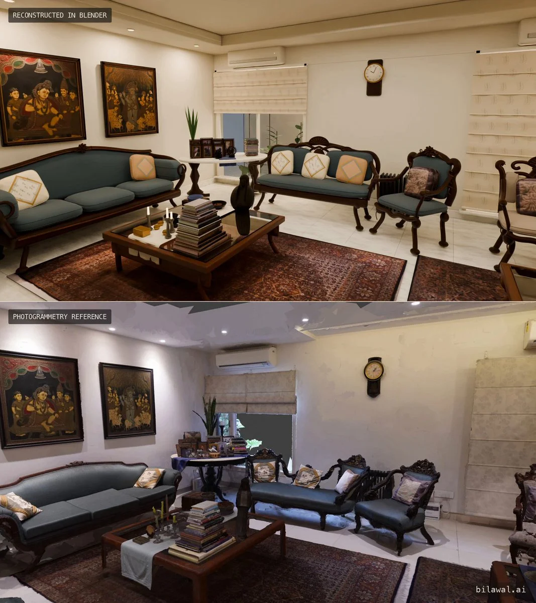</a>

Reconstitue un salon dans Blender à partir d'un scan photogrammétrique. Modélise la scène de zéro, récupère les textures du scan et utilise des shaders procéduraux lorsque c'est pertinent.

**Prompt**

```text
Reconstitue un salon dans Blender à partir d'un scan photogrammétrique. Modélise la scène de zéro, récupère les textures du scan et utilise des shaders procéduraux lorsque c'est pertinent.
```

[Voir les détails ↗](https://www.tripo3d.ai/fr/3d-prompts/photogrammetry-scan-to-editable-living-room-2096092080397246707) · [Voir la vidéo ↗](https://cdn-blog.holymolly.ai/media/production/3d-prompt-2096091625915301888-video-6a1270fd0cf5.mp4) · [Publication originale](https://x.com/bilawalsidhu/status/2096092080397246707) · [Retour aux exemples](#all-prompts)

---

<a id="2096135808243876152"></a>

### Une aventure de plateformes inspirée d'Odyssey

[AIHubmix](https://x.com/AiHubMix) · 2026-09-05

<a href="https://www.tripo3d.ai/fr/3d-prompts/odyssey-inspired-platform-adventure-2096135808243876152"></a>

Construis un niveau Three.js inspiré d'Odyssey avec huit plateformes, trois lunes à collecter, des attaques au chapeau qui revient, des ennemis et des points de contrôle. Ajoute des commandes tactiles et teste une partie complète.

**Prompt**

```text
Construis un niveau Three.js inspiré d'Odyssey avec huit plateformes, trois lunes à collecter, des attaques au chapeau qui revient, des ennemis et des points de contrôle. Ajoute des commandes tactiles et teste une partie complète.
```

[Voir les détails ↗](https://www.tripo3d.ai/fr/3d-prompts/odyssey-inspired-platform-adventure-2096135808243876152) · [Voir la vidéo ↗](https://cdn-blog.holymolly.ai/media/production/3d-prompt-2096134919546425344-video-ce32ad4bdb95.mp4) · [Publication originale](https://x.com/AiHubMix/status/2096135808243876152) · [Retour aux exemples](#all-prompts)

---

<a id="2096221988763173186"></a>

### L'anatomie humaine en vue éclatée interactive

[ashe](https://x.com/ashebytes) · 2026-09-05

<a href="https://www.tripo3d.ai/fr/3d-prompts/exploded-interactive-human-anatomy-2096221988763173186"></a>

Construis un site d'anatomie 3D où le corps humain se sépare en structures inspectables individuellement. Rends la vue éclatée navigable et organise les parties en systèmes pertinents.

**Prompt**

```text
Construis un site d'anatomie 3D où le corps humain se sépare en structures inspectables individuellement. Rends la vue éclatée navigable et organise les parties en systèmes pertinents.
```

[Voir les détails ↗](https://www.tripo3d.ai/fr/3d-prompts/exploded-interactive-human-anatomy-2096221988763173186) · [Voir la vidéo ↗](https://cdn-blog.holymolly.ai/media/production/3d-prompt-2096218474930405376-video-875c2d463d2b.mp4) · [Publication originale](https://x.com/ashebytes/status/2096221988763173186) · [Retour aux exemples](#all-prompts)

---

<a id="2096009146248122416"></a>

### Une Tesla Model X en vue éclatée

[ashe](https://x.com/ashebytes) · 2026-09-04

<a href="https://www.tripo3d.ai/fr/3d-prompts/tesla-model-x-exploded-view-2096009146248122416"></a>

Crée un site 3D qui décompose une Tesla Model X en composants modélisés. Permets aux visiteurs d'inspecter les assemblages et de remonter le véhicule de manière interactive.

**Prompt**

```text
Crée un site 3D qui décompose une Tesla Model X en composants modélisés. Permets aux visiteurs d'inspecter les assemblages et de remonter le véhicule de manière interactive.
```

[Voir les détails ↗](https://www.tripo3d.ai/fr/3d-prompts/tesla-model-x-exploded-view-2096009146248122416) · [Voir la vidéo ↗](https://cdn-blog.holymolly.ai/media/production/3d-prompt-2096008340329627648-video-7b0604309820.mp4) · [Publication originale](https://x.com/ashebytes/status/2096009146248122416) · [Retour aux exemples](#all-prompts)

---

<a id="2096241295949975602"></a>

### Une machine à capsules de souvenirs

[Gloria Zhang](https://x.com/gloria_zwq) · 2026-09-05

<a href="https://www.tripo3d.ai/fr/3d-prompts/memory-capsule-machine-2096241295949975602"></a>

Construis une machine 3D à capsules de souvenirs. Tourne une molette pour libérer un souvenir, modélise le mécanisme dans Blender et donne aux capsules qui tombent des mouvements et des sons crédibles.

**Prompt**

```text
Construis une machine 3D à capsules de souvenirs. Tourne une molette pour libérer un souvenir, modélise le mécanisme dans Blender et donne aux capsules qui tombent des mouvements et des sons crédibles.
```

[Voir les détails ↗](https://www.tripo3d.ai/fr/3d-prompts/memory-capsule-machine-2096241295949975602) · [Voir la vidéo ↗](https://cdn-blog.holymolly.ai/media/production/3d-prompt-2096240294815821824-video-4c217fa6025d.mp4) · [Publication originale](https://x.com/gloria_zwq/status/2096241295949975602) · [Retour aux exemples](#all-prompts)

---

<a id="2096125193580113957"></a>

### Une Formule 1 dans Blender

[Conor Dart](https://x.com/Conor_D_Dart) · 2026-09-05

<a href="https://www.tripo3d.ai/fr/3d-prompts/formula-one-car-in-blender-2096125193580113957"></a>

Crée un modèle 3D de Formule 1 dans Blender en pilotant l'ordinateur.

**Prompt**

```text
Crée un modèle 3D de Formule 1 dans Blender en pilotant l'ordinateur.
```

[Voir les détails ↗](https://www.tripo3d.ai/fr/3d-prompts/formula-one-car-in-blender-2096125193580113957) · [Voir la vidéo ↗](https://cdn-blog.holymolly.ai/media/production/3d-prompt-2096124892378963969-video-036aa7b94b4e.mp4) · [Publication originale](https://x.com/Conor_D_Dart/status/2096125193580113957) · [Retour aux exemples](#all-prompts)

---

<a id="2096308567863079420"></a>

### Scène de personnage inspirée de Warcraft dans Unity

[Lucca Cerf ➔ Pluma Finance](https://x.com/luccacerf) · 2026-09-05

<a href="https://www.tripo3d.ai/fr/3d-prompts/warcraft-inspired-character-scene-in-unity-2096308567863079420">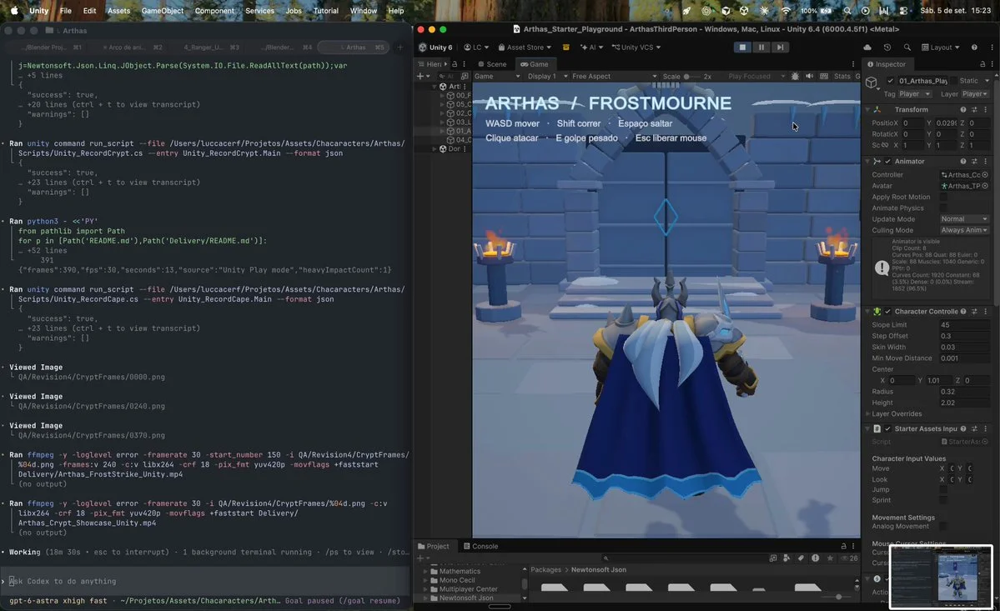</a>

Crée une scène de personnage inspirée de Warcraft avec Astra, Tripo P2, Blender et Unity. Génère le personnage, prépare-le dans Blender et assemble une scène jouable dans Unity.

**Prompt**

```text
Crée une scène de personnage inspirée de Warcraft avec Astra, Tripo P2, Blender et Unity. Génère le personnage, prépare-le dans Blender et assemble une scène jouable dans Unity.
```

[Voir les détails ↗](https://www.tripo3d.ai/fr/3d-prompts/warcraft-inspired-character-scene-in-unity-2096308567863079420) · [Voir la vidéo ↗](https://cdn-blog.holymolly.ai/media/production/3d-prompt-2096303795890278401-video-b5a61e848bab.mp4) · [Publication originale](https://x.com/luccacerf/status/2096308567863079420) · [Retour aux exemples](#all-prompts)

---

<a id="2096015772334047319"></a>

### Arène de combat Three.js avec des assets Tripo

[Normz](https://x.com/Normaneeeeee) · 2026-09-04

<a href="https://www.tripo3d.ai/fr/3d-prompts/three-js-battle-arena-with-tripo-assets-2096015772334047319">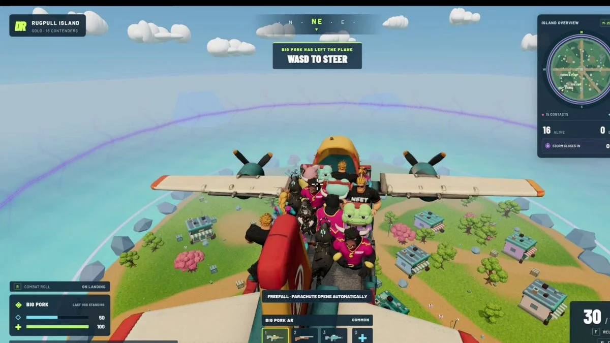</a>

Crée une arène de combat jouable dans Three.js. Utilise des personnages et des arbres générés avec Tripo, puis intègre-les à l’arène et à sa boucle de jeu.

**Prompt**

```text
Crée une arène de combat jouable dans Three.js. Utilise des personnages et des arbres générés avec Tripo, puis intègre-les à l’arène et à sa boucle de jeu.
```

[Voir les détails ↗](https://www.tripo3d.ai/fr/3d-prompts/three-js-battle-arena-with-tripo-assets-2096015772334047319) · [Voir la vidéo ↗](https://cdn-blog.holymolly.ai/media/production/3d-prompt-2096014103366238208-video-4bd6865e78da.mp4) · [Publication originale](https://x.com/Normaneeeeee/status/2096015772334047319) · [Retour aux exemples](#all-prompts)

---

<a id="2096579856133947507"></a>

### Plateau de shogi 3D pivotant

[薄幸柄 / LAB](https://x.com/hatukougara) · 2026-09-06

<a href="https://www.tripo3d.ai/fr/3d-prompts/rotatable-3d-shogi-board-2096579856133947507">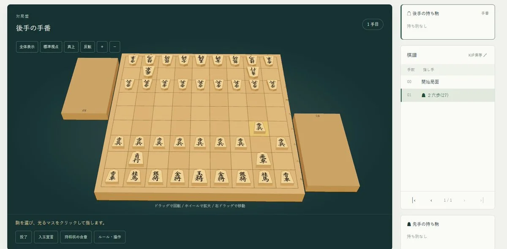</a>

Crée une application de shogi 3D jouable dont le plateau peut tourner librement. Affine le plateau, les pièces et les interactions au fil des revues.

**Prompt**

```text
Crée une application de shogi 3D jouable dont le plateau peut tourner librement. Affine le plateau, les pièces et les interactions au fil des revues.
```

[Voir les détails ↗](https://www.tripo3d.ai/fr/3d-prompts/rotatable-3d-shogi-board-2096579856133947507) · [Publication originale](https://x.com/hatukougara/status/2096579856133947507) · [Retour aux exemples](#all-prompts)

---

<a id="2096578761877860502"></a>

### Atlas éclaté d’un ordinateur de bureau

[cooper](https://x.com/icooperhero) · 2026-09-06

<a href="https://www.tripo3d.ai/fr/3d-prompts/exploded-desktop-computer-atlas-2096578761877860502"></a>

Crée un site 3D interactif qui décompose un ordinateur de bureau en 29 composants principaux. Ajoute une animation de démontage et des explications pour chaque pièce.

**Prompt**

```text
Crée un site 3D interactif qui décompose un ordinateur de bureau en 29 composants principaux. Ajoute une animation de démontage et des explications pour chaque pièce.
```

[Voir les détails ↗](https://www.tripo3d.ai/fr/3d-prompts/exploded-desktop-computer-atlas-2096578761877860502) · [Voir la vidéo ↗](https://cdn-blog.holymolly.ai/media/production/3d-prompt-2096578527097421824-video-b1e4e76ee419.mp4) · [Publication originale](https://x.com/icooperhero/status/2096578761877860502) · [Retour aux exemples](#all-prompts)

---

<a id="2096578684010508736"></a>

### Aménagement d’une chambre d’enfant avec espace de travail

[かのこ🌼AI×子育て×探究](https://x.com/dqlh47m) · 2026-09-06

<a href="https://www.tripo3d.ai/fr/3d-prompts/children-s-room-and-workspace-planner-2096578684010508736">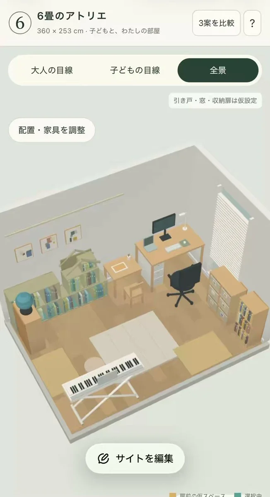</a>

Reconstruis une chambre d’enfant qui sert aussi d’espace de travail à partir de quatre photos prises depuis les angles et des dimensions de la pièce. Montre les points de vue d’un adulte et d’un enfant, une vue d’ensemble et plusieurs dispositions du mobilier.

**Prompt**

```text
Reconstruis une chambre d’enfant qui sert aussi d’espace de travail à partir de quatre photos prises depuis les angles et des dimensions de la pièce. Montre les points de vue d’un adulte et d’un enfant, une vue d’ensemble et plusieurs dispositions du mobilier.
```

[Voir les détails ↗](https://www.tripo3d.ai/fr/3d-prompts/children-s-room-and-workspace-planner-2096578684010508736) · [Voir la vidéo ↗](https://cdn-blog.holymolly.ai/media/production/3d-prompt-2096578530561966080-video-99133894dee5.mp4) · [Publication originale](https://x.com/dqlh47m/status/2096578684010508736) · [Retour aux exemples](#all-prompts)

---

<a id="2095999282088378520"></a>

### Plan et visite 3D synchronisés

[おのふみ\| AIクリエーター×個人開発](https://x.com/onofumi_AI) · 2026-09-04

<a href="https://www.tripo3d.ai/fr/3d-prompts/linked-floor-plan-and-3d-walkthrough-2095999282088378520">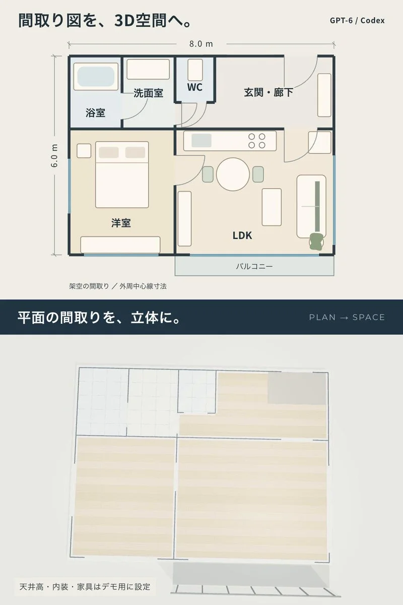</a>

Crée une visite d’un appartement avec une chambre et un plan à partir des mêmes dimensions. Synchronise la position actuelle entre les vues et indique clairement les hauteurs sous plafond et les finitions supposées.

**Prompt**

```text
Crée une visite d’un appartement avec une chambre et un plan à partir des mêmes dimensions. Synchronise la position actuelle entre les vues et indique clairement les hauteurs sous plafond et les finitions supposées.
```

[Voir les détails ↗](https://www.tripo3d.ai/fr/3d-prompts/linked-floor-plan-and-3d-walkthrough-2095999282088378520) · [Voir la vidéo ↗](https://cdn-blog.holymolly.ai/media/production/3d-prompt-2095999235611414528-video-da2dbe52f816.mp4) · [Publication originale](https://x.com/onofumi_AI/status/2095999282088378520) · [Retour aux exemples](#all-prompts)

---

<a id="2096557555086725159"></a>

### Miniature interactive de Séoul

[synabreu](https://x.com/synabreu) · 2026-09-06

<a href="https://www.tripo3d.ai/fr/3d-prompts/interactive-miniature-of-seoul-2096557555086725159">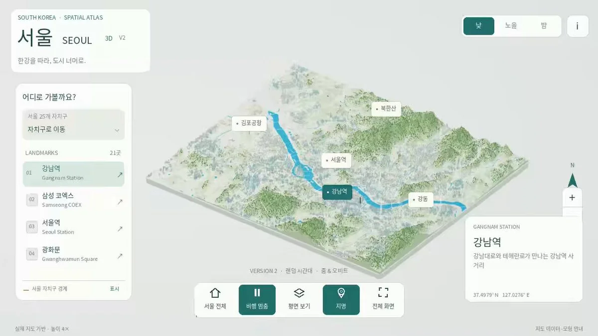</a>

Crée une miniature de Séoul dans Three.js à partir de données cartographiques ouvertes. Ajoute la navigation par quartier, des survols de monuments, des modes jour et nuit et des commandes tactiles. Signale les bâtiments simplifiés, les hauteurs estimées et les licences des données.

**Prompt**

```text
Crée une miniature de Séoul dans Three.js à partir de données cartographiques ouvertes. Ajoute la navigation par quartier, des survols de monuments, des modes jour et nuit et des commandes tactiles. Signale les bâtiments simplifiés, les hauteurs estimées et les licences des données.
```

[Voir les détails ↗](https://www.tripo3d.ai/fr/3d-prompts/interactive-miniature-of-seoul-2096557555086725159) · [Voir la vidéo ↗](https://cdn-blog.holymolly.ai/media/production/3d-prompt-2096557441312034816-video-78abc20e6310.mp4) · [Publication originale](https://x.com/synabreu/status/2096557555086725159) · [Démo](https://seoul-3d-atlas.synabreu.chatgpt.site/) · [Retour aux exemples](#all-prompts)

---

<a id="2096460081982304546"></a>

### Insecte procédural capable de grimper sur les surfaces

[XiaoLei Liu](https://x.com/leo_xiaolei) · 2026-09-06

<a href="https://www.tripo3d.ai/fr/3d-prompts/surface-climbing-procedural-insect-2096460081982304546"></a>

Crée un insecte 3D à plusieurs pattes qui marche en adhérant à différentes surfaces. Coordonne ses pattes et son corps lorsqu’il franchit des changements de hauteur.

**Prompt**

```text
Crée un insecte 3D à plusieurs pattes qui marche en adhérant à différentes surfaces. Coordonne ses pattes et son corps lorsqu’il franchit des changements de hauteur.
```

[Voir les détails ↗](https://www.tripo3d.ai/fr/3d-prompts/surface-climbing-procedural-insect-2096460081982304546) · [Voir la vidéo ↗](https://cdn-blog.holymolly.ai/media/production/3d-prompt-2096457635352698880-video-b8ee4ffe10bf.mp4) · [Publication originale](https://x.com/leo_xiaolei/status/2096460081982304546) · [Démo](https://threerocks.github.io/web-3d-pages/) · [Retour aux exemples](#all-prompts)

---

<a id="2096467585785286808"></a>

### Le Wright Flyer au-dessus d’une forêt japonaise

[The Bugged Dev](https://x.com/thebuggeddev) · 2026-09-06

<a href="https://www.tripo3d.ai/fr/3d-prompts/wright-flyer-through-a-japanese-forest-2096467585785286808"></a>

Crée un jeu de vol Three.js mettant en scène le Wright Flyer de 1903 dans une forêt japonaise. Documente-toi sur l’appareil et crée de façon procédurale l’avion, les arbres, les torii, les maisons et les montagnes, sans assets externes.

**Prompt**

```text
Crée un jeu de vol Three.js mettant en scène le Wright Flyer de 1903 dans une forêt japonaise. Documente-toi sur l’appareil et crée de façon procédurale l’avion, les arbres, les torii, les maisons et les montagnes, sans assets externes.
```

[Voir les détails ↗](https://www.tripo3d.ai/fr/3d-prompts/wright-flyer-through-a-japanese-forest-2096467585785286808) · [Voir la vidéo ↗](https://cdn-blog.holymolly.ai/media/production/3d-prompt-2096460762189565952-video-9d36a3a844f2.mp4) · [Publication originale](https://x.com/thebuggeddev/status/2096467585785286808) · [Retour aux exemples](#all-prompts)

---

<a id="2096576154337734865"></a>

### Une maison modélisée de zéro dans Blender

[みずくん](https://x.com/mizkun) · 2026-09-06

<a href="https://www.tripo3d.ai/fr/3d-prompts/a-house-modeled-from-scratch-in-blender-2096576154337734865">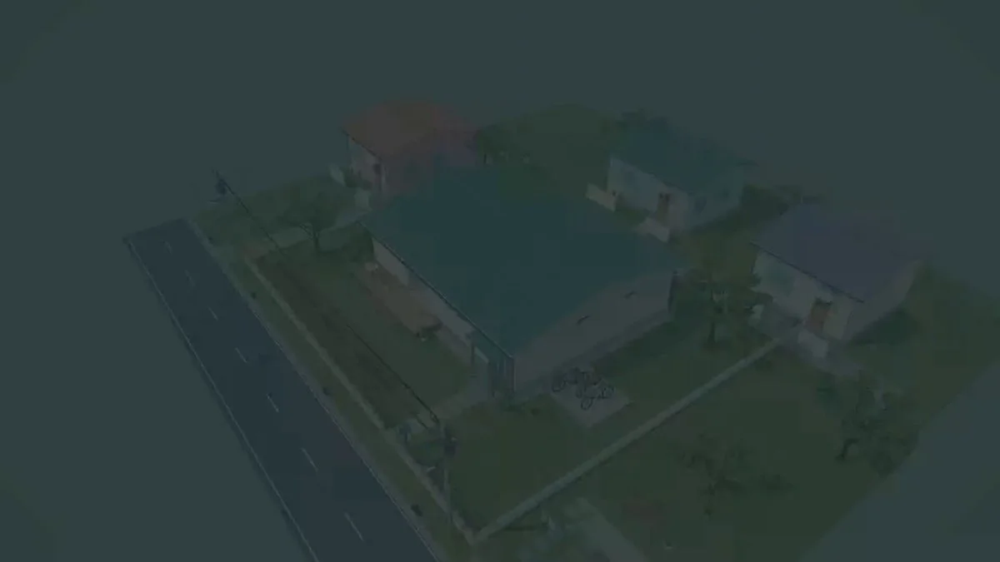</a>

Modélise une maison de zéro dans Blender. Garde la scène modifiable pour pouvoir examiner et affiner le bâtiment lors des itérations suivantes.

**Prompt**

```text
Modélise une maison de zéro dans Blender. Garde la scène modifiable pour pouvoir examiner et affiner le bâtiment lors des itérations suivantes.
```

[Voir les détails ↗](https://www.tripo3d.ai/fr/3d-prompts/a-house-modeled-from-scratch-in-blender-2096576154337734865) · [Voir la vidéo ↗](https://cdn-blog.holymolly.ai/media/production/3d-prompt-2096575873629769728-video-7a237d3c1b82.mp4) · [Publication originale](https://x.com/mizkun/status/2096576154337734865) · [Retour aux exemples](#all-prompts)

---

<a id="2096143359505269079"></a>

### D’une photo de café à une visite au format vertical

[森叔](https://x.com/harrisonitsme) · 2026-09-05

<a href="https://www.tripo3d.ai/fr/3d-prompts/coffee-shop-photo-to-vertical-walkthrough-2096143359505269079"></a>

Reconstruis un café dans Blender à partir de sa photo, avec le plafond en bois, les bandes lumineuses, le torréfacteur, les étagères et les plantes. Livre une scène modifiable et une visite de caméra de 15 secondes au format vertical.

**Prompt**

```text
Reconstruis un café dans Blender à partir de sa photo, avec le plafond en bois, les bandes lumineuses, le torréfacteur, les étagères et les plantes. Livre une scène modifiable et une visite de caméra de 15 secondes au format vertical.
```

[Voir les détails ↗](https://www.tripo3d.ai/fr/3d-prompts/coffee-shop-photo-to-vertical-walkthrough-2096143359505269079) · [Voir la vidéo ↗](https://cdn-blog.holymolly.ai/media/production/3d-prompt-2096143056991076352-video-e2a96d0e0f27.mp4) · [Publication originale](https://x.com/harrisonitsme/status/2096143359505269079) · [Retour aux exemples](#all-prompts)

---

<a id="2096501340889374883"></a>

### Du plan du dernier étage à un aperçu Blender

[indigo](https://x.com/indigox) · 2026-09-06

<a href="https://www.tripo3d.ai/fr/3d-prompts/top-floor-plan-to-blender-preview-2096501340889374883"></a>

Utilise le plan du dernier étage d’une maison pour créer une scène Blender et produire un aperçu de 10 secondes avec peu d’échantillons. Privilégie une organisation spatiale claire avant d’affiner les matériaux.

**Prompt**

```text
Utilise le plan du dernier étage d’une maison pour créer une scène Blender et produire un aperçu de 10 secondes avec peu d’échantillons. Privilégie une organisation spatiale claire avant d’affiner les matériaux.
```

[Voir les détails ↗](https://www.tripo3d.ai/fr/3d-prompts/top-floor-plan-to-blender-preview-2096501340889374883) · [Voir la vidéo ↗](https://cdn-blog.holymolly.ai/media/production/3d-prompt-2096499441167671296-video-09a55294f759.mp4) · [Publication originale](https://x.com/indigox/status/2096501340889374883) · [Retour aux exemples](#all-prompts)

---

<a id="2096298425914450021"></a>

### Le Terreiro do Paço de Lisbonne dans Blender

[Gonçalo Canhoto 🇵🇹](https://x.com/goncalo_canhoto) · 2026-09-05

<a href="https://www.tripo3d.ai/fr/3d-prompts/lisbon-s-terreiro-do-paco-in-blender-2096298425914450021">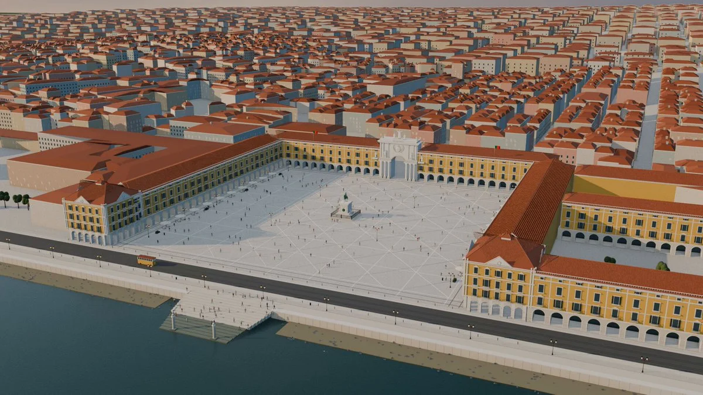</a>

Recrée le Terreiro do Paço de Lisbonne sous forme de scène Blender modifiable. Recherche des références pour guider l’architecture, les matériaux et l’éclairage de la place.

**Prompt**

```text
Recrée le Terreiro do Paço de Lisbonne sous forme de scène Blender modifiable. Recherche des références pour guider l’architecture, les matériaux et l’éclairage de la place.
```

[Voir les détails ↗](https://www.tripo3d.ai/fr/3d-prompts/lisbon-s-terreiro-do-paco-in-blender-2096298425914450021) · [Voir la vidéo ↗](https://cdn-blog.holymolly.ai/media/production/3d-prompt-2096296038672023552-video-48b7bae96747.mp4) · [Publication originale](https://x.com/goncalo_canhoto/status/2096298425914450021) · [Retour aux exemples](#all-prompts)

---

<a id="2096574297703637111"></a>

### Quête d’exploration The Quiet Crossing

[MotionViz](https://x.com/Motion_Viz) · 2026-09-06

<a href="https://www.tripo3d.ai/fr/3d-prompts/the-quiet-crossing-exploration-quest-2096574297703637111">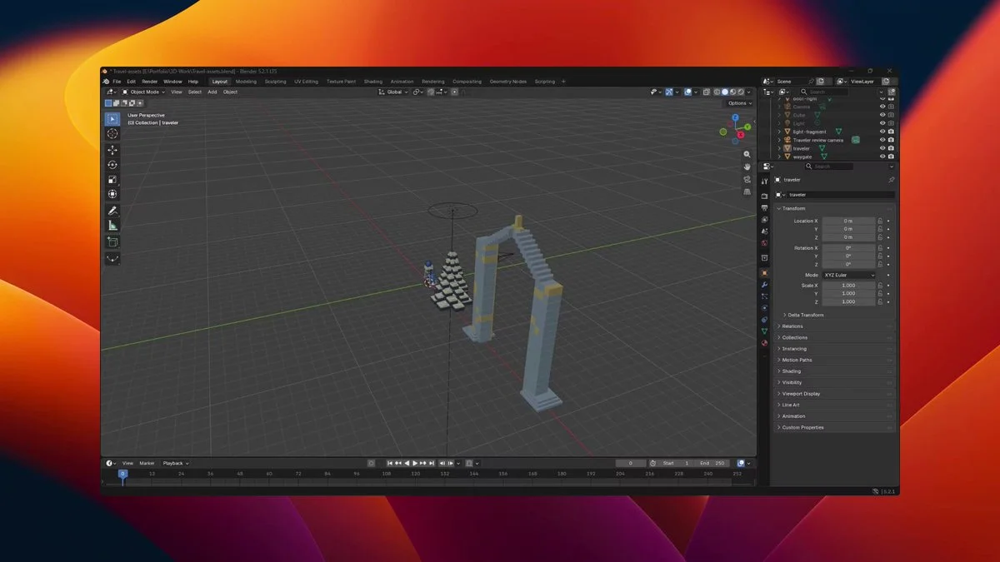</a>

Crée un jeu d’exploration enneigé dans Three.js avec un personnage Blender, des pins en voxels et un portail de pierre. Permets de collecter six fragments lumineux, fais suivre le personnage par la caméra et affiche la distance jusqu’au portail.

**Prompt**

```text
Crée un jeu d’exploration enneigé dans Three.js avec un personnage Blender, des pins en voxels et un portail de pierre. Permets de collecter six fragments lumineux, fais suivre le personnage par la caméra et affiche la distance jusqu’au portail.
```

[Voir les détails ↗](https://www.tripo3d.ai/fr/3d-prompts/the-quiet-crossing-exploration-quest-2096574297703637111) · [Voir la vidéo ↗](https://cdn-blog.holymolly.ai/media/production/3d-prompt-2096573682848251904-video-6e87dd09e525.mp4) · [Publication originale](https://x.com/Motion_Viz/status/2096574297703637111) · [Retour aux exemples](#all-prompts)

---

<a id="2096263046918197609"></a>

### Forêt procédurale dense dans Three.js

[Leon Lin](https://x.com/LexnLin) · 2026-09-05

<a href="https://www.tripo3d.ai/fr/3d-prompts/dense-procedural-forest-in-three-js-2096263046918197609"></a>

Crée une forêt détaillée dans Three.js avec des milliers d’arbres, de l’herbe dense et des fougères. Utilise des shaders sur mesure et une répétition efficace de la géométrie pour conserver le détail dans toute la scène.

**Prompt**

```text
Crée une forêt détaillée dans Three.js avec des milliers d’arbres, de l’herbe dense et des fougères. Utilise des shaders sur mesure et une répétition efficace de la géométrie pour conserver le détail dans toute la scène.
```

[Voir les détails ↗](https://www.tripo3d.ai/fr/3d-prompts/dense-procedural-forest-in-three-js-2096263046918197609) · [Voir la vidéo ↗](https://cdn-blog.holymolly.ai/media/production/3d-prompt-2096262956774490112-video-dabda51264b8.mp4) · [Publication originale](https://x.com/LexnLin/status/2096263046918197609) · [Retour aux exemples](#all-prompts)

---

<a id="2096013228090245181"></a>

### Modèle de l’enregistreur TP-7 d’après références

[Tykra](https://x.com/ty_kra_lab) · 2026-09-04

<a href="https://www.tripo3d.ai/fr/3d-prompts/tp-7-recorder-reference-model-2096013228090245181"></a>

Recrée le Teenage Engineering TP-7 dans Three.js à partir d’images de référence. Reproduis sa forme et ses commandes visibles dans un modèle 3D que l’on peut examiner.

**Prompt**

```text
Recrée le Teenage Engineering TP-7 dans Three.js à partir d’images de référence. Reproduis sa forme et ses commandes visibles dans un modèle 3D que l’on peut examiner.
```

[Voir les détails ↗](https://www.tripo3d.ai/fr/3d-prompts/tp-7-recorder-reference-model-2096013228090245181) · [Voir la vidéo ↗](https://cdn-blog.holymolly.ai/media/production/3d-prompt-2096012812199862273-video-9013baf810d8.mp4) · [Publication originale](https://x.com/ty_kra_lab/status/2096013228090245181) · [Retour aux exemples](#all-prompts)

---

<a id="2096577430274429157"></a>

### Locomotive à vapeur à travers la campagne

[ダンさんブル@d三b](https://x.com/dansanburu) · 2026-09-06

<a href="https://www.tripo3d.ai/fr/3d-prompts/steam-locomotive-across-the-countryside-2096577430274429157"></a>

Modélise une locomotive à vapeur dans Three.js et anime son trajet dans une scène de campagne. Synchronise la rotation des roues avec le déplacement du train.

**Prompt**

```text
Modélise une locomotive à vapeur dans Three.js et anime son trajet dans une scène de campagne. Synchronise la rotation des roues avec le déplacement du train.
```

[Voir les détails ↗](https://www.tripo3d.ai/fr/3d-prompts/steam-locomotive-across-the-countryside-2096577430274429157) · [Voir la vidéo ↗](https://cdn-blog.holymolly.ai/media/production/3d-prompt-2096576986462539776-video-59f0fa2baa5a.mp4) · [Publication originale](https://x.com/dansanburu/status/2096577430274429157) · [Retour aux exemples](#all-prompts)

---

<a id="2096561346766877106"></a>

### Platine vinyle sur une table

[Nitesh Seram](https://x.com/niteshseram) · 2026-09-06

<a href="https://www.tripo3d.ai/fr/3d-prompts/vinyl-player-tabletop-scene-2096561346766877106"></a>

Crée une scène Three.js avec une platine vinyle posée sur une table. Mets en scène une présentation de produit où les lampes s’allument et la caméra montre la platine ainsi que le mobilier alentour.

**Prompt**

```text
Crée une scène Three.js avec une platine vinyle posée sur une table. Mets en scène une présentation de produit où les lampes s’allument et la caméra montre la platine ainsi que le mobilier alentour.
```

[Voir les détails ↗](https://www.tripo3d.ai/fr/3d-prompts/vinyl-player-tabletop-scene-2096561346766877106) · [Voir la vidéo ↗](https://cdn-blog.holymolly.ai/media/production/3d-prompt-2096560995208687616-video-b191a25a673b.mp4) · [Publication originale](https://x.com/niteshseram/status/2096561346766877106) · [Retour aux exemples](#all-prompts)

---

<a id="2096555856204644550"></a>

### Boucle de jeu de combats de cartes à collectionner

[FaryaBlender3D](https://x.com/FaryaBlender3D) · 2026-09-06

<a href="https://www.tripo3d.ai/fr/3d-prompts/trading-card-battle-game-loop-2096555856204644550">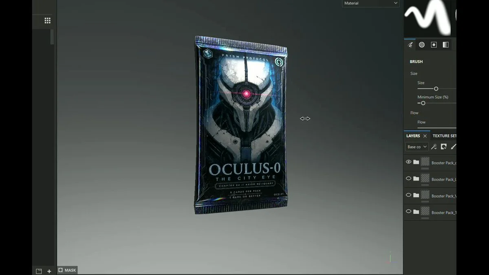</a>

Crée un prototype de cartes à collectionner dans Three.js : acheter des decks et des boosters, composer un deck, entrer dans une arène et gagner des récompenses. Garde les maillages provisoires remplaçables par des assets finalisés.

**Prompt**

```text
Crée un prototype de cartes à collectionner dans Three.js : acheter des decks et des boosters, composer un deck, entrer dans une arène et gagner des récompenses. Garde les maillages provisoires remplaçables par des assets finalisés.
```

[Voir les détails ↗](https://www.tripo3d.ai/fr/3d-prompts/trading-card-battle-game-loop-2096555856204644550) · [Voir la vidéo ↗](https://cdn-blog.holymolly.ai/media/production/3d-prompt-2096553778136887296-video-51c26a0f2901.mp4) · [Publication originale](https://x.com/FaryaBlender3D/status/2096555856204644550) · [Retour aux exemples](#all-prompts)

---

<a id="2096362653480562751"></a>

### Jeu de simulation de réseau ferroviaire

[Tom Krcha](https://x.com/tomkrcha) · 2026-09-05

<a href="https://www.tripo3d.ai/fr/3d-prompts/railway-network-simulation-game-2096362653480562751"></a>

Transforme un modèle de train Three.js en simulation ferroviaire avec des villes, des jonctions, des rivières et des ponts. Ajoute des caméras de suivi du train, 3D libre et isométrique, ainsi que des effets de fumée.

**Prompt**

```text
Transforme un modèle de train Three.js en simulation ferroviaire avec des villes, des jonctions, des rivières et des ponts. Ajoute des caméras de suivi du train, 3D libre et isométrique, ainsi que des effets de fumée.
```

[Voir les détails ↗](https://www.tripo3d.ai/fr/3d-prompts/railway-network-simulation-game-2096362653480562751) · [Voir la vidéo ↗](https://cdn-blog.holymolly.ai/media/production/3d-prompt-2096361540161257472-video-39d66dd5664e.mp4) · [Publication originale](https://x.com/tomkrcha/status/2096362653480562751) · [Retour aux exemples](#all-prompts)

---

<a id="2096490395614019793"></a>

### Village low poly inspiré de Gwacheon à parcourir à pied

[Manas Joshi](https://x.com/ManasJoshi76254) · 2026-09-06

<a href="https://www.tripo3d.ai/fr/3d-prompts/walkable-low-poly-gwacheon-village-2096490395614019793"></a>

Crée dans un seul fichier HTML un village low poly chaleureux et explorable inspiré de Gwacheon. Combine décor 3D procédural, ambiance, interface et interactions.

**Prompt**

```text
Crée dans un seul fichier HTML un village low poly chaleureux et explorable inspiré de Gwacheon. Combine décor 3D procédural, ambiance, interface et interactions.
```

[Voir les détails ↗](https://www.tripo3d.ai/fr/3d-prompts/walkable-low-poly-gwacheon-village-2096490395614019793) · [Voir la vidéo ↗](https://cdn-blog.holymolly.ai/media/production/3d-prompt-2096490096442986496-video-3809a76a10f4.mp4) · [Publication originale](https://x.com/ManasJoshi76254/status/2096490395614019793) · [Retour aux exemples](#all-prompts)

---

<a id="2096505740643246231"></a>

### Niveau complet de jeu de réflexion dans Three.js

[Steve的花园儿](https://x.com/TvWoo) · 2026-09-06

<a href="https://www.tripo3d.ai/fr/3d-prompts/complete-three-js-puzzle-level-2096505740643246231"></a>

Crée un niveau complet de jeu de réflexion 3D dans Three.js, avec ses mécaniques jouables. Intègre les fichiers audio fournis une fois le niveau et les interactions fonctionnels.

**Prompt**

```text
Crée un niveau complet de jeu de réflexion 3D dans Three.js, avec ses mécaniques jouables. Intègre les fichiers audio fournis une fois le niveau et les interactions fonctionnels.
```

[Voir les détails ↗](https://www.tripo3d.ai/fr/3d-prompts/complete-three-js-puzzle-level-2096505740643246231) · [Voir la vidéo ↗](https://cdn-blog.holymolly.ai/media/production/3d-prompt-2096505045651173376-video-c97ee86140a5.mp4) · [Publication originale](https://x.com/TvWoo/status/2096505740643246231) · [Retour aux exemples](#all-prompts)

---

<a id="2096570815714414844"></a>

### Chasse au trésor sur une plage low poly

[空野こんこん＠個人ゲーム開発者](https://x.com/sorano_concon_g) · 2026-09-06

<a href="https://www.tripo3d.ai/fr/3d-prompts/low-poly-beach-treasure-hunt-2096570815714414844">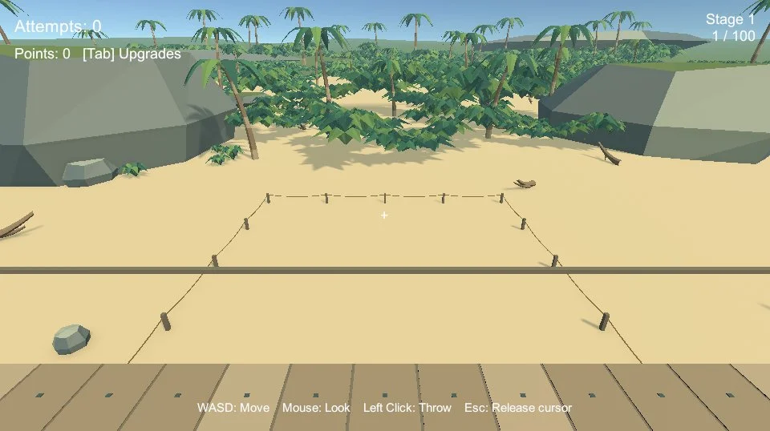</a>

Crée dans Unity une chasse au trésor 3D jouable sur une plage. Modélise des palmiers et des plateformes en bois low poly, puis établis la boucle principale d’exploration et de découverte des trésors.

**Prompt**

```text
Crée dans Unity une chasse au trésor 3D jouable sur une plage. Modélise des palmiers et des plateformes en bois low poly, puis établis la boucle principale d’exploration et de découverte des trésors.
```

[Voir les détails ↗](https://www.tripo3d.ai/fr/3d-prompts/low-poly-beach-treasure-hunt-2096570815714414844) · [Publication originale](https://x.com/sorano_concon_g/status/2096570815714414844) · [Retour aux exemples](#all-prompts)

---

<a id="2096560142871658589"></a>

### Modèles Blender et effets visuels Unity

[ねぎぽよし](https://x.com/CST_negi) · 2026-09-06

<a href="https://www.tripo3d.ai/fr/3d-prompts/blender-models-with-unity-vfx-2096560142871658589">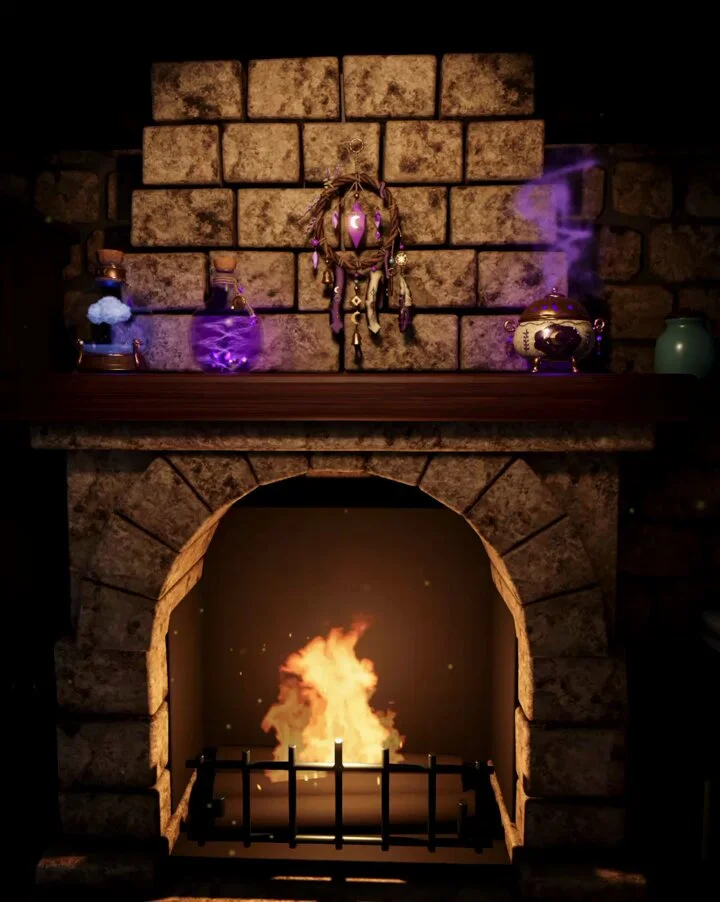</a>

Crée les modèles de la scène dans Blender et importe-les dans Unity. Ajoute des effets avec VFX Graph et éclaire la scène pour que modèles et effets restent bien lisibles ensemble.

**Prompt**

```text
Crée les modèles de la scène dans Blender et importe-les dans Unity. Ajoute des effets avec VFX Graph et éclaire la scène pour que modèles et effets restent bien lisibles ensemble.
```

[Voir les détails ↗](https://www.tripo3d.ai/fr/3d-prompts/blender-models-with-unity-vfx-2096560142871658589) · [Voir la vidéo ↗](https://cdn-blog.holymolly.ai/media/production/3d-prompt-2096559190202597376-video-4ff7324a3cb3.mp4) · [Publication originale](https://x.com/CST_negi/status/2096560142871658589) · [Retour aux exemples](#all-prompts)

---

<a id="2096556692842348826"></a>

### Jeu de rallye Unity jouable sur mobile

[Kevin Kern](https://x.com/kevinkern) · 2026-09-06

<a href="https://www.tripo3d.ai/fr/3d-prompts/mobile-playable-unity-rally-game-2096556692842348826"></a>

Crée un prototype de conduite de rallye avec Codex, Blender et Unity. Prépare ses assets 3D et ses commandes pour des essais sur téléphone.

**Prompt**

```text
Crée un prototype de conduite de rallye avec Codex, Blender et Unity. Prépare ses assets 3D et ses commandes pour des essais sur téléphone.
```

[Voir les détails ↗](https://www.tripo3d.ai/fr/3d-prompts/mobile-playable-unity-rally-game-2096556692842348826) · [Voir la vidéo ↗](https://cdn-blog.holymolly.ai/media/production/3d-prompt-2096555393577259008-video-112f32b99aab.mp4) · [Publication originale](https://x.com/kevinkern/status/2096556692842348826) · [Retour aux exemples](#all-prompts)

---

<a id="2096572429066006845"></a>

### Manguier indien dans SpeedTree

[Varun Mayya](https://x.com/waitin4agi_) · 2026-09-06

<a href="https://www.tripo3d.ai/fr/3d-prompts/indian-mango-tree-in-speedtree-2096572429066006845"></a>

Crée un manguier indien dans SpeedTree pour une scène Unreal visant 60 FPS. Génère les matériaux des feuilles et de l’écorce, puis examine leur rendu avant de finaliser l’asset.

**Prompt**

```text
Crée un manguier indien dans SpeedTree pour une scène Unreal visant 60 FPS. Génère les matériaux des feuilles et de l’écorce, puis examine leur rendu avant de finaliser l’asset.
```

[Voir les détails ↗](https://www.tripo3d.ai/fr/3d-prompts/indian-mango-tree-in-speedtree-2096572429066006845) · [Publication originale](https://x.com/waitin4agi_/status/2096572429066006845) · [Retour aux exemples](#all-prompts)

---

<a id="2096566598689783878"></a>

### Texturer et rigger un personnage Tripo

[たけうちさんは縮退しました🌀](https://x.com/chimerast) · 2026-09-06

<a href="https://www.tripo3d.ai/fr/3d-prompts/texture-and-rig-a-tripo-character-2096566598689783878">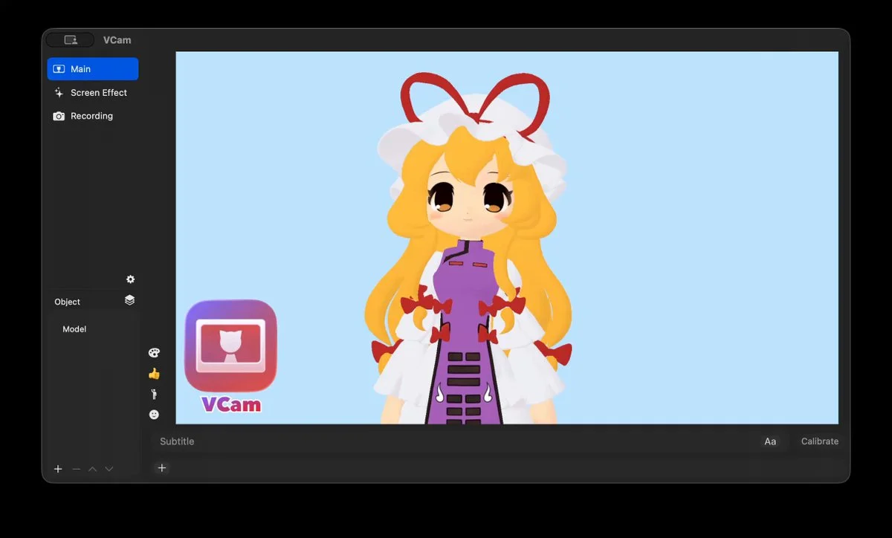</a>

Importe un personnage Tripo Smart Mesh dans Blender. Applique ses textures et crée un rig corporel utilisable avant de passer aux expressions du visage.

**Prompt**

```text
Importe un personnage Tripo Smart Mesh dans Blender. Applique ses textures et crée un rig corporel utilisable avant de passer aux expressions du visage.
```

[Voir les détails ↗](https://www.tripo3d.ai/fr/3d-prompts/texture-and-rig-a-tripo-character-2096566598689783878) · [Voir la vidéo ↗](https://cdn-blog.holymolly.ai/media/production/3d-prompt-2096566304161619968-video-6b2851018644.mp4) · [Publication originale](https://x.com/chimerast/status/2096566598689783878) · [Retour aux exemples](#all-prompts)

---

<a id="2096064140510970318"></a>

### Prototype de jeu The Legend of Astra

[lofibloom](https://x.com/lofihashbloom) · 2026-09-05

<a href="https://www.tripo3d.ai/fr/3d-prompts/the-legend-of-astra-game-prototype-2096064140510970318"></a>

Crée un prototype de jeu d’aventure 3D dans Unity avec des scènes préparées dans Blender et des assets Tripo. Intègre l’animation des personnages à la démo jouable.

**Prompt**

```text
Crée un prototype de jeu d’aventure 3D dans Unity avec des scènes préparées dans Blender et des assets Tripo. Intègre l’animation des personnages à la démo jouable.
```

[Voir les détails ↗](https://www.tripo3d.ai/fr/3d-prompts/the-legend-of-astra-game-prototype-2096064140510970318) · [Voir la vidéo ↗](https://cdn-blog.holymolly.ai/media/production/3d-prompt-2096062862880092160-video-67e55cc4794e.mp4) · [Publication originale](https://x.com/lofihashbloom/status/2096064140510970318) · [Retour aux exemples](#all-prompts)

---

<a id="2096566686266597754"></a>

### Du croquis d’un appartement aux rendus intérieurs

[Everett World](https://x.com/WorldEverett) · 2026-09-06

<a href="https://www.tripo3d.ai/fr/3d-prompts/apartment-sketch-to-rendered-interiors-2096566686266597754">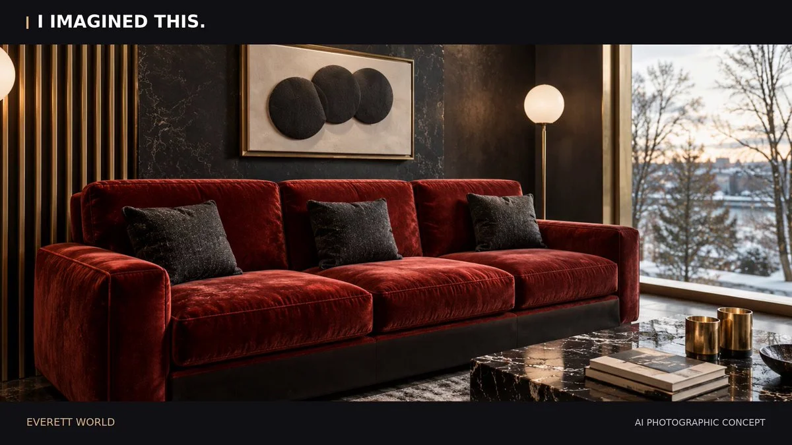</a>

Combine des images de référence d’un appartement avec une esquisse simple de son plan pour reconstruire l’intérieur dans Blender. Livre une scène modifiable, des rendus des pièces et une courte visite vidéo montée.

**Prompt**

```text
Combine des images de référence d’un appartement avec une esquisse simple de son plan pour reconstruire l’intérieur dans Blender. Livre une scène modifiable, des rendus des pièces et une courte visite vidéo montée.
```

[Voir les détails ↗](https://www.tripo3d.ai/fr/3d-prompts/apartment-sketch-to-rendered-interiors-2096566686266597754) · [Voir la vidéo ↗](https://cdn-blog.holymolly.ai/media/production/3d-prompt-2096566625826742276-video-41e3afaa8883.mp4) · [Publication originale](https://x.com/WorldEverett/status/2096566686266597754) · [Retour aux exemples](#all-prompts)

---

<a id="2095993826569502785"></a>

### Scène de rivière interactive dans le navigateur

[Dan Greenheck](https://x.com/dangreenheck) · 2026-09-04

<a href="https://www.tripo3d.ai/fr/3d-prompts/interactive-browser-river-scene-2095993826569502785"></a>

Crée une scène de rivière interactive qui fonctionne dans le navigateur. Mets d’abord en place un prototype d’eau en temps réel fonctionnel, puis examine et affine le résultat visuel.

**Prompt**

```text
Crée une scène de rivière interactive qui fonctionne dans le navigateur. Mets d’abord en place un prototype d’eau en temps réel fonctionnel, puis examine et affine le résultat visuel.
```

[Voir les détails ↗](https://www.tripo3d.ai/fr/3d-prompts/interactive-browser-river-scene-2095993826569502785) · [Voir la vidéo ↗](https://cdn-blog.holymolly.ai/media/production/3d-prompt-2095992532962607104-video-76faf96ed3eb.mp4) · [Publication originale](https://x.com/dangreenheck/status/2095993826569502785) · [Retour aux exemples](#all-prompts)

---

<a id="2096128774203171021"></a>

### Survol d’Adiyogi au crépuscule

[Adi](https://x.com/thejothiram) · 2026-09-05

<a href="https://www.tripo3d.ai/fr/3d-prompts/adiyogi-evening-fly-through-2096128774203171021"></a>

Crée une scène d’Adiyogi dans Blender avec de vastes espaces, des gros plans détaillés et une lumière chaude de fin de journée. Produis un survol de 30 secondes et conserve la scène modifiable.

**Prompt**

```text
Crée une scène d’Adiyogi dans Blender avec de vastes espaces, des gros plans détaillés et une lumière chaude de fin de journée. Produis un survol de 30 secondes et conserve la scène modifiable.
```

[Voir les détails ↗](https://www.tripo3d.ai/fr/3d-prompts/adiyogi-evening-fly-through-2096128774203171021) · [Voir la vidéo ↗](https://cdn-blog.holymolly.ai/media/production/3d-prompt-2096127589219983360-video-0e8fcabb7049.mp4) · [Publication originale](https://x.com/thejothiram/status/2096128774203171021) · [Retour aux exemples](#all-prompts)

---

<a id="2096521798150242631"></a>

### Eau en boucle avec Geometry Nodes

[黒曜陣](https://x.com/uB95A7tobA17057) · 2026-09-06

<a href="https://www.tripo3d.ai/fr/3d-prompts/looping-water-with-geometry-nodes-2096521798150242631"></a>

Crée un effet périodique de surface d’eau avec Geometry Nodes dans Blender, sans précalcul par bake. Garde la configuration des nœuds modifiable et présente-la comme un modèle de surface, pas comme une simulation complète de fluide.

**Prompt**

```text
Crée un effet périodique de surface d’eau avec Geometry Nodes dans Blender, sans précalcul par bake. Garde la configuration des nœuds modifiable et présente-la comme un modèle de surface, pas comme une simulation complète de fluide.
```

[Voir les détails ↗](https://www.tripo3d.ai/fr/3d-prompts/looping-water-with-geometry-nodes-2096521798150242631) · [Voir la vidéo ↗](https://cdn-blog.holymolly.ai/media/production/3d-prompt-26327614ee00-video-26327614ee00.mp4) · [Publication originale](https://x.com/uB95A7tobA17057/status/2096521798150242631) · [Retour aux exemples](#all-prompts)

---

<a id="2096518775042707700"></a>

### Monde de navigation inspiré de One Piece

[Yash](https://x.com/yash_yk45) · 2026-09-06

<a href="https://www.tripo3d.ai/fr/3d-prompts/one-piece-inspired-sailing-world-2096518775042707700"></a>

Crée un monde de navigation jouable avec un navire Blender et un océan Three.js. Ajoute une météo changeante, l’exploration sous-marine, un sillage, de l’écume, des embruns et des voiles en mouvement.

**Prompt**

```text
Crée un monde de navigation jouable avec un navire Blender et un océan Three.js. Ajoute une météo changeante, l’exploration sous-marine, un sillage, de l’écume, des embruns et des voiles en mouvement.
```

[Voir les détails ↗](https://www.tripo3d.ai/fr/3d-prompts/one-piece-inspired-sailing-world-2096518775042707700) · [Voir la vidéo ↗](https://cdn-blog.holymolly.ai/media/production/3d-prompt-2096515158227206144-video-955ff3de6a1b.mp4) · [Publication originale](https://x.com/yash_yk45/status/2096518775042707700) · [Démo](https://one-piece-sea-world.vercel.app/) · [Retour aux exemples](#all-prompts)

---

<a id="2096572156453028193"></a>

### Attracteur de Lorenz interactif

[Juy \| AI experiments](https://x.com/juyeam) · 2026-09-06

<a href="https://www.tripo3d.ai/fr/3d-prompts/interactive-lorenz-attractor-2096572156453028193"></a>

Visualise deux trajectoires du système de Lorenz présentant un écart infime de position initiale. Permets de modifier cet écart et de parcourir le temps, en distinguant les vérifications numériques des prédictions exactes à long terme.

**Prompt**

```text
Visualise deux trajectoires du système de Lorenz présentant un écart infime de position initiale. Permets de modifier cet écart et de parcourir le temps, en distinguant les vérifications numériques des prédictions exactes à long terme.
```

[Voir les détails ↗](https://www.tripo3d.ai/fr/3d-prompts/interactive-lorenz-attractor-2096572156453028193) · [Voir la vidéo ↗](https://cdn-blog.holymolly.ai/media/production/3d-prompt-2096556348947517440-video-9e92e0e7a1ed.mp4) · [Publication originale](https://x.com/juyeam/status/2096572156453028193) · [Démo](https://tiny-worlds-juyeam.juyeam.chatgpt.site/chaos) · [Retour aux exemples](#all-prompts)

---

<a id="2096358854275543457"></a>

### Taverne avec clients et personnel en activité

[Rogue](https://x.com/Rogue0114) · 2026-09-05

<a href="https://www.tripo3d.ai/fr/3d-prompts/tavern-with-working-staff-and-guests-2096358854275543457">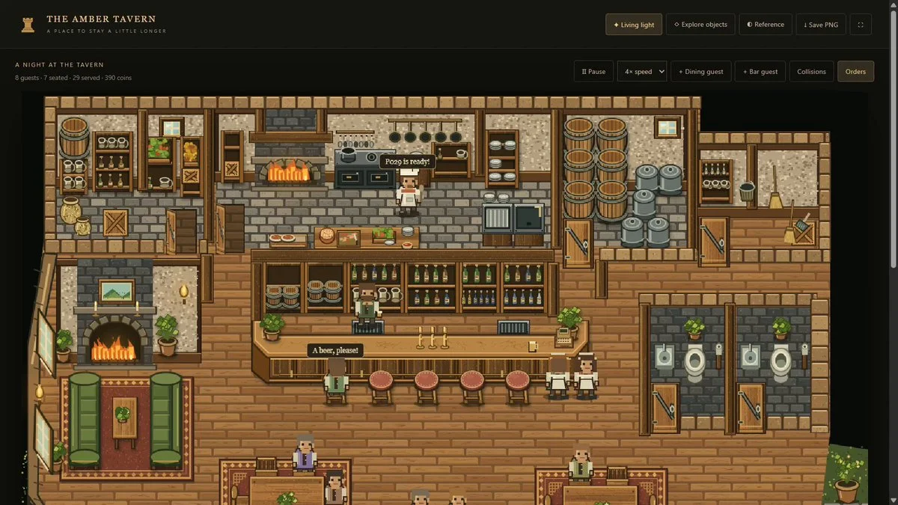</a>

Recrée une taverne d’après une image de référence et peuple-la de clients et d’employés. Les clients commandent à manger et à boire, le personnel prépare leurs commandes ; ajoute la gestion des collisions et la recherche de chemins.

**Prompt**

```text
Recrée une taverne d’après une image de référence et peuple-la de clients et d’employés. Les clients commandent à manger et à boire, le personnel prépare leurs commandes ; ajoute la gestion des collisions et la recherche de chemins.
```

[Voir les détails ↗](https://www.tripo3d.ai/fr/3d-prompts/tavern-with-working-staff-and-guests-2096358854275543457) · [Voir la vidéo ↗](https://cdn-blog.holymolly.ai/media/production/3d-prompt-2096357698434461699-video-c6f4a25f9a07.mp4) · [Publication originale](https://x.com/Rogue0114/status/2096358854275543457) · [Retour aux exemples](#all-prompts)

---

<a id="2096506357868642342"></a>

### Une chambre personnelle comme portfolio interactif

[Kalan ◂Ⓘ▸](https://x.com/kalanyei) · 2026-09-06

<a href="https://www.tripo3d.ai/fr/3d-prompts/personal-room-as-an-interactive-portfolio-2096506357868642342"></a>

Transforme une chambre personnelle en site interactif de présentation. Construis la scène et réalise son bake dans Blender, puis ajoute de la vapeur de café, une animation façon Matrix et de subtils effets de shaders.

**Prompt**

```text
Transforme une chambre personnelle en site interactif de présentation. Construis la scène et réalise son bake dans Blender, puis ajoute de la vapeur de café, une animation façon Matrix et de subtils effets de shaders.
```

[Voir les détails ↗](https://www.tripo3d.ai/fr/3d-prompts/personal-room-as-an-interactive-portfolio-2096506357868642342) · [Voir la vidéo ↗](https://cdn-blog.holymolly.ai/media/production/3d-prompt-2096502795746910208-video-0fa8acb98948.mp4) · [Publication originale](https://x.com/kalanyei/status/2096506357868642342) · [Démo](https://room.kalan.dev/) · [Retour aux exemples](#all-prompts)

---

<a id="2096503275910832461"></a>

### Bateau YF-24 sur une mer 3D peu agitée

[yhmtmt](https://x.com/yhmtmt1) · 2026-09-06

<a href="https://www.tripo3d.ai/fr/3d-prompts/yf-24-boat-on-a-gentle-3d-sea-2096503275910832461"></a>

Modélise un bateau YF-24 dans Blender et anime sa navigation sur une mer tridimensionnelle par force 2 sur l’échelle de Beaufort. Appuie-toi sur des références du bateau pour affiner sa forme.

**Prompt**

```text
Modélise un bateau YF-24 dans Blender et anime sa navigation sur une mer tridimensionnelle par force 2 sur l’échelle de Beaufort. Appuie-toi sur des références du bateau pour affiner sa forme.
```

[Voir les détails ↗](https://www.tripo3d.ai/fr/3d-prompts/yf-24-boat-on-a-gentle-3d-sea-2096503275910832461) · [Voir la vidéo ↗](https://cdn-blog.holymolly.ai/media/production/3d-prompt-2096500632966631425-video-7aa795ec66f0.mp4) · [Publication originale](https://x.com/yhmtmt1/status/2096503275910832461) · [Retour aux exemples](#all-prompts)

---

<a id="2096413869841473930"></a>

### Appartement jouable inspiré de D4

[Hidetaka SWERY SueHERO](https://x.com/Swery65) · 2026-09-06

<a href="https://www.tripo3d.ai/fr/3d-prompts/playable-d4-inspired-apartment-2096413869841473930">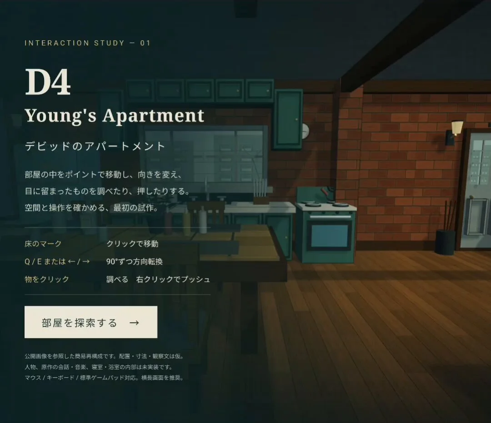</a>

Documente-toi sur l’appartement du protagoniste de D4 et recrée-le sous forme de prototype 3D jouable. Vérifie l’agencement et les interactions à l’aide de références plutôt que de supposer une reproduction exacte.

**Prompt**

```text
Documente-toi sur l’appartement du protagoniste de D4 et recrée-le sous forme de prototype 3D jouable. Vérifie l’agencement et les interactions à l’aide de références plutôt que de supposer une reproduction exacte.
```

[Voir les détails ↗](https://www.tripo3d.ai/fr/3d-prompts/playable-d4-inspired-apartment-2096413869841473930) · [Voir la vidéo ↗](https://cdn-blog.holymolly.ai/media/production/3d-prompt-2096413677717225472-video-3d17ea73456e.mp4) · [Publication originale](https://x.com/Swery65/status/2096413869841473930) · [Retour aux exemples](#all-prompts)

---

<a id="2096398839830008292"></a>

### Jeu urbain dans le navigateur avec un personnage fourni

[DJ RIO \| REALITY](https://x.com/djrio_vr) · 2026-09-06

<a href="https://www.tripo3d.ai/fr/3d-prompts/browser-city-game-with-a-supplied-character-2096398839830008292"></a>

Crée un jeu urbain WebGL en utilisant RIO\_MA002.fbx comme personnage joueur. Modélise les véhicules et les rues de référence dans Blender, puis améliore les PNJ, la physique de conduite, les objets destructibles et les zones pavillonnaires.

**Prompt**

```text
Crée un jeu urbain WebGL en utilisant RIO_MA002.fbx comme personnage joueur. Modélise les véhicules et les rues de référence dans Blender, puis améliore les PNJ, la physique de conduite, les objets destructibles et les zones pavillonnaires.
```

[Voir les détails ↗](https://www.tripo3d.ai/fr/3d-prompts/browser-city-game-with-a-supplied-character-2096398839830008292) · [Voir la vidéo ↗](https://cdn-blog.holymolly.ai/media/production/3d-prompt-2096398600695869440-video-9db110aaf6b5.mp4) · [Publication originale](https://x.com/djrio_vr/status/2096398839830008292) · [Retour aux exemples](#all-prompts)

---

<a id="2096339041679442428"></a>

### Explorateur orbital du système solaire

[Andromedus](https://x.com/dzhohola) · 2026-09-05

<a href="https://www.tripo3d.ai/fr/3d-prompts/orbital-solar-system-explorer-2096339041679442428"></a>

Crée un explorateur du système solaire dans le navigateur avec Three.js, huit planètes et vingt lunes. Permets de déplacer la caméra et de planifier des vols spatiaux de manière simplifiée.

**Prompt**

```text
Crée un explorateur du système solaire dans le navigateur avec Three.js, huit planètes et vingt lunes. Permets de déplacer la caméra et de planifier des vols spatiaux de manière simplifiée.
```

[Voir les détails ↗](https://www.tripo3d.ai/fr/3d-prompts/orbital-solar-system-explorer-2096339041679442428) · [Voir la vidéo ↗](https://cdn-blog.holymolly.ai/media/production/3d-prompt-2096339015465115654-video-3a4c1138a19b.mp4) · [Publication originale](https://x.com/dzhohola/status/2096339041679442428) · [Retour aux exemples](#all-prompts)

---

<a id="2096093614397170104"></a>

### Formation des trous noirs en WebGL

[ゼン🍣🐟🇳🇿](https://x.com/zeeeeeen) · 2026-09-05

<a href="https://www.tripo3d.ai/fr/3d-prompts/black-hole-formation-in-webgl-2096093614397170104"></a>

Crée un diaporama pédagogique sur la formation des trous noirs avec des visualisations WebGL. Accompagne les explications de scènes 3D animées.

**Prompt**

```text
Crée un diaporama pédagogique sur la formation des trous noirs avec des visualisations WebGL. Accompagne les explications de scènes 3D animées.
```

[Voir les détails ↗](https://www.tripo3d.ai/fr/3d-prompts/black-hole-formation-in-webgl-2096093614397170104) · [Voir la vidéo ↗](https://cdn-blog.holymolly.ai/media/production/3d-prompt-2096093135785107456-video-525882e52f0c.mp4) · [Publication originale](https://x.com/zeeeeeen/status/2096093614397170104) · [Retour aux exemples](#all-prompts)

---

<a id="2096559197999501724"></a>

### Un logo 2D devient un personnage animé

[Anthony Riera](https://x.com/anthonyriera) · 2026-09-06

<a href="https://www.tripo3d.ai/fr/3d-prompts/a-2d-logo-becomes-an-animated-character-2096559197999501724"></a>

Transforme le logo de personnage 2D fourni en version 3D animée. Préserve son identité reconnaissable à mesure que le personnage prend du volume et s’anime.

**Prompt**

```text
Transforme le logo de personnage 2D fourni en version 3D animée. Préserve son identité reconnaissable à mesure que le personnage prend du volume et s’anime.
```

[Voir les détails ↗](https://www.tripo3d.ai/fr/3d-prompts/a-2d-logo-becomes-an-animated-character-2096559197999501724) · [Voir la vidéo ↗](https://cdn-blog.holymolly.ai/media/production/3d-prompt-2096558319678713856-video-d188c30033a6.mp4) · [Publication originale](https://x.com/anthonyriera/status/2096559197999501724) · [Retour aux exemples](#all-prompts)

---

<a id="2096337879173591171"></a>

### Jeu de crabe aux mécaniques fondées sur l’action

[ZEUS⚡️](https://x.com/zeuuss_01) · 2026-09-05

<a href="https://www.tripo3d.ai/fr/3d-prompts/a-crab-game-with-action-driven-mechanics-2096337879173591171"></a>

Crée un jeu de crabe dans Three.js à partir d’un cahier des charges structuré couvrant l’apparence, le personnage, le monde, les actions, les objectifs, l’interface et la caméra. Fais s’élever les pièces puis voler vers le crabe à son passage ; signale les exigences contradictoires.

**Prompt**

```text
Crée un jeu de crabe dans Three.js à partir d’un cahier des charges structuré couvrant l’apparence, le personnage, le monde, les actions, les objectifs, l’interface et la caméra. Fais s’élever les pièces puis voler vers le crabe à son passage ; signale les exigences contradictoires.
```

[Voir les détails ↗](https://www.tripo3d.ai/fr/3d-prompts/a-crab-game-with-action-driven-mechanics-2096337879173591171) · [Voir la vidéo ↗](https://cdn-blog.holymolly.ai/media/production/3d-prompt-2096337699737350144-video-d20dcbc3e616.mp4) · [Publication originale](https://x.com/zeuuss_01/status/2096337879173591171) · [Démo](https://beach-crab-game.netlify.app/) · [Retour aux exemples](#all-prompts)

---

<a id="2096555183790575682"></a>

### Village de La Nuit étoilée avec cycle jour-nuit

[Firisis](https://x.com/Firisis_) · 2026-09-06

<a href="https://www.tripo3d.ai/fr/3d-prompts/starry-night-village-with-a-day-night-cycle-2096555183790575682"></a>

Transforme La Nuit étoilée de Van Gogh en village 3D explorable avec des habitants, un éclairage et un cycle jour-nuit. Réalise un court film à travers le monde terminé.

**Prompt**

```text
Transforme La Nuit étoilée de Van Gogh en village 3D explorable avec des habitants, un éclairage et un cycle jour-nuit. Réalise un court film à travers le monde terminé.
```

[Voir les détails ↗](https://www.tripo3d.ai/fr/3d-prompts/starry-night-village-with-a-day-night-cycle-2096555183790575682) · [Voir la vidéo ↗](https://cdn-blog.holymolly.ai/media/production/3d-prompt-2096552620626182144-video-6643bf0e6e0a.mp4) · [Publication originale](https://x.com/Firisis_/status/2096555183790575682) · [Retour aux exemples](#all-prompts)

---

<a id="2096510126244999366"></a>

### Interface Three.js fidèle à une référence

[Meng To](https://x.com/MengTo) · 2026-09-06

<a href="https://www.tripo3d.ai/fr/3d-prompts/reference-matched-three-js-interface-2096510126244999366">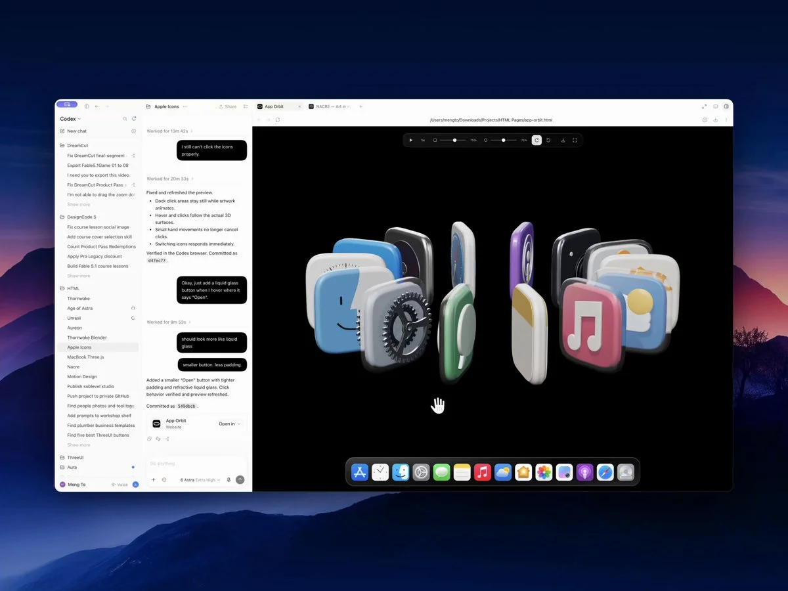</a>

Recrée une référence dans un seul fichier HTML avec Three.js. Compare régulièrement le résultat et corrige les écarts ; affine l’éclairage, la profondeur des modèles et les commandes à l’aspect vitré avec de légers effets réagissant au pointeur.

**Prompt**

```text
Recrée une référence dans un seul fichier HTML avec Three.js. Compare régulièrement le résultat et corrige les écarts ; affine l’éclairage, la profondeur des modèles et les commandes à l’aspect vitré avec de légers effets réagissant au pointeur.
```

[Voir les détails ↗](https://www.tripo3d.ai/fr/3d-prompts/reference-matched-three-js-interface-2096510126244999366) · [Voir la vidéo ↗](https://cdn-blog.holymolly.ai/media/production/3d-prompt-2096509525641805824-video-3b59d2080454.mp4) · [Publication originale](https://x.com/MengTo/status/2096510126244999366) · [Retour aux exemples](#all-prompts)

---

<a id="2096481425050743048"></a>

### Assembler et animer des assets 3D générés

[Stefan 3D AI](https://x.com/Stefan_3D_AI) · 2026-09-06

<a href="https://www.tripo3d.ai/fr/3d-prompts/assemble-and-animate-generated-3d-assets-2096481425050743048">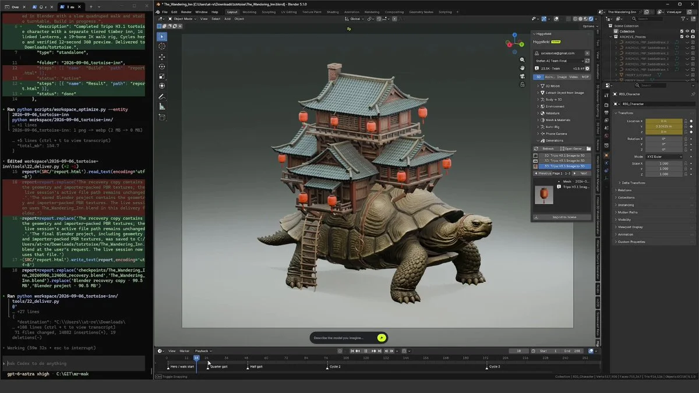</a>

Génère des assets 3D optimisés avec Tripo P2, assemble-les dans Blender, puis crée le rig et les animations des personnages. Vérifie la cohérence spatiale entre les personnages et la scène.

**Prompt**

```text
Génère des assets 3D optimisés avec Tripo P2, assemble-les dans Blender, puis crée le rig et les animations des personnages. Vérifie la cohérence spatiale entre les personnages et la scène.
```

[Voir les détails ↗](https://www.tripo3d.ai/fr/3d-prompts/assemble-and-animate-generated-3d-assets-2096481425050743048) · [Voir la vidéo ↗](https://cdn-blog.holymolly.ai/media/production/3d-prompt-2096480471941255169-video-945e4c7db324.mp4) · [Publication originale](https://x.com/Stefan_3D_AI/status/2096481425050743048) · [Retour aux exemples](#all-prompts)

---

<a id="2096269057544831175"></a>

### Landing page abyssale bioluminescente

[Himanshu Hingorani](https://x.com/himanshubuildss) · 2026-09-05

<a href="https://www.tripo3d.ai/fr/3d-prompts/bioluminescent-deep-sea-landing-page-2096269057544831175"></a>

Crée une landing page des grands fonds avec des effets d’eau Three.js, une interface sombre à l’aspect vitré et des mouvements liés au défilement. Associe l’ambiance 3D à des interactions web claires et adaptées aux différentes tailles d’écran.

**Prompt**

```text
Crée une landing page des grands fonds avec des effets d’eau Three.js, une interface sombre à l’aspect vitré et des mouvements liés au défilement. Associe l’ambiance 3D à des interactions web claires et adaptées aux différentes tailles d’écran.
```

[Voir les détails ↗](https://www.tripo3d.ai/fr/3d-prompts/bioluminescent-deep-sea-landing-page-2096269057544831175) · [Voir la vidéo ↗](https://cdn-blog.holymolly.ai/media/production/3d-prompt-2096268589192097792-video-db6769b12fa2.mp4) · [Publication originale](https://x.com/himanshubuildss/status/2096269057544831175) · [Retour aux exemples](#all-prompts)

---
