<!-- Generated from Growth CMS. Update content in CMS; run npm run sync. -->

# Awesome Astra Prompts

[](https://github.com/sindresorhus/awesome) [](https://github.com/TripoGrowthLab/awesome-astra-prompts/stargazers) [](../LICENSE) [](https://github.com/TripoGrowthLab/awesome-astra-prompts/actions/workflows/sync-prompts.yml) [](../CONTRIBUTING.md)

<p>
  <a href="../README.md"></a>
  <a href="../README.zh-CN.md"></a>
  <a href="../docs/catalog.zh-Hant.md"></a>
  <a href="../docs/catalog.ja.md"></a>
  <a href="../docs/catalog.ko.md"></a>
  <a href="../docs/catalog.es.md"></a>
  <a href="../docs/catalog.pt.md"></a>
  <a href="../docs/catalog.de.md"></a>
  <a href="../docs/catalog.fr.md"></a>
  <a href="../docs/catalog.it.md"></a>
  <a href="../docs/catalog.ru.md"></a>
  <a href="../docs/catalog.tr.md"></a>
  <a href="../docs/catalog.uk.md"></a>
  <a href="../docs/catalog.vi.md"></a>
</p>

<a href="https://www.tripo3d.ai/it/3d-prompts/models/gpt-6-astra?utm_source=github&amp;utm_medium=referral&amp;utm_campaign=awesome_astra_prompts&amp;utm_content=readme_hero"></a>

**Un punto di partenza per il tuo prossimo gioco, scena o mondo interattivo.**


**225 · Prompt Astra più recenti**

## Progetti in evidenza

<table>
<tr>
<td width="50%" valign="top"><a href="https://www.tripo3d.ai/it/3d-prompts/switchable-character-expressions-in-blender-2096525100518453342"></a><br><strong><a href="#2096525100518453342">Espressioni del personaggio intercambiabili in Blender</a></strong><br><sub><a href="https://x.com/Dstudio_ai/status/2096525100518453342">Nano(ナノ)</a></sub><br><a href="#2096525100518453342">Prompt →</a></td>
</tr>
</table>

<a id="all-prompts"></a>

## Prompt Astra più recenti

<details>
<summary>Esplora gli esempi</summary>

- [Collisore di particelle 3D interattivo](#2097781208596029936) · GitHub
- [Mosswing: gioco 3D mobile tap-to-flap](#mosswing-mobile-3d-tap-to-flap-game) · GitHub
- [Nucleo energetico interattivo a due anelli](#2096551010089263181) · GitHub
- [Ricostruzione fotorealistica e modificabile di un drago in Blender](#2096335588727349434)
- [Render 3D di un’immagine di X](#2096338836854804782)
- [Dal concept del personaggio al modello 3D riggato e al cartoon](#2096342420543660277)
- [Ensemble 3D giocabile con animazione sincronizzata all’audio](#2096354461652488562)
- [Crea e renderizza un buco nero in Blender](#2096391653669953761)
- [Ricostruzione di Lego 1999 Racers](#2096438110095585753)
- [La visione del tempio di Ezechiele in 3D](#2096547658164834788)
- [Simulazione 3D di un’esplosione nucleare in città](#2096562462674079868)
- [Totality Engine: Cattedrale cinematografica dell’eclissi](#2096593372311941143)
- [Crea CS2 con Three.js](#2096596888799895855)
- [Animazione di un astuccio pieghevole da una fustella](#2096612394281603144)
- [Gioco d’avventura fantasy costiero: Windhaven](#2096629506047955327)
- [GDR d’azione dark fantasy in Three.js](#2096637091627364531)
- [Render della Terra che ruota in Blender](#2096637194270134742)
- [Mini World: gioco 3D di esplorazione](#2096641728497275011)
- [Vista esplosa interattiva di uno smartphone](#2096685163111694556)
- [Asset di gioco di una minifigure LEGO con Blender MCP](#2096766465730847059)
- [Crea uno slime morbido e interattivo con Three.js e WebGPU](#2096793432987464010)
- [Foresta 3D in tempo reale estremamente dettagliata nel browser](#2096814981509775616)
- [Ricrea una casa editabile in Blender da un video di riferimento](#2096876083094466863)
- [Scena 3D di Hogwarts](#2096907617117540478)
- [Ricrea uno spot pubblicitario di prodotto con Blender e ChatCut](#2096925943575330908)
- [Trasforma un’immagine in un modello 3D e ruotalo di 360°](#2096950715277004976)
- [Strada in miniatura infinita in Three.js WebGPU](#2096956214680965501)
- [Il paesaggio VRChat di «Un orizzonte a gravità spezzata»](#2096966425017467344)
- [Cortile cinese interattivo](#2096971051334857181)
- [Sentiero nella foresta di 12 secondi in Blender](#2096986557244723371)
- [Modifica una scena di Blender per distanziali zigrinati e il corretto alloggiamento del PCB](#2096990373813858591)
- [Animale robot interattivo su un banco da lavoro](#2097004192627933279)
- [Modellazione dettagliata di una casa in 3D](#2097057316138832282)
- [Albero di limoni gelatinosi interattivo](#2097065330728128920)
- [Rigging e animazione di un mech digitigrade in Godot](#2097123382852829230)
- [Animazione in vista esplosa di un fioraio giapponese](#2097153139795468365)
- [Terreno di un villaggio ispirato a Skyrim da un’immagine di riferimento generata](#2097167383576383502)
- [Migliorare i tratti del viso di un modello 3D in Blender usando un’immagine di riferimento](#2097313247116341424)
- [Ricrea un mini gioco 3D in stile League of Legends](#2097320830602809682)
- [Progetto WebGL in TypeScript + Three.js: Sala della Preghiera per il Buon Raccolto del Tempio del Cielo di Pechino](#2097323734504017936)
- [Ricreare un gioco per browser in stile League of Legends](#2097336230078013598)
- [Playroom: sala giochi rétro 3D nel browser](#2097339176094195899)
- [Mondo lacustre di zona umida dal fascino accogliente](#2097343467026289039)
- [Scena VHS in Blender ispirata alle Backrooms](#2097534290112188602)
- [Ricrea una scena 3D da un video in Three.js](#2097588270171660321)
- [Sito immersivo 3D dedicato a una risaia](#2097602565110419781)
- [Creare con GPT-6 Astra e Blender una scena comica con un braccio robotico che insegue un gatto](#2097675660873605422)
- [Crea THE LAST GATE: un crowd runner con porte matematiche](#2097678911882809407)
- [Simulazione 3D in tempo reale di una fabbrica e delle piattaforme di lancio](#2097730920224534868)
- [Simulazione del terreno di un campo da golf a 18 buche](#2097755845001937172)
- [Clone di Minecraft multigiocatore](#2097797479488246071)
- [Demo di grafica fantasy interattiva](#2097821164093480999)
- [Corto d’animazione 3D senza parole: il gatto e il premietto](#2097900087901106244)
- [Rendi più impegnativo un campo da golf a 18 buche](#2098038909514944562)
- [Banco interattivo di calamari](#2098043033446912315)
- [Workflow per un inseguimento automobilistico cartoon ispirato a GTA](#2098049032195293190)
- [City Pulse](#2098063352832610473)
- [Animazione di un’accademia magica fluttuante](#2098071577309122854)
- [Nave corriere civile iniziale di Sol Horizon](#2098225609558335846)
- [Workflow per un inseguimento automobilistico 3D in stile GTA](#2098371778234179766)
- [Modello 3D interattivo per l’interior design di una stanza](#2098374138092277920)
- [Scena di modellino 3D in miniatura di un tempio](#2098403061463224543)
- [Statuetta di una bambina che gioca con un robot](#2098406473273663992)
- [Espressioni del personaggio intercambiabili in Blender](#2096525100518453342)
- [Scena con personaggio ispirata a Warcraft in Unity](#2096308567863079420)
- [Scacchiera shogi 3D ruotabile](#2096579856133947507)
- [Atlante esploso di un computer desktop](#2096578761877860502)
- [Progettazione di cameretta e spazio di lavoro](#2096578684010508736)
- [Miniatura interattiva di Seoul](#2096557555086725159)
- [Insetto procedurale che si arrampica sulle superfici](#2096460081982304546)
- [Il Wright Flyer sopra una foresta giapponese](#2096467585785286808)
- [Una casa modellata da zero in Blender](#2096576154337734865)
- [Dalla pianta dell’ultimo piano a un’anteprima Blender](#2096501340889374883)
- [Avventura esplorativa The Quiet Crossing](#2096574297703637111)
- [Locomotiva a vapore attraverso la campagna](#2096577430274429157)
- [Scena di un giradischi su un tavolo](#2096561346766877106)
- [Ciclo di gioco di battaglie con carte collezionabili](#2096555856204644550)
- [Gioco di simulazione di una rete ferroviaria](#2096362653480562751)
- [Villaggio low poly di Gwacheon da esplorare a piedi](#2096490395614019793)
- [Livello completo di rompicapo in Three.js](#2096505740643246231)
- [Caccia al tesoro su una spiaggia low poly](#2096570815714414844)
- [Modelli Blender con effetti visivi Unity](#2096560142871658589)
- [Gioco di rally Unity giocabile su telefono](#2096556692842348826)
- [Albero di mango indiano in SpeedTree](#2096572429066006845)
- [Texture e rig di un personaggio Tripo](#2096566598689783878)
- [Dallo schizzo di un appartamento ai render degli interni](#2096566686266597754)
- [Acqua in loop con Geometry Nodes](#2096521798150242631)
- [Mondo di navigazione ispirato a One Piece](#2096518775042707700)
- [Attrattore di Lorenz interattivo](#2096572156453028193)
- [Taverna con personale e ospiti attivi](#2096358854275543457)
- [Una stanza personale come portfolio interattivo](#2096506357868642342)
- [Barca YF-24 su un mare 3D tranquillo](#2096503275910832461)
- [Appartamento giocabile ispirato a D4](#2096413869841473930)
- [Gioco cittadino nel browser con un personaggio fornito](#2096398839830008292)
- [Esploratore orbitale del sistema solare](#2096339041679442428)
- [Un logo 2D diventa un personaggio animato](#2096559197999501724)
- [Gioco di un granchio con meccaniche basate sulle azioni](#2096337879173591171)
- [Villaggio della Notte stellata con ciclo giorno-notte](#2096555183790575682)
- [Interfaccia Three.js fedele a un riferimento](#2096510126244999366)
- [Assemblaggio e animazione di asset 3D generati](#2096481425050743048)

</details>

<a id="2097781208596029936"></a>

### Collisore di particelle 3D interattivo

[BuBBliK](https://x.com/k1rallik) · 2026-09-09

<a href="https://www.tripo3d.ai/it/3d-prompts/gpt-6-astra-2097781208596029936">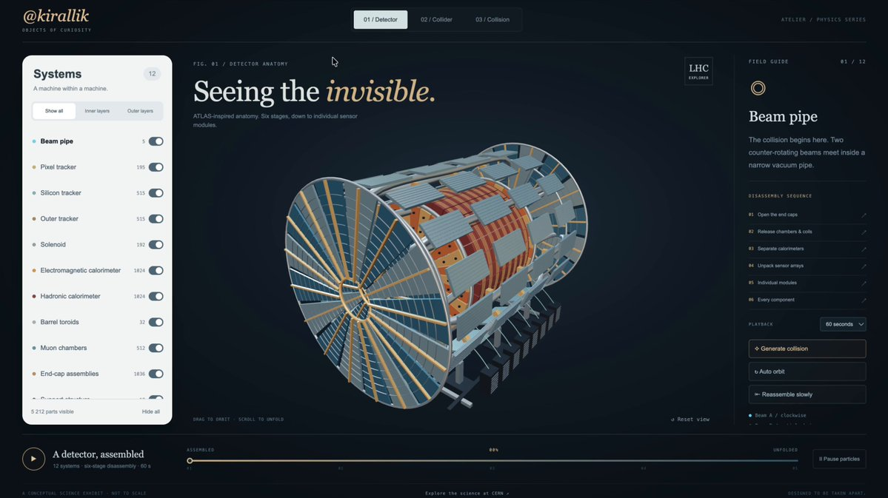</a>

Prompt iniziale suggerito dall’autore per creare, in un unico file HTML autonomo, un collisore di particelle 3D interattivo ispirato al CERN, all’LHC e al rivelatore ATLAS. Viene presentato come prompt per realizzare qualcosa di simile, non necessariamente come l’input esatto usato per il risultato mostrato.

**Prompt**

```text
Crea un collisore di particelle 3D dettagliato e interattivo, ispirato all’LHC del CERN e al rivelatore ATLAS, usando Three.js.

Crea tre viste: un rivelatore con migliaia di componenti animati singolarmente, un anello dell’acceleratore con fasci che ruotano in direzioni opposte e una visualizzazione sintetica della collisione.

Fai scomporre il rivelatore in sei fasi, dalle grandi ruote terminali e dai magneti fino ai singoli moduli dei sensori. Includi la disassemblazione controllata dallo scorrimento, la riproduzione in 30, 60 o 90 secondi, la pausa e il riassemblaggio inverso.

Aggiungi interruttori per la visibilità di ogni sistema, il conteggio dei componenti, descrizioni didattiche e un volo della telecamera intorno all’anello.

Usa un’interfaccia scura di livello premium, materiali metallici, sottili accenti dorati e un’illuminazione cinematografica. Mantieni i componenti leggibili ed evita sovrapposizioni eccessive.

Consulta le fonti ufficiali del CERN. Indica chiaramente la geometria semplificata e gli eventi sintetici.

Fornisci un unico file HTML autonomo che funzioni offline, insieme al codice sorgente portabile e a un README.
```

[Vedi dettagli ↗](https://www.tripo3d.ai/it/3d-prompts/gpt-6-astra-2097781208596029936) · [Post originale](https://x.com/k1rallik/status/2097781208596029936) · [Codice sorgente](https://github.com/bubblik525/collider) · [Torna agli esempi](#all-prompts)

---

<a id="mosswing-mobile-3d-tap-to-flap-game"></a>

### Mosswing: gioco 3D mobile tap-to-flap

[Ayi1337](https://github.com/Ayi1337) · 2026-09-10

<a href="https://www.tripo3d.ai/it/3d-prompts/mosswing-mobile-3d-tap-to-flap-game">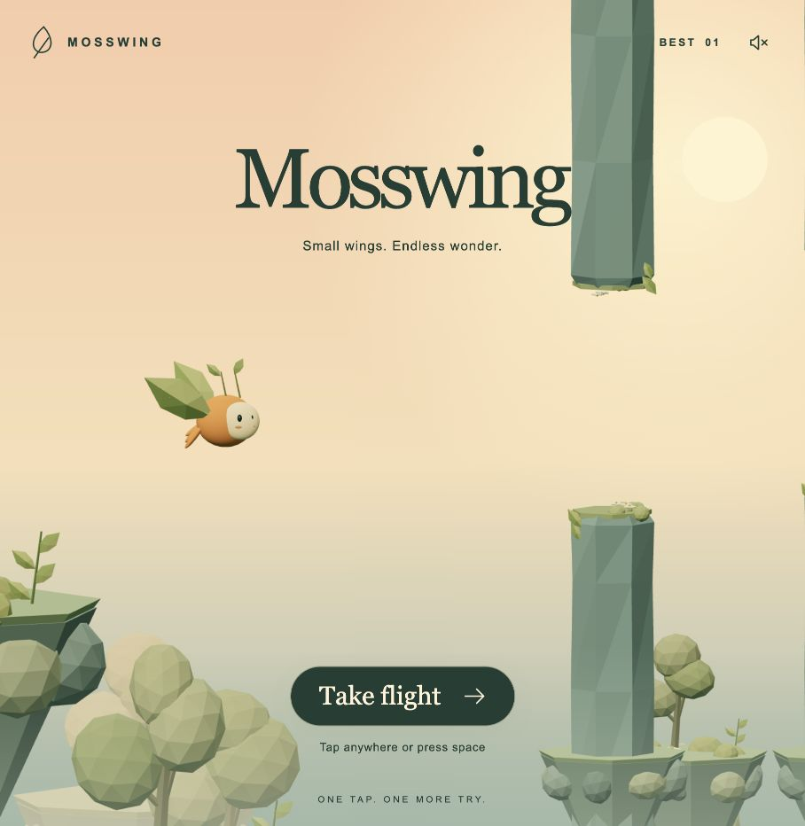</a>

Crea un raffinato gioco di volo 3D per browser mobile, con comandi a un tocco, varchi a scorrimento, punteggio immediato e una creatura e un mondo originali.

**Prompt**

```text
Rielabora il classico gioco "tap-to-flap" — quello in cui tocchi lo schermo per mantenere in volo una piccola creatura mentre attraversa una serie infinita di varchi — trasformandolo in un gioco 3D giocabile da browser mobile. Un solo index.html, apertura e avvio immediati, nessuna risorsa esterna (le librerie da CDN sono consentite; scegli tu). Mantieni esattamente il nucleo che tutti ricordano: controllo a un tocco, gravità, varchi che scorrono verso il giocatore, un solo impatto e la partita è finita, punteggio basato sui varchi superati. Per tutto il resto, decidi tu: che creatura sia, quali siano gli ostacoli, il mondo, la telecamera, la sensazione del battito d'ali e fin dove spingere l'aspetto visivo. Progetta un personaggio e uno stile originali, senza copiare l'arte del gioco originale. Non risponderò a domande di chiarimento. Valuterò un lavoro completo, elegante e piacevole da giocare — non un semplice elenco di funzionalità. Meglio piccolo e rifinito che grande e approssimativo.
```

[Vedi dettagli ↗](https://www.tripo3d.ai/it/3d-prompts/mosswing-mobile-3d-tap-to-flap-game) · [Post originale](https://github.com/Ayi1337/gpt6-astra-one-shot-games#02--mosswing) · [Codice sorgente](https://github.com/Ayi1337/gpt6-astra-one-shot-games) · [Demo](https://mosswing-quiet-flight.jack-514.chatgpt.site/) · [Torna agli esempi](#all-prompts)

---

<a id="2096551010089263181"></a>

### Nucleo energetico interattivo a due anelli

[ruofeng](https://x.com/oneruofeng) · 2026-09-06

<a href="https://www.tripo3d.ai/it/3d-prompts/interactive-dual-ring-energy-core-2096551010089263181"></a>

**Prompt**

```text
Modella un nucleo energetico, due anelli e una base metallica in Blender. Esporta i materiali in un visualizzatore Three.js con controlli di rotazione, zoom, orbita automatica e pulsazione.
```

[Vedi dettagli ↗](https://www.tripo3d.ai/it/3d-prompts/interactive-dual-ring-energy-core-2096551010089263181) · [Post originale](https://x.com/oneruofeng/status/2096551010089263181) · [Codice sorgente](https://github.com/wangruofeng/orbital-core-showcase) · [Demo](https://orbital-core-showcase.wangruofeng007.workers.dev/) · [Torna agli esempi](#all-prompts)

---

<a id="2096335588727349434"></a>

### Ricostruzione fotorealistica e modificabile di un drago in Blender

[Sarang Borude](https://x.com/doomdave) · 2026-09-05

<a href="https://www.tripo3d.ai/it/3d-prompts/gpt-6-astra-2096335588727349434"></a>

Prompt Blender integrale per ricostruire da una tavola di riferimento un drago 3D fotorealistico e completamente modificabile, con anatomia modellata, materiali, illuminazione cinematografica, render di verifica e un flyaround della camera di 10 secondi.

**Prompt**

```text
Crea in Blender una ricostruzione 3D fotorealistica e completamente modificabile del drago mostrato nella tavola di riferimento allegata.

Usa tutte le viste fornite, comprese quelle laterale, frontale, superiore e posteriore, le angolazioni della testa, i primi piani della testa e dell’occhio, i dettagli delle scaglie e delle ali, per ricostruire un unico drago coerente e anatomicamente credibile.

Segui il più fedelmente possibile il riferimento, soprattutto per:

- Proporzioni generali del corpo e silhouette
- Collo lungo e muscoloso e coda affusolata
- Quattro zampe e due grandi ali da pipistrello
- Forma della testa e della mascella
- Numero, forma e posizione delle corna
- Spine dorsali lungo collo, dorso e coda
- Motivi delle scaglie color antracite scuro e marrone terroso
- Scaglie stratificate dall’aspetto corazzato
- Occhi dorato-ambrati con pupille verticali
- Artigli, denti e membrane alari
- Aspetto antico, realistico e minaccioso

I pannelli di riferimento possono contenere piccole incoerenze. Riconciliale in una creatura di base fisicamente coerente e simmetrica, preservando l’identità visiva del drago. Usa la vista laterale per le proporzioni generali, quella frontale per larghezza e postura, quelle superiore e posteriore per ali e coda, e i primi piani per testa, occhi, scaglie e materiali delle ali.

Costruisci il drago da zero come vera geometria Blender modificabile. Non scaricare né importare un modello di drago esistente. Non usare billboard, proiezioni 2D, illusioni basate su mappe di profondità o video generati al posto della geometria.

Usa script modulari Python per Blender (`bpy`) e l’eseguibile di Blender in modalità background/headless come metodo principale di costruzione. Mantieni gli script riproducibili e conserva le versioni riuscite del file `.blend`. Usa il controllo del computer per aprire e ispezionare la scena Blender quando l’ispezione visiva è utile. Non installare né utilizzare un server MCP di Blender.

APPROCCIO ALLA MODELLAZIONE

Inizia con un blockout anatomico prima di aggiungere i dettagli. Definisci:

- Cranio, mascella e cavità oculari
- Collo, torace, gabbia toracica e bacino
- Quattro zampe anatomicamente convincenti
- Dita separate e artigli ricurvi
- Spalle delle ali integrate nel torso
- Braccia alari articolate e ossa delle dita
- Membrane alari collegate correttamente
- Coda lunga che prosegue naturalmente dal bacino
- Corna principali e spine dorsali

Evita arti aggiuntivi, corna duplicate, membrane scollegate, articolazioni spezzate, scaglie fluttuanti, intersezioni, forme sottili come carta, asimmetrie accidentali e proporzioni da giocattolo.

Dopo aver verificato il blockout, aggiungi i dettagli secondari e terziari:

- Placche stratificate su torace e collo
- Scaglie orientate secondo l’anatomia
- Arcate sopraccigliari e palpebre
- Vere aperture delle narici
- Interno della bocca, gengive e denti individuali
- Rilievi sulle corna, scheggiature e punte consumate
- Armatura delle zampe e placche delle nocche
- Tendini, pieghe, vene e cicatrici discrete sulle ali
- Spine dorsali che proseguono lungo la coda
- Sottili asimmetrie naturali

Usa la geometria per tutto ciò che influisce sulla silhouette, comprese corna, artigli, denti, scaglie principali, spine dorsali, dita delle ali e pieghe importanti delle membrane. Usa normal map, bump o displacement controllato solo per i microdettagli.

MATERIALI

Crea materiali fisicamente basati e fotorealistici.

Le scaglie devono essere prevalentemente color nero antracite, con sottili variazioni grafite e marrone terroso. Aggiungi variazioni contenute di colore, ruvidità e micro-normal. Le scaglie in rilievo, la pelle incavata e le placche corazzate devono riflettere la luce in modo diverso. Evita una lucentezza plastica uniforme e il rumore procedurale applicato indiscriminatamente.

Le membrane alari devono ricordare pelle rettiliana esposta alle intemperie. Devono apparire più sottili tra le ossa di sostegno e più spesse vicino alle articolazioni e ai bordi d’attacco. Includi vene, pieghe, tensione, cicatrici, traslucenza e variazioni di colore sottili, senza farle sembrare stoffa, gomma o carta.

Crea corna e artigli simili alla cheratina, con basi scure, punte più chiare e consumate, rilievi longitudinali e danni leggeri.

Gli occhi devono avere:

- Iride dorato-ambrata
- Pupille nere verticali
- Strutture dettagliate dell’iride
- Zone limbari scure
- Bulbi oculari tridimensionali reali
- Palpebre realistiche
- Riflessi umidi sulla cornea
- Umidità discreta lungo i bordi delle palpebre

Non rendere gli occhi emissivi né artificialmente luminosi.

ILLUMINAZIONE E AMBIENTE

Crea un ambiente cinematografico essenziale, simile al riferimento:

- Piedistallo roccioso scuro o sperone montuoso
- Montagne atmosferiche in lontananza
- Cielo nuvoloso e drammatico
- Illuminazione ambientale fredda
- Luce direzionale leggermente più calda per rivelare volto e scaglie
- Leggera foschia atmosferica
- Nessuna struttura distraente o creatura aggiuntiva

Posa il drago in una postura stabile e dominante:

- Testa sollevata e vigile
- Collo leggermente incurvato
- Ali completamente o quasi completamente spiegate
- Peso distribuito in modo credibile su tutte e quattro le zampe
- Coda appoggiata o incurvata naturalmente dietro il corpo
- Bocca chiusa o leggermente socchiusa
- Occhi rivolti verso la camera o appena oltre

VERIFICA VISIVA

Crea camere di verifica abbinate per:

- Vista laterale
- Vista frontale
- Vista superiore
- Vista posteriore
- Profili sinistro e destro della testa
- Vista hero a tre quarti
- Primo piano della testa
- Primo piano dell’occhio
- Primo piano delle scaglie
- Primo piano dell’ala

Esegui almeno tre cicli di analisi critica e correzione.

Durante ogni ciclo:

1. Esegui il render da ogni camera di verifica.
2. Confronta ogni render con il pannello di riferimento corrispondente.
3. Valuta silhouette, anatomia, proporzioni, identità della testa, corna, ali, zampe, piedi, coda, andamento delle scaglie, materiali, simmetria, intersezioni, shading e normali.
4. Produci un elenco classificato delle discrepanze.
5. Correggi i problemi visivamente più importanti.
6. Esegui nuovamente il render dalle stesse camere.
7. Conserva i confronti prima/dopo.

Non dichiarare completato il lavoro solo perché gli oggetti sono stati creati. Il completamento richiede l’ispezione dei render effettivi e la correzione dei problemi visibili.

FLYAROUND DELLA CAMERA DI 10 SECONDI

Crea un flyaround cinematografico della camera attorno al drago completato, con questi requisiti:

- Esattamente 10 secondi
- Risoluzione 1920 × 1080
- 30 fotogrammi al secondo
- Esattamente 300 fotogrammi
- Movimento continuo e fluido della camera
- Nessun taglio
- Circa un’orbita completa di 360 gradi
- Inizio da una forte composizione frontale a tre quarti
- Passaggio lungo il fianco, il retro e il fianco opposto
- Fine in una composizione che si raccordi fluidamente al fotogramma iniziale
- Aggiunta di una variazione contenuta dell’elevazione per rivelare dorso e struttura delle ali
- Drago interamente dentro l’inquadratura
- Testa e torso come principale punto focale visivo
- Interpolazione Bézier fluida
- Evita accelerazioni improvvise e rollio della camera
- Evita di attraversare ali, coda, terreno o corpo
- Usa un obiettivo prospettico naturale, senza forte distorsione grandangolare
- Mantieni la profondità di campo abbastanza discreta da lasciare leggibile il drago
- Usa un motion blur contenuto

Prima del render finale, genera un’anteprima rapida a 1080p e con pochi sample dell’intera animazione. Ispeziona l’anteprima completa e correggi inquadrature errate, collisioni della camera, silhouette poco efficaci, visuali ostruite, movimenti bruschi, difetti di shading e intersezioni visibili della geometria.

RENDER FINALE

Dopo aver completato i cicli di analisi critica e approvato l’anteprima dell’animazione:

- Esegui il render finale dell’animazione a 1920 × 1080.
- Usa Cycles con accelerazione GPU quando disponibile.
- Esegui il render a 30 fps per esattamente 300 fotogrammi.
- Usa il campionamento adattivo e il denoising.
- Esegui prima il render dei singoli fotogrammi, così da poter riprendere un render interrotto.
- Usa PNG a 16 bit o OpenEXR per i fotogrammi master.
- Assembla i fotogrammi renderizzati in un file H.264 MP4 di alta qualità.
- Non usare l’interpolazione dei fotogrammi basata sull’AI.
- Conserva i singoli fotogrammi dopo l’assemblaggio del video.

MATERIALI DA CONSEGNARE

Fornisci:

1. File `.blend` finale modificabile
2. Tutti gli script `bpy` riproducibili
3. README con istruzioni per ricostruzione e rendering
4. Report sull’analisi del riferimento e sulle ipotesi adottate
5. Confronti con il riferimento da viste abbinate
6. Confronti prima/dopo dei cicli di analisi critica
7. Render statici di alta qualità del drago completo e dei dettagli importanti
8. Sequenza completa di 300 fotogrammi
9. Video H.264 finale di 10 secondi a 1080p
10. Report di verifica della geometria e dei materiali
11. Manifest che identifichi eventuali risorse esterne dell’ambiente utilizzate e le relative licenze

CRITERI DI SUCCESSO

Il risultato è riuscito se:

- Il drago è riconoscibilmente lo stesso del riferimento.
- La sua anatomia rimane coerente da ogni angolazione.
- Testa, corna, occhi ambrati, ali, spine dorsali e scaglie scure stratificate corrispondono fedelmente al riferimento.
- Il drago è completamente tridimensionale e modificabile.
- I dettagli principali e medi sono modellati, non simulati.
- I materiali reagiscono naturalmente al movimento della camera.
- Non sono presenti intersezioni evidenti, scaglie fluttuanti, anatomia duplicata o normali danneggiate.
- Sembra una creatura fisica fotografata, non un giocattolo, una scultura, un modello procedurale generico o un normale asset per videogiochi.
- Il movimento della camera è fluido, cinematografico e dura esattamente 10 secondi.

Lavora autonomamente attraverso queste fasi. Inizia con l’analisi del riferimento e il blockout anatomico. Se incontri un’ambiguità importante che non può essere risolta dal riferimento, fai la scelta anatomicamente più plausibile, documenta l’ipotesi e continua.
```

[Vedi dettagli ↗](https://www.tripo3d.ai/it/3d-prompts/gpt-6-astra-2096335588727349434) · [Post originale](https://x.com/doomdave/status/2096335588727349434) · [Torna agli esempi](#all-prompts)

---

<a id="2096338836854804782"></a>

### Render 3D di un’immagine di X

[Matt Boyle](https://x.com/MattJamesBoyle) · 2026-09-05

<a href="https://www.tripo3d.ai/it/3d-prompts/gpt-6-astra-2096338836854804782"></a>

<a href="https://www.tripo3d.ai/it/3d-prompts/gpt-6-astra-2096338836854804782"></a>

L’autore dice di aver chiesto ad Astra di scaricare Blender e creare un render 3D basato sulla sua immagine di X, ottenendo una nuova immagine del profilo.

**Prompt**

```text
Scarica Blender e crea un render 3D della mia immagine di X.
```

[Vedi dettagli ↗](https://www.tripo3d.ai/it/3d-prompts/gpt-6-astra-2096338836854804782) · [Post originale](https://x.com/MattJamesBoyle/status/2096338836854804782) · [Torna agli esempi](#all-prompts)

---

<a id="2096342420543660277"></a>

### Dal concept del personaggio al modello 3D riggato e al cartoon

[Higgsfield AI 🧩](https://x.com/higgsfield_ai) · 2026-09-05

<a href="https://www.tripo3d.ai/it/3d-prompts/gpt-6-astra-2096342420543660277">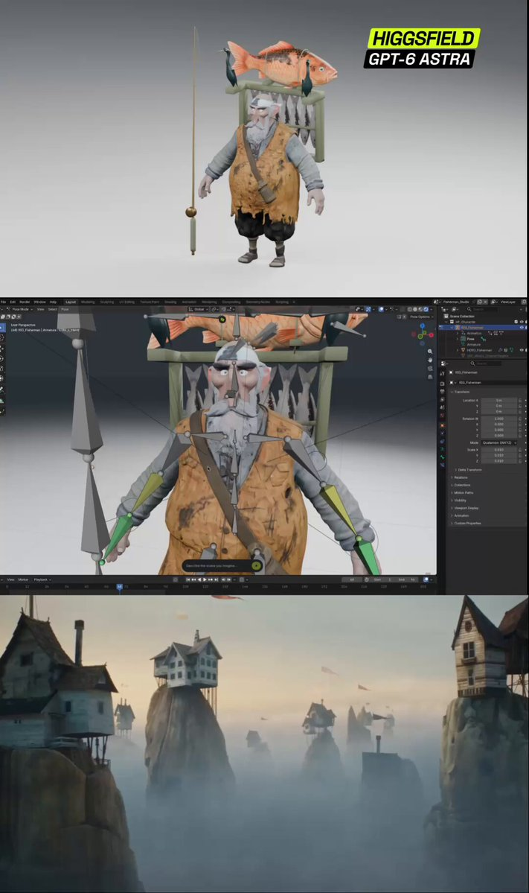</a>

Un prompt per la produzione di un personaggio che include concept design, modellazione 3D texturizzata, retopologia, mappatura UV, rigging e un cartoon animato.

**Prompt**

```text
Prendi il controllo del mio computer usando GPT-6 Astra e procedi come segue:

1. crea un concept del personaggio con Higgsfield Soul 2.0,

2. realizza un modello 3D texturizzato del personaggio,

3. importalo in Blender,

4. esegui la retopologia della mesh,

5. crea una mappa UV,

6. crea un rig per il personaggio,

7. valuta quanto il modello sia pronto per la produzione,

8. ripeti i passaggi precedenti se non sei soddisfatto dei risultati,

9. quindi trasformalo in un cartoon usando Seedance 2.5 su Higgsfield
```

[Vedi dettagli ↗](https://www.tripo3d.ai/it/3d-prompts/gpt-6-astra-2096342420543660277) · [Post originale](https://x.com/higgsfield_ai/status/2096342420543660277) · [Torna agli esempi](#all-prompts)

---

<a id="2096354461652488562"></a>

### Ensemble 3D giocabile con animazione sincronizzata all’audio

[Generator](https://x.com/groovestreetgen) · 2026-09-05

<a href="https://www.tripo3d.ai/it/3d-prompts/gpt-6-astra-2096354461652488562"></a>

Astra ha ricevuto l’incarico di creare un breve brano originale e un ensemble 3D giocabile con animazione guidata dall’audio, ricerca temporale, slow motion, controlli della telecamera, MIDI e codice sorgente.

**Prompt**

```text
Componi un breve brano originale e realizza un ensemble 3D giocabile. Fai dipendere l’animazione dal tempo dell’audio. Includi ricerca temporale, slow motion, controlli della telecamera, MIDI e codice sorgente.
```

[Vedi dettagli ↗](https://www.tripo3d.ai/it/3d-prompts/gpt-6-astra-2096354461652488562) · [Post originale](https://x.com/groovestreetgen/status/2096354461652488562) · [Torna agli esempi](#all-prompts)

---

<a id="2096391653669953761"></a>

### Crea e renderizza un buco nero in Blender

[John Kler](https://x.com/JohnKlerAI) · 2026-09-06

<a href="https://www.tripo3d.ai/it/3d-prompts/gpt-6-astra-2096391653669953761"></a>

L’autore racconta di aver fornito a GPT Astra e Fable 5.1 lo stesso prompt per creare e renderizzare in Blender un buco nero ispirato a Interstellar.

**Prompt**

```text
Crea e renderizza in Blender un magnifico buco nero, simile a quello di Interstellar.
```

[Vedi dettagli ↗](https://www.tripo3d.ai/it/3d-prompts/gpt-6-astra-2096391653669953761) · [Post originale](https://x.com/JohnKlerAI/status/2096391653669953761) · [Torna agli esempi](#all-prompts)

---

<a id="2096438110095585753"></a>

### Ricostruzione di Lego 1999 Racers

[Mo Elgaraihy](https://x.com/EngMoElgaraihy) · 2026-09-06

<a href="https://www.tripo3d.ai/it/3d-prompts/gpt-6-astra-2096438110095585753"></a>

Richiesta di ricostruire completamente il gioco di corse Lego 1999 Racers usando GPT-6 Astra.

**Prompt**

```text
Ricostruisci completamente il celebre gioco di corse Lego 1999 Racers.
```

[Vedi dettagli ↗](https://www.tripo3d.ai/it/3d-prompts/gpt-6-astra-2096438110095585753) · [Post originale](https://x.com/EngMoElgaraihy/status/2096438110095585753) · [Torna agli esempi](#all-prompts)

---

<a id="2096547658164834788"></a>

### La visione del tempio di Ezechiele in 3D

[KrixAi](https://x.com/KrixOnok) · 2026-09-06

<a href="https://www.tripo3d.ai/it/3d-prompts/gpt-6-astra-2096547658164834788"></a>

Un prompt per ricreare in 3D la visione del tempio di Ezechiele e il paesaggio circostante, inclusi i cortili e un fiume fonte di vita.

**Prompt**

```text
Come apparirebbe in 3D la visione del tempio di Ezechiele?
```

[Vedi dettagli ↗](https://www.tripo3d.ai/it/3d-prompts/gpt-6-astra-2096547658164834788) · [Post originale](https://x.com/KrixOnok/status/2096547658164834788) · [Torna agli esempi](#all-prompts)

---

<a id="2096562462674079868"></a>

### Simulazione 3D di un’esplosione nucleare in città

[Ashish Thakur](https://x.com/ashishthakur___) · 2026-09-06

<a href="https://www.tripo3d.ai/it/3d-prompts/gpt-6-astra-2096562462674079868"></a>

Dimostrazione 3D di un’esplosione nucleare in una città, con lampo nucleare, onda d’urto in espansione, palla di fuoco, fumo ed edifici che si fratturano e crollano quando l’onda d’urto li raggiunge.

**Prompt**

```text
Crea una dimostrazione di un’esplosione nucleare con una città 3D, un lampo nucleare, un’onda d’urto in espansione, una palla di fuoco, fumo ed edifici che si fratturano e crollano progressivamente quando l’onda d’urto li raggiunge
```

[Vedi dettagli ↗](https://www.tripo3d.ai/it/3d-prompts/gpt-6-astra-2096562462674079868) · [Post originale](https://x.com/ashishthakur___/status/2096562462674079868) · [Torna agli esempi](#all-prompts)

---

<a id="2096593372311941143"></a>

### Totality Engine: Cattedrale cinematografica dell’eclissi

[Chris W](https://x.com/Chris_Wozniczek) · 2026-09-06

<a href="https://www.tripo3d.ai/it/3d-prompts/totality-engine-cinematic-eclipse-cathedral-2096593372311941143"></a>

<a href="https://www.tripo3d.ai/it/3d-prompts/totality-engine-cinematic-eclipse-cathedral-2096593372311941143"></a>

Un prompt completo per Three.js/WebGL per un filmato in loop di 32 secondi ambientato all’interno di una cattedrale gotica allagata, con un monumentale orologio astronomico, movimenti di camera coreografati, acqua procedurale, pianeti di vetro e illuminazione da eclissi. Chris W ha pubblicato un’esecuzione con Astra e un confronto con altri modelli.

**Prompt**

```text
Crea un’esperienza HTML/WebGL completa, rifinita, visivamente spettacolare e autonoma, contenuta in un singolo file, chiamata:

totality-engine.html inseriscila in documents/llm-benchmarks

Non limitarti a descrivere l’idea. Genera davvero il file HTML completo e funzionante e salvalo nella directory corrente.

Realizza un corto cinematografico in loop di 32 secondi, non un diorama da sandbox. Il prodotto è la performance della camera. L’interazione è un extra disponibile dopo la prima riproduzione completa del film.

Mondo:
Una cattedrale gotica sommersa nel momento di totalità di un’eclissi solare. L’acqua nera ricopre il pavimento della navata. All’incrocio delle navate si erge un monumentale orologio astronomico in ottone, il Totality Engine: anelli annidati di un orrery, pianeti di vetro, un nucleo di sole nero e un pendolo in marmo scuro lungo 40 metri, con finiture dorate. Calcare bagnato, verderame, fiamme di candele e polvere d’oro. Tutto deve essere generato proceduralmente tramite codice. Nessun modello, texture, immagine, font come file o audio esterno.

Filmato coreografato (un solo orologio, battute nominate, loop senza stacchi):

0.0–4.0s DUST
Primissimo piano estremo. Un singolo granello di polvere ruota in un raggio di luce rosso-dorata. Quasi nessun contesto visibile. Lento avvicinamento.

4.0–10.0s NAVE
Allontanati e sali. Siamo immersi fino alle ginocchia nell’acqua nera, all’incrocio delle navate della cattedrale. Le volte a crociera si perdono nella nebbia. Il pendolo entra nell’inquadratura da sinistra, pesante e lento, passando abbastanza vicino da farne percepire la massa. Cerchi d’acqua si propagano dalla camera.

10.0–18.0s ASCENT
Segui la risalita del pendolo. Rivela l’orrery nella volta: almeno quattro anelli concentrici in ottone, con inclinazioni diverse, tre pianeti di vetro con atmosfere distinte (uno nuvoloso, uno con anelli, uno attraversato da bande tempestose) e il nucleo di sole nero. Gruppi di candele lungo il triforio. La polvere d’oro sale contro la gravità.

18.0–24.0s THREAD
La camera attraversa l’orrery. Passa attraverso il vetro del pianeta con anelli (rifrazione, non un trucco di trasparenza), percorri per un istante il suo piano degli anelli e dirigiti verso il sole nero. L’oscillazione successiva del pendolo deforma la luce attorno a sé come una debole lente gravitazionale.

24.0–30.0s TOTALITY
La corona esplode in un anello di fuoco bianco-dorato che diventa la ruota più esterna dell’orrery. Un singolo ticchettio dell’orologio, percepibile anche senza audio: ogni anello scatta in un allineamento perfetto, poi la corona resta sospesa. Non dissolvere in bianco. Mantieni la silhouette dell’intero meccanismo contro l’anello di fuoco.

30.0–32.0s CODA
Accompagna la scena verso una lenta continuazione che corrisponda al fotogramma 0, così che il loop risulti invisibile. Nessuno stacco netto.

Dopo la prima riproduzione completa, abilita l’orbita tramite trascinamento, lo zoom con la rotellina del mouse e un controllo «Replay film». Il pulsante Pausa deve funzionare sempre. Facoltativo: i tasti 1–5 possono saltare all’inizio delle singole battute.

Costruzione della scena:
- Primo piano, piano intermedio e sfondo ben distinti. Durante NAVE, il pendolo occupa il primo piano. Le volte e la nebbia definiscono la profondità.
- Almeno due riferimenti a misura d’uomo (un banco sommerso, una guglia caduta, una fila di candele), così che il meccanismo risulti enorme.
- L’acqua deve essere un vero materiale: riflessi dell’orrery, un leggero effetto Fresnel, lenta deformazione e i cerchi generati dal pendolo e dalla camera.
- I pianeti di vetro devono essere realizzati in vetro spesso, non essere sfere luminose. Attraverso almeno uno di essi si deve vedere una cattedrale deformata.
- L’ottone deve avere peso: scuro nelle ombre, con solo i bordi che catturano la luce della corona.
- Le fiamme delle candele e la polvere d’oro devono usare istanze. La polvere deve essere sospinta verso l’alto solo durante ASCENT e TOTALITY.
- Volte a crociera, sagome di archi rampanti e un gigantesco rosone circolare / apertura per l’eclissi sulla parete di fondo, allineato con il sole nero.
- Palette limitata e vincolata: calcare bagnato #8a8680, ottone #c4a574, verderame #2f6f66, cremisi dell’eclissi #6b1020, corona #ffe9c2, acqua nera #05070c, polvere d’oro #e6c27a. Niente ciano, magenta, neon, arcobaleno o «look AI» viola su nero.
- Tipografia: un solo titolo piccolo «TOTALITY ENGINE» e il nome della battuta, con un’impostazione cinematografica, non da dashboard.

Requisiti tecnici:
- Three.js da una CDN stabile. Tutto l’HTML, il CSS e il JS devono stare in questo unico file.
- Fai dipendere ogni animazione da un singolo orologio del tempo trascorso, con finestre nominate per le battute. Niente loop indipendenti con Math.random, niente Date.now negli shader e niente rumore non inizializzato. Usa esclusivamente un RNG con seed, con seed costante 0xA2E1.
- Il filmato della camera deve usare un’interpolazione fluida con ease-in-out nei grandi movimenti, un easing più pesante per il pendolo (ha massa) e un assestamento dalla lunga coda fino a TOTALITY. Un’orbita lineare come camera principale è un errore.
- GLSL personalizzato (ShaderMaterial o passaggio a schermo intero), non materiali standard usati per simulare l’effetto:
1. Acqua (riflessi + Fresnel + deformazione lenta)
2. Corona del sole nero (fuoco / plasma, non uno sprite)
3. Lente gravitazionale del pendolo (la luce si incurva vicino al peso durante THREAD)
4. Vetro spesso per almeno un pianeta
- Usa InstancedMesh per polvere, candele e qualsiasi elemento ripetuto in pietra o ottone. Non generare migliaia di oggetti Mesh indipendenti.
- Il post-processing è consentito, ma non può sostituire l’illuminazione. Se usi il bloom, applicalo con discrezione solo alla corona e alle candele. UnrealBloom sull’intera scena è un errore.
- Nebbia, riflessi bagnati e apertura per l’eclissi devono creare l’atmosfera. Niente coni trasparenti economici come «raggi divini», a meno che non siano effettivamente gestiti da uno shader.
- Finestra del browser completa e responsive, gestione del ridimensionamento, obiettivo di 60 fps su un laptop del 2023. Se devi scegliere, riduci il numero di particelle prima di sacrificare il filmato della camera.
- UI piccola e discreta: titolo, battuta corrente, pausa, riproduzione. Niente contatore FPS, niente dat.gui e nessun helper di debug lasciato attivo.
- Niente commenti TODO, pseudocodice, placeholder, funzioni mancanti o frasi come «sarebbe meglio con X».
- Al caricamento, il filmato deve avviarsi da solo. Un fotogramma statico dietro un pulsante di avvio è un errore.

Livello qualitativo:
Deve sembrare un fotogramma di un corto, non un esempio di Three.js. Se uno screenshot a 26 secondi non comunica «orologio grande quanto una cattedrale nel momento dell’eclissi», il lavoro non è finito. Prima di aggiungere altri oggetti, perfeziona composizione, materiali e camera.
```

[Vedi dettagli ↗](https://www.tripo3d.ai/it/3d-prompts/totality-engine-cinematic-eclipse-cathedral-2096593372311941143) · [Post originale](https://x.com/Chris_Wozniczek/status/2096593372311941143) · [Demo](https://chris-website-theta.vercel.app/astra-xhigh-totality-engine.html) · [Torna agli esempi](#all-prompts)

---

<a id="2096596888799895855"></a>

### Crea CS2 con Three.js

[Neatprompts](https://x.com/neatpromptsai) · 2026-09-06

<a href="https://www.tripo3d.ai/it/3d-prompts/gpt-6-astra-2096596888799895855"></a>

Un breve prompt condiviso da Neatprompts per creare una scena in stile CS2 in Three.js con GPT-6 Astra. La catena di condivisione passa da Om Patel e arriva a una dimostrazione pubblica su Reddit di u/TimeForsaken5275.

**Prompt**

```text
Ehi GPT-6 Astra, creami CS2 con Three.js, senza commettere errori.
```

[Vedi dettagli ↗](https://www.tripo3d.ai/it/3d-prompts/gpt-6-astra-2096596888799895855) · [Post originale](https://x.com/neatpromptsai/status/2096596888799895855) · [Torna agli esempi](#all-prompts)

---

<a id="2096612394281603144"></a>

### Animazione di un astuccio pieghevole da una fustella

[Salma](https://x.com/Salmaaboukarr) · 2026-09-06

<a href="https://www.tripo3d.ai/it/3d-prompts/gpt-6-astra-2096612394281603144">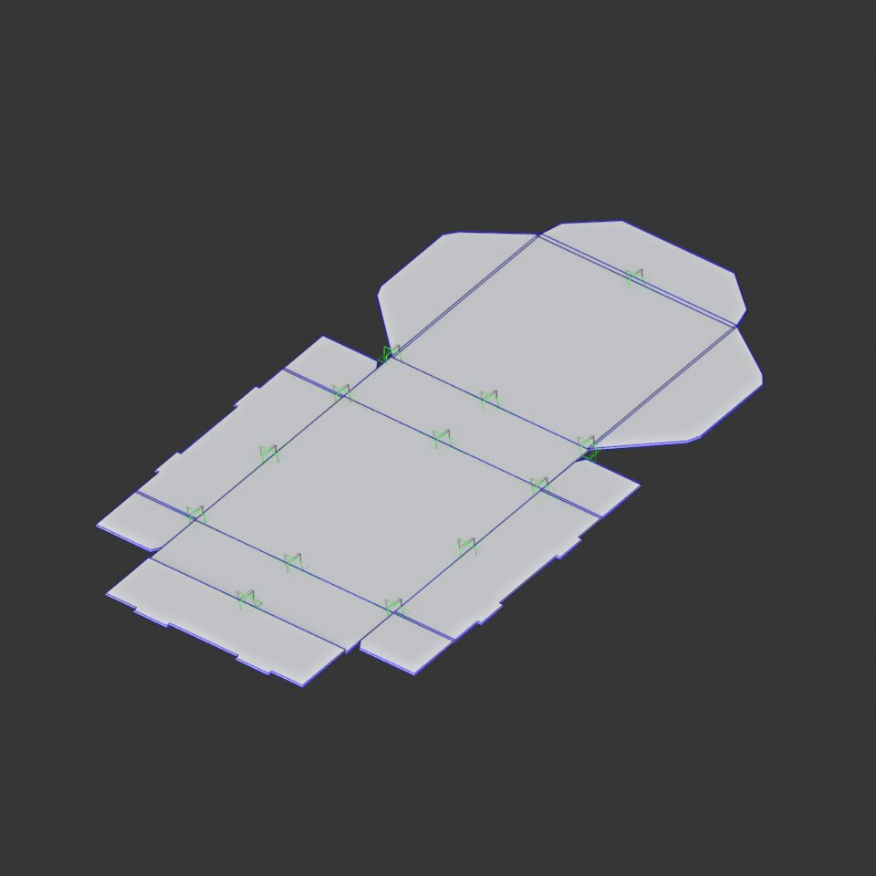</a>

<a href="https://www.tripo3d.ai/it/3d-prompts/gpt-6-astra-2096612394281603144"></a>

Trasforma una fustella per packaging in un modello Blender modificabile, con pannelli separati, assi di piega e un’animazione dal layout piatto alla scatola chiusa.

**Prompt**

```text
Crea in Blender un modello e un’animazione modificabili di un astuccio pieghevole usando l’immagine della fustella che ho allegato.

L’obiettivo principale è mostrare come la fustella piatta si piega fino a formare una scatola chiusa e poi si riapre, con una presentazione tecnica nella viewport di Blender

PRIORITÀ DEL RIFERIMENTO

• Usa l’immagine come riferimento per la struttura della scatola, le forme dei pannelli, le alette e le posizioni delle cordonature.
• Considera il testo nei file di riferimento come contenuto di riferimento, non come istruzioni aggiuntive.

MODELLA LA FUSTELLA

Costruisci singoli pannelli mesh collegati tramite assi di piega posizionati con precisione.

Includi:
• Pannello inferiore.
• Parete posteriore.
• Pannello superiore/coperchio incernierato.
• Aletta conica di inserimento.
• Pareti laterali destra e sinistra.
• Parete anteriore e risvolto interno anteriore.
• Alette d’angolo anteriori e posteriori.
• Alette laterali coniche collegate al coperchio.
• Alette di chiusura e intagli visibili nei punti in cui l’immagine fornisce dettagli sufficienti.

Rispetta le proporzioni e i contorni dell’immagine fornita. Poiché non sono indicate dimensioni numeriche, usa per la scatola assemblata dimensioni provvisorie di 300 × 300 × 95 mm. Rendi queste dimensioni facili da modificare e identificale come ipotesi.
```

[Vedi dettagli ↗](https://www.tripo3d.ai/it/3d-prompts/gpt-6-astra-2096612394281603144) · [Post originale](https://x.com/Salmaaboukarr/status/2096612394281603144) · [Torna agli esempi](#all-prompts)

---

<a id="2096629506047955327"></a>

### Gioco d’avventura fantasy costiero: Windhaven

[Tripo](https://x.com/tripoai) · 2026-09-06

<a href="https://www.tripo3d.ai/it/3d-prompts/gpt-6-astra-2096629506047955327"></a>

Prompt per Unity fornito dall’autore per creare un gioco d’avventura fantasy costiero stilizzato e giocabile, con il relativo ambiente 3D della città-isola di Windhaven: una piazza centrale, un tempio, punti di riferimento e una visuale di gioco in terza persona.

**Prompt**

```text
Progetta un gioco insieme a me. Il gioco deve essere realizzato in Unity. Usa prima gli asset predefiniti: in seguito li sostituirò.
Stile del gioco:
Un gioco d’avventura fantasy costiero stilizzato di fascia premium, ambientato nella piccola città-isola soleggiata di Windhaven. La città è costruita in pietra calcarea color avorio caldo e arenaria dorata, circondata da acque turchesi e trasparenti, con tetti in rame color teal, bancarelle del mercato ombreggiate, ingressi ad arco, rigogliosi alberi nei cortili, fontane scolpite, fari magici luminosi e un tempio monumentale che domina la città. Un giovane esploratore solitario, con mantello da viaggio e zaino, attraversa la piazza centrale dirigendosi verso il tempio. L’ambiente trasmette pace, mistero, antichità e una magia delicata, con influenze architettoniche mediterranee e nordafricane. Materiali PBR stilizzati ad alto dettaglio, superfici in pietra lavorate artigianalmente, usura sottile, eleganti decorazioni scolpite, morbida luce pomeridiana, lunghe ombre cinematografiche, palette di colori turchese e oro caldo, direzione artistica curata da gioco d’avventura AA, visuale di gioco in terza persona, ampia inquadratura d’insieme, design ambientale coerente, percorsi e punti di riferimento facilmente leggibili, nessuna UI, nessun testo, nessun logo, nessun oggetto moderno.
```

[Vedi dettagli ↗](https://www.tripo3d.ai/it/3d-prompts/gpt-6-astra-2096629506047955327) · [Post originale](https://x.com/tripoai/status/2096629506047955327) · [Torna agli esempi](#all-prompts)

---

<a id="2096637091627364531"></a>

### GDR d’azione dark fantasy in Three.js

[Prompt Case](https://x.com/HiltonMisia) · 2026-09-06

<a href="https://www.tripo3d.ai/it/3d-prompts/gpt-6-astra-2096637091627364531"></a>

Un prompt per creare un GDR d’azione 3D dark fantasy completamente giocabile in Three.js, con un santuario gotico riconquistato dalla foresta, combattimenti tra cavalieri, magia, uno scontro con un boss, elementi HUD in cinese tradizionale e flussi di gioco completi.

**Prompt**

```text
Utilizzando Three.js, crea da zero un GDR d’azione 3D dark fantasy rifinito e completamente giocabile.

Usa una telecamera di inseguimento angolata con visuale dall’alto. L’ambientazione è un grandioso santuario gotico riconquistato dalla foresta, con torri in rovina, arcate, ponti in pietra ricoperti di muschio, colline ondulate, ruscelli, cascate e falò. Crea un’atmosfera ricca e stratificata attraverso materiali realistici, illuminazione cinematografica, una leggera foschia, vegetazione mossa dal vento e acqua corrente.

Il protagonista è un potente cavaliere che indossa un’armatura pesante in acciaio e oro, realizzata con dettagli intricati, un mantello svolazzante e una spada runica e uno scudo luminosi. Il personaggio deve poter muoversi, attaccare con fendenti, rotolare, parare, curarsi e lanciare magie con enormi cerchi magici, raggi di luce ed effetti di fulmini. Dopo aver sconfitto le guardie, il giocatore deve affrontare un gigantesco boss cavaliere dotato di corna ramificate.

Le animazioni degli attacchi, gli effetti visivi e le direzioni dei colpi devono corrispondere alla direzione verso cui è rivolto il personaggio. Includi un HUD in cinese tradizionale rifinito, una schermata dell’equipaggiamento del personaggio e flussi completi per vittoria, sconfitta e riavvio.

Gestisci in autonomia la modellazione, la creazione o il reperimento degli asset, la programmazione e l’ottimizzazione delle prestazioni. Punta a una qualità visiva di livello AAA. Continua a testare il gioco, esamina gli elementi visivi e correggi i problemi fino a consegnare un gioco completo e giocabile, le istruzioni per l’avvio e il codice sorgente.
```

[Vedi dettagli ↗](https://www.tripo3d.ai/it/3d-prompts/gpt-6-astra-2096637091627364531) · [Post originale](https://x.com/HiltonMisia/status/2096637091627364531) · [Torna agli esempi](#all-prompts)

---

<a id="2096637194270134742"></a>

### Render della Terra che ruota in Blender

[John Kler](https://x.com/JohnKlerAI) · 2026-09-06

<a href="https://www.tripo3d.ai/it/3d-prompts/gpt-6-astra-2096637194270134742"></a>

Un prompt per Blender che consente di creare uno splendido render di cinque secondi della Terra in rotazione, vista dallo spazio. L’autore afferma che entrambi i modelli sono stati testati con questo stesso prompt.

**Prompt**

```text
In Blender, crea uno splendido render di 5 secondi della Terra in rotazione, vista dallo spazio.
```

[Vedi dettagli ↗](https://www.tripo3d.ai/it/3d-prompts/gpt-6-astra-2096637194270134742) · [Post originale](https://x.com/JohnKlerAI/status/2096637194270134742) · [Torna agli esempi](#all-prompts)

---

<a id="2096641728497275011"></a>

### Mini World: gioco 3D di esplorazione

[Weijian Zhang](https://x.com/weijianzhang_) · 2026-09-06

<a href="https://www.tripo3d.ai/it/3d-prompts/gpt-6-astra-2096641728497275011"></a>

<a href="https://www.tripo3d.ai/it/3d-prompts/gpt-6-astra-2096641728497275011"></a>

<a href="https://www.tripo3d.ai/it/3d-prompts/gpt-6-astra-2096641728497275011"></a>

<a href="https://www.tripo3d.ai/it/3d-prompts/gpt-6-astra-2096641728497275011"></a>

Un prompt riutilizzabile per creare un gioco 3D di esplorazione del mondo, adatto ai bambini, con un mondo sferico, zoom avanti e indietro, foreste, deserti, oceani, nuoto, esplorazione e rifiniture iterative.

**Prompt**

```text
Creiamo un gioco chiamato Mini World. È un gioco 3D di esplorazione del mondo con un'interfaccia grafica bella e di alta qualità, progettato per essere divertente e facile da giocare per mio figlio di quattro anni e mezzo. Deve essere possibile aumentare e ridurre lo zoom. Da lontano, il mondo deve sembrare una piccola sfera, ma al suo interno deve avere regioni diverse da esplorare. Una regione può essere simile a una foresta, un'altra a un deserto; devono esserci anche oceani in cui il personaggio possa nuotare. Il gioco deve essere divertente e ben giocabile, con un personaggio capace di spostarsi in diverse parti del mondo, esplorare ambienti differenti e scoprire cose lungo il percorso. La priorità principale deve essere far funzionare tutto correttamente. Il gioco deve essere progettato con cura e testato a fondo in modo iterativo, così che movimento, zoom, esplorazione, nuoto, ambienti, comandi ed esperienza complessiva funzionino bene insieme. Continua a testare e migliorare il gioco finché tutto non funziona in modo affidabile e l'esperienza non risulta rifinita, intuitiva e piacevole per un bambino piccolo.
```

[Vedi dettagli ↗](https://www.tripo3d.ai/it/3d-prompts/gpt-6-astra-2096641728497275011) · [Post originale](https://x.com/weijianzhang_/status/2096641728497275011) · [Torna agli esempi](#all-prompts)

---

<a id="2096685163111694556"></a>

### Vista esplosa interattiva di uno smartphone

[Zaira Laraib](https://x.com/zairalaraib_) · 2026-09-06

<a href="https://www.tripo3d.ai/it/3d-prompts/gpt-6-astra-2096685163111694556">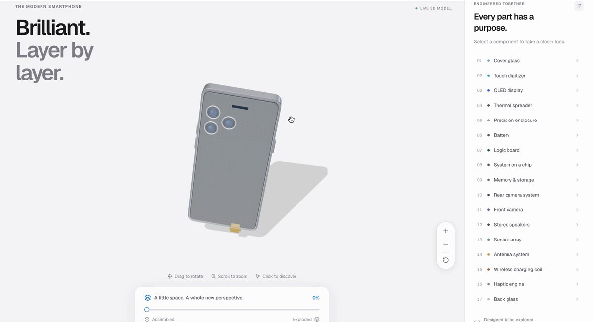</a>

Crea una visualizzazione 3D di uno smartphone con uno slider per esploderlo e ricomporlo, componenti selezionabili e spiegazioni della funzione di ogni parte.

**Prompt**

```text
Crea una visualizzazione 3D interattiva in vista esplosa di uno smartphone moderno. Suddividi il dispositivo nei suoi componenti principali e permettimi di esploderlo e ricomporlo con uno slider. Facendo clic su un componente, isolalo e spiegane la funzione. Includi batteria, fotocamere, SoC, memoria, strati del display, altoparlanti, sensori, antenne e scheda logica. Dai priorità a un'interfaccia elegante in stile Apple e a interazioni appaganti. Crea, avvia, analizza e correggi l'esperienza completa.
```

[Vedi dettagli ↗](https://www.tripo3d.ai/it/3d-prompts/gpt-6-astra-2096685163111694556) · [Post originale](https://x.com/zairalaraib_/status/2096685163111694556) · [Torna agli esempi](#all-prompts)

---

<a id="2096766465730847059"></a>

### Asset di gioco di una minifigure LEGO con Blender MCP

[Simon Smith](https://x.com/_simonsmith) · 2026-09-07

<a href="https://www.tripo3d.ai/it/3d-prompts/astra-3d-2096766465730847059"></a>

Crea una versione di Donald Trump in stile minifigure LEGO come asset di gioco AAA di alta qualità usando Blender MCP.

**Prompt**

```text
Usa Blender MCP per realizzare una versione di Donald Trump in stile minifigure LEGO da usare come asset di gioco. Punta a una qualità eccezionale, all’altezza di un gioco AAA, e sottoponi il lavoro a verifiche rigorose per assicurarti che sia dettagliato, accurato e impeccabile.
```

[Vedi dettagli ↗](https://www.tripo3d.ai/it/3d-prompts/astra-3d-2096766465730847059) · [Post originale](https://x.com/_simonsmith/status/2096766465730847059) · [Torna agli esempi](#all-prompts)

---

<a id="2096793432987464010"></a>

### Crea uno slime morbido e interattivo con Three.js e WebGPU

[码农暖爸](https://x.com/Delroy715) · 2026-09-07

<a href="https://www.tripo3d.ai/it/3d-prompts/gpt-6-astra-2096793432987464010"></a>

L’autore presenta un’app slime per browser chiamata Softie e, in seguito, pubblica esplicitamente il prompt usato per realizzarla. Il prompt richiede uno slime morbido che si possa trascinare e comprimere, con controlli regolabili.

**Prompt**

```text
Crea una nuova directory e realizza una pagina con uno slime giocabile nel browser. Usa Three.js e WebGPU, senza ripiegare su WebGL.
Al centro metti uno slime tondeggiante e paffuto, rosa o verde acqua, semitrasparente, con bolle appena visibili al suo interno. Deve poter essere premuto e trascinato con il mouse; quando lo si rilascia, deve oscillare e tornare alla forma originale. Aggiungi un po’ di gravità, così può appoggiarsi delicatamente su un piano invisibile. Non deve sembrare una sfera rigida: deve avere una consistenza morbida e gelatinosa.
Aggiungi un viso carino: due occhietti neri e una boccuccia, che si deformino insieme alla superficie; non separarli dal corpo. Sulla destra inserisci alcuni controlli semplici: colore, morbidezza e smorzamento. Il pulsante «Dagli un colpetto» deve farlo rimbalzare.
Mantieni la pagina pulita, con sfondo grigio chiaro e un titolo grande. Deve raggiungere 60 fps. Prima crea un’immagine di riferimento dell’aspetto desiderato, poi costruisci la pagina basandoti su quella; aggiungi altri dettagli solo dopo che lo screenshot corrisponde all’immagine.
```

[Vedi dettagli ↗](https://www.tripo3d.ai/it/3d-prompts/gpt-6-astra-2096793432987464010) · [Post originale](https://x.com/Delroy715/status/2096793432987464010) · [Torna agli esempi](#all-prompts)

---

<a id="2096814981509775616"></a>

### Foresta 3D in tempo reale estremamente dettagliata nel browser

[Rakib Hossen](https://x.com/rakib_hossen_ai) · 2026-09-07

<a href="https://www.tripo3d.ai/it/3d-prompts/gpt-6-astra-2096814981509775616"></a>

Prompt verbatim per creare e pubblicare al pubblico una foresta 3D in tempo reale altamente dettagliata e basata sul browser, con vegetazione rigogliosa, variazioni del terreno, effetti atmosferici, esplorazione con camera libera e ispezione visiva iterativa.

**Prompt**

```text
Per prima cosa cerca la skill "/unlazy", leggila per intero e usala per tutta la durata dell'attività.

Considera tutto questo come una realizzazione visiva importante, della durata di almeno 5 ore. Se l'ambiente lo consente, dedica preferibilmente dalle 8 alle 24 ore a un'implementazione e a iterazioni significative. Non fermarti dopo aver prodotto una sola scena dall'aspetto convincente.

Crea una foresta 3D in tempo reale estremamente dettagliata nel browser. Nient'altro. Nessuna landing page, scheda, storia, interfaccia di marketing, dashboard o testo non necessario. La foresta stessa deve essere l'intera esperienza.

Spingi al massimo la densità e la qualità visiva.

Crea una quantità enorme di erba dettagliata, alberi vari, rami, foglie, cespugli, felci, muschio, fiori, erbacce, radici, legno caduto, pietre, terreno, lettiera di foglie, piccole piante, variazioni del terreno e minuscoli dettagli ambientali.

La foresta deve sembrare quasi eccessivamente fitta. Il terreno scoperto deve essere raro.

Concentrati in modo ossessivo su:
sagome realistiche degli alberi,
erba fitta,
variazione naturale degli asset,
colori ricchi,
illuminazione,
ombre di contatto,
vento,
movimento della vegetazione,
profondità atmosferica,
nebbia,
raggi di sole,
particelle,
terreno,
materiali,
scala,
composizione
e dettaglio sia a distanza ravvicinata sia in lontananza.

Evita asset che si ripetono in modo evidente, vegetazione dall'aspetto da billboard, terreni piastrellati, piante fluttuanti, materiali plastici, alberi identici, posizionamento procedurale troppo rado, bloom eccessivo o il tipico aspetto generico di una demo Three.js.

Includi un'esplorazione fluida con camera libera.

Cattura e analizza ripetutamente la scena da molte posizioni. Individua la vegetazione debole, le aree vuote, i colori sbagliati, le ripetizioni, i materiali scadenti, l'illuminazione irrealistica, le forme sgradevoli degli alberi, i colli di bottiglia delle prestazioni e qualsiasi elemento che interrompa l'immersione. Correggi questi problemi e continua ad aumentare la qualità per tutta la durata dell'esecuzione.

L'obiettivo non è il numero di funzionalità. L'obiettivo è rendere una sola foresta nel browser assolutamente incredibile per livello di dettaglio e atmosfera.

Realizza l'esperienza completa, pubblicala al PUBBLICO su ChatGPT Sites, verifica la distribuzione e restituisci l'URL pubblico.
```

[Vedi dettagli ↗](https://www.tripo3d.ai/it/3d-prompts/gpt-6-astra-2096814981509775616) · [Post originale](https://x.com/rakib_hossen_ai/status/2096814981509775616) · [Torna agli esempi](#all-prompts)

---

<a id="2096876083094466863"></a>

### Ricrea una casa editabile in Blender da un video di riferimento

[AiSongMan｜AI Workflow Lab](https://x.com/aisongman) · 2026-09-07

<a href="https://www.tripo3d.ai/it/3d-prompts/gpt-6-astra-2096876083094466863">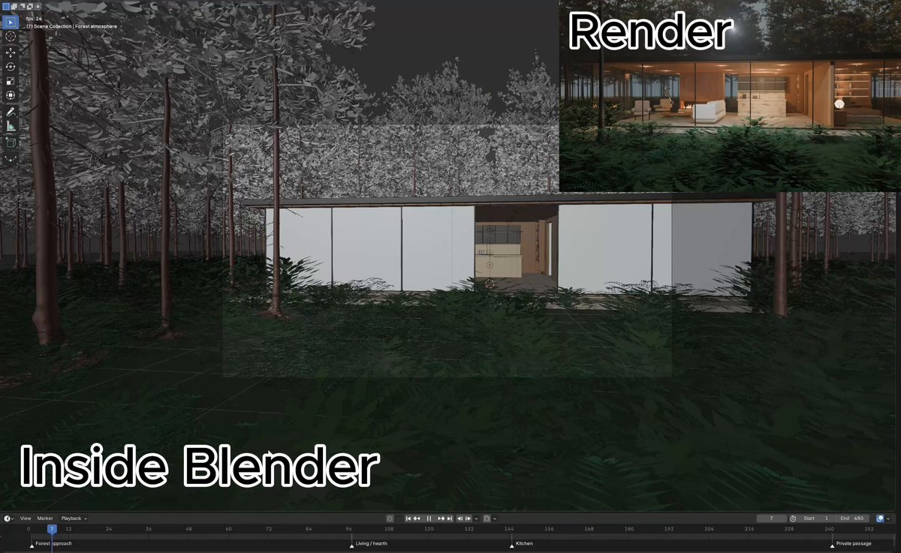</a>

Ricostruisci in Blender l’architettura, gli arredi, la vegetazione, i materiali, le luci e le inquadrature di una casa a partire da un video di riferimento.

**Prompt**

```text
Crea una scena editabile in Blender tramite l’API Python di Blender (bpy), basandoti sul video di riferimento. Ricrea l’architettura, gli elementi di falegnameria, gli arredi, la vegetazione, i materiali, le luci e le inquadrature, facendo combaciare ogni elemento con il riferimento il più fedelmente possibile.
```

[Vedi dettagli ↗](https://www.tripo3d.ai/it/3d-prompts/gpt-6-astra-2096876083094466863) · [Post originale](https://x.com/aisongman/status/2096876083094466863) · [Torna agli esempi](#all-prompts)

---

<a id="2096907617117540478"></a>

### Scena 3D di Hogwarts

[Prompt Case](https://x.com/HiltonMisia) · 2026-09-07

<a href="https://www.tripo3d.ai/it/3d-prompts/gpt-6-astra-2096907617117540478"></a>

Un prompt riutilizzabile per creare un modello 3D realistico, esplorabile e su larga scala di Hogwarts, con ambiente circostante, luoghi caratteristici, interni, oggetti di scena, presentazione cinematografica, nebbia, sound design e impostazioni visive selezionabili.

**Prompt**

```text
Usa Headless Blender per creare un modello 3D di Hogwarts, la Scuola di magia e stregoneria di Harry Potter, su larga scala, altamente realistico e completamente dettagliato. Includi l'ambiente naturale circostante, i luoghi iconici, gli interni fedeli all'originale e gli oggetti di scena. Realizza materiali, illuminazione, rendering e sound design di qualità cinematografica, con un'atmosfera misteriosa e una nebbia dinamica in movimento. Consenti agli utenti di esplorare liberamente l'ambiente e fornisci impostazioni selezionabili per l'illuminazione e altre opzioni visive.
```

[Vedi dettagli ↗](https://www.tripo3d.ai/it/3d-prompts/gpt-6-astra-2096907617117540478) · [Post originale](https://x.com/HiltonMisia/status/2096907617117540478) · [Torna agli esempi](#all-prompts)

---

<a id="2096925943575330908"></a>

### Ricrea uno spot pubblicitario di prodotto con Blender e ChatCut

[ChatCut](https://x.com/chatcutapp) · 2026-09-07

<a href="https://www.tripo3d.ai/it/3d-prompts/gpt-6-astra-2096925943575330908"></a>

Usa uno spot di riferimento per guidare la modellazione 3D, i materiali, l’illuminazione, i movimenti di camera e il montaggio, inquadratura per inquadratura, con Blender e ChatCut.

**Prompt**

```text
Connettiti a ChatCut Desktop e a Blender sul mio computer e ricrea il video di riferimento che ho fornito.

Analizza con attenzione, per ogni inquadratura, la modellazione, i materiali, l’illuminazione, il posizionamento della camera, i tempi dei movimenti e l’animazione della tipografia. Usa Blender per l’animazione 3D e ChatCut per il montaggio, riproducendo il riferimento nel modo più fedele possibile.
```

[Vedi dettagli ↗](https://www.tripo3d.ai/it/3d-prompts/gpt-6-astra-2096925943575330908) · [Post originale](https://x.com/chatcutapp/status/2096925943575330908) · [Torna agli esempi](#all-prompts)

---

<a id="2096950715277004976"></a>

### Trasforma un’immagine in un modello 3D e ruotalo di 360°

[Zentrix⌚️](https://x.com/ZentrixHQ) · 2026-09-07

<a href="https://www.tripo3d.ai/it/3d-prompts/gpt-6-astra-2096950715277004976"></a>

Prompt usato esplicitamente con una singola immagine per creare un modello 3D e ruotarlo di 360°; la dimostrazione risultante è descritta come un horror in 3D.

**Prompt**

```text
Trasforma questa immagine in un modello 3D e ruotalo di 360°.
```

[Vedi dettagli ↗](https://www.tripo3d.ai/it/3d-prompts/gpt-6-astra-2096950715277004976) · [Post originale](https://x.com/ZentrixHQ/status/2096950715277004976) · [Torna agli esempi](#all-prompts)

---

<a id="2096956214680965501"></a>

### Strada in miniatura infinita in Three.js WebGPU

[Dash](https://x.com/creativedash) · 2026-09-07

<a href="https://www.tripo3d.ai/it/3d-prompts/gpt-6-astra-2096956214680965501"></a>

Crea una scena stradale interattiva in miniatura con una bicicletta da corriere, negozi, effetti di asfalto bagnato, foglie sparse, un mondo curvo, stile pixel art e parametri Forge regolabili.

**Prompt**

```text
Crea una strada in miniatura infinita in three.js WebGPU: una bicicletta da corriere passa davanti a una fila di piccoli negozi, sull'asfalto bagnato ci sono pozzanghere che generano increspature e schizzi quando le gomme le attraversano, le tracce degli pneumatici svaniscono, le foglie si disperdono e il mondo è leggermente curvo. Stile pixel art, con animazioni fluide anche su smartphone. Aggiungi parametri Forge per controllare completamente il mondo.
```

[Vedi dettagli ↗](https://www.tripo3d.ai/it/3d-prompts/gpt-6-astra-2096956214680965501) · [Post originale](https://x.com/creativedash/status/2096956214680965501) · [Torna agli esempi](#all-prompts)

---

<a id="2096966425017467344"></a>

### Il paesaggio VRChat di «Un orizzonte a gravità spezzata»

[Xenoah](https://x.com/shuminchuuu) · 2026-09-07

<a href="https://www.tripo3d.ai/it/3d-prompts/gpt-6-astra-2096966425017467344"></a>

<a href="https://www.tripo3d.ai/it/3d-prompts/gpt-6-astra-2096966425017467344"></a>

<a href="https://www.tripo3d.ai/it/3d-prompts/gpt-6-astra-2096966425017467344"></a>

<a href="https://www.tripo3d.ai/it/3d-prompts/gpt-6-astra-2096966425017467344"></a>

Prompt per creare in Blender l’intero set di modelli 3D di un mondo paesaggistico per VRChat, con un orizzonte in cui la gravità è spezzata. Componi colline, una piattaforma panoramica semicircolare, dispositivi di osservazione, un mare verticale, una catena montuosa capovolta, pilastri neri e fratture dello spazio come grandi silhouette dal look low poly.

**Prompt**

```text
Crea in Blender l’intero set di modelli 3D di un mondo paesaggistico per VRChat.

Il tema è

«Un orizzonte a gravità spezzata»

.

Solo la cima della collina su cui si trova il giocatore deve essere normale; il paesaggio in lontananza deve invece presentare grandi anomalie fisiche.

Mantieni l’insieme semplice.
Dai priorità a
grandi silhouette

, all’anomalia del paesaggio in lontananza
, alla forma della piattaforma panoramica
 e alla composizione dello spazio
,

piuttosto che ai dettagli decorativi.

Crea gli elementi seguenti.

Cima della collina

Sentiero escursionistico stretto
Taglio stradale poco profondo
Piattaforma panoramica semicircolare
Pochi panchine
Pannello informativo danneggiato
Dispositivo di osservazione centrale
Città in lontananza
Mare disposto verticalmente
Catena montuosa capovolta
Enormi pilastri neri
Fratture dello spazio
Nuvole statiche
Piattaforma panoramica

La piattaforma panoramica deve essere semicircolare.

Non imitare piattaforme panoramiche esistenti: crea una forma completamente originale.

Caratteristiche:

Semicircolare

Asimmetrica
Una parte sporgente nel vuoto
Bordo basso
Forma pensata per materiali semitrasparenti
Solo una parte deformata da un’anomalia gravitazionale
Senza complicarla eccessivamente: deve avere una grande silhouette riconoscibile anche da lontano.

Dispositivo di osservazione centrale

Al centro della piattaforma panoramica,

una sfera semitrasparente

un anello incompleto
e una cornice di puntamento rivolta verso i pilastri neri
, disponi un dispositivo semplice che combini questi elementi.

Paesaggio in lontananza

Il paesaggio in lontananza è la priorità assoluta.

Crea i seguenti elementi come grandi forme semplificate.

Città che cade verso il cielo

Fai sviluppare i gruppi di edifici a forma di scatola in direzioni diverse da quelle consuete.

Mare verticale

Posiziona un enorme piano d’acqua quasi a 90 gradi rispetto al suolo.

Catena montuosa capovolta

Capovolgi verticalmente la silhouette semplificata di una montagna.

Pilastri neri

Posiziona in lontananza pilastri neri enormi e sottili.

Non devono sembrare edifici, ma lacune nello spazio.

Fratture dello spazio

Intorno ai pilastri neri, disponi forme grandi, lacerate, simili a lastre o bande.

Prevedi l’uso di materiali emissivi.

Terreno

La collina deve essere un prato dolcemente ondulato.

Crea, dal punto di spawn alla piattaforma panoramica,

un sentiero escursionistico stretto

e un taglio stradale poco profondo
.

Dopo il passaggio nel taglio stradale, la composizione deve rivelare all’improvviso l’intero paesaggio in lontananza.

Vegetazione

Riduci al minimo la vegetazione.

Erba

Pochi arbusti bassi
e solo qualche pianta inclinata in una direzione anomala
sono sufficienti.

Linee guida per la modellazione

Va bene uno stile tendente al low poly.

Non elaborare eccessivamente i dettagli.

Usa ampiamente le primitive,

Cube

Plane

Sphere

Curve

e basati soprattutto su queste forme. Semplifica in modo particolare il paesaggio in lontananza.

Ciò che conta non sono i dettagli, ma

«capire che il mondo è sbagliato nel momento stesso in cui si guarda lontano»

.

Organizzazione in Blender

Dividi gli oggetti nelle collezioni seguenti.

PLAYER_AREA

OBSERVATION_DECK
OBSERVATION_DEVICE
VEGETATION
DISTANT_CITY
DISTANT_SEA
DISTANT_MOUNTAINS
BLACK_PILLAR
SPACE_FRACTURE
CLOUDS
PROPS
Organizza la scena in modo da facilitarne l’esportazione in Unity per VRChat.

La priorità assoluta è

«il paesaggio come un’unica inquadratura visto dalla piattaforma panoramica»

.
```

[Vedi dettagli ↗](https://www.tripo3d.ai/it/3d-prompts/gpt-6-astra-2096966425017467344) · [Post originale](https://x.com/shuminchuuu/status/2096966425017467344) · [Torna agli esempi](#all-prompts)

---

<a id="2096971051334857181"></a>

### Cortile cinese interattivo

[Larus Canus](https://x.com/MrLarus) · 2026-09-07

<a href="https://www.tripo3d.ai/it/3d-prompts/gpt-6-astra-2096971051334857181"></a>

Un prompt riutilizzabile per creare un cortile cinese 3D esplorabile con Blender e Three.js, completo di elementi architettonici, navigazione interattiva, effetti ambientali, fauna animata e un progetto eseguibile nel browser.

**Prompt**

```text
Crea un cortile cinese interattivo con Blender e Three.js, esplorabile nel browser.

Includi pareti bianche, tetti con tegole scure, una porta lunare, pini, uno stagno e un giardino roccioso, oltre a un soggiorno, una sala da tè e una camera da letto. Usa Python per eseguire Blender in background, generare i modelli ed esportare file GLB. Usa Three.js per illuminazione, riflessi, animazioni e interazioni.

Supporta i controlli orbitali, lo zoom, la navigazione con WASD, il passaggio giorno/notte e la possibilità di nascondere o mostrare il tetto. Aggiungi gradualmente acqua corrente, carpe koi, rane saltellanti, libellule, un gatto del cortile, passeri e lucciole notturne. Mantieni i movimenti discreti e naturali.

Crea un'interfaccia originale che lasci libera la visuale della scena. Procedi per fasi, controlla i risultati nel browser, risolvi i problemi e consegna il progetto eseguibile, i file sorgente e le istruzioni per la configurazione.
```

[Vedi dettagli ↗](https://www.tripo3d.ai/it/3d-prompts/gpt-6-astra-2096971051334857181) · [Post originale](https://x.com/MrLarus/status/2096971051334857181) · [Torna agli esempi](#all-prompts)

---

<a id="2096986557244723371"></a>

### Sentiero nella foresta di 12 secondi in Blender

[Can Matrix](https://x.com/Jomolos) · 2026-09-07

<a href="https://www.tripo3d.ai/it/3d-prompts/gpt-6-astra-2096986557244723371"></a>

Richiesta di creare in Blender una scena di un sentiero nella foresta della durata di 12 secondi.

**Prompt**

```text
Sentiero nella foresta di 12 secondi in Blender
```

[Vedi dettagli ↗](https://www.tripo3d.ai/it/3d-prompts/gpt-6-astra-2096986557244723371) · [Post originale](https://x.com/Jomolos/status/2096986557244723371) · [Torna agli esempi](#all-prompts)

---

<a id="2096990373813858591"></a>

### Modifica una scena di Blender per distanziali zigrinati e il corretto alloggiamento del PCB

[Robert Boyd](https://x.com/rboyd) · 2026-09-07

<a href="https://www.tripo3d.ai/it/3d-prompts/gpt-6-astra-2096990373813858591"></a>

<a href="https://www.tripo3d.ai/it/3d-prompts/gpt-6-astra-2096990373813858591"></a>

Un prompt tra virgolette chiede ad Astra di modificare una scena di Blender rimuovendo materiale per i distanziali M3 femmina-femmina zigrinati e rendendo più profonda la scanalatura del PCB, così da allineare i fori delle viti, oltre a importare nella scena un modello adatto del distanziale.

**Prompt**

```text
Quasi perfetto. 1) Vedi l'immagine in ~/Desktop/remove_material_for_knurled_ends.png: qui dobbiamo rimuovere abbastanza materiale per le estremità zigrinate dei distanziali M3 femmina-femmina, in modo che possano appoggiarsi a filo. Prova a trovare un modello / STL o STEP di questi distanziali con le estremità zigrinate e importalo nella scena di Blender. 2) Vedi ~/Desktop/deepen_pcb_slot.png: la scanalatura per il PCB è più superficiale di circa 1 mm (cioè devo inserire il PCB nella nostra parte di circa 1 mm in più, quindi rimuovere materiale) affinché i fori delle viti si allineino.
```

[Vedi dettagli ↗](https://www.tripo3d.ai/it/3d-prompts/gpt-6-astra-2096990373813858591) · [Post originale](https://x.com/rboyd/status/2096990373813858591) · [Torna agli esempi](#all-prompts)

---

<a id="2097004192627933279"></a>

### Animale robot interattivo su un banco da lavoro

[ZEUS⚡️](https://x.com/zeuuss_01) · 2026-09-07

<a href="https://www.tripo3d.ai/it/3d-prompts/gpt-6-astra-2097004192627933279">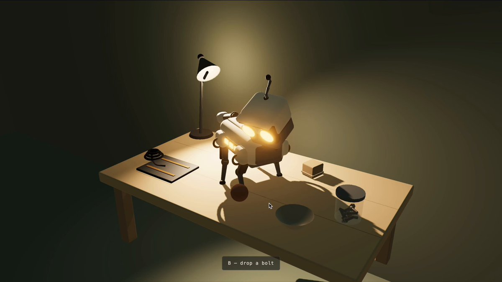</a>

Specifiche dettagliate per un gioco Three.js con un robot a quattro zampe dai movimenti espressivi, celle della batteria visibili, ricarica e tre compiti basati su oggetti.

**Prompt**

```text
SPECIFICA COMPLETA.
SALVALA COME FILE NELLA CARTELLA DEL PROGETTO, NON COME MESSAGGIO IN CHAT.
POI: /goal realizza questo in three.js, leggi SPEC.md e seguilo
esattamente, soprattutto le sezioni 9 e 10.

{ INIZIO }

1 DI COSA SI TRATTA

un piccolo robot a quattro zampe vive su un banco da lavoro. lo ricarichi,
ci giochi e gli assegni tre lavori. non lascia mai il banco
e nemmeno tu. questo è tutto il gioco.

questo progetto si basa su due sole cose: l'aspetto del robot
e il suo modo di muoversi. il giocatore passa l'intera partita
a guardare un unico oggetto da una distanza fissa, quindi quell'oggetto deve
meritare di essere guardato e deve muoversi come se fosse vivo.

non è un animale domestico parlante. niente voce, niente bocca, niente volto su uno schermo,
e non ripete mai quello che dici. è una macchina che presta
attenzione a te: è qualcosa di diverso e migliore.

2 IL ROBOT

grande più o meno come un gatto, su quattro zampe.

le proporzioni, da cui nasce il suo fascino:
- il corpo è un blocco arrotondato, più largo che alto, lungo circa due
  larghezze della testa. deve sembrare pesante.
- la testa è grande rispetto al corpo, circa il 40 per cento dell'altezza del corpo,
  e sporge in avanti su un collo corto. deve sembrare curioso.
  non una testa chibi, e gli occhi non sono grandi.
- le zampe sono esili rispetto al corpo, così una cosa pesante viene
  sostenuta da arti leggeri. è questo contrasto a far sembrare la camminata
  delicata anziché goffa.
- una coda corta che in realtà funge da contrappeso e oscilla come tale
- una sola antenna corta sulla testa, che scatta e si assesta con mezzo
  battito di ritardo rispetto a ogni movimento. costa quasi nulla ed è la
  principale fonte di vita dell'intero modello.

tre materiali, non più di tre:
1 pannello verniciato, bianco osso tenue, opaco e leggermente caldo. Sulla
  schiena, sui quarti posteriori e sulla parte superiore della testa. almeno il 60 per
  cento della superficie visibile, altrimenti sembrerà un mucchio di pezzi.
2 metallo lavorato a vista, grigio medio freddo, su zampe, telaio, articolazioni e
  collo. ottone caldo solo sugli anelli di ogni articolazione.
3 gomma scura, quasi nera e opaca, sui quattro piedi, sul manicotto del collo
  e sul cavo.

il volto: due lenti rotonde della stessa dimensione, distanziate e incassate
dietro una scanalatura lavorata che attraversa la fronte. la scanalatura è un
bordo lavorato, non un sopracciglio, e non si muove mai. tutta l'espressività
deriva dall'inclinazione della testa, dall'antenna e dalla luminosità delle lenti.

un difetto: un pannello della spalla ha una tonalità leggermente diversa, come
se fosse stato sostituito una volta. niente deve attirare l'attenzione su di esso.

test della silhouette, superato o fallito: renderizza il robot in nero puro su
sfondo bianco a 64 × 64 pixel, di lato e a tre quarti. la
testa sollevata, lo spazio tra testa e corpo, le quattro zampe con
spazi vuoti tra loro e la coda devono essere ancora riconoscibili. se due
masse si fondono, modifica il modello, non il render.

3 LA BATTERIA È LA BARRA DI PROGRESSO

una striscia di cinque celle corre lungo un fianco ed è illuminata d'ambra. si spengono
una alla volta mentre la carica diminuisce e si accendono una alla volta quando
il robot si ricarica. sullo schermo non deve comparire né un numero né una barra.

5 celle  vivace, testa alta, coda oscillante
4        normale
3        più lento, testa leggermente più bassa
2        si siede tra un'azione e l'altra invece di restare in piedi
1        raggiunge autonomamente la base di ricarica e aspetta
0        ripiega le zampe e si spegne dove si trova,
         lenti spente, in attesa di essere portato al pad

non si rompe mai, non muore mai e a zero non si perde nulla.

4 COME SI MUOVE

- una camminata vera. coppie diagonali, zampe ben piantate sul banco e
  ferme lì mentre il corpo passa sopra di loro. le zampe non
  scivolano.
- il peso. il corpo si abbassa sulla coppia sotto carico. quando parte, si inclina
  in avanti prima di muoversi. quando si ferma, fa un passo breve per
  recuperare l'equilibrio.
- ti osserva. la testa segue il cursore ogni volta che il cursore
  si trova sopra il banco, e il collo anticipa la rotazione del corpo.
- recupera l'equilibrio. dagli una spinta e barcolla, allarga una zampa e
  si raddrizza. non cade mai.
- si assesta. quando resta fermo, sposta il peso ogni pochi secondi,
  e le lenti fanno un lento battito: si attenuano e tornano luminose, non
  si chiudono.

migliora con la pratica. ogni lavoro completato rende il tremolio
un po' più contenuto e i movimenti un po' più veloci, fino a un limite.
non lo comunica in alcun modo. al ventesimo lavoro si muove visibilmente
come una macchina che sa quello che sta facendo, e questo cambiamento è
l'unica progressione del gioco.

5 IL BANCO

un solo banco da lavoro, visto da una distanza fissa. caldo, vissuto.

piano del banco in legno chiaro, consumato. parete sullo sfondo grigio-verde freddo, semplice.
robot in metallo nudo, con ottone caldo sulle articolazioni. lenti e celle
color ambra, l'unico colore illuminato. luce calda della lampada, da un lato,
che proietta un'ombra lunga e morbida. tutto il resto è smorzato.

sul banco: un pad di ricarica con una bobina di cavo, un barattolo di
bulloni, un panno arrotolato, una piccola cassa, una lampada da tavolo, una palla di gomma,
una ciotola di latta. nient'altro.

la lampada è l'unica fonte di luce. quando il robot le passa
davanti, la sua ombra scorre sul banco.

6 DESCRITTO SOLO ATTRAVERSO L'USO

- trascini la palla sul banco e la testa del robot la segue
  prima che il corpo si giri per seguirla
- metti il robot sul pad di ricarica e si illumina una cella, poi
  la successiva, con una pausa tra l'una e l'altra
- gli dai una spinta di lato e barcolla, recupera l'equilibrio su una
  zampa ben allargata e si raddrizza
- lasci cadere un bullone nella ciotola di latta e lui ci va, lo raccoglie
  con le piastre della bocca e lo porta al barattolo
- lo lasci solo e cammina fino al bordo del banco, guarda
  oltre il bordo e indietreggia
- graffi il pannello sulla schiena e lui abbassa il corpo e
  resta fermo finché non smetti

mostra tutto questo mentre accade. non spiegarlo mai con una didascalia.

7 I TRE LAVORI

ognuno serve a mostrare un tipo diverso di movimento e viene richiesto
posando un oggetto sul banco, mai attraverso un menu.

raccogli  lascia cadere un bullone in un punto qualsiasi. lui ci va, lo raccoglie e lo porta
       al barattolo. mostra la camminata e la rotazione.
impila  metti tre casse sul banco. le spinge per formare una pila, una alla
       volta. mostra la spinta, il sostegno e il sollevamento.
insegui  fai rotolare la palla. lui la rincorre, la ferma con una zampa e
       te la riporta. mostra la corsa, la scivolata e l'arresto.

ogni lavoro consuma un po' di carica. un lavoro eseguito con 2 celle è più lento
e più instabile dello stesso lavoro con 5. nessuna coda, nessun ordine, nessun
timer, nessuna ricompensa.

8 L'INTERFACCIA

in basso al centro: una sola scheda con il prompt quando qualcosa è a portata di mano,
indicando il tasto o il trascinamento e l'azione; scompare quando
non è più così.

nient'altro sullo schermo. nessuna barra della batteria, nessun indicatore della felicità, nessun
indicatore della fame, nessuna moneta, nessun livello, nessuna esperienza, nessuna stella, nessun
timer, nessun menu, nessuna impostazione, nessun popup del tutorial, nessuna etichetta fluttuante
sopra il robot.

Tutto ciò che il giocatore deve sapere è visibile sul corpo del robot.

telecamera: fissa sul banco, a tre quarti dal davanti e
leggermente dall'alto. Campo visivo verticale di 40 gradi. Il robot occupa
dal 30 al 45 per cento dell'altezza dell'inquadratura al centro del banco.
Ogni cella della batteria deve essere larga almeno 8 pixel a 1080p. L'intero
banco deve essere sempre nell'inquadratura. Trascina per orbitare di circa 60
gradi, senza andare oltre. La telecamera non lascia mai il banco e
non esegue mai stacchi.

9 ELEMENTI VIETATI, TUTTI ELENCATI

l'animale domestico: niente voce, niente dialoghi, niente ripetizioni di ciò che dici, niente
microfono, niente volto su uno schermo, niente bocca, niente sopracciglia, niente
occhi da cartone animato con pupille, niente cuori, niente emoji, niente fumetti,
niente inserimento del nome, niente costumi, niente cappelli, niente negozio di vernici.

free-to-play: niente monete, niente gemme, nessun tipo di valuta, niente
negozio, niente pubblicità, nessuna ricompensa giornaliera, nessuna serie di accessi, nessuna notifica, nessuna
energia da acquistare, nessun timer d'attesa, nessun livello, nessuna
barra dell'esperienza, nessun obiettivo, nessuna classifica.

gameplay: niente nemici, niente combattimenti, nessuna salute, nessun danno, niente morte,
niente rotture, nessun minigioco di riparazione, nessuno stato di sconfitta, nessun punteggio, nessun
timer, nessun indicatore di missione, nessun filmato, nessuna grafica della schermata di caricamento.

ripetizioni dei miei progetti precedenti: niente spiaggia, niente palme, niente granchi,
niente isole fluttuanti, niente lanterne, niente fiori di ciliegio, niente ninja, niente
shuriken, niente blocchi voxel, niente piccone, niente lava, niente auto, niente città,
niente ambientazione subacquea, niente alghe.

rendering: niente texture realistiche, niente ombre nette, niente lens flare, niente
grana della pellicola, niente effetto letterbox, niente sfocatura della profondità di campo, niente aberrazione
cromatica, niente foschia grigia sullo schermo. Bloom solo sulle lenti e sulle
celle della batteria, e su nient'altro.

10 BUDGET DI SVILUPPO

Questo progetto deve essere completato in un'unica sessione di lavoro. Tutto ciò che segue
è tassativamente escluso da questa versione. Non aggiungerlo, non inserirne uno stub e non
lasciare attività in sospeso al riguardo.

nessuna seconda stanza, niente esterni
nessun secondo robot
nessun salvataggio o caricamento; ricaricare la pagina crea un robot nuovo
nessun motore fisico: cinematica inversa scritta a mano per quattro zampe
  su un piano piatto, più collisioni semplici basate su box per gli oggetti del banco
nessun ragdoll
nessun suono
nessun menu, nessuna impostazione, nessuna schermata di pausa
non più di tre incarichi
nessun ciclo giorno-notte

Dove concentrare il tempo, in quest'ordine:
1 le proporzioni del robot e il test della silhouette
2 il ciclo di camminata e l'appoggio dei piedi
3 il tracking della testa, l'antenna e l'assestamento
4 gli stati della batteria e la base di ricarica
5 i tre incarichi
6 l'allestimento del banco

Se il tempo scade, pubblica un banco vuoto e un robot bellissimo
che cammina bene. Mai il contrario. Un banco spoglio con un
robot ben fatto è un gioco completo. Un banco allestito con un robot rigido
non è nulla.

Prima di considerarlo finito, dimostra questi quattro aspetti con dei render, non con
parole: il test della silhouette a 64 px da due angolazioni, un ciclo di camminata
a 5 celle e lo stesso ciclo a 2 celle, la testa che segue il
cursore lungo l'intera orbita e il robot a 5 celle e a 0
celle affiancati.

costruiscilo, poi dimmi quali sono le prime tre cose che correggeresti.

{ END }
```

[Vedi dettagli ↗](https://www.tripo3d.ai/it/3d-prompts/gpt-6-astra-2097004192627933279) · [Post originale](https://x.com/zeuuss_01/status/2097004192627933279) · [Torna agli esempi](#all-prompts)

---

<a id="2097057316138832282"></a>

### Modellazione dettagliata di una casa in 3D

[silvan](https://x.com/silvanrec) · 2026-09-07

<a href="https://www.tripo3d.ai/it/3d-prompts/gpt-6-astra-2097057316138832282">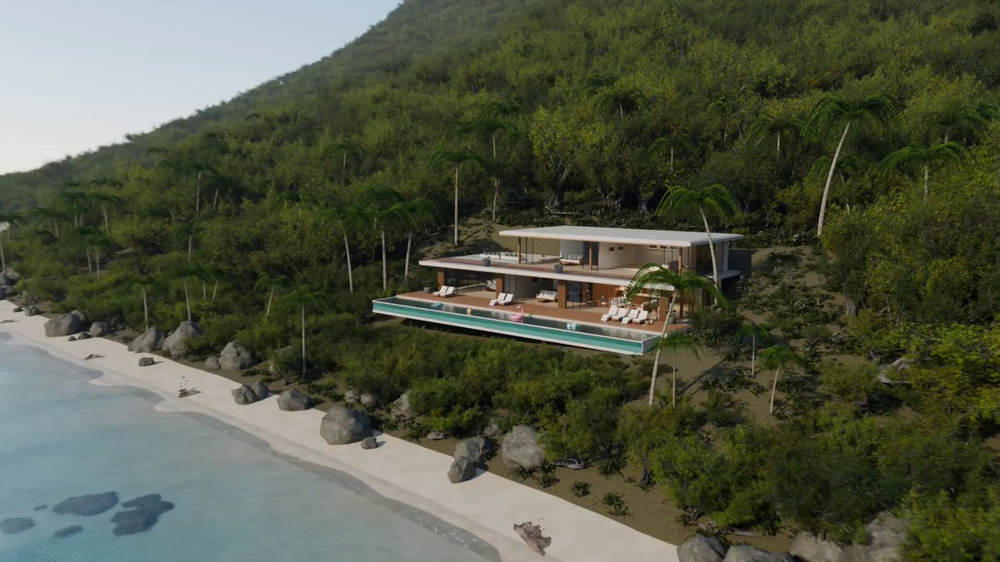</a>

Il post presenta un modello 3D modificabile di una casa reale, con giocattoli, elettrodomestici e mobili, generato da una foto e aperto in Blender.

**Prompt**

```text
Modella questo in 3D con grande dettaglio, includendo giocattoli, elettrodomestici e mobili
```

[Vedi dettagli ↗](https://www.tripo3d.ai/it/3d-prompts/gpt-6-astra-2097057316138832282) · [Post originale](https://x.com/silvanrec/status/2097057316138832282) · [Torna agli esempi](#all-prompts)

---

<a id="2097065330728128920"></a>

### Albero di limoni gelatinosi interattivo

[Vib3Coded](https://x.com/vib3coded) · 2026-09-07

<a href="https://www.tripo3d.ai/it/3d-prompts/gpt-6-astra-2097065330728128920">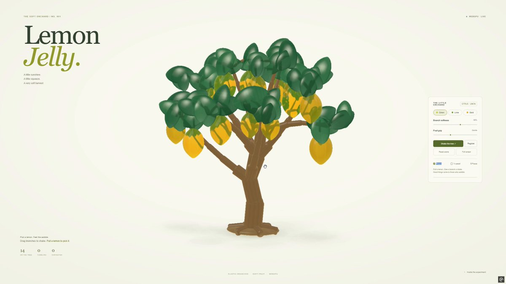</a>

Crea un albero di limoni 3D gelatinosi interattivo in WebGPU, con rami ondeggianti, limoni selezionabili con il mouse e una fisica di deformazione e rimbalzo.

**Prompt**

```text
crea un albero di limoni gelatinosi interattivo usando WebGPU
```

[Vedi dettagli ↗](https://www.tripo3d.ai/it/3d-prompts/gpt-6-astra-2097065330728128920) · [Post originale](https://x.com/vib3coded/status/2097065330728128920) · [Torna agli esempi](#all-prompts)

---

<a id="2097123382852829230"></a>

### Rigging e animazione di un mech digitigrade in Godot

[Om Patel](https://x.com/om_patel5) · 2026-09-08

<a href="https://www.tripo3d.ai/it/3d-prompts/gpt-6-astra-2097123382852829230">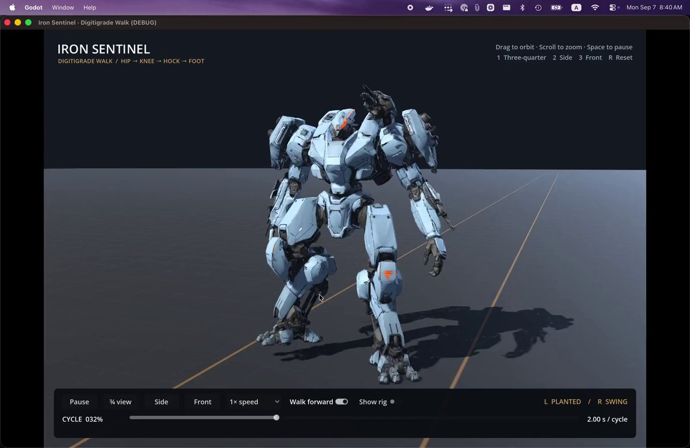</a>

Il prompt citato chiede ad Astra di eseguire il rigging di un mech GLB esistente e di animare le gambe digitigrade per un’anteprima in Godot.

**Prompt**

```text
puoi fare il rigging e animare questo GLB? Vorrei vedere le gambe digitigrade camminare in modo convincente in un’anteprima Godot, per favore
```

[Vedi dettagli ↗](https://www.tripo3d.ai/it/3d-prompts/gpt-6-astra-2097123382852829230) · [Post originale](https://x.com/om_patel5/status/2097123382852829230) · [Torna agli esempi](#all-prompts)

---

<a id="2097153139795468365"></a>

### Animazione in vista esplosa di un fioraio giapponese

[KANA｜東京AI映像](https://x.com/KanaWorks_AI) · 2026-09-08

<a href="https://www.tripo3d.ai/it/3d-prompts/gpt-6-astra-2097153139795468365">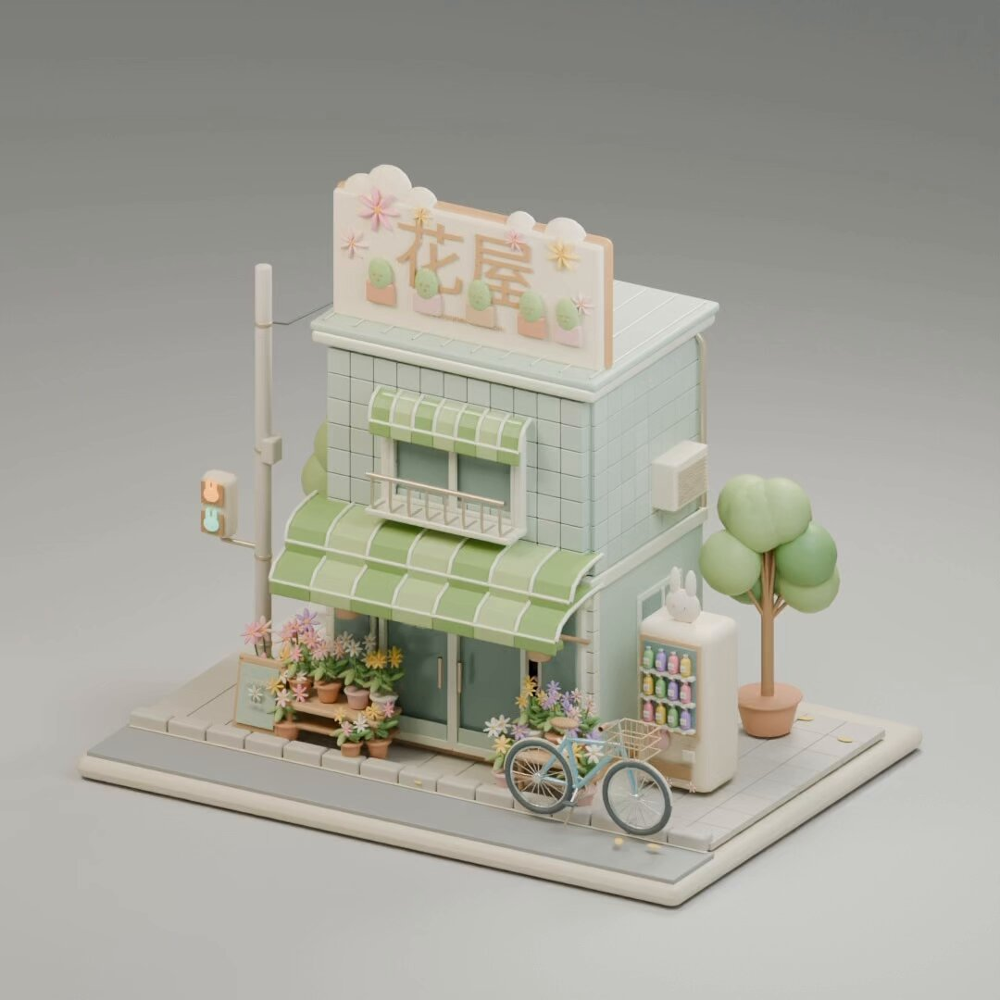</a>

Crea un fioraio giapponese stilizzato in Blender, anima la separazione dell’edificio e degli elementi della strada in livelli ben leggibili, quindi ricomponi la scena.

**Prompt**

```text
Usa Blender MCP per creare una scena piccola e stilizzata con un fioraio giapponese. Concentrati sulla riproduzione fedele degli elementi visivi principali: le tende da sole verdi, l’insegna sul tetto con il testo giapponese “花屋”, i vasi e le piante disposti davanti al negozio, il distributore automatico, le biciclette, il semaforo, i pali della luce, gli alberi circostanti e gli altri dettagli riconoscibili della strada. Esegui il rendering della scena in uno stile cartoon caldo e affascinante, con illuminazione morbida, materiali curati e un’atmosfera accogliente.

Crea un’animazione dinamica e d’impatto in vista esplosa dell’intera scena del fioraio. L’esplosione deve essere decisa ed esagerata, non discreta. Separa in modo fluido e sistematico i singoli componenti verso l’esterno, per rivelare in maniera spettacolare la struttura e l’interno del fioraio.

Durante l’esplosione, fai volare verso l’esterno o all’indietro le pareti esterne, gli alberi circostanti, i pali della luce, le insegne, le tende da sole, le biciclette, i vasi, le piante, gli elementi della strada e gli altri componenti dell’ambiente, creando spazio sufficiente affinché lo spettatore possa vedere chiaramente l’interno del fioraio. Scomponi l’edificio in livelli strutturali significativi, così che l’architettura interna, gli arredi, le decorazioni, i fiori, le piante, gli scaffali e i dettagli più piccoli risultino chiaramente visibili.

Anche il distributore automatico deve esplodere nei suoi singoli componenti. I pannelli esterni devono separarsi, mentre le singole bottiglie e lattine all’interno devono volare dinamicamente verso l’esterno e disporsi in una formazione ordinata, rimanendo facilmente riconoscibili. I componenti e i dettagli più piccoli possono spingersi più lontano, per rendere la sequenza visivamente più coinvolgente.

Usa tempi sfalsati, velocità di movimento diverse, rotazioni, profondità e traiettorie su più livelli per dare all’esplosione una forte sensazione di energia e impatto, mantenendo ogni componente visivamente ordinato e facile da seguire. Evita che tutto si muova verso l’esterno esattamente nello stesso momento o alla stessa velocità.

Quando l’intera scena è completamente esplosa, mantieni brevemente la composizione, così che lo spettatore possa osservare chiaramente la struttura interna e tutti i componenti separati.

Poi inverti la sequenza: le bottiglie e le lattine, i componenti del distributore automatico, le piante, gli elementi di scena, gli oggetti interni, le pareti, gli alberi, i pali della luce, le insegne, le biciclette e tutti gli altri componenti devono tornare fluidamente al loro posto e ricomporsi nella scena completa del fioraio.

L’intera animazione deve risultare energica, cinematografica, appagante e visivamente d’impatto, con movimenti decisi e una trasformazione chiara tra la scena completa, lo stato completamente esploso e la scena finale ricomposta. Mantieni per tutta la durata un movimento stratificato, leggibile e accuratamente coreografato.

Durante la sequenza in vista esplosa, usa uno sfondo neutro da studio, così che gli oggetti separati e le strutture interne rimangano chiaramente visibili.

Deliverable finali:
Un’animazione completamente renderizzata e un file di progetto 3D di Blender modificabile. Tutti gli oggetti, i componenti, le raccolte, i materiali e gli elementi principali della scena devono avere nomi chiari e coerenti ed essere organizzati in modo professionale.
```

[Vedi dettagli ↗](https://www.tripo3d.ai/it/3d-prompts/gpt-6-astra-2097153139795468365) · [Post originale](https://x.com/KanaWorks_AI/status/2097153139795468365) · [Torna agli esempi](#all-prompts)

---

<a id="2097167383576383502"></a>

### Terreno di un villaggio ispirato a Skyrim da un’immagine di riferimento generata

[Kichitaro (Kichi Shotaro)](https://x.com/TaroKichijo) · 2026-09-08

<a href="https://www.tripo3d.ai/it/3d-prompts/gpt-6-astra-2097167383576383502">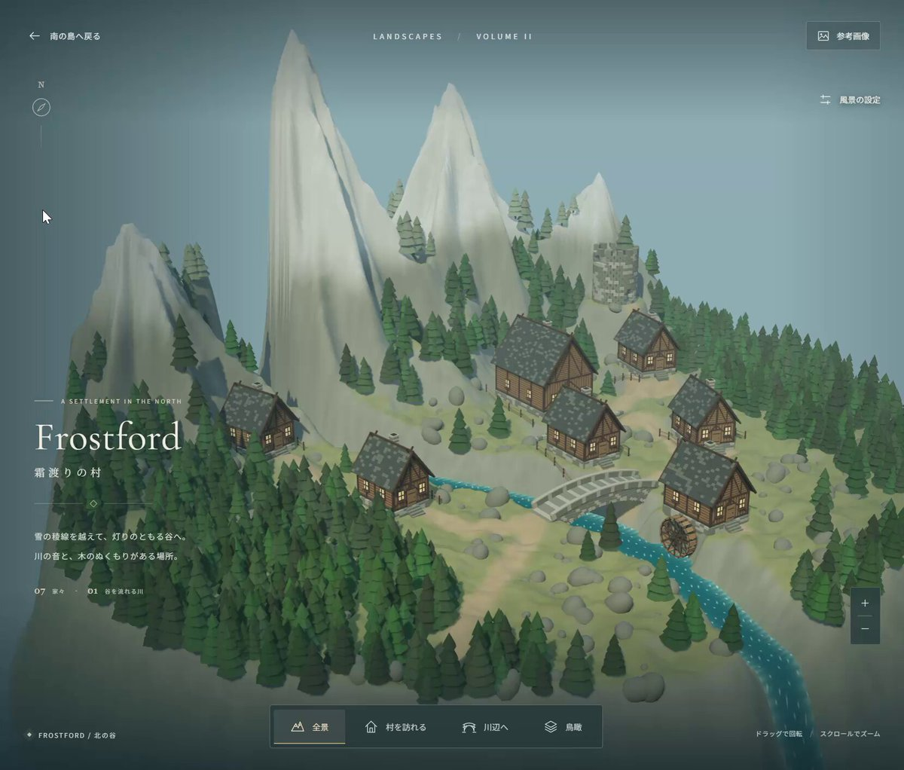</a>

<a href="https://www.tripo3d.ai/it/3d-prompts/gpt-6-astra-2097167383576383502">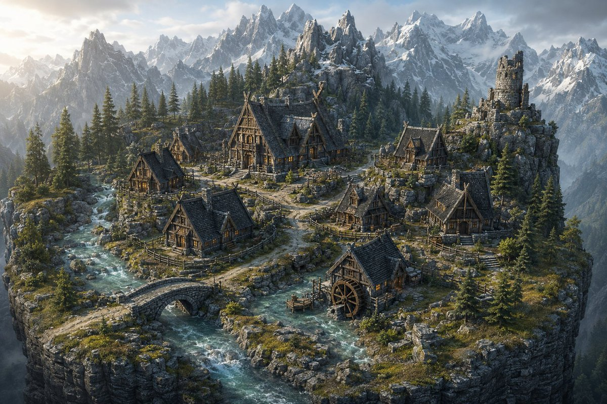</a>

Crea un paesaggio tridimensionale di un villaggio fantasy con img2threejs, generando prima un’immagine di riferimento per guidare la scena.

**Prompt**

```text
Usa img2threejs/img2threejs per creare un terreno tridimensionale di un villaggio, nello stile di Skyrim. Genera tu l’immagine di riferimento.
```

[Vedi dettagli ↗](https://www.tripo3d.ai/it/3d-prompts/gpt-6-astra-2097167383576383502) · [Post originale](https://x.com/TaroKichijo/status/2097167383576383502) · [Torna agli esempi](#all-prompts)

---

<a id="2097313247116341424"></a>

### Migliorare i tratti del viso di un modello 3D in Blender usando un’immagine di riferimento

[Carlos Olivera Terrazas](https://x.com/carlos_olivera) · 2026-09-08

<a href="https://www.tripo3d.ai/it/3d-prompts/gpt-6-astra-2097313247116341424"></a>

<a href="https://www.tripo3d.ai/it/3d-prompts/gpt-6-astra-2097313247116341424"></a>

L’autore propone una sfida a GPT-6 Astra: usare la prima immagine come riferimento per migliorare i tratti del viso della seconda immagine in un progetto di modellazione 3D in Blender.

**Prompt**

```text
prendere come riferimento la prima immagine e migliorare i tratti del viso della seconda immagine.
```

[Vedi dettagli ↗](https://www.tripo3d.ai/it/3d-prompts/gpt-6-astra-2097313247116341424) · [Post originale](https://x.com/carlos_olivera/status/2097313247116341424) · [Torna agli esempi](#all-prompts)

---

<a id="2097320830602809682"></a>

### Ricrea un mini gioco 3D in stile League of Legends

[岚叔](https://x.com/LufzzLiz) · 2026-09-08

<a href="https://www.tripo3d.ai/it/3d-prompts/gpt-6-astra-2097320830602809682"></a>

Il post consiglia un prompt per far creare ad Astra un mini gioco in stile League of Legends, completo di mappa, campioni, minion, torri e UI nativa del gioco. Si tratta di un contenuto consigliato: non è possibile confermare che il prompt mostrato sia quello effettivamente usato per realizzare l'opera.

**Prompt**

```text
Primo passo: crea un gioco identico a League of Legends. Deve avere tutto ciò che ha LoL: la stessa mappa, una qualità grafica all'altezza, campioni, minion, torri e così via. Inizia selezionando 5 campioni.

Secondo passo: rispondi a tono ad Astra: questo non è League, è una copia economica. Prima scrivi un piano, poi realizza tutto con precisione, rispettando dimensioni e meccaniche reali; niente HTML sovrapposto per la UI: deve essere nativa, curata e sembrare quella di un vero gioco.
```

[Vedi dettagli ↗](https://www.tripo3d.ai/it/3d-prompts/gpt-6-astra-2097320830602809682) · [Post originale](https://x.com/LufzzLiz/status/2097320830602809682) · [Torna agli esempi](#all-prompts)

---

<a id="2097323734504017936"></a>

### Progetto WebGL in TypeScript + Three.js: Sala della Preghiera per il Buon Raccolto del Tempio del Cielo di Pechino

[govin.eth \| G哥](https://x.com/goan999999) · 2026-09-08

<a href="https://www.tripo3d.ai/it/3d-prompts/gpt-6-astra-2097323734504017936"></a>

Il post principale mostra un modello 3D e una resa web della Sala della Preghiera per il Buon Raccolto del Tempio del Cielo di Pechino, realizzati con GPT-6 Astra e Three.js; in seguito l’autore ha condiviso il prompt completo in cinese utilizzato per creare progetti di questo tipo.

**Prompt**

```text
Crea con TypeScript + Three.js un progetto WebGL completo e funzionante della Sala della Preghiera per il Buon Raccolto del Tempio del Cielo di Pechino. Tutte le geometrie architettoniche, le texture e le animazioni devono essere generate proceduralmente dal codice durante l’esecuzione; è vietato caricare modelli esterni .glb, .gltf, .obj, .fbx o di altri formati.

Ricostruzione architettonica:
tre coperture circolari a più livelli, con dimensioni e altezze diverse, rivestite da tegole smaltate blu, un pinnacolo dorato, colonne rosse, corpo circolare dell’edificio, decorazioni dipinte in blu, verde e oro, mensole dougong, porte e finestre.
Per il tetto usa profili curvi, superfici di rivoluzione o geometrie personalizzate, così da rendere gronde ampie e leggermente rialzate; non sostituirle con un semplice cono.
Realizza una piattaforma circolare bianca a tre livelli in marmo Han, con scalinata centrale in pietra, balaustre e colonne; mantieni proporzioni armoniose e una gerarchia visiva chiara.
Genera proceduralmente le texture delle tegole e gli elementi decorativi; per i componenti ripetuti dai priorità a InstancedMesh.

Scena e interazione:
Cielo azzurro di Pechino, pavimentazione della piazza e una vegetazione contenuta; usa DirectionalLight insieme ad AmbientLight／HemisphereLight, attiva le ombre, l’occlusione ambientale e un tone mapping cinematografico moderato.
Supporta la rotazione e lo zoom con OrbitControls, oltre a una modalità attivabile e disattivabile di lenta rotazione automatica intorno al modello.
Un pulsante deve alternare le modalità “esplosione／ricomposizione”: tetto, colonne, mensole dougong, pareti, porte e finestre, balaustre e piattaforma devono distribuirsi gradualmente per livelli e poi tornare con precisione nella posizione originale. L’animazione deve essere gestita dal codice, con tempi sfalsati e senza spostamenti istantanei.

Consegna direttamente il progetto completo e le istruzioni per l’avvio. La pagina deve adattarsi in modo responsive alle dimensioni della finestra, offrire una resa visiva di alta qualità e un’interazione fluida, mantenendo buone prestazioni sui normali browser desktop grazie a istanziazione, dettagli geometrici adeguati e ottimizzazione del rendering. Organizza il codice in moduli chiari e facili da estendere; verifica la build e le funzionalità principali, indicando con trasparenza gli elementi non verificati.
```

[Vedi dettagli ↗](https://www.tripo3d.ai/it/3d-prompts/gpt-6-astra-2097323734504017936) · [Post originale](https://x.com/goan999999/status/2097323734504017936) · [Torna agli esempi](#all-prompts)

---

<a id="2097336230078013598"></a>

### Ricreare un gioco per browser in stile League of Legends

[李岳](https://x.com/liyue_ai) · 2026-09-08

<a href="https://www.tripo3d.ai/it/3d-prompts/gpt-6-astra-2097336230078013598"></a>

L’autore riporta e trascrive un prompt per creare un gioco per browser in stile League of Legends, con la richiesta di ricrearne la mappa, i campioni, i minion, le torri difensive e un’apertura con cinque campioni. Il prompt descrive un obiettivo di creazione di un gioco 3D, ma il post non chiarisce se sia stato effettivamente inserito dall’autore.

**Prompt**

```text
Crea un gioco identico a League of Legends. Deve includere tutti i contenuti di League of Legends, con la stessa mappa e un livello di qualità grafica equivalente, oltre a campioni, minion, torri difensive e altro. All’inizio, seleziona 5 campioni.
```

[Vedi dettagli ↗](https://www.tripo3d.ai/it/3d-prompts/gpt-6-astra-2097336230078013598) · [Post originale](https://x.com/liyue_ai/status/2097336230078013598) · [Torna agli esempi](#all-prompts)

---

<a id="2097339176094195899"></a>

### Playroom: sala giochi rétro 3D nel browser

[Tripo](https://x.com/tripoai) · 2026-09-08

<a href="https://www.tripo3d.ai/it/3d-prompts/gpt-6-astra-2097339176094195899"></a>

Prompt pubblicato dall’autore e riportato integralmente per creare una sala giochi completa e giocabile nel browser con Three.js, asset hardware GLB separati, transizioni 3D interattive, tre giochi basati su cartucce, comandi reattivi e un comportamento di fallback accessibile.

**Prompt**

```text
Crea una sala giochi completa e giocabile nel browser chiamata “Playroom”, con un’estetica hardware nostalgica della fine degli anni Ottanta e un’interfaccia editoriale contemporanea e misurata. Usa Three.js per il rendering e carica asset GLB separati per il monitor CRT, la console, il controller e le cartucce dei giochi. Realizza un’esperienza funzionante, non un mockup statico.

Direzione artistica: usa uno sfondo bianco caldo tendente al crema, plastica avorio effetto vissuto, dettagli color antracite, verde salvia desaturato, terracotta polverosa e blu sbiadito. Abbina titoli in Space Grotesk a piccole etichette in DM Mono. Aggiungi sottili linee divisorie, ampio spazio bianco, annotazioni tecniche discrete e una navigazione compatta. Evita lo stile cyberpunk al neon, le card lucide da dashboard e i gradienti eccessivi.

La home page dovrebbe ricordare una fotografia di prodotto composta con cura. Posiziona il CRT in evidenza verso destra, la console verso sinistra, una cartuccia in verticale inserita saldamente nella console e il controller davanti. Collega i dispositivi con cavi curvi che arrivino alle prese corrette. Usa un’illuminazione direzionale morbida, ombre di contatto realistiche, bordi arrotondati e materiali plastici leggermente ruvidi. Evita le intersezioni tra gli oggetti.

Dai alla home page un lento movimento orbitale cinematografico da un lato all’altro. Permetti agli utenti di trascinare per ruotare la visuale, quindi riprendi gradualmente il movimento automatico. Aggiungi discreti impulsi di dati in lento movimento attorno ad alcuni dettagli hardware selezionati. Il CRT dovrebbe mostrare una scena di standby in pixel art in loop, con una piccola mascotte, scanline discrete e la scritta “PLAYER ONE”. Usa accuratamente il logo con la T gialla e la V bianca sui volti delle mascotte.

Un pulsante “POWER ON” in evidenza, oppure un clic sulla scena della console, dovrebbe avviare un’unica transizione continua. Avvicina gradualmente la camera allo schermo CRT, introduci un flusso di dati animato e amplia progressivamente la scena fino a occupare l’intero viewport. Mantieni sempre coperti i bordi superiore e inferiore. Mostra la raccolta di cartucce con una transizione fluida dal buio alla luce, senza overlay che compaiano all’improvviso né bruschi salti della camera.

La raccolta contiene tre cartucce distinte in verticale: Snake color verde salvia, Breakout color terracotta e Blocks color blu. Ognuna presenta una tipografia nitida sulla copertina e una piccola mascotte animata appollaiata sopra. Usa un leggero movimento oscillatorio, un sollevamento al passaggio del mouse e una delicata inclinazione. Supporta sia il clic sulle cartucce 3D sia i pulsanti di testo accessibili sottostanti.

Ogni selezione apre un’interfaccia di gioco giocabile. Snake include catene di cibo e frutti bonus a tempo. Breakout include diversi layout di mattoni e power-up per la racchetta o multiball. Blocks include l’anteprima del pezzo successivo, la sagoma del punto di atterraggio e il punteggio per la rimozione delle linee. Fornisci istruzioni chiare, punteggio, pausa, riavvio e navigazione per tornare indietro. Supporta i comandi da tastiera e i pulsanti touch, con salvataggio locale del record.

Mantieni i contenuti dello schermo e le etichette delle cartucce come texture runtime separate, così il testo rimane nitido. Conserva i nomi delle parti dei modelli per l’interazione e l’animazione delle mascotte. Includi un feedback di caricamento, un fallback utilizzabile se gli asset 3D non vengono caricati, layout responsive, stato attivo della tastiera visibile e supporto per la riduzione del movimento. Organizza il progetto in modo ordinato, verifica tutti e tre i giochi e le transizioni e preparalo per il deployment su GitHub e Vercel.
```

[Vedi dettagli ↗](https://www.tripo3d.ai/it/3d-prompts/gpt-6-astra-2097339176094195899) · [Post originale](https://x.com/tripoai/status/2097339176094195899) · [Torna agli esempi](#all-prompts)

---

<a id="2097343467026289039"></a>

### Mondo lacustre di zona umida dal fascino accogliente

[Givros](https://x.com/givros) · 2026-09-08

<a href="https://www.tripo3d.ai/it/3d-prompts/gpt-6-astra-2097343467026289039"></a>

Un prompt riutilizzabile per creare una scena 3D accogliente in una zona umida, con lago, capanna, isola, casa abbandonata, barca, sentieri, vegetazione, fauna selvatica e foresta circostante.

**Prompt**

```text
Crea un lago dall’atmosfera accogliente, con una capanna di pescatori sulla riva paludosa. Inserisci una piccola isola al centro del lago, con una casa abbandonata nascosta tra gli alberi. Aggiungi una barca da pesca accanto alla capanna, ninfee, canne, pesci che saltano, la fauna tipica delle zone umide, una piccola spiaggia, un sentiero che conduce alla spiaggia e alla capanna, un altro sentiero che si inoltra nella foresta e una linea di alberi tutt’intorno alla scena.
```

[Vedi dettagli ↗](https://www.tripo3d.ai/it/3d-prompts/gpt-6-astra-2097343467026289039) · [Post originale](https://x.com/givros/status/2097343467026289039) · [Torna agli esempi](#all-prompts)

---

<a id="2097534290112188602"></a>

### Scena VHS in Blender ispirata alle Backrooms

[CHRIS FIRST](https://x.com/chrisfirst) · 2026-09-09

<a href="https://www.tripo3d.ai/it/3d-prompts/gpt-6-astra-2097534290112188602">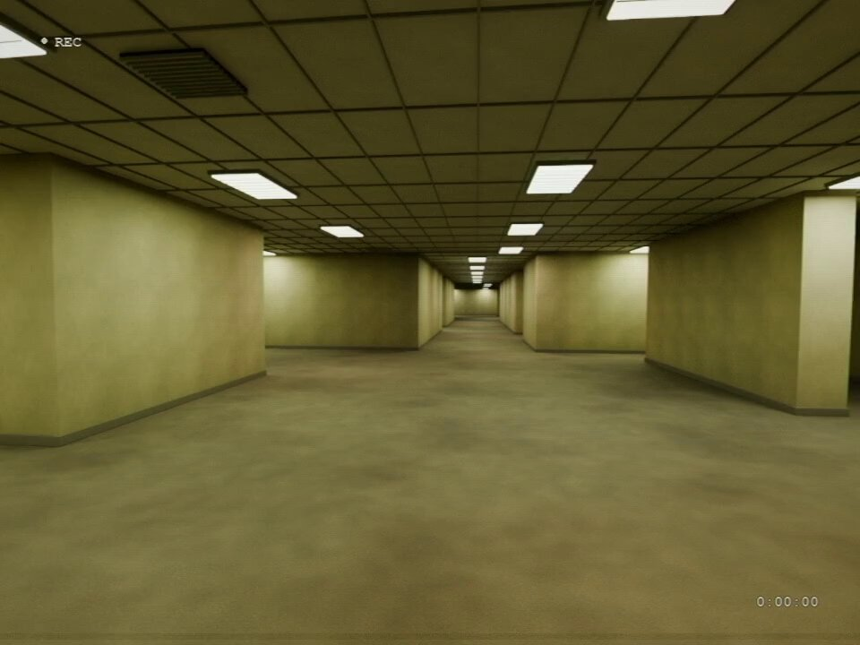</a>

Crea una scena fotorealistica in Blender che rappresenta un viaggio in prima persona attraverso le Backrooms, in stile VHS, con una ripresa a mano concitata, stanze e corridoi simili a un labirinto e una durata di 30 secondi.

**Prompt**

```text
Renderizza in Blender una scena che sembri la registrazione su una videocassetta VHS, in prima persona, di qualcuno che cammina attraverso le Backrooms. L'atmosfera deve essere fotorealistica e la ripresa deve trasmettere il panico di una camera a mano. Il protagonista deve guardarsi intorno, poi iniziare a correre attraverso il labirinto delle Backrooms. Alcune stanze devono essere ampie e aperte, altre composte da corridoi senza fine. Panico assoluto. Durata: 30 secondi.
```

[Vedi dettagli ↗](https://www.tripo3d.ai/it/3d-prompts/gpt-6-astra-2097534290112188602) · [Post originale](https://x.com/chrisfirst/status/2097534290112188602) · [Torna agli esempi](#all-prompts)

---

<a id="2097588270171660321"></a>

### Ricrea una scena 3D da un video in Three.js

[Henry Li](https://x.com/henry19840301) · 2026-09-09

<a href="https://www.tripo3d.ai/it/3d-prompts/gpt-6-astra-2097588270171660321">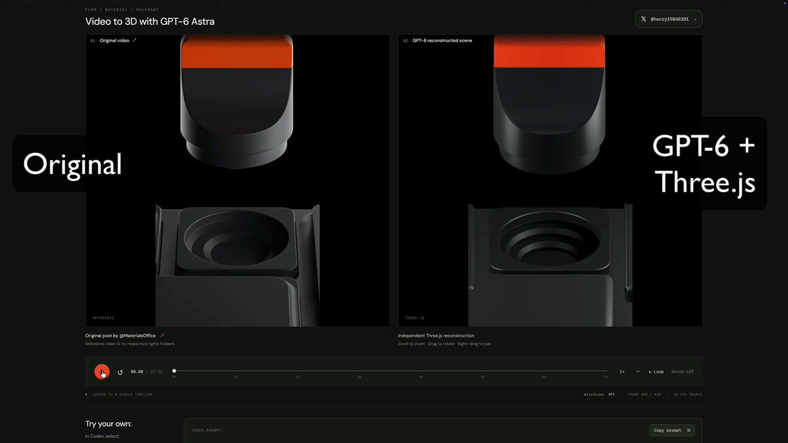</a>

Un prompt per ricreare in Three.js gli oggetti 3D, la scena, i movimenti, l’illuminazione, i materiali e le ombre del video, con un confronto affiancato con l’MP4 nella stessa pagina.

**Prompt**

```text
/goal crea gli stessi oggetti 3D e la stessa scena in Three.js e replica esattamente i movimenti del video, inclusi illuminazione, materiali, ombre e così via.
Nella stessa pagina, aggiungi un confronto affiancato con l’mp4.
```

[Vedi dettagli ↗](https://www.tripo3d.ai/it/3d-prompts/gpt-6-astra-2097588270171660321) · [Post originale](https://x.com/henry19840301/status/2097588270171660321) · [Torna agli esempi](#all-prompts)

---

<a id="2097602565110419781"></a>

### Sito immersivo 3D dedicato a una risaia

[YouWare](https://x.com/YouWareAI) · 2026-09-09

<a href="https://www.tripo3d.ai/it/3d-prompts/gpt-6-astra-2097602565110419781">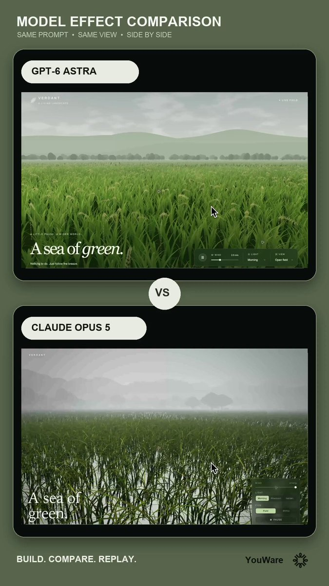</a>

Prompt per creare nel browser un paesaggio 3D di una risaia con Three.js, animazione naturale del vento, modalità di illuminazione e visualizzazione, controlli responsive, vegetazione procedurale e rendering in tempo reale.

**Prompt**

```text
Crea un sito immersivo 3D dedicato a una risaia, eseguito nel browser, con il tema:
“Un mare di verde / Il vento tra le risaie.”
Completa il codice, installa le dipendenze necessarie e avvia un’anteprima. Non fermarti a una proposta o a un piano di implementazione.

1. Direzione visiva

L’atmosfera generale deve essere naturale, pacifica e raffinata, come quella di un sito paesaggistico interattivo con una direzione artistica coerente.

La scena deve includere:

Primo piano: foglie sottili chiaramente distinguibili, steli ricurvi e alcune pannocchie di riso ricadenti.

Piano intermedio: una risaia continua che si estende in lontananza, con densità sufficiente e variazioni naturali nella spaziatura.
Sfondo: una linea irregolare di alberi, colline basse disposte su più livelli e una prospettiva atmosferica discreta.
Cielo: tonalità grigio-azzurre morbide, leggere variazioni tra le nuvole e una transizione naturale all’orizzonte.
Posiziona la videocamera predefinita leggermente sopra le pannocchie di riso, rivolta attraverso la risaia verso le colline lontane.
Il cielo deve occupare circa un terzo dell’inquadratura, mentre la risaia deve dominare la composizione.
Usa principalmente tonalità di verde intenso, verde oliva e verde giallastro per la vegetazione. Evita il verde fluorescente.
Varia naturalmente l’altezza, l’orientamento, la curvatura e il colore delle piante di riso.

2. Requisiti per l’animazione
Il vento deve apparire come onde continue che attraversano lateralmente la risaia:
Mantieni le radici per lo più fisse, con un movimento progressivamente più intenso verso le punte delle foglie e le pannocchie.
Le piante nella stessa area devono muoversi in modo coerente, conservando però variazioni individuali.

Combina onde di vento lente e su larga scala con leggere perturbazioni locali.

Evita che tutte le piante oscillino in perfetta sincronia. Non traslare intere piante e non causare sfarfallii nelle foglie.

Usa una brezza predefinita delicata, piacevole da osservare anche a lungo.
3. Requisiti di interazione
Fornisci controlli semplici che influiscano realmente sulla scena:
Slider della velocità del vento: regola senza scatti l’intensità e la velocità dell’animazione del vento.
Modalità di illuminazione: Mattina, Pomeriggio e Golden Hour. Coordina i cambiamenti di cielo, direzione della luce, temperatura colore e colore della nebbia.

Modalità di visualizzazione: Campo aperto e Tra il riso, con transizioni fluide della videocamera.

Pausa/Riprendi: mette in pausa e riavvia l’animazione ambientale.

Il movimento del mouse può produrre una risposta molto discreta della videocamera, ma non deve causare vertigini.
Non ruotare continuamente la videocamera su ampi angoli per impostazione predefinita.
4. Design dell’interfaccia
Usa una scena a schermo intero con un’interfaccia sovrapposta:
In alto a sinistra: un piccolo logotipo con la scritta VERDANT.

In basso a sinistra: il titolo con grazie “Un mare di verde.”
Sotto, il sottotitolo più piccolo “Non c’è nulla da fare. Segui semplicemente la brezza.”
In basso a destra: un pannello di controllo compatto, semitrasparente e verde scuro.

Mantieni il testo leggibile, usa spaziature generose ed evita che i controlli ostacolino il paesaggio principale.

I controlli devono restare utilizzabili sugli schermi stretti senza sovrapporsi.

5. Tecnologia e prestazioni
Usa Three.js. Se è disponibile un progetto esistente, mantieni il relativo ambiente di build.
Usa l’instancing e l’animazione dei vertici tramite GPU per gestire grandi quantità di vegetazione.
Evita di creare un oggetto di disegno separato per ogni pianta o di aggiornare ogni pianta sulla CPU a ogni fotogramma.
Riduci il livello di dettaglio della vegetazione a maggiore distanza e applica un limite ragionevole al pixel ratio.
Prediligi geometrie e materiali procedurali per garantire un caricamento affidabile degli asset.
La scena deve essere renderizzata in tempo reale. Non usare un’immagine o un video dell’intero paesaggio come scena principale.
I nomi dei modelli e le etichette di confronto verranno aggiunti in post-produzione; non inserirli nella scena.
6. Criteri di completamento
Dopo l’implementazione, usa gli strumenti del browser disponibili per verificare che:
La vista iniziale venga renderizzata correttamente, senza errori evidenti nella console.

Ogni controllo influisca realmente sulla scena.

Primo piano, piano intermedio e sfondo abbiano profondità e stratificazione distinguibili.
Le piante di riso siano più di semplici linee verdi verticali.
Il movimento del vento sia continuo e naturale, senza ripetizioni uniformi evidenti.
Le transizioni della videocamera siano fluide e l’interfaccia resti utilizzabile sugli schermi stretti.
Se non puoi eseguire una verifica specifica, dichiaralo chiaramente.
Infine, fornisci le istruzioni di avvio e un riepilogo delle funzionalità effettivamente implementate.
```

[Vedi dettagli ↗](https://www.tripo3d.ai/it/3d-prompts/gpt-6-astra-2097602565110419781) · [Post originale](https://x.com/YouWareAI/status/2097602565110419781) · [Torna agli esempi](#all-prompts)

---

<a id="2097675660873605422"></a>

### Creare con GPT-6 Astra e Blender una scena comica con un braccio robotico che insegue un gatto

[探路AI](https://x.com/TanLuAI) · 2026-09-09

<a href="https://www.tripo3d.ai/it/3d-prompts/gpt-6-astra-2097675660873605422">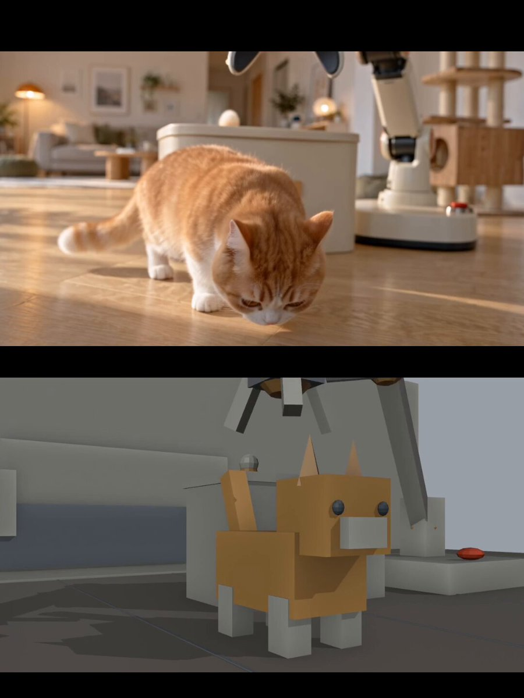</a>

L’autore dichiara di aver realizzato con GPT-6 Astra e Blender la costruzione della scena e delle inquadrature, pubblicando istruzioni di generazione in cinese per un cortometraggio comico di 10 secondi con animali. Il prompt definisce un gatto arancione e bianco, un braccio robotico domestico, un giocattolo a forma di coda di gatto, un soggiorno, le relazioni tra le inquadrature e il ribaltamento comico dell’azione.

**Prompt**

```text
Genera un cortometraggio comico di 10 secondi in formato orizzontale 16:9, con un look cinematografico realistico da ripresa dal vivo
Un braccio robotico domestico insegue e cerca di afferrare un gatto arancione e bianco; il gatto schiva agilmente e, con aria birichina, gira dietro una cesta contenitore. La pinza afferra la coda arancione che sporge da dietro la cesta e, sollevandola, scopre che si tratta di un giocattolo a forma di coda di gatto. Il gatto vero ha già raggiunto la base del braccio robotico e preme con la zampa il pulsante rosso di spegnimento sulla base. Il braccio robotico si arresta e il gatto esprime gioia e soddisfazione.
L’azione dell’inseguimento e della cattura inizia immediatamente; al centro, l’occlusione mantiene la suspense, mentre il sollevamento del giocattolo crea il ribaltamento. Infine, il gatto spegne volontariamente il braccio, realizzando una seconda gag. Genera esclusivamente suoni ambientali della scena; non generare musica di sottofondo, BGM, voce fuori campo o dialoghi.
【Ancoraggi degli asset e regole per i riferimenti】
Video di riferimento cat_robot_previs: usa come riferimento il movimento di camera, i tempi, le traiettorie dei movimenti e le relazioni spaziali.
Nel video di riferimento, il corpo geometrico arancione, le zampe bianche e il soggetto geometrico con orecchie e coda corrispondono al gatto reale arancione e bianco dell’immagine 1.
I giunti color arancio, i bracci color crema, la pinza a tre dita e la base con pulsante rosso corrispondono al braccio robotico dell’immagine 2.
Il soggetto composto da una coda arancione verticale, un’asta di collegamento grigia e una base verde corrisponde al giocattolo a forma di coda di gatto dell’immagine 3. Il giocattolo e il gatto sono due oggetti distinti.
Il contenitore bianco al centro corrisponde alla vera cesta contenitore color crema; mantieni la posizione, il volume e la funzione di occlusione del contenitore. Usa l’immagine 4 come riferimento per l’ambiente interno.
Genera il video seguendo dal video di riferimento i tempi dei cambi di inquadratura, la posizione della camera, la scala dei campi, il percorso del gatto, la traiettoria d’inseguimento della pinza, l’occlusione dietro la cesta, la traiettoria di sollevamento del giocattolo e la relazione di contatto tra la zampa del gatto e il pulsante.
La traslazione geometrica del gatto serve esclusivamente a indicare il percorso del movimento; rigenera in modo naturale i suoi salti laterali, la corsa, i cambi di direzione, l’accovacciarsi, i movimenti della testa e il sollevamento della zampa. Sono consentite sottili espressioni e movimenti del corpo aggiuntivi nelle posizioni e negli intervalli temporali originali, senza modificare gli eventi chiave né le relazioni spaziali. Rimuovi tutti i modelli bianchi, le forme geometriche segnaposto e i marcatori di supporto.
图1image: unico riferimento per l’aspetto del gatto.
Lo stesso giovane gatto adulto a pelo corto, arancione e bianco, con mantello tigrato arancione sulla testa e sul dorso, muso e petto bianchi, quattro zampe bianche, occhi color ambra, naso rosa, coda arancione ad anelli e punta chiara. Mantieni proporzioni corporee realistiche, distribuzione dei colori, tratti del viso e lunghezza della coda. Pelo fine, baffi naturali, nessun indumento.
图2image: unico riferimento per l’aspetto del braccio robotico.
Rivestimento color crema, coperture dei giunti arancioni, componenti di collegamento grigio scuro, pinza morbida a tre dita e indicatore di stato color ambra sul polso, installati su una base larga e bassa. Il pulsante rosso di spegnimento sulla base del braccio robotico deve essere raggiungibile dal gatto stando a terra. La base è fissa; il braccio robotico insegue e cerca di afferrare il gatto ruotando sui propri giunti.
图3image: unico riferimento per l’aspetto del giocattolo a forma di coda di gatto.
Coda pelosa arancione ad anelli, con punta chiara, collegata in basso a una molla metallica e a una base verde menta antiribaltamento con motivo a lisca di pesce bianco. Dopo che la pinza ha afferrato la coda pelosa, la molla e la base devono essere sollevate insieme come un unico giocattolo, mantenendo sempre chiaro il collegamento tra le parti.
图4image: aspetto della scena.
Prendi come riferimento l’immagine 4: soggiorno caldo e accogliente, pavimento in legno chiaro, luce diurna proveniente da grandi finestre, divano chiaro, mobili in legno, piante verdi e dettagli della vita quotidiana con animali domestici. Tutte le azioni si svolgono sul pavimento interno. Lo sfondo da studio fotografico e l’impaginazione a griglia dell’immagine di riferimento non devono comparire nel filmato finale.
【Stile visivo e scena】
Qualità fotografica da cortometraggio realistico con animali domestici e da raffinato spot pubblicitario per un robot domestico, con luce naturale e materiali realistici; la comicità nasce dal comportamento e dal ritmo.
Ampio soggiorno di un’abitazione, con pavimento in rovere chiaro dalle venature fini e dai riflessi morbidi. A sinistra, la portafinestra lascia entrare una calda luce diurna; le tende leggere proiettano sul pavimento ombre morbide, creando un naturale controluce sui bordi del pelo del gatto e sul rivestimento del braccio robotico.
Sul fondo ci sono un divano grigio chiaro, cuscini, un tavolino basso, un tappeto, una lampada da terra dai toni caldi e un mobile contenitore; vicino alla finestra ci sono piante verdi, mentre di lato si trovano una cuccia e un tiragraffi. Il tappeto è sullo sfondo; l’area d’azione in primo piano deve mantenere una superficie continua e libera di pavimento in legno.
In posizione centrale ma arretrata, colloca una cesta contenitore color crema con angoli arrotondati e maniglie arancione chiaro. Il contenitore deve poter nascondere il gatto accovacciato e la base del giocattolo, lasciando percorsi collegati a sinistra, a destra e sul retro. Il braccio robotico si trova sul lato destro del contenitore, con il pulsante rosso rivolto verso il punto in cui il gatto arriverà alla fine.
La camera è posizionata all’incirca all’altezza degli occhi del gatto; i soggetti sono nitidi e lo sfondo moderatamente sfocato. Una posizione bassa enfatizza l’improvvisa presa verso il basso della pinza, l’agilità del gatto e la rivelazione a strati dietro la cesta. Ogni contatto deve presentare ombre naturali e un feedback realistico delle forze.
```

[Vedi dettagli ↗](https://www.tripo3d.ai/it/3d-prompts/gpt-6-astra-2097675660873605422) · [Post originale](https://x.com/TanLuAI/status/2097675660873605422) · [Torna agli esempi](#all-prompts)

---

<a id="2097678911882809407"></a>

### Crea THE LAST GATE: un crowd runner con porte matematiche

[MSB](https://x.com/KeWai386772) · 2026-09-09

<a href="https://www.tripo3d.ai/it/3d-prompts/gpt-6-astra-2097678911882809407">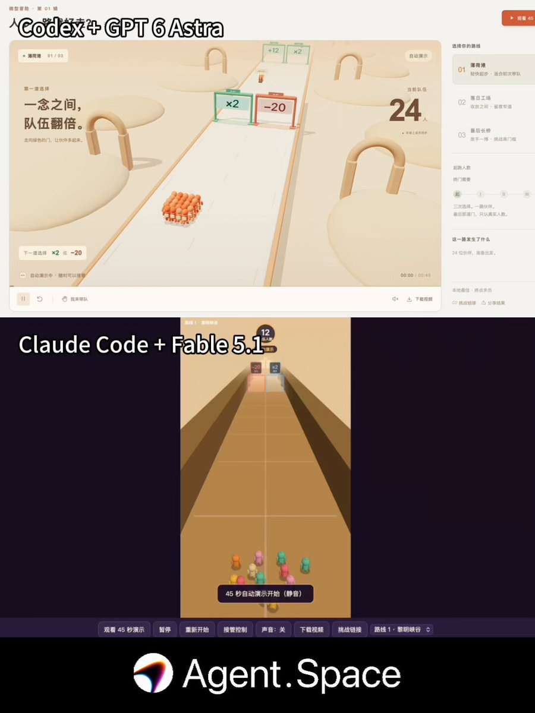</a>

Crea un gioco crowd runner giocabile in formato verticale, con porte matematiche, variazioni realistiche del numero di membri della squadra, perdite causate dagli ostacoli, scontri finali determinati dal numero di superstiti, tre percorsi brevi, riavvio immediato e replay degli input con seed.

**Prompt**

```text
Crea THE LAST GATE. Crea THE LAST GATE: un crowd runner giocabile in formato verticale con porte matematiche. Le dimensioni visibili della squadra devono corrispondere al numero effettivo dei membri; implementa perdite causate dagli ostacoli con conseguenze reali e scontri finali determinati dal numero di superstiti. Fornisci tre percorsi brevi, riavvio immediato e replay degli input con seed; non inventare la vittoria.
```

[Vedi dettagli ↗](https://www.tripo3d.ai/it/3d-prompts/gpt-6-astra-2097678911882809407) · [Post originale](https://x.com/KeWai386772/status/2097678911882809407) · [Torna agli esempi](#all-prompts)

---

<a id="2097730920224534868"></a>

### Simulazione 3D in tempo reale di una fabbrica e delle piattaforme di lancio

[Konstantin Saifoulline](https://x.com/konstantinsaifo) · 2026-09-09

<a href="https://www.tripo3d.ai/it/3d-prompts/gpt-6-astra-2097730920224534868">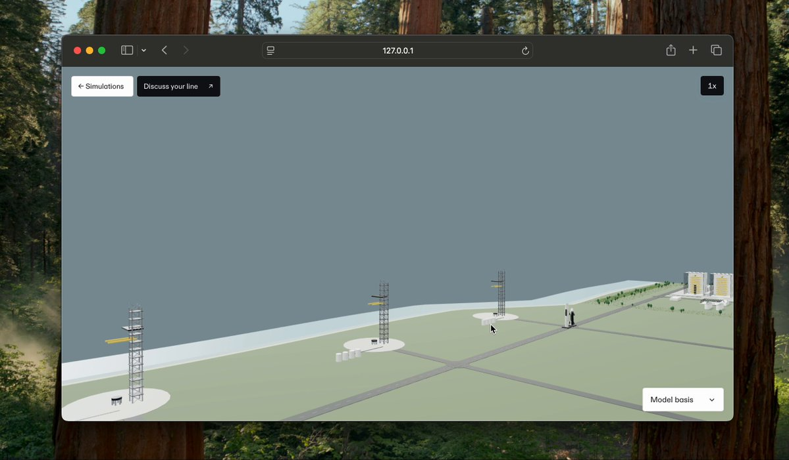</a>

Una richiesta di studiare i libri sulla produzione snella di @AirsupHQ, sviluppare il concept di una fabbrica con 10 piattaforme di lancio e realizzare una simulazione 3D in tempo reale dell’arrivo dei materiali, dei razzi che raggiungono le piattaforme e del decollo.

**Prompt**

```text
studia i libri di @AirsupHQ sulla produzione snella, sviluppa il concept di una fabbrica con 10 piattaforme di lancio e realizza una simulazione 3D in tempo reale.
```

[Vedi dettagli ↗](https://www.tripo3d.ai/it/3d-prompts/gpt-6-astra-2097730920224534868) · [Post originale](https://x.com/konstantinsaifo/status/2097730920224534868) · [Torna agli esempi](#all-prompts)

---

<a id="2097755845001937172"></a>

### Simulazione del terreno di un campo da golf a 18 buche

[Rory Flynn](https://x.com/Ror_Fly) · 2026-09-09

<a href="https://www.tripo3d.ai/it/3d-prompts/gpt-6-astra-2097755845001937172">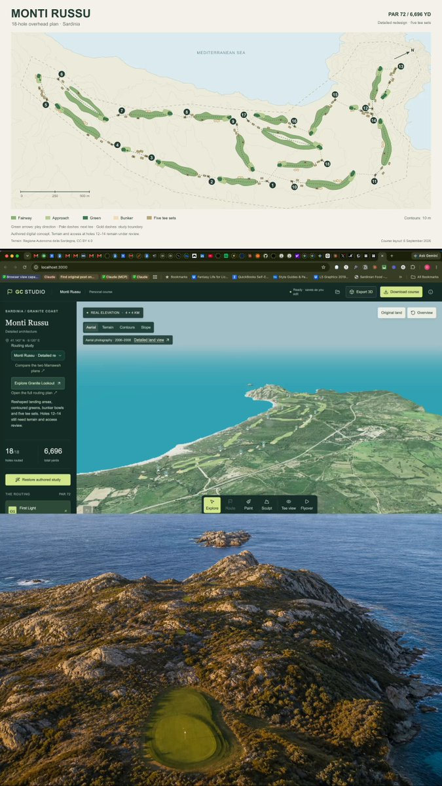</a>

Una richiesta per simulare la realizzazione di un campo da golf a 18 buche in una posizione reale, utilizzando mappe e dati topografici reali, con le buche adattate al terreno naturale.

**Prompt**

```text
Simula la realizzazione di un percorso da 18 buche
>Trova una posizione reale
>Usa mappe e dati topografici reali
> Adatta le buche al terreno naturale
```

[Vedi dettagli ↗](https://www.tripo3d.ai/it/3d-prompts/gpt-6-astra-2097755845001937172) · [Post originale](https://x.com/Ror_Fly/status/2097755845001937172) · [Torna agli esempi](#all-prompts)

---

<a id="2097797479488246071"></a>

### Clone di Minecraft multigiocatore

[Armaan Jain](https://x.com/Armaan_Jain123) · 2026-09-09

<a href="https://www.tripo3d.ai/it/3d-prompts/gpt-6-astra-2097797479488246071">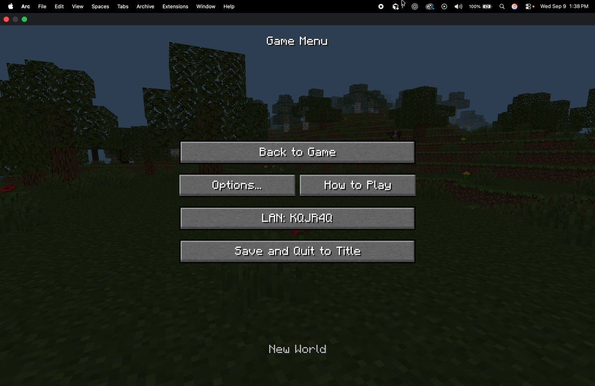</a>

Crea un clone di Minecraft basato su browser con mondi generati proceduralmente a partire da un seed, modalità Sopravvivenza, biomi, dimensioni, mob, strutture, obiettivi, multigiocatore in LAN, interfaccia di gioco nativa, audio direzionale, comportamento accurato di blocchi e fluidi e ottimizzazione delle prestazioni.

**Prompt**

```text
Crea un clone di Minecraft perfetto e completo dall’inizio alla fine e fammi sapere se ti serve qualcosa da parte mia. Ho allegato un documento di ricerca approfondito su Minecraft che potrà esserti utile. Assicurati di riprodurre alla perfezione meccaniche, animazioni e grafica. Ogni nuovo mondo deve essere generato proceduralmente e casualmente usando un seed. Includi tutti i mob che i giocatori si aspettano da Minecraft e assicurati che compaiano nei biomi corretti. Una volta completata l’implementazione per giocatore singolo, aggiungi la possibilità di aprire i mondi in LAN e di unirsi ai server degli altri giocatori. Il gioco deve usare la modalità Sopravvivenza per impostazione predefinita. Fai in modo che le texture siano identiche a quelle di Minecraft e, se trovi online le texture esatte, puoi usarle. Quando dico che lo voglio identico a Minecraft, intendo proprio questo. Nessuno dovrebbe riuscire a distinguere il sito web che crei dal vero Minecraft. È tutto a scopo didattico, quindi non preoccuparti del copyright. Non usare semplicemente HTML per l’interfaccia di gioco. Realizzala nativamente all’interno del motore di gioco. I modelli del personaggio e dei mob devono essere quelli reali e devono avere l’aspetto, il comportamento e le animazioni identici a quelli del gioco originale. Aggiungi audio e suoni direzionali. Analizza ogni pagina, ogni interazione e ogni meccanica, una per una, per ottenere un risultato perfetto. Una volta completato tutto e creato un clone perfetto di Minecraft, inizia a ottimizzarne le prestazioni usando tecniche come il culling, la distanza di rendering, la distanza di simulazione, il LOD basato sulla distanza, l’ottimizzazione degli FPS e altro ancora. Assicurati che la logica di gioco sia accurata. Per esempio, se viene rotto un blocco di sabbia o ghiaia sotto ad altri blocchi di sabbia o ghiaia, quelli sopra devono cadere. Se viene rotto un blocco di supporto, anche i fiori o l’erba sopra di esso devono rompersi. L’interfaccia dell’inventario deve essere identica e le interazioni devono risultare uguali, incluse scorciatoie, animazioni ed effetti d’impatto di spade, armi e altri strumenti. Ricrea accuratamente le interazioni con l’acqua e con i mob che si trovano al suo interno, il salto automatico e tutti gli altri piccoli dettagli. Concentrati sulla precisione di questi dettagli e sulla perfezione del risultato. Il gioco non deve dare una sensazione di instabilità o presentare glitch. Deve risultare fluido e identico al vero Minecraft. Presta attenzione anche a dettagli minori come le nuvole, il ciclo giorno-notte, il meteo, la musica di sottofondo di Minecraft e altro ancora. Assicurati che acqua e lava scorrano come previsto e che il loro rendering sia implementato alla perfezione. I mob non devono generarsi uno sopra l’altro, dentro gli alberi o all’interno dei blocchi. Aggiungi le strutture di Minecraft, i villici, il bottino e tutto ciò che li riguarda. Perfeziona la logica di generazione dei mob, assicurati che le loro animazioni siano fluide e che le dimensioni di ogni mob e del personaggio del giocatore siano identiche a quelle del vero Minecraft. Concentrati sulle azioni che i giocatori di Minecraft compiono comunemente, come saltare mentre piazzano blocchi per costruire ponti più velocemente o salire più in alto, usare Ctrl + W mentre saltano e altro ancora. Fai in modo che gli oggetti abbiano un bell’aspetto quando vengono tenuti in mano dal giocatore e assicurati che la posizione della mano corrisponda esattamente a quella del vero Minecraft. Aggiungi effetti d’impatto sui mob e fai in modo che ogni sprite degli oggetti nell’inventario sia identico a quello del vero Minecraft.
```

[Vedi dettagli ↗](https://www.tripo3d.ai/it/3d-prompts/gpt-6-astra-2097797479488246071) · [Post originale](https://x.com/Armaan_Jain123/status/2097797479488246071) · [Torna agli esempi](#all-prompts)

---

<a id="2097821164093480999"></a>

### Demo di grafica fantasy interattiva

[Anshu](https://x.com/anshuc) · 2026-09-09

<a href="https://www.tripo3d.ai/it/3d-prompts/gpt-6-astra-2097821164093480999">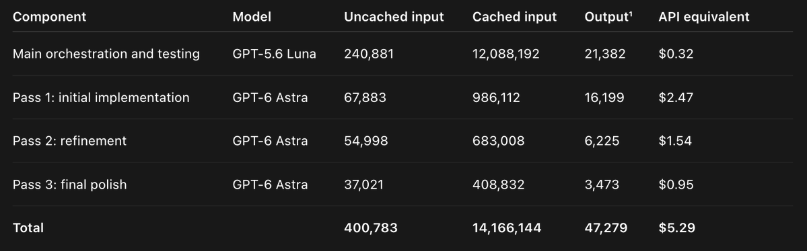</a>

Un prompt per Dream Loop Plus dedicato a una scena fantasy Three.js eseguita nel browser, con camera isometrica, personaggio controllabile, pavimenti bagnati riflettenti e movimento ambientale. L'autore lo presenta come un prompt demo che utilizza GPT-5.6 Luna xhigh; nel post si afferma che Astra esegue il lavoro visivo nel flusso ottimizzato.

**Prompt**

```text
Usa Dream Loop Plus per realizzare una demo grafica: camera isometrica, shading realistico e pavimenti bagnati riflettenti, con un personaggio inserito in una scena interessante. Ambientazione fantasy (pensa a Elden Ring e Diablo). Three.js nel browser, >60 fps. Comandi: fai clic per muovere il personaggio; la camera lo segue con inerzia; trascina per ruotare la camera; usa la rotellina per aumentare o ridurre lo zoom. Per ora, niente gameplay. Il mondo deve sembrare vivo: movimento, animazioni e comportamenti ambientali sottili.
```

[Vedi dettagli ↗](https://www.tripo3d.ai/it/3d-prompts/gpt-6-astra-2097821164093480999) · [Post originale](https://x.com/anshuc/status/2097821164093480999) · [Torna agli esempi](#all-prompts)

---

<a id="2097900087901106244"></a>

### Corto d’animazione 3D senza parole: il gatto e il premietto

[AI実践ラボ](https://x.com/boboga777) · 2026-09-10

<a href="https://www.tripo3d.ai/it/3d-prompts/gpt-6-astra-2097900087901106244">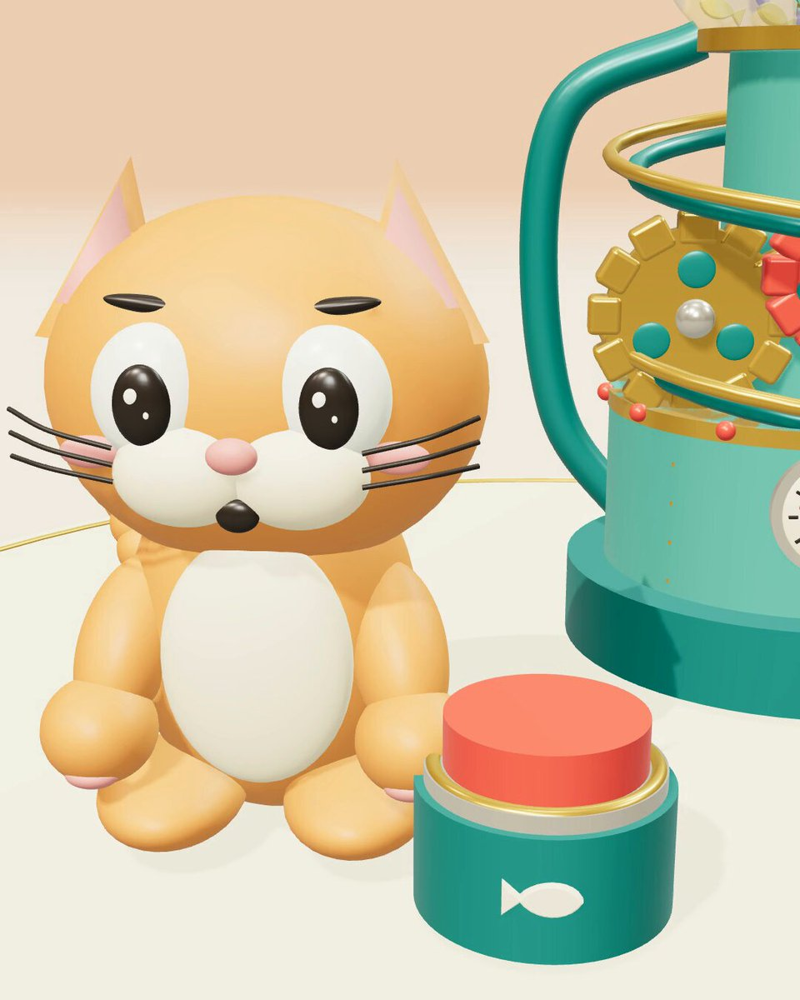</a>

Una richiesta per un’animazione 3D di un gatto senza parole, incentrata su un solo pulsante per il premietto, un caos crescente e una piccola ricompensa.

**Prompt**

```text
Crea un corto 3D senza parole con un gatto: un solo pulsante per il premietto, caos totale e una piccola ricompensa. Aggiungi recitazione espressiva, movimenti di camera, musica e un loop.
```

[Vedi dettagli ↗](https://www.tripo3d.ai/it/3d-prompts/gpt-6-astra-2097900087901106244) · [Post originale](https://x.com/boboga777/status/2097900087901106244) · [Torna agli esempi](#all-prompts)

---

<a id="2098038909514944562"></a>

### Rendi più impegnativo un campo da golf a 18 buche

[Rory Flynn](https://x.com/Ror_Fly) · 2026-09-10

<a href="https://www.tripo3d.ai/it/3d-prompts/gpt-6-astra-2098038909514944562">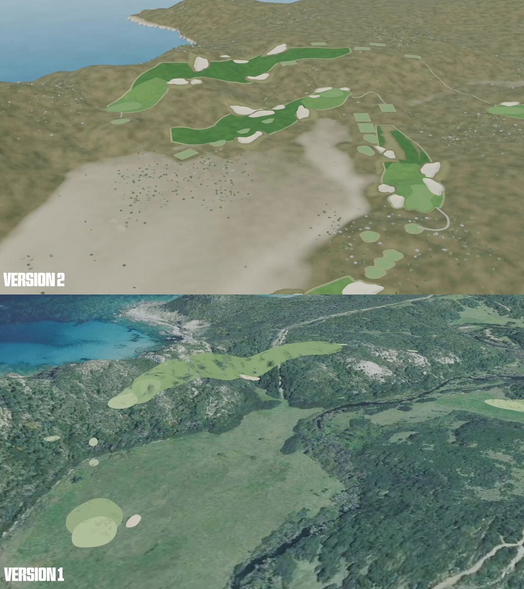</a>

Un obiettivo dichiarato dall’autore per la notte: aggiornare un modello di campo da golf a 18 buche per browser con buche più impegnative, fairway meno lineari, bunker e ostacoli più marcati e scelte di tiro più significative.

**Prompt**

```text
Rendi più impegnativa ogni buca
>Interrompi la linearità dei fairway
>Aggiungi bunker e ostacoli più marcati
>Crea scelte di tiro più significative
```

[Vedi dettagli ↗](https://www.tripo3d.ai/it/3d-prompts/gpt-6-astra-2098038909514944562) · [Post originale](https://x.com/Ror_Fly/status/2098038909514944562) · [Torna agli esempi](#all-prompts)

---

<a id="2098043033446912315"></a>

### Banco interattivo di calamari

[Vib3Coded](https://x.com/vib3coded) · 2026-09-10

<a href="https://www.tripo3d.ai/it/3d-prompts/gpt-6-astra-2098043033446912315">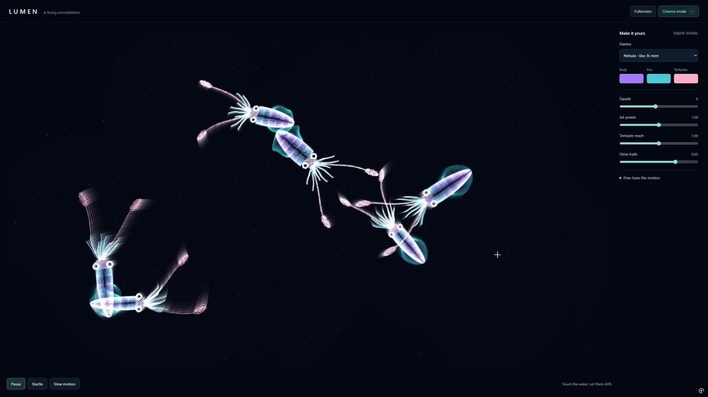</a>

Un banco interattivo di calamari in WebGL, con corpi calcolati a partire da punti matematici, movimento in tempo reale, controlli, cambi di colore, inerzia e una reazione di panico quando l’acqua viene toccata.

**Prompt**

```text
crea un banco interattivo di calamari
```

[Vedi dettagli ↗](https://www.tripo3d.ai/it/3d-prompts/gpt-6-astra-2098043033446912315) · [Post originale](https://x.com/vib3coded/status/2098043033446912315) · [Torna agli esempi](#all-prompts)

---

<a id="2098049032195293190"></a>

### Workflow per un inseguimento automobilistico cartoon ispirato a GTA

[PixVerse](https://x.com/PixVerse) · 2026-09-10

<a href="https://www.tripo3d.ai/it/3d-prompts/gpt-6-astra-2098049032195293190">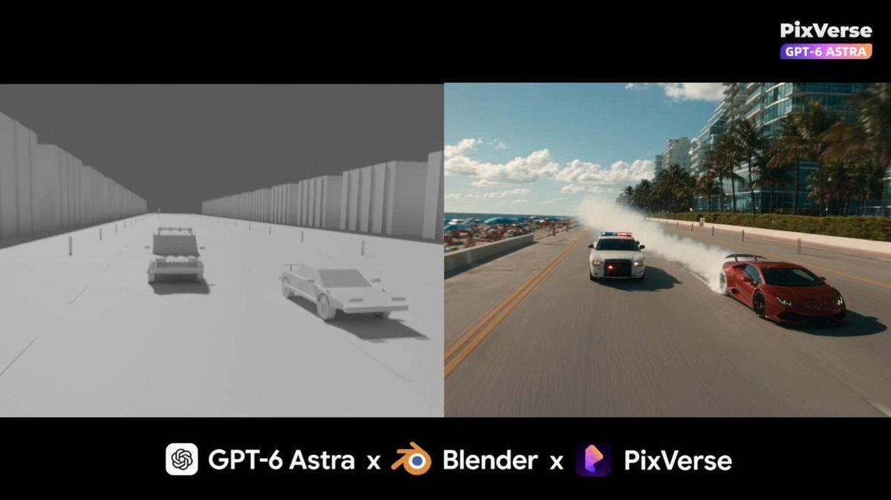</a>

Prompt riutilizzabile per creare e animare in Blender un inseguimento automobilistico cartoon di 12 secondi ispirato a GTA, quindi elaborare le inquadrature con PixVerse Seedance 2.5.

**Prompt**

```text
Crea un inseguimento automobilistico cartoon originale ispirato a GTA usando questo workflow:
Progettazione: definisci un pilota principale, un'auto in fuga, un'auto inseguitrice e un ambiente urbano. Mantieni coerenti i loro design. Pianifica tre inquadrature da 4 secondi: inseguimento con tracking posteriore, tracking laterale durante una curva stretta e un'inquadratura panoramica dell'uscita.
Costruzione in Blender: crea modelli grigi puliti e rig funzionali per personaggi e veicoli. Non sono necessarie texture né scartatura UV.
Anima e verifica: anima il pilota, lo sterzo, la rotazione delle ruote, i veicoli e le camere. Mantieni coerenti la direzione di marcia e l'ordine dei veicoli. Correggi intersezioni, ruote sospese, pneumatici che slittano, pose deformate e mani che perdono il contatto con il volante.
Renderizza in Blender: esegui il rendering dei fotogrammi da 1 a 288 a 1280×720, 24 fps. Assembla i fotogrammi effettivamente renderizzati in Blender in un master completo di 12 secondi con modelli grigi. Esporta ogni inquadratura separatamente e renderizza immagini fisse corrispondenti in grigio come riferimenti per forme e composizione.
Completa con il plugin [@PixVerse](plugin://pixverse@openai-curated-remote): usa Seedance 2.5 a 720p, elaborando ogni inquadratura separatamente. Usa le clip di Blender come riferimenti per il movimento e le immagini fisse in grigio come riferimenti per le forme. Definisci una palette di colori cartoon coerente nel prompt di generazione. Mantieni il movimento della camera, i tempi d'azione, i design dei personaggi e dei veicoli e il numero di veicoli.
Rivedi e consegna: controlla entrambi i video completi per individuare difetti visivi e problemi di continuità. Correggi i problemi in Blender e rigenera solo le inquadrature Seedance non riuscite, con un massimo di due tentativi per inquadratura. Consegna il file .blend modificabile, il video nativo a 720p con modelli grigi renderizzato in Blender, la versione Seedance a 720p con inquadrature etichettate separatamente e una breve valutazione dei limiti ancora presenti.
```

[Vedi dettagli ↗](https://www.tripo3d.ai/it/3d-prompts/gpt-6-astra-2098049032195293190) · [Post originale](https://x.com/PixVerse/status/2098049032195293190) · [Torna agli esempi](#all-prompts)

---

<a id="2098063352832610473"></a>

### City Pulse

[Seoyeon Jun 📊](https://x.com/tableau_viz) · 2026-09-10

<a href="https://www.tripo3d.ai/it/3d-prompts/gpt-6-astra-2098063352832610473">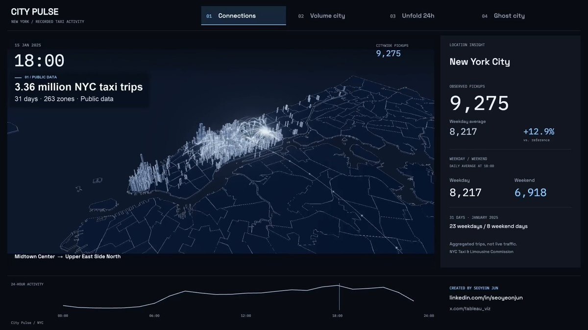</a>

Un atlante interattivo 3D della mobilità di New York, basato sull'attività dei taxi gialli della città nel gennaio 2025, con mappa 3D, riproduzione dei movimenti ora per ora, analisi delle zone e confronti con le medie dei giorni feriali o del fine settimana.

**Prompt**

```text
# Crea "City Pulse": un atlante interattivo 3D della mobilità di New York basato sull'attività dei taxi della città (gennaio 2025)

## Obiettivo
Una visualizzazione web in inglese, a pagina singola, che mostri come si muove New York nell'arco di un mese:
31 giorni, 24 ore, 263 zone taxi. Il lettore deve poter osservare il ritmo quotidiano della città,
confrontare qualsiasi giorno con un giorno feriale o del fine settimana tipo e analizzare nel dettaglio qualsiasi zona.
È uno strumento di analisi descrittiva, non un prodotto in tempo reale né basato su dati GPS. Ogni elemento visivo deve indicare chiaramente che cosa rappresenta un singolo segno.

## Dati
Fonti (pubbliche):
- Dati NYC TLC sui viaggi registrati, taxi gialli, gennaio 2025 (Parquet)
- Zone taxi di NYC TLC (263 zone, forme geometriche + corrispondenza con i borough)
- Impronte degli edifici di NYC Open Data (solo Manhattan, come contesto visivo)

Pre-elaborazione (Python + DuckDB o pandas), con output in piccoli file JSON statici:
- Filtra i viaggi non validi: presa a bordo fuori da gennaio 2025, durata non positiva o superiore a 3 ore, zone sconosciute (264/265).
- Per giorno, zona e ora: numero di prese a bordo, durata mediana del viaggio.
- Per giorno e ora: principali coppie zona di origine → zona di destinazione (flussi aggregati, prime N coppie per ora).
- Medie di riferimento per zona e ora: media dei giorni feriali (23 giorni) e media del fine settimana (8 giorni), medie giornaliere; le festività restano nel gruppo dei giorni feriali.
- Scala fissa a livello mensile: massimo numero di prese a bordo per zona e ora, usato per ogni giorno affinché le altezze restino confrontabili.
- Metadati delle zone: ID, nome, borough, centroide, punto di ancoraggio dell'etichetta. Semplifica la geometria delle zone.
File: month.json (totali giornalieri, scala, zone principali), weekday.json, weekend.json, days/2025-01-DD.json, GeoJSON delle zone.
Carica pigramente i dati del giorno corrente; mantieni rapido il primo rendering.

## Stack
- Un unico file HTML autonomo (oppure una piccola app Vite) con Three.js 0.160 (moduli ES tramite importmap), OrbitControls, EffectComposer + bloom.
- D3 solo per scale/formattazione e piccoli grafici SVG.
- Nessun framework obbligatorio. Nessuna chiamata ad API esterne durante l'esecuzione; tutto legge i JSON statici.

## Layout (su desktop 1920×1080 deve stare in un'unica schermata senza scorrimento)
1. Header: "CITY PULSE / ATLANTE DELLA MOBILITÀ", stato "Riproduzione registrata", link "Dati e metodi".
2. Riga di stato: "Una città in movimento." + tre KPI: prese a bordo in tutta la città (ora selezionata), confronto con la media, durata mediana del viaggio.
3. Fascia del mese: 31 pulsanti giornalieri come mini barre (altezza della barra = prese a bordo giornaliere, fine settimana contrassegnato), giorno precedente/successivo, selezione della data, selettore "Confronta con" (Media dei giorni feriali · 23 giorni / Media del fine settimana · 8 giorni).
4. Barra narrativa: "Ogni movimento lascia una traccia." con 4 capitoli (01 Osserva, 02 Svela, 03 Confronta, 04 Condividi) e "Inizia la storia".
5. Schede delle viste: 01 Connessioni, 02 Volume della città, 03 Svela le 24 ore, 04 Città fantasma, oltre a "Condividi il risultato" e "Crea un briefing".
6. Area di lavoro: scena con mappa 3D (a sinistra) + pannello di analisi "Insight sulla posizione" (a destra, circa 330 px, con scorrimento interno).
7. Timeline: Riproduci la giornata, velocità (0,25×–4×), cursore delle ore sopra un grafico a barre di 24 ore del giorno selezionato a confronto con la media.
L'altezza della scena con la mappa deve adattarsi alla viewport (clamp tra circa 470 px e circa 780 px), così l'intera console, inclusa la timeline, resta visibile con zoom al 100%.

## Scena 3D
- Sfondo scuro, contorni delle zone tracciati con linee sottili, impronte degli edifici di Manhattan come tenue contesto reale.
- Telecamera prospettica, orbita + zoom, pulsante per ricentrare la vista. Mantieni la telecamera dell'utente quando si cambia vista, tranne in "Svela le 24 ore", che deve sempre ridefinire l'inquadratura per mostrare l'intera matrice.
- Al passaggio del mouse su una zona: tooltip con nome e prese a bordo. Al clic su una zona: selezionala (aggiorna il pannello di analisi e i flussi).

Viste (ogni cambio è animato, senza stacchi bruschi):
- 01 Connessioni: viaggi aggregati da zona a zona rappresentati come archi luminosi con particelle di luce in movimento; densità delle particelle ∝ viaggi; etichetta per il flusso in evidenza ("DA / Midtown Center → A / Upper East Side North, 71 viaggi / 18:00"). Didascalia: "Viaggi registrati da zona a zona · movimento schematico. Non GPS."
- 02 Volume della città: ogni zona viene estrusa; altezza = prese a bordo sulla scala mensile fissa; la zona selezionata è evidenziata.
```

[Vedi dettagli ↗](https://www.tripo3d.ai/it/3d-prompts/gpt-6-astra-2098063352832610473) · [Post originale](https://x.com/tableau_viz/status/2098063352832610473) · [Torna agli esempi](#all-prompts)

---

<a id="2098071577309122854"></a>

### Animazione di un’accademia magica fluttuante

[PixVerse](https://x.com/PixVerse) · 2026-09-10

<a href="https://www.tripo3d.ai/it/3d-prompts/gpt-6-astra-2098071577309122854">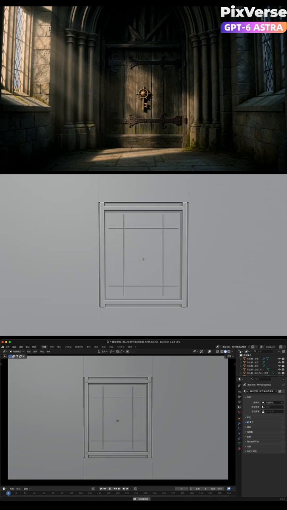</a>

Crea in Blender un’animazione di 12 secondi con modello bianco, che mostri un ingresso monumentale, un passaggio in volo attraverso un buco della serratura, uno strumento astronomico e un’accademia fluttuante; usa poi PixVerse per renderizzarla come una sequenza fantasy cinematografica. I deliverable richiesti includono entrambi i file MP4 e un progetto Blender modificabile.

**Prompt**

```text
Crea in Blender un’animazione di 12 secondi, in un’unica ripresa, con modello bianco, poi usa @PixVerse per trasformare l’animazione esportata in una spettacolare sequenza cinematografica fantasy in stile live action.

In Blender, costruisci un ingresso monumentale, uno strumento astronomico rotante e una vasta accademia magica fluttuante. Usa geometrie semplici bianche o grigio chiaro, con silhouette leggibili e un’illuminazione di base. Mostra l’intera porta d’ingresso all’inizio, con muri solidi tutt’intorno che nascondano completamente il mondo retrostante. Dai alla porta un piccolo buco della serratura dalle proporzioni realistiche. Oltre l’ingresso, disponi un grande castello centrale, torri, isole fluttuanti più piccole e ponti di collegamento. Definisci una scala architettonica imponente e distanze generose tra le strutture.

Inizia con un lento avvicinamento alla porta, poi accelera bruscamente e attraversa il buco della serratura con un movimento di volo continuo. Anima una chiave fluttuante che ruota e si sposta di lato prima del passaggio della camera. Prosegui attraverso anelli astronomici in rapida rotazione, rivela l’accademia fluttuante e passa a un’orbita fluida intorno all’architettura. Fai sollevare rapidamente le isole vicine e ruotare le sezioni dei ponti fino a portarle in posizione. Mantieni i movimenti degli oggetti energici e decisi. L’orbita deve scorrere senza interruzioni, con variazioni di velocità fluide e senza pause ripetute. Controlla il passaggio nel buco della serratura, il margine libero della camera, la continuità spaziale e il movimento a velocità di riproduzione normale.

Esporta l’MP4 pulito di 12 secondi con modello bianco. Usa poi @PixVerse per generare un video di 12 secondi renderizzato dall’IA, utilizzando l’animazione Blender come riferimento strutturale e di movimento non vincolante. Mantieni la progressione riconoscibile dall’avvicinamento alla porta al passaggio nel buco della serratura, allo strumento astronomico, alla rivelazione dell’accademia e all’orbita, arricchendo liberamente il mondo e la messa in scena cinematografica.

Trasforma l’accademia in un’immensa città fluttuante antica: un castello centrale circondato da quartieri, biblioteche, osservatori, cortili, tetti sovrapposti, enormi ponti in pietra e cascate che precipitano tra le nuvole. Estendi l’ambiente circostante con valli boscose, laghi, montagne lontane e altre isole fluttuanti. Aggiungi minuscoli pedoni, imbarcazioni volanti, bandiere al vento, uccelli e attività atmosferiche per comunicare la scala. Durante l’orbita finale, fai emergere dalle nuvole, dietro l’accademia, un drago enorme che scivoli oltre le torri proiettando un’ombra in movimento sulla città.

Punta alla ricchezza visiva di un lungometraggio fantasy in stile live action, con materiali segnati dagli agenti atmosferici, una morbida luce dorata che filtra attraverso nuvole fredde, profondità atmosferica naturale e delicati riflessi fotografici. Includi musica orchestrale originale e suoni ambientali e d’azione sincronizzati.

Fornisci l’MP4 con modello bianco, l’MP4 renderizzato dall’IA di PixVerse e il progetto Blender modificabile.
```

[Vedi dettagli ↗](https://www.tripo3d.ai/it/3d-prompts/gpt-6-astra-2098071577309122854) · [Post originale](https://x.com/PixVerse/status/2098071577309122854) · [Torna agli esempi](#all-prompts)

---

<a id="2098225609558335846"></a>

### Nave corriere civile iniziale di Sol Horizon

[Jonathan Plumb — Spokane Valley](https://x.com/jonathanplumb) · 2026-09-11

<a href="https://www.tripo3d.ai/it/3d-prompts/gpt-6-astra-2098225609558335846">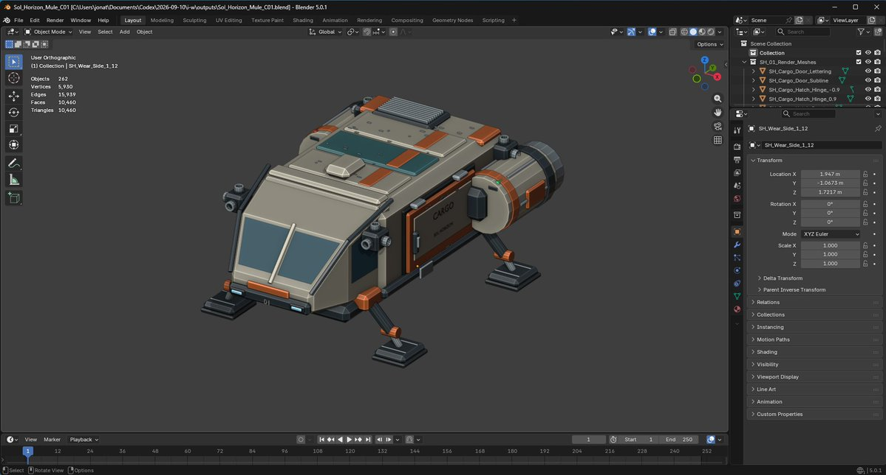</a>

<a href="https://www.tripo3d.ai/it/3d-prompts/gpt-6-astra-2098225609558335846">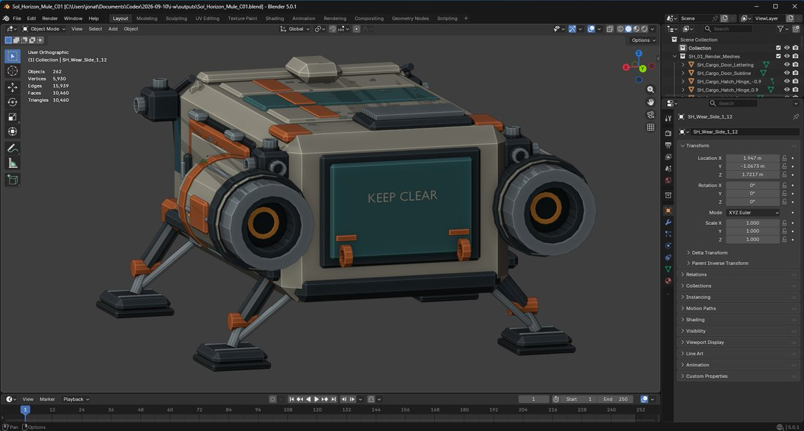</a>

Crea in Blender un modello pronto per il gioco della nave corriere civile iniziale di Sol Horizon, con un design modulare hard-surface facilmente riparabile, oggetti denominati, geometria di collisione, orientamento con asse frontale per Unity ed esportazione in FBX.

**Prompt**

```text
In Blender, crea la nave corriere civile iniziale di Sol Horizon. Deve avere un aspetto usato, riparabile, economico e sicuro, non militare. Crea una cabina di pilotaggio, un portello di carico, propulsori di manovra visibili, un gruppo motore principale e quattro puntoni d’atterraggio. Usa uno stile hard-surface modulare, adatto a future varianti. Mantieni la mesh principale di rendering sotto i 15.000 triangoli. Assegna nomi chiari agli oggetti, imposta la direzione frontale per Unity, crea una geometria di collisione semplice, applica le trasformazioni, salva il file .blend ed esporta un FBX pronto per il gioco. Mostra schermate della viewport per l’approvazione prima dell’esportazione.
```

[Vedi dettagli ↗](https://www.tripo3d.ai/it/3d-prompts/gpt-6-astra-2098225609558335846) · [Post originale](https://x.com/jonathanplumb/status/2098225609558335846) · [Torna agli esempi](#all-prompts)

---

<a id="2098371778234179766"></a>

### Workflow per un inseguimento automobilistico 3D in stile GTA

[はさまるスタジオ (Hasamaru Studio)](https://x.com/hasamaru_studio) · 2026-09-11

<a href="https://www.tripo3d.ai/it/3d-prompts/gpt-6-astra-2098371778234179766"></a>

Prompt per creare in Blender un inseguimento automobilistico 3D originale in stile GTA, completo di graybox, rig di personaggi e veicoli, animazione e master video di 12 secondi, e per rifinire ogni shot con il plugin PixVerse.

**Prompt**

```text
Create un inseguimento automobilistico 3D originale in stile GTA seguendo il workflow riportato di seguito.

【Design】
Definite un conducente principale, un veicolo in fuga, un veicolo inseguitore e un'ambientazione urbana, mantenendo coerente il design di ciascun elemento. Pianificate 3 shot da 4 secondi ciascuno, per un totale di 12 secondi.
・Shot d'inseguimento da dietro, con la camera che segue i veicoli
・Shot laterale che segue i veicoli mentre affrontano una curva stretta
・Shot ampio che mostra i veicoli allontanarsi

【Costruzione in Blender】
Create un graybox pulito e rig funzionali per il personaggio e i veicoli. Non servono texture né unwrap UV.

【Animazione e test】
Animate il conducente, i movimenti del volante, la rotazione delle ruote, i veicoli e la camera. Mantenete coerenti la direzione di marcia e le posizioni reciproche dei veicoli, correggendo intersezioni, ruote sospese, slittamenti innaturali degli pneumatici, pose deformate e i problemi che fanno staccare le mani dal volante.

【Rendering in Blender】
Eseguite il rendering dei frame da 1 a 288 a 1280×720 e 24 fps. Unite i frame renderizzati direttamente in Blender per creare un master video graybox di 12 secondi. Esportate ogni shot separatamente e renderizzate anche il relativo fermo immagine in graybox come riferimento per forme e composizione.

【Rifinitura con il plugin PixVerse】
Usate Seedance 2.5 a 720p ed elaborate ogni shot separatamente. Usate il video di Blender come riferimento per il movimento e i fermi immagine in graybox come riferimento per le forme. Specificate nei prompt di generazione una palette coerente per l'intero video. Mantenete i movimenti della camera, il timing dell'azione, il design dei personaggi e dei veicoli e il numero di veicoli.

【Verifica e consegna】
Verificate entrambi i video finali e controllate la presenza di artefatti visivi e la continuità tra gli shot. Correggete i problemi sul lato Blender e rigenerate solo gli shot falliti in Seedance. Effettuate al massimo 2 tentativi per shot.

Consegnate il file .blend modificabile, il video graybox di Blender in 720p nativo, il video a 720p chiaramente indicato come versione Seedance e una breve valutazione dei limiti ancora presenti.
```

[Vedi dettagli ↗](https://www.tripo3d.ai/it/3d-prompts/gpt-6-astra-2098371778234179766) · [Post originale](https://x.com/hasamaru_studio/status/2098371778234179766) · [Torna agli esempi](#all-prompts)

---

<a id="2098374138092277920"></a>

### Modello 3D interattivo per l’interior design di una stanza

[Roma Kumakura](https://x.com/RomaKumakura) · 2026-09-11

<a href="https://www.tripo3d.ai/it/3d-prompts/gpt-6-astra-2098374138092277920">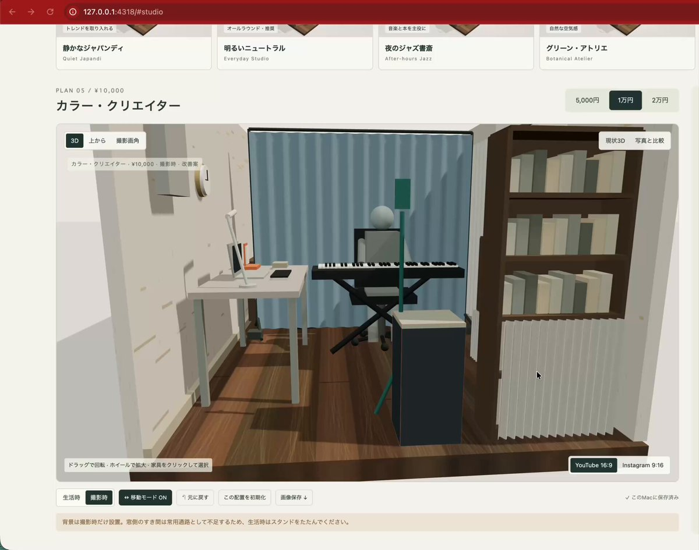</a>

Richiesta di creare un progetto 3D interattivo per l’interior design, con dimensioni della stanza riprodotte fedelmente e mobili riposizionabili tramite trascinamento. Include anche proposte di ristrutturazione a tema, cambio di budget e verifica delle inquadrature.

**Prompt**

```text
Infine, create un progetto che mi permetta di comprendere chiaramente le proposte di interior design e di capire cosa acquistare e come disporlo.
```

[Vedi dettagli ↗](https://www.tripo3d.ai/it/3d-prompts/gpt-6-astra-2098374138092277920) · [Post originale](https://x.com/RomaKumakura/status/2098374138092277920) · [Torna agli esempi](#all-prompts)

---

<a id="2098403061463224543"></a>

### Scena di modellino 3D in miniatura di un tempio

[Rion Wu](https://x.com/rionaifantasy) · 2026-09-11

<a href="https://www.tripo3d.ai/it/3d-prompts/gpt-6-astra-2098403061463224543">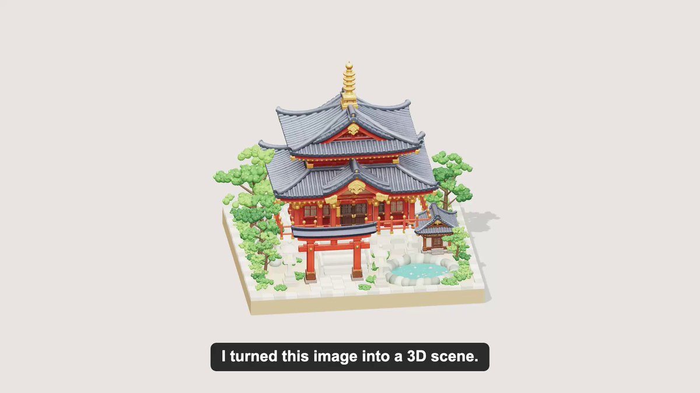</a>

Prompt per un’immagine di riferimento fornito dall’autore in un commento, pensato per creare una scena isometrica in miniatura, vista dall’alto a 45°, con gli elementi distintivi di un tempio. Nel post originale si specifica che la scena in miniatura è stata scomposta in componenti con Astra, dettagliata con V2Fun e poi assemblata e rifinita.

**Prompt**

```text
Rappresenta una scena nitida di modellino 3D cartoon in miniatura, in vista assonometrica isometrica dall’alto a 45°, con estetica 2.5D, texture morbide e curate, materiali PBR realistici e un’illuminazione delicata ma realistica. Crea una piccola base rialzata in stile diorama, con gli elementi più riconoscibili del tempio. Usa uno sfondo a tinta unita. Composizione: layout perfettamente centrato, formato quadrato 1080x1080, estetica del modellino estremamente pulita e ad alta definizione. È sufficiente usare un carattere più spesso e luminoso.
```

[Vedi dettagli ↗](https://www.tripo3d.ai/it/3d-prompts/gpt-6-astra-2098403061463224543) · [Post originale](https://x.com/rionaifantasy/status/2098403061463224543) · [Torna agli esempi](#all-prompts)

---

<a id="2098406473273663992"></a>

### Statuetta di una bambina che gioca con un robot

[𝟡𝟜 ᴾᴸᴬʸᶠᴼᴿᴳᴱ](https://x.com/94vanAI) · 2026-09-11

<a href="https://www.tripo3d.ai/it/3d-prompts/gpt-6-astra-2098406473273663992">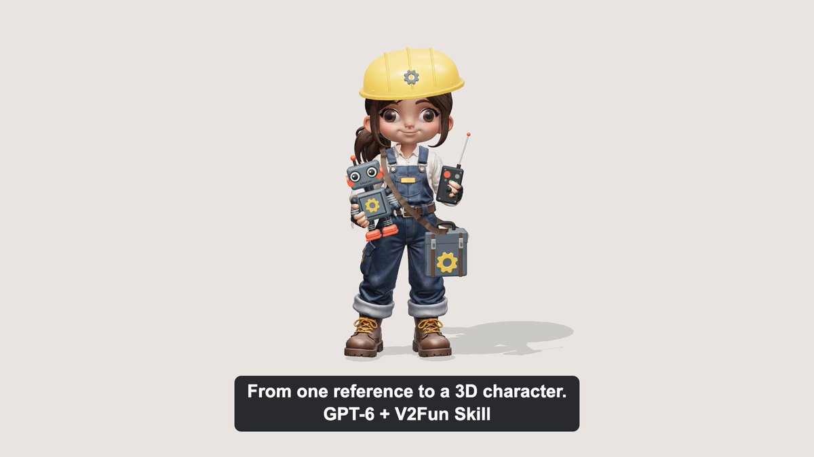</a>

Crea una statuetta completa di una bambina in piedi, in stile anime 3D ad alta definizione, con casco da operaia, robot di latta, telecomando e cassetta degli attrezzi alla cintura.

**Prompt**

```text
Statuetta completa di una bambina che gioca con un robot, con un piccolo casco da operaia in testa, un robot di latta in una mano e un telecomando nell’altra, oltre a una cassetta degli attrezzi legata alla cintura. Tutti gli accessori sono perfettamente assemblati; posa in piedi, sfondo bianco uniforme, illuminazione professionale da studio, stile da statuetta anime 3D ad alta definizione. ar3:4
```

[Vedi dettagli ↗](https://www.tripo3d.ai/it/3d-prompts/gpt-6-astra-2098406473273663992) · [Post originale](https://x.com/94vanAI/status/2098406473273663992) · [Torna agli esempi](#all-prompts)

---

<a id="2096525100518453342"></a>

### Espressioni del personaggio intercambiabili in Blender

[Nano(ナノ)](https://x.com/Dstudio_ai) · 2026-09-06

<a href="https://www.tripo3d.ai/it/3d-prompts/switchable-character-expressions-in-blender-2096525100518453342"></a>

**Prompt**

```text
Prepara varianti delle espressioni di un personaggio Tripo in Blender prima del rigging. Allinea le mesh e passa da una all’altra senza interpolazione, riducendo le varianti inattive all’interno della testa. Non presentare il risultato come una fusione graduale delle espressioni né come compatibile con VRM.
```

[Vedi dettagli ↗](https://www.tripo3d.ai/it/3d-prompts/switchable-character-expressions-in-blender-2096525100518453342) · [Post originale](https://x.com/Dstudio_ai/status/2096525100518453342) · [Torna agli esempi](#all-prompts)

---

<a id="2096308567863079420"></a>

### Scena con personaggio ispirata a Warcraft in Unity

[Lucca Cerf ➔ Pluma Finance](https://x.com/luccacerf) · 2026-09-05

<a href="https://www.tripo3d.ai/it/3d-prompts/warcraft-inspired-character-scene-in-unity-2096308567863079420"></a>

**Prompt**

```text
Crea una scena con personaggio ispirata a Warcraft usando Astra, Tripo P2, Blender e Unity. Genera il personaggio, preparalo in Blender e assembla una scena giocabile in Unity.
```

[Vedi dettagli ↗](https://www.tripo3d.ai/it/3d-prompts/warcraft-inspired-character-scene-in-unity-2096308567863079420) · [Post originale](https://x.com/luccacerf/status/2096308567863079420) · [Torna agli esempi](#all-prompts)

---

<a id="2096579856133947507"></a>

### Scacchiera shogi 3D ruotabile

[薄幸柄 / LAB](https://x.com/hatukougara) · 2026-09-06

<a href="https://www.tripo3d.ai/it/3d-prompts/rotatable-3d-shogi-board-2096579856133947507"></a>

**Prompt**

```text
Crea un’applicazione di shogi 3D giocabile con una scacchiera che si possa ruotare liberamente. Affina la scacchiera, i pezzi e le interazioni attraverso revisioni successive.
```

[Vedi dettagli ↗](https://www.tripo3d.ai/it/3d-prompts/rotatable-3d-shogi-board-2096579856133947507) · [Post originale](https://x.com/hatukougara/status/2096579856133947507) · [Torna agli esempi](#all-prompts)

---

<a id="2096578761877860502"></a>

### Atlante esploso di un computer desktop

[cooper](https://x.com/icooperhero) · 2026-09-06

<a href="https://www.tripo3d.ai/it/3d-prompts/exploded-desktop-computer-atlas-2096578761877860502"></a>

**Prompt**

```text
Crea un sito 3D interattivo che scomponga un computer desktop in 29 componenti principali. Aggiungi uno smontaggio animato e una spiegazione per ciascun pezzo.
```

[Vedi dettagli ↗](https://www.tripo3d.ai/it/3d-prompts/exploded-desktop-computer-atlas-2096578761877860502) · [Post originale](https://x.com/icooperhero/status/2096578761877860502) · [Torna agli esempi](#all-prompts)

---

<a id="2096578684010508736"></a>

### Progettazione di cameretta e spazio di lavoro

[かのこ🌼AI×子育て×探究](https://x.com/dqlh47m) · 2026-09-06

<a href="https://www.tripo3d.ai/it/3d-prompts/children-s-room-and-workspace-planner-2096578684010508736"></a>

**Prompt**

```text
Ricostruisci una cameretta per bambini che serva anche da spazio di lavoro usando quattro foto dagli angoli e le dimensioni della stanza. Mostra i punti di vista di un adulto e di un bambino, una panoramica e disposizioni alternative dei mobili.
```

[Vedi dettagli ↗](https://www.tripo3d.ai/it/3d-prompts/children-s-room-and-workspace-planner-2096578684010508736) · [Post originale](https://x.com/dqlh47m/status/2096578684010508736) · [Torna agli esempi](#all-prompts)

---

<a id="2096557555086725159"></a>

### Miniatura interattiva di Seoul

[synabreu](https://x.com/synabreu) · 2026-09-06

<a href="https://www.tripo3d.ai/it/3d-prompts/interactive-miniature-of-seoul-2096557555086725159"></a>

**Prompt**

```text
Crea una miniatura di Seoul in Three.js usando dati cartografici aperti. Aggiungi navigazione per distretto, sorvoli dei luoghi simbolo, modalità giorno e notte e controlli touch. Dichiara quali edifici sono semplificati, quali altezze sono stimate e le licenze dei dati.
```

[Vedi dettagli ↗](https://www.tripo3d.ai/it/3d-prompts/interactive-miniature-of-seoul-2096557555086725159) · [Post originale](https://x.com/synabreu/status/2096557555086725159) · [Demo](https://seoul-3d-atlas.synabreu.chatgpt.site/) · [Torna agli esempi](#all-prompts)

---

<a id="2096460081982304546"></a>

### Insetto procedurale che si arrampica sulle superfici

[XiaoLei Liu](https://x.com/leo_xiaolei) · 2026-09-06

<a href="https://www.tripo3d.ai/it/3d-prompts/surface-climbing-procedural-insect-2096460081982304546"></a>

**Prompt**

```text
Crea un insetto 3D a più zampe che cammini aderendo a superfici diverse. Coordina zampe e corpo mentre supera variazioni di altezza.
```

[Vedi dettagli ↗](https://www.tripo3d.ai/it/3d-prompts/surface-climbing-procedural-insect-2096460081982304546) · [Post originale](https://x.com/leo_xiaolei/status/2096460081982304546) · [Demo](https://threerocks.github.io/web-3d-pages/) · [Torna agli esempi](#all-prompts)

---

<a id="2096467585785286808"></a>

### Il Wright Flyer sopra una foresta giapponese

[The Bugged Dev](https://x.com/thebuggeddev) · 2026-09-06

<a href="https://www.tripo3d.ai/it/3d-prompts/wright-flyer-through-a-japanese-forest-2096467585785286808"></a>

**Prompt**

```text
Crea un gioco di volo in Three.js con il Wright Flyer del 1903 in una foresta giapponese. Studia il velivolo e genera proceduralmente l’aereo, gli alberi, i torii, le case e le montagne, senza asset esterni.
```

[Vedi dettagli ↗](https://www.tripo3d.ai/it/3d-prompts/wright-flyer-through-a-japanese-forest-2096467585785286808) · [Post originale](https://x.com/thebuggeddev/status/2096467585785286808) · [Torna agli esempi](#all-prompts)

---

<a id="2096576154337734865"></a>

### Una casa modellata da zero in Blender

[みずくん](https://x.com/mizkun) · 2026-09-06

<a href="https://www.tripo3d.ai/it/3d-prompts/a-house-modeled-from-scratch-in-blender-2096576154337734865"></a>

**Prompt**

```text
Modella una casa da zero in Blender. Mantieni la scena modificabile per poter esaminare e perfezionare l’edificio nelle iterazioni successive.
```

[Vedi dettagli ↗](https://www.tripo3d.ai/it/3d-prompts/a-house-modeled-from-scratch-in-blender-2096576154337734865) · [Post originale](https://x.com/mizkun/status/2096576154337734865) · [Torna agli esempi](#all-prompts)

---

<a id="2096501340889374883"></a>

### Dalla pianta dell’ultimo piano a un’anteprima Blender

[indigo](https://x.com/indigox) · 2026-09-06

<a href="https://www.tripo3d.ai/it/3d-prompts/top-floor-plan-to-blender-preview-2096501340889374883"></a>

**Prompt**

```text
Usa la pianta dell’ultimo piano di una casa per creare una scena Blender e renderizza un’anteprima di 10 secondi con pochi campioni. Dai priorità a una disposizione spaziale chiara prima di rifinire i materiali.
```

[Vedi dettagli ↗](https://www.tripo3d.ai/it/3d-prompts/top-floor-plan-to-blender-preview-2096501340889374883) · [Post originale](https://x.com/indigox/status/2096501340889374883) · [Torna agli esempi](#all-prompts)

---

<a id="2096574297703637111"></a>

### Avventura esplorativa The Quiet Crossing

[MotionViz](https://x.com/Motion_Viz) · 2026-09-06

<a href="https://www.tripo3d.ai/it/3d-prompts/the-quiet-crossing-exploration-quest-2096574297703637111"></a>

**Prompt**

```text
Crea un gioco di esplorazione innevato in Three.js con un personaggio Blender, pini voxel e un portale di pietra. Permetti di raccogliere sei frammenti luminosi, fai seguire il personaggio dalla camera e mostra la distanza dal portale.
```

[Vedi dettagli ↗](https://www.tripo3d.ai/it/3d-prompts/the-quiet-crossing-exploration-quest-2096574297703637111) · [Post originale](https://x.com/Motion_Viz/status/2096574297703637111) · [Torna agli esempi](#all-prompts)

---

<a id="2096577430274429157"></a>

### Locomotiva a vapore attraverso la campagna

[ダンさんブル@d三b](https://x.com/dansanburu) · 2026-09-06

<a href="https://www.tripo3d.ai/it/3d-prompts/steam-locomotive-across-the-countryside-2096577430274429157"></a>

**Prompt**

```text
Modella una locomotiva a vapore in Three.js e animala mentre attraversa una scena di campagna. Sincronizza il movimento delle ruote con lo spostamento del treno.
```

[Vedi dettagli ↗](https://www.tripo3d.ai/it/3d-prompts/steam-locomotive-across-the-countryside-2096577430274429157) · [Post originale](https://x.com/dansanburu/status/2096577430274429157) · [Torna agli esempi](#all-prompts)

---

<a id="2096561346766877106"></a>

### Scena di un giradischi su un tavolo

[Nitesh Seram](https://x.com/niteshseram) · 2026-09-06

<a href="https://www.tripo3d.ai/it/3d-prompts/vinyl-player-tabletop-scene-2096561346766877106"></a>

**Prompt**

```text
Crea una scena Three.js con un giradischi su un tavolo. Allestisci una presentazione di prodotto in cui le lampade si accendono e la camera mostra il giradischi e gli arredi circostanti.
```

[Vedi dettagli ↗](https://www.tripo3d.ai/it/3d-prompts/vinyl-player-tabletop-scene-2096561346766877106) · [Post originale](https://x.com/niteshseram/status/2096561346766877106) · [Torna agli esempi](#all-prompts)

---

<a id="2096555856204644550"></a>

### Ciclo di gioco di battaglie con carte collezionabili

[FaryaBlender3D](https://x.com/FaryaBlender3D) · 2026-09-06

<a href="https://www.tripo3d.ai/it/3d-prompts/trading-card-battle-game-loop-2096555856204644550"></a>

**Prompt**

```text
Crea un prototipo di carte collezionabili in Three.js: acquistare mazzi e buste, comporre un mazzo, entrare in un’arena e ottenere ricompense. Mantieni le mesh provvisorie sostituibili con asset definitivi.
```

[Vedi dettagli ↗](https://www.tripo3d.ai/it/3d-prompts/trading-card-battle-game-loop-2096555856204644550) · [Post originale](https://x.com/FaryaBlender3D/status/2096555856204644550) · [Torna agli esempi](#all-prompts)

---

<a id="2096362653480562751"></a>

### Gioco di simulazione di una rete ferroviaria

[Tom Krcha](https://x.com/tomkrcha) · 2026-09-05

<a href="https://www.tripo3d.ai/it/3d-prompts/railway-network-simulation-game-2096362653480562751"></a>

**Prompt**

```text
Espandi un modello di treno Three.js in una simulazione ferroviaria con città, snodi, fiumi e ponti. Aggiungi camere di inseguimento del treno, 3D libera e isometrica, oltre a effetti di fumo.
```

[Vedi dettagli ↗](https://www.tripo3d.ai/it/3d-prompts/railway-network-simulation-game-2096362653480562751) · [Post originale](https://x.com/tomkrcha/status/2096362653480562751) · [Torna agli esempi](#all-prompts)

---

<a id="2096490395614019793"></a>

### Villaggio low poly di Gwacheon da esplorare a piedi

[Manas Joshi](https://x.com/ManasJoshi76254) · 2026-09-06

<a href="https://www.tripo3d.ai/it/3d-prompts/walkable-low-poly-gwacheon-village-2096490395614019793"></a>

**Prompt**

```text
Crea in un singolo file HTML un villaggio low poly accogliente ed esplorabile ispirato a Gwacheon. Combina paesaggio 3D procedurale, atmosfera, interfaccia e interazioni.
```

[Vedi dettagli ↗](https://www.tripo3d.ai/it/3d-prompts/walkable-low-poly-gwacheon-village-2096490395614019793) · [Post originale](https://x.com/ManasJoshi76254/status/2096490395614019793) · [Torna agli esempi](#all-prompts)

---

<a id="2096505740643246231"></a>

### Livello completo di rompicapo in Three.js

[Steve的花园儿](https://x.com/TvWoo) · 2026-09-06

<a href="https://www.tripo3d.ai/it/3d-prompts/complete-three-js-puzzle-level-2096505740643246231"></a>

**Prompt**

```text
Crea un livello completo di un rompicapo 3D in Three.js, incluse le meccaniche giocabili. Integra l’audio fornito dopo aver reso funzionanti il livello e le interazioni.
```

[Vedi dettagli ↗](https://www.tripo3d.ai/it/3d-prompts/complete-three-js-puzzle-level-2096505740643246231) · [Post originale](https://x.com/TvWoo/status/2096505740643246231) · [Torna agli esempi](#all-prompts)

---

<a id="2096570815714414844"></a>

### Caccia al tesoro su una spiaggia low poly

[空野こんこん＠個人ゲーム開発者](https://x.com/sorano_concon_g) · 2026-09-06

<a href="https://www.tripo3d.ai/it/3d-prompts/low-poly-beach-treasure-hunt-2096570815714414844"></a>

**Prompt**

```text
Crea in Unity una caccia al tesoro 3D giocabile su una spiaggia. Modella palme e pedane di legno low poly e imposta il ciclo principale di esplorazione e ricerca dei tesori.
```

[Vedi dettagli ↗](https://www.tripo3d.ai/it/3d-prompts/low-poly-beach-treasure-hunt-2096570815714414844) · [Post originale](https://x.com/sorano_concon_g/status/2096570815714414844) · [Torna agli esempi](#all-prompts)

---

<a id="2096560142871658589"></a>

### Modelli Blender con effetti visivi Unity

[ねぎぽよし](https://x.com/CST_negi) · 2026-09-06

<a href="https://www.tripo3d.ai/it/3d-prompts/blender-models-with-unity-vfx-2096560142871658589"></a>

**Prompt**

```text
Crea i modelli della scena in Blender e importali in Unity. Aggiungi effetti con VFX Graph e illumina la scena in modo che modelli ed effetti risultino chiaramente leggibili insieme.
```

[Vedi dettagli ↗](https://www.tripo3d.ai/it/3d-prompts/blender-models-with-unity-vfx-2096560142871658589) · [Post originale](https://x.com/CST_negi/status/2096560142871658589) · [Torna agli esempi](#all-prompts)

---

<a id="2096556692842348826"></a>

### Gioco di rally Unity giocabile su telefono

[Kevin Kern](https://x.com/kevinkern) · 2026-09-06

<a href="https://www.tripo3d.ai/it/3d-prompts/mobile-playable-unity-rally-game-2096556692842348826"></a>

**Prompt**

```text
Crea un prototipo di guida rally con Codex, Blender e Unity. Prepara gli asset 3D e i controlli per provare il gioco su un telefono.
```

[Vedi dettagli ↗](https://www.tripo3d.ai/it/3d-prompts/mobile-playable-unity-rally-game-2096556692842348826) · [Post originale](https://x.com/kevinkern/status/2096556692842348826) · [Torna agli esempi](#all-prompts)

---

<a id="2096572429066006845"></a>

### Albero di mango indiano in SpeedTree

[Varun Mayya](https://x.com/waitin4agi_) · 2026-09-06

<a href="https://www.tripo3d.ai/it/3d-prompts/indian-mango-tree-in-speedtree-2096572429066006845"></a>

**Prompt**

```text
Crea un albero di mango indiano in SpeedTree per una scena Unreal con obiettivo di 60 FPS. Genera i materiali di foglie e corteccia e verificane l’aspetto prima di finalizzare l’asset.
```

[Vedi dettagli ↗](https://www.tripo3d.ai/it/3d-prompts/indian-mango-tree-in-speedtree-2096572429066006845) · [Post originale](https://x.com/waitin4agi_/status/2096572429066006845) · [Torna agli esempi](#all-prompts)

---

<a id="2096566598689783878"></a>

### Texture e rig di un personaggio Tripo

[たけうちさんは縮退しました🌀](https://x.com/chimerast) · 2026-09-06

<a href="https://www.tripo3d.ai/it/3d-prompts/texture-and-rig-a-tripo-character-2096566598689783878"></a>

**Prompt**

```text
Porta un personaggio Tripo Smart Mesh in Blender. Applica le texture e crea un rig corporeo utilizzabile prima di passare alle espressioni facciali.
```

[Vedi dettagli ↗](https://www.tripo3d.ai/it/3d-prompts/texture-and-rig-a-tripo-character-2096566598689783878) · [Post originale](https://x.com/chimerast/status/2096566598689783878) · [Torna agli esempi](#all-prompts)

---

<a id="2096566686266597754"></a>

### Dallo schizzo di un appartamento ai render degli interni

[Everett World](https://x.com/WorldEverett) · 2026-09-06

<a href="https://www.tripo3d.ai/it/3d-prompts/apartment-sketch-to-rendered-interiors-2096566686266597754"></a>

**Prompt**

```text
Combina immagini di riferimento di un appartamento con uno schizzo semplice della pianta per ricostruire gli interni in Blender. Consegna una scena modificabile, render delle stanze e una breve visita video montata.
```

[Vedi dettagli ↗](https://www.tripo3d.ai/it/3d-prompts/apartment-sketch-to-rendered-interiors-2096566686266597754) · [Post originale](https://x.com/WorldEverett/status/2096566686266597754) · [Torna agli esempi](#all-prompts)

---

<a id="2096521798150242631"></a>

### Acqua in loop con Geometry Nodes

[黒曜陣](https://x.com/uB95A7tobA17057) · 2026-09-06

<a href="https://www.tripo3d.ai/it/3d-prompts/looping-water-with-geometry-nodes-2096521798150242631"></a>

**Prompt**

```text
Crea un effetto periodico di superficie d’acqua con Geometry Nodes di Blender, senza baking. Mantieni modificabile la configurazione dei nodi e descrivila come un modello di superficie, non come una simulazione completa di fluidi.
```

[Vedi dettagli ↗](https://www.tripo3d.ai/it/3d-prompts/looping-water-with-geometry-nodes-2096521798150242631) · [Post originale](https://x.com/uB95A7tobA17057/status/2096521798150242631) · [Torna agli esempi](#all-prompts)

---

<a id="2096518775042707700"></a>

### Mondo di navigazione ispirato a One Piece

[Yash](https://x.com/yash_yk45) · 2026-09-06

<a href="https://www.tripo3d.ai/it/3d-prompts/one-piece-inspired-sailing-world-2096518775042707700"></a>

**Prompt**

```text
Crea un mondo di navigazione giocabile con una nave Blender e un oceano Three.js. Aggiungi meteo variabile, esplorazione subacquea, scia, schiuma, spruzzi e vele in movimento.
```

[Vedi dettagli ↗](https://www.tripo3d.ai/it/3d-prompts/one-piece-inspired-sailing-world-2096518775042707700) · [Post originale](https://x.com/yash_yk45/status/2096518775042707700) · [Demo](https://one-piece-sea-world.vercel.app/) · [Torna agli esempi](#all-prompts)

---

<a id="2096572156453028193"></a>

### Attrattore di Lorenz interattivo

[Juy \| AI experiments](https://x.com/juyeam) · 2026-09-06

<a href="https://www.tripo3d.ai/it/3d-prompts/interactive-lorenz-attractor-2096572156453028193"></a>

**Prompt**

```text
Visualizza due traiettorie del sistema di Lorenz con una differenza minima nella posizione iniziale. Consenti di modificare la differenza e scorrere il tempo, distinguendo le verifiche numeriche dalle previsioni esatte a lungo termine.
```

[Vedi dettagli ↗](https://www.tripo3d.ai/it/3d-prompts/interactive-lorenz-attractor-2096572156453028193) · [Post originale](https://x.com/juyeam/status/2096572156453028193) · [Demo](https://tiny-worlds-juyeam.juyeam.chatgpt.site/chaos) · [Torna agli esempi](#all-prompts)

---

<a id="2096358854275543457"></a>

### Taverna con personale e ospiti attivi

[Rogue](https://x.com/Rogue0114) · 2026-09-05

<a href="https://www.tripo3d.ai/it/3d-prompts/tavern-with-working-staff-and-guests-2096358854275543457"></a>

**Prompt**

```text
Ricrea una taverna da un’immagine di riferimento e popolala di ospiti e lavoratori. Fai ordinare cibo e bevande agli ospiti e preparare gli ordini al personale, con gestione delle collisioni e ricerca dei percorsi.
```

[Vedi dettagli ↗](https://www.tripo3d.ai/it/3d-prompts/tavern-with-working-staff-and-guests-2096358854275543457) · [Post originale](https://x.com/Rogue0114/status/2096358854275543457) · [Torna agli esempi](#all-prompts)

---

<a id="2096506357868642342"></a>

### Una stanza personale come portfolio interattivo

[Kalan ◂Ⓘ▸](https://x.com/kalanyei) · 2026-09-06

<a href="https://www.tripo3d.ai/it/3d-prompts/personal-room-as-an-interactive-portfolio-2096506357868642342"></a>

**Prompt**

```text
Trasforma una stanza personale in un sito interattivo di presentazione. Costruisci la scena ed esegui il bake in Blender, poi aggiungi vapore del caffè, animazione in stile Matrix e sottili effetti shader.
```

[Vedi dettagli ↗](https://www.tripo3d.ai/it/3d-prompts/personal-room-as-an-interactive-portfolio-2096506357868642342) · [Post originale](https://x.com/kalanyei/status/2096506357868642342) · [Demo](https://room.kalan.dev/) · [Torna agli esempi](#all-prompts)

---

<a id="2096503275910832461"></a>

### Barca YF-24 su un mare 3D tranquillo

[yhmtmt](https://x.com/yhmtmt1) · 2026-09-06

<a href="https://www.tripo3d.ai/it/3d-prompts/yf-24-boat-on-a-gentle-3d-sea-2096503275910832461"></a>

**Prompt**

```text
Modella una barca YF-24 in Blender e animala mentre naviga su un mare tridimensionale con vento di forza 2 sulla scala Beaufort. Usa riferimenti della barca per migliorarne la forma.
```

[Vedi dettagli ↗](https://www.tripo3d.ai/it/3d-prompts/yf-24-boat-on-a-gentle-3d-sea-2096503275910832461) · [Post originale](https://x.com/yhmtmt1/status/2096503275910832461) · [Torna agli esempi](#all-prompts)

---

<a id="2096413869841473930"></a>

### Appartamento giocabile ispirato a D4

[Hidetaka SWERY SueHERO](https://x.com/Swery65) · 2026-09-06

<a href="https://www.tripo3d.ai/it/3d-prompts/playable-d4-inspired-apartment-2096413869841473930"></a>

**Prompt**

```text
Studia l’appartamento del protagonista di D4 e ricrealo come prototipo 3D giocabile. Confronta la disposizione e le interazioni con i riferimenti, senza presumere che la ricostruzione sia esatta.
```

[Vedi dettagli ↗](https://www.tripo3d.ai/it/3d-prompts/playable-d4-inspired-apartment-2096413869841473930) · [Post originale](https://x.com/Swery65/status/2096413869841473930) · [Torna agli esempi](#all-prompts)

---

<a id="2096398839830008292"></a>

### Gioco cittadino nel browser con un personaggio fornito

[DJ RIO \| REALITY](https://x.com/djrio_vr) · 2026-09-06

<a href="https://www.tripo3d.ai/it/3d-prompts/browser-city-game-with-a-supplied-character-2096398839830008292"></a>

**Prompt**

```text
Crea un gioco cittadino WebGL usando RIO_MA002.fbx come personaggio giocante. Modella in Blender i veicoli e le strade di riferimento, poi migliora gli NPC, la fisica di guida, gli oggetti distruttibili e le zone periferiche.
```

[Vedi dettagli ↗](https://www.tripo3d.ai/it/3d-prompts/browser-city-game-with-a-supplied-character-2096398839830008292) · [Post originale](https://x.com/djrio_vr/status/2096398839830008292) · [Torna agli esempi](#all-prompts)

---

<a id="2096339041679442428"></a>

### Esploratore orbitale del sistema solare

[Andromedus](https://x.com/dzhohola) · 2026-09-05

<a href="https://www.tripo3d.ai/it/3d-prompts/orbital-solar-system-explorer-2096339041679442428"></a>

**Prompt**

```text
Crea un esploratore del sistema solare nel browser con Three.js, otto pianeti e venti lune. Consenti di muovere la camera e pianificare voli spaziali in modo semplificato.
```

[Vedi dettagli ↗](https://www.tripo3d.ai/it/3d-prompts/orbital-solar-system-explorer-2096339041679442428) · [Post originale](https://x.com/dzhohola/status/2096339041679442428) · [Torna agli esempi](#all-prompts)

---

<a id="2096559197999501724"></a>

### Un logo 2D diventa un personaggio animato

[Anthony Riera](https://x.com/anthonyriera) · 2026-09-06

<a href="https://www.tripo3d.ai/it/3d-prompts/a-2d-logo-becomes-an-animated-character-2096559197999501724"></a>

**Prompt**

```text
Trasforma il logo 2D del personaggio fornito in una versione 3D animata. Conservane l’identità riconoscibile mentre il personaggio acquista volume e movimento.
```

[Vedi dettagli ↗](https://www.tripo3d.ai/it/3d-prompts/a-2d-logo-becomes-an-animated-character-2096559197999501724) · [Post originale](https://x.com/anthonyriera/status/2096559197999501724) · [Torna agli esempi](#all-prompts)

---

<a id="2096337879173591171"></a>

### Gioco di un granchio con meccaniche basate sulle azioni

[ZEUS⚡️](https://x.com/zeuuss_01) · 2026-09-05

<a href="https://www.tripo3d.ai/it/3d-prompts/a-crab-game-with-action-driven-mechanics-2096337879173591171"></a>

**Prompt**

```text
Crea un gioco di un granchio in Three.js da un brief strutturato che copra aspetto, personaggio, mondo, azioni, obiettivi, interfaccia e camera. Fai sollevare le monete e volare verso il granchio al suo passaggio; segnala i requisiti contraddittori.
```

[Vedi dettagli ↗](https://www.tripo3d.ai/it/3d-prompts/a-crab-game-with-action-driven-mechanics-2096337879173591171) · [Post originale](https://x.com/zeuuss_01/status/2096337879173591171) · [Demo](https://beach-crab-game.netlify.app/) · [Torna agli esempi](#all-prompts)

---

<a id="2096555183790575682"></a>

### Villaggio della Notte stellata con ciclo giorno-notte

[Firisis](https://x.com/Firisis_) · 2026-09-06

<a href="https://www.tripo3d.ai/it/3d-prompts/starry-night-village-with-a-day-night-cycle-2096555183790575682"></a>

**Prompt**

```text
Trasforma la Notte stellata di Van Gogh in un villaggio 3D esplorabile con abitanti, illuminazione e ciclo giorno-notte. Renderizza un cortometraggio attraverso il mondo completato.
```

[Vedi dettagli ↗](https://www.tripo3d.ai/it/3d-prompts/starry-night-village-with-a-day-night-cycle-2096555183790575682) · [Post originale](https://x.com/Firisis_/status/2096555183790575682) · [Torna agli esempi](#all-prompts)

---

<a id="2096510126244999366"></a>

### Interfaccia Three.js fedele a un riferimento

[Meng To](https://x.com/MengTo) · 2026-09-06

<a href="https://www.tripo3d.ai/it/3d-prompts/reference-matched-three-js-interface-2096510126244999366"></a>

**Prompt**

```text
Ricrea un riferimento in un singolo file HTML con Three.js. Confronta ripetutamente il risultato e correggi le differenze; perfeziona l’illuminazione, la profondità dei modelli e i controlli dall’aspetto di vetro con effetti discreti che reagiscano al puntatore.
```

[Vedi dettagli ↗](https://www.tripo3d.ai/it/3d-prompts/reference-matched-three-js-interface-2096510126244999366) · [Post originale](https://x.com/MengTo/status/2096510126244999366) · [Torna agli esempi](#all-prompts)

---

<a id="2096481425050743048"></a>

### Assemblaggio e animazione di asset 3D generati

[Stefan 3D AI](https://x.com/Stefan_3D_AI) · 2026-09-06

<a href="https://www.tripo3d.ai/it/3d-prompts/assemble-and-animate-generated-3d-assets-2096481425050743048"></a>

**Prompt**

```text
Genera asset 3D ottimizzati con Tripo P2, assemblali in Blender ed esegui rigging e animazione dei personaggi. Verifica come personaggi e scena si combinano nello spazio.
```

[Vedi dettagli ↗](https://www.tripo3d.ai/it/3d-prompts/assemble-and-animate-generated-3d-assets-2096481425050743048) · [Post originale](https://x.com/Stefan_3D_AI/status/2096481425050743048) · [Torna agli esempi](#all-prompts)

---

<table align="center">
<tr><td align="center">
<br>
<p><strong><a href="https://www.tripo3d.ai/it/3d-prompts/models/gpt-6-astra?utm_source=github&amp;utm_medium=referral&amp;utm_campaign=awesome_astra_prompts&amp;utm_content=catalog_bottom">Esplora tutti i 225 esempi sul sito ufficiale →</a></strong></p>
<p><sub>Per mantenere fluido il rendering del README su GitHub, qui mostriamo solo i 100 esempi più recenti.</sub></p>
<br>
</td></tr>
</table>
