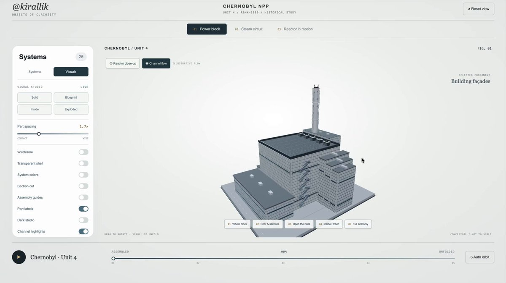
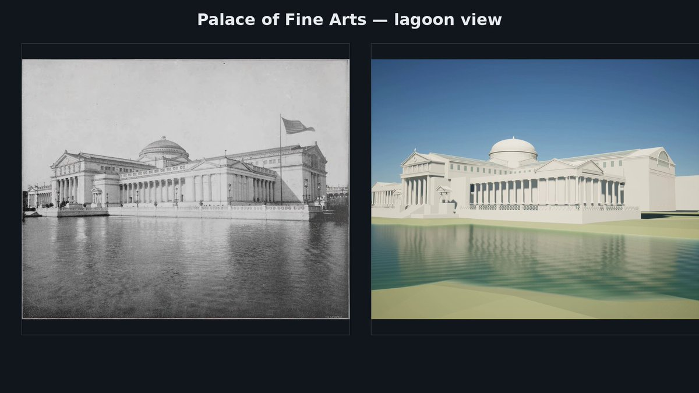
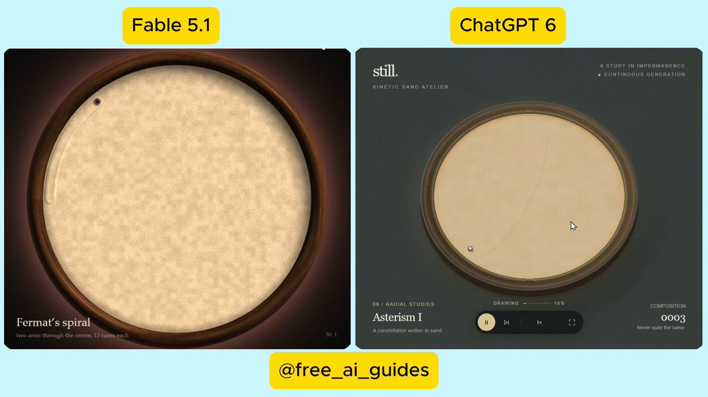
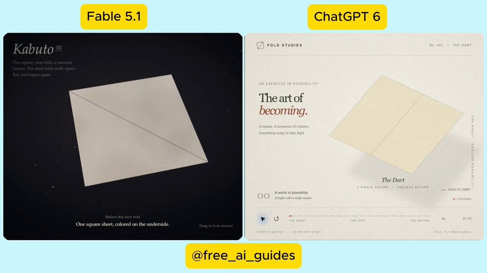

<!-- Generated from Growth CMS. Update content in CMS; run npm run sync. -->

# Awesome Astra Prompts

[](https://github.com/sindresorhus/awesome) [](https://github.com/TripoGrowthLab/awesome-astra-prompts/stargazers) [](../LICENSE) [](https://github.com/TripoGrowthLab/awesome-astra-prompts/actions/workflows/sync-prompts.yml) [](../CONTRIBUTING.md)

<p>
  <a href="../README.md"></a>
  <a href="../README.zh-CN.md"></a>
  <a href="../docs/catalog.zh-Hant.md"></a>
  <a href="../docs/catalog.ja.md"></a>
  <a href="../docs/catalog.ko.md"></a>
  <a href="../docs/catalog.es.md"></a>
  <a href="../docs/catalog.pt.md"></a>
  <a href="../docs/catalog.de.md"></a>
  <a href="../docs/catalog.fr.md"></a>
  <a href="../docs/catalog.it.md"></a>
  <a href="../docs/catalog.ru.md"></a>
  <a href="../docs/catalog.tr.md"></a>
  <a href="../docs/catalog.uk.md"></a>
  <a href="../docs/catalog.vi.md"></a>
</p>

> Crei con Claude Opus 5.5? Esplora scene 3D, giochi e simulazioni con le fonti in [Awesome Opus 5.5 Prompts](https://github.com/TripoGrowthLab/awesome-opus-5-5-prompts).

<a href="https://www.tripo3d.ai/it/3d-prompts/models/gpt-6-astra?utm_source=github&amp;utm_medium=referral&amp;utm_campaign=awesome_astra_prompts&amp;utm_content=readme_hero"></a>

**Un punto di partenza per il tuo prossimo gioco, scena o mondo interattivo.**


**317 · Prompt Astra più recenti**

## Progetti in evidenza

<table>
<tr>
<td width="50%" valign="top"><a href="https://www.tripo3d.ai/it/3d-prompts/wright-flyer-through-a-japanese-forest-2096467585785286808"></a><br><strong><a href="https://www.tripo3d.ai/it/3d-prompts/wright-flyer-through-a-japanese-forest-2096467585785286808">Wright Flyer in volo attraverso una foresta giapponese</a></strong><br><sub><a href="https://x.com/jaredliu_bravo">Jared</a></sub><br><a href="https://www.tripo3d.ai/it/3d-prompts/wright-flyer-through-a-japanese-forest-2096467585785286808">Prompt →</a></td>
<td width="50%" valign="top"><a href="https://www.tripo3d.ai/it/3d-prompts/jelly-jungle-3d-browser-game-2081024333120733188"></a><br><strong><a href="https://www.tripo3d.ai/it/3d-prompts/jelly-jungle-3d-browser-game-2081024333120733188">Jelly Jungle: Platform 3D</a></strong><br><sub><a href="https://x.com/jaredliu_bravo">Jared</a></sub><br><a href="https://www.tripo3d.ai/it/3d-prompts/jelly-jungle-3d-browser-game-2081024333120733188">Prompt →</a></td>
</tr>
<tr>
<td width="50%" valign="top"><a href="https://www.tripo3d.ai/it/3d-prompts/akari-nagoya-rooftop-flame-relay"></a><br><strong><a href="#akari-nagoya-rooftop-flame-relay">AKARI: Staffetta della fiamma sui tetti di Nagoya</a></strong><br><sub><a href="https://growthengineer.space/">Jared</a></sub><br><a href="#akari-nagoya-rooftop-flame-relay">Prompt →</a></td>
<td width="50%" valign="top"><a href="https://www.tripo3d.ai/it/3d-prompts/cyclops-island-threejs-game"></a><br><strong><a href="#cyclops-island-threejs-game">L’isola del Ciclope</a></strong><br><sub><a href="https://x.com/jaredliu_bravo">Jared</a></sub><br><a href="#cyclops-island-threejs-game">Prompt →</a></td>
</tr>
</table>

<a id="all-prompts"></a>

## Prompt Astra più recenti

<details>
<summary>Esplora gli esempi</summary>

- [Atlante di Chernobyl](#2098841316591346006) · GitHub
- [Esploratore interattivo dell’anatomia in 3D](#2099206962344800541) · GitHub
- [Demo di grafica fantasy isometrica](#2100271998618177864) · GitHub
- [Ricostruzione 3D dell’Esposizione Colombiana Mondiale di Chicago del 1893](#2098795017955418202)
- [Simulazione di un tavolo di sabbia cinetica](#2098831830002851846)
- [Animazione 3D di origami che si piega da solo](#2098909584996057283)
- [Unwrap UV e rebake in 4K di un modello di abiti senza testa](#2098980384260456813)
- [Demo 3D giocabile nel browser: quartiere sul mare](#2099172061092381027)
- [Reimmagina il castello di Peach in 3D](#2099359786865402019)
- [Ferrovia in miniatura autonoma con prevenzione delle collisioni](#2099362575339372780)
- [Percorso a ostacoli 3D giocabile](#2099419671481249851)
- [Scena 3D interattiva nella foresta con un samurai](#2099450933067612421)
- [Modello di conifera con un massimo di 200 poligoni](#2099472264270102705)
- [Mondo 3D pieno di grattacieli altissimi](#2099487024256589970)
- [Il guerriero scala un gigante e lo colpisce alla mascella](#2099519801139908951)
- [Crea una scena di corridoio d'hotel](#2099588840419651890)
- [Isola vulcanica interattiva con barche in fuga](#2099643231659012553)
- [Pannello interattivo del sistema nervoso di un organismo 3D](#2099719427990134984)
- [Cuore 3D in stile Apple ed emoji sorridente](#2099750376530657300)
- [Gioco di esplorazione spaziale procedurale interamente esplorabile](#2099785223827259515)
- [Creare uno spazio 3D animabile e un personaggio di gioco a partire da immagini di riferimento](#2099850719839109597)
- [Scena 3D interattiva di una stanza con arredi articolati](#2100139076816916977)
- [Sviluppo e riproduzione grafica di Splatoon per PC](#2100193512373592313)
- [Tour interattivo dell’appartamento con opzioni per le piastrelle](#2100222426705453318)
- [Cortometraggio di combattimento soprannaturale in CGI AAA ambientato in una stazione della metropolitana](#2100233407108137349)
- [Scena interattiva voxel con cavaliere e falò](#2100350159540596760)
- [Aggiungi una catena di manutenzione al corrimano](#2100519026720231698)
- [Creare un gioco di corse 3D](#2100526922770026874)
- [Gioco 3D di fuga nel browser da una struttura di ricerca chiusa](#2100595652703199281)
- [Un corpo progettato in CAD](#2100614534423540102)
- [Monster Block — 45 secondi per radere al suolo la città](#2100636075039629796)
- [Addestramento di una policy per far roteare una penna con la mano robotica Sharpa](#2100751369619820923)
- [Gioco 3D di tram aereo tra isole fluttuanti](#2100838090210431302)
- [Crea un mondo 3D fotorealistico](#2100844566718926949)
- [Modello interattivo di orologio IWC Schaffhausen](#2100956517633761447)
- [Galassia basata sulla fisica orbitale reale](#2101055500599054437)
- [Ambiente 3D fotorealistico completo](#2101224659861590399)
- [Visualizzazione 3D interattiva di un motore aeronautico](#2101271938706685991)
- [Workflow per animazione 3D e video di un gatto esperto di arti marziali](#2101310374033428642)
- [Modello 3D di una Waymo Jaguar I-Pace](#2101325346427842909)
- [Barca a vela in mare aperto](#2101616345720787130)
- [Crea un modello 3D di WALL-E in Three.js](#2101687900723106104)
- [Verdant — isola di dinosauri 3D interattiva](#2101730386711634251)
- [Sito web interattivo con modello 3D del Sole](#2102038136725377200)
- [Gioco di corse procedurale per browser Spline Rush](#2102150615635816866)
- [Presentazione interattiva di progettazione di un elicottero 3D](#2102215638311694336)
- [Scena 3D e video della Torre di Tokyo, di giorno e di notte](#2102276620124062065)
- [Bubble Bay: battaglia 3D con palloncini d’acqua](#2102300855387205871)
- [Gioco tower defense in stile Sir, We Have Orc Problems](#2102411087002112256)
- [Casa suburbana a due piani con interni](#2102473710724919614)
- [Gioco di kart 3D in un singolo file HTML](#2102652927177617564)
- [Animazione nel browser di un castello medievale](#2102672926285713456)
- [Orbit Lab: simulazione 3D di Sole, Terra e Luna](#2102752217375899659)
- [Castello medievale europeo in 3D esplorabile dal browser](#2102780850706567390)
- [Scacchiera 3D interattiva per studiare i gambetti degli scacchi](#2102788013902213508)
- [Shader di una città solarpunk infinita](#2102826333550133520)
- [Simulatore di hamburger in prima persona](#2102897258983313712)
- [Scena HTML interattiva di un falò nel deserto, iperrealistica](#2102915300295369208)
- [Codex voxel in Three.js](#2102956340482289944)
- [Fetta di agrume gommosa 3D interattiva](#2103062348168618280)
- [Northbound: viaggio interattivo su una nave vichinga](#2103187935759655167)
- [Esperienza esplorabile autunnale e nebbiosa in Three.js](#2103211135214256350)
- [STILLWATER — Esperienza nel browser in una palude al chiaro di luna](#2103308083242082314)
- [Scena di battaglia romana all’ora dorata](#2103351755971207251)
- [Pitaya Jelly](#2103432732386664591)
- [Modellazione 3D di un outfit per VRChat](#2103456264785424530)
- [Crea un porcellino d’India in Blender](#2103482826519986544)
- [Giardino giapponese in stile voxel con Three.js](#2103486103831339269)
- [Scena WebGL voxel: nave in bottiglia](#2103855977376125161)
- [Ambiente di villaggio sul lago nella foresta](#2103860776419111285)
- [Cattura del booster Super Heavy in Blender](#2103966922127630820)
- [Demo interattiva 3D del percorso della luce in un obiettivo fotografico](#2104077535315144878)
- [Fetta di anguria gelatinosa 3D interattiva](#2104504957173153951)
- [Gioco in stile Genshin Impact e strumento per modificare il terreno](#2104531704740512143)
- [Gancio a J stampabile in 3D per una prova di resistenza](#2104590493191479337)
- [Rappresentazione 3D interattiva ed educativa di CRISPR](#2104605522640970208)
- [Giro in barca interattivo nella giungla al chiaro di luna](#2104613125093998674)
- [Auto sportiva trasformabile con vista esplosa a raggi X](#2104654448878387313)
- [Occhio umano 3D altamente dettagliato](#2104841727496323479)
- [Il tempo, scomposto.](#2105009377002299711)
- [Modello realistico dell’F-22 Raptor e video di volo in Godot](#2105027152617918852)
- [Scena cinematografica e fotorealistica di un lancio di un razzo](#2105047166733746209)
- [Render in Blender del Golden Gate Bridge](#2105278999861526953)
- [Crea un personaggio Minion 3D in Blender](#2105298955307303100)
- [Ricrea una scena in Isaac Sim](#2105323534398763307)
- [Diorama 3D dorato di una piramide in miniatura](#2105412081692352654)
- [Gioco 3D per schivare gli asteroidi](#2105644436659290409)
- [Scena 3D interattiva: naviga in barca su un fiume di montagna](#2106385060106777043)
- [Casa 3D esplorabile a piedi nel browser](#2106737391948235164)
- [Crea un trailer cinematografico per un gioco immaginario](#2106824464092770455)
- [Gioco 3D: raccogli 10 frammenti di stella su un’isoletta notturna](#2106944804756275690)
- [Ragno di peluche — Studi sui materiali n. 015](#2107127712871505976)
- [Banana Jelly](#2107186979502776590)
- [Enciclopedia interattiva della fauna Wild Atlas](#2107479802152472717)
- [Battle City 3D: Difesa infinita con i carri armati](#battle-city-3d)
- [Crazy Tanks — Artiglieria 3D sulle isole](#crazy-tanks-3d-island-artillery)
- [ODD ARMS — Gioco survival con armi stravaganti](#odd-arms)
- [TITANIC — L’ultima luce](#titanic-the-last-light)
- [AKARI: Staffetta della fiamma sui tetti di Nagoya](#akari-nagoya-rooftop-flame-relay)
- [L’isola del Ciclope](#cyclops-island-threejs-game)

</details>

<a id="2098841316591346006"></a>

### Atlante di Chernobyl

[BuBBliK](https://x.com/k1rallik) · 2026-09-12

<a href="https://www.tripo3d.ai/it/3d-prompts/gpt-6-astra-2098841316591346006"></a>

Una raccomandazione riutilizzabile dell’autore del post per creare un’esposizione interattiva in Three.js sul blocco di potenza di Chernobyl e sul reattore RBMK. Richiede un modello 3D scomponibile del blocco di potenza, una vista animata del circuito del vapore e uno spaccato 3D del reattore con controlli per il movimento e l’ispezione. L’autore lo presenta come un prompt per realizzare qualcosa di simile, non come l’input originale confermato dell’esposizione collegata.

**Prompt**

```text
Crea “Chernobyl Atlas”, un’esposizione 3D interattiva di livello professionale usando Three.js.

Studia la centrale di Chernobyl e il reattore RBMK integri, usando fonti pubbliche. Modella gli edifici, la ciminiera a traliccio, la sala turbine, il blocco di grafite, i canali del combustibile, le schermature, i tamburi separatori, le pompe e le tubazioni.

Crea tre schede:
— Blocco di potenza: un modello dettagliato che si scompone strato per strato tramite scorrimento e cursore.
— Circuito del vapore: un diagramma animato che collega il reattore, la turbina, il condensatore e le pompe.
— Reattore in movimento: uno spaccato 3D con acqua e vapore in movimento, macchinari rotanti e controlli di riproduzione.

Aggiungi controlli indipendenti per la visibilità dei sistemi, la regolazione della distanza tra le parti, la visualizzazione wireframe, la trasparenza, i tagli in sezione e brevi etichette. Fai in modo che ogni strato sia facile da esaminare e che la camera possa ruotare liberamente, anche con il modello completamente scomposto.

Fornisci il codice sorgente e un file HTML autonomo. Verifica tutti i controlli. Presentalo come un’interpretazione a scopo didattico, non come una replica ingegneristica esatta.
```

[Vedi dettagli ↗](https://www.tripo3d.ai/it/3d-prompts/gpt-6-astra-2098841316591346006) · [Post originale](https://x.com/k1rallik/status/2098841316591346006) · [Codice sorgente](https://github.com/bubblik525/Chernobyl_Atlas) · [Torna agli esempi](#all-prompts)

---

<a id="2099206962344800541"></a>

### Esploratore interattivo dell’anatomia in 3D

[BuBBliK](https://x.com/k1rallik) · 2026-09-13

<a href="https://www.tripo3d.ai/it/3d-prompts/gpt-6-astra-2099206962344800541"></a>

L’autore lo ha condiviso come prompt di partenza consigliato per creare una versione simile al suo sito interattivo Brain Cat. Il prompt richiede un esploratore anatomico 3D responsivo con visualizzazione trasparente progressiva, rotazione, separazione delle strutture, regioni con etichette, controlli dei livelli, segnali didattici animati e attribuzione delle fonti scientifiche.

**Prompt**

```text
Crea un bellissimo esploratore interattivo dell’anatomia in 3D usando dataset scientifici disponibili pubblicamente. Inizia da una vista esterna che diventa gradualmente trasparente mentre eseguo lo zoom, rivelando l’anatomia sottostante.

Permettimi di ruotare il modello, separare le strutture, selezionare le regioni con etichette e attivare o disattivare i livelli da un pannello laterale. Aggiungi schede separate per anatomia, connessioni e singole cellule, con segnali animati e controlli regolabili.

Usa un’interfaccia moderna e minimalista, con illuminazione morbida, transizioni fluide, colori discreti e pochissimo testo. Includi frecce e un breve tutorial visivo. Deve funzionare su desktop e dispositivi mobili.

Usa geometrie anatomiche reali quando disponibili, cita le fonti e distingui chiaramente i dati scientifici dalle animazioni illustrative. Crea un sito web funzionante.
```

[Vedi dettagli ↗](https://www.tripo3d.ai/it/3d-prompts/gpt-6-astra-2099206962344800541) · [Post originale](https://x.com/k1rallik/status/2099206962344800541) · [Codice sorgente](https://github.com/bubblik525/cat_brain_anatomy) · [Torna agli esempi](#all-prompts)

---

<a id="2100271998618177864"></a>

### Demo di grafica fantasy isometrica

[Anshu Chimala](https://x.com/anshuc) · 2026-09-16

<a href="https://www.tripo3d.ai/it/3d-prompts/gpt-6-astra-2100271998618177864"></a>

Una scena 3D fantasy interattiva eseguita nel browser, con telecamera isometrica, direzione artistica ispirata ai voxel, pavimenti bagnati e riflettenti e un personaggio controllabile. Il repository Dream Loop collegato la presenta come prompt di esempio e dichiara che è stato testato con GPT-6 Astra in Codex. Non è previsto alcun ciclo di gameplay.

**Prompt**

```text
Realizza una demo grafica: telecamera isometrica, stile artistico simile ai voxel con shading realistico e pavimenti bagnati e riflettenti, e un personaggio inserito in una scena interessante. Ambientazione fantasy (pensa a Elden Ring e Diablo). Usa Three.js nel browser, a più di 60 fps. Non scaricare risorse. Limite di tempo: 1 ora. Comandi: fai clic per spostare il personaggio; la telecamera lo segue con inerzia. Trascina per ruotare la telecamera; usa la rotellina per aumentare o ridurre lo zoom. Per ora niente gameplay. Il mondo deve sembrare vivo: movimento, animazioni e comportamenti ambientali discreti. L'area intorno al giocatore deve sembrare ampia, ma consenti gli spostamenti solo in uno spazio limitato. Non serve chiedermi conferma sullo stile artistico né farmi domande: procedi e basta!
```

[Vedi dettagli ↗](https://www.tripo3d.ai/it/3d-prompts/gpt-6-astra-2100271998618177864) · [Post originale](https://github.com/achimala/dream-loop) · [Codice sorgente](https://github.com/achimala/dream-loop) · [Torna agli esempi](#all-prompts)

---

<a id="2098795017955418202"></a>

### Ricostruzione 3D dell’Esposizione Colombiana Mondiale di Chicago del 1893

[Dan Elton](https://x.com/moreisdifferent) · 2026-09-12

<a href="https://www.tripo3d.ai/it/3d-prompts/gpt-6-astra-2098795017955418202"></a>

Una ricostruzione 3D in Blender dell’Esposizione Colombiana Mondiale del 1893, realizzata utilizzando fotografie storiche e materiale di riferimento sulla fiera.

**Prompt**

```text
Scarica 2.000 fotografie storiche e materiale di riferimento sulla fiera, quindi utilizza tutte le informazioni raccolte per creare una ricostruzione 3D in Blender.
```

[Vedi dettagli ↗](https://www.tripo3d.ai/it/3d-prompts/gpt-6-astra-2098795017955418202) · [Post originale](https://x.com/moreisdifferent/status/2098795017955418202) · [Torna agli esempi](#all-prompts)

---

<a id="2098831830002851846"></a>

### Simulazione di un tavolo di sabbia cinetica

[AI Guides](https://x.com/free_ai_guides) · 2026-09-12

<a href="https://www.tripo3d.ai/it/3d-prompts/gpt-6-astra-2098831830002851846"></a>

Un prompt riutilizzabile fornito dall’autore del post, identico al prompt aperto ricevuto da GPT-6 Astra e Fable 5.1. Richiede una simulazione autonoma di un tavolo di sabbia cinetica in un unico file HTML: una sfera traccia nella sabbia motivi geometrici sempre diversi, poi livella la superficie prima di iniziare un nuovo motivo.

**Prompt**

```text
Crea una simulazione di un tavolo di sabbia cinetica. Una sfera deve muoversi su uno strato di sabbia, lasciando una traccia visibile e disegnando motivi geometrici completi, quindi livellare la sabbia e iniziare automaticamente un motivo nuovo e diverso. Deve alternare molti motivi diversi senza ripetersi. Puoi scegliere liberamente l’aspetto e i motivi.

Ogni aspetto del design è una tua decisione: stile, colori, atmosfera, ambiente, inquadratura, livello di dettaglio ed eventuali elementi aggiuntivi. Non farmi domande: fai tutte le scelte in autonomia e realizza la versione più impressionante possibile in un solo tentativo.

Requisiti tecnici: un unico file HTML autonomo, senza modelli, immagini, suoni o URL di risorse esterne di alcun tipo (è consentita una libreria JavaScript da una CDN). Deve avviarsi automaticamente al caricamento, senza bisogno di clic, e funzionare fluidamente senza errori nella console.
```

[Vedi dettagli ↗](https://www.tripo3d.ai/it/3d-prompts/gpt-6-astra-2098831830002851846) · [Post originale](https://x.com/free_ai_guides/status/2098831830002851846) · [Torna agli esempi](#all-prompts)

---

<a id="2098909584996057283"></a>

### Animazione 3D di origami che si piega da solo

[AI Guides](https://x.com/free_ai_guides) · 2026-09-12

<a href="https://www.tripo3d.ai/it/3d-prompts/gpt-6-astra-2098909584996057283"></a>

L’autore afferma che questo identico prompt aperto è stato fornito a GPT-6 Astra e Fable 5.1. Richiede un’animazione 3D di origami autonoma, in cui un foglio quadrato si piega e ruota mostrando chiaramente una sequenza di pieghe riconoscibile, per poi riaprirsi e ripetere il ciclo.

**Prompt**

```text
Crea un’animazione 3D di origami. Un foglio quadrato piatto deve piegarsi da solo, passo dopo passo, fino a diventare una figura di origami riconoscibile; ogni piega deve essere mostrata come un’effettiva creazione e rotazione della carta. Poi deve riaprirsi tornando piatto e ripetere il ciclo. La figura realizzata e il modo in cui viene presentata sono a tua discrezione.

Tutto ciò che riguarda il design dipende da te: stile, colori, atmosfera, ambiente, camera, livello di dettaglio ed eventuali elementi aggiuntivi. Non farmi domande: prendi tu ogni decisione e realizza la versione più impressionante possibile in un unico tentativo.

Requisiti tecnici: un unico file HTML autonomo, senza modelli, immagini, suoni o URL di risorse esterni di alcun tipo (è consentita una libreria JavaScript da una CDN). Deve iniziare a funzionare da solo appena viene caricato, senza richiedere clic, e funzionare fluidamente senza errori nella console.
```

[Vedi dettagli ↗](https://www.tripo3d.ai/it/3d-prompts/gpt-6-astra-2098909584996057283) · [Post originale](https://x.com/free_ai_guides/status/2098909584996057283) · [Torna agli esempi](#all-prompts)

---

<a id="2098980384260456813"></a>

### Unwrap UV e rebake in 4K di un modello di abiti senza testa

[さ🥺](https://x.com/_sagyoai) · 2026-09-13

<a href="https://www.tripo3d.ai/it/3d-prompts/gpt-6-astra-2098980384260456813"></a>

Prompt per rieseguire l’unwrap UV di un modello 3D senza testa, con gli abiti e gli arti selezionati, creando UV facili da leggere e ridisegnare, e per rieseguire il bake delle texture esistenti in 4K. Conserva i dati originali e gestisci progettazione delle seam, controllo della distorsione, packing e verifica comparativa.

**Prompt**

```text
Con Blender MCP, esegui l’unwrap UV del «modello senza testa con abiti e arti» selezionato e riesegui in 4K il bake delle texture esistenti.

L’obiettivo è mantenere l’aspetto originale e creare UV in cui la struttura sia leggibile, come nel cartamodello di un abito, e che possano essere ridisegnate facilmente in seguito. Procedi come farebbe un artista: osservazione → progettazione delle seam → unwrap per area → correzione della distorsione → disposizione → bake.

1. Conserva i dati originali
Prima di iniziare, salva una copia con un altro nome, mantieni le UV, le immagini e i materiali esistenti e crea una nuova UV map chiamata «UV\_Final».
Non modificare forma, topologia, ordine dei vertici, pesi, shape key o rig.

2. Osserva il modello e progetta le seam
Controlla ogni direzione con la texture originale visualizzata e in modalità wireframe, così da comprendere la struttura dei componenti dell’abito e le cuciture effettive.
Per gli abiti, apri il modello seguendo la struttura del cartamodello — corpetto, maniche, colletto e così via — sfruttando le cuciture laterali e l’interno delle maniche. Sulla pelle e sugli arti, posiziona le seam in aree poco visibili, come l’interno o i lati, creando un’apertura naturale fino agli spazi tra le dita.
Non confondere pieghe o stampe con cuciture e non creare isole inutilmente frammentate.

3. Esegui l’unwrap per area e correggi la distorsione
Non elaborare tutto in un’unica operazione: esegui l’Unwrap separatamente per ciascuna area.
Usa una checker texture con testo che faccia riferimento a UV\_Final e la visualizzazione Stretch per controllare allungamenti, compressioni, torsioni, inversioni e sovrapposizioni.
In base alla causa del problema, aggiungi o rimuovi seam, quindi regola l’UV con strumenti come Pin e Relax e verifica di nuovo. Non limitarti a ripetere lo stesso unwrap automatico: mantieni le aree già migliorate.
Non considerare la suddivisione automatica globale con Smart UV Project come risultato finale.

4. Sistema direzione del tessuto, densità e disposizione
Per gli abiti, allinea la direzione principale del tessuto di ogni componente alla direzione V dell’UV. Non deformare forzatamente in rettangoli i cartamodelli curvi.
Uniforma la densità di texel rispetto alle dimensioni reali e orienta le isole in modo che la corrispondenza tra destra e sinistra sia chiara.
Poi esegui il packing nell’area 0–1 mantenendo l’orientamento e la scala relativa. Non sovrapporre i lati destro e sinistro e non ruotarli arbitrariamente.
Come valori iniziali per il bake in 4K, usa un margine di 16 px, almeno 32 px tra le isole e almeno 16 px dal bordo esterno dell’immagine.

5. Esegui il bake in 4K dalle vecchie UV alle nuove
Imposta esplicitamente il riferimento alla texture originale sulle vecchie UV e trasferiscila, usando UV\_Final come destinazione del bake, su una nuova immagine da 4096×4096.
In ogni materiale, attiva il nodo immagine di destinazione del bake, esegui un bake di prova e poi quello definitivo.
Per il Base Color, usa solo il Color di Diffuse oppure Emit; non incorporare nuova illuminazione, ombre o AO. Mantieni le ombreggiature dipinte nell’immagine originale.
Trasferisci, se necessario, anche le mappe esistenti come l’alpha e riesegui il bake delle normali tangent space secondo le nuove UV, invece di limitarti a trasferire i colori.

6. Verifica il risultato confrontando vecchie e nuove UV
Applica le nuove UV e le immagini ottenute dal bake, quindi confronta il corpo intero e i dettagli nelle stesse condizioni di visualizzazione dell’originale.
Controlla posizione dei motivi, colori, trasparenza e continuità delle seam; correggi UV schiacciate, sovrapposizioni, aree non srotolate e difetti di bake come punti neri, zone mancanti o sbavature.
Determina il completamento in base ai risultati dei controlli, non al numero di unwrap eseguiti.

Salva il file completato.blend, le immagini in 4K, il layout UV e le immagini di verifica di seam, checker e aspetto finale, quindi riporta brevemente le correzioni principali.
Non limitarti a descrivere il piano: completa il lavoro verificando effettivamente le immagini durante il processo.
```

[Vedi dettagli ↗](https://www.tripo3d.ai/it/3d-prompts/gpt-6-astra-2098980384260456813) · [Post originale](https://x.com/_sagyoai/status/2098980384260456813) · [Torna agli esempi](#all-prompts)

---

<a id="2099172061092381027"></a>

### Demo 3D giocabile nel browser: quartiere sul mare

[Lummox](https://x.com/Lummox_eth) · 2026-09-13

<a href="https://www.tripo3d.ai/it/3d-prompts/gpt-6-astra-2099172061092381027"></a>

Sequenza di sei prompt pubblicata da Lummox per una demo 3D giocabile nel browser. Definisce uno stack con Vite, TypeScript vanilla, Three.js, cannon-es e Web Audio; crea un quartiere sul mare al tramonto; mette in scena tre persone che salgono in auto; e specifica il ritmo delle clip e l'audio.

**Prompt**

```text
> blocca la specifica (TZ-gta-slice.md)

prompt: "Crea una demo 3D giocabile nel browser. Non modificare questa specifica dopo averla bloccata. Prima il quartiere e la clip. I controlli dopo."

> lo stack (Vite, TypeScript vanilla, Three.js, cannon-es, Web Audio)

prompt: "Lo stack è fisso. Vite. TypeScript vanilla. Three.js. cannon-es. Web Audio. Un solo URL del browser."

> l'inquadratura (tramonto sull'acqua, asfalto bagnato, palme)

prompt: "Un solo quartiere sul mare. Tramonto sull'acqua. Asfalto bagnato. Palme. Punta su luce e camera, non sul numero di poligoni. Niente luce grigia predefinita. Niente cubi nudi."

> i tre (una scena, un'auto, circa 20 secondi)

prompt: "Tieni i tre personaggi nella stessa scena. Parlano. Poi salgono tutti su un'auto. Circa 20 secondi. Qualità prima di interruttori aggiuntivi."

> il montaggio (da 15 a 20 secondi, fluido)

prompt: "Se rallenta, riduci la clip a 15-20 secondi. Mantienila fluida. Se il frame rate cala, elimina i pedoni, non la luce."

> l'audio (voci umane, pad sotto le battute, rombo dell'auto)

prompt: "Le voci devono sembrare umane, non robotiche. Un pad discreto sotto le battute, mai sopra. Quando salgono in auto, un rombo grave del motore, non un suono da sega. Niente fruscio radio."
```

[Vedi dettagli ↗](https://www.tripo3d.ai/it/3d-prompts/gpt-6-astra-2099172061092381027) · [Post originale](https://x.com/Lummox_eth/status/2099172061092381027) · [Torna agli esempi](#all-prompts)

---

<a id="2099359786865402019"></a>

### Reimmagina il castello di Peach in 3D

[Romain Huet](https://x.com/romainhuet) · 2026-09-14

<a href="https://www.tripo3d.ai/it/3d-prompts/gpt-6-astra-2099359786865402019"></a>

L’autore racconta di aver chiesto ad Astra in Codex di reimmaginare il castello di Peach in 3D e di creare un video di sorvolo. In un commento successivo, spiega che il lavoro comprendeva un modello in Blender, un’orbita verificata alla luce del giorno e al crepuscolo, 88 lastre di vetro modellate nella finestra di Peach e un interno al piano terra.

**Prompt**

```text
reimmagina il castello di Peach in 3D e crea un video di sorvolo.
```

[Vedi dettagli ↗](https://www.tripo3d.ai/it/3d-prompts/gpt-6-astra-2099359786865402019) · [Post originale](https://x.com/romainhuet/status/2099359786865402019) · [Torna agli esempi](#all-prompts)

---

<a id="2099362575339372780"></a>

### Ferrovia in miniatura autonoma con prevenzione delle collisioni

[AI Guides](https://x.com/free_ai_guides) · 2026-09-14

<a href="https://www.tripo3d.ai/it/3d-prompts/gpt-6-astra-2099362575339372780"></a>

Una simulazione di ferrovia in miniatura a funzionamento autonomo, con almeno tre treni su binari condivisi. I treni gestiscono autonomamente scambi e segnali per evitare collisioni, lasciando al modello tutte le decisioni relative al design visivo. L’autore dichiara di aver fornito questo identico prompt sia a Fable 5.1 sia a GPT-6 Astra.

**Prompt**

```text
Crea una ferrovia in miniatura con almeno tre treni in movimento contemporaneamente su un tracciato condiviso che includa scambi e segnali. I treni devono cambiare binario e fermarsi ai segnali autonomamente, in modo da non entrare mai in collisione e senza alcun input da parte dell’utente. La configurazione del tracciato, l’ambientazione e l’aspetto di ogni elemento sono lasciati a te. Ogni scelta di design spetta a te: stile, colori, atmosfera, ambiente, inquadratura, livello di dettaglio ed eventuali elementi aggiuntivi. Non farmi domande: prendi tu ogni decisione e realizza la versione più spettacolare possibile in un unico tentativo. Requisiti tecnici: un unico file HTML autonomo e completo, senza modelli 3D, immagini, suoni o URL di risorse esterne di alcun tipo (è consentita una libreria JavaScript caricata da una CDN). Deve avviarsi automaticamente nel momento in cui viene caricato, senza bisogno di clic, e funzionare fluidamente senza errori nella console.
```

[Vedi dettagli ↗](https://www.tripo3d.ai/it/3d-prompts/gpt-6-astra-2099362575339372780) · [Post originale](https://x.com/free_ai_guides/status/2099362575339372780) · [Torna agli esempi](#all-prompts)

---

<a id="2099419671481249851"></a>

### Percorso a ostacoli 3D giocabile

[Dhaval Makwana](https://x.com/heyDhavall) · 2026-09-14

<a href="https://www.tripo3d.ai/it/3d-prompts/gpt-6-astra-2099419671481249851"></a>

L’autore afferma di aver fornito a GPT-6 Astra questa idea in Codex. La richiesta è un piccolo percorso a ostacoli 3D giocabile con un personaggio, barriere mobili, oggetti da raccogliere e un’area obiettivo.

**Prompt**

```text
Un piccolo percorso a ostacoli 3D con un personaggio, barriere mobili, oggetti da raccogliere e una semplice area obiettivo.
```

[Vedi dettagli ↗](https://www.tripo3d.ai/it/3d-prompts/gpt-6-astra-2099419671481249851) · [Post originale](https://x.com/heyDhavall/status/2099419671481249851) · [Torna agli esempi](#all-prompts)

---

<a id="2099450933067612421"></a>

### Scena 3D interattiva nella foresta con un samurai

[Jaynit Makwana](https://x.com/JaynitMakwana) · 2026-09-14

<a href="https://www.tripo3d.ai/it/3d-prompts/gpt-6-astra-2099450933067612421"></a>

Jaynit Makwana racconta di aver fornito questa idea a GPT-6 Astra in Codex. Il risultato richiesto è una scena 3D interattiva nella foresta, con un samurai, controlli della camera, illuminazione cinematografica, dettagli ambientali e una presentazione essenziale. L’autore afferma che Hyper3D Rodin MCP ha generato il modello del samurai per l’esperienza risultante.

**Prompt**

```text
Crea una scena 3D interattiva con un samurai nella foresta, includendo controlli della camera, illuminazione cinematografica, dettagli ambientali e una presentazione essenziale.
```

[Vedi dettagli ↗](https://www.tripo3d.ai/it/3d-prompts/gpt-6-astra-2099450933067612421) · [Post originale](https://x.com/JaynitMakwana/status/2099450933067612421) · [Torna agli esempi](#all-prompts)

---

<a id="2099472264270102705"></a>

### Modello di conifera con un massimo di 200 poligoni

[わたもす / ゲーム制作](https://x.com/Watamos827) · 2026-09-14

<a href="https://www.tripo3d.ai/it/3d-prompts/gpt-6-astra-2099472264270102705"></a>

Un prompt per chiedere ad Astra di creare una conifera con un massimo di 200 poligoni. L'autore afferma di stare cercando di risolvere il problema per cui il risultato generato finisce per avere un aspetto simile a quello di un escremento.

**Prompt**

```text
Puoi provare a creare una conifera con un massimo di 200 poligoni?
```

[Vedi dettagli ↗](https://www.tripo3d.ai/it/3d-prompts/gpt-6-astra-2099472264270102705) · [Post originale](https://x.com/Watamos827/status/2099472264270102705) · [Torna agli esempi](#all-prompts)

---

<a id="2099487024256589970"></a>

### Mondo 3D pieno di grattacieli altissimi

[Bilal Arshad](https://x.com/MohdBilalArshad) · 2026-09-14

<a href="https://www.tripo3d.ai/it/3d-prompts/gpt-6-astra-2099487024256589970"></a>

Bilal Arshad racconta di aver chiesto ad Astra di creare un mondo 3D pieno di grattacieli altissimi e di aver condiviso il risultato.

**Prompt**

```text
crea un mondo 3D pieno di grattacieli altissimi
```

[Vedi dettagli ↗](https://www.tripo3d.ai/it/3d-prompts/gpt-6-astra-2099487024256589970) · [Post originale](https://x.com/MohdBilalArshad/status/2099487024256589970) · [Torna agli esempi](#all-prompts)

---

<a id="2099519801139908951"></a>

### Il guerriero scala un gigante e lo colpisce alla mascella

[MadMax](https://x.com/MadMax_Series) · 2026-09-14

<a href="https://www.tripo3d.ai/it/3d-prompts/gpt-6-astra-2099519801139908951"></a>

Una sequenza d’azione cinematografica in 3D della durata di 20 secondi: un guerriero corazzato delle montagne attraversa di corsa un campo di battaglia d’altura flagellato dalla tempesta, salta sulla mano di un gigante organico, scala fino alla sua spalla, lo colpisce alla mascella con un martello da guerra, cade e si rialza per uno scontro finale. L’autore principale identifica questo contenuto come un prompt text-to-video e indica GPT-6 Astra + Seedance 2.5 e Higgsfield.

**Prompt**

```text
REGISTRO DEI PERSONAGGI:
Esattamente un guerriero adulto di sesso maschile delle montagne.
Ha una corporatura compatta, larga e straordinariamente potente. Indossa un’originale armatura medievale fantasy completa, color canna di fucile scuro: elmo appuntito chiuso, spallacci stratificati, protezioni articolate per le braccia, pesanti guanti d’arme, corazza rinforzata, pannelli in pelle all’altezza della vita, pantaloni scuri, schinieri d’acciaio e pesanti stivali corazzati. L’armatura è usurata, graffiata e bagnata dalla tempesta.
Impugna esattamente un enorme martello da guerra a due mani. Ha un lungo manico rinforzato in metallo scuro e una pesante testa rettangolare simmetrica. L’arma mantiene la stessa lunghezza, forma e peso per tutta la sequenza. Il guerriero la controlla con entrambe le mani durante i salti, la scalata e il colpo.
Esattamente un gigantesco umanoide organico, alto più di trenta volte il guerriero. Ha spalle muscolose immense, braccia estremamente lunghe, enormi mani simili a quelle umane, pelle ruvida grigio antracite, pori e cicatrici visibili, arcate sopraccigliari marcate, naso largo, mascella potente e lunghi capelli neri arruffati. È un titano organico vivente, non una statua, un robot, una macchina o un golem di pietra.
Nessun altro guerriero, gigante o esercito sullo sfondo.
AMBIENTE:
Un campo di battaglia d’altura spazzato dal vento, sotto un violento temporale blu-grigio. Il terreno irregolare è coperto di terra scura e bagnata, erba schiacciata e migliaia di piccoli fiori chiari. Il vento forte piega erba e fiori creando onde irregolari.
Una fortezza medievale in rovina sorge su una collina lontana a sinistra dello schermo. Torri spezzate restano visibili attraverso la nebbia bassa e fluttuante. I lampi illuminano a intermittenza la fortezza e le nubi temporalesche.
Il gigante occupa il lato destro dello schermo del campo di battaglia. Il guerriero inizia al centro in primo piano, correndo verso il gigante. Mantieni questa geografia e questa direzione sullo schermo in ogni stacco.
AZIONE CRONOLOGICA E CAMERA:
0,00–3,30 — CORSA VERSO IL GIGANTE
Inizia immediatamente con un’inquadratura bassa in tracking da dietro, ravvicinata al guerriero corazzato mentre corre con potenza attraverso il campo bagnato verso il gigantesco gigante.
Tiene il martello da guerra orizzontale davanti al corpo con entrambe le mani. La testa pesante del martello resta verso destra dello schermo, mentre la parte inferiore del manico si estende verso sinistra. Gli stivali comprimono il terreno bagnato a ogni passo, scagliando terra, fiori schiacciati e gocce all’indietro solo dopo il contatto fisico.
Le gambe del gigante e la sua enorme mano destra entrano dal lato superiore destro dell’inquadratura. Il gigante si piega ed estende la mano aperta verso il guerriero in carica, con l’intenzione di raccoglierlo da terra.
Le dita si muovono indipendentemente, con articolazioni e peso credibili. Il gigante non afferra all’istante il guerriero e non lo teletrasporta.
Il movimento della camera resta basso, rapido e fluido, enfatizzando l’estrema differenza di scala. La fortezza in rovina rimane visibile sull’orizzonte lontano a sinistra dello schermo.
3,30–5,80 — SALTO SULLA MANO DEL GIGANTE
Mentre la mano aperta del gigante passa radente davanti al percorso del guerriero, il guerriero pianta saldamente lo stivale destro a terra. Il ginocchio si comprime, i fianchi si abbassano e la gamba posteriore spinge verso l’alto.
Esegue un unico potente salto in avanti.
Usa un rallenty cinematografico controllato mentre sale davanti alle dita divaricate del gigante. Le gambe si raccolgono leggermente sotto di lui, mentre entrambe le mani sollevano lo stesso martello da guerra sopra le spalle per mantenere l’equilibrio.
Atterra con entrambi gli stivali sul dorso del medio e dell’anulare del gigante. Mostra un contatto fisico chiaro: gli stivali toccano la pelle, le ginocchia assorbono l’impatto, la carne del gigante si comprime leggermente e l’armatura del guerriero reagisce all’atterraggio.
Il gigante inizia a sollevare la mano verso il viso. Il guerriero non fluttua né resta sospeso nel vuoto.
Usa un movimento di crane drammatico dal basso, che sale sotto il guerriero, con l’enorme mano a riempire lo sfondo.
5,80–9,00 — CORSA LUNGO IL BRACCIO
Torna a un’azione rapida e naturale.
Mentre il gigante solleva il braccio, il guerriero corre dalle dita lungo il dorso della mano fino al polso. I passi si alternano correttamente e aderiscono visibilmente alla superficie irregolare in movimento.
Il gigante ruota il polso e tenta di scrollarselo di dosso. Il guerriero abbassa il baricentro, allarga la posizione e tiene il martello vicino al torso finché il braccio non si stabilizza.
Poi accelera lungo l’avambraccio del gigante verso il gomito. Ogni passo segue il cambiamento d’angolazione del braccio; gli stivali non scivolano attraverso la pelle.
La camera lo segue di lato e leggermente dal basso, salendo lungo il braccio del gigante. Le parti vicine del braccio attraversano rapidamente il primo piano, mentre la testa del gigante e la fortezza lontana si muovono più lentamente, creando un potente effetto di parallasse e scala.
9,00–12,00 — SCALATA VERSO LA SPALLA
Il guerriero raggiunge la parte superiore del braccio, che sale ripidamente verso la spalla del gigante.
Aggancia un avambraccio e il manico del martello da guerra a una cresta naturale del muscolo per fare leva, pianta lo stivale destro, spinge con la gamba e si issa sulla spalla con un unico movimento di scalata continuo.
Il gigante gira la testa verso di lui. L’occhio segue il guerriero, la fronte si contrae e la mascella si apre in un ruggito profondo e non verbale. Capelli e pelle si muovono con la rotazione della testa.
Il guerriero resta ancorato alla spalla grazie al contatto reale di mani e stivali. Scala diagonalmente la parte superiore della spalla verso la base del collo del gigante.
Usa un’inquadratura ravvicinata con tracking laterale che mantenga leggibili nello stesso fotogramma il guerriero per intero, il martello da guerra e il profilo del volto del gigante.
12,00–15,00 — COLPO COMPLETO DI MARTELLO ALLA MASCELLA
Il guerriero raggiunge una posizione stabile sulla spalla inclinata del gigante, vicino al collo.
Pianta in avanti lo stivale sinistro e posiziona quello destro dietro. Entrambi i piedi premono visibilmente contro la pelle del gigante. Ruota i fianchi lontano dal bersaglio e porta indietro il martello da guerra con entrambe le mani.
Mostra tutta la preparazione prima dell’impatto:
piedi che si piantano → ginocchia che si comprimono → fianchi che accumulano energia → torso che ruota → spalle che portano indietro il martello → braccia che guidano la pesante testa del martello nella posizione di partenza.
Al secondo 13,00 il guerriero sferra un unico colpo orizzontale completo a due mani verso la mascella del gigante.
La potenza passa continuamente dalle gambe ai fianchi, al torso, alle spalle e alle braccia. La testa del martello segue un unico arco chiaro e ininterrotto. Non salta da una posizione all’altra e non tocca il volto prima che il colpo sia completato.
Al secondo 14,00 entra in un ultra-rallenty esplicito per il contatto decisivo.
La testa rettangolare del martello colpisce il lato della mascella inferiore del gigante con la sua ampia superficie battente, non con il manico o l’impugnatura. Mostra la pelle e i tessuti della guancia che si comprimono attorno all’impatto, la mascella del gigante che si sposta lateralmente, i capelli sciolti che si agitano verso l’esterno e un’esplosione radiale di pioggia, polvere e detriti cutanei.
Le braccia del guerriero resistono alla decelerazione improvvisa. Le spalle rinculano mentre il corpo prosegue in un follow-through controllato.
Niente sangue, tessuti esposti, gore o smembramenti.
15,00–17,30 — RINCULO DEL GIGANTE E CADUTA DEL GUERRIERO
Torna immediatamente alla velocità naturale.
La testa del gigante scatta di lato per l’impatto. La parte superiore del corpo rincula e la spalla colpita si abbassa bruscamente. Questo movimento improvviso verso il basso fa perdere l’appoggio al guerriero e lo scaglia lontano dal gigante.
Il guerriero cade verso il campo di battaglia mantenendo lo stesso martello da guerra con entrambe le mani. Non fluttua e non esegue un salto aggiuntivo.
Stacco su una visuale laterale a livello del terreno. Gli stivali toccano per primi, le ginocchia cedono sotto lo slancio e lui rotola una volta su una spalla. La testa del martello colpisce il terreno accanto a lui e scava un solco poco profondo, lanciando verso l’esterno terra bagnata e fiori chiari.
L’enorme volto del gigante scende nella parte superiore destra dell’inquadratura mentre cerca di recuperare l’equilibrio. Non schiaccia il guerriero e non lo attraversa.
17,30–20,00 — RECUPERO E SCONTRO FINALE
Il guerriero interrompe la rotolata in una posizione inginocchiata e bassa.
Pianta la testa del martello da guerra nel terreno, afferra il manico con entrambe le mani e lo usa come sostegno per rialzarsi gradualmente fino a un ginocchio. Poi estrae il martello e porta il manico orizzontalmente sulle spalle, assumendo una postura difensiva pronta.
Il gigante abbassa verso di lui la testa enorme, con la mascella visibilmente contusa dal colpo, ma ancora cosciente e minacciosa. Il suo respiro agita l’erba, i fiori, la nebbia e i pannelli di pelle sciolti dell’armatura del guerriero.
Il guerriero resta immobile solo per un breve istante di determinazione, mentre il respiro e l’armatura mantengono un sottile movimento naturale.
Un fulmine illumina la fortezza in rovina a sinistra dello schermo, delineando entrambe le figure e confermando l’enorme differenza di scala.
Termina esattamente al secondo 20,00 con una composizione ampia e bassa: il guerriero inginocchiato in primo piano, coperto di fiori, con il martello da guerra pronto; il volto del gigante incombe sopra di lui e la fortezza lontana è visibile attraverso la tempesta.
Non sfumare al nero. Nessun fermo immagine, titolo o cartello finale.
BLOCCO DELLA FISICA DELL’AZIONE:
Ogni azione deve seguire una causalità fisica leggibile:
Corsa: contatto del piede → trasferimento del peso → spinta della gamba posteriore → passo successivo.
Salto: piede piantato → compressione del ginocchio → estensione della gamba → traiettoria in aria → contatto all’atterraggio → assorbimento con le ginocchia.
Scalata: sostegno della mano o dell’arma → stivale piantato → trasferimento del peso del corpo → trazione verso l’alto.
Colpo di martello: piedi stabili → caricamento dei fianchi → rotazione del torso → spinta della spalla → traiettoria continua del martello → contatto con l’ampia faccia del martello → resistenza → follow-through.
Caduta: perdita dell’appoggio causata dal rinculo del gigante → discesa guidata dalla gravità → contatto degli stivali → cedimento delle ginocchia → rotolata sulla spalla → recupero.
Il guerriero non si teletrasporta mai tra il terreno, la mano, il braccio o la spalla. Il gigante non sposta mai il guerriero senza contatto fisico diretto o una forza visibile.
REGOLE DELLA VELOCITÀ DEL MOVIMENTO:
0,00–3,30: velocità di corsa naturale e rapida.
3,30–5,80: rallenty cinematografico controllato per il salto e l’atterraggio.
5,80–13,90: azione naturale e rapida.
13,90–15,00: ultra-rallenty esplicito solo per l’avvicinamento finale del martello, il contatto e la deformazione immediata.
15,00–20,00: ritorno chiaro alla velocità naturale.
Non applicare il rallenty globale. Non permettere ai personaggi rallentati di restare sospesi.
ILLUMINAZIONE E COLORE:
Mantieni una resa cromatica temporalesca fredda, tra blu acciaio, grigio antracite e argento desaturato. I fulmini forniscono brevi illuminazioni direzionali bianco-fredde. L’armatura bagnata riceve sottili riflessi argentati, mentre la pelle scura del gigante resta dettagliata e leggibile.
I fiori chiari forniscono un sobrio contrasto caldo color avorio senza rendere la scena variopinta. Mantieni la nebbia atmosferica densa attorno alla fortezza lontana. I cambiamenti di esposizione causati dai fulmini devono essere brevi e non devono cancellare l’anatomia dei personaggi o nascondere azioni mancanti.
AUDIO:
Solo effetti sonori ambientali e d’azione diegetici e sincronizzati. Assolutamente nessuna musica o colonna sonora di sottofondo.
Includi il vento della tempesta, tuoni lontani, movimento dell’armatura, pesanti passi di corsa, terra smossa, erba che si piega, il respiro e il ruggito non verbali del gigante, il sibilo della sua mano, il salto del guerriero, gli stivali a contatto con la pelle, gli impatti della scalata, il movimento del martello da guerra, un unico profondo impatto metallico del martello, il rinculo del gigante, l’aria della caduta, l’armatura che colpisce il terreno, la testa del martello che tocca terra e un ultimo tuono ravvicinato.
Nessun dialogo, narrazione, parola pronunciata, canto, testo di canzone o linguaggio comprensibile.
CONTINUITÀ E PREVENZIONE DEGLI ERRORI:
Esattamente un guerriero, un gigante e un martello da guerra per tutta la sequenza.
Il guerriero scala il gigante una sola volta ed esegue esattamente un unico colpo decisivo di martello.
Il martello da guerra non si duplica mai, non cambia dimensione, non fluttua, non si piega, non attraversa nessuno dei due corpi e non passa da una mano all’altra senza un movimento visibile.
Il gigante resta la stessa creatura umanoide organica in ogni inquadratura. Nessun elemento robotico, trasformazione in pietra, mano duplicata, dito aggiuntivo o volto mutevole.
Mantieni invariati l’armatura, l’elmo, le proporzioni e i danni del guerriero per tutta la sequenza.
Mantieni il percorso dalla mano destra al braccio destro fino alla spalla del gigante, così che la geografia della scalata resti fisicamente possibile.
Niente mani fuse, arti aggiuntivi, articolazioni invertite, stivali che scivolano, corpi che si intersecano, teletrasporto o sospensione senza sostegno.
La testa larga del martello, non il manico, deve entrare visibilmente in contatto con la mascella del gigante dopo il completamento del colpo.
Niente sangue, gore, tessuti esposti, corpo umano schiacciato o smembramento.
Nessun aspetto live action, personaggio riconoscibile di un franchise, sottotitoli, didascalie, loghi, UI, sovrimpressioni di riproduzione, bande nere permanenti o watermark.
Qualsiasi musica o colonna sonora di sottofondo costituisce una generazione non riuscita.
music=0; no_music=1; strict_no_music=1; audio=diegetic_only.
```

[Vedi dettagli ↗](https://www.tripo3d.ai/it/3d-prompts/gpt-6-astra-2099519801139908951) · [Post originale](https://x.com/MadMax_Series/status/2099519801139908951) · [Torna agli esempi](#all-prompts)

---

<a id="2099588840419651890"></a>

### Crea una scena di corridoio d'hotel

[West Lord](https://x.com/MyWestLord) · 2026-09-14

<a href="https://www.tripo3d.ai/it/3d-prompts/gpt-6-astra-2099588840419651890"></a>

Un prompt attribuito dall'autore del post a GPT-6 Astra per creare in Blender, tramite MCP, una scena di corridoio d'hotel modificabile.

**Prompt**

```text
crea una scena di corridoio d'hotel
```

[Vedi dettagli ↗](https://www.tripo3d.ai/it/3d-prompts/gpt-6-astra-2099588840419651890) · [Post originale](https://x.com/MyWestLord/status/2099588840419651890) · [Torna agli esempi](#all-prompts)

---

<a id="2099643231659012553"></a>

### Isola vulcanica interattiva con barche in fuga

[Wësche](https://x.com/WescheNex1q) · 2026-09-14

<a href="https://www.tripo3d.ai/it/3d-prompts/gpt-6-astra-2099643231659012553"></a>

Una richiesta riutilizzabile per un’isola vulcanica 3D interattiva, con lava che scorre e barche che si allontanano durante l’eruzione. L’autore originale afferma di aver inviato questa richiesta a diversi modelli, tra cui Astra-6, nell’ambito di un confronto.

**Prompt**

```text
crea un’isola vulcanica interattiva con lava che scorre e barche in fuga.
```

[Vedi dettagli ↗](https://www.tripo3d.ai/it/3d-prompts/gpt-6-astra-2099643231659012553) · [Post originale](https://x.com/WescheNex1q/status/2099643231659012553) · [Torna agli esempi](#all-prompts)

---

<a id="2099719427990134984"></a>

### Pannello interattivo del sistema nervoso di un organismo 3D

[AiMind](https://x.com/AIMind_Ai) · 2026-09-15

<a href="https://www.tripo3d.ai/it/3d-prompts/gpt-6-astra-2099719427990134984"></a>

AiMind propone questa idea nella sezione «Ruba il prompt»: un pannello interattivo con regioni del sistema nervoso selezionabili e un organismo 3D con rigging procedurale. Il post mostra una dimostrazione con una mosca, ma il prompt riportato usa il segnaposto \[organism\] e non è esplicitamente indicato come l’input esatto utilizzato per quella clip.

**Prompt**

```text
Pannello interattivo. A sinistra: schema del sistema nervoso di [organism], con regioni selezionabili. A destra: [organism] 3D con rigging procedurale. Facendo clic su una regione si attiva una risposta motoria di 2,5 secondi. Interfaccia scura, telemetria per velocità e direzione.
```

[Vedi dettagli ↗](https://www.tripo3d.ai/it/3d-prompts/gpt-6-astra-2099719427990134984) · [Post originale](https://x.com/AIMind_Ai/status/2099719427990134984) · [Torna agli esempi](#all-prompts)

---

<a id="2099750376530657300"></a>

### Cuore 3D in stile Apple ed emoji sorridente

[Sharon Riley](https://x.com/Just_sharon7) · 2026-09-15

<a href="https://www.tripo3d.ai/it/3d-prompts/gpt-6-astra-2099750376530657300"></a>

L’autore riferisce di aver digitato questo prompt composto solo da testo per generare un’immagine e poi un modello 3D .glb ruotabile. Non è stata utilizzata alcuna immagine di riferimento.

**Prompt**

```text
Emoji 3D a forma di cuore in stile Apple ed emoji sorridente
```

[Vedi dettagli ↗](https://www.tripo3d.ai/it/3d-prompts/gpt-6-astra-2099750376530657300) · [Post originale](https://x.com/Just_sharon7/status/2099751278234767673) · [Torna agli esempi](#all-prompts)

---

<a id="2099785223827259515"></a>

### Gioco di esplorazione spaziale procedurale interamente esplorabile

[developers.openai.com](https://developers.openai.com/) · 2026-09-15

<a href="https://www.tripo3d.ai/it/3d-prompts/gpt-6-astra-2099785223827259515"></a>

Il brief iniziale di uno sviluppatore di OpenAI per Void Explorer, un gioco 3D di esplorazione spaziale nel browser. Richiede un viaggio continuo dallo spazio, attraverso l’atmosfera di un pianeta, fino al suolo, con distanze in scala reale, pianeti delle dimensioni della Terra, terreno procedurale e rendering a chunk.

**Prompt**

```text
Tutto ciò che posso vedere deve essere raggiungibile. Mantieni le distanze in scala reale, quindi rendi gli spostamenti pratici attraverso scala e velocità. Voglio poter volare dallo spazio, entrare nell’atmosfera di un pianeta e scendere fino al suolo. I pianeti possono avere dimensioni pari a quelle della Terra, quindi serviranno terreno procedurale e un renderer a chunk.
```

[Vedi dettagli ↗](https://www.tripo3d.ai/it/3d-prompts/gpt-6-astra-2099785223827259515) · [Post originale](https://developers.openai.com/blog/how-to-build-games-with-astra) · [Torna agli esempi](#all-prompts)

---

<a id="2099850719839109597"></a>

### Creare uno spazio 3D animabile e un personaggio di gioco a partire da immagini di riferimento

[妖精アーヤ](https://x.com/aiehon_aya) · 2026-09-15

<a href="https://www.tripo3d.ai/it/3d-prompts/gpt-6-astra-2099850719839109597"></a>

Un prompt guidato per trasformare in 3D una casa e un personaggio a partire dalle immagini di riferimento dell’ambientazione e dalle immagini canoniche del personaggio fornite dall’autore, quindi perfezionarli in Blender e aggiungere automaticamente rig e animazioni. Non specifica obiettivi o regole di gioco: il risultato principale è uno spazio 3D con un personaggio animabile.

**Prompt**

```text
【Prima di iniziare】
・Immagini di riferimento dell’ambientazione da creare (esterni, stanze e così via)
・Immagini canoniche del personaggio (come viste da tre angolazioni)
　※Senza immagini non è possibile ricrearlo. Allegale, mi raccomando

【Prompt】
Progetterò con qualità professionale uno spazio 3D realmente animabile e un personaggio di gioco, basandomi sulle immagini allegate per ricreare la mia ambientazione e il mio personaggio.

① Esaminare le immagini allegate e verificare forme, colori e dettagli di design della casa e del personaggio
　↓
② Generare un modello 3D dalle immagini con Tripo (tre immagini a figura intera — fronte, retro e profilo — tutte con lo stesso rapporto d’aspetto)
　↓
③ Importare il modello in Blender e regolare la disposizione e le dimensioni dei componenti
　↓
④ Configurare il rig automatico e aggiungere movimenti coerenti con la personalità del personaggio, come camminare o oscillare
　↓
⑤ Se si presenta una scelta da valutare (per esempio usare asset a pagamento), chiedermi conferma prima di procedere
　↓
⑥ Documentare il lavoro svolto, i problemi riscontrati e la posizione dei materiali a un livello di dettaglio che permetta a un’altra AI di riprodurlo
```

[Vedi dettagli ↗](https://www.tripo3d.ai/it/3d-prompts/gpt-6-astra-2099850719839109597) · [Post originale](https://x.com/aiehon_aya/status/2099850721646784894) · [Torna agli esempi](#all-prompts)

---

<a id="2100139076816916977"></a>

### Scena 3D interattiva di una stanza con arredi articolati

[Wentao Zhu](https://x.com/walterzhu8) · 2026-09-16

<a href="https://www.tripo3d.ai/it/3d-prompts/gpt-6-astra-2100139076816916977"></a>

Un test di GPT-6 Astra attribuito da Wentao Zhu allo studente Minchao Jiang. Il prompt richiede una scena 3D interattiva basata su una foto della stanza fornita, con cerniere, ante e cassetti articolati, oltre a movimenti di camera per un video dimostrativo.

**Prompt**

```text
A partire dalla foto della stanza che ho fornito, usa Blender MCP per creare una scena 3D interattiva e renderizzarla in un video dimostrativo. Includi movimenti degli oggetti tramite parti articolate (cerniere, ante e cassetti) e usa movimenti di camera adeguati per mostrare chiaramente questi effetti.
```

[Vedi dettagli ↗](https://www.tripo3d.ai/it/3d-prompts/gpt-6-astra-2100139076816916977) · [Post originale](https://x.com/walterzhu8/status/2100139076816916977) · [Torna agli esempi](#all-prompts)

---

<a id="2100193512373592313"></a>

### Sviluppo e riproduzione grafica di Splatoon per PC

[basio](https://x.com/basio39) · 2026-09-16

<a href="https://www.tripo3d.ai/it/3d-prompts/gpt-6-astra-2100193512373592313"></a>

Prompt per sviluppare la versione PC di «Splatoon» e riprodurne fedelmente la grafica. L’autore spiega di aver eseguito solo questo prompt con Ultra.

**Prompt**

```text
/goal Sviluppa la versione PC di Splatoon. Riproduci fedelmente la grafica.
```

[Vedi dettagli ↗](https://www.tripo3d.ai/it/3d-prompts/gpt-6-astra-2100193512373592313) · [Post originale](https://x.com/basio39/status/2100194321987461503) · [Torna agli esempi](#all-prompts)

---

<a id="2100222426705453318"></a>

### Tour interattivo dell’appartamento con opzioni per le piastrelle

[Shimecki](https://x.com/scheemunai) · 2026-09-16

<a href="https://www.tripo3d.ai/it/3d-prompts/gpt-6-astra-2100222426705453318"></a>

Prompt dell’autore principale per un modello realistico in HD di un appartamento realizzato in Blender e un’esperienza web interattiva per esplorarlo e scegliere le piastrelle.

**Prompt**

```text
Voglio che tu realizzi in Blender un modello 3D completamente realistico dell’appartamento, renderizzato in HD, e poi crei un’esperienza web interattiva che mi permetta di muovermi al suo interno e scegliere le piastrelle.
```

[Vedi dettagli ↗](https://www.tripo3d.ai/it/3d-prompts/gpt-6-astra-2100222426705453318) · [Post originale](https://x.com/scheemunai/status/2100222426705453318) · [Torna agli esempi](#all-prompts)

---

<a id="2100233407108137349"></a>

### Cortometraggio di combattimento soprannaturale in CGI AAA ambientato in una stazione della metropolitana

[MadMax](https://x.com/MadMax_Series) · 2026-09-16

<a href="https://www.tripo3d.ai/it/3d-prompts/gpt-6-astra-2100233407108137349"></a>

**Prompt**

```text
Tutti i personaggi, le comparse e l’ambiente della stazione devono avere un look da CGI di un gioco fantasy AAA di alta qualità, chiaramente scolpito in digitale. I primi piani dei personaggi devono mantenere volti da personaggi videoludici rifiniti, ciocche di trecce ben definite e pelle realistico-stilizzata; niente attori reali, cosplay, normale gameplay, animazione 2D o cel shading. Mantieni l’ambientazione di combattimento soprannaturale in una moderna stazione della metropolitana; non trasformarla in un castello medievale, una montagna innevata o un ring di pugilato. Palette desaturata di grigio-azzurro freddo, nero carbone scuro, scaglie grigio-azzurre e strisce luminose bianco freddo, con tocchi di colore dati da parapetti gialli, luci di segnalazione rosse, montature bronzee degli occhiali, corazza verde verderame e cintura rosso ocra. Il bagliore dorato miele degli occhi e il breve lampo viola al momento dell’impatto contro il pilastro devono comparire solo negli istanti corrispondenti, senza tingere tutto il film di viola. Ambiente: ampia e buia stazione ferroviaria sotterranea, area dei binari ribassata al centro con rotaie e pietrisco, banchine rialzate su entrambi i lati; ai bordi delle banchine ci sono barriere frangivento in vetro e metallo con cornici verticali gialle, fasce di sicurezza gialle a pavimento, piastrelle grigie e griglie di drenaggio. Grossi pilastri cilindrici bianchi sostengono il soffitto basso; in alto, continue strisce luminose bianche fredde e lampade circolari, con piccole luci rosse di segnalazione che si allungano in lontananza. Sulle banchine ci sono alcune decine di passeggeri adulti con normali cappotti chiari e scuri, dispersi accanto ai pilastri o dietro le barriere. Sorpresi dal combattimento, arretrano, si rannicchiano e alzano le braccia per proteggersi, restando sempre comparse sullo sfondo: non partecipano alla lotta, non diventano protagonisti e non hanno volti identici tra loro. Nessun treno entra in stazione. I cartelli mostrano solo indistinti blocchi geometrici colorati, senza testo leggibile.

I due combattenti principali sono fissi. A, il guerriero con gli occhiali, è un uomo adulto alto e slanciato, dal fisico atletico, con pelle marrone scuro caldo, zigomi e mascella ben definiti e corte trecce nere aderenti alla testa, raccolte dietro in un piccolo nodo di trecce. Sulla fronte porta sempre un’unica visiera sollevabile con stretta montatura bronzea e lente grigio fumo: normalmente copre entrambi gli occhi, lasciando scoperti il naso sotto il ponte e la bocca. Indossa un top da combattimento grigio-azzurro senza maniche, con collo incrociato, una cintura marrone scuro, pantaloni lunghi nero carbone e stivaletti marrone scuro. Entrambi gli avambracci sono avvolti da fasce di stoffa grigia; le dita delle mani sono scoperte. È sempre a mani nude, senza mantello, armi in mano o emblemi leggibili. Ha un’espressione calma e movimenti agili e decisi. Solo nella scena indicata solleva brevemente con la mano destra il bordo della visiera, rivelando un occhio luminoso color oro miele, poi riabbassa la visiera sugli occhi. È lo stesso equipaggiamento fisico fissato alla fronte: non deve diventare una benda né scomparire.

B, la bestia combattente dalla schiena squamosa, è un essere umanoide bipede più alto e più largo di A, con una corporatura muscolosa. Scaglie ruvide grigio-azzurre scure ricoprono il largo torace, la schiena e gli arti; sull’addome le scaglie sono più fini e grigio-azzurre. Ha una testa larga e piatta da lucertola, muso corto e smussato, mascella robusta, due occhi color ambra scuro e denti corti e tozzi. Non ha capelli umani, maschere né protuberanze simili a rami. Dalla spalla sinistra fino all’avambraccio sinistro crescono placche naturali spesse color verde verderame; lungo il bordo superiore della spalla sinistra è fissata una fila di pinne ossee corte e smussate. Il braccio destro mantiene scaglie ruvide grigio-azzurre più chiare. I lati non devono mai essere invertiti: pinne ossee e placche fanno parte del corpo e sulla spalla non ci sono fiori. Indossa ampi pantaloni da combattimento marrone scuro, una cintura di tessuto rosso ocra con due sottili estremità pendenti e fasce di stoffa marrone scuro alle caviglie. Ha piedi larghi e squamosi, con piante chiaramente adatte a fare presa contro una parete. Nessuna coda, ala, braccio aggiuntivo, corno lungo, spada, lancia, scudo o oggetto impugnato. B è una creatura alta ma capace di muoversi in una normale stazione; mantieni proporzioni stabili rispetto ad A e ai passeggeri, senza farla diventare un gigante alto come un edificio.

0.00–3.70 secondi: il combattimento inizia già al primo fotogramma. Un breve piano basso vicino ai binari mostra B che si avvicina rapidamente a passo di carica; subito dopo, stacco su un piano medio da dietro A: B arriva frontalmente, solleva la gamba ruotando l’anca ed esegue un calcio circolare orizzontale all’altezza della testa. A piega le ginocchia, abbassa la testa e inclina il busto di lato; la gamba gli sfiora le trecce nere, B ricade sul piede e si gira, mentre A si rialza immediatamente. Stacco su un’ampia inquadratura a due in posizione bassa sui binari, con Dutch angle evidente: A solleva il ginocchio ed esegue un calcio circolare alto, B abbassa testa e spalle per evitarlo e A ritrae la gamba tornando sul piede d’appoggio. La camera torna ravvicinata dietro la spalla di A e segue B mentre incalza con una serie continua di pugni oscillanti. A evita i colpi con brevi spostamenti della testa, abbassando la spalla e ruotando il corpo; i pugni gli passano accanto al viso. Non restare fermo a ripetere pugni oscillanti aspettando che l’avversario attacchi. Le strisce luminose del soffitto creano scie direzionali mentre la camera si muove rapidamente; i rapporti spaziali tra i corpi devono restare chiari.

3.70–6.40 secondi: il pugno destro dalle scaglie grigio-azzurre più chiare di B si allunga di nuovo davanti ad A. A apre la mano e blocca il polso e l’avambraccio, mostrando chiaramente il punto di contatto. La camera si avvicina al profilo calmo di A, poi segue il suo passo, la rotazione dell’anca e quella delle spalle mentre gira rapidamente verso una visuale bassa a figura intera. A mantiene la presa sullo stesso braccio destro, solleva B strappandolo dal suo appoggio e lo fa roteare verso l’alto lungo il fianco del proprio corpo. I piedi di B si staccano da terra; la cintura rosso ocra e i pantaloni larghi restano indietro per inerzia. Al culmine del lancio usa solo un brevissimo ultra slow motion, poi torna subito all’alta velocità. Dopo aver completato la rotazione, A lascia la presa. B ricade lungo la stessa traiettoria, a testa in giù e con i piedi in alto, e atterra con spalla e schiena sui binari; pietrisco e polvere schizzano dal punto d’impatto. La camera bassa segue la caduta e vibra brevemente. B rotola sfruttando il movimento, solleva il busto e mantiene tutti gli arti integri. Niente braccia spezzate, lancio telecinetico senza contatto o rialzata dal nulla.

6.40–9.20 secondi: mentre B si sta ancora rialzando da terra, A ha già spinto con i piedi e gli è saltato addosso. Dalla visuale dietro B, la camera inquadra dal basso A che ruota l’anca e distende la gamba a mezz’aria. Il punto più alto del salto rallenta brevemente; durante la discesa A esercita un calcio volante laterale contro testa e spalle di B. B alza entrambe le braccia per parare e viene deviato dalla pressione. A atterra e incalza immediatamente, senza restare in piedi ad aspettare. La camera segue la discesa e aggira rapidamente il fianco di A, alternando primi piani leggermente inclinati sopra la spalla e del volto. A evita di scatto il braccio di B che torna a colpire, sferra un pugno corto al torso e poi, con un colpo di palmo sul lato del viso, spinge la testa di B di lato; solo dopo il contatto testa e collo ruotano nella direzione della spinta. Mano, viso e avambraccio devono restare separati e chiaramente distinguibili. La pinna ossea sulla spalla sinistra di B ruota insieme alla corazza dello stesso lato e al torso.

9.20–11.20 secondi: sfruttando lo spazio creato dalla spinta al volto, A ruota il corpo, ritrae la gamba e subito dopo esegue un potente calcio laterale in avanti. La suola colpisce l’addome e la parte bassa del torace di B. Il torso di B si piega per primo, poi entrambi i piedi si staccano da terra e B vola verso l’alto e di lato, in direzione della banchina. La camera lo segue oltre il bordo della banchina. La parte alta della schiena e la spalla di B colpiscono un pilastro bianco; la superficie si crepa dal punto d’impatto, facendo cadere frammenti chiari e polvere, e B scivola lungo il pilastro fino al pavimento della banchina. Dopo aver ritratto la gamba, A salta dall’area dei binari sulla stessa banchina per inseguirlo. Dopo lo stacco, A ricompare in continuità accanto a quel pilastro, non si teletrasporta in un’altra stazione. I passeggeri si scansano ai lati. Il pilastro è danneggiato ma non crolla interamente.

11.20–12.80 secondi: stacco sul primo piano del volto di B dopo l’impatto. B alza la testa e si gira cercando A; la placca verde verderame sulla spalla sinistra e le corte pinne ossee sono ancora presenti. Si passa rapidamente a una composizione ravvicinata sui due lati dello stesso pilastro: B occupa il primo piano a destra, A è sullo sfondo a sinistra accanto al pilastro, con un lieve sorriso ironico ma senza parlare. A solleva con la mano destra il bordo della visiera dalla montatura bronzea, rivelando un solo occhio luminoso color oro miele e fissando B per un istante brevissimo. Poi abbassa la visiera con la mano destra, ricoprendo di nuovo entrambi gli occhi, mentre il corpo si prepara contemporaneamente a schivare. Non lasciare una lunga pausa per un dialogo precedente né un labiale parlato.

12.80–13.80 secondi: B ruota la spalla e scaglia il pugno destro grigio-azzurro chiaro verso il punto in cui si trova A. Prima che il pugno arrivi, A si sposta rapidamente di lato e aggira il pilastro. Il pugno colpisce il pilastro bianco solido; al contatto esplode un compatto lampo di energia viola, le crepe si allungano, i detriti cadono e il breve lampo viola svanisce immediatamente. Il primo piano mostra il pugno che comprime la superficie del pilastro, poi la camera si allarga rapidamente e rivela che B ha mancato il bersaglio mentre A è già passato di lato. È lo stesso pilastro danneggiato in precedenza. A non diventa fumo viola e il pugno non attraversa il corpo.

13.80–16.00 secondi: ampia inquadratura bassa e inclinata. A si abbassa davanti e di lato al pilastro e fa un breve gesto di invito con la mano. B si gira e gli si lancia contro. A si dà una spinta e completa un unico salto mortale all’indietro continuo: prima inarca il corpo, porta i piedi sopra la testa, poi contrae l’addome e supera la fase capovolta, evitando il braccio spazzato orizzontalmente da B. La camera inclina verso l’alto seguendo il corpo; la fase capovolta rallenta brevemente e le strisce luminose attraversano lo sfondo in diagonale. A continua la stessa rotazione, riporta i piedi sotto il corpo e atterra nello spazio libero della banchina dietro B, piegando le ginocchia per assorbire l’impatto. I lembi degli abiti e le corte trecce dietro la testa ricadono per inerzia. Le comparse sullo sfondo schivano impaurite e non vengono trattate come aggressori aggiuntivi. A non viene scagliato via e non ripete capriole a mezz’aria per allungare la durata.

16.00–18.50 secondi: appena A si rialza, B si gira e lo raggiunge con un ampio colpo oscillante diretto al lato della testa. A prima si inclina all’indietro e poi si abbassa, lasciando passare sopra la testa il braccio destro grigio-azzurro chiaro di B. Con entrambe le mani controlla quell’avambraccio, entra davanti al corpo dell’avversario e ruota mettendosi di schiena, abbassando il baricentro. A porta il braccio di B sopra la propria spalla e sfrutta il suo slancio in avanti per eseguire un atterramento sopra la spalla. I fianchi di B superano il punto d’appoggio, i piedi si staccano da terra e la schiena ricade sulle piastrelle della banchina; frammenti di piastrella e polvere si spargono sul pavimento. La camera passa da un primo piano ravvicinato alla spalla a un’inquadratura medio-ampia bassa, mostrando chiaramente la rotazione e l’atterraggio. A resta in piedi e lascia la presa, permettendo a B di cadere. B si gira immediatamente, si sostiene e si rialza piegando le gambe. A si volta verso di lui e continua a mettergli pressione, collegando rialzata e inseguimento senza una lunga pausa in piedi a pronunciare battute.

18.50–20.65 secondi: B torna a distanza ravvicinata. A anticipa con un breve diretto verso il lato del volto, riporta la mano a proteggere il petto e poi abbassa il corpo colpendo addome e costole. B para uno dei colpi con il braccio e contrattacca con una spazzata pesante. A resta vicino all’interno del petto e della spalla, abbassa la testa per evitare il colpo, devia con l’avambraccio il pugno che rientra e completa la sequenza con brevi pugni compatti a mascella e parte alta del torace. La camera si muove rapidamente e in modo contenuto attorno alle spalle dei due. Testa e corpo reagiscono con un rimbalzo solo dopo il contatto effettivo. Mostra una sequenza continua di attacchi, parate, deviazioni e contrattacchi, non una serie di pugni a vuoto alternati, senza reazioni o con i due pugni costantemente incollati.

20.65–21.85 secondi: stacco diretto su una visuale dall’alto. Si vede chiaramente che i due ruotano attorno alla stessa piccola area di piastrelle. Le corte trecce nere e la montatura bronzea di A, insieme alla placca verde verderame sulla spalla sinistra e alla cintura rosso ocra di B, sono punti di riconoscimento costanti. Il largo braccio di B passa accanto ad A con una spazzata; A restringe le spalle e si infila all’interno, alterna i piedi, devia l’avambraccio dell’avversario con una mano, affonda l’altro pugno nel torace e nell’addome, poi ritrae la mano adattando la posizione alla rotazione di B. I frammenti di piastrella e la griglia di drenaggio a terra restano al loro posto. La ripresa dall’alto mostra il percorso del combattimento ravvicinato senza aggiungere controfigure o un terzo combattente.

21.85–24.00 secondi: ritorno a un’inquadratura strettissima oltre la spalla di B. A continua con una serie breve di pugni alternati ai livelli alto e basso, inclinando la testa per evitare il braccio di B che arriva dall’alto. Gli avambracci fasciati di A e il braccio squamoso grigio-azzurro di B si incrociano, ma i contorni restano chiari. La camera segue le rapide spinte dei pugni di A. In due punti di forte contatto inserisce solo per pochi fotogrammi brevi flash in bianco e nero ad alto contrasto con profili d’impatto tridimensionali, poi torna immediatamente alla CGI AAA originale nei toni freddi grigio-azzurri. Non passare a fumetto, testo o illustrazione 2D. L’ultimo diretto colpisce chiaramente l’addome di B: l’addome si comprime verso l’interno, il busto si piega e il braccio che B stava portando sopra la testa perde la direzione in avanti insieme al torso. A mantiene salde le piante dei piedi; la forza passa da gambe, anche e spalle al pugno, che non attraversa il corpo.

24.00–28.00 secondi: subito dopo lo stesso colpo pesante all’addome, B si stacca da terra e vola all’indietro. La camera, bassa e aderente al bordo della banchina, lo insegue ad alta velocità lungo l’asse della stazione, passando in successione accanto a pilastri bianchi, cornici gialle, pannelli delle barriere in vetro e folla attonita. Le linee dello sfondo si allungano per la velocità, mentre il corpo squamoso grigio-azzurro di B, i pantaloni marrone scuro, la cintura rosso ocra e la placca verde verderame sulla spalla sinistra restano sempre riconoscibili. Attraverso ampie inquadrature lungo l’asse della stazione, rapidi stacchi con i pilastri che sfiorano il primo piano e primi piani dal basso, mostra B che ruota per inerzia e allunga le braccia tentando di recuperare l’equilibrio. I frammenti sollevati volano nella stessa direzione sopra i binari. B sfonda quindi un tratto della barriera frangivento in vetro e metallo sul bordo della banchina: il vetro si rompe dopo il contatto con il corpo, la struttura metallica si piega e B attraversa l’apertura proseguendo nell’area dei binari. Stacco su un’ampia visuale dalla parete laterale dei binari. È ancora il volo continuo causato dal precedente colpo all’addome: non aggiungere un calcio fuori campo, un secondo lancio o passeggeri scaraventati via. A non deve comparire dietro ogni pilastro.

28.00–30.00 secondi: inquadratura medio-ampia fissa di lato. La parete verticale dei binari, grigio scuro, è sul lato sinistro dell’immagine; la banchina opposta e i passeggeri dietro la barriera sono sullo sfondo a destra, mentre le strisce luminose indicano la profondità della stazione. In aria B ruota portando prima i piedi verso la parete. Le piante dei due piedi devono entrare chiaramente in contatto con la superficie verticale. B piega le ginocchia e contrae l’addome in una posizione raccolta; sotto i piedi si solleva una piccola quantità di polvere della parete. Poi, in ultra slow motion, estende lentamente le ginocchia e apre il torso verso l’esterno, avvicinando gradualmente il corpo alla posizione orizzontale. Le piante restano premute contro la parete; cintura rosso ocra, pantaloni larghi e piccoli frammenti continuano a muoversi, rendendo evidente la sequenza di contatto, compressione e caricamento della spinta. Non è un urto con la schiena, non è un congelamento sospeso in aria e non sta in piedi su un pavimento rovesciato.

Il film termina a 30.00 secondi con B ancora appoggiato alla parete con entrambi i piedi e il corpo aperto verso l’esterno. Non aggiungere un completo contrattacco con spinta sulla parete, atterraggio, morte o esito della vittoria. Niente schermo nero, dissolvenza o cartello finale.

Ritmo e continuità: mantieni l’ordine delle azioni — inseguimento rapido, schivate ravvicinate, proiezioni, salti mortali, calci volanti, colpi contro il pilastro, brevi scambi visti dall’alto e spostamenti attraverso la banchina — riducendo le pause di osservazione e quelle dei dialoghi originali. Usa il rallentatore solo al culmine del lancio, durante la schivata in aria e nella fase finale contro la parete, indicando chiaramente ultra slow motion per quest’ultima. Il combattimento normale deve restare veloce e fluido: niente rallentamento globale e niente fotogrammi congelati per riempire la durata. Mantieni le corte trecce nere, la pelle marrone scuro, la visiera con montatura bronzea, il top grigio-azzurro senza maniche e gli avambracci fasciati di A; lo stato della visiera prima e dopo il momento in cui mostra l’occhio deve essere chiaro. Mantieni la placca verde verderame e le corte pinne ossee sul lato sinistro di B, il braccio destro dalle scaglie ruvide grigio-azzurre, la testa larga da lucertola, i pantaloni marrone scuro e la cintura rosso ocra. Le pinne ossee non cadono, non cambiano lato e non diventano armi. Chi viene atterrato deve prima entrare in contatto con il suolo e solo dopo recuperare l’appoggio; chi salta deve prima spingersi da terra; ogni volo dopo un colpo deve avere un contatto iniziale; per frenare contro la parete, le piante dei piedi devono toccarla prima della flessione delle ginocchia. Tutti i movimenti devono conservare peso, inerzia e direzione. Le comparse continuano a compiere schivate naturali differenti e mantengono una separazione spaziale chiara dai combattenti; non si fondono con loro e non entrano all’improvviso nella traiettoria di pugni e calci. La superficie danneggiata del pilastro, le piastrelle cadute e la barriera infranta devono mantenere lo stato di distruzione nelle inquadrature successive. Nessuna arma aggiuntiva, nessun arto extra, niente sangue e niente smembramenti.

È severamente vietata la musica di sottofondo: in nessun momento devono essere generati musica di sottofondo, colonna sonora, tracce musicali, melodie, percussioni ritmiche, cori, canzoni, suoni continui musicali o tappeti d’ambiente tonali. Sono consentiti esclusivamente suoni diegetici sincronizzati con l’immagine e fisicamente appartenenti alla scena: ventilazione e riverbero dello spazio sotterraneo, passi e suole che sfregano il pavimento, tessuto e cintura rosso ocra che si muovono, sibili di pugni e calci, colpi sordi di contatti reali, respirazione non verbale e brevi gemiti di dolore, pietrisco che rotola, cemento che si crepa, vetro che si frantuma, telai metallici delle barriere che si piegano, passi dei passeggeri che arretrano, un breve suono elettrico non melodico della luce viola al contatto e infine lo sfregamento delle piante contro la parete e la polvere che cade. Niente dialoghi, voce narrante, urla comprensibili, canzoni o sottotitoli. Non usare suoni pulsanti, colpi orchestrali, effetti sonori melodici o effetti ritmici per riempire l’assenza di musica; non trasformare la sequenza di pugni, i passi o il vetro infranto in una percussione e non prolungare il suono della ventilazione fino a renderlo un tappeto musicale. La presenza di qualsiasi musica o colonna sonora comporta il fallimento.
music=0; no_music=1; strict_no_music=1; audio=diegetic_only; Nessun titolo, nome di stazione leggibile, logo, interfaccia, controllo del player o watermark.
```

[Vedi dettagli ↗](https://www.tripo3d.ai/it/3d-prompts/gpt-6-astra-2100233407108137349) · [Post originale](https://x.com/MadMax_Series/status/2100233407108137349) · [Torna agli esempi](#all-prompts)

---

<a id="2100350159540596760"></a>

### Scena interattiva voxel con cavaliere e falò

[Vib3Coded](https://x.com/vib3coded) · 2026-09-16

<a href="https://www.tripo3d.ai/it/3d-prompts/gpt-6-astra-2100350159540596760"></a>

Una scena interattiva di un accampamento notturno nella foresta, in stile voxel, realizzata con Three.js, con un cavaliere generato proceduralmente, un falò, azioni selezionabili per il cavaliere, preset della telecamera, HUD rétro e audio ambientale sintetizzato. L’autore del post dichiara di aver fornito questo prompt e un’immagine a GPT-6 Astra.

**Prompt**

```text
Sei uno sviluppatore senior di WebGL creativo e Three.js. Il tuo compito è creare una scena 3D interattiva completa e pronta per la produzione, contenuta interamente in un unico file HTML autonomo (index.html) usando Three.js + webgl

### 1. Tema visivo e direzione artistica

- Atmosfera: foresta nella notte profonda, falò accogliente e luminoso, cavaliere solitario e stanco che riposa nell’accampamento (falò di Dark Souls / estetica dei classici GDR rétro).
- Estetica: pixel art 3D / voxel / low-poly.
- Shading e post-processing: integra il post-processing di Three.js (RenderPixelatedPass o un effetto equivalente di pixelizzazione e dithering a bassa risoluzione) per ottenere un autentico look rétro a 16/32 bit.

### 2. Geometria della scena e asset (100% procedurali — nessun file .gltf/.obj esterno)

Tutti gli asset devono essere creati proceduralmente usando le primitive geometriche di Three.js (BoxGeometry, CylinderGeometry ecc.) e materiali di base, così che il file possa essere eseguito localmente senza problemi di CORS.

1. Ambiente della foresta:

   - Terreno: paesaggio stilizzato e scuro con pietre voxel, funghi e vegetazione low-poly generati proceduralmente.
   - Alberi: pini/abeti procedurali o alberi dalla chioma squadrata attorno alla radura, per creare profondità e isolamento.
   - Cielo e illuminazione: cielo notturno molto scuro con stelle voxel tremolanti e una DirectionalLight di luce lunare fredda che proietta ombre morbide.
   - Profondità: usa THREE.FogExp2 con un colore atmosferico scuro per fondere l’orizzonte.

2. Falò:

   - Cerchio di pietre attorno a ceppi fumanti e braci procedurali.
   - Sistema del fuoco: particelle animate pixelate (Points o mesh voxel pulsanti) che salgono verso l’alto.
   - Illuminazione dinamica: PointLight arancione-rossa e calda, con una logica di sfarfallio continua e naturale (usando Math.sin, rumore o variazioni pseudocasuali).

3. Il cavaliere:

   - Grafo della scena gerarchico (gruppi per testa, torso, parte superiore e inferiore delle braccia, gambe, mantello e spada) costruito con primitive voxel.
   - Dettagli visivi: elmo con feritoie, armatura toracica, spallacci, guanti corazzati e fodero/spada.
   - I punti pivot devono essere correttamente allineati alle articolazioni (spalle, gomiti, anche e ginocchia) per ottenere animazioni di rotazione procedurali fluide.

### 3. Macchina a stati interattiva del cavaliere

Implementa animazioni procedurali fluide usando l’interpolazione lineare (lerp) o curve trigonometriche all’interno del render loop per i seguenti stati selezionabili:

- Seduto accanto al fuoco (idle predefinito): è seduto a gambe incrociate o accovacciato, con lievi cicli di respirazione e le mani riscaldate vicino alle fiamme.
- Aggiungi legna: il cavaliere si alza, recupera un ceppo e lo getta sul fuoco. Le fiamme si ravvivano visibilmente, il raggio della luce aumenta temporaneamente e viene emessa una raffica di scintille.
- Allenamento con la spada: si alza, estrae la spada, esegue una sequenza pulita di attacco e parata in 3 parti, poi torna in posizione di guardia da combattimento.
- Guarda in lontananza: cammina fino al bordo della radura, pianta la spada nel terreno e fissa il buio mentre il mantello ondeggia.
- Dormi: si sdraia su un sacco a pelo accanto al fuoco; particelle animate con la scritta pixel «Z z z» fluttuano sopra l’elmo.
- Arrostisci la carne: tiene un bastoncino con del cibo sopra la fiamma; emette sottili particelle procedurali di fumo/vapore.

### 4. Sistema della telecamera

Fornisci preset della telecamera selezionabili con transizioni fluide interpolate (interpolando posizione e target):

- Primo piano accogliente: inquadratura media focalizzata sul cavaliere e sulla luce del fuoco.
- GDR isometrico: classica panoramica tattica dall’alto a 45 gradi sulla radura.
- Cinematografica dal suolo: inquadratura drammatica dal basso verso l’alto, con il cavaliere stagliato contro il cielo stellato e le chiome dei pini.
- Orbita libera: passaggio fluido agli OrbitControls standard per esplorare la scena interattivamente.

### 5. UI e audio

- Stile UI: layout HUD da GDR rétro a 8/16 bit, con riquadri scuri semitrasparenti, bordi pixelati e un Google Font integrato (ad es. «Press Start 2P»).
- Pannello inferiore: pulsanti interattivi per le azioni che attivano ciascuno stato del cavaliere.
- Pannello in alto a destra: pulsanti per cambiare angolazione della telecamera.
- Contatore della legna: tiene traccia dei ceppi aggiunti e dell’intensità attuale del fuoco.
- Audio (Web Audio API): crepitio del fuoco e brezza notturna/grilli ambientali sintetizzati proceduralmente, con un pulsante per attivare o disattivare l’audio.

### 6. Specifiche tecniche

- Un unico file index.html autonomo.
- Usa ES Modules caricati tramite CDN (https://t.co/W8o3SZwkCj o unpkg).
- Struttura del codice modulare e ampiamente commentata (initScene, buildEnvironment, buildKnight, buildCampfire, setupUI, setupAudio, animate).
- Gestisci completamente il ridimensionamento della finestra, aggiornando il rapporto d’aspetto della telecamera e la risoluzione del pass di pixelizzazione.
```

[Vedi dettagli ↗](https://www.tripo3d.ai/it/3d-prompts/gpt-6-astra-2100350159540596760) · [Post originale](https://x.com/vib3coded/status/2100350602316558428) · [Torna agli esempi](#all-prompts)

---

<a id="2100519026720231698"></a>

### Aggiungi una catena di manutenzione al corrimano

[きのした](https://x.com/ujiden_type0) · 2026-09-17

<a href="https://www.tripo3d.ai/it/3d-prompts/gpt-6-astra-2100519026720231698"></a>

Istruzioni per modificare un modello CAD aggiungendo una catena di manutenzione al corrimano.

**Prompt**

```text
Aggiungi una catena di manutenzione al corrimano!
```

[Vedi dettagli ↗](https://www.tripo3d.ai/it/3d-prompts/gpt-6-astra-2100519026720231698) · [Post originale](https://x.com/ujiden_type0/status/2100519026720231698) · [Torna agli esempi](#all-prompts)

---

<a id="2100526922770026874"></a>

### Creare un gioco di corse 3D

[たい焼き｜Claude Codeの人](https://x.com/taiyaki_ai3) · 2026-09-17

<a href="https://www.tripo3d.ai/it/3d-prompts/gpt-6-astra-2100526922770026874"></a>

Richiesta di creare un gioco di corse 3D realmente giocabile, con cui è possibile guidare e correre, che l'autore del post descrive di aver inserito in una sola frase in GPT-6 Astra. Nel post viene presentato come un modo per generare un gioco a cui giocare senza usare Blender né scrivere codice.

**Prompt**

```text
Crea un gioco di corse
```

[Vedi dettagli ↗](https://www.tripo3d.ai/it/3d-prompts/gpt-6-astra-2100526922770026874) · [Post originale](https://x.com/taiyaki_ai3/status/2100526934082105683) · [Torna agli esempi](#all-prompts)

---

<a id="2100595652703199281"></a>

### Gioco 3D di fuga nel browser da una struttura di ricerca chiusa

[forest.watch.impress.co.jp](https://forest.watch.impress.co.jp/) · 2026-09-17

<a href="https://www.tripo3d.ai/it/3d-prompts/gpt-6-astra-2100595652703199281"></a>

Prompt per creare un gioco 3D di fuga per browser, ambientato in una struttura di ricerca chiusa, che l’autore dell’articolo collegato, Tomonori Yanagiya, dichiara di aver richiesto a GPT-6 Astra. Il gioco deve durare dai 5 ai 10 minuti, includere enigmi con chiavi e interruttori, essere facile da capire e completabile fino alla fine, oltre a essere distribuito in un singolo file HTML.

**Prompt**

```text
Crea un gioco 3D di fuga giocabile nel browser. L’obiettivo deve essere fuggire da una struttura di ricerca chiusa e la partita deve durare circa 5–10 minuti. Inserisci enigmi con chiavi, interruttori e altri meccanismi; assicurati che sia chiaro come giocare e che il gioco sia completabile fino alla fine. Racchiudi tutto in un unico file HTML, in modo che basti aprirlo nel browser per giocare.
```

[Vedi dettagli ↗](https://www.tripo3d.ai/it/3d-prompts/gpt-6-astra-2100595652703199281) · [Post originale](https://forest.watch.impress.co.jp/docs/serial/yaaiwatch/2141084.html) · [Torna agli esempi](#all-prompts)

---

<a id="2100614534423540102"></a>

### Un corpo progettato in CAD

[vitalduval](https://x.com/vitalduval) · 2026-09-17

<a href="https://www.tripo3d.ai/it/3d-prompts/gpt-6-astra-2100614534423540102"></a>

Un tweet collegato di vitalduval riporta la richiesta ad Astra di progettare un corpo in CAD. AI Highlight ripubblica la presentazione risultante e la attribuisce a GPT-6 Astra.

**Prompt**

```text
Ho detto ad Astra di progettarsi un corpo in CAD.
```

[Vedi dettagli ↗](https://www.tripo3d.ai/it/3d-prompts/gpt-6-astra-2100614534423540102) · [Post originale](https://x.com/vitalduval/status/2100343136077877251) · [Torna agli esempi](#all-prompts)

---

<a id="2100636075039629796"></a>

### Monster Block — 45 secondi per radere al suolo la città

[Tony](https://x.com/abc30037274) · 2026-09-18

<a href="https://www.tripo3d.ai/it/3d-prompts/monster-block"></a>

<a href="https://www.tripo3d.ai/it/3d-prompts/monster-block"></a>

<a href="https://www.tripo3d.ai/it/3d-prompts/monster-block"></a>

<a href="https://www.tripo3d.ai/it/3d-prompts/monster-block"></a>

Scegli Munch, il piccolo kaiju, Bongo, il gorilla, oppure Bolt, il robot. Distruggi edifici, lancia auto e concatena combo in una furiosa devastazione urbana 3D di 45 secondi. Tutti e tre i personaggi animati sono stati creati con Tripo.

**Prompt**

```text
# Monster Block — specifiche per la ricostruzione

## 1. Obiettivo del progetto

Realizza un gioco per browser giocabile chiamato Monster Block. Permetti al giocatore di scegliere un mostro giocattolo, entrare in una città in miniatura e distruggere il maggior numero possibile di edifici in 45 secondi. Movimento, artigliate agli edifici, lancio delle auto e demolizioni concatenate devono produrre un feedback immediato. Al termine, mostra punteggio, titolo, azione per riprovare e un link alla sfida che consenta a un amico di giocare nello stesso isolato. Fornisci interfacce in inglese e cinese semplificato, oltre a comandi da tastiera e touch.

## 2. Stile visivo

Crea un diorama caldo da tavolo su una piattaforma quadrata spessa, con sfondo color crema. Usa edifici pastello poco dettagliati, piccole finestre verde petrolio scuro, bordi dei tetti chiari, strade ampie verde-grigio desaturato, strisce pedonali, alberi arrotondati, auto minuscole e morbide ombre calde. La palette degli edifici comprende terracotta, senape, verde petrolio polveroso, rosa, blu-grigio, crema e salvia. I materiali devono ricordare giocattoli dipinti opachi, non metallo lucido.

Usa una camera prospettica rialzata a tre quarti, non una vista dall'alto piatta. La camera di riferimento parte da (35, 37, 41), guarda verso (0, 0.4, 0) e usa un campo visivo di 38 gradi sugli schermi larghi, 44 gradi su quelli intermedi e 51 gradi su quelli stretti. Durante il gioco, segui dolcemente il mostro mantenendo visibili i bersagli vicini. Illumina la scena con una luce emisferica calda, una luce direzionale morbida che proietta ombre e una luce di riempimento fredda.

Usa una tipografia da display condensata e in grassetto per i titoli inglesi grandi e un sans-serif leggibile per le istruzioni. Combina testo verde scuro, superfici color crema, azioni di gioco arancioni e azioni di creazione Tripo gialle. Nella home page, dai la stessa importanza a Play e Create with Tripo. Nel dialogo di pausa, posiziona una scheda Tripo verde scuro con tre miniature dei personaggi e un pulsante giallo per la creazione sopra il pulsante Resume con bordo. Mantieni il testo di aiuto comodamente leggibile sui telefoni.

Usa effetti brevi attivati dagli input: fendenti degli artigli, breve reazione degli edifici ai colpi, impatti distinti per colpi e demolizioni, anelli dello schianto che si espandono, piccoli spruzzi di detriti, popup del punteggio, variazioni delle combo e un sobrio sobbalzo direzionale della camera. Solleva un'auto afferrata nella mano in circa 220 ms. Rispetta le preferenze per la riduzione del movimento rimuovendo tremolio, spruzzi di detriti e ridimensionamento dell'interfaccia, ma mantenendo punteggi, indicatori dei bersagli e risultati della distruzione.

## 3. Mondo e scena

Posiziona 16 edifici distruttibili in una griglia 4×4. Usa una spaziatura tra gli isolati di 10.4, con i centri degli isolati a -1.5, -0.5, 0.5 e 1.5 volte tale spaziatura, e cinque viali lungo ciascun asse. La piattaforma è larga 52.6 unità. Gli edifici hanno da due a cinque piani, sagome variate, dettagli sui tetti, alcune tende da sole e piccole insegne HOTEL o NOODS. Genera la disposizione in modo deterministico a partire da un seed.

Posiziona 12 auto lungo le strade e un'auto gialla lanciabile garantita vicino alla posizione iniziale di gioco. Includi alberi attorno ai lotti degli edifici e ai bordi della piattaforma, quattro lampioni agli angoli, segnaletica di corsia e un attraversamento centrale. Fai iniziare il mostro in un viale libero a (0, 0.2, 10.4); usa una posizione inattiva in primo piano a z=20.8 per la home page.

Lo stesso parametro dell'isolato deve riprodurre la stessa disposizione degli edifici. Se assente, ricava il seed dell'isolato dalla data UTC. Un parametro beat fornisce il punteggio obiettivo di un amico. Mantieni l'isolato selezionato quando si riprova. I detriti casuali non devono necessariamente essere deterministici.

## 4. Inventario degli asset

Mantieni stabili gli ID degli asset e separa i modelli visivi dai proxy di collisione del gameplay.

- munch: Munch / 阿猛, il dinosauro verde predefinito. Mantieni il muso arrotondato originale, il ventre color crema e le corna, le spine arancioni sul dorso, le braccia corte, i piedi grandi e la coda lunga. Carica /assets/monster-animated.glb e normalizza l'altezza a 5.6 unità. Mantieni /assets/monster.glb come fallback statico.
- bongo: Bongo / 橘拳, un gorilla giocattolo arancione dai pugni sovradimensionati e dal corpo massiccio. Carica /assets/bongo-animated.glb e normalizza l'altezza a 4.5 unità.
- bolt: Bolt / 蓝电, un robot giocattolo blu dagli arti massicci e dalla silhouette amichevole. Carica /assets/bolt-animated.glb e normalizza l'altezza a 4.9 unità.
- Ogni personaggio ha una PNG di anteprima corrispondente e clip idle, corsa e fendente. Mantieni i tre personaggi effettivamente selezionabili; il cambio deve aggiornare sia l'anteprima sia il modello usato nel round successivo.
- city_building: gruppi di edifici procedurali riutilizzabili, con salute, limiti del collider, reazione al colpo e stato di demolizione tracciati separatamente. Bordi dei tetti, basi e tende da sole fanno parte dell'ingombro di collisione.
- city_car: auto procedurali lanciabili e riutilizzabili. Mantieni separati gli stati in mano, in aria e distrutto. Tre auto riportano il branding Tripo giallo.
- city_decor: alberi, lampioni, marciapiedi, insegne e segnaletica stradale procedurali. Mantieni tutto leggero e riutilizza geometrie e materiali.
- tripo_scenery: una scultura con logo su un tetto, due insegne sui tetti, una vetrina di laboratorio e tre auto brandizzate. Costruiscili usando il logo Tripo fornito e mesh procedurali. Sono decorazioni della scena, non modelli aggiuntivi generati tramite API né potenziamenti del gameplay.

I tre modelli dei personaggi sono gli asset Tripo prioritari. Riutilizza i GLB generati e riggati forniti, quando disponibili. Per un nuovo personaggio, genera un modello in stile giocattolo coerente, verifica l'idoneità al rigging, applica il rig, crea animazioni idle/corsa/fendente e convalidane le proporzioni prima di aggiungerlo alla rosa. Non chiamare le API di generazione quando il giocatore inizia un round. Il caricamento dei personaggi e l'importazione automatica delle creazioni personali del giocatore non rientrano in questa versione.

## 5. Gameplay e feedback

Supporta WASD o i tasti freccia per il movimento, la barra Spazio tenuta premuta per attacchi con gli artigli ripetuti, E per afferrare un'auto vicina e di nuovo E per lanciarla, R per lo schianto ed Esc per mettere in pausa. Fornisci un joystick virtuale e pulsanti separati per attacco, presa/lancio e schianto sui touchscreen. Cancella gli input mantenuti quando si mette in pausa o si perde il focus.

Usa queste regole:

- Un round dura 45 secondi. Gli edifici hanno un numero di piani più uno di salute, per un totale di 3–6 punti salute.
- Un colpo degli artigli infligge 1 danno, con un intervallo di attacco di 0.42 secondi.
- Uno schianto infligge 3 danni a ogni edificio nel raggio e ha un cooldown di 7 secondi.
- Un'auto lanciata infligge 4 danni agli edifici nella sua area d'impatto e assegna 75 punti base per l'impatto del lancio.
- Un colpo a un edificio assegna 20 volte il moltiplicatore attuale. Una demolizione aggiunge round(180 + altezza dell'edificio × 50) moltiplicato per il moltiplicatore dopo aver incrementato la combo di demolizioni.
- Demolizzare di nuovo entro 3.5 secondi continua la combo. I colpi normali non estendono questa finestra. Il moltiplicatore è min(5, 1 + floor(combo / 2)).
- La distruzione di tutti i 16 edifici termina il round e assegna ceil(secondi rimanenti) × 100. Altrimenti, il round termina quando il tempo raggiunge zero e impedisce di assegnare altri punti.

Non ci sono nemici, boss fight, salute del giocatore o penalità per la morte. La sfida consiste nello scegliere i percorsi, usare auto e schianti in modo efficiente e mantenere una combo di demolizioni. Mostra tempo rimanente, punteggio, edifici distrutti, moltiplicatore e cooldown dello schianto. Rendi comprensibili le azioni non disponibili senza bloccare il movimento. Distingui un colpo a vuoto da un colpo riuscito tramite feedback sonoro e visivo.

Risolvi movimento e rotazione in base all'ingombro animato campionato di ciascun personaggio, comprese braccia e coda. Verifica le collisioni contro i limiti completi degli edifici, mantenendo un piccolo margine. Il mostro deve poter attaccare da una posizione in piedi valida. Consenti il passaggio attraverso un lotto dopo la demolizione dell'edificio. Evita di intrappolare il giocatore negli angoli e impedisci che una rotazione faccia attraversare alla coda un edificio intatto.

Metti in pausa timer e input con Esc, il pulsante di pausa, la perdita di focus della finestra e le schede nascoste. Fornisci i flussi Resume, Retry e Home. Al termine, mostra punteggio, numero di demolizioni, combo migliore, un titolo giocoso e un link alla sfida sulla stessa mappa. Fornisci una scheda punteggio scaricabile in formato 1080×1350 e, dove MediaRecorder è supportato, una registrazione del round in formato MP4 o WebM supportato. Usa la condivisione nativa quando disponibile e un fallback negli appunti per i link alle sfide. Non presentare mai un punteggio calcolato dal browser come classifica competitiva sicura.

## 6. Implementazione tecnica

Usa Three.js, TypeScript e Vite con una build statica dist. Mantieni generazione del mondo, regole, collisioni, personaggi, rendering, audio, registrazione, analisi e interfaccia in moduli separati. Includi localmente font e asset decoder necessari. Usa l'instancing per finestre e segnaletica stradale ripetute e riutilizza materiali e geometrie. Limita il pixel ratio di rendering a 1.65. Limita gli effetti temporanei e rilascia le relative risorse al completamento o al reset.

Usa GLTFLoader, mixer per animazioni scheletriche e le clip GLB fornite. Normalizza ogni modello attorno a un pivot a terra centrato. Gli export di riferimento sono orientati verso +X; ruota il pivot visivo di -90 gradi attorno a Y per allinearlo alla direzione in avanti +Z del gioco. Valuta l'animazione idle prima di mostrare il modello caricato e mantieni i piedi animati vicini al suolo. Se il caricamento fallisce, usa un fallback procedurale visibile; comunica il problema con trasparenza. Gestisci la selezione asincrona dei personaggi in modo che un caricamento precedente non possa sostituire l'ultima selezione.

Mantieni i dati di collisione dei personaggi indipendenti dalle mesh di rendering e rigenera gli ingombri campionati quando cambi personaggio o animazione. Verifica sia la traslazione sia la rotazione vicino ai muri. Mantieni input da tastiera/touch stabili, dialoghi reattivi, testi localizzati, comportamento del focus, controlli audio disattivabili, riduzione del movimento e recupero da errori WebGL.

Collega le azioni di creazione Tripo a https://www.tripo3d.ai/ con utm_source=monster_block, utm_medium=referral, utm_campaign=monster_block_game e un utm_content specifico per il posizionamento: header_logo, hero_create, pause_create, result_create o footer_logo. Apri queste azioni in una scheda separata e metti prima in pausa il gioco attivo. Spiega che Tripo crea asset 3D; non promettere l'importazione automatica in questo gioco.

Mantieni l'integrazione esistente di Pageview e degli eventi PostHog quando consentito dalle policy dell'hosting. Usa nella build statica solo la configurazione pubblica per la raccolta dal browser. Mantieni credenziali di generazione, CMS, deployment e analisi personali fuori dal codice sorgente e dagli artifact di build. Registra ingresso nella pagina, selezione del personaggio, avvio del gioco, prime azioni, risultati del round, nuovo tentativo, condivisione/esportazione e clic in uscita verso Tripo, senza considerarli iscrizioni o pagamenti verificati.

## 7. Criteri di completamento

Consegna il codice sorgente eseguibile, gli asset locali, una build statica di produzione e istruzioni chiare per installazione, avvio e build. Verifica tutte e tre le selezioni dei personaggi, un round completo a tempo, la distruzione degli edifici, presa e lancio, cooldown dello schianto, scadenza della combo, pausa/ripresa, nuovo tentativo e punteggio di fine round. Verifica che il dinosauro originale rimanga selezionabile e che tutti e tre i personaggi possano muoversi e ruotare vicino agli edifici senza penetrazioni visibili o blocchi.

Controlla i layout in inglese e cinese alle larghezze desktop e mobile strette, inclusi testo di aiuto leggibile, controlli touch, azioni di pausa e condivisione dei risultati. Verifica destinazioni delle CTA Tripo e valori di posizionamento UTM, esportazione della scheda punteggio e comportamento del fallback della registrazione. Testa la pagina pubblicata e il suo ambiente iframe CMS effettivo per caricamento dei modelli, input, link esterni e download. Segnala i limiti del browser o del dispositivo invece di dichiarare un supporto universale o un frame rate stabile misurato senza prove.

```

[Vedi dettagli ↗](https://www.tripo3d.ai/it/3d-prompts/monster-block) · [Post originale](https://x.com/abc30037274/status/2100636075039629796) · [Demo](https://monster-block.tripo.page/) · [Torna agli esempi](#all-prompts)

---

<a id="2100751369619820923"></a>

### Addestramento di una policy per far roteare una penna con la mano robotica Sharpa

[AI Will](https://x.com/FinanceYF5) · 2026-09-18

<a href="https://www.tripo3d.ai/it/3d-prompts/gpt-6-astra-2100751369619820923"></a>

L’autore afferma di aver fornito questo prompt in cinese a GPT-6 Astra per usare Isaac Lab e l’apprendimento per rinforzo con la mano robotica Sharpa, creare autonomamente la mesh 3D di una penna e consegnare la policy addestrata insieme a un video dimostrativo.

**Prompt**

```text
Fai in modo che la mano robotica ad alta destrezza riesca a far roteare una penna. Usa Isaac Lab per l’apprendimento per rinforzo e la Sharpa hand, creando autonomamente la mesh 3D della penna. Consegna infine la policy addestrata e un video dimostrativo. Puoi cercare liberamente online e scaricare gli articoli scientifici e il materiale necessario.
```

[Vedi dettagli ↗](https://www.tripo3d.ai/it/3d-prompts/gpt-6-astra-2100751369619820923) · [Post originale](https://x.com/FinanceYF5/status/2100751369619820923) · [Torna agli esempi](#all-prompts)

---

<a id="2100838090210431302"></a>

### Gioco 3D di tram aereo tra isole fluttuanti

[YouWare](https://x.com/YouWareAI) · 2026-09-18

<a href="https://www.tripo3d.ai/it/3d-prompts/gpt-6-astra-2100838090210431302"></a>

Un commento dell'autore verificato condivide il prompt completo che, secondo il post originale, è stato eseguito con GPT-6 e Gemini 4. Il prompt richiede un gioco di tram giocabile nel browser e realizzato con Three.js, ambientato su isole fluttuanti dal carattere mediterraneo, con comandi di guida, punteggio basato sul comfort dei passeggeri, stazioni, potenziamenti e supporto per dispositivi mobili.

**Prompt**

```text
Crea un gioco 3D in HTML/JS a file singolo (Three.js), giocabile direttamente nel browser, con uno stile indie caldo, low-poly ma curato, che evochi l'atmosfera di una cittadina sul mare di Ghibli unita alla fluidità dei binari dei carrelli da miniera di Zelda.
【Gameplay principale】 Il giocatore guida un tram aereo rétro, viaggiando tra isole fluttuanti sopra un mare di nuvole e la superficie dell'oceano.  - Il tracciato è una ferrovia 3D continua, con sezioni rettilinee, salite, discese, curve sopraelevate e lunghi ponti sul mare  - Comandi: W per accelerare (Potenza), S per frenare (Freno), sinistra e destra per le regolazioni di precisione o per cambiare visuale  - Visualizzazione in tempo reale: velocità in km/h, numero di passeggeri a bordo (ad es. 12/16 a bordo), condizioni del percorso (Stabile / Vento laterale)  - Sistema di comfort dei passeggeri: accelerazioni improvvise, frenate brusche, curve affrontate a velocità eccessiva e venti laterali riducono il «comfort delle gambe»; arrivare a destinazione senza scossoni assegna punti bonus (ad es. +75 all'arrivo)  - Serie: guidare in modo troppo irregolare attiva il messaggio «Serie interrotta. Trova il tuo equilibrio per ricostruire le mance.»  - Arriva alla stazione e apri le porte per far salire e scendere i passeggeri. Sulla banchina, gli abitanti del paese fanno la fila, con sottotitoli come «Porte in apertura - Mango Tide», «Attendere…»     [Mondo e stazioni]  Almeno due tratte/due isole:  1. Saltlight Terminus  2. Mango Tide  L'isola è un'isola rocciosa sospesa sopra le nuvole, con piccole case in stile mediterraneo/sud-europeo dai tetti di tegole rosse, un faro, un molo, alberi verdi, lampioni e finestre illuminate di giallo caldo durante la notte. In lontananza si vedono altre isole fluttuanti e orbite circolari. Il cielo sfuma dal blu al viola, dal crepuscolo alla notte, con stelle e nuvole dense; più in basso si estende l'acqua azzurra del mare.     [Esterno del tram]  Tram rétro: carrozzeria verde scuro, telaio color legno, finestrini curvi in vetro, bagagli sul tetto, decorazioni con tendalino verde e rampicanti, e vari passeggeri seduti all'interno. Durante la marcia, il tram oscilla leggermente e trasmette la sensazione del rumore sui binari (ottenibile con semplici effetti sonori o segnali visivi).     [Scena 2: Modifica nell'officina]  Passa alla visuale isometrica dall'alto dell'officina «Cloudworks / Oliver Cloudworks / isola natale di Oliver».  I giocatori possono sostituire i componenti del tram tramite un'interfaccia simile a un pop-up di potenziamento:  - Foglie del focolare — Rimozione del vecchio componente  - Piccolo compagno — Preparazione del tram  Barra di avanzamento + «Rilassati e guarda l'officina al lavoro.»  Dopo la modifica, cambia l'aspetto del tram (ad es. tetto verde, portabagagli aggiuntivo, lanterne, rampicanti); poi il tram esce dall'officina, con i sottotitoli «Tutti a bordo.» / «Prossima fermata: la Linea costiera.»     [UI]  Interfaccia pulita, moderna e informale da gioco: destinazione e valuta/serie in alto a sinistra, barra della velocità e pulsanti Potenza/Freno in basso, barra di avanzamento del comfort che collega i nomi delle due stazioni. Niente elementi superflui; evita l'horror e il cyberpunk.     [Requisiti tecnici]  - File singolo o numero minimo di file, Three.js  - Usa curve per il tracciato (CatmullRom, ecc.) in modo che il tram segua i binari; la telecamera deve seguire il tram con una leggera sensazione di movimento su rotaia  - Sensazione fisica semplice: inerzia in accelerazione, decelerazione in frenata, rollio della carrozzeria in curva  - Su dispositivi mobili, prova a supportare anche il tocco per accelerare e frenare  - Codice leggibile, con commenti, giocabile non appena viene aperto.
```

[Vedi dettagli ↗](https://www.tripo3d.ai/it/3d-prompts/gpt-6-astra-2100838090210431302) · [Post originale](https://x.com/YouWareAI/status/2100838828433179037) · [Torna agli esempi](#all-prompts)

---

<a id="2100844566718926949"></a>

### Crea un mondo 3D fotorealistico

[Julian Goldie SEO](https://x.com/JulianGoldieSEO) · 2026-09-18

<a href="https://www.tripo3d.ai/it/3d-prompts/gpt-6-astra-2100844566718926949"></a>

Una richiesta suggerita con un unico prompt nel post principale per creare un mondo 3D fotorealistico ed esplorabile. Il post la presenta come parte di un workflow con Blender MCP, ma non stabilisce che questo prompt specifico sia stato usato per l'esempio mostrato.

**Prompt**

```text
Crea un mondo 3D fotorealistico. Sorprendimi.
```

[Vedi dettagli ↗](https://www.tripo3d.ai/it/3d-prompts/gpt-6-astra-2100844566718926949) · [Post originale](https://x.com/JulianGoldieSEO/status/2100844566718926949) · [Torna agli esempi](#all-prompts)

---

<a id="2100956517633761447"></a>

### Modello interattivo di orologio IWC Schaffhausen

[YouWare](https://x.com/YouWareAI) · 2026-09-18

<a href="https://www.tripo3d.ai/it/3d-prompts/gpt-6-astra-2100956517633761447"></a>

Un commento verificato dell’autore fornisce un prompt per un modello 3D interattivo di un orologio IWC Schaffhausen altamente dettagliato, realizzato con Three.js. Specifica componenti meccanici distinguibili singolarmente, vetro zaffiro realistico, movimento delle lancette in tempo reale e un’interazione per lo smontaggio e il riassemblaggio tramite vista esplosa. Il post principale presenta questo prompt condiviso in un confronto tra GPT-6 Astra e altri modelli.

**Prompt**

```text
Usa Three.js per sviluppare un modello 3D interattivo estremamente fedele di un orologio IWC Schaffhausen. Requisiti: 1) la struttura del quadrante deve essere estremamente precisa, con ogni componente meccanico rappresentato individualmente e chiaramente distinguibile; 2) il quadrante dell’orologio deve utilizzare un materiale in vetro zaffiro con effetti realistici di trasparenza, rifrazione e riflessione; 3) la lancetta dei minuti e quella dei secondi devono essere accurate e seguire la logica della misurazione del tempo in tempo reale, con un’animazione continua e automatica del movimento delle lancette; 4) supporta lo smontaggio e il riassemblaggio dell’orologio, consentendo di separare e visualizzare individualmente ogni componente; 5) il livello di dettaglio complessivo deve essere estremamente elevato e riprodurre fedelmente la struttura e le proporzioni di un orologio reale, con texture realistiche per viti, parti metalliche e altri componenti, oltre a una lavorazione finemente curata. Assicurati che il modello funzioni in modo fluido nel browser e offra un’interazione naturale.
```

[Vedi dettagli ↗](https://www.tripo3d.ai/it/3d-prompts/gpt-6-astra-2100956517633761447) · [Post originale](https://x.com/YouWareAI/status/2100958838350643553) · [Torna agli esempi](#all-prompts)

---

<a id="2101055500599054437"></a>

### Galassia basata sulla fisica orbitale reale

[Argona](https://x.com/Argona0x) · 2026-09-18

<a href="https://www.tripo3d.ai/it/3d-prompts/gpt-6-astra-2101055500599054437"></a>

L’autore presenta questo prompt di una sola frase per GPT-6 Astra come input per una simulazione deterministica di una galassia e un volo di 30 secondi al suo interno. Richiede fisica orbitale reale e 320.000 stelle.

**Prompt**

```text
una galassia basata sulla fisica orbitale reale, 320.000 stelle, un volo al suo interno, 30 secondi
```

[Vedi dettagli ↗](https://www.tripo3d.ai/it/3d-prompts/gpt-6-astra-2101055500599054437) · [Post originale](https://x.com/Argona0x/status/2101055500599054437) · [Torna agli esempi](#all-prompts)

---

<a id="2101224659861590399"></a>

### Ambiente 3D fotorealistico completo

[Julian Goldie SEO](https://x.com/JulianGoldieSEO) · 2026-09-19

<a href="https://www.tripo3d.ai/it/3d-prompts/gpt-6-astra-2101224659861590399"></a>

Crea un ambiente 3D fotorealistico completo a partire da un concept aperto.

**Prompt**

```text
Crea un ambiente 3D fotorealistico completo. Sorprendimi.
```

[Vedi dettagli ↗](https://www.tripo3d.ai/it/3d-prompts/gpt-6-astra-2101224659861590399) · [Post originale](https://x.com/JulianGoldieSEO/status/2101224659861590399) · [Torna agli esempi](#all-prompts)

---

<a id="2101271938706685991"></a>

### Visualizzazione 3D interattiva di un motore aeronautico

[YouWare](https://x.com/YouWareAI) · 2026-09-19

<a href="https://www.tripo3d.ai/it/3d-prompts/gpt-6-astra-2101271938706685991"></a>

Prompt riutilizzabile pubblicato da YouWare per una visualizzazione web 3D interattiva e ad alta fedeltà di un motore aeronautico. Richiede un modello dettagliato del motore con interazioni di smontaggio e vista esplosa, informazioni sulle parti attivabili con un clic o al passaggio del mouse e controlli fluidi della fotocamera. Il post principale specifica che lo stesso prompt è stato eseguito con GPT-6 Astra e Gemini 4 Pro.

**Prompt**

```text
Usa three.js per creare in una pagina web una visualizzazione 3D interattiva di un motore aeronautico.
Prendi come riferimento la filosofia di design delle interazioni di Jigspace per ottenere un modello realistico, con una ricostruzione ad alta fedeltà quasi 1:1 che preservi completamente i dettagli di materiali e texture, inclusi metallo, tubazioni e pale. Le funzionalità interattive devono includere: un'animazione dello smontaggio passo dopo passo, una vista esplosa dei componenti e descrizioni delle parti e spiegazioni del loro funzionamento, attivate con un clic o al passaggio del mouse.
Nel complesso, deve supportare controlli fluidi della fotocamera e un'interazione uomo-macchina intuitiva, garantendo un'esperienza web fluida che mostri in modo completo la struttura e i principi di funzionamento del motore.
```

[Vedi dettagli ↗](https://www.tripo3d.ai/it/3d-prompts/gpt-6-astra-2101271938706685991) · [Post originale](https://x.com/YouWareAI/status/2101272224435253432) · [Torna agli esempi](#all-prompts)

---

<a id="2101310374033428642"></a>

### Workflow per animazione 3D e video di un gatto esperto di arti marziali

[PixVerse](https://x.com/PixVerse) · 2026-09-19

<a href="https://www.tripo3d.ai/it/3d-prompts/gpt-6-astra-2101310374033428642"></a>

Il commento verificato di PixVerse presenta questo contenuto come un prompt usato in Hermes Agent. Il post originale attribuisce a @woleswoosh, creator di PixVerse, lo showcase di catfu e indica che è stato realizzato con GPT-6 Astra + Blender. Il prompt chiede a un agente di creare mesh e animazioni leggere in Blender per un gatto soriano rigido e impassibile che para mani in arrivo nel cortile di un tempio giapponese, di renderizzare un MP4 di 10 secondi come riferimento del movimento e infine di generare un video fotorealistico a 1080p usando PixVerse CLI e Seedance 2.5.

**Prompt**

```text
Un'unica ripresa cinematografica fotorealistica, 10 secondi, 16:9, 24 fps, camera fissa, senza stacchi.
Un gatto soriano arancione e bianco (muso, petto e zampe bianchi, strisce del soriano arancione con una «M» sulla fronte) è seduto ben dritto, esattamente al centro dell'inquadratura, rivolto verso l'obiettivo in una postura rigida da arti marziali: sguardo piatto, impassibile e annoiato, occhi socchiusi, bocca chiusa, testa completamente immobile. Indossa una fascia hachimaki nera annodata bassa sulla fronte, con il nodo dietro e le orecchie che spuntano sopra la fascia.
Ambientazione: cortile di un tradizionale tempio giapponese, con pilastri, gronde e balaustre in legno caldo, immersi in un morbido bokeh dorato dell'ora dorata. Obiettivo da 85 mm, f/1.8, profondità di campo estremamente ridotta, fuoco bloccato sugli occhi del gatto. Color grading caldo a 3500 K, luce principale morbida dal davanti a destra, ombre riempite delicatamente, grana cinematografica fine.
AZIONE: un braccio umano nudo irrompe da sinistra nell'inquadratura, con il palmo aperto proiettato rapidamente verso il muso del gatto e un forte motion blur; il gatto solleva con calma la zampa anteriore destra e para, intercettando il palmo e annullando lo slancio del colpo: blocca, non schiaffeggia. Il braccio attraversa orizzontalmente il muso del gatto in una sfocatura, poi una seconda mano cala dall'alto a destra; il gatto devia ogni colpo con un breve e minimale blocco di zampa, mantenendo corpo e testa completamente immobili e senza mai distogliere gli occhi dall'obiettivo. Sono le mani ad attaccare: il gatto reagisce soltanto e resta impassibile. Le mani fanno finte entrando e uscendo da entrambi i lati; il gatto passa a una guardia da boxe a due zampe all'altezza del petto, con le zampe raccolte e i gomiti aderenti al corpo, e la mantiene, in attesa. Scatta in rapidi contrattacchi con una sola zampa, sfocati e in stile kung fu, intercettando le mani in arrivo a mezz'aria, con la testa sempre orientata in avanti. Infine spinge la zampa destra dritta verso l'obiettivo, con il cuscinetto rosa rivolto alla camera, finché la zampa riempie l'inquadratura come una forma in primo piano morbida e fuori fuoco; il muso dietro resta nitidissimo, con lo sguardo freddo intatto.
Movimento: velocità naturale, motion blur realistico sulle mani in volo e sui rapidi blocchi di zampa. Movimento difensivo, minimale ed economico del gatto: si muove appena, mentre sono le mani a fare tutto il lavoro e a fallire. Nessun movimento di camera, nessuno zoom, nessun testo.
NEGATIVO: arti aggiuntivi, zampe fuse o deformate, dita extra, muso distorto, fascia che si fonde con il pelo, pelle plastica, colori troppo saturi, testo, sottotitoli, logo, filigrana, stacchi, camera mossa, linguaggio del corpo giocoso o celebrativo, gesto del cinque.
VERSIONE BREVE:
Un gatto soriano arancione e bianco con una fascia hachimaki nera è seduto in un cortile soleggiato di un tempio giapponese, con uno sguardo impassibile rivolto alla camera, obiettivo da 85 mm f/1.8, profondità di campo ridotta, ora dorata, grana cinematografica. Mani umane colpiscono e affondano rapidamente verso il suo muso da entrambi i lati, con motion blur; il gatto para con calma ogni colpo con un blocco minimale di zampa, senza mai muovere la testa. Passa a una guardia da kung fu a due zampe, sferra rapidi contrattacchi sfocati, poi spinge la zampa verso l'obiettivo finché il cuscinetto riempie l'inquadratura. Un'unica ripresa fissa, 10 s, 16:9, 24 fps, fotorealistico, nessun testo.
Nota dal frame: le mani entrano soprattutto da sinistra (colpo discendente + spazzata orizzontale), con il contatto sul polso/palmo, non zampa contro zampa. La guardia a due zampe è presente a circa 4,0-5,6 s, i contrattacchi sfocati da 5,6 a 8 s, il finale con la zampa verso l'obiettivo da 8 a 10 s. Il tuo compito è creare mesh 3D con Blender MCP e produrre un output di 10 s a 24 fps, quindi renderizzarlo come scena superrealistica con PixVerse CLI usando Seedance 2.5 come modello di generazione video
PASSAGGI DELL'AGENTE: controlla Blender MCP, l'autenticazione di PixVerse CLI, le capacità del modello e i crediti disponibili. Comunica i costi stimati e ottieni l'approvazione della spesa prima di qualsiasi generazione a pagamento. Trasforma il prompt in una scaletta temporizzata, crea mesh 3D leggere e animazioni tramite il Blender MCP ufficiale, renderizza un MP4 di riferimento del movimento e verifica inquadratura, movimento, contatti, durata e frequenza dei fotogrammi. Genera e controlla un'immagine separata di riferimento dell'aspetto prima di inviare il video. Usa l'immagine per guidare identità, stile e illuminazione, e il video di Blender per guidare movimento e tempistiche. Dopo la generazione, scarica il risultato, verifica le specifiche tecniche, controlla i fotogrammi chiave, segnala onestamente le deviazioni e calcola l'utilizzo effettivo dei crediti. Conserva gli originali; non cambiare mai modello né rigenerare senza comunicarlo.
CHIAMATA PIXVERSE: usa pixverse create image con gpt-image-2.0 per creare il riferimento dell'aspetto nel rapporto d'aspetto confermato, a 1080p e con alto livello di dettaglio. Poi usa pixverse create reference con il modello video confermato, passando entrambi --images and --videos to combina l'immagine di riferimento dell'aspetto con il riferimento del movimento di Blender. Per Seedance 2.5, usa --model seedance-2.5 --task-type auto, la durata e il rapporto d'aspetto confermati, e --quality 1080p --count 1. Verifica le capacità attuali prima dell'invio, usa chiavi di idempotenza univoche e monitora il completamento tramite pixverse task status / pixverse task wait.
OUTPUT FINALE: restituisci il video completato nel rapporto d'aspetto e con la durata confermati, puntando a 1080p e 24 fps, oltre all'immagine di riferimento dell'aspetto, al progetto Blender .blend e all'MP4 di riferimento del movimento. Fornisci percorsi locali assoluti o URL scaricabili. Mantieni il formato del report finale: Video, Immagine di riferimento, Mesh + animazione Blender, Verifica, Aspetto e Crediti utilizzati. Indica risoluzione effettiva, frequenza dei fotogrammi, numero di fotogrammi, durata, deviazioni visive, costi in crediti per immagine e video, totale speso, saldo residuo e se è stata effettuata una rigenerazione.
```

[Vedi dettagli ↗](https://www.tripo3d.ai/it/3d-prompts/gpt-6-astra-2101310374033428642) · [Post originale](https://x.com/PixVerse/status/2101310387081908606) · [Torna agli esempi](#all-prompts)

---

<a id="2101325346427842909"></a>

### Modello 3D di una Waymo Jaguar I-Pace

[Harshith](https://x.com/HarshithLucky3) · 2026-09-19

<a href="https://www.tripo3d.ai/it/3d-prompts/gpt-6-astra-2101325346427842909"></a>

<a href="https://www.tripo3d.ai/it/3d-prompts/gpt-6-astra-2101325346427842909"></a>

L’autore riferisce di aver usato questo prompt con GPT-6 Astra Max in Codex per realizzare con Three.js un modello 3D della Waymo Jaguar I-Pace. Dichiara di non aver utilizzato alcun riferimento e che il veicolo risultante non somigliava all’auto reale.

**Prompt**

```text
modello 3D della Waymo Jaguar I-Pace usando Three.js
```

[Vedi dettagli ↗](https://www.tripo3d.ai/it/3d-prompts/gpt-6-astra-2101325346427842909) · [Post originale](https://x.com/HarshithLucky3/status/2101325346427842909) · [Torna agli esempi](#all-prompts)

---

<a id="2101616345720787130"></a>

### Barca a vela in mare aperto

[www.aicontenders.dev](https://www.aicontenders.dev/) · 2026-09-20

<a href="https://www.tripo3d.ai/it/3d-prompts/gpt-6-astra-2101616345720787130"></a>

Pubblicato sulla pagina di confronto AIContenders collegata e testato con GPT-6-astra insieme ad altri modelli. Il task richiede una scena 3D interattiva di una barca a vela in un unico file, con acqua animata proceduralmente, due isole, movimento dell’imbarcazione reattivo alle onde, navigazione che eviti la terraferma e una camera chase fluida.

**Prompt**

```text
Crea un singolo file HTML con una scena 3D che mostri una piccola barca a vela in movimento sul mare aperto, con comandi di guida nativi e una rotta che aggiri due isole visibili, simile alle demo di “boat game” viste nei recenti test dei modelli.

Requisiti funzionali:

Una superficie d’acqua realizzata come mesh di onde animata (shader procedurale per l’acqua, onde in movimento, riflessi luminosi che cambiano in base all’angolo di visuale e scia dietro la barca), non una texture piatta e statica.
Un modello di barca a vela costruito con forme semplici (scafo, albero, vela gonfiata dal vento), con oscillazioni visibili e una lieve inclinazione sulle onde, sincronizzate con il movimento dell’acqua sottostante.
Due isole distinte collocate in punti diversi della scena, ciascuna con una semplice conformazione del terreno (rilievo, spiaggia ed eventualmente vegetazione) e un’ombra proiettata sull’acqua circostante.
La barca deve seguire una rotta che eviti davvero entrambe le isole (senza mai attraversarne la sagoma o passare attraverso la terraferma), curvando in modo fluido invece di passare bruscamente da un angolo all’altro.
La camera segue la barca con un leggero ritardo (inseguimento della camera fluido), dando l’impressione di un inseguimento dinamico anziché di una visuale rigida dall’alto vincolata alla barca.
Un cielo sfumato (ad esempio un tramonto o un cielo azzurro diurno, a scelta del modello) con il sole o un riflesso luminoso sull’acqua, coerente per direzione con le ombre sulle isole.

Requisiti tecnici:

Un singolo file .html; è consentito usare three.js da cdnjs, ma non altri asset o texture esterni. L’acqua e il terreno devono essere generati proceduralmente nel codice o nello shader.
La rotta intorno alle isole può essere un percorso predefinito (ad esempio una curva di Bezier che passi tra le isole) oppure un semplice sistema di guida che reagisca alla posizione, a scelta del modello, ma non sono ammesse collisioni con la terraferma.
L’animazione deve funzionare senza problemi per almeno 20 secondi, in loop o in modo continuo, a un minimo di 30 fps su un laptop tipico. La risoluzione del canvas deve essere limitata alle dimensioni della finestra, con un devicePixelRatio non superiore a 1,5 per evitare di sovraccaricare gli schermi ad alta densità di pixel.

La valutazione si concentrerà soprattutto sulla capacità dell’acqua di sembrare davvero un fluido in movimento (non una texture con un offset UV animato), sulla reazione effettiva della barca alle onde e sulla chiarezza della rotta intorno alle isole come navigazione intenzionale, anziché come semplice sfioramento casuale.
```

[Vedi dettagli ↗](https://www.tripo3d.ai/it/3d-prompts/gpt-6-astra-2101616345720787130) · [Post originale](https://www.aicontenders.dev/c/a_TRQpq3LoNVd-M7Xy2DHg) · [Torna agli esempi](#all-prompts)

---

<a id="2101687900723106104"></a>

### Crea un modello 3D di WALL-E in Three.js

[Marcel](https://x.com/marcthecreatorr) · 2026-09-20

<a href="https://www.tripo3d.ai/it/3d-prompts/gpt-6-astra-2101687900723106104"></a>

Prompt condiviso da Marcel, identico a quello fornito ad Astra, per richiedere un modello 3D di WALL-E realizzato in Three.js.

**Prompt**

```text
crea un modello 3D di WALL-E in Three.js.
```

[Vedi dettagli ↗](https://www.tripo3d.ai/it/3d-prompts/gpt-6-astra-2101687900723106104) · [Post originale](https://x.com/marcthecreatorr/status/2101687900723106104) · [Torna agli esempi](#all-prompts)

---

<a id="2101730386711634251"></a>

### Verdant — isola di dinosauri 3D interattiva

[vib3coded](https://x.com/vib3coded) · 2026-09-20

<a href="https://www.tripo3d.ai/it/3d-prompts/gpt-6-astra-2101730386711634251"></a>

Una richiesta trascritta fedelmente dall'autore @vib3coded per Verdant, un diorama interattivo di un'isola 3D realizzato con Three.js e WebGL. Specifica dinosauri in libertà, una cascata e una laguna a sezione aperta, movimenti della telecamera subacquea, interazioni per nutrire gli animali e far schiudere le uova, controlli ambientali, pioggia, musica e consegna come un unico file HTML pronto per il browser.

**Prompt**

```text
Crea Verdant: un diorama 3D interattivo realizzato con Three.js + WebGL

Un'isola rigogliosa con dinosauri in libertà, una cascata e una laguna a sezione aperta con un rettile marino che nuota. Nutri il branco, fai schiudere un cucciolo di dinosauro e porta la telecamera sott'acqua

Regola la marea, il vento e l'ora del giorno, oppure fai arrivare la pioggia tropicale mentre ascolti musica rilassante

Tutto funziona direttamente nel browser, in un unico file HTML
```

[Vedi dettagli ↗](https://www.tripo3d.ai/it/3d-prompts/gpt-6-astra-2101730386711634251) · [Post originale](https://x.com/vib3coded/status/2101570806702559235) · [Torna agli esempi](#all-prompts)

---

<a id="2102038136725377200"></a>

### Sito web interattivo con modello 3D del Sole

[HIX.AI](https://x.com/HIX_AI_) · 2026-09-21

<a href="https://www.tripo3d.ai/it/3d-prompts/gpt-6-astra-2102038136725377200"></a>

Crea un sito web interattivo in Three.js incentrato su un modello 3D realistico del Sole, realizzato tramite uno script Python per Blender. Il sito deve consentire di ruotare il Sole, spostare la visuale e aumentare o ridurre lo zoom; includere uno sfondo cosmico e informazioni sul sistema solare; e offrire una vista interattiva della struttura interna, con gli strati solari identificati da etichette e descrizioni.

**Prompt**

```text
Voglio creare un sito web interattivo con un modello 3D del Sole utilizzando Three.js.

Per prima cosa, scrivi uno script Python eseguibile direttamente in Blender per creare un modello 3D del Sole altamente realistico. Il modello deve basarsi sulle caratteristiche fisiche e visive reali del Sole, tra cui la forma sferica, la texture della superficie, il colore, l'aspetto simile al plasma, la granulazione solare e l'atmosfera luminosa. Non deve sembrare una semplice sfera arancione. Utilizza materiali, shader, texture ed effetti di illuminazione appropriati per creare un aspetto solare realistico.

Poi, scrivi il codice completo del sito web utilizzando Three.js. Il Sole deve occupare circa l'80% dell'area visiva principale. Gli utenti devono poterlo ruotare, spostare la visuale e aumentare o ridurre lo zoom. La scena deve includere un'illuminazione realistica e effetti di bagliore per rendere il Sole dinamico e tridimensionale.

Aggiungi un pulsante per aumentare lo zoom e consentire agli utenti di avvicinarsi al Sole e osservarne i dettagli della superficie.

Il sito deve includere anche contenuti informativi sul Sole e sul suo ruolo nel sistema solare. Lo sfondo generale deve essere un ambiente cosmico realistico, con una galassia e lo spazio.

Inoltre, aggiungi un pulsante che apra una vista interattiva della struttura interna del Sole. Questa vista deve mostrare i principali strati del Sole, come il nucleo, la zona radiativa, la zona convettiva, la fotosfera, la cromosfera e la corona. Ogni strato deve avere un'etichetta corrispondente e una breve descrizione testuale. Idealmente, gli utenti devono poter interagire con il diagramma e selezionare i diversi strati per visualizzarne le informazioni.

Crea un sito web visivamente spettacolare, scientificamente informativo e completamente interattivo, con un'interfaccia utente moderna a tema spaziale.
```

[Vedi dettagli ↗](https://www.tripo3d.ai/it/3d-prompts/gpt-6-astra-2102038136725377200) · [Post originale](https://x.com/HIX_AI_/status/2102038474752766239) · [Torna agli esempi](#all-prompts)

---

<a id="2102150615635816866"></a>

### Gioco di corse procedurale per browser Spline Rush

[Maharajahu🪢](https://x.com/ToolBraidComp) · 2026-09-21

<a href="https://www.tripo3d.ai/it/3d-prompts/gpt-6-astra-2102150615635816866"></a>

Prompt verbatim fornito nel commento verificato dell’autore principale per la creazione di Spline Rush, un gioco di corse procedurale per browser basato su Three.js, con circuiti, avversari IA, fisica, preset grafici e audio sintetizzato.

**Prompt**

```text
Crea un gioco di corse per browser completo e di qualità professionale chiamato Spline Rush, usando la versione più recente di Three.js (WebGPURenderer + TSL dove possibile). 100% procedurale: nessun modello, texture, file audio o font esterno. Genera tutto nel codice durante l’esecuzione.

GIOCO DI BASE
- 6 circuiti unici con dislivelli, sopraelevate, tunnel, tornanti, curve con nome e biomi distinti (costa di giorno, montagna al crepuscolo, deserto al tramonto, foresta sotto la pioggia, città notturna al neon, ovale ad alta velocità).
- Modalità Campionato (qualifiche + 3 gare), Prova a tempo con ghost e Gara rapida.
- 8 avversari IA con personalità, traiettoria ideale, punti di frenata, sorpassi e difesa.
- Record sul giro, tempi parziali, feed degli eventi in tempo reale, telecamera per i replay.
- Garage: 5 auto parametriche con vernice trasparente + effetto metalflake, fughe tra i pannelli, luci funzionanti, sospensioni animate e stati di danneggiamento.

OBIETTIVO GRAFICO (Ultra, all’altezza di una RTX 5090 in 4K)
Renderer: THREE.WebGPURenderer. Pipeline basata sulla fisica.
Illuminazione:
- Cielo fisicamente basato Rayleigh/Mie + campo stellare + luna + sole dinamico che gestisce un ciclo completo giorno/notte.
- Cascade shadow map (4 cascata, snapping stabile dei texel, alta risoluzione).
- IBL tramite PMREM aggiornato in base all’ora del giorno.
- Nebbia volumetrica + raggi crepuscolari + foschia da calore.
Materiali:
- MeshPhysicalMaterial / nodi TSL: clearcoat, anisotropia, trasmissione sul vetro, vernice metalflake, shader per la strada bagnata che reagisce alla pioggia.
Catena di post-processing (RenderPipeline / TSL o libreria postprocessing):
GTAO o SSAO di alta qualità → SSR → bloom (Karis) → motion blur (velocità) → DOF → raggi crepuscolari → autoesposizione → color grading + grana cinematografica + vignettatura → SMAA o TAA.
Effetti:
- Pool di particelle GPU: fumo degli pneumatici, scintille, polvere, spruzzi di pioggia, erba e ghiaia sollevate, distorsione da calore.
- Segni di derapata persistenti e a dissolvenza graduale.
- Bagnato dinamico e riflessi nelle pozzanghere quando piove.

FISICA E SENSAZIONE DI GUIDA
- Simulazione a passo fisso di 120 Hz.
- Sospensioni raycast o a montanti, trasferimento di carico, pneumatici a slittamento combinato, ABS/TC, tipi di superficie (asfalto, cordolo, erba, ghiaia, bagnato).
- Telecamera: inseguimento cinematografico + cofano + visuale onboard con movimento e scuotimento in caso di collisione.

AUDIO
- Web Audio completamente sintetizzato: motore multistrato in base a RPM/carico, vento, stridio degli pneumatici, vibrazione sui cordoli, folla, musica dinamica.

SISTEMA DI QUALITÀ
- Preset: Basso / Medio / Alto / Ultra.
- Ultra presuppone una GPU di classe RTX 5090: 4K, shadow map ad alta risoluzione, numero massimo di particelle, tutti gli effetti di post-processing attivi, nessun LOD aggressivo.
- Qualità adattiva che può disattivare alcuni effetti se il tempo di rendering di un frame supera l’obiettivo.

Inizia con una prima versione giocabile (un circuito, un’auto, illuminazione di base), poi aggiungi le funzionalità una alla volta, esattamente come richiesto. Mantieni tutto in un unico progetto HTML/JS (o Vite) pulito, eseguibile in locale. Commenta i sistemi principali. Deve avere un aspetto premium, non carino.
```

[Vedi dettagli ↗](https://www.tripo3d.ai/it/3d-prompts/gpt-6-astra-2102150615635816866) · [Post originale](https://x.com/ToolBraidComp/status/2102150671340327384) · [Torna agli esempi](#all-prompts)

---

<a id="2102215638311694336"></a>

### Presentazione interattiva di progettazione di un elicottero 3D

[Vib3Coded](https://x.com/vib3coded) · 2026-09-22

<a href="https://www.tripo3d.ai/it/3d-prompts/gpt-6-astra-2102215638311694336"></a>

L’autore ha condiviso questo prompt in un commento al confronto tra Grok 4.7 e ChatGPT-6 Astra. Richiede una presentazione interattiva di un elicottero 3D, eseguita nel browser, con geometria procedurale, dettagli aeronautici, livree selezionabili, controlli dei rotori, comportamento in volo stazionario, controlli della telecamera e un’interfaccia Three.js/WebGL responsive.

**Prompt**

```text
Crea una scena 3D interattiva e dettagliata di un elicottero moderno in un unico file HTML, usando Three.js e WebGL. Costruisci una geometria 3D reale, visualizzabile da ogni angolazione, non un’immagine.

Stile visivo:
Una presentazione di design aeronautico di alto livello, con sfondo da studio grigio chiaro, piattaforma circolare di esposizione, ombre morbide e riflessi realistici.
Elicottero:

Una fusoliera liscia e aerodinamica, ispirata a elicotteri leggeri biturbina come l’H145.
Una livrea bianca con parte inferiore blu navy scuro e una striscia decorativa blu.
Finestrini curvi e oscurati della cabina di pilotaggio, con riflessi e guarnizioni montate con precisione.
Porte laterali, maniglie, giunzioni dei pannelli, rivetti, gradini d’accesso e antenne.
Due alloggiamenti dei motori con prese d’aria, griglie di ventilazione e scarichi.
Un rotore principale a cinque pale con mozzo dettagliato, ferramenta di fissaggio e leveraggi per il controllo del passo.
Un trave di coda rastremato, stabilizzatori e un rotore anticoppia carenato, con un’apertura reale attraverso la carenatura.
Pattini d’atterraggio curvi fissati alla fusoliera tramite supporti strutturali.
Luci di navigazione e un lampeggiante.
Tutti i componenti devono essere collegati fisicamente. Evita parti sospese nel vuoto, spazi tra le sezioni, pale del rotore che intersecano la fusoliera o finestrini staccati dalla carrozzeria.

Interazioni:

Trascinamento del mouse per ruotare la visuale, rotella per lo zoom e controlli touch.
Avvia e arresta entrambi i rotori con accelerazione e decelerazione graduali.
Velocità dei rotori regolabile.
Modalità di volo stazionario: solleva dolcemente l’elicottero dalla piattaforma, fallo oscillare leggermente in aria e fallo atterrare dolcemente quando la modalità viene disattivata.
Rotazione automatica della telecamera.
Preset della telecamera frontale, laterale e posteriore.
Controlli per ripristinare la telecamera e attivare la modalità a schermo intero.
Tre livree: blu ghiaccio e bianco, arancione soccorso e grafite.
Interfaccia:

In alto a sinistra: una piccola etichetta “AERONAUT / OBJECT STUDIES” e un’intestazione grande “Horizon 05.”
A destra: un pannello compatto con specifiche, stato dell’elicottero, selezione della livrea e velocità dei rotori.
In basso: controlli e suggerimenti per l’interazione.
Tipografia essenziale, bordi sottili e ampio spazio vuoto. Mantieni l’elicottero libero da elementi sovrapposti.
Tutti i testi dell’interfaccia devono essere in inglese.
Requisiti tecnici:

Genera la geometria in modo procedurale, senza scaricare un modello di elicottero predefinito.
Usa materiali PBR, un ambiente di riflessione da studio e ombre morbide.
Rendi l’animazione indipendente dalla frequenza dei fotogrammi.
Riutilizza geometrie e materiali quando opportuno e limita il pixel ratio per migliorare le prestazioni.
Supporta layout desktop e mobile, mantenendo visibile l’intera apertura del rotore nella visuale iniziale.
Se possibile, incorpora le dipendenze nell’HTML, così che il file funzioni offline.
Mostra un messaggio di fallback utile se WebGL non è disponibile.
Prima di concludere, esamina il modello da ogni lato, testa ogni controllo e verifica l’assenza di errori nella console. Presta particolare attenzione alla silhouette, ai collegamenti strutturali, alle vetrature e ai meccanismi dei rotori.

Consegna il file HTML funzionante, non una semplice spiegazione.
```

[Vedi dettagli ↗](https://www.tripo3d.ai/it/3d-prompts/gpt-6-astra-2102215638311694336) · [Post originale](https://x.com/vib3coded/status/2102217028052377910) · [Torna agli esempi](#all-prompts)

---

<a id="2102276620124062065"></a>

### Scena 3D e video della Torre di Tokyo, di giorno e di notte

[Wafffle](https://x.com/wafffle_dev) · 2026-09-22

<a href="https://www.tripo3d.ai/it/3d-prompts/gpt-6-astra-2102276620124062065"></a>

Istruzioni per creare una scena con una geometria 3D reale della Torre di Tokyo, studiandone e riproducendone le caratteristiche strutturali e l’atmosfera circostante, con viste diurne e notturne. La consegna richiesta comprende dati Blender modificabili, un MP4 di circa 30 secondi per un post su X, immagini di verifica e un README. L’autore condivide queste istruzioni come prompt per Astra.

**Prompt**

```text
Crea un’opera 3D d’impatto con la Torre di Tokyo come protagonista e un video di circa 30 secondi per un post su X.

Sei il direttore della produzione. Crea le sotto-attività necessarie e affidane l’esecuzione per ricerca e produzione. Gestisci la definizione dettagliata dell’incarico, l’avanzamento dei lavori, la verifica dei risultati, le richieste di modifica e il coordinamento finale.

【Cosa creare】
Realizza la Torre di Tokyo in modo da trasmettere la sua imponenza vista dal basso e la finezza della struttura metallica osservata da vicino.
Prepara sia una versione diurna sia una notturna: di giorno mostra la struttura e la verniciatura, di notte la bellezza dell’illuminazione.

Voglio un’opera che dia la sensazione che la Torre di Tokyo sia stata osservata e studiata con attenzione. Non limitarti alla forma generale della torre: ricerca e riproduci i dettagli distintivi, come l’apertura delle gambe, il modo in cui sono assemblati gli elementi in acciaio, i belvedere e gli edifici alla base. Per l’area urbana circostante è sufficiente includere gli elementi necessari a trasmettere la scala della torre e l’atmosfera del luogo.

【Procedura di produzione】
・Studia documenti e fotografie ufficiali, quindi stabilisci quali caratteristiche riprodurre e in quale ordine di priorità.
・Sulla base della ricerca, fornisci istruzioni di produzione concrete per ciascuna sotto-attività.
・Verifica un’anteprima 3D reale già nelle prime fasi e regola forma, composizione e luminosità.
・Esamina personalmente le immagini e il video finali, individua elementi incongrui o mancanti e richiedi le modifiche necessarie.
・Prendi autonomamente le decisioni tecniche di dettaglio e sulla struttura delle riprese, portando il progetto fino al completamento.

Non sostituire l’opera con un semplice sfondo ottenuto incollando fotografie o immagini generate: rappresentala con una geometria 3D reale e movimenti di camera. Registra i fatti verificati e gli elementi dedotti per mancanza di documentazione.

【Video】
Circa 30 secondi. Combina una ripresa dal basso verso l’alto, primi piani della struttura metallica e dei belvedere e una panoramica che permetta di comprendere la torre nella sua interezza; mostra anche il passaggio dal giorno alla notte.
Stabilisci la suddivisione precisa dei secondi dopo aver esaminato il modello completato, scegliendo la struttura più efficace per valorizzarne il fascino.

【Consegne】
・Dati Blender modificabili
・Video MP4 per un post su X
・Immagini di verifica delle viste d’insieme e dei dettagli, di giorno e di notte
・Una breve proposta di testo per il post
・Un README con le fonti dei materiali, l’ambito della riproduzione e i risultati della verifica
```

[Vedi dettagli ↗](https://www.tripo3d.ai/it/3d-prompts/gpt-6-astra-2102276620124062065) · [Post originale](https://x.com/wafffle_dev/status/2102276620124062065) · [Torna agli esempi](#all-prompts)

---

<a id="2102300855387205871"></a>

### Bubble Bay: battaglia 3D con palloncini d’acqua

[jared](https://x.com/jaredliu_bravo) · 2026-09-22

<a href="https://www.tripo3d.ai/it/3d-prompts/bubble-bay"></a>

<a href="https://www.tripo3d.ai/it/3d-prompts/bubble-bay"></a>

<a href="https://www.tripo3d.ai/it/3d-prompts/bubble-bay"></a>

Crea una battaglia 3D con palloncini d’acqua, personaggi originali in costume Langya, Shantao e Tuanli, modelli P2 animati, arene Pirate14 e Village10, telecamere ravvicinate con inseguimento e panoramiche con zoom, avversari IA, partite a sei catture, importazione di personaggi personalizzati e musica originale ElevenLabs.

**Prompt**

```text
Crea Bubble Bay, un’arena giocabile con palloncini d’acqua realizzata in Three.js, con lo stile riconoscibile dei personaggi in costume dalla testa grande, dal corpo basso e dal viso scoperto tipico dei classici giochi con le bolle. Usa per impostazione predefinita modelli Tripo dettagliati, con un selettore ben visibile per confrontare la geometria Three.js senza interrompere la partita. Usa tre nuovi personaggi: Langya, Shantao e Tuanli. Segui i concept e i riferimenti ai modelli forniti per i nuovi personaggi, preservandone silhouette, volti, colori e costumi.

Langya è un vivace bambino umano con cappuccio turchese e un’unica cresta ondulata laterale, colletto e polsini arancioni, pantaloncini blu navy e scarpe turchesi con suole arancioni. Shantao è una bambina umana minuta con caschetto color prugna scuro, cuffietta rosa pesca con tre brevi ornamenti a forma di petalo su ciascun lato, giacca color menta, salopette corta color prugna e stivaletti giallo pallido. Tuanli è un bambino umano paffuto, con corpo ampio a forma di pera, berretto imbottito rotondo color caramello con bordo del viso color crema, giacca corta color teal, parte inferiore del ventre color crema e stivali blu navy. Tutti hanno volti infantili dalla pelle calda, semplici occhi ovali scuri e piccoli sorrisi. Sono bambini con costumi progettati appositamente: non trasformarli in creature acquatiche letterali e non riutilizzare i costumi riconoscibili dei personaggi precedenti. Genera ciascun personaggio separatamente tramite Tripo CLI, usando esplicitamente tripo-p2 e immagini indipendenti del fronte e del retro, quindi associa scheletri bipedi e skin validi. Idle, corsa e salto devono controllare giunti reali; ispeziona i movimenti, correggi il weighting di copricapi, scarpe e corpo e mantieni accurata la provenienza. Se le animazioni vengono create localmente, identificale come tali.

Nomi localizzati: 浪芽 / 랑야 / Langya, 珊桃 / 산타오 / Shantao, 团栗 / 퇀리 / Tuanli. Valori iniziali di capacità/portata/velocità: 1/1/6, 1/2/5, 2/1/4; valori massimi: 6/7/9, 6/7/8, 9/8/8. Converti la velocità in 0,25 + livello*0,8 unità di mondo al secondo; le caselle misurano 2 unità. Quando scegli un personaggio, assegna gli altri due come avversari distinti con profili corrispondenti. Mantieni invariato il raggio di collisione di gioco, indipendentemente dalla silhouette paffuta.

Offri per impostazione predefinita Pirate/Patrit14 in formato 15x13 e Village10. Preserva il ponte dorato riconoscibile, il carico giallo, le casse di legno, i quattro cannoni e l’albero centrale; il villaggio presenta quattro distretti residenziali colorati, una strada centrale, siepi e blocchi giocattolo. Usa le mappe del publisher come riferimento, costruisci autonomamente gli elementi grafici a runtime e documenta le piccole aperture dei percorsi necessarie per il movimento 3D continuo e la fuga dell’IA. Fornisci materiali vivaci, ombre, paesaggio oceanico, inseguimento chiaro della telecamera e visuale panoramica.

Un giocatore affronta due avversari IA cooperativi. WASD/frecce per muoversi, F per piazzare una bolla da 2,5 secondi, Spazio per saltare su piattaforme reali, Shift per lo scatto, Q/E per orbitare, V per cambiare visuale ed Esc per mettere in pausa. L’acqua a forma di croce rispetta gli ostacoli, rompe il primo blocco distruttibile e concatena le bolle. Implementa intrappolamento, fuga, catture dei nemici, respawn, un obiettivo selezionabile di 3, 6, 9 o 12 catture (6 per impostazione predefinita), oppure il punteggio su 180 secondi, con risultato e possibilità di riprovare. Il joystick touch e i pulsanti d’azione devono funzionare contemporaneamente.

Usa sei pickup generati da Tripo: palloncino, pozione della portata, pattino a rotelle, guanto da lancio, scarpa da calcio e ago di salvataggio. Le casse rilasciano un oggetto nell’85% dei casi. Probabilità condizionali degli oggetti: 30/30/30/2,5/3,5/4 percento. I guanti aggiungono tre lanci, fino a un massimo di sei. G lancia una bolla vicina fino a quattro caselle oltre le coperture, mantenendone il proprietario e la miccia originale, riservandone il punto di atterraggio e mostrando una traiettoria. Se una bolla scade durante il volo, atterra ed esplode. K fa scivolare le bolle finché non incontrano un ostacolo, senza azzerare la miccia. X usa un ago di salvataggio, inizialmente uno e fino a un massimo di tre. Mostra chiaramente l’inventario e i comandi disponibili.

Interfaccia in cinese, inglese e coreano: i fusi orari IANA della Cina continentale selezionano il cinese, quelli della Corea e della Corea del Nord selezionano il coreano, tutti gli altri, inclusi Hong Kong/Macao/Taiwan, selezionano l’inglese. La scelta manuale ha sempre la precedenza. Consenti il caricamento esclusivamente di file GLB con texture incorporate, standard non compressi, con skin reali, fino a 40 MB e 150.000 triangoli. Convalida ossa, giunti e pesi, rifiuta i modelli statici, usa le animazioni incorporate quando presenti e fornisci un movimento articolare di base per gli umanoidi riconosciuti che non hanno clip. Gli scheletri non riconosciuti richiedono animazioni. Spiega in modo semplice la differenza tra rigging e animazione, fornisci una regolazione dell’orientamento di 90 gradi, esegui l’elaborazione localmente nel browser e assegna statistiche stabili e bilanciate in base all’hash del file.

Usa esattamente https://studio.tripo3d.ai/?utm_source=satellite_invite&utm_medium=bubble-bay&utm_campaign=create-character per la CTA di creazione. Accredita jared collegando a https://x.com/jaredliu_bravo .

Integra 13 effetti sonori ElevenLabs con normalizzazione, decadimento breve, distanza/pan, limiti di polifonia, volume e disattivazione audio: piazzamento, scoppio, cassa, pickup, raro, lancio, atterraggio, trappola, salvataggio, salto, vittoria, sconfitta, calcio. Crea due tracce strumentali originali con ElevenLabs music_v2_5, di 90 secondi ciascuna, abbinate alla mappa piratesca nautica e al quartiere soleggiato. Normalizzale a un target contenuto di -20 LUFS e applica un crossfade ai punti di loop. Assegna alla musica un controllo del volume dedicato, cambia traccia in base alla mappa, applica il fade durante la pausa e rispetta il mute generale. Non riprodurre la colonna sonora del gioco originale.

Mantieni codice sorgente indipendente, dipendenze, test e provenienza degli asset al di fuori delle app della piattaforma CMS. Includi le risorse statiche same-origin e gli avvisi MIT. Verifica in Ego Lite il gameplay effettivo su desktop e touch, le varianti di caricamento, le lingue e il cambio della grafica. Crea una versione di revisione immutabile collegata alla Web Page 12 esistente del CMS; conserva la release live esistente mentre la revisione è in attesa. Pubblica solo dopo aver verificato con precisione codice sorgente e diritti sugli asset, quindi verifica l’URL pubblico, gli hash dei modelli e il comportamento. Conserva la cronologia e distingui chiaramente tra record CMS salvati, anteprime e release pubbliche.

Carica gli asset dei modelli mostrando l’avanzamento, con un massimo di tre download simultanei, timeout di inattività di 30 secondi e due tentativi. Conserva i download riusciti durante un nuovo tentativo. Nascondi completamente il selettore Tripo / Three.js finché tutti i modelli non sono pronti, quindi rendilo visibile. Non etichettare i placeholder di caricamento procedurale come modelli Tripo caricati.


Usa una telecamera prospettica ravvicinata con inseguimento, inizialmente all’esterno dell’area di spawn e rivolta verso il centro dell’arena. Mantieni l’orbita Q/E, l’inclinazione tramite trascinamento del mouse e la panoramica V. Mantieni un tabellone compatto in alto, il selettore della modalità in alto a sinistra e brevi notifiche vicino al fondo. Nascondi il joystick e i grandi comandi touch sui desktop con mouse, conservando i piccoli controlli per gli oggetti rari; supporta azioni touch simultanee compatte sugli schermi stretti. Aggiungi uno shader animato per le onde con variazioni di profondità teal, isolotti sabbiosi organici con palme ricurve e rocce, sottili texture delle venature del legno e dell’erba. Racchiudi ogni personaggio intrappolato in una bolla traslucida adattata alle sue dimensioni, con bordo Fresnel iridescente, lieve galleggiamento, bollicine e increspature sul terreno. Verifica che i vertici della skin in posa combacino correttamente, azzera il sollevamento durante il salvataggio e controlla il rilascio delle risorse dopo cambi ripetuti. Evita costosi pass di trasmissione sull’intera scena per la membrana d’acqua; limita a 1,5 il pixel ratio sugli schermi stretti.


Fornisci controlli visibili per le telecamere Follow / Overview e il cambio tramite V. In Overview, supporta uno zoom dal 100% al 300% usando i pulsanti +/−, la rotellina del mouse e il pinch a due dita, con trascinamento della mappa entro i limiti e ripristino Fit map. Mantieni lo zoom e la partita in corso quando cambi telecamera o versione del rendering. Mantieni compatti e non sovrapposti i controlli per gli oggetti rari, in cinese, inglese e coreano.

```

[Vedi dettagli ↗](https://www.tripo3d.ai/it/3d-prompts/bubble-bay) · [Post originale](https://x.com/jaredliu_bravo/status/2102300855387205871) · [Demo](https://bubble-bay.tripo.page/) · [Torna agli esempi](#all-prompts)

---

<a id="2102411087002112256"></a>

### Gioco tower defense in stile Sir, We Have Orc Problems

[nkz/ぴたすぽ](https://x.com/nikzu_) · 2026-09-22

<a href="https://www.tripo3d.ai/it/3d-prompts/gpt-6-astra-2102411087002112256"></a>

<a href="https://www.tripo3d.ai/it/3d-prompts/gpt-6-astra-2102411087002112256"></a>

Prompt richiesto dall’autore ad Astra per creare un gioco tower defense simile a Sir, We Have Orc Problems.

**Prompt**

```text
Crea un gioco tower defense come Sir, We Have Orc Problems
```

[Vedi dettagli ↗](https://www.tripo3d.ai/it/3d-prompts/gpt-6-astra-2102411087002112256) · [Post originale](https://x.com/nikzu_/status/2102411087002112256) · [Torna agli esempi](#all-prompts)

---

<a id="2102473710724919614"></a>

### Casa suburbana a due piani con interni

[Azer](https://x.com/azer0lxm) · 2026-09-22

<a href="https://www.tripo3d.ai/it/3d-prompts/gpt-6-astra-2102473710724919614"></a>

<a href="https://www.tripo3d.ai/it/3d-prompts/gpt-6-astra-2102473710724919614"></a>

La richiesta di Azer riguarda un modello 3D in Blender di una casa suburbana a due piani, con gli interni inclusi.

**Prompt**

```text
Ciao. Progetta con Blender il miglior modello 3D possibile di una casa suburbana a due piani, includendo gli interni e ogni altro dettaglio.
```

[Vedi dettagli ↗](https://www.tripo3d.ai/it/3d-prompts/gpt-6-astra-2102473710724919614) · [Post originale](https://x.com/azer0lxm/status/2102473781830909995) · [Torna agli esempi](#all-prompts)

---

<a id="2102652927177617564"></a>

### Gioco di kart 3D in un singolo file HTML

[Anshul](https://x.com/realanshull) · 2026-09-23

<a href="https://www.tripo3d.ai/it/3d-prompts/gpt-6-astra-2102652927177617564"></a>

Un prompt riutilizzabile che, secondo l’autore, è stato fornito senza modifiche a GPT Astra 6 e Claude Opus 5.5 per confrontare le loro implementazioni di un gioco di kart 3D.

**Prompt**

```text
crea un gioco di kart 3D in un singolo file HTML.
```

[Vedi dettagli ↗](https://www.tripo3d.ai/it/3d-prompts/gpt-6-astra-2102652927177617564) · [Post originale](https://x.com/realanshull/status/2102652927177617564) · [Torna agli esempi](#all-prompts)

---

<a id="2102672926285713456"></a>

### Animazione nel browser di un castello medievale

[juhapalomaki.fi](https://juhapalomaki.fi/) · 2026-09-23

<a href="https://www.tripo3d.ai/it/3d-prompts/gpt-6-astra-2102672926285713456"></a>

Una scena 3D nel browser con un castello medievale su una collina ricoperta di boschi. La telecamera ruota continuamente intorno al castello e una bandiera sulla torre sventola al vento. Il post dell’autore, collegato, identifica questa come la stessa attività one-shot utilizzata per GPT-6 Astra high e per gli altri modelli testati.

**Prompt**

```text
Crea un’animazione 3D eseguita interamente nel browser. L’animazione deve mostrare un castello medievale situato in cima a una collina immersa in una vasta foresta. Non aggiungere controlli da tastiera: fai semplicemente ruotare la telecamera intorno al castello, in modo da mostrarlo da tutti i lati. Sulla torre del castello deve esserci una bandiera che sventola al vento.

L’output deve contenere un file index.html che, una volta eseguito, visualizzi il castello e avvii l’animazione in loop.
```

[Vedi dettagli ↗](https://www.tripo3d.ai/it/3d-prompts/gpt-6-astra-2102672926285713456) · [Post originale](https://juhapalomaki.fi/blog/castle-model-comparison/) · [Torna agli esempi](#all-prompts)

---

<a id="2102752217375899659"></a>

### Orbit Lab: simulazione 3D di Sole, Terra e Luna

[technewsradio.tokyo](https://technewsradio.tokyo/) · 2026-09-23

<a href="https://www.tripo3d.ai/it/3d-prompts/gpt-6-astra-2102752217375899659"></a>

È il prompt usato per il confronto: l'articolo al link specifica che è stato sottoposto nello stesso modo a quattro modelli, tra cui GPT-6 Astra, Sol e Luna. Implementa con Three.js un'opera web educativa con una simulazione 3D di Sole, Terra e Luna creati proceduralmente, orbite e rotazione, selezione con clic, controlli della fotocamera e funzioni di riproduzione, velocità e messa a fuoco.

**Prompt**

```text
Si tratta di un esperimento comparativo. Implementa e completa nella tua directory di lavoro l'opera web con le specifiche identiche riportate di seguito. Il nome è «Orbit Lab». Usa Three.js 0.186.0 e importa il core e OrbitControls della stessa versione (puoi usare un'import map da CDN oppure npm). Non è necessario pubblicare o distribuire il progetto.

Requisiti:
1. Rappresenta i modelli 3D del Sole, della Terra e della Luna con geometrie e materiali procedurali. Non usare immagini o asset 3D esterni. Il Sole deve essere una sorgente di luce puntiforme, così che le aree illuminate e in ombra della Terra e della Luna siano distinguibili controllando la fotocamera.
2. Anima con il delta time la rivoluzione e la rotazione della Terra, l'inclinazione del suo asse e la rivoluzione della Luna. Visualizza l'inclinazione dei piani orbitali e mostra le linee delle orbite della Terra e della Luna. Scala e velocità possono essere volutamente enfatizzate a scopo didattico.
3. Genera lo sfondo stellato usando numeri casuali riproducibili. Usa OrbitControls per la rotazione e lo zoom. Quando si fa clic su un corpo celeste, aggiorna lo stato di selezione e il pannello descrittivo.
4. Includi i controlli per riproduzione/pausa, un cursore della velocità, l'attivazione e disattivazione delle linee orbitali, la messa a fuoco della fotocamera su Sole/Terra/Luna e un pulsante per tornare allo stato iniziale. La riproduzione/pausa e il reset devono essere disponibili anche da tastiera.
5. Assicurati che l'interfaccia sia utilizzabile anche su schermi da smartphone, includa un messaggio quando WebGL non è supportato, gestisca il ridimensionamento e limiti il pixel ratio per evitare un carico di rendering eccessivo.
6. Scrivi nel README le istruzioni di avvio e i comandi. Se possibile, avvia effettivamente il progetto e verifica che funzioni; in caso contrario, indica chiaramente il motivo. Nel resoconto finale elenca brevemente i file creati, gli elementi implementati e i risultati della verifica.

Non fare domande durante il lavoro: prendi decisioni ragionevoli e porta a termine l'implementazione.
```

[Vedi dettagli ↗](https://www.tripo3d.ai/it/3d-prompts/gpt-6-astra-2102752217375899659) · [Post originale](https://technewsradio.tokyo/lab/gpt6-vs-opus55) · [Torna agli esempi](#all-prompts)

---

<a id="2102780850706567390"></a>

### Castello medievale europeo in 3D esplorabile dal browser

[もぎ＠ボードゲーム](https://x.com/luxurytax150) · 2026-09-23

<a href="https://www.tripo3d.ai/it/3d-prompts/gpt-6-astra-2102780850706567390"></a>

<a href="https://www.tripo3d.ai/it/3d-prompts/gpt-6-astra-2102780850706567390"></a>

Crea un castello medievale europeo in 3D, esplorabile dal browser, con fossato d'acqua, ponte levatoio, torri, mura in pietra, bandiere e foresta, e con possibilità di alternare giorno e notte. Dai massima priorità all'aspetto e alla qualità del modello 3D.

**Prompt**

```text
Crea un castello medievale europeo in 3D esplorabile dal browser. Includi un fossato d'acqua, un ponte levatoio, torri, mura in pietra, bandiere, una foresta e l'alternanza tra giorno e notte.
Trattandosi di una sorta di benchmark, dai massima priorità alla qualità del modello 3D e alla resa visiva, spingendoti il più possibile con il livello di dettaglio.
```

[Vedi dettagli ↗](https://www.tripo3d.ai/it/3d-prompts/gpt-6-astra-2102780850706567390) · [Post originale](https://x.com/luxurytax150/status/2102780850706567390) · [Torna agli esempi](#all-prompts)

---

<a id="2102788013902213508"></a>

### Scacchiera 3D interattiva per studiare i gambetti degli scacchi

[Diogo Santos](https://x.com/diogosantosbr) · 2026-09-23

<a href="https://www.tripo3d.ai/it/3d-prompts/gpt-6-astra-2102788013902213508"></a>

Prompt condiviso dall’autore come «prompt di partenza» per un’applicazione web con una scacchiera 3D interattiva dedicata allo studio dei gambetti. L’autore racconta di aver creato un ambiente 3D e di aver mostrato nel video un’esplorazione del Gambetto Benko, ma non afferma esplicitamente che questo fosse il prompt esatto utilizzato per il risultato mostrato.

**Prompt**

```text
Crea un’applicazione web con una scacchiera 3D interattiva per studiare i principali gambetti degli scacchi. Includi l’animazione delle mosse, i controlli per andare avanti e indietro, le varianti e le spiegazioni delle idee alla base di ogni apertura.
```

[Vedi dettagli ↗](https://www.tripo3d.ai/it/3d-prompts/gpt-6-astra-2102788013902213508) · [Post originale](https://x.com/diogosantosbr/status/2102788013902213508) · [Torna agli esempi](#all-prompts)

---

<a id="2102826333550133520"></a>

### Shader di una città solarpunk infinita

[Jonas Fröller](https://x.com/jonasfroeller) · 2026-09-23

<a href="https://www.tripo3d.ai/it/3d-prompts/gpt-6-astra-2102826333550133520"></a>

Un prompt per uno shader che raffigura una città infinita di strade e torri solarpunk, con un effetto brezza sempre visibile, progettato per funzionare in twigl.app.

**Prompt**

```text
crea uno shader visivamente interessante che possa funzionare in twigl-dot-app, come una città infinita di strade e torri solarpunk, con una brezza visibile in movimento continuo
```

[Vedi dettagli ↗](https://www.tripo3d.ai/it/3d-prompts/gpt-6-astra-2102826333550133520) · [Post originale](https://x.com/jonasfroeller/status/2102826333550133520) · [Torna agli esempi](#all-prompts)

---

<a id="2102897258983313712"></a>

### Simulatore di hamburger in prima persona

[noclipepe](https://x.com/noclipepe) · 2026-09-23

<a href="https://www.tripo3d.ai/it/3d-prompts/gpt-6-astra-2102897258983313712"></a>

Un prompt che l’autore del post dichiara di aver fornito a tre modelli, tra cui GPT-6 Sol e GPT-6 Luna, per un gioco di simulazione di hamburger in prima persona.

**Prompt**

```text
crea un simulatore di hamburger in prima persona.
```

[Vedi dettagli ↗](https://www.tripo3d.ai/it/3d-prompts/gpt-6-astra-2102897258983313712) · [Post originale](https://x.com/noclipepe/status/2102897258983313712) · [Torna agli esempi](#all-prompts)

---

<a id="2102915300295369208"></a>

### Scena HTML interattiva di un falò nel deserto, iperrealistica

[Nick Gwood](https://x.com/Nixtrodamis) · 2026-09-24

<a href="https://www.tripo3d.ai/it/3d-prompts/gpt-6-astra-2102915300295369208"></a>

Prompt pubblicato dall'autore e utilizzato per confrontare gli harness di GPT 6 Sol e Opus 5.5. Richiede un'unica scena HTML interattiva che rappresenti un falò notturno nel deserto, iperrealistico, con tronchi disposti intorno al fuoco come sedute, stelle visibili, fauna selvatica che compare occasionalmente e scompare e un audio di alta qualità abbinato alla scena.

**Prompt**

```text
Non fare riferimento ad altri file o a lavori precedenti. Questa attività deve essere completamente originale e non deve essere realizzata come imitazione di un altro lavoro presente qui.

Crea un singolo file HTML con un falò acceso nel deserto. È notte e le stelle sono visibili. Intorno al fuoco ci sono ceppi disposti come sedute. Nell'inquadratura non devono esserci persone. Di tanto in tanto, diversi animali selvatici possono entrare nell'inquadratura e poi uscirne.

Anche i suoni devono essere coerenti con la scena e di alta qualità.
Rendi tutto iperrealistico

Dai al file un nome (in base al modello)
```

[Vedi dettagli ↗](https://www.tripo3d.ai/it/3d-prompts/gpt-6-astra-2102915300295369208) · [Post originale](https://x.com/Nixtrodamis/status/2102915567845794029) · [Torna agli esempi](#all-prompts)

---

<a id="2102956340482289944"></a>

### Codex voxel in Three.js

[Arsh - 16 y/o builder](https://x.com/be_arsh) · 2026-09-24

<a href="https://www.tripo3d.ai/it/3d-prompts/gpt-6-astra-2102956340482289944"></a>

Prompt riutilizzabile nei commenti dell’autore per richiedere una rappresentazione di Codex in Three.js basata su voxel, realizzata da zero senza usare skill.

**Prompt**

```text
crea tu stesso Codex in Three.js usando i voxel, realizza tutto da zero, non usare skill
```

[Vedi dettagli ↗](https://www.tripo3d.ai/it/3d-prompts/gpt-6-astra-2102956340482289944) · [Post originale](https://x.com/be_arsh/status/2102956424120979838) · [Torna agli esempi](#all-prompts)

---

<a id="2103062348168618280"></a>

### Fetta di agrume gommosa 3D interattiva

[Vib3Coded](https://x.com/vib3coded) · 2026-09-24

<a href="https://www.tripo3d.ai/it/3d-prompts/gpt-6-astra-2103062348168618280"></a>

L’autore del post ha condiviso questo prompt in un confronto tra Claude Opus 5.5 e ChatGPT-6 Astra. Richiede una simulazione standalone di un corpo deformabile in WebGPU, con una fetta di agrume gommosa deformabile, interazione tramite touch e mouse, geometria procedurale, rendering basato su shader e controlli della simulazione.

**Prompt**

```text
Crea una splendida fetta di agrume gommosa 3D interattiva usando WebGPU. Fornisci l’esperienza completa in un unico file HTML standalone, con JavaScript e shader WGSL incorporati.

Deve essere una vera simulazione 3D in tempo reale, non un video, un’immagine o un’animazione in loop.

APPEARANCE

Crea una spessa fetta d’arancia semicircolare, con polpa traslucida e succosa, otto spicchi distinti, delicate membrane interne, minuscole bolle, uno strato chiaro di albedo e una morbida buccia arancione.

Falla sembrare una caramella gommosa di alta qualità: colore intenso, riflessi lucidi, luce che attraversa la polpa, rifrazione convincente e morbide ombre di contatto. Evita un bloom eccessivo, colori slavati o un aspetto di plastica rigida.

Usa uno sfondo da studio caldo e chiaro e un’interfaccia editoriale pulita, con ampi spazi vuoti. Aggiungi il grande titolo serif in corsivo “Citrus Jelly”. Mantieni i controlli compatti e la fetta ben visibile.

FISICA DEL CORPO DEFORMABILE

La sensazione gelatinosa è l’aspetto più importante.

- Afferra qualsiasi punto della fetta con il mouse o con un dito.
- Tirala, sollevala, allungala, ruotala e rilasciala.
- Rendi la deformazione locale: tirando un bordo, la polpa vicina deve allungarsi mentre il resto segue in modo naturale.
- Dopo il rilascio, la fetta deve oscillare, superare temporaneamente la posizione di equilibrio e recuperare gradualmente la forma originale.
- Includi gravità, inerzia, smorzamento, collisioni con il terreno e rimbalzi morbidi.
- Mantieni approssimativamente il volume e impedisci alla mesh di collassare o di rovesciarsi dall’interno verso l’esterno.
- Rendi la buccia leggermente più rigida della polpa.
- Gli spicchi interni, le membrane e le bolle devono seguire la deformazione senza fluttuare fuori dal corpo.

Usa un solver volumetrico stabile per corpi deformabili, ad esempio una mesh tetraedrica con vincoli XPBD. Non simulare la morbidezza scalando o ruotando l’intero oggetto.

CONTROLS

Includi tre preset colore: Arancia, Limone e Rubino.

Aggiungi:
- Slider della consistenza.
- Slider dello smorzamento interno.
- Pulsante “Dalle una spinta”.
- Pulsante di ripristino.
- Casella di selezione della velocità a un quarto.
- Casella di selezione per mostrare la mesh.
- Pulsante di pausa/ripresa.

Mostra piccoli valori aggiornati in tempo reale per la massa, la percentuale del volume a riposo e l’energia cinetica.

REQUISITI TECNICI

Usa un rendering WebGPU autentico con shader WGSL. Genera proceduralmente tutta la geometria e tutti i dettagli visivi, senza modelli importati o file immagine.

Mantieni gli aggiornamenti della simulazione indipendenti dalla frequenza dei fotogrammi del rendering. Supporta dispositivi desktop e touch. Mostra un messaggio chiaro di fallback se WebGPU non è disponibile.

Testa trascinamenti energici, rilasci ripetuti, tutti i controlli e gli schermi stretti. Risolvi i problemi di instabilità della fisica, la geometria danneggiata e gli artefatti visivi prima di consegnare il file HTML finito.

Il risultato deve trasmettere la sensazione di un piccolo esperimento tattile con una caramella, davvero appagante da manipolare.
```

[Vedi dettagli ↗](https://www.tripo3d.ai/it/3d-prompts/gpt-6-astra-2103062348168618280) · [Post originale](https://x.com/vib3coded/status/2103062415533371646) · [Torna agli esempi](#all-prompts)

---

<a id="2103187935759655167"></a>

### Northbound: viaggio interattivo su una nave vichinga

[Vib3Coded](https://x.com/vib3coded) · 2026-09-24

<a href="https://www.tripo3d.ai/it/3d-prompts/gpt-6-astra-2103187935759655167"></a>

Un prompt fornito dall’autore per un viaggio 3D interattivo standalone tra i fiordi, realizzato con Three.js e WebGL, a bordo di una dettagliata nave vichinga. Specifica un ambiente nordico cinematografico, una costruzione della nave con componenti fisicamente collegati, animazioni della vogata ed effetti di contatto con l’acqua, controlli di navigazione e della videocamera, supporto per dispositivi mobili, modalità di illuminazione, comportamento dell’audio e asset integrati per la distribuzione.

**Prompt**

```text
Crea “Northbound”, un magnifico viaggio 3D interattivo attraverso un fiordo nordico a bordo di una dettagliata nave vichinga.

Realizza una scena realmente interattiva in tempo reale usando Three.js e WebGL, distribuita come singolo file HTML standalone. Deve essere un’esperienza esplorabile nel browser, non un video prerenderizzato né un’illustrazione piatta.

DIREZIONE VISIVA

Punta a un ambiente curato e cinematografico, con materiali realistici, proporzioni naturali e colori sobri. Evita un aspetto cartoon o low-poly.

Una nave vichinga in legno attraversa acque verde-blu profonde tra scogliere imponenti, foreste fitte, cascate e piccoli insediamenti nordici. Usa prospettiva atmosferica, foschia leggera, ombre morbide e una profondità convincente. Componi scorci suggestivi durante tutto il viaggio, non solo dalla posizione iniziale della videocamera.

LA NAVE VICHINGA

Costruisci uno scafo dettagliato e a tenuta stagna, con assi di legno sovrapposte, venature visibili, ordinate, panche e un interno continuo.
Aggiungi una prua scolpita a forma di drago, una vela in tessuto a strisce, albero, corde, scudi, provviste e lanterne dalla luce calda.
Includi passeggeri e rematori vichinghi dalle proporzioni credibili, con abiti a strati, pose sedute realistiche e mani posizionate vicino ai remi.
Mantieni ogni componente fisicamente collegato. Nessun passeggero sospeso, accessorio intersecato o apertura visibile attraverso lo scafo.
Anima una leggera spinta di galleggiamento, il beccheggio e il rollio. La vela deve reagire dolcemente al vento.

ACQUA E VOGATA

Fai dell’acqua un elemento visivo centrale.

Usa uno shader personalizzato con riflessi planari, rifrazione, riflessi di Fresnel, assorbimento dipendente dalla profondità, aree basse visibili e increspature superficiali stratificate. I riflessi devono reagire correttamente al movimento della videocamera e ai cambiamenti di illuminazione.

Crea una scia credibile dietro la nave.

Anima un ciclo completo di vogata: le pale entrano in acqua, tirano all’indietro, ne escono e tornano sopra la superficie. Coordina il movimento con quello dei rematori.

Genera increspature, schiuma e piccole gocce nei punti effettivi di contatto tra pale e acqua. Le scie devono restare nello spazio del mondo e dissolversi gradualmente. Evita che gli effetti compaiano quando le pale sono in aria.

AMBIENTE E MATERIALI

Usa terreni dettagliati, formazioni rocciose irregolari, sagome naturali degli alberi, tronchi ramificati e singoli gruppi di foglie o aghi.

Usa materiali PBR con mappe di normal e roughness per legno, pietra e terreno. Puoi incorporare texture con licenze appropriate; includi l’attribuzione dove richiesto.

Assicurati che il terreno subacqueo continui sotto la superficie. Nessuna giuntura luminosa, apertura lungo la riva, vegetazione sospesa o albero che ostacoli la rotta navigabile.

CONTROLS

Tasti A/D o freccia sinistra/destra: sterza a sinistra e a destra.
W/S: regola la velocità.
Trascinamento del mouse: guarda intorno.
Fornisci modalità videocamera al seguito, orbitale e cinematografica.
Includi una modalità opzionale di viaggio automatico.
Aggiungi i controlli per pausa, ripristino, schermo intero e occultamento dell’interfaccia.
Supporta i comandi touch per sterzata e velocità sui dispositivi mobili.
Impedisci alla nave di attraversare terraferma e rocce.

ATMOSFERA E INTERFACCIA

Fornisci tre preset di illuminazione con transizioni fluide: Mattino, Nuvoloso e Chiaro di luna.

Aggiungi, come opzione, suoni ambientali dell’acqua, del vento, degli uccelli e della vogata. L’audio deve iniziare solo dopo un’interazione dell’utente.

Progetta un’interfaccia editoriale minimale: “Northbound.” in un elegante carattere serif, etichette di capitolo discrete e una barra dei controlli compatta e traslucida. Mantieni il paesaggio libero da elementi sovrapposti.

PRESTAZIONI E DISTRIBUZIONE

Usa instancing, budget geometrici ragionevoli, un livello di dettaglio basato sulla distanza e render target per i riflessi di dimensioni adeguate. Adatta la qualità del rendering al dispositivo invece di promettere un frame rate fisso.

Distribuisci un unico file HTML con script e asset necessari incorporati, in modo che possa essere aperto direttamente in un browser moderno.

Verifica sterzata, modalità della videocamera, transizioni dell’illuminazione e vogata. Ispeziona la nave da più angolazioni e controlla la linea di costa da punti di vista ravvicinati e bassi. Risolvi le intersezioni della geometria, gli artefatti dei riflessi, i bagliori eccessivi e gli errori nella console prima di considerare completata la scena.

Dai priorità a un’acqua convincente, a una nave vichinga costruita magnificamente e a un ambiente coerente, invece di aggiungere altri oggetti.
```

[Vedi dettagli ↗](https://www.tripo3d.ai/it/3d-prompts/gpt-6-astra-2103187935759655167) · [Post originale](https://x.com/vib3coded/status/2103189762672611675) · [Torna agli esempi](#all-prompts)

---

<a id="2103211135214256350"></a>

### Esperienza esplorabile autunnale e nebbiosa in Three.js

[Simonas](https://x.com/SimonasLTU1) · 2026-09-24

<a href="https://www.tripo3d.ai/it/3d-prompts/gpt-6-astra-2103211135214256350"></a>

Crea un’esperienza esplorabile in Three.js dall’atmosfera nebbiosa, piovosa, autunnale, misteriosa e nostalgica, racchiusa in un unico file HTML/CSS/JS.

**Prompt**

```text
Voglio che tu crei un’esperienza esplorabile in Three.js, con un’atmosfera autunnale, nebbiosa, piovosa, misteriosa e nostalgica, racchiusa in un unico file HTML/CSS/JS.
```

[Vedi dettagli ↗](https://www.tripo3d.ai/it/3d-prompts/gpt-6-astra-2103211135214256350) · [Post originale](https://x.com/SimonasLTU1/status/2103211135214256350) · [Torna agli esempi](#all-prompts)

---

<a id="2103308083242082314"></a>

### STILLWATER — Esperienza nel browser in una palude al chiaro di luna

[YouWare](https://x.com/YouWareAI) · 2026-09-25

<a href="https://www.tripo3d.ai/it/3d-prompts/gpt-6-astra-2103308083242082314"></a>

Prompt dettagliato fornito dall'autore del post in una risposta, per un mondo paludoso interattivo realizzato con Three.js. Specifica una deriva guidata su una barca con cabina attraverso un ambiente di cipressi sommersi, acqua riflettente dall'aspetto cinematografico, illuminazione atmosferica e nebbia, controlli della visuale con trascinamento ed elementi HUD editoriali. Il risultato richiesto esclude esplicitamente il combattimento e qualsiasi altro sistema di gioco.

**Prompt**

```text
Crea un'esperienza nel browser con Three.js chiamata STILLWATER. Tono: una palude al chiaro di luna in cui perdersi. Non è un gioco con nemici. Non è fotorealistica come Unreal. È un mondo web tranquillo e dall'aspetto ricercato, in cui i riflessi sull'acqua sono l'elemento protagonista. Le persone dovrebbero fissare l'acqua per un tempo decisamente eccessivo.

AMBIENTAZIONE
- Titolo del luogo: LA PALUDE PROFONDA
- Ora sull'HUD: 19:26
- Primo luogo denominato: Ansa degli aironi
- Claim sotto il nome del luogo: "Lascia un po' di spazio alla natura selvaggia."
- Notifica di scoperta all'arrivo: "Scoperta: Ansa degli aironi"

MONDO
Una palude di cipressi sommersa al sorgere della luna, sul finire del crepuscolo.
- Alti alberi dalle radici nodose che emergono dall'acqua nera e verde
- Muschio spagnolo che pende in lunghi filamenti
- Ninfee raggruppate lungo le rive
- Uno stretto canale tortuoso che si apre in un'ansa più ampia
- Nebbia volumetrica fitta, distanza verde-azzurra e cielo nuvoloso tra il viola e il rosa
- Una luna luminosa con un lungo riflesso spezzato sull'acqua
- Alcuni uccelli che attraversano il cielo
- La luce calda della cabina della barca che squarcia l'oscurità

ACQUA (non lesinare)
È l'elemento protagonista.
- Riflessi in tempo reale degli alberi, della luna, della nebbia e delle luci della barca
- Un'onda dolce, non onde oceaniche
- Ninfee appoggiate sulla superficie e oscillanti sull'acqua
- Schiuma lungo la riva e acqua scura ricca di tannini vicino alle radici
- Riflessi screen-space o planari abbastanza convincenti da rendere cinematografico il percorso della luna
- Mantieni 60 fps. Usa il LOD per gli alberi e la vegetazione istanziata.

BARCA
Una piccola barca da lavoro con cabina, consumata dalle intemperie.
- Numero 86 sullo specchio di poppa
- Cabina bianca, scafo blu scuro e lampade interne dalla luce calda
- Deriva lenta e inattiva lungo il canale, con tour guidato lento opzionale
- Velocità sull'HUD: circa 15.9 KNOTS
- Etichetta della modalità: DERIVA GUIDATA
Il giocatore può guardarsi intorno. La barca può essere seguita con una visuale cinematografica d'inseguimento o con un'orbita laterale.

TELECAMERA
- Inizia con una visuale a tre quarti della barca tra gli alberi
- Deriva dietro la poppa lungo il passaggio illuminato dalla luna
- Occasionalmente scivola di lato oltre un tronco in primo piano
- Trascina per guardarti intorno
- MODALITÀ FOTO opzionale
Deve sembrare un documentario naturalistico, non un FPS.

UI — editoriale, non da videogioco
In alto a sinistra: piccolo simbolo + STILLWATER
In alto al centro: LA PALUDE PROFONDA / 19:26, una direzione della bussola (ad es. 314°)
In alto a destra: icone funzionali discrete
In basso a sinistra:
  ESPLORANDO STILLWATER
  Ansa degli aironi
  Lascia un po' di spazio alla natura selvaggia.
  15.9 KNOTS
  DERIVA GUIDATA
In basso a destra: MODALITÀ FOTO, fps, Pausa
In basso al centro: piccola notifica "Scoperta: Ansa degli aironi"
Riga di suggerimenti discreta: shader / acqua / trascina per guardarti intorno / foto / fauna selvatica

Look: color grading filmico scuro, verdi desaturati, nuvole magenta e un unico riflesso lunare. Punta sul gusto, non sul realismo. Niente interfaccia di debug invadente.

TECNICA
Three.js nel browser. Natura procedurale e istanziata. Shader dell'acqua personalizzato. Nebbia. Ombre morbide o illuminazione crepuscolare dall'aspetto precalcolato. Se possibile, non usare un pacchetto di asset per paludi preso da uno store: crea tu gli asset.

NON aggiungere combattimento, inventario, spaventi improvvisi o una caccia al tesoro. In futuro qualcosa potrebbe nascondersi sott'acqua, ma non ora.
```

[Vedi dettagli ↗](https://www.tripo3d.ai/it/3d-prompts/gpt-6-astra-2103308083242082314) · [Post originale](https://x.com/YouWareAI/status/2103310302993621090) · [Torna agli esempi](#all-prompts)

---

<a id="2103351755971207251"></a>

### Scena di battaglia romana all’ora dorata

[tonysuri](https://x.com/tonysurix) · 2026-09-25

<a href="https://www.tripo3d.ai/it/3d-prompts/gpt-6-astra-2103351755971207251"></a>

Un incarico dettagliato in Blender per creare una scena realistica di un campo di battaglia romano all’ora dorata, basata su un’immagine concept fornita. Specifica un’arena 1v1 circondata da grandi massi, un terreno dettagliato con bump map, asset procedurali ove possibile, uno skybox con cielo all’ora dorata, ombre nette, asset GLB riutilizzabili e la consegna del file .blend insieme a un video timelapse della realizzazione.

**Prompt**

```text
IL COMPITO
Crea in Blender una scena di battaglia romana all’ora dorata basandoti sull’immagine concept fornita. La generazione è consentita. Puoi generare modelli 3D per l’ambiente e i suoi elementi con gli strumenti di generazione disponibili (Tripo su https://t.co/JV0K8OtuWC)) e assemblarli. La scena deve comunque risultare coerente nel suo insieme: scala uniforme, materiali coerenti e illuminazione unificata. Requisiti: usa le bump map sul terreno e mantienilo altamente dettagliato.
Crea uno spazio circolare vuoto sul terreno, circondato da grandi massi, per formare un’arena 1v1.
Esegui il rendering di ogni elemento in modo realistico.
Crea asset proceduralmente ove possibile.
Crea uno skybox per il cielo all’ora dorata.
Usa ombre nette.
Riutilizza gli oggetti (bandiere, stendardi, elmi, rocce ecc.). Esporta un GLB per ogni oggetto e riutilizza questi asset.
Riproduci l’immagine fornita nel modo più fedele e accurato possibile.
REQUISITO DEL TIMELAPSE
Durante la realizzazione, salva uno screenshot della viewport nella cartella timelapse/ con numerazione progressiva dopo ogni aggiunta significativa (ogni nuovo oggetto, passaggio di modifica, fase di creazione dei materiali e fase di illuminazione, in ordine). Al termine del lavoro, assembla questi fotogrammi in un video timelapse a 2 fps (0.5 s per fotogramma), così da poter seguire l’intera realizzazione dall’inizio alla fine. Consegna il video timelapse insieme ai file principali.
DELIVERABLES
Il file .blend, con la videocamera e la viewport configurate in modo che la visuale corrisponda esattamente all’immagine originale.
Il video timelapse della realizzazione.
```

[Vedi dettagli ↗](https://www.tripo3d.ai/it/3d-prompts/gpt-6-astra-2103351755971207251) · [Post originale](https://x.com/tonysurix/status/2103352274269675532) · [Torna agli esempi](#all-prompts)

---

<a id="2103432732386664591"></a>

### Pitaya Jelly

[Vib3Coded](https://x.com/vib3coded) · 2026-09-25

<a href="https://www.tripo3d.ai/it/3d-prompts/gpt-6-astra-2103432732386664591"></a>

Un prompt condiviso dall’autore per GPT-6 Astra, pensato per creare un esperimento interattivo nel browser con un materiale 3D di gelatina al frutto del drago. Specifica una geometria procedurale in WebGPU, materiali gommosi traslucidi, deformazione soft body, petali della buccia trascinabili, supporto al tocco, preset, letture della simulazione e un’interfaccia chiara in stile studio.

**Prompt**

```text
Crea una scena 3D interattiva chiamata “Pitaya Jelly”: una metà di frutto del drago composta da gelatina morbida e traslucida. Realizza l’intero progetto in un unico file HTML usando il rendering WebGPU reale e shader WGSL. Non usare modelli preconfezionati né risorse immagine.

APPEARANCE

Una grande metà di frutto del drago appoggiata con il lato tagliato rivolto verso l’alto su una superficie da studio chiara.
Buccia color rosa lampone intenso, una sottile parte interna chiara e polpa bianca perlata.
Circa 250 minuscoli semi neri distribuiti naturalmente sulla polpa.
12–14 petali carnosi della buccia intorno al frutto, con una transizione dalle basi rosa alle punte verdi.
Una superficie lucida e umida, con rifrazione della luce, piccole bolle interne e una morbida ombra di contatto.
Il materiale deve sembrare una caramella gommosa morbida, non plastica rigida. Mantieni i colori saturi senza alte luci bruciate.

FISICA E INTERAZIONE

Implementa una deformazione soft body reale usando una mesh volumetrica con connessioni elastiche e vincoli che preservano il volume, come XPBD.
Gli utenti devono poter afferrare la polpa con il mouse o un dito, allungarla e rilasciarla.
La deformazione deve concentrarsi intorno al punto afferrato, invece di limitarsi a traslare l’intero oggetto.
Dopo il rilascio, il frutto deve oscillare, tremolare e recuperare gradualmente la forma originale.
Rendi i petali della buccia trascinabili singolarmente. Devono essere più morbidi della polpa, piegarsi e tornare elasticamente alla posizione iniziale, rimanendo attaccati al frutto.
I semi devono seguire la superficie deformata senza fluttuare via né sprofondare nella polpa.
Mantieni stabile la simulazione durante le trazioni intense, con contatto con il pavimento e protezione contro gli elementi invertiti.

DESIGN VISIVO

Usa un’interfaccia da studio minimale e chiara, dall’estetica editoriale: ampio spazio bianco, bordi sottili, controlli discreti e nessuna decorazione superflua.

In alto a sinistra:
“MATERIAL STUDIES / NO. 019”
Un grande titolo in corsivo con grazie, disposto su due righe:
“Pitaya Jelly.”

Sotto:
“Un po’ selvatico.”
“Un po’ dolce.”
“Un drago molto morbido.”
A destra, aggiungi un pannello fluttuante intitolato “THE SPECIMEN” contenente:

Badge della densità: ρ 1.04 g/cm³.
Tre preset:
Pearl — polpa bianca e buccia rosa.
Ruby — polpa color lampone e buccia rosa.
Gold — polpa chiara e buccia dorata.
Slider per la rigidità e lo smorzamento interno, con valori visibili.
Pulsanti “Dagli una spinta” e “Ripristina”.

Checkbox “¼ velocità” e “Mostra mesh”.

Un pulsante “Pausa”.
Includi anche:
Un pulsante per la modalità a schermo intero con un’opzione per uscirne.
Un indicatore di stato “WEBGPU · LIVE”.
Letture in tempo reale di massa, percentuale del volume a riposo ed energia cinetica.
Un breve suggerimento per l’interazione: “Tira la polpa. Tira un petalo. Lascia andare.”
Una sezione comprimibile “Dentro l’esperimento” che spieghi con precisione l’implementazione.
REQUISITI TECNICI
Consegna un unico file autonomo chiamato pitaya-jelly-webgpu.html.

Usa il rendering WebGPU effettivo, non un’imitazione in Canvas 2D.

Costruisci tutta la geometria proceduralmente.
Usa rifrazione sensibile allo spessore, riflessi Fresnel e un’illuminazione morbida da studio.
Usa un timestep di simulazione fisso per garantire un comportamento coerente.
Supporta l’interazione desktop e touch con un layout responsive.
Evita la ricostruzione costosa della geometria o la compilazione degli shader durante il trascinamento.

Mostra un messaggio di fallback chiaro quando WebGPU non è disponibile.

Verifica il trascinamento, il rilascio, il recupero della forma, i preset, il ripristino, la pausa, lo schermo intero e il layout mobile.
Le priorità principali sono un comportamento convincente da gelatina, materiali di grande effetto e un’interazione appagante. Il risultato deve sembrare un esperimento sui materiali curato e giocabile.
```

[Vedi dettagli ↗](https://www.tripo3d.ai/it/3d-prompts/gpt-6-astra-2103432732386664591) · [Post originale](https://x.com/vib3coded/status/2103433535604265052) · [Torna agli esempi](#all-prompts)

---

<a id="2103456264785424530"></a>

### Modellazione 3D di un outfit per VRChat

[のわ〜る👼🍆🐄](https://x.com/Noir4247) · 2026-09-25

<a href="https://www.tripo3d.ai/it/3d-prompts/gpt-6-astra-2103456264785424530"></a>

<a href="https://www.tripo3d.ai/it/3d-prompts/gpt-6-astra-2103456264785424530"></a>

L’autore racconta di aver chiesto ad Astra di modellare in Blender un outfit per VRChat, basandosi su un concept creato con ChatGPT.

**Prompt**

```text
Crea un outfit per VRChat
```

[Vedi dettagli ↗](https://www.tripo3d.ai/it/3d-prompts/gpt-6-astra-2103456264785424530) · [Post originale](https://x.com/Noir4247/status/2103456264785424530) · [Torna agli esempi](#all-prompts)

---

<a id="2103482826519986544"></a>

### Crea un porcellino d’India in Blender

[かよこ](https://x.com/kayokojoe) · 2026-09-25

<a href="https://www.tripo3d.ai/it/3d-prompts/gpt-6-astra-2103482826519986544"></a>

Prompt con cui l’autore ha chiesto a Codex (GPT-6 Astra High) di creare un porcellino d’India senza mostrargli alcuna foto.

**Prompt**

```text
Crea un porcellino d’India in Blender
```

[Vedi dettagli ↗](https://www.tripo3d.ai/it/3d-prompts/gpt-6-astra-2103482826519986544) · [Post originale](https://x.com/kayokojoe/status/2103482826519986544) · [Torna agli esempi](#all-prompts)

---

<a id="2103486103831339269"></a>

### Giardino giapponese in stile voxel con Three.js

[Marcel](https://x.com/marcthecreatorr) · 2026-09-25

<a href="https://www.tripo3d.ai/it/3d-prompts/gpt-6-astra-2103486103831339269"></a>

Un prompt per un giardino giapponese interattivo in stile voxel, con una pagoda, piccoli abitanti e un drago volante. L’autore del post afferma di aver fornito questo prompt identico ad Astra e Space Bunny per un confronto in un’unica esecuzione.

**Prompt**

```text
Crea un giardino giapponese dettagliato in stile voxel con Three.js, completo di pagoda, piccoli abitanti, un drago volante ed elementi interattivi.
```

[Vedi dettagli ↗](https://www.tripo3d.ai/it/3d-prompts/gpt-6-astra-2103486103831339269) · [Post originale](https://x.com/marcthecreatorr/status/2103486103831339269) · [Torna agli esempi](#all-prompts)

---

<a id="2103855977376125161"></a>

### Scena WebGL voxel: nave in bottiglia

[PEP PEPICH](https://x.com/Artless101) · 2026-09-26

<a href="https://www.tripo3d.ai/it/3d-prompts/gpt-6-astra-2103855977376125161"></a>

Crea un’elaborata e colorata scena in voxel art con una nave a vela e un oceano racchiusi in una bottiglia, completa di onde, fisica simulata e vari oggetti o paesaggi. Il risultato richiesto è una scena WebGL eseguibile in Chrome a partire da un singolo file HTML.

**Prompt**

```text
Progetta e crea una scena voxel art estremamente creativa, elaborata e dettagliata, con una nave intricata che naviga nell’oceano all’interno di una bottiglia. Includi onde e una fisica realistica, racchiudendo l’intera scena nella bottiglia. Rendi la scena spettacolare e varia, usando voxel colorati, fisica simulata e oggetti o paesaggi interessanti, tutti racchiusi nella bottiglia. Usa WebGL e le librerie necessarie per realizzarla, ma assicurati che tutto il codice possa essere incollato in un singolo file HTML e aperto in Chrome
```

[Vedi dettagli ↗](https://www.tripo3d.ai/it/3d-prompts/gpt-6-astra-2103855977376125161) · [Post originale](https://x.com/Artless101/status/2103856049925071141) · [Torna agli esempi](#all-prompts)

---

<a id="2103860776419111285"></a>

### Ambiente di villaggio sul lago nella foresta

[Givros](https://x.com/givros) · 2026-09-26

<a href="https://www.tripo3d.ai/it/3d-prompts/gpt-6-astra-2103860776419111285"></a>

<a href="https://www.tripo3d.ai/it/3d-prompts/gpt-6-astra-2103860776419111285"></a>

<a href="https://www.tripo3d.ai/it/3d-prompts/gpt-6-astra-2103860776419111285"></a>

Brief per un ambiente 3D, utilizzato dall’autore principale per confrontare Luna Light, Sol Light e Astra Light con lo stesso prompt. Specifica una foresta intorno a un lago centrale, una casa abbandonata nel lago, un villaggio francese ricco di fiori sulle sue rive e sentieri di collegamento.

**Prompt**

```text
Una foresta con un lago al centro. In mezzo al lago, una casa abbandonata. Intorno al lago, un villaggio francese ricco di fiori. Sentieri che collegano i punti principali.
```

[Vedi dettagli ↗](https://www.tripo3d.ai/it/3d-prompts/gpt-6-astra-2103860776419111285) · [Post originale](https://x.com/givros/status/2103860776419111285) · [Torna agli esempi](#all-prompts)

---

<a id="2103966922127630820"></a>

### Cattura del booster Super Heavy in Blender

[Vortlyn](https://x.com/Vortlyn) · 2026-09-26

<a href="https://www.tripo3d.ai/it/3d-prompts/gpt-6-astra-2103966922127630820"></a>

Crea in Blender un modello del sistema di cattura del booster Super Heavy generato via codice, senza modelli, texture o HDRI scaricati.

**Prompt**

```text
crea in Blender un sistema di cattura del booster Super Heavy usando solo Python. niente modelli scaricati, niente texture, niente HDRI: genera tutto tramite codice
```

[Vedi dettagli ↗](https://www.tripo3d.ai/it/3d-prompts/gpt-6-astra-2103966922127630820) · [Post originale](https://x.com/Vortlyn/status/2103966922127630820) · [Torna agli esempi](#all-prompts)

---

<a id="2104077535315144878"></a>

### Demo interattiva 3D del percorso della luce in un obiettivo fotografico

[noah helms](https://x.com/haonv2) · 2026-09-27

<a href="https://www.tripo3d.ai/it/3d-prompts/gpt-6-astra-2104077535315144878"></a>

<a href="https://www.tripo3d.ai/it/3d-prompts/gpt-6-astra-2104077535315144878"></a>

Un render 3D interattivo che mostra come la luce attraversa un obiettivo fotografico e raggiunge il sensore, ambientato in un paesaggio montano con cascate e prati verdi. Il post principale lo presenta come il prompt usato per un confronto tra Astra-6 e Opus 5.5.

**Prompt**

```text
Voglio che tu crei un render 3D interattivo che mostri come la luce attraversa un obiettivo fotografico e raggiunge il sensore. Ambientalo in un magnifico paesaggio montano con cascate e prati di un verde intenso.
```

[Vedi dettagli ↗](https://www.tripo3d.ai/it/3d-prompts/gpt-6-astra-2104077535315144878) · [Post originale](https://x.com/haonv2/status/2104077535315144878) · [Torna agli esempi](#all-prompts)

---

<a id="2104504957173153951"></a>

### Fetta di anguria gelatinosa 3D interattiva

[基恩-Keane 🌊](https://x.com/esrhengwu) · 2026-09-28

<a href="https://www.tripo3d.ai/it/3d-prompts/gpt-6-astra-2104504957173153951"></a>

L’autore ha pubblicato nei commenti un prompt per creare “Melon Jelly”. Il prompt richiede una simulazione 3D browser-based di un’anguria gelatinosa deformabile, realizzata con WebGPU e WGSL, che si possa afferrare, allungare, piegare e torcere, con requisiti per materiali, fisica, interfaccia e validazione. Il post principale afferma che Opus 5.5 e GPT-6 Astra hanno creato rispettivamente un’anguria gelatinosa; il commento contiene il prompt pubblicato dall’autore.

**Prompt**

```text
Crea “Melon Jelly”: una fetta di anguria gelatinosa 3D interattiva e rifinita, eseguita direttamente nel browser con WebGPU e shader WGSL autentici.
Fornisci un unico file HTML autonomo, con JavaScript e CSS incorporati. Deve essere una vera simulazione 3D interattiva, non un rendering statico, un video o un’imitazione 2D.
L’ANGURIA
Crea una fetta di anguria triangolare, spessa e dagli angoli arrotondati, con:
Polpa gelatinosa rosso rubino e traslucida.
Uno strato chiaro e leggermente traslucido tra la polpa e la buccia.
Una buccia esterna verde lucida, con strisce verde scuro irregolari.

Semi scuri modellati singolarmente e incastonati su entrambi i lati esposti.
Angoli morbidamente arrotondati e uno spessore consistente e piacevole alla vista.
Falla sembrare una caramella gommosa pregiata, fotografata in studio. Deve trasmettere una sensazione succosa, morbida e quasi commestibile. Mantieni i colori intensi senza sovraesporre le alte luci.
FISICA DEL CORPO MORBIDO
Usa una simulazione volumetrica del corpo morbido, ad esempio una mesh tetraedrica con vincoli XPBD elastici e di conservazione del volume.
L’utente deve poter:
Afferrare la punta, un angolo, la polpa o la buccia.
Allungare, piegare, sollevare e torcere delicatamente la fetta.

Rilasciarla e osservarla oscillare prima di stabilizzarsi gradualmente.
La fetta deve deformarsi localmente in modo visibile, non limitarsi a spostarsi o scalarsi come un unico oggetto rigido. Rendi la buccia leggermente più rigida della polpa, mantenendo flessibile l’intera fetta.
Conserva ragionevolmente il volume durante l’allungamento. Previeni elementi invertiti, movimenti esplosivi e collassi permanenti. Usa un timestep di simulazione fisso e un numero limitato di substep per garantire la stabilità.
Dopo il rilascio, il movimento deve attenuarsi naturalmente: niente ritorno istantaneo a scatto e nessuna oscillazione infinita.
Mantieni i semi attaccati alla polpa deformabile. Devono muoversi e ruotare insieme alla superficie, senza fluttuare indipendentemente né restare fissi nello spazio.
Includi il contatto con il suolo, un attrito leggero e un rimbalzo morbido. Evita penetrazioni visibili nel pavimento.
RENDERING
Usa WebGPU nativo con shader WGSL.
Includi:
Assorbimento della luce dipendente dallo spessore.
Rifrazione attraverso la gelatina.

Riflessi Fresnel e alte luci lucide.
Luce trasmessa e morbida attraverso i bordi sottili.
Dettagli interni delicati e alcune minuscole bolle d’aria.

Ombre di contatto morbide sotto la fetta.
Uno sfondo da studio chiaro e neutro.
La polpa, la buccia chiara e la pelle verde devono avere risposte dei materiali distinte. Evita che tutto sembri vetro trasparente o plastica opaca.
Mantieni la fetta grande e facile da esaminare, con una camera a tre quarti che mostri la polpa, i semi e lo spessore.
INTERFACE
Usa un layout editoriale minimale, con ampio spazio bianco, bordi sottili, controlli discreti e nessun gradiente decorativo nell’interfaccia.
In alto a sinistra:
“MATERIAL STUDIES / NO. 009”
Un grande titolo serif corsivo disposto su due righe: “Melon” e “Jelly”.
Didascalia breve:
“A slice of summer.”
“A little wobble.”
“Too soft to share.”
In alto a destra:
Un piccolo indicatore di stato che mostri “WEBGPU · LIVE” quando il renderer è in esecuzione.

Pannello laterale destro:
“THE SPECIMEN”
Tre preset cromatici coordinati ispirati all’anguria.
Slider della consistenza con il valore corrente.
Slider dello smorzamento interno con il valore corrente.
Pulsanti “Give it a nudge” e “Reset”.
Caselle di controllo “¼ speed” e “Show mesh”.

Pulsante Pausa / Riprendi.
In basso a sinistra:
Un breve suggerimento che spieghi che la fetta può essere afferrata e allungata.
Indicatori aggiornati in tempo reale di massa, volume relativo ed energia cinetica, ricavati dalla simulazione. Descrivi chiaramente le unità illustrative o i valori approssimativi, dove opportuno.
In basso a destra:

Una sezione comprimibile “Inside the experiment” che spieghi brevemente la fisica e il rendering.
COMPORTAMENTO E PRESTAZIONI
Supporta input da mouse e touch. Usa il pointer capture, così il trascinamento rimane affidabile anche quando il puntatore esce dall’oggetto.
Fai funzionare il layout su desktop e dispositivi mobili, senza che i controlli coprano la fetta.
Riutilizza i buffer ed evita di ricostruire la geometria o compilare gli shader durante il trascinamento. Mantieni l’interazione fluida e reattiva.
Rispetta le preferenze per la riduzione del movimento. Se WebGPU non è disponibile, mostra una spiegazione chiara invece di sostituirlo silenziosamente con un renderer fittizio.
VALIDATION
Prova il trascinamento da diverse posizioni, gli allungamenti accentuati, i rilasci ripetuti, le collisioni con il suolo, tutti gli slider, i preset, la pausa, il reset e il rallentatore.
Verifica che il modello torni a una forma stabile a riposo, che i semi restino attaccati, che la mesh rimanga intatta e che non si verifichino errori di rendering.
Dai priorità alla qualità della risposta gelatinosa e dell’illuminazione. Il risultato deve invogliare a continuare ad afferrarlo e a giocarci.
```

[Vedi dettagli ↗](https://www.tripo3d.ai/it/3d-prompts/gpt-6-astra-2104504957173153951) · [Post originale](https://x.com/esrhengwu/status/2104505413857415515) · [Torna agli esempi](#all-prompts)

---

<a id="2104531704740512143"></a>

### Gioco in stile Genshin Impact e strumento per modificare il terreno

[ふぐあい(ふぐおん)](https://x.com/fuguai1) · 2026-09-28

<a href="https://www.tripo3d.ai/it/3d-prompts/gpt-6-astra-2104531704740512143"></a>

<a href="https://www.tripo3d.ai/it/3d-prompts/gpt-6-astra-2104531704740512143"></a>

Un prompt per creare un gioco simile a Genshin Impact e uno strumento per modificarne il terreno.

**Prompt**

```text
Crea un gioco simile a Genshin Impact e uno strumento per modificarne il terreno
```

[Vedi dettagli ↗](https://www.tripo3d.ai/it/3d-prompts/gpt-6-astra-2104531704740512143) · [Post originale](https://x.com/fuguai1/status/2104531704740512143) · [Torna agli esempi](#all-prompts)

---

<a id="2104590493191479337"></a>

### Gancio a J stampabile in 3D per una prova di resistenza

[Wësche](https://x.com/WescheNex1q) · 2026-09-28

<a href="https://www.tripo3d.ai/it/3d-prompts/gpt-6-astra-2104590493191479337"></a>

Progetta un gancio a J monoblocco in PLA per la stampa 3D e le prove di resistenza. Si aggancia manualmente a una barra d'acciaio da 8 mm e sostiene un perno di carico da 8 mm, rispettando requisiti dimensionali, di massa, ritenzione e antiscivolo. L'output richiesto è un file OpenSCAD completo, adatto all'esportazione in STL.

**Prompt**

```text
Progetta un gancio a J stampabile in 3D per una prova di resistenza.
Il gancio è appeso a una barra d'acciaio da 8 mm. Un perno da 8 mm si appoggia nel becco e da quel perno appendiamo il peso. Voglio ottenere il massimo carico di rottura possibile senza che la barra o il perno scivolino fuori.
Regole:
- Un solo pezzo stampato. Niente viti, inserti, colla o componenti aggiuntivi.
- Deve agganciarsi manualmente alla barra e al perno. Niente anelli chiusi.
- I centri della barra e del perno devono essere distanziati di 40 mm.
- PLA. Massimo 35 g dopo la stampa.
- Deve rientrare in 80 × 60 × 25 mm.
- Il perno deve sollevarsi di almeno 10 mm per uscire. Se può sfilarsi lateralmente rotolando, il design non è valido.
Fornisci:
1. Una breve spiegazione della forma.
2. Un file OpenSCAD completo che possa compilare ed esportare in STL per Bambu Studio.
Niente testo STL. Niente G-code. Solo OpenSCAD. Se la prima idea rischia di sfilarsi, sostituiscila nella stessa risposta.
```

[Vedi dettagli ↗](https://www.tripo3d.ai/it/3d-prompts/gpt-6-astra-2104590493191479337) · [Post originale](https://x.com/WescheNex1q/status/2104590493191479337) · [Torna agli esempi](#all-prompts)

---

<a id="2104605522640970208"></a>

### Rappresentazione 3D interattiva ed educativa di CRISPR

[Alejandro](https://x.com/AlejandroRomaan) · 2026-09-28

<a href="https://www.tripo3d.ai/it/3d-prompts/gpt-6-astra-2104605522640970208"></a>

<a href="https://www.tripo3d.ai/it/3d-prompts/gpt-6-astra-2104605522640970208"></a>

Una rappresentazione 3D interattiva, chiara e didattica della tecnologia CRISPR del DNA. Deve mostrare un filamento di DNA e l’intero processo di editing genetico, identificare ogni componente e permettere agli utenti di selezionare le parti pertinenti per approfondirne il funzionamento.

**Prompt**

```text
Voglio che tu crei una rappresentazione 3D interattiva ed educativa del funzionamento della tecnologia CRISPR del DNA. Puoi scegliere la tecnologia che preferisci, purché il risultato sia chiaro e leggibile, includa un filamento di DNA e mostri l’intero processo di editing genetico e il ruolo di ogni elemento. Devo poter selezionare qualsiasi parte pertinente e imparare qualcosa su di essa.
```

[Vedi dettagli ↗](https://www.tripo3d.ai/it/3d-prompts/gpt-6-astra-2104605522640970208) · [Post originale](https://x.com/AlejandroRomaan/status/2104605522640970208) · [Torna agli esempi](#all-prompts)

---

<a id="2104613125093998674"></a>

### Giro in barca interattivo nella giungla al chiaro di luna

[Fazley](https://x.com/itsfazley) · 2026-09-28

<a href="https://www.tripo3d.ai/it/3d-prompts/gpt-6-astra-2104613125093998674"></a>

Un giro in barca Three.js a schermo intero e adattivo, attraverso uno stretto corso d’acqua nella giungla. I giocatori guidano una barca a remi in legno vuota usando la tastiera o i comandi touch, con acqua animata, effetti di scia, riflessi della luce lunare, audio ambientale e selettori per notte al chiaro di luna, alba e pioggia.

**Prompt**

```text
Crea un giro in barca Three.js a schermo intero e adattivo, ambientato in uno stretto corso d’acqua nella giungla. Usa una telecamera in terza persona che segue una barca a remi in legno vuota, con prua appuntita, fiancate larghe, poppa piatta, pagliolato e sedili visibili, senza remi, con interno asciutto e scafo leggermente immerso nell’acqua. Permetti agli utenti di governarla con i tasti WASD o le frecce e con i comandi touch. Rendi la scena notturna e mistica: alberi realistici, scuri e verde intenso, densi e vari, su entrambe le sponde, vento leggero, una luna piena dettagliata e riflessi frammentati della luce lunare sull’acqua animata. Usa onde in movimento convincenti, riflessi deformati della barca e degli alberi e una scia che segua il percorso della barca e svanisca naturalmente, senza segni luminosi fissi né bordi circolari netti. Aggiungi un selettore meteo per notte al chiaro di luna, alba calda e pioggia coperta; in modalità pioggia, mostra gocce in caduta e piccole increspature d’impatto di breve durata, modellate dalle onde dell’acqua. Aggiungi, come opzione, un sottofondo discreto di acqua, giungla e pioggia. Mantieni l’interfaccia essenziale. Verifica grafica, comandi, audio, contatore e tutte e tre le modalità meteo su desktop e dispositivi mobili.
```

[Vedi dettagli ↗](https://www.tripo3d.ai/it/3d-prompts/gpt-6-astra-2104613125093998674) · [Post originale](https://x.com/itsfazley/status/2104613128017522813) · [Torna agli esempi](#all-prompts)

---

<a id="2104654448878387313"></a>

### Auto sportiva trasformabile con vista esplosa a raggi X

[Marcel](https://x.com/marcthecreatorr) · 2026-09-28

<a href="https://www.tripo3d.ai/it/3d-prompts/gpt-6-astra-2104654448878387313"></a>

Prompt one-shot fornito da Marcel per un confronto tra GPT-6 Astra e Sonnet 5.5. Richiede un’auto sportiva interattiva e dettagliata, capace di trasformarsi in un robot umanoide, con modalità a raggi X e vista esplosa.

**Prompt**

```text
Crea un’auto sportiva dettagliata che si trasformi in un robot umanoide, con una modalità a raggi X e una vista esplosa interattiva
```

[Vedi dettagli ↗](https://www.tripo3d.ai/it/3d-prompts/gpt-6-astra-2104654448878387313) · [Post originale](https://x.com/marcthecreatorr/status/2104654448878387313) · [Torna agli esempi](#all-prompts)

---

<a id="2104841727496323479"></a>

### Occhio umano 3D altamente dettagliato

[Simonas](https://x.com/SimonasLTU1) · 2026-09-29

<a href="https://www.tripo3d.ai/it/3d-prompts/gpt-6-astra-2104841727496323479"></a>

Crea un file locale HTML/CSS/JS con Three.js contenente un occhio umano 3D altamente dettagliato, modellato da zero con un aspetto realistico da fotografia macro.

**Prompt**

```text
Crea un file locale HTML/CSS/JS usando Three.js. Realizza un modello 3D altamente dettagliato di un occhio umano, con l’aspetto di una fotografia macro di un occhio reale. Tutto deve essere creato da zero.
```

[Vedi dettagli ↗](https://www.tripo3d.ai/it/3d-prompts/gpt-6-astra-2104841727496323479) · [Post originale](https://x.com/SimonasLTU1/status/2104841727496323479) · [Torna agli esempi](#all-prompts)

---

<a id="2105009377002299711"></a>

### Il tempo, scomposto.

[Paruchh](https://x.com/theparuchh) · 2026-09-29

<a href="https://www.tripo3d.ai/it/3d-prompts/gpt-6-astra-2105009377002299711"></a>

Crea un orologio meccanico interattivo 3D autosufficiente in WebGPU e WGSL. Il Calibre 01 a carica manuale, privo di marchio, presenta un movimento ad àncora svizzera definito meccanicamente, un'indicazione della riserva di carica in tempo reale, un'interazione per la carica e una vista esplosa in sette fasi guidata dallo scorrimento, che continua a funzionare anche da smontato. Include l'ispezione dei componenti, i controlli della camera, preset per la cassa in oro, la validazione tecnica e un'interfaccia editoriale ispirata alla macrofotografia.

**Prompt**

```text
Realizza "Time, Undone." come un unico file HTML autosufficiente (con JS e CSS incorporati) che esegua un vero orologio meccanico interattivo 3D in WebGPU + WGSL: scorrendo la pagina, l'orologio si smonta da solo, ma continua a funzionare. Niente librerie di motori 3D: tutta la geometria deve essere generata via codice. Questo è il numero 01 di una serie dedicata a oggetti che tutti hanno visto dall'esterno e che quasi nessuno ha visto dall'interno.
L'OGGETTO
Un orologio meccanico originale, senza marchio, a carica manuale, con cassa rotonda da 40 mm e un classico movimento ad àncora svizzera di circa 30 mm di diametro.
Disposizione: ore e minuti centrali; piccoli secondi al 6; corona al 3.
Quadrante: argento opalino con fine decorazione guilloché a raggi di sole, indici applicati e lucidati, lancette dauphine, minuteria ferroviaria.
Cassa: vetro zaffiro frontale e fondello trasparente, così da rendere visibile il movimento dal retro.
Nessun nome di marca, logo o nome di calibro reale in alcun punto. Chiamalo "Calibre 01".
IL MECCANISMO (deve essere internamente corretto, non decorativo)
Frequenza: 28.800 alternanze/ora (bilanciere a 4 Hz).
Costruisci un vero treno del tempo con numeri di denti coerenti: bariletto del bariletto di carica 96 denti → pignone del centro 12; la ruota del centro compie un giro all'ora e porta la lancetta dei minuti;
ruota del centro 80 → pignone della terza ruota 10;
terza ruota 75 → pignone della quarta ruota 10; la quarta ruota compie un giro al minuto e porta la lancetta dei piccoli secondi;
quarta ruota 84 → pignone dello scappamento 7;
ruota di scappamento da 20 denti, con un giro ogni 5 s.

Rimessa sotto il quadrante: pignone calzante 12 → ruota dei minuti 36; pignone dei minuti 10 → ruota delle ore 40 (12:1).
Meccanismo di carica: corona, albero della corona, ruota corona, ruota di carica, cricchetto con molla.
Scappamento: ruota di scappamento, ancora con due palette in rubino e spine di limitazione, bilanciere con spirale e plateau d'impulso.
Struttura: platina, ponte del bariletto, ponte del treno, ponte del bilanciere, rubini dei cuscinetti, viti azzurrate.
Ruote: profili dei denti cicloidali in stile orologiero, razze incrociate, pignoni con ali, alberi e perni. Le distanze tra i centri derivano da un modulo comune, così che ogni coppia ingranaggi visibilmente in modo corretto quando è assemblata.
Movimento, comandato da UN SOLO orologio master: il bilanciere oscilla secondo θ(t) = A·sin(2π·4·t), con ampiezza A intorno a 270° a piena carica;
a ogni alternanza, l'ancora scatta tra le spine di limitazione e la ruota di scappamento avanza di mezzo dente con un breve impulso ammortizzato, poi si blocca;
ogni altra ruota scatta esattamente secondo il proprio rapporto rispetto alla ruota di scappamento;
la lancetta dei secondi scatta 8 volte al secondo; le lancette dei minuti e delle ore seguono il treno del tempo.
Al caricamento, imposta le lancette sull'ora locale dell'utente.

Carica: una riserva di carica di circa 44 ore che si esaurisce in tempo reale. L'ampiezza scende da 290° a 180° quando la riserva si esaurisce; a 0 l'orologio si arresta e il bilanciere si assesta invece di congelarsi.
La carica aumenta la riserva, con movimento visibile della ruota di carica e del cricchetto e un morbido suono di clic (Web Audio, disattivato fino alla prima interazione dell'utente).

Il meccanismo continua a funzionare in ogni stato esploso: le ruote girano sospese in aria, il bilanciere continua a battere e la lancetta dei secondi continua a scattare.
L'ESPLOSIONE (guidata dallo scorrimento, con soste)
Lo scorrimento della pagina viene mappato su un valore di avanzamento da 0 a 1, suddiviso in sette capitoli. Ogni capitolo conduce gradualmente a una "sosta" in posizione di riposo, dove lo scorrimento si assesta brevemente (un morbido scatto, mai un blocco rigido). La camera si sposta fluidamente tra i capitoli.
Capitoli:
I. La cassa: vista frontale a 3/4, assemblata.
II. Il quadrante: cristallo e lunetta si sollevano e si allontanano; lancette e quadrante salgono.
III. La rimessa: le ruote sotto il quadrante si separano.
IV. I ponti: l'orologio si capovolge per mostrare il retro; il fondello si solleva; i ponti e il ponte del bilanciere salgono, con le rispettive viti sospese appena sopra i fori.
V. Il treno del tempo: bariletto, ruote del centro, terza e quarta si dispongono verso l'alto lungo i propri assi, come in un disegno tecnico.
VI. Lo scappamento: ruota di scappamento, ancora e bilanciere si separano ancora un po' e la camera si avvicina.
VII. Il cuore: vista macro del bilanciere e della spirale in oscillazione, con l'intera colonna esplosa sullo sfondo.
Ogni componente si muove lungo un asse chiaro, per lo più il proprio asse del perno o una linea verticale dalla platina. I componenti che appartengono allo stesso gruppo restano insieme. Nessuna intersezione durante l'esplosione e nessun elemento esce dall'inquadratura.
A ogni sosta compaiono sottili linee guida hairline con piccole etichette in maiuscoletto per i componenti principali, che sfumano tra una sosta e l'altra.
INTERACTION
Lo scorrimento (rotella, trackpad, swipe touch) controlla l'esplosione.
Trascinando uno spazio vuoto si ruota l'orologio entro limiti prestabiliti; al rilascio torna gradualmente in posizione.
Passando il cursore su un componente, questo viene evidenziato da un contorno morbido con il relativo nome.
Facendo clic su un componente: il componente viene evidenziato, gli altri si attenuano fino a circa il 35% e la camera si sposta gradualmente per inquadrarlo;
accanto si apre una scheda, collegata da una linea guida hairline. La scheda mostra: nome; funzione spiegata in una o due frasi semplici; un dato preciso (per esempio: "Ruota di scappamento · 20 denti · un giro ogni 5 s"); e un valore in tempo reale (velocità, angolo attuale o alternanze effettuate).
Esc, il pulsante di chiusura o un clic su uno spazio vuoto chiudono la scheda.

Trascinando lateralmente la corona si carica l'orologio (con la sensazione tattile di un cricchetto), quando la corona è visibile.
Pointer capture, mouse e touch. Selezione tramite pass di rendering con ID dell'oggetto o test ray esatti; nessuna sfera di delimitazione approssimativa.
RENDERING (metalli realistici, atmosfera da macrofotografia — non un cartoon)
Materiali basati sulla fisica, con un ambiente di studio procedurale (ampi softbox, una luce a striscia e un riempimento caldo e attenuato) per i riflessi.
Finiture: strisce Côtes de Genève sui ponti (speculare anisotropo spazzolato allineato alle strisce);
perlage (decorazione circolare) sulla platina;
smussi lucidati a specchio (anglage) che catturano brillanti riflessi sui bordi;
viti e lancette azzurrate al calore con effetto a film sottile;
rubini traslucidi rossi con scintillio interno;
componenti in acciaio rodiato;
cristalli di zaffiro con lievi riflessi blu-violacei e un sottile spessore sui bordi.

Cassa nella tonalità d'oro selezionata.
Riflessi: bloom controllato solo sui punti speculari; piccoli bagliori a stella su rubini e bordi lucidati, che compaiono quando si muovono la luce o l'orologio. Fascino, non glitter.
Ombre di contatto morbide, occlusione ambientale delicata e profondità di campo discreta che segue il componente a fuoco.
Tonemapping filmico senza alte luci bruciate; MSAA 4x o equivalente.
Sfondo: bianco porcellana chiaro con vignettatura morbida, come in uno studio fotografico senza soluzione di continuità. Non giallo, non crema.
UI (aristocratica, editoriale, con ampio spazio bianco)
Font: "Bodoni Moda" per titoli e numeri, "Jost" per il testo dell'interfaccia (Google Fonts, con fallback serif e sans-serif). Etichette in maiuscoletto con spaziatura di 0.16em; numeri tabulari.
Colori: inchiostro #1B1A17 sullo sfondo porcellana;
linee hairline da 1 px al 15% dell'inchiostro;
l'accento segue l'oro selezionato.

Niente gradienti negli elementi dell'interfaccia, niente ombre pesanti, niente emoji.
In alto a sinistra: kicker "OBJECTS, OPENED / NO. 01";
titolo grande Bodoni su due righe, "Time," / "Undone.";
tre righe di testo in corsivo Bodoni: "Caricato a mano." "Aperto con lo scorrimento." "Niente è nascosto."

In alto a destra: stato "WEBGPU · LIVE" con un piccolo punto.
Sul bordo sinistro, centrato verticalmente: l'indice dei capitoli "I. La cassa", "II. Il quadrante", "III. La rimessa", "IV. I ponti", "V. Il treno del tempo", "VI. Lo scappamento", "VII. Il cuore". Il capitolo corrente è evidenziato, con una linea di avanzamento hairline; facendo clic su un capitolo si raggiunge la relativa posizione tramite scorrimento.

Pannello di destra "IL MOVIMENTO": tre preset per la cassa: oro bianco, oro giallo, oro rosa, con piccoli campioni di metallo;
letture in tempo reale: frequenza "28.800 alternanze/ora", riserva di carica (h, con barra sottile), ampiezza (°), alternanze dall'apertura;
pulsanti "Carica la corona" e "Imposta sull'ora locale";
caselle "¼ velocità" e "Segui la carica". Segui la carica fa scorrere lentamente una linea luminosa lungo il percorso dell'energia: molla di carica → bariletto → centro → terza → quarta → ruota di scappamento → ancora → bilanciere, facendo brillare ogni componente al suo passaggio;
un pulsante Pausa/Riprendi.

Suggerimento in basso a sinistra: "Scorri per smontarlo. Fai clic su un componente per conoscerlo. Trascina per ruotarlo."
In basso a destra: una sezione comprimibile "Come funziona", con una breve spiegazione accurata del treno del tempo, dello scappamento, del bilanciere e della riserva di carica, più una breve nota su come la pagina li esegue graficamente.
Mobile: il canvas occupa circa il 65% superiore dello schermo e l'indice dei capitoli diventa una fila orizzontale di numeri romani. Il pannello scorre sotto; le schede dei componenti diventano un bottom sheet. Nulla copre l'orologio.
ENGINEERING
Genera tutta la geometria una sola volta all'avvio. Istanzia i componenti ripetuti (viti, rubini e denti dove utile). Aggiorna solo le trasformazioni a ogni frame; nessuna compilazione di shader o ricostruzione dei buffer durante l'interazione.
Il tempo dell'animazione proviene da un unico orologio con fattore di scala a ¼ della velocità. La pausa blocca il meccanismo, non l'interfaccia.
Rispetta prefers-reduced-motion: transizioni istantanee tra i capitoli, nessun movimento della camera, nessuna animazione dei bagliori.
Se WebGPU non è disponibile, mostra una spiegazione chiara e ben progettata. Nessun renderer di fallback fittizio.
Gestisci la perdita del dispositivo. Limita il pixel ratio a 2. Punta a 60 fps su un laptop e a un'esperienza fluida su uno smartphone recente.
VALIDA PRIMA DELLA CONSEGNA
Nel codice, verifica i rapporti del treno: la lancetta dei secondi compie un giro ogni 60 s, quella dei minuti ogni 3600 s, quella delle ore ogni 12 h e la ruota di scappamento ogni 5 s. Registra il controllo nella console.
Ogni coppia di ingranaggi deve avere la corretta distanza tra i centri e risultare visibilmente ingranata quando è assemblata.
Nessun componente deve intersecarne un altro a qualsiasi livello di esplosione; nessun z-fighting.
Devono funzionare lo scorrimento con soste, i salti tra capitoli, la selezione dei componenti, le schede, la carica, i preset, il tracciamento della carica, la pausa, la velocità a ¼ e il layout mobile.
I testi delle schede devono essere accurati dal punto di vista orologiero.
Nessun errore nella console.
```

[Vedi dettagli ↗](https://www.tripo3d.ai/it/3d-prompts/gpt-6-astra-2105009377002299711) · [Post originale](https://x.com/theparuchh/status/2105009470292013286) · [Torna agli esempi](#all-prompts)

---

<a id="2105027152617918852"></a>

### Modello realistico dell’F-22 Raptor e video di volo in Godot

[Demetrius Greses Jr](https://x.com/dgresesjr) · 2026-09-29

<a href="https://www.tripo3d.ai/it/3d-prompts/gpt-6-astra-2105027152617918852"></a>

Un prompt di confronto per richiedere un modello 3D realistico del Lockheed Martin F-22 Raptor, seguito da un video MP4 di 60 secondi dell’aereo in volo in Godot, da caricare su X. Il post principale include 6 Astra tra i modelli messi a confronto.

**Prompt**

```text
Usando Blender MCP, crea un modello 3D realistico del Lockheed Martin F-22 Raptor (solo USA). Poi crea un video MP4 di 60 secondi dell’aereo in volo in Godot, che possa caricare su X.
```

[Vedi dettagli ↗](https://www.tripo3d.ai/it/3d-prompts/gpt-6-astra-2105027152617918852) · [Post originale](https://x.com/dgresesjr/status/2105027152617918852) · [Torna agli esempi](#all-prompts)

---

<a id="2105047166733746209"></a>

### Scena cinematografica e fotorealistica di un lancio di un razzo

[Matthew Lebo](https://x.com/MatthewLebo_) · 2026-09-29

<a href="https://www.tripo3d.ai/it/3d-prompts/gpt-6-astra-2105047166733746209"></a>

Prompt riutilizzabile condiviso dall’autore del post, lo stesso identico input usato per confrontare GPT-Astra, GPT-6.1-Sol e Claude Opus 5.5. Richiede una scena 3D cinematografica e fotorealistica di un lancio di un razzo, con texture dettagliate, realizzata con Three.js.

**Prompt**

```text
Crea con Three.js una scena cinematografica e fotorealistica di un lancio di un razzo, con texture di alta qualità
```

[Vedi dettagli ↗](https://www.tripo3d.ai/it/3d-prompts/gpt-6-astra-2105047166733746209) · [Post originale](https://x.com/MatthewLebo_/status/2105047166733746209) · [Torna agli esempi](#all-prompts)

---

<a id="2105278999861526953"></a>

### Render in Blender del Golden Gate Bridge

[EvoLink.ai](https://x.com/EvoLinkAi) · 2026-09-30

<a href="https://www.tripo3d.ai/it/3d-prompts/gpt-6-astra-2105278999861526953"></a>

Prompt di riferimento condiviso da EvoLink.ai per il rendering del Golden Gate Bridge in Blender. Specifica una visuale estremamente dal basso dalla baia di San Francisco, condizioni di foschia mattutina, torri intricate con struttura reticolare in acciaio, veicoli dettagliati sulla carreggiata e aspri promontori costieri.

**Prompt**

```text
Render in Blender del Golden Gate Bridge. Un’ampia inquadratura estremamente dal basso dalla superficie della baia di San Francisco, con lo sguardo rivolto verso le colossali e intricate torri reticolari in acciaio che fendono il cielo nebbioso del mattino. L’ampia carreggiata si estende lungo la campata, costellata da innumerevoli veicoli minuti e dettagliati, mettendo in risalto la scala imponente e grandiosa del ponte sullo sfondo degli aspri promontori costieri.
```

[Vedi dettagli ↗](https://www.tripo3d.ai/it/3d-prompts/gpt-6-astra-2105278999861526953) · [Post originale](https://x.com/EvoLinkAi/status/2105279002793345069) · [Torna agli esempi](#all-prompts)

---

<a id="2105298955307303100"></a>

### Crea un personaggio Minion 3D in Blender

[EvoLink.ai](https://x.com/EvoLinkAi) · 2026-09-30

<a href="https://www.tripo3d.ai/it/3d-prompts/gpt-6-astra-2105298955307303100"></a>

Prompt di un autore verificato, fornito come test per personaggi 3D in Blender per GPT-6.1 Sol, Sonnet 5.5 e GPT-6 Astra. Richiede uno script bpy eseguibile che modelli un personaggio in stile Minion con materiali, componenti speculari, illuminazione da studio e un render turntable quadrato di cinque secondi.

**Prompt**

```text
Scrivi uno script Python completo ed eseguibile usando il modulo bpy di Blender per creare un personaggio Minion 3D, configurare un’animazione turntable a 360 gradi della camera e renderizzare un video di 5 secondi in formato 1:1.
Specifiche di animazione e rendering:

Frequenza fotogrammi e durata: imposta la frequenza a 30 fps e l’intervallo di rendering dal fotogramma 1 al 150 (esattamente 5 secondi).
Proporzioni: imposta la risoluzione del render a 1080x1080 pixel (formato quadrato 1:1).
Animazione turntable della camera: anima la camera (o un oggetto Empty di controllo con la camera come oggetto figlio) in modo che compia una rotazione di 360 gradi fluida attorno al Minion nei 150 fotogrammi.
Imposta l’interpolazione dei keyframe su LINEAR per assicurare una rotazione fluida a velocità costante.

Impostazioni di output: imposta il formato di output su video FFmpeg (contenitore H.264 / MP4).
Requisiti tecnici e struttura del modello:
Corpo base: crea una mesh a forma di capsula per il corpo principale (materiale giallo, subsurface scattering/roughness ~0.3).
Aggiungi sulla sommità della testa alcune ciocche sottili e rade di capelli neri.

Occhialoni e occhi: crea degli occhialoni a doppia lente usando cilindri estrusi o torus.
Materiale della montatura: metallicità (~0.9), roughness (~0.2) per simulare alluminio/metallo spazzolato.
Aggiungi un cinturino elastico nero che avvolga il corpo.
Genera due mesh per i bulbi oculari all’interno della montatura (sclera bianca, iride marrone, pupilla lucida).

Abbigliamento - Salopette: modella la salopette in denim usando geometria mesh separata o segmenti del corpo estrusi.
Materiale: colore denim blu, roughness più elevata (~0.6).
Includi bretelle e una tasca frontale sul petto.

Arti e dettagli: aggiungi braccia e gambe con mani guantate di nero e scarpe nere.
Usa il Mirror Modifier (bpy.ops.object.modifier_add(type='MIRROR)) quando appropriato (ad esempio per occhi, montatura degli occhialoni, braccia, cinturini e gambe) per garantire simmetria e codice pulito.

Illuminazione e scena: configura un’illuminazione a tre punti (Key, Fill e Rim) con le luci parentate alla camera o posizionate uniformemente, in modo che l’illuminazione rimanga coerente durante la rotazione.
Imposta il motore di rendering su Cycles o EEVEE, con uno sfondo da studio pulito.
Assicurati che tutti i materiali siano creati usando i nodi (use_nodes = True).

Restituisci SOLO codice Python valido all’interno di un blocco markdown, senza testo circostante né spiegazioni in markdown.
```

[Vedi dettagli ↗](https://www.tripo3d.ai/it/3d-prompts/gpt-6-astra-2105298955307303100) · [Post originale](https://x.com/EvoLinkAi/status/2105298964027265295) · [Torna agli esempi](#all-prompts)

---

<a id="2105323534398763307"></a>

### Ricrea una scena in Isaac Sim

[Charles Wong](https://x.com/charleswongzx) · 2026-09-30

<a href="https://www.tripo3d.ai/it/3d-prompts/gpt-6-astra-2105323534398763307"></a>

Un prompt per ricreare la scena allegata in Isaac Sim ai fini della valutazione delle policy di manipolazione, senza usare Manifold.

**Prompt**

```text
Ricrea questa scena in Isaac Sim ai fini della valutazione delle policy di manipolazione. Non usare Manifold.
```

[Vedi dettagli ↗](https://www.tripo3d.ai/it/3d-prompts/gpt-6-astra-2105323534398763307) · [Post originale](https://x.com/charleswongzx/status/2105323534398763307) · [Torna agli esempi](#all-prompts)

---

<a id="2105412081692352654"></a>

### Diorama 3D dorato di una piramide in miniatura

[demon](https://x.com/demonugc) · 2026-09-30

<a href="https://www.tripo3d.ai/it/3d-prompts/gpt-6-astra-2105412081692352654"></a>

Un prompt condiviso dall’autore per un confronto a schermo diviso di 15 secondi tra GPT-6 Astra e Fable 5. Richiede un diorama dorato in miniatura con piramidi e tempio, una camera orbitante sincronizzata e un’animazione di morphing della piramide.

**Prompt**

```text
{
  "task": "costruisci le piramidi in 3D. ruota la camera",
  "video": { "duration": "15s", "ratio": "16:9", "layout": "schermo diviso, 1 modello per lato" },
  "scene": "diorama dorato in miniatura, effetto tilt-shift, illuminazione scura del crepuscolo, piramide levigata e scolpita, tempio, piramidi piccole, piazza crepata, terreno terrazzato",
  "animation": "la piramide si forma progressivamente dalla base alla punta, nessun operaio, nessuna rampa, nessun blocco",
  "camera": "orbita continua di 150 gradi, sincronizzata su entrambi i lati",
  "overlay": "solo nome del modello + timer"
}
```

[Vedi dettagli ↗](https://www.tripo3d.ai/it/3d-prompts/gpt-6-astra-2105412081692352654) · [Post originale](https://x.com/demonugc/status/2105412081692352654) · [Torna agli esempi](#all-prompts)

---

<a id="2105644436659290409"></a>

### Gioco 3D per schivare gli asteroidi

[dubspeak.com](https://dubspeak.com/) · 2026-10-01

<a href="https://www.tripo3d.ai/it/3d-prompts/gpt-6-astra-2105644436659290409"></a>

Una trascrizione collegata di DubSpeak di un video originale di OpenAI riporta la richiesta di un gioco 3D in cui schivare gli asteroidi, con movimento tramite i tasti freccia e un’accelerazione attivabile con la barra spaziatrice.

**Prompt**

```text
Ora voglio che tu crei un gioco 3D in cui schivo gli asteroidi, usando i tasti freccia per muovermi e la barra spaziatrice per accelerare.
```

[Vedi dettagli ↗](https://www.tripo3d.ai/it/3d-prompts/gpt-6-astra-2105644436659290409) · [Post originale](https://dubspeak.com/gpt-6-astra-intro-20260928-v5/) · [Torna agli esempi](#all-prompts)

---

<a id="2106385060106777043"></a>

### Scena 3D interattiva: naviga in barca su un fiume di montagna

[けんすみ｜海外AI事例編集者](https://x.com/kensumi_ai) · 2026-10-03

<a href="https://www.tripo3d.ai/it/3d-prompts/gpt-6-astra-2106385060106777043"></a>

Istruzioni per creare con three.js una scena 3D in cui si naviga in barca su un fiume tra le montagne del Giappone. Specifica il controllo della barca con i tasti freccia, il passaggio tra giorno, notte e pioggia e l’illuminazione delle lanterne lungo il fiume durante la notte. L’autore dichiara di aver inviato queste stesse istruzioni una volta a GPT-6 Astra.

**Prompt**

```text
Crea con three.js una scena 3D in cui si naviga in barca su un fiume tra le montagne del Giappone. La barca deve poter essere controllata con i tasti freccia; deve inoltre essere possibile alternare giorno, notte e pioggia, facendo illuminare le lanterne lungo il fiume durante la notte.
```

[Vedi dettagli ↗](https://www.tripo3d.ai/it/3d-prompts/gpt-6-astra-2106385060106777043) · [Post originale](https://x.com/kensumi_ai/status/2106385072266084741) · [Torna agli esempi](#all-prompts)

---

<a id="2106737391948235164"></a>

### Casa 3D esplorabile a piedi nel browser

[けんすみ｜海外AI事例編集者](https://x.com/kensumi_ai) · 2026-10-04

<a href="https://www.tripo3d.ai/it/3d-prompts/gpt-6-astra-2106737391948235164"></a>

Istruzioni per creare, come singola pagina apribile nel browser, uno spazio 3D in cui camminare ed esplorare l’interno di una casa.

**Prompt**

```text
Crea, come singola pagina apribile nel browser, uno spazio 3D in cui sia possibile camminare ed esplorare l’interno di una casa.
```

[Vedi dettagli ↗](https://www.tripo3d.ai/it/3d-prompts/gpt-6-astra-2106737391948235164) · [Post originale](https://x.com/kensumi_ai/status/2106737391948235164) · [Torna agli esempi](#all-prompts)

---

<a id="2106824464092770455"></a>

### Crea un trailer cinematografico per un gioco immaginario

[Paruchh](https://x.com/theparuchh) · 2026-10-04

<a href="https://www.tripo3d.ai/it/3d-prompts/gpt-6-astra-2106824464092770455"></a>

Un prompt completo, con commenti dell’autore, per un trailer cinematografico di 35–40 secondi dedicato a un gioco immaginario. Richiede un mondo 3D generato proceduralmente, l’animazione di una creatura o di un personaggio, un’illuminazione atmosferica, audio sintetizzato, un ritmo organizzato in storyboard, una revisione della qualità e file sorgente Blender/Python riproducibili. Il post principale afferma che GPT-6 Astra ha creato il trailer mostrato a partire da questo prompt.

**Prompt**

```text
Crea un trailer cinematografico per un gioco immaginario, della durata di 35–40 secondi, con la qualità produttiva di un reveal ai The Game Awards

REGOLA PRINCIPALE
Tutto ciò che lo spettatore vede e sente deve essere creato dal tuo codice: geometria, materiali, animazione, illuminazione, particelle, titoli, musica e suoni
Non usare modelli, texture, HDRI, immagini, video, audio o font per loghi preconfezionati provenienti da Internet
I font di sistema sono consentiti

TOOLS

- Blender (headless, Python/bpy): generazione procedurale con Geometry Nodes e nodi shader, animazione con keyframe e driver
- Rendering: EEVEE Next (bloom, volumetrici, motion blur, profondità di campo); usa Cycles solo per 1–2 inquadrature principali, se il tempo lo consente
- Audio: sintesi in Python (numpy/scipy) o SuperCollider per musica, atmosfera, impatti, whoosh, rombi e un BRAAAM profondo nel climax
- Montaggio: ffmpeg per editing, color grading, grana, letterbox 2.39:1 e mixaggio audio

FASE 1: CONCEPT
Inventa un gioco: titolo, ambientazione, conflitto e un elemento visivo memorabile, come un mondo con montagne fluttuanti o una creatura gigantesca sotto le nuvole
Scrivilo in CONCEPT.md

FASE 2: STORYBOARD
Pianifica 8–12 inquadrature con timecode in STORYBOARD.md
Per ogni inquadratura, descrivi cosa appare nel fotogramma, il movimento di camera (carrello, gru, orbita, flythrough in FPV, lento avvicinamento), la lunghezza focale, l’illuminazione e il suono
Struttura:

- 0–8 s: quiete e atmosfera, alba, ampie inquadrature lente
- 8–20 s: ritmo crescente, transizione tra giorno e notte (cielo e ombre in time-lapse), primi segnali di una minaccia
- 20–32 s: climax, tagli rapidi a tempo di musica, scala epica, particelle, esplosioni di luce, una creatura o un evento
- 32–35 s: impatto, schermo nero, logo del gioco animato
- 35–40 s: “Coming 2027” e un suono finale discreto

FASE 3: MONDO E ANIMAZIONE IN BLENDER

- Terreno procedurale (noise + erosione), vegetazione o rovine procedurali tramite istanze, acqua o nuvole volumetriche
- Almeno un’animazione complessa di un personaggio o di una creatura: un rig osseo creato via codice, camminata procedurale o battito d’ali, animazione secondaria (coda, tessuto, particelle di polvere)
- Cielo dinamico: cielo Nishita o shader personalizzato, sole che si sposta lungo un arco, stelle durante la notte
- Atmosfera: nebbia, raggi divini, polvere nei fasci di luce, particelle (scintille, cenere, foglie)
- Camera: curve di Bézier fluide, easing, leggero movimento handheld guidato dal noise nelle inquadrature dinamiche, nessun movimento lineare
- Logo: testo 3D o emblema procedurale con animazione di assemblaggio e shader emissivo

FASE 4: AUDIO
Sincronizza la musica con il montaggio: il tempo e gli impatti devono allinearsi ai timecode dei tagli
Livelli: pad d’atmosfera, basso pulsante, percussioni durante il climax, sound design per eventi specifici visibili sullo schermo
Mix finale: stereo, normalizzato a -14 LUFS

FASE 5: CONTROLLO QUALITÀ

- Esegui prima un’anteprima a bassa risoluzione di ogni inquadratura e 3 fotogrammi fissi per inquadratura; esaminali personalmente e valuta con onestà composizione, illuminazione, leggibilità e resa premium, quindi rielabora le inquadrature più deboli
- Solo dopo esegui il rendering finale

DELIVERABLES

- trailer.mp4: 1920×1080, 24 fps, H.264, AAC
- Cartella sorgente: file .blend, tutti gli script di generazione, script audio e script di assemblaggio
- https://t.co/vviyxTr1Yi / build.ps1: un comando che ricostruisce tutto da zero
- README.md: concept, storyboard, descrizione delle tecniche, tempo di rendering

CRITERIO DI SUCCESSO
Chi guarda il trailer senza alcun contesto deve credere che sia il trailer di un gioco reale, non una demo tecnica
Priorità: atmosfera, illuminazione e ritmo contano più del numero di oggetti

Scegli autonomamente le tecnologie, rispettando questi vincoli
Lavora in autonomia finché il risultato finale non è pronto
```

[Vedi dettagli ↗](https://www.tripo3d.ai/it/3d-prompts/gpt-6-astra-2106824464092770455) · [Post originale](https://x.com/theparuchh/status/2106825162209497583) · [Torna agli esempi](#all-prompts)

---

<a id="2106944804756275690"></a>

### Gioco 3D: raccogli 10 frammenti di stella su un’isoletta notturna

[けんすみ｜海外AI事例編集者](https://x.com/kensumi_ai) · 2026-10-05

<a href="https://www.tripo3d.ai/it/3d-prompts/gpt-6-astra-2106944804756275690"></a>

Prompt per creare un gioco 3D per browser in cui si esplora una piccola isola di notte e si raccolgono 10 frammenti di stella; specifica che l’autore ha dato istruzioni a GPT-6 Astra.

**Prompt**

```text
Crea una pagina singola, giocabile nel browser, per un gioco 3D in cui si esplora una piccola isola di notte e si raccolgono 10 frammenti di stella.
```

[Vedi dettagli ↗](https://www.tripo3d.ai/it/3d-prompts/gpt-6-astra-2106944804756275690) · [Post originale](https://x.com/kensumi_ai/status/2106944821818720302) · [Torna agli esempi](#all-prompts)

---

<a id="2107127712871505976"></a>

### Ragno di peluche — Studi sui materiali n. 015

[Vib3Coded](https://x.com/vib3coded) · 2026-10-05

<a href="https://www.tripo3d.ai/it/3d-prompts/gpt-6-astra-2107127712871505976"></a>

Crea uno studio interattivo e autonomo su un ragno di peluche procedurale, basato su WebGPU nativo. Il ragno presenta fisica del corpo morbido e delle zampe con anima metallica, pelo del rivestimento pettinabile, comportamenti di camminata, raggomitolamento, sospensione alla seta e saluto, oltre a controlli diretti Mano, Dito e Pettine. Il post principale confronta una versione ChatGPT-6 Astra con una versione Opus; l'autore ha fornito questo prompt in un commento verificato.

**Prompt**

```text
Crea «Plush Spider» — Studi sui materiali n. 015.

Formato e stile:
- Un singolo file HTML autonomo, basato su WebGPU nativo e interamente procedurale (senza asset né librerie).
- Lo stesso stile editoriale della serie: testata serif, pannello laterale del campione, letture in tempo reale, note «Dentro l'esperimento».

Il campione: un simpatico ragno di peluche seduto su un tavolo.
- Il corpo è un unico campo di distanza con segno (SDF):
  - un grande addome rotondo con strisce dall'aspetto lavorato a maglia;
  - una testa e un torace più piccoli, incassati nell'addome, con due guance pelose;
  - un ventre più chiaro.
- Il volto:
  - due grandi occhi lucidi a perlina su dischi di feltro bianco;
  - una fila di quattro minuscoli occhi a perlina sopra di essi;
  - guance arrossate, un sorriso ricamato e due piccole zanne di feltro.
- Otto zampe di peluche posabili, quattro per lato, cucite lungo il torace. Sono a strisce come calzini, terminano con piccoli piedini chiari e contengono un'anima metallica.

Fisica — corpo:
- Corpo morbido XPBD su un reticolo a celle esagonali: shape matching corotazionale più volume tetraedrico, 60 Hz, 6 substep.
- Gravità e attrito con il pavimento. Il pupazzo mantiene l'appoggio.
- Il giocattolo si raddrizza lentamente verso la direzione in cui ha camminato l'ultima volta (postura con imbardata).
- L'addome respira: le forme e i volumi a riposo delle celle si espandono.

Fisica — zampe:
- Ogni zampa è una catena di segmenti rigidi XPBD, dall'anca incorporata nel reticolo del corpo fino alla punta.
- Una posa interpolata nel sistema di riferimento del corpo (seduto, in piedi, sospeso, raggomitolato, saluto) spinge ogni punto verso il proprio target: con forza all'anca, meno verso la punta. Le zampe mantengono la forma, ma cedono e oscillano.
- L'anima è di plastica: quando la mano piega una zampa oltre il suo limite di flessione, la posa assume la nuova forma e la zampa resta piegata finché non si preme «Raddrizza zampe».
- Sfere che scorrono sul corpo tengono le zampe distanti. Le punte fanno presa sul tavolo. Il dito spinge le zampe di lato.
- Tirando una zampa oltre la sua estensione, si trascina il ragno prendendolo per quell'anca.

Comportamento:
- Camminata:
  - il corpo si solleva sulle zampe tramite un controllo dell'altezza;
  - viene guidato verso un obiettivo con una debole forza di attrazione e ruota per orientarsi verso di esso;
  - le punte vengono attirate verso punti d'appoggio sul tavolo;
  - un'andatura alternata quattro-e-quattro solleva il gruppo rimasto più indietro e lo appoggia più avanti, seguendo un piccolo arco;
  - di tanto in tanto vaga autonomamente.
- Raggomitolamento (pulsante o tocco del dito): le zampe si raccolgono sopra la schiena, il ragno rotola lontano dal punto di contatto come una palla (senza appoggio né resistenza al rotolamento), poi si srotola e si raddrizza.
- Sospensione alla seta:
  - un filo elastico che tira soltanto, da un punto d'ancoraggio in alto fino a una zona della schiena;
  - viene riavvolto sollevando il ragno dal tavolo, oscilla quando viene spinto e muove le zampe nell'aria;
  - premendo di nuovo, il ragno torna ad appoggiarsi sul tavolo.
- Saluto: una zampa anteriore si solleva e si muove avanti e indietro.
- Con lo strumento Dito, il ragno si avvicina correndo al dito.

Rendering:
- Pelo del rivestimento: base più N gusci istanziati, alpha-to-coverage con MSAA 4×.
  - La direzione del pelo segue il gradiente di deformazione, con un ritardo della punta modellato come molla smorzata.
  - Riflessi Kajiya–Kay, lucentezza vellutata, strumento Pettine.
- Regioni dipinte nello spazio a riposo: strisce dell'addome, ventre chiaro, pelo corto attorno ai dischi di feltro degli occhi, guance, solco del sorriso, cuciture lungo le anche.
- Le zampe vengono disegnate a ogni frame come tubi di peluche:
  - seguono una curva Catmull–Rom che attraversa ogni segmento rigido, con un frame a trasporto parallelo;
  - un leggero rigonfiamento al ginocchio e un piccolo piede arrotondato;
  - colori a bande e pelo più corto.
- Un sottile filo di seta scintillante.
- Ombre morbide della luce principale con PCSS, occlusione di contatto sul pavimento dello studio, tone mapping Khronos PBR Neutral.
- WGSL sicuro rispetto ai NaN: pow e smoothstep con valori limitati, post-processing con valori limitati.

UI:
- Strumenti:
  - Mano: solleva e comprime il corpo, oppure afferra e piega una zampa;
  - Dito: il ragno lo segue e un tocco lo fa raggomitolare;
  - Pettine: spazzola il pelo.
- Pulsanti: Cammina, Sospendi alla seta, Raggomitolati, Saluta, Raddrizza zampe, Liscia pelo, Reimposta.
- Slider: Imbottitura, Pelo, Anima (da flessibile a rigida).
- Tavolozze: Mezzanotte (prugna scuro con strisce lilla), Tangerino (arancione con strisce marroni), Muschio (verde con strisce gialle).
- Letture: massa, volume in % del valore a riposo, passi effettuati, lunghezza della seta in cm.
- Orbita e zoom; layout impilato e responsive sui telefoni; qualità adattiva; supporto per la riduzione del movimento.
```

[Vedi dettagli ↗](https://www.tripo3d.ai/it/3d-prompts/gpt-6-astra-2107127712871505976) · [Post originale](https://x.com/vib3coded/status/2107128017503830119) · [Torna agli esempi](#all-prompts)

---

<a id="2107186979502776590"></a>

### Banana Jelly

[NinjaCodex](https://x.com/N1njaCodex) · 2026-10-05

<a href="https://www.tripo3d.ai/it/3d-prompts/gpt-6-astra-2107186979502776590"></a>

Uno studio interattivo sui materiali WebGPU dedicato a una rigogliosa pianta di banano in gelatina traslucida. L’autore ha fornito questo prompt in un commento a un confronto tra Claude Opus 5.5 e ChatGPT-6 Astra; specifica geometria procedurale della pianta, movimento basato sulla fisica, banane staccabili, sbucciatura attivata dagli urti, controlli della palette e interazione touch/puntatore.

**Prompt**

```text
Crea “Banana Jelly” — un unico file HTML autonomo (nessuna richiesta esterna, nessuna libreria, nessuna fase di build a runtime) usando WebGPU nativo + WGSL. È una voce della serie editoriale “MATERIAL STUDIES”: una pianta di banano simulata fisicamente, con ogni parte resa come gelatina colorata traslucida. Simulazione in JS, rendering in WebGPU; la pagina deve rimanere fluida (sim < 2 ms/frame).

PAGINA / LAYOUT (editoriale, carta dai toni caldi)
- Sfondo carta #ece9e3 con sfumatura verso un pavimento leggermente più scuro; inchiostro #241f1d; colore d’accento #c99a06 (oro banana); filetti sottili #d5d0c8.
- In alto a sinistra: occhiello in maiuscoletto “MATERIAL STUDIES”, H1 enorme in corsivo serif “Banana / Jelly.” (stack Iowan Old Style / Palatino / Georgia), filetto breve, didascalia “Un piccolo ondeggio. Un piccolo scivolone. Un intero casco.”
- In alto a destra, pill: punto verde + “WEBGPU · LIVE” (oppure “WebGPU · Unavailable”).
- Pannello di vetro fluttuante a destra (carta rgba, bordo da 1 px):
  • “THE TREE”: pulsante scuro “Shake the tree” con una sottile barra di avanzamento dorata sotto; riga del conteggio “On the bunch 31 · Fallen 0 · Peeled 0” (numeri monospaziati tabulari).
  • “PALETTE”: tre pulsanti campione, ciascuno con una sfera di gelatina lucida — Cavendish (giallo), Red Dacca (rosso-violaceo), Blue Java (azzurro cipria).
  • Slider: Firmness 50, Internal damping 40, Breeze 30 (valore mostrato a destra in piccolo font monospaziato).
  • Pulsanti: Reset · Pause · Reset view.
- In basso a sinistra: “HOW TO HOLD IT”, riga in corsivo “Shake the bunch. Swing the heart. Throw one hard.” e una piccola riga grigia: “Trascina una foglia o il fusto per piegarla · stacca una banana e scagliala — un atterraggio violento fa scoppiare la buccia · trascina il cuore viola per farlo oscillare · trascina uno spazio vuoto o trascina col tasto destro per orbitare · scorri o usa il pinch per zoomare”.
- Sugli schermi larghi, centra la pianta nella fascia libera tra testata e pannello (sposta la proiezione, adatta la distanza). Su mobile: il pannello diventa un bottom sheet (chiuso per impostazione predefinita, tocca per aprirlo; la vista 3D scorre verso l’alto così la pianta rimane visibile), il trascinamento touch orbita, il pinch applica lo zoom. Nessuno scroll della pagina.
- Scheda di fallback se navigator.gpu o l’adapter non sono disponibili: “Banana Jelly.” + spiegazione; la pill mostra “WebGPU · Unavailable”. Zero errori o avvisi in console.

LA PIANTA (deve essere RIGOGLIOSA — molte foglie grandi, mai spoglia o rada)
- Un basamento/piatto basso, rotondo, lucido, in gelatina color crema; la pianta è radicata al centro.
- Pseudofusto: altezza ~1.42, 9 segmenti, raggio 0.158→0.106, inclinato leggermente in direzione opposta al casco.
- Corona: 15 grandi foglie a pala disposte a spirale secondo l’angolo aureo (2.39996 rad). Le foglie giovani sono quasi verticali, quelle più vecchie si incurvano verso l’esterno e ricadono (elevazione da 1.22→0.02 rad in base all’età). Lunghezza 1.15–1.7, larghezza ≈0.3·scale, profilo della lamina sin^0.38, lieve piega a V/a coppa lungo la nervatura centrale, alcune fessure sfrangiate dovute al vento (cunei rastremati, non troppe), leggero movimento ondulato dei bordi, foglie vecchie un po’ ingiallite sulle punte.
- Due polloni alla base, ciascuno con 4 foglie più piccole.
- Peduncolo del casco: dalla sommità della corona sale leggermente, si incurva sopra il casco e ricade diritto verso il basso (10 segmenti, lunghezza 1.18), poi un collo sottile e il CUORE — una gemma a goccia color porpora scuro-marrone (fiore maschile), composta da brattee sovrapposte, con una o due brattee sollevate/arricciate all’indietro.
- 5 mani di banane lungo il peduncolo pendente, aperte a ventaglio su lati diversi (passo azimutale 2.2 rad), con quantità 7,7,6,6,5 = 31 banane, leggermente più grandi verso l’alto. Ogni banana: arco curvo analitico, sezione trasversale scanalata (grossomodo pentagonale), estremità del picciolo rastremata e scura e punta scura, curva verso l’alto in direzione della luce; rare lentiggini scure.

SIMULATION
- L’intera pianta è un albero di nodi con dinamica basata sulla posizione a 240 Hz fissi (4 iterazioni del solver): vincoli di lunghezza + vincoli di piegatura verso un orientamento di riposo memorizzato rispetto al frame del genitore (frame quaternion trasportati parallelamente). Rigidezza in base all’ordine (fusto rigido, nervature centrali delle foglie elastiche, peduncolo flessibile, collo morbido).
- Il peso delle foglie e delle banane grava su ogni nodo. Pre-compensa la posa di riposo (ripeti 3 volte: assesta, misura l’abbassamento, pre-piega gli orientamenti di riposo) affinché, a pieno carico, la pianta assuma esattamente la forma progettata; quando cadono le banane, il casco alleggerito si solleva leggermente. I cambiamenti di carico devono essere interpolati, non istantanei.
- Assestamento silenzioso di 2,5 s al caricamento/reset (nessuna lacerazione durante l’assestamento).
- Brezza: forza basata su rumore uniforme applicata ai nodi delle foglie (raffiche che attraversano la corona), scalata dallo slider; Breeze 0 = immobilità perfetta.
- Le lamine e tutte le mesh sono skinnate sulla GPU a partire da uno storage buffer contenente posizioni e frame dei nodi (ogni vertice: due nodi, una frazione, un offset nel frame).
- Le banane del casco pendono dal nodo della rispettiva mano con una piccola molla oscillante smorzata (frequenza 3.2+2.2·firm Hz, smorzamento determinato dallo slider).
- Distacco: monitora l’accelerazione smussata di ogni mano; una banana si stacca quando l’accelerazione supera la sua resistenza (≈ 11+5·firm, variabile per frutto), con fatica che si accumula dopo scosse ripetute e un breve cooldown per mano — scuotendo, le banane devono cadere progressivamente (alcune a ogni scossa), mai tutte insieme.
- “Shake the tree” applica una scossa di diversi secondi al fusto con una barra di avanzamento.
- Le banane libere sono corpi rigidi (3 sfere lungo l’arco), con contatti a impulso e attrito contro basamento, pavimento, fusto e tra loro; vanno in sleep quando sono ferme; limita la velocità.
- La sbucciatura si attiva SOLO con un urto: se una banana libera colpisce una superficie con velocità normale pre-contatto superiore a ~5.4+1.2·firm, la buccia scoppia. Una caduta dal casco o una caduta delicata non deve farla scoppiare. Lo scoppio = la buccia si apre in 4 strisce dalla punta, che si ripiegano all’indietro attorno a una cerniera vicino al picciolo (prima una piega ad arco, poi un segmento dritto, con cedimento sotto la gravità e leggere variazioni per striscia), rivelando la polpa cremosa traslucida. Incrementa il conteggio “Peeled”.

INTERAZIONE (puntatore + touch)
- Seleziona le banane sul casco: tirandone una, allunghi il suo attacco; oltre ~0.075 di allungamento, mantenuto brevemente, si stacca nella mano (solo quella); impedisci che il casco venga trascinato troppo lontano (spostamento limitato durante la presa, il frutto tenuto non trascina il casco). Rilasciala con la velocità del puntatore per scagliarla.
- Trascina il cuore viola: fa oscillare il peduncolo come un pendolo e lo mantiene in oscillazione dopo il rilascio; l’oscillazione non deve far cadere le banane.
- Trascina una foglia o il fusto: si piega e torna elasticamente in posizione al rilascio.
- Trascina uno spazio vuoto / trascina col tasto destro: orbita; rotella/pinch: zoom; Reset view ripristina la telecamera (az 0.55, el 0.2, FOV 36°).
- Firmness modifica la rigidezza, la resistenza allo strappo e la soglia di scoppio; Internal damping modifica lo smorzamento delle oscillazioni; Pause congela il tempo; Reset fa ricrescere il casco completo.

RENDERING — l’aspetto gelatinoso
- Tutto è gelatina: assorbimento Beer–Lambert in base allo spessore (sigma RGB per materiale), scattering subsurface avvolto, rifrazione di un ambiente da studio morbido, bordo Fresnel + speculare netto, lieve bagliore interno; le foglie sono gelatina traslucida sottile, con nervature/nervatura centrale luminose in controluce e colore più intenso verso i bordi.
- Foglie traslucide tramite OIT weighted-blended; banane/fusto/cuore in gelatina quasi opaca con profondità.
- Ombra colorata: una mappa di trasmittanza renderizzata dalla luce (le foglie colorano l’ombra di verde, le banane d’oro), sfocata e proiettata sul basamento e sul pavimento — una lunga ombra colorata e morbida verso destra.
- Palette (sostituisci tutte le tinte in tempo reale):
  • Cavendish — buccia giallo brillante (tint 1.0,0.8,0.08), punte verdi, polpa cremosa, foglie verde fresco (0.22,0.66,0.08), fusto oliva, cuore porpora scuro-marrone, basamento crema.
  • Red Dacca — buccia rosso-borgogna (0.82,0.1,0.16), polpa pesca chiaro, foglie di un verde leggermente più caldo, fusto rossastro, basamento rosato.
  • Blue Java — buccia azzurro cipria-turchese (0.56,0.8,0.86), polpa bianca “al gelato”, foglie blu-verdi, basamento grigio-blu freddo.

QA (Chromium headless con WebGPU SwiftShader)
- Esponi un hook di debug (window.__bj: advance, shake, pick, project, setPalette, reset, setPause, counts) e verifica: casco completo di 31 banane all’avvio; ≥20 foglie; nulla cade quando è inattiva; la brezza muove le foglie e Breeze 0 le mantiene ferme; scuotendo cadono alcune banane senza sbucciarsi; i frutti caduti si fermano; i contatori si aggiornano; reset ripristina lo stato iniziale; una banana tirata si stacca da sola; un atterraggio violento la sbuccia, una caduta delicata no; il cuore oscilla come un pendolo senza far cadere frutti; le foglie si piegano e tornano in posizione; palette/slider/pausa/orbita/zoom funzionano; lo stress test non produce NaN; costo della simulazione < 5 ms; nessuna richiesta di rete; nessun errore in console; bottom sheet mobile + touch; scheda di fallback.
```

[Vedi dettagli ↗](https://www.tripo3d.ai/it/3d-prompts/gpt-6-astra-2107186979502776590) · [Post originale](https://x.com/N1njaCodex/status/2107187133173678156) · [Torna agli esempi](#all-prompts)

---

<a id="2107479802152472717"></a>

### Enciclopedia interattiva della fauna Wild Atlas

[IamAlam](https://x.com/_IamAlam) · 2026-10-06

<a href="https://www.tripo3d.ai/it/3d-prompts/gpt-6-astra-2107479802152472717"></a>

Crea un'enciclopedia interattiva premium della fauna con cinque viste renderizzate coerenti degli animali, schede selezionabili, rotazione lenta, supporto alla rotazione tramite trascinamento, primi piani e un pannello informativo sugli animali che si aggiorna in base alla selezione.

**Prompt**

```text
Crea una web app interattiva premium chiamata “Wild Atlas”.

Progetta prima l'intera interfaccia, prima di generare gli animali:
- Sfondo color crema tenue
- Accenti verde salvia
- Titoli eleganti con grazie
- Barra laterale sinistra minimale
- Riga orizzontale di schede “Esseri in evidenza” nella parte superiore
- Ampia area centrale per una creatura 3D in lenta rotazione
- Pannello informativo a destra che si aggiorna per ogni animale (nome, tag, caratteristiche principali, habitat)
- Una breve didascalia sotto la creatura
- Illuminazione da studio morbida, ombre delicate, movimento calmo
- Layout 16:9, transizioni fluide

Poi crea cinque animali protagonisti come set coerente. Generali uno alla volta in una vista frontale o a tre quarti, usando la stessa illuminazione, lo stesso sfondo e lo stesso livello di dettaglio, così da farli sembrare parte di un'unica collezione. Includi un panda rosso, un camaleonte e altri tre animali distintivi a tua scelta.

Per l'esperienza interattiva, aggiungi:
- Schede degli animali cliccabili che sostituiscono la creatura centrale
- Rotazione lenta a 360° dell'animale selezionato
- Pannello informativo a destra che si aggiorna con nome, tag, caratteristiche principali e habitat
- Una didascalia sotto ogni creatura
- Transizioni fluide tra le selezioni

Usa viste renderizzate delle creature in stile turntable (è sufficiente supportare la rotazione tramite trascinamento e i primi piani; non serve una scena 3D completamente modellata). Mantieni un aspetto premium, discreto e simile a quello di un'enciclopedia. Al termine, pubblica il risultato come sito privato funzionante.
```

[Vedi dettagli ↗](https://www.tripo3d.ai/it/3d-prompts/gpt-6-astra-2107479802152472717) · [Post originale](https://x.com/_IamAlam/status/2107480596926939638) · [Torna agli esempi](#all-prompts)

---

<a id="battle-city-3d"></a>

### Battle City 3D: Difesa infinita con i carri armati

[jared](https://x.com/jaredliu_bravo) · 2026-09-22

<a href="https://www.tripo3d.ai/it/3d-prompts/battle-city-3d"></a>

Difendi l'aquila su distese erbose sconfinate, campi innevati e campi di battaglia industriali, oppure affronta 35 mappe classiche. Raccogli dieci rifornimenti e sconfiggi i carri armati pesanti nemici, che richiedono quattro colpi per essere distrutti.

**Prompt**

```text
1. Obiettivo del progetto
Realizzare Battle City 3D, un gioco per browser di difesa con carri armati ispirato al classico Famicom del 1985. Il giocatore guida un carro armato, distrugge un’ondata di 20 nemici, raccoglie rifornimenti e protegge il quartier generale dell’aquila. Ricostruire la versione 3D in prospettiva mostrata nei media di riferimento, includendo una campagna infinita basata su seed e 35 livelli classici selezionabili. Mantenere regole arcade leggibili, dando al contempo profondità reale a carri armati, muri e scenari.

2. Stile visivo
Usare una Three.js PerspectiveCamera con un campo visivo di 60 gradi. La visuale predefinita del campo di battaglia deve trovarsi dietro e sopra il giocatore, a circa 13 unità di mondo di distanza e a un’elevazione di 0,43 radianti. Seguire fluidamente la posizione e un punto davanti al carro armato; non ruotare mai automaticamente la camera quando il carro svolta. Offrire una visuale tattica rialzata, l’orbita tramite trascinamento manuale e lo zoom con la rotellina. Usare i quattro assi cardinali della mappa per movimento e fuoco. Dopo un’orbita, associare i tasti direzionali alla direzione cardinale più vicina rispetto alla camera; non trasformare mai l’input da tastiera in movimento diagonale. Orientare immediatamente lo scafo in base alla direzione del tiro e calibrare l’altezza dei proiettili e del lampo di bocca sulla canna reale di ciascun modello.
Usare carri armati cingolati ben aderenti al terreno, torrette metalliche, mattoni in terracotta, blocchi in acciaio scuro, acqua blu, vegetazione bassa e ghiaccio riflettente. Estendere il terreno oltre l’area giocabile, includendo alberi, edifici in rovina e foschia. Usare luce direzionale calda, ombre morbide, illuminazione ambientale, tone mapping ACES e lampi di bocca, rinculo, scintille e detriti rimbalzanti sobri. La neve modifica la palette del terreno e degli alberi; gli scenari industriali privilegiano acciaio ed edifici in rovina.
Incorniciare il gioco con un’interfaccia di comando verde oliva scuro, un’azione primaria giallo caldo, il punteggio, le vite condivise, le icone dei nemici rimasti, il nome del livello e il radar. Posizionare sopra il campo di battaglia il grande selettore di modelli Tripo 3D / Three.js, mostrando la modalità selezionata e un’anteprima rotante del carro armato. Usare una guida illustrata localizzata ai rifornimenti e indicatori degli effetti temporanei. Mantenere visibili il campo di gioco e i comandi touch essenziali sugli schermi stretti.

3. Mondo e scenari
Rappresentare il campo di battaglia come una griglia di 26 × 26 tile, con una semiampiezza di collisione del carro armato pari a 0,72. Posizionare l’aquila in (13,25), circondata da una difesa di mattoni distruttibile a forma di U. I punti di ingresso dei giocatori sono (9,25) e (17,25); i cancelli dei nemici sono (1,1), (13,1) e (25,1).
Fornire due campagne: tutti i 35 livelli classici con le rispettive tabelle delle ondate da 20 nemici e un generatore infinito basato su seed, con alternanza di biomi erbosi, innevati e industriali. Generare corridoi collegati abbastanza larghi per l’intero scafo, con passaggi percorribili tra i punti di ingresso dei giocatori, i cancelli dei nemici e le posizioni dei potenziamenti. Aggiungere coperture centrali sfalsate in acciaio per impedire una linea di tiro diretta dal punto di ingresso all’aquila, mantenendo però l’accesso tra le strade. Consentire di selezionare il bioma iniziale o il livello classico e di rigenerare una mappa casuale. Trasferire al livello successivo il seed della partita, il punteggio, le vite e i potenziamenti dei giocatori ancora in vita.
I mattoni sono distruttibili; i blocchi d’acciaio fermano i proiettili normali e i carri armati; l’acqua blocca i carri ma lascia passare i proiettili; la vegetazione nasconde i modelli dei nemici; il ghiaccio riduce l’aderenza. Mantenere l’ambiente distante puramente decorativo e separato dalle collisioni di gioco.

4. Inventario degli asset
Usare questi slot stabili per modelli 3D sostituibili indipendentemente. Dare priorità al giocatore, al nemico, al carro pesante e all’aquila, quindi a tutti e dieci i modelli dei rifornimenti. Posizionare ogni asset sul punto più basso e normalizzarne orientamento, centro e scala. Riutilizzare i template invece di caricare un modello per ogni nemico.
- player: un carro armato cingolato giallo senape, con torretta leggibile e cannone rivolto in avanti; usato dai carri del giocatore, con un colore dell’anello distinto per il secondo giocatore.
- enemy: un carro armato nemico cingolato compatto, riutilizzato con tinte diverse per le varianti base, veloce e potente.
- heavy: un carro armato corazzato visibilmente più pesante, con una mesh distinta da quella del nemico standard e quattro segmenti di corazza visibili sopra lo scafo.
- eagle: una statua metallica dorata di un’aquila sul piedistallo del quartier generale.
- pickup-star: una stella dorata di potenziamento a cinque punte.
- pickup-helmet: un elmetto militare protettivo per uno scudo temporaneo.
- pickup-clock: un orologio ben leggibile per congelare il movimento dei nemici.
- pickup-shovel: una pala per rinforzare il quartier generale.
- pickup-life: un carro armato in miniatura che rappresenta una vita extra.
- pickup-grenade: una granata a mano per distruggere i nemici attivi.
- pickup-ammo: una cassa di munizioni per il fuoco rapido.
- pickup-repair: una cassetta degli attrezzi per ripristinare la corazza.
- pickup-magnet: un magnete a ferro di cavallo per raccogliere a distanza i potenziamenti.
- pickup-boost: una batteria energetica per un aumento temporaneo della velocità.
- environment-building: un edificio residenziale in rovina, deteriorato dalle intemperie, Tripo P2.0, budget richiesto di 1.800 triangoli.
- environment-tree: un pino irregolare con tronco visibile, Tripo P2.0, budget richiesto di 1.100 triangoli.
- environment-bush: un arbusto basso con foglie e ciuffi d’erba, Tripo P2.0, budget richiesto di 650 triangoli.
Mostrare i rifornimenti come modelli da raccogliere, rotanti e sospesi, con anelli colorati e miniature della guida abbinate. Renderizzare edifici, alberi e cespugli ripetuti usando istanze condivise di geometrie e materiali. Posizionare a terra le radici degli edifici e degli alberi; interrare leggermente la base degli arbusti per integrarli nel terreno. Aggiungere neve sulle superfici rivolte verso l’alto negli scenari innevati. Mantenere procedurali i muri dei tile, l’acqua, il ghiaccio, le mesh dei proiettili, l’interfaccia, le luci, le particelle e i proxy di collisione. Animare l’acqua con onde fluide nello spazio del mondo, normali variabili e un piccolo displacement della superficie, continuo tra i tile adiacenti. La versione Tripo usa 17 modelli generati; la versione comparativa sostituisce entrambi i carri armati e l’ambiente con geometria costruita via codice, mantenendo le stesse regole e collisioni. Entrambe le versioni sono renderizzate con Three.js.

5. Gameplay e feedback
Supportare il gioco in solitaria e la modalità cooperativa locale per due giocatori, con un pool condiviso di tre vite. In solitaria si usano WASD o i tasti freccia e Spazio/J per sparare. In cooperativa, il giocatore uno usa WASD e Spazio/J; il giocatore due usa i tasti freccia e Invio/0 del tastierino numerico. P/Esc mette in pausa; C cambia camera; 1/2 seleziona la modalità del modello. Sui touchscreen, consentire di tenere premuti contemporaneamente il pad direzionale e il pulsante di fuoco, rilasciare l’input in caso di annullamento del puntatore e mostrare le azioni di pausa, ripresa, livello successivo e nuovo tentativo senza scorrimento.
La velocità del giocatore è di 4,2 unità al secondo, o 6,3 con il boost. I nemici includono varianti base, veloci, potenti e pesanti; i carri pesanti hanno quattro punti ferita e sopravvivono ai primi tre colpi non schermati. Distruggere una variante assegna rispettivamente 100, 200, 300 o 400 punti; raccogliere un rifornimento assegna 500 punti. Completare un livello dopo aver sconfitto 20 nemici. Si perde quando l’aquila viene distrutta o quando le vite condivise sono esaurite e non rimane alcun giocatore in vita. Offrire un nuovo tentativo immediato, una progressione esplicita al livello successivo e il salvataggio locale del record.
Implementare tutti e dieci i rifornimenti: la stella potenzia il cannone attraverso tre livelli (proiettili più veloci, due proiettili simultanei, quindi proiettili capaci di distruggere l’acciaio); l’elmetto crea uno scudo per 12 secondi; l’orologio congela i nemici per 9 secondi; la pala rinforza la base per 16 secondi; il carro in miniatura aggiunge una vita; la granata distrugge i nemici attivi; le munizioni concedono 14 secondi di fuoco rapido con fino a quattro proiettili attivi; la riparazione aggiunge due punti ferita, fino a un massimo di tre; il magnete raccoglie i rifornimenti visibili entro cinque unità per 20 secondi; il boost dura 12 secondi. I modelli dei rifornimenti restano disponibili per 25 secondi e compaiono in posizioni raggiungibili, usando un mazzo mescolato per variare i tipi. La raccolta tramite magnete deve rispettare gli ostacoli solidi.
Usare campioni in stile NES raccolti per l’apertura del livello da 4,333 secondi, gli effetti di sparo, guida e inattività, gli impatti su mattoni e acciaio, le esplosioni dei nemici e del giocatore, la comparsa e la raccolta dei rifornimenti, la vita extra, i colpi alla corazza, il ghiaccio, la pausa e il game over. Il progetto attuale usa 15 cue OGG da JustoSenka/BattleCity, commit 3a07004ba8e53baea74ff70d2ecc22b017eb9b20. Mantenere l’attribuzione e l’avviso di licenza del repository; descriverli come audio raccolto da un remake, senza affermare che siano acquisizioni hardware bit-perfect. Sbloccare l’audio con un gesto dell’utente, calibrare i volumi dei campioni, fornire volume e silenziamento e sincronizzare i suoni agli eventi. Non aggiungere musica di battaglia continua non correlata.

6. Implementazione tecnica
Usare TypeScript, Three.js 0.180.0 e Vite 7, con un package.json e un lockfile isolati. Mantenere la simulazione indipendente dal rendering, eseguendola a 120 Hz. Usare AABB solidi per gli scafi, movimento separato per asse, gestione dei confini e separazione tra carri, oltre a sweep continui dei proiettili verso il contatto più vicino, includendo la collisione basata sul movimento relativo tra proiettili avversari. I proiettili devono originare dallo scafo e avanzare tramite sweep, per evitare il passaggio attraverso i muri a distanza ravvicinata. Aggiungere accelerazione e decelerazione sul ghiaccio e gravità con rimbalzi smorzati per i detriti. Si tratta di fisica arcade a terra, non di un simulatore delle sospensioni.
Caricare gli asset GLB della stessa origine tramite GLTFLoader. Mantenere i proxy di collisione indipendenti dalla geometria degli asset. Il runtime attuale usa attributi quantizzati e texture WebP (1024 px per veicoli/base; 512 px per rifornimenti e ambiente), senza semplificazione della geometria né decoder WASM. Limitare il caricamento a quattro worker, usare URL con versione basata su hash e intervalli da 256 KiB, con timeout di 20 secondi e fino a tre tentativi per intervallo. Sbloccare il gioco quando i quattro modelli principali e l’audio sono pronti; caricare in background gli asset dei rifornimenti e dell’ambiente e generare solo i tipi di rifornimento i cui modelli sono pronti. Il cambio di modalità del modello deve preservare lo stato di gioco.
Fornire l’interfaccia in inglese, cinese semplificato, giapponese e coreano. Selezionare un valore predefinito dalla lingua del dispositivo, tranne per zh-TW, zh-HK, zh-MO e zh-Hant, che devono usare l’inglese; mantenere le scelte linguistiche esplicite. Supportare tastiera, puntatore desktop e multitouch e mettere il gioco in pausa quando si perde il focus. Mantenere asset, crediti e script riproducibili locali al progetto sorgente e distribuire una directory dist statica, senza credenziali private né dipendenze da un backend a runtime.

7. Criteri di completamento
Consegnare il sorgente modificabile, la provenienza degli asset e gli avvisi di licenza, un flusso di sviluppo/build npm e un’anteprima statica giocabile. Verificare la scena Tripo predefinita, il confronto tra modelli, tutti i biomi, un carro pesante che riceve quattro colpi, ogni effetto dei rifornimenti, pausa/ripresa, sconfitta/nuovo tentativo e progressione dei livelli. Testare 1.000 mappe basate su seed per verificare la connettività compatibile con la larghezza dello scafo e i punti di ingresso sicuri, oltre a tutte le mappe classiche, il tunneling attraverso i muri, i tiri diagonali, la separazione tra carri, l’inerzia sul ghiaccio, l’input relativo alla camera con più angoli di imbardata e i cambi di modalità che preservano lo stato. Validare l’interfaccia localizzata e i controlli a due dita sugli schermi stretti, senza dichiarare test su dispositivi fisici quando è stata usata soltanto l’emulazione. Confrontare i fotogrammi effettivi dell’avvio e del combattimento con le immagini e il video di riferimento; confermare il caricamento di tutti i 17 modelli e dei 15 cue audio. Pubblicare tramite il flusso esistente CMS Web Page e verificare la pagina pubblica finale, invece di considerare un record CMS salvato come una distribuzione completata.

```

[Vedi dettagli ↗](https://www.tripo3d.ai/it/3d-prompts/battle-city-3d) · [Demo](https://battle-city-3d.tripo.page/) · [Torna agli esempi](#all-prompts)

---

<a id="crazy-tanks-3d-island-artillery"></a>

### Crazy Tanks — Artiglieria 3D sulle isole

[jared](https://x.com/jaredliu_bravo) · 2026-09-24

<a href="https://www.tripo3d.ai/it/3d-prompts/crazy-tanks-3d-island-artillery"></a>

Mira, leggi il vento e carica partendo da zero in una battaglia di artiglieria su un'isola completamente in 3D. Scegli tra sei proiettili, scava crateri profondi e sopravvivi al caos crescente.

**Prompt**

```text
1. Obiettivo del progetto
Crea Crazy Tanks — Wild Tides, un gioco di artiglieria a turni giocabile e autenticamente tridimensionale, ambientato su un'isola tropicale. Il giocatore mira con un piccolo carro armato, legge il vento, dosa una carica che parte da zero e rimodella il campo di battaglia con i proiettili. Supporta le partite in solitaria contro l'IA e il passaggio locale tra giocatori, con una modalità predefinita tutti contro tutti con tre carri e un duello opzionale tra due carri. Vince l'ultimo carro sopravvissuto. Usa l'attuale gameplay di riferimento e gli screenshot come obiettivo visivo.

2. Stile visivo
Usa una telecamera prospettica e geometrie 3D orbitabili liberamente, non sprite piatti o una visuale laterale fissa. Crea un diorama in miniatura soleggiato, con carri dalle forme arrotondate color giada, arancio corallo e blu-viola, sabbia color crema, erba verde chiaro, acqua turchese riflettente, ombre morbide e una leggera foschia atmosferica in lontananza. Mantieni distintive le sagome dei tre carri e abbina i rispettivi cannoni. Usa un compatto pannello circolare color crema, simile a un'armatura, sopra il campo di battaglia e una plancia di controllo arrotondata color verde petrolio scuro sotto di esso. L'oro indica la potenza di riferimento e l'azione di fuoco; il color menta indica la carica effettiva e lo stato degli alleati. Mantieni ben visibile in alto il selettore dell'aspetto Tripo / Three.js, con le risorse Tripo come impostazione predefinita. Il cambio di aspetto deve preservare lo stato della partita e della fisica. Usa trattini sottili color verde petrolio, equidistanti e nello spazio dello schermo, oltre a un cerchio di atterraggio discreto; non riflettere sull'acqua la grafica di mira.

3. Mondo e scena
Usa un'isola con height field deformabile di circa 260 per 184 metri, circondata dall'oceano a un livello del mare fisso. Posiziona i carri iniziali ben distanti tra loro su terreno stabile; distribuisci rocce, palme, cactus e casse di rifornimenti raccoglibili. Le isole decorative più piccole aggiungono profondità allo sfondo e non devono mai sostituire il terreno principale deformabile. Le esplosioni deformano la superficie e possono scavare sotto il livello del mare. Mantieni il colore della riva e la schiuma su un'unica superficie d'acqua, per evitare piani sovrapposti e sfarfallio. Proietta i numeri dei carri dalle posizioni nel mondo a ogni frame renderizzato. Fornisci visuali dell'intera traiettoria, del carro, orbitabile e tattica dall'alto. La visuale della traiettoria deve contenere il carro che spara, l'arco e il punto di atterraggio stimato nello spazio tra l'HUD e la plancia di controllo. Prima di ogni colpo, mostra il carro che spara per circa 0,8 secondi, soffermati sulla bocca da fuoco e poi segui il proiettile. L'interazione manuale con la telecamera annulla l'inseguimento cinematografico.

4. Inventario delle risorse
Usa slot stabili per i modelli e mantieni i modelli sostitutivi indirizzabili individualmente:
- jade-body: scafo cingolato arrotondato a forma di scudo verde; il corpo predefinito del giocatore. jade-cannon: cannone coordinato color giada, con anima scura e dettagli dorati, articolato indipendentemente.
- ember-body: scafo corazzato appuntito color arancio corallo, dal profilo meccanico ribassato. ember-cannon: il relativo cannone arancione più lungo, con bocca da fuoco scura.
- bolt-body: scafo cingolato industriale blu-viola, con corazza angolare a piastre. bolt-cannon: cannone blu spesso coordinato.
- shell: proiettile d'artiglieria in ottone, con punta rastremata scura e dettaglio ciano. Riutilizzalo con tinta e scala specifiche per l'arma.
- crate: cassa di rifornimenti corazzata gialla, con marchio ciano e angoli rinforzati; raccoglila per ottenere 20 punti corazza, fino a un massimo di 100.
- rock: gruppo arrotondato di arenaria dai toni caldi; ripetilo a scale variate e usa un proxy di collisione separato.
- palm: tronco ricurvo e fronde verdi stratificate; ripetilo come vegetazione dell'isola.
- cactus: cactus verde compatto con piccoli dettagli floreali; ripetilo sul terreno asciutto.
- islet: isola erbosa arrotondata sullo sfondo, con bordi di roccia e sabbia chiara; ripetila oltre l'arena.
Dai priorità alle tre coppie coordinate corpo/cannone, seguite da proiettile/cassa e dagli elementi ambientali. Mantieni procedurali la deformazione del terreno, l'oceano, la schiuma, il fuoco, il fumo, le onde d'urto, i detriti, la grafica di mira, l'illuminazione, l'interfaccia e i proxy di collisione. Le parti corpo e cannone coordinate condividono un unico riferimento di design e la stessa scala. Posiziona il pivot del cannone sul suo giunto meccanico, allinea il suo asse anteriore a +X e usa la bocca da fuoco visibile come punto fisico di lancio. I corpi dei carri seguono le pendenze usando quaternioni; la mira della torretta resta una direzione nello spazio del mondo. Conserva le texture PBR originali e le cuciture UV. Mantieni separati i modelli scaricabili a piena risoluzione dalle copie ottimizzate per il runtime di gioco; i riferimenti e la provenienza dei file devono identificare l'effettiva fonte di generazione.

5. Gameplay e feedback
Ogni carro in vita riceve 18 metri di movimento all'inizio del proprio turno. WASD e il pad di movimento si muovono in relazione allo schermo; i tasti freccia e il pad di mira regolano azimut ed elevazione. Gli slider consentono di impostare azimut, elevazione da 10 a 80 gradi e potenza di riferimento da 0 a 100. Selezionare un avversario serve solo a rivolgersi verso di lui; non deve calcolare il tiro.
L'arco color verde petrolio stima la potenza di riferimento scelta in assenza di vento. Mantieni fissi tale riferimento e il relativo indicatore dorato durante la carica. Tieni premuto Fuoco, Spazio o Invio sul pulsante Fuoco attivo per avviare ogni volta la potenza effettiva da 0; aumentala di 18 punti percentuali al secondo, mantienila a 100 e spara esattamente una volta al rilascio, usando la potenza effettiva in quell'istante. Un tocco rapido produce un tiro debole. La fascia dorata entro 3 punti percentuali è solo feedback visivo, senza agganci o correzioni nascoste. Annulla in caso di annullamento del puntatore, perdita del focus della finestra o perdita di visibilità. Blocca i cambiamenti di movimento, bersaglio e mira durante la carica. I controlli da tastiera degli input range non devono anche ruotare la torretta. La potenza zero rappresenta la velocità di lancio minima, non un proiettile fermo.
La freccia e le scie di vento visibili in movimento mostrano la direzione in cui il vento spinge il proiettile. Indica la forza del vento e i metri al secondo; facendo clic sulla scheda del vento se ne spiega il funzionamento. Se il vento soffia verso sinistra, il giocatore deve mirare un po' verso destra. Un vento più forte e un tempo di volo maggiore causano una deriva più ampia. Il vento resta costante durante il tiro e cambia a ogni turno. Non compensare mai automaticamente l'anteprima del giocatore. Prevedi approssimativamente l'atterraggio sul terreno; nell'anteprima non promettere collisioni con carri o rocce, suddivisione dei gruppi o rimbalzi.
Fornisci sei tipi di munizioni: HE illimitate; un proiettile a grappolo che si divide in cinque submunizioni discendenti; Seismic, con un cratere fino a 28 metri di diametro e 13 di profondità; un proiettile rimbalzante che rimbalza due volte; un proiettile Cataclysm per carro, con un cratere fino a 46 metri di diametro e 22 di profondità; e Incendiary, che lascia una zona di fuoco con raggio di 12 metri. Il fuoco infligge 8 danni al termine di ciascuna delle sei azioni; uscire dalla zona evita i danni e le zone sovrapposte non cumulano gli effetti. L'acqua marina spegne le fiamme. Un carro intero, compreso il cannone sollevato, completamente sotto il livello dell'acqua viene eliminato immediatamente. Mostra i danni reali, la perdita di corazza, il cedimento del terreno, gli schizzi d'acqua e l'esito dell'eliminazione.
Usa palle di fuoco stratificate, anelli d'urto in espansione, scintille emissive, frammenti balistici, polvere e fumo, con un tremolio della telecamera contenuto. Usa la musica originale e i suoni di cannone, impatto, rimbalzo, esplosione pesante, fuoco e schizzi forniti da ElevenLabs. Includi attivazione/disattivazione dell'audio, pausa/ripresa, istruzioni, rigioca e ritorno al menu. Durante il volo del proiettile o i turni dell'IA, offri Torna al mio turno: esegui rapidamente la stessa simulazione a passi fissi e conserva tutti gli esiti relativi a danni, terreno e pericoli. Non saltare mai il turno di input di un amico in una partita locale.

6. Implementazione tecnica
Usa Three.js con moduli ES e Vite, font locali inclusi nel pacchetto, Web Audio per gli effetti e un elemento audio HTML per la musica in loop. Mantieni le risorse sulla stessa origine e supporta una build statica. Usa un renderer prospettico con antialiasing, budget adeguati per ombre e post-processing e una corretta eliminazione della geometria e dei materiali temporanei. Distingui la decorazione dei modelli dalle collisioni di gioco.
Mantieni la fisica deterministica indipendente dal rendering, con unità metro/secondo, gravità pari a 9.81 m/s² e un passo fisso di 1/120 di secondo. Usa collisioni continue con sweep per i proiettili ad alta velocità contro terreno, acqua, carri e rocce; applica impulsi d'esplosione e gravità ai carri spostati. Ricava le posizioni di lancio dal transform effettivo del cannone specifico del carro. La riproduzione normale e l'avanzamento rapido devono chiamare gli stessi aggiornamenti della simulazione. I danni e la risposta al vento sono regole di gioco stilizzate, non un simulatore ingegneristico di esplosioni.
Supporta interfacce in cinese, inglese, giapponese e coreano. All'avvio scegli la lingua del dispositivo; i dispositivi impostati su Hong Kong, Macao, Taiwan e cinese tradizionale devono usare l'inglese come impostazione predefinita. Ricorda le scelte esplicite e consenti di selezionare la lingua tramite un selettore visibile. Usa layout responsive per desktop, telefoni in verticale e visualizzazioni orizzontali ridotte, menu scorrevoli per gli schermi bassi, target touch comodi, pannelli comprimibili e nessun controllo sovrapposto. Non richiedere input da tastiera sui dispositivi touch. Mantieni fuori dalla produzione la mutazione dello stato e gli helper di mira riservati allo sviluppo.

7. Criteri di completamento
Fornisci un progetto sorgente autonomo e modificabile, il lockfile, le istruzioni npm per dev/build e un'anteprima statica funzionante. Rispecchia gli screenshot e il video di gameplay attuali, incluso il pannello di stato color crema, l'indicatore dorato di riferimento fisso, la carica effettiva che parte da zero e la presentazione completamente 3D di carri e isola. Verifica il primo avvio, il caricamento dei modelli, un ciclo completo di turno, il comportamento di ogni tipo di munizione, la pausa, il replay e un esito reale di vittoria/sconfitta. Conferma che il cambio di aspetto preservi lo stato e che l'annullamento da tastiera/touch non provochi lo sparo. In un tiro di test chiaro e senza vento, il rilascio alla potenza di riferimento dovrebbe atterrare vicino al cerchio di riferimento; i venti trasversali opposti devono spostare visibilmente il proiettile effettivo lasciando invariato quel cerchio. Controlla il comportamento a 30/60/144 Hz, le collisioni ad alta velocità, i crateri profondi, la scadenza del fuoco, l'eliminazione per immersione completa e l'uguaglianza degli esiti del turno in modalità normale e avanzamento rapido. Esamina i layout desktop e stretti in tutte e quattro le lingue; identifica separatamente l'emulazione del browser dai test su dispositivi fisici. Convalida la pagina pubblicata e i media collegati, non solo la build locale.

```

[Vedi dettagli ↗](https://www.tripo3d.ai/it/3d-prompts/crazy-tanks-3d-island-artillery) · [Demo](https://super-tanks-aftershock.tripo.page/) · [Torna agli esempi](#all-prompts)

---

<a id="odd-arms"></a>

### ODD ARMS — Gioco survival con armi stravaganti

[Deniffer](https://x.com/lumina__team) · 2026-09-18

<a href="https://www.tripo3d.ai/it/3d-prompts/odd-arms"></a>

<a href="https://www.tripo3d.ai/it/3d-prompts/odd-arms"></a>

<a href="https://www.tripo3d.ai/it/3d-prompts/odd-arms"></a>

<a href="https://www.tripo3d.ai/it/3d-prompts/odd-arms"></a>

Crea un gioco survival Three.js di tre minuti in cui un eroe giocattolo armato di lame di banana, tostapane e sturalavandini affronta mostri a molla su un banco da lavoro. I giocatori possono creare il proprio eroe o la propria arma in Tripo Studio e importare il GLB per giocare.

**Prompt**

```text
# ODD ARMS — La tua idea. Il tuo eroe.

## 1. Obiettivo
Mantieni tutta l'interfaccia di gioco in inglese (aggiungi il giapponese come lingua opzionale).
Crea un gioco survival completo per browser di tre minuti, appartenente al genere "orda con attacco automatico": il giocatore sceglie un eroe grande quanto un giocattolo e due armi meravigliosamente stravaganti, poi sopravvive per 180 secondi a sciami di mostri su un banco da lavoro artigianale. Le armi attaccano automaticamente; il giocatore deve solo muoversi, fare scatti, raccogliere cristalli, scegliere potenziamenti e attivare una nova caricata. Il punto forte è la personalizzazione: i giocatori possono creare il proprio eroe o la propria arma in Tripo, scaricare il GLB e inserirlo nel gioco. Usa https://odd-arms.tripo.page/ e i riferimenti forniti per il risultato finale. Attribuisci i crediti a Deniffer su https://x.com/lumina__team.

## 2. Direzione visiva
Presenta il gioco come un diorama giocattolo in miniatura visto da una telecamera fissa dall'alto, a tre quarti, che segue l'eroe. L'area di gioco è un tappetino da taglio blu navy scuro con una griglia discreta e i simboli angolari stampati "ODD ARMS", appoggiato su una scrivania di legno caldo. Il bordo della scrivania è affollato di oggetti artigianali sovradimensionati (rocchetti di filo, scatole ornate con rosoni in ottone, un rotolo portautensili in pelle, una lampada da scrivania in ottone, un trenino di legno e parti di giocattoli), così l'arena deve sembrare davvero appoggiata su un tavolo. Usa una luce principale calda dal lato della lampada, un riempimento ambientale morbido, ombre di contatto e un bloom delicato; i personaggi devono avere uno stile lucido, massiccio e simile a quello delle statuine da collezione, con colori saturi.

UI: schede arrotondate color crema e bianco con testo navy e un accento arancione corallo, un carattere display condensato e pesante per i titoli ("LET'S MAKE SOME TROUBLE.") e un sans serif condensato pulito per il testo. Durante la battaglia: scheda della salute in alto a sinistra, contatore della serie sotto di essa, conto alla rovescia "SURVIVE THE WEIRD" in alto al centro, etichetta dell'ondata + audio + impostazioni + Pausa in alto a destra, conteggio degli sconfitti a destra, indicatore livello/XP in basso al centro, tre chip delle armi (orbitante / a ritorno / sparatutto con relativi livelli) in basso a sinistra, comandi + ricarica dello scatto in basso a destra e indicatore "Q NOVA READY!" sopra di esso. Feedback d'impatto: numeri dei danni, colpi critici, nemici che si comprimono e si allungano, contraccolpi, particelle che esplodono e un leggero tremolio della telecamera (disattiva il tremolio quando è impostato prefers-reduced-motion).

## 3. Mondo
Un'unica arena quadrata; limita l'eroe a ±23 unità su entrambi gli assi. Il tappetino da taglio riempie l'area di gioco; la scrivania e gli oggetti di scena restano fuori dal limite e servono solo come sfondo (nessuna collisione). L'arena inizia vuota e si riempie dai bordi: i nemici compaiono su un anello a 12–16 unità dall'eroe (8–11 nel primo secondo) e camminano dritti verso di lui. Ogni 22 secondi un'ondata improvvisa genera un cerchio completo di nemici a raggio 13. Sotto la posizione attuale dell'eroe compaiono cerchi rossi di avvertimento (il primo a 28 s, poi ogni max(4.4, 9 − t/50) s) che esplodono dopo 2 s.

## 4. Inventario degli asset
Prepara slot stabili per i modelli; ogni slot deve caricare un singolo GLB, centrarlo, ridimensionarlo automaticamente a un'altezza target e usare un semplice placeholder se il caricamento non riesce.

Eroi (10, `hero:<id>`), ciascuno con una silhouette distinta e l'aspetto massiccio di una statuina giocattolo:
- `cat` Astro Cat — gatto soriano arancione in tuta spaziale bianca e casco di vetro. HP 100, velocità 6.8, magnete ×1.35, ricarica dello scatto 2.4 s.
- `frog` Frog Fighter — rana verde con guantoni da boxe rossi. HP 130, velocità 6.8, danno dello scatto 135.
- `shroom` Mushroom Hero — fungo dal cappello rosso con una piccola mantella. HP 90, velocità 7.6, scatto 1.8 s.
- `capybara` Chill Capybara — capibara rilassato delle terme. HP 160, velocità 5.8, magnete ×1.15, scatto 3 s, danno dello scatto 110.
- `ramen` Ramen Ronin — samurai che trasporta una ciotola di ramen fumante. HP 105, velocità 7.2, scatto 2.2 s, danno dello scatto 120.
- `penguin` Office Penguin — pinguino con camicia e cravatta. HP 80, velocità 7.1, scatto 1.5 s, danno dello scatto 75.
- `axolotl` Axolotl — axolotl rosa esploratore. HP 85, velocità 7.3, magnete ×1.6, danno dello scatto 75.
- `avocado` Avo Boxer — pugile avocado con un nocciolo al centro. HP 120, velocità 6.4, scatto 2.1 s, danno dello scatto 130.
- `robot` Clockwork Bot — robot di latta a molla con chiave. HP 115, velocità 6.2, scatto 2.8 s, danno dello scatto 165.
- `snail` Snail Knight — cavaliere lumaca con un guscio grande quanto una casa. HP 190, velocità 5.2, magnete ×1.2, scatto 3.2 s, danno dello scatto 120.
Il danno predefinito dello scatto è 90 quando non è specificato.

Armi (12, `weapon:<id>`), raggruppate per slot d'attacco:
- Orbitanti: `sardine` Sardine Chainsaw (3 pesci, raggio 2.9, danno 1, velocità 1.2); `cactus` Cactus Club (2 mazze, raggio 3.3, danno 1.65, velocità 0.78, raggio d'impatto 1.25, contraccolpo 1.5); `plunger` Plunger Patrol (4 sturalavandini, raggio 2.25, danno 0.85, velocità 1.5).
- A ritorno: `banana` Banana Blades (2, danno 1, velocità 1.25); `pizza` Pizza Cutter (1 disco grande, danno 1.5, velocità 0.82, raggio d'impatto 1.65); `croissant` Croissant Blades (3, danno 0.75, velocità 1.45); `boomerang` Boomerang (1, danno 1.15, velocità 1.6); `donut-disc` Donut Disc (1, danno 1.5, velocità 0.9, raggio d'impatto 1.3).
- Sparatutto: `duck` Duck Rocket (a ricerca, area d'effetto 2, intervallo 0.42 s); `toaster` Angry Toaster (ventaglio perforante a 3 colpi, danno 0.7); `teapot` Raging Teapot (2 colpi lenti, area d'effetto 2.8, intervallo 0.8 s); `bubble-gun` Bubble Gun (2 bolle perforanti, danno 0.45, intervallo 0.3 s).
Equipaggiamento predefinito: Astro Cat, Banana Blades, Angry Toaster; l'arma orbitante si sblocca con il primo potenziamento.

Nemici (3, `enemy:<id>`), mostri giocattolo a molla: `red-chomper` (giocattolo mordace rotondo e rosso, base, 30 HP di base, velocità 2.35), `spring-rabbit` (coniglio giallo dalle zampe a molla, veloce, 23 HP di base, velocità 3.5), `crown-bear` (grande orso patchwork con una corona, tank, 130 HP di base, velocità 1.7, compare dopo 60 s con probabilità del 17%, rilascia 3 XP).

Oggetti di scena (`prop:<id>`): banco da lavoro, cornice del tappetino da taglio e piastre angolari, lampada da scrivania, trenino giocattolo, rocchetti di filo, scatole ornate con rosoni, rotolo portautensili e vassoio per parti di giocattoli. Mantieni procedurali il tappetino, la griglia, i cristalli, i proiettili, i cerchi di avvertimento, le particelle, le luci e l'interfaccia.

## 5. Gameplay e feedback
Flusso: Personaggio → Equipaggiamento (uno a ritorno + uno sparatutto) → Pronto (anteprima 3D a 360° dell'eroe con le armi scelte, trascina per ruotare) → "Let's play". Ogni passaggio dell'onboarding mostra solo quella categoria, con descrizione, stile di gioco e testo sui punti deboli. Ricorda l'ultimo equipaggiamento.

Comandi: WASD/frecce per muoversi; Spazio esegue uno scatto nella direzione di movimento (velocità ×3.7, breve invulnerabilità, danneggia i nemici entro 2 unità una volta per scatto); Q attiva una nova quando l'energia è a 100 (raggio 11, 200 danni, forte contraccolpo, attira i cristalli); 1/2/3 o clic per scegliere i potenziamenti; Esc mette in pausa; pausa automatica quando la finestra perde il focus. Mobile: joystick virtuale analogico a sinistra, pulsanti Scatto e Nova a destra con indicatori circolari di ricarica/carica, multitouch per usare contemporaneamente joystick e pulsanti; in verticale i potenziamenti si trovano sopra il joystick, in orizzontale tra i pollici.

Regole: HP dei nemici = base × (1 + t/260) × 1.3. Intervallo di generazione max(0.18, 0.52 − 0.0016·t) s, massimo 180 nemici. Danno da contatto 9 (18 dall'orso), con 0.85 s di invulnerabilità dopo un colpo. Ogni uccisione aggiunge 2 energia e rilascia un cristallo; ogni nono colpo per arma è critico ×1.7. Una serie di 25 uccisioni attiva una frenesia di 5 s (velocità d'attacco ×1.65, ricarica 13 s); subire danni azzera la serie. XP per salire di livello: 20, poi round(need × 1.4 + 10). I passaggi di livello non mettono mai in pausa il gioco: vengono messi in coda come schede di scelta non bloccanti. Il primo potenziamento propone le tre armi orbitanti; in seguito proponi tre tra: Orbit overload (+1 orbitante fino a 7, +22% danni), Another round (ritorni più rapidi, più lunghi e potenti), Full blast (fuoco più rapido, +20% danni, più proiettili), Live a little (+10% velocità, +30 HP). Ogni scelta cura 8 HP.

Fine: sopravvivi per 180 s → "Beautifully weird. You made it."; HP 0 → "That was a glorious mess.". Entrambi mostrano i nemici sconfitti, la serie migliore e il tempo di sopravvivenza, con le opzioni Run it back / Change loadout e il prompt per creare il proprio personaggio.

Fallo tuo: dalle schermate dell'equipaggiamento, di pausa e dei risultati, "Create my hero / weapon in Tripo" apre https://studio.tripo3d.ai/ in una nuova scheda; "Import GLB" carica un file .glb locale (≤15 MB, solo texture incorporate, analizzato nel browser, mai caricato online), lo centra e lo ridimensiona, sostituendo solo l'aspetto dell'eroe o dell'arma selezionati e mantenendone le statistiche. Mostra errori chiari per i file non validi e conserva il modello originale.

Confronta i modelli: un toggle nell'intestazione, "Tripo3D ⇄ Simple3D (Blender)", sostituisce ogni eroe, arma, nemico e oggetto di scena con un set corrispondente di primitive semplici, senza azzerare la partita. Carica l'intero set alternativo prima della sostituzione; se un file non viene caricato, mantieni il set attuale.

## 6. Implementazione tecnica
Vite + JavaScript vanilla + Three.js con GLTFLoader, illuminazione RoomEnvironment e tone mapping ACES. Mantieni la simulazione in un modulo puro con timestep fisso e una sorgente casuale iniettabile, così da poter simulare partite complete nei test; il renderer deve solo leggere lo stato. Metti ogni GLB in cache una sola volta e clonalo per le istanze; usa l'instancing o gli LOD per gli ornamenti ripetuti. Limita il pixel ratio (1.5 su mobile, riducilo a 1 durante le ondate dense), aggiorna le ombre al massimo 30 volte al secondo e aggiorna il testo dell'HUD solo quando i valori cambiano. Separa le collisioni (cerchi semplici) dalle mesh visive. Includi font, modelli e texture della stessa origine in modo che la build sia una cartella statica. Punta ai browser desktop e mobile, a partire da 320 px di larghezza, inclusi i telefoni in orizzontale e le aree sicure. La complessità dei modelli deve seguire le dimensioni sullo schermo; nessun limite rigido al numero di poligoni.

## 7. È pronto quando
- L'intero flusso funziona: onboarding, battaglia fino alla vittoria o alla sconfitta, pausa/ripresa, riavvio con lo stesso equipaggiamento e cambio dell'equipaggiamento.
- Tutti i 10 eroi e le 12 armi vengono caricati e si comportano secondo i numeri indicati sopra; una partita di 180 s con qualsiasi equipaggiamento termina senza errori.
- I comandi da tastiera e touch funzionano entrambi, incluso l'uso simultaneo di joystick e Scatto.
- L'importazione di un GLB sostituisce l'aspetto dell'eroe o dell'arma scelti e rifiuta con eleganza i file non validi.
- Il toggle Tripo3D / Simple3D sostituisce tutti i modelli durante la partita.
- Le schermate iniziale, di metà battaglia e dei risultati corrispondono ai riferimenti; fornisci il codice sorgente eseguibile, il comando di avvio e una build statica di produzione.

```

[Vedi dettagli ↗](https://www.tripo3d.ai/it/3d-prompts/odd-arms) · [Post originale](https://odd-arms.tripo.page/) · [Demo](https://odd-arms.tripo.page/) · [Torna agli esempi](#all-prompts)

---

<a id="titanic-the-last-light"></a>

### TITANIC — L’ultima luce

[jared](https://x.com/jaredliu_bravo) · 2026-09-20

<a href="https://www.tripo3d.ai/it/3d-prompts/titanic-the-last-light"></a>

Un viaggio cinematografico di 4:24 sul Titanic, con un Atlantico blu intenso, ritratti dei personaggi, ammainata delle scialuppe con traiettorie tracciate e un mondo in movimento da esplorare.

**Prompt**

```text
1. Obiettivo del progetto
Creare TITANIC — THE LAST LIGHT: un viaggio cinematografico interattivo di 264 secondi, dal tramonto finale della nave all’alba commemorativa, passando per la collisione, l’evacuazione e l’affondamento. I visitatori guardano un film diretto, esplorano il suo mondo 3D in movimento, passano direttamente a un capitolo, salvano un’immagine fissa o scaricano il film completo. Presentarlo come un’interpretazione artistica, senza rivendicare accuratezza forense né affiliazioni ufficiali.

2. Direzione visiva
Usare una palette cinematografica sobria: luci calde color crema e ambra sulla nave, in contrasto con il blu profondo dell’Atlantico, seguite da una notte scura illuminata dalle stelle e da un’alba dai toni freddi. Renderizzare una scena prospettica con composizione cinematografica 2,39:1, bloom morbido, grana sottile e vignettatura. Usare la profondità di campo per i ritratti dei personaggi e per l’alba, mantenendo invece nitide le particelle dei razzi di soccorso. Dare all’oceano un colore di base blu profondo, onde nello spazio del mondo, normal delle increspature più piccole con mipmapping e riflessi Fresnel; il colore caldo del tramonto deve comparire soprattutto nella luce riflessa. Usare nastri di scia agganciati allo scafo e soggetti allo stesso displacement dell’oceano, con estremità morbide e schiuma frammentata. Avvolgere orizzontalmente le texture panoramiche senza discontinuità fract, per evitare giunture verticali nel cielo e nelle striature riflesse. Evitare lo shading arancione delle acque basse, le increspature minute e uniformi e le decal circolari di schiuma luminosa. Rimuovere le facce superiori nascoste e sovrapposte del tetto per evitare z-fighting; usare un piano near della camera adeguato alla distanza dell’inquadratura. Durante l’affondamento, ridurre la luce dei finestrini in modo monotono, senza aggiungere flicker ad alta frequenza. Usare un titolo serif discreto, controlli bilingui in inglese/cinese e una timeline stretta lungo il bordo inferiore.

3. Mondo, geografia e montaggio della camera
Usare un unico sistema di coordinate continuo, con una nave di 269 metri, prua orientata verso +X e un iceberg fisso in (275, 0, 57). La nave avanza, entra in contatto con l’iceberg a 96,727 secondi, procede per inerzia fino a fermarsi, poi affonda nelle sezioni prodiera e poppiera. Mantenere l’iceberg presente fino alla conclusione e visibile nella composizione dell’alba. Conservare sei capitoli con inizio a 0, 63, 110, 163, 211 e 241 secondi.

Costruire 23 inquadrature deliberate. L’abbraccio a prua occupa l’intervallo 29–61 secondi: un’inquadratura d’insieme dell’avvicinamento, un doppio ritratto ravvicinato, una vista da dietro verso il mare e un ritratto obliquo. Posizionare Rose davanti e Jack dietro di lei, all’estremità anteriore, entrambi rivolti verso l’esterno, oltre la prua. Mantenere l’illuminazione del tramonto per tutta la sequenza. Da 127 a 158 secondi, usare tre inquadrature agganciate al transform reale nel mondo di una scialuppa: partenza dal ponte delle imbarcazioni, vista più ravvicinata dei passeggeri e delle funi di sospensione, quindi avvicinamento all’acqua. Proseguire con inquadrature ampie dell’evacuazione, dell’inclinazione, della frattura e dell’affondamento. All’alba mostrare le imbarcazioni superstiti con l’iceberg in lontananza, quindi un titolo commemorativo sobrio.

4. Inventario degli asset
- titanic-vessel: costruire in Blender la struttura principale di 269 metri, con ponti coperti continui, un castello di prua chiuso, passeggiate sovrapposte, quattro fumaioli cavi inclinati color beige, scafo superiore nero e scafo inferiore rosso. Usare bordi circolari reali per 864 oblò e telai per 360 finestre. Limitare l’emissione ai materiali vetrati effettivi. Raggruppare i materiali e dividere in corrispondenza di x=-32 per l’affondamento. Aggiungere alberi, rigging, gruette, cavi di calata, eliche in bronzo e timone. Generare una companionway P2 con porte in teak e dettagli in ottone, normalizzarla e riutilizzarla due volte sul ponte creato. Preservare i transform dei nodi durante l’assemblaggio del GLB.
- atlantic-iceberg: un unico iceberg irregolare, eroso e bianco-azzurro, con brina stratificata, variazioni di roughness, una normal map discreta e una linea di galleggiamento convincente. Deve rimanere un oggetto geografico fisso.
- lifeboat: una scialuppa a remi della White Star con guscio in legno bianco, falchetta scura, panche e remi, istanziata su sedici imbarcazioni indipendenti in movimento.
- bow-embrace: un asset isolato con due personaggi, ispirato ai costumi e alla posa del film del 1997 indicato nella richiesta: Rose con capelli ramati, abiti blu navy e avorio e uno scialle a motivi, con le braccia distese; Jack subito dietro, con cappotto scuro e camicia color avorio. Generare immagini di riferimento pulite a figura intera prima della conversione in H v3.1, mantenendo coerenti testa, collo, spalle e abiti di ciascuna figura. Per Rose, rifinire il modello con un riferimento ravvicinato separato e un donor H per i dettagli del volto: registrare occhi, naso, labbra e mento, trasferire forma e colore locali alla mesh continua a figura intera e fondere e ritoccare la transizione UV. Per Jack, generare un ritratto pulito con colore naturale della pelle e occhi e labbra definiti. Mantenere testa completa e parte superiore del collo, adattare sguardo e scala al corpo H, conformare la parte inferiore del collo e saldare entrambi i loop di bordo. Eseguire il bake e ritoccare la stretta transizione del collo senza appiattire i dettagli del viso. Correggere postura e contatto delle mani in Blender. Ispezionare le viste frontale, laterale e posteriore per individuare sbavature scure, giunture nelle texture, buchi, bordi tagliati e intersezioni degli abiti. Usare shading separato per pelle e tessuto. Preservare le espressioni naturali di base con movimenti contenuti del corpo e degli abiti; non suggerire un rig facciale per l’animazione se non è stato effettivamente implementato.
- seated-woman e seated-man: modelli separati di passeggeri adulti con abiti del 1912 e giubbotti salvagente in sughero chiaro, seduti con le ginocchia piegate e le mani in grembo. Condividere geometria e materiali tra le imbarcazioni; variare leggermente posizione e orientamento. Usare conteggi di istanze per imbarcazione reversibili per la fase di imbarco.

Usare Blender per la nave principale, Tripo P2.0 per la companionway del ponte, l’iceberg, le imbarcazioni e i passeggeri seduti, e H v3.1 per le due figure protagoniste complete e per i ritocchi dei ritratti ravvicinati. Mantenere oceano, fusione del cielo, stelle, illuminazione, fumo, razzi di soccorso, schiuma, spruzzi e detriti come effetti di scena. Fornire varianti più leggere dei modelli per il web, con texture compresse, e conservare gli asset sorgente dettagliati per l’editing. Usare la stessa coppia di protagonisti ottimizzata e approvata per il sito web e per l’export offline del film.

5. Riproduzione e feedback
Mostrare l’avanzamento reale del caricamento per gli asset essenziali della nave, delle imbarcazioni, del cielo e delle normal del mare. Abilitare il pulsante di apertura quando la prima scena è pronta; rimandare il caricamento degli altri modelli e della musica. Se il modello richiesto di un personaggio o dell’iceberg arriva in ritardo, fermarsi al confine della relativa scena e riprendere quando è pronto, invece di saltare silenziosamente l’inquadratura. L’audio deve iniziare dopo un’interazione dell’utente.

La timeline deve supportare lo spostamento in avanti e indietro e il trascinamento rapido senza tornare a zero. Preservare lo stato di riproduzione/pausa e quello dell’audio durante lo spostamento; impedire al vecchio clock audio di sovrascrivere la posizione richiesta. Servire intervalli di byte per MP3 e MP4. La navigazione tra i capitoli include voci dirette per l’abbraccio a prua a 29 secondi e per la calata delle scialuppe a 127 secondi; queste ripristinano la camera del regista preservando lo stato di riproduzione.

L’esplorazione consente orbit, trascinamento e zoom mentre il mondo, la nave e la colonna sonora continuano. Seguire la traslazione della nave senza far scattare la direzione di visuale. La pausa resta indipendente; tornando al film, preservare il tempo corrente. La barra spaziatrice riproduce/mette in pausa, le frecce saltano di dieci secondi, M attiva/disattiva l’audio, E attiva/disattiva l’esplorazione e F apre la modalità a schermo intero. Supportare orbit e pinch touch, oltre al tocco sulla timeline.

Le imbarcazioni iniziano vuote. I passeggeri salgono in gruppi scaglionati dopo 112 secondi e l’imbarco termina prima che ogni imbarcazione venga calata. Le funi collegano le gruette in movimento ai punti di aggancio effettivi delle imbarcazioni, quindi scompaiono dopo il rilascio. Lo spostamento all’indietro ripristina l’occupazione precedente e lo stato delle funi. La collisione deve sincronizzare vibrazione di scafo e camera, schegge di ghiaccio, spruzzi da sfregamento e un transiente sonoro di contatto acciaio/ghiaccio. I razzi di soccorso usano stelle bianche incandescenti, brevi scie individuali, gravità, drag e fumo in dissolvenza. I disturbi dell’affondamento sono chiazze irregolari che seguono le onde e si attenuano gradualmente; distribuire gli spruzzi lungo la reale linea di galleggiamento della poppa, mai da un emettitore puntiforme remoto.

6. Implementazione tecnica e deliverable
Usare Vite, moduli JavaScript e Three.js con animazione deterministica basata sul tempo. Separare camera/timeline, asset della nave, personaggi, ambiente, effetti e stato di preparazione delle scene. Condividere lo stesso modello temporale per la riproduzione web, lo spostamento nella timeline e l’acquisizione offline. Mantenere il rendering web entro un budget esplicito di pixel, riflessi e ombre; rimandare l’occlusione ambientale più pesante al profilo offline. Compilare e decodificare gli asset senza un lungo prewarm bloccante all’avvio. Ospitare script, modelli, immagini, font e audio sulla stessa origin e tenere i segreti fuori dalla build statica.

Usare una colonna sonora originale e Foley a pagamento realizzato con ElevenLabs: una registrazione completa e naturale del fischio di un fuoco d’artificio, divisa in corrispondenza del suo reale airburst in una fase ascendente e uno scoppio secco con coda crepitante, oltre a contatto e sfregamento tra acciaio e ghiaccio, funi delle scialuppe e contatto con l’acqua, tensione/frattura dello scafo e spostamento dell’acqua a poppa. Esportare i file WAV sorgente, conservare prompt e ID della cronologia e montarli in cue temporizzati. Allineare i lanci a 119, 151 e 183 secondi, con gli airburst 3,15 secondi più tardi. Conservare l’attacco originale dello scoppio e abbassare brevemente la colonna sonora orchestrale. Mantenere sotto al mix un ambiente discreto di mare, vento e motori. La colonna sonora del film di riferimento non è inclusa senza autorizzazione, né nel sito web pubblico né nel film scaricabile. Documentare le fonti effettive di asset e suoni invece di descrivere un fallback come asset generato da un servizio.

Fornire un export deterministico di 6.336 fotogrammi a 3840×2160 e 24 fps, con tre campioni temporali, titoli in inglese impressi nell’immagine e immagine letterbox 2,39:1. Codificare un master 4K H.264/AAC e un’edizione web 1080p inferiore a 100 MiB, entrambi di 264 secondi con audio stereo a 48 kHz. Conservare sottotitoli opzionali in cinese/inglese, il master audio e il sorgente modificabile. Pubblicare la build statica tramite l’hosting esistente CMS Web Pages, senza aggiungere un’applicazione di piattaforma o un Worker per pagina.

7. Criteri di accettazione
Ispezionare l’apertura, entrambi i ritratti dei personaggi, la collisione, i razzi di soccorso, tutte e tre le inquadrature della calata, la frattura, la scomparsa della poppa e l’alba. Verificare che l’iceberg non scompaia a 244 secondi, che il mare appaia blu profondo, che l’affondamento non presenti anelli bianchi regolari, che i personaggi restino presenti nelle inquadrature create e che funi e passeggeri delle imbarcazioni rimangano allineati per tutta la calata. Testare il caricamento ritardato dei modelli, lo spostamento avanti/indietro, lo scrubbing rapido, pausa/audio disattivato, l’esplorazione dinamica, gli ingressi diretti ai primi piani e l’emulazione touch. Verificare ogni fotogramma esportato, decodificare completamente entrambi i film, confrontare il download effettivo dal browser con il file consegnato e verificare la build pubblica e l’associazione CMS. Distinguere l’emulazione mobile del browser dai test su un telefono fisico.

```

[Vedi dettagli ↗](https://www.tripo3d.ai/it/3d-prompts/titanic-the-last-light) · [Demo](https://titanic-the-last-light.tripo.page/) · [Torna agli esempi](#all-prompts)

---

<a id="akari-nagoya-rooftop-flame-relay"></a>

### AKARI: Staffetta della fiamma sui tetti di Nagoya

[Jared](https://growthengineer.space/) · 2026-09-16

<a href="https://www.tripo3d.ai/it/3d-prompts/akari-nagoya-rooftop-flame-relay"></a>

Crea un gioco Three.js completo, pensato prima di tutto per il giapponese: salta da un tetto all’altro, illumina Nagoya e salva un poster del festival. Inizia con asset procedurali, poi migliorali tramite Tripo Studio senza una chiave API.

**Prompt**

```text
# AKARI — Atlante delle luci di Nagoya

## 1. Obiettivo
Realizza un browser game completo, con il giapponese come lingua principale, in cui una fiamma astratta compie sette salti a tempo e illumina una Nagoya in miniatura prima degli Asian Games Aichi–Nagoya, dal 19 settembre al 4 ottobre 2026. Riproduci l'attuale edizione introduttiva a due mappe disponibile su https://akari-nagoya-rooftop-relay.tripo.page/ e i riferimenti visivi forniti. La precedente scena generica sui tetti non è il risultato richiesto.

## 2. Direzione visiva
Usa una vista dall'alto a tre quarti in stile atlante, uno sfondo blu navy notte, titoli serif giapponesi color avorio caldo, sottili linee dorate e una grana discreta. Su desktop, riserva il terzo sinistro all'invito iniziale e incornicia a destra due tile rialzate della mappa; sui telefoni, ricomponi il layout con la mappa sopra i controlli. Inizia con edifici scuri e desaturati e corsi d'acqua color teal. Al successo, ripristina il verde, i tetti in rame turchese, le finestre calde e le luci dorate del percorso. Mantieni leggibili la fiamma e il bersaglio successivo. Usa ombre morbide, profondità atmosferica e un bloom controllato; evita i riflessi bianchi. Riproduci il titolo giapponese iniziale, le etichette dei punti di riferimento e l'intestazione/piè di pagina editoriale sottile visibili nel riferimento.

## 3. Mondo
La tile più grande a nord-ovest comprende Meijo Park, il Castello di Nagoya, l'Aichi International Arena, Hisaya-odori Park, MIRAI TOWER e Oasis 21. La tile a sud-est comprende il City Museum, Mizuho-dori, Mizuho Park e il relativo stadio atletico, con il fiume Yamazaki a est dello stadio. Aggiungi quartieri moderni bassi, alberi nei parchi, segnaletica stradale, argini e apparecchi luminosi caldi; riserva l'architettura del castello al castello.

Capitolo 1: Meijo Park → Sotobori/Hisaya-odori → Hisaya-odori Park → Oasis 21, tre salti. Crea un trasferimento di capitolo chiaramente segnalato e non giocabile verso il City Museum. Capitolo 2: City Museum → Mizuho-dori → Mizuho Undojo Nishi → verso Mizuho Park → South Plaza, quattro salti. Non rappresentare mai il trasferimento come una strada continua e non conteggiarlo come un salto. Salva i progressi al secondo capitolo. Le mappe usano scale diverse, con le distanze compresse per il gameplay. Spiegalo brevemente nella sezione About, insieme alle date storiche della staffetta, 22 agosto e 16 settembre 2026; non sono inviti a eventi futuri. Cita https://www.aichi-nagoya2026.org/ja/torch-relay/ e https://www.nagoyajo.city.nagoya.jp/guide/kinshachi/. Usa ornamenti originali e una fiamma astratta invece di una mascotte o di un emblema ufficiale.

## 4. Inventario degli asset
Usa questi slot sostitutivi stabili, in ordine di priorità; mantieni lo stesso layout e gli stessi proxy di collisione in entrambe le modalità visive:
- `shachi`: ornamento da tetto in oro antico lucidato, con testa simile a quella di una tigre, corpo ricurvo da carpa ricoperto di scaglie e coda arricciata verso l'alto; ripetilo sul castello.
- `castle`: mastio color avorio ispirato a Nagoya, con struttura in legno scuro, tetti a padiglione e a capanna sfalsati color turchese e fondazioni in pietra.
- `mizuho`: ampio stadio atletico ovale, con tetto chiaro ad anello aperto e sostegni ritmici; mantieni visibili la pista e il campo verde attraverso il centro.
- `arena`: arena contemporanea bassa, con tetto ampio e calde lamelle verticali sulla facciata, a nord dell'asse del parco.
- `tower`: torre panoramica slanciata in reticolo d'argento, con piattaforma squadrata e antenna.
- `oasis`: copertura allungata, ovale, in vetro/acqua turchese, su sottili sostegni chiari.
- `midrise`: edificio di quartiere giapponese moderno e sobrio; riutilizzalo variando altezza e orientamento, includendo volumi museali semplici.
- `tree`: albero maturo compatto da parco, con tronco marrone e chioma verde a strati; istanzialo in entrambe le tile.
Mantieni terreno, strade, acqua, segnaletica della pista, indicatori dei salti, fiamma astratta, scie luminose, fuochi d'artificio e UI procedurali. Ogni modello deve essere un oggetto completo e isolato; preserva i passaggi aperti e il centro dello stadio. Tieni traccia di tutti gli slot elencati, inclusi gli asset di sfondo ripetuti.

## 5. Gameplay e ricompense
Tieni premuto il puntatore/touch o la barra spaziatrice per caricare; rilascia per saltare automaticamente verso il marker successivo. Usa una fisica deterministica basata sul delta time: distanza = 1.8 + 7 × carica, la carica oscilla tra 0 e 1 e l'arco aggiunge 4 × t × (1 − t) × 3.6 all'altezza interpolata. Il ciclo di carica accelera da circa 1.42 a 0.92 secondi per direzione. Ricava traiettoria, zona sicura verde e zona perfetta dorata dallo stesso calcolo: un errore ≤0.36 è perfetto; ≤1.15 è sicuro, con una tolleranza aggiuntiva di 0.28 per i primi due salti.

Un atterraggio sicuro assegna 100 punti; uno perfetto assegna 200 × moltiplicatore consecutivo, fino a ×4. Un follow-up eseguito entro 2.35 secondi aggiunge 50 punti; azzera la combo dopo un atterraggio sicuro, un trasferimento di capitolo o 3.4 secondi di attesa. Ogni successo invia un'onda luminosa nel quartiere, illumina le finestre e aggiunge lanterne. Mostra l'avanzamento in sette passaggi, il punteggio, la combo e il record. Gli errori devono consentire un riavvio rapido; dopo il trasferimento, ripristina il checkpoint del capitolo. Fornisci pausa, riavvio, recupero dopo il passaggio a una scheda nascosta e audio opzionale dopo l'interazione.

Dopo il salto finale, rivela entrambe le mappe illuminate con un arretramento della camera di 4.6 secondi e fuochi d'artificio entro limiti definiti. Mostra il grado S per sette atterraggi perfetti, A per quattro o più, altrimenti B. Includi rigioca, viste della città prima/dopo dalla stessa camera e un vero poster PNG da 1800×1200 con titolo, date, punteggio e attribuzione del progetto indipendente.

## 6. Implementazione
Usa Vite, TypeScript e Three.js; separa geografia, fisica/punteggio puri, scena, effetti, registro dei modelli, localizzazione giapponese/inglese e UI. Il giapponese resta la lingua predefinita indipendentemente dalla lingua del prompt; mantieni la scelta della lingua tra le sessioni. Includi font e asset localmente nel bundle. Usa GLTFLoader e la normalizzazione per slot; mantieni l'ultimo modello funzionante dopo un'importazione non valida. Conserva punteggio, checkpoint, camera e illuminazione nel confronto tra visual semplici e importati. Istanzia alberi/edifici, unisci la geometria statica compatibile, limita il DPR e il numero di particelle. Valuta il tempo effettivo dei frame e la complessità del modello invece di rifiutare un modello solo perché supera un obiettivo di triangoli. Usa Blender soltanto se un asset restituito richiede pulizia della mesh, correzione del pivot o l'apertura del centro dello stadio; conserva il file originale.

## 7. Criteri di accettazione
Consegna il codice sorgente eseguibile, il lockfile, i comandi di sviluppo/build e una build statica. Verifica sette salti attraverso entrambi i capitoli, il recupero dopo trasferimento/checkpoint, errore/ritentativo, punteggio, input touch, pausa, persistenza giapponese/inglese, tutti i fallback degli slot e l'esportazione effettiva del poster. Confronta screenshot stabilizzati dell'apertura e del finale con l'attuale riferimento a due mappe. Riporta le prestazioni misurate e i test effettivamente eseguiti. Il seguente workflow condiviso disciplina la generazione e la restituzione dei modelli.
```

[Vedi dettagli ↗](https://www.tripo3d.ai/it/3d-prompts/akari-nagoya-rooftop-flame-relay) · [Torna agli esempi](#all-prompts)

---

<a id="cyclops-island-threejs-game"></a>

### L’isola del Ciclope

[Jared](https://x.com/jaredliu_bravo) · 2026-09-16

<a href="https://www.tripo3d.ai/it/3d-prompts/cyclops-island-threejs-game"></a>

Crea prima un gioco completo di fuga dall’isola in Three.js, usando semplici modelli animati. Poi migliora uno alla volta il protagonista, il Ciclope, la nave, gli alberi e la grotta tramite Tripo Studio, usando immagini di riferimento o prompt testuali dell’agente host. Non è necessario accedere alle API di Tripo.

**Prompt**

```text
# ODYSSEY — L’isola del Ciclope

## 1. Obiettivo
Crea un gioco di fuga isometrico completo, ispirato al Libro IX dell’Odissea. Nei panni di Odisseo, guida tre membri dell’equipaggio a rubare le provviste dalla caverna, sopravvivere all’inseguimento e agli attacchi di Polifemo e fuggire a bordo di una nave greca. Tutta l’interfaccia di gioco è in inglese. Usa https://cyclops-island.tripo.page/ e i riferimenti forniti; mantieni l’attribuzione a Jared e l’ispirazione dal concept dell’isola dell’Odissea di Jason Chew.

## 2. Direzione visiva
Componi un’isola mediterranea da tavolo, ricca di texture, larga circa 25 unità di mondo, immersa in un mare egeo verde petrolio intenso. Usa una camera ortografica a tre quarti vicino a (19,31,34), pietra calcarea calda, ulivi color salvia, tessuti terracotta, armature di bronzo e pergamena color crema. Applica tone mapping ACES, ombre direzionali calde, profondità atmosferica, bloom contenuto, vignettatura e grana. Mantieni leggibili gli indicatori di pericolo sotto gli effetti.

Usa titoli serif nello stile di Cormorant Garamond e un’interfaccia nello stile di DM Sans. In alto a sinistra: un sigillo Ω, ODYSSEY / AN INTERACTIVE MYTH, BOOK IX e The Cyclops’ Island. In alto a destra, una scheda di confronto in crema ben visibile con la scritta “One island. Two worlds.” e i controlli Tripo World e Original. In basso a sinistra: fase della missione, tre cuori, stamina e numero dei membri dell’equipaggio. Mostra in alto lo stato del boss, sotto una piccola bussola/minimappa, i controlli della camera visibili e suggerimenti concisi sui comandi. Sui telefoni, usa testi decorativi compatti e controlli separati per missione, boss, confronto e schivata.

## 3. Mondo
Un sentiero tortuoso di sabbia chiara conduce verso nord da una spiaggia meridionale fino a una caverna di pietra calcarea, attraversando uliveti. Il gigante dorme vicino alla caverna; Odisseo e l’equipaggio iniziano sul sentiero meridionale. Posiziona a sud-ovest, vicino al molo, una nave di legno con vele rosse. Circonda la costa con massi irregolari, erba, cipressi e bassi fondali turchesi. Anima le increspature del mare, la schiuma sulla battigia, gli alberi, la luce del fuoco, gli uccelli e il dondolio della nave. Il movimento dell’oceano deve rimanere corretto quando la camera ruota.

## 4. Inventario degli asset
Prepara gli slot di sostituzione nel seguente ordine:
- `odysseus`: avventuriero greco barbuto, elmo corinzio di bronzo con cimiero cremisi, corazza usurata, tunica color avorio, mantello terracotta, sandali, piccolo scudo e spada nel fodero. Riutilizzalo per tre membri dell’equipaggio, con skeleton e fasi di animazione indipendenti.
- `polyphemus`: gigante massiccio con un unico occhio centrale, pelle olivastra abbronzata, capelli e barba scuri e ricci, perizoma di pelliccia e pelle, piedi nudi spessi e clava di legno; corpo intero in una posa neutra adatta al rigging.
- `ship`: scafo stretto in noce scuro, prua rialzata, rostro di bronzo, albero, vela rosso terracotta, sartiame in corda e remi laterali; senza acqua né base espositiva.
- `olive`: tronco grigio-marrone nodoso, radici estese e chioma color salvia irregolare; riutilizzalo circa 25 volte.
- `cave`: ampio arco indipendente in pietra calcarea stagionata, con un passaggio realmente aperto, rocce massicce e muschio scarso; costruisci separatamente l’interno scuro.
- `cypress`: albero mediterraneo slanciato e affusolato, con fogliame fitto verde scuro.
- `boulder`: roccia costiera irregolare in pietra calcarea calda; riutilizzala con variazioni di scala e rotazione.
Mantieni terreno, sentiero, acqua, erba, indicatori delle provviste, telegraph degli attacchi, particelle e interfaccia procedurali. Tieni traccia di ogni slot e conserva la mappa di gioco durante la sostituzione dell’aspetto.

## 5. Incontro di fuga
Usa WASD/frecce relative alla camera e il movimento con clic/tocco, con navigazione A* che tenga conto del raggio. L’equipaggio segue in modo approssimativo; il giocatore e il gigante rispettano terreno, confini e ostacoli in base alle rispettive dimensioni. Shift attiva lo scatto, Spazio o il grande pulsante touch la schivata, E raccoglie le provviste vicine, P mette in pausa, Q/R ruotano la visuale e F segue l’eroe. Supporta trascinamento/panoramica, trascinamento con tasto destro/rotazione, scorrimento/zoom e pinch touch. Durante l’inseguimento, il movimento con clic attiva lo scatto finché la stamina lo consente.

Fase 1: avvicinati alla caverna; la vicinanza e uno scatto rumoroso aumentano il sospetto e possono svegliare il gigante. Fase 2: raccogli le provviste solo a distanza ravvicinata, svegliandolo sempre. Fase 3: sopravvivi per 11 secondi cumulativi all’interno del raggio contrassegnato del molo, di circa 2,7 unità, vicino a (-0.8,8.7), mentre l’equipaggio sale a bordo; uscire dall’area mette in pausa l’avanzamento.

Assegna tre punti salute e 100 punti stamina. Velocità iniziali: camminata 2,35, scatto 4,15 e corsa del gigante 3,4 unità al secondo. Il gigante deve inseguire il bersaglio fino a una distanza di 3,6 unità prima di attaccare. Usa gli stati di sonno, risveglio, inseguimento, preparazione, impatto, recupero e conclusione. Ground Breaker blocca la posizione del giocatore all’inizio di una preparazione di 1,12 secondi, mostra un cerchio di raggio 2,45 e colpisce una sola volta; il bersaglio non deve seguire il giocatore. Ogni terzo colpo al suolo rilascia un’onda d’urto caricata ed espansiva chiaramente indicata; il danno segue il bordo dell’anello in movimento.

La schivata dura circa 0,34 secondi, costa 24 stamina e ha un cooldown di 1,25 secondi, una breve invulnerabilità e il confinamento al terreno valido. Lo scatto consuma stamina; il riposo la ripristina. I colpi causano contraccolpo, feedback di ferita e immunità temporanea. La sconfitta reimposta tutti gli attori, i timer, gli effetti e lo stato della missione. La fuga interrompe i danni e apre un riepilogo della partita. La pausa blocca simulazione, animazioni ed effetti. Regola la fase di imbarco in modo che richieda diverse schivate, incluso un attacco caricato.

## 6. Implementazione e animazione
Usa Vite, Three.js e moduli JavaScript ES per mondo, navigazione, incontro, attori, effetti, audio e interfaccia. Includi tutti gli asset runtime localmente in una build statica. I modelli articolati iniziali devono camminare/correre, dormire/svegliarsi, schivare e mostrare chiaramente la preparazione e il colpo. Per le sostituzioni skinned usa AnimationMixer, i nomi effettivi delle clip, brevi crossfade e SkeletonUtils.clone per skeleton separati dell’equipaggio. Evita il doppio movimento del root e lo scivolamento dei piedi. Sincronizza il colpo discendente del gigante con l’impatto di gioco; gli import statici non devono essere segnalati come animati. Mantieni un fallback articolato funzionante quando necessario. Usa Blender solo per le riparazioni necessarie di rig, pivot, clip o mesh.

Sincronizza telegraph arancioni/dorati, flash dell’impatto, crepe nel terreno, polvere, scintille, frammenti di roccia cadenti, anelli in espansione, brevi lampi di luce e vibrazione della camera. Aggiungi scie alla schivata e audio sintetizzato opzionale attivato dai gesti. Metti in pool gli effetti, istanzia gli elementi dello scenario e misura il frame time. Normalizza gli import con piedi/radici a terra e proxy di collisione invariati. Il confronto deve conservare posizioni, missione, salute, stamina, camera e stato delle animazioni; gli import falliti mantengono i modelli funzionanti. Includi un controllo discreto Change hero e l’importazione locale dei modelli con stato per ogni slot.

## 7. Criteri di accettazione
Consegna il codice sorgente, il lockfile, i comandi npm per sviluppo/build e l’output statico. Verifica la navigazione tra gli ostacoli, il risveglio anticipato, la raccolta a distanza ravvicinata, l’inseguimento prima dell’attacco, i bersagli bloccati, gli attacchi temporizzati, l’immunità durante la schivata, i danni sul bordo dell’onda d’urto, la sconfitta/reimpostazione e una fuga riuscita. Controlla l’animazione indipendente dell’equipaggio, tutti i fallback degli slot, il confronto con stato conservato, il layout desktop/mobile e gli errori di caricamento. Confronta gli screenshot stabilizzati con il riferimento e riporta le prestazioni effettive. Usa il workflow condiviso qui sotto per la generazione dei modelli e restituisci il risultato.
```

[Vedi dettagli ↗](https://www.tripo3d.ai/it/3d-prompts/cyclops-island-threejs-game) · [Post originale](https://x.com/jaredliu_bravo) · [Demo](https://cyclops-island.tripo.page/) · [Torna agli esempi](#all-prompts)

---

<table align="center">
<tr><td align="center">
<br>
<p><strong><a href="https://www.tripo3d.ai/it/3d-prompts/models/gpt-6-astra?utm_source=github&amp;utm_medium=referral&amp;utm_campaign=awesome_astra_prompts&amp;utm_content=catalog_bottom">Esplora tutti i 317 esempi sul sito ufficiale →</a></strong></p>
<p><sub>Per mantenere fluido il rendering del README su GitHub, qui mostriamo solo i 100 esempi più recenti.</sub></p>
<br>
</td></tr>
</table>
