# Astra の全作例

[← Awesome Astra Prompts](../README.md) · 日本語 · 103

<!-- Generated from data/*.json. Edit the data, then run npm run catalog. -->

- [生命と嵐を手続き生成する海洋シミュレーション](#gpt-6-astra-2095673885605630429) · GitHub
- [マルチプレイ FPS Gogh Strike](#gpt-6-astra-2096013280519016608) · GitHub
- [大聖堂のハックアンドスラッシュアリーナ](#gpt-6-astra-2095988972879335792) · GitHub
- [反重力コンバットレース](#gpt-6-astra-2095967568825582044) · GitHub
- [自律する人々が生き抜く Unreal の社会](#gpt-6-astra-2095596175705399482)
- [Unreal Engine で街路まで再現するマンハッタン](#gpt-6-astra-2095609734845927525)
- [Blender で作るモダンなヴィラ](#gpt-6-astra-2095636679264780481)
- [一度の指示で作るブラウザ 3D ゲーム](#gpt-6-astra-2095599934766764338)
- [住宅写真から編集可能な Blender の世界へ](#gpt-6-astra-2095598645190291775)
- [Zillow の物件情報から 3D 紹介動画へ](#gpt-6-astra-2095612137582526615)
- [蒸気機関車の図面を編集可能な Blender アセンブリに](#gpt-6-astra-2095756085890310311)
- [Cycles 向けに手続き生成する大統領執務室](#gpt-6-astra-2095630197257367857)
- [一度の指示で作る Minecraft 風の世界](#gpt-6-astra-2095597137849446688)
- [Blender で再現するパレス・オブ・ファイン・アーツ](#gpt-6-astra-2095653641164329143)
- [ゴッホの絵画 6 点から生まれる歩ける街](#gpt-6-astra-2095776685807346105)
- [初心者が音声で作る 3D ゲーム](#gpt-6-astra-2095608358086840647)
- [一つのグレーボックスから 3 テーマのカートゲームへ](#gpt-6-astra-2095580402505400369)
- [ブラウザで探索するオープンワールド冒険](#gpt-6-astra-2095596341422440714)
- [フォトリアルな 3D 商品モックアップスタジオ](#gpt-6-astra-2095619319690400253)
- [参考画像から作る 3D アクアリウムゲーム](#gpt-6-astra-2095611134992945385)
- [一つのプロンプトで遊べるリアルタイム 3D ゲーム](#gpt-6-astra-2095647685210669541)
- [一度のやり取りで作る Three.js 海戦シーン](#gpt-6-astra-2095840435319001278)
- [Halo に着想を得た 10 対 10 のマルチプレイ FPS](#gpt-6-astra-2095598026916049024)
- [操作できるボクセル鉄道ジオラマ](#gpt-6-astra-2095719731860750613)
- [ボトルの中で航海するボクセル帆船](#gpt-6-astra-2095699049722581065)
- [3D プリントできる USS エンタープライズの CAD アセンブリ](#gpt-6-astra-2095641163441254676)
- [Unity で作る宇宙トレンチラン](#gpt-6-astra-2095630044102279312)
- [手続き生成するボクセル城のショーケース](#gpt-6-astra-2093690427849191855)
- [アセットを組み合わせた探索可能な Unity 都市](#gpt-6-astra-2095597640587374887)
- [機構まで作り込む Blender 蒸気機関車](#gpt-6-astra-2095868420327710840)
- [8 台で競うブラウザゲーム Tidal Rush](#gpt-6-astra-2095819786651374023)
- [リアルタイム WebGL 銀河のヒーローセクション](#gpt-6-astra-2095805694603673631)
- [文化を題材にした自動進行アーケードゲーム](#gpt-6-astra-2095898198413922791)
- [一度の指示で作る上質なインタラクティブ試作](#gpt-6-astra-2095597560253862065)
- [分解して操作できる 3D ターボチャージャー](#gpt-6-astra-2095776712579571725)
- [一度で驚きを生む Three.js ゲーム](#gpt-6-astra-2095663498101662198)
- [短時間で遊べるゲームプロトタイプ](#gpt-6-astra-2095907526566990013)
- [プロンプトから作るオープンワールドゲーム](#gpt-6-astra-2095872986477908108)
- [Three.js の銀河が動くホームページ](#gpt-6-astra-2095806515579879457)
- [Blender で作るループするサイバーパンクの寝室](#gpt-6-astra-2095898303019856230)
- [Three.js で歩くゴッホの街](#gpt-6-astra-2095871735824339279)
- [散歩できる『星月夜』の街路](#gpt-6-astra-2095805115580199372)
- [運転できる思い出の鉄道テーブル](#gpt-6-astra-2095742344293454148)
- [文章から探索できる Unity 都市へ](#gpt-6-astra-2095623452678144366)
- [一つのプロンプトで比べるアクアリウム制作](#gpt-6-astra-2095650251902239139)
- [間取り図から完全な 3D ウォークスルーへ](#gpt-6-astra-2095725404883476661)
- [実在の家を 60 FPS の編集可能な Blender シーンに](#gpt-6-astra-2095777502681825541)
- [ブラウザでドリフトする Street Heat](#gpt-6-astra-2095916820431827408)
- [3D 美術館で行う撮影プリビズ](#gpt-6-astra-2095616529572503593)
- [15 秒で体験できる商品デモ広告](#gpt-6-astra-2095695603808309497)
- [設計図から Blender、Unreal へつなぐ建築ビジュアル](#gpt-6-astra-2095624712244072551)
- [森のヴィラ Solace を構想から UE5 へ](#gpt-6-astra-2095752726886105375)
- [30 秒で作る Blender シーンの挑戦](#gpt-6-astra-2095844872171421771)
- [連鎖反応するルーブ・ゴールドバーグ装置](#gpt-6-astra-2095980885732704629)
- [探索できるタージ・マハル](#gpt-6-astra-2096035962824335798)
- [軌道ランデブーシミュレーター](#gpt-6-astra-2096225621303042258)
- [参考画像から再構築するタグボート](#gpt-6-astra-2096180220839760375)
- [一方向の画像から電動ドリルを再現](#gpt-6-astra-2096059736693305794)
- [鳥を飛ばす 3D スリングショットゲーム](#gpt-6-astra-2095981655370666076)
- [バレットタイムの三人称シューター](#gpt-6-astra-2095962376344309843)
- [WebGPU でぷるぷる揺れるゼリー](#gpt-6-astra-2096008241104711698)
- [操作できる PS5 コントローラー](#gpt-6-astra-2095967131573649552)
- [ブラウザシューター Astral War](#gpt-6-astra-2096079660605997264)
- [回路図 PDF から基板と 3D 表示へ](#gpt-6-astra-2096079976433082502)
- [ブラウザで遊ぶ飛行ゲーム](#gpt-6-astra-2096149823216898445)
- [操作できる地球儀ダッシュボード](#gpt-6-astra-2096082432197837065)
- [Blender で作るアーザーディー・タワー](#gpt-6-astra-2096107322536051057)
- [スクロールで動く 3D スタジオサイト](#gpt-6-astra-2096245759121277132)
- [木漏れ日の川を下るカヤック](#gpt-6-astra-2096244208533455049)
- [屈折するボトルで伝える商品ストーリー](#gpt-6-astra-2096243989439713677)
- [手続き生成した列車の分解アニメーション](#gpt-6-astra-2096082580554777041)
- [幼児が遊ぶ温かな玩具の世界](#gpt-6-astra-2096201415051911597)
- [稼働するジェット機製造工場](#gpt-6-astra-2096122429319852319)
- [怪獣が戦う都市](#gpt-6-astra-2096251574918013135)
- [立方体に閉じ込めた嵐](#gpt-6-astra-2096220264413409648)
- [Zork を 3D アクションアドベンチャーに](#gpt-6-astra-2096047660662722620)
- [リグを付けて動かすティラノサウルス](#gpt-6-astra-2096133339329536249)
- [コーヒーカップの中の海洋生物](#gpt-6-astra-2096174858837074198)
- [操作できる Hyperloop デモ](#gpt-6-astra-2096250748099068377)
- [手続き生成するナポレオンの胸像](#gpt-6-astra-2096234355395903672)
- [鉄道駅のコンコース](#gpt-6-astra-2096226711222546461)
- [アニメーションで使い方を伝えるジオラマ](#gpt-6-astra-2096222790894661841)
- [都市を自由に走る OX Vice Drive](#gpt-6-astra-2096206082712768897)
- [モバイルゲーム広告を本当に遊べる作品に](#gpt-6-astra-2096111709496680842)
- [Roblox のアニメ風アリーナ格闘ゲーム](#gpt-6-astra-2095999578419929412)
- [C# と WASM によるブラウザレース物理](#gpt-6-astra-2096258619574513880)
- [自動リギングとカンフーの動作](#gpt-6-astra-2096141728487178503)
- [イラストから操作できるキャラクターへ](#gpt-6-astra-2096107343268257953)
- [講演活動を地球儀で見せる 3D ポートフォリオ](#gpt-6-astra-2096023793772998704)
- [Godot で作る Sonic 風の完成度の高い一ステージ](#gpt-6-astra-2096056285896536086)
- [Blender で作るヴァイキングのキャラクター](#gpt-6-astra-2096140378777010278)
- [バトルロイヤルアリーナ Dropzone](#gpt-6-astra-2096155883122413946)
- [蘇州博物館の庭園ウォークスルー](#gpt-6-astra-2096096998092841449)
- [操作して学ぶタイタンの科学展示](#gpt-6-astra-2095986941753712841)
- [WebGL で進化する生態系](#gpt-6-astra-2096040448477515874)
- [橋の通行止めで変わる配送網](#gpt-6-astra-2096042360513904742)
- [Sinclair ZX Spectrum シミュレーター](#gpt-6-astra-2096062355692048605)
- [写真測量スキャンから編集可能なリビングへ](#gpt-6-astra-2096092080397246707)
- [Odyssey 風の足場アドベンチャー](#gpt-6-astra-2096135808243876152)
- [分解して観察する 3D 人体解剖](#gpt-6-astra-2096221988763173186)
- [Tesla Model X の分解表示](#gpt-6-astra-2096009146248122416)
- [思い出のカプセルマシン](#gpt-6-astra-2096241295949975602)
- [Blender で作る F1 マシン](#gpt-6-astra-2096125193580113957)

<a id="gpt-6-astra-2095673885605630429"></a>

## 生命と嵐を手続き生成する海洋シミュレーション

[Ethan Mollick](https://x.com/emollick) · 2026-09-04 · **公開説明からまとめた制作指示**

作者が公開した作品紹介を基に、再利用できる制作指示としてまとめています。非公開のプロンプトをそのまま再現したものではありません。

<details>
<summary>プレビュー</summary>


</details>

公開情報に基づく制作指示。元のプロンプト全文は非公開です

```text
提示された単一ファイルの海面・嵐ジェネレーターを、海洋全体の手続き生成へ拡張してください。サンゴ礁、深海、自然な天候、自発的な行動を示す動物群、生態系の相互作用、海上と水中を移動できるカメラを追加してください。
```

[元の投稿](https://x.com/emollick/status/2095673885605630429) · [ソースコード](https://github.com/emollick/abyssal-living-deep) · [デモ](https://abyssal-living-deep.netlify.app/?site=reef&seed=713&light=day&surface=1)

---

<a id="gpt-6-astra-2096013280519016608"></a>

## マルチプレイ FPS Gogh Strike

[Peter Gostev](https://x.com/petergostev) · 2026-09-04 · **公開説明からまとめた制作指示**

ポスト印象派の画風による 5 対 5 の一人称シューターを作成してください。Blender でレンダリングした画家キャラクター、区別しやすいチーム、ブラウザで完結するマルチプレイ試合を実装してください。

<details>
<summary>プレビュー</summary>


</details>

作者が公開した作品紹介を基に編集しています。

```text
ポスト印象派の画風による 5 対 5 の一人称シューターを作成してください。Blender でレンダリングした画家キャラクター、区別しやすいチーム、ブラウザで完結するマルチプレイ試合を実装してください。
```

[元の投稿](https://x.com/petergostev/status/2096013280519016608) · [ソースコード](https://github.com/petergpt/gogh-strike) · [デモ](https://gogh-strike.surge.sh/)

---

<a id="gpt-6-astra-2095988972879335792"></a>

## 大聖堂のハックアンドスラッシュアリーナ

[Alexey Fateev](https://x.com/superalesha) · 2026-09-04 · **公開説明からまとめた制作指示**

死んだ星の上に建つ大聖堂を舞台に、三人称 Three.js ハックアンドスラッシュを作成してください。剣の弱攻撃コンボ、強攻撃、範囲魔法、回避、重心を感じる両手持ちアニメーションを含めてください。

<details>
<summary>プレビュー</summary>


</details>

作者が公開した作品紹介を基に編集しています。

```text
死んだ星の上に建つ大聖堂を舞台に、三人称 Three.js ハックアンドスラッシュを作成してください。剣の弱攻撃コンボ、強攻撃、範囲魔法、回避、重心を感じる両手持ちアニメーションを含めてください。
```

[元の投稿](https://x.com/superalesha/status/2095988972879335792) · [ソースコード](https://github.com/alesha-pro/bench-portal) · [デモ](https://alesha-pro.github.io/bench-portal/games/voidbound-choir-of-ash/)

---

<a id="gpt-6-astra-2095967568825582044"></a>

## 反重力コンバットレース

[Alexey Fateev](https://x.com/superalesha) · 2026-09-04 · **公開説明からまとめた制作指示**

ドリフト、ブースト、旋回で傾くカメラ、エアブレーキ、シールド取得を備えた、高速な Three.js 反重力コンバットレースを作成してください。異星の高架コースに軽量、バランス型、重量級の機体を用意してください。

<details>
<summary>プレビュー</summary>


</details>

作者が公開した作品紹介を基に編集しています。

```text
ドリフト、ブースト、旋回で傾くカメラ、エアブレーキ、シールド取得を備えた、高速な Three.js 反重力コンバットレースを作成してください。異星の高架コースに軽量、バランス型、重量級の機体を用意してください。
```

[元の投稿](https://x.com/superalesha/status/2095967568825582044) · [ソースコード](https://github.com/alesha-pro/bench-portal)

---

<a id="gpt-6-astra-2095596175705399482"></a>

## 自律する人々が生き抜く Unreal の社会

[Matt Shumer](https://x.com/mattshumer_) · 2026-09-03 · **公開説明からまとめた制作指示**

作者が公開した作品紹介を基に、再利用できる制作指示としてまとめています。非公開のプロンプトをそのまま再現したものではありません。

<details>
<summary>プレビュー</summary>

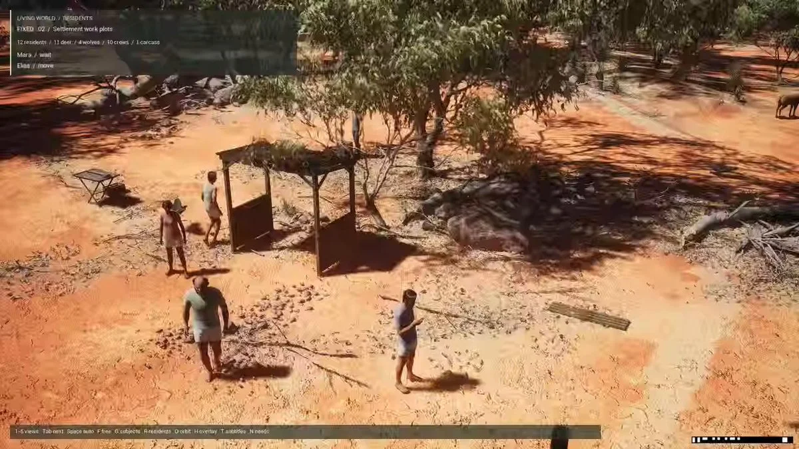

</details>

公開情報に基づく制作指示。元のプロンプト全文は非公開です

```text
自律的に行動する人々が暮らす Unreal Engine の世界を作成してください。一人ひとりの欲求と共通の生存目標を設定し、会話、分業、住居づくりを通じて、プレイヤーが離れても社会が存続するようにしてください。
```

[元の投稿](https://x.com/mattshumer_/status/2095596175705399482)

---

<a id="gpt-6-astra-2095609734845927525"></a>

## Unreal Engine で街路まで再現するマンハッタン

[Matt Shumer](https://x.com/mattshumer_) · 2026-09-03 · **公開説明からまとめた制作指示**

作者が公開した作品紹介を基に、再利用できる制作指示としてまとめています。非公開のプロンプトをそのまま再現したものではありません。

<details>
<summary>プレビュー</summary>

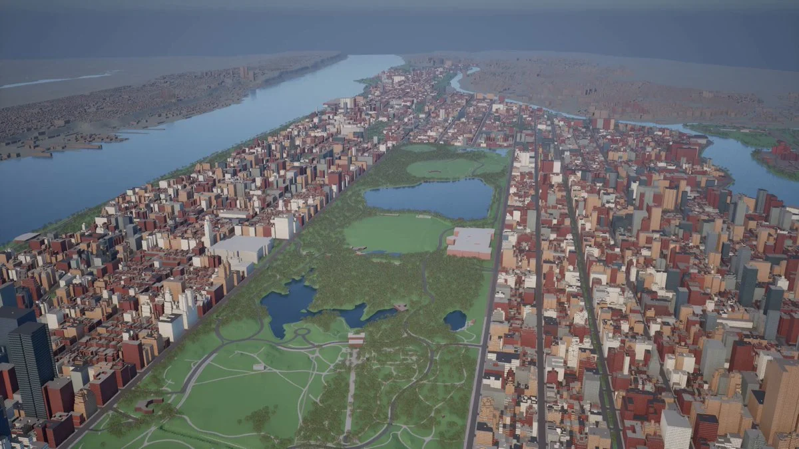

</details>

公開情報に基づく制作指示。元のプロンプト全文は非公開です

```text
Unreal Engine で探索できるマンハッタンを構築してください。地区ごと、通りごとに制作し、スケール、道路配置、名所、交通、街の個性を再現します。評価チェックリストを用意し、各エリアを改善してから次へ進んでください。
```

[元の投稿](https://x.com/mattshumer_/status/2095609734845927525)

---

<a id="gpt-6-astra-2095636679264780481"></a>

## Blender で作るモダンなヴィラ

[Karan](https://x.com/karankendre) · 2026-09-03 · **公開説明からまとめた制作指示**

作者が公開した作品紹介を基に、再利用できる制作指示としてまとめています。非公開のプロンプトをそのまま再現したものではありません。

<details>
<summary>プレビュー</summary>

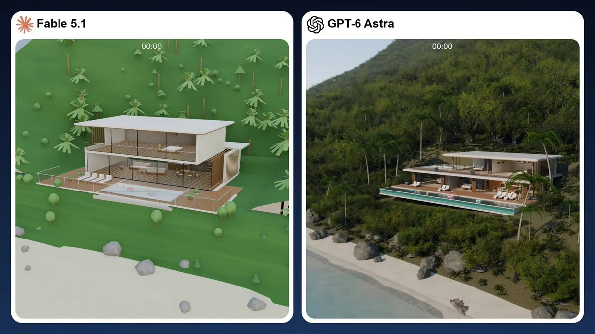

</details>

公開情報に基づく制作指示。元のプロンプト全文は非公開です

```text
Blender でモダンなヴィラのシーンを完成させてください。整合性のある建築、家具付きの室内、インフィニティプール、植栽、リアルなマテリアル、夕日の時間帯を巡る映画的なカメラパスを含めてください。
```

[元の投稿](https://x.com/karankendre/status/2095636679264780481)

---

<a id="gpt-6-astra-2095599934766764338"></a>

## 一度の指示で作るブラウザ 3D ゲーム

[Theo - t3.gg](https://x.com/theo) · 2026-09-03 · **公開説明からまとめた制作指示**

作者が公開した作品紹介を基に、再利用できる制作指示としてまとめています。非公開のプロンプトをそのまま再現したものではありません。

<details>
<summary>プレビュー</summary>


</details>

公開情報に基づく制作指示。元のプロンプト全文は非公開です

```text
単独で動作する一つのプロジェクトとして、ブラウザで遊べる 3D ゲームを完成させてください。明確な目標、反応のよい操作、空間的に一貫したステージ、敵や障害物、フィードバック、スコア、リスタート、性能対策を含めてください。
```

[元の投稿](https://x.com/theo/status/2095599934766764338)

---

<a id="gpt-6-astra-2095598645190291775"></a>

## 住宅写真から編集可能な Blender の世界へ

[Tom Krcha](https://x.com/tomkrcha) · 2026-09-03 · **公開説明からまとめた制作指示**

作者が公開した作品紹介を基に、再利用できる制作指示としてまとめています。非公開のプロンプトをそのまま再現したものではありません。

<details>
<summary>プレビュー</summary>

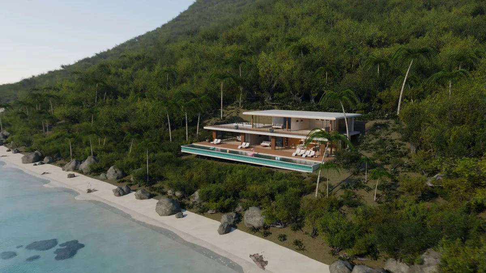

</details>

公開情報に基づく制作指示。元のプロンプト全文は非公開です

```text
提示された住宅写真を、すべて編集可能な Blender シーンとして再構築してください。建物、家具、家電、おもちゃを別オブジェクトにし、自然な比率を保ち、ローカル環境で滑らかな 60 FPS のウォークスルーを実現してください。
```

[元の投稿](https://x.com/tomkrcha/status/2095598645190291775)

---

<a id="gpt-6-astra-2095612137582526615"></a>

## Zillow の物件情報から 3D 紹介動画へ

[Yunfan Ye](https://x.com/realYunfanYe) · 2026-09-03 · **公開説明からまとめた制作指示**

作者が公開した作品紹介を基に、再利用できる制作指示としてまとめています。非公開のプロンプトをそのまま再現したものではありません。

<details>
<summary>プレビュー</summary>


</details>

公開情報に基づく制作指示。元のプロンプト全文は非公開です

```text
提示された不動産情報と掲載写真すべてから住宅を 3D 再構築し、矛盾のない間取りを推定して、完成度の高い紹介用ウォークスルー動画を作成してください。不確かな形状を明示し、初回制作後に相違点を修正してください。
```

[元の投稿](https://x.com/realYunfanYe/status/2095612137582526615)

---

<a id="gpt-6-astra-2095756085890310311"></a>

## 蒸気機関車の図面を編集可能な Blender アセンブリに

[Tom Krcha](https://x.com/tomkrcha) · 2026-09-04 · **公開説明からまとめた制作指示**

作者が公開した作品紹介を基に、再利用できる制作指示としてまとめています。非公開のプロンプトをそのまま再現したものではありません。

<details>
<summary>プレビュー</summary>


</details>

公開情報に基づく制作指示。元のプロンプト全文は非公開です

```text
提示された古い蒸気機関車の図面を、Blender で精密な機械アセンブリとして再現してください。車輪、車軸、サスペンション、ロッド、ボイラー部品、車体パネルに名前を付け、個別に編集できるようにします。ディテールの量も調整可能にしてください。
```

[元の投稿](https://x.com/tomkrcha/status/2095756085890310311)

---

<a id="gpt-6-astra-2095630197257367857"></a>

## Cycles 向けに手続き生成する大統領執務室

[Higgsfield AI 🧩](https://x.com/higgsfield_ai) · 2026-09-03 · **公開説明からまとめた制作指示**

作者が公開した作品紹介を基に、再利用できる制作指示としてまとめています。非公開のプロンプトをそのまま再現したものではありません。

<details>
<summary>プレビュー</summary>

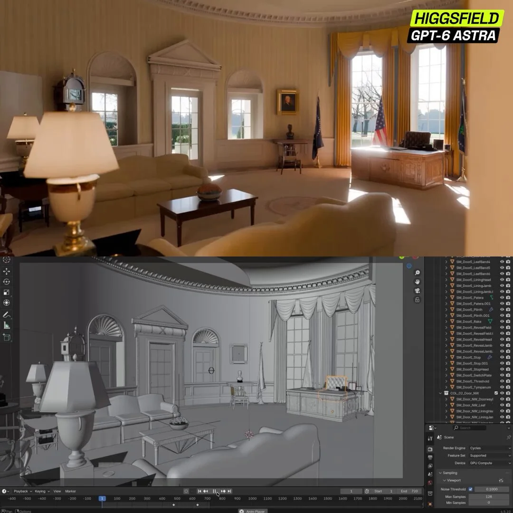

</details>

公開情報に基づく制作指示。元のプロンプト全文は非公開です

```text
大統領執務室のセット説明を実行可能なシーンコードに変換してください。Blender で家具、壁、照明、カメラ位置を編集可能に構築し、Cycles で映画的にレンダリングしてください。
```

[元の投稿](https://x.com/higgsfield_ai/status/2095630197257367857)

---

<a id="gpt-6-astra-2095597137849446688"></a>

## 一度の指示で作る Minecraft 風の世界

[Flavio Adamo](https://x.com/flavioAd) · 2026-09-03 · **公開説明からまとめた制作指示**

作者が公開した作品紹介を基に、再利用できる制作指示としてまとめています。非公開のプロンプトをそのまま再現したものではありません。

<details>
<summary>プレビュー</summary>

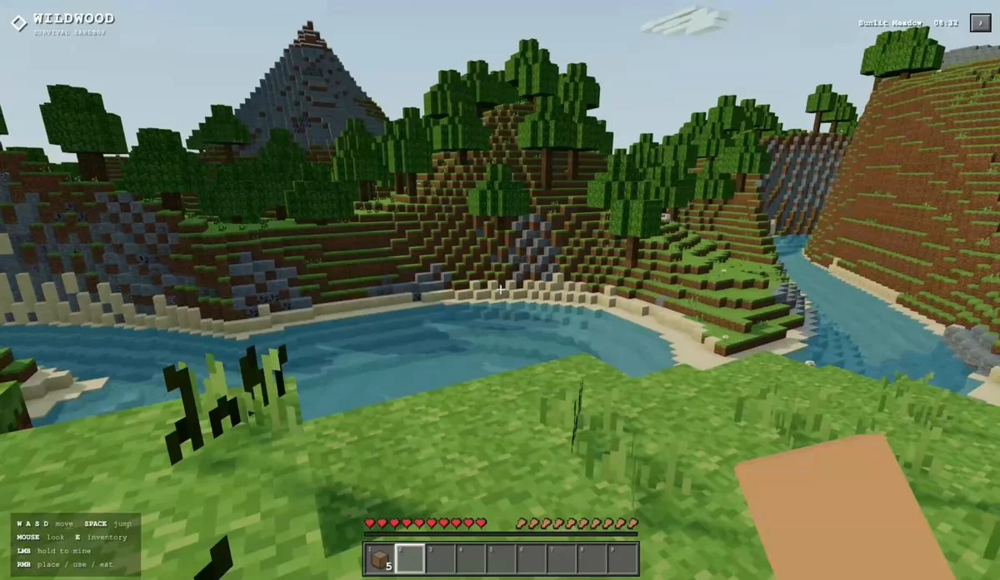

</details>

公開情報に基づく制作指示。元のプロンプト全文は非公開です

```text
Minecraft に着想を得た、遊べるボクセル世界を一度で作成してください。地形生成、ブロックの設置と破壊、一人称操作、所持品、照明、水、短く完結したサバイバルの流れを実装してください。
```

[元の投稿](https://x.com/flavioAd/status/2095597137849446688)

---

<a id="gpt-6-astra-2095653641164329143"></a>

## Blender で再現するパレス・オブ・ファイン・アーツ

[Sharif Shameem](https://x.com/sharifshameem) · 2026-09-03 · **公開説明からまとめた制作指示**

作者が公開した作品紹介を基に、再利用できる制作指示としてまとめています。非公開のプロンプトをそのまま再現したものではありません。

<details>
<summary>プレビュー</summary>


</details>

公開情報に基づく制作指示。元のプロンプト全文は非公開です

```text
サンフランシスコのパレス・オブ・ファイン・アーツを Blender で再現してください。円形建築の特徴的な比率、列柱、池、植物、経年変化した素材、万博時代の明るい未来観を感じる映画的照明を表現してください。
```

[元の投稿](https://x.com/sharifshameem/status/2095653641164329143)

---

<a id="gpt-6-astra-2095776685807346105"></a>

## ゴッホの絵画 6 点から生まれる歩ける街

[Peter Gostev](https://x.com/petergostev) · 2026-09-04 · **公開説明からまとめた制作指示**

作者が公開した作品紹介を基に、再利用できる制作指示としてまとめています。非公開のプロンプトをそのまま再現したものではありません。

<details>
<summary>プレビュー</summary>


</details>

公開情報に基づく制作指示。元のプロンプト全文は非公開です

```text
提示されたゴッホの絵画 6 点を、一続きに歩ける Three.js の街にしてください。各作品の色彩と筆致を保ち、道路、名所、場面のつながりを統合した探索可能な世界を作ってください。
```

[元の投稿](https://x.com/petergostev/status/2095776685807346105) · [デモ](https://van-goghs-town.surge.sh/)

---

<a id="gpt-6-astra-2095608358086840647"></a>

## 初心者が音声で作る 3D ゲーム

[el.cine](https://x.com/EHuanglu) · 2026-09-03 · **公開説明からまとめた制作指示**

作者が公開した作品紹介を基に、再利用できる制作指示としてまとめています。非公開のプロンプトをそのまま再現したものではありません。

<details>
<summary>プレビュー</summary>


</details>

公開情報に基づく制作指示。元のプロンプト全文は非公開です

```text
私の 3D ゲーム制作者として振る舞ってください。不足しているプレイヤーの目標、画風、操作方法だけを質問し、すぐに遊べるブラウザゲームを作成してください。その後は短い音声指示で改良を続けてください。
```

[元の投稿](https://x.com/EHuanglu/status/2095608358086840647)

---

<a id="gpt-6-astra-2095580402505400369"></a>

## 一つのグレーボックスから 3 テーマのカートゲームへ

[Chetaslua](https://x.com/chetaslua) · 2026-09-03 · **公開説明からまとめた制作指示**

作者が公開した作品紹介を基に、再利用できる制作指示としてまとめています。非公開のプロンプトをそのまま再現したものではありません。

<details>
<summary>プレビュー</summary>

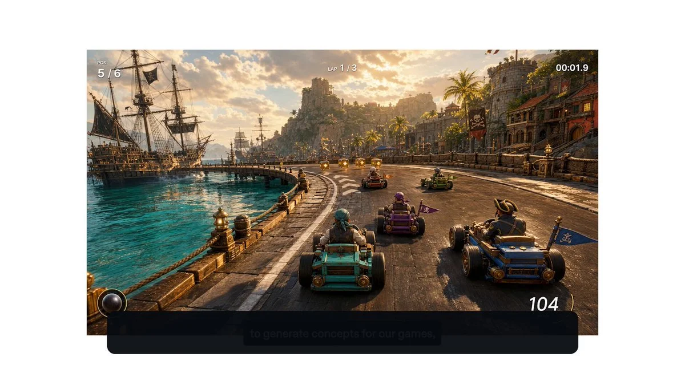

</details>

公開情報に基づく制作指示。元のプロンプト全文は非公開です

```text
提示された Unity のカートレース用グレーボックスから、海賊、お菓子、サイバーパンクの 3 種類の遊べる作品を作成してください。走行の仕組みは再利用し、環境と演出を変更します。各ビルドを試遊し、目立つ不具合を修正してください。
```

[元の投稿](https://x.com/chetaslua/status/2095580402505400369)

---

<a id="gpt-6-astra-2095596341422440714"></a>

## ブラウザで探索するオープンワールド冒険

[Peter Gostev](https://x.com/petergostev) · 2026-09-03 · **公開説明からまとめた制作指示**

作者が公開した作品紹介を基に、再利用できる制作指示としてまとめています。非公開のプロンプトをそのまま再現したものではありません。

<details>
<summary>プレビュー</summary>

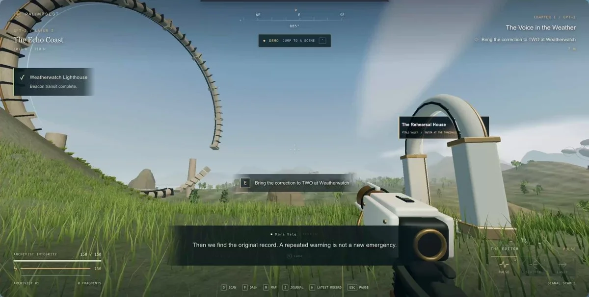

</details>

公開情報に基づく制作指示。元のプロンプト全文は非公開です

```text
複数のバイオームがつながるオープンワールド 3D アドベンチャーを作成してください。移動、発見、軽い戦闘、クエスト、名所、昼夜の雰囲気を用意し、目的を感じながら探索できる案内を加えてください。
```

[元の投稿](https://x.com/petergostev/status/2095596341422440714)

---

<a id="gpt-6-astra-2095619319690400253"></a>

## フォトリアルな 3D 商品モックアップスタジオ

[Josh Millgate](https://x.com/joshmillgate) · 2026-09-03 · **公開説明からまとめた制作指示**

作者が公開した作品紹介を基に、再利用できる制作指示としてまとめています。非公開のプロンプトをそのまま再現したものではありません。

<details>
<summary>プレビュー</summary>


</details>

公開情報に基づく制作指示。元のプロンプト全文は非公開です

```text
アップロードしたデザインをフォトリアルな 3D 商品モックアップに配置するブラウザツールを作成してください。カメラ回転、素材と色の調整、環境照明、複数の商品、高解像度の書き出しに対応してください。
```

[元の投稿](https://x.com/joshmillgate/status/2095619319690400253)

---

<a id="gpt-6-astra-2095611134992945385"></a>

## 参考画像から作る 3D アクアリウムゲーム

[Tim Jayas](https://x.com/TimJayas) · 2026-09-03 · **公開説明からまとめた制作指示**

作者が公開した作品紹介を基に、再利用できる制作指示としてまとめています。非公開のプロンプトをそのまま再現したものではありません。

<details>
<summary>プレビュー</summary>


</details>

公開情報に基づく制作指示。元のプロンプト全文は非公開です

```text
参考画像を基に、3D アクアリウムゲームを一度で完成させてください。水槽の構図を再現し、魚の動き、餌やりと収集、水の表現、カメラ操作、明確な目標を実装してください。
```

[元の投稿](https://x.com/TimJayas/status/2095611134992945385)

---

<a id="gpt-6-astra-2095647685210669541"></a>

## 一つのプロンプトで遊べるリアルタイム 3D ゲーム

[Higgsfield AI 🧩](https://x.com/higgsfield) · 2026-09-03 · **公開説明からまとめた制作指示**

作者が公開した作品紹介を基に、再利用できる制作指示としてまとめています。非公開のプロンプトをそのまま再現したものではありません。

<details>
<summary>プレビュー</summary>


</details>

公開情報に基づく制作指示。元のプロンプト全文は非公開です

```text
一つのプロンプトから、遊べるリアルタイム 3D ゲームを作成してください。小さくまとまった中心的な遊び、明確な目標、短い物語を定め、シーン、キャラクター、小物、フィードバック、リスタート状態を生成して、すぐに遊べるようにしてください。
```

[元の投稿](https://x.com/higgsfield/status/2095647685210669541)

---

<a id="gpt-6-astra-2095840435319001278"></a>

## 一度のやり取りで作る Three.js 海戦シーン

[leo 🐾](https://x.com/synthwavedd) · 2026-09-04 · **公開説明からまとめた制作指示**

作者が公開した作品紹介を基に、再利用できる制作指示としてまとめています。非公開のプロンプトをそのまま再現したものではありません。

<details>
<summary>プレビュー</summary>


</details>

公開情報に基づく制作指示。元のプロンプト全文は非公開です

```text
Three.js で精細な海戦を一度のやり取りで作成してください。特徴の異なる複数の艦船、物理的に説得力のある水との相互作用、航跡と飛沫、空中戦、爆発、映画的照明、カメラ移動、性能を考慮した描画を含めてください。
```

[元の投稿](https://x.com/synthwavedd/status/2095840435319001278)

---

<a id="gpt-6-astra-2095598026916049024"></a>

## Halo に着想を得た 10 対 10 のマルチプレイ FPS

[Halfdan](https://x.com/VikiingAI) · 2026-09-03 · **公開説明からまとめた制作指示**

作者が公開した作品紹介を基に、再利用できる制作指示としてまとめています。非公開のプロンプトをそのまま再現したものではありません。

<details>
<summary>プレビュー</summary>


</details>

公開情報に基づく制作指示。元のプロンプト全文は非公開です

```text
往年の SF 系 FPS に着想を得た、10 対 10 のマルチプレイアリーナシューターを作成してください。チーム、復活、判別しやすい武器、シールド、アイテム、小規模マップ、スコア、試合進行、低遅延のブラウザプレイを実装してください。
```

[元の投稿](https://x.com/VikiingAI/status/2095598026916049024)

---

<a id="gpt-6-astra-2095719731860750613"></a>

## 操作できるボクセル鉄道ジオラマ

[Derya Unutmaz, MD](https://x.com/DeryaTR_) · 2026-09-04 · **公開説明からまとめた制作指示**

作者が公開した作品紹介を基に、再利用できる制作指示としてまとめています。非公開のプロンプトをそのまま再現したものではありません。

<details>
<summary>プレビュー</summary>

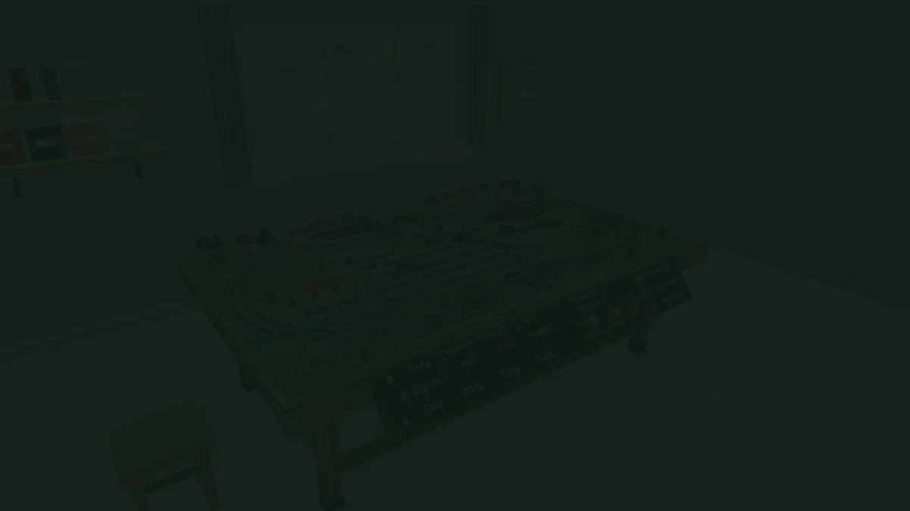

</details>

公開情報に基づく制作指示。元のプロンプト全文は非公開です

```text
Three.js で精細なボクセル鉄道ジオラマを作成してください。複数の列車の発車と停止、線路切り替え、視点回転とズーム、ミニチュアの街の観察、小さな環境アニメーションの起動を可能にしてください。
```

[元の投稿](https://x.com/DeryaTR_/status/2095719731860750613) · [デモ](https://lindenhafen-railway.vercel.app/)

---

<a id="gpt-6-astra-2095699049722581065"></a>

## ボトルの中で航海するボクセル帆船

[Derya Unutmaz, MD](https://x.com/DeryaTR_) · 2026-09-04 · **公開説明からまとめた制作指示**

作者が公開した作品紹介を基に、再利用できる制作指示としてまとめています。非公開のプロンプトをそのまま再現したものではありません。

<details>
<summary>プレビュー</summary>

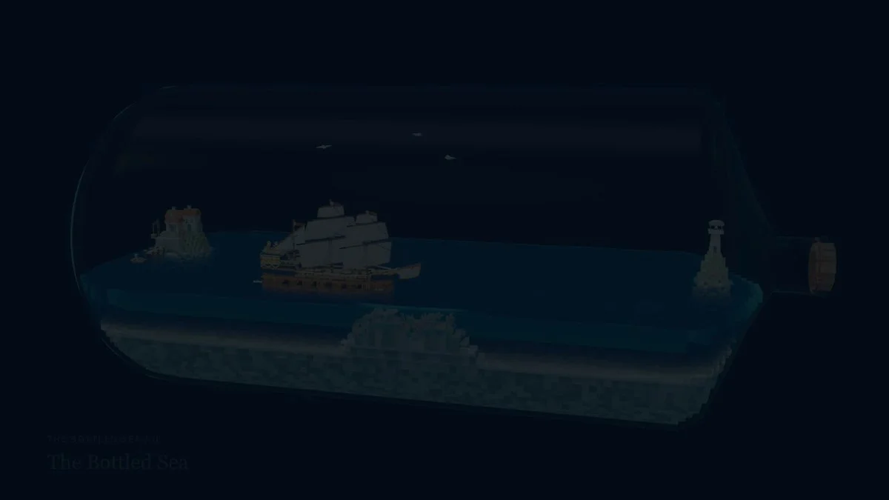

</details>

公開情報に基づく制作指示。元のプロンプト全文は非公開です

```text
ガラス瓶の中を航海する、精細な 17 世紀のボクセル帆船を作成してください。うねる波と船の揺れ、旋回するカモメ、小さな港とサンゴ礁を加え、映画的なカメラシーケンスと穏やかな音楽を制作してください。
```

[元の投稿](https://x.com/DeryaTR_/status/2095699049722581065)

---

<a id="gpt-6-astra-2095641163441254676"></a>

## 3D プリントできる USS エンタープライズの CAD アセンブリ

[Derya Unutmaz, MD](https://x.com/DeryaTR_) · 2026-09-03 · **公開説明からまとめた制作指示**

作者が公開した作品紹介を基に、再利用できる制作指示としてまとめています。非公開のプロンプトをそのまま再現したものではありません。

<details>
<summary>プレビュー</summary>


</details>

公開情報に基づく制作指示。元のプロンプト全文は非公開です

```text
USS エンタープライズ NCC-1701 へのオマージュとなる、独自の 3D プリント対応 CAD モデルを設計してください。特徴的な比率、ブリッジと一部の内装、少なくとも 28 個の機能する可動部品、分割されたアセンブリ、製造用ファイルの書き出しを含めてください。
```

[元の投稿](https://x.com/DeryaTR_/status/2095641163441254676)

---

<a id="gpt-6-astra-2095630044102279312"></a>

## Unity で作る宇宙トレンチラン

[Ronald Mannak](https://x.com/ronaldmannak) · 2026-09-03 · **公開説明からまとめた制作指示**

作者が公開した作品紹介を基に、再利用できる制作指示としてまとめています。非公開のプロンプトをそのまま再現したものではありません。

<details>
<summary>プレビュー</summary>

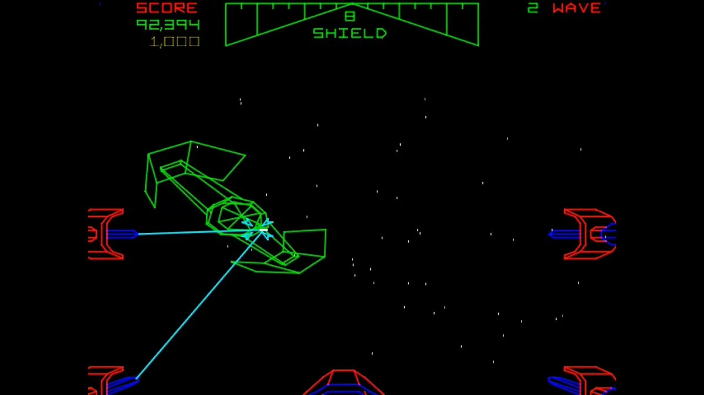

</details>

公開情報に基づく制作指示。元のプロンプト全文は非公開です

```text
往年の宇宙トレンチランの感覚を Unity で再現してください。高速の低空飛行、砲台射撃、障害物、照準、増す緊迫感、最終目標、成功または失敗の映画的演出を実装してください。
```

[元の投稿](https://x.com/ronaldmannak/status/2095630044102279312)

---

<a id="gpt-6-astra-2093690427849191855"></a>

## 手続き生成するボクセル城のショーケース

[Hakm](https://x.com/hakmgpt) · 2026-08-29 · **公開説明からまとめた制作指示**

作者が公開した作品紹介を基に、再利用できる制作指示としてまとめています。非公開のプロンプトをそのまま再現したものではありません。

<details>
<summary>プレビュー</summary>


</details>

公開情報に基づく制作指示。元のプロンプト全文は非公開です

```text
防御の階層が分かる大きなボクセル城を生成してください。塔、城壁、門、中庭、周辺地形を含めます。インスタンシング、周回カメラ、変化する光、決定論的生成を使い、安定して細部を観察できるようにしてください。
```

[元の投稿](https://x.com/hakmgpt/status/2093690427849191855)

---

<a id="gpt-6-astra-2095597640587374887"></a>

## アセットを組み合わせた探索可能な Unity 都市

[Chetaslua](https://x.com/chetaslua) · 2026-09-03 · **公開説明からまとめた制作指示**

作者が公開した作品紹介を基に、再利用できる制作指示としてまとめています。非公開のプロンプトをそのまま再現したものではありません。

<details>
<summary>プレビュー</summary>

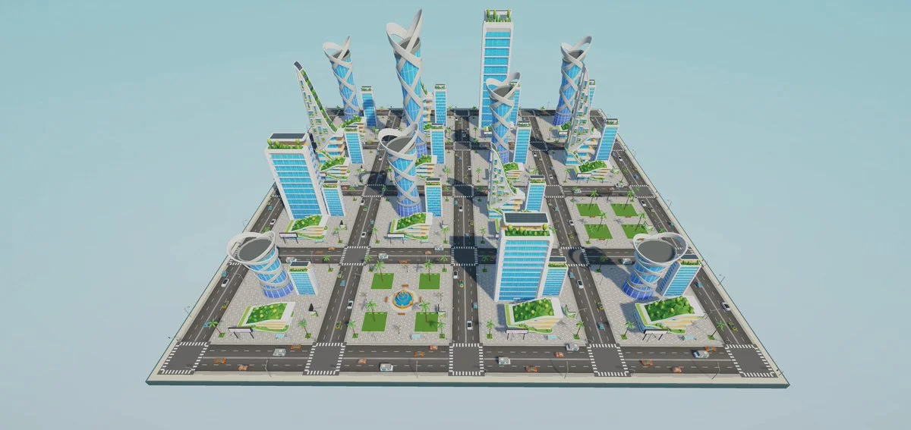

</details>

公開情報に基づく制作指示。元のプロンプト全文は非公開です

```text
提供されたアセットライブラリから、探索できる Unity の都市を構築してください。一貫した道路網、高層建築、車両、ヤシ、照明、移動経路を配置し、シーンを最適化して安定した一人称ウォークスルーを実現してください。
```

[元の投稿](https://x.com/chetaslua/status/2095597640587374887)

---

<a id="gpt-6-astra-2095868420327710840"></a>

## 機構まで作り込む Blender 蒸気機関車

[sheemamoto](https://x.com/sheemamoto) · 2026-09-04 · **公開説明からまとめた制作指示**

作者が公開した作品紹介を基に、再利用できる制作指示としてまとめています。非公開のプロンプトをそのまま再現したものではありません。

<details>
<summary>プレビュー</summary>


</details>

公開情報に基づく制作指示。元のプロンプト全文は非公開です

```text
蒸気機関車を、テクスチャ付きの外殻ではなく、機構を分解できる Blender モデルとして制作してください。車軸、軸箱守、軸箱、ステー、サスペンションリンク、蒸気ドーム、主要アセンブリをそれぞれ分けて命名してください。
```

[元の投稿](https://x.com/sheemamoto/status/2095868420327710840)

---

<a id="gpt-6-astra-2095819786651374023"></a>

## 8 台で競うブラウザゲーム Tidal Rush

[RESONANCE SCIENCE 🧬🔬](https://x.com/amazing13_13) · 2026-09-04 · **公開説明からまとめた制作指示**

作者が公開した作品紹介を基に、再利用できる制作指示としてまとめています。非公開のプロンプトをそのまま再現したものではありません。

<details>
<summary>プレビュー</summary>

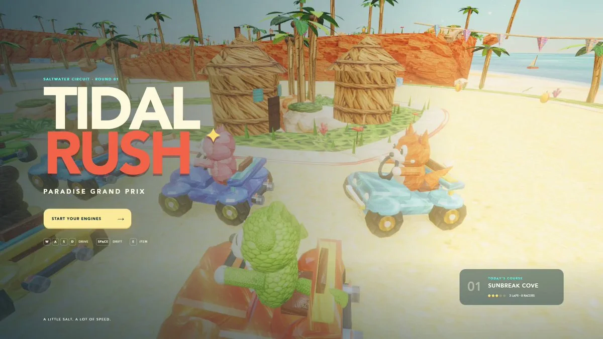

</details>

公開情報に基づく制作指示。元のプロンプト全文は非公開です

```text
8 台のレーサー、3 周のレース、ドリフト、取得アイテム、反応のよい物理挙動、分かりやすい HUD、魅力的な映像、ゴール後の結果画面を備えたブラウザカートゲームを完成させてください。
```

[元の投稿](https://x.com/amazing13_13/status/2095819786651374023)

---

<a id="gpt-6-astra-2095805694603673631"></a>

## リアルタイム WebGL 銀河のヒーローセクション

[Fluxora](https://x.com/Fluxora_Studios) · 2026-09-04 · **公開説明からまとめた制作指示**

作者が公開した作品紹介を基に、再利用できる制作指示としてまとめています。非公開のプロンプトをそのまま再現したものではありません。

<details>
<summary>プレビュー</summary>

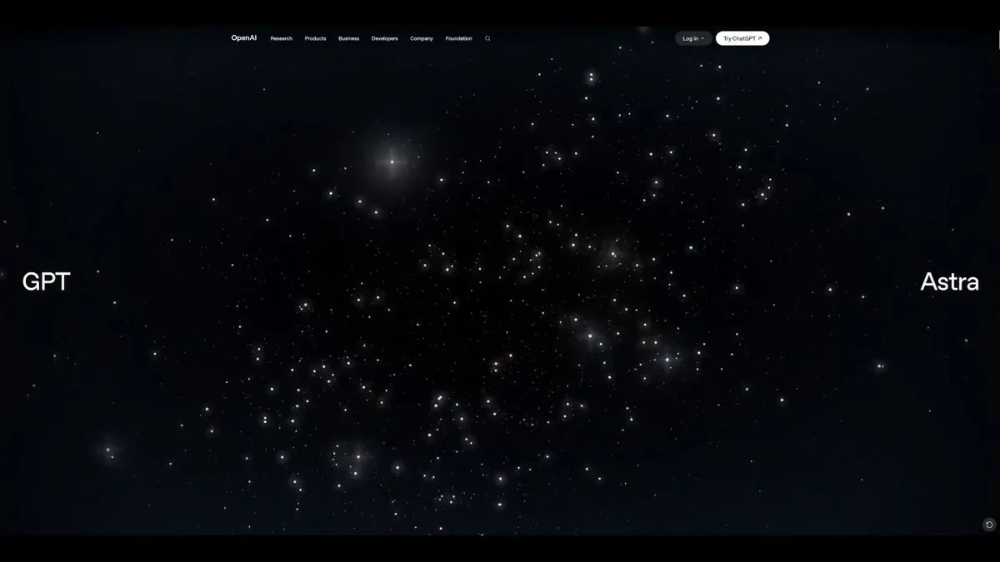

</details>

公開情報に基づく制作指示。元のプロンプト全文は非公開です

```text
提示された銀河のヒーロー表現を分析し、動画ではなくリアルタイム WebGL で再構築してください。奥行きのある粒子、発光する塵、滑らかなポインター反応、文字を置く余白、端末性能に応じた調整を取り入れてください。
```

[元の投稿](https://x.com/Fluxora_Studios/status/2095805694603673631)

---

<a id="gpt-6-astra-2095898198413922791"></a>

## 文化を題材にした自動進行アーケードゲーム

[Good Morning](https://x.com/say_gm_) · 2026-09-04 · **公開説明からまとめた制作指示**

作者が公開した作品紹介を基に、再利用できる制作指示としてまとめています。非公開のプロンプトをそのまま再現したものではありません。

<details>
<summary>プレビュー</summary>


</details>

公開情報に基づく制作指示。元のプロンプト全文は非公開です

```text
G7 の一国を題材に、自動で進行するアーケードゲームを作成してください。有名な文化的名所を中心的な遊びに変換し、操作しなくても状況が分かるようにします。スコア、段階的な難易度、印象的な見せ場を加えてください。
```

[元の投稿](https://x.com/say_gm_/status/2095898198413922791)

---

<a id="gpt-6-astra-2095597560253862065"></a>

## 一度の指示で作る上質なインタラクティブ試作

[AJ Orbach 🐳](https://x.com/AY_Orbach) · 2026-09-03 · **公開説明からまとめた制作指示**

作者が公開した作品紹介を基に、再利用できる制作指示としてまとめています。非公開のプロンプトをそのまま再現したものではありません。

<details>
<summary>プレビュー</summary>


</details>

公開情報に基づく制作指示。元のプロンプト全文は非公開です

```text
提示された製品コンセプトから、上質なインタラクティブプロトタイプを一度で設計・実装してください。明確なビジュアルルールを選び、主操作を優先し、洗練された画面遷移を加え、レスポンシブな公開済みビルドを納品してください。
```

[元の投稿](https://x.com/AY_Orbach/status/2095597560253862065)

---

<a id="gpt-6-astra-2095776712579571725"></a>

## 分解して操作できる 3D ターボチャージャー

[Feraser](https://x.com/Feraser8) · 2026-09-04 · **公開されたプロンプト**

作者がリンク先の X 投稿で公開した指示文の日本語訳です。元の文章は句読点と書式のみ軽く整えています。

<details>
<summary>プレビュー</summary>


</details>

作者公開の原文プロンプト（日本語訳）

```text
操作できる 3D ターボチャージャーを作ってください。動作する各系統を分けてください。回転させ、部品を個別に取り出し、機械が実際に何をしているか確認できるようにしてください。
```

[元の投稿](https://x.com/Feraser8/status/2095776712579571725)

---

<a id="gpt-6-astra-2095663498101662198"></a>

## 一度で驚きを生む Three.js ゲーム

[Prathamesh](https://x.com/pratt_builds) · 2026-09-04 · **公開説明からまとめた制作指示**

作者が公開した作品紹介を基に、再利用できる制作指示としてまとめています。非公開のプロンプトをそのまま再現したものではありません。

<details>
<summary>プレビュー</summary>


</details>

公開情報に基づく制作指示。元のプロンプト全文は非公開です

```text
「Amaze」の名にふさわしい独創的な Three.js ゲームを一度で作ってください。驚きのある視覚的な仕組みを一つ選び、数秒で理解できる導入、短い成長の流れ、満足感のある華やかな結末を用意してください。
```

[元の投稿](https://x.com/pratt_builds/status/2095663498101662198)

---

<a id="gpt-6-astra-2095907526566990013"></a>

## 短時間で遊べるゲームプロトタイプ

[GLUNIVERSE™](https://x.com/gibglue) · 2026-09-04 · **公開説明からまとめた制作指示**

作者が公開した作品紹介を基に、再利用できる制作指示としてまとめています。非公開のプロンプトをそのまま再現したものではありません。

<details>
<summary>プレビュー</summary>


</details>

公開情報に基づく制作指示。元のプロンプト全文は非公開です

```text
厳しい時間・トークン予算内で、見た目に一貫性のある遊べるゲーム試作を作成してください。機能数より、一つの完結した遊び、反応のよい入力、明快なフィードバック、安定した性能、公開できるブラウザビルドを優先してください。
```

[元の投稿](https://x.com/gibglue/status/2095907526566990013)

---

<a id="gpt-6-astra-2095872986477908108"></a>

## プロンプトから作るオープンワールドゲーム

[Ejaj AHmed 🦅](https://x.com/aeejazkhan) · 2026-09-04 · **公開説明からまとめた制作指示**

作者が公開した作品紹介を基に、再利用できる制作指示としてまとめています。非公開のプロンプトをそのまま再現したものではありません。

<details>
<summary>プレビュー</summary>

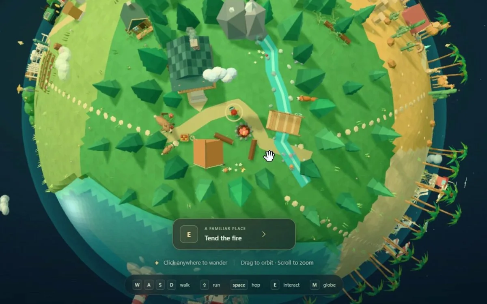

</details>

公開情報に基づく制作指示。元のプロンプト全文は非公開です

```text
次の構想からオープンワールドゲームを作ってください：[世界の設定]。異なる 3 地域、移動、動的な遭遇、簡単な連続クエスト、名所、保存と再開、ブラウザで動くための最適化を含めてください。
```

[元の投稿](https://x.com/aeejazkhan/status/2095872986477908108)

---

<a id="gpt-6-astra-2095806515579879457"></a>

## Three.js の銀河が動くホームページ

[Three.js Resources](https://x.com/threejsresource) · 2026-09-04 · **公開説明からまとめた制作指示**

作者が公開した作品紹介を基に、再利用できる制作指示としてまとめています。非公開のプロンプトをそのまま再現したものではありません。

<details>
<summary>プレビュー</summary>


</details>

公開情報に基づく制作指示。元のプロンプト全文は非公開です

```text
リアルタイム Three.js の銀河を中心に、上質な製品発表ページのヒーローを作成してください。粒子でさりげなく数字の 6 を描き、スクロールとポインターに反応させます。文字の読みやすさを保ち、非力な端末では自然に効果を減らしてください。
```

[元の投稿](https://x.com/threejsresource/status/2095806515579879457)

---

<a id="gpt-6-astra-2095898303019856230"></a>

## Blender で作るループするサイバーパンクの寝室

[Coin Shot ☁️](https://x.com/CoinSh0t) · 2026-09-04 · **公開されたプロンプト**

作者がリンク先の X 投稿で公開した指示文の日本語訳です。元の文章は句読点と書式のみ軽く整えています。

<details>
<summary>プレビュー</summary>


</details>

作者公開の原文プロンプト（日本語訳）

```text
夜の雨に濡れたネオン街を見下ろす、映画的なサイバーパンクの寝室を Blender で作成してください。動く広告看板を追加し、フォトリアルで継ぎ目なくループする映像にしてください。
```

[元の投稿](https://x.com/CoinSh0t/status/2095898303019856230)

---

<a id="gpt-6-astra-2095871735824339279"></a>

## Three.js で歩くゴッホの街

[Fede(URU) 🇺🇾](https://x.com/RealFedeURU) · 2026-09-04 · **公開説明からまとめた制作指示**

作者が公開した作品紹介を基に、再利用できる制作指示としてまとめています。非公開のプロンプトをそのまま再現したものではありません。

<details>
<summary>プレビュー</summary>


</details>

公開情報に基づく制作指示。元のプロンプト全文は非公開です

```text
ゴッホに着想を得た、歩ける Three.js の街を作成してください。絵の街路、星、カフェ、畑を立体的に重なる空間へ変え、シェーダー、テクスチャ、動く光で筆致を生かしてください。
```

[元の投稿](https://x.com/RealFedeURU/status/2095871735824339279)

---

<a id="gpt-6-astra-2095805115580199372"></a>

## 散歩できる『星月夜』の街路

[₿IGRYAN](https://x.com/BigRyan) · 2026-09-04 · **公開説明からまとめた制作指示**

作者が公開した作品紹介を基に、再利用できる制作指示としてまとめています。非公開のプロンプトをそのまま再現したものではありません。

<details>
<summary>プレビュー</summary>

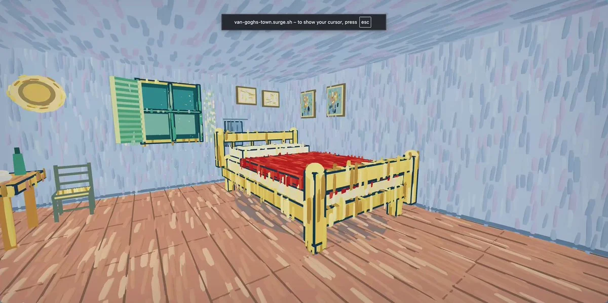

</details>

公開情報に基づく制作指示。元のプロンプト全文は非公開です

```text
ゴッホの絵画 6 点を一つの探索可能な街にまとめ、『星月夜』の通りを散歩できるようにしてください。絵画間の自然な出入口、一貫したスケール、穏やかな環境インタラクションを設計してください。
```

[元の投稿](https://x.com/BigRyan/status/2095805115580199372)

---

<a id="gpt-6-astra-2095742344293454148"></a>

## 運転できる思い出の鉄道テーブル

[₿IGRYAN](https://x.com/BigRyan) · 2026-09-04 · **公開説明からまとめた制作指示**

作者が公開した作品紹介を基に、再利用できる制作指示としてまとめています。非公開のプロンプトをそのまま再現したものではありません。

<details>
<summary>プレビュー</summary>


</details>

公開情報に基づく制作指示。元のプロンプト全文は非公開です

```text
子どもの頃の鉄道テーブルを、ボクセルの線路と車両を使った、触れたくなる Three.js のおもちゃとして再現してください。列車の運転、分岐の切り替え、周回視点、動くミニチュア風景の発見を楽しめるようにしてください。
```

[元の投稿](https://x.com/BigRyan/status/2095742344293454148)

---

<a id="gpt-6-astra-2095623452678144366"></a>

## 文章から探索できる Unity 都市へ

[Md Ismail Šojal 🕷️](https://x.com/0x0SojalSec) · 2026-09-03 · **公開説明からまとめた制作指示**

作者が公開した作品紹介を基に、再利用できる制作指示としてまとめています。非公開のプロンプトをそのまま再現したものではありません。

<details>
<summary>プレビュー</summary>


</details>

公開情報に基づく制作指示。元のプロンプト全文は非公開です

```text
提示された都市構想を、高層建築、道路、車両、ヤシ、雰囲気のある光を備えた、探索可能な Unity 環境にしてください。自然なスケール、移動経路、交通の動き、滑らかな一人称カメラを整えてください。
```

[元の投稿](https://x.com/0x0SojalSec/status/2095623452678144366)

---

<a id="gpt-6-astra-2095650251902239139"></a>

## 一つのプロンプトで比べるアクアリウム制作

[Tony出海](https://x.com/iamtonyzhu) · 2026-09-03 · **公開説明からまとめた制作指示**

作者が公開した作品紹介を基に、再利用できる制作指示としてまとめています。非公開のプロンプトをそのまま再現したものではありません。

<details>
<summary>プレビュー</summary>


</details>

公開情報に基づく制作指示。元のプロンプト全文は非公開です

```text
提示された参考画像から、一つのプロンプトで 3D アクアリウムゲームを作成してください。配置と雰囲気を合わせ、生き生きした魚、水の集光模様、周回操作、モデル出力の比較に適した小さな遊びを加えてください。
```

[元の投稿](https://x.com/iamtonyzhu/status/2095650251902239139)

---

<a id="gpt-6-astra-2095725404883476661"></a>

## 間取り図から完全な 3D ウォークスルーへ

[AidarosGo](https://x.com/aidarosgo3) · 2026-09-04 · **公開説明からまとめた制作指示**

作者が公開した作品紹介を基に、再利用できる制作指示としてまとめています。非公開のプロンプトをそのまま再現したものではありません。

<details>
<summary>プレビュー</summary>

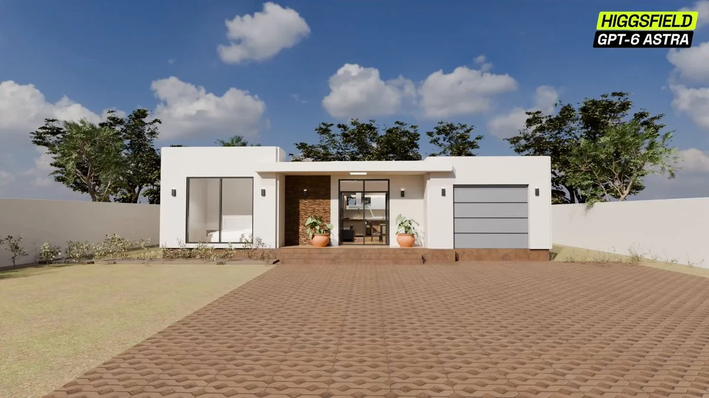

</details>

公開情報に基づく制作指示。元のプロンプト全文は非公開です

```text
提示された間取り図を、建物全体の 3D ウォークスルーに変換してください。部屋の寸法と動線を守り、扉、窓、家具、素材、照明を追加し、間取りが伝わるカメラパスを作成してください。
```

[元の投稿](https://x.com/aidarosgo3/status/2095725404883476661)

---

<a id="gpt-6-astra-2095777502681825541"></a>

## 実在の家を 60 FPS の編集可能な Blender シーンに

[Alvin Foo](https://x.com/alvinfoo) · 2026-09-04 · **公開説明からまとめた制作指示**

作者が公開した作品紹介を基に、再利用できる制作指示としてまとめています。非公開のプロンプトをそのまま再現したものではありません。

<details>
<summary>プレビュー</summary>


</details>

公開情報に基づく制作指示。元のプロンプト全文は非公開です

```text
提示された実在の家を、すべて編集可能な Blender シーンとして再構築してください。建築要素と家具を分け、形状と素材を最適化し、ローカル描画で 60 FPS を維持するウォークスルーを提供してください。
```

[元の投稿](https://x.com/alvinfoo/status/2095777502681825541)

---

<a id="gpt-6-astra-2095916820431827408"></a>

## ブラウザでドリフトする Street Heat

[Higgsfield AI 🧩](https://x.com/higgsfield_ai) · 2026-09-04 · **公開説明からまとめた制作指示**

作者が公開した作品紹介を基に、再利用できる制作指示としてまとめています。非公開のプロンプトをそのまま再現したものではありません。

<details>
<summary>プレビュー</summary>

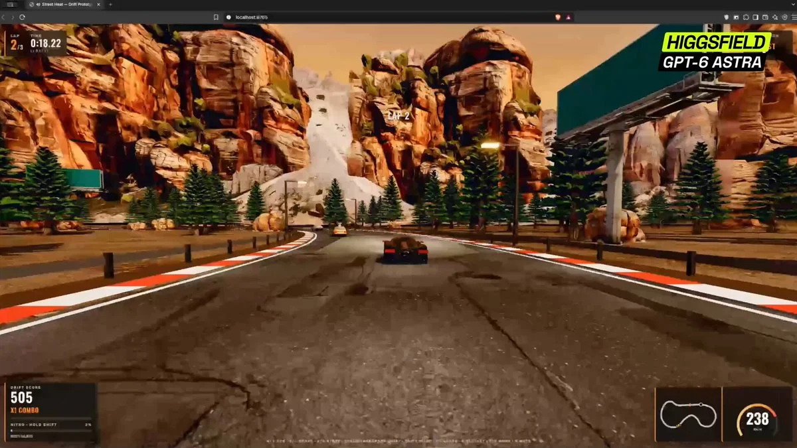

</details>

公開情報に基づく制作指示。元のプロンプト全文は非公開です

```text
一文からブラウザ用アーケード街頭レースを完成させてください。気持ちよいドリフト物理、コンボ得点、ニアミスボーナス、速度計測地点、ニトロ、交通、分かりやすい HUD、短く繰り返し遊べるコースを実装してください。
```

[元の投稿](https://x.com/higgsfield_ai/status/2095916820431827408)

---

<a id="gpt-6-astra-2095616529572503593"></a>

## 3D 美術館で行う撮影プリビズ

[Higgsfield AI 🧩](https://x.com/higgsfield_ai) · 2026-09-03 · **公開説明からまとめた制作指示**

作者が公開した作品紹介を基に、再利用できる制作指示としてまとめています。非公開のプロンプトをそのまま再現したものではありません。

<details>
<summary>プレビュー</summary>

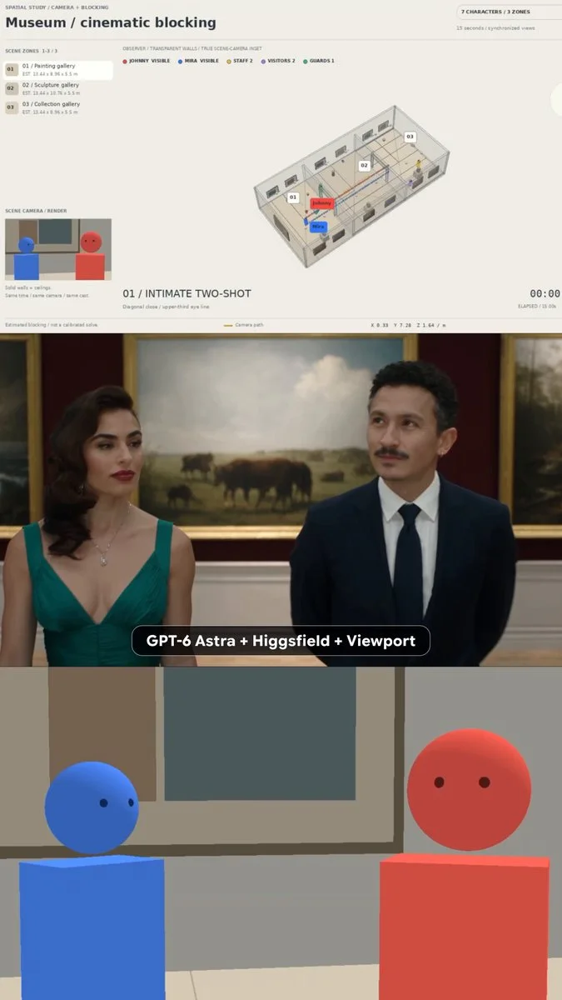

</details>

公開情報に基づく制作指示。元のプロンプト全文は非公開です

```text
場所、出演者の位置、カメラ配置、ショットリストを整理した 3D 美術館のプリビズを作成してください。各撮影設定を実際のビューポート内に収め、後続の動画生成に使う一貫したガイドを書き出してください。
```

[元の投稿](https://x.com/higgsfield_ai/status/2095616529572503593)

---

<a id="gpt-6-astra-2095695603808309497"></a>

## 15 秒で体験できる商品デモ広告

[Zack (Paid Ads Specialist)](https://x.com/zackpaid) · 2026-09-04 · **公開説明からまとめた制作指示**

作者が公開した作品紹介を基に、再利用できる制作指示としてまとめています。非公開のプロンプトをそのまま再現したものではありません。

<details>
<summary>プレビュー</summary>


</details>

公開情報に基づく制作指示。元のプロンプト全文は非公開です

```text
[商品] のモバイル優先の 15 秒インタラクティブデモを作成してください。一つのジェスチャーで中心機能を試せ、すぐに 3D の反応を返し、最後は「すべての機能を使う」という明確な CTA につなげます。縦型 9:16 とブランドカラーを保ってください。
```

[元の投稿](https://x.com/zackpaid/status/2095695603808309497)

---

<a id="gpt-6-astra-2095624712244072551"></a>

## 設計図から Blender、Unreal へつなぐ建築ビジュアル

[Linus ✦ Ekenstam](https://x.com/LinusEkenstam) · 2026-09-03 · **公開説明からまとめた制作指示**

作者が公開した作品紹介を基に、再利用できる制作指示としてまとめています。非公開のプロンプトをそのまま再現したものではありません。

<details>
<summary>プレビュー</summary>


</details>

公開情報に基づく制作指示。元のプロンプト全文は非公開です

```text
提示された建築設計図から正確で編集可能なモデルを Blender で作成し、Unreal Engine に移してください。正しいスケールと衝突判定を備え、照明付きで歩ける建築ビジュアライゼーションに仕上げてください。
```

[元の投稿](https://x.com/LinusEkenstam/status/2095624712244072551)

---

<a id="gpt-6-astra-2095752726886105375"></a>

## 森のヴィラ Solace を構想から UE5 へ

[SuSu_酥酥👅](https://x.com/NFT_Chen) · 2026-09-04 · **公開説明からまとめた制作指示**

作者が公開した作品紹介を基に、再利用できる制作指示としてまとめています。非公開のプロンプトをそのまま再現したものではありません。

<details>
<summary>プレビュー</summary>


</details>

公開情報に基づく制作指示。元のプロンプト全文は非公開です

```text
寝室 3 室、書斎、中庭、プール、周囲の森を備えたモダンなヴィラ「Solace」を、歩ける空間として作成してください。Blender で手続き生成し、夕景の静止画をレンダリングして、60 FPS の UE5 ウォークスルーを書き出してください。
```

[元の投稿](https://x.com/NFT_Chen/status/2095752726886105375)

---

<a id="gpt-6-astra-2095844872171421771"></a>

## 30 秒で作る Blender シーンの挑戦

[Satyam Kumar](https://x.com/_satyam_ai) · 2026-09-04 · **公開説明からまとめた制作指示**

作者が公開した作品紹介を基に、再利用できる制作指示としてまとめています。非公開のプロンプトをそのまま再現したものではありません。

<details>
<summary>プレビュー</summary>

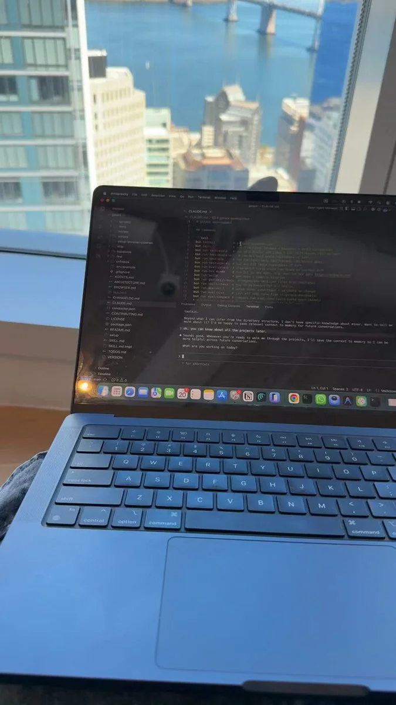

</details>

公開情報に基づく制作指示。元のプロンプト全文は非公開です

```text
極端に短い制限時間で、一貫した Blender シーンを作成してください。印象的なシルエット、3 層の奥行き、一つの主役素材、映画的照明、撮影に適した構図を優先し、すべてのオブジェクトを編集可能にしてください。
```

[元の投稿](https://x.com/_satyam_ai/status/2095844872171421771)

---

<a id="gpt-6-astra-2095980885732704629"></a>

## 連鎖反応するルーブ・ゴールドバーグ装置

[thehype.](https://x.com/thehypedotnews) · 2026-09-04 · **公開説明からまとめた制作指示**

単独で動く Three.js の HTML ファイルで、ルーブ・ゴールドバーグ装置を作成してください。機械的な相互作用が次々につながり、最後にボタンを押して演出的な爆発を起こすようにしてください。

<details>
<summary>プレビュー</summary>

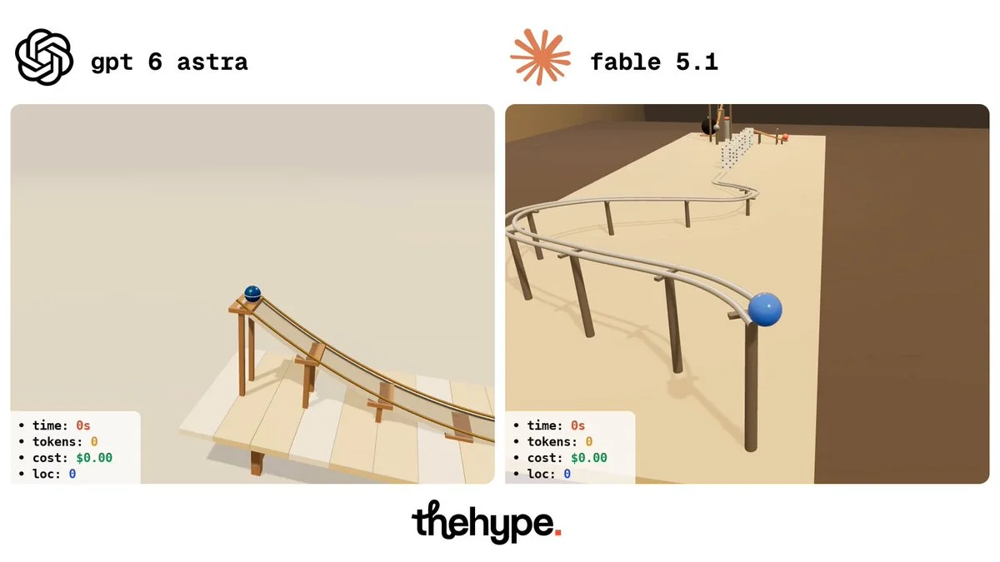

</details>

作者が公開した作品紹介を基に編集しています。

```text
単独で動く Three.js の HTML ファイルで、ルーブ・ゴールドバーグ装置を作成してください。機械的な相互作用が次々につながり、最後にボタンを押して演出的な爆発を起こすようにしてください。
```

[元の投稿](https://x.com/thehypedotnews/status/2095980885732704629)

---

<a id="gpt-6-astra-2096035962824335798"></a>

## 探索できるタージ・マハル

[vikas sabbi](https://x.com/vikassabbi) · 2026-09-05 · **公開説明からまとめた制作指示**

タージ・マハルを探索できる 3D シーンとして再現してください。特徴的な比率、左右対称の庭園、中央ドーム、ミナレット、建物同士の位置関係を優先してください。

<details>
<summary>プレビュー</summary>


</details>

作者が公開した作品紹介を基に編集しています。

```text
タージ・マハルを探索できる 3D シーンとして再現してください。特徴的な比率、左右対称の庭園、中央ドーム、ミナレット、建物同士の位置関係を優先してください。
```

[元の投稿](https://x.com/vikassabbi/status/2096035962824335798)

---

<a id="gpt-6-astra-2096225621303042258"></a>

## 軌道ランデブーシミュレーター

[Alican Kiraz](https://x.com/AlicanKiraz0) · 2026-09-05 · **公開説明からまとめた制作指示**

二体問題の ECI 軌道伝播と HCW 誘導を使った、リアルタイムの軌道ランデブーシミュレーションを作成してください。6 自由度の姿勢、燃料消費、推力制限、ドッキング目標を含めてください。

<details>
<summary>プレビュー</summary>

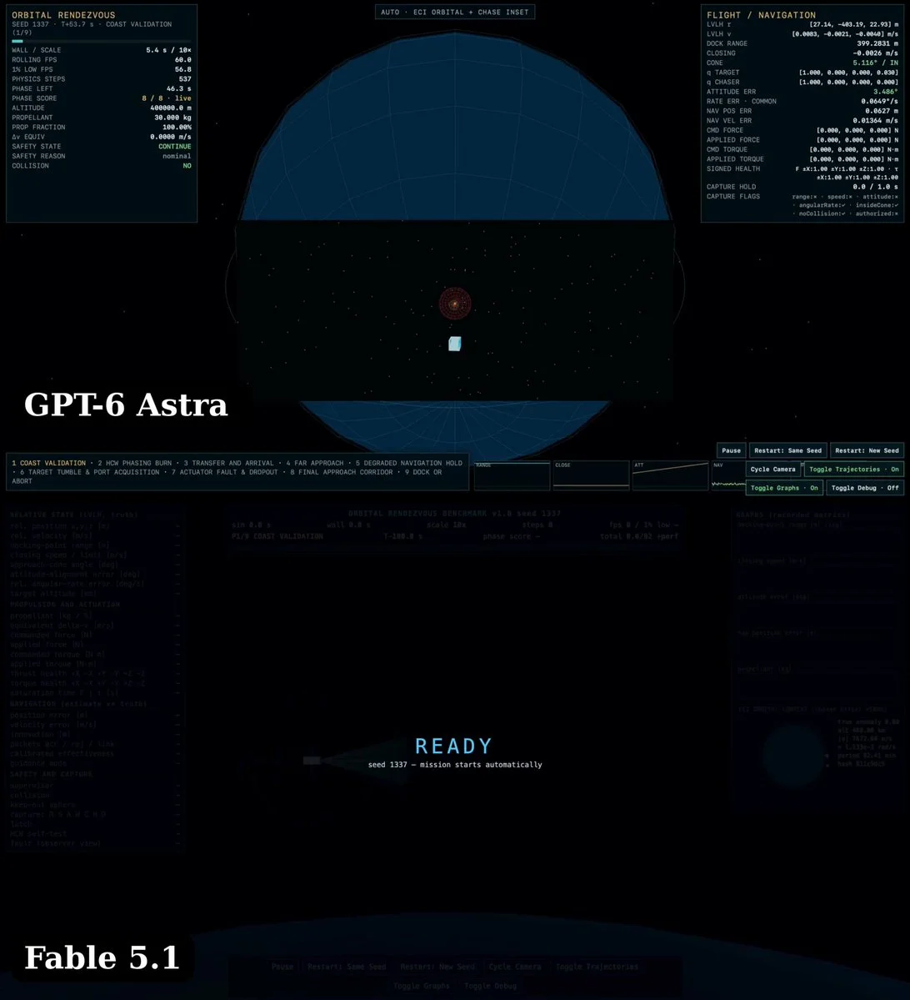

</details>

作者が公開した作品紹介を基に編集しています。

```text
二体問題の ECI 軌道伝播と HCW 誘導を使った、リアルタイムの軌道ランデブーシミュレーションを作成してください。6 自由度の姿勢、燃料消費、推力制限、ドッキング目標を含めてください。
```

[元の投稿](https://x.com/AlicanKiraz0/status/2096225621303042258)

---

<a id="gpt-6-astra-2096180220839760375"></a>

## 参考画像から再構築するタグボート

[Alex](https://x.com/NarvisAlex) · 2026-09-05 · **公開説明からまとめた制作指示**

参考画像から Blender でタグボートを再構築してください。船体、傾斜した操舵室、甲板装備、曳航設備をモデル化し、視点間の食い違いを整理して一貫した船にしてください。

<details>
<summary>プレビュー</summary>


</details>

作者が公開した作品紹介を基に編集しています。

```text
参考画像から Blender でタグボートを再構築してください。船体、傾斜した操舵室、甲板装備、曳航設備をモデル化し、視点間の食い違いを整理して一貫した船にしてください。
```

[元の投稿](https://x.com/NarvisAlex/status/2096180220839760375)

---

<a id="gpt-6-astra-2096059736693305794"></a>

## 一方向の画像から電動ドリルを再現

[Utah teapot 🫖](https://x.com/SkyeSharkie) · 2026-09-05 · **公開説明からまとめた制作指示**

一方向の参考画像から Blender で電動ドリルを再構築してください。本体、グリップ、チャック、操作部を編集可能な形状として作り、複数の角度から結果を確認してください。

<details>
<summary>プレビュー</summary>


</details>

作者が公開した作品紹介を基に編集しています。

```text
一方向の参考画像から Blender で電動ドリルを再構築してください。本体、グリップ、チャック、操作部を編集可能な形状として作り、複数の角度から結果を確認してください。
```

[元の投稿](https://x.com/SkyeSharkie/status/2096059736693305794)

---

<a id="gpt-6-astra-2095981655370666076"></a>

## 鳥を飛ばす 3D スリングショットゲーム

[Max](https://x.com/MozeTech) · 2026-09-04 · **公開説明からまとめた制作指示**

異なる特殊能力を持つ 4 羽の鳥が登場する 3D スリングショットゲームを作成してください。狙って放す操作、破壊可能な建造物、繰り返し得点を狙える遊びを含めてください。

<details>
<summary>プレビュー</summary>

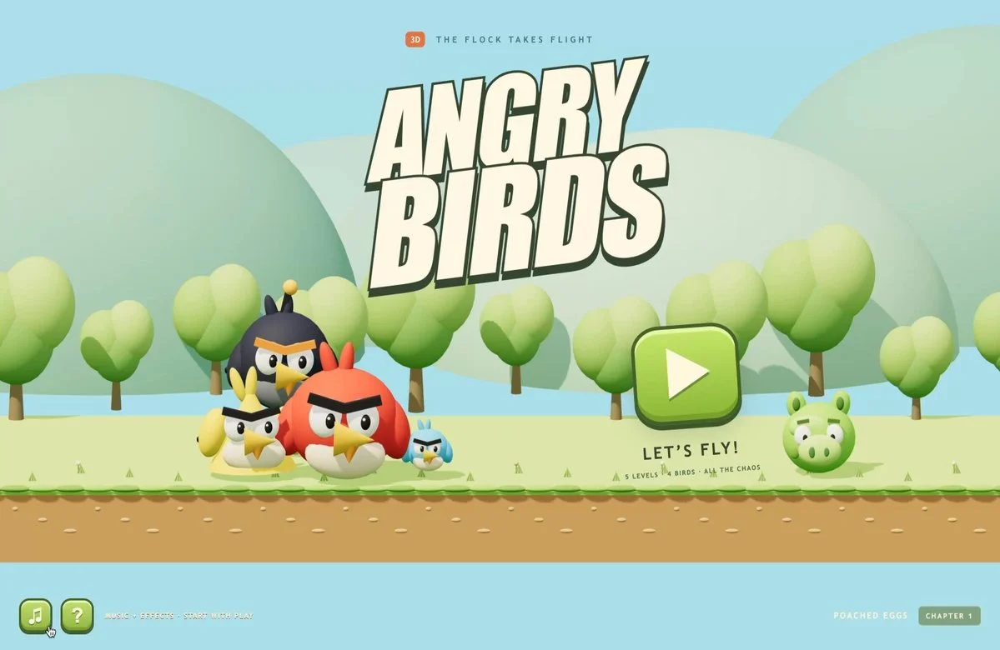

</details>

作者が公開した作品紹介を基に編集しています。

```text
異なる特殊能力を持つ 4 羽の鳥が登場する 3D スリングショットゲームを作成してください。狙って放す操作、破壊可能な建造物、繰り返し得点を狙える遊びを含めてください。
```

[元の投稿](https://x.com/MozeTech/status/2095981655370666076)

---

<a id="gpt-6-astra-2095962376344309843"></a>

## バレットタイムの三人称シューター

[Andrei](https://x.com/HangoutWHAndrei) · 2026-09-04 · **公開説明からまとめた制作指示**

Max Payne に着想を得た Three.js の三人称シューターを作成してください。スローモーションのアクション、反応のよい射撃、使いやすい追従カメラを備えた遊べるシーンに集中してください。

<details>
<summary>プレビュー</summary>

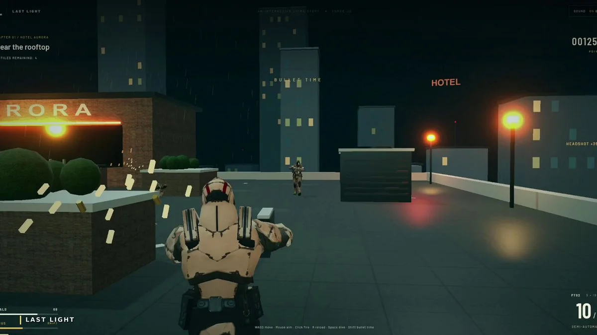

</details>

作者が公開した作品紹介を基に編集しています。

```text
Max Payne に着想を得た Three.js の三人称シューターを作成してください。スローモーションのアクション、反応のよい射撃、使いやすい追従カメラを備えた遊べるシーンに集中してください。
```

[元の投稿](https://x.com/HangoutWHAndrei/status/2095962376344309843)

---

<a id="gpt-6-astra-2096008241104711698"></a>

## WebGPU でぷるぷる揺れるゼリー

[Scott](https://x.com/scottstts) · 2026-09-04 · **公開説明からまとめた制作指示**

Three.js と WebGPU で、おいしそうに弾むゼリーを作成してください。触れると自然に変形して静まり、半透明の素材と形が分かる照明で表現してください。

<details>
<summary>プレビュー</summary>

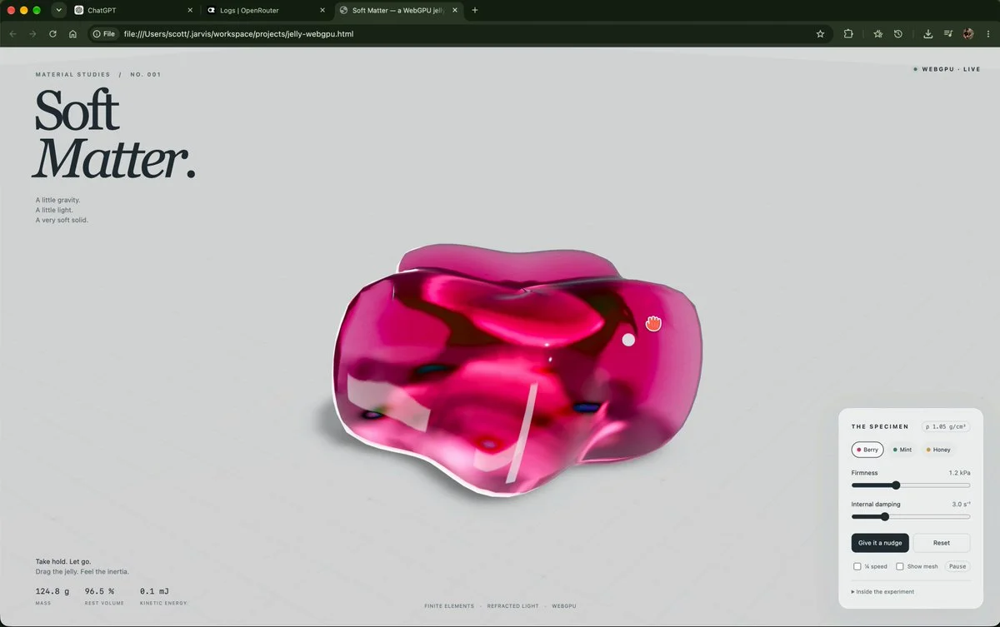

</details>

作者が公開した作品紹介を基に編集しています。

```text
Three.js と WebGPU で、おいしそうに弾むゼリーを作成してください。触れると自然に変形して静まり、半透明の素材と形が分かる照明で表現してください。
```

[元の投稿](https://x.com/scottstts/status/2096008241104711698)

---

<a id="gpt-6-astra-2095967131573649552"></a>

## 操作できる PS5 コントローラー

[bluedev](https://x.com/blueemi99) · 2026-09-04 · **公開説明からまとめた制作指示**

Three.js で、細部を観察できる PlayStation 5 コントローラーを作成してください。特徴的な輪郭、ボタン、トリガー、アナログスティック、部位ごとに異なる表面素材を再現してください。

<details>
<summary>プレビュー</summary>


</details>

作者が公開した作品紹介を基に編集しています。

```text
Three.js で、細部を観察できる PlayStation 5 コントローラーを作成してください。特徴的な輪郭、ボタン、トリガー、アナログスティック、部位ごとに異なる表面素材を再現してください。
```

[元の投稿](https://x.com/blueemi99/status/2095967131573649552)

---

<a id="gpt-6-astra-2096079660605997264"></a>

## ブラウザシューター Astral War

[Rishi](https://x.com/0xRishi) · 2026-09-05 · **公開説明からまとめた制作指示**

World at War に着想を得た Three.js ブラウザシューターを作成してください。反応のよい戦闘、空間音響、キャラクターアセット、試合進行を備えた、最後まで遊べる戦場を構築してください。

<details>
<summary>プレビュー</summary>


</details>

作者が公開した作品紹介を基に編集しています。

```text
World at War に着想を得た Three.js ブラウザシューターを作成してください。反応のよい戦闘、空間音響、キャラクターアセット、試合進行を備えた、最後まで遊べる戦場を構築してください。
```

[元の投稿](https://x.com/0xRishi/status/2096079660605997264)

---

<a id="gpt-6-astra-2096079976433082502"></a>

## 回路図 PDF から基板と 3D 表示へ

[Titlist400](https://x.com/swjtutl) · 2026-09-05 · **公開説明からまとめた制作指示**

回路図 PDF を使って KiCad の回路を修正し、50 × 20 mm の 2 層基板を配線して、3D アセンブリをレンダリングしてください。部品のデータシートを確認し、設計ルール違反を解消してください。

<details>
<summary>プレビュー</summary>

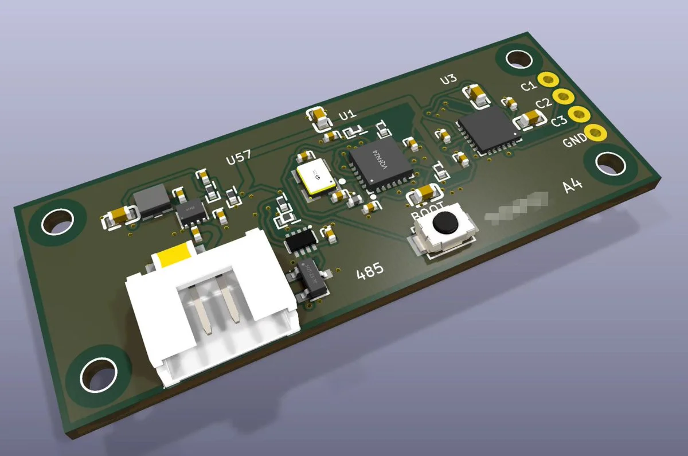

</details>

作者が公開した作品紹介を基に編集しています。

```text
回路図 PDF を使って KiCad の回路を修正し、50 × 20 mm の 2 層基板を配線して、3D アセンブリをレンダリングしてください。部品のデータシートを確認し、設計ルール違反を解消してください。
```

[元の投稿](https://x.com/swjtutl/status/2096079976433082502)

---

<a id="gpt-6-astra-2096149823216898445"></a>

## ブラウザで遊ぶ飛行ゲーム

[Givros](https://x.com/givros) · 2026-09-05 · **公開説明からまとめた制作指示**

空のプロジェクトから、ブラウザ用 3D 飛行ゲームを完成させてください。操縦できる飛行、移動可能な環境、明確な目標、一貫した見せ方を含めてください。

<details>
<summary>プレビュー</summary>

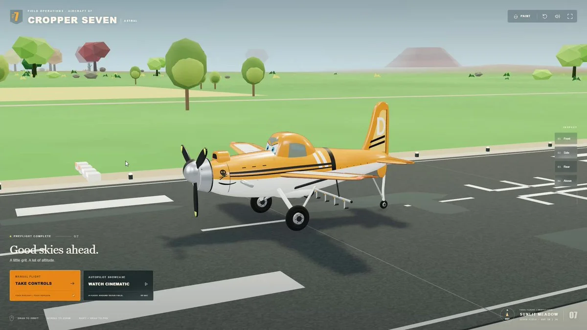

</details>

作者が公開した作品紹介を基に編集しています。

```text
空のプロジェクトから、ブラウザ用 3D 飛行ゲームを完成させてください。操縦できる飛行、移動可能な環境、明確な目標、一貫した見せ方を含めてください。
```

[元の投稿](https://x.com/givros/status/2096149823216898445)

---

<a id="gpt-6-astra-2096082432197837065"></a>

## 操作できる地球儀ダッシュボード

[Kai](https://x.com/hqmank) · 2026-09-05 · **公開説明からまとめた制作指示**

参考画像から Three.js の 3D 地球儀ダッシュボードを再構築してください。昼・夜モード、読みやすい地理データ、参考に合った動作する操作部を用意してください。

<details>
<summary>プレビュー</summary>

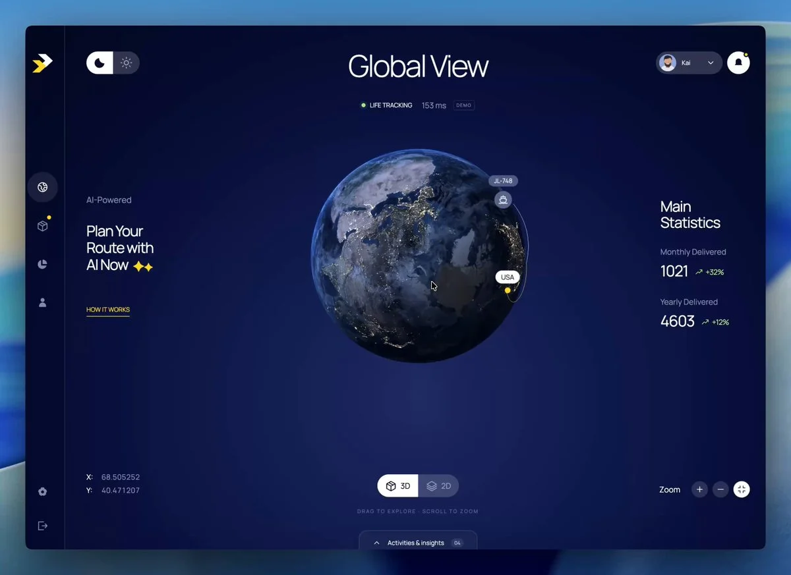

</details>

作者が公開した作品紹介を基に編集しています。

```text
参考画像から Three.js の 3D 地球儀ダッシュボードを再構築してください。昼・夜モード、読みやすい地理データ、参考に合った動作する操作部を用意してください。
```

[元の投稿](https://x.com/hqmank/status/2096082432197837065)

---

<a id="gpt-6-astra-2096107322536051057"></a>

## Blender で作るアーザーディー・タワー

[taesiri](https://x.com/taesiri) · 2026-09-05 · **公開説明からまとめた制作指示**

編集可能なアーザーディー・タワーの Blender モデルを作成してください。広がる基部、交差するアーチ、表面模様、特徴的な比率を重視してください。

<details>
<summary>プレビュー</summary>


</details>

作者が公開した作品紹介を基に編集しています。

```text
編集可能なアーザーディー・タワーの Blender モデルを作成してください。広がる基部、交差するアーチ、表面模様、特徴的な比率を重視してください。
```

[元の投稿](https://x.com/taesiri/status/2096107322536051057)

---

<a id="gpt-6-astra-2096245759121277132"></a>

## スクロールで動く 3D スタジオサイト

[ui.debbie](https://x.com/mx_debbiee) · 2026-09-05 · **公開説明からまとめた制作指示**

提示された参考画像を Three.js シーンにし、滑らかなスクロール連動のスタジオサイトに組み込んでください。カメラ移動、文字組み、セクション遷移を連動させてください。

<details>
<summary>プレビュー</summary>


</details>

作者が公開した作品紹介を基に編集しています。

```text
提示された参考画像を Three.js シーンにし、滑らかなスクロール連動のスタジオサイトに組み込んでください。カメラ移動、文字組み、セクション遷移を連動させてください。
```

[元の投稿](https://x.com/mx_debbiee/status/2096245759121277132)

---

<a id="gpt-6-astra-2096244208533455049"></a>

## 木漏れ日の川を下るカヤック

[AJ](https://x.com/ItsmeAjayKV) · 2026-09-05 · **公開説明からまとめた制作指示**

アニメ風の美しさを持つ 3D 川下りカヤックゲームを作成してください。左右に漕いで障害物を避ける操作を実装し、流れる水、風景、音楽、効果音をコードで生成してください。

<details>
<summary>プレビュー</summary>


</details>

作者が公開した作品紹介を基に編集しています。

```text
アニメ風の美しさを持つ 3D 川下りカヤックゲームを作成してください。左右に漕いで障害物を避ける操作を実装し、流れる水、風景、音楽、効果音をコードで生成してください。
```

[元の投稿](https://x.com/ItsmeAjayKV/status/2096244208533455049)

---

<a id="gpt-6-astra-2096243989439713677"></a>

## 屈折するボトルで伝える商品ストーリー

[Himanshu Hingorani](https://x.com/himanshubuildss) · 2026-09-05 · **公開説明からまとめた制作指示**

フォトリアルな WebGL ガラスボトルを中心に、インタラクティブな商品サイトを作成してください。ブラウザ性能を保ちつつ、光を屈折させる液体、スクロール連動の回転、大胆な文字組みを用いてください。

<details>
<summary>プレビュー</summary>


</details>

作者が公開した作品紹介を基に編集しています。

```text
フォトリアルな WebGL ガラスボトルを中心に、インタラクティブな商品サイトを作成してください。ブラウザ性能を保ちつつ、光を屈折させる液体、スクロール連動の回転、大胆な文字組みを用いてください。
```

[元の投稿](https://x.com/himanshubuildss/status/2096243989439713677)

---

<a id="gpt-6-astra-2096082580554777041"></a>

## 手続き生成した列車の分解アニメーション

[Tom Krcha](https://x.com/tomkrcha) · 2026-09-05 · **公開説明からまとめた制作指示**

寸法、断面形状、ジオメトリ関数から、Three.js 内で直接 2 台の列車を生成してください。車輪を動かし、分解表示と再組み立てのシーケンスを用意してください。

<details>
<summary>プレビュー</summary>

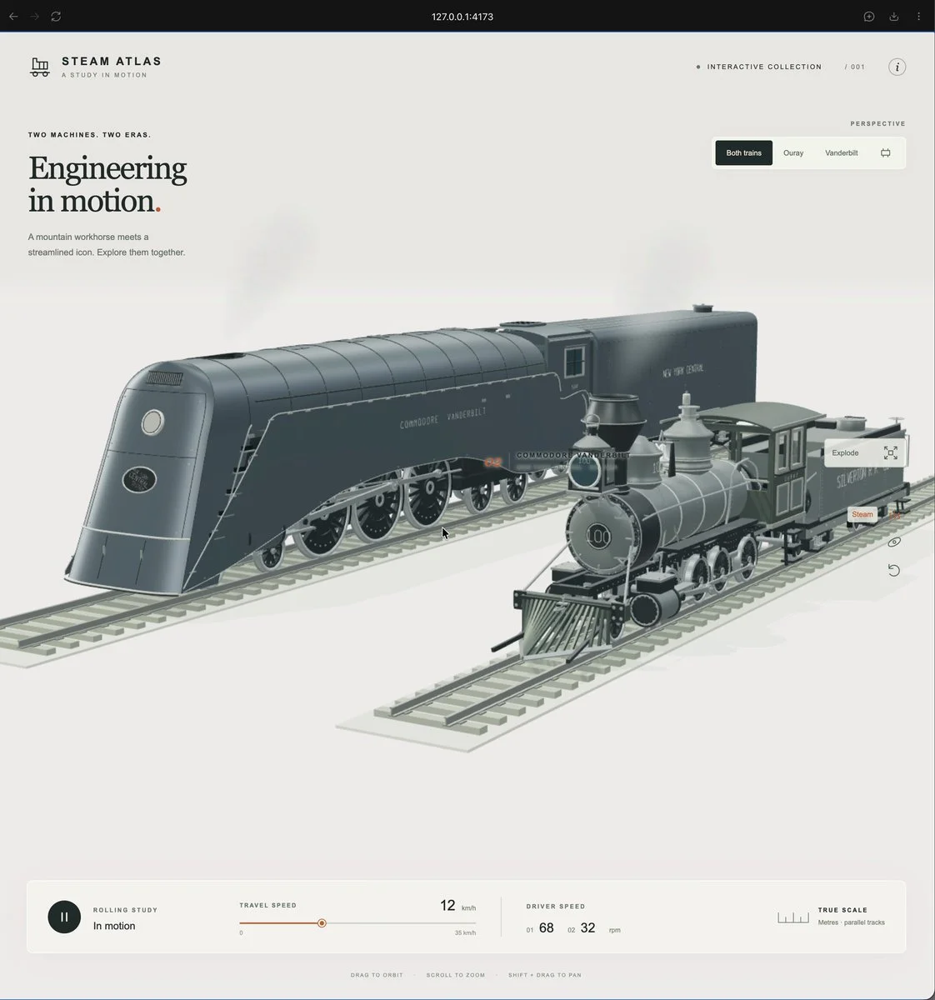

</details>

作者が公開した作品紹介を基に編集しています。

```text
寸法、断面形状、ジオメトリ関数から、Three.js 内で直接 2 台の列車を生成してください。車輪を動かし、分解表示と再組み立てのシーケンスを用意してください。
```

[元の投稿](https://x.com/tomkrcha/status/2096082580554777041)

---

<a id="gpt-6-astra-2096201415051911597"></a>

## 幼児が遊ぶ温かな玩具の世界

[AI少年](https://x.com/aehyok) · 2026-09-05 · **公開説明からまとめた制作指示**

幼児がおもちゃの間を移動し、それぞれ異なる動きで遊ぶ、温かな Three.js プレイルームを作成してください。プレイマット、本、棚、登って遊ぶ設備、周回とズームの操作を含めてください。

<details>
<summary>プレビュー</summary>


</details>

作者が公開した作品紹介を基に編集しています。

```text
幼児がおもちゃの間を移動し、それぞれ異なる動きで遊ぶ、温かな Three.js プレイルームを作成してください。プレイマット、本、棚、登って遊ぶ設備、周回とズームの操作を含めてください。
```

[元の投稿](https://x.com/aehyok/status/2096201415051911597)

---

<a id="gpt-6-astra-2096122429319852319"></a>

## 稼働するジェット機製造工場

[Konstantin Saifoulline](https://x.com/konstantinsaifo) · 2026-09-05 · **公開説明からまとめた制作指示**

航空機製造を調査し、稼働する Three.js ジェット機工場シミュレーションを作成してください。機械の作業サイクル、生産ステーション、搬送、ボトルネックをモデル化し、工程の流れを検証してください。

<details>
<summary>プレビュー</summary>


</details>

作者が公開した作品紹介を基に編集しています。

```text
航空機製造を調査し、稼働する Three.js ジェット機工場シミュレーションを作成してください。機械の作業サイクル、生産ステーション、搬送、ボトルネックをモデル化し、工程の流れを検証してください。
```

[元の投稿](https://x.com/konstantinsaifo/status/2096122429319852319)

---

<a id="gpt-6-astra-2096251574918013135"></a>

## 怪獣が戦う都市

[Majid Manzarpour](https://x.com/majidmanzarpour) · 2026-09-05 · **公開説明からまとめた制作指示**

生成した怪獣モデルと効果音を使い、怪獣作品に着想を得た Three.js ゲームを作成してください。巨大な戦闘が分かりやすく、怪獣の大きさが伝わる環境を構築してください。

<details>
<summary>プレビュー</summary>

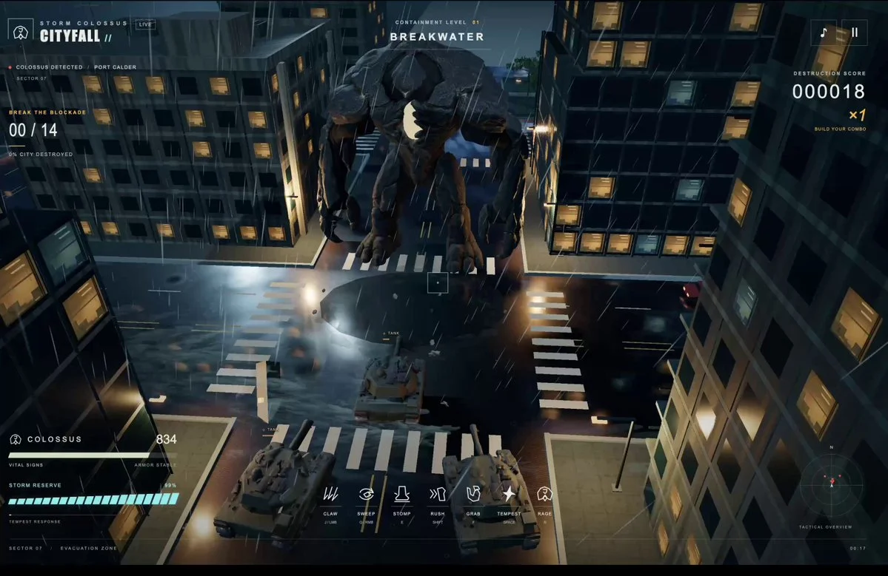

</details>

作者が公開した作品紹介を基に編集しています。

```text
生成した怪獣モデルと効果音を使い、怪獣作品に着想を得た Three.js ゲームを作成してください。巨大な戦闘が分かりやすく、怪獣の大きさが伝わる環境を構築してください。
```

[元の投稿](https://x.com/majidmanzarpour/status/2096251574918013135)

---

<a id="gpt-6-astra-2096220264413409648"></a>

## 立方体に閉じ込めた嵐

[zcw](https://x.com/zwb44) · 2026-09-05 · **公開説明からまとめた制作指示**

Three.js で、天候を操作できる、立方体に閉じ込められた嵐を生成してください。

<details>
<summary>プレビュー</summary>

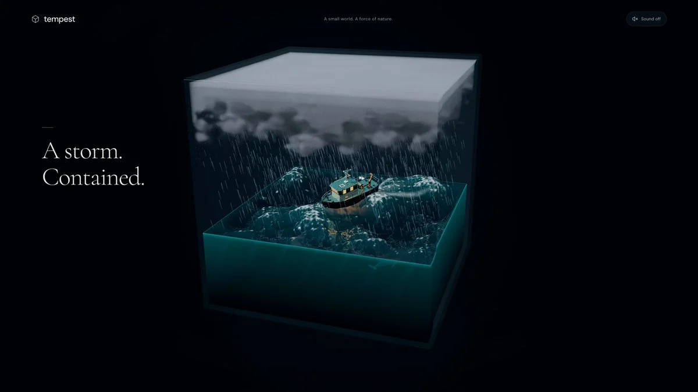

</details>

作者が公開した作品紹介を基に編集しています。

```text
Three.js で、天候を操作できる、立方体に閉じ込められた嵐を生成してください。
```

[元の投稿](https://x.com/zwb44/status/2096220264413409648)

---

<a id="gpt-6-astra-2096047660662722620"></a>

## Zork を 3D アクションアドベンチャーに

[Ethan Mollick](https://x.com/emollick) · 2026-09-05 · **公開説明からまとめた制作指示**

古典的なテキストアドベンチャー Zork を、3D アクションアドベンチャーにしてください。物語と謎解きを保ち、戦闘シーンを加え、キャラクターと環境を Three.js で構築してください。

<details>
<summary>プレビュー</summary>

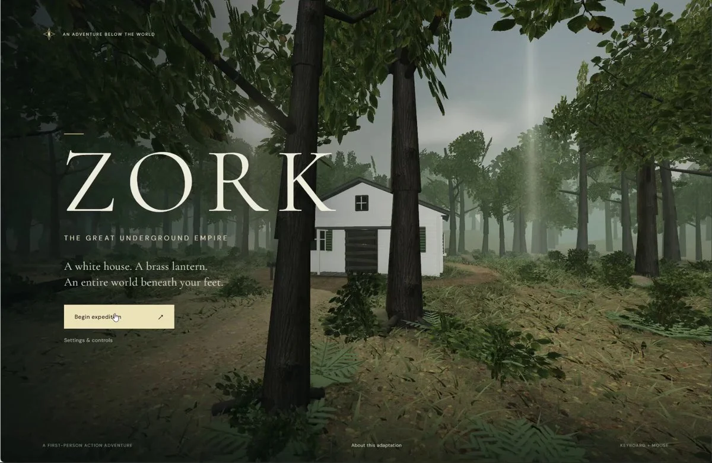

</details>

作者が公開した作品紹介を基に編集しています。

```text
古典的なテキストアドベンチャー Zork を、3D アクションアドベンチャーにしてください。物語と謎解きを保ち、戦闘シーンを加え、キャラクターと環境を Three.js で構築してください。
```

[元の投稿](https://x.com/emollick/status/2096047660662722620)

---

<a id="gpt-6-astra-2096133339329536249"></a>

## リグを付けて動かすティラノサウルス

[Majid Manzarpour](https://x.com/majidmanzarpour) · 2026-09-05 · **公開説明からまとめた制作指示**

生成したティラノサウルスのモデルにリグを付け、自然な動きを作成してください。Three.js で描画し、アニメーションによるモデルの変形に整合性があるか確認してください。

<details>
<summary>プレビュー</summary>

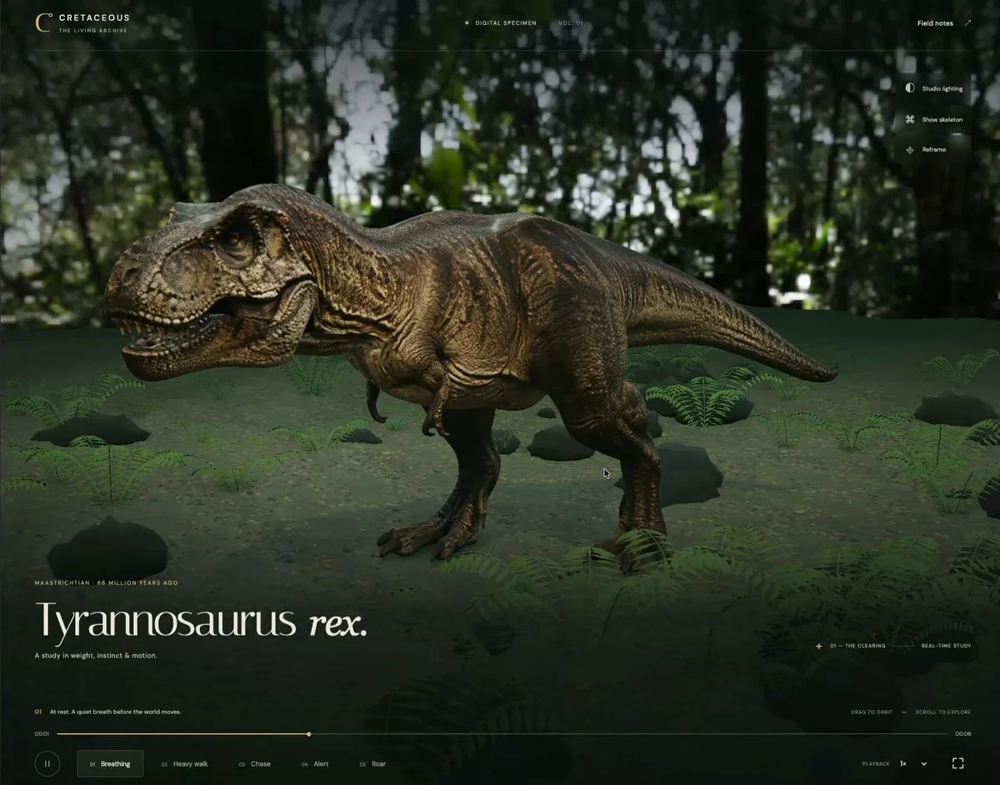

</details>

作者が公開した作品紹介を基に編集しています。

```text
生成したティラノサウルスのモデルにリグを付け、自然な動きを作成してください。Three.js で描画し、アニメーションによるモデルの変形に整合性があるか確認してください。
```

[元の投稿](https://x.com/majidmanzarpour/status/2096133339329536249)

---

<a id="gpt-6-astra-2096174858837074198"></a>

## コーヒーカップの中の海洋生物

[Sagi Polaczek 🦜](https://x.com/PolaczekSagi) · 2026-09-05 · **公開説明からまとめた制作指示**

Three.js で、コーヒーカップの中に小さな海洋生態系を作成してください。意図を持って動くカメラで水生生物を見せつつ、カップと小さな世界であることが分かる構図を保ってください。

<details>
<summary>プレビュー</summary>

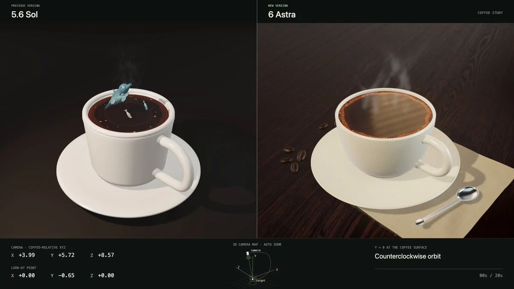

</details>

作者が公開した作品紹介を基に編集しています。

```text
Three.js で、コーヒーカップの中に小さな海洋生態系を作成してください。意図を持って動くカメラで水生生物を見せつつ、カップと小さな世界であることが分かる構図を保ってください。
```

[元の投稿](https://x.com/PolaczekSagi/status/2096174858837074198)

---

<a id="gpt-6-astra-2096250748099068377"></a>

## 操作できる Hyperloop デモ

[Amir](https://x.com/hbanay98) · 2026-09-05 · **公開説明からまとめた制作指示**

輸送ポッド、チューブ設備、システム内の移動を見せる、操作可能な Three.js Hyperloop デモを作成してください。

<details>
<summary>プレビュー</summary>

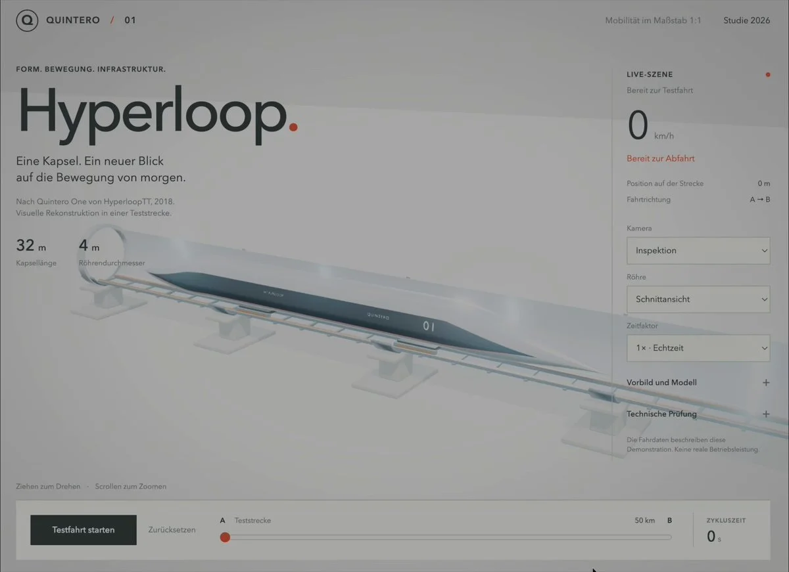

</details>

作者が公開した作品紹介を基に編集しています。

```text
輸送ポッド、チューブ設備、システム内の移動を見せる、操作可能な Three.js Hyperloop デモを作成してください。
```

[元の投稿](https://x.com/hbanay98/status/2096250748099068377)

---

<a id="gpt-6-astra-2096234355395903672"></a>

## 手続き生成するナポレオンの胸像

[Le PLOUTOS](https://x.com/leploutos) · 2026-09-05 · **公開説明からまとめた制作指示**

Three.js のコードでナポレオンの 3D 胸像を作成してください。段階的に制作し、異なる角度から確認して、顔の比率と衣服の細部を磨いてください。

<details>
<summary>プレビュー</summary>

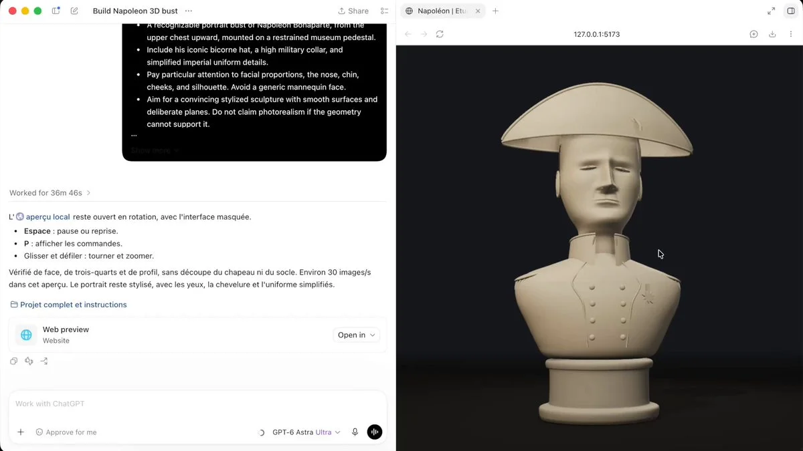

</details>

作者が公開した作品紹介を基に編集しています。

```text
Three.js のコードでナポレオンの 3D 胸像を作成してください。段階的に制作し、異なる角度から確認して、顔の比率と衣服の細部を磨いてください。
```

[元の投稿](https://x.com/leploutos/status/2096234355395903672)

---

<a id="gpt-6-astra-2096226711222546461"></a>

## 鉄道駅のコンコース

[Wormhole404](https://x.com/0xWormhole404) · 2026-09-05 · **公開説明からまとめた制作指示**

力強い建築的リズム、自然なスケール、説得力のある素材を備えた駅のコンコースを作成してください。丁寧に構図を決めた駅の眺めを持つ、細部を観察できる 3D シーンにしてください。

<details>
<summary>プレビュー</summary>


</details>

作者が公開した作品紹介を基に編集しています。

```text
力強い建築的リズム、自然なスケール、説得力のある素材を備えた駅のコンコースを作成してください。丁寧に構図を決めた駅の眺めを持つ、細部を観察できる 3D シーンにしてください。
```

[元の投稿](https://x.com/0xWormhole404/status/2096226711222546461)

---

<a id="gpt-6-astra-2096222790894661841"></a>

## アニメーションで使い方を伝えるジオラマ

[Emil](https://x.com/EmilHovv) · 2026-09-05 · **公開説明からまとめた制作指示**

Blender で小さな導入説明用ジオラマを作り、Three.js で動かしてください。注目対象を明確にし、短いアニメーションで最初の操作を説明してください。

<details>
<summary>プレビュー</summary>

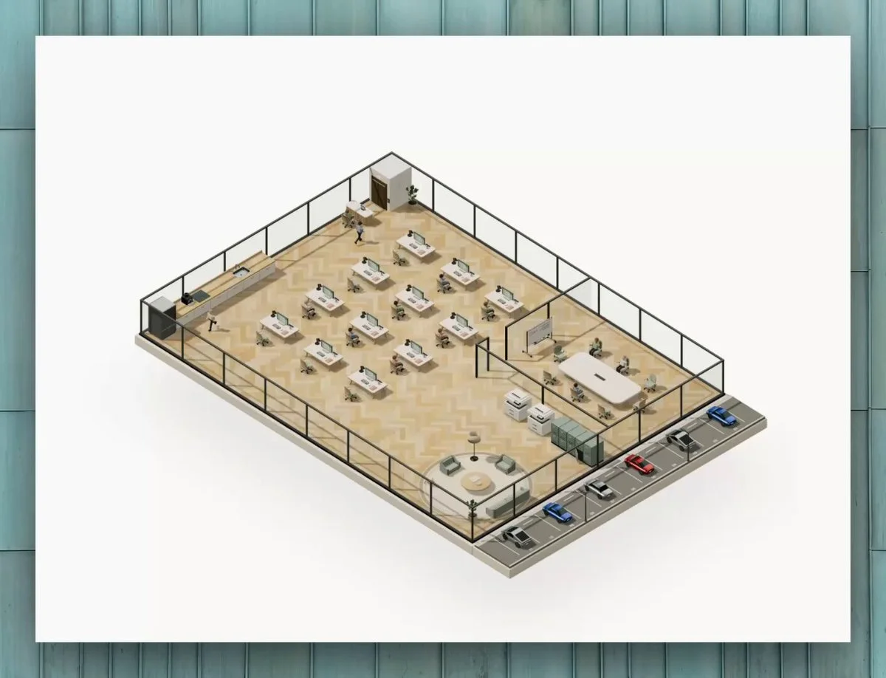

</details>

作者が公開した作品紹介を基に編集しています。

```text
Blender で小さな導入説明用ジオラマを作り、Three.js で動かしてください。注目対象を明確にし、短いアニメーションで最初の操作を説明してください。
```

[元の投稿](https://x.com/EmilHovv/status/2096222790894661841)

---

<a id="gpt-6-astra-2096206082712768897"></a>

## 都市を自由に走る OX Vice Drive

[DomX](https://x.com/qok_ai) · 2026-09-05 · **公開説明からまとめた制作指示**

交通、ドリフト、配達レースを備えた、自由に街を走れるブラウザ運転ゲームを作成してください。移動が楽しく、運転の遊びが完結する海沿いの街を設計してください。

<details>
<summary>プレビュー</summary>


</details>

作者が公開した作品紹介を基に編集しています。

```text
交通、ドリフト、配達レースを備えた、自由に街を走れるブラウザ運転ゲームを作成してください。移動が楽しく、運転の遊びが完結する海沿いの街を設計してください。
```

[元の投稿](https://x.com/qok_ai/status/2096206082712768897)

---

<a id="gpt-6-astra-2096111709496680842"></a>

## モバイルゲーム広告を本当に遊べる作品に

[daniel](https://x.com/buildingadlicio) · 2026-09-05 · **公開説明からまとめた制作指示**

モバイルゲーム広告を参考に、遊べるブラウザゲームを作成してください。中心的な操作を再現し、Blender アセットで広告の見た目の構想に合わせてください。

<details>
<summary>プレビュー</summary>

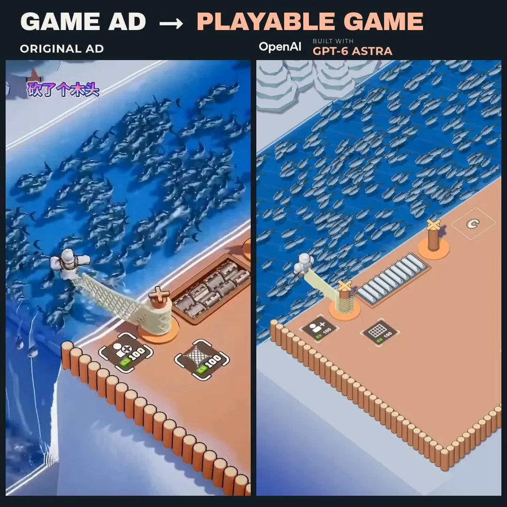

</details>

作者が公開した作品紹介を基に編集しています。

```text
モバイルゲーム広告を参考に、遊べるブラウザゲームを作成してください。中心的な操作を再現し、Blender アセットで広告の見た目の構想に合わせてください。
```

[元の投稿](https://x.com/buildingadlicio/status/2096111709496680842)

---

<a id="gpt-6-astra-2095999578419929412"></a>

## Roblox のアニメ風アリーナ格闘ゲーム

[hiraeth](https://x.com/WoahWurdz) · 2026-09-04 · **公開説明からまとめた制作指示**

アニメのクロスオーバーバトルに着想を得た Roblox アリーナ格闘ゲームを作成してください。Blender と利用可能なアセットでアリーナとキャラクターを構築し、遊べる戦闘の流れを実装してください。

<details>
<summary>プレビュー</summary>


</details>

作者が公開した作品紹介を基に編集しています。

```text
アニメのクロスオーバーバトルに着想を得た Roblox アリーナ格闘ゲームを作成してください。Blender と利用可能なアセットでアリーナとキャラクターを構築し、遊べる戦闘の流れを実装してください。
```

[元の投稿](https://x.com/WoahWurdz/status/2095999578419929412)

---

<a id="gpt-6-astra-2096258619574513880"></a>

## C# と WASM によるブラウザレース物理

[achepta](https://x.com/achepta_tm) · 2026-09-05 · **公開説明からまとめた制作指示**

Trackmania 風のレース物理を C# で再現し、WASM で動かして Three.js でコースを描画してください。衝突判定のあるコースメッシュを使い、車両の操縦感を検証してください。

<details>
<summary>プレビュー</summary>

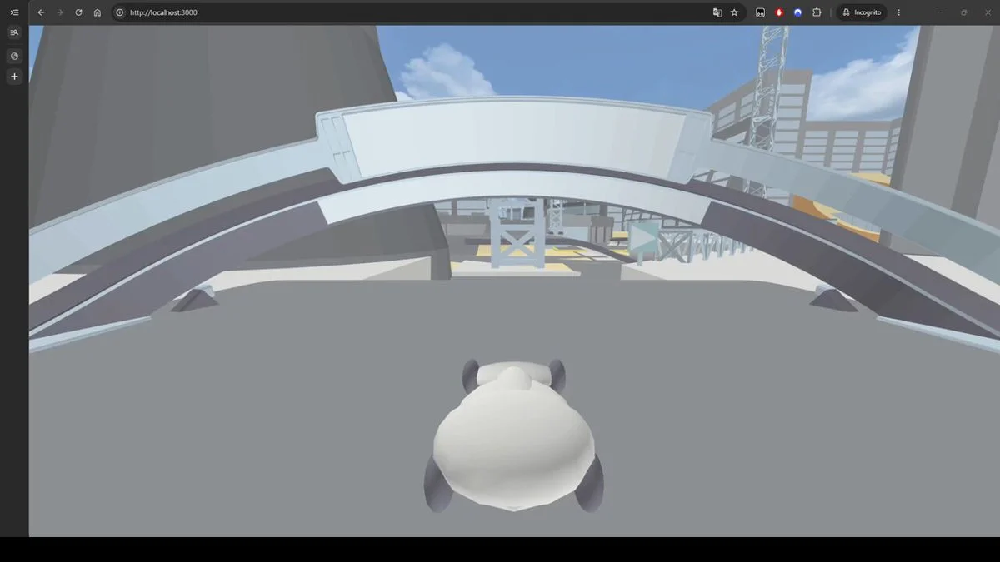

</details>

作者が公開した作品紹介を基に編集しています。

```text
Trackmania 風のレース物理を C# で再現し、WASM で動かして Three.js でコースを描画してください。衝突判定のあるコースメッシュを使い、車両の操縦感を検証してください。
```

[元の投稿](https://x.com/achepta_tm/status/2096258619574513880)

---

<a id="gpt-6-astra-2096141728487178503"></a>

## 自動リギングとカンフーの動作

[The Bugged Dev](https://x.com/thebuggeddev) · 2026-09-05 · **公開説明からまとめた制作指示**

提示された 3D キャラクターにリグを作成し、歩行、走行、複数のカンフー動作を追加してください。関節の破綻や不安定な姿勢がないかアニメーションを確認してください。

<details>
<summary>プレビュー</summary>

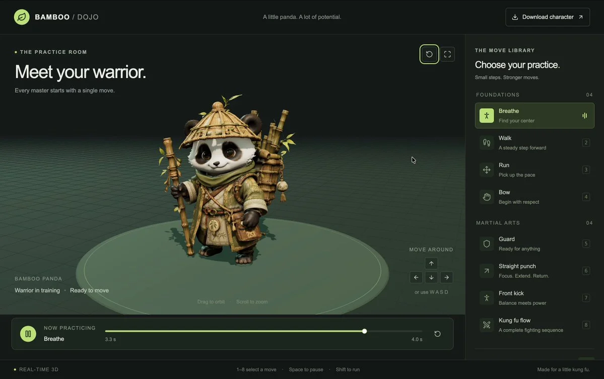

</details>

作者が公開した作品紹介を基に編集しています。

```text
提示された 3D キャラクターにリグを作成し、歩行、走行、複数のカンフー動作を追加してください。関節の破綻や不安定な姿勢がないかアニメーションを確認してください。
```

[元の投稿](https://x.com/thebuggeddev/status/2096141728487178503)

---

<a id="gpt-6-astra-2096107343268257953"></a>

## イラストから操作できるキャラクターへ

[NOCTAVIA™](https://x.com/noctav1a) · 2026-09-05 · **公開説明からまとめた制作指示**

Noctavia のキャラクターイラストを、操作できる 3D キャラクターとして再現してください。デザインの特徴を保ち、インタラクティブな展示に適した完成モデルを作成してください。

<details>
<summary>プレビュー</summary>


</details>

作者が公開した作品紹介を基に編集しています。

```text
Noctavia のキャラクターイラストを、操作できる 3D キャラクターとして再現してください。デザインの特徴を保ち、インタラクティブな展示に適した完成モデルを作成してください。
```

[元の投稿](https://x.com/noctav1a/status/2096107343268257953)

---

<a id="gpt-6-astra-2096023793772998704"></a>

## 講演活動を地球儀で見せる 3D ポートフォリオ

[Shivay Lamba](https://x.com/HowDevelop) · 2026-09-04 · **公開説明からまとめた制作指示**

人物写真から Blender キャラクターを作り、編集デザインを生かした WebGL ポートフォリオに配置してください。講演イベントの場所を示す回転地球儀を追加し、各アセットをサイトに統合してください。

<details>
<summary>プレビュー</summary>


</details>

作者が公開した作品紹介を基に編集しています。

```text
人物写真から Blender キャラクターを作り、編集デザインを生かした WebGL ポートフォリオに配置してください。講演イベントの場所を示す回転地球儀を追加し、各アセットをサイトに統合してください。
```

[元の投稿](https://x.com/HowDevelop/status/2096023793772998704)

---

<a id="gpt-6-astra-2096056285896536086"></a>

## Godot で作る Sonic 風の完成度の高い一ステージ

[AiBattle](https://x.com/AiBattle_) · 2026-09-05 · **公開説明からまとめた制作指示**

ローカルおよび手続き生成のアセットを使い、Godot で Sonic に着想を得た 3D ステージを磨き上げてください。勢い、反応のよい移動、リング、ループ、グラインドレール、途切れない南国の海岸を優先してください。

<details>
<summary>プレビュー</summary>


</details>

作者が公開した作品紹介を基に編集しています。

```text
ローカルおよび手続き生成のアセットを使い、Godot で Sonic に着想を得た 3D ステージを磨き上げてください。勢い、反応のよい移動、リング、ループ、グラインドレール、途切れない南国の海岸を優先してください。
```

[元の投稿](https://x.com/AiBattle_/status/2096056285896536086)

---

<a id="gpt-6-astra-2096140378777010278"></a>

## Blender で作るヴァイキングのキャラクター

[Emil](https://x.com/fre4kspace) · 2026-09-05 · **公開説明からまとめた制作指示**

Blender で編集可能な 3D ヴァイキングを作成してください。特徴的な衣装、顔の構造、体の比率、見やすい展示ポーズに重点を置いてください。

<details>
<summary>プレビュー</summary>

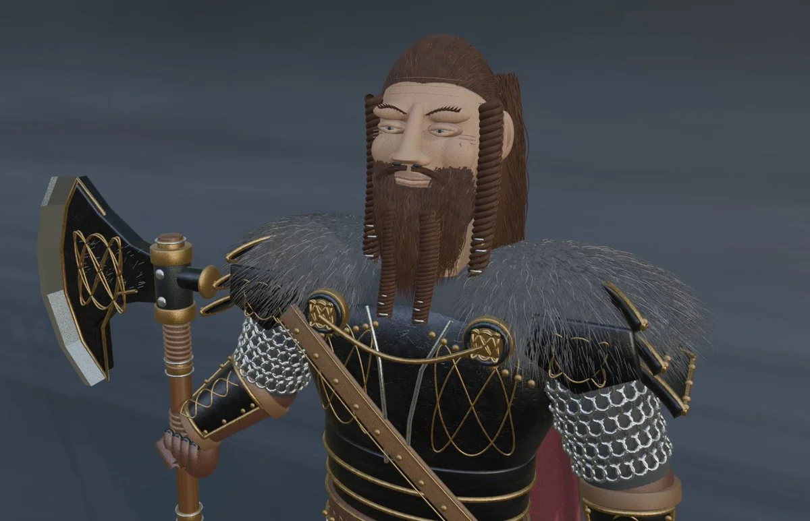

</details>

作者が公開した作品紹介を基に編集しています。

```text
Blender で編集可能な 3D ヴァイキングを作成してください。特徴的な衣装、顔の構造、体の比率、見やすい展示ポーズに重点を置いてください。
```

[元の投稿](https://x.com/fre4kspace/status/2096140378777010278)

---

<a id="gpt-6-astra-2096155883122413946"></a>

## バトルロイヤルアリーナ Dropzone

[MotionViz](https://x.com/Motion_Viz) · 2026-09-05 · **公開説明からまとめた制作指示**

縮小するストーム圏、9 体の AI 敵、パルスライフル、体力、リロードを備えた、三人称ブラウザバトルロイヤルを作成してください。設置できる遮蔽壁と、決着まで遊べる脱落戦を実装してください。

<details>
<summary>プレビュー</summary>


</details>

作者が公開した作品紹介を基に編集しています。

```text
縮小するストーム圏、9 体の AI 敵、パルスライフル、体力、リロードを備えた、三人称ブラウザバトルロイヤルを作成してください。設置できる遮蔽壁と、決着まで遊べる脱落戦を実装してください。
```

[元の投稿](https://x.com/Motion_Viz/status/2096155883122413946)

---

<a id="gpt-6-astra-2096096998092841449"></a>

## 蘇州博物館の庭園ウォークスルー

[amber shen](https://x.com/whosamberella) · 2026-09-05 · **公開説明からまとめた制作指示**

蘇州博物館についてのウェブページを参考に、Blender で庭園を再現してください。現代建築と伝統的な中国庭園の関係を保った、連続したウォークスルーを制作してください。

<details>
<summary>プレビュー</summary>


</details>

作者が公開した作品紹介を基に編集しています。

```text
蘇州博物館についてのウェブページを参考に、Blender で庭園を再現してください。現代建築と伝統的な中国庭園の関係を保った、連続したウォークスルーを制作してください。
```

[元の投稿](https://x.com/whosamberella/status/2096096998092841449)

---

<a id="gpt-6-astra-2095986941753712841"></a>

## 操作して学ぶタイタンの科学展示

[Arda Tuğsat](https://x.com/ArdaTugsat) · 2026-09-04 · **公開説明からまとめた制作指示**

土星最大の衛星タイタンの教育用 3D シミュレーションを作成してください。探索できる環境と、特徴的な物理的性質を解説する情報レイヤーを用意してください。

<details>
<summary>プレビュー</summary>


</details>

作者が公開した作品紹介を基に編集しています。

```text
土星最大の衛星タイタンの教育用 3D シミュレーションを作成してください。探索できる環境と、特徴的な物理的性質を解説する情報レイヤーを用意してください。
```

[元の投稿](https://x.com/ArdaTugsat/status/2095986941753712841)

---

<a id="gpt-6-astra-2096040448477515874"></a>

## WebGL で進化する生態系

[Yume_X](https://x.com/yume_arasaki) · 2026-09-05 · **公開説明からまとめた制作指示**

素の WebGL と GLSL を使い、一つの HTML ファイルに進化する 3D 生態系を作成してください。突然変異、自然選択、捕食、エネルギー消費、多細胞の結合を相互に作用させてください。

<details>
<summary>プレビュー</summary>


</details>

作者が公開した作品紹介を基に編集しています。

```text
素の WebGL と GLSL を使い、一つの HTML ファイルに進化する 3D 生態系を作成してください。突然変異、自然選択、捕食、エネルギー消費、多細胞の結合を相互に作用させてください。
```

[元の投稿](https://x.com/yume_arasaki/status/2096040448477515874)

---

<a id="gpt-6-astra-2096042360513904742"></a>

## 橋の通行止めで変わる配送網

[AgentworkflowLab](https://x.com/AgentWorkflowLa) · 2026-09-05 · **公開説明からまとめた制作指示**

橋を閉鎖するとトラックの経路が変わる 3D 配送シミュレーションを作成してください。到達不能な配送先を検出し、経路が再開したら配達を復旧させてください。

<details>
<summary>プレビュー</summary>

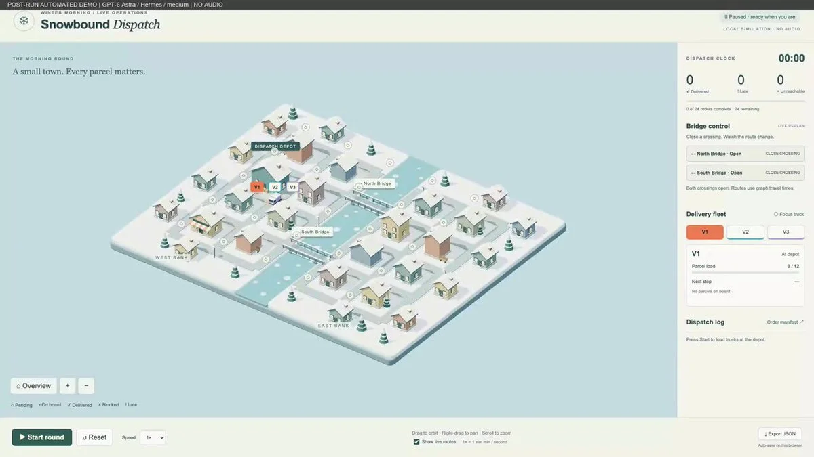

</details>

作者が公開した作品紹介を基に編集しています。

```text
橋を閉鎖するとトラックの経路が変わる 3D 配送シミュレーションを作成してください。到達不能な配送先を検出し、経路が再開したら配達を復旧させてください。
```

[元の投稿](https://x.com/AgentWorkflowLa/status/2096042360513904742)

---

<a id="gpt-6-astra-2096062355692048605"></a>

## Sinclair ZX Spectrum シミュレーター

[Derya Unutmaz, MD](https://x.com/DeryaTR_) · 2026-09-05 · **公開説明からまとめた制作指示**

Sinclair ZX Spectrum 48K を、操作できる 3D デスクトップアプリとして再現してください。ゴム製キーボード、テーププレーヤー、起動画面、遊べるゲーム、BASIC プログラミング画面を含めてください。

<details>
<summary>プレビュー</summary>

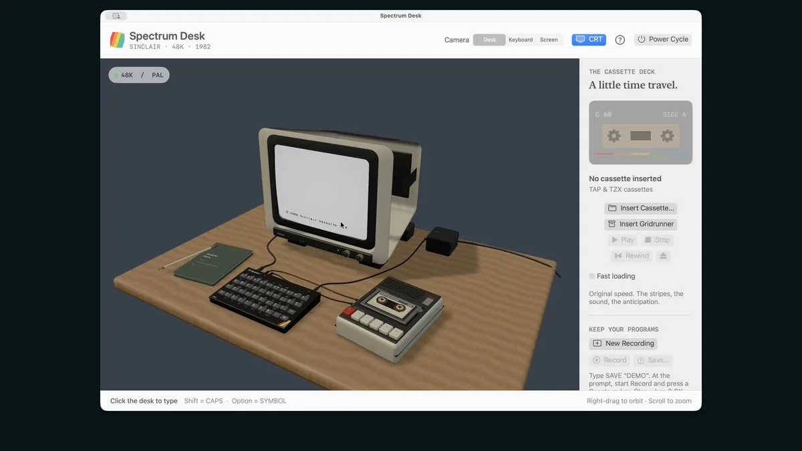

</details>

作者が公開した作品紹介を基に編集しています。

```text
Sinclair ZX Spectrum 48K を、操作できる 3D デスクトップアプリとして再現してください。ゴム製キーボード、テーププレーヤー、起動画面、遊べるゲーム、BASIC プログラミング画面を含めてください。
```

[元の投稿](https://x.com/DeryaTR_/status/2096062355692048605)

---

<a id="gpt-6-astra-2096092080397246707"></a>

## 写真測量スキャンから編集可能なリビングへ

[Bilawal Sidhu](https://x.com/bilawalsidhu) · 2026-09-05 · **公開説明からまとめた制作指示**

写真測量スキャンを基に、Blender でリビングを再構築してください。シーンをゼロからモデル化し、スキャンからテクスチャを取り出して、適切な箇所では手続き型シェーダーを使ってください。

<details>
<summary>プレビュー</summary>


</details>

作者が公開した作品紹介を基に編集しています。

```text
写真測量スキャンを基に、Blender でリビングを再構築してください。シーンをゼロからモデル化し、スキャンからテクスチャを取り出して、適切な箇所では手続き型シェーダーを使ってください。
```

[元の投稿](https://x.com/bilawalsidhu/status/2096092080397246707)

---

<a id="gpt-6-astra-2096135808243876152"></a>

## Odyssey 風の足場アドベンチャー

[AIHubmix](https://x.com/AiHubMix) · 2026-09-05 · **公開説明からまとめた制作指示**

8 つの足場、3 個の収集ムーン、戻ってくる帽子攻撃、敵、チェックポイントを備えた、Odyssey に着想を得た Three.js ステージを作成してください。タッチ操作を加え、最後まで通して試遊してください。

<details>
<summary>プレビュー</summary>

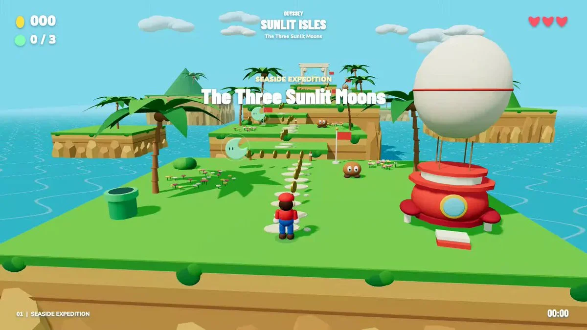

</details>

作者が公開した作品紹介を基に編集しています。

```text
8 つの足場、3 個の収集ムーン、戻ってくる帽子攻撃、敵、チェックポイントを備えた、Odyssey に着想を得た Three.js ステージを作成してください。タッチ操作を加え、最後まで通して試遊してください。
```

[元の投稿](https://x.com/AiHubMix/status/2096135808243876152)

---

<a id="gpt-6-astra-2096221988763173186"></a>

## 分解して観察する 3D 人体解剖

[ashe](https://x.com/ashebytes) · 2026-09-05 · **公開説明からまとめた制作指示**

人体が、個別に観察できる構造へ分かれる 3D 解剖学サイトを作成してください。分解表示を操作できるようにし、各部位を意味のある器官系に整理してください。

<details>
<summary>プレビュー</summary>

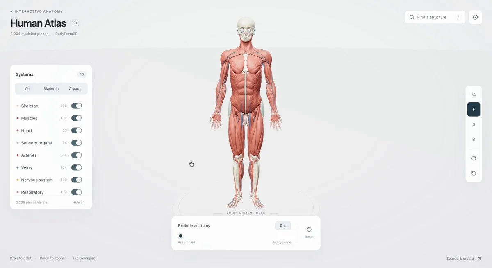

</details>

作者が公開した作品紹介を基に編集しています。

```text
人体が、個別に観察できる構造へ分かれる 3D 解剖学サイトを作成してください。分解表示を操作できるようにし、各部位を意味のある器官系に整理してください。
```

[元の投稿](https://x.com/ashebytes/status/2096221988763173186)

---

<a id="gpt-6-astra-2096009146248122416"></a>

## Tesla Model X の分解表示

[ashe](https://x.com/ashebytes) · 2026-09-04 · **公開説明からまとめた制作指示**

Tesla Model X をモデル化した部品に分解する 3D サイトを作成してください。各アセンブリを観察し、操作して車を再組み立てできるようにしてください。

<details>
<summary>プレビュー</summary>

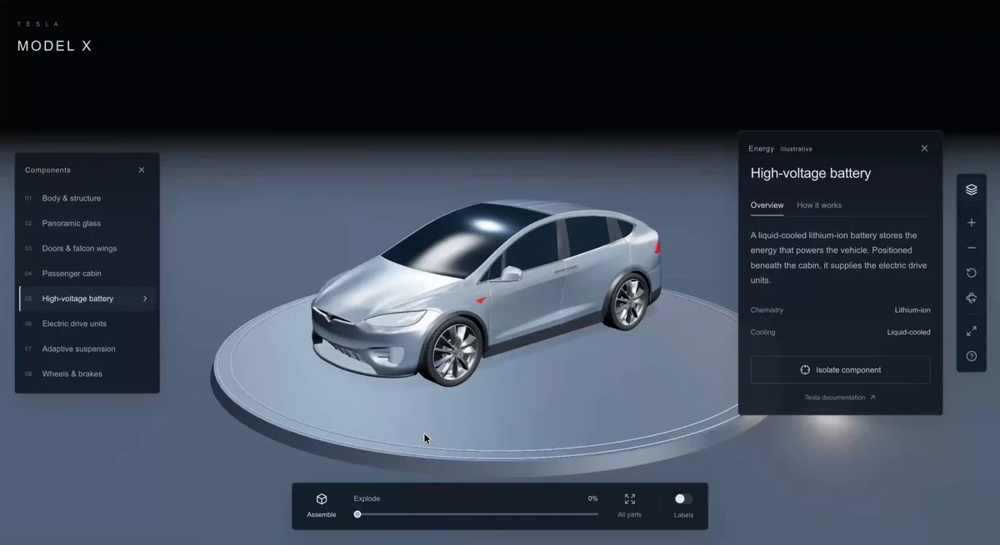

</details>

作者が公開した作品紹介を基に編集しています。

```text
Tesla Model X をモデル化した部品に分解する 3D サイトを作成してください。各アセンブリを観察し、操作して車を再組み立てできるようにしてください。
```

[元の投稿](https://x.com/ashebytes/status/2096009146248122416)

---

<a id="gpt-6-astra-2096241295949975602"></a>

## 思い出のカプセルマシン

[Gloria Zhang](https://x.com/gloria_zwq) · 2026-09-05 · **公開説明からまとめた制作指示**

3D の思い出カプセルマシンを作成してください。つまみを回すと思い出が出てきます。機構を Blender でモデル化し、落ちるカプセルに自然な動きと音を付けてください。

<details>
<summary>プレビュー</summary>

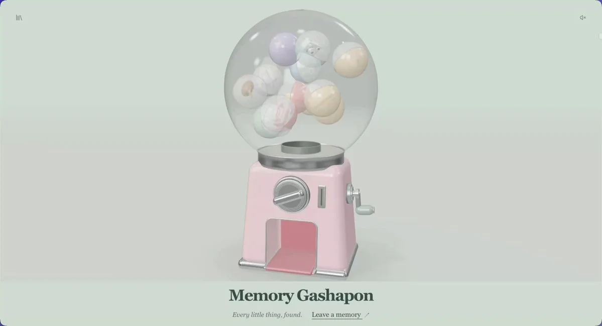

</details>

作者が公開した作品紹介を基に編集しています。

```text
3D の思い出カプセルマシンを作成してください。つまみを回すと思い出が出てきます。機構を Blender でモデル化し、落ちるカプセルに自然な動きと音を付けてください。
```

[元の投稿](https://x.com/gloria_zwq/status/2096241295949975602)

---

<a id="gpt-6-astra-2096125193580113957"></a>

## Blender で作る F1 マシン

[Conor Dart](https://x.com/Conor_D_Dart) · 2026-09-05 · **公開説明からまとめた制作指示**

コンピューター操作を使い、Blender で Formula One の 3D モデルを作成してください。

<details>
<summary>プレビュー</summary>

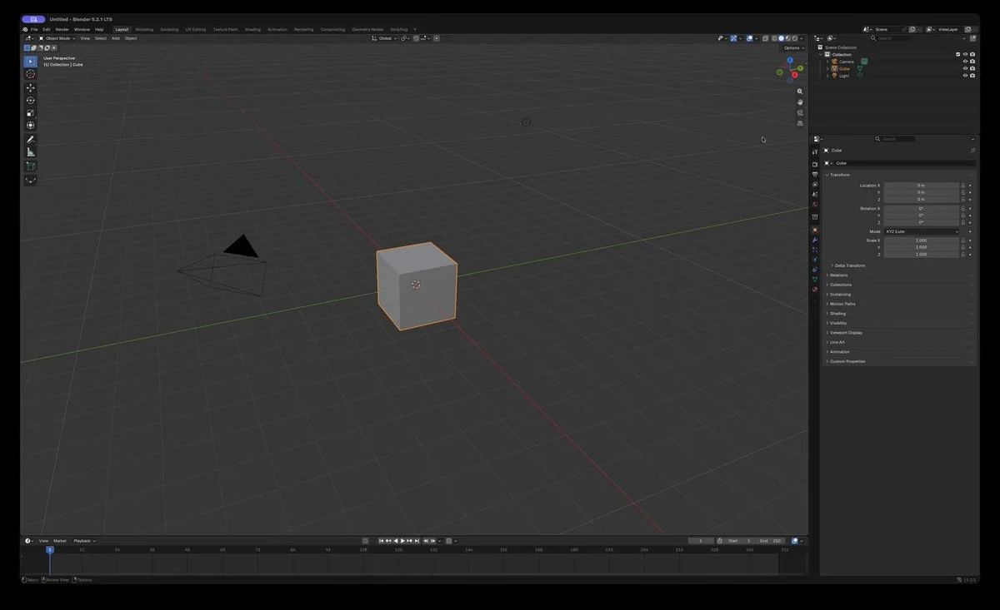

</details>

作者が公開した作品紹介を基に編集しています。

```text
コンピューター操作を使い、Blender で Formula One の 3D モデルを作成してください。
```

[元の投稿](https://x.com/Conor_D_Dart/status/2096125193580113957)

---
