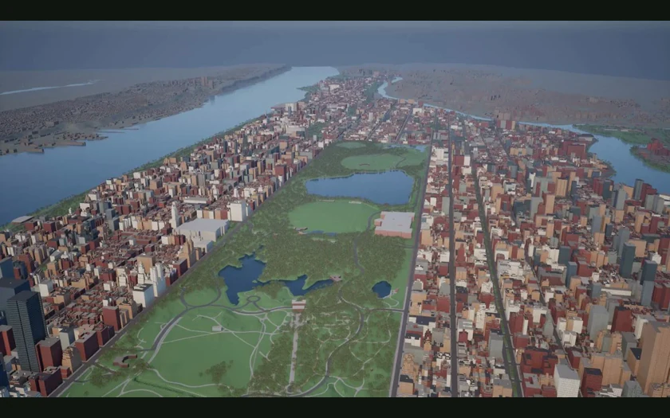
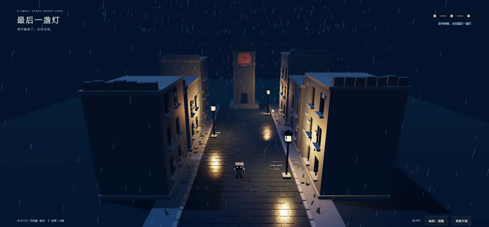

<!-- Generated from Growth CMS. Update content in CMS; run npm run sync. -->

# Awesome Astra Prompts

[](https://github.com/sindresorhus/awesome) [](https://github.com/TripoGrowthLab/awesome-astra-prompts/stargazers) [](../LICENSE) [](https://github.com/TripoGrowthLab/awesome-astra-prompts/actions/workflows/sync-prompts.yml) [](../CONTRIBUTING.md)

<p>
  <a href="../README.md"></a>
  <a href="../README.zh-CN.md"></a>
  <a href="../docs/catalog.zh-Hant.md"></a>
  <a href="../docs/catalog.ja.md"></a>
  <a href="../docs/catalog.ko.md"></a>
  <a href="../docs/catalog.es.md"></a>
  <a href="../docs/catalog.pt.md"></a>
  <a href="../docs/catalog.de.md"></a>
  <a href="../docs/catalog.fr.md"></a>
  <a href="../docs/catalog.it.md"></a>
  <a href="../docs/catalog.ru.md"></a>
  <a href="../docs/catalog.tr.md"></a>
  <a href="../docs/catalog.uk.md"></a>
  <a href="../docs/catalog.vi.md"></a>
</p>

<a href="https://www.tripo3d.ai/pt/3d-prompts/models/gpt-6-astra?utm_source=github&amp;utm_medium=referral&amp;utm_campaign=awesome_astra_prompts&amp;utm_content=readme_hero"></a>

**Um ponto de partida para seu próximo jogo, cena ou mundo interativo.**


**155 · Todos os prompts do Astra**

## Projetos em destaque

<table>
<tr>
<td width="50%" valign="top"><a href="https://www.tripo3d.ai/pt/3d-prompts/street-by-street-manhattan-in-unreal-engine-2095609734845927525"></a><br><strong><a href="#2095609734845927525">Manhattan, rua por rua, no Unreal Engine</a></strong><br><sub><a href="https://x.com/mattshumer_/status/2095609734845927525">Matt Shumer</a></sub><br><a href="#2095609734845927525">Prompt →</a></td>
<td width="50%" valign="top"><a href="https://www.tripo3d.ai/pt/3d-prompts/kaiju-city-battle-2096251574918013135"></a><br><strong><a href="#2096251574918013135">Uma batalha de kaijus na cidade</a></strong><br><sub><a href="https://x.com/majidmanzarpour/status/2096251574918013135">Majid Manzarpour</a></sub><br><a href="#2096251574918013135">Prompt →</a></td>
</tr>
<tr>
<td width="50%" valign="top"><a href="https://www.tripo3d.ai/pt/3d-prompts/switchable-character-expressions-in-blender-2096525100518453342"></a><br><strong><a href="#2096525100518453342">Expressões de personagem alternáveis no Blender</a></strong><br><sub><a href="https://x.com/Dstudio_ai/status/2096525100518453342">Nano(ナノ)</a></sub><br><a href="#2096525100518453342">Prompt →</a></td>
<td width="50%" valign="top"><a href="https://www.tripo3d.ai/pt/3d-prompts/one-shot-minecraft-style-world-2095597137849446688"></a><br><strong><a href="#2095597137849446688">Um mundo no estilo Minecraft de uma só vez</a></strong><br><sub><a href="https://x.com/flavioAd/status/2095597137849446688">Flavio Adamo</a></sub><br><a href="#2095597137849446688">Prompt →</a></td>
</tr>
</table>

<a id="all-prompts"></a>

## Todos os prompts do Astra

<details>
<summary>Explorar exemplos</summary>

- [Um oceano procedural vivo com simulação de tempestades](#2095673885605630429) · GitHub
- [Gogh Strike: um FPS multijogador](#2096013280519016608) · GitHub
- [Uma arena de combate corpo a corpo em uma catedral](#2095988972879335792) · GitHub
- [Corrida de combate antigravidade](#2095967568825582044) · GitHub
- [Núcleo de energia interativo com dois anéis](#2096551010089263181) · GitHub
- [Praça da União de Cluj-Napoca em voxels](#2096262733259837681) · GitHub
- [Uma sociedade de humanos autônomos que sobrevive no Unreal](#2095596175705399482)
- [Manhattan, rua por rua, no Unreal Engine](#2095609734845927525)
- [Criando um pequeno jogo 3D rudimentar com Astra a partir de uma arte conceitual](#2096068401294929940)
- [Asset de jogo de minifig LEGO com Blender MCP](#2096766465730847059)
- [Uma batalha de kaijus na cidade](#2096251574918013135)
- [Uma casa moderna no Blender](#2095636679264780481)
- [Expressões de personagem alternáveis no Blender](#2096525100518453342)
- [Um mundo no estilo Minecraft de uma só vez](#2095597137849446688)
- [Um jogo 3D de navegador com uma única instrução](#2095599934766764338)
- [Da foto de uma casa a um mundo editável no Blender](#2095598645190291775)
- [De um anúncio no Zillow a um vídeo imobiliário 3D](#2095612137582526615)
- [Do desenho de um trem a vapor a um conjunto editável no Blender](#2095756085890310311)
- [Um Salão Oval procedural para Cycles](#2095630197257367857)
- [O Palácio de Belas Artes recriado no Blender](#2095653641164329143)
- [Uma cidade para passear a partir de seis pinturas de Van Gogh](#2095776685807346105)
- [Um jogo 3D guiado por voz para iniciantes](#2095608358086840647)
- [Três jogos temáticos de kart a partir de um protótipo básico](#2095580402505400369)
- [Uma aventura de mundo aberto no navegador](#2095596341422440714)
- [Um estúdio de mockups 3D fotorrealistas de produtos](#2095619319690400253)
- [Um jogo de aquário 3D a partir de uma imagem de referência](#2095611134992945385)
- [Um jogo 3D em tempo real com um único prompt](#2095647685210669541)
- [Uma batalha naval no Three.js em um único turno](#2095840435319001278)
- [Um FPS multijogador 10 contra 10 inspirado em Halo](#2095598026916049024)
- [Uma maquete ferroviária interativa de voxels](#2095719731860750613)
- [Um navio de voxels vivo dentro de uma garrafa](#2095699049722581065)
- [Uma USS Enterprise em CAD pronta para impressão](#2095641163441254676)
- [Um jogo de voo espacial por trincheiras no Unity](#2095630044102279312)
- [Um castelo procedural de voxels para explorar](#2093690427849191855)
- [Uma cidade explorável no Unity a partir de uma biblioteca de recursos](#2095597640587374887)
- [Uma locomotiva mecanicamente completa no Blender](#2095868420327710840)
- [Tidal Rush: oito pilotos no navegador](#2095819786651374023)
- [Uma galáxia WebGL em tempo real para a abertura de um lançamento](#2095805694603673631)
- [Um arcade cultural que joga sozinho](#2095898198413922791)
- [Um protótipo interativo bem-acabado de uma só vez](#2095597560253862065)
- [Um turbocompressor 3D interativo em vista explodida](#2095776712579571725)
- [Um jogo surpreendente no Three.js com uma única instrução](#2095663498101662198)
- [Um protótipo jogável criado rapidamente](#2095907526566990013)
- [Do prompt a um jogo de mundo aberto](#2095872986477908108)
- [Uma página inicial com galáxia interativa no Three.js](#2095806515579879457)
- [Um quarto cyberpunk em loop no Blender](#2095898303019856230)
- [Uma cidade de Van Gogh no Three.js](#2095871735824339279)
- [Ruas de A Noite Estrelada para passear](#2095805115580199372)
- [Uma maquete de trens da infância que você pode conduzir](#2095742344293454148)
- [Do texto a uma cidade explorável no Unity](#2095623452678144366)
- [Um aquário com um único prompt para comparar modelos](#2095650251902239139)
- [Da planta a um passeio arquitetônico 3D completo](#2095725404883476661)
- [Uma casa real como cena editável no Blender a 60 FPS](#2095777502681825541)
- [Street Heat: corrida de drift no navegador](#2095916820431827408)
- [Pré-visualização cinematográfica de um museu 3D](#2095616529572503593)
- [Um anúncio interativo de produto de 15 segundos](#2095695603808309497)
- [Da planta ao Blender e ao Unreal para visualização arquitetônica](#2095624712244072551)
- [Solace: da casa na floresta ao UE5](#2095752726886105375)
- [O desafio de criar uma cena no Blender em trinta segundos](#2095844872171421771)
- [Uma máquina de reação em cadeia de Rube Goldberg](#2095980885732704629)
- [Um Taj Mahal explorável](#2096035962824335798)
- [Um simulador de encontro orbital](#2096225621303042258)
- [Um rebocador montado a partir de imagens de referência](#2096180220839760375)
- [A reconstrução de uma furadeira a partir de uma única vista](#2096059736693305794)
- [Um jogo 3D de pássaros com estilingue](#2095981655370666076)
- [Um jogo de tiro em terceira pessoa com tempo de bala](#2095962376344309843)
- [Uma gelatina elástica com WebGPU](#2096008241104711698)
- [Um controle de PS5 interativo](#2095967131573649552)
- [Astral War: um jogo de tiro no navegador](#2096079660605997264)
- [Do esquema em PDF à PCB e à visualização 3D](#2096079976433082502)
- [Um jogo de voo no navegador](#2096149823216898445)
- [Um painel com globo interativo](#2096082432197837065)
- [A Torre Azadi no Blender](#2096107322536051057)
- [Um site de estúdio 3D guiado pela rolagem](#2096245759121277132)
- [Komorebi: caiaque pelo rio](#2096244208533455049)
- [Uma narrativa de produto com garrafa refrativa](#2096243989439713677)
- [Desmontagem animada de trens procedurais](#2096082580554777041)
- [Um mundo lúdico de brinquedos para uma criança pequena](#2096201415051911597)
- [Uma fábrica de jatos em funcionamento](#2096122429319852319)
- [Uma tempestade presa em um cubo](#2096220264413409648)
- [Zork como aventura de ação 3D](#2096047660662722620)
- [Um T. rex com rig e animação](#2096133339329536249)
- [Vida marinha em uma xícara de café](#2096174858837074198)
- [Uma demonstração interativa de Hyperloop](#2096250748099068377)
- [Um busto procedural de Napoleão](#2096234355395903672)
- [O saguão de uma estação ferroviária](#2096226711222546461)
- [Um diorama animado de primeiros passos](#2096222790894661841)
- [OX Vice Drive: corrida em uma cidade aberta](#2096206082712768897)
- [A versão jogável de um anúncio de jogo mobile](#2096111709496680842)
- [Um jogo de luta anime em arena no Roblox](#2095999578419929412)
- [Físicas de corrida no navegador com C# e WASM](#2096258619574513880)
- [Rig automático de personagem e movimentos de kung fu](#2096141728487178503)
- [Da ilustração a um personagem jogável](#2096107343268257953)
- [Um portfólio 3D pessoal com um globo de palestras](#2096023793772998704)
- [Uma fase representativa inspirada em Sonic no Godot](#2096056285896536086)
- [Um personagem viking no Blender](#2096140378777010278)
- [Dropzone: uma arena de battle royale](#2096155883122413946)
- [Um passeio pelo jardim do Museu de Suzhou](#2096096998092841449)
- [Uma exposição científica interativa sobre Titã](#2095986941753712841)
- [Um ecossistema evolutivo em WebGL](#2096040448477515874)
- [Uma rede de entregas com pontes interditadas](#2096042360513904742)
- [Um simulador do Sinclair ZX Spectrum](#2096062355692048605)
- [De uma captura fotogramétrica a uma sala editável](#2096092080397246707)
- [Uma aventura de plataforma inspirada em Odyssey](#2096135808243876152)
- [Anatomia humana interativa em vista explodida](#2096221988763173186)
- [Um Tesla Model X em vista explodida](#2096009146248122416)
- [Uma máquina de cápsulas de memória](#2096241295949975602)
- [Um carro de Fórmula 1 no Blender](#2096125193580113957)
- [Cena de personagem inspirada em Warcraft no Unity](#2096308567863079420)
- [Arena de batalha em Three.js com assets do Tripo](#2096015772334047319)
- [Tabuleiro de shogi 3D giratório](#2096579856133947507)
- [Atlas de um computador de mesa em vista explodida](#2096578761877860502)
- [Planejador de quarto infantil e espaço de trabalho](#2096578684010508736)
- [Planta baixa e passeio 3D sincronizados](#2095999282088378520)
- [Miniatura interativa de Seul](#2096557555086725159)
- [Inseto procedural que escala superfícies](#2096460081982304546)
- [Wright Flyer sobre uma floresta japonesa](#2096467585785286808)
- [Uma casa modelada do zero no Blender](#2096576154337734865)
- [Da foto de uma cafeteria a um passeio vertical](#2096143359505269079)
- [Da planta do último andar à prévia no Blender](#2096501340889374883)
- [Terreiro do Paço de Lisboa no Blender](#2096298425914450021)
- [Aventura de exploração The Quiet Crossing](#2096574297703637111)
- [Floresta procedural densa em Three.js](#2096263046918197609)
- [Modelo do gravador TP-7 a partir de referências](#2096013228090245181)
- [Locomotiva a vapor pelo campo](#2096577430274429157)
- [Cena de toca-discos sobre uma mesa](#2096561346766877106)
- [Ciclo de jogo de batalhas com cartas colecionáveis](#2096555856204644550)
- [Jogo de simulação de uma malha ferroviária](#2096362653480562751)
- [Vila low poly de Gwacheon para explorar a pé](#2096490395614019793)
- [Fase completa de quebra-cabeças em Three.js](#2096505740643246231)
- [Caça ao tesouro em uma praia low poly](#2096570815714414844)
- [Modelos do Blender com efeitos visuais no Unity](#2096560142871658589)
- [Jogo de rali em Unity para celular](#2096556692842348826)
- [Mangueira indiana no SpeedTree](#2096572429066006845)
- [Texturas e rig de um personagem do Tripo](#2096566598689783878)
- [Protótipo de jogo The Legend of Astra](#2096064140510970318)
- [Do esboço de um apartamento a interiores renderizados](#2096566686266597754)
- [Cena de rio interativa no navegador](#2095993826569502785)
- [Voo ao entardecer por uma cena de Adiyogi](#2096128774203171021)
- [Água em loop com Geometry Nodes](#2096521798150242631)
- [Mundo de navegação inspirado em One Piece](#2096518775042707700)
- [Atrator de Lorenz interativo](#2096572156453028193)
- [Taverna com funcionários e clientes ativos](#2096358854275543457)
- [Um quarto pessoal como portfólio interativo](#2096506357868642342)
- [Barco YF-24 em um mar 3D calmo](#2096503275910832461)
- [Apartamento jogável inspirado em D4](#2096413869841473930)
- [Jogo urbano no navegador com um personagem fornecido](#2096398839830008292)
- [Explorador orbital do sistema solar](#2096339041679442428)
- [Formação de buracos negros em WebGL](#2096093614397170104)
- [De um logotipo 2D a um personagem animado](#2096559197999501724)
- [Jogo de caranguejo com mecânicas baseadas em ações](#2096337879173591171)
- [Vila de A Noite Estrelada com ciclo de dia e noite](#2096555183790575682)
- [Interface Three.js ajustada a uma referência](#2096510126244999366)
- [Montagem e animação de assets 3D gerados](#2096481425050743048)
- [Landing page abissal bioluminescente](#2096269057544831175)

</details>

<a id="2095673885605630429"></a>

### Um oceano procedural vivo com simulação de tempestades

[Ethan Mollick](https://x.com/emollick) · 2026-09-04

<a href="https://www.tripo3d.ai/pt/3d-prompts/procedural-living-ocean-and-storm-simulation-2095673885605630429"></a>

**Prompt**

```text
Expanda o gerador de tempestades na superfície do oceano fornecido, de um único arquivo, para um oceano procedural completo. Adicione recifes, águas profundas, clima convincente, populações animais com comportamento emergente, interações do ecossistema e uma câmera que transite entre a superfície e o fundo do mar.
```

[Ver detalhes ↗](https://www.tripo3d.ai/pt/3d-prompts/procedural-living-ocean-and-storm-simulation-2095673885605630429) · [Ver vídeo ↗](https://cdn-blog.holymolly.ai/media/production/3d-prompt-2095673008803241987-video-48e1e14348a0.mp4) · [Publicação original](https://x.com/emollick/status/2095673885605630429) · [Código-fonte](https://github.com/emollick/abyssal-living-deep) · [Demonstração](https://abyssal-living-deep.netlify.app/?site=reef&seed=713&light=day&surface=1) · [Voltar aos exemplos](#all-prompts)

---

<a id="2096013280519016608"></a>

### Gogh Strike: um FPS multijogador

[Peter Gostev](https://x.com/petergostev) · 2026-09-04

<a href="https://www.tripo3d.ai/pt/3d-prompts/gogh-strike-multiplayer-fps-2096013280519016608"></a>

**Prompt**

```text
Construa um jogo de tiro pós-impressionista em primeira pessoa, 5 contra 5, com personagens artistas renderizados no Blender, equipes fáceis de distinguir e uma partida multijogador completa no navegador.
```

[Ver detalhes ↗](https://www.tripo3d.ai/pt/3d-prompts/gogh-strike-multiplayer-fps-2096013280519016608) · [Ver vídeo ↗](https://cdn-blog.holymolly.ai/media/production/3d-prompt-2096012866734501888-video-972adb2fb60f.mp4) · [Publicação original](https://x.com/petergostev/status/2096013280519016608) · [Código-fonte](https://github.com/petergpt/gogh-strike) · [Demonstração](https://gogh-strike.surge.sh/) · [Voltar aos exemplos](#all-prompts)

---

<a id="2095988972879335792"></a>

### Uma arena de combate corpo a corpo em uma catedral

[Alexey Fateev](https://x.com/superalesha) · 2026-09-04

<a href="https://www.tripo3d.ai/pt/3d-prompts/cathedral-hack-and-slash-arena-2095988972879335792"></a>

**Prompt**

```text
Construa um jogo de ação corpo a corpo em terceira pessoa no Three.js, em uma catedral sobre uma estrela morta. Inclua combos leves de espada, ataques pesados, magia de área, esquiva e animações de duas mãos com sensação de peso.
```

[Ver detalhes ↗](https://www.tripo3d.ai/pt/3d-prompts/cathedral-hack-and-slash-arena-2095988972879335792) · [Ver vídeo ↗](https://cdn-blog.holymolly.ai/media/production/3d-prompt-2095988588534272001-video-af1e5c9a142b.mp4) · [Publicação original](https://x.com/superalesha/status/2095988972879335792) · [Código-fonte](https://github.com/alesha-pro/bench-portal) · [Demonstração](https://alesha-pro.github.io/bench-portal/games/voidbound-choir-of-ash/) · [Voltar aos exemplos](#all-prompts)

---

<a id="2095967568825582044"></a>

### Corrida de combate antigravidade

[Alexey Fateev](https://x.com/superalesha) · 2026-09-04

<a href="https://www.tripo3d.ai/pt/3d-prompts/anti-gravity-combat-racer-2095967568825582044"></a>

**Prompt**

```text
Construa um jogo de corrida de combate antigravidade em alta velocidade no Three.js, com drift, impulsos, câmeras inclináveis, freios aerodinâmicos e escudos coletáveis. Inclua naves leves, equilibradas e pesadas em uma pista alienígena elevada.
```

[Ver detalhes ↗](https://www.tripo3d.ai/pt/3d-prompts/anti-gravity-combat-racer-2095967568825582044) · [Ver vídeo ↗](https://cdn-blog.holymolly.ai/media/production/3d-prompt-2095966450385289216-video-44433db9ca50.mp4) · [Publicação original](https://x.com/superalesha/status/2095967568825582044) · [Código-fonte](https://github.com/alesha-pro/bench-portal) · [Voltar aos exemplos](#all-prompts)

---

<a id="2096551010089263181"></a>

### Núcleo de energia interativo com dois anéis

[ruofeng](https://x.com/oneruofeng) · 2026-09-06

<a href="https://www.tripo3d.ai/pt/3d-prompts/interactive-dual-ring-energy-core-2096551010089263181"></a>

**Prompt**

```text
Modele um núcleo de energia, dois anéis e uma base metálica no Blender. Exporte os materiais para um visualizador Three.js com controles de rotação, zoom, órbita automática e pulsação.
```

[Ver detalhes ↗](https://www.tripo3d.ai/pt/3d-prompts/interactive-dual-ring-energy-core-2096551010089263181) · [Ver vídeo ↗](https://cdn-blog.holymolly.ai/media/production/3d-prompt-2096549512995368961-video-3eacc87e8c74.mp4) · [Publicação original](https://x.com/oneruofeng/status/2096551010089263181) · [Código-fonte](https://github.com/wangruofeng/orbital-core-showcase) · [Demonstração](https://orbital-core-showcase.wangruofeng007.workers.dev/) · [Voltar aos exemplos](#all-prompts)

---

<a id="2096262733259837681"></a>

### Praça da União de Cluj-Napoca em voxels

[Dan Manastireanu](https://x.com/danmana) · 2026-09-05

<a href="https://www.tripo3d.ai/pt/3d-prompts/cluj-napoca-union-square-in-voxels-2096262733259837681"></a>

**Prompt**

```text
Crie um mundo interativo de voxels da Piața Unirii em Cluj-Napoca. Adapte a disposição e os pontos de referência reconhecíveis da praça para uma miniatura explorável.
```

[Ver detalhes ↗](https://www.tripo3d.ai/pt/3d-prompts/cluj-napoca-union-square-in-voxels-2096262733259837681) · [Ver vídeo ↗](https://cdn-blog.holymolly.ai/media/production/3d-prompt-2096248939876126720-video-9e98c19a900a.mp4) · [Publicação original](https://x.com/danmana/status/2096262733259837681) · [Código-fonte](https://github.com/danmana/piata-unirii) · [Demonstração](https://piata-unirii.vercel.app/runs/gpt-astra-xhigh-01/) · [Voltar aos exemplos](#all-prompts)

---

<a id="2095596175705399482"></a>

### Uma sociedade de humanos autônomos que sobrevive no Unreal

[Matt Shumer](https://x.com/mattshumer_) · 2026-09-03

<a href="https://www.tripo3d.ai/pt/3d-prompts/surviving-society-of-autonomous-unreal-humans-2095596175705399482"></a>

**Prompt**

```text
Crie um mundo no Unreal Engine habitado por agentes humanos autônomos. Dê a cada um necessidades próprias e um objetivo coletivo de sobrevivência para que precisem se comunicar, dividir tarefas, construir abrigos e manter a sociedade viva quando o jogador sair.
```

[Ver detalhes ↗](https://www.tripo3d.ai/pt/3d-prompts/surviving-society-of-autonomous-unreal-humans-2095596175705399482) · [Ver vídeo ↗](https://cdn-blog.holymolly.ai/media/production/3d-prompt-2095589100539531264-video-a133b7a6d1c6.mp4) · [Publicação original](https://x.com/mattshumer_/status/2095596175705399482) · [Voltar aos exemplos](#all-prompts)

---

<a id="2095609734845927525"></a>

### Manhattan, rua por rua, no Unreal Engine

[Matt Shumer](https://x.com/mattshumer_) · 2026-09-03

<a href="https://www.tripo3d.ai/pt/3d-prompts/street-by-street-manhattan-in-unreal-engine-2095609734845927525"></a>

**Prompt**

```text
Construa uma Manhattan explorável no Unreal Engine. Trabalhe bairro por bairro e rua por rua, preservando uma escala reconhecível, o traçado viário, os pontos de referência, o trânsito e a identidade de cada região. Mantenha uma lista de verificação e refine cada área antes de seguir adiante.
```

[Ver detalhes ↗](https://www.tripo3d.ai/pt/3d-prompts/street-by-street-manhattan-in-unreal-engine-2095609734845927525) · [Ver vídeo ↗](https://cdn-blog.holymolly.ai/media/production/3d-prompt-2095609426770010113-video-05968f9d59fb.mp4) · [Publicação original](https://x.com/mattshumer_/status/2095609734845927525) · [Voltar aos exemplos](#all-prompts)

---

<a id="2096068401294929940"></a>

### Criando um pequeno jogo 3D rudimentar com Astra a partir de uma arte conceitual

[陈硕KAI](https://x.com/ChenshuoAI) · 2026-09-05

<a href="https://x.com/ChenshuoAI/status/2096068401294929940"></a>

O autor compartilha o processo de criação de um pequeno jogo 3D rudimentar usando Codex, Blender MCP e Astra: primeiro, gera uma arte conceitual de referência; depois, ajusta continuamente os visuais do jogo comparando-os com capturas de tela, mantendo 60 fps.

**Prompt**

```text
Um mundo distópico triste, mas belo, em estilo voxel / Low Poly, com noite chuvosa, neblina leve, reflexos em áreas alagadas, ambiente em tons de azul frio + iluminação em laranja quente. A iluminação deve ser o mais realista e cinematográfica possível.
```

[Ver vídeo ↗](https://video.twimg.com/amplify_video/2096067890562883584/vid/avc1/1902x886/89DcMKBb55ZmEHTh.mp4?tag=29) · [Publicação original](https://x.com/ChenshuoAI/status/2096068401294929940) · [Voltar aos exemplos](#all-prompts)

---

<a id="2096766465730847059"></a>

### Asset de jogo de minifig LEGO com Blender MCP

[Simon Smith](https://x.com/_simonsmith) · 2026-09-07

<a href="https://x.com/_simonsmith/status/2096766465730847059"></a>

Cria uma versão de Donald Trump em formato de minifig LEGO como um asset de jogo AAA de alta qualidade usando o Blender MCP.

**Prompt**

```text
Use o Blender MCP para criar uma versão de Donald Trump em formato de minifig LEGO que eu possa usar como asset de jogo. Garanta uma qualidade excepcional, no nível de um jogo AAA, e avalie rigorosamente o resultado para confirmar que ele seja detalhado, preciso e excelente.
```

[Ver vídeo ↗](https://video.twimg.com/amplify_video/2096766389113556999/vid/avc1/1920x1080/t6dpye7hPDiWK9D2.mp4?tag=29) · [Publicação original](https://x.com/_simonsmith/status/2096766465730847059) · [Voltar aos exemplos](#all-prompts)

---

<a id="2096251574918013135"></a>

### Uma batalha de kaijus na cidade

[Majid Manzarpour](https://x.com/majidmanzarpour) · 2026-09-05

<a href="https://www.tripo3d.ai/pt/3d-prompts/kaiju-city-battle-2096251574918013135"></a>

**Prompt**

```text
Construa um jogo inspirado em kaijus no Three.js usando modelos de criaturas e efeitos sonoros gerados. Crie combates em escala gigante fáceis de acompanhar e um ambiente que transmita o tamanho das criaturas.
```

[Ver detalhes ↗](https://www.tripo3d.ai/pt/3d-prompts/kaiju-city-battle-2096251574918013135) · [Ver vídeo ↗](https://cdn-blog.holymolly.ai/media/production/3d-prompt-2096251295594135556-video-cc717933e256.mp4) · [Publicação original](https://x.com/majidmanzarpour/status/2096251574918013135) · [Demonstração](https://stormcolossus.netlify.app/) · [Voltar aos exemplos](#all-prompts)

---

<a id="2095636679264780481"></a>

### Uma casa moderna no Blender

[Karan](https://x.com/karankendre) · 2026-09-03

<a href="https://www.tripo3d.ai/pt/3d-prompts/modern-villa-scene-in-blender-2095636679264780481"></a>

**Prompt**

```text
Construa no Blender uma cena completa de uma casa moderna, com arquitetura coerente, interiores mobiliados, piscina de borda infinita, paisagismo, materiais realistas e um percurso cinematográfico de câmera durante a hora dourada.
```

[Ver detalhes ↗](https://www.tripo3d.ai/pt/3d-prompts/modern-villa-scene-in-blender-2095636679264780481) · [Ver vídeo ↗](https://cdn-blog.holymolly.ai/media/production/3d-prompt-2095636565192241152-video-97d4ec4c239f.mp4) · [Publicação original](https://x.com/karankendre/status/2095636679264780481) · [Voltar aos exemplos](#all-prompts)

---

<a id="2096525100518453342"></a>

### Expressões de personagem alternáveis no Blender

[Nano(ナノ)](https://x.com/Dstudio_ai) · 2026-09-06

<a href="https://www.tripo3d.ai/pt/3d-prompts/switchable-character-expressions-in-blender-2096525100518453342"></a>

**Prompt**

```text
Prepare variantes de expressão de um personagem do Tripo no Blender antes de criar o rig. Alinhe as malhas e alterne entre elas sem interpolação, reduzindo as variantes inativas para dentro da cabeça. Não apresente o resultado como uma transição suave entre expressões nem como compatível com VRM.
```

[Ver detalhes ↗](https://www.tripo3d.ai/pt/3d-prompts/switchable-character-expressions-in-blender-2096525100518453342) · [Ver vídeo ↗](https://cdn-blog.holymolly.ai/media/production/3d-prompt-2096524256012316672-video-4b1e211ec04c.mp4) · [Publicação original](https://x.com/Dstudio_ai/status/2096525100518453342) · [Voltar aos exemplos](#all-prompts)

---

<a id="2095597137849446688"></a>

### Um mundo no estilo Minecraft de uma só vez

[Flavio Adamo](https://x.com/flavioAd) · 2026-09-03

<a href="https://www.tripo3d.ai/pt/3d-prompts/one-shot-minecraft-style-world-2095597137849446688"></a>

**Prompt**

```text
Construa de uma só vez um mundo de voxels jogável inspirado em Minecraft, com geração de terreno, colocação e destruição de blocos, controles em primeira pessoa, inventário, iluminação, água e um ciclo de sobrevivência compacto.
```

[Ver detalhes ↗](https://www.tripo3d.ai/pt/3d-prompts/one-shot-minecraft-style-world-2095597137849446688) · [Ver vídeo ↗](https://cdn-blog.holymolly.ai/media/production/3d-prompt-2095576150743400453-video-af32f40d4a39.mp4) · [Publicação original](https://x.com/flavioAd/status/2095597137849446688) · [Voltar aos exemplos](#all-prompts)

---

<a id="2095599934766764338"></a>

### Um jogo 3D de navegador com uma única instrução

[Theo - t3.gg](https://x.com/theo) · 2026-09-03

<a href="https://www.tripo3d.ai/pt/3d-prompts/one-shot-browser-3d-game-2095599934766764338"></a>

**Prompt**

```text
Crie um jogo 3D completo que rode no navegador em um projeto autossuficiente. Inclua objetivo claro, controles responsivos, fases espacialmente coerentes, inimigos ou perigos, respostas às ações, pontuação, reinício e cuidados com o desempenho.
```

[Ver detalhes ↗](https://www.tripo3d.ai/pt/3d-prompts/one-shot-browser-3d-game-2095599934766764338) · [Ver vídeo ↗](https://cdn-blog.holymolly.ai/media/production/3d-prompt-2095599652796272640-video-19ead087387b.mp4) · [Publicação original](https://x.com/theo/status/2095599934766764338) · [Voltar aos exemplos](#all-prompts)

---

<a id="2095598645190291775"></a>

### Da foto de uma casa a um mundo editável no Blender

[Tom Krcha](https://x.com/tomkrcha) · 2026-09-03

<a href="https://www.tripo3d.ai/pt/3d-prompts/house-photo-to-editable-blender-world-2095598645190291775"></a>

**Prompt**

```text
Reconstrua a casa da imagem fornecida como uma cena totalmente editável no Blender. Modele a arquitetura, os móveis, os eletrodomésticos e os brinquedos como objetos separados. Preserve proporções plausíveis e permita um passeio virtual local e fluido a 60 FPS.
```

[Ver detalhes ↗](https://www.tripo3d.ai/pt/3d-prompts/house-photo-to-editable-blender-world-2095598645190291775) · [Ver vídeo ↗](https://cdn-blog.holymolly.ai/media/production/3d-prompt-2095596412650283008-video-ba69ffc1845f.mp4) · [Publicação original](https://x.com/tomkrcha/status/2095598645190291775) · [Voltar aos exemplos](#all-prompts)

---

<a id="2095612137582526615"></a>

### De um anúncio no Zillow a um vídeo imobiliário 3D

[Yunfan Ye](https://x.com/realYunfanYe) · 2026-09-03

<a href="https://www.tripo3d.ai/pt/3d-prompts/zillow-listing-to-3d-property-film-2095612137582526615"></a>

**Prompt**

```text
Use o anúncio imobiliário fornecido e todas as suas fotos para reconstruir a casa em 3D, deduzir uma planta coerente e criar um vídeo promocional bem-acabado de passeio pelo imóvel. Sinalize as geometrias incertas e corrija divergências após a primeira versão.
```

[Ver detalhes ↗](https://www.tripo3d.ai/pt/3d-prompts/zillow-listing-to-3d-property-film-2095612137582526615) · [Ver vídeo ↗](https://cdn-blog.holymolly.ai/media/production/3d-prompt-2095611898968547328-video-ac32ebda7148.mp4) · [Publicação original](https://x.com/realYunfanYe/status/2095612137582526615) · [Voltar aos exemplos](#all-prompts)

---

<a id="2095756085890310311"></a>

### Do desenho de um trem a vapor a um conjunto editável no Blender

[Tom Krcha](https://x.com/tomkrcha) · 2026-09-04

<a href="https://www.tripo3d.ai/pt/3d-prompts/steam-train-drawing-to-editable-blender-assembly-2095756085890310311"></a>

**Prompt**

```text
Reconstrua no Blender o desenho fornecido de um trem a vapor antigo como um conjunto mecânico detalhado. Mantenha rodas, eixos, suspensão, bielas, acessórios da caldeira e painéis da carroceria como objetos editáveis e nomeados, com um limite de detalhamento ajustável.
```

[Ver detalhes ↗](https://www.tripo3d.ai/pt/3d-prompts/steam-train-drawing-to-editable-blender-assembly-2095756085890310311) · [Ver vídeo ↗](https://cdn-blog.holymolly.ai/media/production/3d-prompt-2095754646069354497-video-61d8e4756cf0.mp4) · [Publicação original](https://x.com/tomkrcha/status/2095756085890310311) · [Voltar aos exemplos](#all-prompts)

---

<a id="2095630197257367857"></a>

### Um Salão Oval procedural para Cycles

[Higgsfield AI 🧩](https://x.com/higgsfield_ai) · 2026-09-03

<a href="https://www.tripo3d.ai/pt/3d-prompts/procedural-oval-office-set-for-cycles-2095630197257367857"></a>

**Prompt**

```text
Transforme uma descrição cenográfica do Salão Oval em código de cena executável. Construa o ambiente no Blender com móveis, paredes, iluminação e posições de câmera editáveis e renderize um resultado cinematográfico com Cycles.
```

[Ver detalhes ↗](https://www.tripo3d.ai/pt/3d-prompts/procedural-oval-office-set-for-cycles-2095630197257367857) · [Ver vídeo ↗](https://cdn-blog.holymolly.ai/media/production/3d-prompt-2095629993678344192-video-4ddc3c553b82.mp4) · [Publicação original](https://x.com/higgsfield_ai/status/2095630197257367857) · [Voltar aos exemplos](#all-prompts)

---

<a id="2095653641164329143"></a>

### O Palácio de Belas Artes recriado no Blender

[Sharif Shameem](https://x.com/sharifshameem) · 2026-09-03

<a href="https://www.tripo3d.ai/pt/3d-prompts/palace-of-fine-arts-blender-recreation-2095653641164329143"></a>

**Prompt**

```text
Recrie o Palácio de Belas Artes de São Francisco no Blender, com proporções reconhecíveis da rotunda, colunatas, lago, vegetação, materiais envelhecidos e iluminação cinematográfica que evoque o otimismo da época das exposições universais.
```

[Ver detalhes ↗](https://www.tripo3d.ai/pt/3d-prompts/palace-of-fine-arts-blender-recreation-2095653641164329143) · [Ver vídeo ↗](https://cdn-blog.holymolly.ai/media/production/3d-prompt-2095652923917361152-video-39313e3745d0.mp4) · [Publicação original](https://x.com/sharifshameem/status/2095653641164329143) · [Voltar aos exemplos](#all-prompts)

---

<a id="2095776685807346105"></a>

### Uma cidade para passear a partir de seis pinturas de Van Gogh

[Peter Gostev](https://x.com/petergostev) · 2026-09-04

<a href="https://www.tripo3d.ai/pt/3d-prompts/walkable-town-made-from-six-van-gogh-paintings-2095776685807346105"></a>

**Prompt**

```text
Transforme as seis pinturas de Van Gogh fornecidas em uma cidade coerente e percorrível no Three.js. Preserve a paleta e o caráter das pinceladas de cada obra enquanto conecta ruas, marcos e transições em um mundo explorável.
```

[Ver detalhes ↗](https://www.tripo3d.ai/pt/3d-prompts/walkable-town-made-from-six-van-gogh-paintings-2095776685807346105) · [Ver vídeo ↗](https://cdn-blog.holymolly.ai/media/production/3d-prompt-2095776416302280708-video-abded525de38.mp4) · [Publicação original](https://x.com/petergostev/status/2095776685807346105) · [Demonstração](https://van-goghs-town.surge.sh/) · [Voltar aos exemplos](#all-prompts)

---

<a id="2095608358086840647"></a>

### Um jogo 3D guiado por voz para iniciantes

[el.cine](https://x.com/EHuanglu) · 2026-09-03

<a href="https://www.tripo3d.ai/pt/3d-prompts/voice-directed-3d-game-for-beginners-2095608358086840647"></a>

**Prompt**

```text
Seja meu criador de jogos 3D. Pergunte apenas o que faltar sobre o objetivo do jogador, a direção de arte e os controles. Depois crie um jogo de navegador que eu possa jogar imediatamente e continue ajustando-o com instruções curtas por voz.
```

[Ver detalhes ↗](https://www.tripo3d.ai/pt/3d-prompts/voice-directed-3d-game-for-beginners-2095608358086840647) · [Ver vídeo ↗](https://cdn-blog.holymolly.ai/media/production/3d-prompt-2095608290923425792-video-163f53a6c23f.mp4) · [Publicação original](https://x.com/EHuanglu/status/2095608358086840647) · [Voltar aos exemplos](#all-prompts)

---

<a id="2095580402505400369"></a>

### Três jogos temáticos de kart a partir de um protótipo básico

[Chetaslua](https://x.com/chetaslua) · 2026-09-03

<a href="https://www.tripo3d.ai/pt/3d-prompts/three-themed-kart-games-from-one-greybox-2095580402505400369"></a>

**Prompt**

```text
Use o protótipo de geometria básica de corrida de kart no Unity fornecido e produza três versões temáticas jogáveis: pirata, doces e cyberpunk. Reaproveite a condução principal, substitua os ambientes e as respostas audiovisuais, teste cada versão jogando e corrija os erros mais visíveis.
```

[Ver detalhes ↗](https://www.tripo3d.ai/pt/3d-prompts/three-themed-kart-games-from-one-greybox-2095580402505400369) · [Ver vídeo ↗](https://cdn-blog.holymolly.ai/media/production/3d-prompt-2095580316710879232-video-b3f497eb07bb.mp4) · [Publicação original](https://x.com/chetaslua/status/2095580402505400369) · [Voltar aos exemplos](#all-prompts)

---

<a id="2095596341422440714"></a>

### Uma aventura de mundo aberto no navegador

[Peter Gostev](https://x.com/petergostev) · 2026-09-03

<a href="https://www.tripo3d.ai/pt/3d-prompts/open-world-browser-adventure-2095596341422440714"></a>

**Prompt**

```text
Construa uma aventura 3D de mundo aberto com vários biomas conectados, deslocamento, descobertas, combates leves, missões, pontos de referência, ambientação de dia e noite e orientação suficiente para dar propósito à exploração.
```

[Ver detalhes ↗](https://www.tripo3d.ai/pt/3d-prompts/open-world-browser-adventure-2095596341422440714) · [Ver vídeo ↗](https://cdn-blog.holymolly.ai/media/production/3d-prompt-2095590957890797568-video-da104fbe8619.mp4) · [Publicação original](https://x.com/petergostev/status/2095596341422440714) · [Voltar aos exemplos](#all-prompts)

---

<a id="2095619319690400253"></a>

### Um estúdio de mockups 3D fotorrealistas de produtos

[Josh Millgate](https://x.com/joshmillgate) · 2026-09-03

<a href="https://www.tripo3d.ai/pt/3d-prompts/photoreal-3d-product-mockup-studio-2095619319690400253"></a>

**Prompt**

```text
Crie uma ferramenta de navegador que aplique artes enviadas pelo usuário a mockups 3D fotorrealistas de produtos. Inclua câmera orbital, controles de materiais e cores, iluminação do ambiente, vários produtos e exportação em alta resolução.
```

[Ver detalhes ↗](https://www.tripo3d.ai/pt/3d-prompts/photoreal-3d-product-mockup-studio-2095619319690400253) · [Ver vídeo ↗](https://cdn-blog.holymolly.ai/media/production/3d-prompt-2095619198437240836-video-0980b9ee2b65.mp4) · [Publicação original](https://x.com/joshmillgate/status/2095619319690400253) · [Voltar aos exemplos](#all-prompts)

---

<a id="2095611134992945385"></a>

### Um jogo de aquário 3D a partir de uma imagem de referência

[Tim Jayas](https://x.com/TimJayas) · 2026-09-03

<a href="https://www.tripo3d.ai/pt/3d-prompts/reference-image-3d-aquarium-game-2095611134992945385"></a>

**Prompt**

```text
Use a imagem de referência fornecida para construir um jogo completo de aquário 3D de uma só vez. Reconstrua a composição do aquário, anime os peixes e adicione alimentação, coleção, efeitos de água, controles de câmera e um objetivo claro.
```

[Ver detalhes ↗](https://www.tripo3d.ai/pt/3d-prompts/reference-image-3d-aquarium-game-2095611134992945385) · [Ver vídeo ↗](https://cdn-blog.holymolly.ai/media/production/3d-prompt-2095610918570958848-video-154a5abed1ba.mp4) · [Publicação original](https://x.com/TimJayas/status/2095611134992945385) · [Voltar aos exemplos](#all-prompts)

---

<a id="2095647685210669541"></a>

### Um jogo 3D em tempo real com um único prompt

[Higgsfield AI 🧩](https://x.com/higgsfield) · 2026-09-03

<a href="https://www.tripo3d.ai/pt/3d-prompts/single-playable-real-time-3d-game-2095647685210669541"></a>

**Prompt**

```text
Construa um jogo 3D jogável em tempo real a partir de um único prompt. Defina uma mecânica principal compacta, um objetivo claro e uma história curta. Depois gere a cena, os personagens, os objetos, as respostas às ações e o estado de reinício para que seja possível jogar imediatamente.
```

[Ver detalhes ↗](https://www.tripo3d.ai/pt/3d-prompts/single-playable-real-time-3d-game-2095647685210669541) · [Ver vídeo ↗](https://cdn-blog.holymolly.ai/media/production/3d-prompt-2095639396385198080-video-2439075a6fef.mp4) · [Publicação original](https://x.com/higgsfield/status/2095647685210669541) · [Voltar aos exemplos](#all-prompts)

---

<a id="2095840435319001278"></a>

### Uma batalha naval no Three.js em um único turno

[leo 🐾](https://x.com/synthwavedd) · 2026-09-04

<a href="https://www.tripo3d.ai/pt/3d-prompts/single-turn-three-js-naval-war-scene-2095840435319001278"></a>

**Prompt**

```text
Crie uma batalha naval detalhada no Three.js em um único turno. Inclua vários navios distintos, interação fisicamente convincente com a água, rastros e respingos, ação aérea, explosões, iluminação cinematográfica, movimento de câmera e renderização com atenção ao desempenho.
```

[Ver detalhes ↗](https://www.tripo3d.ai/pt/3d-prompts/single-turn-three-js-naval-war-scene-2095840435319001278) · [Ver vídeo ↗](https://cdn-blog.holymolly.ai/media/production/3d-prompt-2095839735818412033-video-7ded403f2fb9.mp4) · [Publicação original](https://x.com/synthwavedd/status/2095840435319001278) · [Voltar aos exemplos](#all-prompts)

---

<a id="2095598026916049024"></a>

### Um FPS multijogador 10 contra 10 inspirado em Halo

[Halfdan](https://x.com/VikiingAI) · 2026-09-03

<a href="https://www.tripo3d.ai/pt/3d-prompts/10v10-halo-inspired-multiplayer-fps-2095598026916049024"></a>

**Prompt**

```text
Construa um jogo de tiro multijogador em arena, 10 contra 10, inspirado nos FPS clássicos de ficção científica. Inclua equipes, reaparecimento, armas fáceis de reconhecer, escudos, itens coletáveis, mapas compactos, pontuação, fluxo de partida e jogo no navegador com baixa latência.
```

[Ver detalhes ↗](https://www.tripo3d.ai/pt/3d-prompts/10v10-halo-inspired-multiplayer-fps-2095598026916049024) · [Ver vídeo ↗](https://cdn-blog.holymolly.ai/media/production/3d-prompt-2095597293734895622-video-abe5a7cfbbd9.mp4) · [Publicação original](https://x.com/VikiingAI/status/2095598026916049024) · [Voltar aos exemplos](#all-prompts)

---

<a id="2095719731860750613"></a>

### Uma maquete ferroviária interativa de voxels

[Derya Unutmaz, MD](https://x.com/DeryaTR_) · 2026-09-04

<a href="https://www.tripo3d.ai/pt/3d-prompts/interactive-voxel-railway-table-2095719731860750613"></a>

**Prompt**

```text
Construa uma maquete ferroviária detalhada de voxels no Three.js. Permita iniciar e parar vários trens, trocar os trilhos, girar a câmera e aplicar zoom, examinar cidades em miniatura e acionar pequenas animações do ambiente.
```

[Ver detalhes ↗](https://www.tripo3d.ai/pt/3d-prompts/interactive-voxel-railway-table-2095719731860750613) · [Ver vídeo ↗](https://cdn-blog.holymolly.ai/media/production/3d-prompt-2095719136571629573-video-a0540558f73b.mp4) · [Publicação original](https://x.com/DeryaTR_/status/2095719731860750613) · [Demonstração](https://lindenhafen-railway.vercel.app/) · [Voltar aos exemplos](#all-prompts)

---

<a id="2095699049722581065"></a>

### Um navio de voxels vivo dentro de uma garrafa

[Derya Unutmaz, MD](https://x.com/DeryaTR_) · 2026-09-04

<a href="https://www.tripo3d.ai/pt/3d-prompts/living-voxel-ship-in-a-bottle-2095699049722581065"></a>

**Prompt**

```text
Crie um navio de voxels detalhado do século XVII navegando dentro de uma garrafa de vidro. Simule ondas e o balanço do navio, adicione gaivotas voando em círculos, um porto em miniatura e recifes de coral. Depois produza uma sequência cinematográfica de câmera e uma trilha sonora tranquila.
```

[Ver detalhes ↗](https://www.tripo3d.ai/pt/3d-prompts/living-voxel-ship-in-a-bottle-2095699049722581065) · [Ver vídeo ↗](https://cdn-blog.holymolly.ai/media/production/3d-prompt-2095698775075622912-video-e275aa332ebb.mp4) · [Publicação original](https://x.com/DeryaTR_/status/2095699049722581065) · [Voltar aos exemplos](#all-prompts)

---

<a id="2095641163441254676"></a>

### Uma USS Enterprise em CAD pronta para impressão

[Derya Unutmaz, MD](https://x.com/DeryaTR_) · 2026-09-03

<a href="https://www.tripo3d.ai/pt/3d-prompts/printable-uss-enterprise-cad-assembly-2095641163441254676"></a>

**Prompt**

```text
Projete em CAD uma homenagem original à USS Enterprise NCC-1701 pronta para impressão. Inclua proporções reconhecíveis, uma ponte de comando e alguns interiores, pelo menos 28 peças móveis funcionais, conjuntos separados e arquivos de fabricação exportáveis.
```

[Ver detalhes ↗](https://www.tripo3d.ai/pt/3d-prompts/printable-uss-enterprise-cad-assembly-2095641163441254676) · [Ver vídeo ↗](https://cdn-blog.holymolly.ai/media/production/3d-prompt-2095640960680243200-video-272db069f601.mp4) · [Publicação original](https://x.com/DeryaTR_/status/2095641163441254676) · [Voltar aos exemplos](#all-prompts)

---

<a id="2095630044102279312"></a>

### Um jogo de voo espacial por trincheiras no Unity

[Ronald Mannak](https://x.com/ronaldmannak) · 2026-09-03

<a href="https://www.tripo3d.ai/pt/3d-prompts/unity-space-trench-run-game-2095630044102279312"></a>

**Prompt**

```text
Recrie no Unity a sensação de uma incursão espacial clássica por trincheiras, com voo rápido em baixa altitude, tiros de torres, obstáculos, mira, pressão crescente, um objetivo final e uma sequência cinematográfica de sucesso ou fracasso.
```

[Ver detalhes ↗](https://www.tripo3d.ai/pt/3d-prompts/unity-space-trench-run-game-2095630044102279312) · [Ver vídeo ↗](https://cdn-blog.holymolly.ai/media/production/3d-prompt-2067003685574483968-video-f9b57b7e0d54.mp4) · [Publicação original](https://x.com/ronaldmannak/status/2095630044102279312) · [Voltar aos exemplos](#all-prompts)

---

<a id="2093690427849191855"></a>

### Um castelo procedural de voxels para explorar

[Hakm](https://x.com/hakmgpt) · 2026-08-29

<a href="https://www.tripo3d.ai/pt/3d-prompts/procedural-voxel-castle-showcase-2093690427849191855"></a>

**Prompt**

```text
Gere um grande castelo de voxels com linhas defensivas claras, torres, muralhas, portões, pátios e terreno ao redor. Use instâncias, câmera orbital, luz variável e geração determinística para obter um resultado estável que possa ser examinado.
```

[Ver detalhes ↗](https://www.tripo3d.ai/pt/3d-prompts/procedural-voxel-castle-showcase-2093690427849191855) · [Ver vídeo ↗](https://cdn-blog.holymolly.ai/media/production/3d-prompt-2093690174018330624-video-184f0db40faf.mp4) · [Publicação original](https://x.com/hakmgpt/status/2093690427849191855) · [Voltar aos exemplos](#all-prompts)

---

<a id="2095597640587374887"></a>

### Uma cidade explorável no Unity a partir de uma biblioteca de recursos

[Chetaslua](https://x.com/chetaslua) · 2026-09-03

<a href="https://www.tripo3d.ai/pt/3d-prompts/asset-driven-explorable-unity-city-2095597640587374887"></a>

**Prompt**

```text
Monte uma cidade explorável no Unity com a biblioteca de recursos fornecida. Crie uma rede viária coerente, torres, veículos, palmeiras, iluminação e navegação. Depois otimize a cena e produza um passeio estável em primeira pessoa.
```

[Ver detalhes ↗](https://www.tripo3d.ai/pt/3d-prompts/asset-driven-explorable-unity-city-2095597640587374887) · [Ver vídeo ↗](https://cdn-blog.holymolly.ai/media/production/3d-prompt-2095597547717029888-video-fda40533e887.mp4) · [Publicação original](https://x.com/chetaslua/status/2095597640587374887) · [Voltar aos exemplos](#all-prompts)

---

<a id="2095868420327710840"></a>

### Uma locomotiva mecanicamente completa no Blender

[sheemamoto](https://x.com/sheemamoto) · 2026-09-04

<a href="https://www.tripo3d.ai/pt/3d-prompts/mechanically-complete-blender-locomotive-2095868420327710840"></a>

**Prompt**

```text
Modele uma locomotiva a vapor no Blender como um desmembramento mecânico real, não como uma carcaça texturizada. Nomeie e separe os eixos, guias das caixas de mancais, caixas de mancais, tirantes, elos de suspensão, domo de vapor e todos os conjuntos principais.
```

[Ver detalhes ↗](https://www.tripo3d.ai/pt/3d-prompts/mechanically-complete-blender-locomotive-2095868420327710840) · [Ver vídeo ↗](https://cdn-blog.holymolly.ai/media/production/3d-prompt-2095868324701700098-video-0cc691c80738.mp4) · [Publicação original](https://x.com/sheemamoto/status/2095868420327710840) · [Voltar aos exemplos](#all-prompts)

---

<a id="2095819786651374023"></a>

### Tidal Rush: oito pilotos no navegador

[RESONANCE SCIENCE 🧬🔬](https://x.com/amazing13_13) · 2026-09-04

<a href="https://www.tripo3d.ai/pt/3d-prompts/tidal-rush-eight-racer-browser-game-2095819786651374023"></a>

**Prompt**

```text
Construa um jogo completo de corrida de kart no navegador com oito pilotos, três voltas, derrapagens, itens coletáveis, físicas responsivas, HUD claro, gráficos atraentes e uma tela de resultados ao final.
```

[Ver detalhes ↗](https://www.tripo3d.ai/pt/3d-prompts/tidal-rush-eight-racer-browser-game-2095819786651374023) · [Ver vídeo ↗](https://cdn-blog.holymolly.ai/media/production/3d-prompt-2095817928524599296-video-68a8b3595841.mp4) · [Publicação original](https://x.com/amazing13_13/status/2095819786651374023) · [Voltar aos exemplos](#all-prompts)

---

<a id="2095805694603673631"></a>

### Uma galáxia WebGL em tempo real para a abertura de um lançamento

[Fluxora](https://x.com/Fluxora_Studios) · 2026-09-04

<a href="https://www.tripo3d.ai/pt/3d-prompts/real-time-webgl-galaxy-launch-hero-2095805694603673631"></a>

**Prompt**

```text
Analise a linguagem visual da abertura galáctica fornecida e a reconstrua em WebGL em tempo real, não em vídeo. Use partículas com profundidade, poeira luminosa, resposta suave ao ponteiro, espaço reservado à tipografia e desempenho adaptável.
```

[Ver detalhes ↗](https://www.tripo3d.ai/pt/3d-prompts/real-time-webgl-galaxy-launch-hero-2095805694603673631) · [Ver vídeo ↗](https://cdn-blog.holymolly.ai/media/production/3d-prompt-2095804250420879360-video-dc96ce63180f.mp4) · [Publicação original](https://x.com/Fluxora_Studios/status/2095805694603673631) · [Voltar aos exemplos](#all-prompts)

---

<a id="2095898198413922791"></a>

### Um arcade cultural que joga sozinho

[Good Morning](https://x.com/say_gm_) · 2026-09-04

<a href="https://www.tripo3d.ai/pt/3d-prompts/self-playing-cultural-arcade-game-2095898198413922791"></a>

**Prompt**

```text
Construa um jogo arcade que jogue sozinho para um país do G7. Transforme um marco cultural reconhecível na mecânica principal, torne a ação compreensível sem comandos e adicione pontuação, dificuldade crescente e uma revelação memorável.
```

[Ver detalhes ↗](https://www.tripo3d.ai/pt/3d-prompts/self-playing-cultural-arcade-game-2095898198413922791) · [Ver vídeo ↗](https://cdn-blog.holymolly.ai/media/production/3d-prompt-2095897987142791169-video-f889a9dbf887.mp4) · [Publicação original](https://x.com/say_gm_/status/2095898198413922791) · [Voltar aos exemplos](#all-prompts)

---

<a id="2095597560253862065"></a>

### Um protótipo interativo bem-acabado de uma só vez

[AJ Orbach 🐳](https://x.com/AY_Orbach) · 2026-09-03

<a href="https://www.tripo3d.ai/pt/3d-prompts/one-shot-premium-interactive-prototype-2095597560253862065"></a>

**Prompt**

```text
Projete e implemente de uma só vez um protótipo interativo de alta qualidade a partir do conceito de produto fornecido. Escolha um sistema visual forte, priorize a ação principal, adicione transições refinadas e entregue uma versão responsiva hospedada.
```

[Ver detalhes ↗](https://www.tripo3d.ai/pt/3d-prompts/one-shot-premium-interactive-prototype-2095597560253862065) · [Ver vídeo ↗](https://cdn-blog.holymolly.ai/media/production/3d-prompt-2095596408040468483-video-09e9e1639c30.mp4) · [Publicação original](https://x.com/AY_Orbach/status/2095597560253862065) · [Voltar aos exemplos](#all-prompts)

---

<a id="2095776712579571725"></a>

### Um turbocompressor 3D interativo em vista explodida

[Feraser](https://x.com/Feraser8) · 2026-09-04

<a href="https://www.tripo3d.ai/pt/3d-prompts/exploded-interactive-3d-turbocharger-2095776712579571725"></a>

**Prompt**

```text
Construa um turbocompressor 3D interativo. Separe todos os sistemas de funcionamento. Deixe-me girá-lo, isolar peças e ver o que a máquina realmente está fazendo.
```

[Ver detalhes ↗](https://www.tripo3d.ai/pt/3d-prompts/exploded-interactive-3d-turbocharger-2095776712579571725) · [Ver vídeo ↗](https://cdn-blog.holymolly.ai/media/production/3d-prompt-2095769948190801920-video-b6c916167d68.mp4) · [Publicação original](https://x.com/Feraser8/status/2095776712579571725) · [Voltar aos exemplos](#all-prompts)

---

<a id="2095663498101662198"></a>

### Um jogo surpreendente no Three.js com uma única instrução

[Prathamesh](https://x.com/pratt_builds) · 2026-09-04

<a href="https://www.tripo3d.ai/pt/3d-prompts/one-shot-three-js-surprise-game-2095663498101662198"></a>

**Prompt**

```text
Crie de uma só vez um jogo original no Three.js que mereça o título “Amaze”. Escolha uma mecânica visual surpreendente, ensine-a em segundos, construa uma progressão curta e termine com um espetáculo satisfatório.
```

[Ver detalhes ↗](https://www.tripo3d.ai/pt/3d-prompts/one-shot-three-js-surprise-game-2095663498101662198) · [Ver vídeo ↗](https://cdn-blog.holymolly.ai/media/production/3d-prompt-2095663390886912001-video-84fe550dddf8.mp4) · [Publicação original](https://x.com/pratt_builds/status/2095663498101662198) · [Voltar aos exemplos](#all-prompts)

---

<a id="2095907526566990013"></a>

### Um protótipo jogável criado rapidamente

[GLUNIVERSE™](https://x.com/gibglue) · 2026-09-04

<a href="https://www.tripo3d.ai/pt/3d-prompts/rapid-playable-game-prototype-2095907526566990013"></a>

**Prompt**

```text
Crie um protótipo de jogo visualmente coerente sob limites rigorosos de tempo e tokens. Priorize um ciclo completo, comandos responsivos, respostas claras, desempenho estável e uma versão de navegador pronta para disponibilizar, em vez da quantidade de recursos.
```

[Ver detalhes ↗](https://www.tripo3d.ai/pt/3d-prompts/rapid-playable-game-prototype-2095907526566990013) · [Ver vídeo ↗](https://cdn-blog.holymolly.ai/media/production/3d-prompt-2095907053655248897-video-e9b0bdbb4b6c.mp4) · [Publicação original](https://x.com/gibglue/status/2095907526566990013) · [Voltar aos exemplos](#all-prompts)

---

<a id="2095872986477908108"></a>

### Do prompt a um jogo de mundo aberto

[Ejaj AHmed 🦅](https://x.com/aeejazkhan) · 2026-09-04

<a href="https://www.tripo3d.ai/pt/3d-prompts/open-world-game-from-a-prompt-2095872986477908108"></a>

**Prompt**

```text
Construa um jogo de mundo aberto a partir deste conceito: [premissa do mundo]. Inclua três regiões distintas, deslocamento, encontros dinâmicos, uma sequência simples de missões, pontos de referência, salvamento e reinício, além de otimização suficiente para rodar no navegador.
```

[Ver detalhes ↗](https://www.tripo3d.ai/pt/3d-prompts/open-world-game-from-a-prompt-2095872986477908108) · [Ver vídeo ↗](https://cdn-blog.holymolly.ai/media/production/3d-prompt-2095872181087670272-video-b49ed9994d6c.mp4) · [Publicação original](https://x.com/aeejazkhan/status/2095872986477908108) · [Voltar aos exemplos](#all-prompts)

---

<a id="2095806515579879457"></a>

### Uma página inicial com galáxia interativa no Three.js

[Three.js Resources](https://x.com/threejsresource) · 2026-09-04

<a href="https://www.tripo3d.ai/pt/3d-prompts/interactive-three-js-galaxy-homepage-2095806515579879457"></a>

**Prompt**

```text
Crie uma abertura de página de lançamento de alta qualidade em torno de uma galáxia Three.js em tempo real. Faça as partículas formarem sutilmente o número seis, reagirem à rolagem e ao ponteiro, preservarem a legibilidade do texto e reduzirem os efeitos de forma gradual em dispositivos menos potentes.
```

[Ver detalhes ↗](https://www.tripo3d.ai/pt/3d-prompts/interactive-three-js-galaxy-homepage-2095806515579879457) · [Ver vídeo ↗](https://cdn-blog.holymolly.ai/media/production/3d-prompt-2095802938845470720-video-2b838b3fe64c.mp4) · [Publicação original](https://x.com/threejsresource/status/2095806515579879457) · [Voltar aos exemplos](#all-prompts)

---

<a id="2095898303019856230"></a>

### Um quarto cyberpunk em loop no Blender

[Coin Shot ☁️](https://x.com/CoinSh0t) · 2026-09-04

<a href="https://www.tripo3d.ai/pt/3d-prompts/looping-cyberpunk-bedroom-in-blender-2095898303019856230"></a>

**Prompt**

```text
Crie no Blender um quarto cyberpunk cinematográfico com vista para uma cidade de neon chuvosa à noite. Adicione painéis publicitários animados e deixe a cena fotorrealista, com um loop sem emendas.
```

[Ver detalhes ↗](https://www.tripo3d.ai/pt/3d-prompts/looping-cyberpunk-bedroom-in-blender-2095898303019856230) · [Ver vídeo ↗](https://cdn-blog.holymolly.ai/media/production/3d-prompt-2095898263429775360-video-bfa98177286e.mp4) · [Publicação original](https://x.com/CoinSh0t/status/2095898303019856230) · [Voltar aos exemplos](#all-prompts)

---

<a id="2095871735824339279"></a>

### Uma cidade de Van Gogh no Three.js

[Fede(URU) 🇺🇾](https://x.com/RealFedeURU) · 2026-09-04

<a href="https://www.tripo3d.ai/pt/3d-prompts/van-gogh-town-in-three-js-2095871735824339279"></a>

**Prompt**

```text
Crie uma cidade percorrível no Three.js inspirada em Van Gogh. Transforme ruas pintadas, estrelas, cafés e campos em espaços 3D em camadas, mantendo as pinceladas vivas por meio de shaders, texturas e luz animada.
```

[Ver detalhes ↗](https://www.tripo3d.ai/pt/3d-prompts/van-gogh-town-in-three-js-2095871735824339279) · [Ver vídeo ↗](https://cdn-blog.holymolly.ai/media/production/3d-prompt-2095776416302280708-video-abded525de38.mp4) · [Publicação original](https://x.com/RealFedeURU/status/2095871735824339279) · [Voltar aos exemplos](#all-prompts)

---

<a id="2095805115580199372"></a>

### Ruas de A Noite Estrelada para passear

[₿IGRYAN](https://x.com/BigRyan) · 2026-09-04

<a href="https://www.tripo3d.ai/pt/3d-prompts/starry-night-streets-you-can-stroll-2095805115580199372"></a>

**Prompt**

```text
Combine seis pinturas de Van Gogh em uma cidade explorável onde os visitantes possam passear pelas ruas de A Noite Estrelada. Projete passagens naturais entre as pinturas, mantenha uma escala coerente e adicione interações ambientais suaves.
```

[Ver detalhes ↗](https://www.tripo3d.ai/pt/3d-prompts/starry-night-streets-you-can-stroll-2095805115580199372) · [Ver vídeo ↗](https://cdn-blog.holymolly.ai/media/production/3d-prompt-2095804813997182976-video-4db160ec3b48.mp4) · [Publicação original](https://x.com/BigRyan/status/2095805115580199372) · [Voltar aos exemplos](#all-prompts)

---

<a id="2095742344293454148"></a>

### Uma maquete de trens da infância que você pode conduzir

[₿IGRYAN](https://x.com/BigRyan) · 2026-09-04

<a href="https://www.tripo3d.ai/pt/3d-prompts/driveable-childhood-train-table-2095742344293454148"></a>

**Prompt**

```text
Reconstrua uma maquete de trens da infância como um brinquedo tátil no Three.js, com trilhos e material rodante de voxels. Permita conduzir trens, trocar desvios, orbitar a mesa e descobrir cenas animadas em miniatura.
```

[Ver detalhes ↗](https://www.tripo3d.ai/pt/3d-prompts/driveable-childhood-train-table-2095742344293454148) · [Ver vídeo ↗](https://cdn-blog.holymolly.ai/media/production/3d-prompt-2095742030609846272-video-0732b341a55a.mp4) · [Publicação original](https://x.com/BigRyan/status/2095742344293454148) · [Voltar aos exemplos](#all-prompts)

---

<a id="2095623452678144366"></a>

### Do texto a uma cidade explorável no Unity

[Md Ismail Šojal 🕷️](https://x.com/0x0SojalSec) · 2026-09-03

<a href="https://www.tripo3d.ai/pt/3d-prompts/text-to-explorable-unity-city-2095623452678144366"></a>

**Prompt**

```text
Transforme a visão de cidade fornecida em um ambiente explorável no Unity com torres, ruas, veículos, palmeiras e luz atmosférica. Estabeleça escala convincente, navegação, trânsito em movimento e câmera suave em primeira pessoa.
```

[Ver detalhes ↗](https://www.tripo3d.ai/pt/3d-prompts/text-to-explorable-unity-city-2095623452678144366) · [Ver vídeo ↗](https://cdn-blog.holymolly.ai/media/production/3d-prompt-2095597547717029888-video-fda40533e887.mp4) · [Publicação original](https://x.com/0x0SojalSec/status/2095623452678144366) · [Voltar aos exemplos](#all-prompts)

---

<a id="2095650251902239139"></a>

### Um aquário com um único prompt para comparar modelos

[Tony出海](https://x.com/iamtonyzhu) · 2026-09-03

<a href="https://www.tripo3d.ai/pt/3d-prompts/single-aquarium-benchmark-2095650251902239139"></a>

**Prompt**

```text
A partir da imagem de referência fornecida, construa um jogo de aquário 3D com um único prompt. Reproduza a composição e o clima, adicione peixes com comportamento vivo, cáusticas na água, controles orbitais e um pequeno ciclo de interação adequado à comparação dos resultados dos modelos.
```

[Ver detalhes ↗](https://www.tripo3d.ai/pt/3d-prompts/single-aquarium-benchmark-2095650251902239139) · [Ver vídeo ↗](https://cdn-blog.holymolly.ai/media/production/3d-prompt-2095610918570958848-video-154a5abed1ba.mp4) · [Publicação original](https://x.com/iamtonyzhu/status/2095650251902239139) · [Voltar aos exemplos](#all-prompts)

---

<a id="2095725404883476661"></a>

### Da planta a um passeio arquitetônico 3D completo

[AidarosGo](https://x.com/aidarosgo3) · 2026-09-04

<a href="https://www.tripo3d.ai/pt/3d-prompts/floor-plan-to-complete-3d-walkthrough-2095725404883476661"></a>

**Prompt**

```text
Converta a planta fornecida em um passeio arquitetônico 3D completo. Respeite as dimensões dos cômodos e a circulação, adicione portas, janelas, móveis, materiais e iluminação e crie um percurso de câmera que explique a distribuição dos espaços.
```

[Ver detalhes ↗](https://www.tripo3d.ai/pt/3d-prompts/floor-plan-to-complete-3d-walkthrough-2095725404883476661) · [Ver vídeo ↗](https://cdn-blog.holymolly.ai/media/production/3d-prompt-2095628000180232192-video-d8d0e43283da.mp4) · [Publicação original](https://x.com/aidarosgo3/status/2095725404883476661) · [Voltar aos exemplos](#all-prompts)

---

<a id="2095777502681825541"></a>

### Uma casa real como cena editável no Blender a 60 FPS

[Alvin Foo](https://x.com/alvinfoo) · 2026-09-04

<a href="https://www.tripo3d.ai/pt/3d-prompts/real-house-to-editable-60-fps-blender-scene-2095777502681825541"></a>

**Prompt**

```text
Reconstrua a casa real fornecida como uma cena totalmente editável no Blender. Mantenha os elementos arquitetônicos e os móveis separados, otimize geometria e materiais e entregue um passeio renderizado localmente que sustente 60 FPS.
```

[Ver detalhes ↗](https://www.tripo3d.ai/pt/3d-prompts/real-house-to-editable-60-fps-blender-scene-2095777502681825541) · [Ver vídeo ↗](https://cdn-blog.holymolly.ai/media/production/3d-prompt-2095730824343879680-video-dca4aaab2d86.mp4) · [Publicação original](https://x.com/alvinfoo/status/2095777502681825541) · [Voltar aos exemplos](#all-prompts)

---

<a id="2095916820431827408"></a>

### Street Heat: corrida de drift no navegador

[Higgsfield AI 🧩](https://x.com/higgsfield_ai) · 2026-09-04

<a href="https://www.tripo3d.ai/pt/3d-prompts/street-heat-browser-drift-racer-2095916820431827408"></a>

**Prompt**

```text
Construa um jogo completo de corrida de rua arcade no navegador a partir de uma frase. Implemente físicas de drift satisfatórias, pontuação por combos, bônus por passar raspando, radares de velocidade, nitro, trânsito, HUD legível e um percurso curto que dê vontade de repetir.
```

[Ver detalhes ↗](https://www.tripo3d.ai/pt/3d-prompts/street-heat-browser-drift-racer-2095916820431827408) · [Ver vídeo ↗](https://cdn-blog.holymolly.ai/media/production/3d-prompt-2095915630633603074-video-ba5f5143a657.mp4) · [Publicação original](https://x.com/higgsfield_ai/status/2095916820431827408) · [Voltar aos exemplos](#all-prompts)

---

<a id="2095616529572503593"></a>

### Pré-visualização cinematográfica de um museu 3D

[Higgsfield AI 🧩](https://x.com/higgsfield_ai) · 2026-09-03

<a href="https://www.tripo3d.ai/pt/3d-prompts/3d-museum-cinematography-previsualization-2095616529572503593"></a>

**Prompt**

```text
Construa uma pré-visualização 3D de um museu que mapeie o espaço, as posições do elenco, as marcações de câmera e a lista de planos. Mantenha cada composição dentro do visor físico e exporte guias consistentes para a geração de vídeo posterior.
```

[Ver detalhes ↗](https://www.tripo3d.ai/pt/3d-prompts/3d-museum-cinematography-previsualization-2095616529572503593) · [Ver vídeo ↗](https://cdn-blog.holymolly.ai/media/production/3d-prompt-2095616375641583617-video-3ba498f1c2cf.mp4) · [Publicação original](https://x.com/higgsfield_ai/status/2095616529572503593) · [Voltar aos exemplos](#all-prompts)

---

<a id="2095695603808309497"></a>

### Um anúncio interativo de produto de 15 segundos

[Zack (Paid Ads Specialist)](https://x.com/zackpaid) · 2026-09-04

<a href="https://www.tripo3d.ai/pt/3d-prompts/playable-15-second-product-demo-ad-2095695603808309497"></a>

**Prompt**

```text
Construa uma demonstração interativa de 15 segundos de [produto], pensada primeiro para celular. Deixe o usuário experimentar a função principal com um gesto, dê uma resposta imediata em 3D e termine com uma chamada clara para “Obter acesso completo”. Use formato vertical 9:16 e preserve as cores da marca.
```

[Ver detalhes ↗](https://www.tripo3d.ai/pt/3d-prompts/playable-15-second-product-demo-ad-2095695603808309497) · [Ver vídeo ↗](https://cdn-blog.holymolly.ai/media/production/3d-prompt-2095639396385198080-video-9cb15dd700f3.mp4) · [Publicação original](https://x.com/zackpaid/status/2095695603808309497) · [Voltar aos exemplos](#all-prompts)

---

<a id="2095624712244072551"></a>

### Da planta ao Blender e ao Unreal para visualização arquitetônica

[Linus ✦ Ekenstam](https://x.com/LinusEkenstam) · 2026-09-03

<a href="https://www.tripo3d.ai/pt/3d-prompts/blueprint-to-blender-to-unreal-archviz-2095624712244072551"></a>

**Prompt**

```text
Parta da planta arquitetônica fornecida, crie um modelo preciso e editável no Blender e transfira-o para o Unreal Engine como uma experiência arquitetônica iluminada e percorrível, com escala e colisões corretas.
```

[Ver detalhes ↗](https://www.tripo3d.ai/pt/3d-prompts/blueprint-to-blender-to-unreal-archviz-2095624712244072551) · [Ver vídeo ↗](https://cdn-blog.holymolly.ai/media/production/3d-prompt-2095596669320810496-video-039b2a1b1ef0.mp4) · [Publicação original](https://x.com/LinusEkenstam/status/2095624712244072551) · [Voltar aos exemplos](#all-prompts)

---

<a id="2095752726886105375"></a>

### Solace: da casa na floresta ao UE5

[SuSu\_酥酥👅](https://x.com/NFT_Chen) · 2026-09-04

<a href="https://www.tripo3d.ai/pt/3d-prompts/solace-forest-villa-from-brief-to-ue5-2095752726886105375"></a>

**Prompt**

```text
Crie uma casa moderna percorrível na floresta chamada Solace, com três quartos, escritório, pátio central, piscina e mata ao redor. Construa-a proceduralmente no Blender, renderize imagens na hora dourada e exporte um passeio no UE5 a 60 FPS.
```

[Ver detalhes ↗](https://www.tripo3d.ai/pt/3d-prompts/solace-forest-villa-from-brief-to-ue5-2095752726886105375) · [Ver vídeo ↗](https://cdn-blog.holymolly.ai/media/production/3d-prompt-2095596669320810496-video-039b2a1b1ef0.mp4) · [Publicação original](https://x.com/NFT_Chen/status/2095752726886105375) · [Voltar aos exemplos](#all-prompts)

---

<a id="2095844872171421771"></a>

### O desafio de criar uma cena no Blender em trinta segundos

[Satyam Kumar](https://x.com/_satyam_ai) · 2026-09-04

<a href="https://www.tripo3d.ai/pt/3d-prompts/thirty-second-blender-scene-challenge-2095844872171421771"></a>

**Prompt**

```text
Construa uma cena coerente no Blender sob um limite de tempo extremo. Priorize uma silhueta forte, três camadas de profundidade, um material protagonista, iluminação cinematográfica e uma composição pronta para câmera; deixe todos os objetos editáveis.
```

[Ver detalhes ↗](https://www.tripo3d.ai/pt/3d-prompts/thirty-second-blender-scene-challenge-2095844872171421771) · [Ver vídeo ↗](https://cdn-blog.holymolly.ai/media/production/3d-prompt-2095844222733893632-video-60938d617c9c.mp4) · [Publicação original](https://x.com/_satyam_ai/status/2095844872171421771) · [Voltar aos exemplos](#all-prompts)

---

<a id="2095980885732704629"></a>

### Uma máquina de reação em cadeia de Rube Goldberg

[thehype.](https://x.com/thehypedotnews) · 2026-09-04

<a href="https://www.tripo3d.ai/pt/3d-prompts/rube-goldberg-chain-reaction-machine-2095980885732704629"></a>

**Prompt**

```text
Crie uma máquina de Rube Goldberg em um arquivo HTML autossuficiente com Three.js. Use uma sequência de interações mecânicas que termine apertando um botão e desencadeando uma explosão teatral.
```

[Ver detalhes ↗](https://www.tripo3d.ai/pt/3d-prompts/rube-goldberg-chain-reaction-machine-2095980885732704629) · [Ver vídeo ↗](https://cdn-blog.holymolly.ai/media/production/3d-prompt-2095980472887308288-video-adeb46729f34.mp4) · [Publicação original](https://x.com/thehypedotnews/status/2095980885732704629) · [Voltar aos exemplos](#all-prompts)

---

<a id="2096035962824335798"></a>

### Um Taj Mahal explorável

[vikas sabbi](https://x.com/vikassabbi) · 2026-09-05

<a href="https://www.tripo3d.ai/pt/3d-prompts/explorable-taj-mahal-2096035962824335798"></a>

**Prompt**

```text
Recrie o Taj Mahal como uma cena 3D explorável. Priorize proporções reconhecíveis, jardins simétricos, a cúpula central, minaretes e a relação entre os edifícios.
```

[Ver detalhes ↗](https://www.tripo3d.ai/pt/3d-prompts/explorable-taj-mahal-2096035962824335798) · [Ver vídeo ↗](https://cdn-blog.holymolly.ai/media/production/3d-prompt-2096030438963970048-video-bec575b41c1e.mp4) · [Publicação original](https://x.com/vikassabbi/status/2096035962824335798) · [Voltar aos exemplos](#all-prompts)

---

<a id="2096225621303042258"></a>

### Um simulador de encontro orbital

[Alican Kiraz](https://x.com/AlicanKiraz0) · 2026-09-05

<a href="https://www.tripo3d.ai/pt/3d-prompts/orbital-rendezvous-simulator-2096225621303042258"></a>

**Prompt**

```text
Construa uma simulação de encontro orbital em tempo real com propagação de dois corpos em ECI e orientação HCW. Inclua atitude com seis graus de liberdade, consumo de combustível, limites de força e um objetivo de acoplamento.
```

[Ver detalhes ↗](https://www.tripo3d.ai/pt/3d-prompts/orbital-rendezvous-simulator-2096225621303042258) · [Ver vídeo ↗](https://cdn-blog.holymolly.ai/media/production/3d-prompt-2096224812020690944-video-9e1b5e9a36f6.mp4) · [Publicação original](https://x.com/AlicanKiraz0/status/2096225621303042258) · [Voltar aos exemplos](#all-prompts)

---

<a id="2096180220839760375"></a>

### Um rebocador montado a partir de imagens de referência

[Alex](https://x.com/NarvisAlex) · 2026-09-05

<a href="https://www.tripo3d.ai/pt/3d-prompts/reference-image-tugboat-assembly-2096180220839760375"></a>

**Prompt**

```text
Reconstrua um rebocador no Blender a partir de imagens de referência. Modele o casco, a cabine inclinada, os acessórios de convés e os equipamentos de reboque, conciliando pontos de vista inconsistentes em uma embarcação coerente.
```

[Ver detalhes ↗](https://www.tripo3d.ai/pt/3d-prompts/reference-image-tugboat-assembly-2096180220839760375) · [Publicação original](https://x.com/NarvisAlex/status/2096180220839760375) · [Voltar aos exemplos](#all-prompts)

---

<a id="2096059736693305794"></a>

### A reconstrução de uma furadeira a partir de uma única vista

[Utah teapot 🫖](https://x.com/SkyeSharkie) · 2026-09-05

<a href="https://www.tripo3d.ai/pt/3d-prompts/single-view-power-drill-reconstruction-2096059736693305794"></a>

**Prompt**

```text
Reconstrua uma furadeira no Blender a partir de uma vista de referência. Modele a carcaça, a empunhadura, o mandril e os controles como geometria editável e examine o resultado de vários ângulos.
```

[Ver detalhes ↗](https://www.tripo3d.ai/pt/3d-prompts/single-view-power-drill-reconstruction-2096059736693305794) · [Publicação original](https://x.com/SkyeSharkie/status/2096059736693305794) · [Voltar aos exemplos](#all-prompts)

---

<a id="2095981655370666076"></a>

### Um jogo 3D de pássaros com estilingue

[Max](https://x.com/MozeTech) · 2026-09-04

<a href="https://www.tripo3d.ai/pt/3d-prompts/3d-slingshot-bird-game-2095981655370666076"></a>

**Prompt**

```text
Construa um jogo 3D de estilingue com quatro pássaros e poderes especiais distintos. Inclua controles de mirar e soltar, estruturas destrutíveis e um ciclo de pontuação que convide a jogar novamente.
```

[Ver detalhes ↗](https://www.tripo3d.ai/pt/3d-prompts/3d-slingshot-bird-game-2095981655370666076) · [Ver vídeo ↗](https://cdn-blog.holymolly.ai/media/production/3d-prompt-2095981423538958336-video-fc54301bee6a.mp4) · [Publicação original](https://x.com/MozeTech/status/2095981655370666076) · [Voltar aos exemplos](#all-prompts)

---

<a id="2095962376344309843"></a>

### Um jogo de tiro em terceira pessoa com tempo de bala

[Andrei](https://x.com/HangoutWHAndrei) · 2026-09-04

<a href="https://www.tripo3d.ai/pt/3d-prompts/bullet-time-third-person-shooter-2095962376344309843"></a>

**Prompt**

```text
Construa um jogo de tiro em terceira pessoa no Three.js inspirado em Max Payne. Foque na ação em câmera lenta, nos tiros responsivos e em uma cena jogável com uma boa câmera de perseguição.
```

[Ver detalhes ↗](https://www.tripo3d.ai/pt/3d-prompts/bullet-time-third-person-shooter-2095962376344309843) · [Ver vídeo ↗](https://cdn-blog.holymolly.ai/media/production/3d-prompt-2095962176804753408-video-ab7d330a7c99.mp4) · [Publicação original](https://x.com/HangoutWHAndrei/status/2095962376344309843) · [Voltar aos exemplos](#all-prompts)

---

<a id="2096008241104711698"></a>

### Uma gelatina elástica com WebGPU

[Scott](https://x.com/scottstts) · 2026-09-04

<a href="https://www.tripo3d.ai/pt/3d-prompts/bouncy-webgpu-jelly-2096008241104711698"></a>

**Prompt**

```text
Crie uma gelatina elástica de aparência deliciosa com Three.js e WebGPU. Faça-a deformar e se estabilizar naturalmente após a interação, com material translúcido e iluminação clara.
```

[Ver detalhes ↗](https://www.tripo3d.ai/pt/3d-prompts/bouncy-webgpu-jelly-2096008241104711698) · [Ver vídeo ↗](https://cdn-blog.holymolly.ai/media/production/3d-prompt-2096007734642552835-video-7ebd768021af.mp4) · [Publicação original](https://x.com/scottstts/status/2096008241104711698) · [Voltar aos exemplos](#all-prompts)

---

<a id="2095967131573649552"></a>

### Um controle de PS5 interativo

[bluedev](https://x.com/blueemi99) · 2026-09-04

<a href="https://www.tripo3d.ai/pt/3d-prompts/interactive-ps5-controller-2095967131573649552"></a>

**Prompt**

```text
Construa um controle de PlayStation 5 que possa ser examinado no Three.js, com silhueta reconhecível, botões, gatilhos, analógicos e materiais de superfície distintos.
```

[Ver detalhes ↗](https://www.tripo3d.ai/pt/3d-prompts/interactive-ps5-controller-2095967131573649552) · [Ver vídeo ↗](https://cdn-blog.holymolly.ai/media/production/3d-prompt-2095967014825160710-video-4ca1b8f7fd8a.mp4) · [Publicação original](https://x.com/blueemi99/status/2095967131573649552) · [Voltar aos exemplos](#all-prompts)

---

<a id="2096079660605997264"></a>

### Astral War: um jogo de tiro no navegador

[Rishi](https://x.com/0xRishi) · 2026-09-05

<a href="https://www.tripo3d.ai/pt/3d-prompts/astral-war-browser-shooter-2096079660605997264"></a>

**Prompt**

```text
Construa um jogo de tiro no navegador inspirado em World at War com Three.js. Crie um campo de batalha completo e jogável com combate responsivo, áudio espacial, personagens e fluxo de partida.
```

[Ver detalhes ↗](https://www.tripo3d.ai/pt/3d-prompts/astral-war-browser-shooter-2096079660605997264) · [Ver vídeo ↗](https://cdn-blog.holymolly.ai/media/production/3d-prompt-2096062838892814336-video-8f7d4c8188bb.mp4) · [Publicação original](https://x.com/0xRishi/status/2096079660605997264) · [Voltar aos exemplos](#all-prompts)

---

<a id="2096079976433082502"></a>

### Do esquema em PDF à PCB e à visualização 3D

[Titlist400](https://x.com/swjtutl) · 2026-09-05

<a href="https://www.tripo3d.ai/pt/3d-prompts/schematic-pdf-to-pcb-and-3d-view-2096079976433082502"></a>

**Prompt**

```text
Use um esquema em PDF para revisar um circuito no KiCad, rotear uma PCB de duas camadas de 50 por 20 mm e renderizar sua montagem 3D. Consulte as folhas de dados dos componentes e resolva violações das regras de projeto.
```

[Ver detalhes ↗](https://www.tripo3d.ai/pt/3d-prompts/schematic-pdf-to-pcb-and-3d-view-2096079976433082502) · [Publicação original](https://x.com/swjtutl/status/2096079976433082502) · [Voltar aos exemplos](#all-prompts)

---

<a id="2096149823216898445"></a>

### Um jogo de voo no navegador

[Givros](https://x.com/givros) · 2026-09-05

<a href="https://www.tripo3d.ai/pt/3d-prompts/browser-flight-game-2096149823216898445"></a>

**Prompt**

```text
Crie um jogo de voo 3D completo no navegador a partir de um projeto vazio. Inclua voo controlável, um ambiente navegável, um objetivo claro e uma apresentação coerente.
```

[Ver detalhes ↗](https://www.tripo3d.ai/pt/3d-prompts/browser-flight-game-2096149823216898445) · [Ver vídeo ↗](https://cdn-blog.holymolly.ai/media/production/3d-prompt-2096149593037889536-video-7d3f77669fb5.mp4) · [Publicação original](https://x.com/givros/status/2096149823216898445) · [Voltar aos exemplos](#all-prompts)

---

<a id="2096082432197837065"></a>

### Um painel com globo interativo

[Kai](https://x.com/hqmank) · 2026-09-05

<a href="https://www.tripo3d.ai/pt/3d-prompts/interactive-globe-dashboard-2096082432197837065"></a>

**Prompt**

```text
Reconstrua um painel de globo 3D no Three.js a partir de uma imagem de referência. Inclua modos diurno e noturno, dados geográficos legíveis e controles funcionais que correspondam à referência.
```

[Ver detalhes ↗](https://www.tripo3d.ai/pt/3d-prompts/interactive-globe-dashboard-2096082432197837065) · [Ver vídeo ↗](https://cdn-blog.holymolly.ai/media/production/3d-prompt-2096082301176164361-video-1f5957451d5a.mp4) · [Publicação original](https://x.com/hqmank/status/2096082432197837065) · [Voltar aos exemplos](#all-prompts)

---

<a id="2096107322536051057"></a>

### A Torre Azadi no Blender

[taesiri](https://x.com/taesiri) · 2026-09-05

<a href="https://www.tripo3d.ai/pt/3d-prompts/azadi-tower-in-blender-2096107322536051057"></a>

**Prompt**

```text
Crie um modelo editável da Torre Azadi no Blender, com atenção à base alargada, ao arco cruzado, às superfícies padronizadas e às proporções reconhecíveis.
```

[Ver detalhes ↗](https://www.tripo3d.ai/pt/3d-prompts/azadi-tower-in-blender-2096107322536051057) · [Ver vídeo ↗](https://cdn-blog.holymolly.ai/media/production/3d-prompt-2096107229338636288-video-bfeb987de96b.mp4) · [Publicação original](https://x.com/taesiri/status/2096107322536051057) · [Voltar aos exemplos](#all-prompts)

---

<a id="2096245759121277132"></a>

### Um site de estúdio 3D guiado pela rolagem

[ui.debbie](https://x.com/mx_debbiee) · 2026-09-05

<a href="https://www.tripo3d.ai/pt/3d-prompts/scroll-driven-3d-studio-website-2096245759121277132"></a>

**Prompt**

```text
Transforme a imagem de referência fornecida em uma cena de Three.js dentro de um site de estúdio com rolagem suave. Coordene movimento de câmera, tipografia e transições entre seções.
```

[Ver detalhes ↗](https://www.tripo3d.ai/pt/3d-prompts/scroll-driven-3d-studio-website-2096245759121277132) · [Ver vídeo ↗](https://cdn-blog.holymolly.ai/media/production/3d-prompt-2096245656314589184-video-1bb14795b8f2.mp4) · [Publicação original](https://x.com/mx_debbiee/status/2096245759121277132) · [Voltar aos exemplos](#all-prompts)

---

<a id="2096244208533455049"></a>

### Komorebi: caiaque pelo rio

[AJ](https://x.com/ItsmeAjayKV) · 2026-09-05

<a href="https://www.tripo3d.ai/pt/3d-prompts/komorebi-river-kayaking-2096244208533455049"></a>

**Prompt**

```text
Construa um jogo 3D de caiaque no rio com estética inspirada em anime. Permita remar para a esquerda e a direita para evitar obstáculos, com água corrente, cenário, música e efeitos sonoros gerados por código.
```

[Ver detalhes ↗](https://www.tripo3d.ai/pt/3d-prompts/komorebi-river-kayaking-2096244208533455049) · [Ver vídeo ↗](https://cdn-blog.holymolly.ai/media/production/3d-prompt-2096235513309229056-video-0e12d9df3ce8.mp4) · [Publicação original](https://x.com/ItsmeAjayKV/status/2096244208533455049) · [Voltar aos exemplos](#all-prompts)

---

<a id="2096243989439713677"></a>

### Uma narrativa de produto com garrafa refrativa

[Himanshu Hingorani](https://x.com/himanshubuildss) · 2026-09-05

<a href="https://www.tripo3d.ai/pt/3d-prompts/refractive-bottle-product-story-2096243989439713677"></a>

**Prompt**

```text
Construa um site interativo de produto em torno de uma garrafa de vidro WebGL fotorrealista. Use líquido refrativo, rotação guiada pela rolagem e tipografia marcante, preservando o desempenho no navegador.
```

[Ver detalhes ↗](https://www.tripo3d.ai/pt/3d-prompts/refractive-bottle-product-story-2096243989439713677) · [Ver vídeo ↗](https://cdn-blog.holymolly.ai/media/production/3d-prompt-2096243753367592960-video-2ccb4eb4135b.mp4) · [Publicação original](https://x.com/himanshubuildss/status/2096243989439713677) · [Voltar aos exemplos](#all-prompts)

---

<a id="2096082580554777041"></a>

### Desmontagem animada de trens procedurais

[Tom Krcha](https://x.com/tomkrcha) · 2026-09-05

<a href="https://www.tripo3d.ai/pt/3d-prompts/exploding-procedural-train-assemblies-2096082580554777041"></a>

**Prompt**

```text
Gere dois trens diretamente no Three.js a partir de dimensões, perfis e funções geométricas. Anime as rodas e ofereça uma sequência de vista explodida e remontagem.
```

[Ver detalhes ↗](https://www.tripo3d.ai/pt/3d-prompts/exploding-procedural-train-assemblies-2096082580554777041) · [Ver vídeo ↗](https://cdn-blog.holymolly.ai/media/production/3d-prompt-2096080925239185408-video-effe135e70ba.mp4) · [Publicação original](https://x.com/tomkrcha/status/2096082580554777041) · [Voltar aos exemplos](#all-prompts)

---

<a id="2096201415051911597"></a>

### Um mundo lúdico de brinquedos para uma criança pequena

[AI少年](https://x.com/aehyok) · 2026-09-05

<a href="https://www.tripo3d.ai/pt/3d-prompts/a-playful-toddler-toy-world-2096201415051911597"></a>

**Prompt**

```text
Construa uma brinquedoteca acolhedora no Three.js onde uma criança pequena circule entre brinquedos e use cada um com uma animação diferente. Inclua tapete de brincar, livros, prateleiras e estruturas de escalada, com controles de órbita e zoom.
```

[Ver detalhes ↗](https://www.tripo3d.ai/pt/3d-prompts/a-playful-toddler-toy-world-2096201415051911597) · [Ver vídeo ↗](https://cdn-blog.holymolly.ai/media/production/3d-prompt-2096046840546549761-video-d523bff80007.mp4) · [Publicação original](https://x.com/aehyok/status/2096201415051911597) · [Voltar aos exemplos](#all-prompts)

---

<a id="2096122429319852319"></a>

### Uma fábrica de jatos em funcionamento

[Konstantin Saifoulline](https://x.com/konstantinsaifo) · 2026-09-05

<a href="https://www.tripo3d.ai/pt/3d-prompts/live-jet-manufacturing-plant-2096122429319852319"></a>

**Prompt**

```text
Pesquise a fabricação de aeronaves e construa uma simulação ativa de uma fábrica de jatos no Three.js. Modele ciclos das máquinas, estações de produção, transporte e gargalos, depois teste o fluxo.
```

[Ver detalhes ↗](https://www.tripo3d.ai/pt/3d-prompts/live-jet-manufacturing-plant-2096122429319852319) · [Ver vídeo ↗](https://cdn-blog.holymolly.ai/media/production/3d-prompt-2096121674982727684-video-16fa7681ed82.mp4) · [Publicação original](https://x.com/konstantinsaifo/status/2096122429319852319) · [Voltar aos exemplos](#all-prompts)

---

<a id="2096220264413409648"></a>

### Uma tempestade presa em um cubo

[zcw](https://x.com/zwb44) · 2026-09-05

<a href="https://www.tripo3d.ai/pt/3d-prompts/a-storm-trapped-in-a-cube-2096220264413409648"></a>

**Prompt**

```text
Gere no Three.js uma tempestade presa em um cubo com clima que você possa controlar.
```

[Ver detalhes ↗](https://www.tripo3d.ai/pt/3d-prompts/a-storm-trapped-in-a-cube-2096220264413409648) · [Ver vídeo ↗](https://cdn-blog.holymolly.ai/media/production/3d-prompt-2096215832367878145-video-0150533ce275.mp4) · [Publicação original](https://x.com/zwb44/status/2096220264413409648) · [Voltar aos exemplos](#all-prompts)

---

<a id="2096047660662722620"></a>

### Zork como aventura de ação 3D

[Ethan Mollick](https://x.com/emollick) · 2026-09-05

<a href="https://www.tripo3d.ai/pt/3d-prompts/zork-as-a-3d-action-adventure-2096047660662722620"></a>

**Prompt**

```text
Transforme a aventura de texto clássica Zork em um jogo de ação e aventura 3D. Preserve a trama e os enigmas, adicione cenas de luta e construa os personagens e ambientes no Three.js.
```

[Ver detalhes ↗](https://www.tripo3d.ai/pt/3d-prompts/zork-as-a-3d-action-adventure-2096047660662722620) · [Ver vídeo ↗](https://cdn-blog.holymolly.ai/media/production/3d-prompt-2096032513387110400-video-81b6d2734d03.mp4) · [Publicação original](https://x.com/emollick/status/2096047660662722620) · [Voltar aos exemplos](#all-prompts)

---

<a id="2096133339329536249"></a>

### Um T. rex com rig e animação

[Majid Manzarpour](https://x.com/majidmanzarpour) · 2026-09-05

<a href="https://www.tripo3d.ai/pt/3d-prompts/rigged-and-animated-t-rex-2096133339329536249"></a>

**Prompt**

```text
Pegue um modelo gerado de T. rex, crie seu rig e movimentos convincentes. Renderize o personagem no Three.js e verifique se a animação deforma o modelo de forma coerente.
```

[Ver detalhes ↗](https://www.tripo3d.ai/pt/3d-prompts/rigged-and-animated-t-rex-2096133339329536249) · [Ver vídeo ↗](https://cdn-blog.holymolly.ai/media/production/3d-prompt-2096132586565226502-video-da225779ad98.mp4) · [Publicação original](https://x.com/majidmanzarpour/status/2096133339329536249) · [Voltar aos exemplos](#all-prompts)

---

<a id="2096174858837074198"></a>

### Vida marinha em uma xícara de café

[Sagi Polaczek 🦜](https://x.com/PolaczekSagi) · 2026-09-05

<a href="https://www.tripo3d.ai/pt/3d-prompts/marine-life-in-a-coffee-cup-2096174858837074198"></a>

**Prompt**

```text
Crie um ecossistema marinho em miniatura dentro de uma xícara de café no Three.js. Use uma câmera dirigida para revelar a vida aquática mantendo a xícara e a pequena escala do cenário compreensíveis.
```

[Ver detalhes ↗](https://www.tripo3d.ai/pt/3d-prompts/marine-life-in-a-coffee-cup-2096174858837074198) · [Ver vídeo ↗](https://cdn-blog.holymolly.ai/media/production/3d-prompt-2096173747736883201-video-3555dca2231c.mp4) · [Publicação original](https://x.com/PolaczekSagi/status/2096174858837074198) · [Voltar aos exemplos](#all-prompts)

---

<a id="2096250748099068377"></a>

### Uma demonstração interativa de Hyperloop

[Amir](https://x.com/hbanay98) · 2026-09-05

<a href="https://www.tripo3d.ai/pt/3d-prompts/interactive-hyperloop-demo-2096250748099068377"></a>

**Prompt**

```text
Construa uma demonstração interativa de Hyperloop no Three.js mostrando uma cápsula de transporte, a infraestrutura tubular e o movimento pelo sistema.
```

[Ver detalhes ↗](https://www.tripo3d.ai/pt/3d-prompts/interactive-hyperloop-demo-2096250748099068377) · [Ver vídeo ↗](https://cdn-blog.holymolly.ai/media/production/3d-prompt-2096250641752711168-video-604ad7feb30f.mp4) · [Publicação original](https://x.com/hbanay98/status/2096250748099068377) · [Voltar aos exemplos](#all-prompts)

---

<a id="2096234355395903672"></a>

### Um busto procedural de Napoleão

[Le PLOUTOS](https://x.com/leploutos) · 2026-09-05

<a href="https://www.tripo3d.ai/pt/3d-prompts/procedural-napoleon-bust-2096234355395903672"></a>

**Prompt**

```text
Programe um busto 3D de Napoleão no Three.js. Construa-o em etapas, examine-o de diferentes ângulos e refine as proporções faciais e os detalhes da roupa.
```

[Ver detalhes ↗](https://www.tripo3d.ai/pt/3d-prompts/procedural-napoleon-bust-2096234355395903672) · [Ver vídeo ↗](https://cdn-blog.holymolly.ai/media/production/3d-prompt-2096234130044297216-video-f3d91bcdcb16.mp4) · [Publicação original](https://x.com/leploutos/status/2096234355395903672) · [Voltar aos exemplos](#all-prompts)

---

<a id="2096226711222546461"></a>

### O saguão de uma estação ferroviária

[Wormhole404](https://x.com/0xWormhole404) · 2026-09-05

<a href="https://www.tripo3d.ai/pt/3d-prompts/railway-station-concourse-2096226711222546461"></a>

**Prompt**

```text
Crie um saguão ferroviário com ritmo arquitetônico forte, escala plausível e materiais convincentes. Produza uma cena 3D que possa ser examinada, com vistas da estação cuidadosamente enquadradas.
```

[Ver detalhes ↗](https://www.tripo3d.ai/pt/3d-prompts/railway-station-concourse-2096226711222546461) · [Ver vídeo ↗](https://cdn-blog.holymolly.ai/media/production/3d-prompt-2096226451297300480-video-76b0ad295189.mp4) · [Publicação original](https://x.com/0xWormhole404/status/2096226711222546461) · [Voltar aos exemplos](#all-prompts)

---

<a id="2096222790894661841"></a>

### Um diorama animado de primeiros passos

[Emil](https://x.com/EmilHovv) · 2026-09-05

<a href="https://www.tripo3d.ai/pt/3d-prompts/animated-onboarding-diorama-2096222790894661841"></a>

**Prompt**

```text
Construa um pequeno diorama de introdução no Blender e dê vida a ele no Three.js. Use objetos focais claros e sequências curtas de animação para explicar as primeiras ações do usuário.
```

[Ver detalhes ↗](https://www.tripo3d.ai/pt/3d-prompts/animated-onboarding-diorama-2096222790894661841) · [Ver vídeo ↗](https://cdn-blog.holymolly.ai/media/production/3d-prompt-2096222762989928448-video-4d9def8e3682.mp4) · [Publicação original](https://x.com/EmilHovv/status/2096222790894661841) · [Voltar aos exemplos](#all-prompts)

---

<a id="2096206082712768897"></a>

### OX Vice Drive: corrida em uma cidade aberta

[DomX](https://x.com/qok_ai) · 2026-09-05

<a href="https://www.tripo3d.ai/pt/3d-prompts/ox-vice-drive-open-city-racer-2096206082712768897"></a>

**Prompt**

```text
Construa um jogo de direção no navegador em uma cidade aberta, com trânsito, drift e corridas de entrega. Projete uma cidade litorânea agradável de percorrer que ofereça um ciclo completo de direção.
```

[Ver detalhes ↗](https://www.tripo3d.ai/pt/3d-prompts/ox-vice-drive-open-city-racer-2096206082712768897) · [Publicação original](https://x.com/qok_ai/status/2096206082712768897) · [Voltar aos exemplos](#all-prompts)

---

<a id="2096111709496680842"></a>

### A versão jogável de um anúncio de jogo mobile

[daniel](https://x.com/buildingadlicio) · 2026-09-05

<a href="https://www.tripo3d.ai/pt/3d-prompts/playable-remake-of-a-mobile-game-ad-2096111709496680842"></a>

**Prompt**

```text
Use um anúncio de jogo mobile como referência para construir um jogo de navegador jogável. Recrie a interação principal e use recursos do Blender para corresponder à proposta visual.
```

[Ver detalhes ↗](https://www.tripo3d.ai/pt/3d-prompts/playable-remake-of-a-mobile-game-ad-2096111709496680842) · [Ver vídeo ↗](https://cdn-blog.holymolly.ai/media/production/3d-prompt-2096111511337107456-video-551f5e0446d2.mp4) · [Publicação original](https://x.com/buildingadlicio/status/2096111709496680842) · [Voltar aos exemplos](#all-prompts)

---

<a id="2095999578419929412"></a>

### Um jogo de luta anime em arena no Roblox

[hiraeth](https://x.com/WoahWurdz) · 2026-09-04

<a href="https://www.tripo3d.ai/pt/3d-prompts/anime-arena-fighter-in-roblox-2095999578419929412"></a>

**Prompt**

```text
Crie um jogo de luta em arena no Roblox inspirado em batalhas entre personagens de animes diferentes. Construa a arena e os personagens com Blender e recursos disponíveis, depois implemente um ciclo de combate jogável.
```

[Ver detalhes ↗](https://www.tripo3d.ai/pt/3d-prompts/anime-arena-fighter-in-roblox-2095999578419929412) · [Ver vídeo ↗](https://cdn-blog.holymolly.ai/media/production/3d-prompt-2095999519968333824-video-e6d1a18772e0.mp4) · [Publicação original](https://x.com/WoahWurdz/status/2095999578419929412) · [Voltar aos exemplos](#all-prompts)

---

<a id="2096258619574513880"></a>

### Físicas de corrida no navegador com C# e WASM

[achepta](https://x.com/achepta_tm) · 2026-09-05

<a href="https://www.tripo3d.ai/pt/3d-prompts/browser-racing-physics-in-c-and-wasm-2096258619574513880"></a>

**Prompt**

```text
Recrie um sistema de físicas de corrida no estilo Trackmania em C#, execute-o por WASM e renderize o percurso no Three.js. Use malhas de pista com colisão e teste a dirigibilidade do veículo.
```

[Ver detalhes ↗](https://www.tripo3d.ai/pt/3d-prompts/browser-racing-physics-in-c-and-wasm-2096258619574513880) · [Ver vídeo ↗](https://cdn-blog.holymolly.ai/media/production/3d-prompt-2096257642486431744-video-4c1bece302f4.mp4) · [Publicação original](https://x.com/achepta_tm/status/2096258619574513880) · [Voltar aos exemplos](#all-prompts)

---

<a id="2096141728487178503"></a>

### Rig automático de personagem e movimentos de kung fu

[The Bugged Dev](https://x.com/thebuggeddev) · 2026-09-05

<a href="https://www.tripo3d.ai/pt/3d-prompts/automatic-character-rig-and-kung-fu-moves-2096141728487178503"></a>

**Prompt**

```text
Pegue o personagem 3D fornecido, crie um rig e adicione caminhada, corrida e vários movimentos de kung fu. Examine as animações para detectar juntas quebradas e poses instáveis.
```

[Ver detalhes ↗](https://www.tripo3d.ai/pt/3d-prompts/automatic-character-rig-and-kung-fu-moves-2096141728487178503) · [Ver vídeo ↗](https://cdn-blog.holymolly.ai/media/production/3d-prompt-2096139240476454913-video-a0fd30c3ba8a.mp4) · [Publicação original](https://x.com/thebuggeddev/status/2096141728487178503) · [Voltar aos exemplos](#all-prompts)

---

<a id="2096107343268257953"></a>

### Da ilustração a um personagem jogável

[NOCTAVIA™](https://x.com/noctav1a) · 2026-09-05

<a href="https://www.tripo3d.ai/pt/3d-prompts/artwork-to-a-playable-character-2096107343268257953"></a>

**Prompt**

```text
Recrie uma ilustração de personagem de Noctavia como um personagem 3D jogável. Preserve a linguagem de design e construa um modelo completo adequado à apresentação interativa.
```

[Ver detalhes ↗](https://www.tripo3d.ai/pt/3d-prompts/artwork-to-a-playable-character-2096107343268257953) · [Publicação original](https://x.com/noctav1a/status/2096107343268257953) · [Voltar aos exemplos](#all-prompts)

---

<a id="2096023793772998704"></a>

### Um portfólio 3D pessoal com um globo de palestras

[Shivay Lamba](https://x.com/HowDevelop) · 2026-09-04

<a href="https://www.tripo3d.ai/pt/3d-prompts/personal-3d-portfolio-with-a-speaking-globe-2096023793772998704"></a>

**Prompt**

```text
Transforme um retrato em um personagem do Blender dentro de um portfólio WebGL de estilo editorial. Adicione um globo giratório que mapeie eventos de palestras e integre os recursos ao site.
```

[Ver detalhes ↗](https://www.tripo3d.ai/pt/3d-prompts/personal-3d-portfolio-with-a-speaking-globe-2096023793772998704) · [Ver vídeo ↗](https://cdn-blog.holymolly.ai/media/production/3d-prompt-2096022456750542848-video-f8aa000c9ee6.mp4) · [Publicação original](https://x.com/HowDevelop/status/2096023793772998704) · [Voltar aos exemplos](#all-prompts)

---

<a id="2096056285896536086"></a>

### Uma fase representativa inspirada em Sonic no Godot

[AiBattle](https://x.com/AiBattle_) · 2026-09-05

<a href="https://www.tripo3d.ai/pt/3d-prompts/sonic-inspired-godot-vertical-slice-2096056285896536086"></a>

**Prompt**

```text
Construa uma fase 3D bem-acabada inspirada em Sonic no Godot com recursos locais e procedurais. Priorize impulso, deslocamento responsivo, anéis, loops, trilhos de deslize e uma costa tropical contínua.
```

[Ver detalhes ↗](https://www.tripo3d.ai/pt/3d-prompts/sonic-inspired-godot-vertical-slice-2096056285896536086) · [Ver vídeo ↗](https://cdn-blog.holymolly.ai/media/production/3d-prompt-2096055803866193925-video-1f6a9bf97b27.mp4) · [Publicação original](https://x.com/AiBattle_/status/2096056285896536086) · [Voltar aos exemplos](#all-prompts)

---

<a id="2096140378777010278"></a>

### Um personagem viking no Blender

[Emil](https://x.com/fre4kspace) · 2026-09-05

<a href="https://www.tripo3d.ai/pt/3d-prompts/viking-character-in-blender-2096140378777010278"></a>

**Prompt**

```text
Crie um personagem viking 3D editável no Blender. Foque em traje reconhecível, estrutura facial, proporções corporais e uma pose de apresentação clara.
```

[Ver detalhes ↗](https://www.tripo3d.ai/pt/3d-prompts/viking-character-in-blender-2096140378777010278) · [Publicação original](https://x.com/fre4kspace/status/2096140378777010278) · [Voltar aos exemplos](#all-prompts)

---

<a id="2096155883122413946"></a>

### Dropzone: uma arena de battle royale

[MotionViz](https://x.com/Motion_Viz) · 2026-09-05

<a href="https://www.tripo3d.ai/pt/3d-prompts/dropzone-battle-royale-arena-2096155883122413946"></a>

**Prompt**

```text
Construa um battle royale de navegador em terceira pessoa com círculo de tempestade, nove inimigos de IA, rifle de pulsos, vida e recarga. Inclua paredes de cobertura posicionáveis e um ciclo completo de eliminação.
```

[Ver detalhes ↗](https://www.tripo3d.ai/pt/3d-prompts/dropzone-battle-royale-arena-2096155883122413946) · [Ver vídeo ↗](https://cdn-blog.holymolly.ai/media/production/3d-prompt-2096155779850190848-video-812518247b63.mp4) · [Publicação original](https://x.com/Motion_Viz/status/2096155883122413946) · [Voltar aos exemplos](#all-prompts)

---

<a id="2096096998092841449"></a>

### Um passeio pelo jardim do Museu de Suzhou

[amber shen](https://x.com/whosamberella) · 2026-09-05

<a href="https://www.tripo3d.ai/pt/3d-prompts/suzhou-museum-garden-walkthrough-2096096998092841449"></a>

**Prompt**

```text
Use uma página sobre o Museu de Suzhou como referência para recriar seu jardim no Blender. Produza um passeio contínuo que preserve a relação entre arquitetura moderna e paisagismo tradicional chinês.
```

[Ver detalhes ↗](https://www.tripo3d.ai/pt/3d-prompts/suzhou-museum-garden-walkthrough-2096096998092841449) · [Ver vídeo ↗](https://cdn-blog.holymolly.ai/media/production/3d-prompt-2096096301616381952-video-4a739bdf3183.mp4) · [Publicação original](https://x.com/whosamberella/status/2096096998092841449) · [Voltar aos exemplos](#all-prompts)

---

<a id="2095986941753712841"></a>

### Uma exposição científica interativa sobre Titã

[Arda Tuğsat](https://x.com/ArdaTugsat) · 2026-09-04

<a href="https://www.tripo3d.ai/pt/3d-prompts/interactive-titan-science-exhibit-2095986941753712841"></a>

**Prompt**

```text
Construa uma simulação educativa 3D de Titã, a maior lua de Saturno, com ambiente explorável e uma camada de informações explicando suas características físicas singulares.
```

[Ver detalhes ↗](https://www.tripo3d.ai/pt/3d-prompts/interactive-titan-science-exhibit-2095986941753712841) · [Ver vídeo ↗](https://cdn-blog.holymolly.ai/media/production/3d-prompt-2095986724040290305-video-47d62d124cfd.mp4) · [Publicação original](https://x.com/ArdaTugsat/status/2095986941753712841) · [Voltar aos exemplos](#all-prompts)

---

<a id="2096040448477515874"></a>

### Um ecossistema evolutivo em WebGL

[Yume\_X](https://x.com/yume_arasaki) · 2026-09-05

<a href="https://www.tripo3d.ai/pt/3d-prompts/evolving-webgl-ecosystem-2096040448477515874"></a>

**Prompt**

```text
Construa um ecossistema 3D evolutivo em um arquivo HTML com WebGL puro e GLSL. Faça mutação, seleção natural, predação, consumo de energia e união multicelular interagirem.
```

[Ver detalhes ↗](https://www.tripo3d.ai/pt/3d-prompts/evolving-webgl-ecosystem-2096040448477515874) · [Ver vídeo ↗](https://cdn-blog.holymolly.ai/media/production/3d-prompt-2096039411645566976-video-71c8620bd4aa.mp4) · [Publicação original](https://x.com/yume_arasaki/status/2096040448477515874) · [Voltar aos exemplos](#all-prompts)

---

<a id="2096042360513904742"></a>

### Uma rede de entregas com pontes interditadas

[AgentworkflowLab](https://x.com/AgentWorkflowLa) · 2026-09-05

<a href="https://www.tripo3d.ai/pt/3d-prompts/delivery-network-with-bridge-closures-2096042360513904742"></a>

**Prompt**

```text
Construa uma simulação 3D de entregas em que fechar pontes altere as rotas dos caminhões. Detecte destinos inacessíveis e restabeleça as entregas quando uma rota reabrir.
```

[Ver detalhes ↗](https://www.tripo3d.ai/pt/3d-prompts/delivery-network-with-bridge-closures-2096042360513904742) · [Ver vídeo ↗](https://cdn-blog.holymolly.ai/media/production/3d-prompt-5c3efd3efdda-video-5c3efd3efdda.mp4) · [Publicação original](https://x.com/AgentWorkflowLa/status/2096042360513904742) · [Voltar aos exemplos](#all-prompts)

---

<a id="2096062355692048605"></a>

### Um simulador do Sinclair ZX Spectrum

[Derya Unutmaz, MD](https://x.com/DeryaTR_) · 2026-09-05

<a href="https://www.tripo3d.ai/pt/3d-prompts/sinclair-zx-spectrum-simulator-2096062355692048605"></a>

**Prompt**

```text
Recrie um Sinclair ZX Spectrum 48K como um aplicativo 3D interativo de desktop. Inclua teclado de borracha, toca-fitas, tela de inicialização, um jogo jogável e uma interface de programação BASIC.
```

[Ver detalhes ↗](https://www.tripo3d.ai/pt/3d-prompts/sinclair-zx-spectrum-simulator-2096062355692048605) · [Ver vídeo ↗](https://cdn-blog.holymolly.ai/media/production/3d-prompt-2096061606581133312-video-615bfd65c028.mp4) · [Publicação original](https://x.com/DeryaTR_/status/2096062355692048605) · [Voltar aos exemplos](#all-prompts)

---

<a id="2096092080397246707"></a>

### De uma captura fotogramétrica a uma sala editável

[Bilawal Sidhu](https://x.com/bilawalsidhu) · 2026-09-05

<a href="https://www.tripo3d.ai/pt/3d-prompts/photogrammetry-scan-to-editable-living-room-2096092080397246707"></a>

**Prompt**

```text
Reconstrua uma sala de estar no Blender a partir de uma captura fotogramétrica. Modele a cena do zero, extraia texturas da captura e use shaders procedurais quando apropriado.
```

[Ver detalhes ↗](https://www.tripo3d.ai/pt/3d-prompts/photogrammetry-scan-to-editable-living-room-2096092080397246707) · [Ver vídeo ↗](https://cdn-blog.holymolly.ai/media/production/3d-prompt-2096091625915301888-video-6a1270fd0cf5.mp4) · [Publicação original](https://x.com/bilawalsidhu/status/2096092080397246707) · [Voltar aos exemplos](#all-prompts)

---

<a id="2096135808243876152"></a>

### Uma aventura de plataforma inspirada em Odyssey

[AIHubmix](https://x.com/AiHubMix) · 2026-09-05

<a href="https://www.tripo3d.ai/pt/3d-prompts/odyssey-inspired-platform-adventure-2096135808243876152"></a>

**Prompt**

```text
Construa uma fase no Three.js inspirada em Odyssey com oito plataformas, três luas coletáveis, ataques de boné que retorna, inimigos e pontos de controle. Adicione controles de toque e teste uma partida completa.
```

[Ver detalhes ↗](https://www.tripo3d.ai/pt/3d-prompts/odyssey-inspired-platform-adventure-2096135808243876152) · [Ver vídeo ↗](https://cdn-blog.holymolly.ai/media/production/3d-prompt-2096134919546425344-video-ce32ad4bdb95.mp4) · [Publicação original](https://x.com/AiHubMix/status/2096135808243876152) · [Voltar aos exemplos](#all-prompts)

---

<a id="2096221988763173186"></a>

### Anatomia humana interativa em vista explodida

[ashe](https://x.com/ashebytes) · 2026-09-05

<a href="https://www.tripo3d.ai/pt/3d-prompts/exploded-interactive-human-anatomy-2096221988763173186"></a>

**Prompt**

```text
Construa um site de anatomia 3D em que o corpo humano se separe em estruturas que possam ser examinadas individualmente. Torne a vista explodida navegável e organize as partes em sistemas significativos.
```

[Ver detalhes ↗](https://www.tripo3d.ai/pt/3d-prompts/exploded-interactive-human-anatomy-2096221988763173186) · [Ver vídeo ↗](https://cdn-blog.holymolly.ai/media/production/3d-prompt-2096218474930405376-video-875c2d463d2b.mp4) · [Publicação original](https://x.com/ashebytes/status/2096221988763173186) · [Voltar aos exemplos](#all-prompts)

---

<a id="2096009146248122416"></a>

### Um Tesla Model X em vista explodida

[ashe](https://x.com/ashebytes) · 2026-09-04

<a href="https://www.tripo3d.ai/pt/3d-prompts/tesla-model-x-exploded-view-2096009146248122416"></a>

**Prompt**

```text
Crie um site 3D que desmonte um Tesla Model X em componentes modelados. Permita examinar os conjuntos e remontar o veículo de forma interativa.
```

[Ver detalhes ↗](https://www.tripo3d.ai/pt/3d-prompts/tesla-model-x-exploded-view-2096009146248122416) · [Ver vídeo ↗](https://cdn-blog.holymolly.ai/media/production/3d-prompt-2096008340329627648-video-7b0604309820.mp4) · [Publicação original](https://x.com/ashebytes/status/2096009146248122416) · [Voltar aos exemplos](#all-prompts)

---

<a id="2096241295949975602"></a>

### Uma máquina de cápsulas de memória

[Gloria Zhang](https://x.com/gloria_zwq) · 2026-09-05

<a href="https://www.tripo3d.ai/pt/3d-prompts/memory-capsule-machine-2096241295949975602"></a>

**Prompt**

```text
Construa uma máquina 3D de cápsulas de memória. Gire um botão para liberar uma lembrança, modele o mecanismo no Blender e dê movimento e som convincentes às cápsulas que caem.
```

[Ver detalhes ↗](https://www.tripo3d.ai/pt/3d-prompts/memory-capsule-machine-2096241295949975602) · [Ver vídeo ↗](https://cdn-blog.holymolly.ai/media/production/3d-prompt-2096240294815821824-video-4c217fa6025d.mp4) · [Publicação original](https://x.com/gloria_zwq/status/2096241295949975602) · [Voltar aos exemplos](#all-prompts)

---

<a id="2096125193580113957"></a>

### Um carro de Fórmula 1 no Blender

[Conor Dart](https://x.com/Conor_D_Dart) · 2026-09-05

<a href="https://www.tripo3d.ai/pt/3d-prompts/formula-one-car-in-blender-2096125193580113957"></a>

**Prompt**

```text
Crie um modelo 3D de Fórmula 1 no Blender usando controle do computador.
```

[Ver detalhes ↗](https://www.tripo3d.ai/pt/3d-prompts/formula-one-car-in-blender-2096125193580113957) · [Ver vídeo ↗](https://cdn-blog.holymolly.ai/media/production/3d-prompt-2096124892378963969-video-036aa7b94b4e.mp4) · [Publicação original](https://x.com/Conor_D_Dart/status/2096125193580113957) · [Voltar aos exemplos](#all-prompts)

---

<a id="2096308567863079420"></a>

### Cena de personagem inspirada em Warcraft no Unity

[Lucca Cerf ➔ Pluma Finance](https://x.com/luccacerf) · 2026-09-05

<a href="https://www.tripo3d.ai/pt/3d-prompts/warcraft-inspired-character-scene-in-unity-2096308567863079420"></a>

**Prompt**

```text
Crie uma cena de personagem inspirada em Warcraft com Astra, Tripo P2, Blender e Unity. Gere o personagem, prepare-o no Blender e monte uma cena jogável no Unity.
```

[Ver detalhes ↗](https://www.tripo3d.ai/pt/3d-prompts/warcraft-inspired-character-scene-in-unity-2096308567863079420) · [Ver vídeo ↗](https://cdn-blog.holymolly.ai/media/production/3d-prompt-2096303795890278401-video-b5a61e848bab.mp4) · [Publicação original](https://x.com/luccacerf/status/2096308567863079420) · [Voltar aos exemplos](#all-prompts)

---

<a id="2096015772334047319"></a>

### Arena de batalha em Three.js com assets do Tripo

[Normz](https://x.com/Normaneeeeee) · 2026-09-04

<a href="https://www.tripo3d.ai/pt/3d-prompts/three-js-battle-arena-with-tripo-assets-2096015772334047319"></a>

**Prompt**

```text
Crie uma arena de batalha jogável em Three.js. Use personagens e árvores gerados pelo Tripo e integre-os à arena e ao ciclo de jogo.
```

[Ver detalhes ↗](https://www.tripo3d.ai/pt/3d-prompts/three-js-battle-arena-with-tripo-assets-2096015772334047319) · [Ver vídeo ↗](https://cdn-blog.holymolly.ai/media/production/3d-prompt-2096014103366238208-video-4bd6865e78da.mp4) · [Publicação original](https://x.com/Normaneeeeee/status/2096015772334047319) · [Voltar aos exemplos](#all-prompts)

---

<a id="2096579856133947507"></a>

### Tabuleiro de shogi 3D giratório

[薄幸柄 / LAB](https://x.com/hatukougara) · 2026-09-06

<a href="https://www.tripo3d.ai/pt/3d-prompts/rotatable-3d-shogi-board-2096579856133947507"></a>

**Prompt**

```text
Crie um aplicativo de shogi 3D jogável com um tabuleiro que possa girar livremente. Aprimore o tabuleiro, as peças e as interações em revisões sucessivas.
```

[Ver detalhes ↗](https://www.tripo3d.ai/pt/3d-prompts/rotatable-3d-shogi-board-2096579856133947507) · [Publicação original](https://x.com/hatukougara/status/2096579856133947507) · [Voltar aos exemplos](#all-prompts)

---

<a id="2096578761877860502"></a>

### Atlas de um computador de mesa em vista explodida

[cooper](https://x.com/icooperhero) · 2026-09-06

<a href="https://www.tripo3d.ai/pt/3d-prompts/exploded-desktop-computer-atlas-2096578761877860502"></a>

**Prompt**

```text
Crie um site 3D interativo que separe um computador de mesa em 29 componentes principais. Inclua uma animação de desmontagem e explicações sobre cada peça.
```

[Ver detalhes ↗](https://www.tripo3d.ai/pt/3d-prompts/exploded-desktop-computer-atlas-2096578761877860502) · [Ver vídeo ↗](https://cdn-blog.holymolly.ai/media/production/3d-prompt-2096578527097421824-video-b1e4e76ee419.mp4) · [Publicação original](https://x.com/icooperhero/status/2096578761877860502) · [Voltar aos exemplos](#all-prompts)

---

<a id="2096578684010508736"></a>

### Planejador de quarto infantil e espaço de trabalho

[かのこ🌼AI×子育て×探究](https://x.com/dqlh47m) · 2026-09-06

<a href="https://www.tripo3d.ai/pt/3d-prompts/children-s-room-and-workspace-planner-2096578684010508736"></a>

**Prompt**

```text
Reconstrua um quarto infantil que também funcione como espaço de trabalho a partir de quatro fotos dos cantos e das dimensões do cômodo. Mostre os pontos de vista de um adulto e de uma criança, uma visão geral e alternativas de disposição dos móveis.
```

[Ver detalhes ↗](https://www.tripo3d.ai/pt/3d-prompts/children-s-room-and-workspace-planner-2096578684010508736) · [Ver vídeo ↗](https://cdn-blog.holymolly.ai/media/production/3d-prompt-2096578530561966080-video-99133894dee5.mp4) · [Publicação original](https://x.com/dqlh47m/status/2096578684010508736) · [Voltar aos exemplos](#all-prompts)

---

<a id="2095999282088378520"></a>

### Planta baixa e passeio 3D sincronizados

[おのふみ\| AIクリエーター×個人開発](https://x.com/onofumi_AI) · 2026-09-04

<a href="https://www.tripo3d.ai/pt/3d-prompts/linked-floor-plan-and-3d-walkthrough-2095999282088378520"></a>

**Prompt**

```text
Crie um passeio por um apartamento de um quarto e uma planta baixa a partir das mesmas medidas. Sincronize a posição atual entre as visualizações e indique claramente quais alturas de teto e acabamentos foram presumidos.
```

[Ver detalhes ↗](https://www.tripo3d.ai/pt/3d-prompts/linked-floor-plan-and-3d-walkthrough-2095999282088378520) · [Ver vídeo ↗](https://cdn-blog.holymolly.ai/media/production/3d-prompt-2095999235611414528-video-da2dbe52f816.mp4) · [Publicação original](https://x.com/onofumi_AI/status/2095999282088378520) · [Voltar aos exemplos](#all-prompts)

---

<a id="2096557555086725159"></a>

### Miniatura interativa de Seul

[synabreu](https://x.com/synabreu) · 2026-09-06

<a href="https://www.tripo3d.ai/pt/3d-prompts/interactive-miniature-of-seoul-2096557555086725159"></a>

**Prompt**

```text
Crie uma miniatura de Seul em Three.js com dados cartográficos abertos. Inclua navegação por distritos, voos entre pontos turísticos, modos diurno e noturno e controles por toque. Informe quais prédios foram simplificados, quais alturas foram estimadas e as licenças dos dados.
```

[Ver detalhes ↗](https://www.tripo3d.ai/pt/3d-prompts/interactive-miniature-of-seoul-2096557555086725159) · [Ver vídeo ↗](https://cdn-blog.holymolly.ai/media/production/3d-prompt-2096557441312034816-video-78abc20e6310.mp4) · [Publicação original](https://x.com/synabreu/status/2096557555086725159) · [Demonstração](https://seoul-3d-atlas.synabreu.chatgpt.site/) · [Voltar aos exemplos](#all-prompts)

---

<a id="2096460081982304546"></a>

### Inseto procedural que escala superfícies

[XiaoLei Liu](https://x.com/leo_xiaolei) · 2026-09-06

<a href="https://www.tripo3d.ai/pt/3d-prompts/surface-climbing-procedural-insect-2096460081982304546"></a>

**Prompt**

```text
Crie um inseto 3D de várias pernas que caminhe aderindo a diferentes superfícies. Coordene as pernas e o corpo ao atravessar mudanças de altura.
```

[Ver detalhes ↗](https://www.tripo3d.ai/pt/3d-prompts/surface-climbing-procedural-insect-2096460081982304546) · [Ver vídeo ↗](https://cdn-blog.holymolly.ai/media/production/3d-prompt-2096457635352698880-video-b8ee4ffe10bf.mp4) · [Publicação original](https://x.com/leo_xiaolei/status/2096460081982304546) · [Demonstração](https://threerocks.github.io/web-3d-pages/) · [Voltar aos exemplos](#all-prompts)

---

<a id="2096467585785286808"></a>

### Wright Flyer sobre uma floresta japonesa

[The Bugged Dev](https://x.com/thebuggeddev) · 2026-09-06

<a href="https://www.tripo3d.ai/pt/3d-prompts/wright-flyer-through-a-japanese-forest-2096467585785286808"></a>

**Prompt**

```text
Crie um jogo de voo em Three.js com o Wright Flyer de 1903 em uma floresta japonesa. Pesquise a aeronave e gere de forma procedural o avião, as árvores, os portais torii, as casas e as montanhas, sem assets externos.
```

[Ver detalhes ↗](https://www.tripo3d.ai/pt/3d-prompts/wright-flyer-through-a-japanese-forest-2096467585785286808) · [Ver vídeo ↗](https://cdn-blog.holymolly.ai/media/production/3d-prompt-2096460762189565952-video-9d36a3a844f2.mp4) · [Publicação original](https://x.com/thebuggeddev/status/2096467585785286808) · [Voltar aos exemplos](#all-prompts)

---

<a id="2096576154337734865"></a>

### Uma casa modelada do zero no Blender

[みずくん](https://x.com/mizkun) · 2026-09-06

<a href="https://www.tripo3d.ai/pt/3d-prompts/a-house-modeled-from-scratch-in-blender-2096576154337734865"></a>

**Prompt**

```text
Modele uma casa do zero no Blender. Mantenha a cena editável para que a construção possa ser inspecionada e refinada nas próximas iterações.
```

[Ver detalhes ↗](https://www.tripo3d.ai/pt/3d-prompts/a-house-modeled-from-scratch-in-blender-2096576154337734865) · [Ver vídeo ↗](https://cdn-blog.holymolly.ai/media/production/3d-prompt-2096575873629769728-video-7a237d3c1b82.mp4) · [Publicação original](https://x.com/mizkun/status/2096576154337734865) · [Voltar aos exemplos](#all-prompts)

---

<a id="2096143359505269079"></a>

### Da foto de uma cafeteria a um passeio vertical

[森叔](https://x.com/harrisonitsme) · 2026-09-05

<a href="https://www.tripo3d.ai/pt/3d-prompts/coffee-shop-photo-to-vertical-walkthrough-2096143359505269079"></a>

**Prompt**

```text
Reconstrua uma cafeteria no Blender a partir da foto, incluindo o teto de madeira, as fitas de luz, o torrador de café, as prateleiras e as plantas. Entregue uma cena editável e um passeio de câmera de 15 segundos em formato vertical.
```

[Ver detalhes ↗](https://www.tripo3d.ai/pt/3d-prompts/coffee-shop-photo-to-vertical-walkthrough-2096143359505269079) · [Ver vídeo ↗](https://cdn-blog.holymolly.ai/media/production/3d-prompt-2096143056991076352-video-e2a96d0e0f27.mp4) · [Publicação original](https://x.com/harrisonitsme/status/2096143359505269079) · [Voltar aos exemplos](#all-prompts)

---

<a id="2096501340889374883"></a>

### Da planta do último andar à prévia no Blender

[indigo](https://x.com/indigox) · 2026-09-06

<a href="https://www.tripo3d.ai/pt/3d-prompts/top-floor-plan-to-blender-preview-2096501340889374883"></a>

**Prompt**

```text
Use a planta do último andar de uma casa para construir uma cena no Blender e renderize uma prévia de 10 segundos com poucas amostras. Priorize uma organização espacial clara antes de refinar os materiais.
```

[Ver detalhes ↗](https://www.tripo3d.ai/pt/3d-prompts/top-floor-plan-to-blender-preview-2096501340889374883) · [Ver vídeo ↗](https://cdn-blog.holymolly.ai/media/production/3d-prompt-2096499441167671296-video-09a55294f759.mp4) · [Publicação original](https://x.com/indigox/status/2096501340889374883) · [Voltar aos exemplos](#all-prompts)

---

<a id="2096298425914450021"></a>

### Terreiro do Paço de Lisboa no Blender

[Gonçalo Canhoto 🇵🇹](https://x.com/goncalo_canhoto) · 2026-09-05

<a href="https://www.tripo3d.ai/pt/3d-prompts/lisbon-s-terreiro-do-paco-in-blender-2096298425914450021"></a>

**Prompt**

```text
Recrie o Terreiro do Paço de Lisboa como uma cena editável no Blender. Pesquise referências para orientar a arquitetura, os materiais e a iluminação da praça.
```

[Ver detalhes ↗](https://www.tripo3d.ai/pt/3d-prompts/lisbon-s-terreiro-do-paco-in-blender-2096298425914450021) · [Ver vídeo ↗](https://cdn-blog.holymolly.ai/media/production/3d-prompt-2096296038672023552-video-48b7bae96747.mp4) · [Publicação original](https://x.com/goncalo_canhoto/status/2096298425914450021) · [Voltar aos exemplos](#all-prompts)

---

<a id="2096574297703637111"></a>

### Aventura de exploração The Quiet Crossing

[MotionViz](https://x.com/Motion_Viz) · 2026-09-06

<a href="https://www.tripo3d.ai/pt/3d-prompts/the-quiet-crossing-exploration-quest-2096574297703637111"></a>

**Prompt**

```text
Crie um jogo de exploração na neve em Three.js com um personagem do Blender, pinheiros de voxels e um portal de pedra. Permita coletar seis fragmentos brilhantes, faça a câmera acompanhar o personagem e mostre a distância até o portal.
```

[Ver detalhes ↗](https://www.tripo3d.ai/pt/3d-prompts/the-quiet-crossing-exploration-quest-2096574297703637111) · [Ver vídeo ↗](https://cdn-blog.holymolly.ai/media/production/3d-prompt-2096573682848251904-video-6e87dd09e525.mp4) · [Publicação original](https://x.com/Motion_Viz/status/2096574297703637111) · [Voltar aos exemplos](#all-prompts)

---

<a id="2096263046918197609"></a>

### Floresta procedural densa em Three.js

[Leon Lin](https://x.com/LexnLin) · 2026-09-05

<a href="https://www.tripo3d.ai/pt/3d-prompts/dense-procedural-forest-in-three-js-2096263046918197609"></a>

**Prompt**

```text
Crie uma floresta detalhada em Three.js com milhares de árvores, grama densa e samambaias. Use shaders próprios e repetição eficiente de geometria para preservar os detalhes em toda a cena.
```

[Ver detalhes ↗](https://www.tripo3d.ai/pt/3d-prompts/dense-procedural-forest-in-three-js-2096263046918197609) · [Ver vídeo ↗](https://cdn-blog.holymolly.ai/media/production/3d-prompt-2096262956774490112-video-dabda51264b8.mp4) · [Publicação original](https://x.com/LexnLin/status/2096263046918197609) · [Voltar aos exemplos](#all-prompts)

---

<a id="2096013228090245181"></a>

### Modelo do gravador TP-7 a partir de referências

[Tykra](https://x.com/ty_kra_lab) · 2026-09-04

<a href="https://www.tripo3d.ai/pt/3d-prompts/tp-7-recorder-reference-model-2096013228090245181"></a>

**Prompt**

```text
Recrie o Teenage Engineering TP-7 em Three.js a partir de imagens de referência. Reproduza seu formato e seus controles visíveis em um modelo 3D que possa ser inspecionado.
```

[Ver detalhes ↗](https://www.tripo3d.ai/pt/3d-prompts/tp-7-recorder-reference-model-2096013228090245181) · [Ver vídeo ↗](https://cdn-blog.holymolly.ai/media/production/3d-prompt-2096012812199862273-video-9013baf810d8.mp4) · [Publicação original](https://x.com/ty_kra_lab/status/2096013228090245181) · [Voltar aos exemplos](#all-prompts)

---

<a id="2096577430274429157"></a>

### Locomotiva a vapor pelo campo

[ダンさんブル@d三b](https://x.com/dansanburu) · 2026-09-06

<a href="https://www.tripo3d.ai/pt/3d-prompts/steam-locomotive-across-the-countryside-2096577430274429157"></a>

**Prompt**

```text
Modele uma locomotiva a vapor em Three.js e anime seu trajeto por uma paisagem rural. Sincronize o movimento das rodas com o deslocamento do trem.
```

[Ver detalhes ↗](https://www.tripo3d.ai/pt/3d-prompts/steam-locomotive-across-the-countryside-2096577430274429157) · [Ver vídeo ↗](https://cdn-blog.holymolly.ai/media/production/3d-prompt-2096576986462539776-video-59f0fa2baa5a.mp4) · [Publicação original](https://x.com/dansanburu/status/2096577430274429157) · [Voltar aos exemplos](#all-prompts)

---

<a id="2096561346766877106"></a>

### Cena de toca-discos sobre uma mesa

[Nitesh Seram](https://x.com/niteshseram) · 2026-09-06

<a href="https://www.tripo3d.ai/pt/3d-prompts/vinyl-player-tabletop-scene-2096561346766877106"></a>

**Prompt**

```text
Crie uma cena em Three.js com um toca-discos sobre uma mesa. Monte uma demonstração de produto em que as luminárias se acendam e a câmera mostre o aparelho e os móveis ao redor.
```

[Ver detalhes ↗](https://www.tripo3d.ai/pt/3d-prompts/vinyl-player-tabletop-scene-2096561346766877106) · [Ver vídeo ↗](https://cdn-blog.holymolly.ai/media/production/3d-prompt-2096560995208687616-video-b191a25a673b.mp4) · [Publicação original](https://x.com/niteshseram/status/2096561346766877106) · [Voltar aos exemplos](#all-prompts)

---

<a id="2096555856204644550"></a>

### Ciclo de jogo de batalhas com cartas colecionáveis

[FaryaBlender3D](https://x.com/FaryaBlender3D) · 2026-09-06

<a href="https://www.tripo3d.ai/pt/3d-prompts/trading-card-battle-game-loop-2096555856204644550"></a>

**Prompt**

```text
Crie um protótipo de cartas colecionáveis em Three.js: comprar baralhos e pacotes, montar um baralho, entrar em uma arena de batalha e ganhar recompensas. Mantenha as malhas provisórias fáceis de substituir por assets finalizados.
```

[Ver detalhes ↗](https://www.tripo3d.ai/pt/3d-prompts/trading-card-battle-game-loop-2096555856204644550) · [Ver vídeo ↗](https://cdn-blog.holymolly.ai/media/production/3d-prompt-2096553778136887296-video-51c26a0f2901.mp4) · [Publicação original](https://x.com/FaryaBlender3D/status/2096555856204644550) · [Voltar aos exemplos](#all-prompts)

---

<a id="2096362653480562751"></a>

### Jogo de simulação de uma malha ferroviária

[Tom Krcha](https://x.com/tomkrcha) · 2026-09-05

<a href="https://www.tripo3d.ai/pt/3d-prompts/railway-network-simulation-game-2096362653480562751"></a>

**Prompt**

```text
Expanda um modelo de trem em Three.js para uma simulação ferroviária com cidades, entroncamentos, rios e pontes. Inclua câmeras de acompanhamento do trem, 3D livre e isométrica, além de efeitos de fumaça.
```

[Ver detalhes ↗](https://www.tripo3d.ai/pt/3d-prompts/railway-network-simulation-game-2096362653480562751) · [Ver vídeo ↗](https://cdn-blog.holymolly.ai/media/production/3d-prompt-2096361540161257472-video-39d66dd5664e.mp4) · [Publicação original](https://x.com/tomkrcha/status/2096362653480562751) · [Voltar aos exemplos](#all-prompts)

---

<a id="2096490395614019793"></a>

### Vila low poly de Gwacheon para explorar a pé

[Manas Joshi](https://x.com/ManasJoshi76254) · 2026-09-06

<a href="https://www.tripo3d.ai/pt/3d-prompts/walkable-low-poly-gwacheon-village-2096490395614019793"></a>

**Prompt**

```text
Crie em um único arquivo HTML uma vila low poly acolhedora e explorável inspirada em Gwacheon. Combine cenário 3D procedural, ambientação, interface e interações.
```

[Ver detalhes ↗](https://www.tripo3d.ai/pt/3d-prompts/walkable-low-poly-gwacheon-village-2096490395614019793) · [Ver vídeo ↗](https://cdn-blog.holymolly.ai/media/production/3d-prompt-2096490096442986496-video-3809a76a10f4.mp4) · [Publicação original](https://x.com/ManasJoshi76254/status/2096490395614019793) · [Voltar aos exemplos](#all-prompts)

---

<a id="2096505740643246231"></a>

### Fase completa de quebra-cabeças em Three.js

[Steve的花园儿](https://x.com/TvWoo) · 2026-09-06

<a href="https://www.tripo3d.ai/pt/3d-prompts/complete-three-js-puzzle-level-2096505740643246231"></a>

**Prompt**

```text
Crie uma fase completa de um jogo de quebra-cabeças 3D em Three.js, incluindo suas mecânicas jogáveis. Integre o áudio fornecido depois que a fase e as interações estiverem funcionando.
```

[Ver detalhes ↗](https://www.tripo3d.ai/pt/3d-prompts/complete-three-js-puzzle-level-2096505740643246231) · [Ver vídeo ↗](https://cdn-blog.holymolly.ai/media/production/3d-prompt-2096505045651173376-video-c97ee86140a5.mp4) · [Publicação original](https://x.com/TvWoo/status/2096505740643246231) · [Voltar aos exemplos](#all-prompts)

---

<a id="2096570815714414844"></a>

### Caça ao tesouro em uma praia low poly

[空野こんこん＠個人ゲーム開発者](https://x.com/sorano_concon_g) · 2026-09-06

<a href="https://www.tripo3d.ai/pt/3d-prompts/low-poly-beach-treasure-hunt-2096570815714414844"></a>

**Prompt**

```text
Crie no Unity uma caça ao tesouro 3D jogável em uma praia. Modele palmeiras e decks de madeira low poly e estabeleça o ciclo principal de exploração e descoberta de tesouros.
```

[Ver detalhes ↗](https://www.tripo3d.ai/pt/3d-prompts/low-poly-beach-treasure-hunt-2096570815714414844) · [Publicação original](https://x.com/sorano_concon_g/status/2096570815714414844) · [Voltar aos exemplos](#all-prompts)

---

<a id="2096560142871658589"></a>

### Modelos do Blender com efeitos visuais no Unity

[ねぎぽよし](https://x.com/CST_negi) · 2026-09-06

<a href="https://www.tripo3d.ai/pt/3d-prompts/blender-models-with-unity-vfx-2096560142871658589"></a>

**Prompt**

```text
Crie os modelos da cena no Blender e importe-os para o Unity. Adicione efeitos com VFX Graph e ilumine a cena para que os modelos e os efeitos sejam claramente visíveis em conjunto.
```

[Ver detalhes ↗](https://www.tripo3d.ai/pt/3d-prompts/blender-models-with-unity-vfx-2096560142871658589) · [Ver vídeo ↗](https://cdn-blog.holymolly.ai/media/production/3d-prompt-2096559190202597376-video-4ff7324a3cb3.mp4) · [Publicação original](https://x.com/CST_negi/status/2096560142871658589) · [Voltar aos exemplos](#all-prompts)

---

<a id="2096556692842348826"></a>

### Jogo de rali em Unity para celular

[Kevin Kern](https://x.com/kevinkern) · 2026-09-06

<a href="https://www.tripo3d.ai/pt/3d-prompts/mobile-playable-unity-rally-game-2096556692842348826"></a>

**Prompt**

```text
Crie um protótipo de pilotagem de rali com Codex, Blender e Unity. Prepare os assets 3D e os controles para testar o jogo em um celular.
```

[Ver detalhes ↗](https://www.tripo3d.ai/pt/3d-prompts/mobile-playable-unity-rally-game-2096556692842348826) · [Ver vídeo ↗](https://cdn-blog.holymolly.ai/media/production/3d-prompt-2096555393577259008-video-112f32b99aab.mp4) · [Publicação original](https://x.com/kevinkern/status/2096556692842348826) · [Voltar aos exemplos](#all-prompts)

---

<a id="2096572429066006845"></a>

### Mangueira indiana no SpeedTree

[Varun Mayya](https://x.com/waitin4agi_) · 2026-09-06

<a href="https://www.tripo3d.ai/pt/3d-prompts/indian-mango-tree-in-speedtree-2096572429066006845"></a>

**Prompt**

```text
Crie uma mangueira indiana no SpeedTree para uma cena no Unreal com meta de 60 FPS. Gere os materiais das folhas e da casca e avalie sua aparência antes de finalizar o asset.
```

[Ver detalhes ↗](https://www.tripo3d.ai/pt/3d-prompts/indian-mango-tree-in-speedtree-2096572429066006845) · [Publicação original](https://x.com/waitin4agi_/status/2096572429066006845) · [Voltar aos exemplos](#all-prompts)

---

<a id="2096566598689783878"></a>

### Texturas e rig de um personagem do Tripo

[たけうちさんは縮退しました🌀](https://x.com/chimerast) · 2026-09-06

<a href="https://www.tripo3d.ai/pt/3d-prompts/texture-and-rig-a-tripo-character-2096566598689783878"></a>

**Prompt**

```text
Leve um personagem do Tripo Smart Mesh para o Blender. Aplique suas texturas e crie um rig corporal utilizável antes de trabalhar nas expressões faciais.
```

[Ver detalhes ↗](https://www.tripo3d.ai/pt/3d-prompts/texture-and-rig-a-tripo-character-2096566598689783878) · [Ver vídeo ↗](https://cdn-blog.holymolly.ai/media/production/3d-prompt-2096566304161619968-video-6b2851018644.mp4) · [Publicação original](https://x.com/chimerast/status/2096566598689783878) · [Voltar aos exemplos](#all-prompts)

---

<a id="2096064140510970318"></a>

### Protótipo de jogo The Legend of Astra

[lofibloom](https://x.com/lofihashbloom) · 2026-09-05

<a href="https://www.tripo3d.ai/pt/3d-prompts/the-legend-of-astra-game-prototype-2096064140510970318"></a>

**Prompt**

```text
Crie um protótipo de aventura 3D no Unity com cenas preparadas no Blender e assets do Tripo. Integre a animação dos personagens à demonstração jogável.
```

[Ver detalhes ↗](https://www.tripo3d.ai/pt/3d-prompts/the-legend-of-astra-game-prototype-2096064140510970318) · [Ver vídeo ↗](https://cdn-blog.holymolly.ai/media/production/3d-prompt-2096062862880092160-video-67e55cc4794e.mp4) · [Publicação original](https://x.com/lofihashbloom/status/2096064140510970318) · [Voltar aos exemplos](#all-prompts)

---

<a id="2096566686266597754"></a>

### Do esboço de um apartamento a interiores renderizados

[Everett World](https://x.com/WorldEverett) · 2026-09-06

<a href="https://www.tripo3d.ai/pt/3d-prompts/apartment-sketch-to-rendered-interiors-2096566686266597754"></a>

**Prompt**

```text
Combine imagens de referência de um apartamento com um esboço simples da planta baixa para reconstruir o interior no Blender. Entregue uma cena editável, renders dos cômodos e um passeio curto em vídeo editado.
```

[Ver detalhes ↗](https://www.tripo3d.ai/pt/3d-prompts/apartment-sketch-to-rendered-interiors-2096566686266597754) · [Ver vídeo ↗](https://cdn-blog.holymolly.ai/media/production/3d-prompt-2096566625826742276-video-41e3afaa8883.mp4) · [Publicação original](https://x.com/WorldEverett/status/2096566686266597754) · [Voltar aos exemplos](#all-prompts)

---

<a id="2095993826569502785"></a>

### Cena de rio interativa no navegador

[Dan Greenheck](https://x.com/dangreenheck) · 2026-09-04

<a href="https://www.tripo3d.ai/pt/3d-prompts/interactive-browser-river-scene-2095993826569502785"></a>

**Prompt**

```text
Crie uma cena de rio interativa que rode no navegador. Estabeleça um protótipo funcional de água em tempo real e depois inspecione e refine o resultado visual.
```

[Ver detalhes ↗](https://www.tripo3d.ai/pt/3d-prompts/interactive-browser-river-scene-2095993826569502785) · [Ver vídeo ↗](https://cdn-blog.holymolly.ai/media/production/3d-prompt-2095992532962607104-video-76faf96ed3eb.mp4) · [Publicação original](https://x.com/dangreenheck/status/2095993826569502785) · [Voltar aos exemplos](#all-prompts)

---

<a id="2096128774203171021"></a>

### Voo ao entardecer por uma cena de Adiyogi

[Adi](https://x.com/thejothiram) · 2026-09-05

<a href="https://www.tripo3d.ai/pt/3d-prompts/adiyogi-evening-fly-through-2096128774203171021"></a>

**Prompt**

```text
Crie uma cena de Adiyogi no Blender com terrenos amplos, closes detalhados e luz quente de fim de tarde. Renderize um voo de câmera de 30 segundos e mantenha a cena editável.
```

[Ver detalhes ↗](https://www.tripo3d.ai/pt/3d-prompts/adiyogi-evening-fly-through-2096128774203171021) · [Ver vídeo ↗](https://cdn-blog.holymolly.ai/media/production/3d-prompt-2096127589219983360-video-0e8fcabb7049.mp4) · [Publicação original](https://x.com/thejothiram/status/2096128774203171021) · [Voltar aos exemplos](#all-prompts)

---

<a id="2096521798150242631"></a>

### Água em loop com Geometry Nodes

[黒曜陣](https://x.com/uB95A7tobA17057) · 2026-09-06

<a href="https://www.tripo3d.ai/pt/3d-prompts/looping-water-with-geometry-nodes-2096521798150242631"></a>

**Prompt**

```text
Crie um efeito periódico de superfície de água com Geometry Nodes do Blender, sem bake. Mantenha a configuração de nós editável e descreva o resultado como um modelo de superfície, não como uma simulação completa de fluidos.
```

[Ver detalhes ↗](https://www.tripo3d.ai/pt/3d-prompts/looping-water-with-geometry-nodes-2096521798150242631) · [Ver vídeo ↗](https://cdn-blog.holymolly.ai/media/production/3d-prompt-26327614ee00-video-26327614ee00.mp4) · [Publicação original](https://x.com/uB95A7tobA17057/status/2096521798150242631) · [Voltar aos exemplos](#all-prompts)

---

<a id="2096518775042707700"></a>

### Mundo de navegação inspirado em One Piece

[Yash](https://x.com/yash_yk45) · 2026-09-06

<a href="https://www.tripo3d.ai/pt/3d-prompts/one-piece-inspired-sailing-world-2096518775042707700"></a>

**Prompt**

```text
Crie um mundo de navegação jogável com um navio do Blender e um oceano em Three.js. Inclua mudanças no clima, exploração subaquática, rastro na água, espuma, respingos e velas em movimento.
```

[Ver detalhes ↗](https://www.tripo3d.ai/pt/3d-prompts/one-piece-inspired-sailing-world-2096518775042707700) · [Ver vídeo ↗](https://cdn-blog.holymolly.ai/media/production/3d-prompt-2096515158227206144-video-955ff3de6a1b.mp4) · [Publicação original](https://x.com/yash_yk45/status/2096518775042707700) · [Demonstração](https://one-piece-sea-world.vercel.app/) · [Voltar aos exemplos](#all-prompts)

---

<a id="2096572156453028193"></a>

### Atrator de Lorenz interativo

[Juy \| AI experiments](https://x.com/juyeam) · 2026-09-06

<a href="https://www.tripo3d.ai/pt/3d-prompts/interactive-lorenz-attractor-2096572156453028193"></a>

**Prompt**

```text
Visualize duas trajetórias do sistema de Lorenz com uma diferença mínima na posição inicial. Permita alterar essa diferença e percorrer a linha do tempo, distinguindo verificações numéricas de previsões exatas de longo prazo.
```

[Ver detalhes ↗](https://www.tripo3d.ai/pt/3d-prompts/interactive-lorenz-attractor-2096572156453028193) · [Ver vídeo ↗](https://cdn-blog.holymolly.ai/media/production/3d-prompt-2096556348947517440-video-9e92e0e7a1ed.mp4) · [Publicação original](https://x.com/juyeam/status/2096572156453028193) · [Demonstração](https://tiny-worlds-juyeam.juyeam.chatgpt.site/chaos) · [Voltar aos exemplos](#all-prompts)

---

<a id="2096358854275543457"></a>

### Taverna com funcionários e clientes ativos

[Rogue](https://x.com/Rogue0114) · 2026-09-05

<a href="https://www.tripo3d.ai/pt/3d-prompts/tavern-with-working-staff-and-guests-2096358854275543457"></a>

**Prompt**

```text
Recrie uma taverna a partir de uma imagem de referência e povoe-a com clientes e trabalhadores. Faça os clientes pedirem comida e bebida e os funcionários prepararem os pedidos, com tratamento de colisões e busca de caminhos.
```

[Ver detalhes ↗](https://www.tripo3d.ai/pt/3d-prompts/tavern-with-working-staff-and-guests-2096358854275543457) · [Ver vídeo ↗](https://cdn-blog.holymolly.ai/media/production/3d-prompt-2096357698434461699-video-c6f4a25f9a07.mp4) · [Publicação original](https://x.com/Rogue0114/status/2096358854275543457) · [Voltar aos exemplos](#all-prompts)

---

<a id="2096506357868642342"></a>

### Um quarto pessoal como portfólio interativo

[Kalan ◂Ⓘ▸](https://x.com/kalanyei) · 2026-09-06

<a href="https://www.tripo3d.ai/pt/3d-prompts/personal-room-as-an-interactive-portfolio-2096506357868642342"></a>

**Prompt**

```text
Transforme um quarto pessoal em um site interativo de apresentação. Construa a cena e faça o bake no Blender; depois adicione vapor de café, animação no estilo de Matrix e efeitos sutis de shaders.
```

[Ver detalhes ↗](https://www.tripo3d.ai/pt/3d-prompts/personal-room-as-an-interactive-portfolio-2096506357868642342) · [Ver vídeo ↗](https://cdn-blog.holymolly.ai/media/production/3d-prompt-2096502795746910208-video-0fa8acb98948.mp4) · [Publicação original](https://x.com/kalanyei/status/2096506357868642342) · [Demonstração](https://room.kalan.dev/) · [Voltar aos exemplos](#all-prompts)

---

<a id="2096503275910832461"></a>

### Barco YF-24 em um mar 3D calmo

[yhmtmt](https://x.com/yhmtmt1) · 2026-09-06

<a href="https://www.tripo3d.ai/pt/3d-prompts/yf-24-boat-on-a-gentle-3d-sea-2096503275910832461"></a>

**Prompt**

```text
Modele um barco YF-24 no Blender e anime sua navegação por um mar tridimensional com força 2 na escala Beaufort. Use referências do barco para aprimorar o formato.
```

[Ver detalhes ↗](https://www.tripo3d.ai/pt/3d-prompts/yf-24-boat-on-a-gentle-3d-sea-2096503275910832461) · [Ver vídeo ↗](https://cdn-blog.holymolly.ai/media/production/3d-prompt-2096500632966631425-video-7aa795ec66f0.mp4) · [Publicação original](https://x.com/yhmtmt1/status/2096503275910832461) · [Voltar aos exemplos](#all-prompts)

---

<a id="2096413869841473930"></a>

### Apartamento jogável inspirado em D4

[Hidetaka SWERY SueHERO](https://x.com/Swery65) · 2026-09-06

<a href="https://www.tripo3d.ai/pt/3d-prompts/playable-d4-inspired-apartment-2096413869841473930"></a>

**Prompt**

```text
Pesquise o apartamento do protagonista de D4 e recrie-o como um protótipo 3D jogável. Compare a planta e as interações com as referências, em vez de pressupor uma recriação exata.
```

[Ver detalhes ↗](https://www.tripo3d.ai/pt/3d-prompts/playable-d4-inspired-apartment-2096413869841473930) · [Ver vídeo ↗](https://cdn-blog.holymolly.ai/media/production/3d-prompt-2096413677717225472-video-3d17ea73456e.mp4) · [Publicação original](https://x.com/Swery65/status/2096413869841473930) · [Voltar aos exemplos](#all-prompts)

---

<a id="2096398839830008292"></a>

### Jogo urbano no navegador com um personagem fornecido

[DJ RIO \| REALITY](https://x.com/djrio_vr) · 2026-09-06

<a href="https://www.tripo3d.ai/pt/3d-prompts/browser-city-game-with-a-supplied-character-2096398839830008292"></a>

**Prompt**

```text
Crie um jogo urbano em WebGL usando RIO_MA002.fbx como personagem do jogador. Modele os veículos e as ruas de referência no Blender; depois aprimore os NPCs, a física de direção, os objetos destrutíveis e as áreas suburbanas.
```

[Ver detalhes ↗](https://www.tripo3d.ai/pt/3d-prompts/browser-city-game-with-a-supplied-character-2096398839830008292) · [Ver vídeo ↗](https://cdn-blog.holymolly.ai/media/production/3d-prompt-2096398600695869440-video-9db110aaf6b5.mp4) · [Publicação original](https://x.com/djrio_vr/status/2096398839830008292) · [Voltar aos exemplos](#all-prompts)

---

<a id="2096339041679442428"></a>

### Explorador orbital do sistema solar

[Andromedus](https://x.com/dzhohola) · 2026-09-05

<a href="https://www.tripo3d.ai/pt/3d-prompts/orbital-solar-system-explorer-2096339041679442428"></a>

**Prompt**

```text
Crie no navegador um explorador do sistema solar em Three.js com oito planetas e vinte luas. Permita mover a câmera e planejar voos espaciais de forma simplificada.
```

[Ver detalhes ↗](https://www.tripo3d.ai/pt/3d-prompts/orbital-solar-system-explorer-2096339041679442428) · [Ver vídeo ↗](https://cdn-blog.holymolly.ai/media/production/3d-prompt-2096339015465115654-video-3a4c1138a19b.mp4) · [Publicação original](https://x.com/dzhohola/status/2096339041679442428) · [Voltar aos exemplos](#all-prompts)

---

<a id="2096093614397170104"></a>

### Formação de buracos negros em WebGL

[ゼン🍣🐟🇳🇿](https://x.com/zeeeeeen) · 2026-09-05

<a href="https://www.tripo3d.ai/pt/3d-prompts/black-hole-formation-in-webgl-2096093614397170104"></a>

**Prompt**

```text
Crie uma apresentação educativa sobre a formação de buracos negros com visualizações WebGL. Use cenas 3D animadas para acompanhar as explicações.
```

[Ver detalhes ↗](https://www.tripo3d.ai/pt/3d-prompts/black-hole-formation-in-webgl-2096093614397170104) · [Ver vídeo ↗](https://cdn-blog.holymolly.ai/media/production/3d-prompt-2096093135785107456-video-525882e52f0c.mp4) · [Publicação original](https://x.com/zeeeeeen/status/2096093614397170104) · [Voltar aos exemplos](#all-prompts)

---

<a id="2096559197999501724"></a>

### De um logotipo 2D a um personagem animado

[Anthony Riera](https://x.com/anthonyriera) · 2026-09-06

<a href="https://www.tripo3d.ai/pt/3d-prompts/a-2d-logo-becomes-an-animated-character-2096559197999501724"></a>

**Prompt**

```text
Transforme o logotipo 2D de personagem fornecido em uma versão 3D animada. Preserve sua identidade reconhecível ao dar volume e movimento ao personagem.
```

[Ver detalhes ↗](https://www.tripo3d.ai/pt/3d-prompts/a-2d-logo-becomes-an-animated-character-2096559197999501724) · [Ver vídeo ↗](https://cdn-blog.holymolly.ai/media/production/3d-prompt-2096558319678713856-video-d188c30033a6.mp4) · [Publicação original](https://x.com/anthonyriera/status/2096559197999501724) · [Voltar aos exemplos](#all-prompts)

---

<a id="2096337879173591171"></a>

### Jogo de caranguejo com mecânicas baseadas em ações

[ZEUS⚡️](https://x.com/zeuuss_01) · 2026-09-05

<a href="https://www.tripo3d.ai/pt/3d-prompts/a-crab-game-with-action-driven-mechanics-2096337879173591171"></a>

**Prompt**

```text
Crie um jogo de caranguejo em Three.js a partir de um documento estruturado que cubra aparência, personagem, mundo, ações, objetivos, interface e câmera. Faça as moedas subirem e voarem em direção ao caranguejo quando ele passar; sinalize requisitos contraditórios.
```

[Ver detalhes ↗](https://www.tripo3d.ai/pt/3d-prompts/a-crab-game-with-action-driven-mechanics-2096337879173591171) · [Ver vídeo ↗](https://cdn-blog.holymolly.ai/media/production/3d-prompt-2096337699737350144-video-d20dcbc3e616.mp4) · [Publicação original](https://x.com/zeuuss_01/status/2096337879173591171) · [Demonstração](https://beach-crab-game.netlify.app/) · [Voltar aos exemplos](#all-prompts)

---

<a id="2096555183790575682"></a>

### Vila de A Noite Estrelada com ciclo de dia e noite

[Firisis](https://x.com/Firisis_) · 2026-09-06

<a href="https://www.tripo3d.ai/pt/3d-prompts/starry-night-village-with-a-day-night-cycle-2096555183790575682"></a>

**Prompt**

```text
Transforme A Noite Estrelada de Van Gogh em uma vila 3D explorável com habitantes, iluminação e ciclo de dia e noite. Renderize um curta que percorra o mundo concluído.
```

[Ver detalhes ↗](https://www.tripo3d.ai/pt/3d-prompts/starry-night-village-with-a-day-night-cycle-2096555183790575682) · [Ver vídeo ↗](https://cdn-blog.holymolly.ai/media/production/3d-prompt-2096552620626182144-video-6643bf0e6e0a.mp4) · [Publicação original](https://x.com/Firisis_/status/2096555183790575682) · [Voltar aos exemplos](#all-prompts)

---

<a id="2096510126244999366"></a>

### Interface Three.js ajustada a uma referência

[Meng To](https://x.com/MengTo) · 2026-09-06

<a href="https://www.tripo3d.ai/pt/3d-prompts/reference-matched-three-js-interface-2096510126244999366"></a>

**Prompt**

```text
Recrie uma referência em um único arquivo HTML com Three.js. Compare o resultado repetidamente e corrija as diferenças; refine a iluminação, a profundidade dos modelos e os controles com aparência de vidro e efeitos sutis que respondam ao ponteiro.
```

[Ver detalhes ↗](https://www.tripo3d.ai/pt/3d-prompts/reference-matched-three-js-interface-2096510126244999366) · [Ver vídeo ↗](https://cdn-blog.holymolly.ai/media/production/3d-prompt-2096509525641805824-video-3b59d2080454.mp4) · [Publicação original](https://x.com/MengTo/status/2096510126244999366) · [Voltar aos exemplos](#all-prompts)

---

<a id="2096481425050743048"></a>

### Montagem e animação de assets 3D gerados

[Stefan 3D AI](https://x.com/Stefan_3D_AI) · 2026-09-06

<a href="https://www.tripo3d.ai/pt/3d-prompts/assemble-and-animate-generated-3d-assets-2096481425050743048"></a>

**Prompt**

```text
Gere assets 3D otimizados com Tripo P2, monte-os no Blender e crie o rig e a animação dos personagens. Avalie como os personagens e a cena se encaixam no espaço.
```

[Ver detalhes ↗](https://www.tripo3d.ai/pt/3d-prompts/assemble-and-animate-generated-3d-assets-2096481425050743048) · [Ver vídeo ↗](https://cdn-blog.holymolly.ai/media/production/3d-prompt-2096480471941255169-video-945e4c7db324.mp4) · [Publicação original](https://x.com/Stefan_3D_AI/status/2096481425050743048) · [Voltar aos exemplos](#all-prompts)

---

<a id="2096269057544831175"></a>

### Landing page abissal bioluminescente

[Himanshu Hingorani](https://x.com/himanshubuildss) · 2026-09-05

<a href="https://www.tripo3d.ai/pt/3d-prompts/bioluminescent-deep-sea-landing-page-2096269057544831175"></a>

**Prompt**

```text
Crie uma landing page de águas profundas com efeitos de água em Three.js, interface escura com aparência de vidro e movimentos vinculados à rolagem. Combine a atmosfera 3D com interações de site claras e responsivas.
```

[Ver detalhes ↗](https://www.tripo3d.ai/pt/3d-prompts/bioluminescent-deep-sea-landing-page-2096269057544831175) · [Ver vídeo ↗](https://cdn-blog.holymolly.ai/media/production/3d-prompt-2096268589192097792-video-db6769b12fa2.mp4) · [Publicação original](https://x.com/himanshubuildss/status/2096269057544831175) · [Voltar aos exemplos](#all-prompts)

---
