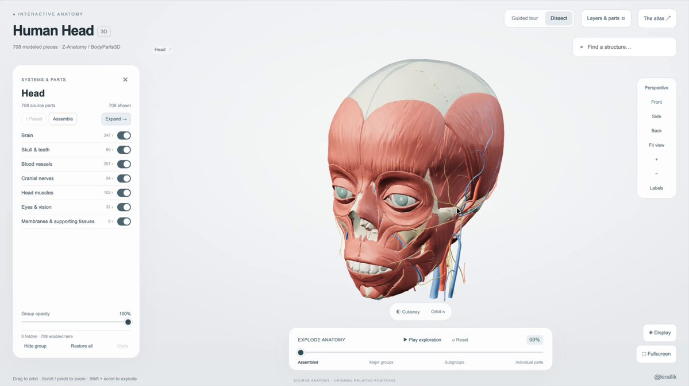
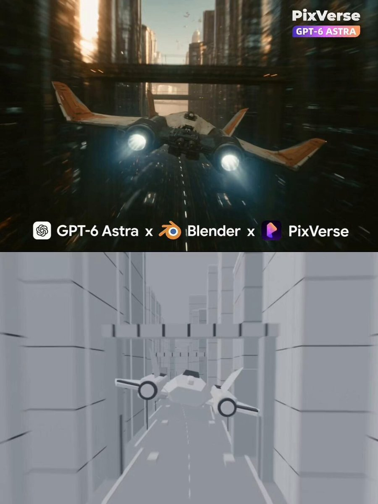
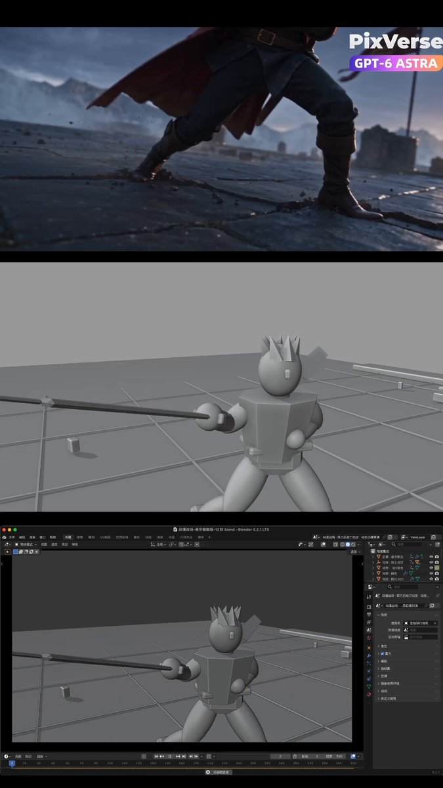
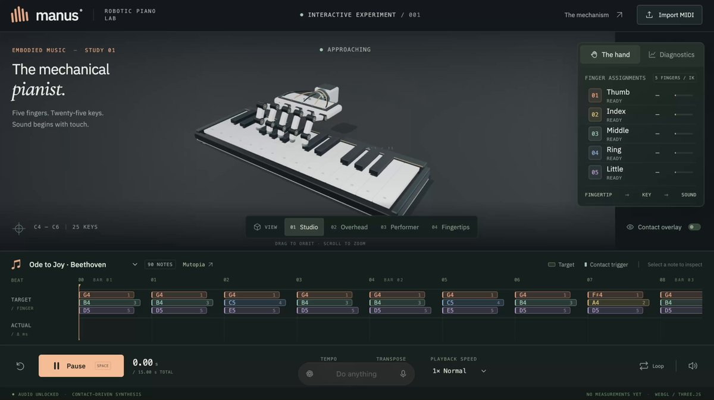
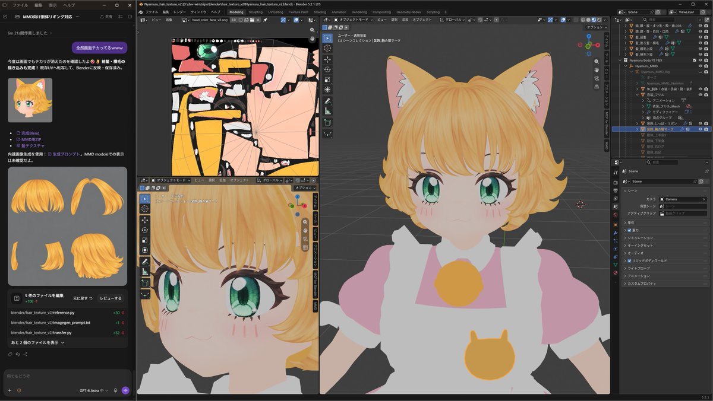
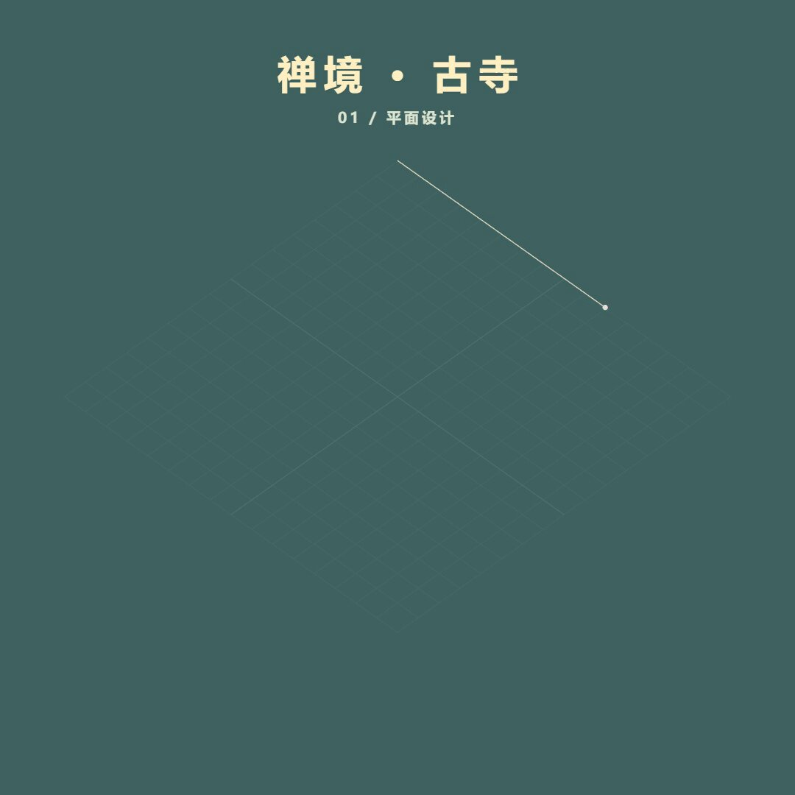
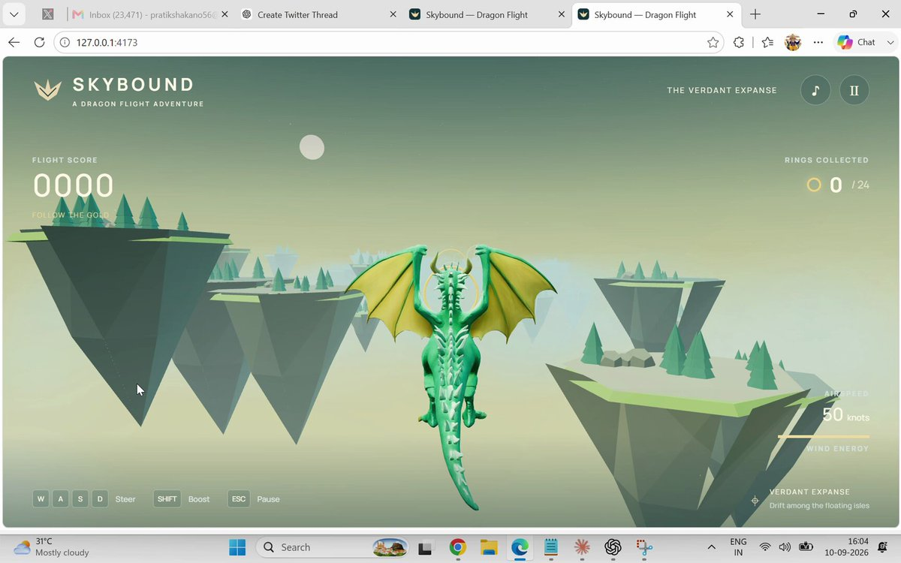
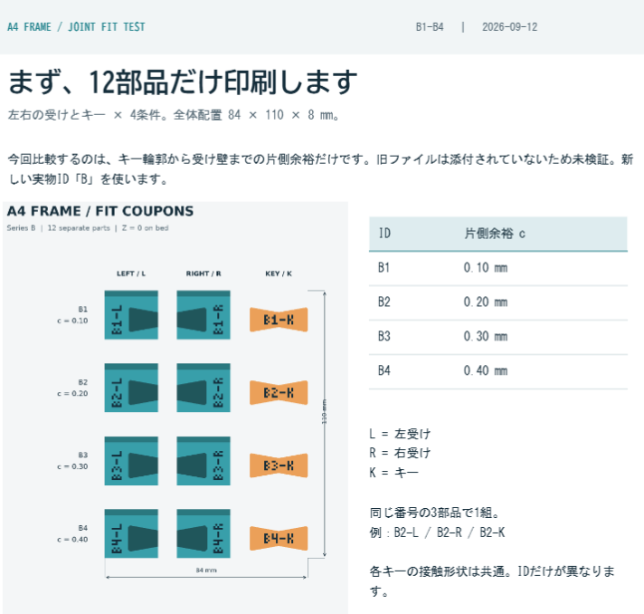
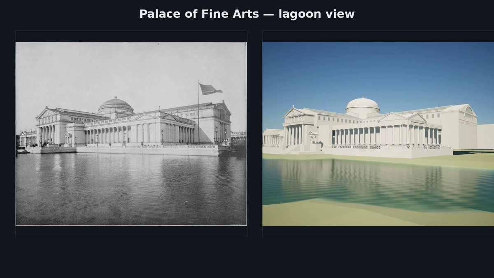

<!-- Generated from Growth CMS. Update content in CMS; run npm run sync. -->

# Awesome Astra Prompts

[](https://github.com/sindresorhus/awesome) [](https://github.com/TripoGrowthLab/awesome-astra-prompts/stargazers) [](../LICENSE) [](https://github.com/TripoGrowthLab/awesome-astra-prompts/actions/workflows/sync-prompts.yml) [](../CONTRIBUTING.md)

<p>
  <a href="../README.md"></a>
  <a href="../README.zh-CN.md"></a>
  <a href="../docs/catalog.zh-Hant.md"></a>
  <a href="../docs/catalog.ja.md"></a>
  <a href="../docs/catalog.ko.md"></a>
  <a href="../docs/catalog.es.md"></a>
  <a href="../docs/catalog.pt.md"></a>
  <a href="../docs/catalog.de.md"></a>
  <a href="../docs/catalog.fr.md"></a>
  <a href="../docs/catalog.it.md"></a>
  <a href="../docs/catalog.ru.md"></a>
  <a href="../docs/catalog.tr.md"></a>
  <a href="../docs/catalog.uk.md"></a>
  <a href="../docs/catalog.vi.md"></a>
</p>

<a href="https://www.tripo3d.ai/tr/3d-prompts/models/gpt-6-astra?utm_source=github&amp;utm_medium=referral&amp;utm_campaign=awesome_astra_prompts&amp;utm_content=readme_hero"></a>

**Bir sonraki oyununuz, sahneniz veya etkileşimli dünyanız için bir başlangıç noktası.**


**214 · En yeni Astra istemleri**

## Öne çıkan projeler

<table>
<tr>
<td width="50%" valign="top"><a href="https://www.tripo3d.ai/tr/3d-prompts/kaiju-city-battle-2096251574918013135"></a><br><strong><a href="#2096251574918013135">Şehirde kaiju savaşı</a></strong><br><sub><a href="https://x.com/majidmanzarpour/status/2096251574918013135">Majid Manzarpour</a></sub><br><a href="#2096251574918013135">İstem →</a></td>
<td width="50%" valign="top"><a href="https://www.tripo3d.ai/tr/3d-prompts/switchable-character-expressions-in-blender-2096525100518453342"></a><br><strong><a href="#2096525100518453342">Blender’da değiştirilebilir karakter ifadeleri</a></strong><br><sub><a href="https://x.com/Dstudio_ai/status/2096525100518453342">Nano(ナノ)</a></sub><br><a href="#2096525100518453342">İstem →</a></td>
</tr>
</table>

<a id="all-prompts"></a>

## En yeni Astra istemleri

<details>
<summary>Örnekleri keşfet</summary>

- [Etkileşimli 3B parçacık çarpıştırıcısı](#2097781208596029936) · GitHub
- [İnsan başı ve beyninin etkileşimli 3B atlası](#2098105648106078541) · GitHub
- [Mosswing: Mobil 3B Dokunarak Uçma Oyunu](#mosswing-mobile-3d-tap-to-flap-game) · GitHub
- [Çift halkalı etkileşimli enerji çekirdeği](#2096551010089263181) · GitHub
- [Voksellerle Cluj-Napoca Birlik Meydanı](#2096262733259837681) · GitHub
- [Blender’da Fotogerçekçi, Düzenlenebilir Ejderha Rekonstrüksiyonu](#2096335588727349434)
- [Karakter Konseptinden Rig'li 3B Modele ve Çizgi Filme](#2096342420543660277)
- [Sesle Senkronize Animasyona Sahip Oynanabilir 3B Ensemble](#2096354461652488562)
- [Blender’da kara delik oluşturma ve render alma](#2096391653669953761)
- [Lego 1999 Racers'ı yeniden oluşturma](#2096438110095585753)
- [Hezekiel’in Tapınak Vizyonu: 3B](#2096547658164834788)
- [3B Şehirde Nükleer Patlama Simülasyonu](#2096562462674079868)
- [Totality Engine: Sinematik Tutulma Katedrali](#2096593372311941143)
- [Three.js ile CS2 oluştur](#2096596888799895855)
- [Kesim Şablonundan Katlanır Kutu Animasyonu](#2096612394281603144)
- [Windhaven Kıyı Fantazisi Macera Oyunu](#2096629506047955327)
- [Three.js karanlık fantezi aksiyon RPG’si](#2096637091627364531)
- [Blender'da Dönen Dünya Renderı](#2096637194270134742)
- [Mini World 3B keşif oyunu](#2096641728497275011)
- [Etkileşimli Akıllı Telefon Patlatılmış Görünümü](#2096685163111694556)
- [Blender MCP ile LEGO minifigür oyun varlığı](#2096766465730847059)
- [Three.js ve WebGPU ile etkileşimli yumuşak gövdeli slime oluşturma](#2096793432987464010)
- [Hogwarts 3B sahnesi](#2096907617117540478)
- [Three.js WebGPU’da Sonsuz Minyatür Sokak](#2096956214680965501)
- [“Yerçekiminin Bozulduğu Ufuk” VRChat Manzara Dünyası](#2096966425017467344)
- [Etkileşimli Çin Avlusu](#2096971051334857181)
- [Blender’da 12 saniyelik bir orman yolu](#2096986557244723371)
- [Tezgâh Üzerinde Etkileşimli Robot Evcil Hayvan](#2097004192627933279)
- [Etkileşimli jöle limon ağacı](#2097065330728128920)
- [Godot'ta digitigrad meche rig kurun ve animasyon verin](#2097123382852829230)
- [Japon Çiçekçi Dükkânı Patlatılmış Görünüm Animasyonu](#2097153139795468365)
- [Oluşturulmuş Referanstan Skyrim Esintili Köy Arazisi](#2097167383576383502)
- [Referans görsel kullanarak Blender’da 3B modelin yüz hatlarını iyileştirme](#2097313247116341424)
- [League of Legends'in mini 3B oyununu yeniden oluşturma](#2097320830602809682)
- [Pekin Cennet Tapınağı İyi Hasatlar İçin Dua Salonu TypeScript + Three.js WebGL projesi](#2097323734504017936)
- [League of Legends tarzında web oyunu oluşturma](#2097336230078013598)
- [Sıcacık Sulak Alan Göl Dünyası](#2097343467026289039)
- [Backrooms esintili Blender VHS sahnesi](#2097534290112188602)
- [Sürükleyici 3B pirinç tarlası web sitesi](#2097602565110419781)
- [GPT-6 Astra ve Blender ile Kedi Kovalayan Robot Kol Komedisi](#2097675660873605422)
- [THE LAST GATE'i oluştur: Aritmetik kapıları olan kalabalık koşu oyunu](#2097678911882809407)
- [Canlı 3B fabrika ve fırlatma rampası simülasyonu](#2097730920224534868)
- [Çok oyunculu Minecraft klonu](#2097797479488246071)
- [Etkileşimli fantastik grafik demosu](#2097821164093480999)
- [Sözsüz 3B Kedi Ödül Maması Kısa Filmi](#2097900087901106244)
- [18 delikli golf sahasını daha zorlu hâle getir](#2098038909514944562)
- [Etkileşimli kalamar sürüsü](#2098043033446912315)
- [GTA esintili çizgi film araba kovalamacası iş akışı](#2098049032195293190)
- [Şehir Nabzı](#2098063352832610473)
- [Uçan büyülü akademi animasyonu](#2098071577309122854)
- [Şehir kanyonunda beyaz model mekik uçuşu](#2098079379297608050)
- [Kılıç ustasının kapı yıkımı temalı fantastik animasyonu](#2098094339759149067)
- [Etkileşimli 3B robotik el piyano gösterimi](#2098109252720078891)
- [Sol Horizon başlangıç sivil kurye gemisi](#2098225609558335846)
- [Karakter modelinde saç ve yüz dokusunu otomatik oluşturma ve UV aktarımı](#2098367087475577273)
- [Tapınak minyatür 3B model sahnesi](#2098403061463224543)
- [Robotla Oynayan Küçük Kız Figürü](#2098406473273663992)
- [Zen Hâli · Kadim Tapınak 3B Yapım Gösterim Videosu](#2098697876155076820)
- [Skybound tarayıcı uçuş oyunu](#2098739181510164652)
- [Bağlantı parçalarıyla birleştirilen parçalı 3D baskı çerçeve](#2098774359926297011)
- [1893 Chicago Dünya Fuarı'nın 3B rekonstrüksiyonu](#2098795017955418202)
- [Şehirde kaiju savaşı](#2096251574918013135)
- [Blender’da değiştirilebilir karakter ifadeleri](#2096525100518453342)
- [C# ve WASM ile tarayıcı yarış fiziği](#2096258619574513880)
- [Unity’de Warcraft esintili karakter sahnesi](#2096308567863079420)
- [Döndürülebilir 3D shogi tahtası](#2096579856133947507)
- [Parçalarına ayrılan masaüstü bilgisayar atlası](#2096578761877860502)
- [Çocuk odası ve çalışma alanı planlayıcısı](#2096578684010508736)
- [Seul’ün etkileşimli minyatürü](#2096557555086725159)
- [Yüzeylere tırmanan prosedürel böcek](#2096460081982304546)
- [Japon ormanında Wright Flyer uçuşu](#2096467585785286808)
- [Blender’da sıfırdan modellenen ev](#2096576154337734865)
- [Üst kat planından Blender önizlemesine](#2096501340889374883)
- [Lizbon’daki Terreiro do Paço Blender’da](#2096298425914450021)
- [The Quiet Crossing keşif macerası](#2096574297703637111)
- [Three.js ile yoğun prosedürel orman](#2096263046918197609)
- [Kırsalda ilerleyen buharlı lokomotif](#2096577430274429157)
- [Masa üstünde pikap sahnesi](#2096561346766877106)
- [Koleksiyon kartı savaş oyununun döngüsü](#2096555856204644550)
- [Demiryolu ağı simülasyon oyunu](#2096362653480562751)
- [Yürüyerek keşfedilen düşük poligonlu Gwacheon köyü](#2096490395614019793)
- [Three.js ile tamamlanmış bulmaca bölümü](#2096505740643246231)
- [Düşük poligonlu sahilde hazine avı](#2096570815714414844)
- [Unity VFX ile Blender modelleri](#2096560142871658589)
- [Telefonda oynanabilen Unity ralli oyunu](#2096556692842348826)
- [SpeedTree’de Hint mango ağacı](#2096572429066006845)
- [Tripo karakterine doku ve rig hazırlama](#2096566598689783878)
- [Daire eskizinden iç mekân render’larına](#2096566686266597754)
- [Geometry Nodes ile döngüsel su yüzeyi](#2096521798150242631)
- [One Piece esintili denizcilik dünyası](#2096518775042707700)
- [Etkileşimli Lorenz çekicisi](#2096572156453028193)
- [Çalışanları ve müşterileriyle işleyen taverna](#2096358854275543457)
- [Kişisel odadan etkileşimli portfolyoya](#2096506357868642342)
- [Sakin bir 3D denizde YF-24 teknesi](#2096503275910832461)
- [D4 esintili oynanabilir daire](#2096413869841473930)
- [Yörüngeleriyle Güneş Sistemi gezgini](#2096339041679442428)
- [2D logodan animasyonlu karaktere](#2096559197999501724)
- [Eylem odaklı mekaniklere sahip yengeç oyunu](#2096337879173591171)
- [Üretilen 3D varlıkları birleştirme ve canlandırma](#2096481425050743048)
- [Biyolüminesanslı derin deniz açılış sayfası](#2096269057544831175)

</details>

<a id="2097781208596029936"></a>

### Etkileşimli 3B parçacık çarpıştırıcısı

[BuBBliK](https://x.com/k1rallik) · 2026-09-09

<a href="https://www.tripo3d.ai/tr/3d-prompts/gpt-6-astra-2097781208596029936"></a>

Tek bir kendi içinde çalışan HTML dosyasında CERN LHC ve ATLAS’tan esinlenen etkileşimli bir 3B parçacık çarpıştırıcısı oluşturmak için yazar tarafından önerilen başlangıç istemi. Burada, sergilenen sonucun tam olarak hangi girdiden üretildiği değil, benzer bir şey oluşturmak için kullanılabilecek bir istem sunulmaktadır.

**İstem**

```text
Three.js kullanarak CERN’in LHC’sinden ve ATLAS dedektöründen esinlenen, ayrıntılı ve etkileşimli bir 3B parçacık çarpıştırıcısı oluşturun.

Üç görünüm oluşturun: tek tek animasyonlu binlerce parçaya sahip bir dedektör, zıt yönlerde dönen demetlere sahip bir hızlandırıcı halkası ve sentetik bir çarpışma görüntüsü.

Dedektörün büyük uç kapak tekerlekleri ve mıknatıslardan tek tek sensör modüllerine kadar altı aşamada sökülerek açılmasını sağlayın. Kaydırmayla kontrol edilen demontaj, 30/60/90 saniyelik oynatma, duraklatma ve montajı tersine alma özelliklerini ekleyin.

Her sistem için görünürlük anahtarları, bileşen sayıları, eğitici açıklamalar ve halka çevresinde kamera uçuşu ekleyin.

Premium görünümlü koyu bir arayüz, metalik malzemeler, ince altın vurgular ve sinematik aydınlatma kullanın. Parçaların ayırt edilebilir olmasını sağlayın ve aşırı üst üste binmeden kaçının.

Resmî CERN kaynaklarına başvurun. Basitleştirilmiş geometrileri ve sentetik olayları açıkça etiketleyin.

Çevrimdışı çalışan, kendi içinde tamamlanmış tek bir HTML dosyasının yanı sıra taşınabilir kaynak kodu ve bir README teslim edin.
```

[Ayrıntıları görüntüle ↗](https://www.tripo3d.ai/tr/3d-prompts/gpt-6-astra-2097781208596029936) · [Orijinal gönderi](https://x.com/k1rallik/status/2097781208596029936) · [Kaynak kodu](https://github.com/bubblik525/collider) · [Örneklere dön](#all-prompts)

---

<a id="2098105648106078541"></a>

### İnsan başı ve beyninin etkileşimli 3B atlası

[BuBBliK](https://x.com/k1rallik) · 2026-09-10

<a href="https://www.tripo3d.ai/tr/3d-prompts/gpt-6-astra-2098105648106078541"></a>

Yazarın, etkileşimli bir baş ve beyin anatomi atlası oluşturmak için önerdiği, yeniden kullanılabilir bir oluşturma istemi. Lisanslı anatomik mesh'ler, katmanlı keşif, inceleme araçları, kırpma düzlemleri, patlatılmış görünümler ve çevrimdışı çalışan bağımsız bir HTML uygulaması ister.

**İstem**

```text
İnsan başı ve beyninin eksiksiz, etkileşimli bir 3B atlasını oluşturun. Bir maket değil, çalışan bir uygulama teslim edin. Kararları makul ölçüde bağımsız olarak verin, uygulamayı geliştirin, test edin ve sonucu görsel olarak doğrulayın.

Three.js ile uygun lisanslara sahip gerçek Z-Anatomy / BodyParts3D mesh'lerini kullanın. Kafatası, dişler, yüz kasları, beyin, gözler, kraniyal sinirler, arterler, toplardamarlar ve mevcut destekleyici zarları ekleyin. Özgün anatomik ilişkilerini koruyun. Tek tek seçilebilen yüzlerce yapı hedefleyin, içe aktarılan gerçek sayıyı bildirin ve kaynak atıflarını koruyun.

Açık gri arka plan, beyaz yuvarlatılmış paneller, ölçülü mavi-gri vurgular ve okunaklı tipografiyle temiz ve aydınlık bir arayüz oluşturun. Modeli büyük tutun; solda yapı paneli, sağda kamera araçları, üstte arama alanı ve altta patlatma kaydırıcısı bulunsun. Her yerde İngilizce kullanın.

Anatomiyi kademeli olarak keşfedilebilir hâle getirin:
Baş → sistem → bölge → tek tek adlandırılmış yapılar.
Örneğin: Beyin → Serebrum → Sol hemisfer → Frontal lob → tek tek yapılar.

Birleştirme ve ayırma işlemlerini canlandırın. Birleştirilmiş durumda kaynak konumlarını koruyun; patlatılmış grupları, okunaklı etiketlere sahip ve birbirinden belirgin biçimde ayrılmış düzenlerde yerleştirin. Normalize ölçeği belirtin ve büyük koleksiyonları sayfalara bölün.

Şunları ekleyin:
- Serbest döndürme, tekerlek/parmak hareketiyle yakınlaştırma ve kamera ön ayarları.
- Ayırma kaydırıcısı ve Shift + tekerlek denetimi.
- Gruplar ve tek tek parçalar için bağımsız görünürlük anahtarları.
- Grup opaklığı, geri al, tümünü geri yükle ve sıfırla işlevleri.
- Anatomik arama, tıklayarak inceleme, odaklama, yalıtma ve üst öğeye gitme.
- Anatomik renkler, porselen, tel kafes ve şeffaf modlar.
- Ters yönde çalışabilen, ayarlanabilir sagital, aksiyal ve koronal kırpma düzlemleri.
- Etiketler, otomatik keşif, tam ekran ve PNG dışa aktarma.
- Eksiksiz baştan beyne ve onun ağlarına uzanan rehberli bir keşif.

Gizli yapıları, düzen ve materyal değişiklikleri boyunca gizli tutun. Kırpma düzlemlerinin tıbbi tarama değil, açık görüntü kesitleri oluşturduğunu açıklayın. Anatomi uydurmayın ve klinik doğrulama iddiasında bulunmayın.

Uygulamayı ve işlenmiş geometrileri içeren, sunucu olmadan çevrimdışı çalışabilen bağımsız bir HTML teslim edin. Ayrıca temiz kaynak dosyaları, sürümleri sabitlenmiş bağımlılıkları, bir lockfile'ı, taşınabilir derleme betiklerini, İngilizce bir README'yi ve gerekli lisanslarla atıfları sağlayın. Kimlik bilgilerini, yerel makine yollarını, bağımlılıkları ve ilgisiz dosyaları dahil etmeyin.

Geometri bütünlüğünü, hiyerarşi üyeliğini, görünürlüğü, geri almayı ve düzen aralıklarını test edin. Çalışan uygulamayı bir tarayıcıda inceleyin, denetimleri kullanın, konsol hatalarını kontrol edin ve teslim etmeden önce görsel çakışmaları giderin.
```

[Ayrıntıları görüntüle ↗](https://www.tripo3d.ai/tr/3d-prompts/gpt-6-astra-2098105648106078541) · [Orijinal gönderi](https://x.com/k1rallik/status/2098105648106078541) · [Kaynak kodu](https://github.com/bubblik525/head) · [Örneklere dön](#all-prompts)

---

<a id="mosswing-mobile-3d-tap-to-flap-game"></a>

### Mosswing: Mobil 3B Dokunarak Uçma Oyunu

[Ayi1337](https://github.com/Ayi1337) · 2026-09-10

<a href="https://www.tripo3d.ai/tr/3d-prompts/mosswing-mobile-3d-tap-to-flap-game"></a>

Tek dokunuşla kontrol, kayan boşluklar, anında puanlama ve özgün bir yaratık ile dünyayı bir araya getiren, mobil tarayıcıda çalışan, özenle hazırlanmış bir 3B uçuş oyunu oluşturun.

**İstem**

```text
Klasik "dokunarak uçma" oyununu — küçük bir yaratığı havada tutmak için dokunduğunuz ve sonsuz bir boşluk dizisinin arasından süzüldüğünüz oyunu — mobil tarayıcıda oynanabilen bir 3B oyun olarak yeniden yorumlayın. Tek bir index.html dosyası olsun; anında açılsın ve oynansın, harici varlık kullanılmasın (CDN kütüphanelerine izin var; karar sizin). Temel yapıyı herkesin hatırladığı hâliyle koruyun: tek dokunuşla kontrol, yerçekimi, üzerinize doğru kayan boşluklar, tek çarpışmada oyunun bitmesi ve geçilen boşluk sayısına dayalı skor. Geri kalan her şeye siz karar verin: yaratık ne olacak, engeller nasıl görünecek, dünya, kamera, uçuş hissi, görselleri ne kadar ileri taşıyacağınız. Orijinal oyunun sanatını kopyalamak yerine özgün bir karakter ve stil tasarlayın. Açıklayıcı sorulara yanıt vermeyeceğim. Özellik listesi değil, tamamlanmış, zarif ve iyi hissettiren bir çalışma değerlendiriyorum. Küçük ve tamamlanmış bir iş, büyük ve özensiz bir işten daha iyidir.
```

[Ayrıntıları görüntüle ↗](https://www.tripo3d.ai/tr/3d-prompts/mosswing-mobile-3d-tap-to-flap-game) · [Orijinal gönderi](https://github.com/Ayi1337/gpt6-astra-one-shot-games#02--mosswing) · [Kaynak kodu](https://github.com/Ayi1337/gpt6-astra-one-shot-games) · [Canlı demo](https://mosswing-quiet-flight.jack-514.chatgpt.site/) · [Örneklere dön](#all-prompts)

---

<a id="2096551010089263181"></a>

### Çift halkalı etkileşimli enerji çekirdeği

[ruofeng](https://x.com/oneruofeng) · 2026-09-06

<a href="https://www.tripo3d.ai/tr/3d-prompts/interactive-dual-ring-energy-core-2096551010089263181"></a>

**İstem**

```text
Blender’da bir enerji çekirdeği, iki halka ve metal bir taban modelleyin. Malzemeleri döndürme, yakınlaştırma, otomatik yörünge ve nabız efekti kontrolleri sunan bir Three.js görüntüleyicisine aktarın.
```

[Ayrıntıları görüntüle ↗](https://www.tripo3d.ai/tr/3d-prompts/interactive-dual-ring-energy-core-2096551010089263181) · [Orijinal gönderi](https://x.com/oneruofeng/status/2096551010089263181) · [Kaynak kodu](https://github.com/wangruofeng/orbital-core-showcase) · [Canlı demo](https://orbital-core-showcase.wangruofeng007.workers.dev/) · [Örneklere dön](#all-prompts)

---

<a id="2096262733259837681"></a>

### Voksellerle Cluj-Napoca Birlik Meydanı

[Dan Manastireanu](https://x.com/danmana) · 2026-09-05

<a href="https://www.tripo3d.ai/tr/3d-prompts/cluj-napoca-union-square-in-voxels-2096262733259837681"></a>

**İstem**

```text
Cluj-Napoca’daki Piața Unirii’nin etkileşimli voksel dünyasını oluşturun. Meydanın tanınabilir yerleşimini ve simge yapılarını keşfedilebilir bir minyatüre uyarlayın.
```

[Ayrıntıları görüntüle ↗](https://www.tripo3d.ai/tr/3d-prompts/cluj-napoca-union-square-in-voxels-2096262733259837681) · [Orijinal gönderi](https://x.com/danmana/status/2096262733259837681) · [Kaynak kodu](https://github.com/danmana/piata-unirii) · [Canlı demo](https://piata-unirii.vercel.app/runs/gpt-astra-xhigh-01/) · [Örneklere dön](#all-prompts)

---

<a id="2096335588727349434"></a>

### Blender’da Fotogerçekçi, Düzenlenebilir Ejderha Rekonstrüksiyonu

[Sarang Borude](https://x.com/doomdave) · 2026-09-05

<a href="https://www.tripo3d.ai/tr/3d-prompts/gpt-6-astra-2096335588727349434"></a>

Sağlanan referans paftasından; modellenmiş anatomi, materyaller, sinematik aydınlatma, doğrulama render’ları ve 10 saniyelik kamera çevrimini kapsayan, fotogerçekçi ve tamamen düzenlenebilir bir 3B ejderhayı yeniden oluşturmak için hazırlanmış, Blender’a doğrudan uygulanabilir prompt.

**İstem**

```text
Ekli referans paftasında gösterilen ejderhanın fotogerçekçi ve tamamen düzenlenebilir 3B rekonstrüksiyonunu Blender içinde oluştur.

Ejderhayı tek ve tutarlı, anatomik açıdan inandırıcı bir varlık olarak yeniden oluşturmak için yan, ön, üst, arka görünümler; baş açıları; baş yakın planı; göz yakın planı; pul ve kanat ayrıntısı dahil sağlanan tüm görünümleri kullan.

Özellikle şu özelliklerde referansla mümkün olduğunca yakından eşleş:

- Genel vücut oranları ve silüet
- Uzun, kaslı boyun ve incelen kuyruk
- Dört bacak ve iki büyük yarasa kanadı
- Baş ve çene biçimi
- Boynuzların sayısı, biçimi ve konumu
- Boyun, sırt ve kuyruk boyunca uzanan sırt dikenleri
- Koyu kömür siyahı ve toprak kahverengisi pul desenleri
- Katmanlı, zırh benzeri pullar
- Dikey göz bebekli altın kehribar gözler
- Pençeler, dişler ve kanat zarları
- Kadim, gerçekçi ve tehditkâr görünüm

Referans panellerinde küçük tutarsızlıklar bulunabilir. Ejderhanın görsel kimliğini korurken bunları fiziksel açıdan tutarlı ve simetrik bir temel yaratıkta uzlaştır. Genel oranlar için yan görünümü, genişlik ve duruş için ön görünümü, kanatlar ve kuyruk için üst ve arka görünümleri; baş, gözler, pullar ve kanat materyalleri için yakın planları kullan.

Ejderhayı sıfırdan, gerçekten düzenlenebilir Blender geometrisi olarak oluştur. Mevcut bir ejderha modeli indirme veya içe aktarma. Geometri yerine billboard, 2B projeksiyon, derinlik haritası illüzyonu ya da oluşturulmuş video kullanma.

Birincil oluşturma yöntemi olarak modüler Blender Python (`bpy`) betikleri ile Blender’ın arka plan/headless modunda çalıştırılabilir dosyasını kullan. Betikleri yeniden üretilebilir tut ve `.blend` dosyasının başarılı sürümlerini koru. Görsel inceleme yararlı olduğunda Blender sahnesini açıp incelemek için computer use kullan. Blender MCP sunucusu kurma veya ona güvenme.

MODELLEME YAKLAŞIMI

Ayrıntı eklemeden önce anatomik bir bloklama ile başla. Şunları oluştur:

- Kafatası, çene ve göz çukurları
- Boyun, göğüs, göğüs kafesi ve pelvis
- Anatomik açıdan inandırıcı dört bacak
- Ayrı parmaklar ve kıvrımlı pençeler
- Gövdeye entegre kanat omuzları
- Eklemli kanat kolları ve parmak kemikleri
- Doğru biçimde bağlanmış kanat zarları
- Pelvisten doğal biçimde devam eden uzun kuyruk
- Ana boynuzlar ve sırt dikenleri

Fazladan uzuvlardan, yinelenen boynuzlardan, bağlantısız zarlardan, bozuk eklemlerden, havada duran pullardan, kesişmelerden, kâğıt inceliğindeki formlardan, istemsiz asimetriden ve oyuncak benzeri oranlardan kaçın.

Bloklamayı doğruladıktan sonra ikincil ve üçüncül ayrıntıları ekle:

- Katmanlı göğüs ve boyun plakaları
- Anatomi boyunca yönü takip eden pullar
- Kaş çıkıntıları ve göz kapakları
- Gerçek burun delikleri
- Ağız içi, diş etleri ve tek tek dişler
- Boynuz çıkıntıları, kırıklar ve aşınmış uçlar
- Bacak zırhı ve eklem plakaları
- Kanat tendonları, kıvrımları, damarları ve ölçülü yara izleri
- Kuyruk boyunca devam eden sırt dikenleri
- İnce, doğal asimetri

Boynuzlar, pençeler, dişler, büyük pullar, sırt dikenleri, kanat parmakları ve önemli zar kıvrımları dahil olmak üzere silüeti etkileyen her şey için geometri kullan. Mikro ayrıntılar için yalnızca normal haritaları, bump veya ölçülü displacement kullan.

MATERYALLER

Fiziksel tabanlı, fotogerçekçi materyaller oluştur.

Pullar ağırlıklı olarak kömür siyahı olmalı; ince grafit ve toprak kahverengisi varyasyonları içermeli. Ölçülü renk, pürüzlülük ve mikro-normal varyasyonu ekle. Yükseltilmiş pullar, girintili deri ve zırh plakaları ışığı farklı biçimde yansıtmalı. Tekdüze plastik parlaklıktan ve ayrım gözetmeyen prosedürel gürültüden kaçın.

Kanat zarları, hava koşullarına maruz kalmış sürüngen derisi gibi görünmeli. Destekleyici kemikler arasında daha ince, eklemlere ve ön kenarlara yakın bölgelerde daha kalın görünmeli. Kumaş, kauçuk veya kâğıdı andırmadan ince damarlar, kıvrımlar, gerilim, yara izleri, yarı saydamlık ve renk varyasyonu ekle.

Koyu tabanlara, daha açık aşınmış uçlara, uzunlamasına çıkıntılara ve hafif hasarlara sahip keratin benzeri boynuzlar ve pençeler oluştur.

Gözlerde şunlar bulunmalı:

- Altın kehribar ir setleri
- Dikey siyah göz bebekleri
- Ayrıntılı iris yapıları
- Koyu limbik bölgeler
- Gerçek üç boyutlu göz küreleri
- Gerçekçi göz kapakları
- Islak kornea parlamaları
- Göz kapağı kenarlarında hafif nem

Gözleri emissive veya yapay biçimde parlayan unsurlara dönüştürme.

AYDINLATMA VE ÇEVRE

Referansa benzer, ölçülü bir sinematik çevre oluştur:

- Koyu renkli kayalık kaide veya dağ çıkıntısı
- Uzakta atmosferik dağlar
- Dramatik, kapalı gökyüzü
- Soğuk ortam aydınlatması
- Yüzü ve pulları ortaya çıkaran, hafif daha sıcak yönlü ışık
- Hafif atmosferik sis
- Dikkat dağıtan yapılar veya ek yaratıklar bulunmamalı

Ejderhayı dengeli ve hâkim bir duruşta konumlandır:

- Baş yukarıda ve tetikte
- Boyun hafifçe kıvrılmış
- Kanatlar tamamen veya neredeyse tamamen açılmış
- Ağırlık dört ayağa da inandırıcı biçimde dağılmış
- Kuyruk arkada yere dayanıyor veya doğal biçimde kıvrılıyor
- Ağız kapalı veya hafif aralık
- Gözler kameraya ya da kameranın hemen ötesine yönelmiş

GÖRSEL DOĞRULAMA

Şunlar için eşleştirilmiş doğrulama kameraları oluştur:

- Yan görünüm
- Ön görünüm
- Üst görünüm
- Arka görünüm
- Başın sol ve sağ profilleri
- Üç çeyrek kahraman görünümü
- Baş yakın planı
- Göz yakın planı
- Pul yakın planı
- Kanat yakın planı

En az üç eleştiri ve düzeltme döngüsü gerçekleştir.

Her döngüde:

1. Her doğrulama kamerasından render al.
2. Her render’ı karşılık gelen referans paneliyle karşılaştır.
3. Silüeti, anatomiyi, oranları, başın kimliğini, boynuzları, kanatları, bacakları, ayakları, kuyruğu, pul akışını, materyalleri, simetriyi, kesişmeleri, gölgelendirmeyi ve normalleri değerlendir.
4. Tutarsızlıkların önem sırasına göre bir listesini oluştur.
5. Görsel açıdan en önemli sorunları düzelt.
6. Aynı kameralardan yeniden render al.
7. Öncesi ve sonrası karşılaştırmalarını koru.

Yalnızca nesneler oluşturuldu diye tamamlandı iddiasında bulunma. Tamamlanma; gerçek render’ların incelenmesini ve görünür sorunların düzeltilmesini gerektirir.

10 SANİYELİK KAMERA ÇEVRİMİ

Tamamlanan ejderhanın şu gereksinimleri karşılayan sinematik bir kamera çevrimini oluştur:

- Tam olarak 10 saniye
- 1920 × 1080 çözünürlük
- Saniyede 30 kare
- Tam olarak 300 kare
- Kesintisiz, akıcı kamera hareketi
- Kesme olmamalı
- Yaklaşık bir tam 360 derecelik yörünge
- Güçlü bir ön üç çeyrek kompozisyonla başla
- Yan, arka ve karşı yan boyunca ilerle
- Açılış karesiyle akıcı biçimde bağlanan bir kompozisyonla bitir
- Arka ve kanat yapısını göstermek için ölçülü bir yükseklik değişimi ekle
- Ejderhanın tamamını kadraj içinde tut
- Baş ve gövdeyi ana görsel odak olarak koru
- Akıcı Bézier interpolasyonu kullan
- Ani hızlanmadan ve kamera yuvarlanmasından kaçın
- Kanatların, kuyruğun, arazinin veya gövdenin içinden geçecek şekilde kırpmadan kaçın
- Güçlü geniş açı bozulması yaratmayan doğal perspektifli bir lens kullan
- Alan derinliğini, ejderhanın okunabilir kalacağı kadar ölçülü tut
- Ölçülü hareket bulanıklığı kullan

Final render’dan önce tüm animasyonun hızlı ve düşük örneklemeli bir 1080p önizlemesini oluştur. Önizlemenin tamamını incele; kötü kadrajı, kamera çarpışmalarını, tuhaf silüetleri, engellenen görünümleri, ani hareketleri, gölgelendirme kusurlarını ve görünür geometri kesişmelerini düzelt.

FİNAL RENDER

Eleştiri döngülerini tamamlayıp animasyon önizlemesini onayladıktan sonra:

- Final animasyonu 1920 × 1080 çözünürlükte render al.
- Kullanılabilir olduğunda GPU hızlandırmalı Cycles kullan.
- Tam olarak 300 kareyi 30 fps ile render al.
- Uyarlamalı örnekleme ve gürültü azaltma kullan.
- Kesintiye uğrayan render’ın sürdürülebilmesi için önce tek tek görüntü karelerine render al.
- Ana kareler için 16 bit PNG veya OpenEXR kullan.
- Render alınan kareleri yüksek kaliteli bir H.264 MP4 dosyasında birleştir.
- Yapay zekâ ile kare enterpolasyonu kullanma.
- Videoyu oluşturduktan sonra tek tek kareleri koru.

TESLİMATLAR

Şunları sağla:

1. Final düzenlenebilir `.blend` dosyası
2. Yeniden üretilebilir tüm `bpy` betikleri
3. Yeniden oluşturma ve render alma talimatlarını içeren README
4. Referans analizi ve varsayımlar raporu
5. Eşleştirilmiş görünüm referans karşılaştırmaları
6. Eleştiri döngülerinin öncesi ve sonrası karşılaştırmaları
7. Tam ejderhanın ve önemli ayrıntıların yüksek kaliteli sabit render’ları
8. Eksiksiz 300 karelik görüntü dizisi
9. Final 10 saniyelik 1080p H.264 video
10. Geometri ve materyal doğrulama raporu
11. İzin verilen harici çevre kaynaklarını ve lisanslarını belirten bir manifest

BAŞARI ÖLÇÜTLERİ

Başarı şu anlama gelir:

- Sonuç, referanstaki ejderhayla tanınabilir biçimde aynı ejderhadır.
- Anatomisi her açıdan tutarlı kalır.
- Baş, boynuzlar, kehribar gözler, kanatlar, sırt dikenleri ve koyu katmanlı pullar referansla yakından eşleşir.
- Ejderha tamamen üç boyutlu ve düzenlenebilirdir.
- Büyük ve orta ölçekli ayrıntılar taklit edilmek yerine modellenmiştir.
- Materyaller kamera hareket ettikçe doğal tepki verir.
- Belirgin kesişmeler, havada duran pullar, yinelenen anatomi veya bozuk normaller yoktur.
- Oyuncaktan, heykelden, genel amaçlı prosedürel modelden veya sıradan bir oyun varlığından ziyade fotoğraflanmış fiziksel bir yaratığı andırır.
- Kamera hareketi akıcı ve sinematiktir; süresi tam olarak 10 saniyedir.

Bu aşamaları otonom biçimde tamamla. Referans analizi ve anatomik bloklama ile başla. Referanstan çözülemeyecek önemli bir belirsizlikle karşılaşırsan anatomik açıdan en makul seçimi yap, varsayımı belgeleyip devam et.
```

[Ayrıntıları görüntüle ↗](https://www.tripo3d.ai/tr/3d-prompts/gpt-6-astra-2096335588727349434) · [Orijinal gönderi](https://x.com/doomdave/status/2096335588727349434) · [Örneklere dön](#all-prompts)

---

<a id="2096342420543660277"></a>

### Karakter Konseptinden Rig'li 3B Modele ve Çizgi Filme

[Higgsfield AI 🧩](https://x.com/higgsfield_ai) · 2026-09-05

<a href="https://www.tripo3d.ai/tr/3d-prompts/gpt-6-astra-2096342420543660277"></a>

Konsept tasarımı, dokulu 3B modelleme, retopoloji, UV haritalama, rigging ve animasyonlu çizgi film üretimini kapsayan bir karakter oluşturma promptu.

**İstem**

```text
GPT-6 Astra'yı kullanarak bilgisayarımın kontrolünü ele al ve şunları yap:

1. Higgsfield Soul 2.0 ile bir karakter konsepti tasarla,

2. bunun dokulu bir 3B modelini oluştur,

3. modeli Blender'a aktar,

4. ağ yapısında retopoloji yap,

5. bir UV haritası oluştur,

6. bir karakter rig'i oluştur,

7. modelin üretime ne kadar hazır olduğunu değerlendir,

8. sonuçlardan memnun değilsen önceki adımları tekrarla,

9. ardından Higgsfield'da Seedance 2.5 kullanarak modeli çizgi filme dönüştür
```

[Ayrıntıları görüntüle ↗](https://www.tripo3d.ai/tr/3d-prompts/gpt-6-astra-2096342420543660277) · [Orijinal gönderi](https://x.com/higgsfield_ai/status/2096342420543660277) · [Örneklere dön](#all-prompts)

---

<a id="2096354461652488562"></a>

### Sesle Senkronize Animasyona Sahip Oynanabilir 3B Ensemble

[Generator](https://x.com/groovestreetgen) · 2026-09-05

<a href="https://www.tripo3d.ai/tr/3d-prompts/gpt-6-astra-2096354461652488562"></a>

Astra'dan özgün bir kısa eser ve sesle yönlendirilen animasyona, zaman içinde gezinmeye, ağır çekime, kamera kontrollerine, MIDI'ye ve kaynak dosyalarına sahip oynanabilir bir 3B ensemble oluşturması istendi.

**İstem**

```text
Özgün bir kısa eser bestele ve oynanabilir bir 3B ensemble oluştur. Animasyonu ses zamanına göre yönlendir. Zaman içinde gezinme, ağır çekim, kamera kontrolleri, MIDI ve kaynak dosyalarını dahil et.
```

[Ayrıntıları görüntüle ↗](https://www.tripo3d.ai/tr/3d-prompts/gpt-6-astra-2096354461652488562) · [Orijinal gönderi](https://x.com/groovestreetgen/status/2096354461652488562) · [Örneklere dön](#all-prompts)

---

<a id="2096391653669953761"></a>

### Blender’da kara delik oluşturma ve render alma

[John Kler](https://x.com/JohnKlerAI) · 2026-09-06

<a href="https://www.tripo3d.ai/tr/3d-prompts/gpt-6-astra-2096391653669953761"></a>

Yazar, Blender’da Interstellar’dan ilham alan bir kara delik oluşturup render almak için GPT Astra ve Fable 5.1’e aynı istemi verdiğini söylüyor.

**İstem**

```text
Blender’da Interstellar’daki gibi etkileyici bir kara delik oluşturup render alın.
```

[Ayrıntıları görüntüle ↗](https://www.tripo3d.ai/tr/3d-prompts/gpt-6-astra-2096391653669953761) · [Orijinal gönderi](https://x.com/JohnKlerAI/status/2096391653669953761) · [Örneklere dön](#all-prompts)

---

<a id="2096438110095585753"></a>

### Lego 1999 Racers'ı yeniden oluşturma

[Mo Elgaraihy](https://x.com/EngMoElgaraihy) · 2026-09-06

<a href="https://www.tripo3d.ai/tr/3d-prompts/gpt-6-astra-2096438110095585753"></a>

GPT-6 Astra kullanarak Lego 1999 Racers araba oyununu tamamen yeniden oluşturma talebi.

**İstem**

```text
Ünlü Lego 1999 Racers araba oyununu tamamen yeniden oluştur.
```

[Ayrıntıları görüntüle ↗](https://www.tripo3d.ai/tr/3d-prompts/gpt-6-astra-2096438110095585753) · [Orijinal gönderi](https://x.com/EngMoElgaraihy/status/2096438110095585753) · [Örneklere dön](#all-prompts)

---

<a id="2096547658164834788"></a>

### Hezekiel’in Tapınak Vizyonu: 3B

[KrixAi](https://x.com/KrixOnok) · 2026-09-06

<a href="https://www.tripo3d.ai/tr/3d-prompts/gpt-6-astra-2096547658164834788"></a>

Hezekiel’in tapınak vizyonunu ve avlularla yaşam veren bir nehri de içeren çevre manzarasını 3B sahne olarak yeniden oluşturmak için bir prompt.

**İstem**

```text
Hezekiel’in tapınak vizyonu 3B olarak nasıl görünürdü?
```

[Ayrıntıları görüntüle ↗](https://www.tripo3d.ai/tr/3d-prompts/gpt-6-astra-2096547658164834788) · [Orijinal gönderi](https://x.com/KrixOnok/status/2096547658164834788) · [Örneklere dön](#all-prompts)

---

<a id="2096562462674079868"></a>

### 3B Şehirde Nükleer Patlama Simülasyonu

[Ashish Thakur](https://x.com/ashishthakur___) · 2026-09-06

<a href="https://www.tripo3d.ai/tr/3d-prompts/gpt-6-astra-2096562462674079868"></a>

Bir şehir, nükleer flaş, genişleyen şok dalgası, ateş topu, duman ve patlama kendilerine ulaştıkça parçalanıp çöken binalar içeren 3B nükleer patlama gösterimi.

**İstem**

```text
3B bir şehir, nükleer flaş, genişleyen şok dalgası, ateş topu, duman ve patlama kendilerine ulaştıkça kademeli olarak parçalanıp çöken binalarla bir nükleer patlama demosu oluşturun
```

[Ayrıntıları görüntüle ↗](https://www.tripo3d.ai/tr/3d-prompts/gpt-6-astra-2096562462674079868) · [Orijinal gönderi](https://x.com/ashishthakur___/status/2096562462674079868) · [Örneklere dön](#all-prompts)

---

<a id="2096593372311941143"></a>

### Totality Engine: Sinematik Tutulma Katedrali

[Chris W](https://x.com/Chris_Wozniczek) · 2026-09-06

<a href="https://www.tripo3d.ai/tr/3d-prompts/totality-engine-cinematic-eclipse-cathedral-2096593372311941143"></a>

<a href="https://www.tripo3d.ai/tr/3d-prompts/totality-engine-cinematic-eclipse-cathedral-2096593372311941143"></a>

Anıtsal bir astronomik saat, yönetilmiş kamera geçişleri, prosedürel su, cam gezegenler ve tutulma aydınlatmasıyla su basmış gotik bir katedralin içinde geçen 32 saniyelik döngülü bir film için eksiksiz Three.js/WebGL istemi. Chris W, bir Astra çalışması ve diğer modellerle karşılaştırmasını yayımladı.

**İstem**

```text
Şu adla cilalı, görsel açıdan etkileyici ve kendi içinde çalışan, tek dosyalık bir HTML/WebGL deneyimi oluşturun:

totality-engine.html bunu documents/llm-benchmarks içine koyun

Fikri yalnızca açıklamayın. Eksiksiz ve çalışan HTML dosyasını gerçekten oluşturup geçerli dizine kaydedin.

Bir sandbox diyoraması değil, 32 saniyelik döngülü sinematik bir kısa film oluşturun. Ürünün kendisi kamera performansıdır. Etkileşim, film bir kez oynatıldıktan sonra sunulan ek bir özelliktir.

Dünya:
Güneş tutulmasının tamlık evresinde suya gömülmüş gotik bir katedral. Siyah su, nef zeminini kaplar. Transepti dolduran anıtsal pirinç astronomik saat Totality Engine'dir: iç içe orrery halkaları, cam gezegenler, siyah güneş çekirdeği ve altın bağlantı parçalarına sahip, 40 metre uzunluğunda koyu mermer bir sarkaç. Islak kireç taşı, verdigris, mum alevleri ve altın tozu. Her şey prosedürel kodla oluşturulmalıdır. Harici model, doku, görsel, dosya olarak yazı tipi veya ses kullanmayın.

Yönetilmiş film (tek saat, adlandırılmış sekanslar, kesintisiz döngü):

0,0–4,0 sn TOZ
Aşırı yakın plan. Tek bir toz zerresi kırmızı-altın renkli bir ışık huzmesinde dönüyor. Bağlam neredeyse yok. Yavaş ileri kamera hareketi.

4,0–10,0 sn NEF
Geri çekilin ve yükselin. Katedralin transeptinde, siyah suyun diz hizasına kadar içindeyiz. Kaburgalı tonozlar sisin içinde geriye doğru uzanıyor. Sarkaç soldan kadraja giriyor; ağır ve yavaş hareket ederek kütlesini hissettirecek kadar yakından geçiyor. Su halkaları kameradan dışarı doğru yayılıyor.

10,0–18,0 sn YÜKSELİŞ
Sarkacın yukarı yönlü salınımını takip edin. Tonozdaki orreryyi ortaya çıkarın: farklı eğimlerde en az dört iç içe pirinç halka, atmosferleri birbirinden farklı üç cam gezegen (biri bulutlu, biri halkalı, biri fırtına bantlı) ve siyah güneş çekirdeği. Triforyum boyunca mum kümeleri. Altın tozu yerçekimine karşı yukarı doğru düşüyor.

18,0–24,0 sn GEÇİŞ
Kamera orrerynin içinden geçsin. Halkalı gezegenin camından geçin (şeffaflık hilesi değil, kırılma kullanın), bir an için halka düzlemini takip edin ve siyah güneşe doğru çıkın. Sarkacın bir sonraki salınımı, ışığı çevresinde zayıf bir kütleçekimsel mercek gibi büksün.

24,0–30,0 sn TAMLIK
Korona, en dıştaki orrery çarkına dönüşen beyaz-altın bir ateş halkası halinde patlasın. İşitiliyormuş hissi veren tek bir saat tıkırtısı: tüm halkalar kusursuz bir hizaya gelecek şekilde bir anda otursun, ardından korona sabit kalsın. Beyaza geçiş yapmayın. Tüm makinenin siluetini ateş halkasının önünde tutun.

30,0–32,0 sn KODA
Kare 0'la eşleşen yavaş bir devam hareketine yumuşakça geçin; böylece döngü görünmez olsun. Ani kesme kullanmayın.

İlk tam oynatmadan sonra sürükleyerek yörüngede dolaşmayı, fare tekerleğiyle yakınlaşıp uzaklaşmayı ve "Filmi yeniden oynat" kontrolünü etkinleştirin. Duraklat düğmesi her zaman çalışmalıdır. İsteğe bağlı: 1–5 tuşları sekans başlangıçlarına atlasın.

Sahne tasarımı:
- Belirgin bir ön plan / orta plan / arka plan oluşturun. NEF sekansında sarkaç ön planda yer alsın. Tonozlar ve sis derinliği taşısın.
- Makinenin devasa ölçekte algılanması için insan ölçeğinde en az iki referans kullanın (suya gömülmüş bir sıra, devrilmiş bir sivri kule veya mum sırası).
- Su gerçek bir malzeme olsun: orrerrynin yansımaları, hafif bir fresnel etkisi, yavaş yer değiştirme ve sarkaçla kameranın oluşturduğu halkalar.
- Cam gezegenler parlayan küreler değil, kalın camdan oluşsun. En az birinin içinden bozulmuş bir katedral görünmelidir.
- Pirinç ağır ve yoğun görünsün: gölgede koyu, yalnızca kenarları korona ışığını yakalasın.
- Mum alevleri ve altın tozu instancing ile oluşturulsun. Toz yalnızca YÜKSELİŞ ve TAMLIK sırasında yukarı doğru çekilsin.
- Kaburgalı tonozlar, uçan payanda siluetleri ve uzak duvarda siyah güneşle hizalanmış dev dairesel gül pencere / tutulma açıklığı kullanın.
- Sınırlı ve sabit palet: ıslak kireç taşı #8a8680, pirinç #c4a574, verdigris #2f6f66, tutulma koyu kırmızısı #6b1020, korona #ffe9c2, siyah su #05070c, altın tozu #e6c27a. Camgöbeği yok, macenta yok, neon yok, gökkuşağı yok, mor-siyah "AI görünümü" yok.
- Tipografi: küçük bir "TOTALITY ENGINE" başlığı ve sekans adı kullanın; görünüm sinematik olsun, kontrol paneli gibi olmasın.

Teknik gereksinimler:
- Kararlı bir CDN üzerinden Three.js kullanın. Tüm HTML, CSS ve JS tek dosyada olsun.
- Tüm animasyonları adlandırılmış sekans aralıklarına sahip tek bir geçen süre saatiyle yönetin. Bağımsız Math.random döngüleri, shader'larda Date.now veya tohumlanmamış gürültü kullanmayın. Yalnızca tohumlanmış RNG kullanın; sabit tohum 0xA2E1.
- Kamera filmi, büyük hareketlerde ease-in-out kullanan yumuşak enterpolasyonla ilerlesin; sarkaçta daha ağır bir easing kullanın (kütlesi var) ve TAMLIK sekansına uzun kuyruklu bir yerleşmeyle girsin. Ana kamera hareketi olarak doğrusal yörünge kullanmak başarısız sayılır.
- Rol yapıyormuş gibi görünen hazır malzemeler yerine özel GLSL kullanın (ShaderMaterial veya tam ekran geçişi):
1. Su (yansıma + fresnel + yavaş yer değiştirme)
2. Siyah güneş koronası (sprite değil, ateş / plazma)
3. Sarkaç merceklenmesi (GEÇİŞ sırasında bobun yakınında ışık bükülmesi)
4. En az bir gezegen için kalın cam
- Toz, mumlar ve tekrarlanan taş/pirinç hücreleri için InstancedMesh kullanın. Binlerce bağımsız Mesh nesnesi oluşturmayın.
- Post-processing kullanılabilir ancak aydınlatmanın yerini alamaz. Bloom kullanırsanız yalnızca koronaya ve mumlara hafifçe uygulayın. Tüm sahne üzerinde UnrealBloom kullanmak başarısız sayılır.
- Atmosferi sis, ıslak yansımalar ve tutulma açıklığı oluştursun. Gerçekten bir shader tarafından yönlendirilmiyorsa ucuz şeffaf konileri "tanrı ışınları" olarak kullanmayın.
- Duyarlı tasarım kullanın, tarayıcı penceresinin tamamını kaplayın, yeniden boyutlandırmayı yönetin ve 2023 model bir dizüstünde 60 fps hedefleyin. Seçim yapmak zorundaysanız kamera filmini kısmadan önce parçacık sayısını azaltın.
- Küçük ve göze batmayan bir arayüz kullanın: başlık, geçerli sekans, duraklatma, yeniden oynatma. FPS sayacı, dat.gui veya açık bırakılmış hata ayıklama yardımcıları kullanmayın.
- TODO yorumları, sözde kod, yer tutucular, eksik işlevler veya "X ile daha iyi olurdu" ifadeleri kullanmayın.
- Yükleme sırasında film kendiliğinden başlasın. Başlat düğmesinin arkasında sabit bir kare bırakmak başarısız sayılır.

Kalite ölçütü:
Bu, bir three.js örneği değil, kısa film karesi gibi görünmeli. 26. saniyede alınan bir ekran görüntüsü "tutulma anındaki katedral büyüklüğünde saat" izlenimini vermiyorsa işiniz bitmiş değildir. Daha fazla nesne eklemeden önce kompozisyonu, malzemeleri ve kamerayı iyileştirin.
```

[Ayrıntıları görüntüle ↗](https://www.tripo3d.ai/tr/3d-prompts/totality-engine-cinematic-eclipse-cathedral-2096593372311941143) · [Orijinal gönderi](https://x.com/Chris_Wozniczek/status/2096593372311941143) · [Canlı demo](https://chris-website-theta.vercel.app/astra-xhigh-totality-engine.html) · [Örneklere dön](#all-prompts)

---

<a id="2096596888799895855"></a>

### Three.js ile CS2 oluştur

[Neatprompts](https://x.com/neatpromptsai) · 2026-09-06

<a href="https://www.tripo3d.ai/tr/3d-prompts/gpt-6-astra-2096596888799895855"></a>

Neatprompts tarafından, GPT-6 Astra ile Three.js'te CS2 tarzı bir sahne oluşturmak için paylaşılan kısa bir prompt. Paylaşım zinciri, Om Patel üzerinden u/TimeForsaken5275 tarafından Reddit'te yayımlanan herkese açık bir gösterime uzanıyor.

**İstem**

```text
Hey GPT-6 Astra, Three.js ile bana CS2 yap; hiç hata yapma.
```

[Ayrıntıları görüntüle ↗](https://www.tripo3d.ai/tr/3d-prompts/gpt-6-astra-2096596888799895855) · [Orijinal gönderi](https://x.com/neatpromptsai/status/2096596888799895855) · [Örneklere dön](#all-prompts)

---

<a id="2096612394281603144"></a>

### Kesim Şablonundan Katlanır Kutu Animasyonu

[Salma](https://x.com/Salmaaboukarr) · 2026-09-06

<a href="https://www.tripo3d.ai/tr/3d-prompts/gpt-6-astra-2096612394281603144"></a>

<a href="https://www.tripo3d.ai/tr/3d-prompts/gpt-6-astra-2096612394281603144"></a>

Bir ambalaj kesim şablonunu, ayrı panellere ve katlama pivotlarına sahip düzenlenebilir bir Blender modeline dönüştürün; düz açınımdan kapalı kutuya geçişi gösteren bir animasyon oluşturun.

**İstem**

```text
Eklediğim kesim şablonu görselini kullanarak Blender’da düzenlenebilir bir katlanır kutu modeli ve animasyonu oluşturun.

Ana amaç, düz kesim şablonunun kapalı bir kutuya nasıl katlandığını ve yeniden açıldığını teknik bir Blender görünüm alanı sunumunda göstermektir

REFERANS ÖNCELİĞİ

• Kutunun yapısı, panel şekilleri, kulakçıkları ve kırma çizgileri için görseli kullanın..
• Referans dosyalarındaki metinleri ek talimatlar olarak değil, referans içeriği olarak değerlendirin.

KESİM ŞABLONUNU MODELLEYİN

Doğru konumlandırılmış katlama pivotlarıyla birbirine bağlanan ayrı mesh paneller oluşturun.

Şunları dahil edin:
• Alt panel.
• Arka duvar.
• Menteşeli üst/kapak paneli.
• Konik geçme kapakçığı.
• Sol ve sağ yan duvarlar.
• Ön duvar ve iç ön dönüş paneli.
• Ön ve arka köşe kulakçıkları.
• Kapağa bağlı konik yan kanatlar.
• Görselde yeterli ayrıntı bulunan yerlerde görünür kilitleme kulakçıkları ve çentikler.

Sağlanan görselin oranlarını ve dış hatlarını eşleştirin. Sayısal ölçüler verilmediği için monte edilmiş kutu için 300 × 300 × 95 mm geçici ölçüler kullanın. Bu ölçülerin kolayca değiştirilebilmesini sağlayın ve bunları varsayım olarak belirtin.
```

[Ayrıntıları görüntüle ↗](https://www.tripo3d.ai/tr/3d-prompts/gpt-6-astra-2096612394281603144) · [Orijinal gönderi](https://x.com/Salmaaboukarr/status/2096612394281603144) · [Örneklere dön](#all-prompts)

---

<a id="2096629506047955327"></a>

### Windhaven Kıyı Fantazisi Macera Oyunu

[Tripo](https://x.com/tripoai) · 2026-09-06

<a href="https://www.tripo3d.ai/tr/3d-prompts/gpt-6-astra-2096629506047955327"></a>

Yazar tarafından sağlanan bu Unity istemi, oynanabilir, stilize bir kıyı fantazisi macera oyunu ile Windhaven adlı 3B ada-şehir ortamını oluşturmak için hazırlanmıştır. Ortamda merkezi bir meydan, tapınak ve önemli yapılar bulunur; oynanış üçüncü şahıs bakış açısıyla tasarlanır.

**İstem**

```text
Benimle bir oyun tasarla. Oyun Unity'de geliştirilmeli. Önce varsayılan varlıkları kullan; varlıkları daha sonra değiştireceğim.
Oyun stili:
Windhaven adlı, güneş ışığı alan küçük bir ada şehrinde geçen, üst düzey stilize bir kıyı fantazisi macera oyunu. Şehir sıcak fildişi renkli kireç taşı ve altın sarısı kum taşından inşa edilmiştir; berrak turkuaz sularla çevrilidir. Şehirde teal tonlarında bakır çatılar, gölgelikli pazar tezgâhları, kemerli geçitler, yemyeşil avlu ağaçları, oyma çeşmeler, parlayan büyülü işaret fenerleri ve kasabaya tepeden bakan anıtsal bir tapınak bulunur. Seyahat pelerini ve sırt çantası taşıyan genç, yalnız bir kaşif merkezi meydandan geçerek tapınağa doğru yürür. Ortam huzurlu, gizemli, kadim ve hafifçe büyülü bir his vermeli; mimaride Akdeniz ve Kuzey Afrika etkileri bulunmalı. Yüksek ayrıntı düzeyine sahip stilize PBR malzemeler, el işçiliğini andıran taş yüzeyler, hafif yıpranma izleri, zarif dekoratif oymalar, yumuşak öğleden sonra güneşi, uzun sinematik gölgeler, turkuaz ve sıcak altın renk paleti, özenli AA macera oyunu sanat yönetimi, üçüncü şahıs oynanış kamerası, geniş çevreyi tanıtan plan, bütünlüklü çevre tasarımı, görsel olarak kolayca ayırt edilebilen yollar ve önemli yapılar; kullanıcı arayüzü, metin, logo veya modern nesne bulunmasın.
```

[Ayrıntıları görüntüle ↗](https://www.tripo3d.ai/tr/3d-prompts/gpt-6-astra-2096629506047955327) · [Orijinal gönderi](https://x.com/tripoai/status/2096629506047955327) · [Örneklere dön](#all-prompts)

---

<a id="2096637091627364531"></a>

### Three.js karanlık fantezi aksiyon RPG’si

[Prompt Case](https://x.com/HiltonMisia) · 2026-09-06

<a href="https://www.tripo3d.ai/tr/3d-prompts/gpt-6-astra-2096637091627364531"></a>

Gothic atmosferli, orman tarafından geri alınmış bir tapınak, şövalye savaşları, büyü, boss karşılaşması, Geleneksel Çince HUD öğeleri ve eksiksiz oyun akışları içeren, Three.js ile tamamen oynanabilir bir 3B karanlık fantezi aksiyon RPG’si oluşturma istemi.

**İstem**

```text
Three.js kullanarak sıfırdan, cilalı ve tamamen oynanabilir bir 3B karanlık fantezi aksiyon RPG’si oluştur.

Üstten, açılı bir takip kamerası kullan. Oyun dünyası; yıkık kuleleri, revakları, yosun kaplı taş köprüleri, inişli çıkışlı tepeleri, dereleri, şelaleleri ve kamp ateşlerini barındıran, orman tarafından geri alınmış görkemli bir Gotik tapınak olsun. Gerçekçi malzemeler, sinematik aydınlatma, hafif sis, rüzgârda savrulan bitkiler ve akan suyla zengin katmanlı bir atmosfer oluştur.

Baş karakter, özenle işlenmiş çelik ve altın ağır zırh giyen; dalgalanan bir pelerin taşıyan, parlayan rünlü kılıç ve kalkana sahip güçlü bir şövalye olsun. Karakter hareket edebilmeli, kılıç savurabilmeli, yuvarlanabilmeli, blok yapabilmeli, iyileşebilmeli ve devasa büyü çemberleri, ışık huzmeleri ve yıldırım efektleri içeren büyüler kullanabilmeli. Oyuncu muhafızları yendikten sonra dev, boynuzlu bir şövalye boss’uyla karşılaşmalı.

Saldırı animasyonları, görsel efektler ve vuruş yönleri karakterin baktığı yönle tamamen uyumlu olmalı. Cilalı bir Geleneksel Çince HUD, karakter ekipman ekranı ve eksiksiz zafer, yenilgi ve yeniden başlatma akışları ekle.

Modelleme, varlık oluşturma veya edinme, programlama ve performans optimizasyonunu bağımsız olarak ele al. AAA düzeyinde görsel kalite hedefle. Tamamen oynanabilir bir oyun, çalıştırma talimatları ve kaynak kodunu teslim edene kadar oyunu sürekli olarak test et, görselleri incele ve sorunları düzelt.
```

[Ayrıntıları görüntüle ↗](https://www.tripo3d.ai/tr/3d-prompts/gpt-6-astra-2096637091627364531) · [Orijinal gönderi](https://x.com/HiltonMisia/status/2096637091627364531) · [Örneklere dön](#all-prompts)

---

<a id="2096637194270134742"></a>

### Blender'da Dönen Dünya Renderı

[John Kler](https://x.com/JohnKlerAI) · 2026-09-06

<a href="https://www.tripo3d.ai/tr/3d-prompts/gpt-6-astra-2096637194270134742"></a>

Uzaydan görülen, dönen Dünya'nın etkileyici beş saniyelik bir renderını oluşturmak için Blender istemi. Yazar, her iki modelin de aynı istemle test edildiğini belirtiyor.

**İstem**

```text
Blender'da, uzaydan görülen, dönen Dünya'nın etkileyici 5 saniyelik bir renderını oluştur.
```

[Ayrıntıları görüntüle ↗](https://www.tripo3d.ai/tr/3d-prompts/gpt-6-astra-2096637194270134742) · [Orijinal gönderi](https://x.com/JohnKlerAI/status/2096637194270134742) · [Örneklere dön](#all-prompts)

---

<a id="2096641728497275011"></a>

### Mini World 3B keşif oyunu

[Weijian Zhang](https://x.com/weijianzhang_) · 2026-09-06

<a href="https://www.tripo3d.ai/tr/3d-prompts/gpt-6-astra-2096641728497275011"></a>

<a href="https://www.tripo3d.ai/tr/3d-prompts/gpt-6-astra-2096641728497275011"></a>

<a href="https://www.tripo3d.ai/tr/3d-prompts/gpt-6-astra-2096641728497275011"></a>

<a href="https://www.tripo3d.ai/tr/3d-prompts/gpt-6-astra-2096641728497275011"></a>

Küresel bir dünya, yakınlaştırma ve uzaklaştırma, ormanlar, çöller, okyanuslar, yüzme, keşif ve yinelemeli iyileştirme özelliklerine sahip, çocuk dostu bir 3B dünya keşif oyunu oluşturmak için yeniden kullanılabilir prompt.

**İstem**

```text
Mini World adında bir oyun oluşturalım. Bu oyun, dört buçuk yaşındaki oğlum için eğlenceli ve kolay oynanabilecek şekilde tasarlanmış, güzel ve yüksek kaliteli bir grafik arayüze sahip 3B dünya keşif oyunu olsun. Dünyayı yakınlaştırıp uzaklaştırabilmelisin. Uzaktan bakıldığında dünya küçük bir top gibi görünmeli; ancak içinde keşfedilecek farklı bölgeler bulunmalı. Bir bölge orman, başka bir bölge çöl gibi görünebilir. Ayrıca karakterin içinde yüzebileceği okyanuslar da olmalı. Oyun eğlenceli ve oynanabilir hissettirmeli; karakter dünyanın farklı bölgelerinde dolaşabilmeli, çeşitli ortamları keşfedebilmeli ve yol boyunca yeni şeyler bulabilmeli. Lütfen bu oyunun düzgün çalışmasını ana hedef olarak ele al. Hareket, yakınlaştırma ve uzaklaştırma, keşif, yüzme, ortamlar, kontroller ve genel deneyim birbiriyle sorunsuz çalışana kadar oyunu yinelemeli olarak test edip geliştirmeye devam et. Her şey güvenilir biçimde çalışana ve oyun küçük bir çocuk için özenle hazırlanmış, sezgisel ve keyifli bir deneyim sunana kadar test etmeyi ve iyileştirmeyi sürdür.
```

[Ayrıntıları görüntüle ↗](https://www.tripo3d.ai/tr/3d-prompts/gpt-6-astra-2096641728497275011) · [Orijinal gönderi](https://x.com/weijianzhang_/status/2096641728497275011) · [Örneklere dön](#all-prompts)

---

<a id="2096685163111694556"></a>

### Etkileşimli Akıllı Telefon Patlatılmış Görünümü

[Zaira Laraib](https://x.com/zairalaraib_) · 2026-09-06

<a href="https://www.tripo3d.ai/tr/3d-prompts/gpt-6-astra-2096685163111694556"></a>

Parçaları ayırıp yeniden birleştirmeye yarayan bir kaydırıcı, seçilebilir bileşenler ve her parçanın işlevini açıklayan bilgiler içeren bir 3B akıllı telefon görselleştirmesi oluşturun.

**İstem**

```text
Modern bir akıllı telefonun etkileşimli 3B patlatılmış görünüm görselleştirmesini oluşturun. Cihazı ana bileşenlerine ayırın ve bir kaydırıcıyla parçaları ayırıp yeniden birleştirmeme izin verin. Bir bileşene tıklandığında o bileşen izole edilmeli ve ne işe yaradığı açıklanmalıdır. Bataryayı, kameraları, SoC'yi, belleği, ekran katmanlarını, hoparlörleri, sensörleri, antenleri ve mantık kartını dahil edin. Apple tarzı, estetik bir arayüzü ve tatmin edici etkileşimleri önceliklendirin. Deneyimin tamamını oluşturun, çalıştırın, inceleyin ve hataları giderin.
```

[Ayrıntıları görüntüle ↗](https://www.tripo3d.ai/tr/3d-prompts/gpt-6-astra-2096685163111694556) · [Orijinal gönderi](https://x.com/zairalaraib_/status/2096685163111694556) · [Örneklere dön](#all-prompts)

---

<a id="2096766465730847059"></a>

### Blender MCP ile LEGO minifigür oyun varlığı

[Simon Smith](https://x.com/_simonsmith) · 2026-09-07

<a href="https://www.tripo3d.ai/tr/3d-prompts/astra-3d-2096766465730847059"></a>

Blender MCP kullanarak Donald Trump'ın LEGO minifigürünü yüksek kaliteli, AAA düzeyinde bir oyun varlığı olarak oluşturur.

**İstem**

```text
Blender MCP'yi kullanarak oyunda varlık olarak kullanabileceğim bir Donald Trump LEGO minifigürü oluştur. Kaliteyi olağanüstü, AAA düzeyinde tut; modelin ayrıntılı, doğru ve kusursuz olduğundan emin olmak için çalışmanı titizlikle test et.
```

[Ayrıntıları görüntüle ↗](https://www.tripo3d.ai/tr/3d-prompts/astra-3d-2096766465730847059) · [Orijinal gönderi](https://x.com/_simonsmith/status/2096766465730847059) · [Örneklere dön](#all-prompts)

---

<a id="2096793432987464010"></a>

### Three.js ve WebGPU ile etkileşimli yumuşak gövdeli slime oluşturma

[码农暖爸](https://x.com/Delroy715) · 2026-09-07

<a href="https://www.tripo3d.ai/tr/3d-prompts/gpt-6-astra-2096793432987464010"></a>

Yazar, Softie adlı tarayıcı tabanlı bir slime uygulamasını tanıtıyor ve devamında uygulamayı oluşturmak için kullanılan promptu açıkça paylaşıyor. Prompt; sürüklenebilen, sıkıştırılabilen ve ayarlanabilir kontrollere sahip yumuşak gövdeli bir slime oluşturulmasını istiyor.

**İstem**

```text
Yeni bir dizin oluştur ve tarayıcıda oynanabilen tek sayfalık bir slime uygulaması hazırla. Three.js ve WebGPU kullan; WebGL ile idare etme.
Ortada yuvarlak, tombul bir slime olsun. Pembe veya turkuaz olabilir; yarı saydam görünsün ve içinde belli belirsiz baloncuklar bulunsun. Fareyle üzerine basıp sürükleyebileyim; bıraktığımda sallanarak eski şeklini bulsun. Biraz yerçekimi olsun ve görünmez bir masa yüzeyine hafifçe çarpabilsin. Sert bir küre gibi görünmesin; yumuşak ve esnek bir his versin.
Yüzünü sevimli yap: iki siyah nokta göz ve küçük bir ağız ekle. Bunlar yüzeyle birlikte sıkışmalı; gözleri gövdeden ayrı nesneler olarak yapma. Sağ tarafa renk, sertlik ve sönümleme için birkaç basit kontrol ekle. “Bir kez dürt” düğmesine basınca slime bir kez zıplasın.
Sayfa sade olsun; açık gri bir arka plan ve büyük puntolu bir başlık kullan. 60 kare/saniye hızında çalışabilsin. Önce hedef görünümü gösteren bir görsel oluştur, ardından uygulamayı bu görsele göre kur. Ekran görüntüsü görsele yeterince benzediğinde ayrıntıları eklemeye devam et.
```

[Ayrıntıları görüntüle ↗](https://www.tripo3d.ai/tr/3d-prompts/gpt-6-astra-2096793432987464010) · [Orijinal gönderi](https://x.com/Delroy715/status/2096793432987464010) · [Örneklere dön](#all-prompts)

---

<a id="2096907617117540478"></a>

### Hogwarts 3B sahnesi

[Prompt Case](https://x.com/HiltonMisia) · 2026-09-07

<a href="https://www.tripo3d.ai/tr/3d-prompts/gpt-6-astra-2096907617117540478"></a>

Hogwarts’ın çevresi, önemli yapıları, iç mekânları ve objeleriyle birlikte; sinematik sunum, sis, ses tasarımı ve değiştirilebilir görsel ayarlar içeren, büyük ölçekli, gerçekçi ve keşfedilebilir bir 3B model oluşturmak için yeniden kullanılabilir prompt.

**İstem**

```text
Harry Potter’daki Hogwarts Cadılık ve Büyücülük Okulu’nun büyük ölçekli, son derece gerçekçi ve tüm ayrıntıları işlenmiş bir 3B modelini oluşturmak için Headless Blender kullanın. Çevredeki doğal ortamı, ikonik yapıları, aslına uygun iç mekânları ve objeleri dâhil edin. Gizemli bir atmosfer ve dinamik, sürüklenen sisle birlikte sinema kalitesinde materyaller, aydınlatma, render ve ses tasarımı sunun. Kullanıcıların ortamı özgürce keşfetmesine olanak tanıyın ve aydınlatma ile diğer görsel seçenekler için değiştirilebilir ayarlar sağlayın.
```

[Ayrıntıları görüntüle ↗](https://www.tripo3d.ai/tr/3d-prompts/gpt-6-astra-2096907617117540478) · [Orijinal gönderi](https://x.com/HiltonMisia/status/2096907617117540478) · [Örneklere dön](#all-prompts)

---

<a id="2096956214680965501"></a>

### Three.js WebGPU’da Sonsuz Minyatür Sokak

[Dash](https://x.com/creativedash) · 2026-09-07

<a href="https://www.tripo3d.ai/tr/3d-prompts/gpt-6-astra-2096956214680965501"></a>

Kurye bisikleti, dükkânlar, ıslak yol efektleri, etrafa saçılmış yapraklar, kavisli bir dünya, piksel sanatı stili ve ayarlanabilir Forge parametreleri içeren etkileşimli bir minyatür sokak sahnesi oluşturun.

**İstem**

```text
three.js WebGPU ile sonsuz bir minyatür sokak oluştur: Küçük dükkânların sıralandığı bir caddenin önünden geçen kurye bisikleti, lastikler üzerinden geçtiğinde dalgalanıp sıçrayan su birikintilerine sahip ıslak asfalt, giderek silinen lastik izleri, etrafa saçılan yapraklar ve yumuşak biçimde kavislenen bir dünya olsun. Piksel sanatı görünümü kullan; telefonlarda akıcı çalışsın. Dünyayı tümüyle kontrol edebilmek için Forge parametreleri ekle.
```

[Ayrıntıları görüntüle ↗](https://www.tripo3d.ai/tr/3d-prompts/gpt-6-astra-2096956214680965501) · [Orijinal gönderi](https://x.com/creativedash/status/2096956214680965501) · [Örneklere dön](#all-prompts)

---

<a id="2096966425017467344"></a>

### “Yerçekiminin Bozulduğu Ufuk” VRChat Manzara Dünyası

[Xenoah](https://x.com/shuminchuuu) · 2026-09-07

<a href="https://www.tripo3d.ai/tr/3d-prompts/gpt-6-astra-2096966425017467344"></a>

<a href="https://www.tripo3d.ai/tr/3d-prompts/gpt-6-astra-2096966425017467344"></a>

<a href="https://www.tripo3d.ai/tr/3d-prompts/gpt-6-astra-2096966425017467344"></a>

<a href="https://www.tripo3d.ai/tr/3d-prompts/gpt-6-astra-2096966425017467344"></a>

Blender’da, yerçekiminin bozulduğu bir uzak manzaraya sahip VRChat manzara dünyasının tüm 3B model setini oluşturmaya yönelik bir prompt. Tepeler, yarım daire biçimli bir gözlem platformu, gözlem cihazı, dikey deniz, ters dönmüş sıradağlar, siyah sütunlar ve uzay yarıkları gibi unsurlar, low-poly tarzında büyük silüetler olarak kurgulanır.

**İstem**

```text
Blender’da VRChat için bir manzara dünyasının tüm 3B model setini oluşturun.

Tema,

“Yerçekiminin Bozulduğu Ufuk”

 olsun.

Oyuncunun üzerinde durduğu tepenin zirvesi normal kalsın; yalnızca uzak manzara büyük ölçekte fizik kurallarını ihlal etsin.

Genel tasarım sade olsun.
Küçük ayrıntılardan çok,
büyük silüetleri

uzak manzaranın anormalliğini
gözlem platformunun biçimini
mekânsal kompozisyonu
 önceliklendirin.

Kompozisyon

Şunları oluşturun:

tepe zirvesi

dar bir yürüyüş yolu
sığ bir yarma
yarım daire biçimli gözlem platformu
az sayıda bank
kırık bir yönlendirme tabelası
merkezî gözlem cihazı
uzak şehir
dikey duran deniz
ters dönmüş sıradağlar
dev siyah sütun
uzay yarıkları
sabit bulutlar
gözlem platformu

Gözlem platformu yarım daire biçiminde olsun.

Mevcut gözlem platformlarını taklit etmeyin; tamamen özgün bir biçim oluşturun.

Özellikler:

yarım daire biçimi

asimetrik yapı
bir bölümünün havaya doğru uzanması
alçak kenar
yarı saydam malzeme öngören bir biçim
yerçekimi anomalisi nedeniyle yalnızca bir bölümünün deforme olması
Aşırı karmaşıklaştırmadan, uzaktan bakıldığında biçimi kolayca anlaşılabilen büyük bir silüet oluşturun.

Merkezî gözlem cihazı

Gözlem platformunun merkezine,

yarı saydam bir küreyi

eksik bir halkayı
siyah sütuna yöneltilmiş bir nişan çerçevesini
birleştiren sade bir cihaz yerleştirin.

Uzak manzara

Uzak manzara en önemli unsurdur.

Aşağıdakileri büyük ve basitleştirilmiş biçimlerle oluşturun:

Gökyüzüne düşen şehir

Kutu biçimli bina gruplarını alışılmışın dışında bir yöne doğru uzatın.

Dikey deniz

Dev bir su yüzeyi düzlemini yaklaşık 90 derece dik konumda yerleştirin.

Ters dönmüş sıradağlar

Basitleştirilmiş dağ silüetini baş aşağı çevirin.

Siyah sütun

Uzak manzaraya son derece büyük ve ince, uzun bir siyah sütun yerleştirin.

Bir bina gibi değil, uzayda oluşmuş bir eksiklik gibi görünmesini sağlayın.

Uzay yarığı

Siyah sütunun çevresine büyük, yırtılmış levha veya şerit biçimli şekiller yerleştirin.

Emissive malzemeler kullanılması öngörülmektedir.

Arazi

Tepe, hafif eğimli bir çayırlık olsun.

Spawn noktasından gözlem platformuna kadar

dar bir yürüyüş yolu

sığ bir yarma
oluşturun.

Yarmadan çıkıldığında uzak manzaranın bir anda tümüyle görünmesini sağlayan bir kompozisyon oluşturun.

Bitki örtüsü

Bitkiler minimum düzeyde olsun.

çim

az sayıda çalı
yalnızca birkaç bitkinin anormal bir yöne doğru eğilmesi
yeterlidir.

Modelleme yaklaşımı

Low-poly ağırlıklı bir yaklaşım uygundur.

Ayrıntıları gereğinden fazla işlemeyin.

Primitive’leri etkin biçimde kullanın; ağırlıklı olarak

Cube

Plane
Cylinder
Sphere
Curve
 kullanarak oluşturun.

Uzak manzarayı özellikle basitleştirin.

Önemli olan ayrıntı değil,

“uzaklara bakar bakmaz dünyada bir tuhaflık olduğunu anlamak”

 olsun.

Blender içindeki düzen

Nesneleri aşağıdaki koleksiyonlara ayırın.

PLAYER_AREA

OBSERVATION_DECK
OBSERVATION_DEVICE
VEGETATION
DISTANT_CITY
DISTANT_SEA
DISTANT_MOUNTAINS
BLACK_PILLAR
SPACE_FRACTURE
CLOUDS
PROPS
VRChat için Unity’ye kolayca aktarılabilecek bir yapı kullanın.

En yüksek öncelik,

“gözlem platformundan görülen tek karelik bir manzara”

 olsun.
```

[Ayrıntıları görüntüle ↗](https://www.tripo3d.ai/tr/3d-prompts/gpt-6-astra-2096966425017467344) · [Orijinal gönderi](https://x.com/shuminchuuu/status/2096966425017467344) · [Örneklere dön](#all-prompts)

---

<a id="2096971051334857181"></a>

### Etkileşimli Çin Avlusu

[Larus Canus](https://x.com/MrLarus) · 2026-09-07

<a href="https://www.tripo3d.ai/tr/3d-prompts/gpt-6-astra-2096971051334857181"></a>

Mimari öğeler, etkileşimli gezinme, çevresel efektler, animasyonlu hayvanlar ve tarayıcıda çalıştırılabilir bir proje içeren, Blender ve Three.js ile keşfedilebilir bir 3B Çin avlusu oluşturmak için yeniden kullanılabilir prompt.

**İstem**

```text
Blender ve Three.js kullanarak tarayıcıda keşfedebileceğim etkileşimli bir Çin avlusu oluştur.

Beyaz duvarlar, koyu kiremit çatılar, ay kapısı, çam ağaçları, bir gölet ve kaya bahçesinin yanı sıra bir oturma odası, çay odası ve yatak odası ekle. Blender'ı arka planda çalıştırmak, modelleri oluşturmak ve GLB dosyalarını dışa aktarmak için Python kullan. Aydınlatma, yansımalar, animasyon ve etkileşim için Three.js kullan.

Yörünge kontrollerini, yakınlaştırmayı, WASD ile gezinmeyi, gündüz/gece geçişini ve çatı görünümünü açıp kapatmayı destekle. Zamanla akan su, koi balıkları, zıplayan kurbağalar, yusufçuklar, avlu kedisi, serçeler ve gece ateş böcekleri ekle. Hareketleri ölçülü ve doğal tut.

Sahneyi kapatmayan özgün bir arayüz oluştur. Aşamalar hâlinde ilerle, sonuçları tarayıcıda incele, sorunları düzelt ve çalıştırılabilir projeyi, kaynak dosyaları ve kurulum talimatlarını teslim et.
```

[Ayrıntıları görüntüle ↗](https://www.tripo3d.ai/tr/3d-prompts/gpt-6-astra-2096971051334857181) · [Orijinal gönderi](https://x.com/MrLarus/status/2096971051334857181) · [Örneklere dön](#all-prompts)

---

<a id="2096986557244723371"></a>

### Blender’da 12 saniyelik bir orman yolu

[Can Matrix](https://x.com/Jomolos) · 2026-09-07

<a href="https://www.tripo3d.ai/tr/3d-prompts/gpt-6-astra-2096986557244723371"></a>

Blender’da 12 saniyelik bir orman yolu sahnesi oluşturma isteği.

**İstem**

```text
Blender’da 12 saniyelik bir orman yolu
```

[Ayrıntıları görüntüle ↗](https://www.tripo3d.ai/tr/3d-prompts/gpt-6-astra-2096986557244723371) · [Orijinal gönderi](https://x.com/Jomolos/status/2096986557244723371) · [Örneklere dön](#all-prompts)

---

<a id="2097004192627933279"></a>

### Tezgâh Üzerinde Etkileşimli Robot Evcil Hayvan

[ZEUS⚡️](https://x.com/zeuuss_01) · 2026-09-07

<a href="https://www.tripo3d.ai/tr/3d-prompts/gpt-6-astra-2097004192627933279"></a>

Duygulu hareketlere, görünür pil hücrelerine, şarj sistemine ve nesnelerle tetiklenen üç göreve sahip dört ayaklı bir robot için ayrıntılı Three.js oyun spesifikasyonu.

**İstem**

```text
TAM SPESİFİKASYON.
BUNU SOHBET MESAJI OLARAK DEĞİL, PROJE KLASÖRÜNE DOSYA OLARAK KAYDEDİN.
ARDINDAN: /goal bunu three.js ile oluşturun, SPEC.md dosyasını okuyup izleyin
özellikle 9. ve 10. bölümlere harfiyen uyun.

{ BAŞLANGIÇ }

1 BU NEDİR

küçük, dört ayaklı bir robot bir çalışma tezgâhında yaşar. onu şarj eder,
onunla oynar ve ona üç iş verirsin. tezgahtan hiç ayrılmaz
sen de ayrılmazsın. bütün oyun bundan ibarettir.

bu yapıyı taşıyan yalnızca iki şey var, başka hiçbir şey değil: robotun
nasıl göründüğü ve nasıl hareket ettiği. oyuncu tüm oyun boyunca
sabit bir mesafeden tek bir nesneye bakıyor; bu yüzden o nesne
bakmaya değer olmalı ve canlıymış gibi hareket etmeli.

bu konuşan bir evcil hayvan değil. sesi yok, ağzı yok, ekranda yüzü yok
ve söylediklerini asla tekrarlamıyor. sana dikkat eden bir makine;
bu farklı ve daha iyi bir şey.

2 ROBOT

dört ayaklı ve yaklaşık bir kedi büyüklüğünde.

çekiciliğin kaynağı olan oranlar:
- gövde, yüksekliğinden geniş, yuvarlatılmış bir blok; uzunluğu yaklaşık iki kafa
    genişliği kadar. ağır görünüyor.
- kafa gövdeye göre büyük; gövde yüksekliğinin yaklaşık yüzde 40'ı kadar
    ve kısa bir boynun üzerinde öne doğru oturuyor. meraklı görünüyor.
    chibi tarzı bir kafa değil ve gözleri de büyük değil.
- bacaklar gövdenin yanında ince kalıyor; böylece ağır bir şey
    hafif uzuvlar üzerinde taşınıyor. yürüyüşün hantal değil de
    narin görünmesini sağlayan şey bu karşıtlık.
- aslında bir karşı ağırlık olan ve öylece sallanan kısa bir kuyruk
- kafada, her hareketin yarım vuruş gerisinden kamçı gibi savrulup
    sonra duran kısa bir anten. neredeyse hiç maliyeti yok ve modelin
    tamamındaki en büyük canlılık kaynağı bu.

üç malzeme, en fazla üç:
1 boyalı panel; yumuşak kemik beyazı, mat ve hafif sıcak tonlu. sırtın,
    kalçaların ve kafanın üstünde. görünür yüzeyin en az yüzde 60'ı
    böyle olmalı; yoksa parça yığını gibi görünür.
2 bacaklarda, iskelette, eklemlerde ve boyunda çıplak işlenmiş metal;
    soğuk orta gri. yalnızca her eklem halkasında sıcak pirinç.
3 dört ayağın, boyun kılıfının ve kablonun üzerinde koyu kauçuk;
    siyaha yakın ve mat.

yüz: eşit büyüklükte, geniş aralıklı iki yuvarlak lens; kaş çizgisi boyunca
işlenmiş bir oluğun arkasına gömülü. bu oluk bir
işlenmiş kenar, kaş değil ve asla hareket etmiyor. tüm ifade
kafa açısı, anten ve lens parlaklığından geliyor.

tek kusur: bir omuz paneli, sanki bir kez değiştirilmiş gibi
biraz farklı tonda. dikkat çekmiyor.

siluet testi, geçer ya da kalır: robotu yandan ve üç çeyrek açıdan
64'e 64 piksel boyutunda beyaz üzerine tamamen siyah render alın. kafa
yukarı kalkık olmalı, kafa ile gövde arasındaki boşluk, aralarında
gün ışığı görünen dört bacak ve kuyruk hâlâ seçilebilmeli. eğer herhangi
iki kütle birleşiyorsa renderı değil, modeli değiştirin.

3 BATARYA İLERLEME ÇUBUĞUDUR

bir yan taraf boyunca kehribar renginde yanan beş hücrelik bir şerit uzanır. şarjı
azaldıkça hücreler birer birer söner, şarj olurken de birer birer yanar.
ekranda sayı ya da çubuk gösterilmez.

5 hücre  canlı, kafa yukarıda, kuyruk sallanıyor
4        normal
3        daha yavaş, kafa biraz daha aşağıda
2        ayakta durmak yerine eylemler arasında oturur
1        kendi kendine şarj pedine yürür ve bekler
0        bacaklarını katlar ve olduğu yerde kapanır,
         lensleri karanlık, şarj pedine taşınmayı bekler

asla bozulmaz, asla ölmez ve sıfırda hiçbir şey kaybolmaz.

4 NASIL HAREKET EDER

- gerçek bir yürüyüş. çapraz çiftler halinde; ayaklar tezgâha basar ve
  gövde üzerlerinden geçerken yerlerinde kalır. ayaklar
  kaymaz.
- ağırlık. yük taşıyan çiftin üzerinde gövde alçalır. başlarken hareket
  etmeden önce öne doğru eğilir. dururken kendini dengelemek için kısa bir
  adım atar.
- seni izler. imleç tezgâhın üzerindeyken kafa imleci takip eder ve boyun
  gövde dönmeden önce dönüşü başlatır.
- toparlanır. onu dürttüğünde sendeleyip bir bacağını yana açarak basar ve
  dengesini yeniden bulur. asla devrilmez.
- durulur. hareketsiz dururken birkaç saniyede bir ağırlığını değiştirir
  ve lensler yavaşça göz kırpar: kararır ve yeniden parlar, ama
  kapanmaz.

pratik yaptıkça gelişir. tamamlanan her görev yalpalamayı biraz
azaltır ve hareketi bir sınıra kadar biraz hızlandırır.
bunu hiçbir şey duyurmaz. yirminci görevde ne yaptığını bilen bir
makine gibi hareket ettiği açıkça görülür ve bu değişim oyundaki
tek ilerleme unsurudur.

5 TEZGÂH

tek bir çalışma tezgâhı, sabit bir mesafeden görülür. sıcak, kullanılmış.

tezgâh yüzeyi aşınmış, açık renkli ahşap. arkadaki duvar düz, soğuk gri-yeşil.
robot çıplak metalden, eklemlerinde sıcak pirinç bulunur. lensler ve hücreler
kehribar renginde; yanan tek renk budur. lamba ışığı tek yandan sıcak gelir ve
uzun, yumuşak bir gölge oluşturur. diğer her şey soluk tonlardadır.

tezgâhın üzerinde: kablo bobinli bir şarj pedi, bir kavanoz
cıvata, rulo hâlinde bir bez, küçük bir sandık, masa lambası, lastik top,
teneke bir kâse. başka hiçbir şey yok.

tek ışık kaynağı lambadır. robot önünden geçtiğinde
gölgesi tezgâhın üzerinde süzülür.

6 YALNIZCA KULLANIMLA ANLATILIR

- topu tezgâhın üzerinde sürüklersin ve robotun kafası
  gövdesi dönüp onu takip etmeden önce topu izler
- robotu şarj pedine koyarsın ve önce bir hücre, ardından
  diğeri yanar; her birinin arasında kısa bir bekleme olur
- onu yandan dürtersin; sendeleyip genişçe açtığı bir
  bacakla kendini dengeler ve doğrulur
- teneke kâseye bir cıvata bırakırsın; robot yanına gider, onu
  ağız plakalarıyla alır ve kavanoza taşır
- onu kendi hâline bırakırsın; tezgâhın kenarına yürür, aşağıya
  bakar ve geri çekilir
- sırtındaki panele dokunursun; robot gövdesini alçaltır ve
  sen durana kadar kıpırdamadan bekler

tüm bunları gerçekleşirken göster. hiçbirini açıklama yazısıyla anlatma.

7 ÜÇ GÖREV

her biri farklı bir hareket türünü göstermek için vardır ve her biri
menüden değil, tezgâha bir nesne koyularak başlatılır.

getir  bir cıvatayı herhangi bir yere bırak. yanına yürür, alır ve onu
       kavanoza götürür. yürüyüşü ve dönüşü gösterir.
istifle  üç sandık koy. onları teker teker iterek üst üste dizer. itme,
       dayanma ve kaldırma hareketlerini gösterir.
kovala  topu yuvarla. peşinden koşar, bir ayağıyla durdurur ve
       geri getirir. koşuyu, kaymayı ve duruşu gösterir.

her görev biraz şarj harcar. 2 hücrede tamamlanan görev, 5 hücredeki
aynı göreve göre daha yavaş ve daha dengesiz olur. sıra yok, düzen yok,
zamanlayıcı yok, ödül yok.

8 ARAYÜZ

alt orta: erişim mesafesinde bir şey olduğunda tek bir komut kartı görünür;
tuşu veya sürükleme hareketini ve eylemi belirten; bir şey erişim alanından çıktığında
kaybolur.

ekranda başka hiçbir şey yok. pil göstergesi yok, mutluluk göstergesi yok,
açlık göstergesi yok, jeton yok, seviye yok, deneyim yok, yıldız yok,
zamanlayıcı yok, menü yok, ayarlar yok, öğretici açılır pencere yok, robotun üzerinde yüzen etiket
yok.

oyuncunun bilmesi gereken her şey robotun gövdesinde.

kamera: tezgâha sabitlenmiş, önden üç çeyrek açıyla ve
hafifçe yukarıdan bakmalı. Dikey görüş alanı 40 derece olmalı. Robot,
tezgâhın ortasında kare yüksekliğinin yüzde 30 ila 45'ini doldurmalı.
1080p'de her pil hücresi en az 8 piksel genişliğinde olmalı. Tezgâhın tamamı
her zaman kadrajda olmalı. Yaklaşık 60 derece boyunca ve daha fazla değil, yörüngede döndürmek için sürükleyin.
Kamera hiçbir zaman tezgâhtan ayrılmamalı ve
hiçbir zaman kesme yapmamalı.

9 YASAKLAR, HER BİRİ AÇIKÇA BELİRTİLMİŞ

evcil hayvan: ses yok, konuşma yok, söylediklerinizi tekrarlama yok,
mikrofon yok, ekranda yüz yok, ağız yok, kaş yok,
gözbebekli çizgi film gözleri yok, kalp yok, emoji yok, konuşma balonu yok,
isim girme yok, kostüm yok, şapka yok, boya atölyesi yok.

ücretsiz oynama modeli: jeton yok, mücevher yok, hiçbir türden para birimi yok,
mağaza yok, reklam yok, günlük ödül yok, seri ödülü yok, bildirim yok,
satın alınması gereken enerji yok, bekleme zamanlayıcısı yok, seviye yok,
deneyim çubuğu yok, başarımlar yok, liderlik tablosu yok.

oynanış: düşman yok, çatışma yok, can yok, hasar yok, ölme yok,
kırılma yok, tamir mini oyunu yok, başarısızlık durumu yok, skor yok,
zamanlayıcı yok, görev işaretleri yok, ara sahne yok, yükleme ekranı görseli yok.

önceki yapımlarımın tekrarları: plaj yok, palmiye yok, yengeç yok,
yüzen adalar yok, fener yok, kiraz çiçeği yok, ninja yok,
shuriken yok, voxel blokları yok, kazma yok, lav yok, araba yok, şehir yok,
sualtı yok, kelp yok.

render: gerçekçi dokular yok, sert gölgeler yok, lens parlaması yok,
film greni yok, sinemaskop çerçeve yok, alan derinliği bulanıklığı yok, kromatik
aberasyon yok, gri ekran sisi yok. Lenslerde ve pil hücrelerinde
bloom olsun, başka hiçbir yerde olmasın.

10 YAPIM BÜTÇESİ

bu yapım tek bir çalışma oturumunda tamamlanmalı. Aşağıdakilerin tamamı
bu sürüm için kesinlikle yasak. Eklemeyin, taslak olarak bile bırakmayın ve
bunun için yapılacaklar listesine bir madde bile eklemeyin.

ikinci oda yok, dış mekân yok
ikinci robot yok
kayıt veya yükleme yok; yeniden yükleme yeni bir robot oluşturur
fizik motoru yok: düz bir düzlemde dört bacak için elle yazılmış ters kinematik
  ve tezgâhtaki nesneler için basit kutu çarpışması
ragdoll yok
ses yok
menü yok, ayarlar yok, duraklatma ekranı yok
üçten fazla iş yok
gündüz-gece döngüsü yok

zaman şu sırayla harcanmalı:
1 robotun oranları ve siluet testi
2 yürüme döngüsü ve ayakların yere basması
3 kafa takibi, anten ve durulma hareketi
4 pil durumları ve şarj pedi
5 üç iş
6 tezgâhın dekorasyonu

zaman yetmezse boş bir tezgâh ve güzel,
iyi yürüyen bir robotla yayınlayın. Asla tersi olmasın. İyi bir robotun bulunduğu sade bir tezgâh
tamamlanmış bir oyundur. Sert hareket eden bir robotun bulunduğu süslü bir tezgâh
hiçbir şey değildir.

tamamlandı demeden önce şu dört şeyi sözle değil, renderlarla kanıtlayın:
sözlerle değil, iki açıdan 64 pikselde silüet testi, 5 hücrede bir yürüme döngüsü
ve aynı yürüyüşün 2 hücredeki hâli, başın
tam yörünge boyunca imleci takip etmesi ve robotun 5 hücrede ve 0
hücrede yan yana görüntüsü.

bunu inşa et, ardından ilk olarak düzelteceğin üç şeyi söyle.

{ END }
```

[Ayrıntıları görüntüle ↗](https://www.tripo3d.ai/tr/3d-prompts/gpt-6-astra-2097004192627933279) · [Orijinal gönderi](https://x.com/zeuuss_01/status/2097004192627933279) · [Örneklere dön](#all-prompts)

---

<a id="2097065330728128920"></a>

### Etkileşimli jöle limon ağacı

[Vib3Coded](https://x.com/vib3coded) · 2026-09-07

<a href="https://www.tripo3d.ai/tr/3d-prompts/gpt-6-astra-2097065330728128920"></a>

WebGPU ile sallanan dallara, fareyle seçilebilen limonlara ve ezilip zıplama fiziğine sahip etkileşimli bir 3B jöle limon ağacı oluşturur.

**İstem**

```text
WebGPU kullanarak etkileşimli bir jöle limon ağacı oluşturun
```

[Ayrıntıları görüntüle ↗](https://www.tripo3d.ai/tr/3d-prompts/gpt-6-astra-2097065330728128920) · [Orijinal gönderi](https://x.com/vib3coded/status/2097065330728128920) · [Örneklere dön](#all-prompts)

---

<a id="2097123382852829230"></a>

### Godot'ta digitigrad meche rig kurun ve animasyon verin

[Om Patel](https://x.com/om_patel5) · 2026-09-08

<a href="https://www.tripo3d.ai/tr/3d-prompts/gpt-6-astra-2097123382852829230"></a>

Alıntılanan istem, Astra'dan mevcut bir GLB meche rig kurmasını ve Godot önizlemesi için digitigrad bacaklarını animasyonlandırmasını istiyor.

**İstem**

```text
Bu GLB'ye rig kurup animasyon verebilir misin? Digitigrad bacakların Godot önizlemesinde inandırıcı şekilde yürüdüğünü görmek istiyorum, lütfen.
```

[Ayrıntıları görüntüle ↗](https://www.tripo3d.ai/tr/3d-prompts/gpt-6-astra-2097123382852829230) · [Orijinal gönderi](https://x.com/om_patel5/status/2097123382852829230) · [Örneklere dön](#all-prompts)

---

<a id="2097153139795468365"></a>

### Japon Çiçekçi Dükkânı Patlatılmış Görünüm Animasyonu

[KANA｜東京AI映像](https://x.com/KanaWorks_AI) · 2026-09-08

<a href="https://www.tripo3d.ai/tr/3d-prompts/gpt-6-astra-2097153139795468365"></a>

Blender’da stilize bir çiçekçi dükkânı oluşturun; yapısını ve sokak aksesuarlarını okunaklı katmanlara ayrılacak şekilde canlandırın, ardından sahneyi yeniden birleştirin.

**İstem**

```text
Küçük ve stilize bir Japon çiçekçi dükkânı sahnesi oluşturmak için Blender MCP’yi kullanın. Temel görsel unsurları aslına sadık biçimde yeniden oluşturmaya odaklanın: yeşil tenteler, üzerinde Japonca “花屋” yazan çatı tabelası, dükkânın önünde düzenlenmiş saksılar ve bitkiler, içecek otomatı, bisikletler, trafik lambası, elektrik direkleri, çevredeki ağaçlar ve diğer tanınabilir sokak ayrıntıları. Sahneyi yumuşak ışıklandırma, çekici malzemeler ve sıcak bir atmosferle sevimli, karikatürize bir üslupla render’layın.

Tüm çiçekçi dükkânı sahnesi için yüksek etkili, dinamik bir patlatılmış görünüm animasyonu oluşturun. Patlama ince değil, cesur ve abartılı olmalıdır. Çiçekçi dükkânının yapısını ve iç mekânını çarpıcı biçimde ortaya çıkarmak için tek tek bileşenleri dışarıya doğru akıcı ve sistematik bir şekilde ayırın.

Patlama sırasında dış duvarlar, çevredeki ağaçlar, elektrik direkleri, tabelalar, tenteler, bisikletler, saksılar, bitkiler, sokak aksesuarları ve diğer çevre unsurları dışarıya veya geriye doğru savrulsun; böylece izleyicinin çiçekçi dükkânının içini net biçimde görebileceği kadar açık alan oluşsun. İç mimari, mobilyalar, dekorasyonlar, çiçekler, bitkiler, raflar ve küçük ayrıntılar net biçimde görünür hâle gelecek şekilde binayı anlamlı yapısal katmanlara ayırın.

İçecek otomatı da tek tek bileşenlerine ayrılarak patlamalı görünüme geçmelidir. Dış panelleri birbirinden ayrılsın; içerideki soda şişeleri ve kutuları da dinamik biçimde dışarıya savrularak okunaklı kalacakları düzenli bir formasyona yayılsın. Diziyi görsel açıdan daha heyecanlı kılmak için küçük bileşenler ve ayrıntılar daha uzağa hareket edebilir.

Patlamaya güçlü bir enerji ve etki hissi kazandırırken tüm bileşenlerin görsel olarak düzenli ve takip edilmesi kolay kalmasını sağlamak için kademeli zamanlama, farklı hareket hızları, dönüşler, derinlik ve katmanlı yörüngeler kullanın. Her şeyin tam olarak aynı anda veya aynı hızla dışarıya hareket etmesinden kaçının.

Tüm sahne tamamen patlatılmış görünüme geçtiğinde, izleyicinin iç yapıyı ve birbirinden ayrılmış tüm bileşenleri net biçimde inceleyebilmesi için kompozisyonu kısa süre sabit tutun.

Ardından diziyi tersine çevirin: soda şişeleri, içecek otomatı parçaları, bitkiler, aksesuarlar, iç mekân nesneleri, duvarlar, ağaçlar, elektrik direkleri, tabelalar, bisikletler ve diğer tüm bileşenler akıcı biçimde yerlerine dönerek eksiksiz çiçekçi dükkânı sahnesini yeniden oluştursun.

Tüm animasyon enerjik, sinematik, tatmin edici ve görsel açıdan etkileyici hissettirmeli; eksiksiz sahne, tamamen patlatılmış durum ve son olarak yeniden birleştirilmiş sahne arasında güçlü hareketler ve net bir dönüşüm sunmalıdır. Hareketi baştan sona katmanlı, okunaklı ve özenle koreografisi yapılmış tutun.

Patlatılmış görünüm sekansı sırasında, ayrılmış nesnelerin ve iç yapıların net biçimde görünür kalması için nötr bir stüdyo arka planı kullanın.

Teslim edilecekler:
Tamamen render’lanmış bir animasyon ve düzenlenebilir bir Blender 3B proje dosyası. Tüm nesneler, bileşenler, koleksiyonlar, malzemeler ve başlıca sahne öğeleri açık, tutarlı ve profesyonel bir şekilde adlandırılmalı ve düzenlenmelidir.
```

[Ayrıntıları görüntüle ↗](https://www.tripo3d.ai/tr/3d-prompts/gpt-6-astra-2097153139795468365) · [Orijinal gönderi](https://x.com/KanaWorks_AI/status/2097153139795468365) · [Örneklere dön](#all-prompts)

---

<a id="2097167383576383502"></a>

### Oluşturulmuş Referanstan Skyrim Esintili Köy Arazisi

[Kichitaro (Kichi Shotaro)](https://x.com/TaroKichijo) · 2026-09-08

<a href="https://www.tripo3d.ai/tr/3d-prompts/gpt-6-astra-2097167383576383502"></a>

<a href="https://www.tripo3d.ai/tr/3d-prompts/gpt-6-astra-2097167383576383502"></a>

Önce sahneye yön verecek bir referans görseli oluşturarak img2threejs ile üç boyutlu bir fantastik köy manzarası oluşturun.

**İstem**

```text
Skyrim'deki manzaralara benzeyen üç boyutlu köy arazisi oluşturmak için img2threejs/img2threejs kullanın. Referans görselini kendiniz oluşturun.
```

[Ayrıntıları görüntüle ↗](https://www.tripo3d.ai/tr/3d-prompts/gpt-6-astra-2097167383576383502) · [Orijinal gönderi](https://x.com/TaroKichijo/status/2097167383576383502) · [Örneklere dön](#all-prompts)

---

<a id="2097313247116341424"></a>

### Referans görsel kullanarak Blender’da 3B modelin yüz hatlarını iyileştirme

[Carlos Olivera Terrazas](https://x.com/carlos_olivera) · 2026-09-08

<a href="https://www.tripo3d.ai/tr/3d-prompts/gpt-6-astra-2097313247116341424"></a>

<a href="https://www.tripo3d.ai/tr/3d-prompts/gpt-6-astra-2097313247116341424"></a>

Yazar, Blender’daki bir 3B modelleme projesinde ikinci görselin yüz hatlarını iyileştirmek için ilk görseli referans olarak kullanma görevini GPT-6 Astra’ya veriyor.

**İstem**

```text
İlk görseli referans alarak ikinci görseldeki yüz hatlarını iyileştir.
```

[Ayrıntıları görüntüle ↗](https://www.tripo3d.ai/tr/3d-prompts/gpt-6-astra-2097313247116341424) · [Orijinal gönderi](https://x.com/carlos_olivera/status/2097313247116341424) · [Örneklere dön](#all-prompts)

---

<a id="2097320830602809682"></a>

### League of Legends'in mini 3B oyununu yeniden oluşturma

[岚叔](https://x.com/LufzzLiz) · 2026-09-08

<a href="https://www.tripo3d.ai/tr/3d-prompts/gpt-6-astra-2097320830602809682"></a>

Gönderide, Astra'nın League of Legends tarzında bir mini oyun oluşturması için harita, şampiyonlar, minyonlar, kuleler ve oyunun yerleşik arayüzünü içermesi istenen bir prompt öneriliyor. Bu prompt öneri niteliğindedir; sergilenen çalışmada gerçekten kullanılan girdi olduğu doğrulanamaz.

**İstem**

```text
Birinci adım: League of Legends'ın birebir aynısı olan bir oyun yap. LOL'de ne varsa oyunda da olsun: aynı harita, eşdeğer görsel kalite, şampiyonlar, minyonlar, kuleler ve daha fazlası. Başlangıç için önce 5 şampiyon seç.

İkinci adım: Astra'ya yüklen (lafı geri çevir): Bu League değil, ucuz bir kopya. Önce bir plan yaz, ardından gerçek ölçülere ve mekaniklere sadık kalarak hassas biçimde uygula; UI, HTML olarak üstüne yapıştırılmış bir katman olmamalı. Yerleşik, şık ve gerçek bir oyun hissi veren bir arayüz kullan.
```

[Ayrıntıları görüntüle ↗](https://www.tripo3d.ai/tr/3d-prompts/gpt-6-astra-2097320830602809682) · [Orijinal gönderi](https://x.com/LufzzLiz/status/2097320830602809682) · [Örneklere dön](#all-prompts)

---

<a id="2097323734504017936"></a>

### Pekin Cennet Tapınağı İyi Hasatlar İçin Dua Salonu TypeScript + Three.js WebGL projesi

[govin.eth \| G哥](https://x.com/goan999999) · 2026-09-08

<a href="https://www.tripo3d.ai/tr/3d-prompts/gpt-6-astra-2097323734504017936"></a>

Ana gönderide, GPT-6 Astra ve Three.js kullanılarak oluşturulan Pekin Cennet Tapınağı İyi Hasatlar İçin Dua Salonu 3B modeli ve web deneyimi gösteriliyor; yazar daha sonra bu tür projeler oluşturmak için kullanılan eksiksiz Çince istemi de paylaştı.

**İstem**

```text
TypeScript + Three.js kullanarak tamamen çalışır bir Pekin Cennet Tapınağı İyi Hasatlar İçin Dua Salonu WebGL projesi oluşturun. Tüm mimari geometriler, dokular ve animasyonlar çalışma zamanında kodla prosedürel olarak üretilmeli; .glb, .gltf, .obj, .fbx gibi harici modellerin yüklenmesi yasaktır.

Mimari görünüm:
Farklı boyut ve yüksekliklere sahip, üç katmanlı mavi sırlı kiremit kubbeler; yaldızlı tepe süsü, kırmızı sütunlar, dairesel yapı gövdesi, mavi-yeşil-altın renkli bezemeler, dougong taşıyıcıları ve kapı-pencereler.
Çatı, zarif ve hafifçe yukarı kıvrılan saçakları göstermek için eğrisel profiller, dönel yüzeyler veya özel geometri kullanmalı; basit bir koniyle değiştirilemez.
Beyaz Han beyaz mermerinden yapılmış, üç katmanlı dairesel kaide; ortada taş merdivenler, korkuluklar ve sütunlar bulunmalı. Genel oranlar dengeli, katmanlar belirgin olmalı.
Kiremit dokuları ve süslemeleri prosedürel olarak üretin; tekrarlanan bileşenlerde öncelikle InstancedMesh kullanın.

Sahne ve etkileşim:
Pekin'in mavi gökyüzü, meydan zemini ve az miktarda bitkilendirme kullanın; DirectionalLight ile AmbientLight／HemisphereLight birlikte kullanılmalı, gölgeler ve ortam örtülmesi etkinleştirilmeli, sinematik ton eşleme ise ölçülü uygulanmalı.
OrbitControls ile döndürme ve yakınlaştırmayı destekleyin; ayrıca açılıp kapatılabilen yavaş otomatik çevre turu gösterimi ekleyin.
Bir düğmeyle “patlatma／yeniden birleştirme” arasında geçiş yapılabilmeli: çatı, sütunlar, dougong taşıyıcıları, duvarlar, kapı-pencereler, korkuluklar ve kaide katman sırasına göre yumuşak biçimde dağılıp ardından doğru konumlarına geri dönmeli. Animasyon kod tarafından sürülmeli, parçalar kademeli olarak hareket etmeli ve ani sıçramalardan kaçınılmalı.

Eksiksiz projeyi ve çalıştırma talimatlarını doğrudan teslim edin. Sayfa pencere boyutuna duyarlı olmalı; yüksek kaliteli görseller ve akıcı etkileşim sunmalı. Instancing, makul düzeyde geometri ayrıntısı ve işleme optimizasyonlarıyla sıradan masaüstü tarayıcılarında iyi performans göstermeli. Kod modüler ve genişletilebilir olmalı; derlemeyi ve temel işlevleri doğrulayın, doğrulanmamış noktaları açıkça belirtin.
```

[Ayrıntıları görüntüle ↗](https://www.tripo3d.ai/tr/3d-prompts/gpt-6-astra-2097323734504017936) · [Orijinal gönderi](https://x.com/goan999999/status/2097323734504017936) · [Örneklere dön](#all-prompts)

---

<a id="2097336230078013598"></a>

### League of Legends tarzında web oyunu oluşturma

[李岳](https://x.com/liyue_ai) · 2026-09-08

<a href="https://www.tripo3d.ai/tr/3d-prompts/gpt-6-astra-2097336230078013598"></a>

Yazar, League of Legends tarzında bir web oyunu oluşturmak için kullanılan bir promptu aktarıp listeliyor; promptta haritanın, şampiyonların, minyonların ve kulelerin yeniden oluşturulması ve oyunun başında beş şampiyon seçilmesi gibi gereksinimler yer alıyor. Bu prompt, üç boyutlu bir oyun oluşturma hedefini açıklıyor; ancak paylaşımda yazarın bunu gerçekten kendisinin girip girmediği belirtilmiyor.

**İstem**

```text
League of Legends ile tamamen aynı bir oyun oluştur. League of Legends'ın tüm içeriğine, aynı haritaya ve benzer düzeyde grafik kalitesine sahip olsun; şampiyonlar, minyonlar, kuleler ve diğer unsurlar da dahil olsun. Oyunun başında 5 şampiyon seçilebilsin.
```

[Ayrıntıları görüntüle ↗](https://www.tripo3d.ai/tr/3d-prompts/gpt-6-astra-2097336230078013598) · [Orijinal gönderi](https://x.com/liyue_ai/status/2097336230078013598) · [Örneklere dön](#all-prompts)

---

<a id="2097343467026289039"></a>

### Sıcacık Sulak Alan Göl Dünyası

[Givros](https://x.com/givros) · 2026-09-08

<a href="https://www.tripo3d.ai/tr/3d-prompts/gpt-6-astra-2097343467026289039"></a>

Göl, kulübe, ada, terk edilmiş ev, tekne, patikalar, bitki örtüsü, yaban hayatı ve çevredeki ormanla sıcacık bir 3B sulak alan sahnesi oluşturmak için tekrar kullanılabilir istem.

**İstem**

```text
Bataklık kıyısında bir balıkçı kulübesi bulunan sıcacık bir göl oluşturun. Suyun ortasına, ağaçların arasında gizlenmiş terk edilmiş bir evin bulunduğu küçük bir ada yerleştirin. Kulübenin yanına bir balıkçı teknesi ekleyin; nilüfer yaprakları, sazlıklar, sudan sıçrayan balıklar, sulak alanlara özgü yaban hayatı, küçük bir plaj, plaja ve kulübeye giden bir patika, ormana doğru devam eden başka bir patika ve tüm sahneyi çevreleyen bir ağaç hattı oluşturun.
```

[Ayrıntıları görüntüle ↗](https://www.tripo3d.ai/tr/3d-prompts/gpt-6-astra-2097343467026289039) · [Orijinal gönderi](https://x.com/givros/status/2097343467026289039) · [Örneklere dön](#all-prompts)

---

<a id="2097534290112188602"></a>

### Backrooms esintili Blender VHS sahnesi

[CHRIS FIRST](https://x.com/chrisfirst) · 2026-09-09

<a href="https://www.tripo3d.ai/tr/3d-prompts/gpt-6-astra-2097534290112188602"></a>

Backrooms’ta birinci şahıs bakış açısıyla ilerleyen, elde çekim paniği, labirenti andıran odalar ve koridorlar içeren, 30 saniyelik fotogerçekçi bir Blender sahnesi oluşturur.

**İstem**

```text
Blender’da, birinin Backrooms’ta yürürken çektiği birinci şahıs VHS kaydı gibi görünen bir sahne oluştur. Görüntü fotogerçekçi, kamera hareketleri ise elde çekilmiş panik hissi vermeli. Kişi etrafına bakınmalı, ardından Backrooms’un labirentinde koşmaya başlamalı. Bazı odalar büyük ve geniş, diğerleri ise sonsuz koridorlar gibi görünmeli. Yoğun bir panik hissi yarat. Süre 30 saniye olmalı.
```

[Ayrıntıları görüntüle ↗](https://www.tripo3d.ai/tr/3d-prompts/gpt-6-astra-2097534290112188602) · [Orijinal gönderi](https://x.com/chrisfirst/status/2097534290112188602) · [Örneklere dön](#all-prompts)

---

<a id="2097602565110419781"></a>

### Sürükleyici 3B pirinç tarlası web sitesi

[YouWare](https://x.com/YouWareAI) · 2026-09-09

<a href="https://www.tripo3d.ai/tr/3d-prompts/gpt-6-astra-2097602565110419781"></a>

Doğal rüzgâr animasyonu, aydınlatma ve kamera modları, duyarlı kontroller, prosedürel bitki örtüsü ve gerçek zamanlı işleme içeren, tarayıcı tabanlı bir Three.js 3B pirinç tarlası manzarası oluşturma istemi.

**İstem**

```text
Tarayıcıda çalışan, sürükleyici bir 3B pirinç tarlası web sitesi oluşturun. Tema:
“Yeşil bir deniz / Pirinç tarlalarında rüzgâr.”
Kodu tamamlayın, gerekli bağımlılıkları yükleyin ve bir önizleme başlatın. Yalnızca öneri veya uygulama planı sunup durmayın.

1. Görsel yön

Genel atmosfer; etkileşimli bir manzara web sitesindeki tutarlı sanat yönetimi hissini verecek şekilde doğal, huzurlu ve rafine olmalıdır.

Sahnede şunlar bulunmalıdır:

Ön plan: net biçimde ayırt edilebilen ince yapraklar, kıvrımlı saplar ve aşağı doğru eğilen birkaç pirinç salkımı.

Orta plan: yeterli yoğunluğa ve aralıklarında doğal farklılıklara sahip, uzaklara doğru uzanan kesintisiz bir pirinç tarlası.
Arka plan: düzensiz bir ağaç hattı, katmanlı alçak tepeler ve hafif atmosferik perspektif.
Gökyüzü: yumuşak gri-mavi tonlar, hafif bulut çeşitliliği ve ufukta doğal bir geçiş.
Varsayılan kamerayı pirinç salkımlarının biraz üzerine yerleştirin ve tarlanın üzerinden uzaktaki tepelere doğru bakmasını sağlayın.
Gökyüzü kadrajın yaklaşık üçte birini kaplamalı, kompozisyona pirinç tarlası hâkim olmalıdır.
Bitki renklerinde ağırlıklı olarak koyu yeşil, zeytin yeşili ve sarı-yeşil tonları kullanın. Floresan yeşilden kaçının.
Pirinç bitkilerinin yüksekliğini, yönünü, kıvrımını ve rengini doğal biçimde çeşitlendirin.

2. Animasyon gereksinimleri
Rüzgâr, tarlanın üzerinden yanal yönde ilerleyen sürekli dalgalar şeklinde görünmelidir:
Kökleri büyük ölçüde sabit tutun; yaprak uçlarına ve salkımlara doğru ilerledikçe hareketi kademeli olarak güçlendirin.
Aynı bölgedeki bitkiler, bireysel farklılıklarını korurken uyumlu biçimde hareket etmelidir.

Yavaş, geniş ölçekli rüzgâr dalgalarını hafif yerel hareketlerle birleştirin.

Tüm bitkilerin kusursuz bir senkronizasyonla sallanmasını önleyin. Bitkilerin tamamını bir bütün olarak ötelemeyin ve yaprakların titreşmesine neden olmayın.

Zaman içinde izlenmesi rahat olan, hafif bir varsayılan esinti kullanın.
3. Etkileşim gereksinimleri
Sahneyi gerçekten etkileyen basit kontroller sağlayın:
Rüzgâr hızı kaydırıcısı: rüzgâr animasyonunun gücünü ve hızını akıcı biçimde ayarlayın.
Aydınlatma modları: Sabah, Öğleden Sonra ve Altın Saat. Gökyüzü, ışık yönü, renk sıcaklığı ve sis rengindeki değişiklikleri birbiriyle uyumlu hâle getirin.

Görünüm modları: Açık Tarla ve Pirinçlerin Arasında; kamera geçişleri akıcı olmalıdır.

Duraklat/Sürdür: çevresel animasyonu duraklatıp sürdürün.

Fare hareketi kamerada çok hafif bir tepki oluşturabilir, ancak baş dönmesine neden olmamalıdır.
Varsayılan olarak kamerayı geniş açılar boyunca sürekli döndürmeyin.
4. Arayüz tasarımı
Tam ekran bir sahne kullanın ve üzerine bir arayüz yerleştirin:
Sol üst: küçük bir VERDANT logotipi.

Sol alt: serif yazı tipinde “Yeşil bir deniz.” başlığı.
Hemen altında daha küçük puntolu “Yapacak bir şey yok. Sadece esintiyi takip et.” alt başlığı.
Sağ alt: kompakt, yarı saydam koyu yeşil bir kontrol paneli.

Metinler okunaklı olmalı, cömert aralıklar kullanılmalı ve kontroller ana manzaranın önünü kapatmamalıdır.

Kontroller, dar ekranlarda üst üste binmeden kullanılabilir kalmalıdır.

5. Teknoloji ve performans
Three.js kullanın. Mevcut bir proje varsa derleme ortamını koruyun.
Büyük miktarda bitki örtüsünü işlemek için instancing ve GPU vertex animasyonu kullanın.
Her bitki için ayrı bir çizim nesnesi oluşturmaktan veya her karede tüm bitkileri CPU üzerinde güncellemekten kaçının.
Uzak mesafelerde bitki örtüsü ayrıntısını azaltın ve makul bir piksel oranı sınırı uygulayın.
Güvenilir varlık yükleme sağlamak için prosedürel geometriyi ve materyalleri tercih edin.
Sahne gerçek zamanlı olarak işlenmelidir. Ana sahne olarak tam bir manzara görseli veya video kullanmayın.
Model adları ve karşılaştırma etiketleri post prodüksiyonda eklenecek; bunları sahneye dahil etmeyin.
6. Tamamlanma ölçütleri
Uygulama tamamlandıktan sonra, şunları doğrulamak için mevcut tarayıcı araçlarını kullanın:
Başlangıç görünümü, belirgin konsol hataları olmadan doğru şekilde işleniyor.

Her kontrol sahneyi gerçekten etkiliyor.

Ön plan, orta plan ve arka planın ayırt edilebilir bir derinliği ve katmanlanması var.
Pirinç bitkileri basit, dik yeşil çizgilerden ibaret değil.
Rüzgâr hareketi sürekli ve doğal; belirgin biçimde tekdüze bir tekrar yok.
Kamera geçişleri akıcı ve arayüz dar ekranlarda kullanılabilir durumda.
Belirli bir kontrolü gerçekleştiremiyorsanız bunu açıkça belirtin.
Son olarak başlangıç talimatlarını ve gerçekten uygulanan özelliklerin özetini sunun.
```

[Ayrıntıları görüntüle ↗](https://www.tripo3d.ai/tr/3d-prompts/gpt-6-astra-2097602565110419781) · [Orijinal gönderi](https://x.com/YouWareAI/status/2097602565110419781) · [Örneklere dön](#all-prompts)

---

<a id="2097675660873605422"></a>

### GPT-6 Astra ve Blender ile Kedi Kovalayan Robot Kol Komedisi

[探路AI](https://x.com/TanLuAI) · 2026-09-09

<a href="https://www.tripo3d.ai/tr/3d-prompts/gpt-6-astra-2097675660873605422"></a>

Yazar, sahne ve kamera kurulumunu GPT-6 Astra ve Blender kullanarak tamamladığını belirtiyor ve 10 saniyelik bir hayvan komedisi kısa filmi için Çince üretim istemini paylaşıyor. İstem; turuncu-beyaz bir kedi, ev tipi bir robot kol, kedi kuyruğu biçimli bir oyuncak, salon ortamı, kamera ilişkileri ve aksiyonun ters köşesini tanımlıyor.

**İstem**

```text
10 saniyelik, 16:9 yatay kadrajda, gerçek çekim hissine sahip sinematik bir hayvan komedisi kısa filmi oluşturun
 Ev tipi robot kol turuncu-beyaz kediyi kovalamaya ve yakalamaya çalışır; kedi çevikçe sıyrılıp yaramazca saklama kutusunun arkasına dolanır. Robot pençesi, kutunun arkasından görünen turuncu kuyruğu kavrar. Yukarı kaldırdığında bunun kedi kuyruğu biçimli bir oyuncak olduğu anlaşılır. Gerçek kedi bu sırada robot kolun tabanının yanına dolanmış ve patisiyle tabandaki kırmızı kapatma düğmesine basmıştır. Robot kol durur; kedi mutlu ve memnun görünür.
 Açılışta kovalamaca ve yakalama eylemi doğrudan başlamalıdır. Ortada, engelleme yoluyla merak korunmalı; oyuncağın kaldırılması ters köşeyi oluşturmalı; finalde kedinin robotu kendi isteğiyle kapatması ikinci espriyi tamamlamalıdır. Baştan sona yalnızca ortam sesleri üretin; arka plan müziği, BGM, anlatıcı sesi veya diyalog üretmeyin.
【Varlık sabitleme ve referans kuralları】
 cat_robot_previs referans videosunu kamera hareketleri, zamanlama, hareket yörüngeleri ve mekânsal ilişkiler için referans alın.
 Referans videodaki turuncu küp gövde, beyaz ayaklar, kulakları ve kuyruğu olan geometrik karakter, Görsel 1'deki gerçek turuncu-beyaz kediye karşılık gelir.
 Krem beyazı bağlantı kolları, turuncu eklemler, üç parmaklı kavrayıcı ve kırmızı düğmeli taban, Görsel 2'deki robot kola karşılık gelir.
 Turuncu dikey kuyruk, gri bağlantı çubuğu ve yeşil tabandan oluşan küçük karakter, Görsel 3'teki kedi kuyruğu biçimli oyuncağa karşılık gelir. Oyuncak ve kedi iki ayrı nesnedir.
 Ortadaki beyaz gövde, gerçek krem beyazı saklama kutusuna karşılık gelir; kutunun konumunu, hacmini ve engelleme işlevini koruyun. İç mekân için Görsel 4'ü referans alın.
 Referans videodaki kurgu zamanlamasına, kamera konumlarına, plan ölçeklerine, kedinin hareket rotasına, robot pençesinin takip yoluna, kutunun arkasındaki engellemeye, oyuncağın kaldırılma rotasına ve kedinin patisiyle düğme arasındaki temas ilişkisine göre üretin.
 Kedinin geometrik ötelemesi yalnızca hareket rotasını belirtmek için kullanılmıştır; bunun yerine doğal yana sıçrama, koşma, yön değiştirme, çömelme, baş çevirme ve pati kaldırma hareketleri üretin. Ana olayları ve mekânsal ilişkileri değiştirmeden, belirtilen konum ve zaman aralıklarında ince yüz ifadeleri ve vücut hareketleri ekleyebilirsiniz. Tüm beyaz modelleri, geometrik yer tutucuları ve yardımcı işaretleri kaldırın.
 Görsel 1image: Kedinin tek ve değişmez görünümü.
 Aynı genç yetişkin, turuncu-beyaz, kısa tüylü kedi: başının üstünde ve sırtında turuncu tekir desenleri; ağız çevresi ve göğsü beyaz; dört patisi beyaz; gözleri kehribar rengi; burnu pembe; kuyruğu turuncu halkalı ve uç kısmı açık renklidir. Gerçekçi vücut oranlarını, tüy rengi dağılımını, yüz özelliklerini ve kuyruk uzunluğunu koruyun. Tüyler ince ve ayrıntılı, bıyıklar doğal olsun; aksesuar veya kıyafet kullanmayın.
 Görsel 2image: Robot kolun tek ve değişmez görünümü.
 Krem beyazı gövde, turuncu eklem kapakları, koyu gri bağlantı parçaları, üç parmaklı yumuşak kavrayıcı ve bilekte kehribar renkli durum ışığı; tümü alçak ve geniş bir tabana monte edilmiştir. Robot kol tabanındaki kırmızı kapatma düğmesi, yerde duran kedinin erişebileceği yükseklikte olmalıdır. Taban sabit kalmalı; robot kol kovalamaca ve yakalama hareketini eklemlerini döndürerek gerçekleştirmelidir.
 Görsel 3image: Kedi kuyruğu biçimli oyuncağın tek ve değişmez görünümü.
 Turuncu halkalı tüylü kuyruk, açık renkli kuyruk ucu, altına bağlı metal yay ve nane yeşili devrilmez tabandan oluşur; tabanda beyaz balık kılçığı deseni bulunur. Robot pençesi tüylü kuyruğu kavradığında yay ve taban, bağlantıları her zaman net biçimde görülecek şekilde tek parça oyuncak olarak birlikte kaldırılmalıdır.
 Görsel 4image: Sahne görünümü.
 Görsel 4'teki sıcak salonu, açık renk ahşap zemini, geniş pencereden gelen gün ışığını, açık renkli kanepeyi, ahşap mobilyaları, yeşil bitkileri ve evcil hayvan yaşamına ait ayrıntıları referans alın. Tüm aksiyon iç mekân zemininde gerçekleşmelidir. Referans görseldeki stüdyo arka planı ve ızgara yerleşimi nihai videoda yer almamalıdır.
【Görsel stil ve sahne】
 Gerçek bir evcil hayvan kısa filmiyle özenli bir ev robotu reklamının sinematografik görünümü; doğal ışık, gerçekçi malzemeler ve davranış ile ritimden doğan komedi.
 Geniş bir evin salonunda, ince ahşap damarlarına ve yumuşak yansımaya sahip açık meşe zemin bulunur. Sol taraftaki tavandan tabana pencere sıcak gün ışığını içeri alır; tül perdeler zemine yumuşak ışık ve gölge desenleri düşürür. Kedi tüylerinin kenarlarında ve robot kolun gövdesinde doğal bir kontur ışığı oluşur.
 Arka planda açık gri kanepe, minderler, küçük sehpa, halı, sıcak tonlu lambader ve saklama dolabı bulunur; pencerenin yanında yeşil bitkiler, yanda ise kedi yatağı ve tırmalama direği yer alır. Halı uzakta konumlanmalı; ön plandaki hareket alanında kesintisiz ve açık ahşap zemin korunmalıdır.
 Merkezin biraz arkasına, açık turuncu kulplu krem beyazı, yuvarlatılmış köşeli bir saklama kutusu yerleştirin. Kutu çömelmiş kediyi ve oyuncağın tabanını gizleyebilmeli; sağında, solunda ve arkasında bağlantılı hareket yolları bulunmalıdır. Robot kol kutunun sağında yer almalı, kırmızı düğmesi kedinin sonunda ulaşacağı yöne bakmalıdır.
 Kamera yaklaşık kedi göz hizasında olmalı; ana özneler net, arka plan ise ölçülü biçimde flu görünmelidir. Alçak kamera açısı, robot pençesinin aşağıdan yakalamasındaki ani etkiyi, kedinin hafif ve çevik hareketlerini ve kutunun arkasındaki açığa çıkışın katmanlı yapısını vurgulamalıdır. Tüm temaslarda doğal gölgeler ve kuvvet tepkileri bulunmalıdır.
```

[Ayrıntıları görüntüle ↗](https://www.tripo3d.ai/tr/3d-prompts/gpt-6-astra-2097675660873605422) · [Orijinal gönderi](https://x.com/TanLuAI/status/2097675660873605422) · [Örneklere dön](#all-prompts)

---

<a id="2097678911882809407"></a>

### THE LAST GATE'i oluştur: Aritmetik kapıları olan kalabalık koşu oyunu

[MSB](https://x.com/KeWai386772) · 2026-09-09

<a href="https://www.tripo3d.ai/tr/3d-prompts/gpt-6-astra-2097678911882809407"></a>

Aritmetik kapılar, gerçek takım sayısı değişimleri, engellerin neden olduğu kayıplar, hayatta kalan kişi sayısına göre belirlenen final karşılaşmaları, üç kısa rota, anında yeniden deneme ve tohum değerli girdi tekrar oynatma içeren oynanabilir bir dikey kalabalık koşu oyunu oluşturun.

**İstem**

```text
THE LAST GATE'i oluştur THE LAST GATE'i oluştur: Aritmetik kapıları olan oynanabilir bir dikey kalabalık koşu oyunu. Görünen takım büyüklüğü gerçek kişi sayısıyla her zaman eşleşmeli; gerçek sonuçları olan engel kayıpları uygulanmalı ve final karşılaşması kişi sayısına göre belirlenmelidir. Üç kısa rota, anında yeniden deneme ve tohum değerli girdi tekrar oynatma sunun; zaferi uydurmayın.
```

[Ayrıntıları görüntüle ↗](https://www.tripo3d.ai/tr/3d-prompts/gpt-6-astra-2097678911882809407) · [Orijinal gönderi](https://x.com/KeWai386772/status/2097678911882809407) · [Örneklere dön](#all-prompts)

---

<a id="2097730920224534868"></a>

### Canlı 3B fabrika ve fırlatma rampası simülasyonu

[Konstantin Saifoulline](https://x.com/konstantinsaifo) · 2026-09-09

<a href="https://www.tripo3d.ai/tr/3d-prompts/gpt-6-astra-2097730920224534868"></a>

@AirsupHQ yalın üretim kitaplarını inceleyerek 10 fırlatma rampalı bir fabrika konsepti geliştirme ve malzemelerin tesise gelişi, roketlerin rampalara ilerlemesi ve fırlatılması süreçlerini canlı bir 3B simülasyonda oluşturma talebi.

**İstem**

```text
@AirsupHQ yalın üretim kitaplarını incele, 10 fırlatma rampalı bir fabrika konsepti geliştir ve canlı bir 3B simülasyon oluştur.
```

[Ayrıntıları görüntüle ↗](https://www.tripo3d.ai/tr/3d-prompts/gpt-6-astra-2097730920224534868) · [Orijinal gönderi](https://x.com/konstantinsaifo/status/2097730920224534868) · [Örneklere dön](#all-prompts)

---

<a id="2097797479488246071"></a>

### Çok oyunculu Minecraft klonu

[Armaan Jain](https://x.com/Armaan_Jain123) · 2026-09-09

<a href="https://www.tripo3d.ai/tr/3d-prompts/gpt-6-astra-2097797479488246071"></a>

Prosedürel olarak tohumlanan dünyalara, Hayatta Kalma moduna, biyomlara, boyutlara, yaratıklara, yapılara, başarılara, LAN üzerinden çok oyunculu desteğe, oyun motoru içinde oluşturulmuş oyun arayüzüne, yönlü sese, doğru blok ve sıvı davranışlarına ve performans optimizasyonuna sahip, tarayıcı tabanlı bir Minecraft klonu oluşturun.

**İstem**

```text
Eksiksiz ve uçtan uca kusursuz bir Minecraft klonu oluşturun; benden bir şeye ihtiyacınız olursa bana bildirin. Yardımcı olacak kapsamlı bir Minecraft araştırma belgesi ekledim. Mekanikleri, animasyonları ve grafikleri kusursuz şekilde uyguladığınızdan kesinlikle emin olun. Her yeni dünya, bir tohum kullanılarak prosedürel ve rastgele oluşturulmalı. Oyuncuların Minecraft’tan beklediği tüm yaratıkları ekleyin ve doğru biyomlarda ortaya çıkmalarını sağlayın. Tek oyunculu uygulama tamamlandıktan sonra oyuncuların dünyalarını LAN’a açabilmesini ve birbirlerinin sunucularına katılabilmesini sağlayın. Oyun varsayılan olarak Hayatta Kalma modunu kullanmalı. Dokuların Minecraft’takilerle birebir aynı görünmesini sağlayın; internette gerçek dokuları bulabilirseniz bunları kullanabilirsiniz. Minecraft’a tamamen benzemesini istediğimi söylediğimde bunu gerçekten kelimesi kelimesine kastediyorum. Hiç kimse oluşturduğunuz web sitesiyle gerçek Minecraft arasındaki farkı anlayamamalı. Bu tamamen eğitim amaçlı, dolayısıyla telif hakkı konusunda endişelenmeyin. Oyunun arayüzünü yalnızca HTML kullanarak oluşturmayın. Arayüzü oyun motorunun içinde yerel olarak oluşturun. Karakter ve yaratık modelleri gerçek modeller olmalı; gerçek oyundaki gibi görünmeli, çalışmalı ve animasyonlara sahip olmalı. Yönlü ses ve ses efektleri ekleyin. Kusursuz hale getirmek için sayfa sayfa, etkileşim etkileşim ve mekanik mekanik ilerleyin. Her şey tamamlanıp kusursuz bir Minecraft klonu oluşturulduktan sonra kırpma, görüntüleme mesafesi, simülasyon mesafesi, mesafeye dayalı LOD, FPS optimizasyonu ve benzeri tekniklerle performansı optimize etmeye başlayın. Oyun mantığının doğru olduğundan emin olun. Örneğin, diğer kum veya çakıl bloklarının altında bulunan bir kum ya da çakıl bloğu kırıldığında, üstündeki bloklar düşmeli. Destekleyici bir blok kırıldığında, üstündeki çiçekler veya çimenler de kırılmalı. Envanter arayüzü tamamen aynı görünmeli ve kısayollar, animasyonlar, kılıçların ve diğer silahlarla araçların vuruş efektleri de dahil olmak üzere etkileşimleri birebir aynı hissettirmeli. Su ve içindeki yaratıklarla etkileşimleri, otomatik zıplamayı ve diğer tüm küçük ayrıntıları doğru şekilde yeniden oluşturun. Bu ayrıntıları doğru uygulamaya ve her şeyi kusursuz hale getirmeye odaklanın. Oyun hatalı hissettirmemeli. Akıcı olmalı ve gerçek Minecraft’la tamamen aynı hissettirmeli. Bulutlar, gece-gündüz döngüsü, hava durumu, Minecraft arka plan müziği ve daha fazlası gibi küçük ayrıntılara dikkat edin. Suyun ve lavın beklendiği gibi akmasını ve görselleştirmelerinin kusursuz uygulanmasını sağlayın. Yaratıklar üst üste, ağaçların içinde veya blokların içinde doğmamalı. Minecraft yapılarını, köylüleri, ganimeti ve bunlarla ilgili her şeyi ekleyin. Yaratıkların ortaya çıkma mantığını kusursuzlaştırın, yaratık animasyonlarının akıcı olmasını sağlayın ve her yaratığın ve oyuncu karakterinin boyutunu gerçek Minecraft’takiyle doğru şekilde eşleştirin. Minecraft oyuncularının sık yaptığı eylemlere, örneğin blok yerleştirirken hızla köprü kurmak veya daha yükseğe tırmanmak için zıplamaya, zıplarken Ctrl + W kullanmaya ve benzerlerine odaklanın. Eşyaların oyuncunun elinde iyi görünmesini sağlayın ve el pozisyonunun gerçek Minecraft’takiyle birebir eşleştiğinden emin olun. Yaratıklara vuruş efektleri ekleyin ve envanterdeki her eşya simgesinin gerçek Minecraft’takiyle tamamen aynı görünmesini sağlayın.
```

[Ayrıntıları görüntüle ↗](https://www.tripo3d.ai/tr/3d-prompts/gpt-6-astra-2097797479488246071) · [Orijinal gönderi](https://x.com/Armaan_Jain123/status/2097797479488246071) · [Örneklere dön](#all-prompts)

---

<a id="2097821164093480999"></a>

### Etkileşimli fantastik grafik demosu

[Anshu](https://x.com/anshuc) · 2026-09-09

<a href="https://www.tripo3d.ai/tr/3d-prompts/gpt-6-astra-2097821164093480999"></a>

İzometrik kameralı, kontrol edilebilir karaktere, yansıtıcı ıslak zeminlere ve ortamda hareketliliğe sahip, tarayıcı tabanlı bir Three.js fantastik sahnesi için Dream Loop Plus istemi. Yazar bunu GPT-5.6 Luna xhigh kullanan bir demo istemi olarak etiketliyor; gönderide, optimize edilmiş akışta görsel çalışmayı Astra’nın gerçekleştirdiği belirtiliyor.

**İstem**

```text
Dream Loop Plus’ı kullanarak bir grafik demosu oluştur: izometrik kamera, gerçekçi gölgelendirme ve yansıtıcı ıslak zeminler, ilgi çekici bir sahnede bir karakter. Fantastik bir ortam kullan (Elden Ring ve Diablo’yu düşün). Tarayıcıda Three.js, >60fps. Kontroller: karakteri hareket ettirmek için tıkla; kamera karakteri yumuşak bir gecikmeyle takip etsin; kamerayı döndürmek için sürükle; yakınlaştırmak ve uzaklaştırmak için kaydır. Şimdilik oynanış ekleme. Dünya canlı hissettirmeli: hareket, animasyonlar ve çevredeki ince davranışlar olsun.
```

[Ayrıntıları görüntüle ↗](https://www.tripo3d.ai/tr/3d-prompts/gpt-6-astra-2097821164093480999) · [Orijinal gönderi](https://x.com/anshuc/status/2097821164093480999) · [Örneklere dön](#all-prompts)

---

<a id="2097900087901106244"></a>

### Sözsüz 3B Kedi Ödül Maması Kısa Filmi

[AI実践ラボ](https://x.com/boboga777) · 2026-09-10

<a href="https://www.tripo3d.ai/tr/3d-prompts/gpt-6-astra-2097900087901106244"></a>

Tek bir ödül düğmesi etrafında gelişen, kaosun giderek tırmandığı ve küçük bir ödülle sonuçlanan sözsüz bir 3B kedi animasyonu isteği.

**İstem**

```text
Sözsüz bir 3B kedi kısa animasyonu oluştur: tek bir ödül düğmesi, tam bir kaos ve ufak bir ödül. İfadeli oyunculuk, kamera hareketleri, müzik ve döngüye uygun bir akış ekle.
```

[Ayrıntıları görüntüle ↗](https://www.tripo3d.ai/tr/3d-prompts/gpt-6-astra-2097900087901106244) · [Orijinal gönderi](https://x.com/boboga777/status/2097900087901106244) · [Örneklere dön](#all-prompts)

---

<a id="2098038909514944562"></a>

### 18 delikli golf sahasını daha zorlu hâle getir

[Rory Flynn](https://x.com/Ror_Fly) · 2026-09-10

<a href="https://www.tripo3d.ai/tr/3d-prompts/gpt-6-astra-2098038909514944562"></a>

Yazarın belirttiği bir gecelik hedef: 18 delikli golf sahasının tarayıcı modelini; daha zorlu delikler, bölünmüş fairway'ler, daha iddialı bunkerlar ve engeller ve daha anlamlı vuruş seçenekleriyle yeniden düzenlemek.

**İstem**

```text
Her deliği daha zorlu hâle getir
>Düz fairway'leri böl
>Daha iddialı bunkerlar + engeller ekle
>Daha anlamlı vuruş seçenekleri oluştur
```

[Ayrıntıları görüntüle ↗](https://www.tripo3d.ai/tr/3d-prompts/gpt-6-astra-2098038909514944562) · [Orijinal gönderi](https://x.com/Ror_Fly/status/2098038909514944562) · [Örneklere dön](#all-prompts)

---

<a id="2098043033446912315"></a>

### Etkileşimli kalamar sürüsü

[Vib3Coded](https://x.com/vib3coded) · 2026-09-10

<a href="https://www.tripo3d.ai/tr/3d-prompts/gpt-6-astra-2098043033446912315"></a>

Gövdesi matematiksel noktalardan hesaplanan etkileşimli bir WebGL kalamar sürüsü; gerçek zamanlı hareket, kontroller, renk değişimleri, atalet ve suya dokunulduğunda verilen panik tepkisi içerir.

**İstem**

```text
etkileşimli bir kalamar sürüsü oluştur
```

[Ayrıntıları görüntüle ↗](https://www.tripo3d.ai/tr/3d-prompts/gpt-6-astra-2098043033446912315) · [Orijinal gönderi](https://x.com/vib3coded/status/2098043033446912315) · [Örneklere dön](#all-prompts)

---

<a id="2098049032195293190"></a>

### GTA esintili çizgi film araba kovalamacası iş akışı

[PixVerse](https://x.com/PixVerse) · 2026-09-10

<a href="https://www.tripo3d.ai/tr/3d-prompts/gpt-6-astra-2098049032195293190"></a>

Blender'da 12 saniyelik GTA esintili çizgi film araba kovalamacası oluşturup canlandırmak, ardından planları PixVerse Seedance 2.5 ile işlemek için yeniden kullanılabilir iş akışı istemi.

**İstem**

```text
Bu iş akışını kullanarak özgün bir GTA esintili çizgi film araba kovalamacası oluşturun:
Tasarım: Bir ana sürücü, bir kaçış aracı, bir takip aracı ve bir şehir ortamı tanımlayın. Tasarımlarının tutarlı kalmasını sağlayın. Dört saniyelik üç planı planlayın: arkadan takip, keskin bir virajda yandan takip ve geniş açıyla çıkış planı.
Blender'da oluşturun: Temiz gri modeller ile işlevsel karakter ve araç rig'leri oluşturun. Doku veya UV açma işlemi gerekmez.
Canlandırın ve test edin: Sürücüyü, direksiyonu, tekerlek dönüşünü, araçları ve kameraları canlandırın. Hareket yönünü ve araç sıralamasını tutarlı tutun. Kesişmeleri, havada duran tekerlekleri, kayan lastikleri, bozuk pozları ve ellerin direksiyonla temasını kaybetmesini düzeltin.
Blender'da render alın: 1280×720 çözünürlükte, 24 fps ile 1–288. kareleri render alın. Gerçek Blender render karelerini birleştirerek 12 saniyelik eksiksiz bir gri model ana video oluşturun. Her planı ayrı ayrı dışa aktarın ve biçim ile kompozisyon referansı olarak eşleşen gri sabit görüntüler render alın.
[ @PixVerse](plugin://pixverse@openai-curated-remote) Plugin ile tamamlayın: Seedance 2.5'i 720p olarak kullanın ve her planı ayrı ayrı işleyin. Blender kliplerini hareket referansı, gri sabit görüntüleri ise biçim referansı olarak kullanın. Oluşturma isteminde tutarlı bir çizgi film renk paleti tanımlayın. Kamera hareketini, aksiyon zamanlamasını, karakter ve araç tasarımlarını ve araç sayısını koruyun.
İnceleyin ve teslim edin: Her iki eksiksiz videoyu görsel kusurlar ve devamlılık açısından kontrol edin. Blender sorunlarını düzeltin ve yalnızca başarısız Seedance planlarını, plan başına en fazla iki yeniden denemeyle yeniden oluşturun. Düzenlenebilir .blend dosyasını, Blender'dan alınan yerel 720p gri model videosunu, ayrı etiketlenmiş 720p Seedance sürümünü ve kalan sınırlamaların kısa bir değerlendirmesini teslim edin.
```

[Ayrıntıları görüntüle ↗](https://www.tripo3d.ai/tr/3d-prompts/gpt-6-astra-2098049032195293190) · [Orijinal gönderi](https://x.com/PixVerse/status/2098049032195293190) · [Örneklere dön](#all-prompts)

---

<a id="2098063352832610473"></a>

### Şehir Nabzı

[Seoyeon Jun 📊](https://x.com/tableau_viz) · 2026-09-10

<a href="https://www.tripo3d.ai/tr/3d-prompts/gpt-6-astra-2098063352832610473"></a>

Ocak 2025'te New York'un sarı taksi hareketliliğini gösteren; 3B harita, saatlik hareketlerin yeniden oynatılması, bölge inceleme ve hafta içi ya da hafta sonu ortalamalarıyla karşılaştırma özelliklerine sahip etkileşimli bir 3B ulaşım atlası.

**İstem**

```text
# "City Pulse" oluşturun: New York'un taksi hareketliliği için etkileşimli bir 3B ulaşım atlası (Ocak 2025)

## Amaç
New York'un bir ay boyunca nasıl hareket ettiğini gösteren, tek sayfalık ve İngilizce bir web görselleştirmesi:
31 gün, 24 saat, 263 taksi bölgesi. Okuyucu şehrin günlük ritmini izleyebilmeli,
herhangi bir günü tipik bir hafta içi veya hafta sonuyla karşılaştırabilmeli ve istediği bölgeyi ayrıntılı olarak inceleyebilmeli.
Bu, gerçek zamanlı veya GPS tabanlı bir ürün değil, betimleyici bir analiz aracıdır. Her görsel, tek bir işaretin neyi temsil ettiğini belirtmelidir.

## Veriler
Kaynaklar (herkese açık):
- NYC TLC Trip Record Data, Yellow Taxi, Ocak 2025 (parquet)
- NYC TLC Taxi Zones (263 bölge, şekiller + ilçe eşlemesi)
- NYC Open Data bina ayak izleri (görsel bağlam olarak yalnızca Manhattan)

Ön işleme (Python + DuckDB veya pandas), küçük statik JSON dosyaları çıktısı:
- Geçersiz yolculukları filtreleyin: Ocak 2025 dışındaki alma tarihleri, pozitif olmayan veya 3 saati aşan süreler, bilinmeyen bölgeler (264/265).
- Gün, bölge ve saat başına: alma sayısı, medyan yolculuk süresi.
- Gün ve saat başına: en sık kullanılan başlangıç → varış bölgesi çiftleri (birleştirilmiş akışlar, saat başına en yüksek N değer).
- Bölge-saat başına referans ortalamaları: hafta içi ortalaması (23 gün) ve hafta sonu ortalaması (8 gün), gün bazında ortalamalar; tatiller hafta içi grubunda tutulur.
- Ay düzeyinde sabit ölçek: her gün için kullanılan, en yüksek bölge-saat alma sayısı; böylece yükseklikler karşılaştırılabilir kalır.
- Bölge meta verileri: kimlik, ad, ilçe, merkez noktası, etiket bağlantı noktası. Bölge geometrisini sadeleştirin.
Dosyalar: month.json (günlük toplamlar, ölçek, en yoğun bölgeler), weekday.json, weekend.json, days/2025-01-DD.json, zones geojson.
Geçerli günü tembel yükleme ile yükleyin; ilk görüntülemeyi hızlı tutun.

## Teknoloji yığını
- Three.js 0.160 kullanan, kendi içinde çalışan tek bir HTML dosyası (veya küçük bir Vite uygulaması); importmap üzerinden ES modülleri, OrbitControls, EffectComposer + bloom.
- D3 yalnızca ölçekler/biçimlendirme ve küçük SVG grafikleri için.
- Framework zorunlu değil. Çalışma zamanında harici API çağrısı yapılmayacak; her şey statik JSON'dan okunacak.

## Yerleşim (masaüstünde 1920×1080 boyutuna kaydırma olmadan tek ekrana sığmalı)
1. Üst bilgi: "CITY PULSE / MOBILITY ATLAS", "Recorded replay" durumu, "Data & methods" bağlantısı.
2. Durum satırı: "Hareket hâlindeki bir şehir." + üç KPI: şehir genelindeki alma sayısı (seçili saat), karşılaştırma ortalamasına göre, medyan yolculuk süresi.
3. Ay şeridi: mini çubuklar olarak 31 gün düğmesi (çubuk yüksekliği = günlük alma sayısı, hafta sonları işaretli), önceki/sonraki gün, tarih seçimi, "Compare with" seçimi (Hafta içi ortalaması · 23 gün / Hafta sonu ortalaması · 8 gün).
4. Hikâye çubuğu: "Her hareket bir iz bırakır."; 4 bölüm (01 İzle, 02 Aç, 03 Karşılaştır, 04 Paylaş) ve "Hikâyeyi başlat".
5. Görünüm sekmeleri: 01 Bağlantılar, 02 Şehir hacmi, 03 24 saati aç, 04 Hayalet şehir; ayrıca "Bulguyu paylaş" ve "Brifing oluştur".
6. Çalışma alanı: 3B harita sahnesi (sol) + Location Insight denetçisi (sağda, yaklaşık 330 px, kendi içinde kaydırılabilir).
7. Zaman çizelgesi: Günü oynat, hız (0.25×–4×), seçili günün ortalamayla karşılaştırıldığı 24 saatlik çubuk grafik üzerinde saat kaydırıcısı.
Harita sahnesinin yüksekliği, %100 yakınlaştırmada zaman çizelgesi dahil tüm konsol görünecek şekilde, görüntü alanına uyarlanmalı (yaklaşık 470 px ile 780 px arasında sınırlandırılmalı).

## 3B sahne
- Koyu zemin, ince çizgilerle bölge sınırları, gerçek dünyadan hafif bir bağlam olarak Manhattan bina ayak izleri.
- Kamera: perspektif, yörünge + yakınlaştırma, yeniden merkezleme düğmesi. Görünümler arasında geçiş yaparken kullanıcının kamera konumunu koruyun; ancak tüm matrisi gösterecek şekilde yeniden kadrajlanan "24 saati aç" görünümü bunun dışındadır.
- Bir bölgenin üzerine gelindiğinde: ad ve alma sayısını gösteren araç ipucu. Bir bölgeye tıklandığında: bölgeyi seçin (denetçiyi ve akışları güncelleyin).

Görünümler (her geçiş animasyonlu olmalı, ani değişimler olmamalı):
- 01 Bağlantılar: bölgeden bölgeye birleştirilmiş yolculukları, hareketli ışık parçacıkları içeren parlayan yaylarla gösterin; parçacık yoğunluğu ∝ yolculuk sayısı; öne çıkan akışı etiketleyin ("FROM / Midtown Center → TO / Upper East Side North, 71 trips / 18:00"). Açıklama: "Kayıtlı bölgeden bölgeye yolculuklar · şematik hareket. GPS değildir."
- 02 Şehir hacmi: her bölgeyi yükseltilmiş bir hacim olarak gösterin; yükseklik = sabit aylık ölçekteki alma sayısı; seçili bölgeyi vurgulayın.
```

[Ayrıntıları görüntüle ↗](https://www.tripo3d.ai/tr/3d-prompts/gpt-6-astra-2098063352832610473) · [Orijinal gönderi](https://x.com/tableau_viz/status/2098063352832610473) · [Örneklere dön](#all-prompts)

---

<a id="2098071577309122854"></a>

### Uçan büyülü akademi animasyonu

[PixVerse](https://x.com/PixVerse) · 2026-09-10

<a href="https://www.tripo3d.ai/tr/3d-prompts/gpt-6-astra-2098071577309122854"></a>

Anıtsal bir giriş, anahtar deliğinden geçiş, astronomi aleti ve uçan akademiden oluşan 12 saniyelik bir Blender beyaz model animasyonu oluşturun; ardından PixVerse kullanarak bunu sinematik bir fantastik sekansa dönüştürün. İstenen teslimatlar arasında her iki MP4 dosyası ve düzenlenebilir bir Blender projesi bulunuyor.

**İstem**

```text
Blender'da 12 saniyelik, tek planlı bir beyaz model animasyonu oluşturun; ardından @PixVerse kullanarak dışa aktarılan animasyonu görkemli, canlı çekim tarzında bir fantastik film sekansına dönüştürün.

Blender'da anıtsal bir giriş, dönen bir astronomi aleti ve devasa bir uçan büyülü akademi oluşturun. Okunaklı silüetler ve temel aydınlatma kullanarak basit beyaz veya açık gri geometrilerden yararlanın. Başlangıçta giriş kapısını tamamen gösterin; kapının çevresindeki sağlam duvarlar arkasındaki dünyayı tamamen gizlesin. Kapıya gerçekçi oranlarda küçük bir anahtar deliği ekleyin. Girişin ötesinde büyük bir merkezi kale, kuleler, daha küçük yüzen adalar ve bunları birbirine bağlayan köprüler yerleştirin. Etkileyici bir mimari ölçek ve yapılar arasında geniş mesafeler oluşturun.

Kapıya doğru yavaş bir yaklaşmayla başlayın, ardından hızla ivmelenerek kesintisiz biçimde anahtar deliğinden geçin. Kamera geçmeden önce yüzen bir anahtarı döndürüp kenara çekin. Hızla dönen astronomik halkaların içinden ilerlemeyi sürdürün, uçan akademiyi ortaya çıkarın ve mimarinin çevresinde akıcı bir yörünge hareketine geçin. Yakındaki adaların hızla yükselmesini ve köprü bölümlerinin dönerek yerlerine oturmasını sağlayın. Nesne hareketlerini enerjik ve kararlı tutun. Yörünge hareketi kesintisiz aksın; hız değişimleri yumuşak olsun ve tekrarlanan duraklamalar bulunmasın. Normal oynatma hızında anahtar deliğinden geçişi, kamera açıklığını, mekânsal sürekliliği ve hareketi kontrol edin.

Temiz 12 saniyelik beyaz model MP4'ü dışa aktarın. Ardından @PixVerse kullanarak, Blender animasyonunu gevşek bir yapısal ve hareket referansı olarak değerlendiren 12 saniyelik, yapay zekâyla işlenmiş bir video oluşturun. Kapıya yaklaşmadan anahtar deliğinden geçişe, astronomi aletine, akademinin ortaya çıkışına ve yörünge hareketine uzanan tanınabilir ilerleyişi koruyun; dünyayı ve sinematik sahne düzenini özgürce zenginleştirin.

Akademiyi; bölgeler, kütüphaneler, gözlemevleri, avlular, katmanlı çatılar, devasa taş köprüler ve bulutlara dökülen şelalelerle çevrili, uçan kadim ve uçsuz bucaksız bir şehre dönüştürün. Çevreyi ormanlık vadiler, göller, uzaktaki dağlar ve ek yüzen adalarla genişletin. Ölçeği anlatmak için küçük yayalar, uçan araçlar, hareket eden bayraklar, kuşlar ve atmosferik hareketlilik ekleyin. İlerleyen yörünge hareketi sırasında devasa bir ejderhanın akademinin arkasındaki bulutların arasından çıkıp kulelerin yanından süzülmesini ve şehrin üzerine hareketli bir gölge düşürmesini sağlayın.

Hava koşullarından etkilenmiş malzemeler, serin bulutların arasından süzülen yumuşak altın rengi güneş ışığı, doğal atmosferik derinlik ve zarif fotografik parlaklıklarla canlı çekim tarzında bir fantastik uzun metrajlı filmin zenginliğini hedefleyin. Özgün orkestra müziği ile senkronize çevre ve aksiyon sesleri ekleyin.

Beyaz model MP4'ü, PixVerse tarafından yapay zekâyla işlenmiş MP4'ü ve düzenlenebilir Blender projesini teslim edin.
```

[Ayrıntıları görüntüle ↗](https://www.tripo3d.ai/tr/3d-prompts/gpt-6-astra-2098071577309122854) · [Orijinal gönderi](https://x.com/PixVerse/status/2098071577309122854) · [Örneklere dön](#all-prompts)

---

<a id="2098079379297608050"></a>

### Şehir kanyonunda beyaz model mekik uçuşu

[PixVerseCreators](https://x.com/PixVerseCreator) · 2026-09-10

<a href="https://www.tripo3d.ai/tr/3d-prompts/gpt-6-astra-2098079379297608050"></a>

Yoğun bir şehir kanyonunda son derece yüksek hızla uçan özgün bir mekiğin, Blender referanslarından PixVerse ile oluşturulmuş 10 saniyelik tek planlı Blender animasyonu.

**İstem**

```text
Blender'da 10 saniyelik, tek planlı bir beyaz model mekik uçuşu oluşturun. Özgün bir mekik ve birkaç kilometre boyunca uzanan yoğun bir şehir kanyonu modelleyin. Mekiği, hız kesmeden iki kilometreden uzun bir güzergâh boyunca son derece yüksek hızla ileri uçacak şekilde canlandırın. Dar aralıklardan ve köprülerin altından geçsin, irtifa değiştirsin ve zıt yönlerde iki akıcı takla atsın. Hızı tartışmasız biçimde hissettirin: Yakındaki binalar geriye doğru çizgilenerek aksın, köprüler tepeden hızla geçsin ve ön plandaki yapılar kadrajın kenarlarından hızla süpürülerek çıksın. Mekiğin seçilebilirliğini korurken çevrede güçlü yönlü hareket bulanıklığı kullanın. Yoğun engeller, yakın geçişler ve ön planla arka plan arasındaki güçlü paralaks, kesintisiz tam gaz uçuş hissi vermeli. Mekikten hemen arkada ve biraz yukarıda konumlanan, geniş açılı, akıcı bir takip kamerası kullanın; kamera mekikle aynı hızda ileri doğru yarışsın. Burnu şehre dönük, motorları kameraya bakacak şekilde tutun. Kesme, kamera sarsıntısı, kameranın takla atması, ağır çekim veya finalde yavaşlama kullanmayın. Normal oynatma hızında açıklığı, hareket sürekliliğini ve hız hissini test edin. Nihai beyaz model animasyonunu Blender referanslarından PixVerse ile oluştururken aşırı hızı, uçuş güzergâhını ve kamera hareketini koruyun. Nihai MP4 dosyasını, düzenlenebilir Blender projesini ve sınırlamalara ilişkin kısa notları teslim edin.
```

[Ayrıntıları görüntüle ↗](https://www.tripo3d.ai/tr/3d-prompts/gpt-6-astra-2098079379297608050) · [Orijinal gönderi](https://x.com/PixVerseCreator/status/2098079379297608050) · [Örneklere dön](#all-prompts)

---

<a id="2098094339759149067"></a>

### Kılıç ustasının kapı yıkımı temalı fantastik animasyonu

[PixVerse](https://x.com/PixVerse) · 2026-09-10

<a href="https://www.tripo3d.ai/tr/3d-prompts/gpt-6-astra-2098094339759149067"></a>

Bir kılıç ustasının anıtsal bir kapıyı yıktığı 12 saniyelik Blender beyaz model aksiyon animasyonu oluşturur; ardından bu animasyonu dağ kalesi, çöken yapılar, havadan kamera keşfi, müzik ve senkronize ses içeren resimsi bir fantastik film sekansına dönüştürür.

**İstem**

```text
Önce Blender’da 12 saniyelik bir beyaz model aksiyon animasyonu oluşturun, ardından dışa aktarılan animasyonu @PixVerse kullanarak etkileyici, yetişkinlere yönelik bir animasyonlu fantastik film sekansına dönüştürün.

Blender’da eklemli, basit bir kılıç ustası; bir kılıç ve kın; geniş, yükseltilmiş bir taş platform ve çevresindeki sütunlarla birlikte devasa bir kapı modelleyin. Temiz beyaz veya açık gri geometri ve temel aydınlatma kullanın. Okunaklı aksiyona, inandırıcı oranlara ve küçük karakter ile anıtsal mimari arasındaki güçlü kontrasta öncelik verin. Kılıç enerjisi dalgasını basit, animasyonlu ve kıvrımlı bir şekille temsil edin; kapıyı görünür biçimde ayrılıp düşebilecek parçalara bölün.

Kamera, silahını çeken ve kısa süreliğine güç toplayan kılıç ustasına yakın başlasın. İkinci saniye civarında ayaklar, kalça, gövde ve kolların yönlendirdiği son derece hızlı ve kararlı tek bir kılıç darbesi animasyonunu gerçekleştirin. Görünür, hilal biçimli bir kılıç enerjisi dalgası oluşturun; bu dalga alan boyunca ilerleyerek kapıya çarpsın. Kapının üst bölümünün kesim hattı boyunca kaymasına, desteğini yitirmesine ve belirgin bir ivmeyle yere çarparak çökmesine izin verin. Darbenin ardından kılıç ustası doğal biçimde toparlansın, kılıcını kınına soksun, doğrulsun ve kollarını gevşetsin.

Saldırı ilerlerken kamerayı kesintisiz ve akıcı bir hareketle geriye ve yukarıya çekin. Son bölüm, tüm platformun ve çevredeki arazinin son derece yüksekten, neredeyse dikey bir havadan görünümüne dönüşene kadar etkileyici biçimde yükselmeyi sürdürün. Karakter ayırt edilemeyecek kadar küçülebilir. Saldırı pozunda oyalanmak yerine hızlı aksiyonu ve ölçeğin güçlü biçimde genişlediği hissini koruyun. Normal oynatmada vücut hareketini, silahın sürekliliğini, enerji dalgasının ilerleyişini, kapının çöküşünü ve kamera hareketini kontrol edin.

Temiz 12 saniyelik beyaz model MP4’ü dışa aktarın. Ardından @PixVerse kullanarak, kompozisyon, aksiyonun ilerleyişi ve yükselen kamera için Blender animasyonunu gevşek bir referans olarak kullanan 12 saniyelik, yapay zekâ ile işlenmiş bir video oluşturun. Hazırlık, kılıç darbesi, ilerleyen enerji dalgası, kapının yıkılması, kılıcın kına sokulması ve aşırı yüksekten havadan görünümün temel sırasını koruyun; bununla birlikte sinematik genişlemeye büyük ölçüde izin verin.

İfade gücü yüksek şekilleri, elle boyanmış yüzeyleri, inandırıcı üç boyutlu hacmi ve yumuşak sinematik aydınlatmayı birleştiren, yetişkinlere yönelik resimsi bir animasyonlu film estetiği oluşturun. Yetişkin kılıç ustasına ayırt edici bir siluet, şarap kırmızısı bir palto, ölçülü zırh ve soğukkanlı bir kararlılık verin. Ortamı katmanlı surları, kuleleri, köprüleri, derin yarları ve ötesine uzanan geniş bir şehir bulunan uçsuz bucaksız bir dağ kalesine dönüştürün.

Hilal biçimli kılıç enerjisi dalgasını başlıca görsel olaylardan biri hâline getirin. Dalga kapıyı kesip uzaktaki tahkimatların içine doğru ilerlemeli; kolayca takip edilebilen bir yıkım zinciri, savrulan toz, kıvılcımlar, ateş ve basınç dalgaları oluşturmalıdır. Kamera aşırı yüksekliğe ulaştığında, saldırının savaş alanı boyunca izlediği yolu bütünüyle gösterin; kılıç ustası başlangıç noktasında sessizce ayakta dursun. Soğuk atmosferik gölgeleri sıcak amber renkli enerji ve dağınık ateş ışığıyla karşıtlayın. Özgün sinematik müzik ile kılıç, çarpma, çöküş, rüzgâr ve uzaktaki şehir seslerini senkronize biçimde ekleyin.

Beyaz model MP4’ü, PixVerse yapay zekâ ile işlenmiş MP4’ü ve düzenlenebilir Blender projesini teslim edin.
```

[Ayrıntıları görüntüle ↗](https://www.tripo3d.ai/tr/3d-prompts/gpt-6-astra-2098094339759149067) · [Orijinal gönderi](https://x.com/PixVerse/status/2098094339759149067) · [Örneklere dön](#all-prompts)

---

<a id="2098109252720078891"></a>

### Etkileşimli 3B robotik el piyano gösterimi

[MSB](https://x.com/KeWai386772) · 2026-09-10

<a href="https://www.tripo3d.ai/tr/3d-prompts/gpt-6-astra-2098109252720078891"></a>

Beş parmaklı robotik bir elin 25 tuşlu minyatür piyanoyu çaldığı, nedensel olarak birbirine bağlı parmak teması ve tuş hareketi, MIDI ile yönlendirilen planlama, ses, kamera görünümleri ve performans tanılaması sunan tarayıcı tabanlı etkileşimli 3B gösterim.

**İstem**

```text
Ayrıntılı, beş parmaklı robotik elin minyatür bir piyano çaldığı, tarayıcı tabanlı eksiksiz bir gösterim oluşturun. Görünür parmak hareketi, fiziksel tuş hareketi, üretilen notalar ve müzikal zamanlama nedensel olarak birbirine bağlı olmalıdır. Değerlendiricinin süre bütçesi içinde görsel açıdan özenli ve etkileşimli bir uygulama sunun.  1. DENEYİM: Hassas modellenmiş robotik el, eklemli parmaklar, görünür bilek mekanizmaları ve MIDI 60 ile 84 arasındaki notaları kapsayan 25 tuşlu klavyeden oluşan tam ekran bir 3B sahne kullanın. Gerçekçi siyah ve beyaz tuş geometrisi, bağımsız tuş hareketi, parmak ucu pedleri ve geliştirilmiş malzemeler gösterin. Üstten, icracı tarafından ve parmak ucu yakın planı olmak üzere kamera görünümleri ekleyin. Kullanıcı oynatmayı etkinleştirdikten sonra senkronize ses sağlayın.  2. ORTAK MÜZİKAL GİRDİ: Doğruluk kaynağı olarak MIDI nota numaralarını kullanın. 96 BPM hızında şu olayları, (başlangıç vuruşu, nota, vuruş cinsinden süre) biçiminde çalın: (0,60,0.4), (0.5,64,0.4), (1,67,0.4), (1.5,64,0.4), (2,62,0.4), (2.5,65,0.4), (3,69,0.4), (3.5,65,0.4), (4,60,0.4), (4.5,60,0.4), (5,60,1), (5,64,1), (5,67,1). Son üç olay eşzamanlı bir akor oluşturur. Ayrıca yerleşik bir ayrıştırıcı kullanarak standart MIDI dosyası içe aktarmayı destekleyin.  3. EL KONTROLÜ: Bağımsız olarak eklemlenebilen parmakları ve hareketli bir bileği modelleyin. Ulaşılabilir parmak atamalarını, yaklaşma hareketlerini, basışları, basılı tutmaları, bırakmaları, tekrarlanan nota artikülasyonunu ve akor icrasını planlayın. Parmaklar, komşu tuşlarla kesişmeden veya fiziksel açıdan olanaksız sıçramalar yapmadan doğru tuşlara temas etmelidir. Ters kinematik ve eklem sınırlarını kullanın. Planlanan parmak atamalarını gösterin ve tek tek hareketlerin elle incelenmesine izin verin.  4. SESİN NEDENSELLİĞİ: Nota açma olaylarını yalnızca ilgili görünür tuşun parmak teması nedeniyle belgelenmiş bir basılma eşiğini geçmesi durumunda üretin. Bırakma sırasında nota kapama olayı üretin ve titreşimi önlemek için histerezis kullanın. MIDI olayları bağımsız bir ses oynatma parçası değil, planlama hedefleridir. Açıkça belirtilmesi koşuluyla geometrik, temasla yönlendirilen bir tuş mekanizması kullanılabilir; bunun yerine tam temas dinamikleri de kullanılabilir. MIDI olayı planlandığı için tuşlar kendiliğinden hareket etmemelidir.  5. ZAMANLAMA: Tutarlı bir müzikal saat kullanın ve gerçek tuş tetikleme olaylarının zaman damgalarını hedef olaylarla karşılaştırın. Ses planlamasını ve oluşturma zamanlamasını hesaba katın. Tempo, transpoze, oynat, duraklat, yeniden başlat, döngü ve ağır çekimde inceleme kontrollerini sunun. Duraklatma veya yeniden başlatma, etkin notaları uygun şekilde bırakmalıdır. Oynatmayı yavaşlatmak, parmaklar, tuşlar ve ses arasındaki senkronizasyonu korumalıdır.  6. TANI: Hedef notaları, planlanan parmakları, gerçekten tetiklenen notaları ve başlangıç zamanlaması hatalarını hizalanmış bir zaman çizelgesinde gösterin. Kaçırılan notaları, fazladan notaları, yanlış perdeleri, tekrarlanan nota hatalarını ve takılı kalan notaları raporlayın. Hangi parmak ucunun hangi tuşa bastığını gösteren bir temas inceleme katmanı sağlayın. Başarılı planlamayı yaklaşık bir el animasyonundan ayırt etmek için gereken kanıtları kaydedin.  7. DOĞRULAMA: Ezgiyi, tekrarlanan notaları ve son akoru ayrı ayrı değerlendirin. Yanlış veya eksik nota olmamasını, 95. yüzdelik başlangıç hatasının 50 ms'nin altında olmasını ve son akordaki başlangıç yayılımının 50 ms'nin altında kalmasını hedefleyin. Hedefler tutturulamadığında bile gerçek ölçümleri raporlayın. Parmak çalıştırmayı devre dışı bırakan bir test sağlayın: puan ilerlemeye devam edebilir, ancak basılmayan tuşlar nota üretmemelidir.  8. TESLİM: Three.js, TypeScript, uygun ses API'leri ve yerleşik ayrıştırma veya sayısal kütüphaneleri kullanın. Çalışan uygulamayı, kaynak kodunu, yeniden üretilebilir müzik fikstürünü, varlıkları veya üretim betiklerini ve başlatma talimatlarını teslim edin. Tarayıcı sesini, kontrolleri, kamera görünümlerini, masaüstü ve mobil yerleşimini ve tekrarlı oynatmayı doğrulayın. Gösterilen tüm performans iddiaları ölçülmüş davranıştan elde edilmelidir.
```

[Ayrıntıları görüntüle ↗](https://www.tripo3d.ai/tr/3d-prompts/gpt-6-astra-2098109252720078891) · [Orijinal gönderi](https://x.com/KeWai386772/status/2098109252720078891) · [Örneklere dön](#all-prompts)

---

<a id="2098225609558335846"></a>

### Sol Horizon başlangıç sivil kurye gemisi

[Jonathan Plumb — Spokane Valley](https://x.com/jonathanplumb) · 2026-09-11

<a href="https://www.tripo3d.ai/tr/3d-prompts/gpt-6-astra-2098225609558335846"></a>

<a href="https://www.tripo3d.ai/tr/3d-prompts/gpt-6-astra-2098225609558335846"></a>

Sol Horizon’ın başlangıç sivil kurye gemisinin; onarılabilir modüler hard-surface tasarıma, adlandırılmış nesnelere, çarpışma geometrisine, Unity için doğru ileri yöne ve FBX dışa aktarma desteğine sahip, oyuna hazır bir Blender modelini oluşturun.

**İstem**

```text
Blender’da Sol Horizon’ın başlangıç sivil kurye gemisini oluşturun. Geminin askeri değil; kullanılmış, onarılabilir, uygun fiyatlı ve güvenli görünmesi gerekir. Bir kokpit, kargo kapağı, görünür manevra iticileri, ana motor grubu ve dört iniş desteği oluşturun. Gelecekteki varyantlara uygun modüler bir hard-surface stili kullanın. Ana render ağ yapısını 15.000 üçgenin altında tutun. Nesneleri anlaşılır şekilde adlandırın, Unity için ileri yönü ayarlayın, basit çarpışma geometrisi oluşturun, dönüşümleri uygulayın, .blend dosyasını kaydedin ve oyuna hazır bir FBX dışa aktarın. Dışa aktarmadan önce onay için viewport ekran görüntülerini gösterin.
```

[Ayrıntıları görüntüle ↗](https://www.tripo3d.ai/tr/3d-prompts/gpt-6-astra-2098225609558335846) · [Orijinal gönderi](https://x.com/jonathanplumb/status/2098225609558335846) · [Örneklere dön](#all-prompts)

---

<a id="2098367087475577273"></a>

### Karakter modelinde saç ve yüz dokusunu otomatik oluşturma ve UV aktarımı

[さ🥺](https://x.com/_sagyoai) · 2026-09-11

<a href="https://www.tripo3d.ai/tr/3d-prompts/gpt-6-astra-2098367087475577273"></a>

Blender MCP ile saç içermeyen önden yüz render'ını referans alarak bir doku görseli oluşturmayı ve paralel projeksiyonla hedef UV'ye aktarmayı isteyen bir prompt.

**İstem**

```text
Görüntü oluşturmayı kullanarak mümkün olan en iyi şekilde dokulama yapmanı istiyorum
Saç içermeyen yüzü önden, gölgesiz ve düz gölgelendirmeyle render'la; bunu referans alarak dokulanmış bir görsel oluştur ve paralel projeksiyonla eşleyerek hedef UV'ye aktar
Ya da astra'nın aklına daha iyi bir yöntem gelirse onu kullan.
```

[Ayrıntıları görüntüle ↗](https://www.tripo3d.ai/tr/3d-prompts/gpt-6-astra-2098367087475577273) · [Orijinal gönderi](https://x.com/_sagyoai/status/2098367087475577273) · [Örneklere dön](#all-prompts)

---

<a id="2098403061463224543"></a>

### Tapınak minyatür 3B model sahnesi

[Rion Wu](https://x.com/rionaifantasy) · 2026-09-11

<a href="https://www.tripo3d.ai/tr/3d-prompts/gpt-6-astra-2098403061463224543"></a>

Yaratıcı, tapınağın ayırt edici unsurlarını içeren 45° üstten izometrik minyatür 3B model sahnesi oluşturmak için yanıt bölümünde bir referans görsel istemi paylaşıyor. Ana gönderide, tapınak minyatürü sahnesinin Astra ile parçalara ayrıldığı, ayrıntıların V2Fun ile hazırlandığı ve ardından birleştirilerek ince ayarlandığı belirtiliyor.

**İstem**

```text
Yumuşak ve zarif dokular, gerçekçi PBR malzemeler ve doğal görünümlü, yumuşak aydınlatma kullanarak net bir 45° üstten izometrik görünümlü minyatür 2.5D çizgi film tarzı 3B model sahnesi oluşturun. Tapınağın en ayırt edici unsurlarını içeren, hafif yükseltilmiş küçük bir maket tabanı oluşturun. Düz renkli bir arka plan kullanın. Kompozisyon: kusursuz şekilde ortalanmış yerleşim, kare 1080x1080, son derece temiz ve yüksek çözünürlüklü maket estetiği. Yalnızca yazı tipini kalınlaştırıp daha parlak hâle getirin.
```

[Ayrıntıları görüntüle ↗](https://www.tripo3d.ai/tr/3d-prompts/gpt-6-astra-2098403061463224543) · [Orijinal gönderi](https://x.com/rionaifantasy/status/2098403061463224543) · [Örneklere dön](#all-prompts)

---

<a id="2098406473273663992"></a>

### Robotla Oynayan Küçük Kız Figürü

[𝟡𝟜 ᴾᴸᴬʸᶠᴼᴿᴳᴱ](https://x.com/94vanAI) · 2026-09-11

<a href="https://www.tripo3d.ai/tr/3d-prompts/gpt-6-astra-2098406473273663992"></a>

Tüm parçaları bir araya getirilmiş, ayakta sergilenen; işçi şapkası, teneke robot, uzaktan kumanda ve belinde bakım kutusu bulunan, yüksek ayrıntılı 3B anime tarzı küçük kız figürü oluşturun.

**İstem**

```text
Tüm parçaları eksiksiz şekilde birleştirilmiş, robotla oynayan küçük kız figürü; başında işçi şapkası, bir elinde teneke robot, diğer elinde uzaktan kumanda ve belinde bakım kutusu. Figür ve tüm aksesuarlar birleşik hâlde, ayakta duran pozda; saf beyaz arka plan, profesyonel stüdyo aydınlatması, yüksek ayrıntılı 3B anime figürü sergileme tarzı. ar3:4
```

[Ayrıntıları görüntüle ↗](https://www.tripo3d.ai/tr/3d-prompts/gpt-6-astra-2098406473273663992) · [Orijinal gönderi](https://x.com/94vanAI/status/2098406473273663992) · [Örneklere dön](#all-prompts)

---

<a id="2098697876155076820"></a>

### Zen Hâli · Kadim Tapınak 3B Yapım Gösterim Videosu

[火山哥🕊️](https://x.com/huoshan007) · 2026-09-12

<a href="https://www.tripo3d.ai/tr/3d-prompts/gpt-6-astra-2098697876155076820"></a>

Gönderide, “Zen Hâli · Kadim Tapınak” adlı 3B sahnenin yapım sürecini gösteren bir video hazırlamak için kullanılan bir istem paylaşılıyor; gönderiyi paylaşan kişi, bu istemi bir web sitesinden aldığını belirtiyor.

**İstem**

```text
“Zen Hâli · Kadim Tapınak” yapısının tasarımdan tamamlanmış ürüne kadar tüm sürecini gösteren bir 3B yapım videosu doğrudan oluşturun ve eksiksiz bir MP4 teslim edin.

Görüntü gereksinimleri:
1080×1080 kare format, 45° üstten ortografik görünüm, minyatür 2.5D çizgi film tarzı 3B model ve kusursuz merkezleme. Kabartmalı, açık renkli taş bir kaide, düz turkuaz arka plan, yumuşak ve zarif dokular, PBR malzemeleri ve yumuşak, gerçekçi aydınlatma kullanın.

Sahnede şunlar yer almalı:
Çin tarzı çift saçaklı tapınak, kıvrık köşeli sırlı kiremitler, turkuaz çatılar, altın renkli mahya, al kırmızısı sütunlar, kafesli kapı ve pencereler, tapınak giriş kapısı, çan köşkü, tütsülük, taş fenerler, taş döşeli avlu, çam ağaçları, pembe çiçekli ağaçlar ve nilüfer göleti.

Üst kısımda “禅境·古寺” başlığı yer alsın; kalın, parlak ve sıcak beyaz renkte bir Çince yazı karakteri kullanın.

Video akışı, toplam 64 saniye:
0–8. saniye: Zemin planını çizgi çizgi oluşturun.
8–15. saniye: Kaideyi ve yapıların temel kütlelerini yükseltin.
15–24. saniye: Sütun, duvar, kapı ve pencere gibi ayrıntıları oluşturun.
24–32. saniye: Çift saçakları, kiremitleri ve kıvrık çatı köşelerini oluşturun.
32–41. saniye: Tapınak girişini, avluyu, ağaçları ve çevre dekorunu ekleyin.
41–49. saniye: Beyaz modelin renklerini ve PBR malzemelerini kademeli olarak uygulayın.
49–54. saniye: Aydınlatmayı, yansımaları ve yumuşak gölgeleri ayarlayın.
54–64. saniye: Tamamlanmış ürünü, hafifçe dökülen çiçek yaprakları, tütsü dumanı ve su dalgaları eşliğinde yavaşça çevresinde dolaşan bir kamera hareketiyle gösterin.

Gerçek 3B geometri kullanın ve yapım sürecini aynı kare içinde kesintisiz olarak gösterin. Yalnızca kısa aşama adlarını görüntüleyin; PowerPoint tarzı açıklama slaytları eklemeyin ve anlatım kullanmayın.

Sahneyi ve animasyonu Three.js ile oluşturun, kare kare render alın ve FFmpeg kullanarak 30 fps H.264 MP4 olarak dışa aktarın. Eksiksiz oynatmayı, aşama sırasını, modelin bütünlüğünü ve siyah kareleri kontrol edin.
```

[Ayrıntıları görüntüle ↗](https://www.tripo3d.ai/tr/3d-prompts/gpt-6-astra-2098697876155076820) · [Orijinal gönderi](https://x.com/huoshan007/status/2098697876155076820) · [Örneklere dön](#all-prompts)

---

<a id="2098739181510164652"></a>

### Skybound tarayıcı uçuş oyunu

[Aakash Kanojiya](https://x.com/Kanojiyaaakash1) · 2026-09-12

<a href="https://www.tripo3d.ai/tr/3d-prompts/gpt-6-astra-2098739181510164652"></a>

Oyuncunun ejderhayı yüzen adaların arasından uçurduğu ve skor kazanmak için halkaları topladığı, tarayıcıda oynanabilen 3B uçuş oyunu. İstemde ejderha modelinin oluşturulması için Hyper3D Rodin MCP kullanılması isteniyor.

**İstem**

```text
Three.js kullanarak Skybound adlı bir tarayıcı uçuş oyunu oluşturun. Oyuncu, ejderhayı yüzen adalardan oluşan bir alanın içinden uçururken skor kazanmak için halkaları toplar. Bir 3B ejderha modeline ihtiyacınız olacak; modeli oluşturmak için Hyper3D Rodin MCP'yi kullanın.
```

[Ayrıntıları görüntüle ↗](https://www.tripo3d.ai/tr/3d-prompts/gpt-6-astra-2098739181510164652) · [Orijinal gönderi](https://x.com/Kanojiyaaakash1/status/2098739181510164652) · [Örneklere dön](#all-prompts)

---

<a id="2098774359926297011"></a>

### Bağlantı parçalarıyla birleştirilen parçalı 3D baskı çerçeve

[wada](https://x.com/wada) · 2026-09-12

<a href="https://www.tripo3d.ai/tr/3d-prompts/gpt-6-astra-2098774359926297011"></a>

Küçük bir 3D yazıcıda basılabilmesi için parçaları bağlantı parçalarıyla birleştirilerek tamamlanan bir çerçeve tasarlama talebi. Gönderide, yazıcı ve filament kaynaklı toleransları ayarlamak üzere ID etiketli bağlantı parçalarının STL dosyalarının oluşturulduğu belirtiliyor.

**İstem**

```text
3D yazıcıyla bir çerçeve basmak istiyorum ama yazıcım küçük; parçaları birleştirerek tamamlayabileceğim bir model olsun. Biraz sıradan olmasın, bağlantı parçalarıyla birleştirilsin.
```

[Ayrıntıları görüntüle ↗](https://www.tripo3d.ai/tr/3d-prompts/gpt-6-astra-2098774359926297011) · [Orijinal gönderi](https://x.com/wada/status/2098774359926297011) · [Örneklere dön](#all-prompts)

---

<a id="2098795017955418202"></a>

### 1893 Chicago Dünya Fuarı'nın 3B rekonstrüksiyonu

[Dan Elton](https://x.com/moreisdifferent) · 2026-09-12

<a href="https://www.tripo3d.ai/tr/3d-prompts/gpt-6-astra-2098795017955418202"></a>

Tarihî fotoğraflar ve fuarla ilgili referans bilgileri kullanılarak Blender'da oluşturulmuş 1893 Dünya Kolomb Sergisi'nin 3B rekonstrüksiyonu.

**İstem**

```text
Fuarla ilgili 2.000 tarihî fotoğrafı ve referans bilgilerini indirin; elde edilen tüm bilgileri kullanarak Blender'da 3B bir rekonstrüksiyon oluşturun.
```

[Ayrıntıları görüntüle ↗](https://www.tripo3d.ai/tr/3d-prompts/gpt-6-astra-2098795017955418202) · [Orijinal gönderi](https://x.com/moreisdifferent/status/2098795017955418202) · [Örneklere dön](#all-prompts)

---

<a id="2096251574918013135"></a>

### Şehirde kaiju savaşı

[Majid Manzarpour](https://x.com/majidmanzarpour) · 2026-09-05

<a href="https://www.tripo3d.ai/tr/3d-prompts/kaiju-city-battle-2096251574918013135"></a>

**İstem**

```text
Üretilmiş yaratık modelleri ve ses efektleriyle kaiju esintili Three.js oyunu oluştur. Dev ölçekli çatışma anlaşılır, ortam yaratıkların büyüklüğünü hissettirir olsun.
```

[Ayrıntıları görüntüle ↗](https://www.tripo3d.ai/tr/3d-prompts/kaiju-city-battle-2096251574918013135) · [Orijinal gönderi](https://x.com/majidmanzarpour/status/2096251574918013135) · [Canlı demo](https://stormcolossus.netlify.app/) · [Örneklere dön](#all-prompts)

---

<a id="2096525100518453342"></a>

### Blender’da değiştirilebilir karakter ifadeleri

[Nano(ナノ)](https://x.com/Dstudio_ai) · 2026-09-06

<a href="https://www.tripo3d.ai/tr/3d-prompts/switchable-character-expressions-in-blender-2096525100518453342"></a>

**İstem**

```text
Bir Tripo karakterinin ifade varyantlarını rig oluşturmadan önce Blender’da hazırlayın. Mesh’leri hizalayın ve aralarında yumuşak geçiş yapmadan değiştirin; etkin olmayan varyantları küçülterek başın içine alın. Bu yöntemin ifadeleri yumuşak biçimde harmanladığını veya VRM uyumlu olduğunu ima etmeyin.
```

[Ayrıntıları görüntüle ↗](https://www.tripo3d.ai/tr/3d-prompts/switchable-character-expressions-in-blender-2096525100518453342) · [Orijinal gönderi](https://x.com/Dstudio_ai/status/2096525100518453342) · [Örneklere dön](#all-prompts)

---

<a id="2096258619574513880"></a>

### C# ve WASM ile tarayıcı yarış fiziği

[achepta](https://x.com/achepta_tm) · 2026-09-05

<a href="https://www.tripo3d.ai/tr/3d-prompts/browser-racing-physics-in-c-and-wasm-2096258619574513880"></a>

**İstem**

```text
Trackmania tarzı yarış fizik sistemini C# ile yeniden oluştur, WASM üzerinden çalıştır ve parkuru Three.js'de render et. Çarpışma destekli pist ağları kullan, araç kontrolünü test et.
```

[Ayrıntıları görüntüle ↗](https://www.tripo3d.ai/tr/3d-prompts/browser-racing-physics-in-c-and-wasm-2096258619574513880) · [Orijinal gönderi](https://x.com/achepta_tm/status/2096258619574513880) · [Örneklere dön](#all-prompts)

---

<a id="2096308567863079420"></a>

### Unity’de Warcraft esintili karakter sahnesi

[Lucca Cerf ➔ Pluma Finance](https://x.com/luccacerf) · 2026-09-05

<a href="https://www.tripo3d.ai/tr/3d-prompts/warcraft-inspired-character-scene-in-unity-2096308567863079420"></a>

**İstem**

```text
Astra, Tripo P2, Blender ve Unity ile Warcraft esintili bir karakter sahnesi oluşturun. Karakter varlığını üretin, Blender’da hazırlayın ve Unity’de oynanabilir bir sahne kurun.
```

[Ayrıntıları görüntüle ↗](https://www.tripo3d.ai/tr/3d-prompts/warcraft-inspired-character-scene-in-unity-2096308567863079420) · [Orijinal gönderi](https://x.com/luccacerf/status/2096308567863079420) · [Örneklere dön](#all-prompts)

---

<a id="2096579856133947507"></a>

### Döndürülebilir 3D shogi tahtası

[薄幸柄 / LAB](https://x.com/hatukougara) · 2026-09-06

<a href="https://www.tripo3d.ai/tr/3d-prompts/rotatable-3d-shogi-board-2096579856133947507"></a>

**İstem**

```text
Tahtası serbestçe döndürülebilen, oynanabilir bir 3D shogi uygulaması oluşturun. Tahtayı, taşları ve etkileşimleri art arda değerlendirmelerle iyileştirin.
```

[Ayrıntıları görüntüle ↗](https://www.tripo3d.ai/tr/3d-prompts/rotatable-3d-shogi-board-2096579856133947507) · [Orijinal gönderi](https://x.com/hatukougara/status/2096579856133947507) · [Örneklere dön](#all-prompts)

---

<a id="2096578761877860502"></a>

### Parçalarına ayrılan masaüstü bilgisayar atlası

[cooper](https://x.com/icooperhero) · 2026-09-06

<a href="https://www.tripo3d.ai/tr/3d-prompts/exploded-desktop-computer-atlas-2096578761877860502"></a>

**İstem**

```text
Bir masaüstü bilgisayarı 29 temel bileşenine ayıran etkileşimli bir 3D web sitesi oluşturun. Animasyonlu söküm ve her parça için açıklamalar ekleyin.
```

[Ayrıntıları görüntüle ↗](https://www.tripo3d.ai/tr/3d-prompts/exploded-desktop-computer-atlas-2096578761877860502) · [Orijinal gönderi](https://x.com/icooperhero/status/2096578761877860502) · [Örneklere dön](#all-prompts)

---

<a id="2096578684010508736"></a>

### Çocuk odası ve çalışma alanı planlayıcısı

[かのこ🌼AI×子育て×探究](https://x.com/dqlh47m) · 2026-09-06

<a href="https://www.tripo3d.ai/tr/3d-prompts/children-s-room-and-workspace-planner-2096578684010508736"></a>

**İstem**

```text
Aynı zamanda çalışma alanı olarak kullanılan bir çocuk odasını, dört köşeden çekilmiş fotoğraflar ve oda ölçülerinden yeniden oluşturun. Yetişkin ve çocuk bakış açılarını, genel görünümü ve alternatif mobilya yerleşimlerini gösterin.
```

[Ayrıntıları görüntüle ↗](https://www.tripo3d.ai/tr/3d-prompts/children-s-room-and-workspace-planner-2096578684010508736) · [Orijinal gönderi](https://x.com/dqlh47m/status/2096578684010508736) · [Örneklere dön](#all-prompts)

---

<a id="2096557555086725159"></a>

### Seul’ün etkileşimli minyatürü

[synabreu](https://x.com/synabreu) · 2026-09-06

<a href="https://www.tripo3d.ai/tr/3d-prompts/interactive-miniature-of-seoul-2096557555086725159"></a>

**İstem**

```text
Açık harita verileriyle Three.js içinde Seul’ün bir minyatürünü oluşturun. Bölgelere göre gezinme, simge yapılar arasında kamera uçuşları, gündüz ve gece modları ile dokunmatik kontroller ekleyin. Basitleştirilen binaları, tahmini yükseklikleri ve veri lisanslarını belirtin.
```

[Ayrıntıları görüntüle ↗](https://www.tripo3d.ai/tr/3d-prompts/interactive-miniature-of-seoul-2096557555086725159) · [Orijinal gönderi](https://x.com/synabreu/status/2096557555086725159) · [Canlı demo](https://seoul-3d-atlas.synabreu.chatgpt.site/) · [Örneklere dön](#all-prompts)

---

<a id="2096460081982304546"></a>

### Yüzeylere tırmanan prosedürel böcek

[XiaoLei Liu](https://x.com/leo_xiaolei) · 2026-09-06

<a href="https://www.tripo3d.ai/tr/3d-prompts/surface-climbing-procedural-insect-2096460081982304546"></a>

**İstem**

```text
Farklı yüzeylere tutunarak yürüyen çok bacaklı bir 3D böcek oluşturun. Yükseklik değişimlerini aşarken bacakları ile gövdesini koordineli hareket ettirin.
```

[Ayrıntıları görüntüle ↗](https://www.tripo3d.ai/tr/3d-prompts/surface-climbing-procedural-insect-2096460081982304546) · [Orijinal gönderi](https://x.com/leo_xiaolei/status/2096460081982304546) · [Canlı demo](https://threerocks.github.io/web-3d-pages/) · [Örneklere dön](#all-prompts)

---

<a id="2096467585785286808"></a>

### Japon ormanında Wright Flyer uçuşu

[The Bugged Dev](https://x.com/thebuggeddev) · 2026-09-06

<a href="https://www.tripo3d.ai/tr/3d-prompts/wright-flyer-through-a-japanese-forest-2096467585785286808"></a>

**İstem**

```text
1903 Wright Flyer uçağını Japon ormanında uçurabileceğiniz bir Three.js oyunu oluşturun. Uçağı araştırın; uçağı, ağaçları, torii kapılarını, evleri ve dağları dış varlık kullanmadan prosedürel olarak üretin.
```

[Ayrıntıları görüntüle ↗](https://www.tripo3d.ai/tr/3d-prompts/wright-flyer-through-a-japanese-forest-2096467585785286808) · [Orijinal gönderi](https://x.com/thebuggeddev/status/2096467585785286808) · [Örneklere dön](#all-prompts)

---

<a id="2096576154337734865"></a>

### Blender’da sıfırdan modellenen ev

[みずくん](https://x.com/mizkun) · 2026-09-06

<a href="https://www.tripo3d.ai/tr/3d-prompts/a-house-modeled-from-scratch-in-blender-2096576154337734865"></a>

**İstem**

```text
Blender’da sıfırdan bir ev modelleyin. Binanın sonraki yinelemelerde incelenip iyileştirilebilmesi için sahneyi düzenlenebilir tutun.
```

[Ayrıntıları görüntüle ↗](https://www.tripo3d.ai/tr/3d-prompts/a-house-modeled-from-scratch-in-blender-2096576154337734865) · [Orijinal gönderi](https://x.com/mizkun/status/2096576154337734865) · [Örneklere dön](#all-prompts)

---

<a id="2096501340889374883"></a>

### Üst kat planından Blender önizlemesine

[indigo](https://x.com/indigox) · 2026-09-06

<a href="https://www.tripo3d.ai/tr/3d-prompts/top-floor-plan-to-blender-preview-2096501340889374883"></a>

**İstem**

```text
Bir evin en üst kat planını kullanarak Blender sahnesi oluşturun ve düşük örnek sayısıyla 10 saniyelik önizleme render’ı alın. Malzemeleri iyileştirmeden önce mekânsal düzenin anlaşılır olmasına öncelik verin.
```

[Ayrıntıları görüntüle ↗](https://www.tripo3d.ai/tr/3d-prompts/top-floor-plan-to-blender-preview-2096501340889374883) · [Orijinal gönderi](https://x.com/indigox/status/2096501340889374883) · [Örneklere dön](#all-prompts)

---

<a id="2096298425914450021"></a>

### Lizbon’daki Terreiro do Paço Blender’da

[Gonçalo Canhoto 🇵🇹](https://x.com/goncalo_canhoto) · 2026-09-05

<a href="https://www.tripo3d.ai/tr/3d-prompts/lisbon-s-terreiro-do-paco-in-blender-2096298425914450021"></a>

**İstem**

```text
Lizbon’daki Terreiro do Paço’yu düzenlenebilir bir Blender sahnesi olarak yeniden oluşturun. Meydanın mimarisini, malzemelerini ve aydınlatmasını belirlemek için referans araştırması yapın.
```

[Ayrıntıları görüntüle ↗](https://www.tripo3d.ai/tr/3d-prompts/lisbon-s-terreiro-do-paco-in-blender-2096298425914450021) · [Orijinal gönderi](https://x.com/goncalo_canhoto/status/2096298425914450021) · [Örneklere dön](#all-prompts)

---

<a id="2096574297703637111"></a>

### The Quiet Crossing keşif macerası

[MotionViz](https://x.com/Motion_Viz) · 2026-09-06

<a href="https://www.tripo3d.ai/tr/3d-prompts/the-quiet-crossing-exploration-quest-2096574297703637111"></a>

**İstem**

```text
Blender karakteri, voksel çam ağaçları ve taş bir geçit içeren karlı bir Three.js keşif oyunu oluşturun. Altı parlayan parçanın toplanmasını sağlayın, kamerayı karaktere takip ettirin ve geçide olan mesafeyi gösterin.
```

[Ayrıntıları görüntüle ↗](https://www.tripo3d.ai/tr/3d-prompts/the-quiet-crossing-exploration-quest-2096574297703637111) · [Orijinal gönderi](https://x.com/Motion_Viz/status/2096574297703637111) · [Örneklere dön](#all-prompts)

---

<a id="2096263046918197609"></a>

### Three.js ile yoğun prosedürel orman

[Leon Lin](https://x.com/LexnLin) · 2026-09-05

<a href="https://www.tripo3d.ai/tr/3d-prompts/dense-procedural-forest-in-three-js-2096263046918197609"></a>

**İstem**

```text
Binlerce ağaç, sık çimenler ve eğrelti otları içeren ayrıntılı bir Three.js ormanı oluşturun. Sahnenin tamamındaki ayrıntıyı korumak için özel shader’lar ve verimli geometri tekrarı kullanın.
```

[Ayrıntıları görüntüle ↗](https://www.tripo3d.ai/tr/3d-prompts/dense-procedural-forest-in-three-js-2096263046918197609) · [Orijinal gönderi](https://x.com/LexnLin/status/2096263046918197609) · [Örneklere dön](#all-prompts)

---

<a id="2096577430274429157"></a>

### Kırsalda ilerleyen buharlı lokomotif

[ダンさんブル@d三b](https://x.com/dansanburu) · 2026-09-06

<a href="https://www.tripo3d.ai/tr/3d-prompts/steam-locomotive-across-the-countryside-2096577430274429157"></a>

**İstem**

```text
Three.js ile bir buharlı lokomotif modelleyin ve kırsal bir sahnede ilerleyişini canlandırın. Tekerlek hareketlerini trenin hareketiyle eşitleyin.
```

[Ayrıntıları görüntüle ↗](https://www.tripo3d.ai/tr/3d-prompts/steam-locomotive-across-the-countryside-2096577430274429157) · [Orijinal gönderi](https://x.com/dansanburu/status/2096577430274429157) · [Örneklere dön](#all-prompts)

---

<a id="2096561346766877106"></a>

### Masa üstünde pikap sahnesi

[Nitesh Seram](https://x.com/niteshseram) · 2026-09-06

<a href="https://www.tripo3d.ai/tr/3d-prompts/vinyl-player-tabletop-scene-2096561346766877106"></a>

**İstem**

```text
Three.js ile masa üstünde bir pikap sahnesi oluşturun. Lambaların yandığı ve kameranın pikabı çevredeki mobilyalarla birlikte gösterdiği bir ürün sunumu hazırlayın.
```

[Ayrıntıları görüntüle ↗](https://www.tripo3d.ai/tr/3d-prompts/vinyl-player-tabletop-scene-2096561346766877106) · [Orijinal gönderi](https://x.com/niteshseram/status/2096561346766877106) · [Örneklere dön](#all-prompts)

---

<a id="2096555856204644550"></a>

### Koleksiyon kartı savaş oyununun döngüsü

[FaryaBlender3D](https://x.com/FaryaBlender3D) · 2026-09-06

<a href="https://www.tripo3d.ai/tr/3d-prompts/trading-card-battle-game-loop-2096555856204644550"></a>

**İstem**

```text
Three.js ile bir koleksiyon kartı prototipi oluşturun: deste ve kart paketleri satın alma, deste hazırlama, savaş arenasına girme ve ödül kazanma. Geçici mesh’lerin bitmiş varlıklarla değiştirilebilmesini sağlayın.
```

[Ayrıntıları görüntüle ↗](https://www.tripo3d.ai/tr/3d-prompts/trading-card-battle-game-loop-2096555856204644550) · [Orijinal gönderi](https://x.com/FaryaBlender3D/status/2096555856204644550) · [Örneklere dön](#all-prompts)

---

<a id="2096362653480562751"></a>

### Demiryolu ağı simülasyon oyunu

[Tom Krcha](https://x.com/tomkrcha) · 2026-09-05

<a href="https://www.tripo3d.ai/tr/3d-prompts/railway-network-simulation-game-2096362653480562751"></a>

**İstem**

```text
Bir Three.js tren modelini şehirler, kavşaklar, nehirler ve köprüler içeren bir demiryolu simülasyonuna dönüştürün. Tren takip, serbest 3D ve izometrik kameralar ile duman efektleri ekleyin.
```

[Ayrıntıları görüntüle ↗](https://www.tripo3d.ai/tr/3d-prompts/railway-network-simulation-game-2096362653480562751) · [Orijinal gönderi](https://x.com/tomkrcha/status/2096362653480562751) · [Örneklere dön](#all-prompts)

---

<a id="2096490395614019793"></a>

### Yürüyerek keşfedilen düşük poligonlu Gwacheon köyü

[Manas Joshi](https://x.com/ManasJoshi76254) · 2026-09-06

<a href="https://www.tripo3d.ai/tr/3d-prompts/walkable-low-poly-gwacheon-village-2096490395614019793"></a>

**İstem**

```text
Tek bir HTML dosyasında Gwacheon’dan esinlenen, sıcak atmosferli ve keşfedilebilir düşük poligonlu bir köy oluşturun. Prosedürel 3D çevreyi, atmosferi, arayüzü ve etkileşimleri birleştirin.
```

[Ayrıntıları görüntüle ↗](https://www.tripo3d.ai/tr/3d-prompts/walkable-low-poly-gwacheon-village-2096490395614019793) · [Orijinal gönderi](https://x.com/ManasJoshi76254/status/2096490395614019793) · [Örneklere dön](#all-prompts)

---

<a id="2096505740643246231"></a>

### Three.js ile tamamlanmış bulmaca bölümü

[Steve的花园儿](https://x.com/TvWoo) · 2026-09-06

<a href="https://www.tripo3d.ai/tr/3d-prompts/complete-three-js-puzzle-level-2096505740643246231"></a>

**İstem**

```text
Three.js ile oynanabilir mekanikleri de içeren eksiksiz bir 3D bulmaca oyunu bölümü oluşturun. Bölüm ve etkileşimler çalıştıktan sonra sağlanan sesleri entegre edin.
```

[Ayrıntıları görüntüle ↗](https://www.tripo3d.ai/tr/3d-prompts/complete-three-js-puzzle-level-2096505740643246231) · [Orijinal gönderi](https://x.com/TvWoo/status/2096505740643246231) · [Örneklere dön](#all-prompts)

---

<a id="2096570815714414844"></a>

### Düşük poligonlu sahilde hazine avı

[空野こんこん＠個人ゲーム開発者](https://x.com/sorano_concon_g) · 2026-09-06

<a href="https://www.tripo3d.ai/tr/3d-prompts/low-poly-beach-treasure-hunt-2096570815714414844"></a>

**İstem**

```text
Unity’de sahilde geçen oynanabilir bir 3D hazine avı oluşturun. Düşük poligonlu palmiyeler ve ahşap platformlar modelleyin; temel keşif ve hazine bulma döngüsünü kurun.
```

[Ayrıntıları görüntüle ↗](https://www.tripo3d.ai/tr/3d-prompts/low-poly-beach-treasure-hunt-2096570815714414844) · [Orijinal gönderi](https://x.com/sorano_concon_g/status/2096570815714414844) · [Örneklere dön](#all-prompts)

---

<a id="2096560142871658589"></a>

### Unity VFX ile Blender modelleri

[ねぎぽよし](https://x.com/CST_negi) · 2026-09-06

<a href="https://www.tripo3d.ai/tr/3d-prompts/blender-models-with-unity-vfx-2096560142871658589"></a>

**İstem**

```text
Sahne modellerini Blender’da oluşturup Unity’ye aktarın. VFX Graph ile efektler ekleyin ve modeller ile efektlerin birlikte açıkça seçilebildiği bir aydınlatma kurun.
```

[Ayrıntıları görüntüle ↗](https://www.tripo3d.ai/tr/3d-prompts/blender-models-with-unity-vfx-2096560142871658589) · [Orijinal gönderi](https://x.com/CST_negi/status/2096560142871658589) · [Örneklere dön](#all-prompts)

---

<a id="2096556692842348826"></a>

### Telefonda oynanabilen Unity ralli oyunu

[Kevin Kern](https://x.com/kevinkern) · 2026-09-06

<a href="https://www.tripo3d.ai/tr/3d-prompts/mobile-playable-unity-rally-game-2096556692842348826"></a>

**İstem**

```text
Codex, Blender ve Unity ile bir ralli sürüş prototipi oluşturun. 3D varlıklarını ve kontrollerini telefonda oyun testine uygun hâle getirin.
```

[Ayrıntıları görüntüle ↗](https://www.tripo3d.ai/tr/3d-prompts/mobile-playable-unity-rally-game-2096556692842348826) · [Orijinal gönderi](https://x.com/kevinkern/status/2096556692842348826) · [Örneklere dön](#all-prompts)

---

<a id="2096572429066006845"></a>

### SpeedTree’de Hint mango ağacı

[Varun Mayya](https://x.com/waitin4agi_) · 2026-09-06

<a href="https://www.tripo3d.ai/tr/3d-prompts/indian-mango-tree-in-speedtree-2096572429066006845"></a>

**İstem**

```text
60 FPS hedefleyen bir Unreal sahnesi için SpeedTree’de Hint mango ağacı oluşturun. Yaprak ve kabuk malzemelerini üretin ve varlığı tamamlamadan önce görünümlerini değerlendirin.
```

[Ayrıntıları görüntüle ↗](https://www.tripo3d.ai/tr/3d-prompts/indian-mango-tree-in-speedtree-2096572429066006845) · [Orijinal gönderi](https://x.com/waitin4agi_/status/2096572429066006845) · [Örneklere dön](#all-prompts)

---

<a id="2096566598689783878"></a>

### Tripo karakterine doku ve rig hazırlama

[たけうちさんは縮退しました🌀](https://x.com/chimerast) · 2026-09-06

<a href="https://www.tripo3d.ai/tr/3d-prompts/texture-and-rig-a-tripo-character-2096566598689783878"></a>

**İstem**

```text
Bir Tripo Smart Mesh karakterini Blender’a aktarın. Yüz ifadelerine geçmeden önce dokularını uygulayın ve kullanılabilir bir gövde rig’i oluşturun.
```

[Ayrıntıları görüntüle ↗](https://www.tripo3d.ai/tr/3d-prompts/texture-and-rig-a-tripo-character-2096566598689783878) · [Orijinal gönderi](https://x.com/chimerast/status/2096566598689783878) · [Örneklere dön](#all-prompts)

---

<a id="2096566686266597754"></a>

### Daire eskizinden iç mekân render’larına

[Everett World](https://x.com/WorldEverett) · 2026-09-06

<a href="https://www.tripo3d.ai/tr/3d-prompts/apartment-sketch-to-rendered-interiors-2096566686266597754"></a>

**İstem**

```text
Bir dairenin referans görsellerini basit bir kat planı eskiziyle birleştirerek iç mekânı Blender’da yeniden oluşturun. Düzenlenebilir sahne, oda render’ları ve kısa, kurgulanmış bir gezinti videosu teslim edin.
```

[Ayrıntıları görüntüle ↗](https://www.tripo3d.ai/tr/3d-prompts/apartment-sketch-to-rendered-interiors-2096566686266597754) · [Orijinal gönderi](https://x.com/WorldEverett/status/2096566686266597754) · [Örneklere dön](#all-prompts)

---

<a id="2096521798150242631"></a>

### Geometry Nodes ile döngüsel su yüzeyi

[黒曜陣](https://x.com/uB95A7tobA17057) · 2026-09-06

<a href="https://www.tripo3d.ai/tr/3d-prompts/looping-water-with-geometry-nodes-2096521798150242631"></a>

**İstem**

```text
Blender Geometry Nodes ile bake işlemi gerektirmeyen periyodik bir su yüzeyi efekti oluşturun. Düğüm düzenini düzenlenebilir tutun ve bunu tam bir akışkan simülasyonu değil, yüzey modeli olarak açıklayın.
```

[Ayrıntıları görüntüle ↗](https://www.tripo3d.ai/tr/3d-prompts/looping-water-with-geometry-nodes-2096521798150242631) · [Orijinal gönderi](https://x.com/uB95A7tobA17057/status/2096521798150242631) · [Örneklere dön](#all-prompts)

---

<a id="2096518775042707700"></a>

### One Piece esintili denizcilik dünyası

[Yash](https://x.com/yash_yk45) · 2026-09-06

<a href="https://www.tripo3d.ai/tr/3d-prompts/one-piece-inspired-sailing-world-2096518775042707700"></a>

**İstem**

```text
Blender gemisi ve Three.js okyanusuyla oynanabilir bir denizcilik dünyası oluşturun. Değişen hava koşulları, su altı keşfi, gemi izi, köpük, su sıçramaları ve hareketli yelkenler ekleyin.
```

[Ayrıntıları görüntüle ↗](https://www.tripo3d.ai/tr/3d-prompts/one-piece-inspired-sailing-world-2096518775042707700) · [Orijinal gönderi](https://x.com/yash_yk45/status/2096518775042707700) · [Canlı demo](https://one-piece-sea-world.vercel.app/) · [Örneklere dön](#all-prompts)

---

<a id="2096572156453028193"></a>

### Etkileşimli Lorenz çekicisi

[Juy \| AI experiments](https://x.com/juyeam) · 2026-09-06

<a href="https://www.tripo3d.ai/tr/3d-prompts/interactive-lorenz-attractor-2096572156453028193"></a>

**İstem**

```text
Başlangıç konumları arasında çok küçük fark bulunan iki Lorenz sistemi yörüngesini görselleştirin. İzleyicilerin bu farkı değiştirmesini ve zaman içinde gezinmesini sağlayın; sayısal kontrolleri kesin uzun vadeli tahminlerden ayırın.
```

[Ayrıntıları görüntüle ↗](https://www.tripo3d.ai/tr/3d-prompts/interactive-lorenz-attractor-2096572156453028193) · [Orijinal gönderi](https://x.com/juyeam/status/2096572156453028193) · [Canlı demo](https://tiny-worlds-juyeam.juyeam.chatgpt.site/chaos) · [Örneklere dön](#all-prompts)

---

<a id="2096358854275543457"></a>

### Çalışanları ve müşterileriyle işleyen taverna

[Rogue](https://x.com/Rogue0114) · 2026-09-05

<a href="https://www.tripo3d.ai/tr/3d-prompts/tavern-with-working-staff-and-guests-2096358854275543457"></a>

**İstem**

```text
Bir referans görselinden tavernayı yeniden oluşturup müşteriler ve çalışanlarla doldurun. Müşteriler yiyecek ve içecek siparişi versin, çalışanlar bunları hazırlasın; çarpışma yönetimi ve yol bulma ekleyin.
```

[Ayrıntıları görüntüle ↗](https://www.tripo3d.ai/tr/3d-prompts/tavern-with-working-staff-and-guests-2096358854275543457) · [Orijinal gönderi](https://x.com/Rogue0114/status/2096358854275543457) · [Örneklere dön](#all-prompts)

---

<a id="2096506357868642342"></a>

### Kişisel odadan etkileşimli portfolyoya

[Kalan ◂Ⓘ▸](https://x.com/kalanyei) · 2026-09-06

<a href="https://www.tripo3d.ai/tr/3d-prompts/personal-room-as-an-interactive-portfolio-2096506357868642342"></a>

**İstem**

```text
Kişisel bir odayı etkileşimli bir tanıtım sitesine dönüştürün. Sahneyi Blender’da oluşturup bake işlemini yapın; ardından kahve buharı, Matrix tarzı animasyon ve hafif shader efektleri ekleyin.
```

[Ayrıntıları görüntüle ↗](https://www.tripo3d.ai/tr/3d-prompts/personal-room-as-an-interactive-portfolio-2096506357868642342) · [Orijinal gönderi](https://x.com/kalanyei/status/2096506357868642342) · [Canlı demo](https://room.kalan.dev/) · [Örneklere dön](#all-prompts)

---

<a id="2096503275910832461"></a>

### Sakin bir 3D denizde YF-24 teknesi

[Yohei Matsumoto](https://x.com/yhmtmt1) · 2026-09-06

<a href="https://www.tripo3d.ai/tr/3d-prompts/yf-24-boat-on-a-gentle-3d-sea-2096503275910832461"></a>

**İstem**

```text
Blender’da bir YF-24 teknesi modelleyin ve Beaufort ölçeğinde kuvvet 2 koşullarındaki üç boyutlu denizde ilerleyişini canlandırın. Biçimini iyileştirmek için tekne referanslarından yararlanın.
```

[Ayrıntıları görüntüle ↗](https://www.tripo3d.ai/tr/3d-prompts/yf-24-boat-on-a-gentle-3d-sea-2096503275910832461) · [Orijinal gönderi](https://x.com/yhmtmt1/status/2096503275910832461) · [Örneklere dön](#all-prompts)

---

<a id="2096413869841473930"></a>

### D4 esintili oynanabilir daire

[Hidetaka SWERY SueHERO](https://x.com/Swery65) · 2026-09-06

<a href="https://www.tripo3d.ai/tr/3d-prompts/playable-d4-inspired-apartment-2096413869841473930"></a>

**İstem**

```text
D4’ün başkarakterinin dairesini araştırıp oynanabilir bir 3D prototip olarak yeniden oluşturun. Birebir kopya olduğunu varsaymak yerine yerleşimi ve etkileşimleri referanslarla karşılaştırın.
```

[Ayrıntıları görüntüle ↗](https://www.tripo3d.ai/tr/3d-prompts/playable-d4-inspired-apartment-2096413869841473930) · [Orijinal gönderi](https://x.com/Swery65/status/2096413869841473930) · [Örneklere dön](#all-prompts)

---

<a id="2096339041679442428"></a>

### Yörüngeleriyle Güneş Sistemi gezgini

[Andromedus](https://x.com/dzhohola) · 2026-09-05

<a href="https://www.tripo3d.ai/tr/3d-prompts/orbital-solar-system-explorer-2096339041679442428"></a>

**İstem**

```text
Three.js ile tarayıcıda çalışan, sekiz gezegen ve yirmi uydu içeren bir Güneş Sistemi gezgini oluşturun. Kamera hareketine ve basitleştirilmiş uzay uçuşu planlamasına olanak tanıyın.
```

[Ayrıntıları görüntüle ↗](https://www.tripo3d.ai/tr/3d-prompts/orbital-solar-system-explorer-2096339041679442428) · [Orijinal gönderi](https://x.com/dzhohola/status/2096339041679442428) · [Örneklere dön](#all-prompts)

---

<a id="2096559197999501724"></a>

### 2D logodan animasyonlu karaktere

[Anthony Riera](https://x.com/anthonyriera) · 2026-09-06

<a href="https://www.tripo3d.ai/tr/3d-prompts/a-2d-logo-becomes-an-animated-character-2096559197999501724"></a>

**İstem**

```text
Sağlanan 2D karakter logosunu animasyonlu bir 3D sürüme dönüştürün. Karakter hacim ve hareket kazanırken tanınabilir kimliğini koruyun.
```

[Ayrıntıları görüntüle ↗](https://www.tripo3d.ai/tr/3d-prompts/a-2d-logo-becomes-an-animated-character-2096559197999501724) · [Orijinal gönderi](https://x.com/anthonyriera/status/2096559197999501724) · [Örneklere dön](#all-prompts)

---

<a id="2096337879173591171"></a>

### Eylem odaklı mekaniklere sahip yengeç oyunu

[ZEUS⚡️](https://x.com/zeuuss_01) · 2026-09-05

<a href="https://www.tripo3d.ai/tr/3d-prompts/a-crab-game-with-action-driven-mechanics-2096337879173591171"></a>

**İstem**

```text
Görünüm, karakter, dünya, eylemler, hedefler, arayüz ve kamerayı kapsayan yapılandırılmış bir brief’ten Three.js yengeç oyunu oluşturun. Geçen yengece doğru paraların yükselip uçmasını sağlayın; çelişkili gereksinimleri belirtin.
```

[Ayrıntıları görüntüle ↗](https://www.tripo3d.ai/tr/3d-prompts/a-crab-game-with-action-driven-mechanics-2096337879173591171) · [Orijinal gönderi](https://x.com/zeuuss_01/status/2096337879173591171) · [Canlı demo](https://beach-crab-game.netlify.app/) · [Örneklere dön](#all-prompts)

---

<a id="2096481425050743048"></a>

### Üretilen 3D varlıkları birleştirme ve canlandırma

[Stefan 3D AI](https://x.com/Stefan_3D_AI) · 2026-09-06

<a href="https://www.tripo3d.ai/tr/3d-prompts/assemble-and-animate-generated-3d-assets-2096481425050743048"></a>

**İstem**

```text
Tripo P2 ile optimize edilmiş 3D varlıklar üretin, bunları Blender’da birleştirin ve karakterlere rig ile animasyon ekleyin. Karakterlerle sahnenin mekânsal olarak nasıl bir araya geldiğini inceleyin.
```

[Ayrıntıları görüntüle ↗](https://www.tripo3d.ai/tr/3d-prompts/assemble-and-animate-generated-3d-assets-2096481425050743048) · [Orijinal gönderi](https://x.com/Stefan_3D_AI/status/2096481425050743048) · [Örneklere dön](#all-prompts)

---

<a id="2096269057544831175"></a>

### Biyolüminesanslı derin deniz açılış sayfası

[Himanshu Hingorani](https://x.com/himanshubuildss) · 2026-09-05

<a href="https://www.tripo3d.ai/tr/3d-prompts/bioluminescent-deep-sea-landing-page-2096269057544831175"></a>

**İstem**

```text
Three.js su efektleri, koyu cam görünümlü arayüz ve kaydırmaya bağlı hareketlerle bir derin deniz açılış sayfası oluşturun. 3D atmosferi, anlaşılır ve farklı ekranlara uyum sağlayan web etkileşimleriyle birleştirin.
```

[Ayrıntıları görüntüle ↗](https://www.tripo3d.ai/tr/3d-prompts/bioluminescent-deep-sea-landing-page-2096269057544831175) · [Orijinal gönderi](https://x.com/himanshubuildss/status/2096269057544831175) · [Örneklere dön](#all-prompts)

---

<table align="center">
<tr><td align="center">
<br>
<p><strong><a href="https://www.tripo3d.ai/tr/3d-prompts/models/gpt-6-astra?utm_source=github&amp;utm_medium=referral&amp;utm_campaign=awesome_astra_prompts&amp;utm_content=catalog_bottom">Resmî sitede 214 örneğin tümünü keşfet →</a></strong></p>
<p><sub>GitHub README sayfasının akıcı görüntülenmesi için burada yalnızca en yeni 100 örnek gösterilir.</sub></p>
<br>
</td></tr>
</table>
