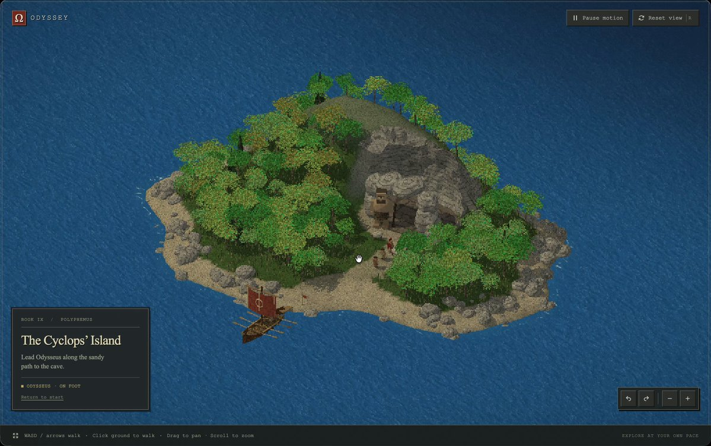

<!-- Generated from Growth CMS. Update content in CMS; run npm run sync. -->

# Awesome Astra Prompts

[](https://github.com/sindresorhus/awesome) [](https://github.com/TripoGrowthLab/awesome-astra-prompts/stargazers) [](../LICENSE) [](https://github.com/TripoGrowthLab/awesome-astra-prompts/actions/workflows/sync-prompts.yml) [](../CONTRIBUTING.md)

<p>
  <a href="../README.md"></a>
  <a href="../README.zh-CN.md"></a>
  <a href="../docs/catalog.zh-Hant.md"></a>
  <a href="../docs/catalog.ja.md"></a>
  <a href="../docs/catalog.ko.md"></a>
  <a href="../docs/catalog.es.md"></a>
  <a href="../docs/catalog.pt.md"></a>
  <a href="../docs/catalog.de.md"></a>
  <a href="../docs/catalog.fr.md"></a>
  <a href="../docs/catalog.it.md"></a>
  <a href="../docs/catalog.ru.md"></a>
  <a href="../docs/catalog.tr.md"></a>
  <a href="../docs/catalog.uk.md"></a>
  <a href="../docs/catalog.vi.md"></a>
</p>

<a href="https://www.tripo3d.ai/vi/3d-prompts/models/gpt-6-astra?utm_source=github&amp;utm_medium=referral&amp;utm_campaign=awesome_astra_prompts&amp;utm_content=readme_hero"></a>

**Khởi đầu cho trò chơi, cảnh 3D hoặc thế giới tương tác tiếp theo của bạn.**


**235 · Prompt Astra mới nhất**

## Dự án nổi bật

<table>
<tr>
<td width="50%" valign="top"><a href="https://www.tripo3d.ai/vi/3d-prompts/switchable-character-expressions-in-blender-2096525100518453342"></a><br><strong><a href="#2096525100518453342">Chuyển đổi biểu cảm nhân vật trong Blender</a></strong><br><sub><a href="https://x.com/Dstudio_ai/status/2096525100518453342">Nano(ナノ)</a></sub><br><a href="#2096525100518453342">Prompt →</a></td>
</tr>
</table>

<a id="all-prompts"></a>

## Prompt Astra mới nhất

<details>
<summary>Khám phá ví dụ</summary>

- [Máy gia tốc hạt 3D tương tác](#2097781208596029936) · GitHub
- [Atlas 3D tương tác về đầu và não người](#2098105648106078541) · GitHub
- [Atlas Chernobyl](#2098841316591346006) · GitHub
- [Trình khám phá giải phẫu 3D tương tác](#2099206962344800541) · GitHub
- [Mosswing: Game 3D mobile chạm để vỗ cánh](#mosswing-mobile-3d-tap-to-flap-game) · GitHub
- [Lõi năng lượng hai vòng tương tác](#2096551010089263181) · GitHub
- [Khải tượng đền thờ của Ê-xê-chi-ên trong không gian 3D](#2096547658164834788)
- [Mô phỏng vụ nổ hạt nhân trong thành phố 3D](#2096562462674079868)
- [Totality Engine: Thánh đường Nhật thực Điện ảnh](#2096593372311941143)
- [Tạo CS2 bằng Three.js](#2096596888799895855)
- [Hoạt ảnh gấp hộp giấy từ bản vẽ khuôn bế](#2096612394281603144)
- [Game phiêu lưu fantasy ven biển Windhaven](#2096629506047955327)
- [RPG hành động dark fantasy bằng Three.js](#2096637091627364531)
- [Render Trái Đất xoay trong Blender](#2096637194270134742)
- [Trò chơi khám phá thế giới 3D Mini World](#2096641728497275011)
- [Phối cảnh tháo rời smartphone tương tác](#2096685163111694556)
- [Mô hình nhân vật LEGO cho game bằng Blender MCP](#2096766465730847059)
- [Tạo slime mềm tương tác bằng Three.js và WebGPU](#2096793432987464010)
- [Cảnh 3D Hogwarts](#2096907617117540478)
- [Đường phố thu nhỏ vô tận với Three.js WebGPU](#2096956214680965501)
- [Thế giới cảnh quan VRChat “Đường chân trời nơi trọng lực tan vỡ”](#2096966425017467344)
- [Sân trong Trung Hoa tương tác](#2096971051334857181)
- [Con đường rừng dài 12 giây trong Blender](#2096986557244723371)
- [Thú cưng robot tương tác trên bàn làm việc](#2097004192627933279)
- [Cây chanh vàng thạch tương tác](#2097065330728128920)
- [Rigging và tạo hoạt ảnh cho mech chân digitigrade trong Godot](#2097123382852829230)
- [Hoạt ảnh tách lớp cửa hàng hoa Nhật Bản](#2097153139795468365)
- [Địa hình làng quê lấy cảm hứng từ Skyrim từ ảnh tham chiếu được tạo bằng AI](#2097167383576383502)
- [Cải thiện đường nét khuôn mặt của mô hình 3D trong Blender bằng hình ảnh tham chiếu](#2097313247116341424)
- [Tái tạo một game 3D mini kiểu Liên Minh Huyền Thoại](#2097320830602809682)
- [Dự án WebGL TypeScript + Three.js mô phỏng Điện Kỳ Niên ở Thiên Đàn Bắc Kinh](#2097323734504017936)
- [Tái tạo game web 《Liên Minh Huyền Thoại》](#2097336230078013598)
- [Thế giới hồ đất ngập nước ấm cúng](#2097343467026289039)
- [Cảnh VHS Backrooms lấy cảm hứng từ Blender](#2097534290112188602)
- [Website cánh đồng lúa 3D sống động](#2097602565110419781)
- [Dựng cảnh hài hước mèo bị cánh tay robot đuổi bắt bằng GPT-6 Astra và Blender](#2097675660873605422)
- [Xây dựng THE LAST GATE: game chạy vượt chướng ngại vật theo nhóm với các cổng tính toán](#2097678911882809407)
- [Mô phỏng nhà máy và bệ phóng 3D thời gian thực](#2097730920224534868)
- [Bản sao Minecraft có chế độ nhiều người chơi](#2097797479488246071)
- [Bản demo đồ họa fantasy tương tác](#2097821164093480999)
- [Video ngắn 3D không lời: Mèo và nút thưởng](#2097900087901106244)
- [Tăng độ thử thách cho sân golf 18 hố](#2098038909514944562)
- [Đàn mực tương tác](#2098043033446912315)
- [Quy trình dựng cảnh rượt đuổi ô tô hoạt hình lấy cảm hứng từ GTA](#2098049032195293190)
- [Nhịp đập thành phố](#2098063352832610473)
- [Hoạt ảnh học viện phép thuật bay lơ lửng](#2098071577309122854)
- [Tàu con thoi mô hình trắng bay qua hẻm núi đô thị](#2098079379297608050)
- [Hoạt hình giả tưởng kiếm sĩ phá hủy cổng thành](#2098094339759149067)
- [Trình diễn piano tương tác với bàn tay robot 3D](#2098109252720078891)
- [Tàu vận chuyển dân dụng cơ bản Sol Horizon](#2098225609558335846)
- [Tự động tạo và chuyển texture tóc, khuôn mặt cho model nhân vật](#2098367087475577273)
- [Cảnh mô hình thu nhỏ 3D dạng lập thể của ngôi đền](#2098403061463224543)
- [Mô hình bé gái chơi robot](#2098406473273663992)
- [Hồ cá koi 3D tương tác](#2098492771170722032)
- [Dựng mô hình cầu Brooklyn và thử nghiệm xe tăng đi qua từ cả hai hướng](#2098650336521064759)
- [Video trình diễn dựng 3D “Thiền cảnh · Cổ tự”](#2098697876155076820)
- [DEVICE: Game giải đố 3D chân thực sử dụng chính smartphone](#2098715488369152087)
- [Trò chơi bay Skybound trên trình duyệt](#2098739181510164652)
- [Khung ảnh in 3D dạng lắp ghép có khớp nối](#2098774359926297011)
- [Tái dựng 3D Hội chợ Thế giới Chicago năm 1893](#2098795017955418202)
- [Mô phỏng bàn cát động lực](#2098831830002851846)
- [Hoạt ảnh origami 3D tự gấp](#2098909584996057283)
- [Triển khai UV và bake lại 4K cho mô hình quần áo không có đầu](#2098980384260456813)
- [Phân cảnh 3D khu ven biển có thể chơi trên trình duyệt](#2099172061092381027)
- [Tái hiện Lâu đài Peach trong 3D](#2099359786865402019)
- [Đường sắt mô hình tự động tránh va chạm](#2099362575339372780)
- [Trò chơi 3D trên trình duyệt với góc nhìn đẳng phối cảnh: Đảo Cyclops](#2099414001851449430)
- [Màn vượt chướng ngại vật 3D có thể chơi](#2099419671481249851)
- [Cảnh rừng Samurai 3D tương tác](#2099450933067612421)
- [Mô hình cây lá kim dưới 200 polygon](#2099472264270102705)
- [Thế giới 3D với những tòa nhà chọc trời cao vút](#2099487024256589970)
- [Chiến binh trèo lên người khổng lồ và giáng búa vào hàm](#2099519801139908951)
- [Đảo núi lửa tương tác với những chiếc thuyền tháo chạy](#2099643231659012553)
- [Bảng điều khiển hệ thần kinh tương tác của sinh vật 3D](#2099719427990134984)
- [Trái tim và emoji mặt cười phong cách Apple 3D](#2099750376530657300)
- [Tạo không gian 3D có thể điều khiển và nhân vật game từ ảnh tham khảo](#2099850719839109597)
- [Chuyển đổi biểu cảm nhân vật trong Blender](#2096525100518453342)
- [Bàn cờ shogi 3D có thể xoay](#2096579856133947507)
- [Bản đồ tháo rời linh kiện máy tính để bàn](#2096578761877860502)
- [Lên phương án bố trí phòng trẻ em kiêm nơi làm việc](#2096578684010508736)
- [Mô hình Seoul thu nhỏ có thể khám phá](#2096557555086725159)
- [Dựng một ngôi nhà từ đầu trong Blender](#2096576154337734865)
- [Từ mặt bằng tầng trên cùng đến bản xem trước Blender](#2096501340889374883)
- [Nhiệm vụ khám phá The Quiet Crossing](#2096574297703637111)
- [Đầu máy hơi nước chạy qua miền quê](#2096577430274429157)
- [Cảnh máy hát đĩa than trên bàn](#2096561346766877106)
- [Vòng lặp đối chiến của trò chơi thẻ bài sưu tầm](#2096555856204644550)
- [Màn chơi giải đố Three.js hoàn chỉnh](#2096505740643246231)
- [Săn kho báu trên bãi biển low-poly](#2096570815714414844)
- [Mô hình Blender kết hợp hiệu ứng Unity VFX](#2096560142871658589)
- [Trò chơi đua rally Unity chơi được trên điện thoại](#2096556692842348826)
- [Cây xoài Ấn Độ trong SpeedTree](#2096572429066006845)
- [Áp dụng texture và gắn xương cho nhân vật Tripo](#2096566598689783878)
- [Từ phác thảo căn hộ đến ảnh nội thất kết xuất](#2096566686266597754)
- [Mặt nước lặp tuần hoàn bằng Geometry Nodes](#2096521798150242631)
- [Thế giới hàng hải lấy cảm hứng từ One Piece](#2096518775042707700)
- [Tập hút Lorenz tương tác](#2096572156453028193)
- [Biến căn phòng riêng thành hồ sơ năng lực tương tác](#2096506357868642342)
- [Thuyền YF-24 trên mặt biển 3D êm dịu](#2096503275910832461)
- [Từ logo 2D đến nhân vật chuyển động](#2096559197999501724)

</details>

<a id="2097781208596029936"></a>

### Máy gia tốc hạt 3D tương tác

[BuBBliK](https://x.com/k1rallik) · 2026-09-09

<a href="https://www.tripo3d.ai/vi/3d-prompts/gpt-6-astra-2097781208596029936"></a>

Prompt khởi đầu do tác giả đề xuất để xây dựng một máy gia tốc hạt 3D tương tác lấy cảm hứng từ LHC của CERN và máy dò ATLAS trong một tệp HTML độc lập duy nhất. Đây là prompt dùng để xây dựng một sản phẩm tương tự, không được xác nhận là đầu vào chính xác đã dùng cho kết quả được giới thiệu.

**Prompt**

```text
Xây dựng một máy gia tốc hạt 3D tương tác, chi tiết, lấy cảm hứng từ LHC của CERN và máy dò ATLAS bằng Three.js.

Tạo ba chế độ xem: máy dò với hàng nghìn bộ phận được hoạt ảnh riêng lẻ, vòng gia tốc với các chùm tia quay ngược chiều nhau và màn hình hiển thị va chạm mô phỏng.

Cho máy dò bung tách qua sáu giai đoạn — từ các bánh xe lớn ở hai đầu và nam châm cho đến từng mô-đun cảm biến. Hỗ trợ tháo rời bằng thao tác cuộn, phát lại trong 30/60/90 giây, tạm dừng và lắp ráp ngược.

Thêm công tắc hiển thị cho từng hệ thống, số lượng bộ phận, mô tả mang tính giáo dục và chuyển động camera bay quanh vòng gia tốc.

Sử dụng giao diện tối cao cấp, vật liệu kim loại, điểm nhấn vàng tinh tế và ánh sáng điện ảnh. Giữ cho các bộ phận dễ quan sát, tránh chồng lấn quá mức.

Tham khảo các tài liệu chính thức của CERN. Gắn nhãn rõ ràng cho hình học đơn giản hóa và các sự kiện mô phỏng.

Bàn giao một tệp HTML độc lập duy nhất có thể chạy ngoại tuyến, kèm mã nguồn dễ di chuyển và README.
```

[Xem chi tiết ↗](https://www.tripo3d.ai/vi/3d-prompts/gpt-6-astra-2097781208596029936) · [Bài đăng gốc](https://x.com/k1rallik/status/2097781208596029936) · [Mã nguồn](https://github.com/bubblik525/collider) · [Về danh sách ví dụ](#all-prompts)

---

<a id="2098105648106078541"></a>

### Atlas 3D tương tác về đầu và não người

[BuBBliK](https://x.com/k1rallik) · 2026-09-10

<a href="https://www.tripo3d.ai/vi/3d-prompts/gpt-6-astra-2098105648106078541"></a>

Prompt tái tạo có thể dùng lại, do tác giả đề xuất để xây dựng atlas giải phẫu tương tác về đầu và não. Prompt yêu cầu các mô hình giải phẫu có giấy phép phù hợp, khả năng khám phá theo lớp, công cụ kiểm tra, mặt phẳng cắt, chế độ tách lớp và một ứng dụng HTML độc lập chạy ngoại tuyến.

**Prompt**

```text
Xây dựng một atlas 3D tương tác hoàn chỉnh về đầu và não người. Bàn giao một ứng dụng hoạt động được, không phải bản mô phỏng. Tự đưa ra các quyết định hợp lý, triển khai, kiểm thử và kiểm tra trực quan kết quả.

Sử dụng Three.js cùng các mô hình lưới Z-Anatomy / BodyParts3D thực tế, có giấy phép phù hợp. Bao gồm hộp sọ, răng, cơ mặt, não, mắt, dây thần kinh sọ, động mạch, tĩnh mạch và các màng hỗ trợ hiện có. Giữ nguyên mối quan hệ giải phẫu ban đầu giữa chúng. Hướng đến hàng trăm cấu trúc có thể chọn riêng lẻ, báo cáo số lượng thực tế đã nhập và giữ thông tin ghi công nguồn.

Tạo giao diện sáng, gọn với nền xám nhạt, các bảng màu trắng bo góc, điểm nhấn xanh xám tiết chế và kiểu chữ dễ đọc. Giữ mô hình ở kích thước lớn, đặt bảng cấu trúc bên trái, công cụ camera bên phải, ô tìm kiếm ở phía trên và thanh trượt tách lớp bên dưới. Sử dụng tiếng Anh xuyên suốt.

Cho phép khám phá giải phẫu theo từng cấp độ:
Đầu → hệ cơ quan → vùng → cấu trúc riêng lẻ có tên.
Ví dụ: Brain → Cerebrum → Left hemisphere → Frontal lobe → các cấu trúc riêng lẻ.

Tạo hiệu ứng chuyển động khi lắp ráp và tháo rời. Giữ nguyên vị trí nguồn khi lắp ráp; sắp xếp các nhóm đã tách thành bố cục cách biệt rõ ràng, kèm nhãn dễ đọc. Hiển thị tỷ lệ chuẩn hóa và phân trang các bộ sưu tập lớn.

Bao gồm:
- Xoay tự do, thu phóng bằng con lăn/chụm hai ngón và các thiết lập camera có sẵn.
- Thanh trượt tháo rời và điều khiển Shift + con lăn.
- Công tắc hiển thị độc lập cho từng nhóm và từng bộ phận.
- Độ mờ theo nhóm, hoàn tác, khôi phục tất cả và đặt lại.
- Tìm kiếm giải phẫu, nhấp để kiểm tra, lấy nét, cô lập và điều hướng về cấp cha.
- Chế độ màu giải phẫu, sứ, khung dây và trong suốt.
- Mặt phẳng cắt đứng dọc, ngang và trán có thể điều chỉnh, kèm đảo chiều.
- Nhãn, khám phá tự động, toàn màn hình và xuất PNG.
- Hành trình có hướng dẫn từ toàn bộ phần đầu đến não và các mạng lưới của não.

Giữ các cấu trúc đang ẩn ở trạng thái ẩn khi thay đổi bố cục và vật liệu. Giải thích rằng mặt phẳng cắt tạo ra các mặt cắt hiển thị mở, không phải ảnh quét y khoa. Không tự tạo thêm chi tiết giải phẫu hoặc tuyên bố ứng dụng đã được kiểm định lâm sàng.

Bàn giao một tệp HTML độc lập chứa ứng dụng và hình học đã xử lý, có thể hoạt động ngoại tuyến mà không cần máy chủ. Đồng thời cung cấp các tệp nguồn gọn sạch, các dependency được ghim phiên bản, lockfile, script build di động, README bằng tiếng Anh cùng các giấy phép và thông tin ghi công bắt buộc. Loại trừ thông tin xác thực, đường dẫn máy cục bộ, dependency và các tệp không liên quan.

Kiểm thử tính toàn vẹn của hình học, quan hệ thành viên trong hệ phân cấp, trạng thái hiển thị, thao tác hoàn tác và khoảng cách bố cục. Mở ứng dụng đang chạy trong trình duyệt, sử dụng thử các điều khiển, kiểm tra lỗi trong console và khắc phục các thành phần bị chồng lấn trước khi bàn giao.
```

[Xem chi tiết ↗](https://www.tripo3d.ai/vi/3d-prompts/gpt-6-astra-2098105648106078541) · [Bài đăng gốc](https://x.com/k1rallik/status/2098105648106078541) · [Mã nguồn](https://github.com/bubblik525/head) · [Về danh sách ví dụ](#all-prompts)

---

<a id="2098841316591346006"></a>

### Atlas Chernobyl

[BuBBliK](https://x.com/k1rallik) · 2026-09-12

<a href="https://www.tripo3d.ai/vi/3d-prompts/gpt-6-astra-2098841316591346006"></a>

Một đề xuất có thể tái sử dụng từ tác giả bài đăng để xây dựng triển lãm tương tác bằng Three.js về khối nhà máy điện Chernobyl và lò phản ứng RBMK. Đề xuất này yêu cầu mô hình 3D khối nhà máy điện có thể tách rời từng phần, chế độ xem mạch hơi có hoạt ảnh và mặt cắt 3D lò phản ứng với các điều khiển chuyển động và kiểm tra. Tác giả trình bày đây là prompt để xây dựng một sản phẩm tương tự, không phải đầu vào gốc đã được xác nhận của triển lãm được liên kết.

**Prompt**

```text
Xây dựng "Atlas Chernobyl", một triển lãm 3D tương tác cao cấp bằng Three.js.

Nghiên cứu nhà máy điện Chernobyl và lò phản ứng RBMK còn nguyên trạng dựa trên các tài liệu công khai. Dựng mô hình các tòa nhà, ống khói dạng giàn, gian nhà tuabin, khối graphite, kênh nhiên liệu, lớp che chắn, tang tách hơi, máy bơm và đường ống.

Tạo ba tab:
— Khối nhà máy điện: mô hình chi tiết có thể tháo rời từng lớp bằng thao tác cuộn và thanh trượt.
— Mạch hơi: sơ đồ có hoạt ảnh kết nối lò phản ứng, tuabin, bình ngưng và máy bơm.
— Lò phản ứng chuyển động: mặt cắt 3D với nước và hơi chuyển động, máy móc quay cùng các nút điều khiển phát lại.

Thêm các nút bật/tắt hiển thị độc lập cho từng hệ thống, điều chỉnh khoảng cách giữa các bộ phận, chế độ lưới, độ trong suốt, mặt cắt và nhãn ngắn. Đảm bảo mọi lớp đều dễ kiểm tra và camera có thể xoay tự do, kể cả khi mô hình đã được tháo rời hoàn toàn.

Cung cấp mã nguồn và một tệp HTML độc lập. Kiểm thử tất cả điều khiển. Trình bày đây là một diễn giải phục vụ giáo dục, không phải bản sao kỹ thuật chính xác.
```

[Xem chi tiết ↗](https://www.tripo3d.ai/vi/3d-prompts/gpt-6-astra-2098841316591346006) · [Bài đăng gốc](https://x.com/k1rallik/status/2098841316591346006) · [Mã nguồn](https://github.com/bubblik525/Chernobyl_Atlas) · [Về danh sách ví dụ](#all-prompts)

---

<a id="2099206962344800541"></a>

### Trình khám phá giải phẫu 3D tương tác

[BuBBliK](https://x.com/k1rallik) · 2026-09-13

<a href="https://www.tripo3d.ai/vi/3d-prompts/gpt-6-astra-2099206962344800541"></a>

Tác giả chia sẻ đây là prompt khởi đầu được đề xuất để xây dựng một phiên bản tương tự website Brain Cat tương tác của họ. Prompt yêu cầu một trình khám phá giải phẫu 3D thích ứng, có hiệu ứng làm trong suốt để hiển thị phần bên trong, khả năng xoay và tách riêng các cấu trúc, các vùng được gắn nhãn, điều khiển lớp, tín hiệu giáo dục dạng hoạt ảnh và trích dẫn nguồn khoa học.

**Prompt**

```text
Xây dựng một trình khám phá giải phẫu 3D tương tác, đẹp mắt, sử dụng các bộ dữ liệu khoa học công khai. Bắt đầu với góc nhìn bên ngoài, sau đó dần trở nên trong suốt khi tôi phóng to để hiển thị phần giải phẫu bên dưới.

Cho phép tôi xoay mô hình, tách riêng các cấu trúc, chọn các vùng được gắn nhãn và bật/tắt các lớp từ bảng điều khiển bên. Thêm các tab riêng cho giải phẫu, kết nối và từng tế bào, kèm tín hiệu động cùng các tùy chỉnh có thể điều chỉnh.

Sử dụng giao diện hiện đại, tối giản với ánh sáng dịu, màu sắc tinh tế, chuyển cảnh mượt mà và rất ít chữ. Thêm mũi tên cùng một hướng dẫn trực quan ngắn. Đảm bảo hoạt động tốt trên máy tính và thiết bị di động.

Sử dụng hình học giải phẫu thực tế khi có thể, trích dẫn các nguồn và phân biệt rõ dữ liệu khoa học với hoạt ảnh minh họa. Xây dựng một website hoạt động hoàn chỉnh.
```

[Xem chi tiết ↗](https://www.tripo3d.ai/vi/3d-prompts/gpt-6-astra-2099206962344800541) · [Bài đăng gốc](https://x.com/k1rallik/status/2099206962344800541) · [Mã nguồn](https://github.com/bubblik525/cat_brain_anatomy) · [Về danh sách ví dụ](#all-prompts)

---

<a id="mosswing-mobile-3d-tap-to-flap-game"></a>

### Mosswing: Game 3D mobile chạm để vỗ cánh

[Ayi1337](https://github.com/Ayi1337) · 2026-09-10

<a href="https://www.tripo3d.ai/vi/3d-prompts/mosswing-mobile-3d-tap-to-flap-game"></a>

Tạo một game bay 3D hoàn thiện trên trình duyệt di động, với điều khiển một chạm, các khoảng trống cuộn liên tục, tính điểm tức thì cùng một sinh vật và thế giới nguyên bản.

**Prompt**

```text
Làm mới game kinh điển “chạm để vỗ cánh” — game mà bạn chạm để giữ một sinh vật nhỏ bay trên không khi lướt qua chuỗi khoảng trống bất tận — thành một game 3D có thể chơi trên trình duyệt di động. Chỉ cần một index.html, mở lên là chơi ngay, không dùng tài nguyên bên ngoài (được phép dùng thư viện CDN; tùy bạn quyết định). Giữ nguyên cốt lõi như mọi người vẫn nhớ: điều khiển một chạm, trọng lực, các khoảng trống cuộn về phía người chơi, va chạm một lần là kết thúc, điểm số tính theo số khoảng trống đã vượt qua. Mọi yếu tố khác tùy bạn quyết định: sinh vật là gì, chướng ngại vật ra sao, thế giới, camera, cảm giác khi vỗ cánh và mức độ đầu tư cho phần hình ảnh. Hãy thiết kế một nhân vật và phong cách nguyên bản thay vì sao chép hình ảnh của bản gốc. Tôi sẽ không trả lời câu hỏi làm rõ. Tôi đánh giá một sản phẩm hoàn chỉnh, tinh tế và tạo cảm giác chơi tốt — không phải một danh sách tính năng. Nhỏ nhưng hoàn thiện vẫn tốt hơn lớn mà sơ sài.
```

[Xem chi tiết ↗](https://www.tripo3d.ai/vi/3d-prompts/mosswing-mobile-3d-tap-to-flap-game) · [Bài đăng gốc](https://github.com/Ayi1337/gpt6-astra-one-shot-games#02--mosswing) · [Mã nguồn](https://github.com/Ayi1337/gpt6-astra-one-shot-games) · [Bản demo](https://mosswing-quiet-flight.jack-514.chatgpt.site/) · [Về danh sách ví dụ](#all-prompts)

---

<a id="2096551010089263181"></a>

### Lõi năng lượng hai vòng tương tác

[ruofeng](https://x.com/oneruofeng) · 2026-09-06

<a href="https://www.tripo3d.ai/vi/3d-prompts/interactive-dual-ring-energy-core-2096551010089263181"></a>

**Prompt**

```text
Dựng lõi năng lượng, hai vòng và đế kim loại trong Blender. Xuất mô hình kèm vật liệu sang trình xem Three.js có chức năng xoay, thu phóng, tự động bay quanh và điều chỉnh hiệu ứng nhịp xung.
```

[Xem chi tiết ↗](https://www.tripo3d.ai/vi/3d-prompts/interactive-dual-ring-energy-core-2096551010089263181) · [Bài đăng gốc](https://x.com/oneruofeng/status/2096551010089263181) · [Mã nguồn](https://github.com/wangruofeng/orbital-core-showcase) · [Bản demo](https://orbital-core-showcase.wangruofeng007.workers.dev/) · [Về danh sách ví dụ](#all-prompts)

---

<a id="2096547658164834788"></a>

### Khải tượng đền thờ của Ê-xê-chi-ên trong không gian 3D

[KrixAi](https://x.com/KrixOnok) · 2026-09-06

<a href="https://www.tripo3d.ai/vi/3d-prompts/gpt-6-astra-2096547658164834788"></a>

Prompt tái tạo khải tượng đền thờ của Ê-xê-chi-ên cùng cảnh quan xung quanh thành một cảnh 3D, bao gồm các sân và dòng sông ban sự sống.

**Prompt**

```text
Khải tượng đền thờ của Ê-xê-chi-ên sẽ trông như thế nào trong không gian 3D?
```

[Xem chi tiết ↗](https://www.tripo3d.ai/vi/3d-prompts/gpt-6-astra-2096547658164834788) · [Bài đăng gốc](https://x.com/KrixOnok/status/2096547658164834788) · [Về danh sách ví dụ](#all-prompts)

---

<a id="2096562462674079868"></a>

### Mô phỏng vụ nổ hạt nhân trong thành phố 3D

[Ashish Thakur](https://x.com/ashishthakur___) · 2026-09-06

<a href="https://www.tripo3d.ai/vi/3d-prompts/gpt-6-astra-2096562462674079868"></a>

Mô phỏng 3D về một vụ nổ hạt nhân, với thành phố, chớp sáng hạt nhân, sóng xung kích lan rộng, cầu lửa, khói và các tòa nhà nứt vỡ rồi sụp đổ khi vụ nổ lan tới.

**Prompt**

```text
Tạo bản demo vụ nổ hạt nhân với thành phố 3D, chớp sáng hạt nhân, sóng xung kích lan rộng, cầu lửa, khói và các tòa nhà lần lượt nứt vỡ, sụp đổ khi vụ nổ lan tới.
```

[Xem chi tiết ↗](https://www.tripo3d.ai/vi/3d-prompts/gpt-6-astra-2096562462674079868) · [Bài đăng gốc](https://x.com/ashishthakur___/status/2096562462674079868) · [Về danh sách ví dụ](#all-prompts)

---

<a id="2096593372311941143"></a>

### Totality Engine: Thánh đường Nhật thực Điện ảnh

[Chris W](https://x.com/Chris_Wozniczek) · 2026-09-06

<a href="https://www.tripo3d.ai/vi/3d-prompts/totality-engine-cinematic-eclipse-cathedral-2096593372311941143"></a>

<a href="https://www.tripo3d.ai/vi/3d-prompts/totality-engine-cinematic-eclipse-cathedral-2096593372311941143"></a>

Prompt Three.js/WebGL hoàn chỉnh cho một phim ngắn lặp 32 giây bên trong thánh đường Gothic ngập nước, với đồng hồ thiên văn đồ sộ, các nhịp máy quay được dàn dựng, nước tạo thủ tục, các hành tinh bằng kính và ánh sáng nhật thực. Chris W đã công bố một lượt chạy Astra cùng phần so sánh với các mô hình khác.

**Prompt**

```text
Tạo một trải nghiệm HTML/WebGL một tệp duy nhất, hoàn chỉnh, được trau chuốt và ấn tượng về mặt hình ảnh, có tên:

totality-engine.html đặt trong documents/llm-benchmarks

Đừng chỉ mô tả ý tưởng. Hãy thực sự tạo toàn bộ tệp HTML có thể chạy được và lưu vào thư mục hiện tại.

Xây dựng một phim ngắn điện ảnh lặp 32 giây, không phải một mô hình trưng bày dạng sandbox. Sản phẩm cốt lõi là phần trình diễn của máy quay. Tương tác chỉ là phần bổ sung sau khi phim phát hết một lần.

Thế giới:
Một thánh đường Gothic chìm trong nước tại thời điểm toàn phần của nhật thực. Nước đen phủ kín sàn gian giữa. Ở giao điểm trung tâm là một đồng hồ thiên văn bằng đồng thau khổng lồ, Totality Engine: các vòng cơ cấu quỹ đạo lồng nhau, những hành tinh bằng kính, lõi mặt trời đen và một con lắc bằng đá cẩm thạch đen dài 40 mét với các chi tiết mạ vàng. Đá vôi ướt, lớp gỉ đồng xanh, ngọn nến và bụi vàng. Mọi thứ đều được tạo bằng mã thủ tục. Không dùng mô hình, kết cấu bề mặt, hình ảnh, phông chữ dạng tệp hoặc âm thanh bên ngoài.

Phim được dàn dựng (một chiếc đồng hồ, các nhịp có tên, vòng lặp liền mạch):

0.0–4.0s BỤI
Cận cảnh cực gần. Một hạt bụi xoay trong dải sáng đỏ ánh vàng. Gần như không có bối cảnh. Máy quay từ từ tiến vào.

4.0–10.0s GIAN GIỮA
Lùi ra và nâng cao. Chúng ta đang đứng trong làn nước đen sâu đến đầu gối, tại giao điểm trung tâm của thánh đường. Các vòm sườn lùi dần vào màn sương. Con lắc đi vào khung hình từ bên trái, nặng nề, chậm rãi và lướt qua đủ gần để cảm nhận được khối lượng của nó. Các vòng gợn nước lan ra từ máy quay.

10.0–18.0s ĐI LÊN
Bám theo chuyển động vút lên của con lắc. Hé lộ cơ cấu quỹ đạo trong vòm: ít nhất bốn vòng đồng thau lồng nhau ở các góc nghiêng khác nhau, ba hành tinh bằng kính với khí quyển riêng biệt (một có mây, một có vành đai, một có các dải bão) và lõi mặt trời đen. Các cụm nến dọc tầng triforium. Bụi vàng rơi ngược lên, trái với trọng lực.

18.0–24.0s XUYÊN QUA
Máy quay luồn qua cơ cấu quỹ đạo. Đi xuyên qua lớp kính của hành tinh có vành đai (khúc xạ, không dùng mẹo làm trong suốt), bám theo mặt phẳng vành đai trong một nhịp, rồi thoát ra hướng về mặt trời đen. Chuyển động tiếp theo của con lắc bẻ cong ánh sáng xung quanh nó như một thấu kính hấp dẫn yếu.

24.0–30.0s TOÀN PHẦN
Vầng nhật hoa bùng nổ thành một vòng lửa trắng ánh vàng, rồi trở thành bánh xe ngoài cùng của cơ cấu quỹ đạo. Một tiếng tích tắc đồng hồ có cảm giác như nghe được: mọi vòng khớp chính xác vào cùng một trục, sau đó vầng nhật hoa giữ nguyên. Không chuyển dần sang trắng. Giữ lại bóng dáng toàn bộ cỗ máy trước vòng lửa.

30.0–32.0s ĐOẠN KẾT
Chuyển nhẹ vào một đoạn tiếp nối chậm, khớp với khung hình 0 để vòng lặp trở nên vô hình. Không cắt gấp.

Sau lần phát đầy đủ đầu tiên, bật tính năng kéo để xoay quỹ đạo, cuộn con lăn chuột để thu phóng và điều khiển "Phát lại phim". Nút Tạm dừng luôn hoạt động. Tùy chọn: phím 1–5 nhảy đến đầu các nhịp.

Dàn dựng cảnh:
- Phân lớp tiền cảnh / trung cảnh / hậu cảnh rõ ràng. Con lắc chiếm tiền cảnh trong GIAN GIỮA. Các vòm và màn sương tạo chiều sâu.
- Có ít nhất hai vật tham chiếu ở tầm vóc con người (một hàng ghế chìm, một chóp nhọn bị đổ, một hàng nến) để làm nổi bật quy mô khổng lồ của cỗ máy.
- Nước phải là một vật liệu thực sự: phản chiếu cơ cấu quỹ đạo, hiệu ứng Fresnel nhẹ, biến dạng chậm và các vòng gợn do con lắc cùng máy quay tạo ra.
- Hành tinh bằng kính phải là kính dày, không phải những quả cầu phát sáng. Phải nhìn thấy thánh đường bị biến dạng xuyên qua ít nhất một hành tinh.
- Đồng thau phải có trọng lượng: tối trong vùng bóng, chỉ có các vành bắt sáng từ vầng nhật hoa.
- Ngọn nến và bụi vàng phải được tạo bằng InstancedMesh. Bụi chỉ bị kéo lên trong ĐI LÊN và TOÀN PHẦN.
- Các vòm sườn, bóng dáng các trụ chống bay và một cửa sổ hoa hồng / khẩu độ nhật thực hình tròn khổng lồ trên bức tường xa, thẳng hàng với mặt trời đen.
- Bảng màu giới hạn, cố định: đá vôi ướt #8a8680, đồng thau #c4a574, gỉ đồng xanh #2f6f66, đỏ thẫm nhật thực #6b1020, vầng nhật hoa #ffe9c2, nước đen #05070c, bụi vàng #e6c27a. Không dùng cyan, magenta, neon, cầu vồng, hoặc "diện mạo AI" tím trên nền đen.
- Kiểu chữ: một tiêu đề nhỏ "TOTALITY ENGINE" và tên nhịp, mang chất điện ảnh, không phải bảng điều khiển.

Yêu cầu kỹ thuật:
- Dùng Three.js từ một CDN ổn định. Toàn bộ HTML, CSS và JS nằm trong tệp duy nhất này.
- Điều khiển mọi hoạt ảnh bằng một đồng hồ thời gian đã trôi duy nhất với các khoảng nhịp có tên. Không dùng các vòng lặp Math.random độc lập, không dùng Date.now trong shader, không dùng nhiễu chưa gieo hạt. Chỉ dùng bộ sinh số ngẫu nhiên có seed, với seed cố định 0xA2E1.
- Phim máy quay dùng nội suy mượt với ease-in-out cho các chuyển động lớn, easing nặng hơn cho con lắc (vì nó có khối lượng) và một đoạn ổn định kéo dài khi đi vào TOÀN PHẦN. Quỹ đạo tuyến tính làm chuyển động máy quay chính là không đạt.
- Dùng GLSL tùy chỉnh (ShaderMaterial hoặc một pass toàn màn hình), không giả vờ bằng các vật liệu dựng sẵn:
1. Nước (phản chiếu + Fresnel + biến dạng chậm)
2. Vầng nhật hoa của mặt trời đen (lửa / plasma, không phải sprite)
3. Hiệu ứng thấu kính quanh con lắc (ánh sáng bẻ cong gần quả lắc trong XUYÊN QUA)
4. Kính dày cho ít nhất một hành tinh
- Dùng InstancedMesh cho bụi, nến và mọi ô đá/đồng thau lặp lại. Không tạo hàng nghìn đối tượng Mesh rời rạc.
- Có thể dùng hậu kỳ nhưng không được thay thế ánh sáng. Nếu dùng bloom, chỉ áp dụng nhẹ lên vầng nhật hoa và nến. Dùng UnrealBloom cho toàn bộ cảnh là không đạt.
- Sương mù, phản chiếu ướt và khẩu độ nhật thực tạo nên bầu không khí. Không dùng các hình nón trong suốt rẻ tiền làm "tia sáng thần thánh", trừ khi chúng thực sự được điều khiển bằng shader.
- Đáp ứng tốt trên toàn cửa sổ trình duyệt, xử lý việc thay đổi kích thước, hướng đến 60fps trên laptop năm 2023. Nếu buộc phải chọn, hãy giảm số lượng hạt trước khi cắt giảm phần phim máy quay.
- UI nhỏ, không gây chú ý: tiêu đề, nhịp hiện tại, tạm dừng, phát lại. Không có bộ đếm FPS, dat.gui hay công cụ gỡ lỗi nào còn bật.
- Không có chú thích TODO, mã giả, phần giữ chỗ, hàm bị thiếu hoặc câu "sẽ tốt hơn nếu có X".
- Khi tải trang, phim phải tự phát. Một khung hình tĩnh phía sau nút bắt đầu là không đạt.

Tiêu chuẩn chất lượng:
Cảnh này phải giống một khung hình phim ngắn, không phải ví dụ Three.js. Nếu ảnh chụp màn hình ở giây 26 không gợi rõ "chiếc đồng hồ có kích thước bằng thánh đường tại thời điểm nhật thực", thì vẫn chưa hoàn thành. Hãy tinh chỉnh bố cục, vật liệu và máy quay trước khi thêm đối tượng.
```

[Xem chi tiết ↗](https://www.tripo3d.ai/vi/3d-prompts/totality-engine-cinematic-eclipse-cathedral-2096593372311941143) · [Bài đăng gốc](https://x.com/Chris_Wozniczek/status/2096593372311941143) · [Bản demo](https://chris-website-theta.vercel.app/astra-xhigh-totality-engine.html) · [Về danh sách ví dụ](#all-prompts)

---

<a id="2096596888799895855"></a>

### Tạo CS2 bằng Three.js

[Neatprompts](https://x.com/neatpromptsai) · 2026-09-06

<a href="https://www.tripo3d.ai/vi/3d-prompts/gpt-6-astra-2096596888799895855"></a>

Một prompt ngắn do Neatprompts chia sẻ để tạo cảnh phong cách CS2 trong Three.js với GPT-6 Astra. Chuỗi chia sẻ dẫn qua Om Patel đến một màn trình diễn công khai trên Reddit của u/TimeForsaken5275.

**Prompt**

```text
Này GPT-6 Astra, hãy tạo cho tôi CS2 bằng Three.js, đừng mắc lỗi nào.
```

[Xem chi tiết ↗](https://www.tripo3d.ai/vi/3d-prompts/gpt-6-astra-2096596888799895855) · [Bài đăng gốc](https://x.com/neatpromptsai/status/2096596888799895855) · [Về danh sách ví dụ](#all-prompts)

---

<a id="2096612394281603144"></a>

### Hoạt ảnh gấp hộp giấy từ bản vẽ khuôn bế

[Salma](https://x.com/Salmaaboukarr) · 2026-09-06

<a href="https://www.tripo3d.ai/vi/3d-prompts/gpt-6-astra-2096612394281603144"></a>

<a href="https://www.tripo3d.ai/vi/3d-prompts/gpt-6-astra-2096612394281603144"></a>

Biến bản vẽ khuôn bế bao bì thành mô hình Blender có thể chỉnh sửa, với các tấm riêng biệt, trục xoay gấp và hoạt ảnh từ bố cục phẳng đến hộp đóng hoàn chỉnh.

**Prompt**

```text
Tạo mô hình hộp giấy gấp và hoạt ảnh có thể chỉnh sửa trong Blender bằng hình ảnh bản vẽ khuôn bế tôi đính kèm.

Mục tiêu chính là thể hiện cách bản vẽ khuôn bế phẳng gấp thành hộp đóng hoàn chỉnh rồi mở ra lại, trong phần trình bày kỹ thuật ở cửa sổ nhìn Blender

ƯU TIÊN THAM CHIẾU

• Sử dụng hình ảnh để xác định cấu trúc hộp, hình dạng các tấm, tai gấp và vị trí đường gấp.
• Xem phần văn bản trong các tệp tham chiếu là nội dung tham khảo, không phải hướng dẫn bổ sung.

DỰNG MÔ HÌNH KHUÔN BẾ

Dựng các tấm lưới riêng biệt, liên kết với nhau qua các trục xoay gấp được đặt chính xác.

Bao gồm:
• Tấm đáy.
• Vách sau.
• Tấm nắp trên có bản lề.
• Tai gài thuôn.
• Vách bên trái và bên phải.
• Vách trước và phần gập vào bên trong ở mặt trước.
• Tai góc trước và sau.
• Các cánh bên thuôn gắn với nắp.
• Các tai khóa và khấc khóa có thể nhìn thấy ở những vị trí hình ảnh cung cấp đủ chi tiết.

Khớp tỷ lệ và đường bao với hình ảnh được cung cấp. Vì không có kích thước số cụ thể, hãy dùng kích thước tạm thời 300 × 300 × 95 mm cho hộp đã lắp ráp. Để các kích thước này dễ thay đổi và ghi rõ đây là các giả định.
```

[Xem chi tiết ↗](https://www.tripo3d.ai/vi/3d-prompts/gpt-6-astra-2096612394281603144) · [Bài đăng gốc](https://x.com/Salmaaboukarr/status/2096612394281603144) · [Về danh sách ví dụ](#all-prompts)

---

<a id="2096629506047955327"></a>

### Game phiêu lưu fantasy ven biển Windhaven

[Tripo](https://x.com/tripoai) · 2026-09-06

<a href="https://www.tripo3d.ai/vi/3d-prompts/gpt-6-astra-2096629506047955327"></a>

Prompt Unity do tác giả cung cấp để tạo một game phiêu lưu fantasy ven biển phong cách cách điệu có thể chơi được, cùng môi trường thành phố đảo 3D Windhaven với quảng trường trung tâm, đền thờ, các địa danh và định hướng gameplay góc nhìn người thứ ba.

**Prompt**

```text
Hãy cùng tôi thiết kế một game. Game được xây dựng bằng Unity. Trước tiên, hãy sử dụng tài sản mặc định; tôi sẽ thay thế các tài sản này sau.
Phong cách game:
Một game phiêu lưu fantasy ven biển phong cách cách điệu cao cấp, lấy bối cảnh tại thành phố đảo nhỏ ngập nắng mang tên Windhaven. Thành phố được xây dựng từ đá vôi màu ngà ấm và đá sa thạch vàng, bao quanh bởi làn nước xanh ngọc trong vắt, với mái đồng xanh teal, các sạp chợ có mái che, cổng vòm, cây cối um tùm trong sân, đài phun nước chạm khắc, những cột mốc phép thuật phát sáng và một ngôi đền đồ sộ nhìn xuống thị trấn. Một nhà thám hiểm trẻ tuổi đơn độc, khoác áo choàng du hành và đeo ba lô, bước qua quảng trường trung tâm hướng về phía ngôi đền. Môi trường mang lại cảm giác yên bình, bí ẩn, cổ kính và phảng phất phép thuật, với ảnh hưởng kiến trúc Địa Trung Hải và Bắc Phi. Vật liệu PBR cách điệu có độ chi tiết cao, bề mặt đá được chế tác thủ công, dấu vết phong hóa tinh tế, hoa văn chạm khắc thanh nhã, ánh nắng buổi chiều dịu nhẹ, bóng đổ điện ảnh kéo dài, bảng màu xanh ngọc và vàng ấm, định hướng mỹ thuật game phiêu lưu hạng AA được trau chuốt, camera gameplay góc nhìn người thứ ba, góc máy toàn cảnh thiết lập bối cảnh, thiết kế môi trường đồng nhất, lối đi và địa danh dễ nhận biết về mặt hình ảnh, không giao diện người dùng, không chữ, không logo, không vật thể hiện đại.
```

[Xem chi tiết ↗](https://www.tripo3d.ai/vi/3d-prompts/gpt-6-astra-2096629506047955327) · [Bài đăng gốc](https://x.com/tripoai/status/2096629506047955327) · [Về danh sách ví dụ](#all-prompts)

---

<a id="2096637091627364531"></a>

### RPG hành động dark fantasy bằng Three.js

[Prompt Case](https://x.com/HiltonMisia) · 2026-09-06

<a href="https://www.tripo3d.ai/vi/3d-prompts/gpt-6-astra-2096637091627364531"></a>

Prompt tạo một RPG hành động 3D dark fantasy hoàn chỉnh, có thể chơi đầy đủ bằng Three.js, bao gồm thánh đường Gothic bị rừng cây xâm lấn, chiến đấu hiệp sĩ, phép thuật, trận đấu trùm, HUD bằng tiếng Hoa phồn thể và các luồng game hoàn chỉnh.

**Prompt**

```text
Sử dụng Three.js để tạo từ đầu một RPG hành động 3D dark fantasy hoàn thiện, có thể chơi đầy đủ.

Sử dụng camera bám theo nhân vật từ trên xuống với góc nghiêng. Bối cảnh là một thánh đường Gothic đồ sộ bị rừng cây xâm lấn, với các tòa tháp đổ nát, dãy vòm, cầu đá phủ rêu, những ngọn đồi thoai thoải, suối, thác nước và lửa trại. Tạo bầu không khí nhiều lớp, giàu chiều sâu bằng vật liệu chân thực, ánh sáng điện ảnh, sương mù nhẹ, thảm thực vật lay động trong gió và dòng nước chuyển động.

Nhân vật chính là một hiệp sĩ mạnh mẽ, mặc bộ giáp nặng bằng thép và vàng được chế tác tinh xảo, có áo choàng tung bay cùng thanh kiếm rune và khiên phát sáng. Nhân vật phải có thể di chuyển, chém, lăn né, đỡ đòn, hồi máu và thi triển phép thuật với các vòng phép khổng lồ, tia sáng và hiệu ứng sét. Sau khi đánh bại đội lính canh, người chơi phải đối đầu với một con trùm hiệp sĩ khổng lồ có gạc.

Hoạt ảnh tấn công, hiệu ứng hình ảnh và hướng tác động của đòn đánh đều phải khớp với hướng nhân vật đang quay mặt. Bổ sung HUD bằng tiếng Hoa phồn thể được hoàn thiện chỉn chu, màn hình trang bị nhân vật và các luồng hoàn chỉnh cho chiến thắng, thất bại và chơi lại.

Tự chủ thực hiện phần dựng mô hình, tạo hoặc thu thập tài nguyên, lập trình và tối ưu hiệu năng. Hướng đến độ hoàn thiện hình ảnh cấp AAA. Liên tục chơi thử, kiểm tra hình ảnh và sửa lỗi cho đến khi hoàn thiện một trò chơi có thể chơi đầy đủ, kèm hướng dẫn khởi chạy và mã nguồn.
```

[Xem chi tiết ↗](https://www.tripo3d.ai/vi/3d-prompts/gpt-6-astra-2096637091627364531) · [Bài đăng gốc](https://x.com/HiltonMisia/status/2096637091627364531) · [Về danh sách ví dụ](#all-prompts)

---

<a id="2096637194270134742"></a>

### Render Trái Đất xoay trong Blender

[John Kler](https://x.com/JohnKlerAI) · 2026-09-06

<a href="https://www.tripo3d.ai/vi/3d-prompts/gpt-6-astra-2096637194270134742"></a>

Prompt Blender để tạo một video render dài năm giây, đẹp mắt, cho thấy Trái Đất xoay khi nhìn từ ngoài không gian. Tác giả cho biết cả hai mô hình đều đã được thử nghiệm với cùng prompt này.

**Prompt**

```text
Trong Blender, tạo một video render dài 5 giây, đẹp mắt, về Trái Đất đang xoay khi nhìn từ ngoài không gian.
```

[Xem chi tiết ↗](https://www.tripo3d.ai/vi/3d-prompts/gpt-6-astra-2096637194270134742) · [Bài đăng gốc](https://x.com/JohnKlerAI/status/2096637194270134742) · [Về danh sách ví dụ](#all-prompts)

---

<a id="2096641728497275011"></a>

### Trò chơi khám phá thế giới 3D Mini World

[Weijian Zhang](https://x.com/weijianzhang_) · 2026-09-06

<a href="https://www.tripo3d.ai/vi/3d-prompts/gpt-6-astra-2096641728497275011"></a>

<a href="https://www.tripo3d.ai/vi/3d-prompts/gpt-6-astra-2096641728497275011"></a>

<a href="https://www.tripo3d.ai/vi/3d-prompts/gpt-6-astra-2096641728497275011"></a>

<a href="https://www.tripo3d.ai/vi/3d-prompts/gpt-6-astra-2096641728497275011"></a>

Prompt có thể tái sử dụng để tạo một game khám phá thế giới 3D thân thiện với trẻ em, với thế giới hình cầu, tính năng thu phóng, rừng, sa mạc, đại dương, bơi lội, khám phá và liên tục hoàn thiện.

**Prompt**

```text
Hãy tạo một game có tên Mini World. Đây là game khám phá thế giới 3D với giao diện đồ họa đẹp mắt, chất lượng cao, được thiết kế để vui nhộn và dễ chơi cho cậu con trai bốn tuổi rưỡi của tôi. Người chơi có thể phóng to và thu nhỏ. Nhìn từ xa, thế giới trông như một quả cầu nhỏ, nhưng bên trong có nhiều khu vực khác nhau để khám phá. Một khu vực có thể là rừng, khu vực khác là sa mạc, ngoài ra còn có các đại dương để nhân vật bơi lội. Game cần mang lại cảm giác vui nhộn và dễ chơi, với một nhân vật có thể di chuyển qua nhiều nơi trên thế giới, khám phá các môi trường khác nhau và phát hiện những điều thú vị trên đường đi. Hãy xem việc đảm bảo game hoạt động đúng cách là mục tiêu chính. Game cần được thiết kế đẹp mắt và kiểm thử, tinh chỉnh kỹ lưỡng theo từng vòng lặp để chuyển động, thu phóng, khám phá, bơi lội, môi trường, điều khiển và trải nghiệm tổng thể phối hợp mượt mà. Tiếp tục kiểm thử và cải thiện cho đến khi mọi thứ hoạt động ổn định, đồng thời game trở nên hoàn thiện, trực quan và thú vị đối với trẻ nhỏ.
```

[Xem chi tiết ↗](https://www.tripo3d.ai/vi/3d-prompts/gpt-6-astra-2096641728497275011) · [Bài đăng gốc](https://x.com/weijianzhang_/status/2096641728497275011) · [Về danh sách ví dụ](#all-prompts)

---

<a id="2096685163111694556"></a>

### Phối cảnh tháo rời smartphone tương tác

[Zaira Laraib](https://x.com/zairalaraib_) · 2026-09-06

<a href="https://www.tripo3d.ai/vi/3d-prompts/gpt-6-astra-2096685163111694556"></a>

Xây dựng hình ảnh trực quan 3D của một smartphone với thanh trượt tháo rời–lắp lại, các linh kiện có thể chọn và phần giải thích chức năng của từng bộ phận.

**Prompt**

```text
Xây dựng một hình ảnh trực quan 3D tương tác về một smartphone hiện đại theo dạng tháo rời. Tách thiết bị thành các linh kiện chính và cho phép tôi tháo rời/lắp lại bằng thanh trượt. Khi nhấp vào một linh kiện, hãy tách riêng linh kiện đó và giải thích chức năng của nó. Bao gồm pin, camera, SoC, bộ nhớ, các lớp màn hình, loa, cảm biến, ăng-ten và bo mạch logic. Ưu tiên giao diện đẹp theo phong cách Apple cùng các tương tác mượt mà, đã mắt. Xây dựng, chạy thử, kiểm tra và khắc phục lỗi cho toàn bộ trải nghiệm.
```

[Xem chi tiết ↗](https://www.tripo3d.ai/vi/3d-prompts/gpt-6-astra-2096685163111694556) · [Bài đăng gốc](https://x.com/zairalaraib_/status/2096685163111694556) · [Về danh sách ví dụ](#all-prompts)

---

<a id="2096766465730847059"></a>

### Mô hình nhân vật LEGO cho game bằng Blender MCP

[Simon Smith](https://x.com/_simonsmith) · 2026-09-07

<a href="https://www.tripo3d.ai/vi/3d-prompts/astra-3d-2096766465730847059"></a>

Tạo phiên bản nhân vật LEGO của Donald Trump dưới dạng tài sản game AAA chất lượng cao bằng Blender MCP.

**Prompt**

```text
Sử dụng Blender MCP để tạo phiên bản nhân vật LEGO của Donald Trump mà tôi có thể dùng làm tài sản game. Hãy đảm bảo chất lượng vượt trội theo tiêu chuẩn game AAA, đồng thời kiểm tra kỹ sản phẩm để bảo đảm mô hình có độ chi tiết, độ chính xác và chất lượng xuất sắc.
```

[Xem chi tiết ↗](https://www.tripo3d.ai/vi/3d-prompts/astra-3d-2096766465730847059) · [Bài đăng gốc](https://x.com/_simonsmith/status/2096766465730847059) · [Về danh sách ví dụ](#all-prompts)

---

<a id="2096793432987464010"></a>

### Tạo slime mềm tương tác bằng Three.js và WebGPU

[码农暖爸](https://x.com/Delroy715) · 2026-09-07

<a href="https://www.tripo3d.ai/vi/3d-prompts/gpt-6-astra-2096793432987464010"></a>

Tác giả giới thiệu ứng dụng slime trên trình duyệt có tên Softie, sau đó công khai prompt dùng để tạo ra ứng dụng này. Prompt yêu cầu tạo một khối slime mềm có thể kéo, bóp và điều chỉnh bằng các thông số tùy chọn.

**Prompt**

```text
Tạo một thư mục mới và làm một trang slime có thể chơi ngay trên trình duyệt. Dùng Three.js và WebGPU, không dùng WebGL thay thế.
 Ở giữa là một khối slime tròn, mềm mọng; màu hồng hoặc xanh ngọc đều được, hơi trong suốt và có các bong bóng thấp thoáng bên trong. Có thể dùng chuột nhấn xuống rồi kéo đi; khi thả ra, slime sẽ lắc lư và dần trở lại hình dạng ban đầu. Thêm một chút trọng lực để nó có thể nhẹ nhàng nảy xuống một mặt bàn vô hình. Đừng làm thành quả bóng cứng; cần tạo cảm giác mềm và có độ dẻo như thịt.
 Thêm khuôn mặt đáng yêu: hai mắt đen tròn như hạt đậu và một cái miệng nhỏ. Khuôn mặt phải biến dạng theo bề mặt, không tách mắt khỏi cơ thể. Ở bên phải, tạo vài tùy chỉnh đơn giản: màu sắc, độ mềm và độ giảm chấn. Nút «Chọc một cái» sẽ khiến slime nảy lên.
 Giữ giao diện gọn gàng, nền xám nhạt và tiêu đề chữ lớn. Đảm bảo chạy được ở 60 FPS. Trước tiên tạo một ảnh tham chiếu cho hiệu ứng mục tiêu, sau đó dựng theo ảnh này; chỉ tiếp tục thêm chi tiết khi ảnh chụp màn hình đã trông đúng như mong muốn.
```

[Xem chi tiết ↗](https://www.tripo3d.ai/vi/3d-prompts/gpt-6-astra-2096793432987464010) · [Bài đăng gốc](https://x.com/Delroy715/status/2096793432987464010) · [Về danh sách ví dụ](#all-prompts)

---

<a id="2096907617117540478"></a>

### Cảnh 3D Hogwarts

[Prompt Case](https://x.com/HiltonMisia) · 2026-09-07

<a href="https://www.tripo3d.ai/vi/3d-prompts/gpt-6-astra-2096907617117540478"></a>

Prompt có thể tái sử dụng để tạo mô hình 3D Hogwarts quy mô lớn, chân thực và có thể khám phá, bao gồm môi trường xung quanh, các địa danh nổi bật, không gian nội thất, đạo cụ, phần trình bày điện ảnh, sương mù, thiết kế âm thanh và các thiết lập hình ảnh có thể chuyển đổi.

**Prompt**

```text
Sử dụng Headless Blender để tạo mô hình 3D quy mô lớn, cực kỳ chân thực và đầy đủ chi tiết về Trường Phù thủy và Pháp sư Hogwarts trong Harry Potter. Bao gồm môi trường tự nhiên xung quanh, các địa danh biểu tượng, những không gian nội thất chân thực và các đạo cụ. Tạo vật liệu, ánh sáng, kết xuất và thiết kế âm thanh đạt chất lượng điện ảnh, với bầu không khí huyền bí cùng màn sương mù chuyển động, trôi dạt tự nhiên. Cho phép người dùng tự do khám phá môi trường, đồng thời cung cấp các thiết lập có thể chuyển đổi cho ánh sáng và những tùy chọn hình ảnh khác.
```

[Xem chi tiết ↗](https://www.tripo3d.ai/vi/3d-prompts/gpt-6-astra-2096907617117540478) · [Bài đăng gốc](https://x.com/HiltonMisia/status/2096907617117540478) · [Về danh sách ví dụ](#all-prompts)

---

<a id="2096956214680965501"></a>

### Đường phố thu nhỏ vô tận với Three.js WebGPU

[Dash](https://x.com/creativedash) · 2026-09-07

<a href="https://www.tripo3d.ai/vi/3d-prompts/gpt-6-astra-2096956214680965501"></a>

Tạo một cảnh đường phố thu nhỏ tương tác với xe đạp giao hàng, các cửa hàng, hiệu ứng mặt đường ướt, lá rải rác, thế giới uốn cong, phong cách pixel art và các tham số Forge có thể điều chỉnh.

**Prompt**

```text
Hãy tạo cho tôi một con phố thu nhỏ vô tận bằng three.js WebGPU: một chiếc xe đạp giao hàng chạy ngang qua dãy cửa hàng nhỏ, mặt đường nhựa ướt với các vũng nước gợn sóng và bắn nước khi lốp xe cán qua, vệt lốp dần mờ đi, lá cây bị cuốn tung và một thế giới uốn cong nhẹ. Phong cách pixel art, chạy mượt trên điện thoại. Thêm các tham số Forge để tùy chỉnh toàn bộ thế giới.
```

[Xem chi tiết ↗](https://www.tripo3d.ai/vi/3d-prompts/gpt-6-astra-2096956214680965501) · [Bài đăng gốc](https://x.com/creativedash/status/2096956214680965501) · [Về danh sách ví dụ](#all-prompts)

---

<a id="2096966425017467344"></a>

### Thế giới cảnh quan VRChat “Đường chân trời nơi trọng lực tan vỡ”

[Xenoah](https://x.com/shuminchuuu) · 2026-09-07

<a href="https://www.tripo3d.ai/vi/3d-prompts/gpt-6-astra-2096966425017467344"></a>

<a href="https://www.tripo3d.ai/vi/3d-prompts/gpt-6-astra-2096966425017467344"></a>

<a href="https://www.tripo3d.ai/vi/3d-prompts/gpt-6-astra-2096966425017467344"></a>

<a href="https://www.tripo3d.ai/vi/3d-prompts/gpt-6-astra-2096966425017467344"></a>

Đây là prompt tạo trọn bộ mô hình 3D cho một thế giới cảnh quan VRChat trong Blender, với đường chân trời xa bị phá vỡ bởi trọng lực. Hãy xây dựng các thành phần như đồi, đài quan sát hình bán nguyệt, thiết bị quan sát, biển dựng đứng, dãy núi lộn ngược, cột đen và các vết nứt không gian dưới dạng những silhouette lớn, thiên về phong cách low-poly.

**Prompt**

```text
Hãy tạo trọn bộ mô hình 3D cho một thế giới cảnh quan VRChat trong Blender.

Chủ đề là

“Đường chân trời nơi trọng lực tan vỡ”

.

Chỉ đỉnh đồi nơi người chơi đứng là vẫn bình thường; chỉ cảnh quan xa bị phá vỡ vật lý ở quy mô lớn.

Tổng thể cần có hình khối đơn giản.
Thay vì tập trung vào chi tiết trang trí, hãy ưu tiên
các silhouette lớn

sự bất thường của cảnh quan xa
hình dáng đài quan sát
bố cục không gian
.

Các hạng mục

cần tạo gồm:

đỉnh đồi

lối đi bộ hẹp
đoạn đường đào nông
đài quan sát hình bán nguyệt
một vài băng ghế
bảng chỉ dẫn bị hỏng
thiết bị quan sát trung tâm
thành phố ở xa
biển dựng đứng
dãy núi lộn ngược
những cột đen khổng lồ
các vết nứt không gian
mây tĩnh
đài quan sát

Đài quan sát có dạng bán nguyệt.

Không sao chép các đài quan sát có sẵn; hãy tạo một hình dáng hoàn toàn nguyên bản.

Đặc điểm:

hình bán nguyệt

bất đối xứng trái phải
một phần nhô ra giữa không trung
thành thấp
hình dáng phù hợp với vật liệu bán trong suốt
chỉ một phần bị biến dạng do trọng lực bất thường
Đừng làm hình khối quá phức tạp; hãy tạo silhouette lớn để vẫn nhận ra hình dạng từ xa.

Thiết bị quan sát trung tâm

Ở trung tâm đài quan sát, hãy đặt một thiết bị đơn giản kết hợp

quả cầu bán trong suốt

vòng tròn không hoàn chỉnh
khung ngắm hướng về các cột đen
.

Cảnh quan xa

Cảnh quan xa là yếu tố quan trọng nhất.

Hãy tạo các thành phần sau bằng những hình khối lớn, đơn giản hóa.

Thành phố rơi lên bầu trời

Hãy cho các cụm tòa nhà dạng hộp vươn theo những hướng khác thường.

Biển dựng đứng

Hãy dựng một plane mặt nước khổng lồ lên gần 90 độ.

Dãy núi lộn ngược

Hãy lật ngược theo chiều dọc silhouette núi đã được đơn giản hóa.

Cột đen

Hãy đặt những cột đen cực lớn và thon dài ở cảnh quan xa.

Hình dạng này không được trông giống công trình, mà phải giống một phần không gian bị khuyết.

Vết nứt không gian

Xung quanh các cột đen, hãy bố trí những hình dạng dạng tấm hoặc dải bị xé rách trên quy mô lớn.

Hãy giả định sử dụng vật liệu phát sáng.

Địa hình

Đồi là một bãi cỏ thoai thoải.

Từ điểm spawn đến đài quan sát, hãy tạo

một lối đi bộ hẹp

và một đoạn đường đào nông
.

Hãy bố trí để khi đi qua đoạn đường đào, toàn cảnh xa bất ngờ mở ra trước mắt.

Thảm thực vật

Giảm thực vật đến mức tối thiểu.

Cỏ

một vài bụi cây thấp
và chỉ một số rất ít cây cối nghiêng theo hướng bất thường
 là đủ.

Định hướng dựng hình

Có thể thiên về low-poly.

Đừng đi quá sâu vào chi tiết.

Hãy tích cực sử dụng các primitive, tập trung vào

Cube

Plane
Cylinder
Sphere
Curve
.

Đặc biệt hãy đơn giản hóa cảnh quan xa.

Điều quan trọng không phải là chi tiết, mà là

“ngay khi nhìn ra xa, người xem nhận ra thế giới này có gì đó sai lệch”

.

Tổ chức trong Blender

Hãy chia các đối tượng vào những collection sau.

PLAYER_AREA

OBSERVATION_DECK
OBSERVATION_DEVICE
VEGETATION
DISTANT_CITY
DISTANT_SEA
DISTANT_MOUNTAINS
BLACK_PILLAR
SPACE_FRACTURE
CLOUDS
PROPS
Hãy tổ chức theo cách dễ đưa vào Unity để sử dụng cho VRChat.

Ưu tiên cao nhất là

“cảnh quan như một khung hình duy nhất nhìn từ đài quan sát”

.
```

[Xem chi tiết ↗](https://www.tripo3d.ai/vi/3d-prompts/gpt-6-astra-2096966425017467344) · [Bài đăng gốc](https://x.com/shuminchuuu/status/2096966425017467344) · [Về danh sách ví dụ](#all-prompts)

---

<a id="2096971051334857181"></a>

### Sân trong Trung Hoa tương tác

[Larus Canus](https://x.com/MrLarus) · 2026-09-07

<a href="https://www.tripo3d.ai/vi/3d-prompts/gpt-6-astra-2096971051334857181"></a>

Prompt có thể tái sử dụng để tạo một sân trong Trung Hoa 3D có thể khám phá bằng Blender và Three.js, gồm các yếu tố kiến trúc, điều hướng tương tác, hiệu ứng môi trường, động vật hoang dã chuyển động và một dự án có thể chạy trên trình duyệt.

**Prompt**

```text
Tạo một sân trong Trung Hoa tương tác bằng Blender và Three.js để tôi có thể khám phá trên trình duyệt.

Gồm tường trắng, mái ngói sẫm màu, cổng nguyệt, cây tùng, hồ nước và vườn đá, cùng phòng khách, phòng trà và phòng ngủ. Dùng Python để chạy Blender ở chế độ nền, tạo các mô hình và xuất tệp GLB. Dùng Three.js cho ánh sáng, phản chiếu, hoạt ảnh và tương tác.

Hỗ trợ điều khiển xoay quanh, thu phóng, di chuyển bằng WASD, chuyển đổi ngày/đêm và bật/tắt mái. Từng bước bổ sung dòng nước chảy, cá koi, ếch nhảy, chuồn chuồn, mèo trong sân, chim sẻ và đom đóm ban đêm. Giữ chuyển động tinh tế và tự nhiên.

Tạo giao diện độc đáo nhưng không che khuất khung cảnh. Xây dựng theo từng giai đoạn, kiểm tra kết quả trên trình duyệt, sửa các vấn đề và bàn giao dự án có thể chạy, tệp nguồn cùng hướng dẫn thiết lập.
```

[Xem chi tiết ↗](https://www.tripo3d.ai/vi/3d-prompts/gpt-6-astra-2096971051334857181) · [Bài đăng gốc](https://x.com/MrLarus/status/2096971051334857181) · [Về danh sách ví dụ](#all-prompts)

---

<a id="2096986557244723371"></a>

### Con đường rừng dài 12 giây trong Blender

[Can Matrix](https://x.com/Jomolos) · 2026-09-07

<a href="https://www.tripo3d.ai/vi/3d-prompts/gpt-6-astra-2096986557244723371"></a>

Yêu cầu tạo một cảnh con đường rừng dài 12 giây trong Blender.

**Prompt**

```text
Con đường rừng dài 12 giây trong Blender
```

[Xem chi tiết ↗](https://www.tripo3d.ai/vi/3d-prompts/gpt-6-astra-2096986557244723371) · [Bài đăng gốc](https://x.com/Jomolos/status/2096986557244723371) · [Về danh sách ví dụ](#all-prompts)

---

<a id="2097004192627933279"></a>

### Thú cưng robot tương tác trên bàn làm việc

[ZEUS⚡️](https://x.com/zeuuss_01) · 2026-09-07

<a href="https://www.tripo3d.ai/vi/3d-prompts/gpt-6-astra-2097004192627933279"></a>

Đặc tả game Three.js chi tiết về một robot bốn chân với chuyển động biểu cảm, các ô pin hiển thị rõ, cơ chế sạc và ba nhiệm vụ dựa trên vật thể.

**Prompt**

```text
TOÀN BỘ ĐẶC TẢ.
LƯU NỘI DUNG NÀY THÀNH TỆP TRONG THƯ MỤC DỰ ÁN, KHÔNG PHẢI DƯỚI DẠNG TIN NHẮN CHAT.
SAU ĐÓ: /goal xây dựng nội dung này bằng three.js, đọc SPEC.md và làm theo
chính xác, đặc biệt là các mục 9 và 10.

{ BẮT ĐẦU }

1 NỘI DUNG NÀY LÀ GÌ

một chú robot bốn chân nhỏ sống trên bàn làm việc. bạn sạc pin cho nó,
chơi cùng nó và giao cho nó ba công việc. nó không bao giờ rời khỏi bàn
và bạn cũng vậy. đó là toàn bộ trò chơi.

bản dựng này chỉ dựa vào hai yếu tố, không có gì khác: diện mạo của robot
và cách nó chuyển động. người chơi dành toàn bộ thời gian nhìn một vật thể
từ khoảng cách cố định, nên vật thể đó phải đủ cuốn hút để ngắm nhìn,
và phải chuyển động như thể nó đang sống.

đây không phải thú cưng biết nói. không giọng nói, không miệng, không khuôn mặt trên màn hình,
và nó không bao giờ lặp lại lời bạn nói. nó là một cỗ máy chú ý đến bạn,
và đó là một điều khác biệt, thậm chí tốt hơn.

2 ROBOT

kích thước khoảng bằng một con mèo, có bốn chân.

tỷ lệ, yếu tố tạo nên sự duyên dáng:
- thân robot là một khối bo tròn, rộng hơn chiều cao, dài khoảng bằng hai lần
  chiều rộng của đầu. tạo cảm giác nặng nề.
- đầu lớn so với thân, cao khoảng 40 phần trăm chiều cao thân,
  và nhô về phía trước trên một chiếc cổ ngắn. tạo cảm giác tò mò.
  không phải đầu chibi, và mắt không được quá to.
- chân thanh mảnh khi đặt cạnh thân, khiến một vật thể nặng nề
  được nâng đỡ bởi những chi nhẹ. sự tương phản này khiến dáng đi
  trông thanh thoát thay vì vụng về.
- một chiếc đuôi ngắn thực chất là đối trọng, đung đưa đúng như vậy
- một ăng-ten ngắn trên đầu, quật theo rồi lắng xuống chậm nửa
  nhịp sau mỗi chuyển động. gần như không tốn chi phí, nhưng đây là
  nguồn tạo sức sống lớn nhất cho toàn bộ mô hình.

ba vật liệu, không quá ba:
1 tấm ốp sơn màu trắng ngà dịu, bề mặt mờ, hơi ấm. phủ trên
  lưng, phần hông và đỉnh đầu. ít nhất 60 phần trăm
  bề mặt nhìn thấy, nếu không robot sẽ trông như một đống linh kiện.
2 kim loại gia công để trần, màu xám trung tính mát, dùng cho chân, khung, khớp và
  cổ. chỉ vòng khớp mới có màu đồng thau ấm.
3 cao su tối màu, gần như đen và bề mặt mờ, dùng cho bốn bàn chân, ống bọc
  cổ và dây cáp.

khuôn mặt: hai thấu kính tròn cùng kích thước, đặt cách xa nhau, lõm vào
sau một rãnh gia công chạy ngang trán. rãnh này là một
cạnh gia công, không phải lông mày, và không bao giờ chuyển động. mọi biểu cảm
đều đến từ góc nghiêng của đầu, ăng-ten và độ sáng của thấu kính.

một khuyết điểm: một tấm ốp vai có sắc độ hơi khác, như thể
đã từng được thay. không cần làm nổi bật chi tiết này.

kiểm tra hình dáng, đạt hoặc không đạt: render robot màu đen hoàn toàn trên
nền trắng ở kích thước 64 × 64 pixel, từ góc bên và góc ba phần tư. chiếc đầu
ngẩng lên, khoảng hở giữa đầu và thân, bốn chân với
ánh sáng lọt qua giữa chúng và chiếc đuôi đều phải vẫn dễ nhận ra. nếu bất kỳ
hai khối nào hòa vào nhau, hãy sửa mô hình, không phải bản render.

3 PIN LÀ THANH TIẾN TRÌNH

một dải gồm năm ô pin chạy dọc một bên sườn, phát sáng màu hổ phách. chúng sẽ
tắt lần lượt khi pin giảm và sáng lần lượt khi đang
sạc. không hiển thị con số hay thanh trạng thái nào trên màn hình.

5 ô pin  nhanh nhẹn, đầu ngẩng, đuôi đung đưa
4          bình thường
3          chậm hơn, đầu hơi cúi
2          ngồi xuống giữa các hành động thay vì đứng
1          tự đi đến đế sạc và chờ
0          gập chân lại và tắt nguồn ngay tại chỗ,
         thấu kính tối om, chờ được mang đến đế sạc

nó không bao giờ hỏng, không bao giờ chết và không mất gì khi về 0.

4 CÁCH DI CHUYỂN

- bước đi thực sự. các cặp chân chéo nhau, bàn chân đặt trên bàn và
  giữ nguyên vị trí trong khi thân mình di chuyển qua chúng. bàn chân không
  trượt.
- trọng lượng. thân mình hạ xuống ở cặp chân đang chịu tải. khi bắt đầu, nó nghiêng
  về phía trước trước khi di chuyển. khi dừng lại, nó bước thêm một bước ngắn để
  giữ thăng bằng.
- nó quan sát bạn. đầu dõi theo con trỏ mỗi khi con trỏ nằm trên bàn, và cổ dẫn hướng xoay trước thân mình.
  khi con trỏ nằm trên bàn, cổ dẫn hướng xoay trước thân mình.
- nó tự lấy lại thăng bằng. chạm nhẹ vào nó, nó loạng choạng, dang rộng một chân để trụ và
  tự đứng thẳng lại. nó không bao giờ bị ngã.
- nó ổn định lại. khi đứng yên, nó chuyển trọng lượng sau vài giây, và
  thấu kính chớp chậm: chúng mờ đi rồi sáng trở lại, chứ
  không khép lại.

nó tiến bộ qua luyện tập. mỗi lần hoàn thành một công việc, độ lắc lư lại
giảm đi một chút và chuyển động nhanh hơn một chút, cho đến khi đạt giới hạn.
không có thông báo nào về điều này. đến công việc thứ hai mươi, nó chuyển động rõ ràng
như một cỗ máy biết mình đang làm gì, và sự thay đổi đó là
tiến trình duy nhất trong trò chơi.

5 BÀN THỢ

một chiếc bàn thợ, được nhìn từ khoảng cách cố định. ấm áp, in đậm dấu vết sử dụng.

mặt bàn bằng gỗ sáng màu đã mòn. bức tường phía sau màu xanh xám lạnh, đơn giản.
robot bằng kim loại trần, các khớp nối bằng đồng thau ấm. thấu kính và các cell pin
phát sáng màu hổ phách, là màu duy nhất được chiếu sáng. ánh đèn ấm từ một bên,
đổ bóng dài, mềm. mọi thứ khác đều trầm màu.

trên bàn: một đế sạc với cuộn dây cáp, một lọ đựng
bu lông, một mảnh vải cuộn, một chiếc thùng nhỏ, một đèn bàn, một quả bóng cao su,
một bát thiếc. không có gì khác.

chiếc đèn là nguồn sáng duy nhất. khi robot đi ngang
phía trước đèn, bóng của nó quét ngang mặt bàn.

6 CHỈ THỂ HIỆN QUA CÁCH SỬ DỤNG

- bạn kéo quả bóng ngang mặt bàn, đầu robot dõi theo
  nó trước khi xoay thân mình để đi theo
- bạn đặt robot lên đế sạc, một cell pin sáng lên, rồi đến
  cell tiếp theo, giữa mỗi lần sáng có một khoảng dừng
- bạn chạm nhẹ vào sườn robot, nó loạng choạng, chống lại bằng một
  chân dang rộng rồi đứng thẳng lại
- bạn thả một chiếc bu lông vào bát thiếc, nó đi tới, nhặt bu lông
  bằng các tấm hàm kẹp ở miệng rồi mang đến chiếc lọ
- bạn để mặc nó, nó đi đến mép bàn, nhìn
  xuống dưới rồi lùi lại
- bạn gãi lên tấm ốp trên lưng, nó hạ thấp thân mình và
  giữ yên cho đến khi bạn dừng lại

hãy thể hiện tất cả những điều này qua hành động. không bao giờ giải thích bằng chú thích.

7 BA CÔNG VIỆC

mỗi công việc nhằm thể hiện một kiểu chuyển động khác nhau, và người chơi yêu cầu chúng
bằng cách đặt một vật lên bàn, không bao giờ qua menu.

nhặt  thả một chiếc bu lông ở bất kỳ đâu. nó đi tới, nhặt lên rồi mang
       đến chiếc lọ. thể hiện bước đi và cú xoay.
xếp  đặt ba chiếc thùng ra bàn. nó đẩy chúng thành một chồng, từng chiếc
       một. thể hiện động tác đẩy, chống trụ và nâng.
đuổi  lăn quả bóng. nó chạy theo, dùng một chân chặn lại rồi
       mang về. thể hiện chạy, trượt và dừng.

mỗi công việc tiêu tốn một ít điện. công việc thực hiện ở mức 2 cell pin sẽ chậm hơn
và lắc lư nhiều hơn so với cùng công việc ở mức 5. không hàng đợi, không thứ tự, không
hẹn giờ, không phần thưởng.

8 GIAO DIỆN

giữa cạnh dưới màn hình: một thẻ nhắc duy nhất xuất hiện khi có vật trong tầm với,
nêu phím hoặc thao tác kéo cùng hành động tương ứng; thẻ này sẽ biến mất khi
không còn phù hợp.

không có gì khác trên màn hình. không có thanh pin, chỉ số hạnh phúc, không có
chỉ số đói, tiền xu, cấp độ, kinh nghiệm, ngôi sao, không có
bộ đếm giờ, menu, cài đặt, cửa sổ hướng dẫn, nhãn nổi
bên trên robot.

mọi thông tin người chơi cần biết đều thể hiện trên thân robot.

camera: cố định theo hướng bàn, nhìn chếch ba phần tư từ phía trước và
hơi từ trên xuống. trường nhìn dọc 40 độ. robot chiếm
30 đến 45 phần trăm chiều cao khung hình ở giữa bàn.
mỗi ô pin rộng ít nhất 8 pixel ở độ phân giải 1080p. toàn bộ
bàn luôn nằm trong khung hình. kéo để xoay khoảng 60
độ, không hơn. camera không bao giờ rời khỏi bàn và
không bao giờ cắt cảnh.

9 NHỮNG ĐIỀU BỊ CẤM, LIỆT KÊ CỤ THỂ

thú cưng: không có giọng nói, không nói chuyện, không lặp lại lời bạn nói, không
micro, không có khuôn mặt trên màn hình, không miệng, không lông mày, không
mắt hoạt hình có con ngươi, không trái tim, không emoji, không bong bóng thoại,
không nhập tên, không trang phục, không mũ, không cửa hàng sơn.

mô hình free-to-play: không tiền xu, không đá quý, không bất kỳ loại tiền tệ nào, không
cửa hàng, quảng cáo, phần thưởng hằng ngày, chuỗi thành tích, thông báo, không
năng lượng phải mua, bộ đếm thời gian chờ, cấp độ, không
thanh kinh nghiệm, thành tựu, bảng xếp hạng.

gameplay: không kẻ địch, chiến đấu, máu, sát thương, chết,
hỏng hóc, mini-game sửa chữa, trạng thái thất bại, điểm số, không
bộ đếm giờ, dấu nhiệm vụ, đoạn cắt cảnh, hình minh họa màn hình tải.

lặp lại từ các bản dựng trước của tôi: không bãi biển, cây cọ, cua,
đảo bay, đèn lồng, hoa anh đào, ninja, không
shuriken, khối voxel, cuốc chim, dung nham, ô tô, thành phố,
không có cảnh dưới nước, rong biển.

kết xuất: không kết cấu bề mặt chân thực, bóng cứng, lóe sáng ống kính, không
hạt phim, khung viền điện ảnh, nhòe độ sâu trường ảnh, quang sai màu
sắc, sương mù xám trên màn hình. chỉ tạo bloom trên thấu kính và
các ô pin, không thêm bất kỳ chỗ nào khác.

10 NGÂN SÁCH DỰNG

bản dựng này phải hoàn thành trong một buổi làm việc. mọi thứ dưới đây
đều tuyệt đối không được có trong phiên bản này. không thêm, không dựng stub, không
để lại TODO cho chúng.

không có phòng thứ hai, không có ngoại cảnh
không có robot thứ hai
không lưu hoặc tải; mỗi lần tải lại là một robot mới
không dùng engine vật lý: tự viết inverse kinematics cho bốn chân
  trên mặt phẳng, cùng va chạm hộp đơn giản cho các vật thể trên bàn
không ragdoll
không âm thanh
không menu, không cài đặt, không màn hình tạm dừng
không quá ba công việc
không có chu kỳ ngày đêm

phải dành thời gian cho các phần sau, theo thứ tự này:
1 tỷ lệ cơ thể robot và bài kiểm tra silhouette
2 chu kỳ bước đi và cách đặt chân
3 khả năng dõi theo bằng đầu, ăng-ten và chuyển động ổn định
4 các trạng thái pin và đế sạc
5 ba công việc
6 trang trí bàn làm việc

nếu hết thời gian, hãy phát hành bản dựng với một chiếc bàn trống và robot đẹp mắt
có dáng đi tốt. tuyệt đối không làm ngược lại. một chiếc bàn trống với
robot tốt đã là một game hoàn chỉnh. chiếc bàn được trang trí nhưng robot cứng đờ
thì chẳng có ý nghĩa gì.

trước khi tuyên bố hoàn tất, hãy chứng minh bốn điều này bằng bản kết xuất, không phải bằng
lời: bài kiểm tra dáng đen ở 64 px từ hai góc, một chu kỳ bước đi
ở mức 5 ô pin và cùng chu kỳ bước đi đó ở mức 2 ô pin, phần đầu bám theo
con trỏ trong toàn bộ cung xoay, và robot ở mức 5 ô pin và ở mức 0
ô pin cạnh nhau.

hãy dựng nó, rồi cho tôi biết ba điều bạn sẽ sửa đầu tiên.

{ END }
```

[Xem chi tiết ↗](https://www.tripo3d.ai/vi/3d-prompts/gpt-6-astra-2097004192627933279) · [Bài đăng gốc](https://x.com/zeuuss_01/status/2097004192627933279) · [Về danh sách ví dụ](#all-prompts)

---

<a id="2097065330728128920"></a>

### Cây chanh vàng thạch tương tác

[Vib3Coded](https://x.com/vib3coded) · 2026-09-07

<a href="https://www.tripo3d.ai/vi/3d-prompts/gpt-6-astra-2097065330728128920"></a>

Tạo cây chanh vàng thạch 3D tương tác bằng WebGPU, với các cành cây đung đưa, quả chanh có thể chọn bằng chuột và hiệu ứng vật lý biến dạng rồi nảy.

**Prompt**

```text
xây dựng cây chanh vàng thạch tương tác bằng WebGPU
```

[Xem chi tiết ↗](https://www.tripo3d.ai/vi/3d-prompts/gpt-6-astra-2097065330728128920) · [Bài đăng gốc](https://x.com/vib3coded/status/2097065330728128920) · [Về danh sách ví dụ](#all-prompts)

---

<a id="2097123382852829230"></a>

### Rigging và tạo hoạt ảnh cho mech chân digitigrade trong Godot

[Om Patel](https://x.com/om_patel5) · 2026-09-08

<a href="https://www.tripo3d.ai/vi/3d-prompts/gpt-6-astra-2097123382852829230"></a>

Prompt được trích dẫn yêu cầu Astra rigging một mech GLB có sẵn và tạo hoạt ảnh bước đi cho đôi chân digitigrade trong bản xem trước Godot.

**Prompt**

```text
Bạn có thể rigging và tạo hoạt ảnh cho GLB này không? Tôi muốn xem đôi chân digitigrade bước đi thật thuyết phục trong bản xem trước Godot.
```

[Xem chi tiết ↗](https://www.tripo3d.ai/vi/3d-prompts/gpt-6-astra-2097123382852829230) · [Bài đăng gốc](https://x.com/om_patel5/status/2097123382852829230) · [Về danh sách ví dụ](#all-prompts)

---

<a id="2097153139795468365"></a>

### Hoạt ảnh tách lớp cửa hàng hoa Nhật Bản

[KANA｜東京AI映像](https://x.com/KanaWorks_AI) · 2026-09-08

<a href="https://www.tripo3d.ai/vi/3d-prompts/gpt-6-astra-2097153139795468365"></a>

Tạo một cửa hàng hoa cách điệu trong Blender, làm hoạt ảnh để tòa nhà và các đạo cụ đường phố tách thành những lớp rõ ràng, rồi lắp ráp lại toàn bộ cảnh.

**Prompt**

```text
Dùng Blender MCP để dựng một cảnh cửa hàng hoa Nhật Bản nhỏ, cách điệu. Tập trung tái hiện trung thực các yếu tố hình ảnh chính: mái hiên màu xanh, biển hiệu trên mái có dòng chữ tiếng Nhật “花屋”, các chậu hoa và cây cảnh được sắp trước cửa hàng, máy bán hàng tự động, xe đạp, đèn giao thông, cột điện, cây cối xung quanh và những chi tiết đường phố dễ nhận biết khác. Kết xuất cảnh theo phong cách hoạt hình ấm áp, đáng yêu, với ánh sáng dịu, vật liệu bắt mắt và bầu không khí thân thiện.

Tạo một hoạt ảnh tách lớp có tác động thị giác mạnh và giàu chuyển động cho toàn bộ cảnh cửa hàng hoa. Hiệu ứng tách lớp cần rõ ràng, phóng đại thay vì tinh tế. Tách riêng từng thành phần ra phía ngoài một cách mượt mà, có hệ thống để làm nổi bật cấu trúc và phần bên trong của cửa hàng hoa.

Trong quá trình tách lớp, cho các bức tường bên ngoài, cây cối xung quanh, cột điện, biển hiệu, mái hiên, xe đạp, chậu hoa, cây cảnh, đạo cụ đường phố và các yếu tố môi trường khác bay ra phía ngoài hoặc lùi về phía sau, tạo đủ khoảng trống để người xem nhìn rõ bên trong cửa hàng hoa. Chia tòa nhà thành các lớp kết cấu có ý nghĩa để kiến trúc nội thất, đồ nội thất, vật trang trí, hoa, cây cảnh, kệ và các chi tiết nhỏ hơn hiện rõ.

Máy bán hàng tự động cũng cần tách thành các bộ phận riêng. Các tấm vỏ bên ngoài phải tách ra, còn từng chai và lon nước ngọt bên trong bay ra linh hoạt, giãn thành một đội hình có trật tự để vẫn dễ nhận biết. Các bộ phận và chi tiết nhỏ có thể di chuyển xa hơn nhằm tăng sức hấp dẫn thị giác cho phân đoạn.

Sử dụng thời điểm xuất hiện lệch nhau, tốc độ chuyển động khác nhau, chuyển động xoay, chiều sâu và các quỹ đạo phân lớp để tạo cảm giác năng lượng và lực tác động mạnh, đồng thời giữ mọi thành phần gọn gàng, dễ theo dõi. Tránh để tất cả cùng di chuyển ra ngoài chính xác cùng lúc hoặc cùng tốc độ.

Khi toàn bộ cảnh đã tách hoàn toàn, giữ bố cục trong giây lát để người xem quan sát rõ cấu trúc bên trong và tất cả các thành phần đã tách rời.

Sau đó đảo ngược trình tự: các chai nước ngọt, bộ phận của máy bán hàng tự động, cây cảnh, đạo cụ, đồ vật nội thất, tường, cây cối, cột điện, biển hiệu, xe đạp và mọi thành phần khác bay mượt mà trở về vị trí, lắp ráp lại thành cảnh cửa hàng hoa hoàn chỉnh.

Toàn bộ hoạt ảnh cần có cảm giác giàu năng lượng, điện ảnh, thỏa mãn và tạo ấn tượng thị giác mạnh, với chuyển động rõ ràng và sự chuyển đổi dễ nhận biết giữa cảnh hoàn chỉnh, trạng thái tách lớp hoàn toàn và cảnh được lắp ráp lại ở cuối. Duy trì chuyển động có lớp lang, dễ theo dõi và được dàn dựng cẩn thận trong suốt hoạt ảnh.

Sử dụng nền studio trung tính trong phân đoạn tách lớp để các vật thể đã tách rời và cấu trúc bên trong luôn hiện rõ.

Sản phẩm bàn giao cuối cùng:
Một hoạt ảnh được kết xuất hoàn chỉnh và một tệp dự án Blender 3D có thể chỉnh sửa. Tất cả vật thể, bộ phận, collection, vật liệu và các thành phần chính của cảnh phải được đặt tên, sắp xếp rõ ràng, nhất quán và chuyên nghiệp.
```

[Xem chi tiết ↗](https://www.tripo3d.ai/vi/3d-prompts/gpt-6-astra-2097153139795468365) · [Bài đăng gốc](https://x.com/KanaWorks_AI/status/2097153139795468365) · [Về danh sách ví dụ](#all-prompts)

---

<a id="2097167383576383502"></a>

### Địa hình làng quê lấy cảm hứng từ Skyrim từ ảnh tham chiếu được tạo bằng AI

[Kichitaro (Kichi Shotaro)](https://x.com/TaroKichijo) · 2026-09-08

<a href="https://www.tripo3d.ai/vi/3d-prompts/gpt-6-astra-2097167383576383502"></a>

<a href="https://www.tripo3d.ai/vi/3d-prompts/gpt-6-astra-2097167383576383502"></a>

Tạo cảnh quan làng quê giả tưởng 3D bằng img2threejs, trước tiên tạo một ảnh tham chiếu để định hướng cho cảnh.

**Prompt**

```text
Sử dụng img2threejs/img2threejs để tạo địa hình làng quê 3D mang phong cách như trong Skyrim. Tự tạo ảnh tham chiếu.
```

[Xem chi tiết ↗](https://www.tripo3d.ai/vi/3d-prompts/gpt-6-astra-2097167383576383502) · [Bài đăng gốc](https://x.com/TaroKichijo/status/2097167383576383502) · [Về danh sách ví dụ](#all-prompts)

---

<a id="2097313247116341424"></a>

### Cải thiện đường nét khuôn mặt của mô hình 3D trong Blender bằng hình ảnh tham chiếu

[Carlos Olivera Terrazas](https://x.com/carlos_olivera) · 2026-09-08

<a href="https://www.tripo3d.ai/vi/3d-prompts/gpt-6-astra-2097313247116341424"></a>

<a href="https://www.tripo3d.ai/vi/3d-prompts/gpt-6-astra-2097313247116341424"></a>

Tác giả đặt ra một thử thách cho GPT-6 Astra: sử dụng hình ảnh đầu tiên làm tham chiếu để cải thiện đường nét khuôn mặt trong hình ảnh thứ hai của một dự án dựng hình 3D trong Blender.

**Prompt**

```text
sử dụng hình ảnh đầu tiên làm tham chiếu và cải thiện đường nét khuôn mặt trong hình ảnh thứ hai.
```

[Xem chi tiết ↗](https://www.tripo3d.ai/vi/3d-prompts/gpt-6-astra-2097313247116341424) · [Bài đăng gốc](https://x.com/carlos_olivera/status/2097313247116341424) · [Về danh sách ví dụ](#all-prompts)

---

<a id="2097320830602809682"></a>

### Tái tạo một game 3D mini kiểu Liên Minh Huyền Thoại

[岚叔](https://x.com/LufzzLiz) · 2026-09-08

<a href="https://www.tripo3d.ai/vi/3d-prompts/gpt-6-astra-2097320830602809682"></a>

Bài đăng đề xuất một prompt để Astra tạo game mini phong cách Liên Minh Huyền Thoại, với bản đồ, tướng, lính, trụ và giao diện nguyên bản trong game. Đây là prompt được đề xuất, không thể xác nhận đó chính là nội dung đã được dùng để tạo ra sản phẩm được giới thiệu.

**Prompt**

```text
Bước 1: Làm một game giống hệt Liên Minh Huyền Thoại. LOL có gì thì game phải có nấy: cùng một bản đồ, chất lượng đồ họa tương đương, tướng, lính, trụ, v.v. Bắt đầu với 5 tướng.

Bước 2: PUA (mắng ngược lại) Astra: Đây không phải League, mà là hàng nhái giá rẻ. Hãy lập kế hoạch trước, sau đó triển khai chính xác theo kích thước và cơ chế thực tế; không được chồng UI HTML lên trên, UI phải là giao diện gốc, đẹp mắt và giống một game thực thụ.
```

[Xem chi tiết ↗](https://www.tripo3d.ai/vi/3d-prompts/gpt-6-astra-2097320830602809682) · [Bài đăng gốc](https://x.com/LufzzLiz/status/2097320830602809682) · [Về danh sách ví dụ](#all-prompts)

---

<a id="2097323734504017936"></a>

### Dự án WebGL TypeScript + Three.js mô phỏng Điện Kỳ Niên ở Thiên Đàn Bắc Kinh

[govin.eth \| G哥](https://x.com/goan999999) · 2026-09-08

<a href="https://www.tripo3d.ai/vi/3d-prompts/gpt-6-astra-2097323734504017936"></a>

Bài đăng gốc giới thiệu mô hình 3D và trải nghiệm web về Điện Kỳ Niên ở Thiên Đàn Bắc Kinh, được tạo bằng GPT-6 Astra và Three.js; sau đó, tác giả chia sẻ đầy đủ prompt tiếng Trung dùng để xây dựng các dự án tương tự.

**Prompt**

```text
Hãy dùng TypeScript + Three.js để tạo một dự án WebGL hoàn chỉnh, có thể chạy ngay, mô phỏng Điện Kỳ Niên ở Thiên Đàn Bắc Kinh. Toàn bộ hình học kiến trúc, kết cấu bề mặt và animation phải được tạo thủ tục bằng code trong thời gian chạy; không được tải các mô hình bên ngoài như .glb, .gltf, .obj, .fbx.

Tái hiện kiến trúc:
mái vòm ba tầng với kích thước và độ cao khác nhau, lợp ngói lưu ly xanh lam; đỉnh mái mạ vàng, cột đỏ, thân điện hình tròn, hoa văn sơn xanh lam, xanh lục và vàng, đấu củng, cửa ra vào và cửa sổ.
Sử dụng biên dạng cong, hình tròn xoay hoặc hình học tùy chỉnh cho mái, thể hiện phần hiên mái mềm mại, hơi hất lên; không được thay thế bằng hình nón đơn giản.
Đài nền tròn ba tầng bằng đá cẩm thạch trắng, có cầu thang đá ở trung tâm, lan can và trụ; tổng thể cần cân đối về tỷ lệ, các lớp rõ ràng.
Tạo thủ tục kết cấu ngói và các chi tiết trang trí; ưu tiên InstancedMesh cho những cấu kiện lặp lại.

Bối cảnh và tương tác:
bầu trời xanh Bắc Kinh, nền quảng trường và một ít cây xanh; sử dụng DirectionalLight kết hợp với AmbientLight／HemisphereLight, bật đổ bóng, ambient occlusion và tone mapping điện ảnh ở mức vừa phải.
Hỗ trợ OrbitControls để xoay, phóng to, thu nhỏ, cùng chế độ trình diễn tự động xoay quanh chậm có thể bật hoặc tắt.
Dùng nút để chuyển giữa “bung tách／lắp ráp”: mái, cột, đấu củng, tường, cửa ra vào, cửa sổ, lan can và đài nền lần lượt tách ra mượt mà theo từng lớp, sau đó trở về chính xác vị trí ban đầu. Animation phải do code điều khiển, có nhịp lệch pha giữa các bộ phận và tránh dịch chuyển tức thời.

Bàn giao trực tiếp toàn bộ dự án kèm hướng dẫn khởi chạy. Trang web cần responsive theo kích thước cửa sổ, có chất lượng hình ảnh cao và tương tác mượt mà; đồng thời, nhờ instancing, mức độ chi tiết hình học hợp lý và tối ưu hóa kết xuất, vẫn đảm bảo hiệu năng trên các trình duyệt máy tính để bàn phổ biến. Code cần được tổ chức thành các module rõ ràng để dễ mở rộng; hãy kiểm tra quá trình build và các chức năng chính, đồng thời nêu trung thực những hạng mục chưa được kiểm tra.
```

[Xem chi tiết ↗](https://www.tripo3d.ai/vi/3d-prompts/gpt-6-astra-2097323734504017936) · [Bài đăng gốc](https://x.com/goan999999/status/2097323734504017936) · [Về danh sách ví dụ](#all-prompts)

---

<a id="2097336230078013598"></a>

### Tái tạo game web 《Liên Minh Huyền Thoại》

[李岳](https://x.com/liyue_ai) · 2026-09-08

<a href="https://www.tripo3d.ai/vi/3d-prompts/gpt-6-astra-2097336230078013598"></a>

Tác giả trích dẫn và liệt kê một prompt dùng để tạo game web theo phong cách 《Liên Minh Huyền Thoại》, yêu cầu tái hiện bản đồ, tướng, lính, trụ và cơ chế bắt đầu với năm tướng. Prompt mô tả mục tiêu sáng tạo một game 3D, nhưng bài đăng không xác nhận đây là prompt do chính tác giả nhập.

**Prompt**

```text
Tạo một game giống hệt 《Liên Minh Huyền Thoại》. Game cần có đầy đủ nội dung của Liên Minh Huyền Thoại, cùng bản đồ và chất lượng hình ảnh tương đương, bao gồm tướng, lính, trụ và các thành phần khác. Khi bắt đầu, chọn 5 tướng.
```

[Xem chi tiết ↗](https://www.tripo3d.ai/vi/3d-prompts/gpt-6-astra-2097336230078013598) · [Bài đăng gốc](https://x.com/liyue_ai/status/2097336230078013598) · [Về danh sách ví dụ](#all-prompts)

---

<a id="2097343467026289039"></a>

### Thế giới hồ đất ngập nước ấm cúng

[Givros](https://x.com/givros) · 2026-09-08

<a href="https://www.tripo3d.ai/vi/3d-prompts/gpt-6-astra-2097343467026289039"></a>

Prompt có thể tái sử dụng để tạo một cảnh đất ngập nước 3D ấm cúng với hồ nước, nhà gỗ của ngư dân, hòn đảo, ngôi nhà bỏ hoang, thuyền, lối đi, thảm thực vật, động vật hoang dã và khu rừng bao quanh.

**Prompt**

```text
Tạo một hồ nước ấm cúng với nhà gỗ của ngư dân bên bờ đầm lầy. Đặt một hòn đảo nhỏ giữa hồ, trên đó có một ngôi nhà bỏ hoang ẩn giữa những tán cây. Thêm một chiếc thuyền đánh cá bên cạnh nhà, bèo tây, lau sậy, cá đang nhảy, các loài động vật hoang dã tiêu biểu của vùng đất ngập nước, một bãi biển nhỏ, một lối đi dẫn đến bãi biển và căn nhà, một lối khác quay vào rừng, cùng hàng cây bao quanh toàn bộ cảnh.
```

[Xem chi tiết ↗](https://www.tripo3d.ai/vi/3d-prompts/gpt-6-astra-2097343467026289039) · [Bài đăng gốc](https://x.com/givros/status/2097343467026289039) · [Về danh sách ví dụ](#all-prompts)

---

<a id="2097534290112188602"></a>

### Cảnh VHS Backrooms lấy cảm hứng từ Blender

[CHRIS FIRST](https://x.com/chrisfirst) · 2026-09-09

<a href="https://www.tripo3d.ai/vi/3d-prompts/gpt-6-astra-2097534290112188602"></a>

Tạo một cảnh Blender chân thực như ảnh, mô tả hành trình qua Backrooms dưới góc nhìn thứ nhất theo phong cách VHS, với chuyển động máy quay cầm tay đầy hoảng loạn, các căn phòng và hành lang như mê cung, thời lượng 30 giây.

**Prompt**

```text
Dựng một cảnh trong Blender trông như đoạn ghi hình VHS dưới góc nhìn thứ nhất của một người đang đi qua Backrooms. Cảnh cần có cảm giác chân thực như ảnh, chuyển động máy quay cầm tay đầy hoảng loạn. Nhân vật quan sát xung quanh, rồi bắt đầu chạy qua mê cung Backrooms. Một số căn phòng rộng và thoáng, trong khi những nơi khác là các hành lang kéo dài bất tận. Cảm giác hoảng loạn tột độ. Thời lượng 30 giây.
```

[Xem chi tiết ↗](https://www.tripo3d.ai/vi/3d-prompts/gpt-6-astra-2097534290112188602) · [Bài đăng gốc](https://x.com/chrisfirst/status/2097534290112188602) · [Về danh sách ví dụ](#all-prompts)

---

<a id="2097602565110419781"></a>

### Website cánh đồng lúa 3D sống động

[YouWare](https://x.com/YouWareAI) · 2026-09-09

<a href="https://www.tripo3d.ai/vi/3d-prompts/gpt-6-astra-2097602565110419781"></a>

Prompt tạo cảnh quan cánh đồng lúa 3D bằng Three.js chạy trên trình duyệt, với hiệu ứng gió tự nhiên, các chế độ ánh sáng và camera, điều khiển đáp ứng, thảm thực vật tạo theo quy trình và khả năng kết xuất theo thời gian thực.

**Prompt**

```text
Xây dựng một website cánh đồng lúa 3D sống động chạy trên trình duyệt, theo chủ đề:
“Biển xanh bát ngát / Gió lay đồng lúa.”
Hoàn thiện mã nguồn, cài đặt các dependency cần thiết và khởi chạy bản xem trước. Không dừng lại ở đề xuất hoặc kế hoạch triển khai.

1. Định hướng hình ảnh

Tổng thể cần mang lại cảm giác tự nhiên, yên bình và tinh tế, như một website phong cảnh tương tác có định hướng nghệ thuật nhất quán.

Cảnh cần bao gồm:

Tiền cảnh: các lá mảnh dễ phân biệt, thân cong và một vài bông lúa trĩu xuống.

Trung cảnh: cánh đồng lúa liên tục kéo dài về phía xa, có mật độ đủ dày cùng khoảng cách phân bố tự nhiên.

Nền cảnh: hàng cây không đều, các lớp đồi thấp và hiệu ứng phối cảnh khí quyển tinh tế.
Bầu trời: tông xám xanh dịu, mây biến đổi nhẹ và chuyển tiếp tự nhiên ở đường chân trời.
Đặt camera mặc định hơi cao hơn các bông lúa, hướng nhìn ngang qua cánh đồng về phía những ngọn đồi xa.
Bầu trời nên chiếm khoảng một phần ba khung hình, còn cánh đồng lúa là chủ thể chính của bố cục.
Chủ yếu sử dụng các màu xanh đậm, xanh ô liu và xanh vàng cho thảm thực vật. Tránh xanh huỳnh quang.
Tạo sự biến thiên tự nhiên về chiều cao, hướng, độ cong và màu sắc của cây lúa.
2. Yêu cầu về animation
Gió phải tạo thành các đợt sóng liên tục lan ngang qua cánh đồng:
Giữ phần rễ gần như cố định, với chuyển động tăng dần về phía đầu lá và bông lúa.
Các cây trong cùng một khu vực nên chuyển động đồng bộ về tổng thể nhưng vẫn giữ khác biệt riêng.

Kết hợp những đợt gió chậm, quy mô lớn với các dao động cục bộ tinh tế.

Tránh để tất cả cây đung đưa đồng bộ tuyệt đối. Không dịch chuyển cả cây hoặc khiến lá nhấp nháy.

Dùng làn gió mặc định nhẹ nhàng, dễ chịu khi quan sát trong thời gian dài.
3. Yêu cầu tương tác
Cung cấp các điều khiển đơn giản nhưng thực sự tác động đến cảnh:
Thanh trượt tốc độ gió: điều chỉnh mượt cường độ và tốc độ của animation gió.
Chế độ ánh sáng: Buổi sáng, Buổi chiều và Giờ vàng. Đồng bộ thay đổi của bầu trời, hướng sáng, nhiệt độ màu và màu sương mù.

Chế độ xem: Cánh đồng rộng và Giữa ruộng lúa, với chuyển cảnh camera mượt mà.

Tạm dừng/Tiếp tục: tạm dừng và tiếp tục animation môi trường.

Chuyển động chuột có thể tạo ra phản hồi camera rất nhẹ, nhưng không được gây chóng mặt.
Mặc định không cho camera liên tục xoay qua các góc lớn.
4. Thiết kế giao diện
Dùng cảnh toàn màn hình với giao diện phủ bên trên:
Góc trên bên trái: wordmark VERDANT nhỏ.

Góc dưới bên trái: tiêu đề serif “Biển xanh bát ngát.”
Bên dưới là phụ đề nhỏ hơn “Chẳng cần làm gì. Cứ để gió dẫn lối.”
Góc dưới bên phải: bảng điều khiển nhỏ gọn, màu xanh đậm bán trong suốt.

Đảm bảo văn bản dễ đọc, bố trí khoảng cách thoáng và không để các điều khiển che khuất phong cảnh chính.

Các điều khiển phải sử dụng được trên màn hình hẹp mà không chồng lấn.

5. Công nghệ và hiệu năng
Sử dụng Three.js. Nếu đã có project, hãy giữ nguyên môi trường build hiện tại.
Sử dụng instancing và animation vertex trên GPU để xử lý số lượng lớn thảm thực vật.
Tránh tạo một đối tượng draw riêng cho từng cây hoặc cập nhật từng cây trên CPU ở mỗi frame.
Giảm độ chi tiết của thảm thực vật ở khoảng cách xa hơn và áp dụng giới hạn pixel ratio hợp lý.
Ưu tiên hình học và vật liệu tạo theo quy trình để đảm bảo việc tải asset ổn định.
Cảnh phải được kết xuất theo thời gian thực. Không dùng ảnh hoặc video phong cảnh toàn cảnh làm cảnh chính.
Tên model và nhãn so sánh sẽ được thêm ở hậu kỳ; không đưa chúng vào cảnh.
6. Tiêu chí hoàn thiện
Sau khi triển khai, sử dụng các công cụ trình duyệt hiện có để kiểm tra:
Khung nhìn ban đầu hiển thị chính xác, không có lỗi console rõ ràng.

Mọi điều khiển đều thực sự tác động đến cảnh.

Tiền cảnh, trung cảnh và nền cảnh có chiều sâu và phân lớp rõ ràng.
Cây lúa không chỉ là những đường màu xanh dựng đứng đơn giản.
Chuyển động của gió liên tục và tự nhiên, không lặp lại đồng loạt một cách rõ ràng.
Chuyển cảnh camera mượt mà và giao diện vẫn sử dụng được trên màn hình hẹp.
Nếu không thể thực hiện một bước kiểm tra cụ thể, hãy nêu rõ điều đó.
Cuối cùng, cung cấp hướng dẫn khởi chạy và tóm tắt các tính năng thực sự đã triển khai.
```

[Xem chi tiết ↗](https://www.tripo3d.ai/vi/3d-prompts/gpt-6-astra-2097602565110419781) · [Bài đăng gốc](https://x.com/YouWareAI/status/2097602565110419781) · [Về danh sách ví dụ](#all-prompts)

---

<a id="2097675660873605422"></a>

### Dựng cảnh hài hước mèo bị cánh tay robot đuổi bắt bằng GPT-6 Astra và Blender

[探路AI](https://x.com/TanLuAI) · 2026-09-09

<a href="https://www.tripo3d.ai/vi/3d-prompts/gpt-6-astra-2097675660873605422"></a>

Tác giả cho biết đã dùng GPT-6 Astra và Blender để dựng cảnh và thiết lập máy quay, đồng thời công bố yêu cầu tạo bằng tiếng Trung cho một đoạn phim hài động vật dài 10 giây. Prompt mô tả mèo mướp cam trắng, cánh tay robot gia dụng, đồ chơi hình đuôi mèo, bối cảnh phòng khách, quan hệ giữa các góc máy và những cú đảo chiều hành động.

**Prompt**

```text
Tạo một đoạn phim hài động vật dài 10 giây, khung hình ngang 16:9, mang chất điện ảnh chân thực như quay trực tiếp
Cánh tay robot gia dụng đuổi bắt mèo mướp cam trắng; mèo nhanh nhẹn né tránh rồi tinh nghịch vòng ra phía sau thùng chứa đồ. Kẹp robot kẹp lấy chiếc đuôi màu cam nhô ra sau thùng, nhấc lên mới phát hiện đó là một món đồ chơi hình đuôi mèo. Mèo thật đã vòng đến cạnh đế cánh tay robot và dùng chân trước nhấn nút tắt màu đỏ trên đế. Cánh tay robot dừng hoạt động, mèo thể hiện vẻ vui vẻ, mãn nguyện.
Mở đầu bằng cảnh đuổi bắt ngay lập tức; ở giữa dùng vật chắn để duy trì sự hồi hộp; khi nhấc món đồ chơi lên sẽ tạo cú đảo chiều; cuối cùng mèo chủ động tắt máy, hoàn thành mảng miếng gây cười thứ hai. Chỉ tạo âm thanh hiện trường trong suốt video; không tạo nhạc nền, BGM, lời thuyết minh hoặc hội thoại.
【Mốc tài sản và quy tắc tham chiếu】
Video tham chiếu cat_robot_previs: tham chiếu chuyển động máy quay, thời lượng, quỹ đạo chuyển động và quan hệ không gian.
Thân hình khối màu cam, chân màu trắng và chủ thể hình học có tai cùng đuôi trong video tham chiếu tương ứng với chú mèo mướp cam trắng chân thực trong hình 1.
Các thanh liên kết màu trắng kem, khớp màu cam, đầu gắp ba ngón và đế có nút màu đỏ tương ứng với cánh tay robot trong hình 2.
Chủ thể nhỏ gồm đuôi dựng đứng màu cam, thanh nối màu xám và đế màu xanh lá tương ứng với đồ chơi hình đuôi mèo trong hình 3. Đồ chơi và mèo là hai đối tượng độc lập.
Thùng màu trắng ở giữa tương ứng với thùng chứa đồ màu trắng kem chân thực; giữ nguyên vị trí, thể tích và chức năng che khuất của thùng. Bối cảnh trong nhà tham chiếu hình 4.
Tạo video theo thời điểm cắt cảnh, vị trí máy quay, cỡ cảnh, lộ trình di chuyển của mèo, đường truy đuổi của kẹp robot, cảnh bị che khuất phía sau thùng, đường nhấc món đồ chơi lên và quan hệ tiếp xúc giữa chân mèo với nút bấm trong video tham chiếu.
Phép tịnh tiến hình học của mèo chỉ dùng để biểu thị lộ trình chuyển động; hãy tạo lại các động tác nhảy ngang, chạy, đổi hướng, thu mình, quay đầu và giơ chân một cách tự nhiên. Có thể thêm các biểu cảm và chuyển động cơ thể nhỏ trong vị trí và khoảng thời gian ban đầu, nhưng không thay đổi sự kiện then chốt hay quan hệ không gian. Xóa toàn bộ mô hình trắng, hình khối giữ chỗ và dấu phụ trợ.
Hình 1image: ngoại hình duy nhất của mèo.
Cùng một chú mèo trưởng thành trẻ, lông ngắn mướp cam trắng, phần đỉnh đầu và lưng có vằn cam, mõm và ngực màu trắng, cả bốn chân đều có bàn chân trắng, mắt màu hổ phách, mũi hồng, đuôi có vòng vằn cam và chóp đuôi màu nhạt. Giữ nguyên tỷ lệ cơ thể chân thực, phân bố màu lông, đặc điểm khuôn mặt và độ dài đuôi. Lông mịn, ria tự nhiên, không mặc trang phục.
Hình 2image: ngoại hình duy nhất của cánh tay robot.
Vỏ màu trắng kem, nắp khớp màu cam, bộ phận nối màu xám đậm, đầu gắp mềm ba ngón và đèn trạng thái màu hổ phách ở cổ tay, lắp trên một đế thấp và rộng. Nút tắt màu đỏ trên đế cánh tay robot phải nằm trong tầm với của mèo khi đứng trên sàn. Đế được cố định; cánh tay robot thực hiện việc đuổi bắt bằng cách xoay các khớp.
Hình 3image: ngoại hình duy nhất của đồ chơi hình đuôi mèo.
Đuôi lông nhung màu cam có vòng vằn, chóp đuôi màu nhạt, bên dưới nối với lò xo kim loại và đế chống lật màu xanh bạc hà; trên đế có họa tiết xương cá màu trắng. Sau khi kẹp robot kẹp lấy đuôi lông nhung, lò xo và đế phải được nhấc lên cùng nhau như một món đồ chơi hoàn chỉnh, mối nối luôn rõ ràng.
Hình 4image: ngoại hình bối cảnh.
Tham chiếu phòng khách ấm cúng trong hình 4, sàn gỗ sáng màu, ánh nắng từ cửa sổ lớn, sofa sáng màu, nội thất gỗ, cây xanh và các chi tiết sinh hoạt của thú cưng. Toàn bộ hành động diễn ra trên sàn trong nhà. Phông nền studio và bố cục dạng lưới của hình tham chiếu không được xuất hiện trong thành phẩm.
【Phong cách hình ảnh và bối cảnh】
Chất lượng hình ảnh như một đoạn phim ngắn về thú cưng chân thực kết hợp quảng cáo robot gia dụng tinh tế; ánh sáng tự nhiên, vật liệu chân thực, sự hài hước đến từ hành vi và nhịp điệu.
Phòng khách rộng rãi, sàn gỗ sồi sáng màu có vân gỗ tinh tế và độ phản sáng dịu. Cửa sổ sát sàn ở bên trái đón ánh nắng ấm áp; rèm voan đổ bóng mềm lên sàn, tạo viền sáng tự nhiên quanh mép lông mèo và vỏ cánh tay robot.
Phía sau là sofa xám nhạt, gối tựa, bàn trà nhỏ, thảm, đèn cây ánh vàng ấm và tủ chứa đồ; cạnh cửa sổ có cây xanh, bên hông có ổ mèo và trụ cào móng. Tấm thảm nằm ở phía xa, khu vực hoạt động tiền cảnh giữ nguyên mặt sàn gỗ liền mạch và thoáng rộng.
Đặt một thùng chứa đồ bo tròn màu trắng kem ở khoảng giữa nhưng lệch về phía sau, có tay cầm màu cam nhạt. Thùng phải che được mèo đang thu mình và đế đồ chơi, đồng thời chừa các lối đi thông suốt ở hai bên và phía sau. Cánh tay robot nằm bên phải thùng, nút đỏ hướng về vị trí cuối cùng mèo sẽ đến.
Máy quay ở gần độ cao ngang mắt mèo, chủ thể rõ nét, hậu cảnh xóa phông vừa phải. Góc máy thấp nhấn mạnh sự bất ngờ khi kẹp robot chộp xuống, chuyển động nhẹ nhàng của mèo và các lớp không gian được hé lộ phía sau thùng. Mọi điểm tiếp xúc đều có bóng đổ tự nhiên và phản hồi lực chân thực.
```

[Xem chi tiết ↗](https://www.tripo3d.ai/vi/3d-prompts/gpt-6-astra-2097675660873605422) · [Bài đăng gốc](https://x.com/TanLuAI/status/2097675660873605422) · [Về danh sách ví dụ](#all-prompts)

---

<a id="2097678911882809407"></a>

### Xây dựng THE LAST GATE: game chạy vượt chướng ngại vật theo nhóm với các cổng tính toán

[MSB](https://x.com/KeWai386772) · 2026-09-09

<a href="https://www.tripo3d.ai/vi/3d-prompts/gpt-6-astra-2097678911882809407"></a>

Tạo một game chạy vượt chướng ngại vật theo nhóm, chơi theo chiều dọc, với các cổng tính toán, số lượng thành viên thay đổi thực tế, tổn thất do chướng ngại vật, màn chạm trán cuối được quyết định bởi số người sống sót, ba tuyến đường ngắn, chơi lại tức thì và replay thao tác có seed.

**Prompt**

```text
Xây dựng THE LAST GATE: một game chạy vượt chướng ngại vật theo nhóm, chơi theo chiều dọc và có thể chơi được, với các cổng tính toán. Quy mô đội hiển thị phải khớp với số người thực tế; tổn thất do chướng ngại vật phải tạo ra hậu quả thực tế; màn chạm trán cuối phải được quyết định bởi số người còn lại. Cung cấp ba tuyến đường ngắn, chơi lại tức thì và replay thao tác có seed; không được bịa ra chiến thắng.
```

[Xem chi tiết ↗](https://www.tripo3d.ai/vi/3d-prompts/gpt-6-astra-2097678911882809407) · [Bài đăng gốc](https://x.com/KeWai386772/status/2097678911882809407) · [Về danh sách ví dụ](#all-prompts)

---

<a id="2097730920224534868"></a>

### Mô phỏng nhà máy và bệ phóng 3D thời gian thực

[Konstantin Saifoulline](https://x.com/konstantinsaifo) · 2026-09-09

<a href="https://www.tripo3d.ai/vi/3d-prompts/gpt-6-astra-2097730920224534868"></a>

Yêu cầu nghiên cứu các sách về sản xuất tinh gọn của @AirsupHQ, phát triển ý tưởng nhà máy với 10 bệ phóng và xây dựng mô phỏng 3D thời gian thực về vật liệu được đưa đến, tên lửa di chuyển đến bệ phóng rồi cất cánh.

**Prompt**

```text
Nghiên cứu các sách về sản xuất tinh gọn của @AirsupHQ, phát triển ý tưởng cho một nhà máy với 10 bệ phóng và xây dựng mô phỏng 3D thời gian thực.
```

[Xem chi tiết ↗](https://www.tripo3d.ai/vi/3d-prompts/gpt-6-astra-2097730920224534868) · [Bài đăng gốc](https://x.com/konstantinsaifo/status/2097730920224534868) · [Về danh sách ví dụ](#all-prompts)

---

<a id="2097797479488246071"></a>

### Bản sao Minecraft có chế độ nhiều người chơi

[Armaan Jain](https://x.com/Armaan_Jain123) · 2026-09-09

<a href="https://www.tripo3d.ai/vi/3d-prompts/gpt-6-astra-2097797479488246071"></a>

Tạo một bản sao Minecraft chạy trên trình duyệt với thế giới được tạo theo seed bằng thuật toán, chế độ Sinh tồn, các quần xã, chiều không gian, mob, công trình, thành tựu, chế độ nhiều người chơi qua mạng LAN, giao diện game tích hợp, âm thanh định hướng, cơ chế hoạt động chính xác của khối và chất lỏng, cùng khả năng tối ưu hiệu suất.

**Prompt**

```text
Tạo một bản sao Minecraft hoàn chỉnh từ đầu đến cuối và cho tôi biết nếu bạn cần thêm thông tin gì. Tôi đã đính kèm một tài liệu nghiên cứu chuyên sâu về Minecraft có thể hữu ích. Hãy đảm bảo cơ chế, hoạt ảnh và đồ họa được tái hiện thật chính xác. Mỗi thế giới mới phải được tạo ngẫu nhiên bằng thuật toán dựa trên một seed. Bao gồm tất cả mob mà người chơi Minecraft mong đợi và đảm bảo chúng xuất hiện đúng quần xã. Sau khi hoàn tất phiên bản chơi đơn, hãy thêm khả năng mở thế giới qua mạng LAN để người chơi tham gia máy chủ của nhau. Theo mặc định, game phải sử dụng chế độ Sinh tồn. Hãy làm cho kết cấu bề mặt trông giống hệt Minecraft; nếu tìm được đúng các kết cấu trên mạng, bạn có thể sử dụng chúng. Khi tôi nói muốn game giống hệt Minecraft, tôi thực sự muốn như vậy. Không ai được nhận ra sự khác biệt giữa website bạn tạo ra và Minecraft thật. Tất cả chỉ nhằm mục đích giáo dục, nên không cần lo về bản quyền. Đừng chỉ dùng HTML cho giao diện game. Hãy xây dựng giao diện ngay trong game engine bằng các thành phần native. Mô hình nhân vật và mob phải là mô hình thật, đồng thời phải có ngoại hình, cách hoạt động và hoạt ảnh chính xác như trong game thật. Thêm âm thanh định hướng và các hiệu ứng âm thanh. Hãy kiểm tra từng trang, từng tương tác và từng cơ chế để hoàn thiện sản phẩm. Sau khi hoàn tất mọi thứ và tạo ra một bản sao Minecraft hoàn hảo, hãy bắt đầu tối ưu hiệu suất bằng các kỹ thuật như culling, khoảng cách kết xuất, khoảng cách mô phỏng, LOD theo khoảng cách, tối ưu FPS và các kỹ thuật khác. Đảm bảo logic game chính xác. Ví dụ, nếu phá một khối cát hoặc sỏi nằm bên dưới các khối cát hoặc sỏi khác, những khối phía trên phải rơi xuống. Nếu phá một khối đang nâng đỡ, mọi hoa hoặc cỏ bên trên cũng phải bị phá. Giao diện kho đồ phải trông giống hệt, và các tương tác phải cho cảm giác y như vậy, bao gồm phím tắt, hoạt ảnh và hiệu ứng trúng đòn của kiếm, vũ khí cùng các công cụ khác. Hãy tái tạo chính xác tương tác với nước và mob ở trong nước, tính năng tự động nhảy và mọi chi tiết nhỏ khác. Tập trung làm đúng từng chi tiết và hoàn thiện mọi thứ. Game không được có cảm giác lỗi hoặc giật. Trải nghiệm phải mượt mà và giống hệt Minecraft thật. Hãy chú ý đến những chi tiết nhỏ như mây, chu kỳ ngày đêm, thời tiết, nhạc nền Minecraft và nhiều yếu tố khác. Đảm bảo nước và dung nham chảy như mong đợi, đồng thời triển khai phần hiển thị của chúng thật chính xác. Mob không được xuất hiện chồng lên nhau, bên trong cây hoặc bên trong các khối. Thêm các công trình, dân làng, vật phẩm rơi và mọi nội dung liên quan đến Minecraft. Hoàn thiện logic sinh mob, đảm bảo hoạt ảnh của mob mượt mà và kích thước của từng mob cũng như nhân vật người chơi chính xác như trong Minecraft thật. Tập trung vào những hành động người chơi Minecraft thường thực hiện, chẳng hạn như vừa nhảy vừa đặt khối để bắc cầu nhanh hoặc leo cao hơn, vừa nhảy vừa nhấn Ctrl + W và nhiều thao tác khác. Khi cầm vật phẩm trên tay nhân vật, hãy làm cho chúng trông đẹp mắt và đảm bảo vị trí bàn tay khớp chính xác với Minecraft thật. Thêm hiệu ứng trúng đòn cho mob và đảm bảo mọi sprite vật phẩm trong kho đồ trông giống hệt như trong Minecraft thật.
```

[Xem chi tiết ↗](https://www.tripo3d.ai/vi/3d-prompts/gpt-6-astra-2097797479488246071) · [Bài đăng gốc](https://x.com/Armaan_Jain123/status/2097797479488246071) · [Về danh sách ví dụ](#all-prompts)

---

<a id="2097821164093480999"></a>

### Bản demo đồ họa fantasy tương tác

[Anshu](https://x.com/anshuc) · 2026-09-09

<a href="https://www.tripo3d.ai/vi/3d-prompts/gpt-6-astra-2097821164093480999"></a>

Prompt Dream Loop Plus để tạo một cảnh fantasy Three.js chạy trên trình duyệt, với camera isometric, nhân vật có thể điều khiển, sàn ướt phản chiếu và chuyển động môi trường sống động. Tác giả giới thiệu đây là prompt demo sử dụng GPT-5.6 Luna xhigh; bài đăng cho biết Astra đảm nhiệm phần hình ảnh trong quy trình đã tối ưu.

**Prompt**

```text
Dùng Dream Loop Plus để tạo cho tôi một bản demo đồ họa: camera isometric, đổ bóng chân thực, sàn ướt phản chiếu và một nhân vật trong bối cảnh thú vị. Bối cảnh fantasy (gợi nhớ Elden Ring, Diablo). Sử dụng Three.js trên trình duyệt, tốc độ khung hình >60fps. Điều khiển: nhấp chuột để di chuyển nhân vật, camera bám theo có độ trễ; kéo để xoay camera; cuộn để phóng to/thu nhỏ. Hiện chưa cần gameplay. Thế giới cần có cảm giác sống động: chuyển động, hoạt ảnh và các hành vi môi trường tinh tế.
```

[Xem chi tiết ↗](https://www.tripo3d.ai/vi/3d-prompts/gpt-6-astra-2097821164093480999) · [Bài đăng gốc](https://x.com/anshuc/status/2097821164093480999) · [Về danh sách ví dụ](#all-prompts)

---

<a id="2097900087901106244"></a>

### Video ngắn 3D không lời: Mèo và nút thưởng

[AI実践ラボ](https://x.com/boboga777) · 2026-09-10

<a href="https://www.tripo3d.ai/vi/3d-prompts/gpt-6-astra-2097900087901106244"></a>

Yêu cầu tạo một đoạn hoạt hình 3D không lời về một chú mèo, xoay quanh duy nhất một nút thưởng, sự hỗn loạn tăng dần và một cú chốt nho nhỏ.

**Prompt**

```text
Tạo một video ngắn 3D không lời về một chú mèo: chỉ một nút thưởng, hỗn loạn tột độ và một cú chốt nho nhỏ. Thêm diễn xuất giàu biểu cảm, chuyển động máy quay, âm nhạc và vòng lặp.
```

[Xem chi tiết ↗](https://www.tripo3d.ai/vi/3d-prompts/gpt-6-astra-2097900087901106244) · [Bài đăng gốc](https://x.com/boboga777/status/2097900087901106244) · [Về danh sách ví dụ](#all-prompts)

---

<a id="2098038909514944562"></a>

### Tăng độ thử thách cho sân golf 18 hố

[Rory Flynn](https://x.com/Ror_Fly) · 2026-09-10

<a href="https://www.tripo3d.ai/vi/3d-prompts/gpt-6-astra-2098038909514944562"></a>

Mục tiêu được tác giả đặt ra trong một đêm: chỉnh sửa mô hình sân golf 18 hố trên trình duyệt với các hố golf thử thách hơn, fairway bị chia cắt, hố cát và chướng ngại vật táo bạo hơn, cùng nhiều lựa chọn đánh bóng có ý nghĩa hơn.

**Prompt**

```text
Tăng độ thử thách cho mọi hố
>Chia cắt các fairway thẳng
>Thêm hố cát và chướng ngại vật táo bạo hơn
>Tạo thêm nhiều lựa chọn đánh bóng có ý nghĩa
```

[Xem chi tiết ↗](https://www.tripo3d.ai/vi/3d-prompts/gpt-6-astra-2098038909514944562) · [Bài đăng gốc](https://x.com/Ror_Fly/status/2098038909514944562) · [Về danh sách ví dụ](#all-prompts)

---

<a id="2098043033446912315"></a>

### Đàn mực tương tác

[Vib3Coded](https://x.com/vib3coded) · 2026-09-10

<a href="https://www.tripo3d.ai/vi/3d-prompts/gpt-6-astra-2098043033446912315"></a>

Một đàn mực WebGL tương tác với thân mực được tính toán từ các điểm toán học, chuyển động theo thời gian thực, điều khiển tương tác, thay đổi màu sắc, quán tính và phản ứng hoảng loạn khi chạm vào mặt nước.

**Prompt**

```text
tạo một đàn mực tương tác
```

[Xem chi tiết ↗](https://www.tripo3d.ai/vi/3d-prompts/gpt-6-astra-2098043033446912315) · [Bài đăng gốc](https://x.com/vib3coded/status/2098043033446912315) · [Về danh sách ví dụ](#all-prompts)

---

<a id="2098049032195293190"></a>

### Quy trình dựng cảnh rượt đuổi ô tô hoạt hình lấy cảm hứng từ GTA

[PixVerse](https://x.com/PixVerse) · 2026-09-10

<a href="https://www.tripo3d.ai/vi/3d-prompts/gpt-6-astra-2098049032195293190"></a>

Prompt quy trình có thể tái sử dụng để tạo và diễn hoạt cảnh rượt đuổi ô tô hoạt hình dài 12 giây lấy cảm hứng từ GTA trong Blender, sau đó xử lý các cảnh quay bằng PixVerse Seedance 2.5.

**Prompt**

```text
Tạo một cảnh rượt đuổi ô tô hoạt hình nguyên bản lấy cảm hứng từ GTA bằng quy trình này:
Thiết kế: Xác định một tài xế chính, một ô tô chạy trốn, một ô tô truy đuổi và một môi trường đô thị. Giữ thiết kế của các đối tượng nhất quán. Lên kế hoạch cho ba cảnh quay dài 4 giây: cảnh truy đuổi bám theo từ phía sau, cảnh bám theo từ bên hông khi qua một khúc cua gấp và cảnh toàn rộng khi thoát khỏi khu vực.
Dựng trong Blender: Tạo mô hình màu xám gọn gàng cùng rig nhân vật và phương tiện có thể hoạt động. Không cần tạo kết cấu bề mặt hoặc mở UV.
Diễn hoạt và kiểm tra: Diễn hoạt tài xế, thao tác đánh lái, chuyển động quay của bánh xe, các phương tiện và camera. Duy trì hướng di chuyển cũng như thứ tự các phương tiện nhất quán. Sửa các lỗi xuyên mesh, bánh xe bị lơ lửng, lốp trượt, tư thế bị hỏng và tình trạng tay mất tiếp xúc với vô lăng.
Render trong Blender: Render các khung hình 1–288 ở độ phân giải 1280×720, 24 fps. Ghép các khung hình thực sự được render từ Blender thành video master mô hình màu xám hoàn chỉnh dài 12 giây. Xuất riêng từng cảnh quay và render các khung hình tĩnh màu xám tương ứng để làm tham chiếu hình dạng và bố cục.
Hoàn thiện bằng plugin [@PixVerse](plugin://pixverse@openai-curated-remote): Sử dụng Seedance 2.5 ở 720p, xử lý riêng từng cảnh quay. Dùng các đoạn clip từ Blender làm tham chiếu chuyển động và các khung hình tĩnh màu xám làm tham chiếu hình dạng. Xác định một bảng màu hoạt hình nhất quán trong prompt tạo ảnh. Giữ nguyên chuyển động camera, nhịp điệu hành động, thiết kế nhân vật và phương tiện, cũng như số lượng phương tiện.
Kiểm tra và bàn giao: Kiểm tra cả hai video hoàn chỉnh để phát hiện lỗi hình ảnh và vấn đề liên tục. Sửa các lỗi trong Blender và chỉ tạo lại những cảnh Seedance bị lỗi, tối đa hai lần thử lại cho mỗi cảnh. Bàn giao tệp .blend có thể chỉnh sửa, video mô hình màu xám 720p gốc từ Blender, phiên bản Seedance 720p có nhãn riêng cho từng cảnh và bản đánh giá ngắn về những hạn chế còn lại.
```

[Xem chi tiết ↗](https://www.tripo3d.ai/vi/3d-prompts/gpt-6-astra-2098049032195293190) · [Bài đăng gốc](https://x.com/PixVerse/status/2098049032195293190) · [Về danh sách ví dụ](#all-prompts)

---

<a id="2098063352832610473"></a>

### Nhịp đập thành phố

[Seoyeon Jun 📊](https://x.com/tableau_viz) · 2026-09-10

<a href="https://www.tripo3d.ai/vi/3d-prompts/gpt-6-astra-2098063352832610473"></a>

Bản đồ dữ liệu 3D tương tác về hoạt động của taxi vàng tại Thành phố New York trong tháng 1 năm 2025, gồm bản đồ 3D, tính năng phát lại chuyển động theo giờ, kiểm tra từng khu vực và so sánh với mức trung bình của ngày thường hoặc cuối tuần.

**Prompt**

```text
# Xây dựng "Nhịp đập thành phố": bản đồ dữ liệu 3D tương tác về hoạt động taxi tại Thành phố New York (tháng 1 năm 2025)

## Mục tiêu
Một hình thức trực quan hóa web một trang bằng tiếng Anh, cho thấy nhịp chuyển động của New York trong một tháng:
31 ngày, 24 giờ, 263 khu vực taxi. Người xem có thể theo dõi nhịp sinh hoạt hằng ngày của thành phố,
so sánh bất kỳ ngày nào với một ngày thường hoặc cuối tuần điển hình, đồng thời xem chi tiết từng khu vực.
Đây là công cụ phân tích mô tả, không phải sản phẩm thời gian thực hay GPS. Mọi hình ảnh trực quan phải nêu rõ một dấu hiệu đại diện cho điều gì.

## Dữ liệu
Nguồn (công khai):
- Dữ liệu chuyến đi NYC TLC, Taxi vàng, tháng 1 năm 2025 (parquet)
- Khu vực taxi NYC TLC (263 khu vực, hình dạng + tra cứu quận)
- Dấu chân tòa nhà từ NYC Open Data (chỉ Manhattan, dùng làm bối cảnh trực quan)

Tiền xử lý (Python + DuckDB hoặc pandas), xuất ra các tệp JSON tĩnh có dung lượng nhỏ:
- Lọc các chuyến đi không hợp lệ: đón khách ngoài tháng 1 năm 2025, thời lượng không dương hoặc dài hơn 3 giờ, khu vực không xác định (264/265).
- Theo từng ngày, khu vực và giờ: số lượt đón khách, thời lượng chuyến đi trung vị.
- Theo từng ngày và giờ: các cặp khu vực điểm đi → điểm đến hàng đầu (luồng đã tổng hợp, lấy N cặp hàng đầu mỗi giờ).
- Mức trung bình tham chiếu theo khu vực-giờ: trung bình ngày thường (23 ngày) và cuối tuần (8 ngày), tính trung bình theo ngày; các ngày lễ vẫn được xếp vào nhóm ngày thường.
- Thang đo cố định cho cả tháng: số lượt đón khách cao nhất theo khu vực-giờ, dùng cho mọi ngày để chiều cao luôn có thể so sánh.
- Siêu dữ liệu khu vực: id, tên, quận, tâm khu vực, điểm neo nhãn. Đơn giản hóa hình học khu vực.
Tệp: month.json (tổng theo ngày, thang đo, các khu vực hàng đầu), weekday.json, weekend.json, days/2025-01-DD.json, geojson khu vực.
Tải dữ liệu của ngày hiện tại theo kiểu trì hoãn; ưu tiên hiển thị lần đầu nhanh.

## Công nghệ
- Một tệp HTML độc lập (hoặc ứng dụng Vite nhỏ) với Three.js 0.160 (ES modules qua importmap), OrbitControls, EffectComposer + bloom.
- Chỉ dùng D3 cho thang đo, định dạng và các biểu đồ SVG nhỏ.
- Không bắt buộc dùng framework. Không gọi API bên ngoài khi chạy; mọi dữ liệu đều đọc từ JSON tĩnh.

## Bố cục (màn hình desktop 1920×1080 phải hiển thị vừa một màn hình, không cần cuộn)
1. Tiêu đề: "CITY PULSE / MOBILITY ATLAS", trạng thái "Phát lại dữ liệu", liên kết "Dữ liệu & phương pháp".
2. Hàng trạng thái: "Một thành phố đang chuyển động." + ba KPI: số lượt đón khách toàn thành phố (giờ được chọn), so với mức trung bình đối chiếu, thời lượng chuyến đi trung vị.
3. Dải tháng: 31 nút ngày dạng thanh mini (chiều cao thanh = số lượt đón khách trong ngày, đánh dấu cuối tuần), nút ngày trước/ngày sau, chọn ngày, lựa chọn "So sánh với" (Trung bình ngày thường · 23 ngày / Trung bình cuối tuần · 8 ngày).
4. Thanh câu chuyện: "Mọi chuyển động đều để lại một mô thức." với 4 chương (01 Theo dõi, 02 Mở ra, 03 So sánh, 04 Chia sẻ) và nút "Bắt đầu câu chuyện".
5. Tab chế độ xem: 01 Kết nối, 02 Khối lượng thành phố, 03 Mở 24 giờ, 04 Thành phố bóng ma, cùng với "Chia sẻ phát hiện" và "Tạo bản tóm tắt".
6. Khu vực làm việc: sân khấu bản đồ 3D (bên trái) + bảng kiểm tra Thông tin địa điểm (bên phải, khoảng 330px, cuộn nội bộ).
7. Dòng thời gian: Phát ngày, tốc độ (0.25×–4×), thanh tua theo giờ đặt trên biểu đồ thanh 24 giờ của ngày được chọn so với mức trung bình.
Chiều cao sân khấu bản đồ phải thích ứng với khung nhìn (giới hạn trong khoảng ~470px đến ~780px) để toàn bộ bảng điều khiển, bao gồm dòng thời gian, hiển thị được ở mức thu phóng 100%.

## Cảnh 3D
- Mặt nền tối, đường viền khu vực là các đường mảnh, dấu chân tòa nhà Manhattan là bối cảnh thực tế mờ.
- Camera: phối cảnh, xoay quanh + thu phóng, có nút căn giữa lại. Giữ nguyên camera của người dùng khi chuyển chế độ xem, ngoại trừ "Mở 24 giờ", chế độ này luôn căn lại khung để hiển thị toàn bộ ma trận.
- Rê chuột lên một khu vực: hiển thị tooltip với tên và số lượt đón khách. Nhấp vào một khu vực: chọn khu vực đó (cập nhật bảng kiểm tra và các luồng).

Các chế độ xem (mỗi lần chuyển đều có hoạt ảnh, không chuyển cảnh đột ngột):
- 01 Kết nối: các chuyến đi giữa các khu vực đã tổng hợp được hiển thị dưới dạng cung phát sáng với các hạt sáng chuyển động; mật độ hạt ∝ số chuyến đi; gắn nhãn cho luồng nổi bật ("TỪ / Midtown Center → ĐẾN / Upper East Side North, 71 chuyến / 18:00"). Chú thích: "Chuyến đi giữa các khu vực đã ghi nhận · chuyển động sơ đồ. Không phải GPS."
- 02 Khối lượng thành phố: đùn từng khu vực; chiều cao = số lượt đón khách theo thang đo cố định của tháng; khu vực được chọn được làm nổi bật.
```

[Xem chi tiết ↗](https://www.tripo3d.ai/vi/3d-prompts/gpt-6-astra-2098063352832610473) · [Bài đăng gốc](https://x.com/tableau_viz/status/2098063352832610473) · [Về danh sách ví dụ](#all-prompts)

---

<a id="2098071577309122854"></a>

### Hoạt ảnh học viện phép thuật bay lơ lửng

[PixVerse](https://x.com/PixVerse) · 2026-09-10

<a href="https://www.tripo3d.ai/vi/3d-prompts/gpt-6-astra-2098071577309122854"></a>

Tạo hoạt ảnh mô hình trắng dài 12 giây trong Blender, gồm cổng vào đồ sộ, cảnh bay xuyên lỗ khóa, một khí cụ thiên văn và học viện bay lơ lửng; sau đó dùng PixVerse để kết xuất thành một phân cảnh fantasy điện ảnh. Các tệp bàn giao gồm cả hai video MP4 và một dự án Blender có thể chỉnh sửa.

**Prompt**

```text
Tạo một hoạt ảnh mô hình trắng dài 12 giây, quay bằng một cú máy liên tục trong Blender, sau đó dùng @PixVerse để biến hoạt ảnh đã xuất thành một phân cảnh phim fantasy người đóng ngoạn mục.

Trong Blender, dựng một cổng vào đồ sộ, một khí cụ thiên văn xoay và một học viện phép thuật bay lơ lửng rộng lớn. Sử dụng hình học đơn giản màu trắng hoặc xám nhạt, với silhouette dễ nhận biết và ánh sáng cơ bản. Khi bắt đầu, hiển thị toàn bộ cánh cửa ra vào, với những bức tường kiên cố bao quanh và che kín hoàn toàn thế giới phía sau. Tạo một lỗ khóa nhỏ với tỷ lệ chân thực. Phía bên kia cổng vào, bố trí một lâu đài lớn ở trung tâm, các tòa tháp, những đảo bay nhỏ hơn và các cây cầu kết nối. Làm nổi bật quy mô kiến trúc ấn tượng cùng khoảng cách rộng rãi giữa các công trình.

Bắt đầu bằng chuyển động tiến chậm về phía cánh cửa, sau đó tăng tốc mạnh và bay liên tục xuyên qua lỗ khóa. Tạo hoạt ảnh cho một chiếc chìa khóa bay lơ lửng, xoay rồi dịch sang một bên trước khi camera đi qua. Tiếp tục bay qua các vòng thiên văn xoay nhanh, hé lộ học viện bay lơ lửng, rồi chuyển thành một vòng orbit mượt quanh quần thể kiến trúc. Để các đảo gần đó nhanh chóng nâng lên và các đoạn cầu xoay vào đúng vị trí. Giữ cho chuyển động của vật thể mạnh mẽ và dứt khoát. Vòng orbit phải diễn ra liên tục, thay đổi tốc độ mượt mà và không lặp lại các khoảng dừng. Kiểm tra lối đi qua lỗ khóa, khoảng hở của camera, tính liên tục không gian và chuyển động ở tốc độ phát bình thường.

Xuất video MP4 mô hình trắng dài 12 giây, không có tạp chất. Sau đó dùng @PixVerse để tạo video AI dài 12 giây, sử dụng hoạt ảnh Blender làm tham chiếu tương đối về cấu trúc và chuyển động. Giữ lại diễn tiến dễ nhận biết từ cảnh tiến đến cánh cửa, đi qua lỗ khóa, xuất hiện khí cụ thiên văn, hé lộ học viện và chuyển sang orbit; đồng thời tự do làm phong phú thế giới và cách dàn dựng điện ảnh.

Biến học viện thành một thành phố bay lơ lửng cổ đại, khổng lồ: một lâu đài trung tâm bao quanh bởi các khu phố, thư viện, đài quan sát, sân trong, những tầng mái xếp lớp, các cây cầu đá khổng lồ và thác nước đổ xuống mây. Mở rộng khung cảnh xung quanh với các thung lũng phủ rừng, hồ nước, núi non phía xa và thêm nhiều đảo bay. Thêm những người đi bộ nhỏ bé, tàu bay, cờ chuyển động, chim chóc và các hoạt động trong không khí để thể hiện quy mô. Trong đoạn orbit về sau, để một con rồng khổng lồ xuất hiện từ những đám mây phía sau học viện và lướt qua các tòa tháp, tạo bóng đổ chuyển động phủ lên thành phố.

Hướng đến độ phong phú như một bộ phim fantasy người đóng quy mô lớn, với vật liệu phong hóa, ánh nắng vàng dịu xuyên qua những đám mây lạnh màu, chiều sâu không khí tự nhiên và các điểm sáng nhiếp ảnh nhẹ nhàng. Thêm nhạc giao hưởng nguyên bản cùng âm thanh môi trường và âm thanh hành động được đồng bộ.

Bàn giao video MP4 mô hình trắng, video MP4 do PixVerse kết xuất bằng AI và dự án Blender có thể chỉnh sửa.
```

[Xem chi tiết ↗](https://www.tripo3d.ai/vi/3d-prompts/gpt-6-astra-2098071577309122854) · [Bài đăng gốc](https://x.com/PixVerse/status/2098071577309122854) · [Về danh sách ví dụ](#all-prompts)

---

<a id="2098079379297608050"></a>

### Tàu con thoi mô hình trắng bay qua hẻm núi đô thị

[PixVerseCreators](https://x.com/PixVerseCreator) · 2026-09-10

<a href="https://www.tripo3d.ai/vi/3d-prompts/gpt-6-astra-2098079379297608050"></a>

Hoạt ảnh Blender dài 10 giây, quay một mạch, về một tàu con thoi nguyên bản bay với tốc độ cực cao qua hẻm núi đô thị dày đặc, được kết xuất bằng PixVerse từ các tham chiếu Blender.

**Prompt**

```text
Tạo một cảnh tàu con thoi mô hình trắng bay trong 10 giây, quay một mạch, bằng Blender. Dựng một tàu con thoi nguyên bản và một hẻm núi đô thị dày đặc kéo dài vài kilômét. Hoạt ảnh hóa chuyến bay thẳng về phía trước với tốc độ cực cao dọc theo một lộ trình dài, vượt qua hơn hai kilômét mà không giảm tốc. Luồn qua các khoảng hẹp và bay dưới cầu, thay đổi độ cao, đồng thời thực hiện hai vòng lộn ngang mượt theo hai hướng ngược nhau. Làm cho tốc độ trở nên không thể nhầm lẫn: các tòa nhà gần đó kéo vệt ra phía sau, cầu vụt qua phía trên và các công trình tiền cảnh nhanh chóng quét khỏi mép khung hình. Sử dụng nhòe chuyển động định hướng mạnh cho môi trường nhưng vẫn giữ tàu con thoi rõ nét. Chướng ngại vật dày đặc, các pha lướt sát và hiệu ứng thị sai mạnh từ tiền cảnh đến hậu cảnh phải truyền tải cảm giác bay hết tốc lực liên tục. Dùng camera bám đuổi góc rộng, chuyển động mượt, đặt gần phía sau và hơi cao hơn tàu con thoi, lao về phía trước với tốc độ tương đương. Giữ mũi tàu hướng vào thành phố và động cơ hướng về phía camera. Không cắt cảnh, không rung camera, không lộn ngang bằng camera, không quay chậm và không giảm tốc ở đoạn kết. Kiểm tra khoảng hở, tính liên tục của chuyển động và cảm giác tốc độ ở tốc độ phát bình thường. Dùng PixVerse để kết xuất hoạt ảnh mô hình trắng cuối cùng từ các tham chiếu Blender, giữ nguyên tốc độ cực cao, đường bay và chuyển động camera. Bàn giao tệp MP4 cuối cùng, dự án Blender có thể chỉnh sửa và ghi chú ngắn về các hạn chế.
```

[Xem chi tiết ↗](https://www.tripo3d.ai/vi/3d-prompts/gpt-6-astra-2098079379297608050) · [Bài đăng gốc](https://x.com/PixVerseCreator/status/2098079379297608050) · [Về danh sách ví dụ](#all-prompts)

---

<a id="2098094339759149067"></a>

### Hoạt hình giả tưởng kiếm sĩ phá hủy cổng thành

[PixVerse](https://x.com/PixVerse) · 2026-09-10

<a href="https://www.tripo3d.ai/vi/3d-prompts/gpt-6-astra-2098094339759149067"></a>

Tạo một hoạt hình hành động mô hình trắng dài 12 giây trong Blender, mô tả một kiếm sĩ phá hủy cổng thành khổng lồ, sau đó chuyển thành một phân cảnh phim giả tưởng hoạt họa giàu chất hội họa với pháo đài trên núi, các công trình sụp đổ, cú máy từ trên không, âm nhạc và hiệu ứng âm thanh đồng bộ.

**Prompt**

```text
Tạo một hoạt hình hành động mô hình trắng dài 12 giây trong Blender, sau đó dùng @PixVerse để chuyển hoạt hình đã xuất thành một phân cảnh phim hoạt hình giả tưởng hoành tráng, mang sắc thái trưởng thành.

Trong Blender, dựng một kiếm sĩ có khớp chuyển động đơn giản, một thanh kiếm và bao kiếm, một nền đá rộng nằm trên cao, cùng một cổng thành khổng lồ với các trụ bao quanh. Sử dụng hình học màu trắng hoặc xám nhạt, kết hợp với ánh sáng cơ bản. Ưu tiên chuyển động dễ đọc, tỷ lệ thuyết phục và sự tương phản mạnh giữa nhân vật nhỏ bé với kiến trúc đồ sộ. Thể hiện sóng năng lượng từ kiếm bằng một hình cong được hoạt ảnh đơn giản, đồng thời chia cổng thành nhiều mảnh để chúng có thể tách rời và rơi xuống rõ ràng.

Bắt đầu với máy quay ở gần kiếm sĩ khi anh ta rút vũ khí và nhanh chóng dồn lực. Khoảng giây thứ hai, tạo một nhát chém cực nhanh và dứt khoát, với lực phát động từ bàn chân, hông, thân mình và cánh tay. Phóng ra một sóng năng lượng hình lưỡi liềm dễ thấy, di chuyển xuyên không gian và đánh trúng cổng thành. Để phần cổng phía trên trượt theo đường chém, mất điểm tựa rồi sụp đổ với gia tốc và khoảnh khắc chạm đất rõ ràng. Sau đòn đánh, cho kiếm sĩ hồi thế tự nhiên, tra kiếm, đứng thẳng và thả lỏng hai tay.

Khi đòn tấn công diễn ra, kéo máy quay lùi ra sau và nâng dần lên trong một chuyển động liên tục, mượt mà. Tiếp tục nâng cao đầy ấn tượng cho đến khi khung hình kết thúc bằng góc nhìn từ trên không cực cao, gần như thẳng đứng, bao quát toàn bộ nền đá và địa hình xung quanh. Nhân vật có thể trở nên quá nhỏ để phân biệt. Duy trì nhịp hành động nhanh và cảm giác quy mô mở rộng mạnh mẽ, thay vì dừng lâu ở tư thế ra đòn. Kiểm tra chuyển động cơ thể, tính liên tục của vũ khí, đường di chuyển của sóng năng lượng, sự sụp đổ của cổng và chuyển động máy quay ở tốc độ phát bình thường.

Xuất video MP4 mô hình trắng sạch, dài 12 giây. Sau đó dùng @PixVerse để tạo video AI dài 12 giây, sử dụng hoạt hình Blender làm tham chiếu tương đối cho bố cục, diễn tiến hành động và chuyển động máy quay đi lên. Giữ nguyên trình tự cốt lõi gồm chuẩn bị, chém, sóng năng lượng di chuyển, phá hủy cổng, tra kiếm và cú lộ cảnh từ trên không cực cao, đồng thời cho phép mở rộng đáng kể về mặt điện ảnh.

Tạo thẩm mỹ phim hoạt hình giả tưởng giàu chất hội họa, kết hợp hình khối biểu cảm, bề mặt vẽ tay, thể tích ba chiều thuyết phục và ánh sáng điện ảnh dịu. Tạo cho kiếm sĩ trưởng thành một dáng hình đặc trưng, áo khoác đỏ rượu vang, giáp tiết chế và vẻ quyết tâm điềm tĩnh. Mở rộng bối cảnh thành một pháo đài núi rộng lớn với tường thành nhiều lớp, tháp, cầu, khe vực sâu và một thành phố trải dài ở phía xa.

Biến sóng năng lượng hình lưỡi liềm từ kiếm thành một sự kiện thị giác chủ đạo. Sóng năng lượng phải chém xuyên qua cổng rồi tiếp tục lao vào các công sự ở xa, tạo ra một chuỗi công trình sụp đổ dễ theo dõi, bụi cuộn mạnh, tia lửa, lửa và sóng xung kích. Khi máy quay đạt độ cao cực lớn, hé lộ toàn bộ đường đi của đòn đánh trên chiến trường, với kiếm sĩ lặng lẽ đứng tại điểm khởi phát. Sử dụng bóng khí quyển lạnh tương phản với năng lượng hổ phách ấm và ánh lửa rải rác. Thêm nhạc điện ảnh nguyên bản cùng âm thanh đồng bộ của kiếm, va chạm, sụp đổ, gió và thành phố vọng từ xa.

Bàn giao video MP4 mô hình trắng, video MP4 do PixVerse kết xuất bằng AI và dự án Blender có thể chỉnh sửa.
```

[Xem chi tiết ↗](https://www.tripo3d.ai/vi/3d-prompts/gpt-6-astra-2098094339759149067) · [Bài đăng gốc](https://x.com/PixVerse/status/2098094339759149067) · [Về danh sách ví dụ](#all-prompts)

---

<a id="2098109252720078891"></a>

### Trình diễn piano tương tác với bàn tay robot 3D

[MSB](https://x.com/KeWai386772) · 2026-09-10

<a href="https://www.tripo3d.ai/vi/3d-prompts/gpt-6-astra-2098109252720078891"></a>

Trình diễn 3D tương tác trên trình duyệt, trong đó bàn tay robot năm ngón chơi một cây piano thu nhỏ 25 phím, với sự liên kết nhân quả giữa tiếp xúc của ngón tay, chuyển động phím, lập kế hoạch dựa trên MIDI, âm thanh, các góc nhìn camera và chẩn đoán hiệu suất.

**Prompt**

```text
Xây dựng một bản trình diễn hoàn chỉnh trên trình duyệt, trong đó bàn tay robot năm ngón được mô hình hóa chi tiết chơi một cây piano thu nhỏ. Chuyển động ngón tay hiển thị, hành trình phím, nốt được tạo và nhịp điệu phải được liên kết với nhau theo quan hệ nhân quả. Tạo một ứng dụng tương tác được trau chuốt về mặt hình ảnh trong thời gian đánh giá cho phép.

1. TRẢI NGHIỆM: Sử dụng cảnh 3D toàn màn hình với bàn tay robot được mô hình hóa chính xác, các ngón tay có khớp nối, cơ cấu cổ tay hiển thị rõ và bàn phím 25 phím bao phủ các nốt MIDI từ 60 đến 84. Thể hiện hình học chân thực của phím đen và phím trắng, chuyển động độc lập của từng phím, đệm đầu ngón tay và vật liệu được hoàn thiện kỹ lưỡng. Bao gồm camera từ trên cao, phía người chơi và cận cảnh đầu ngón tay. Cung cấp âm thanh đồng bộ sau khi người dùng kích hoạt phát lại.

2. ĐẦU VÀO ÂM NHẠC CHUNG: Sử dụng số nốt MIDI làm nguồn dữ liệu chuẩn duy nhất. Ở 96 BPM, phát các sự kiện sau, biểu diễn dưới dạng (nhịp bắt đầu, nốt, thời lượng tính bằng nhịp): (0,60,0.4), (0.5,64,0.4), (1,67,0.4), (1.5,64,0.4), (2,62,0.4), (2.5,65,0.4), (3,69,0.4), (3.5,65,0.4), (4,60,0.4), (4.5,60,0.4), (5,60,1), (5,64,1), (5,67,1). Ba sự kiện cuối tạo thành một hợp âm đồng thời. Đồng thời hỗ trợ nhập tệp MIDI tiêu chuẩn bằng một trình phân tích cú pháp đã được sử dụng rộng rãi.

3. ĐIỀU KHIỂN BÀN TAY: Mô hình hóa các ngón tay có khớp nối độc lập và cổ tay có thể chuyển động. Lập kế hoạch phân công ngón tay có thể với tới, chuyển động tiếp cận, thao tác nhấn, giữ, nhả, diễn đạt nốt lặp và thực hiện hợp âm. Ngón tay phải tiếp xúc đúng phím mà không giao cắt với các phím lân cận hoặc tạo ra những cú nhảy thiếu thực tế. Sử dụng động học ngược và giới hạn khớp. Hiển thị phân công ngón tay đã lập kế hoạch và cho phép kiểm tra thủ công từng chuyển động.

4. QUAN HỆ NHÂN QUẢ CỦA ÂM THANH: Chỉ tạo sự kiện note-on khi phím tương ứng đang hiển thị vượt qua ngưỡng nhấn đã được ghi rõ do tiếp xúc với ngón tay. Tạo note-off khi nhả phím, kèm độ trễ hysteresis để ngăn hiện tượng rung chuyển trạng thái. Sự kiện MIDI là mục tiêu lập kế hoạch, không phải một luồng phát âm thanh độc lập. Có thể sử dụng cơ chế phím dựa trên tiếp xúc hình học nếu cơ chế này được nêu rõ; cũng có thể sử dụng đầy đủ động lực học tiếp xúc. Phím không được di chuyển chỉ vì một sự kiện MIDI đã được lên lịch.

5. NHỊP ĐIỆU: Sử dụng một đồng hồ âm nhạc nhất quán và gắn dấu thời gian cho các sự kiện kích hoạt phím thực tế để đối chiếu với sự kiện mục tiêu. Tính đến việc lập lịch âm thanh và thời điểm kết xuất. Cho phép điều chỉnh tempo, chuyển giọng, phát, tạm dừng, khởi động lại, lặp và kiểm tra chuyển động chậm. Khi tạm dừng hoặc khởi động lại, phải nhả các nốt đang hoạt động đúng cách. Khi làm chậm phát lại, phải duy trì đồng bộ giữa ngón tay, phím và âm thanh.

6. CHẨN ĐOÁN: Hiển thị các nốt mục tiêu, ngón tay đã lập kế hoạch, nốt thực tế được kích hoạt và sai số thời điểm bắt đầu trên một dòng thời gian thẳng hàng. Báo cáo nốt bị bỏ sót, nốt thừa, cao độ sai, lỗi khi diễn đạt nốt lặp và nốt bị kẹt. Cung cấp lớp phủ kiểm tra tiếp xúc, cho biết đầu ngón tay nào đang nhấn từng phím. Ghi lại các bằng chứng cần thiết để phân biệt kế hoạch thành công với hoạt ảnh bàn tay mang tính ước lệ.

7. XÁC MINH: Đánh giá riêng giai điệu, các nốt lặp và hợp âm cuối. Mục tiêu là không có nốt sai hoặc bị thiếu, sai số thời điểm bắt đầu ở phân vị 95 dưới 50 ms và độ phân tán thời điểm bắt đầu của hợp âm cuối dưới 50 ms. Báo cáo số đo thực tế ngay cả khi không đạt mục tiêu. Cung cấp một bài kiểm tra vô hiệu hóa việc tác động bằng ngón tay: điểm số có thể tiếp tục tăng, nhưng các phím không được nhấn không được tạo ra nốt.

8. BÀN GIAO: Sử dụng Three.js, TypeScript, các API âm thanh phù hợp và những thư viện phân tích cú pháp hoặc tính toán số đã được sử dụng rộng rãi. Bàn giao ứng dụng đang chạy, mã nguồn, bộ dữ liệu âm nhạc có thể tái lập, tài sản hoặc tập lệnh tạo tài sản và hướng dẫn khởi động. Xác minh âm thanh trên trình duyệt, các điều khiển, góc nhìn camera, bố cục trên máy tính và thiết bị di động cũng như khả năng phát lại nhiều lần. Mọi tuyên bố về hiệu suất được hiển thị phải bắt nguồn từ hành vi đã đo lường.
```

[Xem chi tiết ↗](https://www.tripo3d.ai/vi/3d-prompts/gpt-6-astra-2098109252720078891) · [Bài đăng gốc](https://x.com/KeWai386772/status/2098109252720078891) · [Về danh sách ví dụ](#all-prompts)

---

<a id="2098225609558335846"></a>

### Tàu vận chuyển dân dụng cơ bản Sol Horizon

[Jonathan Plumb — Spokane Valley](https://x.com/jonathanplumb) · 2026-09-11

<a href="https://www.tripo3d.ai/vi/3d-prompts/gpt-6-astra-2098225609558335846"></a>

<a href="https://www.tripo3d.ai/vi/3d-prompts/gpt-6-astra-2098225609558335846"></a>

Tạo mô hình Blender sẵn sàng cho game của tàu vận chuyển dân dụng cơ bản Sol Horizon, với thiết kế hard-surface dạng mô-đun dễ sửa chữa, các đối tượng được đặt tên rõ ràng, hình học va chạm, định hướng trục trước phù hợp với Unity và khả năng xuất FBX.

**Prompt**

```text
Trong Blender, hãy tạo tàu vận chuyển dân dụng cơ bản của Sol Horizon. Tàu cần mang vẻ ngoài đã qua sử dụng, dễ sửa chữa, có giá phải chăng và an toàn—không mang tính quân sự. Tạo buồng lái, cửa khoang hàng, các động cơ đẩy điều hướng lộ thiên, cụm động cơ chính và bốn càng đáp. Sử dụng phong cách hard-surface dạng mô-đun để phù hợp cho các biến thể trong tương lai. Giữ lưới kết xuất chính dưới 15.000 tam giác. Đặt tên đối tượng rõ ràng, thiết lập hướng phía trước cho Unity, tạo hình học va chạm đơn giản, áp dụng các phép biến đổi, lưu tệp .blend và xuất FBX sẵn sàng cho game. Hiển thị ảnh chụp màn hình viewport để duyệt trước khi xuất.
```

[Xem chi tiết ↗](https://www.tripo3d.ai/vi/3d-prompts/gpt-6-astra-2098225609558335846) · [Bài đăng gốc](https://x.com/jonathanplumb/status/2098225609558335846) · [Về danh sách ví dụ](#all-prompts)

---

<a id="2098367087475577273"></a>

### Tự động tạo và chuyển texture tóc, khuôn mặt cho model nhân vật

[さ🥺](https://x.com/_sagyoai) · 2026-09-11

<a href="https://www.tripo3d.ai/vi/3d-prompts/gpt-6-astra-2098367087475577273"></a>

Prompt yêu cầu Blender MCP dùng ảnh render chính diện khuôn mặt không tóc làm tham chiếu để tạo ảnh texture, sau đó chuyển texture sang UV đầu ra bằng phép chiếu song song.

**Prompt**

```text
Hãy sử dụng tính năng tạo ảnh để texture chất lượng cao nhất
Render chính diện khuôn mặt không tóc với flat shading, không có bóng, rồi dùng ảnh đó làm tham chiếu để tạo ảnh đã texture và ánh xạ bằng phép chiếu song song, sau đó chuyển sang UV đầu ra
Nếu astra nghĩ ra cách nào tốt hơn thì hãy dùng cách đó
```

[Xem chi tiết ↗](https://www.tripo3d.ai/vi/3d-prompts/gpt-6-astra-2098367087475577273) · [Bài đăng gốc](https://x.com/_sagyoai/status/2098367087475577273) · [Về danh sách ví dụ](#all-prompts)

---

<a id="2098403061463224543"></a>

### Cảnh mô hình thu nhỏ 3D dạng lập thể của ngôi đền

[Rion Wu](https://x.com/rionaifantasy) · 2026-09-11

<a href="https://www.tripo3d.ai/vi/3d-prompts/gpt-6-astra-2098403061463224543"></a>

Từ khóa prompt hình tham khảo do tác giả chia sẻ trong phần bình luận, dùng để tạo cảnh mô hình thu nhỏ 3D dạng lập thể với góc nhìn đẳng cự từ trên xuống 45°, bao gồm các yếu tố đặc trưng của ngôi đền. Bài đăng gốc cho biết cảnh thu nhỏ này được tạo bằng cách tách các bộ phận với Astra, thực hiện chi tiết bằng V2Fun, sau đó kết hợp và tinh chỉnh.

**Prompt**

```text
Tạo một cảnh mô hình thu nhỏ 2.5D dạng lập thể, phong cách hoạt hình, với góc nhìn đẳng cự từ trên xuống 45°. Sử dụng kết cấu bề mặt mềm mại, tinh tế, vật liệu PBR chân thực và ánh sáng dịu, tự nhiên. Tạo một đế mô hình nhỏ dạng khối nổi, chứa những yếu tố đặc trưng dễ nhận biết nhất của ngôi đền. Dùng nền đơn sắc. Bố cục: căn giữa hoàn hảo, hình vuông 1080x1080, thể hiện phong cách mô hình lập thể siêu sạch và độ phân giải cao; chỉ cần thay bằng phông chữ đậm, sáng hơn.
```

[Xem chi tiết ↗](https://www.tripo3d.ai/vi/3d-prompts/gpt-6-astra-2098403061463224543) · [Bài đăng gốc](https://x.com/rionaifantasy/status/2098403061463224543) · [Về danh sách ví dụ](#all-prompts)

---

<a id="2098406473273663992"></a>

### Mô hình bé gái chơi robot

[𝟡𝟜 ᴾᴸᴬʸᶠᴼᴿᴳᴱ](https://x.com/94vanAI) · 2026-09-11

<a href="https://www.tripo3d.ai/vi/3d-prompts/gpt-6-astra-2098406473273663992"></a>

Tạo mô hình bé gái phong cách anime 3D độ chi tiết cao, được lắp ráp hoàn chỉnh và trưng bày ở tư thế đứng, gồm mũ công nhân, robot bằng sắt tây, bộ điều khiển từ xa và hộp dụng cụ sửa chữa đeo bên hông.

**Prompt**

```text
Mô hình bé gái chơi robot được lắp ráp hoàn chỉnh, đội mũ công nhân nhỏ, một tay cầm robot bằng sắt tây, tay còn lại cầm bộ điều khiển từ xa, bên hông đeo hộp dụng cụ sửa chữa. Tất cả phụ kiện được lắp đầy đủ, tạo dáng đứng, nền trắng tinh, ánh sáng studio chuyên nghiệp, phong cách trưng bày mô hình anime 3D độ chi tiết cao. ar3:4
```

[Xem chi tiết ↗](https://www.tripo3d.ai/vi/3d-prompts/gpt-6-astra-2098406473273663992) · [Bài đăng gốc](https://x.com/94vanAI/status/2098406473273663992) · [Về danh sách ví dụ](#all-prompts)

---

<a id="2098492771170722032"></a>

### Hồ cá koi 3D tương tác

[Vib3Coded](https://x.com/vib3coded) · 2026-09-11

<a href="https://www.tripo3d.ai/vi/3d-prompts/gpt-6-astra-2098492771170722032"></a>

Tạo một hồ cá koi tương tác toàn màn hình bằng Three.js và WebGL, với thao tác kéo thả để thả cá, gợn sóng, mưa, xoáy nước ảnh hưởng đến cá, bộ điều khiển thích ứng và hiệu ứng âm thanh nước bằng Web Audio.

**Prompt**

```text
Xây dựng một hồ cá koi 3D tương tác, đẹp mắt và hiển thị toàn màn hình bằng Three.js + WebGL. Sử dụng góc nhìn từ trên xuống, mặt nước xanh ngọc trong, ánh nắng, hiệu ứng caustics động trên đáy hồ và cảm giác chiều sâu chân thực.

Đặt một bảng chọn trong suốt, tinh tế ở phía dưới với bốn giống cá koi: Kohaku, Showa, Golden Ogon và Platinum. Nhấp vào thẻ để thả cá đó vào hồ. Kéo cá từ thẻ cho phép người dùng chọn chính xác vị trí thả cá.

Tạo cảm giác thỏa mãn cho mỗi lần cá chạm mặt nước: nước bắn tung tóe kèm giọt nước, mặt nước lõm xuống trong chốc lát rồi các vòng gợn lan rộng. Sau đó, cá phải lặn xuống dưới mặt nước. Sử dụng khúc xạ và các dấu hiệu chiều sâu để cá koi trông rõ ràng như đang ở dưới nước.

Tạo cá koi 3D chi tiết với mắt, vảy, vây và đuôi mềm mại. Hoạt ảnh của thân, đuôi và vây phải phối hợp nhịp nhàng. Mỗi con cá tự thay đổi hướng và tốc độ, chuyển hướng mượt mà khi đến gần ranh giới, đồng thời tránh các cá khác.

Cho phép người dùng chạm và kéo trên mặt nước để tạo gợn sóng. Thêm mưa và một xoáy nước có thể di chuyển, với dòng chảy ảnh hưởng đến cá. Bao gồm các tùy chọn Calm, Clear pond và một nút điều khiển để ẩn giao diện khi quay màn hình.

Sử dụng Web Audio để tạo âm thanh nước bắn khi cá chạm hồ, những giọt âm thanh du dương nhẹ, tiếng nước êm dịu khi cá bơi, tiếng mưa và âm thanh xoáy nước. Bật âm thanh bằng nút Sound, giảm âm lượng mượt mà khi tắt tiếng và tạm dừng âm thanh khi tab trình duyệt bị ẩn.

Giữ tất cả nhãn và nút bằng tiếng Anh. Thiết kế bố cục thích ứng cho thiết bị di động. Tối ưu quá trình kết xuất và hoạt ảnh để hoạt động mượt mà với vài chục con cá.

Cung cấp một website hoàn chỉnh, hoạt động ổn định, có hình ảnh trau chuốt và các tương tác đầy đủ chức năng.
```

[Xem chi tiết ↗](https://www.tripo3d.ai/vi/3d-prompts/gpt-6-astra-2098492771170722032) · [Bài đăng gốc](https://x.com/vib3coded/status/2098492771170722032) · [Về danh sách ví dụ](#all-prompts)

---

<a id="2098650336521064759"></a>

### Dựng mô hình cầu Brooklyn và thử nghiệm xe tăng đi qua từ cả hai hướng

[Higgsfield](https://x.com/higgsfield_ai) · 2026-09-12

<a href="https://www.tripo3d.ai/vi/3d-prompts/gpt-6-astra-2098650336521064759"></a>

Yêu cầu về CAD và tải trọng kết cấu được trích nguyên văn từ bài đăng liên kết của higgsfield\_ai. Yêu cầu GPT-6 Astra dựng lại cầu Brooklyn trong AutoCAD và đánh giá kịch bản xe tăng đi qua từ cả hai hướng.

**Prompt**

```text
Dựng mô hình cầu Brooklyn và thử nghiệm xe tăng đi qua từ cả hai hướng.
```

[Xem chi tiết ↗](https://www.tripo3d.ai/vi/3d-prompts/gpt-6-astra-2098650336521064759) · [Bài đăng gốc](https://x.com/higgsfield_ai/status/2098244976027312474) · [Về danh sách ví dụ](#all-prompts)

---

<a id="2098697876155076820"></a>

### Video trình diễn dựng 3D “Thiền cảnh · Cổ tự”

[火山哥🕊️](https://x.com/huoshan007) · 2026-09-12

<a href="https://www.tripo3d.ai/vi/3d-prompts/gpt-6-astra-2098697876155076820"></a>

Bài đăng chia sẻ một prompt dùng để tạo video quá trình dựng cảnh 3D “Thiền cảnh · Cổ tự”; người đăng cho biết prompt này đến từ một trang web.

**Prompt**

```text
Hãy trực tiếp tạo một video trình diễn 3D hoàn chỉnh về toàn bộ quá trình xây dựng “Thiền cảnh · Cổ tự”, từ thiết kế đến thành phẩm, và xuất dưới dạng MP4 hoàn chỉnh.

Yêu cầu hình ảnh:
khung hình vuông 1080×1080, góc nhìn chính diện trực giao từ trên cao 45°, mô hình hoạt hình 2.5D thu nhỏ dạng立体, đặt chính giữa hoàn hảo. Sử dụng đế đá sáng màu nhô cao, nền xanh ngọc đồng nhất, kết cấu bề mặt mềm mại và tinh tế, vật liệu PBR cùng ánh sáng chân thực, dịu nhẹ.

Cảnh bao gồm:
ngôi chùa Trung Hoa mái hiên kép, mái ngói lưu ly cong vút ở góc, mái xanh ngọc, nóc mái màu vàng, cột son đỏ, cửa sổ và cửa ra vào dạng song, cổng tam quan, lầu chuông, lư hương, đèn đá, sân lát đá, cây thông, cây hoa màu hồng và hồ sen.

Tiêu đề “Thiền cảnh · Cổ tự” ở phía trên, sử dụng phông chữ tiếng Trung màu trắng ngà ấm, in đậm và tăng độ sáng.

Quy trình video, tổng thời lượng 64 giây:
0–8 giây: vẽ từng nét bố cục mặt bằng.
8–15 giây: đế và các khối cơ bản của công trình dựng lên.
15–24 giây: tạo các chi tiết như cột, tường, cửa ra vào và cửa sổ.
24–32 giây: dựng mái hiên kép, ngói và các góc mái cong vút.
32–41 giây: thêm cổng tam quan, sân, cây cối và các chi tiết cảnh quan.
41–49 giây: lần lượt áp màu và vật liệu PBR cho mô hình trắng.
49–54 giây: điều chỉnh ánh sáng, phản chiếu và bóng đổ mềm.
54–64 giây: thành phẩm hoàn chỉnh xoay quanh chậm rãi, kèm cánh hoa rơi nhẹ, khói hương và gợn nước.

Sử dụng hình học 3D chân thực, liên tục trình bày quá trình dựng trong cùng một khung hình. Chỉ hiển thị tên giai đoạn ngắn gọn, không tạo các trang thuyết minh kiểu PowerPoint và không thêm lời dẫn.

Hãy dùng Three.js để tạo cảnh và hoạt ảnh, kết xuất từng khung hình rồi dùng FFmpeg xuất MP4 H.264 ở 30fps; đồng thời kiểm tra khả năng phát đầy đủ, thứ tự các giai đoạn, độ hoàn chỉnh của mô hình và hiện tượng khung hình đen.
```

[Xem chi tiết ↗](https://www.tripo3d.ai/vi/3d-prompts/gpt-6-astra-2098697876155076820) · [Bài đăng gốc](https://x.com/huoshan007/status/2098697876155076820) · [Về danh sách ví dụ](#all-prompts)

---

<a id="2098715488369152087"></a>

### DEVICE: Game giải đố 3D chân thực sử dụng chính smartphone

[ひまねこ](https://x.com/00Nekonet) · 2026-09-12

<a href="https://www.tripo3d.ai/vi/3d-prompts/gpt-6-astra-2098715488369152087"></a>

Bộ hướng dẫn toàn diện để制作 một game phiêu lưu giải đố 3D chân thực cho Android màn hình dọc bằng Unity, trong đó người chơi khám phá thiết bị hình lập phương màu đen “DEVICE”. Bên cạnh thao tác chạm, game tích hợp độ nghiêng, xoay, úp máy, gia tốc kế, camera, microphone, rung, loa, độ sáng, la bàn và trạng thái sạc của thiết bị thành các đầu vào giải đố trong cùng một thế giới game. Bài viết ở liên kết đăng toàn văn bộ hướng dẫn này sau khi nhập vào ChatGPT Work, đồng thời giới thiệu bản thử nghiệm “DEVICE” gồm 25 màn chơi và APK Android.

**Prompt**

```text
Hãy đồng thời đảm nhiệm vai trò giám đốc game, nhà thiết kế game, kỹ sư Unity, họa sĩ 3D, nhà thiết kế UI/UX, technical artist, nhà thiết kế âm thanh và phụ trách QA cho dự án này.

Dựa trên các thông số kỹ thuật dưới đây, hãy tạo một game phiêu lưu giải đố 3D chất lượng cao, hoàn thiện và thực sự có thể chơi trên smartphone—not chỉ dừng ở phần ý tưởng.

Đừng chỉ đưa ra các ý tưởng rồi kết thúc giữa chừng.
Đừng chỉ tạo tài liệu đặc tả rồi kết thúc.
Trong phạm vi có thể, hãy tạo đầy đủ project, mã nguồn, scene, UI, vật liệu, logic game, hệ thống điều khiển âm thanh, xử lý cảm biến, hệ thống lưu game và cả các bài kiểm thử thực tế.

Nếu có điểm chưa rõ, trừ khi tồn tại mâu thuẫn nghiêm trọng, đừng đặt câu hỏi mà hãy tự đưa ra lựa chọn phù hợp nhất để game hấp dẫn và đạt chất lượng cao, rồi tiếp tục triển khai.

Tổng quan dự án

Tên tạm thời:

DEVICE

Thể loại:

Game phiêu lưu giải đố 3D chân thực, tương tác trực tiếp với smartphone

Nền tảng:

Ưu tiên Android.
Thiết kế cấu trúc sao cho có thể hỗ trợ iOS trong phạm vi khả thi.

Màn hình:

Màn hình dọc 9:16

Điều khiển:

Về cơ bản, game có thể chơi bằng một tay.
Tuy nhiên, một số câu đố yêu cầu thao tác vật lý với chính smartphone, chẳng hạn như nhấc lên, nghiêng, xoay, úp xuống, lắc hoặc giữ yên thiết bị.

Điểm đặc trưng lớn nhất của game

Đây không phải là một “game chơi trên điện thoại”.

Hãy biến chính chiếc điện thoại thông minh thành một thiết bị giải đố.

Không thể hoàn thành game chỉ bằng cách chạm vào màn hình.

Sử dụng các cảm biến, camera, micro, rung, loa, hướng của thiết bị, trạng thái sạc và những tính năng khác có sẵn trên điện thoại thông minh như các quy luật vật lý trong thế giới game.

Tuy nhiên, không biến game thành một tập hợp trình diễn cảm biến đơn thuần.

Thiết kế để mọi tính năng kết nối tự nhiên trong cùng một thế giới quan và một hệ thống game thống nhất.

Thế giới quan

Người chơi phát hiện một thiết bị hình lập phương màu đen bí ẩn mang tên “DEVICE” trong một cơ sở nghiên cứu không rõ danh tính.

Khối lập phương kết nối với điện thoại thông minh và cảm nhận trạng thái của chiếc điện thoại trong thế giới thực.

Khi người chơi nghiêng điện thoại thông minh, trọng lực bên trong DEVICE sẽ thay đổi.

Khi xoay thiết bị, toàn bộ không gian cũng xoay theo.

Ánh sáng, màu sắc, âm thanh, phương hướng và chuyển động trong thế giới thực tràn vào bên trong DEVICE.

Ở giai đoạn đầu, DEVICE có vẻ chỉ là một thiết bị thí nghiệm, nhưng càng tiến triển, phía DEVICE càng bắt đầu nhận thức được sự tồn tại của người chơi.

Về cuối game,

“người chơi đang điều khiển điện thoại thông minh”

Hãy đưa vào một meta-puzzle tận dụng chính mối quan hệ này.

Không biến tác phẩm thành game kinh dị.
Có thể giữ lại cảm giác rờn rợn, công nghệ chưa được biết đến và sự thần bí, nhưng trọng tâm phải là trí tò mò cùng niềm vui khám phá.

Chất lượng hình ảnh

Hạng mục quan trọng nhất.

Tạo hình ảnh 3D chân thực nhất có thể trên smartphone.

Cấm sử dụng hình ảnh CG rẻ tiền kiểu game mobile.

Cấm phong cách hoạt hình.

Cấm cảm giác low-poly.

Ngoài UI, hạn chế tối đa việc để lại các tài sản tạm dạng phẳng.

Khi sử dụng Unity, lấy URP được tối ưu cho hiệu năng di động làm nền tảng,

・Vật liệu PBR
・Biểu diễn Metallic / Roughness
・Normal Map
・Ambient Occlusion
・Reflection Probe
・Light Probe
・Bóng đổ chất lượng cao
・Bóng đổ mềm
・Bloom
・Color Grading
・Hiệu ứng Screen Space
・Ánh sáng có cảm giác thể tích
・Chỉ sử dụng Depth of Field ở những vị trí cần thiết
・Kính dựa trên vật lý
・Kim loại
・Sàn ướt
・Vết xước
・Dấu vân tay
・Bụi
・Các gờ lồi lõm siêu nhỏ trên bề mặt
・Vật liệu phát sáng
・Độ phản xạ
・Âm thanh môi trường

và kết hợp chúng.

Bối cảnh là một cơ sở nghiên cứu tương lai tối tăm nhưng sang trọng.

Tập trung vào kim loại đen, kính, bê tông, các đường phát sáng màu trắng, máy móc chính xác, linh kiện thủy lực và những vật liệu tương tự.

Không để bối cảnh chìm trong bóng tối hoàn toàn; hãy đảm bảo các vật thể quan trọng vẫn được nhận diện nhờ ánh sáng tự nhiên.

Vì DEVICE là biểu tượng của trò chơi, hãy tạo thiết bị này với chất lượng cực kỳ cao.

Thiết bị DEVICE:

Một khối lập phương kích thước khoảng 20–30 cm, cấu thành từ kim loại đen và kính.

Mỗi mặt có một cấu trúc máy móc khác nhau.

Các mối nối cực kỳ tinh xảo.

Một lượng nhỏ ánh sáng trắng hoặc trắng xanh rò rỉ ra từ bên trong.

Cấu trúc bên trong biến dạng, xoay và mở ra một cách chân thực khi người chơi thao tác.

Tạo chuyển động cơ học có cảm giác bấm nảy rõ ràng.

Màn hình chơi cơ bản

DEVICE nằm ở chính giữa màn hình dọc.

Người chơi kéo DEVICE để xoay và kiểm tra từng mặt.

Xung quanh là một cơ sở nghiên cứu.

Góc quay mang tính điện ảnh nhưng không làm ảnh hưởng đến khả năng điều khiển.

Giao diện cơ bản được tối giản.

Không hiển thị hàng loạt nút liên tục.

Ưu tiên cảm giác đang chạm và thao tác trực tiếp trên chính DEVICE.

Hệ thống cốt lõi

Tích hợp các thao tác dưới đây thành hệ thống đầu vào trong cùng một thế giới game, không tách chúng thành những minigame độc lập.

1. Cảm ứng

Chạm
Chạm hai lần
Nhấn giữ
Kéo
Vuốt
Chụm hai ngón tay
Hai ngón tay
Ba ngón tay
Chạm đồng thời ở nhiều vị trí

để có thể sử dụng.

Trực tiếp chạm và thao tác với các nút, cần gạt, vòng xoay, núm vặn và các bộ phận tương tự trên DEVICE.

2. Con quay hồi chuyển

Liên kết độ nghiêng của điện thoại với trọng lực bên trong DEVICE.

Ví dụ:

Chỉ bằng cách nghiêng thiết bị, đưa viên bi kim loại bên trong đến đích.

Nghiêng chất lỏng để chất lỏng tiếp xúc với điện cực.

Điều chỉnh góc của tia sáng.

3. Cảm biến gia tốc

Lắc thiết bị.

Dừng đột ngột.

Phát hiện chuyển động giống như gõ nhẹ.

Tuy nhiên, không yêu cầu người chơi lắc thiết bị quá mạnh.

Có tính đến yếu tố an toàn.

4. Hướng thiết bị

Dọc
Ngang
Ngửa mặt
Úp mặt

v.v. vào trò chơi.

Tạo các sự kiện chỉ xảy ra khi người chơi úp điện thoại xuống bàn.

5. Camera

Đưa màu sắc của thế giới thực vào trò chơi.

Khi người chơi dùng camera để quay các vật thể màu đỏ, xanh dương, xanh lá câyなど, phân tích màu đại diện ở khu vực xung quanh trung tâm màn hình và truyền màu đó đến DEVICE dưới dạng năng lượng.

Không gửi hình ảnh lên máy chủ.

Ưu tiên xử lý trực tiếp trên thiết bị trong khả năng tối đa.

Chuẩn bị thao tác thay thế trong trường hợp không thể sử dụng camera.

6. Microphone

Âm lượng
Thời lượng
Đặc tính tần số cơ bản

v.v.

Ví dụ:

Thổi hơi
Phát ra tiếng
Vỗ tay
Giữ yên lặng trong một khoảng thời gian nhất định

v.v.

Không bắt buộc phải sử dụng nhận dạng giọng nói.

Không lưu dữ liệu ghi âm.

7. Phản hồi xúc giác / Rung

Cực kỳ quan trọng.

Tạo các màn chơi truyền đạt thông tin không hiển thị trên màn hình chỉ bằng rung.

Ví dụ:

Khoảng cách giữa các lần rung ngắn dần khi tiến gần mục tiêu.

Các mẫu rung khác nhau ở bên trái và bên phải.

Mật mã bằng các nhịp rung ngắn và dài.

Chuẩn bị cách hiển thị thay thế cho thiết bị đã tắt rung.

8. Loa

Tận dụng cảm nhận phương hướng của âm thanh trong không gian 3D.

Không bắt buộc phải dùng tai nghe.

Sử dụng cao độ, chu kỳ, định vị trái phải và các yếu tố tương tự làm thông tin giải đố.

9. Độ sáng

Nếu có thể, sử dụng cảm biến ánh sáng môi trường.

Với thiết bị không hỗ trợ, cân nhắc phương án thay thế dựa trên độ sáng của camera hoặc các chỉ số tương tự.

Cơ chế chỉ xuất hiện khi đưa thiết bị vào nơi tối.

Cơ chế sạc pin khi đưa thiết bị vào nơi sáng.

10. La bàn

Lấy hướng trên các thiết bị được hỗ trợ.

Tạo các câu đố yêu cầu người chơi hướng điện thoại về phía bắc, phía nam hoặc một hướng cụ thể.

Nếu thiết bị không có cảm biến, hãy chuyển sang câu đố thay thế.

11. Trạng thái sạc

Nếu có thể nhận biết thời điểm thiết bị bắt đầu sạc,

Thêm hiệu ứng cho thấy điện được truyền vào DEVICE khi người chơi thực sự cắm cáp sạc.

Tuy nhiên, luôn phải có cách hoàn thành thay thế cho những người dùng không thể thực hiện thao tác này.

12. Pin

Nếu có thể lấy mức pin, hãy sử dụng thông tin này cho các sự kiện đặc biệt.

Không được thiết kế để người chơi không thể hoàn thành do mức pin.

13. Thời gian

Có thể sử dụng thời gian hiện tại cho các câu đố hoặc hiệu ứng đặc biệt.

Không được thiết kế để chỉ có thể hoàn thành vào một thời điểm cụ thể.

Không bắt người chơi phải chờ.

Thiết kế câu đố

Thay vì ngay từ đầu sản xuất hàng loạt 100 câu đố sơ sài,

trước tiên hãy tạo khoảng 20–30 màn chơi có độ hoàn thiện cực cao.

Mỗi màn phải mang đến một phát hiện khác nhau.

Cấm các màn lặp lại cùng một thao tác chỉ bằng cách thay đổi con số.

Chương 1: TOUCH

Giúp người chơi hiểu luật chơi thông qua các thao tác chạm là chính.

Chạm vào DEVICE.
Xoay.
Nhấn.
Kéo.
Mở.

Chương 2: GRAVITY

Tích hợp con quay hồi chuyển và gia tốc kế.

Thế giới vật lý bên trong DEVICE đồng bộ với tư thế của điện thoại thông minh ngoài đời thực.

Chương 3: SENSE

Camera
Micrô
Ánh sáng
Âm thanh
Rung

được tích hợp.

Chương 4: OUTSIDE

Câu đố yêu cầu người chơi chú ý đến bên ngoài màn hình.

Úp điện thoại xuống.
Giữ yên.
Căn chỉnh hướng.
Thu thập màu sắc xung quanh.

Chương 5: DEVICE

Kết hợp các quy tắc đã học cho đến lúc này.

Các chỉ dẫn hiển thị trên màn hình không phải lúc nào cũng đúng.

Ví dụ:

Trên màn hình

SHAKE

được hiển thị.

Tuy nhiên, lắc thiết bị sẽ khiến bạn thất bại.

Đáp án là giữ thiết bị hoàn toàn đứng yên.

Trong một câu đố khác,

MORE LIGHT

được hiển thị.

Tăng độ sáng màn hình cũng không có tác dụng.

Đưa ánh sáng từ thế giới thực vào camera để hoàn thành.

Ở màn chơi cuối,

Chạm
Hướng thiết bị
Con quay hồi chuyển
Rung
Âm thanh
Tín hiệu đầu vào từ thế giới thực

để tạo thành một câu đố lớn kết hợp nhiều yếu tố như vậy.

Các màn chơi tiêu biểu bắt buộc phải triển khai

“MÊ CUNG TRONG BÓNG TỐI”

Màn hình gần như tối hoàn toàn.

Người chơi không thể nhìn thấy vị trí của mình.

Nghiêng điện thoại thông minh để di chuyển một quả cầu vô hình.

Càng đến gần lối ra, rung càng mạnh và nhanh hơn.

Cuối cùng, người chơi hoàn thành màn chơi chỉ bằng cảm nhận rung.

Trong phần cài đặt hỗ trợ tiếp cận, có thể bật thêm tính năng hỗ trợ bằng âm thanh.

“DON'T LOOK”

DEVICE xuất hiện trên màn hình,

DON'T LOOK

được hiển thị.

Người chơi úp điện thoại xuống.

Khi phát hiện Face Down, âm thanh cơ khí phát ra từ bên trong DEVICE trong lúc người chơi không thể nhìn thấy.

Sau vài giây, khi lật điện thoại lên, DEVICE đã biến hình.

“STEAL COLOR”

Bên trong DEVICE có một lõi năng lượng không màu.

Dùng camera để quét các màu trong thế giới thực như đỏ, xanh dương và xanh lá.

Màu đã quét sẽ chảy vào bên trong DEVICE dưới dạng năng lượng lỏng theo thời gian thực.

「GIỮ YÊN」

DEVICE đang rung dữ dội.

Ban đầu, người chơi sẽ muốn lắc điện thoại.

Nhưng đáp án đúng là giữ thiết bị hoàn toàn đứng yên.

Khi gia tốc duy trì dưới ngưỡng trong một khoảng thời gian nhất định, thiết bị sẽ ổn định và mở ra.

「NĂNG LƯỢNG」

DEVICE dừng hoàn toàn.

Trên các thiết bị được hỗ trợ, khi bắt đầu sạc điện thoại, dòng điện sẽ truyền vào DEVICE.

Các dây dẫn kim loại lần lượt phát sáng, rồi cơ cấu bên trong khởi động lại.

Cũng cần chuẩn bị thao tác thay thế.

Mô phỏng vật lý bên trong DEVICE

Tích cực sử dụng mô phỏng vật lý.

Bi kim loại
Chất lỏng
Trọng lực
Nam châm
Bánh răng
Ray
Tấm phản xạ
Tia laser
Vòng xoay
Xi lanh
Piston
Cơ chế khóa
Kính
Điện cực
Cáp

v.v.

Tuy nhiên, không để hệ thống trở nên thiếu ổn định vì phó mặc mọi thứ cho mô phỏng vật lý.

Đối với các câu đố quan trọng, hãy sử dụng mô phỏng vật lý được kiểm soát để đảm bảo tính tái lập.

Hiệu ứng trình diễn

Khi giải đúng câu đố, không chỉ hiển thị dòng chữ “CLEAR” đơn giản.

Bản thân DEVICE sẽ biến dạng để phản hồi kết quả.

Mở khóa
Bánh răng xoay
Phát sáng bên trong
Tách các tấm kim loại
Chất lỏng di chuyển bên trong kính
Triển khai cánh tay máy

kết hợp các yếu tố này.

Ngay khi giải đúng,

“cảm giác như chính mình đã vận hành một cỗ máy chính xác khổng lồ”

Tạo hiệu ứng mang lại cảm giác thỏa mãn đó.

Âm thanh

Cực kỳ quan trọng.

Không chỉ phát BGM liên tục.

tiếng điều hòa của cơ sở nghiên cứu
tiếng máy móc vọng lại từ xa
tiếng servo bên trong DEVICE
tiếng kim loại lách cách
tiếng kính
tiếng điện
tiếng từ trường
âm tần số thấp
độ rung

Phân lớp các âm thanh này.

Âm thanh sẽ thay đổi tùy vào vị trí chạm trên DEVICE.

Khi dùng tai nghe, tăng cường cảm giác định vị âm thanh.

UI

Tích hợp tối đa vào thế giới game.

Không xếp hàng loạt nút mang phong cách game mobile giá rẻ.

Menu:

CONTINUE
CHAPTERS
SETTINGS
ACCESSIBILITY
CREDITS

mức độ.

Thể hiện gợi ý trong lúc giải đố qua các thiết bị hiển thị bên trong DEVICE hoặc chữ được chiếu.

Hệ thống gợi ý

Không hiển thị ngay đáp án khi người chơi bị mắc kẹt.

Gợi ý 1:
Vị trí cần chú ý.

Gợi ý 2:
Tính năng của điện thoại cần sử dụng.

Gợi ý 3:
Gần như là lời giải.

gồm 3 cấp độ.

Khả năng tiếp cận

Đặc biệt quan trọng vì trò chơi sử dụng nhiều tính năng cảm biến.

Triển khai các nội dung sau.

Cho phép chuyển rung thành âm thanh hoặc hiển thị trên màn hình.

Bổ sung hỗ trợ trực quan cho các câu đố âm thanh.

Bổ sung hỗ trợ cho người khiếm thị màu trong các câu đố màu sắc.

Không yêu cầu thao tác mạnh với thiết bị.

Loại bỏ yêu cầu phải lắc điện thoại thông minh mạnh.

Cung cấp câu đố thay thế khi không thể sử dụng camera, micrô hoặc la bàn.

Không để trò chơi bị kẹt tiến trình ngay cả khi quyền truy cập một số cảm biến bị từ chối.

Quyền riêng tư

Không gửi hình ảnh từ camera, âm thanh từ micrô, thông tin vị trí và các dữ liệu tương tự đến máy chủ bên ngoài.

Không bắt buộc GPS để tiếp tục tiến trình trò chơi.

Giải thích lý do và yêu cầu các quyền cần thiết ngay trước khi sử dụng.

Không yêu cầu các quyền không cần thiết.

Cấu trúc kỹ thuật

Nếu có thể, sử dụng Unity 6 và C#.

URP dành cho thiết bị di động.

Mô-đun hóa dự án.

Tối thiểu, xây dựng cấu trúc gồm các thành phần sau.

SensorManager
PuzzleManager
GameStateManager
AudioManager
HapticsManager
PermissionManager
SaveManager
AccessibilityManager
DeviceCapabilityManager

Không gọi trực tiếp liên tục từng chức năng của điện thoại thông minh từ mã Puzzle.

Trừu tượng hóa thông qua SensorManager và các lớp tương tự,

cảm biến trên thiết bị thật
đầu vào giả lập dành cho trình chỉnh sửa
cơ chế dự phòng cho các thiết bị không được hỗ trợ

cho phép chuyển đổi giữa các chế độ này.

Gỡ lỗi cảm biến

để có thể phát triển ngay cả trong Unity Editor,

Developer Sensor Panel

Triển khai.

Bằng thanh trượt và nút bấm,

Độ nghiêng thiết bị
Gia tốc
Ngửa / úp
Âm lượng micro
Ánh sáng môi trường
La bàn
Bật/tắt sạc
Pin
Sự kiện rung
Màu đại diện từ camera

Cho phép mô phỏng các đầu vào như...

Cho phép kiểm thử các câu đố chính mà không cần kết nối thiết bị thật.

Lưu

Tiến trình chương
Màn chơi đã hoàn thành
Trạng thái sử dụng gợi ý
Cài đặt
Trợ năng
Vật phẩm sưu tầm

Lưu lại.

Cho phép tạm dừng an toàn ngay cả giữa màn chơi.

Hiệu năng

Không để đồ họa chân thực đến mức game không thể vận hành.

Đặt mục tiêu cấu hình có thể chơi được trên các thiết bị Android tầm trung phổ biến.

LOD
Occlusion Culling
GPU Instancing
Nén texture
Baking ánh sáng
Reflection Probe
Đèn thời gian thực chỉ trong phạm vi cần thiết
Object Pool
Giảm Draw Call

và các kỹ thuật tương tự.

cài đặt Quality thành

LOW
MEDIUM
HIGH
ULTRA

chia thành.

Đảm bảo chất lượng hiển thị ở mức rất cao trên các thiết bị hiệu năng cao.

Điều kiện hoàn thành

Không chỉ là một prototype,

Màn hình tiêu đề
Phần mở đầu
Hướng dẫn
Nhiều chương
Nhiều màn chơi
Tương tác từ cảm biến
Hiệu ứng 3D
Âm thanh
Cài đặt
Khả năng tiếp cận
Lưu game
Chọn màn chơi
Phần kết

đến phần kết, hướng tới trạng thái có thể trải nghiệm trọn vẹn như một trò chơi.

Nếu có thể, hãy tạo bản build Android thực tế.

Ngay cả khi không thể tạo APK/AAB do hạn chế của môi trường build,

vẫn hoàn thiện dự án ở trạng thái đầy đủ để có thể mở bằng Unity và build ngay.

Định hướng khi đưa ra quyết định trong quá trình phát triển

Không chuyển sang 2D hoặc giao diện đơn giản chỉ vì cách đó dễ hơn.

Không lược bỏ các cơ chế cốt lõi của game để «tiết kiệm thời gian».

Với những phần không thể chuẩn bị bằng tài nguyên bên ngoài, hãy tự tạo hoặc tạo bằng quy trình thủ tục trong phạm vi tối đa có thể.

Ngay cả khi cần dùng vật thể tạm, cũng không biến toàn bộ game thành một tập hợp vật thể tạm.

Đặc biệt,

DEVICE
cơ sở nghiên cứu
thiết bị giải đố chính
ánh sáng
vật liệu
hiệu ứng khi giải đúng

sẽ được hoàn thiện với chất lượng cao.

Quy trình thực hiện

Trước tiên, chốt thiết kế tổng thể trong thời gian ngắn.

Sau đó, thay vì tiếp tục giải thích, hãy bắt tay vào sản xuất.

1. Tạo dự án
2. Cảnh 3D cơ bản
3. Tạo DEVICE
4. Thao tác cơ bản
5. Trừu tượng hóa cảm biến
6. Khung hệ thống giải đố
7. Triển khai các câu đố tiêu biểu
8. Xây dựng chương
9. UI
10. Âm thanh
11. Hiệu ứng trình bày
12. Lưu dữ liệu
13. Khả năng tiếp cận
14. Tối ưu hóa
15. Kiểm thử
16. Sửa lỗi
17. Build

Tiến hành theo thứ tự trên.

Ngay cả khi một phần gặp lỗi, không dừng toàn bộ quá trình; hãy dùng phương án thay thế để tối đa hóa mức độ hoàn thiện.

Sản phẩm cuối cùng

Cuối cùng, để lại các thành phần sau.

・Dự án game hoàn chỉnh
・Mã nguồn chính
・Cảnh game
・Mô hình 3D và vật liệu
・UI
・Thiết lập âm thanh
・Hệ thống cảm biến
・Hệ thống giải đố
・Hệ thống lưu game
・Thiết lập bản build
・README
・Quy trình kiểm thử trên thiết bị Android thực tế
・Danh sách các tính năng smartphone được sử dụng
・Cơ chế fallback trên các thiết bị không được hỗ trợ
・Danh sách vấn đề đã biết

Không được chỉ giải thích rồi kết thúc mà không tạo ra sản phẩm.

Ưu tiên cao nhất là:

1. Tính thú vị
2. Tận dụng đặc trưng riêng của smartphone
3. Tính chân thực của thế giới 3D
4. Cảm giác đang chạm và tương tác với DEVICE
5. Tính hợp lý và thuyết phục của các câu đố
6. Hoạt động thực tế

theo thứ tự đó.

Không phải là một tác phẩm “bổ sung tính năng cảm biến vào một game smartphone có sẵn”,

mà hãy hoàn thiện một tác phẩm khiến người chơi cảm thấy phần cứng smartphone tồn tại là để phục vụ riêng cho game này.

Từ đây, đừng dừng lại ở phần mô tả ý tưởng mà hãy bắt đầu quá trình sản xuất thực tế.

Ngoài ra, hãy bổ sung đầy đủ những phần có thể trau chuốt hơn hoặc những yếu tố giúp game thú vị hơn theo nội dung trên, đồng thời xây dựng phần 3D chân thực
```

[Xem chi tiết ↗](https://www.tripo3d.ai/vi/3d-prompts/gpt-6-astra-2098715488369152087) · [Bài đăng gốc](https://x.com/00Nekonet/status/2098715488369152087) · [Về danh sách ví dụ](#all-prompts)

---

<a id="2098739181510164652"></a>

### Trò chơi bay Skybound trên trình duyệt

[Aakash Kanojiya](https://x.com/Kanojiyaaakash1) · 2026-09-12

<a href="https://www.tripo3d.ai/vi/3d-prompts/gpt-6-astra-2098739181510164652"></a>

Một trò chơi bay 3D có thể chơi ngay trên trình duyệt, trong đó người chơi điều khiển một con rồng bay qua các hòn đảo lơ lửng và thu thập vòng để ghi điểm. Prompt yêu cầu Hyper3D Rodin MCP tạo mô hình rồng.

**Prompt**

```text
Xây dựng một trò chơi bay trên trình duyệt có tên Skybound bằng Three.js. Người chơi điều khiển một con rồng bay qua một khu vực đầy các hòn đảo lơ lửng và thu thập vòng để ghi điểm. Bạn sẽ cần một mô hình rồng 3D — sử dụng Hyper3D Rodin MCP để tạo mô hình này.
```

[Xem chi tiết ↗](https://www.tripo3d.ai/vi/3d-prompts/gpt-6-astra-2098739181510164652) · [Bài đăng gốc](https://x.com/Kanojiyaaakash1/status/2098739181510164652) · [Về danh sách ví dụ](#all-prompts)

---

<a id="2098774359926297011"></a>

### Khung ảnh in 3D dạng lắp ghép có khớp nối

[wada](https://x.com/wada) · 2026-09-12

<a href="https://www.tripo3d.ai/vi/3d-prompts/gpt-6-astra-2098774359926297011"></a>

Thiết kế một khung ảnh có các bộ phận được nối bằng khớp, để có thể in và lắp ráp bằng máy in 3D cỡ nhỏ. Bài đăng cho biết đã xuất STL các phần khớp nối có mã ID để hiệu chỉnh sai số của máy in và vật liệu in.

**Prompt**

```text
Tôi muốn in khung ảnh bằng máy in 3D, nhưng máy in khá nhỏ nên cần thiết kế dạng nhiều bộ phận nối lại để hoàn thiện. Nối trực tiếp thì hơi nhàm, hãy dùng khớp nối thú vị hơn.
```

[Xem chi tiết ↗](https://www.tripo3d.ai/vi/3d-prompts/gpt-6-astra-2098774359926297011) · [Bài đăng gốc](https://x.com/wada/status/2098774359926297011) · [Về danh sách ví dụ](#all-prompts)

---

<a id="2098795017955418202"></a>

### Tái dựng 3D Hội chợ Thế giới Chicago năm 1893

[Dan Elton](https://x.com/moreisdifferent) · 2026-09-12

<a href="https://www.tripo3d.ai/vi/3d-prompts/gpt-6-astra-2098795017955418202"></a>

Tái dựng 3D Triển lãm Thế giới Columbian năm 1893 bằng Blender, dựa trên các bức ảnh lịch sử và tư liệu tham khảo về hội chợ.

**Prompt**

```text
Tải xuống 2.000 bức ảnh lịch sử và tư liệu tham khảo về hội chợ, rồi sử dụng toàn bộ thông tin thu thập được để tạo bản tái dựng 3D trong Blender.
```

[Xem chi tiết ↗](https://www.tripo3d.ai/vi/3d-prompts/gpt-6-astra-2098795017955418202) · [Bài đăng gốc](https://x.com/moreisdifferent/status/2098795017955418202) · [Về danh sách ví dụ](#all-prompts)

---

<a id="2098831830002851846"></a>

### Mô phỏng bàn cát động lực

[AI Guides](https://x.com/free_ai_guides) · 2026-09-12

<a href="https://www.tripo3d.ai/vi/3d-prompts/gpt-6-astra-2098831830002851846"></a>

Một prompt có thể tái sử dụng do tác giả bài đăng cung cấp, chính là prompt mở nguyên văn đã được gửi tới GPT-6 Astra và Fable 5.1. Prompt này yêu cầu tạo mô phỏng bàn cát động lực tự chạy trong một tệp HTML duy nhất: một quả bóng vẽ các hoa văn hình học không lặp lại trên cát, sau đó làm phẳng bề mặt trước khi bắt đầu hoa văn tiếp theo.

**Prompt**

```text
Xây dựng một mô phỏng bàn cát động lực. Một quả bóng phải di chuyển qua lớp cát, để lại dấu vết rõ ràng, vẽ các hoa văn hình học hoàn chỉnh, sau đó làm phẳng cát và tự động bắt đầu một hoa văn mới, khác biệt. Mô phỏng phải lần lượt chạy qua nhiều hoa văn khác nhau mà không lặp lại. Bạn được toàn quyền lựa chọn giao diện và hoa văn.

Mọi quyết định về thiết kế đều do bạn lựa chọn: phong cách, màu sắc, không khí, môi trường, camera, mức độ chi tiết và mọi điểm nhấn bổ sung. Không hỏi tôi bất kỳ câu nào; hãy tự đưa ra mọi lựa chọn và xây dựng phiên bản ấn tượng nhất có thể chỉ trong một lần thực hiện.

Yêu cầu kỹ thuật: chỉ sử dụng một tệp HTML độc lập, không dùng model, hình ảnh, âm thanh hoặc URL tài nguyên bên ngoài dưới bất kỳ hình thức nào (có thể dùng thư viện JavaScript từ CDN). Mô phỏng phải tự bắt đầu chạy ngay khi tải, không cần nhấp chuột, đồng thời hoạt động mượt mà và không có lỗi trong console.
```

[Xem chi tiết ↗](https://www.tripo3d.ai/vi/3d-prompts/gpt-6-astra-2098831830002851846) · [Bài đăng gốc](https://x.com/free_ai_guides/status/2098831830002851846) · [Về danh sách ví dụ](#all-prompts)

---

<a id="2098909584996057283"></a>

### Hoạt ảnh origami 3D tự gấp

[AI Guides](https://x.com/free_ai_guides) · 2026-09-12

<a href="https://www.tripo3d.ai/vi/3d-prompts/gpt-6-astra-2098909584996057283"></a>

Tác giả cho biết prompt mở nguyên văn này đã được cung cấp cho GPT-6 Astra và Fable 5.1. Prompt yêu cầu tạo một hoạt ảnh origami 3D tự chạy, trong đó một tờ giấy hình vuông hiện rõ các nếp gấp và xoay qua một chuỗi gấp dễ nhận biết, sau đó mở phẳng và lặp lại.

**Prompt**

```text
Tạo một hoạt ảnh origami 3D. Một tờ giấy hình vuông phẳng phải tự gấp từng bước thành một hình origami dễ nhận biết, trong đó mỗi nếp gấp được thể hiện bằng chuyển động gấp và xoay thực tế của tờ giấy, sau đó mở phẳng trở lại và lặp lại. Bạn tự quyết định hình origami và cách trình bày toàn bộ cảnh.

Mọi yếu tố thiết kế đều do bạn quyết định: phong cách, màu sắc, không khí, môi trường, camera, mức độ chi tiết và mọi điểm nhấn bổ sung. Không hỏi tôi bất kỳ câu nào; hãy tự đưa ra mọi lựa chọn và xây dựng phiên bản ấn tượng nhất trong một lần thực hiện duy nhất.

Yêu cầu kỹ thuật: chỉ sử dụng một tệp HTML tự chứa duy nhất, không dùng mô hình, hình ảnh, âm thanh hoặc URL tài nguyên bên ngoài dưới bất kỳ hình thức nào (cho phép dùng thư viện JavaScript từ CDN). Tệp phải tự bắt đầu chạy ngay khi tải, không cần nhấp chuột, hoạt động mượt mà và không có lỗi trong console.
```

[Xem chi tiết ↗](https://www.tripo3d.ai/vi/3d-prompts/gpt-6-astra-2098909584996057283) · [Bài đăng gốc](https://x.com/free_ai_guides/status/2098909584996057283) · [Về danh sách ví dụ](#all-prompts)

---

<a id="2098980384260456813"></a>

### Triển khai UV và bake lại 4K cho mô hình quần áo không có đầu

[さ🥺](https://x.com/_sagyoai) · 2026-09-13

<a href="https://www.tripo3d.ai/vi/3d-prompts/gpt-6-astra-2098980384260456813"></a>

Prompt này dùng cho mô hình 3D không có đầu, bao gồm quần áo và tay chân đang được chọn: triển khai lại UV theo cách dễ đọc cấu trúc và dễ chỉnh sửa, sau đó bake lại kết cấu hiện có ở độ phân giải 4K. Quy trình bảo toàn dữ liệu cũ, đồng thời thực hiện thiết kế seam, kiểm tra biến dạng, đóng gói và đối chiếu kết quả.

**Prompt**

```text
Trong Blender MCP, hãy thực hiện triển khai UV cho “mô hình không có đầu, bao gồm quần áo và tay chân” đang được chọn, đồng thời bake lại kết cấu hiện có ở độ phân giải 4K.

Mục tiêu là giữ nguyên diện mạo ban đầu và tạo UV có cấu trúc dễ đọc như rập may của quần áo, đồng thời thuận tiện cho việc vẽ lại về sau. Hãy thực hiện theo trình tự như một nghệ sĩ con người: quan sát → thiết kế seam → triển khai theo từng bộ phận → chỉnh biến dạng → sắp xếp → bake.

1. Bảo toàn dữ liệu gốc
Trước khi bắt đầu, hãy lưu thành tệp mới, giữ lại UV, hình ảnh và vật liệu cũ, đồng thời tạo UV mới có tên “UV\_Final”.
Không được thay đổi hình dạng, topology, thứ tự đỉnh, weight, shape key hoặc rig.

2. Quan sát mô hình và thiết kế seam
Kiểm tra mọi hướng bằng chế độ hiển thị kết cấu gốc và wireframe để nắm được cấu trúc các bộ phận quần áo cũng như đường may thực tế.
Với quần áo, hãy mở seam theo cấu trúc rập may của thân áo, tay áo, cổ áo và các bộ phận tương tự, tận dụng đường sườn hoặc mặt trong tay áo. Với da và tay chân, đặt seam ở những vị trí ít замет thấy như mặt trong hoặc mặt bên, đồng thời mở phần giữa các ngón tay một cách tự nhiên, không gây biến dạng.
Không nhầm nếp nhăn hoặc hình in với đường may, và không tạo các island nhỏ bị chia vụn không cần thiết.

3. Triển khai theo từng bộ phận và chỉnh biến dạng
Không xử lý toàn bộ mô hình cùng lúc; hãy Unwrap theo từng bộ phận.
Dùng checker có chữ tham chiếu đến UV\_Final cùng chế độ hiển thị Stretch để kiểm tra độ kéo giãn, co nén, xoắn, lật và chồng lấp.
Tùy theo nguyên nhân, hãy thêm hoặc gỡ seam, điều chỉnh bằng Pin, Relax và các công cụ tương tự, rồi kiểm tra lại. Không chỉ lặp lại cùng một thao tác triển khai tự động; hãy giữ nguyên các bộ phận đã được cải thiện.
Không dùng Smart UV Project để tự động chia nhỏ toàn bộ mô hình rồi coi đó là sản phẩm hoàn thiện.

4. Căn chỉnh hướng sợi vải, mật độ và bố cục
Đối với quần áo, hãy căn hướng dọc cơ bản theo hướng sợi vải của từng bộ phận vào hướng V của UV. Không cố ép những phần rập có đường cong thành hình chữ nhật.
Đồng nhất mật độ texel theo kích thước thực, đồng thời sắp xếp hướng sao cho dễ nhận biết các phần đối xứng trái và phải.
Sau đó, đóng gói vào vùng 0–1 trong khi giữ nguyên hướng và tỷ lệ tương đối. Không được tự ý xoay hoặc chồng UV đối xứng trái phải lên nhau.
Làm mốc ban đầu cho ảnh 4K: lề bake 16px, khoảng cách giữa các island từ 32px trở lên và khoảng cách từ island đến mép ảnh từ 16px trở lên.

5. Bake 4K từ UV cũ sang UV mới
Cố định rõ nguồn tham chiếu của kết cấu gốc vào UV cũ, dùng UV\_Final làm UV đích và chuyển dữ liệu sang ảnh mới kích thước 4096×4096.
Trong từng vật liệu, hãy kích hoạt node ảnh đích để bake, thực hiện bake thử trước rồi mới bake chính thức.
Với base color, chỉ sử dụng Color của Diffuse hoặc Emit; không bake thêm ánh sáng, bóng hoặc AO mới. Giữ nguyên phần đổ bóng đã được vẽ trong ảnh gốc.
Nếu cần, hãy chuyển cả các map hiện có như alpha; với normal map tangent, hãy bake lại theo UV mới thay vì chỉ chuyển màu đơn thuần.

6. Đối chiếu cũ và mới để xác nhận hoàn thiện
Áp dụng UV mới và ảnh đã bake, sau đó so sánh toàn thân cùng các chi tiết ở cùng điều kiện hiển thị như bản gốc.
Kiểm tra vị trí họa tiết, màu sắc, độ trong suốt và tính liên tục của seam; sửa các lỗi UV bị ép, chồng lấp hoặc chưa được triển khai, cũng như các điểm đen, vùng mất dữ liệu và hiện tượng lem do bake.
Đánh giá mức độ hoàn thiện dựa trên kết quả kiểm tra, không dựa vào “đã triển khai bao nhiêu lần”.

Hãy lưu tệp hoàn thiện.blend, ảnh 4K, bố cục UV và các ảnh kiểm tra seam, checker cùng diện mạo hoàn thiện; sau đó báo cáo ngắn gọn những nội dung đã chỉnh sửa chính.
Không dừng lại ở việc giải thích kế hoạch; hãy vừa kiểm tra hình ảnh thực tế vừa hoàn tất công việc.
```

[Xem chi tiết ↗](https://www.tripo3d.ai/vi/3d-prompts/gpt-6-astra-2098980384260456813) · [Bài đăng gốc](https://x.com/_sagyoai/status/2098980384260456813) · [Về danh sách ví dụ](#all-prompts)

---

<a id="2099172061092381027"></a>

### Phân cảnh 3D khu ven biển có thể chơi trên trình duyệt

[Lummox](https://x.com/Lummox_eth) · 2026-09-13

<a href="https://www.tripo3d.ai/vi/3d-prompts/gpt-6-astra-2099172061092381027"></a>

Chuỗi sáu prompt do Lummox đăng, dùng để tạo một phân cảnh 3D có thể chơi trên trình duyệt. Chuỗi này cố định stack Vite, TypeScript thuần, Three.js, cannon-es và Web Audio; dựng một khu ven biển lúc hoàng hôn; dàn dựng cảnh ba người bước vào ô tô; đồng thời quy định nhịp độ và âm thanh của đoạn cảnh.

**Prompt**

```text
> khóa đặc tả (TZ-gta-slice.md)

prompt: "Xây dựng một phân cảnh 3D có thể chơi trên trình duyệt. Không thay đổi đặc tả này sau khi đã khóa. Ưu tiên khu vực và đoạn cảnh trước. Bổ sung điều khiển sau."

> stack (Vite, TypeScript thuần, Three.js, cannon-es, Web Audio)

prompt: "Stack đã được cố định. Vite. TypeScript thuần. Three.js. cannon-es. Web Audio. Một URL trên trình duyệt."

> khung hình (hoàng hôn trên mặt nước, mặt đường nhựa ướt, hàng cọ)

prompt: "Một khu ven biển. Hoàng hôn trên mặt nước. Mặt đường nhựa ướt. Hàng cọ. Tập trung khung hình vào ánh sáng và camera, không phải số lượng polygon. Không dùng ánh sáng xám mặc định. Không để các khối hộp trơ trọi."

> ba người (một cảnh, một ô tô, khoảng 20 giây)

prompt: "Giữ cả ba người trong cùng một cảnh. Họ trò chuyện. Sau đó họ ngồi vào cùng một chiếc ô tô. Khoảng 20 giây. Ưu tiên chất lượng thay vì thêm công tắc."

> cắt cảnh (15 đến 20 giây, giữ chuyển động mượt mà)

prompt: "Nếu bị giật, rút ngắn đoạn cảnh xuống còn 15 đến 20 giây. Giữ chuyển động mượt mà. Nếu tụt khung hình, cắt bớt người đi bộ, không cắt ánh sáng."

> âm thanh (giọng người, pad nền dưới lời thoại, tiếng động cơ ô tô)

prompt: "Giọng nói phải giống người thật, không phải robot. Đặt pad âm thanh nhẹ dưới lời thoại, tuyệt đối không lấn át lời thoại. Khi họ ngồi vào xe, thêm tiếng động cơ ô tô trầm, không dùng âm thanh chói như tiếng cưa. Không có tiếng xì radio."
```

[Xem chi tiết ↗](https://www.tripo3d.ai/vi/3d-prompts/gpt-6-astra-2099172061092381027) · [Bài đăng gốc](https://x.com/Lummox_eth/status/2099172061092381027) · [Về danh sách ví dụ](#all-prompts)

---

<a id="2099359786865402019"></a>

### Tái hiện Lâu đài Peach trong 3D

[Romain Huet](https://x.com/romainhuet) · 2026-09-14

<a href="https://www.tripo3d.ai/vi/3d-prompts/gpt-6-astra-2099359786865402019"></a>

Tác giả cho biết họ đã yêu cầu Astra trong Codex tái hiện Lâu đài Peach trong 3D và tạo video bay qua. Trong một bình luận tiếp theo, tác giả cho biết sản phẩm bao gồm mô hình Blender, góc quay orbit được kiểm tra vào ban ngày và lúc chạng vạng, 88 ô kính được dựng hình trong cửa sổ của Peach, cùng không gian nội thất tầng trệt.

**Prompt**

```text
tái hiện Lâu đài Peach trong 3D và tạo video bay qua.
```

[Xem chi tiết ↗](https://www.tripo3d.ai/vi/3d-prompts/gpt-6-astra-2099359786865402019) · [Bài đăng gốc](https://x.com/romainhuet/status/2099359786865402019) · [Về danh sách ví dụ](#all-prompts)

---

<a id="2099362575339372780"></a>

### Đường sắt mô hình tự động tránh va chạm

[AI Guides](https://x.com/free_ai_guides) · 2026-09-14

<a href="https://www.tripo3d.ai/vi/3d-prompts/gpt-6-astra-2099362575339372780"></a>

Mô phỏng đường sắt mô hình tự vận hành với ít nhất ba đoàn tàu chạy trên các tuyến ray dùng chung. Các đoàn tàu tự điều khiển ghi đường và tín hiệu để tránh va chạm, còn mọi quyết định về thiết kế hình ảnh đều do mô hình tự lựa chọn. Tác giả cho biết chính xác prompt này đã được gửi cho cả Fable 5.1 và GPT-6 Astra.

**Prompt**

```text
Xây dựng một hệ thống đường sắt mô hình với ít nhất ba đoàn tàu chạy đồng thời trên một bố cục đường ray dùng chung, có các nút giao và tín hiệu. Các đoàn tàu phải tự chuyển tuyến và dừng trước tín hiệu để không bao giờ va chạm, không cần bất kỳ thao tác nào từ người dùng. Bạn tự quyết định bố cục, bối cảnh và diện mạo của mọi thứ. Mọi yếu tố thiết kế đều do bạn lựa chọn: phong cách, màu sắc, không khí, môi trường, camera, mức độ chi tiết và mọi điểm nhấn bổ sung. Không đặt câu hỏi cho tôi; hãy tự đưa ra mọi quyết định và xây dựng phiên bản ấn tượng nhất có thể chỉ trong một lần thử. Yêu cầu kỹ thuật: chỉ sử dụng một tệp HTML độc lập duy nhất, không dùng mô hình, hình ảnh, âm thanh hoặc URL tài nguyên bên ngoài dưới bất kỳ hình thức nào (cho phép dùng thư viện JavaScript từ CDN). Tệp phải tự chạy ngay khi tải, không cần nhấp chuột, hoạt động mượt mà và không có lỗi trong console.
```

[Xem chi tiết ↗](https://www.tripo3d.ai/vi/3d-prompts/gpt-6-astra-2099362575339372780) · [Bài đăng gốc](https://x.com/free_ai_guides/status/2099362575339372780) · [Về danh sách ví dụ](#all-prompts)

---

<a id="2099414001851449430"></a>

### Trò chơi 3D trên trình duyệt với góc nhìn đẳng phối cảnh: Đảo Cyclops

[Jason Chew](https://x.com/jasoncjs_) · 2026-09-14

<a href="https://www.tripo3d.ai/vi/3d-prompts/gpt-6-astra-2099414001851449430"></a>

Prompt GPT-6 Astra có thể tái sử dụng do Jason Chew đăng, dùng để tạo một trò chơi trình duyệt tương tác hoàn chỉnh lấy bối cảnh Đảo Cyclops trong sử thi Odyssey của Homer. Prompt yêu cầu một mô hình thu nhỏ 3D nghệ thuật pixel với góc nhìn đẳng phối cảnh, tái hiện hòn đảo Hy Lạp cùng Odysseus, thủy thủ đoàn, Cyclops, con tàu ngoài khơi, cơ chế di chuyển của người chơi, va chạm, điều khiển camera, hoạt ảnh và giao diện mục tiêu mang tính văn học.

**Prompt**

```text
Xây dựng trải nghiệm tương tác trên trình duyệt dựa trên sử thi Odyssey của Homer – Đảo Cyclops.

Tạo một mô hình thu nhỏ 3D nghệ thuật pixel với góc nhìn đẳng phối cảnh, được trau chuốt, mô phỏng một hòn đảo Hy Lạp nhỏ bao quanh bởi đại dương có hoạt ảnh. Bao gồm bờ cát, rừng rậm, vách đá, một hang động lớn, Odysseus và thủy thủ đoàn, Cyclops cùng con tàu ngoài khơi.

Khiến trải nghiệm có cảm giác như một trò chơi nhỏ có thể chơi được:

Điều khiển Odysseus bằng phím WASD hoặc các phím mũi tên
Nhấp vào mặt đất để di chuyển
Kéo để lia camera
Cuộn để thu phóng
Thêm hoạt ảnh tinh tế cho mặt nước, cây cối, nhân vật và môi trường
Thêm các nút xoay camera, thu phóng, đặt lại góc nhìn và tạm dừng
Dùng cơ chế va chạm để người chơi không thể đi xuyên qua đá, cây cối hoặc mặt nước

Thêm một bảng giao diện tối màu mang phong cách văn học ở góc dưới bên trái:

“Dẫn Odysseus theo con đường cát đến hang động.”
Hiển thị nhân vật hiện tại và trạng thái di chuyển bên dưới bảng.
Định hướng nghệ thuật: nghệ thuật pixel phong cách game chiến thuật/RPG đẳng phối cảnh chi tiết của thập niên 1990, bảng màu Địa Trung Hải trầm, địa hình có kết cấu, kiểu chữ màu giấy da ấm áp, hạt nhiễu tinh tế và giao diện game cao cấp. Tổng thể nên giống một tấm bản đồ minh họa cổ được thổi hồn sống động.
Khiến toàn bộ trải nghiệm lấp đầy cửa sổ trình duyệt và hoạt động ngay lập tức. Không tạo bản mô phỏng. Hãy xây dựng trải nghiệm tương tác hoàn chỉnh.
```

[Xem chi tiết ↗](https://www.tripo3d.ai/vi/3d-prompts/gpt-6-astra-2099414001851449430) · [Bài đăng gốc](https://x.com/jasoncjs_/status/2099414001851449430) · [Về danh sách ví dụ](#all-prompts)

---

<a id="2099419671481249851"></a>

### Màn vượt chướng ngại vật 3D có thể chơi

[Dhaval Makwana](https://x.com/heyDhavall) · 2026-09-14

<a href="https://www.tripo3d.ai/vi/3d-prompts/gpt-6-astra-2099419671481249851"></a>

Tác giả cho biết họ đã đưa ý tưởng này cho GPT-6 Astra trong Codex. Ý tưởng yêu cầu một màn vượt chướng ngại vật 3D nhỏ, có thể chơi được, với một nhân vật, các chướng ngại vật di động, vật phẩm thu thập và một khu vực đích.

**Prompt**

```text
Một màn vượt chướng ngại vật 3D nhỏ với một nhân vật, các chướng ngại vật di động, vật phẩm thu thập và một khu vực đích đơn giản.
```

[Xem chi tiết ↗](https://www.tripo3d.ai/vi/3d-prompts/gpt-6-astra-2099419671481249851) · [Bài đăng gốc](https://x.com/heyDhavall/status/2099419671481249851) · [Về danh sách ví dụ](#all-prompts)

---

<a id="2099450933067612421"></a>

### Cảnh rừng Samurai 3D tương tác

[Jaynit Makwana](https://x.com/JaynitMakwana) · 2026-09-14

<a href="https://www.tripo3d.ai/vi/3d-prompts/gpt-6-astra-2099450933067612421"></a>

Jaynit Makwana cho biết họ đã đưa ý tưởng này vào GPT-6 Astra trong Codex. Kết quả mong muốn là một cảnh rừng 3D tương tác có samurai, điều khiển camera, ánh sáng điện ảnh, các chi tiết môi trường và cách trình bày gọn gàng. Tác giả cho biết Hyper3D Rodin MCP đã tạo mô hình samurai cho trải nghiệm này.

**Prompt**

```text
Xây dựng một cảnh 3D tương tác với samurai trong rừng, có điều khiển camera, ánh sáng điện ảnh, các chi tiết môi trường và cách trình bày gọn gàng.
```

[Xem chi tiết ↗](https://www.tripo3d.ai/vi/3d-prompts/gpt-6-astra-2099450933067612421) · [Bài đăng gốc](https://x.com/JaynitMakwana/status/2099450933067612421) · [Về danh sách ví dụ](#all-prompts)

---

<a id="2099472264270102705"></a>

### Mô hình cây lá kim dưới 200 polygon

[わたもす / ゲーム制作](https://x.com/Watamos827) · 2026-09-14

<a href="https://www.tripo3d.ai/vi/3d-prompts/gpt-6-astra-2099472264270102705"></a>

Đây là prompt yêu cầu Astra tạo một cây lá kim có không quá 200 polygon. Người đăng cho biết họ đang chật vật khắc phục vấn đề kết quả tạo ra trông giống như “phân”.

**Prompt**

```text
Bạn có thể thử tạo một cây lá kim với không quá 200 polygon không?
```

[Xem chi tiết ↗](https://www.tripo3d.ai/vi/3d-prompts/gpt-6-astra-2099472264270102705) · [Bài đăng gốc](https://x.com/Watamos827/status/2099472264270102705) · [Về danh sách ví dụ](#all-prompts)

---

<a id="2099487024256589970"></a>

### Thế giới 3D với những tòa nhà chọc trời cao vút

[Bilal Arshad](https://x.com/MohdBilalArshad) · 2026-09-14

<a href="https://www.tripo3d.ai/vi/3d-prompts/gpt-6-astra-2099487024256589970"></a>

Bilal Arshad cho biết anh đã yêu cầu Astra xây dựng một thế giới 3D với những tòa nhà chọc trời cao vút và chia sẻ kết quả.

**Prompt**

```text
xây dựng một thế giới 3D với những tòa nhà chọc trời cao vút
```

[Xem chi tiết ↗](https://www.tripo3d.ai/vi/3d-prompts/gpt-6-astra-2099487024256589970) · [Bài đăng gốc](https://x.com/MohdBilalArshad/status/2099487024256589970) · [Về danh sách ví dụ](#all-prompts)

---

<a id="2099519801139908951"></a>

### Chiến binh trèo lên người khổng lồ và giáng búa vào hàm

[MadMax](https://x.com/MadMax_Series) · 2026-09-14

<a href="https://www.tripo3d.ai/vi/3d-prompts/gpt-6-astra-2099519801139908951"></a>

Một phân cảnh hành động điện ảnh 3D dài 20 giây: một chiến binh miền núi mặc giáp lao qua chiến trường cao nguyên giữa cơn bão, nhảy lên bàn tay của một người khổng lồ hữu cơ, trèo lên vai hắn, giáng búa chiến vào hàm, ngã xuống rồi hồi phục để đối đầu lần cuối. Tác giả gốc gắn nhãn đây là prompt chuyển văn bản thành video và nêu GPT-6 Astra + Seedance 2.5 cùng Higgsfield.

**Prompt**

```text
DANH MỤC NHÂN VẬT:
Chính xác một chiến binh miền núi nam trưởng thành.
Anh có thân hình chắc gọn, vai rộng và cực kỳ mạnh mẽ. Anh mặc một bộ giáp tấm fantasy trung cổ màu kim loại súng tối nguyên bản: mũ trùm kín có chóp nhọn, giáp vai nhiều lớp, giáp tay khớp nối, găng tay giáp nặng, giáp ngực gia cố, các mảng thắt lưng bằng da, quần tối màu, ủng giáp thép và bốt giáp nặng. Bộ giáp bị phong hóa, trầy xước và ướt sũng vì bão.
Anh mang chính xác một chiếc búa chiến khổng lồ dùng bằng hai tay. Búa có một cán kim loại tối màu dài được gia cố và một đầu búa hình chữ nhật nặng, đối xứng. Vũ khí giữ nguyên chiều dài, hình dạng và trọng lượng trong suốt cảnh. Anh điều khiển búa bằng cả hai tay khi nhảy, trèo và tấn công.
Chính xác một người khổng lồ hình người hữu cơ khổng lồ, cao hơn chiến binh trên ba mươi lần. Hắn có đôi vai cơ bắp đồ sộ, hai cánh tay cực dài, đôi bàn tay khổng lồ giống tay người, làn da xám than thô ráp với lỗ chân lông và sẹo rõ ràng, trán nặng, mũi rộng, quai hàm mạnh mẽ và mái tóc đen dài rối tung. Đây là một titan hữu cơ còn sống—không phải tượng, robot, máy móc hay golem đá.
Không có chiến binh, người khổng lồ hoặc đội quân nào khác ở hậu cảnh.
MÔI TRƯỜNG:
Một chiến trường cao nguyên lộng gió dưới cơn giông xanh xám dữ dội. Mặt đất gồ ghề phủ đầy đất tối ẩm, cỏ bị giẫm rạp và hàng nghìn bông hoa nhỏ màu nhạt. Gió mạnh uốn cong cỏ và hoa thành những làn sóng không đều.
Một pháo đài trung cổ đổ nát nằm trên ngọn đồi xa ở phía trái khung hình. Những tòa tháp vỡ vẫn hiện rõ qua lớp sương mù trôi thấp. Chớp thỉnh thoảng soi sáng pháo đài và các đám mây bão.
Người khổng lồ chiếm phía phải khung hình của chiến trường. Chiến binh bắt đầu ở trung tâm tiền cảnh, chạy về phía người khổng lồ. Giữ nguyên vị trí địa lý và hướng màn hình này trong mọi lần cắt cảnh.
DIỄN BIẾN HÀNH ĐỘNG VÀ MÁY QUAY THEO TRÌNH TỰ THỜI GIAN:
0.00–3.30 — LAO VỀ PHÍA NGƯỜI KHỔNG LỒ
Mở cảnh ngay bằng một cú máy bám đuôi thấp, áp sát phía sau chiến binh mặc giáp khi anh mạnh mẽ chạy qua cánh đồng ướt về phía người khổng lồ khổng lồ.
Anh cầm búa chiến nằm ngang trước người bằng cả hai tay. Đầu búa nặng luôn hướng về phía phải khung hình, trong khi phần cán dưới kéo dài về phía trái. Bốt của anh nén mặt đất ướt sau mỗi bước, chỉ hất đất, hoa bị nghiền nát và giọt nước ra phía sau sau khi có tiếp xúc vật lý.
Chân và bàn tay phải khổng lồ của người khổng lồ tiến vào từ phía trên bên phải khung hình. Người khổng lồ cúi xuống và đưa bàn tay mở về phía chiến binh đang lao tới, định hốt anh khỏi mặt đất.
Các ngón tay chuyển động độc lập với khớp nối và trọng lượng hợp lý. Người khổng lồ không lập tức chộp lấy hoặc dịch chuyển tức thời chiến binh.
Chuyển động máy quay vẫn thấp, nhanh và mượt, nhấn mạnh chênh lệch kích thước cực lớn. Pháo đài đổ nát vẫn hiện rõ trên đường chân trời xa ở phía trái khung hình.
3.30–5.80 — NHẢY LÊN BÀN TAY NGƯỜI KHỔNG LỒ
Khi bàn tay mở của người khổng lồ quét thấp ngang đường chạy, chiến binh đạp mạnh bốt phải xuống đất. Đầu gối khuỵu xuống, hông hạ thấp và chân sau đẩy người bật lên.
Anh thực hiện một cú nhảy mạnh về phía trước.
Dùng chuyển động chậm điện ảnh có kiểm soát khi anh bay lên phía trước những ngón tay tách rời của người khổng lồ. Hai chân hơi co bên dưới, trong khi cả hai tay nâng cùng chiếc búa chiến lên trên vai để giữ thăng bằng.
Chiến binh tiếp đất bằng cả hai bốt trên mặt sau của ngón giữa và ngón áp út của người khổng lồ. Thể hiện rõ tiếp xúc vật lý: bốt chạm da, đầu gối hấp thụ lực, thịt của người khổng lồ hơi lõm xuống và bộ giáp của chiến binh phản ứng với cú đáp.
Người khổng lồ bắt đầu nâng bàn tay về phía mặt. Chiến binh không lơ lửng hay treo giữa không trung.
Dùng một cú cẩu máy quay góc thấp đầy kịch tính, di chuyển lên phía dưới chiến binh, với bàn tay khổng lồ lấp đầy hậu cảnh.
5.80–9.00 — CHẠY LÊN CÁNH TAY
Trở lại nhịp hành động tự nhiên, nhanh.
Khi người khổng lồ nâng cánh tay, chiến binh chạy từ các ngón tay băng qua mu bàn tay rồi lên cổ tay. Bước chân luân phiên chính xác và nhìn thấy rõ, bám vào bề mặt chuyển động gồ ghề.
Người khổng lồ xoay cổ tay, cố hất anh ra. Chiến binh hạ thấp trọng tâm, dang rộng thế đứng và giữ búa sát thân cho đến khi cánh tay ổn định.
Sau đó anh tăng tốc dọc theo cẳng tay người khổng lồ về phía khuỷu. Mỗi bước bám theo góc thay đổi của cánh tay; bốt không trượt xuyên qua da.
Máy quay bám theo bên cạnh và hơi thấp hơn anh, nâng dần theo chiều dài cánh tay người khổng lồ. Những phần cánh tay ở gần lướt nhanh qua tiền cảnh, trong khi đầu người khổng lồ và pháo đài xa chuyển động chậm hơn, tạo hiệu ứng thị sai và cảm giác về quy mô mạnh mẽ.
9.00–12.00 — TRÈO LÊN VAI
Chiến binh tới phần bắp tay khi cánh tay vươn dốc lên vai người khổng lồ.
Anh móc một cẳng tay và cán búa chiến vào một gờ cơ tự nhiên để lấy đòn bẩy, đặt bốt phải xuống, dồn lực qua chân rồi tự kéo người lên vai trong một động tác trèo liền mạch.
Người khổng lồ quay đầu về phía anh. Mắt hắn dõi theo chiến binh, lông mày siết lại và hàm há ra trong một tiếng gầm sâu không lời. Tóc và da chuyển động theo vòng xoay của đầu.
Chiến binh vẫn bám trên vai nhờ tiếp xúc thật giữa tay và bốt. Anh trèo chéo qua phần vai trên về phía gốc cổ người khổng lồ.
Dùng một cú máy bám ngang cận cảnh, giữ trọn chiến binh, búa chiến và góc nghiêng khuôn mặt người khổng lồ dễ nhận diện trong cùng một khung hình.
12.00–15.00 — GIÁNG BÚA TOÀN LỰC VÀO HÀM
Chiến binh tới một vị trí vững trên bờ vai dốc của người khổng lồ, gần cổ.
Anh đặt bốt trái về phía trước và chống bốt phải phía sau. Cả hai bàn chân nhìn rõ đang ép vào da người khổng lồ. Anh xoay hông ra xa mục tiêu và kéo búa chiến về sau bằng cả hai tay.
Thể hiện đầy đủ quá trình chuẩn bị trước va chạm:
đặt chân → đầu gối khuỵu → dồn lực vào hông → xoay thân → vai kéo búa về sau → cánh tay đưa đầu búa nặng vào vị trí bắt đầu.
Ở giây 13.00, chiến binh tung một cú vung ngang hoàn chỉnh bằng hai tay về phía hàm người khổng lồ.
Lực truyền liên tục từ chân qua hông, thân, vai rồi cánh tay. Đầu búa đi theo một cung vung rõ ràng, không gián đoạn. Nó không nhảy vị trí hoặc chạm vào mặt trước khi cú vung hoàn tất.
Ở giây 14.00, chuyển sang chuyển động siêu chậm rõ rệt cho khoảnh khắc va chạm quyết định.
Mặt đánh rộng của đầu búa hình chữ nhật giáng vào bên hàm dưới của người khổng lồ—không phải cán hay tay cầm. Thể hiện da và mô má bị ép quanh điểm va chạm, hàm người khổng lồ lệch sang bên, tóc rời tung ra ngoài và một luồng tỏa tròn gồm mưa, bụi cùng mảnh da bắn ra.
Cánh tay chiến binh chống lại lực giảm tốc đột ngột. Vai anh giật lùi trong khi cơ thể tiếp tục theo đà kết thúc cú vung có kiểm soát.
Không có máu, mô lộ ra, cảnh bạo lực đẫm máu hoặc chặt lìa cơ thể.
15.00–17.30 — NGƯỜI KHỔNG LỒ LẢO ĐẢO VÀ CHIẾN BINH NGÃ
Lập tức trở về tốc độ tự nhiên.
Đầu người khổng lồ giật sang một bên do va chạm. Thân trên hắn giật lùi và vai bị đánh rơi mạnh xuống. Chuyển động đột ngột này làm chiến binh mất điểm tựa và hất anh văng khỏi người khổng lồ.
Chiến binh ngã về phía chiến trường nhưng vẫn giữ nguyên chiếc búa chiến bằng cả hai tay. Anh không lơ lửng hoặc thực hiện thêm một cú nhảy.
Cắt sang góc nhìn ngang ở tầm mặt đất. Bốt chạm đất trước, đầu gối khuỵu xuống theo quán tính và anh lăn một vòng qua một bên vai. Đầu búa đập xuống đất bên cạnh rồi cày thành một rãnh nông, hất đất ướt và hoa nhạt ra ngoài.
Khuôn mặt khổng lồ của người khổng lồ hạ xuống phần trên bên phải khung hình khi hắn cố lấy lại thăng bằng. Hắn không nghiền nát hoặc giao cắt với chiến binh.
17.30–20.00 — HỒI PHỤC VÀ ĐỐI ĐẦU LẦN CUỐI
Chiến binh dừng cú lăn ở tư thế quỳ thấp.
Anh cắm đầu búa vào đất, nắm cán bằng cả hai tay và dùng nó làm điểm tựa để từ từ đứng lên một gối. Sau đó anh rút búa ra và đưa cán nằm ngang qua vai trong tư thế phòng thủ sẵn sàng.
Người khổng lồ hạ cái đầu khổng lồ về phía anh, hàm hiện rõ vết bầm do cú đánh nhưng vẫn tỉnh táo và đầy đe dọa. Hơi thở của hắn làm cỏ, hoa, sương mù và các mảng da lỏng trên giáp chiến binh lay động.
Chiến binh chỉ đứng yên trong một nhịp quyết tâm ngắn ngủi, trong khi hơi thở và bộ giáp vẫn giữ chuyển động tự nhiên tinh tế.
Một tia sét soi sáng pháo đài đổ nát ở phía trái khung hình, viền sáng cả hai nhân vật và khẳng định chênh lệch kích thước khổng lồ giữa họ.
Kết thúc chính xác ở giây 20.00 bằng bố cục rộng góc thấp: chiến binh quỳ trong tiền cảnh phủ đầy hoa, sẵn sàng với búa chiến; khuôn mặt người khổng lồ lơ lửng phía trên anh và pháo đài xa hiện ra qua cơn bão.
Không chuyển dần sang màn hình đen. Không khung hình đóng băng, tiêu đề hoặc thẻ kết thúc.
KHÓA VẬT LÝ HÀNH ĐỘNG:
Mọi hành động phải tuân theo quan hệ nhân quả vật lý có thể quan sát rõ:
Chạy: bàn chân chạm đất → chuyển trọng lượng → chân sau đẩy → bước tiếp theo.
Nhảy: chân trụ → đầu gối nén xuống → duỗi chân → quỹ đạo trên không → tiếp xúc khi tiếp đất → đầu gối hấp thụ lực.
Trèo: tay hoặc vũ khí làm điểm tựa → bốt trụ → chuyển trọng lượng cơ thể → kéo người lên.
Đánh búa: chân vững → dồn lực vào hông → xoay thân → đẩy bằng vai → đường đi liên tục của búa → mặt búa rộng tiếp xúc → chống lực → kết thúc cú vung.
Ngã: mất điểm tựa do người khổng lồ giật lùi → hạ xuống do trọng lực → bốt chạm đất → đầu gối khuỵu → lăn qua vai → hồi phục.
Chiến binh không bao giờ dịch chuyển tức thời giữa mặt đất, bàn tay, cánh tay hoặc vai. Người khổng lồ không bao giờ di chuyển chiến binh nếu không có tiếp xúc vật lý trực tiếp hoặc lực tác động nhìn thấy rõ.
QUY TẮC TỐC ĐỘ CHUYỂN ĐỘNG:
0.00–3.30: tốc độ chạy nhanh tự nhiên.
3.30–5.80: chuyển động chậm điện ảnh có kiểm soát cho cú nhảy và tiếp đất.
5.80–13.90: hành động nhanh tự nhiên.
13.90–15.00: chỉ dùng chuyển động siêu chậm rõ rệt cho pha tiếp cận cuối, va chạm và biến dạng tức thời của búa.
15.00–20.00: trở lại rõ ràng với tốc độ tự nhiên.
Không áp dụng chuyển động chậm cho toàn cảnh. Không để nhân vật chuyển động chậm lơ lửng.
ÁNH SÁNG VÀ MÀU SẮC:
Duy trì tông bão xanh thép lạnh, xám than và bạc khử bão hòa. Chớp tạo ánh sáng định hướng trắng lạnh trong thời gian ngắn. Giáp ướt nhận các điểm sáng bạc hẹp, trong khi làn da tối của người khổng lồ vẫn có chi tiết và dễ đọc.
Những bông hoa nhạt tạo độ tương phản ngà ấm vừa phải mà không khiến cảnh trở nên sặc sỡ. Giữ lớp sương mù khí quyển dày quanh pháo đài xa. Thay đổi phơi sáng do chớp phải ngắn và không được xóa cấu trúc cơ thể nhân vật hoặc che giấu hành động bị thiếu.
ÂM THANH:
Chỉ sử dụng hiệu ứng âm thanh môi trường và hành động đồng bộ, có nguồn phát trong cảnh. Tuyệt đối không có nhạc nền hoặc nhạc phim.
Bao gồm tiếng gió bão, sấm ở xa, chuyển động của giáp, tiếng bước chân nặng, đất bị xới, cỏ lay, tiếng thở và tiếng gầm không lời của người khổng lồ, tiếng bàn tay quét trong không khí, cú nhảy của chiến binh, bốt chạm da, tiếng va chạm khi trèo, chuyển động của búa chiến, một tiếng va chạm kim loại trầm của búa, cú giật lùi của người khổng lồ, tiếng không khí khi rơi, giáp đập xuống đất, đầu búa chạm mặt đất và tiếng sét nổ gần ở cuối cảnh.
Không có hội thoại, lời thuyết minh, lời nói, tiếng tụng, ca từ hoặc ngôn ngữ có thể hiểu được.
TÍNH LIÊN TỤC VÀ NGĂN LỖI:
Chính xác một chiến binh, một người khổng lồ và một búa chiến trong suốt cảnh.
Chiến binh chỉ trèo lên người khổng lồ một lần và thực hiện chính xác một cú giáng búa quyết định.
Búa chiến không bao giờ nhân bản, thay đổi kích thước, lơ lửng, cong, xuyên qua cơ thể nào hoặc đổi tay mà không có chuyển động nhìn thấy rõ.
Người khổng lồ vẫn là cùng một sinh vật hình người hữu cơ trong mọi cảnh quay. Không có đặc điểm robot, biến đổi thành đá, bàn tay nhân đôi, ngón tay thừa hoặc khuôn mặt thay đổi.
Giữ nguyên bộ giáp, mũ, tỷ lệ cơ thể và hư hại của chiến binh trong suốt cảnh.
Giữ nguyên tuyến đường từ bàn tay phải đến cánh tay phải rồi vai phải của người khổng lồ để địa lý trèo vẫn khả thi về mặt vật lý.
Không có bàn tay dính liền, chi thừa, khớp đảo ngược, bốt trượt, cơ thể giao cắt, dịch chuyển tức thời hoặc lơ lửng không có điểm tựa.
Đầu búa rộng—không phải cán—phải nhìn thấy rõ đang chạm vào hàm người khổng lồ sau khi cú vung hoàn tất.
Không có máu, cảnh bạo lực đẫm máu, mô lộ ra, cơ thể người bị nghiền nát hoặc chặt lìa.
Không có vẻ ngoài live-action, nhân vật nhượng quyền dễ nhận diện, phụ đề, chú thích, logo, giao diện người dùng, lớp phủ phát video, dải đen cố định hoặc watermark.
Mọi nhạc nền hoặc nhạc phim đều khiến lần tạo bị xem là thất bại.
music=0; no_music=1; strict_no_music=1; audio=diegetic_only.
```

[Xem chi tiết ↗](https://www.tripo3d.ai/vi/3d-prompts/gpt-6-astra-2099519801139908951) · [Bài đăng gốc](https://x.com/MadMax_Series/status/2099519801139908951) · [Về danh sách ví dụ](#all-prompts)

---

<a id="2099643231659012553"></a>

### Đảo núi lửa tương tác với những chiếc thuyền tháo chạy

[Wësche](https://x.com/WescheNex1q) · 2026-09-14

<a href="https://www.tripo3d.ai/vi/3d-prompts/gpt-6-astra-2099643231659012553"></a>

Yêu cầu có thể tái sử dụng để tạo một hòn đảo núi lửa 3D tương tác, với dòng dung nham chảy và những chiếc thuyền tháo chạy khi núi lửa phun trào. Tác giả gốc cho biết họ đã gửi yêu cầu này đến một số mô hình, trong đó có Astra-6, để so sánh.

**Prompt**

```text
xây dựng một hòn đảo núi lửa tương tác với dòng dung nham chảy và những chiếc thuyền tháo chạy.
```

[Xem chi tiết ↗](https://www.tripo3d.ai/vi/3d-prompts/gpt-6-astra-2099643231659012553) · [Bài đăng gốc](https://x.com/WescheNex1q/status/2099643231659012553) · [Về danh sách ví dụ](#all-prompts)

---

<a id="2099719427990134984"></a>

### Bảng điều khiển hệ thần kinh tương tác của sinh vật 3D

[AiMind](https://x.com/AIMind_Ai) · 2026-09-15

<a href="https://www.tripo3d.ai/vi/3d-prompts/gpt-6-astra-2099719427990134984"></a>

AiMind chia sẻ đây là gợi ý “Lấy prompt” cho một bảng điều khiển tương tác, có các vùng của hệ thần kinh có thể nhấp và một sinh vật 3D được rigging procedural. Bài đăng giới thiệu phần minh họa bằng một con ruồi, nhưng prompt được trích dẫn dùng placeholder \[organism\] và không khẳng định rõ đó là đầu vào chính xác đã dùng cho đoạn clip.

**Prompt**

```text
Bảng điều khiển tương tác. Bên trái: sơ đồ hệ thần kinh của [organism], gồm các vùng có thể nhấp. Bên phải: sinh vật 3D [organism] được rigging procedural. Nhấp vào một vùng sẽ kích hoạt phản ứng vận động kéo dài 2,5 giây. Giao diện tối, hiển thị dữ liệu telemetry về tốc độ và hướng di chuyển.
```

[Xem chi tiết ↗](https://www.tripo3d.ai/vi/3d-prompts/gpt-6-astra-2099719427990134984) · [Bài đăng gốc](https://x.com/AIMind_Ai/status/2099719427990134984) · [Về danh sách ví dụ](#all-prompts)

---

<a id="2099750376530657300"></a>

### Trái tim và emoji mặt cười phong cách Apple 3D

[Sharon Riley](https://x.com/Just_sharon7) · 2026-09-15

<a href="https://www.tripo3d.ai/vi/3d-prompts/gpt-6-astra-2099750376530657300"></a>

Tác giả cho biết đã nhập prompt chỉ gồm văn bản này để tạo hình ảnh, sau đó tạo mô hình 3D .glb có thể xoay. Không sử dụng hình ảnh tham chiếu.

**Prompt**

```text
Emoji trái tim và emoji mặt cười phong cách Apple 3D
```

[Xem chi tiết ↗](https://www.tripo3d.ai/vi/3d-prompts/gpt-6-astra-2099750376530657300) · [Bài đăng gốc](https://x.com/Just_sharon7/status/2099751278234767673) · [Về danh sách ví dụ](#all-prompts)

---

<a id="2099850719839109597"></a>

### Tạo không gian 3D có thể điều khiển và nhân vật game từ ảnh tham khảo

[妖精アーヤ](https://x.com/aiehon_aya) · 2026-09-15

<a href="https://www.tripo3d.ai/vi/3d-prompts/gpt-6-astra-2099850719839109597"></a>

Đây là prompt hướng dẫn từng bước để dùng ảnh tham khảo về thế giới trong phần ghi chú của tác giả và ảnh chuẩn của nhân vật làm đầu vào, kiểm tra rồi dựng 3D ngôi nhà và nhân vật, sau đó tinh chỉnh trong Blender để thêm rig tự động và chuyển động. Prompt không chỉ định mục tiêu hay luật chơi; sản phẩm chính là một không gian 3D có nhân vật có thể điều khiển.

**Prompt**

```text
【Chuẩn bị trước】
・Ảnh tham khảo về thế giới bạn muốn tạo (ngoại thất, phòng ốc, v.v.)
・Ảnh chuẩn của nhân vật (chẳng hạn như bản vẽ ba góc)
　※Không có ảnh thì không thể tái hiện. Hãy đính kèm ảnh nhé

【Prompt】
Dựa trên các ảnh đã đính kèm, hãy thiết kế thế giới của tôi và nhân vật game thành một không gian 3D có thể điều khiển, với chất lượng chuyên nghiệp.

① Xem các ảnh đính kèm để kiểm tra hình dạng, màu sắc và họa tiết của ngôi nhà và nhân vật
　↓
② Dùng Tripo để tạo mô hình 3D từ ảnh (ba ảnh toàn thân gồm mặt trước, mặt sau và mặt bên, với cùng một tỷ lệ khung hình)
　↓
③ Nhập vào Blender, điều chỉnh vị trí và kích thước các bộ phận
　↓
④ Thiết lập rig tự động, rồi thêm các chuyển động phù hợp với cá tính của nhân vật như đi bộ, đung đưa, v.v.
　↓
⑤ Nếu có điểm cần quyết định (chẳng hạn như sử dụng asset trả phí), hãy hỏi ý kiến tôi trước khi tiếp tục
　↓
⑥ Ghi chép nội dung công việc, các điểm bị vướng và vị trí tài nguyên ở mức chi tiết để một AI khác cũng có thể đọc và tái hiện quy trình
```

[Xem chi tiết ↗](https://www.tripo3d.ai/vi/3d-prompts/gpt-6-astra-2099850719839109597) · [Bài đăng gốc](https://x.com/aiehon_aya/status/2099850721646784894) · [Về danh sách ví dụ](#all-prompts)

---

<a id="2096525100518453342"></a>

### Chuyển đổi biểu cảm nhân vật trong Blender

[Nano(ナノ)](https://x.com/Dstudio_ai) · 2026-09-06

<a href="https://www.tripo3d.ai/vi/3d-prompts/switchable-character-expressions-in-blender-2096525100518453342"></a>

**Prompt**

```text
Chuẩn bị các phiên bản biểu cảm của nhân vật Tripo trong Blender trước khi gắn xương. Căn chỉnh các lưới rồi chuyển đổi từng phiên bản, thu nhỏ những phiên bản không dùng vào bên trong đầu. Không mô tả cách này là nội suy biểu cảm mượt mà hay tương thích với VRM.
```

[Xem chi tiết ↗](https://www.tripo3d.ai/vi/3d-prompts/switchable-character-expressions-in-blender-2096525100518453342) · [Bài đăng gốc](https://x.com/Dstudio_ai/status/2096525100518453342) · [Về danh sách ví dụ](#all-prompts)

---

<a id="2096579856133947507"></a>

### Bàn cờ shogi 3D có thể xoay

[薄幸柄 / LAB](https://x.com/hatukougara) · 2026-09-06

<a href="https://www.tripo3d.ai/vi/3d-prompts/rotatable-3d-shogi-board-2096579856133947507"></a>

**Prompt**

```text
Xây dựng ứng dụng chơi shogi 3D với bàn cờ có thể xoay tự do. Qua từng lần đánh giá, tiếp tục hoàn thiện bàn cờ, quân cờ và cách tương tác.
```

[Xem chi tiết ↗](https://www.tripo3d.ai/vi/3d-prompts/rotatable-3d-shogi-board-2096579856133947507) · [Bài đăng gốc](https://x.com/hatukougara/status/2096579856133947507) · [Về danh sách ví dụ](#all-prompts)

---

<a id="2096578761877860502"></a>

### Bản đồ tháo rời linh kiện máy tính để bàn

[cooper](https://x.com/icooperhero) · 2026-09-06

<a href="https://www.tripo3d.ai/vi/3d-prompts/exploded-desktop-computer-atlas-2096578761877860502"></a>

**Prompt**

```text
Tạo một website 3D tương tác cho phép tách máy tính để bàn thành 29 linh kiện chính. Thêm hoạt cảnh tháo rời và phần giải thích cho từng linh kiện.
```

[Xem chi tiết ↗](https://www.tripo3d.ai/vi/3d-prompts/exploded-desktop-computer-atlas-2096578761877860502) · [Bài đăng gốc](https://x.com/icooperhero/status/2096578761877860502) · [Về danh sách ví dụ](#all-prompts)

---

<a id="2096578684010508736"></a>

### Lên phương án bố trí phòng trẻ em kiêm nơi làm việc

[かのこ🌼AI×子育て×探究](https://x.com/dqlh47m) · 2026-09-06

<a href="https://www.tripo3d.ai/vi/3d-prompts/children-s-room-and-workspace-planner-2096578684010508736"></a>

**Prompt**

```text
Tái dựng phòng trẻ em kiêm nơi làm việc từ bốn ảnh chụp ở các góc phòng cùng số đo căn phòng. Cung cấp góc nhìn của người lớn và trẻ em, góc nhìn tổng thể và các phương án bố trí nội thất khác nhau.
```

[Xem chi tiết ↗](https://www.tripo3d.ai/vi/3d-prompts/children-s-room-and-workspace-planner-2096578684010508736) · [Bài đăng gốc](https://x.com/dqlh47m/status/2096578684010508736) · [Về danh sách ví dụ](#all-prompts)

---

<a id="2096557555086725159"></a>

### Mô hình Seoul thu nhỏ có thể khám phá

[synabreu](https://x.com/synabreu) · 2026-09-06

<a href="https://www.tripo3d.ai/vi/3d-prompts/interactive-miniature-of-seoul-2096557555086725159"></a>

**Prompt**

```text
Dựng mô hình Seoul thu nhỏ bằng Three.js từ dữ liệu bản đồ mở. Thêm điều hướng theo quận, cảnh bay qua các địa danh, chế độ ngày và đêm cùng điều khiển cảm ứng. Nêu rõ những tòa nhà đã được đơn giản hóa, chiều cao ước tính và giấy phép dữ liệu.
```

[Xem chi tiết ↗](https://www.tripo3d.ai/vi/3d-prompts/interactive-miniature-of-seoul-2096557555086725159) · [Bài đăng gốc](https://x.com/synabreu/status/2096557555086725159) · [Bản demo](https://seoul-3d-atlas.synabreu.chatgpt.site/) · [Về danh sách ví dụ](#all-prompts)

---

<a id="2096576154337734865"></a>

### Dựng một ngôi nhà từ đầu trong Blender

[みずくん](https://x.com/mizkun) · 2026-09-06

<a href="https://www.tripo3d.ai/vi/3d-prompts/a-house-modeled-from-scratch-in-blender-2096576154337734865"></a>

**Prompt**

```text
Dựng mô hình một ngôi nhà từ đầu trong Blender. Giữ cảnh ở dạng có thể chỉnh sửa để tiếp tục kiểm tra và hoàn thiện công trình qua các lần lặp sau.
```

[Xem chi tiết ↗](https://www.tripo3d.ai/vi/3d-prompts/a-house-modeled-from-scratch-in-blender-2096576154337734865) · [Bài đăng gốc](https://x.com/mizkun/status/2096576154337734865) · [Về danh sách ví dụ](#all-prompts)

---

<a id="2096501340889374883"></a>

### Từ mặt bằng tầng trên cùng đến bản xem trước Blender

[indigo](https://x.com/indigox) · 2026-09-06

<a href="https://www.tripo3d.ai/vi/3d-prompts/top-floor-plan-to-blender-preview-2096501340889374883"></a>

**Prompt**

```text
Dùng mặt bằng tầng trên cùng của ngôi nhà để dựng cảnh Blender và kết xuất bản xem trước 10 giây với số mẫu thấp. Ưu tiên bố cục không gian rõ ràng trước khi hoàn thiện vật liệu.
```

[Xem chi tiết ↗](https://www.tripo3d.ai/vi/3d-prompts/top-floor-plan-to-blender-preview-2096501340889374883) · [Bài đăng gốc](https://x.com/indigox/status/2096501340889374883) · [Về danh sách ví dụ](#all-prompts)

---

<a id="2096574297703637111"></a>

### Nhiệm vụ khám phá The Quiet Crossing

[MotionViz](https://x.com/Motion_Viz) · 2026-09-06

<a href="https://www.tripo3d.ai/vi/3d-prompts/the-quiet-crossing-exploration-quest-2096574297703637111"></a>

**Prompt**

```text
Xây dựng trò chơi khám phá vùng tuyết bằng Three.js với nhân vật dựng trong Blender, cây thông voxel và cổng dịch chuyển bằng đá. Cho người chơi thu thập sáu mảnh phát sáng, để camera theo chân nhân vật và hiển thị khoảng cách tới cổng.
```

[Xem chi tiết ↗](https://www.tripo3d.ai/vi/3d-prompts/the-quiet-crossing-exploration-quest-2096574297703637111) · [Bài đăng gốc](https://x.com/Motion_Viz/status/2096574297703637111) · [Về danh sách ví dụ](#all-prompts)

---

<a id="2096577430274429157"></a>

### Đầu máy hơi nước chạy qua miền quê

[ダンさんブル@d三b](https://x.com/dansanburu) · 2026-09-06

<a href="https://www.tripo3d.ai/vi/3d-prompts/steam-locomotive-across-the-countryside-2096577430274429157"></a>

**Prompt**

```text
Dựng đầu máy hơi nước bằng Three.js và tạo hoạt cảnh chạy qua khung cảnh miền quê. Đồng bộ chuyển động bánh xe với chuyển động của đoàn tàu.
```

[Xem chi tiết ↗](https://www.tripo3d.ai/vi/3d-prompts/steam-locomotive-across-the-countryside-2096577430274429157) · [Bài đăng gốc](https://x.com/dansanburu/status/2096577430274429157) · [Về danh sách ví dụ](#all-prompts)

---

<a id="2096561346766877106"></a>

### Cảnh máy hát đĩa than trên bàn

[Nitesh Seram](https://x.com/niteshseram) · 2026-09-06

<a href="https://www.tripo3d.ai/vi/3d-prompts/vinyl-player-tabletop-scene-2096561346766877106"></a>

**Prompt**

```text
Dựng cảnh máy hát đĩa than đặt trên bàn bằng Three.js. Dàn dựng như một màn giới thiệu sản phẩm, với đèn bật sáng và camera cho thấy máy hát cùng đồ nội thất xung quanh.
```

[Xem chi tiết ↗](https://www.tripo3d.ai/vi/3d-prompts/vinyl-player-tabletop-scene-2096561346766877106) · [Bài đăng gốc](https://x.com/niteshseram/status/2096561346766877106) · [Về danh sách ví dụ](#all-prompts)

---

<a id="2096555856204644550"></a>

### Vòng lặp đối chiến của trò chơi thẻ bài sưu tầm

[FaryaBlender3D](https://x.com/FaryaBlender3D) · 2026-09-06

<a href="https://www.tripo3d.ai/vi/3d-prompts/trading-card-battle-game-loop-2096555856204644550"></a>

**Prompt**

```text
Xây dựng bản mẫu trò chơi thẻ bài sưu tầm bằng Three.js: mua bộ bài và gói thẻ bổ sung, xây dựng bộ bài, bước vào đấu trường và nhận phần thưởng. Thiết kế để có thể thay lưới tạm bằng tài nguyên hoàn chỉnh.
```

[Xem chi tiết ↗](https://www.tripo3d.ai/vi/3d-prompts/trading-card-battle-game-loop-2096555856204644550) · [Bài đăng gốc](https://x.com/FaryaBlender3D/status/2096555856204644550) · [Về danh sách ví dụ](#all-prompts)

---

<a id="2096505740643246231"></a>

### Màn chơi giải đố Three.js hoàn chỉnh

[Steve的花园儿](https://x.com/TvWoo) · 2026-09-06

<a href="https://www.tripo3d.ai/vi/3d-prompts/complete-three-js-puzzle-level-2096505740643246231"></a>

**Prompt**

```text
Xây dựng một màn chơi giải đố 3D hoàn chỉnh bằng Three.js, bao gồm các cơ chế thực sự chơi được. Khi màn chơi và các tương tác đã hoạt động, hãy tích hợp âm thanh được cung cấp.
```

[Xem chi tiết ↗](https://www.tripo3d.ai/vi/3d-prompts/complete-three-js-puzzle-level-2096505740643246231) · [Bài đăng gốc](https://x.com/TvWoo/status/2096505740643246231) · [Về danh sách ví dụ](#all-prompts)

---

<a id="2096570815714414844"></a>

### Săn kho báu trên bãi biển low-poly

[空野こんこん＠個人ゲーム開発者](https://x.com/sorano_concon_g) · 2026-09-06

<a href="https://www.tripo3d.ai/vi/3d-prompts/low-poly-beach-treasure-hunt-2096570815714414844"></a>

**Prompt**

```text
Xây dựng trò chơi săn kho báu 3D có thể chơi được trên bãi biển trong Unity. Dựng cây cọ và sàn gỗ low-poly, đồng thời hoàn thiện vòng lặp khám phá và tìm kho báu cốt lõi.
```

[Xem chi tiết ↗](https://www.tripo3d.ai/vi/3d-prompts/low-poly-beach-treasure-hunt-2096570815714414844) · [Bài đăng gốc](https://x.com/sorano_concon_g/status/2096570815714414844) · [Về danh sách ví dụ](#all-prompts)

---

<a id="2096560142871658589"></a>

### Mô hình Blender kết hợp hiệu ứng Unity VFX

[ねぎぽよし](https://x.com/CST_negi) · 2026-09-06

<a href="https://www.tripo3d.ai/vi/3d-prompts/blender-models-with-unity-vfx-2096560142871658589"></a>

**Prompt**

```text
Tạo các mô hình cho cảnh trong Blender rồi nhập vào Unity. Thêm hiệu ứng bằng VFX Graph và bố trí ánh sáng để mô hình cùng hiệu ứng đều thể hiện rõ khi xuất hiện chung.
```

[Xem chi tiết ↗](https://www.tripo3d.ai/vi/3d-prompts/blender-models-with-unity-vfx-2096560142871658589) · [Bài đăng gốc](https://x.com/CST_negi/status/2096560142871658589) · [Về danh sách ví dụ](#all-prompts)

---

<a id="2096556692842348826"></a>

### Trò chơi đua rally Unity chơi được trên điện thoại

[Kevin Kern](https://x.com/kevinkern) · 2026-09-06

<a href="https://www.tripo3d.ai/vi/3d-prompts/mobile-playable-unity-rally-game-2096556692842348826"></a>

**Prompt**

```text
Xây dựng bản mẫu lái xe rally bằng Codex, Blender và Unity. Chuẩn bị tài nguyên 3D và cách điều khiển để thử chơi trên điện thoại.
```

[Xem chi tiết ↗](https://www.tripo3d.ai/vi/3d-prompts/mobile-playable-unity-rally-game-2096556692842348826) · [Bài đăng gốc](https://x.com/kevinkern/status/2096556692842348826) · [Về danh sách ví dụ](#all-prompts)

---

<a id="2096572429066006845"></a>

### Cây xoài Ấn Độ trong SpeedTree

[Varun Mayya](https://x.com/waitin4agi_) · 2026-09-06

<a href="https://www.tripo3d.ai/vi/3d-prompts/indian-mango-tree-in-speedtree-2096572429066006845"></a>

**Prompt**

```text
Tạo cây xoài Ấn Độ trong SpeedTree cho một cảnh Unreal hướng tới 60 FPS. Tạo vật liệu lá và vỏ cây, kiểm tra diện mạo trước khi hoàn thiện mô hình.
```

[Xem chi tiết ↗](https://www.tripo3d.ai/vi/3d-prompts/indian-mango-tree-in-speedtree-2096572429066006845) · [Bài đăng gốc](https://x.com/waitin4agi_/status/2096572429066006845) · [Về danh sách ví dụ](#all-prompts)

---

<a id="2096566598689783878"></a>

### Áp dụng texture và gắn xương cho nhân vật Tripo

[たけうちさんは縮退しました🌀](https://x.com/chimerast) · 2026-09-06

<a href="https://www.tripo3d.ai/vi/3d-prompts/texture-and-rig-a-tripo-character-2096566598689783878"></a>

**Prompt**

```text
Đưa nhân vật Tripo Smart Mesh vào Blender. Áp dụng bộ texture của nhân vật và xây dựng bộ xương cơ thể có thể sử dụng được trước khi chuyển sang biểu cảm khuôn mặt.
```

[Xem chi tiết ↗](https://www.tripo3d.ai/vi/3d-prompts/texture-and-rig-a-tripo-character-2096566598689783878) · [Bài đăng gốc](https://x.com/chimerast/status/2096566598689783878) · [Về danh sách ví dụ](#all-prompts)

---

<a id="2096566686266597754"></a>

### Từ phác thảo căn hộ đến ảnh nội thất kết xuất

[Everett World](https://x.com/WorldEverett) · 2026-09-06

<a href="https://www.tripo3d.ai/vi/3d-prompts/apartment-sketch-to-rendered-interiors-2096566686266597754"></a>

**Prompt**

```text
Kết hợp ảnh tham khảo căn hộ với bản phác mặt bằng đơn giản để tái dựng nội thất trong Blender. Bàn giao cảnh có thể chỉnh sửa, ảnh kết xuất từng phòng và video tham quan ngắn đã biên tập.
```

[Xem chi tiết ↗](https://www.tripo3d.ai/vi/3d-prompts/apartment-sketch-to-rendered-interiors-2096566686266597754) · [Bài đăng gốc](https://x.com/WorldEverett/status/2096566686266597754) · [Về danh sách ví dụ](#all-prompts)

---

<a id="2096521798150242631"></a>

### Mặt nước lặp tuần hoàn bằng Geometry Nodes

[黒曜陣](https://x.com/uB95A7tobA17057) · 2026-09-06

<a href="https://www.tripo3d.ai/vi/3d-prompts/looping-water-with-geometry-nodes-2096521798150242631"></a>

**Prompt**

```text
Tạo hiệu ứng mặt nước tuần hoàn bằng Blender Geometry Nodes mà không bake. Giữ hệ thống nút ở dạng có thể chỉnh sửa và mô tả đây là mô hình bề mặt, không phải mô phỏng chất lỏng đầy đủ.
```

[Xem chi tiết ↗](https://www.tripo3d.ai/vi/3d-prompts/looping-water-with-geometry-nodes-2096521798150242631) · [Bài đăng gốc](https://x.com/uB95A7tobA17057/status/2096521798150242631) · [Về danh sách ví dụ](#all-prompts)

---

<a id="2096518775042707700"></a>

### Thế giới hàng hải lấy cảm hứng từ One Piece

[Yash](https://x.com/yash_yk45) · 2026-09-06

<a href="https://www.tripo3d.ai/vi/3d-prompts/one-piece-inspired-sailing-world-2096518775042707700"></a>

**Prompt**

```text
Xây dựng một thế giới hàng hải có thể chơi được với tàu dựng trong Blender và đại dương Three.js. Thêm thời tiết thay đổi, khám phá dưới nước, vệt sóng sau tàu, bọt, nước bắn và cánh buồm chuyển động.
```

[Xem chi tiết ↗](https://www.tripo3d.ai/vi/3d-prompts/one-piece-inspired-sailing-world-2096518775042707700) · [Bài đăng gốc](https://x.com/yash_yk45/status/2096518775042707700) · [Bản demo](https://one-piece-sea-world.vercel.app/) · [Về danh sách ví dụ](#all-prompts)

---

<a id="2096572156453028193"></a>

### Tập hút Lorenz tương tác

[Juy \| AI experiments](https://x.com/juyeam) · 2026-09-06

<a href="https://www.tripo3d.ai/vi/3d-prompts/interactive-lorenz-attractor-2096572156453028193"></a>

**Prompt**

```text
Trực quan hóa hai quỹ đạo của hệ Lorenz có vị trí ban đầu chênh nhau rất nhỏ. Cho người xem điều chỉnh độ chênh và tua qua các thời điểm, đồng thời phân biệt việc kiểm tra bằng tính toán số với dự đoán dài hạn chính xác.
```

[Xem chi tiết ↗](https://www.tripo3d.ai/vi/3d-prompts/interactive-lorenz-attractor-2096572156453028193) · [Bài đăng gốc](https://x.com/juyeam/status/2096572156453028193) · [Bản demo](https://tiny-worlds-juyeam.juyeam.chatgpt.site/chaos) · [Về danh sách ví dụ](#all-prompts)

---

<a id="2096506357868642342"></a>

### Biến căn phòng riêng thành hồ sơ năng lực tương tác

[Kalan ◂Ⓘ▸](https://x.com/kalanyei) · 2026-09-06

<a href="https://www.tripo3d.ai/vi/3d-prompts/personal-room-as-an-interactive-portfolio-2096506357868642342"></a>

**Prompt**

```text
Biến căn phòng riêng thành website tự giới thiệu có tính tương tác. Dựng và bake cảnh trong Blender, sau đó thêm hơi cà phê, hoạt ảnh kiểu Matrix và hiệu ứng shader nhẹ nhàng.
```

[Xem chi tiết ↗](https://www.tripo3d.ai/vi/3d-prompts/personal-room-as-an-interactive-portfolio-2096506357868642342) · [Bài đăng gốc](https://x.com/kalanyei/status/2096506357868642342) · [Bản demo](https://room.kalan.dev/) · [Về danh sách ví dụ](#all-prompts)

---

<a id="2096503275910832461"></a>

### Thuyền YF-24 trên mặt biển 3D êm dịu

[Yohei Matsumoto](https://x.com/yhmtmt1) · 2026-09-06

<a href="https://www.tripo3d.ai/vi/3d-prompts/yf-24-boat-on-a-gentle-3d-sea-2096503275910832461"></a>

**Prompt**

```text
Dựng thuyền YF-24 trong Blender và tạo hoạt cảnh thuyền di chuyển trên biển ba chiều với gió cấp 2 theo thang Beaufort. Dùng tư liệu tham khảo về thuyền để cải thiện hình dáng.
```

[Xem chi tiết ↗](https://www.tripo3d.ai/vi/3d-prompts/yf-24-boat-on-a-gentle-3d-sea-2096503275910832461) · [Bài đăng gốc](https://x.com/yhmtmt1/status/2096503275910832461) · [Về danh sách ví dụ](#all-prompts)

---

<a id="2096559197999501724"></a>

### Từ logo 2D đến nhân vật chuyển động

[Anthony Riera](https://x.com/anthonyriera) · 2026-09-06

<a href="https://www.tripo3d.ai/vi/3d-prompts/a-2d-logo-becomes-an-animated-character-2096559197999501724"></a>

**Prompt**

```text
Chuyển logo nhân vật 2D được cung cấp thành phiên bản 3D có hoạt ảnh. Giữ các đặc điểm nhận diện của nhân vật khi bổ sung hình khối và chuyển động.
```

[Xem chi tiết ↗](https://www.tripo3d.ai/vi/3d-prompts/a-2d-logo-becomes-an-animated-character-2096559197999501724) · [Bài đăng gốc](https://x.com/anthonyriera/status/2096559197999501724) · [Về danh sách ví dụ](#all-prompts)

---

<table align="center">
<tr><td align="center">
<br>
<p><strong><a href="https://www.tripo3d.ai/vi/3d-prompts/models/gpt-6-astra?utm_source=github&amp;utm_medium=referral&amp;utm_campaign=awesome_astra_prompts&amp;utm_content=catalog_bottom">Xem toàn bộ 235 ví dụ trên trang chính thức →</a></strong></p>
<p><sub>Để README trên GitHub hiển thị mượt mà, chỉ 100 ví dụ mới nhất được trình bày tại đây.</sub></p>
<br>
</td></tr>
</table>
