# Toàn bộ ví dụ Astra

[← Awesome Astra Prompts](../README.md) · Tiếng Việt · 153

<!-- Generated from data/*.json. Edit the data, then run npm run catalog. -->

- [Đại dương sống và mô phỏng bão dựng bằng thủ tục](#2095673885605630429) · GitHub
- [Gogh Strike: FPS nhiều người](#2096013280519016608) · GitHub
- [Đấu trường chặt chém trong thánh đường](#2095988972879335792) · GitHub
- [Game đua chiến đấu phản trọng lực](#2095967568825582044) · GitHub
- [Lõi năng lượng hai vòng tương tác](#2096551010089263181) · GitHub
- [Quảng trường Thống Nhất ở Cluj-Napoca bằng voxel](#2096262733259837681) · GitHub
- [Xã hội sinh tồn của những con người tự chủ trong Unreal Engine](#2095596175705399482)
- [Dựng Manhattan trong Unreal Engine, từng con phố một](#2095609734845927525)
- [Cảnh biệt thự hiện đại trong Blender](#2095636679264780481)
- [Game 3D trên trình duyệt từ một yêu cầu](#2095599934766764338)
- [Từ ảnh ngôi nhà đến thế giới Blender có thể chỉnh sửa](#2095598645190291775)
- [Từ tin Zillow đến phim bất động sản 3D](#2095612137582526615)
- [Từ bản vẽ đầu máy hơi nước đến cụm lắp ráp Blender](#2095756085890310311)
- [Bối cảnh Phòng Bầu dục dựng thủ tục cho Cycles](#2095630197257367857)
- [Thế giới kiểu Minecraft từ một yêu cầu](#2095597137849446688)
- [Tái hiện Palace of Fine Arts trong Blender](#2095653641164329143)
- [Thị trấn có thể đi dạo từ sáu bức tranh Van Gogh](#2095776685807346105)
- [Tạo game 3D bằng giọng nói cho người mới](#2095608358086840647)
- [Ba game đua kart theo chủ đề từ một bản greybox](#2095580402505400369)
- [Phiêu lưu thế giới mở trên trình duyệt](#2095596341422440714)
- [Studio mockup sản phẩm 3D chân thực](#2095619319690400253)
- [Game thủy cung 3D từ ảnh tham chiếu](#2095611134992945385)
- [Game 3D thời gian thực chơi được từ một prompt](#2095647685210669541)
- [Cảnh hải chiến Three.js trong một lượt](#2095840435319001278)
- [FPS nhiều người 10 đấu 10 lấy cảm hứng từ Halo](#2095598026916049024)
- [Mô hình đường sắt voxel tương tác](#2095719731860750613)
- [Con tàu voxel sống động trong chai](#2095699049722581065)
- [Cụm CAD USS Enterprise có thể in](#2095641163441254676)
- [Game bay xuyên hào không gian trong Unity](#2095630044102279312)
- [Trình diễn lâu đài voxel thủ tục](#2093690427849191855)
- [Thành phố Unity có thể khám phá từ thư viện asset](#2095597640587374887)
- [Đầu máy Blender đầy đủ cấu tạo cơ khí](#2095868420327710840)
- [Tidal Rush: game trình duyệt với tám tay đua](#2095819786651374023)
- [Hero thiên hà WebGL thời gian thực](#2095805694603673631)
- [Game arcade văn hóa tự chơi](#2095898198413922791)
- [Nguyên mẫu tương tác cao cấp trong một lượt](#2095597560253862065)
- [Mô hình turbo 3D tương tác dạng tháo rời](#2095776712579571725)
- [Game Three.js gây bất ngờ trong một lượt](#2095663498101662198)
- [Nguyên mẫu game chơi được thật nhanh](#2095907526566990013)
- [Từ prompt đến game thế giới mở](#2095872986477908108)
- [Trang chủ thiên hà Three.js tương tác](#2095806515579879457)
- [Phòng ngủ cyberpunk lặp vô tận trong Blender](#2095898303019856230)
- [Thị trấn Van Gogh trong Three.js](#2095871735824339279)
- [Dạo bước trên phố “Đêm đầy sao”](#2095805115580199372)
- [Bàn tàu hỏa tuổi thơ có thể điều khiển](#2095742344293454148)
- [Từ mô tả đến thành phố Unity có thể khám phá](#2095623452678144366)
- [Thử nghiệm thủy cung từ một prompt](#2095650251902239139)
- [Từ mặt bằng đến chuyến tham quan 3D hoàn chỉnh](#2095725404883476661)
- [Ngôi nhà thật thành cảnh Blender chỉnh sửa được ở 60 FPS](#2095777502681825541)
- [Street Heat: game drift trên trình duyệt](#2095916820431827408)
- [Tiền kỳ quay phim bảo tàng bằng 3D](#2095616529572503593)
- [Quảng cáo demo sản phẩm chơi được trong 15 giây](#2095695603808309497)
- [Archviz từ bản vẽ qua Blender đến Unreal](#2095624712244072551)
- [Biệt thự rừng Solace: từ yêu cầu đến UE5](#2095752726886105375)
- [Thử thách dựng cảnh Blender trong ba mươi giây](#2095844872171421771)
- [Cỗ máy phản ứng dây chuyền Rube Goldberg](#2095980885732704629)
- [Khám phá Taj Mahal](#2096035962824335798)
- [Mô phỏng hội ngộ quỹ đạo](#2096225621303042258)
- [Cụm tàu kéo từ ảnh tham chiếu](#2096180220839760375)
- [Dựng máy khoan từ một góc nhìn](#2096059736693305794)
- [Game bắn chim bằng ná 3D](#2095981655370666076)
- [Game bắn súng góc nhìn thứ ba với bullet time](#2095962376344309843)
- [Thạch nảy WebGPU](#2096008241104711698)
- [Tay cầm PS5 tương tác](#2095967131573649552)
- [Astral War: game bắn súng trình duyệt](#2096079660605997264)
- [Từ PDF sơ đồ đến PCB và bản dựng 3D](#2096079976433082502)
- [Game bay trên trình duyệt](#2096149823216898445)
- [Dashboard địa cầu tương tác](#2096082432197837065)
- [Tháp Azadi trong Blender](#2096107322536051057)
- [Website studio 3D theo cuộn trang](#2096245759121277132)
- [Komorebi: chèo kayak trên sông](#2096244208533455049)
- [Câu chuyện sản phẩm với chai khúc xạ](#2096243989439713677)
- [Cụm tàu thủ tục có thể tháo rời](#2096082580554777041)
- [Thế giới đồ chơi của bé](#2096201415051911597)
- [Nhà máy chế tạo phản lực đang hoạt động](#2096122429319852319)
- [Kaiju giao chiến trong thành phố](#2096251574918013135)
- [Cơn bão trong khối lập phương](#2096220264413409648)
- [Zork thành game phiêu lưu hành động 3D](#2096047660662722620)
- [T. rex có rig và hoạt ảnh](#2096133339329536249)
- [Sinh vật biển trong tách cà phê](#2096174858837074198)
- [Demo Hyperloop tương tác](#2096250748099068377)
- [Tượng bán thân Napoleon thủ tục](#2096234355395903672)
- [Sảnh ga đường sắt](#2096226711222546461)
- [Diorama hướng dẫn bắt đầu có hoạt ảnh](#2096222790894661841)
- [OX Vice Drive: đua xe thành phố mở](#2096206082712768897)
- [Làm lại quảng cáo game di động thành game thật](#2096111709496680842)
- [Game đối kháng anime trong Roblox](#2095999578419929412)
- [Vật lý đua xe trình duyệt bằng C# và WASM](#2096258619574513880)
- [Tự động rig nhân vật và động tác kung fu](#2096141728487178503)
- [Từ tranh đến nhân vật chơi được](#2096107343268257953)
- [Portfolio 3D cá nhân với địa cầu ghi dấu diễn thuyết](#2096023793772998704)
- [Bản chơi mẫu Godot lấy cảm hứng Sonic](#2096056285896536086)
- [Nhân vật Viking trong Blender](#2096140378777010278)
- [Dropzone: đấu trường battle royale](#2096155883122413946)
- [Tham quan vườn Bảo tàng Tô Châu](#2096096998092841449)
- [Triển lãm khoa học Titan tương tác](#2095986941753712841)
- [Hệ sinh thái WebGL tiến hóa](#2096040448477515874)
- [Mạng giao hàng khi cầu bị đóng](#2096042360513904742)
- [Mô phỏng Sinclair ZX Spectrum](#2096062355692048605)
- [Từ scan photogrammetry đến phòng khách chỉnh sửa được](#2096092080397246707)
- [Phiêu lưu platform lấy cảm hứng Odyssey](#2096135808243876152)
- [Giải phẫu người 3D tương tác dạng tách lớp](#2096221988763173186)
- [Tesla Model X dạng tháo rời](#2096009146248122416)
- [Máy viên nang ký ức](#2096241295949975602)
- [Xe Formula One trong Blender](#2096125193580113957)
- [Chuyển đổi biểu cảm nhân vật trong Blender](#2096525100518453342)
- [Cảnh nhân vật lấy cảm hứng từ Warcraft trong Unity](#2096308567863079420)
- [Đấu trường Three.js với tài nguyên Tripo](#2096015772334047319)
- [Bàn cờ shogi 3D có thể xoay](#2096579856133947507)
- [Bản đồ tháo rời linh kiện máy tính để bàn](#2096578761877860502)
- [Lên phương án bố trí phòng trẻ em kiêm nơi làm việc](#2096578684010508736)
- [Mặt bằng đồng bộ với chuyến tham quan 3D](#2095999282088378520)
- [Mô hình Seoul thu nhỏ có thể khám phá](#2096557555086725159)
- [Côn trùng tạo bằng thuật toán bò trên nhiều bề mặt](#2096460081982304546)
- [Lái Wright Flyer qua khu rừng Nhật Bản](#2096467585785286808)
- [Dựng một ngôi nhà từ đầu trong Blender](#2096576154337734865)
- [Từ ảnh quán cà phê đến video tham quan khung dọc](#2096143359505269079)
- [Từ mặt bằng tầng trên cùng đến bản xem trước Blender](#2096501340889374883)
- [Quảng trường Terreiro do Paço tại Lisbon trong Blender](#2096298425914450021)
- [Nhiệm vụ khám phá The Quiet Crossing](#2096574297703637111)
- [Khu rừng rậm tạo bằng thuật toán trong Three.js](#2096263046918197609)
- [Mô hình máy ghi âm TP-7 từ ảnh tham khảo](#2096013228090245181)
- [Đầu máy hơi nước chạy qua miền quê](#2096577430274429157)
- [Cảnh máy hát đĩa than trên bàn](#2096561346766877106)
- [Vòng lặp đối chiến của trò chơi thẻ bài sưu tầm](#2096555856204644550)
- [Trò chơi mô phỏng mạng lưới đường sắt](#2096362653480562751)
- [Dạo bước trong ngôi làng low-poly lấy cảm hứng từ Gwacheon](#2096490395614019793)
- [Màn chơi giải đố Three.js hoàn chỉnh](#2096505740643246231)
- [Săn kho báu trên bãi biển low-poly](#2096570815714414844)
- [Mô hình Blender kết hợp hiệu ứng Unity VFX](#2096560142871658589)
- [Trò chơi đua rally Unity chơi được trên điện thoại](#2096556692842348826)
- [Cây xoài Ấn Độ trong SpeedTree](#2096572429066006845)
- [Áp dụng texture và gắn xương cho nhân vật Tripo](#2096566598689783878)
- [Bản mẫu trò chơi The Legend of Astra](#2096064140510970318)
- [Từ phác thảo căn hộ đến ảnh nội thất kết xuất](#2096566686266597754)
- [Cảnh dòng sông tương tác trong trình duyệt](#2095993826569502785)
- [Bay quanh Adiyogi trong ánh chiều](#2096128774203171021)
- [Mặt nước lặp tuần hoàn bằng Geometry Nodes](#2096521798150242631)
- [Thế giới hàng hải lấy cảm hứng từ One Piece](#2096518775042707700)
- [Tập hút Lorenz tương tác](#2096572156453028193)
- [Quán rượu với nhân viên và khách hoạt động](#2096358854275543457)
- [Biến căn phòng riêng thành hồ sơ năng lực tương tác](#2096506357868642342)
- [Thuyền YF-24 trên mặt biển 3D êm dịu](#2096503275910832461)
- [Căn hộ lấy cảm hứng từ D4 có thể khám phá trong game](#2096413869841473930)
- [Trò chơi thành phố trên trình duyệt với nhân vật có sẵn](#2096398839830008292)
- [Khám phá quỹ đạo trong Hệ Mặt Trời](#2096339041679442428)
- [Sự hình thành hố đen qua WebGL](#2096093614397170104)
- [Từ logo 2D đến nhân vật chuyển động](#2096559197999501724)
- [Trò chơi chú cua với cơ chế xoay quanh hành động](#2096337879173591171)
- [Ngôi làng Đêm đầy sao với chu kỳ ngày đêm](#2096555183790575682)
- [Giao diện Three.js bám sát thiết kế tham khảo](#2096510126244999366)
- [Lắp ghép và tạo hoạt ảnh cho các mô hình 3D đã tạo](#2096481425050743048)
- [Trang đích biển sâu với ánh sáng sinh học](#2096269057544831175)

<a id="2095673885605630429"></a>

## Đại dương sống và mô phỏng bão dựng bằng thủ tục

[Ethan Mollick](https://x.com/emollick) · 2026-09-04 · **Yêu cầu được biên soạn từ mô tả gốc**

Bản yêu cầu có thể tái sử dụng, được biên soạn từ mô tả dự án công khai của tác giả. Đây không phải bản chép nguyên văn của một prompt chưa công bố.

<details>
<summary>Ảnh xem trước</summary>

<a href="https://www.tripo3d.ai/vi/3d-prompts/procedural-living-ocean-and-storm-simulation-2095673885605630429"></a>

</details>

Bản yêu cầu dựa trên nguồn công khai; prompt gốc chính xác chưa được công bố

```text
Mở rộng trình tạo mặt biển bão trong một tệp được cung cấp thành đại dương thủ tục hoàn chỉnh. Thêm rạn san hô, vùng nước sâu, thời tiết hợp lý, quần thể động vật có hành vi nảy sinh từ tương tác, quan hệ sinh thái và camera di chuyển giữa trên mặt nước với dưới nước.
```

[Xem chi tiết ↗](https://www.tripo3d.ai/vi/3d-prompts/procedural-living-ocean-and-storm-simulation-2095673885605630429) · [Xem video ↗](https://cdn-blog.holymolly.ai/media/production/3d-prompt-2095673008803241987-video-48e1e14348a0.mp4) · [Bài đăng gốc](https://x.com/emollick/status/2095673885605630429) · [Mã nguồn](https://github.com/emollick/abyssal-living-deep) · [Bản demo](https://abyssal-living-deep.netlify.app/?site=reef&seed=713&light=day&surface=1)

---

<a id="2096013280519016608"></a>

## Gogh Strike: FPS nhiều người

[Peter Gostev](https://x.com/petergostev) · 2026-09-04 · **Yêu cầu được biên soạn từ mô tả gốc**

Dựng FPS 5 đấu 5 phong cách Hậu Ấn tượng với nhân vật họa sĩ render bằng Blender, đội dễ phân biệt và trận nhiều người hoàn chỉnh trong trình duyệt.

<details>
<summary>Ảnh xem trước</summary>

<a href="https://www.tripo3d.ai/vi/3d-prompts/gogh-strike-multiplayer-fps-2096013280519016608"></a>

</details>

Được biên soạn từ mô tả dự án công khai của tác giả.

```text
Dựng FPS 5 đấu 5 phong cách Hậu Ấn tượng với nhân vật họa sĩ render bằng Blender, đội dễ phân biệt và trận nhiều người hoàn chỉnh trong trình duyệt.
```

[Xem chi tiết ↗](https://www.tripo3d.ai/vi/3d-prompts/gogh-strike-multiplayer-fps-2096013280519016608) · [Xem video ↗](https://cdn-blog.holymolly.ai/media/production/3d-prompt-2096012866734501888-video-972adb2fb60f.mp4) · [Bài đăng gốc](https://x.com/petergostev/status/2096013280519016608) · [Mã nguồn](https://github.com/petergpt/gogh-strike) · [Bản demo](https://gogh-strike.surge.sh/)

---

<a id="2095988972879335792"></a>

## Đấu trường chặt chém trong thánh đường

[Alexey Fateev](https://x.com/superalesha) · 2026-09-04 · **Yêu cầu được biên soạn từ mô tả gốc**

Dựng game Three.js chặt chém góc nhìn thứ ba trong thánh đường trên ngôi sao chết. Có combo kiếm nhẹ, đòn nặng, phép diện rộng, né và hoạt ảnh vũ khí hai tay có trọng lượng.

<details>
<summary>Ảnh xem trước</summary>

<a href="https://www.tripo3d.ai/vi/3d-prompts/cathedral-hack-and-slash-arena-2095988972879335792"></a>

</details>

Được biên soạn từ mô tả dự án công khai của tác giả.

```text
Dựng game Three.js chặt chém góc nhìn thứ ba trong thánh đường trên ngôi sao chết. Có combo kiếm nhẹ, đòn nặng, phép diện rộng, né và hoạt ảnh vũ khí hai tay có trọng lượng.
```

[Xem chi tiết ↗](https://www.tripo3d.ai/vi/3d-prompts/cathedral-hack-and-slash-arena-2095988972879335792) · [Xem video ↗](https://cdn-blog.holymolly.ai/media/production/3d-prompt-2095988588534272001-video-af1e5c9a142b.mp4) · [Bài đăng gốc](https://x.com/superalesha/status/2095988972879335792) · [Mã nguồn](https://github.com/alesha-pro/bench-portal) · [Bản demo](https://alesha-pro.github.io/bench-portal/games/voidbound-choir-of-ash/)

---

<a id="2095967568825582044"></a>

## Game đua chiến đấu phản trọng lực

[Alexey Fateev](https://x.com/superalesha) · 2026-09-04 · **Yêu cầu được biên soạn từ mô tả gốc**

Dựng game đua chiến đấu phản trọng lực tốc độ cao trong Three.js với drift, boost, camera nghiêng, phanh khí động và khiên nhặt được. Có phi thuyền nhẹ, cân bằng, nặng trên đường đua ngoài hành tinh trên cao.

<details>
<summary>Ảnh xem trước</summary>

<a href="https://www.tripo3d.ai/vi/3d-prompts/anti-gravity-combat-racer-2095967568825582044"></a>

</details>

Được biên soạn từ mô tả dự án công khai của tác giả.

```text
Dựng game đua chiến đấu phản trọng lực tốc độ cao trong Three.js với drift, boost, camera nghiêng, phanh khí động và khiên nhặt được. Có phi thuyền nhẹ, cân bằng, nặng trên đường đua ngoài hành tinh trên cao.
```

[Xem chi tiết ↗](https://www.tripo3d.ai/vi/3d-prompts/anti-gravity-combat-racer-2095967568825582044) · [Xem video ↗](https://cdn-blog.holymolly.ai/media/production/3d-prompt-2095966450385289216-video-44433db9ca50.mp4) · [Bài đăng gốc](https://x.com/superalesha/status/2095967568825582044) · [Mã nguồn](https://github.com/alesha-pro/bench-portal)

---

<a id="2096551010089263181"></a>

## Lõi năng lượng hai vòng tương tác

[ruofeng](https://x.com/oneruofeng) · 2026-09-06 · **Yêu cầu được biên soạn từ mô tả gốc**

Dựng lõi năng lượng, hai vòng và đế kim loại trong Blender. Xuất mô hình kèm vật liệu sang trình xem Three.js có chức năng xoay, thu phóng, tự động bay quanh và điều chỉnh hiệu ứng nhịp xung.

<details>
<summary>Ảnh xem trước</summary>

<a href="https://www.tripo3d.ai/vi/3d-prompts/interactive-dual-ring-energy-core-2096551010089263181"></a>

</details>

Được biên soạn từ mô tả dự án công khai của tác giả.

```text
Dựng lõi năng lượng, hai vòng và đế kim loại trong Blender. Xuất mô hình kèm vật liệu sang trình xem Three.js có chức năng xoay, thu phóng, tự động bay quanh và điều chỉnh hiệu ứng nhịp xung.
```

[Xem chi tiết ↗](https://www.tripo3d.ai/vi/3d-prompts/interactive-dual-ring-energy-core-2096551010089263181) · [Xem video ↗](https://cdn-blog.holymolly.ai/media/production/3d-prompt-2096549512995368961-video-3eacc87e8c74.mp4) · [Bài đăng gốc](https://x.com/oneruofeng/status/2096551010089263181) · [Mã nguồn](https://github.com/wangruofeng/orbital-core-showcase) · [Bản demo](https://orbital-core-showcase.wangruofeng007.workers.dev/)

---

<a id="2096262733259837681"></a>

## Quảng trường Thống Nhất ở Cluj-Napoca bằng voxel

[Dan Manastireanu](https://x.com/danmana) · 2026-09-05 · **Yêu cầu được biên soạn từ mô tả gốc**

Tạo thế giới voxel tương tác tái hiện Piața Unirii ở Cluj-Napoca. Chuyển bố cục đặc trưng và các địa danh của quảng trường thành mô hình thu nhỏ có thể khám phá.

<details>
<summary>Ảnh xem trước</summary>

<a href="https://www.tripo3d.ai/vi/3d-prompts/cluj-napoca-union-square-in-voxels-2096262733259837681">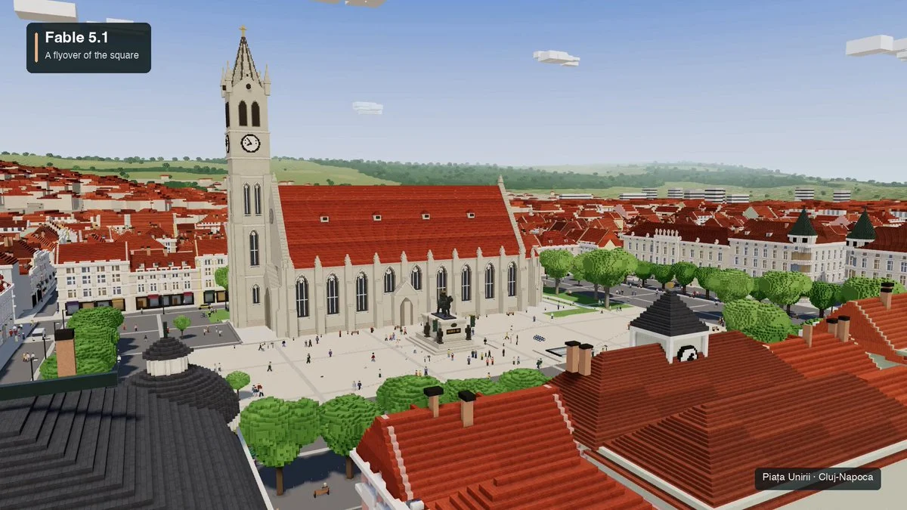</a>

</details>

Được biên soạn từ mô tả dự án công khai của tác giả.

```text
Tạo thế giới voxel tương tác tái hiện Piața Unirii ở Cluj-Napoca. Chuyển bố cục đặc trưng và các địa danh của quảng trường thành mô hình thu nhỏ có thể khám phá.
```

[Xem chi tiết ↗](https://www.tripo3d.ai/vi/3d-prompts/cluj-napoca-union-square-in-voxels-2096262733259837681) · [Xem video ↗](https://cdn-blog.holymolly.ai/media/production/3d-prompt-2096248939876126720-video-9e98c19a900a.mp4) · [Bài đăng gốc](https://x.com/danmana/status/2096262733259837681) · [Mã nguồn](https://github.com/danmana/piata-unirii) · [Bản demo](https://piata-unirii.vercel.app/runs/gpt-astra-xhigh-01/)

---

<a id="2095596175705399482"></a>

## Xã hội sinh tồn của những con người tự chủ trong Unreal Engine

[Matt Shumer](https://x.com/mattshumer_) · 2026-09-03 · **Yêu cầu được biên soạn từ mô tả gốc**

Bản yêu cầu có thể tái sử dụng, được biên soạn từ mô tả dự án công khai của tác giả. Đây không phải bản chép nguyên văn của một prompt chưa công bố.

<details>
<summary>Ảnh xem trước</summary>

<a href="https://www.tripo3d.ai/vi/3d-prompts/surviving-society-of-autonomous-unreal-humans-2095596175705399482"></a>

</details>

Bản yêu cầu dựa trên nguồn công khai; prompt gốc chính xác chưa được công bố

```text
Tạo một thế giới trong Unreal Engine với những nhân vật con người tự chủ. Mỗi người có nhu cầu riêng và cùng hướng đến mục tiêu sinh tồn, buộc họ phải giao tiếp, phân chia công việc, dựng nơi trú ẩn và duy trì xã hội ngay cả khi người chơi rời đi.
```

[Xem chi tiết ↗](https://www.tripo3d.ai/vi/3d-prompts/surviving-society-of-autonomous-unreal-humans-2095596175705399482) · [Xem video ↗](https://cdn-blog.holymolly.ai/media/production/3d-prompt-2095589100539531264-video-a133b7a6d1c6.mp4) · [Bài đăng gốc](https://x.com/mattshumer_/status/2095596175705399482)

---

<a id="2095609734845927525"></a>

## Dựng Manhattan trong Unreal Engine, từng con phố một

[Matt Shumer](https://x.com/mattshumer_) · 2026-09-03 · **Yêu cầu được biên soạn từ mô tả gốc**

Bản yêu cầu có thể tái sử dụng, được biên soạn từ mô tả dự án công khai của tác giả. Đây không phải bản chép nguyên văn của một prompt chưa công bố.

<details>
<summary>Ảnh xem trước</summary>

<a href="https://www.tripo3d.ai/vi/3d-prompts/street-by-street-manhattan-in-unreal-engine-2095609734845927525"></a>

</details>

Bản yêu cầu dựa trên nguồn công khai; prompt gốc chính xác chưa được công bố

```text
Dựng một Manhattan có thể khám phá trong Unreal Engine. Làm lần lượt từng quận, từng con phố, giữ tỷ lệ dễ nhận biết, bố cục đường sá, địa danh, giao thông và đặc trưng khu phố. Duy trì danh sách tiêu chí đánh giá và hoàn thiện từng khu vực trước khi chuyển sang nơi tiếp theo.
```

[Xem chi tiết ↗](https://www.tripo3d.ai/vi/3d-prompts/street-by-street-manhattan-in-unreal-engine-2095609734845927525) · [Xem video ↗](https://cdn-blog.holymolly.ai/media/production/3d-prompt-2095609426770010113-video-05968f9d59fb.mp4) · [Bài đăng gốc](https://x.com/mattshumer_/status/2095609734845927525)

---

<a id="2095636679264780481"></a>

## Cảnh biệt thự hiện đại trong Blender

[Karan](https://x.com/karankendre) · 2026-09-03 · **Yêu cầu được biên soạn từ mô tả gốc**

Bản yêu cầu có thể tái sử dụng, được biên soạn từ mô tả dự án công khai của tác giả. Đây không phải bản chép nguyên văn của một prompt chưa công bố.

<details>
<summary>Ảnh xem trước</summary>

<a href="https://www.tripo3d.ai/vi/3d-prompts/modern-villa-scene-in-blender-2095636679264780481"></a>

</details>

Bản yêu cầu dựa trên nguồn công khai; prompt gốc chính xác chưa được công bố

```text
Dựng một cảnh biệt thự hiện đại hoàn chỉnh trong Blender với kiến trúc nhất quán, nội thất đầy đủ, hồ bơi vô cực, cảnh quan, vật liệu chân thực và đường máy quay đậm chất điện ảnh trong giờ vàng.
```

[Xem chi tiết ↗](https://www.tripo3d.ai/vi/3d-prompts/modern-villa-scene-in-blender-2095636679264780481) · [Xem video ↗](https://cdn-blog.holymolly.ai/media/production/3d-prompt-2095636565192241152-video-97d4ec4c239f.mp4) · [Bài đăng gốc](https://x.com/karankendre/status/2095636679264780481)

---

<a id="2095599934766764338"></a>

## Game 3D trên trình duyệt từ một yêu cầu

[Theo - t3.gg](https://x.com/theo) · 2026-09-03 · **Yêu cầu được biên soạn từ mô tả gốc**

Bản yêu cầu có thể tái sử dụng, được biên soạn từ mô tả dự án công khai của tác giả. Đây không phải bản chép nguyên văn của một prompt chưa công bố.

<details>
<summary>Ảnh xem trước</summary>

<a href="https://www.tripo3d.ai/vi/3d-prompts/one-shot-browser-3d-game-2095599934766764338"></a>

</details>

Bản yêu cầu dựa trên nguồn công khai; prompt gốc chính xác chưa được công bố

```text
Tạo một game 3D hoàn chỉnh chạy trên trình duyệt trong một dự án độc lập. Có mục tiêu dễ hiểu, điều khiển nhạy, màn chơi hợp lý về không gian, kẻ địch hoặc chướng ngại, phản hồi rõ ràng, tính điểm, khởi động lại và biện pháp giữ hiệu năng ổn định.
```

[Xem chi tiết ↗](https://www.tripo3d.ai/vi/3d-prompts/one-shot-browser-3d-game-2095599934766764338) · [Xem video ↗](https://cdn-blog.holymolly.ai/media/production/3d-prompt-2095599652796272640-video-19ead087387b.mp4) · [Bài đăng gốc](https://x.com/theo/status/2095599934766764338)

---

<a id="2095598645190291775"></a>

## Từ ảnh ngôi nhà đến thế giới Blender có thể chỉnh sửa

[Tom Krcha](https://x.com/tomkrcha) · 2026-09-03 · **Yêu cầu được biên soạn từ mô tả gốc**

Bản yêu cầu có thể tái sử dụng, được biên soạn từ mô tả dự án công khai của tác giả. Đây không phải bản chép nguyên văn của một prompt chưa công bố.

<details>
<summary>Ảnh xem trước</summary>

<a href="https://www.tripo3d.ai/vi/3d-prompts/house-photo-to-editable-blender-world-2095598645190291775"></a>

</details>

Bản yêu cầu dựa trên nguồn công khai; prompt gốc chính xác chưa được công bố

```text
Dựng lại ngôi nhà trong ảnh được cung cấp thành một cảnh Blender có thể chỉnh sửa hoàn toàn. Tách kiến trúc, đồ nội thất, thiết bị và đồ chơi thành từng đối tượng, giữ tỷ lệ hợp lý và tạo trải nghiệm đi tham quan chạy cục bộ mượt ở 60 FPS.
```

[Xem chi tiết ↗](https://www.tripo3d.ai/vi/3d-prompts/house-photo-to-editable-blender-world-2095598645190291775) · [Xem video ↗](https://cdn-blog.holymolly.ai/media/production/3d-prompt-2095596412650283008-video-ba69ffc1845f.mp4) · [Bài đăng gốc](https://x.com/tomkrcha/status/2095598645190291775)

---

<a id="2095612137582526615"></a>

## Từ tin Zillow đến phim bất động sản 3D

[Yunfan Ye](https://x.com/realYunfanYe) · 2026-09-03 · **Yêu cầu được biên soạn từ mô tả gốc**

Bản yêu cầu có thể tái sử dụng, được biên soạn từ mô tả dự án công khai của tác giả. Đây không phải bản chép nguyên văn của một prompt chưa công bố.

<details>
<summary>Ảnh xem trước</summary>

<a href="https://www.tripo3d.ai/vi/3d-prompts/zillow-listing-to-3d-property-film-2095612137582526615"></a>

</details>

Bản yêu cầu dựa trên nguồn công khai; prompt gốc chính xác chưa được công bố

```text
Dùng tin đăng bất động sản và toàn bộ ảnh đi kèm để dựng lại ngôi nhà trong 3D, suy ra mặt bằng nhất quán rồi tạo video tham quan quảng bá chỉn chu. Đánh dấu phần hình học chưa chắc chắn và sửa sai lệch sau bản đầu tiên.
```

[Xem chi tiết ↗](https://www.tripo3d.ai/vi/3d-prompts/zillow-listing-to-3d-property-film-2095612137582526615) · [Xem video ↗](https://cdn-blog.holymolly.ai/media/production/3d-prompt-2095611898968547328-video-ac32ebda7148.mp4) · [Bài đăng gốc](https://x.com/realYunfanYe/status/2095612137582526615)

---

<a id="2095756085890310311"></a>

## Từ bản vẽ đầu máy hơi nước đến cụm lắp ráp Blender

[Tom Krcha](https://x.com/tomkrcha) · 2026-09-04 · **Yêu cầu được biên soạn từ mô tả gốc**

Bản yêu cầu có thể tái sử dụng, được biên soạn từ mô tả dự án công khai của tác giả. Đây không phải bản chép nguyên văn của một prompt chưa công bố.

<details>
<summary>Ảnh xem trước</summary>

<a href="https://www.tripo3d.ai/vi/3d-prompts/steam-train-drawing-to-editable-blender-assembly-2095756085890310311"></a>

</details>

Bản yêu cầu dựa trên nguồn công khai; prompt gốc chính xác chưa được công bố

```text
Dựng lại đầu máy hơi nước cổ trong bản vẽ thành cụm cơ khí chi tiết trong Blender. Giữ bánh xe, trục, hệ treo, thanh truyền, phụ kiện nồi hơi và các tấm vỏ thành đối tượng có tên, chỉnh sửa được, với ngân sách chi tiết có thể kiểm soát.
```

[Xem chi tiết ↗](https://www.tripo3d.ai/vi/3d-prompts/steam-train-drawing-to-editable-blender-assembly-2095756085890310311) · [Xem video ↗](https://cdn-blog.holymolly.ai/media/production/3d-prompt-2095754646069354497-video-61d8e4756cf0.mp4) · [Bài đăng gốc](https://x.com/tomkrcha/status/2095756085890310311)

---

<a id="2095630197257367857"></a>

## Bối cảnh Phòng Bầu dục dựng thủ tục cho Cycles

[Higgsfield AI 🧩](https://x.com/higgsfield_ai) · 2026-09-03 · **Yêu cầu được biên soạn từ mô tả gốc**

Bản yêu cầu có thể tái sử dụng, được biên soạn từ mô tả dự án công khai của tác giả. Đây không phải bản chép nguyên văn của một prompt chưa công bố.

<details>
<summary>Ảnh xem trước</summary>

<a href="https://www.tripo3d.ai/vi/3d-prompts/procedural-oval-office-set-for-cycles-2095630197257367857"></a>

</details>

Bản yêu cầu dựa trên nguồn công khai; prompt gốc chính xác chưa được công bố

```text
Chuyển mô tả thiết kế bối cảnh Phòng Bầu dục thành mã dựng cảnh có thể chạy. Tạo không gian trong Blender với nội thất, tường, ánh sáng và bố trí máy quay đều chỉnh sửa được, rồi render kết quả mang chất điện ảnh bằng Cycles.
```

[Xem chi tiết ↗](https://www.tripo3d.ai/vi/3d-prompts/procedural-oval-office-set-for-cycles-2095630197257367857) · [Xem video ↗](https://cdn-blog.holymolly.ai/media/production/3d-prompt-2095629993678344192-video-4ddc3c553b82.mp4) · [Bài đăng gốc](https://x.com/higgsfield_ai/status/2095630197257367857)

---

<a id="2095597137849446688"></a>

## Thế giới kiểu Minecraft từ một yêu cầu

[Flavio Adamo](https://x.com/flavioAd) · 2026-09-03 · **Yêu cầu được biên soạn từ mô tả gốc**

Bản yêu cầu có thể tái sử dụng, được biên soạn từ mô tả dự án công khai của tác giả. Đây không phải bản chép nguyên văn của một prompt chưa công bố.

<details>
<summary>Ảnh xem trước</summary>

<a href="https://www.tripo3d.ai/vi/3d-prompts/one-shot-minecraft-style-world-2095597137849446688"></a>

</details>

Bản yêu cầu dựa trên nguồn công khai; prompt gốc chính xác chưa được công bố

```text
Tạo ngay trong một lượt một thế giới voxel lấy cảm hứng từ Minecraft có thể chơi được: sinh địa hình, đặt và phá khối, điều khiển góc nhìn thứ nhất, hành trang, ánh sáng, nước và một vòng lặp sinh tồn gọn.
```

[Xem chi tiết ↗](https://www.tripo3d.ai/vi/3d-prompts/one-shot-minecraft-style-world-2095597137849446688) · [Xem video ↗](https://cdn-blog.holymolly.ai/media/production/3d-prompt-2095576150743400453-video-af32f40d4a39.mp4) · [Bài đăng gốc](https://x.com/flavioAd/status/2095597137849446688)

---

<a id="2095653641164329143"></a>

## Tái hiện Palace of Fine Arts trong Blender

[Sharif Shameem](https://x.com/sharifshameem) · 2026-09-03 · **Yêu cầu được biên soạn từ mô tả gốc**

Bản yêu cầu có thể tái sử dụng, được biên soạn từ mô tả dự án công khai của tác giả. Đây không phải bản chép nguyên văn của một prompt chưa công bố.

<details>
<summary>Ảnh xem trước</summary>

<a href="https://www.tripo3d.ai/vi/3d-prompts/palace-of-fine-arts-blender-recreation-2095653641164329143"></a>

</details>

Bản yêu cầu dựa trên nguồn công khai; prompt gốc chính xác chưa được công bố

```text
Tái hiện Palace of Fine Arts ở San Francisco trong Blender với tỷ lệ nhà tròn dễ nhận biết, hàng cột, hồ nước, cây cối, vật liệu phong hóa và ánh sáng điện ảnh mang tinh thần lạc quan của thời hội chợ thế giới.
```

[Xem chi tiết ↗](https://www.tripo3d.ai/vi/3d-prompts/palace-of-fine-arts-blender-recreation-2095653641164329143) · [Xem video ↗](https://cdn-blog.holymolly.ai/media/production/3d-prompt-2095652923917361152-video-39313e3745d0.mp4) · [Bài đăng gốc](https://x.com/sharifshameem/status/2095653641164329143)

---

<a id="2095776685807346105"></a>

## Thị trấn có thể đi dạo từ sáu bức tranh Van Gogh

[Peter Gostev](https://x.com/petergostev) · 2026-09-04 · **Yêu cầu được biên soạn từ mô tả gốc**

Bản yêu cầu có thể tái sử dụng, được biên soạn từ mô tả dự án công khai của tác giả. Đây không phải bản chép nguyên văn của một prompt chưa công bố.

<details>
<summary>Ảnh xem trước</summary>

<a href="https://www.tripo3d.ai/vi/3d-prompts/walkable-town-made-from-six-van-gogh-paintings-2095776685807346105"></a>

</details>

Bản yêu cầu dựa trên nguồn công khai; prompt gốc chính xác chưa được công bố

```text
Biến sáu bức tranh Van Gogh được cung cấp thành một thị trấn Three.js thống nhất có thể đi dạo. Giữ bảng màu và nét cọ riêng của từng tranh, đồng thời nối đường phố, địa danh và các đoạn chuyển tiếp thành một thế giới có thể khám phá.
```

[Xem chi tiết ↗](https://www.tripo3d.ai/vi/3d-prompts/walkable-town-made-from-six-van-gogh-paintings-2095776685807346105) · [Xem video ↗](https://cdn-blog.holymolly.ai/media/production/3d-prompt-2095776416302280708-video-abded525de38.mp4) · [Bài đăng gốc](https://x.com/petergostev/status/2095776685807346105) · [Bản demo](https://van-goghs-town.surge.sh/)

---

<a id="2095608358086840647"></a>

## Tạo game 3D bằng giọng nói cho người mới

[el.cine](https://x.com/EHuanglu) · 2026-09-03 · **Yêu cầu được biên soạn từ mô tả gốc**

Bản yêu cầu có thể tái sử dụng, được biên soạn từ mô tả dự án công khai của tác giả. Đây không phải bản chép nguyên văn của một prompt chưa công bố.

<details>
<summary>Ảnh xem trước</summary>

<a href="https://www.tripo3d.ai/vi/3d-prompts/voice-directed-3d-game-for-beginners-2095608358086840647"></a>

</details>

Bản yêu cầu dựa trên nguồn công khai; prompt gốc chính xác chưa được công bố

```text
Hãy làm người xây dựng game 3D cho tôi. Chỉ hỏi thêm về mục tiêu người chơi, định hướng hình ảnh và điều khiển còn thiếu, sau đó tạo game trình duyệt có thể chơi ngay và tiếp tục chỉnh sửa theo các chỉ dẫn giọng nói ngắn.
```

[Xem chi tiết ↗](https://www.tripo3d.ai/vi/3d-prompts/voice-directed-3d-game-for-beginners-2095608358086840647) · [Xem video ↗](https://cdn-blog.holymolly.ai/media/production/3d-prompt-2095608290923425792-video-163f53a6c23f.mp4) · [Bài đăng gốc](https://x.com/EHuanglu/status/2095608358086840647)

---

<a id="2095580402505400369"></a>

## Ba game đua kart theo chủ đề từ một bản greybox

[Chetaslua](https://x.com/chetaslua) · 2026-09-03 · **Yêu cầu được biên soạn từ mô tả gốc**

Bản yêu cầu có thể tái sử dụng, được biên soạn từ mô tả dự án công khai của tác giả. Đây không phải bản chép nguyên văn của một prompt chưa công bố.

<details>
<summary>Ảnh xem trước</summary>

<a href="https://www.tripo3d.ai/vi/3d-prompts/three-themed-kart-games-from-one-greybox-2095580402505400369"></a>

</details>

Bản yêu cầu dựa trên nguồn công khai; prompt gốc chính xác chưa được công bố

```text
Dùng bản greybox đua kart Unity được cung cấp để tạo ba phiên bản chơi được: cướp biển, kẹo ngọt và cyberpunk. Tái sử dụng vòng lặp lái xe cốt lõi, thay môi trường và phản hồi, chơi thử từng bản rồi sửa các lỗi dễ thấy nhất.
```

[Xem chi tiết ↗](https://www.tripo3d.ai/vi/3d-prompts/three-themed-kart-games-from-one-greybox-2095580402505400369) · [Xem video ↗](https://cdn-blog.holymolly.ai/media/production/3d-prompt-2095580316710879232-video-b3f497eb07bb.mp4) · [Bài đăng gốc](https://x.com/chetaslua/status/2095580402505400369)

---

<a id="2095596341422440714"></a>

## Phiêu lưu thế giới mở trên trình duyệt

[Peter Gostev](https://x.com/petergostev) · 2026-09-03 · **Yêu cầu được biên soạn từ mô tả gốc**

Bản yêu cầu có thể tái sử dụng, được biên soạn từ mô tả dự án công khai của tác giả. Đây không phải bản chép nguyên văn của một prompt chưa công bố.

<details>
<summary>Ảnh xem trước</summary>

<a href="https://www.tripo3d.ai/vi/3d-prompts/open-world-browser-adventure-2095596341422440714"></a>

</details>

Bản yêu cầu dựa trên nguồn công khai; prompt gốc chính xác chưa được công bố

```text
Tạo một game phiêu lưu 3D thế giới mở với nhiều quần xã kết nối, di chuyển, khám phá, chiến đấu nhẹ, nhiệm vụ, địa danh và bầu không khí ngày đêm. Có đủ chỉ dẫn để việc khám phá mang cảm giác có mục đích.
```

[Xem chi tiết ↗](https://www.tripo3d.ai/vi/3d-prompts/open-world-browser-adventure-2095596341422440714) · [Xem video ↗](https://cdn-blog.holymolly.ai/media/production/3d-prompt-2095590957890797568-video-da104fbe8619.mp4) · [Bài đăng gốc](https://x.com/petergostev/status/2095596341422440714)

---

<a id="2095619319690400253"></a>

## Studio mockup sản phẩm 3D chân thực

[Josh Millgate](https://x.com/joshmillgate) · 2026-09-03 · **Yêu cầu được biên soạn từ mô tả gốc**

Bản yêu cầu có thể tái sử dụng, được biên soạn từ mô tả dự án công khai của tác giả. Đây không phải bản chép nguyên văn của một prompt chưa công bố.

<details>
<summary>Ảnh xem trước</summary>

<a href="https://www.tripo3d.ai/vi/3d-prompts/photoreal-3d-product-mockup-studio-2095619319690400253"></a>

</details>

Bản yêu cầu dựa trên nguồn công khai; prompt gốc chính xác chưa được công bố

```text
Tạo công cụ trình duyệt đặt hình ảnh tải lên lên mockup sản phẩm 3D chân thực. Hỗ trợ xoay camera, chỉnh vật liệu và màu, ánh sáng môi trường, nhiều sản phẩm và xuất ảnh độ phân giải cao.
```

[Xem chi tiết ↗](https://www.tripo3d.ai/vi/3d-prompts/photoreal-3d-product-mockup-studio-2095619319690400253) · [Xem video ↗](https://cdn-blog.holymolly.ai/media/production/3d-prompt-2095619198437240836-video-0980b9ee2b65.mp4) · [Bài đăng gốc](https://x.com/joshmillgate/status/2095619319690400253)

---

<a id="2095611134992945385"></a>

## Game thủy cung 3D từ ảnh tham chiếu

[Tim Jayas](https://x.com/TimJayas) · 2026-09-03 · **Yêu cầu được biên soạn từ mô tả gốc**

Bản yêu cầu có thể tái sử dụng, được biên soạn từ mô tả dự án công khai của tác giả. Đây không phải bản chép nguyên văn của một prompt chưa công bố.

<details>
<summary>Ảnh xem trước</summary>

<a href="https://www.tripo3d.ai/vi/3d-prompts/reference-image-3d-aquarium-game-2095611134992945385"></a>

</details>

Bản yêu cầu dựa trên nguồn công khai; prompt gốc chính xác chưa được công bố

```text
Dùng ảnh tham chiếu được cung cấp để tạo game thủy cung 3D hoàn chỉnh trong một lượt. Dựng lại bố cục bể, tạo chuyển động cho cá, thêm cho ăn và sưu tầm, hiệu ứng nước, điều khiển camera và mục tiêu rõ ràng.
```

[Xem chi tiết ↗](https://www.tripo3d.ai/vi/3d-prompts/reference-image-3d-aquarium-game-2095611134992945385) · [Xem video ↗](https://cdn-blog.holymolly.ai/media/production/3d-prompt-2095610918570958848-video-154a5abed1ba.mp4) · [Bài đăng gốc](https://x.com/TimJayas/status/2095611134992945385)

---

<a id="2095647685210669541"></a>

## Game 3D thời gian thực chơi được từ một prompt

[Higgsfield AI 🧩](https://x.com/higgsfield) · 2026-09-03 · **Yêu cầu được biên soạn từ mô tả gốc**

Bản yêu cầu có thể tái sử dụng, được biên soạn từ mô tả dự án công khai của tác giả. Đây không phải bản chép nguyên văn của một prompt chưa công bố.

<details>
<summary>Ảnh xem trước</summary>

<a href="https://www.tripo3d.ai/vi/3d-prompts/single-playable-real-time-3d-game-2095647685210669541"></a>

</details>

Bản yêu cầu dựa trên nguồn công khai; prompt gốc chính xác chưa được công bố

```text
Tạo một game 3D thời gian thực có thể chơi từ một prompt. Xác định cơ chế cốt lõi gọn, mục tiêu rõ ràng và câu chuyện ngắn, rồi tạo cảnh, nhân vật, đạo cụ, phản hồi và trạng thái khởi động lại để chơi được ngay.
```

[Xem chi tiết ↗](https://www.tripo3d.ai/vi/3d-prompts/single-playable-real-time-3d-game-2095647685210669541) · [Xem video ↗](https://cdn-blog.holymolly.ai/media/production/3d-prompt-2095639396385198080-video-2439075a6fef.mp4) · [Bài đăng gốc](https://x.com/higgsfield/status/2095647685210669541)

---

<a id="2095840435319001278"></a>

## Cảnh hải chiến Three.js trong một lượt

[leo 🐾](https://x.com/synthwavedd) · 2026-09-04 · **Yêu cầu được biên soạn từ mô tả gốc**

Bản yêu cầu có thể tái sử dụng, được biên soạn từ mô tả dự án công khai của tác giả. Đây không phải bản chép nguyên văn của một prompt chưa công bố.

<details>
<summary>Ảnh xem trước</summary>

<a href="https://www.tripo3d.ai/vi/3d-prompts/single-turn-three-js-naval-war-scene-2095840435319001278"></a>

</details>

Bản yêu cầu dựa trên nguồn công khai; prompt gốc chính xác chưa được công bố

```text
Tạo trận hải chiến chi tiết trên Three.js trong một lượt. Có nhiều tàu khác nhau, tương tác với nước thuyết phục về vật lý, vệt sóng và nước bắn, hoạt động trên không, vụ nổ, ánh sáng điện ảnh, chuyển động camera và render có cân nhắc hiệu năng.
```

[Xem chi tiết ↗](https://www.tripo3d.ai/vi/3d-prompts/single-turn-three-js-naval-war-scene-2095840435319001278) · [Xem video ↗](https://cdn-blog.holymolly.ai/media/production/3d-prompt-2095839735818412033-video-7ded403f2fb9.mp4) · [Bài đăng gốc](https://x.com/synthwavedd/status/2095840435319001278)

---

<a id="2095598026916049024"></a>

## FPS nhiều người 10 đấu 10 lấy cảm hứng từ Halo

[Halfdan](https://x.com/VikiingAI) · 2026-09-03 · **Yêu cầu được biên soạn từ mô tả gốc**

Bản yêu cầu có thể tái sử dụng, được biên soạn từ mô tả dự án công khai của tác giả. Đây không phải bản chép nguyên văn của một prompt chưa công bố.

<details>
<summary>Ảnh xem trước</summary>

<a href="https://www.tripo3d.ai/vi/3d-prompts/10v10-halo-inspired-multiplayer-fps-2095598026916049024"></a>

</details>

Bản yêu cầu dựa trên nguồn công khai; prompt gốc chính xác chưa được công bố

```text
Tạo game bắn súng đấu trường nhiều người 10 đấu 10 lấy cảm hứng từ FPS khoa học viễn tưởng cổ điển. Có đội, hồi sinh, vũ khí dễ phân biệt, khiên, vật phẩm nhặt được, bản đồ gọn, tính điểm, tiến trình trận đấu và chơi trên trình duyệt với độ trễ thấp.
```

[Xem chi tiết ↗](https://www.tripo3d.ai/vi/3d-prompts/10v10-halo-inspired-multiplayer-fps-2095598026916049024) · [Xem video ↗](https://cdn-blog.holymolly.ai/media/production/3d-prompt-2095597293734895622-video-abe5a7cfbbd9.mp4) · [Bài đăng gốc](https://x.com/VikiingAI/status/2095598026916049024)

---

<a id="2095719731860750613"></a>

## Mô hình đường sắt voxel tương tác

[Derya Unutmaz, MD](https://x.com/DeryaTR_) · 2026-09-04 · **Yêu cầu được biên soạn từ mô tả gốc**

Bản yêu cầu có thể tái sử dụng, được biên soạn từ mô tả dự án công khai của tác giả. Đây không phải bản chép nguyên văn của một prompt chưa công bố.

<details>
<summary>Ảnh xem trước</summary>

<a href="https://www.tripo3d.ai/vi/3d-prompts/interactive-voxel-railway-table-2095719731860750613"></a>

</details>

Bản yêu cầu dựa trên nguồn công khai; prompt gốc chính xác chưa được công bố

```text
Tạo mô hình đường sắt voxel chi tiết trên Three.js. Cho người dùng chạy và dừng nhiều đoàn tàu, chuyển đường ray, xoay và phóng to quanh bàn, xem các thị trấn thu nhỏ và kích hoạt hoạt cảnh môi trường nhỏ.
```

[Xem chi tiết ↗](https://www.tripo3d.ai/vi/3d-prompts/interactive-voxel-railway-table-2095719731860750613) · [Xem video ↗](https://cdn-blog.holymolly.ai/media/production/3d-prompt-2095719136571629573-video-a0540558f73b.mp4) · [Bài đăng gốc](https://x.com/DeryaTR_/status/2095719731860750613) · [Bản demo](https://lindenhafen-railway.vercel.app/)

---

<a id="2095699049722581065"></a>

## Con tàu voxel sống động trong chai

[Derya Unutmaz, MD](https://x.com/DeryaTR_) · 2026-09-04 · **Yêu cầu được biên soạn từ mô tả gốc**

Bản yêu cầu có thể tái sử dụng, được biên soạn từ mô tả dự án công khai của tác giả. Đây không phải bản chép nguyên văn của một prompt chưa công bố.

<details>
<summary>Ảnh xem trước</summary>

<a href="https://www.tripo3d.ai/vi/3d-prompts/living-voxel-ship-in-a-bottle-2095699049722581065"></a>

</details>

Bản yêu cầu dựa trên nguồn công khai; prompt gốc chính xác chưa được công bố

```text
Tạo con tàu voxel thế kỷ 17 chi tiết đang chạy bên trong chai thủy tinh. Mô phỏng sóng và chuyển động tàu, thêm hải âu bay vòng, cảng thu nhỏ và rạn san hô, rồi tạo chuỗi máy quay điện ảnh cùng nhạc nền êm dịu.
```

[Xem chi tiết ↗](https://www.tripo3d.ai/vi/3d-prompts/living-voxel-ship-in-a-bottle-2095699049722581065) · [Xem video ↗](https://cdn-blog.holymolly.ai/media/production/3d-prompt-2095698775075622912-video-e275aa332ebb.mp4) · [Bài đăng gốc](https://x.com/DeryaTR_/status/2095699049722581065)

---

<a id="2095641163441254676"></a>

## Cụm CAD USS Enterprise có thể in

[Derya Unutmaz, MD](https://x.com/DeryaTR_) · 2026-09-03 · **Yêu cầu được biên soạn từ mô tả gốc**

Bản yêu cầu có thể tái sử dụng, được biên soạn từ mô tả dự án công khai của tác giả. Đây không phải bản chép nguyên văn của một prompt chưa công bố.

<details>
<summary>Ảnh xem trước</summary>

<a href="https://www.tripo3d.ai/vi/3d-prompts/printable-uss-enterprise-cad-assembly-2095641163441254676"></a>

</details>

Bản yêu cầu dựa trên nguồn công khai; prompt gốc chính xác chưa được công bố

```text
Thiết kế trong CAD một mô hình nguyên bản tri ân USS Enterprise NCC-1701, sẵn sàng để in. Có tỷ lệ dễ nhận biết, cầu tàu và một số nội thất, ít nhất 28 chi tiết chuyển động hoạt động được, cụm lắp ráp tách riêng và tệp sản xuất có thể xuất.
```

[Xem chi tiết ↗](https://www.tripo3d.ai/vi/3d-prompts/printable-uss-enterprise-cad-assembly-2095641163441254676) · [Xem video ↗](https://cdn-blog.holymolly.ai/media/production/3d-prompt-2095640960680243200-video-272db069f601.mp4) · [Bài đăng gốc](https://x.com/DeryaTR_/status/2095641163441254676)

---

<a id="2095630044102279312"></a>

## Game bay xuyên hào không gian trong Unity

[Ronald Mannak](https://x.com/ronaldmannak) · 2026-09-03 · **Yêu cầu được biên soạn từ mô tả gốc**

Bản yêu cầu có thể tái sử dụng, được biên soạn từ mô tả dự án công khai của tác giả. Đây không phải bản chép nguyên văn của một prompt chưa công bố.

<details>
<summary>Ảnh xem trước</summary>

<a href="https://www.tripo3d.ai/vi/3d-prompts/unity-space-trench-run-game-2095630044102279312"></a>

</details>

Bản yêu cầu dựa trên nguồn công khai; prompt gốc chính xác chưa được công bố

```text
Tái hiện cảm giác bay xuyên hào không gian kinh điển trong Unity: bay nhanh sát bề mặt, hỏa lực tháp súng, chướng ngại, ngắm mục tiêu, áp lực tăng dần, mục tiêu cuối và chuỗi thành công hoặc thất bại mang chất điện ảnh.
```

[Xem chi tiết ↗](https://www.tripo3d.ai/vi/3d-prompts/unity-space-trench-run-game-2095630044102279312) · [Xem video ↗](https://cdn-blog.holymolly.ai/media/production/3d-prompt-2067003685574483968-video-f9b57b7e0d54.mp4) · [Bài đăng gốc](https://x.com/ronaldmannak/status/2095630044102279312)

---

<a id="2093690427849191855"></a>

## Trình diễn lâu đài voxel thủ tục

[Hakm](https://x.com/hakmgpt) · 2026-08-29 · **Yêu cầu được biên soạn từ mô tả gốc**

Bản yêu cầu có thể tái sử dụng, được biên soạn từ mô tả dự án công khai của tác giả. Đây không phải bản chép nguyên văn của một prompt chưa công bố.

<details>
<summary>Ảnh xem trước</summary>

<a href="https://www.tripo3d.ai/vi/3d-prompts/procedural-voxel-castle-showcase-2093690427849191855"></a>

</details>

Bản yêu cầu dựa trên nguồn công khai; prompt gốc chính xác chưa được công bố

```text
Sinh một lâu đài voxel lớn với các lớp phòng thủ rõ ràng, tháp, tường, cổng, sân và địa hình xung quanh. Dùng instancing, camera xoay quanh, ánh sáng thay đổi và sinh có tính xác định để kết quả ổn định, dễ quan sát.
```

[Xem chi tiết ↗](https://www.tripo3d.ai/vi/3d-prompts/procedural-voxel-castle-showcase-2093690427849191855) · [Xem video ↗](https://cdn-blog.holymolly.ai/media/production/3d-prompt-2093690174018330624-video-184f0db40faf.mp4) · [Bài đăng gốc](https://x.com/hakmgpt/status/2093690427849191855)

---

<a id="2095597640587374887"></a>

## Thành phố Unity có thể khám phá từ thư viện asset

[Chetaslua](https://x.com/chetaslua) · 2026-09-03 · **Yêu cầu được biên soạn từ mô tả gốc**

Bản yêu cầu có thể tái sử dụng, được biên soạn từ mô tả dự án công khai của tác giả. Đây không phải bản chép nguyên văn của một prompt chưa công bố.

<details>
<summary>Ảnh xem trước</summary>

<a href="https://www.tripo3d.ai/vi/3d-prompts/asset-driven-explorable-unity-city-2095597640587374887"></a>

</details>

Bản yêu cầu dựa trên nguồn công khai; prompt gốc chính xác chưa được công bố

```text
Lắp ráp một thành phố Unity có thể khám phá từ thư viện asset được cung cấp. Tạo mạng đường nhất quán, nhà cao tầng, xe cộ, cây cọ, ánh sáng và điều hướng, rồi tối ưu cảnh để có chuyến tham quan góc nhìn thứ nhất ổn định.
```

[Xem chi tiết ↗](https://www.tripo3d.ai/vi/3d-prompts/asset-driven-explorable-unity-city-2095597640587374887) · [Xem video ↗](https://cdn-blog.holymolly.ai/media/production/3d-prompt-2095597547717029888-video-fda40533e887.mp4) · [Bài đăng gốc](https://x.com/chetaslua/status/2095597640587374887)

---

<a id="2095868420327710840"></a>

## Đầu máy Blender đầy đủ cấu tạo cơ khí

[sheemamoto](https://x.com/sheemamoto) · 2026-09-04 · **Yêu cầu được biên soạn từ mô tả gốc**

Bản yêu cầu có thể tái sử dụng, được biên soạn từ mô tả dự án công khai của tác giả. Đây không phải bản chép nguyên văn của một prompt chưa công bố.

<details>
<summary>Ảnh xem trước</summary>

<a href="https://www.tripo3d.ai/vi/3d-prompts/mechanically-complete-blender-locomotive-2095868420327710840"></a>

</details>

Bản yêu cầu dựa trên nguồn công khai; prompt gốc chính xác chưa được công bố

```text
Dựng đầu máy hơi nước trong Blender như một cấu trúc cơ khí thực sự, không phải lớp vỏ có texture. Đặt tên và tách riêng trục, dẫn hướng hộp trục, hộp trục, thanh giằng, liên kết hệ treo, vòm hơi và mọi cụm chính.
```

[Xem chi tiết ↗](https://www.tripo3d.ai/vi/3d-prompts/mechanically-complete-blender-locomotive-2095868420327710840) · [Xem video ↗](https://cdn-blog.holymolly.ai/media/production/3d-prompt-2095868324701700098-video-0cc691c80738.mp4) · [Bài đăng gốc](https://x.com/sheemamoto/status/2095868420327710840)

---

<a id="2095819786651374023"></a>

## Tidal Rush: game trình duyệt với tám tay đua

[RESONANCE SCIENCE 🧬🔬](https://x.com/amazing13_13) · 2026-09-04 · **Yêu cầu được biên soạn từ mô tả gốc**

Bản yêu cầu có thể tái sử dụng, được biên soạn từ mô tả dự án công khai của tác giả. Đây không phải bản chép nguyên văn của một prompt chưa công bố.

<details>
<summary>Ảnh xem trước</summary>

<a href="https://www.tripo3d.ai/vi/3d-prompts/tidal-rush-eight-racer-browser-game-2095819786651374023"></a>

</details>

Bản yêu cầu dựa trên nguồn công khai; prompt gốc chính xác chưa được công bố

```text
Tạo game đua kart trên trình duyệt hoàn chỉnh với tám tay đua, ba vòng, drift, vật phẩm nhặt được, vật lý nhạy, HUD rõ ràng, đồ họa đẹp và màn kết quả sau khi về đích.
```

[Xem chi tiết ↗](https://www.tripo3d.ai/vi/3d-prompts/tidal-rush-eight-racer-browser-game-2095819786651374023) · [Xem video ↗](https://cdn-blog.holymolly.ai/media/production/3d-prompt-2095817928524599296-video-68a8b3595841.mp4) · [Bài đăng gốc](https://x.com/amazing13_13/status/2095819786651374023)

---

<a id="2095805694603673631"></a>

## Hero thiên hà WebGL thời gian thực

[Fluxora](https://x.com/Fluxora_Studios) · 2026-09-04 · **Yêu cầu được biên soạn từ mô tả gốc**

Bản yêu cầu có thể tái sử dụng, được biên soạn từ mô tả dự án công khai của tác giả. Đây không phải bản chép nguyên văn của một prompt chưa công bố.

<details>
<summary>Ảnh xem trước</summary>

<a href="https://www.tripo3d.ai/vi/3d-prompts/real-time-webgl-galaxy-launch-hero-2095805694603673631"></a>

</details>

Bản yêu cầu dựa trên nguồn công khai; prompt gốc chính xác chưa được công bố

```text
Phân tích ngôn ngữ hình ảnh của hero thiên hà được cung cấp và dựng lại bằng WebGL thời gian thực thay vì video. Dùng hạt có chiều sâu, bụi phát sáng, phản ứng con trỏ mượt, không gian chữ tiết chế và hiệu năng thích ứng.
```

[Xem chi tiết ↗](https://www.tripo3d.ai/vi/3d-prompts/real-time-webgl-galaxy-launch-hero-2095805694603673631) · [Xem video ↗](https://cdn-blog.holymolly.ai/media/production/3d-prompt-2095804250420879360-video-dc96ce63180f.mp4) · [Bài đăng gốc](https://x.com/Fluxora_Studios/status/2095805694603673631)

---

<a id="2095898198413922791"></a>

## Game arcade văn hóa tự chơi

[Good Morning](https://x.com/say_gm_) · 2026-09-04 · **Yêu cầu được biên soạn từ mô tả gốc**

Bản yêu cầu có thể tái sử dụng, được biên soạn từ mô tả dự án công khai của tác giả. Đây không phải bản chép nguyên văn của một prompt chưa công bố.

<details>
<summary>Ảnh xem trước</summary>

<a href="https://www.tripo3d.ai/vi/3d-prompts/self-playing-cultural-arcade-game-2095898198413922791"></a>

</details>

Bản yêu cầu dựa trên nguồn công khai; prompt gốc chính xác chưa được công bố

```text
Tạo một game arcade tự chơi cho một quốc gia G7. Biến địa danh văn hóa dễ nhận biết thành cơ chế chính, làm hành động dễ hiểu mà không cần nhập lệnh, thêm điểm, thử thách tăng dần và màn hé lộ đáng nhớ.
```

[Xem chi tiết ↗](https://www.tripo3d.ai/vi/3d-prompts/self-playing-cultural-arcade-game-2095898198413922791) · [Xem video ↗](https://cdn-blog.holymolly.ai/media/production/3d-prompt-2095897987142791169-video-f889a9dbf887.mp4) · [Bài đăng gốc](https://x.com/say_gm_/status/2095898198413922791)

---

<a id="2095597560253862065"></a>

## Nguyên mẫu tương tác cao cấp trong một lượt

[AJ Orbach 🐳](https://x.com/AY_Orbach) · 2026-09-03 · **Yêu cầu được biên soạn từ mô tả gốc**

Bản yêu cầu có thể tái sử dụng, được biên soạn từ mô tả dự án công khai của tác giả. Đây không phải bản chép nguyên văn của một prompt chưa công bố.

<details>
<summary>Ảnh xem trước</summary>

<a href="https://www.tripo3d.ai/vi/3d-prompts/one-shot-premium-interactive-prototype-2095597560253862065"></a>

</details>

Bản yêu cầu dựa trên nguồn công khai; prompt gốc chính xác chưa được công bố

```text
Thiết kế và triển khai nguyên mẫu tương tác chỉn chu trong một lượt từ ý tưởng sản phẩm được cung cấp. Chọn hệ hình ảnh mạnh, ưu tiên hành động chính, thêm chuyển cảnh mượt và bàn giao bản responsive đã được đưa lên web.
```

[Xem chi tiết ↗](https://www.tripo3d.ai/vi/3d-prompts/one-shot-premium-interactive-prototype-2095597560253862065) · [Xem video ↗](https://cdn-blog.holymolly.ai/media/production/3d-prompt-2095596408040468483-video-09e9e1639c30.mp4) · [Bài đăng gốc](https://x.com/AY_Orbach/status/2095597560253862065)

---

<a id="2095776712579571725"></a>

## Mô hình turbo 3D tương tác dạng tháo rời

[Feraser](https://x.com/Feraser8) · 2026-09-04 · **Prompt đã công bố**

Tác giả đã công bố nguyên văn yêu cầu trong bài X được liên kết; chỉ chuẩn hóa nhẹ dấu câu và định dạng.

<details>
<summary>Ảnh xem trước</summary>

<a href="https://www.tripo3d.ai/vi/3d-prompts/exploded-interactive-3d-turbocharger-2095776712579571725"></a>

</details>

Prompt nguyên văn do tác giả công bố

```text
Dựng một bộ tăng áp turbo 3D tương tác. Tách riêng mọi hệ thống hoạt động. Cho tôi xoay nó, cô lập từng phần và thấy rõ cỗ máy đang làm gì.
```

[Xem chi tiết ↗](https://www.tripo3d.ai/vi/3d-prompts/exploded-interactive-3d-turbocharger-2095776712579571725) · [Xem video ↗](https://cdn-blog.holymolly.ai/media/production/3d-prompt-2095769948190801920-video-b6c916167d68.mp4) · [Bài đăng gốc](https://x.com/Feraser8/status/2095776712579571725)

---

<a id="2095663498101662198"></a>

## Game Three.js gây bất ngờ trong một lượt

[Prathamesh](https://x.com/pratt_builds) · 2026-09-04 · **Yêu cầu được biên soạn từ mô tả gốc**

Bản yêu cầu có thể tái sử dụng, được biên soạn từ mô tả dự án công khai của tác giả. Đây không phải bản chép nguyên văn của một prompt chưa công bố.

<details>
<summary>Ảnh xem trước</summary>

<a href="https://www.tripo3d.ai/vi/3d-prompts/one-shot-three-js-surprise-game-2095663498101662198"></a>

</details>

Bản yêu cầu dựa trên nguồn công khai; prompt gốc chính xác chưa được công bố

```text
Tạo một game Three.js nguyên bản trong một lượt, xứng đáng với tên “Amaze”. Chọn một cơ chế hình ảnh bất ngờ, dạy người chơi trong vài giây, xây dựng nhịp tiến triển ngắn và kết thúc bằng màn trình diễn mãn nhãn.
```

[Xem chi tiết ↗](https://www.tripo3d.ai/vi/3d-prompts/one-shot-three-js-surprise-game-2095663498101662198) · [Xem video ↗](https://cdn-blog.holymolly.ai/media/production/3d-prompt-2095663390886912001-video-84fe550dddf8.mp4) · [Bài đăng gốc](https://x.com/pratt_builds/status/2095663498101662198)

---

<a id="2095907526566990013"></a>

## Nguyên mẫu game chơi được thật nhanh

[GLUNIVERSE™](https://x.com/gibglue) · 2026-09-04 · **Yêu cầu được biên soạn từ mô tả gốc**

Bản yêu cầu có thể tái sử dụng, được biên soạn từ mô tả dự án công khai của tác giả. Đây không phải bản chép nguyên văn của một prompt chưa công bố.

<details>
<summary>Ảnh xem trước</summary>

<a href="https://www.tripo3d.ai/vi/3d-prompts/rapid-playable-game-prototype-2095907526566990013"></a>

</details>

Bản yêu cầu dựa trên nguồn công khai; prompt gốc chính xác chưa được công bố

```text
Tạo nguyên mẫu game nhất quán về hình ảnh dưới giới hạn thời gian và token nghiêm ngặt. Ưu tiên một vòng lặp hoàn chỉnh, điều khiển nhạy, phản hồi rõ, hiệu năng ổn định và bản trình duyệt có thể phát hành thay vì số lượng tính năng.
```

[Xem chi tiết ↗](https://www.tripo3d.ai/vi/3d-prompts/rapid-playable-game-prototype-2095907526566990013) · [Xem video ↗](https://cdn-blog.holymolly.ai/media/production/3d-prompt-2095907053655248897-video-e9b0bdbb4b6c.mp4) · [Bài đăng gốc](https://x.com/gibglue/status/2095907526566990013)

---

<a id="2095872986477908108"></a>

## Từ prompt đến game thế giới mở

[Ejaj AHmed 🦅](https://x.com/aeejazkhan) · 2026-09-04 · **Yêu cầu được biên soạn từ mô tả gốc**

Bản yêu cầu có thể tái sử dụng, được biên soạn từ mô tả dự án công khai của tác giả. Đây không phải bản chép nguyên văn của một prompt chưa công bố.

<details>
<summary>Ảnh xem trước</summary>

<a href="https://www.tripo3d.ai/vi/3d-prompts/open-world-game-from-a-prompt-2095872986477908108"></a>

</details>

Bản yêu cầu dựa trên nguồn công khai; prompt gốc chính xác chưa được công bố

```text
Tạo game thế giới mở từ ý tưởng: [bối cảnh thế giới]. Có ba vùng riêng biệt, di chuyển, các cuộc gặp động, chuỗi nhiệm vụ đơn giản, địa danh, lưu và khởi động lại cùng mức tối ưu đủ để chạy trên trình duyệt.
```

[Xem chi tiết ↗](https://www.tripo3d.ai/vi/3d-prompts/open-world-game-from-a-prompt-2095872986477908108) · [Xem video ↗](https://cdn-blog.holymolly.ai/media/production/3d-prompt-2095872181087670272-video-b49ed9994d6c.mp4) · [Bài đăng gốc](https://x.com/aeejazkhan/status/2095872986477908108)

---

<a id="2095806515579879457"></a>

## Trang chủ thiên hà Three.js tương tác

[Three.js Resources](https://x.com/threejsresource) · 2026-09-04 · **Yêu cầu được biên soạn từ mô tả gốc**

Bản yêu cầu có thể tái sử dụng, được biên soạn từ mô tả dự án công khai của tác giả. Đây không phải bản chép nguyên văn của một prompt chưa công bố.

<details>
<summary>Ảnh xem trước</summary>

<a href="https://www.tripo3d.ai/vi/3d-prompts/interactive-three-js-galaxy-homepage-2095806515579879457"></a>

</details>

Bản yêu cầu dựa trên nguồn công khai; prompt gốc chính xác chưa được công bố

```text
Tạo hero trang ra mắt cao cấp xoay quanh thiên hà Three.js thời gian thực. Cho các hạt tạo thành bóng dáng số sáu tinh tế, phản ứng với cuộn trang và con trỏ; giữ chữ dễ đọc và giảm hiệu ứng nhẹ nhàng trên thiết bị yếu.
```

[Xem chi tiết ↗](https://www.tripo3d.ai/vi/3d-prompts/interactive-three-js-galaxy-homepage-2095806515579879457) · [Xem video ↗](https://cdn-blog.holymolly.ai/media/production/3d-prompt-2095802938845470720-video-2b838b3fe64c.mp4) · [Bài đăng gốc](https://x.com/threejsresource/status/2095806515579879457)

---

<a id="2095898303019856230"></a>

## Phòng ngủ cyberpunk lặp vô tận trong Blender

[Coin Shot ☁️](https://x.com/CoinSh0t) · 2026-09-04 · **Prompt đã công bố**

Tác giả đã công bố nguyên văn yêu cầu trong bài X được liên kết; chỉ chuẩn hóa nhẹ dấu câu và định dạng.

<details>
<summary>Ảnh xem trước</summary>

<a href="https://www.tripo3d.ai/vi/3d-prompts/looping-cyberpunk-bedroom-in-blender-2095898303019856230"></a>

</details>

Prompt nguyên văn do tác giả công bố

```text
Tạo phòng ngủ cyberpunk đậm chất điện ảnh trong Blender nhìn ra thành phố neon về đêm dưới mưa. Thêm bảng quảng cáo động, làm hình ảnh chân thực và vòng lặp liền mạch.
```

[Xem chi tiết ↗](https://www.tripo3d.ai/vi/3d-prompts/looping-cyberpunk-bedroom-in-blender-2095898303019856230) · [Xem video ↗](https://cdn-blog.holymolly.ai/media/production/3d-prompt-2095898263429775360-video-bfa98177286e.mp4) · [Bài đăng gốc](https://x.com/CoinSh0t/status/2095898303019856230)

---

<a id="2095871735824339279"></a>

## Thị trấn Van Gogh trong Three.js

[Fede(URU) 🇺🇾](https://x.com/RealFedeURU) · 2026-09-04 · **Yêu cầu được biên soạn từ mô tả gốc**

Bản yêu cầu có thể tái sử dụng, được biên soạn từ mô tả dự án công khai của tác giả. Đây không phải bản chép nguyên văn của một prompt chưa công bố.

<details>
<summary>Ảnh xem trước</summary>

<a href="https://www.tripo3d.ai/vi/3d-prompts/van-gogh-town-in-three-js-2095871735824339279"></a>

</details>

Bản yêu cầu dựa trên nguồn công khai; prompt gốc chính xác chưa được công bố

```text
Tạo thị trấn Three.js có thể đi dạo lấy cảm hứng từ Van Gogh. Biến đường phố, sao, quán cà phê và cánh đồng trong tranh thành không gian 3D nhiều lớp, giữ nét cọ sống động qua shader, texture và ánh sáng động.
```

[Xem chi tiết ↗](https://www.tripo3d.ai/vi/3d-prompts/van-gogh-town-in-three-js-2095871735824339279) · [Xem video ↗](https://cdn-blog.holymolly.ai/media/production/3d-prompt-2095776416302280708-video-abded525de38.mp4) · [Bài đăng gốc](https://x.com/RealFedeURU/status/2095871735824339279)

---

<a id="2095805115580199372"></a>

## Dạo bước trên phố “Đêm đầy sao”

[₿IGRYAN](https://x.com/BigRyan) · 2026-09-04 · **Yêu cầu được biên soạn từ mô tả gốc**

Bản yêu cầu có thể tái sử dụng, được biên soạn từ mô tả dự án công khai của tác giả. Đây không phải bản chép nguyên văn của một prompt chưa công bố.

<details>
<summary>Ảnh xem trước</summary>

<a href="https://www.tripo3d.ai/vi/3d-prompts/starry-night-streets-you-can-stroll-2095805115580199372"></a>

</details>

Bản yêu cầu dựa trên nguồn công khai; prompt gốc chính xác chưa được công bố

```text
Kết hợp sáu bức tranh Van Gogh thành thị trấn có thể khám phá, nơi khách đi dạo trên phố “Đêm đầy sao”. Thiết kế cổng chuyển cảnh tự nhiên giữa các tranh, duy trì tỷ lệ nhất quán và thêm tương tác môi trường nhẹ.
```

[Xem chi tiết ↗](https://www.tripo3d.ai/vi/3d-prompts/starry-night-streets-you-can-stroll-2095805115580199372) · [Xem video ↗](https://cdn-blog.holymolly.ai/media/production/3d-prompt-2095804813997182976-video-4db160ec3b48.mp4) · [Bài đăng gốc](https://x.com/BigRyan/status/2095805115580199372)

---

<a id="2095742344293454148"></a>

## Bàn tàu hỏa tuổi thơ có thể điều khiển

[₿IGRYAN](https://x.com/BigRyan) · 2026-09-04 · **Yêu cầu được biên soạn từ mô tả gốc**

Bản yêu cầu có thể tái sử dụng, được biên soạn từ mô tả dự án công khai của tác giả. Đây không phải bản chép nguyên văn của một prompt chưa công bố.

<details>
<summary>Ảnh xem trước</summary>

<a href="https://www.tripo3d.ai/vi/3d-prompts/driveable-childhood-train-table-2095742344293454148"></a>

</details>

Bản yêu cầu dựa trên nguồn công khai; prompt gốc chính xác chưa được công bố

```text
Dựng lại bàn tàu hỏa tuổi thơ thành đồ chơi Three.js có cảm giác chạm, với đường ray và toa tàu voxel. Cho người chơi lái tàu, đổi nhánh ray, xoay quanh bàn và khám phá các cảnh nhỏ chuyển động.
```

[Xem chi tiết ↗](https://www.tripo3d.ai/vi/3d-prompts/driveable-childhood-train-table-2095742344293454148) · [Xem video ↗](https://cdn-blog.holymolly.ai/media/production/3d-prompt-2095742030609846272-video-0732b341a55a.mp4) · [Bài đăng gốc](https://x.com/BigRyan/status/2095742344293454148)

---

<a id="2095623452678144366"></a>

## Từ mô tả đến thành phố Unity có thể khám phá

[Md Ismail Šojal 🕷️](https://x.com/0x0SojalSec) · 2026-09-03 · **Yêu cầu được biên soạn từ mô tả gốc**

Bản yêu cầu có thể tái sử dụng, được biên soạn từ mô tả dự án công khai của tác giả. Đây không phải bản chép nguyên văn của một prompt chưa công bố.

<details>
<summary>Ảnh xem trước</summary>

<a href="https://www.tripo3d.ai/vi/3d-prompts/text-to-explorable-unity-city-2095623452678144366"></a>

</details>

Bản yêu cầu dựa trên nguồn công khai; prompt gốc chính xác chưa được công bố

```text
Biến ý tưởng thành phố được cung cấp thành môi trường Unity có nhà cao tầng, đường sá, xe cộ, cây cọ và ánh sáng giàu không khí. Thiết lập tỷ lệ hợp lý, điều hướng, chuyển động giao thông và camera góc nhìn thứ nhất mượt.
```

[Xem chi tiết ↗](https://www.tripo3d.ai/vi/3d-prompts/text-to-explorable-unity-city-2095623452678144366) · [Xem video ↗](https://cdn-blog.holymolly.ai/media/production/3d-prompt-2095597547717029888-video-fda40533e887.mp4) · [Bài đăng gốc](https://x.com/0x0SojalSec/status/2095623452678144366)

---

<a id="2095650251902239139"></a>

## Thử nghiệm thủy cung từ một prompt

[Tony出海](https://x.com/iamtonyzhu) · 2026-09-03 · **Yêu cầu được biên soạn từ mô tả gốc**

Bản yêu cầu có thể tái sử dụng, được biên soạn từ mô tả dự án công khai của tác giả. Đây không phải bản chép nguyên văn của một prompt chưa công bố.

<details>
<summary>Ảnh xem trước</summary>

<a href="https://www.tripo3d.ai/vi/3d-prompts/single-aquarium-benchmark-2095650251902239139"></a>

</details>

Bản yêu cầu dựa trên nguồn công khai; prompt gốc chính xác chưa được công bố

```text
Từ ảnh tham chiếu được cung cấp, tạo game thủy cung 3D bằng một prompt. Khớp bố cục và cảm xúc, thêm hành vi cá sống động, caustics nước, điều khiển xoay quanh và vòng tương tác nhỏ phù hợp để so sánh kết quả các mô hình.
```

[Xem chi tiết ↗](https://www.tripo3d.ai/vi/3d-prompts/single-aquarium-benchmark-2095650251902239139) · [Xem video ↗](https://cdn-blog.holymolly.ai/media/production/3d-prompt-2095610918570958848-video-154a5abed1ba.mp4) · [Bài đăng gốc](https://x.com/iamtonyzhu/status/2095650251902239139)

---

<a id="2095725404883476661"></a>

## Từ mặt bằng đến chuyến tham quan 3D hoàn chỉnh

[AidarosGo](https://x.com/aidarosgo3) · 2026-09-04 · **Yêu cầu được biên soạn từ mô tả gốc**

Bản yêu cầu có thể tái sử dụng, được biên soạn từ mô tả dự án công khai của tác giả. Đây không phải bản chép nguyên văn của một prompt chưa công bố.

<details>
<summary>Ảnh xem trước</summary>

<a href="https://www.tripo3d.ai/vi/3d-prompts/floor-plan-to-complete-3d-walkthrough-2095725404883476661"></a>

</details>

Bản yêu cầu dựa trên nguồn công khai; prompt gốc chính xác chưa được công bố

```text
Chuyển mặt bằng được cung cấp thành chuyến tham quan kiến trúc 3D đầy đủ. Tôn trọng kích thước phòng và luồng di chuyển, thêm cửa, cửa sổ, nội thất, vật liệu và ánh sáng, rồi tạo đường camera giải thích rõ bố cục.
```

[Xem chi tiết ↗](https://www.tripo3d.ai/vi/3d-prompts/floor-plan-to-complete-3d-walkthrough-2095725404883476661) · [Xem video ↗](https://cdn-blog.holymolly.ai/media/production/3d-prompt-2095628000180232192-video-d8d0e43283da.mp4) · [Bài đăng gốc](https://x.com/aidarosgo3/status/2095725404883476661)

---

<a id="2095777502681825541"></a>

## Ngôi nhà thật thành cảnh Blender chỉnh sửa được ở 60 FPS

[Alvin Foo](https://x.com/alvinfoo) · 2026-09-04 · **Yêu cầu được biên soạn từ mô tả gốc**

Bản yêu cầu có thể tái sử dụng, được biên soạn từ mô tả dự án công khai của tác giả. Đây không phải bản chép nguyên văn của một prompt chưa công bố.

<details>
<summary>Ảnh xem trước</summary>

<a href="https://www.tripo3d.ai/vi/3d-prompts/real-house-to-editable-60-fps-blender-scene-2095777502681825541"></a>

</details>

Bản yêu cầu dựa trên nguồn công khai; prompt gốc chính xác chưa được công bố

```text
Dựng lại ngôi nhà thật được cung cấp thành cảnh Blender có thể chỉnh sửa hoàn toàn. Tách riêng các thành phần kiến trúc và nội thất, tối ưu hình học và vật liệu, bàn giao chuyến tham quan render cục bộ giữ ổn định 60 FPS.
```

[Xem chi tiết ↗](https://www.tripo3d.ai/vi/3d-prompts/real-house-to-editable-60-fps-blender-scene-2095777502681825541) · [Xem video ↗](https://cdn-blog.holymolly.ai/media/production/3d-prompt-2095730824343879680-video-dca4aaab2d86.mp4) · [Bài đăng gốc](https://x.com/alvinfoo/status/2095777502681825541)

---

<a id="2095916820431827408"></a>

## Street Heat: game drift trên trình duyệt

[Higgsfield AI 🧩](https://x.com/higgsfield_ai) · 2026-09-04 · **Yêu cầu được biên soạn từ mô tả gốc**

Bản yêu cầu có thể tái sử dụng, được biên soạn từ mô tả dự án công khai của tác giả. Đây không phải bản chép nguyên văn của một prompt chưa công bố.

<details>
<summary>Ảnh xem trước</summary>

<a href="https://www.tripo3d.ai/vi/3d-prompts/street-heat-browser-drift-racer-2095916820431827408"></a>

</details>

Bản yêu cầu dựa trên nguồn công khai; prompt gốc chính xác chưa được công bố

```text
Tạo game đua xe đường phố arcade hoàn chỉnh trên trình duyệt từ một câu. Có vật lý drift đã tay, điểm combo, thưởng lách sát, camera tốc độ, nitro, giao thông, HUD rõ ràng và đường đua ngắn dễ chơi lại.
```

[Xem chi tiết ↗](https://www.tripo3d.ai/vi/3d-prompts/street-heat-browser-drift-racer-2095916820431827408) · [Xem video ↗](https://cdn-blog.holymolly.ai/media/production/3d-prompt-2095915630633603074-video-ba5f5143a657.mp4) · [Bài đăng gốc](https://x.com/higgsfield_ai/status/2095916820431827408)

---

<a id="2095616529572503593"></a>

## Tiền kỳ quay phim bảo tàng bằng 3D

[Higgsfield AI 🧩](https://x.com/higgsfield_ai) · 2026-09-03 · **Yêu cầu được biên soạn từ mô tả gốc**

Bản yêu cầu có thể tái sử dụng, được biên soạn từ mô tả dự án công khai của tác giả. Đây không phải bản chép nguyên văn của một prompt chưa công bố.

<details>
<summary>Ảnh xem trước</summary>

<a href="https://www.tripo3d.ai/vi/3d-prompts/3d-museum-cinematography-previsualization-2095616529572503593"></a>

</details>

Bản yêu cầu dựa trên nguồn công khai; prompt gốc chính xác chưa được công bố

```text
Dựng bản tiền kỳ 3D bảo tàng thể hiện địa điểm, vị trí diễn viên, bố trí camera và danh sách cảnh quay. Giữ mọi thiết lập trong khung nhìn vật lý, rồi xuất hướng dẫn nhất quán cho bước tạo video sau đó.
```

[Xem chi tiết ↗](https://www.tripo3d.ai/vi/3d-prompts/3d-museum-cinematography-previsualization-2095616529572503593) · [Xem video ↗](https://cdn-blog.holymolly.ai/media/production/3d-prompt-2095616375641583617-video-3ba498f1c2cf.mp4) · [Bài đăng gốc](https://x.com/higgsfield_ai/status/2095616529572503593)

---

<a id="2095695603808309497"></a>

## Quảng cáo demo sản phẩm chơi được trong 15 giây

[Zack (Paid Ads Specialist)](https://x.com/zackpaid) · 2026-09-04 · **Yêu cầu được biên soạn từ mô tả gốc**

Bản yêu cầu có thể tái sử dụng, được biên soạn từ mô tả dự án công khai của tác giả. Đây không phải bản chép nguyên văn của một prompt chưa công bố.

<details>
<summary>Ảnh xem trước</summary>

<a href="https://www.tripo3d.ai/vi/3d-prompts/playable-15-second-product-demo-ad-2095695603808309497"></a>

</details>

Bản yêu cầu dựa trên nguồn công khai; prompt gốc chính xác chưa được công bố

```text
Tạo demo tương tác 15 giây của [sản phẩm], ưu tiên di động. Cho người dùng thử tính năng chính bằng một cử chỉ, phản hồi 3D tức thì và kết thúc bằng CTA rõ ràng “Mở toàn bộ tính năng”. Dùng bố cục dọc 9:16 và giữ màu thương hiệu.
```

[Xem chi tiết ↗](https://www.tripo3d.ai/vi/3d-prompts/playable-15-second-product-demo-ad-2095695603808309497) · [Xem video ↗](https://cdn-blog.holymolly.ai/media/production/3d-prompt-2095639396385198080-video-9cb15dd700f3.mp4) · [Bài đăng gốc](https://x.com/zackpaid/status/2095695603808309497)

---

<a id="2095624712244072551"></a>

## Archviz từ bản vẽ qua Blender đến Unreal

[Linus ✦ Ekenstam](https://x.com/LinusEkenstam) · 2026-09-03 · **Yêu cầu được biên soạn từ mô tả gốc**

Bản yêu cầu có thể tái sử dụng, được biên soạn từ mô tả dự án công khai của tác giả. Đây không phải bản chép nguyên văn của một prompt chưa công bố.

<details>
<summary>Ảnh xem trước</summary>

<a href="https://www.tripo3d.ai/vi/3d-prompts/blueprint-to-blender-to-unreal-archviz-2095624712244072551"></a>

</details>

Bản yêu cầu dựa trên nguồn công khai; prompt gốc chính xác chưa được công bố

```text
Bắt đầu từ bản vẽ kiến trúc được cung cấp, dựng mô hình chính xác và chỉnh sửa được trong Blender, rồi chuyển sang Unreal Engine thành trải nghiệm archviz có ánh sáng và đi tham quan được, đúng tỷ lệ và va chạm.
```

[Xem chi tiết ↗](https://www.tripo3d.ai/vi/3d-prompts/blueprint-to-blender-to-unreal-archviz-2095624712244072551) · [Xem video ↗](https://cdn-blog.holymolly.ai/media/production/3d-prompt-2095596669320810496-video-039b2a1b1ef0.mp4) · [Bài đăng gốc](https://x.com/LinusEkenstam/status/2095624712244072551)

---

<a id="2095752726886105375"></a>

## Biệt thự rừng Solace: từ yêu cầu đến UE5

[SuSu_酥酥👅](https://x.com/NFT_Chen) · 2026-09-04 · **Yêu cầu được biên soạn từ mô tả gốc**

Bản yêu cầu có thể tái sử dụng, được biên soạn từ mô tả dự án công khai của tác giả. Đây không phải bản chép nguyên văn của một prompt chưa công bố.

<details>
<summary>Ảnh xem trước</summary>

<a href="https://www.tripo3d.ai/vi/3d-prompts/solace-forest-villa-from-brief-to-ue5-2095752726886105375"></a>

</details>

Bản yêu cầu dựa trên nguồn công khai; prompt gốc chính xác chưa được công bố

```text
Tạo biệt thự hiện đại trong rừng tên Solace có thể đi tham quan, với ba phòng ngủ, phòng làm việc, sân trung tâm, hồ bơi và rừng bao quanh. Dựng bằng thủ tục trong Blender, render ảnh giờ vàng rồi xuất trải nghiệm UE5 ở 60 FPS.
```

[Xem chi tiết ↗](https://www.tripo3d.ai/vi/3d-prompts/solace-forest-villa-from-brief-to-ue5-2095752726886105375) · [Xem video ↗](https://cdn-blog.holymolly.ai/media/production/3d-prompt-2095596669320810496-video-039b2a1b1ef0.mp4) · [Bài đăng gốc](https://x.com/NFT_Chen/status/2095752726886105375)

---

<a id="2095844872171421771"></a>

## Thử thách dựng cảnh Blender trong ba mươi giây

[Satyam Kumar](https://x.com/_satyam_ai) · 2026-09-04 · **Yêu cầu được biên soạn từ mô tả gốc**

Bản yêu cầu có thể tái sử dụng, được biên soạn từ mô tả dự án công khai của tác giả. Đây không phải bản chép nguyên văn của một prompt chưa công bố.

<details>
<summary>Ảnh xem trước</summary>

<a href="https://www.tripo3d.ai/vi/3d-prompts/thirty-second-blender-scene-challenge-2095844872171421771"></a>

</details>

Bản yêu cầu dựa trên nguồn công khai; prompt gốc chính xác chưa được công bố

```text
Dựng một cảnh Blender nhất quán dưới giới hạn thời gian cực ngắn. Ưu tiên dáng hình rõ, ba lớp chiều sâu, một vật liệu chủ đạo, ánh sáng điện ảnh và bố cục sẵn sàng lên hình; giữ mọi đối tượng có thể chỉnh sửa.
```

[Xem chi tiết ↗](https://www.tripo3d.ai/vi/3d-prompts/thirty-second-blender-scene-challenge-2095844872171421771) · [Xem video ↗](https://cdn-blog.holymolly.ai/media/production/3d-prompt-2095844222733893632-video-60938d617c9c.mp4) · [Bài đăng gốc](https://x.com/_satyam_ai/status/2095844872171421771)

---

<a id="2095980885732704629"></a>

## Cỗ máy phản ứng dây chuyền Rube Goldberg

[thehype.](https://x.com/thehypedotnews) · 2026-09-04 · **Yêu cầu được biên soạn từ mô tả gốc**

Tạo cỗ máy Rube Goldberg trong một tệp HTML Three.js độc lập. Dùng chuỗi tương tác cơ khí cuối cùng nhấn nút và kích hoạt vụ nổ đầy kịch tính.

<details>
<summary>Ảnh xem trước</summary>

<a href="https://www.tripo3d.ai/vi/3d-prompts/rube-goldberg-chain-reaction-machine-2095980885732704629"></a>

</details>

Được biên soạn từ mô tả dự án công khai của tác giả.

```text
Tạo cỗ máy Rube Goldberg trong một tệp HTML Three.js độc lập. Dùng chuỗi tương tác cơ khí cuối cùng nhấn nút và kích hoạt vụ nổ đầy kịch tính.
```

[Xem chi tiết ↗](https://www.tripo3d.ai/vi/3d-prompts/rube-goldberg-chain-reaction-machine-2095980885732704629) · [Xem video ↗](https://cdn-blog.holymolly.ai/media/production/3d-prompt-2095980472887308288-video-adeb46729f34.mp4) · [Bài đăng gốc](https://x.com/thehypedotnews/status/2095980885732704629)

---

<a id="2096035962824335798"></a>

## Khám phá Taj Mahal

[vikas sabbi](https://x.com/vikassabbi) · 2026-09-05 · **Yêu cầu được biên soạn từ mô tả gốc**

Tái hiện Taj Mahal thành cảnh 3D có thể khám phá. Ưu tiên tỷ lệ dễ nhận biết, vườn đối xứng, mái vòm trung tâm, tháp và quan hệ giữa các công trình.

<details>
<summary>Ảnh xem trước</summary>

<a href="https://www.tripo3d.ai/vi/3d-prompts/explorable-taj-mahal-2096035962824335798"></a>

</details>

Được biên soạn từ mô tả dự án công khai của tác giả.

```text
Tái hiện Taj Mahal thành cảnh 3D có thể khám phá. Ưu tiên tỷ lệ dễ nhận biết, vườn đối xứng, mái vòm trung tâm, tháp và quan hệ giữa các công trình.
```

[Xem chi tiết ↗](https://www.tripo3d.ai/vi/3d-prompts/explorable-taj-mahal-2096035962824335798) · [Xem video ↗](https://cdn-blog.holymolly.ai/media/production/3d-prompt-2096030438963970048-video-bec575b41c1e.mp4) · [Bài đăng gốc](https://x.com/vikassabbi/status/2096035962824335798)

---

<a id="2096225621303042258"></a>

## Mô phỏng hội ngộ quỹ đạo

[Alican Kiraz](https://x.com/AlicanKiraz0) · 2026-09-05 · **Yêu cầu được biên soạn từ mô tả gốc**

Dựng mô phỏng hội ngộ quỹ đạo thời gian thực bằng lan truyền hai vật thể ECI và dẫn đường HCW. Có định hướng sáu bậc tự do, tiêu hao nhiên liệu, giới hạn lực và mục tiêu ghép nối.

<details>
<summary>Ảnh xem trước</summary>

<a href="https://www.tripo3d.ai/vi/3d-prompts/orbital-rendezvous-simulator-2096225621303042258"></a>

</details>

Được biên soạn từ mô tả dự án công khai của tác giả.

```text
Dựng mô phỏng hội ngộ quỹ đạo thời gian thực bằng lan truyền hai vật thể ECI và dẫn đường HCW. Có định hướng sáu bậc tự do, tiêu hao nhiên liệu, giới hạn lực và mục tiêu ghép nối.
```

[Xem chi tiết ↗](https://www.tripo3d.ai/vi/3d-prompts/orbital-rendezvous-simulator-2096225621303042258) · [Xem video ↗](https://cdn-blog.holymolly.ai/media/production/3d-prompt-2096224812020690944-video-9e1b5e9a36f6.mp4) · [Bài đăng gốc](https://x.com/AlicanKiraz0/status/2096225621303042258)

---

<a id="2096180220839760375"></a>

## Cụm tàu kéo từ ảnh tham chiếu

[Alex](https://x.com/NarvisAlex) · 2026-09-05 · **Yêu cầu được biên soạn từ mô tả gốc**

Dựng lại tàu kéo trong Blender từ ảnh tham chiếu. Mô hình hóa thân, buồng lái nghiêng, phụ kiện boong và thiết bị kéo, giải quyết góc nhìn không nhất quán thành một con tàu hợp lý.

<details>
<summary>Ảnh xem trước</summary>

<a href="https://www.tripo3d.ai/vi/3d-prompts/reference-image-tugboat-assembly-2096180220839760375"></a>

</details>

Được biên soạn từ mô tả dự án công khai của tác giả.

```text
Dựng lại tàu kéo trong Blender từ ảnh tham chiếu. Mô hình hóa thân, buồng lái nghiêng, phụ kiện boong và thiết bị kéo, giải quyết góc nhìn không nhất quán thành một con tàu hợp lý.
```

[Xem chi tiết ↗](https://www.tripo3d.ai/vi/3d-prompts/reference-image-tugboat-assembly-2096180220839760375) · [Bài đăng gốc](https://x.com/NarvisAlex/status/2096180220839760375)

---

<a id="2096059736693305794"></a>

## Dựng máy khoan từ một góc nhìn

[Utah teapot 🫖](https://x.com/SkyeSharkie) · 2026-09-05 · **Yêu cầu được biên soạn từ mô tả gốc**

Dựng lại máy khoan điện trong Blender từ một ảnh tham chiếu. Tạo vỏ, tay cầm, đầu kẹp và nút điều khiển thành hình học chỉnh sửa được, rồi kiểm tra từ nhiều góc.

<details>
<summary>Ảnh xem trước</summary>

<a href="https://www.tripo3d.ai/vi/3d-prompts/single-view-power-drill-reconstruction-2096059736693305794"></a>

</details>

Được biên soạn từ mô tả dự án công khai của tác giả.

```text
Dựng lại máy khoan điện trong Blender từ một ảnh tham chiếu. Tạo vỏ, tay cầm, đầu kẹp và nút điều khiển thành hình học chỉnh sửa được, rồi kiểm tra từ nhiều góc.
```

[Xem chi tiết ↗](https://www.tripo3d.ai/vi/3d-prompts/single-view-power-drill-reconstruction-2096059736693305794) · [Bài đăng gốc](https://x.com/SkyeSharkie/status/2096059736693305794)

---

<a id="2095981655370666076"></a>

## Game bắn chim bằng ná 3D

[Max](https://x.com/MozeTech) · 2026-09-04 · **Yêu cầu được biên soạn từ mô tả gốc**

Dựng game ná 3D với bốn chú chim có năng lực riêng. Có ngắm và thả, công trình phá hủy được và vòng tính điểm chơi lại được.

<details>
<summary>Ảnh xem trước</summary>

<a href="https://www.tripo3d.ai/vi/3d-prompts/3d-slingshot-bird-game-2095981655370666076"></a>

</details>

Được biên soạn từ mô tả dự án công khai của tác giả.

```text
Dựng game ná 3D với bốn chú chim có năng lực riêng. Có ngắm và thả, công trình phá hủy được và vòng tính điểm chơi lại được.
```

[Xem chi tiết ↗](https://www.tripo3d.ai/vi/3d-prompts/3d-slingshot-bird-game-2095981655370666076) · [Xem video ↗](https://cdn-blog.holymolly.ai/media/production/3d-prompt-2095981423538958336-video-fc54301bee6a.mp4) · [Bài đăng gốc](https://x.com/MozeTech/status/2095981655370666076)

---

<a id="2095962376344309843"></a>

## Game bắn súng góc nhìn thứ ba với bullet time

[Andrei](https://x.com/HangoutWHAndrei) · 2026-09-04 · **Yêu cầu được biên soạn từ mô tả gốc**

Dựng game bắn súng Three.js góc nhìn thứ ba lấy cảm hứng Max Payne. Tập trung hành động chậm, bắn súng nhạy và cảnh chơi được với camera bám theo hiệu quả.

<details>
<summary>Ảnh xem trước</summary>

<a href="https://www.tripo3d.ai/vi/3d-prompts/bullet-time-third-person-shooter-2095962376344309843"></a>

</details>

Được biên soạn từ mô tả dự án công khai của tác giả.

```text
Dựng game bắn súng Three.js góc nhìn thứ ba lấy cảm hứng Max Payne. Tập trung hành động chậm, bắn súng nhạy và cảnh chơi được với camera bám theo hiệu quả.
```

[Xem chi tiết ↗](https://www.tripo3d.ai/vi/3d-prompts/bullet-time-third-person-shooter-2095962376344309843) · [Xem video ↗](https://cdn-blog.holymolly.ai/media/production/3d-prompt-2095962176804753408-video-ab7d330a7c99.mp4) · [Bài đăng gốc](https://x.com/HangoutWHAndrei/status/2095962376344309843)

---

<a id="2096008241104711698"></a>

## Thạch nảy WebGPU

[Scott](https://x.com/scottstts) · 2026-09-04 · **Yêu cầu được biên soạn từ mô tả gốc**

Tạo khối thạch nảy trông ngon mắt bằng Three.js và WebGPU. Cho nó biến dạng rồi ổn định tự nhiên sau tương tác, với vật liệu bán trong suốt và ánh sáng rõ.

<details>
<summary>Ảnh xem trước</summary>

<a href="https://www.tripo3d.ai/vi/3d-prompts/bouncy-webgpu-jelly-2096008241104711698"></a>

</details>

Được biên soạn từ mô tả dự án công khai của tác giả.

```text
Tạo khối thạch nảy trông ngon mắt bằng Three.js và WebGPU. Cho nó biến dạng rồi ổn định tự nhiên sau tương tác, với vật liệu bán trong suốt và ánh sáng rõ.
```

[Xem chi tiết ↗](https://www.tripo3d.ai/vi/3d-prompts/bouncy-webgpu-jelly-2096008241104711698) · [Xem video ↗](https://cdn-blog.holymolly.ai/media/production/3d-prompt-2096007734642552835-video-7ebd768021af.mp4) · [Bài đăng gốc](https://x.com/scottstts/status/2096008241104711698)

---

<a id="2095967131573649552"></a>

## Tay cầm PS5 tương tác

[bluedev](https://x.com/blueemi99) · 2026-09-04 · **Yêu cầu được biên soạn từ mô tả gốc**

Dựng tay cầm PlayStation 5 quan sát được trong Three.js với dáng hình dễ nhận biết, nút, cò, cần analog và vật liệu bề mặt khác nhau.

<details>
<summary>Ảnh xem trước</summary>

<a href="https://www.tripo3d.ai/vi/3d-prompts/interactive-ps5-controller-2095967131573649552"></a>

</details>

Được biên soạn từ mô tả dự án công khai của tác giả.

```text
Dựng tay cầm PlayStation 5 quan sát được trong Three.js với dáng hình dễ nhận biết, nút, cò, cần analog và vật liệu bề mặt khác nhau.
```

[Xem chi tiết ↗](https://www.tripo3d.ai/vi/3d-prompts/interactive-ps5-controller-2095967131573649552) · [Xem video ↗](https://cdn-blog.holymolly.ai/media/production/3d-prompt-2095967014825160710-video-4ca1b8f7fd8a.mp4) · [Bài đăng gốc](https://x.com/blueemi99/status/2095967131573649552)

---

<a id="2096079660605997264"></a>

## Astral War: game bắn súng trình duyệt

[Rishi](https://x.com/0xRishi) · 2026-09-05 · **Yêu cầu được biên soạn từ mô tả gốc**

Dựng game bắn súng Three.js trên trình duyệt lấy cảm hứng World at War. Tạo chiến trường chơi được đầy đủ với chiến đấu nhạy, âm thanh không gian, asset nhân vật và tiến trình trận đấu.

<details>
<summary>Ảnh xem trước</summary>

<a href="https://www.tripo3d.ai/vi/3d-prompts/astral-war-browser-shooter-2096079660605997264"></a>

</details>

Được biên soạn từ mô tả dự án công khai của tác giả.

```text
Dựng game bắn súng Three.js trên trình duyệt lấy cảm hứng World at War. Tạo chiến trường chơi được đầy đủ với chiến đấu nhạy, âm thanh không gian, asset nhân vật và tiến trình trận đấu.
```

[Xem chi tiết ↗](https://www.tripo3d.ai/vi/3d-prompts/astral-war-browser-shooter-2096079660605997264) · [Xem video ↗](https://cdn-blog.holymolly.ai/media/production/3d-prompt-2096062838892814336-video-8f7d4c8188bb.mp4) · [Bài đăng gốc](https://x.com/0xRishi/status/2096079660605997264)

---

<a id="2096079976433082502"></a>

## Từ PDF sơ đồ đến PCB và bản dựng 3D

[Titlist400](https://x.com/swjtutl) · 2026-09-05 · **Yêu cầu được biên soạn từ mô tả gốc**

Dùng PDF sơ đồ để sửa mạch trong KiCad, đi dây PCB hai lớp 50 × 20 mm rồi render cụm 3D. Xem datasheet linh kiện và xử lý vi phạm quy tắc thiết kế.

<details>
<summary>Ảnh xem trước</summary>

<a href="https://www.tripo3d.ai/vi/3d-prompts/schematic-pdf-to-pcb-and-3d-view-2096079976433082502"></a>

</details>

Được biên soạn từ mô tả dự án công khai của tác giả.

```text
Dùng PDF sơ đồ để sửa mạch trong KiCad, đi dây PCB hai lớp 50 × 20 mm rồi render cụm 3D. Xem datasheet linh kiện và xử lý vi phạm quy tắc thiết kế.
```

[Xem chi tiết ↗](https://www.tripo3d.ai/vi/3d-prompts/schematic-pdf-to-pcb-and-3d-view-2096079976433082502) · [Bài đăng gốc](https://x.com/swjtutl/status/2096079976433082502)

---

<a id="2096149823216898445"></a>

## Game bay trên trình duyệt

[Givros](https://x.com/givros) · 2026-09-05 · **Yêu cầu được biên soạn từ mô tả gốc**

Tạo game bay 3D hoàn chỉnh trên trình duyệt từ dự án trống, với điều khiển bay, môi trường điều hướng được, mục tiêu rõ và trình bày nhất quán.

<details>
<summary>Ảnh xem trước</summary>

<a href="https://www.tripo3d.ai/vi/3d-prompts/browser-flight-game-2096149823216898445"></a>

</details>

Được biên soạn từ mô tả dự án công khai của tác giả.

```text
Tạo game bay 3D hoàn chỉnh trên trình duyệt từ dự án trống, với điều khiển bay, môi trường điều hướng được, mục tiêu rõ và trình bày nhất quán.
```

[Xem chi tiết ↗](https://www.tripo3d.ai/vi/3d-prompts/browser-flight-game-2096149823216898445) · [Xem video ↗](https://cdn-blog.holymolly.ai/media/production/3d-prompt-2096149593037889536-video-7d3f77669fb5.mp4) · [Bài đăng gốc](https://x.com/givros/status/2096149823216898445)

---

<a id="2096082432197837065"></a>

## Dashboard địa cầu tương tác

[Kai](https://x.com/hqmank) · 2026-09-05 · **Yêu cầu được biên soạn từ mô tả gốc**

Dựng lại dashboard địa cầu 3D Three.js từ ảnh tham chiếu. Có chế độ ngày đêm, dữ liệu địa lý dễ đọc và điều khiển hoạt động khớp ảnh.

<details>
<summary>Ảnh xem trước</summary>

<a href="https://www.tripo3d.ai/vi/3d-prompts/interactive-globe-dashboard-2096082432197837065"></a>

</details>

Được biên soạn từ mô tả dự án công khai của tác giả.

```text
Dựng lại dashboard địa cầu 3D Three.js từ ảnh tham chiếu. Có chế độ ngày đêm, dữ liệu địa lý dễ đọc và điều khiển hoạt động khớp ảnh.
```

[Xem chi tiết ↗](https://www.tripo3d.ai/vi/3d-prompts/interactive-globe-dashboard-2096082432197837065) · [Xem video ↗](https://cdn-blog.holymolly.ai/media/production/3d-prompt-2096082301176164361-video-1f5957451d5a.mp4) · [Bài đăng gốc](https://x.com/hqmank/status/2096082432197837065)

---

<a id="2096107322536051057"></a>

## Tháp Azadi trong Blender

[taesiri](https://x.com/taesiri) · 2026-09-05 · **Yêu cầu được biên soạn từ mô tả gốc**

Tạo mô hình tháp Azadi có thể chỉnh sửa trong Blender, tập trung phần đế loe, vòm giao nhau, bề mặt hoa văn và tỷ lệ dễ nhận biết.

<details>
<summary>Ảnh xem trước</summary>

<a href="https://www.tripo3d.ai/vi/3d-prompts/azadi-tower-in-blender-2096107322536051057"></a>

</details>

Được biên soạn từ mô tả dự án công khai của tác giả.

```text
Tạo mô hình tháp Azadi có thể chỉnh sửa trong Blender, tập trung phần đế loe, vòm giao nhau, bề mặt hoa văn và tỷ lệ dễ nhận biết.
```

[Xem chi tiết ↗](https://www.tripo3d.ai/vi/3d-prompts/azadi-tower-in-blender-2096107322536051057) · [Xem video ↗](https://cdn-blog.holymolly.ai/media/production/3d-prompt-2096107229338636288-video-bfeb987de96b.mp4) · [Bài đăng gốc](https://x.com/taesiri/status/2096107322536051057)

---

<a id="2096245759121277132"></a>

## Website studio 3D theo cuộn trang

[ui.debbie](https://x.com/mx_debbiee) · 2026-09-05 · **Yêu cầu được biên soạn từ mô tả gốc**

Biến ảnh tham chiếu thành cảnh Three.js trong website studio điều khiển bằng cuộn mượt. Đồng bộ chuyển động camera, chữ và chuyển giữa các phần.

<details>
<summary>Ảnh xem trước</summary>

<a href="https://www.tripo3d.ai/vi/3d-prompts/scroll-driven-3d-studio-website-2096245759121277132"></a>

</details>

Được biên soạn từ mô tả dự án công khai của tác giả.

```text
Biến ảnh tham chiếu thành cảnh Three.js trong website studio điều khiển bằng cuộn mượt. Đồng bộ chuyển động camera, chữ và chuyển giữa các phần.
```

[Xem chi tiết ↗](https://www.tripo3d.ai/vi/3d-prompts/scroll-driven-3d-studio-website-2096245759121277132) · [Xem video ↗](https://cdn-blog.holymolly.ai/media/production/3d-prompt-2096245656314589184-video-1bb14795b8f2.mp4) · [Bài đăng gốc](https://x.com/mx_debbiee/status/2096245759121277132)

---

<a id="2096244208533455049"></a>

## Komorebi: chèo kayak trên sông

[AJ](https://x.com/ItsmeAjayKV) · 2026-09-05 · **Yêu cầu được biên soạn từ mô tả gốc**

Dựng game chèo kayak 3D mang thẩm mỹ anime. Cho người chơi chèo trái phải để tránh vật cản, với nước chảy, phong cảnh, nhạc và hiệu ứng âm thanh đều tạo bằng mã.

<details>
<summary>Ảnh xem trước</summary>

<a href="https://www.tripo3d.ai/vi/3d-prompts/komorebi-river-kayaking-2096244208533455049"></a>

</details>

Được biên soạn từ mô tả dự án công khai của tác giả.

```text
Dựng game chèo kayak 3D mang thẩm mỹ anime. Cho người chơi chèo trái phải để tránh vật cản, với nước chảy, phong cảnh, nhạc và hiệu ứng âm thanh đều tạo bằng mã.
```

[Xem chi tiết ↗](https://www.tripo3d.ai/vi/3d-prompts/komorebi-river-kayaking-2096244208533455049) · [Xem video ↗](https://cdn-blog.holymolly.ai/media/production/3d-prompt-2096235513309229056-video-0e12d9df3ce8.mp4) · [Bài đăng gốc](https://x.com/ItsmeAjayKV/status/2096244208533455049)

---

<a id="2096243989439713677"></a>

## Câu chuyện sản phẩm với chai khúc xạ

[Himanshu Hingorani](https://x.com/himanshubuildss) · 2026-09-05 · **Yêu cầu được biên soạn từ mô tả gốc**

Dựng website sản phẩm tương tác quanh chai thủy tinh WebGL chân thực. Dùng chất lỏng khúc xạ, xoay theo cuộn và chữ mạnh, đồng thời giữ hiệu năng trình duyệt.

<details>
<summary>Ảnh xem trước</summary>

<a href="https://www.tripo3d.ai/vi/3d-prompts/refractive-bottle-product-story-2096243989439713677"></a>

</details>

Được biên soạn từ mô tả dự án công khai của tác giả.

```text
Dựng website sản phẩm tương tác quanh chai thủy tinh WebGL chân thực. Dùng chất lỏng khúc xạ, xoay theo cuộn và chữ mạnh, đồng thời giữ hiệu năng trình duyệt.
```

[Xem chi tiết ↗](https://www.tripo3d.ai/vi/3d-prompts/refractive-bottle-product-story-2096243989439713677) · [Xem video ↗](https://cdn-blog.holymolly.ai/media/production/3d-prompt-2096243753367592960-video-2ccb4eb4135b.mp4) · [Bài đăng gốc](https://x.com/himanshubuildss/status/2096243989439713677)

---

<a id="2096082580554777041"></a>

## Cụm tàu thủ tục có thể tháo rời

[Tom Krcha](https://x.com/tomkrcha) · 2026-09-05 · **Yêu cầu được biên soạn từ mô tả gốc**

Sinh hai đoàn tàu trực tiếp trong Three.js từ kích thước, tiết diện và hàm hình học. Tạo hoạt ảnh bánh xe, chế độ tháo rời và chuỗi lắp lại.

<details>
<summary>Ảnh xem trước</summary>

<a href="https://www.tripo3d.ai/vi/3d-prompts/exploding-procedural-train-assemblies-2096082580554777041"></a>

</details>

Được biên soạn từ mô tả dự án công khai của tác giả.

```text
Sinh hai đoàn tàu trực tiếp trong Three.js từ kích thước, tiết diện và hàm hình học. Tạo hoạt ảnh bánh xe, chế độ tháo rời và chuỗi lắp lại.
```

[Xem chi tiết ↗](https://www.tripo3d.ai/vi/3d-prompts/exploding-procedural-train-assemblies-2096082580554777041) · [Xem video ↗](https://cdn-blog.holymolly.ai/media/production/3d-prompt-2096080925239185408-video-effe135e70ba.mp4) · [Bài đăng gốc](https://x.com/tomkrcha/status/2096082580554777041)

---

<a id="2096201415051911597"></a>

## Thế giới đồ chơi của bé

[AI少年](https://x.com/aehyok) · 2026-09-05 · **Yêu cầu được biên soạn từ mô tả gốc**

Dựng phòng chơi Three.js ấm áp, nơi em bé di chuyển giữa đồ chơi và dùng mỗi món với hoạt ảnh khác nhau. Có thảm, sách, kệ, khung leo trèo và điều khiển xoay, phóng to.

<details>
<summary>Ảnh xem trước</summary>

<a href="https://www.tripo3d.ai/vi/3d-prompts/a-playful-toddler-toy-world-2096201415051911597"></a>

</details>

Được biên soạn từ mô tả dự án công khai của tác giả.

```text
Dựng phòng chơi Three.js ấm áp, nơi em bé di chuyển giữa đồ chơi và dùng mỗi món với hoạt ảnh khác nhau. Có thảm, sách, kệ, khung leo trèo và điều khiển xoay, phóng to.
```

[Xem chi tiết ↗](https://www.tripo3d.ai/vi/3d-prompts/a-playful-toddler-toy-world-2096201415051911597) · [Xem video ↗](https://cdn-blog.holymolly.ai/media/production/3d-prompt-2096046840546549761-video-d523bff80007.mp4) · [Bài đăng gốc](https://x.com/aehyok/status/2096201415051911597)

---

<a id="2096122429319852319"></a>

## Nhà máy chế tạo phản lực đang hoạt động

[Konstantin Saifoulline](https://x.com/konstantinsaifo) · 2026-09-05 · **Yêu cầu được biên soạn từ mô tả gốc**

Nghiên cứu chế tạo máy bay và dựng mô phỏng nhà máy phản lực Three.js trực tiếp. Mô hình hóa chu kỳ máy, trạm sản xuất, vận chuyển và nút thắt, rồi kiểm tra dòng công việc.

<details>
<summary>Ảnh xem trước</summary>

<a href="https://www.tripo3d.ai/vi/3d-prompts/live-jet-manufacturing-plant-2096122429319852319"></a>

</details>

Được biên soạn từ mô tả dự án công khai của tác giả.

```text
Nghiên cứu chế tạo máy bay và dựng mô phỏng nhà máy phản lực Three.js trực tiếp. Mô hình hóa chu kỳ máy, trạm sản xuất, vận chuyển và nút thắt, rồi kiểm tra dòng công việc.
```

[Xem chi tiết ↗](https://www.tripo3d.ai/vi/3d-prompts/live-jet-manufacturing-plant-2096122429319852319) · [Xem video ↗](https://cdn-blog.holymolly.ai/media/production/3d-prompt-2096121674982727684-video-16fa7681ed82.mp4) · [Bài đăng gốc](https://x.com/konstantinsaifo/status/2096122429319852319)

---

<a id="2096251574918013135"></a>

## Kaiju giao chiến trong thành phố

[Majid Manzarpour](https://x.com/majidmanzarpour) · 2026-09-05 · **Yêu cầu được biên soạn từ mô tả gốc**

Dựng game Three.js lấy cảm hứng kaiju bằng mô hình sinh vật và hiệu ứng âm thanh đã tạo. Làm chiến đấu quy mô khổng lồ dễ hiểu và môi trường thể hiện rõ kích thước quái vật.

<details>
<summary>Ảnh xem trước</summary>

<a href="https://www.tripo3d.ai/vi/3d-prompts/kaiju-city-battle-2096251574918013135"></a>

</details>

Được biên soạn từ mô tả dự án công khai của tác giả.

```text
Dựng game Three.js lấy cảm hứng kaiju bằng mô hình sinh vật và hiệu ứng âm thanh đã tạo. Làm chiến đấu quy mô khổng lồ dễ hiểu và môi trường thể hiện rõ kích thước quái vật.
```

[Xem chi tiết ↗](https://www.tripo3d.ai/vi/3d-prompts/kaiju-city-battle-2096251574918013135) · [Xem video ↗](https://cdn-blog.holymolly.ai/media/production/3d-prompt-2096251295594135556-video-cc717933e256.mp4) · [Bài đăng gốc](https://x.com/majidmanzarpour/status/2096251574918013135) · [Bản demo](https://stormcolossus.netlify.app/)

---

<a id="2096220264413409648"></a>

## Cơn bão trong khối lập phương

[zcw](https://x.com/zwb44) · 2026-09-05 · **Yêu cầu được biên soạn từ mô tả gốc**

Tạo cơn bão bị nhốt trong khối lập phương với thời tiết bạn có thể điều khiển trong Three.js.

<details>
<summary>Ảnh xem trước</summary>

<a href="https://www.tripo3d.ai/vi/3d-prompts/a-storm-trapped-in-a-cube-2096220264413409648"></a>

</details>

Được biên soạn từ mô tả dự án công khai của tác giả.

```text
Tạo cơn bão bị nhốt trong khối lập phương với thời tiết bạn có thể điều khiển trong Three.js.
```

[Xem chi tiết ↗](https://www.tripo3d.ai/vi/3d-prompts/a-storm-trapped-in-a-cube-2096220264413409648) · [Xem video ↗](https://cdn-blog.holymolly.ai/media/production/3d-prompt-2096215832367878145-video-0150533ce275.mp4) · [Bài đăng gốc](https://x.com/zwb44/status/2096220264413409648)

---

<a id="2096047660662722620"></a>

## Zork thành game phiêu lưu hành động 3D

[Ethan Mollick](https://x.com/emollick) · 2026-09-05 · **Yêu cầu được biên soạn từ mô tả gốc**

Biến game phiêu lưu văn bản Zork cổ điển thành game phiêu lưu hành động 3D. Giữ cốt truyện và câu đố, thêm cảnh chiến đấu, dựng nhân vật và môi trường bằng Three.js.

<details>
<summary>Ảnh xem trước</summary>

<a href="https://www.tripo3d.ai/vi/3d-prompts/zork-as-a-3d-action-adventure-2096047660662722620"></a>

</details>

Được biên soạn từ mô tả dự án công khai của tác giả.

```text
Biến game phiêu lưu văn bản Zork cổ điển thành game phiêu lưu hành động 3D. Giữ cốt truyện và câu đố, thêm cảnh chiến đấu, dựng nhân vật và môi trường bằng Three.js.
```

[Xem chi tiết ↗](https://www.tripo3d.ai/vi/3d-prompts/zork-as-a-3d-action-adventure-2096047660662722620) · [Xem video ↗](https://cdn-blog.holymolly.ai/media/production/3d-prompt-2096032513387110400-video-81b6d2734d03.mp4) · [Bài đăng gốc](https://x.com/emollick/status/2096047660662722620)

---

<a id="2096133339329536249"></a>

## T. rex có rig và hoạt ảnh

[Majid Manzarpour](https://x.com/majidmanzarpour) · 2026-09-05 · **Yêu cầu được biên soạn từ mô tả gốc**

Lấy mô hình T. rex đã tạo, gắn rig và tạo chuyển động hợp lý. Render nhân vật trong Three.js và kiểm tra hoạt ảnh biến dạng mô hình nhất quán.

<details>
<summary>Ảnh xem trước</summary>

<a href="https://www.tripo3d.ai/vi/3d-prompts/rigged-and-animated-t-rex-2096133339329536249"></a>

</details>

Được biên soạn từ mô tả dự án công khai của tác giả.

```text
Lấy mô hình T. rex đã tạo, gắn rig và tạo chuyển động hợp lý. Render nhân vật trong Three.js và kiểm tra hoạt ảnh biến dạng mô hình nhất quán.
```

[Xem chi tiết ↗](https://www.tripo3d.ai/vi/3d-prompts/rigged-and-animated-t-rex-2096133339329536249) · [Xem video ↗](https://cdn-blog.holymolly.ai/media/production/3d-prompt-2096132586565226502-video-da225779ad98.mp4) · [Bài đăng gốc](https://x.com/majidmanzarpour/status/2096133339329536249)

---

<a id="2096174858837074198"></a>

## Sinh vật biển trong tách cà phê

[Sagi Polaczek 🦜](https://x.com/PolaczekSagi) · 2026-09-05 · **Yêu cầu được biên soạn từ mô tả gốc**

Tạo hệ sinh thái biển thu nhỏ trong tách cà phê bằng Three.js. Dùng camera có dàn dựng để hé lộ sinh vật dưới nước, trong khi tách và tỷ lệ nhỏ vẫn dễ nhận biết.

<details>
<summary>Ảnh xem trước</summary>

<a href="https://www.tripo3d.ai/vi/3d-prompts/marine-life-in-a-coffee-cup-2096174858837074198"></a>

</details>

Được biên soạn từ mô tả dự án công khai của tác giả.

```text
Tạo hệ sinh thái biển thu nhỏ trong tách cà phê bằng Three.js. Dùng camera có dàn dựng để hé lộ sinh vật dưới nước, trong khi tách và tỷ lệ nhỏ vẫn dễ nhận biết.
```

[Xem chi tiết ↗](https://www.tripo3d.ai/vi/3d-prompts/marine-life-in-a-coffee-cup-2096174858837074198) · [Xem video ↗](https://cdn-blog.holymolly.ai/media/production/3d-prompt-2096173747736883201-video-3555dca2231c.mp4) · [Bài đăng gốc](https://x.com/PolaczekSagi/status/2096174858837074198)

---

<a id="2096250748099068377"></a>

## Demo Hyperloop tương tác

[Amir](https://x.com/hbanay98) · 2026-09-05 · **Yêu cầu được biên soạn từ mô tả gốc**

Dựng demo Hyperloop tương tác bằng Three.js, thể hiện khoang vận chuyển, hạ tầng ống và chuyển động qua hệ thống.

<details>
<summary>Ảnh xem trước</summary>

<a href="https://www.tripo3d.ai/vi/3d-prompts/interactive-hyperloop-demo-2096250748099068377"></a>

</details>

Được biên soạn từ mô tả dự án công khai của tác giả.

```text
Dựng demo Hyperloop tương tác bằng Three.js, thể hiện khoang vận chuyển, hạ tầng ống và chuyển động qua hệ thống.
```

[Xem chi tiết ↗](https://www.tripo3d.ai/vi/3d-prompts/interactive-hyperloop-demo-2096250748099068377) · [Xem video ↗](https://cdn-blog.holymolly.ai/media/production/3d-prompt-2096250641752711168-video-604ad7feb30f.mp4) · [Bài đăng gốc](https://x.com/hbanay98/status/2096250748099068377)

---

<a id="2096234355395903672"></a>

## Tượng bán thân Napoleon thủ tục

[Le PLOUTOS](https://x.com/leploutos) · 2026-09-05 · **Yêu cầu được biên soạn từ mô tả gốc**

Viết mã tạo tượng bán thân Napoleon 3D trong Three.js. Dựng theo giai đoạn, xem từ nhiều góc rồi tinh chỉnh tỷ lệ mặt và chi tiết trang phục.

<details>
<summary>Ảnh xem trước</summary>

<a href="https://www.tripo3d.ai/vi/3d-prompts/procedural-napoleon-bust-2096234355395903672"></a>

</details>

Được biên soạn từ mô tả dự án công khai của tác giả.

```text
Viết mã tạo tượng bán thân Napoleon 3D trong Three.js. Dựng theo giai đoạn, xem từ nhiều góc rồi tinh chỉnh tỷ lệ mặt và chi tiết trang phục.
```

[Xem chi tiết ↗](https://www.tripo3d.ai/vi/3d-prompts/procedural-napoleon-bust-2096234355395903672) · [Xem video ↗](https://cdn-blog.holymolly.ai/media/production/3d-prompt-2096234130044297216-video-f3d91bcdcb16.mp4) · [Bài đăng gốc](https://x.com/leploutos/status/2096234355395903672)

---

<a id="2096226711222546461"></a>

## Sảnh ga đường sắt

[Wormhole404](https://x.com/0xWormhole404) · 2026-09-05 · **Yêu cầu được biên soạn từ mô tả gốc**

Tạo sảnh ga có nhịp kiến trúc mạnh, tỷ lệ hợp lý và vật liệu thuyết phục. Tạo cảnh 3D quan sát được với khung hình ga được dàn dựng cẩn thận.

<details>
<summary>Ảnh xem trước</summary>

<a href="https://www.tripo3d.ai/vi/3d-prompts/railway-station-concourse-2096226711222546461"></a>

</details>

Được biên soạn từ mô tả dự án công khai của tác giả.

```text
Tạo sảnh ga có nhịp kiến trúc mạnh, tỷ lệ hợp lý và vật liệu thuyết phục. Tạo cảnh 3D quan sát được với khung hình ga được dàn dựng cẩn thận.
```

[Xem chi tiết ↗](https://www.tripo3d.ai/vi/3d-prompts/railway-station-concourse-2096226711222546461) · [Xem video ↗](https://cdn-blog.holymolly.ai/media/production/3d-prompt-2096226451297300480-video-76b0ad295189.mp4) · [Bài đăng gốc](https://x.com/0xWormhole404/status/2096226711222546461)

---

<a id="2096222790894661841"></a>

## Diorama hướng dẫn bắt đầu có hoạt ảnh

[Emil](https://x.com/EmilHovv) · 2026-09-05 · **Yêu cầu được biên soạn từ mô tả gốc**

Dựng diorama hướng dẫn bắt đầu nhỏ trong Blender rồi làm sống động bằng Three.js. Dùng vật thể trọng tâm rõ và chuỗi hoạt ảnh ngắn để giải thích những thao tác đầu tiên.

<details>
<summary>Ảnh xem trước</summary>

<a href="https://www.tripo3d.ai/vi/3d-prompts/animated-onboarding-diorama-2096222790894661841"></a>

</details>

Được biên soạn từ mô tả dự án công khai của tác giả.

```text
Dựng diorama hướng dẫn bắt đầu nhỏ trong Blender rồi làm sống động bằng Three.js. Dùng vật thể trọng tâm rõ và chuỗi hoạt ảnh ngắn để giải thích những thao tác đầu tiên.
```

[Xem chi tiết ↗](https://www.tripo3d.ai/vi/3d-prompts/animated-onboarding-diorama-2096222790894661841) · [Xem video ↗](https://cdn-blog.holymolly.ai/media/production/3d-prompt-2096222762989928448-video-4d9def8e3682.mp4) · [Bài đăng gốc](https://x.com/EmilHovv/status/2096222790894661841)

---

<a id="2096206082712768897"></a>

## OX Vice Drive: đua xe thành phố mở

[DomX](https://x.com/qok_ai) · 2026-09-05 · **Yêu cầu được biên soạn từ mô tả gốc**

Dựng game lái xe trình duyệt trong thành phố mở, có giao thông, drift và đua giao hàng. Thiết kế thành phố ven biển dễ đi, thú vị và hỗ trợ vòng lái xe hoàn chỉnh.

<details>
<summary>Ảnh xem trước</summary>

<a href="https://www.tripo3d.ai/vi/3d-prompts/ox-vice-drive-open-city-racer-2096206082712768897"></a>

</details>

Được biên soạn từ mô tả dự án công khai của tác giả.

```text
Dựng game lái xe trình duyệt trong thành phố mở, có giao thông, drift và đua giao hàng. Thiết kế thành phố ven biển dễ đi, thú vị và hỗ trợ vòng lái xe hoàn chỉnh.
```

[Xem chi tiết ↗](https://www.tripo3d.ai/vi/3d-prompts/ox-vice-drive-open-city-racer-2096206082712768897) · [Bài đăng gốc](https://x.com/qok_ai/status/2096206082712768897)

---

<a id="2096111709496680842"></a>

## Làm lại quảng cáo game di động thành game thật

[daniel](https://x.com/buildingadlicio) · 2026-09-05 · **Yêu cầu được biên soạn từ mô tả gốc**

Dùng quảng cáo game di động làm tham chiếu để dựng game trình duyệt chơi được. Tái hiện tương tác chính và dùng asset Blender để khớp ý tưởng hình ảnh.

<details>
<summary>Ảnh xem trước</summary>

<a href="https://www.tripo3d.ai/vi/3d-prompts/playable-remake-of-a-mobile-game-ad-2096111709496680842"></a>

</details>

Được biên soạn từ mô tả dự án công khai của tác giả.

```text
Dùng quảng cáo game di động làm tham chiếu để dựng game trình duyệt chơi được. Tái hiện tương tác chính và dùng asset Blender để khớp ý tưởng hình ảnh.
```

[Xem chi tiết ↗](https://www.tripo3d.ai/vi/3d-prompts/playable-remake-of-a-mobile-game-ad-2096111709496680842) · [Xem video ↗](https://cdn-blog.holymolly.ai/media/production/3d-prompt-2096111511337107456-video-551f5e0446d2.mp4) · [Bài đăng gốc](https://x.com/buildingadlicio/status/2096111709496680842)

---

<a id="2095999578419929412"></a>

## Game đối kháng anime trong Roblox

[hiraeth](https://x.com/WoahWurdz) · 2026-09-04 · **Yêu cầu được biên soạn từ mô tả gốc**

Tạo game đối kháng đấu trường Roblox lấy cảm hứng các trận crossover anime. Dựng đấu trường và nhân vật bằng Blender cùng asset có sẵn, rồi triển khai vòng chiến đấu chơi được.

<details>
<summary>Ảnh xem trước</summary>

<a href="https://www.tripo3d.ai/vi/3d-prompts/anime-arena-fighter-in-roblox-2095999578419929412"></a>

</details>

Được biên soạn từ mô tả dự án công khai của tác giả.

```text
Tạo game đối kháng đấu trường Roblox lấy cảm hứng các trận crossover anime. Dựng đấu trường và nhân vật bằng Blender cùng asset có sẵn, rồi triển khai vòng chiến đấu chơi được.
```

[Xem chi tiết ↗](https://www.tripo3d.ai/vi/3d-prompts/anime-arena-fighter-in-roblox-2095999578419929412) · [Xem video ↗](https://cdn-blog.holymolly.ai/media/production/3d-prompt-2095999519968333824-video-e6d1a18772e0.mp4) · [Bài đăng gốc](https://x.com/WoahWurdz/status/2095999578419929412)

---

<a id="2096258619574513880"></a>

## Vật lý đua xe trình duyệt bằng C# và WASM

[achepta](https://x.com/achepta_tm) · 2026-09-05 · **Yêu cầu được biên soạn từ mô tả gốc**

Tái tạo hệ vật lý đua xe kiểu Trackmania bằng C#, chạy qua WASM và render đường đua trong Three.js. Dùng mesh đường đua có va chạm và kiểm tra cảm giác lái.

<details>
<summary>Ảnh xem trước</summary>

<a href="https://www.tripo3d.ai/vi/3d-prompts/browser-racing-physics-in-c-and-wasm-2096258619574513880"></a>

</details>

Được biên soạn từ mô tả dự án công khai của tác giả.

```text
Tái tạo hệ vật lý đua xe kiểu Trackmania bằng C#, chạy qua WASM và render đường đua trong Three.js. Dùng mesh đường đua có va chạm và kiểm tra cảm giác lái.
```

[Xem chi tiết ↗](https://www.tripo3d.ai/vi/3d-prompts/browser-racing-physics-in-c-and-wasm-2096258619574513880) · [Xem video ↗](https://cdn-blog.holymolly.ai/media/production/3d-prompt-2096257642486431744-video-4c1bece302f4.mp4) · [Bài đăng gốc](https://x.com/achepta_tm/status/2096258619574513880)

---

<a id="2096141728487178503"></a>

## Tự động rig nhân vật và động tác kung fu

[The Bugged Dev](https://x.com/thebuggeddev) · 2026-09-05 · **Yêu cầu được biên soạn từ mô tả gốc**

Lấy nhân vật 3D được cung cấp, tạo rig và thêm đi bộ, chạy cùng vài động tác kung fu. Kiểm tra hoạt ảnh để phát hiện khớp gãy và tư thế thiếu ổn định.

<details>
<summary>Ảnh xem trước</summary>

<a href="https://www.tripo3d.ai/vi/3d-prompts/automatic-character-rig-and-kung-fu-moves-2096141728487178503"></a>

</details>

Được biên soạn từ mô tả dự án công khai của tác giả.

```text
Lấy nhân vật 3D được cung cấp, tạo rig và thêm đi bộ, chạy cùng vài động tác kung fu. Kiểm tra hoạt ảnh để phát hiện khớp gãy và tư thế thiếu ổn định.
```

[Xem chi tiết ↗](https://www.tripo3d.ai/vi/3d-prompts/automatic-character-rig-and-kung-fu-moves-2096141728487178503) · [Xem video ↗](https://cdn-blog.holymolly.ai/media/production/3d-prompt-2096139240476454913-video-a0fd30c3ba8a.mp4) · [Bài đăng gốc](https://x.com/thebuggeddev/status/2096141728487178503)

---

<a id="2096107343268257953"></a>

## Từ tranh đến nhân vật chơi được

[NOCTAVIA™](https://x.com/noctav1a) · 2026-09-05 · **Yêu cầu được biên soạn từ mô tả gốc**

Dựng lại tranh nhân vật Noctavia thành nhân vật 3D chơi được. Giữ ngôn ngữ thiết kế và tạo mô hình đầy đủ phù hợp để trình diễn tương tác.

<details>
<summary>Ảnh xem trước</summary>

<a href="https://www.tripo3d.ai/vi/3d-prompts/artwork-to-a-playable-character-2096107343268257953"></a>

</details>

Được biên soạn từ mô tả dự án công khai của tác giả.

```text
Dựng lại tranh nhân vật Noctavia thành nhân vật 3D chơi được. Giữ ngôn ngữ thiết kế và tạo mô hình đầy đủ phù hợp để trình diễn tương tác.
```

[Xem chi tiết ↗](https://www.tripo3d.ai/vi/3d-prompts/artwork-to-a-playable-character-2096107343268257953) · [Bài đăng gốc](https://x.com/noctav1a/status/2096107343268257953)

---

<a id="2096023793772998704"></a>

## Portfolio 3D cá nhân với địa cầu ghi dấu diễn thuyết

[Shivay Lamba](https://x.com/HowDevelop) · 2026-09-04 · **Yêu cầu được biên soạn từ mô tả gốc**

Biến chân dung thành nhân vật Blender trong portfolio WebGL phong cách tạp chí. Thêm địa cầu xoay đánh dấu các sự kiện diễn thuyết và tích hợp asset vào website.

<details>
<summary>Ảnh xem trước</summary>

<a href="https://www.tripo3d.ai/vi/3d-prompts/personal-3d-portfolio-with-a-speaking-globe-2096023793772998704"></a>

</details>

Được biên soạn từ mô tả dự án công khai của tác giả.

```text
Biến chân dung thành nhân vật Blender trong portfolio WebGL phong cách tạp chí. Thêm địa cầu xoay đánh dấu các sự kiện diễn thuyết và tích hợp asset vào website.
```

[Xem chi tiết ↗](https://www.tripo3d.ai/vi/3d-prompts/personal-3d-portfolio-with-a-speaking-globe-2096023793772998704) · [Xem video ↗](https://cdn-blog.holymolly.ai/media/production/3d-prompt-2096022456750542848-video-f8aa000c9ee6.mp4) · [Bài đăng gốc](https://x.com/HowDevelop/status/2096023793772998704)

---

<a id="2096056285896536086"></a>

## Bản chơi mẫu Godot lấy cảm hứng Sonic

[AiBattle](https://x.com/AiBattle_) · 2026-09-05 · **Yêu cầu được biên soạn từ mô tả gốc**

Dựng màn 3D Godot chỉn chu lấy cảm hứng Sonic bằng asset cục bộ và thủ tục. Ưu tiên quán tính, di chuyển nhạy, vòng nhẫn, vòng lượn, thanh trượt và bờ biển nhiệt đới liền mạch.

<details>
<summary>Ảnh xem trước</summary>

<a href="https://www.tripo3d.ai/vi/3d-prompts/sonic-inspired-godot-vertical-slice-2096056285896536086"></a>

</details>

Được biên soạn từ mô tả dự án công khai của tác giả.

```text
Dựng màn 3D Godot chỉn chu lấy cảm hứng Sonic bằng asset cục bộ và thủ tục. Ưu tiên quán tính, di chuyển nhạy, vòng nhẫn, vòng lượn, thanh trượt và bờ biển nhiệt đới liền mạch.
```

[Xem chi tiết ↗](https://www.tripo3d.ai/vi/3d-prompts/sonic-inspired-godot-vertical-slice-2096056285896536086) · [Xem video ↗](https://cdn-blog.holymolly.ai/media/production/3d-prompt-2096055803866193925-video-1f6a9bf97b27.mp4) · [Bài đăng gốc](https://x.com/AiBattle_/status/2096056285896536086)

---

<a id="2096140378777010278"></a>

## Nhân vật Viking trong Blender

[Emil](https://x.com/fre4kspace) · 2026-09-05 · **Yêu cầu được biên soạn từ mô tả gốc**

Tạo nhân vật Viking 3D chỉnh sửa được trong Blender. Tập trung trang phục dễ nhận biết, cấu trúc mặt, tỷ lệ cơ thể và tư thế giới thiệu rõ.

<details>
<summary>Ảnh xem trước</summary>

<a href="https://www.tripo3d.ai/vi/3d-prompts/viking-character-in-blender-2096140378777010278"></a>

</details>

Được biên soạn từ mô tả dự án công khai của tác giả.

```text
Tạo nhân vật Viking 3D chỉnh sửa được trong Blender. Tập trung trang phục dễ nhận biết, cấu trúc mặt, tỷ lệ cơ thể và tư thế giới thiệu rõ.
```

[Xem chi tiết ↗](https://www.tripo3d.ai/vi/3d-prompts/viking-character-in-blender-2096140378777010278) · [Bài đăng gốc](https://x.com/fre4kspace/status/2096140378777010278)

---

<a id="2096155883122413946"></a>

## Dropzone: đấu trường battle royale

[MotionViz](https://x.com/Motion_Viz) · 2026-09-05 · **Yêu cầu được biên soạn từ mô tả gốc**

Dựng game battle royale góc nhìn thứ ba trên trình duyệt với vòng bo bão, chín địch AI, súng trường xung, máu và nạp đạn. Có tường che chắn đặt được và vòng loại đối thủ hoàn chỉnh.

<details>
<summary>Ảnh xem trước</summary>

<a href="https://www.tripo3d.ai/vi/3d-prompts/dropzone-battle-royale-arena-2096155883122413946"></a>

</details>

Được biên soạn từ mô tả dự án công khai của tác giả.

```text
Dựng game battle royale góc nhìn thứ ba trên trình duyệt với vòng bo bão, chín địch AI, súng trường xung, máu và nạp đạn. Có tường che chắn đặt được và vòng loại đối thủ hoàn chỉnh.
```

[Xem chi tiết ↗](https://www.tripo3d.ai/vi/3d-prompts/dropzone-battle-royale-arena-2096155883122413946) · [Xem video ↗](https://cdn-blog.holymolly.ai/media/production/3d-prompt-2096155779850190848-video-812518247b63.mp4) · [Bài đăng gốc](https://x.com/Motion_Viz/status/2096155883122413946)

---

<a id="2096096998092841449"></a>

## Tham quan vườn Bảo tàng Tô Châu

[amber shen](https://x.com/whosamberella) · 2026-09-05 · **Yêu cầu được biên soạn từ mô tả gốc**

Dùng trang web về Bảo tàng Tô Châu làm tham chiếu để dựng lại vườn trong Blender. Tạo chuyến tham quan liên tục, giữ quan hệ giữa kiến trúc hiện đại và cảnh quan truyền thống Trung Hoa.

<details>
<summary>Ảnh xem trước</summary>

<a href="https://www.tripo3d.ai/vi/3d-prompts/suzhou-museum-garden-walkthrough-2096096998092841449"></a>

</details>

Được biên soạn từ mô tả dự án công khai của tác giả.

```text
Dùng trang web về Bảo tàng Tô Châu làm tham chiếu để dựng lại vườn trong Blender. Tạo chuyến tham quan liên tục, giữ quan hệ giữa kiến trúc hiện đại và cảnh quan truyền thống Trung Hoa.
```

[Xem chi tiết ↗](https://www.tripo3d.ai/vi/3d-prompts/suzhou-museum-garden-walkthrough-2096096998092841449) · [Xem video ↗](https://cdn-blog.holymolly.ai/media/production/3d-prompt-2096096301616381952-video-4a739bdf3183.mp4) · [Bài đăng gốc](https://x.com/whosamberella/status/2096096998092841449)

---

<a id="2095986941753712841"></a>

## Triển lãm khoa học Titan tương tác

[Arda Tuğsat](https://x.com/ArdaTugsat) · 2026-09-04 · **Yêu cầu được biên soạn từ mô tả gốc**

Dựng mô phỏng giáo dục 3D về Titan, vệ tinh lớn nhất của sao Thổ, có môi trường khám phá được và lớp thông tin giải thích đặc điểm vật lý riêng.

<details>
<summary>Ảnh xem trước</summary>

<a href="https://www.tripo3d.ai/vi/3d-prompts/interactive-titan-science-exhibit-2095986941753712841"></a>

</details>

Được biên soạn từ mô tả dự án công khai của tác giả.

```text
Dựng mô phỏng giáo dục 3D về Titan, vệ tinh lớn nhất của sao Thổ, có môi trường khám phá được và lớp thông tin giải thích đặc điểm vật lý riêng.
```

[Xem chi tiết ↗](https://www.tripo3d.ai/vi/3d-prompts/interactive-titan-science-exhibit-2095986941753712841) · [Xem video ↗](https://cdn-blog.holymolly.ai/media/production/3d-prompt-2095986724040290305-video-47d62d124cfd.mp4) · [Bài đăng gốc](https://x.com/ArdaTugsat/status/2095986941753712841)

---

<a id="2096040448477515874"></a>

## Hệ sinh thái WebGL tiến hóa

[Yume_X](https://x.com/yume_arasaki) · 2026-09-05 · **Yêu cầu được biên soạn từ mô tả gốc**

Dựng hệ sinh thái 3D tiến hóa trong một tệp HTML bằng WebGL và GLSL thuần. Cho đột biến, chọn lọc tự nhiên, săn mồi, tiêu hao năng lượng và liên kết đa bào tương tác với nhau.

<details>
<summary>Ảnh xem trước</summary>

<a href="https://www.tripo3d.ai/vi/3d-prompts/evolving-webgl-ecosystem-2096040448477515874"></a>

</details>

Được biên soạn từ mô tả dự án công khai của tác giả.

```text
Dựng hệ sinh thái 3D tiến hóa trong một tệp HTML bằng WebGL và GLSL thuần. Cho đột biến, chọn lọc tự nhiên, săn mồi, tiêu hao năng lượng và liên kết đa bào tương tác với nhau.
```

[Xem chi tiết ↗](https://www.tripo3d.ai/vi/3d-prompts/evolving-webgl-ecosystem-2096040448477515874) · [Xem video ↗](https://cdn-blog.holymolly.ai/media/production/3d-prompt-2096039411645566976-video-71c8620bd4aa.mp4) · [Bài đăng gốc](https://x.com/yume_arasaki/status/2096040448477515874)

---

<a id="2096042360513904742"></a>

## Mạng giao hàng khi cầu bị đóng

[AgentworkflowLab](https://x.com/AgentWorkflowLa) · 2026-09-05 · **Yêu cầu được biên soạn từ mô tả gốc**

Dựng mô phỏng giao hàng 3D nơi đóng cầu làm thay đổi tuyến xe tải. Phát hiện điểm đến không thể tiếp cận và phục hồi giao hàng khi tuyến mở lại.

<details>
<summary>Ảnh xem trước</summary>

<a href="https://www.tripo3d.ai/vi/3d-prompts/delivery-network-with-bridge-closures-2096042360513904742"></a>

</details>

Được biên soạn từ mô tả dự án công khai của tác giả.

```text
Dựng mô phỏng giao hàng 3D nơi đóng cầu làm thay đổi tuyến xe tải. Phát hiện điểm đến không thể tiếp cận và phục hồi giao hàng khi tuyến mở lại.
```

[Xem chi tiết ↗](https://www.tripo3d.ai/vi/3d-prompts/delivery-network-with-bridge-closures-2096042360513904742) · [Xem video ↗](https://cdn-blog.holymolly.ai/media/production/3d-prompt-5c3efd3efdda-video-5c3efd3efdda.mp4) · [Bài đăng gốc](https://x.com/AgentWorkflowLa/status/2096042360513904742)

---

<a id="2096062355692048605"></a>

## Mô phỏng Sinclair ZX Spectrum

[Derya Unutmaz, MD](https://x.com/DeryaTR_) · 2026-09-05 · **Yêu cầu được biên soạn từ mô tả gốc**

Tái hiện Sinclair ZX Spectrum 48K thành ứng dụng desktop 3D tương tác. Có bàn phím cao su, máy cassette, màn khởi động, game chơi được và giao diện lập trình BASIC.

<details>
<summary>Ảnh xem trước</summary>

<a href="https://www.tripo3d.ai/vi/3d-prompts/sinclair-zx-spectrum-simulator-2096062355692048605"></a>

</details>

Được biên soạn từ mô tả dự án công khai của tác giả.

```text
Tái hiện Sinclair ZX Spectrum 48K thành ứng dụng desktop 3D tương tác. Có bàn phím cao su, máy cassette, màn khởi động, game chơi được và giao diện lập trình BASIC.
```

[Xem chi tiết ↗](https://www.tripo3d.ai/vi/3d-prompts/sinclair-zx-spectrum-simulator-2096062355692048605) · [Xem video ↗](https://cdn-blog.holymolly.ai/media/production/3d-prompt-2096061606581133312-video-615bfd65c028.mp4) · [Bài đăng gốc](https://x.com/DeryaTR_/status/2096062355692048605)

---

<a id="2096092080397246707"></a>

## Từ scan photogrammetry đến phòng khách chỉnh sửa được

[Bilawal Sidhu](https://x.com/bilawalsidhu) · 2026-09-05 · **Yêu cầu được biên soạn từ mô tả gốc**

Dựng lại phòng khách trong Blender từ bản quét photogrammetry. Mô hình hóa cảnh từ đầu, lấy texture từ bản scan và dùng shader thủ tục khi phù hợp.

<details>
<summary>Ảnh xem trước</summary>

<a href="https://www.tripo3d.ai/vi/3d-prompts/photogrammetry-scan-to-editable-living-room-2096092080397246707"></a>

</details>

Được biên soạn từ mô tả dự án công khai của tác giả.

```text
Dựng lại phòng khách trong Blender từ bản quét photogrammetry. Mô hình hóa cảnh từ đầu, lấy texture từ bản scan và dùng shader thủ tục khi phù hợp.
```

[Xem chi tiết ↗](https://www.tripo3d.ai/vi/3d-prompts/photogrammetry-scan-to-editable-living-room-2096092080397246707) · [Xem video ↗](https://cdn-blog.holymolly.ai/media/production/3d-prompt-2096091625915301888-video-6a1270fd0cf5.mp4) · [Bài đăng gốc](https://x.com/bilawalsidhu/status/2096092080397246707)

---

<a id="2096135808243876152"></a>

## Phiêu lưu platform lấy cảm hứng Odyssey

[AIHubmix](https://x.com/AiHubMix) · 2026-09-05 · **Yêu cầu được biên soạn từ mô tả gốc**

Dựng màn Three.js lấy cảm hứng Odyssey với tám bệ, ba mặt trăng thu thập được, ném mũ quay lại, kẻ địch và checkpoint. Thêm điều khiển cảm ứng, kiểm tra toàn bộ lượt chơi.

<details>
<summary>Ảnh xem trước</summary>

<a href="https://www.tripo3d.ai/vi/3d-prompts/odyssey-inspired-platform-adventure-2096135808243876152"></a>

</details>

Được biên soạn từ mô tả dự án công khai của tác giả.

```text
Dựng màn Three.js lấy cảm hứng Odyssey với tám bệ, ba mặt trăng thu thập được, ném mũ quay lại, kẻ địch và checkpoint. Thêm điều khiển cảm ứng, kiểm tra toàn bộ lượt chơi.
```

[Xem chi tiết ↗](https://www.tripo3d.ai/vi/3d-prompts/odyssey-inspired-platform-adventure-2096135808243876152) · [Xem video ↗](https://cdn-blog.holymolly.ai/media/production/3d-prompt-2096134919546425344-video-ce32ad4bdb95.mp4) · [Bài đăng gốc](https://x.com/AiHubMix/status/2096135808243876152)

---

<a id="2096221988763173186"></a>

## Giải phẫu người 3D tương tác dạng tách lớp

[ashe](https://x.com/ashebytes) · 2026-09-05 · **Yêu cầu được biên soạn từ mô tả gốc**

Dựng website giải phẫu 3D nơi cơ thể người tách thành cấu trúc quan sát riêng được. Cho điều hướng dạng tách lớp và tổ chức các phần thành hệ thống có ý nghĩa.

<details>
<summary>Ảnh xem trước</summary>

<a href="https://www.tripo3d.ai/vi/3d-prompts/exploded-interactive-human-anatomy-2096221988763173186"></a>

</details>

Được biên soạn từ mô tả dự án công khai của tác giả.

```text
Dựng website giải phẫu 3D nơi cơ thể người tách thành cấu trúc quan sát riêng được. Cho điều hướng dạng tách lớp và tổ chức các phần thành hệ thống có ý nghĩa.
```

[Xem chi tiết ↗](https://www.tripo3d.ai/vi/3d-prompts/exploded-interactive-human-anatomy-2096221988763173186) · [Xem video ↗](https://cdn-blog.holymolly.ai/media/production/3d-prompt-2096218474930405376-video-875c2d463d2b.mp4) · [Bài đăng gốc](https://x.com/ashebytes/status/2096221988763173186)

---

<a id="2096009146248122416"></a>

## Tesla Model X dạng tháo rời

[ashe](https://x.com/ashebytes) · 2026-09-04 · **Yêu cầu được biên soạn từ mô tả gốc**

Tạo website 3D tháo Tesla Model X thành các thành phần đã dựng. Cho khách xem cụm lắp ráp và lắp lại xe bằng tương tác.

<details>
<summary>Ảnh xem trước</summary>

<a href="https://www.tripo3d.ai/vi/3d-prompts/tesla-model-x-exploded-view-2096009146248122416"></a>

</details>

Được biên soạn từ mô tả dự án công khai của tác giả.

```text
Tạo website 3D tháo Tesla Model X thành các thành phần đã dựng. Cho khách xem cụm lắp ráp và lắp lại xe bằng tương tác.
```

[Xem chi tiết ↗](https://www.tripo3d.ai/vi/3d-prompts/tesla-model-x-exploded-view-2096009146248122416) · [Xem video ↗](https://cdn-blog.holymolly.ai/media/production/3d-prompt-2096008340329627648-video-7b0604309820.mp4) · [Bài đăng gốc](https://x.com/ashebytes/status/2096009146248122416)

---

<a id="2096241295949975602"></a>

## Máy viên nang ký ức

[Gloria Zhang](https://x.com/gloria_zwq) · 2026-09-05 · **Yêu cầu được biên soạn từ mô tả gốc**

Dựng máy viên nang ký ức 3D. Xoay núm để thả một ký ức, mô hình hóa cơ cấu trong Blender và cho viên nang rơi với chuyển động, âm thanh hợp lý.

<details>
<summary>Ảnh xem trước</summary>

<a href="https://www.tripo3d.ai/vi/3d-prompts/memory-capsule-machine-2096241295949975602"></a>

</details>

Được biên soạn từ mô tả dự án công khai của tác giả.

```text
Dựng máy viên nang ký ức 3D. Xoay núm để thả một ký ức, mô hình hóa cơ cấu trong Blender và cho viên nang rơi với chuyển động, âm thanh hợp lý.
```

[Xem chi tiết ↗](https://www.tripo3d.ai/vi/3d-prompts/memory-capsule-machine-2096241295949975602) · [Xem video ↗](https://cdn-blog.holymolly.ai/media/production/3d-prompt-2096240294815821824-video-4c217fa6025d.mp4) · [Bài đăng gốc](https://x.com/gloria_zwq/status/2096241295949975602)

---

<a id="2096125193580113957"></a>

## Xe Formula One trong Blender

[Conor Dart](https://x.com/Conor_D_Dart) · 2026-09-05 · **Yêu cầu được biên soạn từ mô tả gốc**

Tạo mô hình Formula One 3D trong Blender bằng thao tác máy tính.

<details>
<summary>Ảnh xem trước</summary>

<a href="https://www.tripo3d.ai/vi/3d-prompts/formula-one-car-in-blender-2096125193580113957"></a>

</details>

Được biên soạn từ mô tả dự án công khai của tác giả.

```text
Tạo mô hình Formula One 3D trong Blender bằng thao tác máy tính.
```

[Xem chi tiết ↗](https://www.tripo3d.ai/vi/3d-prompts/formula-one-car-in-blender-2096125193580113957) · [Xem video ↗](https://cdn-blog.holymolly.ai/media/production/3d-prompt-2096124892378963969-video-036aa7b94b4e.mp4) · [Bài đăng gốc](https://x.com/Conor_D_Dart/status/2096125193580113957)

---

<a id="2096525100518453342"></a>

## Chuyển đổi biểu cảm nhân vật trong Blender

[Nano(ナノ)](https://x.com/Dstudio_ai) · 2026-09-06 · **Yêu cầu được biên soạn từ mô tả gốc**

Chuẩn bị các phiên bản biểu cảm của nhân vật Tripo trong Blender trước khi gắn xương. Căn chỉnh các lưới rồi chuyển đổi từng phiên bản, thu nhỏ những phiên bản không dùng vào bên trong đầu. Không mô tả cách này là nội suy biểu cảm mượt mà hay tương thích với VRM.

<details>
<summary>Ảnh xem trước</summary>

<a href="https://www.tripo3d.ai/vi/3d-prompts/switchable-character-expressions-in-blender-2096525100518453342"></a>

</details>

Được biên soạn từ mô tả dự án công khai của tác giả.

```text
Chuẩn bị các phiên bản biểu cảm của nhân vật Tripo trong Blender trước khi gắn xương. Căn chỉnh các lưới rồi chuyển đổi từng phiên bản, thu nhỏ những phiên bản không dùng vào bên trong đầu. Không mô tả cách này là nội suy biểu cảm mượt mà hay tương thích với VRM.
```

[Xem chi tiết ↗](https://www.tripo3d.ai/vi/3d-prompts/switchable-character-expressions-in-blender-2096525100518453342) · [Xem video ↗](https://cdn-blog.holymolly.ai/media/production/3d-prompt-2096524256012316672-video-4b1e211ec04c.mp4) · [Bài đăng gốc](https://x.com/Dstudio_ai/status/2096525100518453342)

---

<a id="2096308567863079420"></a>

## Cảnh nhân vật lấy cảm hứng từ Warcraft trong Unity

[Lucca Cerf ➔ Pluma Finance](https://x.com/luccacerf) · 2026-09-05 · **Yêu cầu được biên soạn từ mô tả gốc**

Dựng một cảnh nhân vật lấy cảm hứng từ Warcraft bằng Astra, Tripo P2, Blender và Unity. Tạo mô hình nhân vật, chuẩn bị mô hình trong Blender rồi lắp ghép thành một cảnh có thể chơi được trong Unity.

<details>
<summary>Ảnh xem trước</summary>

<a href="https://www.tripo3d.ai/vi/3d-prompts/warcraft-inspired-character-scene-in-unity-2096308567863079420"></a>

</details>

Được biên soạn từ mô tả dự án công khai của tác giả.

```text
Dựng một cảnh nhân vật lấy cảm hứng từ Warcraft bằng Astra, Tripo P2, Blender và Unity. Tạo mô hình nhân vật, chuẩn bị mô hình trong Blender rồi lắp ghép thành một cảnh có thể chơi được trong Unity.
```

[Xem chi tiết ↗](https://www.tripo3d.ai/vi/3d-prompts/warcraft-inspired-character-scene-in-unity-2096308567863079420) · [Xem video ↗](https://cdn-blog.holymolly.ai/media/production/3d-prompt-2096303795890278401-video-b5a61e848bab.mp4) · [Bài đăng gốc](https://x.com/luccacerf/status/2096308567863079420)

---

<a id="2096015772334047319"></a>

## Đấu trường Three.js với tài nguyên Tripo

[Normz](https://x.com/Normaneeeeee) · 2026-09-04 · **Yêu cầu được biên soạn từ mô tả gốc**

Xây dựng một đấu trường có thể chơi được bằng Three.js. Sử dụng nhân vật và cây do Tripo tạo, tích hợp chúng vào đấu trường và vòng lặp chơi cốt lõi.

<details>
<summary>Ảnh xem trước</summary>

<a href="https://www.tripo3d.ai/vi/3d-prompts/three-js-battle-arena-with-tripo-assets-2096015772334047319"></a>

</details>

Được biên soạn từ mô tả dự án công khai của tác giả.

```text
Xây dựng một đấu trường có thể chơi được bằng Three.js. Sử dụng nhân vật và cây do Tripo tạo, tích hợp chúng vào đấu trường và vòng lặp chơi cốt lõi.
```

[Xem chi tiết ↗](https://www.tripo3d.ai/vi/3d-prompts/three-js-battle-arena-with-tripo-assets-2096015772334047319) · [Xem video ↗](https://cdn-blog.holymolly.ai/media/production/3d-prompt-2096014103366238208-video-4bd6865e78da.mp4) · [Bài đăng gốc](https://x.com/Normaneeeeee/status/2096015772334047319)

---

<a id="2096579856133947507"></a>

## Bàn cờ shogi 3D có thể xoay

[薄幸柄 / LAB](https://x.com/hatukougara) · 2026-09-06 · **Yêu cầu được biên soạn từ mô tả gốc**

Xây dựng ứng dụng chơi shogi 3D với bàn cờ có thể xoay tự do. Qua từng lần đánh giá, tiếp tục hoàn thiện bàn cờ, quân cờ và cách tương tác.

<details>
<summary>Ảnh xem trước</summary>

<a href="https://www.tripo3d.ai/vi/3d-prompts/rotatable-3d-shogi-board-2096579856133947507"></a>

</details>

Được biên soạn từ mô tả dự án công khai của tác giả.

```text
Xây dựng ứng dụng chơi shogi 3D với bàn cờ có thể xoay tự do. Qua từng lần đánh giá, tiếp tục hoàn thiện bàn cờ, quân cờ và cách tương tác.
```

[Xem chi tiết ↗](https://www.tripo3d.ai/vi/3d-prompts/rotatable-3d-shogi-board-2096579856133947507) · [Bài đăng gốc](https://x.com/hatukougara/status/2096579856133947507)

---

<a id="2096578761877860502"></a>

## Bản đồ tháo rời linh kiện máy tính để bàn

[cooper](https://x.com/icooperhero) · 2026-09-06 · **Yêu cầu được biên soạn từ mô tả gốc**

Tạo một website 3D tương tác cho phép tách máy tính để bàn thành 29 linh kiện chính. Thêm hoạt cảnh tháo rời và phần giải thích cho từng linh kiện.

<details>
<summary>Ảnh xem trước</summary>

<a href="https://www.tripo3d.ai/vi/3d-prompts/exploded-desktop-computer-atlas-2096578761877860502">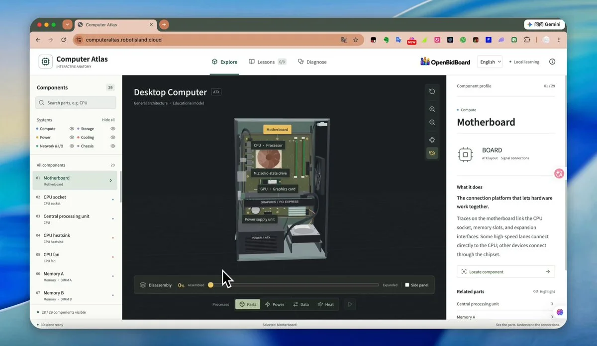</a>

</details>

Được biên soạn từ mô tả dự án công khai của tác giả.

```text
Tạo một website 3D tương tác cho phép tách máy tính để bàn thành 29 linh kiện chính. Thêm hoạt cảnh tháo rời và phần giải thích cho từng linh kiện.
```

[Xem chi tiết ↗](https://www.tripo3d.ai/vi/3d-prompts/exploded-desktop-computer-atlas-2096578761877860502) · [Xem video ↗](https://cdn-blog.holymolly.ai/media/production/3d-prompt-2096578527097421824-video-b1e4e76ee419.mp4) · [Bài đăng gốc](https://x.com/icooperhero/status/2096578761877860502)

---

<a id="2096578684010508736"></a>

## Lên phương án bố trí phòng trẻ em kiêm nơi làm việc

[かのこ🌼AI×子育て×探究](https://x.com/dqlh47m) · 2026-09-06 · **Yêu cầu được biên soạn từ mô tả gốc**

Tái dựng phòng trẻ em kiêm nơi làm việc từ bốn ảnh chụp ở các góc phòng cùng số đo căn phòng. Cung cấp góc nhìn của người lớn và trẻ em, góc nhìn tổng thể và các phương án bố trí nội thất khác nhau.

<details>
<summary>Ảnh xem trước</summary>

<a href="https://www.tripo3d.ai/vi/3d-prompts/children-s-room-and-workspace-planner-2096578684010508736"></a>

</details>

Được biên soạn từ mô tả dự án công khai của tác giả.

```text
Tái dựng phòng trẻ em kiêm nơi làm việc từ bốn ảnh chụp ở các góc phòng cùng số đo căn phòng. Cung cấp góc nhìn của người lớn và trẻ em, góc nhìn tổng thể và các phương án bố trí nội thất khác nhau.
```

[Xem chi tiết ↗](https://www.tripo3d.ai/vi/3d-prompts/children-s-room-and-workspace-planner-2096578684010508736) · [Xem video ↗](https://cdn-blog.holymolly.ai/media/production/3d-prompt-2096578530561966080-video-99133894dee5.mp4) · [Bài đăng gốc](https://x.com/dqlh47m/status/2096578684010508736)

---

<a id="2095999282088378520"></a>

## Mặt bằng đồng bộ với chuyến tham quan 3D

[おのふみ\| AIクリエーター×個人開発](https://x.com/onofumi_AI) · 2026-09-04 · **Yêu cầu được biên soạn từ mô tả gốc**

Dùng cùng một bộ kích thước để dựng mặt bằng và chuyến tham quan căn hộ một phòng ngủ. Đồng bộ vị trí hiện tại giữa hai chế độ xem, đồng thời ghi rõ những giả định về chiều cao trần và vật liệu hoàn thiện.

<details>
<summary>Ảnh xem trước</summary>

<a href="https://www.tripo3d.ai/vi/3d-prompts/linked-floor-plan-and-3d-walkthrough-2095999282088378520"></a>

</details>

Được biên soạn từ mô tả dự án công khai của tác giả.

```text
Dùng cùng một bộ kích thước để dựng mặt bằng và chuyến tham quan căn hộ một phòng ngủ. Đồng bộ vị trí hiện tại giữa hai chế độ xem, đồng thời ghi rõ những giả định về chiều cao trần và vật liệu hoàn thiện.
```

[Xem chi tiết ↗](https://www.tripo3d.ai/vi/3d-prompts/linked-floor-plan-and-3d-walkthrough-2095999282088378520) · [Xem video ↗](https://cdn-blog.holymolly.ai/media/production/3d-prompt-2095999235611414528-video-da2dbe52f816.mp4) · [Bài đăng gốc](https://x.com/onofumi_AI/status/2095999282088378520)

---

<a id="2096557555086725159"></a>

## Mô hình Seoul thu nhỏ có thể khám phá

[synabreu](https://x.com/synabreu) · 2026-09-06 · **Yêu cầu được biên soạn từ mô tả gốc**

Dựng mô hình Seoul thu nhỏ bằng Three.js từ dữ liệu bản đồ mở. Thêm điều hướng theo quận, cảnh bay qua các địa danh, chế độ ngày và đêm cùng điều khiển cảm ứng. Nêu rõ những tòa nhà đã được đơn giản hóa, chiều cao ước tính và giấy phép dữ liệu.

<details>
<summary>Ảnh xem trước</summary>

<a href="https://www.tripo3d.ai/vi/3d-prompts/interactive-miniature-of-seoul-2096557555086725159"></a>

</details>

Được biên soạn từ mô tả dự án công khai của tác giả.

```text
Dựng mô hình Seoul thu nhỏ bằng Three.js từ dữ liệu bản đồ mở. Thêm điều hướng theo quận, cảnh bay qua các địa danh, chế độ ngày và đêm cùng điều khiển cảm ứng. Nêu rõ những tòa nhà đã được đơn giản hóa, chiều cao ước tính và giấy phép dữ liệu.
```

[Xem chi tiết ↗](https://www.tripo3d.ai/vi/3d-prompts/interactive-miniature-of-seoul-2096557555086725159) · [Xem video ↗](https://cdn-blog.holymolly.ai/media/production/3d-prompt-2096557441312034816-video-78abc20e6310.mp4) · [Bài đăng gốc](https://x.com/synabreu/status/2096557555086725159) · [Bản demo](https://seoul-3d-atlas.synabreu.chatgpt.site/)

---

<a id="2096460081982304546"></a>

## Côn trùng tạo bằng thuật toán bò trên nhiều bề mặt

[XiaoLei Liu](https://x.com/leo_xiaolei) · 2026-09-06 · **Yêu cầu được biên soạn từ mô tả gốc**

Tạo một côn trùng 3D nhiều chân có thể bám và đi trên các bề mặt khác nhau. Phối hợp chuyển động của chân và thân khi vượt qua những chỗ chênh lệch độ cao.

<details>
<summary>Ảnh xem trước</summary>

<a href="https://www.tripo3d.ai/vi/3d-prompts/surface-climbing-procedural-insect-2096460081982304546"></a>

</details>

Được biên soạn từ mô tả dự án công khai của tác giả.

```text
Tạo một côn trùng 3D nhiều chân có thể bám và đi trên các bề mặt khác nhau. Phối hợp chuyển động của chân và thân khi vượt qua những chỗ chênh lệch độ cao.
```

[Xem chi tiết ↗](https://www.tripo3d.ai/vi/3d-prompts/surface-climbing-procedural-insect-2096460081982304546) · [Xem video ↗](https://cdn-blog.holymolly.ai/media/production/3d-prompt-2096457635352698880-video-b8ee4ffe10bf.mp4) · [Bài đăng gốc](https://x.com/leo_xiaolei/status/2096460081982304546) · [Bản demo](https://threerocks.github.io/web-3d-pages/)

---

<a id="2096467585785286808"></a>

## Lái Wright Flyer qua khu rừng Nhật Bản

[The Bugged Dev](https://x.com/thebuggeddev) · 2026-09-06 · **Yêu cầu được biên soạn từ mô tả gốc**

Xây dựng trò chơi bay bằng Three.js với chiếc Wright Flyer năm 1903 trong một khu rừng Nhật Bản. Nghiên cứu chiếc máy bay rồi dùng thuật toán tạo máy bay, cây, cổng torii, nhà và núi mà không dùng tài nguyên bên ngoài.

<details>
<summary>Ảnh xem trước</summary>

<a href="https://www.tripo3d.ai/vi/3d-prompts/wright-flyer-through-a-japanese-forest-2096467585785286808">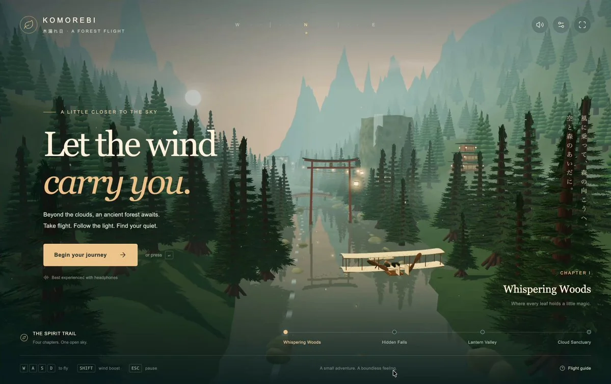</a>

</details>

Được biên soạn từ mô tả dự án công khai của tác giả.

```text
Xây dựng trò chơi bay bằng Three.js với chiếc Wright Flyer năm 1903 trong một khu rừng Nhật Bản. Nghiên cứu chiếc máy bay rồi dùng thuật toán tạo máy bay, cây, cổng torii, nhà và núi mà không dùng tài nguyên bên ngoài.
```

[Xem chi tiết ↗](https://www.tripo3d.ai/vi/3d-prompts/wright-flyer-through-a-japanese-forest-2096467585785286808) · [Xem video ↗](https://cdn-blog.holymolly.ai/media/production/3d-prompt-2096460762189565952-video-9d36a3a844f2.mp4) · [Bài đăng gốc](https://x.com/thebuggeddev/status/2096467585785286808)

---

<a id="2096576154337734865"></a>

## Dựng một ngôi nhà từ đầu trong Blender

[みずくん](https://x.com/mizkun) · 2026-09-06 · **Yêu cầu được biên soạn từ mô tả gốc**

Dựng mô hình một ngôi nhà từ đầu trong Blender. Giữ cảnh ở dạng có thể chỉnh sửa để tiếp tục kiểm tra và hoàn thiện công trình qua các lần lặp sau.

<details>
<summary>Ảnh xem trước</summary>

<a href="https://www.tripo3d.ai/vi/3d-prompts/a-house-modeled-from-scratch-in-blender-2096576154337734865"></a>

</details>

Được biên soạn từ mô tả dự án công khai của tác giả.

```text
Dựng mô hình một ngôi nhà từ đầu trong Blender. Giữ cảnh ở dạng có thể chỉnh sửa để tiếp tục kiểm tra và hoàn thiện công trình qua các lần lặp sau.
```

[Xem chi tiết ↗](https://www.tripo3d.ai/vi/3d-prompts/a-house-modeled-from-scratch-in-blender-2096576154337734865) · [Xem video ↗](https://cdn-blog.holymolly.ai/media/production/3d-prompt-2096575873629769728-video-7a237d3c1b82.mp4) · [Bài đăng gốc](https://x.com/mizkun/status/2096576154337734865)

---

<a id="2096143359505269079"></a>

## Từ ảnh quán cà phê đến video tham quan khung dọc

[森叔](https://x.com/harrisonitsme) · 2026-09-05 · **Yêu cầu được biên soạn từ mô tả gốc**

Tái dựng quán cà phê từ ảnh trong Blender, gồm trần gỗ, đèn dải, máy rang, kệ và cây xanh. Bàn giao cảnh có thể chỉnh sửa và video camera tham quan dài 15 giây theo khung hình dọc.

<details>
<summary>Ảnh xem trước</summary>

<a href="https://www.tripo3d.ai/vi/3d-prompts/coffee-shop-photo-to-vertical-walkthrough-2096143359505269079">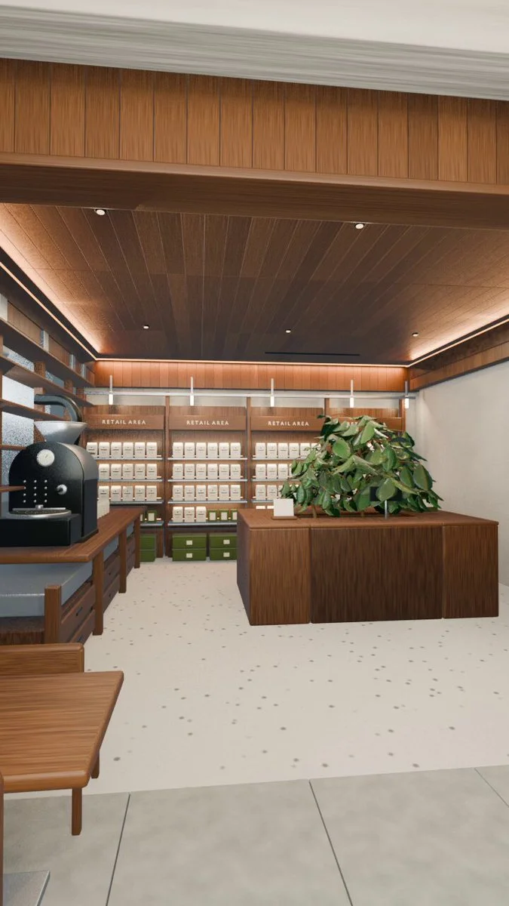</a>

</details>

Được biên soạn từ mô tả dự án công khai của tác giả.

```text
Tái dựng quán cà phê từ ảnh trong Blender, gồm trần gỗ, đèn dải, máy rang, kệ và cây xanh. Bàn giao cảnh có thể chỉnh sửa và video camera tham quan dài 15 giây theo khung hình dọc.
```

[Xem chi tiết ↗](https://www.tripo3d.ai/vi/3d-prompts/coffee-shop-photo-to-vertical-walkthrough-2096143359505269079) · [Xem video ↗](https://cdn-blog.holymolly.ai/media/production/3d-prompt-2096143056991076352-video-e2a96d0e0f27.mp4) · [Bài đăng gốc](https://x.com/harrisonitsme/status/2096143359505269079)

---

<a id="2096501340889374883"></a>

## Từ mặt bằng tầng trên cùng đến bản xem trước Blender

[indigo](https://x.com/indigox) · 2026-09-06 · **Yêu cầu được biên soạn từ mô tả gốc**

Dùng mặt bằng tầng trên cùng của ngôi nhà để dựng cảnh Blender và kết xuất bản xem trước 10 giây với số mẫu thấp. Ưu tiên bố cục không gian rõ ràng trước khi hoàn thiện vật liệu.

<details>
<summary>Ảnh xem trước</summary>

<a href="https://www.tripo3d.ai/vi/3d-prompts/top-floor-plan-to-blender-preview-2096501340889374883">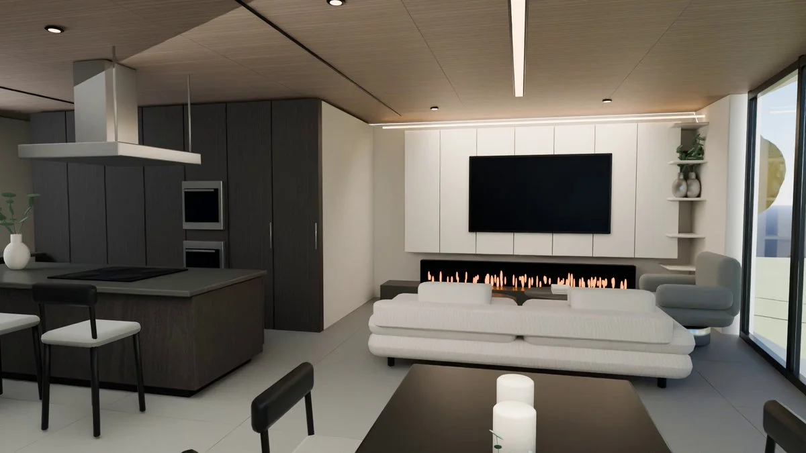</a>

</details>

Được biên soạn từ mô tả dự án công khai của tác giả.

```text
Dùng mặt bằng tầng trên cùng của ngôi nhà để dựng cảnh Blender và kết xuất bản xem trước 10 giây với số mẫu thấp. Ưu tiên bố cục không gian rõ ràng trước khi hoàn thiện vật liệu.
```

[Xem chi tiết ↗](https://www.tripo3d.ai/vi/3d-prompts/top-floor-plan-to-blender-preview-2096501340889374883) · [Xem video ↗](https://cdn-blog.holymolly.ai/media/production/3d-prompt-2096499441167671296-video-09a55294f759.mp4) · [Bài đăng gốc](https://x.com/indigox/status/2096501340889374883)

---

<a id="2096298425914450021"></a>

## Quảng trường Terreiro do Paço tại Lisbon trong Blender

[Gonçalo Canhoto 🇵🇹](https://x.com/goncalo_canhoto) · 2026-09-05 · **Yêu cầu được biên soạn từ mô tả gốc**

Tái hiện Terreiro do Paço tại Lisbon dưới dạng cảnh Blender có thể chỉnh sửa. Nghiên cứu tư liệu tham khảo để định hướng kiến trúc, vật liệu và ánh sáng của quảng trường.

<details>
<summary>Ảnh xem trước</summary>

<a href="https://www.tripo3d.ai/vi/3d-prompts/lisbon-s-terreiro-do-paco-in-blender-2096298425914450021"></a>

</details>

Được biên soạn từ mô tả dự án công khai của tác giả.

```text
Tái hiện Terreiro do Paço tại Lisbon dưới dạng cảnh Blender có thể chỉnh sửa. Nghiên cứu tư liệu tham khảo để định hướng kiến trúc, vật liệu và ánh sáng của quảng trường.
```

[Xem chi tiết ↗](https://www.tripo3d.ai/vi/3d-prompts/lisbon-s-terreiro-do-paco-in-blender-2096298425914450021) · [Xem video ↗](https://cdn-blog.holymolly.ai/media/production/3d-prompt-2096296038672023552-video-48b7bae96747.mp4) · [Bài đăng gốc](https://x.com/goncalo_canhoto/status/2096298425914450021)

---

<a id="2096574297703637111"></a>

## Nhiệm vụ khám phá The Quiet Crossing

[MotionViz](https://x.com/Motion_Viz) · 2026-09-06 · **Yêu cầu được biên soạn từ mô tả gốc**

Xây dựng trò chơi khám phá vùng tuyết bằng Three.js với nhân vật dựng trong Blender, cây thông voxel và cổng dịch chuyển bằng đá. Cho người chơi thu thập sáu mảnh phát sáng, để camera theo chân nhân vật và hiển thị khoảng cách tới cổng.

<details>
<summary>Ảnh xem trước</summary>

<a href="https://www.tripo3d.ai/vi/3d-prompts/the-quiet-crossing-exploration-quest-2096574297703637111"></a>

</details>

Được biên soạn từ mô tả dự án công khai của tác giả.

```text
Xây dựng trò chơi khám phá vùng tuyết bằng Three.js với nhân vật dựng trong Blender, cây thông voxel và cổng dịch chuyển bằng đá. Cho người chơi thu thập sáu mảnh phát sáng, để camera theo chân nhân vật và hiển thị khoảng cách tới cổng.
```

[Xem chi tiết ↗](https://www.tripo3d.ai/vi/3d-prompts/the-quiet-crossing-exploration-quest-2096574297703637111) · [Xem video ↗](https://cdn-blog.holymolly.ai/media/production/3d-prompt-2096573682848251904-video-6e87dd09e525.mp4) · [Bài đăng gốc](https://x.com/Motion_Viz/status/2096574297703637111)

---

<a id="2096263046918197609"></a>

## Khu rừng rậm tạo bằng thuật toán trong Three.js

[Leon Lin](https://x.com/LexnLin) · 2026-09-05 · **Yêu cầu được biên soạn từ mô tả gốc**

Tạo một khu rừng Three.js chi tiết với hàng nghìn cây, cỏ dày và dương xỉ. Dùng shader tùy chỉnh và cơ chế lặp hình học hiệu quả để giữ độ chi tiết trên toàn cảnh.

<details>
<summary>Ảnh xem trước</summary>

<a href="https://www.tripo3d.ai/vi/3d-prompts/dense-procedural-forest-in-three-js-2096263046918197609">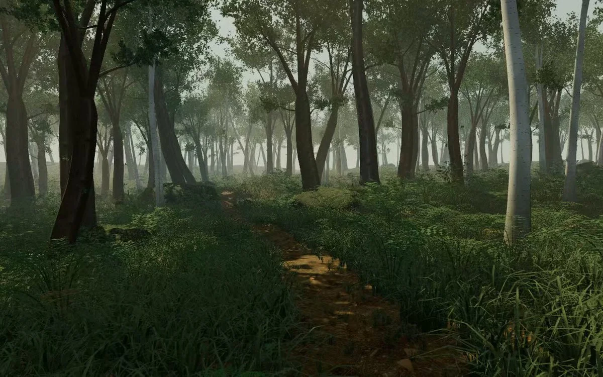</a>

</details>

Được biên soạn từ mô tả dự án công khai của tác giả.

```text
Tạo một khu rừng Three.js chi tiết với hàng nghìn cây, cỏ dày và dương xỉ. Dùng shader tùy chỉnh và cơ chế lặp hình học hiệu quả để giữ độ chi tiết trên toàn cảnh.
```

[Xem chi tiết ↗](https://www.tripo3d.ai/vi/3d-prompts/dense-procedural-forest-in-three-js-2096263046918197609) · [Xem video ↗](https://cdn-blog.holymolly.ai/media/production/3d-prompt-2096262956774490112-video-dabda51264b8.mp4) · [Bài đăng gốc](https://x.com/LexnLin/status/2096263046918197609)

---

<a id="2096013228090245181"></a>

## Mô hình máy ghi âm TP-7 từ ảnh tham khảo

[Tykra](https://x.com/ty_kra_lab) · 2026-09-04 · **Yêu cầu được biên soạn từ mô tả gốc**

Tái hiện Teenage Engineering TP-7 bằng Three.js từ ảnh tham khảo. Làm đúng hình dáng và các bộ phận điều khiển nhìn thấy được trong một mô hình 3D có thể quan sát từ nhiều phía.

<details>
<summary>Ảnh xem trước</summary>

<a href="https://www.tripo3d.ai/vi/3d-prompts/tp-7-recorder-reference-model-2096013228090245181">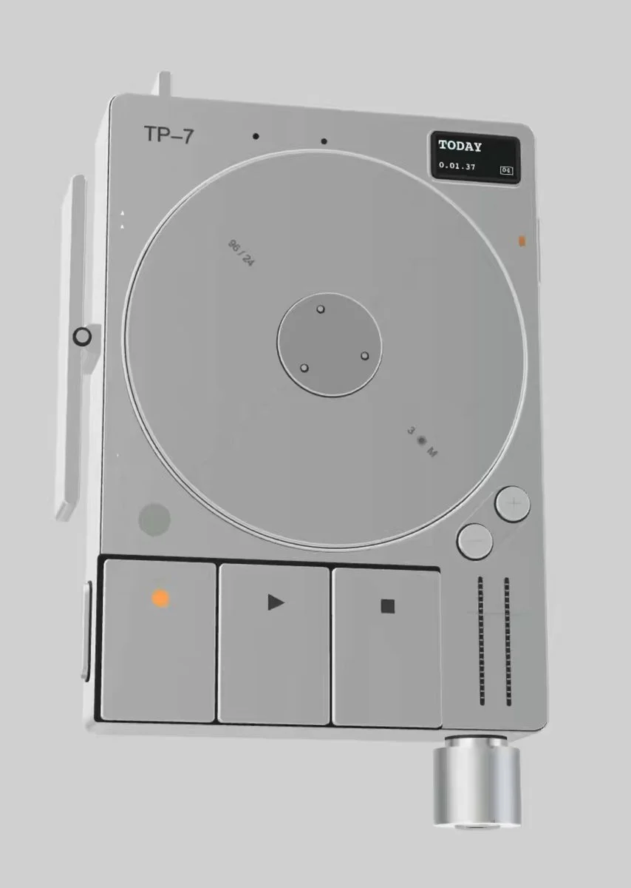</a>

</details>

Được biên soạn từ mô tả dự án công khai của tác giả.

```text
Tái hiện Teenage Engineering TP-7 bằng Three.js từ ảnh tham khảo. Làm đúng hình dáng và các bộ phận điều khiển nhìn thấy được trong một mô hình 3D có thể quan sát từ nhiều phía.
```

[Xem chi tiết ↗](https://www.tripo3d.ai/vi/3d-prompts/tp-7-recorder-reference-model-2096013228090245181) · [Xem video ↗](https://cdn-blog.holymolly.ai/media/production/3d-prompt-2096012812199862273-video-9013baf810d8.mp4) · [Bài đăng gốc](https://x.com/ty_kra_lab/status/2096013228090245181)

---

<a id="2096577430274429157"></a>

## Đầu máy hơi nước chạy qua miền quê

[ダンさんブル@d三b](https://x.com/dansanburu) · 2026-09-06 · **Yêu cầu được biên soạn từ mô tả gốc**

Dựng đầu máy hơi nước bằng Three.js và tạo hoạt cảnh chạy qua khung cảnh miền quê. Đồng bộ chuyển động bánh xe với chuyển động của đoàn tàu.

<details>
<summary>Ảnh xem trước</summary>

<a href="https://www.tripo3d.ai/vi/3d-prompts/steam-locomotive-across-the-countryside-2096577430274429157">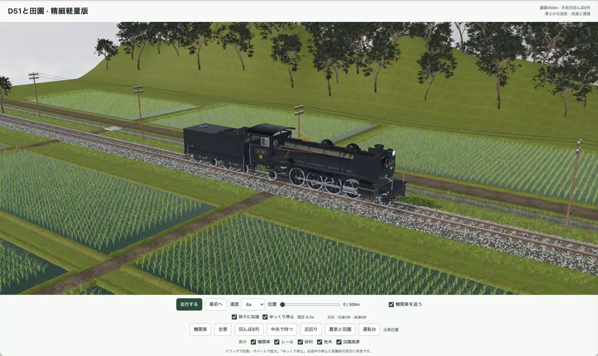</a>

</details>

Được biên soạn từ mô tả dự án công khai của tác giả.

```text
Dựng đầu máy hơi nước bằng Three.js và tạo hoạt cảnh chạy qua khung cảnh miền quê. Đồng bộ chuyển động bánh xe với chuyển động của đoàn tàu.
```

[Xem chi tiết ↗](https://www.tripo3d.ai/vi/3d-prompts/steam-locomotive-across-the-countryside-2096577430274429157) · [Xem video ↗](https://cdn-blog.holymolly.ai/media/production/3d-prompt-2096576986462539776-video-59f0fa2baa5a.mp4) · [Bài đăng gốc](https://x.com/dansanburu/status/2096577430274429157)

---

<a id="2096561346766877106"></a>

## Cảnh máy hát đĩa than trên bàn

[Nitesh Seram](https://x.com/niteshseram) · 2026-09-06 · **Yêu cầu được biên soạn từ mô tả gốc**

Dựng cảnh máy hát đĩa than đặt trên bàn bằng Three.js. Dàn dựng như một màn giới thiệu sản phẩm, với đèn bật sáng và camera cho thấy máy hát cùng đồ nội thất xung quanh.

<details>
<summary>Ảnh xem trước</summary>

<a href="https://www.tripo3d.ai/vi/3d-prompts/vinyl-player-tabletop-scene-2096561346766877106">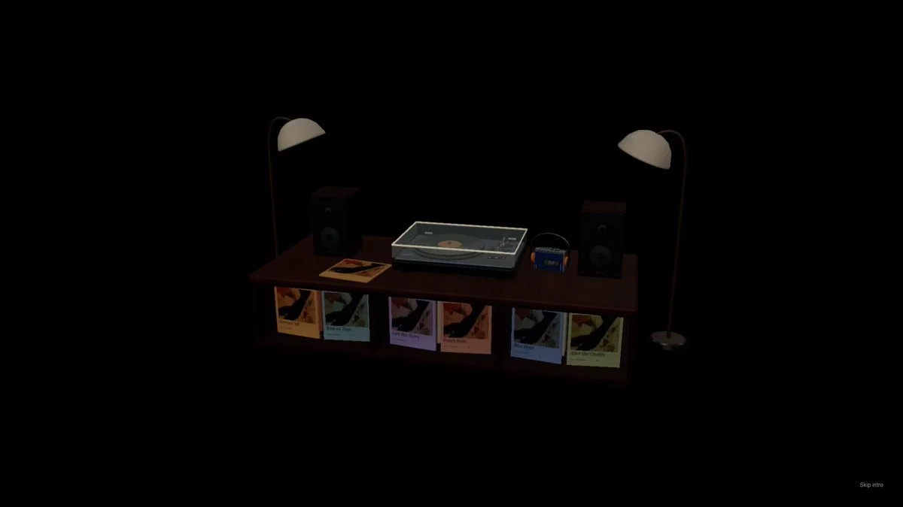</a>

</details>

Được biên soạn từ mô tả dự án công khai của tác giả.

```text
Dựng cảnh máy hát đĩa than đặt trên bàn bằng Three.js. Dàn dựng như một màn giới thiệu sản phẩm, với đèn bật sáng và camera cho thấy máy hát cùng đồ nội thất xung quanh.
```

[Xem chi tiết ↗](https://www.tripo3d.ai/vi/3d-prompts/vinyl-player-tabletop-scene-2096561346766877106) · [Xem video ↗](https://cdn-blog.holymolly.ai/media/production/3d-prompt-2096560995208687616-video-b191a25a673b.mp4) · [Bài đăng gốc](https://x.com/niteshseram/status/2096561346766877106)

---

<a id="2096555856204644550"></a>

## Vòng lặp đối chiến của trò chơi thẻ bài sưu tầm

[FaryaBlender3D](https://x.com/FaryaBlender3D) · 2026-09-06 · **Yêu cầu được biên soạn từ mô tả gốc**

Xây dựng bản mẫu trò chơi thẻ bài sưu tầm bằng Three.js: mua bộ bài và gói thẻ bổ sung, xây dựng bộ bài, bước vào đấu trường và nhận phần thưởng. Thiết kế để có thể thay lưới tạm bằng tài nguyên hoàn chỉnh.

<details>
<summary>Ảnh xem trước</summary>

<a href="https://www.tripo3d.ai/vi/3d-prompts/trading-card-battle-game-loop-2096555856204644550"></a>

</details>

Được biên soạn từ mô tả dự án công khai của tác giả.

```text
Xây dựng bản mẫu trò chơi thẻ bài sưu tầm bằng Three.js: mua bộ bài và gói thẻ bổ sung, xây dựng bộ bài, bước vào đấu trường và nhận phần thưởng. Thiết kế để có thể thay lưới tạm bằng tài nguyên hoàn chỉnh.
```

[Xem chi tiết ↗](https://www.tripo3d.ai/vi/3d-prompts/trading-card-battle-game-loop-2096555856204644550) · [Xem video ↗](https://cdn-blog.holymolly.ai/media/production/3d-prompt-2096553778136887296-video-51c26a0f2901.mp4) · [Bài đăng gốc](https://x.com/FaryaBlender3D/status/2096555856204644550)

---

<a id="2096362653480562751"></a>

## Trò chơi mô phỏng mạng lưới đường sắt

[Tom Krcha](https://x.com/tomkrcha) · 2026-09-05 · **Yêu cầu được biên soạn từ mô tả gốc**

Mở rộng mô hình tàu Three.js thành mô phỏng đường sắt với thành phố, đường nhánh, sông và cầu. Thêm camera bám theo tàu, camera 3D tự do, góc nhìn đẳng cự và hiệu ứng khói.

<details>
<summary>Ảnh xem trước</summary>

<a href="https://www.tripo3d.ai/vi/3d-prompts/railway-network-simulation-game-2096362653480562751">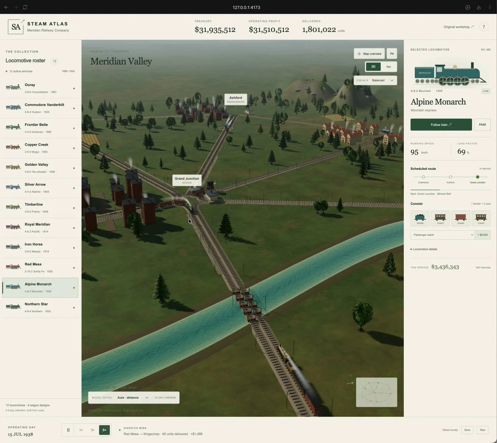</a>

</details>

Được biên soạn từ mô tả dự án công khai của tác giả.

```text
Mở rộng mô hình tàu Three.js thành mô phỏng đường sắt với thành phố, đường nhánh, sông và cầu. Thêm camera bám theo tàu, camera 3D tự do, góc nhìn đẳng cự và hiệu ứng khói.
```

[Xem chi tiết ↗](https://www.tripo3d.ai/vi/3d-prompts/railway-network-simulation-game-2096362653480562751) · [Xem video ↗](https://cdn-blog.holymolly.ai/media/production/3d-prompt-2096361540161257472-video-39d66dd5664e.mp4) · [Bài đăng gốc](https://x.com/tomkrcha/status/2096362653480562751)

---

<a id="2096490395614019793"></a>

## Dạo bước trong ngôi làng low-poly lấy cảm hứng từ Gwacheon

[Manas Joshi](https://x.com/ManasJoshi76254) · 2026-09-06 · **Yêu cầu được biên soạn từ mô tả gốc**

Tạo một ngôi làng low-poly ấm cúng, có thể khám phá, lấy cảm hứng từ Gwacheon trong một tệp HTML duy nhất. Kết hợp cảnh quan 3D tạo bằng thuật toán, bầu không khí, giao diện và tương tác.

<details>
<summary>Ảnh xem trước</summary>

<a href="https://www.tripo3d.ai/vi/3d-prompts/walkable-low-poly-gwacheon-village-2096490395614019793">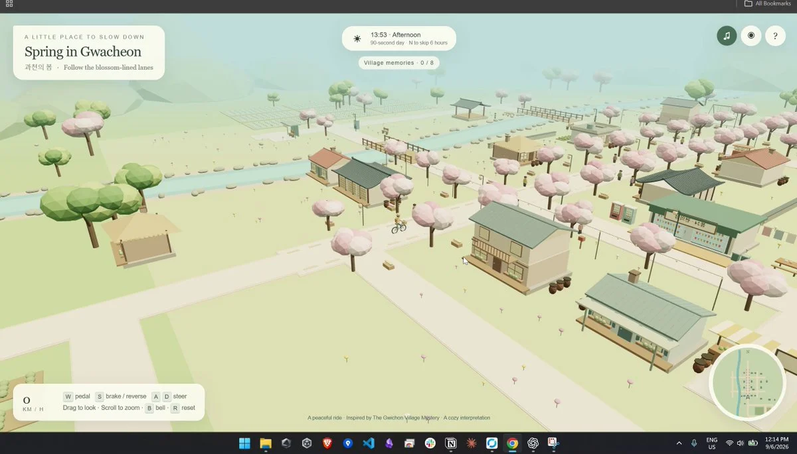</a>

</details>

Được biên soạn từ mô tả dự án công khai của tác giả.

```text
Tạo một ngôi làng low-poly ấm cúng, có thể khám phá, lấy cảm hứng từ Gwacheon trong một tệp HTML duy nhất. Kết hợp cảnh quan 3D tạo bằng thuật toán, bầu không khí, giao diện và tương tác.
```

[Xem chi tiết ↗](https://www.tripo3d.ai/vi/3d-prompts/walkable-low-poly-gwacheon-village-2096490395614019793) · [Xem video ↗](https://cdn-blog.holymolly.ai/media/production/3d-prompt-2096490096442986496-video-3809a76a10f4.mp4) · [Bài đăng gốc](https://x.com/ManasJoshi76254/status/2096490395614019793)

---

<a id="2096505740643246231"></a>

## Màn chơi giải đố Three.js hoàn chỉnh

[Steve的花园儿](https://x.com/TvWoo) · 2026-09-06 · **Yêu cầu được biên soạn từ mô tả gốc**

Xây dựng một màn chơi giải đố 3D hoàn chỉnh bằng Three.js, bao gồm các cơ chế thực sự chơi được. Khi màn chơi và các tương tác đã hoạt động, hãy tích hợp âm thanh được cung cấp.

<details>
<summary>Ảnh xem trước</summary>

<a href="https://www.tripo3d.ai/vi/3d-prompts/complete-three-js-puzzle-level-2096505740643246231">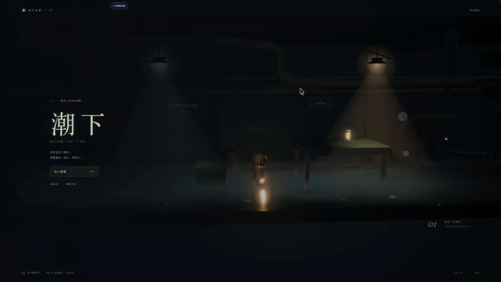</a>

</details>

Được biên soạn từ mô tả dự án công khai của tác giả.

```text
Xây dựng một màn chơi giải đố 3D hoàn chỉnh bằng Three.js, bao gồm các cơ chế thực sự chơi được. Khi màn chơi và các tương tác đã hoạt động, hãy tích hợp âm thanh được cung cấp.
```

[Xem chi tiết ↗](https://www.tripo3d.ai/vi/3d-prompts/complete-three-js-puzzle-level-2096505740643246231) · [Xem video ↗](https://cdn-blog.holymolly.ai/media/production/3d-prompt-2096505045651173376-video-c97ee86140a5.mp4) · [Bài đăng gốc](https://x.com/TvWoo/status/2096505740643246231)

---

<a id="2096570815714414844"></a>

## Săn kho báu trên bãi biển low-poly

[空野こんこん＠個人ゲーム開発者](https://x.com/sorano_concon_g) · 2026-09-06 · **Yêu cầu được biên soạn từ mô tả gốc**

Xây dựng trò chơi săn kho báu 3D có thể chơi được trên bãi biển trong Unity. Dựng cây cọ và sàn gỗ low-poly, đồng thời hoàn thiện vòng lặp khám phá và tìm kho báu cốt lõi.

<details>
<summary>Ảnh xem trước</summary>

<a href="https://www.tripo3d.ai/vi/3d-prompts/low-poly-beach-treasure-hunt-2096570815714414844"></a>

</details>

Được biên soạn từ mô tả dự án công khai của tác giả.

```text
Xây dựng trò chơi săn kho báu 3D có thể chơi được trên bãi biển trong Unity. Dựng cây cọ và sàn gỗ low-poly, đồng thời hoàn thiện vòng lặp khám phá và tìm kho báu cốt lõi.
```

[Xem chi tiết ↗](https://www.tripo3d.ai/vi/3d-prompts/low-poly-beach-treasure-hunt-2096570815714414844) · [Bài đăng gốc](https://x.com/sorano_concon_g/status/2096570815714414844)

---

<a id="2096560142871658589"></a>

## Mô hình Blender kết hợp hiệu ứng Unity VFX

[ねぎぽよし](https://x.com/CST_negi) · 2026-09-06 · **Yêu cầu được biên soạn từ mô tả gốc**

Tạo các mô hình cho cảnh trong Blender rồi nhập vào Unity. Thêm hiệu ứng bằng VFX Graph và bố trí ánh sáng để mô hình cùng hiệu ứng đều thể hiện rõ khi xuất hiện chung.

<details>
<summary>Ảnh xem trước</summary>

<a href="https://www.tripo3d.ai/vi/3d-prompts/blender-models-with-unity-vfx-2096560142871658589"></a>

</details>

Được biên soạn từ mô tả dự án công khai của tác giả.

```text
Tạo các mô hình cho cảnh trong Blender rồi nhập vào Unity. Thêm hiệu ứng bằng VFX Graph và bố trí ánh sáng để mô hình cùng hiệu ứng đều thể hiện rõ khi xuất hiện chung.
```

[Xem chi tiết ↗](https://www.tripo3d.ai/vi/3d-prompts/blender-models-with-unity-vfx-2096560142871658589) · [Xem video ↗](https://cdn-blog.holymolly.ai/media/production/3d-prompt-2096559190202597376-video-4ff7324a3cb3.mp4) · [Bài đăng gốc](https://x.com/CST_negi/status/2096560142871658589)

---

<a id="2096556692842348826"></a>

## Trò chơi đua rally Unity chơi được trên điện thoại

[Kevin Kern](https://x.com/kevinkern) · 2026-09-06 · **Yêu cầu được biên soạn từ mô tả gốc**

Xây dựng bản mẫu lái xe rally bằng Codex, Blender và Unity. Chuẩn bị tài nguyên 3D và cách điều khiển để thử chơi trên điện thoại.

<details>
<summary>Ảnh xem trước</summary>

<a href="https://www.tripo3d.ai/vi/3d-prompts/mobile-playable-unity-rally-game-2096556692842348826">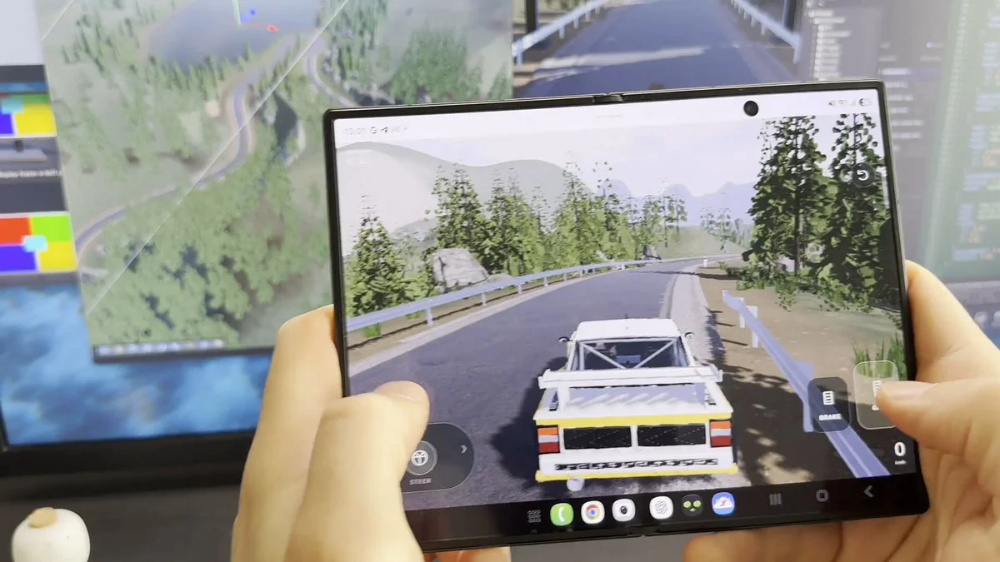</a>

</details>

Được biên soạn từ mô tả dự án công khai của tác giả.

```text
Xây dựng bản mẫu lái xe rally bằng Codex, Blender và Unity. Chuẩn bị tài nguyên 3D và cách điều khiển để thử chơi trên điện thoại.
```

[Xem chi tiết ↗](https://www.tripo3d.ai/vi/3d-prompts/mobile-playable-unity-rally-game-2096556692842348826) · [Xem video ↗](https://cdn-blog.holymolly.ai/media/production/3d-prompt-2096555393577259008-video-112f32b99aab.mp4) · [Bài đăng gốc](https://x.com/kevinkern/status/2096556692842348826)

---

<a id="2096572429066006845"></a>

## Cây xoài Ấn Độ trong SpeedTree

[Varun Mayya](https://x.com/waitin4agi_) · 2026-09-06 · **Yêu cầu được biên soạn từ mô tả gốc**

Tạo cây xoài Ấn Độ trong SpeedTree cho một cảnh Unreal hướng tới 60 FPS. Tạo vật liệu lá và vỏ cây, kiểm tra diện mạo trước khi hoàn thiện mô hình.

<details>
<summary>Ảnh xem trước</summary>

<a href="https://www.tripo3d.ai/vi/3d-prompts/indian-mango-tree-in-speedtree-2096572429066006845">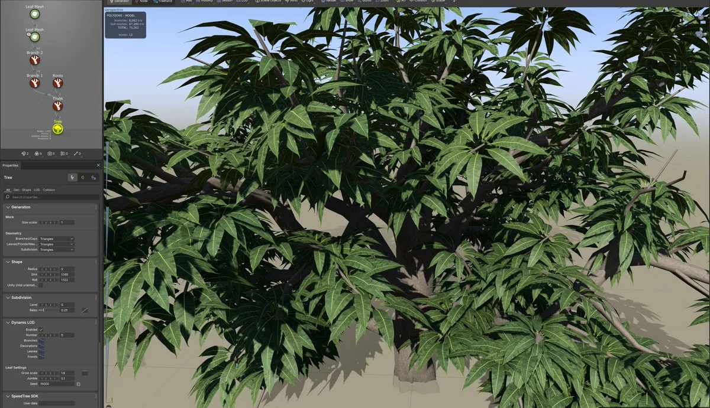</a>

</details>

Được biên soạn từ mô tả dự án công khai của tác giả.

```text
Tạo cây xoài Ấn Độ trong SpeedTree cho một cảnh Unreal hướng tới 60 FPS. Tạo vật liệu lá và vỏ cây, kiểm tra diện mạo trước khi hoàn thiện mô hình.
```

[Xem chi tiết ↗](https://www.tripo3d.ai/vi/3d-prompts/indian-mango-tree-in-speedtree-2096572429066006845) · [Bài đăng gốc](https://x.com/waitin4agi_/status/2096572429066006845)

---

<a id="2096566598689783878"></a>

## Áp dụng texture và gắn xương cho nhân vật Tripo

[たけうちさんは縮退しました🌀](https://x.com/chimerast) · 2026-09-06 · **Yêu cầu được biên soạn từ mô tả gốc**

Đưa nhân vật Tripo Smart Mesh vào Blender. Áp dụng bộ texture của nhân vật và xây dựng bộ xương cơ thể có thể sử dụng được trước khi chuyển sang biểu cảm khuôn mặt.

<details>
<summary>Ảnh xem trước</summary>

<a href="https://www.tripo3d.ai/vi/3d-prompts/texture-and-rig-a-tripo-character-2096566598689783878"></a>

</details>

Được biên soạn từ mô tả dự án công khai của tác giả.

```text
Đưa nhân vật Tripo Smart Mesh vào Blender. Áp dụng bộ texture của nhân vật và xây dựng bộ xương cơ thể có thể sử dụng được trước khi chuyển sang biểu cảm khuôn mặt.
```

[Xem chi tiết ↗](https://www.tripo3d.ai/vi/3d-prompts/texture-and-rig-a-tripo-character-2096566598689783878) · [Xem video ↗](https://cdn-blog.holymolly.ai/media/production/3d-prompt-2096566304161619968-video-6b2851018644.mp4) · [Bài đăng gốc](https://x.com/chimerast/status/2096566598689783878)

---

<a id="2096064140510970318"></a>

## Bản mẫu trò chơi The Legend of Astra

[lofibloom](https://x.com/lofihashbloom) · 2026-09-05 · **Yêu cầu được biên soạn từ mô tả gốc**

Xây dựng bản mẫu trò chơi phiêu lưu 3D trong Unity bằng các cảnh đã chuẩn bị trong Blender và tài nguyên Tripo. Tích hợp hoạt ảnh nhân vật vào bản chơi thử.

<details>
<summary>Ảnh xem trước</summary>

<a href="https://www.tripo3d.ai/vi/3d-prompts/the-legend-of-astra-game-prototype-2096064140510970318">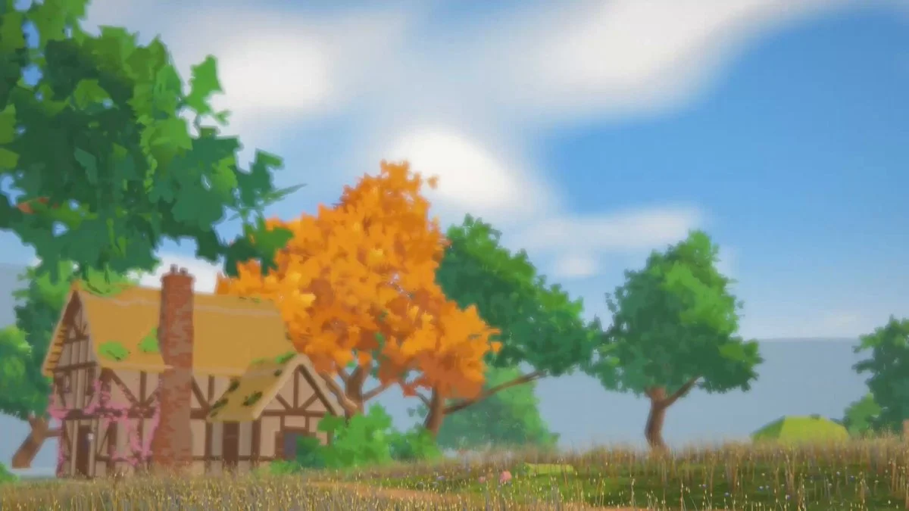</a>

</details>

Được biên soạn từ mô tả dự án công khai của tác giả.

```text
Xây dựng bản mẫu trò chơi phiêu lưu 3D trong Unity bằng các cảnh đã chuẩn bị trong Blender và tài nguyên Tripo. Tích hợp hoạt ảnh nhân vật vào bản chơi thử.
```

[Xem chi tiết ↗](https://www.tripo3d.ai/vi/3d-prompts/the-legend-of-astra-game-prototype-2096064140510970318) · [Xem video ↗](https://cdn-blog.holymolly.ai/media/production/3d-prompt-2096062862880092160-video-67e55cc4794e.mp4) · [Bài đăng gốc](https://x.com/lofihashbloom/status/2096064140510970318)

---

<a id="2096566686266597754"></a>

## Từ phác thảo căn hộ đến ảnh nội thất kết xuất

[Everett World](https://x.com/WorldEverett) · 2026-09-06 · **Yêu cầu được biên soạn từ mô tả gốc**

Kết hợp ảnh tham khảo căn hộ với bản phác mặt bằng đơn giản để tái dựng nội thất trong Blender. Bàn giao cảnh có thể chỉnh sửa, ảnh kết xuất từng phòng và video tham quan ngắn đã biên tập.

<details>
<summary>Ảnh xem trước</summary>

<a href="https://www.tripo3d.ai/vi/3d-prompts/apartment-sketch-to-rendered-interiors-2096566686266597754"></a>

</details>

Được biên soạn từ mô tả dự án công khai của tác giả.

```text
Kết hợp ảnh tham khảo căn hộ với bản phác mặt bằng đơn giản để tái dựng nội thất trong Blender. Bàn giao cảnh có thể chỉnh sửa, ảnh kết xuất từng phòng và video tham quan ngắn đã biên tập.
```

[Xem chi tiết ↗](https://www.tripo3d.ai/vi/3d-prompts/apartment-sketch-to-rendered-interiors-2096566686266597754) · [Xem video ↗](https://cdn-blog.holymolly.ai/media/production/3d-prompt-2096566625826742276-video-41e3afaa8883.mp4) · [Bài đăng gốc](https://x.com/WorldEverett/status/2096566686266597754)

---

<a id="2095993826569502785"></a>

## Cảnh dòng sông tương tác trong trình duyệt

[Dan Greenheck](https://x.com/dangreenheck) · 2026-09-04 · **Yêu cầu được biên soạn từ mô tả gốc**

Tạo cảnh dòng sông tương tác chạy trong trình duyệt. Trước tiên dựng bản mẫu nước thời gian thực hoạt động được, sau đó kiểm tra và hoàn thiện kết quả hình ảnh.

<details>
<summary>Ảnh xem trước</summary>

<a href="https://www.tripo3d.ai/vi/3d-prompts/interactive-browser-river-scene-2095993826569502785">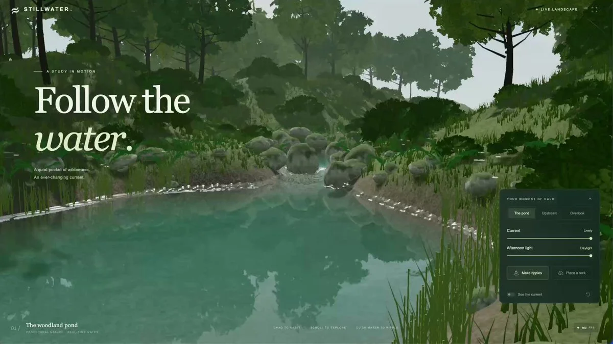</a>

</details>

Được biên soạn từ mô tả dự án công khai của tác giả.

```text
Tạo cảnh dòng sông tương tác chạy trong trình duyệt. Trước tiên dựng bản mẫu nước thời gian thực hoạt động được, sau đó kiểm tra và hoàn thiện kết quả hình ảnh.
```

[Xem chi tiết ↗](https://www.tripo3d.ai/vi/3d-prompts/interactive-browser-river-scene-2095993826569502785) · [Xem video ↗](https://cdn-blog.holymolly.ai/media/production/3d-prompt-2095992532962607104-video-76faf96ed3eb.mp4) · [Bài đăng gốc](https://x.com/dangreenheck/status/2095993826569502785)

---

<a id="2096128774203171021"></a>

## Bay quanh Adiyogi trong ánh chiều

[Adi](https://x.com/thejothiram) · 2026-09-05 · **Yêu cầu được biên soạn từ mô tả gốc**

Dựng cảnh Adiyogi trong Blender với khuôn viên rộng, các góc cận cảnh chi tiết và ánh chiều ấm. Kết xuất đoạn bay tham quan 30 giây và giữ lại cảnh có thể chỉnh sửa.

<details>
<summary>Ảnh xem trước</summary>

<a href="https://www.tripo3d.ai/vi/3d-prompts/adiyogi-evening-fly-through-2096128774203171021">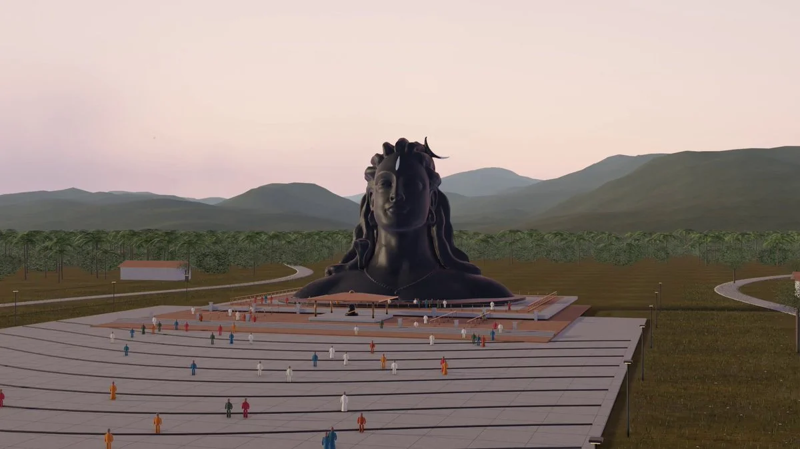</a>

</details>

Được biên soạn từ mô tả dự án công khai của tác giả.

```text
Dựng cảnh Adiyogi trong Blender với khuôn viên rộng, các góc cận cảnh chi tiết và ánh chiều ấm. Kết xuất đoạn bay tham quan 30 giây và giữ lại cảnh có thể chỉnh sửa.
```

[Xem chi tiết ↗](https://www.tripo3d.ai/vi/3d-prompts/adiyogi-evening-fly-through-2096128774203171021) · [Xem video ↗](https://cdn-blog.holymolly.ai/media/production/3d-prompt-2096127589219983360-video-0e8fcabb7049.mp4) · [Bài đăng gốc](https://x.com/thejothiram/status/2096128774203171021)

---

<a id="2096521798150242631"></a>

## Mặt nước lặp tuần hoàn bằng Geometry Nodes

[黒曜陣](https://x.com/uB95A7tobA17057) · 2026-09-06 · **Yêu cầu được biên soạn từ mô tả gốc**

Tạo hiệu ứng mặt nước tuần hoàn bằng Blender Geometry Nodes mà không bake. Giữ hệ thống nút ở dạng có thể chỉnh sửa và mô tả đây là mô hình bề mặt, không phải mô phỏng chất lỏng đầy đủ.

<details>
<summary>Ảnh xem trước</summary>

<a href="https://www.tripo3d.ai/vi/3d-prompts/looping-water-with-geometry-nodes-2096521798150242631"></a>

</details>

Được biên soạn từ mô tả dự án công khai của tác giả.

```text
Tạo hiệu ứng mặt nước tuần hoàn bằng Blender Geometry Nodes mà không bake. Giữ hệ thống nút ở dạng có thể chỉnh sửa và mô tả đây là mô hình bề mặt, không phải mô phỏng chất lỏng đầy đủ.
```

[Xem chi tiết ↗](https://www.tripo3d.ai/vi/3d-prompts/looping-water-with-geometry-nodes-2096521798150242631) · [Xem video ↗](https://cdn-blog.holymolly.ai/media/production/3d-prompt-26327614ee00-video-26327614ee00.mp4) · [Bài đăng gốc](https://x.com/uB95A7tobA17057/status/2096521798150242631)

---

<a id="2096518775042707700"></a>

## Thế giới hàng hải lấy cảm hứng từ One Piece

[Yash](https://x.com/yash_yk45) · 2026-09-06 · **Yêu cầu được biên soạn từ mô tả gốc**

Xây dựng một thế giới hàng hải có thể chơi được với tàu dựng trong Blender và đại dương Three.js. Thêm thời tiết thay đổi, khám phá dưới nước, vệt sóng sau tàu, bọt, nước bắn và cánh buồm chuyển động.

<details>
<summary>Ảnh xem trước</summary>

<a href="https://www.tripo3d.ai/vi/3d-prompts/one-piece-inspired-sailing-world-2096518775042707700">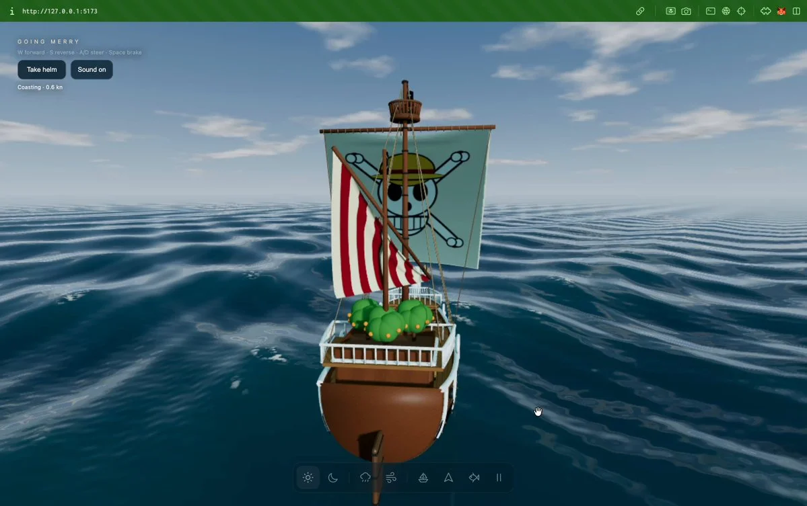</a>

</details>

Được biên soạn từ mô tả dự án công khai của tác giả.

```text
Xây dựng một thế giới hàng hải có thể chơi được với tàu dựng trong Blender và đại dương Three.js. Thêm thời tiết thay đổi, khám phá dưới nước, vệt sóng sau tàu, bọt, nước bắn và cánh buồm chuyển động.
```

[Xem chi tiết ↗](https://www.tripo3d.ai/vi/3d-prompts/one-piece-inspired-sailing-world-2096518775042707700) · [Xem video ↗](https://cdn-blog.holymolly.ai/media/production/3d-prompt-2096515158227206144-video-955ff3de6a1b.mp4) · [Bài đăng gốc](https://x.com/yash_yk45/status/2096518775042707700) · [Bản demo](https://one-piece-sea-world.vercel.app/)

---

<a id="2096572156453028193"></a>

## Tập hút Lorenz tương tác

[Juy \| AI experiments](https://x.com/juyeam) · 2026-09-06 · **Yêu cầu được biên soạn từ mô tả gốc**

Trực quan hóa hai quỹ đạo của hệ Lorenz có vị trí ban đầu chênh nhau rất nhỏ. Cho người xem điều chỉnh độ chênh và tua qua các thời điểm, đồng thời phân biệt việc kiểm tra bằng tính toán số với dự đoán dài hạn chính xác.

<details>
<summary>Ảnh xem trước</summary>

<a href="https://www.tripo3d.ai/vi/3d-prompts/interactive-lorenz-attractor-2096572156453028193">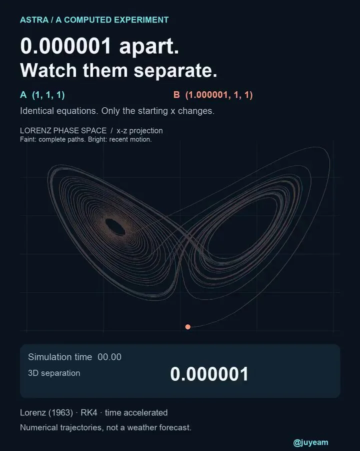</a>

</details>

Được biên soạn từ mô tả dự án công khai của tác giả.

```text
Trực quan hóa hai quỹ đạo của hệ Lorenz có vị trí ban đầu chênh nhau rất nhỏ. Cho người xem điều chỉnh độ chênh và tua qua các thời điểm, đồng thời phân biệt việc kiểm tra bằng tính toán số với dự đoán dài hạn chính xác.
```

[Xem chi tiết ↗](https://www.tripo3d.ai/vi/3d-prompts/interactive-lorenz-attractor-2096572156453028193) · [Xem video ↗](https://cdn-blog.holymolly.ai/media/production/3d-prompt-2096556348947517440-video-9e92e0e7a1ed.mp4) · [Bài đăng gốc](https://x.com/juyeam/status/2096572156453028193) · [Bản demo](https://tiny-worlds-juyeam.juyeam.chatgpt.site/chaos)

---

<a id="2096358854275543457"></a>

## Quán rượu với nhân viên và khách hoạt động

[Rogue](https://x.com/Rogue0114) · 2026-09-05 · **Yêu cầu được biên soạn từ mô tả gốc**

Tái dựng quán rượu từ ảnh tham khảo rồi thêm khách và nhân viên. Cho khách gọi đồ ăn, thức uống và nhân viên chuẩn bị các món đó, có xử lý va chạm và tìm đường.

<details>
<summary>Ảnh xem trước</summary>

<a href="https://www.tripo3d.ai/vi/3d-prompts/tavern-with-working-staff-and-guests-2096358854275543457"></a>

</details>

Được biên soạn từ mô tả dự án công khai của tác giả.

```text
Tái dựng quán rượu từ ảnh tham khảo rồi thêm khách và nhân viên. Cho khách gọi đồ ăn, thức uống và nhân viên chuẩn bị các món đó, có xử lý va chạm và tìm đường.
```

[Xem chi tiết ↗](https://www.tripo3d.ai/vi/3d-prompts/tavern-with-working-staff-and-guests-2096358854275543457) · [Xem video ↗](https://cdn-blog.holymolly.ai/media/production/3d-prompt-2096357698434461699-video-c6f4a25f9a07.mp4) · [Bài đăng gốc](https://x.com/Rogue0114/status/2096358854275543457)

---

<a id="2096506357868642342"></a>

## Biến căn phòng riêng thành hồ sơ năng lực tương tác

[Kalan ◂Ⓘ▸](https://x.com/kalanyei) · 2026-09-06 · **Yêu cầu được biên soạn từ mô tả gốc**

Biến căn phòng riêng thành website tự giới thiệu có tính tương tác. Dựng và bake cảnh trong Blender, sau đó thêm hơi cà phê, hoạt ảnh kiểu Matrix và hiệu ứng shader nhẹ nhàng.

<details>
<summary>Ảnh xem trước</summary>

<a href="https://www.tripo3d.ai/vi/3d-prompts/personal-room-as-an-interactive-portfolio-2096506357868642342">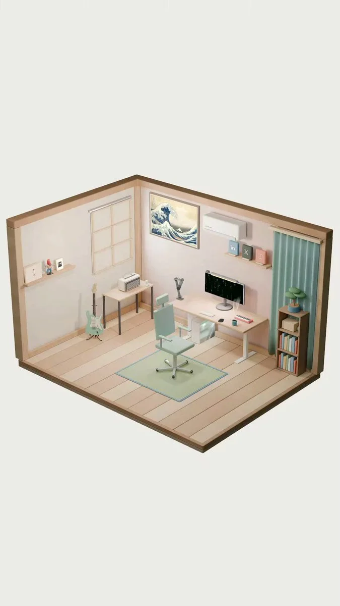</a>

</details>

Được biên soạn từ mô tả dự án công khai của tác giả.

```text
Biến căn phòng riêng thành website tự giới thiệu có tính tương tác. Dựng và bake cảnh trong Blender, sau đó thêm hơi cà phê, hoạt ảnh kiểu Matrix và hiệu ứng shader nhẹ nhàng.
```

[Xem chi tiết ↗](https://www.tripo3d.ai/vi/3d-prompts/personal-room-as-an-interactive-portfolio-2096506357868642342) · [Xem video ↗](https://cdn-blog.holymolly.ai/media/production/3d-prompt-2096502795746910208-video-0fa8acb98948.mp4) · [Bài đăng gốc](https://x.com/kalanyei/status/2096506357868642342) · [Bản demo](https://room.kalan.dev/)

---

<a id="2096503275910832461"></a>

## Thuyền YF-24 trên mặt biển 3D êm dịu

[yhmtmt](https://x.com/yhmtmt1) · 2026-09-06 · **Yêu cầu được biên soạn từ mô tả gốc**

Dựng thuyền YF-24 trong Blender và tạo hoạt cảnh thuyền di chuyển trên biển ba chiều với gió cấp 2 theo thang Beaufort. Dùng tư liệu tham khảo về thuyền để cải thiện hình dáng.

<details>
<summary>Ảnh xem trước</summary>

<a href="https://www.tripo3d.ai/vi/3d-prompts/yf-24-boat-on-a-gentle-3d-sea-2096503275910832461"></a>

</details>

Được biên soạn từ mô tả dự án công khai của tác giả.

```text
Dựng thuyền YF-24 trong Blender và tạo hoạt cảnh thuyền di chuyển trên biển ba chiều với gió cấp 2 theo thang Beaufort. Dùng tư liệu tham khảo về thuyền để cải thiện hình dáng.
```

[Xem chi tiết ↗](https://www.tripo3d.ai/vi/3d-prompts/yf-24-boat-on-a-gentle-3d-sea-2096503275910832461) · [Xem video ↗](https://cdn-blog.holymolly.ai/media/production/3d-prompt-2096500632966631425-video-7aa795ec66f0.mp4) · [Bài đăng gốc](https://x.com/yhmtmt1/status/2096503275910832461)

---

<a id="2096413869841473930"></a>

## Căn hộ lấy cảm hứng từ D4 có thể khám phá trong game

[Hidetaka SWERY SueHERO](https://x.com/Swery65) · 2026-09-06 · **Yêu cầu được biên soạn từ mô tả gốc**

Nghiên cứu căn hộ của nhân vật chính trong D4 và tái dựng thành bản mẫu 3D có thể chơi được. Đối chiếu bố cục và tương tác với tư liệu tham khảo thay vì mặc định rằng đã tái hiện chính xác.

<details>
<summary>Ảnh xem trước</summary>

<a href="https://www.tripo3d.ai/vi/3d-prompts/playable-d4-inspired-apartment-2096413869841473930"></a>

</details>

Được biên soạn từ mô tả dự án công khai của tác giả.

```text
Nghiên cứu căn hộ của nhân vật chính trong D4 và tái dựng thành bản mẫu 3D có thể chơi được. Đối chiếu bố cục và tương tác với tư liệu tham khảo thay vì mặc định rằng đã tái hiện chính xác.
```

[Xem chi tiết ↗](https://www.tripo3d.ai/vi/3d-prompts/playable-d4-inspired-apartment-2096413869841473930) · [Xem video ↗](https://cdn-blog.holymolly.ai/media/production/3d-prompt-2096413677717225472-video-3d17ea73456e.mp4) · [Bài đăng gốc](https://x.com/Swery65/status/2096413869841473930)

---

<a id="2096398839830008292"></a>

## Trò chơi thành phố trên trình duyệt với nhân vật có sẵn

[DJ RIO \| REALITY](https://x.com/djrio_vr) · 2026-09-06 · **Yêu cầu được biên soạn từ mô tả gốc**

Xây dựng trò chơi thành phố WebGL dùng RIO_MA002.fbx làm nhân vật người chơi. Dựng xe cộ và đường phố trong Blender theo tư liệu tham khảo, rồi cải thiện NPC, vật lý lái xe, đạo cụ có thể phá hủy và khu ngoại ô.

<details>
<summary>Ảnh xem trước</summary>

<a href="https://www.tripo3d.ai/vi/3d-prompts/browser-city-game-with-a-supplied-character-2096398839830008292">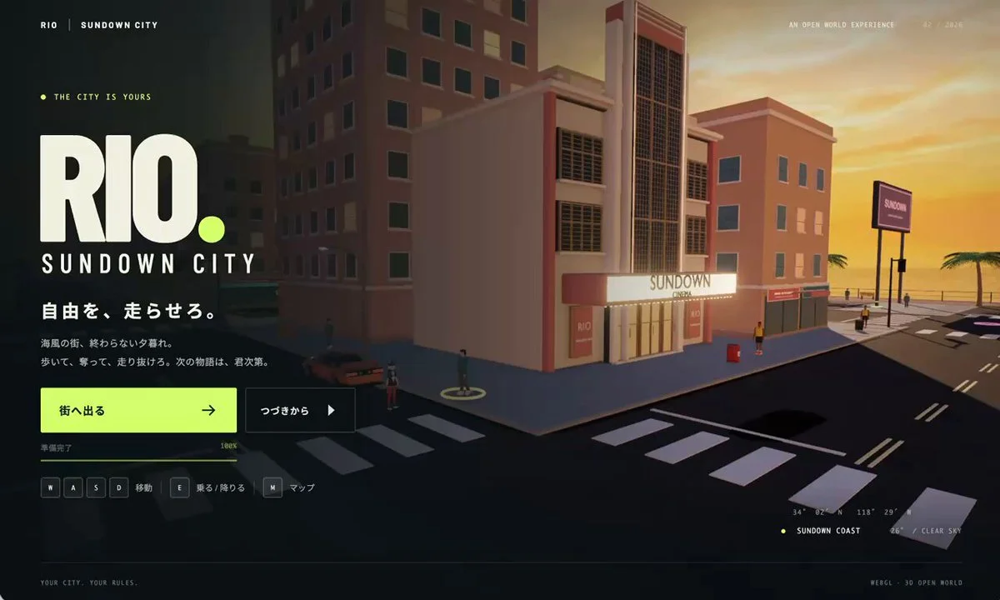</a>

</details>

Được biên soạn từ mô tả dự án công khai của tác giả.

```text
Xây dựng trò chơi thành phố WebGL dùng RIO_MA002.fbx làm nhân vật người chơi. Dựng xe cộ và đường phố trong Blender theo tư liệu tham khảo, rồi cải thiện NPC, vật lý lái xe, đạo cụ có thể phá hủy và khu ngoại ô.
```

[Xem chi tiết ↗](https://www.tripo3d.ai/vi/3d-prompts/browser-city-game-with-a-supplied-character-2096398839830008292) · [Xem video ↗](https://cdn-blog.holymolly.ai/media/production/3d-prompt-2096398600695869440-video-9db110aaf6b5.mp4) · [Bài đăng gốc](https://x.com/djrio_vr/status/2096398839830008292)

---

<a id="2096339041679442428"></a>

## Khám phá quỹ đạo trong Hệ Mặt Trời

[Andromedus](https://x.com/dzhohola) · 2026-09-05 · **Yêu cầu được biên soạn từ mô tả gốc**

Tạo công cụ khám phá Hệ Mặt Trời trong trình duyệt bằng Three.js với tám hành tinh và hai mươi vệ tinh. Cho phép di chuyển camera và lập kế hoạch bay không gian ở mức đơn giản.

<details>
<summary>Ảnh xem trước</summary>

<a href="https://www.tripo3d.ai/vi/3d-prompts/orbital-solar-system-explorer-2096339041679442428">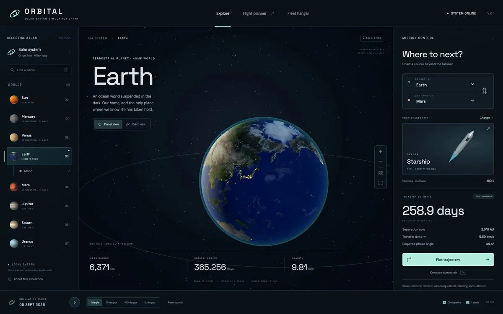</a>

</details>

Được biên soạn từ mô tả dự án công khai của tác giả.

```text
Tạo công cụ khám phá Hệ Mặt Trời trong trình duyệt bằng Three.js với tám hành tinh và hai mươi vệ tinh. Cho phép di chuyển camera và lập kế hoạch bay không gian ở mức đơn giản.
```

[Xem chi tiết ↗](https://www.tripo3d.ai/vi/3d-prompts/orbital-solar-system-explorer-2096339041679442428) · [Xem video ↗](https://cdn-blog.holymolly.ai/media/production/3d-prompt-2096339015465115654-video-3a4c1138a19b.mp4) · [Bài đăng gốc](https://x.com/dzhohola/status/2096339041679442428)

---

<a id="2096093614397170104"></a>

## Sự hình thành hố đen qua WebGL

[ゼン🍣🐟🇳🇿](https://x.com/zeeeeeen) · 2026-09-05 · **Yêu cầu được biên soạn từ mô tả gốc**

Tạo bài trình chiếu giáo dục về sự hình thành hố đen với hình ảnh trực quan WebGL. Dùng các cảnh 3D động để minh họa phần giải thích.

<details>
<summary>Ảnh xem trước</summary>

<a href="https://www.tripo3d.ai/vi/3d-prompts/black-hole-formation-in-webgl-2096093614397170104">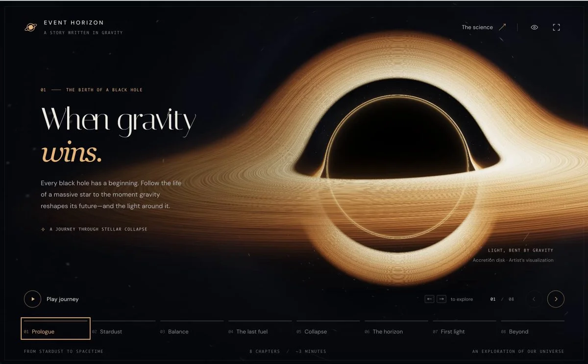</a>

</details>

Được biên soạn từ mô tả dự án công khai của tác giả.

```text
Tạo bài trình chiếu giáo dục về sự hình thành hố đen với hình ảnh trực quan WebGL. Dùng các cảnh 3D động để minh họa phần giải thích.
```

[Xem chi tiết ↗](https://www.tripo3d.ai/vi/3d-prompts/black-hole-formation-in-webgl-2096093614397170104) · [Xem video ↗](https://cdn-blog.holymolly.ai/media/production/3d-prompt-2096093135785107456-video-525882e52f0c.mp4) · [Bài đăng gốc](https://x.com/zeeeeeen/status/2096093614397170104)

---

<a id="2096559197999501724"></a>

## Từ logo 2D đến nhân vật chuyển động

[Anthony Riera](https://x.com/anthonyriera) · 2026-09-06 · **Yêu cầu được biên soạn từ mô tả gốc**

Chuyển logo nhân vật 2D được cung cấp thành phiên bản 3D có hoạt ảnh. Giữ các đặc điểm nhận diện của nhân vật khi bổ sung hình khối và chuyển động.

<details>
<summary>Ảnh xem trước</summary>

<a href="https://www.tripo3d.ai/vi/3d-prompts/a-2d-logo-becomes-an-animated-character-2096559197999501724">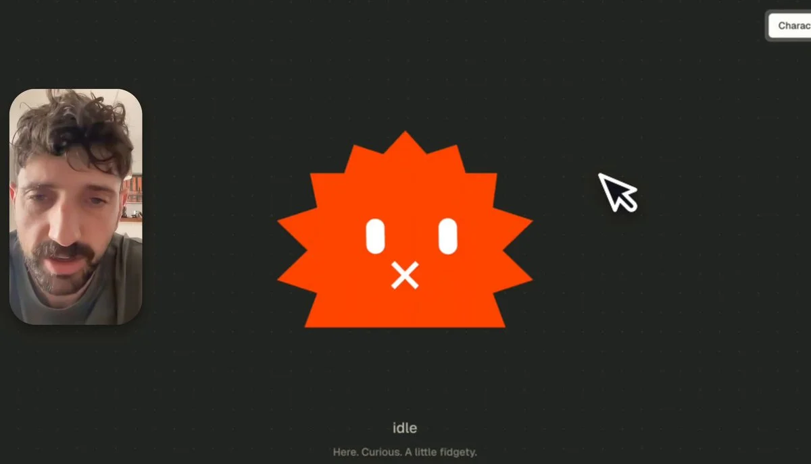</a>

</details>

Được biên soạn từ mô tả dự án công khai của tác giả.

```text
Chuyển logo nhân vật 2D được cung cấp thành phiên bản 3D có hoạt ảnh. Giữ các đặc điểm nhận diện của nhân vật khi bổ sung hình khối và chuyển động.
```

[Xem chi tiết ↗](https://www.tripo3d.ai/vi/3d-prompts/a-2d-logo-becomes-an-animated-character-2096559197999501724) · [Xem video ↗](https://cdn-blog.holymolly.ai/media/production/3d-prompt-2096558319678713856-video-d188c30033a6.mp4) · [Bài đăng gốc](https://x.com/anthonyriera/status/2096559197999501724)

---

<a id="2096337879173591171"></a>

## Trò chơi chú cua với cơ chế xoay quanh hành động

[ZEUS⚡️](https://x.com/zeuuss_01) · 2026-09-05 · **Yêu cầu được biên soạn từ mô tả gốc**

Xây dựng trò chơi chú cua bằng Three.js từ bản yêu cầu có cấu trúc, bao gồm diện mạo, nhân vật, thế giới, hành động, mục tiêu, giao diện và camera. Làm cho đồng xu nổi lên rồi bay về phía cua khi cua đi ngang; chỉ rõ các yêu cầu mâu thuẫn nhau.

<details>
<summary>Ảnh xem trước</summary>

<a href="https://www.tripo3d.ai/vi/3d-prompts/a-crab-game-with-action-driven-mechanics-2096337879173591171"></a>

</details>

Được biên soạn từ mô tả dự án công khai của tác giả.

```text
Xây dựng trò chơi chú cua bằng Three.js từ bản yêu cầu có cấu trúc, bao gồm diện mạo, nhân vật, thế giới, hành động, mục tiêu, giao diện và camera. Làm cho đồng xu nổi lên rồi bay về phía cua khi cua đi ngang; chỉ rõ các yêu cầu mâu thuẫn nhau.
```

[Xem chi tiết ↗](https://www.tripo3d.ai/vi/3d-prompts/a-crab-game-with-action-driven-mechanics-2096337879173591171) · [Xem video ↗](https://cdn-blog.holymolly.ai/media/production/3d-prompt-2096337699737350144-video-d20dcbc3e616.mp4) · [Bài đăng gốc](https://x.com/zeuuss_01/status/2096337879173591171) · [Bản demo](https://beach-crab-game.netlify.app/)

---

<a id="2096555183790575682"></a>

## Ngôi làng Đêm đầy sao với chu kỳ ngày đêm

[Firisis](https://x.com/Firisis_) · 2026-09-06 · **Yêu cầu được biên soạn từ mô tả gốc**

Biến bức Đêm đầy sao của Van Gogh thành ngôi làng 3D có thể khám phá, với cư dân, ánh sáng và chu kỳ ngày đêm. Kết xuất một bộ phim ngắn đi qua thế giới đã hoàn thiện.

<details>
<summary>Ảnh xem trước</summary>

<a href="https://www.tripo3d.ai/vi/3d-prompts/starry-night-village-with-a-day-night-cycle-2096555183790575682">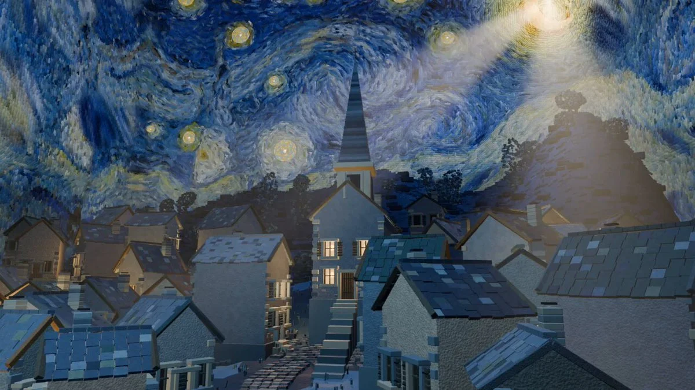</a>

</details>

Được biên soạn từ mô tả dự án công khai của tác giả.

```text
Biến bức Đêm đầy sao của Van Gogh thành ngôi làng 3D có thể khám phá, với cư dân, ánh sáng và chu kỳ ngày đêm. Kết xuất một bộ phim ngắn đi qua thế giới đã hoàn thiện.
```

[Xem chi tiết ↗](https://www.tripo3d.ai/vi/3d-prompts/starry-night-village-with-a-day-night-cycle-2096555183790575682) · [Xem video ↗](https://cdn-blog.holymolly.ai/media/production/3d-prompt-2096552620626182144-video-6643bf0e6e0a.mp4) · [Bài đăng gốc](https://x.com/Firisis_/status/2096555183790575682)

---

<a id="2096510126244999366"></a>

## Giao diện Three.js bám sát thiết kế tham khảo

[Meng To](https://x.com/MengTo) · 2026-09-06 · **Yêu cầu được biên soạn từ mô tả gốc**

Tái hiện thiết kế tham khảo trong một tệp HTML bằng Three.js. Liên tục so sánh kết quả và sửa các khác biệt; tinh chỉnh ánh sáng, độ sâu của mô hình và các nút điều khiển dạng kính, kèm hiệu ứng nhẹ phản hồi theo con trỏ.

<details>
<summary>Ảnh xem trước</summary>

<a href="https://www.tripo3d.ai/vi/3d-prompts/reference-matched-three-js-interface-2096510126244999366"></a>

</details>

Được biên soạn từ mô tả dự án công khai của tác giả.

```text
Tái hiện thiết kế tham khảo trong một tệp HTML bằng Three.js. Liên tục so sánh kết quả và sửa các khác biệt; tinh chỉnh ánh sáng, độ sâu của mô hình và các nút điều khiển dạng kính, kèm hiệu ứng nhẹ phản hồi theo con trỏ.
```

[Xem chi tiết ↗](https://www.tripo3d.ai/vi/3d-prompts/reference-matched-three-js-interface-2096510126244999366) · [Xem video ↗](https://cdn-blog.holymolly.ai/media/production/3d-prompt-2096509525641805824-video-3b59d2080454.mp4) · [Bài đăng gốc](https://x.com/MengTo/status/2096510126244999366)

---

<a id="2096481425050743048"></a>

## Lắp ghép và tạo hoạt ảnh cho các mô hình 3D đã tạo

[Stefan 3D AI](https://x.com/Stefan_3D_AI) · 2026-09-06 · **Yêu cầu được biên soạn từ mô tả gốc**

Tạo tài nguyên 3D đã tối ưu bằng Tripo P2, lắp ghép trong Blender, rồi gắn xương và tạo hoạt ảnh cho nhân vật. Kiểm tra sự phù hợp về không gian giữa nhân vật và cảnh.

<details>
<summary>Ảnh xem trước</summary>

<a href="https://www.tripo3d.ai/vi/3d-prompts/assemble-and-animate-generated-3d-assets-2096481425050743048"></a>

</details>

Được biên soạn từ mô tả dự án công khai của tác giả.

```text
Tạo tài nguyên 3D đã tối ưu bằng Tripo P2, lắp ghép trong Blender, rồi gắn xương và tạo hoạt ảnh cho nhân vật. Kiểm tra sự phù hợp về không gian giữa nhân vật và cảnh.
```

[Xem chi tiết ↗](https://www.tripo3d.ai/vi/3d-prompts/assemble-and-animate-generated-3d-assets-2096481425050743048) · [Xem video ↗](https://cdn-blog.holymolly.ai/media/production/3d-prompt-2096480471941255169-video-945e4c7db324.mp4) · [Bài đăng gốc](https://x.com/Stefan_3D_AI/status/2096481425050743048)

---

<a id="2096269057544831175"></a>

## Trang đích biển sâu với ánh sáng sinh học

[Himanshu Hingorani](https://x.com/himanshubuildss) · 2026-09-05 · **Yêu cầu được biên soạn từ mô tả gốc**

Xây dựng trang đích biển sâu với hiệu ứng nước Three.js, giao diện kính tối màu và chuyển động theo thao tác cuộn. Kết hợp bầu không khí 3D với tương tác website rõ ràng, thích ứng với các kích thước màn hình.

<details>
<summary>Ảnh xem trước</summary>

<a href="https://www.tripo3d.ai/vi/3d-prompts/bioluminescent-deep-sea-landing-page-2096269057544831175"></a>

</details>

Được biên soạn từ mô tả dự án công khai của tác giả.

```text
Xây dựng trang đích biển sâu với hiệu ứng nước Three.js, giao diện kính tối màu và chuyển động theo thao tác cuộn. Kết hợp bầu không khí 3D với tương tác website rõ ràng, thích ứng với các kích thước màn hình.
```

[Xem chi tiết ↗](https://www.tripo3d.ai/vi/3d-prompts/bioluminescent-deep-sea-landing-page-2096269057544831175) · [Xem video ↗](https://cdn-blog.holymolly.ai/media/production/3d-prompt-2096268589192097792-video-db6769b12fa2.mp4) · [Bài đăng gốc](https://x.com/himanshubuildss/status/2096269057544831175)

---
