<!-- Generated from Growth CMS. Update content in CMS; run npm run sync. -->

# Awesome Astra Prompts

[](https://github.com/sindresorhus/awesome) [](https://github.com/TripoGrowthLab/awesome-astra-prompts/stargazers) [](../LICENSE) [](https://github.com/TripoGrowthLab/awesome-astra-prompts/actions/workflows/sync-prompts.yml) [](../CONTRIBUTING.md)

<p>
  <a href="../README.md"></a>
  <a href="../README.zh-CN.md"></a>
  <a href="../docs/catalog.zh-Hant.md"></a>
  <a href="../docs/catalog.ja.md"></a>
  <a href="../docs/catalog.ko.md"></a>
  <a href="../docs/catalog.es.md"></a>
  <a href="../docs/catalog.pt.md"></a>
  <a href="../docs/catalog.de.md"></a>
  <a href="../docs/catalog.fr.md"></a>
  <a href="../docs/catalog.it.md"></a>
  <a href="../docs/catalog.ru.md"></a>
  <a href="../docs/catalog.tr.md"></a>
  <a href="../docs/catalog.uk.md"></a>
  <a href="../docs/catalog.vi.md"></a>
</p>

> Bạn đang sáng tạo với Claude Opus 5.5? Khám phá cảnh 3D, trò chơi và mô phỏng kèm nguồn trong [Awesome Opus 5.5 Prompts](https://github.com/TripoGrowthLab/awesome-opus-5-5-prompts).

<a href="https://www.tripo3d.ai/vi/3d-prompts/models/gpt-6-astra?utm_source=github&amp;utm_medium=referral&amp;utm_campaign=awesome_astra_prompts&amp;utm_content=readme_hero">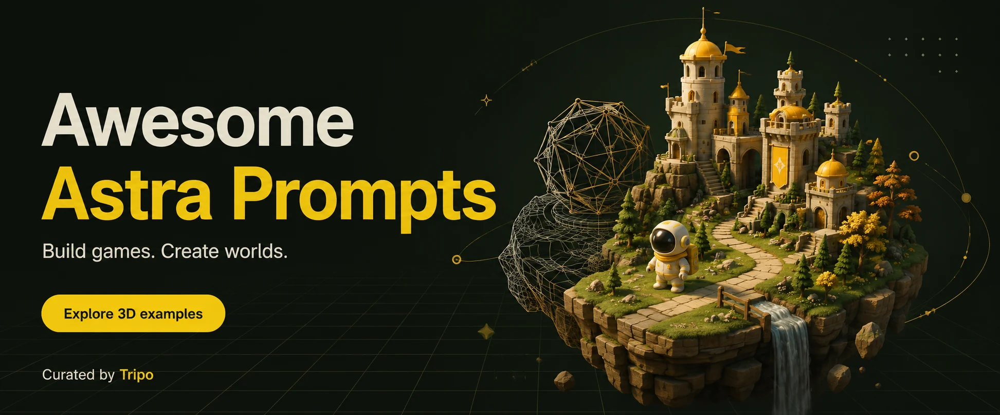</a>

**Khởi đầu cho trò chơi, cảnh 3D hoặc thế giới tương tác tiếp theo của bạn.**


**321 · Prompt Astra mới nhất**

## Dự án nổi bật

<table>
<tr>
<td width="50%" valign="top"><a href="https://www.tripo3d.ai/vi/3d-prompts/wright-flyer-through-a-japanese-forest-2096467585785286808">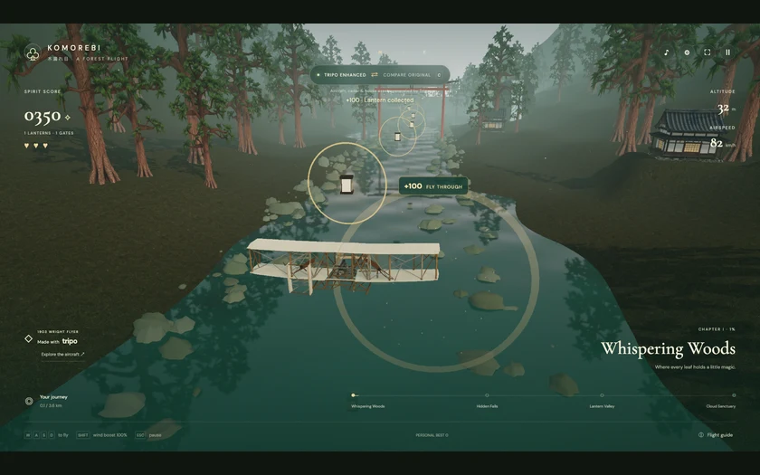</a><br><strong><a href="https://www.tripo3d.ai/vi/3d-prompts/wright-flyer-through-a-japanese-forest-2096467585785286808">Wright Flyer Xuyên Qua Rừng Nhật Bản</a></strong><br><sub><a href="https://x.com/jaredliu_bravo">Jared</a></sub><br><a href="https://www.tripo3d.ai/vi/3d-prompts/wright-flyer-through-a-japanese-forest-2096467585785286808">Prompt →</a></td>
<td width="50%" valign="top"><a href="https://www.tripo3d.ai/vi/3d-prompts/jelly-jungle-3d-browser-game-2081024333120733188">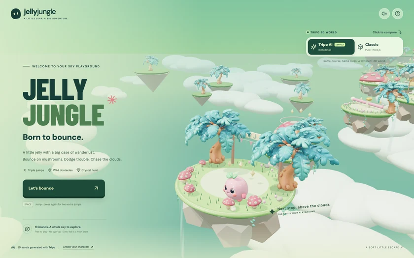</a><br><strong><a href="https://www.tripo3d.ai/vi/3d-prompts/jelly-jungle-3d-browser-game-2081024333120733188">Rừng Kẹo Dẻo: Game đi cảnh 3D</a></strong><br><sub><a href="https://x.com/jaredliu_bravo">Jared</a></sub><br><a href="https://www.tripo3d.ai/vi/3d-prompts/jelly-jungle-3d-browser-game-2081024333120733188">Prompt →</a></td>
</tr>
<tr>
<td width="50%" valign="top"><a href="https://www.tripo3d.ai/vi/3d-prompts/akari-nagoya-rooftop-flame-relay">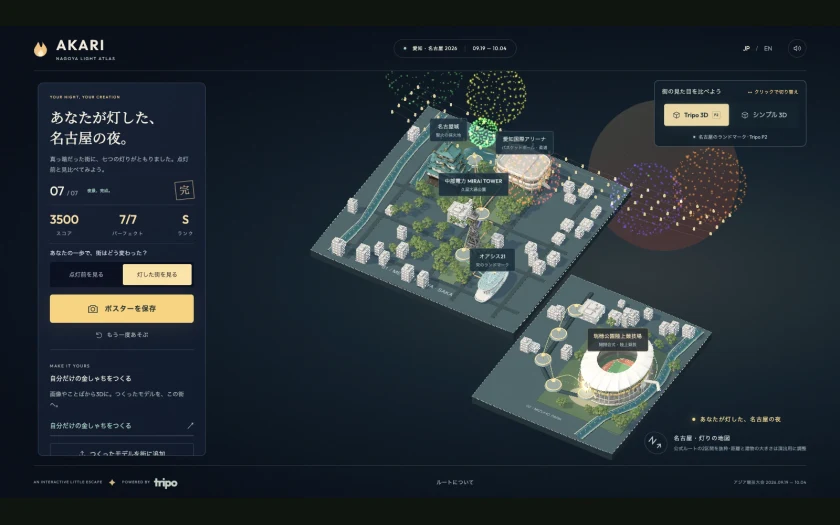</a><br><strong><a href="#akari-nagoya-rooftop-flame-relay">AKARI: Tiếp lửa trên những sân thượng Nagoya</a></strong><br><sub><a href="https://growthengineer.space/">Jared</a></sub><br><a href="#akari-nagoya-rooftop-flame-relay">Prompt →</a></td>
<td width="50%" valign="top"><a href="https://www.tripo3d.ai/vi/3d-prompts/cyclops-island-threejs-game">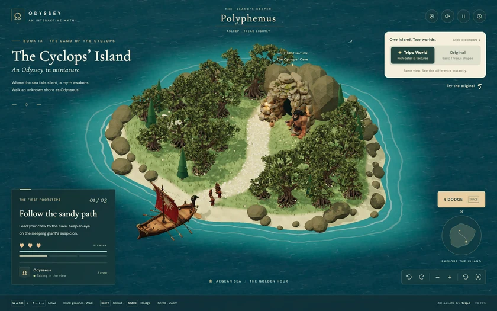</a><br><strong><a href="#cyclops-island-threejs-game">Hòn đảo của Cyclops</a></strong><br><sub><a href="https://x.com/jaredliu_bravo">Jared</a></sub><br><a href="#cyclops-island-threejs-game">Prompt →</a></td>
</tr>
</table>

<a id="all-prompts"></a>

## Prompt Astra mới nhất

<details>
<summary>Khám phá ví dụ</summary>

- [Trình khám phá giải phẫu 3D tương tác](#2099206962344800541) · GitHub
- [Demo đồ họa fantasy isometric](#2100271998618177864) · GitHub
- [Triển khai UV và bake lại 4K cho mô hình quần áo không có đầu](#2098980384260456813)
- [Phân cảnh 3D khu ven biển có thể chơi trên trình duyệt](#2099172061092381027)
- [Tái hiện Lâu đài Peach trong 3D](#2099359786865402019)
- [Đường sắt mô hình tự động tránh va chạm](#2099362575339372780)
- [Màn vượt chướng ngại vật 3D có thể chơi](#2099419671481249851)
- [Cảnh rừng Samurai 3D tương tác](#2099450933067612421)
- [Mô hình cây lá kim dưới 200 polygon](#2099472264270102705)
- [Thế giới 3D với những tòa nhà chọc trời cao vút](#2099487024256589970)
- [Chiến binh trèo lên người khổng lồ và giáng búa vào hàm](#2099519801139908951)
- [Tạo cảnh hành lang khách sạn](#2099588840419651890)
- [Đảo núi lửa tương tác với những chiếc thuyền tháo chạy](#2099643231659012553)
- [Bảng điều khiển hệ thần kinh tương tác của sinh vật 3D](#2099719427990134984)
- [Trái tim và emoji mặt cười phong cách Apple 3D](#2099750376530657300)
- [Game khám phá không gian tạo sinh với mọi điểm đến đều có thể tiếp cận](#2099785223827259515)
- [Tạo không gian 3D có thể điều khiển và nhân vật game từ ảnh tham khảo](#2099850719839109597)
- [Cảnh phòng 3D tương tác với nội thất có cơ cấu chuyển động](#2100139076816916977)
- [Phát triển Splatoon bản PC và tái hiện đồ họa](#2100193512373592313)
- [Tham quan căn hộ tương tác với các tùy chọn gạch lát](#2100222426705453318)
- [Phim ngắn CGI AAA: Đấu võ siêu nhiên trong ga tàu điện ngầm](#2100233407108137349)
- [Cảnh lửa trại voxel tương tác với hiệp sĩ](#2100350159540596760)
- [Thêm xích bảo trì vào lan can](#2100519026720231698)
- [Tạo game đua xe 3D](#2100526922770026874)
- [Game 3D trên trình duyệt: Thoát khỏi cơ sở nghiên cứu bị phong tỏa](#2100595652703199281)
- [Tự thiết kế một cơ thể bằng CAD](#2100614534423540102)
- [Monster Block — 45 giây phá tan thành phố](#2100636075039629796)
- [Huấn luyện chiến lược xoay bút với bàn tay khéo léo Sharpa](#2100751369619820923)
- [Game xe điện trên không 3D giữa những hòn đảo bay](#2100838090210431302)
- [Tạo một thế giới 3D chân thực như ảnh](#2100844566718926949)
- [Mô hình đồng hồ IWC Schaffhausen 3D tương tác](#2100956517633761447)
- [Thiên hà dựa trên vật lý quỹ đạo thực tế](#2101055500599054437)
- [Môi trường 3D chân thực như ảnh hoàn chỉnh](#2101224659861590399)
- [Mô hình tương tác 3D động cơ máy bay](#2101271938706685991)
- [Quy trình tạo hoạt ảnh 3D và video mèo võ thuật catfu](#2101310374033428642)
- [Mô hình 3D Waymo Jaguar I-Pace](#2101325346427842909)
- [Thuyền buồm trên vùng nước rộng](#2101616345720787130)
- [Tạo mô hình 3D WALL-E bằng Three.js](#2101687900723106104)
- [Verdant — hòn đảo khủng long 3D tương tác](#2101730386711634251)
- [Website mô hình Mặt Trời 3D tương tác](#2102038136725377200)
- [Game đua xe procedural trên trình duyệt Spline Rush](#2102150615635816866)
- [Bản trình bày thiết kế trực thăng 3D tương tác](#2102215638311694336)
- [Cảnh 3D và video Tháp Tokyo ngày và đêm](#2102276620124062065)
- [Bubble Bay: Đại chiến bóng nước 3D](#2102300855387205871)
- [Game tower defense phong cách Sir, We Have Orc Problems](#2102411087002112256)
- [Nhà ngoại ô hai tầng có nội thất](#2102473710724919614)
- [Game đua xe kart 3D trong một tệp HTML duy nhất](#2102652927177617564)
- [Hoạt ảnh lâu đài thời Trung cổ trên trình duyệt](#2102672926285713456)
- [Orbit Lab: Mô phỏng 3D Mặt Trời, Trái Đất và Mặt Trăng](#2102752217375899659)
- [Lâu đài 3D phong cách châu Âu thời Trung cổ có thể tương tác trong trình duyệt](#2102780850706567390)
- [Bàn cờ 3D tương tác để học các gambit cờ vua](#2102788013902213508)
- [Shader thành phố solarpunk vô tận](#2102826333550133520)
- [Trình mô phỏng làm burger góc nhìn thứ nhất](#2102897258983313712)
- [Cảnh HTML lửa trại giữa sa mạc về đêm siêu chân thực](#2102915300295369208)
- [Codex dạng voxel trong Three.js](#2102956340482289944)
- [Lát cam dẻo 3D tương tác](#2103062348168618280)
- [Hướng Bắc: Hành trình tương tác trên thuyền dài Viking](#2103187935759655167)
- [Trải nghiệm Three.js mùa thu mù sương có thể khám phá](#2103211135214256350)
- [STILLWATER — Trải nghiệm đầm lầy ánh trăng trên trình duyệt](#2103308083242082314)
- [Bối cảnh chiến trường La Mã vào giờ vàng](#2103351755971207251)
- [Thạch Pitaya](#2103432732386664591)
- [Dựng mô hình 3D trang phục cho VRChat](#2103456264785424530)
- [Tạo chuột lang trong Blender](#2103482826519986544)
- [Vườn Nhật phong cách voxel trong Three.js](#2103486103831339269)
- [Cảnh WebGL voxel tàu trong chai](#2103855977376125161)
- [Môi trường làng ven hồ giữa rừng](#2103860776419111285)
- [Mô phỏng bắt tầng đẩy Super Heavy trong Blender](#2103966922127630820)
- [Demo tương tác 3D về đường đi của ánh sáng qua ống kính máy ảnh](#2104077535315144878)
- [Lát dưa hấu thạch 3D tương tác](#2104504957173153951)
- [Game phong cách Genshin và công cụ chỉnh sửa địa hình](#2104531704740512143)
- [Móc chữ J có thể in 3D để thử độ bền](#2104590493191479337)
- [Mô hình 3D tương tác về CRISPR dành cho giáo dục](#2104605522640970208)
- [Chuyến du ngoạn bằng thuyền trong rừng rậm dưới ánh trăng tương tác](#2104613125093998674)
- [Xe thể thao biến hình với chế độ X-quang bung tách](#2104654448878387313)
- [Mắt người 3D độ chi tiết cao](#2104841727496323479)
- [Thời gian, được tháo rời.](#2105009377002299711)
- [Mô hình F-22 Raptor chân thực và video bay trong Godot](#2105027152617918852)
- [Cảnh phóng tên lửa chân thực như phim điện ảnh](#2105047166733746209)
- [Bản render Blender của cầu Golden Gate](#2105278999861526953)
- [Tạo nhân vật Minion 3D trong Blender](#2105298955307303100)
- [Tái tạo cảnh trong Isaac Sim](#2105323534398763307)
- [Sa bàn kim tự tháp 3D thu nhỏ màu vàng](#2105412081692352654)
- [game 3D né thiên thạch](#2105644436659290409)
- [Cảnh thuyền 3D có thể điều khiển trên sông vùng núi](#2106385060106777043)
- [Không gian 3D ngôi nhà có thể tham quan bằng trình duyệt](#2106737391948235164)
- [Tạo trailer điện ảnh cho một trò chơi hư cấu](#2106824464092770455)
- [Game 3D thu thập 10 mảnh sao trên đảo nhỏ về đêm](#2106944804756275690)
- [Nhện bông — Nghiên cứu vật liệu số 015](#2107127712871505976)
- [Banana Jelly](#2107186979502776590)
- [Bách khoa toàn thư tương tác về động vật hoang dã Wild Atlas](#2107479802152472717)
- [Mực ống nhồi bông.](#2107533363808485534)
- [Villa Jelly](#2107617244301664483)
- [Hình ảnh hóa Những thành phố vô hình bằng Three.js](#2107824019999535226)
- [Battle City 3D: Phòng thủ xe tăng vô tận](#battle-city-3d)
- [Crazy Tanks — Pháo binh đảo 3D](#crazy-tanks-3d-island-artillery)
- [Biệt thự Thạch rau câu](#jelly-villa)
- [ODD ARMS — Game sinh tồn với vũ khí kỳ quặc](#odd-arms)
- [TITANIC — Ánh sáng cuối cùng](#titanic-the-last-light)
- [AKARI: Tiếp lửa trên những sân thượng Nagoya](#akari-nagoya-rooftop-flame-relay)
- [Hòn đảo của Cyclops](#cyclops-island-threejs-game)

</details>

<a id="2099206962344800541"></a>

### Trình khám phá giải phẫu 3D tương tác

[BuBBliK](https://x.com/k1rallik) · 2026-09-13

<a href="https://www.tripo3d.ai/vi/3d-prompts/gpt-6-astra-2099206962344800541">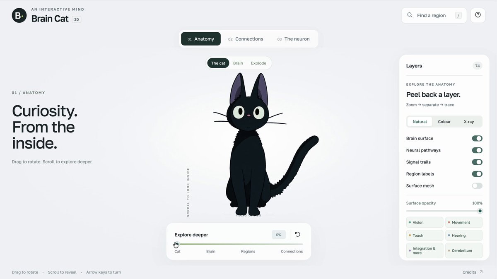</a>

Tác giả chia sẻ đây là prompt khởi đầu được đề xuất để xây dựng một phiên bản tương tự website Brain Cat tương tác của họ. Prompt yêu cầu một trình khám phá giải phẫu 3D thích ứng, có hiệu ứng làm trong suốt để hiển thị phần bên trong, khả năng xoay và tách riêng các cấu trúc, các vùng được gắn nhãn, điều khiển lớp, tín hiệu giáo dục dạng hoạt ảnh và trích dẫn nguồn khoa học.

**Prompt**

```text
Xây dựng một trình khám phá giải phẫu 3D tương tác, đẹp mắt, sử dụng các bộ dữ liệu khoa học công khai. Bắt đầu với góc nhìn bên ngoài, sau đó dần trở nên trong suốt khi tôi phóng to để hiển thị phần giải phẫu bên dưới.

Cho phép tôi xoay mô hình, tách riêng các cấu trúc, chọn các vùng được gắn nhãn và bật/tắt các lớp từ bảng điều khiển bên. Thêm các tab riêng cho giải phẫu, kết nối và từng tế bào, kèm tín hiệu động cùng các tùy chỉnh có thể điều chỉnh.

Sử dụng giao diện hiện đại, tối giản với ánh sáng dịu, màu sắc tinh tế, chuyển cảnh mượt mà và rất ít chữ. Thêm mũi tên cùng một hướng dẫn trực quan ngắn. Đảm bảo hoạt động tốt trên máy tính và thiết bị di động.

Sử dụng hình học giải phẫu thực tế khi có thể, trích dẫn các nguồn và phân biệt rõ dữ liệu khoa học với hoạt ảnh minh họa. Xây dựng một website hoạt động hoàn chỉnh.
```

[Xem chi tiết ↗](https://www.tripo3d.ai/vi/3d-prompts/gpt-6-astra-2099206962344800541) · [Bài đăng gốc](https://x.com/k1rallik/status/2099206962344800541) · [Mã nguồn](https://github.com/bubblik525/cat_brain_anatomy) · [Về danh sách ví dụ](#all-prompts)

---

<a id="2100271998618177864"></a>

### Demo đồ họa fantasy isometric

[Anshu Chimala](https://x.com/anshuc) · 2026-09-16

<a href="https://www.tripo3d.ai/vi/3d-prompts/gpt-6-astra-2100271998618177864">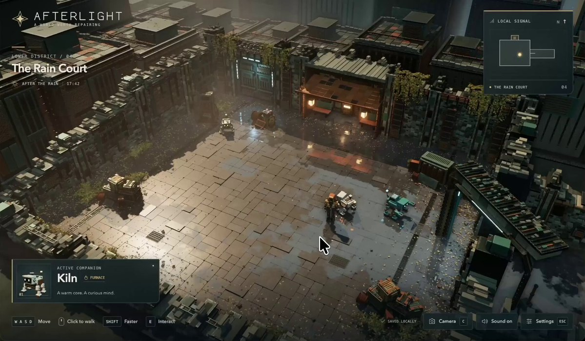</a>

Một cảnh 3D fantasy tương tác chạy trên trình duyệt, sử dụng camera isometric, định hướng nghệ thuật lấy cảm hứng từ voxel, sàn ướt phản chiếu và một nhân vật có thể di chuyển. Kho lưu trữ Dream Loop được liên kết giới thiệu đây là prompt mẫu và cho biết đã được thử nghiệm với GPT-6 Astra trong Codex. Prompt không yêu cầu vòng lặp gameplay.

**Prompt**

```text
Hãy tạo một demo đồ họa: camera isometric, phong cách nghệ thuật kiểu voxel với đổ bóng chân thực và sàn ướt phản chiếu, cùng một nhân vật trong một khung cảnh thú vị. Bối cảnh fantasy (hãy hình dung Elden Ring, Diablo). Sử dụng Three.js trong trình duyệt, đạt >60fps. Không tải asset xuống. Giới hạn thời gian 1 giờ. Điều khiển: nhấp để di chuyển nhân vật, camera tự động bám theo với độ trễ; kéo để xoay camera; cuộn để phóng to/thu nhỏ. Hiện chưa cần gameplay. Thế giới cần có cảm giác sống động: chuyển động, hoạt ảnh và các hành vi môi trường tinh tế. Khu vực xung quanh người chơi nên trông rộng lớn, nhưng chỉ cho phép di chuyển trong một không gian giới hạn. Không cần xác nhận phần mỹ thuật với tôi hay đặt câu hỏi, cứ bắt tay thực hiện!
```

[Xem chi tiết ↗](https://www.tripo3d.ai/vi/3d-prompts/gpt-6-astra-2100271998618177864) · [Bài đăng gốc](https://github.com/achimala/dream-loop) · [Mã nguồn](https://github.com/achimala/dream-loop) · [Về danh sách ví dụ](#all-prompts)

---

<a id="2098980384260456813"></a>

### Triển khai UV và bake lại 4K cho mô hình quần áo không có đầu

[さ🥺](https://x.com/_sagyoai) · 2026-09-13

<a href="https://www.tripo3d.ai/vi/3d-prompts/gpt-6-astra-2098980384260456813">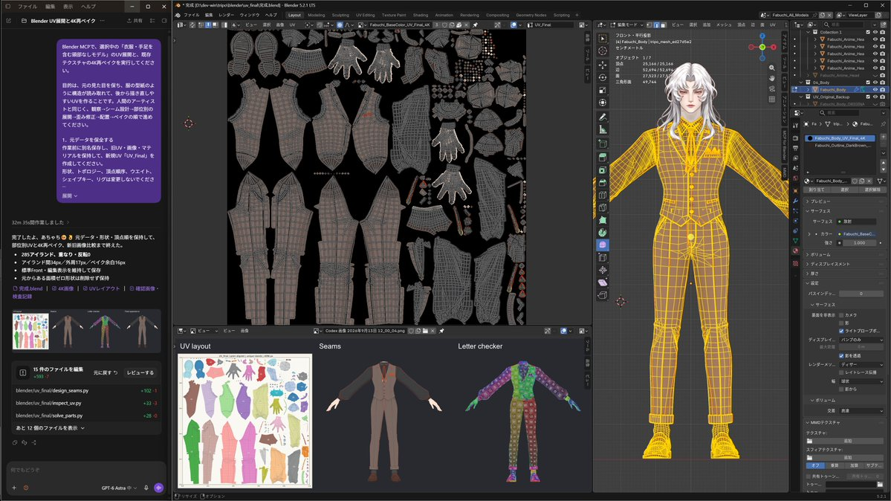</a>

Prompt này dùng cho mô hình 3D không có đầu, bao gồm quần áo và tay chân đang được chọn: triển khai lại UV theo cách dễ đọc cấu trúc và dễ chỉnh sửa, sau đó bake lại kết cấu hiện có ở độ phân giải 4K. Quy trình bảo toàn dữ liệu cũ, đồng thời thực hiện thiết kế seam, kiểm tra biến dạng, đóng gói và đối chiếu kết quả.

**Prompt**

```text
Trong Blender MCP, hãy thực hiện triển khai UV cho “mô hình không có đầu, bao gồm quần áo và tay chân” đang được chọn, đồng thời bake lại kết cấu hiện có ở độ phân giải 4K.

Mục tiêu là giữ nguyên diện mạo ban đầu và tạo UV có cấu trúc dễ đọc như rập may của quần áo, đồng thời thuận tiện cho việc vẽ lại về sau. Hãy thực hiện theo trình tự như một nghệ sĩ con người: quan sát → thiết kế seam → triển khai theo từng bộ phận → chỉnh biến dạng → sắp xếp → bake.

1. Bảo toàn dữ liệu gốc
Trước khi bắt đầu, hãy lưu thành tệp mới, giữ lại UV, hình ảnh và vật liệu cũ, đồng thời tạo UV mới có tên “UV\_Final”.
Không được thay đổi hình dạng, topology, thứ tự đỉnh, weight, shape key hoặc rig.

2. Quan sát mô hình và thiết kế seam
Kiểm tra mọi hướng bằng chế độ hiển thị kết cấu gốc và wireframe để nắm được cấu trúc các bộ phận quần áo cũng như đường may thực tế.
Với quần áo, hãy mở seam theo cấu trúc rập may của thân áo, tay áo, cổ áo và các bộ phận tương tự, tận dụng đường sườn hoặc mặt trong tay áo. Với da và tay chân, đặt seam ở những vị trí ít замет thấy như mặt trong hoặc mặt bên, đồng thời mở phần giữa các ngón tay một cách tự nhiên, không gây biến dạng.
Không nhầm nếp nhăn hoặc hình in với đường may, và không tạo các island nhỏ bị chia vụn không cần thiết.

3. Triển khai theo từng bộ phận và chỉnh biến dạng
Không xử lý toàn bộ mô hình cùng lúc; hãy Unwrap theo từng bộ phận.
Dùng checker có chữ tham chiếu đến UV\_Final cùng chế độ hiển thị Stretch để kiểm tra độ kéo giãn, co nén, xoắn, lật và chồng lấp.
Tùy theo nguyên nhân, hãy thêm hoặc gỡ seam, điều chỉnh bằng Pin, Relax và các công cụ tương tự, rồi kiểm tra lại. Không chỉ lặp lại cùng một thao tác triển khai tự động; hãy giữ nguyên các bộ phận đã được cải thiện.
Không dùng Smart UV Project để tự động chia nhỏ toàn bộ mô hình rồi coi đó là sản phẩm hoàn thiện.

4. Căn chỉnh hướng sợi vải, mật độ và bố cục
Đối với quần áo, hãy căn hướng dọc cơ bản theo hướng sợi vải của từng bộ phận vào hướng V của UV. Không cố ép những phần rập có đường cong thành hình chữ nhật.
Đồng nhất mật độ texel theo kích thước thực, đồng thời sắp xếp hướng sao cho dễ nhận biết các phần đối xứng trái và phải.
Sau đó, đóng gói vào vùng 0–1 trong khi giữ nguyên hướng và tỷ lệ tương đối. Không được tự ý xoay hoặc chồng UV đối xứng trái phải lên nhau.
Làm mốc ban đầu cho ảnh 4K: lề bake 16px, khoảng cách giữa các island từ 32px trở lên và khoảng cách từ island đến mép ảnh từ 16px trở lên.

5. Bake 4K từ UV cũ sang UV mới
Cố định rõ nguồn tham chiếu của kết cấu gốc vào UV cũ, dùng UV\_Final làm UV đích và chuyển dữ liệu sang ảnh mới kích thước 4096×4096.
Trong từng vật liệu, hãy kích hoạt node ảnh đích để bake, thực hiện bake thử trước rồi mới bake chính thức.
Với base color, chỉ sử dụng Color của Diffuse hoặc Emit; không bake thêm ánh sáng, bóng hoặc AO mới. Giữ nguyên phần đổ bóng đã được vẽ trong ảnh gốc.
Nếu cần, hãy chuyển cả các map hiện có như alpha; với normal map tangent, hãy bake lại theo UV mới thay vì chỉ chuyển màu đơn thuần.

6. Đối chiếu cũ và mới để xác nhận hoàn thiện
Áp dụng UV mới và ảnh đã bake, sau đó so sánh toàn thân cùng các chi tiết ở cùng điều kiện hiển thị như bản gốc.
Kiểm tra vị trí họa tiết, màu sắc, độ trong suốt và tính liên tục của seam; sửa các lỗi UV bị ép, chồng lấp hoặc chưa được triển khai, cũng như các điểm đen, vùng mất dữ liệu và hiện tượng lem do bake.
Đánh giá mức độ hoàn thiện dựa trên kết quả kiểm tra, không dựa vào “đã triển khai bao nhiêu lần”.

Hãy lưu tệp hoàn thiện.blend, ảnh 4K, bố cục UV và các ảnh kiểm tra seam, checker cùng diện mạo hoàn thiện; sau đó báo cáo ngắn gọn những nội dung đã chỉnh sửa chính.
Không dừng lại ở việc giải thích kế hoạch; hãy vừa kiểm tra hình ảnh thực tế vừa hoàn tất công việc.
```

[Xem chi tiết ↗](https://www.tripo3d.ai/vi/3d-prompts/gpt-6-astra-2098980384260456813) · [Bài đăng gốc](https://x.com/_sagyoai/status/2098980384260456813) · [Về danh sách ví dụ](#all-prompts)

---

<a id="2099172061092381027"></a>

### Phân cảnh 3D khu ven biển có thể chơi trên trình duyệt

[Lummox](https://x.com/Lummox_eth) · 2026-09-13

<a href="https://www.tripo3d.ai/vi/3d-prompts/gpt-6-astra-2099172061092381027">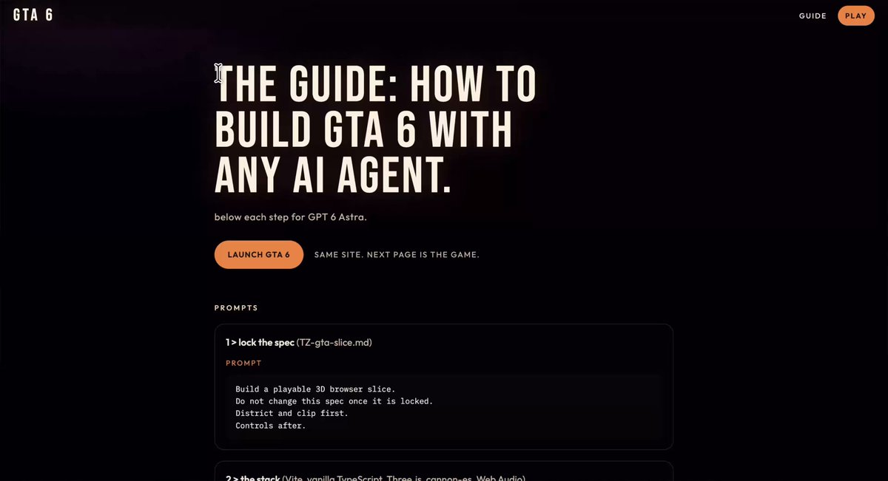</a>

Chuỗi sáu prompt do Lummox đăng, dùng để tạo một phân cảnh 3D có thể chơi trên trình duyệt. Chuỗi này cố định stack Vite, TypeScript thuần, Three.js, cannon-es và Web Audio; dựng một khu ven biển lúc hoàng hôn; dàn dựng cảnh ba người bước vào ô tô; đồng thời quy định nhịp độ và âm thanh của đoạn cảnh.

**Prompt**

```text
> khóa đặc tả (TZ-gta-slice.md)

prompt: "Xây dựng một phân cảnh 3D có thể chơi trên trình duyệt. Không thay đổi đặc tả này sau khi đã khóa. Ưu tiên khu vực và đoạn cảnh trước. Bổ sung điều khiển sau."

> stack (Vite, TypeScript thuần, Three.js, cannon-es, Web Audio)

prompt: "Stack đã được cố định. Vite. TypeScript thuần. Three.js. cannon-es. Web Audio. Một URL trên trình duyệt."

> khung hình (hoàng hôn trên mặt nước, mặt đường nhựa ướt, hàng cọ)

prompt: "Một khu ven biển. Hoàng hôn trên mặt nước. Mặt đường nhựa ướt. Hàng cọ. Tập trung khung hình vào ánh sáng và camera, không phải số lượng polygon. Không dùng ánh sáng xám mặc định. Không để các khối hộp trơ trọi."

> ba người (một cảnh, một ô tô, khoảng 20 giây)

prompt: "Giữ cả ba người trong cùng một cảnh. Họ trò chuyện. Sau đó họ ngồi vào cùng một chiếc ô tô. Khoảng 20 giây. Ưu tiên chất lượng thay vì thêm công tắc."

> cắt cảnh (15 đến 20 giây, giữ chuyển động mượt mà)

prompt: "Nếu bị giật, rút ngắn đoạn cảnh xuống còn 15 đến 20 giây. Giữ chuyển động mượt mà. Nếu tụt khung hình, cắt bớt người đi bộ, không cắt ánh sáng."

> âm thanh (giọng người, pad nền dưới lời thoại, tiếng động cơ ô tô)

prompt: "Giọng nói phải giống người thật, không phải robot. Đặt pad âm thanh nhẹ dưới lời thoại, tuyệt đối không lấn át lời thoại. Khi họ ngồi vào xe, thêm tiếng động cơ ô tô trầm, không dùng âm thanh chói như tiếng cưa. Không có tiếng xì radio."
```

[Xem chi tiết ↗](https://www.tripo3d.ai/vi/3d-prompts/gpt-6-astra-2099172061092381027) · [Bài đăng gốc](https://x.com/Lummox_eth/status/2099172061092381027) · [Về danh sách ví dụ](#all-prompts)

---

<a id="2099359786865402019"></a>

### Tái hiện Lâu đài Peach trong 3D

[Romain Huet](https://x.com/romainhuet) · 2026-09-14

<a href="https://www.tripo3d.ai/vi/3d-prompts/gpt-6-astra-2099359786865402019">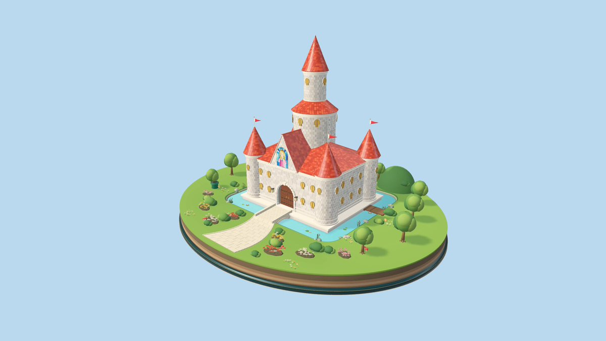</a>

Tác giả cho biết họ đã yêu cầu Astra trong Codex tái hiện Lâu đài Peach trong 3D và tạo video bay qua. Trong một bình luận tiếp theo, tác giả cho biết sản phẩm bao gồm mô hình Blender, góc quay orbit được kiểm tra vào ban ngày và lúc chạng vạng, 88 ô kính được dựng hình trong cửa sổ của Peach, cùng không gian nội thất tầng trệt.

**Prompt**

```text
tái hiện Lâu đài Peach trong 3D và tạo video bay qua.
```

[Xem chi tiết ↗](https://www.tripo3d.ai/vi/3d-prompts/gpt-6-astra-2099359786865402019) · [Bài đăng gốc](https://x.com/romainhuet/status/2099359786865402019) · [Về danh sách ví dụ](#all-prompts)

---

<a id="2099362575339372780"></a>

### Đường sắt mô hình tự động tránh va chạm

[AI Guides](https://x.com/free_ai_guides) · 2026-09-14

<a href="https://www.tripo3d.ai/vi/3d-prompts/gpt-6-astra-2099362575339372780">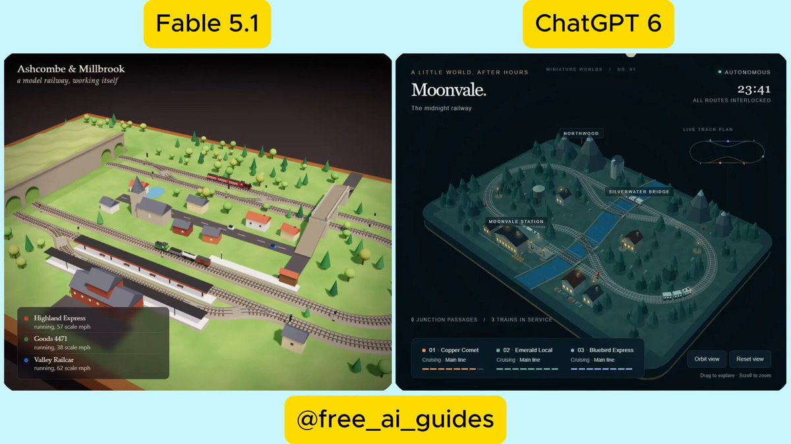</a>

Mô phỏng đường sắt mô hình tự vận hành với ít nhất ba đoàn tàu chạy trên các tuyến ray dùng chung. Các đoàn tàu tự điều khiển ghi đường và tín hiệu để tránh va chạm, còn mọi quyết định về thiết kế hình ảnh đều do mô hình tự lựa chọn. Tác giả cho biết chính xác prompt này đã được gửi cho cả Fable 5.1 và GPT-6 Astra.

**Prompt**

```text
Xây dựng một hệ thống đường sắt mô hình với ít nhất ba đoàn tàu chạy đồng thời trên một bố cục đường ray dùng chung, có các nút giao và tín hiệu. Các đoàn tàu phải tự chuyển tuyến và dừng trước tín hiệu để không bao giờ va chạm, không cần bất kỳ thao tác nào từ người dùng. Bạn tự quyết định bố cục, bối cảnh và diện mạo của mọi thứ. Mọi yếu tố thiết kế đều do bạn lựa chọn: phong cách, màu sắc, không khí, môi trường, camera, mức độ chi tiết và mọi điểm nhấn bổ sung. Không đặt câu hỏi cho tôi; hãy tự đưa ra mọi quyết định và xây dựng phiên bản ấn tượng nhất có thể chỉ trong một lần thử. Yêu cầu kỹ thuật: chỉ sử dụng một tệp HTML độc lập duy nhất, không dùng mô hình, hình ảnh, âm thanh hoặc URL tài nguyên bên ngoài dưới bất kỳ hình thức nào (cho phép dùng thư viện JavaScript từ CDN). Tệp phải tự chạy ngay khi tải, không cần nhấp chuột, hoạt động mượt mà và không có lỗi trong console.
```

[Xem chi tiết ↗](https://www.tripo3d.ai/vi/3d-prompts/gpt-6-astra-2099362575339372780) · [Bài đăng gốc](https://x.com/free_ai_guides/status/2099362575339372780) · [Về danh sách ví dụ](#all-prompts)

---

<a id="2099419671481249851"></a>

### Màn vượt chướng ngại vật 3D có thể chơi

[Dhaval Makwana](https://x.com/heyDhavall) · 2026-09-14

<a href="https://www.tripo3d.ai/vi/3d-prompts/gpt-6-astra-2099419671481249851">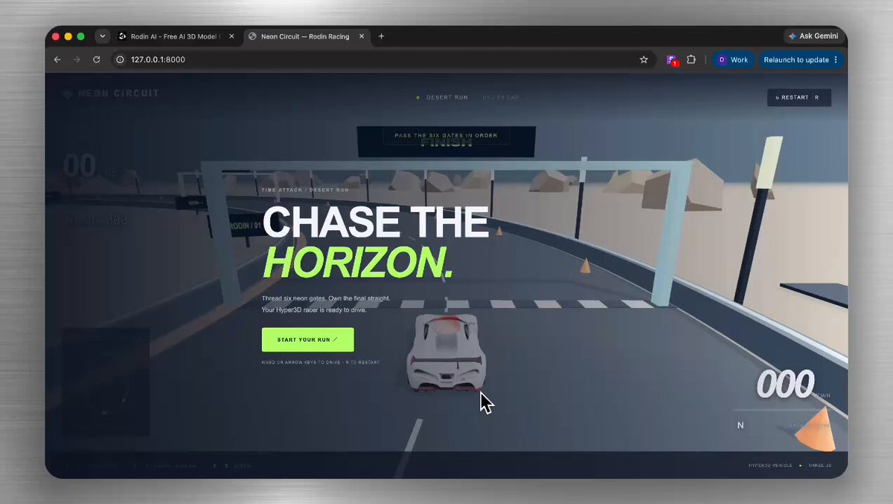</a>

Tác giả cho biết họ đã đưa ý tưởng này cho GPT-6 Astra trong Codex. Ý tưởng yêu cầu một màn vượt chướng ngại vật 3D nhỏ, có thể chơi được, với một nhân vật, các chướng ngại vật di động, vật phẩm thu thập và một khu vực đích.

**Prompt**

```text
Một màn vượt chướng ngại vật 3D nhỏ với một nhân vật, các chướng ngại vật di động, vật phẩm thu thập và một khu vực đích đơn giản.
```

[Xem chi tiết ↗](https://www.tripo3d.ai/vi/3d-prompts/gpt-6-astra-2099419671481249851) · [Bài đăng gốc](https://x.com/heyDhavall/status/2099419671481249851) · [Về danh sách ví dụ](#all-prompts)

---

<a id="2099450933067612421"></a>

### Cảnh rừng Samurai 3D tương tác

[Jaynit Makwana](https://x.com/JaynitMakwana) · 2026-09-14

<a href="https://www.tripo3d.ai/vi/3d-prompts/gpt-6-astra-2099450933067612421">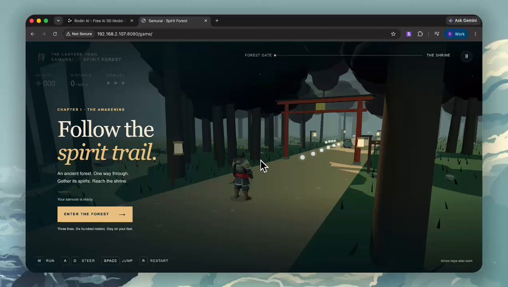</a>

Jaynit Makwana cho biết họ đã đưa ý tưởng này vào GPT-6 Astra trong Codex. Kết quả mong muốn là một cảnh rừng 3D tương tác có samurai, điều khiển camera, ánh sáng điện ảnh, các chi tiết môi trường và cách trình bày gọn gàng. Tác giả cho biết Hyper3D Rodin MCP đã tạo mô hình samurai cho trải nghiệm này.

**Prompt**

```text
Xây dựng một cảnh 3D tương tác với samurai trong rừng, có điều khiển camera, ánh sáng điện ảnh, các chi tiết môi trường và cách trình bày gọn gàng.
```

[Xem chi tiết ↗](https://www.tripo3d.ai/vi/3d-prompts/gpt-6-astra-2099450933067612421) · [Bài đăng gốc](https://x.com/JaynitMakwana/status/2099450933067612421) · [Về danh sách ví dụ](#all-prompts)

---

<a id="2099472264270102705"></a>

### Mô hình cây lá kim dưới 200 polygon

[わたもす / ゲーム制作](https://x.com/Watamos827) · 2026-09-14

<a href="https://www.tripo3d.ai/vi/3d-prompts/gpt-6-astra-2099472264270102705">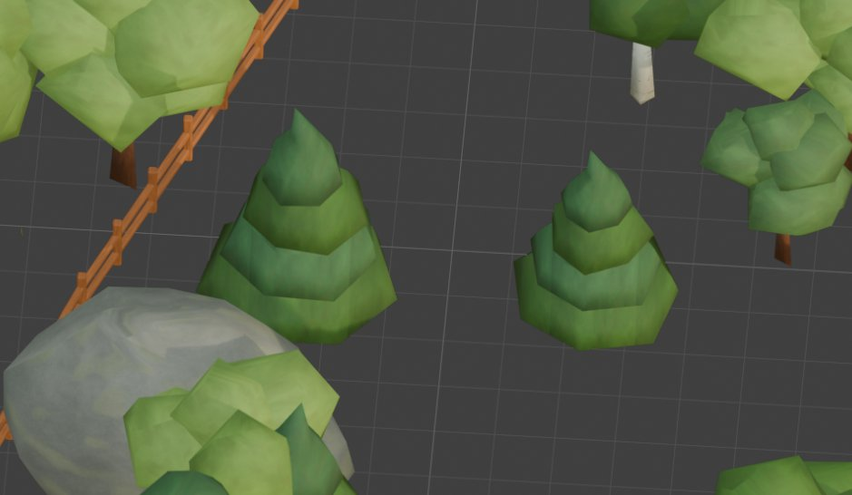</a>

Đây là prompt yêu cầu Astra tạo một cây lá kim có không quá 200 polygon. Người đăng cho biết họ đang chật vật khắc phục vấn đề kết quả tạo ra trông giống như “phân”.

**Prompt**

```text
Bạn có thể thử tạo một cây lá kim với không quá 200 polygon không?
```

[Xem chi tiết ↗](https://www.tripo3d.ai/vi/3d-prompts/gpt-6-astra-2099472264270102705) · [Bài đăng gốc](https://x.com/Watamos827/status/2099472264270102705) · [Về danh sách ví dụ](#all-prompts)

---

<a id="2099487024256589970"></a>

### Thế giới 3D với những tòa nhà chọc trời cao vút

[Bilal Arshad](https://x.com/MohdBilalArshad) · 2026-09-14

<a href="https://www.tripo3d.ai/vi/3d-prompts/gpt-6-astra-2099487024256589970">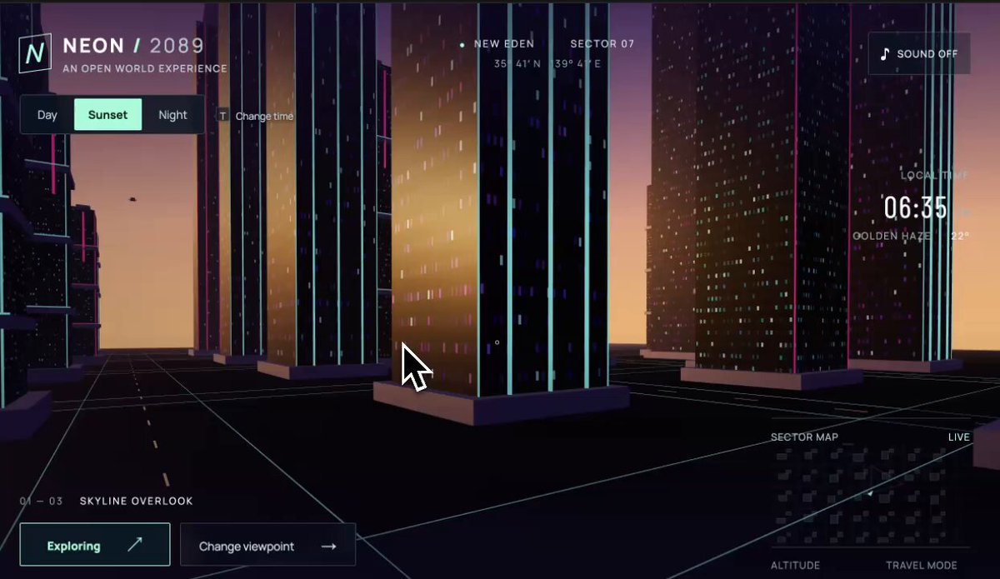</a>

Bilal Arshad cho biết anh đã yêu cầu Astra xây dựng một thế giới 3D với những tòa nhà chọc trời cao vút và chia sẻ kết quả.

**Prompt**

```text
xây dựng một thế giới 3D với những tòa nhà chọc trời cao vút
```

[Xem chi tiết ↗](https://www.tripo3d.ai/vi/3d-prompts/gpt-6-astra-2099487024256589970) · [Bài đăng gốc](https://x.com/MohdBilalArshad/status/2099487024256589970) · [Về danh sách ví dụ](#all-prompts)

---

<a id="2099519801139908951"></a>

### Chiến binh trèo lên người khổng lồ và giáng búa vào hàm

[MadMax](https://x.com/MadMax_Series) · 2026-09-14

<a href="https://www.tripo3d.ai/vi/3d-prompts/gpt-6-astra-2099519801139908951">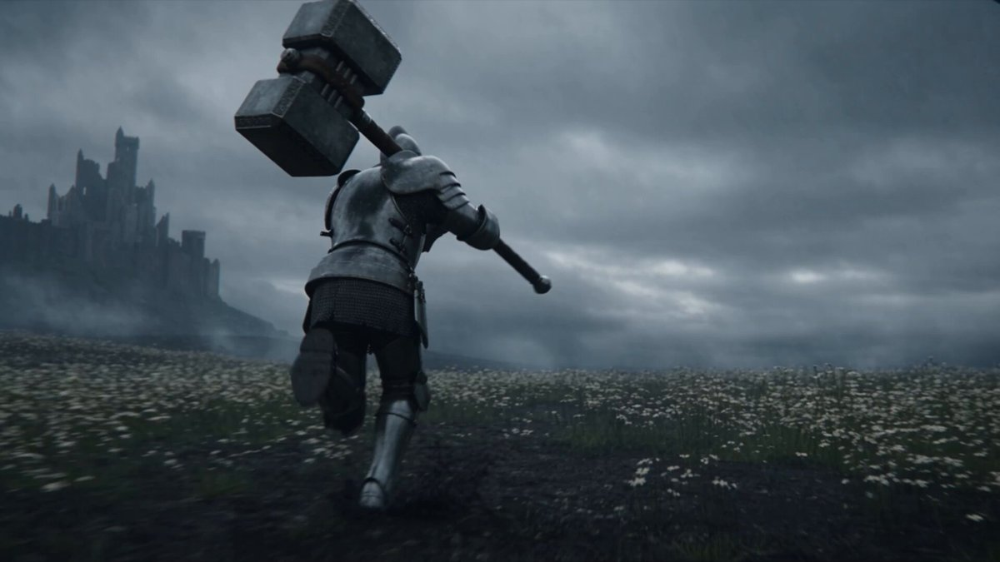</a>

Một phân cảnh hành động điện ảnh 3D dài 20 giây: một chiến binh miền núi mặc giáp lao qua chiến trường cao nguyên giữa cơn bão, nhảy lên bàn tay của một người khổng lồ hữu cơ, trèo lên vai hắn, giáng búa chiến vào hàm, ngã xuống rồi hồi phục để đối đầu lần cuối. Tác giả gốc gắn nhãn đây là prompt chuyển văn bản thành video và nêu GPT-6 Astra + Seedance 2.5 cùng Higgsfield.

**Prompt**

```text
DANH MỤC NHÂN VẬT:
Chính xác một chiến binh miền núi nam trưởng thành.
Anh có thân hình chắc gọn, vai rộng và cực kỳ mạnh mẽ. Anh mặc một bộ giáp tấm fantasy trung cổ màu kim loại súng tối nguyên bản: mũ trùm kín có chóp nhọn, giáp vai nhiều lớp, giáp tay khớp nối, găng tay giáp nặng, giáp ngực gia cố, các mảng thắt lưng bằng da, quần tối màu, ủng giáp thép và bốt giáp nặng. Bộ giáp bị phong hóa, trầy xước và ướt sũng vì bão.
Anh mang chính xác một chiếc búa chiến khổng lồ dùng bằng hai tay. Búa có một cán kim loại tối màu dài được gia cố và một đầu búa hình chữ nhật nặng, đối xứng. Vũ khí giữ nguyên chiều dài, hình dạng và trọng lượng trong suốt cảnh. Anh điều khiển búa bằng cả hai tay khi nhảy, trèo và tấn công.
Chính xác một người khổng lồ hình người hữu cơ khổng lồ, cao hơn chiến binh trên ba mươi lần. Hắn có đôi vai cơ bắp đồ sộ, hai cánh tay cực dài, đôi bàn tay khổng lồ giống tay người, làn da xám than thô ráp với lỗ chân lông và sẹo rõ ràng, trán nặng, mũi rộng, quai hàm mạnh mẽ và mái tóc đen dài rối tung. Đây là một titan hữu cơ còn sống—không phải tượng, robot, máy móc hay golem đá.
Không có chiến binh, người khổng lồ hoặc đội quân nào khác ở hậu cảnh.
MÔI TRƯỜNG:
Một chiến trường cao nguyên lộng gió dưới cơn giông xanh xám dữ dội. Mặt đất gồ ghề phủ đầy đất tối ẩm, cỏ bị giẫm rạp và hàng nghìn bông hoa nhỏ màu nhạt. Gió mạnh uốn cong cỏ và hoa thành những làn sóng không đều.
Một pháo đài trung cổ đổ nát nằm trên ngọn đồi xa ở phía trái khung hình. Những tòa tháp vỡ vẫn hiện rõ qua lớp sương mù trôi thấp. Chớp thỉnh thoảng soi sáng pháo đài và các đám mây bão.
Người khổng lồ chiếm phía phải khung hình của chiến trường. Chiến binh bắt đầu ở trung tâm tiền cảnh, chạy về phía người khổng lồ. Giữ nguyên vị trí địa lý và hướng màn hình này trong mọi lần cắt cảnh.
DIỄN BIẾN HÀNH ĐỘNG VÀ MÁY QUAY THEO TRÌNH TỰ THỜI GIAN:
0.00–3.30 — LAO VỀ PHÍA NGƯỜI KHỔNG LỒ
Mở cảnh ngay bằng một cú máy bám đuôi thấp, áp sát phía sau chiến binh mặc giáp khi anh mạnh mẽ chạy qua cánh đồng ướt về phía người khổng lồ khổng lồ.
Anh cầm búa chiến nằm ngang trước người bằng cả hai tay. Đầu búa nặng luôn hướng về phía phải khung hình, trong khi phần cán dưới kéo dài về phía trái. Bốt của anh nén mặt đất ướt sau mỗi bước, chỉ hất đất, hoa bị nghiền nát và giọt nước ra phía sau sau khi có tiếp xúc vật lý.
Chân và bàn tay phải khổng lồ của người khổng lồ tiến vào từ phía trên bên phải khung hình. Người khổng lồ cúi xuống và đưa bàn tay mở về phía chiến binh đang lao tới, định hốt anh khỏi mặt đất.
Các ngón tay chuyển động độc lập với khớp nối và trọng lượng hợp lý. Người khổng lồ không lập tức chộp lấy hoặc dịch chuyển tức thời chiến binh.
Chuyển động máy quay vẫn thấp, nhanh và mượt, nhấn mạnh chênh lệch kích thước cực lớn. Pháo đài đổ nát vẫn hiện rõ trên đường chân trời xa ở phía trái khung hình.
3.30–5.80 — NHẢY LÊN BÀN TAY NGƯỜI KHỔNG LỒ
Khi bàn tay mở của người khổng lồ quét thấp ngang đường chạy, chiến binh đạp mạnh bốt phải xuống đất. Đầu gối khuỵu xuống, hông hạ thấp và chân sau đẩy người bật lên.
Anh thực hiện một cú nhảy mạnh về phía trước.
Dùng chuyển động chậm điện ảnh có kiểm soát khi anh bay lên phía trước những ngón tay tách rời của người khổng lồ. Hai chân hơi co bên dưới, trong khi cả hai tay nâng cùng chiếc búa chiến lên trên vai để giữ thăng bằng.
Chiến binh tiếp đất bằng cả hai bốt trên mặt sau của ngón giữa và ngón áp út của người khổng lồ. Thể hiện rõ tiếp xúc vật lý: bốt chạm da, đầu gối hấp thụ lực, thịt của người khổng lồ hơi lõm xuống và bộ giáp của chiến binh phản ứng với cú đáp.
Người khổng lồ bắt đầu nâng bàn tay về phía mặt. Chiến binh không lơ lửng hay treo giữa không trung.
Dùng một cú cẩu máy quay góc thấp đầy kịch tính, di chuyển lên phía dưới chiến binh, với bàn tay khổng lồ lấp đầy hậu cảnh.
5.80–9.00 — CHẠY LÊN CÁNH TAY
Trở lại nhịp hành động tự nhiên, nhanh.
Khi người khổng lồ nâng cánh tay, chiến binh chạy từ các ngón tay băng qua mu bàn tay rồi lên cổ tay. Bước chân luân phiên chính xác và nhìn thấy rõ, bám vào bề mặt chuyển động gồ ghề.
Người khổng lồ xoay cổ tay, cố hất anh ra. Chiến binh hạ thấp trọng tâm, dang rộng thế đứng và giữ búa sát thân cho đến khi cánh tay ổn định.
Sau đó anh tăng tốc dọc theo cẳng tay người khổng lồ về phía khuỷu. Mỗi bước bám theo góc thay đổi của cánh tay; bốt không trượt xuyên qua da.
Máy quay bám theo bên cạnh và hơi thấp hơn anh, nâng dần theo chiều dài cánh tay người khổng lồ. Những phần cánh tay ở gần lướt nhanh qua tiền cảnh, trong khi đầu người khổng lồ và pháo đài xa chuyển động chậm hơn, tạo hiệu ứng thị sai và cảm giác về quy mô mạnh mẽ.
9.00–12.00 — TRÈO LÊN VAI
Chiến binh tới phần bắp tay khi cánh tay vươn dốc lên vai người khổng lồ.
Anh móc một cẳng tay và cán búa chiến vào một gờ cơ tự nhiên để lấy đòn bẩy, đặt bốt phải xuống, dồn lực qua chân rồi tự kéo người lên vai trong một động tác trèo liền mạch.
Người khổng lồ quay đầu về phía anh. Mắt hắn dõi theo chiến binh, lông mày siết lại và hàm há ra trong một tiếng gầm sâu không lời. Tóc và da chuyển động theo vòng xoay của đầu.
Chiến binh vẫn bám trên vai nhờ tiếp xúc thật giữa tay và bốt. Anh trèo chéo qua phần vai trên về phía gốc cổ người khổng lồ.
Dùng một cú máy bám ngang cận cảnh, giữ trọn chiến binh, búa chiến và góc nghiêng khuôn mặt người khổng lồ dễ nhận diện trong cùng một khung hình.
12.00–15.00 — GIÁNG BÚA TOÀN LỰC VÀO HÀM
Chiến binh tới một vị trí vững trên bờ vai dốc của người khổng lồ, gần cổ.
Anh đặt bốt trái về phía trước và chống bốt phải phía sau. Cả hai bàn chân nhìn rõ đang ép vào da người khổng lồ. Anh xoay hông ra xa mục tiêu và kéo búa chiến về sau bằng cả hai tay.
Thể hiện đầy đủ quá trình chuẩn bị trước va chạm:
đặt chân → đầu gối khuỵu → dồn lực vào hông → xoay thân → vai kéo búa về sau → cánh tay đưa đầu búa nặng vào vị trí bắt đầu.
Ở giây 13.00, chiến binh tung một cú vung ngang hoàn chỉnh bằng hai tay về phía hàm người khổng lồ.
Lực truyền liên tục từ chân qua hông, thân, vai rồi cánh tay. Đầu búa đi theo một cung vung rõ ràng, không gián đoạn. Nó không nhảy vị trí hoặc chạm vào mặt trước khi cú vung hoàn tất.
Ở giây 14.00, chuyển sang chuyển động siêu chậm rõ rệt cho khoảnh khắc va chạm quyết định.
Mặt đánh rộng của đầu búa hình chữ nhật giáng vào bên hàm dưới của người khổng lồ—không phải cán hay tay cầm. Thể hiện da và mô má bị ép quanh điểm va chạm, hàm người khổng lồ lệch sang bên, tóc rời tung ra ngoài và một luồng tỏa tròn gồm mưa, bụi cùng mảnh da bắn ra.
Cánh tay chiến binh chống lại lực giảm tốc đột ngột. Vai anh giật lùi trong khi cơ thể tiếp tục theo đà kết thúc cú vung có kiểm soát.
Không có máu, mô lộ ra, cảnh bạo lực đẫm máu hoặc chặt lìa cơ thể.
15.00–17.30 — NGƯỜI KHỔNG LỒ LẢO ĐẢO VÀ CHIẾN BINH NGÃ
Lập tức trở về tốc độ tự nhiên.
Đầu người khổng lồ giật sang một bên do va chạm. Thân trên hắn giật lùi và vai bị đánh rơi mạnh xuống. Chuyển động đột ngột này làm chiến binh mất điểm tựa và hất anh văng khỏi người khổng lồ.
Chiến binh ngã về phía chiến trường nhưng vẫn giữ nguyên chiếc búa chiến bằng cả hai tay. Anh không lơ lửng hoặc thực hiện thêm một cú nhảy.
Cắt sang góc nhìn ngang ở tầm mặt đất. Bốt chạm đất trước, đầu gối khuỵu xuống theo quán tính và anh lăn một vòng qua một bên vai. Đầu búa đập xuống đất bên cạnh rồi cày thành một rãnh nông, hất đất ướt và hoa nhạt ra ngoài.
Khuôn mặt khổng lồ của người khổng lồ hạ xuống phần trên bên phải khung hình khi hắn cố lấy lại thăng bằng. Hắn không nghiền nát hoặc giao cắt với chiến binh.
17.30–20.00 — HỒI PHỤC VÀ ĐỐI ĐẦU LẦN CUỐI
Chiến binh dừng cú lăn ở tư thế quỳ thấp.
Anh cắm đầu búa vào đất, nắm cán bằng cả hai tay và dùng nó làm điểm tựa để từ từ đứng lên một gối. Sau đó anh rút búa ra và đưa cán nằm ngang qua vai trong tư thế phòng thủ sẵn sàng.
Người khổng lồ hạ cái đầu khổng lồ về phía anh, hàm hiện rõ vết bầm do cú đánh nhưng vẫn tỉnh táo và đầy đe dọa. Hơi thở của hắn làm cỏ, hoa, sương mù và các mảng da lỏng trên giáp chiến binh lay động.
Chiến binh chỉ đứng yên trong một nhịp quyết tâm ngắn ngủi, trong khi hơi thở và bộ giáp vẫn giữ chuyển động tự nhiên tinh tế.
Một tia sét soi sáng pháo đài đổ nát ở phía trái khung hình, viền sáng cả hai nhân vật và khẳng định chênh lệch kích thước khổng lồ giữa họ.
Kết thúc chính xác ở giây 20.00 bằng bố cục rộng góc thấp: chiến binh quỳ trong tiền cảnh phủ đầy hoa, sẵn sàng với búa chiến; khuôn mặt người khổng lồ lơ lửng phía trên anh và pháo đài xa hiện ra qua cơn bão.
Không chuyển dần sang màn hình đen. Không khung hình đóng băng, tiêu đề hoặc thẻ kết thúc.
KHÓA VẬT LÝ HÀNH ĐỘNG:
Mọi hành động phải tuân theo quan hệ nhân quả vật lý có thể quan sát rõ:
Chạy: bàn chân chạm đất → chuyển trọng lượng → chân sau đẩy → bước tiếp theo.
Nhảy: chân trụ → đầu gối nén xuống → duỗi chân → quỹ đạo trên không → tiếp xúc khi tiếp đất → đầu gối hấp thụ lực.
Trèo: tay hoặc vũ khí làm điểm tựa → bốt trụ → chuyển trọng lượng cơ thể → kéo người lên.
Đánh búa: chân vững → dồn lực vào hông → xoay thân → đẩy bằng vai → đường đi liên tục của búa → mặt búa rộng tiếp xúc → chống lực → kết thúc cú vung.
Ngã: mất điểm tựa do người khổng lồ giật lùi → hạ xuống do trọng lực → bốt chạm đất → đầu gối khuỵu → lăn qua vai → hồi phục.
Chiến binh không bao giờ dịch chuyển tức thời giữa mặt đất, bàn tay, cánh tay hoặc vai. Người khổng lồ không bao giờ di chuyển chiến binh nếu không có tiếp xúc vật lý trực tiếp hoặc lực tác động nhìn thấy rõ.
QUY TẮC TỐC ĐỘ CHUYỂN ĐỘNG:
0.00–3.30: tốc độ chạy nhanh tự nhiên.
3.30–5.80: chuyển động chậm điện ảnh có kiểm soát cho cú nhảy và tiếp đất.
5.80–13.90: hành động nhanh tự nhiên.
13.90–15.00: chỉ dùng chuyển động siêu chậm rõ rệt cho pha tiếp cận cuối, va chạm và biến dạng tức thời của búa.
15.00–20.00: trở lại rõ ràng với tốc độ tự nhiên.
Không áp dụng chuyển động chậm cho toàn cảnh. Không để nhân vật chuyển động chậm lơ lửng.
ÁNH SÁNG VÀ MÀU SẮC:
Duy trì tông bão xanh thép lạnh, xám than và bạc khử bão hòa. Chớp tạo ánh sáng định hướng trắng lạnh trong thời gian ngắn. Giáp ướt nhận các điểm sáng bạc hẹp, trong khi làn da tối của người khổng lồ vẫn có chi tiết và dễ đọc.
Những bông hoa nhạt tạo độ tương phản ngà ấm vừa phải mà không khiến cảnh trở nên sặc sỡ. Giữ lớp sương mù khí quyển dày quanh pháo đài xa. Thay đổi phơi sáng do chớp phải ngắn và không được xóa cấu trúc cơ thể nhân vật hoặc che giấu hành động bị thiếu.
ÂM THANH:
Chỉ sử dụng hiệu ứng âm thanh môi trường và hành động đồng bộ, có nguồn phát trong cảnh. Tuyệt đối không có nhạc nền hoặc nhạc phim.
Bao gồm tiếng gió bão, sấm ở xa, chuyển động của giáp, tiếng bước chân nặng, đất bị xới, cỏ lay, tiếng thở và tiếng gầm không lời của người khổng lồ, tiếng bàn tay quét trong không khí, cú nhảy của chiến binh, bốt chạm da, tiếng va chạm khi trèo, chuyển động của búa chiến, một tiếng va chạm kim loại trầm của búa, cú giật lùi của người khổng lồ, tiếng không khí khi rơi, giáp đập xuống đất, đầu búa chạm mặt đất và tiếng sét nổ gần ở cuối cảnh.
Không có hội thoại, lời thuyết minh, lời nói, tiếng tụng, ca từ hoặc ngôn ngữ có thể hiểu được.
TÍNH LIÊN TỤC VÀ NGĂN LỖI:
Chính xác một chiến binh, một người khổng lồ và một búa chiến trong suốt cảnh.
Chiến binh chỉ trèo lên người khổng lồ một lần và thực hiện chính xác một cú giáng búa quyết định.
Búa chiến không bao giờ nhân bản, thay đổi kích thước, lơ lửng, cong, xuyên qua cơ thể nào hoặc đổi tay mà không có chuyển động nhìn thấy rõ.
Người khổng lồ vẫn là cùng một sinh vật hình người hữu cơ trong mọi cảnh quay. Không có đặc điểm robot, biến đổi thành đá, bàn tay nhân đôi, ngón tay thừa hoặc khuôn mặt thay đổi.
Giữ nguyên bộ giáp, mũ, tỷ lệ cơ thể và hư hại của chiến binh trong suốt cảnh.
Giữ nguyên tuyến đường từ bàn tay phải đến cánh tay phải rồi vai phải của người khổng lồ để địa lý trèo vẫn khả thi về mặt vật lý.
Không có bàn tay dính liền, chi thừa, khớp đảo ngược, bốt trượt, cơ thể giao cắt, dịch chuyển tức thời hoặc lơ lửng không có điểm tựa.
Đầu búa rộng—không phải cán—phải nhìn thấy rõ đang chạm vào hàm người khổng lồ sau khi cú vung hoàn tất.
Không có máu, cảnh bạo lực đẫm máu, mô lộ ra, cơ thể người bị nghiền nát hoặc chặt lìa.
Không có vẻ ngoài live-action, nhân vật nhượng quyền dễ nhận diện, phụ đề, chú thích, logo, giao diện người dùng, lớp phủ phát video, dải đen cố định hoặc watermark.
Mọi nhạc nền hoặc nhạc phim đều khiến lần tạo bị xem là thất bại.
music=0; no_music=1; strict_no_music=1; audio=diegetic_only.
```

[Xem chi tiết ↗](https://www.tripo3d.ai/vi/3d-prompts/gpt-6-astra-2099519801139908951) · [Bài đăng gốc](https://x.com/MadMax_Series/status/2099519801139908951) · [Về danh sách ví dụ](#all-prompts)

---

<a id="2099588840419651890"></a>

### Tạo cảnh hành lang khách sạn

[West Lord](https://x.com/MyWestLord) · 2026-09-14

<a href="https://www.tripo3d.ai/vi/3d-prompts/gpt-6-astra-2099588840419651890">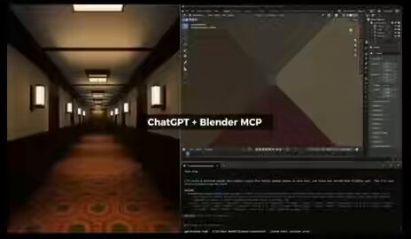</a>

Prompt được tác giả bài đăng cho là của GPT-6 Astra, dùng để tạo cảnh hành lang khách sạn có thể chỉnh sửa trong Blender thông qua MCP.

**Prompt**

```text
tạo cảnh hành lang khách sạn
```

[Xem chi tiết ↗](https://www.tripo3d.ai/vi/3d-prompts/gpt-6-astra-2099588840419651890) · [Bài đăng gốc](https://x.com/MyWestLord/status/2099588840419651890) · [Về danh sách ví dụ](#all-prompts)

---

<a id="2099643231659012553"></a>

### Đảo núi lửa tương tác với những chiếc thuyền tháo chạy

[Wësche](https://x.com/WescheNex1q) · 2026-09-14

<a href="https://www.tripo3d.ai/vi/3d-prompts/gpt-6-astra-2099643231659012553">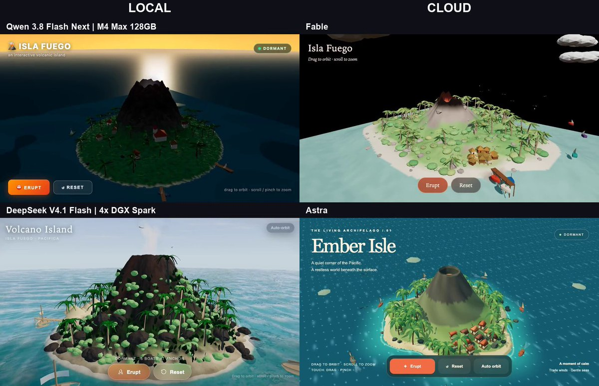</a>

Yêu cầu có thể tái sử dụng để tạo một hòn đảo núi lửa 3D tương tác, với dòng dung nham chảy và những chiếc thuyền tháo chạy khi núi lửa phun trào. Tác giả gốc cho biết họ đã gửi yêu cầu này đến một số mô hình, trong đó có Astra-6, để so sánh.

**Prompt**

```text
xây dựng một hòn đảo núi lửa tương tác với dòng dung nham chảy và những chiếc thuyền tháo chạy.
```

[Xem chi tiết ↗](https://www.tripo3d.ai/vi/3d-prompts/gpt-6-astra-2099643231659012553) · [Bài đăng gốc](https://x.com/WescheNex1q/status/2099643231659012553) · [Về danh sách ví dụ](#all-prompts)

---

<a id="2099719427990134984"></a>

### Bảng điều khiển hệ thần kinh tương tác của sinh vật 3D

[AiMind](https://x.com/AIMind_Ai) · 2026-09-15

<a href="https://www.tripo3d.ai/vi/3d-prompts/gpt-6-astra-2099719427990134984">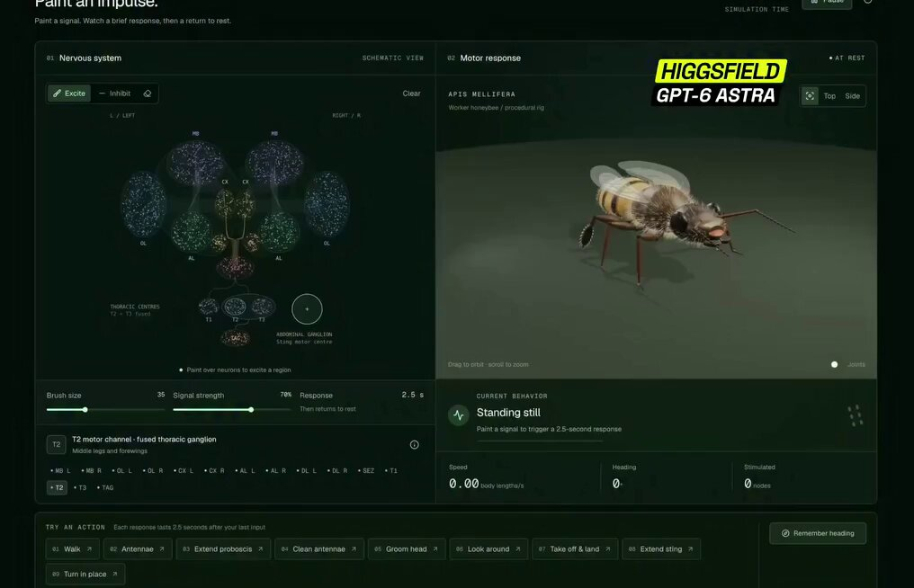</a>

AiMind chia sẻ đây là gợi ý “Lấy prompt” cho một bảng điều khiển tương tác, có các vùng của hệ thần kinh có thể nhấp và một sinh vật 3D được rigging procedural. Bài đăng giới thiệu phần minh họa bằng một con ruồi, nhưng prompt được trích dẫn dùng placeholder \[organism\] và không khẳng định rõ đó là đầu vào chính xác đã dùng cho đoạn clip.

**Prompt**

```text
Bảng điều khiển tương tác. Bên trái: sơ đồ hệ thần kinh của [organism], gồm các vùng có thể nhấp. Bên phải: sinh vật 3D [organism] được rigging procedural. Nhấp vào một vùng sẽ kích hoạt phản ứng vận động kéo dài 2,5 giây. Giao diện tối, hiển thị dữ liệu telemetry về tốc độ và hướng di chuyển.
```

[Xem chi tiết ↗](https://www.tripo3d.ai/vi/3d-prompts/gpt-6-astra-2099719427990134984) · [Bài đăng gốc](https://x.com/AIMind_Ai/status/2099719427990134984) · [Về danh sách ví dụ](#all-prompts)

---

<a id="2099750376530657300"></a>

### Trái tim và emoji mặt cười phong cách Apple 3D

[Sharon Riley](https://x.com/Just_sharon7) · 2026-09-15

<a href="https://www.tripo3d.ai/vi/3d-prompts/gpt-6-astra-2099750376530657300">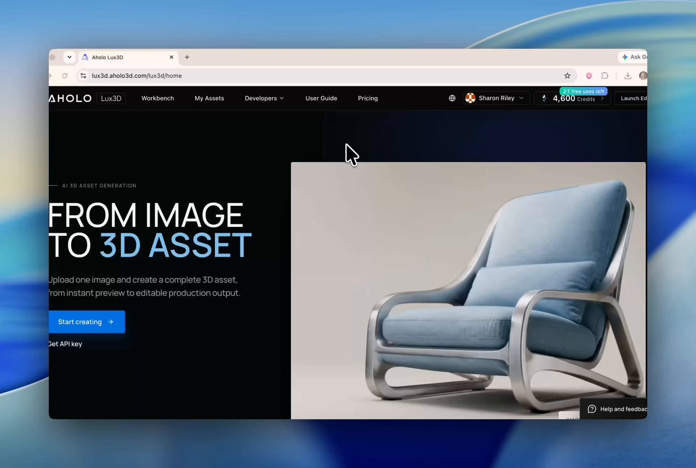</a>

Tác giả cho biết đã nhập prompt chỉ gồm văn bản này để tạo hình ảnh, sau đó tạo mô hình 3D .glb có thể xoay. Không sử dụng hình ảnh tham chiếu.

**Prompt**

```text
Emoji trái tim và emoji mặt cười phong cách Apple 3D
```

[Xem chi tiết ↗](https://www.tripo3d.ai/vi/3d-prompts/gpt-6-astra-2099750376530657300) · [Bài đăng gốc](https://x.com/Just_sharon7/status/2099751278234767673) · [Về danh sách ví dụ](#all-prompts)

---

<a id="2099785223827259515"></a>

### Game khám phá không gian tạo sinh với mọi điểm đến đều có thể tiếp cận

[developers.openai.com](https://developers.openai.com/) · 2026-09-15

<a href="https://www.tripo3d.ai/vi/3d-prompts/gpt-6-astra-2099785223827259515">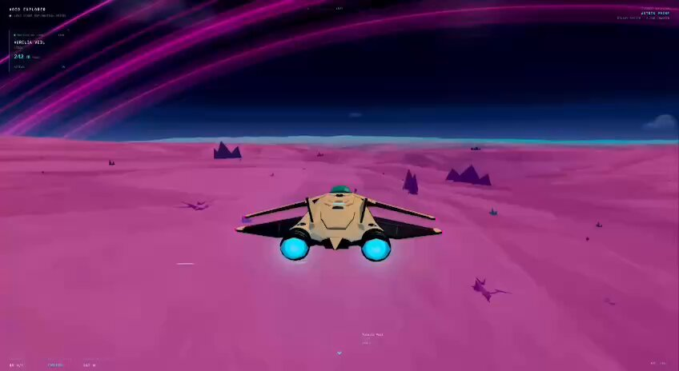</a>

Bản yêu cầu ban đầu của một nhà phát triển OpenAI dành cho Void Explorer, game khám phá không gian 3D trên trình duyệt. Nội dung yêu cầu một hành trình liền mạch từ ngoài không gian, xuyên qua khí quyển của một hành tinh, xuống đến mặt đất; sử dụng khoảng cách theo quy mô thực, các hành tinh có kích thước tương đương Trái Đất, địa hình tạo sinh và trình kết xuất theo chunk.

**Prompt**

```text
Mọi thứ tôi nhìn thấy đều phải có thể đi tới. Hãy giữ khoảng cách theo quy mô thực, sau đó khiến việc di chuyển trở nên khả thi nhờ quy mô và tốc độ. Tôi muốn bay từ ngoài không gian, xuyên vào khí quyển của một hành tinh rồi xuống mặt đất. Các hành tinh có thể lớn ngang Trái Đất, vì vậy chúng ta sẽ cần địa hình tạo sinh và trình kết xuất theo chunk.
```

[Xem chi tiết ↗](https://www.tripo3d.ai/vi/3d-prompts/gpt-6-astra-2099785223827259515) · [Bài đăng gốc](https://developers.openai.com/blog/how-to-build-games-with-astra) · [Về danh sách ví dụ](#all-prompts)

---

<a id="2099850719839109597"></a>

### Tạo không gian 3D có thể điều khiển và nhân vật game từ ảnh tham khảo

[妖精アーヤ](https://x.com/aiehon_aya) · 2026-09-15

<a href="https://www.tripo3d.ai/vi/3d-prompts/gpt-6-astra-2099850719839109597">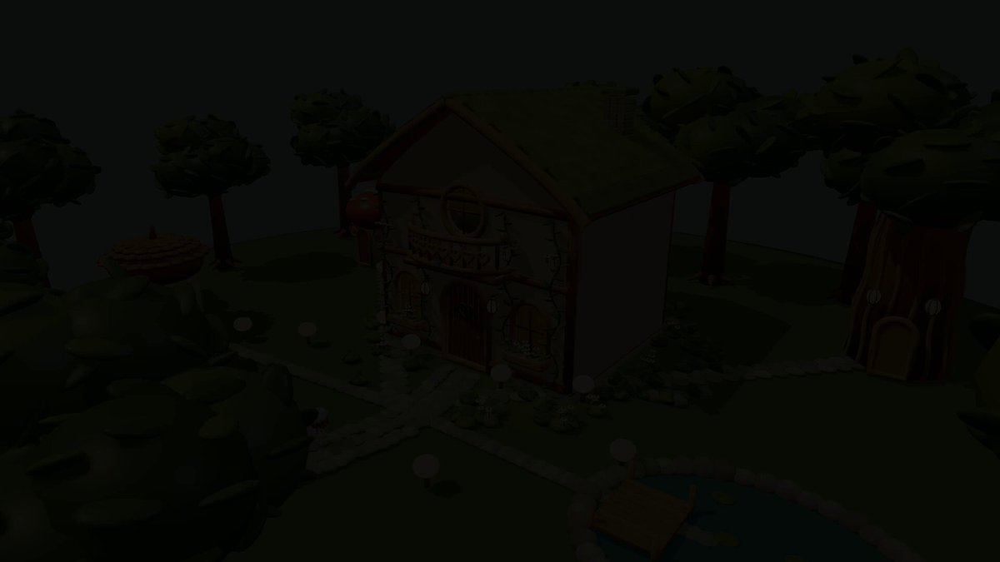</a>

Đây là prompt hướng dẫn từng bước để dùng ảnh tham khảo về thế giới trong phần ghi chú của tác giả và ảnh chuẩn của nhân vật làm đầu vào, kiểm tra rồi dựng 3D ngôi nhà và nhân vật, sau đó tinh chỉnh trong Blender để thêm rig tự động và chuyển động. Prompt không chỉ định mục tiêu hay luật chơi; sản phẩm chính là một không gian 3D có nhân vật có thể điều khiển.

**Prompt**

```text
【Chuẩn bị trước】
・Ảnh tham khảo về thế giới bạn muốn tạo (ngoại thất, phòng ốc, v.v.)
・Ảnh chuẩn của nhân vật (chẳng hạn như bản vẽ ba góc)
　※Không có ảnh thì không thể tái hiện. Hãy đính kèm ảnh nhé

【Prompt】
Dựa trên các ảnh đã đính kèm, hãy thiết kế thế giới của tôi và nhân vật game thành một không gian 3D có thể điều khiển, với chất lượng chuyên nghiệp.

① Xem các ảnh đính kèm để kiểm tra hình dạng, màu sắc và họa tiết của ngôi nhà và nhân vật
　↓
② Dùng Tripo để tạo mô hình 3D từ ảnh (ba ảnh toàn thân gồm mặt trước, mặt sau và mặt bên, với cùng một tỷ lệ khung hình)
　↓
③ Nhập vào Blender, điều chỉnh vị trí và kích thước các bộ phận
　↓
④ Thiết lập rig tự động, rồi thêm các chuyển động phù hợp với cá tính của nhân vật như đi bộ, đung đưa, v.v.
　↓
⑤ Nếu có điểm cần quyết định (chẳng hạn như sử dụng asset trả phí), hãy hỏi ý kiến tôi trước khi tiếp tục
　↓
⑥ Ghi chép nội dung công việc, các điểm bị vướng và vị trí tài nguyên ở mức chi tiết để một AI khác cũng có thể đọc và tái hiện quy trình
```

[Xem chi tiết ↗](https://www.tripo3d.ai/vi/3d-prompts/gpt-6-astra-2099850719839109597) · [Bài đăng gốc](https://x.com/aiehon_aya/status/2099850721646784894) · [Về danh sách ví dụ](#all-prompts)

---

<a id="2100139076816916977"></a>

### Cảnh phòng 3D tương tác với nội thất có cơ cấu chuyển động

[Wentao Zhu](https://x.com/walterzhu8) · 2026-09-16

<a href="https://www.tripo3d.ai/vi/3d-prompts/gpt-6-astra-2100139076816916977">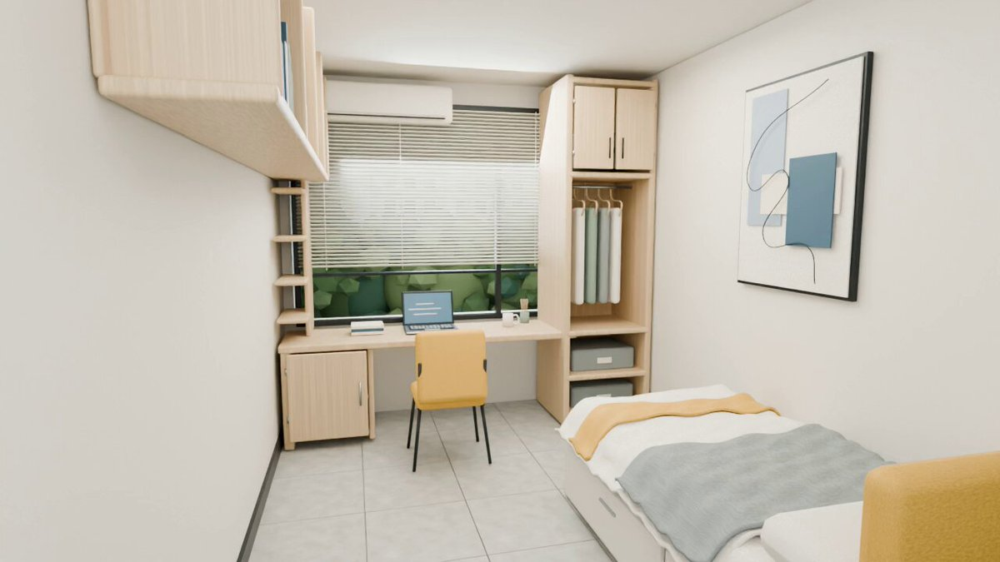</a>

Bài kiểm thử GPT-6 Astra do Wentao Zhu ghi công cho sinh viên Minchao Jiang. Prompt yêu cầu tạo một cảnh 3D tương tác dựa trên ảnh phòng được cung cấp, với bản lề, cửa và ngăn kéo có thể chuyển động, cùng các chuyển động camera cho video demo.

**Prompt**

```text
Dựa trên ảnh phòng tôi đã cung cấp, hãy sử dụng Blender MCP để dựng một cảnh 3D tương tác và kết xuất thành video demo. Bao gồm chuyển động của các bộ phận có khớp (bản lề, cửa, ngăn kéo) và sử dụng các chuyển động camera hợp lý để thể hiện rõ những hiệu ứng này.
```

[Xem chi tiết ↗](https://www.tripo3d.ai/vi/3d-prompts/gpt-6-astra-2100139076816916977) · [Bài đăng gốc](https://x.com/walterzhu8/status/2100139076816916977) · [Về danh sách ví dụ](#all-prompts)

---

<a id="2100193512373592313"></a>

### Phát triển Splatoon bản PC và tái hiện đồ họa

[basio](https://x.com/basio39) · 2026-09-16

<a href="https://www.tripo3d.ai/vi/3d-prompts/gpt-6-astra-2100193512373592313">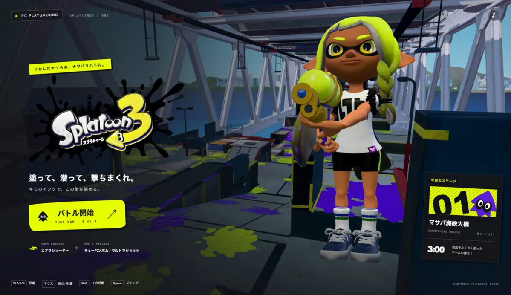</a>

Prompt yêu cầu phát triển Splatoon bản PC và tái hiện đầy đủ đồ họa của trò chơi. Người đăng cho biết đã chạy riêng prompt này ở chế độ Ultra.

**Prompt**

```text
/goal Hãy phát triển Splatoon bản PC. Hãy tái hiện đồ họa một cách hoàn chỉnh.
```

[Xem chi tiết ↗](https://www.tripo3d.ai/vi/3d-prompts/gpt-6-astra-2100193512373592313) · [Bài đăng gốc](https://x.com/basio39/status/2100194321987461503) · [Về danh sách ví dụ](#all-prompts)

---

<a id="2100222426705453318"></a>

### Tham quan căn hộ tương tác với các tùy chọn gạch lát

[Shimecki](https://x.com/scheemunai) · 2026-09-16

<a href="https://www.tripo3d.ai/vi/3d-prompts/gpt-6-astra-2100222426705453318">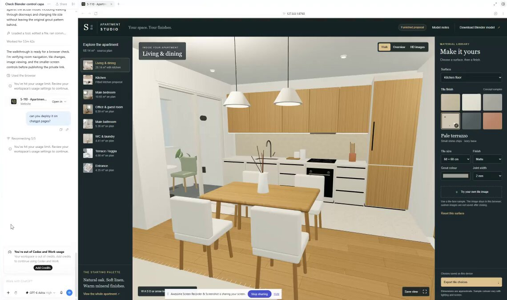</a>

Prompt gốc để tạo mô hình căn hộ Blender HD chân thực và trải nghiệm web tương tác, cho phép tham quan căn hộ và lựa chọn các tùy chọn gạch lát.

**Prompt**

```text
Tôi muốn bạn dựng một mô hình render 3D HD cực kỳ chân thực của căn hộ bằng Blender, sau đó xây dựng một trải nghiệm web tương tác để tôi có thể đi lại trong căn hộ và chọn các tùy chọn gạch lát.
```

[Xem chi tiết ↗](https://www.tripo3d.ai/vi/3d-prompts/gpt-6-astra-2100222426705453318) · [Bài đăng gốc](https://x.com/scheemunai/status/2100222426705453318) · [Về danh sách ví dụ](#all-prompts)

---

<a id="2100233407108137349"></a>

### Phim ngắn CGI AAA: Đấu võ siêu nhiên trong ga tàu điện ngầm

[MadMax](https://x.com/MadMax_Series) · 2026-09-16

<a href="https://www.tripo3d.ai/vi/3d-prompts/gpt-6-astra-2100233407108137349">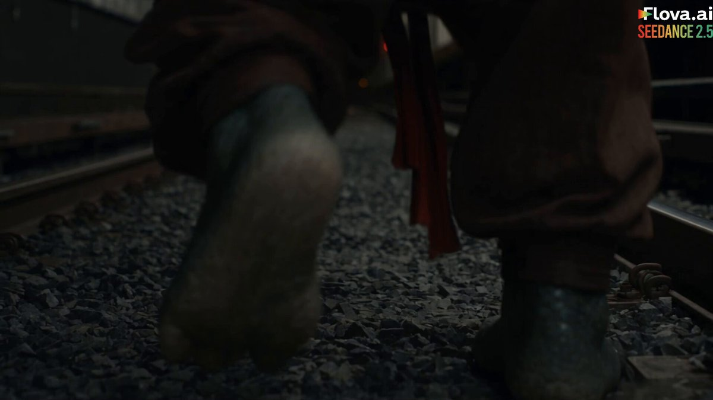</a>

Tác giả cho biết đã dùng lời nhắc văn bản tiếng Trung không kèm tệp đính kèm, kết hợp GPT-6 Astra và Seedance 2.5 để tạo một video dài 30 giây theo phong cách CG của game fantasy AAA. Lời nhắc yêu cầu thể hiện chuỗi cận chiến liên tục giữa một chiến binh đeo kính bảo hộ và một quái thú có sống lưng phủ vảy trong ga tàu điện ngầm hiện đại, đồng thời quy định chặt chẽ về tính nhất quán nhân vật, máy quay, vật lý chuyển động, phá hủy môi trường và chỉ sử dụng âm thanh diegetic trong khung hình.

**Prompt**

```text
Tất cả nhân vật, đám đông phía sau và môi trường nhà ga đều phải có diện mạo CG game fantasy AAA cao cấp, rõ nét như được điêu khắc kỹ thuật số. Cận cảnh nhân vật phải giữ khuôn mặt nhân vật game được trau chuốt, các lọn tóc tết rõ ràng và làn da hiện thực cách điệu; không biến thành diễn viên người thật, cosplay, gameplay thông thường, hoạt hình 2D hay cel-shading. Giữ bối cảnh cận chiến siêu nhiên trong ga tàu điện ngầm hiện đại, không chuyển thành lâu đài thời Trung cổ, núi tuyết hay sàn đấu quyền anh. Bảng màu gồm xanh xám lạnh ít bão hòa, đen than, da vảy xanh xám và dải đèn trắng lạnh; một lượng nhỏ lan can vàng, đèn tín hiệu đỏ, gọng kính bảo hộ đồng bronze, giáp vai xanh đồng và đai màu đỏ đất tạo điểm nhấn cục bộ. Ánh vàng mật ong trong mắt và tia sáng tím ngắn khi va vào cột chỉ xuất hiện đúng khoảnh khắc tương ứng, không phủ tím toàn bộ phim.
Môi trường: ga tàu điện ngầm rộng nhưng tối, khu đường ray hạ thấp ở trung tâm với ray thép và đá dăm, hai sân ga cao hơn ở hai bên; mép sân ga có hàng rào chắn bằng kính và kim loại với khung dọc màu vàng, sàn có dải an toàn màu vàng, gạch xám và song thoát nước; các cột tròn lớn màu trắng đỡ trần thấp, bên trên là những dải đèn dài trắng lạnh nối tiếp cùng đèn tròn, các đèn tín hiệu đỏ nhỏ ở xa kéo dài vào chiều sâu. Trên sân ga có vài chục hành khách trưởng thành mặc áo khoác sáng tối thông thường, đứng rải rác cạnh cột hoặc sau hàng rào. Khi bị trận chiến làm giật mình, họ lùi lại, co người và giơ tay che chắn, nhưng luôn chỉ là đám đông nền: không tham gia giao chiến, không biến thành nhân vật chính và không lặp lại cùng một khuôn mặt. Không có tàu chạy vào. Biển báo chỉ giữ các mảng hình học mờ, không có chữ đọc được.
Hai đấu thủ chính được cố định như sau: A, chiến binh đeo kính bảo hộ, là nam trưởng thành cao, người gọn và săn chắc, da nâu sẫm ấm, gò má và đường hàm rõ. Tóc tết ngắn màu đen ôm sát đầu, buộc thành một nút tóc ngắn phía sau. Trên trán cố định một kính bảo hộ lật lên được, gọng đồng bronze hẹp, màu xám khói; bình thường kính che mắt, chỉ để lộ phần dưới sống mũi và miệng. Mặc áo chiến đấu không tay màu xám xanh với cổ đan chéo, đai nâu sẫm, quần dài đen than và bốt cổ thấp nâu sẫm; hai cẳng tay quấn băng vải xám, các ngón tay lộ ra. Luôn tay không, không áo choàng, vũ khí cầm tay hay huy hiệu đọc được. Biểu cảm điềm tĩnh, chuyển động nhanh và dứt khoát. Chỉ trong cảnh được chỉ định, A dùng tay phải nâng nhanh mép kính bảo hộ, để lộ một mắt vàng mật ong sáng rực, rồi hạ kính về vị trí che mắt; đây là cùng một món trang bị kính bảo hộ vật lý cố định trên trán, không biến thành dải vải và không biến mất.
B, quái thú đấu sĩ có sống lưng phủ vảy, là sinh vật hình người đi bằng hai chân, cao hơn và to khỏe hơn A. Các lớp vảy thô màu xanh xám đậm phủ ngực, lưng rộng và tứ chi; bụng có vảy xanh xám mịn hơn. Đầu bè rộng như thằn lằn, mõm ngắn tù, hàm dày, hai mắt hổ phách sẫm và răng ngắn chắc; đầu không có tóc người, mặt nạ hay phần nhô ra như cành cây. Từ vai trái đến cẳng tay trái của B mọc các mảng giáp tự nhiên dày màu xanh đồng; mép trên vai trái cố định một hàng vây xương ngắn và tù. Cánh tay phải vẫn phủ vảy thô xanh xám nhạt hơn; tuyệt đối không đảo trái phải. Vây xương và mảng giáp là một phần cơ thể, trên vai không có hoa. Mặc quần chiến đấu ống rộng màu nâu sẫm, đai vải đỏ đất với hai dải đuôi hẹp buông xuống; mắt cá chân quấn vải nâu sẫm, bàn chân rộng phủ vảy, giữ rõ lòng bàn chân để có thể chống vào tường. Không có đuôi, cánh, tay phụ, sừng dài, kiếm, súng, khiên hay đạo cụ cầm tay. B là quái thú cao lớn nhưng vẫn có thể xuất hiện trong một nhà ga bình thường, giữ tỷ lệ ổn định với A và hành khách, không phình to thành người khổng lồ cao như tòa nhà.
0,00–3,70 giây: Khung hình đầu tiên đã bước vào giao chiến. Một góc máy thấp ngắn sát đường ray cho thấy B nhanh chóng bước tới áp sát, rồi cắt sang trung cảnh sau lưng A khi B lao tới từ phía trước, nâng chân xoay hông tung cú đá vòng ngang ở độ cao đầu. A khuỵu gối, cúi đầu và nghiêng thân sang bên, để chân đá sượt qua phía trên nút tóc đen ngắn; B đặt chân xuống rồi xoay trở lại, A lập tức đứng lên. Cắt sang toàn cảnh đôi ở góc thấp trên đường ray với Dutch angle rõ rệt. A nâng gối tung một cú đá ngang cao, B hạ đầu và vai tránh qua, A thu chân rồi đặt lại chân trụ. Máy quay trở về cận cảnh bám theo từ sau vai A. B đuổi kịp bằng một chuỗi đấm vung liên tiếp; A dùng những cú né đầu cự ly ngắn, hạ vai và xoay người để nắm đấm sượt qua mặt, không đứng yên lặp lại động tác vung tay chờ đối thủ ra đòn. Dải đèn trần tạo vệt nhòe định hướng khi máy quay quét theo, đồng thời vẫn giữ rõ quan hệ vị trí giữa hai cơ thể.
3,70–6,40 giây: Nắm đấm phải xanh xám nhạt của B lại vươn tới trước mặt A. A xòe bàn tay chặn cổ tay và cẳng tay của B, phải nhìn rõ điểm tiếp xúc. Máy quay áp sát khuôn mặt điềm tĩnh của A, rồi theo chuyển động bước chân, xoay hông và xoay vai của anh nhanh chóng vòng xuống góc nhìn toàn thân thấp. A vẫn nắm cùng cánh tay phải đó, kéo B mất điểm trụ rồi hất lên dọc phía trên bên hông cơ thể; cả hai chân B rời mặt đất, đai đỏ đất và quần rộng trễ theo quán tính. Chỉ ở điểm cao nhất của cú hất mới dùng ultra slow motion trong thời gian cực ngắn, sau đó lập tức trở lại tốc độ cao. A hoàn tất vòng xoay rồi buông tay. B lộn rơi theo đúng cung ban đầu, đầu hướng xuống chân hướng lên, vai và lưng chạm mặt đường ray, đá dăm và bụi bắn ra từ điểm tiếp xúc. Máy quay góc thấp bám theo cú rơi và rung ngắn; B lăn theo đà, chống thân ngồi dậy, giữ nguyên tứ chi. Không có cảnh gãy tay, ném bằng telekinesis không tiếp xúc hay tự nhiên đứng dậy từ hư không.
6,40–9,20 giây: B vẫn đang hồi phục ở vị trí thấp thì A đã đạp đất lao tới. Máy quay từ sau lưng B ngước lên, thấy A xoay hông duỗi chân giữa không trung; tại điểm nhảy cao nhất, chuyển động chậm lại trong chốc lát, rồi khi hạ xuống A dùng cú đá bay ngang ép vào đầu và vai B. B giơ cả hai tay đỡ đòn và bị ép lệch người. A vừa tiếp đất đã lập tức áp sát, không đứng chờ. Máy quay theo đà hạ xuống của A rồi nhanh chóng vòng sang bên, tạo chuỗi cận cảnh hơi nghiêng ở góc qua vai và trên mặt. A né cánh tay quét ngược của B, tung một cú đấm ngắn vào thân, rồi dùng bàn tay mở chạm vào bên mặt đẩy lệch đầu B; chỉ sau khi tiếp xúc, đầu và cổ B mới xoay theo hướng bị đẩy. Bàn tay, khuôn mặt và cẳng tay không được hòa lẫn. Vây xương trên vai trái B phải chuyển động cùng mảng giáp vai và thân người cùng bên.
9,20–11,20 giây: Tận dụng khoảng trống sau cú đẩy bên mặt, A xoay người thu chân rồi lập tức tung một cú đá ngang mạnh về phía trước. Đế giày chạm vào bụng đến phần ngực dưới của B. Thân B gập lại trước, hai chân sau đó mới rời mặt đất, bay chếch lên phía sân ga. Máy quay bám theo B lướt qua mép sân ga. Lưng trên và vai B đập vào cột trắng, bề mặt cột nứt tỏa ra từ điểm tiếp xúc, mảnh vụn nhạt màu và bụi rơi xuống. B trượt dọc cột rồi rơi xuống sàn sân ga. A thu chân, nhảy từ khu đường ray lên đúng sân ga đó để đuổi theo. Sau khi cắt cảnh, A xuất hiện cạnh đúng chiếc cột ấy ở vị trí liên tục, không dịch chuyển tức thời sang một nhà ga khác. Hành khách né sang hai bên. Cột bị hư hại nhưng không đổ sập toàn bộ.
11,20–12,80 giây: Cắt sang cận cảnh khuôn mặt B sau cú va chạm. B ngẩng đầu, xoay mặt tìm A; mảng giáp xanh đồng và vây xương ngắn trên vai trái vẫn còn nguyên. Nhanh chóng chuyển sang bố cục cận cảnh hai bên cùng một cột: B ở tiền cảnh bên phải, A ở hậu cảnh bên trái cạnh cột, hơi mỉm cười lạnh nhưng không nói. A dùng tay phải nâng mép kính bảo hộ gọng đồng, để lộ một mắt vàng mật ong sáng rực nhìn thẳng vào B trong thời gian rất ngắn. Anh dùng tay phải hạ kính xuống che lại cả hai mắt, đồng thời chuẩn bị né tránh; không để lại khoảng dừng như chờ lời thoại hay khẩu hình nói.
12,80–13,80 giây: B xoay vai vung nắm đấm phải xanh xám nhạt về vị trí của A. Trước khi nắm đấm chạm tới, A nhanh chóng dịch sang bên và vòng ra sau cột. Nắm đấm đập vào cột trắng rắn; đúng khoảnh khắc tiếp xúc, một tia chớp năng lượng màu tím gọn bùng lên, vết nứt lan rộng, mảnh vụn rơi xuống, tia tím ngắn lập tức tan biến. Cận cảnh đầu tiên cho thấy nắm đấm ép vào bề mặt cột, sau đó nhanh chóng kéo rộng để lộ B đánh hụt và A đã vòng sang bên. Cột vẫn là chiếc cột bị hư hại từ trước. Không biến A thành khói tím và không để nắm đấm xuyên qua cơ thể.
13,80–16,00 giây: Toàn cảnh thấp hơi nghiêng. A hạ thấp người ở phía trước bên cạnh cột, giơ tay làm một động tác ngoắc gọi ngắn. B xoay người lao tới. A đạp đất bật lên thực hiện một cú lộn ngược liên tục: ngửa người trước, hai chân vút qua đầu, rồi co bụng xoay qua giai đoạn đảo ngược để né cánh tay quét ngang của B. Máy quay nghiêng lên theo cơ thể; chuyển động chậm lại trong chốc lát ở giai đoạn đảo ngược, các dải đèn lướt xiên qua nền. A tiếp tục cùng một vòng lộn, đưa hai chân trở lại phía dưới cơ thể và đáp xuống khoảng trống trên sân ga phía sau B, khuỵu gối hấp thụ lực. Vạt áo và nút tóc ngắn phía sau đầu rơi xuống theo quán tính. Hành khách phía sau hoảng sợ né tránh, không bị biến thành kẻ tấn công bổ sung. A không bị đánh bay và không lộn nhiều vòng trên không để kéo dài thời lượng.
16,00–18,50 giây: Ngay khi A vừa đứng lên, B đã xoay người đuổi tới, tung một cú vung tay rộng vào bên đầu A. A ngửa người trước rồi hạ thấp xuống, để cánh tay phải xanh xám nhạt của B quét ngang qua đầu. Hai tay A thuận đà khống chế cẳng tay đó, bước vào phía trước thân B rồi xoay lưng và hạ trọng tâm. A kéo cánh tay B qua vai mình, tận dụng quán tính đang lao tới của B để hoàn thành một cú quật qua vai. Hông B lộn qua điểm tựa, hai chân rời đất, mặt lưng rơi xuống nền gạch sân ga, gạch vỡ và bụi tản dọc mặt sàn. Máy quay lùi từ cận cảnh sát vai ra trung toàn cảnh thấp, thể hiện trọn vẹn chuyển động lộn và cú rơi. A vẫn đứng, buông tay để B rơi xuống. B lập tức lăn người chống dậy rồi co chân đứng lên. A xoay về phía B và tiếp tục gây áp lực, nối liền động tác đứng dậy với pha áp sát, không giữ khoảng dừng dài để đứng nói lời thoại.
18,50–20,65 giây: B lao trở lại cự ly cận chiến. A ra đòn trước bằng một cú đấm thẳng ngắn vào bên mặt, tay rút về che trước ngực, sau đó hạ thấp người đánh vào bụng và sườn. B giơ tay chặn một đòn rồi phản công bằng cánh tay nặng quét ngang. A áp sát phía trong ngực và vai B, cúi đầu né qua, dùng cẳng tay gạt nắm đấm đang thu về, rồi tung các cú đấm ngắn gọn chạm vào cằm và ngực trên. Máy quay di chuyển nhanh với biên độ nhỏ quanh vai hai người. Đầu và thân chỉ bật ngược sau khi thực sự tiếp xúc. Hoàn thành đoạn này bằng một chuỗi tấn công, đỡ gạt và phản đòn liên tục; không quay thành cảnh hai bên lần lượt vung nắm đấm hụt, không phản ứng với nhau hoặc giữ hai nắm đấm dính vào nhau.
20,65–21,85 giây: Cắt thẳng sang góc nhìn từ trên xuống. Phải thấy rõ hai người xoay quanh cùng một mảng gạch sàn nhỏ. Nút tóc đen và gọng kính đồng của A, mảng giáp xanh đồng trên vai trái và đai đỏ đất của B là các điểm nhận diện cố định. Cánh tay vung rộng của B quét qua bên người A. A co vai luồn vào phía trong cánh tay, lần lượt đổi chân trái phải, một tay gạt cẳng tay đối phương, tay kia đấm vào ngực bụng rồi thu về, điều chỉnh vị trí theo vòng xoay của B. Gạch vỡ rơi và song thoát nước trên sàn giữ nguyên vị trí. Góc quay từ trên xuống thể hiện đường đi của pha công thủ cự ly gần, không thêm thế thân hay đấu thủ thứ ba.
21,85–24,00 giây: Cắt về cận cảnh sát qua vai B. A tiếp tục chuỗi đấm ngắn luân phiên vào phần trên và phần dưới, đồng thời nghiêng đầu né cánh tay B vòng xuống từ phía trên. Cẳng tay quấn băng và cánh tay phủ vảy thô xanh xám đan chéo nhau nhưng ranh giới phải rõ. Máy quay bám theo nắm đấm của A đẩy nhanh về phía trước. Tại hai điểm va chạm mạnh, thêm hiệu ứng lóe phơi sáng tương phản đen trắng và đường nét xung kích lập thể chỉ trong vài khung hình, rồi lập tức trở về hình ảnh CG AAA xanh xám lạnh ban đầu; không chuyển thành truyện tranh, chữ hay minh họa 2D. Cú đấm thẳng cuối cùng phải đập rõ vào bụng B, bụng lõm vào, thân trên gập xuống và cánh tay đang vung từ phía trên mất hướng tiến theo thân người. Bàn chân A trụ vững, lực truyền từ chân, hông và vai đến mặt nắm đấm; nắm đấm không xuyên qua cơ thể.
24,00–28,00 giây: Nối ngay hậu quả của cú đánh mạnh vào bụng. Hai chân B rời mặt đất và bay ngược. Máy quay thấp sát mép sân ga, truy đuổi tốc độ cao dọc trục dài của nhà ga, liên tục lướt qua các cột trắng, khung vàng, vách kính và đám đông kinh ngạc. Các đường nét nền kéo dài vì tốc độ, trong khi cơ thể phủ vảy xanh xám, quần nâu sẫm, đai đỏ đất và mảng giáp xanh đồng trên vai trái của B luôn nhận diện được. Dùng toàn cảnh theo trục dài, các cú cắt nhanh khi cột lướt qua tiền cảnh và cận cảnh ngước từ bên dưới để thể hiện B lộn giữa quán tính, vươn tay cố lấy lại thăng bằng; mảnh vụn bị cuốn theo cùng hướng bay qua đường ray. Sau đó B đâm vỡ một đoạn hàng rào chắn kính-kim loại ở mép sân ga. Kính vỡ sau khi cơ thể tiếp xúc, khung kim loại cong lại, B tiếp tục bay qua khoảng vỡ vào khu đường ray. Cắt sang toàn cảnh theo hướng vách đường ray. Đây vẫn là quãng bay liên tục do cú đánh bụng trước đó gây ra; không thêm cú đá ngoài khung hình, lần phóng thứ hai hay việc hất văng hành khách. A không nhân bản phía sau từng chiếc cột.
28,00–30,00 giây: Toàn cảnh trung cố định từ bên hông. Bức tường đường ray thẳng đứng màu xám đậm nằm bên trái khung hình; sân ga đối diện và hành khách phía sau hàng rào ở hậu cảnh bên phải; dải đèn dài hướng vào chiều sâu nhà ga. B xoay trên không để hai chân hướng về tường. Lòng cả hai bàn chân phải tiếp xúc rõ với mặt tường thẳng đứng. B khuỵu gối, co bụng tạo thành tư thế cuộn gọn; dưới chân có một ít bụi tường bị cọ ra. Sau đó trong ultra slow motion, B từ từ duỗi gối và xoay thân ra ngoài, cơ thể dần tiến gần tư thế nằm ngang. Lòng bàn chân vẫn chống trên tường; đai đỏ đất, quần rộng và các mảnh vụn nhỏ tiếp tục chuyển động, thể hiện liên tục quá trình tiếp xúc, nén lực và tích lực. Không phải lưng đập vào tường, treo lơ lửng bất động hay đứng trên mặt đất bị đổ ngang. Video kết thúc ở giây 30, khi B vẫn chống cả hai chân lên tường và cơ thể đang mở ra trong một khung hình sống động. Không thêm pha bật tường phản công hoàn chỉnh, tiếp đất, tử vong hay kết quả thắng thua; không màn hình đen, không fade-out và không thẻ kết phim.
Nhịp độ và tính liên tục: Giữ đúng thứ tự truy đuổi nhanh, né tránh cự ly gần, quật ngã, lộn trên không, đá bay, đập vào cột, đòn ngắn từ góc nhìn trên xuống và di chuyển băng qua sân ga; rút ngắn thời gian quan sát và khoảng dừng của lời thoại gốc. Chỉ dùng slow motion cục bộ ở điểm cao nhất của cú hất, pha né trên không và giai đoạn cuối chống tường; giai đoạn cuối phải ghi rõ ultra slow motion. Các pha công thủ thông thường phải nhanh và mượt, không slow motion toàn phim, không dùng khung hình đóng băng để kéo đủ thời lượng. Giữ nguyên nút tóc đen, da nâu sẫm, kính bảo hộ gọng đồng, áo không tay xám xanh và cẳng tay quấn băng của A; trạng thái kính trước và sau động tác lộ mắt phải rõ ràng. Giữ nguyên mảng giáp xanh đồng và vây xương ngắn bên trái, cánh tay phải phủ vảy xanh xám, đầu rộng như thằn lằn, quần nâu sẫm và đai đỏ đất của B; vây xương không rơi, không đổi bên và không biến thành vũ khí. Nhân vật bị đánh ngã phải tiếp xúc mặt đất trước khi lấy lại điểm trụ; nhân vật chủ động nhảy phải đạp đất trước; quãng bay do bị đánh phải có tiếp xúc trước; phanh trên tường phải bắt đầu bằng lòng bàn chân tiếp xúc rồi mới khuỵu gối. Mọi chuyển động phải giữ trọng lượng, quán tính và hướng. Đám đông phía sau liên tục thực hiện các động tác né tránh tự nhiên khác nhau và giữ khoảng cách rõ với hai đấu thủ; không hòa lẫn hoặc đột ngột bước vào đường đi của đòn đánh. Bề mặt cột bị hư hại, gạch rơi và hàng rào vỡ phải tiếp tục giữ trạng thái phá hủy trong các cảnh sau. Không thêm vũ khí, chi thừa, máu phun hay phân thân.
Nghiêm cấm nhạc nền: ở mọi thời điểm trong video không được tạo nhạc nền, nhạc phim, track nhạc, giai điệu, bộ gõ có nhịp, hợp xướng, bài hát, âm thanh kéo dài mang tính âm nhạc hay lớp âm thanh nền có cao độ. Chỉ cho phép âm thanh diegetic đồng bộ với hình ảnh và thuộc về vật lý của bối cảnh: tiếng thông gió và tiếng vọng không gian trong ga, tiếng đế giày bước và ma sát trên sàn, tiếng vải và đai đỏ đất vung theo chuyển động, tiếng nắm đấm và cú đá xé gió, tiếng va đập trầm do tiếp xúc thực tế, hơi thở phi ngôn ngữ và tiếng rên đau ngắn, đá dăm lăn, bê tông nứt, kính vỡ, khung hàng rào kim loại cong, bước chân hành khách lùi lại, tiếng điện nứt không giai điệu khi tia tím tiếp xúc trong thời gian ngắn, cùng tiếng lòng bàn chân ma sát với tường và bụi tường rơi ở cảnh cuối. Không lời thoại, không thuyết minh, không tiếng hét có từ ngữ hiểu được, không bài hát, không phụ đề. Không dùng tiếng xung, tiếng nhạc giao hưởng nhấn mạnh, thiết kế âm thanh có giai điệu hay hiệu ứng âm thanh theo nhịp để lấp khoảng trống không có nhạc; không sắp tiếng liên hoàn, bước chân hay kính vỡ thành nhịp trống và không kéo dài tiếng thông gió thành lớp âm thanh mang tính âm nhạc. Chỉ cần xuất hiện bất kỳ nhạc nền hay nhạc phim nào là không đạt. music=0; no_music=1; strict_no_music=1; audio=diegetic_only; không tiêu đề, tên ga đọc được, logo, interface, điều khiển trình phát hay watermark.
```

[Xem chi tiết ↗](https://www.tripo3d.ai/vi/3d-prompts/gpt-6-astra-2100233407108137349) · [Bài đăng gốc](https://x.com/MadMax_Series/status/2100233407108137349) · [Về danh sách ví dụ](#all-prompts)

---

<a id="2100350159540596760"></a>

### Cảnh lửa trại voxel tương tác với hiệp sĩ

[Vib3Coded](https://x.com/vib3coded) · 2026-09-16

<a href="https://www.tripo3d.ai/vi/3d-prompts/gpt-6-astra-2100350159540596760">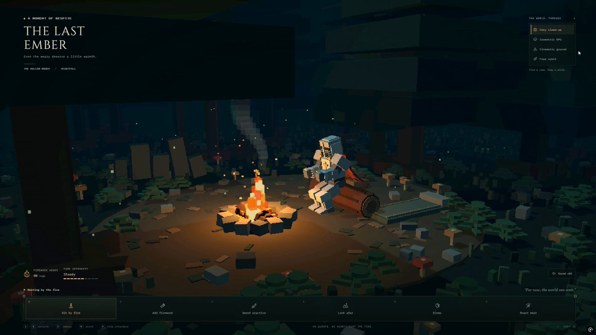</a>

Cảnh lửa trại tương tác trong khu rừng đêm phong cách voxel, được xây dựng bằng Three.js, với hiệp sĩ tạo thủ tục, lửa trại, các hành động có thể chọn cho hiệp sĩ, các thiết lập camera, HUD phong cách retro và âm thanh môi trường được tổng hợp. Tác giả bài đăng cho biết họ đã cung cấp cho GPT-6 Astra lời nhắc này cùng một hình ảnh.

**Prompt**

```text
Bạn là Nhà phát triển WebGL & Three.js Sáng tạo Cấp cao. Nhiệm vụ của bạn là xây dựng một cảnh 3D tương tác hoàn chỉnh, sẵn sàng cho môi trường production, nằm hoàn toàn trong một tệp HTML độc lập duy nhất (index.html), sử dụng Three.js + webgl

### 1. Chủ đề hình ảnh & Định hướng nghệ thuật

- Không khí: Khu rừng đêm sâu thẳm, lửa trại ấm áp phát sáng, một hiệp sĩ đơn độc mệt mỏi đang nghỉ bên khu cắm trại (thẩm mỹ lửa trại Dark Souls / RPG retro kinh điển).
- Thẩm mỹ: Pixel Art 3D / Voxel / Low-Poly.
- Đổ bóng & Hậu kỳ: Tích hợp tính năng hậu kỳ của Three.js (RenderPixelatedPass hoặc hiệu ứng tạo điểm ảnh/làm nhiễu ở độ phân giải thấp tương đương) để đạt diện mạo retro 16-bit/32-bit chân thực.

### 2. Hình học cảnh & Tài nguyên (100% tạo thủ tục — Không dùng tệp .gltf/.obj bên ngoài)

Tất cả tài nguyên phải được dựng bằng thủ tục, sử dụng các hình học nguyên thủy của Three.js (BoxGeometry, CylinderGeometry, v.v.) và vật liệu cơ bản để tệp có thể chạy cục bộ mà không gặp vấn đề CORS.

1. Môi trường rừng:

   - Mặt đất: Địa hình cách điệu tối màu với đá voxel, nấm và thảm thực vật low-poly được tạo thủ tục.
   - Cây cối: Các cây thông/vân sam hoặc cây có tán hình khối được tạo thủ tục, bao quanh khoảng trống để tạo chiều sâu và cảm giác biệt lập.
   - Bầu trời & Ánh sáng: Bầu trời nửa đêm sâu thẳm với các ngôi sao voxel nhấp nháy và DirectionalLight ánh trăng lạnh tạo bóng mềm.
   - Chiều sâu: THREE.FogExp2 với màu khí quyển tối để hòa trộn đường chân trời.

2. Lửa trại:

   - Vòng đá bao quanh các khúc gỗ đang âm ỉ cháy và các hạt than hồng được tạo thủ tục.
   - Hệ thống lửa: Các hạt điểm ảnh động (Points hoặc mesh voxel dao động) bay lên trên.
   - Ánh sáng động: PointLight màu cam-đỏ ấm với logic nhấp nháy liên tục, tự nhiên (sử dụng Math.sin, nhiễu hoặc các biến thể giả ngẫu nhiên).

3. Hiệp sĩ:

   - Cây phân cấp của cảnh (các group cho đầu, thân, cánh tay trên/dưới, chân, áo choàng và kiếm) được dựng từ các hình nguyên thủy voxel hóa.
   - Chi tiết hình ảnh: Mũ trụ có khe, giáp ngực, giáp vai, bao tay giáp và bao kiếm/kiếm.
   - Các điểm pivot phải được căn chỉnh chính xác tại các khớp (vai, khuỷu tay, hông, đầu gối) để chuyển động xoay tạo thủ tục mượt mà.

### 3. Máy trạng thái tương tác của hiệp sĩ

Triển khai các animation tạo thủ tục mượt mà bằng phép nội suy tuyến tính (lerp) hoặc các đường cong lượng giác bên trong vòng lặp render cho những trạng thái có thể chọn sau:

- Ngồi bên lửa (Nghỉ mặc định): Ngồi xếp bằng hoặc ngồi xổm, thở nhẹ theo chu kỳ, sưởi tay gần ngọn lửa.
- Thêm củi: Hiệp sĩ đứng dậy, lấy một khúc gỗ rồi ném vào lửa. Ngọn lửa bùng lên rõ rệt, bán kính chiếu sáng tạm thời mở rộng và phát ra một loạt tia lửa.
- Luyện kiếm: Đứng dậy, rút kiếm, thực hiện một chuỗi tấn công/đỡ đòn gồm 3 phần gọn gàng rồi trở về tư thế thủ chiến.
- Nhìn về phía xa: Đi đến rìa khoảng trống, cắm kiếm xuống đất và nhìn chằm chằm vào bóng tối trong khi áo choàng lay động.
- Ngủ: Nằm xuống tấm đệm ngủ cạnh lửa; các hạt điểm ảnh "Z z z" động bay lên từ mũ trụ.
- Nướng thịt: Cầm một que xiên thức ăn trên ngọn lửa; phát ra các hạt khói/hơi nước tạo thủ tục nhẹ.

### 4. Hệ thống camera

Cung cấp các chế độ camera thiết lập sẵn với chuyển tiếp nội suy mượt mà (lerp vị trí và điểm đích):

- Cận cảnh ấm cúng: Khung hình trung, tập trung vào hiệp sĩ và ánh lửa.
- RPG đẳng phối: Góc nhìn chiến thuật cao 45 độ kinh điển bao quát khoảng trống.
- Điện ảnh mặt đất: Góc máy thấp đầy kịch tính, hướng lên hiệp sĩ giữa bầu trời sao và các tán thông.
- Xoay tự do: Chuyển liền mạch sang OrbitControls tiêu chuẩn để quan sát tương tác.

### 5. UI & Âm thanh

- Phong cách UI: Bố cục HUD RPG retro 8-bit/16-bit, sử dụng các khung tối bán trong suốt với viền điểm ảnh và Google Font được nhúng (ví dụ: 'Press Start 2P').
- Bảng điều khiển dưới: Các nút hành động tương tác, kích hoạt từng trạng thái của hiệp sĩ.
- Bảng phía trên bên phải: Các nút chuyển góc camera.
- Bộ đếm củi: Theo dõi số khúc gỗ đã thêm và cường độ lửa hiện tại.
- Âm thanh (Web Audio API): Tiếng lửa tí tách và gió đêm/dế kêu môi trường được tổng hợp bằng thủ tục, kèm một nút bật/tắt tiếng.

### 6. Thông số kỹ thuật

- Một tệp index.html độc lập, tự chứa.
- Sử dụng ES Modules được tải qua CDN (https://t.co/W8o3SZwkCj hoặc unpkg).
- Cấu trúc mã dạng module, có chú thích đầy đủ (initScene, buildEnvironment, buildKnight, buildCampfire, setupUI, setupAudio, animate).
- Hoàn toàn đáp ứng kích thước cửa sổ, với trình xử lý thay đổi kích thước cập nhật tỷ lệ khung hình camera và độ phân giải của lớp tạo điểm ảnh.
```

[Xem chi tiết ↗](https://www.tripo3d.ai/vi/3d-prompts/gpt-6-astra-2100350159540596760) · [Bài đăng gốc](https://x.com/vib3coded/status/2100350602316558428) · [Về danh sách ví dụ](#all-prompts)

---

<a id="2100519026720231698"></a>

### Thêm xích bảo trì vào lan can

[きのした](https://x.com/ujiden_type0) · 2026-09-17

<a href="https://www.tripo3d.ai/vi/3d-prompts/cad-handrail-maintenance-chain">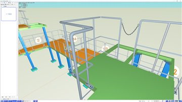</a>

Hướng dẫn chỉnh sửa mô hình CAD để thêm xích bảo trì vào lan can.

**Prompt**

```text
Thêm xích bảo trì vào lan can nhé!
```

[Xem chi tiết ↗](https://www.tripo3d.ai/vi/3d-prompts/cad-handrail-maintenance-chain) · [Bài đăng gốc](https://x.com/ujiden_type0/status/2100519026720231698) · [Về danh sách ví dụ](#all-prompts)

---

<a id="2100526922770026874"></a>

### Tạo game đua xe 3D

[たい焼き｜Claude Codeの人](https://x.com/taiyaki_ai3) · 2026-09-17

<a href="https://www.tripo3d.ai/vi/3d-prompts/gpt-6-astra-2100526922770026874">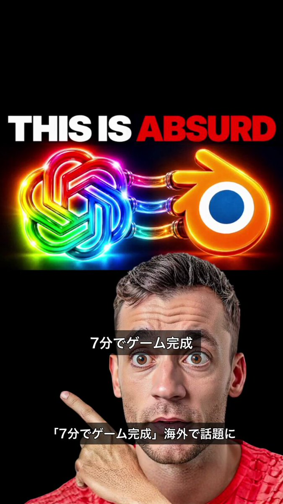</a>

Yêu cầu tạo một game đua xe 3D có thể điều khiển và lái thực sự, được người đăng cho biết là đã nhập vào GPT-6 Astra chỉ bằng một câu. Bài đăng giới thiệu đây là cách tạo game có thể chơi mà không cần dùng Blender hay viết mã.

**Prompt**

```text
Tạo một game đua xe
```

[Xem chi tiết ↗](https://www.tripo3d.ai/vi/3d-prompts/gpt-6-astra-2100526922770026874) · [Bài đăng gốc](https://x.com/taiyaki_ai3/status/2100526934082105683) · [Về danh sách ví dụ](#all-prompts)

---

<a id="2100595652703199281"></a>

### Game 3D trên trình duyệt: Thoát khỏi cơ sở nghiên cứu bị phong tỏa

[forest.watch.impress.co.jp](https://forest.watch.impress.co.jp/) · 2026-09-17

<a href="https://www.tripo3d.ai/vi/3d-prompts/gpt-6-astra-2100595652703199281">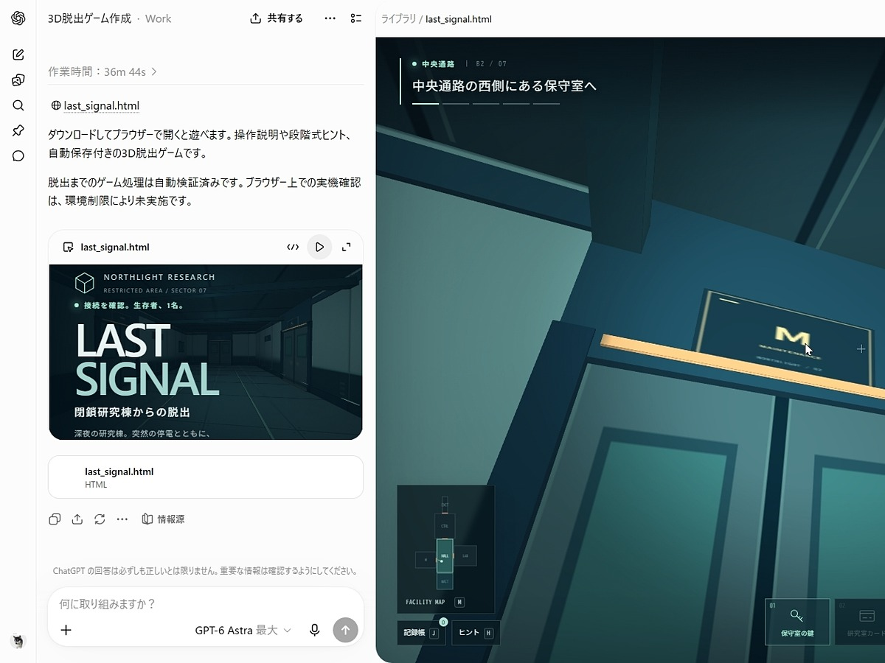</a>

Prompt tạo game 3D giải đố thoát hiểm trên trình duyệt, lấy bối cảnh một cơ sở nghiên cứu bị phong tỏa; bài viết cho biết tác giả 柳谷智宣 đã yêu cầu GPT-6 Astra thực hiện. Prompt yêu cầu thời lượng chơi khoảng 5–10 phút, có các cơ chế như chìa khóa và công tắc, hướng dẫn dễ hiểu, có thể hoàn thành đến cuối và được phân phối dưới dạng một tệp HTML duy nhất.

**Prompt**

```text
Hãy tạo một game 3D giải đố thoát hiểm có thể chơi trên trình duyệt. Nội dung xoay quanh việc trốn thoát khỏi một cơ sở nghiên cứu bị phong tỏa và thời lượng chơi khoảng 5–10 phút. Hãy thêm các cơ chế như chìa khóa và công tắc, giúp người chơi dễ hiểu cách chơi và bảo đảm có thể hoàn thành game đến cuối. Gói mọi thứ vào một tệp HTML duy nhất để người chơi chỉ cần mở tệp bằng trình duyệt là có thể chơi.
```

[Xem chi tiết ↗](https://www.tripo3d.ai/vi/3d-prompts/gpt-6-astra-2100595652703199281) · [Bài đăng gốc](https://forest.watch.impress.co.jp/docs/serial/yaaiwatch/2141084.html) · [Về danh sách ví dụ](#all-prompts)

---

<a id="2100614534423540102"></a>

### Tự thiết kế một cơ thể bằng CAD

[vitalduval](https://x.com/vitalduval) · 2026-09-17

<a href="https://www.tripo3d.ai/vi/3d-prompts/gpt-6-astra-2100614534423540102">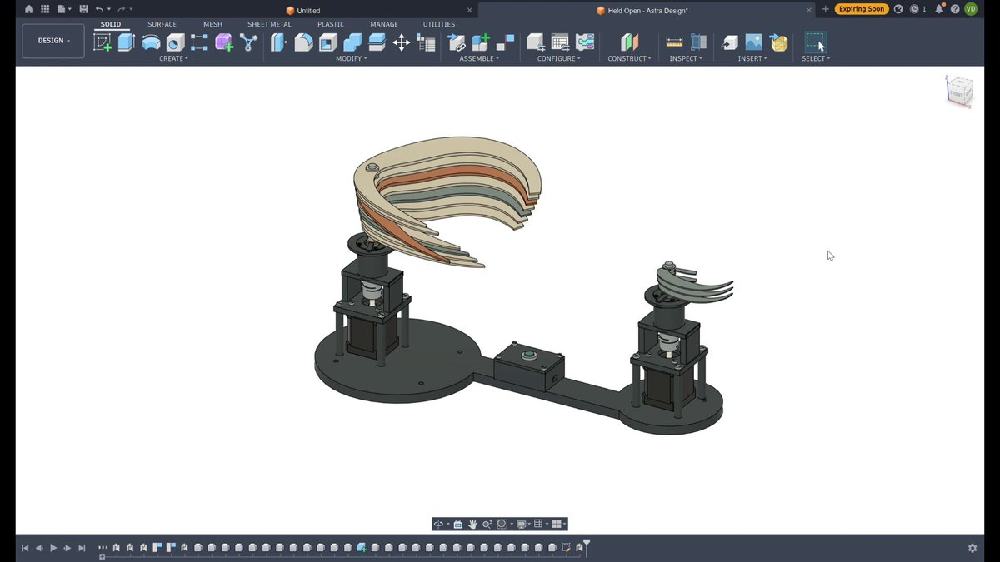</a>

Một tweet được liên kết của vitalduval nêu yêu cầu gửi tới Astra về việc thiết kế một cơ thể bằng CAD. AI Highlight đăng lại màn trình diễn kết quả và ghi công cho GPT-6 Astra.

**Prompt**

```text
Tôi đã bảo Astra tự thiết kế một cơ thể bằng CAD.
```

[Xem chi tiết ↗](https://www.tripo3d.ai/vi/3d-prompts/gpt-6-astra-2100614534423540102) · [Bài đăng gốc](https://x.com/vitalduval/status/2100343136077877251) · [Về danh sách ví dụ](#all-prompts)

---

<a id="2100636075039629796"></a>

### Monster Block — 45 giây phá tan thành phố

[Tony](https://x.com/abc30037274) · 2026-09-18

<a href="https://www.tripo3d.ai/vi/3d-prompts/monster-block">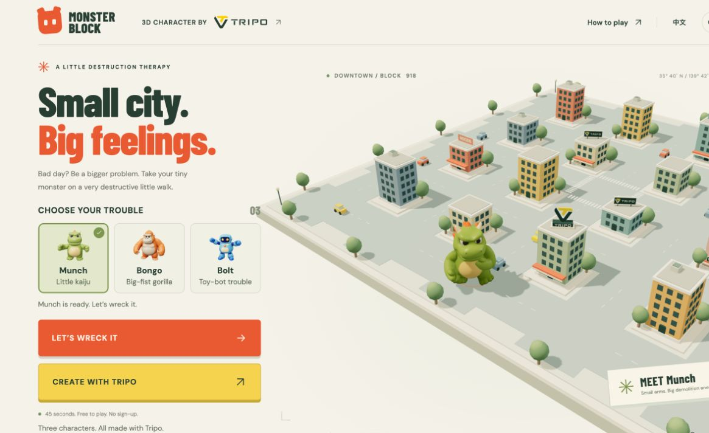</a>

<a href="https://www.tripo3d.ai/vi/3d-prompts/monster-block">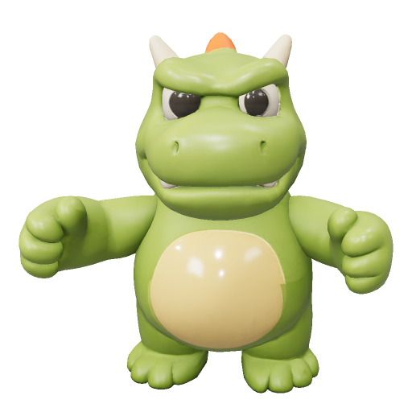</a>

<a href="https://www.tripo3d.ai/vi/3d-prompts/monster-block">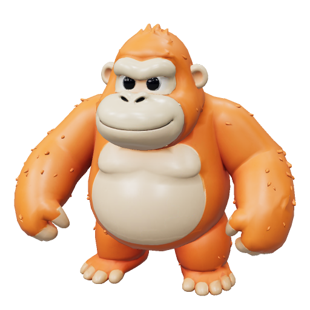</a>

<a href="https://www.tripo3d.ai/vi/3d-prompts/monster-block">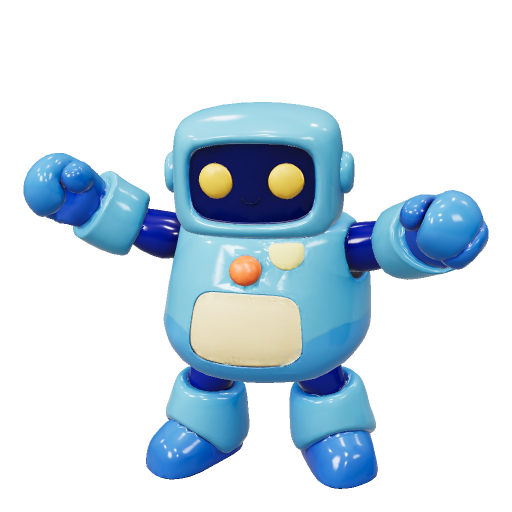</a>

Chọn Munch, kaiju nhỏ con, Bongo, khỉ đột, hoặc Bolt, robot. Đập phá các tòa nhà, ném ô tô và nối combo trong màn cuồng phá thành phố 3D kéo dài 45 giây. Cả ba nhân vật hoạt ảnh đều được tạo bằng Tripo.

**Prompt**

```text
# Monster Block — đặc tả xây dựng lại

## 1. Mục tiêu dự án

Xây dựng một game trình duyệt có thể chơi được mang tên Monster Block. Cho phép người chơi chọn một quái vật đồ chơi, bước vào thành phố thu nhỏ và phá hủy càng nhiều tòa nhà càng tốt trong 45 giây. Việc di chuyển, cào phá tòa nhà, ném ô tô và liên tiếp phá hủy phải tạo phản hồi tức thì. Kết thúc lượt chơi bằng điểm số, danh hiệu, nút chơi lại và liên kết thử thách để bạn bè có thể chơi cùng một khu phố. Cung cấp giao diện tiếng Anh và tiếng Trung giản thể, cùng điều khiển bằng bàn phím và cảm ứng.

## 2. Phong cách hình ảnh

Tạo một mô hình sa bàn ấm áp trên bục vuông dày, đặt trước nền màu kem. Sử dụng các tòa nhà màu pastel ít chi tiết, cửa sổ nhỏ màu xanh teal đậm, viền mái nhạt, đường phố rộng màu xanh xám trầm, vạch qua đường, cây tròn, ô tô nhỏ và bóng mềm ấm. Bảng màu tòa nhà gồm màu đất nung, vàng mù tạt, teal bụi, hồng rose, xanh xám, kem và xanh sage. Vật liệu nên trông như đồ chơi được sơn mờ thay vì kim loại bóng.

Sử dụng camera phối cảnh cao góc ba phần tư, không dùng camera nhìn từ trên xuống phẳng. Camera tham chiếu bắt đầu tại (35, 37, 41), hướng về (0, 0.4, 0), với trường nhìn 38 độ trên màn hình rộng, 44 độ trên màn hình trung bình và 51 độ trên màn hình hẹp. Khi chơi, camera bám theo quái vật một cách mượt mà đồng thời vẫn giữ các mục tiêu lân cận trong tầm nhìn. Chiếu sáng cảnh bằng đèn bán cầu ấm, đèn định hướng mềm có đổ bóng và đèn bổ trợ mát.

Sử dụng kiểu chữ hiển thị đậm, cô đọng cho các tiêu đề tiếng Anh lớn và sans-serif dễ đọc cho phần hướng dẫn. Kết hợp chữ xanh lá đậm, bề mặt màu kem, thao tác chơi màu cam và thao tác tạo bằng Tripo màu vàng. Trên trang chủ, làm cho Play và Create with Tripo nổi bật ngang nhau. Trong hộp thoại tạm dừng, đặt thẻ Tripo màu xanh lá đậm với ba ảnh thu nhỏ nhân vật và nút tạo màu vàng phía trên nút Resume dạng viền. Đảm bảo phần trợ giúp đủ dễ đọc trên điện thoại.

Sử dụng các hiệu ứng ngắn, kích hoạt theo thao tác: vệt cào, tòa nhà giật lùi trong chốc lát, hiệu ứng va chạm và phá hủy riêng biệt, vòng chấn động mở rộng, mảnh vỡ nhỏ, điểm số bật lên, thay đổi combo và rung camera có hướng ở mức vừa phải. Nâng ô tô đã bắt vào tay trong khoảng 220 ms. Tôn trọng tùy chọn giảm chuyển động bằng cách tắt rung, các đợt mảnh vỡ và hiệu ứng phóng to giao diện, nhưng vẫn giữ điểm số, dấu hiệu mục tiêu và kết quả phá hủy.

## 3. Thế giới và cảnh

Đặt 16 tòa nhà có thể phá hủy trong lưới 4-by-4. Sử dụng khoảng cách giữa các khu phố là 10.4, tâm các khu phố lần lượt ở -1.5, -0.5, 0.5 và 1.5 lần khoảng cách đó, cùng năm đại lộ theo mỗi trục. Bục rộng 52.6 đơn vị. Tòa nhà có từ hai đến năm tầng, mặt bằng đa dạng, chi tiết mái, một số mái hiên và các biển HOTEL hoặc NOODS nhỏ. Tạo bố cục một cách xác định từ seed.

Đặt 12 ô tô dọc các tuyến đường và đảm bảo có một ô tô màu vàng có thể ném được gần vị trí chơi ban đầu. Bố trí cây quanh các khu đất xây dựng và mép bục, bốn đèn ở góc, vạch làn đường và một lối qua đường ở trung tâm. Bắt đầu quái vật trên một đại lộ thông thoáng tại (0, 0.2, 10.4); dùng vị trí đứng chờ tiền cảnh ở z=20.8 cho trang chủ.

Cùng một tham số khu phố phải tái tạo đúng cùng bố cục tòa nhà. Khi không có tham số, lấy seed khu phố từ ngày UTC. Tham số beat cung cấp điểm mục tiêu của bạn bè. Giữ nguyên khu phố đã chọn khi chơi lại. Mảnh vỡ ngẫu nhiên không cần có tính xác định.

## 4. Danh mục tài sản

Duy trì ID tài sản ổn định và tách mô hình hiển thị khỏi proxy va chạm của gameplay.

- munch: Munch / 阿猛, khủng long xanh mặc định. Giữ nguyên mõm tròn, bụng và sừng màu kem, gai lưng màu cam, tay ngắn, bàn chân lớn và đuôi dài ban đầu. Tải /assets/monster-animated.glb và chuẩn hóa chiều cao thành 5.6 đơn vị. Giữ /assets/monster.glb làm phương án dự phòng tĩnh.
- bongo: Bongo / 橘拳, khỉ đột đồ chơi màu cam với nắm đấm quá khổ và thân hình rộng. Tải /assets/bongo-animated.glb và chuẩn hóa chiều cao thành 4.5 đơn vị.
- bolt: Bolt / 蓝电, robot đồ chơi màu xanh với tay chân chắc nịch và dáng vẻ thân thiện. Tải /assets/bolt-animated.glb và chuẩn hóa chiều cao thành 4.9 đơn vị.
- Mỗi nhân vật có PNG xem trước tương ứng và các clip idle, run, slash. Giữ đúng ba nhân vật có thể chọn; khi chuyển nhân vật, phải cập nhật cả ảnh xem trước lẫn mô hình được sử dụng ở lượt chơi tiếp theo.
- city_building: các nhóm tòa nhà procedural có thể tái sử dụng, với máu, giới hạn collider, độ giật khi trúng đòn và trạng thái phá hủy được theo dõi riêng. Viền mái, phần đế và mái hiên thuộc vùng bao va chạm.
- city_car: các ô tô procedural có thể tái sử dụng và ném được. Tách riêng trạng thái đang cầm, đang bay và đã bị phá hủy. Ba ô tô mang thương hiệu Tripo màu vàng.
- city_decor: cây, đèn, vỉa hè, biển báo và sơn đường procedural. Giữ phần này nhẹ và tái sử dụng hình học cùng vật liệu.
- tripo_scenery: một mô hình logo trên mái, hai biển hiệu trên mái, một mặt tiền xưởng và ba ô tô gắn thương hiệu. Dựng chúng từ logo Tripo được cung cấp và các mesh procedural. Đây là vật trang trí cảnh, không phải mô hình được tạo thêm qua API hay vật phẩm tăng sức mạnh trong gameplay.

Ba mô hình nhân vật là các tài sản Tripo ưu tiên. Tái sử dụng các GLB đã tạo và rig được cung cấp khi có thể. Với nhân vật mới, hãy tạo một mô hình phong cách đồ chơi phù hợp, kiểm tra độ tương thích của rig, bind rig, tạo animation idle/run/slash và xác thực tỷ lệ trước khi thêm vào danh sách nhân vật. Không gọi API tạo nội dung khi người chơi bắt đầu một lượt. Tải nhân vật lên và tự động nhập sản phẩm do người chơi tạo nằm ngoài phiên bản này.

## 5. Gameplay và phản hồi

Hỗ trợ WASD hoặc phím mũi tên để di chuyển, giữ Space để liên tục tấn công bằng vuốt, nhấn E để nhặt ô tô gần đó và nhấn E lần nữa để ném, nhấn R để dậm và Escape để tạm dừng. Cung cấp cần điều khiển ảo cùng các nút riêng cho tấn công, nhặt/ném và dậm trên màn hình cảm ứng. Xóa các thao tác đang được giữ khi tạm dừng hoặc mất tiêu điểm.

Áp dụng các quy tắc sau:

- Một lượt chơi kéo dài 45 giây. Máu của tòa nhà bằng số tầng cộng một, tương đương 3–6 máu.
- Một đòn vuốt gây 1 sát thương, với khoảng thời gian giữa các đòn là 0.42 giây.
- Một cú dậm gây 3 sát thương lên mỗi tòa nhà trong phạm vi và có thời gian hồi 7 giây.
- Ô tô bị ném gây 4 sát thương lên các tòa nhà trong vùng va chạm và cộng 75 điểm cơ bản cho cú va chạm do ném.
- Đánh trúng tòa nhà được cộng 20 lần hệ số hiện tại. Phá hủy tòa nhà cộng round(180 + chiều cao tòa nhà × 50) lần hệ số sau khi tăng combo phá hủy.
- Phá hủy tiếp trong vòng 3.5 giây sẽ duy trì combo. Các đòn đánh thông thường không kéo dài khoảng thời gian này. Hệ số là min(5, 1 + floor(combo / 2)).
- Phá hủy đủ cả 16 tòa nhà sẽ kết thúc lượt chơi và cộng ceil(số giây còn lại) × 100. Nếu không, kết thúc khi thời gian về 0 và không cho cộng thêm điểm.

Không có kẻ địch, trận đấu trùm, máu người chơi hay hình phạt tử trận. Thử thách nằm ở việc chọn tuyến đường, sử dụng ô tô và cú dậm hiệu quả, đồng thời duy trì combo phá hủy. Hiển thị thời gian còn lại, điểm số, số tòa nhà đã phá hủy, hệ số và thời gian hồi cú dậm. Giải thích rõ các thao tác chưa khả dụng mà không chặn việc di chuyển. Phân biệt cú vung hụt với đòn đánh trúng bằng phản hồi âm thanh và hình ảnh.

Xử lý việc di chuyển và xoay dựa trên vùng chiếm chỗ animation đã lấy mẫu của từng nhân vật, bao gồm cả tay và đuôi. Kiểm tra với toàn bộ giới hạn tòa nhà và chừa một khoảng hở nhỏ. Quái vật phải có thể tấn công từ một vị trí đứng hợp lệ. Cho phép di chuyển qua khu đất sau khi tòa nhà bị phá hủy. Tránh khiến người chơi mắc kẹt ở góc hoặc để đuôi quét xuyên qua tòa nhà còn nguyên khi xoay.

Tạm dừng bộ đếm thời gian và thao tác khi nhấn Escape, nút tạm dừng, cửa sổ mất tiêu điểm hoặc tab bị ẩn. Cung cấp các luồng Resume, Retry và Home. Kết thúc bằng điểm số, số lần phá hủy, combo tốt nhất, một danh hiệu vui nhộn và liên kết thử thách cùng bản đồ. Cung cấp bảng điểm tải xuống kích thước 1080-by-1350 và, khi MediaRecorder được hỗ trợ, bản ghi lượt chơi ở định dạng MP4 hoặc WebM được hỗ trợ. Dùng tính năng chia sẻ gốc khi có thể và dùng clipboard làm phương án dự phòng cho liên kết thử thách. Không bao giờ trình bày điểm số do trình duyệt tính là bảng xếp hạng cạnh tranh đáng tin cậy.

## 6. Triển khai kỹ thuật

Sử dụng Three.js, TypeScript và Vite với bản build dist tĩnh. Tách việc tạo thế giới, luật chơi, va chạm, nhân vật, kết xuất, âm thanh, ghi hình, phân tích và UI thành các module riêng. Đóng gói font và các tài sản decoder cần thiết cục bộ. Dùng instancing cho các cửa sổ và vạch đường lặp lại, đồng thời tái sử dụng vật liệu và hình học. Giới hạn pixel ratio kết xuất ở mức 1.65. Giới hạn các hiệu ứng tạm thời và giải phóng tài nguyên khi hoàn tất hoặc reset.

Sử dụng GLTFLoader, skeletal animation mixer và các clip GLB được cung cấp. Chuẩn hóa mỗi mô hình quanh pivot mặt đất ở chính giữa. Bản xuất tham chiếu hướng mặt về +X; xoay pivot hiển thị -90 độ quanh trục Y để căn theo hướng tiến +Z của game. Đánh giá animation idle trước khi hiển thị mô hình đã tải và giữ chân đang animation gần mặt đất. Nếu tải thất bại, sử dụng phương án procedural dự phòng có thể nhìn thấy và thông báo trung thực về lỗi. Kiểm soát việc chọn nhân vật bất đồng bộ để lần tải cũ không thể thay thế lựa chọn mới nhất.

Giữ dữ liệu va chạm của nhân vật độc lập với mesh kết xuất và tạo lại các vùng chiếm chỗ đã lấy mẫu khi đổi nhân vật hoặc animation. Kiểm tra cả di chuyển lẫn xoay gần tường. Duy trì thao tác bàn phím/cảm ứng ổn định, hộp thoại phản hồi nhanh, nội dung đã bản địa hóa, hành vi focus, điều khiển âm thanh tắt tiếng, chế độ giảm chuyển động và khả năng khôi phục WebGL.

Liên kết các thao tác tạo bằng Tripo với https://www.tripo3d.ai/ với utm_source=monster_block, utm_medium=referral, utm_campaign=monster_block_game và utm_content theo vị trí: header_logo, hero_create, pause_create, result_create hoặc footer_logo. Mở các thao tác này trong tab riêng và tạm dừng lượt chơi đang hoạt động trước. Giải thích rằng Tripo tạo tài sản 3D; không hứa hẹn tự động nhập vào game này.

Giữ nguyên tích hợp sự kiện Pageview và PostHog khi chính sách lưu trữ cho phép. Chỉ sử dụng cấu hình tiếp nhận dữ liệu công khai trên trình duyệt trong bản build tĩnh. Giữ thông tin xác thực cho việc tạo nội dung, CMS, triển khai và phân tích cá nhân bên ngoài mã nguồn và các tài sản build. Ghi nhận lượt vào trang, chọn nhân vật, bắt đầu chơi, các thao tác đầu tiên, kết quả lượt chơi, chơi lại, chia sẻ/xuất và lượt nhấp ra ngoài đến Tripo, nhưng không xem lượt nhấp là lượt đăng ký hay thanh toán đã được xác minh.

## 7. Tiêu chí hoàn tất

Bàn giao mã nguồn có thể chạy, tài sản cục bộ, bản build tĩnh production và hướng dẫn cài đặt/khởi chạy/build rõ ràng. Xác minh cả ba lựa chọn nhân vật, một lượt chơi đủ thời gian, phá hủy tòa nhà, nhặt và ném, thời gian hồi cú dậm, hết hạn combo, tạm dừng/tiếp tục, chơi lại và tính điểm cuối lượt. Xác minh khủng long ban đầu vẫn có thể chọn, đồng thời cả ba nhân vật đều có thể di chuyển và xoay gần các tòa nhà mà không xuyên mesh rõ rệt hay bị mắc kẹt.

Kiểm tra bố cục tiếng Anh và tiếng Trung trên màn hình desktop và thiết bị di động hẹp, bao gồm nội dung trợ giúp dễ đọc, điều khiển cảm ứng, thao tác tạm dừng và chia sẻ kết quả. Xác minh đích CTA của Tripo cùng các giá trị UTM theo vị trí, tính năng xuất bảng điểm và hành vi dự phòng khi ghi hình. Kiểm tra trang đã triển khai và môi trường iframe CMS thực tế về việc tải mô hình, thao tác, liên kết bên ngoài và tải xuống. Báo cáo các giới hạn của trình duyệt hoặc thiết bị thay vì khẳng định hỗ trợ mọi trường hợp hoặc tốc độ khung hình ổn định đã đo được khi chưa có bằng chứng.

```

[Xem chi tiết ↗](https://www.tripo3d.ai/vi/3d-prompts/monster-block) · [Bài đăng gốc](https://x.com/abc30037274/status/2100636075039629796) · [Bản demo](https://monster-block.tripo.page/) · [Về danh sách ví dụ](#all-prompts)

---

<a id="2100751369619820923"></a>

### Huấn luyện chiến lược xoay bút với bàn tay khéo léo Sharpa

[AI Will](https://x.com/FinanceYF5) · 2026-09-18

<a href="https://www.tripo3d.ai/vi/3d-prompts/gpt-6-astra-2100751369619820923">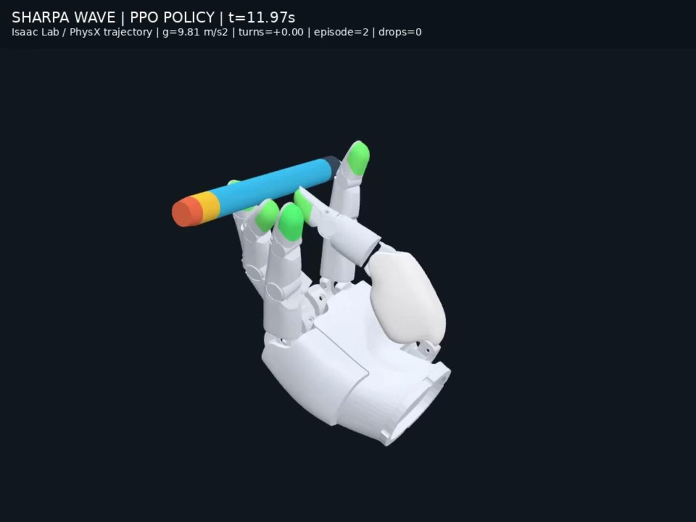</a>

Tác giả cho biết đã cung cấp prompt tiếng Trung này cho GPT-6 Astra để sử dụng Isaac Lab thực hiện học tăng cường cho bàn tay khéo léo Sharpa, tự tạo lưới 3D của cây bút và bàn giao chiến lược đã huấn luyện cùng video trực quan hóa.

**Prompt**

```text
Hãy để bàn tay khéo léo thực hiện động tác xoay bút. Sử dụng Isaac Lab để học tăng cường với Sharpa hand, đồng thời tự tạo lưới 3D của cây bút. Cuối cùng, bàn giao chiến lược đã huấn luyện và video trực quan hóa. Có thể tự do tìm kiếm trên Internet, tải xuống các bài nghiên cứu và tài liệu cần thiết.
```

[Xem chi tiết ↗](https://www.tripo3d.ai/vi/3d-prompts/gpt-6-astra-2100751369619820923) · [Bài đăng gốc](https://x.com/FinanceYF5/status/2100751369619820923) · [Về danh sách ví dụ](#all-prompts)

---

<a id="2100838090210431302"></a>

### Game xe điện trên không 3D giữa những hòn đảo bay

[YouWare](https://x.com/YouWareAI) · 2026-09-18

<a href="https://www.tripo3d.ai/vi/3d-prompts/gpt-6-astra-2100838090210431302">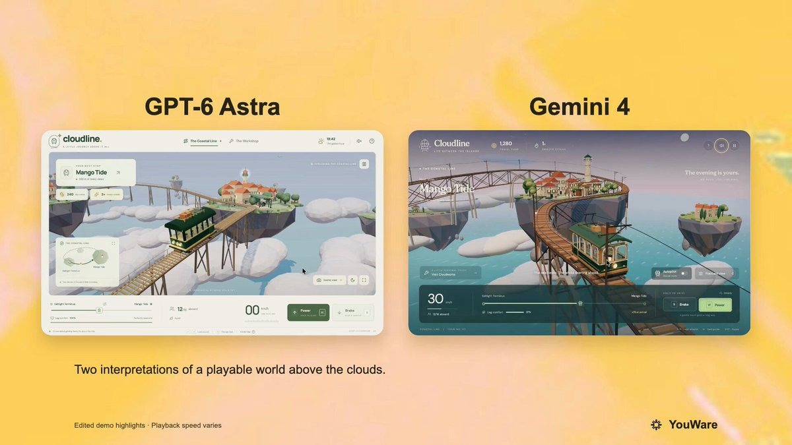</a>

Một bình luận từ tác giả đã được xác minh chia sẻ toàn bộ prompt mà bài đăng gốc cho biết đã chạy với GPT-6 và Gemini 4. Prompt yêu cầu một game xe điện trên không Three.js chạy được trên trình duyệt, lấy bối cảnh các hòn đảo bay mang phong cách Địa Trung Hải, có điều khiển lái, hệ thống chấm điểm độ thoải mái của hành khách, nhà ga, nâng cấp và hỗ trợ thiết bị di động.

**Prompt**

```text
Tạo một game 3D HTML/JS một tệp (Three.js) có thể chơi trực tiếp trên trình duyệt, với phong cách game indie low-poly ấm áp nhưng trau chuốt, gợi không khí một thị trấn ven biển kiểu Ghibli kết hợp sự mượt mà của đường ray xe goòng trong Zelda.
【Lối chơi chính】  Người chơi điều khiển một xe điện trên không phong cách retro, di chuyển giữa những hòn đảo bay phía trên biển mây và mặt biển.  - Đường ray là một tuyến đường sắt 3D liên tục, gồm các đoạn thẳng, dốc lên, dốc xuống, khúc cua trên cao và những cây cầu dài bắc qua biển  - Điều khiển: W để tăng tốc (Power), S để phanh (Brake), phím trái và phải để tinh chỉnh hoặc đổi góc nhìn  - Hiển thị theo thời gian thực: tốc độ tính bằng km/h, số hành khách trên xe (ví dụ: 12/16 người), điều kiện đường ray (Ổn định / Gió ngang)  - Hệ thống độ thoải mái của hành khách: tăng tốc đột ngột, phanh gấp, vào cua quá nhanh và gió ngang đều làm giảm “độ êm chân”; đến ga đích một cách êm ái sẽ nhận điểm thưởng (ví dụ: +75 khi đến nơi)  - Chuỗi điểm: lái quá xóc sẽ hiện thông báo “Đã mất chuỗi điểm. Hãy tìm lại sự cân bằng để tích lũy tiền boa.”  - Đến ga và mở cửa để hành khách lên xuống. Trên sân ga, người dân xếp hàng chờ, kèm phụ đề như “Đang mở cửa - Mango Tide”, “Vui lòng chờ…”     [Thế giới và nhà ga]  Có ít nhất hai tuyến đường/hai hòn đảo:  1. Saltlight Terminus  2. Mango Tide  Hòn đảo là một đảo đá bay phía trên mây, có những ngôi nhà nhỏ theo phong cách Địa Trung Hải/Nam Âu với mái ngói đỏ, một ngọn hải đăng, bến tàu, cây xanh, đèn đường và những ô cửa sổ vàng ấm áp vào ban đêm. Xa xa là thêm nhiều hòn đảo bay và các quỹ đạo xoay vòng. Bầu trời chuyển sắc xanh lam-tím từ chạng vạng đến đêm, có sao và những đám mây dày; phía dưới là mặt biển xanh ngọc.     [Ngoại hình xe điện]  Xe điện retro: thân xanh lá đậm, khung gầm màu gỗ, cửa sổ kính cong, hành lý trên nóc, mái che/trang trí dây leo màu xanh và nhiều hành khách ngồi bên trong. Khi di chuyển, xe hơi lắc nhẹ và tạo cảm giác có âm thanh đường ray (có thể thể hiện bằng hiệu ứng âm thanh đơn giản hoặc tín hiệu hình ảnh).     [Cảnh 2: Xưởng nâng cấp]  Chuyển sang góc nhìn isometric từ trên xuống của xưởng “Cloudworks / Oliver Cloudworks / hòn đảo quê nhà của Oliver”.  Người chơi có thể thay linh kiện cho xe điện, với giao diện dạng cửa sổ nâng cấp:  - Hearth leaves — Đang tháo linh kiện cũ  - Little Companion — Đang chuẩn bị xe điện  Thanh tiến trình + “Hãy ngồi lại và quan sát xưởng.”  Sau khi nâng cấp, ngoại hình xe điện thay đổi (ví dụ: nóc xanh lá, thêm giá hành lý, đèn lồng, dây leo), rồi xe chạy ra khỏi xưởng, với phụ đề “Mời lên xe.” / “Điểm dừng tiếp theo: Tuyến Ven Biển.”     [Giao diện]  Giao diện game casual hiện đại, gọn gàng: điểm đến và tiền tệ/chuỗi điểm ở góc trên bên trái, thanh tốc độ cùng các nút Power/Brake ở phía dưới, thanh tiến trình độ thoải mái nối tên hai nhà ga. Không rườm rà, không biến game thành kinh dị hay cyberpunk.     [Yêu cầu kỹ thuật]  - Một tệp hoặc số tệp tối thiểu, sử dụng Three.js  - Dùng curve cho đường ray (CatmullRom, v.v.) để xe điện bám theo đường ray; camera bám theo với cảm giác chuyển động nhẹ trên ray  - Tạo cảm giác vật lý đơn giản: quán tính khi tăng tốc, giảm tốc khi phanh, thân xe nghiêng khi vào cua  - Trên thiết bị di động, cố gắng hỗ trợ chạm để tăng tốc/phanh  - Mã dễ đọc, có chú thích và chơi được ngay khi mở tệp.
```

[Xem chi tiết ↗](https://www.tripo3d.ai/vi/3d-prompts/gpt-6-astra-2100838090210431302) · [Bài đăng gốc](https://x.com/YouWareAI/status/2100838828433179037) · [Về danh sách ví dụ](#all-prompts)

---

<a id="2100844566718926949"></a>

### Tạo một thế giới 3D chân thực như ảnh

[Julian Goldie SEO](https://x.com/JulianGoldieSEO) · 2026-09-18

<a href="https://www.tripo3d.ai/vi/3d-prompts/gpt-6-astra-2100844566718926949">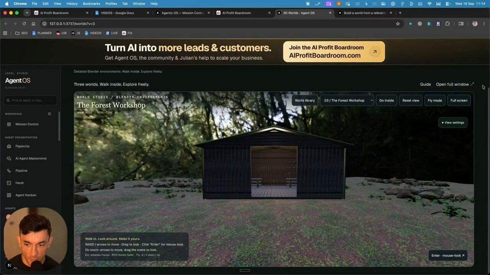</a>

Một yêu cầu gợi ý chỉ với một prompt trong bài đăng gốc để tạo thế giới 3D chân thực như ảnh, có thể đi bộ khám phá. Bài đăng giới thiệu yêu cầu này như một phần của quy trình làm việc với Blender MCP; không khẳng định prompt chính xác này là đầu vào cho phần trình diễn đi kèm.

**Prompt**

```text
Tạo một thế giới 3D chân thực như ảnh. Hãy khiến tôi bất ngờ.
```

[Xem chi tiết ↗](https://www.tripo3d.ai/vi/3d-prompts/gpt-6-astra-2100844566718926949) · [Bài đăng gốc](https://x.com/JulianGoldieSEO/status/2100844566718926949) · [Về danh sách ví dụ](#all-prompts)

---

<a id="2100956517633761447"></a>

### Mô hình đồng hồ IWC Schaffhausen 3D tương tác

[YouWare](https://x.com/YouWareAI) · 2026-09-18

<a href="https://www.tripo3d.ai/vi/3d-prompts/gpt-6-astra-2100956517633761447">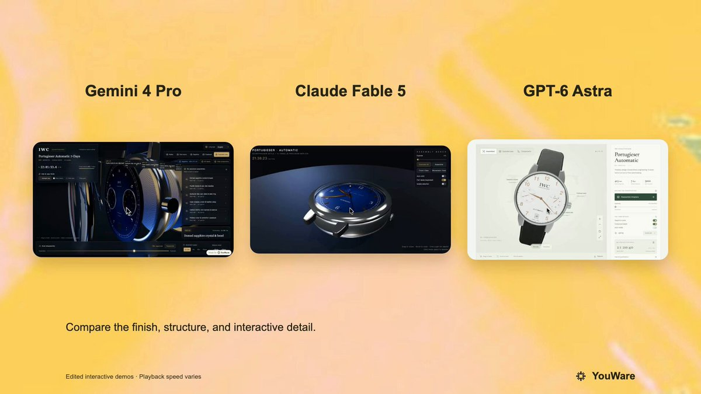</a>

Một bình luận đã được xác minh của tác giả cung cấp prompt cho mô hình đồng hồ IWC Schaffhausen 3D tương tác bằng Three.js với độ chi tiết cao. Prompt yêu cầu các bộ phận cơ khí có thể nhận diện riêng, kính sapphire chân thực, kim chuyển động theo thời gian thực và tương tác tháo rời/lắp ráp lại theo dạng bung chi tiết. Bài đăng gốc giới thiệu đây là prompt dùng chung trong một phép so sánh có GPT-6 Astra và các mô hình khác.

**Prompt**

```text
Sử dụng Three.js để phát triển mô hình đồng hồ IWC Schaffhausen 3D tương tác với độ trung thực cao. Yêu cầu: 1) Cấu trúc mặt số phải cực kỳ chính xác, mọi bộ phận cơ khí đều được dựng riêng và dễ dàng phân biệt; 2) Mặt kính đồng hồ phải sử dụng vật liệu kính sapphire với hiệu ứng trong suốt, khúc xạ và phản xạ chân thực; 3) Kim phút và kim giây phải là các kim chính xác, vận hành theo logic đo thời gian thực, với hoạt ảnh quét kim liên tục và tự động; 4) Hỗ trợ tháo rời và lắp ráp lại đồng hồ, cho phép tách và quan sát từng bộ phận riêng lẻ; 5) Mức độ chi tiết tổng thể phải cực kỳ cao, bám sát cấu trúc và tỷ lệ của đồng hồ thật, với kết cấu vật liệu chân thực cho ốc vít, các chi tiết kim loại và những bộ phận khác, thể hiện tay nghề chế tác tinh xảo. Hãy đảm bảo mô hình chạy mượt trên trình duyệt và tương tác tự nhiên.
```

[Xem chi tiết ↗](https://www.tripo3d.ai/vi/3d-prompts/gpt-6-astra-2100956517633761447) · [Bài đăng gốc](https://x.com/YouWareAI/status/2100958838350643553) · [Về danh sách ví dụ](#all-prompts)

---

<a id="2101055500599054437"></a>

### Thiên hà dựa trên vật lý quỹ đạo thực tế

[Argona](https://x.com/Argona0x) · 2026-09-18

<a href="https://www.tripo3d.ai/vi/3d-prompts/gpt-6-astra-2101055500599054437">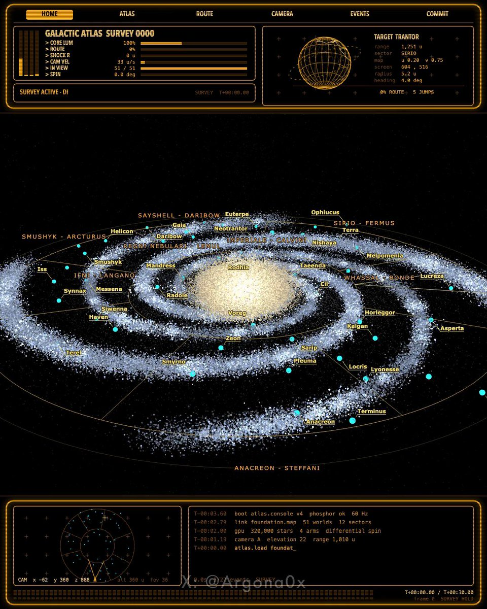</a>

Tác giả giới thiệu prompt GPT-6 Astra một câu này làm đầu vào để mô phỏng một thiên hà có tính xác định và thực hiện chuyến bay dài 30 giây xuyên qua thiên hà đó. Prompt yêu cầu áp dụng vật lý quỹ đạo thực tế và tạo 320.000 ngôi sao.

**Prompt**

```text
một thiên hà dựa trên vật lý quỹ đạo thực tế, 320.000 ngôi sao, một chuyến bay xuyên qua thiên hà, 30 giây
```

[Xem chi tiết ↗](https://www.tripo3d.ai/vi/3d-prompts/gpt-6-astra-2101055500599054437) · [Bài đăng gốc](https://x.com/Argona0x/status/2101055500599054437) · [Về danh sách ví dụ](#all-prompts)

---

<a id="2101224659861590399"></a>

### Môi trường 3D chân thực như ảnh hoàn chỉnh

[Julian Goldie SEO](https://x.com/JulianGoldieSEO) · 2026-09-19

<a href="https://www.tripo3d.ai/vi/3d-prompts/gpt-6-astra-2101224659861590399"></a>

Tạo một môi trường 3D hoàn chỉnh, chân thực như ảnh với ý tưởng mở.

**Prompt**

```text
Dựng một môi trường 3D hoàn chỉnh, chân thực như ảnh. Hãy tạo bất ngờ cho tôi.
```

[Xem chi tiết ↗](https://www.tripo3d.ai/vi/3d-prompts/gpt-6-astra-2101224659861590399) · [Bài đăng gốc](https://x.com/JulianGoldieSEO/status/2101224659861590399) · [Về danh sách ví dụ](#all-prompts)

---

<a id="2101271938706685991"></a>

### Mô hình tương tác 3D động cơ máy bay

[YouWare](https://x.com/YouWareAI) · 2026-09-19

<a href="https://www.tripo3d.ai/vi/3d-prompts/gpt-6-astra-2101271938706685991">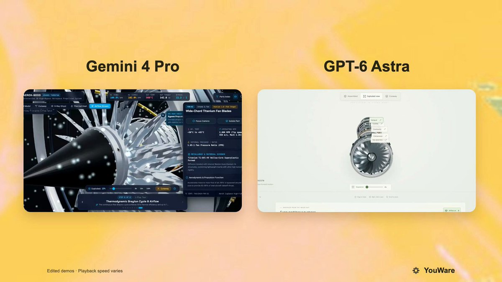</a>

Prompt có thể tái sử dụng do YouWare đăng, dùng để tạo màn hình hiển thị động cơ máy bay 3D tương tác, độ trung thực cao trên web. Prompt yêu cầu mô hình động cơ chi tiết với tương tác tháo rời và chế độ xem tách lớp, thông tin về từng bộ phận khi nhấp hoặc di chuột, cùng các điều khiển camera mượt mà. Bài đăng gốc cho biết prompt này đã được chạy với GPT-6 Astra và Gemini 4 Pro.

**Prompt**

```text
Dùng three.js để xây dựng màn hình hiển thị 3D tương tác của một động cơ máy bay trên trang web.
Vui lòng tham khảo triết lý thiết kế tương tác của Jigspace để tạo mô hình chân thực, được phục dựng với độ trung thực gần 1:1, giữ nguyên đầy đủ chi tiết vật liệu và kết cấu bề mặt như kim loại, đường ống và cánh quạt. Các tính năng tương tác bắt buộc gồm: hoạt ảnh tháo rời theo từng bước, chế độ xem tách lớp các bộ phận, cùng phần mô tả bộ phận và giải thích nguyên lý hiển thị khi nhấp hoặc di chuột.
Nhìn chung, sản phẩm phải hỗ trợ điều khiển camera mượt mà và tương tác người–máy thân thiện, mang lại trải nghiệm liền mạch trên web, đồng thời trình bày đầy đủ cấu trúc và nguyên lý hoạt động của động cơ.
```

[Xem chi tiết ↗](https://www.tripo3d.ai/vi/3d-prompts/gpt-6-astra-2101271938706685991) · [Bài đăng gốc](https://x.com/YouWareAI/status/2101272224435253432) · [Về danh sách ví dụ](#all-prompts)

---

<a id="2101310374033428642"></a>

### Quy trình tạo hoạt ảnh 3D và video mèo võ thuật catfu

[PixVerse](https://x.com/PixVerse) · 2026-09-19

<a href="https://www.tripo3d.ai/vi/3d-prompts/gpt-6-astra-2101310374033428642">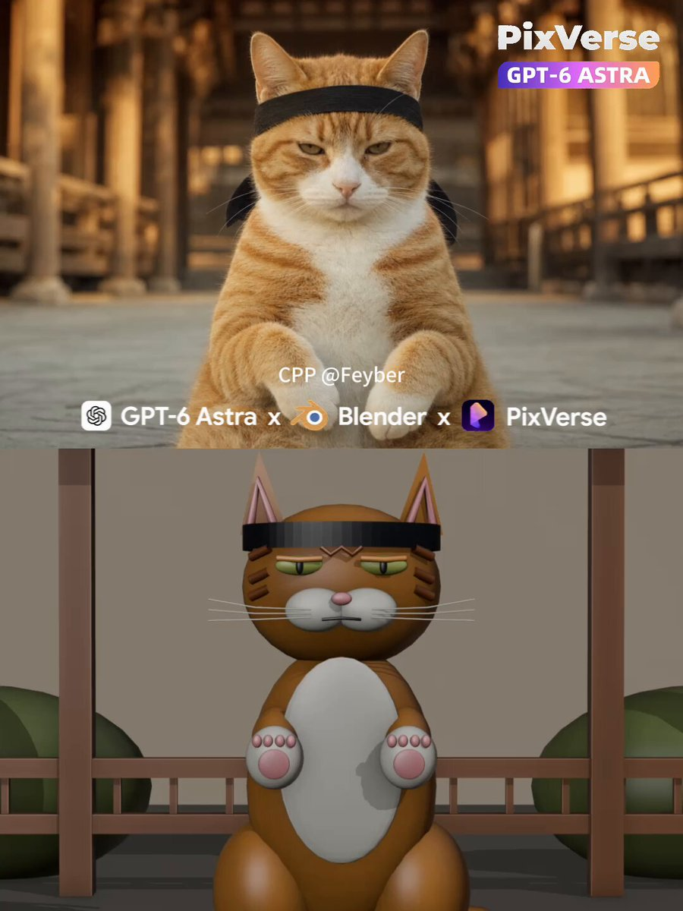</a>

Bình luận đã xác minh của PixVerse cho biết đây là prompt được sử dụng trong Hermes Agent. Bài đăng gốc ghi nhận công sức của nhà sáng tạo PixVerse @woleswoosh với màn trình diễn catfu, đồng thời cho biết tác phẩm được thực hiện bằng GPT-6 Astra + Blender. Prompt yêu cầu một agent dựng các mesh Blender nhẹ và hoạt ảnh cho một chú mèo mướp cứng đờ, điềm tĩnh, đỡ những bàn tay đang lao tới trong sân một ngôi chùa Nhật Bản, kết xuất MP4 tham chiếu chuyển động dài 10 giây, sau đó tạo video 1080p chân thực bằng PixVerse CLI và Seedance 2.5.

**Prompt**

```text
Một cú máy điện ảnh duy nhất, siêu chân thực, dài 10 giây, 16:9, 24fps, máy quay cố định, không cắt cảnh.
Một chú mèo mướp lông vàng cam-trắng (mõm, ngực và bàn chân màu trắng; sọc mướp màu cam với chữ "M" trên trán) ngồi thẳng, chính giữa khung hình, đối diện ống kính trong tư thế võ thuật cứng đờ — ánh mắt phẳng lặng, điềm tĩnh, không chút ấn tượng, mắt lim dim, miệng khép kín, đầu không bao giờ cử động. Nó đeo một chiếc hachimaki màu đen buộc thấp ngang trán, nút thắt ở phía sau, hai tai nhô lên trên dải khăn.
Bối cảnh: sân chùa Nhật Bản truyền thống — các cột gỗ, mái hiên và lan can ấm màu — tan vào hiệu ứng bokeh vàng kem của giờ vàng. Ống kính 85mm, f/1.8, độ sâu trường ảnh cực mỏng, khóa nét vào mắt mèo. Tông màu 3500K ấm áp, ánh sáng chính mềm từ phía trước bên phải, bóng đổ được bổ sáng nhẹ, hạt phim mịn.
HÀNH ĐỘNG: một cánh tay người trần lao vào từ bên trái khung hình, lòng bàn tay mở đẩy nhanh về phía mặt mèo với hiệu ứng nhòe chuyển động rõ rệt; mèo bình thản nâng bàn chân trước bên phải lên đỡ, chặn lòng bàn tay và triệt tiêu đà của đòn đánh — nó đỡ đòn, không tát. Cánh tay quét ngang qua mặt mèo trong một vệt nhòe, sau đó một bàn tay thứ hai chém xuống từ bên phải; mèo hóa giải từng đòn bằng cú chặn bàn chân ngắn và tối giản, thân và đầu hoàn toàn bất động, mắt không rời ống kính. Những bàn tay là bên tấn công — mèo chỉ phản ứng và không hề nao núng. Hai bàn tay liên tục giả động tác rồi rút ra từ cả hai phía; mèo chuyển sang thế thủ boxing bằng hai bàn chân ở ngang ngực, các bàn chân co lại, khuỷu tay khép vào, rồi giữ nguyên tư thế để chờ đợi. Nó bất ngờ tung những đòn phản công nhanh bằng từng bàn chân đơn lẻ, nhòe theo phong cách kung-fu, chặn những bàn tay đang lao tới giữa không trung, đầu vẫn khóa thẳng về phía trước. Cuối cùng, nó đẩy thẳng bàn chân phải vào ống kính, đệm chân màu hồng hướng về máy quay, cho đến khi bàn chân lấp đầy khung hình thành một hình dạng tiền cảnh mềm, mất nét — gương mặt phía sau vẫn sắc nét tuyệt đối, ánh mắt lạnh lùng không đổi.
Chuyển động: tốc độ tự nhiên, hiệu ứng nhòe chuyển động chân thực trên những bàn tay đang bay tới và các cú chặn bàn chân nhanh. Chuyển động phòng thủ của mèo phải tối giản, tiết kiệm và tự nhiên — nó hầu như không cử động; những bàn tay làm tất cả nhưng đều thất bại. Không chuyển động máy quay, không zoom, không chữ.
PHỦ ĐỊNH: chi thừa, bàn chân dính hoặc biến dạng, ngón tay thừa, gương mặt méo mó, dải khăn hòa vào lông, da nhựa, màu quá bão hòa, chữ, phụ đề, logo, hình mờ, cắt cảnh, rung máy, ngôn ngữ cơ thể vui vẻ/ăn mừng, cử chỉ đập tay.
BẢN NGẮN:
Mèo mướp lông vàng cam-trắng đeo hachimaki đen ngồi trong sân chùa Nhật Bản ngập nắng, nhìn thẳng vào máy quay với vẻ tỉnh bơ, 85mm f/1.8, DOF mỏng, giờ vàng, hạt phim. Những bàn tay người chém và đẩy nhanh vào mặt nó từ cả hai phía với hiệu ứng nhòe chuyển động — mèo bình thản đỡ từng đòn bằng cú chặn bàn chân tối giản, đầu không hề cử động. Nó chuyển sang thế thủ kung-fu bằng hai bàn chân, tung những đòn phản công nhanh và nhòe, rồi đẩy bàn chân vào ống kính cho đến khi đệm chân lấp đầy khung hình. Một cú máy cố định duy nhất, 10 giây, 16:9, 24fps, siêu chân thực, không chữ.
Ghi chú nhỏ từ khung hình: tay chủ yếu lao vào từ bên trái (đòn chém từ trên xuống + cú quét ngang), điểm tiếp xúc nằm ở cổ tay/lòng bàn tay — không phải bàn chân chạm bàn chân. Thế thủ bằng hai bàn chân xuất hiện khoảng 4.0-5.6 giây, phản công nhòe ở 5.6-8 giây, kết thúc với bàn chân chạm ống kính ở 8-10 giây. nhiệm vụ của bạn là tạo mô hình 3D bằng Blender MCP, tạo đầu ra 10 giây ở 24fps và kết xuất thành cảnh siêu chân thực bằng pixverse cli, sử dụng seedance 2.5 làm mô hình tạo video
CÁC BƯỚC CỦA AGENT: Kiểm tra Blender MCP, xác thực PixVerse CLI, khả năng của mô hình và số credit hiện có. Thông báo chi phí ước tính và xin phê duyệt chi tiêu trước khi tạo nội dung có tính phí. Chuyển prompt thành bảng nhịp thời gian, dựng các mesh 3D nhẹ cùng hoạt ảnh thông qua Blender MCP chính thức, kết xuất MP4 tham chiếu chuyển động, rồi kiểm tra khung hình, chuyển động, điểm tiếp xúc, thời lượng và tốc độ khung hình. Tạo và kiểm tra riêng một ảnh tham chiếu ngoại hình trước khi gửi yêu cầu tạo video. Dùng ảnh để định hướng nhận diện, phong cách và ánh sáng; dùng video Blender để định hướng chuyển động và nhịp thời gian. Sau khi tạo xong, tải kết quả xuống, xác minh thông số kỹ thuật, kiểm tra các khung hình chính, báo cáo trung thực mọi sai lệch và tính lượng credit thực tế đã sử dụng. Giữ nguyên các tệp gốc; không tự ý chuyển mô hình hoặc tạo lại.
LỆNH GỌI PIXVERSE: Dùng pixverse create image với gpt-image-2.0 để tạo ảnh tham chiếu ngoại hình theo tỷ lệ khung hình đã xác nhận, 1080p, độ chi tiết cao. Sau đó dùng pixverse create reference với mô hình video đã xác nhận, truyền cả hai --images and --videos to để kết hợp ảnh ngoại hình với tham chiếu chuyển động Blender. Với Seedance 2.5, sử dụng --model seedance-2.5 --task-type auto, thời lượng/tỷ lệ khung hình đã xác nhận và --quality 1080p --count 1. Xác minh khả năng hiện tại trước khi gửi yêu cầu, sử dụng các khóa idempotency duy nhất và theo dõi tiến trình qua pixverse task status / pixverse task wait.
ĐẦU RA CUỐI: Trả về video hoàn chỉnh theo tỷ lệ khung hình và thời lượng đã xác nhận, mục tiêu 1080p và 24fps, cùng ảnh tham chiếu ngoại hình, dự án Blender .blend và MP4 tham chiếu chuyển động. Cung cấp đường dẫn cục bộ tuyệt đối hoặc URL tải xuống. Giữ định dạng báo cáo cuối cùng: Video, Ảnh tham chiếu, Mesh + hoạt ảnh Blender, Kiểm tra, Hình ảnh, và Credit đã sử dụng. Báo cáo độ phân giải thực tế, tốc độ khung hình, số lượng khung hình, thời lượng, sai lệch hình ảnh, chi phí credit cho ảnh/video, tổng chi tiêu, số dư còn lại và việc có tạo lại hay không.
```

[Xem chi tiết ↗](https://www.tripo3d.ai/vi/3d-prompts/gpt-6-astra-2101310374033428642) · [Bài đăng gốc](https://x.com/PixVerse/status/2101310387081908606) · [Về danh sách ví dụ](#all-prompts)

---

<a id="2101325346427842909"></a>

### Mô hình 3D Waymo Jaguar I-Pace

[Harshith](https://x.com/HarshithLucky3) · 2026-09-19

<a href="https://www.tripo3d.ai/vi/3d-prompts/gpt-6-astra-2101325346427842909">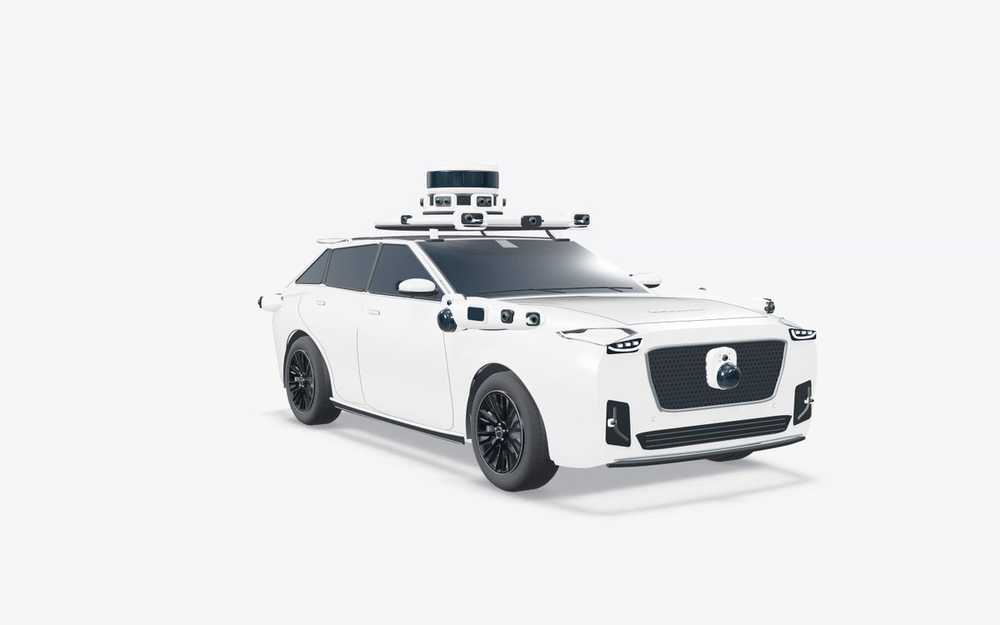</a>

<a href="https://www.tripo3d.ai/vi/3d-prompts/gpt-6-astra-2101325346427842909">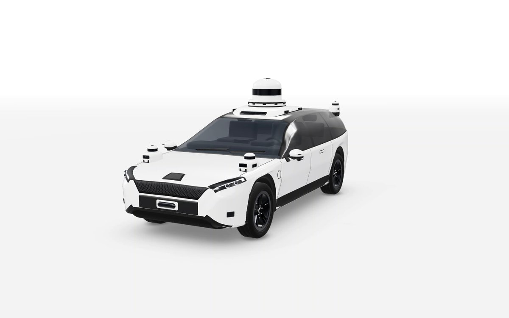</a>

Tác giả cho biết đã sử dụng prompt này với GPT-6 Astra Max trong Codex để tạo mô hình 3D Waymo Jaguar I-Pace bằng Three.js. Họ cho biết không dùng hình ảnh tham chiếu và chiếc xe tạo ra không giống xe thực tế.

**Prompt**

```text
mô hình 3D Waymo Jaguar I-Pace bằng Three.js
```

[Xem chi tiết ↗](https://www.tripo3d.ai/vi/3d-prompts/gpt-6-astra-2101325346427842909) · [Bài đăng gốc](https://x.com/HarshithLucky3/status/2101325346427842909) · [Về danh sách ví dụ](#all-prompts)

---

<a id="2101616345720787130"></a>

### Thuyền buồm trên vùng nước rộng

[www.aicontenders.dev](https://www.aicontenders.dev/) · 2026-09-20

<a href="https://www.tripo3d.ai/vi/3d-prompts/gpt-6-astra-2101616345720787130">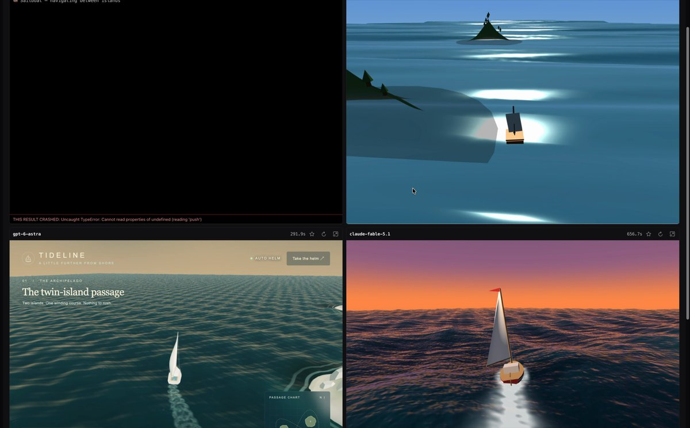</a>

Được đăng trên trang so sánh AIContenders được liên kết và chạy thử với GPT-6-astra cùng các mô hình khác. Bài thử yêu cầu một cảnh thuyền buồm 3D tương tác trong một tệp duy nhất, với mặt nước chuyển động tạo theo quy trình, hai hòn đảo, chuyển động của thuyền phản ứng theo sóng, lộ trình tránh đất liền và camera bám đuổi được làm mượt.

**Prompt**

```text
Tạo một tệp HTML duy nhất với cảnh 3D hiển thị một chiếc thuyền buồm nhỏ di chuyển trên vùng nước rộng, có điều khiển lái trực tiếp và lộ trình đi vòng qua hai hòn đảo dễ nhìn thấy, tương tự các bản demo "trò chơi thuyền" trong những bài kiểm thử mô hình gần đây.

Yêu cầu chức năng:

Bề mặt nước được dựng bằng lưới sóng chuyển động (shader nước tạo theo quy trình, sóng chuyển động, phản xạ ánh sáng thay đổi theo góc nhìn và vệt nước phía sau thuyền), không dùng kết cấu phẳng, tĩnh.
Mô hình thuyền buồm được dựng từ các hình khối đơn giản (thân thuyền, cột buồm, cánh buồm căng theo chiều gió), có chuyển động nhấp nhô và nghiêng nhẹ trên sóng, đồng bộ với chuyển động của mặt nước bên dưới.
Hai hòn đảo riêng biệt được đặt ở các vị trí khác nhau trong cảnh; mỗi đảo có địa hình tạo hình đơn giản (đồi cao, bãi biển, có thể thêm thảm thực vật) và đổ bóng lên vùng nước xung quanh.
Thuyền phải đi theo một tuyến đường thực sự tránh được cả hai hòn đảo (không bao giờ cắt qua đường bao hoặc băng qua phần đất), chuyển hướng mượt mà thay vì nhảy đột ngột giữa các góc.
Camera bám theo thuyền với độ trễ nhẹ (camera bám đuổi được làm mượt), tạo cảm giác rượt đuổi năng động thay vì góc nhìn từ trên xuống gắn cứng với thuyền.
Bầu trời chuyển sắc (chẳng hạn hoàng hôn hoặc xanh ban ngày, tùy mô hình lựa chọn) với ánh nắng hoặc phản xạ ánh sáng trên mặt nước, có hướng nhất quán với bóng đổ trên các hòn đảo.

Yêu cầu kỹ thuật:

Một tệp .html duy nhất; được phép dùng three.js từ cdnjs, không dùng tài nguyên hoặc kết cấu bên ngoài khác; toàn bộ mặt nước và địa hình phải được tạo theo quy trình bằng mã hoặc shader.
Lộ trình vòng qua các hòn đảo có thể là đường đi được lên kế hoạch trước (chẳng hạn đường cong Bezier luồn giữa hai đảo) hoặc cơ chế lái đơn giản phản ứng theo vị trí, tùy mô hình lựa chọn, nhưng không được va chạm với đất liền.
Hoạt ảnh phải chạy mượt trong ít nhất 20 giây, theo vòng lặp hoặc liên tục, đạt tối thiểu 30fps trên một máy tính xách tay thông thường; độ phân giải canvas bị giới hạn ở kích thước cửa sổ và devicePixelRatio không được cao hơn 1.5 để tránh làm quá tải màn hình hiDPI.

Tiêu chí đánh giá chính là mặt nước có tạo cảm giác thuyết phục như chất lỏng đang chuyển động hay không (không chỉ là kết cấu với offset UV động), thuyền có thực sự phản ứng theo sóng hay không và lộ trình vòng qua các hòn đảo có thể hiện sự định hướng có chủ đích thay vì suýt va vào một cách ngẫu nhiên hay không.
```

[Xem chi tiết ↗](https://www.tripo3d.ai/vi/3d-prompts/gpt-6-astra-2101616345720787130) · [Bài đăng gốc](https://www.aicontenders.dev/c/a_TRQpq3LoNVd-M7Xy2DHg) · [Về danh sách ví dụ](#all-prompts)

---

<a id="2101687900723106104"></a>

### Tạo mô hình 3D WALL-E bằng Three.js

[Marcel](https://x.com/marcthecreatorr) · 2026-09-20

<a href="https://www.tripo3d.ai/vi/3d-prompts/gpt-6-astra-2101687900723106104">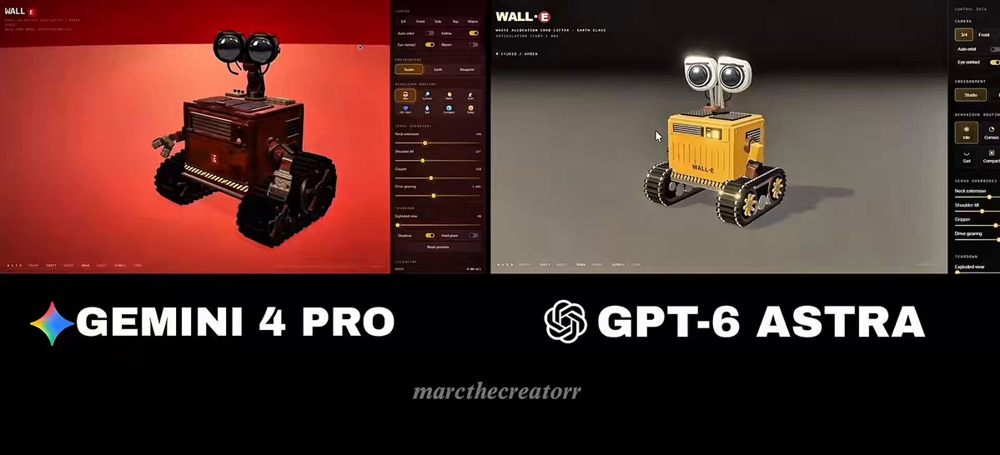</a>

Prompt được Marcel chia sẻ, chính xác là prompt họ đã cung cấp cho Astra, yêu cầu tạo mô hình 3D WALL-E bằng Three.js.

**Prompt**

```text
tạo mô hình 3D WALL-E bằng Three.js.
```

[Xem chi tiết ↗](https://www.tripo3d.ai/vi/3d-prompts/gpt-6-astra-2101687900723106104) · [Bài đăng gốc](https://x.com/marcthecreatorr/status/2101687900723106104) · [Về danh sách ví dụ](#all-prompts)

---

<a id="2101730386711634251"></a>

### Verdant — hòn đảo khủng long 3D tương tác

[vib3coded](https://x.com/vib3coded) · 2026-09-20

<a href="https://www.tripo3d.ai/vi/3d-prompts/interactive-3d-dinosaur-island-diorama">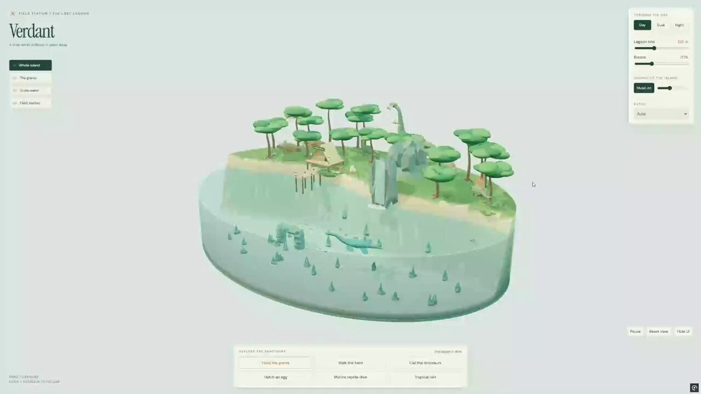</a>

Yêu cầu nguyên văn từ @vib3coded dành cho Verdant, một sa bàn đảo 3D tương tác được xây dựng bằng Three.js và WebGL. Yêu cầu này mô tả những chú khủng long đi lang thang, một thác nước và đầm phá cắt lớp, chuyển động của camera dưới nước, các tương tác cho ăn và ấp trứng, điều khiển môi trường, mưa và nhạc, với đầu ra là một tệp HTML duy nhất sẵn sàng chạy trên trình duyệt.

**Prompt**

```text
tạo Verdant - một sa bàn 3D tương tác được xây dựng bằng Three.js + WebGL

Một hòn đảo xanh tươi với những chú khủng long đi lang thang, một thác nước và đầm phá cắt lớp có một loài bò sát biển đang bơi. Cho đàn khủng long ăn, ấp một chú khủng long con và đưa camera xuống dưới nước

Điều chỉnh thủy triều, gió và thời gian trong ngày, hoặc tạo mưa nhiệt đới trong khi nhạc thư giãn vang lên

Mọi thứ chạy trực tiếp trên trình duyệt của bạn trong một tệp HTML duy nhất
```

[Xem chi tiết ↗](https://www.tripo3d.ai/vi/3d-prompts/interactive-3d-dinosaur-island-diorama) · [Bài đăng gốc](https://x.com/vib3coded/status/2101570806702559235) · [Về danh sách ví dụ](#all-prompts)

---

<a id="2102038136725377200"></a>

### Website mô hình Mặt Trời 3D tương tác

[HIX.AI](https://x.com/HIX_AI_) · 2026-09-21

<a href="https://www.tripo3d.ai/vi/3d-prompts/gpt-6-astra-2102038136725377200">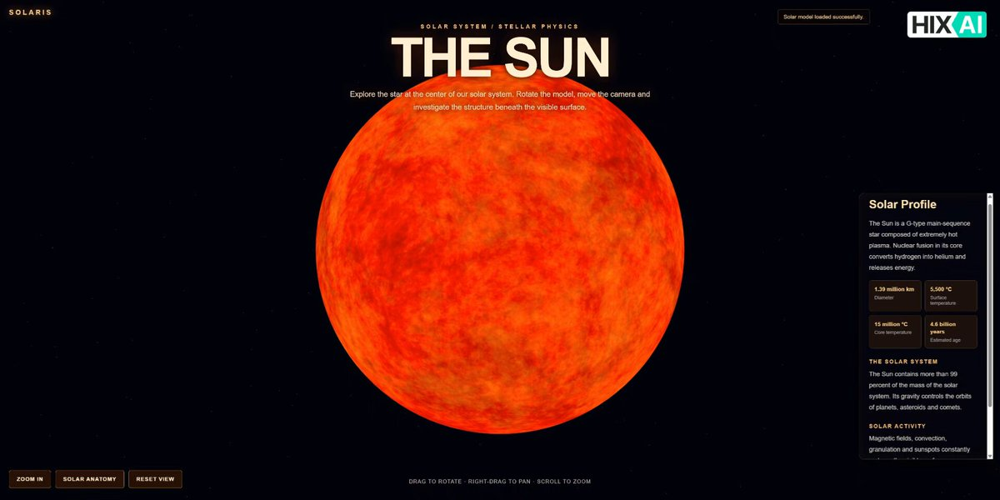</a>

Tạo một website Three.js tương tác, xoay quanh mô hình Mặt Trời 3D chân thực được dựng bằng một tập lệnh Python trong Blender. Website cho phép xoay Mặt Trời, di chuyển góc nhìn và phóng to để quan sát; có nền không gian vũ trụ cùng thông tin về hệ Mặt Trời; đồng thời cung cấp chế độ xem cấu trúc bên trong tương tác với các lớp của Mặt Trời được gắn nhãn và mô tả.

**Prompt**

```text
Tôi muốn xây dựng một website mô hình Mặt Trời 3D tương tác bằng Three.js.

Trước tiên, hãy viết một tập lệnh Python có thể chạy trực tiếp trong Blender để tạo mô hình Mặt Trời 3D có độ chân thực cao. Mô hình cần dựa trên các đặc điểm vật lý và hình ảnh thực tế của Mặt Trời, bao gồm hình cầu, kết cấu bề mặt, màu sắc, vẻ ngoài giống plasma, các hạt sáng trên bề mặt và bầu khí quyển phát sáng. Mô hình không được trông như một quả cầu màu cam đơn giản. Hãy sử dụng vật liệu, shader, kết cấu bề mặt và hiệu ứng ánh sáng phù hợp để tạo diện mạo Mặt Trời chân thực.

Sau đó, hãy viết đầy đủ mã nguồn website bằng Three.js. Mặt Trời nên chiếm khoảng 80% khu vực hiển thị chính. Người dùng có thể xoay Mặt Trời, di chuyển góc nhìn và phóng to, thu nhỏ. Cảnh cần có ánh sáng chân thực cùng các hiệu ứng phát sáng để Mặt Trời trông sống động và có chiều sâu 3D.

Thêm một nút phóng to để người dùng tiến lại gần Mặt Trời và quan sát các chi tiết trên bề mặt.

Website cũng cần có nội dung cung cấp thông tin về Mặt Trời và vai trò của nó trong hệ Mặt Trời. Nền tổng thể nên là môi trường không gian vũ trụ hoặc thiên hà chân thực.

Ngoài ra, hãy thêm một nút mở chế độ xem cấu trúc bên trong tương tác của Mặt Trời. Chế độ xem này cần hiển thị các lớp chính của Mặt Trời, chẳng hạn như lõi, vùng bức xạ, vùng đối lưu, quang quyển, sắc quyển và nhật hoa. Mỗi lớp cần có nhãn tương ứng cùng một đoạn mô tả ngắn. Tốt nhất là người dùng có thể tương tác với sơ đồ và chọn từng lớp để xem thông tin về lớp đó.

Hãy làm cho website có giao diện hiện đại theo chủ đề không gian, ấn tượng về mặt hình ảnh, giàu thông tin khoa học và tương tác đầy đủ.
```

[Xem chi tiết ↗](https://www.tripo3d.ai/vi/3d-prompts/gpt-6-astra-2102038136725377200) · [Bài đăng gốc](https://x.com/HIX_AI_/status/2102038474752766239) · [Về danh sách ví dụ](#all-prompts)

---

<a id="2102150615635816866"></a>

### Game đua xe procedural trên trình duyệt Spline Rush

[Maharajahu🪢](https://x.com/ToolBraidComp) · 2026-09-21

<a href="https://www.tripo3d.ai/vi/3d-prompts/gpt-6-astra-2102150615635816866">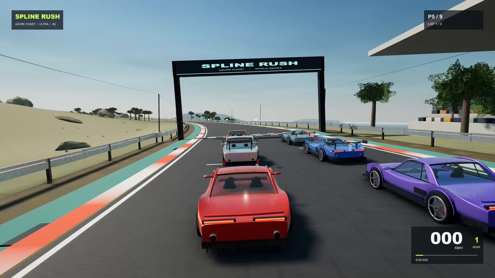</a>

Prompt nguyên văn do tác giả gốc cung cấp trong bình luận đã xác minh để tạo Spline Rush, một game đua xe Three.js procedural trên trình duyệt với đường đua, đối thủ AI, vật lý, preset đồ họa và âm thanh tổng hợp.

**Prompt**

```text
Xây dựng một game đua xe trên trình duyệt hoàn chỉnh, đạt chất lượng production, có tên Spline Rush bằng phiên bản Three.js mới nhất (ưu tiên WebGPURenderer + TSL khi có thể). 100% procedural: không dùng mô hình, kết cấu bề mặt, tệp âm thanh hay font bên ngoài. Mọi thứ đều được tạo bằng mã trong thời gian chạy.

GAME CỐT LÕI
- 6 đường đua độc đáo với cao độ thay đổi, độ nghiêng thân xe, đường hầm, khúc cua tay áo, các góc cua có tên và quần xã riêng biệt (ven biển ban ngày, núi lúc chạng vạng, sa mạc hoàng hôn, rừng mưa, thành phố neon ban đêm, đường oval tốc độ cao).
- Chế độ Championship (vòng phân hạng + 3 cuộc đua), Time Trial với xe ma, Quick Race.
- 8 đối thủ AI với cá tính riêng, đường chạy tối ưu, điểm phanh, vượt và phòng thủ.
- Kỷ lục vòng đua nhanh nhất, thời gian từng sector, bảng tin sự kiện trực tiếp, camera xem lại.
- Garage: 5 mẫu xe tham số với sơn clearcoat + metal-flake, khe ghép thân vỏ, đèn hoạt động, hệ thống treo chuyển động và các trạng thái hư hỏng.

MỤC TIÊU ĐỒ HỌA (Ultra, tương xứng với RTX 5090 ở 4K)
Renderer: THREE.WebGPURenderer. Pipeline dựa trên vật lý.
Ánh sáng:
- Bầu trời dựa trên vật lý Rayleigh/Mie + trường sao + mặt trăng + mặt trời động điều khiển chu kỳ ngày/đêm hoàn chỉnh.
- Cascaded shadow maps (4 cascade, snap texel ổn định, độ phân giải cao).
- IBL qua PMREM được cập nhật theo thời gian trong ngày.
- Sương mù thể tích + tia sáng xuyên mây + hiệu ứng rung nhiệt.
Vật liệu:
- MeshPhysicalMaterial / node TSL: clearcoat, anisotropy, transmission trên kính, sơn metal-flake, shader mặt đường ướt phản ứng với mưa.
Chuỗi hậu kỳ (RenderPipeline / TSL hoặc thư viện postprocessing):
GTAO hoặc SSAO chất lượng cao → SSR → bloom (Karis) → motion blur (velocity) → DOF → tia sáng xuyên mây → auto-exposure → chỉnh màu + hạt phim + vignette → SMAA hoặc TAA.
Hiệu ứng:
- Pool hạt trên GPU: khói lốp, tia lửa, bụi, nước mưa bắn, cỏ/sỏi văng lên, biến dạng nhiệt.
- Vết trượt lưu lại rồi mờ dần.
- Độ ướt động và phản chiếu vũng nước khi trời mưa.

VẬT LÝ & CẢM GIÁC LÁI
- Mô phỏng fixed-step 120 Hz.
- Hệ thống treo raycast hoặc strut, chuyển tải trọng, lốp combined-slip, ABS/TC, các loại bề mặt (nhựa đường, kerb, cỏ, sỏi, ướt).
- Camera: góc bám đuôi cinematic + góc nhìn qua nắp ca-pô + góc onboard, có rung khi chuyển động và va chạm.

AUDIO
- Web Audio tổng hợp hoàn toàn: động cơ đa lớp theo RPM/tải, tiếng gió, tiếng lốp rít, tiếng rung khi chạy qua kerb, tiếng khán giả, nhạc động.

HỆ THỐNG CHẤT LƯỢNG
- Các preset: Low / Medium / High / Ultra.
- Ultra giả định GPU cấp RTX 5090: 4K, shadow map độ phân giải cao, số lượng hạt tối đa, bật toàn bộ hiệu ứng hậu kỳ, không dùng LOD quá gắt.
- Chất lượng thích ứng có thể tắt bớt hiệu ứng nếu thời gian dựng khung hình vượt mục tiêu.

Bắt đầu bằng một phiên bản đầu tiên có thể chơi được (một đường đua, một xe, ánh sáng cơ bản), sau đó lặp lại và bổ sung từng tính năng đúng như yêu cầu. Đặt mọi thứ trong một dự án HTML/JS (hoặc Vite) gọn gàng duy nhất có thể chạy cục bộ. Chú thích các hệ thống chính. Hãy tạo cảm giác cao cấp, không dễ thương.
```

[Xem chi tiết ↗](https://www.tripo3d.ai/vi/3d-prompts/gpt-6-astra-2102150615635816866) · [Bài đăng gốc](https://x.com/ToolBraidComp/status/2102150671340327384) · [Về danh sách ví dụ](#all-prompts)

---

<a id="2102215638311694336"></a>

### Bản trình bày thiết kế trực thăng 3D tương tác

[Vib3Coded](https://x.com/vib3coded) · 2026-09-22

<a href="https://www.tripo3d.ai/vi/3d-prompts/gpt-6-astra-2102215638311694336">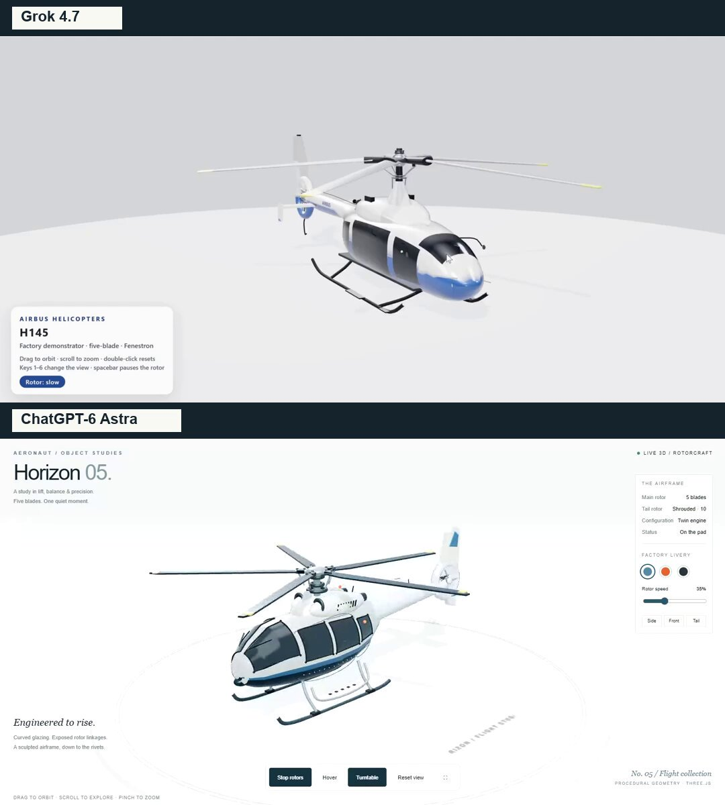</a>

Tác giả đã chia sẻ prompt này trong phần bình luận cho bài so sánh Grok 4.7 và ChatGPT-6 Astra. Prompt yêu cầu một bản trình bày trực thăng 3D tương tác chạy trên trình duyệt, với hình học dựng theo quy trình, các chi tiết hàng không phong phú, nhiều tùy chọn phối màu, điều khiển rotor, chế độ bay lơ lửng, điều khiển camera và giao diện Three.js/WebGL đáp ứng trên nhiều kích thước màn hình.

**Prompt**

```text
Tạo một cảnh 3D tương tác, chi tiết về một chiếc trực thăng hiện đại trong một tệp HTML duy nhất bằng Three.js và WebGL. Dựng hình học 3D thực sự để có thể quan sát từ mọi góc, không sử dụng hình ảnh.

Phong cách hình ảnh:
Bản trình bày thiết kế hàng không cao cấp với nền studio màu xám nhạt, bệ trưng bày hình tròn, bóng đổ mềm và phản chiếu chân thực.
Trực thăng:

Thân trực thăng mượt mà, thuôn gọn, lấy cảm hứng từ các mẫu trực thăng hạng nhẹ hai động cơ như H145.
Thân màu trắng với phần bụng xanh navy đậm và một đường sọc xanh dương làm điểm nhấn.
Cửa sổ buồng lái cong, phủ màu khói, có phản chiếu và gioăng cửa sổ được lắp khít cẩn thận.
Cửa bên, tay nắm, đường ghép panel, đinh tán, bậc lên xuống và ăng-ten.
Hai khoang động cơ với cửa hút khí, lưới thông gió và cửa xả.
Rotor chính năm cánh với cụm moay-ơ chi tiết, phần cứng liên kết và các thanh liên kết điều khiển góc cánh.
Cần đuôi thuôn nhọn, các cánh ổn định và rotor đuôi có vỏ che, với một khoảng hở xuyên qua vỏ được dựng đúng hình học.
Càng trượt hạ cánh cong, gắn vào thân bằng các thanh đỡ kết cấu.
Đèn dẫn đường và đèn hiệu nhấp nháy.
Mọi bộ phận phải liên kết với nhau về mặt vật lý. Tránh các chi tiết bị lơ lửng, khe hở giữa các phần, cánh rotor xuyên vào thân hoặc cửa sổ nằm lơ lửng phía trên thân.

Tương tác:

Kéo chuột để xoay quanh mô hình, cuộn để phóng to/thu nhỏ và hỗ trợ điều khiển cảm ứng.
Khởi động và dừng cả hai rotor với quá trình tăng tốc và giảm tốc dần.
Điều chỉnh tốc độ rotor.
Chế độ bay lơ lửng: nhẹ nhàng nâng trực thăng khỏi bệ, đung đưa nhẹ trong không trung và hạ xuống êm khi tắt chế độ.
Tự động xoay camera.
Các góc camera cài sẵn ở phía trước, bên hông và đuôi.
Điều khiển đặt lại camera và toàn màn hình.
Ba phối màu: xanh băng hà và trắng, cam cứu hộ và xám graphite.
Giao diện:

Góc trên bên trái: nhãn nhỏ “AERONAUT / OBJECT STUDIES” và tiêu đề lớn “Horizon 05.”
Bên phải: panel gọn chứa thông số kỹ thuật, trạng thái trực thăng, lựa chọn phối màu và tốc độ rotor.
Phía dưới: các nút điều khiển và gợi ý tương tác.
Kiểu chữ tiết chế, đường viền mảnh và khoảng trống rộng rãi. Giữ cho trực thăng không bị che khuất.
Toàn bộ văn bản giao diện phải bằng tiếng Anh.
Yêu cầu kỹ thuật:

Dựng hình học theo quy trình, không tải xuống mô hình trực thăng dựng sẵn.
Sử dụng vật liệu PBR, môi trường phản chiếu studio và bóng đổ mềm.
Bảo đảm hoạt ảnh độc lập với tốc độ khung hình.
Tái sử dụng hình học và vật liệu khi phù hợp, đồng thời giới hạn pixel ratio để tối ưu hiệu năng.
Hỗ trợ bố cục trên máy tính và thiết bị di động, đồng thời giữ toàn bộ sải rotor hiển thị trong khung hình ban đầu.
Nếu có thể, hãy nhúng các thư viện phụ thuộc vào HTML để tệp hoạt động ngoại tuyến.
Hiển thị thông báo dự phòng hữu ích nếu WebGL không khả dụng.
Trước khi hoàn tất, kiểm tra mô hình từ mọi phía, thử mọi điều khiển và kiểm tra lỗi trong console. Đặc biệt chú ý đến silhouette, các liên kết kết cấu, phần kính và cơ cấu rotor.

Bàn giao tệp HTML hoạt động được, không chỉ phần giải thích.
```

[Xem chi tiết ↗](https://www.tripo3d.ai/vi/3d-prompts/gpt-6-astra-2102215638311694336) · [Bài đăng gốc](https://x.com/vib3coded/status/2102217028052377910) · [Về danh sách ví dụ](#all-prompts)

---

<a id="2102276620124062065"></a>

### Cảnh 3D và video Tháp Tokyo ngày và đêm

[Wafffle](https://x.com/wafffle_dev) · 2026-09-22

<a href="https://www.tripo3d.ai/vi/3d-prompts/gpt-6-astra-2102276620124062065">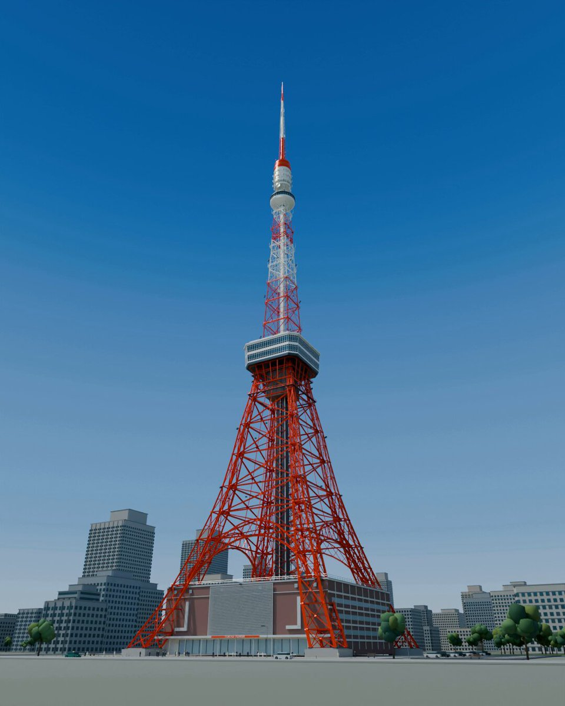</a>

Hướng dẫn tạo một cảnh có hình học 3D chân thực của Tháp Tokyo, nghiên cứu và tái hiện các đặc điểm kết cấu của tháp cùng không khí khu vực xung quanh, đồng thời thể hiện diện mạo ban ngày và ban đêm. Yêu cầu bàn giao dữ liệu Blender có thể chỉnh sửa, video MP4 dài khoảng 30 giây để đăng trên X, ảnh xem trước và README. Người đăng chia sẻ nội dung này dưới dạng prompt hướng dẫn cho Astra.

**Prompt**

```text
Hãy tạo một tác phẩm 3D ấn tượng lấy Tháp Tokyo làm chủ thể chính, cùng video dài khoảng 30 giây để đăng trên X.

Bạn là giám đốc sản xuất. Hãy tạo các tác vụ phụ cần thiết và giao việc nghiên cứu,制作. Bạn chịu trách nhiệm cụ thể hóa yêu cầu, quản lý tiến độ, kiểm tra sản phẩm, đưa ra yêu cầu chỉnh sửa và tổng hợp kết quả cuối cùng.

【Những gì cần tạo】
Hãy tạo Tháp Tokyo sao cho người xem cảm nhận được độ cao khi ngước nhìn từ mặt đất và độ tinh xảo của hệ kết cấu thép khi đến gần.
Chuẩn bị cả phiên bản ngày và đêm: ban ngày làm nổi bật kết cấu và lớp sơn, ban đêm thể hiện vẻ đẹp của hệ thống chiếu sáng.

Tôi muốn tác phẩm tạo cảm giác như người thực hiện đã quan sát và nghiên cứu kỹ Tháp Tokyo. Không chỉ tái hiện hình dáng tổng thể, hãy nghiên cứu và thể hiện các chi tiết đặc trưng như độ mở của các chân tháp, cách lắp ghép hệ kết cấu thép, đài quan sát và các tòa nhà ở phần chân tháp. Có thể giới hạn khu đô thị xung quanh ở mức đủ để truyền tải quy mô và không khí của vị trí của tháp.

【Quy trình thực hiện】
・Nghiên cứu tài liệu và ảnh chính thức, sau đó xác định các đặc điểm cần tái hiện cùng thứ tự ưu tiên.
・Dựa trên kết quả nghiên cứu, đưa ra hướng dẫn制作 cụ thể cho từng tác vụ phụ.
・Kiểm tra bản xem trước 3D thực tế từ giai đoạn sớm, rồi điều chỉnh hình dáng, bố cục và độ sáng.
・Tự xem các ảnh hoặc video hoàn thiện, phát hiện điểm bất thường hay thiếu sót và yêu cầu chỉnh sửa.
・Tự chủ quyết định các lựa chọn kỹ thuật chi tiết và bố cục quay, rồi tiếp tục thực hiện đến khi hoàn thành.

Không được chỉ dùng nền dán ảnh chụp hoặc ảnh tạo sinh để thay thế; hãy thể hiện bằng hình học 3D thực tế và chuyển động camera. Hãy ghi lại những thông tin đã xác minh được cũng như các phần suy đoán do thiếu tư liệu.

【Video】
Dài khoảng 30 giây. Kết hợp góc ngước nhìn từ mặt đất, cận cảnh hệ kết cấu thép hoặc đài quan sát và góc rộng cho thấy toàn bộ tòa tháp; đồng thời thể hiện sự chuyển đổi giữa ngày và đêm.
Hãy dựa trên mẫu 3D hoàn thiện để tự quyết định cách phân bổ thời lượng và cấu trúc truyền tải sức hấp dẫn tốt nhất; không cần chia giây quá chi tiết.

【Bàn giao】
・Dữ liệu Blender có thể chỉnh sửa
・Video MP4 để đăng trên X
・Ảnh xem trước toàn cảnh và chi tiết ban ngày, ban đêm
・Bản nháp nội dung đăng ngắn
・README ghi rõ nguồn tư liệu, phạm vi tái hiện và kết quả kiểm chứng
```

[Xem chi tiết ↗](https://www.tripo3d.ai/vi/3d-prompts/gpt-6-astra-2102276620124062065) · [Bài đăng gốc](https://x.com/wafffle_dev/status/2102276620124062065) · [Về danh sách ví dụ](#all-prompts)

---

<a id="2102300855387205871"></a>

### Bubble Bay: Đại chiến bóng nước 3D

[jared](https://x.com/jaredliu_bravo) · 2026-09-22

<a href="https://www.tripo3d.ai/vi/3d-prompts/bubble-bay">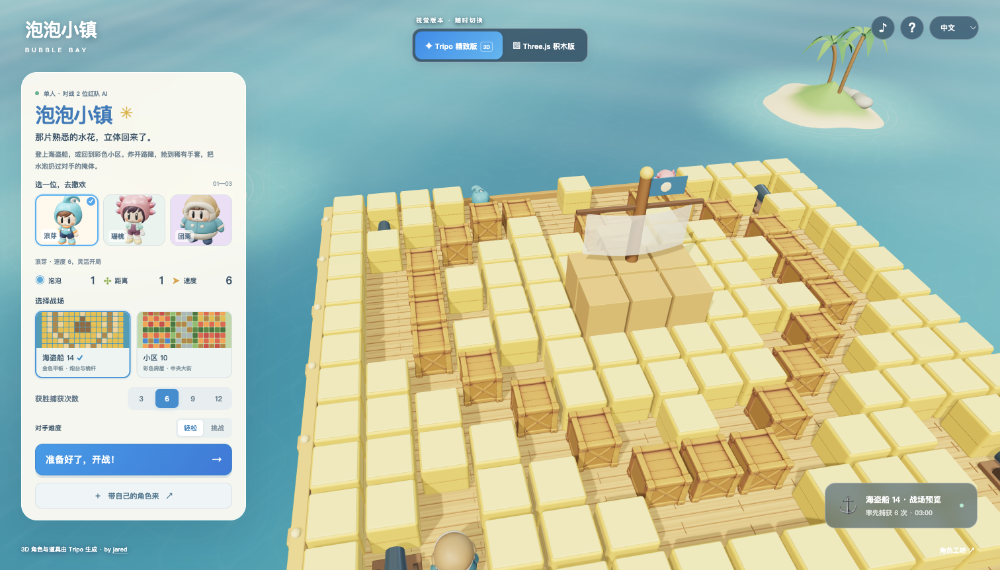</a>

<a href="https://www.tripo3d.ai/vi/3d-prompts/bubble-bay">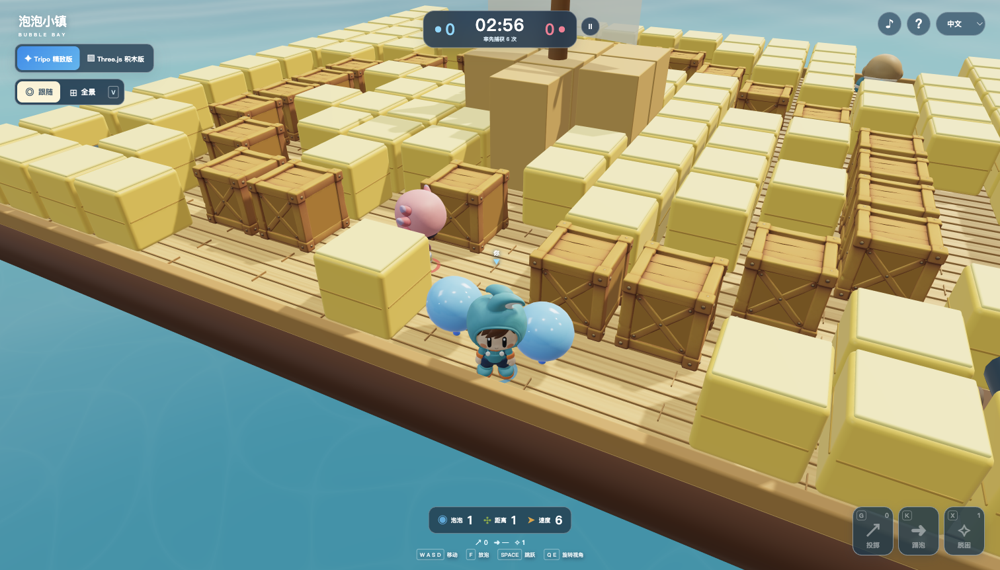</a>

<a href="https://www.tripo3d.ai/vi/3d-prompts/bubble-bay">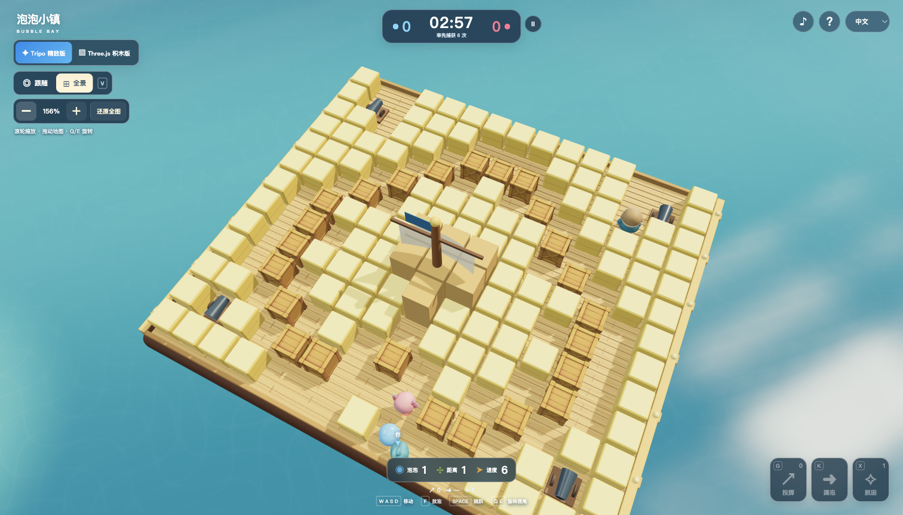</a>

Xây dựng một trận chiến bóng nước 3D với các nhân vật mặc trang phục nguyên bản Langya, Shantao và Tuanli, mô hình P2 có hoạt ảnh, đấu trường Pirate14 và Village10, camera bám theo cự ly gần và camera tổng quan có thể thu phóng, đối thủ AI, trận đấu với mục tiêu 6 lần bắt, tính năng nhập nhân vật tùy chỉnh và nhạc nguyên bản từ ElevenLabs.

**Prompt**

```text
Xây dựng Bubble Bay, một đấu trường bóng nước Three.js có thể chơi được, với phong cách nhân vật mặc trang phục quen thuộc của các game bong bóng kinh điển: đầu to, thân ngắn và khuôn mặt lộ rõ. Mặc định sử dụng các mô hình Tripo chi tiết, kèm công tắc so sánh hình học Three.js rõ ràng nhưng vẫn giữ nguyên trận đấu. Sử dụng ba nhân vật mới: Langya, Shantao và Tuanli. Bám sát các bản tham khảo ý tưởng/mô hình nhân vật mới được cung cấp, giữ nguyên dáng tổng thể, khuôn mặt, màu sắc và trang phục.

Langya là một cậu bé người năng động, đội mũ trùm màu xanh ngọc với một mào sóng ngang liền mạch, cổ áo và cổ tay áo màu cam, quần short xanh navy, giày xanh ngọc đế cam. Shantao là một cô bé người nhỏ nhắn với tóc bob màu mận sẫm, mũ bonnet hồng đào với ba chi tiết cánh hoa ngắn ở mỗi bên, áo khoác xanh bạc hà, quần yếm short màu mận và bốt vàng nhạt. Tuanli là một cậu bé người mũm mĩm, thân hình quả lê bè rộng, đội mũ đệm tròn màu caramel viền mặt màu kem, áo khoác ngắn xanh teal, phần bụng dưới màu kem và bốt xanh navy. Cả ba đều có khuôn mặt trẻ em màu da ấm, mắt bầu dục tối giản màu sẫm và nụ cười nhỏ. Đây là những đứa trẻ trong các bộ trang phục được thiết kế mới; không biến các em thành sinh vật dưới nước theo nghĩa đen và không dùng lại những bộ trang phục nhân vật cũ dễ nhận ra. Tạo riêng từng nhân vật bằng Tripo CLI với tripo-p2 được chỉ định rõ ràng cùng các ảnh mặt trước/mặt sau độc lập, sau đó gắn bộ xương hai chân và skin hợp lệ. Hoạt ảnh đứng yên/chạy/nhảy phải điều khiển các khớp thực tế; kiểm tra chuyển động, chỉnh trọng số cho mũ, giày và cơ thể, đồng thời ghi nhận chính xác nguồn gốc tài sản. Nếu chuyển động được tạo tại chỗ, hãy ghi rõ đó là chuyển động tự tạo.

Tên bản địa hóa: 浪芽 / 랑야 / Langya, 珊桃 / 산타오 / Shantao, 团栗 / 퇀리 / Tuanli. Cấp độ sức chứa/tầm ném/tốc độ ban đầu: 1/1/6, 1/2/5, 2/1/4; giới hạn: 6/7/9, 6/7/8, 9/8/8. Quy đổi tốc độ thành 0.25 + cấp độ*0.8 đơn vị thế giới mỗi giây; mỗi ô rộng 2 đơn vị. Khi chọn một nhân vật, gán hai nhân vật còn lại làm các đối thủ riêng biệt với hồ sơ tương ứng. Giữ nguyên bán kính va chạm trong gameplay, bất kể dáng vẻ mũm mĩm của nhân vật.

Mặc định cung cấp Pirate/Patrit14 kích thước 15x13 và Village10. Giữ các đặc điểm dễ nhận ra: boong tàu màu vàng kim, hàng hóa màu vàng, thùng gỗ, bốn khẩu pháo và cột buồm trung tâm; ngôi làng có bốn khu nhà màu sắc khác nhau, một con đường trung tâm, hàng rào cây và các khối đồ chơi. Dùng bản đồ của nhà phát hành làm tài liệu tham khảo, tự dựng đồ họa khi chạy và ghi chú các lối mở tuyến đường nhỏ cần thiết cho chuyển động 3D liên tục cũng như việc AI tìm đường thoát. Cung cấp vật liệu sáng, bóng đổ, cảnh đại dương, camera bám theo và camera tổng quan rõ ràng.

Một người chơi đối đầu với hai đối thủ AI phối hợp. WASD/phím mũi tên để di chuyển, F đặt một quả bóng nước có thời gian nổ 2,5 giây, Space nhảy lên các nền tảng thực, Shift lướt nhanh, Q/E xoay quanh, V đổi góc nhìn và Escape tạm dừng. Dòng nước hình chữ thập phải tôn trọng chướng ngại vật, phá khối mềm đầu tiên và nối chuỗi các quả bóng. Triển khai cơ chế mắc bẫy, thoát bẫy, bắt đối thủ, hồi sinh; cho phép chọn mục tiêu 3, 6, 9 hoặc 12 lần bắt (mặc định 6), hoặc tính điểm trong 180 giây, kèm màn hình kết quả và chơi lại. Cần hỗ trợ đồng thời cần điều khiển cảm ứng và các nút hành động.

Sử dụng sáu vật phẩm nhặt được do Tripo tạo: bóng bay, thuốc tăng tầm, giày trượt patin, găng tay ném, giày đá và kim cứu hộ. Thùng rơi vật phẩm với xác suất 85%. Tỉ lệ trọng số vật phẩm có điều kiện: 30/30/30/2,5/3,5/4 phần trăm. Găng tay thêm ba lần ném, tối đa sáu lần. G ném một quả bóng ở gần đi tối đa bốn ô qua vật che chắn, giữ nguyên chủ sở hữu và thời gian cháy ban đầu, đồng thời giữ chỗ đáp và hiển thị quỹ đạo. Nếu bóng hết thời gian cháy khi đang bay, nó sẽ đáp xuống và phát nổ. K đẩy bóng trượt cho đến khi bị chặn mà không đặt lại thời gian cháy. X sử dụng kim cứu hộ, bắt đầu từ một kim và tối đa ba kim. Hiển thị rõ kho đồ và các điều khiển khả dụng.

Giao diện người dùng bằng tiếng Trung, tiếng Anh và tiếng Hàn: múi giờ IANA của Trung Quốc đại lục chọn tiếng Trung, Hàn Quốc/Bắc Triều Tiên chọn tiếng Hàn, tất cả khu vực khác, bao gồm Hong Kong/Macao/Đài Loan, chọn tiếng Anh. Lựa chọn thủ công luôn được ưu tiên. Chỉ cho phép tải lên GLB có kết cấu nhúng, không nén tiêu chuẩn, thực sự có skin, tối đa 40 MB và 150k tam giác. Kiểm tra xương, khớp và trọng số; từ chối mô hình tĩnh; dùng hoạt ảnh nhúng nếu có; cung cấp chuyển động khớp cơ bản cho nhân vật hình người được nhận diện khi không có clip. Bộ xương không được nhận diện phải có hoạt ảnh. Giải thích rõ ràng sự khác nhau giữa rigging và animation, cung cấp điều chỉnh hướng 90 độ, xử lý cục bộ ngay trên trình duyệt và gán chỉ số ổn định, cân bằng dựa trên mã băm của tệp.

Dùng chính xác https://studio.tripo3d.ai/?utm_source=satellite_invite&utm_medium=bubble-bay&utm_campaign=create-character cho CTA tạo. Ghi công jared, liên kết tới https://x.com/jaredliu_bravo .

Tích hợp 13 hiệu ứng âm thanh ElevenLabs với chuẩn hóa âm lượng, độ tắt ngắn, khoảng cách/pan, giới hạn đa âm, âm lượng và tắt tiếng: đặt bóng, nổ, thùng, nhặt vật phẩm, vật phẩm hiếm, ném, đáp, mắc bẫy, cứu hộ, nhảy, chiến thắng, thất bại, đá. Tạo hai bản nhạc không lời nguyên bản bằng ElevenLabs music_v2_5, mỗi bản dài 90 giây, phù hợp với bản đồ hải tặc trên biển và khu dân cư đầy nắng. Chuẩn hóa về mục tiêu tiết chế -20 LUFS và crossfade tại điểm lặp. Cho nhạc một thanh âm lượng riêng, đổi bản nhạc theo bản đồ, giảm dần khi tạm dừng và tuân theo chế độ tắt tiếng tổng. Không sao chép nhạc nền của game gốc.

Giữ mã nguồn, dependency, bài kiểm thử và nguồn gốc tài sản độc lập, bên ngoài các ứng dụng trên nền tảng CMS. Đóng gói tài nguyên tĩnh cùng origin và thông báo MIT. Kiểm tra gameplay thực tế trên máy tính và thiết bị cảm ứng, các biến thể tải lên, ngôn ngữ và việc chuyển đổi hình ảnh trong Ego Lite. Tạo một phiên bản đánh giá bất biến, gắn với CMS Web Page 12 hiện có; giữ nguyên bản phát hành đang hoạt động trong khi chờ đánh giá. Chỉ phát hành khi nguồn và quyền sử dụng tài sản được xác nhận trung thực, sau đó kiểm tra URL công khai, mã băm mô hình và hành vi. Bảo toàn lịch sử, đồng thời phân biệt rõ bản ghi CMS đã lưu, bản xem trước và bản phát hành công khai.

Tải tài sản mô hình với thanh tiến trình hiển thị, tối đa ba lượt tải đồng thời, thời gian chờ khi không hoạt động 30 giây và hai lần thử. Giữ lại các lượt tải thành công khi thử lại. Ẩn toàn bộ công tắc tab Tripo / Three.js cho đến khi tất cả mô hình sẵn sàng, sau đó mới hiển thị. Không gắn nhãn các placeholder tải theo quy trình là mô hình Tripo đã tải.


Sử dụng camera bám theo phối cảnh cự ly gần, bắt đầu ở bên ngoài khu vực xuất hiện và hướng về trung tâm đấu trường. Giữ thao tác xoay Q/E, kéo chuột để điều chỉnh góc nghiêng và chế độ tổng quan bằng V. Đặt bảng điểm gọn ở phía trên, công tắc chế độ ở góc trên bên trái và thông báo ngắn gần phía dưới. Ẩn cần điều khiển và các nút cảm ứng lớn trên máy tính dùng chuột, nhưng giữ lại các điều khiển vật phẩm hiếm nhỏ; hỗ trợ thao tác cảm ứng đồng thời gọn trên màn hình hẹp. Thêm shader sóng động với biến thiên độ sâu màu teal, các đảo cát hữu cơ với cây cọ cong và đá, kết cấu vân gỗ và cỏ tinh tế. Bao quanh mỗi nhân vật bị mắc bẫy bằng một quả bóng trong suốt có kích thước phù hợp, viền Fresnel óng ánh, chuyển động lơ lửng nhẹ, các bong bóng nhỏ và gợn nước trên mặt đất. Kiểm tra các đỉnh skin sau khi tạo dáng vừa khít, đặt lại độ nâng khi cứu hộ và kiểm tra việc giải phóng tài nguyên sau nhiều lần chuyển đổi. Tránh các pass transmission tốn kém trên toàn cảnh cho màng nước; giới hạn pixel ratio ở màn hình hẹp ở mức 1.5.


Cung cấp các điều khiển camera Follow / Overview hiển thị rõ ràng và chuyển đổi bằng V. Ở chế độ Overview, hỗ trợ thu phóng từ 100 đến 300 phần trăm bằng các nút +/−, con lăn chuột và thao tác chụm hai ngón tay, kèm kéo bản đồ trong giới hạn và nút đặt lại Fit map. Giữ nguyên mức thu phóng và trận đấu đang diễn ra khi chuyển camera hoặc phiên bản kết xuất. Duy trì các điều khiển vật phẩm hiếm gọn, không chồng lấp bằng tiếng Trung, tiếng Anh và tiếng Hàn.

```

[Xem chi tiết ↗](https://www.tripo3d.ai/vi/3d-prompts/bubble-bay) · [Bài đăng gốc](https://x.com/jaredliu_bravo/status/2102300855387205871) · [Bản demo](https://bubble-bay.tripo.page/) · [Về danh sách ví dụ](#all-prompts)

---

<a id="2102411087002112256"></a>

### Game tower defense phong cách Sir, We Have Orc Problems

[nkz/ぴたすぽ](https://x.com/nikzu_) · 2026-09-22

<a href="https://www.tripo3d.ai/vi/3d-prompts/orc-tower-defense-game">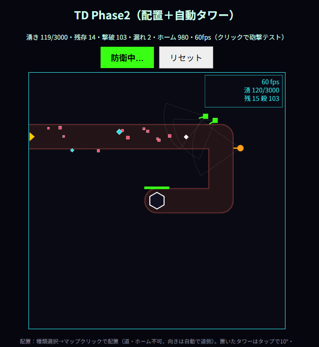</a>

<a href="https://www.tripo3d.ai/vi/3d-prompts/orc-tower-defense-game">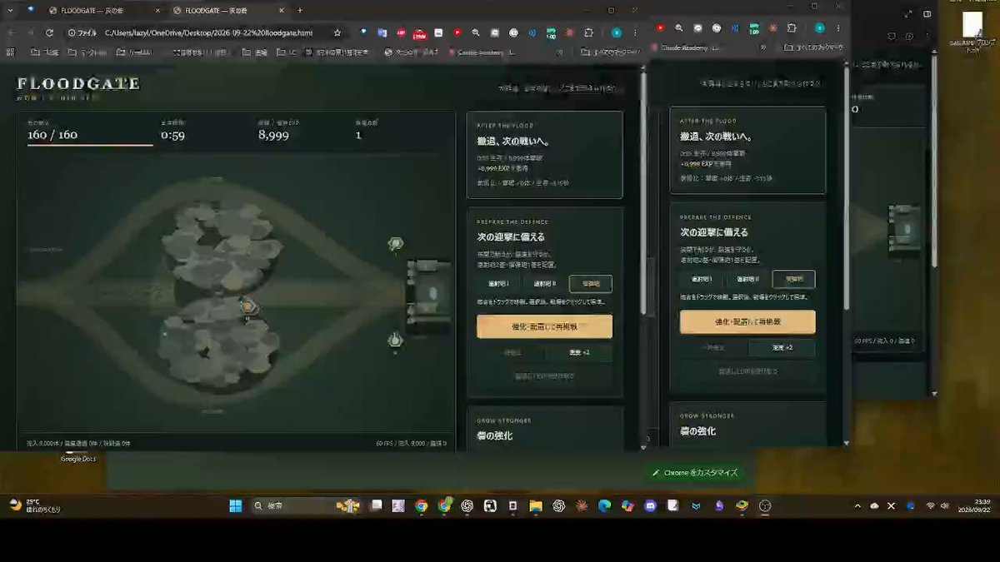</a>

Prompt người đăng yêu cầu Astra tạo một game tower defense giống Sir, We Have Orc Problems.

**Prompt**

```text
Hãy tạo một game tower defense giống Sir, We Have Orc Problems.
```

[Xem chi tiết ↗](https://www.tripo3d.ai/vi/3d-prompts/orc-tower-defense-game) · [Bài đăng gốc](https://x.com/nikzu_/status/2102411087002112256) · [Về danh sách ví dụ](#all-prompts)

---

<a id="2102473710724919614"></a>

### Nhà ngoại ô hai tầng có nội thất

[Azer](https://x.com/azer0lxm) · 2026-09-22

<a href="https://www.tripo3d.ai/vi/3d-prompts/gpt-6-astra-2102473710724919614">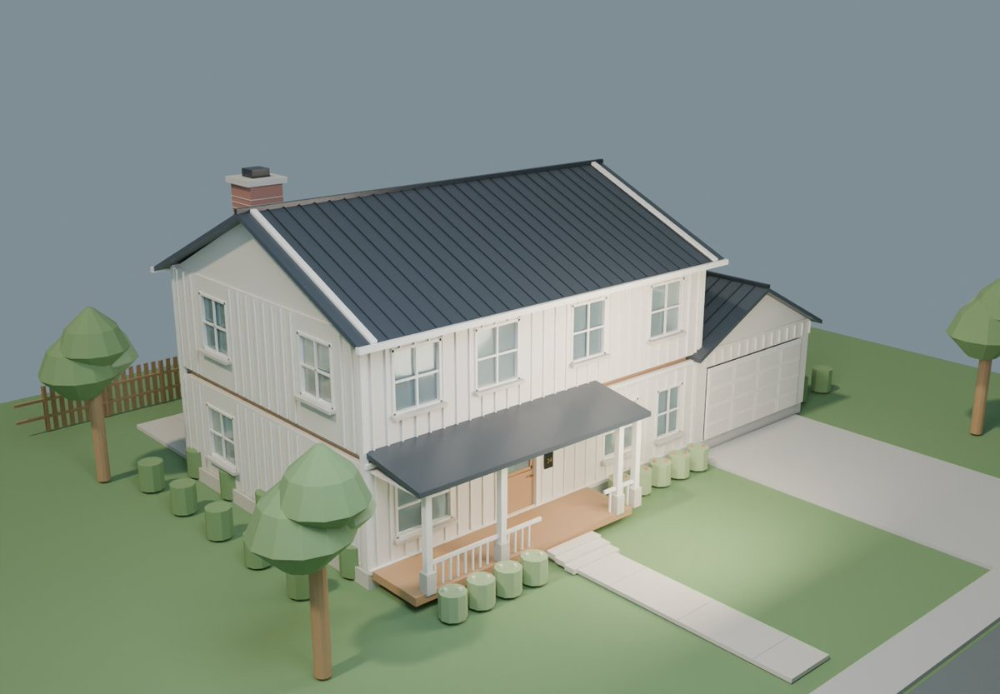</a>

<a href="https://www.tripo3d.ai/vi/3d-prompts/gpt-6-astra-2102473710724919614">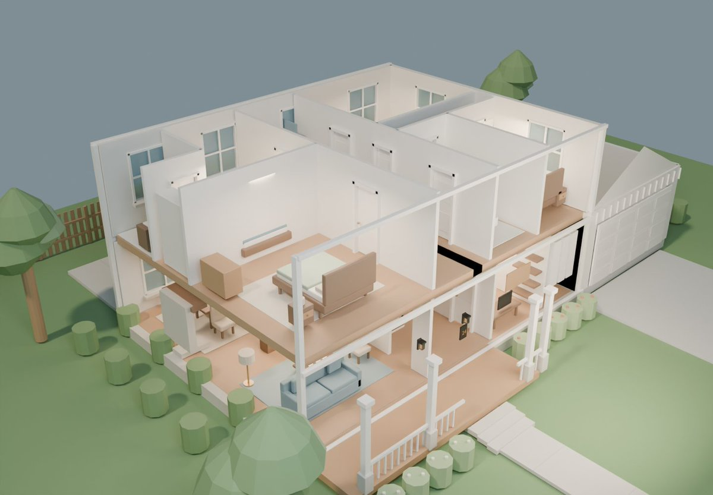</a>

Prompt do Azer cung cấp yêu cầu tạo mô hình 3D bằng Blender cho một ngôi nhà ngoại ô hai tầng, bao gồm đầy đủ phần nội thất.

**Prompt**

```text
Xin chào. Hãy thiết kế mô hình 3D tốt nhất có thể bằng Blender về một ngôi nhà ngoại ô hai tầng, bao gồm cả nội thất và mọi chi tiết cần thiết.
```

[Xem chi tiết ↗](https://www.tripo3d.ai/vi/3d-prompts/gpt-6-astra-2102473710724919614) · [Bài đăng gốc](https://x.com/azer0lxm/status/2102473781830909995) · [Về danh sách ví dụ](#all-prompts)

---

<a id="2102652927177617564"></a>

### Game đua xe kart 3D trong một tệp HTML duy nhất

[Anshul](https://x.com/realanshull) · 2026-09-23

<a href="https://www.tripo3d.ai/vi/3d-prompts/gpt-6-astra-2102652927177617564">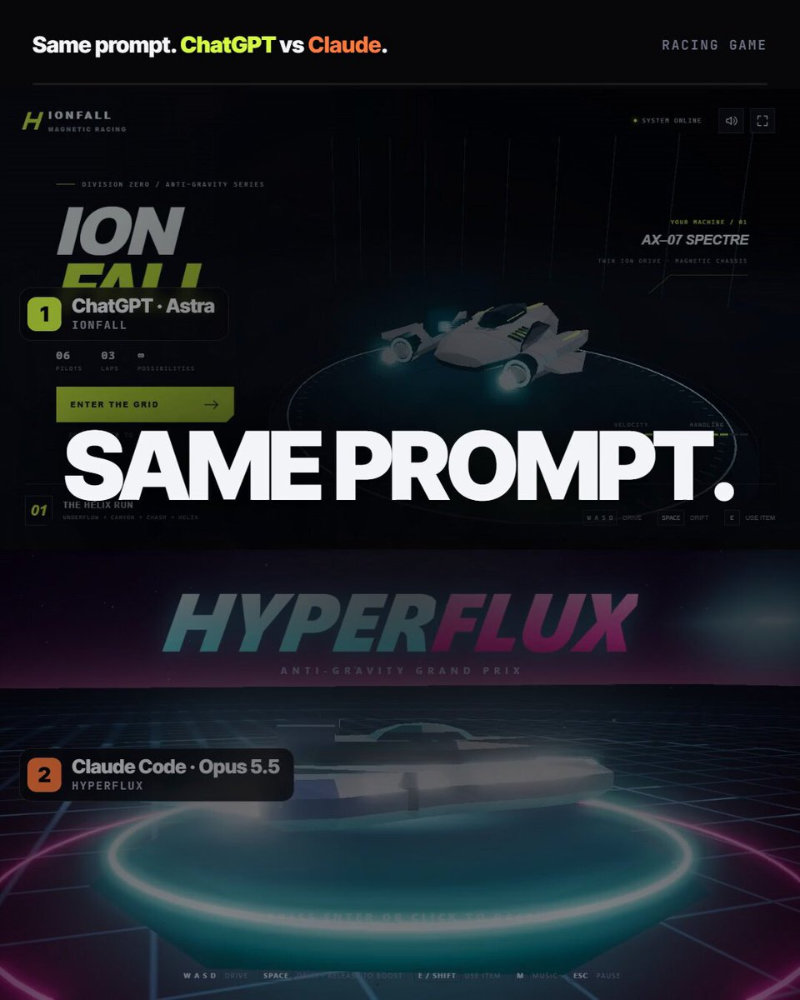</a>

Một prompt có thể tái sử dụng, được tác giả cho biết đã cung cấp nguyên văn cho GPT Astra 6 và Claude Opus 5.5 để so sánh cách triển khai game đua xe kart 3D của hai mô hình.

**Prompt**

```text
Tạo một game đua xe kart 3D trong một tệp HTML duy nhất.
```

[Xem chi tiết ↗](https://www.tripo3d.ai/vi/3d-prompts/gpt-6-astra-2102652927177617564) · [Bài đăng gốc](https://x.com/realanshull/status/2102652927177617564) · [Về danh sách ví dụ](#all-prompts)

---

<a id="2102672926285713456"></a>

### Hoạt ảnh lâu đài thời Trung cổ trên trình duyệt

[juhapalomaki.fi](https://juhapalomaki.fi/) · 2026-09-23

<a href="https://www.tripo3d.ai/vi/3d-prompts/gpt-6-astra-2102672926285713456">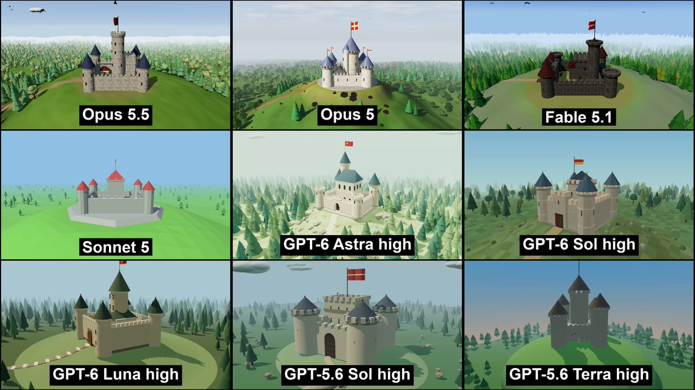</a>

Cảnh 3D chạy trên trình duyệt, mô tả một lâu đài thời Trung cổ trên ngọn đồi phủ đầy rừng. Máy quay liên tục xoay quanh lâu đài, trong khi lá cờ trên tháp tung bay trong gió. Bài đăng của tác giả được liên kết xác định đây là nhiệm vụ one-shot dùng chung cho GPT-6 Astra high và các mô hình khác đã được thử nghiệm.

**Prompt**

```text
Tạo một hoạt ảnh 3D chạy hoàn toàn trên trình duyệt. Hoạt ảnh có một lâu đài thời Trung cổ nằm trên đỉnh một ngọn đồi giữa khu rừng rộng lớn. Không thêm điều khiển bằng bàn phím; chỉ cần để máy quay xoay quanh lâu đài để có thể quan sát lâu đài từ mọi phía. Trên đỉnh tháp lâu đài phải có một lá cờ tung bay trong gió.

Đầu ra phải chứa tệp index.html; khi chạy tệp này, lâu đài sẽ hiển thị và hoạt ảnh lặp sẽ bắt đầu.
```

[Xem chi tiết ↗](https://www.tripo3d.ai/vi/3d-prompts/gpt-6-astra-2102672926285713456) · [Bài đăng gốc](https://juhapalomaki.fi/blog/castle-model-comparison/) · [Về danh sách ví dụ](#all-prompts)

---

<a id="2102752217375899659"></a>

### Orbit Lab: Mô phỏng 3D Mặt Trời, Trái Đất và Mặt Trăng

[technewsradio.tokyo](https://technewsradio.tokyo/) · 2026-09-23

<a href="https://www.tripo3d.ai/vi/3d-prompts/gpt-6-astra-2102752217375899659">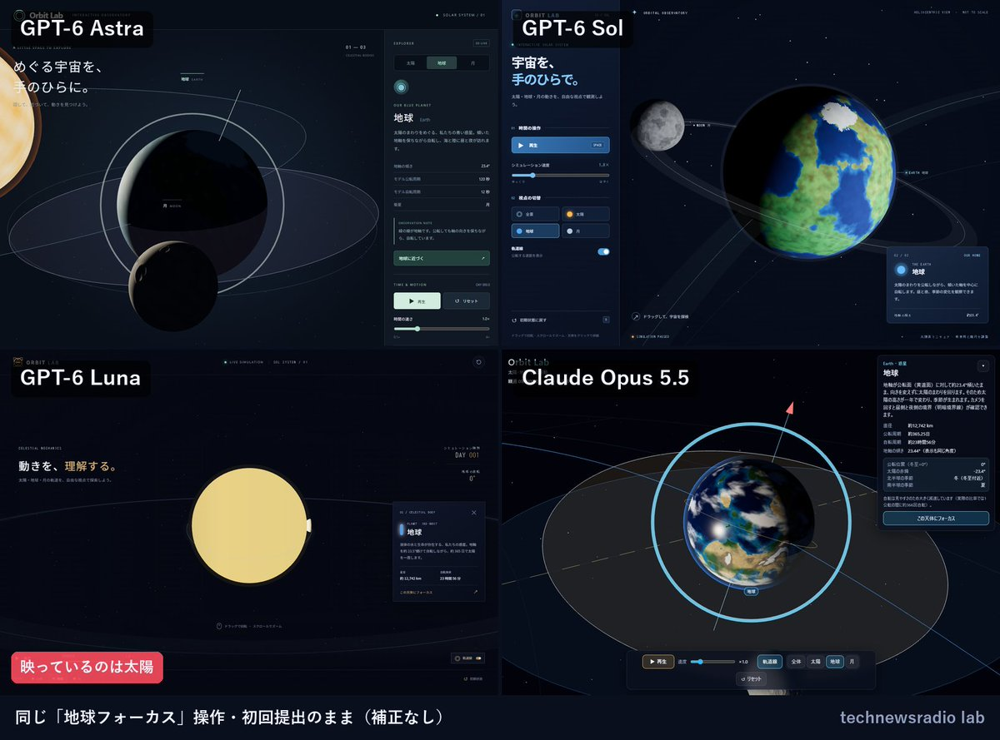</a>

Đây là yêu cầu dùng để so sánh, được bài viết tại liên kết cho biết là đã đưa vào cả 4 mô hình, trong đó có GPT-6 Astra, Sol và Luna. Hãy triển khai một tác phẩm web mô phỏng 3D mang tính giáo dục bằng Three.js, với Mặt Trời, Trái Đất và Mặt Trăng được tạo theo phương pháp thủ tục, chuyển động quỹ đạo và tự quay, chọn bằng cách nhấp, điều khiển camera, phát lại, điều chỉnh tốc độ, lấy nét và các tính năng tương tự.

**Prompt**

```text
Đây là một thử nghiệm so sánh. Hãy triển khai và hoàn thiện tác phẩm web theo cùng một đặc tả dưới đây trong thư mục làm việc của bạn. Tên sản phẩm là “Orbit Lab”. Sử dụng Three.js 0.186.0 và tải core cùng OrbitControls đúng phiên bản đó (có thể dùng import map từ CDN hoặc npm). Không cần xuất bản hay triển khai.

Yêu cầu:
1. Biểu diễn mô hình 3D của Mặt Trời, Trái Đất và Mặt Trăng bằng hình học và vật liệu tạo theo phương pháp thủ tục. Không sử dụng hình ảnh hoặc tài sản 3D bên ngoài. Dùng Mặt Trời làm nguồn sáng điểm để người dùng có thể phân biệt vùng sáng tối của Trái Đất và Mặt Trăng khi điều khiển camera.
2. Dùng delta time để mô phỏng chuyển động quay quanh Mặt Trời và tự quay của Trái Đất, độ nghiêng trục Trái Đất cũng như chuyển động quay quanh Trái Đất của Mặt Trăng. Trực quan hóa độ nghiêng của các mặt phẳng quỹ đạo, đồng thời hiển thị đường quỹ đạo của Trái Đất và Mặt Trăng. Có thể phóng đại quy mô và tốc độ để phục vụ mục đích giáo dục.
3. Tạo nền sao bằng các số ngẫu nhiên có thể tái lập. Dùng OrbitControls để xoay và thu phóng. Khi nhấp vào một thiên thể, hãy chuyển trạng thái được chọn và bảng thông tin mô tả tương ứng.
4. Cung cấp các tính năng phát/tạm dừng, thanh trượt tốc độ, bật/tắt hiển thị đường quỹ đạo, lấy nét camera vào Mặt Trời/Trái Đất/Mặt Trăng và nút khôi phục trạng thái ban đầu. Có thể phát/tạm dừng và đặt lại bằng bàn phím.
5. Giao diện phải có thể thao tác trên màn hình điện thoại, hiển thị hướng dẫn khi không hỗ trợ WebGL, đáp ứng khi thay đổi kích thước và giới hạn pixel ratio để tránh tải kết xuất quá cao.
6. Viết hướng dẫn khởi chạy và cách thao tác trong README. Nếu có thể, hãy thực sự khởi chạy để kiểm tra hoạt động; nếu không thể, phải nêu rõ lý do. Trong báo cáo hoàn thành, hãy ghi ngắn gọn các tệp đã tạo, các hạng mục đã triển khai và kết quả kiểm tra.

Không đặt câu hỏi giữa chừng; hãy tự đưa ra các phán đoán hợp lý và triển khai đến cùng.
```

[Xem chi tiết ↗](https://www.tripo3d.ai/vi/3d-prompts/gpt-6-astra-2102752217375899659) · [Bài đăng gốc](https://technewsradio.tokyo/lab/gpt6-vs-opus55) · [Về danh sách ví dụ](#all-prompts)

---

<a id="2102780850706567390"></a>

### Lâu đài 3D phong cách châu Âu thời Trung cổ có thể tương tác trong trình duyệt

[もぎ＠ボードゲーム](https://x.com/luxurytax150) · 2026-09-23

<a href="https://www.tripo3d.ai/vi/3d-prompts/gpt-6-astra-2102780850706567390">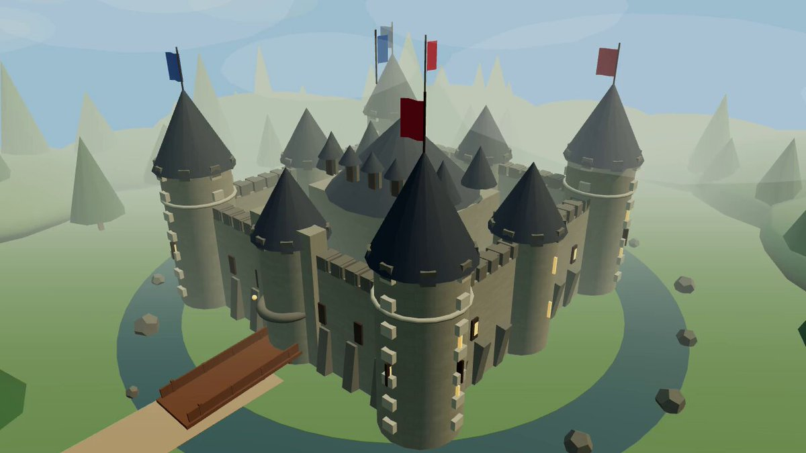</a>

<a href="https://www.tripo3d.ai/vi/3d-prompts/gpt-6-astra-2102780850706567390">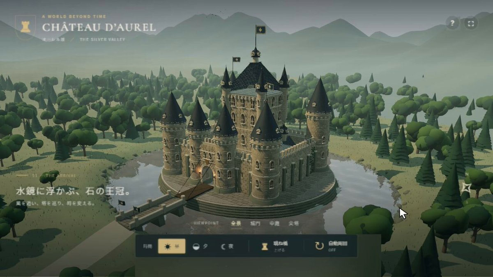</a>

Tạo một lâu đài 3D phong cách châu Âu thời Trung cổ có thể tương tác trong trình duyệt, với hào nước, cầu kéo, các tòa tháp, tường đá, cờ và rừng; đồng thời cho phép chuyển đổi giữa ngày và đêm. Ưu tiên tối đa chất lượng và diện mạo của mô hình 3D.

**Prompt**

```text
Tạo một lâu đài 3D phong cách châu Âu thời Trung cổ có thể tương tác trong trình duyệt, bao gồm hào nước, cầu kéo, các tòa tháp, tường đá, cờ, rừng và tính năng chuyển đổi ngày đêm.
Vì đây là một dạng benchmark, hãy ưu tiên tối đa chất lượng mô hình 3D và mức độ trau chuốt hình ảnh.
```

[Xem chi tiết ↗](https://www.tripo3d.ai/vi/3d-prompts/gpt-6-astra-2102780850706567390) · [Bài đăng gốc](https://x.com/luxurytax150/status/2102780850706567390) · [Về danh sách ví dụ](#all-prompts)

---

<a id="2102788013902213508"></a>

### Bàn cờ 3D tương tác để học các gambit cờ vua

[Diogo Santos](https://x.com/diogosantosbr) · 2026-09-23

<a href="https://www.tripo3d.ai/vi/3d-prompts/gpt-6-astra-2102788013902213508">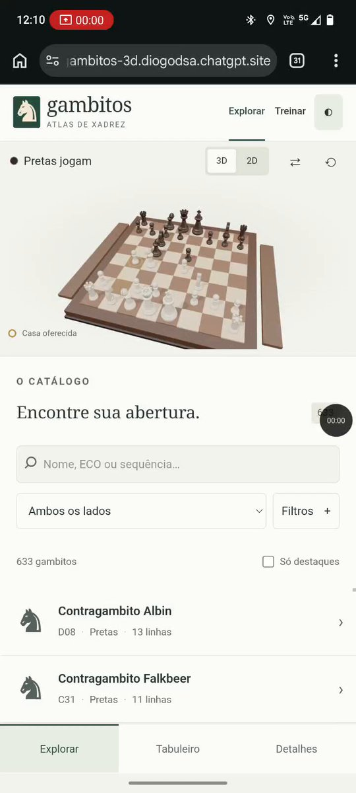</a>

Prompt được tác giả chia sẻ như “một prompt để bắt đầu” cho một ứng dụng web có bàn cờ 3D tương tác nhằm học các gambit. Tác giả cho biết đã tạo một môi trường 3D và trình bày trong video phần khám phá Gambit Benko, nhưng không khẳng định rõ đây là prompt chính xác được dùng cho kết quả hiển thị.

**Prompt**

```text
Tạo một ứng dụng web có bàn cờ 3D tương tác để học các gambit cờ vua phổ biến. Thêm hoạt ảnh cho các nước đi, điều khiển tiến và lùi, các biến và phần giải thích ý tưởng đằng sau từng khai cuộc.
```

[Xem chi tiết ↗](https://www.tripo3d.ai/vi/3d-prompts/gpt-6-astra-2102788013902213508) · [Bài đăng gốc](https://x.com/diogosantosbr/status/2102788013902213508) · [Về danh sách ví dụ](#all-prompts)

---

<a id="2102826333550133520"></a>

### Shader thành phố solarpunk vô tận

[Jonas Fröller](https://x.com/jonasfroeller) · 2026-09-23

<a href="https://www.tripo3d.ai/vi/3d-prompts/gpt-6-astra-2102826333550133520">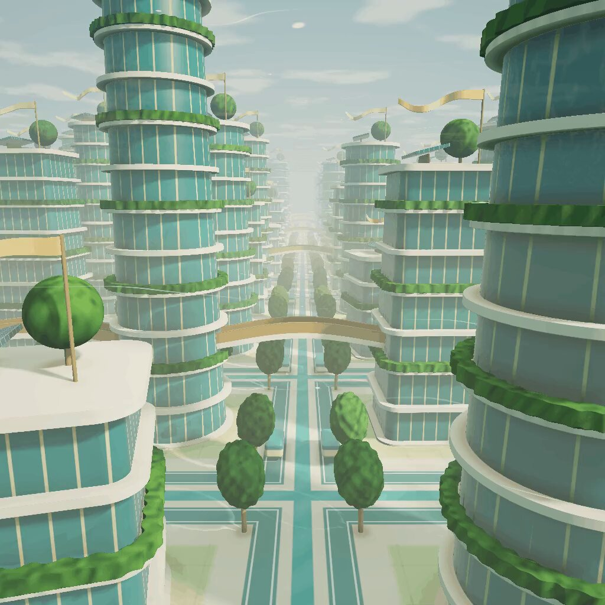</a>

Prompt tạo shader mô tả một thành phố vô tận với những con đường và tòa tháp mang phong cách solarpunk, kèm hiệu ứng gió nhẹ luôn hiển thị, được thiết kế để chạy trên twigl.app.

**Prompt**

```text
Tạo một shader có hình ảnh thú vị, có thể chạy trên twigl-dot-app, mô phỏng một thành phố vô tận với những con đường và tòa tháp mang phong cách solarpunk, cùng hiệu ứng gió nhẹ hiển thị liên tục.
```

[Xem chi tiết ↗](https://www.tripo3d.ai/vi/3d-prompts/gpt-6-astra-2102826333550133520) · [Bài đăng gốc](https://x.com/jonasfroeller/status/2102826333550133520) · [Về danh sách ví dụ](#all-prompts)

---

<a id="2102897258983313712"></a>

### Trình mô phỏng làm burger góc nhìn thứ nhất

[noclipepe](https://x.com/noclipepe) · 2026-09-23

<a href="https://www.tripo3d.ai/vi/3d-prompts/first-person-burger-cooking-simulator">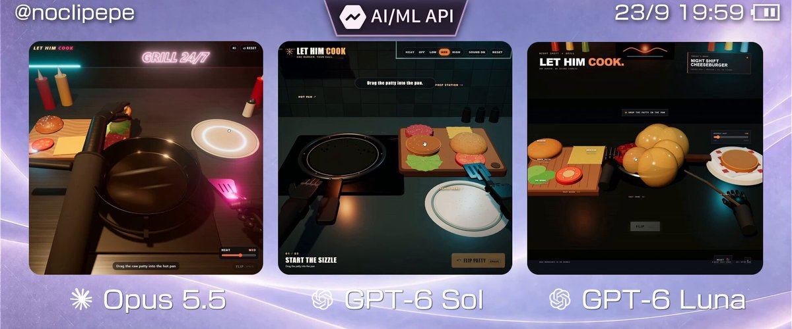</a>

Prompt mà tác giả bài đăng cho biết họ đã đưa cho ba mô hình, trong đó có GPT-6 Sol và GPT-6 Luna, để tạo một game mô phỏng làm burger góc nhìn thứ nhất.

**Prompt**

```text
tạo một game mô phỏng làm burger góc nhìn thứ nhất.
```

[Xem chi tiết ↗](https://www.tripo3d.ai/vi/3d-prompts/first-person-burger-cooking-simulator) · [Bài đăng gốc](https://x.com/noclipepe/status/2102897258983313712) · [Về danh sách ví dụ](#all-prompts)

---

<a id="2102915300295369208"></a>

### Cảnh HTML lửa trại giữa sa mạc về đêm siêu chân thực

[Nick Gwood](https://x.com/Nixtrodamis) · 2026-09-24

<a href="https://www.tripo3d.ai/vi/3d-prompts/realistic-desert-campfire-interactive-scene">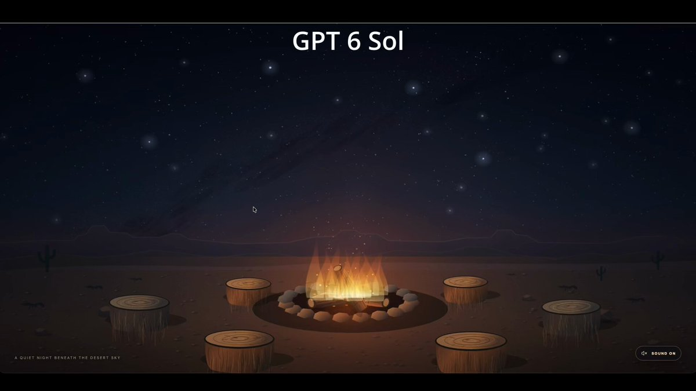</a>

Prompt do tác giả đăng, được sử dụng để so sánh các harness GPT 6 Sol và Opus 5.5. Prompt yêu cầu một cảnh HTML tương tác duy nhất, mô phỏng lửa trại siêu chân thực giữa sa mạc về đêm, với các khúc gỗ làm chỗ ngồi xung quanh, những ngôi sao có thể nhìn thấy, động vật hoang dã thỉnh thoảng xuất hiện và âm thanh chất lượng cao phù hợp với khung cảnh.

**Prompt**

```text
Không tham chiếu đến bất kỳ tệp nào khác hoặc tác phẩm trước đó. Tác vụ này phải hoàn toàn nguyên bản và không được tạo theo kiểu gian lận dựa trên bất kỳ tác phẩm nào khác ở đây.

Tạo một tệp HTML duy nhất mô phỏng lửa trại đang cháy giữa sa mạc. Bối cảnh là ban đêm và có thể nhìn thấy các vì sao. Xung quanh đống lửa là những gốc cây được bố trí làm chỗ ngồi. Không có người nào trong khung hình. Thỉnh thoảng có thể có các loài động vật hoang dã xuất hiện rồi khuất khỏi tầm nhìn.

Âm thanh cũng phải phù hợp với khung cảnh và có chất lượng cao.
Làm cho mọi thứ siêu chân thực

đặt tên tệp dựa trên model
```

[Xem chi tiết ↗](https://www.tripo3d.ai/vi/3d-prompts/realistic-desert-campfire-interactive-scene) · [Bài đăng gốc](https://x.com/Nixtrodamis/status/2102915567845794029) · [Về danh sách ví dụ](#all-prompts)

---

<a id="2102956340482289944"></a>

### Codex dạng voxel trong Three.js

[Arsh - 16 y/o builder](https://x.com/be_arsh) · 2026-09-24

<a href="https://www.tripo3d.ai/vi/3d-prompts/gpt-6-astra-2102956340482289944">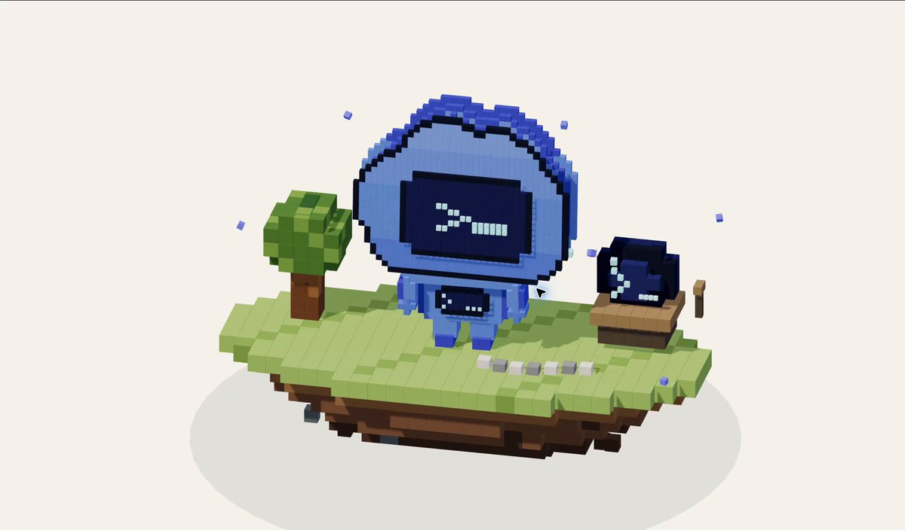</a>

Một prompt bình luận tác giả có thể tái sử dụng, yêu cầu tạo Codex trong Three.js dưới dạng voxel, dựng hoàn toàn từ đầu mà không dùng skill.

**Prompt**

```text
tự tạo Codex trong Three.js bằng voxel, dựng mọi thứ từ đầu, không dùng bất kỳ skill nào
```

[Xem chi tiết ↗](https://www.tripo3d.ai/vi/3d-prompts/gpt-6-astra-2102956340482289944) · [Bài đăng gốc](https://x.com/be_arsh/status/2102956424120979838) · [Về danh sách ví dụ](#all-prompts)

---

<a id="2103062348168618280"></a>

### Lát cam dẻo 3D tương tác

[Vib3Coded](https://x.com/vib3coded) · 2026-09-24

<a href="https://www.tripo3d.ai/vi/3d-prompts/gpt-6-astra-2103062348168618280">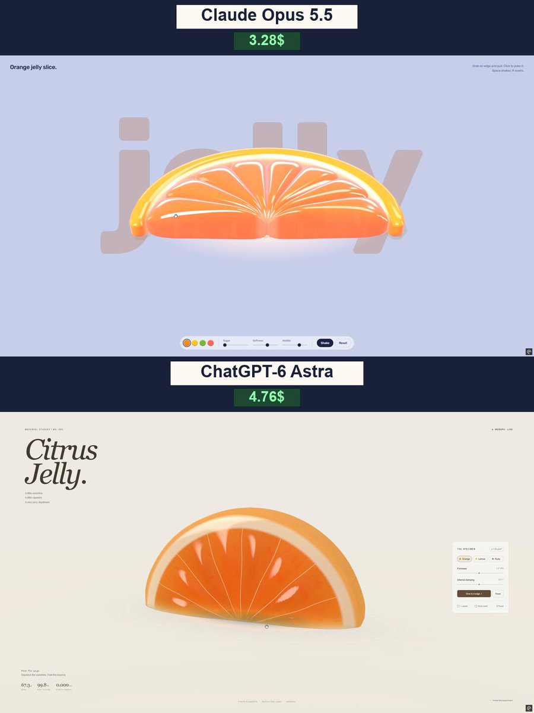</a>

Tác giả bài đăng đã chia sẻ prompt này trong một bài so sánh Claude Opus 5.5 và ChatGPT-6 Astra. Prompt yêu cầu một mô phỏng vật thể mềm WebGPU độc lập cho lát cam dẻo có thể biến dạng, hỗ trợ tương tác bằng cảm ứng và chuột, hình học tạo theo quy trình, hiển thị bằng shader và các tùy chọn điều khiển mô phỏng.

**Prompt**

```text
Tạo một lát cam dẻo 3D đẹp mắt, có thể tương tác bằng WebGPU. Cung cấp toàn bộ trải nghiệm trong một tệp HTML độc lập duy nhất, với JavaScript và shader WGSL được nhúng.

Đây phải là mô phỏng 3D thời gian thực, không phải video, hình ảnh hay hoạt ảnh lặp.

APPEARANCE

Tạo một lát cam dày hình bán nguyệt với phần tép mọng nước bán trong suốt, tám múi riêng biệt, các màng bên trong mảnh, những bong bóng li ti, một lớp cùi trắng nhạt và vỏ cam mềm.

Tạo vẻ ngoài như kẹo dẻo cao cấp: màu sắc bão hòa, điểm sáng bóng, ánh sáng xuyên qua phần tép, khúc xạ thuyết phục và bóng tiếp xúc mềm. Tránh bloom quá mức, màu bị nhợt hoặc vẻ ngoài như nhựa cứng.

Sử dụng phông nền studio sáng, ấm và giao diện biên tập gọn gàng với nhiều khoảng trắng. Thêm tiêu đề serif in nghiêng cỡ lớn “Citrus Jelly.” Giữ các điều khiển nhỏ gọn và để lát cam luôn hiển thị rõ ràng.

VẬT LÝ VẬT THỂ MỀM

Cảm giác như thạch là yếu tố quan trọng nhất.

- Dùng chuột hoặc ngón tay để nắm bất kỳ phần nào của lát cam.
- Kéo, nhấc, kéo giãn, xoắn rồi thả nó ra.
- Biến dạng phải mang tính cục bộ: kéo một mép sẽ làm phần tép gần đó giãn ra, trong khi phần còn lại chuyển động theo một cách tự nhiên.
- Sau khi thả, lát cam phải rung lắc, vượt quá vị trí cân bằng rồi dần trở lại hình dạng ban đầu.
- Bao gồm trọng lực, quán tính, lực giảm chấn, va chạm với mặt đất và độ nảy mềm.
- Duy trì thể tích ở mức gần đúng và ngăn lưới bị sụp hoặc lộn mặt vào trong.
- Làm phần vỏ cứng hơn phần tép một chút.
- Các múi bên trong, màng và bong bóng phải biến dạng theo mà không trôi ra ngoài thân lát cam.

Sử dụng bộ giải vật thể mềm thể tích ổn định, chẳng hạn lưới tứ diện với các ràng buộc XPBD. Không mô phỏng độ mềm bằng cách chỉ phóng to, thu nhỏ hoặc xoay toàn bộ đối tượng.

CONTROLS

Bao gồm ba thiết lập màu: Cam, Chanh và Ruby.

Thêm:
- Thanh trượt Độ cứng.
- Thanh trượt Lực giảm chấn bên trong.
- Nút “Đẩy nhẹ”.
- Nút Đặt lại.
- Ô chọn Tốc độ 1/4.
- Ô chọn Hiện lưới.
- Nút Tạm dừng/tiếp tục.

Hiển thị các thông số trực tiếp nhỏ cho khối lượng, phần trăm thể tích ở trạng thái nghỉ và động năng.

YÊU CẦU KỸ THUẬT

Sử dụng kết xuất WebGPU thực sự với shader WGSL. Tạo toàn bộ hình học và chi tiết hình ảnh theo quy trình, không dùng mô hình hoặc tệp hình ảnh nhập vào.

Tách độc lập việc cập nhật mô phỏng khỏi tốc độ khung hình kết xuất. Hỗ trợ thiết bị máy tính và thiết bị cảm ứng. Hiển thị thông báo dự phòng rõ ràng nếu WebGPU không khả dụng.

Kiểm thử thao tác kéo mạnh, thả liên tiếp, toàn bộ điều khiển và màn hình hẹp. Khắc phục vật lý không ổn định, hình học bị lỗi và hiện tượng bất thường trong hình ảnh trước khi bàn giao tệp HTML hoàn chỉnh.

Kết quả phải mang lại cảm giác như một thí nghiệm kẹo nhỏ bé, giàu tính tương tác và thực sự thú vị khi chơi.
```

[Xem chi tiết ↗](https://www.tripo3d.ai/vi/3d-prompts/gpt-6-astra-2103062348168618280) · [Bài đăng gốc](https://x.com/vib3coded/status/2103062415533371646) · [Về danh sách ví dụ](#all-prompts)

---

<a id="2103187935759655167"></a>

### Hướng Bắc: Hành trình tương tác trên thuyền dài Viking

[Vib3Coded](https://x.com/vib3coded) · 2026-09-24

<a href="https://www.tripo3d.ai/vi/3d-prompts/viking-longship-fjord-threejs-journey">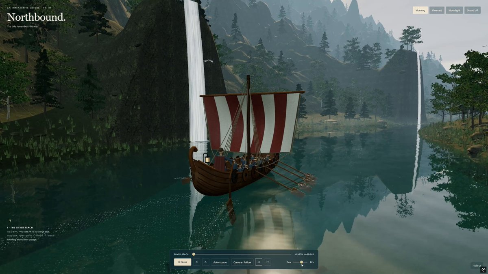</a>

Prompt do tác giả cung cấp cho chuyến du hành 3D tương tác độc lập qua vịnh hẹp bằng Three.js và WebGL, trên một chiếc thuyền dài Viking được tái hiện chi tiết. Prompt mô tả môi trường Bắc Âu mang tính điện ảnh, cấu trúc thuyền liên kết vật lý, hoạt ảnh chèo và hiệu ứng tiếp xúc với mặt nước, điều khiển lái và camera, hỗ trợ thiết bị di động, các chế độ chiếu sáng, âm thanh và tài nguyên được nhúng để triển khai.

**Prompt**

```text
Tạo “Northbound” – một hành trình 3D tuyệt đẹp, có tính tương tác qua vịnh hẹp Bắc Âu trên một chiếc thuyền dài Viking được tái hiện chi tiết.

Xây dựng một cảnh thời gian thực thực sự bằng Three.js và WebGL, được cung cấp dưới dạng một tệp HTML độc lập duy nhất. Đây phải là trải nghiệm trình duyệt có thể khám phá, không phải video dựng sẵn hay hình minh họa phẳng.

ĐỊNH HƯỚNG HÌNH ẢNH

Hướng đến một môi trường trau chuốt, mang tính điện ảnh, với vật liệu chân thực, tỷ lệ tự nhiên và bảng màu tiết chế. Tránh phong cách hoạt hình hoặc low-poly.

Một chiếc thuyền dài bằng gỗ lướt qua làn nước xanh lục lam sâu, giữa những vách đá sừng sững, rừng rậm, thác nước và các khu định cư Bắc Âu nhỏ. Sử dụng phối cảnh khí quyển, sương mù nhẹ, bóng đổ mềm và chiều sâu thuyết phục. Hãy tạo ra những góc nhìn đẹp trong suốt hành trình, không chỉ từ vị trí camera ban đầu.

THUYỀN DÀI

Dựng một thân thuyền chi tiết, kín nước, với các ván gỗ chồng lên nhau, thớ gỗ lộ rõ, sườn thuyền, băng ghế và khoang bên trong liền mạch.
Thêm mũi thuyền chạm khắc hình rồng, buồm vải sọc, cột buồm, dây thừng, khiên, vật dụng và những chiếc đèn lồng tỏa ánh sáng ấm.
Đưa vào các hành khách và người chèo Viking có tỷ lệ cân đối, trang phục nhiều lớp, tư thế ngồi thuyết phục và bàn tay đặt gần mái chèo.
Đảm bảo mọi thành phần được kết nối về mặt vật lý. Không để hành khách lơ lửng, phụ kiện giao cắt hoặc xuất hiện khoảng hở nhìn xuyên qua thân thuyền.
Tạo hoạt ảnh mô phỏng độ nổi, chuyển động chúi-ngẩng và lắc ngang tinh tế. Buồm phải phản ứng nhẹ nhàng với gió.

MẶT NƯỚC VÀ CHÈO THUYỀN

Biến mặt nước thành một điểm nhấn hình ảnh trung tâm.

Sử dụng shader tùy chỉnh với phản xạ phẳng, khúc xạ, điểm sáng Fresnel, khả năng hấp thụ phụ thuộc độ sâu, vùng nước nông hiển thị rõ và các lớp gợn sóng bề mặt. Phản xạ phải phản hồi chính xác theo camera chuyển động và điều kiện chiếu sáng thay đổi.

Tạo vệt sóng phía sau thuyền một cách thuyết phục.

Tạo hoạt ảnh cho một chu kỳ chèo hoàn chỉnh: lưỡi mái chèo đi vào nước, kéo về phía sau, nhấc lên khỏi mặt nước rồi trở lại phía trên bề mặt. Đồng bộ chuyển động này với người chèo.

Tạo gợn sóng, bọt nước và các giọt nhỏ tại đúng những điểm lưỡi mái chèo tiếp xúc với nước. Vệt nước phải duy trì trong không gian thế giới và tan dần theo thời gian. Tránh để hiệu ứng xuất hiện khi mái chèo đang ở trên không.

MÔI TRƯỜNG VÀ VẬT LIỆU

Sử dụng địa hình chi tiết, các khối đá có hình dạng bất quy tắc, dáng cây tự nhiên, thân cây phân nhánh và từng cụm lá hoặc kim lá riêng biệt.

Sử dụng vật liệu PBR với các bản đồ normal và roughness cho gỗ, đá và mặt đất. Có thể nhúng các kết cấu bề mặt được cấp phép phù hợp; hãy ghi công khi được yêu cầu.

Đảm bảo địa hình dưới nước tiếp tục liền mạch bên dưới mặt nước. Không để xuất hiện đường nối sáng, khoảng hở ở bờ, thảm thực vật lơ lửng hoặc cây cối cản trở tuyến đường có thể điều khiển.

CONTROLS

A/D hoặc phím mũi tên: điều khiển lái sang trái và phải.
W/S: điều chỉnh tốc độ.
Kéo chuột: quan sát xung quanh.
Cung cấp các chế độ camera bám theo, quỹ đạo và điện ảnh.
Bao gồm chế độ hành trình tự động tùy chọn.
Thêm các điều khiển tạm dừng, đặt lại, toàn màn hình và ẩn giao diện.
Hỗ trợ điều khiển lái và tốc độ bằng cảm ứng trên thiết bị di động.
Ngăn thuyền đi xuyên qua đất liền và đá.

KHÔNG KHÍ VÀ GIAO DIỆN

Cung cấp ba thiết lập chiếu sáng chuyển tiếp mượt mà: Buổi sáng, Nhiều mây và Ánh trăng.

Thêm tùy chọn âm thanh môi trường của nước, gió, chim và tiếng chèo. Âm thanh chỉ được bắt đầu sau khi người dùng tương tác.

Thiết kế giao diện biên tập tối giản: “Northbound.” bằng kiểu chữ serif thanh lịch, nhãn chương tinh tế và thanh điều khiển nhỏ gọn, bán trong suốt. Giữ cho phong cảnh không bị che khuất.

HIỆU NĂNG VÀ TRIỂN KHAI

Sử dụng instancing, ngân sách hình học hợp lý, mức độ chi tiết theo khoảng cách và các mục tiêu phản xạ có kích thước phù hợp. Điều chỉnh chất lượng render theo thiết bị thay vì cam kết một tốc độ khung hình cố định.

Cung cấp một tệp HTML duy nhất với các script và tài nguyên cần thiết được nhúng, để có thể mở trực tiếp trong trình duyệt hiện đại.

Kiểm tra điều khiển lái, các chế độ camera, chuyển cảnh chiếu sáng và hoạt ảnh chèo. Quan sát thuyền từ nhiều góc độ, đồng thời kiểm tra đường bờ từ các góc nhìn thấp. Sửa lỗi giao cắt hình học, hiện tượng bất thường trong phản xạ, độ chói quá mức và lỗi trong console trước khi xem cảnh là hoàn thiện.

Ưu tiên mặt nước thuyết phục, một chiếc thuyền dài được dựng tuyệt đẹp và môi trường nhất quán, thay vì bổ sung thêm nhiều đối tượng.
```

[Xem chi tiết ↗](https://www.tripo3d.ai/vi/3d-prompts/viking-longship-fjord-threejs-journey) · [Bài đăng gốc](https://x.com/vib3coded/status/2103189762672611675) · [Về danh sách ví dụ](#all-prompts)

---

<a id="2103211135214256350"></a>

### Trải nghiệm Three.js mùa thu mù sương có thể khám phá

[Simonas](https://x.com/SimonasLTU1) · 2026-09-24

<a href="https://www.tripo3d.ai/vi/3d-prompts/gpt-6-astra-2103211135214256350">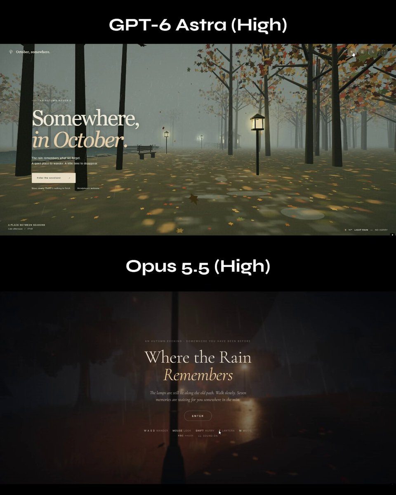</a>

Tạo một trải nghiệm Three.js có thể khám phá với bầu không khí mù sương, mưa rơi, đậm chất mùa thu, huyền bí và hoài niệm, được triển khai trong một tệp HTML/CSS/JS duy nhất.

**Prompt**

```text
Tôi muốn bạn tạo một trải nghiệm Three.js có thể khám phá trong một tệp HTML/CSS/JS duy nhất, với bầu không khí mù sương, mưa rơi, đậm chất mùa thu, huyền bí và hoài niệm.
```

[Xem chi tiết ↗](https://www.tripo3d.ai/vi/3d-prompts/gpt-6-astra-2103211135214256350) · [Bài đăng gốc](https://x.com/SimonasLTU1/status/2103211135214256350) · [Về danh sách ví dụ](#all-prompts)

---

<a id="2103308083242082314"></a>

### STILLWATER — Trải nghiệm đầm lầy ánh trăng trên trình duyệt

[YouWare](https://x.com/YouWareAI) · 2026-09-25

<a href="https://www.tripo3d.ai/vi/3d-prompts/gpt-6-astra-2103308083242082314">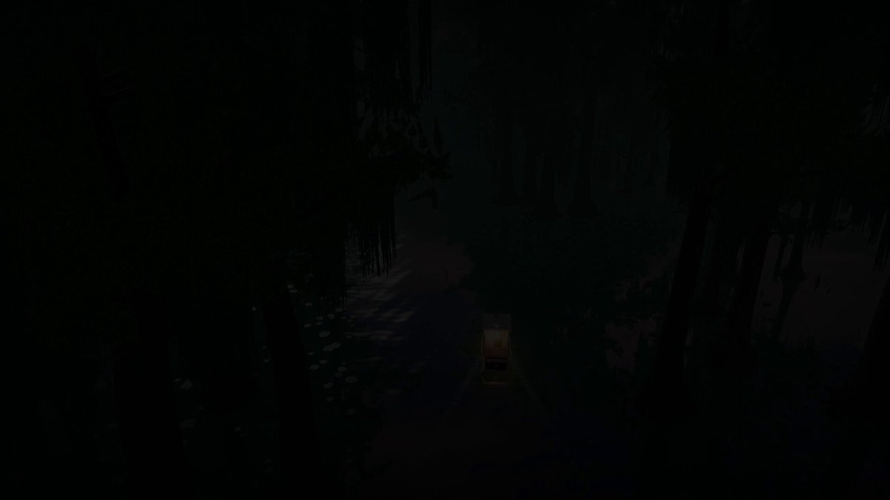</a>

Một prompt chi tiết do tác giả bài đăng cung cấp trong phần trả lời, dành cho một thế giới đầm lầy tương tác xây dựng bằng Three.js. Prompt mô tả chuyến xuồng cabin trôi có hướng dẫn qua vùng bách ngập nước, mặt nước phản chiếu đậm chất điện ảnh, ánh sáng và sương mù giàu không khí, điều khiển camera bằng thao tác kéo để quan sát cùng các thành phần HUD mang tính biên tập. Kết quả được yêu cầu không có chiến đấu hay các hệ thống gameplay khác.

**Prompt**

```text
Xây dựng một trải nghiệm trên trình duyệt bằng Three.js có tên STILLWATER. Tông màu: một đầm lầy dưới ánh trăng khiến người ta lạc lối. Không phải game có kẻ địch. Không phải hình ảnh siêu chân thực kiểu Unreal. Đây là một thế giới web yên tĩnh, trau chuốt và đắt giá, trong đó phản chiếu trên mặt nước là điểm nhấn. Người xem nên mải ngắm mặt nước lâu đến mức không lành mạnh.

BỐI CẢNH
- Tên địa điểm: THE DEEP SWAMP
- Thời gian trên HUD: 19:26
- Địa danh đầu tiên: Khúc quanh Heron
- Khẩu hiệu bên dưới tên địa điểm: "Hãy chừa lại một khoảng cho thiên nhiên hoang dã."
- Thông báo khám phá khi đến nơi: "Đã khám phá: Khúc quanh Heron"

THẾ GIỚI
Một đầm lầy bách ngập nước vào lúc trăng mọc / chạng vạng muộn.
- Những cây cao, gốc nổi đầu gối, đứng giữa làn nước đen xanh
- Rêu Tây Ban Nha buông thành những dải dài
- Các cụm bèo súng dọc theo bờ
- Kênh nước hẹp quanh co mở ra một khúc cua rộng hơn
- Sương mù thể tích dày đặc, khoảng cách xa màu xanh teal-lục, bầu trời mây tím-hồng
- Mặt trăng sáng với vệt phản chiếu dài, đứt đoạn trên mặt nước
- Vài cánh chim bay ngang bầu trời
- Ánh đèn cabin ấm áp từ con thuyền xuyên qua màn tối

MẶT NƯỚC (đừng làm qua loa)
Đây là nhân vật chính.
- Phản chiếu theo thời gian thực của cây cối, mặt trăng, sương mù và đèn thuyền
- Gợn dập dềnh nhẹ, không phải sóng biển
- Bèo súng nằm trên mặt nước và nhấp nhô
- Bọt ven bờ / nước giàu tannin sẫm màu gần các rễ cây
- Phản chiếu không gian màn hình hoặc phản chiếu phẳng đủ tốt để vệt trăng có cảm giác điện ảnh
- Duy trì 60 fps. Dùng LOD cho cây và foliage được instancing.

THUYỀN
Một chiếc xuồng cabin / thuyền công vụ nhỏ, cũ kỹ vì thời tiết.
- Số hiệu thân tàu 86 ở đuôi
- Cabin trắng, thân xanh đậm, đèn nội thất ấm áp
- Trôi không tải qua kênh, có thể thêm chuyến tham quan chậm có hướng dẫn
- Tốc độ trên HUD khoảng 15.9 KNOTS
- Nhãn chế độ: GUIDED DRIFT
Người chơi có thể quan sát xung quanh. Có thể bám theo thuyền bằng góc máy điện ảnh rượt đuổi / vòng ngang.

CAMERA
- Bắt đầu với góc ba phần tư, nhìn thuyền giữa những hàng cây
- Trôi phía sau đuôi thuyền theo lối nước dưới ánh trăng
- Thỉnh thoảng trượt ngang qua một thân cây ở tiền cảnh
- Kéo để quan sát
- PHOTO MODE tùy chọn
Tạo cảm giác như phim tài liệu về thiên nhiên, không phải FPS.

UI — mang tính biên tập, không giống game
Góc trên bên trái: biểu tượng nhỏ + STILLWATER
Chính giữa phía trên: THE DEEP SWAMP / 19:26, hướng la bàn (ví dụ 314°)
Góc trên bên phải: các biểu tượng tiện ích tối giản
Góc dưới bên trái:
   ĐANG KHÁM PHÁ STILLWATER
   Khúc quanh Heron
   Hãy chừa lại một khoảng cho thiên nhiên hoang dã.
   15.9 KNOTS
   GUIDED DRIFT
Góc dưới bên phải: PHOTO MODE, fps, Tạm dừng
Chính giữa phía dưới: thông báo nhỏ "Đã khám phá: Khúc quanh Heron"
Hàng gợi ý nhỏ: shader / mặt nước / kéo để quan sát / chụp ảnh / động vật hoang dã

Hình ảnh: màu phim tối, xanh lục trầm, mây màu magenta, một điểm sáng từ mặt trăng. Ưu tiên gu thẩm mỹ hơn chủ nghĩa hiện thực. Không dùng GUI debug cồng kềnh.

CÔNG NGHỆ
Three.js trên trình duyệt. Thiên nhiên tạo theo quy trình / instancing. Shader mặt nước tùy chỉnh. Sương mù. Bóng mềm hoặc ánh sáng chạng vạng có cảm giác như được bake. Nếu có thể tự xây dựng thì không dùng asset pack đầm lầy từ marketplace.

KHÔNG thêm chiến đấu, kho đồ, hù dọa bất ngờ hoặc nhiệm vụ truy tìm kho báu. Sau này có thể có thứ gì đó ẩn mình dưới nước — nhưng chưa phải lúc này.
```

[Xem chi tiết ↗](https://www.tripo3d.ai/vi/3d-prompts/gpt-6-astra-2103308083242082314) · [Bài đăng gốc](https://x.com/YouWareAI/status/2103310302993621090) · [Về danh sách ví dụ](#all-prompts)

---

<a id="2103351755971207251"></a>

### Bối cảnh chiến trường La Mã vào giờ vàng

[tonysuri](https://x.com/tonysurix) · 2026-09-25

<a href="https://www.tripo3d.ai/vi/3d-prompts/golden-hour-roman-battlefield-blender-scene">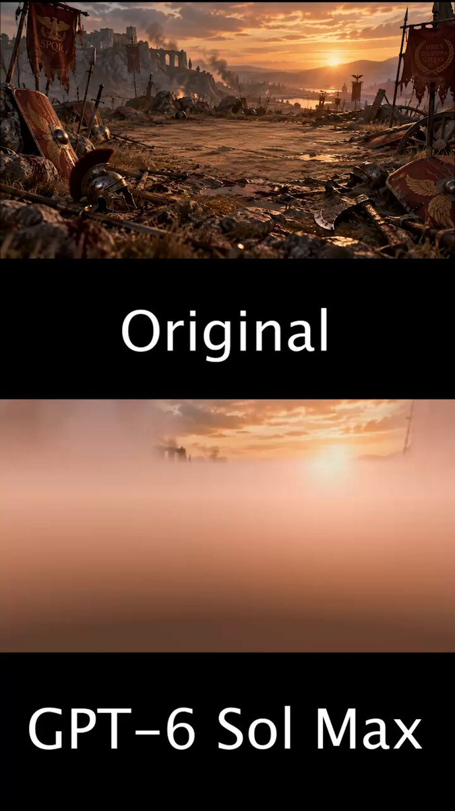</a>

Một bài tập Blender chi tiết nhằm dựng cảnh chiến trường La Mã chân thực vào giờ vàng dựa trên ảnh ý tưởng được cung cấp. Yêu cầu gồm một đấu trường 1v1 bao quanh bởi các tảng đá lớn, mặt đất có chi tiết cao với bản đồ bump, tạo asset theo quy trình thủ tục khi có thể, skybox bầu trời giờ vàng, bóng đổ gắt, các asset GLB có thể tái sử dụng và bàn giao tệp .blend cùng video timelapse quá trình dựng.

**Prompt**

```text
NHIỆM VỤ
Dựng một bối cảnh chiến trường La Mã vào giờ vàng trong Blender dựa trên ảnh ý tưởng được cung cấp. Được phép sử dụng công cụ tạo sinh. Bạn có thể tạo mô hình 3D cho môi trường và các thành phần của môi trường bằng những công cụ tạo sinh hiện có (Tripo trên https://t.co/JV0K8OtuWC) rồi lắp ráp chúng. Tất cả vẫn phải tạo thành một cảnh thống nhất: tỷ lệ đồng bộ, vật liệu nhất quán và ánh sáng liền mạch. Yêu cầu: Sử dụng bản đồ bump cho mặt đất và giữ cho mặt đất có độ chi tiết cao.
Tạo một khoảng trống hình tròn trên mặt đất, bao quanh bằng các tảng đá lớn để hình thành đấu trường 1v1.
Dựng mọi thứ theo phong cách chân thực.
Tạo asset theo quy trình thủ tục khi có thể.
Tạo skybox cho bầu trời giờ vàng.
Sử dụng bóng đổ gắt.
Tái sử dụng các vật thể (cờ, biểu ngữ, mũ sắt, đá, v.v.). Xuất một tệp GLB cho mỗi vật thể và tái sử dụng các asset đó.
Khớp với ảnh được cung cấp gần nhất và chính xác nhất có thể.
YÊU CẦU VỀ TIMELAPSE
Trong quá trình dựng, sau mỗi lần bổ sung có ý nghĩa (mỗi vật thể mới, lượt áp dụng modifier, bước tạo vật liệu và bước thiết lập ánh sáng), hãy lưu ảnh chụp viewport vào thư mục timelapse/ theo thứ tự và đánh số. Khi hoàn tất, ghép các khung hình đó thành video timelapse ở tốc độ 2 fps (0,5 giây mỗi khung hình) để có thể xem toàn bộ quá trình dựng từ đầu đến cuối. Bàn giao video timelapse cùng các tệp chính.
DELIVERABLES
Tệp .blend, với camera và viewport được thiết lập để góc nhìn khớp chính xác với ảnh gốc.
Video timelapse quá trình dựng.
```

[Xem chi tiết ↗](https://www.tripo3d.ai/vi/3d-prompts/golden-hour-roman-battlefield-blender-scene) · [Bài đăng gốc](https://x.com/tonysurix/status/2103352274269675532) · [Về danh sách ví dụ](#all-prompts)

---

<a id="2103432732386664591"></a>

### Thạch Pitaya

[Vib3Coded](https://x.com/vib3coded) · 2026-09-25

<a href="https://www.tripo3d.ai/vi/3d-prompts/gpt-6-astra-2103432732386664591">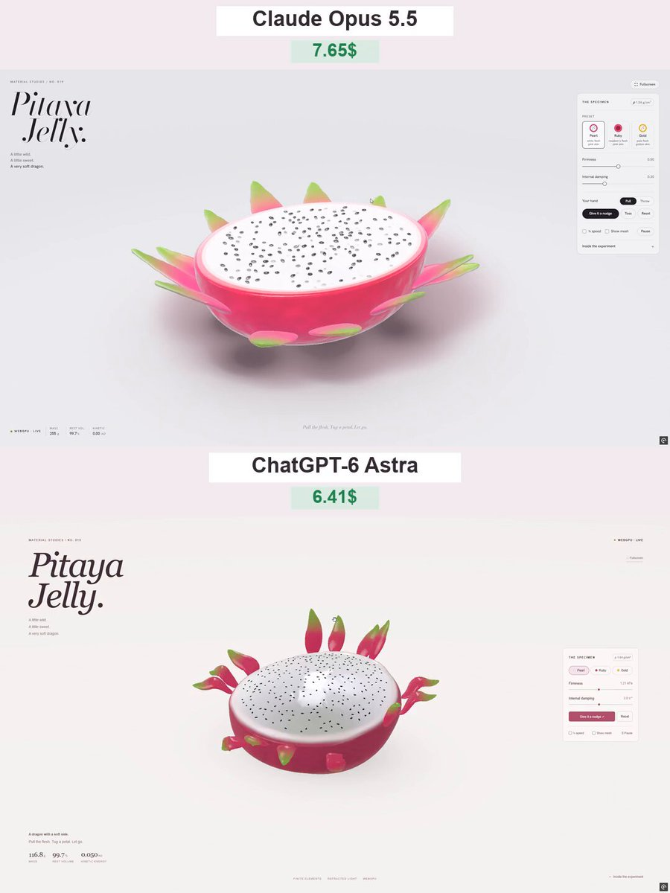</a>

Prompt do tác giả chia sẻ dành cho GPT-6 Astra, nhằm tạo một thử nghiệm vật liệu thạch thanh long 3D tương tác trên trình duyệt. Prompt này mô tả hình học WebGPU dựng theo quy trình, vật liệu dạng kẹo dẻo trong mờ, biến dạng vật thể mềm, các cánh vỏ có thể kéo, hỗ trợ cảm ứng, preset, thông số mô phỏng và giao diện sáng theo phong cách studio.

**Prompt**

```text
Tạo một cảnh 3D tương tác có tên “Pitaya Jelly” — một nửa quả thanh long làm từ thạch mềm, trong mờ. Xây dựng toàn bộ dự án trong một tệp HTML duy nhất bằng tính năng kết xuất WebGPU thực tế và shader WGSL. Không sử dụng mô hình dựng sẵn hoặc nội dung hình ảnh.

APPEARANCE

Một nửa quả thanh long lớn đặt trên bề mặt studio sáng màu, với mặt cắt hướng lên trên.
Vỏ màu hồng phúc bồn tử đậm, lớp cùi trắng ngà mỏng bên trong và phần ruột trắng như ngọc trai.
Khoảng 250 hạt đen nhỏ phân bố tự nhiên trên phần ruột.
12–14 cánh vỏ mọng nước bao quanh quả, chuyển màu từ phần gốc hồng sang đầu xanh lục.
Bề mặt bóng ướt với hiệu ứng khúc xạ ánh sáng, các bong bóng nhỏ bên trong và bóng tiếp xúc mềm.
Vật liệu phải trông như kẹo dẻo mềm, không phải nhựa cứng. Giữ màu sắc bão hòa mà không để vùng sáng bị cháy.

VẬT LÝ VÀ TƯƠNG TÁC

Triển khai biến dạng soft-body thực tế bằng lưới thể tích với các liên kết đàn hồi và ràng buộc bảo toàn thể tích, chẳng hạn như XPBD.
Người dùng có thể dùng chuột hoặc ngón tay để nắm phần ruột, kéo giãn rồi thả ra.
Biến dạng phải tập trung quanh điểm bị nắm thay vì chỉ tịnh tiến toàn bộ vật thể.
Sau khi thả, quả phải lắc lư, rung nhẹ và dần trở về hình dạng ban đầu.
Cho phép kéo từng cánh vỏ riêng lẻ. Cánh vỏ phải mềm hơn phần ruột, có thể uốn cong và bật trở lại nhưng vẫn gắn với quả.
Các hạt phải bám theo bề mặt đang biến dạng, không bay ra ngoài hoặc chìm vào phần ruột.
Giữ mô phỏng ổn định khi kéo mạnh, bảo đảm tiếp xúc với sàn và ngăn các phần tử bị đảo ngược.

THIẾT KẾ HÌNH ẢNH

Sử dụng giao diện studio tối giản, tông sáng với phong cách biên tập: nhiều khoảng trắng, đường viền mảnh, các điều khiển tiết chế và không có chi tiết trang trí thừa.

Góc trên bên trái:
“NGHIÊN CỨU VẬT LIỆU / SỐ 019”
Tiêu đề serif nghiêng cỡ lớn, hiển thị trên hai dòng:
“Pitaya Jelly.”

Bên dưới:
“Một chút hoang dã.”
“Một chút ngọt ngào.”
“Một chú rồng cực mềm.”
Ở bên phải, thêm một bảng nổi có tiêu đề “MẪU VẬT” và chứa:

Nhãn mật độ: ρ 1.04 g/cm³.
Ba thiết lập có sẵn:
Pearl — ruột trắng và vỏ hồng.
Ruby — ruột màu phúc bồn tử và vỏ hồng.
Gold — ruột nhạt màu và vỏ vàng.
Thanh trượt Độ cứng và Độ giảm chấn bên trong, kèm giá trị hiển thị.
Các nút “Chạm nhẹ” và “Đặt lại”.

Các ô chọn “¼ tốc độ” và “Hiện lưới”.

Một nút “Tạm dừng”.
Đồng thời bao gồm:
Một nút toàn màn hình kèm tùy chọn thoát.
Chỉ báo trạng thái “WEBGPU · LIVE”.
Các chỉ số trực tiếp về khối lượng, phần trăm thể tích ở trạng thái nghỉ và động năng.
Một gợi ý tương tác ngắn: “Kéo phần ruột. Kéo một cánh vỏ. Thả ra.”
Một mục có thể thu gọn “Bên trong thí nghiệm” giải thích chính xác cách triển khai.
YÊU CẦU KỸ THUẬT
Bàn giao một tệp độc lập duy nhất có tên pitaya-jelly-webgpu.html.

Sử dụng tính năng kết xuất WebGPU thực tế, không giả lập bằng Canvas 2D.

Tạo toàn bộ hình học bằng phương pháp thủ tục.
Sử dụng khúc xạ có xét đến độ dày, phản xạ Fresnel và ánh sáng studio mềm.
Sử dụng bước thời gian mô phỏng cố định để hành vi nhất quán.
Hỗ trợ tương tác trên máy tính và cảm ứng, với bố cục responsive.
Tránh tái tạo hình học hoặc biên dịch shader tốn kém trong khi kéo.

Hiển thị thông báo dự phòng rõ ràng khi WebGPU không khả dụng.

Kiểm tra thao tác kéo, thả, khôi phục hình dạng, thiết lập có sẵn, đặt lại, tạm dừng, toàn màn hình và bố cục trên thiết bị di động.
Các ưu tiên chính là hành vi giống thạch thuyết phục, vật liệu đẹp mắt và tương tác đã tay. Kết quả phải mang lại cảm giác như một thí nghiệm vật liệu được trau chuốt, có thể chơi và khám phá.
```

[Xem chi tiết ↗](https://www.tripo3d.ai/vi/3d-prompts/gpt-6-astra-2103432732386664591) · [Bài đăng gốc](https://x.com/vib3coded/status/2103433535604265052) · [Về danh sách ví dụ](#all-prompts)

---

<a id="2103456264785424530"></a>

### Dựng mô hình 3D trang phục cho VRChat

[のわ〜る👼🍆🐄](https://x.com/Noir4247) · 2026-09-25

<a href="https://www.tripo3d.ai/vi/3d-prompts/gpt-6-astra-2103456264785424530">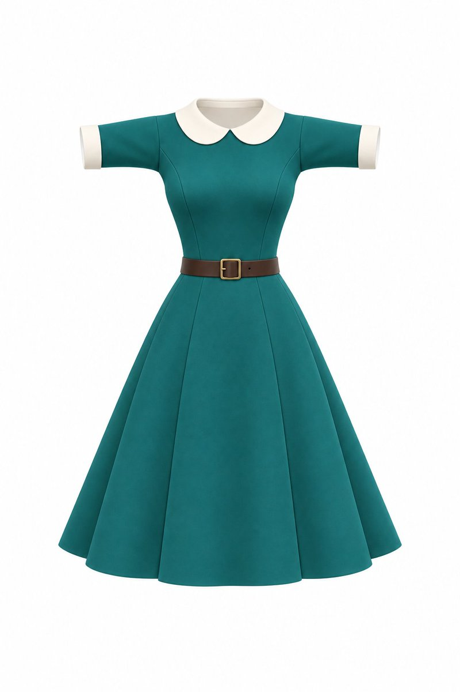</a>

<a href="https://www.tripo3d.ai/vi/3d-prompts/gpt-6-astra-2103456264785424530">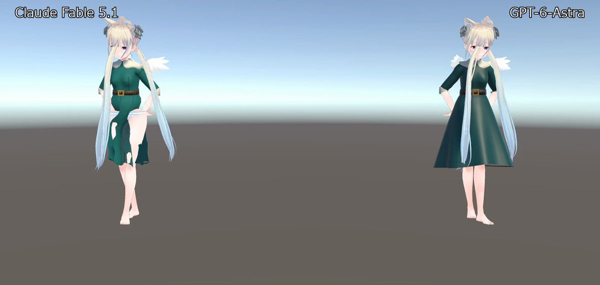</a>

Người đăng cho biết đã dựa trên bản thiết kế được tạo bằng ChatGPT, yêu cầu “Hãy tạo trang phục cho VRChat” và để Astra dựng mô hình trang phục bằng Blender.

**Prompt**

```text
Hãy tạo trang phục cho VRChat
```

[Xem chi tiết ↗](https://www.tripo3d.ai/vi/3d-prompts/gpt-6-astra-2103456264785424530) · [Bài đăng gốc](https://x.com/Noir4247/status/2103456264785424530) · [Về danh sách ví dụ](#all-prompts)

---

<a id="2103482826519986544"></a>

### Tạo chuột lang trong Blender

[かよこ](https://x.com/kayokojoe) · 2026-09-25

<a href="https://www.tripo3d.ai/vi/3d-prompts/gpt-6-astra-2103482826519986544">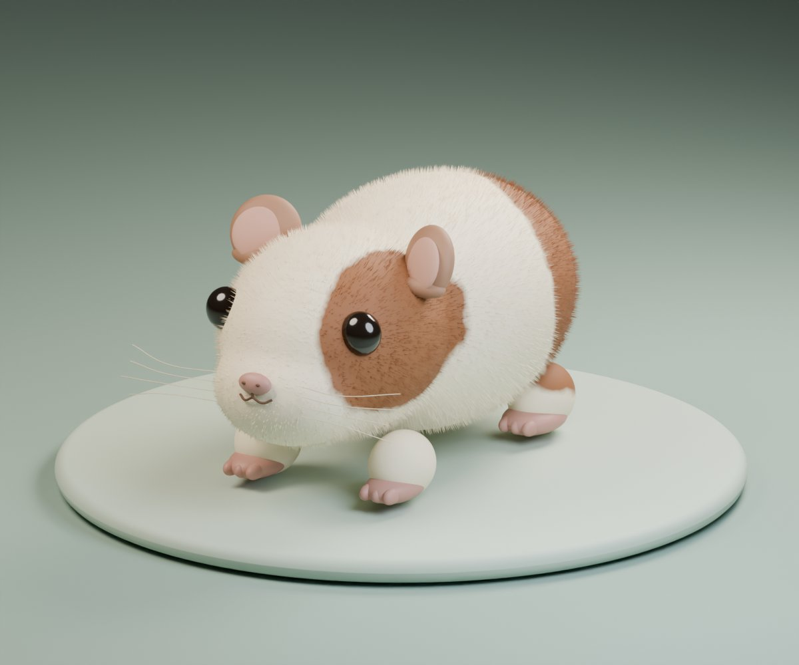</a>

Prompt yêu cầu Codex（GPT-6 Astra High）tạo chuột lang mà không cung cấp ảnh tham chiếu.

**Prompt**

```text
Tạo chuột lang trong Blender
```

[Xem chi tiết ↗](https://www.tripo3d.ai/vi/3d-prompts/gpt-6-astra-2103482826519986544) · [Bài đăng gốc](https://x.com/kayokojoe/status/2103482826519986544) · [Về danh sách ví dụ](#all-prompts)

---

<a id="2103486103831339269"></a>

### Vườn Nhật phong cách voxel trong Three.js

[Marcel](https://x.com/marcthecreatorr) · 2026-09-25

<a href="https://www.tripo3d.ai/vi/3d-prompts/gpt-6-astra-2103486103831339269">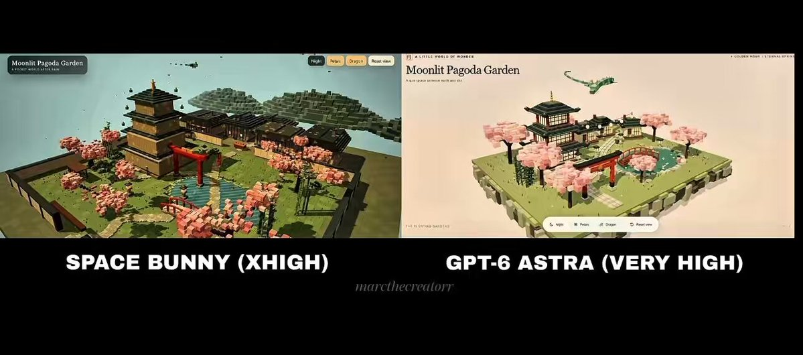</a>

Prompt tạo một khu vườn Nhật phong cách voxel có thể tương tác, với một ngôi chùa tháp, những dân làng tí hon và một con rồng đang bay. Tác giả bài đăng cho biết prompt nguyên văn này đã được đưa cho Astra và Space Bunny để so sánh trong một lượt.

**Prompt**

```text
Xây dựng một khu vườn Nhật phong cách voxel chi tiết trong Three.js, với một ngôi chùa tháp, những dân làng tí hon, một con rồng đang bay và các chi tiết tương tác.
```

[Xem chi tiết ↗](https://www.tripo3d.ai/vi/3d-prompts/gpt-6-astra-2103486103831339269) · [Bài đăng gốc](https://x.com/marcthecreatorr/status/2103486103831339269) · [Về danh sách ví dụ](#all-prompts)

---

<a id="2103855977376125161"></a>

### Cảnh WebGL voxel tàu trong chai

[PEP PEPICH](https://x.com/Artless101) · 2026-09-26

<a href="https://www.tripo3d.ai/vi/3d-prompts/gpt-6-astra-2103855977376125161">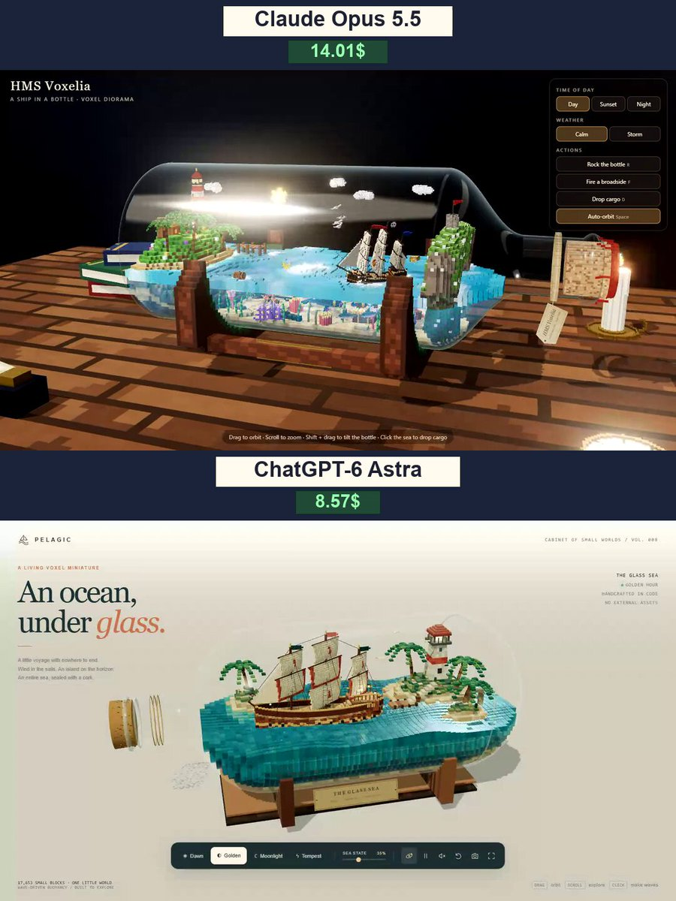</a>

Tạo một cảnh nghệ thuật voxel đầy màu sắc và công phu, mô phỏng tàu buồm cùng đại dương bên trong một chiếc chai, với sóng, vật lý được mô phỏng và nhiều đạo cụ hoặc phong cảnh đa dạng. Kết quả cần là một cảnh WebGL có thể chạy từ một tệp HTML duy nhất trong Chrome.

**Prompt**

```text
Thiết kế và tạo một cảnh nghệ thuật voxel thật sáng tạo, công phu và chi tiết, mô phỏng một con tàu tinh xảo đang vượt đại dương bên trong một chiếc chai. Thêm các con sóng và hệ thống vật lý chân thực, đồng thời bao bọc toàn bộ cảnh trong chai. Hãy tạo một cảnh ấn tượng, đa dạng bằng các voxel nhiều màu, vật lý được mô phỏng cùng những đạo cụ và phong cảnh thú vị, tất cả đều nằm bên trong chai. Sử dụng WebGL và bất kỳ thư viện nào cần thiết, nhưng hãy đảm bảo tôi có thể dán toàn bộ mã vào một tệp HTML duy nhất và mở tệp đó trong Chrome
```

[Xem chi tiết ↗](https://www.tripo3d.ai/vi/3d-prompts/gpt-6-astra-2103855977376125161) · [Bài đăng gốc](https://x.com/Artless101/status/2103856049925071141) · [Về danh sách ví dụ](#all-prompts)

---

<a id="2103860776419111285"></a>

### Môi trường làng ven hồ giữa rừng

[Givros](https://x.com/givros) · 2026-09-26

<a href="https://www.tripo3d.ai/vi/3d-prompts/gpt-6-astra-2103860776419111285">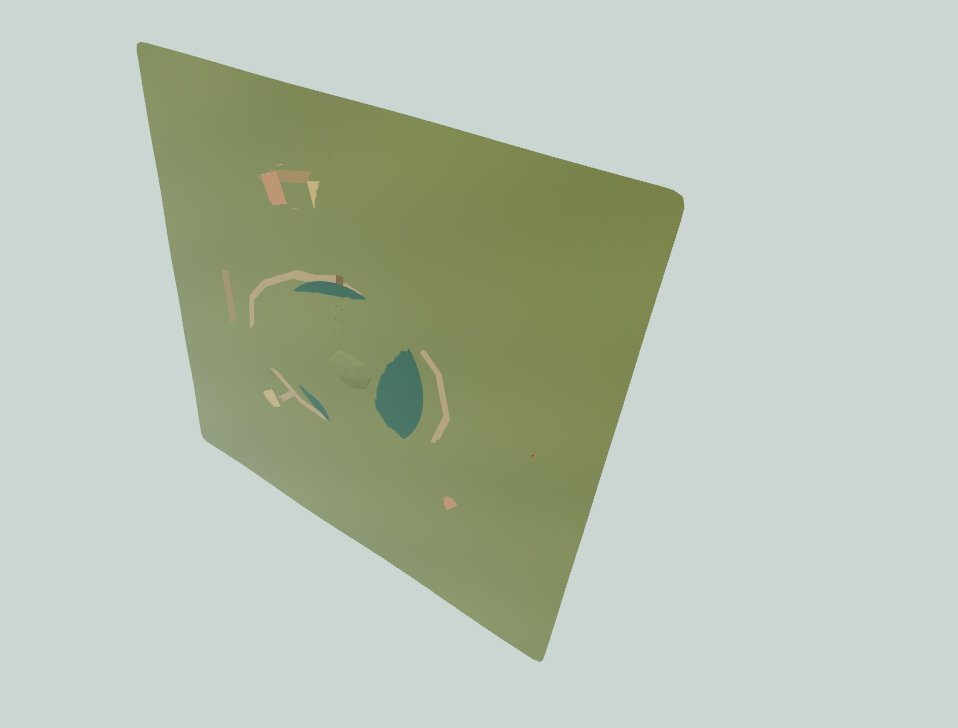</a>

<a href="https://www.tripo3d.ai/vi/3d-prompts/gpt-6-astra-2103860776419111285">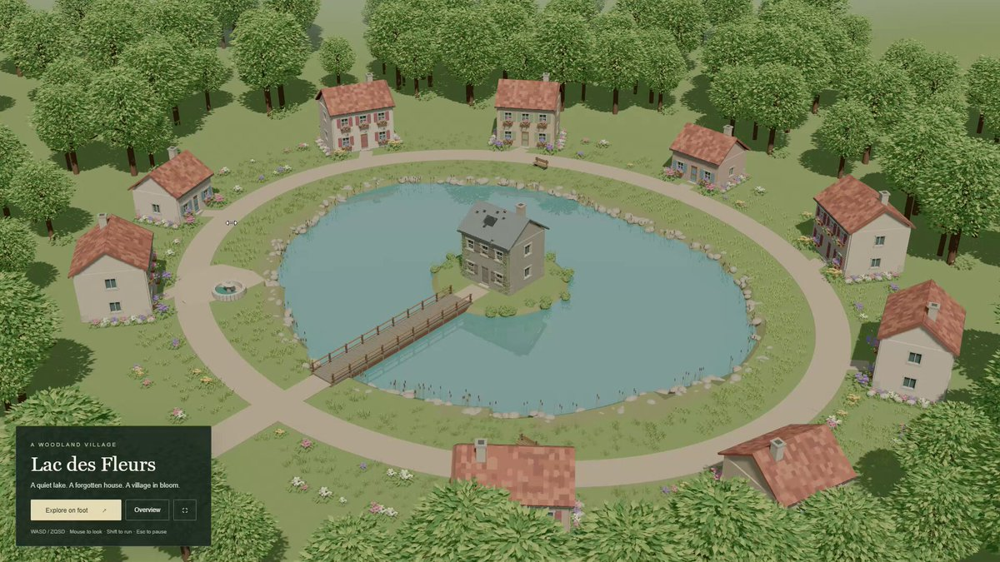</a>

<a href="https://www.tripo3d.ai/vi/3d-prompts/gpt-6-astra-2103860776419111285">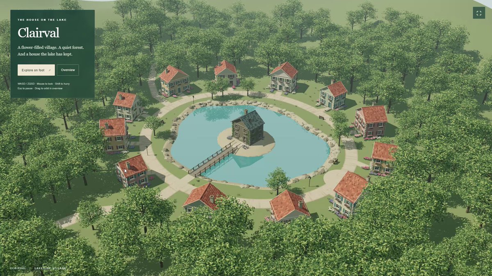</a>

Bản mô tả môi trường 3D để tác giả gốc so sánh Luna Light, Sol Light và Astra Light với cùng một prompt. Mô tả một khu rừng bao quanh hồ nước ở trung tâm, một ngôi nhà bỏ hoang giữa hồ, một ngôi làng Pháp đầy hoa bên hồ và các lối đi kết nối.

**Prompt**

```text
Một khu rừng với hồ nước ở trung tâm. Giữa hồ là một ngôi nhà bỏ hoang. Xung quanh hồ là một ngôi làng Pháp ngập tràn hoa. Các lối đi kết nối những địa điểm quan trọng.
```

[Xem chi tiết ↗](https://www.tripo3d.ai/vi/3d-prompts/gpt-6-astra-2103860776419111285) · [Bài đăng gốc](https://x.com/givros/status/2103860776419111285) · [Về danh sách ví dụ](#all-prompts)

---

<a id="2103966922127630820"></a>

### Mô phỏng bắt tầng đẩy Super Heavy trong Blender

[Vortlyn](https://x.com/Vortlyn) · 2026-09-26

<a href="https://www.tripo3d.ai/vi/3d-prompts/gpt-6-astra-2103966922127630820">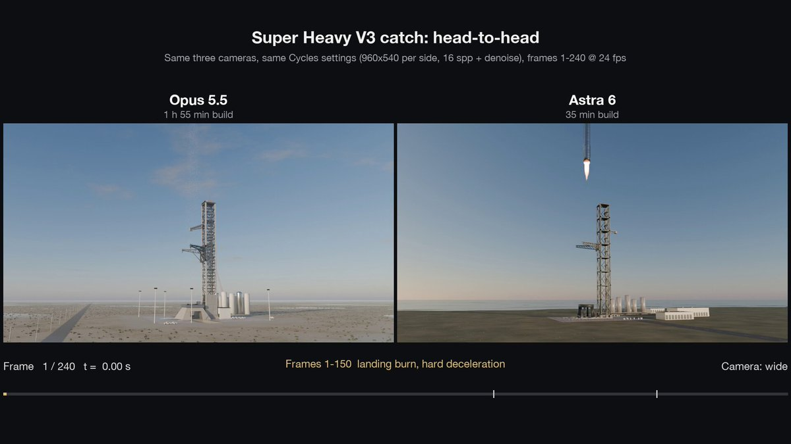</a>

Tạo mô hình Blender bằng mã mô phỏng hệ thống bắt tầng đẩy Super Heavy, không dùng mô hình, kết cấu bề mặt hoặc HDRI tải xuống.

**Prompt**

```text
dựng hệ thống bắt tầng đẩy Super Heavy trong Blender chỉ bằng Python. không dùng mô hình tải xuống, không dùng kết cấu bề mặt hay HDRI, mọi thứ đều được tạo bằng mã
```

[Xem chi tiết ↗](https://www.tripo3d.ai/vi/3d-prompts/gpt-6-astra-2103966922127630820) · [Bài đăng gốc](https://x.com/Vortlyn/status/2103966922127630820) · [Về danh sách ví dụ](#all-prompts)

---

<a id="2104077535315144878"></a>

### Demo tương tác 3D về đường đi của ánh sáng qua ống kính máy ảnh

[noah helms](https://x.com/haonv2) · 2026-09-27

<a href="https://www.tripo3d.ai/vi/3d-prompts/gpt-6-astra-2104077535315144878">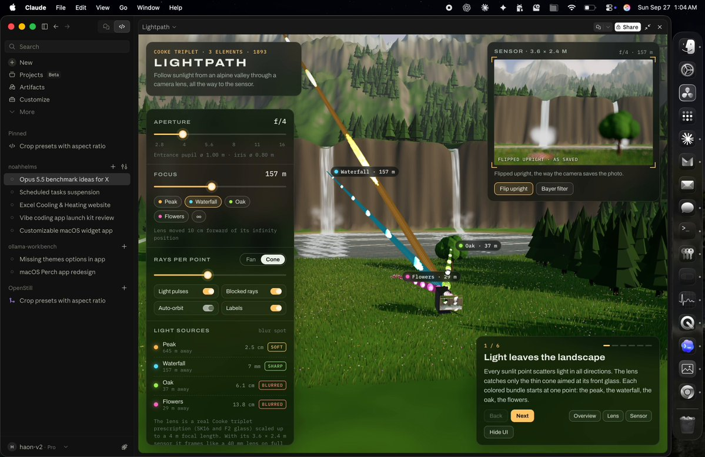</a>

<a href="https://www.tripo3d.ai/vi/3d-prompts/gpt-6-astra-2104077535315144878">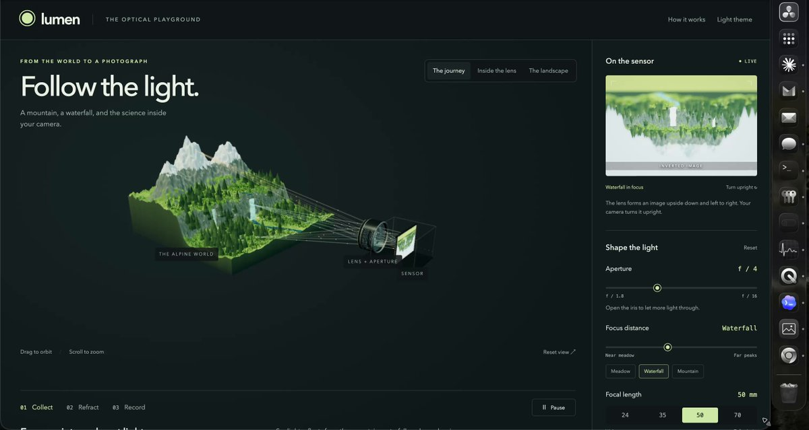</a>

Bản dựng 3D tương tác minh họa cách ánh sáng đi qua ống kính máy ảnh đến cảm biến, trong bối cảnh phong cảnh núi non với thác nước và thảm cỏ xanh. Bài đăng gốc giới thiệu đây là prompt dùng để so sánh Astra-6 và Opus 5.5.

**Prompt**

```text
Tôi muốn bạn tạo một bản dựng 3D tương tác minh họa cách ánh sáng đi qua ống kính máy ảnh và đến cảm biến. Hãy đặt bản demo trong một phong cảnh núi non tuyệt đẹp, với những thác nước và thảm cỏ xanh tươi.
```

[Xem chi tiết ↗](https://www.tripo3d.ai/vi/3d-prompts/gpt-6-astra-2104077535315144878) · [Bài đăng gốc](https://x.com/haonv2/status/2104077535315144878) · [Về danh sách ví dụ](#all-prompts)

---

<a id="2104504957173153951"></a>

### Lát dưa hấu thạch 3D tương tác

[基恩-Keane 🌊](https://x.com/esrhengwu) · 2026-09-28

<a href="https://www.tripo3d.ai/vi/3d-prompts/gpt-6-astra-2104504957173153951">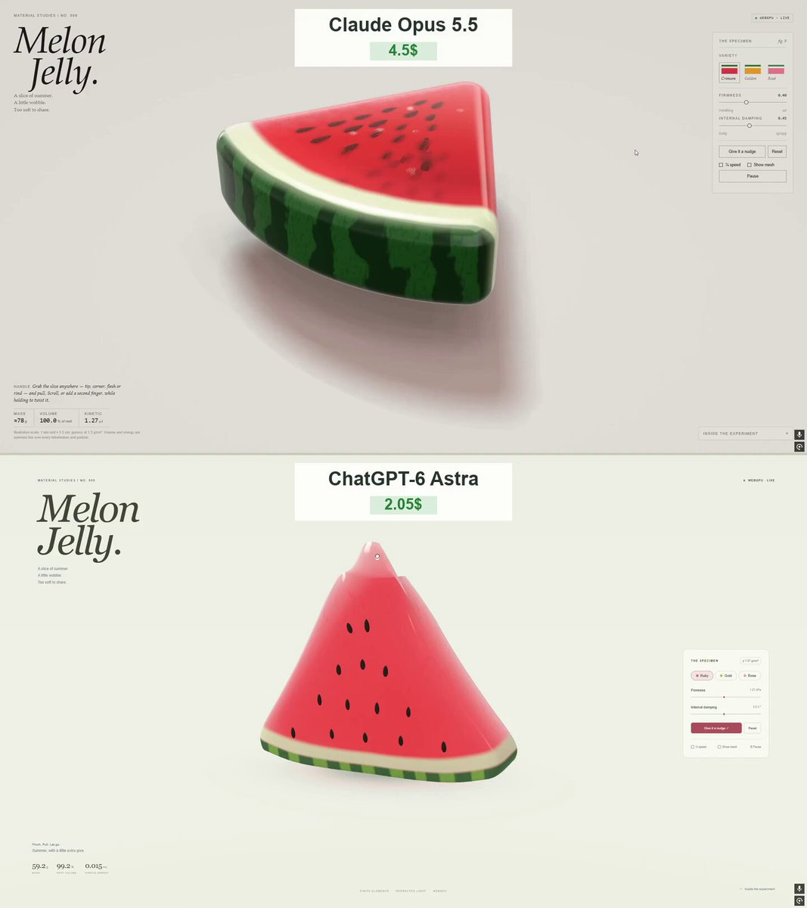</a>

Tác giả đã công khai trong phần bình luận một prompt dùng để tạo “Melon Jelly”. Prompt yêu cầu xây dựng ngay trong trình duyệt một mô phỏng vật thể mềm là lát dưa hấu thạch 3D, có thể nắm, kéo giãn, bẻ cong và xoắn bằng WebGPU cùng shader WGSL, đồng thời nêu rõ các yêu cầu về vật liệu, vật lý, giao diện và kiểm thử. Bài đăng gốc cho biết Opus 5.5 và GPT-6 Astra lần lượt tạo ra những quả dưa hấu thạch; phần bình luận này cung cấp prompt do tác giả đăng.

**Prompt**

```text
Tạo “Melon Jelly” — một lát dưa hấu thạch 3D tương tác, hoàn thiện về hình ảnh, chạy trực tiếp trong trình duyệt bằng WebGPU và shader WGSL thực thụ.
Cung cấp một tệp HTML duy nhất, tự chứa, với JavaScript và CSS được nhúng bên trong. Đây phải là một mô phỏng 3D tương tác thực sự, không phải ảnh tĩnh, video hay mô phỏng 2D.
DƯA HẤU
Tạo một miếng dưa hấu hình nêm tam giác dày, bo tròn, với:
Phần thịt thạch đỏ ruby trong mờ.
Một lớp nhạt màu, hơi trong mờ nằm giữa phần thịt và vỏ.
Lớp vỏ xanh bóng với các sọc xanh đậm không đều.

Các hạt màu sẫm được mô hình hóa riêng và nằm bên trong cả hai mặt cắt lộ ra.
Các góc bo mềm và độ dày rõ rệt, bắt mắt.
Hãy khiến nó trông như một viên kẹo dẻo cao cấp được chụp trong studio. Nó cần gợi cảm giác mọng nước, mềm mại và gần như có thể ăn được. Giữ màu sắc đậm và giàu sức sống nhưng không để vùng sáng bị cháy sáng.
VẬT LÝ VẬT THỂ MỀM
Sử dụng mô phỏng vật thể mềm theo thể tích, chẳng hạn lưới tứ diện với các ràng buộc đàn hồi và bảo toàn thể tích XPBD.
Người dùng phải có thể:
Nắm phần chóp, một góc, phần thịt hoặc lớp vỏ.
Kéo giãn, bẻ cong, nhấc lên và xoắn nhẹ lát dưa hấu.

Thả ra và quan sát nó rung lắc trước khi dần ổn định.
Lát dưa hấu phải biến dạng rõ rệt tại từng vùng, không chỉ di chuyển hoặc co giãn như một vật thể cứng duy nhất. Làm lớp vỏ cứng hơn phần thịt một chút nhưng vẫn giữ cho toàn bộ lát dưa hấu mềm dẻo.
Duy trì thể tích ở mức hợp lý khi kéo giãn. Ngăn các phần tử bị lộn ngược, chuyển động bùng nổ và sụp đổ vĩnh viễn. Sử dụng bước thời gian mô phỏng cố định và số bước phụ có giới hạn để đảm bảo ổn định.
Sau khi được thả ra, chuyển động phải suy giảm tự nhiên — không bật về ngay lập tức và cũng không dao động mãi.
Giữ các hạt gắn với phần thịt đang biến dạng. Chúng phải di chuyển và xoay theo bề mặt, không được tự trôi độc lập hoặc đứng cố định trong không gian.
Bao gồm tiếp xúc với mặt đất, ma sát nhẹ và độ nảy mềm. Tránh để sàn bị xuyên qua rõ rệt.
RENDERING
Sử dụng WebGPU gốc cùng shader WGSL.
Bao gồm:
Khả năng hấp thụ ánh sáng phụ thuộc vào độ dày.
Khúc xạ xuyên qua lớp thạch.

Phản xạ Fresnel và vùng sáng bóng.
Ánh sáng truyền qua mềm ở các cạnh mỏng.
Chi tiết bên trong tinh tế và một vài bong bóng khí rất nhỏ.

Bóng đổ tiếp xúc mềm bên dưới lát dưa hấu.
Phông nền studio sáng màu, trung tính.
Phần thịt, lớp vỏ nhạt màu và lớp da xanh cần có phản hồi vật liệu riêng biệt. Tránh khiến mọi thứ trông như kính trong suốt hoặc nhựa đục.
Giữ lát dưa hấu đủ lớn và dễ quan sát, với góc máy ba phần tư làm lộ rõ phần thịt, hạt và độ dày.
INTERFACE
Sử dụng bố cục biên tập tối giản với nhiều khoảng trắng, đường viền mảnh, các nút điều khiển tiết chế và không dùng gradient trang trí trong giao diện.
Góc trên bên trái:
“MATERIAL STUDIES / NO. 009”
Một tiêu đề serif in nghiêng cỡ lớn, chia thành hai dòng: “Melon” và “Jelly.”
Chú thích nhỏ:
“A slice of summer.”
“A little wobble.”
“Too soft to share.”
Góc trên bên phải:
Một chỉ báo trạng thái nhỏ hiển thị “WEBGPU · LIVE” khi trình kết xuất đang chạy.

Bảng điều khiển bên phải:
“THE SPECIMEN”
Ba preset màu lấy cảm hứng từ dưa hấu, phối hợp với nhau.
Thanh trượt độ cứng kèm giá trị hiện tại.
Thanh trượt giảm chấn bên trong kèm giá trị hiện tại.
Các nút “Give it a nudge” và “Reset”.
Các ô chọn “¼ speed” và “Show mesh”.

Nút Tạm dừng / Tiếp tục.
Góc dưới bên trái:
Một gợi ý ngắn giải thích rằng có thể nắm và kéo giãn lát dưa hấu.
Các thông số thời gian thực về khối lượng, thể tích tương đối và động năng, được suy ra từ mô phỏng. Mô tả rõ đơn vị minh họa hoặc giá trị gần đúng khi phù hợp.
Góc dưới bên phải:

Một mục có thể thu gọn mang tên “Inside the experiment”, giải thích ngắn gọn về vật lý và quá trình kết xuất.
HÀNH VI VÀ HIỆU NĂNG
Hỗ trợ thao tác bằng chuột và cảm ứng. Sử dụng pointer capture để thao tác kéo vẫn ổn định khi con trỏ rời khỏi vật thể.
Đảm bảo bố cục hoạt động tốt trên máy tính và thiết bị di động, không để các nút điều khiển che lên lát dưa hấu.
Tái sử dụng buffer và tránh dựng lại hình học hoặc biên dịch shader trong lúc kéo. Giữ trải nghiệm tương tác mượt mà và phản hồi nhanh.
Tôn trọng tùy chọn giảm chuyển động. Nếu không có WebGPU, hãy hiển thị giải thích rõ ràng thay vì âm thầm thay thế bằng trình kết xuất giả.
VALIDATION
Kiểm thử thao tác kéo từ nhiều vị trí, kéo giãn mạnh, thả nhiều lần, va chạm với mặt đất, tất cả thanh trượt, preset, tạm dừng, đặt lại và chuyển động chậm.
Kiểm tra để đảm bảo mô hình trở về hình dạng nghỉ ổn định, các hạt vẫn gắn với bề mặt, lưới không bị hỏng và không có lỗi kết xuất.
Ưu tiên chất lượng phản hồi của thạch và ánh sáng. Kết quả cần khiến người dùng muốn tiếp tục nắm và chơi với nó.
```

[Xem chi tiết ↗](https://www.tripo3d.ai/vi/3d-prompts/gpt-6-astra-2104504957173153951) · [Bài đăng gốc](https://x.com/esrhengwu/status/2104505413857415515) · [Về danh sách ví dụ](#all-prompts)

---

<a id="2104531704740512143"></a>

### Game phong cách Genshin và công cụ chỉnh sửa địa hình

[ふぐあい(ふぐおん)](https://x.com/fuguai1) · 2026-09-28

<a href="https://www.tripo3d.ai/vi/3d-prompts/gpt-6-astra-2104531704740512143">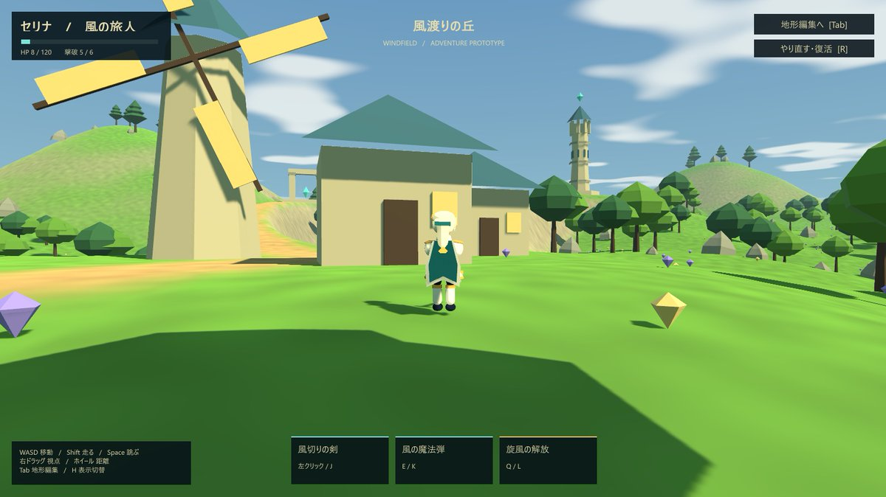</a>

<a href="https://www.tripo3d.ai/vi/3d-prompts/gpt-6-astra-2104531704740512143">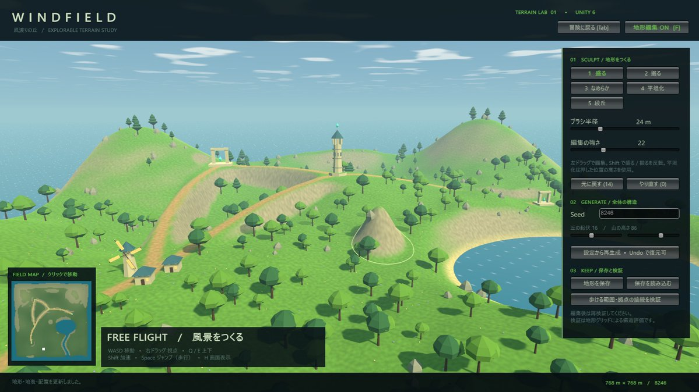</a>

Prompt yêu cầu tạo một game giống Genshin và công cụ cho phép chỉnh sửa địa hình trong game.

**Prompt**

```text
Tạo một game giống Genshin và công cụ cho phép chỉnh sửa địa hình trong game.
```

[Xem chi tiết ↗](https://www.tripo3d.ai/vi/3d-prompts/gpt-6-astra-2104531704740512143) · [Bài đăng gốc](https://x.com/fuguai1/status/2104531704740512143) · [Về danh sách ví dụ](#all-prompts)

---

<a id="2104590493191479337"></a>

### Móc chữ J có thể in 3D để thử độ bền

[Wësche](https://x.com/WescheNex1q) · 2026-09-28

<a href="https://www.tripo3d.ai/vi/3d-prompts/3d-printable-j-hook-openscad-strength-test">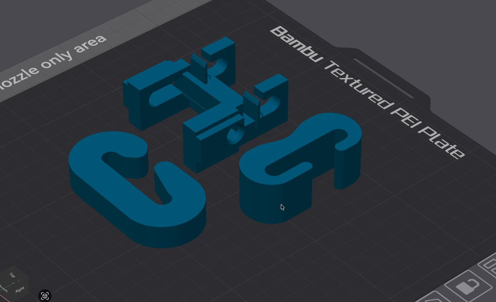</a>

Thiết kế móc chữ J bằng PLA, dạng một chi tiết, để in 3D và thử độ bền. Móc được bằng tay vào thanh thép 8 mm và giữ chốt tải 8 mm, đáp ứng các yêu cầu về kích thước, khối lượng, khả năng giữ chốt và chống trượt. Đầu ra cần là một tệp OpenSCAD hoàn chỉnh, phù hợp để xuất STL.

**Prompt**

```text
Thiết kế một móc chữ J có thể in 3D để thử độ bền.
Móc treo trên một thanh thép 8 mm. Một chốt 8 mm nằm trong miệng móc và tải trọng được treo từ chốt này. Tôi muốn đạt tải trọng phá hủy cao nhất có thể mà không để thanh hoặc chốt bị tuột ra.
Yêu cầu:
- Một chi tiết in duy nhất. Không dùng vít, insert, keo hoặc chi tiết bổ sung.
- Phải kẹp được vào thanh và chốt bằng tay. Không dùng vòng kín.
- Khoảng cách giữa hai tâm vị trí đặt chốt là 40 mm.
- PLA. Khối lượng tối đa 35 g sau khi in.
- Phải nằm gọn trong kích thước 80 x 60 x 25 mm.
- Chốt phải nâng lên ít nhất 10 mm mới có thể thoát ra. Nếu chốt có thể lăn ngang ra ngoài thì thiết kế đó không hợp lệ.
Hãy cung cấp:
1. Giải thích ngắn gọn về hình dạng.
2. Tệp OpenSCAD hoàn chỉnh để tôi biên dịch và xuất STL cho Bambu Studio.
Không cung cấp mã STL. Không cung cấp G-code. Chỉ dùng OpenSCAD. Nếu ý tưởng đầu tiên có thể bị tuột ra, hãy thay thế bằng phương án khác ngay trong cùng câu trả lời.
```

[Xem chi tiết ↗](https://www.tripo3d.ai/vi/3d-prompts/3d-printable-j-hook-openscad-strength-test) · [Bài đăng gốc](https://x.com/WescheNex1q/status/2104590493191479337) · [Về danh sách ví dụ](#all-prompts)

---

<a id="2104605522640970208"></a>

### Mô hình 3D tương tác về CRISPR dành cho giáo dục

[Alejandro](https://x.com/AlejandroRomaan) · 2026-09-28

<a href="https://www.tripo3d.ai/vi/3d-prompts/interactive-crispr-dna-3d-visualization">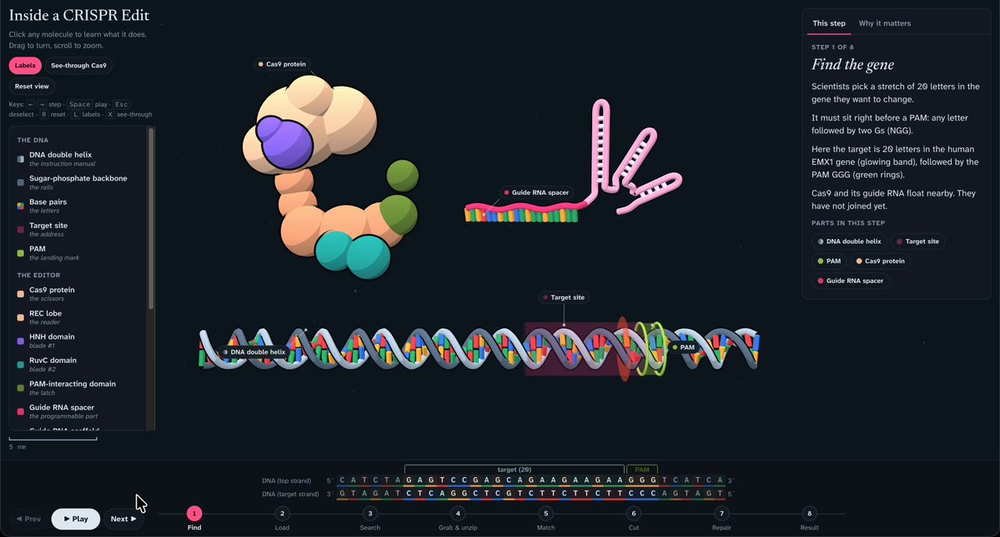</a>

<a href="https://www.tripo3d.ai/vi/3d-prompts/interactive-crispr-dna-3d-visualization">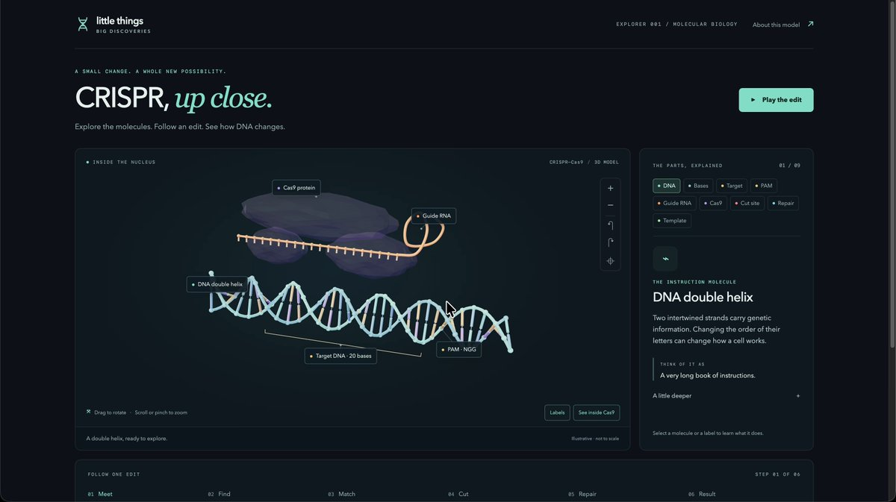</a>

Mô hình 3D tương tác, dễ hiểu về công nghệ DNA CRISPR dành cho giáo dục. Mô hình cần hiển thị một mạch DNA và toàn bộ quy trình chỉnh sửa gen, xác định từng thành phần, đồng thời cho phép người dùng chọn các bộ phận liên quan để tìm hiểu.

**Prompt**

```text
Tạo một mô hình 3D tương tác dành cho giáo dục, minh họa cách công nghệ DNA CRISPR hoạt động. Bạn có thể chọn bất kỳ công nghệ nào, miễn là mô hình rõ ràng, dễ theo dõi và có một mạch DNA; người dùng có thể xem toàn bộ quy trình chỉnh sửa gen, hiểu từng thành phần là gì, chọn bất kỳ bộ phận liên quan nào và tìm hiểu về bộ phận đó.
```

[Xem chi tiết ↗](https://www.tripo3d.ai/vi/3d-prompts/interactive-crispr-dna-3d-visualization) · [Bài đăng gốc](https://x.com/AlejandroRomaan/status/2104605522640970208) · [Về danh sách ví dụ](#all-prompts)

---

<a id="2104613125093998674"></a>

### Chuyến du ngoạn bằng thuyền trong rừng rậm dưới ánh trăng tương tác

[Fazley](https://x.com/itsfazley) · 2026-09-28

<a href="https://www.tripo3d.ai/vi/3d-prompts/moonlit-jungle-boat-ride-threejs-scene">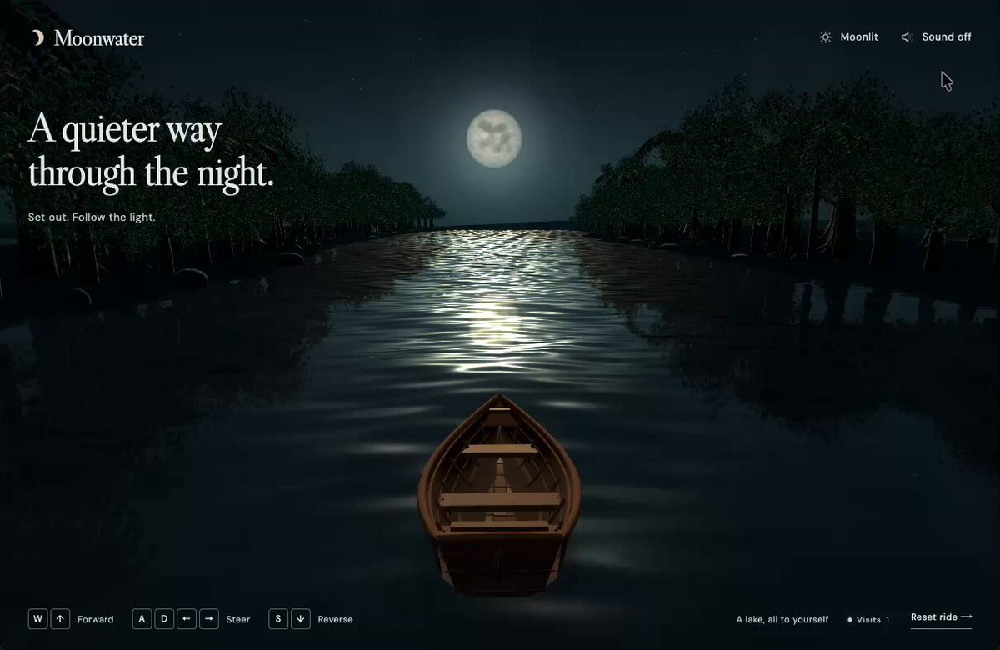</a>

Trải nghiệm chèo thuyền Three.js toàn màn hình, thích ứng trên một tuyến đường thủy hẹp xuyên qua rừng rậm. Người chơi điều khiển một chiếc thuyền chèo gỗ trống bằng bàn phím hoặc thao tác chạm, với mặt nước chuyển động, hiệu ứng vệt sóng, ánh trăng phản chiếu, âm thanh môi trường và các tùy chọn chuyển đổi giữa đêm trăng, bình minh và mưa.

**Prompt**

```text
Xây dựng trải nghiệm chèo thuyền Three.js toàn màn hình, thích ứng trên một tuyến đường thủy hẹp xuyên qua rừng rậm. Sử dụng camera góc nhìn người thứ ba bám theo một chiếc thuyền chèo gỗ trống có mũi nhọn, mạn thuyền rộng, đuôi thuyền phẳng, sàn và ghế có thể nhìn thấy, không có mái chèo, khoang bên trong khô ráo, thân thuyền hơi chìm trong nước. Cho phép người dùng điều khiển bằng phím WASD hoặc phím mũi tên, cũng như thao tác chạm. Tạo khung cảnh về đêm huyền bí: cây cối màu xanh đậm dày đặc, đa dạng và chân thực ở cả hai bờ, gió nhẹ, trăng tròn chi tiết và ánh trăng đứt quãng phản chiếu trên mặt nước chuyển động. Tạo sóng chuyển động thuyết phục, hình ảnh phản chiếu méo nhẹ của thuyền và cây cối, cùng vệt sóng bám theo đường đi của thuyền rồi tan dần tự nhiên, không dùng các vệt phát sáng cố định hay đường viền hình tròn cứng. Thêm tùy chọn thời tiết giữa đêm trăng, bình minh ấm áp và mưa âm u; ở chế độ mưa, hiển thị các hạt mưa rơi và những gợn sóng va chạm nhỏ, tồn tại trong thời gian ngắn, có hình dạng bị chi phối bởi sóng nước. Thêm âm thanh môi trường tùy chọn, tinh tế, gồm tiếng nước, rừng rậm và mưa. Giữ giao diện tối giản. Kiểm tra hình ảnh, thao tác điều khiển, âm thanh, bộ đếm và cả ba chế độ thời tiết trên máy tính lẫn thiết bị di động.
```

[Xem chi tiết ↗](https://www.tripo3d.ai/vi/3d-prompts/moonlit-jungle-boat-ride-threejs-scene) · [Bài đăng gốc](https://x.com/itsfazley/status/2104613128017522813) · [Về danh sách ví dụ](#all-prompts)

---

<a id="2104654448878387313"></a>

### Xe thể thao biến hình với chế độ X-quang bung tách

[Marcel](https://x.com/marcthecreatorr) · 2026-09-28

<a href="https://www.tripo3d.ai/vi/3d-prompts/transforming-sports-car-robot-exploded-view">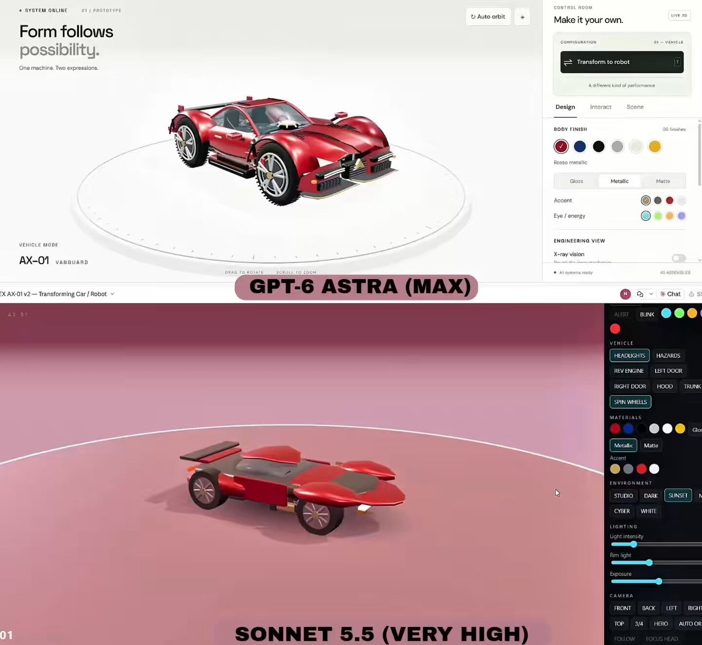</a>

Prompt one-shot do Marcel cung cấp để so sánh GPT-6 Astra và Sonnet 5.5. Prompt yêu cầu một mẫu xe thể thao chi tiết, có tính tương tác, biến hình thành robot hình người và bao gồm chế độ X-quang cùng chế độ bung tách.

**Prompt**

```text
Tạo một mẫu xe thể thao chi tiết có thể biến hình thành robot hình người, với chế độ X-quang và chế độ bung tách tương tác
```

[Xem chi tiết ↗](https://www.tripo3d.ai/vi/3d-prompts/transforming-sports-car-robot-exploded-view) · [Bài đăng gốc](https://x.com/marcthecreatorr/status/2104654448878387313) · [Về danh sách ví dụ](#all-prompts)

---

<a id="2104841727496323479"></a>

### Mắt người 3D độ chi tiết cao

[Simonas](https://x.com/SimonasLTU1) · 2026-09-29

<a href="https://www.tripo3d.ai/vi/3d-prompts/gpt-6-astra-2104841727496323479">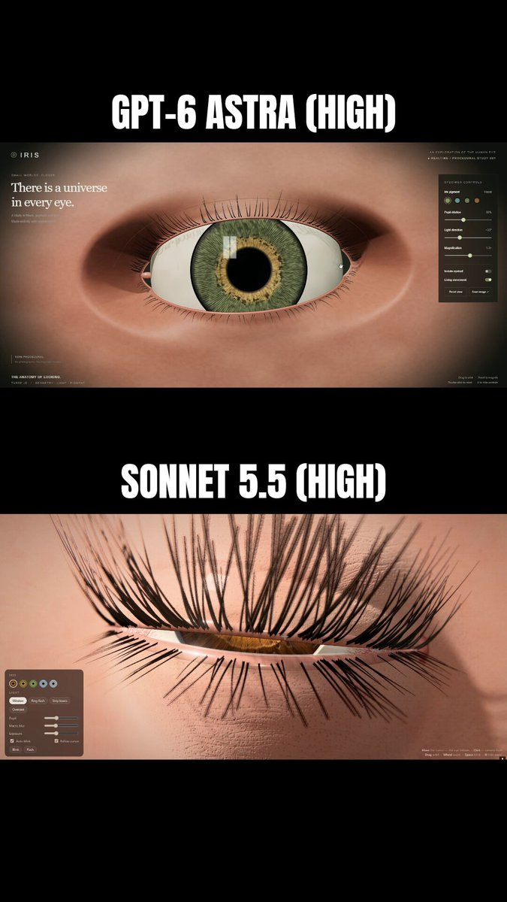</a>

Tạo một tệp HTML/CSS/JS Three.js chạy cục bộ, chứa mô hình mắt người 3D độ chi tiết cao được dựng hoàn toàn từ đầu với diện mạo chân thực như ảnh chụp macro.

**Prompt**

```text
Tạo một tệp HTML/CSS/JS chạy cục bộ bằng Three.js. Dựng mô hình mắt người 3D độ chi tiết cao, có vẻ ngoài chân thực như ảnh macro chụp mắt thật. Mọi thành phần phải được tạo hoàn toàn từ đầu.
```

[Xem chi tiết ↗](https://www.tripo3d.ai/vi/3d-prompts/gpt-6-astra-2104841727496323479) · [Bài đăng gốc](https://x.com/SimonasLTU1/status/2104841727496323479) · [Về danh sách ví dụ](#all-prompts)

---

<a id="2105009377002299711"></a>

### Thời gian, được tháo rời.

[Paruchh](https://x.com/theparuchh) · 2026-09-29

<a href="https://www.tripo3d.ai/vi/3d-prompts/gpt-6-astra-2105009377002299711">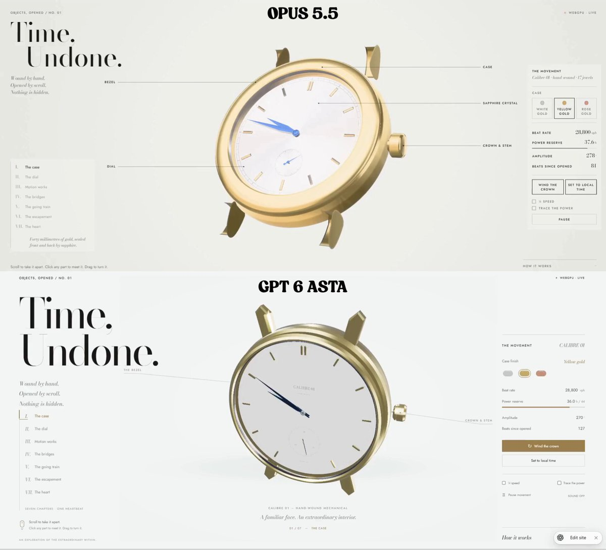</a>

Tạo một chiếc đồng hồ cơ 3D tương tác tự chứa, chạy bằng WebGPU và WGSL. Calibre 01 lên cót tay, không thương hiệu, sử dụng bộ máy Swiss lever được đặc tả chính xác về cơ khí, hiển thị mức dự trữ năng lượng theo thời gian thực, hỗ trợ tương tác lên dây và chế độ bung tách bảy giai đoạn điều khiển bằng thao tác cuộn — đồng hồ vẫn tiếp tục chạy khi đã tháo rời. Trải nghiệm bao gồm kiểm tra từng linh kiện, điều khiển camera, các preset vỏ vàng, kiểm định kỹ thuật và giao diện biên tập lấy cảm hứng từ nhiếp ảnh macro.

**Prompt**

```text
Xây dựng "Time, Undone." — một tệp HTML tự chứa duy nhất (nhúng JS và CSS), chạy một chiếc đồng hồ cơ 3D tương tác thực sự bằng WebGPU + WGSL. Đồng hồ tự bung tách khi người dùng cuộn trang nhưng vẫn tiếp tục chạy. Không dùng thư viện engine 3D; toàn bộ hình học được tạo bằng mã. Đây là số 01 trong một series về những vật thể ai cũng từng thấy từ bên ngoài nhưng gần như chưa ai thấy bên trong.
VẬT THỂ
Một chiếc đồng hồ cơ lên cót tay nguyên bản, không thương hiệu, trong vỏ tròn 40 mm, với bộ máy Swiss lever cổ điển có đường kính khoảng 30 mm.
Bố cục: kim giờ và kim phút ở trung tâm; mặt số phụ chỉ giây nhỏ tại vị trí 6 giờ; núm chỉnh giờ tại vị trí 3 giờ.
Mặt số: màu bạc opaline với họa tiết guilloché tỏa tia mảnh, cọc số nổi đánh bóng, kim dauphine và vạch phút kiểu đường sắt.
Vỏ: kính sapphire phía trước và nắp đáy lộ máy để có thể quan sát bộ máy từ mặt sau.
Không sử dụng tên thương hiệu, logo hay tên calibre có thật ở bất kỳ đâu. Gọi sản phẩm là "Calibre 01".
CƠ CẤU (phải chính xác về mặt cơ khí, không chỉ mang tính trang trí)
Tần số dao động 28.800 vph (bánh xe cân bằng 4 Hz).
Xây dựng một train bánh răng thực với số răng nhất quán:thùng cót 96 răng → pinion bánh trung tâm 12 răng; bánh trung tâm quay một vòng mỗi giờ và mang kim phút;
bánh trung tâm 80 răng → pinion bánh thứ ba 10 răng;
bánh thứ ba 75 răng → pinion bánh thứ tư 10 răng; bánh thứ tư quay một vòng mỗi phút và mang kim giây nhỏ;
bánh thứ tư 84 răng → pinion bánh thoát 7 răng;
bánh thoát 20 răng, quay một vòng mỗi 5 giây.

Bộ truyền dưới mặt số: pinion trung tâm 12 răng → bánh phút 36 răng; pinion phút 10 răng → bánh giờ 40 răng (tỷ số 12:1).
Bộ lên cót: núm chỉnh giờ, trục núm, bánh cót, bánh cóc, cò hãm và lò xo.
Bộ thoát: bánh thoát, càng gạt với hai ngựa ruby và chốt chặn, bánh xe cân bằng với dây tóc và con lăn truyền lực.
Kết cấu: bản máy, cầu thùng cót, cầu train, cầu giữ bánh cân bằng, ổ chân kính ruby và vít nung xanh.
Bánh răng: biên dạng răng cycloidal kiểu đồng hồ, các nan bánh đan chéo, pinion có cánh răng, trục và đầu trục. Khoảng cách tâm được tính từ một module chung để mọi cặp bánh răng ăn khớp chính xác và nhìn thấy rõ khi lắp ráp.
Chuyển động được điều khiển từ MỘT đồng hồ chủ: bánh xe cân bằng dao động theo θ(t) = A·sin(2π·4·t), với biên độ A khoảng 270° khi đầy cót;
ở mỗi nhịp, càng gạt bật qua lại giữa các chốt chặn, bánh thoát tiến nửa răng trong một xung lực ngắn có giảm tốc êm, rồi khóa lại;
mọi bánh còn lại nhích đúng theo tỷ số truyền của bánh thoát;
kim giây nhảy 8 lần mỗi giây; kim phút và kim giờ chuyển động theo train.
Khi tải trang, đặt kim theo giờ địa phương của người xem.

Năng lượng: mức dự trữ khoảng 44 giờ, giảm theo thời gian thực. Biên độ giảm từ 290° xuống 180° khi cót cạn; ở mức 0, đồng hồ dừng và bánh cân bằng lắng dần thay vì đứng khựng.
Lên cót sẽ tăng mức dự trữ, đi kèm chuyển động nhìn thấy được của bánh cóc và cò hãm cùng âm thanh click nhẹ (Web Audio, tắt tiếng cho đến lần tương tác đầu tiên của người dùng).

Cơ cấu tiếp tục chạy ở mọi trạng thái bung tách: bánh răng quay giữa không trung, bánh cân bằng vẫn dao động và kim giây vẫn nhảy.
BUNG TÁCH (điều khiển bằng thao tác cuộn, có các điểm dừng)
Thao tác cuộn trang được ánh xạ thành giá trị tiến độ từ 0 đến 1, chia thành bảy chương. Mỗi chương chuyển êm vào một "điểm dừng" ổn định, tại đó thao tác cuộn tạm thời lắng lại (snap nhẹ, tuyệt đối không khóa cứng). Camera di chuyển mượt giữa các chương.
Các chương:
I. Vỏ: góc nhìn 3/4 phía trước, đồng hồ đang lắp ráp.
II. Mặt số: kính và vành bezel nâng ra; kim và mặt số nâng lên.
III. Bộ truyền: các bánh dưới mặt số tách rời.
IV. Các cầu: đồng hồ lật lại để lộ mặt sau; nắp đáy nâng lên; các cầu và cầu giữ bánh cân bằng nâng lên, cùng các vít lơ lửng ngay phía trên lỗ vít.
V. Train bánh răng: thùng cót, bánh trung tâm, bánh thứ ba và bánh thứ tư tản lên trên dọc theo trục riêng, như một bản vẽ kỹ thuật.
VI. Bộ thoát: bánh thoát, càng gạt và bánh cân bằng tách ra thêm một khoảng, camera tiến gần.
VII. Trái tim: góc nhìn macro vào bánh cân bằng và dây tóc đang dao động, với toàn bộ cột linh kiện bung tách ở phía sau.
Mỗi linh kiện di chuyển theo một trục rõ ràng, chủ yếu là trục riêng của nó hoặc thẳng đứng lên khỏi bản máy. Các linh kiện thuộc cùng một cụm vẫn đi cùng nhau. Không linh kiện nào giao cắt trong quá trình bung tách và không linh kiện nào ra khỏi khung hình.
Các đường dẫn mảnh dạng hairline, có nhãn viết hoa nhỏ và đầu chặn nhỏ, xuất hiện cho những linh kiện chính tại mỗi điểm dừng rồi mờ đi khi chuyển điểm dừng.
INTERACTION
Thao tác cuộn (con lăn, trackpad, vuốt cảm ứng) điều khiển quá trình bung tách.
Kéo trên vùng trống để xoay đồng hồ trong giới hạn cho phép; khi thả, đồng hồ chuyển êm về vị trí ban đầu.
Di chuột lên một linh kiện sẽ viền sáng nhẹ và hiển thị tên linh kiện.
Nhấp vào một linh kiện:linh kiện đó được làm nổi bật, các linh kiện khác giảm sáng còn khoảng 35% và camera chuyển êm để lấy trọn linh kiện;
một thẻ thông tin mở bên cạnh, nối với linh kiện bằng đường dẫn hairline. Thẻ hiển thị: tên; vai trò trong một hoặc hai câu dễ hiểu; một thông tin chính xác (ví dụ: "Bánh thoát · 20 răng · một vòng mỗi 5 giây"); và một giá trị trực tiếp (tốc độ, góc hiện tại hoặc tổng số nhịp đã thực hiện).
Nhấn Esc, nút đóng hoặc nhấp vào vùng trống để quay lại.

Kéo núm chỉnh giờ theo chiều ngang để lên cót (cảm giác như cơ cấu bánh cóc), khi núm đang hiển thị.
Bắt sự kiện con trỏ, chuột và cảm ứng. Chọn đối tượng bằng một lượt render object-ID hoặc phép kiểm tra tia chính xác; không dùng hình cầu bao quanh gần đúng.
KẾT XUẤT (kim loại chân thực, cảm giác nhiếp ảnh macro — không hoạt hình)
Vật liệu PBR, cùng môi trường studio tạo theo quy trình (hộp softbox lớn, đèn dải và nguồn sáng bù ấm, mờ) để tạo phản xạ.
Bề mặt hoàn thiện:các sọc Côtes de Genève trên cầu (specular chải bất đẳng hướng, căn theo hướng sọc);
perlage (vân tròn) trên bản máy;
các cạnh vát đánh bóng gương (anglage) bắt sáng mạnh ở mép;
vít và kim nung xanh bằng hiệu ứng màng mỏng;
chân kính ruby đỏ trong mờ với ánh lấp lánh bên trong;
các linh kiện thép mạ rhodium;
kính sapphire với phản xạ xanh lam tím nhạt và độ dày nhẹ ở cạnh.

Vỏ sử dụng màu vàng đã chọn.
Điểm nhấn: bloom có kiểm soát chỉ trên vùng specular nổi bật; các tia lấp lánh nhỏ trên chân kính và cạnh đánh bóng xuất hiện khi ánh sáng hoặc đồng hồ chuyển động. Sang trọng, không lấp lánh quá mức.
Bóng tiếp xúc mềm, ambient occlusion nhẹ và độ sâu trường ảnh tinh tế bám theo linh kiện đang lấy nét.
Tone mapping kiểu phim, không làm cháy vùng sáng; 4x MSAA hoặc tương đương.
Nền: trắng sứ nhạt với vignette mềm, như một studio chụp ảnh liền mạch. Không ngả vàng, không màu kem.
GIAO DIỆN (quý phái, mang tính biên tập, nhiều khoảng trắng)
Phông chữ: "Bodoni Moda" cho tiêu đề và chữ số, "Jost" cho văn bản giao diện (Google Fonts, có font serif và sans-serif dự phòng). Nhãn viết hoa nhỏ với tracking 0.16em; chữ số dạng bảng.
Màu sắc:màu mực #1B1A17 trên nền sứ;
đường hairline 1px ở mức 15% màu mực;
màu nhấn theo màu vàng đã chọn.

Không dùng gradient trên thành phần giao diện, không đổ bóng nặng, không emoji.
Góc trên bên trái: kicker "OBJECTS, OPENED / NO. 01";
tiêu đề Bodoni lớn trên hai dòng, "Time," / "Undone.";
ba dòng chú thích in nghiêng bằng Bodoni: "Lên cót bằng tay." "Bung tách bằng thao tác cuộn." "Không gì bị che giấu."

Góc trên bên phải: trạng thái "WEBGPU · LIVE" kèm một chấm nhỏ.
Cạnh trái, căn giữa theo chiều dọc: mục lục chương "I. Vỏ", "II. Mặt số", "III. Bộ truyền", "IV. Các cầu", "V. Train bánh răng", "VI. Bộ thoát", "VII. Trái tim". Chương hiện tại được làm nổi bật bằng một đường tiến độ hairline; nhấp vào chương để cuộn đến chương đó.

Panel bên phải "BỘ MÁY":ba preset vỏ: Vàng trắng, Vàng vàng, Vàng hồng, kèm các ô màu kim loại nhỏ;
các chỉ số trực tiếp: Tần số dao động "28.800 vph", Mức dự trữ năng lượng (giờ, kèm thanh mảnh), Biên độ (°), Số nhịp kể từ khi mở;
các nút "Lên cót" và "Đặt theo giờ địa phương";
các checkbox "¼ tốc độ" và "Theo dõi dòng năng lượng". Tính năng theo dõi dòng năng lượng tạo một vệt sáng chậm chạy dọc theo đường truyền năng lượng: dây cót chính → thùng cót → bánh trung tâm → bánh thứ ba → bánh thứ tư → bánh thoát → càng gạt → bánh cân bằng, trong đó mỗi linh kiện phát sáng khi vệt sáng đi qua;
một nút Tạm dừng/Tiếp tục.

Gợi ý ở góc dưới bên trái: "Cuộn để tháo rời. Nhấp vào bất kỳ linh kiện nào để khám phá. Kéo để xoay."
Góc dưới bên phải: mục "Cách hoạt động" có thể thu gọn, giải thích ngắn gọn và chính xác về train bánh răng, bộ thoát, bánh cân bằng và mức dự trữ năng lượng, cùng một ghi chú ngắn về cách trang này kết xuất chúng.
Trên thiết bị di động: canvas chiếm khoảng 65% phía trên màn hình và mục lục chương chuyển thành một hàng ngang gồm các chữ số La Mã. Panel nằm bên dưới; thẻ linh kiện chuyển thành bottom sheet. Không thành phần nào che khuất đồng hồ.
ENGINEERING
Tạo toàn bộ hình học một lần khi khởi động. Dùng instancing cho các linh kiện lặp lại (vít, chân kính và răng khi phù hợp). Mỗi frame chỉ cập nhật transform; không biên dịch shader hoặc xây dựng lại buffer trong lúc tương tác.
Thời gian animation lấy từ một đồng hồ duy nhất, có hệ số tốc độ ¼. Tạm dừng sẽ đóng băng cơ cấu, không phải giao diện.
Tôn trọng prefers-reduced-motion: chuyển chương tức thì, không bay camera, không animation lấp lánh.
Nếu không có WebGPU, hiển thị lời giải thích rõ ràng và được thiết kế chỉn chu. Không dùng trình kết xuất fallback giả.
Xử lý mất thiết bị. Giới hạn pixel ratio ở mức 2. Hướng đến 60 fps trên laptop và trải nghiệm mượt trên điện thoại đời mới.
KIỂM ĐỊNH TRƯỚC KHI BÀN GIAO
Trong mã, assert các tỷ số truyền: kim giây quay một vòng mỗi 60 giây, kim phút một vòng mỗi 3600 giây, kim giờ một vòng mỗi 12 giờ và bánh thoát một vòng mỗi 5 giây. Ghi kết quả kiểm tra vào console.
Mọi cặp bánh răng ăn khớp đều phải có khoảng cách tâm chính xác và nhìn thấy rõ trạng thái ăn khớp khi lắp ráp.
Không linh kiện nào giao cắt với linh kiện khác ở bất kỳ mức tiến độ bung tách nào; không xảy ra z-fighting.
Các điểm dừng khi cuộn, chuyển chương, chọn linh kiện, thẻ thông tin, lên cót, preset, theo dõi dòng năng lượng, tạm dừng, tốc độ ¼ và bố cục di động đều phải hoạt động.
Nội dung thẻ phải chính xác về mặt thuật ngữ và cơ chế đồng hồ.
Không có lỗi trong console.
```

[Xem chi tiết ↗](https://www.tripo3d.ai/vi/3d-prompts/gpt-6-astra-2105009377002299711) · [Bài đăng gốc](https://x.com/theparuchh/status/2105009470292013286) · [Về danh sách ví dụ](#all-prompts)

---

<a id="2105027152617918852"></a>

### Mô hình F-22 Raptor chân thực và video bay trong Godot

[Demetrius Greses Jr](https://x.com/dgresesjr) · 2026-09-29

<a href="https://www.tripo3d.ai/vi/3d-prompts/gpt-6-astra-2105027152617918852">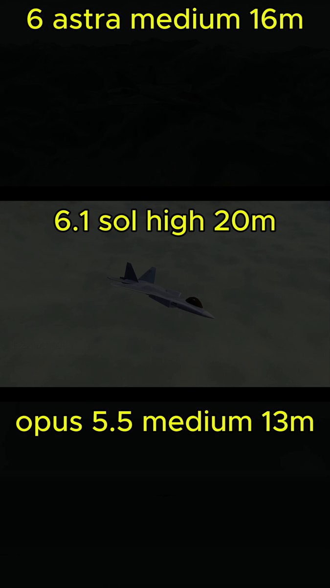</a>

Prompt so sánh yêu cầu tạo mô hình 3D chân thực của Lockheed Martin F-22 Raptor, sau đó tạo video MP4 dài 60 giây ghi lại máy bay bay trong Godot để đăng lên X. Bài đăng gốc liệt kê 6 Astra trong số các mô hình được so sánh.

**Prompt**

```text
Sử dụng Blender MCP. Hãy tạo cho tôi một mô hình 3D chân thực của Lockheed Martin F-22 Raptor (chỉ phiên bản Mỹ). Sau đó tạo video MP4 dài 60 giây về máy bay này bay trong Godot để tôi có thể đăng lên X.
```

[Xem chi tiết ↗](https://www.tripo3d.ai/vi/3d-prompts/gpt-6-astra-2105027152617918852) · [Bài đăng gốc](https://x.com/dgresesjr/status/2105027152617918852) · [Về danh sách ví dụ](#all-prompts)

---

<a id="2105047166733746209"></a>

### Cảnh phóng tên lửa chân thực như phim điện ảnh

[Matthew Lebo](https://x.com/MatthewLebo_) · 2026-09-29

<a href="https://www.tripo3d.ai/vi/3d-prompts/gpt-6-astra-2105047166733746209">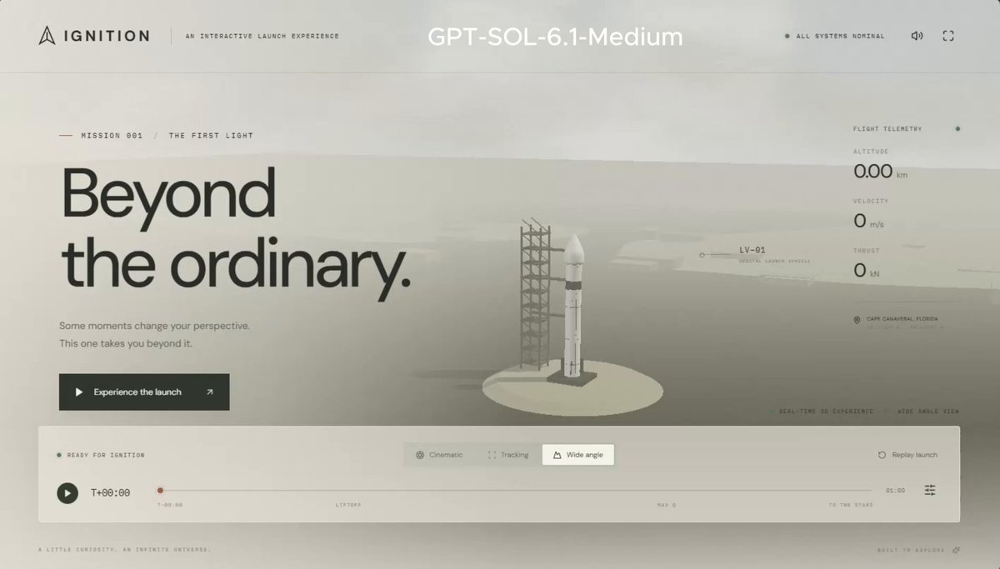</a>

Prompt có thể tái sử dụng do tác giả bài đăng chia sẻ, sử dụng cùng một nội dung đầu vào chính xác để so sánh GPT-Astra, GPT-6.1-Sol và Claude Opus 5.5. Prompt yêu cầu xây dựng cảnh phóng tên lửa 3D mang phong cách điện ảnh, chân thực như ảnh và có kết cấu bề mặt bằng Three.js.

**Prompt**

```text
Xây dựng một cảnh phóng tên lửa 3D mang phong cách điện ảnh, chân thực như ảnh và có kết cấu bề mặt đẹp mắt bằng Three.js
```

[Xem chi tiết ↗](https://www.tripo3d.ai/vi/3d-prompts/gpt-6-astra-2105047166733746209) · [Bài đăng gốc](https://x.com/MatthewLebo_/status/2105047166733746209) · [Về danh sách ví dụ](#all-prompts)

---

<a id="2105278999861526953"></a>

### Bản render Blender của cầu Golden Gate

[EvoLink.ai](https://x.com/EvoLinkAi) · 2026-09-30

<a href="https://www.tripo3d.ai/vi/3d-prompts/gpt-6-astra-2105278999861526953">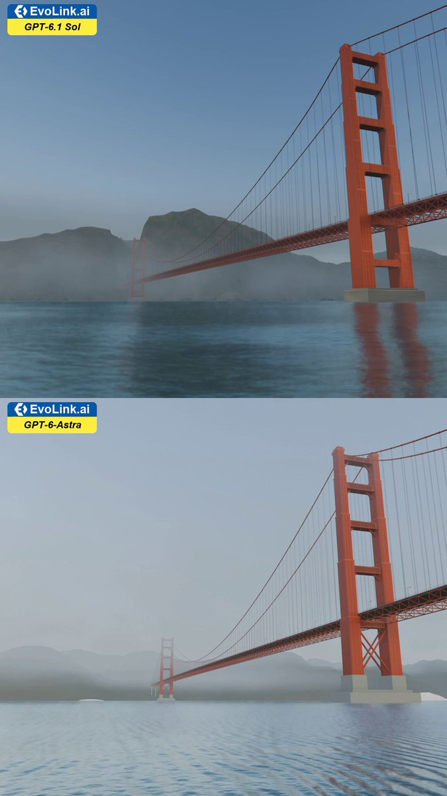</a>

Prompt benchmark do EvoLink.ai chia sẻ để render cầu Golden Gate trong Blender. Prompt này mô tả góc nhìn cực thấp từ vịnh San Francisco, khung cảnh buổi sáng phủ sương, các tháp giàn thép phức tạp, phương tiện giao thông trên cầu được thể hiện chi tiết và những mũi đất ven biển gồ ghề.

**Prompt**

```text
Bản render Blender của cầu Golden Gate. Góc quay bao quát, cực thấp từ mặt vịnh San Francisco, hướng lên các tháp giàn thép đồ sộ và phức tạp vươn xuyên qua bầu trời buổi sáng phủ sương. Mặt cầu rộng trải dài qua toàn bộ nhịp cầu, với vô số phương tiện nhỏ được thể hiện chi tiết, làm nổi bật quy mô hùng vĩ, bề thế của cây cầu giữa những mũi đất ven biển gồ ghề.
```

[Xem chi tiết ↗](https://www.tripo3d.ai/vi/3d-prompts/gpt-6-astra-2105278999861526953) · [Bài đăng gốc](https://x.com/EvoLinkAi/status/2105279002793345069) · [Về danh sách ví dụ](#all-prompts)

---

<a id="2105298955307303100"></a>

### Tạo nhân vật Minion 3D trong Blender

[EvoLink.ai](https://x.com/EvoLinkAi) · 2026-09-30

<a href="https://www.tripo3d.ai/vi/3d-prompts/gpt-6-astra-2105298955307303100">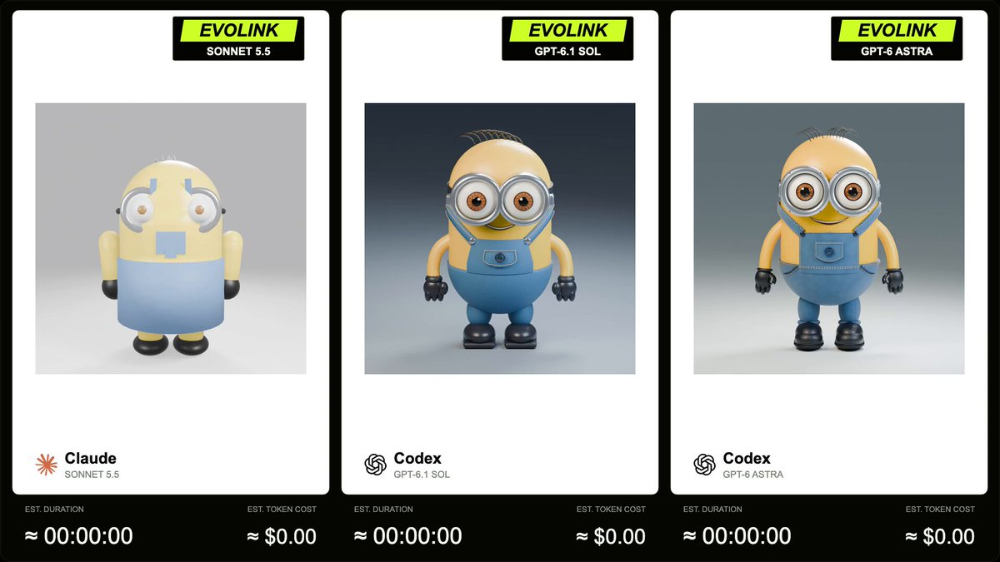</a>

Prompt của tác giả đã được xác minh, dùng làm bài kiểm tra tạo nhân vật 3D trong Blender cho GPT-6.1 Sol, Sonnet 5.5 và GPT-6 Astra. Prompt yêu cầu một script bpy có thể thực thi để dựng nhân vật phong cách Minion với vật liệu, các thành phần đối xứng, ánh sáng studio và video turntable hình vuông dài năm giây.

**Prompt**

```text
Viết một script Python hoàn chỉnh, có thể thực thi, sử dụng module bpy của Blender để tạo nhân vật Minion 3D, thiết lập hoạt ảnh camera quay turntable 360 độ và render video 5 giây với tỷ lệ 1:1.
Thông số hoạt ảnh & render:

Tốc độ khung hình & thời lượng: Đặt tốc độ khung hình là 30 fps và phạm vi render từ frame 1 đến 150 (chính xác 5 giây).
Tỷ lệ khung hình: Đặt độ phân giải render là 1080x1080 pixel (tỷ lệ vuông 1:1).
Hoạt ảnh camera turntable: Tạo hoạt ảnh cho camera (hoặc một đối tượng empty điều khiển được parent vào camera) để thực hiện chuyển động xoay 360 độ liền mạch quanh Minion trong 150 frame.
Đặt phép nội suy keyframe là LINEAR để bảo đảm chuyển động xoay mượt và có tốc độ không đổi.

Cài đặt đầu ra: Đặt định dạng đầu ra thành video FFmpeg (H.264 / container MP4).
Yêu cầu kỹ thuật & cấu trúc mô hình:
Thân chính: Tạo một mesh dạng viên nang cho thân chính (vật liệu màu vàng, subsurface scattering/độ nhám khoảng 0.3).
Thêm các sợi tóc đen mảnh, thưa trên đỉnh đầu.

Kính & mắt: Dựng kính hai tròng bằng các cylinder/torus được extrude.
Vật liệu gọng kính: Metallic (~0.9), Roughness (~0.2) để mô phỏng nhôm/kim loại xước.
Thêm dây đeo co giãn màu đen quấn quanh thân.
Tạo hai mesh nhãn cầu bên trong gọng kính (lòng trắng, mống mắt nâu, đồng tử bóng).

Trang phục - yếm: Dựng yếm denim bằng hình học mesh riêng hoặc các phần thân được extrude.
Vật liệu: Màu denim xanh, độ nhám cao hơn (~0.6).
Bao gồm dây đeo vai và túi trước ở ngực.

Chi & chi tiết: Thêm tay và chân với bàn tay đeo găng đen cùng giày đen.
Sử dụng Mirror Modifier (bpy.ops.object.modifier_add(type='MIRROR')) khi phù hợp (ví dụ: mắt, gọng kính, tay, dây đeo, chân) để bảo đảm tính đối xứng và code gọn gàng.

Ánh sáng & scene: Thiết lập hệ thống chiếu sáng ba điểm (Key, Fill, Rim), parent vào camera hoặc bố trí đồng đều để ánh sáng nhất quán trong suốt quá trình xoay.
Đặt render engine là Cycles hoặc Eevee với phông nền studio sạch.
Bảo đảm mọi vật liệu đều được tạo bằng Nodes (use_nodes = True).

CHỈ trả về code Python hợp lệ bên trong một khối markdown, không kèm văn bản hoặc phần giải thích markdown nào khác.
```

[Xem chi tiết ↗](https://www.tripo3d.ai/vi/3d-prompts/gpt-6-astra-2105298955307303100) · [Bài đăng gốc](https://x.com/EvoLinkAi/status/2105298964027265295) · [Về danh sách ví dụ](#all-prompts)

---

<a id="2105323534398763307"></a>

### Tái tạo cảnh trong Isaac Sim

[Charles Wong](https://x.com/charleswongzx) · 2026-09-30

<a href="https://www.tripo3d.ai/vi/3d-prompts/gpt-6-astra-2105323534398763307">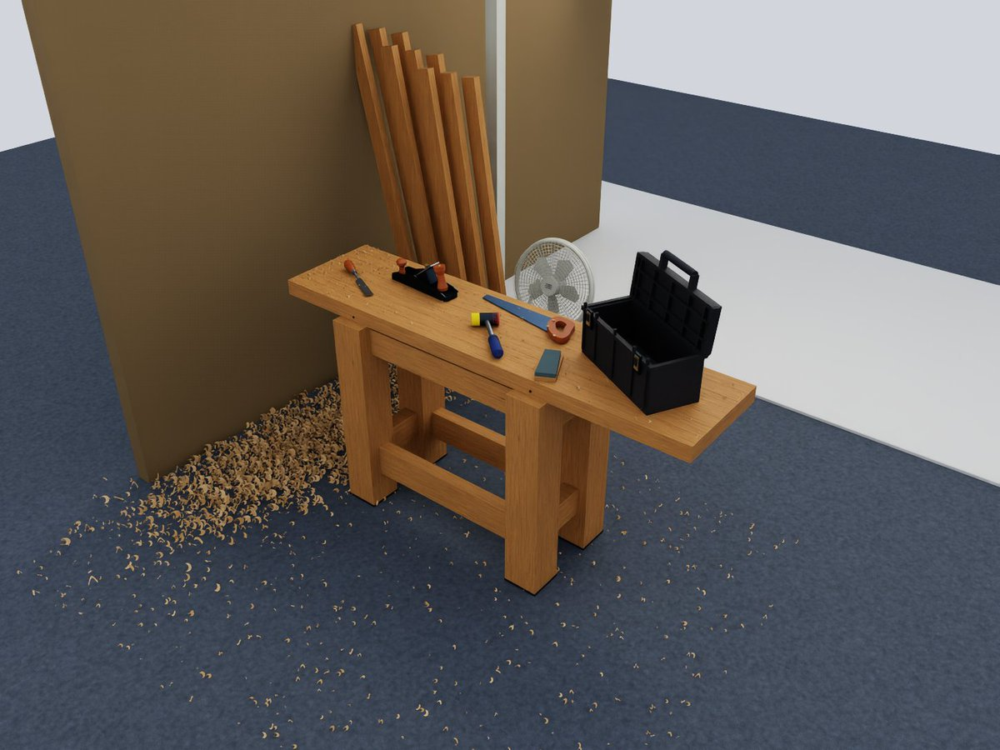</a>

Prompt tái tạo cảnh đính kèm trong Isaac Sim để đánh giá chính sách thao tác, không sử dụng Manifold.

**Prompt**

```text
Tái tạo cảnh này trong Isaac Sim nhằm đánh giá chính sách thao tác. Không sử dụng Manifold.
```

[Xem chi tiết ↗](https://www.tripo3d.ai/vi/3d-prompts/gpt-6-astra-2105323534398763307) · [Bài đăng gốc](https://x.com/charleswongzx/status/2105323534398763307) · [Về danh sách ví dụ](#all-prompts)

---

<a id="2105412081692352654"></a>

### Sa bàn kim tự tháp 3D thu nhỏ màu vàng

[demon](https://x.com/demonugc) · 2026-09-30

<a href="https://www.tripo3d.ai/vi/3d-prompts/gpt-6-astra-2105412081692352654">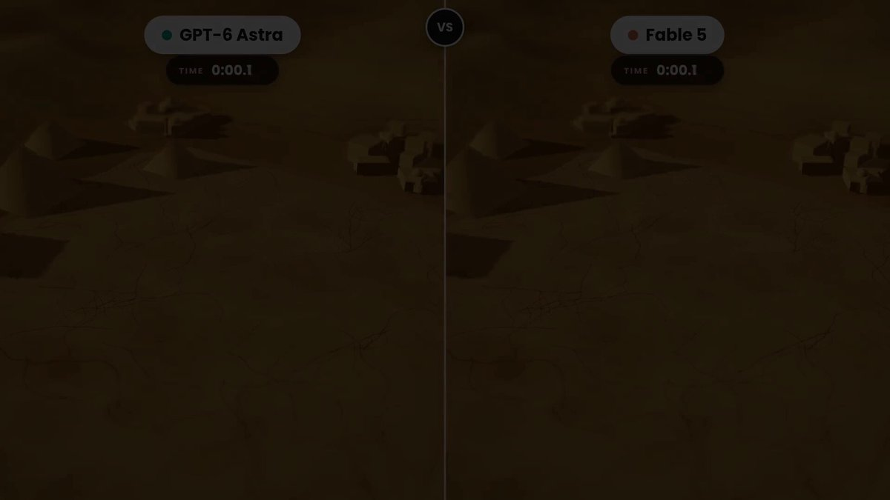</a>

Prompt do tác giả chia sẻ để so sánh GPT-6 Astra và Fable 5 trên màn hình chia đôi trong 15 giây. Prompt yêu cầu một sa bàn kim tự tháp và đền thờ thu nhỏ màu vàng, với camera chuyển động quanh đồng bộ và hoạt ảnh biến hình kim tự tháp.

**Prompt**

```text
{
  "task": "dựng các kim tự tháp trong không gian 3D. xoay camera",
  "video": { "duration": "15s", "ratio": "16:9", "layout": "màn hình chia đôi, 1 mô hình mỗi bên" },
  "scene": "sa bàn thu nhỏ màu vàng, hiệu ứng tilt-shift, ánh sáng chạng vạng tối, kim tự tháp chạm khắc mượt mà, đền thờ, các kim tự tháp nhỏ, quảng trường nứt vỡ, địa hình đồng mức",
  "animation": "kim tự tháp biến hình từ đáy lên đỉnh, không có công nhân, không có đường dốc, không có khối",
  "camera": "camera chuyển động quanh liên tục 150 độ, đồng bộ ở cả hai bên",
  "overlay": "chỉ tên mô hình + bộ hẹn giờ"
}
```

[Xem chi tiết ↗](https://www.tripo3d.ai/vi/3d-prompts/gpt-6-astra-2105412081692352654) · [Bài đăng gốc](https://x.com/demonugc/status/2105412081692352654) · [Về danh sách ví dụ](#all-prompts)

---

<a id="2105644436659290409"></a>

### game 3D né thiên thạch

[dubspeak.com](https://dubspeak.com/) · 2026-10-01

<a href="https://www.tripo3d.ai/vi/3d-prompts/gpt-6-astra-2105644436659290409">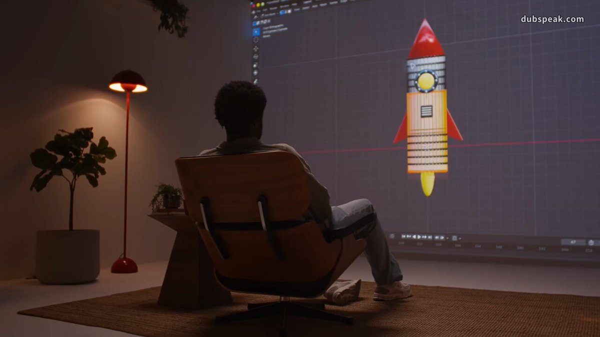</a>

Bản chép lời DubSpeak được liên kết từ một video gốc của OpenAI, trong đó trích dẫn yêu cầu tạo một game 3D né thiên thạch, di chuyển bằng các phím mũi tên và tăng tốc bằng phím cách.

**Prompt**

```text
Bây giờ, tôi muốn bạn tạo một game 3D, trong đó tôi né các thiên thạch bằng cách dùng các phím mũi tên để di chuyển và dùng phím cách để tăng tốc.
```

[Xem chi tiết ↗](https://www.tripo3d.ai/vi/3d-prompts/gpt-6-astra-2105644436659290409) · [Bài đăng gốc](https://dubspeak.com/gpt-6-astra-intro-20260928-v5/) · [Về danh sách ví dụ](#all-prompts)

---

<a id="2106385060106777043"></a>

### Cảnh thuyền 3D có thể điều khiển trên sông vùng núi

[けんすみ｜海外AI事例編集者](https://x.com/kensumi_ai) · 2026-10-03

<a href="https://www.tripo3d.ai/vi/3d-prompts/mountain-river-boat-interactive-3d-scene">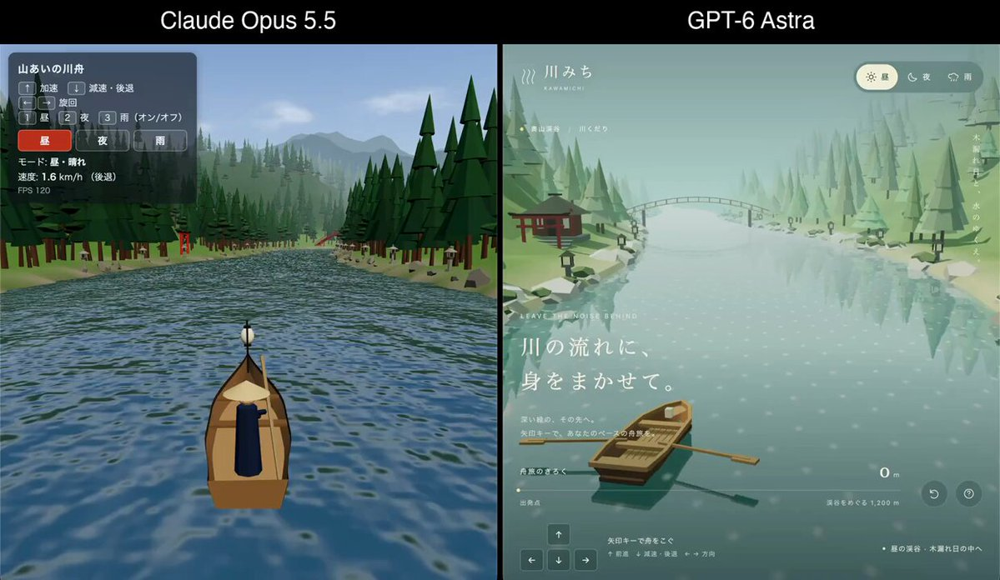</a>

Đây là hướng dẫn tạo một cảnh 3D bằng three.js, trong đó người dùng chèo thuyền dọc theo một con sông vùng núi ở Nhật Bản. Cảnh cần hỗ trợ điều khiển thuyền bằng các phím mũi tên, chuyển đổi giữa ngày, đêm và mưa, đồng thời làm cho những chiếc đèn lồng ven sông phát sáng vào ban đêm. Người đăng cho biết đã gửi cùng một hướng dẫn này cho GPT-6 Astra một lần.

**Prompt**

```text
Hãy tạo bằng three.js một cảnh 3D, trong đó người dùng chèo thuyền dọc theo một con sông vùng núi ở Nhật Bản. Cho phép điều khiển thuyền bằng các phím mũi tên, chuyển đổi giữa ngày, đêm và mưa, đồng thời làm cho những chiếc đèn lồng ven sông phát sáng vào ban đêm.
```

[Xem chi tiết ↗](https://www.tripo3d.ai/vi/3d-prompts/mountain-river-boat-interactive-3d-scene) · [Bài đăng gốc](https://x.com/kensumi_ai/status/2106385072266084741) · [Về danh sách ví dụ](#all-prompts)

---

<a id="2106737391948235164"></a>

### Không gian 3D ngôi nhà có thể tham quan bằng trình duyệt

[けんすみ｜海外AI事例編集者](https://x.com/kensumi_ai) · 2026-10-04

<a href="https://www.tripo3d.ai/vi/3d-prompts/3d-house-browser-walkthrough">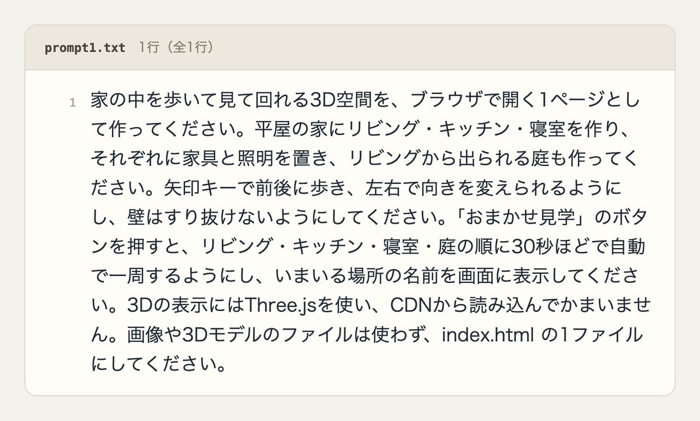</a>

Hướng dẫn tạo không gian 3D để đi lại và tham quan bên trong ngôi nhà, mở dưới dạng một trang duy nhất trên trình duyệt.

**Prompt**

```text
Hãy tạo một không gian 3D để đi lại và tham quan bên trong ngôi nhà, mở dưới dạng một trang duy nhất trên trình duyệt.
```

[Xem chi tiết ↗](https://www.tripo3d.ai/vi/3d-prompts/3d-house-browser-walkthrough) · [Bài đăng gốc](https://x.com/kensumi_ai/status/2106737391948235164) · [Về danh sách ví dụ](#all-prompts)

---

<a id="2106824464092770455"></a>

### Tạo trailer điện ảnh cho một trò chơi hư cấu

[Paruchh](https://x.com/theparuchh) · 2026-10-04

<a href="https://www.tripo3d.ai/vi/3d-prompts/procedural-game-trailer-blender-animation">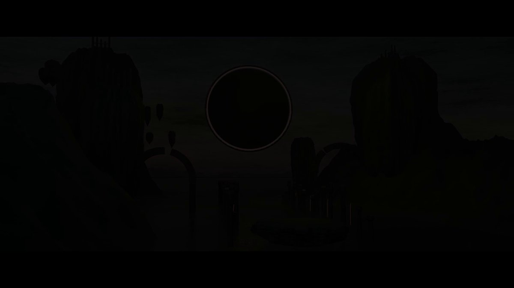</a>

Prompt đầy đủ có chú thích của tác giả để tạo trailer điện ảnh dài 35–40 giây cho một trò chơi hư cấu. Prompt yêu cầu một thế giới 3D được tạo theo quy trình, hoạt ảnh sinh vật hoặc nhân vật, ánh sáng giàu không khí, âm thanh tổng hợp, nhịp dựng theo storyboard, kiểm tra chất lượng và các tệp nguồn Blender/Python có thể tái tạo. Bài đăng gốc cho biết GPT-6 Astra đã tạo trailer được giới thiệu từ prompt này.

**Prompt**

```text
Tạo trailer điện ảnh dài 35–40 giây cho một trò chơi hư cấu, với chất lượng sản xuất như trailer giới thiệu tại The Game Awards

QUY TẮC CHÍNH
Mọi thứ người xem nhìn thấy và nghe thấy phải được tạo bằng code của bạn: hình học, vật liệu, hoạt ảnh, ánh sáng, hạt, tiêu đề, âm nhạc và âm thanh
Không sử dụng mô hình, kết cấu bề mặt, HDRI, hình ảnh, video, âm thanh hoặc font logo có sẵn từ internet
Được phép sử dụng font hệ thống

TOOLS

- Blender (headless, Python/bpy): tạo nội dung theo quy trình bằng Geometry Nodes và shader nodes; tạo hoạt ảnh bằng keyframe và driver
- Kết xuất: EEVEE Next (bloom, volumetric, motion blur, depth of field); chỉ dùng Cycles cho 1–2 cảnh chủ đạo nếu còn thời gian
- Âm thanh: tổng hợp bằng Python (numpy/scipy) hoặc SuperCollider cho âm nhạc, âm thanh môi trường, tiếng va chạm, tiếng vụt, tiếng rung trầm và một tiếng BRAAAM sâu ở cao trào
- Dựng: dùng ffmpeg để biên tập, chỉnh màu, thêm hạt phim, letterbox 2.39:1 và trộn âm thanh

BƯỚC 1: Ý TƯỞNG
Sáng tạo một trò chơi: tên, bối cảnh, xung đột và một điểm nhấn hình ảnh đáng nhớ, chẳng hạn thế giới có những ngọn núi bay hoặc một sinh vật khổng lồ bên dưới tầng mây
Viết nội dung vào CONCEPT.md

BƯỚC 2: STORYBOARD
Lập kế hoạch cho 8–12 cảnh quay kèm timecode trong STORYBOARD.md
Với mỗi cảnh, mô tả những gì nằm trong khung hình, chuyển động máy quay (dolly, crane, orbit, bay xuyên cảnh theo góc nhìn thứ nhất, slow push-in), tiêu cự, ánh sáng và âm thanh
Cấu trúc:

- 0–8 giây: yên tĩnh và giàu không khí, bình minh, các cảnh toàn chậm
- 8–20 giây: nhịp độ tăng dần, chuyển từ ngày sang đêm (bầu trời và bóng đổ time-lapse), những dấu hiệu đầu tiên của mối đe dọa
- 20–32 giây: cao trào, cắt nhanh theo nhịp, quy mô hùng vĩ, hạt, những luồng sáng bùng nổ, một sinh vật hoặc một sự kiện
- 32–35 giây: va chạm, màn hình đen, logo trò chơi có hoạt ảnh
- 35–40 giây: “Coming 2027” và một âm thanh kết thúc nhẹ

BƯỚC 3: THẾ GIỚI VÀ HOẠT ẢNH TRONG BLENDER

- Địa hình theo quy trình (nhiễu + xói mòn), thảm thực vật hoặc tàn tích theo quy trình bằng instancing, nước hoặc mây volumetric
- Ít nhất một hoạt ảnh nhân vật hoặc sinh vật phức tạp: rig xương tạo bằng code, chuyển động đi bộ hoặc vỗ cánh theo quy trình, hoạt ảnh phụ (đuôi, vải, hạt bụi)
- Bầu trời động: Nishita sky hoặc shader tùy chỉnh, mặt trời di chuyển theo cung, các vì sao vào ban đêm
- Không khí: sương mù, tia sáng xuyên mây, bụi trong các chùm sáng, hạt (tia lửa, tro, lá)
- Máy quay: đường cong Bézier mượt, easing, rung máy cầm tay nhẹ do nhiễu điều khiển trong các cảnh động, không dùng chuyển động tuyến tính
- Logo: chữ 3D hoặc biểu trưng theo quy trình với hoạt ảnh lắp ráp và shader phát sáng

BƯỚC 4: ÂM THANH
Đồng bộ âm nhạc với phần dựng: tempo và các điểm nhấn phải khớp với timecode cắt cảnh
Các lớp âm thanh: lớp nền môi trường, bass nhịp, bộ gõ trong cao trào, thiết kế âm thanh cho những sự kiện cụ thể trên màn hình
Bản trộn cuối: stereo, chuẩn hóa ở mức -14 LUFS

BƯỚC 5: KIỂM SOÁT CHẤT LƯỢNG

- Trước tiên, kết xuất bản xem trước độ phân giải thấp cho từng cảnh và 3 khung hình tĩnh mỗi cảnh; tự kiểm tra và đánh giá trung thực về bố cục, ánh sáng, khả năng đọc hiểu và mức độ cao cấp của hình ảnh; chỉnh sửa các cảnh yếu
- Chỉ thực hiện kết xuất cuối sau đó

DELIVERABLES

- trailer.mp4: 1920×1080, 24 fps, H.264, AAC
- Thư mục nguồn: tệp .blend, toàn bộ script tạo nội dung, script âm thanh, script dựng
- https://t.co/vviyxTr1Yi / build.ps1: một lệnh để dựng lại mọi thứ từ đầu
- README.md: ý tưởng, storyboard, mô tả kỹ thuật, thời gian kết xuất

TIÊU CHÍ THÀNH CÔNG
Người xem không có bất kỳ ngữ cảnh nào cũng phải tin đây là trailer của một trò chơi có thật, không phải bản demo kỹ thuật
Ưu tiên: không khí, ánh sáng và nhịp điệu quan trọng hơn số lượng vật thể

Tự chọn công nghệ trong phạm vi các ràng buộc này
Tự chủ làm việc cho đến khi hoàn tất sản phẩm
```

[Xem chi tiết ↗](https://www.tripo3d.ai/vi/3d-prompts/procedural-game-trailer-blender-animation) · [Bài đăng gốc](https://x.com/theparuchh/status/2106825162209497583) · [Về danh sách ví dụ](#all-prompts)

---

<a id="2106944804756275690"></a>

### Game 3D thu thập 10 mảnh sao trên đảo nhỏ về đêm

[けんすみ｜海外AI事例編集者](https://x.com/kensumi_ai) · 2026-10-05

<a href="https://www.tripo3d.ai/vi/3d-prompts/night-island-star-collecting-3d-game">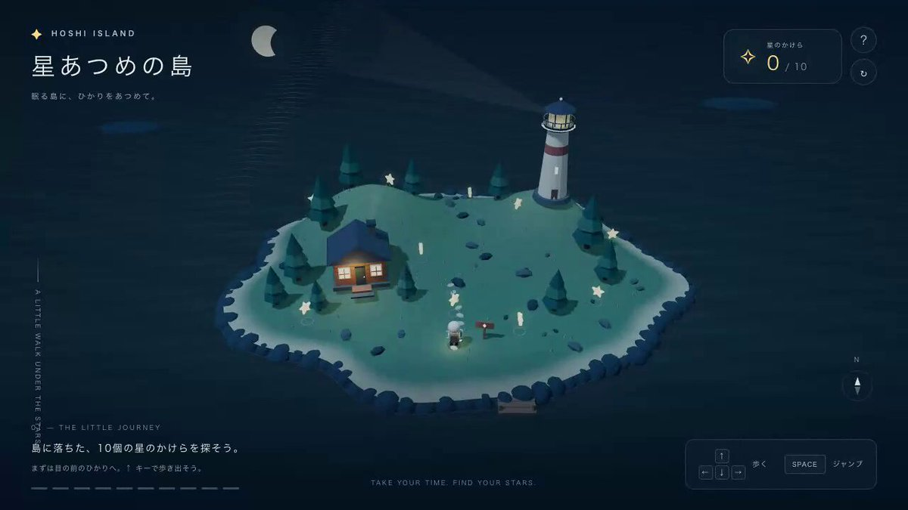</a>

Prompt tạo game 3D dành cho trình duyệt, trong đó nêu rõ người đăng đã chỉ dẫn GPT-6 Astra tạo một game cho phép người chơi khám phá đảo nhỏ về đêm và thu thập 10 mảnh sao.

**Prompt**

```text
Hãy tạo một game 3D có thể chơi trên trình duyệt dưới dạng một trang duy nhất, trong đó người chơi khám phá một hòn đảo nhỏ về đêm và thu thập 10 mảnh sao.
```

[Xem chi tiết ↗](https://www.tripo3d.ai/vi/3d-prompts/night-island-star-collecting-3d-game) · [Bài đăng gốc](https://x.com/kensumi_ai/status/2106944821818720302) · [Về danh sách ví dụ](#all-prompts)

---

<a id="2107127712871505976"></a>

### Nhện bông — Nghiên cứu vật liệu số 015

[Vib3Coded](https://x.com/vib3coded) · 2026-10-05

<a href="https://www.tripo3d.ai/vi/3d-prompts/webgpu-plush-spider-soft-body-physics">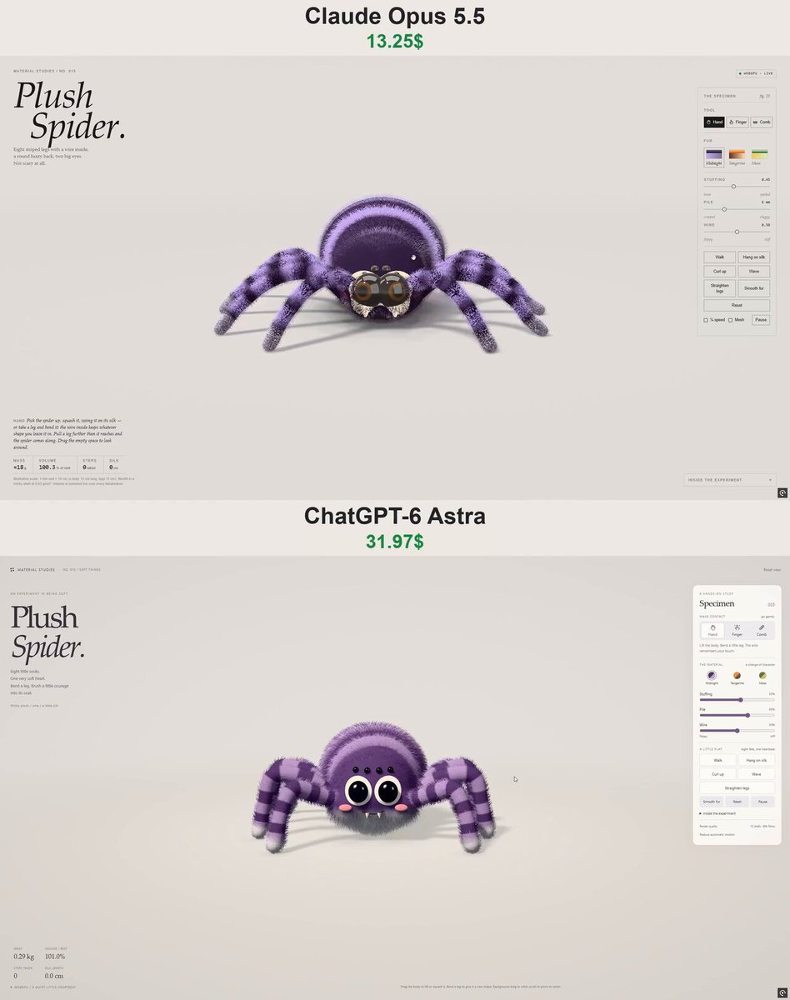</a>

Tạo một nghiên cứu tương tác về nhện bông, tự chứa và chạy nguyên bản trên WebGPU. Con nhện tạo theo quy trình có vật lý thân mềm và chân lõi dây, lớp lông vỏ có thể chải, cùng các hành vi đi bộ, cuộn mình, treo bằng tơ và vẫy chân; ngoài ra còn có các điều khiển trực tiếp Hand, Finger và Comb. Bài đăng gốc so sánh phiên bản ChatGPT-6 Astra với phiên bản Opus; tác giả đã cung cấp prompt này trong một bình luận đã xác minh.

**Prompt**

```text
Xây dựng "Plush Spider" — Nghiên cứu vật liệu số 015.

Định dạng và phong cách:
- Một tệp HTML duy nhất, tự chứa, chạy trên WebGPU nguyên bản và tạo hoàn toàn theo quy trình (không asset, không thư viện).
- Giữ cùng phong cách biên tập với loạt tác phẩm: tiêu đề serif, bảng mẫu vật bên cạnh, số liệu đọc trực tiếp và ghi chú "Bên trong thí nghiệm".

Mẫu vật: một chú nhện bông đáng yêu ngồi trên bàn.
- Thân là một trường khoảng cách có hướng duy nhất:
  - phần bụng lớn, tròn với các sọc trông như hàng dệt kim;
  - đầu và ngực nhỏ hơn, nép vào phần bụng, với hai má phủ lông mềm;
  - mặt dưới sáng màu hơn.
- Khuôn mặt:
  - hai mắt hạt cườm lớn, bóng trên các đĩa nỉ trắng;
  - một hàng bốn mắt hạt cườm nhỏ phía trên;
  - má ửng hồng, nụ cười thêu và hai chiếc răng nanh nhỏ bằng nỉ.
- Tám chân bông có thể tạo dáng, mỗi bên bốn chân, được khâu dọc theo phần ngực. Chân có sọc như tất, kết thúc bằng các bàn chân nhỏ màu nhạt và có dây lõi bên trong.

Vật lý — thân:
- Thân mềm XPBD trên lưới ô lục giác: khớp hình đồng quay kết hợp với thể tích tứ diện, 60 Hz, 6 bước phụ.
- Trọng lực và ma sát sàn. Mẫu vật luôn giữ được điểm tựa.
- Đồ chơi từ từ tự dựng lại theo hướng mà lần cuối nó đã đi (tư thế có góc yaw).
- Phần bụng phập phồng: hình dạng nghỉ và thể tích nghỉ của các ô nở ra.

Vật lý — chân:
- Mỗi chân là một chuỗi thanh XPBD, kéo dài từ hông nằm trong lưới thân đến ngón chân.
- Một dáng tổng hợp trong hệ tọa độ của thân (ngồi, đứng, treo, cuộn, vẫy) kéo từng điểm về mục tiêu: lực mạnh ở hông và giảm dần về phía ngón chân. Nhờ đó chân giữ được dáng nhưng vẫn chùng xuống và đung đưa.
- Dây lõi bằng nhựa: khi tay bẻ chân vượt quá độ đàn hồi, chính dáng mới sẽ được giữ lại và chân tiếp tục cong cho đến khi bấm "Duỗi chân".
- Các quả cầu chạy theo thân giúp chân không chạm vào thân. Ngón chân bám vào mặt bàn. Ngón tay đẩy chân sang một bên.
- Kéo chân xa hơn tầm với sẽ kéo cả con nhện theo phần hông đó.

Hành vi:
- Đi bộ:
  - thân nâng lên trên các chân nhờ bộ điều khiển độ cao;
  - được dẫn về phía mục tiêu bằng lực kéo nhẹ và xoay mặt về phía mục tiêu;
  - ngón chân được kéo về các điểm đặt chân trên mặt bàn;
  - dáng đi xen kẽ bốn chân và bốn chân: nhóm tụt lại xa nhất sẽ được nâng lên, đặt xuống phía trước theo một cung nhỏ;
  - thỉnh thoảng tự đi lang thang.
- Cuộn mình (bằng nút hoặc chạm nhẹ bằng ngón tay): chân ôm qua lưng, nhện lăn tránh khỏi điểm chạm như một quả bóng (không có điểm tựa, không có lực cản lăn), rồi duỗi ra và tự dựng lại.
- Treo bằng tơ:
  - một sợi tơ đàn hồi chỉ có thể kéo, từ điểm neo cao phía trên đến một vùng trên lưng;
  - nhện được cuộn lên khỏi mặt bàn, đung đưa khi bị đẩy và dùng chân quạt trong không khí;
  - nhấn lần nữa để hạ nhện trở lại mặt bàn.
- Vẫy: một chân trước được nâng lên và ngoe nguẩy.
- Với công cụ Finger, nhện sẽ chạy lăng xăng đến chỗ ngón tay.

Kết xuất:
- Lông vỏ: lớp nền cộng với N lớp vỏ được tạo instancing, alpha-to-coverage dưới MSAA 4×.
  - Hướng nằm của lông được truyền theo gradient biến dạng, với độ trễ đầu lông do lò xo giảm chấn.
  - Highlight Kajiya–Kay, độ bóng nhung và công cụ chải lông.
- Các vùng được tô trong không gian nghỉ: sọc bụng, mặt dưới sáng màu, lớp lông ngắn quanh các đĩa mắt bằng nỉ, má, rãnh nụ cười và đường may quanh hông.
- Chân được vẽ lại ở mỗi khung hình dưới dạng ống bông:
  - quét dọc theo đường cong Catmull–Rom đi qua từng thanh, với hệ khung truyền song song;
  - đầu gối hơi phồng và bàn chân nhỏ bo tròn;
  - màu phân dải và lớp lông ngắn hơn.
- Một sợi tơ mảnh lấp lánh.
- Bóng đổ mềm từ đèn chính PCSS, che khuất tiếp xúc trên sàn studio và ánh xạ tông màu Khronos PBR Neutral.
- WGSL an toàn với NaN: pow và smoothstep được giới hạn, post được giới hạn.

Giao diện:
- Công cụ:
  - Hand: nâng và ép thân, hoặc nắm rồi bẻ chân;
  - Finger: nhện đi theo ngón tay và sẽ cuộn mình khi bị chạm;
  - Comb: chải lớp lông.
- Nút: Walk, Hang on silk, Curl up, Wave, Straighten legs, Smooth fur, Reset.
- Thanh trượt: Stuffing, Pile, Wire (từ mềm rũ đến cứng).
- Bảng màu: Midnight (màu mận sẫm với sọc tím nhạt), Tangerine (màu cam với sọc nâu), Moss (màu xanh lá với sọc vàng).
- Số liệu: khối lượng, phần trăm thể tích so với trạng thái nghỉ, số bước đã đi và độ dài sợi tơ tính bằng cm.
- Xoay quanh và thu phóng; bố cục xếp chồng thích ứng trên điện thoại; chất lượng thích ứng; hỗ trợ giảm chuyển động.
```

[Xem chi tiết ↗](https://www.tripo3d.ai/vi/3d-prompts/webgpu-plush-spider-soft-body-physics) · [Bài đăng gốc](https://x.com/vib3coded/status/2107128017503830119) · [Về danh sách ví dụ](#all-prompts)

---

<a id="2107186979502776590"></a>

### Banana Jelly

[NinjaCodex](https://x.com/N1njaCodex) · 2026-10-05

<a href="https://www.tripo3d.ai/vi/3d-prompts/webgpu-banana-jelly-physics-simulation">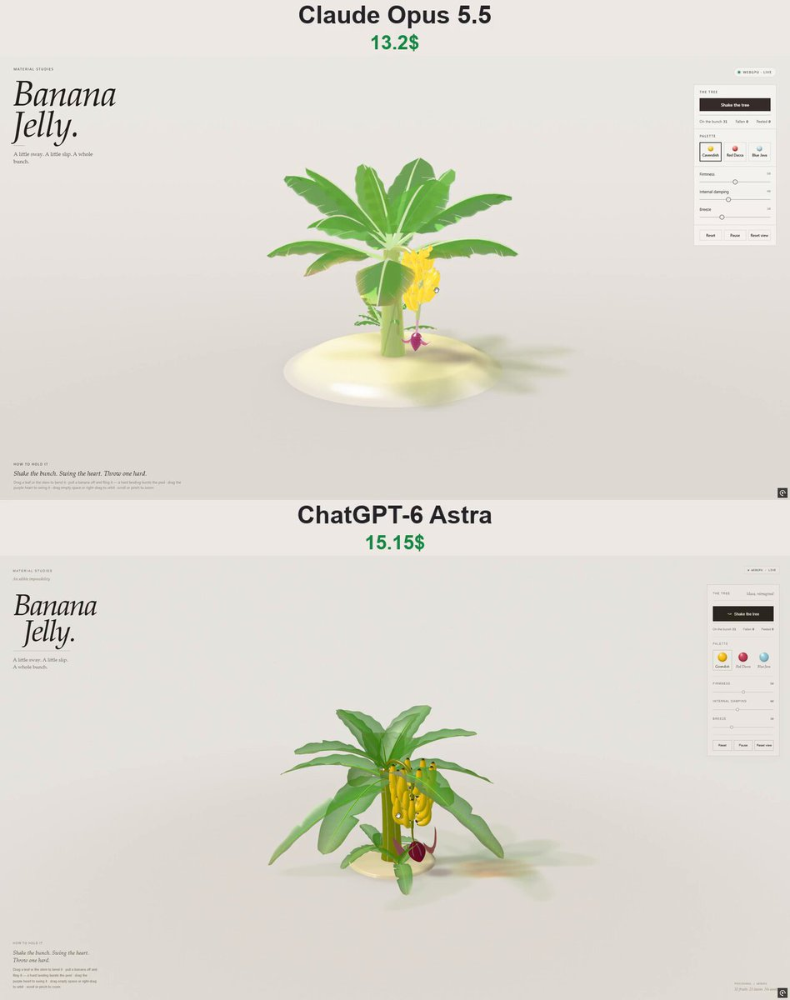</a>

Nghiên cứu tương tác về vật liệu WebGPU, tái hiện một bụi chuối sum suê bằng thạch trong mờ. Tác giả cung cấp prompt này trong một bình luận về màn so sánh giữa Claude Opus 5.5 và ChatGPT-6 Astra; prompt mô tả hình học cây được tạo theo quy trình, chuyển động dựa trên vật lý, chuối có thể tách rời, cơ chế bóc vỏ khi va chạm, điều khiển bảng màu và tương tác bằng cảm ứng/con trỏ.

**Prompt**

```text
Tạo "Banana Jelly" — một tệp HTML độc lập duy nhất (không yêu cầu bên ngoài, không thư viện, không cần build khi chạy) bằng WebGPU thuần + WGSL. Đây là một tác phẩm trong chuỗi biên tập "MATERIAL STUDIES": một bụi chuối được mô phỏng vật lý, trong đó mọi bộ phận đều được dựng như thạch màu trong mờ. Mô phỏng bằng JS, render bằng WebGPU; trang phải luôn mượt (mô phỏng < 2 ms/khung hình).

TRANG / BỐ CỤC (biên tập, giấy tông ấm)
- Nền giấy #ece9e3 chuyển dần sang sàn tối hơn một chút; mực #241f1d; màu nhấn #c99a06 (vàng chuối); đường kẻ mảnh #d5d0c8.
- Góc trên bên trái: dòng nhãn chữ hoa nhỏ "MATERIAL STUDIES", H1 serif in nghiêng thật lớn "Banana / Jelly." (xếp chồng Iowan Old Style / Palatino / Georgia), một đường kẻ ngắn, chú thích "Một chút đung đưa. Một chút trượt rơi. Cả một nải chuối."
- Viên nhãn ở góc trên bên phải: chấm xanh + "WEBGPU · LIVE" (hoặc "WebGPU · Unavailable").
- Bảng kính nổi bên phải (rgba giấy, viền 1px):
  • "THE TREE": nút tối "Shake the tree" với thanh tiến trình vàng mảnh bên dưới; dòng đếm "On the bunch 31 · Fallen 0 · Peeled 0" (các số dùng font mono dạng bảng).
  • "PALETTE": ba nút mẫu màu, mỗi nút có một quả cầu thạch bóng — Cavendish (vàng), Red Dacca (đỏ-tím), Blue Java (xanh phấn).
  • Thanh trượt: Firmness 50, Internal damping 40, Breeze 30 (giá trị hiển thị bằng font mono nhỏ ở bên phải).
  • Các nút: Reset · Pause · Reset view.
- Góc dưới bên trái: "HOW TO HOLD IT", dòng in nghiêng "Lắc nải chuối. Đung đưa bắp chuối. Ném mạnh một quả." và một dòng xám nhỏ: "Kéo một lá hoặc cuống để bẻ cong · kéo một quả chuối ra rồi ném — tiếp đất mạnh sẽ làm vỏ bung ra · kéo bắp chuối màu tím để đung đưa · kéo vùng trống hoặc kéo chuột phải để xoay quanh · cuộn hoặc chụm để thu phóng".
- Trên màn hình rộng, căn giữa cây trong dải trống giữa phần đầu trang và bảng điều khiển (dịch phép chiếu, điều chỉnh khoảng cách). Trên di động: bảng điều khiển trở thành bottom sheet (mặc định đóng, chạm để mở; khung nhìn 3D trượt lên để cây vẫn hiển thị), kéo cảm ứng để xoay, chụm để thu phóng. Tuyệt đối không cho cuộn trang.
- Thẻ dự phòng nếu thiếu navigator.gpu hoặc adapter: "Banana Jelly." + phần giải thích, viên nhãn hiển thị "WebGPU · Unavailable". Không có lỗi/cảnh báo nào trong console.

CÂY (phải SUM SUÊ — nhiều lá lớn, không bao giờ thưa hoặc trụi)
- Một đế/đĩa thạch kem tròn, thấp và bóng; cây mọc từ chính giữa.
- Thân giả: cao khoảng 1.42, 9 đoạn, bán kính 0.158→0.106, hơi nghiêng ra xa nải chuối.
- Tán: 15 lá bản lớn xoắn theo góc vàng (2.39996 rad). Lá non gần như dựng thẳng; lá già vươn cong ra ngoài và rủ xuống (độ cao 1.22→0.02 rad theo tuổi). Dài 1.15–1.7, rộng ≈0.3·scale, đường viền phiến sin^0.38, hơi gấp hình chữ V/cúp qua gân giữa, có vài khe rách do gió dạng nêm thuôn (không quá nhiều), mép hơi gợn, đầu lá già ngả vàng nhẹ.
- Hai cây con (chồi bên) ở gốc, mỗi cây có 4 lá nhỏ hơn.
- Cuống nải: mọc từ đỉnh tán, hơi vươn lên, cong qua rồi rủ thẳng xuống (10 đoạn, dài 1.18), sau đó là một đoạn cổ mảnh và HEART — nụ hình giọt nước màu tím mận sẫm (hoa bắp chuối) tạo từ các lá bắc chồng lên nhau, với một hoặc hai lá bắc nâng lên/cuộn ngược.
- 5 tầng chuối dọc theo cuống rủ, xòe về các phía khác nhau (bước phương vị 2.2 rad), số lượng 7,7,6,6,5 = 31 quả, phần gần đỉnh hơi lớn hơn. Mỗi quả chuối: cung cong giải tích, tiết diện có gờ (gần ngũ giác), đầu cuống thuôn tối màu và đầu quả sẫm màu, cong hướng lên phía ánh sáng; có vài đốm tàn nhang sẫm thưa.

SIMULATION
- Toàn bộ cây là một cây nút với động lực học dựa trên vị trí ở tần số cố định 240 Hz (4 vòng lặp bộ giải): ràng buộc độ dài + ràng buộc uốn hướng về hướng nghỉ được lưu tương đối so với frame cha (các frame quaternion vận chuyển song song). Độ cứng thay đổi theo cấp (thân cứng, gân giữa lá đàn hồi, cuống mềm dẻo, cổ mềm).
- Trọng lực tác động: mỗi nút mang trọng lượng của lá/chuối gắn với nó. Bù trước tư thế nghỉ (lặp 3 lần: ổn định, đo độ rủ, uốn trước hướng nghỉ) để khi chịu đầy đủ tải, cây nằm chính xác theo hình dạng thiết kế; khi chuối rơi, nải nhẹ hơn sẽ nâng lên một chút. Thay đổi tải được làm mượt, không xảy ra tức thời.
- Ổn định im lặng trong 2,5 giây khi tải lại/đặt lại (không rách trong lúc ổn định).
- Gió: lực nhiễu mượt tác động lên các nút lá (luồng gió truyền qua tán), được điều chỉnh theo thanh trượt; Breeze 0 = hoàn toàn đứng yên.
- Phiến lá và mọi mesh đều được skin trên GPU từ storage buffer chứa vị trí + frame của các nút (mỗi đỉnh: hai nút, một phân số và một offset trong frame).
- Chuối trên nải treo từ nút tầng bằng lò xo lắc nhỏ có giảm chấn (tần số 3.2+2.2·firm Hz, độ giảm chấn lấy từ thanh trượt).
- Tách quả: theo dõi gia tốc đã làm mượt của từng tầng; một quả chuối rời ra khi gia tốc vượt quá độ bền của nó (≈ 11+5·firm, thay đổi theo từng quả), với độ mỏi tích lũy sau nhiều lần lắc và thời gian hồi ngắn cho mỗi tầng — lắc phải làm chuối rơi dần (mỗi lần lắc vài quả), tuyệt đối không rơi cả nải cùng lúc.
- "Shake the tree" áp dụng chuyển động lắc kéo dài vài giây lên thân, kèm thanh tiến trình.
- Chuối rời là vật thể cứng (3 hình cầu dọc theo cung) với va chạm bằng xung lực và ma sát với đế, sàn, thân và các quả khác; ngủ khi đứng yên; giới hạn tốc độ.
- Vỏ CHỈ bung khi va chạm: nếu chuối rời va vào bề mặt với tốc độ pháp tuyến trước va chạm lớn hơn khoảng 5.4+1.2·firm, vỏ sẽ bung. Rơi khỏi nải hoặc thả nhẹ không làm vỏ bung. Khi bung = vỏ tách thành 4 dải từ đầu quả, gập ngược quanh một bản lề gần cuống (gập theo cung rồi chuyển thành đoạn thẳng, rủ xuống dưới trọng lực, mỗi dải có sai khác nhẹ), để lộ phần ruột kem trong mờ. Tăng bộ đếm "Peeled".

TƯƠNG TÁC (con trỏ + cảm ứng)
- Chọn chuối trên nải: kéo quả sẽ làm giãn điểm gắn; khi độ giãn vượt khoảng 0.075 và được giữ trong chốc lát, quả sẽ bật khỏi nải vào tay bạn (chỉ quả đó); không cho phép kéo nải đi quá xa (giới hạn độ dịch chuyển khi giữ, quả đang giữ không kéo nải). Thả ra theo vận tốc của con trỏ để ném.
- Kéo bắp chuối màu tím: làm cuống đung đưa như con lắc và tiếp tục đung đưa sau khi thả; chuyển động này không được làm chuối rơi.
- Kéo lá hoặc thân: làm chúng cong, rồi bật trở lại khi thả.
- Kéo vùng trống / kéo chuột phải: xoay quanh; bánh xe/chụm: thu phóng; Reset view khôi phục camera (az 0.55, el 0.2, FOV 36°).
- Firmness thay đổi độ cứng, độ bền khi tách và ngưỡng bung vỏ; Internal damping thay đổi độ giảm chấn khi lắc/đung đưa; Pause đóng băng thời gian; Reset mọc lại toàn bộ nải.

RENDER — diện mạo thạch
- Mọi thứ đều là thạch: hấp thụ Beer–Lambert theo độ dày (sigma RGB theo từng vật liệu), tán xạ dưới bề mặt có wrap, khúc xạ môi trường studio mềm, viền Fresnel + phản xạ đặc sắc nét, phát sáng nhẹ bên trong; lá là thạch mỏng trong mờ với gân/gân giữa sáng khi ngược sáng và màu đậm hơn về phía mép.
- Lá trong mờ qua OIT weighted-blended; chuối/thân/bắp chuối là thạch gần đục, có depth.
- Bóng màu: render bản đồ truyền sáng từ nguồn sáng (lá nhuộm bóng xanh, chuối nhuộm bóng vàng), làm mờ rồi chiếu lên đế và sàn — một bóng màu dài, mềm đổ sang phải.
- Bảng màu (thay trực tiếp mọi sắc màu):
  • Cavendish — vỏ vàng sáng (tint 1.0,0.8,0.08), đầu xanh, ruột kem, lá xanh tươi (0.22,0.66,0.08), thân màu ô liu, bắp chuối tím mận sẫm, đế kem.
  • Red Dacca — vỏ đỏ đỏ tía (0.82,0.1,0.16), ruột đào nhạt, lá xanh ấm hơn một chút, thân đỏ, đế phớt hồng.
  • Blue Java — vỏ xanh lam phấn-xanh teal (0.56,0.8,0.86), ruột trắng như "kem", lá xanh lam-xanh lục, đế xanh xám lạnh.

QA (Chromium chạy headless với SwiftShader WebGPU)
- Cung cấp hook debug (window.__bj: advance, shake, pick, project, setPalette, reset, setPause, counts) và xác minh: lúc bắt đầu có đủ nải 31 quả; ≥20 lá; không có gì rơi khi ở trạng thái chờ; gió làm lá chuyển động và Breeze 0 thì đứng yên; lắc làm một số chuối rơi nhưng không bóc vỏ; quả rơi dừng lại; bộ đếm cập nhật; reset khôi phục; chuối bị kéo sẽ chỉ bật ra một mình; tiếp đất mạnh làm bong vỏ, thả nhẹ thì không; bắp chuối đung đưa như con lắc mà không làm quả rơi; lá cong và bật trở lại; bảng màu/thanh trượt/tạm dừng/xoay/thu phóng hoạt động; kiểm thử tải không có NaN; chi phí mô phỏng < 5 ms; không có yêu cầu mạng; không lỗi console; bottom sheet trên di động + cảm ứng; thẻ dự phòng.
```

[Xem chi tiết ↗](https://www.tripo3d.ai/vi/3d-prompts/webgpu-banana-jelly-physics-simulation) · [Bài đăng gốc](https://x.com/N1njaCodex/status/2107187133173678156) · [Về danh sách ví dụ](#all-prompts)

---

<a id="2107479802152472717"></a>

### Bách khoa toàn thư tương tác về động vật hoang dã Wild Atlas

[IamAlam](https://x.com/_IamAlam) · 2026-10-06

<a href="https://www.tripo3d.ai/vi/3d-prompts/wildlife-encyclopedia-interactive-3d-animal-viewer">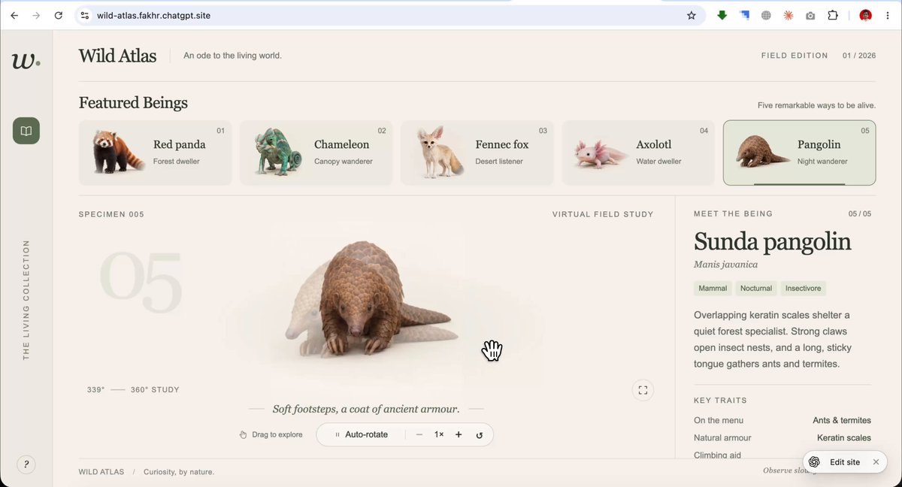</a>

Tạo một bách khoa toàn thư tương tác cao cấp về động vật hoang dã, với năm góc nhìn động vật được kết xuất đồng bộ, các thẻ động vật có thể chọn, chuyển động xoay chậm, hỗ trợ kéo để xoay, tính năng xem cận cảnh và bảng thông tin động vật tự động cập nhật.

**Prompt**

```text
Xây dựng một ứng dụng web bách khoa toàn thư tương tác cao cấp về động vật hoang dã có tên “Wild Atlas.”

Thiết kế toàn bộ giao diện trước khi tạo bất kỳ loài động vật nào:
- Nền màu kem dịu
- Điểm nhấn xanh xô thơm
- Tiêu đề serif thanh lịch
- Thanh bên trái tối giản
- Hàng thẻ “Sinh vật nổi bật” nằm ngang ở phía trên
- Khu vực lớn ở trung tâm dành cho một sinh vật 3D xoay chậm
- Bảng thông tin bên phải, cập nhật theo từng loài (tên, thẻ, đặc điểm chính, môi trường sống)
- Một dòng chú thích ngắn bên dưới sinh vật
- Ánh sáng studio dịu, bóng đổ nhẹ, chuyển động thư thái
- Bố cục 16:9, chuyển cảnh mượt mà

Sau đó, tạo năm loài động vật chủ đạo thành một bộ đồng nhất. Tạo từng loài một trong góc nhìn chính diện hoặc ba phần tư, sử dụng cùng hệ thống ánh sáng, nền và mức độ chi tiết để tạo cảm giác như một bộ sưu tập thống nhất. Bao gồm gấu trúc đỏ, tắc kè hoa và ba loài động vật đặc trưng khác do bạn lựa chọn.

Để tạo trải nghiệm tương tác, hãy thêm:
- Các thẻ động vật có thể nhấp để thay đổi sinh vật ở trung tâm
- Chuyển động xoay 360° chậm cho loài vật đang được chọn
- Bảng thông tin bên phải, cập nhật tên, thẻ, đặc điểm chính và môi trường sống
- Một chú thích bên dưới mỗi sinh vật
- Chuyển cảnh mượt mà giữa các lựa chọn

Sử dụng các góc nhìn sinh vật kiểu turntable được kết xuất (chỉ cần hỗ trợ kéo để xoay và xem cận cảnh; không cần dựng thành một cảnh 3D hoàn chỉnh). Giữ phong cách cao cấp, tĩnh lặng và giống một bách khoa toàn thư. Khi hoàn tất, hãy xuất bản dưới dạng một trang web riêng tư có thể sử dụng được.
```

[Xem chi tiết ↗](https://www.tripo3d.ai/vi/3d-prompts/wildlife-encyclopedia-interactive-3d-animal-viewer) · [Bài đăng gốc](https://x.com/_IamAlam/status/2107480596926939638) · [Về danh sách ví dụ](#all-prompts)

---

<a id="2107533363808485534"></a>

### Mực ống nhồi bông.

[Vib3Coded](https://x.com/vib3coded) · 2026-10-06

<a href="https://www.tripo3d.ai/vi/3d-prompts/webgpu-plush-squid-soft-body-physics">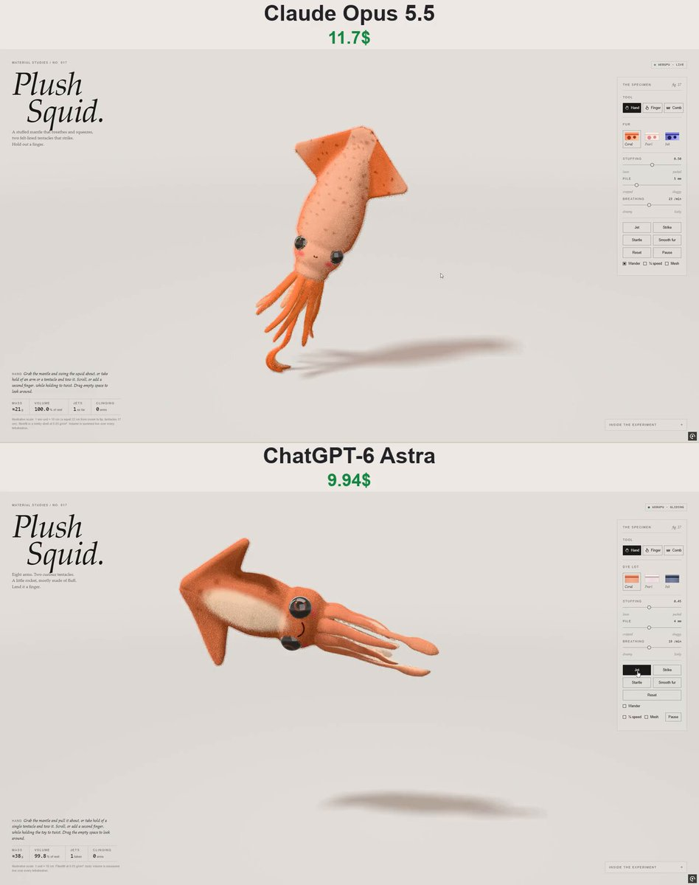</a>

Tác giả bài đăng đã cung cấp một prompt cho nghiên cứu tương tác về mực ống đồ chơi nhồi bông bằng WebGPU, được triển khai trong một tệp HTML độc lập. Prompt mô tả một chú mực ống tạo theo quy trình, chuyển động dựa trên vật thể mềm và vải, các công cụ bàn tay, ngón tay và lược phản hồi tương tác, hành vi phun tia nước và giật mình, cùng giao diện bảng mẫu mang phong cách biên tập.

**Prompt**

```text
Tạo "Mực ống nhồi bông." — một nghiên cứu WebGPU tương tác về mực ống đồ chơi nhồi bông dưới dạng MỘT tệp HTML độc lập (WebGPU/WGSL gốc, không thư viện, không kết cấu bề mặt, không mạng).

SPECIMEN
- Một trường khoảng cách có hướng: phần thân hình ngư lôi mềm, thuôn dần đến đầu tròn; hai vây tam giác dày, phồng tạo thành hình mũi tên ở chóp; đầu tròn có cổ áo và một chỏm tay nhỏ bên dưới.
- Đôi mắt an toàn bằng thủy tinh bóng lớn ở hai bên đầu, nụ cười thêu, má ửng hồng; bụng nhạt màu hơn; các đốm sắc tố mềm trên thân và vây.
- Tám tay mực nhồi bông và hai xúc tu dài rủ xuống từ chỏm: các dải vải XPBD (co giãn/cắt/trượt/uốn + liên kết uốn dài + dây neo) được vẽ thành các ống nhồi bông thuôn dần; xúc tu thu nhỏ thành cuống rồi phình thành chùy; các đĩa giác hút bằng nỉ xếp thành những hàng so le trên mọi mặt trong.
- Lông minky ngắn dưới dạng các lớp vỏ (alpha-to-coverage, 4× MSAA) có độ trễ/đung đưa; ba lô màu nhuộm: San hô, Ngọc trai, Mực.

VẬT LÝ & HÀNH VI
- Thân = khớp hình dạng ô lục giác XPBD + thể tích tứ diện, nổi trung tính trong môi trường đặc sánh chuyển động chậm; các tay được khâu vào những điểm nằm trong mạng lưới và không xuyên vào thân nhờ SDF.
- Cơ bắp không xương: phần thân hô hấp và co lại bằng cách thay đổi hình dạng nghỉ của các ô; vây vỗ bằng cách uốn các ô vây thành hình thang; một lực kéo tư thế yếu xoay thân về hướng đang nhắm.
- Phun tia nước: xoay thân về một hướng, phồng lên (hút nước vào), siết mạnh một lần → lao đi với phần thân dẫn trước, các tay streaming ra phía sau, lướt trên những chiếc vây gợn sóng, xoay về tư thế thẳng đứng rồi trôi về vị trí ban đầu. "Lang thang" thỉnh thoảng tự thực hiện hành động này.
- Đánh: cả hai xúc tu vung các chùy sang một bên, ra phía trước nó, giữ nguyên rồi kéo trở lại. Giật mình: các đốm sẫm màu nở ra và nó phun tia nước lao xa khỏi người xem.
- Công cụ: Bàn tay (nắm và vung phần thân, kéo một tay hoặc xúc tu; xoắn bằng con lăn/cuộn hoặc ngón tay thứ hai), Ngón tay (đưa ra và giữ nguyên, rồi nhấn: các xúc tu đánh vào đó, còn các tay quấn quanh và bám chặt), Lược (vuốt lớp lông).

GIAO DIỆN
- Bố cục studio phong cách biên tập: "Nghiên cứu vật liệu / Số 017", dòng serif nghiêng lớn "Mực ống nhồi bông.", chú thích ngắn, nhãn trạng thái trực tiếp, bảng mẫu (công cụ, ô màu nhuộm, phần nhồi, lớp lông, nhịp thở; Phun tia, Đánh, Giật mình, Làm mượt lông, Đặt lại, Tạm dừng; Lang thang, tốc độ ¼, Lưới), các chỉ số (khối lượng, % thể tích, số lần phun tia, số tay đang bám), ghi chú; xoay quanh/thu phóng; bố cục xếp chồng cho thiết bị di động; thẻ dự phòng WebGPU.
```

[Xem chi tiết ↗](https://www.tripo3d.ai/vi/3d-prompts/webgpu-plush-squid-soft-body-physics) · [Bài đăng gốc](https://x.com/vib3coded/status/2107533605945635233) · [Về danh sách ví dụ](#all-prompts)

---

<a id="2107617244301664483"></a>

### Villa Jelly

[Vib3Coded](https://x.com/vib3coded) · 2026-10-06

<a href="https://www.tripo3d.ai/vi/3d-prompts/webgpu-tropical-villa-jelly-island-diorama">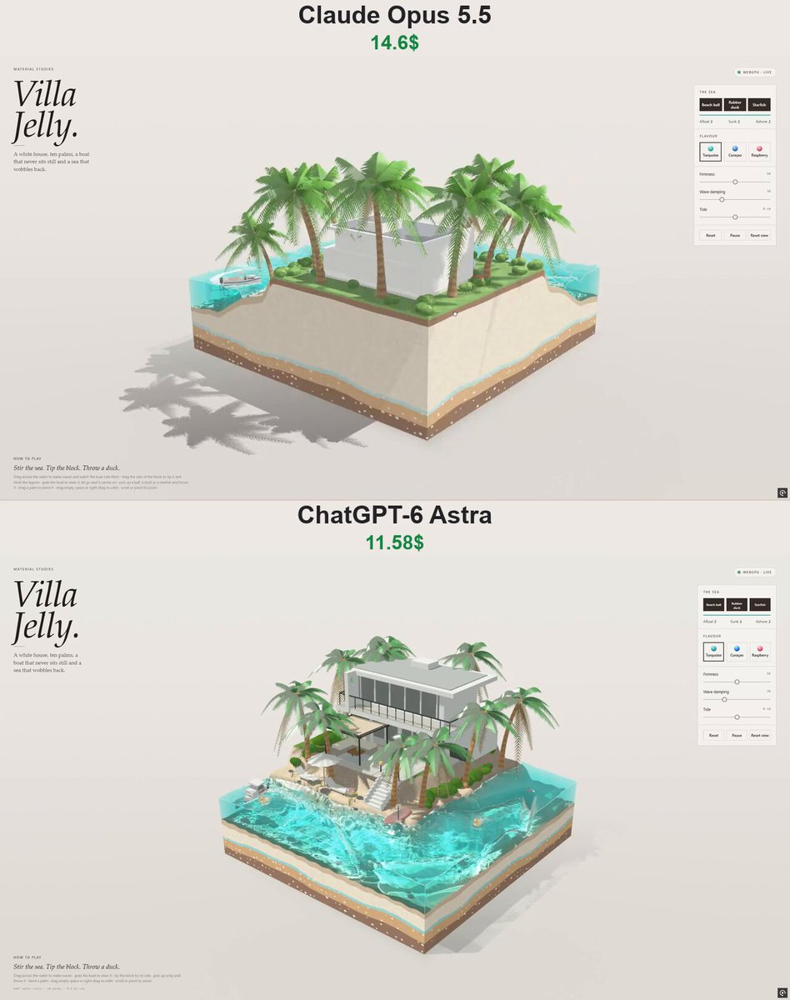</a>

Một diorama 3D tương tác WebGPU tự chứa về hòn đảo thạch rau câu: biệt thự nhiệt đới hiện đại, đầm phá, hàng cọ, đồ chơi nổi và một chiếc thuyền tự hành. Người dùng có thể khuấy và nghiêng biển thạch, đổi màu hương vị, ném đồ vật, bẻ cong cây cọ, kéo thuyền và xoay quanh cảnh.

**Prompt**

```text
Xây dựng "Villa Jelly" — một tệp HTML độc lập duy nhất (không yêu cầu bên ngoài, không thư viện), sử dụng WebGPU gốc + WGSL và mô phỏng bằng JS thuần. Tác phẩm thuộc series diorama thạch tương tác mang tính biên tập "NGHIÊN CỨU VẬT LIỆU". Cảnh: một khối thạch vuông được cắt lộ, bên trong là hòn đảo nhiệt đới với biệt thự trắng hiện đại ở phía sau và đầm phá màu ngọc lam ôm lấy hai cạnh phía trước, như một diorama bất động sản thu nhỏ — nhưng biển là một khối thạch rung lắc, với các lớp sọc kẹo nhìn thấy qua những mặt cắt. Phải chạy mượt (mô phỏng ≈3 ms/khung hình).

TRANG / BỐ CỤC (biên tập trên nền giấy ấm)
- Giấy #ece9e3, mực #241f1d, đường kẻ #d5d0c8, màu nhấn #17a39b (ngọc lam). Serif italic cho phần hiển thị (Iowan Old Style / Palatino / Georgia), sans cho UI, số dùng monospace.
- Góc trên bên trái: dòng nhãn nhỏ "NGHIÊN CỨU VẬT LIỆU", H1 italic cỡ lớn "Villa / Jelly.", đường kẻ ngắn, chú thích "Một ngôi nhà trắng, mười cây cọ, một chiếc thuyền không bao giờ đứng yên và một mặt biển luôn rung lắc trở lại."
- Viên trạng thái ở góc trên bên phải: chấm xanh lá + "WEBGPU · ĐANG CHẠY" (các trạng thái Tạm dừng / Không khả dụng).
- Bảng kính bên phải:
  • "BIỂN": ba nút tối nằm trên một hàng — "Bóng bãi biển", "Vịt cao su", "Sao biển" (mỗi nút thả một vật xuống đầm phá từ trên cao); thanh đo màu nhấn mảnh cho biết độ sôi động của biển; bộ đếm "Nổi · Chìm · Dạt bờ".
  • "HƯƠNG VỊ": ba ô màu với những viên thạch bóng — Ngọc lam (mặc định), Curaçao (xanh lam rực), Raspberry (hồng).
  • Thanh trượt: Độ cứng 50, Giảm chấn sóng 30, Thủy triều 0 (±10 cm).
  • Đặt lại · Tạm dừng · Đặt lại góc nhìn.
- Góc dưới bên trái "CÁCH CHƠI": dòng italic "Khuấy biển. Nghiêng khối. Ném một chú vịt." + dòng chữ xám nhỏ: "Kéo trên mặt nước để tạo sóng và xem thuyền lướt theo · kéo cạnh bên của khối để nghiêng và làm đầm phá sóng sánh · nắm thuyền để điều khiển, thả ra để thuyền tiếp tục chạy · nhặt một quả bóng, chú vịt hoặc sao biển rồi ném đi · kéo cây cọ để bẻ cong · kéo vùng trống hoặc kéo chuột phải để xoay quanh · cuộn hoặc chụm để thu phóng".
- Đặt diorama ở giữa khoảng trống giữa tiêu đề đầu trang và bảng điều khiển. Trên di động: bảng chuyển thành sheet ở cuối màn hình (thanh "Điều khiển", mặc định đóng), xoay bằng cảm ứng, chụm để thu phóng, không cuộn trang. Thẻ dự phòng "Villa Jelly." nếu thiếu WebGPU/bộ điều hợp. Không có lỗi console.

DIORAMA (khối 5.2 × 5.2, mực nước biển 1.3)
- Địa hình dạng heightfield: đảo chiếm khoảng 60% phía sau của ô; đường bờ gợn sóng chạy dọc các cạnh +z và +x (góc trước bo tròn theo soft-max), tạo thành đầm phá hình chữ L dọc hai cạnh hướng về camera (camera từ góc trước, az ≈0.74, el ≈0.5, FOV 34°).
- Mặt cắt từ biển vào đất liền: đáy đầm phá sâu khoảng ≈0.5 với gợn cát → dốc bãi ngắn → dải bãi cát hẹp → bờ cát dốc đứng → cao nguyên cỏ nâng cao (+0.455). Cỏ có vệt máy cắt, hơi bóng như thạch chanh; các phiến lát sáng màu cho sân trong, một dải sân hiên phía trước mảng kính và lối đi tới cầu thang.
- Các mặt cắt của khối: lớp màu kẹo (đá gốc chocolate, đất sét caramel, dải vỏ bạc hà/xanh/hồng tùy hương vị, cát vanilla, cát ướt dưới biển; bên dưới bãi cỏ là đất tối rồi đến dải cỏ xanh trên cùng) với các hạt sỏi lấm tấm bị ép vào. Các mặt cắt của biển là những vách thạch trong mờ, có đường mực nước sáng và đường góc mềm; có thể nhìn thấy đáy biển và các lớp địa chất xuyên qua chúng.
- Biệt thự (trắng, hiện đại, dạng khối): bệ đá; tầng trệt với mặt tiền kính tối toàn chiều cao, chia bởi các đố trắng; cánh gara với cửa nan tối; sàn tầng kéo về phía trước thành ban công trên bốn cột trắng thanh mảnh với lan can kim loại tối; tầng trên có dải kính dài; tường vây trắng ở đầu bên trái; mái trắng mỏng nhô ra với phần lõm màu xám, cùng một hộp mái nhỏ. Kính tối phản chiếu softbox của studio, phía sau là căn phòng ấm màu và thiếu sáng.
- Pergola trên sân trong: bốn cột kim loại tối, dầm, mái vải canvas màu be võng xuống và phập phồng trong gió; sofa ngoài trời hình chữ L có đệm, bàn thấp và thảm.
- Cầu thang trắng có tường chắn hai bên, đi từ bãi cỏ xuống theo bờ dốc tới bãi biển; hai đèn sân vườn ở phía trên.
- Bãi biển: ô trắng (viền vỏ sò, phấp phới), hai ghế nằm trắng, kayak đỏ có mái chèo; bụi cỏ biển; đá trên bờ dốc, bãi biển và đáy đầm phá.
- Thảm thực vật XANH TƯƠI (rất quan trọng — không có cây thưa, trơ trụi): 10 cây cọ cao với thân màu caramel-gummy có các vòng đốt (gốc phình, dáng cong nghiêng) và tán đầy đặn gồm 16 tàu lá kép cong vút mỗi cây (30 cặp lá chét, gập hình chữ V, vuốt về phía ngọn, lá non dựng đứng, lá già rủ xuống), cùng 2 tàu lá khô màu rơm rủ xuống; hàng chục bụi cây gummy gồ ghề dọc mép bãi cỏ và quanh nhà, một số có hoa hồng/đỏ/trắng.

VẬT LÝ (giống "Island Jelly")
- Biển: mô phỏng nước nông tuyến tính trên lưới so le 168² ở 120 Hz, tốc độ sóng √(g·depth), khiến sóng chậm lại và dốc hơn ở vùng nông, thêm một hạng sức căng bề mặt nhỏ để tạo gợn thạch đàn hồi, thanh trượt giảm chấn, hiệu chỉnh mực trung bình; thanh trượt thủy triều thay đổi mực nước và vùng bị ướt.
- Khối: kéo cạnh bên để nghiêng (lò xo–giảm chấn, tối đa khoảng ~0.17 rad); trọng lực trong mặt phẳng khiến biển dồn về phía thấp và ổn định lại; mặt trên của thạch bị trượt và ép biến dạng theo quán tính; mọi thứ bên trong bị làm rung trong vertex shader.
- Khuấy bằng ngón tay: kéo trên mặt nước để đẩy các hõm chuyển động tạo thành sóng.
- Vật thể nổi (các hình cầu cứng trong hệ tọa độ khối, 240 Hz): lực nổi theo pháp tuyến bề mặt, lực cản thạch đặc kéo về phía dòng chảy, thể tích chiếm chỗ được trả lại cho biển ở mỗi khung hình (tự tạo gợn); khi rơi xuống tạo hõm nước kèm bong bóng và bọt, các bong bóng khí nhỏ lơ lửng trong thạch. Va chạm với địa hình, thân cọ, các khối của biệt thự, nhau và thuyền.
  • Bóng bãi biển: r 0.085, rất nhẹ, nổi cao, nảy và lướt, có thể lăn; sáu múi màu (đỏ, xanh lam, vàng) với chỏm trắng, vinyl bóng.
  • Vịt cao su: nổi nửa chìm, luôn tự lật đứng đầu hướng lên (căn theo pháp tuyến bề mặt hoặc mặt đất), thân vàng, mỏ cam, mắt đen.
  • Sao biển: chìm chậm, lướt xuống xuyên qua thạch, nằm phẳng trên đáy; màu san hô/hồng/tím với các núm phủ đường.
  Trạng thái ban đầu: một quả bóng trên bãi biển, một quả trên bãi cỏ, hai chú vịt đang nổi, hai sao biển nằm trên đáy đầm phá.
- Cây cọ: mỗi tán có một lò xo bẻ cong 2D, chịu tác động của gió, độ nghiêng của khối và thao tác kéo của người dùng; vertex shader bẻ cong thân (∝t²) và làm đầu tàu lá rung phấp phới.

THUYỀN (tự chạy)
- Thuyền du lịch ban ngày nhỏ màu trắng (thân dài khoảng 0.62 theo tỷ lệ): thân chữ V sâu được dựng hình, đáy và sọc mạn màu xanh navy, boong trắng, sàn buồng lái bằng gỗ teak, ghế băng phía sau, ghế điều khiển, cabin thấp với kính chắn gió nghiêng tối màu và cửa sổ bên, mui cứng trắng trên các cột thanh mảnh, hai động cơ ngoài tối màu, lan can mũi bằng thép không gỉ.
- Nổi trên mô phỏng: 8 điểm trên thân cho độ nhún/ngẩng/nghiêng theo bề mặt cục bộ (rãnh riêng được giới hạn để không thể chìm vào đó), mũi ngẩng khi tăng tốc, nghiêng khi vào cua; trong mặt phẳng: bị đẩy (có giới hạn) xuống các sườn sóng, bị dòng chảy kéo, lực cản dọc thấp và lực cản ngang cao (do sống thuyền), bị phạt địa hình nếu chạm cát, bật ra khỏi thành khối.
- Tự lái: pure-pursuit quanh một vòng đường đua khép kín theo đầm phá hình chữ L (chạy ra theo làn ngoài, vòng qua góc, quay đầu chữ U, trở lại theo làn trong), giảm tốc khi vào cua, tốc độ hành trình ≈0.78 u/s, không bao giờ mắc cạn.
- Thuyền đẩy nước khi di chuyển → tạo vệt sóng thực trong mô phỏng sóng, chạy ngược lên bãi biển; thêm trường bọt: vệt trắng dạng ren từ đuôi, đường bọt hai bên và tia bắn ở mũi, mờ dần trong vài giây.
- Người dùng có thể nắm và kéo thuyền bằng mũi qua mặt nước; khi thả ra, thuyền tìm điểm gần nhất trên vòng đường đua rồi tiếp tục chạy. Thuyền gạt các chú vịt/quả bóng nổi sang bên.

RENDERING
- Các lượt render: shadow map của mặt trời (mọi vật), caustics (khúc xạ một lưới qua sóng xuống đáy, độ sáng theo mức thay đổi diện tích tam giác), cảnh opaque với bộ đệm khoảng cách, mặt sau của biển, sau đó là biển thạch trên một bản sao của cảnh: hấp thụ Beer–Lambert theo độ dài đường truyền (sigma theo hương vị), màu tán xạ, khúc xạ, các tia sáng caustics, phản xạ Fresnel kiểu studio, điểm lóe của mặt trời, bọt ren ven bờ tràn lên cát, trường bọt do vệt sóng/tia nước, điểm sáng viền. Mặt sàn dưới khối nhận bóng màu có các đốm caustics.
- Ánh sáng studio mềm: phông giấy, softbox lớn phía trước-trái, dải sáng mát phía sau; ánh sáng môi trường bán cầu; tone shoulder + dither.
- Vật liệu: bề mặt render sơn mờ và đá, kính tối phản chiếu, gel-coat/kim loại bóng, canvas trong mờ, bụi cây và tàu lá cọ gummy trong mờ (phát sáng khi ngược sáng), đá mờ lấm tấm.
- Hương vị thay đổi sigma/màu tint của nước và màu các lớp địa chất: Turquoise (sigma ≈ 2.1/0.36/0.5, tint 0.07/0.46/0.42), Curaçao (2.7/1.05/0.26, tint 0.02/0.2/0.52), Raspberry (0.34/2.2/1.25, tint 0.44/0.05/0.17).

KIỂM TRA QA (Chromium headless + SwiftShader)
- Hook debug window.__vj (world, boat, bodies, water, block, advance, drop, pick, project, setPalette, reset, setPause, freeze flag). Xác minh: 6 vật thể ban đầu và bộ đếm 2/2/2; đã dựng biệt thự + 10 cây cọ; thuyền chạy ít nhất ≥6 đơn vị trong 14 giây mà không mắc cạn và để lại bọt + sóng; trạng thái chờ ổn định; bóng thả xuống nổi cao, vịt đứng thẳng, sao biển chìm phẳng; UI bộ đếm khớp; khuấy tạo sóng rồi lắng xuống; nghiêng khối khiến biển dồn về phía thấp rồi ổn định; có thể nắm, kéo thuyền và để thuyền tiếp tục hành trình; bóng ném xuống biển sẽ nhấp nhô, vịt đặt lên bãi biển vẫn ngồi thẳng; cây cọ bẻ cong; hương vị, thanh trượt, tạm dừng, xoay quanh, thu phóng; kiểm tra tải cao không có NaN; mô phỏng < 5 ms/khung hình; không có yêu cầu mạng; không có lỗi console; không cuộn trang; sheet trên di động + cảm ứng; dự phòng WebGPU.
```

[Xem chi tiết ↗](https://www.tripo3d.ai/vi/3d-prompts/webgpu-tropical-villa-jelly-island-diorama) · [Bài đăng gốc](https://x.com/vib3coded/status/2107617476473164210) · [Về danh sách ví dụ](#all-prompts)

---

<a id="2107824019999535226"></a>

### Hình ảnh hóa Những thành phố vô hình bằng Three.js

[quesma.com](https://quesma.com/) · 2026-10-07

<a href="https://www.tripo3d.ai/vi/3d-prompts/invisible-cities-threejs-interactive-visualization">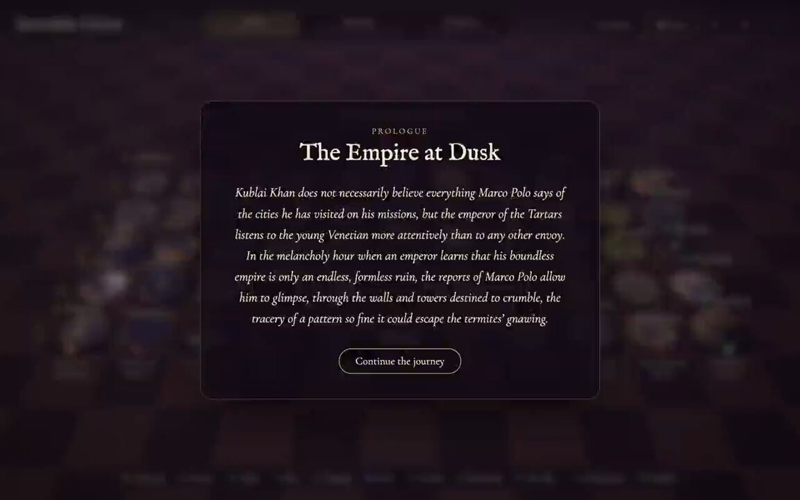</a>

Bài viết được liên kết của Piotr Migdał cho biết ông đã đưa prompt này cho GPT-6 Astra trong Codex để tạo một hình ảnh hóa Three.js tương tác về Những thành phố vô hình của Italo Calvino.

**Prompt**

```text
Tạo một hình ảnh hóa bằng three.js (pnpm) cho toàn bộ Những thành phố vô hình của Italo Calvino. Đừng đặt câu hỏi; đây là nhiệm vụ thực hiện một lần. Bạn có 6 giờ làm việc, hãy tận dụng khoảng thời gian đó cho đến khi sản phẩm trở thành một kiệt tác.
```

[Xem chi tiết ↗](https://www.tripo3d.ai/vi/3d-prompts/invisible-cities-threejs-interactive-visualization) · [Bài đăng gốc](https://quesma.com/blog/invisible-cities-one-shot/) · [Về danh sách ví dụ](#all-prompts)

---

<a id="battle-city-3d"></a>

### Battle City 3D: Phòng thủ xe tăng vô tận

[jared](https://x.com/jaredliu_bravo) · 2026-09-22

<a href="https://www.tripo3d.ai/vi/3d-prompts/battle-city-3d">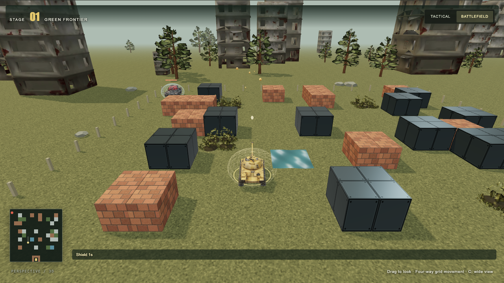</a>

Bảo vệ đại bàng trên những chiến trường cỏ, tuyết và công nghiệp bất tận, hoặc trong 35 bản đồ kinh điển. Thu thập mười vật tư và đánh bại những xe tăng hạng nặng của địch—chúng cần trúng bốn phát mới bị tiêu diệt.

**Prompt**

```text
1. Mục tiêu dự án
Xây dựng Battle City 3D, một game phòng thủ bằng xe tăng trên trình duyệt, lấy cảm hứng từ phiên bản Famicom kinh điển năm 1985. Người chơi điều khiển xe tăng, tiêu diệt một đợt 20 kẻ địch, thu thập vật phẩm tiếp tế và bảo vệ sở chỉ huy đại bàng. Tái dựng phiên bản 3D phối cảnh hiện tại như trong tư liệu tham chiếu, bao gồm chiến dịch vô tận có seed và 35 bố cục kinh điển có thể chọn. Giữ nguyên luật arcade dễ nắm bắt, đồng thời tạo chiều sâu thực cho xe tăng, tường và cảnh vật.

2. Phong cách hình ảnh
Sử dụng Three.js PerspectiveCamera với trường nhìn 60 độ. Góc nhìn mặc định trên chiến trường đặt phía sau và cao hơn người chơi, cách khoảng 13 đơn vị thế giới ở độ cao 0,43 radian. Bám mượt theo vị trí và một điểm phía trước xe tăng; không tự động xoay camera khi xe tăng đổi hướng. Cung cấp góc nhìn chiến thuật cao hơn, xoay camera thủ công bằng thao tác kéo và phóng to bằng con lăn. Sử dụng bốn trục chính của bản đồ cho việc di chuyển và bắn. Sau khi xoay camera, ánh xạ các phím định hướng tới hướng chính gần nhất xét theo camera; không bao giờ biến thao tác bàn phím thành di chuyển chéo. Cập nhật ngay hướng thân xe để khớp với hướng bắn, đồng thời căn chỉnh độ cao của đạn và tia chớp đầu nòng theo khẩu pháo thực tế của từng mẫu xe.
Sử dụng xe tăng bánh xích bám mặt đất, tháp pháo kim loại, gạch đất nung, khối thép tối màu, nước xanh, thảm thực vật thấp và băng phản chiếu. Kéo dài mặt đất vượt ra ngoài khu vực chơi, tiếp nối bằng cây cối, các tòa nhà đổ nát và màn sương. Dùng ánh sáng định hướng ấm, bóng mềm, ánh sáng môi trường bổ trợ, tone mapping ACES cùng hiệu ứng chớp đầu nòng, giật lùi, tia lửa và mảnh vỡ nảy ở mức tiết chế. Tuyết thay đổi bảng màu mặt đất và cây cối; các màn công nghiệp ưu tiên thép và những tòa nhà đổ nát.
Đóng khung game bằng giao diện điều khiển màu xanh ô-liu tối, hành động chính màu vàng ấm, điểm số, số mạng dùng chung, biểu tượng kẻ địch còn lại, tên màn và radar. Đặt nút chuyển mô hình Tripo 3D / Three.js lớn phía trên chiến trường, hiển thị chế độ đang chọn và bản xem trước xe tăng xoay. Sử dụng hướng dẫn vật phẩm tiếp tế minh họa đã bản địa hóa cùng các chỉ báo hiệu ứng theo thời gian. Giữ khu vực chơi và các điều khiển cảm ứng thiết yếu hiển thị trên màn hình hẹp.

3. Thế giới và cảnh
Biểu diễn chiến trường dưới dạng lưới 26 × 26 ô, với nửa bề rộng va chạm của xe tăng là 0,72. Đặt đại bàng tại (13,25), bao quanh bằng hệ phòng thủ gạch hình chữ U có thể phá hủy. Vị trí xuất hiện của người chơi là (9,25) và (17,25); cổng kẻ địch là (1,1), (13,1) và (25,1).
Cung cấp hai chiến dịch: toàn bộ 35 bố cục kinh điển với bảng đợt 20 kẻ địch tương ứng, và trình tạo vô tận dựa trên seed, luân phiên các biome đồng cỏ, tuyết và công nghiệp. Tạo các hành lang liên thông đủ rộng cho toàn bộ thân xe, với lối nối có thể đi qua giữa vị trí xuất hiện của người chơi, cổng kẻ địch và các vị trí vật phẩm. Bổ sung vật cản thép ở trung tâm theo kiểu so le để ngăn làn bắn thẳng từ điểm xuất hiện tới đại bàng, nhưng vẫn giữ lối đi ngang giữa các phố. Cho phép chọn biome bắt đầu hoặc màn kinh điển, cũng như tạo lại một bản đồ ngẫu nhiên. Mang seed lượt chơi, điểm số, số mạng và nâng cấp của người chơi còn sống sang màn tiếp theo.
Gạch có thể phá hủy; khối thép chặn đạn thường và xe tăng; nước chặn xe tăng nhưng cho đạn đi qua; thảm thực vật che khuất mẫu kẻ địch; băng làm giảm độ bám. Giữ môi trường ở xa chỉ mang tính trang trí, tách biệt khỏi va chạm gameplay.

4. Danh mục tài sản
Sử dụng các slot mô hình 3D ổn định, có thể thay thế độc lập sau đây. Ưu tiên người chơi, kẻ địch, xe tăng hạng nặng và đại bàng, sau đó là toàn bộ mười mẫu vật phẩm tiếp tế. Đặt chân mỗi tài sản tại điểm thấp nhất, đồng thời chuẩn hóa hướng, tâm và tỷ lệ. Tái sử dụng template thay vì tải một mô hình cho từng kẻ địch.
- player: xe tăng bánh xích màu vàng mù tạt, có tháp pháo dễ nhận biết và pháo hướng về phía trước; dùng cho xe tăng người chơi, với màu vòng riêng cho người chơi thứ hai.
- enemy: xe tăng địch bánh xích nhỏ gọn, tái sử dụng với các sắc màu khác nhau cho biến thể cơ bản, nhanh và mạnh.
- heavy: xe tăng bọc thép rõ ràng nặng hơn, dùng mesh riêng với kẻ địch tiêu chuẩn, bên trên có bốn đoạn giáp nhìn thấy được.
- eagle: tượng đại bàng vàng kim loại trên bệ sở chỉ huy.
- pickup-star: ngôi sao nâng cấp vàng năm cánh.
- pickup-helmet: mũ bảo hộ quân sự dùng để tạo lá chắn tạm thời.
- pickup-clock: đồng hồ dễ nhận biết dùng để đóng băng chuyển động của kẻ địch.
- pickup-shovel: xẻng dùng để gia cố sở chỉ huy.
- pickup-life: xe tăng thu nhỏ đại diện cho một mạng thêm.
- pickup-grenade: lựu đạn cầm tay dùng để tiêu diệt kẻ địch đang hoạt động.
- pickup-ammo: thùng đạn dùng để bắn nhanh.
- pickup-repair: hộp dụng cụ sửa chữa dùng để phục hồi giáp.
- pickup-magnet: nam châm móng ngựa dùng để thu thập vật phẩm từ xa.
- pickup-boost: pin năng lượng dùng để tăng tốc tạm thời.
- environment-building: tòa nhà căn hộ đổ nát, phong hóa, Tripo P2.0, ngân sách yêu cầu 1.800 tam giác.
- environment-tree: cây thông không đều, có thân cây nhìn thấy rõ, Tripo P2.0, ngân sách yêu cầu 1.100 tam giác.
- environment-bush: bụi cây lá thấp và các cụm cỏ, Tripo P2.0, ngân sách yêu cầu 650 tam giác.
Hiển thị vật phẩm tiếp tế dưới dạng mô hình có thể nhặt, xoay và lơ lửng, với vòng màu và ảnh thu nhỏ hướng dẫn tương ứng. Hiển thị các tòa nhà, cây và bụi lặp lại bằng các instance hình học/vật liệu dùng chung. Đặt gốc tòa nhà và cây chạm mặt đất; chôn nhẹ phần đáy bụi cây để hòa vào địa hình. Thêm tuyết trên các bề mặt hướng lên trong màn tuyết. Giữ tường theo ô, nước, băng, mesh đạn, UI, đèn, hạt và proxy va chạm ở dạng tạo bằng code. Tạo hoạt ảnh nước bằng sóng chảy trong không gian thế giới, pháp tuyến thay đổi và độ dịch chuyển bề mặt nhỏ, liên tục giữa các ô liền kề. Phiên bản Tripo sử dụng 17 mô hình được tạo; phiên bản so sánh chuyển cả xe tăng lẫn môi trường sang hình học dựng bằng code với cùng luật chơi và va chạm. Cả hai đều được render bằng Three.js.

5. Gameplay và phản hồi
Hỗ trợ chơi đơn và co-op cục bộ hai người với tổng cộng ba mạng dùng chung. Chơi đơn dùng WASD hoặc phím mũi tên và Space/J để bắn. Trong co-op, người chơi một dùng WASD và Space/J; người chơi hai dùng phím mũi tên và Enter/Numpad 0. P/Escape để tạm dừng; C đổi camera; 1/2 chọn chế độ mô hình. Trên màn hình cảm ứng, cho phép giữ đồng thời nút điều hướng và nút bắn, giải phóng thao tác khi con trỏ bị hủy, đồng thời hiển thị các hành động tạm dừng, tiếp tục, sang màn kế tiếp và chơi lại mà không cần cuộn.
Tốc độ người chơi là 4,2 đơn vị mỗi giây, hoặc 6,3 khi tăng tốc. Kẻ địch gồm loại cơ bản, nhanh, mạnh và hạng nặng; xe tăng hạng nặng có bốn điểm trúng đạn và sống sót sau ba lần trúng đạn đầu tiên khi không có lá chắn. Dùng tối đa bốn kẻ địch đồng thời trong chơi đơn và sáu trong co-op, xuất hiện theo từng đợt lệch nhau. Tiêu diệt từng loại lần lượt được 100, 200, 300 hoặc 400 điểm; nhặt bất kỳ vật phẩm tiếp tế nào được 500 điểm. Hoàn thành màn sau khi tiêu diệt 20 kẻ địch. Thua khi đại bàng bị phá hủy hoặc tổng mạng dùng chung cạn và không còn người chơi nào sống sót. Cung cấp tùy chọn chơi lại ngay, tiến trình sang màn kế tiếp rõ ràng và điểm cao nhất được lưu cục bộ.
Triển khai đủ mười loại vật phẩm tiếp tế: ngôi sao nâng cấp qua ba cấp (đạn nhanh hơn, hai viên đạn đồng thời, rồi đạn phá thép); mũ tạo lá chắn trong 12 giây; đồng hồ đóng băng kẻ địch trong 9 giây; xẻng gia cố căn cứ trong 16 giây; xe tăng mini thêm một mạng; lựu đạn tiêu diệt kẻ địch đang hoạt động; đạn dược cho phép bắn nhanh trong 14 giây với tối đa bốn viên đạn đang hoạt động; sửa chữa thêm hai điểm giáp, tối đa ba điểm; nam châm thu thập vật phẩm đang nhìn thấy trong phạm vi năm đơn vị suốt 20 giây; tăng tốc kéo dài 12 giây. Mô hình vật phẩm tiếp tế tồn tại 25 giây và xuất hiện tại các vị trí có thể tiếp cận, với một bộ bài được xáo trộn để thay đổi loại vật phẩm. Việc thu thập bằng nam châm phải tuân thủ các vật cản đặc.
Sử dụng các sample kiểu NES đã thu thập cho đoạn mở màn dài 4,333 giây, tiếng bắn, tiếng di chuyển và không hoạt động, va chạm với gạch/thép, vụ nổ của kẻ địch/người chơi, xuất hiện và thu thập vật phẩm tiếp tế, mạng thêm, trúng giáp, băng, tạm dừng và game over. Dự án hiện tại sử dụng 15 cue OGG từ JustoSenka/BattleCity, commit 3a07004ba8e53baea74ff70d2ecc22b017eb9b20. Giữ nguyên thông tin ghi công và thông báo giấy phép của repository; mô tả chúng là âm thanh remake được thu thập, không tuyên bố đây là bản thu phần cứng chính xác tuyệt đối từng bit. Mở khóa âm thanh sau thao tác của người dùng, căn chỉnh gain của sample, cung cấp điều khiển âm lượng/tắt tiếng và đồng bộ âm thanh với sự kiện. Không thêm nhạc chiến đấu liên tục không liên quan.

6. Triển khai kỹ thuật
Sử dụng TypeScript, Three.js 0.180.0 và Vite 7, với package.json và lockfile độc lập. Giữ mô phỏng độc lập với render, chạy ở 120 Hz. Dùng AABB đặc cho thân xe, chuyển động tách theo trục, xử lý biên và tách các xe tăng, cùng quét liên tục theo tiếp xúc gần nhất của đạn, bao gồm va chạm do chuyển động tương đối giữa các viên đạn đối địch. Đạn xuất phát từ thân xe và quét về phía trước để ngăn xuyên tường ở cự ly cực gần. Thêm gia tốc/giảm tốc trên băng và trọng lực với các cú nảy giảm dần cho mảnh vỡ. Đây là vật lý mặt đất kiểu arcade, không phải mô phỏng hệ thống treo.
Tải tài sản GLB cùng nguồn qua GLTFLoader. Giữ proxy va chạm độc lập với hình học tài sản. Runtime hiện tại sử dụng thuộc tính lượng tử hóa và texture WebP (1024 px cho xe và căn cứ; 512 px cho vật phẩm tiếp tế và môi trường), không đơn giản hóa hình học và không dùng bộ giải mã WASM. Giới hạn tải ở bốn worker, sử dụng URL có phiên bản theo hash và các range 256 KiB với thời gian chờ 20 giây, tối đa ba lần thử cho mỗi range. Mở khóa chơi sau khi bốn mô hình cốt lõi và âm thanh đã sẵn sàng; tải tài sản vật phẩm tiếp tế và môi trường ở chế độ nền, chỉ tạo những loại vật phẩm có mô hình đã sẵn sàng. Việc chuyển chế độ mô hình phải giữ nguyên trạng thái gameplay.
Cung cấp UI bằng tiếng Anh, tiếng Trung giản thể, tiếng Nhật và tiếng Hàn. Chọn mặc định theo ngôn ngữ thiết bị, ngoại trừ zh-TW, zh-HK, zh-MO và zh-Hant mặc định là tiếng Anh; lưu lựa chọn ngôn ngữ rõ ràng của người dùng. Hỗ trợ bàn phím, con trỏ trên máy tính và cảm ứng đa điểm, đồng thời tạm dừng khi mất focus. Giữ toàn bộ tài sản, thông tin ghi công và script có thể tái tạo cục bộ trong project nguồn, đồng thời đóng gói thư mục dist tĩnh không chứa thông tin xác thực riêng tư hoặc phụ thuộc backend runtime.

7. Tiêu chí hoàn thành
Bàn giao source có thể chỉnh sửa, nguồn gốc tài sản và thông báo giấy phép, quy trình phát triển/build bằng npm cùng bản preview tĩnh có thể chơi được. Xác minh scene Tripo mặc định, phần so sánh mô hình, tất cả biome, xe tăng hạng nặng chịu đủ bốn lần trúng đạn, mọi hiệu ứng vật phẩm tiếp tế, tạm dừng/tiếp tục, thất bại/chơi lại và tiến trình màn. Kiểm thử 1.000 bản đồ có seed về khả năng kết nối theo bề rộng thân xe và vị trí xuất hiện an toàn, cùng toàn bộ bản đồ kinh điển, hiện tượng xuyên tường, bắn chéo, tách xe tăng, quán tính trên băng, thao tác tương đối với camera ở nhiều góc yaw và chuyển chế độ có bảo toàn trạng thái. Xác thực UI đã bản địa hóa và điều khiển hai ngón trên màn hình hẹp, không tuyên bố đã kiểm thử trên thiết bị thật nếu chỉ dùng mô phỏng. So sánh các frame bắt đầu và giao chiến thực tế với hình ảnh/video tham chiếu; xác nhận cả 17 mô hình và 15 cue âm thanh đều tải được. Xuất bản qua quy trình CMS Web Page hiện có và xác minh trang công khai cuối cùng, thay vì xem một bản ghi CMS đã lưu là triển khai hoàn tất.

```

[Xem chi tiết ↗](https://www.tripo3d.ai/vi/3d-prompts/battle-city-3d) · [Bản demo](https://battle-city-3d.tripo.page/) · [Về danh sách ví dụ](#all-prompts)

---

<a id="crazy-tanks-3d-island-artillery"></a>

### Crazy Tanks — Pháo binh đảo 3D

[jared](https://x.com/jaredliu_bravo) · 2026-09-24

<a href="https://www.tripo3d.ai/vi/3d-prompts/crazy-tanks-3d-island-artillery">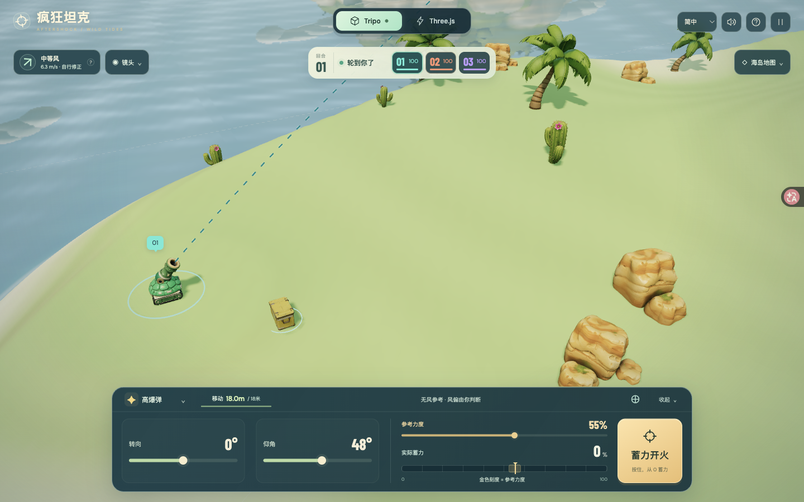</a>

Ngắm bắn, đọc hướng gió và nạp lực từ 0 trong trận pháo binh trên đảo 3D hoàn toàn. Chọn một trong sáu loại đạn, tạo những hố sâu và sống sót giữa hỗn loạn ngày càng tăng.

**Prompt**

```text
1. Mục tiêu dự án
Xây dựng Crazy Tanks — Wild Tides, một game pháo binh theo lượt có thể chơi được và thực sự ba chiều trên một hòn đảo nhiệt đới. Người chơi điều khiển một xe tăng nhỏ, đọc hướng gió, canh thời điểm nạp lực từ 0 và định hình lại chiến trường bằng đạn pháo. Hỗ trợ chơi đơn đấu với AI và chơi chuyền lượt cục bộ, với chế độ mặc định ba xe tăng hỗn chiến và tùy chọn đấu tay đôi giữa hai xe. Xe tăng cuối cùng còn sống sẽ chiến thắng. Sử dụng gameplay và ảnh chụp màn hình tham chiếu hiện tại làm mục tiêu hình ảnh.

2. Phong cách hình ảnh
Sử dụng camera phối cảnh và hình học 3D có thể xoay tự do, không dùng sprite phẳng hay góc nhìn ngang cố định. Tạo một tiểu cảnh mô hình thu nhỏ dưới nắng, với các xe tăng bo tròn màu ngọc bích, cam san hô và xanh tím, cát màu kem, cỏ xanh nhạt, nước xanh ngọc phản chiếu, bóng mềm và lớp sương khí quyển nhẹ ở xa. Giữ nguyên dáng viền riêng biệt của ba xe tăng cùng các nòng pháo tương ứng. Đặt một bảng giáp/trạng thái tròn nhỏ màu kem phía trên chiến trường và một bảng điều khiển bo tròn màu xanh teal đậm bên dưới. Màu vàng biểu thị lực tham chiếu và thao tác khai hỏa; màu mint biểu thị lực nạp thực tế và trạng thái phe ta. Đặt nút chuyển giao diện Tripo / Three.js ở vị trí nổi bật phía trên, mặc định dùng asset Tripo. Khi chuyển giao diện, phải giữ nguyên trạng thái trận đấu và vật lý. Sử dụng các nét gạch teal mảnh, cách đều trong không gian màn hình và vòng tròn tiếp đất tiết chế; không phản chiếu đồ họa ngắm bắn xuống mặt nước.

3. Thế giới và bối cảnh
Sử dụng một hòn đảo địa hình độ cao có thể phá hủy, kích thước xấp xỉ 260 × 184 mét, được bao quanh bởi đại dương ở một mực nước biển cố định. Đặt các xe tăng ban đầu cách xa nhau trên nền đất ổn định; rải đá, cây cọ, xương rồng và các thùng tiếp tế có thể thu thập. Những đảo nhỏ trang trí tạo chiều sâu cho hậu cảnh và không được thay thế địa hình chính có thể phá hủy. Vụ nổ làm biến dạng bề mặt và có thể đào xuống dưới mực nước biển. Giữ màu bờ biển và bọt nước trên cùng một mặt nước để tránh các mặt phẳng chồng lấn và hiện tượng nhấp nháy. Chiếu số xe tăng từ vị trí trong thế giới ở mọi khung hình được render. Cung cấp góc nhìn toàn bộ quỹ đạo, xe tăng, xoay quanh và chiến thuật từ trên cao. Góc nhìn quỹ đạo phải đưa xe tăng khai hỏa, đường cong và điểm tiếp đất ước tính vào khoảng trống giữa HUD và bảng điều khiển. Trước mỗi phát bắn, hiển thị xe tăng khai hỏa trong khoảng 0,8 giây, dừng lại ở nòng pháo rồi bám theo đạn. Tương tác camera thủ công sẽ hủy chế độ bám theo điện ảnh.

4. Danh mục asset
Sử dụng các vị trí model ổn định và cho phép truy cập riêng từng model thay thế:
- jade-body: thân xe tăng bánh xích màu xanh lá bo tròn, hình khiên; thân mặc định của người chơi. jade-cannon: nòng pháo jade tương ứng, có lòng nòng tối màu và điểm nhấn vàng, được điều khiển khớp độc lập.
- ember-body: thân xe bọc giáp nhọn màu cam san hô, dáng cơ khí thấp. ember-cannon: nòng pháo màu cam dài hơn tương ứng, với đầu nòng tối màu.
- bolt-body: thân xe bánh xích công nghiệp màu xanh tím, giáp ghép góc cạnh. bolt-cannon: nòng pháo xanh dày tương ứng.
- shell: đạn pháo bằng đồng thau, đầu thuôn tối màu và điểm nhấn cyan. Tái sử dụng với màu và tỷ lệ riêng theo từng vũ khí.
- crate: thùng tiếp tế bọc giáp màu vàng, ký hiệu cyan và các góc gia cố; thu thập để nhận 20 giáp, tối đa 100.
- rock: cụm đá sa thạch bo tròn màu ấm; lặp lại với nhiều tỷ lệ khác nhau và dùng proxy va chạm riêng.
- palm: thân cây cong và tán lá xanh nhiều lớp; lặp lại làm thảm thực vật trên đảo.
- cactus: cây xương rồng xanh nhỏ gọn với các chi tiết hoa nhỏ; lặp lại trên địa hình khô.
- islet: đảo nền tròn phủ cỏ, viền đá/cát màu nhạt; lặp lại ở phía ngoài đấu trường.
Ưu tiên ba cặp thân/nòng tương ứng, sau đó đến đạn/thùng và các vật thể môi trường. Giữ biến dạng địa hình, đại dương, bọt nước, lửa, khói, sóng xung kích, mảnh vỡ, đồ họa ngắm bắn, ánh sáng, UI và proxy va chạm ở dạng thủ tục. Các bộ phận thân và nòng tương ứng dùng chung một thiết kế tham chiếu và tỷ lệ. Đặt pivot của nòng tại khớp cơ khí, căn trục trước theo +X và dùng đầu nòng hiển thị làm điểm phóng vật lý. Thân xe bám theo độ dốc bằng quaternion; hướng ngắm của tháp pháo vẫn là hướng trong không gian thế giới. Giữ nguyên texture PBR nguồn và các đường nối UV. Tách model tải xuống ở độ phân giải đầy đủ khỏi bản sao tối ưu hóa cho runtime game; thông tin tham chiếu và nguồn gốc file phải xác định đúng nguồn tạo.

5. Gameplay và phản hồi
Mỗi xe tăng còn hoạt động nhận 18 mét quãng đường di chuyển khi lượt bắt đầu. WASD và pad di chuyển theo tương quan với màn hình; phím mũi tên và pad ngắm điều chỉnh phương vị và góc nâng. Thanh trượt cung cấp phương vị, góc nâng 10–80 độ và lực tham chiếu 0–100. Chọn đối thủ chỉ khiến xe quay mặt về phía đó; không được tự giải bài toán bắn.
Cung teal ước tính lực tham chiếu đã chọn khi KHÔNG có gió. Giữ cố định mức tham chiếu và dấu mốc vàng trong lúc nạp. Nhấn giữ Fire, Space hoặc Enter trên nút Fire đang được focus để bắt đầu lực thực tế từ 0 mỗi lần; tăng 18 điểm phần trăm mỗi giây, giữ ở mức 100 và chỉ khai hỏa đúng một lần khi thả nút, sử dụng lực thực tế tại thời điểm đó. Chạm nhanh sẽ bắn một phát yếu. Dải vàng trong phạm vi 3 điểm phần trăm chỉ là phản hồi hình ảnh, không tự làm tròn hay hiệu chỉnh ngầm. Hủy khi con trỏ bị hủy, cửa sổ mất focus hoặc trang không còn hiển thị. Khóa thay đổi di chuyển, mục tiêu và ngắm trong lúc nạp. Điều khiển bàn phím của input dạng range không được đồng thời xoay tháp pháo. Lực 0 biểu thị tốc độ phóng thấp nhất, không phải viên đạn đứng yên.
Mũi tên và các vệt gió trôi nhìn thấy cho biết hướng gió đẩy viên đạn. Gắn nhãn cường độ gió và mét trên giây; nhấp vào thẻ gió để xem giải thích. Gió thổi sang trái nghĩa là người chơi nên ngắm lệch sang phải một chút. Gió mạnh hơn và thời gian bay lâu hơn sẽ tạo độ lệch lớn hơn. Gió giữ nguyên trong suốt một phát bắn và thay đổi sau mỗi lượt. Không bao giờ tự động bù gió trong phần xem trước của người chơi. Chỉ dự đoán gần đúng điểm tiếp đất trên địa hình; không hứa hẹn va chạm với xe tăng/đá, tách cụm hay bật nảy trong phần xem trước.
Cung cấp sáu loại đạn: HE không giới hạn; đạn chùm tách thành năm bom con rơi xuống; Seismic tạo hố rộng tối đa 28 mét và sâu 13 mét; đạn ricochet nảy hai lần; mỗi xe tăng có một viên Cataclysm, tạo hố rộng tối đa 46 mét và sâu 22 mét; và Incendiary để lại vùng lửa bán kính 12 mét. Lửa gây 8 sát thương ở cuối mỗi một trong sáu lần kết thúc hành động; ra khỏi vùng lửa sẽ tránh được sát thương và các vùng chồng lấn không cộng dồn. Nước biển dập tắt lửa. Toàn bộ xe tăng, bao gồm cả nòng đã nâng, bị loại ngay lập tức khi chìm hoàn toàn dưới nước. Hiển thị sát thương thực tế, lượng giáp mất đi, địa hình sụp lở, nước bắn và kết quả bị loại.
Sử dụng các lớp cầu lửa, vòng xung kích mở rộng, tia lửa phát sáng, mảnh đạn đạo, bụi và khói cùng hiệu ứng rung camera tiết chế. Sử dụng nhạc và âm thanh gốc do ElevenLabs cung cấp cho pháo, va chạm, ricochet, vụ nổ lớn, lửa và nước bắn. Bao gồm nút bật/tắt âm thanh, tạm dừng/tiếp tục, hướng dẫn, chơi lại và quay về menu. Trong lúc đạn đang bay hoặc AI đang đến lượt, cung cấp tùy chọn Back to my turn: chạy nhanh mô phỏng với cùng bước thời gian cố định và giữ nguyên mọi kết quả về sát thương, địa hình và mối nguy. Không bao giờ bỏ qua lượt nhập của người chơi cục bộ.

6. Triển khai kỹ thuật
Sử dụng Three.js với ES modules và Vite, font được đóng gói cục bộ, Web Audio cho hiệu ứng và phần tử audio HTML cho nhạc lặp. Giữ tài nguyên cùng origin và hỗ trợ bản build tĩnh. Sử dụng renderer phối cảnh với khử răng cưa, ngân sách hợp lý cho bóng và hậu kỳ, đồng thời giải phóng đúng cách hình học/vật liệu tạm thời. Phân biệt phần trang trí của model với va chạm gameplay.
Giữ vật lý xác định, độc lập với quá trình render, dùng đơn vị mét/giây, gia tốc trọng trường 9.81 m/s² và bước cố định 1/120 giây. Sử dụng va chạm quét liên tục cho đạn tốc độ cao với mặt đất, nước, xe tăng và đá; áp dụng xung lực vụ nổ cùng trọng lực lên xe tăng bị hất. Tính vị trí phóng từ transform nòng riêng của từng xe tăng. Chế độ phát bình thường và tua nhanh phải gọi cùng các hàm cập nhật mô phỏng. Sát thương và phản ứng với gió là luật game được cách điệu, không phải trình mô phỏng vụ nổ kỹ thuật.
Hỗ trợ UI tiếng Trung, tiếng Anh, tiếng Nhật và tiếng Hàn. Ban đầu chọn theo ngôn ngữ thiết bị; thiết bị tại Hong Kong, Macau, Đài Loan và thiết bị dùng tiếng Trung phồn thể mặc định chọn tiếng Anh. Ghi nhớ lựa chọn rõ ràng của người dùng và cho phép hiển thị bộ chọn ngôn ngữ. Hỗ trợ bố cục desktop, điện thoại dọc và màn hình ngang thấp; menu trên màn hình ngắn có thể cuộn, vùng chạm đủ lớn, bảng điều khiển có thể thu gọn và không để các nút chồng lấn. Không yêu cầu nhập bằng bàn phím trên thiết bị cảm ứng. Đưa các hàm thay đổi state và hỗ trợ ngắm chỉ dùng khi phát triển ra khỏi bản production.

7. Tiêu chí hoàn thiện
Bàn giao source project độc lập có thể chỉnh sửa, lockfile, hướng dẫn npm dev/build và bản preview tĩnh hoạt động. Bám sát ảnh chụp màn hình và video gameplay hiện tại, bao gồm bảng trạng thái màu kem, dấu mốc tham chiếu vàng cố định, lực thực tế bắt đầu từ 0 và cách trình bày xe tăng/hòn đảo 3D hoàn toàn. Kiểm tra lần khởi chạy đầu tiên, tải model, một chu kỳ lượt hoàn chỉnh, hành vi của từng loại đạn, tạm dừng, chơi lại và kết quả thắng/thua thực tế. Xác nhận chuyển giao diện vẫn giữ nguyên state, đồng thời thao tác hủy bằng bàn phím/cảm ứng không gây khai hỏa. Trong một phát bắn kiểm thử rõ ràng khi không có gió, thả nút ở lực tham chiếu phải tiếp đất gần vòng tròn tham chiếu; gió ngang ngược chiều phải làm viên đạn thực tế lệch thấy rõ trong khi vòng tròn đó không đổi. Kiểm tra hoạt động ở 30/60/144 Hz, va chạm tốc độ cao, hố sâu, thời điểm lửa tắt, loại xe khi chìm hoàn toàn và sự tương đương kết quả lượt giữa chế độ bình thường/tua nhanh. Kiểm tra bố cục desktop và màn hình hẹp ở cả bốn ngôn ngữ; phân biệt việc giả lập trình duyệt với kiểm thử trên thiết bị thật. Xác thực trang đã triển khai và media liên kết, không chỉ bản build cục bộ.

```

[Xem chi tiết ↗](https://www.tripo3d.ai/vi/3d-prompts/crazy-tanks-3d-island-artillery) · [Bản demo](https://super-tanks-aftershock.tripo.page/) · [Về danh sách ví dụ](#all-prompts)

---

<a id="jelly-villa"></a>

### Biệt thự Thạch rau câu

[jared](https://x.com/jaredliu_bravo) · 2026-10-08

<a href="https://www.tripo3d.ai/vi/3d-prompts/jelly-villa">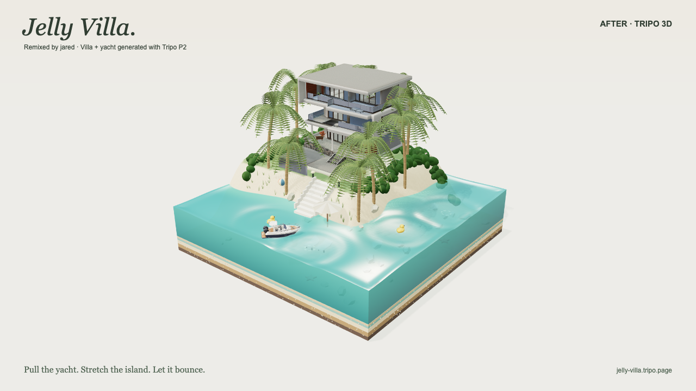</a>

Khuấy vùng biển thạch lấp lánh như đá quý, kéo một chiếc du thuyền thu nhỏ và uốn những hàng cọ quanh biệt thự nhiệt đới. Chuyển qua lại giữa khung cảnh dựng bằng mã và các mô hình biệt thự, du thuyền Tripo P2 chân thực trong cùng một hòn đảo sống động.

**Prompt**

```text
1. Mục tiêu dự án
Xây dựng “Jelly Villa”, một thiên đường nhiệt đới thu nhỏ có tính tương tác trên một khối thạch trong mờ được cắt lộ mặt. Khách tham quan có thể khuấy đầm phá, kéo một du thuyền thu nhỏ, thả đồ chơi bãi biển, uốn cây cọ và làm nghiêng hòn đảo. Bối cảnh cần mang cảm giác như một mô hình kiến trúc thanh lịch bất ngờ sống dậy. Đây là bản remix độc lập của jared dựa trên tham chiếu Villa Jelly của Vib3Coded, sử dụng các tài sản biệt thự và du thuyền Tripo P2 thực tế. Ghi công jared bằng https://x.com/jaredliu_bravo và giữ một liên kết riêng “Inspired by Vib3Coded” đến tác phẩm gốc. Không được trình bày video của tác giả tham chiếu như bản ghi hình của bản remix này.

2. Phong cách hình ảnh và đối chiếu
Dùng video tham chiếu để xác lập khối vuông, góc máy nâng chéo, đầm phá hình chữ L, cao nguyên trồng cây phía sau, ngôi nhà hiện đại màu trắng, hàng cọ sum suê, các lớp mặt cắt lộ ra và con thuyền chuyển động nhẹ. Hãy tái tạo những mối tương quan này thay vì tạo một hòn đảo chung chung. Bản remix cuối sử dụng Three.js/WebGL2 thay vì triển khai WebGPU gốc, để có thể tải tài sản GLB thực qua quy trình chuẩn của trình duyệt.
Dùng nền giấy ấm quanh mã #edeae3, chữ màu than ô liu đậm, đường phân cách mảnh và các điểm nhấn xanh thường xuân tiết chế. Đặt tiêu đề lớn kiểu serif Georgia “Jelly / Villa.” ở góc trên bên trái, với dòng thứ hai in nghiêng. Giữ mô hình diorama ở trung tâm làm chủ thể chính, chừa khoảng thở quanh các cạnh, đặt một bảng điều khiển nhỏ bên phải và hướng dẫn ngắn gọn, yên tĩnh ở phía dưới. UI bằng tiếng Anh. Camera chính nhìn từ x dương và z dương, với trường nhìn phối cảnh 34 độ. Dùng ánh nắng ấm dịu, ánh sáng bổ trợ mát, ánh sáng môi trường kiểu studio, bóng đổ chân thực, các vật thể bám nền và tone mapping kiểu phim. Giữ sự khác biệt rõ ràng giữa các bề mặt kính, vữa sơn, gỗ teak, cát, gelcoat, kim loại và lá. Tránh tán lá nhợt nhạt và mặt nước phẳng, đục.
Đặt một điều khiển Before / Compare / After dễ nhận thấy phía trên mô hình. Before dùng một biệt thự dựng bằng procedural được trang trí đầy đủ và một du thuyền procedural. After chỉ thay hai nhóm đối tượng đó bằng các tài sản Tripo thực tế. Compare hiển thị cả hai trong màn hình chia đôi có thể kéo, sử dụng chính xác cùng camera, thời điểm animation, địa hình, cây cọ, mặt nước, ánh sáng và trạng thái đồ chơi. Gắn nhãn trung thực cho hai phía: “Before · Code-built” và “After · Tripo 3D”. Khi kéo thanh chia, cảnh không được reset. Mặc định chuyển sang After khi mô hình tải xong; vẫn phải giữ phương án dự phòng hiển thị cùng trạng thái đang tải/lỗi trung thực nếu tài sản không khả dụng.

3. Thế giới và môi trường
Khối có kích thước 5.2 × 5.2 đơn vị cảnh. Mặt trên là một trường độ cao liên tục: đáy đầm phá gần 0.35, mực nước mặc định 1.04 và cao nguyên trồng cây gần 1.50. Giữ hòn đảo ở phần phía sau; đầm phá nối liền chạy dọc theo hai cạnh hướng ra phía trước. Tạo bờ cát hơi bất quy tắc và bờ dốc mượt, với cầu thang dẫn từ bãi cỏ xuống bãi biển. Các mặt cắt vuông để lộ những lớp chocolate, caramel, vanilla và bạc hà mỏng, xen các hạt sỏi nhỏ. Các mặt nước dọc trong suốt nằm phía trên những lớp này, với viền meniscus tinh tế. Mặt nước và các mặt cắt của nó phải phản hồi theo cùng bảng màu.
Đặt biệt thự phía sau sân hiên đá sáng màu, cùng đèn vườn, bụi hoa thấp, bãi cỏ có sọc nhẹ, đá rải rác và cỏ bãi biển. Bố trí chính xác mười cây cọ dừa có thể uốn riêng quanh biệt thự, vẫn để kiến trúc nhìn rõ giữa các tán cây. Mỗi cây có thân cong chia đốt, quả dừa và tán đầy đủ với các tàu lá kép hình lông chim vươn cong, không phải chỉ vài chiếc lá tam giác phẳng. Thêm một ô che nắng màu kem có viền vỏ sò, hai ghế nằm, một kayak màu đỏ đất nung và mái chèo gần bờ. Tỷ lệ của chúng phải luôn nhỏ hơn và nhường vị trí cho ngôi nhà.
Dùng một tuyến đường liên tục qua đầm phá cho du thuyền: làn ngoài, góc bo tròn, quay lại theo làn trong và các vòng chữ U nhẹ. Giữ thân thuyền cách xa bờ và các vách vuông. Địa hình và mặt nước vẫn phải được tạo bằng procedural để có thể biến dạng và phản ứng; không thay toàn bộ hòn đảo bằng một mesh tĩnh duy nhất.

4. Danh mục tài sản và các slot ổn định
- biệt thự: một khu nghỉ dưỡng nhiệt đới hiện đại màu trắng, mái phẳng phân tầng, mặt tiền kính tối màu, khung mảnh, ban công, chân đế bằng đá và sân hiên có mái che được bài trí nội thất. Biệt thự nằm trên sân hiên phía sau và là tài sản thay thế chính. Giữ nguyên thiết kế đã import cùng toàn bộ map vật liệu. Đặt vừa và tiếp đất mô hình trong slot biệt thự được đặt tên, kiểm tra mặt tiền trước theo camera và cầu thang. Mô hình Tripo được bàn giao có ba tầng mặt tiền; không được tuyên bố đây là bản sao chính xác của ngôi nhà tham chiếu.
- du thuyền: một du thuyền dạo biển nhỏ gọn màu trắng-xanh navy, thân nhọn, ghế cockpit màu kem, boong teak, kính chắn gió, mui cứng mảnh, lan can mũi và hai động cơ outboard. Tài sản được tải độc lập và di chuyển quanh đầm phá. Chuẩn hóa chiều dài, xác minh hướng mũi thuyền, căn đường nước và giữ nguyên chi tiết texture. Before và After dùng chung một phép biến đổi chuyển động và cùng cách lấy mẫu lực nổi.
- cây cọ: mười cây cọ dựng bằng code, với các lò xo uốn có thể chọn riêng và các nhóm hình học/vật liệu dùng chung. Tái sử dụng các bộ phận tĩnh đã gộp để tăng hiệu quả render.
- vật thể bãi biển: ô che nắng, ghế nằm, kayak, mái chèo, đá, cỏ, đèn, lát nền và bụi cây tạo bằng procedural. Hình học và chi tiết vật liệu của chúng phải giống hệt nhau ở cả hai chế độ đối chiếu.
- đồ chơi: các nhóm bóng bãi biển sọc, vịt cao su màu vàng và sao biển màu san hô có thể tái sử dụng. Bắt đầu với hai quả bóng trên bờ, hai chú vịt nổi trên nước và hai con sao biển dưới đáy đầm phá.
- mặt nước, địa hình, bọt, các lớp địa chất, ánh sáng và UI: vẫn được tạo bằng code. Xử lý các proxy va chạm và tương tác độc lập với chi tiết mô hình được tạo để hiển thị.
Biệt thự và du thuyền là các tài sản text-to-model Tripo P2 thực tế, được tải từ các tệp GLB cùng origin. Giữ prompt tạo và nguồn gốc thực của chúng cùng dự án, tách biệt khỏi đặc tả tái tạo này. Không thay mesh chi tiết bằng hình ảnh hoặc billboard, và không tuyên bố cảnh quan procedural được Tripo tạo ra.

5. Tương tác và phản hồi
Kéo trên mặt nước để tạo các hõm và gợn sóng chuyển động; thả ra để chúng lan tỏa dần. Triển khai một trường sóng sai phân hữu hạn có giới hạn, được giảm chấn ở bờ, với độ cứng và độ giảm chấn phụ thuộc tham số. Thêm các gợn bề mặt animation nhỏ, sắc độ chiều sâu trông như khúc xạ, highlight specular mượt, màu phụ thuộc độ sâu và các đốm bọt phía sau mềm; không được suy ra pháp tuyến mặt nước từ đạo hàm màn hình theo từng tam giác hoặc phủ các mẫu đường lặp lại. Mô tả đây là mô phỏng mặt nước thời gian thực mang tính nghệ thuật, không phải tuyên bố về độ chính xác vật lý của chất lưu.
Kéo hòn đảo hoặc mặt cắt của nó để làm toàn bộ cảnh bị xô lệch và nén lại. Neo phần đế và dùng một trường đàn hồi phi tuyến dùng chung cho địa hình, mặt nước, mặt cắt, kiến trúc, thực vật và bóng đổ. Khi thả ra, chuyển động bật quá đà phải được giảm chấn. Một nút “Give the island a wobble” hiển thị rõ sẽ tạo hiệu ứng tương tự. Giữ hình học mặt bên của nước cao hơn đáy địa hình cục bộ để các mặt đồng phẳng không bị nhấp nháy. Việc lấy mẫu mặt nước và tọa độ con trỏ phải dùng cùng một lưới không phản chiếu, với độ cao và pháp tuyến nội suy mượt. Kéo một cây cọ để uốn cong, sau đó thả ra để cây trở về bằng lò xo cùng một làn gió nhẹ khi không tương tác.
Du thuyền tự động di chuyển quanh tuyến khép kín với tốc độ khoảng 0.38–0.48 đơn vị cảnh mỗi giây. Lấy mẫu bề mặt sóng để điều khiển chuyển động nhấp nhô và chúi/ngóc, thêm độ lắc ngang vừa phải, đồng thời phát xung lực lên nước và bọt phai dần phía sau đuôi thuyền. Cho phép khách tham quan nắm và kéo thuyền qua vùng nước có thể di chuyển; giữ độ lệch khi nắm và bám theo mục tiêu quán tính đã giảm chấn. Khi thả, giữ nguyên vị trí và vận tốc thực tế, sau đó chuyển hướng mượt về tuyến đường. Tuyệt đối không dịch chuyển tức thời đến một điểm trên tuyến. Dùng proxy khoảng hở thân thuyền độc lập, cơ chế trượt theo bờ, tốc độ có giới hạn, hướng chuyển động mượt và lực nổi lò xo bốn điểm để thao tác kéo chậm, nhanh hoặc ngược chiều vẫn ổn định. Thuyền sẽ đẩy các đồ chơi nổi gần đó sang bên.
Các nút thả sẽ thêm một quả bóng bãi biển, một chú vịt hoặc một con sao biển từ phía trên. Bóng nổi cao, vịt luôn đứng thẳng và sao biển chìm xuống đáy biển. Đồ chơi tạo tia nước và gợn sóng khi chạm mặt nước. Hỗ trợ kéo và thả đồ chơi, trọng lực, chuyển động nổi có giảm chấn, tiếp xúc địa hình và giới hạn theo vách. Tính Afloat, Sunk và Ashore dựa trên trạng thái thực của vật thể. Giới hạn tổng số đồ chơi ở 40, tự loại bỏ đồ chơi cũ nhất để thao tác lặp lại vẫn phản hồi nhanh.
Cung cấp các bảng màu Turquoise, Curaçao và Raspberry; độ cứng thạch 10–100, mặc định 50; damping 5–90, mặc định 30; thủy triều -10 đến +10 cm, mặc định bằng không. Reset khôi phục đồ chơi, vật lý và các giá trị mặc định. Pause đóng băng thế giới mô phỏng và Resume tiếp tục. Reset view khôi phục khung hình. Orbit bằng cách kéo vùng trống hoặc kéo chuột phải; cuộn hoặc chụm để zoom. Trên màn hình hẹp, giữ hòn đảo dễ sử dụng và thu gọn các điều khiển phía sau thanh “Make some waves” ở dưới cùng. Tránh cuộn ngang hoặc cuộn trang.
Âm thanh nền đại dương được tổng hợp cục bộ và chỉ bắt đầu sau thao tác của người dùng. Bao gồm công tắc Sound off/on rõ ràng. Cung cấp chế độ toàn màn hình khi được phép và tính năng xuất bưu thiếp PNG trên desktop. Giữ một liên kết rõ ràng “Make this paradise yours” đến workspace tạo nội dung của Tripo, kèm các tham số ghi công jelly-villa, mở trong tab mới.

6. Triển khai kỹ thuật
Dùng dự án Vite + JavaScript + Three.js độc lập, có package lock riêng và không yêu cầu server hay secret đối với trình duyệt. Đóng gói JavaScript, style, tệp GLB và mọi tài nguyên runtime trên cùng origin. Dùng GLTFLoader cho từng slot mô hình, OrbitControls cho đầu vào camera và renderer dựa trên vật lý với môi trường studio cùng shadow map. Giữ UI dưới dạng HTML có khả năng truy cập, nằm phía trên canvas toàn màn hình. Không phụ thuộc vào script CDN bên thứ ba, code thực thi inline, yêu cầu texture bên ngoài hoặc URL mô hình có chữ ký trong runtime.
Chuẩn hóa giới hạn GLB mà không thay đổi các bản gốc riêng tư; giữ map, pháp tuyến và UV. Ghi lại mọi phép xoay, scale hoặc nén tại runtime. Gộp cảnh tĩnh, từng cây cọ, mô hình procedural và đồ chơi thành các batch vật liệu phù hợp để hạn chế draw call; tránh các pass truyền sáng tốn kém và drawing buffer luôn được duy trì; giới hạn pixel ratio, lưới sóng và hạt bọt, đồng thời kiểm tra tốc độ khung hình thực tế thay vì hứa hẹn 60 fps trên mọi thiết bị. Dùng requestAnimationFrame với delta time có giới hạn, các substep mô phỏng cố định, đầu vào giảm chấn và kiểm tra số hữu hạn. Đóng băng animation khi Pause; việc thay đổi chế độ đối chiếu không được tạo lại hoặc mô phỏng lại cảnh.
Hiển thị một giao diện debug nhỏ cho trạng thái hiện tại, mức sẵn sàng của tài sản, phép chiếu camera, năng lượng mặt nước, đồ chơi, vị trí thuyền, pause, bảng màu và chế độ đối chiếu. Giao diện này dùng để xác thực, không thay thế cho việc kiểm thử con trỏ và cảm ứng thực tế. Giữ các tệp tài sản gốc và nguồn gốc riêng tư cho các lượt tải catalog có kiểm soát; chỉ đưa các bản sao runtime cần thiết vào bản build tĩnh.

7. Tiêu chí hoàn thành
Bàn giao dự án nguồn có thể chỉnh sửa, kèm lệnh cài đặt/build/start, bản build tĩnh production và bản demo công khai hoạt động. Xác minh bố cục lấy cảm hứng từ tham chiếu, hàng cọ sum suê, các lớp mặt cắt rõ ràng, biệt thự tiếp đất đúng cách và du thuyền căn chỉnh đúng từ camera thực tế. Kiểm thử Before, After và thanh chia đối chiếu đã di chuyển, với trạng thái cảnh dùng chung khớp nhau. Xác nhận cả hai GLB tải được với hình học thực và texture nhúng.
Thực hiện các thao tác khuấy, làm nghiêng, kéo cây cọ, kéo thuyền và tiếp tục hành trình, thả/kéo đồ chơi, kiểm đếm, tất cả bảng màu và thanh trượt, Reset, Pause/Resume, orbit/zoom, bảng điều khiển trên thiết bị di động, âm thanh tùy chọn, toàn màn hình, bưu thiếp và liên kết tạo nội dung. Chạy kiểm tra thuyền nhiều vòng, kéo thuyền liên tục ở tốc độ chậm/nhanh/ngược, kéo tại bờ và biên giới, tính liên tục khi thả, biến dạng đảo khi giữ, chuyển động bật quá đà, thiết lập sóng cực trị và thả đồ chơi lặp lại. Kiểm tra cận cảnh mặt nước, cả bốn mặt và các góc nhìn phía sau để phát hiện highlight tam giác, z-fighting, lỗ hổng, bất ổn hoặc tăng trưởng không giới hạn. Kiểm thử đầu vào con trỏ/cảm ứng thực tế cùng các bài kiểm tra hồi quy vật lý. Kiểm tra ảnh chụp desktop và màn hình hẹp, cũng như lỗi console/network. Xác thực các tương tác tương tự sau khi triển khai và bên trong iframe của trang prompt công khai. Báo cáo trung thực kết quả đo được và giới hạn thiết bị.
Xuất bản prompt jelly-villa mới, ghi công jared, ghi tác giả gốc trong mục Remix from, liên kết Web Page đã xuất bản, sử dụng ảnh chụp màn hình remix hiện tại và mọi bản ghi hiện tại, đồng thời chỉ giữ video tham chiếu làm bằng chứng nguồn. Hoàn tất tiêu đề, mô tả, Meta và metadata tài sản trong CMS theo ngôn ngữ địa phương. Cải tiến Tripo dễ nhận thấy phải là biệt thự và du thuyền có chi tiết cao, trong khi thế giới xung quanh được giữ nguyên.

```

[Xem chi tiết ↗](https://www.tripo3d.ai/vi/3d-prompts/jelly-villa) · [Bản demo](https://jelly-villa.tripo.page/) · [Về danh sách ví dụ](#all-prompts)

---

<a id="odd-arms"></a>

### ODD ARMS — Game sinh tồn với vũ khí kỳ quặc

[Deniffer](https://x.com/lumina__team) · 2026-09-18

<a href="https://www.tripo3d.ai/vi/3d-prompts/odd-arms">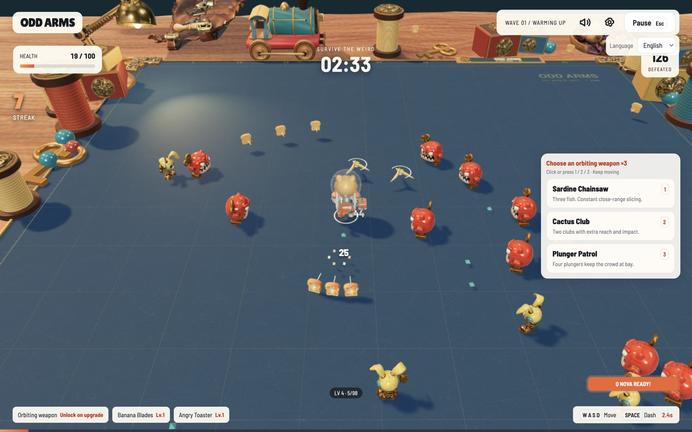</a>

<a href="https://www.tripo3d.ai/vi/3d-prompts/odd-arms">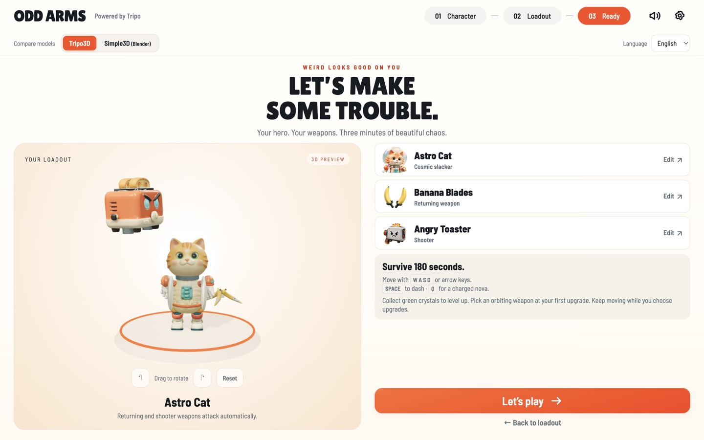</a>

<a href="https://www.tripo3d.ai/vi/3d-prompts/odd-arms">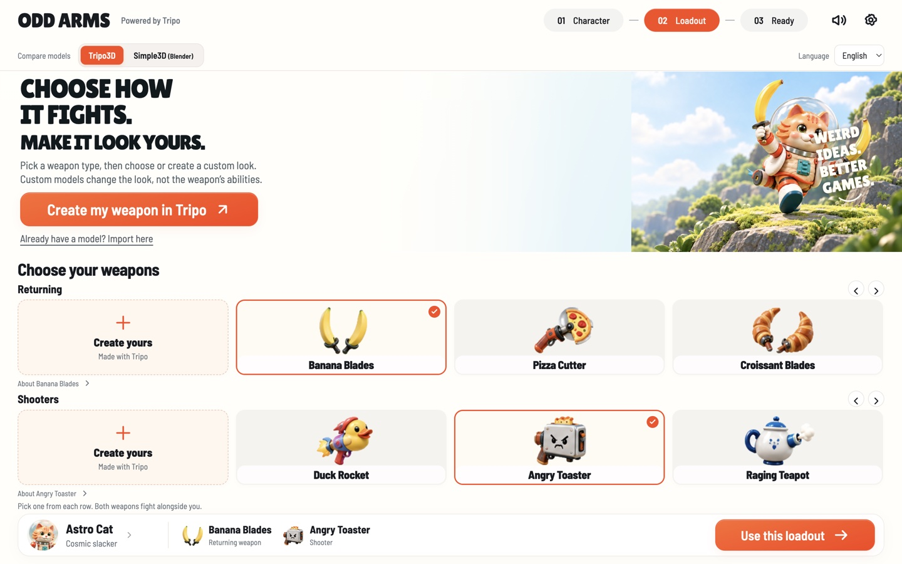</a>

<a href="https://www.tripo3d.ai/vi/3d-prompts/odd-arms">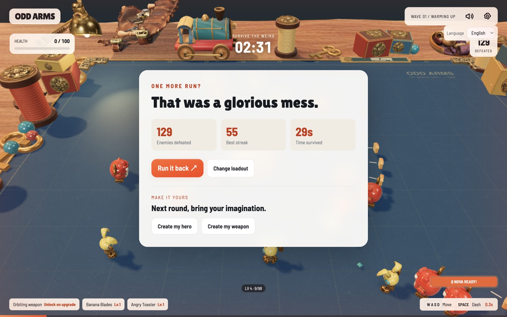</a>

Xây dựng một game sinh tồn Three.js kéo dài ba phút, trong đó một anh hùng đồ chơi với lưỡi dao chuối, máy nướng bánh mì và pít-tông chiến đấu với những quái vật lên dây cót trên bàn làm việc. Người chơi có thể tạo anh hùng hoặc vũ khí riêng trong Tripo Studio, rồi nhập GLB vào game để chơi.

**Prompt**

```text
# ODD ARMS — Ý tưởng của bạn. Anh hùng của bạn.

## 1. Mục tiêu
Giữ toàn bộ giao diện game bằng tiếng Anh (thêm tiếng Nhật dưới dạng tùy chọn chuyển ngôn ngữ).
Xây dựng một game sinh tồn trên trình duyệt hoàn chỉnh, kéo dài ba phút, thuộc thể loại "bầy đàn tự động tấn công": người chơi chọn một anh hùng cỡ đồ chơi và hai vũ khí cực kỳ kỳ quặc, sau đó sống sót 180 giây giữa những bầy quái vật trên bàn làm việc của thợ thủ công. Vũ khí tự động tấn công; người chơi chỉ cần di chuyển, lướt, thu thập tinh thể, chọn nâng cấp và tung một đợt nova tích năng lượng. Điểm hấp dẫn nằm ở tính cá nhân hóa: người chơi có thể tạo anh hùng hoặc vũ khí riêng trong Tripo, tải xuống GLB rồi đưa vào game. Sử dụng https://odd-arms.tripo.page/ và các tài liệu tham khảo được cung cấp cho thành phẩm. Ghi công Deniffer tại https://x.com/lumina__team.

## 2. Định hướng hình ảnh
Định hình game như một mô hình đồ chơi thu nhỏ, nhìn từ camera cố định chếch từ trên xuống và bám theo anh hùng. Khu vực chơi là một tấm thảm cắt màu xanh navy đậm, có lưới mờ và các dấu góc in chữ "ODD ARMS", đặt trên bàn gỗ màu ấm. Viền bàn chất đầy đạo cụ thủ công cỡ lớn (cuộn chỉ, hộp hoa thị bằng đồng trang trí, túi đựng dụng cụ bằng da, đèn bàn bằng đồng, tàu hỏa đồ chơi, các bộ phận đồ chơi), để đấu trường trông như một mặt bàn thật. Dùng ánh sáng chính ấm từ phía đèn, ánh sáng môi trường dịu, bóng tiếp xúc và hiệu ứng bloom nhẹ; nhân vật có bề mặt bóng, hình khối mập mạp theo phong cách tượng sưu tầm, màu sắc bão hòa.

UI: thẻ bo tròn màu trắng kem với chữ navy và điểm nhấn cam san hô, dùng phông hiển thị đậm, cô đọng cho tiêu đề ("LET'S MAKE SOME TROUBLE.") và sans cô đọng rõ ràng cho nội dung. Trong trận đấu: thẻ máu ở góc trên trái, bộ đếm chuỗi hạ gục bên dưới, bộ đếm ngược "SURVIVE THE WEIRD" ở chính giữa phía trên, nhãn đợt quái + âm thanh + cài đặt + Pause ở góc trên phải, số quái đã hạ ở bên phải, thẻ cấp độ/XP ở chính giữa phía dưới, ba chip vũ khí (xoay quanh / quay về / bắn, kèm cấp độ) ở góc dưới trái, điều khiển + thời gian hồi lướt ở góc dưới phải, thẻ "Q NOVA READY!" phía trên. Tăng cảm giác khi chơi: số sát thương, đòn chí mạng, kẻ địch co giãn squash-and-stretch, hất văng, hạt bật nổ, rung camera nhẹ (tắt rung khi prefers-reduced-motion được thiết lập).

## 3. Thế giới
Một đấu trường hình vuông; giới hạn anh hùng trong khoảng ±23 đơn vị trên cả hai trục. Tấm thảm cắt phủ kín khu vực chơi; bàn và đạo cụ nằm ngoài giới hạn, chỉ làm cảnh nền (không va chạm). Đấu trường bắt đầu trống rồi được lấp đầy từ các cạnh: kẻ địch xuất hiện trên một vòng tròn cách anh hùng 12–16 đơn vị (8–11 trong giây đầu tiên) và đi thẳng về phía anh hùng. Cứ mỗi 22 giây, một đợt tràn xuất hiện, tạo thành một vòng tròn đầy kẻ địch ở bán kính 13. Các vòng cảnh báo màu đỏ xuất hiện dưới vị trí hiện tại của anh hùng (lần đầu ở 28 giây, sau đó mỗi max(4.4, 9 − t/50) giây) và phát nổ sau 2 giây.

## 4. Danh mục tài sản
Chuẩn bị các khe mô hình ổn định; mỗi khe phải tải một GLB duy nhất, căn giữa, tự động scale theo chiều cao mục tiêu và chuyển sang placeholder đơn giản nếu tải thất bại.

Anh hùng (10, `hero:<id>`), mỗi anh hùng là một nhân vật đồ chơi hình khối rõ dáng:
- `cat` Astro Cat — mèo mướp cam mặc bộ đồ phi hành gia màu trắng và đội mũ kính. HP 100, tốc độ 6.8, nam châm ×1.35, thời gian hồi lướt 2.4 s.
- `frog` Frog Fighter — ếch xanh đeo găng đấm bốc đỏ. HP 130, tốc độ 6.8, sát thương lướt 135.
- `shroom` Mushroom Hero — nấm mũ đỏ với một chiếc áo choàng nhỏ. HP 90, tốc độ 7.6, lướt 1.8 s.
- `capybara` Chill Capybara — chuột lang nước thư thái trong suối nước nóng. HP 160, tốc độ 5.8, nam châm ×1.15, lướt 3 s, sát thương lướt 110.
- `ramen` Ramen Ronin — samurai mang một bát ramen nghi ngút khói. HP 105, tốc độ 7.2, lướt 2.2 s, sát thương lướt 120.
- `penguin` Office Penguin — chim cánh cụt mặc sơ mi và cà vạt. HP 80, tốc độ 7.1, lướt 1.5 s, sát thương lướt 75.
- `axolotl` Axolotl — axolotl hồng thám hiểm. HP 85, tốc độ 7.3, nam châm ×1.6, sát thương lướt 75.
- `avocado` Avo Boxer — võ sĩ quyền anh quả bơ với lõi hạt. HP 120, tốc độ 6.4, lướt 2.1 s, sát thương lướt 130.
- `robot` Clockwork Bot — robot thiếc lên dây cót với chiếc chìa khóa. HP 115, tốc độ 6.2, lướt 2.8 s, sát thương lướt 165.
- `snail` Snail Knight — hiệp sĩ ốc sên mang chiếc vỏ to như ngôi nhà. HP 190, tốc độ 5.2, nam châm ×1.2, lướt 3.2 s, sát thương lướt 120.
Sát thương lướt mặc định là 90 nếu không được nêu.

Vũ khí (12, `weapon:<id>`), được nhóm theo ô tấn công:
- Xoay quanh: `sardine` Sardine Chainsaw (3 con cá, bán kính 2.9, sát thương 1, tốc độ 1.2); `cactus` Cactus Club (2 gậy, bán kính 3.3, sát thương 1.65, tốc độ 0.78, bán kính đánh trúng 1.25, hất văng 1.5); `plunger` Plunger Patrol (4 pít-tông, bán kính 2.25, sát thương 0.85, tốc độ 1.5).
- Quay về: `banana` Banana Blades (2 lưỡi, sát thương 1, tốc độ 1.25); `pizza` Pizza Cutter (1 đĩa lớn, sát thương 1.5, tốc độ 0.82, bán kính đánh trúng 1.65); `croissant` Croissant Blades (3 lưỡi, sát thương 0.75, tốc độ 1.45); `boomerang` Boomerang (1, sát thương 1.15, tốc độ 1.6); `donut-disc` Donut Disc (1, sát thương 1.5, tốc độ 0.9, bán kính đánh trúng 1.3).
- Bắn: `duck` Duck Rocket (tự tìm mục tiêu, lan 2, khoảng cách 0.42 s); `toaster` Angry Toaster (chùm 3 phát xuyên mục tiêu, sát thương 0.7); `teapot` Raging Teapot (2 phát chậm, lan 2.8, khoảng cách 0.8 s); `bubble-gun` Bubble Gun (2 bong bóng xuyên mục tiêu, sát thương 0.45, khoảng cách 0.3 s).
Trang bị mặc định: Astro Cat, Banana Blades, Angry Toaster; vũ khí xoay quanh được mở khóa ở lần nâng cấp đầu tiên.

Kẻ địch (3, `enemy:<id>`), là những quái vật đồ chơi lên dây cót: `red-chomper` (đồ chơi tròn màu đỏ biết cắn, cơ bản, 30 HP cơ sở, tốc độ 2.35), `spring-rabbit` (thỏ chân lò xo màu vàng, nhanh, 23 HP cơ sở, tốc độ 3.5), `crown-bear` (gấu chắp vá lớn đội vương miện, xe tăng, 130 HP cơ sở, tốc độ 1.7, xuất hiện sau 60 s với tỷ lệ 17%, rơi 3 XP).

Đạo cụ cảnh (`prop:<id>`): bàn làm việc, khung và miếng góc của tấm thảm cắt, đèn bàn, tàu hỏa đồ chơi, cuộn chỉ, hộp hoa thị trang trí, túi đựng dụng cụ, khay linh kiện đồ chơi. Giữ tấm thảm, lưới, tinh thể, đạn, vòng cảnh báo, hạt, đèn và UI ở dạng tạo bằng procedural.

## 5. Gameplay và phản hồi
Luồng: Nhân vật → Trang bị (một vũ khí quay về + một vũ khí bắn) → Sẵn sàng (bản xem trước 3D dạng bàn xoay của anh hùng với các vũ khí đã chọn, kéo để xoay) → "Let's play". Mỗi bước làm quen chỉ hiển thị danh mục tương ứng cùng mô tả, phong cách chơi và điểm yếu. Ghi nhớ trang bị gần nhất.

Điều khiển: WASD/phím mũi tên để di chuyển; Space lướt theo hướng đang đi (tốc độ ×3.7, bất tử trong thời gian ngắn, gây sát thương một lần mỗi lượt lướt lên kẻ địch trong phạm vi 2 đơn vị); Q tung nova khi năng lượng đạt 100 (bán kính 11, sát thương 200, hất văng mạnh, hút tinh thể); 1/2/3 hoặc nhấp chuột để chọn nâng cấp; Esc để tạm dừng; tự động tạm dừng khi cửa sổ mất tiêu điểm. Di động: cần analog ảo bên trái, các nút Dash và Nova bên phải với vòng hồi chiêu/tích năng lượng, hỗ trợ đa chạm để cần analog và các nút hoạt động cùng lúc; nâng cấp nằm phía trên cần analog khi cầm dọc và giữa hai ngón cái khi cầm ngang.

Luật: HP kẻ địch = base × (1 + t/260) × 1.3. Khoảng thời gian xuất hiện max(0.18, 0.52 − 0.0016·t) s, tối đa 180 kẻ địch. Sát thương va chạm 9 (18 đối với gấu), bất tử 0.85 s sau khi trúng đòn. Mỗi lần hạ gục cộng 2 năng lượng và rơi một tinh thể; mỗi đòn đánh trúng thứ 9 của mỗi vũ khí gây chí mạng ×1.7. Chuỗi 25 lần hạ gục kích hoạt cuồng nộ trong 5 s (tốc độ tấn công ×1.65, hồi chiêu 13 s); nhận sát thương sẽ đặt lại chuỗi. XP để lên cấp: 20, sau đó round(need × 1.4 + 10). Lên cấp không bao giờ tạm dừng game: các lựa chọn được xếp hàng dưới dạng thẻ không chặn luồng chơi. Nâng cấp đầu tiên đưa ra ba vũ khí xoay quanh; sau đó đưa ra ba trong số các lựa chọn: Orbit overload (+1 vật thể xoay quanh, tối đa 7, +22% sát thương), Another round (bắn nhanh hơn, quay về lâu hơn và mạnh hơn), Full blast (bắn nhanh hơn, +20% sát thương, nhiều đạn hơn), Live a little (+10% tốc độ, +30 HP). Mỗi lựa chọn hồi 8 HP.

Kết thúc: sống sót 180 s → "Beautifully weird. You made it."; HP 0 → "That was a glorious mess." Cả hai đều hiển thị số kẻ địch đã hạ, chuỗi tốt nhất và thời gian sống sót, cùng các tùy chọn tạo lại lượt chơi / thay đổi trang bị và lời nhắc tự tạo.

Tạo dấu ấn riêng: từ màn hình trang bị, tạm dừng và kết quả, "Create my hero / weapon in Tripo" mở https://studio.tripo3d.ai/ trong tab mới; "Import GLB" tải một tệp .glb cục bộ (≤15 MB, chỉ dùng kết cấu nhúng, phân tích ngay trong trình duyệt, không bao giờ tải lên), căn giữa và scale tệp, rồi chỉ thay đổi diện mạo của anh hùng hoặc vũ khí được chọn trong khi giữ nguyên chỉ số. Hiển thị lỗi rõ ràng với tệp không hợp lệ và giữ lại mô hình gốc.

So sánh mô hình: một nút chuyển ở phần đầu trang, "Tripo3D ⇄ Simple3D (Blender)", thay thế mọi anh hùng, vũ khí, kẻ địch và đạo cụ bằng bộ hình nguyên thủy đơn giản tương ứng mà không đặt lại lượt chơi. Tải toàn bộ bộ thay thế trước khi chuyển; nếu có bất kỳ tệp nào lỗi, giữ nguyên bộ hiện tại.

## 6. Triển khai kỹ thuật
Vite + JavaScript thuần + Three.js với GLTFLoader, ánh sáng RoomEnvironment và ánh xạ tông màu ACES. Giữ phần mô phỏng trong một mô-đun timestep cố định, thuần, có nguồn ngẫu nhiên có thể tiêm vào để chạy toàn bộ lượt chơi trong các bài kiểm thử; renderer chỉ đọc state. Cache mỗi GLB một lần và clone cho các instance; dùng instancing hoặc LOD cho các vật trang trí lặp lại. Giới hạn tỷ lệ pixel (1.5 trên di động, giảm xuống 1 trong các đợt dày), làm mới bóng tối đa 30 lần mỗi giây và chỉ cập nhật văn bản HUD khi giá trị thay đổi. Tách va chạm (các hình tròn đơn giản) khỏi mesh hiển thị. Đóng gói phông chữ, mô hình và kết cấu cùng origin để bản build là một thư mục tĩnh. Nhắm đến trình duyệt máy tính và điện thoại, từ bề rộng 320 px trở lên, bao gồm điện thoại xoay ngang và vùng an toàn. Độ phức tạp mô hình nên theo kích thước hiển thị trên màn hình; không đặt giới hạn đa giác cứng.

## 7. Hoàn tất khi
- Toàn bộ luồng hoạt động: làm quen, chiến đấu đến khi thắng hoặc thua, tạm dừng/tiếp tục, khởi động lại với cùng trang bị, thay đổi trang bị.
- Cả 10 anh hùng và 12 vũ khí đều tải và hoạt động đúng theo các chỉ số trên; một lượt chơi 180 s với bất kỳ trang bị nào cũng kết thúc mà không có lỗi.
- Điều khiển bằng bàn phím và cảm ứng đều hoạt động, bao gồm cần analog và Dash cùng lúc.
- Nhập GLB thay thế diện mạo của anh hùng hoặc vũ khí được chọn và xử lý từ chối tệp lỗi một cách phù hợp.
- Nút chuyển Tripo3D / Simple3D thay thế toàn bộ mô hình ngay giữa lượt chơi.
- Màn hình mở đầu, giữa trận và kết quả khớp với tài liệu tham khảo; cung cấp mã nguồn có thể chạy, lệnh khởi động và bản build tĩnh dành cho production.

```

[Xem chi tiết ↗](https://www.tripo3d.ai/vi/3d-prompts/odd-arms) · [Bài đăng gốc](https://odd-arms.tripo.page/) · [Bản demo](https://odd-arms.tripo.page/) · [Về danh sách ví dụ](#all-prompts)

---

<a id="titanic-the-last-light"></a>

### TITANIC — Ánh sáng cuối cùng

[jared](https://x.com/jaredliu_bravo) · 2026-09-20

<a href="https://www.tripo3d.ai/vi/3d-prompts/titanic-the-last-light">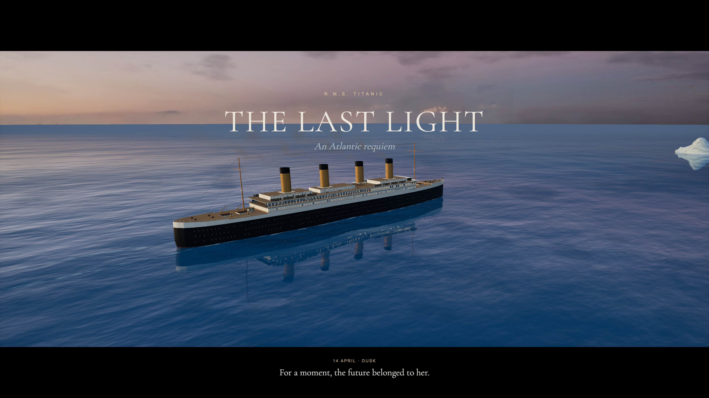</a>

Một chuyến du hành điện ảnh dài 4:24 qua Titanic, với Đại Tây Dương xanh thẳm, chân dung nhân vật, cảnh hạ xuồng cứu sinh có chuyển động theo thực tế và một thế giới sống động để khám phá.

**Prompt**

```text
1. Mục tiêu dự án
Tạo TITANIC — THE LAST LIGHT: một hành trình điện ảnh tương tác dài 264 giây, từ hoàng hôn cuối cùng của con tàu, qua va chạm, sơ tán và chìm xuống, đến lễ tưởng niệm lúc bình minh. Khách tham quan xem một bộ phim được dàn dựng, khám phá thế giới 3D chuyển động, chuyển đến một chương, lưu ảnh tĩnh hoặc tải xuống toàn bộ phim. Trình bày đây là một diễn giải nghệ thuật, không tuyên bố độ chính xác pháp y hay mối liên hệ chính thức nào.

2. Định hướng hình ảnh
Sử dụng bảng màu điện ảnh tiết chế: ánh đèn tàu màu kem ấm và hổ phách trên nền xanh Atlantic đậm, sau đó chuyển sang đêm tối đầy sao và bình minh mát lạnh. Dựng cảnh phối cảnh với bố cục phim 2.39:1, bloom mềm, hạt nhiễu tinh tế và vignette. Dùng depth of field cho các chân dung nhân vật và cảnh bình minh, đồng thời giữ các hạt từ pháo hiệu cứu nạn sắc nét. Tạo màu thân đại dương xanh đậm, các đợt sóng trong world space, normal ripple nhỏ hơn có mipmap và phản xạ Fresnel; màu hoàng hôn chủ yếu chỉ xuất hiện trong ánh sáng phản chiếu. Dùng các dải wake gắn với thân tàu, bám theo cùng độ biến dạng của đại dương, với đầu mềm và bọt biển đứt đoạn. Lặp texture panorama theo chiều ngang mà không tạo điểm gián đoạn fract, nhằm tránh đường nối dọc trên bầu trời và các vệt phản chiếu. Tránh shading vùng nước nông màu cam, các gợn sóng nhỏ đồng nhất và decal bọt phát sáng hình tròn. Xóa các mặt trên mái ẩn bị chồng lấn để tránh xung đột độ sâu; đặt camera near plane phù hợp với khoảng cách của từng cảnh. Trong lúc chìm, giảm dần ánh sáng cửa sổ một cách đơn điệu thay vì thêm hiện tượng nhấp nháy tần số cao. Dùng tiêu đề serif trầm, các nút điều khiển song ngữ Anh/Trung và một timeline hẹp dọc cạnh dưới.

3. Thế giới, địa lý và biên tập camera
Sử dụng một hệ tọa độ liên tục với con tàu dài 269 mét, mũi tàu hướng về +X và một tảng băng cố định tại (275, 0, 57). Con tàu tiến lên, chạm tảng băng ở giây 96.727, trôi thêm đến khi dừng lại, rồi chìm theo phần mũi và phần đuôi. Giữ tảng băng xuất hiện cho đến đoạn kết và nhìn thấy trong bố cục bình minh. Giữ sáu chương bắt đầu tại các mốc 0, 63, 110, 163, 211 và 241 giây.

Xây dựng 23 shot có chủ đích. Phân cảnh ôm ở mũi tàu kéo dài từ giây 29–61: một shot thiết lập cảnh tiếp cận, một chân dung đôi cận cảnh, một góc nhìn từ phía sau hướng ra biển và một chân dung chếch. Đặt Rose ở phía trước và Jack phía sau cô tại chóp mũi tàu, cả hai cùng hướng mắt ra ngoài mũi tàu. Duy trì ánh sáng hoàng hôn xuyên suốt chuỗi shot. Từ giây 127–158, dùng ba shot gắn với transform thế giới thực của một xuồng cứu sinh: rời boong xuồng, cận cảnh hơn về hành khách và dây treo, rồi tiếp cận mặt nước. Tiếp nối bằng các shot sơ tán toàn cảnh, tàu nghiêng, nứt gãy và chìm. Khi bình minh, cho thấy những chiếc xuồng còn sống sót với tảng băng ở xa, sau đó là tiêu đề tưởng niệm tiết chế.

4. Danh mục tài sản
- titanic-vessel: dựng cấu trúc chính dài 269 mét trong Blender với các boong hở liên tục, forecastle đóng kín, các tầng promenade, bốn ống khói rỗng nghiêng, thân trên màu đen và thân dưới màu đỏ. Dùng vành tròn thực cho 864 ô cửa sổ tròn và khung cho 360 cửa sổ. Chỉ cho phép emission trên các vật liệu kính thực tế. Batch vật liệu và tách tại x=-32 để phục vụ cảnh chìm. Thêm cột buồm, rigging, davit, dây hạ, chân vịt bằng đồng và bánh lái. Tạo companionway P2 với cửa gỗ teak và chi tiết đồng thau, chuẩn hóa rồi tái sử dụng hai lần trên boong đã biên soạn. Giữ nguyên transform của node khi lắp ráp GLB.
- atlantic-iceberg: một tảng băng xanh-trắng bất quy tắc, bị xói mòn, với các lớp sương giá, độ roughness biến thiên, normal map tiết chế và đường tiếp nước thuyết phục. Đây là một đối tượng địa lý cố định.
- lifeboat: một xuồng cứu sinh chèo tay của White Star với vỏ gỗ trắng, be chắn mạn tối màu, ghế băng và mái chèo, được instancing thành mười sáu xuồng chuyển động độc lập.
- bow-embrace: một tài sản nhân vật đôi tách biệt, lấy cảm hứng từ phục trang và tư thế trong bộ phim năm 1997 được yêu cầu: Rose tóc nâu đỏ, mặc đồ màu navy/ngà và choàng khăn có họa tiết, hai tay dang rộng; Jack đứng ngay phía sau, mặc áo khoác tối màu và sơ mi ngà. Tạo ảnh tham chiếu toàn thân rõ nét trước khi chuyển đổi sang H v3.1, giữ đầu, cổ, vai và trang phục của mỗi nhân vật nhất quán. Tinh chỉnh Rose bằng một ảnh tham chiếu cận cảnh riêng và donor chi tiết khuôn mặt H: căn chỉnh mắt, mũi, môi và cằm, chuyển hình dáng và màu cục bộ sang mesh toàn thân liên tục, rồi blend và retouch phần chuyển tiếp UV. Với Jack, tạo một chân dung rõ nét với màu da tự nhiên, mắt và môi rõ ràng. Giữ trọn đầu và phần cổ trên, căn chỉnh hướng nhìn và tỷ lệ với body H, cho phần cổ dưới ôm khớp rồi weld cả hai boundary loop. Bake và retouch vùng chuyển tiếp cổ hẹp mà không làm phẳng chi tiết khuôn mặt. Chỉnh lại dáng đứng và điểm tiếp xúc bàn tay trong Blender. Kiểm tra các góc nhìn trước, bên và sau để phát hiện vệt tối, đường nối texture, lỗ thủng, mép bị cắt và giao cắt trang phục. Dùng shading riêng cho da và vải. Giữ biểu cảm nền tự nhiên cùng chuyển động tiết chế của cơ thể và vải; không tạo cảm giác đang có facial animation rig nếu thực tế chưa triển khai rig đó.
- seated-woman và seated-man: các model hành khách trưởng thành riêng biệt, mặc trang phục năm 1912 và áo phao bằng nút bần màu nhạt, ngồi co gối, hai tay đặt trên đùi. Chia sẻ geometry và vật liệu giữa các xuồng; thay đổi nhẹ vị trí và hướng. Dùng số lượng instance trên từng xuồng có thể hoàn nguyên để điều khiển việc lên xuồng.

Dùng Blender cho tàu chính, Tripo P2.0 cho companionway trên boong, tảng băng, xuồng và hành khách đang ngồi, còn H v3.1 cho hai nhân vật chính toàn thân và các tinh chỉnh chân dung cận cảnh. Giữ đại dương, chuyển sắc bầu trời, các vì sao, ánh sáng, khói, pháo hiệu cứu nạn, bọt biển, tia nước và mảnh vỡ ở dạng hiệu ứng cảnh. Cung cấp các biến thể model web nhẹ hơn với texture nén, đồng thời giữ lại tài sản nguồn chi tiết để chỉnh sửa. Dùng cùng một cặp nhân vật chính đã được tối ưu và phê duyệt cho website và bản xuất phim offline.

5. Phát lại và phản hồi
Hiển thị tiến trình tải thực cho các tài sản thiết yếu của tàu, xuồng, bầu trời và normal của biển. Bật nút mở đầu khi cảnh đầu tiên sẵn sàng; trì hoãn các model và nhạc còn lại. Nếu model nhân vật hoặc tảng băng bắt buộc tải chậm, hãy giữ ở ranh giới cảnh đó và tiếp tục khi model sẵn sàng thay vì âm thầm bỏ qua shot. Âm thanh bắt đầu sau khi người dùng tương tác.

Timeline phải hỗ trợ tua tới/tua lui và kéo nhanh mà không đặt lại về 0. Giữ nguyên trạng thái phát/tạm dừng và tắt tiếng khi tua; không để đồng hồ âm thanh cũ ghi đè lên vị trí được yêu cầu. Phục vụ byte range cho MP3 và MP4. Điều hướng chương phải có mục truy cập trực tiếp đến phân cảnh ôm ở mũi tàu tại giây 29 và hạ xuồng cứu sinh tại giây 127; các mục này khôi phục camera của đạo diễn đồng thời giữ nguyên trạng thái phát.

Cho phép khám phá bằng orbit, kéo và zoom trong khi thế giới, con tàu và nhạc nền vẫn tiếp tục. Bám theo chuyển động tịnh tiến của tàu mà không giật hướng nhìn. Trạng thái tạm dừng hoạt động độc lập; khi quay lại phim, giữ nguyên thời gian hiện tại. Space phát/tạm dừng, phím mũi tên nhảy 10 giây, M bật/tắt âm thanh, E bật/tắt chế độ khám phá và F mở toàn màn hình. Hỗ trợ orbit/pinch cảm ứng và chạm vào timeline.

Các xuồng bắt đầu ở trạng thái trống. Hành khách lên xuồng theo từng nhóm lệch thời gian sau giây 112 và hoàn tất trước khi từng xuồng hạ xuống. Dây chạy giữa các davit đang chuyển động và các điểm gắn thực tế trên xuồng, sau đó biến mất khi được thả. Tua ngược phải khôi phục số hành khách và trạng thái dây ở thời điểm trước đó. Va chạm phải đồng bộ rung thân tàu/camera, mảnh băng, tia nước do cọ xát và âm thanh thoáng qua của thép/băng. Pháo hiệu cứu nạn dùng các ngôi sao cháy màu trắng, vệt ngắn riêng lẻ, trọng lực, lực cản và khói mờ dần. Nhiễu động khi chìm là các mảng bất quy tắc bám theo sóng và suy giảm từ từ; phân bổ tia nước dọc theo đúng đường tiếp nước của đuôi tàu, tuyệt đối không phát ra từ một điểm fountain ở xa.

6. Triển khai kỹ thuật và sản phẩm bàn giao
Sử dụng Vite, các module JavaScript và Three.js với animation dựa trên thời gian mang tính xác định. Tách camera/timeline, tài sản tàu, nhân vật, môi trường, hiệu ứng và trạng thái sẵn sàng của cảnh. Dùng cùng một mô hình thời gian cho phát lại trên web, tua và capture offline. Giới hạn render web trong ngân sách pixel, phản xạ và bóng được xác định rõ; dành ambient occlusion nặng hơn cho profile offline. Biên dịch và giải mã tài sản mà không có bước prewarm khởi động dài gây chặn. Host script, model, hình ảnh, font và âm thanh trên cùng origin, đồng thời không đưa secret vào bản build tĩnh.

Dùng nhạc nền nguyên bản và Foley trả phí từ ElevenLabs: một bản thu tiếng huýt sáo pháo hoa tự nhiên hoàn chỉnh, được tách đúng tại thời điểm pháo nổ trên không thành đoạn bay lên và tiếng nổ sắc kèm đuôi lách tách, cùng âm thanh tiếp xúc và cọ xát thép/băng, dây xuồng cứu sinh và tiếp nước, biến dạng/nứt thân tàu, và chuyển động nước do đuôi tàu tạo ra. Xuất các file WAV nguồn, giữ lại prompt/lịch sử và ID, rồi biên tập thành các cue theo thời gian. Căn thời điểm phóng tại các giây 119, 151 và 183, với pháo nổ trên không sau đó 3.15 giây. Giữ nguyên attack của tiếng nổ ban đầu và hạ nhẹ nhạc giao hưởng trong thời gian ngắn. Duy trì ambience yên tĩnh của biển, gió và động cơ bên dưới bản mix. Không đưa soundtrack của bộ phim tham chiếu vào website công khai hoặc phim tải xuống nếu chưa được cấp phép. Ghi rõ nguồn tài sản và âm thanh thực tế thay vì mô tả phương án dự phòng như một tài sản do dịch vụ tạo ra.

Cung cấp bản xuất xác định gồm 6,336 frame ở 3840×2160 và 24 fps với ba mẫu theo thời gian, tiêu đề tiếng Anh được burn-in và hình ảnh letterbox 2.39:1. Mã hóa bản master 4K H.264/AAC và bản web 1080p dưới 100 MiB, cả hai dài 264 giây với âm thanh stereo 48 kHz. Giữ tùy chọn phụ đề Trung/Anh, master âm thanh và source có thể chỉnh sửa. Phát hành bản build tĩnh thông qua dịch vụ hosting Web Pages của CMS hiện có, không thêm ứng dụng nền tảng hoặc Worker theo từng trang.

7. Tiêu chí nghiệm thu
Kiểm tra cảnh mở đầu, cả hai chân dung nhân vật, va chạm, pháo hiệu cứu nạn, cả ba shot hạ xuồng, cảnh nứt gãy, cảnh đuôi tàu biến mất và bình minh. Kiểm tra để chắc chắn tảng băng không biến mất ở giây 244, biển thể hiện đúng màu xanh đậm, cảnh chìm không có các vòng trắng đều đặn, nhân vật vẫn xuất hiện trong các shot đã biên soạn, dây xuồng/hành khách luôn thẳng hàng trong suốt quá trình hạ xuồng. Kiểm thử việc tải model trễ, tua tới/tua lui, scrub nhanh, tạm dừng/tắt tiếng, khám phá động, truy cập trực tiếp các cảnh cận và mô phỏng thao tác cảm ứng. Xác minh từng frame đã xuất, giải mã đầy đủ cả hai bộ phim, đối chiếu file tải xuống thực tế trên trình duyệt với file bàn giao, đồng thời xác minh bản build công khai và liên kết CMS. Phân biệt việc giả lập thiết bị di động trên trình duyệt với kiểm thử trên điện thoại thật.

```

[Xem chi tiết ↗](https://www.tripo3d.ai/vi/3d-prompts/titanic-the-last-light) · [Bản demo](https://titanic-the-last-light.tripo.page/) · [Về danh sách ví dụ](#all-prompts)

---

<a id="akari-nagoya-rooftop-flame-relay"></a>

### AKARI: Tiếp lửa trên những sân thượng Nagoya

[Jared](https://growthengineer.space/) · 2026-09-16

<a href="https://www.tripo3d.ai/vi/3d-prompts/akari-nagoya-rooftop-flame-relay">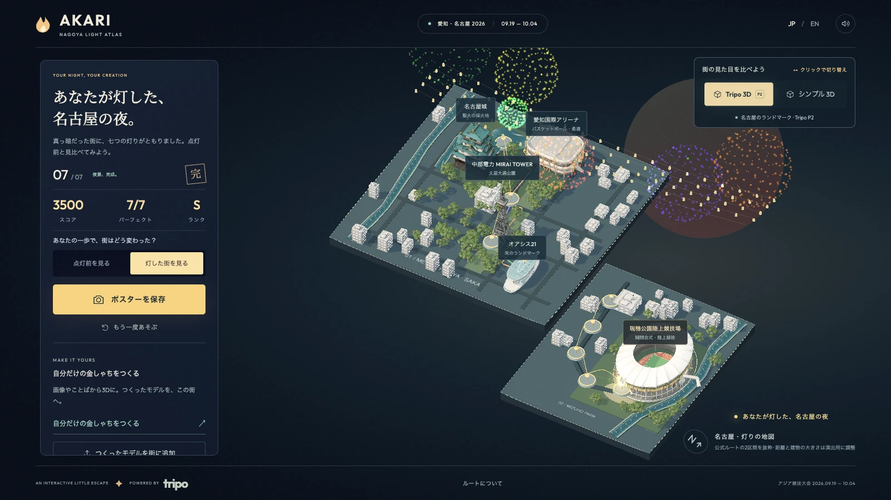</a>

Tạo một game Three.js hoàn chỉnh, ưu tiên tiếng Nhật: nhảy qua các sân thượng, thắp sáng Nagoya và xuất poster lễ hội. Bắt đầu với tài sản tạo bằng quy trình, sau đó nâng cấp qua Tripo Studio mà không cần API key.

**Prompt**

```text
# AKARI — Bản đồ ánh sáng Nagoya

## 1. Mục tiêu
Xây dựng một game trình duyệt hoàn chỉnh, ưu tiên tiếng Nhật, trong đó một ngọn lửa trừu tượng thực hiện bảy cú nhảy theo thời gian, thắp sáng Nagoya thu nhỏ trước Đại hội Thể thao châu Á Aichi–Nagoya, diễn ra từ ngày 19 tháng 9 đến ngày 4 tháng 10 năm 2026. Bám sát phiên bản mở đầu hiện tại gồm hai bản đồ tại https://akari-nagoya-rooftop-relay.tripo.page/ và các hình ảnh tham chiếu được cung cấp. Cảnh sân thượng chung chung trước đây không phải mục tiêu.

## 2. Định hướng hình ảnh
Sử dụng góc nhìn bản đồ ba phần tư từ trên cao, nền xanh navy nửa đêm, tiêu đề serif tiếng Nhật màu trắng ngà ấm, đường nét vàng mảnh và hiệu ứng nhiễu tiết chế. Trên máy tính, dành một phần ba bên trái cho lời mời mở đầu và đặt hai ô bản đồ nâng cao ở bên phải; trên điện thoại, bố cục lại để bản đồ nằm phía trên các nút điều khiển. Bắt đầu với các tòa nhà tối, giảm bão hòa và những tuyến đường thủy màu xanh teal. Khi hoàn thành, khôi phục màu xanh lá, mái đồng xanh ngọc lam, ô cửa sổ ấm và đèn chỉ đường màu vàng. Giữ ngọn lửa và mục tiêu tiếp theo luôn dễ nhìn. Dùng bóng mềm, chiều sâu khí quyển và bloom có kiểm soát; tránh vùng lóe trắng. Bám sát tiêu đề mở đầu tiếng Nhật, nhãn địa danh và phần đầu/cuối trang biên tập mảnh xuất hiện trong hình tham chiếu.

## 3. Thế giới
Ô bản đồ lớn hơn ở phía tây bắc bao phủ Công viên Meijo, Lâu đài Nagoya, Nhà thi đấu Quốc tế Aichi, Công viên Hisaya-odori, MIRAI TOWER và Oasis 21. Ô phía đông nam bao phủ Bảo tàng Thành phố, Mizuho-dori, Công viên Mizuho và sân vận động của công viên, với sông Yamazaki ở phía đông sân vận động. Thêm các khu dân cư hiện đại thấp tầng, cây trong công viên, vạch đường, bờ sông và đèn chiếu sáng ấm; chỉ dùng kiến trúc lâu đài cho khu vực lâu đài.

Chương 1: Công viên Meijo → Sotobori/Hisaya-odori → Công viên Hisaya-odori → Oasis 21, gồm ba cú nhảy. Tạo điểm chuyển chương có biển chỉ dẫn rõ ràng, không thể chơi, đến Bảo tàng Thành phố. Chương 2: Bảo tàng Thành phố → Mizuho-dori → Mizuho Undojo Nishi → hướng về Công viên Mizuho → Quảng trường phía Nam, gồm bốn cú nhảy. Không bao giờ thể hiện điểm chuyển như một con phố liền mạch hoặc tính nó là một cú nhảy. Lưu tiến trình tại chương thứ hai. Hai bản đồ dùng tỉ lệ khác nhau, với khoảng cách được nén để phù hợp với lối chơi. Giải thích ngắn gọn điều này trong phần Giới thiệu, cùng với các ngày diễn ra rước đuốc lịch sử là 22 tháng 8 và 16 tháng 9 năm 2026; đây không phải lời mời tham dự sự kiện sắp tới. Trích dẫn https://www.aichi-nagoya2026.org/ja/torch-relay/ và https://www.nagoyajo.city.nagoya.jp/guide/kinshachi/. Sử dụng họa tiết nguyên bản và ngọn lửa trừu tượng thay cho linh vật hoặc biểu tượng chính thức.

## 4. Danh mục tài sản
Sử dụng các ô thay thế ổn định sau theo thứ tự ưu tiên; giữ nguyên bố cục và proxy va chạm ở cả hai chế độ hình ảnh:
- `shachi`: vật trang trí mái bằng vàng đánh bóng cổ điển, có đầu giống hổ, thân cá chép phủ vảy uốn cong và đuôi cuộn hướng lên; lặp lại trên lâu đài.
- `castle`: tòa tháp kiểu Nagoya màu trắng ngà, khung gỗ tối, mái hông và mái đầu hồi xếp tầng màu xanh ngọc lam, nền đá.
- `mizuho`: sân vận động thể thao hình bầu dục rộng, mái nhạt màu với phần trung tâm mở và các trụ đỡ nhịp nhàng; giữ đường chạy và sân cỏ nhìn thấy qua phần trung tâm.
- `arena`: nhà thi đấu đương đại thấp tầng, mái rộng và các vây mặt đứng dọc màu ấm, nằm phía bắc trục công viên.
- `tower`: tháp quan sát dạng lưới bạc mảnh, có sàn hình hộp và ăng-ten.
- `oasis`: mái che bằng kính/nước màu xanh ngọc lam, hình bầu dục kéo dài, đặt trên các trụ mảnh màu nhạt.
- `midrise`: tòa nhà khu dân cư Nhật Bản hiện đại, tiết chế; tái sử dụng với chiều cao và hướng khác nhau, bao gồm cả khối tích bảo tàng đơn giản.
- `tree`: cây trưởng thành nhỏ gọn trong công viên, thân nâu và tán xanh nhiều lớp; bố trí lặp lại trên cả hai ô bản đồ.
Giữ địa hình, đường sá, mặt nước, vạch sân, điểm đánh dấu cú nhảy, ngọn lửa trừu tượng, vệt sáng, pháo hoa và UI ở dạng procedural. Mỗi mô hình phải là một đối tượng hoàn chỉnh, tách biệt; giữ các lối đi thông thoáng và phần trung tâm sân vận động. Theo dõi mọi ô đã liệt kê, kể cả các tài sản nền được lặp lại.

## 5. Lối chơi và phần thưởng
Giữ con trỏ/chạm hoặc phím Space để nạp lực; thả ra để tự động nhảy về phía điểm đánh dấu tiếp theo. Sử dụng vật lý delta-time xác định: khoảng cách = 1.8 + 7 × charge, charge phản xạ trong khoảng từ 0 đến 1, còn độ vồng cộng thêm 4 × t × (1 − t) × 3.6 vào độ cao nội suy. Chu kỳ nạp lực tăng tốc từ khoảng 1.42 xuống 0.92 giây cho mỗi chiều. Tính quỹ đạo, vùng an toàn màu xanh lá và vùng hoàn hảo màu vàng từ cùng một phép tính: sai số ≤0.36 là hoàn hảo; ≤1.15 là an toàn, với mức dung sai thêm 0.28 cho hai cú nhảy đầu tiên.

Tiếp đất an toàn được 100 điểm; tiếp đất hoàn hảo được 200 × hệ số liên tiếp, tối đa ×4. Thao tác nối tiếp đúng lúc trong vòng 2.35 giây cộng thêm 50 điểm; đặt lại combo sau một lần tiếp đất an toàn, khi chuyển chương hoặc sau 3.4 giây chờ. Mỗi lần thành công sẽ truyền một làn sóng ánh sáng qua khu vực, thắp sáng các ô cửa sổ và thêm đèn lồng. Hiển thị tiến trình bảy bước, điểm số, combo và thành tích cao nhất. Khi trượt, khởi động lại nhanh; sau khi chuyển chương, khôi phục checkpoint của chương. Cung cấp các chức năng tạm dừng, chơi lại, khôi phục khi chuyển sang tab ẩn và âm thanh tùy chọn sau khi có tương tác.

Sau cú nhảy cuối, hiển thị cả hai bản đồ đã được thắp sáng bằng hiệu ứng lùi camera trong 4.6 giây và pháo hoa trong giới hạn. Hiển thị hạng S khi có bảy lần tiếp đất hoàn hảo, hạng A khi có từ bốn lần trở lên, nếu không thì hạng B. Bao gồm chơi lại, góc camera giống nhau để so sánh thành phố trước/sau và poster PNG thực 1800×1200 với tiêu đề, ngày tháng, điểm số và ghi công dự án độc lập.

## 6. Triển khai
Sử dụng Vite, TypeScript và Three.js; tách riêng dữ liệu địa lý, vật lý/tính điểm thuần, scene, hiệu ứng, registry mô hình, bản địa hóa tiếng Nhật/tiếng Anh và UI. Tiếng Nhật luôn là ngôn ngữ mặc định bất kể ngôn ngữ của prompt; lưu lại lựa chọn chuyển ngôn ngữ. Đóng gói font và tài sản cục bộ. Sử dụng GLTFLoader và chuẩn hóa theo từng ô; giữ lại mô hình hoạt động cuối cùng nếu lần import không hợp lệ. Giữ nguyên điểm số, checkpoint, camera và ánh sáng khi so sánh hình ảnh đơn giản với hình ảnh import. Instance hóa cây/tòa nhà, gộp hình học tĩnh tương thích, giới hạn DPR và số lượng particle. Đánh giá thời gian render thực tế và độ phức tạp của mô hình thay vì từ chối mô hình chỉ vì vượt mục tiêu số tam giác. Chỉ dùng Blender nếu tài sản trả về cần dọn lưới, sửa pivot hoặc mở phần trung tâm sân vận động; giữ nguyên tệp gốc.

## 7. Tiêu chí nghiệm thu
Bàn giao mã nguồn có thể chạy, lockfile, các lệnh phát triển/build và bản build tĩnh. Xác minh bảy cú nhảy qua cả hai chương, chuyển chương/khôi phục checkpoint, trượt/thử lại, tính điểm, thao tác chạm, tạm dừng, lưu lựa chọn tiếng Nhật/tiếng Anh, toàn bộ phương án dự phòng của các ô và việc xuất poster thực tế. So sánh ảnh chụp màn hình mở đầu và kết thúc sau khi ổn định với bản tham chiếu hai bản đồ hiện tại. Báo cáo hiệu năng đo được và các bài kiểm thử đã thực sự thực hiện. Quy trình làm việc dùng chung sau đây chi phối việc tạo và trả về mô hình.
```

[Xem chi tiết ↗](https://www.tripo3d.ai/vi/3d-prompts/akari-nagoya-rooftop-flame-relay) · [Về danh sách ví dụ](#all-prompts)

---

<a id="cyclops-island-threejs-game"></a>

### Hòn đảo của Cyclops

[Jared](https://x.com/jaredliu_bravo) · 2026-09-16

<a href="https://www.tripo3d.ai/vi/3d-prompts/cyclops-island-threejs-game">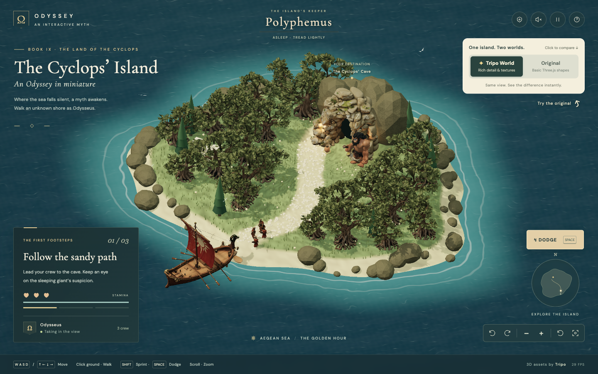</a>

Trước tiên, hãy tạo một game thoát khỏi hòn đảo hoàn chỉnh bằng Three.js với các mô hình chuyển động đơn giản. Sau đó, lần lượt nâng cấp nhân vật chính, Cyclops, con tàu, cây cối và hang động trong Tripo Studio bằng hình ảnh tham chiếu hoặc prompt văn bản từ host-agent. Không cần truy cập Tripo API.

**Prompt**

```text
# ODYSSEY — Hòn đảo Cyclops

## 1. Mục tiêu
Xây dựng một game phiêu lưu trốn thoát isometric hoàn chỉnh, lấy cảm hứng từ Quyển IX của Odyssey. Trong vai Odysseus, dẫn ba thành viên thủy thủ đoàn lấy trộm vật tư trong hang, sống sót trước sự truy đuổi và tấn công của Polyphemus, rồi trốn thoát trên một con tàu Hy Lạp. Toàn bộ UI trong game dùng tiếng Anh. Sử dụng https://cyclops-island.tripo.page/ và các tài liệu tham khảo được cung cấp; giữ nguyên phần ghi công Jared và nguồn cảm hứng từ ý tưởng hòn đảo Odyssey của Jason Chew.

## 2. Định hướng hình ảnh
Dựng một hòn đảo Địa Trung Hải dạng mô hình bàn với nhiều chi tiết kết cấu bề mặt, rộng khoảng 25 đơn vị thế giới, nằm giữa vùng biển Aegean xanh teal đậm. Sử dụng camera orthographic góc ba phần tư, đặt gần tọa độ (19,31,34), cùng đá vôi ấm màu, cây ô liu xanh xô thơm, vải màu đất nung, giáp đồng và giấy da màu kem. Áp dụng tone mapping ACES, bóng đổ định hướng ấm, chiều sâu khí quyển, bloom tiết chế, vignette và grain. Đảm bảo các dấu hiệu nguy hiểm vẫn dễ đọc bên dưới hiệu ứng.

Dùng tiêu đề serif phong cách Cormorant Garamond và UI phong cách DM Sans theo ngôn ngữ địa phương. Góc trên bên trái: một huy hiệu Ω, ODYSSEY / AN INTERACTIVE MYTH, BOOK IX và The Cyclops’ Island. Một thẻ so sánh màu kem nổi bật ở góc trên bên phải hiển thị “Một hòn đảo. Hai thế giới.” cùng các điều khiển Tripo World và Original. Góc dưới bên trái: giai đoạn nhiệm vụ, ba tim, thể lực và số thành viên thủy thủ đoàn. Hiển thị trạng thái boss ở phía trên, một la bàn/minimap nhỏ bên dưới, các điều khiển camera rõ ràng và gợi ý phím ngắn gọn. Trên điện thoại, dùng nội dung trang trí ngắn gọn cùng các điều khiển riêng cho nhiệm vụ, boss, so sánh và Né.

## 3. Thế giới
Một con đường cát nhạt uốn lượn dẫn về phía bắc từ bãi biển cập bờ ở phía nam, xuyên qua các lùm ô liu đến một hang đá vôi. Người khổng lồ ngủ gần hang; Odysseus và thủy thủ đoàn bắt đầu trên con đường phía nam. Đặt một con tàu gỗ buồm đỏ ở phía tây nam, cạnh cầu tàu. Bao quanh bờ biển bằng các tảng đá cuội bất quy tắc, cỏ, cây bách và vùng nước nông màu ngọc lam. Tạo chuyển động cho gợn sóng, bọt ven bờ, cây cối, ánh lửa, chim và con tàu nhấp nhô. Chuyển động đại dương phải luôn chính xác khi camera xoay.

## 4. Danh mục tài sản
Chuẩn bị các vị trí thay thế theo thứ tự sau:
- `odysseus`: nhà thám hiểm Hy Lạp có râu, đội mũ giáp Corinth bằng đồng với chùm lông đỏ thẫm, giáp ngực sờn cũ, áo dài màu ngà, áo choàng đất nung, dép, khiên nhỏ và kiếm tra vỏ. Dùng lại cho ba thành viên thủy thủ đoàn với skeleton và các pha animation độc lập.
- `polyphemus`: người khổng lồ lực lưỡng với chính xác một con mắt ở chính giữa, da ô liu rám nắng, tóc và râu xoăn sẫm màu, khố lông/da, bàn chân trần lớn và một cây chùy gỗ; toàn thân ở tư thế trung tính, phù hợp để rig.
- `ship`: thân tàu gỗ óc chó sẫm màu, hẹp, mũi tàu nâng cao, ram đồng, cột buồm, buồm đỏ đất nung, dây rigging và mái chèo hai bên; không có nước hoặc đế trưng bày.
- `olive`: thân cây nâu xám sần sùi, rễ lan rộng và tán cây xanh xô thơm bất quy tắc; dùng lại khoảng 25 lần.
- `cave`: vòm đá vôi phong hóa màu ấm, độc lập và rộng, với lối đi thực sự thông suốt, đá tảng lớn và rêu thưa; dựng phần nội thất tối riêng biệt.
- `cypress`: cây Địa Trung Hải thân mảnh, thuôn dần, tán lá xanh đậm dày.
- `boulder`: đá ven biển bằng đá vôi màu ấm, hình dạng bất quy tắc; dùng lại với nhiều tỷ lệ và góc xoay khác nhau.
Giữ địa hình, đường đi, nước, cỏ, dấu hiệu vật tư, telegraph chiến đấu, hạt hiệu ứng và UI ở dạng procedural. Theo dõi từng vị trí và giữ nguyên bản đồ gameplay trong khi thay đổi diện mạo.

## 5. Chạm trán trốn thoát
Sử dụng WASD/phím mũi tên theo hướng camera và cơ chế nhấp/chạm để di chuyển với điều hướng A* có xét bán kính. Thủy thủ đoàn bám theo tương đối lỏng; người chơi và người khổng lồ phải tôn trọng địa hình, ranh giới và chướng ngại vật theo kích thước riêng. Shift để chạy nước rút, Space hoặc nút cảm ứng lớn để né, E để nhặt vật tư gần đó, P để tạm dừng, Q/R để xoay và F để bám theo nhân vật chính. Hỗ trợ kéo/pan, kéo chuột phải/xoay, cuộn/thu phóng và chụm hai ngón tay. Trong lúc bị truy đuổi, nhấp để di chuyển sẽ chạy nước rút khi còn đủ thể lực.

Giai đoạn 1: tiến đến hang; khoảng cách gần và việc chạy nước rút gây tiếng động sẽ làm tăng cảnh giác, đồng thời có thể đánh thức người khổng lồ. Giai đoạn 2: chỉ thu thập vật tư ở cự ly gần và thao tác này luôn đánh thức hắn. Giai đoạn 3: sống sót trong bán kính cầu tàu được đánh dấu, khoảng 2.7 đơn vị, gần (-0.8,8.7) trong tổng cộng 11 giây, trong khi thủy thủ đoàn lên tàu; rời khỏi vùng này sẽ tạm dừng tiến độ.

Cấp ba điểm sinh lực và 100 thể lực. Tốc độ ban đầu: đi bộ 2.35, chạy nước rút 4.15 và người khổng lồ chạy 3.4 đơn vị/giây. Người khổng lồ phải truy đuổi đến phạm vi 3.6 đơn vị trước khi tấn công. Sử dụng các trạng thái ngủ, thức dậy, truy đuổi, lấy đà, va chạm, hồi phục và kết thúc. Ground Breaker khóa vị trí người chơi khi bắt đầu pha lấy đà kéo dài 1.12 giây, hiển thị vòng tròn bán kính 2.45 và đánh một lần; mục tiêu không được bám theo người chơi. Mỗi cú nện thứ ba phát ra một shockwave tích điện đang mở rộng, được đánh dấu rõ ràng; sát thương áp dụng theo mép vòng đang di chuyển.

Động tác né kéo dài khoảng 0.34 giây, tốn 24 thể lực, có thời gian hồi 1.25 giây, thời gian miễn nhiễm ngắn và giới hạn trong vùng mặt đất hợp lệ. Chạy nước rút làm tiêu hao thể lực; nghỉ ngơi sẽ hồi thể lực. Đòn đánh gây hất lùi, phản hồi trúng đòn và miễn nhiễm tạm thời. Khi bị đánh bại, đặt lại tất cả actor, bộ đếm thời gian, hiệu ứng và trạng thái nhiệm vụ. Trốn thoát sẽ ngăn sát thương và mở phần tóm tắt chơi lại. Tạm dừng sẽ đóng băng mô phỏng, animation và hiệu ứng. Điều chỉnh việc lên tàu để yêu cầu nhiều lần né, bao gồm cả một đòn tấn công tích điện.

## 6. Triển khai và animation
Sử dụng Vite, Three.js và các ES module JavaScript cho thế giới, điều hướng, chạm trán, actor, hiệu ứng, âm thanh và UI. Đóng gói toàn bộ tài sản runtime cục bộ trong bản build tĩnh. Các model có khớp nối ban đầu phải có thể đi/chạy, ngủ/thức dậy, né và thể hiện rõ động tác lấy đà/đánh. Với các model skinned thay thế, sử dụng AnimationMixer, tên clip thực tế, crossfade ngắn và SkeletonUtils.clone cho skeleton riêng của từng thành viên thủy thủ đoàn. Ngăn chuyển động gốc bị nhân đôi và hiện tượng trượt chân. Đồng bộ đòn đánh hướng xuống của người khổng lồ với thời điểm va chạm gameplay; không báo các static import là animation. Duy trì fallback có khớp nối hoạt động được khi cần. Chỉ dùng Blender cho các sửa chữa rig, pivot, clip hoặc mesh bắt buộc.

Đồng bộ telegraph màu cam/vàng, flash va chạm, vết nứt mặt đất, bụi, tia lửa, mảnh đá rơi, vòng tròn mở rộng, ánh sáng chớp ngắn và rung camera. Thêm vệt khi né và âm thanh tổng hợp tùy chọn được kích hoạt bằng cử chỉ. Pool các hiệu ứng, instance hóa cảnh vật và đo thời gian mỗi frame. Chuẩn hóa model import với chân/gốc đặt đúng mặt đất và các proxy va chạm không thay đổi. Tính năng so sánh phải giữ nguyên vị trí, nhiệm vụ, sinh lực, thể lực, camera và trạng thái animation; import lỗi phải giữ lại model đang hoạt động. Thêm điều khiển Change hero kín đáo và tính năng import model cục bộ kèm trạng thái theo từng vị trí.

## 7. Tiêu chí nghiệm thu
Bàn giao mã nguồn, lockfile, lệnh npm phát triển/build và đầu ra tĩnh. Kiểm tra điều hướng qua chướng ngại vật, đánh thức sớm, thu thập ở cự ly gần, truy đuổi trước khi tấn công, khóa mục tiêu, đòn đánh theo thời gian, miễn nhiễm khi né, sát thương theo mép shockwave, đánh bại/đặt lại và trốn thoát thành công. Kiểm tra animation độc lập của thủy thủ đoàn, fallback của mọi vị trí, tính năng so sánh giữ nguyên trạng thái, bố cục desktop/mobile và lỗi tải. So sánh các ảnh chụp màn hình sau khi ổn định với tài liệu tham khảo và báo cáo hiệu năng thực tế. Sử dụng quy trình dùng chung bên dưới để tạo model và trả về.
```

[Xem chi tiết ↗](https://www.tripo3d.ai/vi/3d-prompts/cyclops-island-threejs-game) · [Bài đăng gốc](https://x.com/jaredliu_bravo) · [Bản demo](https://cyclops-island.tripo.page/) · [Về danh sách ví dụ](#all-prompts)

---

<table align="center">
<tr><td align="center">
<br>
<p><strong><a href="https://www.tripo3d.ai/vi/3d-prompts/models/gpt-6-astra?utm_source=github&amp;utm_medium=referral&amp;utm_campaign=awesome_astra_prompts&amp;utm_content=catalog_bottom">Xem toàn bộ 321 ví dụ trên trang chính thức →</a></strong></p>
<p><sub>Để README trên GitHub hiển thị mượt mà, chỉ 100 ví dụ mới nhất được trình bày tại đây.</sub></p>
<br>
</td></tr>
</table>
