<!-- Generated from Growth CMS. Update content in CMS; run npm run sync. -->

# Awesome Astra Prompts

[](https://github.com/sindresorhus/awesome) [](https://github.com/TripoGrowthLab/awesome-astra-prompts/stargazers) [](../LICENSE) [](https://github.com/TripoGrowthLab/awesome-astra-prompts/actions/workflows/sync-prompts.yml) [](../CONTRIBUTING.md)

<p>
  <a href="../README.md"></a>
  <a href="../README.zh-CN.md"></a>
  <a href="../docs/catalog.zh-Hant.md"></a>
  <a href="../docs/catalog.ja.md"></a>
  <a href="../docs/catalog.ko.md"></a>
  <a href="../docs/catalog.es.md"></a>
  <a href="../docs/catalog.pt.md"></a>
  <a href="../docs/catalog.de.md"></a>
  <a href="../docs/catalog.fr.md"></a>
  <a href="../docs/catalog.it.md"></a>
  <a href="../docs/catalog.ru.md"></a>
  <a href="../docs/catalog.tr.md"></a>
  <a href="../docs/catalog.uk.md"></a>
  <a href="../docs/catalog.vi.md"></a>
</p>

> 也在用 Claude Opus 5.5？前往 [Awesome Opus 5.5 Prompts](https://github.com/TripoGrowthLab/awesome-opus-5-5-prompts)，從附有來源的 3D 場景、遊戲與模擬案例開始創作。

<a href="https://www.tripo3d.ai/zh-Hant/3d-prompts/models/gpt-6-astra?utm_source=github&amp;utm_medium=referral&amp;utm_campaign=awesome_astra_prompts&amp;utm_content=readme_hero"></a>

**為你的下一個遊戲、場景或互動世界尋找靈感。**


**332 · 最新 Astra 提示詞**

## 精選作品

<table>
<tr>
<td width="50%" valign="top"><a href="https://www.tripo3d.ai/zh-Hant/3d-prompts/wright-flyer-through-a-japanese-forest-2096467585785286808"></a><br><strong><a href="https://www.tripo3d.ai/zh-Hant/3d-prompts/wright-flyer-through-a-japanese-forest-2096467585785286808">飛越日本森林的萊特飛行器</a></strong><br><sub><a href="https://x.com/jaredliu_bravo">Jared</a></sub><br><a href="https://www.tripo3d.ai/zh-Hant/3d-prompts/wright-flyer-through-a-japanese-forest-2096467585785286808">提示詞 →</a></td>
<td width="50%" valign="top"><a href="https://www.tripo3d.ai/zh-Hant/3d-prompts/jelly-jungle-3d-browser-game-2081024333120733188"></a><br><strong><a href="https://www.tripo3d.ai/zh-Hant/3d-prompts/jelly-jungle-3d-browser-game-2081024333120733188">果凍叢林：3D 平台跳躍遊戲</a></strong><br><sub><a href="https://x.com/jaredliu_bravo">Jared</a></sub><br><a href="https://www.tripo3d.ai/zh-Hant/3d-prompts/jelly-jungle-3d-browser-game-2081024333120733188">提示詞 →</a></td>
</tr>
<tr>
<td width="50%" valign="top"><a href="https://www.tripo3d.ai/zh-Hant/3d-prompts/akari-nagoya-rooftop-flame-relay"></a><br><strong><a href="#akari-nagoya-rooftop-flame-relay">AKARI：名古屋屋頂火炬接力</a></strong><br><sub><a href="https://growthengineer.space/">Jared</a></sub><br><a href="#akari-nagoya-rooftop-flame-relay">提示詞 →</a></td>
<td width="50%" valign="top"><a href="https://www.tripo3d.ai/zh-Hant/3d-prompts/cyclops-island-threejs-game"></a><br><strong><a href="#cyclops-island-threejs-game">獨眼巨人的島嶼</a></strong><br><sub><a href="https://x.com/jaredliu_bravo">Jared</a></sub><br><a href="#cyclops-island-threejs-game">提示詞 →</a></td>
</tr>
</table>

<a id="all-prompts"></a>

## 最新 Astra 提示詞

<details>
<summary>瀏覽案例</summary>

- [等角視角奇幻 3D 圖形展示](#2100271998618177864) · GitHub
- [可互動火山島與逃離中的船隻](#2099643231659012553)
- [互動式 3D 生物體神經系統面板](#2099719427990134984)
- [Apple 風格 3D 愛心與笑臉表情符號](#2099750376530657300)
- [可抵達的程序化太空探索遊戲](#2099785223827259515)
- [從參考圖片製作可動的 3D 空間與遊戲角色](#2099850719839109597)
- [可互動的 3D 房間場景與可動家具](#2100139076816916977)
- [PC 版 Splatoon 開發與畫面重現](#2100193512373592313)
- [可選擇地磚的互動式公寓導覽](#2100222426705453318)
- [地下車站中的 AAA CGI 超自然格鬥短片](#2100233407108137349)
- [互動式體素騎士篝火場景](#2100350159540596760)
- [為欄杆新增維修用鏈條](#2100519026720231698)
- [製作 3D 賽車遊戲](#2100526922770026874)
- [逃離封閉研究設施的瀏覽器 3D 遊戲](#2100595652703199281)
- [用 CAD 設計身體](#2100614534423540102)
- [怪獸街區——45 秒摧毀城市](#2100636075039629796)
- [以 Sharpa 靈巧手訓練轉筆策略](#2100751369619820923)
- [漂浮群島間的 3D 空中電車遊戲](#2100838090210431302)
- [打造照片級寫實的 3D 世界](#2100844566718926949)
- [互動式 IWC Schaffhausen 手錶模型](#2100956517633761447)
- [以真實軌道物理打造的星系](#2101055500599054437)
- [完整的照片級寫實 3D 環境](#2101224659861590399)
- [互動式 3D 航空發動機展示](#2101271938706685991)
- [功夫貓武術 3D 動畫與影片工作流程](#2101310374033428642)
- [Waymo Jaguar I-Pace 3D 模型](#2101325346427842909)
- [開闊水域上的帆船](#2101616345720787130)
- [在 Three.js 中建立 WALL-E 3D 模型](#2101687900723106104)
- [Verdant — 互動式 3D 恐龍島](#2101730386711634251)
- [互動式 3D 太陽模型網站](#2102038136725377200)
- [Spline Rush 程序化瀏覽器賽車遊戲](#2102150615635816866)
- [互動式 3D 直升機設計展示](#2102215638311694336)
- [東京鐵塔的日夜 3D 場景與影片](#2102276620124062065)
- [泡泡小鎮：3D 水球大戰](#2102300855387205871)
- [《Sir, We Have Orc Problems》風格的塔防遊戲](#2102411087002112256)
- [含室內空間的兩層樓郊區住宅](#2102473710724919614)
- [單一 HTML 檔案中的 3D 卡丁車競速遊戲](#2102652927177617564)
- [中世紀城堡瀏覽器動畫](#2102672926285713456)
- [Orbit Lab：太陽、地球與月的 3D 模擬](#2102752217375899659)
- [可在瀏覽器中操作的中世紀歐洲風 3D 城堡](#2102780850706567390)
- [用於研究西洋棋棄兵的互動式 3D 棋盤](#2102788013902213508)
- [無限太陽朋克城市著色器](#2102826333550133520)
- [第一人稱漢堡模擬器](#2102897258983313712)
- [超寫實互動式沙漠營火 HTML 場景](#2102915300295369208)
- [使用 Three.js 製作體素 Codex](#2102956340482289944)
- [互動式 3D 果凍柑橘切片](#2103062348168618280)
- [向北：互動維京長船之旅](#2103187935759655167)
- [可探索的霧雨秋日 Three.js 體驗](#2103211135214256350)
- [STILLWATER — 月下沼澤瀏覽器體驗](#2103308083242082314)
- [黃金時刻羅馬戰場場景](#2103351755971207251)
- [火龍果果凍](#2103432732386664591)
- [VRChat 衣裝 3D 建模](#2103456264785424530)
- [使用 Blender 製作天竺鼠](#2103482826519986544)
- [Three.js 體素風格日本庭園](#2103486103831339269)
- [瓶中船體素 WebGL 場景](#2103855977376125161)
- [森林湖畔村落環境](#2103860776419111285)
- [在 Blender 中製作 Super Heavy 助推器捕捉](#2103966922127630820)
- [互動式 3D 相機鏡頭光線路徑示範](#2104077535315144878)
- [可互動 3D 果凍西瓜切片](#2104504957173153951)
- [原神風格遊戲與地形編輯工具](#2104531704740512143)
- [用於強度測試的可 3D 列印 J 形掛鉤](#2104590493191479337)
- [互動式 CRISPR 教學 3D 模型](#2104605522640970208)
- [互動式月光叢林泛舟體驗](#2104613125093998674)
- [可變形跑車的 X 光爆炸視圖](#2104654448878387313)
- [高細節 3D 人眼](#2104841727496323479)
- [時間，拆解。](#2105009377002299711)
- [逼真的 F-22 Raptor 模型與 Godot 飛行影片](#2105027152617918852)
- [電影感照片級寫實火箭發射場景](#2105047166733746209)
- [Blender 金門大橋渲染圖](#2105278999861526953)
- [在 Blender 中建立 3D 小小兵角色](#2105298955307303100)
- [在 Isaac Sim 中重建場景](#2105323534398763307)
- [金色迷你 3D 金字塔微縮場景](#2105412081692352654)
- [3D 小行星閃避遊戲](#2105644436659290409)
- [可操控的山間河流 3D 船舶場景](#2106385060106777043)
- [可在瀏覽器中漫遊參觀的房屋 3D 空間](#2106737391948235164)
- [打造一支虛構遊戲的電影感預告片](#2106824464092770455)
- [在夜晚小島上收集 10 個星星碎片的 3D 遊戲](#2106944804756275690)
- [毛絨蜘蛛 — 材質研究第 015 號](#2107127712871505976)
- [香蕉果凍](#2107186979502776590)
- [Wild Atlas 互動式野生動物百科](#2107479802152472717)
- [毛絨魷魚。](#2107533363808485534)
- [Villa Jelly](#2107617244301664483)
- [《看不見的城市》Three.js 視覺化](#2107824019999535226)
- [Lealand Tea 隨捲動呈現的 3D 網站](#2107872378218779067)
- [Atoll Jelly 互動式 WebGPU 潟湖立體場景](#2107977531726934288)
- [可互動的 Three.js 果凍實驗室，具備拖曳擠壓物理效果](#2108096737537929361)
- [鵜鶘騎自行車的 3D 體素世界](#2108203260058259830)
- [Pirate Jelly 互動式 WebGPU 立體場景](#2108336208891801999)
- [電影感 3D ORBIT 智慧手錶產品展示](#2108438685184401904)
- [互動式 3D 噴射引擎](#2108459952683811167)
- [AH-64E Apache Guardian 詳細 3D 視覺展示](#2108475056082850278)
- [互動式蜂蜜鍵盤](#2108501256067285443)
- [互動式 3D 軟糖骰子體驗](#2108505251036774875)
- [互動式漂浮霓虹島嶼](#2108574047948656981)
- [Battle City 3D：無盡坦克防禦](#battle-city-3d)
- [Crazy Tanks — 3D 島嶼火砲戰](#crazy-tanks-3d-island-artillery)
- [果凍別墅](#jelly-villa)
- [ODD ARMS — 怪奇武器生存遊戲](#odd-arms)
- [TITANIC — 最後的光](#titanic-the-last-light)
- [AKARI：名古屋屋頂火炬接力](#akari-nagoya-rooftop-flame-relay)
- [獨眼巨人的島嶼](#cyclops-island-threejs-game)

</details>

<a id="2100271998618177864"></a>

### 等角視角奇幻 3D 圖形展示

[Anshu Chimala](https://x.com/anshuc) · 2026-09-16

<a href="https://www.tripo3d.ai/zh-Hant/3d-prompts/gpt-6-astra-2100271998618177864"></a>

一個可在瀏覽器中互動的奇幻 3D 場景，採用等角視角、受體素風格啟發的美術方向、帶有濕潤反光地面的環境，以及可移動的角色。連結的 Dream Loop 儲存庫將此內容列為範例提示詞，並表示已在 Codex 中使用 GPT-6 Astra 測試。此提示詞不要求加入遊戲流程。

**提示詞**

```text
請為我建立一個圖形展示：採用等角視角、帶有寫實著色器與反光濕地面的體素風格場景，並在有趣的場景中放置一名角色。奇幻背景（可以想像《Elden Ring》或《Diablo》）。使用瀏覽器中的 Three.js，效能需達到 >60fps。不要下載素材。時間限制為 1 小時。操作方式：點擊以移動角色，鏡頭延遲跟隨；拖曳以旋轉鏡頭；滾動以放大／縮小。目前不需要加入遊戲玩法。世界應該呈現出鮮活感：包含動態、動畫，以及細微的環境行為。玩家周圍的區域應看起來很寬廣，但只能在有限範圍內移動。不需要先向我確認美術方向或提出問題，直接開始吧！
```

[查看詳情 ↗](https://www.tripo3d.ai/zh-Hant/3d-prompts/gpt-6-astra-2100271998618177864) · [查看原文](https://github.com/achimala/dream-loop) · [專案原始碼](https://github.com/achimala/dream-loop) · [返回案例導覽](#all-prompts)

---

<a id="2099643231659012553"></a>

### 可互動火山島與逃離中的船隻

[Wësche](https://x.com/WescheNex1q) · 2026-09-14

<a href="https://www.tripo3d.ai/zh-Hant/3d-prompts/gpt-6-astra-2099643231659012553"></a>

可重複使用的請求，用於建立一座具備流動熔岩與在火山噴發期間逃離的船隻之互動式 3D 火山島。原始作者表示，這是比較的一部分，並已將此請求提交給包括 Astra-6 在內的多個模型。

**提示詞**

```text
建立一座具備流動熔岩與逃離船隻的互動式火山島。
```

[查看詳情 ↗](https://www.tripo3d.ai/zh-Hant/3d-prompts/gpt-6-astra-2099643231659012553) · [查看原文](https://x.com/WescheNex1q/status/2099643231659012553) · [返回案例導覽](#all-prompts)

---

<a id="2099719427990134984"></a>

### 互動式 3D 生物體神經系統面板

[AiMind](https://x.com/AIMind_Ai) · 2026-09-15

<a href="https://www.tripo3d.ai/zh-Hant/3d-prompts/gpt-6-astra-2099719427990134984"></a>

AiMind 分享這則「偷提示詞」推薦，介紹一個可互動面板：面板中的神經系統區域可點擊，並搭配程序化骨架綁定的 3D 生物體。貼文展示的是蒼蠅範例，但引用的提示詞使用 \[organism\] 佔位符，並未明確說明這就是該片段實際使用的輸入。

**提示詞**

```text
互動式面板。左側顯示 [organism] 的神經系統示意圖，並設有可點擊區域。右側顯示已完成程序化骨架綁定的 3D [organism]。點擊某個區域後，觸發持續 2.5 秒的動作反應。深色介面，顯示速度與航向的遙測資料。
```

[查看詳情 ↗](https://www.tripo3d.ai/zh-Hant/3d-prompts/gpt-6-astra-2099719427990134984) · [查看原文](https://x.com/AIMind_Ai/status/2099719427990134984) · [返回案例導覽](#all-prompts)

---

<a id="2099750376530657300"></a>

### Apple 風格 3D 愛心與笑臉表情符號

[Sharon Riley](https://x.com/Just_sharon7) · 2026-09-15

<a href="https://www.tripo3d.ai/zh-Hant/3d-prompts/gpt-6-astra-2099750376530657300"></a>

作者表示，他輸入這段純文字提示詞後，先生成影像，再生成可旋轉的 3D .glb 模型。過程中未使用參考影像。

**提示詞**

```text
Apple 風格 3D 愛心表情符號與笑臉表情符號
```

[查看詳情 ↗](https://www.tripo3d.ai/zh-Hant/3d-prompts/gpt-6-astra-2099750376530657300) · [查看原文](https://x.com/Just_sharon7/status/2099751278234767673) · [返回案例導覽](#all-prompts)

---

<a id="2099785223827259515"></a>

### 可抵達的程序化太空探索遊戲

[developers.openai.com](https://developers.openai.com/) · 2026-09-15

<a href="https://www.tripo3d.ai/zh-Hant/3d-prompts/gpt-6-astra-2099785223827259515"></a>

OpenAI 開發者為 Void Explorer 提出的初始簡報。這是一款以瀏覽器為基礎的 3D 太空探索遊戲，要求玩家能從太空一路穿過行星大氣層，持續探索至地面；同時支援真實尺度的距離、地球大小的行星、程序化地形，以及分塊渲染。

**提示詞**

```text
我看得到的所有地方都應該能抵達。維持真實尺度的距離，再透過尺度與速度讓旅行變得可行。我想從太空飛入行星大氣層，再一路下降到地面。行星可以和地球一樣大，因此需要程序化地形與分塊渲染器。
```

[查看詳情 ↗](https://www.tripo3d.ai/zh-Hant/3d-prompts/gpt-6-astra-2099785223827259515) · [查看原文](https://developers.openai.com/blog/how-to-build-games-with-astra) · [返回案例導覽](#all-prompts)

---

<a id="2099850719839109597"></a>

### 從參考圖片製作可動的 3D 空間與遊戲角色

[妖精アーヤ](https://x.com/aiehon_aya) · 2026-09-15

<a href="https://www.tripo3d.ai/zh-Hant/3d-prompts/gpt-6-astra-2099850719839109597"></a>

這是一份步驟式提示詞：以投稿者作者留言中的世界觀參考圖片與角色正典圖片為輸入，確認並製作房屋與角色的 3D 模型，再於 Blender 中調整，設定自動骨架綁定與動作。未指定遊戲玩法目標或規則，主要成果是包含可動角色的 3D 空間。

**提示詞**

```text
【事先準備】
・想要打造的世界觀參考圖片（外觀、房間等）
・角色正典圖片（三面圖等）
　※沒有圖片就無法重現，請附上喔

【提示詞】
根據附上的圖片，將我的世界觀與角色設計成可實際操作的 3D 空間與遊戲角色，達到專業製作品質。

① 查看附上的圖片，確認房屋與角色的形狀、色彩及設計細節
　↓
② 使用 Tripo 將圖片生成 3D 模型（正面、背面、側面三張全身圖，並維持相同的長寬比）
　↓
③ 匯入 Blender，調整各部件的位置與尺寸
　↓
④ 設定自動骨架綁定，為角色加入符合其個性的走路、搖晃等動作
　↓
⑤ 若遇到需要判斷的分歧（例如使用付費資產），請在繼續之前先向我確認
　↓
⑥ 詳細記錄作業內容、遇到的問題與素材位置，確保其他 AI 閱讀後也能重現整個流程
```

[查看詳情 ↗](https://www.tripo3d.ai/zh-Hant/3d-prompts/gpt-6-astra-2099850719839109597) · [查看原文](https://x.com/aiehon_aya/status/2099850721646784894) · [返回案例導覽](#all-prompts)

---

<a id="2100139076816916977"></a>

### 可互動的 3D 房間場景與可動家具

[Wentao Zhu](https://x.com/walterzhu8) · 2026-09-16

<a href="https://www.tripo3d.ai/zh-Hant/3d-prompts/gpt-6-astra-2100139076816916977"></a>

由 Wentao Zhu 將此 GPT-6 Astra 測試歸功於學生 Minchao Jiang。提示要求根據提供的房間照片建立可互動的 3D 場景，加入鉸鏈、門片與抽屜等可動結構，並透過鏡頭運動製作示範影片。

**提示詞**

```text
根據我提供的房間照片，使用 Blender MCP 建立可互動的 3D 場景，並渲染成示範影片。加入可動物件的運動（鉸鏈、門片、抽屜），並採用合理的鏡頭運動來展示這些效果。
```

[查看詳情 ↗](https://www.tripo3d.ai/zh-Hant/3d-prompts/gpt-6-astra-2100139076816916977) · [查看原文](https://x.com/walterzhu8/status/2100139076816916977) · [返回案例導覽](#all-prompts)

---

<a id="2100193512373592313"></a>

### PC 版 Splatoon 開發與畫面重現

[basio](https://x.com/basio39) · 2026-09-16

<a href="https://www.tripo3d.ai/zh-Hant/3d-prompts/gpt-6-astra-2100193512373592313"></a>

委託開發 PC 版《Splatoon》並完整重現其畫面的提示詞。發文者說明，僅使用這段提示詞並以 Ultra 執行。

**提示詞**

```text
/goal 請開發 PC 版 Splatoon，完整重現其畫面。
```

[查看詳情 ↗](https://www.tripo3d.ai/zh-Hant/3d-prompts/gpt-6-astra-2100193512373592313) · [查看原文](https://x.com/basio39/status/2100194321987461503) · [返回案例導覽](#all-prompts)

---

<a id="2100222426705453318"></a>

### 可選擇地磚的互動式公寓導覽

[Shimecki](https://x.com/scheemunai) · 2026-09-16

<a href="https://www.tripo3d.ai/zh-Hant/3d-prompts/gpt-6-astra-2100222426705453318"></a>

用於建立逼真 HD Blender 公寓模型，以及打造可在公寓內走動並選擇地磚的互動式網頁體驗的根作者提示詞。

**提示詞**

```text
我希望你先在 Blender 中建立完全逼真的 HD 3D 渲染模型，再打造互動式網頁體驗，讓我能在公寓內走動並選擇地磚。
```

[查看詳情 ↗](https://www.tripo3d.ai/zh-Hant/3d-prompts/gpt-6-astra-2100222426705453318) · [查看原文](https://x.com/scheemunai/status/2100222426705453318) · [返回案例導覽](#all-prompts)

---

<a id="2100233407108137349"></a>

### 地下車站中的 AAA CGI 超自然格鬥短片

[MadMax](https://x.com/MadMax_Series) · 2026-09-16

<a href="https://www.tripo3d.ai/zh-Hant/3d-prompts/gpt-6-astra-2100233407108137349"></a>

作者表示，他使用不含附件的中文文字提示詞，透過 GPT-6 Astra 與 Seedance 2.5 製作了一支 30 秒、具 AAA 奇幻遊戲 CG 風格的影片。提示詞要求在現代地下鐵路車站中呈現護目武者與鱗脊異獸的連續近身格鬥，並嚴格規定角色一致性、鏡頭、動作物理、環境破壞與僅使用畫內音效。

**提示詞**

```text
所有角色、背景群眾與車站環境都統一採用明顯經過數位雕刻的高階 AAA 奇幻遊戲 CG 外觀。人物近景必須維持精修遊戲角色的臉部、清楚的編辮髮束與風格化寫實皮膚，不得變成真人演員、cosplay、一般 gameplay、2D 動畫或賽璐珞風格。保留現代地下車站中的超自然格鬥場景，不得改成中世紀城堡、雪山或拳擊擂台。色彩採低飽和冷青灰、深炭黑、青灰色鱗皮與冷白燈帶，少量黃色護欄、紅色號誌燈、青銅護目框、銅綠色肩甲與赭紅色腰帶構成局部色彩；眼睛的蜂蜜金色光芒與擊中柱子時的短暫紫光只在對應瞬間出現，不得讓全片染成紫色。

環境：寬闊而昏暗的地下鐵路車站，中央為下沉式軌道區，設有鋼軌與碎石，兩側是高於軌道的月台；月台邊緣設有玻璃金屬屏蔽欄與黃色直向邊框，地面有黃色安全線、灰色磚面與排水格柵，粗大的白色圓柱支撐低矮天花板，頂部連續排列冷白長燈帶與圓形燈，遠處的小型紅色號誌燈延伸至深處。月台上有數十名穿著深淺色普通外套的成年乘客，分散在柱子旁或護欄後；受戰鬥驚動後退、縮身並抬臂防護，始終只是背景群眾，不得參與格鬥、變成主角或複製相同臉孔。不得有列車駛入，標牌僅保留模糊幾何色塊，不得出現可讀文字。

兩名主要戰鬥者固定如下：A 護目武者是高挑、精瘦且具運動員體型的成年男性，膚色為溫暖深棕色，顴骨與下顎線條清楚；黑色貼頭短辮在腦後束成短辮結。前額固定佩戴一副窄青銅框、煙灰色的可掀式護目罩，平時遮住雙眼，鼻梁以下與嘴部露出。穿著灰藍色無袖交疊領戰鬥上衣、深褐色束腰帶、炭黑色長褲與深棕色低筒靴；雙前臂纏著灰色布帶，雙手手指外露，始終空手，不得有披風、手持武器或可讀徽章。表情從容，動作敏捷而果斷；僅在指定鏡頭中用右手短暫抬起護目罩邊緣，露出一隻明亮的蜂蜜金色眼睛，隨後將護目罩放回遮眼位置。這是同一件固定在前額的實體護目裝備，不得變成布條或消失。

B 鱗脊鬥獸是比 A 更高、更寬厚的肌肉型雙足人形異獸，深青灰色粗鱗覆蓋寬厚的胸背與四肢，腹部則是較細密的灰青色鱗片；頭部寬扁、呈蜥蜴形，具有短鈍吻、厚重下顎、兩隻深琥珀色眼睛與短粗牙齒。頭部不得有人的頭髮、面具或樹枝狀突起。B 從自身左肩至左前臂生長出厚實的銅綠色天然甲片，左肩上緣固定排列一排短而鈍的骨鰭；右臂保留較淺的灰青色粗鱗，左右特徵絕不得互換。骨鰭與甲片屬於身體的一部分，肩膀上不得有花朵。穿著暗棕色寬鬆闊腿戰褲、赭紅色織物腰帶與兩條垂下的窄帶尾，腳踝纏著深褐色布料，腳掌寬大且覆有鱗片，必須保留適合抵住牆面的清楚腳底。不得有尾巴、翅膀、額外手臂、長角、劍、槍、盾牌或手持道具。B 是能在正常車站中活動的高大異獸，必須與 A 及乘客維持穩定比例，不得膨脹成高樓般的巨人。

0.00–3.70 秒：第一幀便進入交鋒。以貼近軌道的低機位短鏡頭看見 B 快速踏步逼近，隨即切到 A 背後的中景；B 從前方衝來，抬腿轉髖，踢出一記頭部高度的側踢。A 屈膝低頭並側傾上身，踢腿從黑色短辮上方掠過；B 落腳轉身，A 隨即起身。切至明顯 Dutch angle 的軌道低位雙人廣角，A 提膝接一記高位側踢，B 降低頭肩閃避，A 收腿並回到支撐腳。鏡頭回到 A 肩後的近距離跟拍，B 追上一連串擺臂拳擊；A 以短距離偏頭、沉肩與轉身讓拳頭擦過臉側，不得原地反覆揮拳等待對方出招。天花板燈帶隨鏡頭甩動形成具方向性的拖影，身體之間的相對位置必須清楚。

3.70–6.40 秒：B 的淺灰青色右拳再次伸到 A 面前，A 張掌截住其手腕與前臂，接觸位置清楚可見。攝影機貼近 A 從容的側臉，接著隨他轉腳、旋髖與轉肩，迅速繞至低位全身視角。A 持續抓住同一條右臂，將 B 拉離支撐，沿身體側上方甩起；B 雙腳離地，赭紅色腰帶與寬褲因慣性滯後。甩起至最高點時僅使用極短的 ultra slow motion，隨即恢復高速。A 完成轉體後鬆手，B 沿原本的弧線頭下腳上翻落，肩背接觸軌道地面，碎石與灰塵從接觸點迸出。低機位攝影機追隨翻落並短促震動；B 順勢滾動、撐起上身，四肢保持完整。不得出現斷臂、無接觸的念力投擲，或憑空重新站起。

6.40–9.20 秒：B 仍在低位恢復時，A 已經蹬地躍近。鏡頭從 B 身後仰拍 A 在半空轉髖展腿，跳躍最高點短暫放慢，接著在下落時以橫向飛踢壓向 B 的頭肩。B 抬起雙臂格擋並被壓得偏轉；A 落腳後立刻跟進，不得落地站著等待。攝影機隨 A 下落並繞到側面迅速拉近，形成略微傾斜的肩上與臉部交替近景。A 閃過 B 回掃的手臂，以短拳擊向軀幹，再以一記張掌接觸臉側，將 B 的頭推偏；接觸後頭頸才依照受力方向轉動。手掌、臉部與前臂不得融合。B 左肩的骨鰭必須隨同側肩甲與軀幹轉動。

9.20–11.20 秒：A 借著推壓臉側後形成的空間轉體收腿，隨即向前送出有力的側踹，鞋底接觸 B 的腹部至下胸。B 的軀幹先折起，雙腳隨後離地，沿側上方飛向月台。鏡頭跟隨 B 掠過月台邊緣；B 的上背與肩膀撞上白色圓柱，柱面由接觸點向外裂開，淺色碎片與粉塵落下，B 沿柱面回落到月台地面。A 收腿後從軌道區躍上同一座月台追近；切鏡後必須出現在該柱旁的連續位置，不得瞬移到另一座車站。乘客向兩側躲開，柱子受損但不得整體倒塌。

11.20–12.80 秒：切至 B 撞擊後的臉部近景。B 抬頭、轉臉尋找 A，左肩的銅綠色甲片與短骨鰭仍然存在。迅速轉為同一根柱子兩側的近景構圖：B 位於右前景，A 在柱旁左後景，帶著輕微冷笑但不說話。A 用右手抬起青銅框護目罩的邊緣，露出一隻明亮的蜂蜜金色眼睛直視 B，停留時間極短；接著用右手放下護目罩，使其重新遮住雙眼，同時準備閃避。不得留下原本對白的停頓或說話嘴型。

12.80–13.80 秒：B 轉肩揮出淺灰青色右拳，打向 A 所在的位置。A 在拳頭抵達前迅速側移，繞到柱後；拳頭擊中實體白柱，接觸瞬間爆出緊湊的紫色能量閃光，裂縫延伸，碎屑向下掉落，短暫紫光立即消散。近景先呈現拳面壓入柱面的畫面，再快速拉寬，顯示 B 揮空而 A 已經繞到側方。柱子仍是先前那根受損的柱子；不得把 A 變成紫色煙霧，也不得讓拳頭穿過人體。

13.80–16.00 秒：低位傾斜廣角中，A 在柱子側前方壓低身體，抬手做出短促的引誘手勢，B 轉身撲來。A 蹬地騰空完成一次連續後空翻：先仰身、雙腳向上越過頭頂，再收腹通過倒置階段，躲過 B 橫掃的手臂。鏡頭隨身體向上傾轉，在倒置階段短暫放慢，燈帶沿著傾斜的背景掠過。A 繼續同一次翻轉，雙腳回到身體下方，落在 B 側後方的月台空地，屈膝吸收落地力量，衣角與腦後短辮隨慣性回落。背景乘客驚恐閃避，不得被視為額外攻擊者。A 沒有被擊飛，也不得在半空反覆翻跟斗拖延時長。

16.00–18.50 秒：A 剛站起，B 便轉身追上，以一記大幅度擺臂擊向 A 的頭側。A 先後仰再下潛，讓 B 的淺灰青色右臂從頭頂橫過；雙手順勢控制那條前臂，踏入對方身體前側並轉背降低重心。A 將 B 的手臂帶過自己的肩膀，利用 B 持續向前的動量完成一次過肩摔。B 的髖部翻過支點，雙腳離地，背部落在月台磚面，碎磚與粉塵沿地面散開。鏡頭從貼肩近景退至低位中廣景，完整交代翻轉與落地；A 保持站立，鬆手讓 B 落下。B 立即翻身撐地並屈腿起身，A 轉向 B 繼續施壓，將起身與追近連接起來，不得保留站著說台詞的長停頓。

18.50–20.65 秒：B 衝回近身距離，A 搶先以短直拳擊向臉側，收拳護住胸前，隨後壓低身體攻擊腹肋。B 抬臂擋住其中一擊，並以粗重手臂橫掃反擊。A 貼近 B 胸肩內側低頭閃過，抬前臂撥開收回的拳，再以緊湊短拳接觸下顎與上胸。鏡頭繞著兩人肩側高速小幅移動；頭部與身體必須在實際接觸後才產生回彈。以一組連續的進攻、格擋、撥開與反擊完成此段，不得拍成輪流揮空拳、彼此毫無反應，或雙拳持續黏在一起。

20.65–21.85 秒：直接切至正上方俯拍，清楚看見兩人圍繞同一小片地磚移動。A 的黑色短辮與青銅護目框、B 左肩的銅綠色甲片與赭紅色腰帶是固定辨識特徵。B 以大幅度手臂從 A 身側掃過，A 縮肩鑽入手臂內側，左右腳依序換位；一手撥開對方前臂，另一隻拳打入胸腹，接著收手並隨 B 的轉體調整位置。地面的落磚與排水格柵保持原位。俯拍展示近身攻防路線，不得增加替身或第三名格鬥者。

21.85–24.00 秒：切回越過 B 肩部的緊近景。A 繼續一組短促、上下段交替的拳擊，並側頭閃開 B 從上方繞來的手臂。纏布前臂與灰青色粗鱗拳臂彼此交錯，但邊界必須清楚。鏡頭追隨 A 的拳頭急速推進，在兩個強烈接觸點加入僅數幀的黑白高反差曝光閃變與立體衝擊輪廓，隨即回到原本的冷青灰 AAA CGI 風格，不得切換成漫畫、文字或 2D 插畫。最後一記直拳明確擊中 B 的腹部，腹部向內壓縮，上身折起；B 從上方揮來的手臂隨軀幹失去前進方向。A 的腳底穩定支撐，力量由腿部、髖部與肩膀傳至拳面，拳頭不得穿透身體。

24.00–28.00 秒：緊接同一記腹部重擊造成的後果，B 雙腳離地向後飛出。鏡頭低貼月台邊緣，沿車站長軸高速追蹤，連續掠過白色柱子、黃色邊框、玻璃欄板與驚愕的人群；背景線條因速度拉長，B 的青灰色鱗甲身軀、暗棕色褲子、赭紅色腰帶與左肩銅綠色甲片始終清楚可辨。透過長軸廣角、柱子擦過前景的快速切鏡，以及從下方仰拍的近景，呈現 B 在慣性中翻轉、伸臂試圖恢復平衡；被帶起的碎片沿相同飛行方向掠過軌道。B 隨後撞破月台邊緣一段玻璃金屬屏蔽欄，玻璃在身體接觸後碎裂，金屬框彎折；B 越過破口繼續進入軌道區，切至軌道側壁方向的廣角。這仍是上一記腹部重擊引起的連續飛行，不得新增畫外踢擊、第二次發射或擊飛乘客；A 不得複製到每根柱子後方。

28.00–30.00 秒：固定側向中廣景，深灰色垂直軌道牆位於畫面左側，對面的月台與護欄後乘客位於右後方，長燈帶指向車站深處。B 在空中轉為雙腳朝牆，雙腳掌清楚接觸垂直牆面，屈膝收腹形成緊湊蜷曲；腳下擦出少量牆灰。隨後在 ultra slow motion 中緩緩伸膝、將軀幹向外轉開，身體逐漸接近水平；腳掌仍抵住牆面，赭紅色腰帶、寬褲與細小碎片持續運動，呈現接觸、壓縮與蓄力的連續過程，不得變成背部撞牆、懸空凍結或站在橫倒的地面上。

30.00 秒結束時，B 仍以雙腳抵住牆面、身體向外展開，畫面保持動態；不得加入完整的蹬牆反撲、落地、死亡或勝負結局，不得黑屏、淡出或出現片尾卡。

節奏與連續性：保留快速追擊、近身閃避、投摔、空翻、飛踢、擊柱、俯拍短打與跨月台位移的動作順序，縮短觀望與原本對白的停頓。只有甩起最高點、空中閃避與最後抵牆階段使用局部慢動作，最後階段明確使用 ultra slow motion；正常攻防必須高速流暢，不得全局慢放，也不得用定格補足時長。A 的黑色短辮、深棕色膚色、青銅框護目罩、灰藍色無袖上衣與纏布前臂必須維持；露眼動作前後的護目罩狀態必須明確。B 左側的銅綠色甲片與短骨鰭、右側的灰青色粗鱗手臂、蜥蜴狀寬頭、暗棕色褲子與赭紅色腰帶必須維持；骨鰭不得掉落、換邊或變成武器。被擊倒者必須先接觸地面，再恢復支撐；主動跳躍必須先蹬地；受擊飛行必須先有接觸；牆面制動必須先由腳掌接觸，再屈膝。所有運動都要保留重量、慣性與方向。背景群眾持續做出各不相同的自然閃避動作，並與主要戰鬥者維持清楚的空間關係，不得融合，也不得突然穿入拳腳路徑；受損柱面、落磚與破碎欄板在後續鏡頭中維持破壞狀態。不得有額外兵器、多肢、噴血或肢解。

嚴格禁止背景音樂：影片任何時段都不得生成背景音樂、電影配樂、音樂音軌、旋律、節奏性打擊樂、合唱、歌曲、音樂性持續音或具音高的氛圍鋪底。僅允許與畫面同步、且在物理上屬於場景的畫內聲（diegetic audio）：地下車站內的通風聲與空間回音、鞋底踩踏與摩擦聲、衣料與赭紅色腰帶甩動聲、拳腳破風聲、實際接觸時的悶擊聲、非語言呼吸與短促痛哼、碎石滾動聲、混凝土裂開聲、玻璃碎裂聲、金屬欄框彎折聲、乘客後退的腳步聲、短暫紫光接觸時的非旋律電裂聲，以及最後腳掌抵牆摩擦與牆灰落下的聲音。不得有對白、旁白、可理解的喊叫詞、歌曲或字幕；不得使用脈衝聲、管弦樂重擊、旋律化音效設計或節奏性音效填補沒有音樂的空缺，不得把連續拳擊、腳步或碎玻璃聲編排成鼓點，也不得把通風聲延伸成音樂性持續音。出現任何背景音樂或配樂即判定為不合格。music=0; no_music=1; strict_no_music=1; audio=diegetic_only; 不得有標題、可讀的站名、logo、interface、播放器控制項或watermark。
```

[查看詳情 ↗](https://www.tripo3d.ai/zh-Hant/3d-prompts/gpt-6-astra-2100233407108137349) · [查看原文](https://x.com/MadMax_Series/status/2100233407108137349) · [返回案例導覽](#all-prompts)

---

<a id="2100350159540596760"></a>

### 互動式體素騎士篝火場景

[Vib3Coded](https://x.com/vib3coded) · 2026-09-16

<a href="https://www.tripo3d.ai/zh-Hant/3d-prompts/gpt-6-astra-2100350159540596760"></a>

互動式 Three.js 體素風夜間森林營地場景，包含程序化建立的騎士、篝火、可選擇的騎士行動、預設鏡頭、復古 HUD，以及合成環境音效。發文作者表示，他們將這段提示詞與一張圖片提供給 GPT-6 Astra。

**提示詞**

```text
你是一名資深創意 WebGL 與 Three.js 開發者。你的任務是使用 Three.js + WebGL，建立一個完整、可用於正式環境的互動式 3D 場景，並將其完全收納在單一獨立 HTML 檔案（index.html）中

### 1. 視覺主題與美術方向

- 氛圍：深沉的夜間森林、溫暖閃耀的營火，以及獨自疲憊地在營地休息的騎士（《Dark Souls》篝火／經典復古 RPG 美學）。
- 美學：3D 像素藝術／體素／低多邊形美學。
- 著色與後製：整合 Three.js 後製效果（RenderPixelatedPass 或等效的低解析度像素化／抖動效果），呈現真實的 16 位元／32 位元復古風格。

### 2. 場景幾何與資產（100% 程序化建立——不可使用外部 .gltf/.obj 檔案）

所有資產都必須使用 Three.js 幾何圖元（BoxGeometry、CylinderGeometry 等）與基本材質以程序化方式建立，確保檔案能在本機執行且不會遇到 CORS 問題。

1. 森林環境：

   - 地面：深色風格化地形，搭配程序化生成的體素石頭、蘑菇與低多邊形植被。
   - 樹木：在空地周圍程序化生成松樹／雲杉或塊狀樹冠的樹木，營造深度與隱密感。
   - 天空與光照：深邃的午夜天空，搭配閃爍的體素星星，以及投射柔和陰影的冷色月光 DirectionalLight。
   - 深度：使用帶有深色大氣色彩的 THREE.FogExp2，融合地平線。

2. 營火：

   - 以石頭圍成圓圈，環繞著悶燒的木柴與程序化生成的餘燼。
   - 火焰系統：向上升起的動畫像素粒子（Points 或脈動的體素網格）。
   - 動態光照：使用暖橙紅色 PointLight，搭配持續且自然的閃爍邏輯（使用 Math.sin、雜訊或 شبه隨機變化）。

3. 騎士：

   - 使用體素化圖元建立階層式場景圖（包含頭部、軀幹、上臂／前臂、腿部、披風與劍的群組）。
   - 視覺細節：開槽頭盔、胸甲、肩甲、護手，以及劍鞘／劍。
   - 樞軸點必須在關節（肩膀、手肘、髖部、膝蓋）處正確對齊，以實現流暢的程序化旋轉動畫。

### 3. 互動式騎士狀態機

在渲染迴圈中使用線性插值（lerp）或三角函數曲線，為以下可選狀態實作平滑的程序化動畫：

- 坐在火旁（預設待機）：盤腿或蹲坐，進行細微的呼吸循環，並在火焰附近暖手。
- 添柴：騎士起身、取回一根木柴並將其丟進火中。火焰會明顯竄升，光照半徑暫時擴大，並爆發出一陣火花。
- 練劍：起身、拔劍，完成流暢的三段式攻擊／格擋動作，最後回到戰鬥防禦姿勢。
- 遙望遠方：走到空地邊緣，將劍插入地面，在披風飄動的同時凝視黑暗深處。
- 睡覺：躺在火堆旁的睡墊上；帶動畫效果的像素「Z z z」粒子從頭盔上方飄起。
- 烤肉：拿著串有食物的木棍在火焰上方烘烤，並散發細微的程序化煙霧／蒸氣粒子。

### 4. 攝影機系統

提供預設攝影機切換功能，並以平滑的轉場插值（對位置與目標點進行 lerp）：

- 溫馨特寫：聚焦騎士與火光的中景。
- 等角 RPG：以經典的高位 45 度戰術視角俯瞰空地。
- 電影感地面視角：以低角度戲劇性地向上拍攝騎士，背景是繁星天空與松樹樹冠。
- 自由環繞：無縫切換至標準 OrbitControls，以便互動檢視。

### 5. UI 與音效

- UI 風格：採用復古 8 位元／16 位元 RPG HUD 版面，以半透明深色框架、像素化邊框，以及嵌入的 Google Font（例如 'Press Start 2P'）構成。
- 底部面板：提供可觸發各個騎士狀態的互動式動作按鈕。
- 右上方面板：提供切換攝影機角度的按鈕。
- 木柴計數器：追蹤已添加的木柴數量與目前的火焰強度。
- 音效（Web Audio API）：程序化合成的火焰劈啪聲與夜間微風／蟲鳴環境音，並提供靜音／取消靜音切換按鈕。

### 6. 技術規格

- 單一、自包含的 index.html 檔案。
- 使用透過 CDN 載入的 ES Modules（https://t.co/W8o3SZwkCj 或 unpkg）。
- 模組化且附有完善註解的程式碼結構（initScene、buildEnvironment、buildKnight、buildCampfire、setupUI、setupAudio、animate）。
- 完整支援響應式視窗大小調整處理常式，更新攝影機長寬比與像素化後製通道的解析度。
```

[查看詳情 ↗](https://www.tripo3d.ai/zh-Hant/3d-prompts/gpt-6-astra-2100350159540596760) · [查看原文](https://x.com/vib3coded/status/2100350602316558428) · [返回案例導覽](#all-prompts)

---

<a id="2100519026720231698"></a>

### 為欄杆新增維修用鏈條

[きのした](https://x.com/ujiden_type0) · 2026-09-17

<a href="https://www.tripo3d.ai/zh-Hant/3d-prompts/cad-handrail-maintenance-chain"></a>

為欄杆新增維修用鏈條的 CAD 模型編輯指示。

**提示詞**

```text
幫我在欄杆上加裝維修用鏈條！
```

[查看詳情 ↗](https://www.tripo3d.ai/zh-Hant/3d-prompts/cad-handrail-maintenance-chain) · [查看原文](https://x.com/ujiden_type0/status/2100519026720231698) · [返回案例導覽](#all-prompts)

---

<a id="2100526922770026874"></a>

### 製作 3D 賽車遊戲

[たい焼き｜Claude Codeの人](https://x.com/taiyaki_ai3) · 2026-09-17

<a href="https://www.tripo3d.ai/zh-Hant/3d-prompts/gpt-6-astra-2100526922770026874"></a>

貼文作者表示，他只用一句話向 GPT-6 Astra 提出需求，就能製作出一款可實際操作駕駛的 3D 賽車遊戲。貼文將其介紹為一種不使用 Blender 或程式碼，也能生成可遊玩的遊戲的用途。

**提示詞**

```text
幫我製作賽車遊戲
```

[查看詳情 ↗](https://www.tripo3d.ai/zh-Hant/3d-prompts/gpt-6-astra-2100526922770026874) · [查看原文](https://x.com/taiyaki_ai3/status/2100526934082105683) · [返回案例導覽](#all-prompts)

---

<a id="2100595652703199281"></a>

### 逃離封閉研究設施的瀏覽器 3D 遊戲

[forest.watch.impress.co.jp](https://forest.watch.impress.co.jp/) · 2026-09-17

<a href="https://www.tripo3d.ai/zh-Hant/3d-prompts/gpt-6-astra-2100595652703199281"></a>

這是一段用於製作瀏覽器 3D 密室逃脫遊戲的提示詞。遊戲以封閉的研究設施為舞台，並註明連結文章作者柳谷智宣曾委託 GPT-6 Astra 製作。遊戲內容設定為可在 5～10 分鐘內遊玩，包含鑰匙與開關等機關，操作方式清楚易懂，且能順利遊玩至通關；同時指定以單一 HTML 檔案發布。

**提示詞**

```text
請製作一款可在瀏覽器中遊玩的 3D 密室逃脫遊戲。遊戲內容是從封閉的研究設施中逃脫，遊玩時間約為 5～10 分鐘。請加入鑰匙、開關等機關，讓玩家容易理解遊玩方式，並確保能順利遊玩至通關。請將遊戲整合為單一 HTML 檔案，讓玩家只要在瀏覽器中開啟檔案即可遊玩。
```

[查看詳情 ↗](https://www.tripo3d.ai/zh-Hant/3d-prompts/gpt-6-astra-2100595652703199281) · [查看原文](https://forest.watch.impress.co.jp/docs/serial/yaaiwatch/2141084.html) · [返回案例導覽](#all-prompts)

---

<a id="2100614534423540102"></a>

### 用 CAD 設計身體

[vitalduval](https://x.com/vitalduval) · 2026-09-17

<a href="https://www.tripo3d.ai/zh-Hant/3d-prompts/gpt-6-astra-2100614534423540102"></a>

vitalduval 發布的相關推文描述了向 Astra 提出的請求：使用 CAD 設計一副身體。AI Highlight 轉發了生成的展示成果，並將其歸功於 GPT-6 Astra。

**提示詞**

```text
我讓 Astra 用 CAD 設計出自己的身體。
```

[查看詳情 ↗](https://www.tripo3d.ai/zh-Hant/3d-prompts/gpt-6-astra-2100614534423540102) · [查看原文](https://x.com/vitalduval/status/2100343136077877251) · [返回案例導覽](#all-prompts)

---

<a id="2100636075039629796"></a>

### 怪獸街區——45 秒摧毀城市

[Tony](https://x.com/abc30037274) · 2026-09-18

<a href="https://www.tripo3d.ai/zh-Hant/3d-prompts/monster-block"></a>

<a href="https://www.tripo3d.ai/zh-Hant/3d-prompts/monster-block"></a>

<a href="https://www.tripo3d.ai/zh-Hant/3d-prompts/monster-block"></a>

<a href="https://www.tripo3d.ai/zh-Hant/3d-prompts/monster-block"></a>

選擇小怪獸阿猛、猩猩橘拳，或機器人藍電。在 45 秒的 3D 城市破壞狂歡中，摧毀建築、投擲汽車並連續施展連擊。三名動畫角色皆使用 Tripo 製作。

**提示詞**

```text
# 怪獸街區——重建規格

## 1. 專案目標

打造一款名為 Monster Block、可在瀏覽器遊玩的遊戲。讓玩家選擇玩具怪獸，進入迷你城市，並在 45 秒內盡可能摧毀建築。移動、用爪子攻擊建築、投擲汽車，以及連鎖拆除都必須產生即時回饋。結束時顯示分數、稱號、重試操作，以及讓朋友遊玩同一街區的挑戰連結。提供英文與簡體中文介面，以及鍵盤和觸控操作。

## 2. 視覺風格

在奶油色背景前的厚實方形平台上，打造溫暖的桌上型立體模型場景。使用低細節的粉彩建築、深青色小窗戶、淡色屋頂邊框、寬闊的低彩度綠灰色道路、斑馬線、圓潤樹木、迷你汽車與溫暖柔和的陰影。建築配色包含陶土色、芥末黃、灰藍綠、玫瑰色、藍灰色、奶油色與鼠尾草綠。材質應呈現霧面彩繪玩具質感，而非閃亮金屬。

使用高角度三分之四視角攝影機，不要使用平面的俯視攝影機。參考攝影機從 (35, 37, 41) 開始，朝向 (0, 0.4, 0)，寬螢幕使用 38 度視野，中等螢幕使用 44 度視野，窄螢幕使用 51 度視野。遊玩期間平順地跟隨怪獸，同時讓附近的目標保持在視野內。使用溫暖的半球光、會投射柔和陰影的方向光，以及冷色補光照亮場景。

大型英文標題使用粗體壓縮展示字體，說明文字使用易讀的無襯線字體。搭配深綠色文字、奶油色表面、橘色遊玩操作，以及黃色 Tripo 創作操作。在首頁上，讓「遊玩」和「使用 Tripo 創作」具有同等醒目程度。在暫停對話框中，將深綠色的 Tripo 卡片放在外框式「繼續」按鈕上方；卡片包含三張角色縮圖與黃色創作按鈕。確保說明文字在手機上也能舒適閱讀。

使用由操作觸發的短暫效果：爪擊揮動、建築短暫回彈、明確的命中與拆除衝擊效果、擴散的踩踏圓環、小型碎片爆散、分數跳出提示、連擊變化，以及克制的定向攝影機震動。將抓住的汽車在約 220 毫秒內抬至手中。遵循減少動態效果偏好設定，移除震動、碎片爆散與 UI 縮放，但保留分數、目標提示與破壞結果。

## 3. 世界與場景

將 16 棟可破壞建築排列成 4×4 網格。街區間距設為 10.4，街區中心位於該間距乘以 -1.5、-0.5、0.5 與 1.5 的位置，兩個軸向各有五條大道。平台寬度為 52.6 個單位。建築高度為 2 至 5 層，具有不同的平面輪廓、屋頂細節、偶爾出現的遮棚，以及小型 HOTEL 或 NOODS 招牌。根據種子以確定性方式生成配置。

沿道路放置 12 輛汽車，並在初始遊玩位置附近保證放置一輛可投擲的黃色汽車。在建築用地與平台邊緣周圍加入樹木、四盞轉角路燈、車道標線與中央行人穿越道。讓怪獸從 (0, 0.2, 10.4) 的暢通大道開始；首頁使用 z=20.8 的前景待機位置。

相同的街區參數必須重現相同的建築配置。若未提供街區種子，則從 UTC 日期推導。節拍參數提供朋友的目標分數。重試時保留所選街區。隨機碎片不必具備確定性。

## 4. 資產清單

維持穩定的資產 ID，並將視覺模型與遊戲碰撞代理分開。

- munch：Munch / 阿猛，預設的綠色恐龍。保留原本圓潤的吻部、奶油色腹部與角、橘色背刺、短手、大腳和長尾巴。載入 /assets/monster-animated.glb，並將高度標準化為 5.6 個單位。保留 /assets/monster.glb 作為靜態備援。
- bongo：Bongo / 橘拳，擁有超大拳頭與寬闊身形的橘色玩具猩猩。載入 /assets/bongo-animated.glb，並將高度標準化為 4.5 個單位。
- bolt：Bolt / 藍電，擁有厚實四肢與親切輪廓的藍色玩具機器人。載入 /assets/bolt-animated.glb，並將高度標準化為 4.9 個單位。
- 每個角色都有對應的預覽 PNG，以及待機、奔跑和揮砍動畫片段。保留實際可選的三名角色；切換角色時，必須同時更新預覽與下一回合使用的模型。
- city_building：可重複使用的程序化建築群，分別追蹤生命值、碰撞器邊界、命中回彈與拆除狀態。屋頂邊框、基座與遮棚都屬於碰撞範圍。
- city_car：可重複使用、以程序化生成的可投擲汽車。分開維持手持、飛行中與摧毀狀態。三輛汽車帶有黃色 Tripo 品牌標誌。
- city_decor：程序化生成的樹木、路燈、人行道、招牌與道路塗裝。維持輕量化，並重複使用幾何體與材質。
- tripo_scenery：一座屋頂標誌雕塑、兩個屋頂招牌、一間工作坊店面，以及三輛品牌汽車。使用提供的 Tripo 標誌與程序化網格建構。這些是場景裝飾，不是額外透過 API 生成的模型，也不是遊戲能力道具。

三個角色模型是優先處理的 Tripo 資產。有可用時，重複使用提供的已生成與已綁定骨架 GLB。若要新增角色，請生成相符的玩具風格模型，檢查其骨架適用性、進行骨架綁定、建立待機／奔跑／揮砍動畫，並在加入角色陣容前驗證比例。玩家開始回合時不得呼叫生成 API。角色上傳與自動匯入玩家自行創作的內容不在此版本範圍內。

## 5. 遊戲機制與回饋

支援 WASD 或方向鍵移動，按住 Space 重複施展爪擊，按 E 抓取附近汽車，再按一次 E 投擲，按 R 施展踩踏，按 Escape 暫停。觸控螢幕上提供虛擬搖桿，以及分開的攻擊、抓取／投擲和踩踏按鈕。暫停或失去焦點時，清除持續按住的輸入。

使用以下規則：

- 每回合持續 45 秒。建築生命值為樓層數加一，因此生命值為 3–6。
- 爪擊命中造成 1 點傷害，攻擊間隔為 0.42 秒。
- 踩踏對範圍內每棟建築造成 3 點傷害，冷卻時間為 7 秒。
- 投擲汽車對衝擊範圍內的建築造成 4 點傷害，並因投擲衝擊獲得 75 點基礎分數。
- 命中建築可獲得目前倍率的 20 倍分數。拆除建築後，先增加拆除連擊，再獲得 round(180 + 建築高度 × 50) 乘以倍率的分數。
- 在 3.5 秒內再次拆除建築會延續連擊。普通命中不會延長此時間窗。倍率為 min(5, 1 + floor(combo / 2))。
- 清除全部 16 棟建築會結束回合，並獲得 ceil(剩餘秒數) × 100 的分數。否則在時間歸零時結束，且不再計入後續分數。

遊戲中沒有敵人、首領戰、玩家生命值或死亡懲罰。挑戰在於選擇路線、有效運用汽車與踩踏，以及維持拆除連擊。顯示剩餘時間、分數、已摧毀建築數、倍率與踩踏冷卻時間。讓無法使用的操作容易理解，但不要阻擋移動。透過聲音與視覺回饋區分揮空和成功命中。

根據每個角色取樣的動畫佔地範圍解析移動與旋轉，包括手臂和尾巴。檢查完整建築邊界，並保留少量間隙。怪獸必須能從合法站立位置發動攻擊。建築拆除後，允許玩家穿過該用地。避免玩家被困在轉角，也不要讓轉身時的尾巴掃過未損壞的建築。

在按下 Escape、暫停按鈕、視窗失去焦點或分頁隱藏時，暫停計時器與輸入。提供繼續、重試與首頁流程。結束時顯示分數、拆除數、最佳連擊、趣味稱號，以及相同地圖的挑戰連結。提供可下載的 1080×1350 分數卡；在支援 MediaRecorder 的情況下，提供以支援的 MP4 或 WebM 格式錄製該回合的功能。支援時使用原生分享，挑戰連結則以剪貼簿作為備援。絕不要將瀏覽器計算出的分數呈現為安全可靠的競技排行榜。

## 6. 技術實作

使用 Three.js、TypeScript 與 Vite，並採用靜態 dist 建置。將世界生成、規則、碰撞、角色、渲染、音訊、錄製、分析與 UI 分隔為獨立模組。在本機打包字型與必要的解碼器資產。針對重複的窗戶與道路標線使用實例化，並重複使用材質與幾何體。將渲染像素比上限設為 1.65。限制暫時性效果的數量，並在效果完成或重設時釋放其資源。

使用 GLTFLoader、骨架動畫混合器與提供的 GLB 動畫片段。將每個模型以置中的地面樞紐點為基準標準化。參考匯出模型朝向 +X；將視覺樞紐繞 Y 軸旋轉 -90 度，使其對齊遊戲的 +Z 前進方向。顯示載入完成的模型前先評估待機動畫，並讓動畫中的腳部貼近地面。若載入失敗，使用可見的程序化備援；如實揭露載入失敗。防止非同步角色選擇流程中，較早的載入結果取代最新選擇。

讓角色碰撞資料獨立於渲染網格，並在變更角色或動畫時重新烘焙取樣後的佔地範圍。在牆壁附近測試平移與旋轉。維持穩定的鍵盤／觸控輸入、回應迅速的對話框、在地化文案、焦點行為、靜音音訊控制、減少動態效果，以及 WebGL 復原行為。

將 Tripo 創作操作連結至 https://www.tripo3d.ai/，並附上 utm_source=monster_block、utm_medium=referral、utm_campaign=monster_block_game，以及依版位指定的 utm_content：header_logo、hero_create、pause_create、result_create 或 footer_logo。在新分頁開啟這些操作，並先暫停進行中的遊戲。說明 Tripo 可建立 3D 資產；不要承諾能自動匯入本遊戲。

在主機政策允許的情況下，保留現有的 Pageview 與 PostHog 事件整合。靜態建置中僅使用公開的瀏覽器資料傳入設定。將生成、CMS、部署與個人分析憑證排除在原始碼及建置產物之外。記錄頁面進入、角色選擇、遊玩、首次操作、回合結果、重試、分享／匯出與 Tripo 外部連結點擊，但不要將點擊視為已驗證的註冊或付款。

## 7. 完成標準

交付可執行的原始碼、本機資產、生產環境靜態建置，以及清楚的安裝／啟動／建置說明。驗證全部三個角色的選擇、完整計時回合、建築摧毀、抓取與投擲、踩踏冷卻、連擊到期、暫停／繼續、重試與回合結束計分。確認原始恐龍仍可選擇，且三名角色都能在建築附近移動與轉身，不會出現明顯穿模或卡住。

在桌面與窄版手機寬度下檢查英文與中文版面，包括易讀的說明文案、觸控操作、暫停操作與結果分享。驗證 Tripo CTA 目的地、UTM 版位值、分數卡匯出與錄製備援行為。在實際部署的頁面與 CMS iframe 環境中，測試模型載入、輸入、外部連結與下載功能。應報告瀏覽器或裝置限制，不要在沒有證據的情況下宣稱全面支援或具備經測量的穩定幀率。

```

[查看詳情 ↗](https://www.tripo3d.ai/zh-Hant/3d-prompts/monster-block) · [查看原文](https://x.com/abc30037274/status/2100636075039629796) · [線上展示](https://monster-block.tripo.page/) · [返回案例導覽](#all-prompts)

---

<a id="2100751369619820923"></a>

### 以 Sharpa 靈巧手訓練轉筆策略

[AI Will](https://x.com/FinanceYF5) · 2026-09-18

<a href="https://www.tripo3d.ai/zh-Hant/3d-prompts/gpt-6-astra-2100751369619820923"></a>

作者表示，這段中文提示詞提供給 GPT-6 Astra，使用 Isaac Lab 對 Sharpa 靈巧手進行強化學習，自行建立筆的 3D 網格，並交付訓練完成的策略與視覺化影片。

**提示詞**

```text
讓靈巧手完成轉筆。使用 Isaac Lab 進行強化學習，採用 Sharpa hand，並自行建立筆的 3D 網格。最終交付訓練完成的策略與視覺化影片。可以自由搜尋網路、下載論文及所需資料。
```

[查看詳情 ↗](https://www.tripo3d.ai/zh-Hant/3d-prompts/gpt-6-astra-2100751369619820923) · [查看原文](https://x.com/FinanceYF5/status/2100751369619820923) · [返回案例導覽](#all-prompts)

---

<a id="2100838090210431302"></a>

### 漂浮群島間的 3D 空中電車遊戲

[YouWare](https://x.com/YouWareAI) · 2026-09-18

<a href="https://www.tripo3d.ai/zh-Hant/3d-prompts/gpt-6-astra-2100838090210431302"></a>

經驗證的作者留言分享了完整提示詞；根貼文表示，這段提示詞曾交由 GPT-6 與 Gemini 4 執行。提示詞要求製作一款可在瀏覽器中遊玩的 Three.js 電車遊戲，場景設於地中海風格的漂浮群島，包含駕駛控制、乘客舒適度評分、車站、升級系統與行動裝置支援。

**提示詞**

```text
製作一款單一 HTML/JS 檔案的 3D 遊戲（Three.js），可直接在瀏覽器中遊玩；採用溫暖、低多邊形但精緻的獨立遊戲風格，營造出吉卜力海濱小鎮與《薩爾達傳說》礦車軌道般流暢感的結合。
【核心玩法】玩家駕駛復古空中電車，在漂浮於雲海與海面上方的群島之間行駛。 - 軌道是一條連續的 3D 鐵路，包含直線路段、上坡、下坡、高架彎道，以及橫跨海面的長橋 - 操作：W 加速（動力）、S 煞車（煞車），左右鍵用於微調或切換視角 - 即時顯示：速度（km/h）、車上乘客人數（例如 12/16 人乘車）、路況（穩定／側風） - 乘客舒適度系統：突然加速、急煞、過快過彎與側風都會降低「腿部舒適度」；平穩抵達目的地可獲得額外分數（例如抵達時 +75） - 連勝：行駛過於顛簸時會觸發訊息「連勝中斷。找到平衡，重新累積小費。」 - 抵達車站後開門，讓乘客上下車。月台上有排隊等候的居民，並顯示「車門開啟——芒果潮汐」、「請稍候……」等字幕     【世界與車站】至少包含兩條路線／兩座島嶼：  1. 鹽光終點站  2. 芒果潮汐  島嶼是一座漂浮在雲層上方的岩石島，島上有採地中海／南歐風格的小屋、紅瓦屋頂、燈塔、碼頭、綠樹、街燈，以及夜間散發暖黃色光芒的窗戶。遠處可見更多漂浮島嶼與環繞運行的軌道。天空從黃昏至夜晚呈現藍紫色漸層，有星星與厚重雲層，下方則是蔚藍海水。     【電車外觀】復古電車：深綠色車身、木色底盤、弧形玻璃窗、車頂行李，以及綠色遮棚／藤蔓裝飾；車內坐著各式各樣的乘客。行駛時有輕微搖晃感與軌道行駛聲（可用簡單音效或視覺提示呈現）。     【場景 2：工坊改造】切換至工坊「Cloudworks／Oliver Cloudworks／Oliver 的家鄉島」的俯視等距視角。玩家可以替電車更換零件，介面類似升級彈出視窗： - 爐心葉片——拆卸舊零件 - 小小夥伴——準備電車 進度條＋「坐下來看看工坊的作業吧。」改造後電車外觀有所變化（例如綠色車頂、加裝行李架、燈籠、藤蔓），接著駛出工坊，顯示「各位乘客請上車。」／「下一站：海岸線。」等字幕。     【UI】簡潔現代的休閒遊戲 UI：左上角顯示目的地與貨幣／連勝；底部顯示速度條與動力／煞車按鈕；舒適度進度條連接兩座車站的名稱。畫面不要雜亂，也不要做成恐怖或賽博龐克風格。     【技術需求】 - 單一檔案或最少檔案數，使用 Three.js - 使用曲線（CatmullRom 等）製作軌道，讓電車沿著鐵軌行駛；鏡頭跟隨電車，帶有些微沿軌道移動的感覺 - 簡單的物理感：加速慣性、煞車減速、轉彎時車身側傾 - 在行動裝置上，也請盡量支援點按加速／煞車 - 程式碼易讀並附上註解，開啟後即可遊玩。
```

[查看詳情 ↗](https://www.tripo3d.ai/zh-Hant/3d-prompts/gpt-6-astra-2100838090210431302) · [查看原文](https://x.com/YouWareAI/status/2100838828433179037) · [返回案例導覽](#all-prompts)

---

<a id="2100844566718926949"></a>

### 打造照片級寫實的 3D 世界

[Julian Goldie SEO](https://x.com/JulianGoldieSEO) · 2026-09-18

<a href="https://www.tripo3d.ai/zh-Hant/3d-prompts/gpt-6-astra-2100844566718926949"></a>

原始貼文中建議的一段單一提示詞，用於建立照片級寫實、可漫遊的 3D 世界。貼文將其呈現為 Blender MCP 工作流程的一部分，但並未證實這段提示詞正是搭配展示內容所使用的輸入。

**提示詞**

```text
打造照片級寫實的 3D 世界。給我驚喜。
```

[查看詳情 ↗](https://www.tripo3d.ai/zh-Hant/3d-prompts/gpt-6-astra-2100844566718926949) · [查看原文](https://x.com/JulianGoldieSEO/status/2100844566718926949) · [返回案例導覽](#all-prompts)

---

<a id="2100956517633761447"></a>

### 互動式 IWC Schaffhausen 手錶模型

[YouWare](https://x.com/YouWareAI) · 2026-09-18

<a href="https://www.tripo3d.ai/zh-Hant/3d-prompts/gpt-6-astra-2100956517633761447"></a>

經驗證的作者留言提供了一段提示詞，用於製作高度細緻的 Three.js 互動式 IWC Schaffhausen 3D 手錶模型。提示詞要求機械零件皆能個別辨識、採用逼真的藍寶石玻璃、讓指針即時走動，並支援爆炸式拆解與重新組裝互動。原始貼文將此內容作為 GPT-6 Astra 與其他模型比較時共用的提示詞。

**提示詞**

```text
使用 Three.js 開發高度忠實的 IWC Schaffhausen 腕錶 3D 互動模型。需求如下：1）錶盤結構必須高度精確，每個機械零件都要個別建模，並能清楚辨識；2）錶面必須使用具備逼真透光、折射與反射效果的藍寶石玻璃材質；3）分針與秒針必須依照正確的走時邏輯運作，並自動以連續掃行方式播放指針動畫；4）支援手錶的拆解與重新組裝，且每個零件都能分離並個別檢視；5）整體細節層級必須極高，精確貼近真實手錶的結構與比例，螺絲、金屬零件及其他組件也要具備逼真的材質貼圖與精細工藝。請確保模型能在瀏覽器中順暢運作，互動自然。
```

[查看詳情 ↗](https://www.tripo3d.ai/zh-Hant/3d-prompts/gpt-6-astra-2100956517633761447) · [查看原文](https://x.com/YouWareAI/status/2100958838350643553) · [返回案例導覽](#all-prompts)

---

<a id="2101055500599054437"></a>

### 以真實軌道物理打造的星系

[Argona](https://x.com/Argona0x) · 2026-09-18

<a href="https://www.tripo3d.ai/zh-Hant/3d-prompts/gpt-6-astra-2101055500599054437"></a>

作者將這段單句 GPT-6 Astra 提示詞作為輸入，用於建立確定性的星系模擬，並在其中進行 30 秒的飛行。提示詞要求採用真實軌道物理，並包含 320,000 顆恆星。

**提示詞**

```text
以真實軌道物理打造的星系、320,000 顆恆星、在其中飛行一次、30 秒
```

[查看詳情 ↗](https://www.tripo3d.ai/zh-Hant/3d-prompts/gpt-6-astra-2101055500599054437) · [查看原文](https://x.com/Argona0x/status/2101055500599054437) · [返回案例導覽](#all-prompts)

---

<a id="2101224659861590399"></a>

### 完整的照片級寫實 3D 環境

[Julian Goldie SEO](https://x.com/JulianGoldieSEO) · 2026-09-19

<a href="https://www.tripo3d.ai/zh-Hant/3d-prompts/gpt-6-astra-2101224659861590399"></a>

以開放式概念打造完整的照片級寫實 3D 環境。

**提示詞**

```text
打造完整的照片級寫實 3D 環境。自由發揮，給我驚喜。
```

[查看詳情 ↗](https://www.tripo3d.ai/zh-Hant/3d-prompts/gpt-6-astra-2101224659861590399) · [查看原文](https://x.com/JulianGoldieSEO/status/2101224659861590399) · [返回案例導覽](#all-prompts)

---

<a id="2101271938706685991"></a>

### 互動式 3D 航空發動機展示

[YouWare](https://x.com/YouWareAI) · 2026-09-19

<a href="https://www.tripo3d.ai/zh-Hant/3d-prompts/gpt-6-astra-2101271938706685991"></a>

YouWare 發布的可重複使用提示詞，用於製作互動式高擬真 3D 航空發動機網頁展示。提示詞要求建立詳細的發動機模型，支援拆解與爆炸圖互動、點擊或滑入查看零件資訊，以及流暢的鏡頭控制。原始貼文表示，這段提示詞也曾在 GPT-6 Astra 和 Gemini 4 Pro 上執行。

**提示詞**

```text
使用 three.js 在網頁上建立航空發動機的 3D 互動展示。
請參考 Jigspace 的互動設計理念，打造接近 1:1 還原度的高擬真模型，完整保留金屬、管線與葉片等材質和貼圖細節。互動功能必須包括：逐步拆解動畫、零件爆炸圖，以及透過點擊或滑入觸發的零件說明與原理解釋。
整體必須支援流暢的鏡頭控制與友善的人機互動，確保網頁上的操作體驗順暢，並完整呈現發動機的結構與運作原理。
```

[查看詳情 ↗](https://www.tripo3d.ai/zh-Hant/3d-prompts/gpt-6-astra-2101271938706685991) · [查看原文](https://x.com/YouWareAI/status/2101272224435253432) · [返回案例導覽](#all-prompts)

---

<a id="2101310374033428642"></a>

### 功夫貓武術 3D 動畫與影片工作流程

[PixVerse](https://x.com/PixVerse) · 2026-09-19

<a href="https://www.tripo3d.ai/zh-Hant/3d-prompts/gpt-6-astra-2101310374033428642"></a>

PixVerse 的驗證留言指出，這是一段用於 Hermes Agent 的提示詞。原始貼文將這支功夫貓展示影片歸功於 PixVerse 創作者 @woleswoosh，並表示作品使用 GPT-6 Astra + Blender 製作。提示詞指示代理程式透過 Blender 建立輕量化網格與動畫，讓一隻僵硬、沉著的虎斑貓在日本寺廟庭院中格擋迎面襲來的雙手；接著算繪 10 秒的動作參考 MP4，最後使用 PixVerse CLI 與 Seedance 2.5 生成寫實風格的 1080p 影片。

**提示詞**

```text
電影感寫實風格，一鏡到底，10 秒，16:9，24fps，固定鏡頭，不剪接。
一隻橘白虎斑貓（白色口鼻、胸口與腳掌，橘色虎斑條紋，額頭上有「M」字紋）挺直坐在正中央，面向鏡頭，維持僵硬的武術姿勢——表情冷淡、沉著、毫不在意，雙眼半瞇，嘴巴閉合，頭部始終不動。牠戴著一條黑色鉢巻頭帶，低低繫在眉毛上方，結打在後方，雙耳從頭帶上方豎起。
場景：傳統日本寺廟庭院——溫暖的木柱、屋簷與欄杆——融入柔和的金色時刻散景中。85mm 鏡頭，f/1.8，極淺景深，焦點鎖定在貓的雙眼。溫暖的 3500K 色調，右前方柔和主光，陰影經過輕微補光，細緻的膠片顆粒。
動作：一條赤裸的人類手臂從畫面左側快速伸入，張開的手掌帶著強烈動態模糊朝貓的臉 thrust 而來；貓從容抬起右前掌進行格擋，攔截手掌並消除這一擊的動能——牠是在格擋，不是在拍打。手臂帶著模糊效果水平掃過貓的臉，接著第二隻手從右側向下劈來；貓以短促、極小幅度的前掌格擋逐一化解，身體與頭部完全不動，雙眼始終看著鏡頭。雙手才是主動攻擊者——貓純粹被動應對，毫不在意。雙手從左右兩側反覆佯攻、進出畫面；貓滑入胸口高度的雙掌拳擊架勢，前掌彎曲、手肘收 inward，並維持姿勢等待。牠以功夫風格迅速使出帶有模糊效果的單掌反擊，在半空中截住迎面而來的雙手，頭部仍鎖定正前方。最後，牠將右前掌直直推向鏡頭，粉紅色掌墊朝向鏡頭，直到前掌填滿畫面，成為柔和、失焦的前景形狀——後方的臉部保持極度銳利，冰冷的凝視絲毫不變。
動態：自然速度，飛舞的雙手與快速的前掌格擋要呈現真實動態模糊。防禦性、極簡且節制的貓咪動作——牠幾乎不動，所有動作都由雙手完成，卻全部失敗。鏡頭不移動、不變焦、不加文字。
負面提示：多餘肢體、融合或變形的前掌、多餘手指、變形的臉部、頭帶與毛髮融合、塑膠質感皮膚、過度飽和的色彩、文字、字幕、標誌、浮水印、剪接、鏡頭晃動、嬉鬧或慶祝式肢體語言、擊掌手勢。
精簡版：
一隻戴著黑色鉢巻頭帶的橘白虎斑貓，坐在陽光灑落的日本寺廟庭院中，以面無表情的凝視看向鏡頭；85mm f/1.8 淺景深、黃金時刻、膠片顆粒。人類雙手從左右兩側帶著動態模糊快速劈向、 thrust 向牠的臉——貓從容地以極小幅度的前掌格擋每一擊，頭部始終不動。牠降入雙掌功夫架勢，快速使出帶有模糊效果的反擊，接著將前掌推向鏡頭，直到掌墊填滿畫面。固定鏡頭、一鏡到底、10 秒、16:9、24fps、寫實風格、無文字。
從畫面整理出的補充資訊：雙手主要從左側進入（向下劈擊＋水平掃擊），接觸點位於手腕／手掌——不是前掌對前掌。雙掌架勢約在 4.0–5.6 秒，5.6–8 秒為模糊反擊，8–10 秒以前掌推向鏡頭收尾。你的工作是使用 Blender MCP 製作 3D 網格與動畫，輸出 10 秒、24fps 的檔案，並使用 Seedance 2.5 作為影片生成模型，透過 PixVerse CLI 將其算繪成超寫實場景
代理程式步驟：檢查 Blender MCP、PixVerse CLI 驗證狀態、模型能力與可用額度。在付費生成前揭露預估費用，並取得消費核准。將提示詞轉換為帶有時間軸的節拍表，透過官方 Blender MCP 建立輕量化 3D 網格與動畫，算繪動作參考 MP4，並檢查構圖、動態、接觸點、片長與影格率。提交影片前，另外生成並檢查一張外觀參考圖。使用該圖片引導角色身分、風格與光線，並使用 Blender 影片引導動作與時序。生成後下載結果，驗證技術規格、檢查關鍵影格，誠實回報偏差，並計算實際額度用量。保留原始檔案；絕不可靜默切換模型或重新生成。
PIXVERSE 呼叫：使用 pixverse create image 搭配 gpt-image-2.0，在確認的長寬比下建立 1080p、高細節的外觀參考圖。接著使用確認的影片模型執行 pixverse create reference，並傳入 --images and --videos to，將外觀圖片與 Blender 動作參考結合。對於 Seedance 2.5，使用 --model seedance-2.5 --task-type auto、確認的片長／長寬比，以及 --quality 1080p --count 1.提交前確認目前的模型能力，使用唯一的冪等鍵，並透過 pixverse task status／pixverse task wait 追蹤完成狀態。
最終輸出：回傳確認長寬比與片長的完成影片，目標規格為 1080p 與 24fps；另外提供外觀參考圖、Blender .blend 專案與動作參考 MP4。提供本機絕對路徑或可下載的 URL。維持最終報告格式：影片、參考圖、Blender 網格＋動畫、檢查、外觀、已使用額度。回報實際解析度、影格率、影格數、片長、視覺偏差、圖片／影片額度成本、總支出、剩餘餘額，以及是否曾重新生成。
```

[查看詳情 ↗](https://www.tripo3d.ai/zh-Hant/3d-prompts/gpt-6-astra-2101310374033428642) · [查看原文](https://x.com/PixVerse/status/2101310387081908606) · [返回案例導覽](#all-prompts)

---

<a id="2101325346427842909"></a>

### Waymo Jaguar I-Pace 3D 模型

[Harshith](https://x.com/HarshithLucky3) · 2026-09-19

<a href="https://www.tripo3d.ai/zh-Hant/3d-prompts/gpt-6-astra-2101325346427842909"></a>

<a href="https://www.tripo3d.ai/zh-Hant/3d-prompts/gpt-6-astra-2101325346427842909"></a>

作者表示，曾在 Codex 中使用 GPT-6 Astra Max 搭配這段提示詞，製作以 Three.js 建立的 Waymo Jaguar I-Pace 3D 模型。他們指出未使用任何參考資料，且最終生成的車輛與實車並不相似。

**提示詞**

```text
使用 Three.js 製作 Waymo Jaguar I-Pace 3D 模型
```

[查看詳情 ↗](https://www.tripo3d.ai/zh-Hant/3d-prompts/gpt-6-astra-2101325346427842909) · [查看原文](https://x.com/HarshithLucky3/status/2101325346427842909) · [返回案例導覽](#all-prompts)

---

<a id="2101616345720787130"></a>

### 開闊水域上的帆船

[www.aicontenders.dev](https://www.aicontenders.dev/) · 2026-09-20

<a href="https://www.tripo3d.ai/zh-Hant/3d-prompts/gpt-6-astra-2101616345720787130"></a>

發布於連結的 AIContenders 比較頁面，並與其他模型一同使用 GPT-6-astra 執行。任務要求製作單一檔案的互動式 3D 帆船場景，包含程序化動畫水面、兩座島嶼、會回應波浪的船體運動、避開陸地的航線，以及平滑的追蹤鏡頭。

**提示詞**

```text
建立一個單一 HTML 檔案，製作一個 3D 場景，呈現小型帆船在開闊水域上航行；帆船具備基本操控功能，航線會繞過場景中兩座清楚可見的島嶼，風格類似近期模型測試中常見的比較用「船隻遊戲」示範。

功能需求：

水面必須以動畫波浪網格呈現（程序化水體著色器、移動中的波浪、會隨觀看角度改變的光線反射，以及船後的航跡），不可使用平坦、靜止的貼圖。
帆船模型以簡單幾何形狀製作（船身、桅杆、受風鼓起的船帆），並在波浪上呈現明顯的上下晃動與輕微傾斜，且要與下方水面的運動同步。
在場景中不同位置放置兩座具明顯差異的島嶼；每座島嶼都應具備簡單的地形塑形（隆起地形、沙灘，以及可選的植被），並在周圍水面投下陰影。
帆船應沿著確實避開兩座島嶼的路線航行（不可穿過島嶼輪廓或越過陸地），轉向要平順，不可在不同角度之間突然跳轉。
鏡頭跟隨帆船時應帶有些微延遲（平滑的鏡頭跟隨），營造動態追逐的感覺，而不是僵硬貼附的俯視鏡頭。
加入漸層天空（例如夕陽或日間藍天，由模型自行選擇），並在水面呈現太陽光或光線反射，其方向必須與島嶼上的陰影一致。

技術需求：

使用單一 .html 檔案；可從 cdnjs 載入 three.js，不得使用其他外部資產或貼圖；所有水面與地形都必須在程式碼或著色器中程序化生成。
繞行島嶼的路線可以是預先規劃的路徑（例如穿過兩座島嶼之間的貝茲曲線），也可以是根據位置做出反應的簡單操控，由模型自行選擇，但不得與陸地發生碰撞。
動畫必須至少連續順暢執行 20 秒，可採循環或持續播放；在一般筆記型電腦上最低維持 30fps。畫布解析度上限為視窗大小，devicePixelRatio 不得高於 1.5，以避免過度耗用高 DPI 螢幕的效能。

評判重點主要包括：水面是否具有令人信服的流體運動效果（而非僅套用動畫 UV 偏移的貼圖）、帆船是否確實會回應波浪，以及繞行島嶼的路線是否呈現出有意識的航行，而不是隨機地差點撞上。
```

[查看詳情 ↗](https://www.tripo3d.ai/zh-Hant/3d-prompts/gpt-6-astra-2101616345720787130) · [查看原文](https://www.aicontenders.dev/c/a_TRQpq3LoNVd-M7Xy2DHg) · [返回案例導覽](#all-prompts)

---

<a id="2101687900723106104"></a>

### 在 Three.js 中建立 WALL-E 3D 模型

[Marcel](https://x.com/marcthecreatorr) · 2026-09-20

<a href="https://www.tripo3d.ai/zh-Hant/3d-prompts/gpt-6-astra-2101687900723106104"></a>

Marcel 分享的提示詞，與他提供給 Astra 的完全相同，用於要求建立以 Three.js 製作的 WALL-E 3D 模型。

**提示詞**

```text
在 three.js 中建立 WALL-E 3D 模型。
```

[查看詳情 ↗](https://www.tripo3d.ai/zh-Hant/3d-prompts/gpt-6-astra-2101687900723106104) · [查看原文](https://x.com/marcthecreatorr/status/2101687900723106104) · [返回案例導覽](#all-prompts)

---

<a id="2101730386711634251"></a>

### Verdant — 互動式 3D 恐龍島

[vib3coded](https://x.com/vib3coded) · 2026-09-20

<a href="https://www.tripo3d.ai/zh-Hant/3d-prompts/interactive-3d-dinosaur-island-diorama"></a>

@vib3coded 為 Verdant 提出的原文需求：這是一座以 Three.js 和 WebGL 製作的互動式 3D 恐龍島場景模型。內容包括漫遊的恐龍、瀑布與剖面潟湖，以及水下鏡頭移動、餵食動物和孵化恐龍蛋等互動；還能控制環境、降雨與音樂，並以單一可直接在瀏覽器執行的 HTML 檔案交付。

**提示詞**

```text
建立 Verdant——使用 Three.js + WebGL 製作的互動式 3D 場景模型

一座生機盎然的島嶼，島上有漫遊的恐龍、瀑布，以及能看見剖面的潟湖，還有一隻在水中游泳的海生爬蟲類。餵食恐龍群、孵化幼年恐龍，並將鏡頭帶入水下

調整潮汐、風勢與一天中的時間，或在播放輕鬆音樂時降下熱帶雨

所有內容都能直接在瀏覽器中執行，並整合在單一 HTML 檔案內
```

[查看詳情 ↗](https://www.tripo3d.ai/zh-Hant/3d-prompts/interactive-3d-dinosaur-island-diorama) · [查看原文](https://x.com/vib3coded/status/2101570806702559235) · [返回案例導覽](#all-prompts)

---

<a id="2102038136725377200"></a>

### 互動式 3D 太陽模型網站

[HIX.AI](https://x.com/HIX_AI_) · 2026-09-21

<a href="https://www.tripo3d.ai/zh-Hant/3d-prompts/gpt-6-astra-2102038136725377200"></a>

建立一個以 Blender Python 腳本製作的逼真 3D 太陽為核心的互動式 Three.js 網站。網站支援旋轉太陽、平移視角及縮放，並包含宇宙背景與太陽系資訊；此外還提供互動式太陽剖面檢視，展示標示清楚的太陽各層結構及其說明。

**提示詞**

```text
我想使用 Three.js 建立一個互動式 3D 太陽模型網站。

首先，請撰寫一個可直接在 Blender 中執行的 Python 腳本，用來建立高度逼真的 3D 太陽模型。模型應以太陽真實的物理與視覺特徵為基礎，包括球形外觀、表面貼圖、色彩、類似電漿的外觀、太陽米粒組織，以及發光大氣層。模型不應看起來只是單純的橘色球體。請使用適當的材質、著色器、貼圖與光照效果，打造逼真的太陽外觀。

接著，使用 Three.js 撰寫完整的網站程式碼。太陽應約佔主要視覺區域的 80%。使用者應能旋轉太陽、平移視角，以及放大和縮小。場景應加入逼真的光照與發光效果，讓太陽呈現動態且具立體感的外觀。

加入縮放按鈕，讓使用者能靠近太陽並觀察其表面細節。

網站也應包含介紹太陽及其在太陽系中作用的資訊。整體背景應採用逼真的宇宙星系／太空環境。

此外，加入一個按鈕，用來開啟太陽內部結構的互動式剖面檢視。此檢視應展示太陽的主要層次，例如核心、輻射區、對流區、光球、色球和日冕。每個層次都應有相應的標籤與簡短文字說明。理想情況下，使用者應能與圖表互動，選取不同層次來查看相關資訊。

請讓網站具備令人印象深刻的視覺效果、豐富的科學資訊與完整的互動功能，並採用現代化的太空主題使用者介面。
```

[查看詳情 ↗](https://www.tripo3d.ai/zh-Hant/3d-prompts/gpt-6-astra-2102038136725377200) · [查看原文](https://x.com/HIX_AI_/status/2102038474752766239) · [返回案例導覽](#all-prompts)

---

<a id="2102150615635816866"></a>

### Spline Rush 程序化瀏覽器賽車遊戲

[Maharajahu🪢](https://x.com/ToolBraidComp) · 2026-09-21

<a href="https://www.tripo3d.ai/zh-Hant/3d-prompts/gpt-6-astra-2102150615635816866"></a>

根作者已驗證留言中提供的原文提示詞，用於建立 Spline Rush——一款具備賽道、AI 對手、物理模擬、畫質預設與合成音訊的程序化 Three.js 瀏覽器賽車遊戲。

**提示詞**

```text
使用最新版本的 Three.js（盡可能採用 WebGPURenderer + TSL），打造完整且達到製作品質的瀏覽器賽車遊戲 Spline Rush。100% 程序化：不使用外部模型、貼圖、音訊檔案或字型，所有內容都在執行時透過程式產生。

核心遊戲
- 6 條獨特賽道，包含高低起伏、傾斜彎、隧道、髮夾彎、具名彎道，以及各具特色的生態環境（海岸白天、山區黃昏、沙漠日落、森林雨景、霓虹夜城、高速橢圓賽道）。
- 冠軍賽模式（排位賽 + 3 場正賽）、計時賽（含幽靈車）與快速賽。
- 8 名具備個性、賽車線、煞車點、超車與防守行為的 AI 對手。
- 最佳單圈紀錄、分段時間、即時賽事資訊與重播鏡頭。
- 車庫：5 款參數化車輛，具備透明漆 + 金屬漆效果、車身鈑金間隙、可運作車燈、動態懸吊與損傷狀態。

畫質目標（Ultra，配得上 4K RTX 5090）
渲染器：THREE.WebGPURenderer。基於物理的渲染管線。
光照：
- 基於物理的 Rayleigh/Mie 天空 + 星空 + 月亮 + 動態太陽，驅動完整的日夜循環。
- 級聯陰影貼圖（4 層級聯、穩定的紋素對齊、高解析度）。
- 透過 PMREM 實現 IBL，並隨時間與日照更新。
- 體積霧 + 光柱 + 熱浪。
材質：
- MeshPhysicalMaterial / TSL 節點：透明漆、各向異性、玻璃透射、金屬漆，以及會對降雨產生反應的濕地路面著色器。
後製處理鏈（RenderPipeline / TSL 或 postprocessing 函式庫）：
GTAO 或高品質 SSAO → SSR → bloom（Karis）→ 動態模糊（速度）→ DOF → 光柱 → 自動曝光 → 色彩分級 + 顆粒 + 暗角 → SMAA 或 TAA。
效果：
- GPU 粒子池：輪胎煙霧、火花、塵土、雨霧噴濺、草屑／碎石飛濺、熱扭曲。
- 可持續存在並逐漸淡出的煞車痕。
- 下雨時的動態濕潤效果與水窪反射。

物理與操控感
- 固定步長 120 Hz 模擬。
- 光線投射或支柱式懸吊、載重轉移、複合滑移輪胎、ABS／TC，以及不同路面類型（柏油、路緣石、草地、碎石、濕地）。
- 鏡頭：電影感追逐鏡頭 + 引擎蓋視角 + 車內視角，並具備動態晃動與碰撞震動。

AUDIO
- 完整透過 Web Audio 合成：依 RPM／負載分層的引擎聲、風聲、輪胎尖叫聲、路緣石震動聲、觀眾聲與動態音樂。

品質系統
- 預設：Low／Medium／High／Ultra。
- Ultra 以 RTX 5090 等級 GPU 為基準：4K、高解析度陰影貼圖、最大粒子數量、開啟所有後製效果，且不採用過於激進的 LOD。
- 自適應畫質：當影格時間超過目標時，可降低效果。

先從可遊玩的第一版開始（1 條賽道、1 輛車、基礎光照），接著完全按照要求逐項加入功能並反覆迭代。將所有內容維持在單一、整潔的 HTML／JS（或 Vite）專案中，確保能在本機執行。為主要系統加上註解。整體視覺要有高級感，而不是可愛風。
```

[查看詳情 ↗](https://www.tripo3d.ai/zh-Hant/3d-prompts/gpt-6-astra-2102150615635816866) · [查看原文](https://x.com/ToolBraidComp/status/2102150671340327384) · [返回案例導覽](#all-prompts)

---

<a id="2102215638311694336"></a>

### 互動式 3D 直升機設計展示

[Vib3Coded](https://x.com/vib3coded) · 2026-09-22

<a href="https://www.tripo3d.ai/zh-Hant/3d-prompts/gpt-6-astra-2102215638311694336"></a>

作者在比較 Grok 4.7 與 ChatGPT-6 Astra 的文章留言中分享了這段提示詞。內容要求製作一個以瀏覽器為基礎的互動式 3D 直升機展示，包含程序式幾何、詳細航空特徵、可選塗裝、旋翼控制、懸停行為、攝影機控制，以及具備響應式介面的 Three.js／WebGL 介面。

**提示詞**

```text
使用 Three.js 與 WebGL，在單一 HTML 檔案中建立一個細節豐富的現代直升機互動式 3D 場景。請製作可從各個角度觀看的真實 3D 幾何，而非圖片。

視覺風格：
高端航空設計展示，搭配淺灰色攝影棚背景、圓形展示平台、柔和陰影與逼真反射。
直升機：

流暢、流線型的機身，設計靈感來自 H145 等輕型雙發動機直升機。
白色機身，深海軍藍色下腹部與藍色點綴條紋。
弧形深色駕駛艙窗，具有反射效果，並精確貼合窗框密封條。
側門、把手、面板接縫、鉚釘、登機踏板與天線。
兩個發動機艙，配備進氣口、通風格柵與排氣口。
五葉片主旋翼，具備細節豐富的旋翼轂、連接硬體與螺距控制連桿。
逐漸收窄的尾樑、水平安定面，以及帶有整流罩的尾旋翼；其外罩必須有真實貫穿的開口。
透過結構支架連接至機身的弧形滑橇式起落架。
導航燈與閃爍信標燈。
所有元件都必須以實體方式連接。避免零件懸浮、區段之間出現間隙、旋翼葉片穿入機身，或窗戶懸浮在機身上方。

互動功能：

拖曳滑鼠旋轉視角、滾動滑鼠滾輪縮放，並支援觸控操作。
以漸進式加速與減速啟動及停止兩個旋翼。
可調整旋翼速度。
懸停模式：平順地從平台升空，在空中輕柔搖擺，停用時柔和降落。
自動旋轉攝影機視角。
正面、側面與尾部攝影機預設視角。
重設攝影機與全螢幕控制項。
三種塗裝：冰川藍與白色、救援橘，以及石墨色。
介面：

左上方：小型「AERONAUT / OBJECT STUDIES」標籤，以及大型「Horizon 05.」標題。
右側：精簡面板，顯示規格、直升機狀態、塗裝選擇與旋翼速度。
底部：控制項與互動提示。
採用克制的字體設計、細邊框與寬裕留白。保持直升機不受遮擋。
所有介面文字皆使用英文。
技術需求：

以程序式方式產生幾何，不得下載預先製作的直升機模型。
使用 PBR 材質、攝影棚反射環境與柔和陰影。
讓動畫不受影格率影響。
在適當情況下重複使用幾何與材質，並限制像素比以提升效能。
支援桌面與行動版面配置，並確保初始視角能看見完整旋翼跨度。
若可行，請將相依項目嵌入 HTML，讓檔案能離線運作。
WebGL 無法使用時，顯示有用的替代訊息。
完成前，請從各個側面檢視模型、測試每項控制功能，並檢查主控台錯誤。特別注意輪廓、結構連接、玻璃窗與旋翼機構。

請交付可運作的 HTML 檔案，而不只是說明。
```

[查看詳情 ↗](https://www.tripo3d.ai/zh-Hant/3d-prompts/gpt-6-astra-2102215638311694336) · [查看原文](https://x.com/vib3coded/status/2102217028052377910) · [返回案例導覽](#all-prompts)

---

<a id="2102276620124062065"></a>

### 東京鐵塔的日夜 3D 場景與影片

[Wafffle](https://x.com/wafffle_dev) · 2026-09-22

<a href="https://www.tripo3d.ai/zh-Hant/3d-prompts/gpt-6-astra-2102276620124062065"></a>

調查並呈現東京鐵塔的結構特色與周邊氛圍，製作具備日夜不同觀感、以實際 3D 幾何形體構成的場景。交付內容包括可編輯的 Blender 檔案、約 30 秒的 X 貼文用 MP4、檢視用圖片，以及 README。發布者將這段內容作為提供給 Astra 的指示提示詞分享。

**提示詞**

```text
請製作一件以東京鐵塔為主角、具有視覺吸引力的 3D 作品，以及一支供 X 貼文使用的約 30 秒影片。

你是製作總監。請建立必要的子任務並委託調查與製作工作。從具體化需求、管理進度、確認成果、提出修改指示，到最後彙整全部交由你負責。

【希望製作的內容】
製作一座東京鐵塔，既能傳達從地面仰望時的高度，也能在靠近時看見鐵骨結構的細節。
請同時準備白天與夜晚的版本：白天展現結構與塗裝，夜晚呈現燈光亮化之美。

希望作品能讓人感覺「確實仔細觀察過東京鐵塔後製作」。請不要只重現塔的外形，也要調查並呈現塔腳的展開方式、鐵骨的組構方式、展望台、塔腳周邊建築等具有代表性的細節。周邊街景只要呈現出鐵塔的尺度與所在地氛圍即可，不必過度擴大範圍。

【製作流程】
・調查官方資料與照片，決定要重現的特色及其優先順序。
・根據調查結果，為各個子任務下達具體的製作指示。
・在早期階段確認實際的 3D 預覽，並調整形體、構圖與亮度。
・由主控者親自檢視完成的圖片與影片，找出不自然之處或不足，並提出修改要求。
・自行判斷細節的技術選擇與拍攝構成，持續推進至完成。

請勿只用貼上照片或生成圖片的背景代替，務必以實際的 3D 幾何形體與鏡頭移動來呈現。請記錄已確認的事實，以及因資料不足而採用推定的部分。

【影片】
約 30 秒。請結合從地面仰望、近距離拍攝鐵骨與展望台，以及能看清整座鐵塔的遠景鏡頭，並呈現日夜變化。
細節秒數分配請在查看完成的模型後，自行判斷最能傳達其魅力的構成。

【交付內容】
・可編輯的 Blender 檔案
・X 貼文用 MP4 影片
・日夜全景與細節的檢視用圖片
・簡短的貼文文案
・記載素材來源、重現範圍與驗證結果的 README
```

[查看詳情 ↗](https://www.tripo3d.ai/zh-Hant/3d-prompts/gpt-6-astra-2102276620124062065) · [查看原文](https://x.com/wafffle_dev/status/2102276620124062065) · [返回案例導覽](#all-prompts)

---

<a id="2102300855387205871"></a>

### 泡泡小鎮：3D 水球大戰

[jared](https://x.com/jaredliu_bravo) · 2026-09-22

<a href="https://www.tripo3d.ai/zh-Hant/3d-prompts/bubble-bay"></a>

<a href="https://www.tripo3d.ai/zh-Hant/3d-prompts/bubble-bay"></a>

<a href="https://www.tripo3d.ai/zh-Hant/3d-prompts/bubble-bay"></a>

打造一款 3D 水球對戰遊戲，加入原創服裝角色浪芽、珊桃與團栗、具備動畫的 P2 模型、Pirate14 與 Village10 競技場、近距離跟隨與可縮放的全景鏡頭、AI 對手、六次捕獲制對戰、自訂角色匯入，以及原創 ElevenLabs 音樂。

**提示詞**

```text
打造 Bubble Bay：一座可遊玩的 Three.js 水球競技場，採用經典泡泡遊戲熟悉的大頭短身、露臉服裝角色風格。預設使用細節豐富的 Tripo 模型，並提供明顯的 Three.js 幾何比較切換功能，且切換時保留同一場對戰。使用三名新角色：浪芽、珊桃與團栗。依照提供的新角色概念圖與模型參考製作，保留其輪廓、臉部、色彩與服裝。

浪芽是活潑的人類男孩，戴著一頂土耳其藍兜帽，帽上有一條連成一體、向側面延伸的波浪形冠飾；穿著橘色衣領與袖口、海軍藍短褲，以及鞋底為橘色的土耳其藍鞋子。珊桃是嬌小的人類女孩，留著深李紫色短鮑伯髮，戴著蜜桃粉色軟帽，兩側各有三個短花瓣裝飾；穿著薄荷綠外套、李紫色短吊帶褲，以及淡黃色靴子。團栗是圓滾滾的人類男孩，身形寬闊、呈梨形；戴著焦糖色圓形軟墊帽，帽沿以奶油色包覆臉部；穿著藍綠色短外套、奶油色下腹部服裝，以及海軍藍靴子。三人都呈現溫暖膚色的孩童臉孔，搭配簡單的深色橢圓眼睛與小小的微笑。他們是穿著全新設計服裝的孩子；不要把他們變成真正的水生生物，也不要重複使用先前可辨識的角色服裝。透過 Tripo CLI 分別生成每名角色，明確使用 tripo-p2，並為每名角色提供獨立的正面與背面圖像；接著綁定有效的雙足骨架與蒙皮。待機、跑步與跳躍都必須驅動實際骨節；檢查動作，修正頭飾、鞋子與身體的權重，並維持準確的來源資訊。若動作是本地製作，請明確標示為本地製作。

本地化名稱：浪芽 / 랑야 / Langya、珊桃 / 산타오 / Shantao、团栗 / 퇀리 / Tuanli。初始容量／射程／速度等級：1/1/6、1/2/5、2/1/4；上限：6/7/9、6/7/8、9/8/8。將速度換算為每秒 0.25 + 等級*0.8 個世界單位；每個方格為 2 個單位。選擇一名角色後，將另外兩名角色指定為具獨立身分且能力檔案相符的對手。無論角色外觀多麼圓胖，實際遊戲的受擊半徑都必須一致。

預設提供 15×13 的 Pirate／Patrit14 與 Village10 地圖。保留可辨識的金色甲板、黃色貨物、木箱、四門大砲與中央桅杆；村莊則包含四個不同色彩的住宅區、中央道路、樹籬與玩具積木。以發行商地圖作為參考，自行建構執行時期的美術內容，並記錄為了維持 3D 連續移動與 AI 逃脫所需的小型路徑開口。提供明亮的材質、陰影、海洋景觀，以及清楚的鏡頭跟隨與全景視圖。

一名玩家對抗兩名合作型 AI 對手。使用 WASD／方向鍵移動，F 放置持續 2.5 秒的水泡，Space 跳上真正的平台，Shift 短衝，Q／E 旋轉鏡頭，V 切換視角，Escape 暫停。十字形水流會遵循障礙物，擊破第一個可破壞方塊，並串聯水泡。實作困住、逃脫、敵方捕獲、重生，以及可選的 3、6、9 或 12 次捕獲目標（預設 6 次），或 180 秒計分制；提供結果畫面與重試功能。觸控搖桿與動作按鈕必須能同時運作。

使用六種生成的 Tripo 道具：氣球、射程藥水、溜冰鞋、投擲手套、踢擊靴與救援針。木箱有 85% 機率掉落道具。條件式道具權重為 30/30/30/2.5/3.5/4%。手套增加三次投擲次數，上限為六次。G 可將附近的水泡越過掩體投擲至最遠四格之外，保留水泡的持有者與原始引信時間，預留落點並顯示拋物線。飛行中的水泡若引信耗盡，會在落地時爆炸。K 可讓水泡滑行，直到受到阻擋為止，且不重設引信時間。X 使用救援針，初始為一根，上限為三根。清楚顯示道具欄與可用控制。

提供中文、英文與韓文介面：中國大陸的 IANA 時區選擇中文，韓國／北韓選擇韓文，其他地區（包括香港、澳門與臺灣）選擇英文。手動選擇永遠優先。僅允許上傳內嵌貼圖、標準未壓縮、確實具備蒙皮的 GLB，大小上限為 40 MB、三角形上限為 150k。驗證骨骼、骨節與權重，拒絕靜態模型；若模型包含動畫，使用其內嵌動畫；對沒有動畫片段但可辨識為人形的模型提供基本骨節動作。無法辨識的骨架必須具備動畫。清楚說明骨架綁定與動畫的差異，提供 90 度方向調整，在瀏覽器本機處理，並依檔案雜湊指派穩定且平衡的能力值。

建立 CTA 時務必使用 https://studio.tripo3d.ai/?utm_source=satellite_invite&utm_medium=bubble-bay&utm_campaign=create-character。將 jared 標示為製作者，連結至 https://x.com/jaredliu_bravo。

整合 13 種 ElevenLabs 音效，提供正規化、短衰減、距離／聲像、複音數量上限、音量與靜音控制：放置、爆裂、木箱、道具、稀有道具、投擲、落地、困住、救援、跳躍、勝利、失敗、踢擊。使用 ElevenLabs music_v2_5 製作兩首原創器樂曲，每首 90 秒，分別配合航海風格的海盜地圖與晴朗的鄰里場景。將音樂正規化至克制的 -20 LUFS 目標值，並在循環邊界進行交叉淡化。讓音樂擁有獨立音量控制，依地圖切換曲目，暫停時淡出，並遵循主音量靜音設定。不要重現原遊戲配樂。

將獨立的原始碼、相依套件、測試與資產來源資訊置於 CMS 平台應用程式之外。將同源靜態資源與 MIT 授權聲明打包。於 Ego Lite 中驗證實際的桌面與觸控遊玩、上傳變體、語言與視覺切換。建立不可變更的審查版本，附加至現有的 CMS Web Page 12；審查期間保留現有的正式上線版本。只有在原始碼與資產權利取得真實且完整的清理確認後才可發布，接著驗證公開 URL、模型雜湊與運作行為。保留歷程，並區分已儲存的 CMS 紀錄、預覽與公開版本。

載入模型資產時顯示明確的進度資訊，同時最多下載三個資產，閒置逾時時間為 30 秒，並嘗試兩次。重試時保留已成功完成的下載。直到所有模型就緒前，隱藏整個 Tripo／Three.js 分頁切換；完成後再顯示。不要將程序化載入中的佔位模型標示為已載入的 Tripo 模型。


使用近距離透視跟隨鏡頭，起始位置在出生點外側，朝向競技場中央。保留 Q／E 旋轉鏡頭、滑鼠拖曳俯仰與 V 全景視圖。頂端放置精簡的記分板，左上方放置模式切換，底部附近顯示簡短通知。在滑鼠桌面裝置上隱藏搖桿與大型觸控操作按鈕，但保留小型稀有道具控制；在窄螢幕上支援精簡且可同時操作的觸控控制。加入具備藍綠色深度變化的動畫波浪著色器、有機造型的沙質小島與彎曲棕櫚樹和岩石、細緻的木紋與草地貼圖。讓每名受困角色都包覆在符合角色尺寸的半透明水泡中，水泡具有虹彩 Fresnel 邊緣、輕柔漂浮效果、小氣泡與地面漣漪。確認姿勢下的蒙皮頂點貼合模型，救援時重設抬升效果，並檢查反覆切換後的資源釋放。避免對整個場景套用昂貴的水膜全域折射處理；窄螢幕的像素比上限設為 1.5。


提供清楚可見的「跟隨／全景」鏡頭控制項與 V 切換功能。在全景視圖中，支援使用 +／− 按鈕、滑鼠滾輪與雙指捏合，將畫面縮放至 100%～300%；地圖拖曳需受邊界限制，並提供「適合地圖」重設功能。切換鏡頭或算繪版本時，保留縮放狀態與進行中的對戰。以中文、英文與韓文提供精簡、不重疊的稀有道具控制項。

```

[查看詳情 ↗](https://www.tripo3d.ai/zh-Hant/3d-prompts/bubble-bay) · [查看原文](https://x.com/jaredliu_bravo/status/2102300855387205871) · [線上展示](https://bubble-bay.tripo.page/) · [返回案例導覽](#all-prompts)

---

<a id="2102411087002112256"></a>

### 《Sir, We Have Orc Problems》風格的塔防遊戲

[nkz/ぴたすぽ](https://x.com/nikzu_) · 2026-09-22

<a href="https://www.tripo3d.ai/zh-Hant/3d-prompts/orc-tower-defense-game"></a>

<a href="https://www.tripo3d.ai/zh-Hant/3d-prompts/orc-tower-defense-game"></a>

發文者請 Astra 製作一款類似《Sir, We Have Orc Problems》的塔防遊戲所使用的提示詞。

**提示詞**

```text
製作一款像《Sir, We Have Orc Problems》的塔防遊戲
```

[查看詳情 ↗](https://www.tripo3d.ai/zh-Hant/3d-prompts/orc-tower-defense-game) · [查看原文](https://x.com/nikzu_/status/2102411087002112256) · [返回案例導覽](#all-prompts)

---

<a id="2102473710724919614"></a>

### 含室內空間的兩層樓郊區住宅

[Azer](https://x.com/azer0lxm) · 2026-09-22

<a href="https://www.tripo3d.ai/zh-Hant/3d-prompts/gpt-6-astra-2102473710724919614"></a>

<a href="https://www.tripo3d.ai/zh-Hant/3d-prompts/gpt-6-astra-2102473710724919614"></a>

Azer 提出的提示詞要求使用 Blender 製作一棟包含完整室內空間的兩層樓郊區住宅 3D 模型。

**提示詞**

```text
你好，請使用 Blender 設計出最完善的兩層樓郊區住宅 3D 模型，並包含完整室內空間及所有細節。
```

[查看詳情 ↗](https://www.tripo3d.ai/zh-Hant/3d-prompts/gpt-6-astra-2102473710724919614) · [查看原文](https://x.com/azer0lxm/status/2102473781830909995) · [返回案例導覽](#all-prompts)

---

<a id="2102652927177617564"></a>

### 單一 HTML 檔案中的 3D 卡丁車競速遊戲

[Anshul](https://x.com/realanshull) · 2026-09-23

<a href="https://www.tripo3d.ai/zh-Hant/3d-prompts/gpt-6-astra-2102652927177617564"></a>

作者表示，這是一段未經修改、分別提供給 GPT Astra 6 與 Claude Opus 5.5 的可重複使用提示詞，用於比較兩者製作 3D 卡丁車競速遊戲的成果。

**提示詞**

```text
在單一 HTML 檔案中製作一款 3D 卡丁車競速遊戲。
```

[查看詳情 ↗](https://www.tripo3d.ai/zh-Hant/3d-prompts/gpt-6-astra-2102652927177617564) · [查看原文](https://x.com/realanshull/status/2102652927177617564) · [返回案例導覽](#all-prompts)

---

<a id="2102672926285713456"></a>

### 中世紀城堡瀏覽器動畫

[juhapalomaki.fi](https://juhapalomaki.fi/) · 2026-09-23

<a href="https://www.tripo3d.ai/zh-Hant/3d-prompts/gpt-6-astra-2102672926285713456"></a>

以瀏覽器執行的中世紀城堡 3D 場景，城堡坐落於森林茂密的山丘上。攝影機持續環繞城堡旋轉，塔樓上的旗幟隨風飄揚。連結的作者貼文指出，這是 GPT-6 Astra high 與其他受測模型共用的一次性任務。

**提示詞**

```text
建立一個完全在瀏覽器中執行的 3D 動畫。動畫內容是一座中世紀城堡，坐落在大片森林中的山丘頂端。不要加入任何鍵盤控制，只要讓攝影機環繞城堡旋轉，呈現城堡的各個面向。城堡塔樓頂端應有一面隨風飄揚的旗幟。

輸出內容應包含 index.html 檔案；執行該檔案時，會顯示城堡並開始循環動畫。
```

[查看詳情 ↗](https://www.tripo3d.ai/zh-Hant/3d-prompts/gpt-6-astra-2102672926285713456) · [查看原文](https://juhapalomaki.fi/blog/castle-model-comparison/) · [返回案例導覽](#all-prompts)

---

<a id="2102752217375899659"></a>

### Orbit Lab：太陽、地球與月的 3D 模擬

[technewsradio.tokyo](https://technewsradio.tokyo/) · 2026-09-23

<a href="https://www.tripo3d.ai/zh-Hant/3d-prompts/gpt-6-astra-2102752217375899659"></a>

這是一段用於比較的提示詞，連結文章明確指出，GPT-6 Astra、Sol、Luna 在內的 4 個模型都使用了相同的提示詞。請使用 Three.js 實作一個教育用途的 3D 模擬 Web 作品，包含以程序化方式建立的太陽、地球與月球、軌道與自轉、點擊選取、相機操作，以及播放、速度、聚焦等功能。

**提示詞**

```text
這是比較實驗。請依照以下相同規格，在你的工作目錄中實作並完成這個 Web 作品。名稱為「Orbit Lab」。請使用 Three.js 0.186.0，並載入相同版本的核心套件與 OrbitControls（可使用 CDN 的 import map 或 npm）。不需要公開或部署。

需求：
1. 使用程序化幾何體與材質呈現太陽、地球與月球的 3D 模型。不得使用外部圖片或 3D 資產。以太陽作為點光源，並確保透過相機操作可以辨識地球與月球的明暗。
2. 使用 delta time 驅動地球公轉與自轉、地軸傾角，以及月球公轉。以視覺方式呈現軌道面的傾角，並顯示地球與月球的軌道線。比例與速度可為教育用途而誇大。
3. 使用可重現的亂數生成恆星背景。使用 OrbitControls 進行旋轉與縮放。點擊天體時，切換選取狀態與說明面板。
4. 提供播放／停止、速度滑桿、顯示／隱藏軌道線、將相機聚焦至太陽／地球／月球，以及返回初始狀態的按鈕。也要能使用鍵盤播放／停止與重設。
5. 提供適合手機寬度操作的介面、WebGL 不受支援時的提示、回應式調整大小，以及限制像素比以避免過高的繪圖負載。
6. 在 README 中撰寫啟動步驟與操作方式。如果可以，請實際啟動並確認運作；若無法執行，請明確說明原因。完成報告請簡要列出建立的檔案、已實作項目與確認結果。

請勿在過程中提問，請自行做出合理判斷並完成實作。
```

[查看詳情 ↗](https://www.tripo3d.ai/zh-Hant/3d-prompts/gpt-6-astra-2102752217375899659) · [查看原文](https://technewsradio.tokyo/lab/gpt6-vs-opus55) · [返回案例導覽](#all-prompts)

---

<a id="2102780850706567390"></a>

### 可在瀏覽器中操作的中世紀歐洲風 3D 城堡

[もぎ＠ボードゲーム](https://x.com/luxurytax150) · 2026-09-23

<a href="https://www.tripo3d.ai/zh-Hant/3d-prompts/gpt-6-astra-2102780850706567390"></a>

<a href="https://www.tripo3d.ai/zh-Hant/3d-prompts/gpt-6-astra-2102780850706567390"></a>

製作一座可在瀏覽器中操作的中世紀歐洲風 3D 城堡，包含護城河、吊橋、塔樓、石牆、旗幟與森林，並支援日夜切換。將 3D 模型的外觀與品質放在最高優先順序。

**提示詞**

```text
製作一座可在瀏覽器中操作的 3D 中世紀歐洲風城堡，加入護城河、吊橋、塔樓、石牆、旗幟、森林與日夜切換功能。
這是一種基準測試，因此請盡可能提升視覺呈現，將 3D 模型的品質放在最高優先順序。
```

[查看詳情 ↗](https://www.tripo3d.ai/zh-Hant/3d-prompts/gpt-6-astra-2102780850706567390) · [查看原文](https://x.com/luxurytax150/status/2102780850706567390) · [返回案例導覽](#all-prompts)

---

<a id="2102788013902213508"></a>

### 用於研究西洋棋棄兵的互動式 3D 棋盤

[Diogo Santos](https://x.com/diogosantosbr) · 2026-09-23

<a href="https://www.tripo3d.ai/zh-Hant/3d-prompts/gpt-6-astra-2102788013902213508"></a>

作者分享的「入門提示詞」，用於建立一個搭載互動式 3D 棋盤、供學習西洋棋棄兵的網頁應用程式。作者表示自己建立了一個 3D 環境，並在影片中展示了對班科棄兵的探索，但並未明確聲稱這就是產出畫面所使用的確切提示詞。

**提示詞**

```text
建立一個搭載互動式 3D 棋盤的網頁應用程式，用來研究西洋棋的主要棄兵。加入棋步動畫、前進與返回控制項、開局變化，以及每種開局背後理念的說明。
```

[查看詳情 ↗](https://www.tripo3d.ai/zh-Hant/3d-prompts/gpt-6-astra-2102788013902213508) · [查看原文](https://x.com/diogosantosbr/status/2102788013902213508) · [返回案例導覽](#all-prompts)

---

<a id="2102826333550133520"></a>

### 無限太陽朋克城市著色器

[Jonas Fröller](https://x.com/jonasfroeller) · 2026-09-23

<a href="https://www.tripo3d.ai/zh-Hant/3d-prompts/gpt-6-astra-2102826333550133520"></a>

用於呈現無限太陽朋克城市的著色器提示詞，畫面包含道路與高塔，並持續可見微風效果，設計可在 twigl.app 上執行。

**提示詞**

```text
建立可在 twigl.app 執行、具有視覺吸引力的著色器，呈現由太陽朋克道路與高塔構成的無限城市，並持續顯示可見的微風效果
```

[查看詳情 ↗](https://www.tripo3d.ai/zh-Hant/3d-prompts/gpt-6-astra-2102826333550133520) · [查看原文](https://x.com/jonasfroeller/status/2102826333550133520) · [返回案例導覽](#all-prompts)

---

<a id="2102897258983313712"></a>

### 第一人稱漢堡模擬器

[noclipepe](https://x.com/noclipepe) · 2026-09-23

<a href="https://www.tripo3d.ai/zh-Hant/3d-prompts/first-person-burger-cooking-simulator"></a>

發文者表示，他將這段提示詞提供給包括 GPT-6 Sol 和 GPT-6 Luna 在內的三個模型，用於製作一款第一人稱漢堡模擬遊戲。

**提示詞**

```text
建立一款第一人稱漢堡模擬器。
```

[查看詳情 ↗](https://www.tripo3d.ai/zh-Hant/3d-prompts/first-person-burger-cooking-simulator) · [查看原文](https://x.com/noclipepe/status/2102897258983313712) · [返回案例導覽](#all-prompts)

---

<a id="2102915300295369208"></a>

### 超寫實互動式沙漠營火 HTML 場景

[Nick Gwood](https://x.com/Nixtrodamis) · 2026-09-24

<a href="https://www.tripo3d.ai/zh-Hant/3d-prompts/realistic-desert-campfire-interactive-scene"></a>

作者發布的提示詞，用於比較 GPT 6 Sol 與 Opus 5.5 測試框架。提示詞要求製作單一互動式 HTML 場景，呈現超寫實的夜間沙漠營火、營火周圍以木樁製成的座椅、清晰可見的星星、偶爾出現的野生動物，以及符合場景的高品質音效。

**提示詞**

```text
不得參照任何其他檔案或先前作品。此任務必須完全原創，不得取巧挪用這裡的任何其他作品。

建立一個單一 HTML 檔案，呈現沙漠中的真實營火。現在是夜晚，可以看見星星。營火周圍擺放著木樁座椅。畫面中不得出現任何人。不同的野生動物可能會不時進入或離開畫面。

音效也應符合場景，並具備高品質。
讓所有內容都達到超寫實效果

命名檔案（依模型命名）
```

[查看詳情 ↗](https://www.tripo3d.ai/zh-Hant/3d-prompts/realistic-desert-campfire-interactive-scene) · [查看原文](https://x.com/Nixtrodamis/status/2102915567845794029) · [返回案例導覽](#all-prompts)

---

<a id="2102956340482289944"></a>

### 使用 Three.js 製作體素 Codex

[Arsh - 16 y/o builder](https://x.com/be_arsh) · 2026-09-24

<a href="https://www.tripo3d.ai/zh-Hant/3d-prompts/gpt-6-astra-2102956340482289944"></a>

可重複使用的作者留言提示詞，要求以體素建立 Codex 的 Three.js 版本，從零開始製作，不使用任何技能。

**提示詞**

```text
自行製作使用體素呈現的 Three.js Codex，所有內容都從零開始製作，不要使用任何技能
```

[查看詳情 ↗](https://www.tripo3d.ai/zh-Hant/3d-prompts/gpt-6-astra-2102956340482289944) · [查看原文](https://x.com/be_arsh/status/2102956424120979838) · [返回案例導覽](#all-prompts)

---

<a id="2103062348168618280"></a>

### 互動式 3D 果凍柑橘切片

[Vib3Coded](https://x.com/vib3coded) · 2026-09-24

<a href="https://www.tripo3d.ai/zh-Hant/3d-prompts/gpt-6-astra-2103062348168618280"></a>

發文作者在比較 Claude Opus 5.5 與 ChatGPT-6 Astra 的文章中分享了這段提示詞。內容要求製作一個獨立運作的 WebGPU 軟體物理模擬，呈現可變形的果凍柑橘切片，支援觸控與滑鼠互動、程序式幾何、著色器渲染及模擬控制項。

**提示詞**

```text
使用 WebGPU 製作精美、可互動的 3D 果凍柑橘切片。將完整體驗放在單一獨立 HTML 檔案中，內嵌 JavaScript 與 WGSL 著色器。

這必須是真正的即時 3D 模擬，而不是影片、圖片或循環動畫。

APPEARANCE

製作一片厚實的半圓形橙子切片，具有半透明、多汁的果肉、八個清楚分隔的瓣片、細緻的內部膜、微小氣泡、淡色白膜層，以及柔軟的橙色果皮。

讓它呈現高級果凍糖果的質感：高飽和色彩、亮澤高光、光線穿透果肉、逼真的折射，以及柔和的接觸陰影。避免過度泛光、色彩泛白或堅硬的塑膠外觀。

使用溫暖明亮的工作室背景，以及留白充足、簡潔俐落的編輯風介面。加入大型斜體襯線標題「柑橘果凍」。控制項保持精簡，並確保切片清楚可見。

軟體物理

果凍般的柔軟手感是最重要的部分。

- 使用滑鼠或手指抓住切片的任意部位。
- 拉動、提起、拉伸、扭轉，然後放開。
- 讓變形具有局部性：拉動一側時，附近的果肉應被拉伸，其餘部分則自然跟隨。
- 放開後，切片應先晃動並略微回彈，然後逐漸恢復原本形狀。
- 加入重力、慣性、阻尼、與地面碰撞及柔軟彈跳。
- 大致維持體積，避免網格塌陷或翻轉到內外顛倒。
- 讓果皮比果肉稍微硬一些。
- 內部瓣片、薄膜與氣泡必須隨變形一起移動，不得飄浮到本體外。

使用穩定的體積式軟體求解器，例如搭配 XPBD 約束的四面體網格。不要透過縮放或旋轉整個物件來模擬柔軟感。

CONTROLS

加入三種色彩預設：橙子、檸檬與紅寶石。

加入：
- 紮實度滑桿。
- 內部阻尼滑桿。
- 「推它一下」按鈕。
- 重設按鈕。
- 四分之一速核取方塊。
- 顯示網格核取方塊。
- 暫停／繼續按鈕。

顯示質量、靜止體積百分比與動能的小型即時讀值。

技術要求

使用真正的 WebGPU 搭配 WGSL 著色器進行渲染。所有幾何與視覺細節都必須以程序式方式產生，不得匯入模型或圖片檔案。

讓模擬更新獨立於渲染影格率。支援桌面裝置與觸控裝置。若無法使用 WebGPU，請顯示清楚的替代提示訊息。

測試大力拖曳、連續多次放開、所有控制項及窄螢幕顯示。交付完成的 HTML 前，修正不穩定的物理效果、損壞的幾何結構與視覺瑕疵。

成品應該像一個小巧、可觸摸互動的糖果實驗，讓人玩起來確實感到滿足。
```

[查看詳情 ↗](https://www.tripo3d.ai/zh-Hant/3d-prompts/gpt-6-astra-2103062348168618280) · [查看原文](https://x.com/vib3coded/status/2103062415533371646) · [返回案例導覽](#all-prompts)

---

<a id="2103187935759655167"></a>

### 向北：互動維京長船之旅

[Vib3Coded](https://x.com/vib3coded) · 2026-09-24

<a href="https://www.tripo3d.ai/zh-Hant/3d-prompts/viking-longship-fjord-threejs-journey"></a>

作者提供的提示詞，用於製作一段以 Three.js 和 WebGL 建構、可獨立運作的互動式 3D 峽灣航行體驗：搭乘細節豐富的維京長船，穿越峽灣。內容指定了電影感的北歐環境、船體各部件的實際連接、划槳與接觸水面的動畫效果、轉向與鏡頭控制、行動裝置支援、光照模式、音訊行為，以及內嵌的交付資產。

**提示詞**

```text
建立「Northbound」——搭乘細節豐富的維京長船，展開一段優美且可互動的北歐峽灣 3D 旅程。

使用 Three.js 和 WebGL 建立真正的即時場景，並以單一獨立 HTML 檔案交付。這必須是可在瀏覽器中探索的體驗，而不是預先算繪的影片或平面插畫。

視覺方向

以精緻、電影感的環境為目標，採用寫實材質、自然比例與內斂色彩。避免卡通或低多邊形風格。

一艘木製長船航行於深綠藍色的水面上，兩側是高聳峭壁、茂密森林、瀑布與北歐小型聚落。使用大氣透視、細微霧氣、柔和陰影，營造可信的景深。整段旅程都要構圖出優美景色，而不只是初始鏡頭位置的畫面。

長船

製作細節豐富且不漏水的船體，包含彼此重疊的木板、清晰可見的木紋、肋材、長凳，以及連續完整的內部空間。
加入雕刻龍首船艏、條紋布帆、桅杆、繩索、盾牌、補給品與溫暖的燈籠。
配置比例自然的維京乘客與划槳手，穿著多層次服裝，採用可信的坐姿，雙手位於船槳附近。
確保每個組件都實際連接。不得出現漂浮的乘客、彼此穿插的配件，或能從船體看見的縫隙。
加入細微的浮力、俯仰與側傾動畫。帆應柔和地隨風反應。

水面與划槳

讓水面成為核心視覺特色。

使用自訂著色器，實作平面反射、折射、菲涅耳高光、依深度變化的吸收效果、可見的淺水區域，以及分層的水面漣漪。反射必須正確回應移動中的鏡頭與變化中的光照。

在船後製作可信的航跡。

製作完整的划槳循環動畫：槳葉入水、向後划動、離開水面，再回到水面上方。這個動作要與划槳手的運動協調一致。

在槳葉實際接觸水面的接觸點產生漣漪、泡沫與細小水滴。水痕必須維持在世界座標中，並逐漸消散。避免槳葉懸空時出現這些效果。

環境與材質

使用細節豐富的地形、不規則岩層、自然的樹木剪影、分枝樹幹，以及一簇簇獨立的葉片或針葉。

為木材、石頭與地面使用具備法線貼圖和粗糙度貼圖的 PBR 材質。可以嵌入授權適當的貼圖；如有要求，請附上來源標示。

確保水下地形延續至水面下方。不得出現明亮接縫、岸線缺口、漂浮植被，或阻擋可航行路線的樹木。

CONTROLS

A/D 或方向鍵：向左、向右轉向。
W/S：調整速度。
滑鼠拖曳：環顧四周。
提供跟隨、環繞與電影感鏡頭模式。
加入可選的自動航行模式。
加入暫停、重設、全螢幕與隱藏介面控制項。
在行動裝置上支援觸控轉向與速度控制。
防止船隻穿越陸地與岩石。

氛圍與介面

提供三種可平順轉換的光照預設：清晨、陰天與月光。

加入可選的環境水聲、風聲、鳥鳴與划槳聲。音訊只能在使用者互動後開始播放。

設計極簡的編輯風格介面：「Northbound.」使用優雅的襯線字體，搭配細微的章節標籤與緊湊的半透明控制列。保持景色不受遮擋。

效能與交付

使用實例化、合理的幾何體預算、依距離調整細節，以及適當尺寸的反射目標。根據裝置調整算繪品質，不要承諾固定的影格率。

交付一個內嵌腳本與必要資產的 HTML 檔案，讓它能在現代瀏覽器中直接開啟。

測試轉向、鏡頭模式、光照轉換與划槳。從多個角度檢視船隻，並從低視角檢查岸線。在判定場景完成前，修正幾何體穿插、反射瑕疵、過度眩光與主控台錯誤。

優先做好可信的水面、精心打造的長船與協調一致的環境，而不是加入更多物件。
```

[查看詳情 ↗](https://www.tripo3d.ai/zh-Hant/3d-prompts/viking-longship-fjord-threejs-journey) · [查看原文](https://x.com/vib3coded/status/2103189762672611675) · [返回案例導覽](#all-prompts)

---

<a id="2103211135214256350"></a>

### 可探索的霧雨秋日 Three.js 體驗

[Simonas](https://x.com/SimonasLTU1) · 2026-09-24

<a href="https://www.tripo3d.ai/zh-Hant/3d-prompts/gpt-6-astra-2103211135214256350"></a>

建立一個可探索的 Three.js 體驗，營造霧濛、陰雨、秋日般神祕且懷舊的氛圍，並以單一 HTML/CSS/JS 檔案交付。

**提示詞**

```text
請建立一個可探索的 Three.js 體驗，營造霧濛、陰雨、秋日般神祕且懷舊的氛圍，並整合在單一 HTML/CSS/JS 檔案中。
```

[查看詳情 ↗](https://www.tripo3d.ai/zh-Hant/3d-prompts/gpt-6-astra-2103211135214256350) · [查看原文](https://x.com/SimonasLTU1/status/2103211135214256350) · [返回案例導覽](#all-prompts)

---

<a id="2103308083242082314"></a>

### STILLWATER — 月下沼澤瀏覽器體驗

[YouWare](https://x.com/YouWareAI) · 2026-09-25

<a href="https://www.tripo3d.ai/zh-Hant/3d-prompts/gpt-6-astra-2103308083242082314"></a>

這是一段由發文作者在回覆中提供的詳細提示詞，用於打造互動式 Three.js 沼澤世界。內容指定玩家乘坐小艇，在淹水的柏樹林環境中進行引導式漂流，呈現電影感反射水面、氛圍光影與霧氣、拖曳視角的攝影機控制，以及編輯風格的 HUD 元素。最終成果明確排除戰鬥和其他遊戲系統。

**提示詞**

```text
使用 Three.js 打造一個名為 STILLWATER 的瀏覽器體驗。調性：一片讓人迷失其中的月下沼澤。不要做成有敵人的遊戲，也不要追求 Unreal 式的寫實畫面。這是一個安靜、質感高級的網頁世界，水面反射才是主角。要讓人盯著水面看上久到不太健康的程度。

場景
- 地點標題：THE DEEP SWAMP
- HUD 時間：19:26
- 第一個命名地點：Heron bend
- 地點名稱下方的標語："Leave a little room for the wild."
- 抵達時顯示的探索提示："Discovered: Heron bend"

世界
月升時分／暮色將盡的淹水柏樹沼澤。
- 高聳、膝根突出的樹木立在黑綠色水面中
- 西班牙苔蘚成串垂掛
- 睡蓮葉沿著岸邊聚集
- 狹窄蜿蜒的水道通往更寬闊的彎道
- 濃厚的體積霧，遠景呈藍綠色，天空覆著紫粉色雲層
- 明亮的月亮，在水面上投下漫長而斷續的倒影路徑
- 幾隻鳥掠過天空
- 船艙透出的暖黃色燈光穿透幽暗

水面（不要偷工減料）
這才是主角。
- 即時反射樹木、月亮、霧氣與船燈
- 輕柔起伏，不要做成海浪
- 睡蓮葉漂在水面並隨波輕晃
- 岸線泡沫／樹根附近深色的單寧水
- 使用螢幕空間反射或平面反射，讓月光倒影路徑具備電影感
- 維持 60fps。對樹木使用 LOD，植被採用實例化。

船
一艘小型、飽經風霜的船艙小艇／工作船。
- 船尾標有船體編號 86
- 白色船艙、深藍色船身、溫暖的室內燈
- 沿水道閒適漂流，可選擇緩慢的引導式遊覽
- HUD 速度約為 15.9 KNOTS
- 模式標籤：GUIDED DRIFT
玩家可以環顧四周。攝影機可從電影感追蹤視角或側向環繞視角跟隨船隻。

攝影機
- 從樹林中的船隻四分之三側前方視角開始
- 沿著月光映照的水道漂到船尾後方
- 偶爾從前景樹幹旁側滑掠過
- 拖曳以環顧四周
- 可選擇 PHOTO MODE
要像自然紀錄片，不要像第一人稱射擊遊戲。

UI — 編輯風格，不要有遊戲感
左上角：小型標誌 + STILLWATER
頂端中央：THE DEEP SWAMP / 19:26，以及羅盤方位（例如 314°）
右上角：低調的功能圖示
左下角：
  EXPLORING STILLWATER
  Heron bend
  Leave a little room for the wild.
  15.9 KNOTS
  GUIDED DRIFT
右下角：PHOTO MODE、fps、Pause
中央底部：小型提示「Discovered: Heron bend」
極小的提示列：著色器／水面／拖曳觀看／照片／野生動物

視覺
深色電影調色、低飽和綠色、洋紅色雲層，以及一道月光高光。重視品味，不必追求寫實。不要塞入臃腫的除錯 GUI。

技術
在瀏覽器中使用 Three.js。程序化／實例化自然環境。自訂水面著色器。霧氣。柔和陰影，或呈現烘焙光影效果的暮色照明。如果可以自行製作，就不要使用素材商店的沼澤套件。

請勿加入戰鬥、物品欄、驚嚇橋段或尋寶遊戲。之後可以讓某種東西潛伏在水下——但現在不要。
```

[查看詳情 ↗](https://www.tripo3d.ai/zh-Hant/3d-prompts/gpt-6-astra-2103308083242082314) · [查看原文](https://x.com/YouWareAI/status/2103310302993621090) · [返回案例導覽](#all-prompts)

---

<a id="2103351755971207251"></a>

### 黃金時刻羅馬戰場場景

[tonysuri](https://x.com/tonysurix) · 2026-09-25

<a href="https://www.tripo3d.ai/zh-Hant/3d-prompts/golden-hour-roman-battlefield-blender-scene"></a>

一項詳細的 Blender 任務：根據提供的概念圖，製作寫實的黃金時刻羅馬戰場場景。內容指定以巨石環繞的一對一競技場、使用凹凸貼圖的高細節地面、可行時採用程序化製作的資產、黃金時刻天空盒、強烈陰影、可重複使用的 GLB 資產，以及交付 .blend 檔案與製作縮時影片。

**提示詞**

```text
任務內容
使用 Blender，根據提供的概念圖製作黃金時刻的羅馬戰場場景。允許使用生成工具。你可以使用可用的生成工具（Tripo 位於 https://t.co/JV0K8OtuWC)）生成環境及其組成部分的 3D 模型，並將它們組裝起來。整體仍必須構成一致的場景：比例相符、材質一致，且光照統一。要求：在地面使用凹凸貼圖，並維持地面的高細節。
在地面建立一塊圓形空地，周圍放置大型巨石，形成一對一競技場。
以寫實方式渲染所有內容。
可行時採用程序化方式建立資產。
建立黃金時刻天空的天空盒。
使用強烈陰影。
重複使用物件（旗幟、旗幡、頭盔、岩石等）。每個物件都匯出一個 GLB，並重複使用這些資產。
盡可能精準地比照提供的圖片。
縮時影片要求
製作過程中，每完成一項有意義的新增內容（依序包含每個新物件、修改器處理階段、材質製作步驟與光照步驟），就將視窗截圖儲存至編號命名的 timelapse/ 資料夾。完成後，以每秒 2 格（每格 0.5 秒）將這些影格組成縮時影片，讓完整製作過程能從頭到尾播放觀看。將縮時影片與主要檔案一併交付。
DELIVERABLES
.blend 檔案，並設定相機與視窗，使視角與原始圖片完全一致。
製作縮時影片。
```

[查看詳情 ↗](https://www.tripo3d.ai/zh-Hant/3d-prompts/golden-hour-roman-battlefield-blender-scene) · [查看原文](https://x.com/tonysurix/status/2103352274269675532) · [返回案例導覽](#all-prompts)

---

<a id="2103432732386664591"></a>

### 火龍果果凍

[Vib3Coded](https://x.com/vib3coded) · 2026-09-25

<a href="https://www.tripo3d.ai/zh-Hant/3d-prompts/gpt-6-astra-2103432732386664591"></a>

作者分享的提示詞，供 GPT-6 Astra 建立以瀏覽器為基礎的互動式 3D 火龍果果凍材質實驗。內容指定程序化 WebGPU 幾何、半透明軟糖材質、軟體變形、可拖曳的果皮花瓣、觸控支援、預設設定、模擬讀值，以及明亮的工作室風格介面。

**提示詞**

```text
建立名為「火龍果果凍」的互動式 3D 場景——一半切開、由柔軟半透明果凍製成的火龍果。將整個專案製作在單一 HTML 檔案中，使用真正的 WebGPU 渲染與 WGSL 著色器。不得使用預製模型或影像素材。

APPEARANCE

一半大型火龍果切面朝上，放置在明亮的工作室檯面上。
濃郁的覆盆子粉紅色外皮、薄薄的淡色內果皮，以及珍珠般潔白的果肉。
約 250 顆細小黑籽，自然分布在果肉各處。
果實周圍有 12–14 片多汁的果皮花瓣，從粉紅色基部漸變為綠色尖端。
表面光澤濕潤，帶有光線折射、細小的內部氣泡，以及柔和的接觸陰影。
材質應呈現柔軟軟糖的質感，而非硬質塑膠。保留高飽和色彩，同時避免高光過曝。

物理與互動

使用具備彈性連接與體積保留約束的體積網格，實作真正的軟體變形，例如 XPBD。
使用者可以用滑鼠或手指抓住果肉、將其拉伸後放開。
變形應集中在抓取點周圍，而不是單純平移整個物件。
放開後，果實應搖晃、彈動，並逐漸恢復原本形狀。
讓果皮花瓣可個別拖曳。它們應比果肉更柔軟，能彎曲並彈回原位，同時維持與果實的連接。
種子必須跟隨變形中的表面，不得飄離或陷入果肉。
在大力拉扯時維持模擬穩定，處理與地面的接觸，並防止元素翻轉。

視覺設計

採用極簡明亮主題的工作室介面，具備編輯風格：充裕留白、細邊框、克制的控制項，且不加入不必要的裝飾。

左上角：
「MATERIAL STUDIES / NO. 019」
以兩行顯示大型斜體襯線標題：
「火龍果果凍。」

下方顯示：
「有一點狂野。」
「有一點甜。」
「一隻非常柔軟的龍。」
右側加入浮動面板，標題為「THE SPECIMEN」，內容包含：

密度徽章：ρ 1.04 g/cm³。
三組預設設定：
Pearl——白色果肉與粉紅色外皮。
Ruby——覆盆子色果肉與粉紅色外皮。
Gold——淡色果肉與金色外皮。
Firmness 與 Internal damping 滑桿，並顯示目前數值。
「輕推一下」與「重設」按鈕。

「¼ 速度」與「顯示網格」核取方塊。

「暫停」按鈕。
另外加入：
具備退出選項的全螢幕按鈕。
「WEBGPU · LIVE」狀態指示器。
即時顯示質量、靜止體積百分比與動能。
簡短的互動提示：「拉動果肉。扯一下花瓣。放手。」
可摺疊的「實驗內部」區段，準確說明實作方式。
技術需求
交付一個名為 pitaya-jelly-webgpu.html 的獨立完整檔案。

使用實際的 WebGPU 渲染，不得模擬成 Canvas 2D。

所有幾何體都必須以程序化方式建立。
使用考慮厚度的折射、菲涅耳反射與柔和的工作室照明。
使用固定的模擬時間步長，以維持一致的行為。
支援桌面與觸控互動，並採用響應式版面配置。
拖曳期間避免耗費昂貴的幾何重建或著色器編譯。

WebGPU 無法使用時，顯示清楚的替代訊息。

確認拖曳、放開、形狀恢復、預設設定、重設、暫停、全螢幕與行動版面配置皆能正常運作。
最重要的是呈現令人信服的果凍質感行為、精美的材質與令人滿意的互動。成果應具備精緻、可遊玩的材質實驗作品質感。
```

[查看詳情 ↗](https://www.tripo3d.ai/zh-Hant/3d-prompts/gpt-6-astra-2103432732386664591) · [查看原文](https://x.com/vib3coded/status/2103433535604265052) · [返回案例導覽](#all-prompts)

---

<a id="2103456264785424530"></a>

### VRChat 衣裝 3D 建模

[のわ〜る👼🍆🐄](https://x.com/Noir4247) · 2026-09-25

<a href="https://www.tripo3d.ai/zh-Hant/3d-prompts/gpt-6-astra-2103456264785424530"></a>

<a href="https://www.tripo3d.ai/zh-Hant/3d-prompts/gpt-6-astra-2103456264785424530"></a>

投稿者表示，他以 ChatGPT 製作的設計圖為基礎，下達「製作 VRChat 衣裝」的指示，讓 Astra 使用 Blender 建立衣裝模型。

**提示詞**

```text
製作 VRChat 衣裝
```

[查看詳情 ↗](https://www.tripo3d.ai/zh-Hant/3d-prompts/gpt-6-astra-2103456264785424530) · [查看原文](https://x.com/Noir4247/status/2103456264785424530) · [返回案例導覽](#all-prompts)

---

<a id="2103482826519986544"></a>

### 使用 Blender 製作天竺鼠

[かよこ](https://x.com/kayokojoe) · 2026-09-25

<a href="https://www.tripo3d.ai/zh-Hant/3d-prompts/gpt-6-astra-2103482826519986544"></a>

發文者要求 Codex（GPT-6 Astra High）在未提供照片的情況下製作天竺鼠的提示詞。

**提示詞**

```text
用 Blender 製作一隻天竺鼠
```

[查看詳情 ↗](https://www.tripo3d.ai/zh-Hant/3d-prompts/gpt-6-astra-2103482826519986544) · [查看原文](https://x.com/kayokojoe/status/2103482826519986544) · [返回案例導覽](#all-prompts)

---

<a id="2103486103831339269"></a>

### Three.js 體素風格日本庭園

[Marcel](https://x.com/marcthecreatorr) · 2026-09-25

<a href="https://www.tripo3d.ai/zh-Hant/3d-prompts/gpt-6-astra-2103486103831339269"></a>

一則用於建立互動式體素風格日本庭園的提示詞，場景包含寶塔、迷你村民與飛龍。發文者表示，這段完整提示詞曾分別提供給 Astra 與 Space Bunny，進行一次生成比較。

**提示詞**

```text
使用 Three.js 建立細節豐富的體素風格日本庭園，加入寶塔、迷你村民、飛龍與可互動的細節。
```

[查看詳情 ↗](https://www.tripo3d.ai/zh-Hant/3d-prompts/gpt-6-astra-2103486103831339269) · [查看原文](https://x.com/marcthecreatorr/status/2103486103831339269) · [返回案例導覽](#all-prompts)

---

<a id="2103855977376125161"></a>

### 瓶中船體素 WebGL 場景

[PEP PEPICH](https://x.com/Artless101) · 2026-09-26

<a href="https://www.tripo3d.ai/zh-Hant/3d-prompts/gpt-6-astra-2103855977376125161"></a>

建立一個精巧繽紛的體素藝術場景：將帆船與海洋封裝在瓶中，加入波浪、模擬物理效果，以及各式各樣的道具或景觀。最終成果應為能在 Chrome 中以單一 HTML 檔案執行的 WebGL 場景。

**提示詞**

```text
設計並建立一個極具創意、精巧且細節豐富的體素藝術場景，呈現一艘精緻的船在瓶中海洋裡航行。加入波浪與逼真的物理效果，讓整個場景完整封裝在瓶中。讓場景令人印象深刻且充滿變化，使用繽紛的體素、模擬物理效果，以及有趣的道具與景觀，並將所有內容封裝在瓶中。使用 WebGL 與任何必要的函式庫完成，但請確保所有程式碼都能貼入單一 HTML 檔案，並在 Chrome 中開啟。
```

[查看詳情 ↗](https://www.tripo3d.ai/zh-Hant/3d-prompts/gpt-6-astra-2103855977376125161) · [查看原文](https://x.com/Artless101/status/2103856049925071141) · [返回案例導覽](#all-prompts)

---

<a id="2103860776419111285"></a>

### 森林湖畔村落環境

[Givros](https://x.com/givros) · 2026-09-26

<a href="https://www.tripo3d.ai/zh-Hant/3d-prompts/gpt-6-astra-2103860776419111285"></a>

<a href="https://www.tripo3d.ai/zh-Hant/3d-prompts/gpt-6-astra-2103860776419111285"></a>

<a href="https://www.tripo3d.ai/zh-Hant/3d-prompts/gpt-6-astra-2103860776419111285"></a>

供根作者使用的 3D 環境簡介，用於以相同提示詞比較 Luna Light、Sol Light 與 Astra Light。內容設定為環繞中央湖泊的森林、湖中的廢棄房屋、湖畔周圍繁花盛開的法式村落，以及串聯各處的道路。

**提示詞**

```text
中央有一座湖泊的森林。湖泊中央有一棟廢棄房屋。湖泊周圍是一座繁花盛開的法式村落。以道路連接各個重要地點。
```

[查看詳情 ↗](https://www.tripo3d.ai/zh-Hant/3d-prompts/gpt-6-astra-2103860776419111285) · [查看原文](https://x.com/givros/status/2103860776419111285) · [返回案例導覽](#all-prompts)

---

<a id="2103966922127630820"></a>

### 在 Blender 中製作 Super Heavy 助推器捕捉

[Vortlyn](https://x.com/Vortlyn) · 2026-09-26

<a href="https://www.tripo3d.ai/zh-Hant/3d-prompts/gpt-6-astra-2103966922127630820"></a>

使用程式碼生成 Blender 模型，製作 Super Heavy 助推器捕捉場景；不使用下載的模型、貼圖或 HDRI。

**提示詞**

```text
僅使用 Python 在 Blender 中製作 Super Heavy 助推器捕捉場景。不使用下載的模型、貼圖或 HDRI，所有內容都以程式碼生成。
```

[查看詳情 ↗](https://www.tripo3d.ai/zh-Hant/3d-prompts/gpt-6-astra-2103966922127630820) · [查看原文](https://x.com/Vortlyn/status/2103966922127630820) · [返回案例導覽](#all-prompts)

---

<a id="2104077535315144878"></a>

### 互動式 3D 相機鏡頭光線路徑示範

[noah helms](https://x.com/haonv2) · 2026-09-27

<a href="https://www.tripo3d.ai/zh-Hant/3d-prompts/gpt-6-astra-2104077535315144878"></a>

<a href="https://www.tripo3d.ai/zh-Hant/3d-prompts/gpt-6-astra-2104077535315144878"></a>

互動式 3D 渲染，示範光線如何穿過相機鏡頭抵達感光元件；場景設定在擁有瀑布與翠綠草地的山岳景觀中。根貼文將其介紹為用於比較 Astra-6 與 Opus 5.5 的提示詞。

**提示詞**

```text
我想請你製作一個互動式 3D 渲染，呈現光線如何穿過相機鏡頭並抵達感光元件。請使用美麗的山岳景觀作為示範場景，加入瀑布與翠綠的草地。
```

[查看詳情 ↗](https://www.tripo3d.ai/zh-Hant/3d-prompts/gpt-6-astra-2104077535315144878) · [查看原文](https://x.com/haonv2/status/2104077535315144878) · [返回案例導覽](#all-prompts)

---

<a id="2104504957173153951"></a>

### 可互動 3D 果凍西瓜切片

[基恩-Keane 🌊](https://x.com/esrhengwu) · 2026-09-28

<a href="https://www.tripo3d.ai/zh-Hant/3d-prompts/gpt-6-astra-2104504957173153951"></a>

作者在留言區公開了一段用於製作「Melon Jelly」的提示詞。這段提示詞要求在瀏覽器中使用 WebGPU 與 WGSL，製作可抓取、拉伸、彎折和扭轉的 3D 西瓜果凍軟體模擬，並提出材質、物理、介面與驗證要求。原貼文稱 Opus 5.5 與 GPT-6 Astra 分別製作了果凍西瓜；這則留言提供的是作者發布的提示詞。

**提示詞**

```text
製作「Melon Jelly」——一片精緻、可互動的 3D 西瓜果凍切片，直接在瀏覽器中運作，使用真正的 WebGPU 與 WGSL 著色器。
提供單一、獨立運作的 HTML 檔案，內嵌 JavaScript 與 CSS。這必須是實際可互動的 3D 模擬，而非靜態渲染、影片或 2D 仿製品。
西瓜
製作一片厚實、圓潤的三角形西瓜楔形切片，包含：
半透明的紅寶石色果凍果肉。
果肉與外皮之間一層淡色、略帶半透明的部分。
帶有不規則深綠色條紋的亮面綠色外皮。

在兩個外露表面中嵌入獨立建模的深色西瓜籽。
邊角柔和圓潤，整體厚度討喜且有份量。
讓它看起來像是在攝影棚拍攝的高級軟糖。應呈現多汁、柔軟、幾乎令人想直接入口的感覺。保持色彩濃郁，但避免高光過度曝光。
軟體物理
使用體積式軟體模擬，例如採用四面體網格，搭配 XPBD 彈性與體積保持約束。
使用者必須能夠：
抓住尖端、角落、果肉或外皮。
拉伸、彎折、提起並輕柔地扭轉切片。

放開後觀察它搖晃，接著逐漸穩定下來。
切片必須呈現局部可見的變形，而不是只像剛體一樣整體移動或縮放。讓外皮比果肉稍微堅韌，同時保持整片切片的柔韌性。
拉伸時合理地維持體積。避免元素翻轉、爆炸式運動與永久塌陷。使用固定的模擬時間步長及有上限的子步驟，以維持穩定性。
放開後，運動應自然衰減——不要瞬間彈回，也不要無止境地振盪。
讓西瓜籽附著在會變形的果肉上。它們必須隨表面移動與旋轉，而不是獨立漂浮或固定在空間中的原位置。
加入地面接觸、輕微摩擦與柔和彈跳。避免明顯穿透地面。
RENDERING
使用原生 WebGPU 與 WGSL 著色器。
包含：
取決於厚度的光吸收。
穿透果凍的折射。

菲涅耳反射與亮面高光。
透過薄邊緣的柔和透射光。
細微的內部細節與少量微小氣泡。

切片下方的柔和接觸陰影。
明亮、 neutral 的攝影棚背景。
果肉、淡色外皮與綠色表皮應呈現各自不同的材質反應。避免讓所有部分看起來都像透明玻璃或不透明塑膠。
讓切片保持大尺寸、易於檢視，使用能展現果肉、西瓜籽與厚度的三分之四視角。
INTERFACE
使用極簡的編輯風格版面，保留充足留白、細邊框與克制的控制項，不使用裝飾性 UI 漸層。
左上角：
「MATERIAL STUDIES / NO. 009」
使用大尺寸斜體襯線標題，分成兩行：「Melon」與「Jelly」。
小字說明：
「A slice of summer.」
「A little wobble.」
「Too soft to share.」
右上角：
渲染器運作時，顯示「WEBGPU · LIVE」的小型狀態指示器。

右側面板：
「THE SPECIMEN」
三組相互協調、以西瓜為靈感的色彩預設。
顯示目前數值的硬度滑桿。
顯示目前數值的內部阻尼滑桿。
「Give it a nudge」與「Reset」按鈕。
「¼ speed」與「Show mesh」核取方塊。

暫停／繼續按鈕。
左下角：
簡短提示，說明可以抓住並拉伸切片。
顯示從模擬中取得的即時質量、相對體積與動能讀數。在適當處清楚說明示意單位或近似值。
右下角：

可摺疊的「Inside the experiment」區段，簡要說明物理與渲染方式。
行為與效能
支援滑鼠與觸控輸入。使用指標捕捉功能，讓指標離開物件後拖曳仍能可靠運作。
讓版面適用於桌面與行動裝置，且控制項不會遮住切片。
重複使用緩衝區，避免在拖曳期間重建幾何或編譯著色器。保持互動流暢且反應迅速。
遵循減少動態效果的偏好設定。如果無法使用 WebGPU，請顯示清楚的說明，不要靜默改用虛假的渲染器。
VALIDATION
測試從多個位置拖曳、強力拉伸、重複放開、與地面碰撞、所有滑桿、預設、暫停、重設及慢動作。
確認模型會回到穩定的靜止形狀、西瓜籽保持附著、網格維持完整，且沒有渲染錯誤。
優先提升果凍的反應品質與光照效果。成果應讓人忍不住持續抓取並把玩。
```

[查看詳情 ↗](https://www.tripo3d.ai/zh-Hant/3d-prompts/gpt-6-astra-2104504957173153951) · [查看原文](https://x.com/esrhengwu/status/2104505413857415515) · [返回案例導覽](#all-prompts)

---

<a id="2104531704740512143"></a>

### 原神風格遊戲與地形編輯工具

[ふぐあい(ふぐおん)](https://x.com/fuguai1) · 2026-09-28

<a href="https://www.tripo3d.ai/zh-Hant/3d-prompts/gpt-6-astra-2104531704740512143"></a>

<a href="https://www.tripo3d.ai/zh-Hant/3d-prompts/gpt-6-astra-2104531704740512143"></a>

要求製作一款類似《原神》的遊戲，以及可編輯其地形的工具的提示詞。

**提示詞**

```text
製作一款類似《原神》的遊戲，以及可編輯其地形的工具
```

[查看詳情 ↗](https://www.tripo3d.ai/zh-Hant/3d-prompts/gpt-6-astra-2104531704740512143) · [查看原文](https://x.com/fuguai1/status/2104531704740512143) · [返回案例導覽](#all-prompts)

---

<a id="2104590493191479337"></a>

### 用於強度測試的可 3D 列印 J 形掛鉤

[Wësche](https://x.com/WescheNex1q) · 2026-09-28

<a href="https://www.tripo3d.ai/zh-Hant/3d-prompts/3d-printable-j-hook-openscad-strength-test"></a>

設計一個單件式 PLA J 形掛鉤，用於 3D 列印與強度測試。掛鉤可徒手扣在直徑 8 mm 的鋼棒上，並承托直徑 8 mm 的承載銷；同時必須符合尺寸、重量、固定力與防滑要求。所需輸出為可完整編譯並匯出 STL 的 OpenSCAD 檔案。

**提示詞**

```text
設計一個用於強度測試的可 3D 列印 J 形掛鉤。
掛鉤懸掛在直徑 8 mm 的鋼棒上。直徑 8 mm 的銷軸放入鉤嘴，重量則掛在該銷軸上。我希望在鋼棒或銷軸不會滑出的前提下，取得最高的破壞載荷。
規則：
- 僅限一個列印件。不得使用螺絲、嵌件、膠水或其他額外零件。
- 必須能徒手扣上鋼棒與銷軸。不得設計成封閉環。
- 鋼棒與銷軸的座位中心距為 40 mm。
- 材料為 PLA。列印完成後的重量上限為 35 g。
- 必須符合 80 × 60 × 25 mm 的外形尺寸。
- 銷軸至少必須向上提起 10 mm 才能脫出。若銷軸能從側面滾出，該設計即不合格。
請提供：
1. 簡短說明形狀設計。
2. 完整的 OpenSCAD 檔案，讓我能編譯並匯出 STL 供 Bambu Studio 使用。
不要提供 STL 文字。不要提供 G-code。僅限 OpenSCAD。若第一個構想會滑脫，請在同一份回覆中替換成不會滑脫的設計。
```

[查看詳情 ↗](https://www.tripo3d.ai/zh-Hant/3d-prompts/3d-printable-j-hook-openscad-strength-test) · [查看原文](https://x.com/WescheNex1q/status/2104590493191479337) · [返回案例導覽](#all-prompts)

---

<a id="2104605522640970208"></a>

### 互動式 CRISPR 教學 3D 模型

[Alejandro](https://x.com/AlejandroRomaan) · 2026-09-28

<a href="https://www.tripo3d.ai/zh-Hant/3d-prompts/interactive-crispr-dna-3d-visualization"></a>

<a href="https://www.tripo3d.ai/zh-Hant/3d-prompts/interactive-crispr-dna-3d-visualization"></a>

互動式、易於理解的 CRISPR DNA 技術 3D 教學模型。模型應呈現 DNA 鏈與完整的基因編輯流程，標示各個元件，並讓使用者選取相關部位來了解其功能。

**提示詞**

```text
我想製作一個互動式 3D 教學模型，說明 CRISPR DNA 技術的運作方式。只要畫面清楚、易於閱讀，並包含 DNA 鏈即可自由選擇技術；使用者應能查看完整的基因編輯流程及各個元件，並選取任何相關部位來學習相關知識。
```

[查看詳情 ↗](https://www.tripo3d.ai/zh-Hant/3d-prompts/interactive-crispr-dna-3d-visualization) · [查看原文](https://x.com/AlejandroRomaan/status/2104605522640970208) · [返回案例導覽](#all-prompts)

---

<a id="2104613125093998674"></a>

### 互動式月光叢林泛舟體驗

[Fazley](https://x.com/itsfazley) · 2026-09-28

<a href="https://www.tripo3d.ai/zh-Hant/3d-prompts/moonlit-jungle-boat-ride-threejs-scene"></a>

一款全螢幕響應式 Three.js 泛舟體驗，穿越狹窄的叢林水道。玩家可使用鍵盤或觸控操作駕駛空無一人的木製划艇，體驗動態水面、船尾浪效果、月光倒影與環境音效，並可切換月夜、黎明和下雨模式。

**提示詞**

```text
建立一款全螢幕、響應式的 Three.js 泛舟體驗，場景設定在狹窄的叢林水道中。使用第三人稱攝影機跟隨一艘空無一人的木製划艇；船頭尖、船身寬、船尾平坦，需呈現可見的底板與座椅，不要放置船槳，內部保持乾燥，船身略微浸入水中。讓使用者透過 WASD、方向鍵或觸控操作駕駛。打造神祕的夜間場景：兩岸生長著茂密、多樣且寫實的深綠色樹木，加入微風吹拂、細節豐富的滿月，以及在動態水面上破碎延展的月光倒影。呈現可信的流動波浪、船隻與樹木的扭曲倒影，以及沿著船隻行進路徑形成並自然淡出的尾流；不要使用固定的發光痕跡或生硬的圓形邊界。加入天氣切換功能，可選擇月夜、溫暖黎明或陰雨天；在下雨模式中顯示落下的雨滴，以及受水面波浪影響、形狀不規則且短暫存在的落雨漣漪。提供可選且低調的水聲、叢林與雨聲環境音效。介面保持簡潔。確認桌面與行動裝置上的畫面、控制項、音效、計數器，以及三種天氣模式都能正常運作。
```

[查看詳情 ↗](https://www.tripo3d.ai/zh-Hant/3d-prompts/moonlit-jungle-boat-ride-threejs-scene) · [查看原文](https://x.com/itsfazley/status/2104613128017522813) · [返回案例導覽](#all-prompts)

---

<a id="2104654448878387313"></a>

### 可變形跑車的 X 光爆炸視圖

[Marcel](https://x.com/marcthecreatorr) · 2026-09-28

<a href="https://www.tripo3d.ai/zh-Hant/3d-prompts/transforming-sports-car-robot-exploded-view"></a>

Marcel 提供的一次性提示詞，用於比較 GPT-6 Astra 與 Sonnet 5.5。此提示詞要求製作一輛可互動的精細跑車，能變形成人形機器人，並包含 X 光與爆炸視圖模式。

**提示詞**

```text
製作一輛精細的跑車，能變形成一具人形機器人，並提供 X 光模式與可互動的爆炸視圖
```

[查看詳情 ↗](https://www.tripo3d.ai/zh-Hant/3d-prompts/transforming-sports-car-robot-exploded-view) · [查看原文](https://x.com/marcthecreatorr/status/2104654448878387313) · [返回案例導覽](#all-prompts)

---

<a id="2104841727496323479"></a>

### 高細節 3D 人眼

[Simonas](https://x.com/SimonasLTU1) · 2026-09-29

<a href="https://www.tripo3d.ai/zh-Hant/3d-prompts/gpt-6-astra-2104841727496323479"></a>

建立一個可在本機執行的 Three.js HTML/CSS/JS 檔案，從零開始製作高細節 3D 人眼模型，呈現逼真的微距攝影效果。

**提示詞**

```text
使用 Three.js 建立一個可在本機執行的 HTML/CSS/JS 檔案。製作高細節的 3D 人眼模型，讓它看起來像真實眼睛的微距照片。所有內容都必須從零開始製作。
```

[查看詳情 ↗](https://www.tripo3d.ai/zh-Hant/3d-prompts/gpt-6-astra-2104841727496323479) · [查看原文](https://x.com/SimonasLTU1/status/2104841727496323479) · [返回案例導覽](#all-prompts)

---

<a id="2105009377002299711"></a>

### 時間，拆解。

[Paruchh](https://x.com/theparuchh) · 2026-09-29

<a href="https://www.tripo3d.ai/zh-Hant/3d-prompts/gpt-6-astra-2105009377002299711"></a>

建立一款獨立運作的 WebGPU 與 WGSL 互動式 3D 機械錶。無品牌的手動上鍊 Calibre 01 採用具備機械規格的瑞士槓桿式機芯，提供即時動力儲存顯示、上鍊互動，以及由捲動驅動的七階段爆炸視圖；即使拆解後仍會持續運轉。內容包含零件檢視、相機控制、金色錶殼預設、技術驗證，以及受微距攝影啟發的編輯式介面。

**提示詞**

```text
製作「Time, Undone.」——一個完全自包含的 HTML 檔案（內嵌 JS 與 CSS），運行真正的 WebGPU + WGSL 互動式 3D 機械錶。使用者捲動畫面時，腕錶會自行拆解，同時持續運轉。不使用 3D 引擎函式庫；所有幾何體都必須以程式碼產生。這是「從外部人人看過、從內部幾乎無人見過的物件」系列第 01 期。
物件
原創、無品牌的手動上鍊機械錶，採用直徑 40 mm 的圓形錶殼，搭載約 30 mm 寬的經典瑞士槓桿式機芯。
配置：中央時針與分針；6 點鐘位置設小秒盤；3 點鐘位置設錶冠。
錶盤：銀色蛋白石面，帶有細緻的日內瓦波紋放射紋，搭配拋光立體時標、柳葉形指針與鐵路式分鐘刻度。
錶殼：正面採藍寶石水晶鏡面，配備透明底蓋，能從背面看見機芯。
任何地方都不得出現品牌名稱、標誌或真實機芯名稱。將其稱為「Calibre 01」。
機芯（內部結構必須正確，不得只是裝飾）
振頻 28,800 vph（4 Hz 擺輪）。
建立齒數一致的真實輪系：發條盒 96 齒 → 中心輪小齒輪 12 齒；中心輪每小時轉一圈，並帶動分針；
中心輪 80 齒 → 第三輪小齒輪 10 齒；
第三輪 75 齒 → 第四輪小齒輪 10 齒；第四輪每分鐘轉一圈，並帶動小秒針；
第四輪 84 齒 → 擒縱小齒輪 7 齒；
擒縱輪 20 齒，每 5 秒轉一圈。

撥針系統位於錶盤下方：中心軸齒榫 12 齒 → 分輪 36 齒；分輪小齒輪 10 齒 → 時輪 40 齒（12:1）。
上鍊與設定系統：錶冠、柄軸、冠輪、棘輪，以及帶彈簧的止逆爪。
擒縱系統：擒縱輪、帶兩顆紅寶石叉瓦與限位釘的叉瓦式擒縱叉、帶游絲與衝擊滾子的擺輪。
結構：主夾板、發條盒橋板、輪系橋板、擺輪夾板、紅寶石軸承，以及藍鋼螺絲。
齒輪：鐘錶風格的擺線齒形、帶輻條的輪輻結構、帶齒葉的小齒輪、輪軸與樞軸。中心距離必須由共同模數推導，讓每一對齒輪在組裝時都能明顯且正確地嚙合。
運動由單一主時鐘驅動：擺輪以 θ(t) = A·sin(2π·4·t) 擺動，滿鍊時振幅 A 約為 270°；
每次振動時，擒縱叉在兩個限位釘之間快速擺動，擒縱輪在短促且經緩動處理的衝擊中前進半齒，接著鎖定；
其餘每個齒輪都依據擒縱輪的傳動比精確步進；
秒針每秒跳動 8 次；分針與時針依循輪系運轉。
載入時，將指針設定為觀看者當地時間。

動力：動力儲存約 44 小時，並以即時速度消耗。動力儲存耗盡時，振幅由 290° 降至 180°；歸零後腕錶停止，擺輪會逐漸停下，而不是瞬間定格。
上鍊會提高動力儲存，並呈現棘輪與止逆爪的可見運動，以及柔和的喀噠聲（使用 Web Audio，直到首次使用者互動前保持靜音）。

機芯在所有爆炸狀態下都必須持續運轉：齒輪在半空中旋轉，擺輪持續擺動，秒針持續跳動。
爆炸視圖（由捲動驅動，設有停靠點）
頁面捲動對應至 0 到 1 的進度值，並分為七個章節。每個章節都會緩動至短暫停留的「停靠點」（柔和吸附，絕不硬性鎖定）。相機會在章節之間平滑移動。
章節：
I. 錶殼：正面 3/4 視角，維持組裝狀態。
II. 錶盤：水晶鏡面與外圈錶圈向外升起；指針與錶盤向上抬升。
III. 撥針系統：錶盤下方的齒輪分離。
IV. 橋板：腕錶翻轉以顯示背面；底蓋升起；橋板與擺輪夾板上升，螺絲則懸浮在各自孔洞的正上方。
V. 輪系：發條盒、中心輪、第三輪與第四輪沿各自軸線向上展開，如同技術圖。
VI. 擒縱系統：擒縱輪、擒縱叉與擺輪再稍微分開，並拉近相機。
VII. 核心：以微距視角呈現擺動中的擺輪與游絲，後方則是完整的爆炸排列。
每個零件都沿著清楚的軸線移動，多半是自身輪軸方向，或從夾板垂直向上。彼此相連的零件必須維持相連。爆炸過程中不得發生穿插，且任何零件都不得離開畫面。
每個停靠點都會為主要零件顯示細髮絲引導線與小型全大寫標籤，並在停靠點之間淡出。
INTERACTION
捲動（滑鼠滾輪、觸控板、觸控滑動）控制爆炸進度。
在空白處拖曳可於限制範圍內轉動腕錶；放開後會緩慢回彈。
游標移至零件上方時，以柔和輪廓線標示零件並顯示名稱。
點擊零件時：該零件高亮顯示，其餘零件變暗至約 35%，相機緩慢移動以框選該零件；
零件旁會開啟資訊卡，並以髮絲引導線連接。資訊卡顯示：名稱；用一或兩句白話說明其用途；一項精確資料（例如：「擒縱輪 · 20 齒 · 每 5 秒一圈」）；以及一項即時數值（目前速度、角度或截至目前的振動次數）。
按下 Esc、關閉按鈕，或點擊空白處即可返回。

當錶冠可見時，向側邊拖曳錶冠即可為腕錶上鍊（呈現具觸感的棘輪效果）。
支援指標捕捉、滑鼠與觸控。透過物件 ID 渲染通道或精確射線測試進行選取；不得使用近似的邊界球。
渲染（真實金屬、微距攝影質感——不是卡通風格）
採用基於物理的材質，搭配程序化攝影棚環境（大型柔光箱、條形燈與昏暗的暖色補光）來呈現反射。
表面處理：橋板採日內瓦波紋條紋（沿條紋方向排列的各向異性拉絲高光）；
主夾板採珍珠紋（日內瓦圓紋）；
鏡面拋光倒角（倒角打磨）捕捉明亮的邊緣高光；
螺絲與指針採薄膜熱變藍處理；
紅寶石軸承呈半透明紅色，內部帶有閃爍光芒；
鍍銠鋼製零件；
藍寶石水晶鏡面帶有淡淡的藍紫色反射與些微邊緣厚度。

錶殼採用所選的金色。
高光：僅在鏡面高光處使用受控的泛光；當光線或腕錶移動時，讓軸承與拋光邊緣出現細小星芒。要有華麗感，不要滿是閃粉。
柔和的接觸陰影、細緻的環境光遮蔽，以及會跟隨焦點零件的微妙景深。
採用電影感色調映射，不截斷高光；使用 4x MSAA 或等效方案。
背景：帶柔和暈影的淡瓷白，如同無縫攝影棚。不可偏黃，也不可呈奶油色。
UI（貴族風、編輯式設計、大量留白）
字型：展示文字與數字使用「Bodoni Moda」，UI 文字使用「Jost」（Google Fonts，並提供襯線與無襯線備援字型）。小型大寫標籤使用 0.16em 字距；數字採等寬數字。
色彩：瓷白背景上的墨色為 #1B1A17；
髮絲線使用 15% 墨色的 1px 線條；
強調色跟隨所選金色。

UI 元素不得使用漸層或厚重陰影，也不得使用表情符號。
左上角：引導文字「OBJECTS, OPENED / NO. 01」；
兩行大尺寸 Bodoni 標題「Time,」／「Undone.」；
三行 Bodoni 斜體說明文字：「Wound by hand.」「Opened by scroll.」「Nothing is hidden.」

右上角：狀態文字「WEBGPU · LIVE」與一個小圓點。
左側邊緣垂直置中：章節索引「I. The case」、「II. The dial」、「III. Motion works」、「IV. The bridges」、「V. The going train」、「VI. The escapement」、「VII. The heart」。目前章節高亮顯示，並附有髮絲進度線；點擊章節即可捲動至該章節。

右側面板「THE MOVEMENT」：三種錶殼預設：白金、黃金、玫瑰金，搭配小型金屬色票；
即時讀數：振頻「28,800 vph」、動力儲存（小時，附細進度條）、振幅（°）、開啟後的振動次數；
按鈕「Wind the crown」與「Set to local time」；
核取方塊「¼ speed」與「Trace the power」。啟用 Trace the power 後，緩慢流動的光線會沿能量路徑前進：發條 → 發條盒 → 中心輪 → 第三輪 → 第四輪 → 擒縱輪 → 擒縱叉 → 擺輪，光線經過各零件時，零件會發光；
暫停／繼續按鈕。

左下角提示：「捲動以拆解。點擊任何零件與它相遇。拖曳以轉動。」
右下角：可摺疊的「How it works」，以簡短且準確的文字說明輪系、擒縱系統、擺輪與動力儲存，並簡述此頁面的渲染方式。
行動裝置：畫布填滿畫面上方約 65% 的區域，章節索引改為橫向排列的羅馬數字。面板流動至下方；零件資訊卡改為底部工作表。不得遮蓋腕錶。
ENGINEERING
啟動時一次建立所有幾何體。對重複零件（螺絲、軸承，以及適用時的齒）使用實例化。每個影格只更新變換；互動期間不得重新編譯著色器或重建緩衝區。
動畫時間來自單一時鐘，並支援 ¼ 速度縮放。暫停會凍結機芯，而不是 UI。
遵循 prefers-reduced-motion：章節立即切換、不進行相機飛行、不播放閃光動畫。
若無法使用 WebGPU，顯示清楚且設計完善的說明。不得使用虛假的備援渲染器。
處理裝置遺失。將像素比例上限設為 2。以筆記型電腦 60 fps 為目標，並確保近期手機上的體驗流暢。
交付前驗證
在程式碼中斷言輪系傳動比：秒針每 60 秒轉一圈，分針每 3600 秒轉一圈，時針每 12 小時轉一圈，擒縱輪每 5 秒轉一圈。將檢查結果記錄至主控台。
每一對嚙合齒輪都必須具備正確中心距離，並在組裝時明顯嚙合。
在任何爆炸進度下，零件之間都不得互相穿插；不得出現 Z-fighting。
捲動停靠點、章節跳轉、零件選取、資訊卡、上鍊、預設、動力追蹤、暫停、¼ 速度與行動版配置都必須正常運作。
資訊卡文字必須符合鐘錶學準確性。
主控台不得出現錯誤。
```

[查看詳情 ↗](https://www.tripo3d.ai/zh-Hant/3d-prompts/gpt-6-astra-2105009377002299711) · [查看原文](https://x.com/theparuchh/status/2105009470292013286) · [返回案例導覽](#all-prompts)

---

<a id="2105027152617918852"></a>

### 逼真的 F-22 Raptor 模型與 Godot 飛行影片

[Demetrius Greses Jr](https://x.com/dgresesjr) · 2026-09-29

<a href="https://www.tripo3d.ai/zh-Hant/3d-prompts/gpt-6-astra-2105027152617918852"></a>

一則比較用提示詞，要求製作 Lockheed Martin F-22 Raptor 的逼真 3D 模型，接著在 Godot 中製作一段 60 秒的 MP4 飛行影片，以便上傳至 X。根貼文將 6 Astra 列為比較中的模型之一。

**提示詞**

```text
使用 Blender MCP。請為我製作一個逼真的 3D 模型：Lockheed Martin F-22 Raptor（僅限美國版本）。接著在 Godot 中製作一段 60 秒的 MP4 飛行影片，讓我可以上傳至 X。
```

[查看詳情 ↗](https://www.tripo3d.ai/zh-Hant/3d-prompts/gpt-6-astra-2105027152617918852) · [查看原文](https://x.com/dgresesjr/status/2105027152617918852) · [返回案例導覽](#all-prompts)

---

<a id="2105047166733746209"></a>

### 電影感照片級寫實火箭發射場景

[Matthew Lebo](https://x.com/MatthewLebo_) · 2026-09-29

<a href="https://www.tripo3d.ai/zh-Hant/3d-prompts/gpt-6-astra-2105047166733746209"></a>

發文作者分享的可重複使用提示詞，使用完全相同的輸入來比較 GPT-Astra、GPT-6.1-Sol 與 Claude Opus 5.5。此提示詞要求使用 Three.js 製作電影感、照片級寫實且具有精美貼圖的 3D 火箭發射場景。

**提示詞**

```text
使用 Three.js 建立電影感、照片級寫實且具有精美貼圖的火箭發射場景
```

[查看詳情 ↗](https://www.tripo3d.ai/zh-Hant/3d-prompts/gpt-6-astra-2105047166733746209) · [查看原文](https://x.com/MatthewLebo_/status/2105047166733746209) · [返回案例導覽](#all-prompts)

---

<a id="2105278999861526953"></a>

### Blender 金門大橋渲染圖

[EvoLink.ai](https://x.com/EvoLinkAi) · 2026-09-30

<a href="https://www.tripo3d.ai/zh-Hant/3d-prompts/gpt-6-astra-2105278999861526953"></a>

EvoLink.ai 分享的 Blender 金門大橋渲染基準提示詞。內容指定從舊金山灣拍攝的極端低角度視角、霧濛濛的清晨環境、結構繁複的鋼桁架橋塔、細節豐富的道路車輛，以及崎嶇的海岸高地。

**提示詞**

```text
Blender 金門大橋渲染圖。從舊金山灣水面向上仰望，以廣闊且極端的低角度鏡頭捕捉巨大而結構繁複的鋼桁架橋塔，橋塔刺入霧濛濛的清晨天空。寬闊的道路延伸橫跨橋面，排列著無數細小且刻畫細緻的車輛，襯托出大橋相對於崎嶇海岸高地的宏偉與壓倒性尺度。
```

[查看詳情 ↗](https://www.tripo3d.ai/zh-Hant/3d-prompts/gpt-6-astra-2105278999861526953) · [查看原文](https://x.com/EvoLinkAi/status/2105279002793345069) · [返回案例導覽](#all-prompts)

---

<a id="2105298955307303100"></a>

### 在 Blender 中建立 3D 小小兵角色

[EvoLink.ai](https://x.com/EvoLinkAi) · 2026-09-30

<a href="https://www.tripo3d.ai/zh-Hant/3d-prompts/gpt-6-astra-2105298955307303100"></a>

由作者驗證的提示詞，作為 GPT-6.1 Sol、Sonnet 5.5 與 GPT-6 Astra 的 Blender 3D 角色測試。它要求產生可執行的 bpy 腳本，建立小小兵風格角色，包含材質、鏡像元件、攝影棚燈光，以及五秒鐘的正方形 turntable 渲染。

**提示詞**

```text
使用 Blender 的 bpy 模組撰寫完整且可執行的 Python 腳本，建立 3D 小小兵角色、設定 360 度 turntable 鏡頭動畫，並渲染 5 秒的 1:1 影片。
動畫與渲染規格：

影格速率與時長：將影格速率設為 30 fps，渲染影格範圍設為第 1 至 150 格（正好 5 秒）。
長寬比：將渲染解析度設為 1080x1080 像素（1:1 正方形比例）。
鏡頭 Turntable 動畫：讓鏡頭（或設為鏡頭父物件的空物件控制器）在 150 格內繞小小兵進行無縫 360 度旋轉。
將關鍵影格插值設為 LINEAR，以確保平滑且等速的旋轉。

輸出設定：將輸出格式設為 FFmpeg 影片（H.264／MP4 容器）。
技術要求與模型結構：
基礎身體：為主體建立膠囊狀網格（黃色材質，次表面散射／粗糙度約 0.3）。
在頭頂加入稀疏、細長的黑色髮絲。

護目鏡與眼睛：使用擠出的圓柱體／圓環建立雙鏡片護目鏡。
護目鏡框材質：金屬度約 0.9、粗糙度約 0.2，以模擬拉絲鋁／金屬。
加入環繞身體的黑色彈性帶。
在鏡框內建立兩個眼球網格（白色鞏膜、棕色虹膜、具光澤的瞳孔）。

服裝－吊帶褲：使用獨立網格幾何或擠出的身體區段製作丹寧吊帶褲。
材質：藍色丹寧布色，高粗糙度約 0.6。
加入肩帶與胸前口袋。

肢體與細節：加入手臂和腿部，搭配黑色手套與黑色鞋子。
在適用處使用 Mirror Modifier（bpy.ops.object.modifier_add(type='MIRROR')），例如眼睛、護目鏡框、手臂、肩帶與腿部，以確保對稱並維持程式碼整潔。

燈光與場景：設置三點打光（主光、補光、輪廓光），將其設為鏡頭的父物件，或均勻放置，讓鏡頭旋轉期間的燈光保持一致。
將渲染引擎設為 Cycles 或 EEVEE，並使用乾淨的攝影棚背景。
確保所有材質都使用節點建立（use_nodes = True）。

只在 markdown 程式碼區塊中回傳有效的 Python 程式碼，不要附加任何文字或 markdown 說明。
```

[查看詳情 ↗](https://www.tripo3d.ai/zh-Hant/3d-prompts/gpt-6-astra-2105298955307303100) · [查看原文](https://x.com/EvoLinkAi/status/2105298964027265295) · [返回案例導覽](#all-prompts)

---

<a id="2105323534398763307"></a>

### 在 Isaac Sim 中重建場景

[Charles Wong](https://x.com/charleswongzx) · 2026-09-30

<a href="https://www.tripo3d.ai/zh-Hant/3d-prompts/gpt-6-astra-2105323534398763307"></a>

用於在不使用 Manifold 的情況下，於 Isaac Sim 中重建附加場景，以評估操作策略的提示詞。

**提示詞**

```text
請在 Isaac Sim 中重建此場景，用於操作策略評估。請勿使用 Manifold。
```

[查看詳情 ↗](https://www.tripo3d.ai/zh-Hant/3d-prompts/gpt-6-astra-2105323534398763307) · [查看原文](https://x.com/charleswongzx/status/2105323534398763307) · [返回案例導覽](#all-prompts)

---

<a id="2105412081692352654"></a>

### 金色迷你 3D 金字塔微縮場景

[demon](https://x.com/demonugc) · 2026-09-30

<a href="https://www.tripo3d.ai/zh-Hant/3d-prompts/gpt-6-astra-2105412081692352654"></a>

作者分享的提示詞，用於比較 GPT-6 Astra 與 Fable 5 的 15 秒分割畫面結果。提示詞要求製作金色的金字塔與神殿微縮場景，搭配同步環繞的攝影機，以及金字塔變形動畫。

**提示詞**

```text
{
  "task": "以 3D 建立金字塔。旋轉攝影機",
  "video": { "duration": "15s", "ratio": "16:9", "layout": "分割畫面，每側 1 個模型" },
  "scene": "金色微縮場景、移軸效果、昏暗的暮色照明、平滑雕琢的金字塔、神殿、小型金字塔、龜裂廣場、等高線地形",
  "animation": "金字塔由底部逐步變形至頂端，不要工人、斜坡或石塊",
  "camera": "持續 150 度環繞，兩側同步",
  "overlay": "僅顯示模型名稱與計時器"
}
```

[查看詳情 ↗](https://www.tripo3d.ai/zh-Hant/3d-prompts/gpt-6-astra-2105412081692352654) · [查看原文](https://x.com/demonugc/status/2105412081692352654) · [返回案例導覽](#all-prompts)

---

<a id="2105644436659290409"></a>

### 3D 小行星閃避遊戲

[dubspeak.com](https://dubspeak.com/) · 2026-10-01

<a href="https://www.tripo3d.ai/zh-Hant/3d-prompts/gpt-6-astra-2105644436659290409"></a>

這段連結至 DubSpeak 的 OpenAI 原創影片逐字稿，引用了一項製作 3D 小行星閃避遊戲的需求，包含使用方向鍵移動及空白鍵加速。

**提示詞**

```text
現在，我要你製作一款 3D 遊戲，讓我閃避小行星，使用方向鍵移動，並按空白鍵加速。
```

[查看詳情 ↗](https://www.tripo3d.ai/zh-Hant/3d-prompts/gpt-6-astra-2105644436659290409) · [查看原文](https://dubspeak.com/gpt-6-astra-intro-20260928-v5/) · [返回案例導覽](#all-prompts)

---

<a id="2106385060106777043"></a>

### 可操控的山間河流 3D 船舶場景

[けんすみ｜海外AI事例編集者](https://x.com/kensumi_ai) · 2026-10-03

<a href="https://www.tripo3d.ai/zh-Hant/3d-prompts/mountain-river-boat-interactive-3d-scene"></a>

這是一段用於建立 three.js 3D 場景的指示，內容是在日本山間的河流中划船前進。指定以方向鍵操控船隻、切換白天、夜晚與下雨情境，以及在夜間讓河岸燈籠發光。投稿者表示，曾將這段相同的指示傳送給 GPT-6 Astra 一次。

**提示詞**

```text
請使用 three.js 製作一個在日本山間河流中划船前進的 3D 場景。船隻必須能以方向鍵操控，並可切換白天、夜晚與下雨情境；夜間時，讓河岸燈籠發光。
```

[查看詳情 ↗](https://www.tripo3d.ai/zh-Hant/3d-prompts/mountain-river-boat-interactive-3d-scene) · [查看原文](https://x.com/kensumi_ai/status/2106385072266084741) · [返回案例導覽](#all-prompts)

---

<a id="2106737391948235164"></a>

### 可在瀏覽器中漫遊參觀的房屋 3D 空間

[けんすみ｜海外AI事例編集者](https://x.com/kensumi_ai) · 2026-10-04

<a href="https://www.tripo3d.ai/zh-Hant/3d-prompts/3d-house-browser-walkthrough"></a>

建立一個可在瀏覽器中開啟的單頁 3D 空間，讓使用者能在屋內步行探索。

**提示詞**

```text
請建立一個可在瀏覽器中開啟的單頁 3D 空間，讓使用者能在屋內步行探索。
```

[查看詳情 ↗](https://www.tripo3d.ai/zh-Hant/3d-prompts/3d-house-browser-walkthrough) · [查看原文](https://x.com/kensumi_ai/status/2106737391948235164) · [返回案例導覽](#all-prompts)

---

<a id="2106824464092770455"></a>

### 打造一支虛構遊戲的電影感預告片

[Paruchh](https://x.com/theparuchh) · 2026-10-04

<a href="https://www.tripo3d.ai/zh-Hant/3d-prompts/procedural-game-trailer-blender-animation"></a>

一份完整的作者留言提示詞，用於製作一支 35–40 秒的電影感虛構遊戲預告片。內容要求程序化生成 3D 世界、生物或角色動畫、氛圍光影、合成音訊、分鏡節奏規劃、品質檢查，以及可重現的 Blender／Python 原始碼交付物。根貼文表示，GPT-6 Astra 正是根據這份提示詞製作出展示中的預告片。

**提示詞**

```text
打造一支 35–40 秒的虛構遊戲電影感預告片，製作品質要達到 The Game Awards 遊戲揭露預告的水準

主要規則
觀眾看見和聽見的一切都必須由你的程式碼建立：幾何體、材質、動畫、光影、粒子、標題、音樂與音效
不得使用網路上的預製模型、貼圖、HDRI、圖片、影片、音訊或標誌字型
允許使用系統字型

TOOLS

- Blender（無頭模式、Python／bpy）：使用 Geometry Nodes 與著色器節點進行程序化生成，使用關鍵影格與驅動器製作動畫
- 渲染：使用 EEVEE Next（泛光、體積效果、動態模糊、景深）；若時間允許，僅在 1–2 個主角鏡頭使用 Cycles
- 音訊：使用 Python（numpy／scipy）或 SuperCollider 合成音樂、環境音、撞擊聲、呼嘯聲、低沉轟鳴，以及高潮處深沉的 BRAAAM 聲
- 組片：使用 ffmpeg 進行剪輯、調色、顆粒效果、2.39:1 上下黑邊，以及音訊混音

步驟 1：概念
創作一款遊戲：設定遊戲名稱、世界背景、衝突，以及一個令人難忘的視覺亮點，例如漂浮山脈的世界，或雲層下方潛伏著巨型生物
將內容寫入 CONCEPT.md

步驟 2：分鏡
在 STORYBOARD.md 中規劃 8–12 個鏡頭並標註時間碼
每個鏡頭都要描述畫面內容、攝影機運動（推軌、升降、環繞、FPV 飛越、緩慢推近）、焦段、光影與聲音
結構：

- 0–8 秒：安靜且著重氛圍，以黎明和緩慢的廣角鏡頭為主
- 8–20 秒：節奏逐漸加快，從白天轉入夜晚（天空與陰影的縮時變化），首次出現威脅的徵兆
- 20–32 秒：高潮，配合節拍快速剪接，呈現史詩般的尺度、粒子、光芒爆發，以及生物或事件
- 32–35 秒：衝擊、黑畫面、動畫遊戲標誌
- 35–40 秒：「2027 年推出」與一個安靜的收尾聲音

步驟 3：在 Blender 中建立世界與動畫

- 程序化地形（噪波＋侵蝕）、使用實例化建立程序化植被或遺跡，以及水體或體積雲
- 至少一個複雜的角色或生物動畫：透過程式碼建立骨架綁定、程序化行走或拍翼，以及次級動畫（尾巴、布料、塵埃粒子）
- 動態天空：Nishita 天空或自訂著色器，太陽沿弧線移動，夜間出現星星
- 氛圍：霧氣、神光、光束中的塵埃、粒子（火花、灰燼、葉片）
- 攝影機：使用平滑的 Bézier 曲線、緩動，以及動態鏡頭中由噪波驅動的細微手持晃動；不得使用線性運動
- 標誌：3D 文字或程序化徽章，搭配組裝動畫與自發光著色器

步驟 4：音訊
讓音樂與剪輯同步：速度與衝擊點必須對齊剪接時間碼
分層：環境音墊、脈動低音、高潮處的打擊樂，以及針對特定畫面事件設計的音效
最終混音：立體聲，標準化至 -14 LUFS

步驟 5：品質控管

- 先為每個鏡頭渲染低解析度預覽，以及每個鏡頭 3 張靜幀；自行檢查並誠實評估構圖、光影、可讀性，以及整體是否呈現高成本製作質感，重新製作表現較弱的鏡頭
- 僅在此之後進行最終渲染

DELIVERABLES

- trailer.mp4：1920×1080、24 fps、H.264、AAC
- 原始檔資料夾：.blend 檔案、所有生成腳本、音訊腳本、組片腳本
- https://t.co/vviyxTr1Yi／build.ps1：使用單一指令從頭重建全部內容
- README.md：概念、分鏡、技術說明、渲染時間

成功標準
沒有任何背景資訊的觀眾，應該相信這是真正的遊戲預告片，而不是技術展示
優先考量：氛圍、光影與節奏比物件數量更重要

在這些限制範圍內自行選擇技術
持續自主工作，直到完成結果就緒
```

[查看詳情 ↗](https://www.tripo3d.ai/zh-Hant/3d-prompts/procedural-game-trailer-blender-animation) · [查看原文](https://x.com/theparuchh/status/2106825162209497583) · [返回案例導覽](#all-prompts)

---

<a id="2106944804756275690"></a>

### 在夜晚小島上收集 10 個星星碎片的 3D 遊戲

[けんすみ｜海外AI事例編集者](https://x.com/kensumi_ai) · 2026-10-05

<a href="https://www.tripo3d.ai/zh-Hant/3d-prompts/night-island-star-collecting-3d-game"></a>

這是一段建立瀏覽器版 3D 遊戲的提示詞，明確說明這是投稿者向 GPT-6 Astra 下達的指示：玩家將在夜晚的小島上探索，收集 10 個星星碎片。

**提示詞**

```text
請製作一款可在瀏覽器中遊玩的單頁 3D 遊戲，讓玩家在夜晚的小島上探索，收集 10 個星星碎片
```

[查看詳情 ↗](https://www.tripo3d.ai/zh-Hant/3d-prompts/night-island-star-collecting-3d-game) · [查看原文](https://x.com/kensumi_ai/status/2106944821818720302) · [返回案例導覽](#all-prompts)

---

<a id="2107127712871505976"></a>

### 毛絨蜘蛛 — 材質研究第 015 號

[Vib3Coded](https://x.com/vib3coded) · 2026-10-05

<a href="https://www.tripo3d.ai/zh-Hant/3d-prompts/webgpu-plush-spider-soft-body-physics"></a>

建立一個自包含、原生 WebGPU 的互動式毛絨蜘蛛研究作品。這隻程序生成的蜘蛛具備軟體物理與金屬線腿部物理、可梳理的外殼絨毛，以及行走、蜷縮、懸絲與揮手等行為，還提供 Hand、Finger 和 Comb 直接控制。根文章比較了 ChatGPT-6 Astra 版本與 Opus 版本；作者在經驗證的留言中提供了這段提示詞。

**提示詞**

```text
製作「毛絨蜘蛛」— 材質研究第 015 號。

格式與風格：
- 使用原生 WebGPU 的單一自包含 HTML 檔案，完全採程序生成（無資產、無函式庫）。
- 延續系列相同的編輯風格：襯線字標頭、側邊樣本面板、即時讀數，以及「實驗內部」筆記。

樣本：一隻坐在桌上的可愛毛絨蜘蛛。
- 身體使用單一有號距離場：
  - 有著針織感條紋的大型圓腹部；
  - 藏入腹部、較小的頭胸部，帶有兩頰柔毛；
  - 顏色較淡的腹面。
- 臉部：
  - 白色毛氈圓片上的兩顆大型亮面珠眼；
  - 眼睛上方一排四顆小珠眼；
  - 泛紅的臉頰、刺繡笑容，以及兩顆小毛氈獠牙。
- 八條可擺姿勢的毛絨腿，左右各四條，沿胸部縫上。腿部有襪子般的條紋，末端是淡色小腳，內部穿有金屬線。

物理 — 身體：
- 基於六角晶格的 XPBD 軟體，結合共轉動形狀匹配與四面體體積約束，60 Hz、6 次子步進。
- 重力與地面摩擦力。蜘蛛會穩穩站住。
- 蜘蛛會慢慢朝最後行走的朝向自行恢復姿勢（帶有偏航角的姿勢）。
- 腹部會呼吸：晶格單元的靜止形狀與靜止體積會膨脹。

物理 — 腿部：
- 每條腿都是一串 XPBD 桿鏈，從嵌入身體晶格的髖部連到腳趾。
- 在身體座標系中混合的姿勢（坐、站、懸掛、蜷縮、揮手）會將每個點拉向目標位置：髖部的拉力最強，腳趾方向的拉力較弱。因此腿部能維持形狀，但仍會下垂與擺動。
- 金屬線具有塑性：當手部將腿彎過其彈性限度時，姿勢本身會採用新的形狀，腿部也會維持彎曲，直到按下「伸直腿部」。
- 沿身體移動的球體會讓腿部與身體保持距離。腳趾會抓住桌面。手指會將腿推到一旁。
- 將腿拉到超出其伸展範圍時，會透過該髖部拖動蜘蛛。

行為：
- 行走：
  - 身體透過高度控制器抬升到腿部上方；
  - 以微弱拉力引導身體朝目標前進，並轉身面向目標；
  - 將腳趾拉向桌面上的落腳點；
  - 採用四腳交替步態，抬起落後最遠的一組腿，向前放下，並帶有小幅弧線；
  - 偶爾會自行漫步。
- 蜷縮（按鈕或手指戳碰）：腿部會往上抱住背部，蜘蛛會像球一樣滾離觸碰位置（沒有支撐點，也沒有滾動阻力），接著展開並恢復直立姿勢。
- 懸掛在絲線上：
  - 從高處錨點連到背部一塊區域的彈性絲線，只能產生拉力；
  - 蜘蛛會從桌面被捲起，受推動時會擺動，腿部則在空中划動；
  - 再次按下即可降回桌面。
- 揮手：抬起一條前腿並輕輕搖動。
- 使用 Finger 工具時，蜘蛛會疾走到手指旁。

渲染：
- 外殼絨毛：基底加上 N 個實例化絨毛殼層，在 4× MSAA 下使用 alpha-to-coverage。
  - 絨毛倒伏方向由變形梯度傳遞，尖端則帶有阻尼彈簧造成的延遲。
  - Kajiya–Kay 高光、絲絨光澤，以及梳毛工具。
- 在靜止空間中繪製區域：腹部條紋、淡色腹面、毛氈眼睛圓片周圍的短絨毛、臉頰、笑容凹槽，以及髖部周圍的縫線。
- 每幀將腿部繪製為毛絨管體：
  - 沿著穿過各根桿件的 Catmull–Rom 曲線掃掠，並使用平行傳輸框架；
  - 略微凸起的膝部與圓潤小腳；
  - 帶狀配色與較短的絨毛。
- 一條細薄、閃閃發光的絲線。
- 柔和的 PCSS 主光源陰影、工作室地面的接觸遮蔽，以及 Khronos PBR Neutral 色調映射。
- 具 NaN 防護的 WGSL：限制 pow 與 smoothstep 的輸入，以及限制 post。

使用者介面：
- 工具：
  - Hand：抬起或壓扁身體，也可以抓住並彎曲腿部；
  - Finger：蜘蛛會跟隨手指，戳碰時會蜷縮；
  - Comb：梳理絨毛。
- 按鈕：行走、懸掛在絲線上、蜷縮、揮手、伸直腿部、撫平絨毛、重設。
- 滑桿：填充量、絨毛、金屬線（柔軟至硬挺）。
- 調色盤：Midnight（深李子色搭配丁香紫條紋）、Tangerine（橘色搭配棕色條紋）、Moss（綠色搭配黃色條紋）。
- 讀數：質量、相對靜止狀態的體積百分比、已行走步數、絲線長度（公分）。
- 旋轉與縮放；手機上的回應式堆疊版面；自適應畫質；支援減少動態效果。
```

[查看詳情 ↗](https://www.tripo3d.ai/zh-Hant/3d-prompts/webgpu-plush-spider-soft-body-physics) · [查看原文](https://x.com/vib3coded/status/2107128017503830119) · [返回案例導覽](#all-prompts)

---

<a id="2107186979502776590"></a>

### 香蕉果凍

[NinjaCodex](https://x.com/N1njaCodex) · 2026-10-05

<a href="https://www.tripo3d.ai/zh-Hant/3d-prompts/webgpu-banana-jelly-physics-simulation"></a>

以 WebGPU 打造的互動式材質研究，主題是一株繁茂、半透明果凍質感的香蕉樹。作者在比較 Claude Opus 5.5 與 ChatGPT-6 Astra 的留言中提供了這段提示，內容指定了程序化植物幾何、物理驅動的動態、可拆卸香蕉、碰撞觸發的剝皮、色彩配置控制，以及觸控／指標互動。

**提示詞**

```text
製作「Banana Jelly」——一個完全自包含的單一 HTML 檔案（不發出外部請求、不使用函式庫、執行時不需建置步驟），使用原生 WebGPU + WGSL。這是編輯企劃「MATERIAL STUDIES」系列中的一件作品：一株經過互動式物理模擬的香蕉樹，所有部位都以半透明彩色果凍呈現。使用 JS 進行模擬、使用 WebGPU 渲染；頁面必須保持流暢（模擬 < 2 ms／幀）。

頁面／版面（編輯風格、溫暖紙張）
- 背景紙張色 #ece9e3 漸變至稍深的地面；墨色 #241f1d；強調色 #c99a06（香蕉金）；細線 #d5d0c8。
- 左上角：小型大寫眉標「MATERIAL STUDIES」、超大斜體襯線 H1「Banana / Jelly.」（Iowan Old Style／Palatino／Georgia 字型堆疊）、短分隔線、說明文字「A little sway. A little slip. A whole bunch.」
- 右上角膠囊標籤：綠點 +「WEBGPU · LIVE」（或「WebGPU · Unavailable」）。
- 右側浮動玻璃面板（紙張色 rgba、1px 邊框）：
  •「THE TREE」：深色按鈕「Shake the tree」，下方有細金色進度列；統計列「On the bunch 31 · Fallen 0 · Peeled 0」（使用表格式等寬數字）。
  •「PALETTE」：三個色票按鈕，每個都搭配一顆有光澤的果凍球——Cavendish（黃色）、Red Dacca（紅紫色）、Blue Java（粉霧藍）。
  • 滑桿：Firmness 50、Internal damping 40、Breeze 30（數值以小型等寬字體顯示於右側）。
  • 按鈕：Reset · Pause · Reset view。
- 左下角：「HOW TO HOLD IT」、斜體文字「Shake the bunch. Swing the heart. Throw one hard.」，以及小型灰色說明：「拖曳葉片或莖使其彎曲 · 把香蕉從果串上扯下來並甩出去——猛烈落地會讓香蕉皮爆開 · 拖曳紫色心苞使其擺動 · 拖曳空白處或按住右鍵拖曳來旋轉視角 · 滾動或雙指捏合來縮放」。
- 寬螢幕上，將植物置於主標頭與面板之間的空白區域中央（調整投影位置並配合距離）。行動裝置上：面板改為底部抽屜（預設關閉，點按開啟；3D 視圖向上滑動，讓植物保持可見），觸控拖曳可旋轉視角，雙指捏合可縮放。任何地方都不得出現頁面捲動。
- 若 navigator.gpu 或介面卡不存在，顯示備援卡片：「Banana Jelly.」+ 說明文字，膠囊標籤顯示「WebGPU · Unavailable」。主控台不得有任何錯誤／警告。

植物（必須繁茂——擁有許多大型葉片，絕不能稀疏或光禿）
- 一座低矮、圓形、有光澤的奶油色果凍基座／淺盤；植物根植於中央。
- 假莖：約高 1.42、9 個節段，半徑由 0.158→0.106，略微向遠離果串的方向傾斜。
- 冠部：15 片大型槳狀葉，依黃金角（2.39996 rad）螺旋排列。幼葉幾乎直立，老葉向外拱起並下垂（依葉齡由 1.22→0.02 rad 變化）。長度 1.15–1.7、寬度 ≈0.3·scale、sin^0.38 葉片輪廓；沿主脈略呈 V 形摺疊／杯狀，帶有少量參差的風撕裂縫（錐形楔口，不要太多）、輕微葉緣波紋，老葉尖端略微泛黃。
- 基部有兩株吸芽，每株帶 4 片較小的葉子。
- 果串梗：從冠部頂端略微上升，越過上方後筆直向下懸掛（10 個節段，長度 1.18），末端接細頸與心苞——一枚由重疊苞片構成的深紫栗色淚滴狀花苞（心形花序），其中一或兩片苞片向上掀起／向後捲曲。
- 懸掛果串上有 5 層香蕉，向不同側面扇形展開（方位角步進 2.2 rad），數量為 7、7、6、6、5，共 31 根香蕉，靠近頂部的略大。每根香蕉都是解析式彎曲弧線，具有帶稜脊（近似五邊形）的截面、逐漸變細的深色梗端與深色尖端，朝光線方向向上彎曲；表面有稀疏的深色雀斑。

SIMULATION
- 整株植物是一棵節點樹，在固定 240 Hz（4 次求解器迭代）下，以位置為基礎進行動態模擬：包含長度約束，以及朝向相對於父節點框架儲存的靜止方向彎曲的彎折約束（使用平行傳輸四元數框架）。剛性依階層設定（莖部較硬、葉片主脈具彈性、果串梗柔軟、細頸較軟）。
- 重力負載：每個節點都承載其葉片／香蕉的重量。預先補償靜止姿勢（重複 3 次：沉降、測量下垂、預先彎折靜止方向），使植物在完全負載時正好維持設計形狀；香蕉掉落後，較輕的果串會稍微抬起。負載變化採用平滑過渡，而非瞬間改變。
- 載入／重設時靜默沉降 2.5 秒（沉降期間不得撕裂）。
- 微風：對葉片節點施加平滑雜訊力（陣風會穿過冠部傳遞），強度由滑桿控制；Breeze 0 = 完全靜止。
- 葉片與所有網格都在 GPU 上進行蒙皮，資料來自儲存緩衝區中的節點位置 + 框架（每個頂點包含兩個節點、一個比例，以及框架內的偏移量）。
- 果串上的香蕉從其所在層的節點懸掛，帶有小型阻尼擺動彈簧（頻率 3.2+2.2·firm Hz，阻尼由滑桿控制）。
- 脫落：追蹤每一層的平滑加速度；當加速度超過其強度時，香蕉便會扯落（約為 11+5·firm，各果實有所不同），反覆搖晃會累積疲勞，且每層有短暫冷卻時間——搖晃應逐步掉落香蕉（每次搖晃掉幾根），絕不能一次整串掉光。
-「Shake the tree」會讓莖部持續搖晃數秒，並顯示進度列。
- 掉落的香蕉是剛體（沿弧線排列的 3 個球體），具備衝量碰撞，以及與基座、地面、莖部和彼此之間的摩擦；靜止時進入休眠；限制速度上限。
- 剝皮只能由碰撞觸發：若掉落的香蕉撞擊表面時，接觸前沿法線方向速度高於約 5.4+1.2·firm，便會爆開。從果串掉落或輕柔放下都不會使其爆開。爆開效果 = 香蕉皮從尖端裂成 4 條，沿靠近梗部的鉸鏈向後翻折（先沿弧線翻折，再接直線段，在重力下下垂，每條略有差異），露出奶油色半透明果肉。在「Peeled」中計數。

互動（指標 + 觸控）
- 拾取果串上的香蕉：拉扯時會伸展其連接處；伸展超過約 0.075 且短暫維持後，香蕉會脫落到手中（只有該根香蕉會脫落）；避免果串被拉得太遠（限制抓取位移，被抓住的果實不會拖動果串）。放開時依指標速度將其甩出。
- 拖曳紫色心苞：像鐘擺一樣擺動果串梗，放開後仍會持續擺動；擺動不得使香蕉脫落。
- 拖曳葉片或莖：使其彎曲，放開後彈回。
- 拖曳空白處／按住右鍵拖曳：旋轉視角；滾輪／雙指捏合：縮放；Reset view 將攝影機還原為（方位角 0.55、仰角 0.2、FOV 36°）。
- Firmness 會改變剛性、撕裂強度與爆裂閾值；Internal damping 會改變搖晃／擺動阻尼；Pause 凍結時間；Reset 重新長出完整果串。

渲染——果凍質感
- 所有物件都是果凍：依厚度進行 Beer–Lambert 吸收（每種材質各有 sigma RGB）、包覆式次表面散射、柔和攝影棚環境的折射、Fresnel 邊緣光 + 銳利鏡面反射、柔和內部光暈；葉片是薄而半透明的果凍，具有明亮的逆光葉脈／主脈，且朝邊緣顏色更深。
- 半透明葉片使用加權混合 OIT；香蕉／莖／心苞使用近似不透明、具深度的果凍材質。
- 彩色陰影：從光源渲染透射率貼圖（葉片將陰影染成綠色，香蕉染成金色），進行模糊後投射到基座與地面——向右延伸的長條柔和彩色陰影。
- 調色盤（即時替換所有色調）：
  • Cavendish——果皮亮黃色（tint 1.0,0.8,0.08）、綠色尖端、奶油色果肉、鮮綠葉片（0.22,0.66,0.08）、橄欖色莖部、深紫栗色心苞、奶油色基座。
  • Red Dacca——果皮紅酒紅色（0.82,0.1,0.16）、淡桃色果肉、略偏暖的綠葉、紅色莖部、粉色基座。
  • Blue Java——果皮粉霧藍青色（0.56,0.8,0.86）、白色「冰淇淋」果肉、藍綠色葉片、冷灰藍色基座。

QA（使用 SwiftShader WebGPU 的無頭 Chromium）
- 公開除錯掛鉤（window.__bj: advance, shake, pick, project, setPalette, reset, setPause, counts），並驗證：開始時有完整的 31 根香蕉；≥20 片葉子；閒置時不會掉落任何物件；微風會吹動葉片且 Breeze 0 時保持靜止；搖晃會讓部分香蕉掉落但不會剝皮；掉落的果實會停下；計數器會更新；重設會還原；拉扯的香蕉會單獨脫落；猛烈落地會剝皮，輕柔掉落則不會；心苞會像鐘擺擺動且不會使果實掉落；葉片會彎曲並彈回；調色盤／滑桿／暫停／旋轉視角／縮放皆可運作；壓力測試不會出現 NaN；模擬耗時 < 5 ms；不發出網路請求；主控台無錯誤；行動裝置底部抽屜 + 觸控可用；顯示備援卡片。
```

[查看詳情 ↗](https://www.tripo3d.ai/zh-Hant/3d-prompts/webgpu-banana-jelly-physics-simulation) · [查看原文](https://x.com/N1njaCodex/status/2107187133173678156) · [返回案例導覽](#all-prompts)

---

<a id="2107479802152472717"></a>

### Wild Atlas 互動式野生動物百科

[IamAlam](https://x.com/_IamAlam) · 2026-10-06

<a href="https://www.tripo3d.ai/zh-Hant/3d-prompts/wildlife-encyclopedia-interactive-3d-animal-viewer"></a>

打造高質感的互動式野生動物百科，包含五個風格一致的動物渲染視圖、可選取的動物卡片、緩慢旋轉、拖曳旋轉支援、特寫功能，以及會隨動物更新的資訊面板。

**提示詞**

```text
建立名為「Wild Atlas」的高質感互動式野生動物百科網站。

先設計完整介面，再生成任何動物：
- 柔和的奶油色背景
- 鼠尾草綠點綴
- 優雅的襯線標題
- 極簡左側欄
- 頂端橫向排列的「Featured Beings」卡片列
- 中央大面積區域，用於展示緩慢旋轉的 3D 生物
- 右側資訊面板，會依動物更新（名稱、標籤、主要特徵、棲息地）
- 生物下方一行簡短說明文字
- 柔和的棚拍光線、細緻陰影、平靜的動態效果
- 16:9 版面配置、流暢轉場

接著建立五種成套的主視覺動物。一次生成一種，以乾淨的正面或四分之三視角呈現，使用一致的光線、背景與細節層級，讓它們看起來像同一個系列。包含小熊貓、變色龍，以及另外三種由你選擇的獨特動物。

為互動體驗加入以下功能：
- 可點選的動物卡片，用於替換中央生物
- 選取的動物可緩慢 360° 旋轉
- 右側資訊面板會更新名稱、標籤、主要特徵與棲息地
- 每種生物下方各有一則說明文字
- 選取不同動物時使用流暢轉場

使用轉盤式的生物渲染視圖（支援拖曳旋轉與特寫即可；不需要完整建模的 3D 場景）。整體風格維持高質感、安靜且具有百科全書氣息。完成後，將其發布為可運作的私人網站。
```

[查看詳情 ↗](https://www.tripo3d.ai/zh-Hant/3d-prompts/wildlife-encyclopedia-interactive-3d-animal-viewer) · [查看原文](https://x.com/_IamAlam/status/2107480596926939638) · [返回案例導覽](#all-prompts)

---

<a id="2107533363808485534"></a>

### 毛絨魷魚。

[Vib3Coded](https://x.com/vib3coded) · 2026-10-06

<a href="https://www.tripo3d.ai/zh-Hant/3d-prompts/webgpu-plush-squid-soft-body-physics"></a>

發文作者提供了一則提示，要求以單一自包含 HTML 檔案製作互動式 WebGPU 毛絨玩具魷魚研究。內容指定程序化魷魚、以軟體與布料為基礎的動態、可回應的手部、手指與梳子工具、噴射與受驚行為，以及編輯式標本面板介面。

**提示詞**

```text
建立「毛絨魷魚。」——以單一自包含 HTML 檔案製作互動式 WebGPU 毛絨玩具魷魚研究（原生 WebGPU/WGSL、不使用函式庫、不使用貼圖、不連線）。

SPECIMEN
- 單一符號距離場：柔軟、逐漸收窄並以圓潤尖端收尾的魚雷形外套膜；兩片厚實蓬鬆的三角形鰭，在尖端形成箭頭形；帶有領圈的圓頭，以及下方小巧的腕足冠。
- 頭部兩側配置大型亮面玻璃安全眼，搭配刺繡笑臉與粉紅腮紅；腹部顏色較淡；外套膜與鰭上分布柔和的色素細胞斑點。
- 八條填充腕足與兩條長觸手從腕足冠垂下：以 XPBD 布料條帶製作（拉伸／剪切／彎曲＋長距離彎曲連結＋繫帶），繪製成逐漸收窄的毛絨管；觸手先變細成柄，再膨大成棒狀端部；每個內側面都配置交錯排列的毛氈吸盤圓片。
- 以短款米克絨毛作為外殼層（alpha-to-coverage、4× MSAA），並加入延遲／擺動效果；三種染色批次：珊瑚、珍珠、墨。

物理與行為
- 身體採用 XPBD 六角晶格形狀匹配與四面體體積約束，在緩慢且黏稠的介質中維持中性浮力；腕足縫接於嵌入晶格的連接點，並透過其符號距離場使腕足保持在身體外部。
- 無骨骼肌肉：外套膜藉由改變晶格的靜止形狀來呼吸與收縮；鰭則將鰭部晶格彎成梯形來拍動；微弱的姿勢牽引力會讓身體轉向指定方位。
- 噴射：讓外套膜朝向指定方向，先膨脹（吸入水），再用力擠壓一次——以外套膜朝前推進，腕足向後飄流，於波動的鰭上滑行，轉回直立姿勢，最後漂回原位。「漫遊」現在也會偶爾自行執行這套動作。
- 攻擊：兩條觸手將棒狀端部向前方同一側甩出，停住後再收回。受驚：斑點變深並向遠離觀察者的方向噴射。
- 工具：手部（抓住並擺動外套膜，拖曳腕足或觸手；使用滾輪／第二根手指扭轉）、手指（伸出並按住：觸手會朝它發動攻擊，腕足則會纏上並黏住它）、梳子（將絨毛梳順）。

介面
- 編輯工作室版面：「Material Studies / No. 017」、大型斜體襯線字體標題「毛絨魷魚。」、簡短說明、即時狀態膠囊、標本面板（工具、染色樣本、填充物、絨毛、呼吸；噴射、攻擊、受驚、撫平絨毛、重設、暫停；漫遊、¼ 速度、網格）、讀數（質量、體積％、噴射次數、纏附腕足）、備註；支援環繞／縮放、堆疊式行動版面，以及 WebGPU 備援卡片。
```

[查看詳情 ↗](https://www.tripo3d.ai/zh-Hant/3d-prompts/webgpu-plush-squid-soft-body-physics) · [查看原文](https://x.com/vib3coded/status/2107533605945635233) · [返回案例導覽](#all-prompts)

---

<a id="2107617244301664483"></a>

### Villa Jelly

[Vib3Coded](https://x.com/vib3coded) · 2026-10-06

<a href="https://www.tripo3d.ai/zh-Hant/3d-prompts/webgpu-tropical-villa-jelly-island-diorama"></a>

一座獨立運作的 WebGPU 互動式 3D 果凍島嶼立體模型：現代熱帶別墅、潟湖、棕櫚樹、漂浮玩具，以及一艘自主航行的船。使用者可以攪動並傾斜果凍海、切換口味色彩、拋擲物件、彎折棕櫚樹、拖曳船隻，還能環繞場景觀看。

**提示詞**

```text
建置「Villa Jelly」——一個完全自包含的 HTML 檔案（不得發出外部請求，也不得使用函式庫），使用原生 WebGPU + WGSL，並以純 JS 執行模擬。這是互動式果凍立體模型編輯系列「材質研究」的一部分。場景：一塊方形切出的果凍方塊，呈現一座熱帶島嶼；後方是一棟現代白色別墅，青綠色潟湖沿著前方兩條邊延伸，彷彿縮小版的房地產展示模型——但海水是一整塊會搖晃的果凍，從切面可看見糖果條紋般的分層。必須流暢執行（模擬約 3 毫秒／影格）。

頁面／版面配置（溫暖紙張風格的編輯版面）
- 紙張 #ece9e3、墨色 #241f1d、分隔線 #d5d0c8、強調色 #17a39b（青綠色）。標題使用襯線斜體（Iowan Old Style／Palatino／Georgia），介面使用無襯線字體，數字使用等寬字體。
- 左上角：眉題「材質研究」、超大斜體 H1「Villa / Jelly.」、短分隔線、說明文字「一棟白房子、十棵棕櫚樹、一艘從不靜止的船，還有一片不停搖晃後又回彈的海。」
- 右上角狀態膠囊：綠色圓點 +「WEBGPU · LIVE」（另有已暫停／無法使用狀態）。
- 右側玻璃面板：
  •「海」：一列三個深色按鈕——「沙灘球」、「橡皮鴨」、「海星」（每個按鈕都會從上方將一個物件投入潟湖）；細窄的強調色計量條顯示海水的活躍程度；統計文字「漂浮 · 沉底 · 上岸」。
  •「口味」：三個搭配亮面果凍球的色票——青綠色（預設）、柑橘藍（鮮明藍色）、覆盆子（粉紅色）。
  • 滑桿：硬度 50、波浪阻尼 30、潮汐 0（±10 公分）。
  • 重設 · 暫停 · 重設視角。
- 左下角「遊玩方式」：斜體「攪動海水。傾斜方塊。丟一隻鴨子。」+ 小號灰色文字：「在水面上拖曳以製造波浪，觀察船隻乘浪前進 · 拖曳方塊側面使其傾斜，讓潟湖中的水晃動 · 抓住船隻來操控，放手後它會繼續前進 · 拿起球、鴨子或海星並拋出去 · 拖曳棕櫚樹使其彎曲 · 拖曳空白處或按住右鍵拖曳來環繞觀看 · 滾動或雙指捏合以縮放」。
- 將立體模型置於標題區與面板之間的空白區域中央。行動版：面板改為底部抽屜（「控制項」列，預設關閉），支援觸控環繞與雙指縮放，不可捲動頁面。若缺少 WebGPU／介面卡，顯示備援卡片「Villa Jelly.」。不得出現任何主控台錯誤。

立體模型（方塊 5.2 × 5.2，海平面 1.3）
- 地形高度場：島嶼填滿方塊後方約 60% 的區域；波浪狀海岸線沿著 +z 與 +x 邊延伸（前方轉角採柔和最大值圓角），因此潟湖沿著面向鏡頭的兩條邊呈 L 形（鏡頭位於前方轉角，方位角約 0.74、仰角約 0.5、視野角 34°）。
- 從海面往島內的剖面：潟湖底部深約 0.5，帶有沙地波紋 → 短而緩的沙灘坡 → 狹窄沙灘 → 陡峭沙岸 → 抬高的草坪平台（+0.455）。草坪有割草機留下的條紋，略帶光澤，如萊姆果凍；露台鋪設淡色石板，玻璃前方有一條露台帶，並設有通往階梯的步道。
- 方塊切面：糖果般的分層（巧克力基岩、焦糖黏土、依口味變化的薄荷／藍／粉紅外殼帶、香草沙、海面下的濕沙；草坪下方則是深色土壤，頂部為綠色草地帶），其中壓入細小卵石斑點。海水切面是半透明的果凍牆，帶有明亮的彎月面線與柔和的轉角線；可以透過果凍牆看見海床與分層。
- 別墅（白色、現代、方正）：石材基座；一樓正面為落地深色玻璃，以白色窗格分隔；車庫翼樓配深色格柵門；樓板向前延伸成陽台，由四根纖細白柱支撐，搭配深色金屬欄杆；二樓有一整條玻璃帶；左端設白色翼牆；薄型懸挑白色屋頂板帶灰色內嵌面，並有小型屋頂箱體。深色玻璃反射工作室柔光箱，後方映出昏暗溫暖的室內空間。
- 露台上的棚架：四根深色金屬柱、橫梁，以及會隨微風起伏的下垂米色帆布；L 形戶外沙發配靠墊、矮桌與地毯。
- 白色階梯兩側有矮牆，從草坪沿著坡岸下到沙灘，頂端設有兩盞庭園燈。
- 沙灘：白色陽傘（扇形邊緣，會隨風飄動）、兩張白色躺椅、附槳的紅色獨木舟；沙灘草叢；坡岸、沙灘與潟湖底部都有岩石。
- 繁茂植被（非常重要——不得出現稀疏、光禿的樹）：10 棵高大的椰子樹，樹幹如焦糖軟糖般帶環紋（根部膨大並呈彎曲傾斜），每棵樹冠有 16 片完整拱形羽狀葉（30 對小葉，呈 V 形折疊並向葉尖掠過；新葉直立，老葉下垂），另有 2 片乾燥稻草色垂掛葉；草坪邊緣與房屋周圍種滿數十叢凹凸不平的軟糖灌木，其中有些開著粉紅、紅色或白色花朵。

物理（與「Island Jelly」相同）
- 海水：在 168² 交錯網格上以 120 Hz 執行線性淺水模擬，波速為 √(g·深度)，因此波浪在淺水區減速並變陡；加入小幅表面張力項以產生富有彈性的果凍波紋，並提供阻尼滑桿、平均水位修正，以及可改變水位與濕潤區域的潮汐滑桿。
- 方塊：拖曳側面使其傾斜（彈簧阻尼器，最大約 0.17 弧度）；平面內重力使海水向低側晃動並逐漸穩定；果凍頂部因慣性產生剪切與擠壓；內部所有物件都在頂點著色器中晃動。
- 手指攪動：在水面上拖曳會推動移動凹痕並形成波浪。
- 漂浮物體（方塊座標系中的剛體球，240 Hz）：沿水面法線產生浮力，厚重的果凍阻力會將物體拉向流動方向，每個影格都將排開的體積回傳給海水（物體會自行產生波紋），入水時產生帶氣泡與泡沫的濺水凹坑，果凍中懸浮著微小氣泡。會與地形、棕櫚樹樹幹、別墅箱體、彼此及船隻發生碰撞。
  • 沙灘球：半徑 0.085，非常輕，漂浮位置高，會彈跳、打水漂與滾動；六片彩色球片（紅、藍、黃）搭配白色球帽，材質為亮面乙烯基。
  • 橡皮鴨：半身漂浮，總是會自行翻正並保持頭部朝上（對齊水面或地面法線），黃色身體、橘色喙、黑色眼睛。
  • 海星：緩慢下沉，平穩穿過果凍向下滑行，最後平貼在底部；珊瑚色／粉紅／紫色，帶糖霜般的突起。
  初始狀態：沙灘上有一顆球、草坪上有一顆球、兩隻鴨子漂浮在水面、兩隻海星位於潟湖底部。
- 棕櫚樹：每個樹冠各有一個由微風、方塊傾斜與使用者拖曳驅動的 2D 彎曲彈簧；頂點著色器使樹幹彎曲（∝t²），並讓葉尖飄動。

船隻（自動運行）
- 小型日間巡航船（船體縮放後長度約 0.62）：深 V 型曲面船體，配海軍藍船底與水線條、白色甲板、柚木駕駛艙底板、後方長椅、駕駛座、低矮船艙（深色傾斜擋風玻璃與側窗）、由纖細支柱支撐的白色硬頂、兩具深色舷外機，以及不鏽鋼船首欄杆。
- 在模擬中漂浮：8 個船體採樣點根據局部水面產生升沉／俯仰／橫搖（自身波谷會設上限，避免船體沉入其中），隨速度抬高船首，轉彎時向內傾斜；平面內運動：沿波浪坡度被推動（設有上限）、受水流拖曳，前後阻力低、側向阻力高（龍骨作用），接觸沙地時施加地形懲罰，並從方塊牆面反彈。
- 自動駕駛：沿著 L 形潟湖，以純追蹤方式繞行封閉賽道迴圈（沿外側航道駛出、繞過轉角、U 形迴轉，再沿內側航道返回），轉彎時減速，巡航速度約 0.78 u/s，絕不擱淺。
- 船隻移動時會排開海水 → 在波浪模擬中形成真正的尾流，並一路延伸上沙灘；另外加入泡沫場：船尾拖出白色蕾絲狀痕跡，兩側有線狀泡沫，船首有浪花，數秒後逐漸淡去。
- 使用者可以抓住船首，拖著船隻在水面上移動；放手後，船會找到迴圈上最近的點並繼續航行。它會將漂浮的鴨子／球推到一旁。

RENDERING
- 渲染通道：太陽陰影貼圖（所有物件）、焦散（將網格透過波浪折射到地面，依三角形面積變化調整亮度）、帶距離緩衝的非透明場景、海水背面，接著在場景副本上疊加果凍海：依路徑長度進行 Beer–Lambert 吸收（依口味設定 sigma）、散射色調、折射、焦散光束、菲涅耳工作室反射、陽光閃光、沿岸蕾絲狀泡沫拍打沙地、尾流／濺水泡沫場、邊緣高光。方塊下方的地面會投射帶色調且佈滿焦散斑點的陰影。
- 柔和工作室光線：紙張背景、左前方大型柔光箱、後方冷色燈條；半球環境光；色調肩部壓縮 + 抖動。
- 材質：霧面塗漆渲染與石材、深色反射玻璃、亮面膠衣／金屬、半透明帆布、具軟糖質感的半透明灌木與棕櫚葉（逆光發光）、霧面帶斑點岩石。
- 口味會替換水的 sigma／色調與分層色彩：青綠色（sigma 約 2.1/0.36/0.5，色調 0.07/0.46/0.42）、柑橘藍（2.7/1.05/0.26，色調 0.02/0.2/0.52）、覆盆子（0.34/2.2/1.25，色調 0.44/0.05/0.17）。

品質保證（無頭 Chromium + SwiftShader）
- 偵錯掛鉤 window.__vj（world、boat、bodies、water、block、advance、drop、pick、project、setPalette、reset、setPause、freeze 旗標）。驗證：6 個初始物體與統計 2/2/2；已建立別墅 + 10 棵棕櫚樹；船隻在 14 秒內繞行至少 6 單位，沒有擱淺並留下泡沫與波浪；閒置時保持穩定；投入的球高位漂浮、鴨子保持直立、海星平貼沉底；統計介面一致；攪動會產生逐漸消退的波浪；傾斜方塊會使海水堆向低側並恢復穩定；船隻可被抓取、拖曳並恢復航線；球投入海中會上下浮動，鴨子放到沙灘上會直立；棕櫚樹會彎曲；口味、滑桿、暫停、環繞、縮放功能正常；壓力測試不得出現 NaN；模擬時間 < 5 毫秒／影格；不得發出網路請求；不得出現主控台錯誤；不得捲動頁面；支援行動版底部抽屜 + 觸控；提供 WebGPU 備援。
```

[查看詳情 ↗](https://www.tripo3d.ai/zh-Hant/3d-prompts/webgpu-tropical-villa-jelly-island-diorama) · [查看原文](https://x.com/vib3coded/status/2107617476473164210) · [返回案例導覽](#all-prompts)

---

<a id="2107824019999535226"></a>

### 《看不見的城市》Three.js 視覺化

[quesma.com](https://quesma.com/) · 2026-10-07

<a href="https://www.tripo3d.ai/zh-Hant/3d-prompts/invisible-cities-threejs-interactive-visualization"></a>

Piotr Migdał 的連結文章指出，他在 Codex 中將這段提示詞提供給 GPT-6 Astra，用於製作 Italo Calvino《看不見的城市》的互動式 Three.js 視覺化。

**提示詞**

```text
使用 three.js（pnpm）製作 Italo Calvino《看不見的城市》全系列的視覺化作品。不要提問，這是一項一次完成的任務。你有 6 小時的工作時間，請充分利用，直到作品臻於傑作。
```

[查看詳情 ↗](https://www.tripo3d.ai/zh-Hant/3d-prompts/invisible-cities-threejs-interactive-visualization) · [查看原文](https://quesma.com/blog/invisible-cities-one-shot/) · [返回案例導覽](#all-prompts)

---

<a id="2107872378218779067"></a>

### Lealand Tea 隨捲動呈現的 3D 網站

[Baretto (tiny.host)⚡](https://x.com/_baretto) · 2026-10-07

<a href="https://www.tripo3d.ai/zh-Hant/3d-prompts/lealand-tea-scroll-driven-3d-website"></a>

一段用於打造高級茶飲品牌網站的提示詞：透過捲動互動呈現 3D 茶具、漂浮茶杯、倒茶動畫、鏡頭潛入琥珀色茶湯，以及抹茶、茉莉茶與焙茶的互動式選單，最後帶入沉浸式咖啡館室內場景。

**提示詞**

```text
為 Lealand Tea 打造高級、隨捲動互動的 3D 網站。採用明亮的奶油色背景、森林綠品牌識別、溫暖日光、優雅字體與精簡文案。

視覺中心是一只逼真的漂浮茶杯。隨著使用者捲動，杯蓋掀起、茶水注入杯中，鏡頭平順地越過杯緣並潛入杯內。旋轉流動的琥珀色茶湯充滿畫面，呈現逼真的反射、水波與細緻蒸氣。繼續捲動，鏡頭拉遠並揭示抹茶、茉莉茶與焙茶選項，接著進入沉浸式咖啡館室內場景。

整體應像一段連貫的電影感產品動畫，而不是由彼此分離的靜態區塊組成。維持乾淨、精緻、響應式且視覺豐富的設計，搭配流暢動態與逼真的材質。
```

[查看詳情 ↗](https://www.tripo3d.ai/zh-Hant/3d-prompts/lealand-tea-scroll-driven-3d-website) · [查看原文](https://x.com/_baretto/status/2107872380047569238) · [返回案例導覽](#all-prompts)

---

<a id="2107977531726934288"></a>

### Atoll Jelly 互動式 WebGPU 潟湖立體場景

[Vib3Coded](https://x.com/vib3coded) · 2026-10-07

<a href="https://www.tripo3d.ai/zh-Hant/3d-prompts/atoll-jelly-interactive-webgpu-lagoon">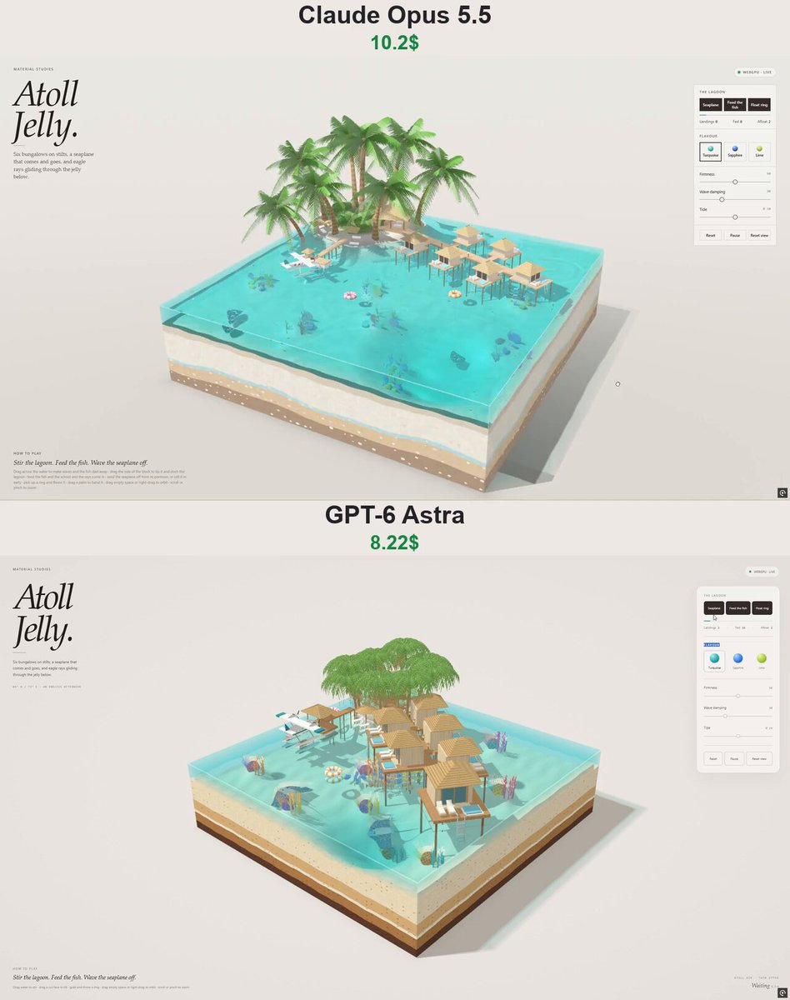</a>

一個以馬爾地夫為背景、可獨立運作的互動式 WebGPU 果凍潟湖立體場景提示詞。內容包括小島度假村、水上別墅、完整起降循環的水上飛機、珊瑚礁魚群與魟魚、漂浮泳圈、淺水模擬，以及觸控環繞控制。

**提示詞**

```text
建立「Atoll Jelly」——單一自包含 HTML 檔案，採用原生 WebGPU + WGSL，以純 JS 執行模擬，不發出外部請求。這是互動式果凍立體場景編輯系列「MATERIAL STUDIES」的一部分：一塊方形切出的馬爾地夫碧綠果凍潟湖，包含棕櫚小島、水上別墅碼頭、一架自行運轉一日行程的水上飛機，以及果凍下方的珊瑚礁生物。

頁面：暖紙色（#ece9e3）、墨色 #241f1d、強調色 #12a2a6，斜體襯線 H1「Atoll / Jelly.」，眉標「MATERIAL STUDIES」，說明文字「六間高腳別墅、一架來去自如的水上飛機，還有在下方果凍中滑翔的鷹魟。」狀態膠囊「WEBGPU · LIVE」。右側玻璃面板：「THE LAGOON」，包含三個深色按鈕「Seaplane」、「Feed the fish」、「Float ring」、細長計量表、統計項目「Landings · Fed · Afloat」；「FLAVOUR」色票 Turquoise / Sapphire / Lime；滑桿 Firmness、Wave damping、Tide（±10 cm）；Reset · Pause · Reset view。左下角「HOW TO PLAY」：「攪動潟湖。餵魚。揮手送水上飛機離開。」+ 一行灰色手勢說明。行動版底部抽屜、觸控環繞／雙指縮放、WebGPU 備援卡片、不可捲動、主控台不得出現錯誤。

場景（方塊 5.2²，海平面 1.3）：白沙潟湖深度約 0.3，向前方角落附近的深邃「藍洞」傾斜；八座珊瑚礁丘（凸起體），覆以腦珊瑚、枝狀珊瑚與海扇，呈粉紅／紫／橘／黃／藍綠色並輕微搖曳；後左角是一座沙質小島（沙灘環、低矮林木丘、糖果狀灌木、兩頂茅草遮陽傘與躺椅），種有 8 棵茂盛椰子樹（每棵 16 片拱形羽狀葉，另有乾燥下垂葉）；大型四坡茅草屋頂下設置開放式大廳亭。一座以細高腳柱支撐的木板碼頭，從小島斜向穿過潟湖，沿線設有矮燈柱；五間別墅交錯掛在碼頭兩側，末端另有一間較大的別墅：高腳木板平台、淡色木屋、面海玻璃門、四坡茅草屋頂（帶條紋稻草貼圖）、戲水池、兩張躺椅，以及通往水中的鋼梯。一座漂浮的水上飛機浮台配有小型茅草遮棚，並以高腳步道連接小島南側沙灘。方塊切面在半透明果凍牆下呈現糖果分層（沙、貝殼層、焦糖、巧克力）。

水體（名為「Island Jelly」）：線性淺水模擬（168² 交錯網格、120 Hz、√(g·depth) 波速、微小表面張力、阻尼），手指攪動、方塊傾斜時產生晃動，漂浮物以手動排開體積並回傳至海中，濺水凹坑與氣泡、泡沫場（會消退並形成細線的白色水沫）、焦散、光束、折射、Beer–Lambert 風格吸收，以及岸線細紋。

水上飛機（雙引擎浮筒飛機：白色機身搭配藍綠色飾線，高翼配藍綠色翼尖、支柱、雙浮筒；3 葉螺旋槳在頂點著色器中旋轉）：固定每日循環——在浮台等待 → 以浮筒原地轉向 180° → 滑行離開 → 起飛滑跑（濺水）→ 爬升 → 以約 3.1 的高度繞立體場景進行帶傾斜的跑道式航線 → 進場 → 觸水，產生凹坑、白色水沫與震動 → 著水滑跑 → 轉向 → 滑行返回浮台。飛行時會乘在果凍水面上：四個浮筒取樣點決定高度、俯仰與滾轉；浮筒將體積推入模擬水體（形成尾流）並產生泡沫。「Seaplane」按鈕：等待時立即出發，否則加快航線以提早降落。計算降落次數。

珊瑚礁生物：42 隻群聚魚，分為四種配色（黃高鰭刺尾鯛、藍身黃尾、黑白條紋、橘色白條），與同種類魚群聚、漫遊，並限制在水中活動（離開地面、位於水面下、不進入淺灘、留在方塊內）；尾巴在頂點著色器中擺動；3 隻有斑點的鷹魟貼近地面滑翔，翅膀隨波浪拍動，尾巴細長如鞭。手指伸入水中、任何濺水，或水上飛機浮筒快速掠過，都會驚散牠們。「Feed the fish」會撒下 16 顆先漂浮後下沉的飼料；魚與魟魚會朝飼料游去並吃掉（計入 Fed）。

漂浮泳圈：充氣糖果條紋泳圈（粉紅／橘／藍色搭配白色）——重量輕、漂浮高度高、平貼波浪，經阻尼處理，因此不會跳出果凍水體；會被水上飛機推開；可拿起並丟擲，也能落在平台與沙灘上。

QA：掛接 window.__aj；檢查完整水上飛機循環與一次降落、高度 > 2.8、浮筒貼著水面運行、觸水泡沫與波浪、魚群始終在水中、餵食會吸引魚群並被吃掉、手指會驚散魚群、泳圈平貼漂浮、攪動會產生並逐漸消退的波浪、傾斜會晃動並穩定下來、風味／滑桿／暫停／環繞／縮放、壓力測試、模擬時間 < 5 ms、無網路、無錯誤、行動裝置、備援。
```

[查看詳情 ↗](https://www.tripo3d.ai/zh-Hant/3d-prompts/atoll-jelly-interactive-webgpu-lagoon) · [查看原文](https://x.com/vib3coded/status/2107977713415864782) · [返回案例導覽](#all-prompts)

---

<a id="2108096737537929361"></a>

### 可互動的 Three.js 果凍實驗室，具備拖曳擠壓物理效果

[AIHubmix](https://x.com/AiHubMix) · 2026-10-08

<a href="https://www.tripo3d.ai/zh-Hant/3d-prompts/interactive-threejs-jelly-lab-physics">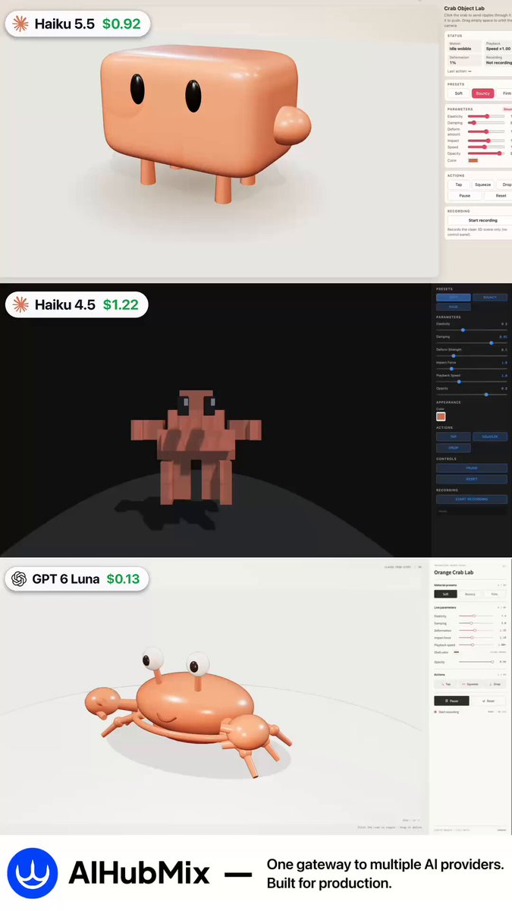</a>

一則基準測試貼文指出，同一個提示詞分別在 Haiku 5.5、Haiku 4.5 與 GPT‑6 Luna 上執行。目標是建立一個可互動的 Three.js 果凍實驗室，具備局部變形與拖曳擠壓物理效果。

**提示詞**

```text
建立一個可互動的 Three.js 果凍實驗室，加入局部變形與拖曳擠壓物理效果
```

[查看詳情 ↗](https://www.tripo3d.ai/zh-Hant/3d-prompts/interactive-threejs-jelly-lab-physics) · [查看原文](https://x.com/AiHubMix/status/2108096737537929361) · [返回案例導覽](#all-prompts)

---

<a id="2108203260058259830"></a>

### 鵜鶘騎自行車的 3D 體素世界

[filipe](https://x.com/filicroval) · 2026-10-08

<a href="https://www.tripo3d.ai/zh-Hant/3d-prompts/pelican-riding-bike-voxel-world">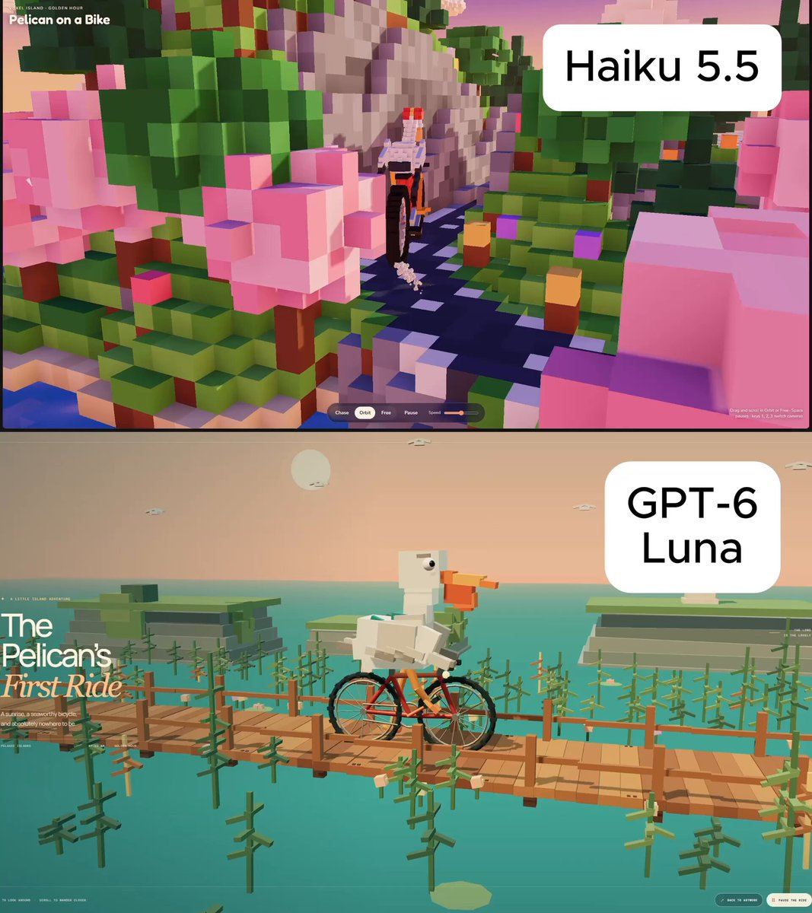</a>

一篇比較貼文指出，這是與 Haiku 5.5 和 GPT-6 Luna 使用的相同提示詞。該提示詞要求製作一個鵜鶘騎自行車的 3D 體素世界。

**提示詞**

```text
請盡可能做到最好，製作一個鵜鶘騎自行車的 3D 體素世界
```

[查看詳情 ↗](https://www.tripo3d.ai/zh-Hant/3d-prompts/pelican-riding-bike-voxel-world) · [查看原文](https://x.com/filicroval/status/2108203260058259830) · [返回案例導覽](#all-prompts)

---

<a id="2108336208891801999"></a>

### Pirate Jelly 互動式 WebGPU 立體場景

[Vib3Coded](https://x.com/vib3coded) · 2026-10-08

<a href="https://www.tripo3d.ai/zh-Hant/3d-prompts/pirate-jelly-interactive-webgpu-diorama">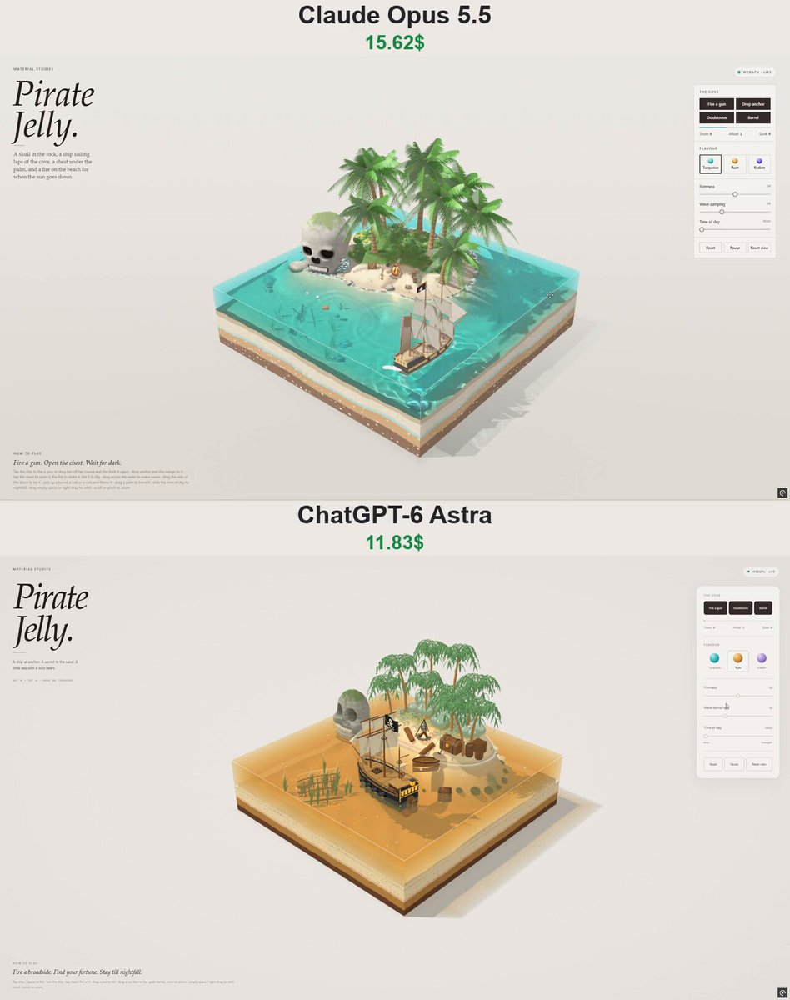</a>

一個自成一體、以程序生成的互動式海盜海灣果凍立體場景：半透明的分層海水方塊包圍著熱帶島嶼、骷髏岩、停泊的海盜船、海灘營地與沉沒的沉船。場景包含淺水模擬與剛體模擬、直接物件互動、一天中的時間控制，以及編輯風格的 WebGPU 介面。

**提示詞**

```text
建立一個自成一體的互動式 WebGPU／WGSL 網頁「Pirate Jelly」——這是「Material Studies」果凍立體場景系列的一部分。使用單一 HTML 檔案，不使用外部模型、貼圖、字型或函式庫；所有內容都以程序生成。介面使用英文。

外觀與配置
- 一個約 5.2 × 5.2 單位的半透明果凍海水方塊，立在紙張攝影棚地面上；攝影機從前方角落以約 27° 的角度望入。方塊的切面呈現糖果般的分層（巧克力基岩、焦糖黏土、貝殼層、香草沙）；海面與側壁會折射並為後方景物染色，海床上有焦散光、光柱，地面上有帶色的焦散陰影，海岸線有蕾絲般的泡沫，切邊則帶有明亮的彎月面高光。
- 後方有一座小型熱帶島嶼：沙灘、朝向觀看者的海灣，以及覆滿苔蘚的叢林丘陵；上面有約 9 棵果凍棕櫚樹（帶環紋的焦糖樹幹、會飄動的半透明棕櫚葉）、凹凸不平的果凍灌木與花朵、蕨類、海灘草，岸邊散布著岩石。
- 骷髏岩位於島嶼西端，矗立在淺灘中：以有號距離場雕刻出的卡通骷髏（頭顱、顴骨、下顎、深邃的眼窩、心形鼻孔、頭頂裂痕、岩層與雜訊，頂部覆著苔蘚，水線處有濕潤帶），並以表面網格生成網格；兩排獨立的盒狀牙齒嵌在雕刻出的咧嘴笑中。夜晚時，眼窩會像燭光照亮的洞穴般發光。
- 一艘海盜船在島嶼前方下錨停泊，從船尾以三分之四角度觀看：黑色船身配赭黃色炮門列、紅色船底、帶火炮的炮門、抬高的後甲板，以及點亮的船尾窗和船尾燈籠；三根桅杆（前桅與主桅掛方帆和上桅帆，後桅掛高低帆，船首斜桅掛三角帆）、支索與穩索，以及一面向船尾飄揚的海盜旗（骷髏與交叉骨頭以著色器程序繪製）。錨鏈從船首向下穿過果凍，連到海床上的錨。
- 海灣沙灘上的營地：營火（石圈、末端發光的圓木帳篷、餘燼、帶鍋子的三腳架、兩根座椅木樁）、一棵傾斜棕櫚樹下的鐵箍寶箱（帶鉸鏈箱蓋，裡面堆滿金幣和寶石）、沙堆中的鏟子、木桶、木箱、圓形炮彈堆成的金字塔、一瓶蘭姆酒、一艘拉上岸且船首擱在沙上的划艇，以及沙地上刻出的「X」記號。
- 海床上：一艘側倒的老沉船船首半段，露出肋骨，旁邊躺著折斷的桅杆；海帶隨波擺動，幾枚金幣散落其中，果凍裡還卡著氣泡。

SIMULATION
- 在錯列網格上模擬線性淺水波，加入少量表面張力（呈現有彈性的果凍）；方塊可以傾斜，海水會晃動，果凍也會搖晃變形（剪切＋擠壓）。
- 船隻由 10 個浮力點支撐（升沉、俯仰、橫搖），受到緩慢轉向的離岸風推動，船首由彈性錨索固定，並會隨風向轉動。船隻排開的體積會回饋給海水，因此會形成尾流。
- 剛體：炮彈（密度高、沿平順弧線飛行、擊出彈坑、沉下後在地面滾動）、木桶（側躺漂浮）、金幣（飄落後平躺定住）。所有物件都會與海水（浮力、阻力、水花、氣泡）、地形、骷髏岩、場景道具、棕櫚樹幹和船身互動。
- 一套粒子系統：火焰（加成混合）、餘燼、木煙、炮口閃光、白色硝煙、海水飛沫、沙塵、開啟寶箱上方閃爍的金光，以及夜間的螢火蟲。

INTERACTION
- 點擊船隻 → 開火攻擊面向觀看者一側的下一門火炮（炮彈、閃光、煙霧、後座力造成的側傾）。拖曳船隻 → 逆著錨索方向拖動；放開 → 船隻漂回錨點。
- 點擊寶箱 → 箱蓋帶彈性地擺動開啟／關閉；金幣閃閃發光。點擊營火 → 火勢轟然竄起並噴出火花。點擊 X 記號 → 三枚金幣從沙中彈出。
- 在水面上拖曳以製造波浪；拖曳方塊的一側使其傾斜；撿起並丟擲球體／木桶／硬幣；拖曳棕櫚樹使其彎曲；拖曳空白處或按住滑鼠右鍵拖曳以環繞旋轉；滾動滑鼠滾輪／雙指捏合以縮放。

一天中的時間
- 使用滑桿選擇：正午 → 午後 → 黃金時段 → 日落 → 黃昏 → 夜晚 → 午夜。太陽逐漸降低並轉為暖色，背景變成蜜桃色，接著由月亮接手（昏暗的藍光）；背景出現星星，網頁介面切換為深色主題，營火成為主要光源：閃爍的點光源為沙地、棕櫚樹、帆和金幣增添暖色，在水面映出倒影，並從下方照亮煙霧。船尾窗與燈籠會發光。

介面（延續系列的編輯風格）
- 左上角標題區：眉標「MATERIAL STUDIES」、大型斜體襯線標題「Pirate / Jelly.」，以及一行簡短文案。
- 狀態膠囊（WebGPU · Live／Paused／Unavailable）。
- 右側玻璃面板：「The cove」——按鈕 Fire a gun／Doubloons／Barrel、活力計，以及 Shots · Afloat · Sunk 統計；「Flavour」——提供 Turquoise、Rum（琥珀色）、Kraken（紫羅蘭色）果凍色盤；滑桿 Firmness、Wave damping、Time of day；Reset／Pause／Reset view。
- 左下角顯示「How to play」文字與簡短操作說明。按下空白鍵開火。
- 行動裝置：面板改為底部抽屜；支援觸控環繞旋轉與雙指捏合縮放。
- WebGPU（或轉接器）無法使用時顯示備援卡片。尊重 prefers-reduced-motion。
```

[查看詳情 ↗](https://www.tripo3d.ai/zh-Hant/3d-prompts/pirate-jelly-interactive-webgpu-diorama) · [查看原文](https://x.com/vib3coded/status/2108336611796615233) · [返回案例導覽](#all-prompts)

---

<a id="2108438685184401904"></a>

### 電影感 3D ORBIT 智慧手錶產品展示

[Maker Evan](https://x.com/maker_evan) · 2026-10-09

<a href="https://www.tripo3d.ai/zh-Hant/3d-prompts/orbit-smartwatch-3d-product-reveal">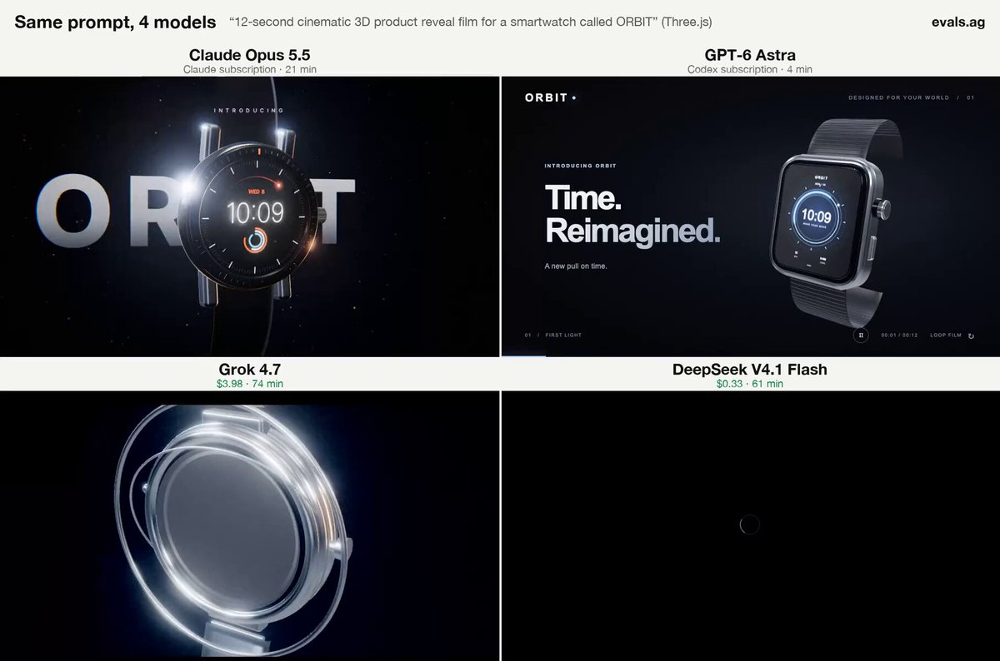</a>

一段以名為 ORBIT 的智慧手錶為主角、長度 12 秒的電影感 3D 產品展示影片提示詞。作者表示，這也是包含 GPT-6 Astra 在內的四模型比較中所使用的相同提示詞。

**提示詞**

```text
一段 12 秒、以名為 ORBIT 的智慧手錶為主角的電影感 3D 產品展示影片
```

[查看詳情 ↗](https://www.tripo3d.ai/zh-Hant/3d-prompts/orbit-smartwatch-3d-product-reveal) · [查看原文](https://x.com/maker_evan/status/2108438685184401904) · [返回案例導覽](#all-prompts)

---

<a id="2108459952683811167"></a>

### 互動式 3D 噴射引擎

[Maker Evan](https://x.com/maker_evan) · 2026-10-09

<a href="https://www.tripo3d.ai/zh-Hant/3d-prompts/interactive-educational-3d-jet-engine">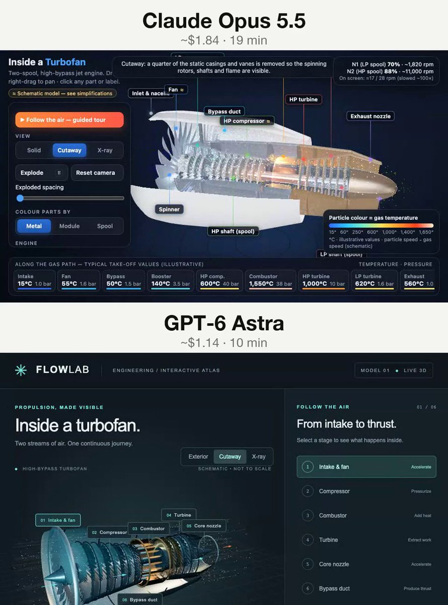</a>

根作者引用的可重複使用提示詞，用於在瀏覽器中製作互動式教育 3D 噴射引擎。貼文表示，這段提示詞也曾搭配 GPT-6 Astra 與 Claude Opus 5.5 執行。

**提示詞**

```text
在瀏覽器中製作互動式教育 3D 噴射引擎
```

[查看詳情 ↗](https://www.tripo3d.ai/zh-Hant/3d-prompts/interactive-educational-3d-jet-engine) · [查看原文](https://x.com/maker_evan/status/2108459952683811167) · [返回案例導覽](#all-prompts)

---

<a id="2108475056082850278"></a>

### AH-64E Apache Guardian 詳細 3D 視覺展示

[Maker Evan](https://x.com/maker_evan) · 2026-10-09

<a href="https://www.tripo3d.ai/zh-Hant/3d-prompts/ah-64e-apache-guardian-3d-presentation">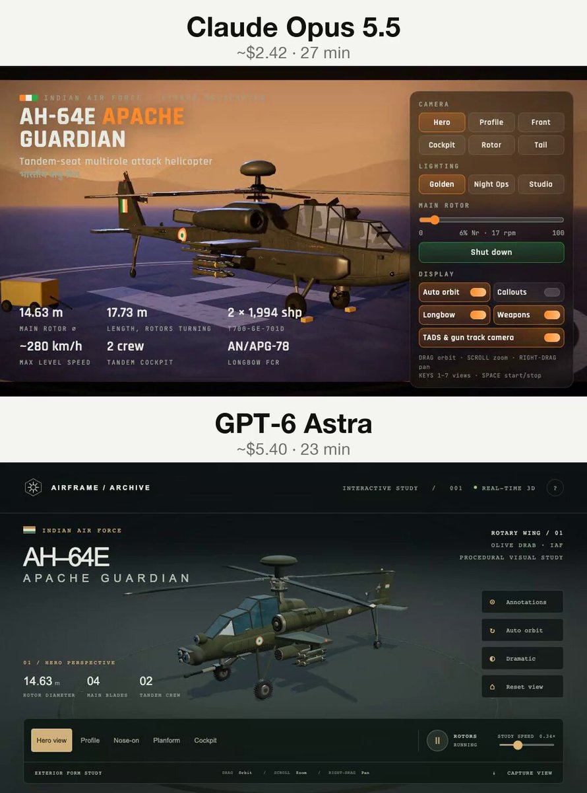</a>

一篇比較貼文指出，GPT-6 Astra 和 Claude Opus 5.5 都使用了相同的提示詞。該提示詞要求製作 AH-64E Apache Guardian 直升機的詳細 3D 視覺展示。

**提示詞**

```text
製作 AH-64E Apache Guardian 的詳細 3D 視覺展示
```

[查看詳情 ↗](https://www.tripo3d.ai/zh-Hant/3d-prompts/ah-64e-apache-guardian-3d-presentation) · [查看原文](https://x.com/maker_evan/status/2108475056082850278) · [返回案例導覽](#all-prompts)

---

<a id="2108501256067285443"></a>

### 互動式蜂蜜鍵盤

[Harry Jackson](https://x.com/keydol123) · 2026-10-09

<a href="https://www.tripo3d.ai/zh-Hant/3d-prompts/interactive-honey-keyboard">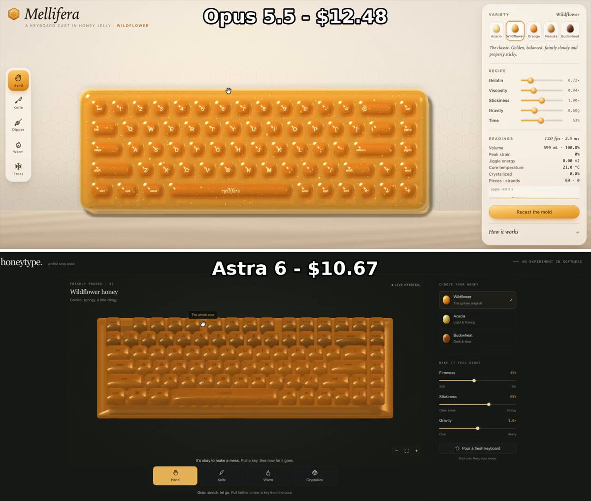</a>

建立一個由蜂蜜製成的互動式鍵盤。原始貼文指出，這是連結的 GPT-6 Astra 應用程式比較中使用的相同提示詞。

**提示詞**

```text
建立一個由蜂蜜製成的互動式鍵盤。
```

[查看詳情 ↗](https://www.tripo3d.ai/zh-Hant/3d-prompts/interactive-honey-keyboard) · [查看原文](https://x.com/keydol123/status/2108501256067285443) · [返回案例導覽](#all-prompts)

---

<a id="2108505251036774875"></a>

### 互動式 3D 軟糖骰子體驗

[Maker Evan](https://x.com/maker_evan) · 2026-10-09

<a href="https://www.tripo3d.ai/zh-Hant/3d-prompts/interactive-3d-gummy-dice-experience">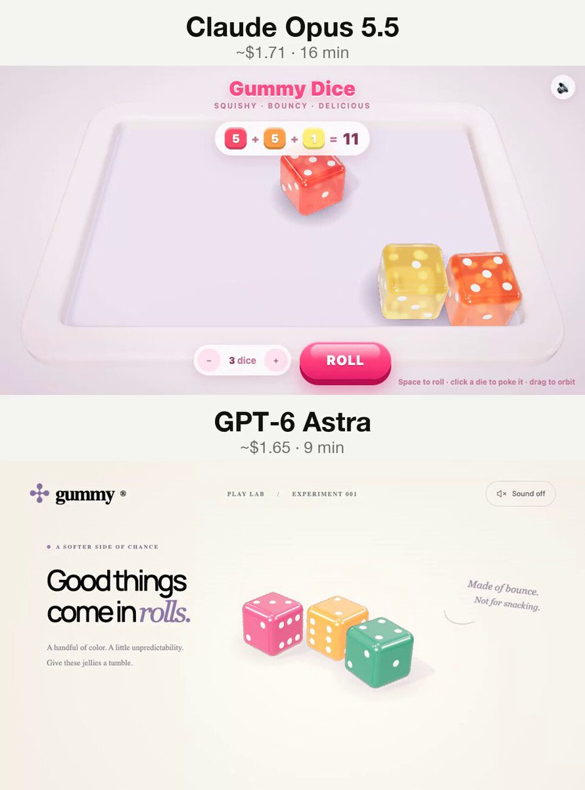</a>

以瀏覽器為基礎的互動式 3D 軟糖骰子體驗。根作者表示，使用 GPT-6 Astra 和 Claude Opus 5.5 採用了相同的提示詞。

**提示詞**

```text
在瀏覽器中建立互動式 3D 軟糖骰子體驗
```

[查看詳情 ↗](https://www.tripo3d.ai/zh-Hant/3d-prompts/interactive-3d-gummy-dice-experience) · [查看原文](https://x.com/maker_evan/status/2108505251036774875) · [返回案例導覽](#all-prompts)

---

<a id="2108574047948656981"></a>

### 互動式漂浮霓虹島嶼

[Fazley](https://x.com/itsfazley) · 2026-10-09

<a href="https://www.tripo3d.ai/zh-Hant/3d-prompts/floating-neon-island-interactive-3d-scene">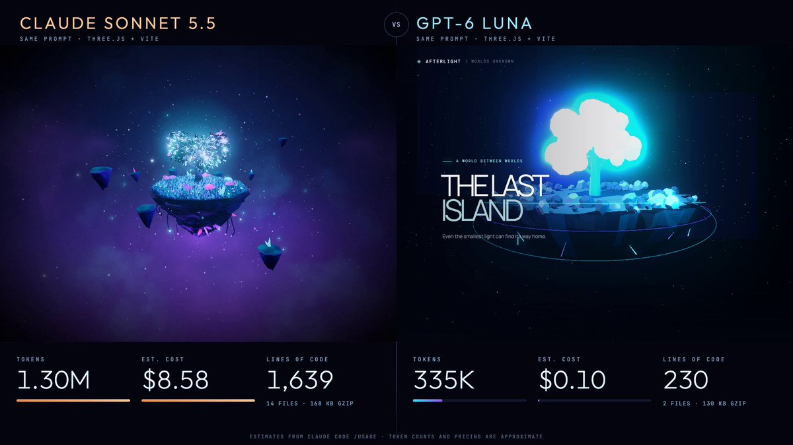</a>

作者提供的完整 Three.js 與 Vite 互動式 3D 場景提示詞：程序化生成的漂浮島嶼，包含草地、岩石側面、霓虹樹、粒子、大氣霧效、電影感光照、緩慢旋轉，以及滑鼠控制的攝影機視差。貼文表示，這組相同的提示詞曾在兩個模型間進行比較。

**提示詞**

```text
使用 Three.js、JavaScript 與 Vite，打造一個精美的互動式 3D 場景。

概念：漂浮的霓虹島嶼

在黑暗的太空環境中，建立一座懸浮的小型漂浮島嶼。

需求：
使用程序化幾何製作漂浮島嶼，頂部覆蓋草地，側面呈現岩石質感。
中央放置一棵發光的霓虹樹，並讓具自發光效果的葉片產生動畫。
在島嶼周圍飄浮少量發光粒子。
使用佈滿星星的背景，搭配細緻的大氣霧效。
加入寫實光照、陰影、環境光遮蔽與泛光效果。
讓島嶼緩慢旋轉，並搭配流暢自然的動畫。
使用滑鼠控制攝影機移動，呈現細緻的視差效果。
加入簡約 UI，顯示標題「THE LAST ISLAND」與簡短指示：「拖曳探索」。
採用適用於桌機與行動裝置的響應式版面配置。

視覺方向
以精緻、電影感十足且具有遊戲風格的美術呈現為目標。使用深海軍藍背景、青色與紫色霓虹點綴，以及柔和的大氣光照。

技術限制
使用 Three.js 與 Vite。
所有幾何體都必須以程序化方式生成。不得使用外部 3D 模型或付費素材。
保持程式碼乾淨且結構清晰。
確保場景能在現代瀏覽器中流暢執行。
包含所有必要的設定與使用說明。

優先事項：視覺品質、流暢動畫，以及統一的美術方向。避免做出千篇一律的展示範例，讓它呈現獨立遊戲中微型世界的感覺。

建立完整且可執行的專案，而不只是說明如何製作。
```

[查看詳情 ↗](https://www.tripo3d.ai/zh-Hant/3d-prompts/floating-neon-island-interactive-3d-scene) · [查看原文](https://x.com/itsfazley/status/2108574052294017509) · [返回案例導覽](#all-prompts)

---

<a id="battle-city-3d"></a>

### Battle City 3D：無盡坦克防禦

[jared](https://x.com/jaredliu_bravo) · 2026-09-22

<a href="https://www.tripo3d.ai/zh-Hant/3d-prompts/battle-city-3d"></a>

在無盡的草地、雪地與工業戰場中守護雄鷹基地，也可挑戰 35 張經典地圖。收集 10 種道具，對抗需命中 4 次才能擊毀的敵方重型坦克。

**提示詞**

```text
1. 專案目標
打造《Battle City 3D》：一款以 1985 年 Famicom 經典作品為靈感的瀏覽器坦克防禦遊戲。玩家駕駛坦克，摧毀一波 20 輛敵軍、收集補給並保護老鷹總部。重現參考媒體中目前所示的透視 3D 版本，包括可無限遊玩的種子戰役，以及 35 張可選的經典地圖。保留清楚易懂的街機規則，同時讓坦克、牆壁與場景具備真實的立體深度。

2. 視覺風格
使用 Three.js PerspectiveCamera，視野角度為 60 度。預設戰場視角位於玩家後上方，距離約 13 個世界單位，高度為 0.43 弧度。平滑跟隨坦克位置及其前方的一個目標點；坦克轉向時，絕不自動旋轉鏡頭。提供較高的戰術視角、手動拖曳環繞視角與滾輪縮放。移動與射擊使用地圖的四個基本方向軸。環繞視角後，將方向鍵對應至相對於鏡頭最近的基本方向；絕不將鍵盤輸入轉換為斜向移動。讓車體朝向立即與射擊方向一致，並根據每個模型的實際砲管位置校準砲彈與砲口閃光的高度。
使用貼地的履帶式坦克、金屬砲塔、陶土磚、深色鋼塊、藍色水面、低矮植被與反光冰面。將地面延伸到可玩區域之外，銜接樹林、毀損建築與霧霾。使用溫暖的定向光、柔和陰影、環境補光、ACES 色調映射，以及克制的砲口閃光、後座力、火花與彈跳碎屑。下雪時改變地面與樹木的色彩配置；工業關卡則以鋼材與毀損建築為主。
以深橄欖色指揮介面框住遊戲，顯示暖黃色的主要操作、分數、共用生命數、剩餘敵人圖示、關卡名稱與雷達。將大型 Tripo 3D / Three.js 模型切換控制置於戰場上方，顯示目前選取的模式與旋轉中的坦克預覽。使用在地化的插畫式補給指南與限時效果指示器。在窄螢幕上維持遊戲區域與必要的觸控控制可見。

3. 世界與場景
將戰場表示為 26×26 的圖塊網格，坦克碰撞半寬為 0.72。將老鷹放置於 (13,25)，周圍以可破壞的 U 形磚牆防禦。玩家出生點為 (9,25) 與 (17,25)；敵軍入口為 (1,1)、(13,1) 與 (25,1)。
提供兩種戰役：包含全部 35 張經典地圖及其 20 名敵人的波次表，以及以種子為基礎、循環生成草地、雪地與工業生態系的無限模式。生成足以容納完整車體寬度的連通走廊，確保玩家出生點、敵軍入口與拾取物位置之間都有可通行的連接。加入交錯配置的中央鋼製掩體，避免出生點到老鷹之間形成直接射擊線，同時保留跨街通道。允許選擇起始生態系或經典關卡，並重新擲骰生成隨機地圖。將本局種子、分數、生命數與存活玩家的升級內容帶入下一關。
磚塊可破壞；鋼塊能擋住普通砲彈與坦克；水面會阻擋坦克，但允許砲彈穿越；植被會遮蔽敵方模型；冰面會降低抓地力。讓遠景環境僅作裝飾，與遊戲碰撞分離。

4. 資產清單
使用以下穩定且可獨立替換的 3D 模型插槽。優先製作玩家、敵軍、重型坦克與老鷹，接著製作全部十種補給模型。讓每個資產以最低點貼地，並統一朝向、中心點與縮放比例。重複使用範本，不要為每個敵人個別載入模型。
- player：芥末黃色履帶坦克，具備清楚易讀的砲塔與前置砲管；供玩家坦克使用，第二名玩家另以獨立的環色區分。
- enemy：緊湊型履帶敵軍坦克，透過不同色調區分基本型、快速型與強力型，並重複使用此模型。
- heavy：外觀明顯更厚重的裝甲坦克，使用獨立於標準敵軍模型的網格，並在上方顯示四個可見的裝甲段。
- eagle：總部基座上的金色金屬老鷹雕像。
- pickup-star：金色五角升級星。
- pickup-helmet：用於暫時護盾的防護軍用頭盔。
- pickup-clock：用於凍結敵軍移動的清晰易讀時鐘。
- pickup-shovel：用於加固總部的鏟子。
- pickup-life：代表額外一條生命的迷你坦克。
- pickup-grenade：用於摧毀現存敵軍的手榴彈。
- pickup-ammo：用於快速射擊的彈藥箱。
- pickup-repair：用於修復裝甲的維修工具箱。
- pickup-magnet：用於遠距離收集拾取物的馬蹄形磁鐵。
- pickup-boost：用於暫時提升速度的能量電池。
- environment-building：一棟風化的毀損公寓大樓，Tripo P2.0，指定預算為 1,800 個三角形。
- environment-tree：可見樹幹的不規則松樹，Tripo P2.0，指定預算為 1,100 個三角形。
- environment-bush：低矮的闊葉灌木與草叢，Tripo P2.0，指定預算為 650 個三角形。
將補給顯示為旋轉、懸浮的可收集模型，搭配彩色環圈與相符的指南縮圖。以共用的幾何與材質實例渲染重複出現的建築、樹木與灌木。讓建築與樹木的根部貼地；將灌木底部略微埋入，以融入地形。在雪地關卡中，於朝上的表面添加積雪。讓圖塊牆壁、水面、冰面、砲彈網格、UI、燈光、粒子與碰撞代理物件維持程式生成。讓水面以世界空間流動波浪呈現動畫，持續變化法線並產生些微表面位移，且在相鄰圖塊之間保持連續。Tripo 版本使用 17 個生成模型；比較版本則將坦克與環境都切換為程式建立的幾何體，並使用相同的規則與碰撞。兩者皆以 Three.js 渲染。

5. 遊戲玩法與回饋
支援單人遊玩與本地雙人合作，共用三條生命的生命池。單人使用 WASD 或方向鍵移動，Space/J 開火。合作模式中，玩家一使用 WASD 與 Space/J；玩家二使用方向鍵與 Enter/Numpad 0。P/Escape 可暫停；C 切換鏡頭；1/2 選擇模型模式。在觸控螢幕上，允許同時按住方向鍵盤與開火按鈕；指標取消時釋放輸入，並在不需捲動的情況下提供暫停、繼續、下一關與重試操作。
玩家速度為每秒 4.2 個單位，使用加速時為 6.3。敵人包括基本型、快速型、強力型與重型；重型坦克有四點生命值，未受護盾保護時可承受前三次命中。擊殺各類型敵人分別獲得 100、200、300 或 400 分；收集任一補給可獲得 500 分。擊敗 20 名敵人後通關。老鷹被摧毀，或共用生命耗盡且沒有存活玩家時即告失敗。提供立即重試、明確的下一關流程，以及儲存在本機的最高分。
實作全部十種補給：星星可升級三個等級（更快的砲彈、同時發射兩枚砲彈，最後是可破壞鋼塊的砲彈）；頭盔提供 12 秒護盾；時鐘將敵人凍結 9 秒；鏟子加固基地 16 秒；迷你坦克增加一條生命；手榴彈摧毀現存敵人；彈藥提供 14 秒快速射擊，最多同時存在四枚砲彈；維修增加兩點生命值，上限為三點；磁鐵在 20 秒內收集五個單位範圍內可見的補給；加速效果持續 12 秒。補給模型持續 25 秒，並出現在可抵達的位置；使用洗牌牌組改變補給類型。磁鐵收集必須遵守實體障礙物。
使用收集到的 NES 風格音效，涵蓋 4.333 秒的關卡開場、射擊、駕駛與待機、磚塊／鋼塊碰撞、敵軍／玩家爆炸、補給出現與收集、獲得額外生命、裝甲受擊、冰面、暫停與遊戲結束。目前專案使用 JustoSenka/BattleCity 的 15 段 OGG 音效，commit 3a07004ba8e53baea74ff70d2ecc22b017eb9b20。保留其作者標示與儲存庫授權聲明；描述為收集自重製版的音效，不得聲稱是位元完美的硬體擷取。透過使用者手勢解鎖音訊，校準各音效增益，提供音量／靜音控制，並讓音效與事件同步。不要加入無關的持續戰鬥音樂。

6. 技術實作
使用 TypeScript、Three.js 0.180.0 與 Vite 7，並提供獨立的 package.json 與 lockfile。讓模擬與渲染相互獨立，以 120 Hz 執行模擬步進。使用實體車體 AABB、分軸移動、邊界與坦克分離，以及持續性的最近接觸點砲彈掃掠，並納入敵我砲彈之間的相對運動碰撞。砲彈從車體生成並向前掃掠，以避免近距離射擊時穿過牆壁。加入冰面加減速，以及帶有阻尼彈跳的碎屑重力。這些是街機式地面物理，不是懸吊模擬器。
透過 GLTFLoader 載入同源 GLB 資產。讓碰撞代理物件獨立於資產幾何。現有執行環境使用量化屬性與 WebP 貼圖（載具／基地為 1024 px；補給與環境為 512 px），不進行幾何簡化，也不使用 WASM 解碼器。載入限制為四個 worker，使用雜湊版本化 URL，以及 256 KiB 的範圍請求；每個範圍請求逾時 20 秒，最多嘗試三次。四個核心模型與音訊準備完成後即可解鎖遊玩；在背景載入補給與環境資產，且只生成模型已準備好的補給類型。切換模型模式時保留遊戲狀態。
提供英文、簡體中文、日文與韓文 UI。依裝置語言選擇預設語言，但 zh-TW、zh-HK、zh-MO 與 zh-Hant 預設使用英文；明確選取的語言需持續保存。支援鍵盤、桌面指標與多點觸控，並在失去焦點時暫停。所有資產、製作人員名單與可重現腳本都應保留在來源專案中；發佈不含私人憑證且不依賴執行期後端的靜態 dist 目錄。

7. 完成標準
交付可編輯原始碼、資產來源與授權聲明、npm 開發／建置流程，以及可遊玩的靜態預覽。驗證預設 Tripo 場景、模型比較、所有生態系、重型坦克承受四次命中、每種補給效果、暫停／繼續、失敗／重試與關卡進度。測試 1,000 張種子地圖的車體寬度連通性與安全出生點，以及所有經典地圖、穿牆、斜向射擊、坦克分離、冰面動量、不同偏航角下的鏡頭相對輸入，還有保留狀態的模式切換。驗證在地化 UI 與窄螢幕雙指控制；若僅使用模擬測試，不得宣稱已在實體裝置上測試。將實際開場與戰鬥畫面和參考圖片／影片進行比對；確認全部 17 個模型與 15 段音效皆能載入。透過既有的 CMS Web Page 工作流程發佈，並驗證最終公開頁面，不要將已儲存的 CMS 紀錄視為部署完成。

```

[查看詳情 ↗](https://www.tripo3d.ai/zh-Hant/3d-prompts/battle-city-3d) · [線上展示](https://battle-city-3d.tripo.page/) · [返回案例導覽](#all-prompts)

---

<a id="crazy-tanks-3d-island-artillery"></a>

### Crazy Tanks — 3D 島嶼火砲戰

[jared](https://x.com/jaredliu_bravo) · 2026-09-24

<a href="https://www.tripo3d.ai/zh-Hant/3d-prompts/crazy-tanks-3d-island-artillery"></a>

在完整 3D 的島嶼火砲戰中瞄準、判讀風向，並從零開始蓄力。選擇六種砲彈、轟出深邃彈坑，在不斷升高的混亂中存活下來。

**提示詞**

```text
1. 專案目標
打造 Crazy Tanks — Wild Tides：一款可遊玩的真正 3D 回合制火砲遊戲，場景位於熱帶島嶼。玩家操控小型坦克、判讀風向、將蓄力從零開始計時，並以砲彈重新塑造戰場。支援單人對抗 AI 與本地輪流遊玩；預設為三輛坦克的大亂鬥，另提供兩輛坦克的決鬥模式。最後存活的坦克獲勝。以目前的參考遊戲畫面與截圖作為視覺目標。

2. 視覺風格
使用透視攝影機與可自由環繞的 3D 幾何，不要使用平面精靈圖或固定側視角。打造陽光明媚的迷你模型場景，包含圓潤的翡翠綠、珊瑚橙與藍紫色坦克、奶油色沙地、淡綠草地、具反射效果的藍綠色水面、柔和陰影，以及淡淡的大氣遠景霧。保留三輛坦克各自鮮明的輪廓與相配的砲管。在戰場上方使用緊湊的奶油色圓形／裝甲面板，下方使用深青綠色圓角控制面板。金色代表參考火力與開火操作；薄荷綠代表實際蓄力與友軍狀態。讓頂部醒目顯示 Tripo / Three.js 外觀切換，預設使用 Tripo 資產。切換外觀時必須保留對戰與物理狀態。使用細而間距均勻的青綠色螢幕空間虛線，以及簡潔克制的落點圓圈；不要讓瞄準圖像反射在水面上。

3. 世界與場景
使用約 260 × 184 公尺的可破壞高度場島嶼，周圍是固定海平面的海洋。將起始坦克分散放置在穩固地面上；配置岩石、棕櫚樹、仙人掌與可收集的補給箱。較小的裝飾性島嶼只用來增加背景景深，絕不能取代可破壞的主要地形。爆炸會使地表變形，也可能挖掘至海平面以下。讓海岸顏色與泡沫位於同一個水面上，以避免重疊平面與閃爍。每個渲染影格都從世界座標位置投射坦克編號。提供完整彈道、坦克、環繞與戰術俯視鏡頭。彈道視角必須將開火坦克、彈道弧線與預估落點容納在 HUD 與控制面板之間的空間內。每次射擊前，先顯示開火坦克約 0.8 秒，在砲口處稍作停留，再跟隨投射物。手動操作攝影機會取消電影式跟隨。

4. 資產清單
使用穩定的模型插槽，並讓替換模型可個別尋址：
- jade-body：圓潤、如盾牌般的綠色履帶車體；玩家的預設車體。jade-cannon：相配的翡翠色砲管，帶有深色砲膛與金色點綴，可獨立進行骨架綁定。
- ember-body：珊瑚橙色、前端尖銳的裝甲車體，機械輪廓低矮。ember-cannon：相配的較長橙色砲管與深色砲口。
- bolt-body：藍紫色工業風履帶車體，採用有稜角的裝甲板。bolt-cannon：相配的粗厚藍色砲管。
- shell：黃銅色火砲砲彈，帶有深色錐形彈頭與青藍色點綴。重複使用此模型，並依武器套用專屬色調與縮放。
- crate：黃色裝甲補給箱，帶有青藍色標記與加固邊角；收集後恢復 20 點裝甲，最高為 100。
- rock：溫暖色調的圓潤砂岩群；以不同縮放重複使用，並使用獨立的碰撞代理。
- palm：彎曲樹幹與層疊的綠色葉片；重複作為島嶼植被。
- cactus：帶有小型花朵細節的緊湊綠色仙人掌；重複配置於乾燥地形。
- islet：圓潤的草地背景島嶼，邊緣為淡色岩石／沙地；重複放置於競技場之外。
優先製作三組相配的車體／砲管，其次是砲彈／補給箱與環境道具。地形變形、海洋、泡沫、火焰、煙霧、衝擊波、碎屑、瞄準圖像、光照、UI 與碰撞代理都維持程式程序化生成。相配的車體與砲管共用同一份設計參考與縮放比例。將砲管樞軸放在機械接點，讓其前進軸對齊 +X，並以可見砲口作為實際發射點。坦克車體使用四元數貼合斜坡；砲塔瞄準維持為世界空間方向。保留來源 PBR 貼圖與 UV 接縫。將完整解析度的可下載模型與最佳化的遊戲執行版本分開；參考資料與檔案來源資訊必須標明實際生成來源。

5. 遊戲玩法與回饋
每輛存活坦克在回合開始時獲得 18 公尺的移動距離。WASD 與移動控制板依螢幕方向移動；方向鍵與瞄準控制板調整方位角與仰角。滑桿提供方位角、10–80 度仰角，以及 0–100 的參考火力。選取對手只會讓砲塔朝向對方；不得替玩家解算射擊。
青綠色弧線會在無風條件下估算所選參考火力。蓄力期間固定保留此參考值與金色標記。按住 Fire、Space，或聚焦在 Fire 按鈕時按住 Enter，每次都要讓實際火力從 0 開始；每秒增加 18 個百分點，達到 100 後維持不變，並在放開時以當下的實際火力恰好開火一次。快速點按會發射低威力砲彈。參考值上下 3 個百分點內的金色區段僅供視覺回饋，不得自動吸附或進行隱藏修正。指標取消、視窗失焦或失去可見度時取消蓄力。蓄力期間鎖定移動、目標與瞄準變更。範圍輸入的鍵盤控制不得同時轉動砲塔。零火力代表最低發射速度，不代表砲彈靜止不動。
箭頭與可見的飄移風痕顯示風力推動砲彈的方向。標示風力強度與每秒公尺數；點擊風力卡片可查看說明。風向左吹時，玩家應略微向右瞄準。風力越強、滯空時間越長，飄移越明顯。單次射擊期間風力保持不變，並在每個回合變更。絕不要自動補償玩家的預覽。僅近似預測地形落點；不要在預覽中保證會與坦克／岩石碰撞、分裂成群或發生反彈。
提供六種彈藥：無限 HE 高爆彈；會分裂成五枚下降子彈藥的集束彈；可形成最寬 28 公尺、最深 13 公尺彈坑的 Seismic 地震彈；會反彈兩次的反彈彈；每輛坦克每場一枚、可形成最寬 46 公尺、最深 22 公尺彈坑的 Cataclysm 災變彈；以及留下半徑 12 公尺火區的 Incendiary 燃燒彈。火焰在六次行動結束時各造成 8 點傷害；移出火區即可避免傷害，重疊火區不會疊加。海水會熄滅火焰。整輛坦克（包括抬起的砲管）完全沒入水面以下時，立即淘汰。顯示實際傷害、裝甲損失、地形塌陷、水花與淘汰結果。
使用分層火球、擴張的衝擊環、自發光火花、彈道碎片、塵土與煙霧，並搭配克制的鏡頭震動。使用提供的原始 ElevenLabs 音樂，以及火砲、撞擊、反彈、強力爆炸、火焰與水花音效。加入音效切換、暫停／繼續、說明、重播與返回選單功能。在投射物飛行或 AI 回合期間，提供「回到我的回合」：快速執行相同的固定步長模擬，並保留所有傷害、地形與危害結果。絕不能跳過本地好友的輸入回合。

6. 技術實作
使用搭配 ES modules 與 Vite 的 Three.js、本地封裝字型、以 Web Audio 處理音效，並以 HTML audio 元素循環播放音樂。資源維持在同源環境，並支援靜態建置。使用具抗鋸齒的透視渲染器，妥善分配陰影與後製效能預算，並正確釋放暫時性幾何與材質。區分模型裝飾與遊戲碰撞。
維持獨立於渲染的決定性物理，使用公尺／秒單位、重力 9.81 m/s²，以及 1/120 秒固定步長。對高速投射物與地面、水面、坦克及岩石之間的碰撞，使用連續掃掠碰撞；對被位移的坦克套用爆炸衝量與重力。從坦克專屬的實際砲管變換推導發射位置。一般播放與快轉都必須呼叫相同的模擬更新。傷害與風力反應是風格化的遊戲規則，不是工程用爆炸模擬器。
支援中文、英文、日文與韓文 UI。初次使用時依裝置語言選擇；香港、澳門、台灣與使用繁體中文的裝置預設為英文。記住使用者明確選擇的語言，並提供可見的語言選擇器。支援響應式桌面、直向手機與短版橫向版面；短螢幕選單可捲動，觸控目標尺寸舒適，面板可收合，控制項不得重疊。觸控裝置不得要求鍵盤輸入。將僅供開發使用的狀態變更與瞄準輔助程式排除在正式版本之外。

7. 完成標準
交付可編輯的獨立原始碼專案、lockfile、npm 開發／建置指示，以及可運作的靜態預覽。符合目前的截圖與遊戲影片，包括奶油色狀態面板、固定的金色參考標記、從零開始的即時蓄力，以及完整 3D 的坦克／島嶼呈現。驗證首次啟動、模型載入、完整回合循環、每種彈藥的行為、暫停、重播，以及實際的勝負結果。確認切換外觀能保留狀態，鍵盤／觸控取消操作不會誤觸發射擊。在清楚的無風測試射擊中，以參考火力放開應落在接近參考圓圈的位置；相反方向的側風必須明顯使實際砲彈偏移，同時維持該圓圈不變。檢查 30/60/144 Hz 表現、高速碰撞、深層彈坑、火焰消退、完全浸水淘汰，以及一般／快轉回合結果的一致性。在四種語言中檢查桌面與窄版面；將瀏覽器模擬與實體裝置測試分開辨識。驗證託管頁面與連結媒體，而不只檢查本機建置。

```

[查看詳情 ↗](https://www.tripo3d.ai/zh-Hant/3d-prompts/crazy-tanks-3d-island-artillery) · [線上展示](https://super-tanks-aftershock.tripo.page/) · [返回案例導覽](#all-prompts)

---

<a id="jelly-villa"></a>

### 果凍別墅

[jared](https://x.com/jaredliu_bravo) · 2026-10-08

<a href="https://www.tripo3d.ai/zh-Hant/3d-prompts/jelly-villa">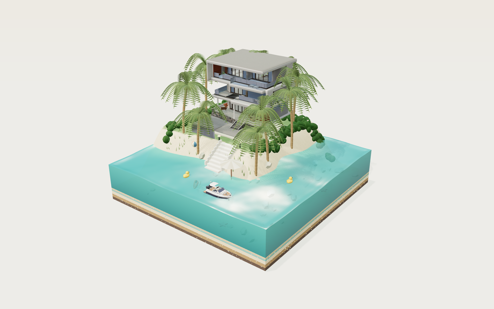</a>

<a href="https://www.tripo3d.ai/zh-Hant/3d-prompts/jelly-villa">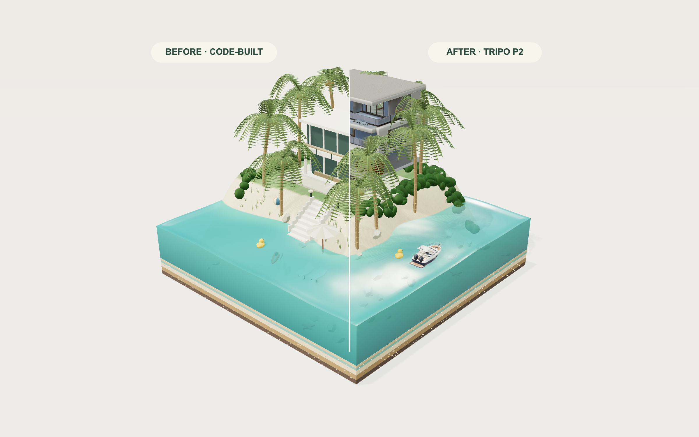</a>

<a href="https://www.tripo3d.ai/zh-Hant/3d-prompts/jelly-villa">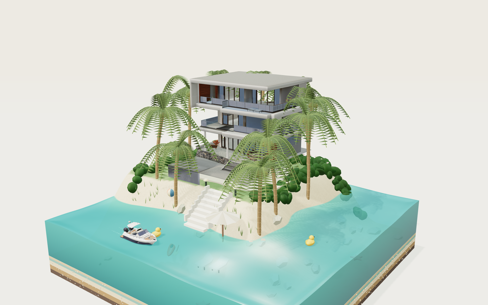</a>

<a href="https://www.tripo3d.ai/zh-Hant/3d-prompts/jelly-villa">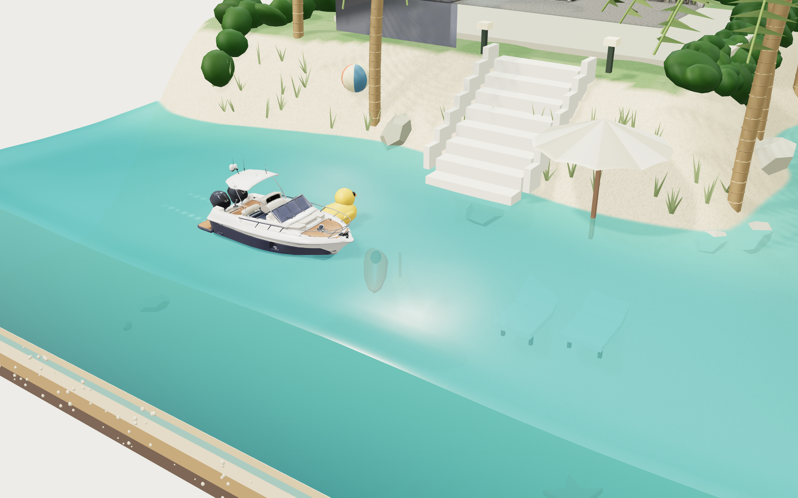</a>

<a href="https://www.tripo3d.ai/zh-Hant/3d-prompts/jelly-villa">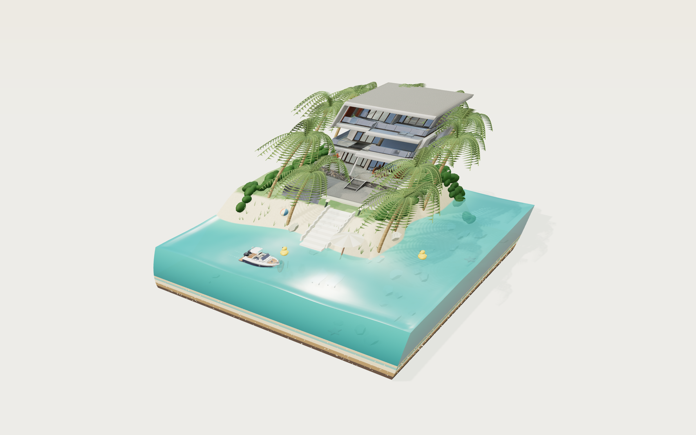</a>

攪動寶石色的果凍海，拖曳迷你遊艇，讓棕櫚樹環繞熱帶別墅彎曲生長。在同一座充滿生命力的島嶼中，自由切換程式生成的場景，以及真實的 Tripo P2 別墅與遊艇模型。

**提示詞**

```text
1. 專案目標
打造「Jelly Villa」：在一塊剖開的半透明果凍方塊上，呈現一座可互動的熱帶迷你天堂。訪客可以攪動潟湖、拖曳迷你遊艇、丟下沙灘玩具、掰動棕櫚樹，還能讓整座島嶼傾斜。整體場景應像一座優雅的建築模型，卻意外地活了起來。這是 jared 以 Vib3Coded 的 Villa Jelly 參考作品為基礎製作的獨立 remix，並使用真正的 Tripo P2 villa 與 yacht 資產。請以 https://x.com/jaredliu_bravo 標註 jared 的貢獻，並保留獨立的「Inspired by Vib3Coded」連結，指向原始作品。不得將參考作者的影片呈現為這次 remix 的錄影。

2. 視覺風格與比較
使用參考影片建立方形方塊、斜向高位攝影機、L 形潟湖、後方植被高地、白色現代住宅、茂密棕櫚樹、分層剖面與緩慢移動的船隻。請重現這些關係，而不是製作一座泛用的島嶼。最終 remix 使用 Three.js/WebGL2，而非原作的原生 WebGPU 實作，因此能透過標準瀏覽器管線載入真正的 GLB 資產。
在場景周圍使用 #edeae3 的溫暖紙張背景、深橄欖炭灰色文字、細如髮絲的分隔線，以及克制的常青色點綴。左上方放置大型 Georgia 風格襯線字體標題「Jelly / Villa.」，第二行使用斜體。讓中央立體場景維持主導地位，邊緣保留充足留白；右側放置小型控制面板，底部提供安靜低調的操作說明。UI 使用英文。主攝影機從 x 正值與 z 正值方向觀看，透視視野為 34 度。使用柔和的暖色陽光、冷色補光與工作室環境光，呈現真實投影、物件貼地感與電影感色調映射。讓玻璃、塗漆灰泥、柚木、沙地、凝膠塗層、金屬與葉片表面各自保持明確差異。避免植被褪色，也避免水面呈現扁平且不透明的效果。
在模型上方放置醒目的 Before / Compare / After 控制項。Before 使用完整裝飾的程式生成 villa 與程式生成 yacht。After 僅將這兩類物件替換為實際的 Tripo 資產。Compare 以可拖曳的分割畫面同時渲染兩者，並使用完全相同的攝影機、動畫時間、地形、棕櫚樹、水面、光照與玩具狀態。誠實標示兩側：「Before · Code-built」與「After · Tripo 3D」。移動分隔線時不得重設場景。模型載入後預設顯示 After；若資產無法使用，仍須保留可見的備援內容，以及誠實的載入中／錯誤狀態。

3. 世界與環境
方塊尺寸為 5.2 × 5.2 個場景單位。頂部是連續的高度場：潟湖底部接近 0.35，預設水位為 1.04，植被高地約為 1.50。島嶼維持在後方區域；相連的潟湖沿著朝向前方的兩條邊延伸。塑造輕微不規則的沙質海岸線與平滑坡岸，並在草坪與沙灘之間設置階梯。方形剖面露出薄薄的巧克力、焦糖、香草與薄荷色夾層，內含細小礫石。分層上方設置透明的垂直水面剖面，邊緣帶有精緻的彎月面水緣。水面與剖面使用相同的色彩調色盤並產生相應變化。
將 villa 放在淡色石材露台後方，周圍配置庭園燈、低矮開花灌木、帶有淡淡條紋的草坪、零散岩石與海灘草。圍繞 villa 精確配置十棵可個別掰動的椰子棕櫚樹，並在樹冠之間保留可見的建築結構。每棵樹都要有彎曲的環紋樹幹、椰子，以及由拱形羽狀葉片組成的完整樹冠，不得只使用幾片扁平三角形葉子。靠近海岸加入一把波浪邊奶油色陽傘、兩張躺椅、一艘陶土紅色獨木舟及其槳。它們的比例必須低於房屋，不能搶走主體地位。
讓 yacht 沿著潟湖中的連續路線行駛：外側航道、圓弧轉角、沿內側航道返回，再以平順的 U 形轉彎循環。船身應遠離海岸與方形牆面。地形與水面維持程式生成，以便變形並產生互動反應；不得將整座島嶼替換成單一靜態生成網格。

4. 資產清單與固定插槽
- villa：一座現代白色熱帶度假住宅，具備多層平屋頂、深色玻璃帷幕、細框、陽台、石材基座與設有家具的遮蔽露台。它位於後方露台，是主要替換資產。保留實際匯入的設計與所有材質貼圖。將模型調整尺寸並貼地到指定的 villa 插槽中，確認其正面立面相對攝影機與階梯的位置。交付的 Tripo 模型有三層立面；不得聲稱它是參考房屋的精確複製品。
- yacht：一艘小型白色與海軍藍日間巡航艇，具備尖頭船身、奶油色駕駛艙座椅、柚木甲板、擋風玻璃、細型硬頂、船首護欄與雙舷外機。它會獨立載入並繞著潟湖移動。統一船長、確認船首方向、對齊吃水線，並保留貼圖細節。Before 與 After 共用相同的移動變換與浮力取樣。
- palms：十棵以程式建立的棕櫚樹，每棵都具備可個別選取的彎曲彈簧，並共用幾何與材質系列。為提升渲染效率，重複使用合併後的靜態部件。
- beach props：程式生成的陽傘、躺椅、獨木舟、槳、岩石、草、燈、鋪面與灌木。兩種比較模式中的幾何與材質細節必須完全一致。
- toys：可重複使用的條紋沙灘球、黃色橡皮鴨與珊瑚色海星系列。初始狀態為岸上兩顆球、水面兩隻鴨子，以及潟湖底部兩隻海星。
- water、terrain、foam、strata、lighting 與 UI：維持程式生成。碰撞與互動代理應和可見的生成模型細節分開處理。
villa 與 yacht 是實際以 Tripo P2 文字生成模型建立的資產，並從同源 GLB 檔案載入。將它們真正的生成提示詞與來源資訊隨專案保存，並與本重現規格分開。不得以圖片或 billboard 取代詳細網格，也不得聲稱程式生成的場景是由 Tripo 生成。

5. 互動與回饋
在水面上拖曳以製造移動的凹痕與波紋；放開後讓它們逐漸消散。實作有邊界的有限差分波場，在岸邊加入阻尼，並使用依參數變化的剛性與阻尼。加入細微的動畫水面波紋、類似折射的深度色調、平滑鏡面高光、依深度變化的色彩，以及柔和的尾流水花；絕不可使用每三角形的螢幕導數推導水面法線，也不得疊加重複的線條圖樣。請將這些描述為藝術化的即時水面模擬，不要宣稱具備流體精確度。
拉動島嶼或其剖面，使整個場景剪切與擠壓。固定基座，並讓地形、水面、剖面、建築、植被與陰影共用非線性彈性場。放開時以帶阻尼的過衝回彈。提供可見的「讓島嶼搖一搖」按鈕以觸發相同效果。讓水面側邊幾何維持在其局部地形底面之上，避免共面重疊造成閃爍。水面取樣與指標座標必須使用相同、未鏡像的網格，並搭配平滑插值的高度與法線。拖曳棕櫚樹使其彎曲，再放開以透過彈簧恢復原狀，並保留細微的待機微風效果。
yacht 會沿著封閉路線自動前進，速度約為每秒 0.38–0.48 個場景單位。取樣波面以驅動升沉與俯仰，加入克制的橫搖，並在船尾產生水面脈衝與逐漸消退的泡沫。讓訪客能在可航行水域抓住並拖曳 yacht；保留抓取時的偏移量，並跟隨帶阻尼的慣性目標。放開後保留實際位置與速度，再平順地轉向路線。絕不可瞬移到路徑上的某個點。使用獨立的船身淨空代理、沿岸滑動、速度上限、平滑航向，以及四點彈簧浮力，確保緩慢、快速與反向拖曳都能保持穩定。它會將附近漂浮的玩具推開。
按下投放按鈕，就會從上方加入一顆沙灘球、一隻鴨子或一隻海星。球會高浮於水面，鴨子保持直立，海星則沉到海床。玩具入水時會產生水花與波紋。支援拖曳與放開玩具、重力、帶阻尼的漂浮運動、地形接觸與牆面限制。Afloat、Sunk 與 Ashore 的數量必須依實際剛體狀態計算。玩具總數上限為 40 個，超過時移除最舊的玩具，確保重複操作仍維持回應速度。
提供 Turquoise、Curaçao 與 Raspberry 調色盤；果凍硬度 10–100，預設 50；阻尼 5–90，預設 30；潮汐 -10 至 +10 公分，預設為零。Reset 會還原玩具、物理效果與預設值。Pause 凍結模擬世界，Resume 繼續運行。Reset view 還原取景構圖。拖曳空白區域或按住右鍵拖曳以旋轉視角；滾動滑鼠滾輪或捏合以縮放。在窄螢幕上維持島嶼可操作，並將控制項收納到下方的「製造一些波浪」列後方。避免水平捲動或頁面捲動。
海洋環境音在本機合成，且只有在使用者手勢後才開始播放。加入明確的 Sound off/on 切換。允許時提供全螢幕功能，並在桌面裝置提供 PNG 明信片匯出。保留清楚的「Make this paradise yours」連結，前往帶有 jelly-villa 歸因參數的 Tripo 創作工作區，並在新分頁開啟。

6. 技術實作
使用獨立的 Vite + JavaScript + Three.js 專案，附有專案自己的 lock 檔，瀏覽器端不需要伺服器或密鑰。將 JavaScript、樣式、GLB 檔案與所有執行期資源置於同源。使用 GLTFLoader 載入個別模型插槽，使用 OrbitControls 處理攝影機輸入，並採用搭配工作室環境與陰影貼圖的基於物理渲染器。UI 使用位於全螢幕 canvas 上方的可存取 HTML。不得依賴第三方 CDN 腳本、內嵌可執行程式碼、外部貼圖請求或執行期間的簽名模型 URL。
在不修改私有原始檔的前提下統一 GLB 邊界；保留貼圖、法線與 UV。記錄任何執行期旋轉、縮放或壓縮。將靜態場景、每棵棕櫚樹、程式生成模型與玩具合併成適當的材質批次，以限制繪製呼叫；避免昂貴的透射渲染階段與永久保留的繪圖緩衝區；限制像素比例、波浪網格與泡沫粒子數量，並檢查實際幀率，不要承諾在所有裝置上通用的 60 fps。使用 requestAnimationFrame 搭配受限的 delta time、固定模擬子步驟、帶阻尼的輸入與有限數值檢查。Pause 時凍結動畫；變更比較模式時不得重建或重新模擬場景。
提供小型除錯介面，顯示目前狀態、資產就緒狀態、攝影機投影、水面能量、玩具、船隻位置、暫停狀態、調色盤與比較模式。此介面用於驗證，不能取代實際的指標與觸控測試。保留原始資產檔案與來源資訊，供受控的目錄下載使用；靜態建置中只包含必要的執行期副本。

7. 完成條件
交付可編輯的原始專案，包含安裝／建置／啟動指令、生產環境靜態建置，以及可運作的公開示範。從實際攝影機確認參考作品啟發的構圖、茂密棕櫚樹、清楚的剖面夾層、正確貼地的 villa，以及正確對齊的 yacht。測試 Before、After 與移動後的比較分隔線，並確認共用場景狀態一致。確認兩個 GLB 都能以真實幾何與內嵌貼圖載入。
測試攪動、傾斜、拖曳棕櫚樹、拖曳船隻與恢復巡航、投放／拖曳玩具、計數、所有調色盤與滑桿、Reset、Pause/Resume、旋轉／縮放、行動裝置控制面板、選用音效、全螢幕、明信片與創作連結。執行多圈船隻檢查、持續緩慢／快速／反向拖曳船隻、沿岸與邊界拉動、放開後的連續性、持續按住時的島嶼變形、過衝、極端波浪設定，以及重複投放玩具。檢查近距離水面、四個側面與後方視角，確認沒有三角形高光、z-fighting、破洞、不穩定或無限制增長。除了物理回歸測試，也要測試實際指標／觸控輸入。檢查桌面與窄螢幕截圖，以及主控台／網路錯誤。在部署後與公開提示詞頁面的 iframe 內驗證相同互動。誠實回報測量結果與裝置限制。
發布由 jared 貢獻的新版 jelly-villa 提示詞，將原作者列在 Remix from，連結已發布的 Web Page，使用目前的 remix 截圖與任何目前的錄影，並僅將參考影片保留為來源證據。完成在地化的 CMS 標題、描述、Meta 與資產中繼資料。可見的 Tripo 改進必須是詳細的 villa 與 yacht，周圍世界則維持不變。

```

[查看詳情 ↗](https://www.tripo3d.ai/zh-Hant/3d-prompts/jelly-villa) · [線上展示](https://jelly-villa.tripo.page/) · [返回案例導覽](#all-prompts)

---

<a id="odd-arms"></a>

### ODD ARMS — 怪奇武器生存遊戲

[Deniffer](https://x.com/lumina__team) · 2026-09-18

<a href="https://www.tripo3d.ai/zh-Hant/3d-prompts/odd-arms"></a>

<a href="https://www.tripo3d.ai/zh-Hant/3d-prompts/odd-arms"></a>

<a href="https://www.tripo3d.ai/zh-Hant/3d-prompts/odd-arms"></a>

<a href="https://www.tripo3d.ai/zh-Hant/3d-prompts/odd-arms"></a>

打造一款三分鐘的 Three.js 生存遊戲：玩具英雄在工作檯上揮舞香蕉刀、吐司機與馬桶吸盤，對抗發條怪物。玩家可以在 Tripo Studio 中建立自己的英雄或武器，匯入 GLB 後即可遊玩。

**提示詞**

```text
# ODD ARMS — 你的點子，你的英雄。

## 1. 目標
讓所有遊戲 UI 維持英文（另提供日文選項語言切換）。
打造一款完整的三分鐘瀏覽器生存遊戲，類型為「自動攻擊群怪」：玩家選擇一名玩具尺寸的英雄與兩種奇妙又怪異的武器，在工匠工作檯上存活 180 秒、抵禦成群怪物。武器會自動攻擊；玩家只需移動、衝刺、收集水晶、選擇強化，並施放蓄力新星。遊戲的核心魅力在於個人化：玩家可以在 Tripo 中建立自己的英雄或武器，下載 GLB 後匯入遊戲。使用 https://odd-arms.tripo.page/ 以及提供的參考資料完成最終成果。請在 https://x.com/lumina__team.

 標註 Deniffer。## 2. 視覺方向
將遊戲呈現為微型玩具立體模型場景，採固定的三分之四俯視攝影機，並跟隨英雄移動。遊戲區域是一張深海軍藍裁切墊，帶有淡淡的網格與印刷的「ODD ARMS」角落標記，裁切墊放在溫暖色調的木桌上。桌緣擺滿放大的手作道具（線軸、華麗黃銅玫瑰飾盒、皮革工具卷、黃銅檯燈、木製玩具火車、玩具零件），讓競技場看起來確實位於真實桌面上。使用來自檯燈一側的暖色主光、柔和環境補光、接觸陰影與輕微泛光；角色採亮面、厚實的收藏玩偶風格，使用高飽和色彩。

UI：奶油白圓角卡片搭配海軍藍文字與珊瑚橘點綴；標題使用厚重的窄體展示字型（「LET'S MAKE SOME TROUBLE.」），內文使用清爽的窄體無襯線字型。戰鬥中：左上顯示生命值卡片，下方顯示連殺計數；正上方顯示「SURVIVE THE WEIRD」倒數計時；右上顯示波次標籤、音效、設定與 Pause；右側顯示擊敗數；正下方顯示等級／XP 膠囊；左下方顯示三個武器晶片（環繞／返回／射擊，含等級）；右下方顯示操作方式與衝刺冷卻時間，其上方顯示「Q NOVA READY!」膠囊。強化遊戲手感：傷害數字、暴擊、敵人的擠壓與拉伸動畫、擊退、爆散粒子、輕微鏡頭震動（設定 prefers-reduced-motion 時停用震動）。

## 3. 世界
建立一個正方形競技場，將英雄限制在兩個軸向皆為 ±23 單位的範圍內。裁切墊填滿遊戲區域；桌面與道具位於限制範圍外，僅作為場景裝飾（不具碰撞）。競技場起初是空的，敵人從邊緣湧入：敵人在距離英雄 12–16 單位的圓環上生成（第一秒為 8–11 單位），並直線朝英雄移動。每 22 秒會出現一次突襲，在半徑 13 的完整圓周上生成一整圈敵人。紅色警告圈會出現在英雄目前位置下方（第一次於 28 秒出現，之後每隔 max(4.4, 9 − t/50) 秒出現一次），並在 2 秒後爆炸。

## 4. 資產清單
準備穩定的模型插槽；每個插槽都必須載入單一 GLB、置中、自動縮放至目標高度，載入失敗時則退回簡單的佔位模型。

英雄（10 名，`hero:<id>`），每名都是輪廓鮮明、厚實的玩具公仔：
- `cat` Astro Cat — 穿著白色太空衣、戴玻璃頭盔的橘色虎斑貓。HP 100、速度 6.8、磁力 ×1.35、衝刺冷卻 2.4 秒。
- `frog` Frog Fighter — 戴紅色拳擊手套的綠色青蛙。HP 130、速度 6.8、衝刺傷害 135。
- `shroom` Mushroom Hero — 戴紅帽、披著小披風的蘑菇。HP 90、速度 7.6、衝刺 1.8 秒。
- `capybara` Chill Capybara — 慵懶泡在溫泉中的水豚。HP 160、速度 5.8、磁力 ×1.15、衝刺 3 秒、衝刺傷害 110。
- `ramen` Ramen Ronin — 手捧熱騰騰拉麵碗的武士。HP 105、速度 7.2、衝刺 2.2 秒、衝刺傷害 120。
- `penguin` Office Penguin — 穿襯衫打領帶的企鵝。HP 80、速度 7.1、衝刺 1.5 秒、衝刺傷害 75。
- `axolotl` Axolotl — 粉紅色的探險六角恐龍。HP 85、速度 7.3、磁力 ×1.6、衝刺傷害 75。
- `avocado` Avo Boxer — 以種子為核心的酪梨拳擊手。HP 120、速度 6.4、衝刺 2.1 秒、衝刺傷害 130。
- `robot` Clockwork Bot — 帶有發條鑰匙的錫製發條機器人。HP 115、速度 6.2、衝刺 2.8 秒、衝刺傷害 165。
- `snail` Snail Knight — 背著房子般巨大外殼的騎士蝸牛。HP 190、速度 5.2、磁力 ×1.2、衝刺 3.2 秒、衝刺傷害 120。
未列出的英雄，預設衝刺傷害為 90。

武器（12 種，`weapon:<id>`），依攻擊欄位分組：
- 環繞：`sardine` Sardine Chainsaw（3 條魚，半徑 2.9、傷害 1、速度 1.2）；`cactus` Cactus Club（2 根球棒，半徑 3.3、傷害 1.65、速度 0.78、命中半徑 1.25、擊退 1.5）；`plunger` Plunger Patrol（4 個馬桶吸盤，半徑 2.25、傷害 0.85、速度 1.5）。
- 返回：`banana` Banana Blades（2 把，傷害 1、速度 1.25）；`pizza` Pizza Cutter（1 個大型圓盤，傷害 1.5、速度 0.82、命中半徑 1.65）；`croissant` Croissant Blades（3 把，傷害 0.75、速度 1.45）；`boomerang` Boomerang（1 個，傷害 1.15、速度 1.6）；`donut-disc` Donut Disc（1 個，傷害 1.5、速度 0.9、命中半徑 1.3）。
- 射擊：`duck` Duck Rocket（追蹤，爆炸範圍 2，間隔 0.42 秒）；`toaster` Angry Toaster（扇形穿透三連射，傷害 0.7）；`teapot` Raging Teapot（2 發慢速射擊，爆炸範圍 2.8，間隔 0.8 秒）；`bubble-gun` Bubble Gun（2 顆穿透泡泡，傷害 0.45，間隔 0.3 秒）。
預設配置：Astro Cat、Banana Blades、Angry Toaster；第一次強化時解鎖環繞武器。

敵人（3 種，`enemy:<id>`），發條玩具怪物：`red-chomper`（紅色圓形咬人玩具，基本型，基礎 HP 30、速度 2.35）、`spring-rabbit`（黃色彈簧腿兔子，快速型，基礎 HP 23、速度 3.5）、`crown-bear`（戴皇冠的大型拼布熊，坦克型，基礎 HP 130、速度 1.7，60 秒後出現，佔 17%，掉落 3 XP）。

場景道具（`prop:<id>`）：工作檯、裁切墊框架與角落金屬片、檯燈、玩具火車、線軸、華麗玫瑰飾盒、工具卷、玩具零件盤。裁切墊、網格、水晶、投射物、警告圈、粒子、燈光與 UI 都維持程序化生成。

## 5. 遊戲流程與回饋
流程：角色 → 配置（1 個返回武器 + 1 個射擊武器）→ 準備（以 3D 旋轉展示檢視英雄與所選武器，可拖曳旋轉）→「Let's play」。每個引導步驟只顯示該分類，並提供描述、遊玩風格與弱點文字。記住上次的配置。

操作：使用 WASD／方向鍵移動；Space 朝移動方向衝刺（速度 ×3.7、短暫無敵，每次衝刺對 2 單位內的敵人造成一次傷害）；能量達到 100 時按 Q 施放新星（半徑 11、傷害 200、強力擊退並吸入水晶）；按 1／2／3 或點擊選擇強化；按 Esc 暫停；視窗失去焦點時自動暫停。行動裝置：左側類比虛擬搖桿，右側 Dash 與 Nova 按鈕，附冷卻／蓄力圓環；支援多點觸控，讓搖桿與按鈕可同時操作；直向時強化選項位於搖桿上方，橫向時位於雙手拇指之間。

規則：敵人 HP = base × (1 + t/260) × 1.3。生成間隔為 max(0.18, 0.52 − 0.0016·t) 秒，敵人上限 180。接觸傷害為 9（熊為 18），受擊後有 0.85 秒無敵時間。每擊殺一名敵人增加 2 點能量並掉落一顆水晶；每把武器每第 9 次命中造成 ×1.7 暴擊。25 連殺會觸發持續 5 秒的狂暴（攻擊速度 ×1.65，冷卻 13 秒）；受到傷害會重置連殺數。升級所需 XP：20，之後為 round(need × 1.4 + 10)。升級時遊戲不會暫停，而是以不阻塞流程的選擇卡排隊顯示。第一次強化提供三種環繞武器；之後從以下選擇三種：Orbit overload（+1 個環繞物，上限 7 個，傷害 +22%）、Another round（更快、更遠、更強的返回攻擊）、Full blast（射速更快、傷害 +20%、投射物更多）、Live a little（速度 +10%、HP +30）。每次選擇都會恢復 8 點 HP。

結束：存活 180 秒 →「Beautifully weird. You made it.」；HP 歸零 →「That was a glorious mess.」兩種結果都顯示擊敗敵人數、最高連殺數與存活時間，並提供 Run it back／Change loadout 與自訂內容提示。

打造專屬內容：在配置、暫停與結果畫面中，點選「Create my hero / weapon in Tripo」會在新分頁開啟 https://studio.tripo3d.ai/；「Import GLB」可載入本機 .glb（≤15 MB、僅限內嵌貼圖、在瀏覽器內解析、絕不上傳），將模型置中並縮放，只替換所選英雄或武器的外觀，同時保留原有數值。針對無效檔案顯示清楚的錯誤訊息，並保留原始模型。

比較模型：標頭切換按鈕「Tripo3D ⇄ Simple3D (Blender)」可將所有英雄、武器、敵人與道具替換為相對應的簡單幾何體組合，且不重置目前遊戲。切換前先載入完整的替代資產組；若有任何檔案載入失敗，則保留目前的資產組。

## 6. 技術實作
使用 Vite + 原生 JavaScript + Three.js，搭配 GLTFLoader、RoomEnvironment 燈光與 ACES 色調映射。將模擬系統放在純粹、固定時間步長的模組中，並注入可替換的隨機來源，讓完整流程能在測試中模擬；渲染器只讀取狀態。每個 GLB 僅快取一次，再複製供各實例使用；重複裝飾物使用實例化或 LOD。限制像素比例（行動裝置為 1.5，敵人密集波次時降至 1），陰影每秒最多更新 30 次，只有數值變更時才更新 HUD 文字。將碰撞（簡單圓形）與視覺網格分離。字型、模型與貼圖使用同源打包，讓建置結果成為靜態資料夾。目標支援桌面與手機瀏覽器，寬度最低 320 px，包含手機橫向模式與安全區域。模型複雜度應依畫面上的顯示尺寸調整；不設硬性多邊形上限。

## 7. 完成條件
- 完整流程皆可運作：新手引導、戰鬥勝利與失敗、暫停／繼續、使用相同配置重新開始，以及變更配置。
- 全部 10 名英雄與 12 種武器都能載入，且行為符合上述數值；使用任何配置進行 180 秒遊戲都能無錯誤完成。
- 鍵盤與觸控操作皆可運作，包括同時使用搖桿與 Dash。
- GLB 匯入會替換所選英雄或武器的外觀，並能妥善拒絕無效檔案。
- Tripo3D／Simple3D 切換可在遊戲進行中替換所有模型。
- 開始畫面、戰鬥中畫面與結果畫面皆符合參考資料；提供可執行原始碼、啟動指令與靜態正式版建置。

```

[查看詳情 ↗](https://www.tripo3d.ai/zh-Hant/3d-prompts/odd-arms) · [查看原文](https://odd-arms.tripo.page/) · [線上展示](https://odd-arms.tripo.page/) · [返回案例導覽](#all-prompts)

---

<a id="titanic-the-last-light"></a>

### TITANIC — 最後的光

[jared](https://x.com/jaredliu_bravo) · 2026-09-20

<a href="https://www.tripo3d.ai/zh-Hant/3d-prompts/titanic-the-last-light"></a>

一段 4 分 24 秒的電影感 Titanic 航程：穿越深藍大西洋，欣賞角色肖像、具追蹤效果的救生艇下放，以及可探索的動態世界。

**提示詞**

```text
1. 專案目標
打造《TITANIC — THE LAST LIGHT》：一段 264 秒的互動電影之旅，從船隻最後一次日落，經歷撞擊、撤離與沉沒，直到黎明紀念。訪客可以觀看導演剪輯的影片、探索持續運行的 3D 世界、跳轉至指定章節、儲存靜態畫面或下載完整電影。將作品呈現為藝術詮釋，不宣稱具備法證準確性，也不暗示與官方有所關聯。

2. 視覺方向
採用克制的電影感色盤：以深邃的大西洋藍襯托溫暖的奶油色與琥珀色船燈，接著轉入繁星點綴的暗夜與冷色調黎明。以透視場景呈現 2.39:1 電影構圖，加入柔和泛光、細微顆粒與暈影。角色肖像與黎明場景使用景深，同時讓求救火箭的粒子保持銳利。海洋主體使用深藍色，加入世界空間的起伏、較細小且使用 mipmap 的波紋法線，以及 Fresnel 反射；溫暖的夕陽色彩主要應出現在反射光中。使用附著於船身、遵循相同海面位移的尾流帶，末端柔和並帶有斷續泡沫。水平環繞全景貼圖時，不要產生 fract 不連續，以避免天空出現垂直接縫與反射條紋。避免橘色的淺水著色、細小且均勻的波紋，以及發光的圓形泡沫貼花。移除隱藏且互相重疊的屋頂頂面，以防止深度衝突；依鏡頭距離設定適當的相機近裁切面。沉沒期間，讓窗光單調地變暗，不要加入高頻閃爍。使用安靜的襯線標題、英中雙語控制項，以及沿畫面底部排列的窄版時間軸。

3. 世界、地理與鏡頭剪輯
使用單一連續座標系，船體長 269 公尺、船艏朝向 +X，並將冰山固定在 (275, 0, 57)。船隻前進，在 96.727 秒與冰山接觸，滑行至停止，接著分以前段與後段沉沒。讓冰山持續存在至結尾，並在黎明構圖中保持可見。保留六個章節，起始時間分別為 0、63、110、163、211 與 241 秒。

精心安排 23 個鏡頭。船艏相擁場景涵蓋 29–61 秒：包含建立鏡頭式的接近、雙人近距離肖像、從兩人身後朝向海面的視角，以及斜角肖像。將 Rose 放在前方、Jack 放在她身後的船艏最前端，兩人都面向船艏外側。整段維持夕陽光線。127–158 秒使用三個附著於救生艇實際世界變換的鏡頭：從登艇甲板出發、較近距離拍攝乘客與吊索，以及接近水面的畫面。接著安排廣角撤離、船身傾斜、斷裂與沉沒鏡頭。黎明時呈現遠處可見冰山的倖存救生艇，接著顯示克制的紀念標題。

4. 資產清單
- titanic-vessel：在 Blender 中建置長 269 公尺的主要船體結構，包含連續的露天甲板、封閉式艏樓、多層散步甲板、四座中空且向後傾斜的淺黃色煙囪、黑色上船體與紅色下船體。864 個舷窗使用真正的圓形邊框，360 扇窗戶使用窗框。僅限實際玻璃材質使用自發光。批次處理材質，並在 x=-32 處切分以供沉沒使用。加入桅杆、骨架綁定、吊艇架、吊索、青銅螺旋槳與舵。製作一個帶有柚木門與黃銅細節的 P2 走道樓梯，將其標準化後，在已製作的甲板上重複使用兩次。組裝 GLB 時保留節點變換。
- atlantic-iceberg：一座形狀不規則、經侵蝕的藍白色冰山，具備分層霜面、粗糙度變化、低調的法線貼圖與可信的水線。它是固定不動的地理物件。
- lifeboat：一艘 White Star 划槳救生艇，具備白色木製艇殼、深色舷緣、長椅與槳；以實例化方式套用至 16 艘可獨立移動的船艇。
- bow-embrace：一個獨立的雙角色資產，靈感來自指定的 1997 年電影服裝與姿勢：Rose 留著赤褐色頭髮，穿著海軍藍／象牙白服裝與圖樣披肩，雙臂伸展；Jack 緊貼在她身後，穿著深色外套與象牙白襯衫。在轉換至 H v3.1 前，先產生乾淨的全身參考圖，確保每個角色的頭部、頸部、肩膀與服裝保持一致。為 Rose 另製近距離參考圖與 H 臉部細節供體：對齊眼睛、鼻子、嘴唇與下巴，將局部形狀與色彩轉移至連續的全身網格，並混合、修整 UV 接縫過渡。Jack 則產生一張膚色自然、眼睛與嘴唇輪廓清晰的乾淨肖像。保留完整頭部與上頸部，將視線與比例調整至 H 身體，貼合下頸部並焊接兩個邊界迴圈。在不抹平臉部細節的前提下烘焙並修整狹窄的頸部過渡。於 Blender 中修正站姿與手部接觸。檢查正面、側面與背面視圖，確認沒有深色污痕、貼圖接縫、孔洞、切邊與服裝穿插。為皮膚與布料使用分離的著色。保留自然的基礎表情，讓身體與布料僅有克制的動作；除非確實實作，否則不要暗示具備臉部動畫骨架。
- seated-woman 與 seated-man：分開的成年乘客模型，穿著 1912 年服裝與淺色軟木救生衣，屈膝坐著，雙手放在腿上。在各艘船之間共用幾何與材質；略微變化位置與朝向。使用可逆的每艘船實例數量，支援登艇。

主要船體使用 Blender，甲板走道樓梯、冰山、船艇與坐姿乘客使用 Tripo P2.0，兩個完整主角與近距離肖像修整使用 H v3.1。海洋、天空混合、星星、光線、煙霧、求救火箭、泡沫、飛濺與碎屑皆作為場景特效保留。提供使用壓縮貼圖的輕量網頁模型變體，同時保留詳細的來源資產以供編輯。網站與離線電影輸出使用同一組已核准並最佳化的主角雙人模型。

5. 播放與回饋
顯示船隻、船艇、天空與海面法線等必要資產的實際載入進度。第一個場景就緒後啟用開場按鈕；其他模型與音樂延後載入。若必要的角色或冰山模型延遲，應在其場景邊界暫停，待資產就緒後繼續，而不是無聲跳過該鏡頭。音訊在使用者互動後才開始。

時間軸必須支援向前／向後跳轉與快速拖曳，且不得重設為零。跳轉時保留播放／暫停與靜音狀態；不要讓舊的音訊時鐘覆寫要求的位置。為 MP3 與 MP4 提供位元組範圍傳輸。章節導覽包含 29 秒船艏相擁與 127 秒救生艇下放的直接入口；這些入口會恢復導演鏡頭，同時保留播放狀態。

探索模式允許環繞、拖曳與縮放，同時世界、船隻與配樂持續運行。跟隨船隻平移，但不要讓觀看方向發生吸附跳轉。暫停狀態保持獨立；返回電影時保留目前時間。空白鍵播放／暫停，方向鍵跳轉十秒，M 切換聲音，E 切換探索模式，F 開啟全螢幕。支援觸控環繞／雙指縮放與點按時間軸。

船艇開始時保持空無一人。112 秒後乘客分批登艇，並在各艘船下沉前完成登艇。吊索連接移動中的吊艇架與船艇實際連接點，釋放後消失。向後跳轉時恢復較早的乘客配置與吊索狀態。撞擊必須協調船體／鏡頭震動、冰屑、刮擦水花，以及鋼鐵／冰塊接觸的短促聲響。求救火箭使用白色燃燒星體、短而獨立的尾跡、重力、阻力與逐漸消散的煙霧。沉沒擾動是不規則且跟隨波浪的區塊，逐漸衰減；沿船艉真正的水線分布水花，絕不可從遠端單點噴泉產生。

6. 技術實作與交付內容
使用 Vite、JavaScript 模組與 Three.js，製作具備確定性的時間制動畫。分離相機／時間軸、船體資產、角色、環境、特效與場景就緒管理。網頁播放、跳轉與離線擷取共用相同的時間模型。將網頁渲染限制在明確的像素、反射與陰影預算內；較高負載的環境光遮蔽延後至離線設定檔。編譯與解碼資產時，不要進行長時間阻塞式啟動預熱。腳本、模型、圖片、字型與音訊皆託管於相同來源，並將機密排除在靜態建置之外。

使用原創配樂與付費 ElevenLabs Foley：一段完整、自然的口哨煙火音檔，依實際空爆點切分為上升飛行段，以及帶有劈啪餘音的俐落爆響；另包含鋼鐵／冰塊接觸與刮擦、救生艇吊索與水面接觸、船體應力／斷裂，以及船艉排水聲。輸出來源 WAV 檔，保留提示詞／歷史記錄 ID，並剪輯成具備時間點的提示音。將發射時間對齊至 119、151 與 183 秒，空爆分別晚 3.15 秒發生。保留原始爆響的起始衝擊，並短暫壓低管弦配樂。混音中持續加入安靜的海聲、風聲與引擎環境音。未獲授權時，不得將參考電影配樂納入公開網站與可下載電影。記錄實際的資產與聲音來源，不要將備援方案描述為服務產生的資產。

提供具備確定性的輸出：6,336 個影格，解析度 3840×2160、24 fps，使用三個時間採樣、燒錄英文標題與 2.39:1 加黑邊畫面。編碼 4K H.264/AAC 母片，以及容量低於 100 MiB 的 1080p 網頁版；兩者皆長 264 秒，並使用 48 kHz 立體聲音訊。保留可選的中／英文字幕、音訊母帶與可編輯來源。透過現有的 CMS Web Pages 託管發布靜態建置，不新增平台應用程式或每頁 Worker。

7. 驗收
檢查開場、兩個角色肖像、撞擊、求救火箭、全部三個下放鏡頭、斷裂、船艉消失與黎明場景。確認冰山在 244 秒時沒有消失、海水呈現深藍色、沉沒過程沒有規律的白色圓環、角色持續出現在其製作指定的鏡頭中，且船艇吊索／乘客在整個下放過程中保持對齊。測試模型延遲載入、向前／向後跳轉、快速拖曳、暫停／靜音、動態探索、直接進入近距離鏡頭，以及觸控模擬。驗證每個輸出影格、完整解碼兩部影片，比對瀏覽器實際下載的檔案與交付檔案，並確認公開建置與 CMS 關聯。區分瀏覽器行動裝置模擬與實體手機測試。

```

[查看詳情 ↗](https://www.tripo3d.ai/zh-Hant/3d-prompts/titanic-the-last-light) · [線上展示](https://titanic-the-last-light.tripo.page/) · [返回案例導覽](#all-prompts)

---

<a id="akari-nagoya-rooftop-flame-relay"></a>

### AKARI：名古屋屋頂火炬接力

[Jared](https://growthengineer.space/) · 2026-09-16

<a href="https://www.tripo3d.ai/zh-Hant/3d-prompts/akari-nagoya-rooftop-flame-relay"></a>

打造一款完整、以日文為優先的 Three.js 遊戲：在屋頂間跳躍、點亮名古屋，並儲存一張祭典海報。先從程序化資產開始，再透過 Tripo Studio 升級，無需 API 金鑰。

**提示詞**

```text
# AKARI — 名古屋光之圖鑑

## 1. 目標
打造一款完整、以日文為優先的瀏覽器遊戲：抽象火焰進行七次有計時的跳躍，點亮一座迷你名古屋，迎接 2026 年 9 月 19 日至 10 月 4 日舉行的愛知・名古屋亞洲運動會。請比照目前的雙地圖開場版本（位於 https://akari-nagoya-rooftop-relay.tripo.page/）與提供的視覺參考。先前的通用屋頂場景不是目標版本。

## 2. 視覺方向
採用俯瞰的三分之四圖鑑視角、午夜藍背景、暖象牙色日文字體標題、細緻金線與克制的顆粒質感。桌面版左側三分之一保留給開場邀請，右側呈現兩塊升起的地圖圖塊；手機版則將地圖重新配置於控制項上方。開場先以昏暗、低飽和的建築與青綠色水道呈現。成功後恢復綠意、青綠色銅屋頂、溫暖窗光與金色路線燈。確保火焰與下一個目標清楚可辨。使用柔和陰影、空氣透視與受控的泛光，避免白色眩光。比照參考圖中可見的日文開場標題、地標標籤，以及纖細的編輯風格頁首／頁尾。

## 3. 世界
較大的西北地圖圖塊涵蓋名城公園、名古屋城、愛知國際競技場、久屋大通公園、MIRAI TOWER 與 Oasis 21。東南地圖圖塊涵蓋市立博物館、瑞穗通、瑞穗公園及其田徑場，山崎川位於田徑場東側。加入低矮的現代住宅區、公園樹木、道路標線、河岸與暖色燈具；城堡建築僅用於城堡。

第 1 章：名城公園 → 外堀／久屋大通 → 久屋大通公園 → Oasis 21，共三次跳躍。以清楚標示、不可遊玩的章節轉場前往市立博物館。第 2 章：市立博物館 → 瑞穗通 → 瑞穗運動場西 → 朝瑞穗公園前進 → 南廣場，共四次跳躍。絕不可將轉場繪製成連續街道，也不可將其計為一次跳躍。在第二章儲存進度。兩張地圖使用不同比例，並為了遊戲性壓縮距離。在 About 中簡短說明這點，並一併列出歷史接力日期 2026 年 8 月 22 日與 9 月 16 日；這些日期不是即將舉行的活動邀請。引用 https://www.aichi-nagoya2026.org/ja/torch-relay/ 與 https://www.nagoyajo.city.nagoya.jp/guide/kinshachi/.。使用原創裝飾與抽象火焰，不要使用官方吉祥物或徽章。

## 4. 資產清單
依優先順序使用以下固定替換槽位；兩種視覺模式都必須保留相同的版面配置與碰撞代理：
- `shachi`：古董拋光金色屋頂裝飾，帶有類似虎頭的頭部、彎曲的鱗片鯉魚身體與向上捲曲的尾巴；在城堡上重複使用。
- `castle`：象牙色、受名古屋啟發的城堡主樓，深色木構、階梯狀青綠色入母屋屋頂與石造基座。
- `mizuho`：寬闊的橢圓形田徑場，淺色開放式中央屋頂與節奏分明的支撐結構；確保可從中央看見跑道與綠色場地。
- `arena`：低矮的現代競技場，寬闊屋頂搭配溫暖色調的垂直立面格柵，位於公園軸線以北。
- `tower`：纖細的銀色格狀觀景塔，帶有盒狀觀景台與天線。
- `oasis`：細長的橢圓形青綠玻璃／水面棚頂，架在纖細的淺色支柱上。
- `midrise`：簡約的現代日本住宅區建築；以不同高度與朝向重複使用，也包含簡單的博物館體量。
- `tree`：矮小、成熟的公園樹，棕色樹幹搭配分層綠色樹冠；在兩個地圖圖塊中大量實例化。
地形、道路、水面、跑道標線、跳躍標記、抽象火焰、光跡、煙火與 UI 都應以程序化方式製作。每個模型都必須是完整且獨立的物件；保留開放通道與田徑場中央空間。追蹤清單中的每個槽位，包括重複使用的背景資產。

## 5. 遊戲玩法與獎勵
按住指標／觸控或 Space 蓄力；放開後自動朝下一個標記跳躍。使用確定性的 delta-time 物理：距離 = 1.8 + 7 × 蓄力值，蓄力值在 0 到 1 之間往返，拋物線會在插值高度上額外增加 4 × t × (1 − t) × 3.6。蓄力循環的每個方向會從約 1.42 秒加速至 0.92 秒。軌跡、綠色安全區與金色完美區必須由同一套計算推導：誤差 ≤0.36 為完美；≤1.15 為安全；前兩次跳躍額外提供 0.28 的容錯。

安全落地得 100 分；完美落地得 200 × 連續倍率，最高為 ×4。在 2.35 秒內完成提示的後續操作可加 50 分；安全落地、章節轉場或等待 3.4 秒後重設連擊。每次成功都會讓光波穿過街區、點亮窗戶並增加燈籠。顯示七步進度、分數、連擊與最高分。失誤後快速重新開始；轉場後恢復該章節的檢查點。提供暫停、重新開始、隱藏分頁恢復，以及互動後可選的音效。

完成最後一次跳躍後，以 4.6 秒的拉遠鏡頭與受限制的煙火揭示兩張已點亮的地圖。七次跳躍全部完美則顯示 S 級；四次以上完美則顯示 A 級；其他情況顯示 B 級。加入重玩功能、相同攝影機視角的城市點亮前／後畫面，以及真正的 1800×1200 PNG 海報，內容包含標題、日期、分數與獨立專案署名。

## 6. 實作
使用 Vite、TypeScript 與 Three.js；將地理資料、純物理／計分邏輯、場景、特效、模型註冊表、日文／英文在地化與 UI 分離。無論提示使用何種語言，日文都維持為預設語言；語言切換設定必須持久化。將字型與資產在本機打包。使用 GLTFLoader 與逐槽位正規化；匯入無效模型時保留上一個可正常運作的模型。比較簡易視覺與匯入視覺時，保留分數、檢查點、攝影機與光照。對樹木／建築使用實例化，合併相容的靜態幾何，限制 DPR 並控制粒子數量。應評估實際影格時間與模型複雜度，不要僅因模型超過三角形目標就拒絕。只有在回傳的資產需要網格清理、樞紐修復或開放田徑場中央空間時才使用 Blender；保留其原始檔案。

## 7. 驗收
交付可執行的原始碼、lockfile、開發／建置指令與靜態建置版本。驗證兩個章節中的七次跳躍、轉場／檢查點恢復、失誤／重試、計分、觸控輸入、暫停、日文／英文設定持久化、所有槽位的備援模型，以及實際海報匯出。將穩定後的開場與結尾截圖，與目前的雙地圖參考版本進行比較。回報實測效能與實際執行的測試。以下共用工作流程規範模型生成與回傳。
```

[查看詳情 ↗](https://www.tripo3d.ai/zh-Hant/3d-prompts/akari-nagoya-rooftop-flame-relay) · [返回案例導覽](#all-prompts)

---

<a id="cyclops-island-threejs-game"></a>

### 獨眼巨人的島嶼

[Jared](https://x.com/jaredliu_bravo) · 2026-09-16

<a href="https://www.tripo3d.ai/zh-Hant/3d-prompts/cyclops-island-threejs-game"></a>

先使用簡單的可動模型，建立完整的 Three.js 島嶼逃脫遊戲。接著透過 Tripo Studio，搭配宿主 AI 助理提供的參考圖片或文字提示，逐一升級主角、獨眼巨人、船隻、樹木與洞穴。不需要 Tripo API 存取權。

**提示詞**

```text
# ODYSSEY — 獨眼巨人的島嶼

## 1. 目標
打造一款完整的等距視角逃脫遊戲，靈感來自《奧德賽》第九卷。玩家將扮演奧德修斯，帶領三名船員竊取洞穴物資，在波呂斐摩斯追擊並攻擊時存活下來，最後登上希臘船隻逃脫。所有遊戲 UI 皆使用英文。使用 https://cyclops-island.tripo.page/ 與提供的參考資料；保留 Jared 的署名，以及 Jason Chew 的 Odyssey island 概念啟發來源。

## 2. 視覺方向
打造一座材質細節豐富的地中海桌遊風格島嶼，寬約 25 個世界單位，坐落於深青色的愛琴海中。使用接近 (19,31,34) 的正交三分之四視角攝影機，搭配溫暖的石灰岩、鼠尾草色橄欖樹、陶土色布料、青銅盔甲與奶油色羊皮紙。套用 ACES 色調映射、溫暖的定向陰影、大氣深度、克制的泛光、暈影與顆粒效果。危險標記在這些效果下仍須清楚易讀。

使用在地化的 Cormorant Garamond 風格襯線標題與 DM Sans 風格 UI。左上角顯示 Ω 印記、ODYSSEY / AN INTERACTIVE MYTH、BOOK IX 與 The Cyclops’ Island。右上方放置醒目的奶油色比較卡片，顯示「One island. Two worlds.」，並提供 Tripo World 與 Original 控制項。左下角顯示任務階段、三顆愛心、體力與船員人數。上方顯示首領狀態，下方放置小型羅盤／小地圖，並顯示攝影機控制與簡潔的操作提示。在手機上使用精簡的裝飾性文案，並分開顯示任務、首領、比較與 Dodge 控制項。

## 3. 世界
一條蜿蜒的淺沙路徑從南方登陸海灘向北延伸，穿過橄欖樹林，通往一座石灰岩洞穴。巨人沉睡在洞穴附近；奧德修斯與船員從南方路徑開始。碼頭西南方放置一艘掛著紅帆的木船。海岸周圍布置不規則巨石、草地、柏樹與綠松石色淺灘。讓海面波紋、岸邊泡沫、樹木、火光、鳥群與船隻搖曳產生動畫。攝影機旋轉時，海洋的運動必須維持正確。

## 4. 資產清單
依照以下順序準備替換插槽：
- `odysseus`：留著鬍鬚的希臘冒險者，戴著帶深紅色馬鬃冠的青銅科林斯式頭盔，穿著風化的胸甲、象牙色束腰外衣與陶土色披風，腳穿涼鞋，配備小型盾牌與入鞘長劍。供三名船員重複使用，但各自使用獨立骨架與動畫階段。
- `polyphemus`：身材魁梧的巨人，正中央恰好只有一隻眼睛，棕褐色橄欖色皮膚、捲曲的深色頭髮與鬍鬚，穿著毛皮／皮革纏腰布，雙腳粗厚裸露，手持木棒；以全身中立姿勢製作，並確保可進行骨架綁定。
- `ship`：狹長的深胡桃木船身、高聳船首、青銅撞角、桅杆、陶土紅色船帆、繩索索具與側槳；不要包含水面或展示底座。
- `olive`：扭曲的灰棕色樹幹、向外延伸的根系與不規則的鼠尾草色樹冠；重複使用約 25 次。
- `cave`：寬闊、獨立矗立且風化的石灰岩拱門，必須有真正開放的通道，搭配厚重岩石與稀疏苔蘚；黑暗內部另行製作。
- `cypress`：細長、逐漸收尖的地中海樹木，具有濃密的深綠色葉叢。
- `boulder`：不規則的暖色石灰岩海岸岩石；以不同縮放比例與旋轉角度重複使用。
地形、路徑、水面、草地、物資標記、戰鬥預警、粒子與 UI 皆維持程序化製作。追蹤每個插槽，並在替換外觀時保留遊戲地圖。

## 5. 逃脫遭遇戰
使用相對於攝影機方向的 WASD／方向鍵，以及點擊／點按移動，並採用考量半徑的 A* 導航。船員以鬆散隊形跟隨；玩家與巨人須依照各自不同的體型，遵守地形、邊界與障礙物限制。Shift 可衝刺，Space 或大型觸控按鈕可閃避，E 可拾取附近物資，P 可暫停，Q／R 可旋轉，F 可跟隨主角。支援拖曳／平移、右鍵拖曳／旋轉、滾動／縮放與觸控雙指縮放。追擊期間，點擊移動會在體力允許時以衝刺速度前進。

階段 1：接近洞穴；距離過近與嘈雜的衝刺會提高警戒值，並可能吵醒巨人。階段 2：只能在近距離收集物資，而且每次收集都必定會喚醒巨人。階段 3：當船員登船時，在標記的碼頭半徑約 2.7 個單位內、接近 (-0.8,8.7) 的位置累積存活 11 秒；離開範圍會暫停進度。

提供三點生命值與 100 點體力。初始速度：步行 2.35、衝刺 4.15、巨人奔跑 3.4 個單位／秒。巨人必須追至 3.6 個單位距離內才能攻擊。使用睡眠、甦醒、追擊、蓄力、命中、恢復與終止狀態。Ground Breaker 在 1.12 秒蓄力開始時鎖定玩家位置，顯示半徑 2.45 的圓圈並攻擊一次；目標不得跟隨玩家移動。每第三次重擊會釋放清楚標示的蓄力擴張衝擊波；傷害依照移動中的環形邊緣判定。

閃避持續約 0.34 秒，消耗 24 點體力，冷卻時間為 1.25 秒，並提供短暫無敵與有效地面約束。衝刺會消耗體力；休息會恢復體力。受到攻擊時產生擊退、受傷回饋與暫時免疫。戰敗會重設所有角色、計時器、效果與任務狀態。成功逃脫後停止受到傷害，並開啟重玩摘要。暫停時凍結模擬、動畫與效果。調整登船流程，要求玩家進行數次閃避，其中包括一次蓄力攻擊。

## 6. 實作與動畫
使用 Vite、Three.js 與 JavaScript ES modules，分別處理世界、導航、遭遇戰、角色、效果、音訊與 UI。在靜態建置中，將所有執行階段資產以本機方式打包。初始組裝模型必須能夠行走／奔跑、睡眠／甦醒、閃避，並明顯進行蓄力／攻擊動作。對於使用蒙皮的替換模型，使用 AnimationMixer、實際的動畫剪輯名稱、短暫交叉淡化，以及 SkeletonUtils.clone 來建立獨立的船員骨架。避免根節點位移重複與腳部滑動。讓巨人的下劈攻擊與遊戲中的命中時機同步；不得將靜態匯入誤報為動畫。必要時保留可運作的組裝式備援。僅在需要修復骨架、樞紐、動畫剪輯或網格時使用 Blender。

同步橘色／金色預警、命中閃光、地面裂痕、塵土、火花、墜落岩屑、擴張環、短暫光效與攝影機震動。加入閃避軌跡，以及可選的手勢觸發合成音訊。池化效果、使用實例化場景物件，並測量影格時間。匯入內容須正規化，確保腳部／根部貼地，同時保持碰撞代理不變。比較功能須保留位置、任務、生命值、體力、攝影機與動畫狀態；匯入失敗時保留可運作的模型。加入低調的 Change hero 控制項，以及具備各插槽狀態顯示的本機模型匯入功能。

## 7. 驗收
交付原始碼、lockfile、npm 開發／建置指令與靜態輸出。確認障礙物導航、提前喚醒、近距離收集、攻擊前追擊、目標鎖定、定時攻擊、閃避無敵、衝擊波邊緣傷害、戰敗／重設與成功逃脫皆正常運作。檢查船員的獨立動畫、所有插槽備援、保留狀態的比較功能、桌面／手機版面配置與載入錯誤。將穩定後的截圖與參考資料比較，並回報實際效能。使用下方共用工作流程進行模型生成並回傳。
```

[查看詳情 ↗](https://www.tripo3d.ai/zh-Hant/3d-prompts/cyclops-island-threejs-game) · [查看原文](https://x.com/jaredliu_bravo) · [線上展示](https://cyclops-island.tripo.page/) · [返回案例導覽](#all-prompts)

---

<table align="center">
<tr><td align="center">
<br>
<p><strong><a href="https://www.tripo3d.ai/zh-Hant/3d-prompts/models/gpt-6-astra?utm_source=github&amp;utm_medium=referral&amp;utm_campaign=awesome_astra_prompts&amp;utm_content=catalog_bottom">前往官網查看全部 332 個案例 →</a></strong></p>
<p><sub>為保持 GitHub README 渲染流暢，這裡僅展示最新 100 個案例。</sub></p>
<br>
</td></tr>
</table>
