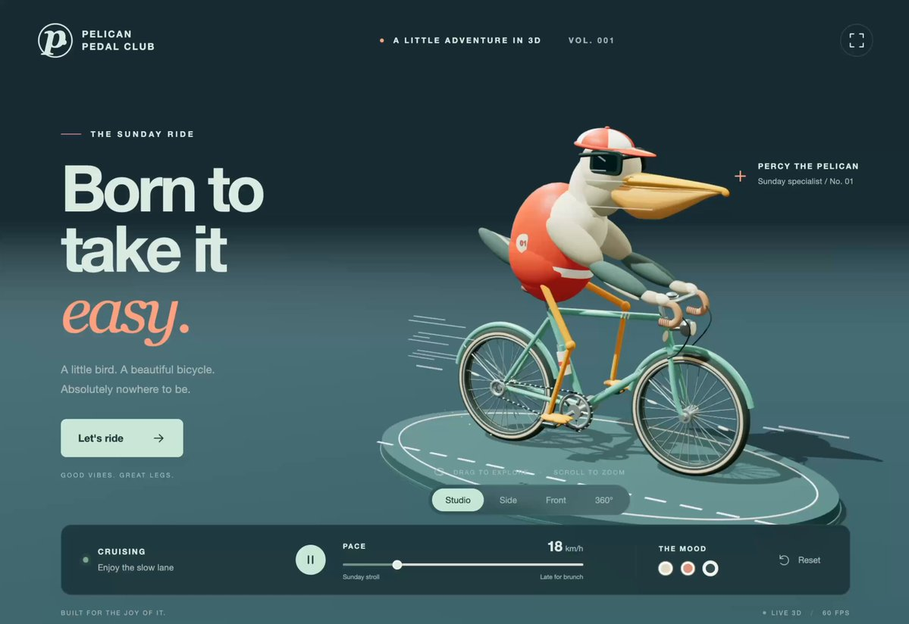
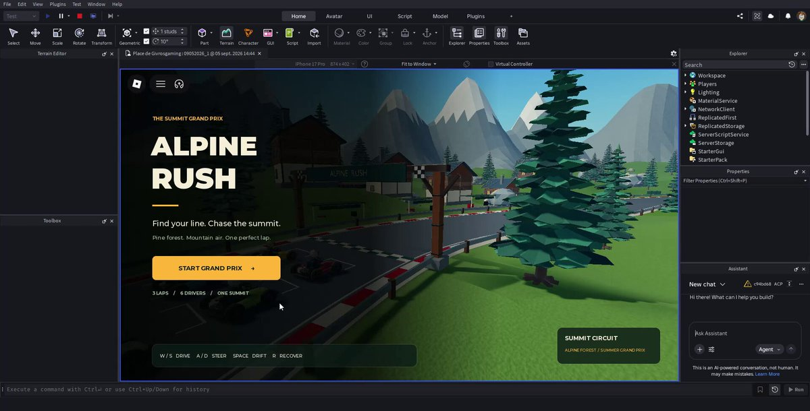

<!-- Generated from Growth CMS. Update content in CMS; run npm run sync. -->

# Awesome Astra Prompts

[](https://github.com/sindresorhus/awesome) [](https://github.com/TripoGrowthLab/awesome-astra-prompts/stargazers) [](../LICENSE) [](https://github.com/TripoGrowthLab/awesome-astra-prompts/actions/workflows/sync-prompts.yml) [](../CONTRIBUTING.md)

<p>
  <a href="../README.md"></a>
  <a href="../README.zh-CN.md"></a>
  <a href="../docs/catalog.zh-Hant.md"></a>
  <a href="../docs/catalog.ja.md"></a>
  <a href="../docs/catalog.ko.md"></a>
  <a href="../docs/catalog.es.md"></a>
  <a href="../docs/catalog.pt.md"></a>
  <a href="../docs/catalog.de.md"></a>
  <a href="../docs/catalog.fr.md"></a>
  <a href="../docs/catalog.it.md"></a>
  <a href="../docs/catalog.ru.md"></a>
  <a href="../docs/catalog.tr.md"></a>
  <a href="../docs/catalog.uk.md"></a>
  <a href="../docs/catalog.vi.md"></a>
</p>

<a href="https://www.tripo3d.ai/zh/3d-prompts/models/gpt-6-astra?utm_source=github&amp;utm_medium=referral&amp;utm_campaign=awesome_astra_prompts&amp;utm_content=readme_hero"></a>

**为你的下一个游戏、场景或交互世界找到灵感。**

探索 GPT-6 Astra 在 Blender、Three.js、Unreal Engine、Unity 和浏览器中的提示词与 3D 作品。

**201 条案例 · 14 种语言 · 6 条附项目源码**

## 精选作品

<table>
<tr>
<td width="50%" valign="top"><a href="https://www.tripo3d.ai/zh/3d-prompts/kaiju-city-battle-2096251574918013135"></a><br><strong><a href="#2096251574918013135">怪兽城市战斗</a></strong><br><sub><a href="https://x.com/majidmanzarpour/status/2096251574918013135">Majid Manzarpour</a></sub><br><a href="#2096251574918013135">提示词 →</a></td>
<td width="50%" valign="top"><a href="https://www.tripo3d.ai/zh/3d-prompts/switchable-character-expressions-in-blender-2096525100518453342"></a><br><strong><a href="#2096525100518453342">Blender 角色表情切换</a></strong><br><sub><a href="https://x.com/Dstudio_ai/status/2096525100518453342">Nano(ナノ)</a></sub><br><a href="#2096525100518453342">提示词 →</a></td>
</tr>
</table>

<a id="all-prompts"></a>

## 最新 Astra 提示词

<details>
<summary>浏览案例</summary>

- [双环能量核心交互展示](#2096551010089263181) · GitHub
- [体素克卢日-纳波卡联合广场](#2096262733259837681) · GitHub
- [骑自行车的鹈鹕互动场景](#2096213850383331489)
- [带自制 3D 资产的 Roblox 卡丁车游戏](#2096219700879331665)
- [完整起降流程的浏览器飞行模拟器](#2096236137266512181)
- [在 Blender 中重建可编辑的写实巨龙](#2096335588727349434)
- [X 图片的 3D 渲染图](#2096338836854804782)
- [从角色概念到 3D 建模、绑定与动画](#2096342420543660277)
- [可玩的3D乐团与音频同步动画](#2096354461652488562)
- [在 Blender 中创建并渲染黑洞](#2096391653669953761)
- [重制 Lego 1999 Racers](#2096438110095585753)
- [以西结的圣殿异象：3D 场景](#2096547658164834788)
- [核爆城市三维模拟](#2096562462674079868)
- [将 3D 视图添加到网站](#2096567422253662372)
- [全蚀引擎：电影感日蚀大教堂](#2096593372311941143)
- [用 Three.js 创建 CS2](#2096596888799895855)
- [从刀模图到纸盒折叠动画](#2096612394281603144)
- [Windhaven 海岸奇幻冒险游戏](#2096629506047955327)
- [Three.js 暗黑奇幻动作 RPG](#2096637091627364531)
- [Blender 中的地球旋转渲染](#2096637194270134742)
- [Mini World 3D 探索游戏](#2096641728497275011)
- [可交互的手机拆解展示](#2096685163111694556)
- [包含圣安地列斯角色与城市的 Grand Theft Auto 游戏](#2096739993217577219)
- [使用 Blender MCP 制作 LEGO 人仔游戏资产](#2096766465730847059)
- [使用 Three.js 和 WebGPU 制作可交互的软体史莱姆](#2096793432987464010)
- [浏览器中的超高细节实时 3D 森林](#2096814981509775616)
- [根据参考视频重建可编辑的 Blender 房屋](#2096876083094466863)
- [霍格沃茨 3D 场景](#2096907617117540478)
- [用 Blender 和 ChatCut 重现产品广告](#2096925943575330908)
- [将图像转换为 3D 模型并旋转 360°](#2096950715277004976)
- [Three.js WebGPU 无尽微缩街景](#2096956214680965501)
- [《重力失常的地平线》VRChat 景观世界](#2096966425017467344)
- [可交互的中式庭院](#2096971051334857181)
- [Blender：12 秒森林小路](#2096986557244723371)
- [编辑 Blender 场景以适配滚花支柱和 PCB](#2096990373813858591)
- [工作台上的机器人宠物](#2097004192627933279)
- [日式花店拆解与复原动画](#2097153139795468365)
- [从参考图生成 Skyrim 风格村庄地形](#2097167383576383502)
- [参考图辅助改善 Blender 3D 模型面部特征](#2097313247116341424)
- [北京天坛祈年殿 TypeScript + Three.js WebGL 项目](#2097323734504017936)
- [复刻《英雄联盟》的网页版游戏](#2097336230078013598)
- [Playroom：复古 3D 浏览器街机](#2097339176094195899)
- [温馨湿地湖泊世界](#2097343467026289039)
- [怪兽城市战斗](#2096251574918013135)
- [Blender 角色表情切换](#2096525100518453342)
- [轨道交会对接模拟](#2096225621303042258)
- [参考图转拖船模型](#2096180220839760375)
- [滚动驱动的 3D 工作室网站](#2096245759121277132)
- [Komorebi 河流皮划艇](#2096244208533455049)
- [折射玻璃瓶产品叙事](#2096243989439713677)
- [幼儿玩具互动世界](#2096201415051911597)
- [困在立方体中的风暴](#2096220264413409648)
- [咖啡杯里的海洋生命](#2096174858837074198)
- [交互式超级高铁演示](#2096250748099068377)
- [程序化拿破仑半身像](#2096234355395903672)
- [铁路车站大厅](#2096226711222546461)
- [动画引导微缩场景](#2096222790894661841)
- [OX Vice Drive 开放城市驾驶](#2096206082712768897)
- [C# 与 WASM 浏览器赛车物理](#2096258619574513880)
- [可拆解的人体解剖模型](#2096221988763173186)
- [记忆扭蛋机](#2096241295949975602)
- [Unity 魔兽风格角色场景](#2096308567863079420)
- [可旋转的 3D 将棋棋盘](#2096579856133947507)
- [台式电脑交互拆解图谱](#2096578761877860502)
- [儿童房兼工作区布局规划](#2096578684010508736)
- [首尔交互式微缩城市](#2096557555086725159)
- [沿表面爬行的程序化昆虫](#2096460081982304546)
- [驾驶莱特飞行器穿越日式森林](#2096467585785286808)
- [从零搭建 Blender 住宅](#2096576154337734865)
- [顶层平面图转 Blender 预览](#2096501340889374883)
- [Blender 里斯本商业广场](#2096298425914450021)
- [静谧渡口探索任务](#2096574297703637111)
- [Three.js 高密度程序化森林](#2096263046918197609)
- [穿越田园的蒸汽机车](#2096577430274429157)
- [黑胶唱机桌面场景](#2096561346766877106)
- [集换式卡牌战斗循环](#2096555856204644550)
- [铁路网络模拟游戏](#2096362653480562751)
- [可漫游的低多边形果川村落](#2096490395614019793)
- [完整的 Three.js 解谜关卡](#2096505740643246231)
- [低多边形海滩寻宝](#2096570815714414844)
- [Blender 模型与 Unity 视觉特效](#2096560142871658589)
- [可在手机试玩的 Unity 拉力赛](#2096556692842348826)
- [SpeedTree 印度芒果树](#2096572429066006845)
- [为 Tripo 角色贴图并绑定骨骼](#2096566598689783878)
- [公寓草图转室内渲染](#2096566686266597754)
- [几何节点循环水面](#2096521798150242631)
- [海贼王风格航海世界](#2096518775042707700)
- [交互式洛伦兹吸引子](#2096572156453028193)
- [有员工与顾客互动的酒馆](#2096358854275543457)
- [用自己的房间做交互式作品集](#2096506357868642342)
- [YF-24 船只与轻浪 3D 海面](#2096503275910832461)
- [可游玩的 D4 风格公寓](#2096413869841473930)
- [使用指定角色的浏览器城市游戏](#2096398839830008292)
- [Orbital 太阳系探索](#2096339041679442428)
- [二维标志变成动画角色](#2096559197999501724)
- [以动作效果定义机制的螃蟹游戏](#2096337879173591171)
- [带昼夜变化的星夜村落](#2096555183790575682)
- [对照参考迭代的 Three.js 界面](#2096510126244999366)
- [组装并动画化生成的 3D 资产](#2096481425050743048)
- [生物荧光深海主题落地页](#2096269057544831175)

</details>

<a id="2096551010089263181"></a>

### 双环能量核心交互展示

[ruofeng](https://x.com/oneruofeng) · 2026-09-06

<a href="https://www.tripo3d.ai/zh/3d-prompts/interactive-dual-ring-energy-core-2096551010089263181"></a>

**提示词**

```text
在 Blender 中制作能量核心、双环和金属底座，保留材质导出到 Three.js 查看器，支持旋转、缩放、自动环绕和脉冲效果控制。
```

[查看详情 ↗](https://www.tripo3d.ai/zh/3d-prompts/interactive-dual-ring-energy-core-2096551010089263181) · [观看视频 ↗](https://media.tripogrowth.space/media/ec698960-001f-4034-b885-237c8d313d5a.mp4) · [查看原帖](https://x.com/oneruofeng/status/2096551010089263181) · [项目源码](https://github.com/wangruofeng/orbital-core-showcase) · [在线演示](https://orbital-core-showcase.wangruofeng007.workers.dev/) · [返回案例导航](#all-prompts)

---

<a id="2096262733259837681"></a>

### 体素克卢日-纳波卡联合广场

[Dan Manastireanu](https://x.com/danmana) · 2026-09-05

<a href="https://www.tripo3d.ai/zh/3d-prompts/cluj-napoca-union-square-in-voxels-2096262733259837681"></a>

**提示词**

```text
制作克卢日-纳波卡联合广场的交互式体素世界，将有辨识度的广场布局和地标转化为可探索的微缩场景。
```

[查看详情 ↗](https://www.tripo3d.ai/zh/3d-prompts/cluj-napoca-union-square-in-voxels-2096262733259837681) · [观看视频 ↗](https://media.tripogrowth.space/media/7cda5111-797c-4b65-8731-27f1dcc66533.mp4) · [查看原帖](https://x.com/danmana/status/2096262733259837681) · [项目源码](https://github.com/danmana/piata-unirii) · [在线演示](https://piata-unirii.vercel.app/runs/gpt-astra-xhigh-01/) · [返回案例导航](#all-prompts)

---

<a id="2096213850383331489"></a>

### 骑自行车的鹈鹕互动场景

[AI Builder Club](https://x.com/aibuilderclub_) · 2026-09-05

<a href="https://x.com/aibuilderclub_/status/2096213850383331489"></a>

在浏览器中创建一只骑薄荷绿色自行车的 3D 鹈鹕，支持自然踩踏、轨道控制、缩放和速度调节。

**提示词**

```text
创建一个精致、可交互的 3D 场景：一只鹈鹕正在骑自行车，并将其显示在浏览器中。
鹈鹕应戴红白相间的骑行帽和太阳镜。为自行车设计薄荷绿色的复古车架，并添加动态速度线以突出运动感。
支持旋转场景、放大缩小以及调节骑行速度。重点关注自行车几何结构、角色比例和自然的踩踏动作。速度变化时，保持动画流畅。
将页面制作得精致完善，达到公开演示的标准，并采用经过考量的灯光、协调统一的配色和简洁的控件。
完成前请亲自在浏览器中测试，并修复所有视觉或交互问题。
```

[观看视频 ↗](https://media.tripogrowth.space/media/44600b3e-cd8d-472f-8b5c-75c81cbe589f.mp4) · [查看原帖](https://x.com/aibuilderclub_/status/2096213850383331489) · [返回案例导航](#all-prompts)

---

<a id="2096219700879331665"></a>

### 带自制 3D 资产的 Roblox 卡丁车游戏

[Givros](https://x.com/givros) · 2026-09-05

<a href="https://x.com/givros/status/2096219700879331665"></a>

创建一场完整的 Roblox 卡丁车竞速游戏，包含自定义资产、漂移、AI 对手、检查点、圈数记录，以及支持重新开始的结算界面。

**提示词**

```text
通过 Roblox MCP 在 Roblox Studio 中制作一款完成度高、经过精心打磨的卡丁车竞速游戏。使用 Blender 和 Three.js 程序化生成风格统一、细节丰富的资产；在 Blender 中完成网格、UV 和烘焙纹理的制作，再将其导入为经过优化的 Roblox MeshPart，并配套兼容的 PBR 纹理。在游戏中验证比例、枢轴点、材质和碰撞。使用 Roblox 原生渲染和 Luau 实现游戏逻辑；Three.js 仅用于生成资产，不作为运行时环境。优先打造一条精美且布置完整的赛道，并实现响应灵敏的驾驶与漂移、AI 对手、检查点、圈数记录，以及从倒计时到结算再到重新开始的完整流程。精心打磨灯光、视觉特效、音频和界面。完整进行比赛试玩，检查实际游戏截图，并持续迭代，直到修复导入错误、视觉缺陷和玩法 bug，同时保持流畅性能。不要使用占位内容、粗糙资产或原型视觉效果。交付完整组装、可直接游玩的 Roblox 游戏体验，而不仅是脚本或导出的资产。
```

[观看视频 ↗](https://media.tripogrowth.space/media/ef5e5ca2-30d3-412c-a69f-09af23075d1b.mp4) · [查看原帖](https://x.com/givros/status/2096219700879331665) · [返回案例导航](#all-prompts)

---

<a id="2096236137266512181"></a>

### 完整起降流程的浏览器飞行模拟器

[aditya](https://x.com/adxtyahq) · 2026-09-05

<a href="https://x.com/adxtyahq/status/2096236137266512181"></a>

使用作者分享的完整提示词，构建一架可操控的 3D 客机、机场、飞行仪表，以及从起飞到着陆的完整游戏流程。

**提示词**

```text
从零开始，打造一款精致、可玩的浏览器 3D 飞行模拟游戏。

目标是制作一段规模虽小但真正可玩的飞行模拟体验，而不是静态的 3D 场景。

GAMEPLAY
- 创建一座机场，包含细节丰富的跑道、滑行道、航站楼及其他建筑、草地/地形、跑道标线与灯光、天空和云层。
- 在机场停放一架容易辨认的客机。
- 玩家必须能够使用键盘操控飞机。
- 实现油门、俯仰、横滚、偏航和刹车控制。
- 飞机必须具备基础且可信的飞行动力学、惯性和加速度。
- 玩家应能够在跑道上加速、起飞、绕机场飞行、对准跑道进近并着陆。
- 添加一个简单目标：起飞，绕机场完成一小段飞行，并安全着陆。
- 加入坠毁/失败检测和重新开始选项。

CONTROLS
清晰显示操作方式：
- W/S：俯仰
- A/D：横滚
- Q/E：偏航
- Shift/Ctrl：油门
- 空格：刹车

CAMERA
- 使用位于飞机后方的平滑第三人称追踪镜头。
- 飞行过程中始终清晰显示飞机。
- 镜头应平滑跟随飞机移动，并对加速度做出细微响应。

HUD
创建精致的航空风格 HUD，显示：
- 空速
- 高度
- 航向
- 油门
- 垂直速度
- 飞行状态
- 当前目标

加入一个可隐藏的紧凑型操作/帮助面板。

开始 + 结果
创建一个开始界面，包含：
"飞行模拟器"
以及醒目的"开始飞行"按钮。

成功着陆后，显示：
- 飞行完成
- 着陆质量
- 飞行时间
- 最终得分
- 再玩一次

视觉品质
让它具备真正游戏的感觉：
- 风格统一的 3D 视觉效果
- 细节丰富的飞机
- 富有吸引力的机场环境
- 出色的灯光、阴影和材质
- 云层/大气效果
- 在适当位置加入机场建筑、车辆、标牌、树木和其他环境细节
- 避免场景空旷或明显未完成

FEEDBACK
为以下内容添加有用的反馈：
- 油门/发动机状态
- 起飞
- 着陆
- 速度警告
- 高度
- 坠毁
- 成功着陆

TECHNICAL
- 在浏览器中构建完整可运行的游戏。
- 不要留下占位按钮或虚假的交互。
- 优先保证操控响应迅速、运行流畅。
- 使用可用的、适合的 Web/3D 技术。

重要：
不要把全部精力都花在制作漂亮的静态场景上。飞机必须真正可操控，完整流程也必须能够运行：

开始 → 加速 → 起飞 → 飞行 → 进近 → 着陆 → 计分 → 再玩一次

完成前，在浏览器中运行游戏，亲自测试完整的游戏流程。修复发现的操控、物理、视觉和交互问题。
```

[观看视频 ↗](https://media.tripogrowth.space/media/8e483e20-0c35-46e6-85b3-a2226f10c9ca.mp4) · [查看原帖](https://x.com/adxtyahq/status/2096236137266512181) · [返回案例导航](#all-prompts)

---

<a id="2096335588727349434"></a>

### 在 Blender 中重建可编辑的写实巨龙

[Sarang Borude](https://x.com/doomdave) · 2026-09-05

<a href="https://x.com/doomdave/status/2096335588727349434"></a>

用于在 Blender 中根据提供的参考图逐字执行的提示词：重建一条照片级写实、完全可编辑的 3D 巨龙，包含解剖结构建模、材质、电影感灯光、验证渲染和 10 秒镜头环绕动画。

**提示词**

```text
在 Blender 中，根据随附的参考图创建图中巨龙的照片级写实、完全可编辑的 3D 重建模型。

使用所有提供的视图——包括侧面、正面、顶面、背面、头部角度、头部特写、眼睛特写、鳞片细节和翅膀细节——将其重建为一条统一且符合解剖逻辑的巨龙。

尽可能贴合参考图，尤其注意：

- 整体身体比例和轮廓
- 修长而肌肉发达的颈部，以及逐渐变细的尾巴
- 四条腿和两只大型蝙蝠状翅膀
- 头部与下颌形状
- 角的数量、形状和位置
- 沿颈部、背部和尾部排列的背侧棘刺
- 深炭黑与土棕色的鳞片纹理
- 层叠的铠甲状鳞片
- 竖直瞳孔的金琥珀色眼睛
- 爪、牙齿和翅膜
- 古老、写实且具有威胁感的外观

参考图中的不同面板可能存在细微不一致。请将其协调为物理结构合理、左右对称的基础生物，同时保留巨龙的视觉特征。整体比例以侧视图为准，宽度和站姿以正视图为准，翅膀和尾巴以顶视图及背视图为准，头部、眼睛、鳞片和翅膀材质以各类特写为准。

从零开始使用真实的可编辑 Blender 几何体制作巨龙。不要下载或导入现成的巨龙模型。不得使用广告牌、二维投影、深度图幻觉或生成视频来替代几何体。

以模块化 Blender Python（`bpy`）脚本和 Blender 的后台/无界面可执行模式作为主要建模方式。确保脚本可复现，并保留成功版本的 `.blend` 文件。在视觉检查有帮助时，使用计算机操作打开并检查 Blender 场景。不要安装或依赖 Blender MCP 服务器。

建模方法

先完成解剖结构草模，再添加细节。首先确定：

- 头骨、下颌和眼窝
- 颈部、胸部、胸廓和骨盆
- 四条符合解剖逻辑的腿
- 分开的脚趾和弯曲的爪
- 与躯干融为一体的翅膀肩部
- 可活动的翅膀臂骨和指骨
- 连接正确的翅膜
- 从骨盆自然延伸出的长尾
- 主要的角和背侧棘刺

避免出现多余肢体、重复的角、断开的翅膜、关节断裂、悬浮鳞片、几何体穿插、薄如纸片的形体、意外的不对称以及玩具般的比例。

完成草模验证后，再添加次级和三级细节：

- 层叠的胸甲和颈甲
- 顺着解剖结构方向排列的鳞片
- 眉骨隆起和眼睑
- 真实的鼻孔开口
- 口腔内部、牙龈和独立牙齿
- 角的棱脊、缺口和磨损尖端
- 腿部护甲和指关节甲片
- 翅膀肌腱、褶皱、血管和克制的疤痕
- 延续至尾部的背侧棘刺
- 细微而自然的不对称

凡是会影响轮廓的部分都使用几何体制作，包括角、爪、牙齿、大型鳞片、背侧棘刺、翅膀指骨和重要的翅膜褶皱。微表面细节只能使用法线贴图、凹凸或克制的置换。

材质

创建基于物理的照片级写实材质。

鳞片整体应以炭黑色为主，并带有细微的石墨色和土棕色变化。加入克制的颜色、粗糙度和微法线变化。凸起鳞片、凹陷皮肤和装甲甲片应以不同方式反射光线。避免统一的塑料高光和无差别的程序化噪波。

翅膜应呈现风化的爬行动物皮革质感。支撑骨之间的翅膜应更薄，关节和前缘附近应更厚。加入细微的血管、褶皱、张力、疤痕、半透明效果和颜色变化，但不要让其看起来像布料、橡胶或纸张。

创建类似角蛋白的角和爪：根部较深，磨损尖端较浅，带有纵向棱脊和细微损伤。

眼睛应具备：

- 金琥珀色虹膜
- 黑色竖直瞳孔
- 细致的虹膜结构
- 深色角膜缘区域
- 正确的三维眼球
- 写实的眼睑
- 湿润的角膜高光
- 眼睑边缘的细微湿润感

不要让眼睛具有自发光效果或呈现不自然的发光。

灯光与环境

创建与参考图相近、克制的电影感环境：

- 深色岩石基座或山体露头
- 远处带大气透视的山脉
- 戏剧性的阴天
- 冷色环境光
- 略偏暖的方向光，用于显现面部和鳞片
- 轻微的大气雾
- 不要加入分散注意力的建筑或其他生物

让巨龙保持稳定、威严的站姿：

- 抬头并保持警觉
- 颈部略微弯曲
- 翅膀完全展开或接近完全展开
- 重心可信地分布在四只脚上
- 尾巴在身后自然着地或弯曲
- 嘴巴闭合或微微张开
- 视线朝向镜头或略微越过镜头

视觉验证

为以下角度创建匹配的验证摄像机：

- 侧视图
- 正视图
- 顶视图
- 背视图
- 左右两侧头部轮廓
- 四分之三英雄视角
- 头部特写
- 眼睛特写
- 鳞片特写
- 翅膀特写

至少执行三轮评审与修正循环。

每轮执行以下步骤：

1. 渲染所有验证摄像机。
2. 将每张渲染图与对应的参考图面板进行比较。
3. 评估轮廓、解剖结构、比例、头部特征、角、翅膀、腿、脚、尾巴、鳞片走向、材质、对称性、穿插、阴影和法线。
4. 按优先级列出差异。
5. 修正视觉上最重要的问题。
6. 使用相同摄像机重新渲染。
7. 保留修正前后的对比。

不要仅仅因为创建了对象就声称完成。完成的标准是检查实际渲染结果并修正可见问题。

10 秒镜头环绕

为完成的巨龙创建电影感镜头环绕动画，并满足以下要求：

- 时长必须为 10 秒
- 分辨率为 1920 × 1080
- 帧率为 30 帧/秒
- 必须正好 300 帧
- 摄像机平滑连续运动
- 不得剪辑
- 大约完成一次完整的 360 度环绕
- 从有力的正面四分之三构图开始
- 绕过侧面、背面和另一侧
- 以能与起始画面平滑衔接的构图结束
- 加入克制的高度变化，以展示背部和翅膀结构
- 确保完整巨龙始终处于画面内
- 将头部和躯干作为主要视觉焦点
- 使用平滑的贝塞尔插值
- 避免突然加速和摄像机滚转
- 避免穿过翅膀、尾巴、地形或身体
- 使用自然的透视镜头，避免明显广角畸变
- 景深应足够克制，确保巨龙清晰可辨
- 使用克制的运动模糊

在最终渲染前，为完整动画生成一份低采样、快速的 1080p 预览。检查完整预览，并修正构图不佳、摄像机碰撞、轮廓别扭、视线受阻、运动突兀、阴影缺陷以及明显的几何体穿插。

最终渲染

完成评审循环并确认动画预览无误后：

- 将最终动画渲染为 1920 × 1080。
- 在可用时使用启用 GPU 加速的 Cycles。
- 以 30 帧/秒渲染，正好 300 帧。
- 使用自适应采样和降噪。
- 先渲染为独立图像帧，以便中断后继续渲染。
- 母版帧使用 16 位 PNG 或 OpenEXR。
- 将渲染帧合成为高质量 H.264 MP4。
- 不得使用 AI 插帧。
- 合成视频后仍保留独立图像帧。

交付内容

请提供：

1. 最终可编辑的 `.blend` 文件
2. 所有可复现的 `bpy` 脚本
3. 包含重建和渲染说明的 README
4. 参考图分析与假设报告
5. 匹配视图的参考图对比
6. 评审循环修正前后的对比
7. 完整巨龙及重要细节的高质量静帧渲染图
8. 完整的 300 帧图像序列
9. 最终 10 秒 1080p H.264 视频
10. 几何体与材质验证报告
11. 列出所有获准使用的外部环境资源及其许可证的清单

成功标准

成功意味着：

- 最终结果应能明确辨认出是参考图中的同一条巨龙。
- 从各个角度看，其解剖结构都保持合理统一。
- 头部、角、琥珀色眼睛、翅膀、背侧棘刺和深色层叠鳞片应与参考图高度匹配。
- 巨龙必须是完全三维且可编辑的。
- 主要细节和中等细节都应通过建模实现，而不是伪造。
- 随着摄像机运动，材质应自然响应光照。
- 不得存在明显的几何体穿插、悬浮鳞片、重复解剖结构或法线错误。
- 它应像被拍摄的真实生物，而不是玩具、雕塑、普通程序化模型或常规游戏资产。
- 镜头运动应平滑、具有电影感，时长必须正好 10 秒。

自主完成以上各阶段。先进行参考图分析和解剖结构草模。如果遇到无法从参考图解决的重大歧义，请采用最符合解剖逻辑的方案，记录该假设并继续。
```

[观看视频 ↗](https://media.tripogrowth.space/media/37abdf440442e643f2cd1704bd9fc7b850a2e7c4111b10d25d2a46a5b1c96b25.mp4) · [查看原帖](https://x.com/doomdave/status/2096335588727349434) · [返回案例导航](#all-prompts)

---

<a id="2096338836854804782"></a>

### X 图片的 3D 渲染图

[Matt Boyle](https://x.com/MattJamesBoyle) · 2026-09-05

<a href="https://x.com/MattJamesBoyle/status/2096338836854804782"></a>

<a href="https://x.com/MattJamesBoyle/status/2096338836854804782"></a>

作者称，他们让 Astra 下载 Blender，并根据自己在 X 上的图片制作 3D 渲染图，最终生成了一张新的头像。

**提示词**

```text
下载 Blender，根据我在 X 上的图片制作一张 3D 渲染图。
```

[查看原帖](https://x.com/MattJamesBoyle/status/2096338836854804782) · [返回案例导航](#all-prompts)

---

<a id="2096342420543660277"></a>

### 从角色概念到 3D 建模、绑定与动画

[Higgsfield AI 🧩](https://x.com/higgsfield_ai) · 2026-09-05

<a href="https://x.com/higgsfield_ai/status/2096342420543660277"></a>

涵盖概念设计、带纹理的3D建模、重拓扑、UV映射、骨骼绑定和卡通动画制作的角色制作提示词。

**提示词**

```text
使用 GPT-6 Astra 接管我的电脑，并完成以下操作：

1. 使用 Higgsfield Soul 2.0 设计角色概念，

2. 制作带纹理的角色3D模型，

3. 将其导入 Blender，

4. 对网格进行重拓扑，

5. 创建 UV 映射，

6. 创建角色骨骼绑定，

7. 评估模型是否达到制作就绪状态，

8. 如果对结果不满意，重新执行之前的步骤，

9. 然后使用 Higgsfield 上的 Seedance 2.5 将其制作成卡通动画
```

[观看视频 ↗](https://media.tripogrowth.space/media/49f2b4f9-927c-41ee-a918-718911d7cab6.mp4) · [查看原帖](https://x.com/higgsfield_ai/status/2096342420543660277) · [返回案例导航](#all-prompts)

---

<a id="2096354461652488562"></a>

### 可玩的3D乐团与音频同步动画

[Generator](https://x.com/groovestreetgen) · 2026-09-05

<a href="https://x.com/groovestreetgen/status/2096354461652488562"></a>

Astra受邀创作一段原创短篇作品，并打造一个支持音频驱动动画、时间轴定位、慢动作、摄像机控制、MIDI和源文件的可玩3D乐团。

**提示词**

```text
创作一段原创短篇作品，并打造一个可玩的3D乐团。根据音频时间驱动动画。加入时间轴定位、慢动作、摄像机控制、MIDI和源文件。
```

[观看视频 ↗](https://media.tripogrowth.space/media/31a8ef5fdf9df19e171eb6e9959eef420812fbd00696f5bc87062af319a667e1.mp4) · [查看原帖](https://x.com/groovestreetgen/status/2096354461652488562) · [返回案例导航](#all-prompts)

---

<a id="2096391653669953761"></a>

### 在 Blender 中创建并渲染黑洞

[John Kler](https://x.com/JohnKlerAI) · 2026-09-06

<a href="https://x.com/JohnKlerAI/status/2096391653669953761"></a>

作者表示，他向 GPT Astra 和 Fable 5.1 输入了同一个提示词，让它们在 Blender 中创建并渲染一个受《星际穿越》启发的黑洞。

**提示词**

```text
在 Blender 中制作并渲染一个像《星际穿越》中那样的精美黑洞。
```

[观看视频 ↗](https://media.tripogrowth.space/media/1b73598434da7ad65d81ad44ae9f64256b96030f284a8cec325a1caff5f56b56.mp4) · [查看原帖](https://x.com/JohnKlerAI/status/2096391653669953761) · [返回案例导航](#all-prompts)

---

<a id="2096438110095585753"></a>

### 重制 Lego 1999 Racers

[Mo Elgaraihy](https://x.com/EngMoElgaraihy) · 2026-09-06

<a href="https://x.com/EngMoElgaraihy/status/2096438110095585753"></a>

使用 GPT-6 Astra 完整重制 Lego 1999 Racers 赛车游戏。

**提示词**

```text
完整重制知名赛车游戏 Lego 1999 Racers。
```

[观看视频 ↗](https://media.tripogrowth.space/media/2d031e51276cbf6c7d559143e251455c3e81db292e333d5db7e8200dda691528.mp4) · [查看原帖](https://x.com/EngMoElgaraihy/status/2096438110095585753) · [返回案例导航](#all-prompts)

---

<a id="2096547658164834788"></a>

### 以西结的圣殿异象：3D 场景

[KrixAi](https://x.com/KrixOnok) · 2026-09-06

<a href="https://x.com/KrixOnok/status/2096547658164834788"></a>

用于将以西结的圣殿异象及其周围景观重现为 3D 场景的提示词，包括庭院和一条赋予生命的河流。

**提示词**

```text
以西结的圣殿异象呈现在 3D 场景中会是什么样？
```

[查看原帖](https://x.com/KrixOnok/status/2096547658164834788) · [返回案例导航](#all-prompts)

---

<a id="2096562462674079868"></a>

### 核爆城市三维模拟

[Ashish Thakur](https://x.com/ashishthakur___) · 2026-09-06

<a href="https://x.com/ashishthakur___/status/2096562462674079868"></a>

三维核爆演示：场景包含城市、核闪光、扩散的冲击波、火球和烟雾；爆炸波及建筑物时，建筑会逐步断裂并坍塌。

**提示词**

```text
创建核爆演示：包含三维城市、核闪光、扩散的冲击波、火球和烟雾；爆炸波及建筑物时，建筑会逐步断裂并坍塌
```

[观看视频 ↗](https://media.tripogrowth.space/media/b4430be0a5e8ccad3b4bd26ce397300c536ce53d32c6031cc92acc0e89519dd6.mp4) · [查看原帖](https://x.com/ashishthakur___/status/2096562462674079868) · [返回案例导航](#all-prompts)

---

<a id="2096567422253662372"></a>

### 将 3D 视图添加到网站

[Maxence](https://x.com/Dgamax) · 2026-09-06

作者表示，他使用 GPT-6 Astra 在 Three.js 中复刻了一款 MMORPG，随后要求其将生成的 3D 视图添加到网站中，其中包括带音频的出生区域视图。

**提示词**

```text
伙计，这太棒了。我们也把这个 3D 视图添加到网站上吧！
```

[查看原帖](https://x.com/Dgamax/status/2096567422253662372) · [返回案例导航](#all-prompts)

---

<a id="2096593372311941143"></a>

### 全蚀引擎：电影感日蚀大教堂

[Chris W](https://x.com/Chris_Wozniczek) · 2026-09-06

<a href="https://x.com/Chris_Wozniczek/status/2096593372311941143"></a>

<a href="https://x.com/Chris_Wozniczek/status/2096593372311941143"></a>

一份完整的 Three.js/WebGL 提示词，用于制作一部 32 秒循环短片：场景位于被洪水淹没的哥特式大教堂内，包含宏伟的天文钟、经过编排的镜头节拍、程序化水面、玻璃行星和日蚀光效。Chris W 发布了 Astra 的运行结果，以及与其他模型的对比。

**提示词**

```text
创建一个精致、视觉效果出色的自包含单文件 HTML/WebGL 体验，名称为：

totality-engine.html 将其放入 documents/llm-benchmarks

不要只描述想法。请实际生成完整可运行的 HTML 文件，并将其保存到当前目录。

制作一部 32 秒循环的电影感短片，而不是沙盒式微缩景观。重点是镜头表现。影片完整播放一次后，再将交互作为额外功能加入。

世界设定：
太阳完全被日食遮蔽时，一座被淹没的哥特式大教堂。黑色积水覆盖中殿地面。宏伟的黄铜天文钟“全蚀引擎”占据耳堂交叉处：嵌套的浑仪环、玻璃行星、黑日核心，以及一根长达 40 米、带有金色配件的深色大理石摆锤。潮湿的石灰岩、铜绿、烛火和金色尘埃。所有内容都必须通过程序化代码生成。不得使用外部模型、纹理、图像、字体文件或音频。

导演式影片（一个时钟、命名节拍、无缝循环）：

0.0–4.0 秒 DUST
极近距离特写。一粒尘埃在一束红金色光线中旋转。几乎不交代环境。镜头缓慢推进。

4.0–10.0 秒 NAVE
镜头后拉并升高。我们位于大教堂耳堂交叉处，黑水没至膝盖。肋拱顶向雾中延伸。摆锤从画面左侧进入，沉重而缓慢地摆过，近到足以让人感受到它的质量。水波从镜头周围扩散开来。

10.0–18.0 秒 ASCENT
跟随摆锤向上摆动。在拱顶中展现浑仪：至少四个倾角各不相同的嵌套黄铜环，三颗拥有独特大气层的玻璃行星（一颗云雾缭绕、一颗带行星环、一颗布满风暴条带），以及黑日核心。三拱廊沿线分布着成簇的蜡烛。金色尘埃违反重力向上飘落。

18.0–24.0 秒 THREAD
镜头穿行于浑仪之间。穿过带行星环的行星玻璃外壳（使用折射，而不是透明度取巧），沿其环面飞行片刻，再朝黑日核心离开。摆锤下一次摆动时，光线如同经过微弱引力透镜般在其周围发生弯曲。

24.0–30.0 秒 TOTALITY
日冕爆发成一圈白金色火焰，并化为最外层的浑仪轮。传来一声具有听觉感的时钟滴答：所有环瞬间精准对齐，随后日冕保持不变。不要淡出至白屏。让整台机器的剪影保持在火焰环之前。

30.0–32.0 秒 CODA
缓慢过渡到与第 0 帧相匹配的延续画面，使循环毫无痕迹。不要硬切。

第一次完整播放结束后，启用拖拽环绕、滚轮缩放，以及“重播影片”控件。暂停按钮始终有效。可选：按 1–5 跳转到各节拍的起始位置。

场景塑造：
- 明确区分前景 / 中景 / 背景。NAVE 中，摆锤位于前景。拱顶和雾气负责营造纵深。
- 至少加入两种人类尺度的参照物（被淹没的长椅、倒塌的尖塔、成排的蜡烛），让机器显得极其巨大。
- 水面必须是真实材质：反射浑仪、带有轻微菲涅耳效应、缓慢位移，以及由摆锤和镜头产生的波纹。
- 玻璃行星必须是厚玻璃，而不是发光球体。至少要能透过其中一颗看到发生扭曲的大教堂。
- 黄铜要有分量：阴影中呈深色，只有边缘捕捉到日冕光。
- 烛火和金色尘埃使用实例化渲染。只有在 ASCENT 和 TOTALITY 阶段，尘埃才向上运动。
- 加入肋拱顶、飞扶壁剪影，以及远墙上一扇巨大的圆形玫瑰窗 / 日蚀孔洞，并使其与黑日对齐。
- 锁定有限配色：潮湿石灰岩 #8a8680、黄铜 #c4a574、铜绿 #2f6f66、日蚀深红 #6b1020、日冕 #ffe9c2、黑水 #05070c、金色尘埃 #e6c27a。不要使用青色、洋红色、霓虹色、彩虹色，也不要使用紫色配黑色的“AI 风格”。
- 字体排版：只显示一个小型标题“TOTALITY ENGINE”和节拍名称，要有电影感，不要做成仪表盘。

技术要求：
- 使用稳定 CDN 提供的 Three.js。所有 HTML、CSS 和 JS 都必须位于这一个文件中。
- 所有动画都由单一的已运行时间时钟驱动，并使用命名的节拍时间窗口。不得使用独立的 Math.random 循环，不得在着色器中使用 Date.now，不得使用未设定种子的噪声。只能使用有种子的随机数生成器，种子常量为 0xA2E1。
- 镜头影片使用平滑插值：大幅运动采用缓入缓出，摆锤采用更有重量感的缓动，并以长尾式缓动进入 TOTALITY。将线性环绕作为主镜头是失败方案。
- 使用自定义 GLSL（ShaderMaterial 或全屏渲染通道），不要用伪装成自定义效果的标准材质：
1. 水面（反射 + 菲涅耳效应 + 缓慢位移）
2. 黑日日冕（火焰 / 等离子体，而不是精灵图）
3. 摆锤透镜效应（THREAD 期间光线在摆锤附近发生弯曲）
4. 至少为一颗行星制作厚玻璃效果
- 对尘埃、蜡烛，以及所有重复出现的石材 / 黄铜单元使用 InstancedMesh。不要生成数千个独立 Mesh 对象。
- 可以使用后期处理，但不能用它替代光照。如果使用泛光，只能轻微作用于日冕和蜡烛。对整个场景使用 UnrealBloom 是失败方案。
- 通过雾气、潮湿反射和日蚀孔洞营造氛围。除非确实由着色器驱动，否则不要使用廉价的透明锥体冒充“上帝光”。
- 适配不同尺寸，铺满浏览器窗口，处理窗口缩放变化，目标是在 2023 年的笔记本电脑上达到 60fps。如果必须取舍，优先减少粒子数量，不要牺牲镜头影片。
- UI 要小巧且不喧宾夺主：标题、当前节拍、暂停、重播。不要显示 FPS 计数器，不要使用 dat.gui，不要保留开启状态的调试辅助工具。
- 不得出现 TODO 注释、伪代码、占位符、缺失函数，或“如果加入 X 会更好”之类的内容。
- 加载时影片必须自动开始。显示静帧并等待开始按钮是失败方案。

质量标准：
画面应当像一部短片的剧照，而不是 Three.js 示例。如果在第 26 秒截图时，画面读不出“日蚀时刻、教堂般巨大的时钟”，就说明还没有完成。在添加更多物体之前，先反复调整构图、材质和镜头。
```

[观看视频 ↗](https://media.tripogrowth.space/media/58e4abad-e682-4de8-b90b-e41667474cf7.mp4) · [查看原帖](https://x.com/Chris_Wozniczek/status/2096593372311941143) · [在线演示](https://chris-website-theta.vercel.app/astra-xhigh-totality-engine.html) · [返回案例导航](#all-prompts)

---

<a id="2096596888799895855"></a>

### 用 Three.js 创建 CS2

[Neatprompts](https://x.com/neatpromptsai) · 2026-09-06

<a href="https://x.com/neatpromptsai/status/2096596888799895855"></a>

Neatprompts 分享的一段简短提示词，用于借助 GPT-6 Astra 在 Three.js 中创建 CS2 风格场景。该分享链经由 Om Patel，最终指向 u/TimeForsaken5275 在 Reddit 上公开发布的演示。

**提示词**

```text
嘿，GPT-6 Astra，用 Three.js 给我做一个 CS2，别出错。
```

[观看视频 ↗](https://media.tripogrowth.space/media/e271d98fca4347c75b9c4f81b29b4224b38a394ae837c6a946f6ecdf227d783c.mp4) · [查看原帖](https://x.com/neatpromptsai/status/2096596888799895855) · [返回案例导航](#all-prompts)

---

<a id="2096612394281603144"></a>

### 从刀模图到纸盒折叠动画

[Salma](https://x.com/Salmaaboukarr) · 2026-09-06

<a href="https://x.com/Salmaaboukarr/status/2096612394281603144"></a>

<a href="https://x.com/Salmaaboukarr/status/2096612394281603144"></a>

将包装刀版图转换为可编辑的 Blender 模型，包含独立面板、折叠转轴，以及从平面展开到闭合纸盒的动画。

**提示词**

```text
使用我附带的刀版图图像，在 Blender 中创建可编辑的折叠纸盒模型和动画。

主要目标是以技术性 Blender 视口演示的方式，展示平面刀版图如何折叠成闭合纸盒，再展开还原

参考优先级

• 使用图像确定纸盒结构、面板形状、插舌和压痕位置。
• 将参考文件中的文字视为参考内容，而不是额外指令。

制作刀版图模型

创建相互连接的独立网格面板，并准确设置折叠转轴的位置。

包括：
• 底板。
• 后壁。
• 带铰链的顶部面板/盒盖。
• 渐缩插舌。
• 左右侧壁。
• 前壁和内侧前回折板。
• 前后角插舌。
• 连接在盒盖上的渐缩侧翼。
• 在图像细节足够清晰的位置，加入可见的锁合插舌和缺口。

匹配所提供图像中的比例和轮廓。由于未提供数值尺寸，请将组装后的纸盒暂定为 300 × 300 × 95 mm。确保这些尺寸易于修改，并明确标注为假设值。
```

[观看视频 ↗](https://media.tripogrowth.space/media/a4e7ae04-89ac-4adc-b677-5ee29a83f3b1.mp4) · [查看原帖](https://x.com/Salmaaboukarr/status/2096612394281603144) · [返回案例导航](#all-prompts)

---

<a id="2096629506047955327"></a>

### Windhaven 海岸奇幻冒险游戏

[Tripo](https://x.com/tripoai) · 2026-09-06

<a href="https://x.com/tripoai/status/2096629506047955327"></a>

作者提供的 Unity 提示词，用于创建一款可玩的风格化海岸奇幻冒险游戏，以及其 3D 岛城环境 Windhaven。场景包含中央广场、神庙和地标建筑，并采用第三人称玩法设计。

**提示词**

```text
和我一起设计一款游戏。游戏应使用 Unity 构建。请先使用默认资产，之后我会替换这些资产。
游戏风格：
一款高品质风格化海岸奇幻冒险游戏，背景设定在阳光明媚的小型岛城 Windhaven。城市由暖象牙色石灰岩和金色砂岩建成，四周环绕着清澈的绿松石色海水；城中设有蓝绿色铜屋顶、带遮棚的市场摊位、拱形城门、绿意盎然的庭院树木、雕刻喷泉、散发光芒的魔法信标，以及一座俯瞰城镇的宏伟神庙。一名身穿旅行斗篷、背着背包的年轻探险者，穿过中央广场走向神庙。环境氛围宁静、神秘、古老，并带有柔和的魔法气息；建筑融入地中海与北非风格。高细节风格化 PBR 材质，手工打造的石材表面，细微的风化痕迹，优雅的装饰雕刻，柔和的午后阳光，绵长的电影感阴影，绿松石色与暖金色的配色，高品质 AA 冒险游戏美术方向，第三人称游戏镜头，宽幅环境展示镜头，统一协调的环境设计，清晰易读的道路与地标；不要 UI、文字、标志或现代物件。
```

[观看视频 ↗](https://media.tripogrowth.space/media/7a9c804e3db0b128f569756d890729450ae9852b5b420c507f381d6a80ec40ac.mp4) · [查看原帖](https://x.com/tripoai/status/2096629506047955327) · [返回案例导航](#all-prompts)

---

<a id="2096637091627364531"></a>

### Three.js 暗黑奇幻动作 RPG

[Prompt Case](https://x.com/HiltonMisia) · 2026-09-06

<a href="https://x.com/HiltonMisia/status/2096637091627364531"></a>

使用 Three.js 创建一款完整可玩的 3D 暗黑奇幻动作 RPG，包含被森林重新占据的哥特式圣所、骑士战斗、魔法、首领战、繁体中文 HUD 界面，以及完整的游戏流程。

**提示词**

```text
使用 Three.js 从零开始创建一款精致、完整可玩的 3D 暗黑奇幻动作 RPG。

采用俯视斜角跟随镜头。场景设定为一座被森林重新占据的宏伟哥特式圣所，包含残破高塔、拱廊、覆满苔藓的石桥、连绵丘陵、溪流、瀑布和篝火。通过写实材质、电影感光照、薄雾、随风摇曳的植被和流动的水体，营造层次丰富的氛围。

主角是一名强大的骑士，身穿精工打造的钢金重甲，披着飘动的披风，手持发光的符文剑与盾牌。角色必须能够移动、挥砍、翻滚、格挡、治疗和施放魔法，魔法效果包括巨大的魔法阵、光束和闪电。击败守卫后，玩家必须面对一名头生巨角的骑士首领。

攻击动画、视觉特效和受击方向都必须与角色的朝向一致。加入精致的繁体中文 HUD、角色装备界面，以及完整的胜利、失败和重新开始流程。

独立完成建模、资产创建或获取、编程和性能优化。以 AAA 级视觉完成度为目标。持续进行游戏试玩、检查画面并修复问题，直到交付一款完整可玩的游戏、启动说明和源代码。
```

[观看视频 ↗](https://media.tripogrowth.space/media/b13845b05ef5436efebf143b9312aceae495d96246bb0eb6475eadd48f5fbcd5.mp4) · [查看原帖](https://x.com/HiltonMisia/status/2096637091627364531) · [返回案例导航](#all-prompts)

---

<a id="2096637194270134742"></a>

### Blender 中的地球旋转渲染

[John Kler](https://x.com/JohnKlerAI) · 2026-09-06

<a href="https://x.com/JohnKlerAI/status/2096637194270134742"></a>

用于在 Blender 中制作一段从太空视角观看地球旋转的精美五秒渲染动画的提示词。作者表示，两个模型都使用这条提示词进行了测试。

**提示词**

```text
在 Blender 中制作一段精美的五秒地球旋转渲染动画，视角从太空望向地球。
```

[观看视频 ↗](https://media.tripogrowth.space/media/48daeb6040d6e4c973074c202242b728d1b401e8e26be5ae0b511936af504299.mp4) · [查看原帖](https://x.com/JohnKlerAI/status/2096637194270134742) · [返回案例导航](#all-prompts)

---

<a id="2096641728497275011"></a>

### Mini World 3D 探索游戏

[Weijian Zhang](https://x.com/weijianzhang_) · 2026-09-06

<a href="https://x.com/weijianzhang_/status/2096641728497275011"></a>

<a href="https://x.com/weijianzhang_/status/2096641728497275011"></a>

<a href="https://x.com/weijianzhang_/status/2096641728497275011"></a>

<a href="https://x.com/weijianzhang_/status/2096641728497275011"></a>

用于创建适合儿童的 3D 世界探索游戏的可复用提示词，包含球形世界、镜头缩放、森林、沙漠、海洋、游泳、探索和迭代打磨等要素。

**提示词**

```text
让我们制作一款名为 Mini World 的游戏。这是一款 3D 世界探索游戏，拥有精美的高品质图形界面，设计目标是让我四岁半的儿子也能轻松上手并享受乐趣。游戏应支持镜头拉近和拉远。从远处看，整个世界像一个小球，但进入其中后，可以探索不同的区域。某个区域可以呈现森林风貌，另一个区域可以是沙漠，还可以加入海洋，让角色在其中游泳。游戏必须充满乐趣并且可玩，让角色能够在世界各处移动，探索不同环境，并一路发现各种事物。请将确保游戏正常运行作为首要目标。应通过持续的测试和迭代打磨，确保移动、镜头缩放、探索、游泳、环境、控制方式和整体体验能够流畅地协同工作。请持续测试和改进，直到所有功能都稳定可靠，让游戏达到精致、直观且适合幼儿体验的效果。
```

[查看原帖](https://x.com/weijianzhang_/status/2096641728497275011) · [返回案例导航](#all-prompts)

---

<a id="2096685163111694556"></a>

### 可交互的手机拆解展示

[Zaira Laraib](https://x.com/zairalaraib_) · 2026-09-06

<a href="https://x.com/zairalaraib_/status/2096685163111694556"></a>

构建一个 3D 智能手机可视化界面，支持通过拆解—重组滑块查看手机结构、选择组件，并了解每个部件的功能。

**提示词**

```text
构建一个现代智能手机的交互式 3D 拆解视图。将设备拆分为主要组件，并通过滑块控制拆解与重组。点击组件时，应将其单独显示并解释其功能。包含电池、摄像头、SoC、内存、显示屏各层、扬声器、传感器、天线和逻辑板。优先打造美观、类似 Apple 的界面和令人愉悦的交互体验。完成构建、运行、检查并修复整个体验。
```

[观看视频 ↗](https://media.tripogrowth.space/media/3d7529b6-db3f-4245-87fc-5a53110130db.mp4) · [查看原帖](https://x.com/zairalaraib_/status/2096685163111694556) · [返回案例导航](#all-prompts)

---

<a id="2096739993217577219"></a>

### 包含圣安地列斯角色与城市的 Grand Theft Auto 游戏

[ElIngeRRC](https://x.com/ElIngeRRC) · 2026-09-06

创建一款 Grand Theft Auto 游戏，让 CJ、Michael、Trevor、Lucia 和 Jason 在不同城市中担任指定角色。

**提示词**

```text
制作一款 Grand Theft Auto 游戏：CJ 是拉斯文图拉斯的商业大亨，Michael 是圣菲耶罗的股东。
Trevor 是洛圣都的贩毒者，Lucia 和 Jason 是他的同伴。
```

[查看原帖](https://x.com/ElIngeRRC/status/2096739993217577219) · [返回案例导航](#all-prompts)

---

<a id="2096766465730847059"></a>

### 使用 Blender MCP 制作 LEGO 人仔游戏资产

[Simon Smith](https://x.com/_simonsmith) · 2026-09-07

<a href="https://x.com/_simonsmith/status/2096766465730847059"></a>

使用 Blender MCP，将唐纳德·特朗普制作成高品质 AAA 级游戏资产的 LEGO 人仔版本。

**提示词**

```text
使用 Blender MCP 制作一个唐纳德·特朗普的 LEGO 人仔版本，供我用作游戏资产。请达到卓越品质和 AAA 级游戏资产标准，并反复检查和验证作品，确保细节丰富、还原准确、整体出色。
```

[观看视频 ↗](https://media.tripogrowth.space/media/92169546-6768-4c0b-a8ae-f92fead653ad.mp4) · [查看原帖](https://x.com/_simonsmith/status/2096766465730847059) · [返回案例导航](#all-prompts)

---

<a id="2096793432987464010"></a>

### 使用 Three.js 和 WebGPU 制作可交互的软体史莱姆

[码农暖爸](https://x.com/Delroy715) · 2026-09-07

<a href="https://x.com/Delroy715/status/2096793432987464010"></a>

作者展示了一个名为 Softie 的浏览器史莱姆应用，并在后续明确发布了用于制作它的提示词。提示词要求创建可拖拽、可挤压并带有可调控制项的软体史莱姆。

**提示词**

```text
新建一个目录，做一页能在浏览器里玩的史莱姆。用 Three.js 和 WebGPU，不要用 WebGL 凑合。
中间一团圆滚滚的史莱姆，粉色或青绿都可以，半透明，里面隐约有气泡。能用鼠标按下去、拖着走，松手会晃着复原，有一点重力，可以轻轻砸在看不见的桌面上。不要做成硬球，要有软肉的感觉。
可爱点放在脸上：两只黑豆眼和一小张嘴，跟着表面一起挤，不要眼睛和身体分开。右边做几个简单控制：颜色、软硬、阻尼。按钮「戳一下」会让它弹一下。
页面干净，浅灰底，标题用大字。要能 60 帧。先出一张目标效果图，再按这张图搭，截图像了再往下加细节。
```

[观看视频 ↗](https://media.tripogrowth.space/media/ff1a75d50fccfb32eeea78b2dae5f667ed84673761cffbae90f01c501bbd3be9.mp4) · [查看原帖](https://x.com/Delroy715/status/2096793432987464010) · [返回案例导航](#all-prompts)

---

<a id="2096814981509775616"></a>

### 浏览器中的超高细节实时 3D 森林

[Rakib Hossen](https://x.com/rakib_hossen_ai) · 2026-09-07

<a href="https://x.com/rakib_hossen_ai/status/2096814981509775616"></a>

用于创建并公开发布高细节浏览器实时 3D 森林的原样提示词，包含茂密植被、丰富地形变化、大气效果、自由镜头探索和反复视觉检查。

**提示词**

```text
首先搜索“/unlazy”技能，完整阅读后在整个任务中使用它。

将此任务视为至少持续 5 小时的大型视觉构建项目。如果环境允许，优先投入 8–24 小时进行有意义的实现与迭代。不要在只制作出一个看起来还不错的场景后就停止。

在浏览器中创建一个极其详尽的实时 3D 森林。除此之外什么都不要做。不要着陆页、卡片、故事、营销界面、仪表盘或多余文字。森林本身就是完整体验。

将密度和视觉质量推向极致。

构建数量极其庞大的高细节草地、形态各异的树木、树枝、树叶、灌木、蕨类、苔藓、花朵、杂草、根系、倒木、石块、土壤、落叶层、小型植物、地形变化以及微小环境细节。

森林应当密集到近乎过度。裸露地面应当非常少见。

持续专注于：
逼真的树木轮廓、
茂密草地、
自然的资产变化、
丰富的色彩、
光照、
接触阴影、
风、
植被动态、
大气纵深、
雾效、
阳光光束、
粒子、
地形、
材质、
尺度、
构图，
以及近距离和远距离下的细节表现。

避免出现明显重复的资产、贴片感植被、重复铺陈的地形、漂浮的植物、塑料质感的材质、完全相同的树木、稀疏的程序化摆放、过度泛光或千篇一律的 Three.js 演示效果。

加入流畅的自由镜头探索。

从多个位置反复捕捉并检查场景。找出植被薄弱、区域空旷、色彩不佳、重复感明显、材质表现欠佳、光照不真实、树形难看、性能瓶颈以及任何破坏沉浸感的问题。修复这些问题，并在整个运行过程中持续提升质量。

目标不是功能数量，而是让一个浏览器森林在细节和氛围方面夸张到令人难以置信。

构建完整体验，将其公开发布到 ChatGPT Sites，验证部署，并返回公开 URL。
```

[观看视频 ↗](https://media.tripogrowth.space/media/bc3c2a55-feba-4ceb-9c93-a36192f4be6a.mp4) · [查看原帖](https://x.com/rakib_hossen_ai/status/2096814981509775616) · [返回案例导航](#all-prompts)

---

<a id="2096876083094466863"></a>

### 根据参考视频重建可编辑的 Blender 房屋

[AiSongMan｜AI Workflow Lab](https://x.com/aisongman) · 2026-09-07

<a href="https://x.com/aisongman/status/2096876083094466863"></a>

根据参考视频，在 Blender 中重建房屋的建筑结构、家具、绿化、材质、灯光和摄像机。

**提示词**

```text
通过 Blender Python API（bpy），根据参考视频创建可编辑的 Blender 场景。重建建筑结构、木作细节、家具、绿化、材质、灯光和摄像机，并尽可能让所有内容与参考视频保持一致。
```

[观看视频 ↗](https://media.tripogrowth.space/media/c299659c-8eb6-44b0-95ca-59554395b137.mp4) · [查看原帖](https://x.com/aisongman/status/2096876083094466863) · [返回案例导航](#all-prompts)

---

<a id="2096907617117540478"></a>

### 霍格沃茨 3D 场景

[Prompt Case](https://x.com/HiltonMisia) · 2026-09-07

<a href="https://x.com/HiltonMisia/status/2096907617117540478"></a>

用于创建大型、写实且可探索的霍格沃茨 3D 模型的可复用提示词，涵盖周边环境、标志性地标、室内场景、道具、电影级呈现、雾效、声音设计，以及可切换的视觉设置。

**提示词**

```text
使用无头模式的 Blender，创建《哈利·波特》中的霍格沃茨魔法学校大型、高度写实且细节完整的 3D 模型。加入周边自然环境、标志性地标、还原度高的室内场景和道具。提供电影级材质、灯光、渲染和声音设计，营造神秘氛围，并加入动态飘散的雾效。允许用户自由探索整个环境，并提供可切换的灯光设置及其他视觉选项。
```

[观看视频 ↗](https://media.tripogrowth.space/media/8f12f26d-be03-4930-bb04-1c3635ab0d57.mp4) · [查看原帖](https://x.com/HiltonMisia/status/2096907617117540478) · [返回案例导航](#all-prompts)

---

<a id="2096925943575330908"></a>

### 用 Blender 和 ChatCut 重现产品广告

[ChatCut](https://x.com/chatcutapp) · 2026-09-07

<a href="https://x.com/chatcutapp/status/2096925943575330908"></a>

参考商业广告，使用 Blender 和 ChatCut 逐镜头还原 3D 建模、材质、灯光、镜头运动和剪辑。

**提示词**

```text
连接我电脑上的 ChatCut Desktop 和 Blender，重现我提供的参考视频。

仔细分析每个镜头的建模、材质、灯光、镜头位置、运动节奏和字体动画。使用 Blender 制作 3D 动画，并使用 ChatCut 进行剪辑，尽可能贴近参考视频。
```

[观看视频 ↗](https://media.tripogrowth.space/media/5b80deba-a909-42b7-8b0f-43fb34d4aeed.mp4) · [查看原帖](https://x.com/chatcutapp/status/2096925943575330908) · [返回案例导航](#all-prompts)

---

<a id="2096950715277004976"></a>

### 将图像转换为 3D 模型并旋转 360°

[Zentrix⌚️](https://x.com/ZentrixHQ) · 2026-09-07

<a href="https://x.com/ZentrixHQ/status/2096950715277004976"></a>

作者使用一张图像生成 3D 模型并将其旋转 360°；最终演示呈现为恐怖风格的 3D 作品。

**提示词**

```text
将其转换为 3D 模型并旋转 360°。
```

[观看视频 ↗](https://media.tripogrowth.space/media/ee7409031030817c7e237eaaef039147e07f72c0cce1a5068e5be562cdca1a04.mp4) · [查看原帖](https://x.com/ZentrixHQ/status/2096950715277004976) · [返回案例导航](#all-prompts)

---

<a id="2096956214680965501"></a>

### Three.js WebGPU 无尽微缩街景

[Dash](https://x.com/creativedash) · 2026-09-07

<a href="https://x.com/creativedash/status/2096956214680965501"></a>

创建一个可交互的微缩街景：包含配送自行车、沿街店铺、湿滑路面效果、散落的树叶、弯曲世界和像素艺术风格，并支持调节 Forge 参数。

**提示词**

```text
用 three.js WebGPU 为我构建一条无尽的微缩街道：一辆配送自行车驶过一排小店，湿润的沥青路面上有水坑，轮胎碾过时会产生涟漪和水花；轮胎痕迹会逐渐消退，树叶会四处散落，整个世界呈轻微弯曲。采用像素艺术风格，在手机上也能流畅运行。添加 Forge 参数，以便全面调整这个世界。
```

[观看视频 ↗](https://media.tripogrowth.space/media/d8eee1e2-597e-4e14-b48f-c1a33b6ca10e.mp4) · [查看原帖](https://x.com/creativedash/status/2096956214680965501) · [返回案例导航](#all-prompts)

---

<a id="2096966425017467344"></a>

### 《重力失常的地平线》VRChat 景观世界

[Xenoah](https://x.com/shuminchuuu) · 2026-09-07

<a href="https://x.com/shuminchuuu/status/2096966425017467344"></a>

<a href="https://x.com/shuminchuuu/status/2096966425017467344"></a>

<a href="https://x.com/shuminchuuu/status/2096966425017467344"></a>

<a href="https://x.com/shuminchuuu/status/2096966425017467344"></a>

这是一个用于在 Blender 中创建 VRChat 景观世界整套 3D 模型的提示词，主题是重力失常的远景。场景由丘陵、半圆形观景台、观测装置、垂直的海、倒悬山脉、黑色柱体和空间裂隙等元素组成，以偏低多边形风格的大型轮廓为主。

**提示词**

```text
请在 Blender 中创建一套适用于 VRChat 景观世界的 3D 模型。

主题是

《重力失常的地平线》

。

玩家所在的丘顶保持正常，只有远景出现大规模的物理失常。

整体造型请保持简洁。
相比细碎装饰，请优先考虑
大型轮廓

远景的异常感
观景台的形态
空间构成
。

构成

需要制作的内容如下。

丘顶

狭窄的步道
浅浅的路堑
半圆形观景台
少量长椅
损坏的指示牌
中央观测装置
远景城市
垂直矗立的海
倒悬山脉
巨大的黑色柱体
空间裂隙
静止的云
观景台

观景台为半圆形。

不要模仿现有观景台，请设计完全原创的形态。

特征：

半圆形

左右不对称
局部向空中延伸
低矮边缘
适合使用半透明材质的形态
只有局部因重力异常而变形
不要做得过于复杂，请塑造从远处也能辨认的清晰大型轮廓。

中央观测装置

请在观景台中央放置一个简洁装置，将

半透明球体

不完整环形结构
朝向黑色柱体的瞄准框
组合在一起。

远景

远景是最重要的部分。

请用大型简化形体制作以下内容。

坠向天空的城市

让箱体建筑群朝不同于常规的方向延伸。

垂直的海

将巨大的水面平面旋转至接近 90 度并竖立放置。

倒悬山脉

将简化的山体轮廓上下翻转。

黑色柱体

在远景中放置一根极其巨大且细长的黑色柱体。

它看起来应像空间的缺失，而不是建筑物。

空间裂隙

在黑色柱体周围放置大幅撕裂的板状或带状形体。

这些形体应设想为使用发光材质。

地形

丘陵为平缓的草地。

请从出生点到观景台之间制作

狭窄的步道

浅浅的路堑
。

穿过路堑后，应形成能够一口气看清远景的构图。

植被

植物数量保持最低限度。

草

少量灌木
极少数朝异常方向倾斜的植物
即可。

建模方针

可以采用偏低多边形风格。

不要过度雕琢细节。

请积极使用基础几何体，主要使用

Cube

Plane

Sphere

Curve
来制作。

尤其要简化远景。

重要的不是细节，而是

“第一眼望向远方，就能意识到这个世界不对劲”

。

Blender 内部整理

请将对象分入以下集合。

PLAYER_AREA

OBSERVATION_DECK
OBSERVATION_DEVICE
VEGETATION
DISTANT_CITY
DISTANT_SEA
DISTANT_MOUNTAINS
BLACK_PILLAR
SPACE_FRACTURE
CLOUDS
PROPS
请采用便于为 VRChat 导入 Unity 的结构。

最优先考虑的是

“从观景台望出去的一幅完整景观画面”
。
```

[查看原帖](https://x.com/shuminchuuu/status/2096966425017467344) · [返回案例导航](#all-prompts)

---

<a id="2096971051334857181"></a>

### 可交互的中式庭院

[Larus Canus](https://x.com/MrLarus) · 2026-09-07

<a href="https://x.com/MrLarus/status/2096971051334857181"></a>

一条可重复使用的提示词，用于结合 Blender 和 Three.js 创建可探索的 3D 中式庭院，包含建筑元素、交互式导航、环境效果、动态野生动物，以及可在浏览器中运行的项目。

**提示词**

```text
使用 Blender 和 Three.js 创建一个可在浏览器中探索的交互式中式庭院。

加入白墙、深色瓦顶、月亮门、松树、池塘和枯山水庭院，并设置起居室、茶室和卧室。使用 Python 在后台运行 Blender，生成模型并导出 GLB 文件。使用 Three.js 实现灯光、反射、动画和交互。

支持轨道控制、缩放、WASD 移动、昼夜切换和屋顶显示开关。逐步加入流动的水、锦鲤、跳跃的青蛙、蜻蜓、庭院猫、麻雀和夜间萤火虫。保持动作细微自然。

设计原创界面，避免遮挡场景。分阶段构建，在浏览器中检查结果，修复问题，并交付可运行的项目、源文件和配置说明。
```

[观看视频 ↗](https://media.tripogrowth.space/media/02dc67e53653c583671e53ea9e08103aa8c3a91da1a4fb31c9d6441aab3d3aef.mp4) · [查看原帖](https://x.com/MrLarus/status/2096971051334857181) · [返回案例导航](#all-prompts)

---

<a id="2096986557244723371"></a>

### Blender：12 秒森林小路

[Can Matrix](https://x.com/Jomolos) · 2026-09-07

<a href="https://x.com/Jomolos/status/2096986557244723371"></a>

在 Blender 中创建一个 12 秒森林小路场景的提示词。

**提示词**

```text
Blender 中的 12 秒森林小路
```

[观看视频 ↗](https://media.tripogrowth.space/media/48260d191ecc20aefc450814edc110dbfcf4ecf50b6057d8eefcc5e6ebf4cf4e.mp4) · [查看原帖](https://x.com/Jomolos/status/2096986557244723371) · [返回案例导航](#all-prompts)

---

<a id="2096990373813858591"></a>

### 编辑 Blender 场景以适配滚花支柱和 PCB

[Robert Boyd](https://x.com/rboyd) · 2026-09-07

<a href="https://x.com/rboyd/status/2096990373813858591"></a>

<a href="https://x.com/rboyd/status/2096990373813858591"></a>

这段引用的提示词要求 Astra 编辑 Blender 场景：为滚花 M3 双内螺纹支柱去除材料，并加深 PCB 插槽，使螺丝孔对齐，同时将合适的支柱模型导入场景。

**提示词**

```text
差不多完美了。1）请查看 ~/Desktop/remove_material_for_knurled_ends.png 中的图片——这里需要去除足够的材料，以便 M3 双内螺纹支柱的滚花端能够与表面齐平。请尝试查找带滚花端的这类支柱模型（STL 或 STEP 格式），并将其导入 Blender 场景。2）请查看 ~/Desktop/deepen_pcb_slot.png，PCB 插槽大约浅了 1 mm（也就是说，我需要将 PCB 再向我们的部件内部推入约 1 mm，因此需要去除材料），这样螺丝孔才能对齐。
```

[查看原帖](https://x.com/rboyd/status/2096990373813858591) · [返回案例导航](#all-prompts)

---

<a id="2097004192627933279"></a>

### 工作台上的机器人宠物

[ZEUS⚡️](https://x.com/zeuuss_01) · 2026-09-07

<a href="https://x.com/zeuuss_01/status/2097004192627933279"></a>

一份详细的 Three.js 游戏规格说明：四足机器人拥有富有表现力的动作、可见的电池单元、充电机制，以及由三种物体触发的工作。

**提示词**

```text
完整规格。将其保存为项目文件夹中的文件，而不是聊天消息。然后：/goal 使用 three.js 构建此项目，读取 SPEC.md 并遵循其中的全部要求，尤其是第 9 节和第 10 节。

{ START }

1 这是一个什么项目

一台小型四足机器人生活在工作台上。你可以给它充电，和它玩耍，还可以交给它三项工作。它从不离开工作台，你也不会离开。这就是整个游戏。

这个项目只有两件事最重要，其他都不重要：机器人的外观，以及它的移动方式。玩家整个游戏过程都在固定距离观察同一个物体，所以这个物体必须值得观看，而且必须动得像是活的一样。

它不是会说话的宠物。没有声音，没有嘴，没有屏幕上的脸，也绝不会重复你说的话。它是一台会留意你的机器，这是一种不同且更好的存在。

2 机器人

大小约等于一只猫，用四条腿行走。

比例决定了它的魅力：
- 身体是一个圆润的块体，宽度大于高度，长度约为两个头部宽度。整体观感要显得厚重。
- 相对于身体，头部要大，约占身体高度的 40%，并通过短颈向前伸出。整体观感要显得好奇。不要做成 chibi 风格的头，眼睛也不能太大。
- 相对于身体，腿部要纤细，让这个厚重的物体由轻盈的肢体支撑。正是这种反差，才会让它走得灵巧，而不是笨拙。
- 一条短尾巴，实际作用是配重，并且要像配重一样摆动
- 头顶一根短天线，每次动作都会先快速甩动，再晚半拍稳定下来。它几乎不增加成本，却是整个模型最能体现生命感的元素，没有之一。

三种材质，最多只能有三种：
1 涂装面板：柔和的骨白色，哑光，略带暖意。覆盖在背部、臀部和头顶。可见表面至少有 60% 使用该材质，否则看起来就会像一堆零件。
2 裸露的机加工金属：冷调的中灰色，用于腿部、框架、关节和颈部。只有每个关节环使用暖黄铜色。
3 深色橡胶：接近黑色且为哑光，用于四只脚、颈部护套和线缆。

面部：两个大小相同的圆形镜片，间距较宽，凹陷在眉部横向机加工凹槽的后方。凹槽是机加工边缘，不是眉毛，而且永远不会移动。所有表情都来自头部角度、天线和镜片亮度。

一个小瑕疵：一块肩部面板的色调略有不同，仿佛曾经更换过一次。不要让它引起注意。

轮廓测试，只有通过或失败：将机器人从侧面和四分之三角度渲染成纯黑色，置于 64×64 像素的白色背景上。抬起的头部、头部与身体之间的间隙，四条腿之间的空隙，以及尾巴都必须仍然清晰可辨。如果有任何两个体块融合在一起，就修改模型，不要修改渲染。

3 电池就是进度条

一列由五个电芯组成的电量条沿着身体一侧排列，并发出琥珀色光。电量下降时，电芯会逐个熄灭；充电时则逐个亮起。屏幕上不能显示数字或进度条。

5 个电芯  轻快，头部抬起，尾巴摆动
4          正常
3          速度变慢，头部略微低垂
2          动作间歇会坐下，而不是保持站立
1          自己走到充电底座旁并等待
0          收起四条腿，原地关机，镜片熄灭，等待被带到充电垫上

它不会损坏、不会死亡，电量归零时也不会丢失任何东西。

4 移动方式

- 真正的行走。采用对角步态，脚掌踩在工作台上，身体从脚掌上方经过时，脚掌始终保持原位。脚掌不会滑动。
- 重量感。承重的那对腿受力时，身体会下沉。起步时，它会先向前倾，然后才开始移动。停下时，它会迈出一小步来稳住自己。
- 它会观察你。只要光标位于工作台上，头部就会跟随光标，而且转向时颈部会先于身体带动转动。
- 它会恢复平衡。轻推它时，它会踉跄一下，张开一条腿，重新站稳。它永远不会摔倒。
- 它会自然安定下来。静止站立时，它每隔几秒会调整重心，镜片还会缓慢闪烁：亮度变暗后再恢复，但不会闭合。

它会在练习中变得更好。每完成一项工作，摇晃幅度就会略微减小，动作也会略微加快，直到达到上限。这一变化不会被特别提示。完成第二十项工作时，它明显会像一台熟悉自身运作方式的机器那样移动，而这就是游戏中唯一的成长。

5 工作台

一张工作台，从固定距离观察。温暖而有生活气息。

工作台面是磨损发白的木材。后方墙面为冷灰绿色，保持素净。机器人使用裸露金属，关节处点缀暖 brass。镜片和电芯发出琥珀色光，是唯一的发光色彩。台灯从一侧投下暖光，形成一条柔和的长影。其他一切都保持低饱和。

工作台上有：带线圈电缆的充电垫、一罐螺栓、一块卷起的布、一只小木箱、一盏台灯、一个橡胶球、一个锡碗。除此之外什么也没有。

台灯是唯一的光源。机器人从灯前经过时，它的影子会横扫整个工作台。

6 只通过使用来呈现

- 你拖动球横跨工作台，机器人会先用头部追踪球，然后转动身体跟上
- 你把机器人放到充电垫上，一个电芯亮起，接着下一个亮起，每次亮起之间都有停顿
- 你从侧面轻推它，它会踉跄一下，靠一条张开的腿撑住自己，然后重新站直
- 你把一枚螺栓丢进锡碗，它会走过去，把螺栓叼起来，再带到罐子旁
- 你不去管它，它会走到工作台边缘，探头向下看，然后退回来
- 你挠它背上的面板，它会压低身体并保持不动，直到你停手

把这些过程全部展示出来。绝不要用说明文字解释。

7 三项工作

每项工作都用于展示一种不同的动作，而且都要通过把物体放到工作台上来触发，绝不能通过菜单触发。

取回  在任意位置放下一枚螺栓。它会走过去，把螺栓捡起，再带到罐子旁。展示行走和转向。堆叠  摆放三个木箱。它会一次推动一个，把它们堆成一摞。展示推动、支撑和抬升。追球  滚动球。它会追上球，用一只脚将其停住，再把球带回来。展示奔跑、滑步和停止。

每项工作都会消耗少量电量。在 2 个电芯时完成的工作，会比在 5 个电芯时完成的同一项工作更慢、更不稳。不排队、不限顺序、不设计时器，也没有奖励。

8 界面

底部中央：当某个物体进入可触及范围时，显示一张提示卡，标明按键或拖动操作及其对应动作，不满足条件时消失。

屏幕上不显示其他内容：没有电池条，没有愉悦度计，没有饥饿度计，没有金币，没有等级，没有经验值，没有星级，没有计时器，没有菜单，没有设置，没有教程弹窗，没有悬浮在机器人上方的标签。

玩家需要了解的一切，都显示在机器人的机身上。

摄像机固定在工作台前方，以正面斜前方视角略微俯视工作台。垂直视场角为 40 度。机器人位于工作台中央时，占据画面高度的30% 至 45%。在 1080p 分辨率下，每个电池单元至少 8 像素宽。整个工作台始终保持在画面内。拖动摄像机可环绕约 60度，但不能超过这个范围。摄像机永远不离开工作台，也不进行镜头切换。

9 禁止事项，逐项明确

宠物：不要语音，不要说话，不要重复你说的话，不要麦克风，不要屏幕上的脸，不要嘴巴，不要眉毛，不要带瞳孔的卡通眼睛，不要爱心，不要表情符号，不要气泡，不要输入名字，不要服装，不要帽子，不要涂装商店。

免费游戏机制：不要金币，不要宝石，不要任何形式的货币，不要商店，不要广告，不要每日奖励，不要连续签到，不要通知，不要必须购买的能量，不要等待计时器，不要等级，不要经验条，不要成就，不要排行榜。

玩法：不要敌人，不要战斗，不要生命值，不要伤害，不要死亡，不要损坏，不要维修小游戏，不要失败状态，不要分数，不要计时器，不要任务标记，不要过场动画，不要加载界面插图。

不要重复我之前做过的内容：不要海滩，不要棕榈树，不要螃蟹，不要浮空岛，不要灯笼，不要樱花，不要忍者，不要手里剑，不要体素方块，不要镐，不要熔岩，不要汽车，不要城市，不要水下场景，不要海带。

渲染：不要写实纹理，不要硬阴影，不要镜头光晕，不要胶片颗粒，不要宽银幕黑边，不要景深模糊，不要色差，不要灰色屏幕雾效。只允许镜片和电池单元产生泛光，其他任何地方都不要泛光。

10 制作预算

这个版本必须在一个工作时段内完成。以下所有内容本版本一律明确禁止。不要添加，不要留空实现，也不要为它留下 TODO。

不要第二个房间，不要室外场景不要第二个机器人不要保存或加载，重新加载后应得到一台全新的机器人不要使用物理引擎：四条腿在平面上的逆向运动学由手写代码实现，工作台道具只使用简单的盒体碰撞不要布娃娃系统不要声音不要菜单，不要设置，不要暂停画面任务不得超过三个不要昼夜循环

时间必须按以下顺序投入：
1 机器人的比例和剪影测试
2 行走循环和脚部落点
3 头部跟随、天线和停稳动作
4 电池状态和充电底座
5 三个任务
6 工作台布置

如果时间不够，就以空工作台和一台外形出色的机器人交付，但必须保证它走得漂亮。绝不能反过来。空工作台配上一台优秀的机器人，就是一款完成的游戏。布置精美的工作台配上一台动作僵硬的机器人什么也不是。

在宣布完成之前，用渲染结果证明以下四点：
- 从侧面和四分之三视角进行 64 × 64 像素的剪影测试。
- 展示 5 格电量和 2 格电量时的同一段行走循环。
- 展示头部在相机允许的整个环绕范围内跟随光标。
- 并排展示机器人在 5 格电量和 0 格电量时的状态。

完成后，告诉我你最先会修正的三件事。

{ END }
```

[观看视频 ↗](https://media.tripogrowth.space/media/65dbf60c-06b5-4e91-b8b7-30030e44596e.mp4) · [查看原帖](https://x.com/zeuuss_01/status/2097004192627933279) · [返回案例导航](#all-prompts)

---

<a id="2097153139795468365"></a>

### 日式花店拆解与复原动画

[KANA｜東京AI映像](https://x.com/KanaWorks_AI) · 2026-09-08

<a href="https://x.com/KanaWorks_AI/status/2097153139795468365"></a>

在 Blender 中创建一间风格化花店，为建筑和街道道具制作分层分离动画，然后将场景重新组装。

**提示词**

```text
使用 Blender MCP 构建一个小型、风格化的日本花店场景。重点忠实还原关键视觉元素：绿色遮阳篷、展示日文“花屋”的屋顶招牌、店前摆放的花盆和植物、自动售货机、自行车、交通信号灯、电线杆、周围的树木，以及其他具有辨识度的街景细节。以温暖、讨喜的卡通风格渲染场景，搭配柔和光照、吸引人的材质和温馨氛围。

为完整花店场景制作高冲击力、富有动感的爆炸视图动画。爆炸效果应大胆夸张，而不是含蓄微妙。将各个组件平滑且有条理地向外分离，显著展示花店的结构和内部空间。

爆炸过程中，让外墙、周围的树木、电线杆、招牌、遮阳篷、自行车、花盆、植物、街道道具及其他环境元素向外或向后飞散，为观众清晰观察花店内部留出足够空间。将建筑拆分为具有明确意义的结构层，使内部建筑结构、家具、装饰、花卉、植物、货架和更小的细节都清晰可见。

自动售货机也应拆解为独立组件。外部面板需要彼此分离，内部的汽水瓶和罐装饮料逐个动态飞出，并扩散成有组织的编队，确保它们仍然清晰易辨。较小的组件和细节可以飞得更远，让整个过程更具视觉冲击力。

使用错落的时间安排、不同的移动速度、旋转、景深和分层运动轨迹，让爆炸效果充满能量和冲击力，同时确保每个组件在画面中井然有序、易于跟随。避免所有物体完全同时、以完全相同的速度向外移动。

当整个场景完全爆炸展开后，短暂保持这一构图，让观众能够清楚观察内部结构和所有分离的组件。

然后反向播放这一过程：让汽水瓶、自动售货机部件、植物、道具、室内物件、墙体、树木、电线杆、招牌、自行车及其他所有组件平滑地飞回原位，重新组装成完整的花店场景。

整段动画应充满活力，具有电影感、令人满足且富有视觉冲击力，通过强烈的运动效果，清晰呈现完整场景、完全爆炸展开状态和最终重新组装场景之间的变化。始终保持运动层次分明、易于理解，并进行细致编排。

在爆炸视图动画过程中使用中性的摄影棚背景，确保分离的物体和内部结构清晰可见。

最终交付：
一段完整渲染的动画，以及一个可编辑的 Blender 3D 项目文件。所有对象、组件、集合、材质和主要场景元素都必须采用清晰、统一且专业的命名，并进行有条理的组织。
```

[观看视频 ↗](https://media.tripogrowth.space/media/9ff1b18d-1aa6-432c-ad96-bc3ebca2ba49.mp4) · [查看原帖](https://x.com/KanaWorks_AI/status/2097153139795468365) · [返回案例导航](#all-prompts)

---

<a id="2097167383576383502"></a>

### 从参考图生成 Skyrim 风格村庄地形

[Kichitaro (Kichi Shotaro)](https://x.com/TaroKichijo) · 2026-09-08

<a href="https://x.com/TaroKichijo/status/2097167383576383502"></a>

<a href="https://x.com/TaroKichijo/status/2097167383576383502"></a>

使用 img2threejs 创建三维奇幻村庄景观，先生成一张参考图来指导场景制作。

**提示词**

```text
使用 img2threejs/img2threejs 创建类似《天际》的三维村庄地形。请自行生成参考图。
```

[观看视频 ↗](https://media.tripogrowth.space/media/6decab87-0bc7-4913-8502-de4ef090731a.mp4) · [查看原帖](https://x.com/TaroKichijo/status/2097167383576383502) · [返回案例导航](#all-prompts)

---

<a id="2097313247116341424"></a>

### 参考图辅助改善 Blender 3D 模型面部特征

[Carlos Olivera Terrazas](https://x.com/carlos_olivera) · 2026-09-08

<a href="https://x.com/carlos_olivera/status/2097313247116341424"></a>

<a href="https://x.com/carlos_olivera/status/2097313247116341424"></a>

作者向 GPT-6 Astra 提出挑战：在 Blender 3D 建模项目中，以第一张图为参考，改善第二张图的面部特征。

**提示词**

```text
以第一张图为参考，改善第二张图的面部特征。
```

[查看原帖](https://x.com/carlos_olivera/status/2097313247116341424) · [返回案例导航](#all-prompts)

---

<a id="2097323734504017936"></a>

### 北京天坛祈年殿 TypeScript + Three.js WebGL 项目

[govin.eth \| G哥](https://x.com/goan999999) · 2026-09-08

<a href="https://x.com/goan999999/status/2097323734504017936"></a>

根帖展示了使用 GPT-6 Astra 和 Three.js 制作的北京天坛祈年殿 3D 模型及网页效果；作者后续贴出了用于创建该类项目的完整中文提示词。

**提示词**

```text
请用 TypeScript + Three.js 创建完整可运行的北京天坛祈年殿 WebGL 项目。所有建筑几何、纹理和动画必须由代码在运行时程序化生成，禁止加载 .glb、.gltf、.obj、.fbx 等外部模型。

建筑还原：
三层不同尺寸与高度的蓝色琉璃瓦圆顶、鎏金宝顶、红色圆柱、圆形殿身、蓝绿金色彩绘、斗拱及门窗。
屋顶使用曲线轮廓、旋转体或自定义几何，表现舒展、微翘的屋檐，不能用简单圆锥代替。
白色汉白玉三层圆形台基，配中央石阶、栏杆和立柱；整体比例协调、层次清晰。
程序化生成瓦片纹理和装饰，重复构件优先使用 InstancedMesh。

场景与交互：
北京蓝天、广场地面与少量绿化；使用 DirectionalLight 搭配 AmbientLight／HemisphereLight，开启阴影、环境遮蔽和适度电影色调映射。
支持 OrbitControls 旋转、缩放，以及可开关的缓慢自动环绕展示。
按钮切换“爆炸／重组”：屋顶、柱子、斗拱、墙体、门窗、栏杆和台基按层次平滑散开，再准确恢复原位。动画须由代码驱动，有错峰节奏，避免瞬移。

直接交付完整项目及启动说明。页面应响应式适配窗口，具备高质量视觉效果和流畅交互，并通过实例化、合理几何细节及渲染优化兼顾普通桌面浏览器性能。代码模块清晰，方便扩展；验证构建与主要功能，如实说明未验证项。
```

[观看视频 ↗](https://media.tripogrowth.space/media/01eda954-4f59-4a02-ba94-7d5470fe7de8.mp4) · [查看原帖](https://x.com/goan999999/status/2097323734504017936) · [返回案例导航](#all-prompts)

---

<a id="2097336230078013598"></a>

### 复刻《英雄联盟》的网页版游戏

[李岳](https://x.com/liyue_ai) · 2026-09-08

<a href="https://x.com/liyue_ai/status/2097336230078013598"></a>

作者转述并列出了一段用于制作《英雄联盟》风格网页版游戏的提示词，要求复现地图、英雄、小兵、防御塔及五名英雄开局等内容。该提示词描述的是三维游戏创作目标，但帖子未明确其为作者本人实际输入。

**提示词**

```text
制作一款和《英雄联盟》一模一样的游戏。它需要拥有英雄联盟的全部内容 ，相同的地图、画质水平相当，包含英雄、小兵、防御塔等等。开局选用 5 名英雄。
```

[观看视频 ↗](https://media.tripogrowth.space/media/f7618e1a-2e80-4350-a11a-f2f168a67562.mp4) · [查看原帖](https://x.com/liyue_ai/status/2097336230078013598) · [返回案例导航](#all-prompts)

---

<a id="2097339176094195899"></a>

### Playroom：复古 3D 浏览器街机

[Tripo](https://x.com/tripoai) · 2026-09-08

<a href="https://x.com/tripoai/status/2097339176094195899"></a>

一份作者原样发布的提示词，用于构建完整且可玩的 Three.js 浏览器街机体验，包含独立的 GLB 硬件资产、交互式 3D 转场、三款基于游戏卡带的游戏、响应式操作，以及无障碍回退方案。

**提示词**

```text
构建一款名为“Playroom”的完整可玩浏览器街机，采用怀旧的 20 世纪 80 年代末硬件美学，并搭配克制、现代的编辑风界面。使用 Three.js 进行渲染，并分别加载 CRT 显示器、主机、控制器和游戏卡带的 GLB 资产。交付可正常运行的体验，而不是静态样机。 

艺术指导：使用暖灰白背景、做旧象牙色塑料、炭黑细节、低饱和鼠尾草绿、灰调陶土色和褪色蓝。标题使用 Space Grotesk，辅以小号 DM Mono 标签。加入细分隔线、充裕留白、细微的技术标注和紧凑导航。避免霓虹赛博朋克风格、光泽感仪表盘卡片和过多渐变。

首页应像一张精心布置的产品摄影图。将 CRT 显示器醒目地放在右侧，主机放在左侧，一盘直立的卡带稳固插在主机上，控制器置于前方。使用弧形线缆连接设备，并让线缆接入真实的插口。采用柔和的定向光照、可信的接触阴影、圆润边缘和略带粗糙感的塑料材质。避免物体相互穿插。 

让首页进行缓慢、电影感的左右环绕运动。允许用户拖拽旋转视角，随后平滑恢复空闲运动。在选定的硬件细节周围加入克制且缓慢流动的数据脉冲。CRT 屏幕应显示循环播放的像素风待机画面，包含一个小吉祥物、细微扫描线和“PLAYER ONE”字样。准确使用吉祥物面部上的黄色 T 和白色 V 标志。 

点击醒目的“POWER ON”按钮或主机场景，即可开始一段连续转场。让摄像机向 CRT 屏幕缓缓推进，引入动态数据流，并逐渐扩展场景以覆盖整个视口。整个过程中始终覆盖顶部和底部边缘。通过平滑的明暗过渡展示卡带合集，避免突然出现的遮罩层或突兀的摄像机跳转。

合集包含三盘各具特色的直立卡带：鼠尾草绿色的《贪吃蛇》、陶土色的《打砖块》和蓝色的《方块》。每盘卡带都应有清晰的封面字体，以及一个栖息在顶部的小型动画吉祥物。加入细微上下浮动、悬停升起和轻柔倾斜效果。同时支持点击 3D 卡带，以及点击其下方的无障碍文本按钮。 

每次选择都会打开一个可玩的游戏界面。《贪吃蛇》包含食物连锁和限时奖励水果。《打砖块》包含多种砖块布局，以及挡板或多球强化道具。《方块》包含下一个方块预览、落点预览影子和消行计分。提供清晰的操作说明、分数、暂停、重新开始和返回导航。支持键盘操作和触摸按钮，并在本地保存最佳分数。 

将屏幕内容和卡带标签保留为独立的运行时纹理，确保文字始终清晰。保留已命名的模型部件，以支持交互和吉祥物动画。加入加载反馈；如果 3D 资产加载失败，提供可用的回退方案；同时支持响应式布局、可见的键盘焦点和减少动态效果模式。整洁地组织项目，验证三款游戏和所有转场，并使其能够直接部署到 GitHub 和 Vercel。
```

[观看视频 ↗](https://media.tripogrowth.space/media/92687847-5ef9-4103-85bc-0231f0a84219.mp4) · [查看原帖](https://x.com/tripoai/status/2097339176094195899) · [返回案例导航](#all-prompts)

---

<a id="2097343467026289039"></a>

### 温馨湿地湖泊世界

[Givros](https://x.com/givros) · 2026-09-08

<a href="https://x.com/givros/status/2097343467026289039"></a>

用于创建温馨 3D 湿地场景的可复用提示词，包含湖泊、小屋、岛屿、废弃房屋、船只、小径、植被、野生动物和周围森林。

**提示词**

```text
创建一个温馨的湖泊场景，在沼泽湿地岸边放置一间渔民小屋。在水面中央设置一座小岛，岛上有一栋隐藏在树丛中的废弃房屋。在小屋旁添加一艘渔船、睡莲叶、芦苇、跃出水面的鱼类和湿地常见野生动物，再加入一小片沙滩：一条小径通往沙滩和小屋，另一条小径延伸回森林，并用环绕整个场景的树林作为边界。
```

[观看视频 ↗](https://media.tripogrowth.space/media/29297bf0-5dc5-4ba4-81c9-7683e9b7b4ed.mp4) · [查看原帖](https://x.com/givros/status/2097343467026289039) · [返回案例导航](#all-prompts)

---

<a id="2096251574918013135"></a>

### 怪兽城市战斗

[Majid Manzarpour](https://x.com/majidmanzarpour) · 2026-09-05

<a href="https://www.tripo3d.ai/zh/3d-prompts/kaiju-city-battle-2096251574918013135"></a>

**提示词**

```text
使用生成的生物模型与音效制作怪兽风格 Three.js 游戏，构建清晰的巨型战斗和体现生物尺度的环境。
```

[查看详情 ↗](https://www.tripo3d.ai/zh/3d-prompts/kaiju-city-battle-2096251574918013135) · [观看视频 ↗](https://media.tripogrowth.space/media/a11e4581-9641-40f4-8d8e-424fcf0c4932.mp4) · [查看原帖](https://x.com/majidmanzarpour/status/2096251574918013135) · [在线演示](https://stormcolossus.netlify.app/) · [返回案例导航](#all-prompts)

---

<a id="2096525100518453342"></a>

### Blender 角色表情切换

[Nano(ナノ)](https://x.com/Dstudio_ai) · 2026-09-06

<a href="https://www.tripo3d.ai/zh/3d-prompts/switchable-character-expressions-in-blender-2096525100518453342"></a>

**提示词**

```text
在绑定骨骼前，将 Tripo 角色的不同表情模型在 Blender 中对齐，通过离散切换显示表情，把未启用的网格缩小收进头部。不要将这种方法描述为平滑表情混合，也不要假定它兼容 VRM。
```

[查看详情 ↗](https://www.tripo3d.ai/zh/3d-prompts/switchable-character-expressions-in-blender-2096525100518453342) · [观看视频 ↗](https://media.tripogrowth.space/media/be890da4-1580-4ed6-b221-aff7ce09ea09.mp4) · [查看原帖](https://x.com/Dstudio_ai/status/2096525100518453342) · [返回案例导航](#all-prompts)

---

<a id="2096225621303042258"></a>

### 轨道交会对接模拟

[Alican Kiraz](https://x.com/AlicanKiraz0) · 2026-09-05

<a href="https://www.tripo3d.ai/zh/3d-prompts/orbital-rendezvous-simulator-2096225621303042258"></a>

**提示词**

```text
构建实时轨道交会模拟，采用双体 ECI 轨道传播与 HCW 制导，包含六自由度姿态、燃料消耗、推力限制和对接目标。
```

[查看详情 ↗](https://www.tripo3d.ai/zh/3d-prompts/orbital-rendezvous-simulator-2096225621303042258) · [观看视频 ↗](https://media.tripogrowth.space/media/de95a497-4613-4840-8a19-0cabb30ab3c4.mp4) · [查看原帖](https://x.com/AlicanKiraz0/status/2096225621303042258) · [返回案例导航](#all-prompts)

---

<a id="2096180220839760375"></a>

### 参考图转拖船模型

[Alex](https://x.com/NarvisAlex) · 2026-09-05

<a href="https://www.tripo3d.ai/zh/3d-prompts/reference-image-tugboat-assembly-2096180220839760375"></a>

**提示词**

```text
根据参考图在 Blender 中重建拖船，制作船体、倾斜驾驶室、甲板附件与拖曳设备，将不同视角统一成结构连贯的船。
```

[查看详情 ↗](https://www.tripo3d.ai/zh/3d-prompts/reference-image-tugboat-assembly-2096180220839760375) · [查看原帖](https://x.com/NarvisAlex/status/2096180220839760375) · [返回案例导航](#all-prompts)

---

<a id="2096245759121277132"></a>

### 滚动驱动的 3D 工作室网站

[ui.debbie](https://x.com/mx_debbiee) · 2026-09-05

<a href="https://www.tripo3d.ai/zh/3d-prompts/scroll-driven-3d-studio-website-2096245759121277132"></a>

**提示词**

```text
将参考图转成 Three.js 场景并融入滚动驱动的工作室网站，协调镜头运动、文字排版与章节过渡。
```

[查看详情 ↗](https://www.tripo3d.ai/zh/3d-prompts/scroll-driven-3d-studio-website-2096245759121277132) · [观看视频 ↗](https://media.tripogrowth.space/media/eb879819-4641-46d1-9f57-d76246f72e1f.mp4) · [查看原帖](https://x.com/mx_debbiee/status/2096245759121277132) · [返回案例导航](#all-prompts)

---

<a id="2096244208533455049"></a>

### Komorebi 河流皮划艇

[AJ](https://x.com/ItsmeAjayKV) · 2026-09-05

<a href="https://www.tripo3d.ai/zh/3d-prompts/komorebi-river-kayaking-2096244208533455049"></a>

**提示词**

```text
制作动漫风格的 3D 河流皮划艇游戏，让玩家左右划桨躲避障碍，通过代码生成流水、风景、音乐与音效。
```

[查看详情 ↗](https://www.tripo3d.ai/zh/3d-prompts/komorebi-river-kayaking-2096244208533455049) · [观看视频 ↗](https://media.tripogrowth.space/media/3d070a0f-c280-42f4-8aec-3c367187c1f0.mp4) · [查看原帖](https://x.com/ItsmeAjayKV/status/2096244208533455049) · [返回案例导航](#all-prompts)

---

<a id="2096243989439713677"></a>

### 折射玻璃瓶产品叙事

[Himanshu Hingorani](https://x.com/himanshubuildss) · 2026-09-05

<a href="https://www.tripo3d.ai/zh/3d-prompts/refractive-bottle-product-story-2096243989439713677"></a>

**提示词**

```text
围绕写实 WebGL 玻璃瓶构建交互产品网站，采用折射液体、滚动旋转与醒目文字，同时保证浏览器性能。
```

[查看详情 ↗](https://www.tripo3d.ai/zh/3d-prompts/refractive-bottle-product-story-2096243989439713677) · [观看视频 ↗](https://media.tripogrowth.space/media/410ec6df-40c5-464a-8b75-0ab12c165d2e.mp4) · [查看原帖](https://x.com/himanshubuildss/status/2096243989439713677) · [返回案例导航](#all-prompts)

---

<a id="2096201415051911597"></a>

### 幼儿玩具互动世界

[AI少年](https://x.com/aehyok) · 2026-09-05

<a href="https://www.tripo3d.ai/zh/3d-prompts/a-playful-toddler-toy-world-2096201415051911597"></a>

**提示词**

```text
创建温暖的 Three.js 游戏室，让幼儿在玩具间移动并使用不同动画玩耍，包含爬爬垫、书、架子与攀爬设施，支持环绕和缩放。
```

[查看详情 ↗](https://www.tripo3d.ai/zh/3d-prompts/a-playful-toddler-toy-world-2096201415051911597) · [观看视频 ↗](https://media.tripogrowth.space/media/2913f4b6-d955-4726-91d0-e0fcebab07ec.mp4) · [查看原帖](https://x.com/aehyok/status/2096201415051911597) · [返回案例导航](#all-prompts)

---

<a id="2096220264413409648"></a>

### 困在立方体中的风暴

[zcw](https://x.com/zwb44) · 2026-09-05

<a href="https://www.tripo3d.ai/zh/3d-prompts/a-storm-trapped-in-a-cube-2096220264413409648"></a>

**提示词**

```text
用 Three.js 生成困在立方体中的风暴，并让天气可以控制。
```

[查看详情 ↗](https://www.tripo3d.ai/zh/3d-prompts/a-storm-trapped-in-a-cube-2096220264413409648) · [观看视频 ↗](https://media.tripogrowth.space/media/e8f23aa9-80c1-43da-a974-26d7928effcf.mp4) · [查看原帖](https://x.com/zwb44/status/2096220264413409648) · [返回案例导航](#all-prompts)

---

<a id="2096174858837074198"></a>

### 咖啡杯里的海洋生命

[Sagi Polaczek 🦜](https://x.com/PolaczekSagi) · 2026-09-05

<a href="https://www.tripo3d.ai/zh/3d-prompts/marine-life-in-a-coffee-cup-2096174858837074198"></a>

**提示词**

```text
用 Three.js 在咖啡杯中创建微型海洋生态，通过镜头展示水生生命，同时保持杯子与微缩尺度清晰。
```

[查看详情 ↗](https://www.tripo3d.ai/zh/3d-prompts/marine-life-in-a-coffee-cup-2096174858837074198) · [观看视频 ↗](https://media.tripogrowth.space/media/1ccc3b57-ea95-4ba8-9c76-7cc25f3f36d5.mp4) · [查看原帖](https://x.com/PolaczekSagi/status/2096174858837074198) · [返回案例导航](#all-prompts)

---

<a id="2096250748099068377"></a>

### 交互式超级高铁演示

[Amir](https://x.com/hbanay98) · 2026-09-05

<a href="https://www.tripo3d.ai/zh/3d-prompts/interactive-hyperloop-demo-2096250748099068377"></a>

**提示词**

```text
构建交互式 Three.js 超级高铁演示，展示运输舱、管道设施及系统中的运行过程。
```

[查看详情 ↗](https://www.tripo3d.ai/zh/3d-prompts/interactive-hyperloop-demo-2096250748099068377) · [观看视频 ↗](https://media.tripogrowth.space/media/2042ea4e-7a04-4340-8ab1-e7ff38443e3b.mp4) · [查看原帖](https://x.com/hbanay98/status/2096250748099068377) · [返回案例导航](#all-prompts)

---

<a id="2096234355395903672"></a>

### 程序化拿破仑半身像

[Le PLOUTOS](https://x.com/leploutos) · 2026-09-05

<a href="https://www.tripo3d.ai/zh/3d-prompts/procedural-napoleon-bust-2096234355395903672"></a>

**提示词**

```text
用 Three.js 编写拿破仑半身像，分阶段建模，从不同角度检视并完善脸部比例和服装细节。
```

[查看详情 ↗](https://www.tripo3d.ai/zh/3d-prompts/procedural-napoleon-bust-2096234355395903672) · [观看视频 ↗](https://media.tripogrowth.space/media/ad6593e8-dc09-482c-95a3-f11c1ab83c11.mp4) · [查看原帖](https://x.com/leploutos/status/2096234355395903672) · [返回案例导航](#all-prompts)

---

<a id="2096226711222546461"></a>

### 铁路车站大厅

[Wormhole404](https://x.com/0xWormhole404) · 2026-09-05

<a href="https://www.tripo3d.ai/zh/3d-prompts/railway-station-concourse-2096226711222546461"></a>

**提示词**

```text
创建具有鲜明建筑节奏、可信尺度和材质的铁路车站大厅，提供可检视的 3D 场景与精心构图视角。
```

[查看详情 ↗](https://www.tripo3d.ai/zh/3d-prompts/railway-station-concourse-2096226711222546461) · [观看视频 ↗](https://media.tripogrowth.space/media/41cdf424-4904-472e-aa92-cfacc3dbbe3d.mp4) · [查看原帖](https://x.com/0xWormhole404/status/2096226711222546461) · [返回案例导航](#all-prompts)

---

<a id="2096222790894661841"></a>

### 动画引导微缩场景

[Emil](https://x.com/EmilHovv) · 2026-09-05

<a href="https://www.tripo3d.ai/zh/3d-prompts/animated-onboarding-diorama-2096222790894661841"></a>

**提示词**

```text
在 Blender 中创建引导微缩场景，并用 Three.js 呈现，以清晰核心物体和短动画解释用户首次操作。
```

[查看详情 ↗](https://www.tripo3d.ai/zh/3d-prompts/animated-onboarding-diorama-2096222790894661841) · [观看视频 ↗](https://media.tripogrowth.space/media/79fd590e-19a2-4406-816e-99573442986c.mp4) · [查看原帖](https://x.com/EmilHovv/status/2096222790894661841) · [返回案例导航](#all-prompts)

---

<a id="2096206082712768897"></a>

### OX Vice Drive 开放城市驾驶

[DomX](https://x.com/qok_ai) · 2026-09-05

<a href="https://www.tripo3d.ai/zh/3d-prompts/ox-vice-drive-open-city-racer-2096206082712768897"></a>

**提示词**

```text
创建开放城市浏览器驾驶游戏，包含交通、漂移与送货竞速，设计适合探索的海滨城市和完整驾驶循环。
```

[查看详情 ↗](https://www.tripo3d.ai/zh/3d-prompts/ox-vice-drive-open-city-racer-2096206082712768897) · [查看原帖](https://x.com/qok_ai/status/2096206082712768897) · [返回案例导航](#all-prompts)

---

<a id="2096258619574513880"></a>

### C# 与 WASM 浏览器赛车物理

[achepta](https://x.com/achepta_tm) · 2026-09-05

<a href="https://www.tripo3d.ai/zh/3d-prompts/browser-racing-physics-in-c-and-wasm-2096258619574513880"></a>

**提示词**

```text
用 C# 重建赛道狂飙风格赛车物理，通过 WASM 运行并用 Three.js 渲染，使用可碰撞赛道网格并测试操控。
```

[查看详情 ↗](https://www.tripo3d.ai/zh/3d-prompts/browser-racing-physics-in-c-and-wasm-2096258619574513880) · [观看视频 ↗](https://media.tripogrowth.space/media/f4081f64-16b6-41ad-b121-d0afb211da12.mp4) · [查看原帖](https://x.com/achepta_tm/status/2096258619574513880) · [返回案例导航](#all-prompts)

---

<a id="2096221988763173186"></a>

### 可拆解的人体解剖模型

[ashe](https://x.com/ashebytes) · 2026-09-05

<a href="https://www.tripo3d.ai/zh/3d-prompts/exploded-interactive-human-anatomy-2096221988763173186"></a>

**提示词**

```text
制作 3D 解剖网站，让人体分解成可单独检视的结构，使爆炸视图可导航，并按有意义的系统组织部件。
```

[查看详情 ↗](https://www.tripo3d.ai/zh/3d-prompts/exploded-interactive-human-anatomy-2096221988763173186) · [观看视频 ↗](https://media.tripogrowth.space/media/de5d4c26-e29d-4e1b-8b10-5b4e4ce57403.mp4) · [查看原帖](https://x.com/ashebytes/status/2096221988763173186) · [返回案例导航](#all-prompts)

---

<a id="2096241295949975602"></a>

### 记忆扭蛋机

[Gloria Zhang](https://x.com/gloria_zwq) · 2026-09-05

<a href="https://www.tripo3d.ai/zh/3d-prompts/memory-capsule-machine-2096241295949975602"></a>

**提示词**

```text
构建 3D 记忆扭蛋机，转动旋钮释放记忆，在 Blender 中建模机械结构，为掉落扭蛋添加可信运动和声音。
```

[查看详情 ↗](https://www.tripo3d.ai/zh/3d-prompts/memory-capsule-machine-2096241295949975602) · [观看视频 ↗](https://media.tripogrowth.space/media/57f89e78-6351-4742-9fe4-753e50897e5b.mp4) · [查看原帖](https://x.com/gloria_zwq/status/2096241295949975602) · [返回案例导航](#all-prompts)

---

<a id="2096308567863079420"></a>

### Unity 魔兽风格角色场景

[Lucca Cerf ➔ Pluma Finance](https://x.com/luccacerf) · 2026-09-05

<a href="https://www.tripo3d.ai/zh/3d-prompts/warcraft-inspired-character-scene-in-unity-2096308567863079420"></a>

**提示词**

```text
使用 Astra、Tripo P2、Blender 和 Unity 制作魔兽风格角色场景。先生成角色资产，在 Blender 中整理，再在 Unity 中搭建可玩的场景。
```

[查看详情 ↗](https://www.tripo3d.ai/zh/3d-prompts/warcraft-inspired-character-scene-in-unity-2096308567863079420) · [观看视频 ↗](https://media.tripogrowth.space/media/2f33ef11-989e-42d8-9576-ca5fd51a3f03.mp4) · [查看原帖](https://x.com/luccacerf/status/2096308567863079420) · [返回案例导航](#all-prompts)

---

<a id="2096579856133947507"></a>

### 可旋转的 3D 将棋棋盘

[薄幸柄 / LAB](https://x.com/hatukougara) · 2026-09-06

<a href="https://www.tripo3d.ai/zh/3d-prompts/rotatable-3d-shogi-board-2096579856133947507"></a>

**提示词**

```text
制作可玩的 3D 将棋应用，让棋盘能够自由旋转。通过逐轮检查完善棋盘、棋子和交互。
```

[查看详情 ↗](https://www.tripo3d.ai/zh/3d-prompts/rotatable-3d-shogi-board-2096579856133947507) · [查看原帖](https://x.com/hatukougara/status/2096579856133947507) · [返回案例导航](#all-prompts)

---

<a id="2096578761877860502"></a>

### 台式电脑交互拆解图谱

[cooper](https://x.com/icooperhero) · 2026-09-06

<a href="https://www.tripo3d.ai/zh/3d-prompts/exploded-desktop-computer-atlas-2096578761877860502"></a>

**提示词**

```text
制作交互式 3D 网站，将台式电脑拆解为 29 个核心部件，为各部件添加拆解动画和说明。
```

[查看详情 ↗](https://www.tripo3d.ai/zh/3d-prompts/exploded-desktop-computer-atlas-2096578761877860502) · [观看视频 ↗](https://media.tripogrowth.space/media/f43e1580-941e-4bb7-8515-99ff62112c90.mp4) · [查看原帖](https://x.com/icooperhero/status/2096578761877860502) · [返回案例导航](#all-prompts)

---

<a id="2096578684010508736"></a>

### 儿童房兼工作区布局规划

[かのこ🌼AI×子育て×探究](https://x.com/dqlh47m) · 2026-09-06

<a href="https://www.tripo3d.ai/zh/3d-prompts/children-s-room-and-workspace-planner-2096578684010508736"></a>

**提示词**

```text
根据房间四角照片与长宽尺寸，重建兼作工作区的儿童房。提供成人视角、儿童视角、全景和不同的家具布置方案。
```

[查看详情 ↗](https://www.tripo3d.ai/zh/3d-prompts/children-s-room-and-workspace-planner-2096578684010508736) · [观看视频 ↗](https://media.tripogrowth.space/media/31de0409-36ec-4532-80cf-67e50b02fb67.mp4) · [查看原帖](https://x.com/dqlh47m/status/2096578684010508736) · [返回案例导航](#all-prompts)

---

<a id="2096557555086725159"></a>

### 首尔交互式微缩城市

[synabreu](https://x.com/synabreu) · 2026-09-06

<a href="https://www.tripo3d.ai/zh/3d-prompts/interactive-miniature-of-seoul-2096557555086725159"></a>

**提示词**

```text
使用开放地图数据，在 Three.js 中搭建首尔微缩城市。加入行政区导航、地标飞行浏览、昼夜模式与触控操作，说明建筑简化方式、估算高度及数据许可。
```

[查看详情 ↗](https://www.tripo3d.ai/zh/3d-prompts/interactive-miniature-of-seoul-2096557555086725159) · [观看视频 ↗](https://media.tripogrowth.space/media/f582b0f8-5d53-4701-bb3d-dbb5bde50b0c.mp4) · [查看原帖](https://x.com/synabreu/status/2096557555086725159) · [在线演示](https://seoul-3d-atlas.synabreu.chatgpt.site/) · [返回案例导航](#all-prompts)

---

<a id="2096460081982304546"></a>

### 沿表面爬行的程序化昆虫

[XiaoLei Liu](https://x.com/leo_xiaolei) · 2026-09-06

<a href="https://www.tripo3d.ai/zh/3d-prompts/surface-climbing-procedural-insect-2096460081982304546"></a>

**提示词**

```text
制作能够贴着不同表面行走的多足 3D 昆虫，让腿部与身体在跨越高度变化时协调运动。
```

[查看详情 ↗](https://www.tripo3d.ai/zh/3d-prompts/surface-climbing-procedural-insect-2096460081982304546) · [观看视频 ↗](https://media.tripogrowth.space/media/f739ec22-2888-4cbe-aff8-7b7a81fd85b4.mp4) · [查看原帖](https://x.com/leo_xiaolei/status/2096460081982304546) · [在线演示](https://threerocks.github.io/web-3d-pages/) · [返回案例导航](#all-prompts)

---

<a id="2096467585785286808"></a>

### 驾驶莱特飞行器穿越日式森林

[The Bugged Dev](https://x.com/thebuggeddev) · 2026-09-06

<a href="https://www.tripo3d.ai/zh/3d-prompts/wright-flyer-through-a-japanese-forest-2096467585785286808"></a>

**提示词**

```text
在 Three.js 中制作驾驶 1903 年莱特飞行器穿越日式森林的游戏。研究飞机结构，不使用外部资产，以程序化方式创建飞机、树木、鸟居、房屋和山峦。
```

[查看详情 ↗](https://www.tripo3d.ai/zh/3d-prompts/wright-flyer-through-a-japanese-forest-2096467585785286808) · [观看视频 ↗](https://media.tripogrowth.space/media/b3ce0b9f-67bf-4c19-850b-fe1ed4490ba8.mp4) · [查看原帖](https://x.com/thebuggeddev/status/2096467585785286808) · [返回案例导航](#all-prompts)

---

<a id="2096576154337734865"></a>

### 从零搭建 Blender 住宅

[みずくん](https://x.com/mizkun) · 2026-09-06

<a href="https://www.tripo3d.ai/zh/3d-prompts/a-house-modeled-from-scratch-in-blender-2096576154337734865"></a>

**提示词**

```text
在 Blender 中从零搭建一栋住宅，保留可编辑场景，以便在后续迭代中检查和完善建筑。
```

[查看详情 ↗](https://www.tripo3d.ai/zh/3d-prompts/a-house-modeled-from-scratch-in-blender-2096576154337734865) · [观看视频 ↗](https://media.tripogrowth.space/media/4b9bda22-09cb-45d7-9ed1-afe8d4c4020d.mp4) · [查看原帖](https://x.com/mizkun/status/2096576154337734865) · [返回案例导航](#all-prompts)

---

<a id="2096501340889374883"></a>

### 顶层平面图转 Blender 预览

[indigo](https://x.com/indigox) · 2026-09-06

<a href="https://www.tripo3d.ai/zh/3d-prompts/top-floor-plan-to-blender-preview-2096501340889374883"></a>

**提示词**

```text
根据住宅顶层平面图搭建 Blender 场景，渲染 10 秒低采样预览。先清楚呈现空间布局，再细化材质。
```

[查看详情 ↗](https://www.tripo3d.ai/zh/3d-prompts/top-floor-plan-to-blender-preview-2096501340889374883) · [观看视频 ↗](https://media.tripogrowth.space/media/3eff58e4-c164-4aab-b1ce-bd8a76ab6a01.mp4) · [查看原帖](https://x.com/indigox/status/2096501340889374883) · [返回案例导航](#all-prompts)

---

<a id="2096298425914450021"></a>

### Blender 里斯本商业广场

[Gonçalo Canhoto 🇵🇹](https://x.com/goncalo_canhoto) · 2026-09-05

<a href="https://www.tripo3d.ai/zh/3d-prompts/lisbon-s-terreiro-do-paco-in-blender-2096298425914450021"></a>

**提示词**

```text
将里斯本商业广场重建为可编辑的 Blender 场景，根据参考资料制作广场建筑、材质和光照。
```

[查看详情 ↗](https://www.tripo3d.ai/zh/3d-prompts/lisbon-s-terreiro-do-paco-in-blender-2096298425914450021) · [观看视频 ↗](https://media.tripogrowth.space/media/00f360b4-1443-4bc1-9b44-33433e332ef6.mp4) · [查看原帖](https://x.com/goncalo_canhoto/status/2096298425914450021) · [返回案例导航](#all-prompts)

---

<a id="2096574297703637111"></a>

### 静谧渡口探索任务

[MotionViz](https://x.com/Motion_Viz) · 2026-09-06

<a href="https://www.tripo3d.ai/zh/3d-prompts/the-quiet-crossing-exploration-quest-2096574297703637111"></a>

**提示词**

```text
制作雪地 Three.js 探索游戏，在 Blender 中创建角色、体素松树和石质传送门。让玩家收集六个发光碎片，镜头跟随角色，并显示距传送门的距离。
```

[查看详情 ↗](https://www.tripo3d.ai/zh/3d-prompts/the-quiet-crossing-exploration-quest-2096574297703637111) · [观看视频 ↗](https://media.tripogrowth.space/media/63e2f655-b71e-4aa9-872d-7443d05ae7ee.mp4) · [查看原帖](https://x.com/Motion_Viz/status/2096574297703637111) · [返回案例导航](#all-prompts)

---

<a id="2096263046918197609"></a>

### Three.js 高密度程序化森林

[Leon Lin](https://x.com/LexnLin) · 2026-09-05

<a href="https://www.tripo3d.ai/zh/3d-prompts/dense-procedural-forest-in-three-js-2096263046918197609"></a>

**提示词**

```text
在 Three.js 中制作包含数千棵树、茂密草丛与蕨类的森林，使用自定义着色器和高效复用的几何体保留场景细节。
```

[查看详情 ↗](https://www.tripo3d.ai/zh/3d-prompts/dense-procedural-forest-in-three-js-2096263046918197609) · [观看视频 ↗](https://media.tripogrowth.space/media/493db261-27ae-4f56-8b77-dd409f3b2408.mp4) · [查看原帖](https://x.com/LexnLin/status/2096263046918197609) · [返回案例导航](#all-prompts)

---

<a id="2096577430274429157"></a>

### 穿越田园的蒸汽机车

[ダンさんブル@d三b](https://x.com/dansanburu) · 2026-09-06

<a href="https://www.tripo3d.ai/zh/3d-prompts/steam-locomotive-across-the-countryside-2096577430274429157"></a>

**提示词**

```text
在 Three.js 中制作蒸汽机车，让它行驶于田园场景，并使车轮转动与列车运动同步。
```

[查看详情 ↗](https://www.tripo3d.ai/zh/3d-prompts/steam-locomotive-across-the-countryside-2096577430274429157) · [观看视频 ↗](https://media.tripogrowth.space/media/4f10352c-5d1c-4059-ad9b-b9ad05348622.mp4) · [查看原帖](https://x.com/dansanburu/status/2096577430274429157) · [返回案例导航](#all-prompts)

---

<a id="2096561346766877106"></a>

### 黑胶唱机桌面场景

[Nitesh Seram](https://x.com/niteshseram) · 2026-09-06

<a href="https://www.tripo3d.ai/zh/3d-prompts/vinyl-player-tabletop-scene-2096561346766877106"></a>

**提示词**

```text
在 Three.js 中搭建桌上的黑胶唱机场景，制作产品展示式演示：灯具亮起，镜头展示唱机与周围家具。
```

[查看详情 ↗](https://www.tripo3d.ai/zh/3d-prompts/vinyl-player-tabletop-scene-2096561346766877106) · [观看视频 ↗](https://media.tripogrowth.space/media/1d0d5e22-4f13-4324-9c0d-23a285dd8a28.mp4) · [查看原帖](https://x.com/niteshseram/status/2096561346766877106) · [返回案例导航](#all-prompts)

---

<a id="2096555856204644550"></a>

### 集换式卡牌战斗循环

[FaryaBlender3D](https://x.com/FaryaBlender3D) · 2026-09-06

<a href="https://www.tripo3d.ai/zh/3d-prompts/trading-card-battle-game-loop-2096555856204644550"></a>

**提示词**

```text
制作 Three.js 集换式卡牌原型：购买牌组和补充包、组牌、进入竞技场战斗并获得奖励。让占位网格可以替换为成品资产。
```

[查看详情 ↗](https://www.tripo3d.ai/zh/3d-prompts/trading-card-battle-game-loop-2096555856204644550) · [观看视频 ↗](https://media.tripogrowth.space/media/1bb8a72a-c62a-4d08-ba46-a414bdf699b5.mp4) · [查看原帖](https://x.com/FaryaBlender3D/status/2096555856204644550) · [返回案例导航](#all-prompts)

---

<a id="2096362653480562751"></a>

### 铁路网络模拟游戏

[Tom Krcha](https://x.com/tomkrcha) · 2026-09-05

<a href="https://www.tripo3d.ai/zh/3d-prompts/railway-network-simulation-game-2096362653480562751"></a>

**提示词**

```text
将 Three.js 列车模型扩展为包含城市、道岔、河流和桥梁的铁路模拟游戏，加入列车跟随、自由 3D 与等距视角，以及烟雾效果。
```

[查看详情 ↗](https://www.tripo3d.ai/zh/3d-prompts/railway-network-simulation-game-2096362653480562751) · [观看视频 ↗](https://media.tripogrowth.space/media/47286b65-319f-44a6-9d6b-17c5c50095b9.mp4) · [查看原帖](https://x.com/tomkrcha/status/2096362653480562751) · [返回案例导航](#all-prompts)

---

<a id="2096490395614019793"></a>

### 可漫游的低多边形果川村落

[Manas Joshi](https://x.com/ManasJoshi76254) · 2026-09-06

<a href="https://www.tripo3d.ai/zh/3d-prompts/walkable-low-poly-gwacheon-village-2096490395614019793"></a>

**提示词**

```text
在单个 HTML 文件中制作以果川为灵感、可探索的温馨低多边形村落，将程序化 3D 场景、氛围、界面与交互结合起来。
```

[查看详情 ↗](https://www.tripo3d.ai/zh/3d-prompts/walkable-low-poly-gwacheon-village-2096490395614019793) · [观看视频 ↗](https://media.tripogrowth.space/media/00daa262-0338-44dd-8cc7-0a53723a83ed.mp4) · [查看原帖](https://x.com/ManasJoshi76254/status/2096490395614019793) · [返回案例导航](#all-prompts)

---

<a id="2096505740643246231"></a>

### 完整的 Three.js 解谜关卡

[Steve的花园儿](https://x.com/TvWoo) · 2026-09-06

<a href="https://www.tripo3d.ai/zh/3d-prompts/complete-three-js-puzzle-level-2096505740643246231"></a>

**提示词**

```text
在 Three.js 中搭建完整的 3D 解谜关卡及可玩的机制，在关卡与交互正常运行后接入提供的音频。
```

[查看详情 ↗](https://www.tripo3d.ai/zh/3d-prompts/complete-three-js-puzzle-level-2096505740643246231) · [观看视频 ↗](https://media.tripogrowth.space/media/886b702e-ea8b-41d0-8321-fbd82a104bc0.mp4) · [查看原帖](https://x.com/TvWoo/status/2096505740643246231) · [返回案例导航](#all-prompts)

---

<a id="2096570815714414844"></a>

### 低多边形海滩寻宝

[空野こんこん＠個人ゲーム開発者](https://x.com/sorano_concon_g) · 2026-09-06

<a href="https://www.tripo3d.ai/zh/3d-prompts/low-poly-beach-treasure-hunt-2096570815714414844"></a>

**提示词**

```text
在 Unity 中制作可玩的 3D 海滩寻宝游戏，搭建低多边形棕榈树与木栈台，建立探索和寻找宝藏的核心循环。
```

[查看详情 ↗](https://www.tripo3d.ai/zh/3d-prompts/low-poly-beach-treasure-hunt-2096570815714414844) · [查看原帖](https://x.com/sorano_concon_g/status/2096570815714414844) · [返回案例导航](#all-prompts)

---

<a id="2096560142871658589"></a>

### Blender 模型与 Unity 视觉特效

[ねぎぽよし](https://x.com/CST_negi) · 2026-09-06

<a href="https://www.tripo3d.ai/zh/3d-prompts/blender-models-with-unity-vfx-2096560142871658589"></a>

**提示词**

```text
在 Blender 中创建场景模型并导入 Unity，使用 VFX Graph 添加特效，布置光照，让模型与特效在画面中清楚协调。
```

[查看详情 ↗](https://www.tripo3d.ai/zh/3d-prompts/blender-models-with-unity-vfx-2096560142871658589) · [观看视频 ↗](https://media.tripogrowth.space/media/5bdb15cd-d837-4a5b-91d2-2a9f7873432e.mp4) · [查看原帖](https://x.com/CST_negi/status/2096560142871658589) · [返回案例导航](#all-prompts)

---

<a id="2096556692842348826"></a>

### 可在手机试玩的 Unity 拉力赛

[Kevin Kern](https://x.com/kevinkern) · 2026-09-06

<a href="https://www.tripo3d.ai/zh/3d-prompts/mobile-playable-unity-rally-game-2096556692842348826"></a>

**提示词**

```text
使用 Codex、Blender 和 Unity 制作拉力驾驶原型，整理 3D 资产与控制方式，使其能够在手机上试玩。
```

[查看详情 ↗](https://www.tripo3d.ai/zh/3d-prompts/mobile-playable-unity-rally-game-2096556692842348826) · [观看视频 ↗](https://media.tripogrowth.space/media/db736240-b575-43e4-98b4-a7f94f65b3ea.mp4) · [查看原帖](https://x.com/kevinkern/status/2096556692842348826) · [返回案例导航](#all-prompts)

---

<a id="2096572429066006845"></a>

### SpeedTree 印度芒果树

[Varun Mayya](https://x.com/waitin4agi_) · 2026-09-06

<a href="https://www.tripo3d.ai/zh/3d-prompts/indian-mango-tree-in-speedtree-2096572429066006845"></a>

**提示词**

```text
在 SpeedTree 中制作印度芒果树，用于目标为 60 FPS 的 Unreal 场景。生成叶片和树皮材质，在确定资产前检查其视觉效果。
```

[查看详情 ↗](https://www.tripo3d.ai/zh/3d-prompts/indian-mango-tree-in-speedtree-2096572429066006845) · [查看原帖](https://x.com/waitin4agi_/status/2096572429066006845) · [返回案例导航](#all-prompts)

---

<a id="2096566598689783878"></a>

### 为 Tripo 角色贴图并绑定骨骼

[たけうちさんは縮退しました🌀](https://x.com/chimerast) · 2026-09-06

<a href="https://www.tripo3d.ai/zh/3d-prompts/texture-and-rig-a-tripo-character-2096566598689783878"></a>

**提示词**

```text
将 Tripo Smart Mesh 角色导入 Blender，应用贴图并建立可用的身体骨骼绑定，再继续制作面部表情。
```

[查看详情 ↗](https://www.tripo3d.ai/zh/3d-prompts/texture-and-rig-a-tripo-character-2096566598689783878) · [观看视频 ↗](https://media.tripogrowth.space/media/0aa18c31-8a4c-4c19-acb3-b92a3ec712e8.mp4) · [查看原帖](https://x.com/chimerast/status/2096566598689783878) · [返回案例导航](#all-prompts)

---

<a id="2096566686266597754"></a>

### 公寓草图转室内渲染

[Everett World](https://x.com/WorldEverett) · 2026-09-06

<a href="https://www.tripo3d.ai/zh/3d-prompts/apartment-sketch-to-rendered-interiors-2096566686266597754"></a>

**提示词**

```text
结合公寓参考图与简单的平面草图，在 Blender 中重建室内。交付可编辑场景、各房间渲染图和剪辑后的短篇漫游。
```

[查看详情 ↗](https://www.tripo3d.ai/zh/3d-prompts/apartment-sketch-to-rendered-interiors-2096566686266597754) · [观看视频 ↗](https://media.tripogrowth.space/media/7ae582fd-cfb0-46de-8db8-f25d3387bf80.mp4) · [查看原帖](https://x.com/WorldEverett/status/2096566686266597754) · [返回案例导航](#all-prompts)

---

<a id="2096521798150242631"></a>

### 几何节点循环水面

[黒曜陣](https://x.com/uB95A7tobA17057) · 2026-09-06

<a href="https://www.tripo3d.ai/zh/3d-prompts/looping-water-with-geometry-nodes-2096521798150242631"></a>

**提示词**

```text
使用 Blender 几何节点制作无需烘焙的周期性水面效果。保留可编辑节点，并说明它是水面模型，而非完整的流体模拟。
```

[查看详情 ↗](https://www.tripo3d.ai/zh/3d-prompts/looping-water-with-geometry-nodes-2096521798150242631) · [观看视频 ↗](https://media.tripogrowth.space/media/75383b5d-d5c0-4ba4-be48-e46d4fe85340.mp4) · [查看原帖](https://x.com/uB95A7tobA17057/status/2096521798150242631) · [返回案例导航](#all-prompts)

---

<a id="2096518775042707700"></a>

### 海贼王风格航海世界

[Yash](https://x.com/yash_yk45) · 2026-09-06

<a href="https://www.tripo3d.ai/zh/3d-prompts/one-piece-inspired-sailing-world-2096518775042707700"></a>

**提示词**

```text
使用 Blender 船只模型和 Three.js 海洋搭建可玩的航海世界，加入天气变化、水下探索、尾流、泡沫、水花和飘动的船帆。
```

[查看详情 ↗](https://www.tripo3d.ai/zh/3d-prompts/one-piece-inspired-sailing-world-2096518775042707700) · [观看视频 ↗](https://media.tripogrowth.space/media/956c8a5b-2ec9-4f32-b173-d5daa040a387.mp4) · [查看原帖](https://x.com/yash_yk45/status/2096518775042707700) · [在线演示](https://one-piece-sea-world.vercel.app/) · [返回案例导航](#all-prompts)

---

<a id="2096572156453028193"></a>

### 交互式洛伦兹吸引子

[Juy \| AI experiments](https://x.com/juyeam) · 2026-09-06

<a href="https://www.tripo3d.ai/zh/3d-prompts/interactive-lorenz-attractor-2096572156453028193"></a>

**提示词**

```text
将初始位置仅有微小差异的两条洛伦兹系统轨迹可视化，让观众调整差异并拖动时间，同时区分数值检验与精确的长期预测。
```

[查看详情 ↗](https://www.tripo3d.ai/zh/3d-prompts/interactive-lorenz-attractor-2096572156453028193) · [观看视频 ↗](https://media.tripogrowth.space/media/c1a06bf3-0776-470d-8abb-0aca7c1b0968.mp4) · [查看原帖](https://x.com/juyeam/status/2096572156453028193) · [在线演示](https://tiny-worlds-juyeam.juyeam.chatgpt.site/chaos) · [返回案例导航](#all-prompts)

---

<a id="2096358854275543457"></a>

### 有员工与顾客互动的酒馆

[Rogue](https://x.com/Rogue0114) · 2026-09-05

<a href="https://www.tripo3d.ai/zh/3d-prompts/tavern-with-working-staff-and-guests-2096358854275543457"></a>

**提示词**

```text
根据参考图重建酒馆，加入顾客与员工。让顾客点餐点酒、员工准备食物和饮品，并实现碰撞处理与寻路。
```

[查看详情 ↗](https://www.tripo3d.ai/zh/3d-prompts/tavern-with-working-staff-and-guests-2096358854275543457) · [观看视频 ↗](https://media.tripogrowth.space/media/8921e021-b5b5-415a-9f6e-a285e66b70c5.mp4) · [查看原帖](https://x.com/Rogue0114/status/2096358854275543457) · [返回案例导航](#all-prompts)

---

<a id="2096506357868642342"></a>

### 用自己的房间做交互式作品集

[Kalan ◂Ⓘ▸](https://x.com/kalanyei) · 2026-09-06

<a href="https://www.tripo3d.ai/zh/3d-prompts/personal-room-as-an-interactive-portfolio-2096506357868642342"></a>

**提示词**

```text
将自己的房间变成互动式自我介绍网站，在 Blender 中搭建并烘焙场景，再加入咖啡热气、Matrix 风格动画和细腻的着色器效果。
```

[查看详情 ↗](https://www.tripo3d.ai/zh/3d-prompts/personal-room-as-an-interactive-portfolio-2096506357868642342) · [观看视频 ↗](https://media.tripogrowth.space/media/e62d6828-9737-4346-9241-9e89c54f0b6f.mp4) · [查看原帖](https://x.com/kalanyei/status/2096506357868642342) · [在线演示](https://room.kalan.dev/) · [返回案例导航](#all-prompts)

---

<a id="2096503275910832461"></a>

### YF-24 船只与轻浪 3D 海面

[yhmtmt](https://x.com/yhmtmt1) · 2026-09-06

<a href="https://www.tripo3d.ai/zh/3d-prompts/yf-24-boat-on-a-gentle-3d-sea-2096503275910832461"></a>

**提示词**

```text
在 Blender 中制作 YF-24 船只模型，让它航行于蒲福风级 2 级的三维海面，使用船只参考资料改善外形。
```

[查看详情 ↗](https://www.tripo3d.ai/zh/3d-prompts/yf-24-boat-on-a-gentle-3d-sea-2096503275910832461) · [观看视频 ↗](https://media.tripogrowth.space/media/d3cdf313-4aad-4ec0-8255-b13b94007479.mp4) · [查看原帖](https://x.com/yhmtmt1/status/2096503275910832461) · [返回案例导航](#all-prompts)

---

<a id="2096413869841473930"></a>

### 可游玩的 D4 风格公寓

[Hidetaka SWERY SueHERO](https://x.com/Swery65) · 2026-09-06

<a href="https://www.tripo3d.ai/zh/3d-prompts/playable-d4-inspired-apartment-2096413869841473930"></a>

**提示词**

```text
研究 D4 主角的公寓，将其重建为可游玩的 3D 原型。对照参考资料检查布局与交互，不要假定结果已经精确还原。
```

[查看详情 ↗](https://www.tripo3d.ai/zh/3d-prompts/playable-d4-inspired-apartment-2096413869841473930) · [观看视频 ↗](https://media.tripogrowth.space/media/3c3387ff-f03d-4329-b0df-c0839abbfcf4.mp4) · [查看原帖](https://x.com/Swery65/status/2096413869841473930) · [返回案例导航](#all-prompts)

---

<a id="2096398839830008292"></a>

### 使用指定角色的浏览器城市游戏

[DJ RIO \| REALITY](https://x.com/djrio_vr) · 2026-09-06

<a href="https://www.tripo3d.ai/zh/3d-prompts/browser-city-game-with-a-supplied-character-2096398839830008292"></a>

**提示词**

```text
使用 RIO_MA002.fbx 作为玩家角色，制作 WebGL 城市游戏。在 Blender 中参照图片制作车辆与街道，再完善 NPC、驾驶物理、可破坏道具和郊区。
```

[查看详情 ↗](https://www.tripo3d.ai/zh/3d-prompts/browser-city-game-with-a-supplied-character-2096398839830008292) · [观看视频 ↗](https://media.tripogrowth.space/media/cff83f4e-937c-4178-aabc-643e6f415a9a.mp4) · [查看原帖](https://x.com/djrio_vr/status/2096398839830008292) · [返回案例导航](#all-prompts)

---

<a id="2096339041679442428"></a>

### Orbital 太阳系探索

[Andromedus](https://x.com/dzhohola) · 2026-09-05

<a href="https://www.tripo3d.ai/zh/3d-prompts/orbital-solar-system-explorer-2096339041679442428"></a>

**提示词**

```text
在 Three.js 中制作浏览器太阳系探索器，包含八颗行星和二十颗卫星，支持移动镜头和简化的航天路线规划。
```

[查看详情 ↗](https://www.tripo3d.ai/zh/3d-prompts/orbital-solar-system-explorer-2096339041679442428) · [观看视频 ↗](https://media.tripogrowth.space/media/32fb54fb-83df-467a-8f8d-5e52e48e8812.mp4) · [查看原帖](https://x.com/dzhohola/status/2096339041679442428) · [返回案例导航](#all-prompts)

---

<a id="2096559197999501724"></a>

### 二维标志变成动画角色

[Anthony Riera](https://x.com/anthonyriera) · 2026-09-06

<a href="https://www.tripo3d.ai/zh/3d-prompts/a-2d-logo-becomes-an-animated-character-2096559197999501724"></a>

**提示词**

```text
将提供的二维角色标志变成动画 3D 角色，在增加立体感与动作时保留其辨识度。
```

[查看详情 ↗](https://www.tripo3d.ai/zh/3d-prompts/a-2d-logo-becomes-an-animated-character-2096559197999501724) · [观看视频 ↗](https://media.tripogrowth.space/media/3def50d2-e12a-4031-9c2a-7d84f598a5d2.mp4) · [查看原帖](https://x.com/anthonyriera/status/2096559197999501724) · [返回案例导航](#all-prompts)

---

<a id="2096337879173591171"></a>

### 以动作效果定义机制的螃蟹游戏

[ZEUS⚡️](https://x.com/zeuuss_01) · 2026-09-05

<a href="https://www.tripo3d.ai/zh/3d-prompts/a-crab-game-with-action-driven-mechanics-2096337879173591171"></a>

**提示词**

```text
根据涵盖外观、角色、世界、动作、目标、界面和镜头的结构化说明，制作 Three.js 螃蟹游戏。让金币在螃蟹经过时升起并飞向它，并指出需求中的矛盾。
```

[查看详情 ↗](https://www.tripo3d.ai/zh/3d-prompts/a-crab-game-with-action-driven-mechanics-2096337879173591171) · [观看视频 ↗](https://media.tripogrowth.space/media/521a94bc-d2ac-4586-9f3e-669779fae56d.mp4) · [查看原帖](https://x.com/zeuuss_01/status/2096337879173591171) · [在线演示](https://beach-crab-game.netlify.app/) · [返回案例导航](#all-prompts)

---

<a id="2096555183790575682"></a>

### 带昼夜变化的星夜村落

[Firisis](https://x.com/Firisis_) · 2026-09-06

<a href="https://www.tripo3d.ai/zh/3d-prompts/starry-night-village-with-a-day-night-cycle-2096555183790575682"></a>

**提示词**

```text
将梵高《星夜》转化为可探索的 3D 村落，加入居民、光照和昼夜循环，再拍摄穿行于这个世界的短片。
```

[查看详情 ↗](https://www.tripo3d.ai/zh/3d-prompts/starry-night-village-with-a-day-night-cycle-2096555183790575682) · [观看视频 ↗](https://media.tripogrowth.space/media/615501f9-2bc2-428a-99e0-14047bfacc7c.mp4) · [查看原帖](https://x.com/Firisis_/status/2096555183790575682) · [返回案例导航](#all-prompts)

---

<a id="2096510126244999366"></a>

### 对照参考迭代的 Three.js 界面

[Meng To](https://x.com/MengTo) · 2026-09-06

<a href="https://www.tripo3d.ai/zh/3d-prompts/reference-matched-three-js-interface-2096510126244999366"></a>

**提示词**

```text
在一个 HTML 文件中用 Three.js 重现参考效果，反复对照并修正差异；细化光照、模型深度和玻璃质感控件，加入轻微的指针响应效果。
```

[查看详情 ↗](https://www.tripo3d.ai/zh/3d-prompts/reference-matched-three-js-interface-2096510126244999366) · [观看视频 ↗](https://media.tripogrowth.space/media/f7755cc7-fb8d-4889-b378-76ff414bac62.mp4) · [查看原帖](https://x.com/MengTo/status/2096510126244999366) · [返回案例导航](#all-prompts)

---

<a id="2096481425050743048"></a>

### 组装并动画化生成的 3D 资产

[Stefan 3D AI](https://x.com/Stefan_3D_AI) · 2026-09-06

<a href="https://www.tripo3d.ai/zh/3d-prompts/assemble-and-animate-generated-3d-assets-2096481425050743048"></a>

**提示词**

```text
使用 Tripo P2 生成优化的 3D 资产，在 Blender 中组装，为角色绑定骨骼并添加动画，检查角色与场景在空间中的配合。
```

[查看详情 ↗](https://www.tripo3d.ai/zh/3d-prompts/assemble-and-animate-generated-3d-assets-2096481425050743048) · [观看视频 ↗](https://media.tripogrowth.space/media/d9606a81-22b9-4fe5-9da4-4e86593ae549.mp4) · [查看原帖](https://x.com/Stefan_3D_AI/status/2096481425050743048) · [返回案例导航](#all-prompts)

---

<a id="2096269057544831175"></a>

### 生物荧光深海主题落地页

[Himanshu Hingorani](https://x.com/himanshubuildss) · 2026-09-05

<a href="https://www.tripo3d.ai/zh/3d-prompts/bioluminescent-deep-sea-landing-page-2096269057544831175"></a>

**提示词**

```text
制作深海主题落地页，结合 Three.js 水面效果、深色玻璃质感界面和滚动动效，让 3D 氛围与清晰、响应流畅的网站交互协调呈现。
```

[查看详情 ↗](https://www.tripo3d.ai/zh/3d-prompts/bioluminescent-deep-sea-landing-page-2096269057544831175) · [观看视频 ↗](https://media.tripogrowth.space/media/683057c6-6991-4b76-846d-8f6d990c3e91.mp4) · [查看原帖](https://x.com/himanshubuildss/status/2096269057544831175) · [返回案例导航](#all-prompts)

---

<table align="center">
<tr><td align="center">
<br>
<p><strong><a href="https://www.tripo3d.ai/zh/3d-prompts/models/gpt-6-astra?utm_source=github&amp;utm_medium=referral&amp;utm_campaign=awesome_astra_prompts&amp;utm_content=catalog_bottom">前往官网查看全部 201 条案例 →</a></strong></p>
<p><sub>为保持 GitHub README 渲染流畅，这里仅展示最新 100 条案例。</sub></p>
<br>
</td></tr>
</table>

## 分享好作品

发现了值得尝试的作品？[推荐案例](https://github.com/TripoGrowthLab/awesome-astra-prompts/issues/new)，附上原帖、预览和可获取的提示词或项目源码。参见[贡献指南](../CONTRIBUTING.md)。

## 致谢

由 [TripoGrowthLab](https://github.com/TripoGrowthLab) 整理。感谢分享作品的创作者。

顶部封面为概念插画，案例图片属于已标注的创作者。[MIT 许可](../LICENSE)适用于本仓库工具和原创文档，第三方内容保留其原有权利。[署名与移除请求](../RIGHTS.md)。
